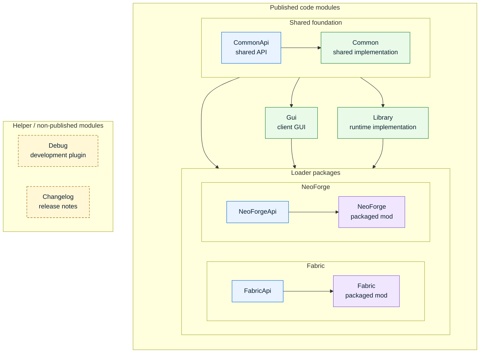

# mezz-JustEnoughItems

## Directory structure

```text
mezz-JustEnoughItems/
├── .github/
│   ├── ISSUE_TEMPLATE/
│   │   ├── bug.yml
│   │   ├── config.yml
│   │   ├── crash.yml
│   │   ├── other.yml
│   │   └── suggestion.yml
│   ├── workflows/
│   │   ├── api-compatibility.yml
│   │   ├── build.yml
│   │   ├── spotless.yml
│   │   ├── stale.yml
│   │   └── tests.yml
│   └── FUNDING.yml
├── .jenkins/
│   ├── Jenkinsfile
│   ├── publishGuard.groovy
│   ├── releaseComments.md
│   └── runWithJvmDiagnostics.py
├── buildSrc/
│   ├── src/
│   │   └── main/
│   │       └── kotlin/
│   │           └── mezz/
│   │               └── jei/
│   │                   └── gradle/
│   │                       ├── GradleProperties.kt
│   │                       ├── IsolatedProjects.kt
│   │                       ├── JeiProject.kt
│   │                       └── UnpackArchives.kt
│   └── build.gradle.kts
├── Changelog/
│   ├── build.gradle.kts
│   ├── changelog-markdown.mustache
│   └── changelog.mustache
├── Common/
│   ├── src/
│   │   ├── clientTestFixtures/
│   │   │   └── java/
│   │   │       └── mezz/
│   │   │           └── jei/
│   │   │               └── test/
│   │   │                   └── client/
│   │   │                       ├── ExternalServerClient.java
│   │   │                       ├── ImeTextInputTestUtil.java
│   │   │                       ├── package-info.java
│   │   │                       └── PreeditBlockingContainerScreen.java
│   │   ├── datagen/
│   │   │   └── java/
│   │   │       └── mezz/
│   │   │           └── jei/
│   │   │               └── common/
│   │   │                   └── gui/
│   │   │                       ├── JeiGuiColorsDataGenerator.java
│   │   │                       └── package-info.java
│   │   ├── main/
│   │   │   ├── java/
│   │   │   │   └── mezz/
│   │   │   │       └── jei/
│   │   │   │           ├── common/
│   │   │   │           │   ├── chat/
│   │   │   │           │   │   ├── JeiChatItemLinkHover.java
│   │   │   │           │   │   ├── JeiChatItemLinkRecipeLookup.java
│   │   │   │           │   │   ├── JeiChatItemLinks.java
│   │   │   │           │   │   └── package-info.java
│   │   │   │           │   ├── codecs/
│   │   │   │           │   │   ├── EnumCodec.java
│   │   │   │           │   │   ├── package-info.java
│   │   │   │           │   │   ├── TupleCodec.java
│   │   │   │           │   │   └── TypedIngredientCodecs.java
│   │   │   │           │   ├── collect/
│   │   │   │           │   │   ├── ListMultiMap.java
│   │   │   │           │   │   ├── MultiMap.java
│   │   │   │           │   │   ├── package-info.java
│   │   │   │           │   │   ├── SetMultiMap.java
│   │   │   │           │   │   └── Table.java
│   │   │   │           │   ├── config/
│   │   │   │           │   │   ├── file/
│   │   │   │           │   │   │   ├── serializers/
│   │   │   │           │   │   │   │   ├── BooleanSerializer.java
│   │   │   │           │   │   │   │   ├── DeserializeResult.java
│   │   │   │           │   │   │   │   ├── EnumSerializer.java
│   │   │   │           │   │   │   │   ├── IntegerSerializer.java
│   │   │   │           │   │   │   │   ├── ListSerializer.java
│   │   │   │           │   │   │   │   └── package-info.java
│   │   │   │           │   │   │   ├── ConfigCategory.java
│   │   │   │           │   │   │   ├── ConfigCategoryBuilder.java
│   │   │   │           │   │   │   ├── ConfigSchema.java
│   │   │   │           │   │   │   ├── ConfigSchemaBuilder.java
│   │   │   │           │   │   │   ├── ConfigSerializer.java
│   │   │   │           │   │   │   ├── ConfigValue.java
│   │   │   │           │   │   │   ├── FileWatcher.java
│   │   │   │           │   │   │   ├── FileWatcherThread.java
│   │   │   │           │   │   │   ├── IConfigCategoryBuilder.java
│   │   │   │           │   │   │   ├── IConfigListener.java
│   │   │   │           │   │   │   ├── IConfigSchema.java
│   │   │   │           │   │   │   ├── IConfigSchemaBuilder.java
│   │   │   │           │   │   │   ├── JsonArrayFileHelper.java
│   │   │   │           │   │   │   ├── JsonArrayWriter.java
│   │   │   │           │   │   │   └── package-info.java
│   │   │   │           │   │   ├── sorting/
│   │   │   │           │   │   │   ├── serializers/
│   │   │   │           │   │   │   │   ├── ISortingSerializer.java
│   │   │   │           │   │   │   │   ├── package-info.java
│   │   │   │           │   │   │   │   └── SortingSerializers.java
│   │   │   │           │   │   │   ├── MappedSortingConfig.java
│   │   │   │           │   │   │   ├── package-info.java
│   │   │   │           │   │   │   └── SortingConfig.java
│   │   │   │           │   │   ├── BookmarkTooltipFeature.java
│   │   │   │           │   │   ├── ClientConfig.java
│   │   │   │           │   │   ├── ClientToggleState.java
│   │   │   │           │   │   ├── ConfigManager.java
│   │   │   │           │   │   ├── DebugConfig.java
│   │   │   │           │   │   ├── GiveMode.java
│   │   │   │           │   │   ├── HistoryDisplaySide.java
│   │   │   │           │   │   ├── IClientConfig.java
│   │   │   │           │   │   ├── IClientToggleState.java
│   │   │   │           │   │   ├── IIngredientFilterConfig.java
│   │   │   │           │   │   ├── IIngredientGridConfig.java
│   │   │   │           │   │   ├── IJeiClientConfigs.java
│   │   │   │           │   │   ├── IngredientFilterConfig.java
│   │   │   │           │   │   ├── IngredientGridConfig.java
│   │   │   │           │   │   ├── IngredientGridLayoutMode.java
│   │   │   │           │   │   ├── IngredientGridNavigationMode.java
│   │   │   │           │   │   ├── IngredientSortStage.java
│   │   │   │           │   │   ├── IServerConfig.java
│   │   │   │           │   │   ├── JeiClientConfigs.java
│   │   │   │           │   │   ├── package-info.java
│   │   │   │           │   │   └── RecipeSorterStage.java
│   │   │   │           │   ├── gui/
│   │   │   │           │   │   ├── elements/
│   │   │   │           │   │   │   ├── DrawableAnimated.java
│   │   │   │           │   │   │   ├── DrawableBlank.java
│   │   │   │           │   │   │   ├── DrawableCombined.java
│   │   │   │           │   │   │   ├── DrawableIngredient.java
│   │   │   │           │   │   │   ├── DrawableResource.java
│   │   │   │           │   │   │   ├── DrawableSprite.java
│   │   │   │           │   │   │   ├── DrawableText.java
│   │   │   │           │   │   │   ├── DrawableWrappedText.java
│   │   │   │           │   │   │   ├── HighResolutionDrawable.java
│   │   │   │           │   │   │   ├── OffsetDrawable.java
│   │   │   │           │   │   │   ├── package-info.java
│   │   │   │           │   │   │   ├── ScalableDrawable.java
│   │   │   │           │   │   │   ├── Scrollbar.java
│   │   │   │           │   │   │   └── TextWidget.java
│   │   │   │           │   │   ├── textures/
│   │   │   │           │   │   │   ├── JeiAtlasManager.java
│   │   │   │           │   │   │   ├── package-info.java
│   │   │   │           │   │   │   └── Textures.java
│   │   │   │           │   │   ├── GridScrollMath.java
│   │   │   │           │   │   ├── IngredientGridTooltipComponent.java
│   │   │   │           │   │   ├── IngredientsTooltipComponent.java
│   │   │   │           │   │   ├── IngredientTooltipComponent.java
│   │   │   │           │   │   ├── JeiGuiColors.java
│   │   │   │           │   │   ├── JeiTooltip.java
│   │   │   │           │   │   ├── OffsetJeiInputHandler.java
│   │   │   │           │   │   ├── package-info.java
│   │   │   │           │   │   ├── RecipeLayoutDrawableErrored.java
│   │   │   │           │   │   └── RecipeSlotOptionsTooltipComponent.java
│   │   │   │           │   ├── ingredients/
│   │   │   │           │   │   ├── itemStacks/
│   │   │   │           │   │   │   ├── FullTypedItemStack.java
│   │   │   │           │   │   │   ├── NormalizedTypedItem.java
│   │   │   │           │   │   │   ├── NormalizedTypedItemStack.java
│   │   │   │           │   │   │   ├── package-info.java
│   │   │   │           │   │   │   └── TypedItemStack.java
│   │   │   │           │   │   ├── ITypedIngredientFactory.java
│   │   │   │           │   │   ├── package-info.java
│   │   │   │           │   │   ├── TypedIngredient.java
│   │   │   │           │   │   └── TypedIngredientUtil.java
│   │   │   │           │   ├── input/
│   │   │   │           │   │   ├── keys/
│   │   │   │           │   │   │   ├── AbstractJeiKeyMappingBuilder.java
│   │   │   │           │   │   │   ├── IJeiKeyMappingBuilder.java
│   │   │   │           │   │   │   ├── IJeiKeyMappingCategoryBuilder.java
│   │   │   │           │   │   │   ├── IJeiKeyMappingInternal.java
│   │   │   │           │   │   │   ├── JeiKeyConflictContext.java
│   │   │   │           │   │   │   ├── JeiKeyModifier.java
│   │   │   │           │   │   │   ├── JeiMultiKeyMapping.java
│   │   │   │           │   │   │   └── package-info.java
│   │   │   │           │   │   ├── ClickableIngredient.java
│   │   │   │           │   │   ├── ClickableIngredientFactory.java
│   │   │   │           │   │   ├── IInternalKeyMappings.java
│   │   │   │           │   │   ├── KeyNameUtil.java
│   │   │   │           │   │   ├── MouseButtonEventData.java
│   │   │   │           │   │   └── package-info.java
│   │   │   │           │   ├── network/
│   │   │   │           │   │   ├── codecs/
│   │   │   │           │   │   │   ├── EnumStreamCodec.java
│   │   │   │           │   │   │   └── package-info.java
│   │   │   │           │   │   ├── packets/
│   │   │   │           │   │   │   ├── handlers/
│   │   │   │           │   │   │   │   ├── ClientCheatPermissionHandler.java
│   │   │   │           │   │   │   │   └── package-info.java
│   │   │   │           │   │   │   ├── package-info.java
│   │   │   │           │   │   │   ├── PacketCheatPermission.java
│   │   │   │           │   │   │   ├── PacketDeletePlayerItem.java
│   │   │   │           │   │   │   ├── PacketGiveItemStack.java
│   │   │   │           │   │   │   ├── PacketRecipeTransfer.java
│   │   │   │           │   │   │   ├── PacketRecipeTransferCounted.java
│   │   │   │           │   │   │   ├── PacketRequestCheatPermission.java
│   │   │   │           │   │   │   ├── PacketSetHotbarItemStack.java
│   │   │   │           │   │   │   ├── PlayToClientPacket.java
│   │   │   │           │   │   │   └── PlayToServerPacket.java
│   │   │   │           │   │   ├── ClientConnectionHelper.java
│   │   │   │           │   │   ├── ClientPacketContext.java
│   │   │   │           │   │   ├── IConnectionToClient.java
│   │   │   │           │   │   ├── IConnectionToServer.java
│   │   │   │           │   │   ├── package-info.java
│   │   │   │           │   │   └── ServerPacketContext.java
│   │   │   │           │   ├── platform/
│   │   │   │           │   │   ├── IPlatformBrewingHelper.java
│   │   │   │           │   │   ├── IPlatformConfigHelper.java
│   │   │   │           │   │   ├── IPlatformFluidHelperInternal.java
│   │   │   │           │   │   ├── IPlatformHelper.java
│   │   │   │           │   │   ├── IPlatformIngredientHelper.java
│   │   │   │           │   │   ├── IPlatformInputHelper.java
│   │   │   │           │   │   ├── IPlatformItemStackHelper.java
│   │   │   │           │   │   ├── IPlatformModHelper.java
│   │   │   │           │   │   ├── IPlatformRecipeHelper.java
│   │   │   │           │   │   ├── IPlatformRenderHelper.java
│   │   │   │           │   │   ├── IPlatformScreenHelper.java
│   │   │   │           │   │   ├── IPlatformWorldHelper.java
│   │   │   │           │   │   ├── ITestHelper.java
│   │   │   │           │   │   ├── package-info.java
│   │   │   │           │   │   └── Services.java
│   │   │   │           │   ├── recipes/
│   │   │   │           │   │   ├── BrewingExtensionHelper.java
│   │   │   │           │   │   ├── package-info.java
│   │   │   │           │   │   ├── TagRecipeUtil.java
│   │   │   │           │   │   └── VanillaClientRecipeLoader.java
│   │   │   │           │   ├── search/
│   │   │   │           │   │   ├── BakedSubstringIndexBuilder.java
│   │   │   │           │   │   ├── BakedSubstringIndexSearchStorage.java
│   │   │   │           │   │   ├── CombinedSearchables.java
│   │   │   │           │   │   ├── GeneralizedSuffixTreeSearchStorage.java
│   │   │   │           │   │   ├── ISearchable.java
│   │   │   │           │   │   ├── LimitedStringStorage.java
│   │   │   │           │   │   ├── LimitedStringStorageBuilder.java
│   │   │   │           │   │   ├── package-info.java
│   │   │   │           │   │   ├── PrefixedSearchable.java
│   │   │   │           │   │   ├── PrefixInfo.java
│   │   │   │           │   │   ├── SearchMode.java
│   │   │   │           │   │   └── SearchStorageBuilderAdapter.java
│   │   │   │           │   ├── transfer/
│   │   │   │           │   │   ├── BasicRecipeTransferHandlerServer.java
│   │   │   │           │   │   ├── package-info.java
│   │   │   │           │   │   ├── RecipeTransferErrorInternal.java
│   │   │   │           │   │   ├── RecipeTransferOperationsResult.java
│   │   │   │           │   │   ├── RecipeTransferUtil.java
│   │   │   │           │   │   └── TransferOperation.java
│   │   │   │           │   ├── util/
│   │   │   │           │   │   ├── function/
│   │   │   │           │   │   │   ├── CachedFunction.java
│   │   │   │           │   │   │   ├── CachedSupplierTransformer.java
│   │   │   │           │   │   │   ├── LazySupplier.java
│   │   │   │           │   │   │   └── package-info.java
│   │   │   │           │   │   ├── ChatUtil.java
│   │   │   │           │   │   ├── DeduplicatingRunner.java
│   │   │   │           │   │   ├── DelayedExecutor.java
│   │   │   │           │   │   ├── DelegatedFuture.java
│   │   │   │           │   │   ├── ErrorUtil.java
│   │   │   │           │   │   ├── ExpandNewLineTextAcceptor.java
│   │   │   │           │   │   ├── IDelayedExecutor.java
│   │   │   │           │   │   ├── ImmutablePoint2i.java
│   │   │   │           │   │   ├── ImmutableRect2i.java
│   │   │   │           │   │   ├── ImmutableSize2i.java
│   │   │   │           │   │   ├── LimitedLogger.java
│   │   │   │           │   │   ├── LoggedTimer.java
│   │   │   │           │   │   ├── MathUtil.java
│   │   │   │           │   │   ├── MinecraftLocaleSupplier.java
│   │   │   │           │   │   ├── NavigationVisibility.java
│   │   │   │           │   │   ├── package-info.java
│   │   │   │           │   │   ├── Pair.java
│   │   │   │           │   │   ├── PathUtil.java
│   │   │   │           │   │   ├── RectDebugger.java
│   │   │   │           │   │   ├── ReflectionUtil.java
│   │   │   │           │   │   ├── RegistryUtil.java
│   │   │   │           │   │   ├── SafeIngredientUtil.java
│   │   │   │           │   │   ├── ServerCommandUtil.java
│   │   │   │           │   │   ├── ServerConfigPathUtil.java
│   │   │   │           │   │   ├── StackHelper.java
│   │   │   │           │   │   ├── StringUtil.java
│   │   │   │           │   │   ├── TagUtil.java
│   │   │   │           │   │   ├── TextHistory.java
│   │   │   │           │   │   ├── TickTimer.java
│   │   │   │           │   │   ├── TimeUtil.java
│   │   │   │           │   │   ├── Translator.java
│   │   │   │           │   │   └── WeakConsumer.java
│   │   │   │           │   ├── Constants.java
│   │   │   │           │   ├── Internal.java
│   │   │   │           │   ├── JeiFeatures.java
│   │   │   │           │   └── package-info.java
│   │   │   │           └── package-info.java
│   │   │   └── resources/
│   │   │       ├── assets/
│   │   │       │   └── jei/
│   │   │       │       ├── atlases/
│   │   │       │       │   └── gui.json
│   │   │       │       ├── lang/
│   │   │       │       │   ├── ar_sa.json
│   │   │       │       │   ├── bg_bg.json
│   │   │       │       │   ├── cs_cz.json
│   │   │       │       │   ├── de_de.json
│   │   │       │       │   ├── el_gr.json
│   │   │       │       │   ├── en_us.json
│   │   │       │       │   ├── es_ar.json
│   │   │       │       │   ├── es_es.json
│   │   │       │       │   ├── fi_fi.json
│   │   │       │       │   ├── fil_ph.json
│   │   │       │       │   ├── fr_fr.json
│   │   │       │       │   ├── he_il.json
│   │   │       │       │   ├── hu_hu.json
│   │   │       │       │   ├── id_id.json
│   │   │       │       │   ├── it_it.json
│   │   │       │       │   ├── ja_jp.json
│   │   │       │       │   ├── kk_kz.json
│   │   │       │       │   ├── ko_kr.json
│   │   │       │       │   ├── lt_lt.json
│   │   │       │       │   ├── lzh.json
│   │   │       │       │   ├── no_no.json
│   │   │       │       │   ├── pl_pl.json
│   │   │       │       │   ├── pt_br.json
│   │   │       │       │   ├── pt_pt.json
│   │   │       │       │   ├── ru_ru.json
│   │   │       │       │   ├── sv_se.json
│   │   │       │       │   ├── tr_tr.json
│   │   │       │       │   ├── uk_ua.json
│   │   │       │       │   ├── vi_vn.json
│   │   │       │       │   ├── zh_cn.json
│   │   │       │       │   └── zh_tw.json
│   │   │       │       └── textures/
│   │   │       │           └── jei/
│   │   │       │               ├── atlas/
│   │   │       │               │   └── gui/
│   │   │       │               │       ├── icons/
│   │   │       │               │       │   ├── arrow_next.png
│   │   │       │               │       │   ├── arrow_previous.png
│   │   │       │               │       │   ├── bookmark_button_disabled.png
│   │   │       │               │       │   ├── bookmark_button_enabled.png
│   │   │       │               │       │   ├── bookmarks_first.png
│   │   │       │               │       │   ├── config_button.png
│   │   │       │               │       │   ├── config_button_cheat.png
│   │   │       │               │       │   ├── craftable_first.png
│   │   │       │               │       │   ├── flame.png
│   │   │       │               │       │   ├── flame_empty.png
│   │   │       │               │       │   ├── history_button_disabled.png
│   │   │       │               │       │   ├── history_button_enabled.png
│   │   │       │               │       │   ├── info.png
│   │   │       │               │       │   ├── list_badge.png
│   │   │       │               │       │   ├── recipe_bookmark.png
│   │   │       │               │       │   ├── recipe_transfer.png
│   │   │       │               │       │   ├── shapeless_icon.png
│   │   │       │               │       │   └── tag_badge.png
│   │   │       │               │       ├── bookmark_list_background.png
│   │   │       │               │       ├── bookmark_list_background.png.mcmeta
│   │   │       │               │       ├── bookmark_list_slot_background.png
│   │   │       │               │       ├── bookmark_list_slot_background.png.mcmeta
│   │   │       │               │       ├── brewing_stand_arrow.png
│   │   │       │               │       ├── brewing_stand_background.png
│   │   │       │               │       ├── brewing_stand_blaze_heat.png
│   │   │       │               │       ├── brewing_stand_bubbles.png
│   │   │       │               │       ├── button_pressed.png
│   │   │       │               │       ├── button_pressed.png.mcmeta
│   │   │       │               │       ├── button_pressed_highlighted.png
│   │   │       │               │       ├── button_pressed_highlighted.png.mcmeta
│   │   │       │               │       ├── catalyst_tab.png
│   │   │       │               │       ├── catalyst_tab.png.mcmeta
│   │   │       │               │       ├── exclusion_area_shadow.png
│   │   │       │               │       ├── exclusion_area_shadow.png.mcmeta
│   │   │       │               │       ├── gui_background.png
│   │   │       │               │       ├── gui_background.png.mcmeta
│   │   │       │               │       ├── ingredient_list_background.png
│   │   │       │               │       ├── ingredient_list_background.png.mcmeta
│   │   │       │               │       ├── ingredient_list_slot_background.png
│   │   │       │               │       ├── ingredient_list_slot_background.png.mcmeta
│   │   │       │               │       ├── interactive_ingredient_tooltip_background.png
│   │   │       │               │       ├── interactive_ingredient_tooltip_background.png.mcmeta
│   │   │       │               │       ├── output_slot.png
│   │   │       │               │       ├── recipe_arrow.png
│   │   │       │               │       ├── recipe_arrow_filled.png
│   │   │       │               │       ├── recipe_catalyst_slot_background.png
│   │   │       │               │       ├── recipe_catalyst_slot_background.png.mcmeta
│   │   │       │               │       ├── recipe_options_tab.png
│   │   │       │               │       ├── recipe_options_tab.png.mcmeta
│   │   │       │               │       ├── recipe_plus_sign.png
│   │   │       │               │       ├── recipe_preview_background.png
│   │   │       │               │       ├── recipe_preview_background.png.mcmeta
│   │   │       │               │       ├── scrollbar_background.png
│   │   │       │               │       ├── scrollbar_background.png.mcmeta
│   │   │       │               │       ├── scrollbar_marker.png
│   │   │       │               │       ├── scrollbar_marker.png.mcmeta
│   │   │       │               │       ├── search_background.png
│   │   │       │               │       ├── search_background.png.mcmeta
│   │   │       │               │       ├── single_recipe_background.png
│   │   │       │               │       ├── single_recipe_background.png.mcmeta
│   │   │       │               │       ├── slot.png
│   │   │       │               │       ├── tab_selected.png
│   │   │       │               │       └── tab_unselected.png
│   │   │       │               └── gui/
│   │   │       │                   └── debug.png
│   │   │       ├── jei-icon.png
│   │   │       └── pack.mcmeta
│   │   ├── test/
│   │   │   └── java/
│   │   │       └── mezz/
│   │   │           └── jei/
│   │   │               ├── common/
│   │   │               │   ├── gui/
│   │   │               │   │   ├── elements/
│   │   │               │   │   │   ├── DrawableSpriteTest.java
│   │   │               │   │   │   ├── package-info.java
│   │   │               │   │   │   └── ScrollbarTest.java
│   │   │               │   │   ├── textures/
│   │   │               │   │   │   ├── JeiAtlasManagerTest.java
│   │   │               │   │   │   └── package-info.java
│   │   │               │   │   ├── GridScrollMathTest.java
│   │   │               │   │   ├── JeiGuiColorsTest.java
│   │   │               │   │   └── package-info.java
│   │   │               │   └── util/
│   │   │               │       └── DelayedExecutorDefaultServiceTest.java
│   │   │               └── test/
│   │   │                   ├── BakedSubstringIndexSearchStorageTest.java
│   │   │                   ├── BrewingExtensionHelperTest.java
│   │   │                   ├── DeduplicatingRunnerTest.java
│   │   │                   ├── DelayedExecutorTest.java
│   │   │                   ├── JsonArrayFileHelperTest.java
│   │   │                   ├── LimitedStringStorageTest.java
│   │   │                   ├── package-info.java
│   │   │                   ├── PathUtilTest.java
│   │   │                   ├── ServerConfigPathUtilTest.java
│   │   │                   ├── TestDelayedExecutor.java
│   │   │                   ├── TickTimerTest.java
│   │   │                   └── VanillaClientRecipeLoaderTest.java
│   │   └── testFixtures/
│   │       └── java/
│   │           └── mezz/
│   │               └── jei/
│   │                   └── test/
│   │                       └── lib/
│   │                           ├── ExternalServerProcess.java
│   │                           ├── JUnitXmlTestReporter.java
│   │                           ├── MinimalWorldGenServerProperties.java
│   │                           ├── package-info.java
│   │                           └── TemporaryDirectory.java
│   └── build.gradle.kts
├── CommonApi/
│   ├── src/
│   │   └── main/
│   │       └── java/
│   │           └── mezz/
│   │               └── jei/
│   │                   └── api/
│   │                       ├── constants/
│   │                       │   ├── ModIds.java
│   │                       │   ├── package-info.java
│   │                       │   ├── RecipeTypes.java
│   │                       │   ├── Tags.java
│   │                       │   └── VanillaTypes.java
│   │                       ├── gui/
│   │                       │   ├── builder/
│   │                       │   │   ├── IClickableIngredientFactory.java
│   │                       │   │   ├── IIngredientAcceptor.java
│   │                       │   │   ├── IRecipeLayoutBuilder.java
│   │                       │   │   ├── IRecipeSlotBuilder.java
│   │                       │   │   ├── ITooltipBuilder.java
│   │                       │   │   └── package-info.java
│   │                       │   ├── buttons/
│   │                       │   │   ├── IButtonState.java
│   │                       │   │   ├── IIconButtonController.java
│   │                       │   │   └── package-info.java
│   │                       │   ├── drawable/
│   │                       │   │   ├── IDrawable.java
│   │                       │   │   ├── IDrawableAnimated.java
│   │                       │   │   ├── IDrawableBuilder.java
│   │                       │   │   ├── IDrawableStatic.java
│   │                       │   │   ├── IScalableDrawable.java
│   │                       │   │   ├── package-info.java
│   │                       │   │   └── TilingDirection.java
│   │                       │   ├── handlers/
│   │                       │   │   ├── IGhostIngredientHandler.java
│   │                       │   │   ├── IGlobalGuiHandler.java
│   │                       │   │   ├── IGuiClickableArea.java
│   │                       │   │   ├── IGuiContainerHandler.java
│   │                       │   │   ├── IGuiProperties.java
│   │                       │   │   ├── IScreenHandler.java
│   │                       │   │   └── package-info.java
│   │                       │   ├── ingredient/
│   │                       │   │   ├── ICraftingGridHelper.java
│   │                       │   │   ├── IRecipeSlotDrawable.java
│   │                       │   │   ├── IRecipeSlotDrawablesView.java
│   │                       │   │   ├── IRecipeSlotRichTooltipCallback.java
│   │                       │   │   ├── IRecipeSlotsView.java
│   │                       │   │   ├── IRecipeSlotView.java
│   │                       │   │   └── package-info.java
│   │                       │   ├── inputs/
│   │                       │   │   ├── IJeiGuiEventListener.java
│   │                       │   │   ├── IJeiInputHandler.java
│   │                       │   │   ├── IJeiUserInput.java
│   │                       │   │   ├── package-info.java
│   │                       │   │   └── RecipeSlotUnderMouse.java
│   │                       │   ├── placement/
│   │                       │   │   ├── HorizontalAlignment.java
│   │                       │   │   ├── IPlaceable.java
│   │                       │   │   ├── package-info.java
│   │                       │   │   └── VerticalAlignment.java
│   │                       │   ├── widgets/
│   │                       │   │   ├── IRecipeExtrasBuilder.java
│   │                       │   │   ├── IRecipeWidget.java
│   │                       │   │   ├── IScrollBoxWidget.java
│   │                       │   │   ├── IScrollGridWidget.java
│   │                       │   │   ├── ISlottedRecipeWidget.java
│   │                       │   │   ├── ITextWidget.java
│   │                       │   │   └── package-info.java
│   │                       │   ├── IRecipeLayoutDrawable.java
│   │                       │   ├── ITickTimer.java
│   │                       │   └── package-info.java
│   │                       ├── helpers/
│   │                       │   ├── ICodecHelper.java
│   │                       │   ├── IColorHelper.java
│   │                       │   ├── IGuiHelper.java
│   │                       │   ├── IJeiHelpers.java
│   │                       │   ├── IModIdHelper.java
│   │                       │   ├── IPlatformFluidHelper.java
│   │                       │   ├── IStackHelper.java
│   │                       │   └── package-info.java
│   │                       ├── ingredients/
│   │                       │   ├── rendering/
│   │                       │   │   ├── BatchRenderElement.java
│   │                       │   │   └── package-info.java
│   │                       │   ├── subtypes/
│   │                       │   │   ├── ISubtypeInterpreter.java
│   │                       │   │   ├── ISubtypeManager.java
│   │                       │   │   ├── package-info.java
│   │                       │   │   └── UidContext.java
│   │                       │   ├── IIngredientHelper.java
│   │                       │   ├── IIngredientRenderer.java
│   │                       │   ├── IIngredientSupplier.java
│   │                       │   ├── IIngredientType.java
│   │                       │   ├── IIngredientTypeWithSubtypes.java
│   │                       │   ├── ISlotDisplayInterpretationBuilder.java
│   │                       │   ├── ISlotDisplayInterpreter.java
│   │                       │   ├── ITypedIngredient.java
│   │                       │   ├── IUniversalSlotDisplayInterpreter.java
│   │                       │   └── package-info.java
│   │                       ├── recipe/
│   │                       │   ├── advanced/
│   │                       │   │   ├── IRecipeButtonControllerFactory.java
│   │                       │   │   ├── IRecipeManagerPlugin.java
│   │                       │   │   ├── IRecipeManagerPluginHelper.java
│   │                       │   │   ├── ISimpleRecipeManagerPlugin.java
│   │                       │   │   └── package-info.java
│   │                       │   ├── category/
│   │                       │   │   ├── extensions/
│   │                       │   │   │   ├── vanilla/
│   │                       │   │   │   │   ├── brewing/
│   │                       │   │   │   │   │   ├── IBrewingCategoryExtension.java
│   │                       │   │   │   │   │   ├── IExtendableBrewingRecipeCategory.java
│   │                       │   │   │   │   │   └── package-info.java
│   │                       │   │   │   │   ├── crafting/
│   │                       │   │   │   │   │   ├── ICraftingCategoryExtension.java
│   │                       │   │   │   │   │   ├── IExtendableCraftingRecipeCategory.java
│   │                       │   │   │   │   │   └── package-info.java
│   │                       │   │   │   │   ├── smithing/
│   │                       │   │   │   │   │   ├── IExtendableSmithingRecipeCategory.java
│   │                       │   │   │   │   │   ├── ISmithingCategoryExtension.java
│   │                       │   │   │   │   │   └── package-info.java
│   │                       │   │   │   │   └── package-info.java
│   │                       │   │   │   ├── IRecipeCategoryDecorator.java
│   │                       │   │   │   ├── IRecipeCategoryExtension.java
│   │                       │   │   │   ├── package-info.java
│   │                       │   │   │   └── Readme.md
│   │                       │   │   ├── AbstractRecipeCategory.java
│   │                       │   │   ├── IRecipeCategory.java
│   │                       │   │   └── package-info.java
│   │                       │   ├── transfer/
│   │                       │   │   ├── IRecipeTransferError.java
│   │                       │   │   ├── IRecipeTransferHandler.java
│   │                       │   │   ├── IRecipeTransferHandlerHelper.java
│   │                       │   │   ├── IRecipeTransferInfo.java
│   │                       │   │   ├── IRecipeTransferManager.java
│   │                       │   │   ├── IUniversalRecipeTransferHandler.java
│   │                       │   │   ├── package-info.java
│   │                       │   │   └── Readme.md
│   │                       │   ├── types/
│   │                       │   │   ├── IRecipeHolderType.java
│   │                       │   │   ├── IRecipeType.java
│   │                       │   │   └── package-info.java
│   │                       │   ├── vanilla/
│   │                       │   │   ├── IJeiAnvilRecipe.java
│   │                       │   │   ├── IJeiBrewingRecipe.java
│   │                       │   │   ├── IJeiCompostingRecipe.java
│   │                       │   │   ├── IJeiFuelingRecipe.java
│   │                       │   │   ├── IJeiGrindstoneRecipe.java
│   │                       │   │   ├── IJeiIngredientInfoRecipe.java
│   │                       │   │   ├── IJeiShapedRecipeBuilder.java
│   │                       │   │   ├── IVanillaRecipeFactory.java
│   │                       │   │   └── package-info.java
│   │                       │   ├── ICraftingStationLookup.java
│   │                       │   ├── IFocus.java
│   │                       │   ├── IFocusFactory.java
│   │                       │   ├── IFocusGroup.java
│   │                       │   ├── IRecipeCatalystLookup.java
│   │                       │   ├── IRecipeCategoriesLookup.java
│   │                       │   ├── IRecipeLookup.java
│   │                       │   ├── IRecipeManager.java
│   │                       │   ├── package-info.java
│   │                       │   ├── RecipeIngredientRole.java
│   │                       │   └── RecipeType.java
│   │                       ├── registration/
│   │                       │   ├── IAdvancedRegistration.java
│   │                       │   ├── IAdvancedSearchRegistration.java
│   │                       │   ├── IExtraIngredientRegistration.java
│   │                       │   ├── IGuiHandlerRegistration.java
│   │                       │   ├── IIngredientAliasRegistration.java
│   │                       │   ├── IModInfoRegistration.java
│   │                       │   ├── IModIngredientRegistration.java
│   │                       │   ├── IRecipeCatalystRegistration.java
│   │                       │   ├── IRecipeCategoryRegistration.java
│   │                       │   ├── IRecipeRegistration.java
│   │                       │   ├── IRecipeTransferRegistration.java
│   │                       │   ├── IRuntimeRegistration.java
│   │                       │   ├── ISlotDisplayInterpreterRegistration.java
│   │                       │   ├── ISubtypeRegistration.java
│   │                       │   ├── IVanillaCategoryExtensionRegistration.java
│   │                       │   ├── package-info.java
│   │                       │   └── Readme.md
│   │                       ├── runtime/
│   │                       │   ├── config/
│   │                       │   │   ├── IJeiConfigCategory.java
│   │                       │   │   ├── IJeiConfigFile.java
│   │                       │   │   ├── IJeiConfigListValueSerializer.java
│   │                       │   │   ├── IJeiConfigManager.java
│   │                       │   │   ├── IJeiConfigValue.java
│   │                       │   │   ├── IJeiConfigValueSerializer.java
│   │                       │   │   └── package-info.java
│   │                       │   ├── IBookmarkOverlay.java
│   │                       │   ├── IClickableIngredient.java
│   │                       │   ├── IEditModeConfig.java
│   │                       │   ├── IIngredientFilter.java
│   │                       │   ├── IIngredientListOverlay.java
│   │                       │   ├── IIngredientManager.java
│   │                       │   ├── IIngredientVisibility.java
│   │                       │   ├── IJeiFeatures.java
│   │                       │   ├── IJeiKeyMapping.java
│   │                       │   ├── IJeiKeyMappings.java
│   │                       │   ├── IJeiRuntime.java
│   │                       │   ├── IRecipesGui.java
│   │                       │   ├── IScreenHelper.java
│   │                       │   ├── package-info.java
│   │                       │   └── Readme.md
│   │                       ├── search/
│   │                       │   ├── ISearchStorage.java
│   │                       │   ├── ISearchStorageBuilder.java
│   │                       │   ├── ISearchStorageBuilderFactory.java
│   │                       │   ├── ISearchStorageFactory.java
│   │                       │   └── package-info.java
│   │                       ├── IModPlugin.java
│   │                       ├── JeiPlugin.java
│   │                       └── package-info.java
│   └── build.gradle.kts
├── Debug/
│   ├── src/
│   │   └── main/
│   │       ├── java/
│   │       │   └── mezz/
│   │       │       └── jei/
│   │       │           └── debug/
│   │       │               ├── ingredients/
│   │       │               │   ├── DebugIngredient.java
│   │       │               │   ├── DebugIngredientHelper.java
│   │       │               │   ├── DebugIngredientListFactory.java
│   │       │               │   ├── DebugIngredientRenderer.java
│   │       │               │   ├── ErrorIngredient.java
│   │       │               │   ├── ErrorIngredientHelper.java
│   │       │               │   ├── ErrorIngredientListFactory.java
│   │       │               │   ├── ErrorIngredientRenderer.java
│   │       │               │   └── package-info.java
│   │       │               ├── DebugBrewingStandScreenHandler.java
│   │       │               ├── DebugCategoryDecorator.java
│   │       │               ├── DebugConfig.java
│   │       │               ├── DebugExclusionAreaHandler.java
│   │       │               ├── DebugFocusRecipeCategory.java
│   │       │               ├── DebugGhostIngredientHandler.java
│   │       │               ├── DebugGhostIngredientHandlerTwo.java
│   │       │               ├── DebugRecipe.java
│   │       │               ├── DebugRecipeCategory.java
│   │       │               ├── DebugSimpleRecipeManagerPlugin.java
│   │       │               ├── ErrorRecipe.java
│   │       │               ├── ErrorRecipeCategory.java
│   │       │               ├── FluidSubtypeHandlerTest.java
│   │       │               ├── JeiDebugPlugin.java
│   │       │               ├── ObnoxiouslyLargeCategory.java
│   │       │               ├── ObnoxiouslyLargeRecipe.java
│   │       │               └── package-info.java
│   │       └── resources/
│   │           ├── assets/
│   │           │   └── jei/
│   │           │       └── lang/
│   │           │           ├── en_us.json
│   │           │           └── es_ar.json
│   │           ├── data/
│   │           │   └── jei/
│   │           │       ├── recipe/
│   │           │       │   ├── diamond_shield_decoration.json
│   │           │       │   └── gold_shield_decoration.json
│   │           │       └── tags/
│   │           │           └── item/
│   │           │               └── shield_decoration_targets/
│   │           │                   ├── diamond.json
│   │           │                   └── gold.json
│   │           ├── META-INF/
│   │           │   └── neoforge.mods.toml
│   │           └── fabric.mod.json
│   └── build.gradle.kts
├── Fabric/
│   ├── src/
│   │   ├── gametest/
│   │   │   ├── java/
│   │   │   │   └── mezz/
│   │   │   │       └── jei/
│   │   │   │           └── fabric/
│   │   │   │               └── test/
│   │   │   │                   ├── ExternalTestServer.java
│   │   │   │                   ├── FluidIngredientGameTests.java
│   │   │   │                   ├── JeiFabricClientGameTestAssertions.java
│   │   │   │                   ├── JeiFabricCreativeInventoryClientGameTest.java
│   │   │   │                   ├── JeiFabricServerWithJeiClientGameTest.java
│   │   │   │                   ├── JeiFabricServerWithoutJeiClientGameTest.java
│   │   │   │                   ├── JeiFabricSingleplayerClientGameTest.java
│   │   │   │                   ├── JeiFabricTextInputClientGameTest.java
│   │   │   │                   ├── JeiVanillaServerWithoutJeiClientGameTest.java
│   │   │   │                   └── package-info.java
│   │   │   ├── resources/
│   │   │   │   └── fabric.mod.json
│   │   │   └── templates/
│   │   │       └── options.txt
│   │   ├── keyMappingGametest/
│   │   │   ├── java/
│   │   │   │   └── mezz/
│   │   │   │       └── jei/
│   │   │   │           └── fabric/
│   │   │   │               └── test/
│   │   │   │                   ├── AmecsKeyMappingClientGameTestHelper.java
│   │   │   │                   ├── JeiFabricKeyMappingClientGameTest.java
│   │   │   │                   └── package-info.java
│   │   │   └── resources/
│   │   │       └── fabric.mod.json
│   │   └── main/
│   │       ├── java/
│   │       │   └── mezz/
│   │       │       └── jei/
│   │       │           └── fabric/
│   │       │               ├── chat/
│   │       │               │   ├── JeiChatEventHandler.java
│   │       │               │   ├── JeiInternalShowCommand.java
│   │       │               │   └── package-info.java
│   │       │               ├── config/
│   │       │               │   ├── package-info.java
│   │       │               │   └── ServerConfig.java
│   │       │               ├── events/
│   │       │               │   ├── JeiCharTypedEvents.java
│   │       │               │   ├── JeiLifecycleEvents.java
│   │       │               │   ├── JeiScreenEvents.java
│   │       │               │   └── package-info.java
│   │       │               ├── ingredients/
│   │       │               │   ├── fluid/
│   │       │               │   │   ├── JeiFluidIngredient.java
│   │       │               │   │   └── package-info.java
│   │       │               │   └── package-info.java
│   │       │               ├── input/
│   │       │               │   ├── AbstractJeiKeyMapping.java
│   │       │               │   ├── AmecsHelper.java
│   │       │               │   ├── AmecsJeiKeyMapping.java
│   │       │               │   ├── AmecsJeiKeyMappingBuilder.java
│   │       │               │   ├── AmecsJeiKeyMappingManagerLayer.java
│   │       │               │   ├── AmecsJeiKeyModifier.java
│   │       │               │   ├── AmecsKeyMappingWithContext.java
│   │       │               │   ├── FabricAmecsSupport.java
│   │       │               │   ├── FabricJeiKeyMapping.java
│   │       │               │   ├── FabricJeiKeyMappingBuilder.java
│   │       │               │   ├── FabricJeiKeyMappingCategoryBuilder.java
│   │       │               │   ├── FabricKeyMapping.java
│   │       │               │   ├── KeyboardHandlerExtension.java
│   │       │               │   └── package-info.java
│   │       │               ├── mixin/
│   │       │               │   ├── AmecsKeyModifiersEarlyInitMixin.java
│   │       │               │   ├── ClientPacketListenerRecipeUpdateMixin.java
│   │       │               │   ├── EffectsInInventoryMixin.java
│   │       │               │   ├── GuiGraphicsExtractorMixin.java
│   │       │               │   ├── KeyboardHandlerMixin.java
│   │       │               │   ├── MinecraftMixin.java
│   │       │               │   ├── package-info.java
│   │       │               │   └── ScreenMixin.java
│   │       │               ├── network/
│   │       │               │   ├── ClientNetworkHandler.java
│   │       │               │   ├── ConnectionToClient.java
│   │       │               │   ├── ConnectionToServer.java
│   │       │               │   ├── package-info.java
│   │       │               │   └── ServerNetworkHandler.java
│   │       │               ├── platform/
│   │       │               │   ├── BrewingHelper.java
│   │       │               │   ├── ConfigHelper.java
│   │       │               │   ├── FluidHelper.java
│   │       │               │   ├── IngredientHelper.java
│   │       │               │   ├── InputHelper.java
│   │       │               │   ├── ItemStackHelper.java
│   │       │               │   ├── ModHelper.java
│   │       │               │   ├── package-info.java
│   │       │               │   ├── PlatformHelper.java
│   │       │               │   ├── RecipeHelper.java
│   │       │               │   ├── RenderHelper.java
│   │       │               │   ├── ScreenHelper.java
│   │       │               │   ├── TestHelper.java
│   │       │               │   └── WorldHelper.java
│   │       │               ├── plugins/
│   │       │               │   ├── fabric/
│   │       │               │   │   ├── FabricGuiPlugin.java
│   │       │               │   │   └── package-info.java
│   │       │               │   └── package-info.java
│   │       │               ├── startup/
│   │       │               │   ├── ClientLifecycleHandler.java
│   │       │               │   ├── EventRegistration.java
│   │       │               │   ├── FabricPluginFinder.java
│   │       │               │   └── package-info.java
│   │       │               ├── JustEnoughItems.java
│   │       │               ├── JustEnoughItemsClient.java
│   │       │               └── package-info.java
│   │       └── resources/
│   │           ├── META-INF/
│   │           │   └── services/
│   │           │       └── mezz.jei.common.platform.IPlatformHelper
│   │           ├── fabric.mod.json
│   │           ├── jei.accesswidener
│   │           └── jei.mixins.json
│   └── build.gradle.kts
├── FabricApi/
│   ├── src/
│   │   └── main/
│   │       └── java/
│   │           └── mezz/
│   │               └── jei/
│   │                   └── api/
│   │                       ├── fabric/
│   │                       │   ├── constants/
│   │                       │   │   ├── FabricTypes.java
│   │                       │   │   └── package-info.java
│   │                       │   ├── ingredients/
│   │                       │   │   ├── fluids/
│   │                       │   │   │   ├── IJeiFluidIngredient.java
│   │                       │   │   │   ├── JeiFluidIngredient.java
│   │                       │   │   │   └── package-info.java
│   │                       │   │   └── package-info.java
│   │                       │   └── package-info.java
│   │                       └── package-info.java
│   └── build.gradle.kts
├── gradle/
│   ├── wrapper/
│   │   ├── gradle-wrapper.jar
│   │   └── gradle-wrapper.properties
│   └── gradle-daemon-jvm.properties
├── Gui/
│   ├── src/
│   │   ├── main/
│   │   │   └── java/
│   │   │       └── mezz/
│   │   │           └── jei/
│   │   │               └── gui/
│   │   │                   ├── bookmarks/
│   │   │                   │   ├── BookmarkCodec.java
│   │   │                   │   ├── BookmarkFactory.java
│   │   │                   │   ├── BookmarkList.java
│   │   │                   │   ├── BookmarkType.java
│   │   │                   │   ├── IBookmark.java
│   │   │                   │   ├── IngredientBookmark.java
│   │   │                   │   ├── package-info.java
│   │   │                   │   └── RecipeBookmark.java
│   │   │                   ├── chat/
│   │   │                   │   ├── ChatIngredientTooltip.java
│   │   │                   │   └── package-info.java
│   │   │                   ├── config/
│   │   │                   │   ├── BookmarkJsonConfig.java
│   │   │                   │   ├── IBookmarkConfig.java
│   │   │                   │   ├── ILookupHistoryConfig.java
│   │   │                   │   ├── IngredientTypeSortingConfig.java
│   │   │                   │   ├── InternalKeyMappings.java
│   │   │                   │   ├── LookupHistoryJsonConfig.java
│   │   │                   │   ├── ModNameSortingConfig.java
│   │   │                   │   └── package-info.java
│   │   │                   ├── elements/
│   │   │                   │   ├── ButtonSprites.java
│   │   │                   │   ├── IconButton.java
│   │   │                   │   ├── InternalIconButton.java
│   │   │                   │   └── package-info.java
│   │   │                   ├── events/
│   │   │                   │   ├── GuiEventHandler.java
│   │   │                   │   └── package-info.java
│   │   │                   ├── filter/
│   │   │                   │   ├── FilterTextSource.java
│   │   │                   │   ├── IFilterTextSource.java
│   │   │                   │   └── package-info.java
│   │   │                   ├── ghost/
│   │   │                   │   ├── GhostIngredientDrag.java
│   │   │                   │   ├── GhostIngredientDragManager.java
│   │   │                   │   ├── GhostIngredientQuickMoveManager.java
│   │   │                   │   ├── GhostIngredientReturning.java
│   │   │                   │   └── package-info.java
│   │   │                   ├── ingredients/
│   │   │                   │   ├── DisplayNameUtil.java
│   │   │                   │   ├── GuiIngredientProperties.java
│   │   │                   │   ├── IListElement.java
│   │   │                   │   ├── IListElementInfo.java
│   │   │                   │   ├── IngredientFilter.java
│   │   │                   │   ├── IngredientFilterApi.java
│   │   │                   │   ├── IngredientListElementFactory.java
│   │   │                   │   ├── IngredientSorter.java
│   │   │                   │   ├── IngredientSorterComparators.java
│   │   │                   │   ├── ListElement.java
│   │   │                   │   ├── ListElementInfo.java
│   │   │                   │   └── package-info.java
│   │   │                   ├── input/
│   │   │                   │   ├── focus/
│   │   │                   │   │   ├── EditBoxFocusHandler.java
│   │   │                   │   │   ├── GuiEventListenerFocusHandler.java
│   │   │                   │   │   ├── IFocusHandler.java
│   │   │                   │   │   ├── package-info.java
│   │   │                   │   │   └── ScreenFocusHandler.java
│   │   │                   │   ├── handlers/
│   │   │                   │   │   ├── BookmarkInputHandler.java
│   │   │                   │   │   ├── ChatLinkInputHandler.java
│   │   │                   │   │   ├── CombinedDragHandler.java
│   │   │                   │   │   ├── CombinedInputHandler.java
│   │   │                   │   │   ├── DeleteItemInputHandler.java
│   │   │                   │   │   ├── DragRouter.java
│   │   │                   │   │   ├── EditInputHandler.java
│   │   │                   │   │   ├── FocusInputHandler.java
│   │   │                   │   │   ├── GlobalInputHandler.java
│   │   │                   │   │   ├── GuiAreaInputHandler.java
│   │   │                   │   │   ├── NullDragHandler.java
│   │   │                   │   │   ├── NullInputHandler.java
│   │   │                   │   │   ├── package-info.java
│   │   │                   │   │   ├── ProxyDragHandler.java
│   │   │                   │   │   ├── ProxyInputHandler.java
│   │   │                   │   │   ├── SameElementInputHandler.java
│   │   │                   │   │   ├── TextFieldInputHandler.java
│   │   │                   │   │   └── UserInputRouter.java
│   │   │                   │   ├── ClickableIngredientInternal.java
│   │   │                   │   ├── ClientInputHandler.java
│   │   │                   │   ├── CombinedRecipeFocusSource.java
│   │   │                   │   ├── DelegatingClickableIngredientInternal.java
│   │   │                   │   ├── DraggableIngredientInternal.java
│   │   │                   │   ├── GuiContainerWrapper.java
│   │   │                   │   ├── GuiTextFieldFilter.java
│   │   │                   │   ├── ICharTypedHandler.java
│   │   │                   │   ├── IClickableIngredientInternal.java
│   │   │                   │   ├── IDraggableIngredientInternal.java
│   │   │                   │   ├── IDragHandler.java
│   │   │                   │   ├── IGuiInputLayer.java
│   │   │                   │   ├── IMouseOverable.java
│   │   │                   │   ├── InputType.java
│   │   │                   │   ├── IPaged.java
│   │   │                   │   ├── IRecipeFocusSource.java
│   │   │                   │   ├── IUserInputHandler.java
│   │   │                   │   ├── KeyUserInput.java
│   │   │                   │   ├── MouseUserInput.java
│   │   │                   │   ├── MouseUtil.java
│   │   │                   │   ├── package-info.java
│   │   │                   │   └── UserInput.java
│   │   │                   ├── network/
│   │   │                   │   └── package-info.java
│   │   │                   ├── overlay/
│   │   │                   │   ├── bookmarks/
│   │   │                   │   │   ├── history/
│   │   │                   │   │   │   ├── ILookupHistoryOverlay.java
│   │   │                   │   │   │   ├── LookupHistory.java
│   │   │                   │   │   │   ├── LookupHistoryButtonController.java
│   │   │                   │   │   │   ├── LookupHistoryOverlay.java
│   │   │                   │   │   │   └── package-info.java
│   │   │                   │   │   ├── BookmarkButtonController.java
│   │   │                   │   │   ├── BookmarkDrag.java
│   │   │                   │   │   ├── BookmarkDragManager.java
│   │   │                   │   │   ├── BookmarkOverlay.java
│   │   │                   │   │   ├── IBookmarkDragTarget.java
│   │   │                   │   │   ├── package-info.java
│   │   │                   │   │   └── PreviewTooltipComponent.java
│   │   │                   │   ├── elements/
│   │   │                   │   │   ├── IElement.java
│   │   │                   │   │   ├── IngredientBookmarkElement.java
│   │   │                   │   │   ├── IngredientElement.java
│   │   │                   │   │   ├── package-info.java
│   │   │                   │   │   ├── RecipeBookmarkElement.java
│   │   │                   │   │   └── TagIngredientElement.java
│   │   │                   │   ├── history/
│   │   │                   │   │   ├── LookupHistoryOverlayLayout.java
│   │   │                   │   │   └── package-info.java
│   │   │                   │   ├── ingredients/
│   │   │                   │   │   ├── GuiExclusionAreaShadow.java
│   │   │                   │   │   ├── IIngredientGrid.java
│   │   │                   │   │   ├── IIngredientGridPageNavigation.java
│   │   │                   │   │   ├── IIngredientGridSource.java
│   │   │                   │   │   ├── IIngredientGridView.java
│   │   │                   │   │   ├── IIngredientListOverlayContents.java
│   │   │                   │   │   ├── IngredientGrid.java
│   │   │                   │   │   ├── IngredientGridButtonNavigationLayout.java
│   │   │                   │   │   ├── IngredientGridLayout.java
│   │   │                   │   │   ├── IngredientGridPageState.java
│   │   │                   │   │   ├── IngredientGridScrollbar.java
│   │   │                   │   │   ├── IngredientGridScrollbarLayout.java
│   │   │                   │   │   ├── IngredientGridScrollController.java
│   │   │                   │   │   ├── IngredientGridScrollState.java
│   │   │                   │   │   ├── IngredientGridTooltipHelper.java
│   │   │                   │   │   ├── IngredientGridWithNavigation.java
│   │   │                   │   │   ├── IngredientGridWithNavigationController.java
│   │   │                   │   │   ├── IngredientGridWithNavigationLayout.java
│   │   │                   │   │   ├── IngredientListRenderer.java
│   │   │                   │   │   ├── IngredientListSlot.java
│   │   │                   │   │   └── package-info.java
│   │   │                   │   ├── ConfigButtonController.java
│   │   │                   │   ├── GuiPropertiesCache.java
│   │   │                   │   ├── IConfigButton.java
│   │   │                   │   ├── IGuiPropertiesCache.java
│   │   │                   │   ├── IngredientListOverlay.java
│   │   │                   │   ├── IngredientListOverlayController.java
│   │   │                   │   ├── IngredientListOverlayLayout.java
│   │   │                   │   ├── IScreenPropertiesUpdater.java
│   │   │                   │   ├── ISearchField.java
│   │   │                   │   └── package-info.java
│   │   │                   ├── plugins/
│   │   │                   │   ├── AbstractContainerScreenHandler.java
│   │   │                   │   ├── ChatScreenHandler.java
│   │   │                   │   ├── JeiGuiPlugin.java
│   │   │                   │   └── package-info.java
│   │   │                   ├── recipes/
│   │   │                   │   ├── layouts/
│   │   │                   │   │   ├── IRecipeLayoutList.java
│   │   │                   │   │   ├── LazyRecipeLayoutList.java
│   │   │                   │   │   └── package-info.java
│   │   │                   │   ├── lookups/
│   │   │                   │   │   ├── FocusedRecipes.java
│   │   │                   │   │   ├── IFocusedRecipes.java
│   │   │                   │   │   ├── ILookupState.java
│   │   │                   │   │   ├── IngredientLookupState.java
│   │   │                   │   │   ├── package-info.java
│   │   │                   │   │   ├── SingleCategoryLookupState.java
│   │   │                   │   │   └── StaticFocusedRecipes.java
│   │   │                   │   ├── CraftingStations.java
│   │   │                   │   ├── InteractiveIngredientGridTooltipComponent.java
│   │   │                   │   ├── InteractiveIngredientTooltip.java
│   │   │                   │   ├── InteractiveIngredientTooltipController.java
│   │   │                   │   ├── IRecipeGuiLogic.java
│   │   │                   │   ├── IRecipeLayoutWithButtons.java
│   │   │                   │   ├── IRecipeLogicStateListener.java
│   │   │                   │   ├── NavigationHistory.java
│   │   │                   │   ├── package-info.java
│   │   │                   │   ├── RecipeBookmarkButtonController.java
│   │   │                   │   ├── RecipeCategoryIconUtil.java
│   │   │                   │   ├── RecipeCategoryTab.java
│   │   │                   │   ├── RecipeCategoryTitle.java
│   │   │                   │   ├── RecipeGuiLayouts.java
│   │   │                   │   ├── RecipeGuiLogic.java
│   │   │                   │   ├── RecipeGuiSizing.java
│   │   │                   │   ├── RecipeGuiTab.java
│   │   │                   │   ├── RecipeGuiTabs.java
│   │   │                   │   ├── RecipeLayoutWithButtons.java
│   │   │                   │   ├── RecipeLayoutWithButtonsErrored.java
│   │   │                   │   ├── RecipeOptionButtons.java
│   │   │                   │   ├── RecipesGui.java
│   │   │                   │   ├── RecipeSlotClickTargetFactory.java
│   │   │                   │   ├── RecipeSlotTooltipPositioner.java
│   │   │                   │   ├── RecipeSortStateButtonController.java
│   │   │                   │   ├── RecipeSortUtil.java
│   │   │                   │   └── RecipeTransferButtonController.java
│   │   │                   ├── search/
│   │   │                   │   ├── ElementPrefixParser.java
│   │   │                   │   ├── ElementSearch.java
│   │   │                   │   ├── ElementSearchLowMem.java
│   │   │                   │   ├── IElementSearch.java
│   │   │                   │   ├── package-info.java
│   │   │                   │   ├── SearchTokenizer.java
│   │   │                   │   └── Token.java
│   │   │                   ├── startup/
│   │   │                   │   ├── GuiConfigData.java
│   │   │                   │   ├── JeiEventHandlers.java
│   │   │                   │   ├── JeiGuiStarter.java
│   │   │                   │   ├── OverlayHelper.java
│   │   │                   │   ├── package-info.java
│   │   │                   │   └── ResourceReloadHandler.java
│   │   │                   ├── util/
│   │   │                   │   ├── AlignmentUtil.java
│   │   │                   │   ├── CommandUtil.java
│   │   │                   │   ├── FocusUtil.java
│   │   │                   │   ├── GiveAmount.java
│   │   │                   │   ├── MaximalRectangle.java
│   │   │                   │   └── package-info.java
│   │   │                   ├── GuiProperties.java
│   │   │                   ├── package-info.java
│   │   │                   └── PageNavigation.java
│   │   └── test/
│   │       └── java/
│   │           └── mezz/
│   │               └── jei/
│   │                   └── gui/
│   │                       ├── overlay/
│   │                       │   ├── history/
│   │                       │   │   ├── LookupHistoryOverlayLayoutTest.java
│   │                       │   │   └── package-info.java
│   │                       │   ├── ingredients/
│   │                       │   │   ├── IngredientGridConfigTest.java
│   │                       │   │   ├── IngredientGridPageStateTest.java
│   │                       │   │   ├── IngredientGridScrollStateTest.java
│   │                       │   │   └── package-info.java
│   │                       │   ├── GuiPropertiesCacheTest.java
│   │                       │   ├── IngredientListOverlayControllerTest.java
│   │                       │   ├── IngredientListOverlayLayoutTest.java
│   │                       │   ├── package-info.java
│   │                       │   ├── TestGuiProperties.java
│   │                       │   └── TestJeiConfigValue.java
│   │                       ├── recipes/
│   │                       │   ├── CraftingStationsTest.java
│   │                       │   ├── NavigationHistoryTest.java
│   │                       │   ├── package-info.java
│   │                       │   └── RecipesGuiTest.java
│   │                       └── search/
│   │                           ├── ElementSearchTest.java
│   │                           ├── package-info.java
│   │                           └── SearchTokenizerTest.java
│   └── build.gradle.kts
├── Library/
│   ├── src/
│   │   ├── main/
│   │   │   └── java/
│   │   │       └── mezz/
│   │   │           └── jei/
│   │   │               └── library/
│   │   │                   ├── color/
│   │   │                   │   ├── ColorGetter.java
│   │   │                   │   ├── ColorHelper.java
│   │   │                   │   ├── ColorName.java
│   │   │                   │   ├── ColorThief.java
│   │   │                   │   ├── ColorUtil.java
│   │   │                   │   ├── MMCQ.java
│   │   │                   │   └── package-info.java
│   │   │                   ├── config/
│   │   │                   │   ├── serializers/
│   │   │                   │   │   ├── ChatFormattingSerializer.java
│   │   │                   │   │   ├── ColorNameSerializer.java
│   │   │                   │   │   └── package-info.java
│   │   │                   │   ├── ColorNameConfig.java
│   │   │                   │   ├── EditModeConfig.java
│   │   │                   │   ├── IModIdFormatConfig.java
│   │   │                   │   ├── ModIdFormatConfig.java
│   │   │                   │   ├── ModIdFormatDetectionHelper.java
│   │   │                   │   ├── package-info.java
│   │   │                   │   ├── RecipeCategorySortingConfig.java
│   │   │                   │   └── StyledTextHelper.java
│   │   │                   ├── focus/
│   │   │                   │   ├── Focus.java
│   │   │                   │   ├── FocusFactory.java
│   │   │                   │   ├── FocusGroup.java
│   │   │                   │   └── package-info.java
│   │   │                   ├── gui/
│   │   │                   │   ├── elements/
│   │   │                   │   │   ├── DrawableBuilder.java
│   │   │                   │   │   └── package-info.java
│   │   │                   │   ├── helpers/
│   │   │                   │   │   ├── CraftingGridHelper.java
│   │   │                   │   │   ├── GuiHelper.java
│   │   │                   │   │   ├── package-info.java
│   │   │                   │   │   └── ScreenHelper.java
│   │   │                   │   ├── ingredients/
│   │   │                   │   │   ├── CycleTicker.java
│   │   │                   │   │   ├── CycleTimer.java
│   │   │                   │   │   ├── ICycler.java
│   │   │                   │   │   ├── package-info.java
│   │   │                   │   │   ├── RecipeSlot.java
│   │   │                   │   │   ├── RecipeSlotIngredients.java
│   │   │                   │   │   ├── RendererOverrides.java
│   │   │                   │   │   └── TagContentTooltipComponent.java
│   │   │                   │   ├── recipes/
│   │   │                   │   │   ├── layout/
│   │   │                   │   │   │   ├── builder/
│   │   │                   │   │   │   │   ├── package-info.java
│   │   │                   │   │   │   │   ├── RecipeLayoutBuilder.java
│   │   │                   │   │   │   │   └── RecipeSlotBuilder.java
│   │   │                   │   │   │   └── package-info.java
│   │   │                   │   │   ├── supplier/
│   │   │                   │   │   │   ├── builder/
│   │   │                   │   │   │   │   ├── IngredientSlotBuilder.java
│   │   │                   │   │   │   │   ├── IngredientSupplierBuilder.java
│   │   │                   │   │   │   │   └── package-info.java
│   │   │                   │   │   │   └── package-info.java
│   │   │                   │   │   ├── IngredientsTooltipCallback.java
│   │   │                   │   │   ├── OutputSlotTooltipCallback.java
│   │   │                   │   │   ├── package-info.java
│   │   │                   │   │   ├── RecipeLayout.java
│   │   │                   │   │   ├── RecipeLayoutInputHandler.java
│   │   │                   │   │   ├── RecipesGuiDummy.java
│   │   │                   │   │   └── ShapelessIcon.java
│   │   │                   │   ├── widgets/
│   │   │                   │   │   ├── AbstractScrollWidget.java
│   │   │                   │   │   ├── package-info.java
│   │   │                   │   │   ├── ScrollBoxRecipeWidget.java
│   │   │                   │   │   └── ScrollGridRecipeWidget.java
│   │   │                   │   ├── BookmarkOverlayDummy.java
│   │   │                   │   ├── GuiContainerHandlers.java
│   │   │                   │   ├── IngredientListOverlayDummy.java
│   │   │                   │   └── package-info.java
│   │   │                   ├── helpers/
│   │   │                   │   ├── CodecHelper.java
│   │   │                   │   ├── ModIdHelper.java
│   │   │                   │   └── package-info.java
│   │   │                   ├── ingredients/
│   │   │                   │   ├── subtypes/
│   │   │                   │   │   ├── package-info.java
│   │   │                   │   │   ├── SubtypeInterpreters.java
│   │   │                   │   │   └── SubtypeManager.java
│   │   │                   │   ├── DisplayIngredientAcceptor.java
│   │   │                   │   ├── IIngredientManagerInternal.java
│   │   │                   │   ├── IngredientBlacklistInternal.java
│   │   │                   │   ├── IngredientFilterApiDummy.java
│   │   │                   │   ├── IngredientInfo.java
│   │   │                   │   ├── IngredientManager.java
│   │   │                   │   ├── IngredientSet.java
│   │   │                   │   ├── IngredientVisibility.java
│   │   │                   │   ├── package-info.java
│   │   │                   │   ├── RecipeIngredientSupplier.java
│   │   │                   │   ├── RegisteredIngredientIndex.java
│   │   │                   │   ├── RegisteredIngredients.java
│   │   │                   │   ├── SimpleIngredientAcceptor.java
│   │   │                   │   ├── SlotDisplayData.java
│   │   │                   │   ├── SlotDisplayInfo.java
│   │   │                   │   ├── SlotDisplayIngredientExpander.java
│   │   │                   │   ├── SlotDisplayIngredientResolver.java
│   │   │                   │   ├── SlotDisplayInterpretationBuilder.java
│   │   │                   │   ├── SlotDisplayInterpreterRegistry.java
│   │   │                   │   └── SlotIngredient.java
│   │   │                   ├── load/
│   │   │                   │   ├── registration/
│   │   │                   │   │   ├── AdvancedRegistration.java
│   │   │                   │   │   ├── AdvancedSearchRegistration.java
│   │   │                   │   │   ├── GuiHandlerRegistration.java
│   │   │                   │   │   ├── IngredientManagerBuilder.java
│   │   │                   │   │   ├── ModInfoRegistration.java
│   │   │                   │   │   ├── package-info.java
│   │   │                   │   │   ├── RecipeCatalystRegistration.java
│   │   │                   │   │   ├── RecipeCategoryRegistration.java
│   │   │                   │   │   ├── RecipeManagerPluginHelper.java
│   │   │                   │   │   ├── RecipeRegistration.java
│   │   │                   │   │   ├── RecipeTransferRegistration.java
│   │   │                   │   │   ├── RuntimeRegistration.java
│   │   │                   │   │   ├── SingleTypeRecipeManagerPluginAdapter.java
│   │   │                   │   │   ├── SlotDisplayInterpreterRegistration.java
│   │   │                   │   │   ├── SubtypeRegistration.java
│   │   │                   │   │   └── VanillaCategoryExtensionRegistration.java
│   │   │                   │   ├── package-info.java
│   │   │                   │   ├── PluginCaller.java
│   │   │                   │   ├── PluginCallerTimer.java
│   │   │                   │   ├── PluginCallerTimerRunnable.java
│   │   │                   │   ├── PluginHelper.java
│   │   │                   │   └── PluginLoader.java
│   │   │                   ├── plugins/
│   │   │                   │   ├── jei/
│   │   │                   │   │   ├── info/
│   │   │                   │   │   │   ├── IngredientInfoRecipe.java
│   │   │                   │   │   │   ├── IngredientInfoRecipeCategory.java
│   │   │                   │   │   │   └── package-info.java
│   │   │                   │   │   ├── tags/
│   │   │                   │   │   │   ├── ITagInfoRecipe.java
│   │   │                   │   │   │   ├── package-info.java
│   │   │                   │   │   │   ├── TagInfoRecipe.java
│   │   │                   │   │   │   ├── TagInfoRecipeCategory.java
│   │   │                   │   │   │   └── TagInfoRecipeMaker.java
│   │   │                   │   │   ├── JeiInternalPlugin.java
│   │   │                   │   │   └── package-info.java
│   │   │                   │   ├── vanilla/
│   │   │                   │   │   ├── anvil/
│   │   │                   │   │   │   ├── AnvilHelper.java
│   │   │                   │   │   │   ├── AnvilRecipe.java
│   │   │                   │   │   │   ├── AnvilRecipeCategory.java
│   │   │                   │   │   │   ├── AnvilRecipeMaker.java
│   │   │                   │   │   │   ├── package-info.java
│   │   │                   │   │   │   ├── SmithingCategoryExtension.java
│   │   │                   │   │   │   ├── SmithingRecipeCategory.java
│   │   │                   │   │   │   ├── SmithingTransformCategoryExtension.java
│   │   │                   │   │   │   └── SmithingTrimCategoryExtension.java
│   │   │                   │   │   ├── brewing/
│   │   │                   │   │   │   ├── BrewingRecipeCategory.java
│   │   │                   │   │   │   ├── BrewingRecipeUtil.java
│   │   │                   │   │   │   ├── JeiBrewingRecipe.java
│   │   │                   │   │   │   └── package-info.java
│   │   │                   │   │   ├── compostable/
│   │   │                   │   │   │   ├── CompostableRecipeCategory.java
│   │   │                   │   │   │   ├── CompostingRecipe.java
│   │   │                   │   │   │   ├── CompostingRecipeMaker.java
│   │   │                   │   │   │   └── package-info.java
│   │   │                   │   │   ├── cooking/
│   │   │                   │   │   │   ├── fuel/
│   │   │                   │   │   │   │   ├── AbstractFuelCategory.java
│   │   │                   │   │   │   │   ├── BlastingFuelCategory.java
│   │   │                   │   │   │   │   ├── FuelingRecipe.java
│   │   │                   │   │   │   │   ├── FuelRecipeMaker.java
│   │   │                   │   │   │   │   ├── package-info.java
│   │   │                   │   │   │   │   ├── SmeltingFuelCategory.java
│   │   │                   │   │   │   │   └── SmokingFuelCategory.java
│   │   │                   │   │   │   ├── AbstractCookingCategory.java
│   │   │                   │   │   │   ├── BlastingCategory.java
│   │   │                   │   │   │   ├── CampfireCookingCategory.java
│   │   │                   │   │   │   ├── FurnaceRecipeMaker.java
│   │   │                   │   │   │   ├── FurnaceRecipeTransferInfo.java
│   │   │                   │   │   │   ├── FurnaceSmeltingCategory.java
│   │   │                   │   │   │   ├── JeiSmeltingRecipe.java
│   │   │                   │   │   │   ├── package-info.java
│   │   │                   │   │   │   └── SmokingCategory.java
│   │   │                   │   │   ├── crafting/
│   │   │                   │   │   │   ├── replacers/
│   │   │                   │   │   │   │   ├── IRecipeReplacer.java
│   │   │                   │   │   │   │   ├── package-info.java
│   │   │                   │   │   │   │   ├── ShieldDecorationRecipeMaker.java
│   │   │                   │   │   │   │   └── TippedArrowRecipeMaker.java
│   │   │                   │   │   │   ├── CraftingCategoryExtension.java
│   │   │                   │   │   │   ├── CraftingRecipeCategory.java
│   │   │                   │   │   │   ├── JeiShapedRecipe.java
│   │   │                   │   │   │   ├── JeiShapedRecipeBuilder.java
│   │   │                   │   │   │   ├── package-info.java
│   │   │                   │   │   │   └── VanillaRecipes.java
│   │   │                   │   │   ├── grindstone/
│   │   │                   │   │   │   ├── GrindstoneRecipe.java
│   │   │                   │   │   │   ├── GrindstoneRecipeCategory.java
│   │   │                   │   │   │   ├── GrindstoneRecipeMaker.java
│   │   │                   │   │   │   └── package-info.java
│   │   │                   │   │   ├── gui/
│   │   │                   │   │   │   ├── InventoryEffectRendererGuiHandler.java
│   │   │                   │   │   │   ├── package-info.java
│   │   │                   │   │   │   ├── RecipeBookGuiHandler.java
│   │   │                   │   │   │   └── ToastGuiHandler.java
│   │   │                   │   │   ├── ingredients/
│   │   │                   │   │   │   ├── fluid/
│   │   │                   │   │   │   │   ├── FluidIngredientHelper.java
│   │   │                   │   │   │   │   ├── FluidStackListFactory.java
│   │   │                   │   │   │   │   └── package-info.java
│   │   │                   │   │   │   ├── subtypes/
│   │   │                   │   │   │   │   ├── EnchantedBookSubtypeInterpreter.java
│   │   │                   │   │   │   │   ├── LightSubtypeInterpreter.java
│   │   │                   │   │   │   │   ├── package-info.java
│   │   │                   │   │   │   │   └── PotionSubtypeInterpreter.java
│   │   │                   │   │   │   ├── ItemStackCodecs.java
│   │   │                   │   │   │   ├── ItemStackHelper.java
│   │   │                   │   │   │   ├── ItemStackListFactory.java
│   │   │                   │   │   │   └── package-info.java
│   │   │                   │   │   ├── stonecutting/
│   │   │                   │   │   │   ├── package-info.java
│   │   │                   │   │   │   └── StoneCuttingRecipeCategory.java
│   │   │                   │   │   ├── package-info.java
│   │   │                   │   │   ├── VanillaPlugin.java
│   │   │                   │   │   └── VanillaRecipeFactory.java
│   │   │                   │   └── package-info.java
│   │   │                   ├── recipes/
│   │   │                   │   ├── collect/
│   │   │                   │   │   ├── IngredientToRecipesMap.java
│   │   │                   │   │   ├── IngredientUidIndex.java
│   │   │                   │   │   ├── package-info.java
│   │   │                   │   │   ├── RecipeIngredientRoleMap.java
│   │   │                   │   │   ├── RecipeIngredientTable.java
│   │   │                   │   │   ├── RecipeTypeData.java
│   │   │                   │   │   └── RecipeTypeDataMap.java
│   │   │                   │   ├── CraftingExtensionHelper.java
│   │   │                   │   ├── CraftingStationBuilder.java
│   │   │                   │   ├── CraftingStationLookup.java
│   │   │                   │   ├── InternalRecipeManagerPlugin.java
│   │   │                   │   ├── package-info.java
│   │   │                   │   ├── PluginManager.java
│   │   │                   │   ├── RecipeCategoriesLookup.java
│   │   │                   │   ├── RecipeLookup.java
│   │   │                   │   ├── RecipeManager.java
│   │   │                   │   ├── RecipeManagerInternal.java
│   │   │                   │   ├── RecipeSerializers.java
│   │   │                   │   ├── RecipeTransferManager.java
│   │   │                   │   └── UniversalRecipeTransferHandlerAdapter.java
│   │   │                   ├── render/
│   │   │                   │   ├── batch/
│   │   │                   │   │   ├── IItemStackBatchRenderer.java
│   │   │                   │   │   ├── package-info.java
│   │   │                   │   │   └── SimpleItemStackBatchRenderer.java
│   │   │                   │   ├── FluidTankRenderer.java
│   │   │                   │   ├── ItemStackRenderer.java
│   │   │                   │   └── package-info.java
│   │   │                   ├── runtime/
│   │   │                   │   ├── JeiHelpers.java
│   │   │                   │   ├── JeiRuntime.java
│   │   │                   │   └── package-info.java
│   │   │                   ├── startup/
│   │   │                   │   ├── IStopCallback.java
│   │   │                   │   ├── JeiStarter.java
│   │   │                   │   ├── package-info.java
│   │   │                   │   ├── PluginAwareJeiFeatures.java
│   │   │                   │   └── StartData.java
│   │   │                   ├── transfer/
│   │   │                   │   ├── BasicRecipeTransferHandler.java
│   │   │                   │   ├── BasicRecipeTransferInfo.java
│   │   │                   │   ├── package-info.java
│   │   │                   │   ├── PlayerRecipeTransferHandler.java
│   │   │                   │   ├── RecipeTransferErrorMissingSlots.java
│   │   │                   │   ├── RecipeTransferErrorTooltip.java
│   │   │                   │   └── RecipeTransferHandlerHelper.java
│   │   │                   ├── util/
│   │   │                   │   ├── BrewingRecipeMakerCommon.java
│   │   │                   │   ├── IngredientSupplierHelper.java
│   │   │                   │   ├── package-info.java
│   │   │                   │   ├── RecipeDebugUtil.java
│   │   │                   │   └── ResourceLocationUtil.java
│   │   │                   └── package-info.java
│   │   └── test/
│   │       └── java/
│   │           └── mezz/
│   │               └── jei/
│   │                   ├── library/
│   │                   │   ├── ingredients/
│   │                   │   │   ├── RegisteredIngredientIndexTest.java
│   │                   │   │   └── SlotDisplayInterpretationBuilderTest.java
│   │                   │   └── recipes/
│   │                   │       └── collect/
│   │                   │           └── IngredientUidIndexTest.java
│   │                   └── test/
│   │                       ├── AdvancedSearchRegistrationTest.java
│   │                       ├── ColorThiefTest.java
│   │                       ├── CraftingCategoryExtensionTest.java
│   │                       ├── DummyColorHelper.java
│   │                       ├── IngredientAliasTest.java
│   │                       ├── InternalRecipeManagerPluginTest.java
│   │                       ├── package-info.java
│   │                       ├── RecipeSlotIngredientGroupingTest.java
│   │                       ├── ScreenHelperTest.java
│   │                       ├── SlotDisplayIngredientResolverTest.java
│   │                       └── StyledTextHelperTest.java
│   └── build.gradle.kts
├── NeoForge/
│   ├── src/
│   │   ├── clientGameTest/
│   │   │   ├── java/
│   │   │   │   └── mezz/
│   │   │   │       └── jei/
│   │   │   │           └── neoforge/
│   │   │   │               └── tests/
│   │   │   │                   └── client/
│   │   │   │                       ├── ClientTestUtil.java
│   │   │   │                       ├── JeiNeoForgeClientRecipeSyncTests.java
│   │   │   │                       ├── JeiNeoForgeClientResourceTests.java
│   │   │   │                       ├── JeiNeoForgeClientTests.java
│   │   │   │                       ├── JeiNeoForgeClientTextInputTests.java
│   │   │   │                       ├── NeoForgeExternalTestServer.java
│   │   │   │                       └── package-info.java
│   │   │   ├── resources/
│   │   │   │   └── META-INF/
│   │   │   │       └── neoforge.mods.toml
│   │   │   └── templates/
│   │   │       ├── config/
│   │   │       │   └── fml.toml
│   │   │       ├── resourcepacks/
│   │   │       │   └── jei-client-test-pack/
│   │   │       │       └── pack.mcmeta
│   │   │       └── options.txt
│   │   ├── gameTest/
│   │   │   ├── java/
│   │   │   │   └── mezz/
│   │   │   │       └── jei/
│   │   │   │           └── neoforge/
│   │   │   │               └── tests/
│   │   │   │                   ├── bookmarks/
│   │   │   │                   │   ├── BookmarkFactoryGameTests.java
│   │   │   │                   │   └── package-info.java
│   │   │   │                   ├── commands/
│   │   │   │                   │   ├── package-info.java
│   │   │   │                   │   └── ServerCommandUtilGameTests.java
│   │   │   │                   ├── config/
│   │   │   │                   │   ├── ModIdFormatConfigGameTests.java
│   │   │   │                   │   └── package-info.java
│   │   │   │                   ├── lib/
│   │   │   │                   │   ├── FailedTestExceptionSummaryDumper.java
│   │   │   │                   │   ├── JeiGameTestHelper.java
│   │   │   │                   │   ├── MenuChecker.java
│   │   │   │                   │   ├── MenuFactory.java
│   │   │   │                   │   ├── package-info.java
│   │   │   │                   │   ├── StackPlacement.java
│   │   │   │                   │   ├── TargetSlots.java
│   │   │   │                   │   ├── TestConnectionToClient.java
│   │   │   │                   │   ├── TestConnectionToServer.java
│   │   │   │                   │   ├── TestGuiHelper.java
│   │   │   │                   │   ├── TestIngredientManagers.java
│   │   │   │                   │   ├── TestRecipes.java
│   │   │   │                   │   ├── TestRecipeSlotView.java
│   │   │   │                   │   ├── TestServerConfig.java
│   │   │   │                   │   ├── TestStackHelper.java
│   │   │   │                   │   └── TransferRecipe.java
│   │   │   │                   ├── plugins/
│   │   │   │                   │   ├── vanilla/
│   │   │   │                   │   │   ├── BrewingRecipeMakerGameTests.java
│   │   │   │                   │   │   ├── FluidIngredientGameTests.java
│   │   │   │                   │   │   ├── FurnaceRecipeGameTests.java
│   │   │   │                   │   │   ├── package-info.java
│   │   │   │                   │   │   ├── SlotDisplayIngredientGameTests.java
│   │   │   │                   │   │   └── SyntheticRecipeMakerGameTests.java
│   │   │   │                   │   └── package-info.java
│   │   │   │                   ├── recipe/
│   │   │   │                   │   ├── transfer/
│   │   │   │                   │   │   ├── package-info.java
│   │   │   │                   │   │   ├── RecipeTransferGameTests.java
│   │   │   │                   │   │   ├── RecipeTransferTestHelper.java
│   │   │   │                   │   │   ├── RecipeTransferUtilGameTests.java
│   │   │   │                   │   │   └── TestRecipeTransferRegistration.java
│   │   │   │                   │   └── package-info.java
│   │   │   │                   ├── JeiTests.java
│   │   │   │                   └── package-info.java
│   │   │   └── resources/
│   │   │       ├── data/
│   │   │       │   └── jeitests/
│   │   │       │       ├── recipe/
│   │   │       │       │   ├── diamond_shield_decoration.json
│   │   │       │       │   └── gold_shield_decoration.json
│   │   │       │       └── tags/
│   │   │       │           └── item/
│   │   │       │               └── shield_decoration_targets/
│   │   │       │                   ├── diamond.json
│   │   │       │                   └── gold.json
│   │   │       └── META-INF/
│   │   │           └── neoforge.mods.toml
│   │   ├── main/
│   │   │   ├── java/
│   │   │   │   └── mezz/
│   │   │   │       └── jei/
│   │   │   │           └── neoforge/
│   │   │   │               ├── chat/
│   │   │   │               │   ├── JeiChatEventHandler.java
│   │   │   │               │   ├── JeiChatTooltipEventHandler.java
│   │   │   │               │   ├── JeiInternalShowCommand.java
│   │   │   │               │   └── package-info.java
│   │   │   │               ├── config/
│   │   │   │               │   ├── package-info.java
│   │   │   │               │   └── ServerConfig.java
│   │   │   │               ├── events/
│   │   │   │               │   ├── EventSubscription.java
│   │   │   │               │   ├── package-info.java
│   │   │   │               │   ├── PermanentEventSubscriptions.java
│   │   │   │               │   └── RuntimeEventSubscriptions.java
│   │   │   │               ├── input/
│   │   │   │               │   ├── ForgeJeiKeyMappingBuilder.java
│   │   │   │               │   ├── ForgeJeiKeyMappingCategoryBuilder.java
│   │   │   │               │   ├── ForgeUserInput.java
│   │   │   │               │   ├── JeiForgeKeyConflictContexts.java
│   │   │   │               │   ├── NeoForgeJeiKeyMapping.java
│   │   │   │               │   └── package-info.java
│   │   │   │               ├── mixin/
│   │   │   │               │   ├── KeyboardHandlerMixin.java
│   │   │   │               │   └── package-info.java
│   │   │   │               ├── network/
│   │   │   │               │   ├── ConnectionToClient.java
│   │   │   │               │   ├── ConnectionToServer.java
│   │   │   │               │   ├── NetworkHandler.java
│   │   │   │               │   └── package-info.java
│   │   │   │               ├── platform/
│   │   │   │               │   ├── BrewingHelper.java
│   │   │   │               │   ├── BrewingRecipeCategoryExtension.java
│   │   │   │               │   ├── ConfigHelper.java
│   │   │   │               │   ├── FluidHelper.java
│   │   │   │               │   ├── IngredientHelper.java
│   │   │   │               │   ├── InputHelper.java
│   │   │   │               │   ├── ItemStackHelper.java
│   │   │   │               │   ├── ModHelper.java
│   │   │   │               │   ├── package-info.java
│   │   │   │               │   ├── PlatformHelper.java
│   │   │   │               │   ├── RecipeHelper.java
│   │   │   │               │   ├── RenderHelper.java
│   │   │   │               │   ├── ScreenHelper.java
│   │   │   │               │   ├── TestHelper.java
│   │   │   │               │   └── WorldHelper.java
│   │   │   │               ├── plugins/
│   │   │   │               │   ├── neoforge/
│   │   │   │               │   │   ├── NeoForgeGuiPlugin.java
│   │   │   │               │   │   └── package-info.java
│   │   │   │               │   └── package-info.java
│   │   │   │               ├── startup/
│   │   │   │               │   ├── EventRegistration.java
│   │   │   │               │   ├── ForgePluginFinder.java
│   │   │   │               │   ├── package-info.java
│   │   │   │               │   └── StartEventObserver.java
│   │   │   │               ├── JustEnoughItems.java
│   │   │   │               ├── JustEnoughItemsClient.java
│   │   │   │               ├── JustEnoughItemsClientSafeRunner.java
│   │   │   │               └── package-info.java
│   │   │   └── resources/
│   │   │       ├── META-INF/
│   │   │       │   ├── services/
│   │   │       │   │   └── mezz.jei.common.platform.IPlatformHelper
│   │   │       │   ├── accesstransformer.cfg
│   │   │       │   └── neoforge.mods.toml
│   │   │       └── jei.neoforge.mixins.json
│   │   └── test/
│   │       └── java/
│   │           └── mezz/
│   │               └── jei/
│   │                   ├── gui/
│   │                   │   ├── input/
│   │                   │   │   ├── focus/
│   │                   │   │   │   ├── package-info.java
│   │                   │   │   │   └── ScreenFocusHandlerTest.java
│   │                   │   │   └── handlers/
│   │                   │   │       ├── CombinedInputHandlerTest.java
│   │                   │   │       └── DragRouterTest.java
│   │                   │   ├── overlay/
│   │                   │   │   ├── elements/
│   │                   │   │   │   ├── package-info.java
│   │                   │   │   │   └── TagIngredientElementTest.java
│   │                   │   │   └── ingredients/
│   │                   │   │       ├── IngredientGridWithNavigationControllerTest.java
│   │                   │   │       └── package-info.java
│   │                   │   └── recipes/
│   │                   │       └── RecipeTransferButtonControllerTest.java
│   │                   ├── neoforge/
│   │                   │   └── startup/
│   │                   │       └── ForgePluginFinderTest.java
│   │                   └── test/
│   │                       ├── lib/
│   │                       │   ├── package-info.java
│   │                       │   ├── TestClientConfig.java
│   │                       │   ├── TestClientToggleState.java
│   │                       │   ├── TestColorHelper.java
│   │                       │   ├── TestIngredient.java
│   │                       │   ├── TestIngredientFilterConfig.java
│   │                       │   ├── TestIngredientHelper.java
│   │                       │   ├── TestIngredientRenderer.java
│   │                       │   ├── TestJeiConfigValue.java
│   │                       │   ├── TestModIdHelper.java
│   │                       │   └── TestPlugin.java
│   │                       ├── ElementSearchIngredientsTest.java
│   │                       ├── IngredientFilterTest.java
│   │                       ├── JeiChatItemLinksTest.java
│   │                       ├── ListElementInfoTest.java
│   │                       └── package-info.java
│   └── build.gradle.kts
├── NeoForgeApi/
│   ├── src/
│   │   └── main/
│   │       └── java/
│   │           └── mezz/
│   │               └── jei/
│   │                   └── api/
│   │                       └── neoforge/
│   │                           ├── NeoForgeTypes.java
│   │                           └── package-info.java
│   └── build.gradle.kts
├── .gitignore
├── .travis.yml
├── build.gradle.kts
├── CONTRIBUTING.md
├── gradle.properties
├── gradlew
├── gradlew.bat
├── LICENSE.txt
├── README.md
├── settings.gradle.kts
└── UNSUPPORTED_VERSIONS.md
```

## File contents

### .github/FUNDING.yml

```yaml
# These are supported funding model platforms

github: # Replace with up to 4 GitHub Sponsors-enabled usernames e.g., [user1, user2]
patreon: mezz # Replace with a single Patreon username
open_collective: # Replace with a single Open Collective username
ko_fi: # Replace with a single Ko-fi username
tidelift: # Replace with a single Tidelift platform-name/package-name e.g., npm/babel
community_bridge: # Replace with a single Community Bridge project-name e.g., cloud-foundry
liberapay: # Replace with a single Liberapay username
issuehunt: # Replace with a single IssueHunt username
lfx_crowdfunding: # Replace with a single LFX Crowdfunding project-name e.g., cloud-foundry
polar: # Replace with a single Polar username
buy_me_a_coffee: # Replace with a single Buy Me a Coffee username
thanks_dev: # Replace with a single thanks.dev username
custom: # Replace with up to 4 custom sponsorship URLs e.g., ['link1', 'link2']
```

### .github/ISSUE_TEMPLATE/bug.yml

```yaml
name: Bug report
description: >-
  Please use this template when you have encountered a bug in JEI.  
  If the issue seems to affect only one mod, please report to them first instead of here.
title: '[Bug]: '
body:
  - type: textarea
    id: repro_steps
    attributes:
      label: Steps to Reproduce the Bug
      description: Please explain what we need to do to cause the bug.
      placeholder: >-
        Example:  
        
        1. Hold Shift   
        2. Click the anvil in the JEI ingredient list on the left side.
    validations:
      required: true
  - type: textarea
    id: expected_behavior
    attributes:
      label: Expected Behavior
      description: >-
        Please explain what should happen when you follow the steps, if the bug
        were fixed.
      placeholder: >-
        Example:  
        Following the steps to reproduce the bug, JEI should just show
        the anvil recipe.
    validations:
      required: true
  - type: textarea
    id: actual_behavior
    attributes:
      label: Actual Behavior
      description: >-
        Please briefly explain what actually happens when you follow the steps,
        because of the bug.
      placeholder: >-
        Example:  
        Nothing happens, the anvil recipe isn't shown.
    validations:
      required: true
  - type: input
    id: modpack_url
    attributes:
      label: Mod Pack URL (Optional)
      description: >-
        If you're playing with a mod pack, please include a link to it here.
      placeholder: http://www.Biggest-Modpack-Ever.com
  - type: input
    id: modpack_version
    attributes:
      label: Mod Pack Version (Optional)
      description: >-
        If you're playing with a mod pack, please include its version here.
      placeholder: 0.0.1 Alpha
  - type: textarea
    id: notes
    attributes:
      label: Extra Notes (Optional)
      description: >-
        Optionally, please include anything else you'd like to say about the bug.
      placeholder: >-
        Example:  
        You can work around this bug for now by avoiding holding shift.
    validations:
      required: false
  - type: markdown
    attributes:
      value: >-
        ## Sharing your `latest.log`

        In order to diagnose a bug, we will need to see your `latest.log`.  

        To share your `latest.log` here, please follow these steps:


        1. If you don't have it already, find your `latest.log` file.  

        a. [Find your minecraft
        folder](https://stickypiston.co/account/knowledgebase/130/How-do-I-find-my-Minecraft-Folder.html)   

        b. In the minecraft folder, go into the `logs` folder and find the
        `latest.log` file.

        1. Create a Gist from the `latest.log`, and copy the url.  

        [Click here for instructions on creating a
        Gist](https://gist.github.com/mezz/c3f0931344d81afd366e0d85a8ed1031)
  - type: input
    id: crashlog
    attributes:
      label: latest.log
      description: Please paste the url to the gist containing your `latest.log` file.
      placeholder: https://gist.github.com/<your_user_name>/<gist_id>
```

### .github/ISSUE_TEMPLATE/config.yml

```yaml
blank_issues_enabled: false
contact_links:
  - name: Questions
    url: https://discord.gg/sCQcWU2
    about: Please ask questions on JEI's Discord.
  - name: Developer Help
    url: https://discord.gg/sCQcWU2
    about: Get help with developing your JEI Plugin on JEI's Discord.
```

### .github/ISSUE_TEMPLATE/crash.yml

```yaml
name: Crash report
description: >-
  Please use this template when JEI has caused your game client to crash.  
  If the issue seems to affect only one mod, please report to them first instead of here.
title: '[Crash]: '
body:
  - type: textarea
    id: repro_steps
    attributes:
      label: Steps to Reproduce the Crash
      description: Please explain what we need to do to cause the crash.
      placeholder: >-
        Example:  
        
        1. Open the Brewing Stand GUI.  
        3. Click the JEI config button.
    validations:
      required: true
  - type: input
    id: modpack_url
    attributes:
      label: Mod Pack URL (Optional)
      description: >-
        If you're playing with a mod pack, please include a link to it here.
      placeholder: http://www.Biggest-Modpack-Ever.com
  - type: input
    id: modpack_version
    attributes:
      label: Mod Pack Version (Optional)
      description: >-
        If you're playing with a mod pack, please include its version here.
      placeholder: 0.0.1 Alpha
  - type: textarea
    id: notes
    attributes:
      label: Extra Notes (Optional)
      description: >-
        Optionally, please include anything else you'd like to say about the crash.
      placeholder: >-
        Example:  
        I warned everyone on my server not to do this, so nobody is crashing any more. 
        I just thought I should let you know so you can fix it, thanks!
    validations:
      required: false
  - type: markdown
    attributes:
      value: >-
        ## Sharing your Crash Report
        
        In order to diagnose a crash, we will need to see your client crash
        report.  

        To share your client crash report here, please follow these steps:


        1. If you don't have it already, find your client crash report file.  

        a. [Find your minecraft
        folder](https://stickypiston.co/account/knowledgebase/130/How-do-I-find-my-Minecraft-Folder.html)   

        b. In the minecraft folder, go into the `crash-reports` folder and find
        the most recent client crash report file.

        1. Create a Gist from the client crash report file, and copy the url.  

        [Click here for instructions on creating a
        Gist](https://gist.github.com/mezz/c3f0931344d81afd366e0d85a8ed1031)
  - type: input
    id: crashlog
    attributes:
      label: Crash Report
      description: >-
        Please paste the url to the gist containing your client crash report.
      placeholder: https://gist.github.com/<your_user_name>/<gist_id>
    validations:
      required: true
```

### .github/ISSUE_TEMPLATE/other.yml

```yaml
name: Other
description: >-
  Please use this template when the other templates don't seem to match what you need.  
title: '[Other]: '
body:
  - type: textarea
    id: other
    attributes:
      label: Other
      placeholder: >-
        Example:  
        Hey, I don't know where else to put this but...   
        I was visiting my family in Canada and my older brother showed me this short video clip he took
        of his city's mayor playing Modded Minecraft but he didn't know any of the JEI hotkeys,
        check it out! <link>
    validations:
      required: true
```

### .github/ISSUE_TEMPLATE/suggestion.yml

```yaml
name: Suggestion
description: >-
  Please use this template when you want to suggest a feature for JEI.  
title: '[Suggestion]: '
body:
  - type: textarea
    id: suggestion
    attributes:
      label: Suggestion
      placeholder: >-
        Example:  
        Please add support for the new StoneCutter recipes that were recently introduced in the vanilla game.  
        You can find out about them here: https://minecraft.fandom.com/wiki/Stonecutter
        JEI already supports most kinds of vanilla recipes so I think this would be a good addition.
    validations:
      required: true
```

### .github/workflows/api-compatibility.yml

```yaml
name: 'API Compatibility'

on:
  push:
    branches:
      - '26.2'
  pull_request:

permissions:
  contents: read

concurrency:
  group: ${{ github.workflow }}-${{ github.event.pull_request.number || github.ref }}
  cancel-in-progress: true

jobs:
  api-compatibility:
    name: API Compatibility
    runs-on: ubuntu-latest
    steps:
      - name: Checkout
        uses: actions/checkout@v7
        with:
          persist-credentials: false

      - name: Set up JDK 25
        uses: actions/setup-java@v5
        with:
          distribution: 'microsoft'
          java-version: '25'

      - name: Validate wrapper
        uses: gradle/actions/wrapper-validation@v6

      - name: Setup Gradle
        uses: gradle/actions/setup-gradle@v6
        with:
          gradle-version: wrapper
          cache-read-only: ${{ github.event_name == 'pull_request' }}

      - name: Check API compatibility
        run: ./gradlew checkApiCompatibility --no-daemon
```

### .github/workflows/build.yml

```yaml
name: 'Build'

on:
  push:
    branches:
      - '26.2'
  pull_request:

permissions:
  contents: read

concurrency:
  group: ${{ github.workflow }}-${{ github.event.pull_request.number || github.ref }}
  cancel-in-progress: true

jobs:
  build:
    name: Build
    runs-on: ubuntu-latest
    steps:
      - name: Checkout
        uses: actions/checkout@v7
        with:
          fetch-depth: 2
          persist-credentials: false

      - name: Set up JDK 25
        uses: actions/setup-java@v5
        with:
          distribution: 'microsoft'
          java-version: '25'

      - name: Validate wrapper
        uses: gradle/actions/wrapper-validation@v6

      - name: Setup Gradle
        uses: gradle/actions/setup-gradle@v6
        with:
          gradle-version: wrapper
          cache-read-only: ${{ github.event_name == 'pull_request' }}

      - name: Build with Gradle
        run: ./gradlew assemble :Fabric:validateAccessWidener :FabricApi:validateAccessWidener --no-daemon

      - name: Copy together artifacts
        if: github.event_name == 'push'
        shell: bash
        run: |
          mkdir dist
          cp Common/build/libs/*.jar dist
          cp CommonApi/build/libs/*.jar dist
          cp Fabric/build/libs/*.jar dist
          cp FabricApi/build/libs/*.jar dist
          cp NeoForge/build/libs/*.jar dist
          cp NeoForgeApi/build/libs/*.jar dist
          cp Gui/build/libs/*.jar dist
          cp Library/build/libs/*.jar dist

      - uses: actions/upload-artifact@v7
        if: github.event_name == 'push'
        with:
          if-no-files-found: error
          path: dist/*
```

### .github/workflows/spotless.yml

```yaml
name: 'Spotless'

on:
  push:
    branches:
      - '26.2'
  pull_request:

permissions:
  contents: read

concurrency:
  group: ${{ github.workflow }}-${{ github.event.pull_request.number || github.ref }}
  cancel-in-progress: true

jobs:
  spotless:
    name: Spotless
    runs-on: ubuntu-latest
    steps:
      - name: Checkout
        uses: actions/checkout@v7
        with:
          persist-credentials: false

      - name: Set up JDK 25
        uses: actions/setup-java@v5
        with:
          distribution: 'microsoft'
          java-version: '25'

      - name: Validate wrapper
        uses: gradle/actions/wrapper-validation@v6

      - name: Setup Gradle
        uses: gradle/actions/setup-gradle@v6
        with:
          gradle-version: wrapper
          cache-read-only: ${{ github.event_name == 'pull_request' }}

      - name: Check formatting
        run: ./gradlew spotlessCheck --no-daemon
```

### .github/workflows/stale.yml

```yaml
name: 'Close stale issues'
on:
  schedule:
    - cron: '45 0 * * *'
  workflow_dispatch:

permissions:
  issues: write
  pull-requests: write

concurrency:
  group: stale

jobs:
  stale:
    runs-on: ubuntu-latest
    steps:
      - uses: actions/stale@4391f3da665fdf50b6810c1a66712fb9ba21aa93 # v11.0.0
        with:
          stale-issue-message: "This has been automatically marked as stale because it has not had recent activity, and will be closed if no further activity occurs. If this was overlooked, forgotten, or should remain open for any other reason, please reply here to call attention to it and remove the stale status. Thank you for your contributions."
          close-issue-message: "This has been automatically closed because it has not had recent activity. Please feel free to update or reopen it."
          stale-pr-message: "This has been automatically marked as stale because it has not had recent activity, and will be closed if no further activity occurs. If this was overlooked, forgotten, or should remain open for any other reason, please reply here to call attention to it and remove the stale status. Thank you for your contributions."
          close-pr-message: "This has been automatically closed because it has not had recent activity. Please feel free to update or reopen it."
          stale-issue-label: 'stale'
          stale-pr-label: 'stale'
          remove-issue-stale-when-updated: 'true'
          exempt-issue-labels: 'enhancement,bug,minor bug'
          days-before-issue-stale: 90
          days-before-issue-close: 30
          days-before-pr-stale: 900
          days-before-pr-close: 300
          operations-per-run: 200
          ascending: 'false'
          enable-statistics: 'true'
  lock:
    runs-on: ubuntu-latest
    steps:
      - uses: dessant/lock-threads@v6.0.2
        with:
          issue-inactive-days: '365'
          issue-lock-reason: 'resolved'
          process-only: 'issues'
```

### .github/workflows/tests.yml

```yaml
name: 'Tests'

on:
  push:
    branches:
      - '26.2'
  pull_request:

permissions:
  contents: read

concurrency:
  group: ${{ github.workflow }}-${{ github.event.pull_request.number || github.ref }}
  cancel-in-progress: true

jobs:
  tests:
    name: Tests
    runs-on: ubuntu-latest
    steps:
      - name: Checkout
        uses: actions/checkout@v7
        with:
          persist-credentials: false

      - name: Set up JDK 25
        uses: actions/setup-java@v5
        with:
          distribution: 'microsoft'
          java-version: '25'

      - name: Validate wrapper
        uses: gradle/actions/wrapper-validation@v6

      - name: Setup Gradle
        uses: gradle/actions/setup-gradle@v6
        with:
          gradle-version: wrapper
          cache-read-only: ${{ github.event_name == 'pull_request' }}

      - name: Run unit tests and server GameTests
        run: ./gradlew test :Fabric:runGameTest :NeoForge:runGameTestServer --no-daemon

      - name: Run Client GameTests
        run: |
          if command -v xvfb-run >/dev/null 2>&1; then
            xvfb-run --auto-servernum --server-args="-screen 0 1280x720x24" ./gradlew :Fabric:runClientGameTest --no-daemon
            xvfb-run --auto-servernum --server-args="-screen 0 1280x720x24" ./gradlew :Fabric:runClientGameTestWithoutAmecs --no-daemon
            xvfb-run --auto-servernum --server-args="-screen 0 1280x720x24" ./gradlew :NeoForge:runClientRecipeSyncTest --no-daemon
          else
            echo "::error::xvfb-run is not available; skipping client GameTests."
          fi
```

### .gitignore

```text
.DS_Store
*.class

# Mobile Tools for Java (J2ME)
.mtj.tmp/

# Package Files #
#*.jar
*.war
*.ear

# virtual machine crash logs, see http://www.java.com/en/download/help/error_hotspot.xml
hs_err_pid*

.gradle
.venv/
__pycache__/
run/
*.iml
*.ipr
*.iws
out/
.idea
build/*
/bin/
changelog.html
/classes
/logs
/build/
\.classpath
\.project
\.settings/
*.launch
/**/build/
/**/logs
/**/runs/
Changelog/changelog.md
```

### .jenkins/Jenkinsfile

```groovy
library(
    identifier: 'jenkins-release-notifier@v0.2.0',
    retriever: modernSCM([
        $class: 'GitSCMSource',
        remote: 'https://github.com/mezz/jenkins-release-notifier.git'
    ])
)

def runExternalPublishTask(String gradleTask) {
    def maxAttempts = 3

    for (def attempt = 1; attempt <= maxAttempts; attempt++) {
        try {
            sh "./gradlew ${gradleTask}"
            return
        } catch (org.jenkinsci.plugins.workflow.steps.FlowInterruptedException e) {
            throw e
        } catch (Exception e) {
            if (attempt >= maxAttempts) {
                throw e
            }

            echo "External publish task '${gradleTask}' failed on attempt ${attempt}/${maxAttempts}; retrying in 2 minutes."
            sleep time: 2, unit: 'MINUTES'
        }
    }
}

def findPreviousReleaseCommit() {
    def descriptionPrefix = 'jenkins-release-notifier-source:v1:'
    def previousBuild = currentBuild.previousBuild
    while (previousBuild != null) {
        def description = previousBuild.description ?: ''
        if (description.startsWith(descriptionPrefix)) {
            return description.substring(descriptionPrefix.length())
        }
        previousBuild = previousBuild.previousBuild
    }
    return env.GIT_PREVIOUS_SUCCESSFUL_COMMIT
}

pipeline {
    agent any
    options {
        disableConcurrentBuilds(abortPrevious: true)
        timeout(time: 1, unit: 'HOURS')
    }
    tools {
        jdk "jdk-25"
    }

    environment {
      ORG_GRADLE_PROJECT_curseforgeApikey = credentials("jei-curseforge-key")
      ORG_GRADLE_PROJECT_modrinthToken = credentials("modrinth-auth-token")
      ORG_GRADLE_PROJECT_BUILD_NUMBER = "${env.BUILD_NUMBER}"
    }
    stages {
        stage('Build') {
            steps {
                sh '''
                    ./gradlew \
                        :Fabric:build \
                        :NeoForge:build \
                        :Common:build \
                        :CommonApi:build \
                        :Gui:build \
                        :Library:build \
                        :Debug:build \
                        :FabricApi:build \
                        :NeoForgeApi:build
                '''
            }
        }

        stage('API Compatibility') {
            steps {
                sh "./gradlew checkApiCompatibility"
            }
        }

        stage('Server GameTests') {
            steps {
                sh "./gradlew :NeoForge:runGameTestServer"
            }
        }

        stage('Client GameTests') {
            options {
                timeout(time: 15, unit: 'MINUTES')
            }
            steps {
                sh '''
                    if command -v xvfb-run >/dev/null 2>&1; then
                        JEI_JVM_DIAGNOSTIC_DELAY_SECONDS=600 \
                        JEI_JVM_DIAGNOSTIC_FILE="$WORKSPACE/Fabric/build/reports/client-gametest-diagnostics.txt" \
                            python3 .jenkins/runWithJvmDiagnostics.py \
                            xvfb-run --auto-servernum --server-args="-screen 0 1280x720x24" \
                            ./gradlew :Fabric:runClientGameTest :Fabric:runClientGameTestWithoutAmecs :NeoForge:runClientRecipeSyncTest --no-parallel
                    else
                        echo "ERROR: xvfb-run is not available; skipping client GameTests." >&2
                    fi
                '''
            }
        }

        stage('Check Publish Changes') {
            steps {
                script {
                    def publishGuard = load '.jenkins/publishGuard.groovy'
                    env.SHOULD_PUBLISH = publishGuard.shouldPublishArtifacts() ? 'true' : 'false'
                }
            }
        }

        stage('Publish Maven') {
            when {
                expression { env.SHOULD_PUBLISH != 'false' }
            }
            steps {
                sh '''
                    ./gradlew \
                        :Gui:publish \
                        :Library:publish \
                        :Fabric:publish \
                        :NeoForge:publish \
                        :Common:publish \
                        :CommonApi:publish \
                        :FabricApi:publish \
                        :NeoForgeApi:publish \
                        -PDEPLOY_DIR="$MAVEN_DEPLOY_DIR"
                '''
            }
        }

        stage('Publish CurseForge') {
            when {
                expression { env.SHOULD_PUBLISH != 'false' }
            }
            steps {
                script {
                    catchError(buildResult: 'FAILURE', stageResult: 'FAILURE', catchInterruptions: false) {
                        runExternalPublishTask(':Fabric:publishCurseforge')
                    }
                    catchError(buildResult: 'FAILURE', stageResult: 'FAILURE', catchInterruptions: false) {
                        runExternalPublishTask(':NeoForge:publishCurseforge')
                    }
                }
            }
        }

        stage('Publish Modrinth') {
            when {
                expression { env.SHOULD_PUBLISH != 'false' }
            }
            steps {
                script {
                    catchError(buildResult: 'FAILURE', stageResult: 'FAILURE', catchInterruptions: false) {
                        runExternalPublishTask(':Fabric:publishModrinth')
                    }
                    catchError(buildResult: 'FAILURE', stageResult: 'FAILURE', catchInterruptions: false) {
                        runExternalPublishTask(':NeoForge:publishModrinth')
                    }
                }
            }
        }

        stage('Notify Released Issues') {
            when {
                expression { env.SHOULD_PUBLISH != 'false' && currentBuild.currentResult == 'SUCCESS' }
            }
            steps {
                script {
                    def releaseMetadata = discordNotifier.getGradleReleaseMetadata()
                    releaseNotifier(
                        workerJob: '/mezz/release-notifier-worker',
                        repository: 'mezz/JustEnoughItems',
                        channel: releaseMetadata.minecraftVersion,
                        projectName: releaseMetadata.projectName,
                        version: releaseMetadata.version,
                        baseCommit: findPreviousReleaseCommit(),
                        headCommit: env.GIT_COMMIT,
                        releaseLinks: releaseMetadata.releaseLinks,
                        minecraftVersions: [releaseMetadata.minecraftVersion],
                        modLoaders: releaseMetadata.modLoaders
                    )
                    currentBuild.description = "jenkins-release-notifier-source:v1:${env.GIT_COMMIT}"
                }
            }
        }

    }
    post {
        always {
            junit allowEmptyResults: true, testResults: '*/build/test-results/**/*.xml'
            archiveArtifacts allowEmptyArchive: true, artifacts: 'Fabric/build/reports/client-gametest-diagnostics.txt'
            script {
                discordNotifier(workerJob: '/mezz/release-notifier-worker')
            }
        }
    }
}
```

### .jenkins/publishGuard.groovy

```groovy
def isHexCommit(String value) {
    if (!value) {
        return false
    }

    if (value.length() < 7 || value.length() > 40) {
        return false
    }

    def hexCharacters = '0123456789abcdefABCDEF'
    for (def index = 0; index < value.length(); index++) {
        def character = value.substring(index, index + 1)
        if (hexCharacters.indexOf(character) < 0) {
            return false
        }
    }

    return true
}

def normalizePath(String fileName) {
    def result = ''
    for (def index = 0; index < fileName.length(); index++) {
        def character = fileName.substring(index, index + 1)
        if (character == '\\') {
            result += '/'
        } else {
            result += character
        }
    }
    return result
}

def addUnique(List files, String fileName) {
    if (!fileName) {
        return
    }

    def normalizedFileName = normalizePath(fileName.trim())
    if (!normalizedFileName) {
        return
    }

    for (def existingFileName in files) {
        if (existingFileName == normalizedFileName) {
            return
        }
    }

    files.add(normalizedFileName)
}

def getChangedFilesFromText(String text) {
    def files = []
    for (def line in text.readLines()) {
        addUnique(files, line)
    }
    return files
}

def getCurrentCommit() {
    def gitCommit = env.GIT_COMMIT ?: ''
    if (isHexCommit(gitCommit)) {
        return gitCommit
    }

    def headCommit = sh(script: 'git rev-parse HEAD', returnStdout: true).trim()
    if (isHexCommit(headCommit)) {
        return headCommit
    }

    return ''
}

def getPreviousCommit() {
    def previousSuccessfulCommit = env.GIT_PREVIOUS_SUCCESSFUL_COMMIT ?: ''
    if (isHexCommit(previousSuccessfulCommit)) {
        return previousSuccessfulCommit
    }

    def previousCommit = env.GIT_PREVIOUS_COMMIT ?: ''
    if (isHexCommit(previousCommit)) {
        return previousCommit
    }

    return ''
}

def getChangedFilesFromGit() {
    def previousCommit = getPreviousCommit()
    if (!previousCommit) {
        return null
    }

    def currentCommit = getCurrentCommit()
    if (!currentCommit) {
        return null
    }

    if (previousCommit == currentCommit) {
        return []
    }

    def changedFiles = sh(script: "git diff --name-only ${previousCommit} ${currentCommit}", returnStdout: true)
    return getChangedFilesFromText(changedFiles)
}

def getChangedFilesFromChangeSets() {
    def files = []
    for (def changeSet in currentBuild.changeSets) {
        for (def item in changeSet.items) {
            for (def affectedFile in item.affectedFiles) {
                addUnique(files, affectedFile.path)
            }
        }
    }
    return files
}

def getChangedFiles() {
    try {
        def gitFiles = getChangedFilesFromGit()
        if (gitFiles != null) {
            return gitFiles
        }
    } catch (Throwable e) {
        echo "Publish guard git diff failed: ${e.getMessage()}"
    }

    try {
        return getChangedFilesFromChangeSets()
    } catch (Throwable e) {
        echo "Publish guard change set inspection failed: ${e.getMessage()}"
    }

    // If Jenkins cannot tell what changed, prefer publishing over accidentally
    // suppressing a real release.
    return null
}

def isDocumentationChange(String fileName) {
    if (fileName.endsWith('.md') || fileName.endsWith('.markdown')) {
        return true
    }
    if (fileName == 'LICENSE' || fileName == 'LICENSE.txt' || fileName == 'COPYING') {
        return true
    }
    if (fileName.startsWith('docs/')) {
        return true
    }
    if (fileName.startsWith('Changelog/')) {
        return true
    }
    return false
}

def isTestOnlyChange(String fileName) {
    def testSourceSets = [
        'test',
        'testFixtures',
        'clientTestFixtures',
        'gameTest',
        'gametest',
        'clientGameTest',
        'keyMappingGametest'
    ]

    for (def sourceSetName in testSourceSets) {
        def sourceSetPath = "src/${sourceSetName}/"
        if (fileName.startsWith(sourceSetPath)) {
            return true
        }
        if (fileName.indexOf("/${sourceSetPath}") >= 0) {
            return true
        }
    }

    return false
}

def isCiOnlyChange(String fileName) {
    if (fileName.startsWith('.jenkins/')) {
        return true
    }
    if (fileName.startsWith('.github/')) {
        return true
    }
    if (fileName == '.travis.yml') {
        return true
    }
    if (fileName == '.gitignore' || fileName == '.gitattributes') {
        return true
    }
    return false
}

def isModuleLocalOutputChange(String fileName) {
    def outputDirectories = ['build', 'out', 'logs', 'run']

    for (def outputDirectory in outputDirectories) {
        if (fileName == outputDirectory || fileName.startsWith("${outputDirectory}/")) {
            return true
        }

        def moduleOutputPath = "/${outputDirectory}/"
        def moduleOutputIndex = fileName.indexOf(moduleOutputPath)
        if (moduleOutputIndex > 0) {
            def prefix = fileName.substring(0, moduleOutputIndex)
            if (prefix.indexOf('/') < 0) {
                return true
            }
        }
    }

    return false
}

def isDevelopmentOnlyChange(String fileName) {
    if (fileName.startsWith('Debug/')) {
        return true
    }
    if (fileName.startsWith('.idea/') || fileName.startsWith('.run/') || fileName.startsWith('.vscode/')) {
        return true
    }
    if (fileName.endsWith('.iml') || fileName.endsWith('.ipr') || fileName.endsWith('.iws')) {
        return true
    }
    if (isModuleLocalOutputChange(fileName)) {
        return true
    }
    return false
}

def isPublishableChange(String fileName) {
    if (!fileName) {
        return false
    }
    if (isCiOnlyChange(fileName)) {
        return false
    }
    if (isDocumentationChange(fileName)) {
        return false
    }
    if (isTestOnlyChange(fileName)) {
        return false
    }
    if (isDevelopmentOnlyChange(fileName)) {
        return false
    }
    return true
}

def joinLimited(List files, int maxFiles) {
    def result = []
    def count = 0
    for (def fileName in files) {
        if (count >= maxFiles) {
            break
        }
        result.add(fileName)
        count++
    }

    if (files.size() > maxFiles) {
        result.add("...and ${files.size() - maxFiles} more")
    }

    return result.join(', ')
}

def shouldPublishAfterPreviousBuildFailure() {
    def previousBuild = currentBuild.previousBuild
    if (previousBuild == null) {
        return false
    }

    def previousResult = previousBuild.result ?: ''
    if (!previousResult) {
        return false
    }

    if (previousResult != 'SUCCESS') {
        echo "Publishing artifacts because the previous Jenkins build result was ${previousResult}."
        return true
    }

    return false
}

def shouldPublishArtifacts() {
    def changedFiles = getChangedFiles()
    if (changedFiles == null) {
        echo 'Publishing artifacts because changed files could not be determined.'
        return true
    }

    if (!changedFiles) {
        // Retry publishing when Jenkins rebuilds the same revision after a
        // failure, but do not let that override the file classifier for
        // non-publishing commits.
        if (shouldPublishAfterPreviousBuildFailure()) {
            return true
        }

        echo 'Skipping artifact publishing because Jenkins reported no changed files.'
        return false
    }

    def publishableChanges = []
    def ignoredChanges = []
    for (def changedFile in changedFiles) {
        if (isPublishableChange(changedFile)) {
            publishableChanges.add(changedFile)
        } else {
            ignoredChanges.add(changedFile)
        }
    }

    if (publishableChanges) {
        echo "Publishing artifacts because publishable changes were detected: ${joinLimited(publishableChanges, 20)}"
        return true
    }

    echo "Skipping artifact publishing because only non-publishing changes were detected: ${joinLimited(ignoredChanges, 20)}"
    return false
}

return this
```

### .jenkins/releaseComments.md

```markdown
# GitHub release comments from Jenkins

JEI delegates released-issue, pull-request, and Discord build notifications to
the shared [`jenkins-release-notifier`](https://github.com/mezz/jenkins-release-notifier)
worker. The project job submits release metadata after artifact publishing and
queues a Discord build summary from its `post` block. The worker owns the
GitHub and Discord credentials, durable retry queues, target discovery,
idempotency markers, and delivery.

The integration loads the notifier's `v0.2.0` SCM tag before the Pipeline and
schedules the Jenkins job at `/mezz/release-notifier-worker`. Each Minecraft
version uses an independent notifier channel. The project records the last
submitted release commit in its build description so successful
non-publishing builds do not break the next release range. The first submission
falls back to Jenkins' previous successful commit.

The notifier library reads release metadata from `gradle.properties`. Exact
CurseForge and Modrinth links come from the Mod Publish Plugin result JSON
files; generic project links are used when exact results are absent. Discord
notifications include the result, branch, build number, version, commits, and
available release links.

Worker setup, parameter details, retry behavior, and troubleshooting are
documented in the notifier repository:

- [Setup](https://github.com/mezz/jenkins-release-notifier/blob/v0.2.0/docs/setup.md)
- [Discord notifications](https://github.com/mezz/jenkins-release-notifier/blob/v0.2.0/docs/discord.md)
- [Troubleshooting](https://github.com/mezz/jenkins-release-notifier/blob/v0.2.0/docs/operations.md)
```

### .jenkins/runWithJvmDiagnostics.py

```python
#!/usr/bin/env python3
"""Run a command and capture JVM diagnostics if it is still running later."""

from __future__ import annotations

import os
import shutil
import signal
import subprocess
import sys
import threading
from datetime import datetime
from pathlib import Path


DIAGNOSTIC_DELAY_ENV = "JEI_JVM_DIAGNOSTIC_DELAY_SECONDS"
DIAGNOSTIC_FILE_ENV = "JEI_JVM_DIAGNOSTIC_FILE"
DEFAULT_DIAGNOSTIC_DELAY_SECONDS = 600
DEFAULT_DIAGNOSTIC_FILE = "client-gametest-diagnostics.txt"
JCMD_TIMEOUT_SECONDS = 30


class DiagnosticWriter:
    def __init__(self, output_file):
        self.output_file = output_file

    def write(self, value):
        sys.stdout.write(value)
        sys.stdout.flush()
        self.output_file.write(value)
        self.output_file.flush()

    def line(self, value=""):
        self.write(value + "\n")


def parse_positive_int_env(name, default):
    value = os.environ.get(name, str(default))
    try:
        parsed_value = int(value)
    except ValueError:
        parsed_value = 0

    if parsed_value <= 0:
        raise ValueError(f"{name} must be a positive integer, got: {value}")
    return parsed_value


def collect_descendant_pids(root_pid):
    result = subprocess.run(
        ["ps", "-eo", "pid=,ppid="],
        check=True,
        capture_output=True,
        text=True,
    )
    children_by_parent = {}
    for line in result.stdout.splitlines():
        fields = line.split()
        if len(fields) != 2:
            continue
        pid, parent_pid = (int(field) for field in fields)
        children_by_parent.setdefault(parent_pid, []).append(pid)

    descendant_pids = []
    pending_pids = [root_pid]
    while pending_pids:
        pid = pending_pids.pop()
        descendant_pids.append(pid)
        pending_pids.extend(children_by_parent.get(pid, ()))
    return sorted(descendant_pids)


def get_process_command_name(pid):
    result = subprocess.run(
        ["ps", "-p", str(pid), "-o", "comm="],
        check=False,
        capture_output=True,
        text=True,
    )
    return Path(result.stdout.strip()).name


def write_process_state(pid, writer):
    result = subprocess.run(
        [
            "ps",
            "-p",
            str(pid),
            "-o",
            "pid=,ppid=,stat=,etime=,pcpu=,pmem=,comm=,args=",
        ],
        check=False,
        capture_output=True,
        text=True,
    )
    if result.stdout:
        writer.write(result.stdout)

    wait_channel_path = Path("/proc") / str(pid) / "wchan"
    try:
        wait_channel = wait_channel_path.read_text(encoding="utf-8").strip()
    except (OSError, UnicodeError):
        return
    writer.line(f"PID {pid} kernel wait channel: {wait_channel}")


def write_subprocess_output(writer, output):
    if not output:
        return
    if isinstance(output, bytes):
        output = output.decode("utf-8", errors="replace")
    writer.write(output)


def run_jcmd(pid, command, writer):
    try:
        result = subprocess.run(
            ["jcmd", str(pid), *command],
            check=False,
            capture_output=True,
            text=True,
            timeout=JCMD_TIMEOUT_SECONDS,
        )
    except subprocess.TimeoutExpired as error:
        write_subprocess_output(writer, error.stdout)
        write_subprocess_output(writer, error.stderr)
        writer.line(f"jcmd {' '.join(command)} timed out for JVM {pid}")
        return False

    write_subprocess_output(writer, result.stdout)
    write_subprocess_output(writer, result.stderr)
    return result.returncode == 0


def dump_jvm_threads(pid, writer):
    if get_process_command_name(pid) not in {"java", "java.exe"}:
        return

    writer.line()
    writer.line(f"===== JVM {pid} command line =====")
    if not run_jcmd(pid, ["VM.command_line"], writer):
        writer.line(f"jcmd VM.command_line failed for JVM {pid}")

    writer.line()
    writer.line(f"===== JVM {pid} thread dump =====")
    if not run_jcmd(pid, ["Thread.print", "-l"], writer):
        writer.line(
            f"jcmd Thread.print failed for JVM {pid}; "
            "requesting a SIGQUIT thread dump instead."
        )
        try:
            os.kill(pid, signal.SIGQUIT)
        except ProcessLookupError:
            pass


def dump_diagnostics(command_process, diagnostic_delay_seconds, diagnostic_file):
    diagnostic_file.parent.mkdir(parents=True, exist_ok=True)
    with diagnostic_file.open("w", encoding="utf-8") as output_file:
        writer = DiagnosticWriter(output_file)
        try:
            descendant_pids = collect_descendant_pids(command_process.pid)
        except (OSError, subprocess.SubprocessError, ValueError) as error:
            descendant_pids = [command_process.pid]
            writer.line(f"Failed to collect descendant processes: {error}")

        writer.line("===== Client GameTest diagnostic dump =====")
        writer.line(f"Timestamp: {datetime.now().astimezone().isoformat()}")
        writer.line(f"Watched command PID: {command_process.pid}")
        writer.line(f"Diagnostic delay: {diagnostic_delay_seconds}s")
        writer.line()
        writer.line("===== Descendant process state =====")
        for pid in descendant_pids:
            try:
                write_process_state(pid, writer)
            except (OSError, subprocess.SubprocessError) as error:
                writer.line(f"Failed to read process state for PID {pid}: {error}")

        if shutil.which("jcmd") is None:
            writer.line()
            writer.line("jcmd is unavailable; JVM thread dumps could not be captured.")
        else:
            for pid in descendant_pids:
                try:
                    dump_jvm_threads(pid, writer)
                except (OSError, subprocess.SubprocessError) as error:
                    writer.line(f"Failed to dump JVM {pid}: {error}")

        writer.line()
        writer.line("===== End Client GameTest diagnostic dump =====")


def run_watchdog(
    stop_event,
    command_process,
    diagnostic_delay_seconds,
    diagnostic_file,
):
    if stop_event.wait(diagnostic_delay_seconds):
        return
    if command_process.poll() is None:
        try:
            dump_diagnostics(command_process, diagnostic_delay_seconds, diagnostic_file)
        except OSError as error:
            print(f"Failed to write JVM diagnostics: {error}", file=sys.stderr)


def normalize_exit_code(return_code):
    if return_code < 0:
        return 128 - return_code
    return return_code


def main():
    if len(sys.argv) < 2:
        print(f"Usage: {sys.argv[0]} command [args...]", file=sys.stderr)
        return 2

    try:
        diagnostic_delay_seconds = parse_positive_int_env(
            DIAGNOSTIC_DELAY_ENV,
            DEFAULT_DIAGNOSTIC_DELAY_SECONDS,
        )
    except ValueError as error:
        print(error, file=sys.stderr)
        return 2

    diagnostic_file = Path(os.environ.get(DIAGNOSTIC_FILE_ENV, DEFAULT_DIAGNOSTIC_FILE))
    try:
        diagnostic_file.unlink(missing_ok=True)
    except OSError as error:
        print(f"Failed to remove stale JVM diagnostics: {error}", file=sys.stderr)
        return 2

    command_process = subprocess.Popen(sys.argv[1:])
    stop_event = threading.Event()
    watchdog_thread = threading.Thread(
        target=run_watchdog,
        args=(
            stop_event,
            command_process,
            diagnostic_delay_seconds,
            diagnostic_file,
        ),
        name="Client GameTest diagnostic watchdog",
    )
    watchdog_thread.start()

    def forward_termination_signal(signum, _frame):
        if command_process.poll() is None:
            try:
                command_process.send_signal(signum)
            except ProcessLookupError:
                pass

    previous_sigterm_handler = signal.signal(signal.SIGTERM, forward_termination_signal)
    previous_sighup_handler = signal.signal(signal.SIGHUP, forward_termination_signal)
    try:
        return_code = command_process.wait()
    finally:
        stop_event.set()
        watchdog_thread.join()
        signal.signal(signal.SIGTERM, previous_sigterm_handler)
        signal.signal(signal.SIGHUP, previous_sighup_handler)

    return normalize_exit_code(return_code)


if __name__ == "__main__":
    sys.exit(main())
```

### .travis.yml

```yaml
sudo: required
dist: trusty

language: java
jdk: oraclejdk8

before_cache:
  - rm -f  $HOME/.gradle/caches/modules-2/modules-2.lock
  - rm -fr $HOME/.gradle/caches/*/plugin-resolution/
  - rm -f  $HOME/.gradle/caches/minecraft/deobfedDeps/providedDummy.jar
  - rm -f  $HOME/.gradle/caches/minecraft/deobfedDeps/compileDummy.jar
cache:
  directories:
    - $HOME/.gradle/caches/
    - $HOME/.gradle/wrapper/

before_install: chmod +x gradlew
install:
  - ./gradlew build
script:
  - ./gradlew test

notifications:
  email: false
```

### build.gradle.kts

```kotlin
import net.neoforged.jarcompatibilitychecker.core.NonExtendableApiCheckMode
import net.neoforged.jarcompatibilitychecker.gradle.CompatibilityTask
import org.gradle.language.base.plugins.LifecycleBasePlugin

plugins {
    id("net.mezzdev.java-formatting") version("0.4.0")

    // https://maven.fabricmc.net/fabric-loom/fabric-loom.gradle.plugin/maven-metadata.xml
    id("net.fabricmc.fabric-loom") version("1.17.18") apply(false)

    // https://maven.fabricmc.net/net/fabricmc/fabric-loom-companion/net.fabricmc.fabric-loom-companion.gradle.plugin/maven-metadata.xml
    // applying this to all projects allows loom projects to access the required data in a manner that follows Gradle's best practices.
    id("net.fabricmc.fabric-loom-companion") version("1.17.18")

    // https://projects.neoforged.net/neoforged/moddevgradle
    id("net.neoforged.moddev") version("2.0.143") apply(false)

    id("net.mezzdev.modshade") version("0.3.0") apply(false)

    // https://plugins.gradle.org/plugin/me.modmuss50.mod-publish-plugin
    id("me.modmuss50.mod-publish-plugin") version("2.0.1") apply(false)

    id("net.neoforged.jarcompatibilitychecker") version("0.1.19") apply(false)
}

javaFormatting {
    all()
}

repositories {
    mavenCentral()
}

val apiProjectPaths = listOf(":CommonApi", ":FabricApi", ":NeoForgeApi")
apiProjectPaths.forEach { apiProjectPath ->
    val apiProject = project(apiProjectPath)
    apiProject.pluginManager.apply("net.neoforged.jarcompatibilitychecker")
    apiProject.pluginManager.withPlugin("java") {
        apiProject.tasks.named<CompatibilityTask>("checkJarCompatibility") {
            group = LifecycleBasePlugin.VERIFICATION_GROUP
            description = "Checks $apiProjectPath against the latest published API jar in the same major version."
            mavens.set(listOf("https://maven.blamejared.com"))
            // Match the previous CLI check and avoid loading the full Minecraft compile classpath.
            libraries.setFrom(emptyList<Any>())
            nonExtendableApiCheckMode.set(NonExtendableApiCheckMode.SKIP)
            fail.set(true)
        }
    }
}

val checkApiCompatibility = tasks.register("checkApiCompatibility") {
    group = LifecycleBasePlugin.VERIFICATION_GROUP
    description = "Checks all published JEI API jars for compatibility with the latest published API jars in the same major version."
    dependsOn(apiProjectPaths.map { "$it:checkJarCompatibility" })
}

tasks.named(LifecycleBasePlugin.CHECK_TASK_NAME) {
    dependsOn(checkApiCompatibility)
}
```

### buildSrc/build.gradle.kts

```kotlin
plugins {
	`kotlin-dsl`
}

repositories {
	mavenCentral()
}

gradlePlugin {
	plugins {
		create("jeiProject") {
			id = "mezz.jei.project"
			implementationClass = "mezz.jei.gradle.JeiProjectPlugin"
		}
	}
}
```

### buildSrc/src/main/kotlin/mezz/jei/gradle/GradleProperties.kt

```kotlin
package mezz.jei.gradle

import org.gradle.api.Project

fun Project.gradleProperty(name: String): String =
	providers.gradleProperty(name).get()

fun Project.optionalGradleProperty(name: String): String? =
	providers.gradleProperty(name).orNull
```

### buildSrc/src/main/kotlin/mezz/jei/gradle/IsolatedProjects.kt

```kotlin
@file:Suppress("UnstableApiUsage")

package mezz.jei.gradle

import org.gradle.api.Project
import org.gradle.api.file.Directory

fun Project.isolatedProjectDirectory(path: String): Directory =
	project(path).isolated.projectDirectory
```

### buildSrc/src/main/kotlin/mezz/jei/gradle/JeiProject.kt

```kotlin
package mezz.jei.gradle

import org.gradle.api.JavaVersion
import org.gradle.api.Plugin
import org.gradle.api.Project
import org.gradle.api.tasks.compile.JavaCompile
import org.gradle.api.tasks.javadoc.Javadoc
import org.gradle.api.tasks.bundling.AbstractArchiveTask
import org.gradle.api.tasks.bundling.Jar
import org.gradle.external.javadoc.StandardJavadocDocletOptions
import org.gradle.language.jvm.tasks.ProcessResources

class JeiProjectPlugin : Plugin<Project> {
	override fun apply(project: Project) {
		project.configureJeiProject()
	}
}

private fun Project.configureJeiProject() {
	val buildNumber = findProperty("BUILD_NUMBER") ?: "9999"
	val specificationVersion = property("specificationVersion").toString()
	val modGroup = property("modGroup").toString()
	val modJavaVersion = property("modJavaVersion").toString()
	val modName = property("modName").toString()
	val modAuthor = property("modAuthor").toString()
	val curseHomepageUrl = property("curseHomepageUrl")
	val fabricApiVersion = property("fabricApiVersion")
	val fabricApiVersionRange = property("fabricApiVersionRange")
	val fabricLoaderVersion = property("fabricLoaderVersion")
	val fabricLoaderVersionRange = property("fabricLoaderVersionRange")
	val githubUrl = property("githubUrl")
	val neoforgeVersionRange = property("neoforgeVersionRange")
	val neoforgeLoaderVersionRange = property("neoforgeLoaderVersionRange")
	val minecraftVersion = property("minecraftVersion")
	val minecraftVersionRange = property("minecraftVersionRange")
	val modDescription = property("modDescription")
	val modId = property("modId")

	version = "$specificationVersion.$buildNumber"
	group = modGroup

	tasks.withType(Javadoc::class.java).configureEach {
		// workaround cast for https://github.com/gradle/gradle/issues/7038
		val standardJavadocDocletOptions = options as StandardJavadocDocletOptions
		// prevent java 8's strict doclint for javadocs from failing builds
		standardJavadocDocletOptions.addStringOption("Xdoclint:none", "-quiet")
	}

	tasks.withType(JavaCompile::class.java).configureEach {
		options.encoding = "UTF-8"
		options.release.set(JavaVersion.toVersion(modJavaVersion).majorVersion.toInt())
		options.isDeprecation = true
		options.compilerArgs.add("-Xlint:unchecked")
	}

	tasks.withType(Jar::class.java).configureEach {
		manifest {
			attributes(mapOf(
				"Specification-Title" to modName,
				"Specification-Vendor" to modAuthor,
				"Specification-Version" to specificationVersion,
				"Implementation-Title" to name,
				"Implementation-Version" to archiveVersion,
				"Implementation-Vendor" to modAuthor
			))
		}
	}

	tasks.withType(ProcessResources::class.java).configureEach {
		val resourceProperties = mapOf(
			"curseHomepageUrl" to curseHomepageUrl,
			"fabricApiVersion" to fabricApiVersion,
			"fabricApiVersionRange" to fabricApiVersionRange,
			"fabricLoaderVersion" to fabricLoaderVersion,
			"fabricLoaderVersionRange" to fabricLoaderVersionRange,
			"githubUrl" to githubUrl,
			"neoforgeVersionRange" to neoforgeVersionRange,
			"neoforgeLoaderVersionRange" to neoforgeLoaderVersionRange,
			"minecraftVersion" to minecraftVersion,
			"minecraftVersionRange" to minecraftVersionRange,
			"modAuthor" to modAuthor,
			"modDescription" to modDescription,
			"modId" to modId,
			"modJavaVersion" to modJavaVersion,
			"modName" to modName,
			"version" to version,
		)
		inputs.properties(resourceProperties)
		filesMatching(listOf("META-INF/neoforge.mods.toml", "pack.mcmeta", "fabric.mod.json")) {
			expand(resourceProperties)
		}
	}

	// Activate reproducible builds
	// https://docs.gradle.org/current/userguide/working_with_files.html#sec:reproducible_archives
	tasks.withType(AbstractArchiveTask::class.java).configureEach {
		isPreserveFileTimestamps = false
		isReproducibleFileOrder = true
	}
}
```

### buildSrc/src/main/kotlin/mezz/jei/gradle/UnpackArchives.kt

```kotlin
package mezz.jei.gradle

import org.gradle.api.DefaultTask
import org.gradle.api.file.DuplicatesStrategy
import org.gradle.api.file.ArchiveOperations
import org.gradle.api.file.ConfigurableFileCollection
import org.gradle.api.file.DirectoryProperty
import org.gradle.api.file.FileSystemOperations
import org.gradle.api.provider.SetProperty
import org.gradle.api.tasks.Input
import org.gradle.api.tasks.InputFiles
import org.gradle.api.tasks.OutputDirectory
import org.gradle.api.tasks.PathSensitive
import org.gradle.api.tasks.PathSensitivity
import org.gradle.api.tasks.TaskAction
import javax.inject.Inject

abstract class UnpackArchives : DefaultTask() {
	@get:Input
	abstract val excludedPatterns: SetProperty<String>

	@get:InputFiles
	@get:PathSensitive(PathSensitivity.RELATIVE)
	abstract val archives: ConfigurableFileCollection

	@get:OutputDirectory
	abstract val outputDirectory: DirectoryProperty

	@get:Inject
	abstract val archiveOperations: ArchiveOperations

	@get:Inject
	abstract val fileSystemOperations: FileSystemOperations

	init {
		excludedPatterns.convention(emptySet())
	}

	@TaskAction
	fun unpack() {
		fileSystemOperations.sync {
			from(archives.map(archiveOperations::zipTree))
			into(outputDirectory)
			exclude(excludedPatterns.get())
			duplicatesStrategy = DuplicatesStrategy.EXCLUDE
		}
	}
}
```

### Changelog/build.gradle.kts

```kotlin
import mezz.jei.gradle.gradleProperty
import se.bjurr.gitchangelog.plugin.gradle.GitChangelogTask

plugins {
	// https://plugins.gradle.org/plugin/se.bjurr.gitchangelog.git-changelog-gradle-plugin
	id("se.bjurr.gitchangelog.git-changelog-gradle-plugin") version("3.1.2")
}

// gradle.properties
val specificationVersion = gradleProperty("specificationVersion")
val changelogUntaggedName = "Current release $specificationVersion"

val makeHtmlChangelog = tasks.register<GitChangelogTask>("makeHtmlChangelog") {
	val output = layout.buildDirectory.file("changelog.html")

	fromRepo.set(project.rootProject.rootDir.absolutePath)
	file.set(output.get().asFile)
	untaggedName.set(changelogUntaggedName)
	fromRevision.set("HEAD~30")
	toRevision.set("HEAD")
	templateContent.set(file("changelog.mustache").readText())

	// Register output for configuration cache
	outputs.file(output)
}

val makeMarkdownChangelog = tasks.register<GitChangelogTask>("makeMarkdownChangelog") {
	val output = layout.buildDirectory.file("changelog.md")

	fromRepo.set(project.rootProject.rootDir.absolutePath)
	file.set(output.get().asFile)
	untaggedName.set(changelogUntaggedName)
	fromRevision.set(System.getenv("GIT_PREVIOUS_SUCCESSFUL_COMMIT") ?: "HEAD~10")
	toRevision.set("HEAD")
	templateContent.set(file("changelog-markdown.mustache").readText())

	// Register output for configuration cache
	outputs.file(output)
}

tasks.withType<GitChangelogTask> {
	outputs.upToDateWhen { false } // Always run
}

val changelogHtml = configurations.create("changelogHtml") {
	isCanBeConsumed = true
	isCanBeResolved = false
	attributes {
		attribute(Usage.USAGE_ATTRIBUTE, objects.named<Usage>("changelogHtml"))
	}
	outgoing.artifact(makeHtmlChangelog.map { it.outputs.files.singleFile }) {
		type = "html"
	}
}

val changelogMarkdown = configurations.create("changelogMarkdown") {
	isCanBeConsumed = true
	isCanBeResolved = false
	attributes {
		attribute(Usage.USAGE_ATTRIBUTE, objects.named<Usage>("changelogMarkdown"))
	}
	outgoing.artifact(makeMarkdownChangelog.map { it.outputs.files.singleFile }) {
		type = "markdown"
	}
}
```

### Changelog/changelog-markdown.mustache

```
{{#commits}}
  * [{{{messageTitle}}}](https://github.com/mezz/JustEnoughItems/commit/{{hashFull}}) - {{{authorName}}}
{{/commits}}
```

### Changelog/changelog.mustache

```
{{#tags}}
    <h3>{{name}}</h3>
    <ul>
        {{#commits}}
            <li>
                <a href="https://github.com/mezz/JustEnoughItems/commit/{{hashFull}}">{{{messageTitle}}}</a> - {{{authorName}}}
                <ul>
                    {{#messageBodyItems}}
                        <li>{{.}}</li>
                    {{/messageBodyItems}}
                </ul>
            </li>
        {{/commits}}
    </ul>
{{/tags}}
```

### Common/build.gradle.kts

```kotlin
import mezz.jei.gradle.gradleProperty
import org.gradle.api.tasks.testing.logging.TestExceptionFormat
import org.gradle.api.tasks.testing.logging.TestLogEvent
import org.slf4j.event.Level

plugins {
    id("idea")
    id("java")
    id("java-test-fixtures")
    id("net.neoforged.moddev")
    id("maven-publish")
}

// gradle.properties
val jUnitVersion = gradleProperty("jUnitVersion")
val minecraftVersion = gradleProperty("minecraftVersion")
val neoformVersionAndTimestamp = gradleProperty("neoformVersionAndTimestamp")
val modGroup = gradleProperty("modGroup")
val modId = gradleProperty("modId")
val modJavaVersion = gradleProperty("modJavaVersion")
val bakedSubstringIndexVersion = gradleProperty("bakedSubstringIndexVersion")
val suffixtreeVersion = gradleProperty("suffixtreeVersion")

val baseArchivesName = "${modId}-${minecraftVersion}-common"
base {
    archivesName.set(baseArchivesName)
}

val generatedJeiGuiColorsResources = layout.buildDirectory.dir("generated/resources/jeiGuiColors")

val dependencyProjectPaths = listOf(":CommonApi")

neoForge {
    neoFormVersion = neoformVersionAndTimestamp
    addModdingDependenciesTo(sourceSets.test.get())

    runs {
        create("vanillaServer") {
            server()
            gameDirectory = file("run/vanillaServer")
            programArguments.addAll("nogui")
            logLevel = Level.INFO
            disableIdeRun()
        }
    }
}

val datagenSourceSet = sourceSets.create("datagen") {
    compileClasspath += sourceSets.main.get().output.classesDirs
    compileClasspath += sourceSets.main.get().compileClasspath
    runtimeClasspath += output
    runtimeClasspath += compileClasspath
}

val generateJeiGuiColors = tasks.register<JavaExec>("generateJeiGuiColors") {
    dependsOn(tasks.named(datagenSourceSet.classesTaskName))
    mainClass.set("mezz.jei.common.gui.JeiGuiColorsDataGenerator")
    classpath = datagenSourceSet.runtimeClasspath
    args(generatedJeiGuiColorsResources.get().asFile.absolutePath)
    outputs.dir(generatedJeiGuiColorsResources)
}

sourceSets {
    named("main") {
        resources.srcDir(generateJeiGuiColors)
    }
    named("test") {
        //The test module has no resources
        resources.setSrcDirs(emptyList<String>())
    }
}

dependencies {
    implementation("org.jetbrains:annotations:26.0.2")
    implementation("com.google.guava:guava:33.5.0-jre")
    implementation("it.unimi.dsi:fastutil:8.5.18")
    implementation("org.apache.logging.log4j:log4j-api:2.25.2")
    implementation("net.mezzdev:baked-substring-index:${bakedSubstringIndexVersion}") {
        isTransitive = false
    }
    implementation("net.mezzdev:suffixtree:${suffixtreeVersion}") {
        isTransitive = false
    }
    dependencyProjectPaths.forEach {
        implementation(project(it))
    }
    testFixturesCompileOnly("org.jspecify:jspecify:1.0.0")
    testImplementation("org.junit.jupiter:junit-jupiter:${jUnitVersion}")
    testRuntimeOnly("org.junit.platform:junit-platform-launcher")
}

tasks.test {
    useJUnitPlatform()
    include("mezz/jei/common/gui/**")
    include("mezz/jei/test/**")
    include("mezz/jei/common/util/**")
    exclude("mezz/jei/test/lib/**")
    outputs.upToDateWhen { false }
    testLogging {
        events = setOf(TestLogEvent.FAILED)
        exceptionFormat = TestExceptionFormat.FULL
    }
}

java {
    toolchain {
        languageVersion.set(JavaLanguageVersion.of(modJavaVersion))
    }
    withSourcesJar()
}

tasks.withType<JavaCompile> {
    options.encoding = "UTF-8"
    javaToolchains {
        compilerFor {
            languageVersion.set(JavaLanguageVersion.of(modJavaVersion))
        }
    }
}

publishing {
    publications {
        register<MavenPublication>("commonJar") {
            artifactId = base.archivesName.get()
            artifact(tasks.jar)
            artifact(tasks.named("sourcesJar"))

            val dependencyInfos = listOf("common-api").map {
                mapOf(
                    "groupId" to modGroup,
                    "artifactId" to "${modId}-${minecraftVersion}-$it",
                    "version" to project.version
                )
            }

            pom.withXml {
                val dependenciesNode = asNode().appendNode("dependencies")
                dependencyInfos.forEach {
                    val dependencyNode = dependenciesNode.appendNode("dependency")
                    it.forEach { (key, value) ->
                        dependencyNode.appendNode(key, value)
                    }
                }
            }
        }
    }
    repositories {
        val deployDir = project.findProperty("DEPLOY_DIR")
        if (deployDir != null) {
            maven(deployDir)
        }
    }
}

idea {
    module {
        for (fileName in listOf("build", "run", "out", "logs")) {
            excludeDirs.add(file(fileName))
        }
    }
}
```

### Common/src/clientTestFixtures/java/mezz/jei/test/client/ExternalServerClient.java

```java
package mezz.jei.test.client;

import mezz.jei.test.lib.ExternalServerProcess;
import net.minecraft.SharedConstants;
import net.minecraft.client.Minecraft;
import net.minecraft.client.gui.screens.ConnectScreen;
import net.minecraft.client.gui.screens.Screen;
import net.minecraft.client.gui.screens.TitleScreen;
import net.minecraft.client.multiplayer.ClientLevel;
import net.minecraft.client.multiplayer.ServerData;
import net.minecraft.client.multiplayer.ServerStatusPinger;
import net.minecraft.client.multiplayer.resolver.ServerAddress;
import net.minecraft.network.chat.Component;
import net.minecraft.server.network.EventLoopGroupHolder;
import org.jspecify.annotations.Nullable;

import java.lang.ref.WeakReference;
import java.net.UnknownHostException;
import java.time.Duration;
import java.util.Objects;
import java.util.concurrent.atomic.AtomicInteger;
import java.util.concurrent.atomic.AtomicLong;
import java.util.concurrent.atomic.AtomicReference;
import java.util.function.Consumer;
import java.util.function.Function;
import java.util.function.Predicate;
import java.util.function.Supplier;

/**
 * Coordinates Minecraft client connections to disposable external test servers.
 */
public final class ExternalServerClient {
	public static final int EXTERNAL_SERVER_CLIENT_TIMEOUT_SECONDS = 60;
	public static final int EXTERNAL_SERVER_CLIENT_TIMEOUT_TICKS = EXTERNAL_SERVER_CLIENT_TIMEOUT_SECONDS * SharedConstants.TICKS_PER_SECOND;
	private static final Duration SERVER_STATUS_PING_RETRY_INTERVAL = Duration.ofMillis(50L);

	private ExternalServerClient() {

	}

	public static void assertNativeTransportDisabled(ClientAccess clientAccess) {
		boolean useNativeTransport = clientAccess.compute(client -> client.options.useNativeTransport());
		if (useNativeTransport) {
			throw new AssertionError("Expected client options to disable native transport before connecting to the external test server.");
		}
	}

	public static void connect(ExternalServerProcess server, ClientAccess clientAccess) {
		ServerData serverData = createServerData(server);
		assertClientReadyToConnect(clientAccess);
		waitForServerStatusPing(server, serverData, clientAccess);
		assertClientReadyToConnect(clientAccess);
		clientAccess.run(client -> {
			client.gui.hud.getChat().clearMessages(false);
			Screen screen = client.gui.screen();
			if (screen == null) {
				throw new AssertionError("Expected a parent screen before connecting to the external test server.");
			}
			ConnectScreen.startConnecting(screen, client, ServerAddress.parseString(serverData.ip), serverData, false, null);
		});
		clientAccess.waitFor(
			ExternalServerClient::isClientConnected,
			() -> "Timed out connecting to external server " + server.getConnectionAddress() + " (" +
				describeClientState(clientAccess) + ", " +
				server.describeProcessState() + "):\n" +
				server.readServerLogTail()
		);
	}

	public static void disconnect(ClientAccess clientAccess) {
		WeakReference<ClientLevel> clientLevelReference = clientAccess.compute(client -> new WeakReference<>(Objects.requireNonNull(client.level)));
		clientAccess.run(client -> {
			if (client.level != null) {
				client.level.disconnect(Component.literal("Disconnecting"));
				client.disconnectWithSavingScreen();
			}
		});
		clientAccess.waitFor(
			ExternalServerClient::isClientDisconnected,
			() -> "Timed out disconnecting from external server. " + describeClientState(clientAccess)
		);
		clientAccess.run(client -> client.gui.setScreen(new TitleScreen()));
		clientAccess.waitFor(
			client -> client.gui.screen() instanceof TitleScreen && isClientDisconnected(client),
			() -> "Timed out returning to the title screen after disconnecting from external server. " + describeClientState(clientAccess)
		);
		// TODO MC-310862: Remove this workaround when Minecraft clears its extracted render data on disconnect.
		// https://bugs.mojang.com/browse/MC/issues/MC-310862
		// Until then, reset it here so the test only fails for references retained outside vanilla teardown.
		clientAccess.run(client -> {
			client.levelRenderer.resetLevelRenderData();
			var levelRenderState = client.gameRenderer.gameRenderState().levelRenderState;
			levelRenderState.reset();
			levelRenderState.playerCompiledSectionCallback = null;
		});
		clientAccess.waitFor(
			client -> {
				System.gc();
				return clientLevelReference.refersTo(null);
			},
			() -> "Timed out waiting for the disconnected client level to be garbage collected. " + describeClientState(clientAccess)
		);
	}

	private static ServerData createServerData(ExternalServerProcess server) {
		return new ServerData("JEI Test Server", server.getConnectionAddress(), ServerData.Type.OTHER);
	}

	private static ServerData copyServerData(ServerData serverData) {
		return new ServerData(serverData.name, serverData.ip, serverData.type());
	}

	private static void waitForServerStatusPing(ExternalServerProcess server, ServerData serverData, ClientAccess clientAccess) {
		ServerStatusPinger pinger = new ServerStatusPinger();
		AtomicReference<ServerData> latestPingData = new AtomicReference<>(serverData);
		AtomicReference<ServerData> successfulPingData = new AtomicReference<>();
		AtomicReference<UnknownHostException> pingStartFailure = new AtomicReference<>();
		AtomicLong nextPingAttemptMillis = new AtomicLong(0L);
		AtomicInteger pingAttempts = new AtomicInteger();

		try {
			clientAccess.waitFor(
				client -> {
					pinger.tick();
					if (pingStartFailure.get() != null) {
						return true;
					}
					long now = System.currentTimeMillis();
					if (now >= nextPingAttemptMillis.get()) {
						startServerStatusPing(
							client,
							pinger,
							serverData,
							latestPingData,
							successfulPingData,
							pingStartFailure,
							pingAttempts
						);
						nextPingAttemptMillis.set(now + SERVER_STATUS_PING_RETRY_INTERVAL.toMillis());
					}
					return successfulPingData.get() != null || pingStartFailure.get() != null;
				},
				() -> "Timed out waiting for external server status ping " + serverData.ip +
					" after " + pingAttempts.get() + " attempts (" +
					describeServerStatus(latestPingData.get()) + ", " +
					server.describeProcessState() + "):\n" +
					server.readServerLogTail()
			);
		} catch (AssertionError e) {
			UnknownHostException startFailure = pingStartFailure.get();
			if (startFailure != null) {
				throw new AssertionError("Failed to resolve external server " + serverData.ip, startFailure);
			}
			throw e;
		} finally {
			clientAccess.run(client -> pinger.removeAll());
		}

		UnknownHostException startFailure = pingStartFailure.get();
		if (startFailure != null) {
			throw new AssertionError("Failed to resolve external server " + serverData.ip, startFailure);
		}
		if (successfulPingData.get() == null) {
			throw new AssertionError(
				"Expected external server status ping to succeed after " + pingAttempts.get() + " attempts: " +
					describeServerStatus(latestPingData.get())
			);
		}
	}

	private static void startServerStatusPing(
		Minecraft client,
		ServerStatusPinger pinger,
		ServerData serverData,
		AtomicReference<ServerData> latestPingData,
		AtomicReference<ServerData> successfulPingData,
		AtomicReference<UnknownHostException> pingStartFailure,
		AtomicInteger pingAttempts
	) {
		ServerData pingData = copyServerData(serverData);
		pingData.setState(ServerData.State.PINGING);
		latestPingData.set(pingData);
		try {
			pingAttempts.incrementAndGet();
			pinger.pingServer(
				pingData,
				() -> {},
				() -> {
					if (pingData.protocol == SharedConstants.getCurrentVersion().protocolVersion()) {
						pingData.setState(ServerData.State.SUCCESSFUL);
						successfulPingData.compareAndSet(null, pingData);
					} else {
						pingData.setState(ServerData.State.INCOMPATIBLE);
					}
					latestPingData.set(pingData);
				},
				EventLoopGroupHolder.remote(client.options.useNativeTransport())
			);
		} catch (UnknownHostException e) {
			pingData.setState(ServerData.State.UNREACHABLE);
			latestPingData.set(pingData);
			pingStartFailure.compareAndSet(null, e);
		}
	}

	private static void assertClientReadyToConnect(ClientAccess clientAccess) {
		String notReadyReason = clientAccess.compute(ExternalServerClient::getClientNotReadyReason);
		if (notReadyReason != null) {
			throw new AssertionError("Expected client to be ready before connecting to the external test server: " + notReadyReason);
		}
	}

	private static @Nullable String getClientNotReadyReason(Minecraft client) {
		if (!isClientDisconnected(client)) {
			return "client is still connected: " + describeClientState(client);
		}
		Screen screen = client.gui.screen();
		if (screen == null) {
			return "client has no parent screen: " + describeClientState(client);
		}
		if (screen instanceof ConnectScreen) {
			return "client is already connecting: " + describeClientState(client);
		}
		return null;
	}

	private static boolean isClientConnected(Minecraft client) {
		return client.level != null &&
			client.player != null &&
			client.getConnection() != null;
	}

	private static boolean isClientDisconnected(Minecraft client) {
		return client.level == null &&
			client.player == null &&
			client.getConnection() == null;
	}

	private static String describeClientState(ClientAccess clientAccess) {
		return clientAccess.compute(ExternalServerClient::describeClientState);
	}

	private static String describeClientState(Minecraft client) {
		Screen screen = client.gui.screen();
		String screenName = "null";
		if (screen != null) {
			screenName = screen.getClass().getName();
		}
		return "useNativeTransport=" + client.options.useNativeTransport() +
			", hasLevel=" + (client.level != null) +
			", hasPlayer=" + (client.player != null) +
			", hasConnection=" + (client.getConnection() != null) +
			", screen=" + screenName;
	}

	private static String describeServerStatus(ServerData serverData) {
		return "state=" + serverData.state() +
			", motd=" + describeComponent(serverData.motd) +
			", status=" + describeComponent(serverData.status) +
			", ping=" + serverData.ping +
			", protocol=" + serverData.protocol +
			", version=" + describeComponent(serverData.version);
	}

	private static String describeComponent(@Nullable Component component) {
		if (component == null) {
			return "null";
		}
		return component.getString();
	}

	public interface ClientAccess {
		void run(Consumer<Minecraft> task);

		<T> T compute(Function<Minecraft, T> task);

		void waitFor(Predicate<Minecraft> predicate, Supplier<String> timeoutMessage);
	}
}
```

### Common/src/clientTestFixtures/java/mezz/jei/test/client/ImeTextInputTestUtil.java

```java
package mezz.jei.test.client;

import com.mojang.blaze3d.platform.TextInputManager;
import mezz.jei.common.util.ReflectionUtil;
import mezz.jei.gui.input.GuiTextFieldFilter;
import mezz.jei.gui.overlay.IngredientListOverlay;
import net.minecraft.client.KeyboardHandler;
import net.minecraft.client.Minecraft;
import net.minecraft.client.gui.components.IMEPreeditOverlay;
import net.minecraft.client.gui.components.EditBox;
import net.minecraft.client.gui.screens.ChatScreen;
import net.minecraft.client.gui.screens.inventory.CreativeModeInventoryScreen;
import net.minecraft.client.input.CharacterEvent;
import net.minecraft.client.input.KeyEvent;
import net.minecraft.client.input.PreeditEvent;
import net.minecraft.world.item.CreativeModeTab;
import net.minecraft.world.item.CreativeModeTabs;
import net.minecraft.world.level.GameType;
import org.jspecify.annotations.Nullable;
import org.lwjgl.glfw.GLFW;

import java.lang.reflect.InvocationTargetException;
import java.lang.reflect.Method;
import java.util.List;

public final class ImeTextInputTestUtil {
	private ImeTextInputTestUtil() {

	}

	public static void typeKoreanText(
		KeyboardHandler keyboardHandler,
		long windowHandle,
		GuiTextFieldFilter searchField
	) {
		ReflectionUtil reflectionUtil = new ReflectionUtil();

		updateImeComposition(keyboardHandler, windowHandle, "ㅎ", "하", "한");
		assertSearchText(searchField, "");
		assertPreeditOverlay(searchField, reflectionUtil, true);
		commitImeComposition(keyboardHandler, windowHandle, '한');
		assertSearchText(searchField, "한");
		assertPreeditOverlay(searchField, reflectionUtil, false);

		updateImeComposition(keyboardHandler, windowHandle, "ㄱ", "그", "글");
		assertSearchText(searchField, "한");
		assertPreeditOverlay(searchField, reflectionUtil, true);
		commitImeComposition(keyboardHandler, windowHandle, '글');
		assertSearchText(searchField, "한글");
		assertPreeditOverlay(searchField, reflectionUtil, false);
	}

	public static void assertRedundantUnfocusKeepsChatTextInputEnabled(
		Minecraft minecraft,
		GuiTextFieldFilter searchField
	) {
		ChatTextInputFixture fixture = openChatWithTextInputFocused(minecraft, searchField);

		searchField.setFocused(false);

		if (fixture.screen().getFocused() != fixture.chatInput()) {
			throw new AssertionError("Expected a redundant JEI unfocus call to preserve the chat input's screen focus.");
		}
		if (!fixture.chatInput().isFocused()) {
			throw new AssertionError("Expected a redundant JEI unfocus call to leave the chat input focused.");
		}
		assertTextInputEnabled(minecraft, "a redundant JEI unfocus call");
	}

	public static void assertScreenCleanupKeepsChatTextInputEnabled(
		Minecraft minecraft,
		IngredientListOverlay ingredientListOverlay,
		GuiTextFieldFilter searchField
	) {
		ChatTextInputFixture fixture = openChatWithTextInputFocused(minecraft, searchField);

		ingredientListOverlay.getScreenPropertiesUpdater()
			.updateScreen(fixture.screen())
			.forceUpdate();

		assertChatInputFocused(fixture, "JEI clearing its hidden overlay state");
		assertTextInputEnabled(minecraft, "JEI clearing its hidden overlay state");
	}

	public static void assertContainerTextInputFocused(
		Minecraft minecraft,
		PreeditBlockingContainerScreen screen
	) {
		if (screen.getFocused() != screen.getTextInput() || !screen.getTextInput().isFocused()) {
			throw new AssertionError("Expected the container's text input to start focused.");
		}
		assertTextInputEnabled(minecraft, "the container's text input gaining focus");
	}

	public static void assertSearchFieldTookTextInputFocus(
		Minecraft minecraft,
		PreeditBlockingContainerScreen screen,
		GuiTextFieldFilter searchField
	) {
		if (screen.getFocused() != searchField || !searchField.isFocused()) {
			throw new AssertionError("Expected JEI's search field to take focus on the container screen.");
		}
		if (screen.getTextInput().isFocused()) {
			throw new AssertionError("Expected JEI's search field to release the container's text input.");
		}
		assertTextInputEnabled(minecraft, "JEI's search field taking focus on a container screen");
	}

	public static CreativeModeInventoryScreen openCreativeSearchWithTextInputFocused(
		Minecraft minecraft,
		GuiTextFieldFilter searchField
	) {
		if (minecraft.player == null) {
			throw new AssertionError("Expected a client player for the creative search test.");
		}

		searchField.setFocused(false);
		GameType originalGameType = minecraft.gameMode.getPlayerMode();
		CreativeModeInventoryScreen screen;
		try {
			minecraft.gameMode.setLocalMode(GameType.CREATIVE);
			screen = new CreativeModeInventoryScreen(
				minecraft.player,
				minecraft.player.connection.enabledFeatures(),
				minecraft.options.operatorItemsTab().get()
			);
			minecraft.gui.setScreen(screen);
			selectCreativeSearchTab(screen);
		} finally {
			minecraft.gameMode.setLocalMode(originalGameType);
		}

		EditBox creativeSearch = getCreativeSearch(screen);
		if (!creativeSearch.isFocused() || !creativeSearch.isVisible()) {
			throw new AssertionError("Expected the creative inventory search box to start focused and visible.");
		}
		if (searchField.isFocused()) {
			throw new AssertionError("Expected JEI's search field to start unfocused in the creative search tab.");
		}
		assertTextInputEnabled(minecraft, "the creative inventory search box gaining focus");
		return screen;
	}

	public static void assertSearchFieldTookCreativeSearchFocus(
		Minecraft minecraft,
		CreativeModeInventoryScreen screen,
		GuiTextFieldFilter searchField
	) {
		if (screen.getFocused() != searchField || !searchField.isFocused()) {
			throw new AssertionError("Expected the focus-search hotkey to focus JEI from the creative search tab.");
		}
		if (getCreativeSearch(screen).isFocused()) {
			throw new AssertionError("Expected JEI to release the creative inventory search box.");
		}
		assertTextInputEnabled(minecraft, "JEI taking focus from the creative inventory search box");
	}

	public static void assertCreativeSearchFocusRestored(
		Minecraft minecraft,
		CreativeModeInventoryScreen screen,
		GuiTextFieldFilter searchField
	) {
		searchField.setFocused(false);
		if (!getCreativeSearch(screen).isFocused()) {
			throw new AssertionError("Expected unfocusing JEI to restore the creative inventory search box.");
		}
		assertTextInputEnabled(minecraft, "restoring the creative inventory search box");
	}

	public static void invokeKeyPress(KeyboardHandler keyboardHandler, long windowHandle, KeyEvent event) {
		try {
			Method method = KeyboardHandler.class.getDeclaredMethod("keyPress", long.class, int.class, KeyEvent.class);
			method.setAccessible(true);
			method.invoke(keyboardHandler, windowHandle, GLFW.GLFW_PRESS, event);
		} catch (InvocationTargetException e) {
			throw new AssertionError("The Minecraft key callback failed.", e.getCause());
		} catch (ReflectiveOperationException e) {
			throw new AssertionError("Failed to invoke Minecraft's key callback.", e);
		}
	}

	public static void invokeCharacterCallback(KeyboardHandler keyboardHandler, long windowHandle, CharacterEvent event) {
		try {
			Method method = KeyboardHandler.class.getDeclaredMethod("charTyped", long.class, CharacterEvent.class);
			method.setAccessible(true);
			method.invoke(keyboardHandler, windowHandle, event);
		} catch (InvocationTargetException e) {
			throw new AssertionError("The Minecraft character callback failed.", e.getCause());
		} catch (ReflectiveOperationException e) {
			throw new AssertionError("Failed to invoke Minecraft's character callback.", e);
		}
	}

	private static void assertPreeditOverlay(
		GuiTextFieldFilter searchField,
		ReflectionUtil reflectionUtil,
		boolean expected
	) {
		boolean hasPreeditOverlay = reflectionUtil.getFieldWithClass(searchField, IMEPreeditOverlay.class)
			.findAny()
			.isPresent();
		if (hasPreeditOverlay != expected) {
			throw new AssertionError("Expected the search field's IME composition overlay presence to be: " + expected);
		}
	}

	private static void selectCreativeSearchTab(CreativeModeInventoryScreen screen) {
		try {
			Method method = CreativeModeInventoryScreen.class.getDeclaredMethod("selectTab", CreativeModeTab.class);
			method.setAccessible(true);
			method.invoke(screen, CreativeModeTabs.searchTab());
		} catch (InvocationTargetException e) {
			throw new AssertionError("Selecting the creative search tab failed.", e.getCause());
		} catch (ReflectiveOperationException e) {
			throw new AssertionError("Failed to select the creative search tab.", e);
		}
	}

	private static EditBox getCreativeSearch(CreativeModeInventoryScreen screen) {
		ReflectionUtil reflectionUtil = new ReflectionUtil();
		return reflectionUtil.getFieldWithClass(screen, EditBox.class)
			.findFirst()
			.orElseThrow(() -> new AssertionError("Expected the creative search tab to contain an input field."));
	}

	private static void assertSearchText(GuiTextFieldFilter searchField, String expected) {
		if (!searchField.getValue().equals(expected)) {
			throw new AssertionError("Expected consecutive IME input to produce '" + expected + "', got: " + searchField.getValue());
		}
	}

	private static void updateImeComposition(KeyboardHandler keyboardHandler, long windowHandle, String... stages) {
		for (String stage : stages) {
			PreeditEvent event = new PreeditEvent(stage, stage.length(), List.of(stage), 0);
			invokePreeditCallback(keyboardHandler, windowHandle, event);
		}
	}

	private static void commitImeComposition(KeyboardHandler keyboardHandler, long windowHandle, char character) {
		invokeCharacterCallback(keyboardHandler, windowHandle, new CharacterEvent(character));
		invokePreeditCallback(keyboardHandler, windowHandle, null);
	}

	private static ChatTextInputFixture openChatWithTextInputFocused(
		Minecraft minecraft,
		GuiTextFieldFilter searchField
	) {
		ChatScreen chatScreen = new ChatScreen("", false);
		minecraft.gui.setScreen(chatScreen);

		ReflectionUtil reflectionUtil = new ReflectionUtil();
		EditBox chatInput = reflectionUtil.getFieldWithClass(chatScreen, EditBox.class)
			.findFirst()
			.orElseThrow(() -> new AssertionError("Expected the chat screen to contain an input field."));

		searchField.setFocused(false);
		chatScreen.setFocused(chatInput);
		chatInput.setFocused(true);

		if (searchField.isFocused()) {
			throw new AssertionError("Expected JEI's search field to start unfocused.");
		}
		ChatTextInputFixture fixture = new ChatTextInputFixture(chatScreen, chatInput);
		assertChatInputFocused(fixture, "the chat screen opening");
		assertTextInputEnabled(minecraft, "the chat input gaining focus");
		return fixture;
	}

	private static void assertChatInputFocused(ChatTextInputFixture fixture, String operation) {
		if (fixture.screen().getFocused() != fixture.chatInput() || !fixture.chatInput().isFocused()) {
			throw new AssertionError("Expected the chat input to remain focused after " + operation + ".");
		}
	}

	private static void assertTextInputEnabled(Minecraft minecraft, String operation) {
		try {
			TextInputManager textInputManager = minecraft.textInputManager();
			var field = TextInputManager.class.getDeclaredField("textInputEnabled");
			field.setAccessible(true);
			if (!field.getBoolean(textInputManager)) {
				throw new AssertionError("Expected text input to remain enabled after " + operation + ".");
			}
		} catch (ReflectiveOperationException e) {
			throw new AssertionError("Failed to inspect Minecraft's text-input state.", e);
		}
	}

	private static void invokePreeditCallback(KeyboardHandler keyboardHandler, long windowHandle, @Nullable PreeditEvent event) {
		try {
			Method method = KeyboardHandler.class.getDeclaredMethod("preeditCallback", long.class, PreeditEvent.class);
			method.setAccessible(true);
			method.invoke(keyboardHandler, windowHandle, event);
		} catch (InvocationTargetException e) {
			throw new AssertionError("The Minecraft preedit callback failed.", e.getCause());
		} catch (ReflectiveOperationException e) {
			throw new AssertionError("Failed to invoke Minecraft's preedit callback.", e);
		}
	}

	private record ChatTextInputFixture(ChatScreen screen, EditBox chatInput) {

	}
}
```

### Common/src/clientTestFixtures/java/mezz/jei/test/client/package-info.java

```java
@org.jspecify.annotations.NullMarked
package mezz.jei.test.client;
```

### Common/src/clientTestFixtures/java/mezz/jei/test/client/PreeditBlockingContainerScreen.java

```java
package mezz.jei.test.client;

import net.minecraft.client.gui.components.EditBox;
import net.minecraft.client.gui.screens.inventory.AbstractContainerScreen;
import net.minecraft.client.input.PreeditEvent;
import net.minecraft.client.player.LocalPlayer;
import net.minecraft.network.chat.Component;
import net.minecraft.world.inventory.InventoryMenu;
import org.jspecify.annotations.Nullable;

/**
 * Simulates a modded screen that handles preedit itself without forwarding to its focused child.
 */
public final class PreeditBlockingContainerScreen extends AbstractContainerScreen<InventoryMenu> {
	private @Nullable EditBox textInput;

	public PreeditBlockingContainerScreen(LocalPlayer player) {
		super(player.inventoryMenu, player.getInventory(), Component.empty());
	}

	@Override
	protected void init() {
		super.init();
		this.textInput = this.addRenderableWidget(
			new EditBox(this.font, 8, 8, 100, 20, Component.literal("test input"))
		);
	}

	@Override
	protected void setInitialFocus() {
		this.setInitialFocus(getTextInput());
	}

	public EditBox getTextInput() {
		if (this.textInput == null) {
			throw new IllegalStateException("The screen has not been initialized.");
		}
		return this.textInput;
	}

	@Override
	public boolean preeditUpdated(@Nullable PreeditEvent event) {
		throw new AssertionError("Expected preedit to be routed directly to JEI's focused search field.");
	}
}
```

### Common/src/datagen/java/mezz/jei/common/gui/JeiGuiColorsDataGenerator.java

```java
package mezz.jei.common.gui;

import com.google.gson.JsonObject;
import mezz.jei.api.constants.ModIds;
import mezz.jei.common.gui.JeiGuiColors.GuiColor;
import net.minecraft.data.CachedOutput;
import net.minecraft.data.DataProvider;
import net.minecraft.data.PackOutput;
import net.minecraft.resources.Identifier;

import java.nio.file.Path;
import java.util.concurrent.CompletableFuture;

public final class JeiGuiColorsDataGenerator {
	private JeiGuiColorsDataGenerator() {

	}

	public static void main(String[] args) {
		Path outputPath = Path.of(args[0]);
		PackOutput packOutput = new PackOutput(outputPath);
		DataProvider provider = new JeiGuiColorsProvider(packOutput);
		provider.run(CachedOutput.NO_CACHE)
			.join();
	}

	private record JeiGuiColorsProvider(PackOutput.PathProvider pathProvider) implements DataProvider {
		private static final Identifier COLORS = Identifier.fromNamespaceAndPath(ModIds.JEI_ID, "colors");

		private JeiGuiColorsProvider(PackOutput output) {
			this(output.createPathProvider(PackOutput.Target.RESOURCE_PACK, "gui"));
		}

		@Override
		public CompletableFuture<?> run(CachedOutput cache) {
			JsonObject json = new JsonObject();
			json.addProperty("_comment", "JEI GUI colors. Override from a resource pack at assets/jei/gui/colors.json. Values use hex format: 0xAARRGGBB, or 0xRRGGBB for fully opaque colors. Packs may include only the colors they change.");
			for (GuiColor color : GuiColor.values()) {
				json.addProperty(color.getKey(), color.getDefaultColorString());
			}
			return DataProvider.saveStable(cache, json, pathProvider.json(COLORS));
		}

		@Override
		public String getName() {
			return "JEI GUI Colors";
		}
	}
}
```

### Common/src/datagen/java/mezz/jei/common/gui/package-info.java

```java
@NullMarked
package mezz.jei.common.gui;

import org.jspecify.annotations.NullMarked;
```

### Common/src/main/java/mezz/jei/common/chat/JeiChatItemLinkHover.java

```java
package mezz.jei.common.chat;

import mezz.jei.common.chat.JeiChatItemLinks.IngredientLink;
import net.minecraft.client.Minecraft;
import net.minecraft.client.gui.ActiveTextCollector;
import net.minecraft.client.gui.Font;
import net.minecraft.client.gui.TextAlignment;
import net.minecraft.client.gui.components.ChatComponent;
import net.minecraft.client.gui.font.ActiveArea;
import net.minecraft.client.gui.font.EmptyArea;
import net.minecraft.client.gui.font.TextRenderable;
import net.minecraft.client.gui.navigation.ScreenRectangle;
import net.minecraft.client.gui.screens.ChatScreen;
import net.minecraft.client.gui.screens.Screen;
import net.minecraft.client.renderer.Rect2i;
import net.minecraft.client.renderer.state.gui.GuiTextRenderState;
import net.minecraft.network.chat.ClickEvent;
import net.minecraft.network.chat.Component;
import net.minecraft.network.chat.Style;
import net.minecraft.util.ARGB;
import net.minecraft.util.FormattedCharSequence;
import net.minecraft.util.Mth;
import org.jspecify.annotations.Nullable;
import org.joml.Matrix3x2f;
import org.joml.Matrix3x2fc;
import org.joml.Vector2f;

import java.util.ArrayList;
import java.util.List;
import java.util.Optional;

public final class JeiChatItemLinkHover {
	private JeiChatItemLinkHover() {
	}

	public record HoveredText(Style style, Rect2i area) {
	}

	public static Optional<Style> getHoveredStyle(Screen screen, double mouseX, double mouseY) {
		if (!(screen instanceof ChatScreen chatScreen)) {
			return Optional.empty();
		}

		ActiveTextCollector.ClickableStyleFinder finder = new ActiveTextCollector.ClickableStyleFinder(
			chatScreen.getFont(),
			(int) mouseX,
			(int) mouseY
		);
		captureClickableText(finder);

		Style style = finder.result();
		return Optional.ofNullable(style);
	}

	public static Optional<HoveredText> getHoveredText(Screen screen, double mouseX, double mouseY) {
		if (!(screen instanceof ChatScreen chatScreen)) {
			return Optional.empty();
		}
		HoveredTextFinder finder = new HoveredTextFinder(
			chatScreen.getFont(),
			(int) mouseX,
			(int) mouseY
		);
		captureClickableText(finder);
		return finder.result();
	}

	public static Optional<IngredientLink> getIngredientLink(@Nullable Style style) {
		if (style == null) {
			return Optional.empty();
		}
		ClickEvent clickEvent = style.getClickEvent();
		if (clickEvent instanceof ClickEvent.RunCommand(String command)) {
			return JeiChatItemLinks.parseShowRecipeCommand(command);
		}
		return Optional.empty();
	}

	private static void captureClickableText(ActiveTextCollector activeTextCollector) {
		Minecraft minecraft = Minecraft.getInstance();
		ChatComponent chatComponent = minecraft.gui.hud.getChat();
		int screenHeight = minecraft.getWindow().getGuiScaledHeight();
		int ticks = minecraft.gui.hud.getGuiTicks();
		ChatComponent.DisplayMode displayMode = getDisplayMode(minecraft);
		chatComponent.captureClickableText(activeTextCollector, screenHeight, ticks, displayMode);
	}

	private static ChatComponent.DisplayMode getDisplayMode(Minecraft minecraft) {
		if (minecraft.player == null || !minecraft.player.chatAbilities().hasAnyRestrictions()) {
			return ChatComponent.DisplayMode.FOREGROUND;
		}
		return ChatComponent.DisplayMode.FOREGROUND_RESTRICTED;
	}

	private static final class HoveredTextFinder implements ActiveTextCollector {
		private static final ActiveTextCollector.Parameters INITIAL = new ActiveTextCollector.Parameters(new Matrix3x2f());

		private final Font font;
		private final int mouseX;
		private final int mouseY;
		private ActiveTextCollector.Parameters defaultParameters = INITIAL;

		@Nullable
		private HoveredText result;

		public HoveredTextFinder(Font font, int mouseX, int mouseY) {
			this.font = font;
			this.mouseX = mouseX;
			this.mouseY = mouseY;
		}

		@Override
		public ActiveTextCollector.Parameters defaultParameters() {
			return this.defaultParameters;
		}

		@Override
		public void defaultParameters(ActiveTextCollector.Parameters newParameters) {
			this.defaultParameters = newParameters;
		}

		@Override
		public void accept(TextAlignment alignment, int anchorX, int y, ActiveTextCollector.Parameters parameters, FormattedCharSequence text) {
			int leftX = alignment.calculateLeft(anchorX, this.font, text);
			GuiTextRenderState renderState = new GuiTextRenderState(
				this.font,
				text,
				parameters.pose(),
				leftX,
				y,
				ARGB.white(parameters.opacity()),
				0,
				true,
				true,
				parameters.scissor()
			);
			HoveredText hoveredText = findHoveredText(renderState);
			if (hoveredText != null) {
				this.result = hoveredText;
			}
		}

		@Override
		public void acceptScrolling(
			Component message,
			int centerX,
			int left,
			int right,
			int top,
			int bottom,
			ActiveTextCollector.Parameters parameters
		) {
			int lineWidth = this.font.width(message);
			int lineHeight = 9;
			this.defaultScrollingHelper(message, centerX, left, right, top, bottom, lineWidth, lineHeight, parameters);
		}

		public Optional<HoveredText> result() {
			return Optional.ofNullable(this.result);
		}

		private @Nullable HoveredText findHoveredText(GuiTextRenderState renderState) {
			ScreenRectangle bounds = renderState.bounds();
			if (bounds == null || !bounds.containsPoint(this.mouseX, this.mouseY)) {
				return null;
			}

			Matrix3x2f localPose = renderState.pose.invert(new Matrix3x2f());
			Vector2f localMousePos = localPose.transformPosition(new Vector2f(this.mouseX, this.mouseY));
			float localMouseX = localMousePos.x();
			float localMouseY = localMousePos.y();
			List<ActiveArea> activeAreas = getActiveAreas(renderState);
			int hoveredIndex = getHoveredIndex(activeAreas, localMouseX, localMouseY);
			if (hoveredIndex < 0) {
				return null;
			}

			ActiveArea hoveredArea = activeAreas.get(hoveredIndex);
			Style style = hoveredArea.style();
			if (!isLinkStyle(style)) {
				return null;
			}

			Rect2i area = getArea(activeAreas, hoveredIndex, renderState.pose, renderState.scissor);
			return new HoveredText(style, area);
		}

		private static List<ActiveArea> getActiveAreas(GuiTextRenderState renderState) {
			List<ActiveArea> activeAreas = new ArrayList<>();
			Font.PreparedText preparedText = renderState.ensurePrepared();
			preparedText.visit(new Font.GlyphVisitor() {
				@Override
				public void acceptGlyph(TextRenderable.Styled glyph) {
					activeAreas.add(glyph);
				}

				@Override
				public void acceptEmptyArea(EmptyArea empty) {
					activeAreas.add(empty);
				}
			});
			return activeAreas;
		}

		private static int getHoveredIndex(List<ActiveArea> activeAreas, float mouseX, float mouseY) {
			for (int i = 0; i < activeAreas.size(); i++) {
				ActiveArea activeArea = activeAreas.get(i);
				if (ActiveTextCollector.isPointInRectangle(
					mouseX,
					mouseY,
					activeArea.activeLeft(),
					activeArea.activeTop(),
					activeArea.activeRight(),
					activeArea.activeBottom()
				)) {
					return i;
				}
			}
			return -1;
		}

		private static boolean isLinkStyle(Style style) {
			return style.getClickEvent() != null ||
				style.getHoverEvent() != null;
		}

		private static Rect2i getArea(
			List<ActiveArea> activeAreas,
			int hoveredIndex,
			Matrix3x2fc pose,
			@Nullable ScreenRectangle scissor
		) {
			Style style = activeAreas.get(hoveredIndex).style();
			float left = Float.MAX_VALUE;
			float top = Float.MAX_VALUE;
			float right = -Float.MAX_VALUE;
			float bottom = -Float.MAX_VALUE;
			for (int i = hoveredIndex; i >= 0 && activeAreas.get(i).style().equals(style); i--) {
				ActiveArea activeArea = activeAreas.get(i);
				left = Math.min(left, activeArea.activeLeft());
				top = Math.min(top, activeArea.activeTop());
				right = Math.max(right, activeArea.activeRight());
				bottom = Math.max(bottom, activeArea.activeBottom());
			}
			for (int i = hoveredIndex + 1; i < activeAreas.size() && activeAreas.get(i).style().equals(style); i++) {
				ActiveArea activeArea = activeAreas.get(i);
				left = Math.min(left, activeArea.activeLeft());
				top = Math.min(top, activeArea.activeTop());
				right = Math.max(right, activeArea.activeRight());
				bottom = Math.max(bottom, activeArea.activeBottom());
			}

			ScreenRectangle area = toScreenRectangle(left, top, right, bottom)
				.transformMaxBounds(pose);
			if (scissor != null) {
				ScreenRectangle intersection = scissor.intersection(area);
				if (intersection == null) {
					area = ScreenRectangle.empty();
				} else {
					area = intersection;
				}
			}
			return new Rect2i(area.left(), area.top(), area.width(), area.height());
		}

		private static ScreenRectangle toScreenRectangle(float left, float top, float right, float bottom) {
			int x = Mth.floor(left);
			int y = Mth.floor(top);
			int width = Mth.ceil(right - left);
			int height = Mth.ceil(bottom - top);
			return new ScreenRectangle(x, y, width, height);
		}
	}
}
```

### Common/src/main/java/mezz/jei/common/chat/JeiChatItemLinkRecipeLookup.java

```java
package mezz.jei.common.chat;

import mezz.jei.api.helpers.IJeiHelpers;
import mezz.jei.api.ingredients.ITypedIngredient;
import mezz.jei.api.recipe.IFocus;
import mezz.jei.api.recipe.IFocusFactory;
import mezz.jei.api.recipe.RecipeIngredientRole;
import mezz.jei.api.runtime.IJeiRuntime;
import mezz.jei.api.runtime.IRecipesGui;
import mezz.jei.common.Internal;

import java.util.Optional;

public final class JeiChatItemLinkRecipeLookup {
	private JeiChatItemLinkRecipeLookup() {
	}

	public static int executeShowRecipeCommand(String linkText) {
		Optional<JeiChatItemLinks.IngredientLink> optionalLink = JeiChatItemLinks.parseCommandArgument(linkText);
		if (optionalLink.isEmpty()) {
			return 0;
		}

		Optional<IJeiRuntime> optionalRuntime = Internal.getOptionalJeiRuntime();
		if (optionalRuntime.isEmpty()) {
			return 0;
		}

		JeiChatItemLinks.IngredientLink link = optionalLink.get();
		IJeiRuntime runtime = optionalRuntime.get();
		boolean shown = showRecipeForIngredient(runtime, link);
		if (shown) {
			return 1;
		}
		return 0;
	}

	public static boolean showRecipeForIngredient(IJeiRuntime runtime, JeiChatItemLinks.IngredientLink link) {
		Optional<ITypedIngredient<?>> optionalIngredient = JeiChatItemLinks.resolveTypedIngredient(link, runtime.getIngredientManager());
		if (optionalIngredient.isEmpty()) {
			return false;
		}

		ITypedIngredient<?> typedIngredient = optionalIngredient.get();
		IRecipesGui recipesGui = runtime.getRecipesGui();
		IJeiHelpers jeiHelpers = runtime.getJeiHelpers();
		IFocusFactory focusFactory = jeiHelpers.getFocusFactory();
		IFocus<?> focus = createFocus(focusFactory, typedIngredient);

		recipesGui.show(focus);
		return true;
	}

	private static <T> IFocus<T> createFocus(IFocusFactory focusFactory, ITypedIngredient<T> typedIngredient) {
		return focusFactory.createFocus(RecipeIngredientRole.OUTPUT, typedIngredient);
	}
}
```

### Common/src/main/java/mezz/jei/common/chat/JeiChatItemLinks.java

```java
package mezz.jei.common.chat;

import mezz.jei.api.constants.VanillaTypes;
import mezz.jei.api.ingredients.IIngredientHelper;
import mezz.jei.api.ingredients.IIngredientType;
import mezz.jei.api.ingredients.ITypedIngredient;
import mezz.jei.api.ingredients.subtypes.UidContext;
import mezz.jei.api.runtime.IIngredientManager;
import mezz.jei.api.runtime.IJeiRuntime;
import mezz.jei.common.Internal;
import net.minecraft.ChatFormatting;
import net.minecraft.core.registries.BuiltInRegistries;
import net.minecraft.network.chat.ClickEvent;
import net.minecraft.network.chat.Component;
import net.minecraft.network.chat.HoverEvent;
import net.minecraft.network.chat.MutableComponent;
import net.minecraft.resources.Identifier;
import net.minecraft.world.item.Item;
import net.minecraft.world.item.ItemStack;
import net.minecraft.world.item.ItemStackTemplate;
import net.minecraft.world.level.material.Fluid;

import java.util.Arrays;
import java.util.Optional;
import java.util.StringJoiner;
import java.util.function.Function;

public final class JeiChatItemLinks {
	public static final String SHOW_RECIPE_COMMAND = "jei_internal_show";
	public static final String LINK_ARGUMENT = "link";

	private static final String LINK_VERSION = "v1";
	private static final String LINK_VERSION_PREFIX = LINK_VERSION + ":";
	private static final String LINK_MARKER_PREFIX = "[JEI:";
	private static final String LINK_MARKER_SUFFIX = "]";
	private static final char LINK_VALUE_SEPARATOR = ';';

	private JeiChatItemLinks() {
	}

	public record IngredientLink(String ingredientTypeUid, String ingredientUid) {
	}

	public static String createLinkMarker(ITypedIngredient<?> typedIngredient, IIngredientManager ingredientManager) {
		return createLinkMarkerInternal(typedIngredient, ingredientManager);
	}

	public static Component parse(String rawText) {
		return parse(rawText, JeiChatItemLinks::getIngredientName);
	}

	public static Component parse(String rawText, Function<IngredientLink, Optional<String>> ingredientNameLookup) {
		MutableComponent result = Component.empty();
		int searchStart = 0;
		int lastEnd = 0;

		while (true) {
			int markerStart = rawText.indexOf(LINK_MARKER_PREFIX, searchStart);
			if (markerStart < 0) {
				break;
			}

			Optional<LinkMarker> optionalMarker = parseLinkMarker(rawText, markerStart);
			if (optionalMarker.isEmpty()) {
				searchStart = markerStart + LINK_MARKER_PREFIX.length();
				continue;
			}

			LinkMarker marker = optionalMarker.get();
			if (marker.start() > lastEnd) {
				result.append(Component.literal(rawText.substring(lastEnd, marker.start())));
			}

			IngredientLink link = marker.link();
			MutableComponent linkComponent = createLinkComponent(link, ingredientNameLookup);
			result.append(linkComponent);

			searchStart = marker.end();
			lastEnd = marker.end();
		}

		if (lastEnd < rawText.length()) {
			result.append(Component.literal(rawText.substring(lastEnd)));
		}

		return result;
	}

	public static Optional<Component> parseChatMessage(Component message) {
		return parseChatMessage(message, JeiChatItemLinks::getIngredientName);
	}

	public static Optional<Component> parseChatMessage(Component message, Function<IngredientLink, Optional<String>> ingredientNameLookup) {
		String rawText = message.getString();
		if (!hasLinkMarkers(rawText)) {
			return Optional.empty();
		}

		Component parsedMessage = parse(rawText, ingredientNameLookup);
		return Optional.of(parsedMessage);
	}

	public static boolean hasLinkMarkers(String rawText) {
		int searchStart = 0;
		while (true) {
			int markerStart = rawText.indexOf(LINK_MARKER_PREFIX, searchStart);
			if (markerStart < 0) {
				return false;
			}

			if (parseLinkMarker(rawText, markerStart).isPresent()) {
				return true;
			}

			searchStart = markerStart + LINK_MARKER_PREFIX.length();
		}
	}

	public static Optional<ITypedIngredient<?>> resolveTypedIngredient(IngredientLink link, IIngredientManager ingredientManager) {
		return ingredientManager.getIngredientTypeForUid(link.ingredientTypeUid())
			.flatMap(ingredientType -> resolveTypedIngredient(ingredientType, link.ingredientUid(), ingredientManager));
	}

	public static String createCommandArgument(IngredientLink link) {
		return LINK_VERSION_PREFIX +
			link.ingredientTypeUid() +
			LINK_VALUE_SEPARATOR +
			link.ingredientUid();
	}

	public static Optional<IngredientLink> parseCommandArgument(String linkText) {
		if (!linkText.startsWith(LINK_VERSION_PREFIX)) {
			return Optional.empty();
		}

		int ingredientTypeUidStart = LINK_VERSION_PREFIX.length();
		int separator = linkText.indexOf(LINK_VALUE_SEPARATOR, ingredientTypeUidStart);
		if (separator <= ingredientTypeUidStart) {
			return Optional.empty();
		}

		int ingredientUidStart = separator + 1;
		if (ingredientUidStart >= linkText.length()) {
			return Optional.empty();
		}

		String ingredientTypeUid = linkText.substring(ingredientTypeUidStart, separator);
		if (!isValidIngredientTypeUid(ingredientTypeUid)) {
			return Optional.empty();
		}

		String ingredientUid = linkText.substring(ingredientUidStart);
		IngredientLink link = new IngredientLink(ingredientTypeUid, ingredientUid);
		return Optional.of(link);
	}

	public static String createShowRecipeCommand(IngredientLink link) {
		return SHOW_RECIPE_COMMAND + " " + createCommandArgument(link);
	}

	public static Optional<IngredientLink> parseShowRecipeCommand(String command) {
		String prefix = SHOW_RECIPE_COMMAND + " ";
		if (!command.startsWith(prefix)) {
			return Optional.empty();
		}

		String linkText = command.substring(prefix.length());
		return parseCommandArgument(linkText);
	}

	private static String createLinkMarker(IngredientLink link) {
		String linkText = createCommandArgument(link);
		return LINK_MARKER_PREFIX + linkText + LINK_MARKER_SUFFIX + " ";
	}

	private static <T> String createLinkMarkerInternal(ITypedIngredient<T> typedIngredient, IIngredientManager ingredientManager) {
		IIngredientType<T> ingredientType = typedIngredient.getType();
		IIngredientHelper<T> ingredientHelper = ingredientManager.getIngredientHelper(ingredientType);
		Object uid = ingredientHelper.getUid(typedIngredient, UidContext.Ingredient);
		String ingredientUid = getIngredientUidString(uid);

		IngredientLink link = new IngredientLink(ingredientType.getUid(), ingredientUid);
		return createLinkMarker(link);
	}

	private static <T> Optional<ITypedIngredient<T>> resolveTypedIngredient(
		IIngredientType<T> ingredientType,
		String ingredientUid,
		IIngredientManager ingredientManager
	) {
		IIngredientHelper<T> ingredientHelper = ingredientManager.getIngredientHelper(ingredientType);
		return ingredientManager.getAllTypedIngredients(ingredientType)
			.stream()
			.filter(typedIngredient -> {
				Object uid = ingredientHelper.getUid(typedIngredient, UidContext.Ingredient);
				String candidateUid = getIngredientUidString(uid);
				return ingredientUid.equals(candidateUid);
			})
			.findFirst();
	}

	private static Optional<LinkMarker> parseLinkMarker(String rawText, int start) {
		int argumentStart = start + LINK_MARKER_PREFIX.length();
		int markerEnd = rawText.indexOf(LINK_MARKER_SUFFIX, argumentStart);
		if (markerEnd < 0) {
			return Optional.empty();
		}

		String linkText = rawText.substring(argumentStart, markerEnd);
		Optional<IngredientLink> optionalLink = parseCommandArgument(linkText);
		if (optionalLink.isEmpty()) {
			return Optional.empty();
		}

		IngredientLink link = optionalLink.get();
		LinkMarker marker = new LinkMarker(start, markerEnd + LINK_MARKER_SUFFIX.length(), link);
		return Optional.of(marker);
	}

	private static boolean isValidIngredientTypeUid(String ingredientTypeUid) {
		for (int i = 0; i < ingredientTypeUid.length(); i++) {
			char c = ingredientTypeUid.charAt(i);
			if (Character.isWhitespace(c) || c == '(' || c == ')' || c == '=' || c == '[' || c == ']') {
				return false;
			}
		}
		return true;
	}

	private static Optional<String> getIngredientName(IngredientLink link) {
		Optional<IJeiRuntime> optionalRuntime = Internal.getOptionalJeiRuntime();
		if (optionalRuntime.isEmpty()) {
			return Optional.empty();
		}

		IJeiRuntime runtime = optionalRuntime.get();
		IIngredientManager ingredientManager = runtime.getIngredientManager();
		return resolveTypedIngredient(link, ingredientManager)
			.map(typedIngredient -> getIngredientName(typedIngredient, ingredientManager));
	}

	private static <T> String getIngredientName(ITypedIngredient<T> typedIngredient, IIngredientManager ingredientManager) {
		IIngredientType<T> ingredientType = typedIngredient.getType();
		IIngredientHelper<T> ingredientHelper = ingredientManager.getIngredientHelper(ingredientType);
		return ingredientHelper.getDisplayName(typedIngredient.getIngredient());
	}

	private static String getIngredientUidString(Object uid) {
		if (uid instanceof Identifier identifier) {
			return identifier.toString();
		}
		if (uid instanceof Item item) {
			return BuiltInRegistries.ITEM.wrapAsHolder(item)
				.getRegisteredName();
		}
		if (uid instanceof Fluid fluid) {
			return BuiltInRegistries.FLUID.wrapAsHolder(fluid)
				.getRegisteredName();
		}
		if (uid instanceof Iterable<?> iterable) {
			return getIterableUidString(iterable);
		}
		if (uid instanceof Object[] array) {
			return getIterableUidString(Arrays.asList(array));
		}
		return String.valueOf(uid);
	}

	private static String getIterableUidString(Iterable<?> iterable) {
		StringJoiner joiner = new StringJoiner(",", "(", ")");
		for (Object value : iterable) {
			String valueString = getIngredientUidString(value);
			joiner.add(valueString);
		}
		return joiner.toString();
	}

	private static MutableComponent createLinkComponent(IngredientLink link, Function<IngredientLink, Optional<String>> ingredientNameLookup) {
		Optional<String> optionalIngredientName = ingredientNameLookup.apply(link);
		if (optionalIngredientName.isEmpty()) {
			String ingredientUid = link.ingredientUid();
			return Component.literal("[" + ingredientUid + "]");
		}

		String ingredientName = optionalIngredientName.get();
		MutableComponent component = Component.literal("[" + ingredientName + "]");
		HoverEvent hoverEvent = createHoverEvent(link, ingredientName);
		return component.withStyle(style -> style
			.withColor(ChatFormatting.AQUA)
			.withClickEvent(new ClickEvent.RunCommand(createShowRecipeCommand(link)))
			.withHoverEvent(hoverEvent)
		);
	}

	private static HoverEvent createHoverEvent(IngredientLink link, String ingredientName) {
		return createItemHoverEvent(link)
			.orElseGet(() -> createTextHoverEvent(ingredientName));
	}

	private static HoverEvent createTextHoverEvent(String ingredientName) {
		MutableComponent hoverText = Component.literal(ingredientName);
		return new HoverEvent.ShowText(hoverText);
	}

	private static Optional<HoverEvent> createItemHoverEvent(IngredientLink link) {
		if (!link.ingredientTypeUid().equals(VanillaTypes.ITEM_STACK.getUid())) {
			return Optional.empty();
		}

		Optional<IJeiRuntime> optionalRuntime = Internal.getOptionalJeiRuntime();
		if (optionalRuntime.isEmpty()) {
			return Optional.empty();
		}

		IJeiRuntime runtime = optionalRuntime.get();
		IIngredientManager ingredientManager = runtime.getIngredientManager();
		return resolveTypedIngredient(link, ingredientManager)
			.flatMap(ITypedIngredient::getItemStack)
			.filter(stack -> !stack.isEmpty())
			.map(JeiChatItemLinks::createItemStackHoverEvent);
	}

	private static HoverEvent createItemStackHoverEvent(ItemStack stack) {
		ItemStack displayStack = stack.copy();
		ItemStackTemplate template = ItemStackTemplate.fromNonEmptyStack(displayStack);
		return new HoverEvent.ShowItem(template);
	}

	private record LinkMarker(int start, int end, IngredientLink link) {
	}
}
```

### Common/src/main/java/mezz/jei/common/chat/package-info.java

```java
@NullMarked
package mezz.jei.common.chat;

import org.jspecify.annotations.NullMarked;
```

### Common/src/main/java/mezz/jei/common/codecs/EnumCodec.java

```java
package mezz.jei.common.codecs;

import com.mojang.serialization.Codec;
import com.mojang.serialization.DataResult;

public class EnumCodec {
	public static <T extends Enum<T>> Codec<T> create(Class<T> enumClass) {
		return Codec.STRING.flatXmap(
			name -> {
				try {
					T e = Enum.valueOf(enumClass, name);
					return DataResult.success(e);
				} catch (IllegalArgumentException ignored) {
					return DataResult.error(() -> "Unknown enum name: '" + name + "' for enum class: " + enumClass);
				}
			},
			e -> {
				String name = e.name();
				return DataResult.success(name);
			}
		);
	}
}
```

### Common/src/main/java/mezz/jei/common/codecs/package-info.java

```java
@NullMarked
package mezz.jei.common.codecs;

import org.jspecify.annotations.NullMarked;
```

### Common/src/main/java/mezz/jei/common/codecs/TupleCodec.java

```java
package mezz.jei.common.codecs;

import com.mojang.datafixers.util.Pair;
import com.mojang.datafixers.util.Unit;
import com.mojang.serialization.Codec;
import com.mojang.serialization.DataResult;
import com.mojang.serialization.DynamicOps;
import com.mojang.serialization.Lifecycle;
import com.mojang.serialization.ListBuilder;

import org.jspecify.annotations.Nullable;
import java.util.Objects;
import java.util.stream.Stream;

public class TupleCodec<F, S> implements Codec<Pair<F, S>> {
	public static <F, S> TupleCodec<F, S> of(Codec<F> first, Codec<S> second) {
		return new TupleCodec<>(first, second);
	}

	private final Codec<F> first;
	private final Codec<S> second;

	private TupleCodec(final Codec<F> first, final Codec<S> second) {
		this.first = first;
		this.second = second;
	}

	@Override
	public <T> DataResult<Pair<Pair<F, S>, T>> decode(final DynamicOps<T> ops, final T input) {
		return ops.getList(input)
			.setLifecycle(Lifecycle.stable())
			.flatMap(stream -> {
				final DecoderState<T> decoder = new DecoderState<>(ops);
				stream.accept(decoder::accept);
				return decoder.build();
			});
	}

	@Override
	public <T> DataResult<T> encode(final Pair<F, S> input, final DynamicOps<T> ops, final T prefix) {
		final ListBuilder<T> builder = ops.listBuilder();
		builder.add(first.encodeStart(ops, input.getFirst()));
		builder.add(second.encodeStart(ops, input.getSecond()));
		return builder.build(prefix);
	}

	@Override
	public boolean equals(final Object o) {
		if (this == o) {
			return true;
		}
		if (o instanceof TupleCodec<?, ?> tupleCodec) {
			return Objects.equals(first, tupleCodec.first) && Objects.equals(second, tupleCodec.second);
		}
		return false;
	}

	@Override
	public int hashCode() {
		return Objects.hash(first, second);
	}

	@Override
	public String toString() {
		return "TupleCodec[" + first + ", " + second + ']';
	}

	private class DecoderState<T> {
		private static final DataResult<Unit> INITIAL_RESULT = DataResult.success(Unit.INSTANCE, Lifecycle.stable());

		private final DynamicOps<T> ops;
		private final Stream.Builder<T> failed = Stream.builder();
		private DataResult<Unit> result = INITIAL_RESULT;
		private @Nullable F firstValue;
		private @Nullable S secondValue;
		private int elementCount;

		private DecoderState(final DynamicOps<T> ops) {
			this.ops = ops;
		}

		public void accept(final T value) {
			elementCount++;
			if (firstValue != null && secondValue != null) {
				failed.add(value);
				return;
			}
			if (firstValue == null) {
				final DataResult<Pair<F, T>> elementResult = first.decode(ops, value);
				elementResult.error().ifPresent(error -> failed.add(value));
				elementResult.resultOrPartial().ifPresent(pair -> firstValue = pair.getFirst());
				result = result.apply2stable((result, element) -> result, elementResult);
			} else {
				final DataResult<Pair<S, T>> elementResult = second.decode(ops, value);
				elementResult.error().ifPresent(error -> failed.add(value));
				elementResult.resultOrPartial().ifPresent(pair -> secondValue = pair.getFirst());
				result = result.apply2stable((result, element) -> result, elementResult);
			}
		}

		public DataResult<Pair<Pair<F, S>, T>> build() {
			if (elementCount < 2) {
				return createTooShortError(elementCount);
			} else if (elementCount > 2) {
				return createTooLongError(elementCount);
			}
			final T errors = ops.createList(failed.build());
			final Pair<Pair<F, S>, T> pair = Pair.of(Pair.of(firstValue, secondValue), errors);
			return result.map(ignored -> pair).setPartial(pair);
		}
	}

	private <R> DataResult<R> createTooShortError(final int size) {
		return DataResult.error(() -> "Tuple is too short: " + size + ", expected length is 2");
	}

	private <R> DataResult<R> createTooLongError(final int size) {
		return DataResult.error(() -> "Tuple is too long: " + size + ", expected length is 2");
	}
}
```

### Common/src/main/java/mezz/jei/common/codecs/TypedIngredientCodecs.java

```java
package mezz.jei.common.codecs;

import com.mojang.serialization.Codec;
import com.mojang.serialization.DataResult;
import com.mojang.serialization.MapCodec;
import mezz.jei.api.ingredients.IIngredientHelper;
import mezz.jei.api.ingredients.IIngredientType;
import mezz.jei.api.ingredients.ITypedIngredient;
import mezz.jei.api.runtime.IIngredientManager;
import org.jspecify.annotations.Nullable;

import java.util.HashMap;
import java.util.Map;
import java.util.Optional;

public class TypedIngredientCodecs {
	private static final Map<IIngredientType<?>, Codec<ITypedIngredient<?>>> codecMapCache = new HashMap<>();
	private static @Nullable Codec<IIngredientType<?>> ingredientTypeCodec;
	private static @Nullable MapCodec<ITypedIngredient<?>> ingredientCodec;

	public static Codec<IIngredientType<?>> getIngredientTypeCodec(IIngredientManager ingredientManager) {
		if (ingredientTypeCodec == null) {
			ingredientTypeCodec = Codec.STRING.flatXmap(
				uid -> {
					return ingredientManager.getIngredientTypeForUid(uid)
						.map(DataResult::success)
						.orElseGet(() -> DataResult.error(() -> "Failed to find ingredient type for uid: " + uid));
				},
				ingredientType -> {
					String uid = ingredientType.getUid();
					return DataResult.success(uid);
				}
			);
		}
		return ingredientTypeCodec;
	}

	public static MapCodec<ITypedIngredient<?>> getIngredientCodec(IIngredientManager ingredientManager) {
		if (ingredientCodec == null) {
			Codec<IIngredientType<?>> ingredientTypeCodec = getIngredientTypeCodec(ingredientManager);
			ingredientCodec = ingredientTypeCodec.dispatchMap(
				ITypedIngredient::getType,
				type -> getIngredientCodec(type, ingredientManager).fieldOf("ingredient")
			);
		}
		return ingredientCodec;
	}

	@SuppressWarnings("unchecked")
	public static <T> Codec<ITypedIngredient<T>> getIngredientCodec(IIngredientType<T> ingredientType, IIngredientManager ingredientManager) {
		Codec<ITypedIngredient<T>> result = (Codec<ITypedIngredient<T>>) (Object) codecMapCache.get(ingredientType);
		if (result == null) {
			Codec<T> codec = ingredientManager.getIngredientCodec(ingredientType);
			result = create(codec, ingredientManager);
			codecMapCache.put(ingredientType, (Codec<ITypedIngredient<?>>) (Object) result);
		}
		return result;
	}

	private static <T> Codec<ITypedIngredient<T>> create(Codec<T> ingredientCodec, IIngredientManager ingredientManager) {
		return ingredientCodec.flatXmap(
			ingredient -> {
				Optional<IIngredientType<T>> type = ingredientManager.getIngredientTypeChecked(ingredient);
				return type.map(ingredientType -> {
						return ingredientManager.createTypedIngredient(ingredientType, ingredient, false)
							.map(DataResult::success)
							.orElseGet(() -> {
								return DataResult.error(() -> {
									IIngredientHelper<T> ingredientHelper = ingredientManager.getIngredientHelper(ingredientType);
									String errorInfo = ingredientHelper.getErrorInfo(ingredient);
									return "Failed to create typed ingredient: " + errorInfo;
								});
							});
					})
					.orElseGet(() -> DataResult.error(() -> "Failed to find type for ingredient: " + ingredient.getClass()));
			},
			typedIngredient -> {
				T ingredient = typedIngredient.getIngredient();
				return DataResult.success(ingredient);
			}
		);
	}
}
```

### Common/src/main/java/mezz/jei/common/collect/ListMultiMap.java

```java
package mezz.jei.common.collect;

import com.google.common.collect.ImmutableListMultimap;

import java.util.ArrayList;
import java.util.Collections;
import java.util.List;
import java.util.Map;
import java.util.function.Supplier;

public class ListMultiMap<K, V> extends MultiMap<K, V, List<V>> {
	public ListMultiMap() {
		this(ArrayList::new);
	}

	public ListMultiMap(Supplier<List<V>> collectionSupplier) {
		super(collectionSupplier);
	}

	public ListMultiMap(Map<K, List<V>> map, Supplier<List<V>> collectionSupplier) {
		super(map, collectionSupplier);
	}

	@Override
	public List<V> get(K key) {
		List<V> list = map.get(key);
		if (list != null) {
			return Collections.unmodifiableList(list);
		}
		return Collections.emptyList();
	}

	@Override
	public ImmutableListMultimap<K, V> toImmutable() {
		ImmutableListMultimap.Builder<K, V> builder = ImmutableListMultimap.builder();
		map.forEach(builder::putAll);
		return builder.build();
	}
}
```

### Common/src/main/java/mezz/jei/common/collect/MultiMap.java

```java
package mezz.jei.common.collect;

import com.google.common.collect.ImmutableMultimap;

import java.util.ArrayList;
import java.util.Collection;
import java.util.Collections;
import java.util.HashMap;
import java.util.List;
import java.util.Map;
import java.util.Set;
import java.util.function.Function;
import java.util.function.Supplier;

public class MultiMap<K, V, T extends Collection<V>> {
	protected final Map<K, T> map;
	private final Function<K, T> collectionMappingFunction;

	public MultiMap(Supplier<T> collectionSupplier) {
		this(new HashMap<>(), collectionSupplier);
	}

	public MultiMap(Map<K, T> map, Supplier<T> collectionSupplier) {
		this.map = map;
		this.collectionMappingFunction = (k -> collectionSupplier.get());
	}

	public Collection<V> get(K key) {
		T collection = map.get(key);
		if (collection != null) {
			return Collections.unmodifiableCollection(collection);
		}
		return Collections.emptyList();
	}

	public boolean put(K key, V value) {
		T collection = map.computeIfAbsent(key, collectionMappingFunction);
		return collection.add(value);
	}

	public boolean putAll(K key, Collection<V> values) {
		T collection = map.computeIfAbsent(key, collectionMappingFunction);
		return collection.addAll(values);
	}

	public boolean remove(K key, V value) {
		T collection = map.get(key);
		return collection != null && collection.remove(value);
	}

	public boolean containsKey(K key) {
		return map.containsKey(key);
	}

	public boolean contains(K key, V value) {
		T collection = map.get(key);
		return collection != null && collection.contains(value);
	}

	public Set<Map.Entry<K, T>> entrySet() {
		return map.entrySet();
	}

	public Set<K> keySet() {
		return map.keySet();
	}

	public Collection<V> allValues() {
		List<V> list = new ArrayList<>();
		for (T t : this.map.values()) {
			list.addAll(t);
		}
		return list;
	}

	public void clear() {
		map.clear();
	}

	public ImmutableMultimap<K, V> toImmutable() {
		ImmutableMultimap.Builder<K, V> builder = ImmutableMultimap.builder();
		map.forEach(builder::putAll);
		return builder.build();
	}
}
```

### Common/src/main/java/mezz/jei/common/collect/package-info.java

```java
@NullMarked
package mezz.jei.common.collect;

import org.jspecify.annotations.NullMarked;
```

### Common/src/main/java/mezz/jei/common/collect/SetMultiMap.java

```java
package mezz.jei.common.collect;

import com.google.common.collect.ImmutableSetMultimap;

import java.util.Collections;
import java.util.HashSet;
import java.util.Map;
import java.util.Set;
import java.util.function.Supplier;

public class SetMultiMap<K, V> extends MultiMap<K, V, Set<V>> {
	public SetMultiMap() {
		this(HashSet::new);
	}

	public SetMultiMap(Supplier<Set<V>> collectionSupplier) {
		super(collectionSupplier);
	}

	public SetMultiMap(Map<K, Set<V>> map, Supplier<Set<V>> collectionSupplier) {
		super(map, collectionSupplier);
	}

	@Override
	public Set<V> get(K key) {
		Set<V> collection = map.get(key);
		if (collection != null) {
			return Collections.unmodifiableSet(collection);
		}
		return Collections.emptySet();
	}

	@Override
	public ImmutableSetMultimap<K, V> toImmutable() {
		ImmutableSetMultimap.Builder<K, V> builder = ImmutableSetMultimap.builder();
		map.forEach(builder::putAll);
		return builder.build();
	}
}
```

### Common/src/main/java/mezz/jei/common/collect/Table.java

```java
package mezz.jei.common.collect;

import com.google.common.collect.ImmutableTable;
import org.jspecify.annotations.Nullable;

import java.util.HashMap;
import java.util.IdentityHashMap;
import java.util.Map;
import java.util.function.Function;
import java.util.function.Supplier;

public class Table<R, C, V> {
	public static <R, C, V> Table<R, C, V> hashBasedTable() {
		return new Table<>(new HashMap<>(), HashMap::new);
	}

	public static <R, C, V> Table<R, C, V> identityHashBasedTable() {
		return new Table<>(new IdentityHashMap<>(), IdentityHashMap::new);
	}

	private final Map<R, Map<C, V>> table;
	private final Function<R, Map<C, V>> rowMappingFunction;

	public Table(Map<R, Map<C, V>> table, Supplier<Map<C, V>> rowSupplier) {
		this.table = table;
		this.rowMappingFunction = (k -> rowSupplier.get());
	}

	@Nullable
	public V get(R row, C col) {
		Map<C, V> rowMap = getRow(row);
		return rowMap.get(col);
	}

	public V computeIfAbsent(R row, C col, Supplier<V> valueSupplier) {
		Map<C, V> rowMap = getRow(row);
		return rowMap.computeIfAbsent(col, k -> valueSupplier.get());
	}

	@Nullable
	public V put(R row, C col, V val) {
		Map<C, V> rowMap = getRow(row);
		return rowMap.put(col, val);
	}

	public Map<C, V> getRow(R row) {
		return table.computeIfAbsent(row, rowMappingFunction);
	}

	public boolean contains(R row, C col) {
		Map<C, V> map = table.get(row);
		return map != null && map.containsKey(col);
	}

	public void clear() {
		table.clear();
	}

	public ImmutableTable<R, C, V> toImmutable() {
		ImmutableTable.Builder<R, C, V> builder = ImmutableTable.builder();
		for (Map.Entry<R, Map<C, V>> entry : table.entrySet()) {
			R row = entry.getKey();
			for (Map.Entry<C, V> rowEntry : entry.getValue().entrySet()) {
				C col = rowEntry.getKey();
				V val = rowEntry.getValue();
				builder.put(row, col, val);
			}
		}
		return builder.build();
	}
}
```

### Common/src/main/java/mezz/jei/common/config/BookmarkTooltipFeature.java

```java
package mezz.jei.common.config;

import java.util.List;

public enum BookmarkTooltipFeature {
	PREVIEW,
	INGREDIENTS;

	public static final List<BookmarkTooltipFeature> DEFAULT_BOOKMARK_TOOLTIP_FEATURES = List.of(PREVIEW);
}
```

### Common/src/main/java/mezz/jei/common/config/ClientConfig.java

```java
package mezz.jei.common.config;

import com.google.common.base.Preconditions;
import mezz.jei.common.config.file.ConfigValue;
import mezz.jei.common.config.file.IConfigCategoryBuilder;
import mezz.jei.common.config.file.IConfigSchemaBuilder;
import mezz.jei.common.config.file.serializers.EnumSerializer;
import mezz.jei.common.config.file.serializers.ListSerializer;
import mezz.jei.common.platform.Services;
import org.jspecify.annotations.Nullable;

import java.util.List;

public final class ClientConfig implements IClientConfig {
	@Nullable
	private static IClientConfig instance;

	// appearance
	private final ConfigValue<Boolean> centerSearchBarEnabled;
	private final ConfigValue<Integer> maxRecipeGuiHeight;
	private final ConfigValue<Boolean> toastReflowEnabled;

	// cheat_mode
	private final ConfigValue<GiveMode> giveMode;
	private final ConfigValue<Boolean> cheatToHotbarUsingHotkeysEnabled;
	private final ConfigValue<Boolean> showHiddenIngredients;

	// bookmarks
	private final ConfigValue<Boolean> addBookmarksToFrontEnabled;
	private final ConfigValue<Boolean> bookmarkOutputAsRecipe;
	private final ConfigValue<List<BookmarkTooltipFeature>> bookmarkTooltipFeatures;
	private final ConfigValue<Boolean> holdShiftToShowBookmarkTooltipFeaturesEnabled;
	private final ConfigValue<Boolean> dragToRearrangeBookmarksEnabled;

	// lookup history
	private final ConfigValue<Boolean> lookupHistoryEnabled;
	private final ConfigValue<Integer> maxLookupHistoryRows;
	private final ConfigValue<Integer> maxLookupHistoryIngredients;
	private final ConfigValue<HistoryDisplaySide> lookupHistoryDisplaySide;

	// recipes gui
	private final ConfigValue<Boolean> ingredientsSummaryEnabled;

	// advanced
	private final ConfigValue<Boolean> lowMemorySlowSearchEnabled;
	private final ConfigValue<Boolean> catchRenderErrorsEnabled;
	private final ConfigValue<Boolean> recipeSyncWarningEnabled;
	private final ConfigValue<Boolean> lookupFluidContentsEnabled;
	private final ConfigValue<Boolean> lookupBlockTagsEnabled;
	private final ConfigValue<Boolean> showTagRecipesEnabled;
	private final ConfigValue<Boolean> showCreativeTabNamesEnabled;

	// input
	private final ConfigValue<Integer> dragDelayMs;
	private final ConfigValue<Integer> smoothScrollRate;
	private final ConfigValue<Boolean> recipeSlotCyclingEnabled;

	// sorting
	private final ConfigValue<List<IngredientSortStage>> ingredientSorterStages;
	private final ConfigValue<List<RecipeSorterStage>> recipeSorterStages;

	// tags
	private final ConfigValue<Boolean> tagContentTooltipEnabled;
	private final ConfigValue<Boolean> hideSingleTagContentTooltipEnabled;

	public ClientConfig(IConfigSchemaBuilder schema) {
		instance = this;

		boolean isDev = Services.PLATFORM.getModHelper().isInDev();

		IConfigCategoryBuilder appearance = schema.addCategory("appearance");
		centerSearchBarEnabled = appearance.addBoolean("centerSearch", defaultCenterSearchBar);
		maxRecipeGuiHeight = appearance.addInteger(
			"recipeGuiHeight",
			defaultRecipeGuiHeight,
			minRecipeGuiHeight,
			Integer.MAX_VALUE
		);
		toastReflowEnabled = appearance.addBoolean("toastReflowEnabled", true);

		IConfigCategoryBuilder cheating = schema.addCategory("cheating");
		giveMode = cheating.addEnum("giveMode", GiveMode.defaultGiveMode);
		cheatToHotbarUsingHotkeysEnabled = cheating.addBoolean("cheatToHotbarUsingHotkeysEnabled", false);
		showHiddenIngredients = cheating.addBoolean("showHiddenIngredients", false);
		showTagRecipesEnabled = cheating.addBoolean("showTagRecipesEnabled", true);

		IConfigCategoryBuilder bookmarks = schema.addCategory("bookmarks");
		addBookmarksToFrontEnabled = bookmarks.addBoolean("addBookmarksToFrontEnabled", false);
		bookmarkOutputAsRecipe = bookmarks.addBoolean("bookmarkOutputAsRecipe", true);
		dragToRearrangeBookmarksEnabled = bookmarks.addBoolean("dragToRearrangeBookmarksEnabled", true);

		IConfigCategoryBuilder tooltips = schema.addCategory("tooltips");
		bookmarkTooltipFeatures = tooltips.addList(
			"bookmarkTooltipFeatures",
			BookmarkTooltipFeature.DEFAULT_BOOKMARK_TOOLTIP_FEATURES,
			new ListSerializer<>(new EnumSerializer<>(BookmarkTooltipFeature.class))
		);
		holdShiftToShowBookmarkTooltipFeaturesEnabled = tooltips.addBoolean("holdShiftToShowBookmarkTooltipFeatures", true);
		showCreativeTabNamesEnabled = tooltips.addBoolean("showCreativeTabNamesEnabled", false);
		tagContentTooltipEnabled = tooltips.addBoolean("tagContentTooltipEnabled", true);
		hideSingleTagContentTooltipEnabled = tooltips.addBoolean("hideSingleTagContentTooltipEnabled", true);
		ingredientsSummaryEnabled = tooltips.addBoolean("enableRecipesGuiIngredientsSummary", false);

		IConfigCategoryBuilder performance = schema.addCategory("performance");
		lowMemorySlowSearchEnabled = performance.addBoolean("lowMemorySlowSearchEnabled", false);

		IConfigCategoryBuilder lookups = schema.addCategory("lookups");
		lookupFluidContentsEnabled = lookups.addBoolean("lookupFluidContentsEnabled", false);
		lookupBlockTagsEnabled = lookups.addBoolean("lookupBlockTagsEnabled", true);

		IConfigCategoryBuilder lookupHistory = schema.addCategory("lookupHistory");

		lookupHistoryEnabled = lookupHistory.addBoolean(
			"enabled",
			false
		);
		maxLookupHistoryRows = lookupHistory.addInteger(
			"maxRows",
			2,
			1,
			7
		);
		maxLookupHistoryIngredients = lookupHistory.addInteger(
			"maxIngredients",
			100,
			10,
			1_000
		);
		lookupHistoryDisplaySide = lookupHistory.addEnum(
			"displaySide",
			HistoryDisplaySide.LEFT
		);

		IConfigCategoryBuilder advanced = schema.addCategory("advanced");
		catchRenderErrorsEnabled = advanced.addBoolean("catchRenderErrorsEnabled", !isDev);
		recipeSyncWarningEnabled = advanced.addBoolean("recipeSyncWarningEnabled", true);

		IConfigCategoryBuilder input = schema.addCategory("input");
		dragDelayMs = input.addInteger(
			"dragDelayInMilliseconds",
			150,
			0,
			1000
		);
		smoothScrollRate = input.addInteger(
			"smoothScrollRate",
			9,
			1,
			50
		);
		recipeSlotCyclingEnabled = input.addBoolean("recipeSlotCyclingEnabled", true);

		IConfigCategoryBuilder sorting = schema.addCategory("sorting");
		ingredientSorterStages = sorting.addList(
			"ingredientSortStages",
			IngredientSortStage.defaultStages,
			new ListSerializer<>(new EnumSerializer<>(IngredientSortStage.class))
		);
		recipeSorterStages = sorting.addList(
			"recipeSorterStages",
			RecipeSorterStage.defaultStages,
			new ListSerializer<>(new EnumSerializer<>(RecipeSorterStage.class))
		);
	}

	/**
	 * Only use this for hacky stuff like the debug plugin
	 */
	@Deprecated
	public static IClientConfig getInstance() {
		Preconditions.checkNotNull(instance);
		return instance;
	}

	@Override
	public ConfigValue<Boolean> centerSearchBarEnabled() {
		return centerSearchBarEnabled;
	}

	@Override
	public ConfigValue<Integer> maxRecipeGuiHeight() {
		return maxRecipeGuiHeight;
	}

	@Override
	public ConfigValue<Boolean> toastReflowEnabled() {
		return toastReflowEnabled;
	}

	@Override
	public ConfigValue<GiveMode> giveMode() {
		return giveMode;
	}

	@Override
	public ConfigValue<Boolean> cheatToHotbarUsingHotkeysEnabled() {
		return cheatToHotbarUsingHotkeysEnabled;
	}

	@Override
	public ConfigValue<Boolean> showHiddenIngredients() {
		return showHiddenIngredients;
	}

	@Override
	public ConfigValue<Boolean> bookmarkOutputAsRecipeEnabled() {
		return bookmarkOutputAsRecipe;
	}

	@Override
	public ConfigValue<Boolean> showTagRecipesEnabled() {
		return showTagRecipesEnabled;
	}

	@Override
	public ConfigValue<Boolean> addBookmarksToFrontEnabled() {
		return addBookmarksToFrontEnabled;
	}

	@Override
	public ConfigValue<List<BookmarkTooltipFeature>> bookmarkTooltipFeatures() {
		return bookmarkTooltipFeatures;
	}

	@Override
	public ConfigValue<Boolean> holdShiftToShowBookmarkTooltipFeaturesEnabled() {
		return holdShiftToShowBookmarkTooltipFeaturesEnabled;
	}

	@Override
	public ConfigValue<Boolean> dragToRearrangeBookmarksEnabled() {
		return dragToRearrangeBookmarksEnabled;
	}

	@Override
	public ConfigValue<Boolean> lookupHistoryEnabled() {
		return lookupHistoryEnabled;
	}

	@Override
	public ConfigValue<Integer> maxLookupHistoryRows() {
		return maxLookupHistoryRows;
	}

	@Override
	public ConfigValue<Integer> maxLookupHistoryIngredients() {
		return maxLookupHistoryIngredients;
	}

	@Override
	public ConfigValue<HistoryDisplaySide> lookupHistoryDisplaySide() {
		return lookupHistoryDisplaySide;
	}

	@Override
	public ConfigValue<Boolean> ingredientsSummaryEnabled() {
		return ingredientsSummaryEnabled;
	}

	@Override
	public ConfigValue<Boolean> lowMemorySlowSearchEnabled() {
		return lowMemorySlowSearchEnabled;
	}

	@Override
	public ConfigValue<Boolean> catchRenderErrorsEnabled() {
		return catchRenderErrorsEnabled;
	}

	@Override
	public ConfigValue<Boolean> recipeSyncWarningEnabled() {
		return recipeSyncWarningEnabled;
	}

	@Override
	public ConfigValue<Boolean> lookupFluidContentsEnabled() {
		return lookupFluidContentsEnabled;
	}

	@Override
	public ConfigValue<Boolean> lookupBlockTagsEnabled() {
		return lookupBlockTagsEnabled;
	}

	@Override
	public ConfigValue<Boolean> showCreativeTabNamesEnabled() {
		return showCreativeTabNamesEnabled;
	}

	@Override
	public ConfigValue<Integer> dragDelayMs() {
		return dragDelayMs;
	}

	@Override
	public ConfigValue<Integer> smoothScrollRate() {
		return smoothScrollRate;
	}

	@Override
	public ConfigValue<List<IngredientSortStage>> ingredientSorterStages() {
		return ingredientSorterStages;
	}

	@Override
	public ConfigValue<List<RecipeSorterStage>> recipeSorterStages() {
		return recipeSorterStages;
	}

	@Override
	public ConfigValue<Boolean> tagContentTooltipEnabled() {
		return tagContentTooltipEnabled;
	}

	@Override
	public ConfigValue<Boolean> hideSingleTagContentTooltipEnabled() {
		return hideSingleTagContentTooltipEnabled;
	}

	@Override
	public ConfigValue<Boolean> recipeSlotCyclingEnabled() {
		return recipeSlotCyclingEnabled;
	}
}
```

### Common/src/main/java/mezz/jei/common/config/ClientToggleState.java

```java
package mezz.jei.common.config;

import java.util.ArrayList;
import java.util.List;

public class ClientToggleState implements IClientToggleState {
	private final List<IEditModeListener> editModeListeners = new ArrayList<>();

	private boolean overlayEnabled = true;
	private boolean cheatItemsEnabled = false;
	private boolean editModeEnabled = false;
	private boolean bookmarkOverlayEnabled = true;

	@Override
	public boolean isOverlayEnabled() {
		return overlayEnabled;
	}

	@Override
	public void toggleOverlayEnabled() {
		this.overlayEnabled = !this.overlayEnabled;
	}

	@Override
	public boolean isBookmarkOverlayEnabled() {
		return isOverlayEnabled() && bookmarkOverlayEnabled;
	}

	@Override
	public void toggleBookmarkEnabled() {
		setBookmarkEnabled(!bookmarkOverlayEnabled);
	}

	@Override
	public void setBookmarkEnabled(boolean value) {
		if (this.bookmarkOverlayEnabled != value) {
			this.bookmarkOverlayEnabled = value;
		}
	}

	@Override
	public boolean isCheatItemsEnabled() {
		return cheatItemsEnabled;
	}

	@Override
	public void toggleCheatItemsEnabled() {
		setCheatItemsEnabled(!cheatItemsEnabled);
	}

	@Override
	public void setCheatItemsEnabled(boolean value) {
		cheatItemsEnabled = value;
	}

	@Override
	public boolean isEditModeEnabled() {
		return editModeEnabled;
	}

	@Override
	public void toggleEditModeEnabled() {
		this.editModeEnabled = !this.editModeEnabled;
		editModeListeners.forEach(IEditModeListener::onEditModeChanged);
	}

	@Override
	public void addEditModeToggleListener(IEditModeListener listener) {
		editModeListeners.add(listener);
	}

	@Override
	public void clearListeners() {
		editModeListeners.clear();
	}
}
```

### Common/src/main/java/mezz/jei/common/config/ConfigManager.java

```java
package mezz.jei.common.config;

import mezz.jei.api.runtime.config.IJeiConfigFile;
import mezz.jei.api.runtime.config.IJeiConfigManager;
import mezz.jei.common.config.file.ConfigSchema;
import org.jetbrains.annotations.Unmodifiable;

import java.nio.file.Path;
import java.util.Collection;
import java.util.Collections;
import java.util.HashMap;
import java.util.Map;

public class ConfigManager implements IJeiConfigManager {
	private final Map<Path, ConfigSchema> configFiles = new HashMap<>();

	public ConfigManager() {

	}

	public void registerConfigFile(ConfigSchema configFile) {
		this.configFiles.put(configFile.getPath(), configFile);
	}

	@Override
	public @Unmodifiable Collection<IJeiConfigFile> getConfigFiles() {
		return Collections.unmodifiableCollection(configFiles.values());
	}

	public void onJeiStarted() {
		configFiles.values().forEach(ConfigSchema::markDirty);
	}
}
```

### Common/src/main/java/mezz/jei/common/config/DebugConfig.java

```java
package mezz.jei.common.config;

import mezz.jei.common.config.file.IConfigCategoryBuilder;
import mezz.jei.common.config.file.IConfigSchemaBuilder;
import org.jspecify.annotations.Nullable;

import java.util.function.Supplier;

public final class DebugConfig {
	@Nullable
	private static DebugConfig instance;

	public static void create(IConfigSchemaBuilder schema) {
		instance = new DebugConfig(schema);
	}

	private final Supplier<Boolean> debugIngredientsEnabled;
	private final Supplier<Boolean> debugGuisEnabled;
	private final Supplier<Boolean> debugInputsEnabled;
	private final Supplier<Boolean> debugInfoTooltipsEnabled;
	private final Supplier<Boolean> logSuffixTreeStats;

	private DebugConfig(IConfigSchemaBuilder schema) {
		IConfigCategoryBuilder advanced = schema.addCategory("debug");
		debugIngredientsEnabled = advanced.addBoolean("debugIngredientsEnabled", false);
		debugGuisEnabled = advanced.addBoolean("debugGuis", false);
		debugInputsEnabled = advanced.addBoolean("debugInputs", false);
		debugInfoTooltipsEnabled = advanced.addBoolean("debugInfoTooltipsEnabled", false);
		logSuffixTreeStats = advanced.addBoolean("logSuffixTreeStats", false);
	}

	public static boolean isDebugIngredientsEnabled() {
		if (instance == null) {
			return false;
		}
		return instance.debugIngredientsEnabled.get();
	}

	public static boolean isDebugGuisEnabled() {
		if (instance == null) {
			return false;
		}
		return instance.debugGuisEnabled.get();
	}

	public static boolean isDebugInputsEnabled() {
		if (instance == null) {
			return false;
		}
		return instance.debugInputsEnabled.get();
	}

	public static boolean isDebugInfoTooltipsEnabled() {
		if (instance == null) {
			return false;
		}
		return instance.debugInfoTooltipsEnabled.get();
	}

	public static boolean isLogSuffixTreeStatsEnabled() {
		if (instance == null) {
			return false;
		}
		return instance.logSuffixTreeStats.get();
	}
}
```

### Common/src/main/java/mezz/jei/common/config/file/ConfigCategory.java

```java
package mezz.jei.common.config.file;

import mezz.jei.api.runtime.config.IJeiConfigCategory;
import org.jetbrains.annotations.Unmodifiable;

import java.util.Collection;
import java.util.Collections;
import java.util.LinkedHashMap;
import java.util.List;
import java.util.Map;
import java.util.Optional;
import java.util.Set;

public class ConfigCategory implements IJeiConfigCategory {
	private final String name;
	@Unmodifiable
	private final Map<String, ConfigValue<?>> valueMap;

	public ConfigCategory(String name, List<ConfigValue<?>> values) {
		this.name = name;
		Map<String, ConfigValue<?>> map = new LinkedHashMap<>();
		for (ConfigValue<?> value : values) {
			map.put(value.getName(), value);
		}
		this.valueMap = Collections.unmodifiableMap(map);
	}

	@Override
	public String getName() {
		return name;
	}

	public Optional<ConfigValue<?>> getConfigValue(String configValueName) {
		ConfigValue<?> configValue = valueMap.get(configValueName);
		return Optional.ofNullable(configValue);
	}

	@Override
	@Unmodifiable
	public Collection<ConfigValue<?>> getConfigValues() {
		return this.valueMap.values();
	}

	public Set<String> getValueNames() {
		return this.valueMap.keySet();
	}

	public void clearListeners() {
		for (ConfigValue<?> configValue : this.valueMap.values()) {
			configValue.clearListeners();
		}
	}
}
```

### Common/src/main/java/mezz/jei/common/config/file/ConfigCategoryBuilder.java

```java
package mezz.jei.common.config.file;

import mezz.jei.api.runtime.config.IJeiConfigValueSerializer;
import mezz.jei.common.config.file.serializers.BooleanSerializer;
import mezz.jei.common.config.file.serializers.EnumSerializer;
import mezz.jei.common.config.file.serializers.IntegerSerializer;

import java.util.ArrayList;
import java.util.List;

public class ConfigCategoryBuilder implements IConfigCategoryBuilder {
	private final String name;
	private final String localizationPath;
	private final List<ConfigValue<?>> values = new ArrayList<>();

	public ConfigCategoryBuilder(String localizationPath, String name) {
		this.name = name;
		this.localizationPath = localizationPath + "." + name;
	}

	public String getName() {
		return name;
	}

	public <T> ConfigValue<T> addValue(ConfigValue<T> value) {
		this.values.add(value);
		return value;
	}

	@Override
	public ConfigValue<Boolean> addBoolean(String name, boolean defaultValue) {
		return addValue(new ConfigValue<>(localizationPath, name, defaultValue, BooleanSerializer.INSTANCE));
	}

	@Override
	public <T extends Enum<T>> ConfigValue<T> addEnum(String name, T defaultValue) {
		EnumSerializer<T> serializer = new EnumSerializer<>(defaultValue.getDeclaringClass());
		return addValue(new ConfigValue<>(localizationPath, name, defaultValue, serializer));
	}

	@Override
	public ConfigValue<Integer> addInteger(String name, int defaultValue, int minValue, int maxValue) {
		IntegerSerializer serializer = new IntegerSerializer(minValue, maxValue);
		return addValue(new ConfigValue<>(localizationPath, name, defaultValue, serializer));
	}

	@Override
	public <T> ConfigValue<List<T>> addList(String name, List<T> defaultValue, IJeiConfigValueSerializer<List<T>> listSerializer) {
		return addValue(new ConfigValue<>(localizationPath, name, defaultValue, listSerializer));
	}

	public ConfigCategory build(ConfigSchema schema) {
		for (ConfigValue<?> value : values) {
			value.setSchema(schema);
		}
		return new ConfigCategory(name, values);
	}
}
```

### Common/src/main/java/mezz/jei/common/config/file/ConfigSchema.java

```java
package mezz.jei.common.config.file;

import mezz.jei.common.config.ConfigManager;
import mezz.jei.common.util.DeduplicatingRunner;
import net.minecraft.locale.Language;
import org.apache.logging.log4j.LogManager;
import org.apache.logging.log4j.Logger;
import org.jetbrains.annotations.Unmodifiable;

import java.io.IOException;
import java.nio.file.Files;
import java.nio.file.Path;
import java.time.Duration;
import java.util.List;
import java.util.concurrent.atomic.AtomicBoolean;

public class ConfigSchema implements IConfigSchema {
	private static final Logger LOGGER = LogManager.getLogger();
	private static final Duration SAVE_DELAY_TIME = Duration.ofSeconds(2);

	private final Path path;
	@Unmodifiable
	private final List<ConfigCategory> categories;
	private final AtomicBoolean needsLoad = new AtomicBoolean(true);
	private final DeduplicatingRunner delayedSave = new DeduplicatingRunner(SAVE_DELAY_TIME);

	public ConfigSchema(Path path, List<ConfigCategoryBuilder> categoryBuilders) {
		this.path = path;
		this.categories = categoryBuilders.stream()
			.map(b -> b.build(this))
			.toList();
	}

	@Override
	public void loadIfNeeded() {
		if (!needsLoad.compareAndSet(true, false)) {
			return;
		}

		if (Files.exists(path)) {
			try {
				ConfigSerializer.load(path, categories);
			} catch (IOException e) {
				LOGGER.error("Failed to load config schema for: {}", path, e);
			}
		}
	}

	private void onFileChanged() {
		needsLoad.set(true);
	}

	@Override
	public void register(FileWatcher fileWatcher, ConfigManager configManager) {
		if (Files.exists(path)) {
			loadIfNeeded();
		}
		save();

		fileWatcher.addCallback(path, this::onFileChanged);
		configManager.registerConfigFile(this);
	}

	private void save() {
		if (!Language.getInstance().has("jei.config")) {
			LOGGER.debug("Localization has not loaded yet, waiting to save the config file until JEI starts.");
			return;
		}
		try {
			ConfigSerializer.save(path, categories);
		} catch (IOException e) {
			LOGGER.error("Failed to save config file: '{}'", path, e);
		}
	}

	@Override
	public void markDirty() {
		delayedSave.run(this::save);
	}

	@Override
	public void clearListeners() {
		for (ConfigCategory configCategory : categories) {
			configCategory.clearListeners();
		}
	}

	@Override
	@Unmodifiable
	public List<ConfigCategory> getCategories() {
		return categories;
	}

	@Override
	public Path getPath() {
		return path;
	}
}
```

### Common/src/main/java/mezz/jei/common/config/file/ConfigSchemaBuilder.java

```java
package mezz.jei.common.config.file;

import java.nio.file.Path;
import java.util.ArrayList;
import java.util.HashSet;
import java.util.List;
import java.util.Set;

public class ConfigSchemaBuilder implements IConfigSchemaBuilder {
	private final Set<String> categoryNames = new HashSet<>();
	private final List<ConfigCategoryBuilder> categoryBuilders = new ArrayList<>();
	private final Path configFile;
	private final String localizationPath;

	public ConfigSchemaBuilder(Path configFile, String localizationPath) {
		this.configFile = configFile;
		this.localizationPath = localizationPath;
	}

	@Override
	public IConfigCategoryBuilder addCategory(String name) {
		if (!categoryNames.add(name)) {
			throw new IllegalArgumentException("There is already a category named: " + name);
		}
		ConfigCategoryBuilder category = new ConfigCategoryBuilder(localizationPath, name);
		this.categoryBuilders.add(category);
		return category;
	}

	@Override
	public IConfigSchema build() {
		return new ConfigSchema(configFile, categoryBuilders);
	}
}
```

### Common/src/main/java/mezz/jei/common/config/file/ConfigSerializer.java

```java
package mezz.jei.common.config.file;

import mezz.jei.api.runtime.config.IJeiConfigValueSerializer;
import mezz.jei.common.util.PathUtil;
import net.minecraft.network.chat.Component;
import org.apache.logging.log4j.LogManager;
import org.apache.logging.log4j.Logger;
import org.jetbrains.annotations.Unmodifiable;

import java.io.IOException;
import java.nio.file.Files;
import java.nio.file.Path;
import java.nio.file.attribute.FileTime;
import java.util.ArrayList;
import java.util.HashMap;
import java.util.LinkedHashMap;
import java.util.List;
import java.util.Map;
import java.util.Optional;
import java.util.regex.Matcher;
import java.util.regex.Pattern;

public final class ConfigSerializer {
	private static final Logger LOGGER = LogManager.getLogger();
	private static final Pattern commentRegex = Pattern.compile("\\s*#.*");
	private static final Pattern categoryRegex = Pattern.compile("\\[(?<category>\\w+)]\\s*");
	private static final Pattern keyValueRegex = Pattern.compile("\\s*(?<key>\\w+)\\s*=\\s*(?<value>.*)");
	private static final Map<Path, FileTime> saveTimes = new HashMap<>();

	private static String getLineErrorString(Path path, int lineNumber, String line, String errorMessage) {
		return """
			%s
			Config file: %s
			Line #%s: "%s\"""".formatted(errorMessage, path, lineNumber, line);
	}

	public static void load(Path path, @Unmodifiable List<ConfigCategory> categories) throws IOException {
		FileTime lastModifiedTime = Files.getLastModifiedTime(path);
		FileTime savedTime = saveTimes.get(path);
		if (savedTime != null && savedTime.compareTo(lastModifiedTime) >= 0) {
			LOGGER.debug("Skipping loading config file, it was just saved by us: {}", path);
			return;
		}

		LOGGER.debug("Loading config file: {}", path);
		List<String> lines = Files.readAllLines(path);

		Map<String, ConfigCategory> categoriesMap = new LinkedHashMap<>();
		for (ConfigCategory category : categories) {
			categoriesMap.put(category.getName(), category);
		}

		ConfigCategory category = null;
		for (int i = 0; i < lines.size(); i++) {
			int lineNumber = i + 1;
			String line = lines.get(i);
			if (line.isBlank() || commentRegex.matcher(line).matches()) {
				continue;
			}
			Matcher categoryMatcher = categoryRegex.matcher(line);
			if (categoryMatcher.matches()) {
				String categoryName = categoryMatcher.group("category");
				category = categoriesMap.get(categoryName);
				if (category == null) {
					LOGGER.error(getLineErrorString(path, lineNumber, line,
						"""
						'[%s]' is not a valid category name.
						Valid names are: [%s]
						Skipping all values until the first valid category is declared."""
							.formatted(
								categoryName,
								String.join(", ", categoriesMap.keySet())
							)
					));
				}
				continue;
			}
			if (category == null) {
				LOGGER.error(getLineErrorString(path, lineNumber, line, """
				Expected a '[category]' here.
				Configs must start with a category before defining values.
				Skipping all lines until the first valid category is declared."""));
				continue;
			}

			Matcher keyValueMatcher = keyValueRegex.matcher(line);
			if (keyValueMatcher.matches()) {
				final String key = keyValueMatcher.group("key").trim();
				final String value = keyValueMatcher.group("value").trim();
				Optional<ConfigValue<?>> configValue = category.getConfigValue(key);
				if (configValue.isEmpty()) {
					LOGGER.error(getLineErrorString(path, lineNumber, line,
						"""
						'%s' is not a valid config key for config category '%s'.
						Valid keys: [%s]
						Skipping this key."""
							.formatted(
								key, category.getName(),
								String.join(", ", category.getValueNames())
							)
					));
				} else {
					List<String> errors = configValue.get().setFromSerializedValue(value);
					if (!errors.isEmpty()) {
						String errorMessage = """
							Encountered Errors when deserializing value '%s':
							%s""".formatted(value, String.join("\n", errors));
						LOGGER.error(getLineErrorString(path, lineNumber, line, errorMessage));
					}
				}
			} else {
				LOGGER.error(getLineErrorString(path, lineNumber, line,
					"""
						Encountered an invalid line.
						Every line in the config must be either:
						 * a '[category]'
						 * a 'key = value' pair
						 * a '#'-prefixed comment"""
				));
			}
		}
	}

	public static void save(Path path, List<ConfigCategory> categories) throws IOException {
		List<String> serialized = new ArrayList<>();
		categories.forEach(category -> {
			serializeCategory(serialized, category);
			serialized.add("");
		});
		LOGGER.debug("Saving config file: {}", path);
		PathUtil.writeUsingTempFile(path, serialized);
		FileTime lastModifiedTime = Files.getLastModifiedTime(path);
		saveTimes.put(path, lastModifiedTime);
	}

	private static void serializeCategory(List<String> serialized, ConfigCategory category) {
		serialized.add("[%s]".formatted(category.getName()));
		for (ConfigValue<?> value : category.getConfigValues()) {
			serializeConfigValue(serialized, value);
			serialized.add("");
		}
	}

	private static <T> void serializeConfigValue(List<String> serialized, ConfigValue<T> configValue) {
		String name = configValue.getName();
		IJeiConfigValueSerializer<T> serializer = configValue.getSerializer();

		String localizedName = Component.translatable("jei.config.name", configValue.getLocalizedName().getString()).getString();
		addCommentedStrings(serialized, localizedName);

		String description = Component.translatable("jei.config.description", configValue.getLocalizedDescription().getString()).getString();
		addCommentedStrings(serialized, description);

		String validValues = Component.translatable("jei.config.valueValues", serializer.getValidValuesDescription()).getString();
		addCommentedStrings(serialized, validValues);

		T defaultValue = configValue.getDefaultValue();
		String defaultValueSerialized = serializer.serialize(defaultValue);
		String defaultValueString = Component.translatable("jei.config.defaultValue", defaultValueSerialized).getString();
		addCommentedStrings(serialized, defaultValueString);

		T value = configValue.getValue();
		String valueString = serializer.serialize(value);
		serialized.add("\t%s = %s".formatted(name, valueString));
	}

	private static void addCommentedStrings(List<String> serialized, String comment) {
		String[] lines = comment.split("\n");
		if (lines.length == 0) {
			return;
		}
		serialized.add("\t# %s".formatted(lines[0]));
		if (lines.length > 1) {
			for (int i = 1; i < lines.length; i++) {
				serialized.add("\t# %s".formatted(lines[i]));
			}
		}
	}
}
```

### Common/src/main/java/mezz/jei/common/config/file/ConfigValue.java

```java
package mezz.jei.common.config.file;

import mezz.jei.api.runtime.config.IJeiConfigValue;
import mezz.jei.api.runtime.config.IJeiConfigValueSerializer;
import net.minecraft.network.chat.Component;
import org.apache.logging.log4j.LogManager;
import org.apache.logging.log4j.Logger;
import org.jspecify.annotations.Nullable;

import java.util.ArrayList;
import java.util.List;
import java.util.function.Consumer;
import java.util.function.Supplier;

public class ConfigValue<T> implements IJeiConfigValue<T>, Supplier<T> {
	private static final Logger LOGGER = LogManager.getLogger();

	private final String name;
	private final Component localizedName;
	private final Component description;
	private final T defaultValue;
	private final IJeiConfigValueSerializer<T> serializer;
	private @Nullable List<Consumer<T>> listeners;
	private volatile T currentValue;
	@Nullable
	private IConfigSchema schema;

	public ConfigValue(
		String localizationPath,
		String name,
		T defaultValue,
		IJeiConfigValueSerializer<T> serializer
	) {
		this.name = name;

		String nameKey = localizationPath + "." + name;
		String descriptionKey = nameKey + ".description";
		this.localizedName = Component.translatable(nameKey);
		this.description = Component.translatable(descriptionKey);
		this.defaultValue = defaultValue;
		this.currentValue = defaultValue;
		this.serializer = serializer;
	}

	public void setSchema(IConfigSchema schema) {
		this.schema = schema;
	}

	@Override
	public String getName() {
		return name;
	}

	@Override
	public Component getLocalizedDescription() {
		return description;
	}

	@Override
	public Component getLocalizedName() {
		return localizedName;
	}

	@Override
	public T getDefaultValue() {
		return defaultValue;
	}

	@Override
	public T getValue() {
		if (schema != null) {
			schema.loadIfNeeded();
		}
		return currentValue;
	}

	@Override
	public T get() {
		return getValue();
	}

	@Override
	public IJeiConfigValueSerializer<T> getSerializer() {
		return serializer;
	}

	public List<String> setFromSerializedValue(String value) {
		IJeiConfigValueSerializer.IDeserializeResult<T> deserializeResult = serializer.deserialize(value);
		deserializeResult.getResult()
			.ifPresent(t -> {
				if (currentValue != t) {
					currentValue = t;
					if (listeners != null) {
						listeners.forEach(listener -> listener.accept(currentValue));
					}
				}
			});
		return deserializeResult.getErrors();
	}

	@Override
	public boolean set(T value) {
		if (!serializer.isValid(value)) {
			LOGGER.error("Tried to set invalid value : {}\n{}", value, serializer.getValidValuesDescription());
			return false;
		}
		if (!currentValue.equals(value)) {
			currentValue = value;
			if (listeners != null) {
				listeners.forEach(listener -> listener.accept(currentValue));
			}
			if (schema != null) {
				schema.markDirty();
			}
			return true;
		}
		return false;
	}

	@Override
	public void addListener(Consumer<T> listener) {
		if (this.listeners == null) {
			this.listeners = new ArrayList<>();
		}
		this.listeners.add(listener);
	}

	public void clearListeners() {
		if (this.listeners != null) {
			this.listeners = null;
		}
	}
}
```

### Common/src/main/java/mezz/jei/common/config/file/FileWatcher.java

```java
package mezz.jei.common.config.file;

import org.apache.logging.log4j.LogManager;
import org.apache.logging.log4j.Logger;
import org.jspecify.annotations.Nullable;

import java.io.IOException;
import java.nio.file.Path;

public class FileWatcher {
	private static final Logger LOGGER = LogManager.getLogger();

	private final @Nullable FileWatcherThread thread;

	public FileWatcher(String threadName) {
		this.thread = createThread(threadName);
	}

	@Nullable
	private static FileWatcherThread createThread(String threadName) {
		try {
			return new FileWatcherThread(threadName);
		} catch (UnsupportedOperationException | IOException e) {
			LOGGER.error("Unable to create file watcher: ", e);
			return null;
		}
	}

	/**
	 * @param path     a config file to watch
	 * @param callback a callbacks to call when the file changes.
	 *                 Callbacks must be thread-safe, they will be called from this thread.
	 */
	public void addCallback(Path path, Runnable callback) {
		if (thread != null) {
			thread.addCallback(path, callback);
		}
	}

	public void start() {
		if (thread != null) {
			thread.start();
		}
	}
}
```

### Common/src/main/java/mezz/jei/common/config/file/FileWatcherThread.java

```java
package mezz.jei.common.config.file;

import org.apache.logging.log4j.LogManager;
import org.apache.logging.log4j.Logger;

import javax.annotation.concurrent.ThreadSafe;
import java.io.IOException;
import java.nio.file.FileSystem;
import java.nio.file.FileSystems;
import java.nio.file.Files;
import java.nio.file.Path;
import java.nio.file.StandardWatchEventKinds;
import java.nio.file.WatchEvent;
import java.nio.file.WatchKey;
import java.nio.file.WatchService;
import java.util.HashMap;
import java.util.HashSet;
import java.util.List;
import java.util.Map;
import java.util.Objects;
import java.util.Set;
import java.util.concurrent.TimeUnit;
import java.util.stream.Collectors;

@ThreadSafe
public class FileWatcherThread extends Thread {
	private static final Logger LOGGER = LogManager.getLogger();

	/**
	 * To avoid calling the callbacks many times while a file is being edited,
	 * wait a little while for there to be no more changes before we call them.
	 */
	private static final int quietTimeMs = 500;
	/**
	 * If a directory we want to watch does not exist, we should periodically check for it.
	 */
	private static final int recheckDirectoriesMs = 60_000;

	private final WatchService watchService;
	private final Map<Path, Runnable> callbacks;
	private final Set<Path> directoriesToWatch;

	private final Map<WatchKey, Path> watchedDirectories = new HashMap<>();
	private final Set<Path> changedPaths = new HashSet<>();
	private long nextDirectoryCheckTime = System.currentTimeMillis();

	/**
	 * @param name the name of the new thread
	 */
	public FileWatcherThread(String name) throws IOException {
		super(name);
		this.setDaemon(true);
		this.callbacks = new HashMap<>();
		this.directoriesToWatch = new HashSet<>();
		FileSystem fileSystem = FileSystems.getDefault();
		this.watchService = fileSystem.newWatchService();
	}

	/**
	 * @param path     a config file to watch
	 * @param callback a callbacks to call when the file changes.
	 *                 Callbacks must be thread-safe, they will be called from this thread.
	 */
	public synchronized void addCallback(Path path, Runnable callback) {
		this.callbacks.put(path, callback);
		if (this.directoriesToWatch.add(path.getParent())) {
			this.nextDirectoryCheckTime = System.currentTimeMillis();
		}
	}

	@Override
	public void run() {
		try (watchService) {
			while (!Thread.currentThread().isInterrupted()) {
				runIteration();
			}
		} catch (InterruptedException ignored) {
			LOGGER.info("FileWatcher was interrupted, stopping.");
		} catch (IOException e) {
			LOGGER.error("FileWatcher encountered an unhandled IOException, stopping.", e);
		} finally {
			watchedDirectories
				.keySet()
				.forEach(WatchKey::cancel);
		}
	}

	private void runIteration() throws InterruptedException {
		long time = System.currentTimeMillis();
		if (time > nextDirectoryCheckTime) {
			nextDirectoryCheckTime = time + recheckDirectoriesMs;
			watchDirectories();
		}

		// Collect as many changes as we can, and notify the callbacks when we stop getting new changes.
		WatchKey watchKey = watchService.poll(quietTimeMs, TimeUnit.MILLISECONDS);
		if (watchKey != null) {
			pollWatchKey(watchKey);
		} else {
			notifyChanges();
		}
	}

	private synchronized void pollWatchKey(WatchKey watchKey) throws InterruptedException {
		Path watchedDirectory = watchedDirectories.get(watchKey);
		if (watchedDirectory == null) {
			return;
		}

		List<WatchEvent<?>> events = watchKey.pollEvents();
		for (WatchEvent<?> event : events) {
			if (Thread.currentThread().isInterrupted()) {
				throw new InterruptedException();
			}
			if (event.kind() == StandardWatchEventKinds.OVERFLOW) {
				// we missed some events,
				// so we must assume every watched file in the directory has changed
				callbacks.keySet().stream()
					.filter(path -> path.getParent().equals(watchedDirectory))
					.forEach(changedPaths::add);
				break;
			} else if (event.context() instanceof Path eventPath) {
				Path fullPath = watchedDirectory.resolve(eventPath);
				if (callbacks.containsKey(fullPath)) {
					changedPaths.add(fullPath);
				}
			}
		}

		if (!watchKey.reset()) {
			LOGGER.info("Failed to re-watch directory {}. It may have been deleted.", watchedDirectory);
			watchedDirectories.remove(watchKey);
		}
	}

	private synchronized void notifyChanges() {
		if (changedPaths.isEmpty()) {
			return;
		}
		LOGGER.debug("Detected changes in files:\n{}", changedPaths.stream().map(Path::toString).collect(Collectors.joining("\n")));

		List<Runnable> runnables = changedPaths.stream()
			.map(callbacks::get)
			.filter(Objects::nonNull)
			.toList();

		changedPaths.clear();

		// The FileWatcherThread is a daemon thread, so it can stop suddenly
		// when the JVM exits.
		// Because they read and write from the disk, we must run the callbacks
		// in a separate, non-daemon thread so that it prevents the JVM from exiting.
		// This ensures that they can finish running completely, without corrupting data.
		Thread runThread = new CallbackRunner(runnables);
		runThread.start();
	}

	private synchronized void watchDirectories() {
		for (Path directory : directoriesToWatch) {
			if (Thread.currentThread().isInterrupted()) {
				return;
			}
			if (!watchedDirectories.containsValue(directory) &&
				Files.isDirectory(directory)
			) {
				try {
					WatchKey key = directory.register(
						watchService,
						StandardWatchEventKinds.ENTRY_DELETE,
						StandardWatchEventKinds.ENTRY_CREATE,
						StandardWatchEventKinds.ENTRY_MODIFY,
						StandardWatchEventKinds.OVERFLOW
					);
					watchedDirectories.put(key, directory);
				} catch (IOException e) {
					LOGGER.error("Failed to watch directory: {}", directory, e);
				}
			}
		}
	}

	private static class CallbackRunner extends Thread {
		private final List<Runnable> runnables;

		public CallbackRunner(List<Runnable> runnables) {
			super("JEI File Watcher Callback Runner");
			this.runnables = List.copyOf(runnables);
		}

		@Override
		public void run() {
			runnables.forEach(Runnable::run);
		}
	}
}
```

### Common/src/main/java/mezz/jei/common/config/file/IConfigCategoryBuilder.java

```java
package mezz.jei.common.config.file;

import mezz.jei.api.runtime.config.IJeiConfigValueSerializer;

import java.util.List;

public interface IConfigCategoryBuilder {
	ConfigValue<Boolean> addBoolean(String path, boolean defaultValue);
	ConfigValue<Integer> addInteger(String path, int defaultValue, int minValue, int maxValue);
	<T extends Enum<T>> ConfigValue<T> addEnum(String path, T defaultValue);
	<T> ConfigValue<List<T>> addList(String path, List<T> defaultValue, IJeiConfigValueSerializer<List<T>> listSerializer);
}
```

### Common/src/main/java/mezz/jei/common/config/file/IConfigListener.java

```java
package mezz.jei.common.config.file;

public interface IConfigListener<T> {
	void onConfigValueChanged(T configValue);
}
```

### Common/src/main/java/mezz/jei/common/config/file/IConfigSchema.java

```java
package mezz.jei.common.config.file;

import mezz.jei.api.runtime.config.IJeiConfigFile;
import mezz.jei.common.config.ConfigManager;

public interface IConfigSchema extends IJeiConfigFile {
	void register(FileWatcher fileWatcher, ConfigManager configManager);

	void loadIfNeeded();

	void markDirty();

	void clearListeners();
}
```

### Common/src/main/java/mezz/jei/common/config/file/IConfigSchemaBuilder.java

```java
package mezz.jei.common.config.file;

public interface IConfigSchemaBuilder {

	IConfigCategoryBuilder addCategory(String name);

	IConfigSchema build();
}
```

### Common/src/main/java/mezz/jei/common/config/file/JsonArrayFileHelper.java

```java
package mezz.jei.common.config.file;

import com.google.gson.JsonArray;
import com.google.gson.JsonElement;
import com.google.gson.JsonIOException;
import com.google.gson.JsonObject;
import com.google.gson.JsonParser;
import com.google.gson.JsonSyntaxException;
import com.mojang.datafixers.util.Pair;
import com.mojang.serialization.Codec;
import com.mojang.serialization.DataResult;
import com.mojang.serialization.DynamicOps;
import mezz.jei.common.util.PathUtil;

import org.jspecify.annotations.Nullable;
import java.io.BufferedReader;
import java.io.BufferedWriter;
import java.io.IOException;
import java.nio.file.Files;
import java.nio.file.Path;
import java.util.ArrayList;
import java.util.Collection;
import java.util.List;
import java.util.Optional;
import java.util.function.BiConsumer;
import java.util.function.Consumer;

public class JsonArrayFileHelper {
	private JsonArrayFileHelper() {}

	/**
	 * Writes lines to a json array in a file, with newlines for each element.
	 */
	public static <T> void write(
		Path path,
		int version,
		Collection<T> elements,
		Codec<T> codec,
		DynamicOps<JsonElement> registryOps,
		Consumer<? super DataResult.Error<JsonElement>> ifElementError,
		BiConsumer<T, RuntimeException> ifElementException
	) throws IOException {
		Path parent = path.getParent();
		if (parent != null) {
			Files.createDirectories(parent);
		}
		Path tempFile;
		if (parent == null) {
			tempFile = Files.createTempFile(null, null);
		} else {
			tempFile = Files.createTempFile(parent, null, null);
		}
		try {
			try (BufferedWriter out = Files.newBufferedWriter(tempFile)) {
				writeToWriter(
					out,
					version,
					elements,
					codec,
					registryOps,
					ifElementError,
					ifElementException
				);
			}
			PathUtil.moveAtomicReplace(tempFile, path);
		} finally {
			Files.deleteIfExists(tempFile);
		}
	}

	private static <T> void writeToWriter(
		BufferedWriter out,
		int version,
		Collection<T> elements,
		Codec<T> codec,
		DynamicOps<JsonElement> registryOps,
		Consumer<? super DataResult.Error<JsonElement>> ifElementError,
		BiConsumer<T, RuntimeException> ifElementException
	) throws IOException {
		JsonArrayWriter writer = JsonArrayWriter.start(out);

		JsonObject versionElement = new JsonObject();
		versionElement.addProperty("version", version);
		writer.add(versionElement);

		for (T element : elements) {
			try {
				DataResult<JsonElement> dataResult = codec.encodeStart(registryOps, element);
				dataResult.ifError(ifElementError);
				Optional<JsonElement> resultOpt = dataResult.result();
				if (resultOpt.isPresent()) {
					JsonElement jsonElement = resultOpt.get();
					writer.add(jsonElement);
				}
			} catch (RuntimeException e) {
				ifElementException.accept(element, e);
			}
		}

		writer.end();
	}

	@Nullable
	private static Integer getVersion(JsonElement firstElement) {
		if (!firstElement.isJsonObject()) {
			return null;
		}
		JsonElement versionElement = firstElement.getAsJsonObject().get("version");
		if (versionElement.isJsonPrimitive()) {
			try {
				return versionElement.getAsInt();
			} catch (NumberFormatException | UnsupportedOperationException ignored) {
				return null;
			}
		}
		return null;
	}

	public static <T> List<T> read(
		BufferedReader reader,
		@Nullable Integer version,
		Codec<T> codec,
		DynamicOps<JsonElement> registryOps,
		BiConsumer<JsonElement, ? super DataResult.Error<Pair<T, JsonElement>>> ifElementError,
		BiConsumer<JsonElement, RuntimeException> ifElementException
	) throws JsonIOException, JsonSyntaxException {
		List<T> results = new ArrayList<>();
		JsonElement jsonElement = JsonParser.parseReader(reader);
		if (!jsonElement.isJsonArray()) {
			throw new JsonSyntaxException("Expected an array but got :" + jsonElement);
		}
		boolean versionFound = version == null;

		JsonArray jsonArray = jsonElement.getAsJsonArray();
		for (JsonElement element : jsonArray) {
			if (!versionFound) {
				Integer foundVersion = getVersion(element);
				if (!version.equals(foundVersion)) {
					return List.of();
				}
				versionFound = true;
				continue;
			}
			try {
				DataResult<Pair<T, JsonElement>> dataResult = codec.decode(registryOps, element);
				dataResult.ifError(error -> {
					ifElementError.accept(element, error);
				});
				Optional<Pair<T, JsonElement>> resultOpt = dataResult.result();
				if (resultOpt.isPresent()) {
					T value = resultOpt.get().getFirst();
					results.add(value);
				}
			} catch (RuntimeException e) {
				ifElementException.accept(element, e);
			}
		}
		return results;
	}
}
```

### Common/src/main/java/mezz/jei/common/config/file/JsonArrayWriter.java

```java
package mezz.jei.common.config.file;

import com.google.gson.Gson;
import com.google.gson.JsonElement;

import java.io.BufferedWriter;
import java.io.IOException;

/**
 * Writes lines to a json array in a file, with newlines for each element.
 */
public class JsonArrayWriter {
	private final Gson gson = new Gson();
	private final BufferedWriter out;
	private boolean firstLine = true;

	public static JsonArrayWriter start(BufferedWriter out) throws IOException {
		JsonArrayWriter writer = new JsonArrayWriter(out);
		out.write("[\n");
		return writer;
	}

	private JsonArrayWriter(BufferedWriter out) {
		this.out = out;
	}

	public void add(JsonElement line) throws IOException {
		if (firstLine) {
			out.write("  ");
			firstLine = false;
		} else {
			out.write(",\n  ");
		}
		gson.toJson(line, out);
	}

	public void end() throws IOException {
		out.write("\n]");
		out.flush();
	}
}
```

### Common/src/main/java/mezz/jei/common/config/file/package-info.java

```java
@NullMarked
package mezz.jei.common.config.file;

import org.jspecify.annotations.NullMarked;
```

### Common/src/main/java/mezz/jei/common/config/file/serializers/BooleanSerializer.java

```java
package mezz.jei.common.config.file.serializers;

import mezz.jei.api.runtime.config.IJeiConfigValueSerializer;

import java.util.Collection;
import java.util.List;
import java.util.Optional;

public class BooleanSerializer implements IJeiConfigValueSerializer<Boolean> {
	public static final BooleanSerializer INSTANCE = new BooleanSerializer();

	private BooleanSerializer() {}

	@Override
	public String serialize(Boolean value) {
		return value.toString();
	}

	@Override
	public DeserializeResult<Boolean> deserialize(String string) {
		string = string.trim();
		if ("true".equalsIgnoreCase(string)) {
			return new DeserializeResult<>(true);
		}
		if ("false".equalsIgnoreCase(string)) {
			return new DeserializeResult<>(false);
		}
		return new DeserializeResult<>(null, "string must be 'true' or 'false'");
	}

	@Override
	public String getValidValuesDescription() {
		return "[true, false]";
	}

	@Override
	public boolean isValid(Boolean value) {
		return true;
	}

	@Override
	public Optional<Collection<Boolean>> getAllValidValues() {
		return Optional.of(List.of(true, false));
	}
}
```

### Common/src/main/java/mezz/jei/common/config/file/serializers/DeserializeResult.java

```java
package mezz.jei.common.config.file.serializers;

import mezz.jei.api.runtime.config.IJeiConfigValueSerializer;
import org.jspecify.annotations.Nullable;

import java.util.List;
import java.util.Optional;

public final class DeserializeResult<T> implements IJeiConfigValueSerializer.IDeserializeResult<T> {
	private final @Nullable T result;
	private final List<String> errors;

	public DeserializeResult(T result) {
		this(result, List.of());
	}

	public DeserializeResult(@Nullable T result, String error) {
		this(result, List.of(error));
	}

	public DeserializeResult(@Nullable T result, List<String> errors) {
		this.result = result;
		this.errors = errors;
	}

	@Override
	public Optional<T> getResult() {
		return Optional.ofNullable(result);
	}

	@Override
	public List<String> getErrors() {
		return errors;
	}
}
```

### Common/src/main/java/mezz/jei/common/config/file/serializers/EnumSerializer.java

```java
package mezz.jei.common.config.file.serializers;

import mezz.jei.api.runtime.config.IJeiConfigValueSerializer;

import java.util.Collection;
import java.util.List;
import java.util.Optional;
import java.util.stream.Collectors;

public class EnumSerializer<T extends Enum<T>> implements IJeiConfigValueSerializer<T> {
	private final Class<T> enumClass;
	private final Collection<T> validValues;

	public EnumSerializer(Class<T> enumClass) {
		this.enumClass = enumClass;
		this.validValues = List.of(enumClass.getEnumConstants());
	}

	@Override
	public String serialize(T value) {
		return value.name();
	}

	@Override
	public DeserializeResult<T> deserialize(String string) {
		string = string.trim();
		if (string.startsWith("\"") && string.endsWith("\"")) {
			string = string.substring(1, string.length() - 1);
		}
		try {
			T value = Enum.valueOf(enumClass, string);
			return new DeserializeResult<>(value);
		} catch (IllegalArgumentException e) {
			return new DeserializeResult<>(null, "Invalid enum name: %s".formatted(e.getMessage()));
		}
	}

	@Override
	public String getValidValuesDescription() {
		String names = validValues.stream()
			.map(Enum::name)
			.collect(Collectors.joining(", "));

		return "[%s]".formatted(names);
	}

	@Override
	public boolean isValid(T value) {
		return validValues.contains(value);
	}

	@Override
	public Optional<Collection<T>> getAllValidValues() {
		return Optional.of(validValues);
	}
}
```

### Common/src/main/java/mezz/jei/common/config/file/serializers/IntegerSerializer.java

```java
package mezz.jei.common.config.file.serializers;

import mezz.jei.api.runtime.config.IJeiConfigValueSerializer;

import java.util.Collection;
import java.util.List;
import java.util.Optional;
import java.util.stream.IntStream;

public class IntegerSerializer implements IJeiConfigValueSerializer<Integer> {
	private final int min;
	private final int max;

	public IntegerSerializer(int min, int max) {
		this.min = min;
		this.max = max;
	}

	@Override
	public String serialize(Integer value) {
		return value.toString();
	}

	@Override
	public DeserializeResult<Integer> deserialize(String string) {
		string = string.trim();
		try {
			int value = Integer.parseInt(string);
			if (!isValid(value)) {
				String errorMessage = "Invalid integer. Must be: " + getValidValuesDescription();
				return new DeserializeResult<>(null, errorMessage);
			}
			return new DeserializeResult<>(value);
		} catch (NumberFormatException e) {
			String errorMessage = "Unable to parse int: '%s' with error:\n%s".formatted(string, e.getMessage());
			return new DeserializeResult<>(null, errorMessage);
		}
	}

	@Override
	public String getValidValuesDescription() {
		if (min == Integer.MIN_VALUE && max == Integer.MAX_VALUE) {
			return "Any integer";
		}
		if (max == Integer.MAX_VALUE) {
			return "Any integer greater than or equal to %s".formatted(min);
		}

		return "An integer in the range [%s, %s] (inclusive)".formatted(min, max);
	}

	@Override
	public boolean isValid(Integer value) {
		return value >= min && value <= max;
	}

	@Override
	public Optional<Collection<Integer>> getAllValidValues() {
		int count = max - min + 1;
		if (count > 0 && count < 20) {
			List<Integer> values = IntStream.rangeClosed(min, max)
				.boxed()
				.toList();
			return Optional.of(values);
		}
		return Optional.empty();
	}
}
```

### Common/src/main/java/mezz/jei/common/config/file/serializers/ListSerializer.java

```java
package mezz.jei.common.config.file.serializers;

import mezz.jei.api.runtime.config.IJeiConfigListValueSerializer;
import mezz.jei.api.runtime.config.IJeiConfigValueSerializer;

import java.util.ArrayList;
import java.util.Arrays;
import java.util.Collection;
import java.util.List;
import java.util.Optional;
import java.util.stream.Collectors;

public class ListSerializer<T> implements IJeiConfigListValueSerializer<T> {
	private final IJeiConfigValueSerializer<T> valueSerializer;

	public ListSerializer(IJeiConfigValueSerializer<T> valueSerializer) {
		this.valueSerializer = valueSerializer;
	}

	@Override
	public String serialize(List<T> values) {
		return values.stream()
			.map(valueSerializer::serialize)
			.collect(Collectors.joining(", "));
	}

	@Override
	public DeserializeResult<List<T>> deserialize(String string) {
		string = string.trim();
		if (string.startsWith("[")) {
			if (!string.endsWith("]")) {
				String errorMessage = """
					No closing brace found.
					List must have no braces, or be wrapped in [ and ].""";
				return new DeserializeResult<>(null, errorMessage);
			}
			string = string.substring(1, string.length() - 1);
		}
		String[] split = string.split(",");

		List<String> errors = new ArrayList<>();
		List<T> results = Arrays.stream(split)
			.map(String::trim)
			.filter(s -> !s.isEmpty())
			.map(valueSerializer::deserialize)
			.<T>mapMulti((r, c) -> {
				r.getResult().ifPresent(c);
				errors.addAll(r.getErrors());
			})
			.toList();

		return new DeserializeResult<>(results, errors);
	}

	@Override
	public String getValidValuesDescription() {
		return "A comma-separated list containing values of:\n%s".formatted(valueSerializer.getValidValuesDescription());
	}

	@Override
	public boolean isValid(List<T> value) {
		return value.stream()
			.allMatch(valueSerializer::isValid);
	}

	@Override
	public IJeiConfigValueSerializer<T> getListValueSerializer() {
		return valueSerializer;
	}

	@Override
	public Optional<Collection<List<T>>> getAllValidValues() {
		return Optional.empty();
	}
}
```

### Common/src/main/java/mezz/jei/common/config/file/serializers/package-info.java

```java
@NullMarked
package mezz.jei.common.config.file.serializers;

import org.jspecify.annotations.NullMarked;
```

### Common/src/main/java/mezz/jei/common/config/GiveMode.java

```java
package mezz.jei.common.config;

public enum GiveMode {
	INVENTORY, MOUSE_PICKUP;

	public static final GiveMode defaultGiveMode = MOUSE_PICKUP;
}
```

### Common/src/main/java/mezz/jei/common/config/HistoryDisplaySide.java

```java
package mezz.jei.common.config;

public enum HistoryDisplaySide {
	LEFT, RIGHT
}
```

### Common/src/main/java/mezz/jei/common/config/IClientConfig.java

```java
package mezz.jei.common.config;

import mezz.jei.api.runtime.config.IJeiConfigValue;

import java.util.List;

public interface IClientConfig {
	int minRecipeGuiHeight = 175;
	int defaultRecipeGuiHeight = 350;
	boolean defaultCenterSearchBar = false;

	IJeiConfigValue<Boolean> centerSearchBarEnabled();

	IJeiConfigValue<Integer> maxRecipeGuiHeight();

	IJeiConfigValue<Boolean> toastReflowEnabled();

	IJeiConfigValue<GiveMode> giveMode();

	IJeiConfigValue<Boolean> cheatToHotbarUsingHotkeysEnabled();

	IJeiConfigValue<Boolean> showHiddenIngredients();

	IJeiConfigValue<Boolean> bookmarkOutputAsRecipeEnabled();

	IJeiConfigValue<Boolean> showTagRecipesEnabled();

	IJeiConfigValue<Boolean> addBookmarksToFrontEnabled();

	IJeiConfigValue<List<BookmarkTooltipFeature>> bookmarkTooltipFeatures();

	IJeiConfigValue<Boolean> holdShiftToShowBookmarkTooltipFeaturesEnabled();

	IJeiConfigValue<Boolean> dragToRearrangeBookmarksEnabled();

	IJeiConfigValue<Boolean> lookupHistoryEnabled();

	IJeiConfigValue<Integer> maxLookupHistoryRows();

	IJeiConfigValue<Integer> maxLookupHistoryIngredients();

	IJeiConfigValue<HistoryDisplaySide> lookupHistoryDisplaySide();

	IJeiConfigValue<Boolean> ingredientsSummaryEnabled();

	IJeiConfigValue<Boolean> lowMemorySlowSearchEnabled();

	IJeiConfigValue<Boolean> catchRenderErrorsEnabled();

	IJeiConfigValue<Boolean> recipeSyncWarningEnabled();

	IJeiConfigValue<Boolean> lookupFluidContentsEnabled();

	IJeiConfigValue<Boolean> lookupBlockTagsEnabled();

	IJeiConfigValue<Boolean> showCreativeTabNamesEnabled();

	IJeiConfigValue<Integer> dragDelayMs();

	IJeiConfigValue<Integer> smoothScrollRate();

	IJeiConfigValue<List<IngredientSortStage>> ingredientSorterStages();

	IJeiConfigValue<List<RecipeSorterStage>> recipeSorterStages();

	IJeiConfigValue<Boolean> tagContentTooltipEnabled();

	IJeiConfigValue<Boolean> hideSingleTagContentTooltipEnabled();

	IJeiConfigValue<Boolean> recipeSlotCyclingEnabled();
}
```

### Common/src/main/java/mezz/jei/common/config/IClientToggleState.java

```java
package mezz.jei.common.config;

public interface IClientToggleState {
	boolean isOverlayEnabled();

	void toggleOverlayEnabled();

	boolean isEditModeEnabled();

	void toggleEditModeEnabled();

	boolean isCheatItemsEnabled();

	void toggleCheatItemsEnabled();

	void setCheatItemsEnabled(boolean value);

	boolean isBookmarkOverlayEnabled();

	void toggleBookmarkEnabled();

	void setBookmarkEnabled(boolean value);

	void addEditModeToggleListener(IEditModeListener listener);

	void clearListeners();

	interface IEditModeListener {
		void onEditModeChanged();
	}
}
```

### Common/src/main/java/mezz/jei/common/config/IIngredientFilterConfig.java

```java
package mezz.jei.common.config;

import mezz.jei.api.runtime.config.IJeiConfigValue;
import mezz.jei.common.search.SearchMode;

public interface IIngredientFilterConfig {
	IJeiConfigValue<SearchMode> modNameSearchMode();

	IJeiConfigValue<SearchMode> tooltipSearchMode();

	IJeiConfigValue<SearchMode> tagSearchMode();

	IJeiConfigValue<SearchMode> colorSearchMode();

	IJeiConfigValue<SearchMode> identifierSearchMode();

	IJeiConfigValue<SearchMode> creativeTabSearchMode();

	IJeiConfigValue<Boolean> searchAdvancedTooltips();

	IJeiConfigValue<Boolean> searchModIds();

	IJeiConfigValue<Boolean> searchModAliases();

	IJeiConfigValue<Boolean> searchIngredientAliases();

	IJeiConfigValue<Boolean> searchShortModNames();
}
```

### Common/src/main/java/mezz/jei/common/config/IIngredientGridConfig.java

```java
package mezz.jei.common.config;

import mezz.jei.api.gui.placement.HorizontalAlignment;
import mezz.jei.api.gui.placement.VerticalAlignment;
import mezz.jei.api.runtime.config.IJeiConfigValue;
import mezz.jei.common.util.NavigationVisibility;

public interface IIngredientGridConfig {
	IJeiConfigValue<Integer> maxColumns();

	int getMinColumns();

	IJeiConfigValue<Integer> maxRows();

	int getMinRows();

	IJeiConfigValue<Boolean> drawBackground();

	IJeiConfigValue<IngredientGridLayoutMode> layoutMode();

	IJeiConfigValue<IngredientGridNavigationMode> navigationMode();

	IJeiConfigValue<HorizontalAlignment> horizontalAlignment();

	IJeiConfigValue<VerticalAlignment> verticalAlignment();

	IJeiConfigValue<NavigationVisibility> navigationVisibility();
}
```

### Common/src/main/java/mezz/jei/common/config/IJeiClientConfigs.java

```java
package mezz.jei.common.config;

public interface IJeiClientConfigs {
	IClientConfig getClientConfig();

	IIngredientFilterConfig getIngredientFilterConfig();

	IIngredientGridConfig getIngredientListConfig();

	IIngredientGridConfig getBookmarkListConfig();

	void onRuntimeStopped();
}
```

### Common/src/main/java/mezz/jei/common/config/IngredientFilterConfig.java

```java
package mezz.jei.common.config;

import mezz.jei.common.config.file.ConfigValue;
import mezz.jei.common.config.file.IConfigCategoryBuilder;
import mezz.jei.common.config.file.IConfigSchemaBuilder;
import mezz.jei.common.search.SearchMode;

public class IngredientFilterConfig implements IIngredientFilterConfig {
	private final ConfigValue<SearchMode> modNameSearchMode;
	private final ConfigValue<SearchMode> tooltipSearchMode;
	private final ConfigValue<SearchMode> tagSearchMode;
	private final ConfigValue<SearchMode> colorSearchMode;
	private final ConfigValue<SearchMode> identifierSearchMode;
	private final ConfigValue<SearchMode> creativeTabSearchMode;
	private final ConfigValue<Boolean> searchAdvancedTooltips;
	private final ConfigValue<Boolean> searchModIds;
	private final ConfigValue<Boolean> searchModAliases;
	private final ConfigValue<Boolean> searchShortModNames;
	private final ConfigValue<Boolean> searchIngredientAliases;

	public IngredientFilterConfig(IConfigSchemaBuilder builder) {
		IConfigCategoryBuilder search = builder.addCategory("search");
		modNameSearchMode = search.addEnum("modNameSearchMode", SearchMode.REQUIRE_PREFIX);
		tagSearchMode = search.addEnum("tagSearchMode", SearchMode.REQUIRE_PREFIX);
		tooltipSearchMode = search.addEnum("tooltipSearchMode", SearchMode.ENABLED);
		colorSearchMode = search.addEnum("colorSearchMode", SearchMode.DISABLED);
		identifierSearchMode = search.addEnum("identifierSearchMode", SearchMode.DISABLED);
		creativeTabSearchMode = search.addEnum("creativeTabSearchMode", SearchMode.DISABLED);
		searchAdvancedTooltips = search.addBoolean("searchAdvancedTooltips", false);
		searchModIds = search.addBoolean("searchModIds", true);
		searchModAliases = search.addBoolean("searchModAliases", true);
		searchShortModNames = search.addBoolean("searchShortModNames", false);
		searchIngredientAliases = search.addBoolean("searchIngredientAliases", true);
	}

	@Override
	public ConfigValue<SearchMode> modNameSearchMode() {
		return modNameSearchMode;
	}

	@Override
	public ConfigValue<SearchMode> tooltipSearchMode() {
		return tooltipSearchMode;
	}

	@Override
	public ConfigValue<SearchMode> tagSearchMode() {
		return tagSearchMode;
	}

	@Override
	public ConfigValue<SearchMode> colorSearchMode() {
		return colorSearchMode;
	}

	@Override
	public ConfigValue<SearchMode> identifierSearchMode() {
		return identifierSearchMode;
	}

	@Override
	public ConfigValue<SearchMode> creativeTabSearchMode() {
		return creativeTabSearchMode;
	}

	@Override
	public ConfigValue<Boolean> searchAdvancedTooltips() {
		return searchAdvancedTooltips;
	}

	@Override
	public ConfigValue<Boolean> searchModIds() {
		return searchModIds;
	}

	@Override
	public ConfigValue<Boolean> searchModAliases() {
		return searchModAliases;
	}

	@Override
	public ConfigValue<Boolean> searchIngredientAliases() {
		return searchIngredientAliases;
	}

	@Override
	public ConfigValue<Boolean> searchShortModNames() {
		return searchShortModNames;
	}
}
```

### Common/src/main/java/mezz/jei/common/config/IngredientGridConfig.java

```java
package mezz.jei.common.config;

import mezz.jei.api.gui.placement.HorizontalAlignment;
import mezz.jei.api.gui.placement.VerticalAlignment;
import mezz.jei.common.config.file.ConfigValue;
import mezz.jei.common.config.file.IConfigCategoryBuilder;
import mezz.jei.common.config.file.IConfigSchemaBuilder;
import mezz.jei.common.util.NavigationVisibility;

public class IngredientGridConfig implements IIngredientGridConfig {
	private static final int minNumRows = 1;
	private static final int defaultNumRows = 16;
	private static final int largestNumRows = 100;

	private static final int minNumColumns = 2;
	private static final int defaultNumColumns = 9;
	private static final int largestNumColumns = 100;

	private static final VerticalAlignment defaultVerticalAlignment = VerticalAlignment.TOP;
	private static final NavigationVisibility defaultNavigationVisibility = NavigationVisibility.ENABLED;
	private static final boolean defaultDrawBackground = false;
	private static final IngredientGridLayoutMode defaultLayoutMode = IngredientGridLayoutMode.RECTANGULAR;
	private static final IngredientGridNavigationMode defaultNavigationMode = IngredientGridNavigationMode.PAGED;

	private final ConfigValue<Integer> maxRows;
	private final ConfigValue<Integer> maxColumns;
	private final ConfigValue<HorizontalAlignment> horizontalAlignment;
	private final ConfigValue<VerticalAlignment> verticalAlignment;
	private final ConfigValue<NavigationVisibility> navigationVisibility;
	private final ConfigValue<Boolean> drawBackground;
	private final ConfigValue<IngredientGridLayoutMode> layoutMode;
	private final ConfigValue<IngredientGridNavigationMode> navigationMode;

	public IngredientGridConfig(String categoryName, IConfigSchemaBuilder builder, HorizontalAlignment defaultHorizontalAlignment) {
		IConfigCategoryBuilder category = builder.addCategory(categoryName);
		maxRows = category.addInteger(
			"maxRows",
			defaultNumRows,
			minNumRows,
			largestNumRows
		);
		maxColumns = category.addInteger(
			"maxColumns",
			defaultNumColumns,
			minNumColumns,
			largestNumColumns
		);
		horizontalAlignment = category.addEnum("horizontalAlignment", defaultHorizontalAlignment);
		verticalAlignment = category.addEnum("verticalAlignment", defaultVerticalAlignment);
		navigationVisibility = category.addEnum("navigationVisibility", defaultNavigationVisibility);
		drawBackground = category.addBoolean("drawBackground", defaultDrawBackground);
		layoutMode = category.addEnum("layoutMode", defaultLayoutMode);
		navigationMode = category.addEnum("navigationMode", defaultNavigationMode);
	}

	@Override
	public int getMinColumns() {
		return minNumColumns;
	}

	@Override
	public int getMinRows() {
		return minNumRows;
	}

	@Override
	public ConfigValue<Integer> maxColumns() {
		return maxColumns;
	}

	@Override
	public ConfigValue<Integer> maxRows() {
		return maxRows;
	}

	@Override
	public ConfigValue<Boolean> drawBackground() {
		return drawBackground;
	}

	@Override
	public ConfigValue<IngredientGridLayoutMode> layoutMode() {
		return layoutMode;
	}

	@Override
	public ConfigValue<IngredientGridNavigationMode> navigationMode() {
		return navigationMode;
	}

	@Override
	public ConfigValue<HorizontalAlignment> horizontalAlignment() {
		return horizontalAlignment;
	}

	@Override
	public ConfigValue<VerticalAlignment> verticalAlignment() {
		return verticalAlignment;
	}

	@Override
	public ConfigValue<NavigationVisibility> navigationVisibility() {
		return navigationVisibility;
	}
}
```

### Common/src/main/java/mezz/jei/common/config/IngredientGridLayoutMode.java

```java
package mezz.jei.common.config;

public enum IngredientGridLayoutMode {
	RECTANGULAR,
	MAXIMIZE_AVAILABLE_SPACE
}
```

### Common/src/main/java/mezz/jei/common/config/IngredientGridNavigationMode.java

```java
package mezz.jei.common.config;

public enum IngredientGridNavigationMode {
	PAGED,
	SCROLLING,
	SMOOTH_SCROLLING;

	public boolean usesScrollbar() {
		return this != PAGED;
	}

	public boolean usesSmoothScrolling() {
		return this == SMOOTH_SCROLLING;
	}
}
```

### Common/src/main/java/mezz/jei/common/config/IngredientSortStage.java

```java
package mezz.jei.common.config;

import java.util.List;

public enum IngredientSortStage {
	MOD_NAME, INGREDIENT_TYPE, ALPHABETICAL, CREATIVE_MENU, TAG, ARMOR, MAX_DURABILITY;

	public static final List<IngredientSortStage> defaultStages = List.of(
		IngredientSortStage.MOD_NAME,
		IngredientSortStage.INGREDIENT_TYPE,
		IngredientSortStage.CREATIVE_MENU
	);
}
```

### Common/src/main/java/mezz/jei/common/config/IServerConfig.java

```java
package mezz.jei.common.config;

public interface IServerConfig {
	boolean isCheatModeEnabledForOp();

	boolean isCheatModeEnabledForGive();

	boolean isCheatModeEnabledForCreative();
}
```

### Common/src/main/java/mezz/jei/common/config/JeiClientConfigs.java

```java
package mezz.jei.common.config;

import mezz.jei.api.gui.placement.HorizontalAlignment;
import mezz.jei.common.config.file.ConfigSchemaBuilder;
import mezz.jei.common.config.file.FileWatcher;
import mezz.jei.common.config.file.IConfigSchema;
import mezz.jei.common.config.file.IConfigSchemaBuilder;

import java.nio.file.Path;

public class JeiClientConfigs implements IJeiClientConfigs {
	private final IClientConfig clientConfig;
	private final IIngredientFilterConfig ingredientFilterConfig;
	private final IIngredientGridConfig ingredientListConfig;
	private final IIngredientGridConfig bookmarkListConfig;

	private final IConfigSchema schema;

	public JeiClientConfigs(Path configFile) {
		IConfigSchemaBuilder builder = new ConfigSchemaBuilder(configFile, "jei.config.client");

		clientConfig = new ClientConfig(builder);
		ingredientFilterConfig = new IngredientFilterConfig(builder);
		ingredientListConfig = new IngredientGridConfig("ingredientList", builder, HorizontalAlignment.RIGHT);
		bookmarkListConfig = new IngredientGridConfig("bookmarkList", builder, HorizontalAlignment.LEFT);

		schema = builder.build();
	}

	public void register(FileWatcher fileWatcher, ConfigManager configManager) {
		schema.register(fileWatcher, configManager);
	}

	@Override
	public IClientConfig getClientConfig() {
		return clientConfig;
	}

	@Override
	public IIngredientFilterConfig getIngredientFilterConfig() {
		return ingredientFilterConfig;
	}

	@Override
	public IIngredientGridConfig getIngredientListConfig() {
		return ingredientListConfig;
	}

	@Override
	public IIngredientGridConfig getBookmarkListConfig() {
		return bookmarkListConfig;
	}

	@Override
	public void onRuntimeStopped() {
		schema.clearListeners();
	}
}
```

### Common/src/main/java/mezz/jei/common/config/package-info.java

```java
@NullMarked
package mezz.jei.common.config;

import org.jspecify.annotations.NullMarked;
```

### Common/src/main/java/mezz/jei/common/config/RecipeSorterStage.java

```java
package mezz.jei.common.config;

import java.util.ArrayList;
import java.util.List;
import java.util.Set;

public enum RecipeSorterStage {
	BOOKMARKED, CRAFTABLE;

	public static final List<RecipeSorterStage> defaultStages = List.of(
		RecipeSorterStage.BOOKMARKED,
		RecipeSorterStage.CRAFTABLE
	);

	public boolean isEnabled(IClientConfig clientConfig) {
		return clientConfig.recipeSorterStages().getValue().contains(this);
	}

	public void setEnabled(IClientConfig clientConfig, boolean enabled) {
		List<RecipeSorterStage> recipeSorterStages = clientConfig.recipeSorterStages().getValue();
		boolean currentlyEnabled = recipeSorterStages.contains(this);
		if (enabled == currentlyEnabled) {
			return;
		}

		recipeSorterStages = new ArrayList<>(recipeSorterStages);
		if (enabled) {
			recipeSorterStages.add(this);
		} else {
			recipeSorterStages.remove(this);
		}
		clientConfig.recipeSorterStages().set(recipeSorterStages);
	}

	public static Set<RecipeSorterStage> getEnabled(IClientConfig clientConfig) {
		return Set.copyOf(clientConfig.recipeSorterStages().getValue());
	}
}
```

### Common/src/main/java/mezz/jei/common/config/sorting/MappedSortingConfig.java

```java
package mezz.jei.common.config.sorting;

import mezz.jei.common.config.sorting.serializers.ISortingSerializer;

import java.nio.file.Path;
import java.util.Collection;
import java.util.Comparator;
import java.util.Set;
import java.util.function.Function;
import java.util.stream.Collectors;

public abstract class MappedSortingConfig<T, V> extends SortingConfig<V> {
	private final Function<T, V> mapping;

	public MappedSortingConfig(Path path, ISortingSerializer<V> serializer, Function<T, V> mapping) {
		super(path, serializer);
		this.mapping = mapping;
	}

	public Comparator<T> getComparator(Collection<T> allValues) {
		Set<V> allMappedValues = allValues.stream()
			.map(mapping)
			.collect(Collectors.toSet());
		return super.getComparator(allMappedValues, mapping);
	}

	public Comparator<T> getComparatorFromMappedValues(Collection<V> allMappedValues) {
		return super.getComparator(allMappedValues, mapping);
	}
}
```

### Common/src/main/java/mezz/jei/common/config/sorting/package-info.java

```java
@NullMarked
package mezz.jei.common.config.sorting;

import org.jspecify.annotations.NullMarked;
```

### Common/src/main/java/mezz/jei/common/config/sorting/serializers/ISortingSerializer.java

```java
package mezz.jei.common.config.sorting.serializers;

import java.io.IOException;
import java.nio.file.Path;
import java.util.List;

public interface ISortingSerializer<T> {
	List<T> read(Path path) throws IOException;

	void write(Path path, List<T> sorted) throws IOException;
}
```

### Common/src/main/java/mezz/jei/common/config/sorting/serializers/package-info.java

```java
@NullMarked
package mezz.jei.common.config.sorting.serializers;

import org.jspecify.annotations.NullMarked;
```

### Common/src/main/java/mezz/jei/common/config/sorting/serializers/SortingSerializers.java

```java
package mezz.jei.common.config.sorting.serializers;

import java.io.IOException;
import java.nio.file.Files;
import java.nio.file.Path;
import java.util.List;

public final class SortingSerializers {
	public static final ISortingSerializer<String> STRING = new ISortingSerializer<>() {
		@Override
		public List<String> read(Path path) throws IOException {
			return Files.readAllLines(path);
		}

		@Override
		public void write(Path path, List<String> sorted) throws IOException {
			Files.write(path, sorted);
		}
	};

	private SortingSerializers() {

	}
}
```

### Common/src/main/java/mezz/jei/common/config/sorting/SortingConfig.java

```java
package mezz.jei.common.config.sorting;

import mezz.jei.common.config.sorting.serializers.ISortingSerializer;
import org.apache.logging.log4j.LogManager;
import org.apache.logging.log4j.Logger;
import org.jspecify.annotations.Nullable;

import java.io.IOException;
import java.nio.file.Files;
import java.nio.file.Path;
import java.util.Collection;
import java.util.Comparator;
import java.util.List;
import java.util.Objects;
import java.util.Optional;
import java.util.function.Function;

public abstract class SortingConfig<T> {
	private static final Logger LOGGER = LogManager.getLogger();
	private final Path path;
	private final ISortingSerializer<T> serializer;
	@Nullable
	private List<T> sorted;

	public SortingConfig(Path path, ISortingSerializer<T> serializer) {
		this.path = path;
		this.serializer = serializer;
	}

	abstract protected Comparator<T> getDefaultSortOrder();

	private void save(List<T> sorted) {
		try {
			this.serializer.write(path, sorted);
		} catch (IOException e) {
			LOGGER.error("Failed to save to file {}", this.path, e);
		}
	}

	private Optional<List<T>> loadSortedFromFile() {
		if (Files.exists(path)) {
			try {
				List<T> result = this.serializer.read(path);
				return Optional.of(result);
			} catch (IOException e) {
				LOGGER.error("Failed to load from file: {}", path, e);
			}
		}
		return Optional.empty();
	}

	private void load(Collection<T> allValues) {
		final Optional<List<T>> previousSorted = loadSortedFromFile();

		final Comparator<T> defaultOrder = getDefaultSortOrder();
		final Comparator<T> sortOrder = previousSorted
			.map(s -> {
				Comparator<T> existingOrder = Comparator.comparingInt(t -> indexOfSort(s.indexOf(t)));
				return existingOrder.thenComparing(defaultOrder);
			})
			.orElse(defaultOrder);

		this.sorted = allValues.stream()
			.distinct()
			.sorted(sortOrder)
			.toList();

		final boolean changed = previousSorted
			.map(s -> !Objects.equals(s, this.sorted))
			.orElse(true);

		if (changed) {
			save(this.sorted);
		}
	}

	private static int indexOfSort(int index) {
		if (index < 0) {
			return Integer.MAX_VALUE;
		}
		return index;
	}

	private List<T> getSorted(Collection<T> allValues) {
		if (this.sorted == null) {
			load(allValues);
		}
		return this.sorted;
	}

	public <V> Comparator<V> getComparator(Collection<T> allValues, Function<V, T> mapping) {
		List<T> sorted = getSorted(allValues);
		return Comparator.comparingInt(o -> {
			T value = mapping.apply(o);
			return indexOfSort(sorted.indexOf(value));
		});
	}

}
```

### Common/src/main/java/mezz/jei/common/Constants.java

```java
package mezz.jei.common;

import mezz.jei.api.constants.ModIds;
import mezz.jei.api.recipe.types.IRecipeType;
import net.minecraft.resources.Identifier;

public final class Constants {
	public static final IRecipeType<?> UNIVERSAL_RECIPE_TRANSFER_TYPE = IRecipeType.create(ModIds.JEI_ID, "universal_recipe_transfer_handler", Object.class);
	public static final Identifier LOCATION_JEI_GUI_TEXTURE_ATLAS = Identifier.fromNamespaceAndPath(ModIds.JEI_ID, "textures/atlas/gui.png");
	public static final Identifier JEI_GUI_TEXTURE_ATLAS_ID = Identifier.fromNamespaceAndPath(ModIds.JEI_ID, "gui");

	private Constants() {

	}
}
```

### Common/src/main/java/mezz/jei/common/gui/elements/DrawableAnimated.java

```java
package mezz.jei.common.gui.elements;

import mezz.jei.api.gui.ITickTimer;
import mezz.jei.api.gui.drawable.IDrawableAnimated;
import mezz.jei.api.gui.drawable.IDrawableStatic;
import mezz.jei.common.util.TickTimer;
import net.minecraft.client.gui.GuiGraphicsExtractor;

public class DrawableAnimated implements IDrawableAnimated {
	private final IDrawableStatic drawable;
	private final ITickTimer tickTimer;
	private final StartDirection startDirection;

	private static IDrawableAnimated.StartDirection invert(IDrawableAnimated.StartDirection startDirection) {
		return switch (startDirection) {
			case TOP -> StartDirection.BOTTOM;
			case BOTTOM -> StartDirection.TOP;
			case LEFT -> StartDirection.RIGHT;
			case RIGHT -> StartDirection.LEFT;
		};
	}

	public DrawableAnimated(IDrawableStatic drawable, int ticksPerCycle, IDrawableAnimated.StartDirection startDirection, boolean inverted) {
		final IDrawableAnimated.StartDirection animationStartDirection;
		if (inverted) {
			animationStartDirection = invert(startDirection);
		} else {
			animationStartDirection = startDirection;
		}

		int tickTimerMaxValue;
		if (animationStartDirection == IDrawableAnimated.StartDirection.TOP || animationStartDirection == IDrawableAnimated.StartDirection.BOTTOM) {
			tickTimerMaxValue = drawable.getHeight();
		} else {
			tickTimerMaxValue = drawable.getWidth();
		}
		this.drawable = drawable;
		this.tickTimer = new TickTimer(ticksPerCycle, tickTimerMaxValue, !inverted);
		this.startDirection = animationStartDirection;
	}

	public DrawableAnimated(IDrawableStatic drawable, ITickTimer tickTimer, StartDirection startDirection) {
		this.drawable = drawable;
		this.tickTimer = tickTimer;
		this.startDirection = startDirection;
	}

	@Override
	public int getWidth() {
		return drawable.getWidth();
	}

	@Override
	public int getHeight() {
		return drawable.getHeight();
	}

	@Override
	public void draw(GuiGraphicsExtractor guiGraphics, int xOffset, int yOffset) {
		int maskLeft = 0;
		int maskRight = 0;
		int maskTop = 0;
		int maskBottom = 0;

		int animationValue = tickTimer.getValue();

		switch (startDirection) {
			case TOP -> maskBottom = animationValue;
			case BOTTOM -> maskTop = animationValue;
			case LEFT -> maskRight = animationValue;
			case RIGHT -> maskLeft = animationValue;
			default -> throw new IllegalStateException("Unknown startDirection " + startDirection);
		}

		drawable.draw(guiGraphics, xOffset, yOffset, maskTop, maskBottom, maskLeft, maskRight);
	}
}
```

### Common/src/main/java/mezz/jei/common/gui/elements/DrawableBlank.java

```java
package mezz.jei.common.gui.elements;

import mezz.jei.api.gui.drawable.IDrawableAnimated;
import mezz.jei.api.gui.drawable.IDrawableStatic;
import mezz.jei.api.gui.drawable.IScalableDrawable;
import net.minecraft.client.gui.GuiGraphicsExtractor;

public record DrawableBlank(int width, int height) implements IDrawableStatic, IDrawableAnimated, IScalableDrawable {
	public static final DrawableBlank EMPTY = new DrawableBlank(0, 0);

	@Override
	public int getWidth() {
		return width;
	}

	@Override
	public int getHeight() {
		return height;
	}

	@Override
	public void draw(GuiGraphicsExtractor guiGraphics, int xOffset, int yOffset, int maskTop, int maskBottom, int maskLeft, int maskRight) {
		// draws nothing
	}

	@Override
	public void draw(GuiGraphicsExtractor guiGraphics, int xOffset, int yOffset) {
		// draws nothing
	}

	@Override
	public void draw(GuiGraphicsExtractor guiGraphics, int x, int y, int width, int height) {
		// draws nothing
	}
}
```

### Common/src/main/java/mezz/jei/common/gui/elements/DrawableCombined.java

```java
package mezz.jei.common.gui.elements;

import mezz.jei.api.gui.drawable.IDrawable;
import mezz.jei.api.gui.drawable.IDrawableAnimated;
import net.minecraft.client.gui.GuiGraphicsExtractor;

import java.util.List;

public class DrawableCombined implements IDrawableAnimated {
	private final List<IDrawable> drawables;
	private final int width;
	private final int height;

	public DrawableCombined(IDrawable... drawables) {
		this(List.of(drawables));
	}

	public DrawableCombined(List<IDrawable> drawables) {
		IDrawable first = drawables.getFirst();
		this.width = first.getWidth();
		this.height = first.getHeight();
		for (int i = 1; i < drawables.size(); i++) {
			IDrawable drawable = drawables.get(i);
			if (drawable.getWidth() != width || drawable.getHeight() != height) {
				throw new IllegalArgumentException("Drawables must have the same width and height. Expected " + width + " x " + height + " but got " + drawable.getWidth() + " x " + drawable.getHeight());
			}
		}
		this.drawables = drawables;
	}

	@Override
	public int getWidth() {
		return width;
	}

	@Override
	public int getHeight() {
		return height;
	}

	@Override
	public void draw(GuiGraphicsExtractor guiGraphics) {
		for (IDrawable drawable : drawables) {
			drawable.draw(guiGraphics);
		}
	}

	@Override
	public void draw(GuiGraphicsExtractor guiGraphics, int xOffset, int yOffset) {
		for (IDrawable drawable : drawables) {
			drawable.draw(guiGraphics, xOffset, yOffset);
		}
	}
}
```

### Common/src/main/java/mezz/jei/common/gui/elements/DrawableIngredient.java

```java
package mezz.jei.common.gui.elements;

import mezz.jei.api.gui.drawable.IDrawable;
import mezz.jei.api.ingredients.IIngredientRenderer;
import mezz.jei.api.ingredients.ITypedIngredient;
import mezz.jei.common.util.SafeIngredientUtil;
import net.minecraft.client.gui.GuiGraphicsExtractor;

public class DrawableIngredient<V> implements IDrawable {
	private final ITypedIngredient<V> typedIngredient;
	private final IIngredientRenderer<V> ingredientRenderer;

	public DrawableIngredient(ITypedIngredient<V> typedIngredient, IIngredientRenderer<V> ingredientRenderer) {
		this.typedIngredient = typedIngredient;
		this.ingredientRenderer = ingredientRenderer;
	}

	@Override
	public int getWidth() {
		return this.ingredientRenderer.getWidth();
	}

	@Override
	public int getHeight() {
		return this.ingredientRenderer.getHeight();
	}

	@Override
	public void draw(GuiGraphicsExtractor guiGraphics, int xOffset, int yOffset) {
		SafeIngredientUtil.render(guiGraphics, ingredientRenderer, typedIngredient, xOffset, yOffset);
	}
}
```

### Common/src/main/java/mezz/jei/common/gui/elements/DrawableResource.java

```java
package mezz.jei.common.gui.elements;

import mezz.jei.api.gui.drawable.IDrawableStatic;
import net.minecraft.client.gui.GuiGraphicsExtractor;
import net.minecraft.client.renderer.RenderPipelines;
import net.minecraft.resources.Identifier;

public class DrawableResource implements IDrawableStatic {

	private final Identifier id;
	private final int textureWidth;
	private final int textureHeight;

	private final int u;
	private final int v;
	private final int width;
	private final int height;
	private final int paddingTop;
	private final int paddingBottom;
	private final int paddingLeft;
	private final int paddingRight;

	public DrawableResource(Identifier id, int u, int v, int width, int height, int paddingTop, int paddingBottom, int paddingLeft, int paddingRight, int textureWidth, int textureHeight) {
		this.id = id;
		this.textureWidth = textureWidth;
		this.textureHeight = textureHeight;

		this.u = u;
		this.v = v;
		this.width = width;
		this.height = height;

		this.paddingTop = paddingTop;
		this.paddingBottom = paddingBottom;
		this.paddingLeft = paddingLeft;
		this.paddingRight = paddingRight;
	}

	@Override
	public int getWidth() {
		return width + paddingLeft + paddingRight;
	}

	@Override
	public int getHeight() {
		return height + paddingTop + paddingBottom;
	}

	@Override
	public void draw(GuiGraphicsExtractor guiGraphics, int xOffset, int yOffset) {
		draw(guiGraphics, xOffset, yOffset, 0, 0, 0, 0);
	}

	@Override
	public void draw(GuiGraphicsExtractor guiGraphics, int xOffset, int yOffset, int maskTop, int maskBottom, int maskLeft, int maskRight) {
		int uWidth = this.width - (maskRight + maskLeft);
		int vHeight = this.height - (maskBottom + maskTop);

		guiGraphics.blit(
			RenderPipelines.GUI_TEXTURED,
			this.id,
			xOffset + maskLeft,
			yOffset + maskTop,
			u + maskLeft,
			v + maskTop,
			uWidth,
			vHeight,
			this.textureWidth,
			this.textureHeight
		);
	}
}
```

### Common/src/main/java/mezz/jei/common/gui/elements/DrawableSprite.java

```java
package mezz.jei.common.gui.elements;

import mezz.jei.api.gui.drawable.IDrawableStatic;
import mezz.jei.common.platform.IPlatformRenderHelper;
import mezz.jei.common.platform.Services;
import net.minecraft.client.gui.GuiGraphicsExtractor;
import net.minecraft.client.renderer.RenderPipelines;
import net.minecraft.client.renderer.texture.TextureAtlas;
import net.minecraft.client.renderer.texture.TextureAtlasSprite;
import net.minecraft.resources.Identifier;

import java.util.function.Supplier;

public class DrawableSprite implements IDrawableStatic {
	// Texture atlases replace their sprites on resource reload, so this must not be cached.
	private final Supplier<TextureAtlasSprite> spriteSupplier;
	private final int width;
	private final int height;

	public DrawableSprite(TextureAtlas textureAtlas, Identifier spriteId) {
		this(() -> textureAtlas.getSprite(spriteId));
	}

	public DrawableSprite(TextureAtlas textureAtlas, Identifier spriteId, int width, int height) {
		this(() -> textureAtlas.getSprite(spriteId), width, height);
	}

	DrawableSprite(Supplier<TextureAtlasSprite> spriteSupplier) {
		this(spriteSupplier, 0, 0);
	}

	DrawableSprite(Supplier<TextureAtlasSprite> spriteSupplier, int width, int height) {
		if (width < 0 || height < 0 || (width == 0) != (height == 0)) {
			throw new IllegalArgumentException("DrawableSprite size must be positive, or both dimensions must be 0 to use the sprite size");
		}
		this.spriteSupplier = spriteSupplier;
		this.width = width;
		this.height = height;
	}

	@Override
	public int getWidth() {
		TextureAtlasSprite sprite = spriteSupplier.get();
		return getWidth(sprite);
	}

	@Override
	public int getHeight() {
		TextureAtlasSprite sprite = spriteSupplier.get();
		return getHeight(sprite);
	}

	@Override
	public void draw(GuiGraphicsExtractor guiGraphics, int xOffset, int yOffset) {
		draw(guiGraphics, xOffset, yOffset, 0, 0, 0, 0);
	}

	@Override
	public void draw(GuiGraphicsExtractor guiGraphics, int xOffset, int yOffset, int maskTop, int maskBottom, int maskLeft, int maskRight) {
		TextureAtlasSprite sprite = spriteSupplier.get();
		int width = getWidth(sprite);
		int height = getHeight(sprite);

		int uWidth = width - (maskRight + maskLeft);
		int vHeight = height - (maskBottom + maskTop);

		IPlatformRenderHelper renderHelper = Services.PLATFORM.getRenderHelper();
		renderHelper.blitSprite(
			guiGraphics,
			RenderPipelines.GUI_TEXTURED,
			sprite,
			width,
			height,
			maskLeft,
			maskTop,
			xOffset + maskLeft,
			yOffset + maskTop,
			uWidth,
			vHeight
		);
	}

	private int getWidth(TextureAtlasSprite sprite) {
		if (width > 0) {
			return width;
		}
		return sprite.contents().width();
	}

	private int getHeight(TextureAtlasSprite sprite) {
		if (height > 0) {
			return height;
		}
		return sprite.contents().height();
	}
}
```

### Common/src/main/java/mezz/jei/common/gui/elements/DrawableText.java

```java
package mezz.jei.common.gui.elements;

import mezz.jei.api.gui.drawable.IDrawable;
import net.minecraft.client.Minecraft;
import net.minecraft.client.gui.Font;
import net.minecraft.client.gui.GuiGraphicsExtractor;

public class DrawableText implements IDrawable {
	private final String text;
	private final int width;
	private final int height;
	private final int color;

	public DrawableText(String text, int width, int height, int color) {
		this.text = text;
		this.width = width;
		this.height = height;
		this.color = color;
	}

	@Override
	public int getWidth() {
		return width;
	}

	@Override
	public int getHeight() {
		return height;
	}

	@Override
	public void draw(GuiGraphicsExtractor guiGraphics, int xOffset, int yOffset) {
		Minecraft minecraft = Minecraft.getInstance();
		Font fontRenderer = minecraft.font;
		int textCenterX = xOffset + (width / 2);
		int textCenterY = yOffset + (height / 2) - 3;
		int stringCenter = fontRenderer.width(text) / 2;
		guiGraphics.text(fontRenderer, text, textCenterX - stringCenter, textCenterY, color);
	}
}
```

### Common/src/main/java/mezz/jei/common/gui/elements/DrawableWrappedText.java

```java
package mezz.jei.common.gui.elements;

import mezz.jei.api.gui.drawable.IDrawable;
import mezz.jei.common.gui.JeiGuiColors;
import mezz.jei.common.gui.JeiGuiColors.GuiColor;
import mezz.jei.common.util.StringUtil;
import mezz.jei.common.util.Pair;
import net.minecraft.client.Minecraft;
import net.minecraft.client.gui.Font;
import net.minecraft.client.gui.GuiGraphicsExtractor;
import net.minecraft.locale.Language;
import net.minecraft.network.chat.FormattedText;
import net.minecraft.util.FormattedCharSequence;

import java.util.List;

public class DrawableWrappedText implements IDrawable {
	private static final int lineSpacing = 2;

	private final List<FormattedText> descriptionLines;
	private final int lineHeight;
	private final int width;
	private final int height;

	public DrawableWrappedText(List<FormattedText> text, int maxWidth) {
		Minecraft minecraft = Minecraft.getInstance();
		Font font = minecraft.font;
		this.lineHeight = font.lineHeight + lineSpacing;
		Pair<List<FormattedText>, Boolean> result = StringUtil.splitLines(font, text, maxWidth, Integer.MAX_VALUE);
		this.descriptionLines = result.first();
		this.width = maxWidth;
		this.height = lineHeight * descriptionLines.size() - lineSpacing;
	}

	@Override
	public int getWidth() {
		return width;
	}

	@Override
	public int getHeight() {
		return height;
	}

	@Override
	public void draw(GuiGraphicsExtractor guiGraphics, int xOffset, int yOffset) {
		Language language = Language.getInstance();
		Minecraft minecraft = Minecraft.getInstance();
		Font font = minecraft.font;

		int yPos = 0;
		for (FormattedText descriptionLine : descriptionLines) {
			FormattedCharSequence charSequence = language.getVisualOrder(descriptionLine);
			guiGraphics.text(font, charSequence, xOffset, yPos + yOffset, JeiGuiColors.getColor(GuiColor.RECIPE_SCROLL_BOX_TEXT), false);
			yPos += lineHeight;
		}
	}
}
```

### Common/src/main/java/mezz/jei/common/gui/elements/HighResolutionDrawable.java

```java
package mezz.jei.common.gui.elements;

import mezz.jei.api.gui.drawable.IDrawable;
import net.minecraft.client.gui.GuiGraphicsExtractor;

/**
 * Draws an icon at a higher resolution than normal (determined by the scale parameter).
 */
public class HighResolutionDrawable implements IDrawable {
	private final IDrawable drawable;
	private final int scale;

	public HighResolutionDrawable(IDrawable drawable, int scale) {
		this.drawable = drawable;
		this.scale = scale;
	}

	@Override
	public int getWidth() {
		int width = drawable.getWidth();
		return width / scale;
	}

	@Override
	public int getHeight() {
		int height = drawable.getHeight();
		return height / scale;
	}

	@Override
	public void draw(GuiGraphicsExtractor guiGraphics, int xOffset, int yOffset) {
		var poseStack = guiGraphics.pose();
		poseStack.pushMatrix();
		{
			poseStack.translate(xOffset, yOffset);
			poseStack.scale(1 / (float) scale, 1 / (float) scale);
			this.drawable.draw(guiGraphics);
		}
		poseStack.popMatrix();
	}

	@Override
	public void draw(GuiGraphicsExtractor guiGraphics) {
		var poseStack = guiGraphics.pose();
		poseStack.pushMatrix();
		{
			poseStack.scale(1 / (float) scale, 1 / (float) scale);
			this.drawable.draw(guiGraphics);
		}
		poseStack.popMatrix();
	}
}
```

### Common/src/main/java/mezz/jei/common/gui/elements/OffsetDrawable.java

```java
package mezz.jei.common.gui.elements;

import mezz.jei.api.gui.drawable.IDrawable;
import mezz.jei.api.gui.placement.IPlaceable;
import mezz.jei.common.util.ImmutableRect2i;
import net.minecraft.client.gui.GuiGraphicsExtractor;

/**
 * Draws with a built-in offset.
 */
public class OffsetDrawable implements IDrawable, IPlaceable<OffsetDrawable> {
	public static IDrawable create(IDrawable drawable, int xOffset, int yOffset) {
		if (xOffset == 0 && yOffset == 0) {
			return drawable;
		}
		return new OffsetDrawable(drawable, xOffset, yOffset);
	}

	private final IDrawable drawable;
	private int xOffset;
	private int yOffset;

	public OffsetDrawable(IDrawable drawable, int xOffset, int yOffset) {
		this.drawable = drawable;
		this.xOffset = xOffset;
		this.yOffset = yOffset;
	}

	@Override
	public int getWidth() {
		return drawable.getWidth();
	}

	@Override
	public int getHeight() {
		return drawable.getHeight();
	}

	@Override
	public void draw(GuiGraphicsExtractor guiGraphics, int xOffset, int yOffset) {
		this.drawable.draw(
			guiGraphics,
			this.xOffset + xOffset,
			this.yOffset + yOffset
		);
	}

	@Override
	public void draw(GuiGraphicsExtractor guiGraphics) {
		this.drawable.draw(guiGraphics, this.xOffset, this.yOffset);
	}

	@Override
	public OffsetDrawable setPosition(int xPos, int yPos) {
		this.xOffset = xPos;
		this.yOffset = yPos;
		return this;
	}

	public ImmutableRect2i getArea() {
		return new ImmutableRect2i(xOffset, yOffset, getWidth(), getHeight());
	}
}
```

### Common/src/main/java/mezz/jei/common/gui/elements/package-info.java

```java
@NullMarked
package mezz.jei.common.gui.elements;

import org.jspecify.annotations.NullMarked;
```

### Common/src/main/java/mezz/jei/common/gui/elements/ScalableDrawable.java

```java
package mezz.jei.common.gui.elements;

import mezz.jei.api.gui.drawable.IScalableDrawable;
import mezz.jei.common.gui.textures.JeiAtlasManager;
import mezz.jei.common.platform.IPlatformRenderHelper;
import mezz.jei.common.platform.Services;
import mezz.jei.common.util.ImmutableRect2i;
import net.minecraft.client.gui.GuiGraphicsExtractor;
import net.minecraft.client.renderer.RenderPipelines;
import net.minecraft.client.renderer.texture.TextureAtlas;
import net.minecraft.client.renderer.texture.TextureAtlasSprite;
import net.minecraft.client.resources.metadata.gui.GuiMetadataSection;
import net.minecraft.client.resources.metadata.gui.GuiSpriteScaling;
import net.minecraft.resources.Identifier;

import java.util.function.Function;

public class ScalableDrawable implements IScalableDrawable {
	private final TextureAtlas textureAtlas;
	private final Identifier spriteId;
	private final Function<TextureAtlasSprite, GuiSpriteScaling> scalingSupplier;

	public ScalableDrawable(JeiAtlasManager atlasManager, Identifier spriteId) {
		this(atlasManager.getAtlas(), spriteId, atlasManager::getSpriteScaling);
	}

	public ScalableDrawable(TextureAtlas textureAtlas, Identifier spriteId) {
		this(textureAtlas, spriteId, ScalableDrawable::getSpriteScaling);
	}

	private ScalableDrawable(
		TextureAtlas textureAtlas,
		Identifier spriteId,
		Function<TextureAtlasSprite, GuiSpriteScaling> scalingSupplier
	) {
		this.textureAtlas = textureAtlas;
		this.spriteId = spriteId;
		this.scalingSupplier = scalingSupplier;
	}

	public void draw(GuiGraphicsExtractor guiGraphics, ImmutableRect2i area) {
		draw(guiGraphics, area.getX(), area.getY(), area.getWidth(), area.getHeight());
	}

	@Override
	public void draw(GuiGraphicsExtractor guiGraphics, int xOffset, int yOffset, int width, int height) {
		TextureAtlasSprite sprite = textureAtlas.getSprite(spriteId);
		GuiSpriteScaling scaling = scalingSupplier.apply(sprite);

		switch (scaling) {
			case GuiSpriteScaling.Tile tileScaling -> {
				IPlatformRenderHelper renderHelper = Services.PLATFORM.getRenderHelper();
				renderHelper.blitTiledSprite(
					guiGraphics,
					RenderPipelines.GUI_TEXTURED,
					sprite,
					tileScaling,
					xOffset,
					yOffset,
					width,
					height,
					-1
				);
			}
			case GuiSpriteScaling.NineSlice nineSliceScaling -> {
				IPlatformRenderHelper renderHelper = Services.PLATFORM.getRenderHelper();
				renderHelper.blitNineSlicedSprite(
					guiGraphics,
					RenderPipelines.GUI_TEXTURED,
					sprite,
					nineSliceScaling,
					xOffset,
					yOffset,
					width,
					height
				);
			}
			default -> {
				guiGraphics.blitSprite(
					RenderPipelines.GUI_TEXTURED,
					sprite,
					xOffset,
					yOffset,
					width,
					height
				);
			}
		}
	}

	private static GuiSpriteScaling getSpriteScaling(TextureAtlasSprite sprite) {
		return sprite.contents()
			.getAdditionalMetadata(GuiMetadataSection.TYPE)
			.orElse(GuiMetadataSection.DEFAULT)
			.scaling();
	}
}
```

### Common/src/main/java/mezz/jei/common/gui/elements/Scrollbar.java

```java
package mezz.jei.common.gui.elements;

import mezz.jei.api.gui.drawable.IScalableDrawable;
import mezz.jei.common.Internal;
import mezz.jei.common.gui.textures.Textures;
import mezz.jei.common.util.ImmutableRect2i;
import net.minecraft.client.gui.GuiGraphicsExtractor;

public final class Scrollbar {
	public static final int WIDTH = 14;
	private static final int MIN_MARKER_HEIGHT = 14;
	private static final int BORDER_SIZE = 1;

	private final IScalableDrawable background;
	private final IScalableDrawable marker;
	private ImmutableRect2i area;
	private double dragOriginY = -1;

	public Scrollbar(ImmutableRect2i area) {
		this(area, Internal.getTextures());
	}

	private Scrollbar(ImmutableRect2i area, Textures textures) {
		this(area, textures.getScrollbarBackground(), textures.getScrollbarMarker());
	}

	Scrollbar(ImmutableRect2i area, IScalableDrawable background, IScalableDrawable marker) {
		this.area = area;
		this.background = background;
		this.marker = marker;
	}

	public void updateBounds(ImmutableRect2i area) {
		this.area = area;
	}

	public ImmutableRect2i getArea() {
		return area;
	}

	public boolean isMouseOver(double mouseX, double mouseY) {
		return area.contains(mouseX, mouseY);
	}

	public boolean isDragging() {
		return dragOriginY >= 0;
	}

	public void stopDrag() {
		this.dragOriginY = -1;
	}

	public void draw(GuiGraphicsExtractor guiGraphics, int visibleAmount, int hiddenAmount, float scrollOffsetY) {
		if (area.isEmpty()) {
			return;
		}
		this.background.draw(guiGraphics, area.x(), area.y(), area.width(), area.height());
		ImmutableRect2i markerArea = calculateMarkerArea(area, visibleAmount, hiddenAmount, scrollOffsetY);
		this.marker.draw(guiGraphics, markerArea.x(), markerArea.y(), markerArea.width(), markerArea.height());
	}

	public ScrollResult startDrag(
		double mouseX,
		double mouseY,
		int visibleAmount,
		int hiddenAmount,
		float scrollOffsetY
	) {
		if (hiddenAmount <= 0 || !isMouseOver(mouseX, mouseY)) {
			return ScrollResult.notHandled(scrollOffsetY);
		}

		float updatedScrollOffsetY = scrollOffsetY;
		ImmutableRect2i markerArea = calculateMarkerArea(area, visibleAmount, hiddenAmount, updatedScrollOffsetY);
		if (!markerArea.contains(mouseX, mouseY)) {
			double markerTopY = mouseY - (markerArea.height() / 2.0);
			updatedScrollOffsetY = calculateScrollOffsetY(area, markerArea, markerTopY, updatedScrollOffsetY);
			markerArea = calculateMarkerArea(area, visibleAmount, hiddenAmount, updatedScrollOffsetY);
		}
		this.dragOriginY = mouseY - markerArea.y();
		return ScrollResult.handled(updatedScrollOffsetY);
	}

	public ScrollResult dragTo(double mouseY, int visibleAmount, int hiddenAmount, float scrollOffsetY) {
		if (!isDragging()) {
			return ScrollResult.notHandled(scrollOffsetY);
		}

		ImmutableRect2i markerArea = calculateMarkerArea(area, visibleAmount, hiddenAmount, scrollOffsetY);
		double markerTopY = mouseY - this.dragOriginY;
		float updatedScrollOffsetY = calculateScrollOffsetY(area, markerArea, markerTopY, scrollOffsetY);
		return ScrollResult.handled(updatedScrollOffsetY);
	}

	static ImmutableRect2i calculateMarkerArea(ImmutableRect2i area, int visibleAmount, int hiddenAmount, float scrollOffsetY) {
		int trackWidth = Math.max(0, area.width() - (2 * BORDER_SIZE));
		int trackHeight = Math.max(0, area.height() - (2 * BORDER_SIZE));
		int markerHeight = trackHeight;
		int totalAmount = Math.max(0, visibleAmount) + Math.max(0, hiddenAmount);
		if (hiddenAmount > 0 && totalAmount > 0) {
			markerHeight = Math.round(trackHeight * (visibleAmount / (float) totalAmount));
			int minMarkerHeight = Math.min(MIN_MARKER_HEIGHT, trackHeight);
			markerHeight = Math.clamp(markerHeight, minMarkerHeight, trackHeight);
		}
		float validScrollOffsetY = Math.clamp(scrollOffsetY, 0, 1);
		int markerY = Math.round((trackHeight - markerHeight) * validScrollOffsetY);
		return new ImmutableRect2i(
			area.x() + BORDER_SIZE,
			area.y() + BORDER_SIZE + markerY,
			trackWidth,
			markerHeight
		);
	}

	private static float calculateScrollOffsetY(
		ImmutableRect2i area,
		ImmutableRect2i markerArea,
		double markerTopY,
		float fallbackScrollOffsetY
	) {
		int minY = area.y() + BORDER_SIZE;
		int trackHeight = Math.max(0, area.height() - (2 * BORDER_SIZE));
		int maxY = minY + trackHeight - markerArea.height();
		int travel = maxY - minY;
		if (travel <= 0) {
			return Math.clamp(fallbackScrollOffsetY, 0, 1);
		}
		float scrollOffsetY = (float) ((markerTopY - minY) / travel);
		return Math.clamp(scrollOffsetY, 0, 1);
	}

	public record ScrollResult(boolean handled, float scrollOffsetY) {
		private static ScrollResult handled(float scrollOffsetY) {
			return new ScrollResult(true, scrollOffsetY);
		}

		private static ScrollResult notHandled(float scrollOffsetY) {
			return new ScrollResult(false, scrollOffsetY);
		}
	}
}
```

### Common/src/main/java/mezz/jei/common/gui/elements/TextWidget.java

```java
package mezz.jei.common.gui.elements;

import mezz.jei.api.gui.builder.ITooltipBuilder;
import mezz.jei.api.gui.placement.HorizontalAlignment;
import mezz.jei.api.gui.placement.VerticalAlignment;
import mezz.jei.api.gui.widgets.IRecipeWidget;
import mezz.jei.api.gui.widgets.ITextWidget;
import mezz.jei.common.gui.JeiGuiColors;
import mezz.jei.common.gui.JeiGuiColors.GuiColor;
import mezz.jei.common.config.DebugConfig;
import mezz.jei.common.util.ImmutableRect2i;
import mezz.jei.common.util.StringUtil;
import mezz.jei.common.util.Pair;
import net.minecraft.client.Minecraft;
import net.minecraft.client.gui.Font;
import net.minecraft.client.gui.GuiGraphicsExtractor;
import net.minecraft.client.gui.navigation.ScreenPosition;
import net.minecraft.locale.Language;
import net.minecraft.network.chat.FormattedText;
import net.minecraft.util.FormattedCharSequence;
import org.jspecify.annotations.Nullable;

import java.util.List;

public class TextWidget implements ITextWidget, IRecipeWidget {
	private final List<FormattedText> text;
	private ImmutableRect2i availableArea;

	private HorizontalAlignment horizontalAlignment;
	private VerticalAlignment verticalAlignment;
	private Font font;
	private @Nullable Integer colorOverride;
	private boolean shadow;
	private int lineSpacing;

	private @Nullable List<FormattedText> wrappedText;
	private boolean truncated = false;

	public TextWidget(List<FormattedText> text, int xPos, int yPos, int maxWidth, int maxHeight) {
		this.availableArea = new ImmutableRect2i(xPos, yPos, maxWidth, maxHeight);
		Minecraft minecraft = Minecraft.getInstance();
		this.font = minecraft.font;
		this.text = text;
		this.lineSpacing = 2;
		this.horizontalAlignment = HorizontalAlignment.LEFT;
		this.verticalAlignment = VerticalAlignment.TOP;
	}

	private void invalidateCachedValues() {
		wrappedText = null;
		truncated = false;
	}

	@Override
	public int getWidth() {
		return availableArea.width();
	}

	@Override
	public int getHeight() {
		return availableArea.height();
	}

	@Override
	public TextWidget setPosition(int xPos, int yPos) {
		this.availableArea = this.availableArea.setPosition(xPos, yPos);
		invalidateCachedValues();
		return this;
	}

	@Override
	public TextWidget setTextAlignment(HorizontalAlignment horizontalAlignment) {
		if (this.horizontalAlignment.equals(horizontalAlignment)) {
			return this;
		}
		this.horizontalAlignment = horizontalAlignment;
		invalidateCachedValues();
		return this;
	}

	@Override
	public TextWidget setTextAlignment(VerticalAlignment verticalAlignment) {
		if (this.verticalAlignment.equals(verticalAlignment)) {
			return this;
		}
		this.verticalAlignment = verticalAlignment;
		invalidateCachedValues();
		return this;
	}

	@Override
	public ITextWidget setFont(Font font) {
		this.font = font;
		invalidateCachedValues();
		return this;
	}

	@Override
	public ITextWidget setColor(int color) {
		this.colorOverride = color;
		invalidateCachedValues();
		return this;
	}

	@Override
	public ITextWidget setLineSpacing(int lineSpacing) {
		this.lineSpacing = lineSpacing;
		invalidateCachedValues();
		return this;
	}

	@Override
	public ITextWidget setShadow(boolean shadow) {
		this.shadow = shadow;
		invalidateCachedValues();
		return this;
	}

	@Override
	public ScreenPosition getPosition() {
		return availableArea.getScreenPosition();
	}

	private List<FormattedText> calculateWrappedText() {
		if (wrappedText != null) {
			return wrappedText;
		}
		int lineHeight = getLineHeight();
		int maxLines = availableArea.height() / lineHeight;
		if (maxLines * lineHeight + font.lineHeight <= availableArea.height()) {
			maxLines++;
		}
		Pair<List<FormattedText>, Boolean> result = StringUtil.splitLines(font, text, availableArea.width(), maxLines);
		this.wrappedText = result.first();
		this.truncated = result.second();
		return wrappedText;
	}

	private int getLineHeight() {
		return font.lineHeight + lineSpacing;
	}

	@Override
	public void drawWidget(GuiGraphicsExtractor guiGraphics, double mouseX, double mouseY) {
		Language language = Language.getInstance();

		final int lineHeight = getLineHeight();
		List<FormattedText> lines = calculateWrappedText();
		int yPos = getYPosStart(lineHeight, lines);
		Integer colorOverride = this.colorOverride;
		int color;
		if (colorOverride == null) {
			color = JeiGuiColors.getColor(GuiColor.RECIPE_TEXT_WIDGET_TEXT);
		} else {
			color = colorOverride;
		}
		for (FormattedText line : lines) {
			FormattedCharSequence charSequence = language.getVisualOrder(line);
			int xPos = getXPos(charSequence);
			guiGraphics.text(font, charSequence, xPos, yPos, color, shadow);
			yPos += lineHeight;
		}

		if (DebugConfig.isDebugGuisEnabled()) {
			guiGraphics.fill(0, 0, availableArea.width(), availableArea.height(), JeiGuiColors.getColor(GuiColor.DEBUG_WIDGET_AREA));
		}
	}

	@Override
	public void getTooltip(ITooltipBuilder tooltip, double mouseX, double mouseY) {
		if (mouseX >= 0 && mouseX < availableArea.width() && mouseY >= 0 && mouseY < availableArea.height()) {
			calculateWrappedText();
			if (truncated) {
				tooltip.addAll(text);
			}
		}
	}

	private int getXPos(FormattedCharSequence text) {
		return getXPos(font.width(text));
	}

	private int getXPos(int lineWidth) {
		return horizontalAlignment.getXPos(this.availableArea.width(), lineWidth);
	}

	private int getYPosStart(int lineHeight, List<FormattedText> text) {
		int linesHeight = (lineHeight * text.size()) - lineSpacing - 1;
		return verticalAlignment.getYPos(this.availableArea.height(), linesHeight);
	}
}
```

### Common/src/main/java/mezz/jei/common/gui/GridScrollMath.java

```java
package mezz.jei.common.gui;

import mezz.jei.common.util.MathUtil;

public final class GridScrollMath {
	private GridScrollMath() {}

	public static float getValidScrollOffsetY(float scrollOffsetY, int itemCount, int columns, int visibleRows) {
		int visibleItemCount = columns * visibleRows;
		return getValidScrollOffsetY(scrollOffsetY, itemCount, columns, visibleRows, visibleItemCount);
	}

	public static float getValidScrollOffsetY(float scrollOffsetY, int itemCount, int columns, int visibleRows, int visibleItemCount) {
		if (getHiddenRows(itemCount, columns, visibleRows, visibleItemCount) == 0) {
			return 0;
		}
		return Math.clamp(scrollOffsetY, 0, 1);
	}

	public static float getScrollOffsetYForFirstRow(int firstRow, int itemCount, int columns, int visibleRows, int visibleItemCount) {
		int hiddenRows = getHiddenRows(itemCount, columns, visibleRows, visibleItemCount);
		if (hiddenRows == 0) {
			return 0;
		}
		return Math.clamp(firstRow / (float) hiddenRows, 0, 1);
	}

	public static float getScrollOffsetYKeepingAnchorVisible(
		int anchorIndex,
		int itemCount,
		int columns,
		int visibleRows,
		float anchorPositionY,
		boolean smoothScrolling,
		int rowHeight
	) {
		int visibleItemCount = columns * visibleRows;
		return getScrollOffsetYKeepingAnchorVisible(
			anchorIndex,
			itemCount,
			columns,
			visibleRows,
			visibleItemCount,
			anchorPositionY,
			smoothScrolling,
			rowHeight
		);
	}

	public static float getScrollOffsetYKeepingAnchorVisible(
		int anchorIndex,
		int itemCount,
		int columns,
		int visibleRows,
		int visibleItemCount,
		float anchorPositionY,
		boolean smoothScrolling,
		int rowHeight
	) {
		int hiddenRows = getHiddenRows(itemCount, columns, visibleRows, visibleItemCount);
		if (anchorIndex < 0 || hiddenRows == 0 || columns == 0 || visibleRows == 0) {
			return 0;
		}

		int anchorRow = anchorIndex / columns;
		float validAnchorPositionY = Math.clamp(anchorPositionY, 0, 1);
		if (smoothScrolling) {
			return getSmoothScrollOffsetYKeepingAnchorVisible(
				anchorRow,
				hiddenRows,
				visibleRows,
				validAnchorPositionY,
				rowHeight
			);
		}

		int targetVisibleRow = Math.round(validAnchorPositionY * visibleRows);
		targetVisibleRow = Math.clamp(targetVisibleRow, 0, visibleRows - 1);
		int desiredFirstRow = anchorRow - targetVisibleRow;
		int minFirstRow = Math.max(0, anchorRow - visibleRows + 1);
		int maxFirstRow = Math.min(hiddenRows, anchorRow);
		int validFirstRow = Math.clamp(desiredFirstRow, minFirstRow, maxFirstRow);
		return validFirstRow / (float) hiddenRows;
	}

	private static float getSmoothScrollOffsetYKeepingAnchorVisible(
		int anchorRow,
		int hiddenRows,
		int visibleRows,
		float anchorPositionY,
		int rowHeight
	) {
		if (rowHeight == 0) {
			return 0;
		}

		int hiddenPixels = hiddenRows * rowHeight;
		int visiblePixels = visibleRows * rowHeight;
		int anchorTopPixel = anchorRow * rowHeight;
		int targetAnchorTopPixel = Math.round(anchorPositionY * visiblePixels);
		int desiredScrollPixelOffset = anchorTopPixel - targetAnchorTopPixel;
		int minScrollPixelOffset = Math.max(0, anchorTopPixel - ((visibleRows - 1) * rowHeight));
		int maxScrollPixelOffset = Math.min(hiddenPixels, anchorTopPixel);
		int validScrollPixelOffset = Math.clamp(desiredScrollPixelOffset, minScrollPixelOffset, maxScrollPixelOffset);
		return validScrollPixelOffset / (float) hiddenPixels;
	}

	public static int getFirstItemIndexForScrollOffset(float scrollOffsetY, int itemCount, int columns, int visibleRows) {
		int visibleItemCount = columns * visibleRows;
		return getFirstItemIndexForScrollOffset(scrollOffsetY, itemCount, columns, visibleRows, visibleItemCount);
	}

	public static int getFirstItemIndexForScrollOffset(float scrollOffsetY, int itemCount, int columns, int visibleRows, int visibleItemCount) {
		int hiddenRows = getHiddenRows(itemCount, columns, visibleRows, visibleItemCount);
		int firstRow = getFirstRowForScrollOffset(hiddenRows, scrollOffsetY);
		int firstItemIndex = getFirstItemIndexForRow(firstRow, itemCount, columns);
		int maxFirstItemIndex = getMaxFirstItemIndex(itemCount, columns, visibleRows, visibleItemCount);
		if (Float.compare(scrollOffsetY, 1.0f) >= 0) {
			return maxFirstItemIndex;
		}
		return Math.min(firstItemIndex, maxFirstItemIndex);
	}

	public static int getFirstRowForScrollOffset(int hiddenRows, float scrollOffsetY) {
		int rowIndex = (int) ((double) (scrollOffsetY * (float) hiddenRows) + 0.5D);
		return Math.max(rowIndex, 0);
	}

	public static int getFirstItemIndexForRow(int firstRow, int itemCount, int columns) {
		if (itemCount == 0 || columns == 0) {
			return 0;
		}
		return Math.max(0, firstRow) * columns;
	}

	public static int getSmoothScrollPixelOffset(int hiddenRows, int rowHeight, float scrollOffsetY) {
		int hiddenPixels = hiddenRows * rowHeight;
		return Math.clamp(Math.round(hiddenPixels * scrollOffsetY), 0, hiddenPixels);
	}

	public static int getFirstRowForSmoothScrollPixelOffset(int scrollPixelOffset, int rowHeight) {
		if (rowHeight == 0) {
			return 0;
		}
		return scrollPixelOffset / rowHeight;
	}

	public static int getRowPixelOffset(int scrollPixelOffset, int rowHeight) {
		if (rowHeight == 0) {
			return 0;
		}
		return scrollPixelOffset % rowHeight;
	}

	public static int getHiddenRows(int itemCount, int columns, int visibleRows) {
		int visibleItemCount = columns * visibleRows;
		return getHiddenRows(itemCount, columns, visibleRows, visibleItemCount);
	}

	public static int getHiddenRows(int itemCount, int columns, int visibleRows, int visibleItemCount) {
		int maxFirstItemIndex = getMaxFirstItemIndex(itemCount, columns, visibleRows, visibleItemCount);
		return getTotalRows(maxFirstItemIndex, columns);
	}

	public static int getMaxFirstItemIndex(int itemCount, int columns, int visibleRows, int visibleItemCount) {
		if (itemCount == 0 || columns == 0 || visibleRows == 0 || visibleItemCount == 0) {
			return 0;
		}
		int totalRows = getTotalRows(itemCount, columns);
		int rowBasedFirstItemIndex = Math.max(0, totalRows - visibleRows) * columns;
		int slotBasedFirstItemIndex = Math.max(0, itemCount - visibleItemCount);
		int maxFirstItemIndex = Math.max(rowBasedFirstItemIndex, slotBasedFirstItemIndex);
		int lastItemIndex = itemCount - 1;
		return Math.min(maxFirstItemIndex, lastItemIndex);
	}

	public static int getTotalRows(int itemCount, int columns) {
		if (itemCount == 0 || columns == 0) {
			return 0;
		}
		return MathUtil.divideCeil(itemCount, columns);
	}
}
```

### Common/src/main/java/mezz/jei/common/gui/IngredientGridTooltipComponent.java

```java
package mezz.jei.common.gui;

import mezz.jei.api.gui.drawable.IDrawableStatic;
import mezz.jei.common.Internal;
import mezz.jei.common.gui.elements.Scrollbar;
import mezz.jei.common.util.ImmutableRect2i;
import net.minecraft.client.gui.Font;
import net.minecraft.client.gui.GuiGraphicsExtractor;
import net.minecraft.client.gui.screens.inventory.tooltip.ClientTooltipComponent;
import net.minecraft.world.inventory.tooltip.TooltipComponent;

import java.util.List;

public abstract class IngredientGridTooltipComponent<T> implements ClientTooltipComponent, TooltipComponent {
	private static final int CELL_SIZE = 18;
	private static final int GRID_PADDING = 1;
	private static final int BOTTOM_PADDING = 2;
	private static final int SCROLLBAR_GAP = 2;
	private static final int MAX_COLUMNS = 10;
	private static final int MAX_ROWS = 4;
	private static final int MAX_WIDTH = (2 * GRID_PADDING) + (MAX_COLUMNS * CELL_SIZE) + SCROLLBAR_GAP + Scrollbar.WIDTH;

	private final Scrollbar scrollbar;
	private final IDrawableStatic slotBackground;
	private final List<T> ingredients;
	private final int columns;
	private final int visibleRows;
	private final int maxRowOffset;
	private final int width;
	private final int height;

	private ImmutableRect2i area = ImmutableRect2i.EMPTY;
	private int rowOffset;
	private double mouseX;
	private double mouseY;
	private boolean mousePositionSet;

	protected IngredientGridTooltipComponent(List<T> ingredients) {
		this.ingredients = ingredients;
		int count = ingredients.size();
		this.columns = Math.min(count, MAX_COLUMNS);
		int totalRows = GridScrollMath.getTotalRows(count, this.columns);
		this.visibleRows = Math.min(totalRows, MAX_ROWS);
		this.maxRowOffset = GridScrollMath.getHiddenRows(count, this.columns, this.visibleRows);

		int scrollbarSpace = 0;
		if (this.maxRowOffset > 0) {
			scrollbarSpace = SCROLLBAR_GAP + Scrollbar.WIDTH;
		}
		this.width = (2 * GRID_PADDING) + (this.columns * CELL_SIZE) + scrollbarSpace;
		this.height = (2 * GRID_PADDING) + (this.visibleRows * CELL_SIZE) + BOTTOM_PADDING;

		this.scrollbar = new Scrollbar(ImmutableRect2i.EMPTY);
		this.slotBackground = Internal.getTextures().getSlot();
	}

	static int getMaximumWidth() {
		return MAX_WIDTH;
	}

	@Override
	public int getHeight(Font font) {
		return this.height;
	}

	@Override
	public int getWidth(Font font) {
		return this.width;
	}

	@Override
	public void extractImage(Font font, int x, int y, int w, int h, GuiGraphicsExtractor guiGraphics) {
		this.area = new ImmutableRect2i(x, y, this.width, this.height - BOTTOM_PADDING);
		int gridX = x + GRID_PADDING;
		int gridY = y + GRID_PADDING;

		int firstIndex = this.rowOffset * this.columns;
		int lastIndex = Math.min(firstIndex + (this.visibleRows * this.columns), this.ingredients.size());
		int hoveredIndex = -1;
		if (this.mousePositionSet) {
			hoveredIndex = getIngredientIndexUnderMouse(this.mouseX, this.mouseY);
		}
		for (int i = firstIndex; i < lastIndex; i++) {
			int column = i % this.columns;
			int displayRow = (i / this.columns) - this.rowOffset;
			int cellX = gridX + (column * CELL_SIZE);
			int cellY = gridY + (displayRow * CELL_SIZE);
			this.slotBackground.draw(guiGraphics, cellX, cellY);
			drawIngredient(guiGraphics, this.ingredients.get(i), i, cellX + 1, cellY + 1, i == hoveredIndex);
		}

		if (this.maxRowOffset > 0) {
			drawScrollbar(guiGraphics, gridX, gridY);
		}
	}

	protected abstract void drawIngredient(
		GuiGraphicsExtractor guiGraphics,
		T ingredient,
		int index,
		int x,
		int y,
		boolean hovered
	);

	public void setMousePosition(double mouseX, double mouseY) {
		this.mouseX = mouseX;
		this.mouseY = mouseY;
		this.mousePositionSet = true;
	}

	public boolean mouseScrolled(double scrollDeltaY) {
		if (scrollDeltaY == 0) {
			return false;
		}
		int delta = 1;
		if (scrollDeltaY > 0) {
			delta = -1;
		}
		int newRowOffset = Math.clamp(this.rowOffset + delta, 0, this.maxRowOffset);
		if (newRowOffset == this.rowOffset) {
			return false;
		}
		this.rowOffset = newRowOffset;
		return true;
	}

	public boolean isMouseOver(double mouseX, double mouseY) {
		return this.area.contains(mouseX, mouseY);
	}

	public boolean isMouseOverScrollbar(double mouseX, double mouseY) {
		return this.scrollbar.isMouseOver(mouseX, mouseY);
	}

	public boolean isDraggingScrollbar() {
		return this.scrollbar.isDragging();
	}

	public boolean startScrollbarDrag(double mouseX, double mouseY) {
		Scrollbar.ScrollResult result = this.scrollbar.startDrag(
			mouseX,
			mouseY,
			this.visibleRows,
			this.maxRowOffset,
			getScrollOffsetY()
		);
		if (result.handled()) {
			setScrollOffsetY(result.scrollOffsetY());
		}
		return result.handled();
	}

	public boolean mouseDragged(double mouseY) {
		Scrollbar.ScrollResult result = this.scrollbar.dragTo(
			mouseY,
			this.visibleRows,
			this.maxRowOffset,
			getScrollOffsetY()
		);
		if (result.handled()) {
			setScrollOffsetY(result.scrollOffsetY());
		}
		return result.handled();
	}

	public void stopScrollbarDrag() {
		this.scrollbar.stopDrag();
	}

	protected int getIngredientIndexUnderMouse(double mouseX, double mouseY) {
		if (this.area.getWidth() == 0 || this.area.getHeight() == 0) {
			return -1;
		}
		int localX = (int) mouseX - (this.area.getX() + GRID_PADDING);
		int localY = (int) mouseY - (this.area.getY() + GRID_PADDING);
		if (localX < 0 || localY < 0) {
			return -1;
		}
		int column = localX / CELL_SIZE;
		int row = localY / CELL_SIZE;
		if (column >= this.columns || row >= this.visibleRows) {
			return -1;
		}
		int index = ((this.rowOffset + row) * this.columns) + column;
		if (index >= this.ingredients.size()) {
			return -1;
		}
		return index;
	}

	protected T getIngredient(int index) {
		return this.ingredients.get(index);
	}

	private void drawScrollbar(GuiGraphicsExtractor guiGraphics, int gridX, int gridY) {
		int scrollAreaX = gridX + (this.columns * CELL_SIZE) + SCROLLBAR_GAP;
		ImmutableRect2i scrollbarArea = new ImmutableRect2i(scrollAreaX, gridY, Scrollbar.WIDTH, this.visibleRows * CELL_SIZE);
		this.scrollbar.updateBounds(scrollbarArea);
		this.scrollbar.draw(guiGraphics, this.visibleRows, this.maxRowOffset, getScrollOffsetY());
	}

	private float getScrollOffsetY() {
		if (this.maxRowOffset == 0) {
			return 0;
		}
		return this.rowOffset / (float) this.maxRowOffset;
	}

	private void setScrollOffsetY(float scrollOffsetY) {
		this.rowOffset = GridScrollMath.getFirstRowForScrollOffset(this.maxRowOffset, scrollOffsetY);
	}
}
```

### Common/src/main/java/mezz/jei/common/gui/IngredientsTooltipComponent.java

```java
package mezz.jei.common.gui;

import mezz.jei.api.gui.IRecipeLayoutDrawable;
import mezz.jei.api.gui.ingredient.IRecipeSlotView;
import mezz.jei.api.gui.ingredient.IRecipeSlotsView;
import mezz.jei.api.ingredients.IIngredientHelper;
import mezz.jei.api.ingredients.IIngredientRenderer;
import mezz.jei.api.ingredients.IIngredientType;
import mezz.jei.api.ingredients.ITypedIngredient;
import mezz.jei.api.ingredients.subtypes.UidContext;
import mezz.jei.api.recipe.RecipeIngredientRole;
import mezz.jei.api.runtime.IIngredientManager;
import mezz.jei.common.Internal;
import mezz.jei.common.util.MathUtil;
import net.minecraft.client.gui.Font;
import net.minecraft.client.gui.GuiGraphicsExtractor;
import net.minecraft.client.gui.screens.inventory.tooltip.ClientTooltipComponent;
import net.minecraft.world.inventory.tooltip.TooltipComponent;

import java.util.Comparator;
import java.util.HashMap;
import java.util.List;
import java.util.Map;
import java.util.Optional;

public class IngredientsTooltipComponent implements ClientTooltipComponent, TooltipComponent {
	private static final int MAX_INGREDIENTS_PER_ROW = 16;
	private static final int INGREDIENT_SIZE = 18;
	private static final int INGREDIENT_PADDING = 1;
	private final List<RenderElement<?>> ingredients;

	public IngredientsTooltipComponent(IRecipeLayoutDrawable<?> layout) {
		IIngredientManager ingredientManager = Internal.getJeiRuntime().getIngredientManager();
		IRecipeSlotsView recipeSlotsView = layout.getRecipeSlotsView();
		Map<Object, SummaryElement<?>> summary = new HashMap<>();
		recipeSlotsView.getSlotViews(RecipeIngredientRole.INPUT)
			.stream()
			.map(IRecipeSlotView::getDisplayedIngredient)
			.filter(Optional::isPresent)
			.<ITypedIngredient<?>>map(Optional::get)
			.forEach(ingredient -> {
				addToSummary(ingredient, ingredientManager, summary);
			});

		Comparator<SummaryElement<?>> comparator = Comparator.comparingLong(SummaryElement::getAmount);
		this.ingredients = summary.values().stream()
			.sorted(comparator.reversed())
			.<RenderElement<?>>map(e -> RenderElement.create(e, ingredientManager))
			.toList();
	}

	private static <T> void addToSummary(ITypedIngredient<T> typedIngredient, IIngredientManager ingredientManager, Map<Object, SummaryElement<?>> summary) {
		IIngredientType<T> type = typedIngredient.getType();
		IIngredientHelper<T> helper = ingredientManager.getIngredientHelper(type);
		T ingredient = typedIngredient.getIngredient();
		long ingredientAmount = helper.getAmount(ingredient);
		if (ingredientAmount == -1) {
			return;
		}
		Object uid = getUid(typedIngredient, ingredientManager);
		summary.compute(uid, (k, v) -> {
			if (v == null) {
				return SummaryElement.create(typedIngredient, ingredientAmount);
			}
			long newAmount = v.getAmount() + ingredientAmount;
			v.setAmount(newAmount);
			return v;
		});
	}

	private static <T> Object getUid(ITypedIngredient<T> typedIngredient, IIngredientManager ingredientManager) {
		IIngredientType<T> type = typedIngredient.getType();
		IIngredientHelper<T> ingredientHelper = ingredientManager.getIngredientHelper(type);
		return ingredientHelper.getUid(typedIngredient, UidContext.Recipe);
	}

	@Override
	public int getHeight(Font font) {
		// Add 4 extra height so that there is some extra room below the rendered items.
		// They look too cramped if there is text right below them without some extra room.
		return 4 + INGREDIENT_SIZE * MathUtil.divideCeil(ingredients.size(), MAX_INGREDIENTS_PER_ROW);
	}

	@Override
	public int getWidth(Font font) {
		return INGREDIENT_SIZE * Math.min(ingredients.size(), MAX_INGREDIENTS_PER_ROW);
	}

	@Override
	public void extractImage(Font font, int x, int y, int w, int h, GuiGraphicsExtractor guiGraphics) {
		for (int i = 0; i < ingredients.size(); i++) {
			int elementX = INGREDIENT_PADDING + x + ((i % MAX_INGREDIENTS_PER_ROW) * INGREDIENT_SIZE);
			int elementY = INGREDIENT_PADDING + y + ((i / MAX_INGREDIENTS_PER_ROW) * INGREDIENT_SIZE);
			RenderElement<?> renderElement = ingredients.get(i);
			var pose = guiGraphics.pose();
			pose.pushMatrix();
			{
				pose.translate(elementX, elementY);
				renderElement.render(guiGraphics);
			}
			pose.popMatrix();
		}
	}

	private static class SummaryElement<T> {
		public static <T> SummaryElement<T> create(ITypedIngredient<T> ingredient, long amount) {
			return new SummaryElement<>(ingredient, amount);
		}

		private final ITypedIngredient<T> ingredient;
		private long amount;

		private SummaryElement(ITypedIngredient<T> ingredient, long amount) {
			this.ingredient = ingredient;
			this.amount = amount;
		}

		public ITypedIngredient<T> getIngredient() {
			return ingredient;
		}

		public long getAmount() {
			return amount;
		}

		public void setAmount(long amount) {
			this.amount = amount;
		}
	}

	private record RenderElement<T>(
		IIngredientRenderer<T> renderer,
		T ingredient
	) {
		public static <T> RenderElement<T> create(SummaryElement<T> summaryElement, IIngredientManager ingredientManager) {
			ITypedIngredient<T> typedIngredient = summaryElement.getIngredient();
			IIngredientType<T> type = typedIngredient.getType();
			IIngredientHelper<T> helper = ingredientManager.getIngredientHelper(type);
			IIngredientRenderer<T> renderer = ingredientManager.getIngredientRenderer(type);
			T ingredient = helper.copyWithAmount(typedIngredient.getIngredient(), summaryElement.getAmount());
			return new RenderElement<>(renderer, ingredient);
		}

		public void render(GuiGraphicsExtractor guiGraphics) {
			renderer.render(guiGraphics, ingredient);
		}
	}
}
```

### Common/src/main/java/mezz/jei/common/gui/IngredientTooltipComponent.java

```java
package mezz.jei.common.gui;

import mezz.jei.api.ingredients.IIngredientRenderer;
import mezz.jei.api.ingredients.ITypedIngredient;
import mezz.jei.common.util.SafeIngredientUtil;
import net.minecraft.client.gui.Font;
import net.minecraft.client.gui.GuiGraphicsExtractor;
import net.minecraft.client.gui.screens.inventory.tooltip.ClientTooltipComponent;
import net.minecraft.world.inventory.tooltip.TooltipComponent;

public class IngredientTooltipComponent<T> implements ClientTooltipComponent, TooltipComponent {
	private static final int INGREDIENT_PADDING = 1;

	private final ITypedIngredient<T> typedIngredient;
	private final IIngredientRenderer<T> ingredientRenderer;

	public IngredientTooltipComponent(ITypedIngredient<T> typedIngredient, IIngredientRenderer<T> ingredientRenderer) {
		this.typedIngredient = typedIngredient;
		this.ingredientRenderer = ingredientRenderer;
	}

	@Override
	public int getHeight(Font font) {
		return ingredientRenderer.getHeight() + (2 * INGREDIENT_PADDING);
	}

	@Override
	public int getWidth(Font font) {
		return ingredientRenderer.getWidth() + (2 * INGREDIENT_PADDING);
	}

	@Override
	public void extractImage(Font font, int x, int y, int w, int h, GuiGraphicsExtractor guiGraphics) {
		SafeIngredientUtil.render(
			guiGraphics,
			ingredientRenderer,
			typedIngredient,
			x + INGREDIENT_PADDING,
			y + INGREDIENT_PADDING
		);
	}
}
```

### Common/src/main/java/mezz/jei/common/gui/JeiGuiColors.java

```java
package mezz.jei.common.gui;

import com.google.gson.JsonElement;
import com.google.gson.JsonObject;
import com.google.gson.JsonParser;
import com.google.gson.JsonPrimitive;
import mezz.jei.api.constants.ModIds;
import net.minecraft.resources.Identifier;
import net.minecraft.server.packs.resources.Resource;
import net.minecraft.server.packs.resources.ResourceManager;
import org.apache.logging.log4j.LogManager;
import org.apache.logging.log4j.Logger;

import java.io.IOException;
import java.io.Reader;
import java.util.EnumMap;
import java.util.Locale;
import java.util.Map;
import java.util.OptionalInt;

public final class JeiGuiColors {
	private static final Logger LOGGER = LogManager.getLogger();
	private static final Identifier COLORS_RESOURCE = Identifier.fromNamespaceAndPath(ModIds.JEI_ID, "gui/colors.json");
	private static final long MAX_COLOR = 0xFFFFFFFFL;

	private static volatile Map<GuiColor, Integer> colors = createDefaultColors();

	private JeiGuiColors() {

	}

	public static void onResourceManagerReload(ResourceManager resourceManager) {
		Map<GuiColor, Integer> loadedColors = createDefaultColors();
		for (Resource resource : resourceManager.getResourceStack(COLORS_RESOURCE)) {
			try (Reader reader = resource.openAsReader()) {
				JsonElement jsonElement = JsonParser.parseReader(reader);
				loadColors(jsonElement, loadedColors);
			} catch (IOException | RuntimeException e) {
				LOGGER.error("Failed to load JEI GUI colors from resource: {}", COLORS_RESOURCE, e);
			}
		}
		colors = Map.copyOf(loadedColors);
	}

	public static int getColor(GuiColor color) {
		return colors.getOrDefault(color, color.defaultColor);
	}

	private static Map<GuiColor, Integer> createDefaultColors() {
		Map<GuiColor, Integer> defaults = new EnumMap<>(GuiColor.class);
		for (GuiColor color : GuiColor.values()) {
			defaults.put(color, color.defaultColor);
		}
		return defaults;
	}

	private static void loadColors(JsonElement jsonElement, Map<GuiColor, Integer> loadedColors) {
		if (!jsonElement.isJsonObject()) {
			LOGGER.error("JEI GUI colors resource must be a JSON object: {}", COLORS_RESOURCE);
			return;
		}
		JsonObject jsonObject = jsonElement.getAsJsonObject();
		for (GuiColor color : GuiColor.values()) {
			JsonElement colorJson = jsonObject.get(color.key);
			if (colorJson != null) {
				OptionalInt colorValue = parseColor(colorJson);
				if (colorValue.isPresent()) {
					loadedColors.put(color, colorValue.getAsInt());
				} else {
					LOGGER.error("Invalid JEI GUI color '{}' in resource '{}': {}", color.key, COLORS_RESOURCE, colorJson);
				}
			}
		}
	}

	static OptionalInt parseColor(JsonElement colorJson) {
		if (!colorJson.isJsonPrimitive()) {
			return OptionalInt.empty();
		}
		JsonPrimitive primitive = colorJson.getAsJsonPrimitive();
		if (!primitive.isString()) {
			return OptionalInt.empty();
		}
		return parseColorString(primitive.getAsString());
	}

	static OptionalInt parseColorString(String string) {
		string = string.trim();
		if (!string.toLowerCase(Locale.ROOT).startsWith("0x")) {
			return OptionalInt.empty();
		}
		string = string.substring(2);
		if (string.length() == 6) {
			string = "FF" + string;
		}
		if (string.length() != 8) {
			return OptionalInt.empty();
		}
		try {
			long value = Long.parseUnsignedLong(string, 16);
			if (value <= MAX_COLOR) {
				return OptionalInt.of((int) value);
			}
		} catch (NumberFormatException ignored) {

		}
		return OptionalInt.empty();
	}

	public enum GuiColor {
		RECIPE_TEXT_WIDGET_TEXT("recipeTextWidgetText", 0xFF000000),
		RECIPE_SCROLL_BOX_TEXT("recipeScrollBoxText", 0xFF000000),
		ANVIL_EXPERIENCE_COST_TEXT("anvilExperienceCostText", 0xFF80FF20),
		ANVIL_EXPERIENCE_COST_ERROR_TEXT("anvilExperienceCostErrorText", 0xFFFF6060),
		GRINDSTONE_EXPERIENCE_REWARD_TEXT("grindstoneExperienceRewardText", 0xFF80FF20),
		RECIPE_BREWING_STEPS_TEXT("recipeBrewingStepsText", 0xFF808080),
		RECIPE_COMPOSTING_CHANCE_TEXT("recipeCompostingChanceText", 0xFF808080),
		RECIPE_COOKING_EXPERIENCE_TEXT("recipeCookingExperienceText", 0xFF808080),
		RECIPE_COOKING_TIME_TEXT("recipeCookingTimeText", 0xFF808080),
		RECIPE_FUEL_SMELT_COUNT_TEXT("recipeFuelSmeltCountText", 0xFF808080),
		TAG_INFORMATION_TEXT("tagInformationText", 0xFF505050),
		TAG_INFORMATION_IDENTIFIER_TEXT("tagInformationIdentifierText", 0xFFAAAAAA),
		RECIPE_CATEGORY_ICON_TEXT("recipeCategoryIconText", 0xFFE0E0E0),
		RECIPE_CATEGORY_TITLE_TEXT("recipeCategoryTitleText", 0xFFFFFFFF),
		SEARCH_FIELD_TEXT("searchFieldText", 0xFFFFFFFF),
		SEARCH_FIELD_ERROR_TEXT("searchFieldErrorText", 0xFFFF0000),
		LOOKUP_HISTORY_LINE("lookupHistoryLine", 0xFF959595),
		PAGE_NAVIGATION_BACKGROUND("pageNavigationBackground", 0x30000000),
		PAGE_NAVIGATION_TEXT("pageNavigationText", 0xFFFFFFFF),
		INTERACTIVE_INGREDIENT_TOOLTIP_SCREEN_DIM("interactiveIngredientTooltipScreenDim", 0x40000000),
		BOOKMARKED_RECIPE_OVERLAY("bookmarkedRecipeOverlay", 0x1100FF00),
		EDIT_MODE_HIDDEN_INGREDIENT_OVERLAY("editModeHiddenIngredientOverlay", 0xDDFF0000),
		EDIT_MODE_HIDDEN_WILDCARD_OVERLAY("editModeHiddenWildcardOverlay", 0xDDFFA500),
		GHOST_INGREDIENT_DRAG_TARGET_HIGHLIGHT("ghostIngredientDragTargetHighlight", 0x4013C90A),
		GHOST_INGREDIENT_DRAG_HOVER_HIGHLIGHT("ghostIngredientDragHoverHighlight", 0x804CC919),
		TAG_CONTENT_TOOLTIP_COUNT_TEXT("tagContentTooltipCountText", 0xFFAAAAAA),
		INGREDIENT_RENDER_ERROR_TEXT("ingredientRenderErrorText", 0xFFFF0000),
		RECIPE_TRANSFER_MISSING_SLOT_HIGHLIGHT("recipeTransferMissingSlotHighlight", 0x66FF0000),
		RECIPE_TRANSFER_BUTTON_HIGHLIGHT("recipeTransferButtonHighlight", 0x80FFA500),
		DEBUG_WIDGET_AREA("debugWidgetArea", 0xAAAAAA00),
		DEBUG_GUI_EXCLUSION_AREA("debugGuiExclusionArea", 0x44FF0000),
		DEBUG_GUI_AREA("debugGuiArea", 0x22CCCC00),
		DEBUG_RECIPE_GUI_IDEAL_AREA("debugRecipeGuiIdealArea", 0x4400FF00),
		DEBUG_RECIPE_GUI_AREA("debugRecipeGuiArea", 0x44990044),
		DEBUG_RECIPE_LAYOUTS_AREA("debugRecipeLayoutsArea", 0x44228844);

		private final String key;
		private final int defaultColor;

		GuiColor(String key, int defaultColor) {
			this.key = key;
			this.defaultColor = defaultColor;
		}

		@SuppressWarnings("unused") // used by data generation
		String getKey() {
			return key;
		}

		@SuppressWarnings("unused") // used by data generation
		String getDefaultColorString() {
			return "0x%08X".formatted(defaultColor);
		}

		public int getDefaultColor() {
			return defaultColor;
		}
	}
}
```

### Common/src/main/java/mezz/jei/common/gui/JeiTooltip.java

```java
package mezz.jei.common.gui;

import com.google.gson.JsonElement;
import com.mojang.datafixers.util.Either;
import com.mojang.serialization.Codec;
import com.mojang.serialization.DataResult;
import com.mojang.serialization.JsonOps;
import mezz.jei.api.gui.builder.ITooltipBuilder;
import mezz.jei.api.helpers.IJeiHelpers;
import mezz.jei.api.helpers.IModIdHelper;
import mezz.jei.api.ingredients.IIngredientHelper;
import mezz.jei.api.ingredients.IIngredientRenderer;
import mezz.jei.api.ingredients.IIngredientType;
import mezz.jei.api.ingredients.ITypedIngredient;
import mezz.jei.api.ingredients.subtypes.UidContext;
import mezz.jei.api.runtime.IIngredientManager;
import mezz.jei.api.runtime.IJeiKeyMapping;
import mezz.jei.common.Internal;
import mezz.jei.common.config.DebugConfig;
import mezz.jei.common.ingredients.TypedIngredientUtil;
import mezz.jei.common.platform.IPlatformRenderHelper;
import mezz.jei.common.platform.Services;
import mezz.jei.common.util.ErrorUtil;
import net.minecraft.ChatFormatting;
import net.minecraft.CrashReport;
import net.minecraft.ReportedException;
import net.minecraft.client.Minecraft;
import net.minecraft.client.gui.Font;
import net.minecraft.client.gui.GuiGraphicsExtractor;
import net.minecraft.client.gui.screens.inventory.tooltip.ClientTooltipPositioner;
import net.minecraft.client.multiplayer.ClientLevel;
import net.minecraft.core.RegistryAccess;
import net.minecraft.network.chat.Component;
import net.minecraft.network.chat.FormattedText;
import net.minecraft.network.chat.MutableComponent;
import net.minecraft.resources.RegistryOps;
import net.minecraft.world.inventory.tooltip.TooltipComponent;
import net.minecraft.world.item.ItemStack;
import org.jspecify.annotations.Nullable;

import java.util.ArrayList;
import java.util.Collection;
import java.util.List;
import java.util.stream.Collectors;

public class JeiTooltip implements ITooltipBuilder {
	private final List<Either<FormattedText, TooltipComponent>> lines = new ArrayList<>();
	private @Nullable ITypedIngredient<?> typedIngredient;

	public record TooltipRenderData(Font font, ItemStack itemStack) {
	}

	@Override
	public void add(@Nullable FormattedText formattedText) {
		if (formattedText == null) {
			if (Services.PLATFORM.getModHelper().isInDev()) {
				throw new NullPointerException("Tried to add null tooltip text");
			}
			return;
		}
		lines.add(Either.left(formattedText));
	}

	@Override
	public void add(@Nullable TooltipComponent component) {
		if (component == null) {
			if (Services.PLATFORM.getModHelper().isInDev()) {
				throw new NullPointerException("Tried to add null tooltip component");
			}
			return;
		}
		lines.add(Either.right(component));
	}

	@Override
	public void setIngredient(ITypedIngredient<?> typedIngredient) {
		this.typedIngredient = TypedIngredientUtil.checkTypedIngredientFromApi(typedIngredient);
	}

	@Override
	public void addKeyUsageComponent(String translationKey, IJeiKeyMapping keyMapping) {
		MutableComponent translatedKeyMessage = keyMapping.getTranslatedKeyMessage().copy();
		addKeyUsageComponent(translationKey, translatedKeyMessage);
	}

	public void addKeyUsageComponent(String translationKey, MutableComponent keyMapping) {
		Component boldKeyMapping = keyMapping.withStyle(ChatFormatting.BOLD);
		MutableComponent component = Component.translatable(translationKey, boldKeyMapping)
			.withStyle(ChatFormatting.ITALIC)
			.withStyle(ChatFormatting.GRAY);

		add(component);
	}

	@Override
	public void addAll(Collection<? extends FormattedText> components) {
		for (FormattedText component : components) {
			add(component);
		}
	}

	@Override
	public void clearIngredient() {
		this.typedIngredient = null;
	}

	@Override
	public List<Either<FormattedText, TooltipComponent>> getLines() {
		return lines;
	}

	public void addAll(JeiTooltip tooltip) {
		lines.addAll(tooltip.lines);
	}

	public boolean isEmpty() {
		return lines.isEmpty() && typedIngredient == null;
	}

	@Deprecated
	public List<Component> getLegacyComponents() {
		return lines.stream()
			.<Component>mapMulti((e, consumer) -> {
				e.left().ifPresent(f -> {
					if (f instanceof Component c) {
						consumer.accept(c);
					}
				});
			})
			.collect(Collectors.toCollection(ArrayList::new));
	}

	@Override
	public String toString() {
		return lines.stream()
			.map(e -> e.map(
				FormattedText::getString,
				Object::toString
			))
			.collect(Collectors.joining("\n", "[\n", "\n]"));
	}

	public void draw(GuiGraphicsExtractor guiGraphics, int x, int y) {
		draw(guiGraphics, x, y, null);
	}

	public void draw(GuiGraphicsExtractor guiGraphics, int x, int y, @Nullable ClientTooltipPositioner positioner) {
		if (typedIngredient != null) {
			draw(guiGraphics, x, y, typedIngredient, positioner);
			return;
		}
		if (isEmpty()) {
			return;
		}
		Minecraft minecraft = Minecraft.getInstance();
		Font font = minecraft.font;
		IPlatformRenderHelper renderHelper = Services.PLATFORM.getRenderHelper();
		try {
			renderTooltip(renderHelper, guiGraphics, x, y, font, ItemStack.EMPTY, positioner);
		} catch (RuntimeException e) {
			throw new RuntimeException("Crashed when rendering tooltip:\n" + this, e);
		}
	}

	private <T> void draw(
		GuiGraphicsExtractor guiGraphics,
		int x,
		int y,
		ITypedIngredient<T> typedIngredient,
		@Nullable ClientTooltipPositioner positioner
	) {
		IIngredientType<T> ingredientType = typedIngredient.getType();
		IIngredientManager ingredientManager = Internal.getJeiRuntime().getIngredientManager();
		IIngredientRenderer<T> ingredientRenderer = ingredientManager.getIngredientRenderer(ingredientType);
		draw(guiGraphics, x, y, typedIngredient, ingredientRenderer, ingredientManager, positioner);
	}

	public <T> void draw(
		GuiGraphicsExtractor guiGraphics,
		int x,
		int y,
		ITypedIngredient<T> typedIngredient,
		IIngredientRenderer<T> ingredientRenderer,
		IIngredientManager ingredientManager
	) {
		draw(guiGraphics, x, y, typedIngredient, ingredientRenderer, ingredientManager, null);
	}

	private <T> void draw(
		GuiGraphicsExtractor guiGraphics,
		int x,
		int y,
		ITypedIngredient<T> typedIngredient,
		IIngredientRenderer<T> ingredientRenderer,
		IIngredientManager ingredientManager,
		@Nullable ClientTooltipPositioner positioner
	) {
		TooltipRenderData renderData = prepareForIngredientTooltip(typedIngredient, ingredientRenderer, ingredientManager);
		if (isEmpty()) {
			return;
		}
		try {
			IPlatformRenderHelper renderHelper = Services.PLATFORM.getRenderHelper();
			renderTooltip(renderHelper, guiGraphics, x, y, renderData.font(), renderData.itemStack(), positioner);
		} catch (RuntimeException e) {
			CrashReport crashReport = ErrorUtil.createIngredientCrashReport(e, "Rendering ingredient tooltip", ingredientManager, typedIngredient);
			crashReport.addCategory("tooltip")
				.setDetail("value", this);
			throw new ReportedException(crashReport);
		}
	}

	private void renderTooltip(
		IPlatformRenderHelper renderHelper,
		GuiGraphicsExtractor guiGraphics,
		int x,
		int y,
		Font font,
		ItemStack itemStack,
		@Nullable ClientTooltipPositioner positioner
	) {
		if (positioner == null) {
			renderHelper.renderTooltip(guiGraphics, lines, x, y, font, itemStack);
		} else {
			renderHelper.renderTooltip(guiGraphics, lines, x, y, font, itemStack, positioner);
		}
	}

	public <T> TooltipRenderData prepareForIngredientTooltip(
		ITypedIngredient<T> typedIngredient,
		IIngredientRenderer<T> ingredientRenderer,
		IIngredientManager ingredientManager
	) {
		Minecraft minecraft = Minecraft.getInstance();
		T ingredient = typedIngredient.getIngredient();
		Font font = ingredientRenderer.getFontRenderer(minecraft, ingredient);
		ItemStack itemStack = typedIngredient.getItemStack().orElse(ItemStack.EMPTY);

		itemStack.getTooltipImage()
			.ifPresent((c) -> {
				int index = Math.min(1, lines.size());
				lines.add(index, Either.right(c));
			});

		addDebugInfo(ingredientManager, typedIngredient);

		IJeiHelpers jeiHelpers = Internal.getJeiRuntime().getJeiHelpers();
		IModIdHelper modIdHelper = jeiHelpers.getModIdHelper();
		modIdHelper.getModNameForTooltip(typedIngredient)
			.ifPresent(this::add);

		return new TooltipRenderData(font, itemStack);
	}

	private <T> void addDebugInfo(IIngredientManager ingredientManager, ITypedIngredient<T> typedIngredient) {
		if (!DebugConfig.isDebugInfoTooltipsEnabled() || !Minecraft.getInstance().options.advancedItemTooltips) {
			return;
		}
		T ingredient = typedIngredient.getIngredient();
		IIngredientType<T> type = typedIngredient.getType();
		IIngredientHelper<T> ingredientHelper = ingredientManager.getIngredientHelper(type);
		Codec<T> ingredientCodec = ingredientManager.getIngredientCodec(type);

		add(Component.empty());
		add(
			Component.literal("JEI Debug:")
				.withStyle(ChatFormatting.DARK_GRAY)
		);
		add(
			Component.literal("• type: " + ingredientHelper.getIngredientType().getUid())
				.withStyle(ChatFormatting.DARK_GRAY)
		);
		String hasSubtypes = Boolean.toString(ingredientHelper.hasSubtypes(ingredient));
		add(
			Component.literal("• has subtypes: " + hasSubtypes)
				.withStyle(ChatFormatting.DARK_GRAY)
		);
		add(
			Component.literal("• uid: " + ingredientHelper.getUid(ingredient, UidContext.Ingredient))
				.withStyle(ChatFormatting.DARK_GRAY)
		);
		try {
			Minecraft minecraft = Minecraft.getInstance();
			ClientLevel level = minecraft.level;
			assert level != null;
			RegistryAccess registryAccess = level.registryAccess();
			RegistryOps<JsonElement> registryOps = registryAccess.createSerializationContext(JsonOps.INSTANCE);
			String jsonResult = ingredientCodec.encodeStart(registryOps, ingredient)
				.mapOrElse(
					JsonElement::toString,
					DataResult.Error::message
				);
			add(
				Component.literal("• json: " + jsonResult)
					.withStyle(ChatFormatting.DARK_GRAY)
			);
		} catch (RuntimeException e) {
			add(
				Component.literal("• json crashed: " + e.getMessage())
					.withStyle(ChatFormatting.DARK_RED)
			);
		}
		add(
			Component.literal("• extra info: " + ingredientHelper.getErrorInfo(ingredient))
				.withStyle(ChatFormatting.DARK_GRAY)
		);
		add(Component.empty());
	}
}
```

### Common/src/main/java/mezz/jei/common/gui/OffsetJeiInputHandler.java

```java
package mezz.jei.common.gui;

import com.mojang.blaze3d.platform.InputConstants;
import mezz.jei.api.gui.inputs.IJeiInputHandler;
import mezz.jei.api.gui.inputs.IJeiUserInput;
import mezz.jei.common.util.MathUtil;
import net.minecraft.client.gui.navigation.ScreenPosition;
import net.minecraft.client.gui.navigation.ScreenRectangle;

import java.util.function.Supplier;

public class OffsetJeiInputHandler implements IJeiInputHandler {
	private final IJeiInputHandler inputHandler;
	private final Supplier<ScreenPosition> offset;

	public OffsetJeiInputHandler(IJeiInputHandler inputHandler, Supplier<ScreenPosition> offset) {
		this.inputHandler = inputHandler;
		this.offset = offset;
	}

	@Override
	public boolean handleInput(double mouseX, double mouseY, IJeiUserInput input) {
		ScreenPosition screenPosition = offset.get();
		final double offsetMouseX = mouseX - screenPosition.x();
		final double offsetMouseY = mouseY - screenPosition.y();

		ScreenRectangle originalArea = inputHandler.getArea();
		if (MathUtil.contains(originalArea, offsetMouseX, offsetMouseY)) {
			ScreenPosition position = originalArea.position();
			double relativeMouseX = offsetMouseX - position.x();
			double relativeMouseY = offsetMouseY - position.y();
			return inputHandler.handleInput(relativeMouseX, relativeMouseY, input);
		}

		return false;
	}

	@Override
	public boolean handleMouseScrolled(double mouseX, double mouseY, double scrollDeltaX, double scrollDeltaY) {
		ScreenPosition screenPosition = offset.get();
		final double offsetMouseX = mouseX - screenPosition.x();
		final double offsetMouseY = mouseY - screenPosition.y();

		ScreenRectangle originalArea = inputHandler.getArea();
		if (MathUtil.contains(originalArea, offsetMouseX, offsetMouseY)) {
			ScreenPosition position = originalArea.position();
			double relativeMouseX = offsetMouseX - position.x();
			double relativeMouseY = offsetMouseY - position.y();
			return inputHandler.handleMouseScrolled(relativeMouseX, relativeMouseY, scrollDeltaX, scrollDeltaY);
		}

		return false;
	}

	@Override
	public boolean handleMouseDragged(double mouseX, double mouseY, InputConstants.Key mouseKey, double dragX, double dragY) {
		ScreenPosition screenPosition = offset.get();
		final double offsetMouseX = mouseX - screenPosition.x();
		final double offsetMouseY = mouseY - screenPosition.y();

		ScreenRectangle originalArea = inputHandler.getArea();
		if (MathUtil.contains(originalArea, offsetMouseX, offsetMouseY)) {
			ScreenPosition position = originalArea.position();
			double relativeMouseX = offsetMouseX - position.x();
			double relativeMouseY = offsetMouseY - position.y();
			return inputHandler.handleMouseDragged(relativeMouseX, relativeMouseY, mouseKey, dragX, dragY);
		}

		return false;
	}

	@Override
	public void handleMouseMoved(double mouseX, double mouseY) {
		ScreenPosition screenPosition = offset.get();
		final double offsetMouseX = mouseX - screenPosition.x();
		final double offsetMouseY = mouseY - screenPosition.y();

		ScreenRectangle originalArea = inputHandler.getArea();
		if (MathUtil.contains(originalArea, offsetMouseX, offsetMouseY)) {
			ScreenPosition position = originalArea.position();
			double relativeMouseX = offsetMouseX - position.x();
			double relativeMouseY = offsetMouseY - position.y();
			inputHandler.handleMouseMoved(relativeMouseX, relativeMouseY);
		}
	}

	@Override
	public ScreenRectangle getArea() {
		ScreenRectangle area = inputHandler.getArea();
		return new ScreenRectangle(offset.get(), area.width(), area.height());
	}
}
```

### Common/src/main/java/mezz/jei/common/gui/package-info.java

```java
@NullMarked
package mezz.jei.common.gui;

import org.jspecify.annotations.NullMarked;
```

### Common/src/main/java/mezz/jei/common/gui/RecipeLayoutDrawableErrored.java

```java
package mezz.jei.common.gui;

import mezz.jei.api.gui.IRecipeLayoutDrawable;
import mezz.jei.api.gui.drawable.IScalableDrawable;
import mezz.jei.api.gui.ingredient.IRecipeSlotsView;
import mezz.jei.api.gui.inputs.IJeiInputHandler;
import mezz.jei.api.gui.inputs.RecipeSlotUnderMouse;
import mezz.jei.api.gui.widgets.IScrollBoxWidget;
import mezz.jei.api.helpers.IGuiHelper;
import mezz.jei.api.helpers.IJeiHelpers;
import mezz.jei.api.ingredients.IIngredientType;
import mezz.jei.api.recipe.category.IRecipeCategory;
import mezz.jei.api.runtime.IJeiRuntime;
import mezz.jei.common.Internal;
import mezz.jei.common.util.ImmutableRect2i;
import net.minecraft.ChatFormatting;
import net.minecraft.client.gui.GuiGraphicsExtractor;
import net.minecraft.client.gui.navigation.ScreenPosition;
import net.minecraft.client.renderer.Rect2i;
import net.minecraft.network.chat.Component;
import net.minecraft.network.chat.FormattedText;
import net.minecraft.resources.Identifier;

import java.util.ArrayList;
import java.util.List;
import java.util.Optional;

public class RecipeLayoutDrawableErrored<R> implements IRecipeLayoutDrawable<R> {
	private final IRecipeCategory<R> recipeCategory;
	private final R recipe;
	private final IScrollBoxWidget scrollBoxWidget;
	private final IJeiInputHandler inputHandler;
	private final IScalableDrawable background;
	private final int borderPadding;
	private ImmutableRect2i area;

	public RecipeLayoutDrawableErrored(IRecipeCategory<R> recipeCategory, R recipe, IScalableDrawable background, int borderPadding) {
		this.recipeCategory = recipeCategory;
		this.recipe = recipe;
		this.area = new ImmutableRect2i(0, 0, Math.max(100, recipeCategory.getWidth()), recipeCategory.getHeight());
		this.background = background;
		this.borderPadding = borderPadding;

		List<FormattedText> lines = new ArrayList<>();
		lines.add(Component.translatable("gui.jei.category.recipe.crashed").withStyle(ChatFormatting.RED));
		Identifier id = recipeCategory.getIdentifier(recipe);
		if (id != null) {
			lines.add(Component.literal(id.toString()).withStyle(ChatFormatting.GRAY));
		}
		lines.add(Component.empty());
		lines.add(Component.literal(recipeCategory.getRecipeType().getUid().toString()).withStyle(ChatFormatting.GRAY));

		IJeiRuntime jeiRuntime = Internal.getJeiRuntime();
		IJeiHelpers jeiHelpers = jeiRuntime.getJeiHelpers();
		IGuiHelper guiHelper = jeiHelpers.getGuiHelper();
		this.scrollBoxWidget = guiHelper.createScrollBoxWidget(area.width(), area.getHeight(), 0, 0)
			.setContents(lines);

		this.inputHandler = new OffsetJeiInputHandler(this.scrollBoxWidget, this::getScreenPosition);
	}

	private ScreenPosition getScreenPosition() {
		return this.area.getScreenPosition();
	}

	@Override
	public void setPosition(int posX, int posY) {
		this.area = this.area.setPosition(posX, posY);
	}

	@Override
	public void drawRecipe(GuiGraphicsExtractor guiGraphics, int mouseX, int mouseY) {
		background.draw(guiGraphics, getRectWithBorder());

		var poseStack = guiGraphics.pose();
		poseStack.pushMatrix();
		{
			poseStack.translate(area.x(), area.y());
			int recipeMouseX = mouseX - area.x();
			int recipeMouseY = mouseY - area.y();
			ScreenPosition position = scrollBoxWidget.getPosition();
			poseStack.pushMatrix();
			{
				poseStack.translate(position.x(), position.y());
				scrollBoxWidget.drawWidget(guiGraphics, recipeMouseX - position.x(), recipeMouseY - position.y());
			}
			poseStack.popMatrix();
		}
		poseStack.popMatrix();
	}

	@Override
	public void drawOverlays(GuiGraphicsExtractor guiGraphics, int mouseX, int mouseY) {

	}

	@Override
	public boolean isMouseOver(double mouseX, double mouseY) {
		return area.contains(mouseX, mouseY);
	}

	@Override
	public <T> Optional<T> getIngredientUnderMouse(int mouseX, int mouseY, IIngredientType<T> ingredientType) {
		return Optional.empty();
	}

	@Override
	public Optional<RecipeSlotUnderMouse> getSlotUnderMouse(double mouseX, double mouseY) {
		return Optional.empty();
	}

	@Override
	public Rect2i getRect() {
		return area.toMutable();
	}

	@Override
	public Rect2i getRectWithBorder() {
		return area.expandBy(borderPadding).toMutable();
	}

	@Override
	public Rect2i getSideButtonArea(int buttonIndex) {
		return new Rect2i(0, 0, 0, 0);
	}

	@Override
	public IRecipeSlotsView getRecipeSlotsView() {
		return List::of;
	}

	@Override
	public IRecipeCategory<R> getRecipeCategory() {
		return recipeCategory;
	}

	@Override
	public R getRecipe() {
		return recipe;
	}

	@Override
	public IJeiInputHandler getInputHandler() {
		return inputHandler;
	}

	@Override
	public void tick() {

	}
}
```

### Common/src/main/java/mezz/jei/common/gui/RecipeSlotOptionsTooltipComponent.java

```java
package mezz.jei.common.gui;

import mezz.jei.api.runtime.IJeiKeyMapping;
import net.minecraft.ChatFormatting;
import net.minecraft.client.gui.Font;
import net.minecraft.client.gui.GuiGraphicsExtractor;
import net.minecraft.client.gui.screens.inventory.tooltip.ClientTooltipComponent;
import net.minecraft.network.chat.Component;
import net.minecraft.util.FormattedCharSequence;
import net.minecraft.world.inventory.tooltip.TooltipComponent;

import java.util.List;

public final class RecipeSlotOptionsTooltipComponent implements ClientTooltipComponent, TooltipComponent {
	private static final int LINE_HEIGHT = 10;

	private final Component text;

	public RecipeSlotOptionsTooltipComponent(IJeiKeyMapping keyMapping) {
		Component boldKeyMapping = keyMapping.getTranslatedKeyMessage()
			.copy()
			.withStyle(ChatFormatting.BOLD);
		this.text = Component.translatable("jei.tooltip.recipe.slot.options", boldKeyMapping)
			.withStyle(ChatFormatting.ITALIC)
			.withStyle(ChatFormatting.GRAY);
	}

	private List<FormattedCharSequence> getLines(Font font) {
		return font.split(this.text, IngredientGridTooltipComponent.getMaximumWidth());
	}

	@Override
	public int getHeight(Font font) {
		return getLines(font).size() * LINE_HEIGHT;
	}

	@Override
	public int getWidth(Font font) {
		return getLines(font).stream()
			.mapToInt(font::width)
			.max()
			.orElse(0);
	}

	@Override
	public void extractText(GuiGraphicsExtractor guiGraphics, Font font, int x, int y) {
		List<FormattedCharSequence> lines = getLines(font);
		for (int i = 0; i < lines.size(); i++) {
			FormattedCharSequence line = lines.get(i);
			guiGraphics.text(font, line, x, y + (i * LINE_HEIGHT), -1, true);
		}
	}
}
```

### Common/src/main/java/mezz/jei/common/gui/textures/JeiAtlasManager.java

```java
package mezz.jei.common.gui.textures;

import com.mojang.logging.LogUtils;
import mezz.jei.api.constants.ModIds;
import net.minecraft.client.renderer.texture.SpriteContents;
import net.minecraft.client.renderer.texture.SpriteLoader;
import net.minecraft.client.renderer.texture.TextureAtlas;
import net.minecraft.client.renderer.texture.TextureAtlasSprite;
import net.minecraft.client.renderer.texture.TextureManager;
import net.minecraft.client.resources.metadata.gui.GuiMetadataSection;
import net.minecraft.client.resources.metadata.gui.GuiSpriteScaling;
import net.minecraft.resources.Identifier;
import net.minecraft.server.packs.metadata.MetadataSectionType;
import net.minecraft.server.packs.resources.PreparableReloadListener;
import net.minecraft.server.packs.resources.ResourceMetadata;
import net.minecraft.server.packs.resources.ResourceManager;
import org.slf4j.Logger;

import java.io.IOException;
import java.io.InputStream;
import java.util.Map;
import java.util.Optional;
import java.util.Set;
import java.util.concurrent.CompletableFuture;
import java.util.concurrent.ConcurrentHashMap;
import java.util.concurrent.Executor;

public class JeiAtlasManager implements PreparableReloadListener, AutoCloseable {
	private static final Logger LOGGER = LogUtils.getLogger();
	private static final Map<Identifier, GuiMetadataSection> BUNDLED_METADATA_BY_SPRITE = new ConcurrentHashMap<>();
	public static final PreparableReloadListener.StateKey<PendingStitchResults> PENDING_STITCH = new PreparableReloadListener.StateKey<>();
	private final AtlasEntry atlasEntry;

	public JeiAtlasManager(TextureManager textureManager, Config config) {
		TextureAtlas atlas = new TextureAtlas(config.textureId);
		textureManager.register(config.textureId, atlas);
		this.atlasEntry = new AtlasEntry(atlas, config);
	}

	public TextureAtlas getAtlas() {
		return atlasEntry.atlas;
	}

	public GuiSpriteScaling getSpriteScaling(TextureAtlasSprite sprite) {
		SpriteContents contents = sprite.contents();
		return getSpriteScaling(contents.name(), contents.getAdditionalMetadata(GuiMetadataSection.TYPE));
	}

	static GuiSpriteScaling getSpriteScaling(Identifier spriteId, Optional<GuiMetadataSection> metadata) {
		// Minecraft does not inherit metadata when a resource pack replaces only the PNG.
		// Fall back to JEI's bundled metadata so replacement textures keep the intended scaling.
		return metadata
			.orElseGet(() -> getBundledMetadata(spriteId))
			.scaling();
	}

	private static GuiMetadataSection getBundledMetadata(Identifier spriteId) {
		if (!spriteId.getNamespace().equals(ModIds.JEI_ID)) {
			return GuiMetadataSection.DEFAULT;
		}
		return BUNDLED_METADATA_BY_SPRITE.computeIfAbsent(spriteId, JeiAtlasManager::loadBundledMetadata);
	}

	private static GuiMetadataSection loadBundledMetadata(Identifier spriteId) {
		String metadataPath = "/assets/jei/textures/jei/atlas/gui/" + spriteId.getPath() + ".png.mcmeta";
		try (InputStream inputStream = JeiAtlasManager.class.getResourceAsStream(metadataPath)) {
			if (inputStream == null) {
				return GuiMetadataSection.DEFAULT;
			}
			return ResourceMetadata.fromJsonStream(inputStream)
				.getSection(GuiMetadataSection.TYPE)
				.orElse(GuiMetadataSection.DEFAULT);
		} catch (IOException | RuntimeException e) {
			LOGGER.error("Failed to load JEI's bundled GUI metadata for {}", spriteId, e);
			return GuiMetadataSection.DEFAULT;
		}
	}

	@Override
	public void close() {
		this.atlasEntry.close();
	}

	@Override
	public void prepareSharedState(PreparableReloadListener.SharedState state) {
		CompletableFuture<SpriteLoader.Preparations> preparations = new CompletableFuture<>();
		PendingStitch pendingStitch = new PendingStitch(atlasEntry, preparations);
		CompletableFuture<?> readyToUpload = preparations.thenCompose(SpriteLoader.Preparations::readyForUpload);

		state.set(PENDING_STITCH, new PendingStitchResults(pendingStitch, readyToUpload));
	}

	@Override
	public CompletableFuture<Void> reload(
		PreparableReloadListener.SharedState state,
		Executor loadAndStitchExecutor,
		PreparableReloadListener.PreparationBarrier preparationBarrier,
		Executor joinAndUploadExecutor
	) {
		PendingStitchResults pendingStitchResults = state.get(PENDING_STITCH);
		ResourceManager resourcemanager = state.resourceManager();

		PendingStitch pendingStitch = pendingStitchResults.pendingStitch;
		pendingStitch.entry.scheduleLoad(resourcemanager, loadAndStitchExecutor)
			.whenComplete((preparations, throwable) -> {
				if (preparations != null) {
					pendingStitch.preparations.complete(preparations);
				} else {
					pendingStitch.preparations.completeExceptionally(throwable);
				}
			});
		return pendingStitchResults.readyToUpload
			.thenCompose(preparationBarrier::wait)
			.thenAcceptAsync(ignored -> pendingStitchResults.joinAndUpload(), joinAndUploadExecutor);
	}

	public record Config(
		Identifier textureId,
		Identifier definitionLocation,
		Set<MetadataSectionType<?>> additionalMetadata
	) {}

	record AtlasEntry(TextureAtlas atlas, Config config) implements AutoCloseable {
		@Override
		public void close() {
			this.atlas.clearTextureData();
		}

		CompletableFuture<SpriteLoader.Preparations> scheduleLoad(ResourceManager resourceManager, Executor executor) {
			return SpriteLoader.create(this.atlas)
				.loadAndStitch(resourceManager, this.config.definitionLocation, 0, executor, this.config.additionalMetadata);
		}
	}

	record PendingStitch(AtlasEntry entry, CompletableFuture<SpriteLoader.Preparations> preparations) {
		public void joinAndUpload() {
			SpriteLoader.Preparations preparations = this.preparations.join();
			this.entry.atlas.upload(preparations);
		}
	}

	public static class PendingStitchResults {
		private final PendingStitch pendingStitch;
		private final CompletableFuture<?> readyToUpload;

		PendingStitchResults(
			PendingStitch pendingStitch,
			CompletableFuture<?> readyToUpload
		) {
			this.pendingStitch = pendingStitch;
			this.readyToUpload = readyToUpload;
		}

		public void joinAndUpload() {
			pendingStitch.joinAndUpload();
		}
	}
}
```

### Common/src/main/java/mezz/jei/common/gui/textures/package-info.java

```java
@NullMarked
package mezz.jei.common.gui.textures;

import org.jspecify.annotations.NullMarked;
```

### Common/src/main/java/mezz/jei/common/gui/textures/Textures.java

```java
package mezz.jei.common.gui.textures;

import mezz.jei.api.constants.ModIds;
import mezz.jei.api.gui.drawable.IDrawableStatic;
import mezz.jei.api.gui.drawable.IScalableDrawable;
import mezz.jei.common.gui.elements.DrawableSprite;
import mezz.jei.common.gui.elements.HighResolutionDrawable;
import mezz.jei.common.gui.elements.ScalableDrawable;
import net.minecraft.resources.Identifier;

public class Textures {
	private final JeiAtlasManager jeiAtlasManager;

	private final IDrawableStatic slot;
	private final IDrawableStatic outputSlot;
	private final ScalableDrawable recipeCatalystSlotBackground;
	private final ScalableDrawable ingredientListSlotBackground;
	private final ScalableDrawable bookmarkListSlotBackground;
	private final IDrawableStatic tabSelected;
	private final IDrawableStatic tabUnselected;
	private final ScalableDrawable recipeGuiBackground;
	private final ScalableDrawable ingredientListBackground;
	private final ScalableDrawable bookmarkListBackground;
	private final ScalableDrawable exclusionAreaShadow;
	private final ScalableDrawable recipeBackground;
	private final ScalableDrawable interactiveIngredientTooltipBackground;
	private final ScalableDrawable recipePreviewBackground;
	private final ScalableDrawable searchBackground;
	private final ScalableDrawable scrollbarBackground;
	private final ScalableDrawable scrollbarMarker;

	private final HighResolutionDrawable shapelessIcon;
	private final IDrawableStatic arrowPrevious;
	private final IDrawableStatic arrowNext;
	private final IDrawableStatic recipeTransfer;
	private final IDrawableStatic recipeBookmark;
	private final IDrawableStatic configButtonIcon;
	private final IDrawableStatic configButtonCheatIcon;
	private final IDrawableStatic bookmarkButtonDisabledIcon;
	private final IDrawableStatic bookmarkButtonEnabledIcon;
	private final IDrawableStatic historyButtonDisabledIcon;
	private final IDrawableStatic historyButtonEnabledIcon;
	private final IDrawableStatic infoIcon;
	private final ScalableDrawable catalystTab;
	private final ScalableDrawable recipeOptionsTab;
	private final IDrawableStatic flameIcon;
	private final IDrawableStatic flameEmptyIcon;
	private final IDrawableStatic recipeArrow;
	private final IDrawableStatic recipeArrowFilled;
	private final IDrawableStatic recipePlusSign;
	private final IDrawableStatic bookmarksFirst;
	private final IDrawableStatic craftableFirst;
	private final IDrawableStatic tagBadgeIcon;
	private final IDrawableStatic listBadgeIcon;

	private final IDrawableStatic brewingStandBackground;
	private final IDrawableStatic brewingStandBlazeHeat;
	private final IDrawableStatic brewingStandBubbles;
	private final IDrawableStatic brewingStandArrow;

	private final IScalableDrawable buttonPressed;
	private final IScalableDrawable buttonPressedHighlight;

	public Textures(JeiAtlasManager jeiAtlasManager) {
		this.jeiAtlasManager = jeiAtlasManager;

		this.slot = createGuiSprite("slot", 18, 18);
		this.outputSlot = createGuiSprite("output_slot", 26, 26);
		this.recipeCatalystSlotBackground = createScalableGuiSprite("recipe_catalyst_slot_background");
		this.ingredientListSlotBackground = createScalableGuiSprite("ingredient_list_slot_background");
		this.bookmarkListSlotBackground = createScalableGuiSprite("bookmark_list_slot_background");
		this.tabSelected = createGuiSprite("tab_selected", 24, 24);
		this.tabUnselected = createGuiSprite("tab_unselected", 24, 24);
		this.recipeGuiBackground = createScalableGuiSprite("gui_background");
		this.ingredientListBackground = createScalableGuiSprite("ingredient_list_background");
		this.bookmarkListBackground = createScalableGuiSprite("bookmark_list_background");
		this.exclusionAreaShadow = createScalableGuiSprite("exclusion_area_shadow");
		this.recipeBackground = createScalableGuiSprite("single_recipe_background");
		this.interactiveIngredientTooltipBackground = createScalableGuiSprite("interactive_ingredient_tooltip_background");
		this.recipePreviewBackground = createScalableGuiSprite("recipe_preview_background");
		this.searchBackground = createScalableGuiSprite("search_background");
		this.scrollbarBackground = createScalableGuiSprite("scrollbar_background");
		this.scrollbarMarker = createScalableGuiSprite("scrollbar_marker");
		this.catalystTab = createScalableGuiSprite("catalyst_tab");
		this.recipeOptionsTab = createScalableGuiSprite("recipe_options_tab");
		this.recipeArrow = createGuiSprite("recipe_arrow", 22, 16);
		this.recipeArrowFilled = createGuiSprite("recipe_arrow_filled", 22, 16);
		this.recipePlusSign = createGuiSprite("recipe_plus_sign", 13, 13);

		this.brewingStandBackground = createGuiSprite("brewing_stand_background", 64, 60);
		this.brewingStandBlazeHeat = createGuiSprite("brewing_stand_blaze_heat", 18, 4);
		this.brewingStandBubbles = createGuiSprite("brewing_stand_bubbles", 11, 28);
		this.brewingStandArrow = createGuiSprite("brewing_stand_arrow", 7, 27);

		this.buttonPressed = createScalableGuiSprite("button_pressed");
		this.buttonPressedHighlight = createScalableGuiSprite("button_pressed_highlighted");

		IDrawableStatic rawShapelessIcon = createGuiSprite("icons/shapeless_icon", 32, 32);
		this.shapelessIcon = new HighResolutionDrawable(rawShapelessIcon, 4);

		this.arrowPrevious = createGuiSprite("icons/arrow_previous", 9, 7);
		this.arrowNext = createGuiSprite("icons/arrow_next", 9, 7);
		this.recipeTransfer = createGuiSprite("icons/recipe_transfer", 7, 7);
		this.recipeBookmark = createGuiSprite("icons/recipe_bookmark", 9, 9);
		this.configButtonIcon = createGuiSprite("icons/config_button", 16, 16);
		this.configButtonCheatIcon = createGuiSprite("icons/config_button_cheat", 16, 16);
		this.bookmarkButtonDisabledIcon = createGuiSprite("icons/bookmark_button_disabled", 16, 16);
		this.bookmarkButtonEnabledIcon = createGuiSprite("icons/bookmark_button_enabled", 16, 16);
		this.historyButtonDisabledIcon = createGuiSprite("icons/history_button_disabled", 16, 16);
		this.historyButtonEnabledIcon = createGuiSprite("icons/history_button_enabled", 16, 16);
		this.infoIcon = createGuiSprite("icons/info", 16, 16);
		this.flameIcon = createGuiSprite("icons/flame", 14, 14);
		this.flameEmptyIcon = createGuiSprite("icons/flame_empty", 14, 14);
		this.bookmarksFirst = createGuiSprite("icons/bookmarks_first", 16, 16);
		this.craftableFirst = createGuiSprite("icons/craftable_first", 16, 16);
		this.tagBadgeIcon = createGuiSprite("icons/tag_badge", 9, 9);
		this.listBadgeIcon = createGuiSprite("icons/list_badge", 9, 9);
	}

	private Identifier createSpriteId(String name) {
		return Identifier.fromNamespaceAndPath(ModIds.JEI_ID, name);
	}

	private IDrawableStatic createGuiSprite(String name, int width, int height) {
		Identifier id = createSpriteId(name);
		return new DrawableSprite(jeiAtlasManager.getAtlas(), id, width, height);
	}

	private ScalableDrawable createScalableGuiSprite(String name) {
		Identifier id = createSpriteId(name);
		return new ScalableDrawable(jeiAtlasManager, id);
	}

	public IDrawableStatic getSlot() {
		return slot;
	}

	public IDrawableStatic getOutputSlot() {
		return outputSlot;
	}

	public IDrawableStatic getTabSelected() {
		return tabSelected;
	}

	public IDrawableStatic getTabUnselected() {
		return tabUnselected;
	}

	public HighResolutionDrawable getShapelessIcon() {
		return shapelessIcon;
	}

	public IDrawableStatic getArrowPrevious() {
		return arrowPrevious;
	}

	public IDrawableStatic getArrowNext() {
		return arrowNext;
	}

	public IDrawableStatic getRecipeTransfer() {
		return recipeTransfer;
	}

	public IDrawableStatic getRecipeBookmark() {
		return recipeBookmark;
	}

	public IDrawableStatic getBookmarksFirst() {
		return bookmarksFirst;
	}

	public IDrawableStatic getCraftableFirst() {
		return craftableFirst;
	}

	public IDrawableStatic getTagBadgeIcon() {
		return tagBadgeIcon;
	}

	public IDrawableStatic getListBadgeIcon() {
		return listBadgeIcon;
	}

	public IDrawableStatic getConfigButtonIcon() {
		return configButtonIcon;
	}

	public IDrawableStatic getConfigButtonCheatIcon() {
		return configButtonCheatIcon;
	}

	public IDrawableStatic getBookmarkButtonDisabledIcon() {
		return bookmarkButtonDisabledIcon;
	}

	public IDrawableStatic getHistoryButtonDisabledIcon() {
		return historyButtonDisabledIcon;
	}

	public IDrawableStatic getHistoryButtonEnabledIcon() {
		return historyButtonEnabledIcon;
	}

	public IDrawableStatic getBookmarkButtonEnabledIcon() {
		return bookmarkButtonEnabledIcon;
	}

	public ScalableDrawable getRecipeGuiBackground() {
		return recipeGuiBackground;
	}

	public ScalableDrawable getIngredientListBackground() {
		return ingredientListBackground;
	}

	public ScalableDrawable getBookmarkListBackground() {
		return bookmarkListBackground;
	}

	public ScalableDrawable getExclusionAreaShadow() {
		return exclusionAreaShadow;
	}

	public ScalableDrawable getRecipeBackground() {
		return recipeBackground;
	}

	public ScalableDrawable getInteractiveIngredientTooltipBackground() {
		return interactiveIngredientTooltipBackground;
	}

	public ScalableDrawable getRecipePreviewBackground() {
		return recipePreviewBackground;
	}

	public ScalableDrawable getSearchBackground() {
		return searchBackground;
	}

	public IDrawableStatic getInfoIcon() {
		return infoIcon;
	}

	public ScalableDrawable getCatalystTab() {
		return catalystTab;
	}

	public ScalableDrawable getRecipeOptionsTab() {
		return recipeOptionsTab;
	}

	public IDrawableStatic getRecipeArrow() {
		return recipeArrow;
	}

	public IDrawableStatic getRecipeArrowFilled() {
		return recipeArrowFilled;
	}

	public IDrawableStatic getRecipePlusSign() {
		return recipePlusSign;
	}

	public ScalableDrawable getRecipeCatalystSlotBackground() {
		return recipeCatalystSlotBackground;
	}

	public ScalableDrawable getIngredientListSlotBackground() {
		return ingredientListSlotBackground;
	}

	public ScalableDrawable getBookmarkListSlotBackground() {
		return bookmarkListSlotBackground;
	}

	public IDrawableStatic getFlameIcon() {
		return flameIcon;
	}

	public IDrawableStatic getFlameEmptyIcon() {
		return flameEmptyIcon;
	}

	public ScalableDrawable getScrollbarMarker() {
		return scrollbarMarker;
	}

	public ScalableDrawable getScrollbarBackground() {
		return scrollbarBackground;
	}

	public IDrawableStatic getBrewingStandBackground() {
		return brewingStandBackground;
	}

	public IDrawableStatic getBrewingStandBlazeHeat() {
		return brewingStandBlazeHeat;
	}

	public IDrawableStatic getBrewingStandBubbles() {
		return brewingStandBubbles;
	}

	public IDrawableStatic getBrewingStandArrow() {
		return brewingStandArrow;
	}

	public IScalableDrawable getButtonPressed() {
		return buttonPressed;
	}

	public IScalableDrawable getButtonPressedHighlight() {
		return buttonPressedHighlight;
	}

	public JeiAtlasManager getAtlasManager() {
		return jeiAtlasManager;
	}
}
```

### Common/src/main/java/mezz/jei/common/ingredients/itemStacks/FullTypedItemStack.java

```java
package mezz.jei.common.ingredients.itemStacks;

import mezz.jei.api.ingredients.IIngredientHelper;
import net.minecraft.core.Holder;
import net.minecraft.core.component.DataComponentPatch;
import net.minecraft.world.item.Item;
import net.minecraft.world.item.ItemStack;

final class FullTypedItemStack extends TypedItemStack {
	private final Holder<Item> itemHolder;
	private final DataComponentPatch dataComponentPatch;
	private final int count;

	public FullTypedItemStack(
		Holder<Item> itemHolder,
		DataComponentPatch dataComponentPatch,
		int count
	) {
		this.itemHolder = itemHolder;
		this.dataComponentPatch = dataComponentPatch;
		this.count = count;
	}

	@Override
	protected ItemStack createItemStackUncached() {
		return new ItemStack(itemHolder, count, dataComponentPatch);
	}

	@Override
	public TypedItemStack normalize(IIngredientHelper<ItemStack> ingredientHelper) {
		return NormalizedTypedItemStack.create(itemHolder, dataComponentPatch);
	}

	@Override
	protected Item getItem() {
		return itemHolder.value();
	}

	@Override
	public String toString() {
		return "TypedItemStack{" +
			"itemHolder=" + itemHolder +
			", dataComponentPatch=" + dataComponentPatch +
			", count=" + count +
			'}';
	}
}
```

### Common/src/main/java/mezz/jei/common/ingredients/itemStacks/NormalizedTypedItem.java

```java
package mezz.jei.common.ingredients.itemStacks;

import mezz.jei.api.ingredients.IIngredientHelper;
import net.minecraft.core.Holder;
import net.minecraft.world.item.Item;
import net.minecraft.world.item.ItemStack;

final class NormalizedTypedItem extends TypedItemStack {
	private final Holder<Item> itemHolder;

	NormalizedTypedItem(Holder<Item> itemHolder) {
		this.itemHolder = itemHolder;
	}

	@Override
	protected ItemStack createItemStackUncached() {
		return new ItemStack(itemHolder);
	}

	@Override
	public TypedItemStack normalize(IIngredientHelper<ItemStack> ingredientHelper) {
		return this;
	}

	@Override
	protected Item getItem() {
		return itemHolder.value();
	}

	@Override
	public String toString() {
		return "NormalizedTypedItem{" +
			"itemHolder=" + itemHolder +
			'}';
	}
}
```

### Common/src/main/java/mezz/jei/common/ingredients/itemStacks/NormalizedTypedItemStack.java

```java
package mezz.jei.common.ingredients.itemStacks;

import mezz.jei.api.ingredients.IIngredientHelper;
import net.minecraft.core.Holder;
import net.minecraft.core.component.DataComponentPatch;
import net.minecraft.world.item.Item;
import net.minecraft.world.item.ItemStack;

final class NormalizedTypedItemStack extends TypedItemStack {
	private final Holder<Item> itemHolder;
	private final DataComponentPatch dataComponentPatch;

	public NormalizedTypedItemStack(
		Holder<Item> itemHolder,
		DataComponentPatch dataComponentPatch
	) {
		this.itemHolder = itemHolder;
		this.dataComponentPatch = dataComponentPatch;
	}

	static TypedItemStack create(Holder<Item> itemHolder, DataComponentPatch dataComponentPatch) {
		if (dataComponentPatch.isEmpty()) {
			return new NormalizedTypedItem(itemHolder);
		}
		return new NormalizedTypedItemStack(itemHolder, dataComponentPatch);
	}

	@Override
	protected ItemStack createItemStackUncached() {
		return new ItemStack(itemHolder, 1, dataComponentPatch);
	}

	@Override
	public TypedItemStack normalize(IIngredientHelper<ItemStack> ingredientHelper) {
		return this;
	}

	@Override
	protected Item getItem() {
		return itemHolder.value();
	}

	@Override
	public String toString() {
		return "NormalizedTypedItemStack{" +
			"itemHolder=" + itemHolder +
			", dataComponentPatch=" + dataComponentPatch +
			'}';
	}
}
```

### Common/src/main/java/mezz/jei/common/ingredients/itemStacks/package-info.java

```java
/**
 * Internal typed ingredient implementations for item stacks.
 */
@NullMarked
package mezz.jei.common.ingredients.itemStacks;

import org.jspecify.annotations.NullMarked;
```

### Common/src/main/java/mezz/jei/common/ingredients/itemStacks/TypedItemStack.java

```java
package mezz.jei.common.ingredients.itemStacks;

import com.google.common.cache.CacheBuilder;
import com.google.common.cache.CacheLoader;
import com.google.common.cache.LoadingCache;
import mezz.jei.api.constants.VanillaTypes;
import mezz.jei.api.ingredients.IIngredientHelper;
import mezz.jei.api.ingredients.IIngredientType;
import mezz.jei.api.ingredients.IIngredientTypeWithSubtypes;
import mezz.jei.api.ingredients.ITypedIngredient;
import net.minecraft.core.Holder;
import net.minecraft.world.item.Item;
import net.minecraft.world.item.ItemStack;
import net.minecraft.world.item.ItemStackTemplate;
import net.minecraft.world.level.ItemLike;

import java.time.Duration;
import java.util.Optional;

public abstract sealed class TypedItemStack implements ITypedIngredient<ItemStack>
	permits FullTypedItemStack, NormalizedTypedItem, NormalizedTypedItemStack {
	private static final LoadingCache<TypedItemStack, ItemStack> CACHE = CacheBuilder.newBuilder()
		.expireAfterAccess(Duration.ofSeconds(1))
		.concurrencyLevel(1)
		.build(new CacheLoader<>() {
			@Override
			public ItemStack load(TypedItemStack key) {
				return key.createItemStackUncached();
			}
		});

	public static ITypedIngredient<ItemStack> create(ItemStack ingredient) {
		if (ingredient.getCount() == 1) {
			return NormalizedTypedItemStack.create(
				ingredient.typeHolder(),
				ingredient.getComponentsPatch()
			);
		}
		return new FullTypedItemStack(
			ingredient.typeHolder(),
			ingredient.getComponentsPatch(),
			ingredient.getCount()
		);
	}

	public static ITypedIngredient<ItemStack> create(ItemStackTemplate ingredient) {
		if (ingredient.count() == 1) {
			return NormalizedTypedItemStack.create(
				ingredient.typeHolder(),
				ingredient.components()
			);
		}
		return new FullTypedItemStack(
			ingredient.typeHolder(),
			ingredient.components(),
			ingredient.count()
		);
	}

	public static ITypedIngredient<ItemStack> create(ItemLike itemLike) {
		Item item = itemLike.asItem();
		@SuppressWarnings("deprecation")
		Holder.Reference<Item> itemHolder = item.builtInRegistryHolder();
		return new NormalizedTypedItem(itemHolder);
	}

	@Override
	public final ItemStack getIngredient() {
		return CACHE.getUnchecked(this);
	}

	@Override
	public abstract TypedItemStack normalize(IIngredientHelper<ItemStack> ingredientHelper);

	@Override
	public final Optional<ItemStack> getItemStack() {
		return Optional.of(getIngredient());
	}

	@Override
	public final <B> B getBaseIngredient(IIngredientTypeWithSubtypes<B, ItemStack> ingredientType) {
		Item item = getItem();
		Class<? extends B> ingredientBaseClass = ingredientType.getIngredientBaseClass();
		return ingredientBaseClass.cast(item);
	}

	@Override
	public final IIngredientType<ItemStack> getType() {
		return VanillaTypes.ITEM_STACK;
	}

	protected abstract Item getItem();

	protected abstract ItemStack createItemStackUncached();
}
```

### Common/src/main/java/mezz/jei/common/ingredients/ITypedIngredientFactory.java

```java
package mezz.jei.common.ingredients;

import mezz.jei.api.ingredients.IIngredientType;
import mezz.jei.api.ingredients.ITypedIngredient;

import java.util.Optional;

public interface ITypedIngredientFactory {
	<T> Optional<ITypedIngredient<T>> createTypedIngredient(IIngredientType<T> ingredientType, T ingredient, boolean normalize);

	<T> ITypedIngredient<T> checkTypedIngredientFromApi(ITypedIngredient<T> typedIngredient);
}
```

### Common/src/main/java/mezz/jei/common/ingredients/package-info.java

```java
@NullMarked
package mezz.jei.common.ingredients;

import org.jspecify.annotations.NullMarked;
```

### Common/src/main/java/mezz/jei/common/ingredients/TypedIngredient.java

```java
package mezz.jei.common.ingredients;

import com.google.common.base.MoreObjects;
import com.google.common.base.Preconditions;
import mezz.jei.api.constants.VanillaTypes;
import mezz.jei.api.ingredients.IIngredientHelper;
import mezz.jei.api.ingredients.IIngredientType;
import mezz.jei.api.ingredients.ITypedIngredient;
import mezz.jei.api.runtime.IIngredientManager;
import mezz.jei.common.ingredients.itemStacks.TypedItemStack;
import net.minecraft.util.context.ContextMap;
import net.minecraft.world.item.ItemStack;
import net.minecraft.world.item.crafting.display.SlotDisplay;
import org.jspecify.annotations.Nullable;

import java.util.ArrayList;
import java.util.Collection;
import java.util.List;
import java.util.stream.Stream;

public final class TypedIngredient<T> implements ITypedIngredient<T> {
	private static <T> void checkParameters(IIngredientType<T> ingredientType, T ingredient) {
		Preconditions.checkNotNull(ingredientType, "ingredientType");
		Preconditions.checkNotNull(ingredient, "ingredient");

		Class<? extends T> ingredientClass = ingredientType.getIngredientClass();
		if (!ingredientClass.isInstance(ingredient)) {
			throw new IllegalArgumentException("Invalid ingredient found. " +
				" Should be an instance of: " + ingredientClass + " Instead got: " + ingredient.getClass());
		}
	}

	public static <T> ITypedIngredient<T> createUnvalidated(IIngredientType<T> ingredientType, T ingredient) {
		ItemStack itemStack = VanillaTypes.ITEM_STACK.getCastIngredient(ingredient);
		if (itemStack != null) {
			ITypedIngredient<ItemStack> typedIngredient = TypedItemStack.create(itemStack);
			@SuppressWarnings("unchecked")
			ITypedIngredient<T> castIngredient = (ITypedIngredient<T>) typedIngredient;
			return castIngredient;
		}

		return new TypedIngredient<>(ingredientType, ingredient);
	}

	@Nullable
	public static <T> ITypedIngredient<?> createAndFilterInvalid(
		IIngredientManager ingredientManager,
		@Nullable T ingredient,
		boolean normalize
	) {
		if (ingredient == null) {
			return null;
		}
		IIngredientType<T> type = ingredientManager.getIngredientType(ingredient);
		if (type == null) {
			return null;
		}
		return createAndFilterInvalid(ingredientManager, type, ingredient, normalize);
	}

	@Nullable
	public static <T> ITypedIngredient<T> createAndFilterInvalid(
		IIngredientManager ingredientManager,
		IIngredientType<T> ingredientType,
		@Nullable T ingredient,
		boolean normalize
	) {
		if (ingredient == null) {
			return null;
		}

		IIngredientHelper<T> ingredientHelper = ingredientManager.getIngredientHelper(ingredientType);
		return createAndFilterInvalid(ingredientHelper, ingredientType, ingredient, normalize);
	}

	public static <T> List<ITypedIngredient<T>> createAndFilterInvalidNonnullList(
		IIngredientManager ingredientManager,
		IIngredientType<T> ingredientType,
		Collection<T> ingredients,
		boolean normalize
	) {
		IIngredientHelper<T> ingredientHelper = ingredientManager.getIngredientHelper(ingredientType);
		List<ITypedIngredient<T>> results = new ArrayList<>(ingredients.size());
		for (T ingredient : ingredients) {
			ITypedIngredient<T> result = createAndFilterInvalid(ingredientHelper, ingredientType, ingredient, normalize);
			if (result != null) {
				results.add(result);
			}
		}
		return results;
	}

	public static <T> List<@Nullable ITypedIngredient<T>> createAndFilterInvalidList(
		IIngredientManager ingredientManager,
		IIngredientType<T> ingredientType,
		List<@Nullable T> ingredients,
		boolean normalize
	) {
		IIngredientHelper<T> ingredientHelper = ingredientManager.getIngredientHelper(ingredientType);
		List<@Nullable ITypedIngredient<T>> results = new ArrayList<>(ingredients.size());
		for (T ingredient : ingredients) {
			ITypedIngredient<T> result = createAndFilterInvalid(ingredientHelper, ingredientType, ingredient, normalize);
			results.add(result);
		}
		return results;
	}

	public static Stream<@Nullable ITypedIngredient<?>> createAndFilterInvalidList(
		IIngredientManager ingredientManager,
		ContextMap contextMap,
		SlotDisplay slotDisplay,
		boolean normalize
	) {
		return ingredientManager.getRegisteredIngredientTypes()
			.stream()
			.flatMap(ingredientType -> createAndFilterInvalidList(ingredientManager, ingredientType, contextMap, slotDisplay, normalize));
	}

	public static <T> Stream<@Nullable ITypedIngredient<T>> createAndFilterInvalidList(
		IIngredientManager ingredientManager,
		IIngredientType<T> ingredientType,
		ContextMap contextMap,
		SlotDisplay slotDisplay,
		boolean normalize
	) {
		IIngredientHelper<T> ingredientHelper = ingredientManager.getIngredientHelper(ingredientType);

		return ingredientHelper.getDisplayContentsFactory()
			.stream()
			.flatMap(displayContentsFactory -> slotDisplay.resolve(contextMap, displayContentsFactory))
			.map(display -> createAndFilterInvalid(ingredientHelper, ingredientType, display, normalize));
	}

	@Nullable
	public static <T> ITypedIngredient<T> createAndFilterInvalid(
		IIngredientHelper<T> ingredientHelper,
		IIngredientType<T> ingredientType,
		@Nullable T ingredient,
		boolean normalize
	) {
		if (ingredient == null) {
			return null;
		}
		try {
			if (normalize) {
				ingredient = ingredientHelper.normalizeIngredient(ingredient);
			}
			if (!ingredientHelper.isValidIngredient(ingredient)) {
				return null;
			}
		} catch (RuntimeException e) {
			String ingredientInfo = ingredientHelper.getErrorInfo(ingredient);
			throw new IllegalArgumentException("Crashed when checking if ingredient is valid. Ingredient Info: " + ingredientInfo, e);
		}

		return createUnvalidated(ingredientType, ingredient);
	}

	private final IIngredientType<T> ingredientType;
	private final T ingredient;

	private TypedIngredient(IIngredientType<T> ingredientType, T ingredient) {
		checkParameters(ingredientType, ingredient);
		this.ingredientType = ingredientType;
		this.ingredient = ingredient;
	}

	@Override
	public ITypedIngredient<T> normalize(IIngredientHelper<T> ingredientHelper) {
		T normalized = ingredientHelper.normalizeIngredient(ingredient);
		return createUnvalidated(ingredientType, normalized);
	}

	@Override
	public T getIngredient() {
		return this.ingredient;
	}

	@Override
	public IIngredientType<T> getType() {
		return this.ingredientType;
	}

	@Override
	public String toString() {
		return MoreObjects.toStringHelper(this)
			.add("type", ingredientType.getUid())
			.add("ingredient", ingredient)
			.toString();
	}
}
```

### Common/src/main/java/mezz/jei/common/ingredients/TypedIngredientUtil.java

```java
package mezz.jei.common.ingredients;

import mezz.jei.api.ingredients.IIngredientHelper;
import mezz.jei.api.ingredients.ITypedIngredient;
import mezz.jei.api.runtime.IIngredientManager;
import mezz.jei.common.Internal;
import mezz.jei.common.ingredients.itemStacks.TypedItemStack;
import mezz.jei.common.platform.Services;
import mezz.jei.common.util.ErrorUtil;
import org.jspecify.annotations.Nullable;

public final class TypedIngredientUtil {
	private TypedIngredientUtil() {
	}

	/**
	 * Checks that a typed ingredient passed to an API was created by JEI.
	 * Unknown implementations are defensively copied, but the ingredient is not validated.
	 *
	 * @throws IllegalArgumentException for unknown implementations in a development environment
	 */
	public static <T> ITypedIngredient<T> checkTypedIngredientFromApi(ITypedIngredient<T> typedIngredient) {
		ErrorUtil.checkNotNull(typedIngredient, "typedIngredient");
		if (isKnownType(typedIngredient)) {
			return typedIngredient;
		}
		checkUnknownImplementation(typedIngredient);

		IIngredientManager ingredientManager = Internal.getJeiRuntime().getIngredientManager();
		IIngredientHelper<T> ingredientHelper = ingredientManager.getIngredientHelper(typedIngredient.getType());
		return copyTypedIngredient(ingredientHelper, typedIngredient);
	}

	/**
	 * Returns JEI-created values unchanged, and defensively copies unknown implementations without validating them.
	 */
	public static <T> ITypedIngredient<T> checkTypedIngredientFromApi(
		IIngredientManager ingredientManager,
		ITypedIngredient<T> typedIngredient
	) {
		ErrorUtil.checkNotNull(ingredientManager, "ingredientManager");
		ErrorUtil.checkNotNull(typedIngredient, "typedIngredient");
		if (isKnownType(typedIngredient)) {
			return typedIngredient;
		}
		checkUnknownImplementation(typedIngredient);

		IIngredientHelper<T> ingredientHelper = ingredientManager.getIngredientHelper(typedIngredient.getType());
		return copyTypedIngredient(ingredientHelper, typedIngredient);
	}

	/**
	 * Returns JEI-created values unchanged, and defensively copies unknown implementations without validating them.
	 */
	public static <T> ITypedIngredient<T> checkTypedIngredientFromApi(
		IIngredientHelper<T> ingredientHelper,
		ITypedIngredient<T> typedIngredient
	) {
		ErrorUtil.checkNotNull(ingredientHelper, "ingredientHelper");
		ErrorUtil.checkNotNull(typedIngredient, "typedIngredient");
		if (isKnownType(typedIngredient)) {
			return typedIngredient;
		}
		checkUnknownImplementation(typedIngredient);

		return copyTypedIngredient(ingredientHelper, typedIngredient);
	}

	/**
	 * Returns JEI-created values unchanged, and defensively copies and validates unknown implementations.
	 *
	 * @return the checked typed ingredient, or null when an unknown implementation contains an invalid ingredient
	 */
	public static <T> @Nullable ITypedIngredient<T> checkAndValidateTypedIngredientFromApi(
		IIngredientManager ingredientManager,
		ITypedIngredient<T> typedIngredient
	) {
		ErrorUtil.checkNotNull(ingredientManager, "ingredientManager");
		ErrorUtil.checkNotNull(typedIngredient, "typedIngredient");
		if (isKnownType(typedIngredient)) {
			return typedIngredient;
		}
		checkUnknownImplementation(typedIngredient);

		IIngredientHelper<T> ingredientHelper = ingredientManager.getIngredientHelper(typedIngredient.getType());
		T ingredientCopy = ingredientHelper.copyIngredient(typedIngredient.getIngredient());
		return TypedIngredient.createAndFilterInvalid(ingredientHelper, ingredientHelper.getIngredientType(), ingredientCopy, false);
	}

	private static <T> ITypedIngredient<T> copyTypedIngredient(
		IIngredientHelper<T> ingredientHelper,
		ITypedIngredient<T> typedIngredient
	) {
		T ingredientCopy = ingredientHelper.copyIngredient(typedIngredient.getIngredient());
		return TypedIngredient.createUnvalidated(ingredientHelper.getIngredientType(), ingredientCopy);
	}

	private static void checkUnknownImplementation(ITypedIngredient<?> typedIngredient) {
		if (Services.PLATFORM.getModHelper().isInDev()) {
			throw new IllegalArgumentException(
				"Invalid ITypedIngredient implementation: " + typedIngredient.getClass().getName() + ". " +
					"Create typed ingredients with IIngredientManager#createTypedIngredient(...) " +
					"instead of implementing ITypedIngredient."
			);
		}
	}

	private static boolean isKnownType(ITypedIngredient<?> typedIngredient) {
		return typedIngredient instanceof TypedIngredient<?> ||
			typedIngredient instanceof TypedItemStack;
	}
}
```

### Common/src/main/java/mezz/jei/common/input/ClickableIngredient.java

```java
package mezz.jei.common.input;

import mezz.jei.api.ingredients.IIngredientType;
import mezz.jei.api.ingredients.ITypedIngredient;
import mezz.jei.api.runtime.IClickableIngredient;
import mezz.jei.common.util.ErrorUtil;
import mezz.jei.common.util.ImmutableRect2i;
import net.minecraft.client.renderer.Rect2i;

public class ClickableIngredient<V> implements IClickableIngredient<V> {
	private final ITypedIngredient<V> value;
	private final ImmutableRect2i area;

	public ClickableIngredient(ITypedIngredient<V> value, ImmutableRect2i area) {
		ErrorUtil.checkNotNull(value, "value");
		this.value = value;
		this.area = area;
	}

	@Override
	public ITypedIngredient<V> getTypedIngredient() {
		return value;
	}

	@SuppressWarnings("removal")
	@Override
	public IIngredientType<V> getIngredientType() {
		return value.getType();
	}

	@SuppressWarnings("removal")
	@Override
	public V getIngredient() {
		return value.getIngredient();
	}

	@Override
	public Rect2i getArea() {
		return area.toMutable();
	}
}
```

### Common/src/main/java/mezz/jei/common/input/ClickableIngredientFactory.java

```java
package mezz.jei.common.input;

import mezz.jei.api.gui.builder.IClickableIngredientFactory;
import mezz.jei.api.ingredients.IIngredientType;
import mezz.jei.api.ingredients.ITypedIngredient;
import mezz.jei.api.runtime.IClickableIngredient;
import mezz.jei.common.ingredients.ITypedIngredientFactory;
import mezz.jei.common.util.ImmutableRect2i;
import net.minecraft.client.renderer.Rect2i;

import java.util.Optional;

public class ClickableIngredientFactory implements IClickableIngredientFactory {
	private final ITypedIngredientFactory typedIngredientFactory;

	public ClickableIngredientFactory(ITypedIngredientFactory typedIngredientFactory) {
		this.typedIngredientFactory = typedIngredientFactory;
	}

	@Override
	public <T> IBuilder<T> createBuilder(ITypedIngredient<T> value) {
		ITypedIngredient<T> checkedValue = typedIngredientFactory.checkTypedIngredientFromApi(value);
		return new WithIngredient<>(checkedValue);
	}

	@Override
	public <T> IBuilder<T> createBuilder(IIngredientType<T> ingredientType, T ingredient) {
		return typedIngredientFactory.createTypedIngredient(ingredientType, ingredient, false)
			.<IBuilder<T>>map(WithIngredient::new)
			.orElse(WithoutIngredient.getInstance());
	}

	private static class WithIngredient<T> implements IBuilder<T> {
		private final ITypedIngredient<T> ingredient;

		private WithIngredient(ITypedIngredient<T> ingredient) {
			this.ingredient = ingredient;
		}

		@Override
		public Optional<IClickableIngredient<T>> buildWithArea(int x, int y, int width, int height) {
			ImmutableRect2i area = new ImmutableRect2i(x, y, width, height);
			ClickableIngredient<T> result = new ClickableIngredient<>(ingredient, area);
			return Optional.of(result);
		}

		@Override
		public Optional<IClickableIngredient<T>> buildWithArea(Rect2i area) {
			ImmutableRect2i immutableArea = new ImmutableRect2i(area);
			ClickableIngredient<T> result = new ClickableIngredient<>(ingredient, immutableArea);
			return Optional.of(result);
		}
	}

	private static class WithoutIngredient<T> implements IBuilder<T> {
		public static final WithoutIngredient<?> INSTANCE = new WithoutIngredient<>();

		public static <T> IBuilder<T> getInstance() {
			@SuppressWarnings("unchecked")
			IBuilder<T> cast = (IBuilder<T>) INSTANCE;
			return cast;
		}

		private WithoutIngredient() {}

		@Override
		public Optional<IClickableIngredient<T>> buildWithArea(int x, int y, int width, int height) {
			return Optional.empty();
		}

		@Override
		public Optional<IClickableIngredient<T>> buildWithArea(Rect2i area) {
			return Optional.empty();
		}
	}
}
```

### Common/src/main/java/mezz/jei/common/input/IInternalKeyMappings.java

```java
package mezz.jei.common.input;

import mezz.jei.api.runtime.IJeiKeyMapping;
import mezz.jei.api.runtime.IJeiKeyMappings;
import mezz.jei.common.input.keys.IJeiKeyMappingInternal;

public interface IInternalKeyMappings extends IJeiKeyMappings {
	IJeiKeyMapping getToggleOverlay();
	IJeiKeyMapping getFocusSearch();
	IJeiKeyMapping getToggleCheatMode();
	IJeiKeyMapping getToggleEditMode();

	IJeiKeyMapping getToggleCheatModeConfigButton();

	IJeiKeyMapping getRecipeBack();
	IJeiKeyMapping getRecipeForward();
	IJeiKeyMapping getPreviousCategory();
	IJeiKeyMapping getNextCategory();
	IJeiKeyMapping getPreviousRecipePage();
	IJeiKeyMapping getNextRecipePage();
	IJeiKeyMappingInternal getPauseRecipeCycling();

	IJeiKeyMapping getPreviousPage();
	IJeiKeyMapping getNextPage();

	IJeiKeyMapping getCloseRecipeGui();

	IJeiKeyMapping getBookmark();
	IJeiKeyMapping getToggleBookmarkOverlay();

	@Override
	IJeiKeyMapping getShowRecipe();

	@Override
	IJeiKeyMapping getShowUses();

	IJeiKeyMapping getTransferRecipeBookmark();
	IJeiKeyMapping getMaxTransferRecipeBookmark();
	IJeiKeyMappingInternal getShowBookmarkTooltipFeatures();
	IJeiKeyMapping getQuickMove();
	IJeiKeyMapping getShareToChat();

	IJeiKeyMapping getCheatOneItem();
	IJeiKeyMapping getCheatItemStack();

	IJeiKeyMapping getToggleHideIngredient();
	IJeiKeyMapping getToggleWildcardHideIngredient();

	IJeiKeyMapping getHoveredClearSearchBar();
	IJeiKeyMapping getPreviousSearch();
	IJeiKeyMapping getNextSearch();

	IJeiKeyMapping getCopyRecipeId();

	// internal only, unregistered and can't be changed because they match vanilla Minecraft hard-coded keys:
	IJeiKeyMapping getEscapeKey();
	IJeiKeyMapping getLeftClick();
	IJeiKeyMapping getRightClick();
	IJeiKeyMapping getEnterKey();
}
```

### Common/src/main/java/mezz/jei/common/input/KeyNameUtil.java

```java
package mezz.jei.common.input;

import com.mojang.blaze3d.platform.InputConstants;
import net.minecraft.network.chat.Component;

public class KeyNameUtil {
	/**
	 * The vanilla translation for left click is "LEFT BUTTON" and right click is "RIGHT BUTTON".
	 * We want better names for these in tooltips, and so use our own localization.
	 */
	public static Component getKeyDisplayName(InputConstants.Key key) {
		// The vanilla translation for left click is "LEFT BUTTON" and right click is "RIGHT BUTTON".
		// We want better names for these in tooltips, and so use our own localization.
		if (key.getType() == InputConstants.Type.MOUSE) {
			int value = key.getValue();
			if (value == InputConstants.MOUSE_BUTTON_LEFT) {
				return Component.translatable("jei.key.mouse.left");
			} else if (value == InputConstants.MOUSE_BUTTON_RIGHT) {
				return Component.translatable("jei.key.mouse.right");
			}
		}
		return key.getDisplayName();
	}
}
```

### Common/src/main/java/mezz/jei/common/input/keys/AbstractJeiKeyMappingBuilder.java

```java
package mezz.jei.common.input.keys;

import com.mojang.blaze3d.platform.InputConstants;
import org.lwjgl.glfw.GLFW;

public abstract class AbstractJeiKeyMappingBuilder implements IJeiKeyMappingBuilder {
	protected abstract IJeiKeyMappingInternal buildMouse(int mouseButton);

	@Override
	public final IJeiKeyMappingInternal buildMouseLeft() {
		return buildMouse(InputConstants.MOUSE_BUTTON_LEFT);
	}

	@Override
	public final IJeiKeyMappingInternal buildMouseRight() {
		return buildMouse(InputConstants.MOUSE_BUTTON_RIGHT);
	}

	@Override
	public final IJeiKeyMappingInternal buildMouseMiddle() {
		return buildMouse(InputConstants.MOUSE_BUTTON_MIDDLE);
	}

	@Override
	public final IJeiKeyMappingInternal buildUnbound() {
		return buildKeyboardKey(GLFW.GLFW_KEY_UNKNOWN);
	}
}
```

### Common/src/main/java/mezz/jei/common/input/keys/IJeiKeyMappingBuilder.java

```java
package mezz.jei.common.input.keys;

public interface IJeiKeyMappingBuilder {
	IJeiKeyMappingBuilder setContext(JeiKeyConflictContext context);
	IJeiKeyMappingBuilder setModifier(JeiKeyModifier modifier);

	IJeiKeyMappingInternal buildMouseLeft();
	IJeiKeyMappingInternal buildMouseRight();
	IJeiKeyMappingInternal buildMouseMiddle();
	IJeiKeyMappingInternal buildKeyboardKey(int key);
	IJeiKeyMappingInternal buildUnbound();
}
```

### Common/src/main/java/mezz/jei/common/input/keys/IJeiKeyMappingCategoryBuilder.java

```java
package mezz.jei.common.input.keys;

public interface IJeiKeyMappingCategoryBuilder {
	IJeiKeyMappingBuilder createMapping(String description);
}
```

### Common/src/main/java/mezz/jei/common/input/keys/IJeiKeyMappingInternal.java

```java
package mezz.jei.common.input.keys;

import com.mojang.blaze3d.platform.InputConstants;
import mezz.jei.api.runtime.IJeiKeyMapping;
import net.minecraft.client.Minecraft;
import net.minecraft.client.KeyMapping;
import net.minecraft.network.chat.Component;
import org.lwjgl.glfw.GLFW;

import java.util.function.Consumer;

public interface IJeiKeyMappingInternal extends IJeiKeyMapping {
	@Override
	boolean isActiveAndMatches(InputConstants.Key key);

	@Override
	boolean isUnbound();

	@Override
	Component getTranslatedKeyMessage();

	boolean isDown();

	IJeiKeyMappingInternal register(Consumer<KeyMapping> registerMethod);

	static boolean isKeyDown(InputConstants.Key key) {
		if (InputConstants.UNKNOWN.equals(key)) {
			return false;
		}

		Minecraft minecraft = Minecraft.getInstance();
		long windowHandle = minecraft.getWindow().handle();
		return switch (key.getType()) {
			case KEYSYM -> InputConstants.isKeyDown(minecraft.getWindow(), key.getValue());
			case MOUSE -> GLFW.glfwGetMouseButton(windowHandle, key.getValue()) == GLFW.GLFW_PRESS;
			case SCANCODE -> false;
		};
	}
}
```

### Common/src/main/java/mezz/jei/common/input/keys/JeiKeyConflictContext.java

```java
package mezz.jei.common.input.keys;

import net.minecraft.client.Minecraft;

public enum JeiKeyConflictContext {
	UNIVERSAL {
		@Override
		public boolean isActive() {
			return true;
		}

		@Override
		public boolean conflicts(JeiKeyConflictContext other) {
			return true;
		}
	},
	GUI {
		@Override
		public boolean isActive() {
			return Minecraft.getInstance().gui.screen() != null;
		}
	},
	IN_GAME {
		@Override
		public boolean isActive() {
			return !GUI.isActive();
		}
	},
	JEI_GUI_HOVER {
		@Override
		public boolean isActive() {
			return GUI.isActive();
		}
	},
	JEI_GUI_HOVER_CHEAT_MODE {
		@Override
		public boolean isActive() {
			return GUI.isActive();
		}
	},
	JEI_GUI_HOVER_CONFIG_BUTTON {
		@Override
		public boolean isActive() {
			return GUI.isActive();
		}
	},
	JEI_GUI_HOVER_SEARCH {
		@Override
		public boolean isActive() {
			return GUI.isActive();
		}
	};

	public abstract boolean isActive();

	public boolean conflicts(JeiKeyConflictContext other) {
		return this == other;
	}
}
```

### Common/src/main/java/mezz/jei/common/input/keys/JeiKeyModifier.java

```java
package mezz.jei.common.input.keys;

import com.mojang.blaze3d.platform.InputConstants;
import com.mojang.blaze3d.platform.Window;
import net.minecraft.client.Minecraft;
import net.minecraft.client.input.InputQuirks;
import net.minecraft.network.chat.Component;
import org.lwjgl.glfw.GLFW;

public enum JeiKeyModifier {
	CONTROL {
		@Override
		public boolean isActive(JeiKeyConflictContext context) {
			Minecraft minecraft = Minecraft.getInstance();
			return minecraft.hasControlDown();
		}

		@Override
		public Component getCombinedName(Component component) {
			return Component.translatable("jei.key.combo.control", component);
		}
	},
	CONTROL_OR_COMMAND {
		@Override
		public boolean isActive(JeiKeyConflictContext context) {
			if (InputQuirks.REPLACE_CTRL_KEY_WITH_CMD_KEY) {
				Minecraft minecraft = Minecraft.getInstance();
				Window window = minecraft.getWindow();
				return InputConstants.isKeyDown(window, GLFW.GLFW_KEY_LEFT_SUPER) || InputConstants.isKeyDown(window, GLFW.GLFW_KEY_RIGHT_SUPER);
			}
			return CONTROL.isActive(context);
		}

		@Override
		public Component getCombinedName(Component component) {
			if (InputQuirks.REPLACE_CTRL_KEY_WITH_CMD_KEY) {
				return Component.translatable("jei.key.combo.command", component);
			}
			return CONTROL.getCombinedName(component);
		}
	},
	SHIFT {
		@Override
		public boolean isActive(JeiKeyConflictContext context) {
			Minecraft minecraft = Minecraft.getInstance();
			return minecraft.hasShiftDown();
		}

		@Override
		public Component getCombinedName(Component component) {
			return Component.translatable("jei.key.combo.shift", component);
		}
	},
	ALT {
		@Override
		public boolean isActive(JeiKeyConflictContext context) {
			Minecraft minecraft = Minecraft.getInstance();
			return minecraft.hasAltDown();
		}

		@Override
		public Component getCombinedName(Component component) {
			return Component.translatable("jei.key.combo.alt", component);
		}
	},
	NONE {
		@Override
		public boolean isActive(JeiKeyConflictContext context) {
			if (context.conflicts(JeiKeyConflictContext.IN_GAME)) {
				return true;
			}
			return !CONTROL.isActive(context) &&
				!CONTROL_OR_COMMAND.isActive(context) &&
				!SHIFT.isActive(context) &&
				!ALT.isActive(context);
		}

		@Override
		public Component getCombinedName(Component component) {
			return component;
		}
	};

	public abstract boolean isActive(JeiKeyConflictContext context);

	public abstract Component getCombinedName(Component component);
}
```

### Common/src/main/java/mezz/jei/common/input/keys/JeiMultiKeyMapping.java

```java
package mezz.jei.common.input.keys;

import com.mojang.blaze3d.platform.InputConstants;
import mezz.jei.api.runtime.IJeiKeyMapping;
import net.minecraft.network.chat.Component;

import java.util.Arrays;
import java.util.List;

public class JeiMultiKeyMapping implements IJeiKeyMapping {
	private final List<IJeiKeyMapping> mappings;

	public JeiMultiKeyMapping(IJeiKeyMapping... mappings) {
		this.mappings = Arrays.asList(mappings);
	}

	@Override
	public boolean isActiveAndMatches(InputConstants.Key key) {
		return this.mappings.stream()
			.anyMatch(m -> m.isActiveAndMatches(key));
	}

	@Override
	public boolean isUnbound() {
		return this.mappings.stream()
			.allMatch(IJeiKeyMapping::isUnbound);
	}

	@Override
	public Component getTranslatedKeyMessage() {
		return this.mappings.stream()
			.filter(m -> !m.isUnbound())
			.map(IJeiKeyMapping::getTranslatedKeyMessage)
			.findFirst()
			.orElseGet(this::getFallbackTranslatedKeyMessage);
	}

	private Component getFallbackTranslatedKeyMessage() {
		return this.mappings.stream()
			.map(IJeiKeyMapping::getTranslatedKeyMessage)
			.findFirst()
			.orElseGet(() -> Component.literal("error"));
	}
}
```

### Common/src/main/java/mezz/jei/common/input/keys/package-info.java

```java
@NullMarked
package mezz.jei.common.input.keys;

import org.jspecify.annotations.NullMarked;
```

### Common/src/main/java/mezz/jei/common/input/MouseButtonEventData.java

```java
package mezz.jei.common.input;

import net.minecraft.client.input.MouseButtonEvent;

public record MouseButtonEventData(MouseButtonEvent event, boolean doubleClicked) {}
```

### Common/src/main/java/mezz/jei/common/input/package-info.java

```java
@NullMarked
package mezz.jei.common.input;

import org.jspecify.annotations.NullMarked;
```

### Common/src/main/java/mezz/jei/common/Internal.java

```java
package mezz.jei.common;

import com.google.common.base.Preconditions;
import mezz.jei.api.runtime.IJeiRuntime;
import mezz.jei.api.runtime.IRecipesGui;
import mezz.jei.common.config.ClientToggleState;
import mezz.jei.common.config.IClientToggleState;
import mezz.jei.common.config.IJeiClientConfigs;
import mezz.jei.common.gui.textures.JeiAtlasManager;
import mezz.jei.common.gui.textures.Textures;
import mezz.jei.common.input.IInternalKeyMappings;
import mezz.jei.common.network.IConnectionToServer;
import mezz.jei.common.util.DelayedExecutor;
import mezz.jei.common.util.IDelayedExecutor;
import net.minecraft.client.Minecraft;
import net.minecraft.client.gui.screens.Screen;
import net.minecraft.client.multiplayer.ClientPacketListener;
import net.minecraft.client.renderer.texture.TextureManager;
import net.minecraft.client.resources.metadata.animation.AnimationMetadataSection;
import net.minecraft.client.resources.metadata.gui.GuiMetadataSection;
import net.minecraft.network.Connection;
import net.minecraft.world.item.crafting.RecipeMap;
import org.jspecify.annotations.Nullable;

import java.time.Duration;
import java.util.Optional;
import java.util.Set;

/**
 * For JEI internal use only, these are normally accessed from the API.
 */
public final class Internal {
	@Nullable
	private static Textures textures;
	@Nullable
	private static IConnectionToServer serverConnection;
	@Nullable
	private static IInternalKeyMappings keyMappings;
	@Nullable
	private static IClientToggleState toggleState;
	@Nullable
	private static IJeiClientConfigs jeiClientConfigs;
	@Nullable
	private static IJeiRuntime jeiRuntime;
	@Nullable
	private static ClientRecipes clientRecipes = null;
	private static final JeiFeatures jeiFeatures = new JeiFeatures();
	private static final DelayedExecutor delayedExecutor = new DelayedExecutor(Duration.ofSeconds(10));

	private Internal() {

	}

	public static Textures getTextures() {
		if (textures == null) {
			Minecraft minecraft = Minecraft.getInstance();
			TextureManager textureManager = minecraft.getTextureManager();
			JeiAtlasManager jeiAtlasManager = new JeiAtlasManager(textureManager,
				new JeiAtlasManager.Config(
					Constants.LOCATION_JEI_GUI_TEXTURE_ATLAS,
					Constants.JEI_GUI_TEXTURE_ATLAS_ID,
					Set.of(AnimationMetadataSection.TYPE, GuiMetadataSection.TYPE)
				)
			);
			textures = new Textures(jeiAtlasManager);
		}
		return textures;
	}

	public static IConnectionToServer getServerConnection() {
		Preconditions.checkState(serverConnection != null, "Server Connection has not been created yet.");
		return serverConnection;
	}

	public static void setServerConnection(IConnectionToServer serverConnection) {
		Internal.serverConnection = serverConnection;
	}

	public static IInternalKeyMappings getKeyMappings() {
		Preconditions.checkState(keyMappings != null, "Key Mappings have not been created yet.");
		return keyMappings;
	}

	public static void setKeyMappings(IInternalKeyMappings keyMappings) {
		Internal.keyMappings = keyMappings;
	}

	public static IClientToggleState getClientToggleState() {
		if (toggleState == null) {
			toggleState = new ClientToggleState();
		}
		return toggleState;
	}

	public static IJeiClientConfigs getJeiClientConfigs() {
		Preconditions.checkState(jeiClientConfigs != null, "Jei Client Configs have not been created yet.");
		return jeiClientConfigs;
	}

	public static Optional<IJeiClientConfigs> getOptionalJeiClientConfigs() {
		return Optional.ofNullable(jeiClientConfigs);
	}

	public static void setJeiClientConfigs(IJeiClientConfigs jeiClientConfigs) {
		Internal.jeiClientConfigs = jeiClientConfigs;
	}

	public static JeiFeatures getJeiFeatures() {
		return jeiFeatures;
	}

	public static IDelayedExecutor getDelayedExecutor() {
		return delayedExecutor;
	}

	public static void setRuntime(IJeiRuntime jeiRuntime) {
		Internal.jeiRuntime = jeiRuntime;
	}

	public static IJeiRuntime getJeiRuntime() {
		Preconditions.checkState(jeiRuntime != null, "Jei Runtime has not been created yet.");

		return jeiRuntime;
	}

	public static Optional<IJeiRuntime> getOptionalJeiRuntime() {
		return Optional.ofNullable(jeiRuntime);
	}

	@Nullable
	private static String getRemoteConnectionId() {
		ClientPacketListener clientPacketListener = Minecraft.getInstance().getConnection();
		if (clientPacketListener != null) {
			Connection connection = clientPacketListener.getConnection();
			if (connection.isConnected()) {
				return connection.getLoggableAddress(true);
			}
		}
		return null;
	}

	public static void setClientSyncedRecipes(RecipeMap clientSyncedRecipes) {
		setClientRecipes(clientSyncedRecipes, true);
	}

	public static void setClientFallbackRecipes(RecipeMap clientRecipes) {
		setClientRecipes(clientRecipes, false);
	}

	private static void setClientRecipes(RecipeMap recipes, boolean syncedWithServer) {
		var connectionId = getRemoteConnectionId();
		if (connectionId != null) {
			Internal.clientRecipes = new ClientRecipes(recipes, connectionId, syncedWithServer);
		}
	}

	public static RecipeMap getClientSyncedRecipes() {
		ClientRecipes clientRecipes = getClientRecipes();
		if (clientRecipes != null) {
			return clientRecipes.recipes();
		}
		return RecipeMap.EMPTY;
	}

	public static boolean hasClientSyncedRecipes() {
		ClientRecipes clientRecipes = getClientRecipes();
		return clientRecipes != null && clientRecipes.syncedWithServer();
	}

	public static boolean hasClientFallbackRecipes() {
		ClientRecipes clientRecipes = getClientRecipes();
		return clientRecipes != null && !clientRecipes.syncedWithServer();
	}

	public static boolean hasClientRecipes() {
		return getClientRecipes() != null;
	}

	@Nullable
	private static ClientRecipes getClientRecipes() {
		if (clientRecipes != null) {
			var connectionId = getRemoteConnectionId();
			if (clientRecipes.connectionId().equals(connectionId)) {
				return clientRecipes;
			}
		}
		return null;
	}

	public static void onRuntimeStopped() {
		closeRecipeGuiIfOpen();

		if (clientRecipes != null) {
			var connectionId = getRemoteConnectionId();
			if (!clientRecipes.connectionId().equals(connectionId)) {
				clientRecipes = null;
			}
		}
		if (jeiClientConfigs != null) {
			jeiClientConfigs.onRuntimeStopped();
		}
		if (toggleState != null) {
			toggleState.clearListeners();
		}
		if (serverConnection != null) {
			serverConnection.onRuntimeStopped();
		}
		if (jeiRuntime != null) {
			jeiRuntime = null;
		}
	}

	private static void closeRecipeGuiIfOpen() {
		IJeiRuntime jeiRuntime = Internal.jeiRuntime;
		if (jeiRuntime == null) {
			return;
		}

		IRecipesGui recipesGui = jeiRuntime.getRecipesGui();
		if (recipesGui instanceof Screen recipesScreen) {
			Minecraft minecraft = Minecraft.getInstance();
			if (minecraft.gui.screen() == recipesScreen) {
				recipesScreen.onClose();
			}
		}
	}

	public static void onClientStopping() {
		onRuntimeStopped();
		delayedExecutor.shutdown();
	}

	private record ClientRecipes(RecipeMap recipes, String connectionId, boolean syncedWithServer) {

	}
}
```

### Common/src/main/java/mezz/jei/common/JeiFeatures.java

```java
package mezz.jei.common;

import mezz.jei.api.runtime.IJeiFeatures;

public class JeiFeatures implements IJeiFeatures {
	private boolean jeiGuiEnabled = true;
	private boolean inventoryEffectRendererGuiHandlerEnabled = true;

	@Override
	public void disableJeiGui() {
		jeiGuiEnabled = false;
	}

	@Override
	public boolean isJeiGuiEnabled() {
		return jeiGuiEnabled;
	}

	@Override
	public void disableInventoryEffectRendererGuiHandler() {
		inventoryEffectRendererGuiHandlerEnabled = false;
	}

	public boolean getInventoryEffectRendererGuiHandlerEnabled() {
		return inventoryEffectRendererGuiHandlerEnabled;
	}
}
```

### Common/src/main/java/mezz/jei/common/network/ClientConnectionHelper.java

```java
package mezz.jei.common.network;

import net.minecraft.client.Minecraft;
import net.minecraft.client.multiplayer.ClientPacketListener;
import org.jspecify.annotations.Nullable;

/**
 * Client-side helpers for reading connection state that is shared by platform-specific network implementations.
 */
public final class ClientConnectionHelper {
	private static final String UNKNOWN_SERVER_BRAND = "unknown";

	private ClientConnectionHelper() {

	}

	public static String getServerBrand() {
		ClientPacketListener clientPacketListener = getConnectedClientPacketListener();
		if (clientPacketListener == null) {
			return UNKNOWN_SERVER_BRAND;
		}
		String serverBrand = clientPacketListener.serverBrand();
		if (serverBrand == null || serverBrand.isBlank()) {
			return UNKNOWN_SERVER_BRAND;
		}
		return serverBrand;
	}

	public static boolean hasServerBrand(String expectedBrand) {
		for (String serverBrand : getServerBrand().split(",")) {
			if (serverBrand.trim().equalsIgnoreCase(expectedBrand)) {
				return true;
			}
		}
		return false;
	}

	@Nullable
	public static ClientPacketListener getConnectedClientPacketListener() {
		Minecraft minecraft = Minecraft.getInstance();
		ClientPacketListener clientPacketListener = minecraft.getConnection();
		if (clientPacketListener == null || !clientPacketListener.getConnection().isConnected()) {
			return null;
		}
		return clientPacketListener;
	}
}
```

### Common/src/main/java/mezz/jei/common/network/ClientPacketContext.java

```java
package mezz.jei.common.network;

import net.minecraft.client.player.LocalPlayer;

public record ClientPacketContext(LocalPlayer player, IConnectionToServer connection) {
}
```

### Common/src/main/java/mezz/jei/common/network/codecs/EnumStreamCodec.java

```java
package mezz.jei.common.network.codecs;

import net.minecraft.network.FriendlyByteBuf;
import net.minecraft.network.codec.StreamCodec;

public class EnumStreamCodec<T extends Enum<T>> implements StreamCodec<FriendlyByteBuf, T> {
	private final Class<T> enumClass;

	public EnumStreamCodec(Class<T> enumClass) {
		this.enumClass = enumClass;
	}

	@Override
	public T decode(FriendlyByteBuf buf) {
		return buf.readEnum(enumClass);
	}

	@Override
	public void encode(FriendlyByteBuf buf, T e) {
		buf.writeEnum(e);
	}
}
```

### Common/src/main/java/mezz/jei/common/network/codecs/package-info.java

```java
@NullMarked
package mezz.jei.common.network.codecs;

import org.jspecify.annotations.NullMarked;
```

### Common/src/main/java/mezz/jei/common/network/IConnectionToClient.java

```java
package mezz.jei.common.network;

import mezz.jei.common.network.packets.PlayToClientPacket;
import net.minecraft.server.level.ServerPlayer;

public interface IConnectionToClient {
	<T extends PlayToClientPacket<T>> void sendPacketToClient(T packet, ServerPlayer player);
}
```

### Common/src/main/java/mezz/jei/common/network/IConnectionToServer.java

```java
package mezz.jei.common.network;

import mezz.jei.common.network.packets.PlayToServerPacket;
import net.minecraft.network.protocol.common.custom.CustomPacketPayload;

public interface IConnectionToServer {
	boolean isJeiOnServer();

	/**
	 * Returns true when the connected server is using the same mod loader as the client.
	 */
	boolean isSameModLoader();

	boolean canSendPacket(CustomPacketPayload.Type<?> packetType);

	<T extends PlayToServerPacket<T>> void sendPacketToServer(T packet);

	void onRuntimeStopped();
}
```

### Common/src/main/java/mezz/jei/common/network/package-info.java

```java
@NullMarked
package mezz.jei.common.network;

import org.jspecify.annotations.NullMarked;
```

### Common/src/main/java/mezz/jei/common/network/packets/handlers/ClientCheatPermissionHandler.java

```java
package mezz.jei.common.network.packets.handlers;

import mezz.jei.common.Internal;
import mezz.jei.common.config.IClientToggleState;
import mezz.jei.common.network.ClientPacketContext;
import mezz.jei.common.util.ChatUtil;
import net.minecraft.ChatFormatting;
import net.minecraft.client.player.LocalPlayer;

import java.util.List;

/**
 * Client-side-only functions related to cheat permissions
 */
public class ClientCheatPermissionHandler {
	public static void handleHasCheatPermission(ClientPacketContext context, boolean hasPermission, List<String> allowedCheatingMethods) {
		if (!hasPermission) {
			LocalPlayer player = context.player();
			ChatUtil.writeChatMessage(player, "jei.chat.error.no.cheat.permission.1", ChatFormatting.RED);

			if (allowedCheatingMethods.isEmpty()) {
				ChatUtil.writeChatMessage(player, "jei.chat.error.no.cheat.permission.disabled", ChatFormatting.RED);
			} else {
				ChatUtil.writeChatMessage(player, "jei.chat.error.no.cheat.permission.enabled", ChatFormatting.RED);
				for (String allowedCheatingMethod : allowedCheatingMethods) {
					ChatUtil.writeChatMessage(player, allowedCheatingMethod, ChatFormatting.RED);
				}
			}

			IClientToggleState toggleState = Internal.getClientToggleState();
			toggleState.setCheatItemsEnabled(false);
			player.closeContainer();
		}
	}
}
```

### Common/src/main/java/mezz/jei/common/network/packets/handlers/package-info.java

```java
@NullMarked
package mezz.jei.common.network.packets.handlers;

import org.jspecify.annotations.NullMarked;
```

### Common/src/main/java/mezz/jei/common/network/packets/package-info.java

```java
@NullMarked
package mezz.jei.common.network.packets;

import org.jspecify.annotations.NullMarked;
```

### Common/src/main/java/mezz/jei/common/network/packets/PacketCheatPermission.java

```java
package mezz.jei.common.network.packets;

import mezz.jei.api.constants.ModIds;
import mezz.jei.common.config.IServerConfig;
import mezz.jei.common.network.ClientPacketContext;
import mezz.jei.common.network.packets.handlers.ClientCheatPermissionHandler;
import net.minecraft.network.RegistryFriendlyByteBuf;
import net.minecraft.network.codec.ByteBufCodecs;
import net.minecraft.network.codec.StreamCodec;
import net.minecraft.resources.Identifier;

import java.util.ArrayList;
import java.util.List;

public class PacketCheatPermission extends PlayToClientPacket<PacketCheatPermission> {
	public static final Type<PacketCheatPermission> TYPE = new Type<>(Identifier.fromNamespaceAndPath(ModIds.JEI_ID, "cheat_permission"));
	public static final StreamCodec<RegistryFriendlyByteBuf, PacketCheatPermission> STREAM_CODEC = StreamCodec.composite(
		ByteBufCodecs.BOOL,
		p -> p.hasPermission,
		ByteBufCodecs.STRING_UTF8.apply(ByteBufCodecs.list()),
		p -> p.allowedCheatingMethods,
		PacketCheatPermission::new
	);

	private final boolean hasPermission;
	private final List<String> allowedCheatingMethods;

	public PacketCheatPermission(boolean hasPermission, IServerConfig serverConfig) {
		this(hasPermission, getAllowedCheatingMethods(serverConfig));
	}

	public PacketCheatPermission(boolean hasPermission, List<String> allowedCheatingMethods) {
		this.hasPermission = hasPermission;
		this.allowedCheatingMethods = allowedCheatingMethods;
	}

	@Override
	public Type<PacketCheatPermission> type() {
		return TYPE;
	}

	@Override
	public StreamCodec<RegistryFriendlyByteBuf, PacketCheatPermission> streamCodec() {
		return STREAM_CODEC;
	}

	@Override
	public void process(ClientPacketContext context) {
		ClientCheatPermissionHandler.handleHasCheatPermission(context, hasPermission, allowedCheatingMethods);
	}

	private static List<String> getAllowedCheatingMethods(IServerConfig serverConfig) {
		List<String> allowedCheatingMethods = new ArrayList<>();
		if (serverConfig.isCheatModeEnabledForOp()) {
			allowedCheatingMethods.add("jei.chat.error.no.cheat.permission.op");
		}
		if (serverConfig.isCheatModeEnabledForCreative()) {
			allowedCheatingMethods.add("jei.chat.error.no.cheat.permission.creative");
		}
		if (serverConfig.isCheatModeEnabledForGive()) {
			allowedCheatingMethods.add("jei.chat.error.no.cheat.permission.give");
		}
		return allowedCheatingMethods;
	}
}
```

### Common/src/main/java/mezz/jei/common/network/packets/PacketDeletePlayerItem.java

```java
package mezz.jei.common.network.packets;

import mezz.jei.api.constants.ModIds;
import mezz.jei.common.config.IServerConfig;
import mezz.jei.common.network.IConnectionToClient;
import mezz.jei.common.network.ServerPacketContext;
import mezz.jei.common.util.ServerCommandUtil;
import net.minecraft.network.RegistryFriendlyByteBuf;
import net.minecraft.network.codec.StreamCodec;
import net.minecraft.network.protocol.common.custom.CustomPacketPayload;
import net.minecraft.resources.Identifier;
import net.minecraft.server.level.ServerPlayer;
import net.minecraft.world.item.ItemStack;
import org.apache.logging.log4j.LogManager;
import org.apache.logging.log4j.Logger;

public class PacketDeletePlayerItem extends PlayToServerPacket<PacketDeletePlayerItem> {
	private static final Logger LOGGER = LogManager.getLogger();

	public static final CustomPacketPayload.Type<PacketDeletePlayerItem> TYPE = new CustomPacketPayload.Type<>(Identifier.fromNamespaceAndPath(ModIds.JEI_ID, "delete_player_item"));
	public static final StreamCodec<RegistryFriendlyByteBuf, PacketDeletePlayerItem> STREAM_CODEC = StreamCodec.composite(
		ItemStack.STREAM_CODEC,
		p -> p.itemStack,
		PacketDeletePlayerItem::new
	);

	private final ItemStack itemStack;

	public PacketDeletePlayerItem(ItemStack itemStack) {
		this.itemStack = itemStack;
	}

	@Override
	public Type<PacketDeletePlayerItem> type() {
		return TYPE;
	}

	@Override
	public StreamCodec<RegistryFriendlyByteBuf, PacketDeletePlayerItem> streamCodec() {
		return STREAM_CODEC;
	}

	@Override
	public void process(ServerPacketContext context) {
		ServerPlayer player = context.player();
		IServerConfig serverConfig = context.serverConfig();
		if (ServerCommandUtil.hasPermissionForCheatMode(player, serverConfig)) {
			ItemStack playerItem = player.containerMenu.getCarried();
			if (playerItem.getItem() == itemStack.getItem()) {
				player.containerMenu.setCarried(ItemStack.EMPTY);
			} else if (!playerItem.isEmpty()) {
				LOGGER.warn("Player '{} ({})' tried to delete ItemStack '{}' but is currently holding a different ItemStack '{}'.", player.getName(), player.getUUID(), itemStack.getDisplayName(), playerItem.getDisplayName());
			}
		} else {
			ItemStack playerItem = player.containerMenu.getCarried();
			LOGGER.error("Player '{} ({})' tried to delete ItemStack '{}' but does not have permission.", player.getName(), player.getUUID(), playerItem.getDisplayName());
			IConnectionToClient connection = context.connection();
			connection.sendPacketToClient(new PacketCheatPermission(false, serverConfig), player);
		}
	}
}
```

### Common/src/main/java/mezz/jei/common/network/packets/PacketGiveItemStack.java

```java
package mezz.jei.common.network.packets;

import mezz.jei.api.constants.ModIds;
import mezz.jei.common.config.GiveMode;
import mezz.jei.common.network.ServerPacketContext;
import mezz.jei.common.network.codecs.EnumStreamCodec;
import mezz.jei.common.util.ServerCommandUtil;
import net.minecraft.network.RegistryFriendlyByteBuf;
import net.minecraft.network.codec.StreamCodec;
import net.minecraft.network.protocol.common.custom.CustomPacketPayload;
import net.minecraft.resources.Identifier;
import net.minecraft.world.item.ItemStack;

public class PacketGiveItemStack extends PlayToServerPacket<PacketGiveItemStack> {
	public static final CustomPacketPayload.Type<PacketGiveItemStack> TYPE = new CustomPacketPayload.Type<>(Identifier.fromNamespaceAndPath(ModIds.JEI_ID, "give_item_stack"));
	public static final StreamCodec<RegistryFriendlyByteBuf, PacketGiveItemStack> STREAM_CODEC = StreamCodec.composite(
		ItemStack.STREAM_CODEC,
		p -> p.itemStack,
		new EnumStreamCodec<>(GiveMode.class),
		p -> p.giveMode,
		PacketGiveItemStack::new
	);

	private final ItemStack itemStack;
	private final GiveMode giveMode;

	public PacketGiveItemStack(ItemStack itemStack, GiveMode giveMode) {
		this.itemStack = itemStack;
		this.giveMode = giveMode;
	}

	@Override
	public Type<PacketGiveItemStack> type() {
		return TYPE;
	}

	@Override
	public StreamCodec<RegistryFriendlyByteBuf, PacketGiveItemStack> streamCodec() {
		return STREAM_CODEC;
	}

	@Override
	public void process(ServerPacketContext context) {
		ServerCommandUtil.executeGive(context, itemStack, giveMode);
	}
}
```

### Common/src/main/java/mezz/jei/common/network/packets/PacketRecipeTransfer.java

```java
package mezz.jei.common.network.packets;

import mezz.jei.api.constants.ModIds;
import mezz.jei.common.network.ServerPacketContext;
import mezz.jei.common.transfer.BasicRecipeTransferHandlerServer;
import mezz.jei.common.transfer.TransferOperation;
import net.minecraft.network.RegistryFriendlyByteBuf;
import net.minecraft.network.codec.ByteBufCodecs;
import net.minecraft.network.codec.StreamCodec;
import net.minecraft.network.protocol.common.custom.CustomPacketPayload;
import net.minecraft.resources.Identifier;
import net.minecraft.world.inventory.AbstractContainerMenu;
import net.minecraft.world.inventory.Slot;
import org.apache.logging.log4j.LogManager;
import org.apache.logging.log4j.Logger;
import org.jspecify.annotations.Nullable;

import java.util.ArrayList;
import java.util.List;

public class PacketRecipeTransfer extends PlayToServerPacket<PacketRecipeTransfer> {
	private static final Logger LOGGER = LogManager.getLogger();
	public static final CustomPacketPayload.Type<PacketRecipeTransfer> TYPE = new CustomPacketPayload.Type<>(Identifier.fromNamespaceAndPath(ModIds.JEI_ID, "recipe_transfer"));
	public static final StreamCodec<RegistryFriendlyByteBuf, PacketRecipeTransfer> STREAM_CODEC = StreamCodec.composite(
		TransferOperation.STREAM_CODEC.apply(ByteBufCodecs.list()),
		p -> p.transferOperations,
		ByteBufCodecs.VAR_INT.apply(ByteBufCodecs.list()),
		p -> p.craftingSlots,
		ByteBufCodecs.VAR_INT.apply(ByteBufCodecs.list()),
		p -> p.inventorySlots,
		ByteBufCodecs.BOOL,
		p -> p.maxTransfer,
		ByteBufCodecs.BOOL,
		p -> p.requireCompleteSets,
		PacketRecipeTransfer::new
	);

	public final List<TransferOperation> transferOperations;
	public final List<Integer> craftingSlots;
	public final List<Integer> inventorySlots;
	private final boolean maxTransfer;
	private final boolean requireCompleteSets;

	public static PacketRecipeTransfer fromSlots(
		List<TransferOperation> transferOperations,
		List<Slot> craftingSlots,
		List<Slot> inventorySlots,
		boolean maxTransfer,
		boolean requireCompleteSets
	) {
		return new PacketRecipeTransfer(
			transferOperations,
			craftingSlots.stream().map(s -> s.index).toList(),
			inventorySlots.stream().map(s -> s.index).toList(),
			maxTransfer,
			requireCompleteSets
		);
	}

	public PacketRecipeTransfer(
		List<TransferOperation> transferOperations,
		List<Integer> craftingSlots,
		List<Integer> inventorySlots,
		boolean maxTransfer,
		boolean requireCompleteSets
	) {
		this.transferOperations = transferOperations;
		this.craftingSlots = craftingSlots;
		this.inventorySlots = inventorySlots;
		this.maxTransfer = maxTransfer;
		this.requireCompleteSets = requireCompleteSets;
	}

	@Override
	public Type<PacketRecipeTransfer> type() {
		return TYPE;
	}

	@Override
	public StreamCodec<RegistryFriendlyByteBuf, PacketRecipeTransfer> streamCodec() {
		return STREAM_CODEC;
	}

	@Override
	public void process(ServerPacketContext context) {
		AbstractContainerMenu container = context.player().containerMenu;
		List<Slot> craftingSlots = getSlots(container, this.craftingSlots);
		List<Slot> inventorySlots = getSlots(container, this.inventorySlots);
		if (craftingSlots == null || inventorySlots == null) {
			return;
		}

		BasicRecipeTransferHandlerServer.setItems(
			context.player(),
			transferOperations,
			craftingSlots,
			inventorySlots,
			maxTransfer,
			requireCompleteSets
		);
	}

	@Nullable
	static List<Slot> getSlots(AbstractContainerMenu container, List<Integer> slotIds) {
		if (slotIds.size() > container.slots.size()) {
			LOGGER.error(
				"Recipe transfer packet has too many slot ids {} for container {} with {} slots",
				slotIds.size(),
				container.getClass(),
				container.slots.size()
			);
			return null;
		}

		List<Slot> slots = new ArrayList<>(slotIds.size());
		for (int slotId : slotIds) {
			if (slotId < 0 || slotId >= container.slots.size()) {
				LOGGER.error(
					"Recipe transfer packet has invalid slot id {} for container {}",
					slotId,
					container.getClass()
				);
				return null;
			}
			slots.add(container.getSlot(slotId));
		}
		return slots;
	}

}
```

### Common/src/main/java/mezz/jei/common/network/packets/PacketRecipeTransferCounted.java

```java
package mezz.jei.common.network.packets;

import mezz.jei.api.constants.ModIds;
import mezz.jei.common.network.ServerPacketContext;
import mezz.jei.common.transfer.BasicRecipeTransferHandlerServer;
import mezz.jei.common.transfer.TransferOperation;
import net.minecraft.network.RegistryFriendlyByteBuf;
import net.minecraft.network.codec.ByteBufCodecs;
import net.minecraft.network.codec.StreamCodec;
import net.minecraft.network.protocol.common.custom.CustomPacketPayload;
import net.minecraft.resources.Identifier;
import net.minecraft.world.inventory.AbstractContainerMenu;
import net.minecraft.world.inventory.Slot;

import java.util.List;

public class PacketRecipeTransferCounted extends PlayToServerPacket<PacketRecipeTransferCounted> {
	public static final CustomPacketPayload.Type<PacketRecipeTransferCounted> TYPE = new CustomPacketPayload.Type<>(Identifier.fromNamespaceAndPath(ModIds.JEI_ID, "recipe_transfer_counted"));
	public static final StreamCodec<RegistryFriendlyByteBuf, PacketRecipeTransferCounted> STREAM_CODEC = StreamCodec.composite(
		TransferOperation.COUNTED_STREAM_CODEC.apply(ByteBufCodecs.list()),
		p -> p.transferOperations,
		ByteBufCodecs.VAR_INT.apply(ByteBufCodecs.list()),
		p -> p.craftingSlots,
		ByteBufCodecs.VAR_INT.apply(ByteBufCodecs.list()),
		p -> p.inventorySlots,
		ByteBufCodecs.BOOL,
		p -> p.maxTransfer,
		ByteBufCodecs.BOOL,
		p -> p.requireCompleteSets,
		PacketRecipeTransferCounted::new
	);

	public final List<TransferOperation> transferOperations;
	public final List<Integer> craftingSlots;
	public final List<Integer> inventorySlots;
	private final boolean maxTransfer;
	private final boolean requireCompleteSets;

	public static PacketRecipeTransferCounted fromSlots(
		List<TransferOperation> transferOperations,
		List<Slot> craftingSlots,
		List<Slot> inventorySlots,
		boolean maxTransfer,
		boolean requireCompleteSets
	) {
		return new PacketRecipeTransferCounted(
			transferOperations,
			craftingSlots.stream().map(s -> s.index).toList(),
			inventorySlots.stream().map(s -> s.index).toList(),
			maxTransfer,
			requireCompleteSets
		);
	}

	public PacketRecipeTransferCounted(
		List<TransferOperation> transferOperations,
		List<Integer> craftingSlots,
		List<Integer> inventorySlots,
		boolean maxTransfer,
		boolean requireCompleteSets
	) {
		this.transferOperations = transferOperations;
		this.craftingSlots = craftingSlots;
		this.inventorySlots = inventorySlots;
		this.maxTransfer = maxTransfer;
		this.requireCompleteSets = requireCompleteSets;
	}

	@Override
	public Type<PacketRecipeTransferCounted> type() {
		return TYPE;
	}

	@Override
	public StreamCodec<RegistryFriendlyByteBuf, PacketRecipeTransferCounted> streamCodec() {
		return STREAM_CODEC;
	}

	@Override
	public void process(ServerPacketContext context) {
		AbstractContainerMenu container = context.player().containerMenu;
		List<Slot> craftingSlots = PacketRecipeTransfer.getSlots(container, this.craftingSlots);
		List<Slot> inventorySlots = PacketRecipeTransfer.getSlots(container, this.inventorySlots);
		if (craftingSlots == null || inventorySlots == null) {
			return;
		}

		BasicRecipeTransferHandlerServer.setItems(
			context.player(),
			transferOperations,
			craftingSlots,
			inventorySlots,
			maxTransfer,
			requireCompleteSets
		);
	}
}
```

### Common/src/main/java/mezz/jei/common/network/packets/PacketRequestCheatPermission.java

```java
package mezz.jei.common.network.packets;

import mezz.jei.api.constants.ModIds;
import mezz.jei.common.config.IServerConfig;
import mezz.jei.common.network.IConnectionToClient;
import mezz.jei.common.network.ServerPacketContext;
import mezz.jei.common.util.ServerCommandUtil;
import net.minecraft.network.RegistryFriendlyByteBuf;
import net.minecraft.network.codec.StreamCodec;
import net.minecraft.network.protocol.common.custom.CustomPacketPayload;
import net.minecraft.resources.Identifier;
import net.minecraft.server.level.ServerPlayer;

public class PacketRequestCheatPermission extends PlayToServerPacket<PacketRequestCheatPermission> {
	public static final PacketRequestCheatPermission INSTANCE = new PacketRequestCheatPermission();
	public static final CustomPacketPayload.Type<PacketRequestCheatPermission> TYPE = new CustomPacketPayload.Type<>(Identifier.fromNamespaceAndPath(ModIds.JEI_ID, "request_cheat_permission"));
	public static final StreamCodec<RegistryFriendlyByteBuf, PacketRequestCheatPermission> STREAM_CODEC = StreamCodec.unit(INSTANCE);

	private PacketRequestCheatPermission() {

	}

	@Override
	public Type<PacketRequestCheatPermission> type() {
		return TYPE;
	}

	@Override
	public StreamCodec<RegistryFriendlyByteBuf, PacketRequestCheatPermission> streamCodec() {
		return STREAM_CODEC;
	}

	@Override
	public void process(ServerPacketContext context) {
		ServerPlayer player = context.player();
		IServerConfig serverConfig = context.serverConfig();
		boolean hasPermission = ServerCommandUtil.hasPermissionForCheatMode(player, serverConfig);
		PacketCheatPermission packetCheatPermission = new PacketCheatPermission(hasPermission, serverConfig);

		IConnectionToClient connection = context.connection();
		connection.sendPacketToClient(packetCheatPermission, player);
	}
}
```

### Common/src/main/java/mezz/jei/common/network/packets/PacketSetHotbarItemStack.java

```java
package mezz.jei.common.network.packets;

import com.google.common.base.Preconditions;
import mezz.jei.api.constants.ModIds;
import mezz.jei.common.network.ServerPacketContext;
import mezz.jei.common.util.ErrorUtil;
import mezz.jei.common.util.ServerCommandUtil;
import net.minecraft.network.RegistryFriendlyByteBuf;
import net.minecraft.network.codec.ByteBufCodecs;
import net.minecraft.network.codec.StreamCodec;
import net.minecraft.network.protocol.common.custom.CustomPacketPayload;
import net.minecraft.resources.Identifier;
import net.minecraft.world.entity.player.Inventory;
import net.minecraft.world.item.ItemStack;

public class PacketSetHotbarItemStack extends PlayToServerPacket<PacketSetHotbarItemStack> {
	public static final CustomPacketPayload.Type<PacketSetHotbarItemStack> TYPE = new CustomPacketPayload.Type<>(Identifier.fromNamespaceAndPath(ModIds.JEI_ID, "set_hotbar_item_stack"));
	public static final StreamCodec<RegistryFriendlyByteBuf, PacketSetHotbarItemStack> STREAM_CODEC = StreamCodec.composite(
		ItemStack.STREAM_CODEC,
		p -> p.itemStack,
		ByteBufCodecs.VAR_INT,
		p -> p.hotbarSlot,
		PacketSetHotbarItemStack::new
	);

	private final ItemStack itemStack;
	private final int hotbarSlot;

	public PacketSetHotbarItemStack(ItemStack itemStack, int hotbarSlot) {
		ErrorUtil.checkNotNull(itemStack, "itemStack");
		Preconditions.checkArgument(Inventory.isHotbarSlot(hotbarSlot), "hotbar slot must be in the hotbar. got: " + hotbarSlot);
		this.itemStack = itemStack;
		this.hotbarSlot = hotbarSlot;
	}

	@Override
	public void process(ServerPacketContext context) {
		ServerCommandUtil.setHotbarSlot(context, itemStack, hotbarSlot);
	}

	@Override
	public Type<PacketSetHotbarItemStack> type() {
		return TYPE;
	}

	@Override
	public StreamCodec<RegistryFriendlyByteBuf, PacketSetHotbarItemStack> streamCodec() {
		return STREAM_CODEC;
	}
}
```

### Common/src/main/java/mezz/jei/common/network/packets/PlayToClientPacket.java

```java
package mezz.jei.common.network.packets;

import mezz.jei.common.network.ClientPacketContext;
import net.minecraft.network.RegistryFriendlyByteBuf;
import net.minecraft.network.codec.StreamCodec;
import net.minecraft.network.protocol.common.custom.CustomPacketPayload;

public abstract class PlayToClientPacket<T extends PlayToClientPacket<T>> implements CustomPacketPayload {
	@Override
	public abstract Type<T> type();
	public abstract StreamCodec<RegistryFriendlyByteBuf, T> streamCodec();
	public abstract void process(ClientPacketContext context);
}
```

### Common/src/main/java/mezz/jei/common/network/packets/PlayToServerPacket.java

```java
package mezz.jei.common.network.packets;

import mezz.jei.common.network.ServerPacketContext;
import net.minecraft.network.RegistryFriendlyByteBuf;
import net.minecraft.network.codec.StreamCodec;
import net.minecraft.network.protocol.common.custom.CustomPacketPayload;

public abstract class PlayToServerPacket<T extends PlayToServerPacket<T>> implements CustomPacketPayload {
	@Override
	public abstract Type<T> type();
	public abstract StreamCodec<RegistryFriendlyByteBuf, T> streamCodec();
	public abstract void process(ServerPacketContext context);
}
```

### Common/src/main/java/mezz/jei/common/network/ServerPacketContext.java

```java
package mezz.jei.common.network;

import mezz.jei.common.config.IServerConfig;
import net.minecraft.server.level.ServerPlayer;

public record ServerPacketContext(ServerPlayer player,
	IServerConfig serverConfig,
	IConnectionToClient connection
) {
}
```

### Common/src/main/java/mezz/jei/common/package-info.java

```java
@NullMarked
package mezz.jei.common;

import org.jspecify.annotations.NullMarked;
```

### Common/src/main/java/mezz/jei/common/platform/IPlatformBrewingHelper.java

```java
package mezz.jei.common.platform;

import mezz.jei.api.recipe.category.extensions.vanilla.brewing.IExtendableBrewingRecipeCategory;
import mezz.jei.api.recipe.vanilla.IJeiBrewingRecipe;
import mezz.jei.api.recipe.vanilla.IVanillaRecipeFactory;
import mezz.jei.api.runtime.IIngredientManager;
import mezz.jei.common.recipes.BrewingExtensionHelper;
import net.minecraft.util.context.ContextMap;
import net.minecraft.world.item.alchemy.PotionBrewing;

import java.util.List;

public interface IPlatformBrewingHelper {
	/**
	 * Register handlers for platform brewing recipe objects.
	 * Platforms that expose brewing mixtures directly have no extensions to register.
	 */
	default void registerCategoryExtensions(
		IExtendableBrewingRecipeCategory brewingCategory,
		IIngredientManager ingredientManager
	) {
	}

	/**
	 * Discover the platform's brewing recipes and convert them for JEI.
	 */
	List<IJeiBrewingRecipe> getBrewingRecipes(
		IIngredientManager ingredientManager,
		IVanillaRecipeFactory vanillaRecipeFactory,
		PotionBrewing potionBrewing,
		ContextMap contextMap,
		BrewingExtensionHelper brewingExtensionHelper
	);
}
```

### Common/src/main/java/mezz/jei/common/platform/IPlatformConfigHelper.java

```java
package mezz.jei.common.platform;

import mezz.jei.api.constants.ModIds;
import net.minecraft.client.gui.screens.Screen;

import java.io.IOException;
import java.nio.file.Files;
import java.nio.file.Path;
import java.util.Optional;

public interface IPlatformConfigHelper {
	Path getModConfigDir();

	Optional<Screen> getConfigScreen();

	default Path createJeiConfigDir() {
		Path configDir = getModConfigDir()
			.resolve(ModIds.JEI_ID);

		try {
			Files.createDirectories(configDir);
		} catch (IOException e) {
			throw new RuntimeException("Unable to create JEI config directory: " + configDir, e);
		}
		return configDir;
	}
}
```

### Common/src/main/java/mezz/jei/common/platform/IPlatformFluidHelperInternal.java

```java
package mezz.jei.common.platform;

import com.mojang.serialization.Codec;
import mezz.jei.api.helpers.IPlatformFluidHelper;
import mezz.jei.api.ingredients.ITypedIngredient;
import net.minecraft.client.renderer.texture.TextureAtlasSprite;
import net.minecraft.core.component.DataComponentPatch;
import net.minecraft.network.chat.Component;
import net.minecraft.world.entity.player.Player;
import net.minecraft.world.item.Item;
import net.minecraft.world.item.TooltipFlag;
import net.minecraft.world.item.crafting.display.DisplayContentsFactory;
import org.jetbrains.annotations.Nullable;
import org.jetbrains.annotations.Unmodifiable;

import java.util.List;
import java.util.Optional;

public interface IPlatformFluidHelperInternal<T> extends IPlatformFluidHelper<T> {

	Optional<TextureAtlasSprite> getStillFluidSprite(T ingredient);

	Component getDisplayName(T ingredient);

	int getColorTint(T ingredient);

	long getAmount(T ingredient);

	boolean isEmpty(T ingredient);

	DataComponentPatch getComponentsPatch(T ingredient);

	@Unmodifiable
	List<Component> getTooltip(T ingredient, @Nullable Player player, Item.TooltipContext tooltipContext, TooltipFlag tooltipFlag);

	T copy(T ingredient);

	T copyWithAmount(T ingredient, long amount);

	T normalize(T ingredient);

	Optional<T> getContainedFluid(ITypedIngredient<?> ingredient);

	Codec<T> getCodec();

	Optional<DisplayContentsFactory<T>> getDisplayContentsFactoryForStacks();
}
```

### Common/src/main/java/mezz/jei/common/platform/IPlatformHelper.java

```java
package mezz.jei.common.platform;

public interface IPlatformHelper {
	IPlatformItemStackHelper getItemStackHelper();

	IPlatformFluidHelperInternal<?> getFluidHelper();

	IPlatformRenderHelper getRenderHelper();

	IPlatformRecipeHelper getRecipeHelper();

	IPlatformBrewingHelper getBrewingHelper();

	IPlatformConfigHelper getConfigHelper();

	IPlatformInputHelper getInputHelper();

	IPlatformScreenHelper getScreenHelper();

	IPlatformIngredientHelper getIngredientHelper();

	IPlatformModHelper getModHelper();

	IPlatformWorldHelper getWorldHelper();

	ITestHelper getTestHelper();
}
```

### Common/src/main/java/mezz/jei/common/platform/IPlatformIngredientHelper.java

```java
package mezz.jei.common.platform;

import net.minecraft.core.Holder;
import net.minecraft.core.HolderSet;
import net.minecraft.world.item.Item;
import net.minecraft.world.item.ItemStack;
import net.minecraft.world.item.alchemy.PotionBrewing;
import net.minecraft.world.item.enchantment.Enchantment;
import net.minecraft.world.item.crafting.Ingredient;

import java.util.List;
import java.util.stream.Stream;

public interface IPlatformIngredientHelper {
	List<Ingredient> getPotionContainers(PotionBrewing potionBrewing);

	Stream<Ingredient> getPotionIngredients(PotionBrewing potionBrewing);

	float getCompostValue(ItemStack itemStack);

	HolderSet<Item> getSupportedItems(Holder<Enchantment> enchantment);
}
```

### Common/src/main/java/mezz/jei/common/platform/IPlatformInputHelper.java

```java
package mezz.jei.common.platform;

import com.mojang.blaze3d.platform.InputConstants;
import com.mojang.datafixers.util.Either;
import mezz.jei.common.input.MouseButtonEventData;
import mezz.jei.common.input.keys.IJeiKeyMappingCategoryBuilder;
import net.minecraft.client.KeyMapping;
import net.minecraft.client.input.KeyEvent;
import net.minecraft.world.item.TooltipFlag;

public interface IPlatformInputHelper {
	boolean isActiveAndMatches(KeyMapping keyMapping, InputConstants.Key key, Either<MouseButtonEventData, KeyEvent> event);

	IJeiKeyMappingCategoryBuilder createKeyMappingCategoryBuilder(KeyMapping.Category category);

	default TooltipFlag getClientTooltipFlag(TooltipFlag tooltipFlag) {
		return tooltipFlag;
	}

	default TooltipFlag getSearchTooltipFlag(TooltipFlag tooltipFlag) {
		return tooltipFlag;
	}
}
```

### Common/src/main/java/mezz/jei/common/platform/IPlatformItemStackHelper.java

```java
package mezz.jei.common.platform;

import net.minecraft.core.Holder;
import net.minecraft.core.component.DataComponents;
import net.minecraft.world.item.ItemStack;
import net.minecraft.world.item.component.ItemAttributeModifiers;
import net.minecraft.world.item.crafting.RecipeType;
import net.minecraft.world.item.enchantment.Enchantment;
import net.minecraft.world.level.block.entity.FuelValues;

import java.util.Optional;

public interface IPlatformItemStackHelper {
	int getBurnTime(ItemStack itemStack, RecipeType<?> recipeType, FuelValues fuelValues);

	Optional<String> getCreatorModId(ItemStack stack);

	default ItemAttributeModifiers getItemAttributeModifiers(ItemStack stack) {
		return stack.getOrDefault(DataComponents.ATTRIBUTE_MODIFIERS, ItemAttributeModifiers.EMPTY);
	}

	boolean canEnchant(Holder<Enchantment> enchantment, ItemStack ingredient);
}
```

### Common/src/main/java/mezz/jei/common/platform/IPlatformModHelper.java

```java
package mezz.jei.common.platform;

public interface IPlatformModHelper {
	String getModNameForModId(String modId);

	boolean isInDev();
}
```

### Common/src/main/java/mezz/jei/common/platform/IPlatformRecipeHelper.java

```java
package mezz.jei.common.platform;

import net.minecraft.core.Holder;
import net.minecraft.world.inventory.GrindstoneMenu;
import net.minecraft.world.item.ItemStack;
import net.minecraft.world.item.ItemStackTemplate;
import net.minecraft.world.item.crafting.Ingredient;
import net.minecraft.world.item.crafting.ShieldDecorationRecipe;
import net.minecraft.world.item.crafting.SmithingRecipe;
import net.minecraft.world.item.enchantment.Enchantment;

import java.util.List;
import java.util.Optional;

public interface IPlatformRecipeHelper {
	Ingredient getBase(SmithingRecipe recipe);
	Optional<Ingredient> getAddition(SmithingRecipe recipe);
	Optional<Ingredient> getTemplate(SmithingRecipe recipe);

	ShieldDecorationRecipeData getShieldDecorationRecipeData(ShieldDecorationRecipe recipe);

	ItemStack getGrindstoneResult(GrindstoneMenu grindstoneMenu, ItemStack input1, ItemStack input2);

	String[] shrinkShapedRecipePattern(List<String> pattern);

	boolean isItemEnchantable(ItemStack stack, Holder<Enchantment> enchantment);

	record ShieldDecorationRecipeData(Ingredient banner, Ingredient target, ItemStackTemplate result) {
	}
}
```

### Common/src/main/java/mezz/jei/common/platform/IPlatformRenderHelper.java

```java
package mezz.jei.common.platform;

import com.mojang.blaze3d.pipeline.RenderPipeline;
import com.mojang.blaze3d.platform.NativeImage;
import com.mojang.datafixers.util.Either;
import net.minecraft.client.Minecraft;
import net.minecraft.client.gui.Font;
import net.minecraft.client.gui.GuiGraphicsExtractor;
import net.minecraft.client.gui.screens.inventory.tooltip.ClientTooltipPositioner;
import net.minecraft.client.renderer.texture.TextureAtlasSprite;
import net.minecraft.client.resources.metadata.gui.GuiSpriteScaling;
import net.minecraft.network.chat.Component;
import net.minecraft.network.chat.FormattedText;
import net.minecraft.tags.TagKey;
import net.minecraft.world.effect.MobEffectInstance;
import net.minecraft.world.inventory.tooltip.TooltipComponent;
import net.minecraft.world.item.ItemStack;
import net.minecraft.world.level.block.state.BlockState;
import org.jspecify.annotations.Nullable;

import java.util.List;
import java.util.Optional;

public interface IPlatformRenderHelper {
	Font getFontRenderer(Minecraft minecraft, ItemStack itemStack);

	boolean shouldRender(MobEffectInstance potionEffect);

	Optional<NativeImage> getMainImage(TextureAtlasSprite sprite);

	void renderTooltip(GuiGraphicsExtractor guiGraphics, List<Either<FormattedText, TooltipComponent>> elements, int x, int y, Font font, ItemStack stack);

	void renderTooltip(
		GuiGraphicsExtractor guiGraphics,
		List<Either<FormattedText, TooltipComponent>> elements,
		int x,
		int y,
		Font font,
		ItemStack stack,
		ClientTooltipPositioner positioner
	);

	Component getName(TagKey<?> tagKey);

	@Nullable
	TextureAtlasSprite getTextureAtlasSprite(BlockState blockState);

	void blitSprite(GuiGraphicsExtractor guiGraphics, RenderPipeline renderPipeline, TextureAtlasSprite sprite, int textureWidth, int textureHeight, int uPosition, int vPosition, int x, int y, int uWidth, int vHeight);

	void blitNineSlicedSprite(GuiGraphicsExtractor guiGraphics, RenderPipeline renderPipeline, TextureAtlasSprite sprite, GuiSpriteScaling.NineSlice scaling, int xOffset, int yOffset, int width, int height);

	void blitTiledSprite(GuiGraphicsExtractor guiGraphics, RenderPipeline renderPipeline, TextureAtlasSprite sprite, GuiSpriteScaling.Tile scaling, int xOffset, int yOffset, int width, int height, int color);
}
```

### Common/src/main/java/mezz/jei/common/platform/IPlatformScreenHelper.java

```java
package mezz.jei.common.platform;

import mezz.jei.common.util.ImmutableRect2i;
import net.minecraft.client.gui.components.EditBox;
import net.minecraft.client.gui.screens.inventory.AbstractContainerScreen;
import net.minecraft.client.gui.screens.inventory.AbstractRecipeBookScreen;
import net.minecraft.client.gui.screens.recipebook.RecipeBookComponent;
import net.minecraft.client.gui.screens.recipebook.RecipeBookTabButton;
import net.minecraft.resources.Identifier;
import net.minecraft.world.inventory.RecipeBookMenu;
import net.minecraft.world.inventory.Slot;

import java.util.List;
import java.util.Optional;

public interface IPlatformScreenHelper {
	Optional<Slot> getHoveredSlot(AbstractContainerScreen<?> containerScreen);

	int getLeftPos(AbstractContainerScreen<?> containerScreen);

	int getTopPos(AbstractContainerScreen<?> containerScreen);

	int getImageWidth(AbstractContainerScreen<?> containerScreen);

	int getImageHeight(AbstractContainerScreen<?> containerScreen);

	Identifier getSlotHighlightBackSprite();

	Identifier getSlotHighlightFrontSprite();

	ImmutableRect2i getToastsArea();

	List<RecipeBookTabButton> getTabButtons(RecipeBookComponent<?> recipeBookComponent);

	<T extends RecipeBookMenu> RecipeBookComponent<?> getRecipeBookComponent(AbstractRecipeBookScreen<T> screen);

	ImmutableRect2i getBookArea(RecipeBookComponent<?> guiRecipeBook);

	boolean canLoseFocus(EditBox editBox);
}
```

### Common/src/main/java/mezz/jei/common/platform/IPlatformWorldHelper.java

```java
package mezz.jei.common.platform;

import net.minecraft.server.MinecraftServer;

import java.util.Optional;

public interface IPlatformWorldHelper {
	Optional<String> getLevelId(MinecraftServer server);
}
```

### Common/src/main/java/mezz/jei/common/platform/ITestHelper.java

```java
package mezz.jei.common.platform;

import net.minecraft.gametest.framework.UnknownGameTestException;

public interface ITestHelper {
	Throwable getReason(UnknownGameTestException exception);
}
```

### Common/src/main/java/mezz/jei/common/platform/package-info.java

```java
@NullMarked
package mezz.jei.common.platform;

import org.jspecify.annotations.NullMarked;
```

### Common/src/main/java/mezz/jei/common/platform/Services.java

```java
package mezz.jei.common.platform;

import org.apache.logging.log4j.LogManager;
import org.apache.logging.log4j.Logger;

import java.util.ServiceLoader;

public class Services {
	private static final Logger LOGGER = LogManager.getLogger();

	public static final IPlatformHelper PLATFORM = load(IPlatformHelper.class);

	public static <T> T load(Class<T> serviceClass) {
		T loadedService = ServiceLoader.load(serviceClass)
			.findFirst()
			.orElseThrow(() -> new NullPointerException("Failed to load service for " + serviceClass.getName()));
		LOGGER.debug("Loaded {} for service {}", loadedService, serviceClass);
		return loadedService;
	}
}
```

### Common/src/main/java/mezz/jei/common/recipes/BrewingExtensionHelper.java

```java
package mezz.jei.common.recipes;

import mezz.jei.api.recipe.category.extensions.vanilla.brewing.IBrewingCategoryExtension;
import mezz.jei.api.recipe.category.extensions.vanilla.brewing.IExtendableBrewingRecipeCategory;
import mezz.jei.api.recipe.vanilla.IJeiBrewingRecipe;
import mezz.jei.api.recipe.vanilla.IVanillaRecipeFactory;
import mezz.jei.common.util.ErrorUtil;
import net.minecraft.util.context.ContextMap;
import org.apache.logging.log4j.LogManager;
import org.apache.logging.log4j.Logger;
import org.jspecify.annotations.Nullable;

import java.util.ArrayList;
import java.util.Collection;
import java.util.HashMap;
import java.util.HashSet;
import java.util.LinkedHashMap;
import java.util.List;
import java.util.Map;
import java.util.Objects;
import java.util.Set;

public final class BrewingExtensionHelper implements IExtendableBrewingRecipeCategory {
	private static final Logger LOGGER = LogManager.getLogger();
	private final Map<Class<?>, IBrewingCategoryExtension<?>> extensions = new LinkedHashMap<>();
	private final Map<Class<?>, IBrewingCategoryExtension<?>> resolvedExtensions = new HashMap<>();
	private final Set<Class<?>> unresolvedRecipeClasses = new HashSet<>();

	@Override
	public <R> void addExtension(
		Class<? extends R> recipeClass,
		IBrewingCategoryExtension<R> extension
	) {
		ErrorUtil.checkNotNull(recipeClass, "recipeClass");
		ErrorUtil.checkNotNull(extension, "extension");
		if (extensions.containsKey(recipeClass)) {
			throw new IllegalArgumentException("An extension has already been registered for: " + recipeClass);
		}
		extensions.put(recipeClass, extension);
		resolvedExtensions.clear();
		unresolvedRecipeClasses.clear();
	}

	@Nullable
	public <R> IBrewingCategoryExtension<? super R> getRecipeExtension(R recipe) {
		ErrorUtil.checkNotNull(recipe, "recipe");
		Class<?> recipeClass = recipe.getClass();
		IBrewingCategoryExtension<?> exactExtension = extensions.get(recipeClass);
		if (exactExtension != null) {
			return castExtension(exactExtension);
		}

		IBrewingCategoryExtension<?> resolvedExtension = resolvedExtensions.get(recipeClass);
		if (resolvedExtension != null) {
			return castExtension(resolvedExtension);
		}
		if (unresolvedRecipeClasses.contains(recipeClass)) {
			return null;
		}

		Map.Entry<Class<?>, IBrewingCategoryExtension<?>> mostSpecificExtension = getMostSpecificExtension(recipeClass);
		if (mostSpecificExtension == null) {
			unresolvedRecipeClasses.add(recipeClass);
			return null;
		}

		resolvedExtension = mostSpecificExtension.getValue();
		resolvedExtensions.put(recipeClass, resolvedExtension);
		return castExtension(resolvedExtension);
	}

	public <R> List<IJeiBrewingRecipe> getBrewingRecipes(
		Collection<R> brewingRecipes,
		IVanillaRecipeFactory vanillaRecipeFactory,
		ContextMap contextMap
	) {
		Set<IJeiBrewingRecipe> recipes = new HashSet<>();
		Set<Class<?>> unhandledRecipeClasses = new HashSet<>();
		for (R brewingRecipe : brewingRecipes) {
			IBrewingCategoryExtension<? super R> extension = getRecipeExtension(brewingRecipe);
			if (extension == null) {
				Class<?> recipeClass = brewingRecipe.getClass();
				if (unhandledRecipeClasses.add(recipeClass)) {
					LOGGER.debug("Can't handle brewing recipe class: {}", recipeClass);
				}
				continue;
			}

			try {
				List<IJeiBrewingRecipe> extensionRecipes = Objects.requireNonNull(
					extension.getBrewingRecipes(brewingRecipe, vanillaRecipeFactory, contextMap),
					"brewing extension recipes"
				);
				for (IJeiBrewingRecipe extensionRecipe : extensionRecipes) {
					recipes.add(Objects.requireNonNull(extensionRecipe, "brewing extension recipe"));
				}
			} catch (RuntimeException | LinkageError e) {
				LOGGER.error(
					"Failed to handle custom brewing recipe class {} with extension {}",
					brewingRecipe.getClass(),
					extension.getClass(),
					e
				);
			}
		}

		return new ArrayList<>(recipes);
	}

	private Map.@Nullable Entry<Class<?>, IBrewingCategoryExtension<?>> getMostSpecificExtension(Class<?> recipeClass) {
		Map.Entry<Class<?>, IBrewingCategoryExtension<?>> result = null;
		for (Map.Entry<Class<?>, IBrewingCategoryExtension<?>> candidate : extensions.entrySet()) {
			Class<?> candidateClass = candidate.getKey();
			if (!candidateClass.isAssignableFrom(recipeClass) || hasMoreSpecificExtension(recipeClass, candidateClass)) {
				continue;
			}

			if (result != null) {
				logAmbiguousExtensions(recipeClass);
				return null;
			}
			result = candidate;
		}
		return result;
	}

	private boolean hasMoreSpecificExtension(Class<?> recipeClass, Class<?> candidateClass) {
		for (Class<?> otherClass : extensions.keySet()) {
			if (otherClass != candidateClass &&
				otherClass.isAssignableFrom(recipeClass) &&
				candidateClass.isAssignableFrom(otherClass)
			) {
				return true;
			}
		}
		return false;
	}

	private void logAmbiguousExtensions(Class<?> recipeClass) {
		List<String> matchingClasses = new ArrayList<>();
		for (Class<?> extensionClass : extensions.keySet()) {
			if (extensionClass.isAssignableFrom(recipeClass) &&
				!hasMoreSpecificExtension(recipeClass, extensionClass)
			) {
				matchingClasses.add(extensionClass.getName());
			}
		}
		matchingClasses.sort(String::compareTo);
		LOGGER.warn("Found multiple matching brewing recipe extensions for {}: {}", recipeClass, matchingClasses);
	}

	@SuppressWarnings("unchecked")
	private static <R> IBrewingCategoryExtension<? super R> castExtension(IBrewingCategoryExtension<?> extension) {
		return (IBrewingCategoryExtension<? super R>) extension;
	}
}
```

### Common/src/main/java/mezz/jei/common/recipes/package-info.java

```java
@NullMarked
package mezz.jei.common.recipes;

import org.jspecify.annotations.NullMarked;
```

### Common/src/main/java/mezz/jei/common/recipes/TagRecipeUtil.java

```java
package mezz.jei.common.recipes;

import net.minecraft.resources.Identifier;
import net.minecraft.tags.TagKey;

public final class TagRecipeUtil {
	private static final String RECIPE_TYPE_PATH_PREFIX = "tag_recipes/";

	private TagRecipeUtil() {

	}

	public static Identifier getRecipeTypeUid(Identifier registryId) {
		return Identifier.fromNamespaceAndPath(
			registryId.getNamespace(),
			RECIPE_TYPE_PATH_PREFIX + registryId.getPath()
		);
	}

	public static Identifier getRecipeTypeUid(TagKey<?> tagKey) {
		return getRecipeTypeUid(tagKey.registry().identifier());
	}
}
```

### Common/src/main/java/mezz/jei/common/recipes/VanillaClientRecipeLoader.java

```java
package mezz.jei.common.recipes;

import com.google.gson.JsonElement;
import com.mojang.serialization.JsonOps;
import net.minecraft.core.HolderLookup;
import net.minecraft.core.Registry;
import net.minecraft.core.RegistryAccess;
import net.minecraft.core.registries.Registries;
import net.minecraft.resources.FileToIdConverter;
import net.minecraft.resources.Identifier;
import net.minecraft.resources.ResourceKey;
import net.minecraft.resources.RegistryOps;
import net.minecraft.server.packs.PackType;
import net.minecraft.server.packs.repository.ServerPacksSource;
import net.minecraft.server.packs.resources.CloseableResourceManager;
import net.minecraft.server.packs.resources.MultiPackResourceManager;
import net.minecraft.server.packs.resources.SimpleJsonResourceReloadListener;
import net.minecraft.tags.TagLoader;
import net.minecraft.world.item.crafting.Recipe;
import net.minecraft.world.item.crafting.RecipeHolder;
import net.minecraft.world.item.crafting.RecipeMap;
import org.apache.logging.log4j.LogManager;
import org.apache.logging.log4j.Logger;

import java.util.ArrayList;
import java.util.List;
import java.util.SortedMap;
import java.util.TreeMap;

/**
 * Loads the vanilla recipe JSON files that are bundled with the Minecraft client.
 * <p>
 * This is only a fallback for connections where the server does not send recipe data to JEI.
 * The returned recipes do not include server datapacks or server-side modded recipes, so they
 * may not match the recipes that are actually available on the server.
 */
public final class VanillaClientRecipeLoader {
	private static final Logger LOGGER = LogManager.getLogger();
	private static final FileToIdConverter RECIPE_LISTER = FileToIdConverter.registry(Registries.RECIPE);

	private VanillaClientRecipeLoader() {

	}

	/**
	 * Parses the bundled vanilla server-data pack and returns a recipe map using the given registry access.
	 */
	public static RecipeMap getVanillaRecipes(RegistryAccess registryAccess) {
		SortedMap<Identifier, Recipe<?>> recipes = new TreeMap<>();

		try (CloseableResourceManager resourceManager = createVanillaServerDataResourceManager()) {
			RegistryOps<JsonElement> ops = createVanillaServerDataSerializationContext(registryAccess, resourceManager);
			SimpleJsonResourceReloadListener.scanDirectory(
				resourceManager,
				RECIPE_LISTER,
				ops,
				Recipe.CODEC,
				recipes
			);
		} catch (RuntimeException e) {
			LOGGER.error("Failed to load vanilla recipes from client resources.", e);
			return RecipeMap.EMPTY;
		}

		List<RecipeHolder<?>> recipeHolders = new ArrayList<>(recipes.size());
		recipes.forEach((id, recipe) -> {
			ResourceKey<Recipe<?>> key = ResourceKey.create(Registries.RECIPE, id);
			recipeHolders.add(new RecipeHolder<>(key, recipe));
		});

		RecipeMap recipeMap = RecipeMap.create(recipeHolders);
		LOGGER.info("Loaded {} vanilla recipes from client resources.", recipeMap.values().size());
		return recipeMap;
	}

	private static CloseableResourceManager createVanillaServerDataResourceManager() {
		return new MultiPackResourceManager(
			PackType.SERVER_DATA,
			List.of(ServerPacksSource.createVanillaPackSource())
		);
	}

	private static RegistryOps<JsonElement> createVanillaServerDataSerializationContext(
		RegistryAccess registryAccess,
		CloseableResourceManager resourceManager
	) {
		RegistryAccess.Frozen frozenRegistryAccess = registryAccess.freeze();
		List<Registry.PendingTags<?>> pendingTags = TagLoader.loadTagsForExistingRegistries(resourceManager, frozenRegistryAccess);
		List<HolderLookup.RegistryLookup<?>> updatedLookups = TagLoader.buildUpdatedLookups(frozenRegistryAccess, pendingTags);
		HolderLookup.Provider lookupProvider = HolderLookup.Provider.create(updatedLookups.stream());
		return lookupProvider.createSerializationContext(JsonOps.INSTANCE);
	}
}
```

### Common/src/main/java/mezz/jei/common/search/BakedSubstringIndexBuilder.java

```java
package mezz.jei.common.search;

import mezz.jei.api.search.ISearchStorage;
import mezz.jei.api.search.ISearchStorageBuilder;
import net.mezzdev.bakedsubstring.BakedSubstringIndex;

public class BakedSubstringIndexBuilder<T> implements ISearchStorageBuilder<T> {
	private final BakedSubstringIndex.Builder<T> builder = BakedSubstringIndex.builder();

	@Override
	public void put(String key, T value) {
		builder.put(key, value);
	}

	@Override
	public ISearchStorage<T> build() {
		BakedSubstringIndex<T> bakedStorage = builder.build();
		return new BakedSubstringIndexSearchStorage<>(bakedStorage);
	}
}
```

### Common/src/main/java/mezz/jei/common/search/BakedSubstringIndexSearchStorage.java

```java
package mezz.jei.common.search;

import mezz.jei.api.search.ISearchStorage;
import net.mezzdev.bakedsubstring.BakedSubstringIndex;

import java.util.Collection;
import java.util.function.Consumer;

public class BakedSubstringIndexSearchStorage<T> implements ISearchStorage<T> {
	private final BakedSubstringIndex<T> bakedStorage;
	private final GeneralizedSuffixTreeSearchStorage<T> mutableStorage = new GeneralizedSuffixTreeSearchStorage<>();

	public BakedSubstringIndexSearchStorage(BakedSubstringIndex<T> bakedStorage) {
		this.bakedStorage = bakedStorage;
	}

	@Override
	public void getSearchResults(String token, Consumer<Collection<T>> resultsConsumer) {
		resultsConsumer.accept(bakedStorage.getSearchResults(token));
		mutableStorage.getSearchResults(token, resultsConsumer);
	}

	@Override
	public void getAllElements(Consumer<Collection<T>> resultsConsumer) {
		resultsConsumer.accept(bakedStorage.getAllElements());
		mutableStorage.getAllElements(resultsConsumer);
	}

	@Override
	public void put(String key, T value) {
		mutableStorage.put(key, value);
	}

	@Override
	public String statistics() {
		return "BakedSubstringIndexSearchStorage: " +
			"baked=" + bakedStorage +
			", runtimeStorage=" + mutableStorage.statistics();
	}
}
```

### Common/src/main/java/mezz/jei/common/search/CombinedSearchables.java

```java
package mezz.jei.common.search;

import java.util.ArrayList;
import java.util.Collection;
import java.util.List;
import java.util.function.Consumer;

public class CombinedSearchables<T> implements ISearchable<T> {
	private final List<ISearchable<T>> searchables = new ArrayList<>();

	@Override
	public void getSearchResults(String word, Consumer<Collection<T>> resultsConsumer) {
		for (ISearchable<T> searchable : this.searchables) {
			if (searchable.getMode() == SearchMode.ENABLED) {
				searchable.getSearchResults(word, resultsConsumer);
			}
		}
	}

	@Override
	public void getAllElements(Consumer<Collection<T>> resultsConsumer) {
		for (ISearchable<T> searchable : this.searchables) {
			if (searchable.getMode() == SearchMode.ENABLED) {
				searchable.getAllElements(resultsConsumer);
			}
		}
	}

	public void addSearchable(ISearchable<T> searchable) {
		this.searchables.add(searchable);
	}
}
```

### Common/src/main/java/mezz/jei/common/search/GeneralizedSuffixTreeSearchStorage.java

```java
package mezz.jei.common.search;

import mezz.jei.api.search.ISearchStorage;
import net.mezzdev.suffixtree.GeneralizedSuffixTree;

import java.util.Collection;
import java.util.function.Consumer;

public class GeneralizedSuffixTreeSearchStorage<T> implements ISearchStorage<T> {
	private final GeneralizedSuffixTree<T> generalizedSuffixTree = new GeneralizedSuffixTree<>();

	@Override
	public void getSearchResults(String token, Consumer<Collection<T>> resultsConsumer) {
		generalizedSuffixTree.getSearchResults(token, resultsConsumer);
	}

	@Override
	public void getAllElements(Consumer<Collection<T>> resultsConsumer) {
		generalizedSuffixTree.getAllElements(resultsConsumer);
	}

	@Override
	public void put(String key, T value) {
		generalizedSuffixTree.put(key, value);
	}

	@Override
	public String statistics() {
		return generalizedSuffixTree.statistics();
	}
}
```

### Common/src/main/java/mezz/jei/common/search/ISearchable.java

```java
package mezz.jei.common.search;

import java.util.Collection;
import java.util.function.Consumer;

public interface ISearchable<T> {
	void getSearchResults(String token, Consumer<Collection<T>> resultsConsumer);

	void getAllElements(Consumer<Collection<T>> resultsConsumer);

	default SearchMode getMode() {
		return SearchMode.ENABLED;
	}
}
```

### Common/src/main/java/mezz/jei/common/search/LimitedStringStorage.java

```java
package mezz.jei.common.search;

import mezz.jei.api.search.ISearchStorage;
import mezz.jei.common.collect.SetMultiMap;

import java.util.Collection;
import java.util.Collections;
import java.util.IdentityHashMap;
import java.util.Set;
import java.util.function.Consumer;

/**
 * This is more memory-efficient than storing each value directly in an {@link ISearchStorage}
 * when many values share each key.
 *
 * It stores a map of keys to a set of values.
 * The set values are shared with the internal backing search storage to index and find them.
 * The set's values are modified directly when values with the same key are added.
 */
public class LimitedStringStorage<T> implements ISearchStorage<T> {
	private final SetMultiMap<String, T> multiMap;
	private final ISearchStorage<Set<T>> backingStorage;

	public LimitedStringStorage(ISearchStorage<Set<T>> searchStorage) {
		this.backingStorage = searchStorage;
		this.multiMap = new SetMultiMap<>(() -> Collections.newSetFromMap(new IdentityHashMap<>()));
	}

	public LimitedStringStorage(ISearchStorage<Set<T>> searchStorage, SetMultiMap<String, T> multiMap) {
		this.backingStorage = searchStorage;
		this.multiMap = multiMap;
	}

	@Override
	public void getSearchResults(String token, Consumer<Collection<T>> resultsConsumer) {
		backingStorage.getSearchResults(token, resultSet -> {
			for (Collection<T> result : resultSet) {
				resultsConsumer.accept(result);
			}
		});
	}

	@Override
	public void getAllElements(Consumer<Collection<T>> resultsConsumer) {
		Collection<T> values = multiMap.allValues();
		resultsConsumer.accept(values);
	}

	@Override
	public void put(String key, T value) {
		boolean isNewKey = !multiMap.containsKey(key);
		multiMap.put(key, value);
		if (isNewKey) {
			Set<T> set = multiMap.get(key);
			backingStorage.put(key, set);
		}
	}

	@Override
	public String statistics() {
		return "LimitedStringStorage: " + backingStorage.statistics();
	}
}
```

### Common/src/main/java/mezz/jei/common/search/LimitedStringStorageBuilder.java

```java
package mezz.jei.common.search;

import mezz.jei.api.search.ISearchStorage;
import mezz.jei.api.search.ISearchStorageBuilder;
import mezz.jei.api.search.ISearchStorageBuilderFactory;
import mezz.jei.common.collect.SetMultiMap;

import java.util.Collections;
import java.util.IdentityHashMap;
import java.util.Set;

public class LimitedStringStorageBuilder<T> implements ISearchStorageBuilder<T> {
	private final SetMultiMap<String, T> multiMap = new SetMultiMap<>(() -> Collections.newSetFromMap(new IdentityHashMap<>()));
	private final ISearchStorageBuilder<Set<T>> storageBuilder;

	public LimitedStringStorageBuilder(ISearchStorageBuilderFactory factory) {
		this.storageBuilder = factory.create();
	}

	public LimitedStringStorageBuilder(ISearchStorageBuilderFactory factory, String id) {
		this.storageBuilder = factory.create(id);
	}

	@Override
	public void put(String key, T value) {
		boolean isNewKey = !multiMap.containsKey(key);
		multiMap.put(key, value);
		if (isNewKey) {
			Set<T> set = multiMap.get(key);
			storageBuilder.put(key, set);
		}
	}

	@Override
	public ISearchStorage<T> build() {
		ISearchStorage<Set<T>> searchStorage = this.storageBuilder.build();
		return new LimitedStringStorage<>(searchStorage, multiMap);
	}
}
```

### Common/src/main/java/mezz/jei/common/search/package-info.java

```java
@NullMarked
package mezz.jei.common.search;

import org.jspecify.annotations.NullMarked;
```

### Common/src/main/java/mezz/jei/common/search/PrefixedSearchable.java

```java
package mezz.jei.common.search;

import mezz.jei.api.search.ISearchStorage;

import java.util.Collection;
import java.util.function.Consumer;

public class PrefixedSearchable<T, I> implements ISearchable<I> {
	private final ISearchStorage<I> searchStorage;
	private final PrefixInfo<T, I> prefixInfo;

	public PrefixedSearchable(ISearchStorage<I> searchStorage, PrefixInfo<T, I> prefixInfo) {
		this.searchStorage = searchStorage;
		this.prefixInfo = prefixInfo;
	}

	public ISearchStorage<I> getSearchStorage() {
		return searchStorage;
	}

	public Collection<String> getStrings(T element) {
		return prefixInfo.getStrings(element);
	}

	@Override
	public SearchMode getMode() {
		return prefixInfo.getMode();
	}

	@Override
	public void getSearchResults(String token, Consumer<Collection<I>> resultsConsumer) {
		searchStorage.getSearchResults(token, resultsConsumer);
	}

	@Override
	public void getAllElements(Consumer<Collection<I>> resultsConsumer) {
		searchStorage.getAllElements(resultsConsumer);
	}
}
```

### Common/src/main/java/mezz/jei/common/search/PrefixInfo.java

```java
package mezz.jei.common.search;

import mezz.jei.api.search.ISearchStorageBuilder;
import mezz.jei.api.search.ISearchStorageBuilderFactory;
import org.jetbrains.annotations.Unmodifiable;

import java.util.Collection;

public class PrefixInfo<T, I> {
	private final String id;
	private final char prefix;
	private final IModeGetter modeGetter;
	private final IStringsGetter<T> stringsGetter;
	private final ISearchStorageBuilderFactory searchStorageBuilderFactory;

	public PrefixInfo(
		String id,
		char prefix,
		IModeGetter modeGetter,
		IStringsGetter<T> stringsGetter,
		ISearchStorageBuilderFactory searchStorageBuilderFactory
	) {
		this.id = id;
		this.prefix = prefix;
		this.modeGetter = modeGetter;
		this.stringsGetter = stringsGetter;
		this.searchStorageBuilderFactory = searchStorageBuilderFactory;
	}

	public char getPrefix() {
		return prefix;
	}

	public SearchMode getMode() {
		return modeGetter.getMode();
	}

	public ISearchStorageBuilder<I> createStorageBuilder() {
		return searchStorageBuilderFactory.create(id);
	}

	@Unmodifiable
	public Collection<String> getStrings(T element) {
		return this.stringsGetter.getStrings(element);
	}

	@FunctionalInterface
	public interface IStringsGetter<T> {
		@Unmodifiable
		Collection<String> getStrings(T element);
	}

	@FunctionalInterface
	public interface IModeGetter {
		SearchMode getMode();
	}

	@Override
	public String toString() {
		return "PrefixInfo{" + id + '}';
	}
}
```

### Common/src/main/java/mezz/jei/common/search/SearchMode.java

```java
package mezz.jei.common.search;

public enum SearchMode {
	ENABLED, REQUIRE_PREFIX, DISABLED
}
```

### Common/src/main/java/mezz/jei/common/search/SearchStorageBuilderAdapter.java

```java
package mezz.jei.common.search;

import mezz.jei.api.search.ISearchStorage;
import mezz.jei.api.search.ISearchStorageBuilder;

public class SearchStorageBuilderAdapter<T> implements ISearchStorageBuilder<T> {
	private final ISearchStorage<T> searchStorage;

	public SearchStorageBuilderAdapter(ISearchStorage<T> searchStorage) {
		this.searchStorage = searchStorage;
	}

	@Override
	public void put(String key, T value) {
		searchStorage.put(key, value);
	}

	@Override
	public ISearchStorage<T> build() {
		return searchStorage;
	}
}
```

### Common/src/main/java/mezz/jei/common/transfer/BasicRecipeTransferHandlerServer.java

```java
package mezz.jei.common.transfer;

import net.minecraft.world.entity.player.Player;
import net.minecraft.world.inventory.AbstractContainerMenu;
import net.minecraft.world.inventory.Slot;
import net.minecraft.world.item.ItemStack;
import org.apache.logging.log4j.LogManager;
import org.apache.logging.log4j.Logger;
import org.jspecify.annotations.Nullable;

import java.util.ArrayList;
import java.util.Collection;
import java.util.HashMap;
import java.util.HashSet;
import java.util.List;
import java.util.Map;
import java.util.Optional;
import java.util.Set;

public final class BasicRecipeTransferHandlerServer {
	private static final Logger LOGGER = LogManager.getLogger();

	private BasicRecipeTransferHandlerServer() {
	}

	/**
	 * Called server-side to actually put the items in place.
	 */
	public static void setItems(
		Player player,
		List<TransferOperation> transferOperations,
		List<Slot> craftingSlots,
		List<Slot> inventorySlots,
		boolean maxTransfer,
		boolean requireCompleteSets
	) {
		if (!RecipeTransferUtil.validateSlots(player, transferOperations, craftingSlots, inventorySlots)) {
			return;
		}
		if (!canClearCraftingSlots(player, craftingSlots)) {
			return;
		}

		List<RequiredTransfer> requiredTransfers = calculateRequiredTransfers(transferOperations, player);
		if (requiredTransfers == null) {
			return;
		}

		// Transfer as many items as possible only if it has been explicitly requested by the implementation
		// and a max-transfer operation has been requested by the player.
		boolean transferAsCompleteSets = requireCompleteSets || !maxTransfer;

		Map<Slot, ItemStack> recipeSlotToTakenStacks = takeItemsFromInventory(
			player,
			requiredTransfers,
			craftingSlots,
			inventorySlots,
			transferAsCompleteSets,
			maxTransfer
		);

		if (recipeSlotToTakenStacks.isEmpty()) {
			LOGGER.error("Tried to transfer recipe but was unable to remove any items from the inventory.");
			return;
		}

		// clear the crafting grid
		List<ItemStack> clearedCraftingItems = clearCraftingGrid(craftingSlots, player);

		// put items into the crafting grid
		List<ItemStack> remainderItems = putItemsIntoCraftingGrid(recipeSlotToTakenStacks, requireCompleteSets);

		// put leftover items back into the inventory
		stowItems(player, inventorySlots, clearedCraftingItems);
		stowItems(player, inventorySlots, remainderItems);

		AbstractContainerMenu container = player.containerMenu;
		container.broadcastChanges();
	}

	private static boolean canClearCraftingSlots(Player player, List<Slot> craftingSlots) {
		for (Slot craftingSlot : craftingSlots) {
			ItemStack stack = craftingSlot.getItem();
			if (!stack.isEmpty() && (!craftingSlot.mayPickup(player) || !craftingSlot.mayPlace(stack))) {
				LOGGER.error(
					"Tried to transfer recipe but crafting slot {} contains an item that cannot be moved: {}",
					craftingSlot.index,
					stack
				);
				return false;
			}
		}
		return true;
	}

	private static int getSlotStackLimit(
		Map<Slot, ItemStack> recipeSlotToTakenStacks,
		boolean requireCompleteSets
	) {
		if (!requireCompleteSets) {
			return Integer.MAX_VALUE;
		}

		return recipeSlotToTakenStacks.entrySet().stream()
			.mapToInt(e -> {
				Slot craftingSlot = e.getKey();
				ItemStack transferItem = e.getValue();
				if (craftingSlot.mayPlace(transferItem)) {
					return craftingSlot.getMaxStackSize(transferItem);
				}
				return Integer.MAX_VALUE;
			})
			.min()
			.orElse(Integer.MAX_VALUE);
	}

	private static List<ItemStack> clearCraftingGrid(List<Slot> craftingSlots, Player player) {
		List<ItemStack> clearedCraftingItems = new ArrayList<>();
		for (Slot craftingSlot : craftingSlots) {
			if (!craftingSlot.mayPickup(player)) {
				continue;
			}

			ItemStack item = craftingSlot.getItem();
			if (!item.isEmpty() && craftingSlot.mayPlace(item)) {
				ItemStack craftingItem = craftingSlot.safeTake(Integer.MAX_VALUE, Integer.MAX_VALUE, player);
				clearedCraftingItems.add(craftingItem);
			}
		}
		return clearedCraftingItems;
	}

	private static List<ItemStack> putItemsIntoCraftingGrid(
		Map<Slot, ItemStack> recipeSlotToTakenStacks,
		boolean requireCompleteSets
	) {
		final int slotStackLimit = getSlotStackLimit(recipeSlotToTakenStacks, requireCompleteSets);
		List<ItemStack> remainderItems = new ArrayList<>();

		recipeSlotToTakenStacks.forEach((slot, stack) -> {
			ItemStack remainder = slot.safeInsert(stack, slotStackLimit);
			if (!remainder.isEmpty()) {
				remainderItems.add(remainder);
			}
		});

		return remainderItems;
	}

	@Nullable
	private static List<RequiredTransfer> calculateRequiredTransfers(List<TransferOperation> transferOperations, Player player) {
		List<RequiredTransfer> requiredTransfers = new ArrayList<>(transferOperations.size());
		Map<Slot, ItemStack> targetSlotStacks = new HashMap<>();
		for (TransferOperation transferOperation : transferOperations) {
			Slot recipeSlot = transferOperation.craftingSlot(player.containerMenu);
			Slot inventorySlot = transferOperation.inventorySlot(player.containerMenu);
			if (!inventorySlot.allowModification(player)) {
				LOGGER.error(
					"Tried to transfer recipe but was given an inventory slot that the player can't pickup from: {}",
					inventorySlot.index
				);
				return null;
			}
			final ItemStack slotStack = inventorySlot.getItem();
			if (slotStack.isEmpty()) {
				LOGGER.error(
					"Tried to transfer recipe but was given an empty inventory slot as an ingredient source: {}",
					inventorySlot.index
				);
				return null;
			}
			ItemStack stack = slotStack.copy();
			stack.setCount(transferOperation.count());
			if (!recipeSlot.mayPlace(stack)) {
				LOGGER.error(
					"Tried to transfer recipe but crafting slot {} does not accept ingredient: {}",
					recipeSlot.index,
					stack
				);
				return null;
			}
			ItemStack targetSlotStack = targetSlotStacks.putIfAbsent(recipeSlot, stack);
			if (targetSlotStack != null && !ItemStack.isSameItemSameComponents(targetSlotStack, stack)) {
				LOGGER.error(
					"Tried to transfer different ingredients into the same crafting slot {}: {} and {}",
					recipeSlot.index,
					targetSlotStack,
					stack
				);
				return null;
			}
			requiredTransfers.add(new RequiredTransfer(recipeSlot, inventorySlot, stack));
		}
		return requiredTransfers;
	}

	private static Map<Slot, ItemStack> takeItemsFromInventory(
		Player player,
		List<RequiredTransfer> requiredTransfers,
		List<Slot> craftingSlots,
		List<Slot> inventorySlots,
		boolean transferAsCompleteSets,
		boolean maxTransfer
	) {
		if (!maxTransfer) {
			return removeOneSetOfItemsFromInventory(
				player,
				requiredTransfers,
				craftingSlots,
				inventorySlots,
				transferAsCompleteSets
			);
		}

		List<RequiredTransfer> remainingRequiredTransfers = new ArrayList<>(requiredTransfers);
		final Map<Slot, ItemStack> recipeSlotToResult = new HashMap<>(requiredTransfers.size());
		while (true) {
			removeFullRecipeSlots(remainingRequiredTransfers, recipeSlotToResult);
			if (remainingRequiredTransfers.isEmpty()) {
				break;
			}

			final Map<Slot, ItemStack> foundItemsInSet = removeOneSetOfItemsFromInventory(
				player,
				remainingRequiredTransfers,
				craftingSlots,
				inventorySlots,
				transferAsCompleteSets
			);

			if (foundItemsInSet.isEmpty()) {
				break;
			}

			// Merge the contents of the temporary map with the result map.
			merge(recipeSlotToResult, foundItemsInSet);
		}

		return recipeSlotToResult;
	}

	private static void removeFullRecipeSlots(List<RequiredTransfer> requiredTransfers, Map<Slot, ItemStack> recipeSlotToResult) {
		Set<Slot> fullRecipeSlots = new HashSet<>();
		for (RequiredTransfer requiredTransfer : requiredTransfers) {
			Slot recipeSlot = requiredTransfer.recipeSlot;
			ItemStack resultStack = recipeSlotToResult.get(recipeSlot);
			if (resultStack == null) {
				continue;
			}
			int requiredCount = getRequiredCount(requiredTransfers, recipeSlot);
			int maxStackSize = Integer.MAX_VALUE;
			if (recipeSlot.mayPlace(resultStack)) {
				maxStackSize = recipeSlot.getMaxStackSize(resultStack);
			}
			if (resultStack.getCount() + requiredCount > maxStackSize) {
				fullRecipeSlots.add(recipeSlot);
			}
		}
		requiredTransfers.removeIf(requiredTransfer -> fullRecipeSlots.contains(requiredTransfer.recipeSlot));
	}

	private static int getRequiredCount(List<RequiredTransfer> requiredTransfers, Slot recipeSlot) {
		return requiredTransfers.stream()
			.filter(requiredTransfer -> requiredTransfer.recipeSlot == recipeSlot)
			.mapToInt(requiredTransfer -> requiredTransfer.stack.getCount())
			.sum();
	}

	private static Map<Slot, ItemStack> removeOneSetOfItemsFromInventory(
		Player player,
		List<RequiredTransfer> requiredTransfers,
		List<Slot> craftingSlots,
		List<Slot> inventorySlots,
		boolean transferAsCompleteSets
	) {
		Map<Slot, ItemStack> originalSlotContents = null;
		if (transferAsCompleteSets) {
			// We only need to create a new map for each set iteration if we're transferring as complete sets.
			originalSlotContents = new HashMap<>();
		}

		// This map holds items found for each set iteration. Its contents are added to the result map
		// after each complete set iteration. If we are transferring as complete sets, this allows
		// us to simply ignore the map's contents when a complete set isn't found.
		final Map<Slot, ItemStack> foundItemsInSet = new HashMap<>(requiredTransfers.size());

		for (RequiredTransfer requiredTransfer : requiredTransfers) {
			final Slot recipeSlot = requiredTransfer.recipeSlot;
			final ItemStack requiredStack = requiredTransfer.stack;
			final Slot hint = requiredTransfer.hint;

			// Locate a slot that has what we need.
			final Slot sourceSlot = getSlotWithStack(player, requiredStack, craftingSlots, inventorySlots, hint)
				.orElse(null);
			if (sourceSlot != null) {
				// the item was found

				// Keep a copy of the slot's original contents in case we need to roll back.
				if (originalSlotContents != null && !originalSlotContents.containsKey(sourceSlot)) {
					originalSlotContents.put(sourceSlot, sourceSlot.getItem().copy());
				}

				// Reduce the size of the found slot.
				ItemStack removedItemStack = sourceSlot.safeTake(requiredStack.getCount(), Integer.MAX_VALUE, player);
				merge(foundItemsInSet, recipeSlot, removedItemStack);
			} else {
				// We can't find any more slots to fulfill the requirements.

				if (transferAsCompleteSets) {
					// Since the full set requirement wasn't satisfied, we need to roll back any
					// slot changes we've made during this set iteration.
					for (Map.Entry<Slot, ItemStack> slotEntry : originalSlotContents.entrySet()) {
						ItemStack stack = slotEntry.getValue();
						Slot slot = slotEntry.getKey();
						slot.set(stack);
					}
					return Map.of();
				}
			}
		}
		return foundItemsInSet;
	}

	private static void merge(Map<Slot, ItemStack> result, Map<Slot, ItemStack> addition) {
		addition.forEach((slot, itemStack) -> {
			merge(result, slot, itemStack);
		});
	}

	private static ItemStack merge(Map<Slot, ItemStack> result, Slot slot, ItemStack itemStack) {
		ItemStack resultItemStack = result.get(slot);
		if (resultItemStack == null) {
			resultItemStack = itemStack;
			result.put(slot, resultItemStack);
		} else {
			assert ItemStack.isSameItemSameComponents(resultItemStack, itemStack);
			resultItemStack.grow(itemStack.getCount());
		}
		return resultItemStack;
	}

	private static Optional<Slot> getSlotWithStack(Player player, ItemStack stack, List<Slot> craftingSlots, List<Slot> inventorySlots, Slot hint) {
		return getValidatedHintSlot(player, stack, hint)
			.or(() -> getSlotWithStack(player, craftingSlots, stack))
			.or(() -> getSlotWithStack(player, inventorySlots, stack));
	}

	private static Optional<Slot> getValidatedHintSlot(Player player, ItemStack stack, Slot hint) {
		if (isValidAndMatches(player, hint, stack)) {
			return Optional.of(hint);
		}

		return Optional.empty();
	}

	private static void stowItems(Player player, List<Slot> inventorySlots, List<ItemStack> itemStacks) {
		for (ItemStack itemStack : itemStacks) {
			ItemStack remainder = stowItem(player, inventorySlots, itemStack);
			if (!remainder.isEmpty()) {
				if (!player.getInventory().add(remainder)) {
					player.drop(remainder, false);
				}
			}
		}
	}

	private static ItemStack stowItem(Player player, Collection<Slot> slots, ItemStack stack) {
		if (stack.isEmpty()) {
			return ItemStack.EMPTY;
		}

		ItemStack remainder = stack.copy();

		// Add to existing stacks first
		for (Slot slot : slots) {
			if (!slot.mayPickup(player)) {
				continue;
			}
			final ItemStack inventoryStack = slot.getItem();
			if (!inventoryStack.isEmpty() && inventoryStack.isStackable()) {
				remainder = slot.safeInsert(remainder);
				if (remainder.isEmpty()) {
					return ItemStack.EMPTY;
				}
			}
		}

		// Try adding to empty slots
		for (Slot slot : slots) {
			if (slot.getItem().isEmpty()) {
				remainder = slot.safeInsert(remainder);
				if (remainder.isEmpty()) {
					return ItemStack.EMPTY;
				}
			}
		}

		return remainder;
	}

	/**
	 * Get the slot which contains a specific itemStack.
	 *
	 * @param slots     the slots in the container to search
	 * @param itemStack the itemStack to find
	 * @return the slot that contains the itemStack. returns null if no slot contains the itemStack.
	 */
	private static Optional<Slot> getSlotWithStack(Player player, Collection<Slot> slots, ItemStack itemStack) {
		return slots.stream()
			.filter(slot -> isValidAndMatches(player, slot, itemStack))
			.findFirst();
	}

	private static boolean isValidAndMatches(Player player, Slot slot, ItemStack stack) {
		ItemStack containedStack = slot.getItem();
		return ItemStack.isSameItemSameComponents(stack, containedStack) &&
			containedStack.getCount() >= stack.getCount() &&
			slot.allowModification(player);
	}

	private record RequiredTransfer(Slot recipeSlot, Slot hint, ItemStack stack) {}
}
```

### Common/src/main/java/mezz/jei/common/transfer/package-info.java

```java
@NullMarked
package mezz.jei.common.transfer;

import org.jspecify.annotations.NullMarked;
```

### Common/src/main/java/mezz/jei/common/transfer/RecipeTransferErrorInternal.java

```java
package mezz.jei.common.transfer;

import mezz.jei.api.recipe.transfer.IRecipeTransferError;

public class RecipeTransferErrorInternal implements IRecipeTransferError {
	public static final RecipeTransferErrorInternal INSTANCE = new RecipeTransferErrorInternal();

	private RecipeTransferErrorInternal() {

	}

	@Override
	public Type getType() {
		return Type.INTERNAL;
	}
}
```

### Common/src/main/java/mezz/jei/common/transfer/RecipeTransferOperationsResult.java

```java
package mezz.jei.common.transfer;

import mezz.jei.api.gui.ingredient.IRecipeSlotView;

import java.util.ArrayList;
import java.util.List;

public class RecipeTransferOperationsResult {
	/**
	 * map of "recipe target slot" to "source inventory slot"
	 */
	public final List<TransferOperation> results = new ArrayList<>();
	/**
	 * array of missing "required item stacks"
	 */
	public final List<IRecipeSlotView> missingItems = new ArrayList<>();
}
```

### Common/src/main/java/mezz/jei/common/transfer/RecipeTransferUtil.java

```java
package mezz.jei.common.transfer;

import mezz.jei.api.gui.IRecipeLayoutDrawable;
import mezz.jei.api.gui.ingredient.IRecipeSlotView;
import mezz.jei.api.gui.ingredient.IRecipeSlotsView;
import mezz.jei.api.helpers.IStackHelper;
import mezz.jei.api.ingredients.ITypedIngredient;
import mezz.jei.api.ingredients.subtypes.UidContext;
import mezz.jei.api.recipe.category.IRecipeCategory;
import mezz.jei.api.recipe.transfer.IRecipeTransferError;
import mezz.jei.api.recipe.transfer.IRecipeTransferHandler;
import mezz.jei.api.recipe.transfer.IRecipeTransferManager;
import mezz.jei.common.util.StringUtil;
import net.minecraft.world.entity.player.Player;
import net.minecraft.world.inventory.AbstractContainerMenu;
import net.minecraft.world.inventory.Slot;
import net.minecraft.world.item.ItemStack;
import org.apache.logging.log4j.LogManager;
import org.apache.logging.log4j.Logger;
import org.jspecify.annotations.Nullable;

import java.util.ArrayList;
import java.util.Collection;
import java.util.Comparator;
import java.util.HashMap;
import java.util.HashSet;
import java.util.IdentityHashMap;
import java.util.List;
import java.util.Map;
import java.util.Optional;
import java.util.Set;
import java.util.stream.Collectors;
import java.util.stream.Stream;

public final class RecipeTransferUtil {
	private static final Logger LOGGER = LogManager.getLogger();

	private RecipeTransferUtil() {
	}

	public static Optional<IRecipeTransferError> getTransferRecipeError(IRecipeTransferManager recipeTransferManager, AbstractContainerMenu container, IRecipeLayoutDrawable<?> recipeLayout, Player player) {
		return transferRecipe(recipeTransferManager, container, recipeLayout, player, false, false);
	}

	public static boolean transferRecipe(IRecipeTransferManager recipeTransferManager, AbstractContainerMenu container, IRecipeLayoutDrawable<?> recipeLayout, Player player, boolean maxTransfer) {
		return transferRecipe(recipeTransferManager, container, recipeLayout, player, maxTransfer, true)
			.map(error -> error.getType().allowsTransfer)
			.orElse(true);
	}

	private static <C extends AbstractContainerMenu, R> Optional<IRecipeTransferError> transferRecipe(
		IRecipeTransferManager recipeTransferManager,
		C container,
		IRecipeLayoutDrawable<R> recipeLayout,
		Player player,
		boolean maxTransfer,
		boolean doTransfer
	) {
		IRecipeCategory<R> recipeCategory = recipeLayout.getRecipeCategory();

		Optional<IRecipeTransferHandler<C, R>> recipeTransferHandler = recipeTransferManager.getRecipeTransferHandler(container, recipeCategory);
		if (recipeTransferHandler.isEmpty()) {
			if (doTransfer) {
				LOGGER.error("No Recipe Transfer handler for container {}", container.getClass());
			}
			return Optional.of(RecipeTransferErrorInternal.INSTANCE);
		}

		IRecipeTransferHandler<C, R> transferHandler = recipeTransferHandler.get();
		IRecipeSlotsView recipeSlotsView = recipeLayout.getRecipeSlotsView();

		try {
			IRecipeTransferError transferError = transferHandler.transferRecipe(container, recipeLayout.getRecipe(), recipeSlotsView, player, maxTransfer, doTransfer);
			return Optional.ofNullable(transferError);
		} catch (RuntimeException e) {
			LOGGER.error(
				"Recipe transfer handler '{}' for container '{}' and recipe type '{}' threw an error: ",
				transferHandler.getClass(), transferHandler.getContainerClass(), recipeCategory.getRecipeType(), e
			);
			return Optional.of(RecipeTransferErrorInternal.INSTANCE);
		}
	}

	public static boolean validateSlots(
		Player player,
		Collection<TransferOperation> transferOperations,
		Collection<Slot> craftingSlots,
		Collection<Slot> inventorySlots
	) {
		AbstractContainerMenu container = player.containerMenu;
		List<Integer> invalidOperationSlotIndexes = transferOperations.stream()
			.flatMap(op -> Stream.of(op.inventorySlotId(), op.craftingSlotId()))
			.distinct()
			.filter(slotId -> !isValidSlotId(container, slotId))
			.toList();
		if (!invalidOperationSlotIndexes.isEmpty()) {
			LOGGER.error(
				"Transfer request has invalid slot ids in its transfer operations: {}",
				StringUtil.intsToString(invalidOperationSlotIndexes)
			);
			return false;
		}

		Set<Integer> inventorySlotIndexes = inventorySlots.stream()
			.map(s -> s.index)
			.collect(Collectors.toSet());
		Set<Integer> craftingSlotIndexes = craftingSlots.stream()
			.map(s -> s.index)
			.collect(Collectors.toSet());

		// check that all craftingTargetSlots are included in craftingSlots
		{
			List<Integer> invalidRecipeIndexes = transferOperations.stream()
				.map(op -> op.craftingSlot(player.containerMenu))
				.map(s -> s.index)
				.filter(s -> !craftingSlotIndexes.contains(s))
				.toList();
			if (!invalidRecipeIndexes.isEmpty()) {
				LOGGER.error(
					"Transfer request has invalid slots for the destination of the recipe,  the slots are not included in the list of crafting slots. {}",
					StringUtil.intsToString(invalidRecipeIndexes)
				);
				return false;
			}
		}

		// check that all ingredientTargetSlots are included in inventorySlots or recipeSlots
		{
			List<Integer> invalidInventorySlotIndexes = transferOperations.stream()
				.map(op -> op.inventorySlot(player.containerMenu))
				.map(s -> s.index)
				.filter(s -> !inventorySlotIndexes.contains(s) && !craftingSlotIndexes.contains(s))
				.toList();
			if (!invalidInventorySlotIndexes.isEmpty()) {
				LOGGER.error(
					"Transfer request has invalid source slots for the inventory stacks for the recipe, the slots are not included in the list of inventory slots or recipe slots. {}\n inventory slots: {}\n crafting slots: {}",
					StringUtil.intsToString(invalidInventorySlotIndexes),
					StringUtil.intsToString(inventorySlotIndexes),
					StringUtil.intsToString(craftingSlotIndexes)
				);
				return false;
			}
		}

		// check that crafting slots and inventory slots do not overlap
		{
			Set<Integer> overlappingSlots = inventorySlotIndexes.stream()
				.filter(craftingSlotIndexes::contains)
				.collect(Collectors.toSet());
			if (!overlappingSlots.isEmpty()) {
				LOGGER.error(
					"Transfer request has invalid slots, inventorySlots and craftingSlots should not share any slot, but both have: {}",
					StringUtil.intsToString(overlappingSlots)
				);
				return false;
			}
		}

		// check that all slots are real (not output slots)
		{
			List<Integer> invalidFakeSlots = Stream.concat(
					craftingSlots.stream(),
					inventorySlots.stream()
				)
				.filter(Slot::isFake)
				.map(slot -> slot.index)
				.toList();
			if (!invalidFakeSlots.isEmpty()) {
				LOGGER.error(
					"Transfer request has invalid slots, they are fake slots (recipe outputs): {}",
					StringUtil.intsToString(invalidFakeSlots)
				);
				return false;
			}
		}

		return true;
	}

	private static boolean isValidSlotId(AbstractContainerMenu container, int slotId) {
		return slotId >= 0 && slotId < container.slots.size();
	}

	/**
	 * Returns a list of items in slots that complete the recipe defined by requiredStacksList.
	 * Returns a result that contains missingItems if there are not enough items in availableItemStacks.
	 */
	public static RecipeTransferOperationsResult getRecipeTransferOperations(
		IStackHelper stackhelper,
		Map<Slot, ItemStack> availableItemStacks,
		List<IRecipeSlotView> requiredItemStacks,
		List<Slot> craftingSlots
	) {
		RecipeTransferOperationsResult transferOperations = new RecipeTransferOperationsResult();
		List<RequiredSlot> requiredSlots = new ArrayList<>();
		Map<IRecipeSlotView, Map<Object, Integer>> slotRequirementCache = new IdentityHashMap<>();
		Map<Slot, Integer> availableCounts = new HashMap<>();
		Map<Slot, Object> availableUids = new HashMap<>();
		availableItemStacks.forEach((slot, stack) -> {
			if (!stack.isEmpty()) {
				availableCounts.put(slot, stack.getCount());
				availableUids.put(slot, stackhelper.getUidForStack(stack, UidContext.Recipe));
			}
		});

		for (int i = 0; i < requiredItemStacks.size(); i++) {
			IRecipeSlotView requiredItemStack = requiredItemStacks.get(i);

			if (requiredItemStack.isEmpty()) {
				continue;
			}

			Slot craftingSlot = craftingSlots.get(i);
			Map<Object, Integer> requiredCountsByUid = slotRequirementCache.computeIfAbsent(requiredItemStack, s -> calculateRequiredCountsByUid(s, stackhelper));
			List<CandidateGroup> candidateGroups = getCandidateGroups(availableItemStacks, availableUids, requiredCountsByUid);

			if (candidateGroups.isEmpty()) {
				transferOperations.missingItems.add(requiredItemStack);
			} else {
				requiredSlots.add(new RequiredSlot(i, requiredItemStack, craftingSlot, candidateGroups));
			}
		}

		if (!transferOperations.missingItems.isEmpty()) {
			return transferOperations;
		}

		AssignmentResult assignmentResult = findAssignments(requiredSlots, availableCounts);
		if (assignmentResult.assignedIndexes().size() != requiredSlots.size()) {
			for (RequiredSlot requiredSlot : requiredSlots) {
				if (!assignmentResult.assignedIndexes().contains(requiredSlot.index)) {
					transferOperations.missingItems.add(requiredSlot.recipeSlotView);
				}
			}
			return transferOperations;
		}

		assignmentResult.assignments().stream()
			.sorted(Comparator.comparingInt(Assignment::requiredIndex))
			.map(assignment -> new TransferOperation(assignment.sourceSlot.index, assignment.craftingSlot.index, assignment.count))
			.forEach(transferOperations.results::add);

		return transferOperations;
	}

	private static List<CandidateGroup> getCandidateGroups(
		Map<Slot, ItemStack> availableItemStacks,
		Map<Slot, Object> availableUids,
		Map<Object, Integer> requiredCountsByUid
	) {
		Map<Object, List<CandidateSlot>> candidatesByUid = new HashMap<>();

		availableItemStacks.forEach((slot, stack) -> {
			Object uid = availableUids.get(slot);
			if (uid != null && requiredCountsByUid.containsKey(uid)) {
				candidatesByUid.computeIfAbsent(uid, ignored -> new ArrayList<>())
					.add(new CandidateSlot(slot, stack));
			}
		});

		List<CandidateGroup> candidateGroups = new ArrayList<>();
		candidatesByUid.forEach((uid, candidates) -> {
			candidates.sort((a, b) -> {
				int compare = Integer.compare(a.stack.getCount(), b.stack.getCount());
				if (compare == 0) {
					compare = Integer.compare(a.slot.index, b.slot.index);
				}
				return compare;
			});
			int totalCount = candidates.stream()
				.mapToInt(candidate -> candidate.stack.getCount())
				.sum();
			int requiredCount = requiredCountsByUid.getOrDefault(uid, 1);
			if (totalCount >= requiredCount) {
				candidateGroups.add(new CandidateGroup(uid, requiredCount, candidates, totalCount));
			}
		});

		candidateGroups.sort((a, b) -> {
			int compare = Integer.compare(b.totalCount, a.totalCount);
			if (compare == 0) {
				compare = Integer.compare(a.getFirstSlotIndex(), b.getFirstSlotIndex());
			}
			return compare;
		});

		return candidateGroups;
	}

	private static AssignmentResult findAssignments(List<RequiredSlot> requiredSlots, Map<Slot, Integer> availableCounts) {
		List<Assignment> assignments = new ArrayList<>();
		List<Assignment> bestAssignments = new ArrayList<>();
		Set<Integer> assignedIndexes = new HashSet<>();
		Set<Integer> bestAssignedIndexes = new HashSet<>();
		assignRequiredSlots(requiredSlots, availableCounts, new HashSet<>(), assignedIndexes, assignments, bestAssignments, bestAssignedIndexes);
		return new AssignmentResult(bestAssignments, bestAssignedIndexes);
	}

	private static boolean assignRequiredSlots(
		List<RequiredSlot> requiredSlots,
		Map<Slot, Integer> availableCounts,
		Set<Integer> processedIndexes,
		Set<Integer> assignedIndexes,
		List<Assignment> assignments,
		List<Assignment> bestAssignments,
		Set<Integer> bestAssignedIndexes
	) {
		if (assignedIndexes.size() > bestAssignedIndexes.size()) {
			bestAssignments.clear();
			bestAssignments.addAll(assignments);
			bestAssignedIndexes.clear();
			bestAssignedIndexes.addAll(assignedIndexes);
		}

		if (processedIndexes.size() == requiredSlots.size()) {
			return assignedIndexes.size() == requiredSlots.size();
		}

		RequiredSlot requiredSlot = getMostConstrainedRequiredSlot(requiredSlots, availableCounts, processedIndexes);
		if (requiredSlot == null) {
			return assignedIndexes.size() == requiredSlots.size();
		}

		processedIndexes.add(requiredSlot.index);
		boolean hasAvailableCandidate = false;
		for (CandidateGroup candidateGroup : requiredSlot.candidateGroups) {
			List<Assignment> takenAssignments = takeRequiredItems(requiredSlot, candidateGroup, availableCounts);
			if (takenAssignments.isEmpty()) {
				continue;
			}

			hasAvailableCandidate = true;
			assignments.addAll(takenAssignments);
			assignedIndexes.add(requiredSlot.index);
			if (assignRequiredSlots(requiredSlots, availableCounts, processedIndexes, assignedIndexes, assignments, bestAssignments, bestAssignedIndexes)) {
				return true;
			}
			assignedIndexes.remove(requiredSlot.index);
			assignments.subList(assignments.size() - takenAssignments.size(), assignments.size()).clear();
			restoreAssignments(takenAssignments, availableCounts);
		}

		if (!hasAvailableCandidate && assignRequiredSlots(requiredSlots, availableCounts, processedIndexes, assignedIndexes, assignments, bestAssignments, bestAssignedIndexes)) {
			return true;
		}

		processedIndexes.remove(requiredSlot.index);
		return false;
	}

	private static List<Assignment> takeRequiredItems(
		RequiredSlot requiredSlot,
		CandidateGroup candidateGroup,
		Map<Slot, Integer> availableCounts
	) {
		int remainingCount = candidateGroup.requiredCount;
		List<Assignment> takenAssignments = new ArrayList<>();
		for (CandidateSlot candidate : candidateGroup.candidates) {
			int availableCount = availableCounts.getOrDefault(candidate.slot, 0);
			if (availableCount <= 0) {
				continue;
			}

			int count = Math.min(availableCount, remainingCount);
			availableCounts.put(candidate.slot, availableCount - count);
			takenAssignments.add(new Assignment(requiredSlot.index, requiredSlot.craftingSlot, candidate.slot, count));
			remainingCount -= count;

			if (remainingCount == 0) {
				return takenAssignments;
			}
		}

		restoreAssignments(takenAssignments, availableCounts);
		return List.of();
	}

	private static void restoreAssignments(List<Assignment> assignments, Map<Slot, Integer> availableCounts) {
		for (Assignment assignment : assignments) {
			availableCounts.merge(assignment.sourceSlot, assignment.count, Integer::sum);
		}
	}

	@Nullable
	private static RequiredSlot getMostConstrainedRequiredSlot(
		List<RequiredSlot> requiredSlots,
		Map<Slot, Integer> availableCounts,
		Set<Integer> processedIndexes
	) {
		RequiredSlot best = null;
		int bestAvailableCandidateCount = Integer.MAX_VALUE;
		for (RequiredSlot requiredSlot : requiredSlots) {
			if (processedIndexes.contains(requiredSlot.index)) {
				continue;
			}
			int availableCandidateCount = countAvailableCandidates(requiredSlot, availableCounts);
			if (best == null || availableCandidateCount < bestAvailableCandidateCount) {
				best = requiredSlot;
				bestAvailableCandidateCount = availableCandidateCount;
			}
		}
		return best;
	}

	private static int countAvailableCandidates(RequiredSlot requiredSlot, Map<Slot, Integer> availableCounts) {
		int count = 0;
		for (CandidateGroup candidateGroup : requiredSlot.candidateGroups) {
			int availableCount = candidateGroup.candidates.stream()
				.mapToInt(candidate -> availableCounts.getOrDefault(candidate.slot, 0))
				.sum();
			if (availableCount >= candidateGroup.requiredCount) {
				count++;
			}
		}
		return count;
	}

	private static Map<Object, Integer> calculateRequiredCountsByUid(IRecipeSlotView recipeSlotView, IStackHelper stackhelper) {
		List<@Nullable ITypedIngredient<?>> allIngredientsList = recipeSlotView.getAllIngredientsList();
		Map<Object, Integer> requiredCountsByUid = new HashMap<>(allIngredientsList.size());
		for (ITypedIngredient<?> typedIngredient : allIngredientsList) {
			if (typedIngredient == null) {
				continue;
			}
			ITypedIngredient<ItemStack> typedItemStack = typedIngredient.castToItemStackType();
			if (typedItemStack != null) {
				Object uid = stackhelper.getUidForStack(typedItemStack, UidContext.Recipe);
				int count = Math.max(1, typedItemStack.getIngredient().getCount());
				requiredCountsByUid.merge(uid, count, Math::max);
			}
		}
		return requiredCountsByUid;
	}

	private record RequiredSlot(int index, IRecipeSlotView recipeSlotView, Slot craftingSlot, List<CandidateGroup> candidateGroups) {}

	private record CandidateGroup(Object uid, int requiredCount, List<CandidateSlot> candidates, int totalCount) {
		private int getFirstSlotIndex() {
			return candidates.stream()
				.mapToInt(candidate -> candidate.slot.index)
				.min()
				.orElse(Integer.MAX_VALUE);
		}
	}

	private record CandidateSlot(Slot slot, ItemStack stack) {}

	private record Assignment(int requiredIndex, Slot craftingSlot, Slot sourceSlot, int count) {}

	private record AssignmentResult(List<Assignment> assignments, Set<Integer> assignedIndexes) {}
}
```

### Common/src/main/java/mezz/jei/common/transfer/TransferOperation.java

```java
package mezz.jei.common.transfer;

import io.netty.buffer.ByteBuf;
import net.minecraft.network.codec.ByteBufCodecs;
import net.minecraft.network.codec.StreamCodec;
import net.minecraft.world.inventory.AbstractContainerMenu;
import net.minecraft.world.inventory.Slot;

/**
 * Represents transferring an ItemStack from inventorySlot to craftingSlot.
 */
public record TransferOperation(int inventorySlotId, int craftingSlotId, int count) {
	public static final StreamCodec<ByteBuf, TransferOperation> STREAM_CODEC = StreamCodec.composite(
		ByteBufCodecs.VAR_INT,
		p -> p.inventorySlotId,
		ByteBufCodecs.VAR_INT,
		p -> p.craftingSlotId,
		TransferOperation::new
	);

	public static final StreamCodec<ByteBuf, TransferOperation> COUNTED_STREAM_CODEC = StreamCodec.composite(
		ByteBufCodecs.VAR_INT,
		p -> p.inventorySlotId,
		ByteBufCodecs.VAR_INT,
		p -> p.craftingSlotId,
		ByteBufCodecs.VAR_INT,
		p -> p.count,
		TransferOperation::new
	);

	public TransferOperation(int inventorySlotId, int craftingSlotId) {
		this(inventorySlotId, craftingSlotId, 1);
	}

	public TransferOperation {
		if (count < 1) {
			throw new IllegalArgumentException("Transfer operation count must be positive");
		}
	}

	public Slot inventorySlot(AbstractContainerMenu container) {
		return container.getSlot(inventorySlotId);
	}

	public Slot craftingSlot(AbstractContainerMenu container) {
		return container.getSlot(craftingSlotId);
	}
}
```

### Common/src/main/java/mezz/jei/common/util/ChatUtil.java

```java
package mezz.jei.common.util;

import net.minecraft.ChatFormatting;
import net.minecraft.network.chat.Component;
import net.minecraft.world.entity.player.Player;

/**
 * Utilities for chat messages.
 */
public final class ChatUtil {
	private ChatUtil() {
	}

	public static void writeChatMessage(Player player, String translationKey, ChatFormatting color) {
		Component component = Component.translatable(translationKey)
			.withStyle(color);
		writeChatMessage(player, component);
	}

	public static void writeChatMessage(Player player, Component component) {
		player.sendSystemMessage(component);
	}
}
```

### Common/src/main/java/mezz/jei/common/util/DeduplicatingRunner.java

```java
package mezz.jei.common.util;

import mezz.jei.common.Internal;
import org.jspecify.annotations.Nullable;

import java.time.Duration;
import java.util.concurrent.Future;

/**
 * This will only run once `delay` has elapsed, without additional runs being called.
 */
public class DeduplicatingRunner {
	private final IDelayedExecutor executor;
	private final Duration delay;
	private @Nullable Future<?> future;

	public DeduplicatingRunner(Duration delay) {
		this(delay, Internal.getDelayedExecutor());
	}

	public DeduplicatingRunner(Duration delay, IDelayedExecutor executor) {
		this.delay = delay;
		this.executor = executor;
	}

	public synchronized void run(Runnable runnable) {
		if (future != null) {
			future.cancel(false);
		}
		future = executor.schedule(runnable, delay);
	}
}
```

### Common/src/main/java/mezz/jei/common/util/DelayedExecutor.java

```java
package mezz.jei.common.util;

import com.google.common.util.concurrent.ThreadFactoryBuilder;
import org.apache.logging.log4j.LogManager;
import org.apache.logging.log4j.Logger;
import org.jspecify.annotations.Nullable;

import java.time.Duration;
import java.util.List;
import java.util.Set;
import java.util.concurrent.ConcurrentHashMap;
import java.util.concurrent.Future;
import java.util.concurrent.RejectedExecutionException;
import java.util.concurrent.ScheduledExecutorService;
import java.util.concurrent.ScheduledThreadPoolExecutor;
import java.util.concurrent.TimeUnit;

public final class DelayedExecutor implements IDelayedExecutor {
	private static final Logger LOGGER = LogManager.getLogger();

	private final ScheduledExecutorService service;
	private final Duration shutdownTimeout;
	private final Set<ScheduledTask> scheduledTasks = ConcurrentHashMap.newKeySet();

	public DelayedExecutor(Duration shutdownTimeout) {
		this(shutdownTimeout, createDefaultService());
	}

	public DelayedExecutor(Duration shutdownTimeout, ScheduledExecutorService service) {
		this.service = service;
		this.shutdownTimeout = shutdownTimeout;
	}

	static ScheduledThreadPoolExecutor createDefaultService() {
		var threadFactory = new ThreadFactoryBuilder()
			.setNameFormat("JEI Delayed Executor %d")
			.build();
		var service = new ScheduledThreadPoolExecutor(
			1,
			threadFactory
		);
		service.setRemoveOnCancelPolicy(true);
		service.setExecuteExistingDelayedTasksAfterShutdownPolicy(false);
		return service;
	}

	@Override
	public Future<?> schedule(Runnable command, Duration delay) {
		ScheduledTask scheduledTask = new ScheduledTask(command);
		scheduledTasks.add(scheduledTask);
		try {
			Future<?> future = service.schedule(scheduledTask, delay.toMillis(), TimeUnit.MILLISECONDS);
			scheduledTask.setFuture(future);
			return new TrackedFuture<>(future, scheduledTask);
		} catch (RuntimeException e) {
			scheduledTasks.remove(scheduledTask);
			throw e;
		}
	}

	public void shutdown() {
		runScheduledTasksImmediately();
		service.shutdown();
		try {
			if (!service.awaitTermination(shutdownTimeout.toMillis(), TimeUnit.MILLISECONDS)) {
				forceShutdown("Timed out waiting for delayed tasks to finish.");
			}
		} catch (InterruptedException ignored) {
			forceShutdown("Interrupted while waiting for delayed tasks to finish.");
			Thread.currentThread().interrupt();
		}
	}

	private void runScheduledTasksImmediately() {
		for (ScheduledTask scheduledTask : scheduledTasks) {
			scheduledTasks.remove(scheduledTask);
			if (scheduledTask.cancel()) {
				try {
					service.execute(() -> runScheduledTaskDuringShutdown(scheduledTask));
				} catch (RejectedExecutionException e) {
					LOGGER.error("Failed to execute delayed task during shutdown.", e);
				}
			}
		}
	}

	private void runScheduledTaskDuringShutdown(ScheduledTask scheduledTask) {
		try {
			scheduledTask.command().run();
		} catch (RuntimeException | LinkageError e) {
			// Shutdown should keep flushing remaining delayed tasks when one task fails.
			LOGGER.error("Failed to execute delayed task during shutdown.", e);
		}
	}

	private void forceShutdown(String message) {
		List<Runnable> droppedTasks = service.shutdownNow();
		if (droppedTasks.isEmpty()) {
			LOGGER.error("{} Forcing shutdown.", message);
		} else {
			LOGGER.error("{} Forcing shutdown. {} delayed tasks never started.", message, droppedTasks.size());
		}
	}

	private final class TrackedFuture<T> implements DelegatedFuture<T> {
		private final Future<T> delegate;
		private final ScheduledTask scheduledTask;

		private TrackedFuture(Future<T> delegate, ScheduledTask scheduledTask) {
			this.delegate = delegate;
			this.scheduledTask = scheduledTask;
		}

		@Override
		public Future<T> getDelegate() {
			return delegate;
		}

		@Override
		public boolean cancel(boolean mayInterruptIfRunning) {
			boolean canceled = delegate.cancel(mayInterruptIfRunning);
			if (canceled) {
				scheduledTasks.remove(scheduledTask);
			}
			return canceled;
		}
	}

	private final class ScheduledTask implements Runnable {
		private final Runnable command;
		private @Nullable volatile Future<?> future;

		private ScheduledTask(Runnable command) {
			this.command = command;
		}

		@Override
		public void run() {
			try {
				command.run();
			} finally {
				scheduledTasks.remove(this);
			}
		}

		public Runnable command() {
			return command;
		}

		public void setFuture(Future<?> future) {
			this.future = future;
		}

		public boolean cancel() {
			Future<?> future = this.future;
			if (future == null) {
				return true;
			}
			future.cancel(false);
			return future.isCancelled();
		}
	}

}
```

### Common/src/main/java/mezz/jei/common/util/DelegatedFuture.java

```java
package mezz.jei.common.util;

import java.util.concurrent.ExecutionException;
import java.util.concurrent.Future;
import java.util.concurrent.TimeUnit;
import java.util.concurrent.TimeoutException;

public interface DelegatedFuture<T> extends Future<T> {
	Future<T> getDelegate();

	@Override
	default boolean cancel(boolean mayInterruptIfRunning) {
		return getDelegate().cancel(mayInterruptIfRunning);
	}

	@Override
	default boolean isCancelled() {
		return getDelegate().isCancelled();
	}

	@Override
	default boolean isDone() {
		return getDelegate().isDone();
	}

	@Override
	default T get() throws InterruptedException, ExecutionException {
		return getDelegate().get();
	}

	@Override
	default T get(long timeout, TimeUnit unit) throws InterruptedException, ExecutionException, TimeoutException {
		return getDelegate().get(timeout, unit);
	}

	@Override
	default T resultNow() {
		return getDelegate().resultNow();
	}

	@Override
	default Throwable exceptionNow() {
		return getDelegate().exceptionNow();
	}

	@Override
	default State state() {
		return getDelegate().state();
	}
}
```

### Common/src/main/java/mezz/jei/common/util/ErrorUtil.java

```java
package mezz.jei.common.util;

import com.google.gson.JsonElement;
import com.mojang.serialization.Codec;
import com.mojang.serialization.DataResult;
import com.mojang.serialization.JsonOps;
import mezz.jei.api.gui.IRecipeLayoutDrawable;
import mezz.jei.api.ingredients.IIngredientHelper;
import mezz.jei.api.ingredients.IIngredientType;
import mezz.jei.api.ingredients.ITypedIngredient;
import mezz.jei.api.recipe.category.IRecipeCategory;
import mezz.jei.api.recipe.types.IRecipeType;
import mezz.jei.api.runtime.IIngredientManager;
import mezz.jei.common.platform.IPlatformModHelper;
import mezz.jei.common.platform.Services;
import net.minecraft.CrashReport;
import net.minecraft.CrashReportCategory;
import net.minecraft.client.Minecraft;
import net.minecraft.client.multiplayer.ClientLevel;
import net.minecraft.core.NonNullList;
import net.minecraft.core.Registry;
import net.minecraft.core.RegistryAccess;
import net.minecraft.core.registries.Registries;
import net.minecraft.resources.RegistryOps;
import net.minecraft.resources.Identifier;
import net.minecraft.world.item.BlockItem;
import net.minecraft.world.item.Item;
import net.minecraft.world.item.ItemStack;
import net.minecraft.world.item.crafting.RecipeHolder;
import net.minecraft.world.level.block.Block;
import org.apache.commons.lang3.exception.ExceptionUtils;
import org.apache.logging.log4j.LogManager;
import org.apache.logging.log4j.Logger;
import org.jspecify.annotations.Nullable;

import java.util.Collection;

public final class ErrorUtil {
	private static final Logger LOGGER = LogManager.getLogger();

	private ErrorUtil() {
	}

	public static <T> String getIngredientInfo(T ingredient, IIngredientType<T> ingredientType, IIngredientManager ingredientManager) {
		IIngredientHelper<T> ingredientHelper = ingredientManager.getIngredientHelper(ingredientType);
		return ingredientHelper.getErrorInfo(ingredient);
	}

	public static String getItemStackInfo(@Nullable ItemStack itemStack) {
		if (itemStack == null) {
			return "null";
		}
		Item item = itemStack.getItem();
		String itemName = getItemName(item);
		String components = itemStack.getComponentsPatch().toString();
		return itemStack + " " + itemName + " components:" + components;
	}

	private static String getItemName(Item item) {
		Registry<Item> itemRegistry = RegistryUtil.getRegistry(Registries.ITEM);
		Identifier key = itemRegistry.getKey(item);

		if (key != null) {
			return key.toString();
		} else if (item instanceof BlockItem blockItem) {
			final String blockName = getBlockName(blockItem);
			return "BlockItem(" + blockName + ")";
		}
		return item.getClass().getName();
	}

	@SuppressWarnings("ConstantValue")
	private static String getBlockName(BlockItem blockItem) {
		Block block = blockItem.getBlock();
		if (block == null) {
			return "null";
		}
		Registry<Block> blockRegistry = RegistryUtil.getRegistry(Registries.BLOCK);
		Identifier key = blockRegistry.getKey(block);
		if (key != null) {
			return key.toString();
		}
		return block.getClass().getName();
	}

	@SuppressWarnings("ConstantConditions")
	public static void checkNotEmpty(ItemStack itemStack, String name) {
		if (itemStack == null) {
			throw new NullPointerException(name + " must not be null.");
		} else if (itemStack.isEmpty()) {
			String info = getItemStackInfo(itemStack);
			throw new IllegalArgumentException("ItemStack " + name + " must not be empty. " + info);
		}
	}

	@SuppressWarnings("ConstantConditions")
	public static <T> void checkNotEmpty(T[] values, String name) {
		if (values == null) {
			throw new NullPointerException(name + " must not be null.");
		} else if (values.length == 0) {
			throw new IllegalArgumentException(name + " must not be empty.");
		}
		for (T value : values) {
			if (value == null) {
				throw new NullPointerException(name + " must not contain null values.");
			}
		}
	}

	@SuppressWarnings("ConstantConditions")
	public static void checkNotEmpty(Collection<?> values, String name) {
		if (values == null) {
			throw new NullPointerException(name + " must not be null.");
		} else if (values.isEmpty()) {
			throw new IllegalArgumentException(name + " must not be empty.");
		} else if (!(values instanceof NonNullList)) {
			for (Object value : values) {
				if (value == null) {
					throw new NullPointerException(name + " must not contain null values.");
				}
			}
		}
	}

	public static <T> void checkNotNull(@Nullable T object, String name) {
		if (object == null) {
			throw new NullPointerException(name + " must not be null.");
		}
	}

	@SuppressWarnings("ConstantConditions")
	public static void checkNotNull(Collection<?> values, String name) {
		if (values == null) {
			throw new NullPointerException(name + " must not be null.");
		} else if (!(values instanceof NonNullList)) {
			for (Object value : values) {
				if (value == null) {
					throw new NullPointerException(name + " must not contain null values.");
				}
			}
		}
	}

	@SuppressWarnings("ConstantConditions")
	public static void assertMainThread() {
		Minecraft minecraft = Minecraft.getInstance();
		if (minecraft != null && !minecraft.isSameThread()) {
			Thread currentThread = Thread.currentThread();
			throw new IllegalStateException(
				"A JEI API method is being called by another mod from the wrong thread:\n" +
					currentThread + "\n" +
					"It must be called on the main thread by using Minecraft.addScheduledTask."
			);
		}
	}

	public static <T> void validateRecipes(IRecipeType<T> recipeType, Iterable<? extends T> recipes) {
		Class<?> recipeClass = recipeType.getRecipeClass();
		for (T recipe : recipes) {
			if (!recipeClass.isInstance(recipe)) {
				throw new IllegalArgumentException(recipeType + " recipes must be an instance of " + recipeClass + ". Instead got: " + recipe.getClass());
			}
		}
	}

	public static <T> CrashReport createIngredientCrashReport(Throwable throwable, String title, IIngredientManager ingredientManager, ITypedIngredient<T> typedIngredient) {
		return createIngredientCrashReport(throwable, title, ingredientManager, typedIngredient.getType(), typedIngredient.getIngredient());
	}

	public static <T> CrashReport createIngredientCrashReport(Throwable throwable, String title, IIngredientManager ingredientManager, IIngredientType<T> ingredientType, T ingredient) {
		CrashReport crashReport = CrashReport.forThrowable(throwable, title);
		CrashReportCategory category = crashReport.addCategory("Ingredient");
		setIngredientCategoryDetails(category, ingredientType, ingredient, ingredientManager);
		return crashReport;
	}

	public static <T> void logIngredientCrash(Throwable throwable, String title, IIngredientManager ingredientManager, IIngredientType<T> ingredientType, T ingredient) {
		CrashReportCategory category = new CrashReportCategory("Ingredient");
		setIngredientCategoryDetails(category, ingredientType, ingredient, ingredientManager);
		LOGGER.error(crashReportToString(throwable, title, category));
	}

	private static <T> void setIngredientCategoryDetails(CrashReportCategory category, IIngredientType<T> ingredientType, T ingredient, IIngredientManager ingredientManager) {
		IIngredientHelper<T> ingredientHelper = ingredientManager.getIngredientHelper(ingredientType);
		Codec<T> ingredientCodec = ingredientManager.getIngredientCodec(ingredientType);

		IPlatformModHelper modHelper = Services.PLATFORM.getModHelper();

		category.setDetail("Name", () -> ingredientHelper.getDisplayName(ingredient));
		category.setDetail("Mod's Name", () -> {
			String modId = ingredientHelper.getDisplayModId(ingredient);
			return modHelper.getModNameForModId(modId);
		});
		category.setDetail("Registry Name", () -> ingredientHelper.getIdentifier(ingredient).toString());
		category.setDetail("Class Name", () -> ingredient.getClass().toString());
		category.setDetail("toString Name", ingredient::toString);
		category.setDetail("JSON", () -> {
			Minecraft minecraft = Minecraft.getInstance();
			ClientLevel level = minecraft.level;
			assert level != null;
			RegistryAccess registryAccess = level.registryAccess();
			RegistryOps<JsonElement> registryOps = registryAccess.createSerializationContext(JsonOps.INSTANCE);
			return ingredientCodec.encodeStart(registryOps, ingredient)
				.mapOrElse(
					JsonElement::toString,
					DataResult.Error::message
				);
		});
		category.setDetail("Ingredient Type for JEI", () -> ingredientType.getIngredientClass().toString());
		category.setDetail("Error Info gathered from JEI", () -> ingredientHelper.getErrorInfo(ingredient));
	}

	private static String crashReportToString(Throwable t, String title, CrashReportCategory... categories) {
		StringBuilder sb = new StringBuilder();
		sb.append(title);
		sb.append(":\n\n");
		for (CrashReportCategory category : categories) {
			category.getDetails(sb);
			sb.append("\n\n");
		}
		sb.append("-- Stack Trace --\n\n");
		sb.append(ExceptionUtils.getStackTrace(t));
		return sb.toString();
	}

	public static <T> String getRecipeInfo(IRecipeLayoutDrawable<T> recipeLayoutDrawable) {
		IRecipeCategory<T> recipeCategory = recipeLayoutDrawable.getRecipeCategory();
		T recipe = recipeLayoutDrawable.getRecipe();
		return getRecipeInfo(recipeCategory, recipe);
	}

	public static <T> String getRecipeInfo(IRecipeCategory<T> recipeCategory, T recipe) {
		String recipeClass;
		if (recipe instanceof RecipeHolder<?> recipeHolder) {
			recipeClass = "RecipeHolder(%s)".formatted(recipeHolder.value().getClass());
		} else {
			recipeClass = recipe.getClass().toString();
		}

		String modName = "<unknown>";
		Identifier registryId = recipeCategory.getIdentifier(recipe);
		if (registryId != null) {
			String modId = registryId.getNamespace();
			IPlatformModHelper modHelper = Services.PLATFORM.getModHelper();
			modName = "%s (%s)".formatted(modHelper.getModNameForModId(modId), modId);
		}

		return "Recipe is from Mod: " + modName +
			"\nRecipe Id: " + registryId +
			"\nRecipe Class: " + recipeClass +
			"\nRecipe Type: " + recipeCategory.getRecipeType().getUid();
	}
}
```

### Common/src/main/java/mezz/jei/common/util/ExpandNewLineTextAcceptor.java

```java
package mezz.jei.common.util;

import net.minecraft.network.chat.Component;
import net.minecraft.network.chat.FormattedText;
import net.minecraft.network.chat.MutableComponent;
import net.minecraft.network.chat.Style;
import org.jspecify.annotations.Nullable;

import java.util.ArrayList;
import java.util.List;
import java.util.Optional;

public class ExpandNewLineTextAcceptor implements FormattedText.StyledContentConsumer<Void> {
	private final List<FormattedText> lines = new ArrayList<>();
	@Nullable
	private MutableComponent lastComponent;

	@Override
	public Optional<Void> accept(Style style, String line) {
		String[] descriptionLineExpanded = line.split("\\\\n");
		for (int i = 0; i < descriptionLineExpanded.length; i++) {
			String s = descriptionLineExpanded[i];
			if (s.isEmpty()) {
				//If the string is empty
				if (i == 0 && lastComponent != null) {
					// and we are the first string (for example from a string \nTest)
					// and we had a last component (we are a variable in a translation string)
					// add our last component as is and reset it
					lines.add(lastComponent);
					lastComponent = null;
				} else {
					//Otherwise, just add the empty line
					lines.add(Component.EMPTY);
				}
				continue;
			}
			MutableComponent textComponent = Component.literal(s);
			textComponent.setStyle(style);
			if (lastComponent != null) {
				//If we already have a component that we want to continue with
				if (i == 0) {
					// and we are the first line, add ourselves to the last component
					if (!lastComponent.getStyle().isEmpty() && !lastComponent.getStyle().equals(style)) {
						//If it has a style and the style is different from the style the text component
						// we are adding has add the last component as a sibling to an empty unstyled
						// component so that we don't cause the styling to leak into the component we are adding
						lastComponent = Component.literal("").append(lastComponent);
					}
					lastComponent.append(textComponent);
					continue;
				} else {
					// otherwise if we aren't the first line, add the old component to our list of lines
					lines.add(lastComponent);
					lastComponent = null;
				}
			}
			if (i == descriptionLineExpanded.length - 1) {
				//If we are the last line we are adding, persist the text component
				lastComponent = textComponent;
			} else {
				//Otherwise, add it to our list of lines
				lines.add(textComponent);
			}
		}
		return Optional.empty();
	}

	public void addLinesTo(List<FormattedText> descriptionLinesExpanded) {
		descriptionLinesExpanded.addAll(lines);
		if (lastComponent != null) {
			descriptionLinesExpanded.add(lastComponent);
		}
	}
}
```

### Common/src/main/java/mezz/jei/common/util/function/CachedFunction.java

```java
package mezz.jei.common.util.function;

import org.jspecify.annotations.Nullable;

import java.util.function.Function;

public class CachedFunction<T, R> implements Function<T, R> {
	private final Function<T, R> function;
	@Nullable
	private T previousValue;
	@Nullable
	private R cachedResult;

	public CachedFunction(Function<T, R> function) {
		this.function = function;
	}

	@Override
	public R apply(T currentValue) {
		if (currentValue.equals(previousValue)) {
			assert cachedResult != null;
			return cachedResult;
		}
		cachedResult = function.apply(currentValue);
		previousValue = currentValue;
		return cachedResult;
	}
}
```

### Common/src/main/java/mezz/jei/common/util/function/CachedSupplierTransformer.java

```java
package mezz.jei.common.util.function;

import java.util.function.Function;
import java.util.function.Supplier;

public class CachedSupplierTransformer<T, R> implements Supplier<R> {
	private final Supplier<T> supplier;
	private final CachedFunction<T, R> cachedFunction;

	public CachedSupplierTransformer(Supplier<T> supplier, Function<T, R> function) {
		this.supplier = supplier;
		this.cachedFunction = new CachedFunction<>(function);
	}

	@Override
	public R get() {
		T currentValue = supplier.get();
		return cachedFunction.apply(currentValue);
	}
}
```

### Common/src/main/java/mezz/jei/common/util/function/LazySupplier.java

```java
package mezz.jei.common.util.function;

import org.jspecify.annotations.Nullable;

import java.util.function.Supplier;

public class LazySupplier<T> implements Supplier<T> {
	private final Supplier<T> supplier;
	@Nullable
	private T cachedResult;

	public LazySupplier(Supplier<T> supplier) {
		this.supplier = supplier;
	}

	@Override
	public T get() {
		if (cachedResult == null) {
			cachedResult = supplier.get();
		}
		return cachedResult;
	}
}
```

### Common/src/main/java/mezz/jei/common/util/function/package-info.java

```java
@NullMarked
package mezz.jei.common.util.function;

import org.jspecify.annotations.NullMarked;
```

### Common/src/main/java/mezz/jei/common/util/IDelayedExecutor.java

```java
package mezz.jei.common.util;

import java.time.Duration;
import java.util.concurrent.Future;

public interface IDelayedExecutor {
	Future<?> schedule(Runnable command, Duration delay);
}
```

### Common/src/main/java/mezz/jei/common/util/ImmutablePoint2i.java

```java
package mezz.jei.common.util;

public record ImmutablePoint2i(int x, int y) {
	public static final ImmutablePoint2i ORIGIN = new ImmutablePoint2i(0, 0);
}
```

### Common/src/main/java/mezz/jei/common/util/ImmutableRect2i.java

```java
package mezz.jei.common.util;

import com.google.common.base.Preconditions;
import net.minecraft.client.gui.navigation.ScreenPosition;
import net.minecraft.client.gui.navigation.ScreenRectangle;
import net.minecraft.client.renderer.Rect2i;

import javax.annotation.Nonnegative;

@SuppressWarnings("unused")
public record ImmutableRect2i(
	int x,
	int y,
	@Nonnegative int width,
	@Nonnegative int height
) {
	public static final ImmutableRect2i EMPTY = new ImmutableRect2i(0, 0, 0, 0);

	public ImmutableRect2i(Rect2i rect) {
		this(rect.getX(), rect.getY(), rect.getWidth(), rect.getHeight());
	}

	@SuppressWarnings("ConstantValue")
	public ImmutableRect2i {
		Preconditions.checkArgument(width >= 0, "width must be >= 0");
		Preconditions.checkArgument(height >= 0, "height must be >= 0");
	}

	public int getX() {
		return x;
	}

	public int getY() {
		return y;
	}

	public int getWidth() {
		return width;
	}

	public int getHeight() {
		return height;
	}

	public ImmutableSize2i getSize() {
		return new ImmutableSize2i(width, height);
	}

	public boolean isEmpty() {
		return width == 0 || height == 0;
	}

	public boolean contains(ImmutablePoint2i point) {
		return contains(point.x(), point.y());
	}

	public boolean contains(double x, double y) {
		return x >= this.x &&
			y >= this.y &&
			x < this.x + this.width &&
			y < this.y + this.height;
	}

	public boolean intersects(ImmutableRect2i rect) {
		if (this.isEmpty() || rect.isEmpty()) {
			return false;
		}
		return rect.getX() + rect.getWidth() > x &&
			rect.getY() + rect.getHeight() > y &&
			rect.getX() < x + width &&
			rect.getY() < y + height;
	}

	public ImmutableRect2i moveRight(int x) {
		if (x == 0) {
			return this;
		}
		return new ImmutableRect2i(
			Math.addExact(this.x, x),
			this.y,
			this.width,
			this.height
		);
	}

	public ImmutableRect2i moveLeft(int x) {
		if (x == 0) {
			return this;
		}
		return new ImmutableRect2i(
			Math.subtractExact(this.x, x),
			this.y,
			this.width,
			this.height
		);
	}

	public ImmutableRect2i moveDown(int y) {
		if (y == 0) {
			return this;
		}
		return new ImmutableRect2i(
			this.x,
			Math.addExact(this.y, y),
			this.width,
			this.height
		);
	}

	public ImmutableRect2i moveUp(int y) {
		if (y == 0) {
			return this;
		}
		return new ImmutableRect2i(
			this.x,
			Math.subtractExact(this.y, y),
			this.width,
			this.height
		);
	}

	public ImmutableRect2i insetBy(int amount) {
		if (amount == 0) {
			return this;
		}
		amount = Math.min(amount, this.width / 2);
		amount = Math.min(amount, this.height / 2);
		int doubleAmount = Math.multiplyExact(amount, 2);
		return new ImmutableRect2i(
			Math.addExact(this.x, amount),
			Math.addExact(this.y, amount),
			Math.subtractExact(this.width, doubleAmount),
			Math.subtractExact(this.height, doubleAmount)
		);
	}

	public ImmutableRect2i expandBy(int amount) {
		if (amount == 0) {
			return this;
		}
		int doubleAmount = Math.multiplyExact(amount, 2);
		return new ImmutableRect2i(
			Math.subtractExact(this.x, amount),
			Math.subtractExact(y, amount),
			Math.addExact(this.width, doubleAmount),
			Math.addExact(this.height, doubleAmount)
		);
	}

	public ImmutableRect2i cropRight(int amount) {
		if (amount == 0) {
			return this;
		}
		if (amount > this.width) {
			amount = this.width;
		}
		return new ImmutableRect2i(
			this.x,
			this.y,
			Math.subtractExact(this.width, amount),
			this.height
		);
	}

	public ImmutableRect2i cropLeft(int amount) {
		if (amount == 0) {
			return this;
		}
		if (amount > this.width) {
			amount = this.width;
		}
		return new ImmutableRect2i(
			Math.addExact(this.x, amount),
			this.y,
			Math.subtractExact(this.width, amount),
			this.height
		);
	}

	public ImmutableRect2i cropBottom(int amount) {
		if (amount == 0) {
			return this;
		}
		if (amount > this.height) {
			amount = this.height;
		}
		return new ImmutableRect2i(
			this.x,
			this.y,
			this.width,
			Math.subtractExact(this.height, amount)
		);
	}

	public ImmutableRect2i cropTop(int amount) {
		if (amount == 0) {
			return this;
		}
		if (amount > this.height) {
			amount = this.height;
		}
		return new ImmutableRect2i(
			this.x,
			Math.addExact(this.y, amount),
			this.width,
			Math.subtractExact(this.height, amount)
		);
	}

	public ImmutableRect2i keepTop(@Nonnegative int amount) {
		if (amount == this.height) {
			return this;
		}
		if (amount > this.height) {
			return this;
		}
		return new ImmutableRect2i(
			this.x,
			this.y,
			this.width,
			amount
		);
	}

	public ImmutableRect2i keepBottom(int amount) {
		if (amount == this.height) {
			return this;
		}
		if (amount > this.height) {
			return this;
		}
		int cropAmount = Math.subtractExact(this.height, amount);
		return new ImmutableRect2i(
			this.x,
			Math.addExact(this.y, cropAmount),
			this.width,
			amount
		);
	}

	public ImmutableRect2i keepRight(int amount) {
		if (amount == this.width) {
			return this;
		}
		if (amount > this.width) {
			return this;
		}
		int cropAmount = Math.subtractExact(this.width, amount);
		return new ImmutableRect2i(
			Math.addExact(this.x, cropAmount),
			this.y,
			amount,
			this.height
		);
	}

	public ImmutableRect2i keepLeft(int amount) {
		if (amount == this.width) {
			return this;
		}
		if (amount > this.width) {
			return this;
		}
		return new ImmutableRect2i(this.x, this.y, amount, this.height);
	}

	public ImmutableRect2i addOffset(int x, int y) {
		return new ImmutableRect2i(
			Math.addExact(this.x, x),
			Math.addExact(this.y, y),
			this.width,
			this.height
		);
	}

	public ImmutableRect2i setPosition(int x, int y) {
		if (x() == x && y() == y) {
			return this;
		}
		return new ImmutableRect2i(
			x,
			y,
			width(),
			height()
		);
	}

	public ImmutableRect2i matchWidthAndX(ImmutableRect2i rect) {
		return new ImmutableRect2i(rect.getX(), this.y, rect.getWidth(), this.height);
	}

	public Rect2i toMutable() {
		return new Rect2i(x, y, width, height);
	}

	public ScreenRectangle toScreenRectangle() {
		return new ScreenRectangle(x, y, width, height);
	}

	public ImmutablePoint2i getPosition() {
		return new ImmutablePoint2i(x, y);
	}

	public ScreenPosition getScreenPosition() {
		return new ScreenPosition(x, y);
	}
}
```

### Common/src/main/java/mezz/jei/common/util/ImmutableSize2i.java

```java
package mezz.jei.common.util;

import javax.annotation.Nonnegative;

public record ImmutableSize2i(@Nonnegative int width, @Nonnegative int height) {
	public static final ImmutableSize2i EMPTY = new ImmutableSize2i(0, 0);

	public int getArea() {
		return width * height;
	}
}
```

### Common/src/main/java/mezz/jei/common/util/LimitedLogger.java

```java
package mezz.jei.common.util;

import org.apache.logging.log4j.Level;
import org.apache.logging.log4j.Logger;

import java.time.Duration;
import java.util.HashMap;
import java.util.Map;
import java.util.function.Consumer;

public class LimitedLogger {
	private final Map<String, Long> logTimes = new HashMap<>();
	private final Logger logger;
	private final long timeBetweenLoggingMs;

	public LimitedLogger(Logger logger, Duration timeBetweenLogging) {
		this.logger = logger;
		this.timeBetweenLoggingMs = timeBetweenLogging.toMillis();
	}

	public void log(Level level, String key, String message, Object... params) {
		if (this.logger.isEnabled(level)) {
			long now = System.currentTimeMillis();
			Long lastTime = logTimes.get(key);
			if (lastTime == null || (now - lastTime > timeBetweenLoggingMs)) {
				this.logTimes.put(key, now);
				this.logger.log(level, message, params);
			}
		}
	}

	public void log(Level level, String key, Consumer<Logger> loggerConsumer) {
		if (this.logger.isEnabled(level)) {
			long now = System.currentTimeMillis();
			Long lastTime = logTimes.get(key);
			if (lastTime == null || (now - lastTime > timeBetweenLoggingMs)) {
				this.logTimes.put(key, now);
				loggerConsumer.accept(this.logger);
			}
		}
	}
}
```

### Common/src/main/java/mezz/jei/common/util/LoggedTimer.java

```java
package mezz.jei.common.util;

import com.google.common.base.Stopwatch;
import org.apache.logging.log4j.LogManager;
import org.apache.logging.log4j.Logger;

public final class LoggedTimer {
	private static final Logger LOGGER = LogManager.getLogger();
	private final Stopwatch stopWatch = Stopwatch.createUnstarted();
	private String message = "";

	public void start(String message) {
		this.message = message;
		LOGGER.info("{}...", message);
		stopWatch.reset();
		stopWatch.start();
	}

	public void stop() {
		stopWatch.stop();
		LOGGER.info("{} took {}", message, TimeUtil.toHumanString(stopWatch.elapsed()));
	}
}
```

### Common/src/main/java/mezz/jei/common/util/MathUtil.java

```java
package mezz.jei.common.util;

import net.minecraft.client.gui.Font;
import net.minecraft.client.gui.navigation.ScreenRectangle;
import net.minecraft.client.renderer.Rect2i;
import net.minecraft.util.FormattedCharSequence;
import net.minecraft.world.phys.Vec2;

import java.util.Collection;

public final class MathUtil {
	private MathUtil() {

	}

	@SuppressWarnings("NumericCastThatLosesPrecision")
	public static int divideCeil(int numerator, int denominator) {
		return (int) Math.ceil((float) numerator / denominator);
	}

	public static boolean intersects(Collection<ImmutableRect2i> areas, ImmutableRect2i comparisonArea) {
		return areas.stream()
			.anyMatch(comparisonArea::intersects);
	}

	public static boolean contains(ImmutableRect2i rect, double x, double y) {
		return rect.contains(x, y);
	}

	public static boolean contains(Rect2i rect, double x, double y) {
		return x >= rect.getX() &&
			y >= rect.getY() &&
			x < rect.getX() + rect.getWidth() &&
			y < rect.getY() + rect.getHeight();
	}

	public static boolean contains(ScreenRectangle rect, double x, double y) {
		return x >= rect.left() &&
			x <= rect.right() &&
			y >= rect.top() &&
			y <= rect.bottom();
	}

	public static ImmutableRect2i union(ImmutableRect2i rect1, ImmutableRect2i rect2) {
		if (rect1.isEmpty()) {
			return rect2;
		}
		if (rect2.isEmpty()) {
			return rect1;
		}
		long tx2 = rect1.getWidth();
		long ty2 = rect1.getHeight();
		long rx2 = rect2.getWidth();
		long ry2 = rect2.getHeight();
		int tx1 = rect1.getX();
		int ty1 = rect1.getY();
		tx2 += tx1;
		ty2 += ty1;
		int rx1 = rect2.getX();
		int ry1 = rect2.getY();
		rx2 += rx1;
		ry2 += ry1;
		if (tx1 > rx1) {
			tx1 = rx1;
		}
		if (ty1 > ry1) {
			ty1 = ry1;
		}
		if (tx2 < rx2) {
			tx2 = rx2;
		}
		if (ty2 < ry2) {
			ty2 = ry2;
		}
		tx2 -= tx1;
		ty2 -= ty1;
		tx2 = Math.min(tx2, Integer.MAX_VALUE);
		ty2 = Math.min(ty2, Integer.MAX_VALUE);
		return new ImmutableRect2i(tx1, ty1, (int) tx2, (int) ty2);
	}

	public static ImmutableRect2i centerTextArea(ImmutableRect2i outer, Font fontRenderer, String text) {
		int width = fontRenderer.width(text);
		int height = fontRenderer.lineHeight;
		return centerArea(outer, width, height);
	}

	public static ImmutableRect2i centerTextArea(ImmutableRect2i outer, Font fontRenderer, FormattedCharSequence text) {
		int width = fontRenderer.width(text);
		int height = fontRenderer.lineHeight;
		return centerArea(outer, width, height);
	}

	public static ImmutableRect2i centerArea(ImmutableRect2i outer, int width, int height) {
		return new ImmutableRect2i(
			outer.getX() + Math.round((outer.getWidth() - width) / 2.0f),
			outer.getY() + Math.round((outer.getHeight() - height) / 2.0f),
			width,
			height
		);
	}

	public static double distance(Vec2 start, Vec2 end) {
		double a = start.x - end.x;
		double b = start.y - end.y;
		return Math.sqrt(a * a + b * b);
	}
}
```

### Common/src/main/java/mezz/jei/common/util/MinecraftLocaleSupplier.java

```java
package mezz.jei.common.util;

import net.minecraft.client.Minecraft;
import net.minecraft.client.resources.language.LanguageManager;
import org.jspecify.annotations.Nullable;

import java.util.Locale;
import java.util.function.Supplier;

public class MinecraftLocaleSupplier implements Supplier<Locale> {
	@Nullable
	private String cachedLocaleCode;
	@Nullable
	private Locale cachedLocale;

	@Override
	public Locale get() {
		Minecraft minecraft = Minecraft.getInstance();
		//noinspection ConstantValue
		if (minecraft == null) {
			return Locale.getDefault();
		}
		LanguageManager languageManager = minecraft.getLanguageManager();
		String code = languageManager.getSelected();
		if (cachedLocale == null || !code.equals(cachedLocaleCode)) {
			cachedLocaleCode = code;
			String[] splitLangCode = code.split("_", 2);
			if (splitLangCode.length == 1) { // Vanilla has some languages without underscores
				cachedLocale = Locale.of(code);
			} else {
				cachedLocale = Locale.of(splitLangCode[0], splitLangCode[1]);
			}
		}
		return cachedLocale;
	}
}
```

### Common/src/main/java/mezz/jei/common/util/NavigationVisibility.java

```java
package mezz.jei.common.util;

public enum NavigationVisibility {
	ENABLED, AUTO_HIDE, DISABLED
}
```

### Common/src/main/java/mezz/jei/common/util/package-info.java

```java
@NullMarked
package mezz.jei.common.util;

import org.jspecify.annotations.NullMarked;
```

### Common/src/main/java/mezz/jei/common/util/Pair.java

```java
package mezz.jei.common.util;

public record Pair<A, B>(A first, B second) {
}
```

### Common/src/main/java/mezz/jei/common/util/PathUtil.java

```java
package mezz.jei.common.util;

import net.minecraft.util.FileUtil;

import java.io.IOException;
import java.nio.file.AtomicMoveNotSupportedException;
import java.nio.file.Files;
import java.nio.file.Path;
import java.nio.file.StandardCopyOption;

public class PathUtil {
	private static final String legacyUnsafeFileChars = "[^\\w-]";
	private static boolean atomicMoveSupported = true;

	public static String sanitizePathName(String filename) {
		String sanitized = FileUtil.sanitizeName(filename).trim();
		if (sanitized.isEmpty()) {
			return "_";
		}
		if (!FileUtil.isPathPartPortable(sanitized)) {
			return "_%s_".formatted(sanitized);
		}
		return sanitized;
	}

	public static String sanitizePathNameLegacy(String filename) {
		return String.join("_", filename.split(legacyUnsafeFileChars));
	}

	public static void writeUsingTempFile(Path path, Iterable<? extends CharSequence> lines) throws IOException {
		Files.createDirectories(path.getParent());
		Path tempFile = Files.createTempFile(path.getParent(), null, null);
		try {
			Files.write(tempFile, lines);
			moveAtomicReplace(tempFile, path);
		} finally {
			if (Files.exists(tempFile)) {
				Files.delete(tempFile);
			}
		}
	}

	public static void moveAtomicReplace(Path source, Path target) throws IOException {
		if (atomicMoveSupported) {
			try {
				Files.move(source, target, StandardCopyOption.ATOMIC_MOVE, StandardCopyOption.REPLACE_EXISTING);
				return;
			} catch (AtomicMoveNotSupportedException ignored) {
				atomicMoveSupported = false;
			}
		}
		Files.move(source, target, StandardCopyOption.REPLACE_EXISTING);
	}
}
```

### Common/src/main/java/mezz/jei/common/util/RectDebugger.java

```java
package mezz.jei.common.util;

import net.minecraft.client.gui.GuiGraphicsExtractor;

import java.util.HashMap;
import java.util.Map;

public final class RectDebugger {
	public static final RectDebugger INSTANCE = new RectDebugger();

	private record Rect(ImmutableRect2i rect, int color) {

	}

	private final Map<String, Rect> rects = new HashMap<>();

	private RectDebugger() {

	}

	public void add(ImmutableRect2i rect, int color, String id) {
		this.rects.put(id, new Rect(rect, color));
	}

	public void draw(GuiGraphicsExtractor guiGraphics) {
		for (Rect rect : rects.values()) {
			ImmutableRect2i rect1 = rect.rect;
			guiGraphics.fill(
				rect1.getX(),
				rect1.getY(),
				rect1.getX() + rect1.getWidth(),
				rect1.getY() + rect1.getHeight(),
				rect.color
			);
		}
	}
}
```

### Common/src/main/java/mezz/jei/common/util/ReflectionUtil.java

```java
package mezz.jei.common.util;

import mezz.jei.common.collect.Table;
import org.apache.logging.log4j.LogManager;
import org.apache.logging.log4j.Logger;

import java.lang.reflect.Field;
import java.lang.reflect.InaccessibleObjectException;
import java.util.ArrayList;
import java.util.Arrays;
import java.util.List;
import java.util.Optional;
import java.util.stream.Stream;

public final class ReflectionUtil {
	private static final Logger LOGGER = LogManager.getLogger();

	private final Table<Class<?>, Class<?>, List<Field>> cache = Table.hashBasedTable();

	public <T> Stream<T> getFieldWithClass(Object object, Class<? extends T> fieldClass) {
		return getFieldsCached(object, fieldClass)
			.flatMap(field -> getFieldValue(object, field, fieldClass).stream());
	}

	private static <T> Optional<T> getFieldValue(Object object, Field field, Class<? extends T> fieldClass) {
		Object fieldValue;
		try {
			fieldValue = field.get(object);
		} catch (IllegalAccessException e) {
			LOGGER.error("Failed to access field '{}' for class {}", field.getName(), object.getClass(), e);
			return Optional.empty();
		}
		if (fieldClass.isInstance(fieldValue)) {
			T cast = fieldClass.cast(fieldValue);
			return Optional.of(cast);
		}
		return Optional.empty();
	}

	private Stream<Field> getFieldsCached(Object object, Class<?> fieldClass) {
		return cache.computeIfAbsent(fieldClass, object.getClass(), () -> getFieldUncached(object, fieldClass).toList())
			.stream();
	}

	private static Stream<Field> getFieldUncached(Object object, Class<?> fieldClass) {
		return getAllFields(object)
			.filter(field -> fieldClass.isAssignableFrom(field.getType()))
			.mapMulti((field, mapper) -> {
				try {
					field.setAccessible(true);
					mapper.accept(field);
				} catch (InaccessibleObjectException | SecurityException e) {
					LOGGER.error("Failed to access field '{}' for class {}", field.getName(), object.getClass(), e);
				}
			});
	}

	private static Stream<Field> getAllFields(Object object) {
		Class<?> objectClass = object.getClass();
		List<Class<?>> classes = new ArrayList<>();
		while (objectClass != Object.class) {
			classes.add(objectClass);
			objectClass = objectClass.getSuperclass();
		}

		return classes.stream()
			.flatMap(c -> {
				try {
					Field[] fields = c.getDeclaredFields();
					return Arrays.stream(fields);
				} catch (SecurityException | LinkageError e) {
					LOGGER.error("Failed to access fields for class {}", object.getClass(), e);
					return Stream.of();
				}
			});
	}
}
```

### Common/src/main/java/mezz/jei/common/util/RegistryUtil.java

```java
package mezz.jei.common.util;

import net.minecraft.client.Minecraft;
import net.minecraft.client.multiplayer.ClientLevel;
import net.minecraft.core.Registry;
import net.minecraft.core.RegistryAccess;
import net.minecraft.resources.ResourceKey;
import org.jspecify.annotations.Nullable;

import java.util.HashMap;
import java.util.Map;

public class RegistryUtil {
	private static final Map<ResourceKey<? extends Registry<?>>, Registry<?>> REGISTRY_CACHE = new HashMap<>();
	private static @Nullable RegistryAccess REGISTRY_ACCESS;

	public static <T> Registry<T> getRegistry(ResourceKey<? extends Registry<T>> key) {
		Registry<?> registry = REGISTRY_CACHE.get(key);
		if (registry == null) {
			registry = getRegistryUncached(key);
			REGISTRY_CACHE.put(key, registry);
		}
		@SuppressWarnings("unchecked")
		Registry<T> castRegistry = (Registry<T>) registry;
		return castRegistry;
	}

	private static Registry<?> getRegistryUncached(ResourceKey<? extends Registry<?>> key) {
		RegistryAccess registryAccess = getRegistryAccess();
		return registryAccess.lookupOrThrow(key);
	}

	public static RegistryAccess getRegistryAccess() {
		if (REGISTRY_ACCESS == null) {
			Minecraft minecraft = Minecraft.getInstance();
			ClientLevel level = minecraft.level;
			if (level == null) {
				throw new IllegalStateException("Could not get registry, registry access is unavailable because the level is currently null");
			}
			REGISTRY_ACCESS = level.registryAccess();
		}
		return REGISTRY_ACCESS;
	}

	public static void setRegistryAccess(@Nullable RegistryAccess registryAccess) {
		REGISTRY_ACCESS = registryAccess;
		REGISTRY_CACHE.clear();
	}
}
```

### Common/src/main/java/mezz/jei/common/util/SafeIngredientUtil.java

```java
package mezz.jei.common.util;

import mezz.jei.api.gui.builder.ITooltipBuilder;
import mezz.jei.api.ingredients.IIngredientRenderer;
import mezz.jei.api.ingredients.IIngredientType;
import mezz.jei.api.ingredients.ITypedIngredient;
import mezz.jei.api.ingredients.rendering.BatchRenderElement;
import mezz.jei.api.runtime.IIngredientManager;
import mezz.jei.common.Internal;
import mezz.jei.common.gui.JeiGuiColors;
import mezz.jei.common.gui.JeiGuiColors.GuiColor;
import mezz.jei.common.config.IJeiClientConfigs;
import mezz.jei.common.platform.IPlatformInputHelper;
import mezz.jei.common.platform.Services;
import net.minecraft.ChatFormatting;
import net.minecraft.CrashReport;
import net.minecraft.ReportedException;
import net.minecraft.client.Minecraft;
import net.minecraft.client.gui.Font;
import net.minecraft.client.gui.GuiGraphicsExtractor;
import net.minecraft.network.chat.Component;
import net.minecraft.network.chat.MutableComponent;
import net.minecraft.world.item.TooltipFlag;
import org.apache.logging.log4j.LogManager;
import org.apache.logging.log4j.Logger;
import org.jetbrains.annotations.Unmodifiable;

import java.util.HashSet;
import java.util.List;
import java.util.Set;

public final class SafeIngredientUtil {
	private static final Logger LOGGER = LogManager.getLogger();
	private static final Set<IIngredientRenderer<?>> CRASHING_INGREDIENT_BATCH_RENDERERS = new HashSet<>();
	private static final Set<Object> CRASHING_INGREDIENT_RENDERERS = new HashSet<>();
	private static final Set<Object> CRASHING_INGREDIENT_TOOLTIPS = new HashSet<>();

	private SafeIngredientUtil() {
	}

	public static <T> void getRichTooltip(ITooltipBuilder tooltip, IIngredientManager ingredientManager, IIngredientRenderer<T> ingredientRenderer, ITypedIngredient<T> typedIngredient) {
		Minecraft minecraft = Minecraft.getInstance();
		TooltipFlag.Default tooltipFlag = TooltipFlag.Default.NORMAL;
		if (minecraft.options.advancedItemTooltips) {
			tooltipFlag = TooltipFlag.Default.ADVANCED;
		}
		tooltipFlag = tooltipFlag.asCreative();
		getRichTooltip(tooltip, ingredientManager, ingredientRenderer, typedIngredient, tooltipFlag);
	}

	public static <T> void getRichTooltip(
		ITooltipBuilder tooltip,
		IIngredientManager ingredientManager,
		IIngredientRenderer<T> ingredientRenderer,
		ITypedIngredient<T> typedIngredient,
		TooltipFlag tooltipFlag
	) {
		T ingredient = typedIngredient.getIngredient();

		if (CRASHING_INGREDIENT_TOOLTIPS.contains(ingredient)) {
			getTooltipErrorTooltip(tooltip);
			return;
		}

		IPlatformInputHelper inputHelper = Services.PLATFORM.getInputHelper();
		tooltipFlag = inputHelper.getClientTooltipFlag(tooltipFlag);

		tooltip.setIngredient(typedIngredient);
		try {
			ingredientRenderer.getTooltip(tooltip, ingredient, tooltipFlag);
			if (CRASHING_INGREDIENT_RENDERERS.contains(ingredient)) {
				getRenderErrorTooltip(tooltip);
			}
		} catch (RuntimeException | LinkageError e) {
			CRASHING_INGREDIENT_TOOLTIPS.add(ingredient);
			ErrorUtil.logIngredientCrash(e, "Caught an error getting an Ingredient's tooltip", ingredientManager, typedIngredient.getType(), ingredient);
			getTooltipErrorTooltip(tooltip);
		}
	}

	@Unmodifiable
	public static <T> List<Component> getPlainTooltipForSearch(
		IIngredientManager ingredientManager,
		IIngredientRenderer<T> ingredientRenderer,
		ITypedIngredient<T> typedIngredient,
		TooltipFlag tooltipFlag
	) {
		T ingredient = typedIngredient.getIngredient();

		if (CRASHING_INGREDIENT_TOOLTIPS.contains(ingredient)) {
			return List.of();
		}

		try {
			return ingredientRenderer.getTooltip(ingredient, tooltipFlag);
		} catch (RuntimeException | LinkageError e) {
			CRASHING_INGREDIENT_TOOLTIPS.add(ingredient);
			ErrorUtil.logIngredientCrash(e, "Caught an error getting an Ingredient's tooltip", ingredientManager, typedIngredient.getType(), ingredient);
			return List.of();
		}
	}

	private static void getTooltipErrorTooltip(ITooltipBuilder tooltip) {
		MutableComponent crash = Component.translatable("jei.tooltip.error.crash");
		tooltip.add(crash.withStyle(ChatFormatting.RED));
	}

	private static void getRenderErrorTooltip(ITooltipBuilder tooltip) {
		MutableComponent crash = Component.translatable("jei.tooltip.error.render.crash");
		tooltip.add(crash.withStyle(ChatFormatting.RED));
	}

	public static <T> void renderBatch(
		GuiGraphicsExtractor guiGraphics,
		IIngredientType<T> ingredientType,
		IIngredientRenderer<T> ingredientRenderer,
		List<BatchRenderElement<T>> elements
	) {
		if (CRASHING_INGREDIENT_BATCH_RENDERERS.contains(ingredientRenderer)) {
			for (BatchRenderElement<T> element : elements) {
				render(guiGraphics, ingredientRenderer, ingredientType, element);
			}
			return;
		}

		try {
			ingredientRenderer.renderBatch(guiGraphics, elements);
		} catch (RuntimeException | LinkageError e) {
			CRASHING_INGREDIENT_BATCH_RENDERERS.add(ingredientRenderer);
			LOGGER.error(
				"Caught an error while rendering a batch of Ingredients with ingredient renderer: {}",
				ingredientRenderer.getClass(),
				e
			);
		}
	}

	public static <T> void render(
		GuiGraphicsExtractor guiGraphics,
		IIngredientRenderer<T> ingredientRenderer,
		ITypedIngredient<T> typedIngredient,
		int x,
		int y
	) {
		render(guiGraphics, ingredientRenderer, typedIngredient.getType(), typedIngredient.getIngredient(), x, y);
	}

	public static <T> void render(
		GuiGraphicsExtractor guiGraphics,
		IIngredientRenderer<T> ingredientRenderer,
		IIngredientType<T> ingredientType,
		BatchRenderElement<T> element
	) {
		render(guiGraphics, ingredientRenderer, ingredientType, element.ingredient(), element.x(), element.y());
	}

	public static <T> void render(
		GuiGraphicsExtractor guiGraphics,
		IIngredientRenderer<T> ingredientRenderer,
		IIngredientType<T> ingredientType,
		T ingredient,
		int x,
		int y
	) {
		if (CRASHING_INGREDIENT_RENDERERS.contains(ingredient)) {
			renderError(guiGraphics);
			return;
		}

		try {
			ingredientRenderer.render(guiGraphics, ingredient, x, y);
		} catch (RuntimeException | LinkageError e) {
			CRASHING_INGREDIENT_RENDERERS.add(ingredient);

			IIngredientManager ingredientManager = Internal.getJeiRuntime().getIngredientManager();
			if (shouldCatchRenderErrors()) {
				ErrorUtil.logIngredientCrash(e, "Caught an error rendering an Ingredient", ingredientManager, ingredientType, ingredient);
				renderError(guiGraphics);
			} else {
				CrashReport crashReport = ErrorUtil.createIngredientCrashReport(e, "Rendering ingredient", ingredientManager, ingredientType, ingredient);
				throw new ReportedException(crashReport);
			}
		}
	}

	private static boolean shouldCatchRenderErrors() {
		return Internal.getOptionalJeiClientConfigs()
			.map(IJeiClientConfigs::getClientConfig)
			.map(clientConfig -> clientConfig.catchRenderErrorsEnabled().getValue())
			.orElse(false);
	}

	private static void renderError(GuiGraphicsExtractor guiGraphics) {
		Minecraft minecraft = Minecraft.getInstance();
		Font font = minecraft.font;
		int color = JeiGuiColors.getColor(GuiColor.INGREDIENT_RENDER_ERROR_TEXT);
		guiGraphics.text(font, "ERR", 0, 0, color, false);
		guiGraphics.text(font, "OR", 0, 8, color, false);
	}

}
```

### Common/src/main/java/mezz/jei/common/util/ServerCommandUtil.java

```java
package mezz.jei.common.util;

import com.mojang.brigadier.tree.CommandNode;
import mezz.jei.common.config.GiveMode;
import mezz.jei.common.config.IServerConfig;
import mezz.jei.common.network.IConnectionToClient;
import mezz.jei.common.network.ServerPacketContext;
import mezz.jei.common.network.packets.PacketCheatPermission;
import net.minecraft.commands.CommandSourceStack;
import net.minecraft.commands.arguments.item.ItemInput;
import net.minecraft.network.chat.Component;
import net.minecraft.server.level.ServerPlayer;
import net.minecraft.server.permissions.Permissions;
import net.minecraft.sounds.SoundEvents;
import net.minecraft.sounds.SoundSource;
import net.minecraft.world.entity.item.ItemEntity;
import net.minecraft.world.entity.player.Inventory;
import net.minecraft.world.entity.player.Player;
import net.minecraft.world.inventory.AbstractContainerMenu;
import net.minecraft.world.item.ItemStack;
import org.apache.logging.log4j.LogManager;
import org.apache.logging.log4j.Logger;

import java.util.Collection;

/**
 * Server-side-safe utilities for commands.
 */
public final class ServerCommandUtil {
	private static final Logger LOGGER = LogManager.getLogger();

	private ServerCommandUtil() {
	}

	public static boolean hasPermissionForCheatMode(ServerPlayer sender, IServerConfig serverConfig) {
		if (serverConfig.isCheatModeEnabledForCreative() &&
			sender.isCreative()
		) {
			return true;
		}

		CommandSourceStack commandSource = sender.createCommandSourceStack();
		if (serverConfig.isCheatModeEnabledForOp()) {
			return sender.permissions()
				.hasPermission(Permissions.COMMANDS_GAMEMASTER);
		}

		if (serverConfig.isCheatModeEnabledForGive()) {
			return getGiveCommand(sender)
				.canUse(commandSource);
		}

		return false;
	}

	/**
	 * Gives a player an item.
	 */
	public static void executeGive(
		ServerPacketContext context,
		ItemStack itemStack,
		GiveMode giveMode
	) {
		ServerPlayer sender = context.player();
		IServerConfig serverConfig = context.serverConfig();
		if (hasPermissionForCheatMode(sender, serverConfig)) {
			if (itemStack.isEmpty()) {
				if (LOGGER.isDebugEnabled()) {
					LOGGER.debug("Player '{} ({})' tried to give an empty ItemStack.", sender.getName(), sender.getUUID());
				}
				return;
			}
			if (giveMode == GiveMode.INVENTORY) {
				giveToInventory(sender, itemStack);
			} else if (giveMode == GiveMode.MOUSE_PICKUP) {
				mousePickupItemStack(sender, itemStack);
			}
		} else {
			if (LOGGER.isDebugEnabled()) {
				LOGGER.debug("Player '{} ({})' tried to cheat an ItemStack '{}' but does not have permission.", sender.getName(), sender.getUUID(), itemStack.getDisplayName());
			}
			IConnectionToClient connection = context.connection();
			connection.sendPacketToClient(new PacketCheatPermission(false, serverConfig), sender);
		}
	}

	public static void setHotbarSlot(
		ServerPacketContext context,
		ItemStack itemStack,
		int hotbarSlot
	) {
		ServerPlayer sender = context.player();
		IServerConfig serverConfig = context.serverConfig();
		if (hasPermissionForCheatMode(sender, serverConfig)) {
			if (itemStack.isEmpty()) {
				if (LOGGER.isDebugEnabled()) {
					LOGGER.debug("Player '{} ({})' tried to set an empty ItemStack to the hotbar slot: {}", sender.getName(), sender.getUUID(), hotbarSlot);
				}
				return;
			}
			if (!Inventory.isHotbarSlot(hotbarSlot)) {
				if (LOGGER.isDebugEnabled()) {
					LOGGER.debug("Player '{} ({})' tried to set slot that is not in the hotbar: {}", sender.getName(), sender.getUUID(), hotbarSlot);
				}
				return;
			}
			ItemStack stackInSlot = sender.getInventory().getItem(hotbarSlot);
			if (ItemStack.matches(stackInSlot, itemStack)) {
				return;
			}
			ItemStack itemStackCopy = itemStack.copy();
			sender.getInventory().setItem(hotbarSlot, itemStack);
			sender.level().playSound(null, sender.getX(), sender.getY(), sender.getZ(), SoundEvents.ITEM_PICKUP, SoundSource.PLAYERS, 0.2F, ((sender.getRandom().nextFloat() - sender.getRandom().nextFloat()) * 0.7F + 1.0F) * 2.0F);
			sender.inventoryMenu.broadcastChanges();
			notifyGive(sender, itemStackCopy);
		} else {
			if (LOGGER.isDebugEnabled()) {
				LOGGER.debug("Player '{} ({})' tried to cheat an item '{}' to their hotbar but does not have permission.", sender.getName(), sender.getUUID(), itemStack.getDisplayName());
			}
			IConnectionToClient connection = context.connection();
			connection.sendPacketToClient(new PacketCheatPermission(false, serverConfig), sender);
		}
	}

	public static void mousePickupItemStack(Player sender, ItemStack itemStack) {
		AbstractContainerMenu containerMenu = sender.containerMenu;

		ItemStack itemStackCopy = itemStack.copy();
		ItemStack existingStack = containerMenu.getCarried();

		final int giveCount;
		if (canStack(existingStack, itemStack)) {
			int newCount = Math.min(existingStack.getMaxStackSize(), existingStack.getCount() + itemStack.getCount());
			giveCount = newCount - existingStack.getCount();
			if (giveCount > 0) {
				existingStack.setCount(newCount);
			}
		} else {
			containerMenu.setCarried(itemStack);
			giveCount = itemStack.getCount();
		}

		if (giveCount > 0) {
			itemStackCopy.setCount(giveCount);
			if (sender instanceof ServerPlayer serverPlayer) {
				notifyGive(serverPlayer, itemStackCopy);
				containerMenu.broadcastChanges();
			}
		}
	}

	public static boolean canStack(ItemStack a, ItemStack b) {
		return !a.isEmpty() &&
			!b.isEmpty() &&
			ItemStack.isSameItemSameComponents(a, b);
	}

	/**
	 * Gives a player an item.
	 *
	 * @see GiveCommand#giveItem(CommandSource, ItemInput, Collection, int)
	 */
	@SuppressWarnings("JavadocReference")
	private static void giveToInventory(ServerPlayer entityplayermp, ItemStack itemStack) {
		ItemStack itemStackCopy = itemStack.copy();
		boolean flag = entityplayermp.getInventory().add(itemStack);
		if (flag && itemStack.isEmpty()) {
			itemStack.setCount(1);
			ItemEntity entityitem = entityplayermp.drop(itemStack, false);
			if (entityitem != null) {
				entityitem.makeFakeItem();
			}

			entityplayermp.level().playSound(null, entityplayermp.getX(), entityplayermp.getY(), entityplayermp.getZ(), SoundEvents.ITEM_PICKUP, SoundSource.PLAYERS, 0.2F, ((entityplayermp.getRandom().nextFloat() - entityplayermp.getRandom().nextFloat()) * 0.7F + 1.0F) * 2.0F);
			entityplayermp.inventoryMenu.broadcastChanges();
		} else {
			ItemEntity entityitem = entityplayermp.drop(itemStack, false);
			if (entityitem != null) {
				entityitem.setNoPickUpDelay();
				entityitem.setTarget(entityplayermp.getUUID());
			}
		}

		notifyGive(entityplayermp, itemStackCopy);
	}

	private static void notifyGive(ServerPlayer player, ItemStack stack) {
		CommandSourceStack commandSource = player.createCommandSourceStack();
		int count = stack.getCount();
		Component stackTextComponent = stack.getDisplayName();
		Component displayName = player.getDisplayName();
		Component message = Component.translatable("commands.give.success.single", count, stackTextComponent, displayName);
		commandSource.sendSuccess(() -> message, true);
	}

	private static CommandNode<CommandSourceStack> getGiveCommand(ServerPlayer sender) {
		return sender.level()
			.getServer()
			.getCommands()
			.getDispatcher()
			.getRoot()
			.getChild("give");
	}
}
```

### Common/src/main/java/mezz/jei/common/util/ServerConfigPathUtil.java

```java
package mezz.jei.common.util;

import com.google.common.net.HostAndPort;
import com.google.common.net.InetAddresses;
import mezz.jei.common.platform.Services;
import net.minecraft.SharedConstants;
import net.minecraft.client.Minecraft;
import net.minecraft.network.Connection;

import java.net.IDN;
import java.nio.file.Files;
import java.nio.file.Path;
import java.util.Locale;
import java.util.Optional;

public final class ServerConfigPathUtil {
	private static final Path worldDirPath = Path.of("world");
	private static final Path serverDirPath = worldDirPath.resolve("server");

	private ServerConfigPathUtil() {

	}

	public static Optional<Path> getWorldPath(Path basePath) {
		Minecraft minecraft = Minecraft.getInstance();
		return Optional.ofNullable(minecraft.getConnection())
			.flatMap(clientPacketListener -> {
				Connection connection = clientPacketListener.getConnection();
				if (connection.isMemoryConnection()) {
					return Optional.ofNullable(minecraft.getSingleplayerServer())
						.flatMap(minecraftServer -> {
							return Services.PLATFORM.getWorldHelper()
								.getLevelId(minecraftServer)
								.map(PathUtil::sanitizePathName)
								.map(name -> worldDirPath.resolve("local").resolve(name));
						});
				}
				return Optional.ofNullable(minecraft.getCurrentServer())
					.map(serverData -> {
						if (serverData.isRealm()) {
							return getRealmsServerPath(serverData.name);
						}
						return getServerPath(basePath, serverData.name, serverData.ip, serverData.isLan());
					});
			})
			.map(basePath::resolve);
	}

	public static Path getRealmsServerPath(String serverName) {
		return getNamedServerPath("%s (Realms)".formatted(serverName));
	}

	public static Path getServerPath(String serverName, String serverAddress) {
		return getServerPath(serverName, serverAddress, false);
	}

	public static Path getServerPath(String serverName, String serverAddress, boolean isLan) {
		if (isLan) {
			return getNamedServerPath("%s (LAN connection)".formatted(serverName));
		}

		return parseServerAddress(serverAddress)
			.map(serverAddressHostAndPort -> {
				String addressName = getAddressName(serverAddressHostAndPort);
				String name = "%s (%s)".formatted(serverName, addressName);
				return getNamedServerPath(name);
			})
			.orElseGet(() -> getLegacyServerPath(serverName, serverAddress));
	}

	public static Path getServerDirPath() {
		return serverDirPath;
	}

	public static Path getServerPath(Path basePath, String serverName, String serverAddress) {
		return getServerPath(basePath, serverName, serverAddress, false);
	}

	public static Path getServerPath(Path basePath, String serverName, String serverAddress, boolean isLan) {
		Path legacyServerPath = getLegacyServerPath(serverName, serverAddress);
		if (Files.exists(basePath.resolve(legacyServerPath))) {
			return legacyServerPath;
		}

		return getServerPath(serverName, serverAddress, isLan);
	}

	private static String getAddressName(HostAndPort hostAndPort) {
		String host = hostAndPort.getHost();
		host = PathUtil.sanitizePathName(host.toLowerCase(Locale.ROOT));
		int port = hostAndPort.getPort();
		if (port != SharedConstants.DEFAULT_MINECRAFT_PORT) {
			return "%s %d".formatted(host, port);
		}
		return host;
	}

	private static Optional<HostAndPort> parseServerAddress(String serverAddressString) {
		try {
			HostAndPort hostAndPort = HostAndPort.fromString(serverAddressString)
				.withDefaultPort(SharedConstants.DEFAULT_MINECRAFT_PORT);
			String host = hostAndPort.getHost();
			if (!InetAddresses.isInetAddress(host)) {
				host = IDN.toASCII(host);
			}
			if (!host.isEmpty()) {
				return Optional.of(HostAndPort.fromParts(host, hostAndPort.getPort()));
			}
		} catch (IllegalArgumentException ignored) {

		}
		return Optional.empty();
	}

	private static Path getLegacyServerPath(String serverName, String serverAddress) {
		String ipHashHex = Integer.toHexString(serverAddress.hashCode());
		String name = "%s_%s".formatted(serverName, ipHashHex);
		name = PathUtil.sanitizePathNameLegacy(name);
		return serverDirPath.resolve(name);
	}

	private static Path getNamedServerPath(String name) {
		name = PathUtil.sanitizePathName(name);
		return serverDirPath.resolve(name);
	}
}
```

### Common/src/main/java/mezz/jei/common/util/StackHelper.java

```java
package mezz.jei.common.util;

import mezz.jei.api.constants.VanillaTypes;
import mezz.jei.api.helpers.IStackHelper;
import mezz.jei.api.ingredients.ITypedIngredient;
import mezz.jei.api.ingredients.subtypes.ISubtypeManager;
import mezz.jei.api.ingredients.subtypes.UidContext;
import mezz.jei.common.ingredients.TypedIngredientUtil;
import net.minecraft.world.item.Item;
import net.minecraft.world.item.ItemStack;
import org.jspecify.annotations.Nullable;

import java.util.List;
import java.util.Objects;

public class StackHelper implements IStackHelper {
	private final ISubtypeManager subtypeManager;

	public StackHelper(ISubtypeManager subtypeManager) {
		this.subtypeManager = subtypeManager;
	}

	@Override
	public boolean isEquivalent(@Nullable ItemStack lhs, @Nullable ItemStack rhs, UidContext context) {
		ErrorUtil.checkNotNull(context, "context");
		if (lhs == rhs) {
			return true;
		}

		if (lhs == null || rhs == null) {
			return false;
		}

		if (lhs.getItem() != rhs.getItem()) {
			return false;
		}

		Object keyLhs = subtypeManager.getSubtypeData(lhs, context);
		Object keyRhs = subtypeManager.getSubtypeData(rhs, context);
		return Objects.equals(keyLhs, keyRhs);
	}

	@Override
	public Object getUidForStack(ItemStack stack, UidContext context) {
		Item item = stack.getItem();
		Object subtypeData = subtypeManager.getSubtypeData(stack, context);
		if (subtypeData != null) {
			return List.of(item, subtypeData);
		}
		return item;
	}

	@Override
	public Object getUidForStack(ITypedIngredient<ItemStack> typedIngredient, UidContext context) {
		ITypedIngredient<ItemStack> checkedIngredient = TypedIngredientUtil.checkTypedIngredientFromApi(typedIngredient);
		Item item = checkedIngredient.getBaseIngredient(VanillaTypes.ITEM_STACK);
		Object subtypeData = subtypeManager.getSubtypeData(VanillaTypes.ITEM_STACK, checkedIngredient, context);
		if (subtypeData != null) {
			return List.of(item, subtypeData);
		}
		return item;
	}

	public boolean hasSubtypes(ItemStack stack) {
		return subtypeManager.hasSubtypes(stack);
	}
}
```

### Common/src/main/java/mezz/jei/common/util/StringUtil.java

```java
package mezz.jei.common.util;

import net.minecraft.ChatFormatting;
import net.minecraft.client.StringSplitter;
import net.minecraft.client.gui.Font;
import net.minecraft.client.gui.GuiGraphicsExtractor;
import net.minecraft.network.chat.Component;
import net.minecraft.network.chat.FormattedText;
import net.minecraft.network.chat.MutableComponent;
import net.minecraft.network.chat.Style;
import net.minecraft.util.FormattedCharSequence;

import java.util.ArrayList;
import java.util.Collection;
import java.util.List;
import java.util.Optional;
import java.util.stream.Collectors;

public final class StringUtil {
	private StringUtil() {

	}

	public static Component stripStyling(Component textComponent) {
		MutableComponent text = textComponent.plainCopy();
		for (Component sibling : textComponent.getSiblings()) {
			text.append(stripStyling(sibling));
		}
		return text;
	}

	public static String removeChatFormatting(String string) {
		return ChatFormatting.stripFormatting(string);
	}

	public static FormattedText truncateStringToWidth(FormattedText text, int width, Font font) {
		int ellipsisWidth = font.width("...");

		FormattedText truncatedText = font.substrByWidth(text, width - ellipsisWidth);

		Style style = getStyleAtEnd(truncatedText);

		return FormattedText.composite(truncatedText, Component.literal("...").setStyle(style));
	}

	public static Style getStyleAtEnd(FormattedText text) {
		final Style[] endStyle = {Style.EMPTY};

		text.visit(
			(style, s) -> {
				endStyle[0] = style;
				return Optional.empty();
			},
			Style.EMPTY
		);

		return endStyle[0];
	}

	/**
	 * Split and wrap lines, and truncate the last line if it exceeds the max lines.
	 * @return the wrapped lines, and a boolean indicating if the last line was truncated.
	 */
	public static Pair<List<FormattedText>, Boolean> splitLines(Font font, List<FormattedText> lines, int width, int maxLines) {
		if (lines.isEmpty()) {
			return new Pair<>(List.of(), false);
		}
		if (maxLines <= 0) {
			return new Pair<>(List.of(), true);
		}
		if (width <= 0) {
			return new Pair<>(List.copyOf(lines), false);
		}

		StringSplitter splitter = font.getSplitter();
		List<FormattedText> result = new ArrayList<>();
		for (FormattedText line : lines) {
			List<FormattedText> splitLines;
			if (line.getString().isEmpty()) {
				splitLines = List.of(line);
			} else {
				splitLines = splitter.splitLines(line, width, Style.EMPTY);
			}

			for (FormattedText splitLine : splitLines) {
				if (result.size() == maxLines) {
					// result is at the max size, but we still have more to add.
					// Truncate the last line to indicate that there is more text that can't be displayed.
					FormattedText last = result.removeLast();
					last = truncateStringToWidth(last, width, font);
					result.add(last);
					return new Pair<>(result, true);
				}
				result.add(splitLine);
			}

		}

		return new Pair<>(result, false);
	}

	public static List<FormattedText> expandNewlines(Component... descriptionComponents) {
		List<FormattedText> descriptionLinesExpanded = new ArrayList<>();
		for (Component descriptionLine : descriptionComponents) {
			ExpandNewLineTextAcceptor newLineTextAcceptor = new ExpandNewLineTextAcceptor();
			descriptionLine.visit(newLineTextAcceptor, Style.EMPTY);
			newLineTextAcceptor.addLinesTo(descriptionLinesExpanded);
		}
		return descriptionLinesExpanded;
	}

	public static String intsToString(Collection<Integer> indexes) {
		return indexes.stream()
			.sorted()
			.map(i -> Integer.toString(i))
			.collect(Collectors.joining(", "));
	}

	public static void drawCenteredStringWithShadow(GuiGraphicsExtractor guiGraphics, Font font, String string, ImmutableRect2i area, int color) {
		ImmutableRect2i textArea = MathUtil.centerTextArea(area, font, string);
		guiGraphics.text(font, string, textArea.getX(), textArea.getY(), color);
	}

	public static void drawCenteredStringWithShadow(GuiGraphicsExtractor guiGraphics, Font font, FormattedCharSequence text, ImmutableRect2i area, int color) {
		ImmutableRect2i textArea = MathUtil.centerTextArea(area, font, text);
		guiGraphics.text(font, text, textArea.getX(), textArea.getY(), color);
	}
}
```

### Common/src/main/java/mezz/jei/common/util/TagUtil.java

```java
package mezz.jei.common.util;

import net.minecraft.core.HolderSet;
import net.minecraft.tags.TagKey;

import java.util.Collection;
import java.util.List;
import java.util.Optional;
import java.util.function.Function;
import java.util.function.Supplier;
import java.util.stream.Stream;

public class TagUtil {
	public static <VALUE, STACK> Optional<TagKey<?>> getTagEquivalent(
		Collection<STACK> stacks,
		Function<STACK, VALUE> stackToValue,
		Supplier<Stream<HolderSet.Named<VALUE>>> tagSupplier
	) {
		List<VALUE> values = stacks.stream()
			.map(stackToValue)
			.toList();

		return tagSupplier.get()
			.filter(tag -> areEquivalent(tag, values))
			.<TagKey<?>>map(HolderSet.Named::key)
			.findFirst();
	}

	private static <VALUE> boolean areEquivalent(HolderSet.Named<VALUE> tag, List<VALUE> values) {
		int count = tag.size();
		if (count != values.size()) {
			return false;
		}
		for (int i = 0; i < count; i++) {
			VALUE tagValue = tag.get(i).value();
			VALUE value = values.get(i);
			if (!value.equals(tagValue)) {
				return false;
			}
		}
		return true;
	}
}
```

### Common/src/main/java/mezz/jei/common/util/TextHistory.java

```java
package mezz.jei.common.util;

import java.util.LinkedList;
import java.util.List;
import java.util.Optional;

public class TextHistory {
	private static final int MAX_HISTORY = 100;

	public enum Direction {
		NEXT, PREVIOUS
	}

	private final List<String> history = new LinkedList<>();

	public boolean add(String currentText) {
		if (!currentText.isEmpty()) {
			history.remove(currentText);
			history.add(currentText);
			if (history.size() > MAX_HISTORY) {
				history.removeFirst();
			}
			return true;
		}
		return false;
	}

	public Optional<String> get(Direction direction, String currentText) {
		return switch (direction) {
			case NEXT -> getNext(currentText);
			case PREVIOUS -> getPrevious(currentText);
		};
	}

	public Optional<String> getPrevious(String currentText) {
		int historyIndex = history.indexOf(currentText);
		if (historyIndex < 0) {
			if (add(currentText)) {
				historyIndex = history.size() - 1;
			} else {
				historyIndex = history.size();
			}
		}
		if (historyIndex <= 0) {
			return Optional.empty();
		}
		String value = history.get(historyIndex - 1);
		return Optional.of(value);
	}

	public Optional<String> getNext(String currentText) {
		int historyIndex = history.indexOf(currentText);
		if (historyIndex < 0) {
			return Optional.empty();
		}
		final String historyString;
		if (historyIndex + 1 < history.size()) {
			historyString = history.get(historyIndex + 1);
		} else {
			historyString = "";
		}
		return Optional.of(historyString);
	}
}
```

### Common/src/main/java/mezz/jei/common/util/TickTimer.java

```java
package mezz.jei.common.util;

import com.google.common.base.Preconditions;
import mezz.jei.api.gui.ITickTimer;

public class TickTimer implements ITickTimer {
	private final int msPerCycle;
	private final int maxValue;
	private final boolean countDown;
	private final long startTime;

	public TickTimer(int ticksPerCycle, int maxValue, boolean countDown) {
		Preconditions.checkArgument(ticksPerCycle > 0, "Must have at least 1 tick per cycle.");
		Preconditions.checkArgument(maxValue > 0, "max value must be greater than 0");
		this.msPerCycle = ticksPerCycle * 50;
		this.maxValue = maxValue;
		this.countDown = countDown;
		this.startTime = System.currentTimeMillis();
	}

	@Override
	public int getValue() {
		long currentTime = System.currentTimeMillis();
		return getValue(startTime, currentTime, maxValue, msPerCycle, countDown);
	}

	@Override
	public int getMaxValue() {
		return maxValue;
	}

	public static int getValue(long startTime, long currentTime, int maxValue, int msPerCycle, boolean countDown) {
		long msPassed = (currentTime - startTime) % msPerCycle;
		int value = (int) Math.floorDiv(msPassed * (maxValue + 1), msPerCycle);
		if (countDown) {
			return maxValue - value;
		} else {
			return value;
		}
	}
}
```

### Common/src/main/java/mezz/jei/common/util/TimeUtil.java

```java
package mezz.jei.common.util;

import java.time.Duration;
import java.util.Locale;
import java.util.concurrent.TimeUnit;

public class TimeUtil {
	public static String toHumanString(Duration duration) {
		TimeUnit unit = getSmallestUnit(duration);
		long nanos = duration.toNanos();
		double value = (double) nanos / TimeUnit.NANOSECONDS.convert(1, unit);
		return String.format(Locale.ROOT, "%.4g %s", value, unitToString(unit));
	}

	private static TimeUnit getSmallestUnit(Duration duration) {
		if (duration.toDays() > 0) {
			return TimeUnit.DAYS;
		}
		if (duration.toHours() > 0) {
			return TimeUnit.HOURS;
		}
		if (duration.toMinutes() > 0) {
			return TimeUnit.MINUTES;
		}
		if (duration.toSeconds() > 0) {
			return TimeUnit.SECONDS;
		}
		if (duration.toMillis() > 0) {
			return TimeUnit.MILLISECONDS;
		}
		if (duration.toNanos() > 1000) {
			return TimeUnit.MICROSECONDS;
		}
		return TimeUnit.NANOSECONDS;
	}

	private static String unitToString(TimeUnit unit) {
		return unit.name().toLowerCase(Locale.ROOT);
	}
}
```

### Common/src/main/java/mezz/jei/common/util/Translator.java

```java
package mezz.jei.common.util;

import net.minecraft.client.resources.language.I18n;

import java.util.Locale;
import java.util.function.Supplier;

public final class Translator {
	private static Supplier<Locale> localeSupplier = () -> Locale.ROOT;

	private Translator() {
	}

	public static String translateToLocal(String key) {
		return I18n.get(key);
	}

	public static String translateToLocalFormatted(String key, Object... format) {
		return I18n.get(key, format);
	}

	public static String toLowercaseWithLocale(String string) {
		Locale locale = localeSupplier.get();
		return string.toLowerCase(locale);
	}

	public static void setLocaleSupplier(Supplier<Locale> localeSupplier) {
		Translator.localeSupplier = localeSupplier;
	}
}
```

### Common/src/main/java/mezz/jei/common/util/WeakConsumer.java

```java
package mezz.jei.common.util;

import java.lang.ref.WeakReference;
import java.util.function.Consumer;

public class WeakConsumer<T> implements Consumer<T> {
	private final WeakReference<Consumer<T>> weakReference;

	public WeakConsumer(Consumer<T> consumer) {
		this.weakReference = new WeakReference<>(consumer);
	}

	@Override
	public void accept(T t) {
		Consumer<T> consumer = this.weakReference.get();
		if (consumer != null) {
			consumer.accept(t);
		}
	}
}
```

### Common/src/main/java/mezz/jei/package-info.java

```java
@NullMarked
package mezz.jei;

import org.jspecify.annotations.NullMarked;
```

### Common/src/main/resources/assets/jei/atlases/gui.json

```json
{
    "sources": [
        {
            "type": "directory",
            "source": "jei/atlas/gui",
            "prefix": ""
        }
    ]
}
```

### Common/src/main/resources/assets/jei/lang/ar_sa.json

```json
{
  "_comment": "Tooltips",
  "jei.tooltip.config": "اعدادات جاي إي آي",
  "jei.tooltip.show.recipes": "اظهر الوصفات",
  "jei.tooltip.delete.item": "انقر للحذف",
  "jei.tooltip.liquid.amount.with.capacity": "%s / %s mB",
  "jei.tooltip.liquid.amount": "%s mB",
  "jei.tooltip.transfer": "حرك الأشاء",
  "jei.tooltip.recipe.tag": "%s :يقبل أي من",
  "jei.tooltip.shapeless.recipe": "وصفة بلا ترتيب معين",
  "jei.tooltip.cheat.mode.button.enabled": "وضع الغش",

  "_comment": "Error Tooltips",
  "jei.tooltip.error.recipe.transfer.missing": "عناصر مفقودة",
  "jei.tooltip.error.recipe.transfer.inventory.full": "حقيبتك ممتلئة تماما",
  "jei.tooltip.error.recipe.transfer.no.server": "على السيرفر أن يمتك جاي إي آي منصبا",

  "_comment": "Key Bindings",
  "key.jei.toggleOverlay": "تفعيل وضع إظهار قائمة العناصر",
  "key.jei.focusSearch": "اختر شريط البحث",
  "key.jei.recipeBack": "أظهر صفحة العناصر السابقة",
  "key.jei.toggleCheatMode": "تبديل وضع غش العناصر",
  "key.jei.showRecipe": "أظهر وصفات العناصر",
  "key.jei.showRecipe2": "أظهر وصفات العناصر",
  "key.jei.showUses": "أظهر فوائد العناصر",
  "key.jei.showUses2": "أظهر فوائد العناصر",

  "_comment": "Config",
  "jei.config": "اعدادات جاي إي آي",
  "jei.config.default": "الأصلي",
  "jei.config.valid": "مقبول",
  "jei.config.title": "%MODNAME إعدادات",
  "jei.config.mode": "الوضع",
  "jei.config.mode.description": ".غير الوضع الذي يعمل به جاي إي آي",
  "jei.config.mode.cheatItemsEnabled": "وضع غش العناصر",
  "jei.config.mode.cheatItemsEnabled.description": ".أعط العناصر بدل إظهار الوصفات",
  "jei.config.mode.editEnabled": "وضع إخفاء العناصر",
  "jei.config.mode.editEnabled.description": ".أظهر وأخف العناصر بالنقر عليهم من قائمة العناصر",
  "jei.config.interface": "الواجهة",
  "jei.config.interface.description": ".إعدادات ذات علاقة بواجهة المستخدم",
  "jei.config.interface.overlayEnabled": "تم تفعيل قائمة العناصر",
  "jei.config.interface.overlayEnabled.description": ".إظهار قائمة العناصر بجانب واجهات المستخدم",
  "jei.config.client.search": "إعدادات البحث",
  "jei.config.client.search.description": ".إعدادات ذات علاقة بشريط البحث",
  "jei.config.client.search.modNameSearchMode": "طلب علامة @ من أجل إسم المود",
  "jei.config.client.search.modNameSearchMode.description": ".طلب \"@\" قبل الكلمة للبحث عن طريق إسم المود",
  "jei.config.client.search.tooltipSearchMode": "طلب علامة $ من أجل نافذة التلميحات",
  "jei.config.client.search.tooltipSearchMode.description": ".طلب \"$\" قبل الكلمة للبحث في نوافذ التلميحات",
  "jei.config.client.search.creativeTabSearchMode": "طلب %% من أجل علامات التبويب المبتكرة",
  "jei.config.client.search.creativeTabSearchMode.description": ".طلب \"%\" قبل الكلمة للبحث في أسماء علامات التبويب المبتكرة",
  "jei.config.client.search.colorSearchMode": "طلب ^ للألوان",
  "jei.config.client.search.colorSearchMode.description": ".طلب \"^\" قبل الكلمة ببحث في الوان العناصر",
  "jei.config.client.advanced": "متقدمة",
  "jei.config.client.advanced.description": ".إعدادات خيارات متقدمة لتغيير كيفية عمل جاي إي آي",
  "jei.config.client.advanced.itemBlacklist": "قائمة العناصر السوداء",
  "jei.config.client.advanced.itemBlacklist.description": ".وضع التغيير سيقوم بإضافة وإزالة المدخلات هنا .modId[:name[:meta]] :قائمة العناصر التي لن تظهر في خانة العناصر. التنسيق",
  "jei.config.client.appearance.centerSearch": ".شريط الشاشة في الوسط",
  "jei.config.client.appearance.centerSearch.description": ".انقل جاي إي آي إلى أسفل وسط الشاشة",

  "_comment": "Hide Ingredients Mode",
  "gui.jei.editMode.description": ":وضع جاي إي آي لتعديل قائمة العناصر",

  "_comment": "Recipe Categories",
  "gui.jei.category.craftingTable": "الصناعة",
  "gui.jei.category.smelting": "الصهر",
  "gui.jei.category.smelting.experience": "%s XP",
  "gui.jei.category.fuel": "الوقود",
  "gui.jei.category.fuel.smeltCount.single": "تصهر شيء واحد",
  "gui.jei.category.fuel.smeltCount": "من الأشياء %s تصهر",
  "gui.jei.category.brewing": "التخمير",
  "gui.jei.category.brewing.steps": "%s :الخطوات",
  "gui.jei.category.itemInformation": "الوصف",

  "_comment": "Key Names",
  "jei.key.combo.shift": "SHIFT + %s",
  "jei.key.combo.control": "CTRL + %s",
  "jei.key.combo.command": "CMD + %s",
  "jei.key.combo.alt": "ALT + %s",

  "_comment": "Debug (for a debug mode, do not need translation)",
  "description.jei.wooden.door.1": "Wooden doors allow you to block monsters from entering your building.\\nTesting sentences.",
  "description.jei.wooden.door.2": "Clicking on a door changes its state from open to closed and vice versa.",
  "description.jei.wooden.door.3": "Wooden doors can be opened/closed via redstone circuits.",
  "description.jei.debug.formatting.1": "Testing %s formatting replacements.",
  "description.jei.debug.formatting.2": "Testing %s %s formatting replacements.",
  "description.jei.debug.formatting.3": "%s nested",
  "jei.alias.panda.spawn.egg": "endangered",
  "jei.alias.villager.spawn.egg": "HMMM"
}
```

### Common/src/main/resources/assets/jei/lang/bg_bg.json

```json
{
  "_comment": "Tooltips",
  "jei.tooltip.config": "JEI конфигурация",
  "jei.tooltip.show.recipes": "Покажи рецепти",
  "jei.tooltip.delete.item": "Щракнете, за да изтриете",
  "jei.tooltip.liquid.amount.with.capacity": "%s / %s mB",
  "jei.tooltip.liquid.amount": "%s mB",
  "jei.tooltip.transfer": "Преместете елементи",
  "jei.tooltip.recipe.tag": "Приема каквото и да е: %s",
  "jei.tooltip.item.colors": "Цветове: %s",
  "jei.tooltip.shapeless.recipe": "Безфортна рецепта",
  "jei.tooltip.cheat.mode.button.enabled": "Режим на измама е активиран",
  "jei.tooltip.cheat.mode.how.to.disable.hotkey": "Натиснете \"%s\" а да го превключите.",
  "jei.tooltip.cheat.mode.how.to.disable.hover.config.button.hotkey": "%s тук, за да го превключите.",
  "jei.tooltip.recipe.by": "Рецепта от: %s",
  "jei.tooltip.recipe.id": "Рецепта ИД: %s",
  "jei.tooltip.not.enough.space": "Тук няма достатъчно място за показване на наслагването на списъка с съставки на JEI.",
  "jei.tooltip.ingredient.list.disabled": "Наслагването на JEI е деактивирано.",
  "jei.tooltip.ingredient.list.disabled.how.to.fix": "Натиснете \"%s\" за да ги активира.",
  "jei.tooltip.bookmarks": "Отметки на JEI",
  "jei.tooltip.bookmarks.usage.nokey": "Добавете бутон за отметките на JEI във вашите настройки на контролите.",
  "jei.tooltip.bookmarks.usage.key": "Задръжте се над съставка и натиснете \"%s\" за да я маркирате.",
  "jei.tooltip.bookmarks.not.enough.space": "Тук няма достатъчно място за показване на списъка с отметки от JEI.",

  "_comment": "Error Tooltips",
  "jei.tooltip.error.recipe.transfer.missing": "Липсващи елементи",
  "jei.tooltip.error.recipe.transfer.inventory.full": "Инвентарът ви е твърде пълен",
  "jei.tooltip.error.recipe.transfer.no.server": "Сървърът трябва да има инсталиран JEI",
  "jei.tooltip.error.recipe.transfer.too.large.player.inventory": "Рецептата е твърде голяма, за да се изработи в 2х2 мрежа на играча.",
  "jei.tooltip.error.crash": "Грешка в инструмента, вижте регистрационните файлове",

  "_comment": "Error Messages",
  "jei.chat.error.no.cheat.permission.1": "Нямате разрешение да използвате режима на измама на JEI.",
  "jei.chat.error.no.cheat.permission.disabled": "На този сървър режимът на измама на JEI е деактивиран за всички играчи.",
  "jei.chat.error.no.cheat.permission.enabled": "На този сървър следните видове играчи могат да използват режима на измама на JEI:",
  "jei.chat.error.no.cheat.permission.creative": "играчи, които са в творчески режим",
  "jei.chat.error.no.cheat.permission.op": "играчи, които имат статус на оператора (/op)",
  "jei.chat.error.no.cheat.permission.give": "играчи, които могат да използват /give",

  "_comment": "Key Bindings",
  "key.category.jei.overlays": "JEI (наслагвания)",
  "key.jei.toggleOverlay": "Покажи/скрий наслагвания на JEI",
  "key.jei.focusSearch": "Изберете лента за търсене",
  "key.jei.previousPage": "Предишна страница",
  "key.jei.nextPage": "Следваща страница",
  "key.jei.toggleBookmarkOverlay": "Показване/скриване на отметнати съставки",

  "key.category.jei.recipe.gui": "JEI (Рецепти)",
  "key.jei.recipeBack": "Предишна рецепта",
  "key.jei.previousCategory": "Предишна категория рецепти",
  "key.jei.nextCategory": "Следваща категория рецепти",
  "key.jei.previousRecipePage": "Предишна страница за рецепти",
  "key.jei.nextRecipePage": "Следваща страница за рецепти",
  "key.jei.closeRecipeGui": "Затвори рецепти GUI",

  "key.category.jei.cheat.mode": "JEI (Режим на измама)",
  "key.jei.toggleCheatMode": "Превключете режим на измама",
  "key.jei.cheatOneItem": "Измама 1 артикул",
  "key.jei.cheatOneItem2": "Измама 1 артикул",
  "key.jei.cheatItemStack": "Измама 1 стек",
  "key.jei.cheatItemStack2": "Измама 1 стек",

  "key.category.jei.hover.config.button": "JEI (Завъртане с бутон за мишка над конфигуриране)",
  "key.jei.toggleCheatModeConfigButton": "Превключете режим на измама",

  "key.category.jei.edit.mode": "JЕI (Режим на редактиране)",
  "key.jei.toggleEditMode": "Превключете режим на скриване на съставки",
  "key.jei.toggleHideIngredient": "Скриване на съставката",
  "key.jei.toggleWildcardHideIngredient": "Скриване на съставката (wildcard)",

  "key.category.jei.mouse.hover": "JEI (Висящ с мишка)",
  "key.jei.bookmark": "Добавете/премахнете отметка",
  "key.jei.showRecipe": "Покажи рецепта",
  "key.jei.showRecipe2": "Покажи рецепта",
  "key.jei.showUses": "Показване на употреби",
  "key.jei.showUses2": "Показване на употреби",

  "key.category.jei.search": "JEI (Филтър за търсене)",
  "key.jei.clearSearchBar": "Ясен филтър за търсене",
  "key.jei.previousSearch": "Предишно търсене",
  "key.jei.nextSearch": "Следващо търсене",

  "key.category.jei.dev.tools": "JEI (devTools)",
  "key.jei.copy.recipe.id": "Копирайте идентификатор на рецепта в клипборда",

  "_comment": "Config",
  "jei.config": "JEI конфигурация",
  "jei.config.title": "%MODNAME конфигурация",
  "jei.config.mode": "Режим",
  "jei.config.mode.description": "Променете режима, в който JEI работи.",
  "jei.config.mode.cheatItemsEnabled": "Режим на измама",
  "jei.config.mode.cheatItemsEnabled.description": "Дайте елементи, вместо да показвате рецептата.",
  "jei.config.mode.editEnabled": "Скриване на режима на съставките",
  "jei.config.mode.editEnabled.description": "Скрийте и не се чувате съставки, като ги щракнете върху наслагването на списъка на съставките.",
  "jei.config.interface": "Интерфейс",
  "jei.config.interface.description": "Опции, свързани с потребителския интерфейс.",
  "jei.config.interface.overlayEnabled": "Показване на списъка с съставки на съставките",
  "jei.config.interface.overlayEnabled.description": "Покажете списъка с съставки наслагване до Open GUI.",
  "jei.config.interface.bookmarkOverlayEnabled": "Показване на списъка с отметки",
  "jei.config.interface.bookmarkOverlayEnabled.description": "Покажете списъка с отметки до Overlay до Open GUI.",
  "jei.config.client.search": "Опции за търсене",
  "jei.config.client.search.description": "Опции, свързани с лентата за търсене.",
  "jei.config.client.search.modNameSearchMode": "@ModName",
  "jei.config.client.search.modNameSearchMode.description": "Режим на търсене на имена на мода (prefix: @).",
  "jei.config.client.search.tooltipSearchMode": "$Tooltip",
  "jei.config.client.search.tooltipSearchMode.description": "Режим на търсене на инструменти (prefix: $).",
  "jei.config.client.search.tagSearchMode": "#Tag",
  "jei.config.client.search.tagSearchMode.description": "Режим на търсене на маркери (prefix: #).",
  "jei.config.client.search.creativeTabSearchMode": "%%CreativeModeTab",
  "jei.config.client.search.creativeTabSearchMode.description": "Режим на търсене на имена на креативни раздели (prefix: %).",
  "jei.config.client.search.colorSearchMode": "^Color",
  "jei.config.client.search.colorSearchMode.description": "Режим на търсене на цветове (prefix: ^).",
  "jei.config.client.search.identifierSearchMode": "&Identifier",
  "jei.config.client.search.identifierSearchMode.description": "Режим на търсене на идентификационни номера на ресурсите (prefix: &).",
  "jei.config.client.search.searchAdvancedTooltips": "Търсете разширени инструменти",
  "jei.config.client.advanced": "Напреднал",
  "jei.config.client.advanced.description": "Разширени опции за конфигурация, за да промените начина, по който JEI функционира.",
  "jei.config.client.advanced.itemBlacklist": "Черния списък с съставки",
  "jei.config.client.advanced.itemBlacklist.description": "Списък на съставките, които не трябва да се показват в наслагването на списъка с съставки. Формат: modId[:name[:meta]].Режимът на скриване на съставки автоматично ще добави или премахне записи тук.",
  "jei.config.client.appearance.centerSearch": "Централна лента за търсене",
  "jei.config.client.appearance.centerSearch.description": "Преместете лентата за търсене на JEI в долния център на екрана.",
  "jei.config.modIdFormat.modName.modNameFormat": "Формат на име на мод",
  "jei.config.modIdFormat.modName.modNameFormat.description": "Как името на мода трябва да бъде форматирано в подхода на Jei Guis.Оставете празно, за да деактивирате.",
  "jei.config.client.advanced.maxColumns": "Максимална ширина на наслагване",
  "jei.config.client.advanced.maxColumns.description": "Максималната ширина на списъка с съставки и отметки.",
  "jei.config.client.appearance.recipeGuiHeight": "Максимална рецепта GUI височина",
  "jei.config.client.appearance.recipeGuiHeight.description": "Максималната височина на GUI за рецепта.",
  "jei.config.client.cheating.giveMode": "Дайте режим",
  "jei.config.client.cheating.giveMode.description": "Изберете дали JEI трябва да даде на съставките директно на инвентара или да ги вземете с мишката.",

  "_comment": "Hide Ingredients Mode",
  "gui.jei.editMode.description": "Jei скрий режим на съставки:",
  "gui.jei.editMode.description.hide": "%s да се скрие",
  "gui.jei.editMode.description.hide.wild": "%sда се скрие от Wildcard",

  "_comment": "Recipe Categories",
  "gui.jei.category.craftingTable": "Крафтване",
  "gui.jei.category.stoneCutter": "Обработка на камък",
  "gui.jei.category.smelting": "Топене",
  "gui.jei.category.smoking": "Опушване",
  "gui.jei.category.blasting": "Металургия",
  "gui.jei.category.campfire": "Готвене на огън",
  "gui.jei.category.smelting.experience": "%s XP",
  "gui.jei.category.smelting.time.seconds": "%ss",
  "gui.jei.category.fuel": "Гориво",
  "gui.jei.category.fuel.smeltCount.single": "Подуши 1 елемент",
  "gui.jei.category.fuel.smeltCount": "Сиво %s елементи",
  "gui.jei.category.brewing": "Варене",
  "gui.jei.category.compostable": "Компостируем",
  "gui.jei.category.compostable.chance": "Шанс: %s%%",
  "gui.jei.category.itemInformation": "Информация",

  "_comment": "Messages",
  "jei.message.configured": "Инсталирайте \"Configured\" mod за достъп до конфигурацията в играта",
  "jei.message.copy.recipe.id.success": "Копиран идентификатор на рецепта в клипборда: %s",
  "jei.message.copy.recipe.id.failure": "Неуспешно копиране на идентификационния номер на рецептата в клипборда, идентификационният номер на рецептата е неизвестен",

  "_comment": "Key Names",
  "jei.key.combo.shift": "SHIFT + %s",
  "jei.key.combo.control": "CTRL + %s",
  "jei.key.combo.command": "CMD + %s",
  "jei.key.combo.alt": "ALT + %s",

  "_comment": "Debug (for a debug mode, do not need translation)",
  "description.jei.wooden.door.1": "Wooden doors allow you to block monsters from entering your building.\\nTesting sentences.",
  "description.jei.wooden.door.2": "Clicking on a door changes its state from open to closed and vice versa.",
  "description.jei.wooden.door.3": "Wooden doors can be opened/closed via redstone circuits.",
  "description.jei.debug.formatting.1": "Testing %s formatting replacements.",
  "description.jei.debug.formatting.2": "Testing %s %s formatting replacements.",
  "description.jei.debug.formatting.3": "%s nested",
  "jei.alias.panda.spawn.egg": "endangered",
  "jei.alias.villager.spawn.egg": "HMMM"
}
```

### Common/src/main/resources/assets/jei/lang/cs_cz.json

```json
{
  "_comment": "Tooltips",
  "jei.tooltip.config": "JEI Config",
  "jei.tooltip.show.recipes": "Zobrazit Recepty",
  "jei.tooltip.delete.item": "Klikni pro smazání",
  "jei.tooltip.liquid.amount.with.capacity": "%s / %s mB",
  "jei.tooltip.liquid.amount": "%s mB",
  "jei.tooltip.transfer": "Přesunout itemy",
  "jei.tooltip.recipe.tag": "Jakkýkoliv přístup: %s",
  "jei.tooltip.item.colors": "Barvy: %s",
  "jei.tooltip.shapeless.recipe": "Beztvárný Recept",
  "jei.tooltip.cheat.mode.button.enabled": "Cheat Mód",

  "_comment": "Error Tooltips",
  "jei.tooltip.error.recipe.transfer.missing": "Chybějící Itemy",
  "jei.tooltip.error.recipe.transfer.inventory.full": "Inventář je tak plný",
  "jei.tooltip.error.recipe.transfer.no.server": "Server musí mít instalované JEI",

  "_comment": "Key Bindings",
  "key.jei.toggleOverlay": "Ovládat s listem itemu",
  "key.jei.focusSearch": "Vybrat vyhledávací bar",
  "key.jei.recipeBack": "Zobrazit předchozí stránku",
  "key.jei.toggleCheatMode": "Ovládat s Cheat Módem",
  "key.jei.showRecipe": "Zobrazit recept",
  "key.jei.showRecipe2": "Zobrazit recept",
  "key.jei.showUses": "Zobrazit použití",
  "key.jei.showUses2": "Zobrazit použití",

  "_comment": "Config",
  "jei.config": "JEI Config",
  "jei.config.default": "Výchozí",
  "jei.config.valid": "Platné",
  "jei.config.title": "%MODNAME Config",
  "jei.config.mode": "Mód",
  "jei.config.mode.description": "Změní mód na kterém JEI pracuje.",
  "jei.config.mode.cheatItemsEnabled": "Cheat mód",
  "jei.config.mode.cheatItemsEnabled.description": "Místo zobrazení receptu dostaneš item.",
  "jei.config.mode.editEnabled": "Scohvávací mód",
  "jei.config.mode.editEnabled.description": "Schová a odkryje itemy klikáním na ně v seznamu.",
  "jei.config.interface": "Rozhraní",
  "jei.config.interface.description": "Nastavení související s Rozhraním.",
  "jei.config.interface.overlayEnabled": "Item List",
  "jei.config.interface.overlayEnabled.description": "Zobrazí list itemů vedle otevřených GUI.",
  "jei.config.client.search": "Nastavení Hledání",
  "jei.config.client.search.description": "Nastavení související s hledacím polem.",
  "jei.config.client.search.modNameSearchMode": "Vyžaduje @ pro jméno módu",
  "jei.config.client.search.modNameSearchMode.description": "Vyžaduje \"@\" před slovem pro hledání v módu.",
  "jei.config.client.search.tooltipSearchMode": "Vyžaduje $ pro nástrojový tip",
  "jei.config.client.search.tooltipSearchMode.description": "Vyžaduje \"$\" před slovem pro hledání tipů.",
  "jei.config.client.search.creativeTabSearchMode": "Vyžaduje %% pro jméno v Creative Tabulce",
  "jei.config.client.search.creativeTabSearchMode.description": "Vyžaduje \"%\" před slovem pro hledání v creative tabulce.",
  "jei.config.client.search.colorSearchMode": "Vyžaduje ^ pro barvy",
  "jei.config.client.search.colorSearchMode.description": "Vyžaduje \"^\" před slovem pro hledání barev itemů.",
  "jei.config.client.advanced": "Pokročilé",
  "jei.config.client.advanced.description": "Pokročilé funkce pro JEI.",
  "jei.config.client.advanced.itemBlacklist": "Černý list itemů",
  "jei.config.client.advanced.itemBlacklist.description": "List itemů které se nezobrazí na listu itemů. Formát: modId[:jméno[:data]]. Edit Mód automaticky přidá/odstraní záznamy.",
  "jei.config.client.appearance.centerSearch": "Hýbat s vyhledávacím polem",
  "jei.config.client.appearance.centerSearch.description": "Přesune JEI bar dolů doprostřed obrazovky.",

  "_comment": "Hide Ingredients Mode",
  "gui.jei.editMode.description": "JEI Item List Editovací Mód:",
  "gui.jei.editMode.description.hide": "%s pro skrytí.",
  "gui.jei.editMode.description.hide.wild": "%s pro schování divoké karty.",

  "_comment": "Recipe Categories",
  "gui.jei.category.craftingTable": "Výroba",
  "gui.jei.category.smelting": "Tavení",
  "gui.jei.category.smelting.experience": "%s XP",
  "gui.jei.category.fuel": "Palivo",
  "gui.jei.category.brewing": "Lektvaření",
  "gui.jei.category.brewing.steps": "Krok: %s",
  "gui.jei.category.itemInformation": "Popis",

  "_comment": "Key Names",
  "jei.key.combo.shift": "SHIFT + %s",
  "jei.key.combo.control": "CTRL + %s",
  "jei.key.combo.command": "CMD + %s",
  "jei.key.combo.alt": "ALT + %s",

  "_comment": "Debug (for a debug mode, do not need translation)",
  "description.jei.wooden.door.1": "Dřevěné dveře ti umožní blokovat příšery před vstupem do budovy.\\nTestovací věty.",
  "description.jei.wooden.door.2": "Kliknutí na dveře změní jejich status a jejich vice versa.",
  "description.jei.wooden.door.3": "Dřevěné dveře mohou být otevřeny/zavřeny pomocí Redstone Obvodů.",
  "description.jei.debug.formatting.1": "Testing %s formatting replacements.",
  "description.jei.debug.formatting.2": "Testing %s %s formatting replacements.",
  "description.jei.debug.formatting.3": "%s nested",
  "jei.alias.panda.spawn.egg": "endangered",
  "jei.alias.villager.spawn.egg": "HMMM"
}
```

### Common/src/main/resources/assets/jei/lang/de_de.json

```json
{
  "_comment": "Tooltips",
  "jei.tooltip.config": "JEI-Konfiguration",
  "jei.tooltip.show.recipes": "Zeige Rezepte",
  "jei.tooltip.delete.item": "Klicke zum Löschen",
  "jei.tooltip.liquid.amount.with.capacity": "%s / %s mB",
  "jei.tooltip.liquid.amount": "%s mB",
  "jei.tooltip.transfer": "Bewege Items",
  "jei.tooltip.recipe.tag": "Akzeptiert: %s",
  "jei.tooltip.item.colors": "Farben: %s",
  "jei.tooltip.shapeless.recipe": "Formloses Rezept",
  "jei.tooltip.cheat.mode.button.enabled": "Cheat-Modus",
  "jei.tooltip.cheat.mode.how.to.disable.hotkey": "Klicke auf %s zum Umschalten.",
  "jei.tooltip.cheat.mode.how.to.disable.hover.config.button.hotkey": "%s hier zum Umschalten.",
  "jei.tooltip.recipe.by": "Rezept von: %s",
  "jei.tooltip.recipe.id": "Rezept-ID: %s",
  "jei.tooltip.not.enough.space": "Hier ist nicht genug Platz zum Anzeigen der Zutaten-Liste.",
  "jei.tooltip.ingredient.list.disabled": "Die JEI-Oberfläche ist deaktiviert.",
  "jei.tooltip.ingredient.list.disabled.how.to.fix": "Klicke auf %s zum Aktivieren.",
  "jei.tooltip.bookmarks": "JEI Lesezeichen",
  "jei.tooltip.bookmarks.usage.nokey": "Füge eine Tastenkombination für JEI-Lesezeichen in der Steuerungs-Einstellung hinzu.",
  "jei.tooltip.bookmarks.usage.key": "Gehe mit den Mauszeiger auf einen Gegenstand und drücke \"%s\" um es als Lesezeichen zu speichern.",
  "jei.tooltip.bookmarks.not.enough.space": "Dort ist nicht genug Platz, um das Lesezeichen hier anzeigen zukönnen.",

  "_comment": "Error Tooltips",
  "jei.tooltip.error.recipe.transfer.missing": "Fehlende Items",
  "jei.tooltip.error.recipe.transfer.inventory.full": "Inventar ist zu voll",
  "jei.tooltip.error.recipe.transfer.no.server": "Auf dem Server muss JEI installiert sein",
  "jei.tooltip.error.recipe.transfer.too.large.player.inventory": "Rezept ist zu groß für 2x2",
  "jei.tooltip.error.crash": "Fehler des Tooltips, siehe Protokoll (Log)",

  "_comment": "Error Messages",
  "jei.chat.error.no.cheat.permission.1": "Dir ist es nicht erlaubt, JEI's Cheat-Modus zu benutzen.",
  "jei.chat.error.no.cheat.permission.disabled": "Auf diesem Server, ist der JEI Cheat Mode für alle Spieler deaktiviert.",
  "jei.chat.error.no.cheat.permission.enabled": "Auf diesem Server, können folgende Spieler den JEI Cheat Mode benutzen:",
  "jei.chat.error.no.cheat.permission.creative": "Spieler im Kreativmodus",
  "jei.chat.error.no.cheat.permission.op": "Spieler die Operator sind (/op)",
  "jei.chat.error.no.cheat.permission.give": "Spieler die berechtigt sind für /give",

  "_comment": "Key Bindings",
  "key.category.jei.overlays": "JEI (Overlays)",
  "key.jei.toggleOverlay": "Item-Liste (de-)aktivieren",
  "key.jei.focusSearch": "Suchfeld",
  "key.jei.previousPage": "Vorherige Seite anzeigen",
  "key.jei.nextPage": "Nächste Seite anzeigen",
  "key.jei.toggleBookmarkOverlay": "Zeige/Verstecke den mit Lesezeichen versehenen Gegenstand",

  "key.category.jei.recipe.gui": "JEI (Rezepte)",
  "key.jei.recipeBack": "Zuvor angeschautes Rezept anzeigen",
  "key.jei.previousCategory": "Vorherige Rezeptkategorie anzeigen",
  "key.jei.nextCategory": "Nächste Rezeptkategorie anzeigen",
  "key.jei.previousRecipePage": "Vorherige Rezeptseite anzeigen",
  "key.jei.nextRecipePage": "Nächste Rezeptseite anzeigen",

  "key.category.jei.cheat.mode": "JEI (Cheat Modus)",
  "key.jei.toggleCheatMode": "Cheat Modus umschalten",
  "key.jei.cheatOneItem": "Cheate 1 Item",
  "key.jei.cheatOneItem2": "Cheate 1 Item",
  "key.jei.cheatItemStack": "Cheate 1 Item-Stapel",
  "key.jei.cheatItemStack2": "Cheate 1 Item-Stapel",

  "key.category.jei.hover.config.button": "JEI (wenn Maus über Config Button schwebt)",
  "key.jei.toggleCheatModeConfigButton": "Cheat Modus umschalten",

  "key.category.jei.edit.mode": "JEI (Editier Modus)",
  "key.jei.toggleEditMode": "Zutaten Ausblendungsmodus umschalten",
  "key.jei.toggleHideIngredient": "Zutat ausblenden",
  "key.jei.toggleWildcardHideIngredient": "Zutat ausblenden per Wildcard Übereinstimmung",

  "key.category.jei.mouse.hover": "JEI (Maus Hovering)",
  "key.jei.bookmark": "Hinzufügen/Entfernen Lesezeichen",
  "key.jei.showRecipe": "Rezept anzeigen",
  "key.jei.showRecipe2": "Rezept anzeigen",
  "key.jei.showUses": "Verwendung anzeigen",
  "key.jei.showUses2": "Verwendung anzeigen",

  "key.category.jei.search": "JEI (Suchfilter)",
  "key.jei.clearSearchBar": "Suchfilter löschen",
  "key.jei.previousSearch": "Vorherige Suche im Verlauf",
  "key.jei.nextSearch": "Nächste Suche im Verlauf",

  "_comment": "Config",
  "jei.config": "JEI-Konfiguration",
  "jei.config.default": "Standard",
  "jei.config.valid": "Zulässig",
  "jei.config.title": "%MODNAME-Konfiguration",
  "jei.config.mode": "Modus",
  "jei.config.mode.description": "Ändere den Modus, in dem sich JEI befindet",
  "jei.config.mode.cheatItemsEnabled": "Aktiviere Item-Cheating",
  "jei.config.mode.cheatItemsEnabled.description": "Gibt dir das Item, statt dessen Rezept anzuzeigen.",
  "jei.config.mode.editEnabled": "Aktiviere den Listeneditiermodus",
  "jei.config.mode.editEnabled.description": "Verstecke und zeige Items durch Klicken in der Item-Liste.",
  "jei.config.interface": "Oberfläche",
  "jei.config.interface.description": "Die Benutzeroberfläche betreffende Optionen",
  "jei.config.interface.overlayEnabled": "Aktiviere die Item-Liste",
  "jei.config.interface.overlayEnabled.description": "Zeige die Liste der Items neben einer geöffneten Benutzeroberfläche.",
  "jei.config.interface.bookmarkOverlayEnabled": "Zeige Lesezeichen",
  "jei.config.interface.bookmarkOverlayEnabled.description": "Zeige die Lesezeichen-Liste neben der Benutzeroberfläche.",
  "jei.config.client.search": "Suche",
  "jei.config.client.search.description": "Suchleisteneinstellungen",
  "jei.config.client.search.modNameSearchMode": "@ModName",
  "jei.config.client.search.modNameSearchMode.description": "Suchmodus für den Mod-Namen (Präfix: @)",
  "jei.config.client.search.tooltipSearchMode": "$Tooltip",
  "jei.config.client.search.tooltipSearchMode.description": "Suchmodus für den Tooltip (Präfix: $)",
  "jei.config.client.search.tagSearchMode": "#Tag",
  "jei.config.client.search.tagSearchMode.description": "Suchmodus für den Tag-Namen (Präfix: #)",
  "jei.config.client.search.creativeTabSearchMode": "%%Kategorie",
  "jei.config.client.search.creativeTabSearchMode.description": "Suchmodus für die Kategorien im Kreativmodus-Inventar (Präfix: %)",
  "jei.config.client.search.colorSearchMode": "^Farbe",
  "jei.config.client.search.colorSearchMode.description": "Suchmodus für die Item-Farben (Präfix: ^)",
  "jei.config.client.search.identifierSearchMode": "&Identifier",
  "jei.config.client.search.identifierSearchMode.description": "Suchmodus für die \"Identifier\" (prefix: &)",
  "jei.config.client.search.searchAdvancedTooltips": "Durchsuche erweiterte Tooltips",
  "jei.config.client.advanced": "Erweitert",
  "jei.config.client.advanced.description": "Erweiterte Konfigurationsoptionen, die ändern, wie JEI funktioniert.",
  "jei.config.client.advanced.itemBlacklist": "Aktiviere Blacklist",
  "jei.config.client.advanced.itemBlacklist.description": "Items, die nicht angezeigt werden sollen. Format: modId[:name[:meta]]. Der Listeneditiermodus entfernt und fügt automatisch neue Items zu dieser Liste hinzu.",
  "jei.config.client.appearance.centerSearch": "Zentriere Suchleiste",
  "jei.config.client.appearance.centerSearch.description": "Die JEI-Suchleiste wird unten in der Mitte des Bildschirms angezeigt.",
  "jei.config.modIdFormat.modName.modNameFormat": "Mod-Namensformat",
  "jei.config.modIdFormat.modName.modNameFormat.description": "Wie der Mod-Name in dem Tooltip für die JEI-Oberfläche formatiert werden soll. Zum Deaktivieren einfach leer lassen.",
  "jei.config.client.advanced.maxColumns": "Maximale Breite",
  "jei.config.client.advanced.maxColumns.description": "Die maximale Breite der Zutaten-Liste.",
  "jei.config.client.appearance.recipeGuiHeight": "Max. Rezepthöhe der Benutzeroberfläche",
  "jei.config.client.appearance.recipeGuiHeight.description": "Die maximale höhe der Rezepten-Benutzeroberfläche.",
  "jei.config.client.cheating.giveMode": "Item-Aufnahmemodus",
  "jei.config.client.cheating.giveMode.description": "Wähle, ob JEI die Items direkt in das Inventar geben soll oder du sie mit der Maus aufnimmst.",

  "_comment": "Hide Ingredients Mode",
  "gui.jei.editMode.description": "JEI Zutaten Ausblendungsmodus:",
  "gui.jei.editMode.description.hide": "Ausblenden mit %s.",
  "gui.jei.editMode.description.hide.wild": "Ausblenden per Wildcard mit %s.",

  "_comment": "Recipe Categories",
  "gui.jei.category.craftingTable": "Fertigungsrezepte",
  "gui.jei.category.stoneCutter": "Steinsägerezepte",
  "gui.jei.category.smelting": "Ofenrezepte",
  "gui.jei.category.smoking": "Räucherofenrezepte",
  "gui.jei.category.blasting": "Schmelzofenrezepte",
  "gui.jei.category.campfire": "Lagerfeuerrezepte",
  "gui.jei.category.smelting.experience": "%s EP",
  "gui.jei.category.smelting.time.seconds": "%ss",
  "gui.jei.category.fuel": "Kraftstoffrezepte",
  "gui.jei.category.fuel.smeltCount.single": "Schmilzt 1 Item",
  "gui.jei.category.fuel.smeltCount": "Schmilzt %s Items",
  "gui.jei.category.brewing": "Braurezepte",
  "gui.jei.category.brewing.steps": "Schritte: %s",
  "gui.jei.category.compostable": "Kompostierbar",
  "gui.jei.category.compostable.chance": "Chance: %s%%",
  "gui.jei.category.itemInformation": "Beschreibung",

  "_comment": "Messages",
  "jei.message.configured": "Installier den \"Configured\" mod um auf die In-Game Konfiguration zu zugreifen",

  "_comment": "Key Names",
  "jei.key.combo.shift": "SHIFT + %s",
  "jei.key.combo.control": "CTRL + %s",
  "jei.key.combo.command": "CMD + %s",
  "jei.key.combo.alt": "ALT + %s",

  "_comment": "Debug (for a debug mode, do not need translation)",
  "description.jei.wooden.door.1": "Wooden doors allow you to block monsters from entering your building.\\nTesting sentences.",
  "description.jei.wooden.door.2": "Clicking on a door changes its state from open to closed and vice versa.",
  "description.jei.wooden.door.3": "Wooden doors can be opened/closed via redstone circuits.",
  "description.jei.debug.formatting.1": "Testing %s formatting replacements.",
  "description.jei.debug.formatting.2": "Testing %s %s formatting replacements.",
  "description.jei.debug.formatting.3": "%s nested",
  "jei.alias.panda.spawn.egg": "endangered",
  "jei.alias.villager.spawn.egg": "HMMM"
}
```

### Common/src/main/resources/assets/jei/lang/el_gr.json

```json
{
  "_comment": "Tooltips",
  "jei.tooltip.config": "Ρυθμίσεις JEI",
  "jei.tooltip.show.recipes": "Δείξε συνταγές",
  "jei.tooltip.delete.item": "Πάτα για Διαγραφή",
  "jei.tooltip.liquid.amount.with.capacity": "%s / %s mB",
  "jei.tooltip.liquid.amount": "%s mB",
  "jei.tooltip.transfer": "Μετακίνησε αντικείμενα",
  "jei.tooltip.recipe.tag": "Δέχεται: %s",
  "jei.tooltip.item.colors": "Χρώματα: %s",
  "jei.tooltip.shapeless.recipe": "Άμορφη Συνταγή",
  "jei.tooltip.cheat.mode.button.enabled": "Λειτουργία Cheat",

  "_comment": "Error Tooltips",
  "jei.tooltip.error.recipe.transfer.missing": "Ελλιπές Αντικείμενα",
  "jei.tooltip.error.recipe.transfer.inventory.full": "Το inventory σου είναι υπερβολικά γεμάτο",
  "jei.tooltip.error.recipe.transfer.no.server": "Ο σερβερ πρέπει να έχει εγκατεστημένο το JEI",
  "jei.tooltip.error.crash": "Πρόβλημα Επεξήγησης, δες την καταγραφή παιχνιδιού",

  "_comment": "Key Bindings",
  "key.jei.toggleOverlay": "Ενάλλαξε την Επικάληψη του Καταλόγου Αντικειμένων",
  "key.jei.focusSearch": "Διάλεξε Μπάρα Αναζήτησης",
  "key.jei.recipeBack": "Δείξε Προηγούμενη Σελίδα Συνταγών",
  "key.jei.toggleCheatMode": "Ενάλλαξε Λειτουργία Cheat Αντικειμένων",
  "key.jei.showRecipe": "Δείξε Συνταγή Αντικειμένου",
  "key.jei.showRecipe2": "Δείξε Συνταγή Αντικειμένου",
  "key.jei.showUses": "Δείξε Χρήσεις Αντικειμένου",
  "key.jei.showUses2": "Δείξε Χρήσεις Αντικειμένου",

  "_comment": "Config",
  "jei.config": "Ρυθμίσεις JEI",
  "jei.config.default": "Αρχικό",
  "jei.config.valid": "Έγκυρο",
  "jei.config.title": "Ρυθμίσεις %MODNAME",
  "jei.config.mode": "Λειτουργία",
  "jei.config.mode.description": "Άλλαξε την λειτουργία στην οποία το JEI λειτουργεί.",
  "jei.config.mode.cheatItemsEnabled": "Λειτουργία Cheat Αντικειμένων",
  "jei.config.mode.cheatItemsEnabled.description": "Δώσε αντικείμενα αντί να δείχνει την συνταγή.",
  "jei.config.mode.editEnabled": "Λειτουργία Εξαφάνισης Αντικειμένων",
  "jei.config.mode.editEnabled.description": "Εμφάνισε και εξαφάνισε αντικείμενα κάνοντας κλικ σε αυτά στην λίστα αντικειμένων.",
  "jei.config.interface": "Διεπαφή",
  "jei.config.interface.description": "Ρυθμίσεις με σχέση την Διεπαφή του Χρήστη.",
  "jei.config.interface.overlayEnabled": "Λίστα Αντικειμένων Ενεργοποιημένη",
  "jei.config.interface.overlayEnabled.description": "Δείξε την λίστα αντικειμένων δίπλα από αλλα GUIs.",
  "jei.config.client.search": "Ρυθμίσεις Αναζήτησης",
  "jei.config.client.search.description": "Ρυθμίσεις με σχέση την Μπάρα Αναζήτησης.",
  "jei.config.client.search.modNameSearchMode": "Απαίτηση @ για Όνομα Mod",
  "jei.config.client.search.modNameSearchMode.description": "Απαίτηση \"@\" μπροστά από μια λέξη για αναζήτηση από το όνομα του mod.",
  "jei.config.client.search.tooltipSearchMode": "Απαίτηση $ για Πληροφορίες Αντικειμένου",
  "jei.config.client.search.tooltipSearchMode.description": "Απαίτηση \"$\" μπροστά από μια λέξη για αναζήτηση από τις πληροφορίες των αντικειμένων.",
  "jei.config.client.search.creativeTabSearchMode": "Απαίτηση %% για όνομα Creative Tab",
  "jei.config.client.search.creativeTabSearchMode.description": "Απαίτηση \"%\" μπροστά από μια λέξη για αναζήτηση από τα ονόματα των creative tab.",
  "jei.config.client.search.colorSearchMode": "Απαίτηση ^ για Χρώματα",
  "jei.config.client.search.colorSearchMode.description": "Απαίτηση \"^\" μπροστά από μια λέξη για αναζήτηση από χρώματα αντικειμένων.",
  "jei.config.client.advanced": "Προχωρημένα",
  "jei.config.client.advanced.description": "Προχωρημένες ρυθμίσεις για να αλλάξεις τον τρόπο που λειτουργεί το JEI.",
  "jei.config.client.advanced.itemBlacklist": "Μαύρη Λίστα Αντικειμένων",
  "jei.config.client.advanced.itemBlacklist.description": "Λίστα αντικειμένων τα οποία δεν πρέπει να εμφανίζονται στην λίστα αντικειμένων. Μορφή: modId[:name[:meta]]. Η Λειτουργία Επεξεργασίας βάζει και διαγράφει αυτόματα αντικείμενα εδώ.",
  "jei.config.client.appearance.centerSearch": "Κέντραρε Μπάρα Αναζήτησης",
  "jei.config.client.appearance.centerSearch.description": "Μετακίνησε την JEI μπάρα αναζήτης στο κεντρικό κάτω μέρος της οθόνης.",

  "_comment": "Hide Ingredients Mode",
  "gui.jei.editMode.description": "JEI Λίστα Αντικειμένων Λειτουργία Επεξεργασίας:",
  "gui.jei.editMode.description.hide": "%s για να εξαφανίσεις.",
  "gui.jei.editMode.description.hide.wild": "%s για εξαφάνιση από wildcard.",

  "_comment": "Recipe Categories",
  "gui.jei.category.craftingTable": "Χειροτεχνία",
  "gui.jei.category.smelting": "Ψήσιμο",
  "gui.jei.category.smelting.experience": "%s XP",
  "gui.jei.category.fuel": "Καύσιμο",
  "gui.jei.category.fuel.smeltCount.single": "Ψήνει 1 αντικείμενο",
  "gui.jei.category.fuel.smeltCount": "Ψήνει %s αντικείμενα",
  "gui.jei.category.brewing": "Ζύμωση",
  "gui.jei.category.brewing.steps": "Βήματα: %s",
  "gui.jei.category.itemInformation": "Περιγραφή",

  "_comment": "Key Names",
  "jei.key.combo.shift": "SHIFT + %s",
  "jei.key.combo.control": "CTRL + %s",
  "jei.key.combo.command": "CMD + %s",
  "jei.key.combo.alt": "ALT + %s",

  "_comment": "Debug (for a debug mode, do not need translation)",
  "description.jei.wooden.door.1": "Wooden doors allow you to block monsters from entering your building.\\nTesting sentences.",
  "description.jei.wooden.door.2": "Clicking on a door changes its state from open to closed and vice versa.",
  "description.jei.wooden.door.3": "Wooden doors can be opened/closed via redstone circuits.",
  "description.jei.debug.formatting.1": "Testing %s formatting replacements.",
  "description.jei.debug.formatting.2": "Testing %s %s formatting replacements.",
  "description.jei.debug.formatting.3": "%s nested",
  "jei.alias.panda.spawn.egg": "endangered",
  "jei.alias.villager.spawn.egg": "HMMM"
}
```

### Common/src/main/resources/assets/jei/lang/en_us.json

```json
{
  "_comment": "Tooltips",
  "jei.tooltip.config": "JEI Config",
  "jei.tooltip.show.recipes": "Show all recipes",
  "jei.tooltip.show.all.recipes.hotkey": "%s to show all recipes.",
  "jei.tooltip.delete.item": "Click to delete.",
  "jei.tooltip.liquid.amount.with.capacity": "%s / %s mB",
  "jei.tooltip.liquid.amount": "%s mB",
  "jei.tooltip.liquid.flowing": "%s (Flowing)",
  "jei.tooltip.transfer": "Move Items",
  "jei.tooltip.recipe.any": "Any %s",
  "jei.tooltip.recipe.any_fuel": "Any Fuel",
  "jei.tooltip.recipe.tag": "%s Tag:",
  "jei.tooltip.recipe.slot.options": "Hold %s to pin this tooltip, then click an ingredient to view recipes.",
  "jei.tooltip.item.colors": "Colors: %s",
  "jei.tooltip.item.search.aliases": "Search Aliases:",
  "jei.tooltip.shapeless.recipe": "Shapeless Recipe",
  "jei.tooltip.cheat.mode.button.enabled": "Cheat mode enabled.",
  "jei.tooltip.cheat.mode.how.to.disable.hotkey": "Press \"%s\" to toggle it.",
  "jei.tooltip.cheat.mode.how.to.disable.hover.config.button.hotkey": "Press \"%s\" here to toggle it.",
  "jei.tooltip.recipe.by": "Recipe By: %s",
  "jei.tooltip.recipe.id": "Recipe ID: %s",
  "jei.tooltip.not.enough.space": "The area on the right-hand side of this screen is too small for the JEI ingredient list overlay to display.",
  "jei.tooltip.ingredient.list.disabled": "JEI overlays are hidden.",
  "jei.tooltip.ingredient.list.disabled.how.to.fix": "Press \"%s\" to show them again.",
  "jei.tooltip.bookmarks.enable": "Show JEI Bookmarks",
  "jei.tooltip.bookmarks.disable": "Hide JEI Bookmarks",
  "jei.tooltip.bookmarks.usage.nokey": "Add a key binding for JEI bookmarks in your Controls settings.",
  "jei.tooltip.bookmarks.usage.key": "Hover over an ingredient and press \"%s\" to bookmark it.",
  "jei.tooltip.bookmarks.not.enough.space": "The area on the left-hand side of this screen is too small for the JEI bookmark list overlay to display.",
  "jei.tooltip.bookmarks.recipe": "%s Recipe Bookmark",
  "jei.tooltip.bookmarks.recipe.add": "Bookmark this recipe.",
  "jei.tooltip.bookmarks.recipe.remove": "Remove the bookmark for this recipe.",
  "jei.tooltip.bookmarks.tooltips.usage": "[Press \"%s\" to show details]",
  "jei.tooltip.bookmarks.tooltips.transfer.usage": "[Press \"%s\" to craft one]",
  "jei.tooltip.bookmarks.tooltips.transfer.max.usage": "[Press \"%s\" to craft many]",
  "jei.tooltip.lookupHistory.enable": "Show JEI Lookup History",
  "jei.tooltip.lookupHistory.disable": "Hide JEI Lookup History",
  "jei.tooltip.lookupHistory.usage": "Shows a list of the ingredients recently used for looking up recipes.",
  "jei.tooltip.recipe.tooltips.craft.ingredients": "Ingredients summary:",
  "jei.tooltip.recipe.sort.bookmarks.first.enabled": "Show bookmarked recipes first (enabled).",
  "jei.tooltip.recipe.sort.bookmarks.first.disabled": "Show bookmarked recipes first (disabled).",
  "jei.tooltip.recipe.sort.craftable.first.enabled": "Show craftable recipes first (enabled).",
  "jei.tooltip.recipe.sort.craftable.first.disabled": "Show craftable recipes first (disabled).",
  "jei.config.client.appearance.toastReflowEnabled": "Toast Reflow",
  "jei.config.client.appearance.toastReflowEnabled.description": "Reserves space for toast notifications so they do not overlap the JEI interface.",

  "_comment": "Error Tooltips",
  "jei.tooltip.error.recipe.transfer.missing": "Missing Items",
  "jei.tooltip.error.recipe.transfer.inventory.full": "Inventory is too full.",
  "jei.tooltip.error.recipe.transfer.no.server": "The server must have JEI installed.",
  "jei.tooltip.error.recipe.transfer.too.large.player.inventory": "Recipe is too large to craft in the 2x2 player crafting grid.",
  "jei.tooltip.error.crash": "This ingredient crashed when getting its tooltip. Please see the client logs for details.",
  "jei.tooltip.error.render.crash": "This ingredient crashed when being rendered. Please see the client logs for details.",

  "_comment": "Error Messages",
  "jei.chat.error.no.cheat.permission.1": "You do not have permission to use JEI's cheat mode.",
  "jei.chat.error.no.cheat.permission.disabled": "On this server, it is disabled for all players.",
  "jei.chat.error.no.cheat.permission.enabled": "On this server, only the following types of players can use it:",
  "jei.chat.error.no.cheat.permission.creative": "players who are in the creative mode",
  "jei.chat.error.no.cheat.permission.op": "players who have an operator status (/op)",
  "jei.chat.error.no.cheat.permission.give": "players who can use the \"/give\" command",
  "_comment": "Key Bindings",
  "key.category.jei.overlays": "JEI (Overlays)",
  "key.jei.toggleOverlay": "Show/Hide JEI Overlays",
  "key.jei.focusSearch": "Select Search Bar",
  "key.jei.previousPage": "Previous Page",
  "key.jei.nextPage": "Next Page",
  "key.jei.toggleBookmarkOverlay": "Show/Hide Bookmarked Ingredients",

  "key.category.jei.recipe.gui": "JEI (Recipes)",
  "key.jei.recipeBack": "Previous Recipe",
  "key.jei.recipeForward": "Next Recipe",
  "key.jei.previousCategory": "Previous Recipe Category",
  "key.jei.nextCategory": "Next Recipe Category",
  "key.jei.previousRecipePage": "Previous Recipe Page",
  "key.jei.nextRecipePage": "Next Recipe Page",
  "key.jei.pauseRecipeCycling": "Pause Recipe Ingredient Cycling",
  "key.jei.closeRecipeGui": "Close Recipes GUI",

  "key.category.jei.cheat.mode": "JEI (Cheat Mode)",
  "key.jei.toggleCheatMode": "Toggle Cheat Mode",
  "key.jei.cheatOneItem": "Cheat 1 Item",
  "key.jei.cheatOneItem2": "Cheat 1 Item",
  "key.jei.cheatItemStack": "Cheat 1 Stack",
  "key.jei.cheatItemStack2": "Cheat 1 Stack",

  "key.category.jei.hover.config.button": "JEI (Hovering With Mouse Over Config Button)",
  "key.jei.toggleCheatModeConfigButton": "Toggle Cheat Mode",

  "key.category.jei.edit.mode": "JEI (Edit Mode)",
  "key.jei.toggleEditMode": "Toggle Hide Ingredients Mode",
  "key.jei.toggleHideIngredient": "Hide Ingredient",
  "key.jei.toggleWildcardHideIngredient": "Hide Ingredient (With Wildcard)",

  "key.category.jei.mouse.hover": "JEI (Hovering With Mouse)",
  "key.jei.bookmark": "Add/Remove Bookmark",
  "key.jei.showRecipe": "Show Recipe",
  "key.jei.showRecipe2": "Show Recipe",
  "key.jei.showUses": "Show Uses",
  "key.jei.showUses2": "Show Uses",
  "key.jei.transferRecipeBookmark": "Craft Bookmarked Recipe (One)",
  "key.jei.maxTransferRecipeBookmark": "Craft Bookmarked Recipe (Many)",
  "key.jei.showBookmarkTooltipFeatures": "Show Bookmark Details",
  "key.jei.quickMove": "Quick Move Ghost Item",
  "key.jei.shareToChat": "Share Item to Chat",

  "key.category.jei.search": "JEI (Search Filter)",
  "key.jei.clearSearchBar": "Clear Search Filter",
  "key.jei.previousSearch": "Previous Search",
  "key.jei.nextSearch": "Next Search",

  "key.category.jei.dev.tools": "JEI (Dev Tools)",
  "key.jei.copy.recipe.id": "Copy Recipe ID to Clipboard",

  "_comment": "Config",
  "jei.config": "JEI Config",
  "jei.config.name": "Name: %s",
  "jei.config.description": "Description: %s",
  "jei.config.valueValues": "Valid Values: %s",
  "jei.config.defaultValue": "Default Value: %s",

  "jei.config.title": "%MODNAME Config",
  "jei.config.default": "Default",
  "jei.config.valid": "Valid",
  "jei.config.mode": "Mode",
  "jei.config.mode.description": "Change the mode that JEI is operating in.",
  "jei.config.mode.cheatItemsEnabled": "Cheat Mode",
  "jei.config.mode.cheatItemsEnabled.description": "Give items instead of showing the recipe.",
  "jei.config.mode.editEnabled": "Hide Ingredients Mode",
  "jei.config.mode.editEnabled.description": "Hide or unhide ingredients by clicking them in the ingredient list overlay.",
  "jei.config.interface": "Interface",
  "jei.config.interface.description": "Options related to the user interface.",
  "jei.config.interface.overlayEnabled": "Show Ingredient List Overlay",
  "jei.config.interface.overlayEnabled.description": "Show the ingredient list overlay next to open GUIs.",
  "jei.config.interface.bookmarkOverlayEnabled": "Show Bookmark List Overlay",
  "jei.config.interface.bookmarkOverlayEnabled.description": "Show the bookmark list overlay next to open GUIs.",

  "jei.config.client.appearance": "Appearance",
  "jei.config.client.appearance.description": "Config options to change the appearance of JEI.",
  "jei.config.client.appearance.centerSearch": "Center Search Bar",
  "jei.config.client.appearance.centerSearch.description": "Move the JEI search bar to the bottom center of the screen.",
  "jei.config.client.appearance.recipeGuiHeight": "Recipe GUI Height",
  "jei.config.client.appearance.recipeGuiHeight.description": "The maximum height for the Recipes Gui (in pixels).",

  "jei.config.client.cheating": "Cheating",
  "jei.config.client.cheating.description": "Config options related to Cheating.",
  "jei.config.client.cheating.giveMode": "Give Mode",
  "jei.config.client.cheating.giveMode.description": "Choose if JEI should give ingredients directly to the inventory or pick them up with the mouse.",
  "jei.config.client.cheating.cheatToHotbarUsingHotkeysEnabled": "Cheat Items to Hotbar Using Hotkeys",
  "jei.config.client.cheating.cheatToHotbarUsingHotkeysEnabled.description": "Enable cheating items into the hotbar by using Shift + numeric keys.",
  "jei.config.client.cheating.showHiddenIngredients": "Show Hidden Ingredients",
  "jei.config.client.cheating.showHiddenIngredients.description": "Enable showing ingredients that are not in the creative menu.",
  "jei.config.client.cheating.showTagRecipesEnabled": "Show Tag Recipes",
  "jei.config.client.cheating.showTagRecipesEnabled.description": "Show recipes for ingredient tags like item tags and block tags.",

  "jei.config.client.bookmarks": "Bookmarks",
  "jei.config.client.bookmarks.description": "Config options related to Bookmarking ingredients and recipes.",
  "jei.config.client.bookmarks.addBookmarksToFrontEnabled": "Add Bookmarks to Front",
  "jei.config.client.bookmarks.addBookmarksToFrontEnabled.description": "When true, add new bookmarks to the front of the list. When false, add them to the end.",
  "jei.config.client.bookmarks.bookmarkOutputAsRecipe": "Bookmark Output as Recipe",
  "jei.config.client.bookmarks.bookmarkOutputAsRecipe.description": "When true, pressing the bookmark key on a recipe's output will bookmark the recipe instead of the ingredient.",
  "jei.config.client.bookmarks.dragToRearrangeBookmarksEnabled": "Drag To Rearrange Bookmarks",
  "jei.config.client.bookmarks.dragToRearrangeBookmarksEnabled.description": "Enable dragging bookmarks to rearrange them in the list.",

  "jei.config.client.tooltips": "Tooltips",
  "jei.config.client.tooltips.description": "Config options related to Tooltips in JEI.",
  "jei.config.client.tooltips.bookmarkTooltipFeatures": "Bookmarks Tooltips Features",
  "jei.config.client.tooltips.bookmarkTooltipFeatures.description": "Extra features for bookmark tooltips.",
  "jei.config.client.tooltips.holdShiftToShowBookmarkTooltipFeatures": "Keybind for Bookmarks Tooltips",
  "jei.config.client.tooltips.holdShiftToShowBookmarkTooltipFeatures.description": "Hold the configured key to show bookmark tooltip features.",
  "jei.config.client.tooltips.showCreativeTabNamesEnabled": "Show Creative Tab Names",
  "jei.config.client.tooltips.showCreativeTabNamesEnabled.description": "Show creative tab names in ingredient tooltips.",
  "jei.config.client.tooltips.tagContentTooltipEnabled": "Show Tag Contents",
  "jei.config.client.tooltips.tagContentTooltipEnabled.description": "Show tag content in tooltips when browsing recipe ingredients.",
  "jei.config.client.tooltips.hideSingleTagContentTooltipEnabled": "Hide Single-Ingredient Tag Contents",
  "jei.config.client.tooltips.hideSingleTagContentTooltipEnabled.description": "Hide tag content in tooltips when there is only one ingredient in the tag.",
  "jei.config.client.tooltips.enableRecipesGuiIngredientsSummary": "Recipe Ingredient Summary",
  "jei.config.client.tooltips.enableRecipesGuiIngredientsSummary.description": "Show a summary of ingredients needed for a recipe, on its output ingredient's tooltip.",

  "jei.config.client.lookups": "Lookups",
  "jei.config.client.lookups.description": "Config options related to looking up uses and recipes for ingredients in JEI.",
  "jei.config.client.lookups.lookupFluidContentsEnabled": "Lookup Fluid Contents",
  "jei.config.client.lookups.lookupFluidContentsEnabled.description": "When looking up recipes with items that contain fluids, also look up recipes for the fluids.",
  "jei.config.client.lookups.lookupBlockTagsEnabled": "Lookup ItemBlock Tags",
  "jei.config.client.lookups.lookupBlockTagsEnabled.description": "When searching for item tags, also include tags for the default blocks contained in the items.",

  "jei.config.client.lookupHistory": "Lookup History",
  "jei.config.client.lookupHistory.description": "Config options for showing a history of ingredient lookups in JEI",
  "jei.config.client.lookupHistory.enabled": "Enabled",
  "jei.config.client.lookupHistory.enabled.description": "Display or hide the lookup history overlay.",
  "jei.config.client.lookupHistory.maxRows": "Max Rows",
  "jei.config.client.lookupHistory.maxRows.description": "Max number of rows to display in the lookup history overlay.",
  "jei.config.client.lookupHistory.maxIngredients": "Max Ingredients",
  "jei.config.client.lookupHistory.maxIngredients.description": "Max number of lookup history ingredients to save.",
  "jei.config.client.lookupHistory.displaySide": "Display Side",
  "jei.config.client.lookupHistory.displaySide.description": "Side of the screen to display the lookup history overlay.",

  "jei.config.client.input": "Input",
  "jei.config.client.input.description": "Config options related to Inputs in JEI.",
  "jei.config.client.input.dragDelayInMilliseconds": "Drag Delay",
  "jei.config.client.input.dragDelayInMilliseconds.description": "Number of milliseconds before a long mouse click is considered dragging the mouse.",
  "jei.config.client.input.smoothScrollRate": "Smooth Scroll Rate",
  "jei.config.client.input.smoothScrollRate.description": "Scroll rate for scrolling the mouse wheel in smooth-scrolling scroll boxes. Measured in pixels.",
  "jei.config.client.input.recipeSlotCyclingEnabled": "Recipe Slot Cycling",
  "jei.config.client.input.recipeSlotCyclingEnabled.description": "Automatically cycle through ingredients in recipe slots over time.",

  "jei.config.client.performance": "Performance",
  "jei.config.client.performance.description": "Config options related to performance optimizations in JEI.",
  "jei.config.client.performance.lowMemorySlowSearchEnabled": "Low Memory Search",
  "jei.config.client.performance.lowMemorySlowSearchEnabled.description": "Set search to low-memory mode (makes search slow but uses less RAM).",

  "jei.config.client.advanced": "Advanced",
  "jei.config.client.advanced.description": "Advanced config options to change the way JEI functions.",
  "jei.config.client.advanced.catchRenderErrorsEnabled": "Catch Render Errors",
  "jei.config.client.advanced.catchRenderErrorsEnabled.description": "Catch render errors from modded ingredients and attempt to recover from them instead of crashing.",
  "jei.config.client.advanced.recipeSyncWarningEnabled": "Recipe Sync Warning",
  "jei.config.client.advanced.recipeSyncWarningEnabled.description": "Show a chat warning when the server doesn't provide synced recipes to JEI (e.g. vanilla servers, or servers without JEI installed).",

  "jei.config.client.sorting": "Sorting",
  "jei.config.client.sorting.description": "Config options related to how JEI sorts recipes and ingredients.",
  "jei.config.client.sorting.ingredientSortStages": "Ingredient Sorting Stages",
  "jei.config.client.sorting.ingredientSortStages.description": "Sorting order for the ingredient list.",
  "jei.config.client.sorting.recipeSorterStages": "Recipe Sorting Stages",
  "jei.config.client.sorting.recipeSorterStages.description": "Sorting order for displayed recipes.",

  "jei.config.client.search": "Search",
  "jei.config.client.search.description": "Config options related to how JEI searches recipes.",
  "jei.config.client.search.modNameSearchMode": "@Mod Name Search Mode",
  "jei.config.client.search.modNameSearchMode.description": "Search mode for mod names (prefix: @).",
  "jei.config.client.search.tagSearchMode": "#Tag Search Mode",
  "jei.config.client.search.tagSearchMode.description": "Search mode for tags (prefix: #).",
  "jei.config.client.search.tooltipSearchMode": "$Tooltip Search Mode",
  "jei.config.client.search.tooltipSearchMode.description": "Search mode for tooltips (prefix: $).",
  "jei.config.client.search.colorSearchMode": "^Color Search Mode",
  "jei.config.client.search.colorSearchMode.description": "Search mode for colors (prefix: ^).",
  "jei.config.client.search.identifierSearchMode": "&Identifier Search Mode",
  "jei.config.client.search.identifierSearchMode.description": "Search mode for identifiers (prefix: &).",
  "jei.config.client.search.creativeTabSearchMode": "%Creative Tab Search Mode",
  "jei.config.client.search.creativeTabSearchMode.description": "Search mode for creative mode tab names (prefix: %).",
  "jei.config.client.search.searchAdvancedTooltips": "Search Advanced Tooltips",
  "jei.config.client.search.searchAdvancedTooltips.description": "Search in advanced tooltips (visible with F3 + H).",
  "jei.config.client.search.searchModIds": "Search Mod Ids",
  "jei.config.client.search.searchModIds.description": "Search mod IDs in addition to mod names.",
  "jei.config.client.search.searchModAliases": "Search Mod Aliases",
  "jei.config.client.search.searchModAliases.description": "Search mod aliases (alternative names) that are added by plugins, in addition to mod names.",
  "jei.config.client.search.searchShortModNames": "Search Short Mod Names",
  "jei.config.client.search.searchShortModNames.description": "Search by the shorthand first letters of a mod's name.",
  "jei.config.client.search.searchIngredientAliases": "Search Ingredient Aliases",
  "jei.config.client.search.searchIngredientAliases.description": "Search ingredient aliases (alternative names) that are added by plugins, in addition to ingredient names.",

  "jei.config.client.ingredientList": "Ingredient List",
  "jei.config.client.ingredientList.description": "Config options related to the Ingredient List (the list of ingredients on the right side of the screen)",
  "jei.config.client.ingredientList.maxRows": "Max Rows",
  "jei.config.client.ingredientList.maxRows.description": "Max number of rows shown.",
  "jei.config.client.ingredientList.maxColumns": "Max Columns",
  "jei.config.client.ingredientList.maxColumns.description": "Max number of columns shown.",
  "jei.config.client.ingredientList.horizontalAlignment": "Horizontal Alignment",
  "jei.config.client.ingredientList.horizontalAlignment.description": "Horizontal alignment of the ingredient list inside the available area.",
  "jei.config.client.ingredientList.verticalAlignment": "Vertical Alignment",
  "jei.config.client.ingredientList.verticalAlignment.description": "Vertical alignment of the ingredient list inside the available area.",
  "jei.config.client.ingredientList.navigationVisibility": "Navigation Visibility",
  "jei.config.client.ingredientList.navigationVisibility.description": "Visibility of navigation controls like page buttons and scroll bars. Use AUTO_HIDE to only show them when the list overflows.",
  "jei.config.client.ingredientList.drawBackground": "Draw GUI Background",
  "jei.config.client.ingredientList.drawBackground.description": "Enable this to draw a background texture behind the ingredient list.",
  "jei.config.client.ingredientList.layoutMode": "Layout Mode",
  "jei.config.client.ingredientList.layoutMode.description": "RECTANGULAR keeps page navigation aligned to the ingredient grid while still allowing excluded grid slots to be cut out. MAXIMIZE_AVAILABLE_SPACE can resize and shift page navigation around excluded areas.",
  "jei.config.client.ingredientList.navigationMode": "Navigation Mode",
  "jei.config.client.ingredientList.navigationMode.description": "Choose PAGED for page buttons, SCROLLING for a row-stepped scroll bar, or SMOOTH_SCROLLING for a smooth scroll bar.",

  "jei.config.client.bookmarkList": "Bookmark List",
  "jei.config.client.bookmarkList.description": "Config options related to the Bookmark List (the list of bookmarked ingredients on the left side of the screen)",
  "jei.config.client.bookmarkList.maxRows": "Max Rows",
  "jei.config.client.bookmarkList.maxRows.description": "Max number of rows shown.",
  "jei.config.client.bookmarkList.maxColumns": "Max Columns",
  "jei.config.client.bookmarkList.maxColumns.description": "Max number of columns shown.",
  "jei.config.client.bookmarkList.horizontalAlignment": "Horizontal Alignment",
  "jei.config.client.bookmarkList.horizontalAlignment.description": "Horizontal alignment of the bookmark list inside the available area.",
  "jei.config.client.bookmarkList.verticalAlignment": "Vertical Alignment",
  "jei.config.client.bookmarkList.verticalAlignment.description": "Vertical alignment of the bookmark list inside the available area.",
  "jei.config.client.bookmarkList.navigationVisibility": "Navigation Visibility",
  "jei.config.client.bookmarkList.navigationVisibility.description": "Visibility of navigation controls like page buttons and scroll bars. Use AUTO_HIDE to only show them when the list overflows.",
  "jei.config.client.bookmarkList.drawBackground": "Draw GUI Background",
  "jei.config.client.bookmarkList.drawBackground.description": "Enable this to draw a background texture behind the bookmark list.",
  "jei.config.client.bookmarkList.layoutMode": "Layout Mode",
  "jei.config.client.bookmarkList.layoutMode.description": "RECTANGULAR keeps page navigation aligned to the bookmark grid while still allowing excluded grid slots to be cut out. MAXIMIZE_AVAILABLE_SPACE can resize and shift page navigation around excluded areas.",
  "jei.config.client.bookmarkList.navigationMode": "Navigation Mode",
  "jei.config.client.bookmarkList.navigationMode.description": "Choose PAGED for page buttons, SCROLLING for a row-stepped scroll bar, or SMOOTH_SCROLLING for a smooth scroll bar.",

  "jei.config.client.advanced.itemBlacklist": "Ingredient Blacklist",
  "jei.config.client.advanced.itemBlacklist.description": "List of ingredients that should not be displayed in the ingredient list overlay. Format: modId[:name[:meta]]. The hide ingredients mode will automatically add or remove entries here.",
  "jei.config.client.advanced.maxColumns": "Max Overlay Width",
  "jei.config.client.advanced.maxColumns.description": "The maximum width of the ingredient and bookmark list overlays.",

  "jei.config.modIdFormat.modName": "Mod Name",
  "jei.config.modIdFormat.modName.description": "Config options related to displaying Mod Names",
  "jei.config.modIdFormat.modName.modNameFormat": "Mod Name Format",
  "jei.config.modIdFormat.modName.modNameFormat.description": "Formatting for the mod names in tooltips for JEI GUIs. Leave blank to disable.",

  "jei.config.debug.debug": "Debug",
  "jei.config.debug.debug.description": "Config options to help developers debug issues in JEI",
  "jei.config.debug.debug.debugIngredientsEnabled": "Debug Ingredients",
  "jei.config.debug.debug.debugIngredientsEnabled.description": "Log added and updated ingredients in JEI's ingredient filter.",
  "jei.config.debug.debug.debugGuis": "Debug GUIs",
  "jei.config.debug.debug.debugGuis.description": "Enable Debug GUIs mode",
  "jei.config.debug.debug.debugInputs": "Debug Inputs",
  "jei.config.debug.debug.debugInputs.description": "Enable Debug Inputs mode",
  "jei.config.debug.debug.debugInfoTooltipsEnabled": "Debug Info Tooltips",
  "jei.config.debug.debug.debugInfoTooltipsEnabled.description": "Add debug information to ingredient tooltips when advanced tooltips are enabled.",
  "jei.config.debug.debug.logSuffixTreeStats": "Log Search Tree Statistics",
  "jei.config.debug.debug.logSuffixTreeStats.description": "Log information about the suffix trees used for searching, to help debug JEI.",

  "jei.config.colors.colors": "Colors",
  "jei.config.colors.colors.description": "Config options related to searching for colors of items in JEI",
  "jei.config.colors.colors.searchColors": "Search Colors",
  "jei.config.colors.colors.searchColors.description": "Color values to search for.",

  "_comment": "GUI",
  "gui.jei.search": "Ingredient Filter",

  "_comment": "Hide Ingredients Mode",
  "gui.jei.editMode.description": "JEI Hide Ingredients Mode:",
  "gui.jei.editMode.description.hide": "Press \"%s\" to hide.",
  "gui.jei.editMode.description.hide.wild": "Press \"%s\" to hide by wildcard.",

  "_comment": "Recipe Categories",
  "gui.jei.category.craftingTable": "Crafting",
  "gui.jei.category.stoneCutter": "Stonecutting",
  "gui.jei.category.smelting": "Smelting",
  "gui.jei.category.smoking": "Smoking",
  "gui.jei.category.blasting": "Blasting",
  "gui.jei.category.campfire": "Campfire Cooking",
  "gui.jei.category.smelting.experience": "%s XP",
  "gui.jei.category.smelting.time.seconds": "%ss",
  "gui.jei.category.smelting_fuel": "Smelting Fuel",
  "gui.jei.category.smoking_fuel": "Smoking Fuel",
  "gui.jei.category.blasting_fuel": "Blasting Fuel",
  "gui.jei.category.fuel.smeltCount.single": "Smelts 1 item",
  "gui.jei.category.fuel.smeltCount": "Smelts %s items",
  "gui.jei.category.brewing": "Brewing",
  "gui.jei.category.brewing.steps": "Steps: %s",
  "gui.jei.category.compostable": "Composting",
  "gui.jei.category.compostable.chance": "Chance: %s%%",
  "gui.jei.category.grindstone": "Grinding",
  "gui.jei.category.grindstone.experience": "%s to %s XP",
  "gui.jei.category.itemInformation": "Information",
  "gui.jei.category.tagInformation": "%s Tags",
  "gui.jei.category.tagInformation.block": "Block Tags",
  "gui.jei.category.tagInformation.fluid": "Fluid Tags",
  "gui.jei.category.tagInformation.item": "Item Tags",
  "gui.jei.category.recipe.crashed": "This recipe crashed. Please see the client logs for details.",

  "_comment": "Messages",
  "jei.message.configured": "Install the \"Configured\" mod to access the in-game config",
  "jei.message.config.folder": "Or click here to open the JEI config folder instead",
  "jei.message.copy.recipe.id.success": "The following recipe ID was copied to the clipboard: %s",
  "jei.message.copy.recipe.id.failure": "Failed to copy the recipe ID to the clipboard because the ID is unknown",
  "jei.message.missing.recipes.from.server": "JEI is missing recipes. Please install JEI on the server to sync recipes to the client.\nSince Minecraft 1.21.2, recipes are stored on the server and not the client.",
  "jei.message.server.recipe.sync.error": "This server sent recipes to JEI, but none were usable. JEI cannot show this server's recipes. Check the server's JEI setup, datapacks, and recipe mods.",
  "jei.message.server.recipe.sync.vanilla": "This is a vanilla server. JEI is showing default recipes from your client, which may be different if the server uses datapacks. Install NeoForge or Fabric on the server, along with JEI, to show the server's recipes correctly.",
  "jei.message.server.recipe.sync.unavailable": "This %s server does not provide recipes to JEI. JEI is showing default recipes from your client, which may be different on the server.",
  "jei.message.server.recipe.sync.jei.missing": "This %s server does not have JEI installed. JEI is showing default recipes from your client, which may be different on the server. Install JEI on the server to show the server's recipes correctly.",

  "_comment": "Key Names",
  "jei.key.combo.shift": "SHIFT + %s",
  "jei.key.combo.control": "CTRL + %s",
  "jei.key.combo.command": "CMD + %s",
  "jei.key.combo.alt": "ALT + %s",
  "jei.key.shift": "SHIFT",
  "jei.key.mouse.left": "CLICK",
  "jei.key.mouse.right": "RIGHT-CLICK",

  "_comment": "Debug (for a debug mode, do not need translation)",
  "description.jei.wooden.door.1": "Wooden doors allow you to block monsters from entering your building.\\nTesting sentences.",
  "description.jei.wooden.door.2": "Clicking on a door changes its state from open to closed and vice versa.",
  "description.jei.wooden.door.3": "Wooden doors can be opened/closed via redstone circuits.",
  "description.jei.debug.formatting.1": "Testing %s formatting replacements.",
  "description.jei.debug.formatting.2": "Testing %s %s formatting replacements.",
  "description.jei.debug.formatting.3": "%s nested",
  "jei.alias.panda.spawn.egg": "endangered",
  "jei.alias.villager.spawn.egg": "HMMM"
}
```

### Common/src/main/resources/assets/jei/lang/es_ar.json

```json
{
  "_comment": "Tooltips",
  "jei.tooltip.config": "Configuración de JEI",
  "jei.tooltip.show.recipes": "Mostrar recetas",
  "jei.tooltip.show.all.recipes.hotkey": "Presioná \"%s\" para mostrar todas las recetas.",
  "jei.tooltip.delete.item": "Hacé clic para eliminar.",
  "jei.tooltip.liquid.amount.with.capacity": "%s / %s mB",
  "jei.tooltip.liquid.amount": "%s mB",
  "jei.tooltip.liquid.flowing": "%s (En flujo)",
  "jei.tooltip.transfer": "Mover ítems",
  "jei.tooltip.recipe.tag": "Acepta etiqueta: %s",
  "jei.tooltip.item.colors": "Colores: %s",
  "jei.tooltip.item.search.aliases": "Alias de búsqueda:",
  "jei.tooltip.shapeless.recipe": "Receta sin orden",
  "jei.tooltip.cheat.mode.button.enabled": "Modo trampa activado.",
  "jei.tooltip.cheat.mode.how.to.disable.hotkey": "Presioná \"%s\" para desactivarlo.",
  "jei.tooltip.cheat.mode.how.to.disable.hover.config.button.hotkey": "Presioná \"%s\" acá para desactivarlo.",
  "jei.tooltip.recipe.by": "Receta de: %s",
  "jei.tooltip.recipe.id": "ID de receta: %s",
  "jei.tooltip.not.enough.space": "El área a la derecha de esta pantalla es demasiado chica para mostrar la lista de ingredientes de JEI.",
  "jei.tooltip.ingredient.list.disabled": "Los overlays de JEI están ocultos.",
  "jei.tooltip.ingredient.list.disabled.how.to.fix": "Presioná \"%s\" para volver a mostrarlos.",
  "jei.tooltip.bookmarks.enable": "Mostrar marcadores de JEI",
  "jei.tooltip.bookmarks.disable": "Ocultar marcadores de JEI",
  "jei.tooltip.bookmarks.usage.nokey": "Asigná una tecla para los favoritos de JEI en los controles.",
  "jei.tooltip.bookmarks.usage.key": "Pasá el cursor sobre un ingrediente y presioná \"%s\" para marcarlo como favorito.",
  "jei.tooltip.bookmarks.not.enough.space": "El área a la izquierda de esta pantalla es demasiado chica para mostrar la lista de favoritos de JEI.",
  "jei.tooltip.bookmarks.recipe": "Receta favorita: %s",
  "jei.tooltip.bookmarks.recipe.add": "Agregar esta receta a favoritos.",
  "jei.tooltip.bookmarks.recipe.remove": "Quitar esta receta de favoritos.",
  "jei.tooltip.bookmarks.tooltips.usage": "[Presioná \"%s\" para ver detalles]",
  "jei.tooltip.bookmarks.tooltips.transfer.usage": "[Presioná \"%s\" para fabricar uno]",
  "jei.tooltip.bookmarks.tooltips.transfer.max.usage": "[Presioná \"%s\" para fabricar varios]",
  "jei.tooltip.lookupHistory.enable": "Mostrar historial de búsqueda de JEI",
  "jei.tooltip.lookupHistory.disable": "Ocultar historial de búsqueda de JEI",
  "jei.tooltip.lookupHistory.usage": "Muestra una lista de los ingredientes usados recientemente para buscar recetas.",
  "jei.tooltip.recipe.tooltips.craft.ingredients": "Resumen de ingredientes:",
  "jei.tooltip.recipe.sort.bookmarks.first.enabled": "Mostrar recetas favoritas primero (activado).",
  "jei.tooltip.recipe.sort.bookmarks.first.disabled": "Mostrar recetas favoritas primero (desactivado).",
  "jei.tooltip.recipe.sort.craftable.first.enabled": "Mostrar recetas fabricables primero (activado).",
  "jei.tooltip.recipe.sort.craftable.first.disabled": "Mostrar recetas fabricables primero (desactivado).",
  "jei.config.client.appearance.toastReflowEnabled": "Ajuste por notificaciones emergentes",
  "jei.config.client.appearance.toastReflowEnabled.description": "Reserva espacio para las notificaciones emergentes para que no se superpongan con la interfaz de JEI.",

  "_comment": "Error Tooltips",
  "jei.tooltip.error.recipe.transfer.missing": "Faltan ítems",
  "jei.tooltip.error.recipe.transfer.inventory.full": "El inventario está lleno.",
  "jei.tooltip.error.recipe.transfer.no.server": "El servidor debe tener JEI instalado.",
  "jei.tooltip.error.recipe.transfer.too.large.player.inventory": "La receta es demasiado grande para fabricarse en la cuadrícula 2x2 del jugador.",
  "jei.tooltip.error.crash": "Este ingrediente generó un error al mostrar su información. Revisá los registros del cliente para más detalles.",
  "jei.tooltip.error.render.crash": "Este ingrediente generó un error al renderizarse. Revisá los registros del cliente para más detalles.",

  "_comment": "Error Messages",
  "jei.chat.error.no.cheat.permission.1": "No tenés permiso para usar el modo trampa de JEI.",
  "jei.chat.error.no.cheat.permission.disabled": "En este servidor, está desactivado para todos los jugadores.",
  "jei.chat.error.no.cheat.permission.enabled": "En este servidor, solo pueden usarlo los siguientes tipos de jugadores:",
  "jei.chat.error.no.cheat.permission.creative": "jugadores en modo creativo",
  "jei.chat.error.no.cheat.permission.op": "jugadores con estado de operador (/op)",
  "jei.chat.error.no.cheat.permission.give": "jugadores que pueden usar el comando \"/give\"",

  "_comment": "Key Bindings",
  "key.category.jei.overlays": "JEI (Overlays)",
  "key.jei.toggleOverlay": "Mostrar/Ocultar Overlays de JEI",
  "key.jei.focusSearch": "Seleccionar barra de búsqueda",
  "key.jei.previousPage": "Página anterior",
  "key.jei.nextPage": "Página siguiente",
  "key.jei.toggleBookmarkOverlay": "Mostrar/Ocultar ingredientes favoritos",

  "key.category.jei.recipe.gui": "JEI (Recetas)",
  "key.jei.recipeBack": "Receta anterior",
  "key.jei.previousCategory": "Categoría anterior",
  "key.jei.nextCategory": "Categoría siguiente",
  "key.jei.previousRecipePage": "Página de receta anterior",
  "key.jei.nextRecipePage": "Página de receta siguiente",
  "key.jei.pauseRecipeCycling": "Pausar rotación de ingredientes en la receta",
  "key.jei.closeRecipeGui": "Cerrar interfaz de recetas",

  "key.category.jei.cheat.mode": "JEI (Modo Trampa)",
  "key.jei.toggleCheatMode": "Alternar modo trampa",
  "key.jei.cheatOneItem": "Obtener 1 ítem",
  "key.jei.cheatOneItem2": "Obtener 1 ítem",
  "key.jei.cheatItemStack": "Obtener 1 stack",
  "key.jei.cheatItemStack2": "Obtener 1 stack",

  "key.category.jei.hover.config.button": "JEI (Cursor sobre botón de configuración)",
  "key.jei.toggleCheatModeConfigButton": "Alternar modo trampa",

  "key.category.jei.edit.mode": "JEI (Modo Edición)",
  "key.jei.toggleEditMode": "Alternar modo ocultar ingredientes",
  "key.jei.toggleHideIngredient": "Ocultar ingrediente",
  "key.jei.toggleWildcardHideIngredient": "Ocultar ingrediente (comodín)",

  "key.category.jei.mouse.hover": "JEI (Cursor del mouse)",
  "key.jei.bookmark": "Agregar/Quitar favorito",
  "key.jei.showRecipe": "Mostrar receta",
  "key.jei.showRecipe2": "Mostrar receta",
  "key.jei.showUses": "Mostrar usos",
  "key.jei.showUses2": "Mostrar usos",
  "key.jei.transferRecipeBookmark": "Fabricar receta favorita (una vez)",
  "key.jei.maxTransferRecipeBookmark": "Fabricar receta favorita (muchas veces)",
  "key.jei.showBookmarkTooltipFeatures": "Mostrar detalles de favoritos",
  "key.jei.quickMove": "Mover rápido ítem fantasma",
  "key.jei.shareToChat": "Compartir ítem en el chat",

  "key.category.jei.search": "JEI (Filtro de búsqueda)",
  "key.jei.clearSearchBar": "Limpiar búsqueda",
  "key.jei.previousSearch": "Búsqueda anterior",
  "key.jei.nextSearch": "Búsqueda siguiente",

  "key.category.jei.dev.tools": "JEI (Herramientas de desarrollo)",
  "key.jei.copy.recipe.id": "Copiar ID de receta al portapapeles",

  "_comment": "Configuración",
  "jei.config": "Configuración de JEI",
  "jei.config.name": "Nombre: %s",
  "jei.config.description": "Descripción: %s",
  "jei.config.valueValues": "Valores válidos: %s",
  "jei.config.defaultValue": "Valor predeterminado: %s",

  "jei.config.title": "Configuración de %MODNAME",
  "jei.config.default": "Predeterminado",
  "jei.config.valid": "Válido",
  "jei.config.mode": "Modo",
  "jei.config.mode.description": "Cambiá el modo en el que está funcionando JEI.",
  "jei.config.mode.cheatItemsEnabled": "Modo Trampa",
  "jei.config.mode.cheatItemsEnabled.description": "Otorga los ítems en lugar de mostrar la receta.",
  "jei.config.mode.editEnabled": "Modo Ocultar Ingredientes",
  "jei.config.mode.editEnabled.description": "Permití ocultar o mostrar ingredientes haciendo clic en ellos en la lista.",
  "jei.config.interface": "Interfaz",
  "jei.config.interface.description": "Opciones relacionadas con la interfaz de usuario.",
  "jei.config.interface.overlayEnabled": "Mostrar Lista de Ingredientes",
  "jei.config.interface.overlayEnabled.description": "Muestra la lista de ingredientes junto a las interfaces abiertas.",
  "jei.config.interface.bookmarkOverlayEnabled": "Mostrar Lista de Favoritos",
  "jei.config.interface.bookmarkOverlayEnabled.description": "Muestra la lista de favoritos junto a las interfaces abiertas.",

  "jei.config.client.appearance": "Apariencia",
  "jei.config.client.appearance.description": "Opciones para cambiar la apariencia de JEI.",
  "jei.config.client.appearance.centerSearch": "Centrar Barra de Búsqueda",
  "jei.config.client.appearance.centerSearch.description": "Mueve la barra de búsqueda de JEI al centro inferior de la pantalla.",
  "jei.config.client.appearance.recipeGuiHeight": "Altura de la GUI de Recetas",
  "jei.config.client.appearance.recipeGuiHeight.description": "Altura máxima de la interfaz de recetas (en píxeles).",

  "jei.config.client.cheating": "Trampas",
  "jei.config.client.cheating.description": "Opciones relacionadas con el uso de trampas.",
  "jei.config.client.cheating.giveMode": "Modo de Entrega",
  "jei.config.client.cheating.giveMode.description": "Elegí si JEI debería darte los ingredientes directo al inventario o levantarlos con el mouse.",
  "jei.config.client.cheating.cheatToHotbarUsingHotkeysEnabled": "Trampear a la Hotbar con Atajos",
  "jei.config.client.cheating.cheatToHotbarUsingHotkeysEnabled.description": "Habilita que se puedan poner ítems en la hotbar usando Shift + números.",
  "jei.config.client.cheating.showHiddenIngredients": "Mostrar Ingredientes Ocultos",
  "jei.config.client.cheating.showHiddenIngredients.description": "Muestra ingredientes que no están en el menú creativo.",
  "jei.config.client.cheating.showTagRecipesEnabled": "Mostrar Recetas por Tags",
  "jei.config.client.cheating.showTagRecipesEnabled.description": "Muestra recetas relacionadas a etiquetas de ítems o bloques.",

  "jei.config.client.bookmarks": "Favoritos",
  "jei.config.client.bookmarks.description": "Opciones relacionadas con el guardado de ingredientes y recetas como favoritos.",
  "jei.config.client.bookmarks.addBookmarksToFrontEnabled": "Agregar Favoritos al Principio",
  "jei.config.client.bookmarks.addBookmarksToFrontEnabled.description": "Si está activado, los nuevos favoritos se agregan al inicio. Si no, al final.",
  "jei.config.client.bookmarks.bookmarkOutputAsRecipe": "Marcar Resultado como Receta",
  "jei.config.client.bookmarks.bookmarkOutputAsRecipe.description": "Si está activado, al presionar la tecla de marcador sobre el resultado de una receta, se marca la receta en vez del ingrediente.",
  "jei.config.client.bookmarks.dragToRearrangeBookmarksEnabled": "Arrastrar para Reordenar Favoritos",
  "jei.config.client.bookmarks.dragToRearrangeBookmarksEnabled.description": "Permite reordenar los favoritos arrastrándolos.",

  "jei.config.client.tooltips": "Tooltips",
  "jei.config.client.tooltips.description": "Opciones relacionadas con los tooltips en JEI.",
  "jei.config.client.tooltips.bookmarkTooltipFeatures": "Funciones de Tooltips en Favoritos",
  "jei.config.client.tooltips.bookmarkTooltipFeatures.description": "Funciones adicionales en los tooltips de favoritos.",
  "jei.config.client.tooltips.holdShiftToShowBookmarkTooltipFeatures": "Shift para Tooltips de Favoritos",
  "jei.config.client.tooltips.holdShiftToShowBookmarkTooltipFeatures.description": "Mantené la tecla configurada para ver funciones extra en los tooltips de favoritos.",
  "jei.config.client.tooltips.showCreativeTabNamesEnabled": "Mostrar Nombre de la Pestaña Creativa",
  "jei.config.client.tooltips.showCreativeTabNamesEnabled.description": "Muestra el nombre de la pestaña creativa en los tooltips de ingredientes.",
  "jei.config.client.tooltips.tagContentTooltipEnabled": "Mostrar Contenido de Etiquetas",
  "jei.config.client.tooltips.tagContentTooltipEnabled.description": "Muestra el contenido de etiquetas en los tooltips al ver ingredientes de recetas.",
  "jei.config.client.tooltips.hideSingleTagContentTooltipEnabled": "Ocultar Etiquetas de un Solo Ingrediente",
  "jei.config.client.tooltips.hideSingleTagContentTooltipEnabled.description": "Oculta el contenido de etiquetas cuando solo tienen un ingrediente.",
  "jei.config.client.tooltips.enableRecipesGuiIngredientsSummary": "Resumen de ingredientes de la receta",
  "jei.config.client.tooltips.enableRecipesGuiIngredientsSummary.description": "Muestra un resumen de los ingredientes necesarios para una receta en el tooltip del ingrediente resultante.",

  "jei.config.client.lookups": "Búsquedas",
  "jei.config.client.lookups.description": "Opciones relacionadas con la búsqueda de usos y recetas de ingredientes en JEI.",
  "jei.config.client.lookups.lookupFluidContentsEnabled": "Buscar Contenido de Fluidos",
  "jei.config.client.lookups.lookupFluidContentsEnabled.description": "Cuando buscás recetas con ítems que contienen fluidos, también buscá recetas para los fluidos.",
  "jei.config.client.lookups.lookupBlockTagsEnabled": "Buscar Etiquetas de Ítems/Bloques",
  "jei.config.client.lookups.lookupBlockTagsEnabled.description": "Al buscar etiquetas de ítems, también se incluyen las etiquetas de bloques por defecto contenidas en ellos.",

  "jei.config.client.lookupHistory": "Historial de búsqueda",
  "jei.config.client.lookupHistory.description": "Opciones de configuración para mostrar un historial de búsquedas de ingredientes en JEI.",
  "jei.config.client.lookupHistory.enabled": "Habilitado",
  "jei.config.client.lookupHistory.enabled.description": "Mostrar u ocultar la superposición del historial de búsqueda.",
  "jei.config.client.lookupHistory.maxRows": "Máx. filas",
  "jei.config.client.lookupHistory.maxRows.description": "Número máximo de filas a mostrar en la superposición del historial de búsqueda.",
  "jei.config.client.lookupHistory.maxIngredients": "Máx. ingredientes",
  "jei.config.client.lookupHistory.maxIngredients.description": "Número máximo de ingredientes del historial de búsqueda a guardar.",
  "jei.config.client.lookupHistory.displaySide": "Lado de pantalla",
  "jei.config.client.lookupHistory.displaySide.description": "Lado de la pantalla donde se mostrará la superposición del historial de búsqueda.",

  "jei.config.client.input": "Entrada",
  "jei.config.client.input.description": "Opciones relacionadas con las entradas de usuario en JEI.",
  "jei.config.client.input.dragDelayInMilliseconds": "Retardo de Arrastre",
  "jei.config.client.input.dragDelayInMilliseconds.description": "Cantidad de milisegundos antes de que un clic largo se considere como arrastre.",
  "jei.config.client.input.smoothScrollRate": "Velocidad de Desplazamiento Suave",
  "jei.config.client.input.smoothScrollRate.description": "Velocidad de desplazamiento del mouse en cajas con desplazamiento suave. Medido en píxeles.",

  "jei.config.client.performance": "Rendimiento",
  "jei.config.client.performance.description": "Opciones relacionadas con la optimización del rendimiento en JEI.",
  "jei.config.client.performance.lowMemorySlowSearchEnabled": "Búsqueda de Bajo Consumo",
  "jei.config.client.performance.lowMemorySlowSearchEnabled.description": "Activa el modo de búsqueda de bajo consumo (usa menos RAM pero es más lento).",

  "jei.config.client.advanced": "Avanzado",
  "jei.config.client.advanced.description": "Opciones avanzadas para modificar el funcionamiento de JEI.",
  "jei.config.client.advanced.catchRenderErrorsEnabled": "Capturar Errores de Renderizado",
  "jei.config.client.advanced.catchRenderErrorsEnabled.description": "Captura errores de renderizado de ingredientes con mods y trata de recuperarse en lugar de crashear.",

  "jei.config.client.sorting": "Ordenamiento",
  "jei.config.client.sorting.description": "Opciones relacionadas con cómo JEI ordena recetas e ingredientes.",
  "jei.config.client.sorting.ingredientSortStages": "Etapas de Ordenamiento de Ingredientes",
  "jei.config.client.sorting.ingredientSortStages.description": "Orden de clasificación para la lista de ingredientes.",
  "jei.config.client.sorting.recipeSorterStages": "Etapas de Ordenamiento de Recetas",
  "jei.config.client.sorting.recipeSorterStages.description": "Orden de clasificación para las recetas mostradas.",

  "jei.config.client.search": "Búsqueda",
  "jei.config.client.search.description": "Opciones relacionadas con cómo JEI busca recetas.",
  "jei.config.client.search.modNameSearchMode": "Modo de Búsqueda por @Mod",
  "jei.config.client.search.modNameSearchMode.description": "Modo de búsqueda para nombres de mods (prefijo: @).",
  "jei.config.client.search.tagSearchMode": "Modo de Búsqueda por #Etiqueta",
  "jei.config.client.search.tagSearchMode.description": "Modo de búsqueda para etiquetas (prefijo: #).",
  "jei.config.client.search.tooltipSearchMode": "Modo de Búsqueda por $Tooltip",
  "jei.config.client.search.tooltipSearchMode.description": "Modo de búsqueda por descripciones emergentes (prefijo: $).",
  "jei.config.client.search.colorSearchMode": "^Modo de Búsqueda por Color",
  "jei.config.client.search.colorSearchMode.description": "Modo de búsqueda por colores (prefijo: ^).",
  "jei.config.client.search.identifierSearchMode": "&Modo de Búsqueda por Ubicación de Recurso",
  "jei.config.client.search.identifierSearchMode.description": "Modo de búsqueda por ubicaciones de recursos (prefijo: &).",
  "jei.config.client.search.creativeTabSearchMode": "%Modo de Búsqueda por Pestaña Creativa",
  "jei.config.client.search.creativeTabSearchMode.description": "Modo de búsqueda por nombre de pestañas del modo creativo (prefijo: %).",
  "jei.config.client.search.searchAdvancedTooltips": "Buscar en Tooltips Avanzados",
  "jei.config.client.search.searchAdvancedTooltips.description": "Buscar en tooltips avanzados (visibles con F3 + H).",
  "jei.config.client.search.searchModIds": "Buscar ID de Mod",
  "jei.config.client.search.searchModIds.description": "Buscar IDs de mods además de los nombres.",
  "jei.config.client.search.searchModAliases": "Buscar Alias de Mod",
  "jei.config.client.search.searchModAliases.description": "Buscar alias (nombres alternativos) de mods agregados por plugins, además de los nombres.",
  "jei.config.client.search.searchShortModNames": "Buscar Nombres Cortos de Mods",
  "jei.config.client.search.searchShortModNames.description": "Buscar por siglas o letras iniciales del nombre de un mod.",
  "jei.config.client.search.searchIngredientAliases": "Buscar Alias de Ingredientes",
  "jei.config.client.search.searchIngredientAliases.description": "Buscar alias (nombres alternativos) de ingredientes agregados por plugins, además de los nombres de ingredientes.",

  "jei.config.client.ingredientList": "Lista de Ingredientes",
  "jei.config.client.ingredientList.description": "Opciones relacionadas con la Lista de Ingredientes (la lista que aparece a la derecha de la pantalla).",
  "jei.config.client.ingredientList.maxRows": "Filas Máximas",
  "jei.config.client.ingredientList.maxRows.description": "Cantidad máxima de filas visibles.",
  "jei.config.client.ingredientList.maxColumns": "Columnas Máximas",
  "jei.config.client.ingredientList.maxColumns.description": "Cantidad máxima de columnas visibles.",
  "jei.config.client.ingredientList.horizontalAlignment": "Alineación Horizontal",
  "jei.config.client.ingredientList.horizontalAlignment.description": "Alineación horizontal de la lista de ingredientes dentro del área disponible.",
  "jei.config.client.ingredientList.verticalAlignment": "Alineación Vertical",
  "jei.config.client.ingredientList.verticalAlignment.description": "Alineación vertical de la lista de ingredientes dentro del área disponible.",
  "jei.config.client.ingredientList.navigationVisibility": "Visibilidad de Navegación",
  "jei.config.client.ingredientList.navigationVisibility.description": "Visibilidad de los botones superiores. Usá AUTO_HIDE para que se muestren solo si hay varias páginas.",
  "jei.config.client.ingredientList.drawBackground": "Mostrar Fondo de Interfaz",
  "jei.config.client.ingredientList.drawBackground.description": "Activá esto para mostrar una textura de fondo detrás de la lista de ingredientes.",
  "jei.config.client.ingredientList.navigationMode": "Modo de Navegación",
  "jei.config.client.ingredientList.navigationMode.description": "Elegí PAGED para botones de página, SCROLLING para barra por filas o SMOOTH_SCROLLING para desplazamiento suave.",

  "jei.config.client.bookmarkList": "Lista de Favoritos",
  "jei.config.client.bookmarkList.description": "Opciones relacionadas con la Lista de Favoritos (la lista de ingredientes favoritos a la izquierda de la pantalla).",
  "jei.config.client.bookmarkList.maxRows": "Filas Máximas",
  "jei.config.client.bookmarkList.maxRows.description": "Cantidad máxima de filas visibles.",
  "jei.config.client.bookmarkList.maxColumns": "Columnas Máximas",
  "jei.config.client.bookmarkList.maxColumns.description": "Cantidad máxima de columnas visibles.",
  "jei.config.client.bookmarkList.horizontalAlignment": "Alineación Horizontal",
  "jei.config.client.bookmarkList.horizontalAlignment.description": "Alineación horizontal de la lista de favoritos dentro del área disponible.",
  "jei.config.client.bookmarkList.verticalAlignment": "Alineación Vertical",
  "jei.config.client.bookmarkList.verticalAlignment.description": "Alineación vertical de la lista de favoritos dentro del área disponible.",
  "jei.config.client.bookmarkList.navigationVisibility": "Visibilidad de Navegación",
  "jei.config.client.bookmarkList.navigationVisibility.description": "Visibilidad de los botones superiores. Usá AUTO_HIDE para que se muestren solo si hay varias páginas.",
  "jei.config.client.bookmarkList.drawBackground": "Mostrar Fondo de Interfaz",
  "jei.config.client.bookmarkList.drawBackground.description": "Activá esto para mostrar una textura de fondo detrás de la lista de favoritos.",
  "jei.config.client.bookmarkList.navigationMode": "Modo de Navegación",
  "jei.config.client.bookmarkList.navigationMode.description": "Elegí PAGED para botones de página, SCROLLING para barra por filas o SMOOTH_SCROLLING para desplazamiento suave.",

  "jei.config.client.advanced.itemBlacklist": "Lista Negra de Ingredientes",
  "jei.config.client.advanced.itemBlacklist.description": "Lista de ingredientes que no deberían mostrarse en la superposición de la lista de ingredientes. Formato: modId[:name[:meta]]. El modo ocultar ingredientes va a agregar o quitar entradas automáticamente.",
  "jei.config.client.advanced.maxColumns": "Ancho Máximo de Superposición",
  "jei.config.client.advanced.maxColumns.description": "El ancho máximo para las superposiciones de listas de ingredientes y favoritos.",

  "jei.config.modIdFormat.modName": "Nombre del Mod",
  "jei.config.modIdFormat.modName.description": "Opciones de configuración para mostrar los nombres de los mods.",
  "jei.config.modIdFormat.modName.modNameFormat": "Formato del Nombre del Mod",
  "jei.config.modIdFormat.modName.modNameFormat.description": "Formato del nombre del mod en los tooltips de las GUIs de JEI. Dejalo vacío para desactivarlo.",

  "jei.config.debug.debug": "Depuración",
  "jei.config.debug.debug.description": "Opciones para ayudar a desarrolladores a depurar errores en JEI.",
  "jei.config.debug.debug.debugIngredientsEnabled": "Depuración de Ingredientes",
  "jei.config.debug.debug.debugIngredientsEnabled.description": "Registrar ingredientes agregados y actualizados en el filtro de ingredientes de JEI.",
  "jei.config.debug.debug.debugGuis": "GUIs de Depuración",
  "jei.config.debug.debug.debugGuis.description": "Activar modo GUIs de depuración.",
  "jei.config.debug.debug.debugInputs": "Entradas de Depuración",
  "jei.config.debug.debug.debugInputs.description": "Activar modo de entradas de depuración.",
  "jei.config.debug.debug.debugInfoTooltipsEnabled": "Tooltips de Info de Depuración",
  "jei.config.debug.debug.debugInfoTooltipsEnabled.description": "Agregar información de depuración a los tooltips de ingredientes cuando están activados los tooltips avanzados.",
  "jei.config.debug.debug.logSuffixTreeStats": "Registrar Estadísticas de Árboles de Sufijos",
  "jei.config.debug.debug.logSuffixTreeStats.description": "Registrar información sobre los árboles de sufijos usados para las búsquedas, para ayudar en la depuración.",

  "jei.config.colors.colors": "Colores",
  "jei.config.colors.colors.description": "Opciones relacionadas con la búsqueda por color de ítems en JEI.",
  "jei.config.colors.colors.searchColors": "Buscar por Color",
  "jei.config.colors.colors.searchColors.description": "Valores de color a buscar.",
  
  "_comment": "GUI",
  "gui.jei.search": "Filtro de Ingredientes",

  "_comment": "Modo Ocultar Ingredientes",
  "gui.jei.editMode.description": "Modo de Ocultar Ingredientes de JEI:",
  "gui.jei.editMode.description.hide": "Presioná \"%s\" para ocultar.",
  "gui.jei.editMode.description.hide.wild": "Presioná \"%s\" para ocultar con comodín.",

  "_comment": "Categorías de Recetas",
  "gui.jei.category.craftingTable": "Crafteo",
  "gui.jei.category.stoneCutter": "Corte de Piedra",
  "gui.jei.category.smelting": "Horno",
  "gui.jei.category.smoking": "Ahumado",
  "gui.jei.category.blasting": "Alto Horno",
  "gui.jei.category.campfire": "Cocina al Fuego",
  "gui.jei.category.smelting.experience": "%s XP",
  "gui.jei.category.smelting.time.seconds": "%ss",
  "gui.jei.category.smelting_fuel": "Combustible de Fundición",
  "gui.jei.category.smoking_fuel": "Combustible de Ahumado",
  "gui.jei.category.blasting_fuel": "Combustible de Alto Horno",
  "gui.jei.category.fuel.smeltCount.single": "Quema 1 ítem",
  "gui.jei.category.fuel.smeltCount": "Quema %s ítems",
  "gui.jei.category.brewing": "Pociones",
  "gui.jei.category.brewing.steps": "Pasos: %s",
  "gui.jei.category.compostable": "Compostaje",
  "gui.jei.category.compostable.chance": "Probabilidad: %s%%",
  "gui.jei.category.grindstone": "Piedra de Afilar",
  "gui.jei.category.grindstone.experience": "%s a %s de XP",
  "gui.jei.category.itemInformation": "Información",
  "gui.jei.category.tagInformation": "Etiquetas: %s",
  "gui.jei.category.tagInformation.block": "Etiquetas de Bloques",
  "gui.jei.category.tagInformation.fluid": "Etiquetas de Fluidos",
  "gui.jei.category.tagInformation.item": "Etiquetas de Ítems",
  "gui.jei.category.recipe.crashed": "Esta receta falló. Consultá los registros del cliente para más detalles.",

  "_comment": "Mensajes",
  "jei.message.configured": "Instalá el mod \"Configured\" para acceder a la configuración en el juego",
  "jei.message.config.folder": "O hacé clic acá para abrir la carpeta de configuración de JEI",
  "jei.message.copy.recipe.id.success": "El siguiente ID de receta se copió al portapapeles: %s",
  "jei.message.copy.recipe.id.failure": "No se pudo copiar el ID de receta al portapapeles porque es desconocido",
  "jei.message.missing.recipes.from.server": "A JEI le faltan recetas. Por favor, instalá JEI en el servidor para sincronizar las recetas con el cliente.\nDesde Minecraft 1.21.2, las recetas se guardan en el servidor y no en el cliente.",
  "jei.message.server.recipe.sync.error": "Este servidor envió recetas a JEI, pero ninguna se pudo usar. JEI no puede mostrar las recetas de este servidor. Revisá la configuración de JEI, los datapacks y los mods de recetas del servidor.",
  "jei.message.server.recipe.sync.vanilla": "Este es un servidor vanilla. JEI está mostrando las recetas predeterminadas de tu cliente, que podrían ser distintas si el servidor usa datapacks. Instalá NeoForge o Fabric en el servidor junto con JEI para mostrar las recetas correctamente.",
  "jei.message.server.recipe.sync.unavailable": "Este servidor de %s no envía recetas a JEI. JEI está mostrando las recetas predeterminadas de tu cliente, que podrían ser distintas en el servidor.",
  "jei.message.server.recipe.sync.jei.missing": "Este servidor de %s no tiene JEI instalado. JEI está mostrando las recetas predeterminadas de tu cliente, que podrían ser distintas en el servidor. Instalá JEI en el servidor para mostrar las recetas correctamente.",

  "_comment": "Nombres de Teclas",
  "jei.key.combo.shift": "SHIFT + %s",
  "jei.key.combo.control": "CTRL + %s",
  "jei.key.combo.command": "CMD + %s",
  "jei.key.combo.alt": "ALT + %s",
  "jei.key.shift": "SHIFT",
  "jei.key.mouse.left": "CLIC IZQUIERDO",
  "jei.key.mouse.right": "CLIC DERECHO",

  "_comment": "Debug (modo de depuración, no requiere traducción)",
  "description.jei.wooden.door.1": "Las puertas de madera sirven para que los monstruos no entren a tu construcción.\\nFrases de prueba.",
  "description.jei.wooden.door.2": "Hacer clic sobre una puerta cambia su estado entre abierta y cerrada.",
  "description.jei.wooden.door.3": "Las puertas de madera se pueden abrir/cerrar con circuitos de redstone.",
  "description.jei.debug.formatting.1": "Prueba de reemplazo de formato %s.",
  "description.jei.debug.formatting.2": "Prueba de reemplazo de formato %s %s.",
  "description.jei.debug.formatting.3": "%s anidado",
  "jei.alias.panda.spawn.egg": "en peligro",
  "jei.alias.villager.spawn.egg": "HMMM"
}
```

### Common/src/main/resources/assets/jei/lang/es_es.json

```json
{
  "_comment": "Tooltips",
  "jei.tooltip.config": "Configuración de JEI",
  "jei.tooltip.show.recipes": "Mostrar recetas",
  "jei.tooltip.delete.item": "Click para borrar",
  "jei.tooltip.liquid.amount.with.capacity": "%s / %s mB",
  "jei.tooltip.liquid.amount": "%s mB",
  "jei.tooltip.transfer": "Mover objetos",
  "jei.tooltip.recipe.tag": "Acepta cualquier: %s",
  "jei.tooltip.item.colors": "Colores: %s",
  "jei.tooltip.shapeless.recipe": "Receta sin forma",
  "jei.tooltip.cheat.mode.button.enabled": "Modo trampa",
  "jei.tooltip.cheat.mode.how.to.disable.hotkey": "Pulsa \"%s\" para alternar.",
  "jei.tooltip.cheat.mode.how.to.disable.hover.config.button.hotkey": "%s aquí para activar.",
  "jei.tooltip.recipe.by": "Receta por: %s",
  "jei.tooltip.recipe.id": "ID de receta: %s",
  "jei.tooltip.not.enough.space": "No hay espacio suficiente para mostrar la lista de ingredientes aquí.",
  "jei.tooltip.ingredient.list.disabled": "La superposición de JEI está desactivada.",
  "jei.tooltip.ingredient.list.disabled.how.to.fix": "Pulse \"%s\" para activar.",
  "jei.tooltip.bookmarks": "Marcadores de JEI",
  "jei.tooltip.bookmarks.usage.nokey": "Añade un atajo para los marcadores de JEI en la configuración de controles.",
  "jei.tooltip.bookmarks.usage.key": "Coloca el cursor sobre un ingrediente y pulsa \"%s\" para marcarlo.",
  "jei.tooltip.bookmarks.not.enough.space": "No hay suficiente espacio para mostrar la lista de marcadores de JEI superpuesta aquí.",

  "_comment": "Error Tooltips",
  "jei.tooltip.error.recipe.transfer.missing": "Faltan objetos",
  "jei.tooltip.error.recipe.transfer.inventory.full": "El inventario está lleno",
  "jei.tooltip.error.recipe.transfer.no.server": "El servidor debe tener instalado JEI",
  "jei.tooltip.error.recipe.transfer.too.large.player.inventory": "La receta es muy grande para fabricarla desde el inventario",
  "jei.tooltip.error.crash": "Error de tooltip, comprueba el log",

  "_comment": "Error Messages",
  "jei.chat.error.no.cheat.permission.1": "No tienes permiso para usar el modo trampa de JEI.",
  "jei.chat.error.no.cheat.permission.disabled": "En este servidor, el modo trampa de JEI está desactivado para todos los jugadores.",
  "jei.chat.error.no.cheat.permission.enabled": "En este servidor, los siguientes tipos de jugadores pueden utilizar el modo trampa de JEI:",
  "jei.chat.error.no.cheat.permission.creative": "jugadores que están en modo creativo",
  "jei.chat.error.no.cheat.permission.op": "jugadores que tienen el estado de operador (/op)",
  "jei.chat.error.no.cheat.permission.give": "jugadoras que pueden usar /give",

  "_comment": "Key Bindings",
  "key.category.jei.overlays": "JEI (Overlays)",
  "key.jei.toggleOverlay": "Alternar superposiciones de JEI",
  "key.jei.focusSearch": "Selecionar barra de búsqueda",
  "key.jei.previousPage": "Página anterior",
  "key.jei.nextPage": "Página siguiente",
  "key.jei.toggleBookmarkOverlay": "Alternar ingredientes marcados",

  "key.category.jei.recipe.gui": "JEI (Recetas)",
  "key.jei.recipeBack": "Receta anterior",
  "key.jei.previousCategory": "Categoría de recetas anterior",
  "key.jei.nextCategory": "Categoría de recetas siguiente",
  "key.jei.previousRecipePage": "Página de recetas anterior",
  "key.jei.nextRecipePage": "Página de recetas siguiente",

  "key.category.jei.cheat.mode": "JEI (Modo trampa)",
  "key.jei.toggleCheatMode": "Alternar modo trampa",

  "key.category.jei.hover.config.button": "JEI (Colocar cursor sobre el botón de configuración)",
  "key.jei.toggleCheatModeConfigButton": "Alternar modo trampa",

  "key.category.jei.edit.mode": "JEI (Modo edición)",
  "key.jei.toggleEditMode": "Alternar el modo de ocultar ingredientes",
  "key.jei.toggleHideIngredient": "Ocultar ingrediente",
  "key.jei.toggleWildcardHideIngredient": "Ocultar ingrediente (comodín)",

  "key.category.jei.mouse.hover": "JEI (Colocar cursor encima)",
  "key.jei.bookmark": "Alternar marcador",
  "key.jei.showRecipe": "Mostrar receta",
  "key.jei.showRecipe2": "Mostrar receta",
  "key.jei.showUses": "Mostrar usos",
  "key.jei.showUses2": "Mostrar usos",

  "key.category.jei.search": "JEI (Filtro de búsqueda)",
  "key.jei.clearSearchBar": "Limpiar filtro de búsqueda",
  "key.jei.previousSearch": "Búsqueda anterior",
  "key.jei.nextSearch": "Búsqueda siguiente",

  "key.category.jei.dev.tools": "JEI (Herramientas de desarrollo)",
  "key.jei.copy.recipe.id": "Copiar ID de la receta en portapapeles",

  "_comment": "Config",
  "jei.config": "Configuración de JEI",
  "jei.config.default": "Por defecto",
  "jei.config.valid": "Validar",
  "jei.config.title": "Configuración de %MODNAME",
  "jei.config.mode": "Modo",
  "jei.config.mode.description": "Cambia el modo en el que opera JEI",
  "jei.config.mode.cheatItemsEnabled": "Modo trampa activado",
  "jei.config.mode.cheatItemsEnabled.description": "Obtener elementos en lugar de mostrar la receta.",
  "jei.config.mode.editEnabled": "Modo de ocultación de los objetos",
  "jei.config.mode.editEnabled.description": "Ocultar y mostrar elementos haciendo clic en ellos en la lista de elementos.",
  "jei.config.interface": "Interfaz",
  "jei.config.interface.description": "Opciones relacionadas con la interfaz de usuario.",
  "jei.config.interface.overlayEnabled": "Lista de objetos habilitada",
  "jei.config.interface.overlayEnabled.description": "Muestra la lista de objetas tras abrir la interfaz",
  "jei.config.interface.bookmarkOverlayEnabled": "Mostrar superposición de lista de marcadores",
  "jei.config.interface.bookmarkOverlayEnabled.description": "Mostrar la superposición de la lista de marcadores junto a las interfaces abiertas.",
  "jei.config.client.search": "Opciones de búsqueda",
  "jei.config.client.search.description": "Opciones relacionadas con la barra de búsqueda",
  "jei.config.client.search.modNameSearchMode": "@Nombre del mod",
  "jei.config.client.search.modNameSearchMode.description": "Búsqueda por mod (prefijo: @)",
  "jei.config.client.search.tooltipSearchMode": "$Información",
  "jei.config.client.search.tooltipSearchMode.description": "Búsqueda por descripción (prefijo: $)",
  "jei.config.client.search.tagSearchMode": "#Etiqueta",
  "jei.config.client.search.tagSearchMode.description": "Modo de búsqueda de nombres de etiquetas (prefix: #)",
  "jei.config.client.search.creativeTabSearchMode": "%%Ficha creativo",
  "jei.config.client.search.creativeTabSearchMode.description": "Modo de búsqueda para los nombres de la pestaña de creativo (prefijo: %)",
  "jei.config.client.search.colorSearchMode": "^Color",
  "jei.config.client.search.colorSearchMode.description": "Búsqueda por color (prefijo: ^)",
  "jei.config.client.search.identifierSearchMode": "&ID del Recurso",
  "jei.config.client.search.identifierSearchMode.description": "Modo de búsqueda por IDs de recursos (prefijo: &)",
  "jei.config.client.search.searchAdvancedTooltips": "Búsqueda avanzada de información",
  "jei.config.client.advanced": "Avanzado",
  "jei.config.client.advanced.description": "Opciones avanzadas de configuración para cambiar la forma en que JEI funciona.",
  "jei.config.client.advanced.itemBlacklist": "Lista negra de objetos",
  "jei.config.client.advanced.itemBlacklist.description": "Lista de elementos que no se deben mostrar en la lista de elementos. Formato: modId[:nombre[:meta]]. El modo de edición agregará o eliminará entradas automáticamente aquí.",
  "jei.config.client.appearance.centerSearch": "Centrar barra de búsqueda",
  "jei.config.client.appearance.centerSearch.description": "Mueva la barra de búsqueda JEI a la parte inferior central de la pantalla.",
  "jei.config.modIdFormat.modName.modNameFormat": "Formato del nombre del mod",
  "jei.config.modIdFormat.modName.modNameFormat.description": "Cómo debe formatearse el nombre del mod en la información sobre herramientas para la interfaz JEI. Dejar en blanco para deshabilitar.",
  "jei.config.client.advanced.maxColumns": "Anchura máxima",
  "jei.config.client.advanced.maxColumns.description": "El ancho máximo de la lista de ingredientes.",
  "jei.config.client.appearance.recipeGuiHeight": "Altura máxima del GUI de recetas",
  "jei.config.client.appearance.recipeGuiHeight.description": "La altura máxima del GUI de la receta.",
  "jei.config.client.cheating.giveMode": "Modo de obtener",
  "jei.config.client.cheating.giveMode.description": "Elija si JEI debe dar elementos directamente al inventario o recogerlos con el mouse.",

  "_comment": "Hide Ingredients Mode",
  "gui.jei.editMode.description": "JEI Modo de ocultar ingredientes:",
  "gui.jei.editMode.description.hide": "%s para ocultar",

  "_comment": "Recipe Categories",
  "gui.jei.category.craftingTable": "Fabricando",
  "gui.jei.category.stoneCutter": "Cortando piedras",
  "gui.jei.category.smelting": "Fundiendo",
  "gui.jei.category.smoking": "Ahumando",
  "gui.jei.category.blasting": "Chisporroteando",
  "gui.jei.category.campfire": "Cocinando en hoguera",
  "gui.jei.category.smelting.experience": "%s EXP",
  "gui.jei.category.smelting.time.seconds": "%ss",
  "gui.jei.category.fuel": "Combustible",
  "gui.jei.category.fuel.smeltCount.single": "Quema 1 objeto",
  "gui.jei.category.fuel.smeltCount": "Quema %s objetos",
  "gui.jei.category.brewing": "Fermentando",
  "gui.jei.category.brewing.steps": "Pasos: %s",
  "gui.jei.category.compostable": "Compostable",
  "gui.jei.category.compostable.chance": "Probabilidad: %s%%",
  "gui.jei.category.itemInformation": "Información",

  "_comment": "Messages",
  "jei.message.configured": "Instala el mod \"Configured\" para acceder a la configuración del juego",
  "jei.message.copy.recipe.id.success": "Copiar ID de la receta en portapapeles: %s",
  "jei.message.copy.recipe.id.failure": "Fallo al copiar el ID de la receta en portapapeles, el ID de la receta es desconocido",

  "_comment": "Key Names",
  "jei.key.combo.shift": "SHIFT + %s",
  "jei.key.combo.control": "CTRL + %s",
  "jei.key.combo.command": "CMD + %s",
  "jei.key.combo.alt": "ALT + %s",

  "_comment": "Debug (for a debug mode, do not need translation)",
  "description.jei.wooden.door.1": "Las puertas de madera te permiten bloquear la entrada de monstruos a tu edificio.\\nFrases de prueba.",
  "description.jei.wooden.door.2": "Al hacer clic en una puerta, su estado cambia de abierto a cerrado y viceversa.",
  "description.jei.wooden.door.3": "Las puertas de madera pueden abrirse/cerrarse mediante circuitos de piedra roja.",
  "description.jei.debug.formatting.1": "Probando %s reemplazos de formato.",
  "description.jei.debug.formatting.2": "Probando %s %s reemplazos de formato.",
  "description.jei.debug.formatting.3": "%s anidados",
  "jei.alias.panda.spawn.egg": "endangered",
  "jei.alias.villager.spawn.egg": "HMMM"
}
```

### Common/src/main/resources/assets/jei/lang/fi_fi.json

```json
{
  "_comment": "Tooltips",
  "jei.tooltip.config": "Asetukset",
  "jei.tooltip.show.recipes": "Näytä reseptit",
  "jei.tooltip.delete.item": "Paina poistaaksesi",
  "jei.tooltip.liquid.amount.with.capacity": "%s / %s mB",
  "jei.tooltip.liquid.amount": "%s mB",
  "jei.tooltip.transfer": "Siirrä tavaroita",
  "jei.tooltip.recipe.tag": "Hyväksyy minkä tahansa: %s",
  "jei.tooltip.item.colors": "Värit: %s",
  "jei.tooltip.shapeless.recipe": "Muodoton resepti",
  "jei.tooltip.cheat.mode.button.enabled": "Huijaustila",

  "_comment": "Error Tooltips",
  "jei.tooltip.error.recipe.transfer.missing": "Puuttuvat tavarat",
  "jei.tooltip.error.recipe.transfer.inventory.full": "Tavaraluettelo on liian täynnä",
  "jei.tooltip.error.recipe.transfer.no.server": "JEI:n täytyy olla asennettuna palvelimella",
  "jei.tooltip.error.crash": "Työkaluvihjeen virhe, katso lokia",

  "_comment": "Error Messages",
  "jei.chat.error.no.cheat.permission.1": "Sinulla ei ole lupaa käyttää JEI:n huijaustilaa.",

  "_comment": "Key Bindings",
  "key.jei.toggleOverlay": "Näytä tavaralista",
  "key.jei.focusSearch": "Valitse hakukenttä",
  "key.jei.recipeBack": "Näytä edellinen reseptisivu",
  "key.jei.toggleCheatMode": "Kytke tavaroiden huijaustila",
  "key.jei.showRecipe": "Näytä tavaran resepti",
  "key.jei.showRecipe2": "Näytä tavaran resepti",
  "key.jei.showUses": "Näytä tavaran käytöt",
  "key.jei.showUses2": "Näytä tavaran käytöt",

  "_comment": "Config",
  "jei.config": "Asetukset",
  "jei.config.default": "Oletus",
  "jei.config.valid": "Virheetön",
  "jei.config.title": "%MODNAME-asetukset",
  "jei.config.mode": "Tila",
  "jei.config.mode.description": "Vaihda tilaa, jossa JEI toimii.",
  "jei.config.mode.cheatItemsEnabled": "Tavaroiden huijaus",
  "jei.config.mode.cheatItemsEnabled.description": "Anna tavaroita reseptin näyttämisen sijaan.",
  "jei.config.mode.editEnabled": "Tavaralistan muokkaustila",
  "jei.config.mode.editEnabled.description": "Piilota ja näytä tavaroita painamalla niitä tavaralistassa.",
  "jei.config.interface": "Käyttöliittymä",
  "jei.config.interface.description": "Käyttöliittymään liittyviä asetuksia.",
  "jei.config.interface.overlayEnabled": "Tavaralista",
  "jei.config.interface.overlayEnabled.description": "Näytä tavaralista avointen käyttöliittymien vieressä.",
  "jei.config.client.search": "Haku",
  "jei.config.client.search.description": "Hakuun liittyviä asetuksia.",
  "jei.config.client.search.modNameSearchMode": "@ModinNimi",
  "jei.config.client.search.modNameSearchMode.description": "Modinimien hakutila (etuliite: @)",
  "jei.config.client.search.tooltipSearchMode": "$Työkaluvihje",
  "jei.config.client.search.tooltipSearchMode.description": "Työkaluvihjeiden hakutila (etuliite: $)",
  "jei.config.client.search.creativeTabSearchMode": "%%LuovaValikko",
  "jei.config.client.search.creativeTabSearchMode.description": "Luovan tilan valikoiden nimien hakutila (etuliite: %)",
  "jei.config.client.search.colorSearchMode": "^Väri",
  "jei.config.client.search.colorSearchMode.description": "Tavaroiden värien hakutila (etuliite: ^)",
  "jei.config.client.advanced": "Edistynyt",
  "jei.config.client.advanced.description": "Edistyneitä asetuksia jotka muokkaavat JEI:n toimintaa.",
  "jei.config.client.advanced.itemBlacklist": "Tavaroiden musta lista",
  "jei.config.client.advanced.itemBlacklist.description": "Lista tavaroista joita ei pitäisi näyttää JEI:n tavaralistassa. Muoto: modinId:nimi[:metadata]. Muokkaustila lisää tai poistaa merkintöjä tästä.",
  "jei.config.client.appearance.centerSearch": "Keskitä hakukenttä",
  "jei.config.client.appearance.centerSearch.description": "Siirrä JEI:n hakukenttä näytön alareunan keskelle.",
  "jei.config.modIdFormat.modName.modNameFormat": "Modin nimen muoto",
  "jei.config.modIdFormat.modName.modNameFormat.description": "Tapa, jolla muotoillaan modin nimi JEI:n työkaluvihjeissä. Ota pois käytöstä jättämällä tyhjäksi.",

  "_comment": "Hide Ingredients Mode",
  "gui.jei.editMode.description": "JEI:n tavaralistan muokkaustila:",

  "_comment": "Recipe Categories",
  "gui.jei.category.craftingTable": "Työpöytä",
  "gui.jei.category.smelting": "Sulatus",
  "gui.jei.category.smelting.experience": "%s kokemuspistettä",
  "gui.jei.category.fuel": "Polttoaine",
  "gui.jei.category.brewing": "Haudutus",
  "gui.jei.category.brewing.steps": "Vaiheita: %s",
  "gui.jei.category.itemInformation": "Kuvaus",

  "_comment": "Key Names",
  "jei.key.combo.shift": "SHIFT + %s",
  "jei.key.combo.control": "CTRL + %s",
  "jei.key.combo.command": "CMD + %s",
  "jei.key.combo.alt": "ALT + %s",

  "_comment": "Debug (for a debug mode, do not need translation)",
  "description.jei.wooden.door.1": "Wooden doors allow you to block monsters from entering your building.\\nTesting sentences.",
  "description.jei.wooden.door.2": "Clicking on a door changes its state from open to closed and vice versa.",
  "description.jei.wooden.door.3": "Wooden doors can be opened/closed via redstone circuits.",
  "description.jei.debug.formatting.1": "Testing %s formatting replacements.",
  "description.jei.debug.formatting.2": "Testing %s %s formatting replacements.",
  "description.jei.debug.formatting.3": "%s nested",
  "jei.alias.panda.spawn.egg": "endangered",
  "jei.alias.villager.spawn.egg": "HMMM"
}
```

### Common/src/main/resources/assets/jei/lang/fil_ph.json

```json
{
  "_comment": "Tooltips",
  "jei.tooltip.config": "Konpigurasyon ng JEI",
  "jei.tooltip.show.recipes": "Ipakita ang Mga Resipi",
  "jei.tooltip.show.all.recipes.hotkey": "Pindutin ang \"%s\" upang ipakita ang lahat ng mga recipe.",
  "jei.tooltip.delete.item": "Pindutin upang burahin.",
  "jei.tooltip.liquid.amount.with.capacity": "%s / %s mB",
  "jei.tooltip.liquid.amount": "%s mB",
  "jei.tooltip.liquid.flowing": "%s (Umaagos)",
  "jei.tooltip.transfer": "Ilipat ang Mga Aytem",
  "jei.tooltip.recipe.tag": "Marka ng mga Tinanggap: %s",
  "jei.tooltip.item.colors": "Mga Kulay: %s",
  "jei.tooltip.item.search.aliases": "Maghanap ng Mga Palayaw:",
  "jei.tooltip.shapeless.recipe": "Walang Hugis na Resipi",
  "jei.tooltip.cheat.mode.button.enabled": "Pinagana ang modong pang-daya.",
  "jei.tooltip.cheat.mode.how.to.disable.hotkey": "Pindutin ang \"%s\" upang patayin ito.",
  "jei.tooltip.cheat.mode.how.to.disable.hover.config.button.hotkey": "Pindutin ang \"%s\" dito upang patayin ito.",
  "jei.tooltip.recipe.by": "Resipi Ayon Sa: %s",
  "jei.tooltip.recipe.id": "Resipi ID: %s",
  "jei.tooltip.not.enough.space": "Masyadong maliit ang lugar sa kanang bahagi ng screen na ito para ipakita ang overlay ng listahan ng sangkap ng JEI.",
  "jei.tooltip.ingredient.list.disabled": "Nakatago ang mga JEI overlay.",
  "jei.tooltip.ingredient.list.disabled.how.to.fix": "Pindutin ang \"%s\" upang ipakita silang muli.",
  "jei.tooltip.bookmarks.enable": "Ipakita ang mga JEI Bookmark",
  "jei.tooltip.bookmarks.disable": "Itago ang mga JEI Bookmark",
  "jei.tooltip.bookmarks.usage.nokey": "Magdagdag ng pindutan para sa mga bookmark ng JEI sa iyong Mga Kontrol na opsyon.",
  "jei.tooltip.bookmarks.usage.key": "Magtapat sa isang sangkap at pindutin ang \"%s\" upang i-bookmark ito.",
  "jei.tooltip.bookmarks.not.enough.space": "Masyadong maliit para sa overlay ng listahan ng JEI bookmark ang lugar sa kaliwang bahagi ng screen na ito upang ipakita.",
  "jei.tooltip.bookmarks.recipe": "%s Resipi Bookmark",
  "jei.tooltip.bookmarks.recipe.add": "I-bookmark ang resipi na ito.",
  "jei.tooltip.bookmarks.recipe.remove": "Tanggalin ang bookmark para sa resipi na ito.",
  "jei.tooltip.bookmarks.tooltips.usage": "[Pindutin ang \"%s\" upang ipakita ang mga detalye]",
  "jei.tooltip.bookmarks.tooltips.transfer.usage": "[Pindutin ang \"%s\" upang gumawa ng isa]",
  "jei.tooltip.bookmarks.tooltips.transfer.max.usage": "[Pindutin ang \"%s\" upang gumawa ng marami]",
  "jei.tooltip.lookupHistory.enable": "Ipakita ang Kasaysayan ng Paghahanap sa JEI",
  "jei.tooltip.lookupHistory.disable": "Itago ang Kasaysayan ng Paghahanap sa JEI",
  "jei.tooltip.lookupHistory.usage": "Ipinapakita ang listahan ng mga sangkap na ginamit kamakailan para sa paghahanap ng mga resipi.",
  "jei.tooltip.recipe.tooltips.craft.ingredients": "Buod ng mga sangkap:",
  "jei.tooltip.recipe.sort.bookmarks.first.enabled": "Ipakita muna ang mga naka-bookmark na resipi (pinagana).",
  "jei.tooltip.recipe.sort.bookmarks.first.disabled": "Ipakita muna ang mga naka-bookmark na resipi (nakapatay).",
  "jei.tooltip.recipe.sort.craftable.first.enabled": "Ipakita muna ang mga magagawa na resipi (pinagana).",
  "jei.tooltip.recipe.sort.craftable.first.disabled": "Ipakita muna ang mga magagawa na resipi (hindi pinagana).",

  "_comment": "Error Tooltips",
  "jei.tooltip.error.recipe.transfer.missing": "Mga Nawawalang Aytem",
  "jei.tooltip.error.recipe.transfer.inventory.full": "Masyadong puno ang imbentaryo.",
  "jei.tooltip.error.recipe.transfer.no.server": "Dapat may naka-install na JEI ang server",
  "jei.tooltip.error.recipe.transfer.too.large.player.inventory": "Masyadong malaki ang resipi para gawin sa 2x2 na parisukat ng gawaan ng manlalaro.",
  "jei.tooltip.error.crash": "Nag-crash ang sangkap na ito habang kinukuha ang tooltip nito. Pakitingnan ang mga tala ng kliyente para sa mga detalye.",
  "jei.tooltip.error.render.crash": "Nag-crash ang sangkap na ito habang nire-render. Pakitingnan ang mga tala ng kliyente para sa mga detalye.",

  "_comment": "Error Messages",
  "jei.chat.error.no.cheat.permission.1": "Wala kang pahintulot na gamitin ang modong pang-daya ng JEI",
  "jei.chat.error.no.cheat.permission.disabled": "Sa server na ito, hindi ito pinagana para sa lahat ng mga manlalaro.",
  "jei.chat.error.no.cheat.permission.enabled": "Sa server na ito, tanging ang mga sumusunod na uri ng mga manlalaro ang makakagamit nito:",
  "jei.chat.error.no.cheat.permission.creative": "mga manlalaro na nasa modong kalikhaan",
  "jei.chat.error.no.cheat.permission.op": "mga manlalaro na may katayuang operator (/op)",
  "jei.chat.error.no.cheat.permission.give": "mga manlalaro na maaaring gumamit ng utos na \"/give\".",

  "_comment": "Key Bindings",
  "key.category.jei.overlays": "JEI (Mga Overlay)",
  "key.jei.toggleOverlay": "Ipakita/Itago ang mga JEI Overlay",
  "key.jei.focusSearch": "Pindutin ang Bar sa Paghahanap",
  "key.jei.previousPage": "Nakaraang Pahina",
  "key.jei.nextPage": "Susunod na Pahina",
  "key.jei.toggleBookmarkOverlay": "Ipakita/Itago ang Mga Naka-bookmark na Sangkap",

  "key.category.jei.recipe.gui": "JEI (Mga Resipi)",
  "key.jei.recipeBack": "Nakaraang Resipi",
  "key.jei.previousCategory": "Nakaraang Kategorya ng Resipi",
  "key.jei.nextCategory": "Susunod na Kategorya ng Resipi",
  "key.jei.previousRecipePage": "Nakaraang Pahina ng Resipi",
  "key.jei.nextRecipePage": "Susunod na Pahina ng Resipi",
  "key.jei.closeRecipeGui": "Isara ang GUI ng Resipi",

  "key.category.jei.cheat.mode": "JEI (Modong Pang-daya)",
  "key.jei.toggleCheatMode": "Paganahin ang Modong Pang-daya",
  "key.jei.cheatOneItem": "Mangopya ng 1 Aytem",
  "key.jei.cheatOneItem2": "Mangopya ng 1 Aytem",
  "key.jei.cheatItemStack": "Mangopya ng 1 Salansan",
  "key.jei.cheatItemStack2": "Mangopya ng 1 Salansan",

  "key.category.jei.hover.config.button": "JEI (Pagtapat Gamit ang Mouse Sa Pindutan ng Konpigurasyon)",
  "key.jei.toggleCheatModeConfigButton": "Paganahin ang Modong Pang-daya",

  "key.category.jei.edit.mode": "JEI (Modong Pagbabago)",
  "key.jei.toggleEditMode": "Paganahin ang Modong Pagtatago ng Sangkap",
  "key.jei.toggleHideIngredient": "Itago ang Sangkap",
  "key.jei.toggleWildcardHideIngredient": "Itago ang Sangkap (Na May Wildcard)",

  "key.category.jei.mouse.hover": "JEI (Pagtapat Gamit ang Mouse)",
  "key.jei.bookmark": "Magdagdag/Mag-alis ng Bookmark",
  "key.jei.showRecipe": "Ipakita ang Resipi",
  "key.jei.showRecipe2": "Ipakita ang Resipi",
  "key.jei.showUses": "Ipakita ang Mga Gamit",
  "key.jei.showUses2": "Ipakita ang Mga Gamit",
  "key.jei.transferRecipeBookmark": "Gumawa ng Naka-Bookmark na Resipi (Isa)",
  "key.jei.maxTransferRecipeBookmark": "Gumawa ng Naka-Bookmark na Resipi (Marami)",

  "key.category.jei.search": "JEI (Filter sa Paghahanap)",
  "key.jei.clearSearchBar": "Alisin ang Filter sa Paghahanap",
  "key.jei.previousSearch": "Nakaraang Paghahanap",
  "key.jei.nextSearch": "Susunod na Paghahanap",

  "key.category.jei.dev.tools": "JEI (Mga Kagamitan ng Dev)",
  "key.jei.copy.recipe.id": "Kopyahin ang ID ng Resipi sa Clipboard",

  "_comment": "Config",
  "jei.config": "Konpigurasyon ng JEI",
  "jei.config.name": "Pangalan: %s",
  "jei.config.description": "Paglalarawan: %s",
  "jei.config.valueValues": "Mga Wastong Halaga: %s",
  "jei.config.defaultValue": "Panimulang Halaga: %s",

  "jei.config.title": "Konpigurasyon ng %MODNAME",
  "jei.config.default": "Panimula",
  "jei.config.valid": "Wasto",
  "jei.config.mode": "Modo",
  "jei.config.mode.description": "Baguhin ang modo kung saan gumagana ang JEI.",
  "jei.config.mode.cheatItemsEnabled": "Modong Pang-daya",
  "jei.config.mode.cheatItemsEnabled.description": "Magbigay ng mga aytem sa halip na ipakita ang resipi.",
  "jei.config.mode.editEnabled": "Itago ang Modong Sangkap",
  "jei.config.mode.editEnabled.description": "Itago o ipakita ang mga sangkap sa pamamagitan ng pag-click sa mga ito sa overlay ng listahan ng sangkap.",
  "jei.config.interface": "Interface",
  "jei.config.interface.description": "Mga opsyon na may kaugnayan sa interface ng tagagamit.",
  "jei.config.interface.overlayEnabled": "Ipakita ang Overlay ng Listahan ng Sangkap",
  "jei.config.interface.overlayEnabled.description": "Ipakita ang overlay ng listahan ng sangkap sa tabi ng mga nakabukas na GUI.",
  "jei.config.interface.bookmarkOverlayEnabled": "Ipakita ang Naka-Bookmark na Overlay ng Listahan",
  "jei.config.interface.bookmarkOverlayEnabled.description": "Ipakita ang overlay ng listahan ng bookmark sa tabi ng mga nakabukas na GUI.",

  "jei.config.client.appearance": "Hitsura",
  "jei.config.client.appearance.description": "Mga opsyon sa konpigurasyon upang baguhin ang hitsura ng JEI.",
  "jei.config.client.appearance.centerSearch": "Sentro ng Bar sa Paghahanap",
  "jei.config.client.appearance.centerSearch.description": "Ilipat ang bar ng paghahanap ng JEI sa ibabang gitna ng screen.",
  "jei.config.client.appearance.recipeGuiHeight": "Taas ng GUI ng Resipi",
  "jei.config.client.appearance.recipeGuiHeight.description": "Ang pinakamataas na taas para sa Gui ng Resipi (sa pixels).",

  "jei.config.client.cheating": "Pang-daya",
  "jei.config.client.cheating.description": "Mga opsyon sa konpigurasyon na may kaugnayan sa Pang-daya.",
  "jei.config.client.cheating.giveMode": "Modong Pagbibigay",
  "jei.config.client.cheating.giveMode.description": "Piliin kung dapat bang direktang ibigay ng JEI ang mga sangkap sa imbentaryo o kunin ang mga ito gamit ang mouse.",
  "jei.config.client.cheating.cheatToHotbarUsingHotkeysEnabled": "Mangopya ng Mga Aytem sa Hotbar Gamit ang mga Pindutan",
  "jei.config.client.cheating.cheatToHotbarUsingHotkeysEnabled.description": "Paganahin ang mga pangongopya ng aytem sa hotbar gamit ang Shift + mga pindutan ng numero.",
  "jei.config.client.cheating.showHiddenIngredients": "Ipakita ang mga Nakatagong Sangkap",
  "jei.config.client.cheating.showHiddenIngredients.description": "Paganahin ang pagpapakita ng mga sangkap na wala sa menu ng modong kalikhaan.",
  "jei.config.client.cheating.showTagRecipesEnabled": "Ipakita ang mga Minarkahan na Resipi",
  "jei.config.client.cheating.showTagRecipesEnabled.description": "Ipakita ang mga resipi para sa mga minarkahang sangkap tulad ng mga minarkahang aytem at mga minarkahang bloke.",

  "jei.config.client.bookmarks": "Mga Bookmark",
  "jei.config.client.bookmarks.description": "Mga opsyon sa konpigurasyon na may kaugnayan sa pagbo-bookmark ng mga sangkap at resipi.",
  "jei.config.client.bookmarks.addBookmarksToFrontEnabled": "Idagdag ang Mga Bookmark sa Unahan",
  "jei.config.client.bookmarks.addBookmarksToFrontEnabled.description": "Kapag pinagana, magdagdag ng mga bagong bookmark sa unahan ng listahan. Kapag hindi pinagana, idagdag ang mga ito sa dulo.",
  "jei.config.client.bookmarks.dragToRearrangeBookmarksEnabled": "Ihatak Upang Ayusin ang mga Bookmark",
  "jei.config.client.bookmarks.dragToRearrangeBookmarksEnabled.description": "Paganahin ang paghahatak ng mga bookmark upang muling ayusin ang mga ito sa listahan.",

  "jei.config.client.tooltips": "Mga Tooltip",
  "jei.config.client.tooltips.description": "Mga opsyon sa konpigurasyon na may kaugnayan sa Mga Tooltip sa JEI.",
  "jei.config.client.tooltips.bookmarkTooltipFeatures": "Mga Tampok ng Tooltip ng Bookmark",
  "jei.config.client.tooltips.bookmarkTooltipFeatures.description": "Mga karagdagang tampok para sa mga tooltip ng bookmark.",
  "jei.config.client.tooltips.holdShiftToShowBookmarkTooltipFeatures": "Mag-Shift para sa mga tooltip ng bookmark",
  "jei.config.client.tooltips.holdShiftToShowBookmarkTooltipFeatures.description": "Pindutin nang matagal ang Shift upang ipakita ang mga tampok ng tooltip ng bookmark.",
  "jei.config.client.tooltips.showCreativeTabNamesEnabled": "Ipakita ang mga Pangalan ng Tab sa Modong Kalikhaan",
  "jei.config.client.tooltips.showCreativeTabNamesEnabled.description": "Ipakita ang mga pangalan ng tab sa modong kalikhaan sa mga tooltip ng sangkap.",
  "jei.config.client.tooltips.tagContentTooltipEnabled": "Ipakita ang Mga Nilalaman ng Marka",
  "jei.config.client.tooltips.tagContentTooltipEnabled.description": "Ipakita ang nilalaman ng marka sa mga tooltip kapag naghahanap ng mga sangkap ng resipi.",
  "jei.config.client.tooltips.hideSingleTagContentTooltipEnabled": "Itago ang Mga Nilalaman ng Marka na Iisang Sangkap",
  "jei.config.client.tooltips.hideSingleTagContentTooltipEnabled.description": "Itago ang nilalaman ng marka sa mga tooltip kapag iisa lang ang sangkap sa marka.",
  "jei.config.client.tooltips.enableRecipesGuiIngredientsSummary": "Buod ng Sangkap ng Resipi",
  "jei.config.client.tooltips.enableRecipesGuiIngredientsSummary.description": "Ipakita ang buod ng mga sangkap na kailangan para sa isang resipi, sa tooltip ng kinalabasang sangkap nito.",

  "jei.config.client.lookups": "Mga Paghahanap",
  "jei.config.client.lookups.description": "Mga opsyon sa konpigurasyon na may kaugnayan sa paghahanap ng mga gamit at mga resipi para sa mga sangkap sa JEI.",
  "jei.config.client.lookups.lookupFluidContentsEnabled": "Maghanap ng mga Nilalaman ng Likido",
  "jei.config.client.lookups.lookupFluidContentsEnabled.description": "Kapag naghahanap ng mga resipi na may mga pagkaing naglalaman ng mga likido, maghanap din ng mga resipi para sa mga likidong iyon.",
  "jei.config.client.lookups.lookupBlockTagsEnabled": "Maghanap ng mga ItemBlock na Marka",
  "jei.config.client.lookups.lookupBlockTagsEnabled.description": "Kapag naghahanap ng mga marka ng aytem, isama rin ang mga marka para sa mga panimulang bloke na nakapaloob sa mga aytem.",

  "jei.config.client.lookupHistory": "Kasaysayan sa Paghahanap",
  "jei.config.client.lookupHistory.description": "Mga opsyon sa konpigurasyon para sa pagpapakita ng kasaysayan ng mga paghahanap ng sangkap sa JEI",
  "jei.config.client.lookupHistory.enabled": "Pinagana",
  "jei.config.client.lookupHistory.enabled.description": "Ipakita o itago ang overlay ng kasaysayan ng paghahanap.",
  "jei.config.client.lookupHistory.maxRows": "Pinakamataas na mga Hanay",
  "jei.config.client.lookupHistory.maxRows.description": "Pinakamataas na bilang ng mga hanay na ipapakita sa overlay ng kasaysayan ng paghahanap.",
  "jei.config.client.lookupHistory.maxIngredients": "Pinakamataas na mga Sangkap",
  "jei.config.client.lookupHistory.maxIngredients.description": "Pinakamataas na bilang ng mga sangkap sa kasaysayan ng paghahanap na ise-save.",
  "jei.config.client.lookupHistory.displaySide": "Ipakita ang Gilid",
  "jei.config.client.lookupHistory.displaySide.description": "Gilid ng screen para ipakita ang overlay ng kasaysayan ng paghahanap.",

  "jei.config.client.input": "Input",
  "jei.config.client.input.description": "Mga opsyon sa konpigurasyon na may kaugnayan sa Mga Input sa JEI.",
  "jei.config.client.input.dragDelayInMilliseconds": "Pagkaantala sa Paghahatak",
  "jei.config.client.input.dragDelayInMilliseconds.description": "Ang bilang ng mga millisecond bago ang isang mahabang pag-click ng mouse ay itinuturing na pagkaladkad sa mouse.",
  "jei.config.client.input.smoothScrollRate": "Bilis ng Maayos na Pag-scroll",
  "jei.config.client.input.smoothScrollRate.description": "Bilis ng pag-scroll para sa pag-scroll sa mouse wheel sa mga scroll box ng maayos na pag-scroll. Sinusukat sa pixels.",

  "jei.config.client.performance": "Pagganap",
  "jei.config.client.performance.description": "Mga opsyon sa konpigurasyon na may kaugnayan sa mga pagpapahusay ng pagganp sa JEI.",
  "jei.config.client.performance.lowMemorySlowSearchEnabled": "Paghahanap sa Mababang Memorya",
  "jei.config.client.performance.lowMemorySlowSearchEnabled.description": "Itakda ang paghahanap sa modong mababang memorya (ginagawang mabagal ang paghahanap ngunit gumagamit ng mas kaunting RAM).",

  "jei.config.client.advanced": "Pasulong",
  "jei.config.client.advanced.description": "Mga pasulong na opsyon sa konpigurasyon upang baguhin ang paraan ng paggana ng JEI.",
  "jei.config.client.advanced.catchRenderErrorsEnabled": "Hanapin ang mga Pagkakamali sa Pag-Render",
  "jei.config.client.advanced.catchRenderErrorsEnabled.description": "Hanapin ang mga pagkakamali sa pag-render mula sa mga binagong sangkap at subukang bumawi mula sa mga ito sa halip na mag-crash.",

  "jei.config.client.sorting": "Pag-uuri",
  "jei.config.client.sorting.description": "Mga opsyon sa konpigurasyon na may kaugnayan sa kung paano inaayos ng JEI ang mga resipi at sangkap.",
  "jei.config.client.sorting.ingredientSortStages": "Mga Yugto ng Pag-uuri ng Sangkap",
  "jei.config.client.sorting.ingredientSortStages.description": "Pagkakasunod-sunod ng mga sangkap para sa listahan ng mga sangkap.",
  "jei.config.client.sorting.recipeSorterStages": "Mga Yugto ng Pag-uuri ng Resipi",
  "jei.config.client.sorting.recipeSorterStages.description": "Pag-uuri-uri ng mga ipinapakitang resipi.",

  "jei.config.client.search": "Paghahanap",
  "jei.config.client.search.description": "Mga opsyon sa konpigurasyon na may kaugnayan sa kung paano naghahanap ang JEI ng mga resipi.",
  "jei.config.client.search.modNameSearchMode": "@Modo ng Paghahanap ng Pangalan ng Mod",
  "jei.config.client.search.modNameSearchMode.description": "Modo ng paghahanap para sa mga pangalan ng mod (prefix: @).",
  "jei.config.client.search.tagSearchMode": "#Modo ng Paghahanap ng Marka",
  "jei.config.client.search.tagSearchMode.description": "Modong paghahanap para sa mga marka (prefix: #).",
  "jei.config.client.search.tooltipSearchMode": "Modong Paghahanap ng $Tooltip",
  "jei.config.client.search.tooltipSearchMode.description": "Modong paghahanap para sa mga tooltip (prefix: $).",
  "jei.config.client.search.colorSearchMode": "^Modo ng Paghahanap ng Kulay",
  "jei.config.client.search.colorSearchMode.description": "Modong paghahanap para sa mga kulay (prefix: ^).",
  "jei.config.client.search.identifierSearchMode": "&Modo ng Paghahanap ng Pantukoy",
  "jei.config.client.search.identifierSearchMode.description": "Modong paghahanap para sa pantukoy (prefix: &).",
  "jei.config.client.search.creativeTabSearchMode": "%Modong Paghahanap sa Tab ng Modong Kalikhaan",
  "jei.config.client.search.creativeTabSearchMode.description": "Modong paghahanap para sa mga pangalan ng tab sa modong kalikhaan (prefix: %).",
  "jei.config.client.search.searchAdvancedTooltips": "Maghanap ng mga pasulong na tooltip",
  "jei.config.client.search.searchAdvancedTooltips.description": "Maghanap sa mga pasulong na tooltip (makikita gamit ang F3 + H).",
  "jei.config.client.search.searchModIds": "Maghanap ng mga Mod Id",
  "jei.config.client.search.searchModIds.description": "Maghanap ng mga mod ID bilang karagdagan sa mga pangalan ng mod.",
  "jei.config.client.search.searchModAliases": "Maghanap ng mga Palayaw ng Mod",
  "jei.config.client.search.searchModAliases.description": "Maghanap ng mga palayaw ng mod (mga alternatibong pangalan) na idinaragdag ng mga plugin, bilang karagdagan sa mga pangalan ng mod.",
  "jei.config.client.search.searchShortModNames": "Maghanap ng Maiikling Pangalan ng Mod",
  "jei.config.client.search.searchShortModNames.description": "Maghanap gamit ang pinaikling unang letra ng pangalan ng isang mod.",
  "jei.config.client.search.searchIngredientAliases": "Maghanap ng mga Palayaw ng Sangkap",
  "jei.config.client.search.searchIngredientAliases.description": "Maghanap ng mga palayaw ng sangkap (mga alternatibong pangalan) na idinaragdag ng mga plugin, bilang karagdagan sa mga pangalan ng sangkap.",

  "jei.config.client.ingredientList": "Listahan ng Sangkap",
  "jei.config.client.ingredientList.description": "Mga opsyon sa konpigurasyon na may kaugnayan sa Listahan ng Sangkap (ang listahan ng mga sangkap sa kanang bahagi ng screen)",
  "jei.config.client.ingredientList.maxRows": "Pinakamataas na mga Hanay",
  "jei.config.client.ingredientList.maxRows.description": "Pinakamataas na bilang ng mga hanay na ipinapakita.",
  "jei.config.client.ingredientList.maxColumns": "Pinakamataas na mga Kolum",
  "jei.config.client.ingredientList.maxColumns.description": "Pinakamataas na bilang ng mga kolum na ipinapakita.",
  "jei.config.client.ingredientList.horizontalAlignment": "Pahalang na Pagkakahanay",
  "jei.config.client.ingredientList.horizontalAlignment.description": "Pahalang na pagkakahanay ng listahan ng mga sangkap sa loob ng magagamit na lugar.",
  "jei.config.client.ingredientList.verticalAlignment": "Patayo na Pagkakahanay",
  "jei.config.client.ingredientList.verticalAlignment.description": "Patayo na pagkakahanay ng listahan ng mga sangkap sa loob ng magagamit na lugar.",
  "jei.config.client.ingredientList.navigationVisibility": "Bisibilidad sa Nabigasyon",
  "jei.config.client.ingredientList.navigationVisibility.description": "Pagpapakita ng mga pindutan sa itaas na pahina. Gamitin ang AUTO_HIDE upang ipakita lamang ito kapag may maraming pahina.",
  "jei.config.client.ingredientList.drawBackground": "Gumuhit ng Background ng GUI",
  "jei.config.client.ingredientList.drawBackground.description": "Paganahin ito upang gumuhit ng texture sa background sa likod ng listahan ng sangkap.",

  "jei.config.client.bookmarkList": "Listahan ng Bookmark",
  "jei.config.client.bookmarkList.description": "Mga opsyon sa konpigurasyon na may kaugnayan sa Listahan ng Bookmark (ang listahan ng mga naka-bookmark na sangkap sa kaliwang bahagi ng screen)",
  "jei.config.client.bookmarkList.maxRows": "Pinakamataas na mga Hanay",
  "jei.config.client.bookmarkList.maxRows.description": "Pinakamataas na bilang ng mga hanay na ipinapakita.",
  "jei.config.client.bookmarkList.maxColumns": "Pinakamataas na mga Kolum",
  "jei.config.client.bookmarkList.maxColumns.description": "Pinakamataas na bilang ng mga kolum na ipinapakita.",
  "jei.config.client.bookmarkList.horizontalAlignment": "Pahalang na Pagkakahanay",
  "jei.config.client.bookmarkList.horizontalAlignment.description": "Pahalang na pagkakahanay ng listahan ng mga sangkap sa loob ng magagamit na lugar.",
  "jei.config.client.bookmarkList.verticalAlignment": "Patayo na Pagkakahanay",
  "jei.config.client.bookmarkList.verticalAlignment.description": "Patayo na pagkakahanay ng listahan ng mga sangkap sa loob ng magagamit na lugar.",
  "jei.config.client.bookmarkList.navigationVisibility": "Bisibilidad sa Nabigasyon",
  "jei.config.client.bookmarkList.navigationVisibility.description": "Pagpapakita ng mga pindutan sa itaas na pahina. Gamitin ang AUTO_HIDE upang ipakita lamang ito kapag may maraming pahina.",
  "jei.config.client.bookmarkList.drawBackground": "Gumuhit ng Background ng GUI",
  "jei.config.client.bookmarkList.drawBackground.description": "Paganahin ito upang gumuhit ng texture sa background sa likod ng listahan ng sangkap.",

  "jei.config.client.advanced.itemBlacklist": "Blacklist ng Sangkap",
  "jei.config.client.advanced.itemBlacklist.description": "Listahan ng mga sangkap na hindi dapat ipakita sa overlay ng listahan ng sangkap. Format: modId[:name[:meta]]. Awtomatikong magdaragdag o mag-aalis ng mga entry dito ang modo ng pagtatago ng sangkap.",
  "jei.config.client.advanced.maxColumns": "Pinakamataas na Lapad ng Overlay",
  "jei.config.client.advanced.maxColumns.description": "Ang pinakamataas na lapad ng mga overlay ng listahan ng sangkap at bookmark.",

  "jei.config.modIdFormat.modName": "Pangalan ng Mod",
  "jei.config.modIdFormat.modName.description": "Mga opsyon sa konpigurasyon na may kaugnayan sa pagpapakita ng mga Pangalan ng Mod",
  "jei.config.modIdFormat.modName.modNameFormat": "Format ng Pangalan ng Mod",
  "jei.config.modIdFormat.modName.modNameFormat.description": "Pag-format para sa mga pangalan ng mod sa mga tooltip para sa mga JEI GUI. Iwanang blangko upang patayin.",

  "jei.config.debug.debug": "Pag-debug",
  "jei.config.debug.debug.description": "Mga opsyon sa konpigurasyon upang matulungan ang mga developer na mag-debug ng mga isyu sa JEI",
  "jei.config.debug.debug.debugGuis": "Pag-debug sa GUI",
  "jei.config.debug.debug.debugGuis.description": "Paganahin ang modong pag-debug sa GUI",
  "jei.config.debug.debug.debugInputs": "Pag-debug sa Input",
  "jei.config.debug.debug.debugInputs.description": "Paganahin ang modong pag-debug sa Input",
  "jei.config.debug.debug.debugInfoTooltipsEnabled": "Pag-debug sa Impormasyon sa Tooltip",
  "jei.config.debug.debug.debugInfoTooltipsEnabled.description": "Magdagdag ng impormasyon sa pag-debug sa mga tooltip ng sangkap kapag pinagana ang mga pasulong na tooltip.",
  "jei.config.debug.debug.logSuffixTreeStats": "Itala ang Mga Istatistika ng Datos na Paghahanap",
  "jei.config.debug.debug.logSuffixTreeStats.description": "Magtala ng impormasyon tungkol sa mga suffix tree na ginagamit para sa paghahanap, upang makatulong sa pag-debug ng JEI.",

  "jei.config.colors.colors": "Mga Kulay",
  "jei.config.colors.colors.description": "Mga opsyon sa konpigurasyon na may kaugnayan sa paghahanap ng mga kulay ng mga item sa JEI",
  "jei.config.colors.colors.searchColors": "Maghanap ng Mga Kulay",
  "jei.config.colors.colors.searchColors.description": "Mga halaga ng kulay na hahanapin.",

  "_comment": "Hide Ingredients Mode",
  "gui.jei.editMode.description": "Modong Pagtatago ng Sangkap ng JEI:",
  "gui.jei.editMode.description.hide": "Pindutin ang \"%s\" upang itago.",
  "gui.jei.editMode.description.hide.wild": "Pindutin ang \"%s\" upang itago gamit ang wildcard.",

  "_comment": "Recipe Categories",
  "gui.jei.category.craftingTable": "Paggawa",
  "gui.jei.category.stoneCutter": "Pagpuputol ng Bato",
  "gui.jei.category.smelting": "Pagtutunaw",
  "gui.jei.category.smoking": "Pag-uusok",
  "gui.jei.category.blasting": "Pagtutunaw",
  "gui.jei.category.campfire": "Pagluluto sa Siga",
  "gui.jei.category.smelting.experience": "%s XP",
  "gui.jei.category.smelting.time.seconds": "%ss",
  "gui.jei.category.smelting_fuel": "Pagtutunaw ng Panggatong",
  "gui.jei.category.smoking_fuel": "Pag-uusok ng Panggatong",
  "gui.jei.category.blasting_fuel": "Pagtutunaw ng Panggatong",
  "gui.jei.category.fuel.smeltCount.single": "Tinutunaw ang 1 aytem",
  "gui.jei.category.fuel.smeltCount": "Tinutunaw ang %s aytem",
  "gui.jei.category.brewing": "Pagpapakulo",
  "gui.jei.category.brewing.steps": "Mga Hakbang: %s",
  "gui.jei.category.compostable": "Pag-aabono",
  "gui.jei.category.compostable.chance": "Tiyansa: %s%%",
  "gui.jei.category.grindstone": "Paghahasa",
  "gui.jei.category.grindstone.experience": "%s sa %s XP",
  "gui.jei.category.itemInformation": "Impormasyon",
  "gui.jei.category.tagInformation": "%s Marka",
  "gui.jei.category.tagInformation.block": "Marka ng Bloke",
  "gui.jei.category.tagInformation.fluid": "Marka ng Likido",
  "gui.jei.category.tagInformation.item": "Marka ng Aytem",
  "gui.jei.category.recipe.crashed": "Nag-crash ang resiping ito. Mangyaring tingnan ang mga tala ng kliyente para sa mga detalye.",

  "_comment": "Messages",
  "jei.message.configured": "I-install ang \"Configured\" na mod upang buksan ang konpigurasyon sa laro",
  "jei.message.config.folder": "O pindutin dito upang buksan ang folder ng konpigurasyon ng JEI sa halip",
  "jei.message.copy.recipe.id.success": "Ang sumusunod na ID ng resipi ay kinopya sa clipboard: %s",
  "jei.message.copy.recipe.id.failure": "Nabigong makopya ang ID ng resipi sa clipboard dahil hindi kilala ang kanyang ID",
  "jei.message.missing.recipes.from.server": "Nawawala ang mga resipi ng JEI. Mangyaring i-install ang JEI sa server upang mai-sync ang mga resipi sa kliyente.\nSimula sa Minecraft 1.21.2, ang mga resipi ay iniimbak sa server at hindi sa kliyente.",

  "_comment": "Key Names",
  "jei.key.combo.shift": "SHIFT + %s",
  "jei.key.combo.control": "CTRL + %s",
  "jei.key.combo.command": "CMD + %s",
  "jei.key.combo.alt": "ALT + %s",
  "jei.key.shift": "SHIFT",
  "jei.key.mouse.left": "CLICK",
  "jei.key.mouse.right": "RIGHT-CLICK",

  "_comment": "Debug (for a debug mode, do not need translation)",
  "description.jei.wooden.door.1": "Wooden doors allow you to block monsters from entering your building.\\nTesting sentences.",
  "description.jei.wooden.door.2": "Clicking on a door changes its state from open to closed and vice versa.",
  "description.jei.wooden.door.3": "Wooden doors can be opened/closed via redstone circuits.",
  "description.jei.debug.formatting.1": "Testing %s formatting replacements.",
  "description.jei.debug.formatting.2": "Testing %s %s formatting replacements.",
  "description.jei.debug.formatting.3": "%s nested",
  "jei.alias.panda.spawn.egg": "endangered",
  "jei.alias.villager.spawn.egg": "HMMM"
}
```

### Common/src/main/resources/assets/jei/lang/fr_fr.json

```json
{
  "_comment": "Tooltips",
  "jei.tooltip.config": "Configurer JEI",
  "jei.tooltip.show.recipes": "Afficher les recettes",
  "jei.tooltip.delete.item": "Cliquer pour supprimer",
  "jei.tooltip.liquid.amount.with.capacity": "%s / %s mB",
  "jei.tooltip.liquid.amount": "%s mB",
  "jei.tooltip.transfer": "Transférer les objets",
  "jei.tooltip.recipe.tag": "Accepte n'importe lequel : %s",
  "jei.tooltip.item.colors": "Couleurs : %s",
  "jei.tooltip.shapeless.recipe": "Recette sans forme",
  "jei.tooltip.cheat.mode.button.enabled": "Mode triche",
  "jei.tooltip.cheat.mode.how.to.disable.hotkey": "Pressez %s pour l'activer.",
  "jei.tooltip.cheat.mode.how.to.disable.hover.config.button.hotkey": "%s ici pour le désactiver.",
  "jei.tooltip.recipe.by": "Recette par : %s",
  "jei.tooltip.recipe.id": "ID de la recette : %s",
  "jei.tooltip.not.enough.space": "Il n'y a pas assez de place pour afficher la liste d'ingrédients.",
  "jei.tooltip.ingredient.list.disabled": "L'overlay JEI a été désactivé.",
  "jei.tooltip.ingredient.list.disabled.how.to.fix": "Pressez %s pour l'activer.",
  "jei.tooltip.bookmarks": "Marque-pages JEI",
  "jei.tooltip.bookmarks.usage.nokey": "Ajoutez un raccourci pour les marque-page JEI dans vos paramètres de raccourcis.",
  "jei.tooltip.bookmarks.usage.key": "Survolez un objet avec votre souris et pressez \"%s\" pour l'épingler.",
  "jei.tooltip.bookmarks.not.enough.space": "Il n'y a pas assez de place pour afficher les marque-pages ici.",

  "_comment": "Error Tooltips",
  "jei.tooltip.error.recipe.transfer.missing": "Objets manquants",
  "jei.tooltip.error.recipe.transfer.inventory.full": "Inventaire plein",
  "jei.tooltip.error.recipe.transfer.no.server": "JEI doit aussi être installé sur le serveur",
  "jei.tooltip.error.recipe.transfer.too.large.player.inventory": "Cette recette est trop grande pour être fabriquée dans la grille 2x2 du joueur.",
  "jei.tooltip.error.crash": "Erreur d'infobulle, consulter le log",

  "_comment": "Error Messages",
  "jei.chat.error.no.cheat.permission.1": "Vous n'avez pas l'autorisation d'utiliser le mode triche de JEI.",
  "jei.chat.error.no.cheat.permission.disabled": "Sur ce serveur, le mode triche de JEI est désactivé pour tous les joueurs.",
  "jei.chat.error.no.cheat.permission.enabled": "Sur ce serveur, les types de joueurs suivants peuvent utiliser le mode triche de JEI:",
  "jei.chat.error.no.cheat.permission.creative": "les joueurs qui sont en mode créatif",
  "jei.chat.error.no.cheat.permission.op": "les joueurs qui ont le statut d'opérateur (/op)",
  "jei.chat.error.no.cheat.permission.give": "les joueurs qui peuvent utiliser /give",

  "_comment": "Key Bindings",
  "key.category.jei.overlays": "JEI (Overlays)",
  "key.jei.toggleOverlay": "Afficher/cacher JEI",
  "key.jei.focusSearch": "Sélectionner la barre de recherche",
  "key.jei.previousPage": "Afficher la page précédente",
  "key.jei.nextPage": "Afficher la page suivante",
  "key.jei.toggleBookmarkOverlay": "Afficher/cacher les objets épinglés",

  "key.category.jei.recipe.gui": "JEI (Recipes)",
  "key.jei.recipeBack": "Montrer la recette précédente",
  "key.jei.previousCategory": "Afficher la recette précédente",
  "key.jei.nextCategory": "Affiàcher la prochaine catégorie de recette",
  "key.jei.previousRecipePage": "Page précédente de la recette",
  "key.jei.nextRecipePage": "Page suivante de la recette",
  "key.jei.closeRecipeGui": "Fermer l'interface utilisateur des recettes",

  "key.category.jei.cheat.mode": "JEI (Cheat Mode)",
  "key.jei.toggleCheatMode": "Activer/désactiver le Mode triche",
  "key.jei.cheatOneItem": "Triche 1 item",
  "key.jei.cheatOneItem2": "Triche 1 item",
  "key.jei.cheatItemStack": "Triche 1 stack",
  "key.jei.cheatItemStack2": "Triche 1 stack",

  "key.category.jei.hover.config.button": "JEI (Hovering with Mouse over Config Button)",
  "key.jei.toggleCheatModeConfigButton": "Basculer en mode triche",

  "key.category.jei.edit.mode": "JEI (Edit Mode)",
  "key.jei.toggleEditMode": "Basculer en mode Masquer/Modifier",
  "key.jei.toggleHideIngredient": "Masquer l'ingrédient",
  "key.jei.toggleWildcardHideIngredient": "Masquer l'ingrédient (joker)",

  "key.category.jei.mouse.hover": "JEI (Hovering with Mouse)",
  "key.jei.bookmark": "Ajouter/supprimer un objet épinglé",
  "key.jei.showRecipe": "Afficher la recette",
  "key.jei.showRecipe2": "Afficher la recette",
  "key.jei.showUses": "Montrer les utilisations",
  "key.jei.showUses2": "Montrer les utilisations",

  "key.category.jei.search": "JEI (Search Filter)",
  "key.jei.clearSearchBar": "Effacer le filtre de recherche",
  "key.jei.previousSearch": "Recherche précédente",
  "key.jei.nextSearch": "Recherche suivante",

  "key.category.jei.dev.tools": "JEI (Dev Tools)",
  "key.jei.copy.recipe.id": "Copier l'ID de la recette dans le presse-papiers",

  "_comment": "Config",
  "jei.config": "Configurer JEI",
  "jei.config.default": "Défaut",
  "jei.config.valid": "Valide",
  "jei.config.title": "Configuration de %MODNAME",
  "jei.config.mode": "Mode",
  "jei.config.mode.description": "Change le mode dans lequel JEI fonctionne.",
  "jei.config.mode.cheatItemsEnabled": "Mode triche activé",
  "jei.config.mode.cheatItemsEnabled.description": "Donne les objets au lieu de montrer la recette.",
  "jei.config.mode.editEnabled": "Mode masquage d'objets",
  "jei.config.mode.editEnabled.description": "Masque/affiche les objets en les cliquant dans la liste.",
  "jei.config.interface": "Interface",
  "jei.config.interface.description": "Options relatives à l'interface utilisateur.",
  "jei.config.interface.overlayEnabled": "Liste d'objets activée",
  "jei.config.interface.overlayEnabled.description": "Afficher la liste des objets à côté de l'interface utilisateur ouverte.",
  "jei.config.interface.bookmarkOverlayEnabled": "Afficher les marque-pages",
  "jei.config.interface.bookmarkOverlayEnabled.description": "Afficher la liste des marque-pages à côté de l'interface d'utilisateur ouverte.",
  "jei.config.client.search": "Options de recherche",
  "jei.config.client.search.description": "Options relatives à la barre de recherche.",
  "jei.config.client.search.modNameSearchMode": "@NomDuMod",
  "jei.config.client.search.modNameSearchMode.description": "Recherche par nom de mods (préfixe : @)",
  "jei.config.client.search.tooltipSearchMode": "$Infobulle",
  "jei.config.client.search.tooltipSearchMode.description": "Recherche par infobulles (préfixe : $)",
  "jei.config.client.search.tagSearchMode": "#Tag",
  "jei.config.client.search.tagSearchMode.description": "Mode de recherche par tag (prefix: #)",
  "jei.config.client.search.creativeTabSearchMode": "%%MenuCréatif",
  "jei.config.client.search.creativeTabSearchMode.description": "Recherche par nom du Menu Créatif (préfixe : %)",
  "jei.config.client.search.colorSearchMode": "^Couleur",
  "jei.config.client.search.colorSearchMode.description": "Recherche par couleur d'objet (préfixe : ^)",
  "jei.config.client.search.identifierSearchMode": "&IDdeRessource",
  "jei.config.client.search.identifierSearchMode.description": "Recherche par ID de ressource (préfixe : &)",
  "jei.config.client.search.searchAdvancedTooltips": "Recherche avancée par infobulle",
  "jei.config.client.advanced": "Avancé",
  "jei.config.client.advanced.description": "Options de configuration avancées pour modifier le fonctionnement de JEI.",
  "jei.config.client.advanced.itemBlacklist": "Objets blacklistés",
  "jei.config.client.advanced.itemBlacklist.description": "Liste des objets qui ne doivent pas être affichés dans la liste. Format : modId[:name[:meta]]. Le mode Edition ajoute/retire automatiquement les objets de la liste.",
  "jei.config.client.appearance.centerSearch": "Centrer la barre de recherche",
  "jei.config.client.appearance.centerSearch.description": "Déplace la barre de recherche de JEI en bas et au centre de l'écran.",
  "jei.config.modIdFormat.modName.modNameFormat": "Format du nom des mods",
  "jei.config.modIdFormat.modName.modNameFormat.description": "Comment le nom des mods doit être formaté dans l'infobulle de l'interface JEI. Laisser vide pour désactiver.",
  "jei.config.client.advanced.maxColumns": "Largeur maximum",
  "jei.config.client.advanced.maxColumns.description": "Largeur maximum de la liste d'objets.",
  "jei.config.client.appearance.recipeGuiHeight": "Hauteur maximum",
  "jei.config.client.appearance.recipeGuiHeight.description": "Hauteur maximum de l'interface de recette.",
  "jei.config.client.cheating.giveMode": "Mode Donner",
  "jei.config.client.cheating.giveMode.description": "Choisit si JEI doit placer les objets directement dans l'inventaire ou les accrocher au curseur de la souris.",
  "jei.config.client.bookmarks.addBookmarksToFrontEnabled": "Ajouter de nouveaux marque-pages",
  "jei.config.client.bookmarks.addBookmarksToFrontEnabled.description": "Si elle est vraie, elle ajoute les nouveaux marque-pages au début de la liste des marque-pages. Si elle est fausse, elle ajoute les nouveaux marque-pages à la fin de la liste des marque-pages.",

  "_comment": "Hide Ingredients Mode",
  "gui.jei.editMode.description": "JEI Mode édition de la liste d'objets :",
  "gui.jei.editMode.description.hide": "Cacher (%s).",
  "gui.jei.editMode.description.hide.wild": "Cacher par caractères génériques (%s).",

  "_comment": "Recipe Categories",
  "gui.jei.category.craftingTable": "Établi",
  "gui.jei.category.stoneCutter": "Tailleur de pierre",
  "gui.jei.category.smelting": "Fourneau",
  "gui.jei.category.smoking": "Fumoir",
  "gui.jei.category.blasting": "Haut fourneau",
  "gui.jei.category.campfire": "Feu de camp",
  "gui.jei.category.smelting.experience": "%s XP",
  "gui.jei.category.smelting.time.seconds": "%ss",
  "gui.jei.category.fuel": "Carburant",
  "gui.jei.category.fuel.smeltCount.single": "Fond 1 objet",
  "gui.jei.category.fuel.smeltCount": "Fond %s objets",
  "gui.jei.category.brewing": "Création de potion",
  "gui.jei.category.brewing.steps": "Étapes: %s",
  "gui.jei.category.compostable": "Compostable",
  "gui.jei.category.compostable.chance": "Chance: %s%%",
  "gui.jei.category.itemInformation": "Information",

  "_comment": "Messages",
  "jei.message.configured": "Installez le mod \"Configured\" pour accéder à la configuration du jeu.",
  "jei.message.config.folder": "Cliquez ici pour ouvrir le dossier de configuration de la JEI",
  "jei.message.copy.recipe.id.success": "Copie de l'ID de la recette dans le presse-papiers: %s",
  "jei.message.copy.recipe.id.failure": "Échec de la copie de l'ID de la recette dans le presse-papiers, l'ID de la recette est inconnu.",

  "_comment": "Key Names",
  "jei.key.combo.shift": "SHIFT + %s",
  "jei.key.combo.control": "CTRL + %s",
  "jei.key.combo.command": "CMD + %s",
  "jei.key.combo.alt": "ALT + %s",

  "_comment": "Debug (for a debug mode, do not need translation)",
  "description.jei.wooden.door.1": "Wooden doors allow you to block monsters from entering your building.\\nTesting sentences.",
  "description.jei.wooden.door.2": "Clicking on a door changes its state from open to closed and vice versa.",
  "description.jei.wooden.door.3": "Wooden doors can be opened/closed via redstone circuits.",
  "description.jei.debug.formatting.1": "Testing %s formatting replacements.",
  "description.jei.debug.formatting.2": "Testing %s %s formatting replacements.",
  "description.jei.debug.formatting.3": "%s nested",
  "jei.alias.panda.spawn.egg": "endangered",
  "jei.alias.villager.spawn.egg": "HMMM"
}
```

### Common/src/main/resources/assets/jei/lang/he_il.json

```json
{
  "_comment": "Tooltips",
  "jei.tooltip.config": "JEI הגדרות",
  "jei.tooltip.show.recipes": "הצג מתכונים",
  "jei.tooltip.delete.item": "לחץ כדי למחוק",
  "jei.tooltip.liquid.amount.with.capacity": "%s / %s mB",
  "jei.tooltip.liquid.amount": "%s mB",
  "jei.tooltip.transfer": "הזז חפצים",
  "jei.tooltip.recipe.tag": "קבל כל: %s",
  "jei.tooltip.item.colors": "צבעים: %s",
  "jei.tooltip.shapeless.recipe": "מתכון חסר צורה",
  "jei.tooltip.cheat.mode.button.enabled": "מצב צ'יטים",

  "_comment": "Error Tooltips",
  "jei.tooltip.error.recipe.transfer.missing": "חפצים חסרים",
  "jei.tooltip.error.recipe.transfer.inventory.full": "המלאי מלא מידי",
  "jei.tooltip.error.recipe.transfer.no.server": "חייב שלשרת יהיה JEI מותקן",
  "jei.tooltip.error.crash": "בעיה בToolTip יש לבדוק את הלוג",

  "_comment": "Key Bindings",
  "key.jei.toggleOverlay": "הפעל/הפסק כיסוי רשימת חפצים",
  "key.jei.focusSearch": "בחר בר חיפוש",
  "key.jei.recipeBack": "הצג עמוד חפצים קודם",
  "key.jei.toggleCheatMode": "הפעל.הפסק מצב רמאות חפצים",
  "key.jei.showRecipe": "הצג מתכונים לחפצים",
  "key.jei.showRecipe2": "הצג מתכונים לחפצים",
  "key.jei.showUses": "הצג שימוש של חפצים",
  "key.jei.showUses2": "הצג שימוש של חפצים",

  "_comment": "Config",
  "jei.config": "JEI הגדרות",
  "jei.config.default": "ברירת מחדל",
  "jei.config.valid": "תקף",
  "jei.config.title": "%MODNAME הגדרות",
  "jei.config.mode": "מצב",
  "jei.config.mode.description": "שנה את המצב שJEI עובד בו",
  "jei.config.mode.cheatItemsEnabled": "מצב רמאות חפצים",
  "jei.config.mode.cheatItemsEnabled.description": "תן חפצים במקום להציר מתכונים",
  "jei.config.mode.editEnabled": "מצב החבאת חפצים",
  "jei.config.mode.editEnabled.description": "החבא והצג חפצים על ידי לחיצה עליהם ברשימת החפצים.",
  "jei.config.interface": "ממשק",
  "jei.config.interface.description": "הגדרות בנוגע לממשק המשתמש",
  "jei.config.interface.overlayEnabled": "אפשר רשימת חפצים",
  "jei.config.interface.overlayEnabled.description": "הצג את הרשימה של החפצים ליד הממשקים הגרפיים הפתוחים",
  "jei.config.client.search": "הגדרות חיפוש",
  "jei.config.client.search.description": "הגדרות הקשורות לבר החיפוש",
  "jei.config.client.search.modNameSearchMode": "נידרש @ בשביל שם המוד",
  "jei.config.client.search.modNameSearchMode.description": "נידרש \"@\" לפני מילה כדי לחפש לפי שם המוד.",
  "jei.config.client.search.tooltipSearchMode": "נידרש $ בשביל Tooltip",
  "jei.config.client.search.tooltipSearchMode.description": "נידרש \"$\" לפני מילה כדי לחפש Tooltip",
  "jei.config.client.search.creativeTabSearchMode": "נידרש %% בשביל שמות של טאבים ממצב יצירתי",
  "jei.config.client.search.creativeTabSearchMode.description": "נדרש \"%\" לפני מילה כדי לחפש שמות של טאבים ממצב יצירתי.",
  "jei.config.client.search.colorSearchMode": "נדרש ^ בשביל צבעים",
  "jei.config.client.search.colorSearchMode.description": "נדרש \"^\" לפני מילה גדי לחפש צבע של חפץ.",
  "jei.config.client.advanced": "מתקדם",
  "jei.config.client.advanced.description": "הגדרות מתכדמות כדי לשנות את האופן שJEI מתנהג.",
  "jei.config.client.advanced.itemBlacklist": "רשימה שחורה של חפצים",
  "jei.config.client.advanced.itemBlacklist.description": "רישמה של חפצים שלא יוצגו ברשימת החפצים. פורמט: modId[:name[:meta]]. מצב עריכה אוטומטית יוסיף או יוריד דברים מפה.",
  "jei.config.client.appearance.centerSearch": "בר חיפוש מרכזי",
  "jei.config.client.appearance.centerSearch.description": "הזז את בר החיפוש של JEI לתחתית מרכז המסך.",

  "_comment": "Hide Ingredients Mode",
  "gui.jei.editMode.description": "JEI מצב עריכת רשימת חפצים:",

  "_comment": "Recipe Categories",
  "gui.jei.category.craftingTable": "בניה",
  "gui.jei.category.smelting": "התכה",
  "gui.jei.category.smelting.experience": "%s XP",
  "gui.jei.category.fuel": "דלק",
  "gui.jei.category.fuel.smeltCount.single": "התח חפץ אחד",
  "gui.jei.category.fuel.smeltCount": "התח %s חפצים",
  "gui.jei.category.brewing": "מבשל",
  "gui.jei.category.brewing.steps": "צעדים: %s",
  "gui.jei.category.itemInformation": "תיאור",

  "_comment": "Key Names",
  "jei.key.combo.shift": "SHIFT + %s",
  "jei.key.combo.control": "CTRL + %s",
  "jei.key.combo.command": "CMD + %s",
  "jei.key.combo.alt": "ALT + %s",

  "_comment": "Debug (for a debug mode, do not need translation)",
  "description.jei.wooden.door.1": "Wooden doors allow you to block monsters from entering your building.\\nTesting sentences.",
  "description.jei.wooden.door.2": "Clicking on a door changes its state from open to closed and vice versa.",
  "description.jei.wooden.door.3": "Wooden doors can be opened/closed via redstone circuits.",
  "description.jei.debug.formatting.1": "Testing %s formatting replacements.",
  "description.jei.debug.formatting.2": "Testing %s %s formatting replacements.",
  "description.jei.debug.formatting.3": "%s nested",
  "jei.alias.panda.spawn.egg": "endangered",
  "jei.alias.villager.spawn.egg": "HMMM"
}
```

### Common/src/main/resources/assets/jei/lang/hu_hu.json

```json
{
  "_comment": "Tooltips",
  "jei.tooltip.config": "JEI Beállítások",
  "jei.tooltip.show.recipes": "Receptek Megjelenítése",
  "jei.tooltip.delete.item": "Kattints a Törléshez",
  "jei.tooltip.liquid.amount.with.capacity": "%s / %s mB",
  "jei.tooltip.liquid.amount": "%s mB",
  "jei.tooltip.transfer": "Tárgyak Mozgatása",
  "jei.tooltip.recipe.tag": "Elfogad akármilyen: %s",
  "jei.tooltip.item.colors": "Színek: %s",
  "jei.tooltip.shapeless.recipe": "Alaktalan Recept",
  "jei.tooltip.cheat.mode.button.enabled": "Csaló Mód Bekapcsolva",
  "jei.tooltip.cheat.mode.how.to.disable.hotkey": "Nyomj \"%s\"-t, hogy ki/bekapcsold.",
  "jei.tooltip.cheat.mode.how.to.disable.hover.config.button.hotkey": "%s ide, hogy ki/bekapcsold.",
  "jei.tooltip.recipe.by": "Recept %s által",
  "jei.tooltip.recipe.id": "Recept ID: %s",
  "jei.tooltip.not.enough.space": "Itt nincs elegendő hely a JEI hozzávaló lista megjelenítéséhez.",
  "jei.tooltip.ingredient.list.disabled": "A JEI felületek ki vannak kapcsolva.",
  "jei.tooltip.ingredient.list.disabled.how.to.fix": "Nyomj \"%s\"-t a bekapcsolásukhoz.",
  "jei.tooltip.bookmarks": "JEI Könyvjelzők",
  "jei.tooltip.bookmarks.usage.nokey": "Adj egy billentyűt a JEI könyvjelzőkhöz az Irányítás beállításokban.",
  "jei.tooltip.bookmarks.usage.key": "Vidd a kurzort egy hozzávalóra és nyomj \"%s\"-t, hogy a könyvjelzők közé tedd.",
  "jei.tooltip.bookmarks.not.enough.space": "Itt nincs elegendő hely a JEI könyvjelző lista megjelenítéséhez.",

  "_comment": "Error Tooltips",
  "jei.tooltip.error.recipe.transfer.missing": "Hiányzó Tárgyak",
  "jei.tooltip.error.recipe.transfer.inventory.full": "A tárhely tele van",
  "jei.tooltip.error.recipe.transfer.no.server": "A szerveren telepítve kell lennie a JEI-nek",
  "jei.tooltip.error.recipe.transfer.too.large.player.inventory": "A recept túl nagy a játékos 2x2-es barkácsoló rácsához.",
  "jei.tooltip.error.crash": "Tooltip hiba, részletek a logokban",

  "_comment": "Error Messages",
  "jei.chat.error.no.cheat.permission.1": "Nincs jogosultságod a JEI Csaló Módjához.",
  "jei.chat.error.no.cheat.permission.disabled": "A JEI Csaló Módja minden játékos számára ki van kapcsolva ezen a szerveren.",
  "jei.chat.error.no.cheat.permission.enabled": "A JEI Csaló Módját a következő féle játékosok használhatják ezen a szerveren:",
  "jei.chat.error.no.cheat.permission.creative": "játékosok akik Kreatív Módban vannak",
  "jei.chat.error.no.cheat.permission.op": "játékosok, akiknek Operátor Joga van (/op)",
  "jei.chat.error.no.cheat.permission.give": "játékosok akik használhatják a /give parancsot",

  "_comment": "Key Bindings",
  "key.jei.toggleOverlay": "JEI Felületek Mutatása/Elrejtése",
  "key.jei.focusSearch": "Kereső Mező Kiválasztása",
  "key.jei.previousPage": "Előző Oldal",
  "key.jei.nextPage": "Következő Oldal",
  "key.jei.toggleBookmarkOverlay": "Könyvjelzőzött hozzávalók Mutatása/Elrejtése",

  "key.jei.recipeBack": "Előző Recept",
  "key.jei.previousCategory": "Előző Recept Kategória",
  "key.jei.nextCategory": "Következő Recept Kategória",
  "key.jei.previousRecipePage": "Előző Recept Oldal",
  "key.jei.nextRecipePage": "Következő Recept Oldal",
  "key.jei.closeRecipeGui": "Recept GUI Bezárása",

  "key.jei.toggleCheatMode": "Csaló Mód Kapcsolása",
  "key.jei.cheatOneItem": "1 tárgy becsalása",
  "key.jei.cheatOneItem2": "1 tárgy becsalása",
  "key.jei.cheatItemStack": "1 stack becsalása",
  "key.jei.cheatItemStack2": "1 stack becsalása",

  "key.jei.toggleCheatModeConfigButton": "Csaló Mód Kapcsolása",

  "key.jei.toggleEditMode": "Rejtett Hozzávalók Mód Kapcsolása",
  "key.jei.toggleHideIngredient": "Hozzávaló Elrejtése",
  "key.jei.toggleWildcardHideIngredient": "Hozzávaló Elrejtése (helyettesítéssel)",

  "key.jei.bookmark": "Könyvjelző Hozzáadása/Törlése",
  "key.jei.showRecipe": "Recept Mutatása",
  "key.jei.showRecipe2": "Recept Mutatása",
  "key.jei.showUses": "Felhasználás Mutatása",
  "key.jei.showUses2": "Felhasználás Mutatása",

  "key.jei.clearSearchBar": "Keresési Szűrő Törlése",
  "key.jei.previousSearch": "Előző Keresés",
  "key.jei.nextSearch": "Következő Keresés",

  "key.jei.copy.recipe.id": "Recept ID vágólapra másolása",

  "_comment": "Config",
  "jei.config": "JEI Beállítások",
  "jei.config.default": "Alapértelmezett",
  "jei.config.valid": "Érvényes",
  "jei.config.title": "%MODNAME Beállítások",
  "jei.config.mode": "Mód",
  "jei.config.mode.description": "Változtasd meg a módot ahogyan a JEI működik.",
  "jei.config.mode.cheatItemsEnabled": "Csaló Mód",
  "jei.config.mode.cheatItemsEnabled.description": "Odaadja a tárgyakat a recept mutatása helyett.",
  "jei.config.mode.editEnabled": "Rejtett Hozzávalók Mód",
  "jei.config.mode.editEnabled.description": "Rejts el és fedj fel hozzávalókat azzal, hogy rájuk kattintasz a recept lista felületen.",
  "jei.config.interface": "Felület",
  "jei.config.interface.description": "Felhasználói felülettel kapcsolatos beállítások.",
  "jei.config.interface.overlayEnabled": "Recept Lista Felület Mutatása",
  "jei.config.interface.overlayEnabled.description": "Recept lista felület mutatása a nyílt GUIk mellett.",
  "jei.config.interface.bookmarkOverlayEnabled": "Könyvjelző Lista Felület Mutatása",
  "jei.config.interface.bookmarkOverlayEnabled.description": "Könyvjelző lista felület mutatása a nyílt GUIk mellett.",
  "jei.config.client.search": "Keresési Beállítások",
  "jei.config.client.search.description": "Kereső mezővel kapcsolatos beállítások.",
  "jei.config.client.search.modNameSearchMode": "@ModName",
  "jei.config.client.search.modNameSearchMode.description": "Keresési mód a modnevekhez (előtag: @).",
  "jei.config.client.search.tooltipSearchMode": "$Tooltip",
  "jei.config.client.search.tooltipSearchMode.description": "Keresési mód a tooltip-ekhez (előtag: $).",
  "jei.config.client.search.tagSearchMode": "#Tag",
  "jei.config.client.search.tagSearchMode.description": "Keresési mód a címkékhez (előtag: #).",
  "jei.config.client.search.creativeTabSearchMode": "%%Kreatívlap",
  "jei.config.client.search.creativeTabSearchMode.description": "Keresési mód a kreatív lapnevekhez (előtag: %).",
  "jei.config.client.search.colorSearchMode": "^Szín",
  "jei.config.client.search.colorSearchMode.description": "Keresési mód a színekhez (előtag: ^).",
  "jei.config.client.search.identifierSearchMode": "&ErőforrásId",
  "jei.config.client.search.identifierSearchMode.description": "Keresési mód az erőforrás ID-hez (előtak: &).",
  "jei.config.client.search.searchAdvancedTooltips": "Haladó tooltip-ek keresése",
  "jei.config.client.advanced": "Haladó",
  "jei.config.client.advanced.description": "Haladó konfigurációs beállítások a JEI funkciók működésének megváltoztatásához.",
  "jei.config.client.advanced.itemBlacklist": "Recept Feketelista",
  "jei.config.client.advanced.itemBlacklist.description": "Azon receptek listálya, melyeknek nem kéne megjelenniük a hozzávaló lista felületen. Formátum: modId[:név[:meta]]. A Rejtett Hozzávalók mód automatikusan hozzá fog adni és el fog venni bejegyzéseket innen.",
  "jei.config.client.appearance.centerSearch": "Kereső Mező Középre Igazítása",
  "jei.config.client.appearance.centerSearch.description": "A képernyő aljának közepére mozgatja a JEI kereső mezőt.",
  "jei.config.modIdFormat.modName.modNameFormat": "Mod Név Formátum",
  "jei.config.modIdFormat.modName.modNameFormat.description": "Ahogy a mod neve formázva legyen a JEI GUI tooltip-ekben. Hagyd üresen a kikapcsoláshoz.",
  "jei.config.client.advanced.maxColumns": "Maximum szélesség",
  "jei.config.client.advanced.maxColumns.description": "A hozzávaló és könyvjelző felületek maximum szélessége.",
  "jei.config.client.appearance.recipeGuiHeight": "Max Recept GUI Magasság",
  "jei.config.client.appearance.recipeGuiHeight.description": "A recept GUI maximum magassága.",
  "jei.config.client.cheating.giveMode": "Hozzáadó Mód",
  "jei.config.client.cheating.giveMode.description": "Válaszd hi, hogy a JEI egyenesen a tárhelybe tegye a hozzávalókat, vagy az egérrel legyenek felvéve.",
  "jei.config.client.bookmarks.addBookmarksToFrontEnabled": "Új Könyvjelzők Elölre Adása",
  "jei.config.client.bookmarks.addBookmarksToFrontEnabled.description": "Amikor igaz, az új könyvjelzők a lista elejére kerülnek, amikor hamis, akkor a végére.",

  "_comment": "Hide Ingredients Mode",
  "gui.jei.editMode.description": "JEI Rejtett Hozzávalók Mód:",
  "gui.jei.editMode.description.hide": "%s az elrejtéshez",
  "gui.jei.editMode.description.hide.wild": "%s az elrejtéshez helyettesítő karakterrel",

  "_comment": "Recipe Categories",
  "gui.jei.category.craftingTable": "Barkácsolás",
  "gui.jei.category.stoneCutter": "Kőfaragás",
  "gui.jei.category.smelting": "Sütés",
  "gui.jei.category.smoking": "Füstölés",
  "gui.jei.category.blasting": "Kohózás",
  "gui.jei.category.campfire": "Tábortüzi Sütés",
  "gui.jei.category.smelting.experience": "%s XP",
  "gui.jei.category.smelting.time.seconds": "%ss",
  "gui.jei.category.fuel": "Üzemanyag",
  "gui.jei.category.fuel.smeltCount.single": "1 tárgyat éget ki",
  "gui.jei.category.fuel.smeltCount": "%s tárgyat éget ki",
  "gui.jei.category.brewing": "Főzés",
  "gui.jei.category.brewing.steps": "Lépések: %s",
  "gui.jei.category.compostable": "Komposztálható",
  "gui.jei.category.compostable.chance": "Esély: %s%%",
  "gui.jei.category.itemInformation": "Információ",

  "_comment": "Messages",
  "jei.message.configured": "Telepítsd a \"Configured\" modot, hogy hozzáférj a játékon belüli beállításokhoz",
  "jei.message.config.folder": "Kattints ide, hogy megnyisd a JEI konfigurációs mappát",
  "jei.message.copy.recipe.id.success": "Recept ID vágólapra másolva: %s",
  "jei.message.copy.recipe.id.failure": "Nem sikerült vágólapra másolni a Recept ID-t, a Recept ID nem létezik",

  "_comment": "Key Names",
  "jei.key.combo.shift": "SHIFT + %s",
  "jei.key.combo.control": "CTRL + %s",
  "jei.key.combo.command": "CMD + %s",
  "jei.key.combo.alt": "ALT + %s",

  "_comment": "Debug (for a debug mode, do not need translation)",
  "description.jei.wooden.door.1": "Wooden doors allow you to block monsters from entering your building.\\nTesting sentences.",
  "description.jei.wooden.door.2": "Clicking on a door changes its state from open to closed and vice versa.",
  "description.jei.wooden.door.3": "Wooden doors can be opened/closed via redstone circuits.",
  "description.jei.debug.formatting.1": "Testing %s formatting replacements.",
  "description.jei.debug.formatting.2": "Testing %s %s formatting replacements.",
  "description.jei.debug.formatting.3": "%s nested",
  "jei.alias.panda.spawn.egg": "endangered",
  "jei.alias.villager.spawn.egg": "HMMM"
}
```

### Common/src/main/resources/assets/jei/lang/id_id.json

```json
{
  "_comment": "Tooltips",
  "jei.tooltip.config": "Konfigurasi JEI",
  "jei.tooltip.show.recipes": "Tampilkan Resep",
  "jei.tooltip.show.all.recipes.hotkey": "Tekan \"%s\" untuk menampilkan semua resep.",
  "jei.tooltip.delete.item": "Klik untuk Menghapus.",
  "jei.tooltip.liquid.amount.with.capacity": "%s / %s mB",
  "jei.tooltip.liquid.amount": "%s mB",
  "jei.tooltip.transfer": "Pindahkan Item",
  "jei.tooltip.recipe.tag": "Menerima Tag: %s",
  "jei.tooltip.item.colors": "Warna: %s",
  "jei.tooltip.shapeless.recipe": "Resep Tak Berbentuk",
  "jei.tooltip.cheat.mode.button.enabled": "Mode Curang diaktifkan.",
  "jei.tooltip.cheat.mode.how.to.disable.hotkey": "Tekan \"%s\" untuk mengaktifkan/menonaktifkannya.",
  "jei.tooltip.cheat.mode.how.to.disable.hover.config.button.hotkey": "Tekan \"%s\" di sini untuk mengaktifkan/menonaktifkannya.",
  "jei.tooltip.recipe.by": "Resep Oleh: %s",
  "jei.tooltip.recipe.id": "ID Resep: %s",
  "jei.tooltip.not.enough.space": "Area di sisi kanan layar ini terlalu kecil untuk menampilkan overlay daftar bahan JEI.",
  "jei.tooltip.ingredient.list.disabled": "Overlay JEI disembunyikan.",
  "jei.tooltip.ingredient.list.disabled.how.to.fix": "Tekan \"%s\" untuk menampilkannya lagi.",
  "jei.tooltip.bookmarks.enable": "Tampilkan Bookmark JEI",
  "jei.tooltip.boookmarks.disable": "Sembunyikan Bookmark JEI",
  "jei.tooltip.bookmarks.usage.nokey": "Tambahkan Key binding untuk bookmark JEI di pengaturan Kontrol Anda.",
  "jei.tooltip.bookmarks.usage.key": "Arahkan kursor ke item dan tekan \"%s\" untuk Di bookmark.",
  "jei.tooltip.bookmarks.not.enough.space": "Area di sisi kiri layar ini terlalu kecil untuk menampilkan overlay daftar bookmark JEI.",
  "jei.tooltip.bookmarks.recipe": "Bookmark Resep %s",
  "jei.tooltip.bookmarks.recipe.add": "Bookmark Resep ini.",
  "jei.tooltip.bookmarks.recipe.remove": "Hapus Bookmark untuk Resep ini.",
  "jei.tooltip.bookmarks.tooltips.usage": "[Tekan \"%s\" Untuk Menampilkan secara Detail]",
  "jei.tooltip.bookmarks.tooltips.transfer.usage": "[Tekan \"%s\" Untuk buat satu]",
  "jei.tooltip.bookmarks.tooltips.transfer.max.usage": "[Tekan \"%s\" Untuk buat beberapa]",
  "jei.tooltip.lookupHistory.enable": "Tampilkan Lookup Histori JEI",
  "jei.tooltip.lookupHistory.disable": "Sembunyikan Lookup Histori JEI",
  "jei.tooltip.lookupHistory.usage": "Menampilkan daftar bahan-bahan yang baru-baru ini digunakan untuk mencari resep.",
  "jei.tooltip.recipe.tooltips.craft.ingredients": "Ringkasan bahan:",
  "jei.tooltip.recipe.sort.bookmarks.first.enabled": "Tampilkan bookmark resep pertama (Aktif).",
  "jei.tooltip.recipe.sort.bookmarks.first.disabled": "Tampilkan bookmark resep pertama (Nonaktif).",
  "jei.tooltip.recipe.sort.craftable.first.enabled": "Tampilkan resep pertama yang bisa dibuat (Aktif).",
  "jei.tooltip.recipe.sort.craftable.first.disabled": "Tampilkan resep pertama yang bisa dibuat (Nonaktif).",

  "_comment": "Error Tooltips",
  "jei.tooltip.error.recipe.transfer.missing": "Item yang Hilang",
  "jei.tooltip.error.recipe.transfer.inventory.full": "Persediaan terlalu penuh",
  "jei.tooltip.error.recipe.transfer.no.server": "Peladen harus menginstall JEI",
  "jei.tooltip.error.recipe.transfer.too.large.player.inventory": "Resep terlalu besar untuk dibuat di kerajinan pemain 2x2.",

  "_comment": "Error Messages",
  "jei.chat.error.no.cheat.permission.1": "Kamu tidak memiliki izin untuk menggunakan Mode Curang JEI.",
  "jei.chat.error.no.cheat.permission.disabled": "Di server ini, Fitur ini dinonaktifkan untuk semua pemain",
  "jei.chat.error.no.cheat.permission.enabled": "Di server ini, Hanya tipe pemain yang dapat menggunakan fitur ini:",
  "jei.chat.error.no.cheat.permission.creative": "Pemain yang sedang di mode kreatif",
  "jei.chat.error.no.cheat.permission.op": "Pemain yang memiliki status operator (/op)",
  "jei.chat.error.no.cheat.permission.give": "Pemain yang bisa menggunakan perintah \"/give\"",

  "_comment": "Key Bindings",
  "key.category.jei.overlays": "JEI (Overlay)",
  "key.jei.toggleOverlay": "Tampilkan/Sembunyikan JEI",
  "key.jei.focusSearch": "Pilih Bilah Pencarian",
  "key.jei.previousPage": "Halaman Sebelumnya",
  "key.jei.nextPage": "Halaman Berikutnya",
  "key.jei.toggleBookmarkOverlay": "Tampilkan/Sembunyikan bahan di bookmark",

  "key.category.jei.recipe.gui": "JEI (Resep)",
  "key.jei.recipeBack": "Resep Sebelumnya",
  "key.jei.previousCategory": "Kategori Resep Sebelumnya",
  "key.jei.nextCategory": "Kategori Resep Berikutnya",
  "key.jei.previousRecipePage": "Halaman Resep Sebelumnya",
  "key.jei.nextRecipePage": "Halaman Resep Berikutnya",
  "key.jei.closeRecipeGui": "Tutup GUI Resep",

  "key.category.jei.cheat.mode": "JEI (Mode Curang)",
  "key.jei.toggleCheatMode": "Aktifkan/Nonaktifkan Mode Curang",
  "key.jei.cheatOneItem": "Curang 1 Item",
  "key.jei.cheatOneItem2": "Curang 1 Item",
  "key.jei.cheatItemStack": "Curang 1 Stak",
  "key.jei.cheatItemStack2": "Curang 1 Stak",

  "key.category.jei.hover.config.button": "JEI (Arahkan Kursor Ke Tombol Konfigurasi)",
  "key.jei.toggleCheatModeConfigButton": "Aktifkan/Nonaktifkan Mode Curang",

  "key.category.jei.edit.mode": "JEI (Mode Edit)",
  "key.jei.toggleEditMode": "Aktifkan/Nonaktifkan Mode Sembunyikan",

  "key.category.jei.mouse.hover": "JEI (Arahkan Dengan Kursor)",
  "key.jei.bookmark": "Tambah/Hapus bookmark",
  "key.jei.showRecipe": "Tampilkan Resep",
  "key.jei.showRecipe2": "Tampilkan Resep",
  "key.jei.showUses": "Tampilkan Penggunaan",
  "key.jei.showUses2": "Tampilkan Penggunaan",
  "key.jei.transferRecipeBookmark": "Buat Resep Bookmark (Satu)",
  "key.jei.maxTransferRecipeBookmark": "Buat Resep Bookmark (Beberapa)",

  "key.category.jei.search": "JEI (Filter Pencarian)",
  "key.jei.clearSearchBar": "Bersihkan Filter Pencarian",
  "key.jei.previousSearch": "Pencarian Sebelumnya",
  "key.jei.nextSearch": "Pencarian Berikutnya",

  "_comment": "Config",
  "jei.config": "Konfigurasi JEI",
  "jei.config.name": "Nama: %s",
  "jei.config.description": "Deskripsi: %s",
  "jei.config.valueValues": "Nilai Valid: %s",
  "jei.config.defaultValue": "Nilai Default: %s",

  "jei.config.default": "Default",
  "jei.config.valid": "Valid",
  "jei.config.title": "Konfigurasi %MODNAME",
  "jei.config.mode": "Mode",
  "jei.config.mode.description": "Ubah mode pengoperasian JEI.",
  "jei.config.mode.cheatItemsEnabled": "Mode Curang",
  "jei.config.mode.cheatItemsEnabled.description": "Berikan item alih-alih menunjukkan resepnya.",
  "jei.config.mode.editEnabled": "Mode Sembunyikan Bahan",
  "jei.config.mode.editEnabled.description": "Klik untuk menampilkan/menyembunyikan dalam overlay daftar Bahan.",
  "jei.config.interface": "Antarmuka",
  "jei.config.interface.description": "Opsi terkait Antarmuka Pengguna.",
  "jei.config.interface.overlayEnabled": "Tampilkan Overlay Daftar Bahan",
  "jei.config.interface.overlayEnabled.description": "Tampilkan overlay daftar Bahan di sebelah GUI yang terbuka.",
  "jei.config.interface.bookmarkOverlayEnabled": "Tampilkan Overlay Daftar Bookmark",
  "jei.config.interface.bookmarkOverlayEnabled.description": "Tampilkan overlay daftar bookmark di sebelah GUI yang terbuka.",
  "jei.config.client.search": "Opsi Pencarian",
  "jei.config.client.search.description": "Opsi yang berkaitan dengan bilah pencarian.",
  "jei.config.client.search.modNameSearchMode": "@ModName",
  "jei.config.client.search.modNameSearchMode.description": "Pencarian Nama Mod (awalan: @)",
  "jei.config.client.search.tooltipSearchMode": "$Tooltip",
  "jei.config.client.search.tooltipSearchMode.description": "Pencarian Tooltip (awalan: $)",
  "jei.config.client.search.tagSearchMode": "#Tag",
  "jei.config.client.search.tagSearchMode.description": "Pencarian Nama Tag (awalan: #)",
  "jei.config.client.search.creativeTabSearchMode": "%%CreativeModeTab",
  "jei.config.client.search.creativeTabSearchMode.description": "Pencarian Nama Tab Kreatif (awalan: %)",
  "jei.config.client.search.colorSearchMode": "^Color",
  "jei.config.client.search.colorSearchMode.description": "Pencarian Warna (awalan: ^)",
  "jei.config.client.search.identifierSearchMode": "&Identifier",
  "jei.config.client.search.identifierSearchMode.description": "Pencarian ID Sumber Daya (awalan: &)",
  "jei.config.client.search.searchAdvancedTooltips": "Cari tooltips lanjutan",
  "jei.config.client.advanced": "Lanjutan",
  "jei.config.client.advanced.description": "Opsi konfigurasi lanjutan untuk mengubah cara JEI berfungsi.",
  "jei.config.client.advanced.itemBlacklist": "Daftar hitam item",
  "jei.config.client.advanced.itemBlacklist.description": "Daftar Bahan yang tidak boleh ditampilkan dalam daftar. Format: modId[:name[:meta]]. Mode Sembunyikan Bahan akan secara otomatis menambah atau menghapus entri di sini.",
  "jei.config.client.appearance.centerSearch": "Bilah Pencarian di Tengah",
  "jei.config.client.appearance.centerSearch.description": "Pindahkan bilah pencarian JEI ke tengah bawah layar.",
  "jei.config.modIdFormat.modName.modNameFormat": "Format Nama Mod",
  "jei.config.modIdFormat.modName.modNameFormat.description": "Bagaimana nama mod harus diformat di tooltip untuk GUI JEI. Biarkan kosong untuk menonaktifkan.",
  "jei.config.client.advanced.maxColumns": "Lebar Maksimum Overlay",
  "jei.config.client.advanced.maxColumns.description": "Lebar maksimum daftar bahan dan bookmark.",
  "jei.config.client.appearance.recipeGuiHeight": "Tinggi Maksimum GUI Resep",
  "jei.config.client.appearance.recipeGuiHeight.description": "Ketinggian maksimum GUI resep.",
  "jei.config.client.cheating.giveMode": "Mode Pemberian",
  "jei.config.client.cheating.giveMode.description": "Pilih apakah JEI harus memberikan Item langsung ke persediaan atau mengambilnya dengan mouse.",

  "_comment": "Hide Ingredients Mode",
  "gui.jei.editMode.description": "Mode Sembunyikan Bahan JEI:",
  "gui.jei.editMode.description.hide": "Tekan \"%s\" untuk sembunyikan.",
  "gui.jei.editMode.description.hide.wild": "Tekan \"%s\" untuk sembunyikan dengan wildcard.",

  "_comment": "Recipe Categories",
  "gui.jei.category.craftingTable": "Kerajinan",
  "gui.jei.category.stoneCutter": "Pemahat Batu",
  "gui.jei.category.smelting": "Peleburan",
  "gui.jei.category.smoking": "Pengasap",
  "gui.jei.category.blasting": "Peledakan",
  "gui.jei.category.campfire": "Api Unggun",
  "gui.jei.category.smelting.experience": "%s XP",
  "gui.jei.category.smelting.time.seconds": "%ss",
  "gui.jei.category.fuel": "Bahan bakar",
  "gui.jei.category.fuel.smeltCount.single": "Melebur 1 Bahan",
  "gui.jei.category.fuel.smeltCount": "Melebur %s Bahan",
  "gui.jei.category.brewing": "Alat Peramuan",
  "gui.jei.category.brewing.steps": "Langkah: %s",
  "gui.jei.category.compostable": "Pengomposan",
  "gui.jei.category.compostable.chance": "Peluang: %s%%",
  "gui.jei.category.itemInformation": "Informasi",
  "gui.jei.category.tagInformation": "Tag %s",

  "_comment": "Key Names",
  "jei.key.combo.shift": "SHIFT + %s",
  "jei.key.combo.control": "CTRL + %s",
  "jei.key.combo.command": "CMD + %s",
  "jei.key.combo.alt": "ALT + %s",

  "_comment": "Debug (for a debug mode, do not need translation)",
  "description.jei.wooden.door.1": "Wooden doors allow you to block monsters from entering your building.\\nTesting sentences.",
  "description.jei.wooden.door.2": "Clicking on a door changes its state from open to closed and vice versa.",
  "description.jei.wooden.door.3": "Wooden doors can be opened/closed via redstone circuits.",
  "description.jei.debug.formatting.1": "Testing %s formatting replacements.",
  "description.jei.debug.formatting.2": "Testing %s %s formatting replacements.",
  "description.jei.debug.formatting.3": "%s nested",
  "jei.alias.panda.spawn.egg": "endangered",
  "jei.alias.villager.spawn.egg": "HMMM"
}
```

### Common/src/main/resources/assets/jei/lang/it_it.json

```json
{
  "_comment": "Tooltips",
  "jei.tooltip.config": "Configurazione della JEI",
  "jei.tooltip.show.recipes": "Mostra ricette",
  "jei.tooltip.delete.item": "Clicca per eliminare",
  "jei.tooltip.liquid.amount.with.capacity": "%s / %s mB",
  "jei.tooltip.liquid.amount": "%s mB",
  "jei.tooltip.transfer": "Sposta oggetti",
  "jei.tooltip.recipe.tag": "Accetta ogni: %s",
  "jei.tooltip.item.colors": "Colori: %s",
  "jei.tooltip.shapeless.recipe": "Ricetta senza forma",
  "jei.tooltip.cheat.mode.button.enabled": "Modalità trucchi attivata",
  "jei.tooltip.cheat.mode.how.to.disable.hotkey": "Premi %s per attivarla/disattivarla.",
  "jei.tooltip.cheat.mode.how.to.disable.hover.config.button.hotkey": "%s qui per attivarla/disattivarla.",
  "jei.tooltip.recipe.by": "Ricetta di: %s",
  "jei.tooltip.recipe.id": "ID ricetta: %s",
  "jei.tooltip.not.enough.space": "Non c'è abbastanza spazio per la schermata JEI qui.",
  "jei.tooltip.ingredient.list.disabled": "La sovrapposizione della JEI è disabilitata.",
  "jei.tooltip.ingredient.list.disabled.how.to.fix": "Premi %s per abilitarla.",
  "jei.tooltip.bookmarks": "Segnalibri JEI",
  "jei.tooltip.bookmarks.usage.nokey": "Associa un tasto per i segnalibri JEI nelle tue inpostazioni dei comandi.",
  "jei.tooltip.bookmarks.usage.key": "Passa il mouse su un ingrediente e premi \"%s\" per aggiungerlo ai segnalibri.",
  "jei.tooltip.bookmarks.not.enough.space": "Non c'è abbastanza spazio per la schermata dei segnalibri JEI qui.",
  "jei.tooltip.bookmarks.recipe": "%s ricette salvate nel segnalibro",
  "jei.tooltip.bookmarks.recipe.add": "Aggiungi questa ricetta al segnalibro.",
  "jei.tooltip.bookmarks.recipe.remove": "Rimuovi il segnalibro da questa ricetta.",
  "jei.tooltip.bookmarks.tooltips.usage": "[Premi \"%s\" per vedere i dettagli]",
  "jei.tooltip.bookmarks.tooltips.transfer.usage": "[Premi \"%s\" per crearne uno]",
  "jei.tooltip.bookmarks.tooltips.transfer.max.usage": "[Premi \"%s\" per crearne tanti]",
  "jei.tooltip.lookupHistory.enable": "Mostra la cronologia JEI",
  "jei.tooltip.lookupHistory.disable": "Nascondi la cronologia JEI",
  "jei.tooltip.lookupHistory.usage": "Shows a list of the ingredients recently used for looking up recipes.",
  "jei.tooltip.recipe.tooltips.craft.ingredients": "Lista degli ingredienti:",
  "jei.tooltip.recipe.sort.bookmarks.first.enabled": "Mostra per prime le ricette salvate (attivato).",
  "jei.tooltip.recipe.sort.bookmarks.first.disabled": "Mostra per prime le ricette salvate (disattivato).",
  "jei.tooltip.recipe.sort.craftable.first.enabled": "Mostra per prime le ricette craftabili (attivato).",
  "jei.tooltip.recipe.sort.craftable.first.disabled": "Mostra per prime le ricette craftabili (disattivato).",
  "jei.config.client.appearance.toastReflowEnabled": "Spazio Toast",
  "jei.config.client.appearance.toastReflowEnabled.description": "Riserva spazio per le notifiche toast così che non sovrappongono i menù JEI.",

  "_comment": "Error Tooltips",
  "jei.tooltip.error.recipe.transfer.missing": "Oggetti mancanti",
  "jei.tooltip.error.recipe.transfer.inventory.full": "L'inventario è pieno",
  "jei.tooltip.error.recipe.transfer.no.server": "Nel server deve essere installata la JEI",
  "jei.tooltip.error.recipe.transfer.too.large.player.inventory": "La ricetta è troppo grande per essere fatta in una griglia 2x2.",
  "jei.tooltip.error.crash": "Errore suggerimento, guarda i log",

  "_comment": "Error Messages",
  "jei.chat.error.no.cheat.permission.1": "Non hai il permesso per abilitare la modalità trucchi della JEI.",
  "jei.chat.error.no.cheat.permission.disabled": "Su questo server, la modalità trucchi della JEI è disabilitata per tutti i giocatori.",
  "jei.chat.error.no.cheat.permission.enabled": "Su questo server, i seguenti tipi di giocatori possono usare la modalità trucchi della JEI:",
  "jei.chat.error.no.cheat.permission.creative": "giocatori che sono in modalità Creativa",
  "jei.chat.error.no.cheat.permission.op": "giocatori che hanno i permessi di Operatore (/op)",
  "jei.chat.error.no.cheat.permission.give": "giocatori che possono usare /give",

  "_comment": "Key Bindings",
  "key.category.jei.overlays": "JEI (Sovraimpressione)",
  "key.jei.toggleOverlay": "Mostra/nascondi JEI",
  "key.jei.focusSearch": "Seleziona la barra di ricerca",
  "key.jei.previousPage": "Mostra la pagina precedente",
  "key.jei.nextPage": "Mostra la pagina successiva",
  "key.jei.toggleBookmarkOverlay": "Mostra/nascondi ingredienti aggiunto ai segnalibri",

  "key.category.jei.recipe.gui": "JEI (Ricette)",
  "key.jei.recipeBack": "Mostra ricetta precedente",
  "key.jei.previousCategory": "Mostra categoria ricetta precedente",
  "key.jei.nextCategory": "Mostra categoria ricetta successiva",
  "key.jei.previousRecipePage": "Pagina Ricette precedente",
  "key.jei.nextRecipePage": "Pagina Ricette successiva",
  "key.jei.pauseRecipeCycling": "Stoppa il cycling degli ingredienti",
  "key.jei.closeRecipeGui": "Chiudi il Menù delle Ricette",

  "key.category.jei.cheat.mode": "JEI (Modalità Trucchi)",
  "key.jei.toggleCheatMode": "Disabilitare/abilitare la modalità trucchi",
  "key.jei.cheatOneItem": "Ottieni 1 oggetto",
  "key.jei.cheatOneItem2": "Ottieni 1 oggetto",
  "key.jei.cheatItemStack": "Ottieni 1 stack",
  "key.jei.cheatItemStack2": "Ottieni 1 stack",

  "key.category.jei.hover.config.button": "JEI (Tenendo il mouse sopra il pulsante di configurazione)",
  "key.jei.toggleCheatModeConfigButton": "Attiva/Disattiva modalità trucchi",

  "key.category.jei.edit.mode": "JEI (Modalità Modifica)",
  "key.jei.toggleEditMode": "Attiva/Disattiva Modalità Nascondi Ingredienti",
  "key.jei.toggleHideIngredient": "Nascondi ingrediente",
  "key.jei.toggleWildcardHideIngredient": "Nascondi ingrediente (wildcard)",

  "key.category.jei.mouse.hover": "JEI (Tenendo il mouse sopra)",
  "key.jei.bookmark": "Aggiungi/rimuovi ai segnalibri",
  "key.jei.showRecipe": "Mostra Ricetta",
  "key.jei.showRecipe2": "Mostra Ricetta",
  "key.jei.showUses": "Mostra Usi",
  "key.jei.showUses2": "Mostra Usi",
  "key.jei.transferRecipeBookmark": "Crea ricette nel segnalibro (Una)",
  "key.jei.maxTransferRecipeBookmark": "Crea ricette nel segnalibro (Tante)",
  "key.jei.showBookmarkTooltipFeatures": "Mostra i dettagli del segnalibro",
  "key.jei.quickMove": "Muovi velocemente gli Item fantasma",
  "key.jei.shareToChat": "Condividi l'Item nella chat",

  "key.category.jei.search": "JEI (Filtri di Ricerca)",
  "key.jei.clearSearchBar": "Cancella i Filtri di Ricerca",
  "key.jei.previousSearch": "Ricerca Precedente",
  "key.jei.nextSearch": "Ricerca Successiva",

  "key.category.jei.dev.tools": "JEI (Strumenti degli Sviluppatori)",
  "key.jei.copy.recipe.id": "Copia l'ID ricetta nella Clipboard",

  "_comment": "Config",
  "jei.config": "Impostazioni JEI",
  "jei.config.name": "Nome: %s",
  "jei.config.description": "Descrizione: %s",
  "jei.config.valueValues": "Valori Validi: %s",
  "jei.config.defaultValue": "Valore Predefinito: %s",

  "jei.config.title": "%MODNAME Impostazioni",
  "jei.config.default": "Predefinito",
  "jei.config.valid": "Valido",
  "jei.config.mode": "Modalità",
  "jei.config.mode.description": "Cambia la modalità nella quale la JEI opera.",
  "jei.config.mode.cheatItemsEnabled": "Modalità trucchi",
  "jei.config.mode.cheatItemsEnabled.description": "Dai gli oggetti invece di mostrarne la ricetta.",
  "jei.config.mode.editEnabled": "Modalità nascondi ingredienti",
  "jei.config.mode.editEnabled.description": "Nasconde e mostra gli ingredienti cliccandoli sulla lista.",
  "jei.config.interface": "Interfaccia",
  "jei.config.interface.description": "Opzioni riguardanti l'interfaccia utente.",
  "jei.config.interface.overlayEnabled": "Mostra lista ingredienti",
  "jei.config.interface.overlayEnabled.description": "Mostra la lista dei ingredienti a fianco delle GUI aperte.",
  "jei.config.interface.bookmarkOverlayEnabled": "Mostra segnalibri",
  "jei.config.interface.bookmarkOverlayEnabled.description": "Mostra la lista dei segnalibri a fianco delle GUI aperte.",

  "jei.config.client.appearance": "Aspetto",
  "jei.config.client.appearance.description": "Impostazioni per modificare l'aspetto di JEI.",
  "jei.config.client.appearance.centerSearch": "Barra di ricerca centrale",
  "jei.config.client.appearance.centerSearch.description": "Muovi la barra di ricerca JEI in basso allo schermo.",
  "jei.config.client.appearance.recipeGuiHeight": "Altezza Menù Ricette",
  "jei.config.client.appearance.recipeGuiHeight.description": "Altezza massima del Menù delle Ricette (pixel).",

  "jei.config.client.cheating": "Trucchi",
  "jei.config.client.cheating.description": "Impostazioni correlate ai trucchi.",
  "jei.config.client.cheating.giveMode": "Modalità Give",
  "jei.config.client.cheating.giveMode.description": "Scegli se JEI dovrebbe dare gli oggetti direttamente nell'inventario o se dovrebbe darli al mouse.",
  "jei.config.client.cheating.cheatToHotbarUsingHotkeysEnabled": "Item nell'Hotbar usando combinazioni di tasti",
  "jei.config.client.cheating.cheatToHotbarUsingHotkeysEnabled.description": "Attiva la combinazione dei tasti Shift + i tasti numerici.",
  "jei.config.client.cheating.showHiddenIngredients": "Mostra gli ingredienti nascosti",
  "jei.config.client.cheating.showHiddenIngredients.description": "Attiva mostra ingredienti non nel menù creativa.",
  "jei.config.client.cheating.showTagRecipesEnabled": "Mostra i tag delle ricette",
  "jei.config.client.cheating.showTagRecipesEnabled.description": "Mostra i tag ricette come tag Item e blocchi.",

  "jei.config.client.bookmarks": "Segnalibri",
  "jei.config.client.bookmarks.description": "Impostazioni correlate ai Segnalibri.",
  "jei.config.client.bookmarks.addBookmarksToFrontEnabled": "Aggiungi i nuovi segnalibri a capo.",
  "jei.config.client.bookmarks.addBookmarksToFrontEnabled.description": "Quando attivo, aggiunge i nnuovi segnalibrii a capo della propria lista. Quando disattivato, li aggiunge alla fine.",
  "jei.config.client.bookmarks.bookmarkOutputAsRecipe": "Aggiungi al segnalibro gli Output come ricetta",
  "jei.config.client.bookmarks.bookmarkOutputAsRecipe.description": "Quando attivo, premere il tasto del segnalibro su un Output di una ricetta, lo salverà come ricetta invece che come ingredienti.",
  "jei.config.client.bookmarks.dragToRearrangeBookmarksEnabled": "Trascina per ridimensionare i segnalibri",
  "jei.config.client.bookmarks.dragToRearrangeBookmarksEnabled.description": "Attiva trascinare i segnalibri per riordinarli nella lista.",

  "jei.config.client.tooltips": "Suggerimenti",
  "jei.config.client.tooltips.description": "Impostazioni correlate ai Suggerimenti di JEI.",
  "jei.config.client.tooltips.bookmarkTooltipFeatures": "Funzionalità Suggerimenti dei Segnalibri",
  "jei.config.client.tooltips.bookmarkTooltipFeatures.description": "Funzionalità extra per i Suggerimenti per i Segnalibri.",
  "jei.config.client.tooltips.holdShiftToShowBookmarkTooltipFeatures": "Associazione tasti per i Suggerimenti per i Segnalibri",
  "jei.config.client.tooltips.holdShiftToShowBookmarkTooltipFeatures.description": "Tieni premuta la chiave impostata per vedere le funzionalità Suggerimenti per i Segnalibri.",
  "jei.config.client.tooltips.showCreativeTabNamesEnabled": "Mostra i nomi delle Creative Tabs",
  "jei.config.client.tooltips.showCreativeTabNamesEnabled.description": "Mostra le Creative Tab nei Suggerimenti degli ingredienti.",
  "jei.config.client.tooltips.tagContentTooltipEnabled": "Mostra Contenuto Tag",
  "jei.config.client.tooltips.tagContentTooltipEnabled.description": "Mostra il contenuto delle tag nei suggerimenti quando si naviga tra gli ingredienti di una ricetta.",
  "jei.config.client.tooltips.hideSingleTagContentTooltipEnabled": "Nascondi i Contenuti delle Tag Singoli",
  "jei.config.client.tooltips.hideSingleTagContentTooltipEnabled.description": "Nascondi il contenuto delle tag nei suggerimenti quando in essa c'è un solo ingrediente.",
  "jei.config.client.tooltips.enableRecipesGuiIngredientsSummary": "Lista degli Ingredienti delle Ricette",
  "jei.config.client.tooltips.enableRecipesGuiIngredientsSummary.description": "Mostra una lista degli ingredienti di una ricetta sul suggerimento del risultato.",

  "jei.config.client.lookups": "Ricerca",
  "jei.config.client.lookups.description": "Impostazioni correlate alla ricerca di usi e ricette degli ingredienti in JEI.",
  "jei.config.client.lookups.lookupFluidContentsEnabled": "Vedi Ricetta Liquidi",
  "jei.config.client.lookups.lookupFluidContentsEnabled.description": "Quando si guardano ricette che contengono liquidi, si vedono anche le ricette per essi.",
  "jei.config.client.lookups.lookupBlockTagsEnabled": "Vedi ItemBlock Tags",
  "jei.config.client.lookups.lookupBlockTagsEnabled.description": "Quando si cerca per tag item, si trovano anche tag dei blocchi predefiniti negli item.",

  "jei.config.client.lookupHistory": "Cronologia Ricerca",
  "jei.config.client.lookupHistory.description": "Impostazioni per mostrare una cronologia degli Item aperti in JEI.",
  "jei.config.client.lookupHistory.enabled": "Attiva",
  "jei.config.client.lookupHistory.enabled.description": "Mostra o nascondi le cronologia di ricerca.",
  "jei.config.client.lookupHistory.maxRows": "Righe Massime",
  "jei.config.client.lookupHistory.maxRows.description": "Numero massimo di righe che si possono mostrare nella cronologia di ricerca.",
  "jei.config.client.lookupHistory.maxIngredients": "Ingredienti Massimi",
  "jei.config.client.lookupHistory.maxIngredients.description": "Numeero massimo di cronologia di ricerca degli ingredienti da salvare.",
  "jei.config.client.lookupHistory.displaySide": "Mostra al Lato",
  "jei.config.client.lookupHistory.displaySide.description": "Utilizza il lato dello schermo per mostrare la cronologia di ricerca.",

  "jei.config.client.input": "Input",
  "jei.config.client.input.description": "Impostazioni correlate agli Input in JEI.",
  "jei.config.client.input.dragDelayInMilliseconds": "Ritardo nel Trascinare",
  "jei.config.client.input.dragDelayInMilliseconds.description": "Numero di millisecondi dopo di cui un lungo click col mouse è considerato trascinare.",
  "jei.config.client.input.smoothScrollRate": "Velocità Scorrimento Morbido",
  "jei.config.client.input.smoothScrollRate.description": "Velocità di scorrimento in modalità Scorrimento Morbido. Misurata in pixel.",

  "jei.config.client.performance": "Performance",
  "jei.config.client.performance.description": "Impostazioni correlate all'ottimizzazzione delle performance in JEI.",
  "jei.config.client.performance.lowMemorySlowSearchEnabled": "Ricerca a bassa RAM",
  "jei.config.client.performance.lowMemorySlowSearchEnabled.description": "Imposta la ricerca in modalità bassa memoria (la rende più lenta ma usa meno RAM).",

  "jei.config.client.advanced": "Avanzate",
  "jei.config.client.advanced.description": "Impostazioni avanzate per modificare il funzionamento di JEI.",
  "jei.config.client.advanced.catchRenderErrorsEnabled": "Catch Errori di Rendering",
  "jei.config.client.advanced.catchRenderErrorsEnabled.description": "Catch gli errori di rendering di item moddati e prova a non crashare.",

  "jei.config.client.sorting": "Ordine",
  "jei.config.client.sorting.description": "Impostazioni correlate a come JEI riordina ricette e ingredienti.",
  "jei.config.client.sorting.ingredientSortStages": "Stadi Ordinamento Ingredienti",
  "jei.config.client.sorting.ingredientSortStages.description": "Ordinamento della lista ingredienti.",
  "jei.config.client.sorting.recipeSorterStages": "Stadi Ordinamento Ricette",
  "jei.config.client.sorting.recipeSorterStages.description": "Ordinamento delle ricette mostrate.",
  
  "jei.config.client.search": "Opzioni di ricerca",
  "jei.config.client.search.description": "Opzioni che riguardano la barra di ricerca.",
  "jei.config.client.search.modNameSearchMode": "@ModName",
  "jei.config.client.search.modNameSearchMode.description": "Modalità di ricerca per nomi delle mod (prefisso: @)",
  "jei.config.client.search.tooltipSearchMode": "$Tooltip",
  "jei.config.client.search.tooltipSearchMode.description": "Modalità di ricerca per suggerimento (prefisso: $)",
  "jei.config.client.search.tagSearchMode": "#Tag",
  "jei.config.client.search.tagSearchMode.description": "Modalità di ricerca per Tag (prefisso: #)",
  "jei.config.client.search.creativeTabSearchMode": "%%CreativeModeTab",
  "jei.config.client.search.creativeTabSearchMode.description": "Modalità di ricerca per i nomi della schermata creativa (prefisso: %)",
  "jei.config.client.search.colorSearchMode": "^Color",
  "jei.config.client.search.colorSearchMode.description": "Modalità di ricerca per colori (prefisso: ^)",
  "jei.config.client.search.identifierSearchMode": "&Identifier",
  "jei.config.client.search.identifierSearchMode.description": "Modalità di ricerca per ID delle risorse (prefisso: &)",
  "jei.config.client.search.searchAdvancedTooltips": "Ricerca suggerimenti avanzati",
  "jei.config.client.search.searchAdvancedTooltips.description": "Ricerca nei suggerimenti avanzati (visibili con F3 + H).",
  "jei.config.client.search.searchModIds": "Cerca l'ID Mod",
  "jei.config.client.search.searchModIds.description": "Cerca l'ID mod insieme al nome.",
  "jei.config.client.search.searchModAliases": "Cerca Mod Alias",
  "jei.config.client.search.searchModAliases.description": "Cerca mod alias (nome alternativo) che sono aggiunte con plugin, insieme al loro nome.",
  "jei.config.client.search.searchShortModNames": "Cerca Nomi Mod Accorciati",
  "jei.config.client.search.searchShortModNames.description": "Cerca con le prime lettere del nome di una mod.",
  "jei.config.client.search.searchIngredientAliases": "Cerca Alias Ingredienti",
  "jei.config.client.search.searchIngredientAliases.description": "Cerca alias ingredienti (nomi alternativi) che sono aggiunti da plugin, insieme ai nomi dell'ingredienti.",
  
  "jei.config.client.ingredientList": "Lista Ingredienti",
  "jei.config.client.ingredientList.description": "Impostazioni correlate alla Lista Ingredienti",
  "jei.config.client.ingredientList.maxRows": "Righe Massime",
  "jei.config.client.ingredientList.maxRows.description": "Numero massimo di righe mostrate.",
  "jei.config.client.ingredientList.maxColumns": "Colonne Massime",
  "jei.config.client.ingredientList.maxColumns.description": "Numero massimo di colonne mostrate.",
  "jei.config.client.ingredientList.horizontalAlignment": "Allineamento orizzontale",
  "jei.config.client.ingredientList.horizontalAlignment.description": "Allineamento orizzontale delle lista ingredienti nell'area disponibile.",
  "jei.config.client.ingredientList.verticalAlignment": "Allineamento Verticale",
  "jei.config.client.ingredientList.verticalAlignment.description": "Allineamento verticale della lista ingredienti nell'area disponibile.",
  "jei.config.client.ingredientList.navigationVisibility": "Visibilità Controlli Navigazione",
  "jei.config.client.ingredientList.navigationVisibility.description": "Visibilità dei controlli della navigazione come il pulsante pagina. Usa AUTO_HIDE per mostrarli solo quando la lista trabocca.",
  "jei.config.client.ingredientList.drawBackground": "Disegna Sfondo Menù",
  "jei.config.client.ingredientList.drawBackground.description": "Attiva per disegnare uno sfondo dietro alla lista ingredienti.",
  "jei.config.client.ingredientList.navigationMode": "Modalità Navigazione",
  "jei.config.client.ingredientList.navigationMode.description": "Scegli PAGED per tasti pagina, SCROLLING per uno scorrimento per riga o SMOOTH_SCROLLING per uno scorrimento morbido.",

  "jei.config.client.bookmarkList": "Lista Segnalibri",
  "jei.config.client.bookmarkList.description": "Impostzioni correlate alla lista segnalibri, cioè la lista degli ingredienti salvati con essi",
  "jei.config.client.bookmarkList.maxRows": "Righe Massime",
  "jei.config.client.bookmarkList.maxRows.description": "Numero massimo di righe mostrate.",
  "jei.config.client.bookmarkList.maxColumns": "Colonne Massime",
  "jei.config.client.bookmarkList.maxColumns.description": "Numero massimo di colonne mostrate.",
  "jei.config.client.bookmarkList.horizontalAlignment": "Allineamento orizzontale",
  "jei.config.client.bookmarkList.horizontalAlignment.description": "Allineamento orizzontale delle lista segnalibri nell'area disponibile.",
  "jei.config.client.bookmarkList.verticalAlignment": "Allineamento Verticale",
  "jei.config.client.bookmarkList.verticalAlignment.description": "Allineamento verticale della lista segnalibri nell'area disponibile.",
  "jei.config.client.bookmarkList.navigationVisibility": "Visibilità Controlli Navigazione",
  "jei.config.client.bookmarkList.navigationVisibility.description": "Visibilità dei controlli della navigazione come il pulsante pagina. Usa AUTO_HIDE per mostrarli solo quando la lista trabocca.",
  "jei.config.client.bookmarkList.drawBackground": "Disegna Sfondo Menù",
  "jei.config.client.bookmarkList.drawBackground.description": "Attiva per disegnare uno sfondo dietro alla lista segnalibri.",
  "jei.config.client.bookmarkList.navigationMode": "Modalità Navigazione",
  "jei.config.client.bookmarkList.navigationMode.description": "Scegli PAGED per tasti pagina, SCROLLING per uno scorrimento per riga o SMOOTH_SCROLLING per uno scorrimento morbido.",

  "jei.config.client.advanced.itemBlacklist": "Blacklist Ingredienti",
  "jei.config.client.advanced.itemBlacklist.description": "Lista degli ingredienti che non dovrebbero essere mostrati nella loro lista. Formato: modId[:nome[:meta]]. La modalità nascondi ingredienti modificherà automaticamente questa impostazione.",
  "jei.config.client.advanced.maxColumns": "Massima Larghezza",
  "jei.config.client.advanced.maxColumns.description": "Massima larghezza della lista ingredienti e segnalibri.",
  
  "_comment": "Hide Ingredients Mode",
  "gui.jei.editMode.description": "Modalità nascondi ingredienti nella JEI:",
  "gui.jei.editMode.description.hide": "%s per nascondere.",
  "gui.jei.editMode.description.hide.wild": "%s per nascondere con carattere jolly.",

  "jei.config.modIdFormat.modName": "Mod Name",
  "jei.config.modIdFormat.modName.description": "Impostazioni correlate al mostrare i Nomi delle Mod",
  "jei.config.modIdFormat.modName.modNameFormat": "Formato Mod Name",
  "jei.config.modIdFormat.modName.modNameFormat.description": "Formattando per i Mod Names nei suggerimenti dei menù JEI. Lascia vuoto per disabilitare.",

  "jei.config.debug.debug": "Debug",
  "jei.config.debug.debug.description": "Impostazioni per aiutare gli sviluppatori a risolvere bug in JEI",
  "jei.config.debug.debug.debugIngredientsEnabled": "Debug Ingredienti",
  "jei.config.debug.debug.debugIngredientsEnabled.description": "Il log ha aggiunto e aggiornato gli ingredienti nel filtro ingredienti di JEI.",
  "jei.config.debug.debug.debugGuis": "Debug GUI",
  "jei.config.debug.debug.debugGuis.description": "Attiva la Modalità Debug GUI",
  "jei.config.debug.debug.debugInputs": "Debug gli Input",
  "jei.config.debug.debug.debugInputs.description": "Attiva la Modalità Debug Input",
  "jei.config.debug.debug.debugInfoTooltipsEnabled": "Debug Info Suggerimenti (Tooltips)",
  "jei.config.debug.debug.debugInfoTooltipsEnabled.description": "Aggiungi informazioni di debug ai suggerimenti (tooltips) quando la loro versione avanzata è attiva.",
  "jei.config.debug.debug.logSuffixTreeStats": "Logga Statistiche ad Albero della Ricerca",
  "jei.config.debug.debug.logSuffixTreeStats.description": "Logga informazioni sui suffissi ad albero usati per cercare, per aiutare a debuggare JEI.",

  "jei.config.colors.colors": "Colori",
  "jei.config.colors.colors.description": "Impostazioni correlate alla ricerca per colori degli item in JEI",
  "jei.config.colors.colors.searchColors": "Cerca Colori",
  "jei.config.colors.colors.searchColors.description": "Valori di colori da cercare.",

  "_comment": "GUI",
  "gui.jei.search": "Filtro Ingredienti",

  "_comment": "Hide Ingredients Mode",
  "gui.jei.editMode.description": "Modalità Nascondi Ingredienti JEI:",
  "gui.jei.editMode.description.hide": "Premi \"%s\" per nascondere.",
  "gui.jei.editMode.description.hide.wild": "Premi \"%s\" per nascondere per jolly.",
  
  "_comment": "Recipe Categories",
  "gui.jei.category.craftingTable": "Fabbricazione",
  "gui.jei.category.stoneCutter": "Lavorazione della pietra",
  "gui.jei.category.smelting": "Fusione",
  "gui.jei.category.smoking": "Affumicazione",
  "gui.jei.category.blasting": "Sabbiatura",
  "gui.jei.category.campfire": "Cottura con Fuoco da campo",
  "gui.jei.category.smelting.experience": "%s XP",
  "gui.jei.category.smelting.time.seconds": "%ss",
  "gui.jei.category.smelting_fuel": "Carburante per Fornace",
  "gui.jei.category.smoking_fuel": "Carburante per Affumicatore",
  "gui.jei.category.blasting_fuel": "Carburante per Forno Fusorio",
  "gui.jei.category.fuel.smeltCount.single": "Cucina 1 oggetto",
  "gui.jei.category.fuel.smeltCount": "Cucina %s oggetti",
  "gui.jei.category.brewing": "Alchimia",
  "gui.jei.category.brewing.steps": "Passi: %s",
  "gui.jei.category.compostable": "Compostabile",
  "gui.jei.category.compostable.chance": "Probabilità: %s%%",
  "gui.jei.category.grindstone": "Saldatura",
  "gui.jei.category.grindstone.experience": "%s a %s XP",
  "gui.jei.category.itemInformation": "Descrizione",
  "gui.jei.category.tagInformation": "%s Tag",
  "gui.jei.category.tagInformation.block": "Tag Blocchi",
  "gui.jei.category.tagInformation.fluid": "Tag Fluidi",
  "gui.jei.category.tagInformation.item": "Tag Item",
  "gui.jei.category.recipe.crashed": "Questa ricetta è crashata. Per favore leggi i log client per più dettagli.",

  "_comment": "Messages",
  "jei.message.configured": "Installa la mod \"Configured\" per accedere alle configurazioni di gioco",
  "jei.message.config.folder": "O clicca qui per invece aprire i file config di JEI",
  "jei.message.copy.recipe.id.success": "ID Ricetta Copiato nella clipboard: %s",
  "jei.message.copy.recipe.id.failure": "Impossibile Copiare l'ID Ricetta nella clipboard, l'ID Ricetta è sconosciuto",
  "jei.message.missing.recipes.from.server": "A JEI mancano ricette. Per favore installa JEI sul server per sincronizzare le ricette col client.\nSince Minecraft 1.21.2 le ricette sono memorizzate sul server e non sul client.",
  "jei.message.server.recipe.sync.error": "Questo server ha inviato ricette a JEI, ma sono inutilizzabili. JEI non può mostrare le ricette di questo server. Controlla il setup di JEI nel server, i datapacks e le mod con ricette.",
  "jei.message.server.recipe.sync.vanilla": "Questo è un server vanilla. JEI sta mostrando le ricette predefinite dal tuo client, le quali potrebbero essere diverse se il server usa datapacks. Installa NeoForge o Fabric sul server insieme a JEI per mostrare correttamente le sue ricette.",
  "jei.message.server.recipe.sync.unavailable": "Questo %s server non ha inviato ricette a JEI, la quale sta ora mostrando le ricette predefinite dal tuo client, le quali potrebbero essere diverse da quelle del server.",
  "jei.message.server.recipe.sync.jei.missing": "Questo %s server non ha JEI installato. JEI sta mostrando le ricette predefinite dal tuo client, le quali potrebbero differire da quelle sul server. Installa JEI sul server per mostrare per mostrare correttamente le sue ricette.",

  "_comment": "Key Names",
  "jei.key.combo.shift": "SHIFT + %s",
  "jei.key.combo.control": "CTRL + %s",
  "jei.key.combo.command": "CMD + %s",
  "jei.key.combo.alt": "ALT + %s",
  "jei.key.shift": "SHIFT",
  "jei.key.mouse.left": "CLICK",
  "jei.key.mouse.right": "CLICK-DESTRO",

  "_comment": "Debug (for a debug mode, do not need translation)",
  "description.jei.wooden.door.1": "Wooden doors allow you to block monsters from entering your building.\\nTesting sentences.",
  "description.jei.wooden.door.2": "Clicking on a door changes its state from open to closed and vice versa.",
  "description.jei.wooden.door.3": "Wooden doors can be opened/closed via redstone circuits.",
  "description.jei.debug.formatting.1": "Testing %s formatting replacements.",
  "description.jei.debug.formatting.2": "Testing %s %s formatting replacements.",
  "description.jei.debug.formatting.3": "%s nested",
  "jei.alias.panda.spawn.egg": "endangered",
  "jei.alias.villager.spawn.egg": "HMMM"
}
```

### Common/src/main/resources/assets/jei/lang/ja_jp.json

```json
{
  "_comment": "Tooltips",
  "jei.tooltip.config": "JEIの設定",
  "jei.tooltip.show.recipes": "レシピを表示",
  "jei.tooltip.show.all.recipes.hotkey": "「%s」を押してすべてのレシピを表示",
  "jei.tooltip.delete.item": "クリックで削除",
  "jei.tooltip.liquid.amount.with.capacity": "%s／%s mB",
  "jei.tooltip.liquid.amount": "%s mB",
  "jei.tooltip.liquid.flowing": "%s流",
  "jei.tooltip.transfer": "アイテムを配置",
  "jei.tooltip.recipe.tag": "以下のすべてで：%s",
  "jei.tooltip.item.colors": "色：%s",
  "jei.tooltip.item.search.aliases": "検索エイリアス：",
  "jei.tooltip.shapeless.recipe": "不定形レシピ",
  "jei.tooltip.cheat.mode.button.enabled": "チートモードが有効",
  "jei.tooltip.cheat.mode.how.to.disable.hotkey": "「%s」を押して切り替え",
  "jei.tooltip.cheat.mode.how.to.disable.hover.config.button.hotkey": "「%s」を押して切り替え",
  "jei.tooltip.recipe.by": "%sによるレシピ",
  "jei.tooltip.recipe.id": "レシピID：%s",
  "jei.tooltip.not.enough.space": "JEIを表示するためのスペースが狭すぎます",
  "jei.tooltip.ingredient.list.disabled": "JEIオーバーレイは無効です",
  "jei.tooltip.ingredient.list.disabled.how.to.fix": "「%s」を押して有効化",
  "jei.tooltip.bookmarks.enable": "JEIブックマークを表示",
  "jei.tooltip.bookmarks.disable": "JEIブックマークを非表示",
  "jei.tooltip.bookmarks.usage.nokey": "操作設定でJEIブックマークのキー割り当てを追加してください",
  "jei.tooltip.bookmarks.usage.key": "アイテムに重ねて「%s」キーを押してブックマークします",
  "jei.tooltip.bookmarks.not.enough.space": "JEIブックマークを表示するためのスペースが狭すぎます",
  "jei.tooltip.bookmarks.recipe": "ブックマークしたレシピ（%s）",
  "jei.tooltip.bookmarks.recipe.add": "レシピをブックマークに追加",
  "jei.tooltip.bookmarks.recipe.remove": "レシピをブックマークから削除",
  "jei.tooltip.bookmarks.tooltips.usage": "［「%s」を押して詳細を表示］",
  "jei.tooltip.bookmarks.tooltips.transfer.usage": "［「%s」を押して一回分クラフト］",
  "jei.tooltip.bookmarks.tooltips.transfer.max.usage": "［「%s」を押して作れるだけクラフト］",
  "jei.tooltip.lookupHistory.enable": "JEI検索履歴を表示",
  "jei.tooltip.lookupHistory.disable": "JEI検索履歴を非表示",
  "jei.tooltip.lookupHistory.usage": "最近レシピを検索したアイテムの一覧を表示します",
  "jei.tooltip.recipe.tooltips.craft.ingredients": "材料リスト：",
  "jei.tooltip.recipe.sort.bookmarks.first.enabled": "ブックマークしたレシピを優先表示（有効）",
  "jei.tooltip.recipe.sort.bookmarks.first.disabled": "ブックマークしたレシピを優先表示（無効）",
  "jei.tooltip.recipe.sort.craftable.first.enabled": "クラフト可能なレシピを優先表示（有効）",
  "jei.tooltip.recipe.sort.craftable.first.disabled": "クラフト可能なレシピを優先表示（無効）",

  "_comment": "Error Tooltips",
  "jei.tooltip.error.recipe.transfer.missing": "アイテムがインベントリ内に存在しません",
  "jei.tooltip.error.recipe.transfer.inventory.full": "インベントリが満杯です",
  "jei.tooltip.error.recipe.transfer.no.server": "サーバーにJEIが導入されている必要があります",
  "jei.tooltip.error.recipe.transfer.too.large.player.inventory": "2x2のクラフトグリッドではクラフトできないサイズのレシピです",
  "jei.tooltip.error.crash": "このアイテムのツールチップの取得中にクラッシュが発生しました。詳細はクライアントのログを参照してください",
  "jei.tooltip.error.render.crash": "このアイテムのレンダリング中にクラッシュが発生しました。詳細はクライアントのログを参照してください",

  "_comment": "Error Messages",
  "jei.chat.error.no.cheat.permission.1": "JEIのチートモードを使用する権限がありません",
  "jei.chat.error.no.cheat.permission.disabled": "このサーバーでは、JEIのチートモードはすべてのプレイヤーに対して無効化されています",
  "jei.chat.error.no.cheat.permission.enabled": "このサーバーでは、以下のプレイヤーのみがJEIのチートモードを使用できます：",
  "jei.chat.error.no.cheat.permission.creative": "クリエイティブモードのプレイヤー",
  "jei.chat.error.no.cheat.permission.op": "管理者権限（/op）を持つプレイヤー",
  "jei.chat.error.no.cheat.permission.give": "「/give」コマンドを使用できるプレイヤー",

  "_comment": "Key Bindings",
  "key.category.jei.overlays": "JEI（オーバーレイ）",
  "key.jei.toggleOverlay": "JEIの表示／非表示",
  "key.jei.focusSearch": "検索バーの選択",
  "key.jei.previousPage": "前のページへ",
  "key.jei.nextPage": "次のページへ",
  "key.jei.toggleBookmarkOverlay": "ブックマークの表示／非表示",

  "key.category.jei.recipe.gui": "JEI（レシピ）",
  "key.jei.recipeBack": "前のレシピへ",
  "key.jei.previousCategory": "前のレシピカテゴリへ",
  "key.jei.nextCategory": "次のレシピカテゴリへ",
  "key.jei.previousRecipePage": "前のレシピページへ",
  "key.jei.nextRecipePage": "次のレシピページへ",
  "key.jei.closeRecipeGui": "レシピを閉じる",

  "key.category.jei.cheat.mode": "JEI（チートモード）",
  "key.jei.toggleCheatMode": "チートモードの切り替え",
  "key.jei.cheatOneItem": "アイテムを1個取得",
  "key.jei.cheatOneItem2": "アイテムを1個取得",
  "key.jei.cheatItemStack": "アイテムを1スタック取得",
  "key.jei.cheatItemStack2": "アイテムを1スタック取得",

  "key.category.jei.hover.config.button": "JEI（設定ボタンにマウスを重ねたとき）",
  "key.jei.toggleCheatModeConfigButton": "チートモードの切り替え",

  "key.category.jei.edit.mode": "JEI（アイテム隠蔽モード）",
  "key.jei.toggleEditMode": "アイテム隠蔽モードの切り替え",
  "key.jei.toggleHideIngredient": "アイテムを隠す",
  "key.jei.toggleWildcardHideIngredient": "アイテムを隠す（ワイルドカード）",

  "key.category.jei.mouse.hover": "JEI（マウスを重ねたとき）",
  "key.jei.bookmark": "ブックマークの追加／削除",
  "key.jei.showRecipe": "レシピの表示",
  "key.jei.showRecipe2": "レシピの表示",
  "key.jei.showUses": "用途の表示",
  "key.jei.showUses2": "用途の表示",
  "key.jei.transferRecipeBookmark": "ブックマークしたレシピでクラフト（一回分）",
  "key.jei.maxTransferRecipeBookmark": "ブックマークしたレシピでクラフト（作れるだけ）",
  "key.jei.quickMove": "ゴーストアイテムをクイック移動",

  "key.category.jei.search": "JEI（検索フィルター）",
  "key.jei.clearSearchBar": "検索フィルターをクリア",
  "key.jei.previousSearch": "前の検索へ",
  "key.jei.nextSearch": "次の検索へ",

  "key.category.jei.dev.tools": "JEI（開発者ツール）",
  "key.jei.copy.recipe.id": "レシピIDをクリップボードにコピー",

  "_comment": "Config",
  "jei.config": "JEIの設定",
  "jei.config.name": "項目名：%s",
  "jei.config.description": "説明：%s",
  "jei.config.valueValues": "有効値：%s",
  "jei.config.defaultValue": "デフォルト値：%s",

  "jei.config.title": "%MODNAMEの設定",
  "jei.config.default": "デフォルト",
  "jei.config.valid": "有効",
  "jei.config.mode": "モード",
  "jei.config.mode.description": "JEIの動作モードを変更します。",
  "jei.config.mode.cheatItemsEnabled": "チートモード",
  "jei.config.mode.cheatItemsEnabled.description": "レシピを表示する代わりにアイテムを与えます。",
  "jei.config.mode.editEnabled": "アイテム隠蔽モード",
  "jei.config.mode.editEnabled.description": "クリックしてアイテムリストでのアイテムの非表示／表示を切り替えます。",
  "jei.config.interface": "インターフェース",
  "jei.config.interface.description": "ユーザーインターフェースに関する設定。",
  "jei.config.interface.overlayEnabled": "アイテムリストオーバーレイの有効化",
  "jei.config.interface.overlayEnabled.description": "開いているGUIの隣にアイテムリストを表示します。",
  "jei.config.interface.bookmarkOverlayEnabled": "ブックマークリストの表示",
  "jei.config.interface.bookmarkOverlayEnabled.description": "開いているGUIの隣にブックマークリストを表示します。",

  "jei.config.client.appearance": "外観",
  "jei.config.client.appearance.description": "JEIの外観に関する設定。",
  "jei.config.client.appearance.centerSearch": "検索バーを中央に移動",
  "jei.config.client.appearance.centerSearch.description": "JEIの検索バーを画面の中央下部に移動します。",
  "jei.config.client.appearance.recipeGuiHeight": "レシピGUIの最大高さ",
  "jei.config.client.appearance.recipeGuiHeight.description": "レシピGUIの最大高さ（ピクセル）。",

  "jei.config.client.cheating": "チート",
  "jei.config.client.cheating.description": "チートに関する設定。",
  "jei.config.client.cheating.giveMode": "付与モード",
  "jei.config.client.cheating.giveMode.description": "JEIがアイテムをインベントリに直接与えるか、マウスで拾うかを選択します",
  "jei.config.client.cheating.cheatToHotbarUsingHotkeysEnabled": "ホットキーを使用してホットバーにチートアイテムを追加",
  "jei.config.client.cheating.cheatToHotbarUsingHotkeysEnabled.description": "Shift + 数値キーを使用して、ホットバーにチートアイテムを与えられるようになります。",
  "jei.config.client.cheating.showHiddenIngredients": "隠されたアイテムを表示",
  "jei.config.client.cheating.showHiddenIngredients.description": "クリエイティブメニューに無いアイテムを表示します。",
  "jei.config.client.cheating.showTagRecipesEnabled": "タグレシピの表示",
  "jei.config.client.cheating.showTagRecipesEnabled.description": "アイテムタグやブロックタグなどのタグレシピを表示します。",

  "jei.config.client.bookmarks": "ブックマーク",
  "jei.config.client.bookmarks.description": "アイテムやレシピのブックマークに関する設定。",
  "jei.config.client.bookmarks.addBookmarksToFrontEnabled": "ブックマークを先頭に追加",
  "jei.config.client.bookmarks.addBookmarksToFrontEnabled.description": "trueにすると、新しいブックマークをリストの先頭に追加します。falseにすると、末尾に追加します。",
  "jei.config.client.bookmarks.dragToRearrangeBookmarksEnabled": "ドラッグでブックマークを並び替える",
  "jei.config.client.bookmarks.dragToRearrangeBookmarksEnabled.description": "ブックマークをドラッグして、リスト内で並び替えられるようになります。",

  "jei.config.client.tooltips": "ツールチップ",
  "jei.config.client.tooltips.description": "JEIのツールチップに関する設定。",
  "jei.config.client.tooltips.bookmarkTooltipFeatures": "ブックマークのツールチップ機能",
  "jei.config.client.tooltips.bookmarkTooltipFeatures.description": "ブックマークのツールチップの追加機能。",
  "jei.config.client.tooltips.holdShiftToShowBookmarkTooltipFeatures": "Shiftでブックマークのツールチップを表示",
  "jei.config.client.tooltips.holdShiftToShowBookmarkTooltipFeatures.description": "Shiftを押すとブックマークのツールチップ機能を表示します。",
  "jei.config.client.tooltips.showCreativeTabNamesEnabled": "クリエイティブタブ名の表示",
  "jei.config.client.tooltips.showCreativeTabNamesEnabled.description": "アイテムのツールチップにクリエイティブタブ名を表示します。",
  "jei.config.client.tooltips.tagContentTooltipEnabled": "タグの表示",
  "jei.config.client.tooltips.tagContentTooltipEnabled.description": "レシピの材料を確認するときに、ツールチップにタグの内容を表示します。",
  "jei.config.client.tooltips.hideSingleTagContentTooltipEnabled": "単一アイテム用タグの内容を非表示",
  "jei.config.client.tooltips.hideSingleTagContentTooltipEnabled.description": "タグにアイテムが1種類しかないとき、ツールチップにタグの内容を表示しないようにします。",
  "jei.config.client.tooltips.enableRecipesGuiIngredientsSummary": "レシピの材料リスト",
  "jei.config.client.tooltips.enableRecipesGuiIngredientsSummary.description": "レシピの完成品にカーソルを合わせたとき、ツールチップに材料リストを表示します。",

  "jei.config.client.lookups": "確認",
  "jei.config.client.lookups.description": "JEIのアイテムの用途やレシピの確認に関する設定。",
  "jei.config.client.lookups.lookupFluidContentsEnabled": "流体の確認",
  "jei.config.client.lookups.lookupFluidContentsEnabled.description": "流体を含むアイテムのレシピを検索するとき、その流体のレシピも合わせて検索します。",
  "jei.config.client.lookups.lookupBlockTagsEnabled": "アイテム／ブロックタグの確認",
  "jei.config.client.lookups.lookupBlockTagsEnabled.description": "アイテムタグを検索するとき、そのアイテムに含まれるデフォルトのブロックタグも含めて表示します。",

  "jei.config.client.lookupHistory": "検索履歴",
  "jei.config.client.lookupHistory.description": "JEIのアイテム検索履歴に関する設定。",
  "jei.config.client.lookupHistory.enabled": "有効化",
  "jei.config.client.lookupHistory.enabled.description": "検索履歴オーバーレイの表示／非表示を切り替えます",
  "jei.config.client.lookupHistory.maxRows": "最大行数",
  "jei.config.client.lookupHistory.maxRows.description": "検索履歴オーバーレイに表示される行の最大数。",
  "jei.config.client.lookupHistory.maxIngredients": "最大アイテム数",
  "jei.config.client.lookupHistory.maxIngredients.description": "保存する検索履歴の最大数。",
  "jei.config.client.lookupHistory.displaySide": "表示位置",
  "jei.config.client.lookupHistory.displaySide.description": "検索履歴オーバーレイを表示する画面の位置。",

  "jei.config.client.input": "入力",
  "jei.config.client.input.description": "JEIの入力に関する設定。",
  "jei.config.client.input.dragDelayInMilliseconds": "ドラッグの遅延",
  "jei.config.client.input.dragDelayInMilliseconds.description": "マウスを長押しするとマウスのドラッグとみなされるまでのミリ秒数。",
  "jei.config.client.input.smoothScrollRate": "滑らかなスクロール速度",
  "jei.config.client.input.smoothScrollRate.description": "滑らかなスクロールのスクロールボックスでマウスホイールを使用する場合のスクロール速度。ピクセル単位で測定されます。",

  "jei.config.client.performance": "パフォーマンス",
  "jei.config.client.performance.description": "JEIのパフォーマンスの最適化に関する設定。",
  "jei.config.client.performance.lowMemorySlowSearchEnabled": "省メモリ検索",
  "jei.config.client.performance.lowMemorySlowSearchEnabled.description": "検索を省メモリモードに設定します（検索は遅くなりますが、RAMの使用量が低下します）。",

  "jei.config.client.advanced": "高度な設定",
  "jei.config.client.advanced.description": "JEIの機能を変更する高度な設定。",
  "jei.config.client.advanced.catchRenderErrorsEnabled": "レンダリングエラーのキャッチ",
  "jei.config.client.advanced.catchRenderErrorsEnabled.description": "クラッシュさせる代わりに、Modのアイテムのレンダリングエラーをキャッチし、回復を試みるようになります。",

  "jei.config.client.sorting": "ソート",
  "jei.config.client.sorting.description": "JEIがレシピやアイテムをソートする方法に関する設定。",
  "jei.config.client.sorting.ingredientSortStages": "アイテムのソート階層",
  "jei.config.client.sorting.ingredientSortStages.description": "アイテムリストのソート順序。",
  "jei.config.client.sorting.recipeSorterStages": "レシピのソート階層",
  "jei.config.client.sorting.recipeSorterStages.description": "表示されるレシピのソート順序。",

  "jei.config.client.search": "検索",
  "jei.config.client.search.description": "JEIがレシピを検索する方法に関する設定。",
  "jei.config.client.search.modNameSearchMode": "検索モード（@Mod名）",
  "jei.config.client.search.modNameSearchMode.description": "Mod名での検索モード（接頭辞：@）。",
  "jei.config.client.search.tagSearchMode": "検索モード（#タグ）",
  "jei.config.client.search.tagSearchMode.description": "タグでの検索モード （接頭辞：#）。",
  "jei.config.client.search.tooltipSearchMode": "検索モード（$ツールチップ）",
  "jei.config.client.search.tooltipSearchMode.description": "ツールチップでの検索モード（接頭辞：$）",
  "jei.config.client.search.colorSearchMode": "検索モード（^色）",
  "jei.config.client.search.colorSearchMode.description": "色での検索モード（接頭辞：^）。",
  "jei.config.client.search.identifierSearchMode": "検索モード（&識別子）",
  "jei.config.client.search.identifierSearchMode.description": "識別子での検索モード（接頭辞：&）。",
  "jei.config.client.search.creativeTabSearchMode": "検索モード（%クリエイティブタブ）",
  "jei.config.client.search.creativeTabSearchMode.description": "クリエイティブタブ名での検索モード（接頭辞：%）。",
  "jei.config.client.search.searchAdvancedTooltips": "高度な情報での検索",
  "jei.config.client.search.searchAdvancedTooltips.description": "高度な情報での検索（F3 + Hで表示）。",
  "jei.config.client.search.searchModIds": "Mod IDでの検索",
  "jei.config.client.search.searchModIds.description": "Mod名に加え、Mod IDでの検索を行います。",
  "jei.config.client.search.searchModAliases": "Modエイリアスでの検索",
  "jei.config.client.search.searchModAliases.description": "Mod名に加え、プラグインにより追加されたModエイリアス（代替名）での検索を行います。",
  "jei.config.client.search.searchShortModNames": "省略したMod名での検索",
  "jei.config.client.search.searchShortModNames.description": "Mod名の頭文字での検索を行います。",
  "jei.config.client.search.searchIngredientAliases": "アイテムエイリアスでの検索",
  "jei.config.client.search.searchIngredientAliases.description": "アイテム名に加え、プラグインにより追加されたアイテムエイリアス（代替名）での検索を行います。",

  "jei.config.client.ingredientList": "アイテムリスト",
  "jei.config.client.ingredientList.description": "アイテムリスト（画面右側のリスト）に関する設定。",
  "jei.config.client.ingredientList.maxRows": "最大行数",
  "jei.config.client.ingredientList.maxRows.description": "表示される行の最大数。",
  "jei.config.client.ingredientList.maxColumns": "最大列数",
  "jei.config.client.ingredientList.maxColumns.description": "表示される列の最大数。",
  "jei.config.client.ingredientList.horizontalAlignment": "水平方向の配置",
  "jei.config.client.ingredientList.horizontalAlignment.description": "利用可能なエリア内でのアイテムリストの水平方向の配置。",
  "jei.config.client.ingredientList.verticalAlignment": "垂直方向の配置",
  "jei.config.client.ingredientList.verticalAlignment.description": "利用可能なエリア内でのアイテムリストの垂直方向の配置。",
  "jei.config.client.ingredientList.navigationVisibility": "ナビゲーションの表示",
  "jei.config.client.ingredientList.navigationVisibility.description": "上部のページボタンの表示設定。ページが複数ある場合のみ表示するにはAUTO_HIDEを使用してください。",
  "jei.config.client.ingredientList.drawBackground": "GUIの背景を描画",
  "jei.config.client.ingredientList.drawBackground.description": "trueにすると、アイテムリストの背後に背景テクスチャを描画します。",

  "jei.config.client.bookmarkList": "ブックマークリスト",
  "jei.config.client.bookmarkList.description": "ブックマークリスト（画面左側のリスト）に関する設定。",
  "jei.config.client.bookmarkList.maxRows": "最大行数",
  "jei.config.client.bookmarkList.maxRows.description": "表示される行の最大数。",
  "jei.config.client.bookmarkList.maxColumns": "最大列数",
  "jei.config.client.bookmarkList.maxColumns.description": "表示される列の最大数。",
  "jei.config.client.bookmarkList.horizontalAlignment": "水平方向の配置",
  "jei.config.client.bookmarkList.horizontalAlignment.description": "利用可能なエリア内でのブックマークリストの水平方向の配置。",
  "jei.config.client.bookmarkList.verticalAlignment": "垂直方向の配置",
  "jei.config.client.bookmarkList.verticalAlignment.description": "利用可能なエリア内でのブックマークリストの垂直方向の配置。",
  "jei.config.client.bookmarkList.navigationVisibility": "ナビゲーションの表示",
  "jei.config.client.bookmarkList.navigationVisibility.description": "上部のページボタンの表示設定。ページが複数ある場合のみ表示するにはAUTO_HIDEを使用してください。",
  "jei.config.client.bookmarkList.drawBackground": "GUIの背景を描画",
  "jei.config.client.bookmarkList.drawBackground.description": "trueにすると、ブックマークリストの背後に背景テクスチャを描画します。",

  "jei.config.client.advanced.itemBlacklist": "アイテムのブラックリスト",
  "jei.config.client.advanced.itemBlacklist.description": "アイテムリストに表示しないアイテムのリスト。形式：modId[:name[:meta]]。アイテム隠蔽モードでは、ここにアイテムが自動的に追加／削除されます。",
  "jei.config.client.advanced.maxColumns": "オーバーレイの最大幅",
  "jei.config.client.advanced.maxColumns.description": "アイテム／ブックマークリストのオーバーレイの最大幅。",

  "jei.config.modIdFormat.modName": "Mod名",
  "jei.config.modIdFormat.modName.description": "Mod名の表示に関する設定。",
  "jei.config.modIdFormat.modName.modNameFormat": "Mod名の表示形式",
  "jei.config.modIdFormat.modName.modNameFormat.description": "JEIのGUIのツールチップのMod名の表示形式。無効化するには空白のままにしてください。",

  "jei.config.debug.debug": "デバッグ",
  "jei.config.debug.debug.description": "開発者がJEIの問題をデバッグするのに役立つ設定。",
  "jei.config.debug.debug.debugGuis": "デバッグGUI",
  "jei.config.debug.debug.debugGuis.description": "デバッグGUIモードを有効化します。",
  "jei.config.debug.debug.debugInputs": "デバッグ入力",
  "jei.config.debug.debug.debugInputs.description": "デバッグ入力モードを有効化します。",
  "jei.config.debug.debug.debugInfoTooltipsEnabled": "デバッグ説明ツールチップ",
  "jei.config.debug.debug.debugInfoTooltipsEnabled.description": "高度な情報が有効化されているとき、アイテムのツールチップにデバッグ情報を追加します。",
  "jei.config.debug.debug.logSuffixTreeStats": "統計ツリーの記録",
  "jei.config.debug.debug.logSuffixTreeStats.description": "JEIのデバッグを補助するために、検索に使用された接尾辞ツリーに関する情報をログに記録します。",

  "jei.config.colors.colors": "色",
  "jei.config.colors.colors.description": "JEIのアイテムの色の検索に関する設定。",
  "jei.config.colors.colors.searchColors": "色の検索",
  "jei.config.colors.colors.searchColors.description": "検索する色の値。",

  "_comment": "Hide Ingredients Mode",
  "gui.jei.editMode.description": "JEIアイテム隠蔽モード：",
  "gui.jei.editMode.description.hide": "「%s」を押して隠す",
  "gui.jei.editMode.description.hide.wild": "「%s」を押してワイルドカードで隠す",

  "_comment": "Recipe Categories",
  "gui.jei.category.craftingTable": "クラフト",
  "gui.jei.category.stoneCutter": "石切",
  "gui.jei.category.smelting": "製錬",
  "gui.jei.category.smoking": "燻製",
  "gui.jei.category.blasting": "溶鉱",
  "gui.jei.category.campfire": "焚き火調理",
  "gui.jei.category.smelting.experience": "%s経験値",
  "gui.jei.category.smelting.time.seconds": "%s秒",
  "gui.jei.category.smelting_fuel": "製錬燃料",
  "gui.jei.category.smoking_fuel": "燻製燃料",
  "gui.jei.category.blasting_fuel": "溶鉱燃料",
  "gui.jei.category.fuel.smeltCount.single": "1回製錬分",
  "gui.jei.category.fuel.smeltCount": "%s回製錬分",
  "gui.jei.category.brewing": "醸造",
  "gui.jei.category.brewing.steps": "第%s段階",
  "gui.jei.category.compostable": "堆肥化",
  "gui.jei.category.compostable.chance": "確率：%s%%",
  "gui.jei.category.grindstone": "砥石",
  "gui.jei.category.grindstone.experience": "%sから%s経験値",
  "gui.jei.category.itemInformation": "情報",
  "gui.jei.category.tagInformation": "%sタグ",
  "gui.jei.category.tagInformation.block": "ブロックタグ",
  "gui.jei.category.tagInformation.fluid": "流体タグ",
  "gui.jei.category.tagInformation.item": "アイテムタグ",
  "gui.jei.category.recipe.crashed": "このレシピはクラッシュしました。詳細はクライアントのログを参照してください。",

  "_comment": "Messages",
  "jei.message.configured": "ゲーム内で設定にアクセスするには、\n\"Configured\" Modを導入してください",
  "jei.message.config.folder": "ここをクリックするとJEIの設定フォルダーを開きます",
  "jei.message.copy.recipe.id.success": "以下のレシピIDをクリップボードにコピーしました：%s",
  "jei.message.copy.recipe.id.failure": "IDが不明なため、レシピIDのクリップボードへのコピーに失敗しました",
  "jei.message.missing.recipes.from.server": "JEIのレシピが表示されていません。クライアントとレシピを同期させるため、サーバーにもJEIを導入してください。\nMinecraft 1.21.2以降、レシピはクライアント側ではなくサーバー側に保存される仕様になっています。",

  "_comment": "Key Names",
  "jei.key.combo.shift": "SHIFT + %s",
  "jei.key.combo.control": "CTRL + %s",
  "jei.key.combo.command": "CMD + %s",
  "jei.key.combo.alt": "ALT + %s",
  "jei.key.shift": "SHIFT",
  "jei.key.mouse.left": "クリック",
  "jei.key.mouse.right": "右クリック",

  "_comment": "Debug (for a debug mode, do not need translation)",
  "description.jei.wooden.door.1": "Wooden doors allow you to block monsters from entering your building.\\nTesting sentences.",
  "description.jei.wooden.door.2": "Clicking on a door changes its state from open to closed and vice versa.",
  "description.jei.wooden.door.3": "Wooden doors can be opened/closed via redstone circuits.",
  "description.jei.debug.formatting.1": "Testing %s formatting replacements.",
  "description.jei.debug.formatting.2": "Testing %s %s formatting replacements.",
  "description.jei.debug.formatting.3": "%s nested",
  "jei.alias.panda.spawn.egg": "endangered",
  "jei.alias.villager.spawn.egg": "HMMM"
}
```

### Common/src/main/resources/assets/jei/lang/kk_kz.json

```json
{
  "_comment": "Tooltips",
  "jei.tooltip.config": "JEI баптауы",
  "jei.tooltip.show.recipes": "Рецепт көрсету",
  "jei.tooltip.show.all.recipes.hotkey": "Барлық рецептерді көрсету үшін \"%s\" бас.",
  "jei.tooltip.delete.item": "Жою үшін бас",
  "jei.tooltip.liquid.amount.with.capacity": "%s / %s mB",
  "jei.tooltip.liquid.amount": "%s mB",
  "jei.tooltip.liquid.flowing": "%s (Ағады)",
  "jei.tooltip.transfer": "Зат жылжыту",
  "jei.tooltip.recipe.tag": "Кез келгенін қабылдайды: %s",
  "jei.tooltip.item.colors": "Түс: %s",
  "jei.tooltip.item.search.aliases": "Лақап ат іздеу:",
  "jei.tooltip.shapeless.recipe": "Пішінсіз рецепт",
  "jei.tooltip.cheat.mode.button.enabled": "Чит режимі қосулы",
  "jei.tooltip.cheat.mode.how.to.disable.hotkey": "Ауыстыру үшін \"%s\" бас.",
  "jei.tooltip.cheat.mode.how.to.disable.hover.config.button.hotkey": "Ауыстыру үшін %s бас.",
  "jei.tooltip.recipe.by": "Рецепт: %s",
  "jei.tooltip.recipe.id": "Рецепт ID-і: %s",
  "jei.tooltip.not.enough.space": "JEI ингредиент оверлейін көрсетуге орын жетпейді.",
  "jei.tooltip.ingredient.list.disabled": "JEI оверлейі өшірулі.",
  "jei.tooltip.ingredient.list.disabled.how.to.fix": "Қосу үшін \"%s\" бас.",
  "jei.tooltip.bookmarks.enable": "JEI бетбелгілерін көрсету",
  "jei.tooltip.bookmarks.disable": "JEI бетбелгілерін жасыру",
  "jei.tooltip.bookmarks.usage.nokey": "Басқару баптауларында JEI бетбелгілер пернесін орнат.",
  "jei.tooltip.bookmarks.usage.key": "Ингредиентке бетбелгі қосу үшін оның үстіне курсорды апарып, \"%s\" бас.",
  "jei.tooltip.bookmarks.not.enough.space": "JEI бетбелгі тізімі оверлейін көрсетуге орын жетпейді.",
  "jei.tooltip.bookmarks.recipe": "%s рецепт бетбелгісі",
  "jei.tooltip.bookmarks.recipe.add": "Бұл рецептке бетбелгі қой.",
  "jei.tooltip.bookmarks.recipe.remove": "Бұл рецепттен бетбелгіні жой.",
  "jei.tooltip.bookmarks.tooltips.usage": "[Толық ақпарат үшін \"%s\" бас]",
  "jei.tooltip.bookmarks.tooltips.transfer.usage": "[Бір дана жасау үшін \"%s\" бас]",
  "jei.tooltip.bookmarks.tooltips.transfer.max.usage": "[Көп жасау үшін \"%s\" бас]",
  "jei.tooltip.lookupHistory.enable": "JEI ақпарат алу тарихын көрсету",
  "jei.tooltip.lookupHistory.disable": "JEI ақпарат алу тарихын жасыру",
  "jei.tooltip.lookupHistory.usage": "Рецептер туралы ақпарат алу үшін жақында қолданылған ингредиенттер тізімін көрсетеді.",
  "jei.tooltip.recipe.sort.bookmarks.first.enabled": "Бетбелгіленген рецептерді алдымен көрсету (қосулы).",
  "jei.tooltip.recipe.sort.bookmarks.first.disabled": "Бетбелгіленген рецептерді алдымен көрсету (өшірулі).",
  "jei.tooltip.recipe.sort.craftable.first.enabled": "Жасауға болатын рецептерді алдымен көрсету (қосулы).",
  "jei.tooltip.recipe.sort.craftable.first.disabled": "Жасауға болатын рецептерді алдымен көрсету (өшірулі).",

  "_comment": "Error Tooltips",
  "jei.tooltip.error.recipe.transfer.missing": "Жоқ заттар",
  "jei.tooltip.error.recipe.transfer.inventory.full": "Инвентарь толық",
  "jei.tooltip.error.recipe.transfer.no.server": "Серверде JEI орнатылған болуы керек",
  "jei.tooltip.error.recipe.transfer.too.large.player.inventory": "Рецепт ойыншының 2x2 жасау торында жасалуға тым үлкен.",
  "jei.tooltip.error.crash": "Түсіндірме қатесі, журналды тексер",
  "jei.tooltip.error.render.crash": "Бұл ингредиентті бейнелеу барысында қателік пайда болды. Толық ақпарат үшін клиент журналын қара.",

  "_comment": "Error Messages",
  "jei.chat.error.no.cheat.permission.1": "JEI чит режимін қолдануға рұқсат жоқ.",
  "jei.chat.error.no.cheat.permission.disabled": "Бұл серверде JEI чит режимі барлық ойыншыда өшірілген.",
  "jei.chat.error.no.cheat.permission.enabled": "Бұл серверде келесі ойыншы түрлері ғана JEI чит режимін қолдана алады:",
  "jei.chat.error.no.cheat.permission.creative": "Шығармашылық режимдегі ойыншылар",
  "jei.chat.error.no.cheat.permission.op": "Оператор мәртебесі бар ойыншылар (/op)",
  "jei.chat.error.no.cheat.permission.give": "/give пәрменін қолдана алатын ойыншылар",

  "_comment": "Key Bindings",
  "key.category.jei.overlays": "JEI (оверлейлер)",
  "key.jei.toggleOverlay": "JEI оверлейлерін көрсету/жасыру",
  "key.jei.focusSearch": "Іздеу жолағын таңдау",
  "key.jei.previousPage": "Алдыңғы бет",
  "key.jei.nextPage": "Келесі бет",
  "key.jei.toggleBookmarkOverlay": "Бетбелгілі ингредиенттерді көрсету/жасыру",

  "key.category.jei.recipe.gui": "JEI (рецептер)",
  "key.jei.recipeBack": "Алдыңғы рецепт",
  "key.jei.previousCategory": "Алдыңғы рецепт санаты",
  "key.jei.nextCategory": "Келесі рецепт санаты",
  "key.jei.previousRecipePage": "Алдыңғы рецепт беті",
  "key.jei.nextRecipePage": "Келесі рецепт беті",
  "key.jei.closeRecipeGui": "Рецепт интерфейсін жабу",

  "key.category.jei.cheat.mode": "JEI (чит режимі)",
  "key.jei.toggleCheatMode": "Чит режімін қосу/өшіру",
  "key.jei.cheatOneItem": "1 зат алу",
  "key.jei.cheatOneItem2": "1 зат алу",
  "key.jei.cheatItemStack": "1 стак алу",
  "key.jei.cheatItemStack2": "1 стак алу",

  "key.category.jei.hover.config.button": "JEI (конфиг батырмасының үстіне курсор апару)",
  "key.jei.toggleCheatModeConfigButton": "Чит режімін қосу/өшіру",

  "key.category.jei.edit.mode": "JEI (өңдеу режимі)",
  "key.jei.toggleEditMode": "Ингредиент жасыру режимін қосу/өшіру",
  "key.jei.toggleHideIngredient": "Ингредиент жасыру",
  "key.jei.toggleWildcardHideIngredient": "Ингредиент жасыру (қойылмалы таңба)",

  "key.category.jei.mouse.hover": "JEI (курсор апару)",
  "key.jei.bookmark": "Бетбелгі қосу/жою",
  "key.jei.showRecipe": "Рецепт көрсету",
  "key.jei.showRecipe2": "Рецепт көрсету",
  "key.jei.showUses": "Қолдану жолдарын көрсету",
  "key.jei.showUses2": "Қолдану жолдарын көрсету",
  "key.jei.transferRecipeBookmark": "Бетбелгілі рецептті жасау (бір дана)",
  "key.jei.maxTransferRecipeBookmark": "Бетбелгілі рецептті жасау (бірнеше)",

  "key.category.jei.search": "JEI (іздеу)",
  "key.jei.clearSearchBar": "Іздеуді тазарту",
  "key.jei.previousSearch": "Алдыңғы іздеу",
  "key.jei.nextSearch": "Келесі іздеу",

  "key.category.jei.dev.tools": "JEI (жасау құралдары)",
  "key.jei.copy.recipe.id": "Рецепт ID-ін аралық сақтағышқа көшіру",

  "_comment": "Config",
  "jei.config": "JEI баптауы",
  "jei.config.name": "Аты: %s",
  "jei.config.description": "Сипаттама: %s",
  "jei.config.valueValues": "Дұрыс мәндер: %s",
  "jei.config.defaultValue": "Әдепкі мән: %s",

  "jei.config.title": "%MODNAME баптауы",
  "jei.config.default": "Әдепкі",
  "jei.config.valid": "Дұрыс",
  "jei.config.mode": "Режим",
  "jei.config.mode.description": "JEI жұмыс істеп жатқан модын ауыстыру.",
  "jei.config.mode.cheatItemsEnabled": "Чит режимі",
  "jei.config.mode.cheatItemsEnabled.description": "Рецепт көрсеткеннен гөрі затты беру.",
  "jei.config.mode.editEnabled": "Ингредиент жасыру режимі",
  "jei.config.mode.editEnabled.description": "Ингредиент тізімі оверлейінде зат жасыру/көрсету.",
  "jei.config.interface": "Интерфейс",
  "jei.config.interface.description": "Қолданушы интерфейсіне байланысты баптаулар.",
  "jei.config.interface.overlayEnabled": "Ингредиент тізімін көрсету оверлейі",
  "jei.config.interface.overlayEnabled.description": "Ашылған интерфейстің қасында ингредиент тізімін көрсету.",
  "jei.config.interface.bookmarkOverlayEnabled": "Бетбелгі тізімі оверлейін көрсету",
  "jei.config.interface.bookmarkOverlayEnabled.description": "Ашылған интерфейстің қасында бетбелгі тізімін көрсету.",

  "jei.config.client.appearance": "Көрініс",
  "jei.config.client.appearance.description": "JEI көрінісін өзгерту баптаулары.",
  "jei.config.client.appearance.centerSearch": "Ортадағы іздеу жолағы",
  "jei.config.client.appearance.centerSearch.description": "JEI іздеу жолағын экранның астыңғы ортасына орналастыру.",
  "jei.config.client.appearance.recipeGuiHeight": "Макс. рецепт интерфейсінің биіктігі",
  "jei.config.client.appearance.recipeGuiHeight.description": "Рецепт интерфейсінің максималды биіктігі.",

  "jei.config.client.cheating": "Чит",
  "jei.config.client.cheating.description": "Читке байланысты баптаулар.",
  "jei.config.client.cheating.giveMode": "Беру режимі",
  "jei.config.client.cheating.giveMode.description": "JEI ингредиенттерді тікелей инвентарьға немесе курсорға салатынына жауап береді.",
  "jei.config.client.cheating.cheatToHotbarUsingHotkeysEnabled": "Жылдам пернелермен заттарды жылдам жолаққа алу",
  "jei.config.client.cheating.cheatToHotbarUsingHotkeysEnabled.description": "Shift + сан пернелерін қолданып, заттарды жылдам жолаққа алуды қосу.",
  "jei.config.client.cheating.showHiddenIngredients": "Жасырын ингредиенттерді көрсету",
  "jei.config.client.cheating.showHiddenIngredients.description": "Шығармашылық мәзірде жоқ ингредиенттерді көрсетуді қосу.",
  "jei.config.client.cheating.showTagRecipesEnabled": "Тәг рецептерін көрсету",
  "jei.config.client.cheating.showTagRecipesEnabled.description": "Зат тәгі және блок тәгі сияқты ингредиент тәгтеріне арналған рецептерді көрсету.",

  "jei.config.client.bookmarks": "Бетбелгі",
  "jei.config.client.bookmarks.description": "Ингредиенттер мен рецептерге бетбелгілеуге байланысты баптаулар.",
  "jei.config.client.bookmarks.addBookmarksToFrontEnabled": "Бетбелгілерді алдына қосу",
  "jei.config.client.bookmarks.addBookmarksToFrontEnabled.description": "Қосулы болса, жаңа бетбелгілер тізімнің басына қосылады. Өшірулі болса, соңына қосылады.",
  "jei.config.client.bookmarks.dragToRearrangeBookmarksEnabled": "Бетбелгілерді тартып реттеу",
  "jei.config.client.bookmarks.dragToRearrangeBookmarksEnabled.description": "Бетбелгілерді тізімде реттеу үшін тартуды қосу.",

  "jei.config.client.tooltips": "Түсіндірме",
  "jei.config.client.tooltips.description": "JEI түсіндірмелеріне байланысты баптаулар.",
  "jei.config.client.tooltips.bookmarkTooltipFeatures": "Бетбелгі түсіндірмесі мүмкіндіктері",
  "jei.config.client.tooltips.bookmarkTooltipFeatures.description": "Бетбелгі түсіндірмесіне қосымша мүмкіндіктер.",
  "jei.config.client.tooltips.holdShiftToShowBookmarkTooltipFeatures": "Бетбелгі түсіндірмесі үшін Shift",
  "jei.config.client.tooltips.holdShiftToShowBookmarkTooltipFeatures.description": "Бетбелгі түсіндірмесі мүмкіндіктерін көрсету үшін Shift ұстап тұр.",
  "jei.config.client.tooltips.showCreativeTabNamesEnabled": "Шығармашылық қойынша атауларын көрсету",
  "jei.config.client.tooltips.showCreativeTabNamesEnabled.description": "Ингредиент түсіндірмесінде шығармашылық қойынша атауларын көрсету.",
  "jei.config.client.tooltips.tagContentTooltipEnabled": "Тәг құрамын көрсету",
  "jei.config.client.tooltips.tagContentTooltipEnabled.description": "Рецепт ингредиенттерін шолғанда түсіндірмеде тәг құрамын көрсету.",
  "jei.config.client.tooltips.hideSingleTagContentTooltipEnabled": "Бір ингредиентті тәг құрамын жасыру",
  "jei.config.client.tooltips.hideSingleTagContentTooltipEnabled.description": "Тәгте тек бір ингредиент болса, түсіндірмеде тәг құрамын жасыру.",

  "jei.config.client.lookups": "Ақпарат алу",
  "jei.config.client.lookups.description": "JEI-де ингредиенттердің қолдану жолдары мен рецептері туралы ақпарат алуға байланысты баптаулар.",
  "jei.config.client.lookups.lookupFluidContentsEnabled": "Сұйықтық құрамы туралы ақпарат алу",
  "jei.config.client.lookups.lookupFluidContentsEnabled.description": "Сұйықтық бар заттардың рецептері туралы ақпарат алғанда, сұйықтықтардың рецептері туралы да ақпарат ал.",
  "jei.config.client.lookups.lookupBlockTagsEnabled": "ItemBlock тәгтері туралы ақпарат алу",
  "jei.config.client.lookups.lookupBlockTagsEnabled.description": "Зат тәгтері туралы ақпарат алғанда, заттардағы әдепкі блоктар үшін тәгтерді де қос.",

  "jei.config.client.lookupHistory": "Ақпарат алу тарихы",
  "jei.config.client.lookupHistory.description": "JEI-де ингредиенттер туралы ақпарат алу тарихын көрсетуге арналған баптаулар",
  "jei.config.client.lookupHistory.enabled": "Қосулы",
  "jei.config.client.lookupHistory.enabled.description": "Ақпарат алу тарихы оверлейін көрсету немесе жасыру.",
  "jei.config.client.lookupHistory.maxRows": "Макс. жолдар",
  "jei.config.client.lookupHistory.maxRows.description": "Ақпарат алу тарихы оверлейінде көрсетілетін жолдардың максималды саны.",
  "jei.config.client.lookupHistory.maxIngredients": "Макс. ингредиенттер",
  "jei.config.client.lookupHistory.maxIngredients.description": "Сақталатын ақпарат алу тарихы ингредиенттерінің максималды саны.",
  "jei.config.client.lookupHistory.displaySide": "Көрсету жағы",
  "jei.config.client.lookupHistory.displaySide.description": "Ақпарат алу тарихы оверлейін көрсететін экран жағы.",

  "jei.config.client.input": "Енгізу",
  "jei.config.client.input.description": "JEI-дегі енгізуге байланысты баптаулар.",
  "jei.config.client.input.dragDelayInMilliseconds": "Тарту кідірісі",
  "jei.config.client.input.dragDelayInMilliseconds.description": "Ұзақ тінтуір басуды тартып апару деп есептегенге дейінгі миллисекунд саны.",
  "jei.config.client.input.smoothScrollRate": "Тегіс домалату жылдамдығы",
  "jei.config.client.input.smoothScrollRate.description": "Тегіс домалатылатын домалату жәшіктерінде тінтуір дөңгелегін домалатудың жылдамдығы. Пикселмен өлшенеді.",

  "jei.config.client.performance": "Өнімділік",
  "jei.config.client.performance.description": "JEI-дегі өнімділік оңтайландыруларына байланысты баптаулар.",
  "jei.config.client.performance.lowMemorySlowSearchEnabled": "Аз жад іздеуі",
  "jei.config.client.performance.lowMemorySlowSearchEnabled.description": "Іздеуді аз жад режиміне қою (іздеуді баяу жасайды, бірақ аз RAM қолданады).",

  "jei.config.client.advanced": "Кеңейтілген",
  "jei.config.client.advanced.description": "JEI жұмысын өзгерту үшін кеңейтілген баптаулар.",
  "jei.config.client.advanced.catchRenderErrorsEnabled": "Бейнелеу қателерін тіркеу",
  "jei.config.client.advanced.catchRenderErrorsEnabled.description": "Модталған ингредиенттердің бейнелеуін тіркей отыра, құлаудан гөрі қалпына келтіруге тырысу.",

  "jei.config.client.sorting": "Сұрыптау",
  "jei.config.client.sorting.description": "JEI рецептер мен ингредиенттерді қалай сұрыптайтынына байланысты баптаулар.",
  "jei.config.client.sorting.ingredientSortStages": "Ингредиенттерді сұрыптау кезеңдері",
  "jei.config.client.sorting.ingredientSortStages.description": "Ингредиент тізіміне арналған сұрыптау реті.",
  "jei.config.client.sorting.recipeSorterStages": "Рецептерді сұрыптау кезеңдері",
  "jei.config.client.sorting.recipeSorterStages.description": "Көрсетілген рецептерге арналған сұрыптау реті.",

  "jei.config.client.search": "Іздеу",
  "jei.config.client.search.description": "Іздеу жолағына байланысты баптаулар.",
  "jei.config.client.search.modNameSearchMode": "@МодАтауы",
  "jei.config.client.search.modNameSearchMode.description": "Мод атауы бойынша іздеу режимі (префикс: @).",
  "jei.config.client.search.tooltipSearchMode": "$Кеңес",
  "jei.config.client.search.tooltipSearchMode.description": "Кеңес бойынша іздеу режимі (префикс: $).",
  "jei.config.client.search.tagSearchMode": "#Тәг",
  "jei.config.client.search.tagSearchMode.description": "Тәг бойынша іздеу режимі (префикс: #).",
  "jei.config.client.search.creativeTabSearchMode": "%%ШығармашылықҚойынша",
  "jei.config.client.search.creativeTabSearchMode.description": "Шығармашылық режим қойынша атауы бойынша іздеу режимі (префикс: %).",
  "jei.config.client.search.colorSearchMode": "^Түс",
  "jei.config.client.search.colorSearchMode.description": "Түс бойынша іздеу режимі (префикс: ^).",
  "jei.config.client.search.identifierSearchMode": "&РесурсId",
  "jei.config.client.search.identifierSearchMode.description": "Ресурс ID-і бойынша іздеу режимі (префикс: &).",
  "jei.config.client.search.searchAdvancedTooltips": "Қосымша кеңес іздеу",
  "jei.config.client.search.searchAdvancedTooltips.description": "Қосымша түсіндірмелерде іздеу (F3 + H арқылы көрінеді).",
  "jei.config.client.search.searchModIds": "Мод ID-лерін іздеу",
  "jei.config.client.search.searchModIds.description": "Мод атауларына қоса мод ID-лерін де іздеу.",
  "jei.config.client.search.searchModAliases": "Мод лақап аттарын іздеу",
  "jei.config.client.search.searchModAliases.description": "Мод атауларына қоса плагиндер қосқан мод лақап аттарын (баламалы атауларды) да іздеу.",
  "jei.config.client.search.searchShortModNames": "Қысқа мод атауларын іздеу",
  "jei.config.client.search.searchShortModNames.description": "Модтың атауының қысқаша бірінші әріптері бойынша іздеу.",
  "jei.config.client.search.searchIngredientAliases": "Ингредиент лақап аттарын іздеу",
  "jei.config.client.search.searchIngredientAliases.description": "Ингредиент атауларына қоса плагиндер қосқан ингредиент лақап аттарын (баламалы атауларды) да іздеу.",

  "jei.config.client.ingredientList": "Ингредиент тізімі",
  "jei.config.client.ingredientList.description": "Ингредиент тізіміне байланысты баптаулар (экранның оң жағындағы ингредиенттер тізімі)",
  "jei.config.client.ingredientList.maxRows": "Макс. жолдар",
  "jei.config.client.ingredientList.maxRows.description": "Көрсетілетін жолдардың максималды саны.",
  "jei.config.client.ingredientList.maxColumns": "Макс. бағандар",
  "jei.config.client.ingredientList.maxColumns.description": "Көрсетілетін бағандардың максималды саны.",
  "jei.config.client.ingredientList.horizontalAlignment": "Көлденең туралау",
  "jei.config.client.ingredientList.horizontalAlignment.description": "Қолжетімді аймақтағы ингредиент тізімінің көлденең туралауы.",
  "jei.config.client.ingredientList.verticalAlignment": "Тік туралау",
  "jei.config.client.ingredientList.verticalAlignment.description": "Қолжетімді аймақтағы ингредиент тізімінің тік туралауы.",
  "jei.config.client.ingredientList.navigationVisibility": "Навигация көрінісі",
  "jei.config.client.ingredientList.navigationVisibility.description": "Үстіңгі бет батырмаларының көрінісі. Бірнеше бет болғанда ғана көрсету үшін AUTO_HIDE қолдан.",
  "jei.config.client.ingredientList.drawBackground": "GUI артын салу",
  "jei.config.client.ingredientList.drawBackground.description": "Ингредиент тізімінің артына арт текстурасын салуды қос.",

  "jei.config.client.bookmarkList": "Бетбелгі тізімі",
  "jei.config.client.bookmarkList.description": "Бетбелгі тізіміне байланысты баптаулар (экранның сол жағындағы бетбелгіленген ингредиенттер тізімі)",
  "jei.config.client.bookmarkList.maxRows": "Макс. жолдар",
  "jei.config.client.bookmarkList.maxRows.description": "Көрсетілетін жолдардың максималды саны.",
  "jei.config.client.bookmarkList.maxColumns": "Макс. бағандар",
  "jei.config.client.bookmarkList.maxColumns.description": "Көрсетілетін бағандардың максималды саны.",
  "jei.config.client.bookmarkList.horizontalAlignment": "Көлденең туралау",
  "jei.config.client.bookmarkList.horizontalAlignment.description": "Қолжетімді аймақтағы бетбелгі тізімінің көлденең туралауы.",
  "jei.config.client.bookmarkList.verticalAlignment": "Тік туралау",
  "jei.config.client.bookmarkList.verticalAlignment.description": "Қолжетімді аймақтағы бетбелгі тізімінің тік туралауы.",
  "jei.config.client.bookmarkList.navigationVisibility": "Навигация көрінісі",
  "jei.config.client.bookmarkList.navigationVisibility.description": "Үстіңгі бет батырмаларының көрінісі. Бірнеше бет болғанда ғана көрсету үшін AUTO_HIDE қолдан.",
  "jei.config.client.bookmarkList.drawBackground": "GUI артын салу",
  "jei.config.client.bookmarkList.drawBackground.description": "Бетбелгі тізімінің артына арт текстурасын салуды қос.",

  "jei.config.client.advanced.itemBlacklist": "Ингредиент қара тізімі",
  "jei.config.client.advanced.itemBlacklist.description": "Ингредиент тізімі оверлейінде көрсетілмейтін ингредиенттер тізімі. Пішім: modId[:name[:meta]]. Ингредиент жасыру режимі осы тізімге зат қосады/жояды.",
  "jei.config.client.advanced.maxColumns": "Макс. оверлей ені",
  "jei.config.client.advanced.maxColumns.description": "Ингредиент және бетбелгі тізімі оверлейінің максималды ені.",

  "jei.config.modIdFormat.modName": "Мод атауы",
  "jei.config.modIdFormat.modName.description": "Мод атауларын көрсетуге байланысты баптаулар",
  "jei.config.modIdFormat.modName.modNameFormat": "Мод атауының пішімі",
  "jei.config.modIdFormat.modName.modNameFormat.description": "JEI интерфейсінде мод атауының пішімі. Өшіру үшін бос қалдыр.",

  "jei.config.debug.debug": "Түзеу",
  "jei.config.debug.debug.description": "JEI-дегі мәселелерді түзеуге әзірлеушілерге көмектесетін баптаулар",
  "jei.config.debug.debug.debugGuis": "GUI түзеу",
  "jei.config.debug.debug.debugGuis.description": "GUI түзеу режімін қосу",
  "jei.config.debug.debug.debugInputs": "Енгізуді түзеу",
  "jei.config.debug.debug.debugInputs.description": "Енгізуді түзеу режімін қосу",
  "jei.config.debug.debug.debugInfoTooltipsEnabled": "Түзеу ақпарат түсіндірмесі",
  "jei.config.debug.debug.debugInfoTooltipsEnabled.description": "Қосымша түсіндірмелер қосулы болғанда ингредиент түсіндірмесіне түзеу ақпаратын қосу.",
  "jei.config.debug.debug.logSuffixTreeStats": "Іздеу ағаш статистикасын журналға жазу",
  "jei.config.debug.debug.logSuffixTreeStats.description": "JEI түзеуге көмектесу үшін іздеу үшін қолданылатын жұрнақ ағаштары туралы ақпаратты журналға жазу.",

  "jei.config.colors.colors": "Түстер",
  "jei.config.colors.colors.description": "JEI-де заттардың түстерін іздеуге байланысты баптаулар",
  "jei.config.colors.colors.searchColors": "Іздеу түстері",
  "jei.config.colors.colors.searchColors.description": "Іздеу үшін түс мәндері.",

  "_comment": "Hide Ingredients Mode",
  "gui.jei.editMode.description": "JEI ингредиент жасыру режимі:",
  "gui.jei.editMode.description.hide": "Жасыру үшін %s",
  "gui.jei.editMode.description.hide.wild": "Айырмалы таңба бойынша жасыру үшін %s",

  "_comment": "Recipe Categories",
  "gui.jei.category.craftingTable": "Жасау",
  "gui.jei.category.stoneCutter": "Тас кесу",
  "gui.jei.category.smelting": "Балқыту",
  "gui.jei.category.smoking": "Ыстау",
  "gui.jei.category.blasting": "Балқыту",
  "gui.jei.category.campfire": "Алауға пісіру",
  "gui.jei.category.smelting.experience": "%s тәжірибе",
  "gui.jei.category.smelting.time.seconds": "%s сек",
  "gui.jei.category.smelting_fuel": "Балқыту отыны",
  "gui.jei.category.smoking_fuel": "Ыстау отыны",
  "gui.jei.category.blasting_fuel": "Балқыту отыны",
  "gui.jei.category.fuel.smeltCount.single": "1 зат балқытады",
  "gui.jei.category.fuel.smeltCount": "%s зат балқытады",
  "gui.jei.category.brewing": "Демдеу",
  "gui.jei.category.brewing.steps": "Қадам: %s",
  "gui.jei.category.compostable": "Қордалау",
  "gui.jei.category.compostable.chance": "Ықтималдық: %s%%",
  "gui.jei.category.grindstone": "Қайрау",
  "gui.jei.category.grindstone.experience": "%s дейін %s тәжірибе",
  "gui.jei.category.itemInformation": "Ақпарат",
  "gui.jei.category.tagInformation": "%s тәгтері",
  "gui.jei.category.tagInformation.block": "Блок тәгтері",
  "gui.jei.category.tagInformation.fluid": "Сұйықтық тәгтері",
  "gui.jei.category.tagInformation.item": "Зат тәгтері",
  "gui.jei.category.recipe.crashed": "Бұл рецепт құлады. Толық ақпарат үшін клиент журналын қара.",

  "_comment": "Messages",
  "jei.message.configured": "JEI баптауына қол жеткізу үшін \"Configured\" модын орнат",
  "jei.message.config.folder": "Немесе оның орнына JEI конфиг бумасын ашу үшін мұнда бас",
  "jei.message.copy.recipe.id.success": "Рецепт ID аралық сақтағышқа сақталды: %s",
  "jei.message.copy.recipe.id.failure": "Рецепт ID аралық сақтағышқа сақталмады, рецепт ID белгісіз",
  "jei.message.missing.recipes.from.server": "JEI-де рецептер жоқ. Рецептерді клиентпен синхрондау үшін серверге JEI орнат.\nMinecraft 1.21.2-ден бастап рецептер клиентте емес, серверде сақталады.",

  "_comment": "Key Names",
  "jei.key.combo.shift": "SHIFT + %s",
  "jei.key.combo.control": "CTRL + %s",
  "jei.key.combo.command": "CMD + %s",
  "jei.key.combo.alt": "ALT + %s",
  "jei.key.shift": "SHIFT",
  "jei.key.mouse.left": "КЛИК",
  "jei.key.mouse.right": "ОҢ КЛИК",

  "_comment": "Debug (for a debug mode, do not need translation)",
  "description.jei.wooden.door.1": "Wooden doors allow you to block monsters from entering your building.\\nTesting sentences.",
  "description.jei.wooden.door.2": "Clicking on a door changes its state from open to closed and vice versa.",
  "description.jei.wooden.door.3": "Wooden doors can be opened/closed via redstone circuits.",
  "description.jei.debug.formatting.1": "Testing %s formatting replacements.",
  "description.jei.debug.formatting.2": "Testing %s %s formatting replacements.",
  "description.jei.debug.formatting.3": "%s nested",
  "jei.alias.panda.spawn.egg": "endangered",
  "jei.alias.villager.spawn.egg": "HMMM"
}
```

### Common/src/main/resources/assets/jei/lang/ko_kr.json

```json
{
  "_comment": "Tooltips",
  "jei.tooltip.config": "JEI 구성",
  "jei.tooltip.show.recipes": "제작법 보기",
  "jei.tooltip.delete.item": "지우려면 클릭",
  "jei.tooltip.liquid.amount.with.capacity": "%s / %s mB",
  "jei.tooltip.liquid.amount": "%s mB",
  "jei.tooltip.transfer": "아이템 옮기기",
  "jei.tooltip.recipe.tag": "이하 전부: %s",
  "jei.tooltip.item.colors": "색깔: %s",
  "jei.tooltip.shapeless.recipe": "무형 제작법",
  "jei.tooltip.cheat.mode.button.enabled": "치트 모드",
  "jei.tooltip.cheat.mode.how.to.disable.hotkey": "%s을(를) 눌러 전환하십시오.",
  "jei.tooltip.cheat.mode.how.to.disable.hover.config.button.hotkey": "%s을(를) 눌러 전환하십시오.",
  "jei.tooltip.recipe.by": "제작법 제작자: %s",
  "jei.tooltip.recipe.id": "제작법 ID: %s",
  "jei.tooltip.not.enough.space": "여기에 아이템 목록을 표시할 공간이 부족합니다.",
  "jei.tooltip.ingredient.list.disabled": "JEI 오버레이가 비활성화됩니다.",
  "jei.tooltip.ingredient.list.disabled.how.to.fix": "%s을(를) 눌러 활성화하십시오.",
  "jei.tooltip.bookmarks": "JEI 북마크",
  "jei.tooltip.bookmarks.usage.nokey": "조작 설정에서 JEI 북마크에 대한 키를 지정하십시오.",
  "jei.tooltip.bookmarks.usage.key": "아이템 위에 마우스를 올려 놓고 \"%s\"를 눌러 북마크에 추가하십시오.",
  "jei.tooltip.bookmarks.not.enough.space": "여기에 북마크를 표시할 공간이 부족합니다.",
  "jei.tooltip.bookmarks.recipe": "%s 제작법 북마크",
  "jei.tooltip.bookmarks.recipe.add": "이 제작법을 북마크하십시오.",
  "jei.tooltip.bookmarks.recipe.remove": "이 제작법의 북마크를 제거하십시오.",
  "jei.tooltip.bookmarks.tooltips.usage": "[%s를 눌러 세부사항 보기]",
  "jei.tooltip.bookmarks.tooltips.transfer.usage": "[%s를 눌러 하나 만들기]",
  "jei.tooltip.bookmarks.tooltips.transfer.max.usage": "[%s를 눌러 여러 개 만들기]",
  "jei.tooltip.recipe.sort.bookmarks.first.enabled": "북마크된 제작법을 먼저 표시 (활성화됨)",
  "jei.tooltip.recipe.sort.bookmarks.first.disabled": "북마크된 제작법을 먼저 표시 (비활성화됨)",
  "jei.tooltip.recipe.sort.craftable.first.enabled": "제작 가능한 제작법을 먼저 표시 (활성화됨)",
  "jei.tooltip.recipe.sort.craftable.first.disabled": "제작 가능한 제작법을 먼저 표시 (비활성화됨)",

  "_comment": "Error Tooltips",
  "jei.tooltip.error.recipe.transfer.missing": "부족한 아이템:",
  "jei.tooltip.error.recipe.transfer.inventory.full": "인벤토리에 공간이 부족합니다.",
  "jei.tooltip.error.recipe.transfer.no.server": "서버에 JEI가 설치되어 있어야 합니다.",
  "jei.tooltip.error.recipe.transfer.too.large.player.inventory": "제작법이 너무 커서 2x2 플레이어 제작 그리드에서 만들 수 없습니다.",
  "jei.tooltip.error.crash": "툴팁 에러입니다. 로그를 확인하세요.",
  "jei.tooltip.error.render.crash": "이 요소를 렌더링하는 중에 충돌이 발생했습니다. 자세한 정보는 클라이언트 로그를 참조하십시오.",

  "_comment": "Error Messages",
  "jei.chat.error.no.cheat.permission.1": "JEI의 치트 모드를 사용할 권한이 없습니다.",
  "jei.chat.error.no.cheat.permission.disabled": "이 서버에서 모든 플레이어에게 JEI의 치트 모드가 비활성화되었습니다.",
  "jei.chat.error.no.cheat.permission.enabled": "이 서버에서 다음 유형의 플레이어가 JEI의 치트 모드를 사용할 수 있습니다:",
  "jei.chat.error.no.cheat.permission.creative": "크리에이티브 모드에 있는 플레이어입니다.",
  "jei.chat.error.no.cheat.permission.op": "오퍼레이터 상태를 가진 플레이어입니다. (/op)",
  "jei.chat.error.no.cheat.permission.give": "아이템을 제공(/give)하거나 크리에이티브 모드에 있는 플레이어에게 권한이 부여됩니다.",

  "_comment": "Key Bindings",
  "key.category.jei.overlays": "JEI (오버레이)",
  "key.jei.toggleOverlay": "아이템 목록 겹침 켜기/끄기",
  "key.jei.focusSearch": "검색 창 선택",
  "key.jei.previousPage": "이전 페이지 표시",
  "key.jei.nextPage": "다음 페이지 표시",
  "key.jei.toggleBookmarkOverlay": "북마크된 아이템 표시/숨기기",

  "key.category.jei.recipe.gui": "JEI (제작법)",
  "key.jei.recipeBack": "이전 아이템 제작법 보기",
  "key.jei.previousCategory": "이전 제작법 범주 표시",
  "key.jei.nextCategory": "다음 제작법 범주 표시",
  "key.jei.previousRecipePage": "이전 제작법 페이지 표시",
  "key.jei.nextRecipePage": "다음 제작법 페이지 표시",
  "key.jei.closeRecipeGui": "제작법 GUI 닫기",

  "key.category.jei.cheat.mode": "JEI (아이템 치트 모드)",
  "key.jei.toggleCheatMode": "아이템 치트 모드 켜기/끄기",
  "key.jei.cheatOneItem": "아이템 1개 지급",
  "key.jei.cheatOneItem2": "아이템 1개 지급",
  "key.jei.cheatItemStack": "아이템 1세트 지급",
  "key.jei.cheatItemStack2": "아이템 1세트 지급",

  "key.category.jei.hover.config.button": "JEI (구성 버튼 위에 마우스를 올려 놓고)",
  "key.jei.toggleCheatModeConfigButton": "아이템 치트 모드 켜기/끄기",

  "key.category.jei.edit.mode": "JEI (아이템 목록 수정 모드)",
  "key.jei.toggleEditMode": "모드 숨기기/편집 전환",
  "key.jei.toggleHideIngredient": "아이템 숨기기",
  "key.jei.toggleWildcardHideIngredient": "아이템 숨기기 (와일드카드)",

  "key.category.jei.mouse.hover": "JEI (아이템 위에 마우스를 올려 놓고)",
  "key.jei.bookmark": "북마크 아이템 추가/제거",
  "key.jei.showRecipe": "아이템 제작법 보기",
  "key.jei.showRecipe2": "아이템 제작법 보기",
  "key.jei.showUses": "아이템 사용법 보기",
  "key.jei.showUses2": "아이템 사용법 보기",
  "key.jei.transferRecipeBookmark": "북마크된 제작법 만들기 (한 번)",
  "key.jei.maxTransferRecipeBookmark": "북마크된 제작법 만들기 (최대량)",

  "key.category.jei.search": "JEI (검색 필터)",
  "key.jei.clearSearchBar": "검색 필터 초기화",
  "key.jei.previousSearch": "이전 검색 결과 표시",
  "key.jei.nextSearch": "다음 검색 결과 표시",

  "key.category.jei.dev.tools": "JEI (개발 도구)",
  "key.jei.copy.recipe.id": "제작법 ID를 클립보드에 복사하기",

  "_comment": "Config",
  "jei.config": "JEI 구성",
  "jei.config.default": "기본값",
  "jei.config.valid": "현재",
  "jei.config.title": "%MODNAME 구성",
  "jei.config.mode": "모드",
  "jei.config.mode.description": "JEI가 작동하는 모드를 바꿉니다.",
  "jei.config.mode.cheatItemsEnabled": "아이템 치트 모드",
  "jei.config.mode.cheatItemsEnabled.description": "아이템의 제작법을 보여주는 대신 아이템을 얻습니다.",
  "jei.config.mode.editEnabled": "아이템 숨기기 모드",
  "jei.config.mode.editEnabled.description": "아이템 리스트에서 선택하여 아이템을 숨기고 보입니다.",
  "jei.config.interface": "인터페이스",
  "jei.config.interface.description": "인터페이스에 관련된 설정들입니다.",
  "jei.config.interface.overlayEnabled": "아이템 목록 활성화됨",
  "jei.config.interface.overlayEnabled.description": "아이템들의 목록을 열려 있는 GUI 옆에 엽니다.",
  "jei.config.interface.bookmarkOverlayEnabled": "북마크 표시",
  "jei.config.interface.bookmarkOverlayEnabled.description": "열린 GUI 옆에 북마크 목록을 표시합니다.",
  "jei.config.client.search": "검색 설정",
  "jei.config.client.search.description": "검색에 관련된 설정들입니다.",
  "jei.config.client.search.modNameSearchMode": "@ModName",
  "jei.config.client.search.modNameSearchMode.description": "모드 이름을 검색하는 모드 (접두사: @)",
  "jei.config.client.search.tooltipSearchMode": "$Tooltip",
  "jei.config.client.search.tooltipSearchMode.description": "툴팁 내용을 검색하는 모드 (접두사: $)",
  "jei.config.client.search.tagSearchMode": "#Tag",
  "jei.config.client.search.tagSearchMode.description": "태그 이름을 검색하는 모드 (접두사: #)",
  "jei.config.client.search.creativeTabSearchMode": "%%CreativeModeTab",
  "jei.config.client.search.creativeTabSearchMode.description": "크리에이티브 탭 이름을 검색하는 모드 (접두사: %)",
  "jei.config.client.search.colorSearchMode": "^Color",
  "jei.config.client.search.colorSearchMode.description": "색깔을 검색하는 모드 (접두사: ^)",
  "jei.config.client.search.identifierSearchMode": "&Identifier",
  "jei.config.client.search.identifierSearchMode.description": "리소스 ID를 검색하는 모드 (접두사: &)",
  "jei.config.client.search.searchAdvancedTooltips": "고급 툴팁 검색",
  "jei.config.client.advanced": "고급",
  "jei.config.client.advanced.description": "JEI의 고급 기능들에 대해 설정합니다.",
  "jei.config.client.advanced.itemBlacklist": "아이템 금지 목록",
  "jei.config.client.advanced.itemBlacklist.description": "아이템 목록에 표시하지 않을 아이템들의 목록입니다. 형식: modId[:name[:meta]]. 수정 모드는 자동으로 항목을 추가/삭제할 것입니다.",
  "jei.config.client.appearance.centerSearch": "중앙 검색 창",
  "jei.config.client.appearance.centerSearch.description": "JEI의 검색 창을 아래쪽 중앙으로 이동합니다.",
  "jei.config.modIdFormat.modName.modNameFormat": "모드 이름 형식",
  "jei.config.modIdFormat.modName.modNameFormat.description": "JEI GUI의 도구 설명에서 모드 이름의 형식을 지정하는 방법입니다. 사용하지 않으려면 비워 두십시오.",
  "jei.config.client.advanced.maxColumns": "최대 너비",
  "jei.config.client.advanced.maxColumns.description": "아이템 및 북마크 목록의 최대 너비입니다.",
  "jei.config.client.appearance.recipeGuiHeight": "최대 제작법 GUI 높이",
  "jei.config.client.appearance.recipeGuiHeight.description": "제작법 GUI의 최대 높이입니다.",
  "jei.config.client.cheating.giveMode": "제공 모드",
  "jei.config.client.cheating.giveMode.description": "JEI가 인벤토리에 직접 아이템을 제공할지 또는 마우스로 아이템을 픽업할지를 선택합니다.",
  "jei.config.client.bookmarks.addBookmarksToFrontEnabled": "새 북마크 추가",
  "jei.config.client.bookmarks.addBookmarksToFrontEnabled.description": "true이면 북마크 목록 앞쪽에 새 북마크를 추가합니다. false이면 북마크 목록 끝에 새 북마크를 추가합니다.",

  "_comment": "Hide Ingredients Mode",
  "gui.jei.editMode.description": "JEI 아이템 목록 수정 모드:",
  "gui.jei.editMode.description.hide": "%s을(를) 눌러 숨기십시오.",
  "gui.jei.editMode.description.hide.wild": "%s을(를) 눌러 와일드카드로 숨기십시오.",

  "_comment": "Recipe Categories",
  "gui.jei.category.craftingTable": "제작대",
  "gui.jei.category.stoneCutter": "석재 절단기",
  "gui.jei.category.smelting": "화로",
  "gui.jei.category.smoking": "훈연기",
  "gui.jei.category.blasting": "용광로",
  "gui.jei.category.campfire": "모닥불 요리",
  "gui.jei.category.smelting.experience": "%s 경험치",
  "gui.jei.category.smelting.time.seconds": "%s초",
  "gui.jei.category.fuel": "화로 연료",
  "gui.jei.category.fuel.smeltCount.single": "1개 아이템을 굽습니다.",
  "gui.jei.category.fuel.smeltCount": "%s개 아이템을 굽습니다.",
  "gui.jei.category.brewing": "양조기",
  "gui.jei.category.brewing.steps": "단계: %s개",
  "gui.jei.category.compostable": "퇴비화 가능",
  "gui.jei.category.compostable.chance": "확률: %s%%",
  "gui.jei.category.itemInformation": "설명",

  "_comment": "Messages",
  "jei.message.configured": "게임 내 구성에 접근하려면 \"Configured\" 모드를 설치하십시오.",
  "jei.message.config.folder": "JEI 구성 폴더를 열려면 여기를 클릭하십시오.",
  "jei.message.copy.recipe.id.success": "제작법 ID를 클립보드에 복사했습니다: %s",
  "jei.message.copy.recipe.id.failure": "제작법 ID를 클립보드에 복사하지 못했습니다. 제작법 ID를 알 수 없습니다.",

  "_comment": "Key Names",
  "jei.key.combo.shift": "SHIFT + %s",
  "jei.key.combo.control": "CTRL + %s",
  "jei.key.combo.command": "CMD + %s",
  "jei.key.combo.alt": "ALT + %s",
  "jei.key.shift": "SHIFT",
  "jei.key.mouse.left": "CLICK",
  "jei.key.mouse.right": "RIGHT-CLICK",

  "_comment": "Debug (for a debug mode, do not need translation)",
  "description.jei.wooden.door.1": "나무 문을 통해 건물에 괴물이 들어오지 못하게 막을 수 있습니다.\\n문장을 테스트하는 중입니다.",
  "description.jei.wooden.door.2": "문을 클릭하면 문 상태가 열림에서 닫힘으로 또는 그 반대로 변경됩니다.",
  "description.jei.wooden.door.3": "나무 문은 레드스톤 회로를 통해 열거나 닫을 수 있습니다.",
  "description.jei.debug.formatting.1": "%s 포맷 교체를 테스트하는 중입니다.",
  "description.jei.debug.formatting.2": "%s 및 %s 포맷 교체품을 테스트하는 중입니다.",
  "description.jei.debug.formatting.3": "%s과(와) 중첩되었습니다.",
  "jei.alias.panda.spawn.egg": "endangered",
  "jei.alias.villager.spawn.egg": "HMMM"
}
```

### Common/src/main/resources/assets/jei/lang/lt_lt.json

```json
{
  "_comment": "Tooltips",
  "jei.tooltip.config": "Konfigūracija",
  "jei.tooltip.show.recipes": "Rodyti receptus",
  "jei.tooltip.delete.item": "Spustelėti norint ištrinti",
  "jei.tooltip.liquid.amount.with.capacity": "%s / %s mB",
  "jei.tooltip.liquid.amount": "%s mB",
  "jei.tooltip.transfer": "Perkelti daiktus",
  "jei.tooltip.recipe.tag": "Priima bet ką: %s",
  "jei.tooltip.item.colors": "Spalvos: %s",
  "jei.tooltip.shapeless.recipe": "Beformis receptas",
  "jei.tooltip.cheat.mode.button.enabled": "Cheat rėžimas",

  "_comment": "Error Tooltips",
  "jei.tooltip.error.recipe.transfer.missing": "Trūkstami daiktai",
  "jei.tooltip.error.recipe.transfer.inventory.full": "Inventorius per pilnas",

  "_comment": "Key Bindings",
  "key.jei.focusSearch": "Pasirinkti paieškos juostą",
  "key.jei.recipeBack": "Rodyti buvusio recepto puslapį",
  "key.jei.showRecipe": "Rodyti daikto receptą",
  "key.jei.showRecipe2": "Rodyti daikto receptą",
  "key.jei.showUses": "Rodyti daikto panaudojimus",
  "key.jei.showUses2": "Rodyti daikto panaudojimus",

  "_comment": "Config",
  "jei.config": "Konfigūracija",
  "jei.config.default": "Numatytoji",
  "jei.config.valid": "Teisinga",
  "jei.config.title": "%MODNAME konfigūracija",
  "jei.config.mode": "Rėžimas",
  "jei.config.client.search": "Paieškos nustatymai",
  "jei.config.client.search.description": "Nustatymai, susiję su paieškos juosta.",
  "jei.config.client.advanced": "Išsamiau",

  "_comment": "Recipe Categories",
  "gui.jei.category.smelting.experience": "%s XP",
  "gui.jei.category.fuel": "Kuras",
  "gui.jei.category.brewing.steps": "Žingsniai: %s",
  "gui.jei.category.itemInformation": "Aprašymas",

  "_comment": "Key Names",
  "jei.key.combo.shift": "SHIFT + %s",
  "jei.key.combo.control": "CTRL + %s",
  "jei.key.combo.command": "CMD + %s",
  "jei.key.combo.alt": "ALT + %s",

  "_comment": "Debug (for a debug mode, do not need translation)",
  "description.jei.wooden.door.1": "Wooden doors allow you to block monsters from entering your building.\\nTesting sentences.",
  "description.jei.wooden.door.2": "Clicking on a door changes its state from open to closed and vice versa.",
  "description.jei.wooden.door.3": "Wooden doors can be opened/closed via redstone circuits.",
  "description.jei.debug.formatting.1": "Testing %s formatting replacements.",
  "description.jei.debug.formatting.2": "Testing %s %s formatting replacements.",
  "description.jei.debug.formatting.3": "%s nested",
  "jei.alias.panda.spawn.egg": "endangered",
  "jei.alias.villager.spawn.egg": "HMMM"
}
```

### Common/src/main/resources/assets/jei/lang/lzh.json

```json
{
  "_comment": "Tooltip",
  "jei.tooltip.config": "足物置設",
  "jei.tooltip.show.recipes": "示方",
  "jei.tooltip.show.all.recipes.hotkey": "擊[%s]悉示",
  "jei.tooltip.delete.item": "單擊以除",
  "jei.tooltip.liquid.amount.with.capacity": "%s / %s毫桶",
  "jei.tooltip.liquid.amount": "%s毫桶",
  "jei.tooltip.liquid.flowing": "方流%s",
  "jei.tooltip.transfer": "轉物",
  "jei.tooltip.recipe.tag": "可以下任物：%s",
  "jei.tooltip.item.colors": "色：%s",
  "jei.tooltip.item.search.aliases": "求別：",
  "jei.tooltip.shapeless.recipe": "無序",
  "jei.tooltip.cheat.mode.button.enabled": "欺式既啟",
  "jei.tooltip.cheat.mode.how.to.disable.hotkey": "擊[%s]以易",
  "jei.tooltip.cheat.mode.how.to.disable.hover.config.button.hotkey": "[%s]此以易",
  "jei.tooltip.recipe.by": "是方%s增",
  "jei.tooltip.recipe.id": "方碼：%s",
  "jei.tooltip.not.enough.space": "幕域不足而足物葉不得顯",
  "jei.tooltip.ingredient.list.disabled": "足物浮葉既禁",
  "jei.tooltip.ingredient.list.disabled.how.to.fix": "擊[%s]以啟",
  "jei.tooltip.bookmarks": "足物書籤",
  "jei.tooltip.bookmarks.usage.nokey": "置設鍵控以賦鍵",
  "jei.tooltip.bookmarks.usage.key": "滑鼠浮此物而擊[%s]以增入書籤",
  "jei.tooltip.bookmarks.not.enough.space": "無空以顯書籤",
  "jei.tooltip.bookmarks.recipe": "%s方書籤",
  "jei.tooltip.bookmarks.recipe.add": "此方增入書籤",
  "jei.tooltip.bookmarks.recipe.remove": "此方除出書籤",
  "jei.tooltip.bookmarks.tooltips.usage": "[%s]以詳閱",
  "jei.tooltip.bookmarks.tooltips.transfer.usage": "[%s]以一製",
  "jei.tooltip.bookmarks.tooltips.transfer.max.usage": "[%s]以蕃製",
  "jei.tooltip.recipe.sort.bookmarks.first.enabled": "啟先示籤中",
  "jei.tooltip.recipe.sort.bookmarks.first.disabled": "禁先示籤中",
  "jei.tooltip.recipe.sort.craftable.first.enabled": "啟先示可製",
  "jei.tooltip.recipe.sort.craftable.first.disabled": "禁先示可製",

  "_comment": "Error Tooltips",
  "jei.tooltip.error.recipe.transfer.missing": "缺物",
  "jei.tooltip.error.recipe.transfer.inventory.full": "行囊滿",
  "jei.tooltip.error.recipe.transfer.no.server": "伺服器需措置足物",
  "jei.tooltip.error.recipe.transfer.too.large.player.inventory": "方大而行囊製物槽不得製",
  "jei.tooltip.error.crash": "得解而潰，查客端以詳閱日誌",
  "jei.tooltip.error.render.crash": "繪而潰，查客端以詳閱日誌",

  "_comment": "Error Messages",
  "jei.chat.error.no.cheat.permission.1": "君無以足物欺式之權",
  "jei.chat.error.no.cheat.permission.disabled": "是伺服器也，全戲者不可以足物欺式",
  "jei.chat.error.no.cheat.permission.enabled": "是伺服器也，下之戲者可以足物欺式：",
  "jei.chat.error.no.cheat.permission.creative": "創者",
  "jei.chat.error.no.cheat.permission.op": "理者",
  "jei.chat.error.no.cheat.permission.give": "可以令/give者",

  "_comment": "Key Bindings",
  "key.category.jei.overlays": "足物浮葉",
  "key.jei.toggleOverlay": "顯匿足物浮葉",
  "key.jei.focusSearch": "高亮求匡",
  "key.jei.previousPage": "往葉",
  "key.jei.nextPage": "來葉",
  "key.jei.toggleBookmarkOverlay": "顯匿入籖之物",

  "key.category.jei.recipe.gui": "足物方",
  "key.jei.recipeBack": "往方",
  "key.jei.previousCategory": "往方屬",
  "key.jei.nextCategory": "來方屬",
  "key.jei.previousRecipePage": "來方",
  "key.jei.nextRecipePage": "來葉方",
  "key.jei.closeRecipeGui": "閉方葉",

  "key.category.jei.cheat.mode": "足物欺式",
  "key.jei.toggleCheatMode": "更易欺式",
  "key.jei.cheatOneItem": "舞弊得一物",
  "key.jei.cheatOneItem2": "舞弊得一物",
  "key.jei.cheatItemStack": "舞弊得一槽物",
  "key.jei.cheatItemStack2": "舞弊得一槽物",

  "key.category.jei.hover.config.button": "足物之滑鼠於配置鈕",
  "key.jei.toggleCheatModeConfigButton": "更易欺式",

  "key.category.jei.edit.mode": "足物篡式",
  "key.jei.toggleEditMode": "啟閉篡式",
  "key.jei.toggleHideIngredient": "匿材",
  "key.jei.toggleWildcardHideIngredient": "匿通配材",

  "key.category.jei.mouse.hover": "足物之滑鼠浮停",
  "key.jei.bookmark": "增減書籤",
  "key.jei.showRecipe": "顯物方",
  "key.jei.showRecipe2": "顯物方",
  "key.jei.showUses": "顯物用",
  "key.jei.showUses2": "顯物用",
  "key.jei.transferRecipeBookmark": "一製以書籤之方",
  "key.jei.maxTransferRecipeBookmark": "極製以書籤之方",

  "key.category.jei.search": "足物求濾",
  "key.jei.clearSearchBar": "清求濾",
  "key.jei.previousSearch": "往求",
  "key.jei.nextSearch": "來求",

  "key.category.jei.dev.tools": "足物盤古",
  "key.jei.copy.recipe.id": "複製方碼於記錄板",

  "_comment": "Config",
  "jei.config": "足物配置",
  "jei.config.name": "名：%s",
  "jei.config.description": "述：%s",
  "jei.config.valueValues": "效直：%s",
  "jei.config.defaultValue": "本直：%s",

  "jei.config.title": "%MODNAME 配置",
  "jei.config.default": "本",
  "jei.config.valid": "效",
  "jei.config.mode": "式",
  "jei.config.mode.description": "更易足物之運式",
  "jei.config.mode.cheatItemsEnabled": "欺式",
  "jei.config.mode.cheatItemsEnabled.description": "得物而非示方",
  "jei.config.mode.editEnabled": "匿物之式",
  "jei.config.mode.editEnabled.description": "顯匿物以擊其覆層者",
  "jei.config.interface": "葉",
  "jei.config.interface.description": "戶葉選項",
  "jei.config.interface.overlayEnabled": "顯物列覆層",
  "jei.config.interface.overlayEnabled.description": "啟葉顯物列覆層",
  "jei.config.interface.bookmarkOverlayEnabled": "顯書籤覆層",
  "jei.config.interface.bookmarkOverlayEnabled.description": "啟葉顯書簽覆層",

  "jei.config.client.appearance": "貌",
  "jei.config.client.appearance.description": "更足物之貌之配置",
  "jei.config.client.appearance.centerSearch": "求匡中正",
  "jei.config.client.appearance.centerSearch.description": "足物求匡中正於下",
  "jei.config.client.appearance.recipeGuiHeight": "方葉之高",
  "jei.config.client.appearance.recipeGuiHeight.description": "方葉之高，綱像素",

  "jei.config.client.cheating": "欺式置設",
  "jei.config.client.cheating.description": "欺式之配置",
  "jei.config.client.cheating.giveMode": "得式",
  "jei.config.client.cheating.giveMode.description": "物入行囊以滑鼠拾之",
  "jei.config.client.cheating.cheatToHotbarUsingHotkeysEnabled": "熱鍵入熱槽",
  "jei.config.client.cheating.cheatToHotbarUsingHotkeysEnabled.description": "啟則擊[Shift]並[數]而入之熱槽",
  "jei.config.client.cheating.showHiddenIngredients": "顯匿之物",
  "jei.config.client.cheating.showHiddenIngredients.description": "啟則顯創囊所無",
  "jei.config.client.cheating.showTagRecipesEnabled": "顯籤方",
  "jei.config.client.cheating.showTagRecipesEnabled.description": "顯物塊之籖所入之方",

  "jei.config.client.bookmarks": "書籤",
  "jei.config.client.bookmarks.description": "物方書籤之配置",
  "jei.config.client.bookmarks.addBookmarksToFrontEnabled": "書籤置頂而入",
  "jei.config.client.bookmarks.addBookmarksToFrontEnabled.description": "啟則新入頭；禁則新入尾",
  "jei.config.client.bookmarks.dragToRearrangeBookmarksEnabled": "復列書籤",
  "jei.config.client.bookmarks.dragToRearrangeBookmarksEnabled.description": "啟則可拽物以復列書籤",

  "jei.config.client.tooltips": "器具之示",
  "jei.config.client.tooltips.description": "足物器具之示配置。",
  "jei.config.client.tooltips.bookmarkTooltipFeatures": "書籤器具之示",
  "jei.config.client.tooltips.bookmarkTooltipFeatures.description": "示書籤器具。",
  "jei.config.client.tooltips.holdShiftToShowBookmarkTooltipFeatures": "Shift顯書籤器具之示",
  "jei.config.client.tooltips.holdShiftToShowBookmarkTooltipFeatures.description": "擊[Shift]顯書籤器具之示。",
  "jei.config.client.tooltips.showCreativeTabNamesEnabled": "顯創囊籖名",
  "jei.config.client.tooltips.showCreativeTabNamesEnabled.description": "物示顯創囊籖名。",
  "jei.config.client.tooltips.tagContentTooltipEnabled": "顯含籖",
  "jei.config.client.tooltips.tagContentTooltipEnabled.description": "覽方時顯含籖於物示。",
  "jei.config.client.tooltips.hideSingleTagContentTooltipEnabled": "匿單物籖",
  "jei.config.client.tooltips.hideSingleTagContentTooltipEnabled.description": "籖惟一物則匿之。",

  "jei.config.client.lookups": "詢之置設",
  "jei.config.client.lookups.description": "足物中詢物之方用配置。",
  "jei.config.client.lookups.lookupFluidContentsEnabled": "詢流方",
  "jei.config.client.lookups.lookupFluidContentsEnabled.description": "詢含流物之方則並詢其流者。",
  "jei.config.client.lookups.lookupBlockTagsEnabled": "詢塊籤",
  "jei.config.client.lookups.lookupBlockTagsEnabled.description": "求物之籖而囊其塊方之塊方籖。",

  "jei.config.client.input": "入之置設",
  "jei.config.client.input.description": "足物之入之配置。",
  "jei.config.client.input.dragDelayInMilliseconds": "拽滯",
  "jei.config.client.input.dragDelayInMilliseconds.description": "押滑鼠以何時而為拽，綱毫秒。 ",
  "jei.config.client.input.smoothScrollRate": "平滑滚动速度",
  "jei.config.client.input.smoothScrollRate.description": "滑域鼠輪之速，綱像素。",

  "jei.config.client.performance": "性能置設",
  "jei.config.client.performance.description": "足物優其性能之配置。",
  "jei.config.client.performance.lowMemorySlowSearchEnabled": "低憶求式",
  "jei.config.client.performance.lowMemorySlowSearchEnabled.description": "置設求為低憶之式，速緩而憶少。",

  "jei.config.client.advanced": "彊之置設",
  "jei.config.client.advanced.description": "足物之彊者配置。",
  "jei.config.client.advanced.catchRenderErrorsEnabled": "獵謬繪",
  "jei.config.client.advanced.catchRenderErrorsEnabled.description": "獵改囊物之繪謬而試繕之，以免潰。",

  "jei.config.client.sorting": "列序置設",
  "jei.config.client.sorting.description": "足物之物、方之序列配置。",
  "jei.config.client.sorting.ingredientSortStages": "物序",
  "jei.config.client.sorting.ingredientSortStages.description": "物列之列序。",
  "jei.config.client.sorting.recipeSorterStages": "方序",
  "jei.config.client.sorting.recipeSorterStages.description": "方列之列序。",

  "jei.config.client.search": "求之置設",
  "jei.config.client.search.description": "足物之求方之配置。",
  "jei.config.client.search.modNameSearchMode": "@以改囊名求",
  "jei.config.client.search.modNameSearchMode.description": "前增@以求以改囊之名焉。",
  "jei.config.client.search.tagSearchMode": "#以籖求",
  "jei.config.client.search.tagSearchMode.description": "前增#以求以籖焉。",
  "jei.config.client.search.tooltipSearchMode": "$以物示求",
  "jei.config.client.search.tooltipSearchMode.description": "前增$以求以物之示焉。",
  "jei.config.client.search.colorSearchMode": "^以色求",
  "jei.config.client.search.colorSearchMode.description": "前增^以求以色焉。",
  "jei.config.client.search.identifierSearchMode": "&以資位求",
  "jei.config.client.search.identifierSearchMode.description": "前增&以求以資位焉。",
  "jei.config.client.search.creativeTabSearchMode": "%以創囊籖名求",
  "jei.config.client.search.creativeTabSearchMode.description": "前增%以求以創囊籖名焉。",
  "jei.config.client.search.searchAdvancedTooltips": "求於詳註",
  "jei.config.client.search.searchAdvancedTooltips.description": "求於[F3並H]啟之詳註。",
  "jei.config.client.search.searchModIds": "求改囊碼",
  "jei.config.client.search.searchModIds.description": "改囊名外並其碼。",
  "jei.config.client.search.searchModAliases": "求改囊俗名",
  "jei.config.client.search.searchModAliases.description": "改囊正名外並其俗名。",
  "jei.config.client.search.searchShortModNames": "求改囊易稱",
  "jei.config.client.search.searchShortModNames.description": "求以改囊之首字母縮寫。",
  "jei.config.client.search.searchIngredientAliases": "求物俗名",
  "jei.config.client.search.searchIngredientAliases.description": "物正名外並其俗名。",

  "jei.config.client.ingredientList": "物列",
  "jei.config.client.ingredientList.description": "物列之配置。",
  "jei.config.client.ingredientList.maxRows": "極大行",
  "jei.config.client.ingredientList.maxRows.description": "可顯行之極大者。",
  "jei.config.client.ingredientList.maxColumns": "極大列",
  "jei.config.client.ingredientList.maxColumns.description": "可顯列之極大者。",
  "jei.config.client.ingredientList.horizontalAlignment": "水平齊",
  "jei.config.client.ingredientList.horizontalAlignment.description": "物列域中之水平齊式。",
  "jei.config.client.ingredientList.verticalAlignment": "鉛錘齊",
  "jei.config.client.ingredientList.verticalAlignment.description": "物列域中之鉛錘齊式。",
  "jei.config.client.ingredientList.navigationVisibility": "葉鈕所見",
  "jei.config.client.ingredientList.navigationVisibility.description": "上之葉鈕之所見，擇「AUTO_HIDE」以隱單。",
  "jei.config.client.ingredientList.drawBackground": "繪葉之景",
  "jei.config.client.ingredientList.drawBackground.description": "啟則於物列後繪景。",

  "jei.config.client.bookmarkList": "書籤列",
  "jei.config.client.bookmarkList.description": "書籤列之配置",
  "jei.config.client.bookmarkList.maxRows": "極大行",
  "jei.config.client.bookmarkList.maxRows.description": "可顯行之極大者。",
  "jei.config.client.bookmarkList.maxColumns": "極大列",
  "jei.config.client.bookmarkList.maxColumns.description": "可顯列之極大者。",
  "jei.config.client.bookmarkList.horizontalAlignment": "水平齊",
  "jei.config.client.bookmarkList.horizontalAlignment.description": "書籤列域中之水平齊式。",
  "jei.config.client.bookmarkList.verticalAlignment": "鉛錘齊",
  "jei.config.client.bookmarkList.verticalAlignment.description": "書籤列域中之鉛錘齊式。",
  "jei.config.client.bookmarkList.navigationVisibility": "葉鈕所見",
  "jei.config.client.bookmarkList.navigationVisibility.description": "上之葉鈕之所見，擇「AUTO_HIDE」以隱單。",
  "jei.config.client.bookmarkList.drawBackground": "繪葉之景",
  "jei.config.client.bookmarkList.drawBackground.description": "啟則於物列後繪景。",

  "jei.config.client.advanced.itemBlacklist": "物之黑冊",
  "jei.config.client.advanced.itemBlacklist.description": "不現於物列之物之列，格者「戶碼[:物碼[:元錄]]」，隱則增減其目。",
  "jei.config.client.advanced.maxColumns": "覆層至寬",
  "jei.config.client.advanced.maxColumns.description": "物與書籤之列覆層之至寬",

  "jei.config.modIdFormat.modName": "改囊名",
  "jei.config.modIdFormat.modName.description": "改囊名之置設。",
  "jei.config.modIdFormat.modName.modNameFormat": "改囊名律",
  "jei.config.modIdFormat.modName.modNameFormat.description": "足物葉之物示中改囊名之顯律，空則禁之。",

  "jei.config.debug.debug": "勘誤",
  "jei.config.debug.debug.description": "助盤古勘誤足物之配置。",
  "jei.config.debug.debug.debugGuis": "勘誤葉",
  "jei.config.debug.debug.debugGuis.description": "啟葉以勘誤之式。",
  "jei.config.debug.debug.debugInputs": "勘誤入",
  "jei.config.debug.debug.debugInputs.description": "啟入以勘誤之式。",
  "jei.config.debug.debug.debugInfoTooltipsEnabled": "勘誤訊於物示",
  "jei.config.debug.debug.debugInfoTooltipsEnabled.description": "啟詳註則入勘誤訊焉。",
  "jei.config.debug.debug.logSuffixTreeStats": "錄求之後綴樹訊",
  "jei.config.debug.debug.logSuffixTreeStats.description": "錄求之後綴樹訊，以助勘誤足物。",

  "jei.config.colors.colors": "色之置設",
  "jei.config.colors.colors.description": "足物中色求之配置。",
  "jei.config.colors.colors.searchColors": "求色",
  "jei.config.colors.colors.searchColors.description": "色之所求。",

  "_comment": "Hide Ingredients Mode",
  "gui.jei.editMode.description": "隱材之式：",
  "gui.jei.editMode.description.hide": "擊[%s]以隱",
  "gui.jei.editMode.description.hide.wild": "擊[%s]以隱於通符",

  "_comment": "Recipe Categories",
  "gui.jei.category.craftingTable": "製物",
  "gui.jei.category.stoneCutter": "鑿石",
  "gui.jei.category.smelting": "煉",
  "gui.jei.category.smoking": "燻",
  "gui.jei.category.blasting": "冶",
  "gui.jei.category.campfire": "營火烹",
  "gui.jei.category.smelting.experience": "%s經驗",
  "gui.jei.category.smelting.time.seconds": "%s秒",
  "gui.jei.category.smelting_fuel": "煉薪",
  "gui.jei.category.smoking_fuel": "燻薪",
  "gui.jei.category.blasting_fuel": "冶薪",
  "gui.jei.category.fuel.smeltCount.single": "可煉一物",
  "gui.jei.category.fuel.smeltCount": "可煉%s物",
  "gui.jei.category.brewing": "釀醱",
  "gui.jei.category.brewing.steps": "步：%s",
  "gui.jei.category.compostable": "化肥",
  "gui.jei.category.compostable.chance": "率：%s%%",
  "gui.jei.category.grindstone": "礪",
  "gui.jei.category.grindstone.experience": "%s至%s經驗",
  "gui.jei.category.itemInformation": "訊",
  "gui.jei.category.tagInformation": "%s籖",
  "gui.jei.category.tagInformation.block": "塊籖",
  "gui.jei.category.tagInformation.fluid": "流籖",
  "gui.jei.category.tagInformation.item": "物籖",
  "gui.jei.category.recipe.crashed": "是方也潰矣，閱客端日誌以詳解。",

  "_comment": "Messages",
  "jei.message.configured": "措置改囊配置葉以詣戲內配置",
  "jei.message.config.folder": "抑擊此啟足物配置案夾",
  "jei.message.copy.recipe.id.success": "已複製下之方碼入記錄板：%s",
  "jei.message.copy.recipe.id.failure": "不可複製下之方碼入記錄板，以其未明",
  "jei.message.missing.recipes.from.server": "足物不可解方，伺服器需措置之。\n自礦藝一點二一點二則方貯伺服端焉。",

  "_comment": "Key Names",
  "jei.key.combo.shift": "Shift並%s",
  "jei.key.combo.control": "Ctrl並%s",
  "jei.key.combo.command": "Cmd並%s",
  "jei.key.combo.alt": "Alt並%s",
  "jei.key.shift": "Shift",
  "jei.key.mouse.left": "左鍵",
  "jei.key.mouse.right": "右鍵",

  "_comment": "Debug (for a debug mode, do not need translation)",
  "description.jei.wooden.door.1": "Wooden doors allow you to block monsters from entering your building.\\nTesting sentences.",
  "description.jei.wooden.door.2": "Clicking on a door changes its state from open to closed and vice versa.",
  "description.jei.wooden.door.3": "Wooden doors can be opened/closed via redstone circuits.",
  "description.jei.debug.formatting.1": "Testing %s formatting replacements.",
  "description.jei.debug.formatting.2": "Testing %s %s formatting replacements.",
  "description.jei.debug.formatting.3": "%s nested",
  "jei.alias.panda.spawn.egg": "endangered",
  "jei.alias.villager.spawn.egg": "HMMM"
}
```

### Common/src/main/resources/assets/jei/lang/no_no.json

```json
{
  "_comment": "Tooltips",
  "jei.tooltip.config": "Innstillinger",
  "jei.tooltip.show.recipes": "Vis oppskrifter",
  "jei.tooltip.delete.item": "Klikk for å slette",
  "jei.tooltip.liquid.amount.with.capacity": "%s / %s mB",
  "jei.tooltip.liquid.amount": "%s mB",
  "jei.tooltip.transfer": "Overfør Artikler",
  "jei.tooltip.recipe.tag": "Kan bruke alle: %s",
  "jei.tooltip.item.colors": "Farger: %s",
  "jei.tooltip.shapeless.recipe": "Formløs Oppskrift",

  "_comment": "Error Tooltips",
  "jei.tooltip.error.recipe.transfer.missing": "Mangler Artikler å Overføre",
  "jei.tooltip.error.recipe.transfer.inventory.full": "Inventar er fullt",

  "_comment": "Key Bindings",
  "key.jei.toggleOverlay": "Slå på overlegg med alle artikler",
  "key.jei.focusSearch": "Fokuser på søkeboksen",
  "key.jei.recipeBack": "Vis Forrige Side",
  "key.jei.showRecipe": "Vis Oppskrift",
  "key.jei.showRecipe2": "Vis Oppskrift",
  "key.jei.showUses": "Vis Bruksområder",
  "key.jei.showUses2": "Vis Bruksområder",

  "_comment": "Config",
  "jei.config": "Innstillinger",
  "jei.config.default": "Standard",
  "jei.config.valid": "Gyldig",
  "jei.config.title": "%MODNAME Innstillinger",
  "jei.config.mode": "Modus",
  "jei.config.mode.description": "Endre modusen JEI opererer i",
  "jei.config.mode.cheatItemsEnabled": "Jukse Modus",
  "jei.config.mode.cheatItemsEnabled.description": "Gi ting i stedet for å vise oppskrift",
  "jei.config.mode.editEnabled": "Skjul Artikkel Modus",
  "jei.config.mode.editEnabled.description": "Skjul og gjør artikler synlig igjen i artikkel listen.",
  "jei.config.interface": "Grensesnitt",
  "jei.config.interface.description": "Valg relatert til brukergrensesnittet.",
  "jei.config.interface.overlayEnabled": "Artikkel Liste Aktivert",
  "jei.config.interface.overlayEnabled.description": "Vis listen av artikler ved siden av GUI's som er åpne.",
  "jei.config.client.search": "Søkevalg",
  "jei.config.client.search.description": "Valg relatert til søkelinjen.",
  "jei.config.client.search.modNameSearchMode": "Krev @ for Mod Navn",
  "jei.config.client.search.modNameSearchMode.description": "Krev \"@\" foran et ord for å søke etter mod navn. Eksempel: \"@minecraft\" viser alle artikler fra Minecraft.",
  "jei.config.client.search.tooltipSearchMode": "Krev $ for Verktøytips",
  "jei.config.client.search.tooltipSearchMode.description": "Krev \"#\" foran et ord for å søke etter verktøytips. Eksempel: \"$C418\" viser artikler med C418 i verktøytipset.",
  "jei.config.client.search.creativeTabSearchMode": "Krev % for Kreativ Fane Navn",
  "jei.config.client.search.creativeTabSearchMode.description": "Krev \"%\" foran et ord for å søke etter kreative fane navn. Eksempel: \"%byggeblokker\" viser artikler fra den angitte fanen.",
  "jei.config.client.search.colorSearchMode": "Krev ^ for Farger",
  "jei.config.client.search.colorSearchMode.description": "Krev \"^\" foran et ord for å søke på artikkel med farger. Eksempel: \"^blå\" viser artikler som er blå.",
  "jei.config.client.advanced": "Avansert",
  "jei.config.client.advanced.description": "Avanserte innstillinger for å endre måten JEI fungerer på.",
  "jei.config.client.advanced.itemBlacklist": "Svartliste for Artikler",
  "jei.config.client.advanced.itemBlacklist.description": "Liste over artikler som ikke skal vises i artikkel listen. Format: modId[:navn[:meta]]. Redigerings Modus vil automatisk legge til eller fjerne oppføringer her.",

  "_comment": "Hide Ingredients Mode",
  "gui.jei.editMode.description": "JEI Artikkel Liste Redigerings Modus:",
  "gui.jei.editMode.description.hide": "%s for å skjule.",
  "gui.jei.editMode.description.hide.wild": "%s for å skjule med jokertegn(*).",

  "_comment": "Recipe Categories",
  "gui.jei.category.craftingTable": "Arbeidsbenk",
  "gui.jei.category.smelting": "Smelting",
  "gui.jei.category.smelting.experience": "%s XP",
  "gui.jei.category.fuel": "Drivstoff",
  "gui.jei.category.brewing": "Brygging",
  "gui.jei.category.brewing.steps": "Steg: %s",
  "gui.jei.category.itemInformation": "Beskrivelse",

  "_comment": "Key Names",
  "jei.key.combo.shift": "SHIFT + %s",
  "jei.key.combo.control": "CTRL + %s",
  "jei.key.combo.command": "CMD + %s",
  "jei.key.combo.alt": "ALT + %s",

  "_comment": "Debug (for a debug mode, do not need translation)",
  "description.jei.wooden.door.1": "Wooden doors allow you to block monsters from entering your building.\\nTesting sentences.",
  "description.jei.wooden.door.2": "Clicking on a door changes its state from open to closed and vice versa.",
  "description.jei.wooden.door.3": "Wooden doors can be opened/closed via redstone circuits.",
  "description.jei.debug.formatting.1": "Testing %s formatting replacements.",
  "description.jei.debug.formatting.2": "Testing %s %s formatting replacements.",
  "description.jei.debug.formatting.3": "%s nested",
  "jei.alias.panda.spawn.egg": "endangered",
  "jei.alias.villager.spawn.egg": "HMMM"
}
```

### Common/src/main/resources/assets/jei/lang/pl_pl.json

```json
{
  "_comment": "Tooltips",
  "jei.tooltip.config": "Konfiguracja JEI",
  "jei.tooltip.show.recipes": "Pokaż receptury",
  "jei.tooltip.show.all.recipes.hotkey": "Naciśnij „%s”, aby pokazać wszystkie receptury.",
  "jei.tooltip.delete.item": "Kliknij, aby usunąć.",
  "jei.tooltip.liquid.amount.with.capacity": "%s / %s mB",
  "jei.tooltip.liquid.amount": "%s mB",
  "jei.tooltip.liquid.flowing": "%s (w ruchu)",
  "jei.tooltip.transfer": "Przenieś przedmioty",
  "jei.tooltip.recipe.tag": "Przyjmuje tag: %s",
  "jei.tooltip.item.colors": "Kolory: %s",
  "jei.tooltip.item.search.aliases": "Aliasy wyszukiwania:",
  "jei.tooltip.shapeless.recipe": "Bezkształtna receptura",
  "jei.tooltip.cheat.mode.button.enabled": "Tryb cheatów włączony.",
  "jei.tooltip.cheat.mode.how.to.disable.hotkey": "Naciśnij „%s”, aby go przełączyć.",
  "jei.tooltip.cheat.mode.how.to.disable.hover.config.button.hotkey": "Naciśnij tutaj „%s”, aby go przełączyć.",
  "jei.tooltip.recipe.by": "Receptura z: %s",
  "jei.tooltip.recipe.id": "ID receptury: %s",
  "jei.tooltip.not.enough.space": "Obszar po prawej stronie tego ekranu jest zbyt mały, żeby wyświetlić nakładkę z listą składników JEI.",
  "jei.tooltip.ingredient.list.disabled": "Nakładki JEI są ukryte.",
  "jei.tooltip.ingredient.list.disabled.how.to.fix": "Naciśnij „%s”, aby z powrotem je pokazać.",
  "jei.tooltip.bookmarks.enable": "Pokaż zakładki JEI",
  "jei.tooltip.bookmarks.disable": "Ukryj zakładki JEI",
  "jei.tooltip.bookmarks.usage.nokey": "Przypisz klawisz dla zakładek JEI w swoich ustawieniach sterowania.",
  "jei.tooltip.bookmarks.usage.key": "Najedź kursorem na składnik i naciśnij „%s”, aby dodać go do zakładek.",
  "jei.tooltip.bookmarks.not.enough.space": "Obszar po lewej stronie tego ekranu jest zbyt mały, żeby wyświetlić nakładkę z listą zakładek JEI.",
  "jei.tooltip.bookmarks.recipe": "%s - zakładka receptury",
  "jei.tooltip.bookmarks.recipe.add": "Dodaj recepturę do zakładek.",
  "jei.tooltip.bookmarks.recipe.remove": "Usuń recepturę z zakładek.",
  "jei.tooltip.bookmarks.tooltips.usage": "[Naciśnij „%s”, by wyświetlić szczegóły]",
  "jei.tooltip.bookmarks.tooltips.transfer.usage": "[Naciśnij „%s”, by stworzyć jedną sztukę]",
  "jei.tooltip.bookmarks.tooltips.transfer.max.usage": "[Naciśnij „%s”, by stworzyć wiele sztuk]",
  "jei.tooltip.lookupHistory.enable": "Pokaż historię przeglądania JEI",
  "jei.tooltip.lookupHistory.disable": "Ukryj historię przeglądania JEI",
  "jei.tooltip.lookupHistory.usage": "Wyświetla listę składników sprawdzanych ostatnio w recepturach.",
  "jei.tooltip.recipe.tooltips.craft.ingredients": "Zestawienie składników:",
  "jei.tooltip.recipe.sort.bookmarks.first.enabled": "Pokazywanie w pierwszej kolejności receptur dodanych do zakładek (włączone).",
  "jei.tooltip.recipe.sort.bookmarks.first.disabled": "Pokazywanie w pierwszej kolejności receptur dodanych do zakładek (wyłączone).",
  "jei.tooltip.recipe.sort.craftable.first.enabled": "Pokazywanie w pierwszej kolejności receptur możliwych do wytworzenia (włączone).",
  "jei.tooltip.recipe.sort.craftable.first.disabled": "Pokazywanie w pierwszej kolejności receptur możliwych do wytworzenia (wyłączone).",

  "_comment": "Error Tooltips",
  "jei.tooltip.error.recipe.transfer.missing": "Brakuje przedmiotów",
  "jei.tooltip.error.recipe.transfer.inventory.full": "Ekwipunek jest przepełniony.",
  "jei.tooltip.error.recipe.transfer.no.server": "Serwer musi mieć zainstalowane JEI.",
  "jei.tooltip.error.recipe.transfer.too.large.player.inventory": "Receptura jest za duża, by można było to wytworzyć w siatce wytwarzania 2x2 gracza.",
  "jei.tooltip.error.crash": "Ten składnik uległ awarii podczas odczytywania jego tooltipa. Sprawdź logi klienta, aby dowiedzieć się więcej.",
  "jei.tooltip.error.render.crash": "Ten składnik uległ awarii podczas jego renderowania. Sprawdź logi klienta, aby dowiedzieć się więcej.",

  "_comment": "Error Messages",
  "jei.chat.error.no.cheat.permission.1": "Nie masz uprawnień do korzystania z trybu cheatów JEI.",
  "jei.chat.error.no.cheat.permission.disabled": "Na tym serwerze jest on wyłączony dla wszystkich graczy.",
  "jei.chat.error.no.cheat.permission.enabled": "Na tym serwerze wyłącznie następujące typy graczy mogą z niego korzystać:",
  "jei.chat.error.no.cheat.permission.creative": "gracze, którzy są w trybie kreatywnym",
  "jei.chat.error.no.cheat.permission.op": "gracze, którzy mają status operatora (/op)",
  "jei.chat.error.no.cheat.permission.give": "gracze, którzy mogą używać polecenia „/give”",

  "_comment": "Key Bindings",
  "key.category.jei.overlays": "JEI (nakładki)",
  "key.jei.toggleOverlay": "Pokaż/ukryj nakładki JEI",
  "key.jei.focusSearch": "Zaznacz pasek wyszukiwania",
  "key.jei.previousPage": "Poprzednia strona",
  "key.jei.nextPage": "Następna strona",
  "key.jei.toggleBookmarkOverlay": "Pokaż/ukryj składniki z zakładek",

  "key.category.jei.recipe.gui": "JEI (receptury)",
  "key.jei.recipeBack": "Poprzednia receptura",
  "key.jei.previousCategory": "Poprzednia kategoria receptur",
  "key.jei.nextCategory": "Następna kategoria receptur",
  "key.jei.previousRecipePage": "Poprzednia strona z recepturami",
  "key.jei.nextRecipePage": "Następna strona z recepturami",
  "key.jei.closeRecipeGui": "Zamknij interfejs z recepturami",

  "key.category.jei.cheat.mode": "JEI (tryb cheatów)",
  "key.jei.toggleCheatMode": "Przełącz tryb cheatów",
  "key.jei.cheatOneItem": "Zcheatuj 1 przedmiot",
  "key.jei.cheatOneItem2": "Zcheatuj 1 przedmiot",
  "key.jei.cheatItemStack": "Zcheatuj 1 stack",
  "key.jei.cheatItemStack2": "Zcheatuj 1 stack",

  "key.category.jei.hover.config.button": "JEI (najechanie kursorem na przycisk konfiguracji)",
  "key.jei.toggleCheatModeConfigButton": "Przełącz tryb cheatów",

  "key.category.jei.edit.mode": "JEI (tryb edycji)",
  "key.jei.toggleEditMode": "Przełącz tryb ukrywania składników",
  "key.jei.toggleHideIngredient": "Ukryj składnik",
  "key.jei.toggleWildcardHideIngredient": "Ukryj składnik (z wieloznacznikiem)",

  "key.category.jei.mouse.hover": "JEI (najechanie kursorem myszy)",
  "key.jei.bookmark": "Dodaj/usuń zakładkę",
  "key.jei.showRecipe": "Pokaż recepturę",
  "key.jei.showRecipe2": "Pokaż recepturę",
  "key.jei.showUses": "Pokaż zastosowania",
  "key.jei.showUses2": "Pokaż zastosowania",
  "key.jei.transferRecipeBookmark": "Stwórz recepturę z zakładek (jedną)",
  "key.jei.maxTransferRecipeBookmark": "Stwórz recepturę z zakładek (wiele)",
  "key.jei.quickMove": "Szybko przenieś przedmiot widmo",

  "key.category.jei.search": "JEI (filtr wyszukiwania)",
  "key.jei.clearSearchBar": "Wyczyść filtr wyszukiwania",
  "key.jei.previousSearch": "Poprzednie wyszukiwanie",
  "key.jei.nextSearch": "Następne wyszukiwanie",

  "key.category.jei.dev.tools": "JEI (narzędzia programistyczne)",
  "key.jei.copy.recipe.id": "Kopiuj ID receptury do schowka",

  "_comment": "Config",
  "jei.config": "Konfiguracja JEI",
  "jei.config.default": "Domyślne",
  "jei.config.valid": "Poprawne",
  "jei.config.title": "Konfiguracja %MODNAME",
  "jei.config.mode": "Tryb",
  "jei.config.mode.description": "Zmiana trybu, w jakim działa JEI.",
  "jei.config.mode.cheatItemsEnabled": "Tryb cheatów",
  "jei.config.mode.cheatItemsEnabled.description": "Dawanie przedmiotów zamiast pokazywania ich receptur.",
  "jei.config.mode.editEnabled": "Tryb ukrywania składników",
  "jei.config.mode.editEnabled.description": "Ukrywanie lub odkrywanie składników po kliknięciu ich na nakładce z listą składników.",
  "jei.config.interface": "Interfejs",
  "jei.config.interface.description": "Opcje dotyczące interfejsu użytkownika.",
  "jei.config.interface.overlayEnabled": "Pokazywanie nakładki z listą składników",
  "jei.config.interface.overlayEnabled.description": "Pokazywanie nakładki z listą składników obok otwartych okienek interfejsu.",
  "jei.config.interface.bookmarkOverlayEnabled": "Pokazywanie nakładki z listą zakładek",
  "jei.config.interface.bookmarkOverlayEnabled.description": "Pokazywanie nakładki z listą zakładek obok otwartych okienek interfejsu.",
  "jei.config.client.search": "Opcje wyszukiwania",
  "jei.config.client.search.description": "Opcje dotyczące paska wyszukiwania.",
  "jei.config.client.search.modNameSearchMode": "@NazwaModa",
  "jei.config.client.search.modNameSearchMode.description": "Tryb wyszukiwania po nazwach modów (prefiks: @).",
  "jei.config.client.search.tooltipSearchMode": "$Tooltip",
  "jei.config.client.search.tooltipSearchMode.description": "Tryb wyszukiwania po tooltipach (prefiks: $).",
  "jei.config.client.search.tagSearchMode": "#Tag",
  "jei.config.client.search.tagSearchMode.description": "Tryb wyszukiwania po tagach (prefiks: #).",
  "jei.config.client.search.creativeTabSearchMode": "%%KartaTrybuKreatywnego",
  "jei.config.client.search.creativeTabSearchMode.description": "Tryb wyszukiwania po nazwach kart z trybu kreatywnego (prefiks: %).",
  "jei.config.client.search.colorSearchMode": "^Kolor",
  "jei.config.client.search.colorSearchMode.description": "Tryb wyszukiwania po kolorach (prefiks: ^).",
  "jei.config.client.search.identifierSearchMode": "&Identyfikator",
  "jei.config.client.search.identifierSearchMode.description": "Tryb wyszukiwania po identyfikatorach (prefiks: &).",
  "jei.config.client.search.searchAdvancedTooltips": "Wyszukiwanie w zaawansowanych tooltipach",
  "jei.config.client.advanced": "Zaawansowane",
  "jei.config.client.advanced.description": "Zaawansowane opcje konfiguracyjne do zmiany sposobu, w jaki funkcjonuje JEI.",
  "jei.config.client.advanced.itemBlacklist": "Czarna lista składników",
  "jei.config.client.advanced.itemBlacklist.description": "Lista składników, które mają nie być wyświetlane na nakładce z listą składników. Format: idModa[:nazwa[:meta]]. Tryb ukrywania składników automatycznie doda tutaj wpisy lub je usunie.",
  "jei.config.client.appearance.centerSearch": "Wyśrodkowany pasek wyszukiwania",
  "jei.config.client.appearance.centerSearch.description": "Przeniesienie paska wyszukiwania JEI na środek dolnej krawędzi ekranu.",
  "jei.config.modIdFormat.modName.modNameFormat": "Format nazw modów",
  "jei.config.modIdFormat.modName.modNameFormat.description": "Format nazw modów w tooltipach interfejsu JEI. Pozostaw puste, aby wyłączyć.",
  "jei.config.client.advanced.maxColumns": "Maksymalna szerokość nakładek",
  "jei.config.client.advanced.maxColumns.description": "Maksymalna szerokość nakładek z listą składników oraz z listą zakładek.",
  "jei.config.client.appearance.recipeGuiHeight": "Maksymalna wysokość interfejsu",
  "jei.config.client.appearance.recipeGuiHeight.description": "Maksymalna wysokość interfejsu z recepturami.",
  "jei.config.client.cheating.giveMode": "Tryb dawania",
  "jei.config.client.cheating.giveMode.description": "Wybierz, czy JEI ma dawać składniki bezpośrednio do ekwipunku, czy wolisz samemu zabierać i przenosić je za pomocą myszy.",
  "jei.config.client.bookmarks.addBookmarksToFrontEnabled": "Umieszczanie nowych zakładek na początku",
  "jei.config.client.bookmarks.addBookmarksToFrontEnabled.description": "Dodawanie nowych zakładek na początku listy zakładek zamiast na jej końcu.",

  "_comment": "Hide Ingredients Mode",
  "gui.jei.editMode.description": "Tryb ukrywania składników JEI:",
  "gui.jei.editMode.description.hide": "Naciśnij „%s”, aby ukryć.",
  "gui.jei.editMode.description.hide.wild": "Naciśnij „%s”, aby ukryć za pomocą wieloznacznika.",

  "_comment": "Recipe Categories",
  "gui.jei.category.craftingTable": "Wytwarzanie",
  "gui.jei.category.stoneCutter": "Obróbka kamienia",
  "gui.jei.category.smelting": "Przetapianie",
  "gui.jei.category.smoking": "Wędzenie",
  "gui.jei.category.blasting": "Wytapianie",
  "gui.jei.category.campfire": "Pieczenie przy ognisku",
  "gui.jei.category.smelting.experience": "%s XP",
  "gui.jei.category.smelting.time.seconds": "%s s",
  "gui.jei.category.smelting_fuel": "Paliwo do przetapiania",
  "gui.jei.category.smoking_fuel": "Paliwo do wędzenia",
  "gui.jei.category.blasting_fuel": "Paliwo do wytapiania",
  "gui.jei.category.fuel.smeltCount.single": "Przetapia: 1",
  "gui.jei.category.fuel.smeltCount": "Przetapia: %s",
  "gui.jei.category.brewing": "Warzenie",
  "gui.jei.category.brewing.steps": "Kroki: %s",
  "gui.jei.category.compostable": "Kompostowanie",
  "gui.jei.category.compostable.chance": "Szansa: %s%%",
  "gui.jei.category.grindstone": "Szlifowanie",
  "gui.jei.category.grindstone.experience": "%s-%s XP",
  "gui.jei.category.itemInformation": "Informacje",
  "gui.jei.category.tagInformation": "Tagi typu „%s”",
  "gui.jei.category.tagInformation.block": "Tagi bloków",
  "gui.jei.category.tagInformation.fluid": "Tagi płynów",
  "gui.jei.category.tagInformation.item": "Tagi przedmiotów",
  "gui.jei.category.recipe.crashed": "Ta receptura uległa awarii. Sprawdź logi klienta, aby dowiedzieć się więcej.",

  "_comment": "Messages",
  "jei.message.configured": "Zainstaluj moda Configured, aby uzyskać dostęp do konfiguracji w grze",
  "jei.message.config.folder": "Lub kliknij tutaj, żeby zamiast tego otworzyć folder konfiguracyjny JEI",
  "jei.message.copy.recipe.id.success": "Skopiowano do schowka następujące ID receptury: %s",
  "jei.message.copy.recipe.id.failure": "Nie udało się skopiować do schowka ID receptury, gdyż jest ono nieznane",
  "jei.message.missing.recipes.from.server": "W JEI brakuje receptur. Zainstaluj JEI na serwerze, aby zsynchronizować receptury z klientem.\nOd wersji Minecrafta 1.21.2 receptury są przechowywane na serwerze, a nie na kliencie.",

  "_comment": "Key Names",
  "jei.key.combo.shift": "Shift + %s",
  "jei.key.combo.control": "Ctrl + %s",
  "jei.key.combo.command": "Cmd + %s",
  "jei.key.combo.alt": "Alt + %s",
  "jei.key.shift": "Shift",
  "jei.key.mouse.left": "Lewy przyc.",
  "jei.key.mouse.right": "Prawy przyc.",

  "_comment": "Debug (for a debug mode, do not need translation)",
  "description.jei.wooden.door.1": "Wooden doors allow you to block monsters from entering your building.\\nTesting sentences.",
  "description.jei.wooden.door.2": "Clicking on a door changes its state from open to closed and vice versa.",
  "description.jei.wooden.door.3": "Wooden doors can be opened/closed via redstone circuits.",
  "description.jei.debug.formatting.1": "Testing %s formatting replacements.",
  "description.jei.debug.formatting.2": "Testing %s %s formatting replacements.",
  "description.jei.debug.formatting.3": "%s nested",
  "jei.alias.panda.spawn.egg": "endangered",
  "jei.alias.villager.spawn.egg": "HMMM"
}
```

### Common/src/main/resources/assets/jei/lang/pt_br.json

```json
{
  "_comment": "Tooltips",
  "jei.tooltip.config": "Configurações do JEI",
  "jei.tooltip.show.recipes": "Mostrar receitas",
  "jei.tooltip.show.all.recipes.hotkey": "Pressione \"%s\" para mostrar todas as receitas.",
  "jei.tooltip.delete.item": "Clique para excluir",
  "jei.tooltip.liquid.amount.with.capacity": "%s / %s mB",
  "jei.tooltip.liquid.amount": "%s mB",
  "jei.tooltip.liquid.flowing": "%s (Fluindo)",
  "jei.tooltip.transfer": "Transferir itens",
  "jei.tooltip.recipe.tag": "Aceita qualquer: %s",
  "jei.tooltip.item.colors": "Cores: %s",
  "jei.tooltip.item.search.aliases": "Sinônimos de busca:",
  "jei.tooltip.shapeless.recipe": "Receita indefinida",
  "jei.tooltip.cheat.mode.button.enabled": "Modo trapaça ativado",
  "jei.tooltip.cheat.mode.how.to.disable.hotkey": "Pressione \"%s\" para alternar.",
  "jei.tooltip.cheat.mode.how.to.disable.hover.config.button.hotkey": "Pressione \"%s\" aqui para alternar.",
  "jei.tooltip.recipe.by": "Receita por: %s",
  "jei.tooltip.recipe.id": "ID da receita: %s",
  "jei.tooltip.not.enough.space": "O lado direito da tela é pequena demais para exibir a lista de ingredientes do JEI.",
  "jei.tooltip.ingredient.list.disabled": "A sobreposição do JEI está oculta.",
  "jei.tooltip.ingredient.list.disabled.how.to.fix": "Pressione \"%s\" para exibir novamente.",
  "jei.tooltip.bookmarks.enable": "Mostrar favoritos do JEI",
  "jei.tooltip.bookmarks.disable": "Ocultar favoritos do JEI",
  "jei.tooltip.bookmarks.usage.nokey": "Defina uma tecla de atalho para favoritos do JEI em Controles.",
  "jei.tooltip.bookmarks.usage.key": "Passe o mouse sobre um ingrediente e pressione \"%s\" para adicionar aos favoritos.",
  "jei.tooltip.bookmarks.not.enough.space": "A área do lado esquerdo da tela é pequena demais para exibir a lista de favoritos do JEI.",
  "jei.tooltip.bookmarks.recipe": "Favorito de receita: %s",
  "jei.tooltip.bookmarks.recipe.add": "Adicionar esta receita aos favoritos.",
  "jei.tooltip.bookmarks.recipe.remove": "Remover esta receita dos favoritos.",
  "jei.tooltip.bookmarks.tooltips.usage": "[Pressione \"%s\" para ver detalhes]",
  "jei.tooltip.bookmarks.tooltips.transfer.usage": "[Pressione \"%s\" para fabricar um]",
  "jei.tooltip.bookmarks.tooltips.transfer.max.usage": "[Pressione \"%s\" para fabricar vários]",
  "jei.tooltip.lookupHistory.enable": "Mostrar histórico de buscas do JEI",
  "jei.tooltip.lookupHistory.disable": "Ocultar histórico de buscas do JEI",
  "jei.tooltip.lookupHistory.usage": "Mostra uma lista dos ingredientes usados recentemente para buscar receitas.",
  "jei.tooltip.recipe.tooltips.craft.ingredients": "Resumo de ingredientes:",
  "jei.tooltip.recipe.sort.bookmarks.first.enabled": "Mostrar receitas favoritas primeiro (ativado).",
  "jei.tooltip.recipe.sort.bookmarks.first.disabled": "Mostrar receitas favoritas primeiro (desativado).",
  "jei.tooltip.recipe.sort.craftable.first.enabled": "Mostrar receitas fabricáveis primeiro (ativado).",
  "jei.tooltip.recipe.sort.craftable.first.disabled": "Mostrar receitas fabricáveis primeiro (desativado).",

  "_comment": "Error Tooltips",
  "jei.tooltip.error.recipe.transfer.missing": "Itens ausentes",
  "jei.tooltip.error.recipe.transfer.inventory.full": "Inventário muito cheio",
  "jei.tooltip.error.recipe.transfer.no.server": "O servidor precisa ter o JEI instalado",
  "jei.tooltip.error.recipe.transfer.too.large.player.inventory": "Não é possível fabricar isso na grade 2x2 do jogador.",
  "jei.tooltip.error.crash": "Este ingrediente causou crash ao gerar a dica. Veja os logs do cliente para detalhes.",
  "jei.tooltip.error.render.crash": "Este ingrediente causou crash ao ser renderizado. Veja os logs do cliente para detalhes.",

  "_comment": "Error Messages",
  "jei.chat.error.no.cheat.permission.1": "Você não tem permissão para usar o modo trapaça do JEI.",
  "jei.chat.error.no.cheat.permission.disabled": "Neste servidor, está desativado para todos os jogadores.",
  "jei.chat.error.no.cheat.permission.enabled": "Neste servidor, apenas os seguintes tipos de jogadores podem usar:",
  "jei.chat.error.no.cheat.permission.creative": "jogadores no modo criativo",
  "jei.chat.error.no.cheat.permission.op": "jogadores com status de operador (/op)",
  "jei.chat.error.no.cheat.permission.give": "jogadores que podem usar o comando \"/give\"",

  "_comment": "Key Bindings",
  "key.category.jei.overlays": "JEI (Sobreposições)",
  "key.jei.toggleOverlay": "Mostrar/Ocultar sobreposições do JEI",
  "key.jei.focusSearch": "Selecionar barra de busca",
  "key.jei.previousPage": "Página anterior",
  "key.jei.nextPage": "Próxima página",
  "key.jei.toggleBookmarkOverlay": "Mostrar/Ocultar ingredientes favoritos",

  "key.category.jei.recipe.gui": "JEI (Receitas)",
  "key.jei.recipeBack": "Receita anterior",
  "key.jei.previousCategory": "Categoria de receita anterior",
  "key.jei.nextCategory": "Próxima categoria de receita",
  "key.jei.previousRecipePage": "Página anterior de receita",
  "key.jei.nextRecipePage": "Próxima página de receita",
  "key.jei.closeRecipeGui": "Fechar interface de receitas",

  "key.category.jei.cheat.mode": "JEI (Modo Trapaça)",
  "key.jei.toggleCheatMode": "Alternar modo trapaça",
  "key.jei.cheatOneItem": "Trapaça: 1 item",
  "key.jei.cheatOneItem2": "Trapaça: 1 item",
  "key.jei.cheatItemStack": "Trapaça: 1 pilha",
  "key.jei.cheatItemStack2": "Trapaça: 1 pilha",

  "key.category.jei.hover.config.button": "JEI (Mouse sobre botão de config)",
  "key.jei.toggleCheatModeConfigButton": "Alternar modo trapaça",

  "key.category.jei.edit.mode": "JEI (Modo Edição)",
  "key.jei.toggleEditMode": "Alternar modo ocultar ingredientes",
  "key.jei.toggleHideIngredient": "Ocultar ingrediente",
  "key.jei.toggleWildcardHideIngredient": "Ocultar ingrediente (com curinga)",

  "key.category.jei.mouse.hover": "JEI (Mouse passando por cima)",
  "key.jei.bookmark": "Adicionar/Remover favorito",
  "key.jei.showRecipe": "Mostrar receita",
  "key.jei.showRecipe2": "Mostrar receita",
  "key.jei.showUses": "Mostrar usos",
  "key.jei.showUses2": "Mostrar usos",
  "key.jei.transferRecipeBookmark": "Fabricar receita favorita (um)",
  "key.jei.maxTransferRecipeBookmark": "Fabricar receita favorita (vários)",

  "key.category.jei.search": "JEI (Filtro de busca)",
  "key.jei.clearSearchBar": "Limpar filtro de busca",
  "key.jei.previousSearch": "Busca anterior",
  "key.jei.nextSearch": "Próxima busca",

  "key.category.jei.dev.tools": "JEI (Ferramentas de Dev)",
  "key.jei.copy.recipe.id": "Copiar ID da receita para a área de transferência",

  "_comment": "Config",
  "jei.config": "Configurações do JEI",
  "jei.config.name": "Nome: %s",
  "jei.config.description": "Descrição: %s",
  "jei.config.valueValues": "Valores válidos: %s",
  "jei.config.defaultValue": "Valor padrão: %s",

  "jei.config.title": "Config. do %MODNAME",
  "jei.config.default": "Padrão",
  "jei.config.valid": "Válida",
  "jei.config.mode": "Modo",
  "jei.config.mode.description": "Mudar o modo de operação do JEI.",
  "jei.config.mode.cheatItemsEnabled": "Modo trapaça",
  "jei.config.mode.cheatItemsEnabled.description": "Dar itens em vez de apenas mostrar a receita.",
  "jei.config.mode.editEnabled": "Modo ocultar ingredientes",
  "jei.config.mode.editEnabled.description": "Ocultar ou mostrar ingredientes ao clicar na lista.",

  "jei.config.interface": "Interface",
  "jei.config.interface.description": "Opções de Interface.",
  "jei.config.interface.overlayEnabled": "Mostrar lista de ingredientes",
  "jei.config.interface.overlayEnabled.description": "Exibe a lista de itens ao lado das interfaces abertas.",
  "jei.config.interface.bookmarkOverlayEnabled": "Mostrar lista de favoritos",
  "jei.config.interface.bookmarkOverlayEnabled.description": "Exibe a lista de favoritos ao lado das interfaces abertas.",

  "jei.config.client.appearance": "Aparência",
  "jei.config.client.appearance.description": "Opções para mudar a aparência do JEI.",
  "jei.config.client.appearance.centerSearch": "Centralizar barra de busca",
  "jei.config.client.appearance.centerSearch.description": "Move a barra de busca do JEI para o centro inferior da tela.",
  "jei.config.client.appearance.recipeGuiHeight": "Altura máxima da interface de receitas",
  "jei.config.client.appearance.recipeGuiHeight.description": "Altura máxima da interface de receitas (em pixels).",

  "jei.config.client.cheating": "Trapaça",
  "jei.config.client.cheating.description": "Opções relacionadas à trapaça.",
  "jei.config.client.cheating.giveMode": "Modo de entrega",
  "jei.config.client.cheating.giveMode.description": "Escolher se o JEI entrega itens direto no inventário ou pega com o mouse.",
  "jei.config.client.cheating.cheatToHotbarUsingHotkeysEnabled": "Trapaça na barra rápida com teclas",
  "jei.config.client.cheating.cheatToHotbarUsingHotkeysEnabled.description": "Permite trapacear itens na barra rápida usando Shift + teclas numéricas.",
  "jei.config.client.cheating.showHiddenIngredients": "Mostrar ingredientes ocultos",
  "jei.config.client.cheating.showHiddenIngredients.description": "Exibe ingredientes que não aparecem no menu criativo.",
  "jei.config.client.cheating.showTagRecipesEnabled": "Mostrar receitas de tags",
  "jei.config.client.cheating.showTagRecipesEnabled.description": "Mostra receitas para tags de itens e blocos.",

  "jei.config.client.bookmarks": "Favoritos",
  "jei.config.client.bookmarks.description": "Opções relacionadas a favoritos de ingredientes e receitas.",
  "jei.config.client.bookmarks.addBookmarksToFrontEnabled": "Adicionar favoritos no início",
  "jei.config.client.bookmarks.addBookmarksToFrontEnabled.description": "Se verdadeiro, novos favoritos vão para o início da lista. Se falso, vão para o final.",
  "jei.config.client.bookmarks.dragToRearrangeBookmarksEnabled": "Arrastar para reorganizar favoritos",
  "jei.config.client.bookmarks.dragToRearrangeBookmarksEnabled.description": "Permite arrastar favoritos para mudar a ordem na lista.",

  "jei.config.client.tooltips": "Dicas de ferramentas",
  "jei.config.client.tooltips.description": "Opções relacionadas às dicas de ferramentas no JEI.",
  "jei.config.client.tooltips.bookmarkTooltipFeatures": "Recursos das dicas de favoritos",
  "jei.config.client.tooltips.bookmarkTooltipFeatures.description": "Recursos extras para dicas de favoritos.",
  "jei.config.client.tooltips.holdShiftToShowBookmarkTooltipFeatures": "Shift para dicas de favoritos",
  "jei.config.client.tooltips.holdShiftToShowBookmarkTooltipFeatures.description": "Segure Shift para ver recursos das dicas de favoritos.",
  "jei.config.client.tooltips.showCreativeTabNamesEnabled": "Mostrar nomes de abas criativas",
  "jei.config.client.tooltips.showCreativeTabNamesEnabled.description": "Mostra nomes das abas criativas nas dicas de ingredientes.",
  "jei.config.client.tooltips.tagContentTooltipEnabled": "Mostrar conteúdo das tags",
  "jei.config.client.tooltips.tagContentTooltipEnabled.description": "Mostra conteúdo das tags nas dicas ao navegar por ingredientes de receitas.",
  "jei.config.client.tooltips.hideSingleTagContentTooltipEnabled": "Ocultar conteúdo de tag com um único ingrediente",
  "jei.config.client.tooltips.hideSingleTagContentTooltipEnabled.description": "Oculta conteúdo da tag nas dicas quando há apenas um ingrediente na tag.",
  "jei.config.client.tooltips.enableRecipesGuiIngredientsSummary": "Resumo de ingredientes da receita",
  "jei.config.client.tooltips.enableRecipesGuiIngredientsSummary.description": "Mostra resumo dos ingredientes necessários na dica do item de saída da receita.",

  "jei.config.client.lookups": "Buscas",
  "jei.config.client.lookups.description": "Opções relacionadas a buscas de usos e receitas de ingredientes no JEI.",
  "jei.config.client.lookups.lookupFluidContentsEnabled": "Buscar conteúdo de fluidos",
  "jei.config.client.lookups.lookupFluidContentsEnabled.description": "Ao buscar receitas de itens com fluidos, também busca receitas dos fluidos.",
  "jei.config.client.lookups.lookupBlockTagsEnabled": "Buscar tags de blocos de itens",
  "jei.config.client.lookups.lookupBlockTagsEnabled.description": "Ao buscar tags de itens, inclui também tags dos blocos padrão contidos nos itens.",

  "jei.config.client.lookupHistory": "Histórico de buscas",
  "jei.config.client.lookupHistory.description": "Opções para mostrar histórico de buscas de ingredientes no JEI.",
  "jei.config.client.lookupHistory.enabled": "Ativado",
  "jei.config.client.lookupHistory.enabled.description": "Exibe ou oculta a sobreposição de histórico de buscas.",
  "jei.config.client.lookupHistory.maxRows": "Máximo de linhas",
  "jei.config.client.lookupHistory.maxRows.description": "Número máximo de linhas exibidas no histórico.",
  "jei.config.client.lookupHistory.maxIngredients": "Máximo de ingredientes",
  "jei.config.client.lookupHistory.maxIngredients.description": "Número máximo de ingredientes salvos no histórico.",
  "jei.config.client.lookupHistory.displaySide": "Lado da tela",
  "jei.config.client.lookupHistory.displaySide.description": "Lado da tela para exibir a sobreposição de histórico.",

  "jei.config.client.input": "Entrada",
  "jei.config.client.input.description": "Opções relacionadas a entradas no JEI.",
  "jei.config.client.input.dragDelayInMilliseconds": "Atraso de arrasto",
  "jei.config.client.input.dragDelayInMilliseconds.description": "Milissegundos antes de um clique longo ser considerado arrasto.",
  "jei.config.client.input.smoothScrollRate": "Velocidade de rolagem suave",
  "jei.config.client.input.smoothScrollRate.description": "Velocidade de rolagem com a roda do mouse em caixas suaves (em pixels).",

  "jei.config.client.performance": "Desempenho",
  "jei.config.client.performance.description": "Opções de otimização de desempenho no JEI.",
  "jei.config.client.performance.lowMemorySlowSearchEnabled": "Busca em modo baixo consumo",
  "jei.config.client.performance.lowMemorySlowSearchEnabled.description": "Define a busca para modo de baixa memória (mais lenta, mas usa menos RAM).",

  "jei.config.client.advanced": "Avançado",
  "jei.config.client.advanced.description": "Opções avançadas que mudam o funcionamento do JEI.",
  "jei.config.client.advanced.catchRenderErrorsEnabled": "Capturar erros de renderização",
  "jei.config.client.advanced.catchRenderErrorsEnabled.description": "Captura erros de renderização de ingredientes modificados e tenta recuperar em vez de travar.",

  "jei.config.client.sorting": "Ordenação",
  "jei.config.client.sorting.description": "Opções de como o JEI ordena receitas e ingredientes.",
  "jei.config.client.sorting.ingredientSortStages": "Etapas de ordenação de ingredientes",
  "jei.config.client.sorting.ingredientSortStages.description": "Ordem de classificação da lista de ingredientes.",
  "jei.config.client.sorting.recipeSorterStages": "Etapas de ordenação de receitas",
  "jei.config.client.sorting.recipeSorterStages.description": "Ordem de classificação das receitas exibidas.",

  "jei.config.client.search": "Busca",
  "jei.config.client.search.description": "Opções de como o JEI busca receitas.",
  "jei.config.client.search.modNameSearchMode": "Modo de busca por nome do mod (@)",
  "jei.config.client.search.modNameSearchMode.description": "Modo de busca para nomes de mods (prefixo: @).",
  "jei.config.client.search.tagSearchMode": "Modo de busca por tag (#)",
  "jei.config.client.search.tagSearchMode.description": "Modo de busca para tags (prefixo: #).",
  "jei.config.client.search.tooltipSearchMode": "Modo de busca por dica ($)",
  "jei.config.client.search.tooltipSearchMode.description": "Modo de busca para dicas de ferramentas (prefixo: $).",
  "jei.config.client.search.colorSearchMode": "Modo de busca por cor (^)",
  "jei.config.client.search.colorSearchMode.description": "Modo de busca para cores (prefixo: ^).",
  "jei.config.client.search.identifierSearchMode": "Modo de busca por identificador (&)",
  "jei.config.client.search.identifierSearchMode.description": "Modo de busca para IDs de recursos (prefixo: &).",
  "jei.config.client.search.creativeTabSearchMode": "Modo de busca por aba criativa (%)",
  "jei.config.client.search.creativeTabSearchMode.description": "Modo de busca para nomes de abas criativas (prefixo: %).",
  "jei.config.client.search.searchAdvancedTooltips": "Buscar em dicas avançadas",
  "jei.config.client.search.searchAdvancedTooltips.description": "Busca em dicas avançadas (visíveis com F3 + H).",
  "jei.config.client.search.searchModIds": "Buscar IDs de mods",
  "jei.config.client.search.searchModIds.description": "Busca IDs de mods além dos nomes.",
  "jei.config.client.search.searchModAliases": "Buscar sinônimos de mods",
  "jei.config.client.search.searchModAliases.description": "Busca nomes alternativos de mods adicionados por plugins.",
  "jei.config.client.search.searchShortModNames": "Buscar nomes curtos de mods",
  "jei.config.client.search.searchShortModNames.description": "Busca pelas iniciais do nome do mod.",
  "jei.config.client.search.searchIngredientAliases": "Buscar sinônimos de ingredientes",
  "jei.config.client.search.searchIngredientAliases.description": "Busca nomes alternativos de ingredientes adicionados por plugins.",

  "jei.config.client.ingredientList": "Lista de ingredientes",
  "jei.config.client.ingredientList.description": "Opções da lista de ingredientes (lado direito da tela).",
  "jei.config.client.ingredientList.maxRows": "Máximo de linhas",
  "jei.config.client.ingredientList.maxRows.description": "Número máximo de linhas exibidas.",
  "jei.config.client.ingredientList.maxColumns": "Máximo de colunas",
  "jei.config.client.ingredientList.maxColumns.description": "Número máximo de colunas exibidas.",
  "jei.config.client.ingredientList.horizontalAlignment": "Alinhamento horizontal",
  "jei.config.client.ingredientList.horizontalAlignment.description": "Alinhamento horizontal da lista na área disponível.",
  "jei.config.client.ingredientList.verticalAlignment": "Alinhamento vertical",
  "jei.config.client.ingredientList.verticalAlignment.description": "Alinhamento vertical da lista na área disponível.",
  "jei.config.client.ingredientList.navigationVisibility": "Visibilidade de navegação",
  "jei.config.client.ingredientList.navigationVisibility.description": "Visibilidade dos botões de página superior. AUTO_HIDE mostra só quando há várias páginas.",
  "jei.config.client.ingredientList.drawBackground": "Desenhar fundo da GUI",
  "jei.config.client.ingredientList.drawBackground.description": "Ative para desenhar textura de fundo atrás da lista de ingredientes.",

  "jei.config.client.bookmarkList": "Lista de favoritos",
  "jei.config.client.bookmarkList.description": "Opções da lista de favoritos (lado esquerdo da tela).",
  "jei.config.client.bookmarkList.maxRows": "Máximo de linhas",
  "jei.config.client.bookmarkList.maxRows.description": "Número máximo de linhas exibidas.",
  "jei.config.client.bookmarkList.maxColumns": "Máximo de colunas",
  "jei.config.client.bookmarkList.maxColumns.description": "Número máximo de colunas exibidas.",
  "jei.config.client.bookmarkList.horizontalAlignment": "Alinhamento horizontal",
  "jei.config.client.bookmarkList.horizontalAlignment.description": "Alinhamento horizontal da lista na área disponível.",
  "jei.config.client.bookmarkList.verticalAlignment": "Alinhamento vertical",
  "jei.config.client.bookmarkList.verticalAlignment.description": "Alinhamento vertical da lista na área disponível.",
  "jei.config.client.bookmarkList.navigationVisibility": "Visibilidade de navegação",
  "jei.config.client.bookmarkList.navigationVisibility.description": "Visibilidade dos botões de página superior. AUTO_HIDE mostra só quando há várias páginas.",
  "jei.config.client.bookmarkList.drawBackground": "Desenhar fundo da GUI",
  "jei.config.client.bookmarkList.drawBackground.description": "Ative para desenhar textura de fundo atrás da lista de favoritos.",

  "jei.config.client.advanced.itemBlacklist": "Lista negra de ingredientes",
  "jei.config.client.advanced.itemBlacklist.description": "Lista de ingredientes que não devem aparecer na sobreposição. Formato: modId[:nome[:meta]]. O modo ocultar adiciona/remove automaticamente.",
  "jei.config.client.advanced.maxColumns": "Largura máxima da sobreposição",
  "jei.config.client.advanced.maxColumns.description": "Largura máxima das listas de ingredientes e favoritos.",

  "jei.config.modIdFormat.modName": "Nome do mod",
  "jei.config.modIdFormat.modName.description": "Opções relacionadas à exibição de nomes de mods",
  "jei.config.modIdFormat.modName.modNameFormat": "Formato do nome do mod",
  "jei.config.modIdFormat.modName.modNameFormat.description": "Formatação dos nomes de mods nas dicas do JEI. Deixe em branco para desativar.",

  "jei.config.debug.debug": "Depuração",
  "jei.config.debug.debug.description": "Opções para ajudar desenvolvedores a depurar o JEI",
  "jei.config.debug.debug.debugGuis": "Depuração de GUIs",
  "jei.config.debug.debug.debugGuis.description": "Ativa modo de depuração de interfaces",
  "jei.config.debug.debug.debugInputs": "Depuração de entradas",
  "jei.config.debug.debug.debugInputs.description": "Ativa modo de depuração de entradas",
  "jei.config.debug.debug.debugInfoTooltipsEnabled": "Dicas com info de depuração",
  "jei.config.debug.debug.debugInfoTooltipsEnabled.description": "Adiciona informações de depuração nas dicas quando dicas avançadas estão ativadas.",
  "jei.config.debug.debug.logSuffixTreeStats": "Registrar estatísticas da árvore de sufixos",
  "jei.config.debug.debug.logSuffixTreeStats.description": "Registra informações sobre as árvores de sufixos usadas na busca.",

  "jei.config.colors.colors": "Cores",
  "jei.config.colors.colors.description": "Opções relacionadas à busca por cores de itens no JEI",
  "jei.config.colors.colors.searchColors": "Buscar cores",
  "jei.config.colors.colors.searchColors.description": "Valores de cores para busca.",

  "_comment": "Hide Ingredients Mode",
  "gui.jei.editMode.description": "Modo ocultar ingredientes do JEI:",
  "gui.jei.editMode.description.hide": "%s para ocultar",
  "gui.jei.editMode.description.hide.wild": "%s para ocultar com curinga",

  "_comment": "Recipe Categories",
  "gui.jei.category.craftingTable": "Fabricação",
  "gui.jei.category.stoneCutter": "Corte de Pedra",
  "gui.jei.category.smelting": "Fundição",
  "gui.jei.category.smoking": "Defumação",
  "gui.jei.category.blasting": "Explosão",
  "gui.jei.category.campfire": "Fogueira",
  "gui.jei.category.smelting.experience": "%s XP",
  "gui.jei.category.smelting.time.seconds": "%ss",
  "gui.jei.category.smelting_fuel": "Combustível de Fundição",
  "gui.jei.category.smoking_fuel": "Combustível de Defumação",
  "gui.jei.category.blasting_fuel": "Combustível de Explosão",
  "gui.jei.category.fuel.smeltCount.single": "Funde 1 item",
  "gui.jei.category.fuel.smeltCount": "Funde %s itens",
  "gui.jei.category.brewing": "Poções",
  "gui.jei.category.brewing.steps": "Passos: %s",
  "gui.jei.category.compostable": "Compostagem",
  "gui.jei.category.compostable.chance": "Chance: %s%%",
  "gui.jei.category.grindstone": "Moagem",
  "gui.jei.category.grindstone.experience": "%s a %s XP",
  "gui.jei.category.itemInformation": "Informações",
  "gui.jei.category.tagInformation": "Tags de %s",
  "gui.jei.category.tagInformation.block": "Tags de Bloco",
  "gui.jei.category.tagInformation.fluid": "Tags de Fluido",
  "gui.jei.category.tagInformation.item": "Tags de Item",
  "gui.jei.category.recipe.crashed": "Esta receita causou crash. Veja os logs do cliente para detalhes.",

  "_comment": "Messages",
  "jei.message.configured": "Instale o mod \"Configured\" para acessar a configuração no jogo",
  "jei.message.config.folder": "Ou clique aqui para abrir a pasta de config do JEI",
  "jei.message.copy.recipe.id.success": "O seguinte ID de receita foi copiado para a área de transferência: %s",
  "jei.message.copy.recipe.id.failure": "Falha ao copiar o ID da receita porque ele é desconhecido",
  "jei.message.missing.recipes.from.server": "O JEI está sem receitas. Instale o JEI no servidor para sincronizar as receitas com o cliente.\nDesde o Minecraft 1.21.2, as receitas são armazenadas no servidor, não no cliente.",

  "_comment": "Key Names",
  "jei.key.combo.shift": "SHIFT + %s",
  "jei.key.combo.control": "CTRL + %s",
  "jei.key.combo.command": "CMD + %s",
  "jei.key.combo.alt": "ALT + %s",
  "jei.key.shift": "SHIFT",
  "jei.key.mouse.left": "CLIQUE",
  "jei.key.mouse.right": "CLIQUE DIREITO",

  "_comment": "Debug (for a debug mode, do not need translation)",
  "description.jei.wooden.door.1": "Portas de madeira permitem que você bloqueie a entrada de monstros em seu prédio.\\nTeste sentenças..",
  "description.jei.wooden.door.2": "Clicar em uma porta muda seu estado de aberto para fechado e vice-versa.",
  "description.jei.wooden.door.3": "As portas de madeira podem ser abertas/fechadas através dos circuitos de Redstone.",
  "description.jei.debug.formatting.1": "Testing %s formatting replacements.",
  "description.jei.debug.formatting.2": "Testing %s %s formatting replacements.",
  "description.jei.debug.formatting.3": "%s nested",
  "jei.alias.panda.spawn.egg": "endangered",
  "jei.alias.villager.spawn.egg": "HMMM"
}
```

### Common/src/main/resources/assets/jei/lang/pt_pt.json

```json
{
  "_comment": "Tooltips",
  "jei.tooltip.config": "Configuração do JEI",
  "jei.tooltip.show.recipes": "Mostrar Receitas",
  "jei.tooltip.show.all.recipes.hotkey": "%s para mostrar todas as Receitas",
  "jei.tooltip.delete.item": "Clicar para Apagar",
  "jei.tooltip.liquid.flowing": "%s (fluindo)",
  "jei.tooltip.transfer": "Mover Itens",
  "jei.tooltip.recipe.tag": "Aceita etiqueta: %s",
  "jei.tooltip.item.colors": "Cores: %s",
  "jei.tooltip.item.search.aliases": "Pesquisar Aliases:",
  "jei.tooltip.shapeless.recipe": "Receita sem Forma",
  "jei.tooltip.cheat.mode.button.enabled": "Modo Batota ativado",
  "jei.tooltip.cheat.mode.how.to.disable.hotkey": "Pressionar \"%s\" para alterná-lo entre ativo/inativo.",
  "jei.tooltip.cheat.mode.how.to.disable.hover.config.button.hotkey": "%s para alterná-lo entre ativo/inativo.",
  "jei.tooltip.recipe.by": "Receita por: %s",
  "jei.tooltip.recipe.id": "ID da Receita: %s",
  "jei.tooltip.not.enough.space": "Não há espaço suficiente para exibir a sobreposição da lista de ingredientes JEI aqui.",
  "jei.tooltip.ingredient.list.disabled": "As sobreposições JEI estão desativadas.",
  "jei.tooltip.ingredient.list.disabled.how.to.fix": "Pressionar \"%s\" para ativá-las.",
  "jei.tooltip.bookmarks": "Marcadores JEI",
  "jei.tooltip.bookmarks.usage.nokey": "Adicionar um atalho de teclado para marcadores JEI nas Configurações de controlos.",
  "jei.tooltip.bookmarks.usage.key": "Passar o rato sobre um ingrediente e pressionar \"%s\" para marcá-lo.",
  "jei.tooltip.bookmarks.not.enough.space": "Não há espaço suficiente para exibir a sobreposição da lista de favoritos JEI aqui.",
  "jei.tooltip.bookmarks.recipe": "%s Marcador da Receita",
  "jei.tooltip.bookmarks.recipe.add": "Marcar esta receita.",
  "jei.tooltip.bookmarks.recipe.remove": "Remover o marcador desta receita.",
  "jei.tooltip.bookmarks.tooltips.usage": "[%s para mostrar detalhes]",
  "jei.tooltip.bookmarks.tooltips.transfer.usage": "[%s para criar um]",
  "jei.tooltip.bookmarks.tooltips.transfer.max.usage": "[%s para criar muitos]",
  "jei.tooltip.recipe.sort.bookmarks.first.enabled": "Mostrar receitas marcadas primeiro (ativado)",
  "jei.tooltip.recipe.sort.bookmarks.first.disabled": "Mostrar receitas marcadas primeiro (desativado)",
  "jei.tooltip.recipe.sort.craftable.first.enabled": "Mostrar receitas que podem ser criadas primeiro (ativado)",
  "jei.tooltip.recipe.sort.craftable.first.disabled": "Mostrar receitas que podem ser criadas primeiro (desativado)",

  "_comment": "Key Bindings",
  "key.category.jei.overlays": "JEI (Sobreposições)",
  "key.jei.toggleOverlay": "Mostrar/Esconder JEI Sobreposições",
  "key.jei.focusSearch": "Selecionar Barra de Pesquisa",
  "key.jei.previousPage": "Página Anterior",
  "key.jei.nextPage": "Próxima Página",
  "key.jei.toggleBookmarkOverlay": "Mostrar/Esconder Ingredientes Marcados",

  "key.category.jei.recipe.gui": "JEI (Receitas)",
  "key.jei.recipeBack": "Receita Anterior",
  "key.jei.previousCategory": "Categoria da Receita Anterior",
  "key.jei.nextCategory": "Categoria da Próxima Receita",
  "key.jei.previousRecipePage": "Página da Receita Anterior",
  "key.jei.nextRecipePage": "Página da Próxima Receita",
  "key.jei.closeRecipeGui": "Fechar GUI das Receitas",

  "key.category.jei.mouse.hover": "JEI (Passar com o Rato)",
  "key.jei.bookmark": "Adicionar/Remover Marcador",
  "key.jei.showRecipe": "Mostrar Receita",
  "key.jei.showRecipe2": "Mostrar Receita",
  "key.jei.showUses": "Mostrar Utilizações",
  "key.jei.showUses2": "Mostrar Utilizações",
  "key.jei.transferRecipeBookmark": "Criar Receita Marcada (1 vez)",
  "key.jei.maxTransferRecipeBookmark": "Criar Receita Marcada (valor máximo)",

  "key.category.jei.search": "JEI (Filtro de Pesquisa)",
  "key.jei.clearSearchBar": "Limpar Filtro de Pesquisa",
  "key.jei.previousSearch": "Pesquisa Anterior",
  "key.jei.nextSearch": "Próxima Pesquisa",

  "_comment": "Recipe Categories",
  "gui.jei.category.craftingTable": "Criação",
  "gui.jei.category.stoneCutter": "Corte de pedra",
  "gui.jei.category.smelting": "Fundição",
  "gui.jei.category.smoking": "Defumar",
  "gui.jei.category.blasting": "Explosão",
  "gui.jei.category.campfire": "Cozinhar na fogueira",
  "gui.jei.category.fuel": "Combustível",
  "gui.jei.category.fuel.smeltCount.single": "Funde 1 item",
  "gui.jei.category.fuel.smeltCount": "Funde %s itens",
  "gui.jei.category.brewing": "Fermentação",
  "gui.jei.category.brewing.steps": "Passos: %s",
  "gui.jei.category.compostable": "Compostável",
  "gui.jei.category.compostable.chance": "Probabilidade: %s%%",
  "gui.jei.category.itemInformation": "Informação",
  "gui.jei.category.tagInformation": "%s Etiquetas",
  "gui.jei.category.tagInformation.block": "Bloco Etiquetas",
  "gui.jei.category.tagInformation.fluid": "Fluído Etiquetas",
  "gui.jei.category.tagInformation.item": "Item Etiquetas",

  "_comment": "Key Names",
  "jei.key.combo.shift": "SHIFT + %s",
  "jei.key.combo.control": "CTRL + %s",
  "jei.key.combo.command": "CMD + %s",
  "jei.key.combo.alt": "ALT + %s",

  "_comment": "Debug (for a debug mode, do not need translation)",
  "description.jei.wooden.door.1": "Wooden doors allow you to block monsters from entering your building.\\nTesting sentences.",
  "description.jei.wooden.door.2": "Clicking on a door changes its state from open to closed and vice versa.",
  "description.jei.wooden.door.3": "Wooden doors can be opened/closed via redstone circuits.",
  "description.jei.debug.formatting.1": "Testing %s formatting replacements.",
  "description.jei.debug.formatting.2": "Testing %s %s formatting replacements.",
  "description.jei.debug.formatting.3": "%s nested",
  "jei.alias.panda.spawn.egg": "endangered",
  "jei.alias.villager.spawn.egg": "HMMM"
}
```

### Common/src/main/resources/assets/jei/lang/ru_ru.json

```json
{
  "_comment": "Tooltips",
  "jei.tooltip.config": "Конфигурация JEI",
  "jei.tooltip.show.recipes": "Отобразить рецепты",
  "jei.tooltip.delete.item": "Нажми, чтобы удалить.",
  "jei.tooltip.liquid.amount.with.capacity": "%s / %s мВ",
  "jei.tooltip.liquid.amount": "%s мВ",
  "jei.tooltip.transfer": "Переместить предметы",
  "jei.tooltip.recipe.tag": "Принимает любые: %s",
  "jei.tooltip.item.colors": "Цвета: %s",
  "jei.tooltip.shapeless.recipe": "Бесформенный рецепт",
  "jei.tooltip.cheat.mode.button.enabled": "Доступный режим жульничества",
  "jei.tooltip.cheat.mode.how.to.disable.hotkey": "Нажми \"%s\", чтобы вкл/выкл.",
  "jei.tooltip.cheat.mode.how.to.disable.hover.config.button.hotkey": "%s сюда чтобы вкл/выкл.",
  "jei.tooltip.recipe.by": "Рецепты из: %s",
  "jei.tooltip.recipe.id": "ID рецепта: %s",
  "jei.tooltip.not.enough.space": "Здесь недостаточно места, чтобы отобразить список ингредиентов JEI.",
  "jei.tooltip.ingredient.list.disabled": "Наложения JEI отключены.",
  "jei.tooltip.ingredient.list.disabled.how.to.fix": "Нажми \"%s\", чтобы их включить.",
  "jei.tooltip.bookmarks": "Закладки JEI",
  "jei.tooltip.bookmarks.usage.nokey": "Добавь привязку клавиши для Закладок JEI в настройках управления.",
  "jei.tooltip.bookmarks.usage.key": "Наведи курсором на ингредиент и нажми \"%s\", чтобы добавить его в закладки.",
  "jei.tooltip.bookmarks.not.enough.space": "Здесь недостаточно места, чтобы отобразить список закладок JEI.",
  "jei.tooltip.bookmarks.recipe": "%s рецепта в закладке",
  "jei.tooltip.bookmarks.recipe.add": "Добавить рецепт в закладки.",
  "jei.tooltip.bookmarks.recipe.remove": "Убрать закладку этого рецепта.",
  "jei.tooltip.bookmarks.tooltips.usage": "[%s для деталей]",
  "jei.tooltip.bookmarks.tooltips.transfer.usage": "[%s чтобы создать один]",
  "jei.tooltip.bookmarks.tooltips.transfer.max.usage": "[%s чтобы создать много]",
  "jei.tooltip.recipe.sort.bookmarks.first.enabled": "Показывать сначала рецепты в закладках (включено)",
  "jei.tooltip.recipe.sort.bookmarks.first.disabled": "Показывать сначала рецепты в закладках (выключено)",
  "jei.tooltip.recipe.sort.craftable.first.enabled": "Показывать сначала создаваемые рецепты (включено)",
  "jei.tooltip.recipe.sort.craftable.first.disabled": "Показывать сначала создаваемые рецепты (выключено)",

  "_comment": "Error Tooltips",
  "jei.tooltip.error.recipe.transfer.missing": "Отсутствуют предметы.",
  "jei.tooltip.error.recipe.transfer.inventory.full": "Инвентарь слишком полон.",
  "jei.tooltip.error.recipe.transfer.no.server": "Сервер должен иметь установленный JEI.",
  "jei.tooltip.error.recipe.transfer.too.large.player.inventory": "Рецепт слишком объёмистый для создания в сетке создания игрока 2х2.",
  "jei.tooltip.error.crash": "Ошибка подсказки игредиента, см. файлы отчёта.",
  "jei.tooltip.error.render.crash": "Ошибка рендера ингредиента, см. файлы отчёта.",

  "_comment": "Error Messages",
  "jei.chat.error.no.cheat.permission.1": "Ты не имеешь разрешения на использование Режима жульничества в JEI.",
  "jei.chat.error.no.cheat.permission.disabled": "На этом сервере, режим жульничества в JEI выключен для всех игроков.",
  "jei.chat.error.no.cheat.permission.enabled": "На этом сервере могут использовать режим жульничества в JEI следующие профили игроков:",
  "jei.chat.error.no.cheat.permission.creative": "игроки, кто находится в Творческом режиме.",
  "jei.chat.error.no.cheat.permission.op": "игроки, кто имеет статус оператора (/op)",
  "jei.chat.error.no.cheat.permission.give": "игроки, кто может использовать /give",

  "_comment": "Key Bindings",
  "key.category.jei.overlays": "JEI (наложения)",
  "key.jei.toggleOverlay": "Отобразить/скрыть наложения JEI",
  "key.jei.focusSearch": "Выбрать поле поиска",
  "key.jei.previousPage": "Предыдущая страница",
  "key.jei.nextPage": "Следующая страница",
  "key.jei.toggleBookmarkOverlay": "Отобразить/скрыть ингредиенты отмеченные закладкой",

  "key.category.jei.recipe.gui": "JEI (рецепты)",
  "key.jei.recipeBack": "Предыдущий рецепт",
  "key.jei.previousCategory": "Предыдущая категория рецепта",
  "key.jei.nextCategory": "Следующая категория рецепта",
  "key.jei.previousRecipePage": "Предыдущая страница рецепта",
  "key.jei.nextRecipePage": "Следующая страница рецепта",
  "key.jei.closeRecipeGui": "Закрыть интерфейс рецепта",

  "key.category.jei.cheat.mode": "JEI (режим жульничества)",
  "key.jei.toggleCheatMode": "Вкл/выкл режим жульничества",
  "key.jei.cheatOneItem": "Сжульничать 1 предмет",
  "key.jei.cheatOneItem2": "Сжульничать 1 предмет",
  "key.jei.cheatItemStack": "Сжульничать 1 стэк",
  "key.jei.cheatItemStack2": "Сжульничать 1 стэк",

  "key.category.jei.hover.config.button": "JEI (Наведение мышью на кнопку конфигурации)",
  "key.jei.toggleCheatModeConfigButton": "Вкл/выкл режим жульничества",

  "key.category.jei.edit.mode": "JEI (режим правки)",
  "key.jei.toggleEditMode": "Вкл/выкл режим скрытия ингредиента",
  "key.jei.toggleHideIngredient": "Скрыть ингредиент",
  "key.jei.toggleWildcardHideIngredient": "Скрыть ингредиент (специальный символ)",

  "key.category.jei.mouse.hover": "JEI (Наведение мышью)",
  "key.jei.bookmark": "Добавить/убрать закладку",
  "key.jei.showRecipe": "Отобразить рецепт",
  "key.jei.showRecipe2": "Отобразить рецепт",
  "key.jei.showUses": "Отобразить применения",
  "key.jei.showUses2": "Отобразить применения",
  "key.jei.transferRecipeBookmark": "Создать рецепт в закладке (один раз)",
  "key.jei.maxTransferRecipeBookmark": "Создать рецепт в закладке (макс. кол-во)",

  "key.category.jei.search": "JEI (фильтр поиска)",
  "key.jei.clearSearchBar": "Очистить фильтр поиска",
  "key.jei.previousSearch": "Предыдущий поиск",
  "key.jei.nextSearch": "Следующий поиск",

  "key.category.jei.dev.tools": "JEI (инструменты разработки)",
  "key.jei.copy.recipe.id": "Скопировать ID рецепта в буфер обмена",

  "_comment": "Config",
  "jei.config": "Конфигурация JEI",
  "jei.config.default": "По умолчанию",
  "jei.config.valid": "Доступны",
  "jei.config.title": "Конфигурация %MODNAME",
  "jei.config.mode": "Режим",
  "jei.config.mode.description": "Измени режим, который работает в JEI.",
  "jei.config.mode.cheatItemsEnabled": "Режим жульничества",
  "jei.config.mode.cheatItemsEnabled.description": "Даёт предметы вместо отображения рецепта.",
  "jei.config.mode.editEnabled": "Режим скрытия ингредиентов",
  "jei.config.mode.editEnabled.description": "Скрывает и раскрывает ингредиенты путём нажатием по нему в списке ингредиентов.",
  "jei.config.interface": "Интерфейс",
  "jei.config.interface.description": "Параметры, связанные с интерфейсом пользователя.",
  "jei.config.interface.overlayEnabled": "Отобразить список ингредиентов",
  "jei.config.interface.overlayEnabled.description": "Отображает список ингредиентов рядом с открытыми интерфейсами.",
  "jei.config.interface.bookmarkOverlayEnabled": "Отобразить список закладок",
  "jei.config.interface.bookmarkOverlayEnabled.description": "Отображает список закладок рядом с открытыми интерфейсами.",
  "jei.config.client.search": "Параметры поиска",
  "jei.config.client.search.description": "Параметры, связанные с полем поиска.",
  "jei.config.client.search.modNameSearchMode": "@Название мода",
  "jei.config.client.search.modNameSearchMode.description": "Режим поиска по названиям мода (префикс: @).",
  "jei.config.client.search.tooltipSearchMode": "$Подсказка",
  "jei.config.client.search.tooltipSearchMode.description": "Режим поиска по подсказкам (префикс: $).",
  "jei.config.client.search.tagSearchMode": "#Тег",
  "jei.config.client.search.tagSearchMode.description": "Режим поиска по тегам (префикс: #).",
  "jei.config.client.search.creativeTabSearchMode": "%%Творческая вкладка",
  "jei.config.client.search.creativeTabSearchMode.description": "Режим поиска по названиям творческих вкладок (префикс: %).",
  "jei.config.client.search.colorSearchMode": "^Цвет",
  "jei.config.client.search.colorSearchMode.description": "Режим поиска по цветам (префикс: ^).",
  "jei.config.client.search.identifierSearchMode": "&Идентификатор ресурса",
  "jei.config.client.search.identifierSearchMode.description": "Режим поиска по идентификаторам ресурсов (префикс: &).",
  "jei.config.client.search.searchAdvancedTooltips": "Подсказки для расширенного поиска",
  "jei.config.client.advanced": "Расширенные",
  "jei.config.client.advanced.description": "Параметры расширенной конфигурации для способа изменения функциональности JEI.",
  "jei.config.client.advanced.itemBlacklist": "Чёрный список ингредиентов",
  "jei.config.client.advanced.itemBlacklist.description": "Список ингредиентов, который не должен отображаться в списке ингредиентов. Формат: идентификатор мода[:название[:мета-данная]]. Режим скрытия ингредиентов будет автоматически добавлять или убирать записи.",
  "jei.config.client.appearance.centerSearch": "Поле поиска по центру",
  "jei.config.client.appearance.centerSearch.description": "Перемещает поле поиска JEI в центр нижней части экрана.",
  "jei.config.modIdFormat.modName.modNameFormat": "Формат названия мода",
  "jei.config.modIdFormat.modName.modNameFormat.description": "Какое название мода должно быть размечено в подсказке для интерфейсов JEI. Оставь пустым, чтобы отключить.",
  "jei.config.client.advanced.maxColumns": "Максимальная ширина наложения",
  "jei.config.client.advanced.maxColumns.description": "Максимальная ширина списка ингредиента и закладки.",
  "jei.config.client.appearance.recipeGuiHeight": "Максимальная высота интерфейса рецепта",
  "jei.config.client.appearance.recipeGuiHeight.description": "Максимальная высота интерфейса рецепта.",
  "jei.config.client.cheating.giveMode": "Режим выдачи",
  "jei.config.client.cheating.giveMode.description": "Выбери, должен ли JEI давать ингредиенты прямо в инвентарь либо собирать их мышкой.",
  "jei.config.client.bookmarks.addBookmarksToFrontEnabled": "Добавлять новые закладки в начало",
  "jei.config.client.bookmarks.addBookmarksToFrontEnabled.description": "Когда включено, добавляет новые закладки в начало списка закладок. Когда выключено, добавляет новые закладки в конец списка закладок",

  "_comment": "Hide Ingredients Mode",
  "gui.jei.editMode.description": "Режим скрытия ингредиентов JEI:",
  "gui.jei.editMode.description.hide": "%s, чтобы скрыть.",
  "gui.jei.editMode.description.hide.wild": "%s, чтобы скрыть символом.",

  "_comment": "Recipe Categories",
  "gui.jei.category.craftingTable": "Создание",
  "gui.jei.category.stoneCutter": "Резка камня",
  "gui.jei.category.smelting": "Плавка",
  "gui.jei.category.smoking": "Копчение",
  "gui.jei.category.blasting": "Дутьё",
  "gui.jei.category.campfire": "Приготовление на костре",
  "gui.jei.category.smelting.experience": "Опыт: %s",
  "gui.jei.category.smelting.time.seconds": "%s секунд",
  "gui.jei.category.fuel": "Топливо",
  "gui.jei.category.fuel.smeltCount.single": "Плавит 1 предмет",
  "gui.jei.category.fuel.smeltCount": "Плавит %s предметов",
  "gui.jei.category.brewing": "Варка",
  "gui.jei.category.brewing.steps": "Шаги: %s",
  "gui.jei.category.compostable": "Биоразлагаемость",
  "gui.jei.category.compostable.chance": "Вероятность: %s%%",
  "gui.jei.category.itemInformation": "Сведения",

  "_comment": "Messages",
  "jei.message.configured": "Установи мод \"Configured\" для доступа к внутриигровой конфигурации.",
  "jei.message.config.folder": "Нажмите здесь, чтобы открыть папку конфигурации JEI",
  "jei.message.copy.recipe.id.success": "Идентификатор рецепта скопирован в буфер обмена: %s",
  "jei.message.copy.recipe.id.failure": "Не удалось скопировать идентификатор рецепта в буфер обмена, идентификатор рецепта неизвестен.",

  "_comment": "Key Names",
  "jei.key.combo.shift": "SHIFT + %s",
  "jei.key.combo.control": "CTRL + %s",
  "jei.key.combo.command": "CMD + %s",
  "jei.key.combo.alt": "ALT + %s",
  "jei.key.shift": "SHIFT",
  "jei.key.mouse.left": "ЛКМ",
  "jei.key.mouse.right": "ПКМ",

  "_comment": "Debug (for a debug mode, do not need translation)",
  "description.jei.wooden.door.1": "Wooden doors allow you to block monsters from entering your building.\\nTesting sentences.",
  "description.jei.wooden.door.2": "Clicking on a door changes its state from open to closed and vice versa.",
  "description.jei.wooden.door.3": "Wooden doors can be opened/closed via redstone circuits.",
  "description.jei.debug.formatting.1": "Testing %s formatting replacements.",
  "description.jei.debug.formatting.2": "Testing %s %s formatting replacements.",
  "description.jei.debug.formatting.3": "%s nested",
  "jei.alias.panda.spawn.egg": "endangered",
  "jei.alias.villager.spawn.egg": "HMMM"
}
```

### Common/src/main/resources/assets/jei/lang/sv_se.json

```json
{
  "_comment": "Tooltips",
  "jei.tooltip.config": "Konfiguration för JEI",
  "jei.tooltip.show.recipes": "Visa alla recept",
  "jei.tooltip.show.all.recipes.hotkey": "%s för att visa alla recept",
  "jei.tooltip.delete.item": "Klicka för att radera",
  "jei.tooltip.liquid.amount.with.capacity": "%s / %s mB",
  "jei.tooltip.liquid.amount": "%s mB",
  "jei.tooltip.liquid.flowing": "%s (rinner)",
  "jei.tooltip.transfer": "Placera föremål",
  "jei.tooltip.recipe.tag": "Accepterar tagg: %s",
  "jei.tooltip.item.colors": "Färger: %s",
  "jei.tooltip.item.search.aliases": "Sök efter alias",
  "jei.tooltip.shapeless.recipe": "Formlöst recept",
  "jei.tooltip.cheat.mode.button.enabled": "Fuskläget har aktiverats.",
  "jei.tooltip.cheat.mode.how.to.disable.hotkey": "Tryck på \"%s\" för att slå på/av det.",
  "jei.tooltip.cheat.mode.how.to.disable.hover.config.button.hotkey": "Tryck på %s här för att slå på/av det.",
  "jei.tooltip.recipe.by": "Recept av: %s",
  "jei.tooltip.recipe.id": "Recept-ID: %s",
  "jei.tooltip.not.enough.space": "Området till höger om denna meny är för litet för att visa överlägget för JEI:s ingredienslista.",
  "jei.tooltip.ingredient.list.disabled": "JEI:s överlägg är dolt.",
  "jei.tooltip.ingredient.list.disabled.how.to.fix": "Tryck på %s för att visa det igen.",
  "jei.tooltip.bookmarks": "JEI-bokmärken",
  "jei.tooltip.bookmarks.usage.nokey": "Lägg till ett tangentkombination för JEI-bokmärken i dina kontrollinställningar.",
  "jei.tooltip.bookmarks.usage.key": "Lägg musen över en ingrediens och tryck på \"%s\" för att bokmärka den.",
  "jei.tooltip.bookmarks.not.enough.space": "Området till vänster om denna meny är för litet för att visa överlägget för JEI:s bokmärken.",
  "jei.tooltip.bookmarks.recipe": "%s (receptbokmärke)",
  "jei.tooltip.bookmarks.recipe.add": "Bokmärk detta recept.",
  "jei.tooltip.bookmarks.recipe.remove": "Ta bort bokmärket för detta recept.",
  "jei.tooltip.bookmarks.tooltips.usage": "[Håll ned \"%s\" för att visa mer information]",
  "jei.tooltip.bookmarks.tooltips.transfer.usage": "[Tryck på \"%s\" för att tillverka en]",
  "jei.tooltip.bookmarks.tooltips.transfer.max.usage": "[Tryck på \"%s\" för att tillverka många]",
  "jei.tooltip.lookupHistory.enable": "Visa JEI-sökhistorik",
  "jei.tooltip.lookupHistory.disable": "Hide JEI-sökhistorik",
  "jei.tooltip.lookupHistory.usage": "Visar en lista över ingredienser som nyligen använts för att söka efter recept.",
  "jei.tooltip.recipe.tooltips.craft.ingredients": "Ingredienssammanfattning:",
  "jei.tooltip.recipe.sort.bookmarks.first.enabled": "Visa bokmärkta recept först (aktiverad).",
  "jei.tooltip.recipe.sort.bookmarks.first.disabled": "Visa bokmärkta recept först (inaktiverad).",
  "jei.tooltip.recipe.sort.craftable.first.enabled": "Visa tillverkningsbara recept först (aktiverad).",
  "jei.tooltip.recipe.sort.craftable.first.disabled": "Visa tillverkningsbara recept först (inaktiverad).",
  "jei.config.client.appearance.toastReflowEnabled": "Toast Reflow",
  "jei.config.client.appearance.toastReflowEnabled.description": "Reserverar utrymme för popup-aviseringar så att de inte överlappar JEI-gränssnittet.",

  "_comment": "Error Tooltips",
  "jei.tooltip.error.recipe.transfer.missing": "Föremål saknas",
  "jei.tooltip.error.recipe.transfer.inventory.full": "Förrådet har för lite utrymme.",
  "jei.tooltip.error.recipe.transfer.no.server": "Servern måste ha JEI installerat.",
  "jei.tooltip.error.recipe.transfer.too.large.player.inventory": "Receptet är för stort för att tillverkas i spelarens rutnät på 2x2.",
  "jei.tooltip.error.crash": "Denna ingrediens kraschade när dess inforuta hämtades. Se klientloggarna för information.",
  "jei.tooltip.error.render.crash": "Denna ingrediens kraschade när den renderades. Se klientloggarna för information.",

  "_comment": "Error Messages",
  "jei.chat.error.no.cheat.permission.1": "Du har inte behörighet att använda JEI:s fuskläge.",
  "jei.chat.error.no.cheat.permission.disabled": "Det har inaktiverats för alla spelare på denna server.",
  "jei.chat.error.no.cheat.permission.enabled": "Följande typer av spelare kan använda det på denna server:",
  "jei.chat.error.no.cheat.permission.creative": "spelare som är i kreativt läge",
  "jei.chat.error.no.cheat.permission.op": "spelare som har en operatörsstatus (/op)",
  "jei.chat.error.no.cheat.permission.give": "spelare som kan använda kommandot \"/give\"",

  "_comment": "Key Bindings",
  "key.category.jei.overlays": "JEI (överlägg)",
  "key.jei.toggleOverlay": "Visa/dölj JEI:s överlägg",
  "key.jei.focusSearch": "Markera sökfältet",
  "key.jei.previousPage": "Föregående sida",
  "key.jei.nextPage": "Nästa sida",
  "key.jei.toggleBookmarkOverlay": "Visa/dölj bokmärkta ingredienser",

  "key.category.jei.recipe.gui": "JEI (recept)",
  "key.jei.recipeBack": "Föregående recept",
  "key.jei.previousCategory": "Föregående receptkategori",
  "key.jei.nextCategory": "Nästa receptkategori",
  "key.jei.previousRecipePage": "Föregående receptsida",
  "key.jei.nextRecipePage": "Nästa receptsida",
  "key.jei.pauseRecipeCycling": "Pausa växling av receptingredienser",
  "key.jei.closeRecipeGui": "Stäng receptgränssnittet",

  "key.category.jei.cheat.mode": "JEI (fuskläge)",
  "key.jei.toggleCheatMode": "Slå på/av fuskläge",
  "key.jei.cheatOneItem": "Fuska fram 1 föremål",
  "key.jei.cheatOneItem2": "Fuska fram 1 föremål",
  "key.jei.cheatItemStack": "Fuska fram 1 föremålsgrupp",
  "key.jei.cheatItemStack2": "Fuska fram 1 föremålsgrupp",

  "key.category.jei.hover.config.button": "JEI (lägg musen över konfigurationsknappen)",
  "key.jei.toggleCheatModeConfigButton": "Slå på/av fuskläge",

  "key.category.jei.edit.mode": "JEI (redigeringsläge)",
  "key.jei.toggleEditMode": "Dölj/visa ingrediensläge",
  "key.jei.toggleHideIngredient": "Dölj ingrediens",
  "key.jei.toggleWildcardHideIngredient": "Dölj ingrediens (med jokertecken)",

  "key.category.jei.mouse.hover": "JEI (lägg musen över föremål)",
  "key.jei.bookmark": "Lägg till/ta bort bokmärkt ingrediens",
  "key.jei.showRecipe": "Visa recept",
  "key.jei.showRecipe2": "Visa recept",
  "key.jei.showUses": "Visa användningsområden",
  "key.jei.showUses2": "Visa användningsområden",
  "key.jei.transferRecipeBookmark": "Tillverka bokmärkt recept (en gång)",
  "key.jei.maxTransferRecipeBookmark": "Tillverka bokmärkt recept (många)",
  "key.jei.showBookmarkTooltipFeatures": "Visa bokmärkesinformation",
  "key.jei.quickMove": "Snabbflytta spökföremål",
  "key.jei.shareToChat": "Dela föremål i chatten",

  "key.category.jei.search": "JEI (sökfilter)",
  "key.jei.clearSearchBar": "Rensa sökfilter",
  "key.jei.previousSearch": "Föregående sökning",
  "key.jei.nextSearch": "Nästa sökning",

  "key.category.jei.dev.tools": "JEI (utvecklingsverktyg)",
  "key.jei.copy.recipe.id": "Kopiera recept-ID till urklipp",

  "_comment": "Config",
  "jei.config": "Konfiguration för JEI",
  "jei.config.name": "Namn: %s",
  "jei.config.description": "Beskrivning: %s",
  "jei.config.valueValues": "Giltiga värden: %s",
  "jei.config.defaultValue": "Standardvärde: %s",

  "jei.config.title": "Konfiguration för %MODNAME",
  "jei.config.default": "Standard",
  "jei.config.valid": "Giltiga",
  "jei.config.mode": "Läge",
  "jei.config.mode.description": "Ändra läget som JEI fungerar i.",
  "jei.config.mode.cheatItemsEnabled": "Fuskläge",
  "jei.config.mode.cheatItemsEnabled.description": "Ge föremål istället för att visa receptet.",
  "jei.config.mode.editEnabled": "Dölj ingrediensläge",
  "jei.config.mode.editEnabled.description": "Dölj eller visa ingredienser genom att klicka på dem i ingredienslistan.",
  "jei.config.interface": "Gränssnitt",
  "jei.config.interface.description": "Alternativ för användargränssnittet.",
  "jei.config.interface.overlayEnabled": "Visa ingredienslistan",
  "jei.config.interface.overlayEnabled.description": "Visar listan över ingredienser intill öppet gränssnitt.",
  "jei.config.interface.bookmarkOverlayEnabled": "Visa bokmärken",
  "jei.config.interface.bookmarkOverlayEnabled.description": "Visa listan över bokmärken bredvid öppet gränssnitt.",

  "jei.config.client.appearance": "Utseende",
  "jei.config.client.appearance.description": "Konfigurationsalternativ för att ändra utseendet i JEI.",
  "jei.config.client.appearance.centerSearch": "Centrera sökfältet",
  "jei.config.client.appearance.centerSearch.description": "Placera JEI:s sökfält längst ned i mitten på skärmen.",
  "jei.config.client.appearance.recipeGuiHeight": "Maximal bredd för receptgränssnittet",
  "jei.config.client.appearance.recipeGuiHeight.description": "Maximal höjd för receptgränssnittet (i bildpunkter).",

  "jei.config.client.cheating": "Fusk",
  "jei.config.client.cheating.description": "Konfigurationsalternativ som relaterar till fusk.",
  "jei.config.client.cheating.giveMode": "Läge för att fuska fram föremål",
  "jei.config.client.cheating.giveMode.description": "Välj om JEI ska placera ingredienser direkt i förrådet eller plocka upp dem med musen.",
  "jei.config.client.cheating.cheatToHotbarUsingHotkeysEnabled": "Fuska fram föremål till föremålsmenyn med kortkommandon",
  "jei.config.client.cheating.cheatToHotbarUsingHotkeysEnabled.description": "Aktivera att fuska fram föremål till föremålsmenyn med Shift + numeriska tangenter.",
  "jei.config.client.cheating.showHiddenIngredients": "Visa dolda ingredienser",
  "jei.config.client.cheating.showHiddenIngredients.description": "Visa ingredienser som inte finns i menyn för kreativt läge.",
  "jei.config.client.cheating.showTagRecipesEnabled": "Visa taggrecept",
  "jei.config.client.cheating.showTagRecipesEnabled.description": "Visa recept för ingredienstaggar som föremåls- och blocktaggar.",

  "jei.config.client.bookmarks": "Bokmärken",
  "jei.config.client.bookmarks.description": "Konfigurationsalternativ som relaterar till att bokmärka ingredienser och recept.",
  "jei.config.client.bookmarks.addBookmarksToFrontEnabled": "Placera nya bokmärken längst fram",
  "jei.config.client.bookmarks.addBookmarksToFrontEnabled.description": "När detta aktiveras läggs nya bokmärken till längst fram i bokmärkeslistan. Annars läggs nya bokmärken till i slutet på listan",
  "jei.config.client.bookmarks.dragToRearrangeBookmarksEnabled": "Dra för att omarrangera bokmärken",
  "jei.config.client.bookmarks.dragToRearrangeBookmarksEnabled.description": "Aktivera att dra bokmärken och omarrangera dem i listan.",

  "jei.config.client.tooltips": "Inforutor",
  "jei.config.client.tooltips.description": "Konfigurationsalternativ som relaterar till inforutor i JEI.",
  "jei.config.client.tooltips.bookmarkTooltipFeatures": "Funktionalitet för inforutor till bokmärken",
  "jei.config.client.tooltips.bookmarkTooltipFeatures.description": "Extra funktionalitet för inforutor till bokmärken.",
  "jei.config.client.tooltips.holdShiftToShowBookmarkTooltipFeatures": "Kortkommando för inforutor till bokmärken",
  "jei.config.client.tooltips.holdShiftToShowBookmarkTooltipFeatures.description": "Håll ned konfigurerad tangent för att visa information i inforutor till bokmärken.",
  "jei.config.client.tooltips.showCreativeTabNamesEnabled": "Visa namn på flikar från kreativt läge",
  "jei.config.client.tooltips.showCreativeTabNamesEnabled.description": "Visa namn på flikar från kreativt läge i inforutor till ingredienser.",
  "jei.config.client.tooltips.tagContentTooltipEnabled": "Visa taggarnas innehåll",
  "jei.config.client.tooltips.tagContentTooltipEnabled.description": "Visa tagginnehåll i inforutor till receptingredienser.",
  "jei.config.client.tooltips.hideSingleTagContentTooltipEnabled": "Dölj tagginnhåll för Hide Single-Ingredient Tag Contents",
  "jei.config.client.tooltips.hideSingleTagContentTooltipEnabled.description": "Dölj tagginnehåll i inforutor när det endast finns en ingrediens i taggen.",
  "jei.config.client.tooltips.enableRecipesGuiIngredientsSummary": "Sammanfattning av receptingredienser",
  "jei.config.client.tooltips.enableRecipesGuiIngredientsSummary.description": "Visa en sammanfattning av nödvändiga receptingredienser i utmatningsingrediensens inforuta.",

  "jei.config.client.lookups": "Kolla upp",
  "jei.config.client.lookups.description": "Konfigurationsalternativ som relaterar till att kolla upp användningsområden och recept för ingredienser i JEI.",
  "jei.config.client.lookups.lookupFluidContentsEnabled": "Kolla upp vätskeinnehåll",
  "jei.config.client.lookups.lookupFluidContentsEnabled.description": "Sök efter recept för vätskor samtidigt som recept med förmål som innehåller vätska.",
  "jei.config.client.lookups.lookupBlockTagsEnabled": "Kolla upp föremålblockstaggar",
  "jei.config.client.lookups.lookupBlockTagsEnabled.description": "Sök efter taggar för standardblocken som finns i föremålen samtidigt som föremålstaggar.",
  "jei.config.client.lookupHistory": "Sökhistorik",
  "jei.config.client.lookupHistory.description": "Konfigurationsalternativ för att visa en historik över ingredienssökningar i JEI",
  "jei.config.client.lookupHistory.enabled": "Aktiverad",
  "jei.config.client.lookupHistory.enabled.description": "Visa eller dölj överläggets sökhistorik.",
  "jei.config.client.lookupHistory.maxRows": "Max antal rader",
  "jei.config.client.lookupHistory.maxRows.description": "Maximalt antal rader att visa i överläggets sökhistorik.",
  "jei.config.client.lookupHistory.maxIngredients": "Max antal ingredienser",
  "jei.config.client.lookupHistory.maxIngredients.description": "Maximalt antal ingredienser i sökhistoriken att spara.",
  "jei.config.client.lookupHistory.displaySide": "Visa åt sidan",
  "jei.config.client.lookupHistory.displaySide.description": "Visa överläggets sökhistorik på sidan av skärmen.",

  "jei.config.client.input": "Inmatning",
  "jei.config.client.input.description": "Konfigurationsalternativ som relaterar till inmatningar i JEI.",
  "jei.config.client.input.dragDelayInMilliseconds": "Fördröjning för att dra element",
  "jei.config.client.input.dragDelayInMilliseconds.description": "Antalet millisekunder innan ett långt musklick tolkas som att dra musen.",
  "jei.config.client.input.smoothScrollRate": "Hastighet för mjuk rullning",
  "jei.config.client.input.smoothScrollRate.description": "Rullningshastighet för att rulla mushjulet i mjuka rullningsrutor. Mäts i bildpunkter.",

  "jei.config.client.performance": "Prestanda",
  "jei.config.client.performance.description": "Konfigurationsalternativ som relaterar till att prestandaoptimeringar i JEI.",
  "jei.config.client.performance.lowMemorySlowSearchEnabled": "Sökning med låg minnesanvändning",
  "jei.config.client.performance.lowMemorySlowSearchEnabled.description": "Ändra till lågminnesläge (det tar längre tid att söka, men använder mindre RAM).",

  "jei.config.client.advanced": "Avancerat",
  "jei.config.client.advanced.description": "Avancerade konfigurationsalternativ för att ändra hur JEI fungerar.",
  "jei.config.client.advanced.catchRenderErrorsEnabled": "Fånga renderingsfel",
  "jei.config.client.advanced.catchRenderErrorsEnabled.description": "Fånga renderingsfel från moddade ingredienser och försök att återhämta från dem istället för att krascha.",

  "jei.config.client.sorting": "Sortering",
  "jei.config.client.sorting.description": "Konfigurationsalternativ som relaterar till hur JEI sorterar recept och ingredienser.",
  "jei.config.client.sorting.ingredientSortStages": "Sorteringssteg för ingredienser",
  "jei.config.client.sorting.ingredientSortStages.description": "Sorteringsordning för ingredienslistan.",
  "jei.config.client.sorting.recipeSorterStages": "Sorteringssteg för recept",
  "jei.config.client.sorting.recipeSorterStages.description": "Sorteringsordning för recept som visas.",

  "jei.config.client.search": "Sökning",
  "jei.config.client.search.description": "Konfigurationsalternativ som relaterar till hur JEI söker efter recept.",
  "jei.config.client.search.modNameSearchMode": "Sökläge för @modnamn",
  "jei.config.client.search.modNameSearchMode.description": "Sökläge för namn på moddar (prefix: @).",
  "jei.config.client.search.tagSearchMode": "Sökläge för #taggar",
  "jei.config.client.search.tagSearchMode.description": "Sökläge för taggnamn (prefix: #).",
  "jei.config.client.search.tooltipSearchMode": "Sökläge för $inforutor",
  "jei.config.client.search.tooltipSearchMode.description": "Sökläge för inforutor (prefix: $).",
  "jei.config.client.search.colorSearchMode": "Sökläge för ^färger",
  "jei.config.client.search.colorSearchMode.description": "Sökläge för färger (prefix: ^).",
  "jei.config.client.search.identifierSearchMode": "Sökläge för &identifierare",
  "jei.config.client.search.identifierSearchMode.description": "Sökläge för identifierare (prefix: &).",
  "jei.config.client.search.creativeTabSearchMode": "%Sökläge för %fliknamn från kreativt läge.",
  "jei.config.client.search.creativeTabSearchMode.description": "Sökläge för fliknamn från kreativt läge (prefix: %).",
  "jei.config.client.search.searchAdvancedTooltips": "Sök i avancerade inforutor",
  "jei.config.client.search.searchAdvancedTooltips.description": "Sök i avancerade inforutor (visas med F3 + H).",
  "jei.config.client.search.searchModIds": "Sök efter mod-ID",
  "jei.config.client.search.searchModIds.description": "Sök efter mod-ID:n samtidigt som modnamn.",
  "jei.config.client.search.searchModAliases": "Sök efter modalias",
  "jei.config.client.search.searchModAliases.description": "Sök efter modalias (alternativa namn) som läggs till av tillägg, såväl som modnamn.",
  "jei.config.client.search.searchShortModNames": "Sök efter korta modnamn",
  "jei.config.client.search.searchShortModNames.description": "Sök efter de första bokstäverna i ett modnamn.",
  "jei.config.client.search.searchIngredientAliases": "Sök efter ingrediensalias",
  "jei.config.client.search.searchIngredientAliases.description": "Sök efter ingrediensalias (alternativa namn) som läggs till av tillägg, såväl som ingrediensnamn.",

  "jei.config.client.ingredientList": "Ingredienslista",
  "jei.config.client.ingredientList.description": "Konfigurationsalternativ som relaterar till ingredienslistan (listan över ingredienser på höger sida av skärmen)",
  "jei.config.client.ingredientList.maxRows": "Max antal rader",
  "jei.config.client.ingredientList.maxRows.description": "Maximalt antal rader som visas.",
  "jei.config.client.ingredientList.maxColumns": "Max antal kolunmer",
  "jei.config.client.ingredientList.maxColumns.description": "Max antal kolumner som visas.",
  "jei.config.client.ingredientList.horizontalAlignment": "Horisontal justering",
  "jei.config.client.ingredientList.horizontalAlignment.description": "Horisontal justering av ingredienslistan inuti det tillgängliga området.",
  "jei.config.client.ingredientList.verticalAlignment": "Vertikal justering",
  "jei.config.client.ingredientList.verticalAlignment.description": "Vertikal justering av ingredienslistan inuti det tillgängliga området.",
  "jei.config.client.ingredientList.navigationVisibility": "Visa navigering",
  "jei.config.client.ingredientList.navigationVisibility.description": "Visa navigeringskontroller, t.ex. sidoknappar och rullningslister. Använd AUTO_HIDE för att endast visa dem när listan är full.",
  "jei.config.client.ingredientList.drawBackground": "Rendera gränssnittsbakgrund",
  "jei.config.client.ingredientList.drawBackground.description": "Aktivera detta för att rendera en bakgrundstextur bakom ingredienslistan.",
  "jei.config.client.ingredientList.navigationMode": "Navigeringsläge",
  "jei.config.client.ingredientList.navigationMode.description": "Välj PAGED för sidoknappar, SCROLLING för en radvis rullningslist eller SMOOTH_SCROLLING för en jämn rullningslist.",

  "jei.config.client.bookmarkList": "Bokmärkeslista",
  "jei.config.client.bookmarkList.description": "Konfigurationsalternativ som relaterar till bokmärkeslistan (listan över bokmärkta ingredienser på vänster sida av skärmen)",
  "jei.config.client.bookmarkList.maxRows": "Max antal rader",
  "jei.config.client.bookmarkList.maxRows.description": "Max antal rader som visas.",
  "jei.config.client.bookmarkList.maxColumns": "Max antal kolumner",
  "jei.config.client.bookmarkList.maxColumns.description": "Max antal kolumner som visas.",
  "jei.config.client.bookmarkList.horizontalAlignment": "Horisontal justering",
  "jei.config.client.bookmarkList.horizontalAlignment.description": "Horisontal justering av bokmärkeslistan inuti det tillgängliga området.",
  "jei.config.client.bookmarkList.verticalAlignment": "Vertikal justering",
  "jei.config.client.bookmarkList.verticalAlignment.description": "Vertikal justering av bokmärkeslistan inuti det tillgängliga området.",
  "jei.config.client.bookmarkList.navigationVisibility": "Visa navigering",
  "jei.config.client.bookmarkList.navigationVisibility.description": "Visa navigeringskontroller, t.ex. sidoknappar och rullningslister. Använd AUTO_HIDE för att endast visa dem när listan är full.",
  "jei.config.client.bookmarkList.drawBackground": "Rendera gränssnittsbakgrund",
  "jei.config.client.bookmarkList.drawBackground.description": "Aktivera detta för att rendera en bakgrundstextur bakom bokmärkeslistan.",
  "jei.config.client.bookmarkList.navigationMode": "Navigeringsläge",
  "jei.config.client.bookmarkList.navigationMode.description": "Välj PAGED för sidoknappar, SCROLLING för en radvis rullningslist eller SMOOTH_SCROLLING för en jämn rullningslist.",

  "jei.config.client.advanced.itemBlacklist": "Svartlista för ingredienser",
  "jei.config.client.advanced.itemBlacklist.description": "Lista över ingredienser som inte bör visas i ingredienslistan. Format: modID[:namn[:meta]]. Läget för att dölja ingredienser kommer automatiskt att lägga till eller ta bort element här.",
  "jei.config.client.advanced.maxColumns": "Maximal bredd för överlägg",
  "jei.config.client.advanced.maxColumns.description": "Maximal bredd för överlägget till ingrediens- och bokmärkeslistan.",

  "jei.config.modIdFormat.modName": "Modnamn",
  "jei.config.modIdFormat.modName.description": "Konfigurationsalternativ som relaterar till att  displaying Mod Names",
  "jei.config.modIdFormat.modName.modNameFormat": "Namnformat för moddar",
  "jei.config.modIdFormat.modName.modNameFormat.description": "Hur modnamnet bör formateras i inforutan för JEI:s gränssnitt. Lämna tomt för att inaktivera.",

  "jei.config.debug.debug": "Felsökning",
  "jei.config.debug.debug.description": "Konfigurationsalternativ som hjälper utvecklare att felsöka problem i JEI",
  "jei.config.debug.debug.debugIngredientsEnabled": "Felsökningsingredienser",
  "jei.config.debug.debug.debugIngredientsEnabled.description": "Logga tillagda och uppdaterade ingredienser i JEI:s ingrediensfilter.",
  "jei.config.debug.debug.debugGuis": "Gränssnitt för felsökning",
  "jei.config.debug.debug.debugGuis.description": "Aktivera gränssnittsläge för felsökning",
  "jei.config.debug.debug.debugInputs": "Felsökningsinmatning",
  "jei.config.debug.debug.debugInputs.description": "Aktivera inmatningsläge för felsökning",
  "jei.config.debug.debug.debugInfoTooltipsEnabled": "Felsökningsinformation i inforutor",
  "jei.config.debug.debug.debugInfoTooltipsEnabled.description": "Lägg till felsökningsinformation i inforrutor för ingredienser när avancerade inforutor har aktiverats.",
  "jei.config.debug.debug.logSuffixTreeStats": "Logga statistik om sökträd",
  "jei.config.debug.debug.logSuffixTreeStats.description": "Loggar information om suffixträd som används i sökningar för att underlätta felsökning i JEI.",

  "jei.config.colors.colors": "Färger",
  "jei.config.colors.colors.description": "Konfigurationsalternativ som relaterar till att söka efter föremålsfärger i JEI",
  "jei.config.colors.colors.searchColors": "Sök efter färger",
  "jei.config.colors.colors.searchColors.description": "Färgvärden att söka efter.",

  "_comment": "GUI",
  "gui.jei.search": "Ingrediensfilter",

  "_comment": "Hide Ingredients Mode",
  "gui.jei.editMode.description": "Läge för att dölja ingredienser:",
  "gui.jei.editMode.description.hide": "Tryck på \"%s\" för att dölja",
  "gui.jei.editMode.description.hide.wild": "Tryck på \"%s\" för att dölja med jokertecken.",

  "_comment": "Recipe Categories",
  "gui.jei.category.craftingTable": "Tillverkning",
  "gui.jei.category.stoneCutter": "Stenskärning",
  "gui.jei.category.smelting": "Smältning",
  "gui.jei.category.smoking": "Rökning",
  "gui.jei.category.blasting": "Smältning",
  "gui.jei.category.campfire": "Lägereldstillagning",
  "gui.jei.category.smelting.experience": "%s XP",
  "gui.jei.category.smelting.time.seconds": "%s s",
  "gui.jei.category.smelting_fuel": "Smältningsbränsle",
  "gui.jei.category.smoking_fuel": "Rökningsbränsle",
  "gui.jei.category.blasting_fuel": "Smältningsbränsle",
  "gui.jei.category.fuel.smeltCount.single": "Smälter 1 föremål",
  "gui.jei.category.fuel.smeltCount": "Smälter %s föremål",
  "gui.jei.category.brewing": "Bryggning",
  "gui.jei.category.brewing.steps": "Steg: %s",
  "gui.jei.category.compostable": "Kompostering",
  "gui.jei.category.grindstone": "Slipning",
  "gui.jei.category.grindstone.experience": "%s till %s XP",
  "gui.jei.category.compostable.chance": "Chans: %s %%",
  "gui.jei.category.itemInformation": "Information",
  "gui.jei.category.tagInformation": "%s taggar",
  "gui.jei.category.tagInformation.block": "Blocktaggar",
  "gui.jei.category.tagInformation.fluid": "Vätsketaggar",
  "gui.jei.category.tagInformation.item": "Föremålstaggar",
  "gui.jei.category.recipe.crashed": "Detta förmål krashade. Se klientloggen för information.",

  "_comment": "Messages",
  "jei.message.configured": "Installera modden \"Configured\" för att få åtkomst till konfigurationen i spelet",
  "jei.message.config.folder": "Eller klicka här istället för att öppna konfigurationsmappen för JEI",
  "jei.message.copy.recipe.id.success": "Följande recept-ID kopierades till urklipp: %s",
  "jei.message.copy.recipe.id.failure": "Misslyckades att kopiera recept-ID till urklipp eftersom ID:et är okänt",
  "jei.message.missing.recipes.from.server": "JEI saknar recept. Installera JEI på servern för att synkronisera recepten till klienten.\nSedan Minecraft 1.21.2 lagras recepten på servern och inte i klienten.",
  "jei.message.server.recipe.sync.error": "Den här servern skickade recept till JEI, men ingen kunde användas. JEI kan inte visa recept från den här servern. Kontrollera serverns JEI-inställningar, datapaket och receptmoddar.",
  "jei.message.server.recipe.sync.vanilla": "Det här är en omoddad server. JEI visar standardrecepten från din klient, vilket kan skilja sig om servern använder datapaket. Installera NeoForge eller Fabric tillsammans med JEI på servern för att visa serverns recept korrekt.",
  "jei.message.server.recipe.sync.unavailable": "Det här %s-servern tillhandahåller inte recept till JEI. JEI visar standardrecept från din klient, vilka kan skilja sig åt på servern.",
  "jei.message.server.recipe.sync.jei.missing": "Den här %s-servern har inte JEI installerat. JEI visar standardrecept från din klient, vilka kan skilja sig åt på servern. Installera JEI på servern för att visa serverns recept korrekt.",

  "_comment": "Key Names",
  "jei.key.combo.shift": "SHIFT + %s",
  "jei.key.combo.control": "CTRL + %s",
  "jei.key.combo.command": "CMD + %s",
  "jei.key.combo.alt": "ALT + %s",
  "jei.key.shift": "SHIFT",
  "jei.key.mouse.left": "KLICK",
  "jei.key.mouse.right": "HÖGERKLICK",

  "_comment": "Debug (for a debug mode, do not need translation)",
  "description.jei.wooden.door.1": "Wooden doors allow you to block monsters from entering your building.\\nTesting sentences.",
  "description.jei.wooden.door.2": "Clicking on a door changes its state from open to closed and vice versa.",
  "description.jei.wooden.door.3": "Wooden doors can be opened/closed via redstone circuits.",
  "description.jei.debug.formatting.1": "Testing %s formatting replacements.",
  "description.jei.debug.formatting.2": "Testing %s %s formatting replacements.",
  "description.jei.debug.formatting.3": "%s nested",
  "jei.alias.panda.spawn.egg": "endangered",
  "jei.alias.villager.spawn.egg": "HMMM"
}
```

### Common/src/main/resources/assets/jei/lang/tr_tr.json

```json
{
  "_comment": "Tooltips",
  "jei.tooltip.config": "JEI Seçenekleri",
  "jei.tooltip.show.recipes": "Tarifleri Göster",
  "jei.tooltip.delete.item": "Silmek İçin Tıkla",
  "jei.tooltip.liquid.amount.with.capacity": "%s / %s mB",
  "jei.tooltip.liquid.amount": "%s mB",
  "jei.tooltip.transfer": "Eşyaları Taşı",
  "jei.tooltip.recipe.tag": "Herhangi Biri Olur: %s",
  "jei.tooltip.item.colors": "Renkler: %s",
  "jei.tooltip.shapeless.recipe": "Şekilsiz Tarif",
  "jei.tooltip.cheat.mode.button.enabled": "Hile Modu",
  "jei.tooltip.cheat.mode.how.to.disable.hotkey": "Değiştirmek için %s düğmesine bas.",
  "jei.tooltip.recipe.by": "%s Tarifi",
  "jei.tooltip.recipe.id": "Tarif Kimliği: %s",
  "jei.tooltip.not.enough.space": "Burada içerik listesini gösterecek kadar yer yok.",
  "jei.tooltip.ingredient.list.disabled": "JEI katmanı kapatıldı.",
  "jei.tooltip.ingredient.list.disabled.how.to.fix": "Açmak için %s düğmesine basın.",
  "jei.tooltip.bookmarks": "JEI Yer İmleri",
  "jei.tooltip.bookmarks.usage.nokey": "JEI yer imlerini kontrol etmek için Seçenkelerden kısayol ekleyin.",
  "jei.tooltip.bookmarks.usage.key": "Bir içeriği yer imlemek için fareyi üzerine götürüp \"%s\" düğmesine basın.",
  "jei.tooltip.bookmarks.not.enough.space": "Burada yer imlerini gösterecek kadar yer yok.",

  "_comment": "Error Tooltips",
  "jei.tooltip.error.recipe.transfer.missing": "Eşyalar Eksik",
  "jei.tooltip.error.recipe.transfer.inventory.full": "Envanter Dolu",
  "jei.tooltip.error.recipe.transfer.no.server": "Sunucu, JEI modunu kurmalı.",
  "jei.tooltip.error.recipe.transfer.too.large.player.inventory": "Tarif, 2x2 üretim kısmında üretmek için çok büyük.",
  "jei.tooltip.error.crash": "İpucu hatası, kayıt dosyasına bak.",

  "_comment": "Error Messages",
  "jei.chat.error.no.cheat.permission.1": "JEI'nin hile modunu kullanabilmek için yetkin yok.",

  "_comment": "Key Bindings",
  "key.jei.toggleOverlay": "Eşya Listesi Görünümünü Aç/Kapa",
  "key.jei.focusSearch": "Arama Çubuğunu Seç",
  "key.jei.previousPage": "Önceki Sayfayı Göster",
  "key.jei.nextPage": "Sonraki Sayfayı Göster",
  "key.jei.toggleBookmarkOverlay": "Yer İmli İçerikleri Göster/Gizle",
  "key.jei.recipeBack": "Önceki Tarifi Göster",
  "key.jei.previousCategory": "Önceki Tarif Kategorisini Göster",
  "key.jei.nextCategory": "Sonraki Tarif Kategorisini Göster",
  "key.jei.toggleCheatMode": "Hile Modunu Aç/Kapa",
  "key.jei.toggleEditMode": "Gizle/Düzenle Kipini Değiştir",
  "key.jei.bookmark": "Yer İmli İçerik Ekle/Kaldır",
  "key.jei.showRecipe": "Tarifi Göster",
  "key.jei.showRecipe2": "Tarifi Göster",
  "key.jei.showUses": "Kullanımları Göster",
  "key.jei.showUses2": "Kullanımları Göster",

  "_comment": "Config",
  "jei.config": "JEI Seçenekleri",
  "jei.config.default": "Varsayılan",
  "jei.config.valid": "Geçerli",
  "jei.config.title": "%MODNAME Seçenekleri",
  "jei.config.mode": "Mod",
  "jei.config.mode.description": "JEI'nin çalışabileceği moda geçin.",
  "jei.config.mode.cheatItemsEnabled": "Hile Modu",
  "jei.config.mode.cheatItemsEnabled.description": "Tarifi göstermek yerine eşyaları ver.",
  "jei.config.mode.editEnabled": "Eşya Gizleme Modu",
  "jei.config.mode.editEnabled.description": "Eşya listesinde eşyalara tıklayarak onları göster veya gizle.",
  "jei.config.interface": "Arayüz",
  "jei.config.interface.description": "Kullanıcı arayüzü ile ilgili seçenekler.",
  "jei.config.interface.overlayEnabled": "Eşya Listesi Aktif",
  "jei.config.interface.overlayEnabled.description": "Eşya listesini açık arayüzün yanında göster.",
  "jei.config.interface.bookmarkOverlayEnabled": "Yer İmlerini Göster",
  "jei.config.client.search": "Arama Seçenekleri",
  "jei.config.client.search.description": "Arama çubuğuyla ilgili seçenekler.",
  "jei.config.client.search.modNameSearchMode": "@ModAdı",
  "jei.config.client.search.modNameSearchMode.description": "Mod adları için arama kipi. (öneği: @)",
  "jei.config.client.search.tooltipSearchMode": "$İpucu",
  "jei.config.client.search.tooltipSearchMode.description": "İpuçları için arama kipi. (öneği: $)",
  "jei.config.client.search.tagSearchMode": "Etiket",
  "jei.config.client.search.tagSearchMode.description": "Etiket adları için arama kipi (önek: #)",
  "jei.config.client.search.creativeTabSearchMode": "%%YaratıcıSekmesi",
  "jei.config.client.search.creativeTabSearchMode.description": "Yaratıcı modu sekme adları için arama modu. (öneği: %)",
  "jei.config.client.search.colorSearchMode": "^Renk",
  "jei.config.client.search.colorSearchMode.description": "Eşya renkleri için arama modu. (öneği: ^)",
  "jei.config.client.search.identifierSearchMode": "&KaynakKimliği",
  "jei.config.client.search.identifierSearchMode.description": "Kaynak ID'leri için arama modu. (öneği: &)",
  "jei.config.client.search.searchAdvancedTooltips": "Gelişmiş ipuçlarını ara",
  "jei.config.client.advanced": "Gelişmiş",
  "jei.config.client.advanced.description": "JEI fonksiyonlarını değiştirmek için gelişmiş seçenekler.",
  "jei.config.client.advanced.itemBlacklist": "Eşya Karalistesi",
  "jei.config.client.advanced.itemBlacklist.description": "Eşya listesinde gösterilmeyecek eşyaların listesi. Biçim: modId[:name[:meta]]. Düzenleme modu bu girdileri otomatik olarak düzenleyecek.",
  "jei.config.client.appearance.centerSearch": "Arama Çubuğu Merkezde",
  "jei.config.client.appearance.centerSearch.description": "JEI arama çubuğunu ekranın alt ortasına yerleştir.",
  "jei.config.modIdFormat.modName.modNameFormat": "Mod Adı Biçimi",
  "jei.config.modIdFormat.modName.modNameFormat.description": "JEI arayüz ipuçlarında mod ismi biçimlendirme tipi. Devre dışı bırakmak için boş bırakın.",
  "jei.config.client.advanced.maxColumns": "Azami Genişlik",
  "jei.config.client.advanced.maxColumns.description": "Malzeme listesinin azami genişliği.",
  "jei.config.client.appearance.recipeGuiHeight": "Azami Tarif Ekranı Yüksekliği",
  "jei.config.client.appearance.recipeGuiHeight.description": "Tarif ekranının azami yüksekliği",
  "jei.config.client.cheating.giveMode": "Alma Modu",
  "jei.config.client.cheating.giveMode.description": "JEI'nin envantere doğrudan eşyaları vermesini mi yoksa fareyle almasını mı istediğinizi seçin.",

  "_comment": "Hide Ingredients Mode",
  "gui.jei.editMode.description": "JEI Eşya Listesi Düzenleme Modu:",
  "gui.jei.editMode.description.hide": "Gizle (%s).",
  "gui.jei.editMode.description.hide.wild": "Joker ile Gizle (%s).",

  "_comment": "Recipe Categories",
  "gui.jei.category.craftingTable": "Eşya Yapma",
  "gui.jei.category.stoneCutter": "Taş Kesme",
  "gui.jei.category.smelting": "Pişirme/Eritme",
  "gui.jei.category.smoking": "Tütsüleme",
  "gui.jei.category.blasting": "Maden Ateşleme",
  "gui.jei.category.campfire": "Kamp Ateşinde Pişirme",
  "gui.jei.category.smelting.experience": "%s XP",
  "gui.jei.category.smelting.time.seconds": "%ss",
  "gui.jei.category.fuel": "Yakıt",
  "gui.jei.category.fuel.smeltCount.single": "1 eşya pişirir/eritir.",
  "gui.jei.category.fuel.smeltCount": "%s eşya pişirir/eritir.",
  "gui.jei.category.brewing": "İksir Tezgahı",
  "gui.jei.category.brewing.steps": "Adım: %s",
  "gui.jei.category.itemInformation": "Bilgi",

  "_comment": "Key Names",
  "jei.key.combo.shift": "SHIFT + %s",
  "jei.key.combo.control": "CTRL + %s",
  "jei.key.combo.command": "CMD + %s",
  "jei.key.combo.alt": "ALT + %s",

  "_comment": "Debug (for a debug mode, do not need translation)",
  "description.jei.wooden.door.1": "Wooden doors allow you to block monsters from entering your building.\\nTesting sentences.",
  "description.jei.wooden.door.2": "Clicking on a door changes its state from open to closed and vice versa.",
  "description.jei.wooden.door.3": "Wooden doors can be opened/closed via redstone circuits.",
  "description.jei.debug.formatting.1": "Testing %s formatting replacements.",
  "description.jei.debug.formatting.2": "Testing %s %s formatting replacements.",
  "description.jei.debug.formatting.3": "%s nested",
  "jei.alias.panda.spawn.egg": "endangered",
  "jei.alias.villager.spawn.egg": "HMMM"
}
```

### Common/src/main/resources/assets/jei/lang/uk_ua.json

```json
{
  "_comment": "Підказки",
  "jei.tooltip.config": "Налаштування JEI",
  "jei.tooltip.show.recipes": "Показати рецепти",
  "jei.tooltip.show.all.recipes.hotkey": "Щоби показати всі рецепти натисніть «%s»",
  "jei.tooltip.delete.item": "Натисніть, щоби видалити",
  "jei.tooltip.liquid.amount.with.capacity": "%s / %s мВ",
  "jei.tooltip.liquid.amount": "%s мВ",
  "jei.tooltip.liquid.flowing": "%s (рідина)",
  "jei.tooltip.transfer": "Перемістити предмети",
  "jei.tooltip.recipe.tag": "Приймає теґи: %s",
  "jei.tooltip.item.colors": "Кольори: %s",
  "jei.tooltip.item.search.aliases": "Пошук псевдонімів:",
  "jei.tooltip.shapeless.recipe": "Безформний рецепт",
  "jei.tooltip.cheat.mode.button.enabled": "Режим шахрайства ввімкнено",
  "jei.tooltip.cheat.mode.how.to.disable.hotkey": "Натисніть «%s», щоби перемкнути",
  "jei.tooltip.cheat.mode.how.to.disable.hover.config.button.hotkey": "Натисніть тут «%s», щоби перемкнути",
  "jei.tooltip.recipe.by": "Рецепт від: %s",
  "jei.tooltip.recipe.id": "ID рецепта: %s",
  "jei.tooltip.not.enough.space": "Область у правій частині цього екрана замала для показу списку інгредієнтів JEI.",
  "jei.tooltip.ingredient.list.disabled": "Накладання JEI приховані",
  "jei.tooltip.ingredient.list.disabled.how.to.fix": "Натисніть «%s», щоби показати їх знову",
  "jei.tooltip.bookmarks.enable": "Показати закладки JEI",
  "jei.tooltip.bookmarks.disable": "Приховати закладки JEI",
  "jei.tooltip.bookmarks.usage.nokey": "Додайте призначення клавіш для закладок JEI у налаштуваннях керування.",
  "jei.tooltip.bookmarks.usage.key": "Наведіть вказівник миші на інгредієнт і натисніть «%s», щоби додати його до закладок.",
  "jei.tooltip.bookmarks.not.enough.space": "Область у лівій частині цього екрана замала для показу списку закладок JEI.",
  "jei.tooltip.bookmarks.recipe": "%s закладок рецептів",
  "jei.tooltip.bookmarks.recipe.add": "Закладки рецептів",
  "jei.tooltip.bookmarks.recipe.remove": "Видалити закладки для рецептів",
  "jei.tooltip.bookmarks.tooltips.usage": "[Натисніть «%s» для показу деталей]",
  "jei.tooltip.bookmarks.tooltips.transfer.usage": "[Натисніть «%s», щоби створити один]",
  "jei.tooltip.bookmarks.tooltips.transfer.max.usage": "[Натисніть «%s», щоби створити багато]",
  "jei.tooltip.lookupHistory.enable": "Показати історію пошуку JEI",
  "jei.tooltip.lookupHistory.disable": "Приховати історію пошуку JEI",
  "jei.tooltip.lookupHistory.usage": "Показує список інгредієнтів, нещодавно використаних для пошуку рецептів.",
  "jei.tooltip.recipe.tooltips.craft.ingredients": "Короткий опис інгредієнтів:",
  "jei.tooltip.recipe.sort.bookmarks.first.enabled": "Спочатку показувати рецепти із закладками (УВІМК.)",
  "jei.tooltip.recipe.sort.bookmarks.first.disabled": "Спочатку показувати рецепти із закладками (ВИМК.)",
  "jei.tooltip.recipe.sort.craftable.first.enabled": "Спочатку показувати рецепти, які можна змайструвати (УВІМК.)",
  "jei.tooltip.recipe.sort.craftable.first.disabled": "Спочатку показувати рецепти, які можна змайструвати (ВИМК.)",

  "_comment": "Помилкові підказки",
  "jei.tooltip.error.recipe.transfer.missing": "Відсутні предмети",
  "jei.tooltip.error.recipe.transfer.inventory.full": "Інвентар повний.",
  "jei.tooltip.error.recipe.transfer.no.server": "На сервері повинен бути встановлений JEI.",
  "jei.tooltip.error.recipe.transfer.too.large.player.inventory": "Рецепт занадто великий для сітки 2x2.",
  "jei.tooltip.error.crash": "Цей інгредієнт вийшов з ладу під час отримання підказки. Будь ласка, перегляньте журнали клієнта, щоб отримати докладніші відомості.",
  "jei.tooltip.error.render.crash": "Цей компонент аварійно завершив роботу під час промальовування. Будь ласка, подивіться журнали клієнта, щоби дізнатися більше.",

  "_comment": "Помилкові повідомлення",
  "jei.chat.error.no.cheat.permission.1": "Ви не маєте дозволу на використання режиму шахрайства JEI.",
  "jei.chat.error.no.cheat.permission.disabled": "На цьому сервері, режим шахрайства JEI вимкнений для всіх гравців.",
  "jei.chat.error.no.cheat.permission.enabled": "На цьому сервері, режим шахрайства JEI можуть використовувати наступні типи гравців:",
  "jei.chat.error.no.cheat.permission.creative": "гравці в режимі творчости.",
  "jei.chat.error.no.cheat.permission.op": "гравці зі статусом оператора (/op)",
  "jei.chat.error.no.cheat.permission.give": "гравці з дозволом на команду /give",

  "_comment": "Призначення клавіш",
  "key.category.jei.overlays": "JEI — Накладання",
  "key.jei.toggleOverlay": "Показати/приховати накладання JEI",
  "key.jei.focusSearch": "Сфокусуватися на полі пошуку",
  "key.jei.previousPage": "Попередня сторінка",
  "key.jei.nextPage": "Наступна сторінка",
  "key.jei.toggleBookmarkOverlay": "Показ./прихов. інгредієнти із закладкою",

  "key.category.jei.recipe.gui": "JEI — Рецепти",
  "key.jei.recipeBack": "Попередній рецепт",
  "key.jei.previousCategory": "Попередня категорія рецептів",
  "key.jei.nextCategory": "Наступна категорія рецептів",
  "key.jei.previousRecipePage": "Попередня сторінка рецептів",
  "key.jei.nextRecipePage": "Наступна сторінка рецептів",
  "key.jei.closeRecipeGui": "Закрити інтерфейс рецептів",

  "key.category.jei.cheat.mode": "JEI — Режим шахрайства",
  "key.jei.toggleCheatMode": "Перемкнути режим шахрайства",
  "key.jei.cheatOneItem": "Узяти 1 предмет",
  "key.jei.cheatOneItem2": "Узяти 1 предмет",
  "key.jei.cheatItemStack": "Узяти 1 стіс",
  "key.jei.cheatItemStack2": "Узяти 1 стіс",

  "key.category.jei.hover.config.button": "JEI — Наведення курсора на кнопку налаштувань",
  "key.jei.toggleCheatModeConfigButton": "Перемкнути режим шахрайства",

  "key.category.jei.edit.mode": "JEI — Режим редагування",
  "key.jei.toggleEditMode": "Перемкнути режим прихов. інгредієнтів",
  "key.jei.toggleHideIngredient": "Приховати інгредієнт",
  "key.jei.toggleWildcardHideIngredient": "Приховати предмет із символами",

  "key.category.jei.mouse.hover": "JEI — Наведення курсору",
  "key.jei.bookmark": "Додати/видалити закладку",
  "key.jei.showRecipe": "Показати рецепт",
  "key.jei.showRecipe2": "Показати рецепт",
  "key.jei.showUses": "Показати використання",
  "key.jei.showUses2": "Показати використання",
  "key.jei.transferRecipeBookmark": "Змайстр. із закладкою один раз",
  "key.jei.maxTransferRecipeBookmark": "Змайстр. із закладкою багато разів",

  "key.category.jei.search": "JEI — Фільтр пошуку",
  "key.jei.clearSearchBar": "Очистити фільтр пошуку",
  "key.jei.previousSearch": "Попередній пошук",
  "key.jei.nextSearch": "Наступний пошук",

  "key.category.jei.dev.tools": "JEI — Інструменти для розробників",
  "key.jei.copy.recipe.id": "Копіювати ID рецепта в буфер обміну",

  "_comment": "Налаштування",
  "jei.config": "Налаштування JEI",
  "jei.config.name": "Назва: %s",
  "jei.config.description": "Опис: %s",
  "jei.config.valueValues": "Дійсні значення: %s",
  "jei.config.defaultValue": "Усталене значення: %s",

  "jei.config.title": "Налаштування %MODNAME",
  "jei.config.default": "Усталено",
  "jei.config.valid": "Дійсне",
  "jei.config.mode": "Режим",
  "jei.config.mode.description": "Змінює режим, у якому працює JEI.",
  "jei.config.mode.cheatItemsEnabled": "Режим шахрайства",
  "jei.config.mode.cheatItemsEnabled.description": "Дозволяє брати предмети замість показу рецепта.",
  "jei.config.mode.editEnabled": "Приховати режим інгредієнтів",
  "jei.config.mode.editEnabled.description": "Приховує або показує інгредієнти, натиснувши їх у накладеному списку інгредієнтів.",
  "jei.config.interface": "Інтерфейс",
  "jei.config.interface.description": "Налаштування, які стосуються інтерфейсу.",
  "jei.config.interface.overlayEnabled": "Показати накладення списку інгредієнтів",
  "jei.config.interface.overlayEnabled.description": "Показує накладання списку інгредієнтів поруч із відкритими інтерфейсом.",
  "jei.config.interface.bookmarkOverlayEnabled": "Показати накладення списку закладок",
  "jei.config.interface.bookmarkOverlayEnabled.description": "Показує накладення списку закладок поруч із відкритими інтерфейсом.",

  "jei.config.client.appearance": "Вигляд",
  "jei.config.client.appearance.description": "Налаштування, які стосуються зовнішнього вигляду JEI.",
  "jei.config.client.appearance.centerSearch": "Панель пошуку по центру",
  "jei.config.client.appearance.centerSearch.description": "Переміщає рядок пошуку JEI унизу по центру екрана.",
  "jei.config.client.appearance.recipeGuiHeight": "Висота інтерфейсу рецепта",
  "jei.config.client.appearance.recipeGuiHeight.description": "Максимальна висота інтерфейсу рецептів (у пікселях).",

  "jei.config.client.cheating": "Шахрайство",
  "jei.config.client.cheating.description": "Налаштування, які стосуються шахрайства.",
  "jei.config.client.cheating.giveMode": "Режим надання",
  "jei.config.client.cheating.giveMode.description": "Виберіть, чи повинен JEI давати інгредієнти безпосередньо в інвентар, чи підбирати їх за допомогою миші.",
  "jei.config.client.cheating.cheatToHotbarUsingHotkeysEnabled": "Брати предмети на гарячу панель гарячими клавішами",
  "jei.config.client.cheating.cheatToHotbarUsingHotkeysEnabled.description": "Умикає брання предметів на панель швидкого доступу за допомогою Shift + цифрові клавіші.",
  "jei.config.client.cheating.showHiddenIngredients": "Показати приховані інгредієнти",
  "jei.config.client.cheating.showHiddenIngredients.description": "Умикає показ інгредієнтів, яких немає в творчому меню.",
  "jei.config.client.cheating.showTagRecipesEnabled": "Показати рецепти теґів",
  "jei.config.client.cheating.showTagRecipesEnabled.description": "Показує рецепти для теґів інгредієнтів, таких як теґи предметів і теґи блоків.",

  "jei.config.client.bookmarks": "Закладки",
  "jei.config.client.bookmarks.description": "Налаштування, які стосуються створення закладок інгредієнтів і рецептів.",
  "jei.config.client.bookmarks.addBookmarksToFrontEnabled": "Додати закладки на передній план",
  "jei.config.client.bookmarks.addBookmarksToFrontEnabled.description": "Якщо ввімкнено, нові закладки додаються на початку списку. Якщо вимкнено, у кінець.",
  "jei.config.client.bookmarks.dragToRearrangeBookmarksEnabled": "Перетягніть, щоби змінити порядок закладок",
  "jei.config.client.bookmarks.dragToRearrangeBookmarksEnabled.description": "Умикає перетягування закладок, щоби змінити їх порядок у списку.",

  "jei.config.client.tooltips": "Підказки",
  "jei.config.client.tooltips.description": "Налаштування, які стосуються підказок JEI.",
  "jei.config.client.tooltips.bookmarkTooltipFeatures": "Функції підказок закладок",
  "jei.config.client.tooltips.bookmarkTooltipFeatures.description": "Додаткові функції для підказок закладок.",
  "jei.config.client.tooltips.holdShiftToShowBookmarkTooltipFeatures": "Shift для підказок закладок",
  "jei.config.client.tooltips.holdShiftToShowBookmarkTooltipFeatures.description": "Утримуйте Shift, щоби показати функції підказок закладок.",
  "jei.config.client.tooltips.showCreativeTabNamesEnabled": "Показати назви вкладок творчости",
  "jei.config.client.tooltips.showCreativeTabNamesEnabled.description": "Показує назви вкладок творчости у підказках інгредієнтів.",
  "jei.config.client.tooltips.tagContentTooltipEnabled": "Показати вміст теґу",
  "jei.config.client.tooltips.tagContentTooltipEnabled.description": "Показує вміст теґів у підказках під час перегляду інгредієнтів рецепта.",
  "jei.config.client.tooltips.hideSingleTagContentTooltipEnabled": "Приховати вміст теґу одного інгредієнта",
  "jei.config.client.tooltips.hideSingleTagContentTooltipEnabled.description": "Приховує вміст теґу у підказках, якщо в теґу є лише один інгредієнт.",
  "jei.config.client.tooltips.enableRecipesGuiIngredientsSummary": "Короткий опис інгредієнтів рецепта",
  "jei.config.client.tooltips.enableRecipesGuiIngredientsSummary.description": "Показує короткий опис інгредієнтів, необхідних для рецепта, у підказці вихідного інгредієнта.",

  "jei.config.client.lookups": "Пошук",
  "jei.config.client.lookups.description": "Налаштування, які стосуються використання пошуку та рецептів інгредієнтів у JEI.",
  "jei.config.client.lookups.lookupFluidContentsEnabled": "Уміст рідини пошуку",
  "jei.config.client.lookups.lookupFluidContentsEnabled.description": "Під час пошуку рецептів із продуктами, які містять рідини, також шукайте рецепти для рідин.",
  "jei.config.client.lookups.lookupBlockTagsEnabled": "Пошук теґів ItemBlock",
  "jei.config.client.lookups.lookupBlockTagsEnabled.description": "Під час пошуку теґів предметів також додайте теґи для стандартних блоків, які містяться в предметах.",

  "jei.config.client.lookupHistory": "Перегляд історії",
  "jei.config.client.lookupHistory.description": "Налаштування, які стосуються показу історії перегляду інгредієнтів у JEI",
  "jei.config.client.lookupHistory.enabled": "Увімкнено",
  "jei.config.client.lookupHistory.enabled.description": "Показує або приховує накладення історії пошуку.",
  "jei.config.client.lookupHistory.maxRows": "Максимум рядків",
  "jei.config.client.lookupHistory.maxRows.description": "Максимальна кількість рядків для показу в накладенні історії пошуку.",
  "jei.config.client.lookupHistory.maxIngredients": "Макс. інгредієнтів",
  "jei.config.client.lookupHistory.maxIngredients.description": "Максимальна кількість інгредієнтів історії пошуку для збереження.",
  "jei.config.client.lookupHistory.displaySide": "Сторона показу",
  "jei.config.client.lookupHistory.displaySide.description": "Бокова частина екрана для показу накладання історії пошуку.",

  "jei.config.client.input": "Уведення",
  "jei.config.client.input.description": "Налаштування, які стосуються введення в JEI.",
  "jei.config.client.input.dragDelayInMilliseconds": "Затримка перетягування",
  "jei.config.client.input.dragDelayInMilliseconds.description": "Кількість мілісекунд перед довгим натисканням миші вважається перетягуванням миші.",
  "jei.config.client.input.smoothScrollRate": "Швидкість плавного прокручування",
  "jei.config.client.input.smoothScrollRate.description": "Швидкість прокручування коліщатка миші в полях прокручування з плавним прокручуванням. Вимірюється в пікселях.",

  "jei.config.client.performance": "Продуктивність",
  "jei.config.client.performance.description": "Налаштування, які стосуються оптимізації продуктивности в JEI.",
  "jei.config.client.performance.lowMemorySlowSearchEnabled": "Пошук мало пам'яті",
  "jei.config.client.performance.lowMemorySlowSearchEnabled.description": "Установлює пошук у режим малого обсягу пам'яті (робить пошук повільним, але використовує менше оперативної пам'яті).",

  "jei.config.client.advanced": "Розширений",
  "jei.config.client.advanced.description": "Розширені налаштування, які стосуються зміни способу роботи JEI.",
  "jei.config.client.advanced.catchRenderErrorsEnabled": "Ловити помилки відтворення",
  "jei.config.client.advanced.catchRenderErrorsEnabled.description": "Ловити помилки промальовування модових інгредієнтів і намагатися відновити їх замість збою.",

  "jei.config.client.sorting": "Сортування",
  "jei.config.client.sorting.description": "Налаштування, які стосуються сортування рецептів та інгредієнтів JEI.",
  "jei.config.client.sorting.ingredientSortStages": "Етапи сортування інгредієнтів",
  "jei.config.client.sorting.ingredientSortStages.description": "Порядок сортування для списку інгредієнтів.",
  "jei.config.client.sorting.recipeSorterStages": "Етапи сортування рецептів",
  "jei.config.client.sorting.recipeSorterStages.description": "Порядок сортування для показаних рецептів.",

  "jei.config.client.search": "Пошук",
  "jei.config.client.search.description": "Налаштування, які стосуються пошуку рецептів JEI.",
  "jei.config.client.search.modNameSearchMode": "Режим пошуку імені @Мод",
  "jei.config.client.search.modNameSearchMode.description": "Режим пошуку назв модів (префікс: @).",
  "jei.config.client.search.tagSearchMode": "#Режим пошуку тегів",
  "jei.config.client.search.tagSearchMode.description": "Режим пошуку теґів (префікс: #).",
  "jei.config.client.search.tooltipSearchMode": "Режим пошуку $Опис",
  "jei.config.client.search.tooltipSearchMode.description": "Режим пошуку підказок (префікс: $).",
  "jei.config.client.search.colorSearchMode": "^Режим пошуку кольорів",
  "jei.config.client.search.colorSearchMode.description": "Режим пошуку кольорів (префікс: ^).",
  "jei.config.client.search.identifierSearchMode": "&Режим пошуку ідентифікатора",
  "jei.config.client.search.identifierSearchMode.description": "Режим пошуку ідентифікатора (префікс: &).",
  "jei.config.client.search.creativeTabSearchMode": "Режим пошуку %вкладка творчости",
  "jei.config.client.search.creativeTabSearchMode.description": "Режим пошуку назв вкладок творчого режиму (префікс: %).",
  "jei.config.client.search.searchAdvancedTooltips": "Розширені підказки пошуку",
  "jei.config.client.search.searchAdvancedTooltips.description": "Пошук у розширених підказках (видимі за допомогою F3 + H).",
  "jei.config.client.search.searchModIds": "Пошук ID модів",
  "jei.config.client.search.searchModIds.description": "Шукати ідентифікатори модів на додаток до назв модів.",
  "jei.config.client.search.searchModAliases": "Пошук модоних псевдонімів",
  "jei.config.client.search.searchModAliases.description": "Шукати псевдоніми модів (альтернативні імена), додані плаґінами, на додаток до назв модів.",
  "jei.config.client.search.searchShortModNames": "Пошук короткої назви модів",
  "jei.config.client.search.searchShortModNames.description": "Пошук за скороченими першими літерами назви мода.",
  "jei.config.client.search.searchIngredientAliases": "Псевдоніми інгредієнтів пошуку",
  "jei.config.client.search.searchIngredientAliases.description": "Шукати назви інгредієнтів (альтернативні назви), додані плагінами, на додаток до назв інгредієнтів.",

  "jei.config.client.ingredientList": "Список інгредієнтів",
  "jei.config.client.ingredientList.description": "Налаштування, які стосуються списку інгредієнтів (список інгредієнтів у правій частині екрана).",
  "jei.config.client.ingredientList.maxRows": "Максимум рядків",
  "jei.config.client.ingredientList.maxRows.description": "Максимальна кількість показаних рядків.",
  "jei.config.client.ingredientList.maxColumns": "Максимум стовпців",
  "jei.config.client.ingredientList.maxColumns.description": "Максимальна кількість показаних стовпців.",
  "jei.config.client.ingredientList.horizontalAlignment": "Горизонтальне вирівнювання",
  "jei.config.client.ingredientList.horizontalAlignment.description": "Горизонтальне вирівнювання списку інгредієнтів у доступній області.",
  "jei.config.client.ingredientList.verticalAlignment": "Вертикальне вирівнювання",
  "jei.config.client.ingredientList.verticalAlignment.description": "Вертикальне вирівнювання списку інгредієнтів у доступній області.",
  "jei.config.client.ingredientList.navigationVisibility": "Видимість навігації",
  "jei.config.client.ingredientList.navigationVisibility.description": "Показує кнопки верхньої сторінки. Використовуйте AUTO_HIDE, щоби показувати її, лише коли є кілька сторінок.",
  "jei.config.client.ingredientList.drawBackground": "Малювати тло інтерфейсу",
  "jei.config.client.ingredientList.drawBackground.description": "Умикає малювання текстури тла за списком інгредієнтів.",

  "jei.config.client.bookmarkList": "Список закладок",
  "jei.config.client.bookmarkList.description": "Налаштування, які стосуються списку закладок (список закладених інгредієнтів у лівій частині екрана)",
  "jei.config.client.bookmarkList.maxRows": "Максимум рядків",
  "jei.config.client.bookmarkList.maxRows.description": "Максимальна кількість показаних рядків.",
  "jei.config.client.bookmarkList.maxColumns": "Максимум стовпців",
  "jei.config.client.bookmarkList.maxColumns.description": "Максимальна кількість показаних стовпців.",
  "jei.config.client.bookmarkList.horizontalAlignment": "Горизонтальне вирівнювання",
  "jei.config.client.bookmarkList.horizontalAlignment.description": "Горизонтальне вирівнювання списку закладок у доступній області.",
  "jei.config.client.bookmarkList.verticalAlignment": "Вертикальне вирівнювання",
  "jei.config.client.bookmarkList.verticalAlignment.description": "Вертикальне вирівнювання списку закладок у доступній області.",
  "jei.config.client.bookmarkList.navigationVisibility": "Видимість навігації",
  "jei.config.client.bookmarkList.navigationVisibility.description": "Видимість кнопок верхньої сторінки. Використовуйте AUTO_HIDE, щоби показувати її, лише якщо є кілька сторінок.",
  "jei.config.client.bookmarkList.drawBackground": "Малювати тло інтерфейсу",
  "jei.config.client.bookmarkList.drawBackground.description": "Умикає малювання текстури тла за списком закладок.",

  "jei.config.client.advanced.itemBlacklist": "Чорний список інгредієнтів",
  "jei.config.client.advanced.itemBlacklist.description": "Список інгредієнтів, які не повинні показуватися в накладеному списку інгредієнтів. Формат: modId[:name[:meta]]. Режим приховування інгредієнтів автоматично додаватиме або видалятиме записи тут.",
  "jei.config.client.advanced.maxColumns": "Максимальна ширина накладання",
  "jei.config.client.advanced.maxColumns.description": "Максимальна ширина накладень списку інгредієнтів і закладок.",

  "jei.config.modIdFormat.modName": "Назва мода",
  "jei.config.modIdFormat.modName.description": "Налаштування, які стосуються показу назв модів",
  "jei.config.modIdFormat.modName.modNameFormat": "Формат назви мода",
  "jei.config.modIdFormat.modName.modNameFormat.description": "Форматує назв модів у підказках для інтерфейсу JEI. Залиште порожнім, щоби вимкнути.",

  "jei.config.debug.debug": "Налагодження",
  "jei.config.debug.debug.description": "Налаштування, які стосуються допомоги розробникам усунути проблеми в JEI",
  "jei.config.debug.debug.debugGuis": "Налагодження інтерфейсу",
  "jei.config.debug.debug.debugGuis.description": "Умикає режим налагодження інтерфейсу",
  "jei.config.debug.debug.debugInputs": "Уведення налагодження",
  "jei.config.debug.debug.debugInputs.description": "Умикає режим уведення налагодження",
  "jei.config.debug.debug.debugInfoTooltipsEnabled": "Спливні підказки інформації про налагодження",
  "jei.config.debug.debug.debugInfoTooltipsEnabled.description": "Додає інформацію про налагодження до підказок інгредієнтів, якщо ввімкнено розширені підказки.",
  "jei.config.debug.debug.logSuffixTreeStats": "Статистика дерева пошуку журналу",
  "jei.config.debug.debug.logSuffixTreeStats.description": "Реєструє інформацію про дерева суфіксів, які використовуються для пошуку, щоби допомогти налагодити JEI.",

  "jei.config.colors.colors": "Кольори",
  "jei.config.colors.colors.description": "Налаштування, які стосуються пошуку кольорів предмети у JEI",
  "jei.config.colors.colors.searchColors": "Кольори пошуку",
  "jei.config.colors.colors.searchColors.description": "Значення кольорів для пошуку.",

  "_comment": "Режим приховування інгредієнтів",
  "gui.jei.editMode.description": "Режим приховування інгредієнтів JEI:",
  "gui.jei.editMode.description.hide": "Натисніть «%s», щоби приховати",
  "gui.jei.editMode.description.hide.wild": "Натисніть «%s», щоби приховати символ підстановки",

  "_comment": "Категорії рецептів",
  "gui.jei.category.craftingTable": "Майстрування",
  "gui.jei.category.stoneCutter": "Різання каменю",
  "gui.jei.category.smelting": "Плавлення",
  "gui.jei.category.smoking": "Копчення",
  "gui.jei.category.blasting": "Топлення",
  "gui.jei.category.campfire": "Смаження",
  "gui.jei.category.smelting.experience": "%s досвіду",
  "gui.jei.category.smelting.time.seconds": "%sс",
  "gui.jei.category.smelting_fuel": "Паливо печі",
  "gui.jei.category.smoking_fuel": "Паливо коптильні",
  "gui.jei.category.blasting_fuel": "Паливо домни",
  "gui.jei.category.fuel.smeltCount.single": "1 предмет",
  "gui.jei.category.fuel.smeltCount": "%s предмет(-ів)",
  "gui.jei.category.brewing": "Зіллєваріння",
  "gui.jei.category.brewing.steps": "%s крок(-ів)",
  "gui.jei.category.compostable": "Компостування",
  "gui.jei.category.compostable.chance": "Шанс: %s%%",
  "gui.jei.category.grindstone": "Зняття зачарування",
  "gui.jei.category.grindstone.experience": "%s до %s досв.",
  "gui.jei.category.itemInformation": "Інформація",
  "gui.jei.category.tagInformation": "%s теґів",
  "gui.jei.category.tagInformation.block": "Теґи блоків",
  "gui.jei.category.tagInformation.fluid": "Теґи рідин",
  "gui.jei.category.tagInformation.item": "Теґи предметів",
  "gui.jei.category.recipe.crashed": "Цей рецепт вийшов з ладу. Подробиці дивіться в журналах клієнта",

  "_comment": "Повідомлення",
  "jei.message.configured": "Установіть «Configured», щоб отримати доступ до налаштувань",
  "jei.message.config.folder": "Натисніть тут, щоби відкрити теку з налаштуваннями JEI",
  "jei.message.copy.recipe.id.success": "ID рецепта скопійовано до буфера обміну: %s",
  "jei.message.copy.recipe.id.failure": "Помилка копіювання ID рецепта до буфера обміну, ID рецепта невідомий",
  "jei.message.missing.recipes.from.server": "Відсутні рецепти JEI. Будь ласка, установіть JEI на сервер, щоби синхронізувати рецепти з клієнтом.\nПочинаючи з Minecraft 1.21.2, рецепти зберігаються на сервері, а не на клієнті.",

  "_comment": "Назви призначень",
  "jei.key.combo.shift": "Shift + %s",
  "jei.key.combo.control": "Ctrl + %s",
  "jei.key.combo.command": "CMD + %s",
  "jei.key.combo.alt": "Alt + %s",
  "jei.key.shift": "Shift",
  "jei.key.mouse.left": "ЛКМ",
  "jei.key.mouse.right": "ПКМ",

  "_comment": "Debug (for a debug mode, do not need translation)",
  "description.jei.wooden.door.1": "Wooden doors allow you to block monsters from entering your building.\\nTesting sentences.",
  "description.jei.wooden.door.2": "Clicking on a door changes its state from open to closed and vice versa.",
  "description.jei.wooden.door.3": "Wooden doors can be opened/closed via redstone circuits.",
  "description.jei.debug.formatting.1": "Testing %s formatting replacements.",
  "description.jei.debug.formatting.2": "Testing %s %s formatting replacements.",
  "description.jei.debug.formatting.3": "%s nested",
  "jei.alias.panda.spawn.egg": "endangered",
  "jei.alias.villager.spawn.egg": "HMMM",

  "modmenu.descriptionTranslation.jei": "JEI — це мод для перегляду предметів і рецептів майстрування, створений з нуля для стабільности та продуктивности.",
  "fml.menu.mods.info.description.jei": "JEI — це мод для перегляду предметів і рецептів майстрування, створений з нуля для стабільности та продуктивности."
}
```

### Common/src/main/resources/assets/jei/lang/vi_vn.json

```json
{
  "_comment": "Tooltips",
  "jei.tooltip.config": "Cấu hình JEI",
  "jei.tooltip.show.recipes": "Hiển thị công thức",
  "jei.tooltip.delete.item": "Nhấp để Xóa",
  "jei.tooltip.liquid.amount.with.capacity": "%s / %s mB",
  "jei.tooltip.liquid.amount": "%s mB",
  "jei.tooltip.transfer": "Di chuyển vật phẩm",
  "jei.tooltip.recipe.tag": "Chấp nhận bất kỳ: %s",
  "jei.tooltip.item.colors": "Màu sắc: %s",
  "jei.tooltip.shapeless.recipe": "Công thức không hình dạng",
  "jei.tooltip.cheat.mode.button.enabled": "Đã bật chế độ gian lận",
  "jei.tooltip.cheat.mode.how.to.disable.hotkey": "Nhấn \"%s\" để chuyển đổi.",
  "jei.tooltip.cheat.mode.how.to.disable.hover.config.button.hotkey": "%s ở đây để chuyển đổi nó.",
  "jei.tooltip.recipe.by": "Công thức theo: %s",
  "jei.tooltip.recipe.id": "ID công thức: %s",
  "jei.tooltip.not.enough.space": "Không đủ chỗ để hiển thị lớp phủ danh sách thành phần JEI ở đây.",
  "jei.tooltip.ingredient.list.disabled": "Các lớp phủ JEI bị vô hiệu hóa.",
  "jei.tooltip.ingredient.list.disabled.how.to.fix": "Nhấn \"%s\" để bật chúng.",
  "jei.tooltip.bookmarks": "Dấu trang JEI",
  "jei.tooltip.bookmarks.usage.nokey": "Thêm ràng buộc phím cho dấu trang JEI trong cài đặt Điều khiển của bạn.",
  "jei.tooltip.bookmarks.usage.key": "Di chuột qua một thành phần và nhấn \"%s\" để đánh dấu nó.",
  "jei.tooltip.bookmarks.not.enough.space": "Không đủ chỗ để hiển thị lớp phủ danh sách dấu trang JEI tại đây.",

  "_comment": "Error Tooltips",
  "jei.tooltip.error.recipe.transfer.missing": "Thiếu Mục",
  "jei.tooltip.error.recipe.transfer.inventory.full": "Kho hàng quá đầy",
  "jei.tooltip.error.recipe.transfer.no.server": "Máy chủ phải cài đặt JEI",
  "jei.tooltip.error.recipe.transfer.too.large.player.inventory": "Công thức quá lớn để chế tạo trong lưới chế tạo của người chơi 2x2.",
  "jei.tooltip.error.crash": "Lỗi chú giải công cụ, xem nhật ký",

  "_comment": "Error Messages",
  "jei.chat.error.no.cheat.permission.1": "Bạn không có quyền sử dụng Chế độ gian lận của JEI.",
  "jei.chat.error.no.cheat.permission.disabled": "Trên máy chủ này, Chế độ gian lận của JEI bị tắt đối với tất cả người chơi.",
  "jei.chat.error.no.cheat.permission.enabled": "Trên máy chủ này, những kiểu người chơi sau có thể sử dụng Chế độ gian lận của JEI:",
  "jei.chat.error.no.cheat.permission.creative": "người chơi ở Chế độ sáng tạo",
  "jei.chat.error.no.cheat.permission.op": "người chơi có Trạng thái Người vận hành (/op)",
  "jei.chat.error.no.cheat.permission.give": "người chơi có thể sử dụng /give",

  "_comment": "Key Bindings",
  "key.category.jei.overlays": "JEI (Lớp phủ)",
  "key.jei.toggleOverlay": "Hiển thị/Ẩn Lớp phủ JEI",
  "key.jei.focusSearch": "Chọn thanh tìm kiếm",
  "key.jei.previousPage": "Trang trước",
  "key.jei.nextPage": "Trang tiếp",
  "key.jei.toggleBookmarkOverlay": "Hiển thị/Ẩn Thành phần được Đánh dấu",

  "key.category.jei.recipe.gui": "JEI (Công thức)",
  "key.jei.recipeBack": "Công thức trước đó",
  "key.jei.previousCategory": "Danh mục công thức trước",
  "key.jei.nextCategory": "Danh mục công thức tiếp theo",
  "key.jei.previousRecipePage": "Trang công thức trước đó",
  "key.jei.nextRecipePage": "Trang công thức tiếp theo",
  "key.jei.closeRecipeGui": "Đóng GUI công thức",

  "key.category.jei.cheat.mode": "JEI (Chế độ gian lận)",
  "key.jei.toggleCheatMode": "Chuyển đổi chế độ gian lận",
  "key.jei.cheatOneItem": "Gian lận 1 vật phẩm",
  "key.jei.cheatOneItem2": "Gian lận 1 vật phẩm",
  "key.jei.cheatItemStack": "Gian lận 1 Stack",
  "key.jei.cheatItemStack2": "Gian lận 1 Stack",

  "key.category.jei.hover.config.button": "JEI (Di chuột bằng nút cấu hình)",
  "key.jei.toggleCheatModeConfigButton": "Chuyển đổi chế độ gian lận",

  "key.category.jei.edit.mode": "JEI (Chế độ chỉnh sửa)",
  "key.jei.toggleEditMode": "Chuyển sang Chế độ Ẩn Thành phần",
  "key.jei.toggleHideIngredient": "Ẩn thành phần",
  "key.jei.toggleWildcardHideIngredient": "Ẩn thành phần (ký tự đại diện)",

  "key.category.jei.mouse.hover": "JEI (Di chuột)",
  "key.jei.bookmark": "Thêm/Xóa Dấu trang",
  "key.jei.showRecipe": "Hiển thị công thức",
  "key.jei.showRecipe2": "Hiển thị công thức",
  "key.jei.showUses": "Hiển thị công dụng",
  "key.jei.showUses2": "Hiển thị công dụng",

  "key.category.jei.search": "JEI (Bộ lọc tìm kiếm)",
  "key.jei.clearSearchBar": "Xóa bộ lọc tìm kiếm",
  "key.jei.previousSearch": "Tìm kiếm trước đó",
  "key.jei.nextSearch": "Tìm tiếp",

  "key.category.jei.dev.tools": "JEI (Công cụ dành cho nhà phát triển)",
  "key.jei.copy.recipe.id": "Sao chép ID công thức vào khay nhớ tạm",

  "_comment": "Config",
  "jei.config": "Cấu hình JEI",
  "jei.config.default": "Mặc định",
  "jei.config.valid": "Hợp lệ",
  "jei.config.title": "Cấu hình %MODNAME",
  "jei.config.mode": "Chế độ",
  "jei.config.mode.description": "Thay đổi chế độ mà JEI đang hoạt động.",
  "jei.config.mode.cheatItemsEnabled": "Chế độ gian lận",
  "jei.config.mode.cheatItemsEnabled.description": "Tặng vật phẩm thay vì hiển thị công thức.",
  "jei.config.mode.editEnabled": "Ẩn Chế độ Thành phần",
  "jei.config.mode.editEnabled.description": "Ẩn và hiện các thành phần bằng cách nhấp vào chúng trong lớp phủ danh sách thành phần.",
  "jei.config.interface": "Giao diện",
  "jei.config.interface.description": "Các tùy chọn liên quan đến giao diện người dùng.",
  "jei.config.interface.overlayEnabled": "Hiển thị lớp phủ danh sách thành phần",
  "jei.config.interface.overlayEnabled.description": "Hiển thị lớp phủ danh sách thành phần bên cạnh GUI đang mở.",
  "jei.config.interface.bookmarkOverlayEnabled": "Hiển thị lớp phủ danh sách dấu trang",
  "jei.config.interface.bookmarkOverlayEnabled.description": "Hiển thị lớp phủ danh sách dấu trang bên cạnh GUI đang mở.",
  "jei.config.client.search": "Tùy chọn tìm kiếm",
  "jei.config.client.search.description": "Các tùy chọn liên quan đến thanh tìm kiếm.",
  "jei.config.client.search.modNameSearchMode": "@ModName",
  "jei.config.client.search.modNameSearchMode.description": "Chế độ tìm kiếm tên mod (prefix: @).",
  "jei.config.client.search.tooltipSearchMode": "$Tooltip",
  "jei.config.client.search.tooltipSearchMode.description": "Chế độ tìm kiếm chú giải công cụ (prefix: $).",
  "jei.config.client.search.tagSearchMode": "#Tag",
  "jei.config.client.search.tagSearchMode.description": "Chế độ tìm kiếm thẻ (prefix: #).",
  "jei.config.client.search.creativeTabSearchMode": "%%CreativeModeTab",
  "jei.config.client.search.creativeTabSearchMode.description": "Chế độ tìm kiếm tên tab quảng cáo (prefix: %).",
  "jei.config.client.search.colorSearchMode": "^Color",
  "jei.config.client.search.colorSearchMode.description": "Chế độ tìm kiếm màu (prefix: ^).",
  "jei.config.client.search.identifierSearchMode": "&Identifier",
  "jei.config.client.search.identifierSearchMode.description": "Chế độ tìm kiếm ID tài nguyên (prefix: &).",
  "jei.config.client.search.searchAdvancedTooltips": "Tìm kiếm chú giải công cụ nâng cao",
  "jei.config.client.advanced": "Nâng cao",
  "jei.config.client.advanced.description": "Tùy chọn cấu hình nâng cao để thay đổi cách hoạt động của JEI.",
  "jei.config.client.advanced.itemBlacklist": "Danh sách đen thành phần",
  "jei.config.client.advanced.itemBlacklist.description": "Danh sách các thành phần không được hiển thị trong lớp phủ danh sách thành phần. Định dạng: modId[:name[:meta]]. Chế độ ẩn Thành phần sẽ tự động thêm hoặc xóa các mục tại đây.",
  "jei.config.client.appearance.centerSearch": "Thanh tìm kiếm trung tâm",
  "jei.config.client.appearance.centerSearch.description": "Di chuyển thanh tìm kiếm JEI xuống dưới cùng chính giữa màn hình.",
  "jei.config.modIdFormat.modName.modNameFormat": "Định dạng tên Mod",
  "jei.config.modIdFormat.modName.modNameFormat.description": "Tên mod nên được định dạng như thế nào trong chú giải công cụ cho GUI JEI. Để trống để tắt.",
  "jei.config.client.advanced.maxColumns": "Chiều rộng lớp phủ tối đa",
  "jei.config.client.advanced.maxColumns.description": "Chiều rộng tối đa của lớp phủ danh sách thành phần và dấu trang.",
  "jei.config.client.appearance.recipeGuiHeight": "Chiều cao GUI công thức tối đa",
  "jei.config.client.appearance.recipeGuiHeight.description": "Chiều cao tối đa của GUI công thức.",
  "jei.config.client.cheating.giveMode": "Chế độ tặng",
  "jei.config.client.cheating.giveMode.description": "Chọn xem JEI sẽ đưa nguyên liệu trực tiếp vào kho hay nhặt chúng bằng chuột.",
  "jei.config.client.bookmarks.addBookmarksToFrontEnabled": "Thêm Dấu trang Mới",
  "jei.config.client.bookmarks.addBookmarksToFrontEnabled.description": "Khi đúng, thêm dấu trang mới vào đầu danh sách dấu trang. Khi sai, thêm dấu trang mới vào cuối danh sách dấu trang",

  "_comment": "Hide Ingredients Mode",
  "gui.jei.editMode.description": "Chế độ ẩn thành phần JEI:",
  "gui.jei.editMode.description.hide": "%s để ẩn",
  "gui.jei.editMode.description.hide.wild": "%s để ẩn bằng ký tự đại diện",

  "_comment": "Recipe Categories",
  "gui.jei.category.craftingTable": "Bàn chế tạo",
  "gui.jei.category.stoneCutter": "Máy cắt đá",
  "gui.jei.category.smelting": "Lò nung",
  "gui.jei.category.smoking": "Lò hun khói",
  "gui.jei.category.blasting": "Lò luyện kim",
  "gui.jei.category.campfire": "Lửa trại",
  "gui.jei.category.smelting.experience": "%s XP",
  "gui.jei.category.smelting.time.seconds": "%ss",
  "gui.jei.category.fuel": "Nhiên liệu",
  "gui.jei.category.fuel.smeltCount.single": "Nung chảy 1 vật phẩm",
  "gui.jei.category.fuel.smeltCount": "Nung chảy %s vật phẩm",
  "gui.jei.category.brewing": "Giàn pha thuốc",
  "gui.jei.category.brewing.steps": "Các bước: %s",
  "gui.jei.category.compostable": "Thùng ủ phân",
  "gui.jei.category.compostable.chance": "Cơ hội: %s%%",
  "gui.jei.category.itemInformation": "Thông tin",

  "_comment": "Messages",
  "jei.message.configured": "Cài đặt mod \"Configured\" để truy cập cấu hình trong trò chơi",
  "jei.message.config.folder": "Nhấp vào đây để mở thư mục cấu hình JEI",
  "jei.message.copy.recipe.id.success": "Đã sao chép ID công thức vào khay nhớ tạm: %s",
  "jei.message.copy.recipe.id.failure": "Không thể sao chép ID công thức vào khay nhớ tạm, ID công thức không xác định",

  "_comment": "Key Names",
  "jei.key.combo.shift": "SHIFT + %s",
  "jei.key.combo.control": "CTRL + %s",
  "jei.key.combo.command": "CMD + %s",
  "jei.key.combo.alt": "ALT + %s",

  "_comment": "Debug (for a debug mode, do not need translation)",
  "description.jei.wooden.door.1": "Wooden doors allow you to block monsters from entering your building.\\nTesting sentences.",
  "description.jei.wooden.door.2": "Clicking on a door changes its state from open to closed and vice versa.",
  "description.jei.wooden.door.3": "Wooden doors can be opened/closed via redstone circuits.",
  "description.jei.debug.formatting.1": "Testing %s formatting replacements.",
  "description.jei.debug.formatting.2": "Testing %s %s formatting replacements.",
  "description.jei.debug.formatting.3": "%s nested",
  "jei.alias.panda.spawn.egg": "endangered",
  "jei.alias.villager.spawn.egg": "HMMM"
}
```

### Common/src/main/resources/assets/jei/lang/zh_cn.json

```json
{
  "_comment": "Tooltips",
  "jei.tooltip.config": "JEI配置",
  "jei.tooltip.show.recipes": "显示配方",
  "jei.tooltip.show.all.recipes.hotkey": "按“%s”以显示所有配方。",
  "jei.tooltip.delete.item": "点击以删除",
  "jei.tooltip.liquid.amount.with.capacity": "%s / %s mB",
  "jei.tooltip.liquid.amount": "%s mB",
  "jei.tooltip.liquid.flowing": "%s (流动中)",
  "jei.tooltip.transfer": "转移物品",
  "jei.tooltip.recipe.tag": "接受标签：%s",
  "jei.tooltip.recipe.slot.options": "按住 %s 固定此工具提示，然后点击一种原料查看配方。",
  "jei.tooltip.item.colors": "颜色：%s",
  "jei.tooltip.item.search.aliases": "搜索别名：",
  "jei.tooltip.shapeless.recipe": "无序配方",
  "jei.tooltip.cheat.mode.button.enabled": "作弊模式已启用。",
  "jei.tooltip.cheat.mode.how.to.disable.hotkey": "按“%s”以切换。",
  "jei.tooltip.cheat.mode.how.to.disable.hover.config.button.hotkey": "“%s”此处以切换。",
  "jei.tooltip.recipe.by": "配方源：%s",
  "jei.tooltip.recipe.id": "配方ID：%s",
  "jei.tooltip.not.enough.space": "屏幕右侧区域空间不足，无法显示JEI原料列表叠加层。",
  "jei.tooltip.ingredient.list.disabled": "JEI叠加层已隐藏。",
  "jei.tooltip.ingredient.list.disabled.how.to.fix": "按“%s”以重新显示。",
  "jei.tooltip.bookmarks.enable": "显示JEI书签",
  "jei.tooltip.bookmarks.disable": "隐藏JEI书签",
  "jei.tooltip.bookmarks.usage.nokey": "在按键控制设置中为JEI书签添加按键绑定。",
  "jei.tooltip.bookmarks.usage.key": "将鼠标悬停在一个原料上，按“%s”将其添加为书签。",
  "jei.tooltip.bookmarks.not.enough.space": "屏幕左侧区域空间不足，无法显示书签列表叠加层。",
  "jei.tooltip.bookmarks.recipe": "%s配方书签",
  "jei.tooltip.bookmarks.recipe.add": "添加该配方到书签。",
  "jei.tooltip.bookmarks.recipe.remove": "从书签中移除该配方。",
  "jei.tooltip.bookmarks.tooltips.usage": "[按“%s”以显示细节]",
  "jei.tooltip.bookmarks.tooltips.transfer.usage": "[按“%s”以合成一次]",
  "jei.tooltip.bookmarks.tooltips.transfer.max.usage": "[按“%s”以合成全部]",
  "jei.tooltip.lookupHistory.enable": "显示JEI查询历史",
  "jei.tooltip.lookupHistory.disable": "隐藏JEI查询历史",
  "jei.tooltip.lookupHistory.usage": "显示最近用于查询配方的原料列表。",
  "jei.tooltip.recipe.tooltips.craft.ingredients": "原料总览：",
  "jei.tooltip.recipe.sort.bookmarks.first.enabled": "优先显示书签配方 (已启用)",
  "jei.tooltip.recipe.sort.bookmarks.first.disabled": "优先显示书签配方 (已禁用)",
  "jei.tooltip.recipe.sort.craftable.first.enabled": "优先显示可合成的配方 (已启用)",
  "jei.tooltip.recipe.sort.craftable.first.disabled": "优先显示可合成的配方 (已禁用)",

  "_comment": "Error Tooltips",
  "jei.tooltip.error.recipe.transfer.missing": "缺少物品",
  "jei.tooltip.error.recipe.transfer.inventory.full": "物品栏已满。",
  "jei.tooltip.error.recipe.transfer.no.server": "服务器必须安装JEI。",
  "jei.tooltip.error.recipe.transfer.too.large.player.inventory": "配方太大，无法在2x2玩家合成方格中合成。",
  "jei.tooltip.error.crash": "获取原料提示框时崩溃。请查看客户端日志以了解详情。",
  "jei.tooltip.error.render.crash": "渲染原料时崩溃。请查看客户端日志以了解详情。",

  "_comment": "Error Messages",
  "jei.chat.error.no.cheat.permission.1": "你没有使用JEI作弊模式的权限。",
  "jei.chat.error.no.cheat.permission.disabled": "在该服务器，该模式对所有玩家禁用。",
  "jei.chat.error.no.cheat.permission.enabled": "在该服务器，仅以下类型的玩家可以使用：",
  "jei.chat.error.no.cheat.permission.creative": "处于创造模式的玩家",
  "jei.chat.error.no.cheat.permission.op": "拥有管理员身份的玩家（/op）",
  "jei.chat.error.no.cheat.permission.give": "可以使用“/give”命令的玩家",

  "_comment": "Key Bindings",
  "key.category.jei.overlays": "JEI（叠加层）",
  "key.jei.toggleOverlay": "显示/隐藏JEI叠加层",
  "key.jei.focusSearch": "选中搜索框",
  "key.jei.previousPage": "上一页",
  "key.jei.nextPage": "下一页",
  "key.jei.toggleBookmarkOverlay": "显示/隐藏加入书签的原料",

  "key.category.jei.recipe.gui": "JEI（配方）",
  "key.jei.recipeBack": "上一配方",
  "key.jei.previousCategory": "上一配方类别",
  "key.jei.nextCategory": "下一配方类别",
  "key.jei.previousRecipePage": "上一配方页",
  "key.jei.nextRecipePage": "下一配方页",
  "key.jei.closeRecipeGui": "关闭配方界面",

  "key.category.jei.cheat.mode": "JEI（作弊模式）",
  "key.jei.toggleCheatMode": "切换作弊模式",
  "key.jei.cheatOneItem": "作弊获得1个物品",
  "key.jei.cheatOneItem2": "作弊获得1个物品",
  "key.jei.cheatItemStack": "作弊获得1组物品",
  "key.jei.cheatItemStack2": "作弊获得1组物品",

  "key.category.jei.hover.config.button": "JEI（将鼠标悬停在配置按钮上）",
  "key.jei.toggleCheatModeConfigButton": "切换作弊模式",

  "key.category.jei.edit.mode": "JEI（编辑模式）",
  "key.jei.toggleEditMode": "切换隐藏原料模式",
  "key.jei.toggleHideIngredient": "隐藏原料",
  "key.jei.toggleWildcardHideIngredient": "隐藏原料（通配符）",

  "key.category.jei.mouse.hover": "JEI（鼠标悬停）",
  "key.jei.bookmark": "添加/移除书签",
  "key.jei.showRecipe": "显示配方",
  "key.jei.showRecipe2": "显示配方",
  "key.jei.showUses": "显示用途",
  "key.jei.showUses2": "显示用途",
  "key.jei.transferRecipeBookmark": "合成书签配方 (一次)",
  "key.jei.maxTransferRecipeBookmark": "合成书签配方 (最大数量)",

  "key.category.jei.search": "JEI（搜索过滤器）",
  "key.jei.clearSearchBar": "清除搜索过滤器",
  "key.jei.previousSearch": "上一搜索",
  "key.jei.nextSearch": "下一搜索",

  "key.category.jei.dev.tools": "JEI（开发者工具）",
  "key.jei.copy.recipe.id": "复制配方ID到剪贴板",

  "_comment": "Config",
  "jei.config": "JEI配置",
  "jei.config.name": "名称：%s",
  "jei.config.description": "描述：%s",
  "jei.config.valueValues": "有效值：%s",
  "jei.config.defaultValue": "默认值：%s",

  "jei.config.title": "%MODNAME配置",
  "jei.config.default": "默认",
  "jei.config.valid": "有效",
  "jei.config.mode": "模式",
  "jei.config.mode.description": "更改JEI的工作模式。",
  "jei.config.mode.cheatItemsEnabled": "作弊模式",
  "jei.config.mode.cheatItemsEnabled.description": "给予物品而非显示其配方。",
  "jei.config.mode.editEnabled": "隐藏原料模式",
  "jei.config.mode.editEnabled.description": "在原料列表叠加层中点击原料以隐藏或取消隐藏。",
  "jei.config.interface": "界面",
  "jei.config.interface.description": "用户界面的相关选项。",
  "jei.config.interface.overlayEnabled": "显示原料列表叠加层",
  "jei.config.interface.overlayEnabled.description": "在打开的界面旁显示原料列表叠加层。",
  "jei.config.interface.bookmarkOverlayEnabled": "显示书签列表叠加层",
  "jei.config.interface.bookmarkOverlayEnabled.description": "在打开的界面旁显示书签列表叠加层。",

  "jei.config.client.appearance": "外观",
  "jei.config.client.appearance.description": "用于更改JEI外观的配置选项。",
  "jei.config.client.appearance.centerSearch": "搜索框居中",
  "jei.config.client.appearance.centerSearch.description": "将JEI搜索框移动至屏幕底部居中的位置。",
  "jei.config.client.appearance.recipeGuiHeight": "配方界面高度",
  "jei.config.client.appearance.recipeGuiHeight.description": "配方界面的最大高度（单位为像素）。",

  "jei.config.client.cheating": "作弊",
  "jei.config.client.cheating.description": "与作弊相关的配置选项。",
  "jei.config.client.cheating.giveMode": "给予模式",
  "jei.config.client.cheating.giveMode.description": "选择JEI应将原料直接放入物品栏，还是由玩家用鼠标拾取。",
  "jei.config.client.cheating.cheatToHotbarUsingHotkeysEnabled": "使用快捷键将物品放入快捷栏",
  "jei.config.client.cheating.cheatToHotbarUsingHotkeysEnabled.description": "启用后，可按Shift+数字键将物品放入快捷栏。",
  "jei.config.client.cheating.showHiddenIngredients": "显示隐藏的原料",
  "jei.config.client.cheating.showHiddenIngredients.description": "显示不在创造模式菜单中的原料。",
  "jei.config.client.cheating.showTagRecipesEnabled": "显示标签配方",
  "jei.config.client.cheating.showTagRecipesEnabled.description": "显示配方原料的标签（例如物品标签、方块标签）。",

  "jei.config.client.bookmarks": "书签",
  "jei.config.client.bookmarks.description": "与书签原料和配方相关的配置选项。",
  "jei.config.client.bookmarks.addBookmarksToFrontEnabled": "置顶添加书签",
  "jei.config.client.bookmarks.addBookmarksToFrontEnabled.description": "设为true时，将新书签添加到列表顶端。设为false时，将新书签添加到列表末尾。",
  "jei.config.client.bookmarks.bookmarkOutputAsRecipe": "将产物收藏为配方书签",
  "jei.config.client.bookmarks.bookmarkOutputAsRecipe.description": "启用后，在配方产物上按书签键会收藏该配方，而不是该原料。",
  "jei.config.client.bookmarks.dragToRearrangeBookmarksEnabled": "拖拽以重新排列书签",
  "jei.config.client.bookmarks.dragToRearrangeBookmarksEnabled.description": "启用后，可拖拽书签以重新排列其在列表中顺序。",

  "jei.config.client.tooltips": "提示框",
  "jei.config.client.tooltips.description": "JEI中与提示框相关的配置选项。",
  "jei.config.client.tooltips.bookmarkTooltipFeatures": "书签提示框功能",
  "jei.config.client.tooltips.bookmarkTooltipFeatures.description": "书签提示框的额外功能。",
  "jei.config.client.tooltips.holdShiftToShowBookmarkTooltipFeatures": "Shift显示书签提示框",
  "jei.config.client.tooltips.holdShiftToShowBookmarkTooltipFeatures.description": "按住Shift以显示书签提示框。",
  "jei.config.client.tooltips.showCreativeTabNamesEnabled": "显示创造标签页名称",
  "jei.config.client.tooltips.showCreativeTabNamesEnabled.description": "在原料提示框中显示创造标签页名称。",
  "jei.config.client.tooltips.tagContentTooltipEnabled": "显示标签内容",
  "jei.config.client.tooltips.tagContentTooltipEnabled.description": "浏览配方原料时，在提示框中显示标签内容。",
  "jei.config.client.tooltips.hideSingleTagContentTooltipEnabled": "隐藏单一原料的标签内容",
  "jei.config.client.tooltips.hideSingleTagContentTooltipEnabled.description": "当标签仅对应存在一种原料时，在提示框中隐藏标签内容。",
  "jei.config.client.tooltips.enableRecipesGuiIngredientsSummary": "配方原料总览",
  "jei.config.client.tooltips.enableRecipesGuiIngredientsSummary.description": "在产物原料的提示框中显示配方所需的原料总览。",

  "jei.config.client.lookups": "查找",
  "jei.config.client.lookups.description": "JEI中与查找原料用途和配方相关的配置选项。",
  "jei.config.client.lookups.lookupFluidContentsEnabled": "查找流体内容",
  "jei.config.client.lookups.lookupFluidContentsEnabled.description": "查找装有流体的物品配方时，同时查找其中流体配方。",
  "jei.config.client.lookups.lookupBlockTagsEnabled": "查找物品方块标签",
  "jei.config.client.lookups.lookupBlockTagsEnabled.description": "在搜索物品标签时，同时包括物品所含的默认方块标签。",

  "jei.config.client.lookupHistory": "查询历史",
  "jei.config.client.lookupHistory.description": "JEI中用于显示原料查询历史的配置选项",
  "jei.config.client.lookupHistory.enabled": "已启用",
  "jei.config.client.lookupHistory.enabled.description": "显示或隐藏查询历史叠加层。",
  "jei.config.client.lookupHistory.maxRows": "最大行数",
  "jei.config.client.lookupHistory.maxRows.description": "查询历史叠加层显示的最大行数。",
  "jei.config.client.lookupHistory.maxIngredients": "最大原料",
  "jei.config.client.lookupHistory.maxIngredients.description": "查询历史原料保存的最大数量。",
  "jei.config.client.lookupHistory.displaySide": "显示位置",
  "jei.config.client.lookupHistory.displaySide.description": "查询历史叠加层在屏幕上显示的位置。",

  "jei.config.client.input": "输入",
  "jei.config.client.input.description": "JEI中与输入相关的配置选项。",
  "jei.config.client.input.dragDelayInMilliseconds": "拖拽延迟",
  "jei.config.client.input.dragDelayInMilliseconds.description": "拖拽书签需要长按的时间（毫秒）。",
  "jei.config.client.input.smoothScrollRate": "平滑滚动速度",
  "jei.config.client.input.smoothScrollRate.description": "在平滑滚动框中滚动鼠标滚轮时的滚动速度。单位为像素。",
  "jei.config.client.input.recipeSlotCyclingEnabled": "配方槽位循环",
  "jei.config.client.input.recipeSlotCyclingEnabled.description": "随时间自动循环切换配方槽位中的材料。",

  "jei.config.client.performance": "性能",
  "jei.config.client.performance.description": "JEI中与性能优化相关的配置选项。",
  "jei.config.client.performance.lowMemorySlowSearchEnabled": "低内存搜索",
  "jei.config.client.performance.lowMemorySlowSearchEnabled.description": "启用低内存搜索模式（会导致搜索变慢，但减少内存占用）。",

  "jei.config.client.advanced": "高级",
  "jei.config.client.advanced.description": "用于更改JEI功能方式的高级配置选项。",
  "jei.config.client.advanced.catchRenderErrorsEnabled": "捕获渲染错误",
  "jei.config.client.advanced.catchRenderErrorsEnabled.description": "捕获模组原料引发的渲染错误，并尝试从中恢复，而非直接崩溃。",

  "jei.config.client.sorting": "排序",
  "jei.config.client.sorting.description": "JEI中与配方和原料排序方式相关的配置文件。",
  "jei.config.client.sorting.ingredientSortStages": "原料排序阶段",
  "jei.config.client.sorting.ingredientSortStages.description": "原料列表的排序顺序。",
  "jei.config.client.sorting.recipeSorterStages": "配方排序阶段",
  "jei.config.client.sorting.recipeSorterStages.description": "配方列表的排序顺序。",

  "jei.config.client.search": "搜索",
  "jei.config.client.search.description": "与JEI搜索方式相关的配置选项。",
  "jei.config.client.search.modNameSearchMode": "@模组名称搜索模式",
  "jei.config.client.search.modNameSearchMode.description": "模组名称的搜索模式（前缀：@）。",
  "jei.config.client.search.tagSearchMode": "#标签搜索模式",
  "jei.config.client.search.tagSearchMode.description": "标签的搜索模式（前缀：#）。",
  "jei.config.client.search.tooltipSearchMode": "$提示框搜索模式",
  "jei.config.client.search.tooltipSearchMode.description": "提示框的搜索模式（前缀：$）。",
  "jei.config.client.search.colorSearchMode": "^颜色搜索模式",
  "jei.config.client.search.colorSearchMode.description": "颜色的搜索模式（前缀：^）。",
  "jei.config.client.search.identifierSearchMode": "&标识符搜索模式",
  "jei.config.client.search.identifierSearchMode.description": "标识符的搜索模式（前缀：&）。",
  "jei.config.client.search.creativeTabSearchMode": "%创造标签页搜索模式",
  "jei.config.client.search.creativeTabSearchMode.description": "创造标签页名称的搜索模式（前缀：%）。",
  "jei.config.client.search.searchAdvancedTooltips": "搜索高级提示框",
  "jei.config.client.search.searchAdvancedTooltips.description": "在（F3+H显示的）高级提示框中搜索。",
  "jei.config.client.search.searchModIds": "搜索模组ID",
  "jei.config.client.search.searchModIds.description": "除模组名称外，还搜索模组ID。",
  "jei.config.client.search.searchModAliases": "搜索模组别名",
  "jei.config.client.search.searchModAliases.description": "除模组名称外，还搜索由插件添加的模组别名（替代名称）。",
  "jei.config.client.search.searchShortModNames": "搜索模组名称缩写",
  "jei.config.client.search.searchShortModNames.description": "搜索模组名称的首字母缩写。",
  "jei.config.client.search.searchIngredientAliases": "搜索原料别名",
  "jei.config.client.search.searchIngredientAliases.description": "除原料名称外，还搜索由插件添加的原料别名（替代名称）。",
  "jei.config.client.ingredientList": "原料列表",
  "jei.config.client.ingredientList.description": "与原料列表（屏幕右侧的原料列表）相关的配置选项",
  "jei.config.client.ingredientList.maxRows": "最大行数",
  "jei.config.client.ingredientList.maxRows.description": "显示的最大行数。",

  "jei.config.client.ingredientList.maxColumns": "最大列数",
  "jei.config.client.ingredientList.maxColumns.description": "显示的最大列数。",
  "jei.config.client.ingredientList.horizontalAlignment": "水平对齐",
  "jei.config.client.ingredientList.horizontalAlignment.description": "原料列表在可用区域内的水平对齐方式。",
  "jei.config.client.ingredientList.verticalAlignment": "垂直对齐",
  "jei.config.client.ingredientList.verticalAlignment.description": "原料列表在可用区域内的垂直对齐方式。",
  "jei.config.client.ingredientList.navigationVisibility": "导航按钮可见性",
  "jei.config.client.ingredientList.navigationVisibility.description": "顶部翻页按钮的可见性。AUTO_HIDE：仅在存在多页时显示按钮。",
  "jei.config.client.ingredientList.drawBackground": "绘制界面背景",
  "jei.config.client.ingredientList.drawBackground.description": "启用该项以在原料列表后绘制背景纹理。",
  "jei.config.client.bookmarkList": "书签列表",
  "jei.config.client.bookmarkList.description": "与书签列表（屏幕左侧的所收藏原料列表）相关的配置选项",
  "jei.config.client.bookmarkList.maxRows": "最大行数",
  "jei.config.client.bookmarkList.maxRows.description": "显示的最大行数。",

  "jei.config.client.bookmarkList.maxColumns": "最大列数",
  "jei.config.client.bookmarkList.maxColumns.description": "显示的最大列数。",
  "jei.config.client.bookmarkList.horizontalAlignment": "水平对齐",
  "jei.config.client.bookmarkList.horizontalAlignment.description": "书签列表在可用区域内的水平对齐方式。",
  "jei.config.client.bookmarkList.verticalAlignment": "垂直对齐",
  "jei.config.client.bookmarkList.verticalAlignment.description": "书签列表在可用区域内的垂直对齐方式。",
  "jei.config.client.bookmarkList.navigationVisibility": "导航按钮可见性",
  "jei.config.client.bookmarkList.navigationVisibility.description": "顶部翻页按钮的可见性。AUTO_HIDE：仅在存在多页时显示按钮。",
  "jei.config.client.bookmarkList.drawBackground": "绘制界面背景",
  "jei.config.client.bookmarkList.drawBackground.description": "启用该项以在书签列表后绘制背景纹理。",

  "jei.config.client.advanced.itemBlacklist": "原料黑名单",
  "jei.config.client.advanced.itemBlacklist.description": "不会显示于原料列表叠加层中的原料列表。格式：modId[:name[:meta]]。原料隐藏模式会自动添加或移除此处条目。",
  "jei.config.client.advanced.maxColumns": "最大叠加层宽度",
  "jei.config.client.advanced.maxColumns.description": "原料和书签列表叠加层的最大宽度。",

  "jei.config.modIdFormat.modName": "模组名称",
  "jei.config.modIdFormat.modName.description": "与模组名称显示相关的配置选项",
  "jei.config.modIdFormat.modName.modNameFormat": "模组名称格式",
  "jei.config.modIdFormat.modName.modNameFormat.description": "用于JEI界面提示框中模组名称的格式。留空以禁用。",

  "jei.config.debug.debug": "调试",
  "jei.config.debug.debug.description": "JEI中帮助开发者调试问题的配置选项",
  "jei.config.debug.debug.debugGuis": "调试界面",
  "jei.config.debug.debug.debugGuis.description": "启用调试界面模式",
  "jei.config.debug.debug.debugInputs": "调试输入",
  "jei.config.debug.debug.debugInputs.description": "启用调试输入模式",
  "jei.config.debug.debug.debugInfoTooltipsEnabled": "调试信息提示框",
  "jei.config.debug.debug.debugInfoTooltipsEnabled.description": "启用高级提示框时，在原料提示框中添加调试信息。",
  "jei.config.debug.debug.logSuffixTreeStats": "日志搜索树统计信息",
  "jei.config.debug.debug.logSuffixTreeStats.description": "记录用于搜索的后缀树信息，以帮助调试JEI。",

  "jei.config.colors.colors": "颜色",
  "jei.config.colors.colors.description": "JEI中与搜索物品颜色相关的配置选项",
  "jei.config.colors.colors.searchColors": "搜索颜色",
  "jei.config.colors.colors.searchColors.description": "用于搜索的颜色值。",

  "_comment": "Hide Ingredients Mode",
  "gui.jei.editMode.description": "JEI隐藏原料模式：",
  "gui.jei.editMode.description.hide": "按“%s”以隐藏。",
  "gui.jei.editMode.description.hide.wild": "按“%s”以使用通配符隐藏。",

  "_comment": "Recipe Categories",
  "gui.jei.category.craftingTable": "合成",
  "gui.jei.category.stoneCutter": "切石",
  "gui.jei.category.smelting": "烧炼",
  "gui.jei.category.smoking": "烟熏",
  "gui.jei.category.blasting": "高炉",
  "gui.jei.category.campfire": "营火烹饪",
  "gui.jei.category.smelting.experience": "%s点经验",
  "gui.jei.category.smelting.time.seconds": "%s秒",
  "gui.jei.category.smelting_fuel": "烧炼燃料",
  "gui.jei.category.smoking_fuel": "烟熏燃料",
  "gui.jei.category.blasting_fuel": "熔炼燃料",
  "gui.jei.category.fuel.smeltCount.single": "烧炼1个物品",
  "gui.jei.category.fuel.smeltCount": "烧炼%s个物品",
  "gui.jei.category.brewing": "酿造",
  "gui.jei.category.brewing.steps": "步数：%s",
  "gui.jei.category.compostable": "堆肥",
  "gui.jei.category.compostable.chance": "概率：%s%%",
  "gui.jei.category.grindstone": "研磨",
  "gui.jei.category.grindstone.experience": "%s至%s点经验",
  "gui.jei.category.itemInformation": "信息",
  "gui.jei.category.tagInformation": "%s标签",
  "gui.jei.category.tagInformation.block": "方块标签",
  "gui.jei.category.tagInformation.fluid": "流体标签",
  "gui.jei.category.tagInformation.item": "物品标签",
  "gui.jei.category.recipe.crashed": "该配方已崩溃。请查看客户端日志以了解详情。",

  "_comment": "Messages",
  "jei.message.configured": "安装“Configured”模组以访问游戏内配置",
  "jei.message.config.folder": "或点击此处打开JEI配置文件夹",
  "jei.message.copy.recipe.id.success": "已复制配方ID到剪贴板：%s",
  "jei.message.copy.recipe.id.failure": "复制配方ID到剪贴板失败，配方ID未知",
  "jei.message.missing.recipes.from.server": "JEI 缺少配方。请在服务器上安装 JEI 以将配方同步到客户端。\n自 Minecraft 1.21.2 起，配方存储在服务器而非客户端。",

  "_comment": "Key Names",
  "jei.key.combo.shift": "SHIFT+%s",
  "jei.key.combo.control": "CTRL+%s",
  "jei.key.combo.command": "CMD+%s",
  "jei.key.combo.alt": "ALT+%s",
  "jei.key.shift": "SHIFT",
  "jei.key.mouse.left": "左击",
  "jei.key.mouse.right": "右击",

  "_comment": "Debug (for a debug mode, do not need translation)",
  "description.jei.wooden.door.1": "木门可以阻止怪物进入你的建筑。\\n测试用语句。",
  "description.jei.wooden.door.2": "右击木门会将其从关闭状态变为打开状态，反之亦然。",
  "description.jei.wooden.door.3": "可通过红石电路开/关木门。",
  "description.jei.debug.formatting.1": "测试%s格式化替换。",
  "description.jei.debug.formatting.2": "测试%s %s多重格式化替换。",
  "description.jei.debug.formatting.3": "%s嵌套测试",
  "jei.alias.panda.spawn.egg": "濒危物种",
  "jei.alias.villager.spawn.egg": "HMMM"
}
```

### Common/src/main/resources/assets/jei/lang/zh_tw.json

```json
{
  "_comment": "Tooltips",
  "jei.tooltip.config": "JEI 設定",
  "jei.tooltip.show.recipes": "顯示配方",
  "jei.tooltip.delete.item": "點擊以刪除",
  "jei.tooltip.liquid.amount.with.capacity": "%s / %s mB",
  "jei.tooltip.liquid.amount": "%s mB",
  "jei.tooltip.transfer": "移動物品",
  "jei.tooltip.recipe.tag": "接受標籤：%s",
  "jei.tooltip.item.colors": "顏色：%s",
  "jei.tooltip.shapeless.recipe": "無序配方",
  "jei.tooltip.cheat.mode.button.enabled": "作弊模式已啟用",
  "jei.tooltip.cheat.mode.how.to.disable.hotkey": "按下「%s」以切換。",
  "jei.tooltip.cheat.mode.how.to.disable.hover.config.button.hotkey": "%s 這裡以切換它。",
  "jei.tooltip.recipe.by": "配方來源：%s",
  "jei.tooltip.recipe.id": "配方 ID：%s",
  "jei.tooltip.not.enough.space": "這裡沒有足夠的空間顯示 JEI 物品清單。",
  "jei.tooltip.ingredient.list.disabled": "JEI 疊層已停用。",
  "jei.tooltip.ingredient.list.disabled.how.to.fix": "按下「%s」以啟用。",
  "jei.tooltip.bookmarks": "JEI 書籤",
  "jei.tooltip.bookmarks.usage.nokey": "在按鍵設定中為 JEI 書籤新增綁定鍵。",
  "jei.tooltip.bookmarks.usage.key": "將游標停在某個物品上，然後按下「%s」以新增至書籤。",
  "jei.tooltip.bookmarks.not.enough.space": "這裡沒有足夠的空間顯示 JEI 書籤清單疊層。",
  "jei.tooltip.bookmarks.recipe": "%s 配方書籤",
  "jei.tooltip.bookmarks.recipe.add": "將此配方加入書籤。",
  "jei.tooltip.bookmarks.recipe.remove": "移除此配方的書籤。",
  "jei.tooltip.bookmarks.tooltips.usage": "[%s 以顯示詳細資訊]",
  "jei.tooltip.bookmarks.tooltips.transfer.usage": "[%s 以合成一個]",
  "jei.tooltip.bookmarks.tooltips.transfer.max.usage": "[%s 以合成多個]",
  "jei.tooltip.recipe.sort.bookmarks.first.enabled": "優先顯示已加入書籤的配方（已啟用）",
  "jei.tooltip.recipe.sort.bookmarks.first.disabled": "優先顯示已加入書籤的配方（已停用）",
  "jei.tooltip.recipe.sort.craftable.first.enabled": "優先顯示可合成的配方（已啟用）",
  "jei.tooltip.recipe.sort.craftable.first.disabled": "優先顯示可合成的配方（已停用）",

  "_comment": "Error Tooltips",
  "jei.tooltip.error.recipe.transfer.missing": "遺失的物品",
  "jei.tooltip.error.recipe.transfer.inventory.full": "物品欄已滿",
  "jei.tooltip.error.recipe.transfer.no.server": "伺服器必須安裝 JEI",
  "jei.tooltip.error.recipe.transfer.too.large.player.inventory": "合成配方太大，無法在 2x2 玩家合成台製作。",
  "jei.tooltip.error.crash": "物品提示錯誤，請查看記錄檔",
  "jei.tooltip.error.render.crash": "此成分在繪製時當機。請查看客戶端記錄檔以獲取詳細資訊。",

  "_comment": "Error Messages",
  "jei.chat.error.no.cheat.permission.1": "您沒有使用 JEI 作弊模式的權限。",
  "jei.chat.error.no.cheat.permission.disabled": "在此伺服器上，禁止玩家使用 JEI 作弊模式。",
  "jei.chat.error.no.cheat.permission.enabled": "在此伺服器上，允許下列類型的玩家使用 JEI 作弊模式：",
  "jei.chat.error.no.cheat.permission.creative": "創造模式的玩家",
  "jei.chat.error.no.cheat.permission.op": "具有管理員權限（/op）的玩家",
  "jei.chat.error.no.cheat.permission.give": "可以使用 /give 的玩家",

  "_comment": "Key Bindings",
  "key.category.jei.overlays": "JEI（疊層）",
  "key.jei.toggleOverlay": "顯示／隱藏 JEI ",
  "key.jei.focusSearch": "選擇搜尋列",
  "key.jei.previousPage": "上一頁",
  "key.jei.nextPage": "下一頁",
  "key.jei.toggleBookmarkOverlay": "顯示／隱藏已加入書籤的物品",

  "key.category.jei.recipe.gui": "JEI（配方）",
  "key.jei.recipeBack": "上次查看的配方",
  "key.jei.previousCategory": "上一個配方分類",
  "key.jei.nextCategory": "下一個配方分類",
  "key.jei.previousRecipePage": "上一個配方頁",
  "key.jei.nextRecipePage": "下一個配方頁",
  "key.jei.closeRecipeGui": "關閉配方介面",

  "key.category.jei.cheat.mode": "JEI（作弊模式）",
  "key.jei.toggleCheatMode": "切換作弊模式",
  "key.jei.cheatOneItem": "作弊一個物品",
  "key.jei.cheatOneItem2": "作弊一個物品",
  "key.jei.cheatItemStack": "作弊一組物品",
  "key.jei.cheatItemStack2": "作弊一組物品",

  "key.category.jei.hover.config.button": "JEI（將游標懸停在設定按鈕上）",
  "key.jei.toggleCheatModeConfigButton": "切換作弊模式",

  "key.category.jei.edit.mode": "JEI（編輯模式）",
  "key.jei.toggleEditMode": "切換隱藏物品模式",
  "key.jei.toggleHideIngredient": "隱藏物品",
  "key.jei.toggleWildcardHideIngredient": "隱藏物品（萬用字元）",

  "key.category.jei.mouse.hover": "JEI（將游標懸停）",
  "key.jei.bookmark": "新增／移除書籤",
  "key.jei.showRecipe": "顯示配方",
  "key.jei.showRecipe2": "顯示配方",
  "key.jei.showUses": "顯示用途",
  "key.jei.showUses2": "顯示用途",
  "key.jei.transferRecipeBookmark": "合成已加入書籤的配方（一次）",
  "key.jei.maxTransferRecipeBookmark": "合成已加入書籤的配方（最大數量）",

  "key.category.jei.search": "JEI（搜尋篩選器）",
  "key.jei.clearSearchBar": "清空搜尋篩選器",
  "key.jei.previousSearch": "搜尋上一個",
  "key.jei.nextSearch": "搜尋下一個",

  "key.category.jei.dev.tools": "JEI（開發工具）",
  "key.jei.copy.recipe.id": "複製配方 ID 到剪貼簿",

  "_comment": "Config",
  "jei.config": "JEI 設定",
  "jei.config.default": "預設",
  "jei.config.valid": "有效",
  "jei.config.title": "%MODNAME 設定",
  "jei.config.mode": "模式",
  "jei.config.mode.description": "變更 JEI 運作模式。",
  "jei.config.mode.cheatItemsEnabled": "作弊模式",
  "jei.config.mode.cheatItemsEnabled.description": "給予物品而不是顯示配方。",
  "jei.config.mode.editEnabled": "隱藏物品模式",
  "jei.config.mode.editEnabled.description": "藉由在物品清單疊層中點擊以顯示或隱藏物品。",
  "jei.config.interface": "介面",
  "jei.config.interface.description": "使用者介面的相關選項。",
  "jei.config.interface.overlayEnabled": "顯示物品清單疊層",
  "jei.config.interface.overlayEnabled.description": "在開啟的介面旁顯示物品清單疊層。",
  "jei.config.interface.bookmarkOverlayEnabled": "顯示書籤清單疊層",
  "jei.config.interface.bookmarkOverlayEnabled.description": "在開啟的介面旁顯示書籤清單。",
  "jei.config.client.search": "搜尋選項",
  "jei.config.client.search.description": "搜尋列的相關選項。",
  "jei.config.client.search.modNameSearchMode": "@模組名稱",
  "jei.config.client.search.modNameSearchMode.description": "依模組名稱搜尋（前綴：@）。",
  "jei.config.client.search.tooltipSearchMode": "$物品提示",
  "jei.config.client.search.tooltipSearchMode.description": "依物品提示搜尋（前綴：$）。",
  "jei.config.client.search.tagSearchMode": "#標籤",
  "jei.config.client.search.tagSearchMode.description": "依標籤搜尋（前綴：#）。",
  "jei.config.client.search.creativeTabSearchMode": "%%創造模式標籤",
  "jei.config.client.search.creativeTabSearchMode.description": "依創造模式標籤搜尋（前綴：%）。",
  "jei.config.client.search.colorSearchMode": "^顏色",
  "jei.config.client.search.colorSearchMode.description": "依顏色搜尋（前綴：^）。",
  "jei.config.client.search.identifierSearchMode": "&資源 ID",
  "jei.config.client.search.identifierSearchMode.description": "依資源 ID 搜尋（前綴：&）。",
  "jei.config.client.search.searchAdvancedTooltips": "搜尋進階物品提示",
  "jei.config.client.advanced": "進階",
  "jei.config.client.advanced.description": "用於變更 JEI 功能方式的進階設定選項。",
  "jei.config.client.advanced.itemBlacklist": "物品封鎖清單",
  "jei.config.client.advanced.itemBlacklist.description": "不應顯示於物品清單疊層的物品。格式：「modId[:name[:meta]]」。隱藏物品模式會自動新增或移除此處的項目。",
  "jei.config.client.appearance.centerSearch": "置中搜尋列",
  "jei.config.client.appearance.centerSearch.description": "將搜尋列移動到螢幕底部中央。",
  "jei.config.modIdFormat.modName.modNameFormat": "模組名稱格式",
  "jei.config.modIdFormat.modName.modNameFormat.description": "JEI 介面中物品提示的模組名稱應如何格式化。留空以停用。",
  "jei.config.client.advanced.maxColumns": "最大疊層寬度",
  "jei.config.client.advanced.maxColumns.description": "物品和書籤清單疊層的最大寬度",
  "jei.config.client.appearance.recipeGuiHeight": "最大配方介面高度",
  "jei.config.client.appearance.recipeGuiHeight.description": "配方介面的最大高度",
  "jei.config.client.cheating.giveMode": "給予模式",
  "jei.config.client.cheating.giveMode.description": "選擇 JEI 是否應將物品直接新增到物品欄（inventory）或用滑鼠拿取（mouse_pickup）。",
  "jei.config.client.bookmarks.addBookmarksToFrontEnabled": "前置新增的書籤",
  "jei.config.client.bookmarks.addBookmarksToFrontEnabled.description": "如果為 true，則將新書籤加入到書籤清單的前面。如果為 false，則將新書籤加入到書籤清單的最後",

  "_comment": "Hide Ingredients Mode",
  "gui.jei.editMode.description": "JEI 物品清單編輯模式：",
  "gui.jei.editMode.description.hide": "%s 以隱藏",
  "gui.jei.editMode.description.hide.wild": "%s 以藉由萬用字元隱藏",

  "_comment": "Recipe Categories",
  "gui.jei.category.craftingTable": "合成",
  "gui.jei.category.stoneCutter": "切石",
  "gui.jei.category.smelting": "熔煉",
  "gui.jei.category.smoking": "燻製",
  "gui.jei.category.blasting": "高爐熔煉",
  "gui.jei.category.campfire": "營火野炊",
  "gui.jei.category.smelting.experience": "%s 經驗",
  "gui.jei.category.smelting.time.seconds": "%s 秒",
  "gui.jei.category.fuel": "燃料",
  "gui.jei.category.fuel.smeltCount.single": "可熔煉 1 個物品",
  "gui.jei.category.fuel.smeltCount": "可熔煉 %s 個物品",
  "gui.jei.category.brewing": "釀造",
  "gui.jei.category.brewing.steps": "步驟：%s",
  "gui.jei.category.compostable": "可堆肥",
  "gui.jei.category.compostable.chance": "機率：%s%%",
  "gui.jei.category.itemInformation": "資訊",
  "gui.jei.category.tagInformation": "%s 標籤",
  "gui.jei.category.tagInformation.block": "方塊 標籤",
  "gui.jei.category.tagInformation.fluid": "流體 標籤",
  "gui.jei.category.tagInformation.item": "物品 標籤",

  "_comment": "Messages",
  "jei.message.configured": "安裝「Configured」模組以存取遊戲內設定",
  "jei.message.config.folder": "點擊此處以開啟 JEI 設定資料夾",
  "jei.message.copy.recipe.id.success": "已複製配方 ID 到剪貼簿：%s",
  "jei.message.copy.recipe.id.failure": "無法複製配方 ID 到剪貼簿，未知的配方 ID",

  "_comment": "Key Names",
  "jei.key.combo.shift": "SHIFT + %s",
  "jei.key.combo.control": "CTRL + %s",
  "jei.key.combo.command": "CMD + %s",
  "jei.key.combo.alt": "ALT + %s",
  "jei.key.shift": "SHIFT",
  "jei.key.mouse.left": "左鍵",
  "jei.key.mouse.right": "右鍵",

  "_comment": "Debug (for a debug mode, do not need translation)",
  "description.jei.wooden.door.1": "Wooden doors allow you to block monsters from entering your building.\\nTesting sentences.",
  "description.jei.wooden.door.2": "Clicking on a door changes its state from open to closed and vice versa.",
  "description.jei.wooden.door.3": "Wooden doors can be opened/closed via redstone circuits.",
  "description.jei.debug.formatting.1": "Testing %s formatting replacements.",
  "description.jei.debug.formatting.2": "Testing %s %s formatting replacements.",
  "description.jei.debug.formatting.3": "%s nested",
  "jei.alias.panda.spawn.egg": "endangered",
  "jei.alias.villager.spawn.egg": "HMMM"
}
```

### Common/src/main/resources/assets/jei/textures/jei/atlas/gui/bookmark_list_background.png.mcmeta

```
{
    "gui": {
        "scaling": {
            "type": "nine_slice",
            "width": 64,
            "height": 64,
            "border": {
                "left": 16,
                "right": 16,
                "top": 16,
                "bottom": 16
            }
        }
    }
}
```

### Common/src/main/resources/assets/jei/textures/jei/atlas/gui/bookmark_list_slot_background.png.mcmeta

```
{
    "gui": {
        "scaling": {
            "type": "nine_slice",
            "width": 18,
            "height": 18,
            "border": {
                "left": 4,
                "right": 4,
                "top": 4,
                "bottom": 4
            }
        }
    }
}
```

### Common/src/main/resources/assets/jei/textures/jei/atlas/gui/button_pressed.png.mcmeta

```
{
    "gui": {
        "scaling": {
            "type": "nine_slice",
            "width": 20,
            "height": 20,
            "border": {
                "left": 6,
                "right": 6,
                "top": 6,
                "bottom": 6
            }
        }
    }
}
```

### Common/src/main/resources/assets/jei/textures/jei/atlas/gui/button_pressed_highlighted.png.mcmeta

```
{
    "gui": {
        "scaling": {
            "type": "nine_slice",
            "width": 20,
            "height": 20,
            "border": {
                "left": 6,
                "right": 6,
                "top": 6,
                "bottom": 6
            }
        }
    }
}
```

### Common/src/main/resources/assets/jei/textures/jei/atlas/gui/catalyst_tab.png.mcmeta

```
{
    "gui": {
        "scaling": {
            "type": "nine_slice",
            "width": 28,
            "height": 28,
            "border": {
                "left": 8,
                "right": 9,
                "top": 8,
                "bottom": 8
            }
        }
    }
}
```

### Common/src/main/resources/assets/jei/textures/jei/atlas/gui/exclusion_area_shadow.png.mcmeta

```
{
    "gui": {
        "scaling": {
            "type": "nine_slice",
            "width": 16,
            "height": 16,
            "border": {
                "left": 4,
                "right": 4,
                "top": 4,
                "bottom": 4
            },
            "stretch_inner": false
        }
    }
}
```

### Common/src/main/resources/assets/jei/textures/jei/atlas/gui/gui_background.png.mcmeta

```
{
    "gui": {
        "scaling": {
            "type": "nine_slice",
            "width": 64,
            "height": 64,
            "border": {
                "left": 16,
                "right": 16,
                "top": 16,
                "bottom": 16
            }
        }
    }
}
```

### Common/src/main/resources/assets/jei/textures/jei/atlas/gui/ingredient_list_background.png.mcmeta

```
{
    "gui": {
        "scaling": {
            "type": "nine_slice",
            "width": 64,
            "height": 64,
            "border": {
                "left": 16,
                "right": 16,
                "top": 16,
                "bottom": 16
            }
        }
    }
}
```

### Common/src/main/resources/assets/jei/textures/jei/atlas/gui/ingredient_list_slot_background.png.mcmeta

```
{
    "gui": {
        "scaling": {
            "type": "nine_slice",
            "width": 18,
            "height": 18,
            "border": {
                "left": 4,
                "right": 4,
                "top": 4,
                "bottom": 4
            }
        }
    }
}
```

### Common/src/main/resources/assets/jei/textures/jei/atlas/gui/interactive_ingredient_tooltip_background.png.mcmeta

```
{
    "gui": {
        "scaling": {
            "type": "nine_slice",
            "width": 64,
            "height": 64,
            "border": {
                "left": 16,
                "right": 16,
                "top": 16,
                "bottom": 16
            }
        }
    }
}
```

### Common/src/main/resources/assets/jei/textures/jei/atlas/gui/recipe_catalyst_slot_background.png.mcmeta

```
{
    "gui": {
        "scaling": {
            "type": "nine_slice",
            "width": 18,
            "height": 18,
            "border": {
                "left": 4,
                "right": 4,
                "top": 4,
                "bottom": 4
            }
        }
    }
}
```

### Common/src/main/resources/assets/jei/textures/jei/atlas/gui/recipe_options_tab.png.mcmeta

```
{
    "gui": {
        "scaling": {
            "type": "nine_slice",
            "width": 28,
            "height": 28,
            "border": {
                "left": 8,
                "right": 9,
                "top": 8,
                "bottom": 8
            }
        }
    }
}
```

### Common/src/main/resources/assets/jei/textures/jei/atlas/gui/recipe_preview_background.png.mcmeta

```
{
    "gui": {
        "scaling": {
            "type": "nine_slice",
            "width": 64,
            "height": 64,
            "border": {
                "left": 16,
                "right": 16,
                "top": 16,
                "bottom": 16
            }
        }
    }
}
```

### Common/src/main/resources/assets/jei/textures/jei/atlas/gui/scrollbar_background.png.mcmeta

```
{
    "gui": {
        "scaling": {
            "type": "nine_slice",
            "width": 14,
            "height": 50,
            "border": {
                "left": 6,
                "right": 6,
                "top": 6,
                "bottom": 6
            }
        }
    }
}
```

### Common/src/main/resources/assets/jei/textures/jei/atlas/gui/scrollbar_marker.png.mcmeta

```
{
    "gui": {
        "scaling": {
            "type": "nine_slice",
            "width": 12,
            "height": 15,
            "border": {
                "left": 2,
                "right": 2,
                "top": 2,
                "bottom": 1
            }
        }
    }
}
```

### Common/src/main/resources/assets/jei/textures/jei/atlas/gui/search_background.png.mcmeta

```
{
    "gui": {
        "scaling": {
            "type": "nine_slice",
            "width": 20,
            "height": 20,
            "border": {
                "left": 6,
                "right": 6,
                "top": 6,
                "bottom": 6
            }
        }
    }
}
```

### Common/src/main/resources/assets/jei/textures/jei/atlas/gui/single_recipe_background.png.mcmeta

```
{
    "gui": {
        "scaling": {
            "type": "nine_slice",
            "width": 64,
            "height": 64,
            "border": {
                "left": 16,
                "right": 16,
                "top": 16,
                "bottom": 16
            }
        }
    }
}
```

### Common/src/main/resources/pack.mcmeta

```
{
    "pack": {
        "description": {
            "text": "${modName} resource pack"
        },
        "pack_format": 46
    }
}
```

### Common/src/test/java/mezz/jei/common/gui/elements/DrawableSpriteTest.java

```java
package mezz.jei.common.gui.elements;

import com.mojang.blaze3d.platform.NativeImage;
import net.minecraft.client.renderer.texture.SpriteContents;
import net.minecraft.client.renderer.texture.TextureAtlasSprite;
import net.minecraft.client.resources.metadata.animation.FrameSize;
import net.minecraft.resources.Identifier;
import org.junit.jupiter.api.Assertions;
import org.junit.jupiter.api.Test;

import java.util.concurrent.atomic.AtomicReference;

public class DrawableSpriteTest {
	@Test
	public void usesSpriteSizeByDefault() {
		TextureAtlasSprite sprite = createSprite(36, 42);
		DrawableSprite drawable = new DrawableSprite(() -> sprite);

		Assertions.assertEquals(36, drawable.getWidth());
		Assertions.assertEquals(42, drawable.getHeight());
	}

	@Test
	public void usesLogicalSizeWhenSupplied() {
		TextureAtlasSprite sprite = createSprite(36, 42);
		DrawableSprite drawable = new DrawableSprite(() -> sprite, 18, 21);

		Assertions.assertEquals(18, drawable.getWidth());
		Assertions.assertEquals(21, drawable.getHeight());
	}

	@Test
	public void refreshesSpriteFromSupplier() {
		AtomicReference<TextureAtlasSprite> sprite = new AtomicReference<>(createSprite(18, 21));
		DrawableSprite drawable = new DrawableSprite(sprite::get);

		Assertions.assertEquals(18, drawable.getWidth());
		Assertions.assertEquals(21, drawable.getHeight());

		sprite.set(createSprite(36, 42));

		Assertions.assertEquals(36, drawable.getWidth());
		Assertions.assertEquals(42, drawable.getHeight());
	}

	@Test
	public void rejectsIncompleteLogicalSize() {
		IllegalArgumentException exception = Assertions.assertThrows(
			IllegalArgumentException.class,
			() -> new DrawableSprite(() -> createSprite(36, 42), 18, 0)
		);

		Assertions.assertTrue(exception.getMessage().contains("DrawableSprite size"));
	}

	private static TextureAtlasSprite createSprite(int width, int height) {
		Identifier name = Identifier.fromNamespaceAndPath("jei", "test_sprite");
		NativeImage image = new NativeImage(width, height, false);
		SpriteContents contents = new SpriteContents(name, new FrameSize(width, height), image);
		return new TestTextureAtlasSprite(contents);
	}

	private static class TestTextureAtlasSprite extends TextureAtlasSprite {
		public TestTextureAtlasSprite(SpriteContents contents) {
			super(Identifier.fromNamespaceAndPath("jei", "test_atlas"), contents, 256, 256, 0, 0, 0);
		}
	}
}
```

### Common/src/test/java/mezz/jei/common/gui/elements/package-info.java

```java
@NullMarked
package mezz.jei.common.gui.elements;

import org.jspecify.annotations.NullMarked;
```

### Common/src/test/java/mezz/jei/common/gui/elements/ScrollbarTest.java

```java
package mezz.jei.common.gui.elements;

import mezz.jei.common.util.ImmutableRect2i;
import org.junit.jupiter.api.Test;

import static org.junit.jupiter.api.Assertions.assertEquals;
import static org.junit.jupiter.api.Assertions.assertFalse;
import static org.junit.jupiter.api.Assertions.assertTrue;

public class ScrollbarTest {
	private static final ImmutableRect2i AREA = new ImmutableRect2i(10, 20, Scrollbar.WIDTH, 74);

	@Test
	public void markerPositionTracksNormalizedScrollOffset() {
		assertEquals(
			new ImmutableRect2i(11, 21, 12, 36),
			Scrollbar.calculateMarkerArea(AREA, 4, 4, 0)
		);
		assertEquals(
			new ImmutableRect2i(11, 39, 12, 36),
			Scrollbar.calculateMarkerArea(AREA, 4, 4, 0.5f)
		);
		assertEquals(
			new ImmutableRect2i(11, 57, 12, 36),
			Scrollbar.calculateMarkerArea(AREA, 4, 4, 1)
		);
	}

	@Test
	public void markerStaysInsideShortScrollbars() {
		ImmutableRect2i shortArea = new ImmutableRect2i(10, 20, Scrollbar.WIDTH, 10);

		ImmutableRect2i markerArea = Scrollbar.calculateMarkerArea(shortArea, 1, 100, 1);

		assertEquals(new ImmutableRect2i(11, 21, 12, 8), markerArea);
	}

	@Test
	public void trackClickAndDragUseTheSameInnerBoundsAsMarkerRendering() {
		Scrollbar scrollbar = createScrollbar();

		Scrollbar.ScrollResult clickResult = scrollbar.startDrag(12, 93, 4, 4, 0);

		assertTrue(clickResult.handled());
		assertEquals(1, clickResult.scrollOffsetY());
		assertTrue(scrollbar.isDragging());

		Scrollbar.ScrollResult dragResult = scrollbar.dragTo(21, 4, 4, clickResult.scrollOffsetY());

		assertTrue(dragResult.handled());
		assertEquals(0, dragResult.scrollOffsetY());
	}

	@Test
	public void scrollbarWithoutHiddenContentDoesNotStartDragging() {
		Scrollbar scrollbar = createScrollbar();

		Scrollbar.ScrollResult result = scrollbar.startDrag(12, 40, 4, 0, 0);

		assertFalse(result.handled());
		assertFalse(scrollbar.isDragging());
	}

	private static Scrollbar createScrollbar() {
		return new Scrollbar(AREA, DrawableBlank.EMPTY, DrawableBlank.EMPTY);
	}
}
```

### Common/src/test/java/mezz/jei/common/gui/GridScrollMathTest.java

```java
package mezz.jei.common.gui;

import org.junit.jupiter.api.Test;

import static mezz.jei.common.gui.GridScrollMath.getFirstItemIndexForScrollOffset;
import static mezz.jei.common.gui.GridScrollMath.getFirstRowForScrollOffset;
import static mezz.jei.common.gui.GridScrollMath.getFirstRowForSmoothScrollPixelOffset;
import static mezz.jei.common.gui.GridScrollMath.getHiddenRows;
import static mezz.jei.common.gui.GridScrollMath.getRowPixelOffset;
import static mezz.jei.common.gui.GridScrollMath.getScrollOffsetYKeepingAnchorVisible;
import static mezz.jei.common.gui.GridScrollMath.getSmoothScrollPixelOffset;
import static mezz.jei.common.gui.GridScrollMath.getTotalRows;
import static mezz.jei.common.gui.GridScrollMath.getValidScrollOffsetY;
import static org.junit.jupiter.api.Assertions.assertEquals;

public class GridScrollMathTest {
	@Test
	public void hiddenRowsAreTotalRowsMinusVisibleRows() {
		int itemCount = 100;
		int columns = 9;
		int visibleRows = 6;

		int totalRows = getTotalRows(itemCount, columns);
		int hiddenRows = getHiddenRows(itemCount, columns, visibleRows);

		assertEquals(12, totalRows);
		assertEquals(6, hiddenRows);
	}

	@Test
	public void hiddenRowsAccountForBlockedVisibleSlots() {
		int itemCount = 50;
		int columns = 9;
		int visibleRows = 6;
		int visibleItemCount = 45;

		int hiddenRows = getHiddenRows(itemCount, columns, visibleRows, visibleItemCount);

		assertEquals(1, hiddenRows);
	}

	@Test
	public void validScrollOffsetClampsToBottom() {
		float scrollOffsetY = getValidScrollOffsetY(50, 100, 9, 6);

		assertEquals(1.0f, scrollOffsetY);
	}

	@Test
	public void firstItemIndexUsesRoundedScrollOffset() {
		int itemCount = 100;
		int columns = 9;
		int visibleRows = 6;
		float scrollOffsetY = 2.6f / getHiddenRows(itemCount, columns, visibleRows);

		int firstItemIndex = getFirstItemIndexForScrollOffset(scrollOffsetY, itemCount, columns, visibleRows);

		assertEquals(27, firstItemIndex);
	}

	@Test
	public void firstItemIndexAtBottomAccountsForBlockedVisibleSlots() {
		int firstItemIndex = getFirstItemIndexForScrollOffset(1, 100, 9, 6, 45);

		assertEquals(55, firstItemIndex);
	}

	@Test
	public void smoothScrollOffsetKeepsSubRowPixels() {
		int hiddenRows = 2;
		int rowHeight = 18;
		float scrollOffsetY = 6 / (float) (hiddenRows * rowHeight);

		int scrollPixelOffset = getSmoothScrollPixelOffset(hiddenRows, rowHeight, scrollOffsetY);
		int firstRow = getFirstRowForSmoothScrollPixelOffset(scrollPixelOffset, rowHeight);
		int rowPixelOffset = getRowPixelOffset(scrollPixelOffset, rowHeight);

		assertEquals(0, firstRow);
		assertEquals(6, rowPixelOffset);
	}

	@Test
	public void scrollOffsetKeepingAnchorVisiblePreservesRelativeRowPosition() {
		int itemCount = 1000;
		int columns = 10;
		int visibleRows = 20;
		float scrollOffsetY = getScrollOffsetYKeepingAnchorVisible(
			210,
			itemCount,
			columns,
			visibleRows,
			0.1f,
			false,
			18
		);

		int hiddenRows = getHiddenRows(itemCount, columns, visibleRows);
		int firstRow = getFirstRowForScrollOffset(hiddenRows, scrollOffsetY);

		assertEquals(19, firstRow);
	}

	@Test
	public void smoothScrollOffsetKeepingAnchorVisiblePreservesRelativePixelPosition() {
		int itemCount = 1000;
		int columns = 10;
		int visibleRows = 10;
		int rowHeight = 10;
		float scrollOffsetY = getScrollOffsetYKeepingAnchorVisible(
			210,
			itemCount,
			columns,
			visibleRows,
			0.15f,
			true,
			rowHeight
		);

		int hiddenRows = getHiddenRows(itemCount, columns, visibleRows);
		int scrollPixelOffset = getSmoothScrollPixelOffset(hiddenRows, rowHeight, scrollOffsetY);

		assertEquals(195, scrollPixelOffset);
	}

	@Test
	public void scrollOffsetKeepingAnchorVisibleClampsAtBottom() {
		int itemCount = 1000;
		int columns = 10;
		int visibleRows = 10;
		float scrollOffsetY = getScrollOffsetYKeepingAnchorVisible(
			990,
			itemCount,
			columns,
			visibleRows,
			0.1f,
			false,
			18
		);

		int hiddenRows = getHiddenRows(itemCount, columns, visibleRows);
		int firstRow = getFirstRowForScrollOffset(hiddenRows, scrollOffsetY);

		assertEquals(90, firstRow);
	}

	@Test
	public void firstItemIndexIsZeroWhenGridHasNoColumns() {
		int firstItemIndex = getFirstItemIndexForScrollOffset(2, 100, 0, 6);

		assertEquals(0, firstItemIndex);
	}
}
```

### Common/src/test/java/mezz/jei/common/gui/JeiGuiColorsTest.java

```java
package mezz.jei.common.gui;

import com.google.gson.JsonParser;
import mezz.jei.common.gui.JeiGuiColors.GuiColor;
import net.minecraft.DetectedVersion;
import net.minecraft.network.chat.Component;
import net.minecraft.server.packs.PackLocationInfo;
import net.minecraft.server.packs.PackResources;
import net.minecraft.server.packs.PackType;
import net.minecraft.server.packs.PathPackResources;
import net.minecraft.server.packs.repository.PackSource;
import net.minecraft.server.packs.resources.CloseableResourceManager;
import net.minecraft.server.packs.resources.MultiPackResourceManager;
import org.junit.jupiter.api.AfterEach;
import org.junit.jupiter.api.Assertions;
import org.junit.jupiter.api.Test;
import org.junit.jupiter.api.io.TempDir;

import java.io.IOException;
import java.nio.file.Files;
import java.nio.file.Path;
import java.util.List;
import java.util.Optional;

public class JeiGuiColorsTest {
	@AfterEach
	public void resetGuiColors() {
		try (CloseableResourceManager resourceManager = new MultiPackResourceManager(PackType.CLIENT_RESOURCES, List.of())) {
			JeiGuiColors.onResourceManagerReload(resourceManager);
		}
	}

	@Test
	public void loadColorsFromResourcePack(@TempDir Path tempDir) throws IOException {
		Path resourcePack = createResourcePack(tempDir, """
			{
			"recipeTextWidgetText": "0x112233",
			"pageNavigationBackground": "0x80224466"
			}
			""");
		try (CloseableResourceManager resourceManager = createResourceManager(resourcePack)) {
			JeiGuiColors.onResourceManagerReload(resourceManager);
		}

		Assertions.assertEquals(0xFF112233, JeiGuiColors.getColor(GuiColor.RECIPE_TEXT_WIDGET_TEXT));
		Assertions.assertEquals(0x80224466, JeiGuiColors.getColor(GuiColor.PAGE_NAVIGATION_BACKGROUND));
		Assertions.assertEquals(GuiColor.ANVIL_EXPERIENCE_COST_ERROR_TEXT.getDefaultColor(), JeiGuiColors.getColor(GuiColor.ANVIL_EXPERIENCE_COST_ERROR_TEXT));
	}

	@Test
	public void parseArgbColorString() {
		Assertions.assertEquals(0xFF808080, JeiGuiColors.parseColorString("0xFF808080").orElseThrow());
		Assertions.assertEquals(0xDDFF0000, JeiGuiColors.parseColorString("0xDDFF0000").orElseThrow());
		Assertions.assertEquals(0x30000000, JeiGuiColors.parseColorString("0x30000000").orElseThrow());
	}

	@Test
	public void parseRgbColorStringAsOpaqueArgb() {
		Assertions.assertEquals(0xFF808080, JeiGuiColors.parseColorString("0x808080").orElseThrow());
		Assertions.assertEquals(0xFFFFFFFF, JeiGuiColors.parseColorString("0xFFFFFF").orElseThrow());
	}

	@Test
	public void rejectInvalidColor() {
		Assertions.assertTrue(JeiGuiColors.parseColor(JsonParser.parseString("805306368")).isEmpty());
		Assertions.assertTrue(JeiGuiColors.parseColorString("#123456").isEmpty());
		Assertions.assertTrue(JeiGuiColors.parseColorString("123456").isEmpty());
		Assertions.assertTrue(JeiGuiColors.parseColorString("0x12345").isEmpty());
		Assertions.assertTrue(JeiGuiColors.parseColorString("0xGG000000").isEmpty());
		Assertions.assertTrue(JeiGuiColors.parseColorString("0x123456789").isEmpty());
		Assertions.assertTrue(JeiGuiColors.parseColor(JsonParser.parseString("true")).isEmpty());
	}

	private static Path createResourcePack(Path tempDir, CharSequence overrides) throws IOException {
		Path resourcePack = tempDir.resolve("jei-color-overrides");
		Files.createDirectories(resourcePack.resolve("assets/jei/gui"));
		var packFormat = DetectedVersion.BUILT_IN
			.packVersion(PackType.CLIENT_RESOURCES);
		Files.writeString(resourcePack.resolve("pack.mcmeta"), """
			{
			"pack": {
				"pack_format": {
				"major": %d,
				"minor": %d
				},
				"description": "JEI GUI color override test"
			}
			}
			""".formatted(
			packFormat.major(),
			packFormat.minor()
		));
		Files.writeString(resourcePack.resolve("assets/jei/gui/colors.json"), overrides);
		return resourcePack;
	}

	private static CloseableResourceManager createResourceManager(Path resourcePack) {
		PackLocationInfo locationInfo = new PackLocationInfo(
			"jei-color-overrides",
			Component.literal("JEI GUI color overrides"),
			PackSource.DEFAULT,
			Optional.empty()
		);
		PackResources packResources = new PathPackResources(locationInfo, resourcePack);
		return new MultiPackResourceManager(PackType.CLIENT_RESOURCES, List.of(packResources));
	}
}
```

### Common/src/test/java/mezz/jei/common/gui/package-info.java

```java
@NullMarked
package mezz.jei.common.gui;

import org.jspecify.annotations.NullMarked;
```

### Common/src/test/java/mezz/jei/common/gui/textures/JeiAtlasManagerTest.java

```java
package mezz.jei.common.gui.textures;

import net.minecraft.client.resources.metadata.gui.GuiMetadataSection;
import net.minecraft.client.resources.metadata.gui.GuiSpriteScaling;
import net.minecraft.resources.Identifier;
import org.junit.jupiter.api.Assertions;
import org.junit.jupiter.api.Test;

import java.util.Optional;

public class JeiAtlasManagerTest {
	private static final Identifier GUI_BACKGROUND = Identifier.fromNamespaceAndPath("jei", "gui_background");

	@Test
	public void usesJeiMetadataWhenResourcePackMetadataIsMissing() {
		GuiSpriteScaling scaling = JeiAtlasManager.getSpriteScaling(GUI_BACKGROUND, Optional.empty());

		GuiSpriteScaling.NineSlice.Border border = new GuiSpriteScaling.NineSlice.Border(16, 16, 16, 16);
		GuiSpriteScaling.NineSlice expected = new GuiSpriteScaling.NineSlice(64, 64, border, false);
		Assertions.assertEquals(expected, scaling);
	}

	@Test
	public void resourcePackMetadataOverridesJeiMetadata() {
		GuiSpriteScaling.Stretch expected = new GuiSpriteScaling.Stretch();
		GuiMetadataSection metadata = new GuiMetadataSection(expected);

		GuiSpriteScaling scaling = JeiAtlasManager.getSpriteScaling(GUI_BACKGROUND, Optional.of(metadata));

		Assertions.assertEquals(expected, scaling);
	}
}
```

### Common/src/test/java/mezz/jei/common/gui/textures/package-info.java

```java
@NullMarked
package mezz.jei.common.gui.textures;

import org.jspecify.annotations.NullMarked;
```

### Common/src/test/java/mezz/jei/common/util/DelayedExecutorDefaultServiceTest.java

```java
package mezz.jei.common.util;

import org.junit.jupiter.api.Assertions;
import org.junit.jupiter.api.Test;

import java.time.Duration;
import java.util.concurrent.ScheduledThreadPoolExecutor;
import java.util.concurrent.TimeUnit;
import java.util.concurrent.atomic.AtomicBoolean;

public class DelayedExecutorDefaultServiceTest {
	private static final Duration LONG_DELAY = Duration.ofSeconds(20);

	@Test
	public void testShutdownDoesNotKeepUnclaimedDelayedTasksAlive() throws Exception {
		// Setup: a delayed task is accepted by the default scheduler but is not tracked by DelayedExecutor.
		try (ScheduledThreadPoolExecutor service = DelayedExecutor.createDefaultService()) {
			Assertions.assertFalse(
				service.getExecuteExistingDelayedTasksAfterShutdownPolicy(),
				"Default service must not keep delayed tasks queued after shutdown."
			);
			AtomicBoolean ran = new AtomicBoolean(false);
			service.schedule(() -> ran.set(true), LONG_DELAY.toMillis(), TimeUnit.MILLISECONDS);

			try {
				// Operation: shut down the scheduler before the task's delay elapses.
				service.shutdown();

				// Assertions: unclaimed delayed tasks do not keep shutdown waiting and cannot run after shutdown.
				Assertions.assertTrue(
					service.awaitTermination(100, TimeUnit.MILLISECONDS),
					"Default service shutdown should not wait for unclaimed delayed tasks."
				);
				Assertions.assertFalse(
					ran.get(),
					"Unclaimed delayed tasks should not run from the scheduler after shutdown."
				);
			} finally {
				service.shutdownNow();
			}
		}
	}

	@Test
	public void testRetainedDelayedTasksKeepShutdownAlive() throws Exception {
		// This contrast test shows the failure mode protected by testShutdownDoesNotKeepUnclaimedDelayedTasksAlive.
		// It sets executeExistingDelayedTasksAfterShutdownPolicy to true to prove retained delayed tasks can block shutdown.
		// The default service must keep this policy false so shutdown is not held open by original task delays.
		// Setup: a scheduler keeps delayed tasks after shutdown, which is what DelayedExecutor's default avoids.
		try (ScheduledThreadPoolExecutor service = new ScheduledThreadPoolExecutor(1)) {
			service.setExecuteExistingDelayedTasksAfterShutdownPolicy(true);
			AtomicBoolean ran = new AtomicBoolean(false);
			service.schedule(() -> ran.set(true), LONG_DELAY.toMillis(), TimeUnit.MILLISECONDS);

			try {
				// Operation: shut down the scheduler before the task's delay elapses.
				service.shutdown();

				// Assertions: retained delayed tasks keep shutdown open until their original delay can pass.
				Assertions.assertFalse(
					service.awaitTermination(100, TimeUnit.MILLISECONDS),
					"Shutdown should keep waiting while a retained delayed task is queued."
				);
				Assertions.assertFalse(
					ran.get(),
					"The retained delayed task should not have run before its original delay."
				);
			} finally {
				service.shutdownNow();
			}
		}
	}
}
```

### Common/src/test/java/mezz/jei/test/BakedSubstringIndexSearchStorageTest.java

```java
package mezz.jei.test;

import mezz.jei.common.search.BakedSubstringIndexSearchStorage;
import net.mezzdev.bakedsubstring.BakedSubstringIndex;
import org.junit.jupiter.api.Assertions;
import org.junit.jupiter.api.Test;

import java.util.Collections;
import java.util.IdentityHashMap;
import java.util.Set;

public class BakedSubstringIndexSearchStorageTest {
	@Test
	public void searchesBakedIndex() {
		BakedSubstringIndexSearchStorage<String> storage = createStorage(
			BakedSubstringIndex.<String>builder()
				.put("alpha", "first")
				.build()
		);

		Assertions.assertEquals(Set.of("first"), search(storage, "alp"));
	}

	@Test
	public void searchesRuntimeAdditionsAfterBake() {
		BakedSubstringIndexSearchStorage<String> storage = createStorage(
			BakedSubstringIndex.<String>builder()
				.put("alpha", "first")
				.build()
		);

		storage.put("beta", "second");

		Assertions.assertEquals(Set.of("first"), search(storage, "alp"));
		Assertions.assertEquals(Set.of("second"), search(storage, "bet"));
		Assertions.assertEquals(Set.of("first", "second"), allElements(storage));
	}

	private static <T> BakedSubstringIndexSearchStorage<T> createStorage(BakedSubstringIndex<T> bakedIndex) {
		return new BakedSubstringIndexSearchStorage<>(bakedIndex);
	}

	private static <T> Set<T> search(BakedSubstringIndexSearchStorage<T> storage, String token) {
		Set<T> results = Collections.newSetFromMap(new IdentityHashMap<>());
		storage.getSearchResults(token, results::addAll);
		return results;
	}

	private static <T> Set<T> allElements(BakedSubstringIndexSearchStorage<T> storage) {
		Set<T> results = Collections.newSetFromMap(new IdentityHashMap<>());
		storage.getAllElements(results::addAll);
		return results;
	}
}
```

### Common/src/test/java/mezz/jei/test/BrewingExtensionHelperTest.java

```java
package mezz.jei.test;

import mezz.jei.api.recipe.category.extensions.vanilla.brewing.IBrewingCategoryExtension;
import mezz.jei.common.recipes.BrewingExtensionHelper;
import org.junit.jupiter.api.Test;

import java.util.List;

import static org.junit.jupiter.api.Assertions.assertNull;
import static org.junit.jupiter.api.Assertions.assertSame;
import static org.junit.jupiter.api.Assertions.assertThrows;

public class BrewingExtensionHelperTest {
	@Test
	public void exactClassExtensionIsPreferredOverSuperclassExtension() {
		BrewingExtensionHelper helper = new BrewingExtensionHelper();
		IBrewingCategoryExtension<BaseRecipe> baseExtension = (recipe, factory, contextMap) -> List.of();
		IBrewingCategoryExtension<CustomRecipe> customExtension = (recipe, factory, contextMap) -> List.of();
		helper.addExtension(BaseRecipe.class, baseExtension);
		helper.addExtension(CustomRecipe.class, customExtension);

		IBrewingCategoryExtension<? super CustomRecipe> result = helper.getRecipeExtension(new CustomRecipe());

		assertSame(customExtension, result);
	}

	@Test
	public void superclassExtensionHandlesSubclass() {
		BrewingExtensionHelper helper = new BrewingExtensionHelper();
		IBrewingCategoryExtension<BaseRecipe> baseExtension = (recipe, factory, contextMap) -> List.of();
		helper.addExtension(BaseRecipe.class, baseExtension);

		IBrewingCategoryExtension<? super CustomRecipe> result = helper.getRecipeExtension(new CustomRecipe());

		assertSame(baseExtension, result);
	}

	@Test
	public void registeringDuplicateRecipeClassFails() {
		BrewingExtensionHelper helper = new BrewingExtensionHelper();
		helper.addExtension(BaseRecipe.class, (recipe, factory, contextMap) -> List.of());

		assertThrows(
			IllegalArgumentException.class,
			() -> helper.addExtension(BaseRecipe.class, (recipe, factory, contextMap) -> List.of())
		);
	}

	@Test
	public void mostSpecificExtensionIsIndependentOfRegistrationOrder() {
		BrewingExtensionHelper helper = new BrewingExtensionHelper();
		IBrewingCategoryExtension<BaseRecipe> baseExtension = (recipe, factory, contextMap) -> List.of();
		IBrewingCategoryExtension<IntermediateRecipe> intermediateExtension = (recipe, factory, contextMap) -> List.of();
		helper.addExtension(IntermediateRecipe.class, intermediateExtension);
		helper.addExtension(BaseRecipe.class, baseExtension);

		IBrewingCategoryExtension<? super CustomRecipe> result = helper.getRecipeExtension(new CustomRecipe());

		assertSame(intermediateExtension, result);
	}

	@Test
	public void unrelatedMatchingExtensionsAreAmbiguous() {
		BrewingExtensionHelper helper = new BrewingExtensionHelper();
		helper.addExtension(FirstRecipeType.class, (recipe, factory, contextMap) -> List.of());
		helper.addExtension(SecondRecipeType.class, (recipe, factory, contextMap) -> List.of());

		IBrewingCategoryExtension<? super AmbiguousRecipe> result = helper.getRecipeExtension(new AmbiguousRecipe());

		assertNull(result);
	}

	@Test
	public void unregisteredRecipeIsNotHandled() {
		BrewingExtensionHelper helper = new BrewingExtensionHelper();

		assertNull(helper.getRecipeExtension(new BaseRecipe()));
	}

	private static class BaseRecipe {
	}

	private static class IntermediateRecipe extends BaseRecipe {
	}

	private static class CustomRecipe extends IntermediateRecipe {
	}

	private interface FirstRecipeType {
	}

	private interface SecondRecipeType {
	}

	private static class AmbiguousRecipe implements FirstRecipeType, SecondRecipeType {
	}
}
```

### Common/src/test/java/mezz/jei/test/DeduplicatingRunnerTest.java

```java
package mezz.jei.test;

import mezz.jei.common.util.DeduplicatingRunner;
import org.junit.jupiter.api.Assertions;
import org.junit.jupiter.api.Test;

import java.time.Duration;
import java.util.concurrent.atomic.AtomicInteger;

public class DeduplicatingRunnerTest {
	@Test
	public void testDeduplicatedRuns() {
		// Setup: the deduplicating runner has one command repeatedly scheduled inside the debounce window.
		AtomicInteger runs = new AtomicInteger();
		Runnable testRunnable = runs::getAndIncrement;
		Duration delay = Duration.ofMillis(1000);
		TestDelayedExecutor executor = new TestDelayedExecutor();
		DeduplicatingRunner deduplicatingRunner = new DeduplicatingRunner(delay, executor);

		// Operation: schedule the command many times, then advance past the final scheduled delay.
		for (int i = 0; i < 100; i++) {
			deduplicatingRunner.run(testRunnable);
			executor.elapse(Duration.ofMillis(1));
		}
		executor.elapse(delay);

		// Assertions: the repeated calls collapse into a single delayed execution.
		Assertions.assertEquals(1, runs.get());
	}

	@Test
	public void testLatestRunReplacesPendingRun() {
		// Setup: the deduplicating runner accepts several different commands inside the debounce window.
		AtomicInteger value = new AtomicInteger();
		Duration delay = Duration.ofMillis(1000);
		TestDelayedExecutor executor = new TestDelayedExecutor();
		DeduplicatingRunner deduplicatingRunner = new DeduplicatingRunner(delay, executor);

		// Operation: replace the pending command twice before the delay expires.
		deduplicatingRunner.run(() -> value.set(1));
		executor.elapse(Duration.ofMillis(1));
		deduplicatingRunner.run(() -> value.set(2));
		executor.elapse(Duration.ofMillis(1));
		deduplicatingRunner.run(() -> value.set(3));
		executor.elapse(delay);

		// Assertions: only the latest command takes effect.
		Assertions.assertEquals(3, value.get(), "The latest scheduled command should replace earlier pending commands.");
	}

	@Test
	public void testReplacementRestartsDelay() {
		// Setup: one command is replaced shortly before its original delay expires.
		AtomicInteger value = new AtomicInteger();
		Duration delay = Duration.ofMillis(100);
		TestDelayedExecutor executor = new TestDelayedExecutor();
		DeduplicatingRunner deduplicatingRunner = new DeduplicatingRunner(delay, executor);

		// Operation: replace the pending command, then advance only to the original command's due time.
		deduplicatingRunner.run(() -> value.set(1));
		executor.elapse(Duration.ofMillis(99));
		deduplicatingRunner.run(() -> value.set(2));
		executor.elapse(Duration.ofMillis(1));

		// Assertions: the canceled command does not run at its old due time and the new delay starts from replacement.
		Assertions.assertEquals(0, value.get(), "Replacing a pending command should restart the delay.");

		// Operation: advance through the replacement command's remaining delay.
		executor.elapse(Duration.ofMillis(99));

		// Assertions: the replacement command runs after its own full delay.
		Assertions.assertEquals(2, value.get(), "The replacement command should run after its full delay.");
	}

	@Test
	public void testCommandDoesNotRunBeforeDelay() {
		// Setup: a command is scheduled with a known delay.
		AtomicInteger runs = new AtomicInteger();
		Duration delay = Duration.ofMillis(100);
		TestDelayedExecutor executor = new TestDelayedExecutor();
		DeduplicatingRunner deduplicatingRunner = new DeduplicatingRunner(delay, executor);

		// Operation: advance to just before the delay expires.
		deduplicatingRunner.run(runs::incrementAndGet);
		executor.elapse(Duration.ofMillis(99));

		// Assertions: commands do not run early.
		Assertions.assertEquals(0, runs.get(), "The command should not run before the configured delay.");

		// Operation: advance through the final millisecond of the delay.
		executor.elapse(Duration.ofMillis(1));

		// Assertions: the command runs once the full delay has elapsed.
		Assertions.assertEquals(1, runs.get(), "The command should run after the configured delay.");
	}

	@Test
	public void testSpacedOutRuns() {
		// Setup: the deduplicating runner has enough time between calls for each command to run independently.
		AtomicInteger runs = new AtomicInteger();
		Runnable testRunnable = runs::getAndIncrement;
		Duration delay = Duration.ofMillis(10);
		TestDelayedExecutor executor = new TestDelayedExecutor();
		DeduplicatingRunner deduplicatingRunner = new DeduplicatingRunner(delay, executor);

		// Operation: schedule and fully elapse the delay several times.
		for (int i = 0; i < 5; i++) {
			deduplicatingRunner.run(testRunnable);
			executor.elapse(delay);
		}

		// Assertions: spaced-out calls are not deduplicated together.
		Assertions.assertEquals(5, runs.get());
	}
}
```

### Common/src/test/java/mezz/jei/test/DelayedExecutorTest.java

```java
package mezz.jei.test;

import mezz.jei.common.util.DelayedExecutor;
import org.jspecify.annotations.Nullable;
import org.junit.jupiter.api.AfterEach;
import org.junit.jupiter.api.Assertions;
import org.junit.jupiter.api.Test;

import java.time.Duration;
import java.util.ArrayList;
import java.util.List;
import java.util.PriorityQueue;
import java.util.concurrent.AbstractExecutorService;
import java.util.concurrent.Callable;
import java.util.concurrent.CancellationException;
import java.util.concurrent.ExecutionException;
import java.util.concurrent.Future;
import java.util.concurrent.FutureTask;
import java.util.concurrent.RejectedExecutionException;
import java.util.concurrent.ScheduledExecutorService;
import java.util.concurrent.ScheduledFuture;
import java.util.concurrent.ScheduledThreadPoolExecutor;
import java.util.concurrent.TimeUnit;
import java.util.concurrent.atomic.AtomicBoolean;
import java.util.concurrent.atomic.AtomicInteger;
import java.util.concurrent.atomic.AtomicReference;

public class DelayedExecutorTest {
	private static final Duration SHUTDOWN_TIMEOUT = Duration.ofSeconds(2);
	private static final Duration LONG_DELAY = SHUTDOWN_TIMEOUT.multipliedBy(10);

	private final TestScheduledExecutorService service = new TestScheduledExecutorService();
	private final DelayedExecutor executor = new DelayedExecutor(SHUTDOWN_TIMEOUT, service);

	@AfterEach
	public void tearDown() {
		executor.shutdown();
	}

	@Test
	public void testScheduledCommandRuns() throws Exception {
		// Setup: a command is scheduled to run after a short delay.
		AtomicBoolean ran = new AtomicBoolean(false);
		Future<?> future = executor.schedule(() -> ran.set(true), Duration.ofMillis(1));

		// Operation: advance the test scheduler far enough to run the command.
		service.elapse(Duration.ofMillis(1));
		future.get();

		// Assertions: the scheduled command ran exactly through its Future.
		Assertions.assertTrue(ran.get());
	}

	@Test
	public void testNegativeDelayRunsImmediately() throws Exception {
		// Setup: a command is scheduled with a negative delay, matching ScheduledExecutorService behavior.
		AtomicBoolean ran = new AtomicBoolean(false);
		Future<?> future = executor.schedule(() -> ran.set(true), Duration.ofMillis(-1));

		// Operation: process commands that are already due.
		service.elapse(Duration.ZERO);
		future.get();

		// Assertions: a negative delay is considered immediately due by the scheduler.
		Assertions.assertTrue(ran.get(), "Non-positive delays should be due immediately.");
	}

	@Test
	public void testCancellingScheduledCommand() throws Exception {
		// Setup: a delayed command is scheduled but canceled before its delay expires.
		AtomicBoolean ran = new AtomicBoolean(false);
		Future<?> future = executor
			.schedule(() -> ran.set(true), Duration.ofSeconds(1));
		future.cancel(false);

		// Operation: advance past the canceled command's scheduled time.
		service.elapse(Duration.ofSeconds(1));

		// Assertions: the command's future is canceled and the command body never runs.
		Assertions.assertThrows(CancellationException.class, future::get);
		Assertions.assertFalse(ran.get());
	}

	@Test
	public void testShutdownRunsScheduledCommands() {
		// Setup: a command is scheduled with a long delay that should not block shutdown.
		AtomicBoolean ran = new AtomicBoolean(false);
		executor.schedule(() -> ran.set(true), LONG_DELAY);

		// Operation: shut down before the original delay expires.
		executor.shutdown();

		// Assertions: shutdown flushes the tracked delayed command immediately.
		Assertions.assertTrue(ran.get(), "Tracked delayed commands accepted before shutdown should run on shutdown.");
	}

	@Test
	public void testShutdownRunsAllScheduledCommands() {
		// Setup: multiple commands are pending with different delays.
		AtomicInteger runs = new AtomicInteger();
		executor.schedule(runs::incrementAndGet, Duration.ZERO);
		executor.schedule(runs::incrementAndGet, LONG_DELAY.plusSeconds(1));
		executor.schedule(runs::incrementAndGet, LONG_DELAY.plusSeconds(2));

		// Operation: shut down while the commands are still tracked.
		executor.shutdown();

		// Assertions: every tracked command is flushed once.
		Assertions.assertEquals(3, runs.get(), "Shutdown should run every tracked delayed command.");
	}

	@Test
	public void testShutdownTaskFailureDoesNotPreventOtherCommandsRunningOnShutdown() {
		// Setup: one pending shutdown task fails, and other pending tasks still need to be flushed.
		AtomicInteger successfulRuns = new AtomicInteger();
		executor.schedule(() -> { throw new IllegalStateException("test failure"); }, LONG_DELAY);
		executor.schedule(successfulRuns::incrementAndGet, LONG_DELAY.plusMillis(1));
		executor.schedule(successfulRuns::incrementAndGet, LONG_DELAY.plusMillis(2));

		// Operation: shut down with a failing pending command.
		Assertions.assertDoesNotThrow(
			executor::shutdown,
			"Shutdown should contain task failures so it can keep flushing pending commands."
		);

		// Assertions: the failing command does not prevent the other tracked commands from running.
		Assertions.assertEquals(2, successfulRuns.get(), "A failing shutdown task should not stop later shutdown tasks.");
	}

	@Test
	public void testShutdownRunsScheduledCommandsOnExecutorThread() {
		// Setup: a delayed command records the thread used when shutdown flushes it.
		Thread shutdownThread = Thread.currentThread();
		AtomicReference<@Nullable Thread> commandThread = new AtomicReference<>();
		ScheduledThreadPoolExecutor service = new ScheduledThreadPoolExecutor(
			1,
			runnable -> new Thread(runnable, "delayed-executor-test")
		);
		service.setRemoveOnCancelPolicy(true);
		service.setExecuteExistingDelayedTasksAfterShutdownPolicy(false);
		DelayedExecutor executor = new DelayedExecutor(SHUTDOWN_TIMEOUT, service);

		try {
			executor.schedule(() -> commandThread.set(Thread.currentThread()), LONG_DELAY);

			// Operation: shut down before the original delay expires.
			executor.shutdown();

			// Assertions: shutdown flushes the command through the executor, not on the shutdown caller thread.
			Thread thread = commandThread.get();
			Assertions.assertNotNull(thread, "Shutdown should run the tracked delayed command.");
			Assertions.assertNotSame(shutdownThread, thread, "Shutdown should not run delayed commands on the caller thread.");
			Assertions.assertEquals("delayed-executor-test", thread.getName(), "Shutdown should run delayed commands on the executor thread.");
		} finally {
			service.shutdownNow();
		}
	}

	@Test
	public void testShutdownDoesNotRerunCompletedCommands() throws Exception {
		// Setup: a command has already run before shutdown begins.
		AtomicInteger runs = new AtomicInteger();
		Future<?> future = executor.schedule(runs::incrementAndGet, Duration.ofMillis(1));
		service.elapse(Duration.ofMillis(1));
		future.get();

		// Operation: shut down after the command completed.
		executor.shutdown();

		// Assertions: completed commands are no longer tracked and are not replayed during shutdown.
		Assertions.assertEquals(1, runs.get(), "Shutdown should not rerun commands that already completed.");
	}

	@Test
	public void testShutdownDuringScheduleRunsCommandOnce() {
		// Setup: shutdown is triggered after the service accepts the task but before the Future is returned.
		ShutdownDuringScheduleExecutorService service = new ShutdownDuringScheduleExecutorService(false);
		DelayedExecutor executor = new DelayedExecutor(SHUTDOWN_TIMEOUT, service);
		AtomicInteger runs = new AtomicInteger();
		service.setOnScheduleAccepted(executor::shutdown);

		try {
			// Operation: schedule a delayed command, causing shutdown before schedule returns.
			Future<?> future = executor.schedule(runs::incrementAndGet, Duration.ofMillis(50));

			// Assertions: the command is flushed once and the queued scheduled Future does not run it again.
			Assertions.assertTrue(service.isShutdown(), "The scheduler hook should have triggered shutdown.");
			Assertions.assertEquals(1, runs.get(), "Shutdown during schedule should run the command exactly once.");
			Assertions.assertTrue(future.isCancelled(), "The queued delayed task should be canceled when shutdown flushes it.");
		} finally {
			service.shutdownNow();
		}
	}

	@Test
	public void testRetainedSchedulerCopyCanRunCommandTwice() {
		// This contrast test shows the failure mode protected by testShutdownDuringScheduleRunsCommandOnce.
		// It sets executeExistingDelayedTasksAfterShutdownPolicy to true to prove a retained delayed copy can run twice.
		// The default service must keep this policy false because DelayedExecutor.shutdown owns the immediate flush.
		// Setup: shutdown races with schedule, but the scheduler keeps its delayed copy after shutdown.
		ShutdownDuringScheduleExecutorService service = new ShutdownDuringScheduleExecutorService(true);
		DelayedExecutor executor = new DelayedExecutor(SHUTDOWN_TIMEOUT, service);
		AtomicInteger runs = new AtomicInteger();
		service.setOnScheduleAccepted(executor::shutdown);

		try {
			// Operation: schedule a delayed command, causing shutdown before schedule returns.
			Future<?> future = executor.schedule(runs::incrementAndGet, Duration.ofMillis(50));

			// Assertions: shutdown flushes once, then the retained scheduler copy runs the same command again.
			Assertions.assertTrue(service.isShutdown(), "The scheduler hook should have triggered shutdown.");
			Assertions.assertEquals(2, runs.get(), "A retained scheduler copy can rerun a command already flushed by shutdown.");
			Assertions.assertFalse(future.isCancelled(), "The retained scheduler copy should not be canceled by shutdown.");
			Assertions.assertTrue(future.isDone(), "The retained scheduler copy should have completed before shutdown returned.");
		} finally {
			service.shutdownNow();
		}
	}

	@Test
	public void testCanceledCommandDoesNotRunOnShutdown() {
		// Setup: a pending delayed command is canceled before shutdown.
		AtomicBoolean ran = new AtomicBoolean(false);
		executor
			.schedule(() -> ran.set(true), LONG_DELAY)
			.cancel(false);

		// Operation: shut down after the command is canceled.
		executor.shutdown();

		// Assertions: canceled commands stay canceled and are not restored by shutdown flushing.
		Assertions.assertFalse(ran.get(), "Canceled commands should not be restored by shutdown.");
	}

	@Test
	public void testCanceledCommandDoesNotPreventOtherCommandsRunningOnShutdown() {
		// Setup: one pending command is canceled while another pending command remains tracked.
		AtomicInteger runs = new AtomicInteger();
		executor
			.schedule(runs::incrementAndGet, LONG_DELAY)
			.cancel(false);
		executor.schedule(runs::incrementAndGet, LONG_DELAY.plusMillis(1));

		// Operation: shut down with one canceled command and one pending command.
		executor.shutdown();

		// Assertions: canceling one command does not interfere with flushing the remaining pending command.
		Assertions.assertEquals(1, runs.get(), "Canceling one command should not prevent other pending commands from running.");
	}

	@Test
	public void testShutdownWithoutScheduledCommands() {
		// Setup: no commands are scheduled.

		// Operation: shut down an idle executor.
		executor.shutdown();

		// Assertions: no exception is thrown for an idle shutdown.
	}

	@Test
	public void testScheduledCommandFailureIsReported() {
		// Setup: a scheduled command throws an exception.
		IllegalStateException error = new IllegalStateException("test failure");
		Runnable throwError = () -> { throw error; };
		Future<?> future = executor.schedule(throwError, Duration.ofMillis(1));

		// Operation: run the scheduled command and read the Future result.
		service.elapse(Duration.ofMillis(1));
		ExecutionException exception = Assertions.assertThrows(
			ExecutionException.class,
			future::get
		);

		// Assertions: task failures are exposed through the returned Future.
		Assertions.assertSame(error, exception.getCause(), "Task failures should be reported through the scheduled Future.");
	}

	private static class TestScheduledExecutorService extends AbstractExecutorService implements ScheduledExecutorService {
		private static final Object RUNNABLE_RESULT = new Object();

		private final PriorityQueue<TestScheduledFuture<?>> scheduledTasks = new PriorityQueue<>();
		private Duration elapsed = Duration.ZERO;
		private boolean shutdown;

		public void elapse(Duration duration) {
			elapsed = elapsed.plus(duration);

			TestScheduledFuture<?> task = scheduledTasks.peek();
			while (task != null && task.scheduledTime.compareTo(elapsed) <= 0) {
				scheduledTasks.remove();
				if (!task.isCancelled()) {
					task.run();
				}
				task = scheduledTasks.peek();
			}
		}

		@Override
		public void shutdown() {
			shutdown = true;
			cancelScheduledTasks();
		}

		@Override
		public List<Runnable> shutdownNow() {
			shutdown = true;
			List<Runnable> tasks = new ArrayList<>(scheduledTasks);
			cancelScheduledTasks();
			return tasks;
		}

		@Override
		public boolean isShutdown() {
			return shutdown;
		}

		@Override
		public boolean isTerminated() {
			return shutdown;
		}

		@Override
		public boolean awaitTermination(long timeout, TimeUnit unit) {
			return true;
		}

		private void cancelScheduledTasks() {
			scheduledTasks.forEach(task -> task.cancel(false));
			scheduledTasks.clear();
		}

		@Override
		public void execute(Runnable command) {
			if (shutdown) {
				throw new RejectedExecutionException();
			}
			command.run();
		}

		@Override
		public ScheduledFuture<?> schedule(Runnable command, long delay, TimeUnit unit) {
			if (shutdown) {
				throw new RejectedExecutionException();
			}
			Duration scheduledTime = elapsed.plusNanos(unit.toNanos(delay));
			TestScheduledFuture<?> task = new TestScheduledFuture<>(command, RUNNABLE_RESULT, scheduledTime);
			scheduledTasks.add(task);
			return task;
		}

		@Override
		public <V> ScheduledFuture<V> schedule(Callable<V> callable, long delay, TimeUnit unit) {
			if (shutdown) {
				throw new RejectedExecutionException();
			}
			Duration scheduledTime = elapsed.plusNanos(unit.toNanos(delay));
			TestScheduledFuture<V> task = new TestScheduledFuture<>(callable, scheduledTime);
			scheduledTasks.add(task);
			return task;
		}

		@Override
		public ScheduledFuture<?> scheduleAtFixedRate(Runnable command, long initialDelay, long period, TimeUnit unit) {
			throw new UnsupportedOperationException();
		}

		@Override
		public ScheduledFuture<?> scheduleWithFixedDelay(Runnable command, long initialDelay, long delay, TimeUnit unit) {
			throw new UnsupportedOperationException();
		}

		private class TestScheduledFuture<V> extends FutureTask<V> implements ScheduledFuture<V> {
			private final Duration scheduledTime;

			public TestScheduledFuture(Runnable runnable, V result, Duration scheduledTime) {
				super(runnable, result);
				this.scheduledTime = scheduledTime;
			}

			public TestScheduledFuture(Callable<V> callable, Duration scheduledTime) {
				super(callable);
				this.scheduledTime = scheduledTime;
			}

			@Override
			public long getDelay(TimeUnit unit) {
				Duration delay = scheduledTime.minus(elapsed);
				return unit.convert(delay.toNanos(), TimeUnit.NANOSECONDS);
			}

			@Override
			public int compareTo(java.util.concurrent.Delayed other) {
				return Long.compare(
					getDelay(TimeUnit.NANOSECONDS),
					other.getDelay(TimeUnit.NANOSECONDS)
				);
			}
		}
	}

	private static class ShutdownDuringScheduleExecutorService extends ScheduledThreadPoolExecutor {
		private Runnable onScheduleAccepted = () -> {};

		public ShutdownDuringScheduleExecutorService(boolean executeDelayedTasksAfterShutdown) {
			super(1);
			setRemoveOnCancelPolicy(true);
			setExecuteExistingDelayedTasksAfterShutdownPolicy(executeDelayedTasksAfterShutdown);
		}

		public void setOnScheduleAccepted(Runnable onScheduleAccepted) {
			this.onScheduleAccepted = onScheduleAccepted;
		}

		@Override
		public ScheduledFuture<?> schedule(Runnable command, long delay, TimeUnit unit) {
			ScheduledFuture<?> future = super.schedule(command, delay, unit);
			onScheduleAccepted.run();
			return future;
		}
	}
}
```

### Common/src/test/java/mezz/jei/test/JsonArrayFileHelperTest.java

```java
package mezz.jei.test;

import com.mojang.serialization.Codec;
import com.mojang.serialization.JsonOps;
import mezz.jei.common.config.file.JsonArrayFileHelper;
import org.junit.jupiter.api.Assertions;
import org.junit.jupiter.api.Test;
import org.junit.jupiter.api.io.TempDir;

import java.io.IOException;
import java.nio.file.Files;
import java.nio.file.Path;
import java.util.AbstractCollection;
import java.util.ArrayList;
import java.util.Collection;
import java.util.ConcurrentModificationException;
import java.util.Iterator;
import java.util.List;
import java.util.stream.Stream;

public class JsonArrayFileHelperTest {
	@TempDir
	Path tempDir;

	@Test
	public void writeToFileReplacesExistingFile() throws IOException {
		// Setup: an existing JSON config file has stale contents.
		Path path = tempDir.resolve("bookmarks.json");
		Files.writeString(path, "old contents");

		// Operation: write a complete replacement JSON array using the path-based helper.
		JsonArrayFileHelper.write(
			path,
			1,
			List.of("new"),
			Codec.STRING,
			JsonOps.INSTANCE,
			error -> Assertions.fail("Unexpected codec error: " + error),
			(element, exception) -> Assertions.fail("Unexpected element exception: " + exception)
		);

		// Assertions: the target file is replaced, and no temporary files are left behind.
		Assertions.assertEquals("[\n  {\"version\":1},\n  \"new\"\n]", Files.readString(path));
		try (Stream<Path> files = Files.list(tempDir)) {
			Assertions.assertEquals(List.of(path), files.toList());
		}
	}

	@Test
	public void writeToFileCreatesParentDirectories() throws IOException {
		// Setup: the target config file is inside a world-specific directory that does not exist yet.
		Path path = tempDir.resolve("world").resolve("local").resolve("bookmarks.json");

		// Operation: write the JSON config through the path-based helper.
		JsonArrayFileHelper.write(
			path,
			1,
			List.of("new"),
			Codec.STRING,
			JsonOps.INSTANCE,
			error -> Assertions.fail("Unexpected codec error: " + error),
			(element, exception) -> Assertions.fail("Unexpected element exception: " + exception)
		);

		// Assertions: the helper creates parent directories before writing the file.
		Assertions.assertEquals("[\n  {\"version\":1},\n  \"new\"\n]", Files.readString(path));
	}

	@Test
	public void writeToFileKeepsExistingFileWhenCollectionIterationFails() throws IOException {
		// Setup: an existing config file is present, and the replacement collection fails while being iterated.
		Path path = tempDir.resolve("bookmarks.json");
		String originalContents = "[\n  {\"version\":1},\n  \"existing\"\n]";
		Files.writeString(path, originalContents);
		Collection<String> failingElements = new FailingIterable();

		// Operation: attempt to write the replacement JSON array.
		Assertions.assertThrows(
			ConcurrentModificationException.class,
			() -> JsonArrayFileHelper.write(
				path,
				1,
				failingElements,
				Codec.STRING,
				JsonOps.INSTANCE,
				error -> Assertions.fail("Unexpected codec error: " + error),
				(element, exception) -> Assertions.fail("Unexpected element exception: " + exception)
			)
		);

		// Assertions: the original file is intact, and the failed temporary write is cleaned up.
		Assertions.assertEquals(originalContents, Files.readString(path));
		try (Stream<Path> files = Files.list(tempDir)) {
			Assertions.assertEquals(List.of(path), files.toList());
		}
	}

	@Test
	public void writeToFileSkipsElementsThatThrowDuringEncoding() throws IOException {
		// Setup: the codec throws for one element, and the caller records that element-level failure.
		Path path = tempDir.resolve("bookmarks.json");
		List<String> elementExceptions = new ArrayList<>();
		Codec<String> codec = Codec.STRING.xmap(
			value -> value,
			value -> {
				if (value.equals("bad")) {
					throw new IllegalStateException("test");
				}
				return value;
			}
		);

		// Operation: write a collection containing valid elements around the bad element.
		JsonArrayFileHelper.write(
			path,
			1,
			List.of("first", "bad", "second"),
			codec,
			JsonOps.INSTANCE,
			error -> Assertions.fail("Unexpected codec error: " + error),
			(element, exception) -> elementExceptions.add(element)
		);

		// Assertions: only the bad element is skipped, and the valid elements are still saved.
		Assertions.assertEquals(List.of("bad"), elementExceptions);
		Assertions.assertEquals("[\n  {\"version\":1},\n  \"first\",\n  \"second\"\n]", Files.readString(path));
	}

	private static class FailingIterable extends AbstractCollection<String> {
		@Override
		public Iterator<String> iterator() {
			return new Iterator<>() {
				private int index;

				@Override
				public boolean hasNext() {
					return index < 2;
				}

				@Override
				public String next() {
					index++;
					if (index == 2) {
						throw new ConcurrentModificationException();
					}
					return "new";
				}
			};
		}

		@Override
		public int size() {
			return 2;
		}
	}
}
```

### Common/src/test/java/mezz/jei/test/LimitedStringStorageTest.java

```java
package mezz.jei.test;

import mezz.jei.api.search.ISearchStorage;
import mezz.jei.api.search.ISearchStorageBuilder;
import mezz.jei.api.search.ISearchStorageBuilderFactory;
import mezz.jei.common.search.LimitedStringStorage;
import mezz.jei.common.search.LimitedStringStorageBuilder;
import org.junit.jupiter.api.Assertions;
import org.junit.jupiter.api.Test;

import java.util.ArrayList;
import java.util.Collection;
import java.util.HashSet;
import java.util.List;
import java.util.Set;
import java.util.function.Consumer;

public class LimitedStringStorageTest {
	@Test
	public void backingIndexStoresEachKeyOnce() {
		RecordingSearchStorage<Set<String>> backingStorage = new RecordingSearchStorage<>();
		LimitedStringStorage<String> limitedStringStorage = new LimitedStringStorage<>(backingStorage);

		limitedStringStorage.put("alpha", "first");
		limitedStringStorage.put("alpha", "second");

		Assertions.assertEquals(List.of("alpha"), backingStorage.keys);

		Set<String> results = new HashSet<>();
		limitedStringStorage.getSearchResults("alpha", results::addAll);

		Assertions.assertEquals(Set.of("first", "second"), results);
	}

	@Test
	public void customBuilderFactoryIsUsedForBackingIndex() {
		List<RecordingSearchStorageBuilder<?>> createdBuilders = new ArrayList<>();
		ISearchStorage<String> limitedStringStorage = createLimitedStringStorage(createdBuilders);

		Assertions.assertEquals(1, createdBuilders.size());
		RecordingSearchStorageBuilder<?> backingStorageBuilder = createdBuilders.getFirst();
		Assertions.assertEquals(List.of("alpha"), backingStorageBuilder.storage.keys);

		Set<String> results = new HashSet<>();
		limitedStringStorage.getSearchResults("alpha", results::addAll);

		Assertions.assertEquals(Set.of("first", "second"), results);
	}

	private static ISearchStorage<String> createLimitedStringStorage(List<RecordingSearchStorageBuilder<?>> createdBuilders) {
		LimitedStringStorageBuilder<String> limitedStringStorageBuilder = new LimitedStringStorageBuilder<>(new ISearchStorageBuilderFactory() {
			@Override
			public <T> ISearchStorageBuilder<T> create() {
				RecordingSearchStorageBuilder<T> builder = new RecordingSearchStorageBuilder<>();
				createdBuilders.add(builder);
				return builder;
			}
		});

		limitedStringStorageBuilder.put("alpha", "first");
		limitedStringStorageBuilder.put("alpha", "second");
		return limitedStringStorageBuilder.build();
	}

	private static class RecordingSearchStorage<T> implements ISearchStorage<T> {
		private final List<String> keys = new ArrayList<>();
		private final List<T> values = new ArrayList<>();

		@Override
		public void getSearchResults(String token, Consumer<Collection<T>> resultsConsumer) {
			resultsConsumer.accept(values);
		}

		@Override
		public void getAllElements(Consumer<Collection<T>> resultsConsumer) {
			resultsConsumer.accept(values);
		}

		@Override
		public void put(String key, T value) {
			keys.add(key);
			values.add(value);
		}

		@Override
		public String statistics() {
			return "RecordingSearchStorage";
		}
	}

	private static class RecordingSearchStorageBuilder<T> implements ISearchStorageBuilder<T> {
		private final RecordingSearchStorage<T> storage = new RecordingSearchStorage<>();

		@Override
		public void put(String key, T value) {
			storage.put(key, value);
		}

		@Override
		public ISearchStorage<T> build() {
			return storage;
		}
	}
}
```

### Common/src/test/java/mezz/jei/test/package-info.java

```java
@NullMarked
package mezz.jei.test;

import org.jspecify.annotations.NullMarked;
```

### Common/src/test/java/mezz/jei/test/PathUtilTest.java

```java
package mezz.jei.test;

import mezz.jei.common.util.PathUtil;
import org.junit.jupiter.api.Assertions;
import org.junit.jupiter.api.Test;

public class PathUtilTest {
	@Test
	public void testSanitizationPreservesPortableName() {
		// Setup: the path name uses characters that are portable across Windows, macOS, and Linux.
		String name = "Test Server (play_example_com_25565)";

		// Operation
		String sanitized = PathUtil.sanitizePathName(name);

		// Assertions: readable portable characters are preserved.
		Assertions.assertEquals(name, sanitized);
	}

	@Test
	public void testSanitizationReplacesPathSeparators() {
		// Setup: the path name uses path separators.
		String name = "Test/123\\456";

		// Operation
		String sanitized = PathUtil.sanitizePathName(name);

		// Assertions: separators are replaced so the name stays a single path segment.
		Assertions.assertEquals("Test_123_456", sanitized);
	}

	@Test
	public void testSanitizationReplacesWindowsInvalidCharacters() {
		// Setup: the path name uses characters that are invalid on Windows and still awkward on other platforms.
		String name = "Test:123*456?789\"abc<def>ghi|jkl";

		// Operation
		String sanitized = PathUtil.sanitizePathName(name);

		// Assertions: the invalid characters are replaced.
		Assertions.assertEquals("Test_123_456_789_abc_def_ghi_jkl", sanitized);
	}

	@Test
	public void testSanitizationAvoidsReservedWindowsNames() {
		// Setup: the path name is a reserved Windows device name.
		String name = "CON";

		// Operation
		String sanitized = PathUtil.sanitizePathName(name);

		// Assertions: the reserved name is changed to a portable path name.
		Assertions.assertEquals("_CON_", sanitized);
	}

	@Test
	public void testSanitizationAvoidsEmptyNames() {
		// Setup: the path name is empty after trimming.
		String name = " ";

		// Operation
		String sanitized = PathUtil.sanitizePathName(name);

		// Assertions: the path name is still usable as a path segment.
		Assertions.assertEquals("_", sanitized);
	}

	@Test
	public void testLegacySanitizationMatchesOldPathNames() {
		// Setup: the path name uses characters that the old JEI sanitizer replaced.
		String name = "Test Server: 1 (play.example.com:25565)";

		// Operation
		String sanitized = PathUtil.sanitizePathNameLegacy(name);

		// Assertions: the old restrictive replacement behavior is preserved.
		Assertions.assertEquals("Test_Server__1__play_example_com_25565", sanitized);
	}
}
```

### Common/src/test/java/mezz/jei/test/ServerConfigPathUtilTest.java

```java
package mezz.jei.test;

import mezz.jei.common.util.ServerConfigPathUtil;
import mezz.jei.common.util.PathUtil;
import org.junit.jupiter.api.Assertions;
import org.junit.jupiter.api.Test;
import org.junit.jupiter.api.io.TempDir;

import java.io.IOException;
import java.nio.file.Files;
import java.nio.file.Path;

public class ServerConfigPathUtilTest {
	@TempDir
	Path tempDir;

	@Test
	public void testGetServerPathUsesHostname() {
		// Setup: the server address is a hostname with mixed casing.
		String serverName = "Test Server: 1";
		String serverAddress = "Play.Example.com";

		// Operation:
		Path path = ServerConfigPathUtil.getServerPath(serverName, serverAddress);

		// Assertions: the server name and normalized hostname are used for the path.
		Path expectedPath = getServerPath("Test Server_ 1 (play_example_com)");
		Assertions.assertEquals(expectedPath, path);
	}

	@Test
	public void testGetServerPathUsesHostnameWithNonDefaultPort() {
		// Setup: the server address is a hostname with a non-default port.
		String serverName = "Test Server";
		String serverAddress = "play.example.com:25566";

		// Operation:
		Path path = ServerConfigPathUtil.getServerPath(serverName, serverAddress);

		// Assertions: the server name, hostname, and port are included in the path.
		Path expectedPath = getServerPath("Test Server (play_example_com 25566)");
		Assertions.assertEquals(expectedPath, path);
	}

	@Test
	public void testGetServerPathOmitsDefaultPort() {
		// Setup: the server address is a hostname with the default port.
		String serverName = "Test Server";
		String serverAddress = "play.example.com:25565";

		// Operation:
		Path path = ServerConfigPathUtil.getServerPath(serverName, serverAddress);

		// Assertions: the default port is omitted from the path.
		Path expectedPath = getServerPath("Test Server (play_example_com)");
		Assertions.assertEquals(expectedPath, path);
	}

	@Test
	public void testGetServerPathUsesLiteralIpv4Address() {
		// Setup: the server address is a literal IPv4 address.
		String serverName = "Test Server";
		String serverAddress = "192.0.2.1";

		// Operation:
		Path path = ServerConfigPathUtil.getServerPath(serverName, serverAddress);

		// Assertions: the server name and literal address are used for the path.
		Path expectedPath = getServerPath("Test Server (192_0_2_1)");
		Assertions.assertEquals(expectedPath, path);
	}

	@Test
	public void testGetServerPathUsesLiteralIpv4AddressWithNonDefaultPort() {
		// Setup: the server address is a literal IPv4 address with a non-default port.
		String serverName = "Test Server";
		String serverAddress = "192.0.2.1:25566";

		// Operation:
		Path path = ServerConfigPathUtil.getServerPath(serverName, serverAddress);

		// Assertions: the server name, literal address, and port are used for the path.
		Path expectedPath = getServerPath("Test Server (192_0_2_1 25566)");
		Assertions.assertEquals(expectedPath, path);
	}

	@Test
	public void testGetServerPathUsesLiteralIpv6Address() {
		// Setup: the server address is a literal IPv6 address.
		String serverName = "Test Server";
		String serverAddress = "[2001:db8::1]";

		// Operation:
		Path path = ServerConfigPathUtil.getServerPath(serverName, serverAddress);

		// Assertions: the server name and literal address are used for the path.
		Path expectedPath = getServerPath("Test Server (2001_db8__1)");
		Assertions.assertEquals(expectedPath, path);
	}

	@Test
	public void testGetServerPathUsesLocalhostAddress() {
		// Setup: the server address is localhost with a port.
		String serverName = "Test Server";
		String serverAddress = "localhost:25565";

		// Operation:
		Path path = ServerConfigPathUtil.getServerPath(serverName, serverAddress);

		// Assertions: the server name and localhost address are used for the path.
		Path expectedPath = getServerPath("Test Server (localhost)");
		Assertions.assertEquals(expectedPath, path);
	}

	@Test
	public void testGetRealmsServerPathUsesName() {
		// Setup: Realms connection addresses are temporary, but the realm name is stable.
		String serverName = "Test Realm: 1";

		// Operation:
		Path path = ServerConfigPathUtil.getRealmsServerPath(serverName);

		// Assertions: the realm name and connection type are used for the path.
		Path expectedPath = getServerPath("Test Realm_ 1 (Realms)");
		Assertions.assertEquals(expectedPath, path);
	}

	@Test
	public void testGetServerPathUsesNameForLanServer() {
		// Setup: the server is a LAN-discovered server with a literal address and dynamic port.
		String serverName = "LAN Server";
		String serverAddress = "192.0.2.1:54321";

		// Operation:
		Path path = ServerConfigPathUtil.getServerPath(serverName, serverAddress, true);

		// Assertions: LAN servers use the stable advertised server name and connection type.
		Path expectedPath = getServerPath("LAN Server (LAN connection)");
		Assertions.assertEquals(expectedPath, path);
	}

	@Test
	public void testGetServerPathPrefersExistingHostnamePath() throws IOException {
		// Setup: the new hostname-based path already exists.
		String serverName = "Test Server";
		String serverAddress = "play.example.com";
		Path expectedPath = getServerPath("Test Server (play_example_com)");
		Files.createDirectories(tempDir.resolve(expectedPath));

		// Operation:
		Path path = ServerConfigPathUtil.getServerPath(tempDir, serverName, serverAddress);

		// Assertions: the existing hostname-based path is used.
		Assertions.assertEquals(expectedPath, path);
	}

	@Test
	public void testGetServerPathUsesLegacyPathForExistingServerAddress() throws IOException {
		// Setup: only the exact old JEI hashed path exists.
		String serverName = "Test Server";
		String serverAddress = "play.example.com";
		Path legacyPath = getLegacyServerPath(serverName, serverAddress);
		Files.createDirectories(tempDir.resolve(legacyPath));

		// Operation:
		Path path = ServerConfigPathUtil.getServerPath(tempDir, serverName, serverAddress);

		// Assertions: the old hashed path is preserved.
		Assertions.assertEquals(legacyPath, path);
	}

	@Test
	public void testGetServerPathUsesLegacyPathForExistingLanServerAddress() throws IOException {
		// Setup: the exact old JEI hashed path exists for this LAN server address.
		String serverName = "LAN Server";
		String serverAddress = "192.0.2.1:54321";
		Path legacyPath = getLegacyServerPath(serverName, serverAddress);
		Files.createDirectories(tempDir.resolve(legacyPath));

		// Operation:
		Path path = ServerConfigPathUtil.getServerPath(tempDir, serverName, serverAddress, true);

		// Assertions: the old hashed path is preserved.
		Assertions.assertEquals(legacyPath, path);
	}

	@Test
	public void testGetServerPathPrefersLegacyPathWhenLegacyAndNewPathsExist() throws IOException {
		// Setup: both the old hashed path and the new hostname-based path exist.
		String serverName = "Test Server";
		String serverAddress = "play.example.com";
		Path legacyPath = getLegacyServerPath(serverName, serverAddress);
		Path newPath = getServerPath("Test Server (play_example_com)");
		Files.createDirectories(tempDir.resolve(legacyPath));
		Files.createDirectories(tempDir.resolve(newPath));

		// Operation:
		Path path = ServerConfigPathUtil.getServerPath(tempDir, serverName, serverAddress);

		// Assertions: the old hashed path wins for backwards compatibility.
		Assertions.assertEquals(legacyPath, path);
	}

	private static Path getLegacyServerPath(String serverName, String serverAddress) {
		String ipHashHex = Integer.toHexString(serverAddress.hashCode());
		String name = "%s_%s".formatted(serverName, ipHashHex);
		name = PathUtil.sanitizePathNameLegacy(name);
		return getServerPath(name);
	}

	private static Path getServerPath(String pathName) {
		return ServerConfigPathUtil.getServerDirPath().resolve(pathName);
	}
}
```

### Common/src/test/java/mezz/jei/test/TestDelayedExecutor.java

```java
package mezz.jei.test;

import mezz.jei.common.util.IDelayedExecutor;
import mezz.jei.common.util.Pair;

import java.time.Duration;
import java.util.Iterator;
import java.util.LinkedList;
import java.util.List;
import java.util.concurrent.Future;
import java.util.concurrent.FutureTask;

class TestDelayedExecutor implements IDelayedExecutor {
	private final List<Pair<Duration, Runnable>> queue = new LinkedList<>();
	private Duration elapsed = Duration.ofMillis(0);

	public void elapse(Duration duration) {
		elapsed = elapsed.plus(duration);

		Iterator<Pair<Duration, Runnable>> iterator = queue.iterator();
		while (iterator.hasNext()) {
			Pair<Duration, Runnable> item = iterator.next();
			Duration scheduled = item.first();
			if (elapsed.compareTo(scheduled) >= 0) {
				item.second().run();
				iterator.remove();
			}
		}
	}

	@Override
	public Future<?> schedule(Runnable command, Duration delay) {
		if (delay.isNegative() || delay.isZero()) {
			throw new IllegalArgumentException("delay must be positive");
		} else {
			FutureTask<Object> future = new FutureTask<>(command, null);
			queue.add(new Pair<>(elapsed.plus(delay), future));
			return future;
		}
	}
}
```

### Common/src/test/java/mezz/jei/test/TickTimerTest.java

```java
package mezz.jei.test;

import mezz.jei.common.util.TickTimer;
import org.junit.jupiter.api.Assertions;
import org.junit.jupiter.api.Test;

public class TickTimerTest {
	@Test
	public void testBasicTickTimerMath() {
		int maxValue = 1000;
		int msPerCycle = 20;
		for (int i = 0; i < 1000; i++) {
			int expectedValue = (i % msPerCycle) * 50;
			int value = TickTimer.getValue(0, i, maxValue, msPerCycle, false);
			Assertions.assertEquals(expectedValue, value);

			int expectedDownValue = maxValue - expectedValue;
			int downValue = TickTimer.getValue(0, i, maxValue, msPerCycle, true);
			Assertions.assertEquals(expectedDownValue, downValue);
		}
	}

	@Test
	public void testMoreTicksThanValuesMath() {
		int maxValue = 4;
		int msPerCycle = 20;
		int[] expectedValues = new int[]{0, 0, 0, 0, 1, 1, 1, 1, 2, 2, 2, 2, 3, 3, 3, 3, 4, 4, 4, 4};
		for (int i = 0; i < 1000; i++) {
			int expectedValue = expectedValues[i % msPerCycle];
			int value = TickTimer.getValue(0, i, maxValue, msPerCycle, false);
			Assertions.assertEquals(expectedValue, value);

			int expectedDownValue = maxValue - expectedValue;
			int downValue = TickTimer.getValue(0, i, maxValue, msPerCycle, true);
			Assertions.assertEquals(expectedDownValue, downValue);
		}
	}

	@Test
	public void testIndivisibleTicking() {
		int maxValue = 3;
		int msPerCycle = 10;
		int[] expectedValues = new int[]{0, 0, 0, 1, 1, 2, 2, 2, 3, 3};
		for (int i = 0; i < 1000; i++) {
			int expectedValue = expectedValues[i % msPerCycle];
			int value = TickTimer.getValue(0, i, maxValue, msPerCycle, false);
			Assertions.assertEquals(expectedValue, value);

			int expectedDownValue = maxValue - expectedValue;
			int downValue = TickTimer.getValue(0, i, maxValue, msPerCycle, true);
			Assertions.assertEquals(expectedDownValue, downValue);
		}
	}
}
```

### Common/src/test/java/mezz/jei/test/VanillaClientRecipeLoaderTest.java

```java
package mezz.jei.test;

import mezz.jei.common.recipes.VanillaClientRecipeLoader;
import net.minecraft.DetectedVersion;
import net.minecraft.SharedConstants;
import net.minecraft.core.RegistryAccess;
import net.minecraft.core.registries.BuiltInRegistries;
import net.minecraft.core.registries.Registries;
import net.minecraft.resources.Identifier;
import net.minecraft.resources.ResourceKey;
import net.minecraft.server.Bootstrap;
import net.minecraft.world.item.crafting.Recipe;
import net.minecraft.world.item.crafting.RecipeMap;
import org.junit.jupiter.api.Test;

import static org.junit.jupiter.api.Assertions.assertFalse;
import static org.junit.jupiter.api.Assertions.assertNotNull;

/**
 * Tests loading vanilla recipes from the client-bundled server-data resources.
 */
public class VanillaClientRecipeLoaderTest {
	@Test
	public void loadsVanillaRecipesFromClientResources() {
		// Setup
		SharedConstants.setVersion(DetectedVersion.BUILT_IN);
		Bootstrap.bootStrap();
		RegistryAccess registryAccess = RegistryAccess.fromRegistryOfRegistries(BuiltInRegistries.REGISTRY);

		// Operation
		RecipeMap recipeMap = VanillaClientRecipeLoader.getVanillaRecipes(registryAccess);

		// Assertions
		assertFalse(recipeMap.values().isEmpty(), "Expected vanilla recipes to load from client resources.");
		ResourceKey<Recipe<?>> craftingTableKey = ResourceKey.create(Registries.RECIPE, Identifier.withDefaultNamespace("crafting_table"));
		assertNotNull(recipeMap.byKey(craftingTableKey), "Expected the vanilla crafting table recipe to be loaded.");
	}
}
```

### Common/src/testFixtures/java/mezz/jei/test/lib/ExternalServerProcess.java

```java
package mezz.jei.test.lib;

import java.io.BufferedWriter;
import java.io.IOException;
import java.net.ServerSocket;
import java.nio.charset.StandardCharsets;
import java.nio.file.Files;
import java.nio.file.Path;
import java.time.Duration;
import java.time.Instant;
import java.util.List;
import java.util.Locale;
import java.util.Map;
import java.util.concurrent.TimeUnit;
import java.util.stream.Collectors;

/**
 * Starts and owns a disposable dedicated server process for client tests.
 */
public final class ExternalServerProcess implements AutoCloseable {
	private static final Duration SERVER_START_TIMEOUT = Duration.ofSeconds(90);
	private static final Duration SERVER_STOP_TIMEOUT = Duration.ofSeconds(20);

	private final TemporaryDirectory temporaryDirectory;
	private final Process process;
	// Keep the child stdin pipe open so dedicated servers do not treat EOF as an immediate shutdown signal.
	private final BufferedWriter processInput;
	private final Path serverDirectory;
	private final Path serverLog;
	private final int port;

	private ExternalServerProcess(TemporaryDirectory temporaryDirectory, Process process, BufferedWriter processInput, Path serverDirectory, Path serverLog, int port) {
		this.temporaryDirectory = temporaryDirectory;
		this.process = process;
		this.processInput = processInput;
		this.serverDirectory = serverDirectory;
		this.serverLog = serverLog;
		this.port = port;
	}

	public static ExternalServerProcess start(String directoryName, String description, Launcher launcher) {
		TemporaryDirectory temporaryDirectory = TemporaryDirectory.create(directoryName);
		Path serverDirectory = temporaryDirectory.path().resolve("server");
		Path serverLog = serverDirectory.resolve("server.log");
		int port = findAvailablePort();

		try {
			Files.createDirectories(serverDirectory);
			writeServerFiles(serverDirectory, port);
		} catch (IOException e) {
			closeOnStartFailure(temporaryDirectory, e);
			throw new AssertionError("Failed to prepare " + description + " in " + serverDirectory, e);
		}

		List<String> command;
		try {
			command = launcher.createCommand(serverDirectory, port);
		} catch (RuntimeException | Error e) {
			closeOnStartFailure(temporaryDirectory, e);
			throw e;
		}

		ProcessBuilder processBuilder = new ProcessBuilder(command)
			.directory(serverDirectory.toFile())
			.redirectErrorStream(true)
			.redirectOutput(serverLog.toFile());
		launcher.configureEnvironment(processBuilder.environment());

		Process process;
		try {
			process = processBuilder.start();
		} catch (IOException e) {
			closeOnStartFailure(temporaryDirectory, e);
			throw new AssertionError("Failed to start " + description + " in " + serverDirectory, e);
		} catch (RuntimeException | Error e) {
			closeOnStartFailure(temporaryDirectory, e);
			throw e;
		}

		BufferedWriter processInput = process.outputWriter(StandardCharsets.UTF_8);
		ExternalServerProcess server = new ExternalServerProcess(temporaryDirectory, process, processInput, serverDirectory, serverLog, port);
		try {
			server.waitUntilReady();
			return server;
		} catch (RuntimeException | Error e) {
			closeOnStartFailure(server, e);
			throw e;
		}
	}

	public String getConnectionAddress() {
		return "127.0.0.1:" + port;
	}

	public String describeProcessState() {
		if (process.isAlive()) {
			return "external server process is still running";
		}
		return "external server process exited with code " + process.exitValue();
	}

	public String readServerLogTail() {
		if (!Files.exists(serverLog)) {
			return "Server log does not exist: " + serverLog;
		}

		try {
			List<String> lines = Files.readAllLines(serverLog);
			return lines.stream()
				.skip(Math.max(0, lines.size() - 80))
				.collect(Collectors.joining(System.lineSeparator()));
		} catch (IOException e) {
			return "Failed to read server log " + serverLog + ": " + e.getMessage();
		}
	}

	@Override
	public void close() {
		try {
			stopServerProcess(process, processInput);
		} finally {
			temporaryDirectory.close();
		}
	}

	public static String currentClasspath() {
		return System.getProperty("java.class.path");
	}

	public static String javaBinary() {
		String executable = "java";
		if (System.getProperty("os.name").toLowerCase(Locale.ROOT).contains("win")) {
			executable = "java.exe";
		}
		return Path.of(System.getProperty("java.home"), "bin", executable).toString();
	}

	private void waitUntilReady() {
		Instant deadline = Instant.now().plus(SERVER_START_TIMEOUT);

		while (Instant.now().isBefore(deadline)) {
			if (!process.isAlive()) {
				throw new AssertionError("External server stopped during startup:\n" + readServerLogTail());
			}
			if (isServerDone()) {
				return;
			}
			sleepDuringServerStartup();
		}

		throw new AssertionError("Timed out starting external server in " + serverDirectory + ":\n" + readServerLogTail());
	}

	private boolean isServerDone() {
		try {
			return Files.exists(serverLog) && Files.readString(serverLog).contains("Done (");
		} catch (IOException e) {
			throw new AssertionError("Failed to read external server log: " + serverLog, e);
		}
	}

	private static void sleepDuringServerStartup() {
		try {
			Thread.sleep(100L);
		} catch (InterruptedException e) {
			Thread.currentThread().interrupt();
			throw new AssertionError("Interrupted while waiting for external server startup", e);
		}
	}

	private static void stopServerProcess(Process process, BufferedWriter processInput) {
		try {
			if (process.isAlive()) {
				try {
					processInput.write("stop");
					processInput.newLine();
					processInput.flush();
				} catch (IOException ignored) {

				}

				if (!process.waitFor(SERVER_STOP_TIMEOUT.toMillis(), TimeUnit.MILLISECONDS)) {
					process.destroy();
					if (!process.waitFor(SERVER_STOP_TIMEOUT.toMillis(), TimeUnit.MILLISECONDS)) {
						process.destroyForcibly();
					}
				}
			}
		} catch (InterruptedException e) {
			Thread.currentThread().interrupt();
			process.destroyForcibly();
			throw new AssertionError("Interrupted while stopping external server", e);
		} finally {
			try {
				processInput.close();
			} catch (IOException ignored) {

			}
		}
	}

	private static void closeOnStartFailure(ExternalServerProcess server, Throwable failure) {
		try {
			server.close();
		} catch (Throwable cleanupFailure) {
			failure.addSuppressed(cleanupFailure);
		}
	}

	private static void closeOnStartFailure(TemporaryDirectory temporaryDirectory, Throwable failure) {
		try {
			temporaryDirectory.close();
		} catch (Throwable cleanupFailure) {
			failure.addSuppressed(cleanupFailure);
		}
	}

	private static int findAvailablePort() {
		try (ServerSocket socket = new ServerSocket(0)) {
			socket.setReuseAddress(true);
			return socket.getLocalPort();
		} catch (IOException e) {
			throw new AssertionError("Failed to find an available server port", e);
		}
	}

	private static void writeServerFiles(Path serverDirectory, int port) throws IOException {
		Files.writeString(serverDirectory.resolve("eula.txt"), "eula=true\n", StandardCharsets.UTF_8);

		try (BufferedWriter writer = Files.newBufferedWriter(serverDirectory.resolve("server.properties"), StandardCharsets.UTF_8)) {
			MinimalWorldGenServerProperties.createForLocalhost(port)
				.store(writer, "JEI client game test server");
		}
	}

	public interface Launcher {
		List<String> createCommand(Path serverDirectory, int port);

		default void configureEnvironment(Map<String, String> environment) {

		}
	}

}
```

### Common/src/testFixtures/java/mezz/jei/test/lib/JUnitXmlTestReporter.java

```java
package mezz.jei.test.lib;

import org.w3c.dom.Document;
import org.w3c.dom.Element;

import javax.xml.parsers.DocumentBuilder;
import javax.xml.parsers.DocumentBuilderFactory;
import javax.xml.parsers.ParserConfigurationException;
import javax.xml.transform.OutputKeys;
import javax.xml.transform.Transformer;
import javax.xml.transform.TransformerException;
import javax.xml.transform.TransformerFactory;
import javax.xml.transform.dom.DOMSource;
import javax.xml.transform.stream.StreamResult;
import java.io.IOException;
import java.io.PrintWriter;
import java.io.StringWriter;
import java.nio.file.Files;
import java.nio.file.Path;
import java.util.Locale;

/**
 * Writes one-test JUnit XML reports for game-test runners that do not expose JUnit results themselves.
 */
public final class JUnitXmlTestReporter {
	private JUnitXmlTestReporter() {

	}

	public static void runAndReport(
		String suiteName,
		String testName,
		ThrowingRunnable test
	) {
		long startNanos = System.nanoTime();
		Throwable failure = null;
		try {
			test.run();
		} catch (Throwable t) {
			failure = t;
		}
		double timeSeconds = (System.nanoTime() - startNanos) / 1_000_000_000.0D;

		try {
			Path outputDirectory = getOutputDirectory(suiteName);
			writeReport(outputDirectory, suiteName, testName, timeSeconds, failure);
		} catch (RuntimeException e) {
			if (failure != null) {
				e.addSuppressed(failure);
			}
			throw e;
		}

		if (failure != null) {
			rethrow(failure);
		}
	}

	public static void runAndReportWithBooleanVariant(
		String suiteName,
		String variantProperty,
		String variantSuffix,
		String testName,
		ThrowingRunnable test
	) {
		if (Boolean.getBoolean(variantProperty)) {
			suiteName += "-" + variantSuffix;
		}
		runAndReport(suiteName, testName, test);
	}

	private static Path getOutputDirectory(String suiteName) {
		Path moduleDirectory = getModuleDirectory();
		return moduleDirectory
			.resolve("build")
			.resolve("test-results")
			.resolve(safeFileName(suiteName));
	}

	private static Path getModuleDirectory() {
		Path directory = Path.of(System.getProperty("user.dir")).toAbsolutePath();
		while (directory != null) {
			if (Files.isRegularFile(directory.resolve("build.gradle.kts")) ||
				Files.isRegularFile(directory.resolve("build.gradle"))
			) {
				return directory;
			}
			directory = directory.getParent();
		}
		throw new IllegalStateException("Could not find a Gradle project directory from " + System.getProperty("user.dir"));
	}

	private static void writeReport(
		Path outputDirectory,
		String suiteName,
		String testName,
		double timeSeconds,
		Throwable failure
	) {
		try {
			Files.createDirectories(outputDirectory);

			DocumentBuilderFactory documentBuilderFactory = DocumentBuilderFactory.newInstance();
			DocumentBuilder documentBuilder = documentBuilderFactory.newDocumentBuilder();
			Document document = documentBuilder.newDocument();

			Element testSuite = document.createElement("testsuite");
			testSuite.setAttribute("name", suiteName);
			testSuite.setAttribute("tests", "1");
			String failureCount = "0";
			if (failure != null) {
				failureCount = "1";
			}
			testSuite.setAttribute("failures", failureCount);
			testSuite.setAttribute("errors", "0");
			testSuite.setAttribute("skipped", "0");
			testSuite.setAttribute("time", formatTime(timeSeconds));
			document.appendChild(testSuite);

			Element testCase = document.createElement("testcase");
			testCase.setAttribute("classname", suiteName);
			testCase.setAttribute("name", testName);
			testCase.setAttribute("time", formatTime(timeSeconds));
			testSuite.appendChild(testCase);

			if (failure != null) {
				Element failureElement = document.createElement("failure");
				failureElement.setAttribute("message", String.valueOf(failure.getMessage()));
				failureElement.setAttribute("type", failure.getClass().getName());
				failureElement.appendChild(document.createTextNode(stackTrace(failure)));
				testCase.appendChild(failureElement);
			}

			Path reportFile = outputDirectory.resolve("TEST-" + safeFileName(suiteName) + "." + safeFileName(testName) + ".xml");
			TransformerFactory transformerFactory = TransformerFactory.newInstance();
			Transformer transformer = transformerFactory.newTransformer();
			transformer.setOutputProperty(OutputKeys.ENCODING, "UTF-8");
			transformer.setOutputProperty(OutputKeys.INDENT, "yes");
			transformer.transform(new DOMSource(document), new StreamResult(reportFile.toFile()));
		} catch (IOException | ParserConfigurationException | TransformerException e) {
			throw new RuntimeException("Failed to write JUnit XML report for " + suiteName + "." + testName, e);
		}
	}

	private static String formatTime(double timeSeconds) {
		return String.format(Locale.ROOT, "%.3f", timeSeconds);
	}

	private static String stackTrace(Throwable throwable) {
		StringWriter writer = new StringWriter();
		throwable.printStackTrace(new PrintWriter(writer));
		return writer.toString();
	}

	private static String safeFileName(String value) {
		StringBuilder safeValue = new StringBuilder(value.length());
		for (int i = 0; i < value.length(); i++) {
			char c = value.charAt(i);
			if (Character.isLetterOrDigit(c) || c == '-' || c == '_' || c == '.') {
				safeValue.append(c);
			} else {
				safeValue.append('_');
			}
		}
		return safeValue.toString();
	}

	private static void rethrow(Throwable throwable) {
		if (throwable instanceof RuntimeException runtimeException) {
			throw runtimeException;
		}
		if (throwable instanceof Error error) {
			throw error;
		}
		throw new RuntimeException(throwable);
	}

	@FunctionalInterface
	public interface ThrowingRunnable {
		void run() throws Throwable;
	}
}
```

### Common/src/testFixtures/java/mezz/jei/test/lib/MinimalWorldGenServerProperties.java

```java
package mezz.jei.test.lib;

import java.util.Properties;

/**
 * Creates server.properties values that keep disposable client-test servers from spending time on normal world generation.
 */
public final class MinimalWorldGenServerProperties {
	private MinimalWorldGenServerProperties() {

	}

	public static Properties create() {
		Properties properties = new Properties();
		properties.setProperty("allow-flight", "true");
		properties.setProperty("difficulty", "peaceful");
		properties.setProperty("force-gamemode", "true");
		properties.setProperty("gamemode", "creative");
		properties.setProperty("generate-structures", "false");
		properties.setProperty("level-name", "jei-test-world");
		properties.setProperty("level-seed", "jei-client-test");
		properties.setProperty("level-type", "minecraft:flat");
		properties.setProperty("max-players", "1");
		properties.setProperty("online-mode", "false");
		properties.setProperty("simulation-distance", "2");
		properties.setProperty("spawn-protection", "0");
		properties.setProperty("sync-chunk-writes", "false");
		properties.setProperty("view-distance", "2");
		return properties;
	}

	public static Properties createForLocalhost(int port) {
		Properties properties = create();
		properties.setProperty("server-ip", "127.0.0.1");
		properties.setProperty("server-port", Integer.toString(port));
		return properties;
	}
}
```

### Common/src/testFixtures/java/mezz/jei/test/lib/package-info.java

```java
@org.jspecify.annotations.NullMarked
package mezz.jei.test.lib;
```

### Common/src/testFixtures/java/mezz/jei/test/lib/TemporaryDirectory.java

```java
package mezz.jei.test.lib;

import java.io.IOException;
import java.nio.file.FileVisitResult;
import java.nio.file.Files;
import java.nio.file.Path;
import java.nio.file.SimpleFileVisitor;
import java.nio.file.attribute.BasicFileAttributes;

/**
 * Owns a temporary directory and deletes it when closed.
 */
public final class TemporaryDirectory implements AutoCloseable {
	private final Path temporaryDirectory;

	private TemporaryDirectory(Path temporaryDirectory) {
		this.temporaryDirectory = temporaryDirectory;
	}

	public static TemporaryDirectory create(String name) {
		try {
			Path temporaryDirectory = Files.createTempDirectory("jei-" + name + "-");
			return new TemporaryDirectory(temporaryDirectory);
		} catch (IOException e) {
			throw new AssertionError("Failed to create temporary directory for " + name, e);
		}
	}

	public Path path() {
		return temporaryDirectory;
	}

	@Override
	public void close() {
		try {
			deleteDirectory(temporaryDirectory);
		} catch (IOException e) {
			throw new AssertionError("Failed to delete temporary directory: " + temporaryDirectory, e);
		}
	}

	private static void deleteDirectory(Path directory) throws IOException {
		if (!Files.exists(directory)) {
			return;
		}

		Files.walkFileTree(directory, new SimpleFileVisitor<>() {
			@Override
			public FileVisitResult visitFile(Path file, BasicFileAttributes attrs) throws IOException {
				Files.delete(file);
				return FileVisitResult.CONTINUE;
			}

			@Override
			public FileVisitResult postVisitDirectory(Path dir, IOException exc) throws IOException {
				if (exc != null) {
					throw exc;
				}
				Files.delete(dir);
				return FileVisitResult.CONTINUE;
			}
		});
	}
}
```

### CommonApi/build.gradle.kts

```kotlin
import mezz.jei.gradle.gradleProperty

plugins {
    id("idea")
    id("java")
    id("net.neoforged.moddev")
    id("maven-publish")
}


// gradle.properties
val minecraftVersion = gradleProperty("minecraftVersion")
val neoformVersionAndTimestamp = gradleProperty("neoformVersionAndTimestamp")
val modId = gradleProperty("modId")
val modJavaVersion = gradleProperty("modJavaVersion")

val baseArchivesName = "${modId}-${minecraftVersion}-common-api"
base {
    archivesName.set(baseArchivesName)
}

neoForge {
    neoFormVersion = neoformVersionAndTimestamp
}

sourceSets {
    named("main") {
        //The API has no resources
        resources.setSrcDirs(emptyList<String>())
    }
    named("test") {
        //The test module has no resources
        resources.setSrcDirs(emptyList<String>())
    }
}

java {
    toolchain {
        languageVersion.set(JavaLanguageVersion.of(modJavaVersion))
    }
    withSourcesJar()
}

tasks.withType<JavaCompile> {
    options.encoding = "UTF-8"
    javaToolchains {
        compilerFor {
            languageVersion.set(JavaLanguageVersion.of(modJavaVersion))
        }
    }
}

publishing {
    publications {
        register<MavenPublication>("commonApiJar") {
            artifactId = base.archivesName.get()
            artifact(tasks.jar)
            artifact(tasks.named("sourcesJar"))
        }
    }
    repositories {
        val deployDir = project.findProperty("DEPLOY_DIR")
        if (deployDir != null) {
            maven(deployDir)
        }
    }
}

idea {
    module {
        for (fileName in listOf("build", "run", "out", "logs")) {
            excludeDirs.add(file(fileName))
        }
    }
}
```

### CommonApi/src/main/java/mezz/jei/api/constants/ModIds.java

```java
package mezz.jei.api.constants;

public class ModIds {
	public static final String JEI_ID = "jei";
	public static final String JEI_NAME = "Just Enough Items";

	public static final String MINECRAFT_ID = "minecraft";
	public static final String MINECRAFT_NAME = "Minecraft";
}
```

### CommonApi/src/main/java/mezz/jei/api/constants/package-info.java

```java
@NullMarked
package mezz.jei.api.constants;

import org.jspecify.annotations.NullMarked;
```

### CommonApi/src/main/java/mezz/jei/api/constants/RecipeTypes.java

```java
package mezz.jei.api.constants;

import mezz.jei.api.recipe.types.IRecipeHolderType;
import mezz.jei.api.recipe.types.IRecipeType;
import mezz.jei.api.recipe.category.extensions.vanilla.brewing.IBrewingCategoryExtension;
import mezz.jei.api.recipe.category.extensions.vanilla.brewing.IExtendableBrewingRecipeCategory;
import mezz.jei.api.recipe.vanilla.IJeiAnvilRecipe;
import mezz.jei.api.recipe.vanilla.IJeiBrewingRecipe;
import mezz.jei.api.recipe.vanilla.IJeiCompostingRecipe;
import mezz.jei.api.recipe.vanilla.IJeiFuelingRecipe;
import mezz.jei.api.recipe.vanilla.IJeiGrindstoneRecipe;
import mezz.jei.api.recipe.vanilla.IJeiIngredientInfoRecipe;
import mezz.jei.api.recipe.vanilla.IVanillaRecipeFactory;
import mezz.jei.api.registration.IRecipeRegistration;
import mezz.jei.api.registration.IVanillaCategoryExtensionRegistration;
import net.minecraft.world.item.crafting.BlastingRecipe;
import net.minecraft.world.item.crafting.CampfireCookingRecipe;
import net.minecraft.world.item.crafting.CraftingRecipe;
import net.minecraft.world.item.crafting.RecipeType;
import net.minecraft.world.item.crafting.SmeltingRecipe;
import net.minecraft.world.item.crafting.SmithingRecipe;
import net.minecraft.world.item.crafting.SmokingRecipe;
import net.minecraft.world.item.crafting.StonecutterRecipe;
import net.minecraft.world.level.block.ComposterBlock;

/**
 * List of all the built-in {@link IRecipeType}s that are added by JEI.
 *
 * @since 9.5.0
 */
public final class RecipeTypes {
	/**
	 * The crafting recipe type.
	 *
	 * Automatically includes all recipes in the {@link net.minecraft.world.item.crafting.RecipeManager}.
	 *
	 * @since 9.5.0
	 */
	public static final IRecipeHolderType<CraftingRecipe> CRAFTING = IRecipeHolderType.create(RecipeType.CRAFTING);

	/**
	 * The stonecutting recipe type.
	 *
	 * Automatically includes every {@link StonecutterRecipe}.
	 *
	 * @since 9.5.0
	 */
	public static final IRecipeHolderType<StonecutterRecipe> STONECUTTING = IRecipeHolderType.create(RecipeType.STONECUTTING);

	/**
	 * The smelting recipe type.
	 *
	 * Automatically includes every {@link SmeltingRecipe}.
	 *
	 * @since 9.5.0
	 */
	public static final IRecipeHolderType<SmeltingRecipe> SMELTING = IRecipeHolderType.create(RecipeType.SMELTING);

	/**
	 * The smoking recipe type.
	 *
	 * Automatically includes every {@link SmokingRecipe}.
	 *
	 * @since 9.5.0
	 */
	public static final IRecipeHolderType<SmokingRecipe> SMOKING = IRecipeHolderType.create(RecipeType.SMOKING);

	/**
	 * The blasting recipe type.
	 *
	 * Automatically includes every {@link BlastingRecipe}.
	 *
	 * @since 9.5.0
	 */
	public static final IRecipeHolderType<BlastingRecipe> BLASTING = IRecipeHolderType.create(RecipeType.BLASTING);

	/**
	 * The campfire cooking recipe type.
	 *
	 * Automatically includes every {@link CampfireCookingRecipe}.
	 *
	 * @since 9.5.0
	 */
	public static final IRecipeHolderType<CampfireCookingRecipe> CAMPFIRE_COOKING = IRecipeHolderType.create(RecipeType.CAMPFIRE_COOKING);

	/**
	 * The furnace fuel recipe type.
	 *
	 * JEI automatically creates a fuel recipe for anything that has a burn time.
	 *
	 * @since 20.0.0
	 */
	public static final IRecipeType<IJeiFuelingRecipe> SMELTING_FUEL = IRecipeType.create(ModIds.MINECRAFT_ID, "smelting_fuel", IJeiFuelingRecipe.class);

	/**
	 * The blast furnace fuel recipe type.
	 *
	 * JEI automatically creates a fuel recipe for anything that has a burn time.
	 *
	 * @since 20.0.0
	 */
	public static final IRecipeType<IJeiFuelingRecipe> BLASTING_FUEL = IRecipeType.create(ModIds.MINECRAFT_ID, "blasting_fuel", IJeiFuelingRecipe.class);

	/**
	 * The smoker fuel recipe type.
	 *
	 * JEI automatically creates a fuel recipe for anything that has a burn time.
	 *
	 * @since 20.0.0
	 */
	public static final IRecipeType<IJeiFuelingRecipe> SMOKING_FUEL = IRecipeType.create(ModIds.MINECRAFT_ID, "smoking_fuel", IJeiFuelingRecipe.class);

	/**
	 * The brewing recipe type.
	 *
	 * JEI automatically tries to generate all potion variations from the basic ingredients
	 * and adds platform brewing recipes that expose their inputs and outputs.
	 *
	 * @see IVanillaRecipeFactory#createBrewingRecipe to create new brewing recipes in JEI.
	 * @see IVanillaCategoryExtensionRegistration#getBrewingCategory()
	 * @see IExtendableBrewingRecipeCategory#addExtension(Class, IBrewingCategoryExtension)
	 *
	 * @since 9.5.0
	 */
	public static final IRecipeType<IJeiBrewingRecipe> BREWING = IRecipeType.create(ModIds.MINECRAFT_ID, "brewing", IJeiBrewingRecipe.class);

	/**
	 * The anvil recipe type.
	 *
	 * @see IVanillaRecipeFactory#createAnvilRecipe to create new anvil recipes in JEI.
	 *
	 * @since 9.5.0
	 */
	public static final IRecipeType<IJeiAnvilRecipe> ANVIL = IRecipeType.create(ModIds.MINECRAFT_ID, "anvil", IJeiAnvilRecipe.class);

	/**
	 * The grindstone recipe type.
	 *
	 * @see IVanillaRecipeFactory#createGrindstoneRecipe to create new grindstone recipes in JEI.
	 *
	 * @since 23.1.0
	 */
	public static final IRecipeType<IJeiGrindstoneRecipe> GRINDSTONE = IRecipeType.create(ModIds.MINECRAFT_ID, "grindstone", IJeiGrindstoneRecipe.class);

	/**
	 * The smithing recipe type.
	 * Automatically includes every
	 * {@link net.minecraft.world.item.crafting.SmithingTrimRecipe}
	 * {@link net.minecraft.world.item.crafting.SmithingTransformRecipe}
	 *
	 * @since 9.5.0
	 */
	public static final IRecipeHolderType<SmithingRecipe> SMITHING = IRecipeHolderType.create(RecipeType.SMITHING);

	/**
	 * The composting recipe type.
	 * Automatically includes every item added to {@link ComposterBlock#COMPOSTABLES}.
	 *
	 * @since 9.5.0
	 */
	public static final IRecipeType<IJeiCompostingRecipe> COMPOSTING = IRecipeType.create(ModIds.MINECRAFT_ID, "compostable", IJeiCompostingRecipe.class);

	/**
	 * The JEI info recipe type.
	 *
	 * @see IRecipeRegistration#addIngredientInfo to create this type of recipe.
	 *
	 * @since 9.5.0
	 */
	public static final IRecipeType<IJeiIngredientInfoRecipe> INFORMATION = IRecipeType.create(ModIds.JEI_ID, "information", IJeiIngredientInfoRecipe.class);

	private RecipeTypes() {}
}
```

### CommonApi/src/main/java/mezz/jei/api/constants/Tags.java

```java
package mezz.jei.api.constants;

import net.minecraft.resources.Identifier;

/**
 * Shared constants related to tags.
 * @since 19.3.0
 */
public class Tags {
	/**
	 * Ingredients marked with this tag will be hidden from JEI.
	 * @since 19.3.0
	 */
	public static final Identifier HIDDEN_FROM_RECIPE_VIEWERS = Identifier.fromNamespaceAndPath("c", "hidden_from_recipe_viewers");
}
```

### CommonApi/src/main/java/mezz/jei/api/constants/VanillaTypes.java

```java
package mezz.jei.api.constants;

import mezz.jei.api.ingredients.IIngredientType;
import mezz.jei.api.ingredients.IIngredientTypeWithSubtypes;
import net.minecraft.world.item.Item;
import net.minecraft.world.item.ItemStack;

/**
 * Built-in {@link IIngredientType} for vanilla Minecraft.
 */
public final class VanillaTypes {
	/**
	 * @since 9.7.0
	 */
	public static final IIngredientTypeWithSubtypes<Item, ItemStack> ITEM_STACK = new IIngredientTypeWithSubtypes<>() {
		@Override
		public String getUid() {
			return "item_stack";
		}

		@Override
		public Class<? extends ItemStack> getIngredientClass() {
			return ItemStack.class;
		}

		@Override
		public Class<? extends Item> getIngredientBaseClass() {
			return Item.class;
		}

		@Override
		public Item getBase(ItemStack ingredient) {
			return ingredient.getItem();
		}

		@Override
		public ItemStack getDefaultIngredient(Item base) {
			return base.getDefaultInstance();
		}
	};

	private VanillaTypes() {

	}
}
```

### CommonApi/src/main/java/mezz/jei/api/gui/builder/IClickableIngredientFactory.java

```java
package mezz.jei.api.gui.builder;

import mezz.jei.api.constants.VanillaTypes;
import mezz.jei.api.gui.handlers.IGuiContainerHandler;
import mezz.jei.api.ingredients.IIngredientType;
import mezz.jei.api.ingredients.ITypedIngredient;
import mezz.jei.api.runtime.IClickableIngredient;
import mezz.jei.api.runtime.IIngredientManager;
import net.minecraft.client.gui.screens.inventory.AbstractContainerScreen;
import net.minecraft.client.renderer.Rect2i;
import net.minecraft.world.item.ItemStack;
import org.jetbrains.annotations.ApiStatus;

import java.util.Optional;

/**
 * Helper factory for creating {@link IClickableIngredient}.
 *
 * Passed to mods in methods that need to create clickable ingredients, like
 * {@link IGuiContainerHandler#getClickableIngredientUnderMouse(IClickableIngredientFactory, AbstractContainerScreen, double, double)}
 *
 * An instance is also available from {@link IIngredientManager#getClickableIngredientFactory()}.
 *
 * @since 21.2.0
 */
@ApiStatus.NonExtendable
public interface IClickableIngredientFactory {
	/**
	 * Create a clickable ingredient builder with the given ItemStack.
	 *
	 * @since 21.2.0
	 */
	default IBuilder<ItemStack> createBuilder(ItemStack itemStack) {
		return createBuilder(VanillaTypes.ITEM_STACK, itemStack);
	}

	/**
	 * Create a clickable ingredient builder with the given typed ingredient.
	 *
	 * @since 21.2.0
	 */
	<T> IBuilder<T> createBuilder(ITypedIngredient<T> value);

	/**
	 * Create a clickable ingredient builder with the given typed ingredient.
	 *
	 * @since 21.2.0
	 */
	<T> IBuilder<T> createBuilder(IIngredientType<T> ingredientType, T ingredient);

	/**
	 * An intermediate builder for clickable ingredients.
	 * It has an ingredient and needs an area in order to build the clickable ingredient.
	 *
	 * @since 21.2.0
	 */
	interface IBuilder<T> {
		/**
		 * Create a clickable ingredient with the given area
		 *
		 * @since 21.2.0
		 */
		Optional<IClickableIngredient<T>> buildWithArea(int x, int y, int width, int height);

		/**
		 * Create a clickable ingredient with the given area
		 *
		 * @since 21.2.0
		 */
		Optional<IClickableIngredient<T>> buildWithArea(Rect2i area);
	}
}
```

### CommonApi/src/main/java/mezz/jei/api/gui/builder/IIngredientAcceptor.java

```java
package mezz.jei.api.gui.builder;

import mezz.jei.api.ingredients.IIngredientType;
import mezz.jei.api.ingredients.ITypedIngredient;
import net.minecraft.core.component.DataComponentPatch;
import net.minecraft.util.context.ContextMap;
import net.minecraft.world.item.ItemStack;
import net.minecraft.world.item.ItemStackTemplate;
import net.minecraft.world.item.crafting.Ingredient;
import net.minecraft.world.item.crafting.display.SlotDisplay;
import net.minecraft.world.level.ItemLike;
import net.minecraft.world.level.material.Fluid;
import org.jetbrains.annotations.ApiStatus;
import org.jspecify.annotations.Nullable;

import java.util.List;
import java.util.Optional;

/**
 * A chainable interface that accepts typed ingredients.
 * Has convenience functions to make adding ingredients easier.
 *
 * @see IRecipeLayoutBuilder
 * @see IRecipeSlotBuilder
 *
 * @since 9.3.0
 */
@ApiStatus.NonExtendable
public interface IIngredientAcceptor<THIS extends IIngredientAcceptor<THIS>> {
	/**
	 * Add a slot display that contains {@link ItemStack}s.
	 *
	 * @since 20.0.0
	 */
	THIS add(SlotDisplay slotDisplay);

	/**
	 * Add a slot display that contains the specified type of ingredients.
	 *
	 * @since 28.2.0
	 */
	<I> THIS add(IIngredientType<I> ingredientType, SlotDisplay slotDisplay);

	/**
	 * Add one {@link ItemStack}.
	 *
	 * @since 20.0.0
	 */
	THIS add(ItemStack itemStack);

	/**
	 * Add one {@link ItemLike}.
	 *
	 * @since 20.0.0
	 */
	THIS add(ItemLike itemLike);

	/**
	 * Add one {@link ItemStackTemplate}.
	 *
	 * @since 29.4.0
	 */
	THIS add(ItemStackTemplate itemStackTemplate);

	/**
	 * Convenience helper to add one Fluid ingredient with the default amount (one bucket).
	 *
	 * To add multiple Fluid ingredients, you can call this multiple times.
	 *
	 * @see #add(Fluid, long) to add a Fluid with an amount.
	 * @see #add(Fluid, long, DataComponentPatch) to add a Fluid with a {@link DataComponentPatch}.
	 * @since 20.0.0
	 */
	THIS add(Fluid fluid);

	/**
	 * Convenience helper to add one Fluid ingredient.
	 *
	 * To add multiple Fluid ingredients, you can call this multiple times.
	 *
	 * @see #add(Fluid, long) to add a Fluid with the default amount.
	 * @see #add(Fluid, long, DataComponentPatch) to add a Fluid with a {@link DataComponentPatch}.
	 * @since 20.0.0
	 */
	THIS add(Fluid fluid, long amount);

	/**
	 * Convenience helper to add one Fluid ingredient with a {@link DataComponentPatch}.
	 *
	 * To add multiple Fluid ingredients, you can call this multiple times.
	 *
	 * @see #add(Fluid, long) to add a Fluid with the default amount.
	 * @see #add(Fluid, long) to add a Fluid without a {@link DataComponentPatch}.
	 * @since 20.0.0
	 */
	THIS add(Fluid fluid, long amount, DataComponentPatch component);

	/**
	 * Convenience function to add an ordered list of ingredients from an {@link Ingredient}.
	 *
	 * @since 20.0.0
	 */
	THIS add(Ingredient ingredient);

	/**
	 * Add an Ingredient that contains the specified type of ingredients.
	 *
	 * @since 28.2.0
	 */
	<I> THIS add(IIngredientType<I> ingredientType, Ingredient ingredient);

	/**
	 * Add one typed ingredient.
	 *
	 * @since 20.0.0
	 */
	<I> THIS add(ITypedIngredient<I> typedIngredient);

	/**
	 * Add one ingredient with a custom {@link IIngredientType}.
	 *
	 * @since 20.0.0
	 */
	<I> THIS add(IIngredientType<I> ingredientType, I ingredient);

	/**
	 * Add an ordered list of ingredients.
	 *
	 * @since 9.3.0
	 */
	<I> THIS addIngredients(IIngredientType<I> ingredientType, List<@Nullable I> ingredients);

	/**
	 * Add an ordered list of ingredients.
	 * The type of ingredients can be mixed, as long as they are all valid ingredient types.
	 * Prefer using {@link #addIngredients(IIngredientType, List)} for type safety.
	 *
	 * @since 9.3.0
	 */
	THIS addIngredientsUnsafe(List<?> ingredients);

	/**
	 * Convenience function to add an ordered non-null list of typed ingredients.
	 *
	 * @param ingredients a non-null list of ingredients for the slot
	 *
	 * @since 19.6.0
	 */
	THIS addTypedIngredients(List<ITypedIngredient<?>> ingredients);

	/**
	 * Convenience function to add an ordered non-null list of typed ingredients.
	 * {@link Optional#empty()} ingredients will be shown as blank in the rotation.
	 *
	 * @param ingredients a non-null list of optional ingredients for the slot
	 *
	 * @since 19.6.0
	 */
	THIS addOptionalTypedIngredients(List<Optional<ITypedIngredient<?>>> ingredients);

	/**
	 * Convenience function to add an order list of {@link ItemStack}.
	 *
	 * @since 9.3.0
	 */
	THIS addItemStacks(List<ItemStack> itemStacks);

	/**
	 * @return the current context for resolving recipe displays.
	 *
	 * @since 30.6.0
	 * @apiNote Use this when resolving {@link SlotDisplay}s directly.
	 * If you add {@link SlotDisplay}s to this acceptor, JEI will resolve them with this context.
	 */
	ContextMap getContextMap();

	/**
	 * Add one ingredient.
	 *
	 * @since 9.3.0
	 * @deprecated use {@link #add(IIngredientType, Object)}
	 */
	@Deprecated(forRemoval = true, since = "20.0.0")
	default <I> THIS addIngredient(IIngredientType<I> ingredientType, I ingredient) {
		return add(ingredientType, ingredient);
	}

	/**
	 * Convenience function to add an ordered list of ingredients from an {@link Ingredient}.
	 *
	 * @since 9.3.0
	 * @deprecated use {@link #add(Ingredient)}
	 */
	@Deprecated(forRemoval = true, since = "20.0.0")
	default THIS addIngredients(Ingredient ingredient) {
		return add(ingredient);
	}

	/**
	 * Add one typed ingredient.
	 *
	 * @since 19.6.0
	 * @deprecated use {@link #add(ITypedIngredient)}
	 */
	@Deprecated(forRemoval = true, since = "20.0.0")
	default <I> THIS addTypedIngredient(ITypedIngredient<I> typedIngredient) {
		return add(typedIngredient);
	}

	/**
	 * Convenience function to add one {@link ItemStack}.
	 *
	 * @since 9.3.0
	 * @deprecated use {@link #add(ItemStack)}
	 */
	@Deprecated(forRemoval = true, since = "20.0.0")
	default THIS addItemStack(ItemStack itemStack) {
		return add(itemStack);
	}

	/**
	 * Convenience function to add one {@link ItemLike}.
	 *
	 * @since 19.18.1
	 * @deprecated use {@link #add(ItemLike)}
	 */
	@Deprecated(forRemoval = true, since = "20.0.0")
	default THIS addItemLike(ItemLike itemLike) {
		return add(itemLike);
	}

	/**
	 * Convenience helper to add one Fluid ingredient with the default amount (one bucket).
	 *
	 * To add multiple Fluid ingredients, you can call this multiple times.
	 *
	 * @see #add(Fluid, long) to add a Fluid with an amount.
	 * @see #add(Fluid, long, DataComponentPatch) to add a Fluid with a {@link DataComponentPatch}.
	 * @deprecated use {@link #add(Fluid)}
	 */
	@Deprecated(forRemoval = true, since = "20.0.0")
	default THIS addFluidStack(Fluid fluid) {
		return add(fluid);
	}

	/**
	 * Convenience helper to add one Fluid ingredient.
	 *
	 * To add multiple Fluid ingredients, you can call this multiple times.
	 *
	 * @see #add(Fluid, long) to add a Fluid with the default amount.
	 * @see #add(Fluid, long, DataComponentPatch) to add a Fluid with a {@link DataComponentPatch}.
	 * @since 11.1.0
	 * @deprecated use {@link #add(ItemLike)}
	 */
	@Deprecated(forRemoval = true, since = "20.0.0")
	default THIS addFluidStack(Fluid fluid, long amount) {
		return add(fluid, amount);
	}

	/**
	 * Convenience helper to add one Fluid ingredient with a {@link DataComponentPatch}.
	 *
	 * To add multiple Fluid ingredients, you can call this multiple times.
	 *
	 * @see #add(Fluid, long) to add a Fluid with the default amount.
	 * @see #add(Fluid, long) to add a Fluid without a {@link DataComponentPatch}.
	 * @since 18.0.0
	 * @deprecated use {@link #add(ItemLike)}
	 */
	@Deprecated(forRemoval = true, since = "20.0.0")
	default THIS addFluidStack(Fluid fluid, long amount, DataComponentPatch component) {
		return add(fluid, amount, component);
	}
}
```

### CommonApi/src/main/java/mezz/jei/api/gui/builder/IRecipeLayoutBuilder.java

```java
package mezz.jei.api.gui.builder;

import mezz.jei.api.gui.placement.IPlaceable;
import mezz.jei.api.recipe.IFocusGroup;
import mezz.jei.api.recipe.RecipeIngredientRole;
import mezz.jei.api.recipe.category.IRecipeCategory;
import org.jetbrains.annotations.ApiStatus;

/**
 * A builder passed to plugins that implement
 * {@link IRecipeCategory#setRecipe(IRecipeLayoutBuilder, Object, IFocusGroup)}.
 *
 * Plugins add slot locations and ingredients to JEI using this interface.
 *
 * @since 9.3.0
 */
@ApiStatus.NonExtendable
public interface IRecipeLayoutBuilder {
	/**
	 * Convenience function to add an input slot that will be drawn at the given position relative to the recipe layout.
	 *
	 * @param x relative x position of the slot on the recipe layout.
	 * @param y relative y position of the slot on the recipe layout.
	 * @return a {@link IRecipeSlotBuilder} that has further methods for adding ingredients, etc.
	 *
	 * @since 19.19.0
	 */
	default IRecipeSlotBuilder addInputSlot(int x, int y) {
		return addSlot(RecipeIngredientRole.INPUT)
			.setPosition(x, y);
	}

	/**
	 * Convenience function to add an input slot.
	 * Set its position using {@link IPlaceable} methods on {@link IRecipeSlotBuilder}.
	 *
	 * @return a {@link IRecipeSlotBuilder} that has further methods for adding ingredients, setting position, etc.
	 *
	 * @since 19.19.3
	 */
	default IRecipeSlotBuilder addInputSlot() {
		return addSlot(RecipeIngredientRole.INPUT);
	}

	/**
	 * Convenience function to add an output slot that will be drawn at the given position relative to the recipe layout.
	 *
	 * @param x relative x position of the slot on the recipe layout.
	 * @param y relative y position of the slot on the recipe layout.
	 * @return a {@link IRecipeSlotBuilder} that has further methods for adding ingredients, etc.
	 *
	 * @since 19.19.0
	 */
	default IRecipeSlotBuilder addOutputSlot(int x, int y) {
		return addSlot(RecipeIngredientRole.OUTPUT)
			.setPosition(x, y);
	}

	/**
	 * Convenience function to add an output slot.
	 * Set its position using {@link IPlaceable} methods on {@link IRecipeSlotBuilder}.
	 *
	 * @return a {@link IRecipeSlotBuilder} that has further methods for adding ingredients, setting position, etc.
	 *
	 * @since 19.19.3
	 */
	default IRecipeSlotBuilder addOutputSlot() {
		return addSlot(RecipeIngredientRole.OUTPUT);
	}

	/**
	 * Add a slot that will be drawn at the given position relative to the recipe layout.
	 *
	 * @param role the {@link RecipeIngredientRole} of this slot (for lookups).
	 * @param x relative x position of the slot on the recipe layout.
	 * @param y relative y position of the slot on the recipe layout.
	 * @return a {@link IRecipeSlotBuilder} that has further methods for adding ingredients, etc.
	 *
	 * @since 9.3.0
	 */
	default IRecipeSlotBuilder addSlot(RecipeIngredientRole role, int x, int y) {
		return addSlot(role)
			.setPosition(x, y);
	}

	/**
	 * Add a slot and set its position using {@link IPlaceable} methods on {@link IRecipeSlotBuilder}.
	 *
	 * @param role the {@link RecipeIngredientRole} of this slot (for lookups).
	 * @return a {@link IRecipeSlotBuilder} that has further methods for adding ingredients, etc.
	 *
	 * @since 19.19.1
	 */
	IRecipeSlotBuilder addSlot(RecipeIngredientRole role);

	/**
	 * Add ingredients that are important for recipe lookup, but are not displayed on the recipe layout.
	 * @param recipeIngredientRole the {@link RecipeIngredientRole} of these ingredients (for lookups).
	 * @return an {@link IIngredientAcceptor} to add ingredients to.
	 *
	 * @since 9.3.0
	 */
	IIngredientAcceptor<?> addInvisibleIngredients(RecipeIngredientRole recipeIngredientRole);

	/**
	 * Moves the recipe transfer button's position relative to the recipe layout.
	 * By default, the recipe transfer button is at the bottom, to the right of the recipe.
	 * If it doesn't fit there, you can use this to move it when you init the recipe layout.
	 *
	 * @since 9.3.0
	 */
	void moveRecipeTransferButton(int posX, int posY);

	/**
	 * Adds a shapeless icon to the top right of the recipe,
	 * that shows a tooltip saying "shapeless" when hovered over.
	 *
	 * @since 9.3.0
	 */
	void setShapeless();

	/**
	 * Adds a shapeless icon to the specified position relative to the recipe layout,
	 * that shows a tooltip saying "shapeless" when hovered over.
	 *
	 * @since 9.3.0
	 */
	void setShapeless(int posX, int posY);

	/**
	 * Link slots together so that if one slot matches the current focus, the others will be limited too.
	 * This can only be set on slots that contains the same number of ingredients.
	 *
	 * For example:
	 * Consider a recipe that has an input slot with every plank type
	 * and an output slot with stairs for each plank type.
	 *
	 * The number of inputs and outputs are the same,
	 * and when the full recipe is displayed it rotates through all the different pairs of planks and their stairs.
	 *
	 * If the slots are focus-linked, when the player focuses on acacia planks,
	 * the linked output slot will only display acacia stairs.
	 *
	 * @since 9.5.1
	 */
	void createFocusLink(IIngredientAcceptor<?>... slots);
}
```

### CommonApi/src/main/java/mezz/jei/api/gui/builder/IRecipeSlotBuilder.java

```java
package mezz.jei.api.gui.builder;

import mezz.jei.api.gui.drawable.IDrawable;
import mezz.jei.api.gui.drawable.TilingDirection;
import mezz.jei.api.gui.ingredient.IRecipeSlotRichTooltipCallback;
import mezz.jei.api.gui.ingredient.IRecipeSlotsView;
import mezz.jei.api.gui.placement.IPlaceable;
import mezz.jei.api.helpers.IGuiHelper;
import mezz.jei.api.ingredients.IIngredientRenderer;
import mezz.jei.api.ingredients.IIngredientType;
import mezz.jei.api.recipe.category.IRecipeCategory;
import mezz.jei.api.registration.IModIngredientRegistration;
import net.minecraft.core.component.DataComponentPatch;
import net.minecraft.world.level.material.Fluid;
import org.jetbrains.annotations.ApiStatus;

/**
 * Allows setting properties of a slot on a {@link IRecipeLayoutBuilder}.
 * Implements {@link IIngredientAcceptor} to add ingredients to the slot.
 *
 * @see IIngredientAcceptor for methods to add ingredients to this builder.
 *
 * @since 9.3.0
 */
@ApiStatus.NonExtendable
public interface IRecipeSlotBuilder extends IIngredientAcceptor<IRecipeSlotBuilder>, IPlaceable<IRecipeSlotBuilder> {
	/**
	 * Add a callback to alter the rich tooltip for these ingredients.
	 *
	 * @see IRecipeSlotRichTooltipCallback
	 *
	 * @since 19.8.5
	 */
	IRecipeSlotBuilder addRichTooltipCallback(IRecipeSlotRichTooltipCallback tooltipCallback);

	/**
	 * Give the slot a unique name, for looking it up later by using
	 * {@link IRecipeSlotsView#findSlotByName(String)}
	 * in {@link IRecipeCategory#draw}
	 *
	 * @since 9.3.0
	 */
	IRecipeSlotBuilder setSlotName(String slotName);

	/**
	 * Set a normal slot background to draw behind the slot's ingredients.
	 * This background is 18x18 pixels and offset by (-1, -1) to match vanilla slots.
	 *
	 * @see IGuiHelper#getSlotDrawable() for the slot background drawable.
	 *
	 * @since 19.18.7
	 */
	IRecipeSlotBuilder setStandardSlotBackground();

	/**
	 * Set a normal slot background to draw behind the slot's ingredients.
	 * This background is 26x26 pixels and offset by (-5, -5) to match vanilla output slots.
	 *
	 * @see IGuiHelper#getOutputSlot() for the slot background drawable.
	 *
	 * @since 19.18.8
	 */
	IRecipeSlotBuilder setOutputSlotBackground();

	/**
	 * Set a custom background to draw behind the slot's ingredients.
	 *
	 * @param xOffset The amount to offset the background from the ingredient in the X direction.
	 *                May be negative, the background can be drawn larger than the ingredient.
	 * @param yOffset The amount to offset the background from the ingredient in the Y direction.
	 *                May be negative, the background can be drawn larger than the ingredient.
	 *
	 * @since 9.3.0
	 */
	IRecipeSlotBuilder setBackground(IDrawable background, int xOffset, int yOffset);

	/**
	 * Set an overlay to draw on top of the slot's ingredient.
	 *
	 * @param xOffset The amount to offset the overlay from the ingredient in the X direction.
	 *                May be negative, the overlay can be drawn larger than the ingredient.
	 * @param yOffset The amount to offset the overlay from the ingredient in the Y direction.
	 *                May be negative, the overlay can be drawn larger than the ingredient.
	 *
	 * @since 9.3.0
	 */
	IRecipeSlotBuilder setOverlay(IDrawable overlay, int xOffset, int yOffset);

	/**
	 * Set the properties of this slot's fluid renderer.
	 * This will be used to render any fluid ingredients in the slot.
	 *
	 * If no fluid renderer is set, the default 16x16 renderer is used.
	 *
	 * Uses {@link TilingDirection#UP_RIGHT} to keep the texture aligned to the bottom-left.
	 *
	 * @param capacity     maximum amount of fluid that this "tank" can hold
	 * @param showCapacity set {@code true} to show the capacity in the tooltip
	 * @param width        width of the fluid renderer
	 * @param height       height of the fluid renderer
	 *
	 * @since 10.1.0
	 */
	IRecipeSlotBuilder setFluidRenderer(long capacity, boolean showCapacity, int width, int height);

	/**
	 * Set the properties of this slot's fluid renderer.
	 * This will be used to render any fluid ingredients in the slot.
	 *
	 * If no fluid renderer is set, the default 16x16 renderer is used.
	 *
	 * @param capacity        maximum amount of fluid that this "tank" can hold
	 * @param showCapacity    set {@code true} to show the capacity in the tooltip
	 * @param width           width of the fluid renderer
	 * @param height          height of the fluid renderer
	 * @param tilingDirection controls which direction the texture is tiled from
	 *
	 * @since 30.12.0
	 */
	IRecipeSlotBuilder setFluidRenderer(long capacity, boolean showCapacity, int width, int height, TilingDirection tilingDirection);

	/**
	 * Set a custom renderer for the given ingredient type for this slot.
	 *
	 * If no custom renderer is set, the default 16x16 renderer from
	 * {@link IModIngredientRegistration#register} is used.
	 *
	 * @implNote if multiple renderers are set, they must all have the same
	 * {@link IIngredientRenderer#getWidth()} and
	 * {@link IIngredientRenderer#getWidth()}
	 * so that they can render together in rotation in the same space.
	 *
	 * @param ingredientType     the type of ingredient to use the custom renderer on
	 * @param ingredientRenderer the custom ingredient renderer to use for this type
	 *
	 * @since 9.3.0
	 */
	<T> IRecipeSlotBuilder setCustomRenderer(
		IIngredientType<T> ingredientType,
		IIngredientRenderer<T> ingredientRenderer
	);

	/**
	 * Convenience helper to add one Fluid ingredient.
	 *
	 * To add multiple Fluid ingredients, you can call this multiple times.
	 *
	 * By default, fluids amounts below 1000 (i.e. one bucket) are rendered using a partial sprite,
	 * and fluid amounts above 1000 are rendered using a full sprite.
	 *
	 * The default renderer can be tweaked using {@link #setFluidRenderer(long, boolean, int, int)}.
	 * For example, {@code .setFluidRenderer(1, false, 16, 16)} to always draw a full 16x16 sprite
	 * even if there is only a little fluid.
	 *
	 * To completely customize rendering, see {@link #setCustomRenderer(IIngredientType, IIngredientRenderer)}
	 *
	 * @see #add(Fluid, long, DataComponentPatch) to add a Fluid with a {@link DataComponentPatch}.
	 * @since 11.1.0
	 * @deprecated use {@link #add(Fluid, long)}
	 */
	@SuppressWarnings("removal")
	@Deprecated(since = "20.0.0", forRemoval = true)
	@Override
	default IRecipeSlotBuilder addFluidStack(Fluid fluid, long amount) {
		return add(fluid, amount);
	}

	/**
	 * Convenience helper to add one Fluid ingredient with a {@link DataComponentPatch}.
	 *
	 * To add multiple Fluid ingredients, you can call this multiple times.
	 *
	 * By default, fluids amounts below 1000 (i.e. one bucket) are rendered using a partial sprite,
	 * and fluid amounts above 1000 are rendered using a full sprite.
	 *
	 * The default renderer can be tweaked using {@link #setFluidRenderer(long, boolean, int, int)}.
	 * For example, {@code .setFluidRenderer(1, false, 16, 16)} to always draw a full 16x16 sprite
	 * even if there is only a little fluid.
	 *
	 * To completely customize rendering, see {@link #setCustomRenderer(IIngredientType, IIngredientRenderer)}
	 *
	 * @see #add(Fluid, long) to add a Fluid without a {@link DataComponentPatch}.
	 * @since 18.0.0
	 * @deprecated use {@link #add(Fluid, long, DataComponentPatch)}
	 */
	@SuppressWarnings("removal")
	@Deprecated(since = "20.0.0", forRemoval = true)
	@Override
	default IRecipeSlotBuilder addFluidStack(Fluid fluid, long amount, DataComponentPatch component) {
		return add(fluid, amount, component);
	}
}
```

### CommonApi/src/main/java/mezz/jei/api/gui/builder/ITooltipBuilder.java

```java
package mezz.jei.api.gui.builder;

import com.mojang.datafixers.util.Either;
import mezz.jei.api.ingredients.ITypedIngredient;
import mezz.jei.api.runtime.IJeiKeyMapping;
import net.minecraft.client.gui.screens.inventory.tooltip.ClientTooltipComponent;
import net.minecraft.network.chat.Component;
import net.minecraft.network.chat.FormattedText;
import net.minecraft.world.inventory.tooltip.TooltipComponent;
import org.jetbrains.annotations.ApiStatus;

import java.util.Collection;
import java.util.List;

/**
 * Helper for building tooltips.
 *
 * @since 19.5.4
 */
@ApiStatus.NonExtendable
public interface ITooltipBuilder {
	/**
	 * Add a {@link FormattedText} line to this tooltip
	 * Note that {@link Component} is {@link FormattedText}.
	 *
	 * @since 19.5.4
	 */
	void add(FormattedText component);

	/**
	 * Add multiple {@link FormattedText} lines to this tooltip
	 * Note that {@link Component} is {@link FormattedText}.
	 *
	 * @since 19.5.4
	 */
	void addAll(Collection<? extends FormattedText> components);

	/**
	 * Add a {@link TooltipComponent} line to this tooltip,
	 * to add images and other rich content.
	 *
	 * @implNote Make sure that {@link ClientTooltipComponent#create(TooltipComponent)}
	 * works for your {@link TooltipComponent} on your mod loader platform or else it will crash.
	 *
	 * @since 19.5.4
	 */
	void add(TooltipComponent component);

	/**
	 * Add text describing the given keyMapping.
	 * The translationKey must take a string formatting key (%s) to accept the translated key mapping string.
	 *
	 * For example, a translation key could be defined this way:
	 * "jei.tooltip.bookmarks.tooltips.usage": "[Press \"%s\" to show details]"
	 *
	 * @since 27.1.0
	 */
	void addKeyUsageComponent(String translationKey, IJeiKeyMapping keyMapping);

	/**
	 * Add an ingredient that is associated with this tooltip.
	 * Most platforms use this ingredient information in tooltip events in
	 * order to add extra info to the tooltip.
	 *
	 * @since 19.5.4
	 */
	void setIngredient(ITypedIngredient<?> typedIngredient);

	/**
	 * Remove all the lines and ingredients from this tooltip.
	 *
	 * @since 19.16.4
	 */
	default void clear() {
		clearIngredient();
		getLines().clear();
	}

	/**
	 * Remove the ingredient from this tooltip.
	 *
	 * @see #setIngredient(ITypedIngredient)
	 *
	 * @since 21.1.0
	 */
	void clearIngredient();

	/**
	 * Get the lines stored by this tooltip builder.
	 * These lines are directly modifiable.
	 *
	 * @since 21.1.0
	 */
	List<Either<FormattedText, TooltipComponent>> getLines();
}
```

### CommonApi/src/main/java/mezz/jei/api/gui/builder/package-info.java

```java
@NullMarked
package mezz.jei.api.gui.builder;

import org.jspecify.annotations.NullMarked;
```

### CommonApi/src/main/java/mezz/jei/api/gui/buttons/IButtonState.java

```java
package mezz.jei.api.gui.buttons;

import mezz.jei.api.gui.drawable.IDrawable;
import mezz.jei.api.gui.inputs.IJeiUserInput;
import org.jetbrains.annotations.ApiStatus;

/**
 * Mutable visual and interaction state for a button.
 *
 * <p>
 * Implementations are provided by JEI and are only valid during the
 * {@link IIconButtonController} callback in which they are received.
 * </p>
 *
 * @since 27.2.0
 */
@ApiStatus.NonExtendable
public interface IButtonState {
	/**
	 * Sets the icon used to render the button.
	 *
	 * <p>
	 * By default, buttons have no icon, so this should usually
	 * be set in {@link IIconButtonController#initState(IButtonState)}
	 * </p>
	 *
	 * @param icon the drawable icon
	 *
	 * @since 27.2.0
	 */
	void setIcon(IDrawable icon);

	/**
	 * Sets whether the button is active.
	 *
	 * <p>
	 * Inactive buttons are rendered disabled and do not receive input.
	 * </p>
	 *
	 * <p>
	 * By default, buttons are active.
	 * </p>
	 *
	 * @param value true to make the button active
	 *
	 * @since 27.2.0
	 */
	void setActive(boolean value);

	/**
	 * Sets whether the button is visible.
	 *
	 * <p>
	 * Invisible buttons are not rendered and do not receive input.
	 * </p>
	 *
	 * <p>
	 * By default, buttons are visible.
	 * </p>
	 *
	 * @param value true to make the button visible
	 *
	 * @since 27.2.0
	 */
	void setVisible(boolean value);

	/**
	 * Forces the button to render in a pressed state.
	 *
	 * <p>
	 * This is intended for toggle-style buttons to indicate that the
	 * associated feature is currently enabled.
	 * </p>
	 *
	 * <p>
	 * This does not trigger {@link IIconButtonController#onPress(IJeiUserInput)}.
	 * </p>
	 *
	 * <p>
	 * By default, buttons are not forced pressed.
	 * </p>
	 *
	 * @param value true to force the pressed visual state
	 *
	 * @since 27.2.0
	 */
	void setForcePressed(boolean value);
}
```

### CommonApi/src/main/java/mezz/jei/api/gui/buttons/IIconButtonController.java

```java
package mezz.jei.api.gui.buttons;

import mezz.jei.api.gui.builder.ITooltipBuilder;
import mezz.jei.api.gui.inputs.IJeiUserInput;
import net.minecraft.client.gui.GuiGraphicsExtractor;
import net.minecraft.client.renderer.Rect2i;

/**
 * Controller interface for an icon-based button.
 *
 * <p>
 * Implementations are responsible for handling user input and updating
 * the visual and interactive state of the button via {@link IButtonState}.
 * </p>
 *
 * <p>
 * This interface is designed to separate button behavior from rendering
 * and layout concerns.
 * </p>
 *
 * @since 27.2.0
 */
public interface IIconButtonController {
	/**
	 * Called when the button receives an input.
	 *
	 * @param input the user input that triggered the press
	 * @return true if the input was handled and should not propagate further
	 *
	 * @since 27.2.0
	 */
	boolean onPress(IJeiUserInput input);

	/**
	 * Adds tooltip text for this button.
	 *
	 * <p>
	 * This method may be called every frame while the button is hovered.
	 * Implementations should avoid expensive logic.
	 * </p>
	 *
	 * @param tooltip the tooltip builder to add lines to
	 *
	 * @since 27.2.0
	 */
	default void getTooltips(ITooltipBuilder tooltip) {

	}

	/**
	 * Initializes the button state.
	 *
	 * <p>
	 * This method is called once when the button is created.
	 * </p>
	 *
	 * <p>
	 * The default implementation delegates to {@link #updateState(IButtonState)}
	 * so that implementations can place all state logic in a single method
	 * when no special one-time initialization is required.
	 * </p>
	 *
	 * @param state the mutable button state
	 *
	 * @since 27.2.0
	 */
	default void initState(IButtonState state) {
		updateState(state);
	}

	/**
	 * Updates the button state every tick and after user inputs.
	 *
	 * <p>
	 * This method may be called repeatedly to reflect changes in application
	 * or GUI state.
	 * </p>
	 *
	 * @param state the mutable button state
	 *
	 * @since 27.2.0
	 */
	default void updateState(IButtonState state) {

	}

	/**
	 * Draws additional visuals for the button.
	 *
	 * <p>
	 * This is intended for overlays such as highlights, indicators,
	 * or debug visuals, and is rendered after the button itself.
	 * </p>
	 *
	 * @param guiGraphics the current gui graphics instance
	 * @param buttonArea the screen area occupied by the button
	 * @param mouseX the mouse x position
	 * @param mouseY the mouse y position
	 * @param partialTicks the partial tick time
	 *
	 * @since 27.2.0
	 */
	default void drawExtras(GuiGraphicsExtractor guiGraphics, Rect2i buttonArea, int mouseX, int mouseY, float partialTicks) {

	}
}
```

### CommonApi/src/main/java/mezz/jei/api/gui/buttons/package-info.java

```java
@NullMarked
package mezz.jei.api.gui.buttons;

import org.jspecify.annotations.NullMarked;
```

### CommonApi/src/main/java/mezz/jei/api/gui/drawable/IDrawable.java

```java
package mezz.jei.api.gui.drawable;

import mezz.jei.api.gui.builder.IRecipeSlotBuilder;
import mezz.jei.api.gui.ingredient.IRecipeSlotsView;
import mezz.jei.api.helpers.IGuiHelper;
import mezz.jei.api.ingredients.IIngredientType;
import mezz.jei.api.recipe.category.IRecipeCategory;
import net.minecraft.client.gui.GuiGraphicsExtractor;

/**
 * Represents something to be drawn on screen.
 *
 * Useful for drawing miscellaneous things like in
 * {@link IRecipeCategory#draw(Object, IRecipeSlotsView, GuiGraphicsExtractor, double, double)}.
 * {@link IRecipeSlotBuilder#setBackground(IDrawable, int, int)}
 * {@link IRecipeSlotBuilder#setOverlay(IDrawable, int, int)}]
 * and anywhere else things are drawn on the screen.
 *
 * @see IGuiHelper for many functions to create IDrawables.
 * @see IGuiHelper#createDrawableIngredient(IIngredientType, Object) to draw an ingredient.
 * @see IDrawableAnimated
 * @see IDrawableStatic
 */
public interface IDrawable {

	int getWidth();

	int getHeight();

	default void draw(GuiGraphicsExtractor guiGraphics) {
		draw(guiGraphics, 0, 0);
	}

	void draw(GuiGraphicsExtractor guiGraphics, int xOffset, int yOffset);

}
```

### CommonApi/src/main/java/mezz/jei/api/gui/drawable/IDrawableAnimated.java

```java
package mezz.jei.api.gui.drawable;

import mezz.jei.api.gui.ITickTimer;
import mezz.jei.api.gui.ingredient.IRecipeSlotsView;
import mezz.jei.api.helpers.IGuiHelper;
import mezz.jei.api.recipe.category.IRecipeCategory;
import net.minecraft.client.gui.GuiGraphicsExtractor;

/**
 * An animated {@link IDrawable}, useful for showing a gui animation like furnace flames or progress arrows.
 *
 * Useful for drawing miscellaneous things in
 * {@link IRecipeCategory#draw(Object, IRecipeSlotsView, GuiGraphicsExtractor, double, double)}.
 *
 * To create an instance, call
 * {@link IGuiHelper#createAnimatedDrawable(IDrawableStatic, int, StartDirection, boolean)}
 *
 * Internally, these use an {@link ITickTimer} to simulate tick-driven animations.
 */
public interface IDrawableAnimated extends IDrawable {
	/**
	 * The direction that the animation starts from.
	 *
	 * @see IGuiHelper#createAnimatedDrawable(IDrawableStatic, int, StartDirection, boolean)
	 */
	enum StartDirection {
		TOP, BOTTOM, LEFT, RIGHT
	}
}
```

### CommonApi/src/main/java/mezz/jei/api/gui/drawable/IDrawableBuilder.java

```java
package mezz.jei.api.gui.drawable;

import mezz.jei.api.gui.ITickTimer;
import mezz.jei.api.helpers.IGuiHelper;
import net.minecraft.resources.Identifier;
import org.jetbrains.annotations.ApiStatus;

/**
 * Builder for creating drawables from a resource location.
 * Create an instance with {@link IGuiHelper#drawableBuilder(Identifier, int, int, int, int)}
 */
@ApiStatus.NonExtendable
public interface IDrawableBuilder {
	/**
	 * For textures that are not 256x256, specify the size.
	 */
	IDrawableBuilder setTextureSize(int width, int height);

	/**
	 * Add extra blank space around the texture by adjusting the padding.
	 */
	IDrawableBuilder addPadding(int paddingTop, int paddingBottom, int paddingLeft, int paddingRight);

	/**
	 * Remove blank space around the texture by trimming it.
	 */
	IDrawableBuilder trim(int trimTop, int trimBottom, int trimLeft, int trimRight);

	/**
	 * Creates a normal, non-animated drawable.
	 */
	IDrawableStatic build();

	/**
	 * Creates an animated texture for a gui, revealing the texture over time.
	 *
	 * @param ticksPerCycle  the number of ticks for the animation to run before starting over
	 * @param startDirection the direction that the animation starts drawing the texture
	 * @param inverted       when inverted is true, the texture will start fully drawn and be hidden over time
	 */
	IDrawableAnimated buildAnimated(int ticksPerCycle, IDrawableAnimated.StartDirection startDirection, boolean inverted);

	/**
	 * Creates an animated texture for a gui, revealing the texture over time.
	 *
	 * @param tickTimer      a custom tick timer, used for advanced control over the animation
	 * @param startDirection the direction that the animation starts drawing the texture
	 */
	IDrawableAnimated buildAnimated(ITickTimer tickTimer, IDrawableAnimated.StartDirection startDirection);
}
```

### CommonApi/src/main/java/mezz/jei/api/gui/drawable/IDrawableStatic.java

```java
package mezz.jei.api.gui.drawable;

import net.minecraft.client.gui.GuiGraphicsExtractor;

/**
 * An extension of {@link IDrawable} that allows masking parts of the image.
 */
public interface IDrawableStatic extends IDrawable {
	/**
	 * Draw only part of the image, by masking off parts of it
	 */
	void draw(GuiGraphicsExtractor guiGraphics, int xOffset, int yOffset, int maskTop, int maskBottom, int maskLeft, int maskRight);
}
```

### CommonApi/src/main/java/mezz/jei/api/gui/drawable/IScalableDrawable.java

```java
package mezz.jei.api.gui.drawable;

import net.minecraft.client.gui.GuiGraphicsExtractor;
import net.minecraft.client.renderer.Rect2i;

/**
 * Similar to {@link IDrawable} but it can scale to any size.
 * Used for backgrounds of UIs and other things that have dynamic size.
 *
 * @since 19.4.0
 */
public interface IScalableDrawable {
	/**
	 * Draw in the given area.
	 *
	 * @since 19.4.0
	 */
	void draw(GuiGraphicsExtractor guiGraphics, int x, int y, int width, int height);

	/**
	 * Draw in the given area.
	 *
	 * @since 19.4.0
	 */
	default void draw(GuiGraphicsExtractor guiGraphics, Rect2i area) {
		draw(guiGraphics, area.getX(), area.getY(), area.getWidth(), area.getHeight());
	}
}
```

### CommonApi/src/main/java/mezz/jei/api/gui/drawable/package-info.java

```java
@NullMarked
package mezz.jei.api.gui.drawable;

import org.jspecify.annotations.NullMarked;
```

### CommonApi/src/main/java/mezz/jei/api/gui/drawable/TilingDirection.java

```java
package mezz.jei.api.gui.drawable;

/**
 * Controls which direction a texture is tiled from when rendering partial tiles.
 *
 * @since 30.12.0
 */
public enum TilingDirection {
	/**
	 * Tile from top-left to bottom-right.
	 */
	DOWN_RIGHT,
	/**
	 * Tile from top-right to bottom-left.
	 */
	DOWN_LEFT,
	/**
	 * Tile from bottom-left to top-right.
	 */
	UP_RIGHT,
	/**
	 * Tile from bottom-right to top-left.
	 */
	UP_LEFT
}
```

### CommonApi/src/main/java/mezz/jei/api/gui/handlers/IGhostIngredientHandler.java

```java
package mezz.jei.api.gui.handlers;

import mezz.jei.api.ingredients.ITypedIngredient;
import mezz.jei.api.registration.IGuiHandlerRegistration;
import net.minecraft.client.gui.screens.Screen;
import net.minecraft.client.renderer.Rect2i;

import java.util.List;
import java.util.function.Consumer;

/**
 * Lets mods accept ghost ingredients from JEI.
 * These ingredients are dragged from the ingredient list on to your gui, and are useful
 * for setting recipes or anything else that does not need the real ingredient to exist.
 *
 * Register your handler with {@link IGuiHandlerRegistration#addGhostIngredientHandler}
 */
public interface IGhostIngredientHandler<T extends Screen> {
	/**
	 * Called when a player wants to drag an ingredient on to your gui.
	 * Return the targets that can accept the ingredient.
	 *
	 * This is called when a player hovers over an ingredient with doStart=false,
	 * and called again when they pick up the ingredient with doStart=true.
	 *
	 * @since 12.2.0
	 */
	<I> List<Target<I>> getTargetsTyped(T gui, ITypedIngredient<I> ingredient, boolean doStart);

	/**
	 * Called when the player is done dragging an ingredient.
	 * If the drag succeeded, {@link Target#accept(Object)} was called before this.
	 * Otherwise, the player failed to drag an ingredient to a {@link Target}.
	 */
	void onComplete();

	/**
	 * @return true if JEI should highlight the targets for the player.
	 * false to handle highlighting yourself.
	 */
	default boolean shouldHighlightTargets() {
		return true;
	}

	/**
	 * Called when a quick-move (e.g. shift-click) is performed to move a ghost item.
	 *
	 * @return true if quick-move was handled, false if the next handler should be tried.
	 *
	 * @since 29.1.0
	 */
	default <I> boolean quickMove(T gui, ITypedIngredient<I> ingredient) { return false; }

	interface Target<I> extends Consumer<I> {
		/**
		 * @return the area (in screen coordinates) where the ingredient can be dropped.
		 */
		Rect2i getArea();

		/**
		 * Called with the ingredient when it is dropped on the target.
		 */
		@Override
		void accept(I ingredient);
	}
}
```

### CommonApi/src/main/java/mezz/jei/api/gui/handlers/IGlobalGuiHandler.java

```java
package mezz.jei.api.gui.handlers;

import mezz.jei.api.gui.builder.IClickableIngredientFactory;
import mezz.jei.api.registration.IGuiHandlerRegistration;
import mezz.jei.api.registration.IModIngredientRegistration;
import mezz.jei.api.runtime.IClickableIngredient;
import net.minecraft.client.gui.screens.inventory.AbstractContainerScreen;
import net.minecraft.client.renderer.Rect2i;

import java.util.Collection;
import java.util.Collections;
import java.util.Optional;

/**
 * Allows plugins to change how JEI is displayed next to guis.
 * This is for mods that display next to all GUIs, like JEI does, so they can draw together correctly.
 * For handling modded GUIs, you should use {@link IGuiContainerHandler} instead.
 *
 * Register your implementation with {@link IGuiHandlerRegistration#addGlobalGuiHandler(IGlobalGuiHandler)}.
 *
 * @see IGuiContainerHandler
 */
public interface IGlobalGuiHandler {
	/**
	 * Give JEI information about extra space that your mod takes up.
	 * Used for moving JEI out of the way of extra things like gui buttons.
	 *
	 * @return the space that the gui takes up besides the normal rectangle defined by {@link AbstractContainerScreen}.
	 */
	default Collection<Rect2i> getGuiExtraAreas() {
		return Collections.emptyList();
	}

	/**
	 * Return a clickable ingredient under the mouse that JEI could not normally detect, used for JEI recipe lookups.
	 * <p>
	 * This is useful for guis that don't have normal slots (which is how JEI normally detects items under the mouse).
	 * <p>
	 * This can also be used to let JEI look up liquids in tanks directly, by returning a FluidStack.
	 * Works with any ingredient type that has been registered with {@link IModIngredientRegistration}.
	 *
	 * @param builder a builder to help with the creation of clickable ingredients.
	 * @param mouseX the current X position of the mouse in screen coordinates.
	 * @param mouseY the current Y position of the mouse in screen coordinates.
	 *
	 * @since 21.2.0
	 */
	default Optional<? extends IClickableIngredient<?>> getClickableIngredientUnderMouse(IClickableIngredientFactory builder, double mouseX, double mouseY) {
		return getClickableIngredientUnderMouse(mouseX, mouseY);
	}

	/**
	 * Return a clickable ingredient under the mouse that JEI could not normally detect, used for JEI recipe lookups.
	 * <p>
	 * This is useful for guis that don't have normal slots (which is how JEI normally detects items under the mouse).
	 * <p>
	 * This can also be used to let JEI look up liquids in tanks directly, by returning a FluidStack.
	 * Works with any ingredient type that has been registered with {@link IModIngredientRegistration}.
	 *
	 * @param mouseX the current X position of the mouse in screen coordinates.
	 * @param mouseY the current Y position of the mouse in screen coordinates.
	 *
	 * @since 11.5.0
	 * @deprecated use {@link #getClickableIngredientUnderMouse(IClickableIngredientFactory, double, double)}
	 */
	@SuppressWarnings("DeprecatedIsStillUsed")
	@Deprecated(forRemoval = true, since = "21.2.0")
	default Optional<IClickableIngredient<?>> getClickableIngredientUnderMouse(double mouseX, double mouseY) {
		return Optional.empty();
	}
}
```

### CommonApi/src/main/java/mezz/jei/api/gui/handlers/IGuiClickableArea.java

```java
package mezz.jei.api.gui.handlers;

import mezz.jei.api.gui.builder.ITooltipBuilder;
import mezz.jei.api.recipe.IFocusFactory;
import mezz.jei.api.recipe.types.IRecipeType;
import mezz.jei.api.runtime.IRecipesGui;
import net.minecraft.client.renderer.Rect2i;

import java.util.Arrays;
import java.util.List;

public interface IGuiClickableArea {
	/**
	 * The hover/click area for this {@link IGuiClickableArea}.
	 * When hovered, the message from {@link #getTooltip} will be displayed.
	 * When clicked, {@link #onClick(IFocusFactory, IRecipesGui)} will be called.
	 *
	 * Area is in gui-relative coordinates (not absolute Screen coordinates).
	 */
	Rect2i getArea();

	/**
	 * Returns whether the area should render a tooltip when hovered over.
	 * The tooltip can be modified by overriding {@link #getTooltip}.
	 * This will also disable the default "Show all recipes" message.
	 *
	 * @since 11.2.2
	 */
	default boolean isTooltipEnabled() {
		return true;
	}

	/**
	 * Add the tooltip elements to be shown on the tooltip when this area is hovered over.
	 * Leave it empty to display the default "Show all recipes" message.
	 *
	 * @since 19.5.4
	 */
	default void getTooltip(ITooltipBuilder tooltip) {

	}

	/**
	 * Called when the area is clicked.
	 * This method is passed some parameters to allow plugins to conveniently
	 * show recipes or recipe categories when their recipe area is clicked.
	 */
	void onClick(IFocusFactory focusFactory, IRecipesGui recipesGui);

	/**
	 * Helper function to create the most basic type of {@link IGuiClickableArea},
	 * which displays a recipe category on click.
	 *
	 * @since 9.5.0
	 */
	static IGuiClickableArea createBasic(int xPos, int yPos, int width, int height, IRecipeType<?>... recipeTypes) {
		Rect2i area = new Rect2i(xPos, yPos, width, height);
		List<IRecipeType<?>> recipeTypesList = Arrays.asList(recipeTypes);
		return new IGuiClickableArea() {
			@Override
			public Rect2i getArea() {
				return area;
			}

			@Override
			public void onClick(IFocusFactory focusFactory, IRecipesGui recipesGui) {
				recipesGui.showTypes(recipeTypesList);
			}
		};
	}
}
```

### CommonApi/src/main/java/mezz/jei/api/gui/handlers/IGuiContainerHandler.java

```java
package mezz.jei.api.gui.handlers;

import mezz.jei.api.gui.builder.IClickableIngredientFactory;
import mezz.jei.api.registration.IGuiHandlerRegistration;
import mezz.jei.api.registration.IModIngredientRegistration;
import mezz.jei.api.runtime.IClickableIngredient;
import net.minecraft.client.gui.screens.inventory.AbstractContainerScreen;
import net.minecraft.client.renderer.Rect2i;

import java.util.Collection;
import java.util.Collections;
import java.util.List;
import java.util.Optional;

/**
 * Allows plugins to change how JEI is displayed next to their mod's guis.
 * Register your implementation with {@link IGuiHandlerRegistration#addGuiContainerHandler(Class, IGuiContainerHandler)}.
 */
public interface IGuiContainerHandler<T extends AbstractContainerScreen<?>> {
	/**
	 * Give JEI information about extra space that the {@link AbstractContainerScreen} takes up.
	 * Used for moving JEI out of the way of extra things like gui tabs.
	 *
	 * @return the space that the gui takes up besides the normal rectangle defined by {@link AbstractContainerScreen}.
	 */
	default List<Rect2i> getGuiExtraAreas(T containerScreen) {
		return Collections.emptyList();
	}

	/**
	 * Return a clickable ingredient under the mouse that JEI could not normally detect, used for JEI recipe lookups.
	 *
	 * This is useful for guis that don't have normal slots (which is how JEI normally detects items under the mouse).
	 *
	 * This can also be used to let JEI look up liquids in tanks directly, by returning a FluidStack.
	 * Works with any ingredient type that has been registered with {@link IModIngredientRegistration}.
	 *
	 * @param mouseX the current X position of the mouse in screen coordinates.
	 * @param mouseY the current Y position of the mouse in screen coordinates.
	 *
	 * @since 21.2.0
	 */
	default Optional<? extends IClickableIngredient<?>> getClickableIngredientUnderMouse(
		IClickableIngredientFactory builder,
		T containerScreen,
		double mouseX,
		double mouseY
	) {
		return getClickableIngredientUnderMouse(containerScreen, mouseX, mouseY);
	}

	/**
	 * Return a clickable ingredient under the mouse that JEI could not normally detect, used for JEI recipe lookups.
	 *
	 * This is useful for guis that don't have normal slots (which is how JEI normally detects items under the mouse).
	 *
	 * This can also be used to let JEI look up liquids in tanks directly, by returning a FluidStack.
	 * Works with any ingredient type that has been registered with {@link IModIngredientRegistration}.
	 *
	 * @param mouseX the current X position of the mouse in screen coordinates.
	 * @param mouseY the current Y position of the mouse in screen coordinates.
	 *
	 * @since 11.5.0
	 * @deprecated use {@link #getClickableIngredientUnderMouse(IClickableIngredientFactory, AbstractContainerScreen, double, double)}
	 */
	@SuppressWarnings("DeprecatedIsStillUsed")
	@Deprecated(forRemoval = true, since = "21.2.0")
	default Optional<IClickableIngredient<?>> getClickableIngredientUnderMouse(T containerScreen, double mouseX, double mouseY) {
		return Optional.empty();
	}

	/**
	 * Return the JEI-controlled clickable areas for this GUI.
	 * This is useful when you want to add a spot on your GUI that opens JEI and shows recipes.
	 *
	 * Optionally, you can restrict what you return here based on the current mouse position.
	 * @param guiMouseX the current X position of the mouse in gui-relative coordinates.
	 * @param guiMouseY the current Y position of the mouse in gui-relative coordinates.
	 * @since 6.0.1
	 */
	default Collection<IGuiClickableArea> getGuiClickableAreas(T containerScreen, double guiMouseX, double guiMouseY) {
		return Collections.emptyList();
	}
}
```

### CommonApi/src/main/java/mezz/jei/api/gui/handlers/IGuiProperties.java

```java
package mezz.jei.api.gui.handlers;

import net.minecraft.client.gui.screens.Screen;

/**
 * Defines the properties of a GUI so that JEI can draw next to it.
 * Created by {@link IScreenHandler#apply(Screen)}
 *
 * @since 4.8.4
 */
public interface IGuiProperties {
	/**
	 * The screen class these properties describe.
	 *
	 * @since 19.5.1
	 */
	Class<? extends Screen> screenClass();

	/**
	 * The left edge of the GUI rectangle in screen coordinates.
	 *
	 * @since 19.5.1
	 */
	int guiLeft();

	/**
	 * The top edge of the GUI rectangle in screen coordinates.
	 *
	 * @since 19.5.1
	 */
	int guiTop();

	/**
	 * The width of the GUI rectangle.
	 *
	 * @since 19.5.1
	 */
	int guiXSize();

	/**
	 * The height of the GUI rectangle.
	 *
	 * @since 19.5.1
	 */
	int guiYSize();

	/**
	 * The width of the screen.
	 *
	 * @since 19.5.1
	 */
	int screenWidth();

	/**
	 * The height of the screen.
	 *
	 * @since 19.5.1
	 */
	int screenHeight();

	/**
	 * The right edge of the GUI rectangle in screen coordinates.
	 *
	 * @since 30.5.0
	 */
	default int guiRight() {
		return guiLeft() + guiXSize();
	}

	/**
	 * The bottom edge of the GUI rectangle in screen coordinates.
	 *
	 * @since 30.5.0
	 */
	default int guiBottom() {
		return guiTop() + guiYSize();
	}
}
```

### CommonApi/src/main/java/mezz/jei/api/gui/handlers/IScreenHandler.java

```java
package mezz.jei.api.gui.handlers;

import mezz.jei.api.gui.builder.IClickableIngredientFactory;
import mezz.jei.api.registration.IModIngredientRegistration;
import mezz.jei.api.registration.IGuiHandlerRegistration;
import mezz.jei.api.runtime.IClickableIngredient;
import net.minecraft.client.gui.screens.Screen;
import net.minecraft.client.gui.screens.inventory.AbstractContainerScreen;
import org.jspecify.annotations.Nullable;

import java.util.Optional;
import java.util.function.Function;

/**
 * Creates {@link IGuiProperties} from a {@link Screen} so JEI can draw next to it.
 * By default, JEI already handles this for all {@link AbstractContainerScreen}.
 * Register a {@link IScreenHandler} with JEI by using {@link IGuiHandlerRegistration#addGuiScreenHandler(Class, IScreenHandler)}
 */
@FunctionalInterface
public interface IScreenHandler<T extends Screen> extends Function<T, IGuiProperties> {
	@Override
	@Nullable
	IGuiProperties apply(T guiScreen);

	/**
	 * Return a clickable ingredient under the mouse that JEI could not normally detect, used for JEI recipe lookups.
	 *
	 * This is useful for screens that don't have normal slots (which is how JEI normally detects items under the mouse).
	 *
	 * This can also be used to let JEI look up liquids in tanks directly, by returning a FluidStack.
	 * Works with any ingredient type that has been registered with {@link IModIngredientRegistration}.
	 *
	 * @param mouseX the current X position of the mouse in screen coordinates.
	 * @param mouseY the current Y position of the mouse in screen coordinates.
	 *
	 * @since 30.9.0
	 */
	default Optional<? extends IClickableIngredient<?>> getClickableIngredientUnderMouse(
		IClickableIngredientFactory factory,
		T screen,
		double mouseX,
		double mouseY
	) {
		return Optional.empty();
	}
}
```

### CommonApi/src/main/java/mezz/jei/api/gui/handlers/package-info.java

```java
@NullMarked
package mezz.jei.api.gui.handlers;

import org.jspecify.annotations.NullMarked;
```

### CommonApi/src/main/java/mezz/jei/api/gui/ingredient/ICraftingGridHelper.java

```java
package mezz.jei.api.gui.ingredient;

import com.mojang.datafixers.util.Pair;
import mezz.jei.api.constants.VanillaTypes;
import mezz.jei.api.gui.builder.IRecipeLayoutBuilder;
import mezz.jei.api.gui.builder.IRecipeSlotBuilder;
import mezz.jei.api.gui.widgets.IRecipeExtrasBuilder;
import mezz.jei.api.ingredients.IIngredientType;
import mezz.jei.api.recipe.IFocusGroup;
import mezz.jei.api.recipe.category.extensions.vanilla.crafting.ICraftingCategoryExtension;
import net.minecraft.world.item.ItemStack;
import net.minecraft.world.item.crafting.Ingredient;
import net.minecraft.world.item.crafting.display.SlotDisplay;
import org.jspecify.annotations.Nullable;
import org.jetbrains.annotations.ApiStatus;

import java.util.List;

/**
 * Helps set crafting-grid-style layouts.
 * This places smaller recipes in the grid in a consistent way.
 *
 * This is passed to plugins that implement
 * {@link ICraftingCategoryExtension#createRecipeExtras(Object, IRecipeExtrasBuilder, ICraftingGridHelper, IFocusGroup)}
 * to help them override the default behavior.
 */
@ApiStatus.NonExtendable
public interface ICraftingGridHelper {
	/**
	 * Create and place input ingredients onto the crafting grid in a consistent way.
	 * For shapeless recipes, use a width and height of 0.
	 *
	 * @since 19.16.2
	 */
	List<IRecipeSlotBuilder> createAndSetNamedIngredients(IRecipeLayoutBuilder builder, List<Pair<String, Ingredient>> namedIngredients, int width, int height);

	/**
	 * Create and place input ingredients onto the crafting grid in a consistent way.
	 * For shapeless recipes, use a width and height of 0.
	 *
	 * @since 19.16.2
	 */
	void createAndSetIngredients(IRecipeLayoutBuilder builder, List<Ingredient> ingredients, int width, int height);

	/**
	 * Create and place input ingredients onto the crafting grid in a consistent way.
	 * For shapeless recipes, use a width and height of 0.
	 *
	 * @since 20.0.0
	 */
	void createAndSetIngredientsFromDisplays(IRecipeLayoutBuilder builder, List<SlotDisplay> displays, int width, int height);

	/**
	 * Create and place input ingredients onto the crafting grid in a consistent way.
	 * For shapeless recipes, use a width and height of 0.
	 *
	 * @since 19.16.3
	 */
	default List<IRecipeSlotBuilder> createAndSetNamedInputs(IRecipeLayoutBuilder builder, List<@Nullable Pair<String, List<@Nullable ItemStack>>> namedInputs, int width, int height) {
		return createAndSetNamedInputs(builder, VanillaTypes.ITEM_STACK, namedInputs, width, height);
	}

	/**
	 * Create and place input ingredients onto the crafting grid in a consistent way.
	 * For shapeless recipes, use a width and height of 0.
	 *
	 * @since 19.16.3
	 */
	<T> List<IRecipeSlotBuilder> createAndSetNamedInputs(IRecipeLayoutBuilder builder, IIngredientType<T> ingredientType, List<@Nullable Pair<String, List<@Nullable T>>> namedInputs, int width, int height);

	/**
	 * Create and place input ingredients onto the crafting grid in a consistent way.
	 * For shapeless recipes, use a width and height of 0.
	 *
	 * @see #createAndSetInputs(IRecipeLayoutBuilder, IIngredientType, List, int, int) to set other ingredient types.
	 * @since 11.1.1
	 */
	default List<IRecipeSlotBuilder> createAndSetInputs(IRecipeLayoutBuilder builder, List<@Nullable List<@Nullable ItemStack>> inputs, int width, int height) {
		return createAndSetInputs(builder, VanillaTypes.ITEM_STACK, inputs, width, height);
	}

	/**
	 * Create and place input ingredients onto the crafting grid in a consistent way.
	 * For shapeless recipes, use a width and height of 0.
	 *
	 * @since 11.0.2
	 */
	<T> List<IRecipeSlotBuilder> createAndSetInputs(IRecipeLayoutBuilder builder, IIngredientType<T> ingredientType, List<@Nullable List<@Nullable T>> inputs, int width, int height);

	/**
	 * Place input ingredients onto the slot builders in a consistent way.
	 * For shapeless recipes, use a width and height of 0.
	 *
	 * @since 9.3.2
	 */
	<T> void setInputs(List<IRecipeSlotBuilder> slotBuilders, IIngredientType<T> ingredientType, List<@Nullable List<@Nullable T>> inputs, int width, int height);

	/**
	 * Place output ItemStacks at the right location.
	 *
	 * @see #createAndSetOutputs(IRecipeLayoutBuilder, IIngredientType, List) to set other ingredient types.
	 * @since 11.1.1
	 */
	default IRecipeSlotBuilder createAndSetOutputs(IRecipeLayoutBuilder builder, @Nullable List<@Nullable ItemStack> outputs) {
		return createAndSetOutputs(builder, VanillaTypes.ITEM_STACK, outputs);
	}

	/**
	 * Place output SlotDisplay at the right location.
	 *
	 * @see #createAndSetOutputs(IRecipeLayoutBuilder, IIngredientType, List) to set other ingredient types.
	 * @since 20.0.0
	 */
	IRecipeSlotBuilder createAndSetOutputs(IRecipeLayoutBuilder builder, SlotDisplay outputs);

	/**
	 * Place output ingredients at the right location.
	 *
	 * @since 11.0.2
	 */
	<T> IRecipeSlotBuilder createAndSetOutputs(IRecipeLayoutBuilder builder, IIngredientType<T> ingredientType, @Nullable List<@Nullable T> outputs);
}
```

### CommonApi/src/main/java/mezz/jei/api/gui/ingredient/IRecipeSlotDrawable.java

```java
package mezz.jei.api.gui.ingredient;

import mezz.jei.api.gui.builder.IIngredientAcceptor;
import mezz.jei.api.gui.builder.IRecipeLayoutBuilder;
import mezz.jei.api.gui.builder.IRecipeSlotBuilder;
import mezz.jei.api.gui.builder.ITooltipBuilder;
import mezz.jei.api.recipe.IRecipeManager;
import mezz.jei.api.recipe.category.IRecipeCategory;
import net.minecraft.client.gui.GuiGraphicsExtractor;
import net.minecraft.client.renderer.Rect2i;
import net.minecraft.network.chat.Component;
import org.jetbrains.annotations.ApiStatus;

import java.util.List;

/**
 * A drawable recipe slot, useful if you need to make JEI draw a slot somewhere.
 *
 * Created from a {@link IRecipeSlotBuilder}, usually from {@link IRecipeLayoutBuilder#addSlot},
 * using the {@link IRecipeLayoutBuilder} given to mod plugins in {@link IRecipeCategory#setRecipe}.
 *
 * You can also create one for other purposes with {@link IRecipeManager#createRecipeSlotDrawable}.
 *
 * @since 11.5.0
 */
@ApiStatus.NonExtendable
public interface IRecipeSlotDrawable extends IRecipeSlotView {
	/**
	 * Draws the recipe slot relative to the pose stack.
	 *
	 * @since 11.5.0
	 * @deprecated use {@link #draw(GuiGraphicsExtractor, boolean)}
	 */
	@Deprecated(since = "30.1.0", forRemoval = true)
	void draw(GuiGraphicsExtractor guiGraphics);

	/**
	 * Draws the recipe slot relative to the pose stack.
	 *
	 * @since 30.1.0
	 */
	void draw(GuiGraphicsExtractor guiGraphics, boolean hovered);

	/**
	 * Draws the recipe slot overlays, called when the mouse is hovering over this recipe slot.
	 *
	 * @since 11.5.0
	 * @deprecated use {@link #draw(GuiGraphicsExtractor, boolean)}
	 */
	@Deprecated(since = "30.1.0", forRemoval = true)
	void drawHoverOverlays(GuiGraphicsExtractor guiGraphics);

	/**
	 * Get the plain tooltip for this recipe slot.
	 *
	 * @since 11.5.0
	 * @deprecated use {@link #drawTooltip}
	 */
	@Deprecated(since = "21.1.0", forRemoval = true)
	List<Component> getTooltip();

	/**
	 * Get the rich tooltip for this recipe slot.
	 *
	 * @since 19.5.4
	 * @deprecated use {@link #drawTooltip}
	 */
	@Deprecated(since = "21.1.0", forRemoval = true)
	void getTooltip(ITooltipBuilder tooltipBuilder);

	/**
	 * Draw the tooltip for this recipe slot at the given mouse position.
	 *
	 * @since 21.1.0
	 */
	void drawTooltip(GuiGraphicsExtractor guiGraphics, int mouseX, int mouseY);

	/**
	 * Return true if the mouse is over the slot.
	 *
	 * @param mouseX relative to its parent element.
	 * @param mouseY relative to its parent element.
	 *
	 * @since 19.6.0
	 */
	boolean isMouseOver(double mouseX, double mouseY);

	/**
	 * Move this slot to the given position.
	 * @param x the new x coordinate, relative to its parent element.
	 * @param y the new y coordinate, relative to its parent element.
	 *
	 * @since 19.6.0
	 */
	void setPosition(int x, int y);

	/**
	 * Overrides the currently displayed ingredients.
	 * Set this from {@link IRecipeCategory#onDisplayedIngredientsUpdate} when the currently displayed ingredients change.
	 *
	 * @since 19.8.3
	 */
	IIngredientAcceptor<?> createDisplayOverrides();

	/**
	 * Removes any display overrides that were set with {@link #createDisplayOverrides()}.
	 *
	 * @since 19.8.3
	 */
	void clearDisplayOverrides();

	/**
	 * Get the area that this recipe slot draws on, including the area covered by its background texture.
	 * Useful for laying out other recipe elements relative to the slot.
	 *
	 * @since 19.19.3
	 */
	Rect2i getAreaIncludingBackground();
}
```

### CommonApi/src/main/java/mezz/jei/api/gui/ingredient/IRecipeSlotDrawablesView.java

```java
package mezz.jei.api.gui.ingredient;

import mezz.jei.api.gui.builder.IRecipeSlotBuilder;
import mezz.jei.api.recipe.RecipeIngredientRole;
import org.jetbrains.annotations.Unmodifiable;
import org.jetbrains.annotations.ApiStatus;

import java.util.ArrayList;
import java.util.List;
import java.util.Optional;

/**
 * Represents all the drawn ingredients in slots that are part of a recipe.
 *
 * This view is meant as a source of information for drawing, positioning, and tooltips.
 *
 * @see IRecipeSlotsView for a view with less access to drawable properties of the slots.
 *
 * @since 19.19.3
 */
@ApiStatus.NonExtendable
public interface IRecipeSlotDrawablesView {
	/**
	 * Get all slots for a recipe.
	 *
	 * @since 19.19.3
	 */
	@Unmodifiable
	List<IRecipeSlotDrawable> getSlots();

	/**
	 * Get the list of slots for the given {@link RecipeIngredientRole} for a recipe.
	 *
	 * @since 19.19.3
	 */
	default List<IRecipeSlotDrawable> getSlots(RecipeIngredientRole role) {
		List<IRecipeSlotDrawable> list = new ArrayList<>();
		for (IRecipeSlotDrawable slotView : getSlots()) {
			if (slotView.getRole() == role) {
				list.add(slotView);
			}
		}
		return list;
	}

	/**
	 * Get a recipe slot by its name set with {@link IRecipeSlotBuilder#setSlotName(String)}.
	 *
	 * @since 19.19.3
	 */
	default Optional<IRecipeSlotDrawable> findSlotByName(String slotName) {
		return getSlots().stream()
			.filter(slot -> slot.getSlotName().map(slotName::equals).orElse(false))
			.findFirst();
	}
}
```

### CommonApi/src/main/java/mezz/jei/api/gui/ingredient/IRecipeSlotRichTooltipCallback.java

```java
package mezz.jei.api.gui.ingredient;

import mezz.jei.api.gui.builder.IRecipeSlotBuilder;
import mezz.jei.api.gui.builder.ITooltipBuilder;

/**
 * Used to add tooltips to ingredients drawn on a recipe.
 *
 * Implement a tooltip callback and add it with
 * {@link IRecipeSlotBuilder#addRichTooltipCallback(IRecipeSlotRichTooltipCallback)}
 *
 * @since 19.8.5
 */
@FunctionalInterface
public interface IRecipeSlotRichTooltipCallback {
	/**
	 * Add to the tooltip for an ingredient.
	 *
	 * @since 19.8.5
	 */
	void onRichTooltip(IRecipeSlotView recipeSlotView, ITooltipBuilder tooltip);
}
```

### CommonApi/src/main/java/mezz/jei/api/gui/ingredient/IRecipeSlotsView.java

```java
package mezz.jei.api.gui.ingredient;

import mezz.jei.api.gui.builder.IRecipeSlotBuilder;
import mezz.jei.api.recipe.RecipeIngredientRole;
import mezz.jei.api.recipe.transfer.IRecipeTransferHandler;
import org.jetbrains.annotations.Unmodifiable;
import org.jetbrains.annotations.ApiStatus;

import java.util.ArrayList;
import java.util.List;
import java.util.Optional;

/**
 * Represents all the drawn ingredients in slots that are part of a recipe.
 * Useful for implementing {@link IRecipeTransferHandler} and some other advanced cases.
 *
 * This view is meant as a source of information for recipe transfer, drawing, and tooltips.
 *
 * @since 9.3.0
 */
@ApiStatus.NonExtendable
public interface IRecipeSlotsView {
	/**
	 * Get all slots for a recipe.
	 *
	 * @since 9.3.0
	 */
	@Unmodifiable
	List<IRecipeSlotView> getSlotViews();

	/**
	 * Get the list of slots for the given {@link RecipeIngredientRole} for a recipe.
	 *
	 * @since 9.3.0
	 */
	default List<IRecipeSlotView> getSlotViews(RecipeIngredientRole role) {
		List<IRecipeSlotView> list = new ArrayList<>();
		for (IRecipeSlotView slotView : getSlotViews()) {
			if (slotView.getRole() == role) {
				list.add(slotView);
			}
		}
		return list;
	}

	/**
	 * Get a recipe slot by its name set with {@link IRecipeSlotBuilder#setSlotName(String)}.
	 *
	 * @since 9.3.0
	 */
	default Optional<IRecipeSlotView> findSlotByName(String slotName) {
		return getSlotViews().stream()
			.filter(slot -> slot.getSlotName().map(slotName::equals).orElse(false))
			.findFirst();
	}
}
```

### CommonApi/src/main/java/mezz/jei/api/gui/ingredient/IRecipeSlotView.java

```java
package mezz.jei.api.gui.ingredient;

import mezz.jei.api.constants.VanillaTypes;
import mezz.jei.api.gui.builder.IRecipeSlotBuilder;
import mezz.jei.api.ingredients.IIngredientType;
import mezz.jei.api.ingredients.ITypedIngredient;
import mezz.jei.api.recipe.RecipeIngredientRole;
import mezz.jei.api.recipe.transfer.IRecipeTransferHandler;
import mezz.jei.api.recipe.transfer.IRecipeTransferHandlerHelper;
import net.minecraft.client.gui.GuiGraphicsExtractor;
import net.minecraft.network.chat.Component;
import net.minecraft.tags.TagKey;
import net.minecraft.world.item.ItemStack;
import org.jetbrains.annotations.ApiStatus;
import org.jspecify.annotations.Nullable;
import org.jetbrains.annotations.Unmodifiable;

import java.util.Collection;
import java.util.List;
import java.util.Optional;
import java.util.stream.Stream;

/**
 * Represents one drawn ingredient that is part of a recipe.
 * One recipe slot can contain multiple ingredients, displayed one after the other over time.
 *
 * These ingredients may be different types, for example {@link VanillaTypes#ITEM_STACK} and another type
 * can be displayed in one recipe slot in rotation.
 *
 * Useful for implementing {@link IRecipeTransferHandler} and some other advanced cases.
 *
 * @since 9.3.0
 */
@ApiStatus.NonExtendable
public interface IRecipeSlotView {
	/**
	 * All ingredient variations that can be shown, ignoring focus and visibility.
	 *
	 * @see #getItemStacks() to limit to only ItemStack ingredients.
	 * @see #getIngredients(IIngredientType) to limit to one type of ingredient.
	 *
	 * @since 9.3.0
	 */
	Stream<ITypedIngredient<?>> getAllIngredients();

	/**
	 * All ingredients, ignoring focus and visibility
	 * null ingredients represent a "blank" drawn ingredient in the rotation.
	 *
	 * @since 19.19.5
	 */
	@Unmodifiable
	List<@Nullable ITypedIngredient<?>> getAllIngredientsList();

	/**
	 * The ingredient variation that is shown at this moment.
	 * For ingredients that rotate through several values, this will change over time.
	 * If nothing is currently shown, this will return {@link Optional#empty()}.
	 *
	 * @since 9.3.0
	 */
	Optional<ITypedIngredient<?>> getDisplayedIngredient();

	/**
	 * All visible ingredient candidates in the group that contains the currently displayed ingredient.
	 * This includes the complete group, even when the slot's normal rotation is limited for performance.
	 *
	 * @since 30.22.0
	 */
	Stream<ITypedIngredient<?>> getDisplayedIngredients();

	/**
	 * The tag represented by every ingredient in this slot, if there is one.
	 * Slots that rotate between multiple tags or groups do not have one tag key.
	 *
	 * @since 30.23.0
	 */
	Optional<TagKey<?>> getTagKey();

	/**
	 * Returns the type of focus that matches this ingredient.
	 *
	 * @since 9.3.0
	 */
	RecipeIngredientRole getRole();

	/**
	 * Draws a highlight on background of this ingredient.
	 * This is used by recipe transfer errors to turn missing ingredient backgrounds to red, but can be used for other purposes.
	 *
	 * @see IRecipeTransferHandlerHelper#createUserErrorForMissingSlots(Component, Collection)
	 *
	 * @since 9.3.0
	 */
	void drawHighlight(GuiGraphicsExtractor guiGraphics, int color);

	/**
	 * All ingredient variations of the given type that can be shown.
	 *
	 * @see #getItemStacks() to get only ItemStacks
	 * @see #getAllIngredients() to get ingredients of every type together.
	 *
	 * @since 9.3.0
	 */
	default <T> Stream<T> getIngredients(IIngredientType<T> ingredientType) {
		return getAllIngredients()
			.map(i -> i.getIngredient(ingredientType))
			.flatMap(Optional::stream);
	}

	/**
	 * All ingredient variations of the given type that can be shown.
	 *
	 * @see #getIngredients(IIngredientType) to get different types of ingredients.
	 * @see #getAllIngredients() to get ingredients of every type together.
	 *
	 * @since 11.1.1
	 */
	default Stream<ItemStack> getItemStacks() {
		return getIngredients(VanillaTypes.ITEM_STACK);
	}

	/**
	 * @return true if there are no ingredients in this recipe slot.
	 *
	 * @since 9.3.0
	 */
	default boolean isEmpty() {
		return getAllIngredients().findAny().isEmpty();
	}

	/**
	 * The ItemStack variation that is shown at this moment.
	 *
	 * For ingredients that rotate through several values, this will change over time.
	 * If no ItemStack is currently shown, this will return {@link Optional#empty()}.
	 *
	 * @since 11.1.1
	 */
	default Optional<ItemStack> getDisplayedItemStack() {
		return getDisplayedIngredient(VanillaTypes.ITEM_STACK);
	}

	/**
	 * The ingredient variation that is shown at this moment.
	 * For ingredients that rotate through several values, this will change over time.
	 * If nothing of this type is currently shown, this will return {@link Optional#empty()}.
	 *
	 * @since 9.3.0
	 */
	default <T> Optional<T> getDisplayedIngredient(IIngredientType<T> ingredientType) {
		return getDisplayedIngredient()
			.flatMap(i -> i.getIngredient(ingredientType));
	}

	/**
	 * The slot's name if one was set by {@link IRecipeSlotBuilder#setSlotName(String)}
	 *
	 * @since 9.3.0
	 */
	Optional<String> getSlotName();
}
```

### CommonApi/src/main/java/mezz/jei/api/gui/ingredient/package-info.java

```java
@NullMarked
package mezz.jei.api.gui.ingredient;

import org.jspecify.annotations.NullMarked;
```

### CommonApi/src/main/java/mezz/jei/api/gui/inputs/IJeiGuiEventListener.java

```java
package mezz.jei.api.gui.inputs;

import net.minecraft.client.gui.components.events.GuiEventListener;
import net.minecraft.client.gui.navigation.ScreenRectangle;

/**
 * An input handler interface modeled after the vanilla {@link GuiEventListener}.
 * It has added support for passing in relative mouse positions when keys are pressed.
 *
 * For JEI-like input handling, use {@link IJeiInputHandler} instead.
 *
 * @since 19.6.0
 */
public interface IJeiGuiEventListener {
	/**
	 * Get the area covered by this handler relative to its parent element.
	 *
	 * Mouse coordinates passed to this handler are translated so that when
	 * the mouse is at this area's position, it is passed to this handler as if it were (0, 0).
	 *
	 * @since 19.6.0
	 */
	ScreenRectangle getArea();

	/**
	 * Called when the mouse is moved within the GUI element.
	 *
	 * @param mouseX the X coordinate of the mouse relative to the parent element.
	 * @param mouseY the Y coordinate of the mouse relative to the parent element.
	 *
	 * @since 19.6.0
	 */
	default void mouseMoved(double mouseX, double mouseY) {

	}

	/**
	 * Called when a mouse button is clicked within the GUI element.
	 *
	 * @return {@code true} if the event is consumed, {@code false} otherwise.
	 *
	 * @param mouseX the X coordinate of the mouse relative to the parent element.
	 * @param mouseY the Y coordinate of the mouse relative to the parent element.
	 * @param button the button that was clicked.
	 *
	 * @since 19.6.0
	 */
	default boolean mouseClicked(double mouseX, double mouseY, int button) {
		return false;
	}

	/**
	 * Called when a mouse button is released within the GUI element.
	 *
	 * @return {@code true} if the event is consumed, {@code false} otherwise.
	 *
	 * @param mouseX the X coordinate of the mouse relative to the parent element.
	 * @param mouseY the Y coordinate of the mouse relative to the parent element.
	 * @param button the button that was released.
	 *
	 * @since 19.6.0
	 */
	default boolean mouseReleased(double mouseX, double mouseY, int button) {
		return false;
	}

	/**
	 * Called when the mouse is dragged within the GUI element.
	 *
	 * @return {@code true} if the event is consumed, {@code false} otherwise.
	 *
	 * @param mouseX the X coordinate of the mouse relative to the parent element.
	 * @param mouseY the Y coordinate of the mouse relative to the parent element.
	 * @param button the button that is being dragged.
	 * @param dragX  the X distance of the drag.
	 * @param dragY  the Y distance of the drag.
	 *
	 * @since 19.6.0
	 */
	default boolean mouseDragged(double mouseX, double mouseY, int button, double dragX, double dragY) {
		return false;
	}

	/**
	 * Called when the mouse is dragged within the GUI element.
	 *
	 * @return {@code true} if the event is consumed, {@code false} otherwise.
	 *
	 * @param mouseX the X coordinate of the mouse relative to the parent element.
	 * @param mouseY the Y coordinate of the mouse relative to the parent element.
	 * @param scrollX  the X distance of the scroll.
	 * @param scrollY  the Y distance of the scroll.
	 *
	 * @since 19.6.0
	 */
	default boolean mouseScrolled(double mouseX, double mouseY, double scrollX, double scrollY) {
		return false;
	}

	/**
	 * Called when a keyboard key is pressed within the GUI element.
	 *
	 * @return {@code true} if the event is consumed, {@code false} otherwise.
	 *
	 * @param mouseX the X coordinate of the mouse relative to the parent element.
	 * @param mouseY the Y coordinate of the mouse relative to the parent element.
	 * @param keyCode   the key code of the pressed key.
	 * @param scanCode  the scan code of the pressed key.
	 * @param modifiers the keyboard modifiers.
	 *
	 * @since 19.6.0
	 */
	default boolean keyPressed(double mouseX, double mouseY, int keyCode, int scanCode, int modifiers) {
		return false;
	}
}
```

### CommonApi/src/main/java/mezz/jei/api/gui/inputs/IJeiInputHandler.java

```java
package mezz.jei.api.gui.inputs;

import com.mojang.blaze3d.platform.InputConstants;
import net.minecraft.client.gui.navigation.ScreenRectangle;

/**
 * An interface for things that want to receive user inputs like other JEI elements.
 * If you want to do vanilla-like input handling instead, use {@link IJeiGuiEventListener}.
 *
 * @since 19.6.0
 */
public interface IJeiInputHandler {
	/**
	 * Get the area covered by this handler relative to its parent element.
	 *
	 * Mouse coordinates passed to this handler are translated so that when
	 * the mouse is at this area's position, it is passed to this handler as if it were (0, 0).
	 *
	 * @since 19.6.0
	 */
	ScreenRectangle getArea();

	/**
	 * Called when a player clicks or presses a button while the mouse is over this element.
	 * Useful for implementing buttons, hyperlinks, and other interactions to your recipe.
	 *
	 * In short, to handle inputs correctly,
	 *  * when {@link IJeiUserInput#isSimulate()} is true, do not execute any action.
	 *  	Only return true or false for whether you can handle the input or not.
	 *  * when {@link IJeiUserInput#isSimulate()} is false, execute the action if possible.
	 *
	 * Other than immediacy of the execution, keys and mouse clicks are generally interchangeable in JEI.
	 * Something that bound to a key press by default could be remapped to a mouse button and the input handler works the same.
	 *
	 *
	 * Detailed info about how mouse clicks are handled:
	 *  JEI treats mouse-down as a {@link IJeiUserInput#isSimulate()} step,
	 *  so input handlers should return whether they can handle a click when {@link IJeiUserInput#isSimulate()} is true.
	 *  JEI input handlers should then execute the action on mouse-up, when {@link IJeiUserInput#isSimulate()} is false.
	 *
	 *  Done this way, a mouse must be clicked and unclicked on the same element in order to execute its action.
	 *  This allows players to accidentally click something, move the mouse away, and release the mouse elsewhere without
	 *  executing a click, which is similar to how most operating systems and programs handle mouse clicks.
	 *
	 *
	 * Detailed info about how key presses are handled:
	 *  JEI treats key-down as executing immediately with no simulate step.
	 *  JEI input handlers should execute the action when {@link IJeiUserInput#isSimulate()} is false.
	 *  Key up is ignored.
	 *
	 *  Done this way, a key press is treated as more intentional and immediate than a mouse click, so it doesn't
	 *  need a simulate step. The immediate handling of the key press will feel fast and responsive.
	 *
	 *
	 * @param mouseX    the X position of the mouse, relative to the parent element.
	 * @param mouseY    the Y position of the mouse, relative to the parent element.
	 * @param input the current input, it may be a click or a keyboard key
	 * @return true if the input was handled (or could be handled), false otherwise
	 *
	 * @since 19.6.0
	 */
	default boolean handleInput(double mouseX, double mouseY, IJeiUserInput input) {
		return false;
	}

	/**
	 * Called when a player scrolls the mouse on the widget.
	 * Useful for implementing scroll boxes, and other interactions.
	 *
	 * @param mouseX   the X position of the mouse, relative to the parent element.
	 * @param mouseY   the Y position of the mouse, relative to the parent element.
	 * @param scrollDeltaX the amount of horizontal scrolling.
	 * @param scrollDeltaY the amount of vertical scrolling.
	 * @return true if the scrolling was handled, false otherwise.
	 *
	 * @since 19.6.0
	 */
	default boolean handleMouseScrolled(double mouseX, double mouseY, double scrollDeltaX, double scrollDeltaY) {
		return false;
	}

	/**
	 * Called when a player drags the mouse on the target.
	 * Useful for implementing scroll bars and other interactions.
	 *
	 * @param mouseX the X position of the mouse, relative to the parent element.
	 * @param mouseY the Y position of the mouse, relative to the parent element.
	 * @param mouseKey the currently pressed mouse key
	 * @param dragX the amount of horizontal dragging.
	 * @param dragY the amount of vertical dragging.
	 * @return true if the scrolling was handled, false otherwise.
	 *
	 * @since 19.6.0
	 */
	default boolean handleMouseDragged(double mouseX, double mouseY, InputConstants.Key mouseKey, double dragX, double dragY) {
		return false;
	}

	/**
	 * Called when the mouse is moved within the GUI element.
	 *
	 * @param mouseX the X position of the mouse, relative to the parent element.
	 * @param mouseY the Y position of the mouse, relative to the parent element.
	 *
	 * @since 19.6.0
	 */
	default void handleMouseMoved(double mouseX, double mouseY) {

	}
}
```

### CommonApi/src/main/java/mezz/jei/api/gui/inputs/IJeiUserInput.java

```java
package mezz.jei.api.gui.inputs;

import com.mojang.blaze3d.platform.InputConstants;
import mezz.jei.api.runtime.IJeiKeyMapping;
import mezz.jei.api.runtime.IJeiKeyMappings;
import net.minecraft.client.KeyMapping;
import net.minecraft.client.gui.components.events.GuiEventListener;
import net.minecraft.client.input.InputWithModifiers;
import org.jetbrains.annotations.ApiStatus;

/**
 * Represents a click or key press.
 *
 * @since 19.6.0
 */
@ApiStatus.NonExtendable
public interface IJeiUserInput {
	/**
	 * Vanilla information about a click or key press.
	 *
	 * @since 19.6.0
	 */
	InputConstants.Key getKey();

	/**
	 * Modifiers passed into methods like {@link GuiEventListener#mouseClicked}
	 *
	 * @since 19.6.0
	 */
	@InputWithModifiers.Modifiers
	int getModifiers();

	/**
	 * Get the backing {@link InputWithModifiers} that this {@link IJeiUserInput} was created from.
	 *
	 * @since 27.1.0
	 */
	InputWithModifiers getInputWithModifiers();

	/**
	 * True on mouse down, used to check if a click could be handled.
	 *
	 * False on mouse up and key down: when the input should execute an action.
	 *
	 * Key up is ignored because JEI handles key down immediately.
	 *
	 * @since 19.6.0
	 */
	boolean isSimulate();

	/**
	 * Check if the input matches a given vanilla {@link KeyMapping}.
	 *
	 * @return true if this input and modifiers match the given key mapping.
	 *
	 * @since 19.6.0
	 */
	boolean is(KeyMapping keyMapping);

	/**
	 * Check if the input matches a given {@link IJeiKeyMapping}.
	 * See all the mappings in {@link IJeiKeyMappings}
	 *
	 * @return true if this input and modifiers match the given key mapping.
	 *
	 * @since 19.6.0
	 */
	boolean is(IJeiKeyMapping keyMapping);
}
```

### CommonApi/src/main/java/mezz/jei/api/gui/inputs/package-info.java

```java
@NullMarked
package mezz.jei.api.gui.inputs;

import org.jspecify.annotations.NullMarked;
```

### CommonApi/src/main/java/mezz/jei/api/gui/inputs/RecipeSlotUnderMouse.java

```java
package mezz.jei.api.gui.inputs;

import mezz.jei.api.gui.ingredient.IRecipeSlotDrawable;
import net.minecraft.client.gui.navigation.ScreenPosition;

/**
 * Represents a recipe slot currently under the mouse.
 *
 * Slots are positioned relative to their parent element, so they are not aware of their absolute position.
 * This class includes an offset to help determine where the slot is, relative to the caller, when getting a slot under the mouse.
 *
 * @param slot the slot under the mouse
 * @param offset the offset for this slot, relative to the caller
 *
 * @since 19.6.0
 */
public record RecipeSlotUnderMouse(IRecipeSlotDrawable slot, ScreenPosition offset) {
	/**
	 * Convenience function to create a new {@link RecipeSlotUnderMouse} with the given integer offsets.
	 *
	 * @since 19.6.0
	 */
	public RecipeSlotUnderMouse(IRecipeSlotDrawable slot, int xOffset, int yOffset) {
		this(slot, new ScreenPosition(xOffset, yOffset));
	}

	/**
	 * Convenience function to create a new {@link RecipeSlotUnderMouse} by adding the given integer offsets.
	 * This is useful when passing slots up a stack of nested widgets.
	 *
	 * @since 19.6.0
	 */
	public RecipeSlotUnderMouse addOffset(int xOffset, int yOffset) {
		return new RecipeSlotUnderMouse(slot, this.offset.x() + xOffset, this.offset.y() + yOffset);
	}

	/**
	 * Check if the mouse is still over this slot, from the perspective of the caller.
	 *
	 * @since 19.6.0
	 */
	public boolean isMouseOver(double mouseX, double mouseY) {
		double relativeMouseX = mouseX - offset.x();
		double relativeMouseY = mouseY - offset.y();
		return slot.isMouseOver(relativeMouseX, relativeMouseY);
	}
}
```

### CommonApi/src/main/java/mezz/jei/api/gui/IRecipeLayoutDrawable.java

```java
package mezz.jei.api.gui;

import mezz.jei.api.constants.VanillaTypes;
import mezz.jei.api.gui.ingredient.IRecipeSlotsView;
import mezz.jei.api.gui.inputs.IJeiInputHandler;
import mezz.jei.api.gui.inputs.RecipeSlotUnderMouse;
import mezz.jei.api.ingredients.IIngredientType;
import mezz.jei.api.recipe.IFocusGroup;
import mezz.jei.api.recipe.IRecipeManager;
import mezz.jei.api.recipe.category.IRecipeCategory;
import net.minecraft.client.gui.GuiGraphicsExtractor;
import net.minecraft.client.renderer.Rect2i;
import net.minecraft.world.item.ItemStack;
import org.jetbrains.annotations.ApiStatus;

import java.util.Optional;

/**
 * For addons that want to draw recipe layouts somewhere themselves.
 *
 * Create an instance with {@link IRecipeManager#createRecipeLayoutDrawable(IRecipeCategory, Object, IFocusGroup)}.
 *
 * @since 3.13.2
 */
@ApiStatus.NonExtendable
public interface IRecipeLayoutDrawable<R> {
	/**
	 * Set the position of the recipe layout in screen coordinates.
	 * To help decide on the position, you can get the width and height of this recipe from {@link #getRect()}.
	 *
	 * @since 3.13.2
	 */
	void setPosition(int posX, int posY);

	/**
	 * Draw the recipe without overlays such as item tool tips.
	 *
	 * @since 3.13.2
	 */
	void drawRecipe(GuiGraphicsExtractor guiGraphics, int mouseX, int mouseY);

	/**
	 * Draw the recipe overlays such as item tool tips.
	 *
	 * @since 4.7.4
	 */
	void drawOverlays(GuiGraphicsExtractor guiGraphics, int mouseX, int mouseY);

	/**
	 * Returns true if the mouse is hovering over the recipe.
	 * Hovered recipes should be drawn after other recipes to have the drawn tooltips overlap other elements properly.
	 *
	 * @since 3.13.2
	 */
	boolean isMouseOver(double mouseX, double mouseY);

	/**
	 * Returns the ItemStack currently under the mouse, if there is one.
	 *
	 * @see #getIngredientUnderMouse(int, int, IIngredientType) to get other types of ingredient.
	 *
	 * @since 11.1.1
	 */
	default Optional<ItemStack> getItemStackUnderMouse(int mouseX, int mouseY) {
		return getIngredientUnderMouse(mouseX, mouseY, VanillaTypes.ITEM_STACK);
	}

	/**
	 * Returns the ingredient currently under the mouse, if there is one.
	 * Can be an ItemStack, FluidStack, or any other ingredient type registered with JEI.
	 *
	 * @since 11.0.0
	 */
	<T> Optional<T> getIngredientUnderMouse(int mouseX, int mouseY, IIngredientType<T> ingredientType);

	/**
	 * Get the recipe slot currently under the mouse, if there is one.
	 *
	 * @return the slot under the mouse, with an offset
	 *
	 * @since 19.6.0
	 */
	Optional<RecipeSlotUnderMouse> getSlotUnderMouse(double mouseX, double mouseY);

	/**
	 * Get position and size for the recipe in absolute screen coordinates.
	 * @since 11.5.0
	 */
	Rect2i getRect();

	/**
	 * Get position and size for the recipe, including the border drawn around it, in absolute screen coordinates.
	 * @since 19.1.1
	 */
	Rect2i getRectWithBorder();

	/**
	 * Get the position of the recipe transfer button area, relative to the recipe layout drawable.
	 * @since 11.5.0
	 */
	default Rect2i getRecipeTransferButtonArea() {
		return getSideButtonArea(0);
	}

	/**
	 * Get the position of the recipe bookmark button area, relative to the recipe layout drawable.
	 * @since 19.1.0
	 */
	default Rect2i getRecipeBookmarkButtonArea() {
		return getSideButtonArea(1);
	}

	/**
	 * Get the position of an extra button area, relative to the recipe layout drawable.
	 * These buttons are used for recipe transfer, bookmarking recipes, etc.
	 * @since 27.1.0
	 */
	Rect2i getSideButtonArea(int buttonIndex);

	/**
	 * Get a view of the recipe slots for this recipe layout.
	 * @since 11.5.0
	 */
	IRecipeSlotsView getRecipeSlotsView();

	/**
	 * Get the recipe category that this recipe layout is a part of.
	 * @since 11.5.0
	 */
	IRecipeCategory<R> getRecipeCategory();

	/**
	 * Get the recipe that this recipe layout displays.
	 * @since 11.5.0
	 */
	R getRecipe();

	/**
	 * Get the input handler for this recipe layout.
	 *
	 * @since 19.6.0
	 */
	IJeiInputHandler getInputHandler();

	/**
	 * Update the recipe layout on game tick.
	 *
	 * @since 19.7.0
	 */
	void tick();
}
```

### CommonApi/src/main/java/mezz/jei/api/gui/ITickTimer.java

```java
package mezz.jei.api.gui;

import mezz.jei.api.gui.drawable.IDrawableAnimated;
import mezz.jei.api.helpers.IGuiHelper;
import org.jetbrains.annotations.ApiStatus;

/**
 * A timer to help render things that normally depend on ticks.
 * Get an instance from {@link IGuiHelper#createTickTimer(int, int, boolean)}.
 * These are used in the internal implementation of {@link IDrawableAnimated}.
 */
@ApiStatus.NonExtendable
public interface ITickTimer {
	int getValue();

	int getMaxValue();
}
```

### CommonApi/src/main/java/mezz/jei/api/gui/package-info.java

```java
@NullMarked
package mezz.jei.api.gui;

import org.jspecify.annotations.NullMarked;
```

### CommonApi/src/main/java/mezz/jei/api/gui/placement/HorizontalAlignment.java

```java
package mezz.jei.api.gui.placement;

/**
 * Represents a horizontal alignment of an element inside a larger area.
 * @since 19.19.1
 */
public enum HorizontalAlignment {
	LEFT {
		@Override
		public int getXPos(int availableWidth, int elementWidth) {
			return 0;
		}
	},
	CENTER {
		@Override
		public int getXPos(int availableWidth, int elementWidth) {
			return Math.round((availableWidth - elementWidth) / 2f);
		}
	},
	RIGHT {
		@Override
		public int getXPos(int availableWidth, int elementWidth) {
			return availableWidth - elementWidth;
		}
	};

	/**
	 * Calculate the x position needed to align an element with the given width inside the availableArea.
	 * @since 19.19.1
	 */
	public abstract int getXPos(int availableWidth, int elementWidth);
}
```

### CommonApi/src/main/java/mezz/jei/api/gui/placement/IPlaceable.java

```java
package mezz.jei.api.gui.placement;

import org.jetbrains.annotations.ApiStatus;

/**
 * Interface for things that can have their position set, and be aligned vertically and horizontally in an area.
 *
 * @since 19.19.1
 */
@ApiStatus.NonExtendable
public interface IPlaceable<THIS extends IPlaceable<THIS>> {
	/**
	 * Place this element at the given position.
	 * @since 19.19.1
	 */
	THIS setPosition(int xPos, int yPos);

	/**
	 * Place this element inside the given area, with the given alignment.
	 *
	 * @since 19.19.1
	 */
	default THIS setPosition(int areaX, int areaY, int areaWidth, int areaHeight, HorizontalAlignment horizontalAlignment, VerticalAlignment verticalAlignment) {
		int x = areaX + horizontalAlignment.getXPos(areaWidth, getWidth());
		int y = areaY + verticalAlignment.getYPos(areaHeight, getHeight());
		return setPosition(x, y);
	}

	/**
	 * Get the width of this element.
	 * @since 19.19.1
	 */
	int getWidth();

	/**
	 * Get the height of this element.
	 * @since 19.19.1
	 */
	int getHeight();
}
```

### CommonApi/src/main/java/mezz/jei/api/gui/placement/package-info.java

```java
@NullMarked
package mezz.jei.api.gui.placement;

import org.jspecify.annotations.NullMarked;
```

### CommonApi/src/main/java/mezz/jei/api/gui/placement/VerticalAlignment.java

```java
package mezz.jei.api.gui.placement;

/**
 * Represents a vertical alignment of an element inside a larger box (availableArea).
 * @since 19.19.1
 */
public enum VerticalAlignment {
	TOP {
		@Override
		public int getYPos(int availableHeight, int elementHeight) {
			return 0;
		}
	},
	CENTER {
		@Override
		public int getYPos(int availableHeight, int elementHeight) {
			return Math.round((availableHeight - elementHeight) / 2f);
		}
	},
	BOTTOM {
		@Override
		public int getYPos(int availableHeight, int elementHeight) {
			return availableHeight - elementHeight;
		}
	};

	/**
	 * Calculate the y position needed to align an element with the given height inside the availableArea.
	 * @since 19.19.1
	 */
	public abstract int getYPos(int availableHeight, int elementHeight);
}
```

### CommonApi/src/main/java/mezz/jei/api/gui/widgets/IRecipeExtrasBuilder.java

```java
package mezz.jei.api.gui.widgets;

import mezz.jei.api.gui.drawable.IDrawable;
import mezz.jei.api.gui.ingredient.IRecipeSlotDrawable;
import mezz.jei.api.gui.ingredient.IRecipeSlotDrawablesView;
import mezz.jei.api.gui.inputs.IJeiGuiEventListener;
import mezz.jei.api.gui.inputs.IJeiInputHandler;
import mezz.jei.api.gui.placement.IPlaceable;
import mezz.jei.api.recipe.category.IRecipeCategory;
import net.minecraft.client.gui.components.events.GuiEventListener;
import net.minecraft.network.chat.FormattedText;
import org.jetbrains.annotations.ApiStatus;

import java.util.List;

/**
 * Create per-recipe extras like {@link IRecipeWidget} and {@link IJeiInputHandler}.
 *
 * These have access to a specific recipe, and will persist as long as a recipe layout is on screen,
 * so they can be used for caching and displaying recipe-specific
 * information more easily than from the recipe category directly.
 *
 * An instance of this is given to your {@link IRecipeCategory#createRecipeExtras} method.
 *
 * @see IRecipeWidget
 * @see IJeiInputHandler
 * @see IJeiGuiEventListener
 *
 * @since 19.6.0
 */
@ApiStatus.NonExtendable
public interface IRecipeExtrasBuilder {

	/**
	 * Get the recipe slots that were created in {@link IRecipeCategory#setRecipe}.
	 *
	 * @since 19.19.3
	 */
	IRecipeSlotDrawablesView getRecipeSlots();

	/**
	 * Add a {@link IDrawable} for the recipe category at the given position.
	 *
	 * @since 19.19.0
	 */
	void addDrawable(IDrawable drawable, int xPos, int yPos);

	/**
	 * Add a {@link IDrawable} for the recipe category, and place it after with {@link IPlaceable} methods.
	 *
	 * @since 19.19.1
	 */
	IPlaceable<?> addDrawable(IDrawable drawable);

	/**
	 * Add a {@link IRecipeWidget} for the recipe category.
	 *
	 * @since 19.7.0
	 */
	void addWidget(IRecipeWidget widget);

	/**
	 * Add a {@link ISlottedRecipeWidget} for the recipe category, and
	 * mark that the slots are going to be handled by the slotted widget.
	 *
	 * @since 19.19.3
	 */
	void addSlottedWidget(ISlottedRecipeWidget widget, List<IRecipeSlotDrawable> slots);

	/**
	 * Add a {@link IJeiInputHandler} for the recipe category.
	 *
	 * @since 19.6.0
	 */
	void addInputHandler(IJeiInputHandler inputHandler);

	/**
	 * Add a {@link GuiEventListener} for the recipe category.
	 *
	 * @since 19.6.0
	 */
	void addGuiEventListener(IJeiGuiEventListener guiEventListener);

	/**
	 * Create and add a new scroll box widget.
	 * Handles displaying drawable contents in a scrolling area with a scrollbar.
	 *
	 * Set the contents by using the methods in {@link IScrollBoxWidget}.
	 *
	 * @since 19.18.9
	 */
	IScrollBoxWidget addScrollBoxWidget(int width, int height, int xPos, int yPos);

	/**
	 * Create and add a new scroll grid widget.
	 * Handles displaying ingredients in a scrolling area with a scrollbar, similar to the vanilla creative menu.
	 *
	 * Get slots for this from {@link #getRecipeSlots()}.
	 *
	 * You can move the resulting grid by using the {@link IScrollGridWidget}'s {@link IPlaceable} methods.
	 *
	 * @since 19.19.3
	 */
	IScrollGridWidget addScrollGridWidget(List<IRecipeSlotDrawable> slots, int columns, int visibleRows);

	/**
	 * Add a vanilla-style recipe arrow to the recipe layout.
	 *
	 * @since 19.19.1
	 */
	IPlaceable<?> addRecipeArrow();

	/**
	 * Add a vanilla-style recipe plus sign to the recipe layout.
	 *
	 * @since 19.19.1
	 */
	IPlaceable<?> addRecipePlusSign();

	/**
	 * Add a vanilla-style recipe arrow that fills over time in a loop.
	 *
	 * @since 19.19.1
	 */
	IPlaceable<?> addAnimatedRecipeArrow(int ticksPerCycle);

	/**
	 * Add a vanilla-style recipe flame that empties over time in a loop.
	 *
	 * @since 19.19.1
	 */
	IPlaceable<?> addAnimatedRecipeFlame(int cookTime);

	/**
	 * Add text to the recipe layout.
	 *
	 * Automatically supports text wrapping and truncation of very long lines.
	 * If text is truncated, it will be displayed with an ellipsis (...) and can be viewed fully with a tooltip.
	 *
	 * Text can be vertically and horizontally aligned using the methods in {@link ITextWidget}.
	 * By default, text is vertically aligned "top" and horizontally aligned "left" inside the area given.
	 *
	 * @since 19.19.1
	 */
	default ITextWidget addText(FormattedText text, int maxWidth, int maxHeight) {
		return addText(List.of(text), maxWidth, maxHeight);
	}

	/**
	 * Add text to the recipe layout.
	 *
	 * Automatically supports text wrapping and truncation of very long lines.
	 * If text is truncated, it will be displayed with an ellipsis (...) and can be viewed fully with a tooltip.
	 *
	 * Text can be vertically and horizontally aligned using the methods in {@link ITextWidget}.
	 * By default, text is vertically aligned "top" and horizontally aligned "left" inside the area given.
	 *
	 * @since 19.19.1
	 */
	ITextWidget addText(List<FormattedText> text, int maxWidth, int maxHeight);
}
```

### CommonApi/src/main/java/mezz/jei/api/gui/widgets/IRecipeWidget.java

```java
package mezz.jei.api.gui.widgets;

import mezz.jei.api.gui.builder.ITooltipBuilder;
import mezz.jei.api.gui.drawable.IDrawable;
import mezz.jei.api.gui.ingredient.IRecipeSlotsView;
import mezz.jei.api.helpers.IGuiHelper;
import mezz.jei.api.recipe.category.IRecipeCategory;
import net.minecraft.client.gui.GuiGraphicsExtractor;
import net.minecraft.client.gui.navigation.ScreenPosition;

/**
 * A widget is a drawable element in a recipe layout.
 *
 * Widgets are created for each displayed recipe, which can be useful when you want to
 * efficiently generate and display information that is specific to a recipe.
 * Contrast this with the {@link IRecipeCategory} methods, which all take a recipe parameter and do not store it.
 *
 * Create your widgets in {@link IRecipeCategory#createRecipeExtras}.
 *
 * @since 19.7.0
 */
public interface IRecipeWidget {
	/**
	 * Get the position of this widget, relative to its parent element.
	 * @since 19.7.0
	 */
	ScreenPosition getPosition();

	/**
	 * Draw extras or additional info about the recipe, relative to its {@link #getPosition()}.
	 * Use the mouse position for things like button highlights.
	 *
	 * @param guiGraphics     the current {@link GuiGraphicsExtractor} for rendering.
	 * @param mouseX          the X position of the mouse, relative to its position.
	 * @param mouseY          the Y position of the mouse, relative to its position.
	 *
	 * @see IDrawable for a simple class for drawing things.
	 * @see IGuiHelper for useful functions.
	 * @see IRecipeSlotsView for information about the ingredients that are currently being drawn.
	 * @see IRecipeCategory#draw for a similar method that doesn't require a widget.
	 *
	 * @since 19.19.0
	 */
	default void drawWidget(GuiGraphicsExtractor guiGraphics, double mouseX, double mouseY) {

	}

	/**
	 * Add extra tooltips for this widget.
	 *
	 * Be careful to only add tooltips when the mouse is over the widget,
	 * there is no way to determine if the mouse is over this widget except in this method.
	 *
	 * @param mouseX          the X position of the mouse, relative to its position.
	 * @param mouseY          the Y position of the mouse, relative to its position.
	 *
	 * @since 19.19.0
	 */
	default void getTooltip(ITooltipBuilder tooltip, double mouseX, double mouseY) {

	}

	/**
	 * Called once per game tick, useful for updating the widget's state in the background.
	 *
	 * @since 19.7.0
	 */
	default void tick() {

	}
}
```

### CommonApi/src/main/java/mezz/jei/api/gui/widgets/IScrollBoxWidget.java

```java
package mezz.jei.api.gui.widgets;

import mezz.jei.api.gui.drawable.IDrawable;
import mezz.jei.api.gui.inputs.IJeiInputHandler;
import net.minecraft.network.chat.FormattedText;
import org.jetbrains.annotations.ApiStatus;

import java.util.List;

/**
 * A smooth-scrolling area with a scrollbar.
 *
 * Create one with {@link IRecipeExtrasBuilder#addScrollBoxWidget}.
 *
 * @since 19.8.0
 */
@ApiStatus.NonExtendable
public interface IScrollBoxWidget extends IRecipeWidget, IJeiInputHandler {
	/**
	 * Get the width available for displaying contents in the scroll box.
	 * The scroll bar takes up some of the space, so this can be used in order to create accurately-sized contents.
	 *
	 * @since 19.18.9
	 */
	int getContentAreaWidth();

	/**
	 * Get the visible height for displaying contents in the scroll box.
	 * The actual height of the contents can be taller, because the box can scroll to show more.
	 *
	 * @since 19.18.9
	 */
	int getContentAreaHeight();

	/**
	 * Set the contents to display inside the scroll box.
	 * The drawable width should match {@link #getContentAreaWidth()}, and the height can be any height.
	 *
	 * @since 19.18.9
	 */
	IScrollBoxWidget setContents(IDrawable contents);

	/**
	 * Display text in the scroll box.
	 * Text will be automatically wrapped in order to fit inside of {@link #getContentAreaWidth()}.
	 *
	 * @since 19.18.9
	 */
	IScrollBoxWidget setContents(List<FormattedText> text);
}
```

### CommonApi/src/main/java/mezz/jei/api/gui/widgets/IScrollGridWidget.java

```java
package mezz.jei.api.gui.widgets;

import mezz.jei.api.gui.placement.IPlaceable;
import net.minecraft.client.gui.navigation.ScreenRectangle;
import org.jetbrains.annotations.ApiStatus;

/**
 * A scrolling area for ingredients with a scrollbar.
 * Modeled after the vanilla creative menu.
 *
 * Create one with {@link IRecipeExtrasBuilder#addScrollGridWidget}.
 * @since 19.19.3
 */
@ApiStatus.NonExtendable
public interface IScrollGridWidget extends ISlottedRecipeWidget, IPlaceable<IScrollGridWidget> {
	/**
	 * Get the position and size of this widget, relative to its parent element.
	 *
	 * @since 19.19.3
	 */
	ScreenRectangle getScreenRectangle();
}
```

### CommonApi/src/main/java/mezz/jei/api/gui/widgets/ISlottedRecipeWidget.java

```java
package mezz.jei.api.gui.widgets;

import mezz.jei.api.gui.ingredient.IRecipeSlotDrawable;
import mezz.jei.api.gui.inputs.RecipeSlotUnderMouse;

import java.util.List;
import java.util.Optional;

/**
 * Like {@link IRecipeWidget}, but it also manages {@link IRecipeSlotDrawable}s.
 *
 * Add one to a recipe category by using {@link IRecipeExtrasBuilder#addSlottedWidget(ISlottedRecipeWidget, List)}
 *
 * @since 19.7.0
 */
public interface ISlottedRecipeWidget extends IRecipeWidget {
	/**
	 * @param mouseX the X position of the mouse, relative to its parent element.
	 * @param mouseY the Y position of the mouse, relative to its parent element.
	 *
	 * @return the slot currently under the mouse, if any
	 * @since 19.7.0
	 */
	Optional<RecipeSlotUnderMouse> getSlotUnderMouse(double mouseX, double mouseY);
}
```

### CommonApi/src/main/java/mezz/jei/api/gui/widgets/ITextWidget.java

```java
package mezz.jei.api.gui.widgets;

import mezz.jei.api.gui.placement.HorizontalAlignment;
import mezz.jei.api.gui.placement.IPlaceable;
import mezz.jei.api.gui.placement.VerticalAlignment;
import net.minecraft.client.gui.Font;
import org.jetbrains.annotations.ApiStatus;

/**
 * An interface to allow configuration of a text widget.
 *
 * Add text to your recipe layout using {@link IRecipeExtrasBuilder#addText},
 * then configure it using this interface.
 *
 * By default, text is aligned to the top left, and uses the minecraft client font.
 *
 * @since 19.19.0
 */
@ApiStatus.NonExtendable
public interface ITextWidget extends IPlaceable<ITextWidget> {
	/**
	 * Set the font used by this text widget when drawing text.
	 * Defaults to the minecraft client font.
	 *
	 * @since 19.19.0
	 */
	ITextWidget setFont(Font font);

	/**
	 * Set the color used by this text widget when drawing text.
	 * Defaults to JEI's text widget color, which is black (0xFF000000) by default.
	 *
	 * @since 19.19.0
	 */
	ITextWidget setColor(int color);

	/**
	 * Set the space in between lines of text, in pixels.
	 * Defaults to 2.
	 *
	 * @since 19.19.0
	 */
	ITextWidget setLineSpacing(int spacing);

	/**
	 * Set if the text should be drawn with a shadow.
	 * Defaults to false.
	 *
	 * @since 19.19.0
	 */
	ITextWidget setShadow(boolean shadow);

	/**
	 * Set the horizontal alignment of the text within the {@link #getWidth()} area.
	 * The default setting is {@link HorizontalAlignment#LEFT}.
	 *
	 * @since 19.19.1
	 */
	ITextWidget setTextAlignment(HorizontalAlignment horizontalAlignment);

	/**
	 * Set the vertical alignment of the text within the {@link #getHeight()} area.
	 * The default setting is {@link VerticalAlignment#TOP}.
	 *
	 * @since 19.19.1
	 */
	ITextWidget setTextAlignment(VerticalAlignment verticalAlignment);
}
```

### CommonApi/src/main/java/mezz/jei/api/gui/widgets/package-info.java

```java
@NullMarked
package mezz.jei.api.gui.widgets;

import org.jspecify.annotations.NullMarked;
```

### CommonApi/src/main/java/mezz/jei/api/helpers/ICodecHelper.java

```java
package mezz.jei.api.helpers;

import com.mojang.serialization.Codec;
import com.mojang.serialization.MapCodec;
import mezz.jei.api.ingredients.IIngredientType;
import mezz.jei.api.ingredients.ITypedIngredient;
import mezz.jei.api.recipe.IRecipeManager;
import mezz.jei.api.recipe.category.IRecipeCategory;
import mezz.jei.api.recipe.types.IRecipeType;
import net.minecraft.world.item.crafting.RecipeHolder;
import org.jetbrains.annotations.ApiStatus;

/**
 * Helper for getting codecs related to JEI and recipes.
 *
 * @since 19.9.0
 */
@ApiStatus.NonExtendable
public interface ICodecHelper {
	/**
	 * @return a codec for {@link IIngredientType}.
	 *
	 * @since 19.9.0
	 */
	Codec<IIngredientType<?>> getIngredientTypeCodec();

	/**
	 * @return a codec for {@link IRecipeType}.
	 *
	 * @since 19.9.0
	 */
	Codec<IRecipeType<?>> getRecipeTypeCodec(IRecipeManager recipeManager);

	/**
	 * @return a codec for any {@link ITypedIngredient}.
	 *
	 * @since 19.9.0
	 */
	MapCodec<ITypedIngredient<?>> getTypedIngredientCodec();

	/**
	 * @return a codec that can only work for one type of {@link ITypedIngredient}.
	 *
	 * @since 19.9.0
	 */
	<T> Codec<ITypedIngredient<T>> getTypedIngredientCodec(IIngredientType<T> ingredientType);

	/**
	 * Gets a codec that uses {@link RecipeHolder} ids and looks them up with the vanilla RecipeManager.
	 * If the recipe is not stored in the RecipeManager, this will use the recipe codec from the RecipeManager.
	 *
	 * @return a codec for any {@link RecipeHolder}.
	 *
	 * @since 19.9.0
	 */
	<T extends RecipeHolder<?>> Codec<T> getRecipeHolderCodec();

	/**
	 * @return a codec for recipes in a given {@link IRecipeCategory}.
	 *
	 * This is generally inefficient, and requires searching JEI for the recipe based on {@link IRecipeCategory#getIdentifier}.
	 * You should prefer using a codec that relies on a fast registry or other methods of finding the recipes efficiently.
	 *
	 * @since 19.9.0
	 */
	<T> Codec<T> getSlowRecipeCategoryCodec(IRecipeCategory<T> recipeCategory, IRecipeManager recipeManager);
}
```

### CommonApi/src/main/java/mezz/jei/api/helpers/IColorHelper.java

```java
package mezz.jei.api.helpers;

import net.minecraft.client.renderer.texture.TextureAtlasSprite;
import net.minecraft.world.item.ItemStack;
import org.jetbrains.annotations.ApiStatus;

import java.util.List;

/**
 * Helper class for getting colors for sprites for purposes of implementing {@link mezz.jei.api.ingredients.IIngredientHelper#getColors(Object)}.
 * Get an instance from {@link mezz.jei.api.registration.IModIngredientRegistration#getColorHelper()}
 *
 * @since 7.6.3
 */
@ApiStatus.NonExtendable
public interface IColorHelper {

	/**
	 * Gets the "main" colors of a given sprite when overlayed with a specific tint color.
	 * @param textureAtlasSprite Sprite to extract main colors from.
	 * @param renderColor        Overlay/tint color that is applied to the sprite.
	 * @param colorCount         Number of "main" colors to get.
	 * @return A list of the main ARGB colors for the given sprite when overlayed with a specific tint color.
	 */
	List<Integer> getColors(TextureAtlasSprite textureAtlasSprite, int renderColor, int colorCount);

	/**
	 * Gets the "main" colors of a given ItemStack.
	 * @param itemStack ItemStack to extract main colors from.
	 * @param colorCount Number of "main" colors to get.
	 * @return A list of the main ARGB colors for the given ItemStack
	 *
	 * @since 11.5.0
	 */
	List<Integer> getColors(ItemStack itemStack, int colorCount);

	/**
	 * @param color a color in ARGB format (0xAARRGGBB) Alpha, Red, Green, Blue
	 * @return the color name that is closest to the given color, using JEI's color name config file
	 *
	 * @since 11.5.0
	 */
	String getClosestColorName(int color);
}
```

### CommonApi/src/main/java/mezz/jei/api/helpers/IGuiHelper.java

```java
package mezz.jei.api.helpers;

import mezz.jei.api.constants.VanillaTypes;
import mezz.jei.api.gui.ITickTimer;
import mezz.jei.api.gui.drawable.IDrawable;
import mezz.jei.api.gui.drawable.IDrawableAnimated;
import mezz.jei.api.gui.drawable.IDrawableBuilder;
import mezz.jei.api.gui.drawable.IDrawableStatic;
import mezz.jei.api.gui.drawable.IScalableDrawable;
import mezz.jei.api.gui.ingredient.ICraftingGridHelper;
import mezz.jei.api.gui.widgets.IScrollBoxWidget;
import mezz.jei.api.ingredients.IIngredientType;
import mezz.jei.api.ingredients.ITypedIngredient;
import net.minecraft.client.renderer.texture.TextureAtlas;
import net.minecraft.resources.Identifier;
import net.minecraft.world.item.ItemStack;
import net.minecraft.world.level.ItemLike;
import org.jetbrains.annotations.ApiStatus;

/**
 * Helps with the implementation of GUIs.
 * Get the instance from {@link IJeiHelpers#getGuiHelper()}.
 */
@ApiStatus.NonExtendable
public interface IGuiHelper {
	/**
	 * Create a drawable from part of a standard 256x256 gui texture.
	 *
	 * If your texture is not exactly 256x256, you will need to create a `{@link IDrawableBuilder} instead
	 * with {@link #drawableBuilder(Identifier, int, int, int, int)}
	 * and then specify the texture size with {@link IDrawableBuilder#setTextureSize(int, int)}
	 */
	default IDrawableStatic createDrawable(Identifier id, int u, int v, int width, int height) {
		return drawableBuilder(id, u, v, width, height).build();
	}

	/**
	 * Create a {@link IDrawableBuilder} which gives more control over drawable creation.
	 *
	 * @return a new {@link IDrawableBuilder} with the given resource location
	 */
	IDrawableBuilder drawableBuilder(Identifier id, int u, int v, int width, int height);

	/**
	 * Create a drawable from a gui sprite.
	 *
	 * @return a new {@link IDrawableStatic} with the given texture atlas and sprite location
	 *
	 * @since 30.2.0
	 * @deprecated Use {@link #createDrawableSprite(TextureAtlas, Identifier, int, int)} instead.
	 * The drawable size from this method comes from the sprite's texture size, so higher-resolution
	 * resource pack replacements can make the drawable render too large.
	 */
	@Deprecated(since = "30.11.0", forRemoval = true)
	IDrawableStatic createDrawableSprite(TextureAtlas textureAtlas, Identifier spriteId);

	/**
	 * Create a drawable from a gui sprite with an explicit logical size.
	 * Use this when the sprite may be replaced by higher-resolution resource packs,
	 * so the texture can be drawn at the intended gui size.
	 *
	 * @return a new {@link IDrawableStatic} with the given texture atlas, sprite location, and size
	 *
	 * @since 30.11.0
	 */
	@SuppressWarnings("deprecation")
	default IDrawableStatic createDrawableSprite(TextureAtlas textureAtlas, Identifier spriteId, int width, int height) {
		return createDrawableSprite(textureAtlas, spriteId);
	}

	/**
	 * Create a scalable drawable from a gui sprite.
	 *
	 * @return a new {@link IScalableDrawable} with the given texture atlas and sprite location
	 *
	 * @since 30.2.0
	 */
	IScalableDrawable createScalableDrawableSprite(TextureAtlas textureAtlas, Identifier spriteId);

	/**
	 * Creates an animated texture for a gui, revealing the texture over time.
	 *
	 * @param drawable       the underlying texture to draw
	 * @param ticksPerCycle  the number of ticks for the animation to run before starting over
	 * @param startDirection the direction that the animation starts drawing the texture
	 * @param inverted       when inverted is true, the texture will start fully drawn and be hidden over time
	 */
	IDrawableAnimated createAnimatedDrawable(IDrawableStatic drawable, int ticksPerCycle, IDrawableAnimated.StartDirection startDirection, boolean inverted);

	/**
	 * Creates an animated texture for a gui, revealing the texture over time.
	 *
	 * @param drawable       the underlying texture to draw
	 * @param tickTimer      a timer to help render things that normally depend on ticks
	 * @param startDirection the direction that the animation starts drawing the texture
	 *
	 * @since 19.18.8
	 */
	IDrawableAnimated createAnimatedDrawable(IDrawableStatic drawable, ITickTimer tickTimer, IDrawableAnimated.StartDirection startDirection);

	/**
	 * Returns a vanilla-style slot for drawing on guis.
	 */
	IDrawableStatic getSlotDrawable();

	/**
	 * Returns a vanilla-style large output slot for drawing on guis.
	 *
	 * @since 19.18.8
	 */
	IDrawableStatic getOutputSlot();

	/**
	 * Returns a vanilla-style recipe arrow for drawing on guis.
	 *
	 * @since 19.18.8
	 */
	IDrawableStatic getRecipeArrow();

	/**
	 * Returns a vanilla-style filled (white) recipe arrow for drawing on guis.
	 *
	 * @since 19.18.8
	 */
	IDrawableStatic getRecipeArrowFilled();

	/**
	 * Returns a vanilla-style recipe arrow that fills over time, for drawing on guis.
	 *
	 * @since 19.18.8
	 */
	IDrawableAnimated createAnimatedRecipeArrow(int ticksPerCycle);

	/**
	 * Returns a vanilla-style grey plus sign for drawing on guis.
	 *
	 * @since 19.18.8
	 */
	IDrawableStatic getRecipePlusSign();

	/**
	 * Returns a vanilla-style recipe flame (red) for drawing on guis.
	 *
	 * @since 19.18.8
	 */
	IDrawableStatic getRecipeFlameFilled();

	/**
	 * Returns a vanilla-style recipe flame background (grey) for drawing on guis.
	 *
	 * @since 19.18.8
	 */
	IDrawableStatic getRecipeFlameEmpty();

	/**
	 * Returns a vanilla-style recipe flame that empties over time, for drawing on guis.
	 *
	 * @since 19.18.8
	 */
	IDrawableAnimated createAnimatedRecipeFlame(int ticksPerCycle);

	/**
	 * Returns a blank drawable for using as a blank recipe background.
	 */
	IDrawableStatic createBlankDrawable(int width, int height);

	/**
	 * Returns a 16x16 drawable for the given ItemStack,
	 * matching the one JEI draws in the ingredient list.
	 *
	 * @see #createDrawableIngredient(IIngredientType, Object) for other ingredient types.
	 * @since 11.1.1
	 */
	default IDrawable createDrawableItemStack(ItemStack ingredient) {
		return createDrawableIngredient(VanillaTypes.ITEM_STACK, ingredient);
	}

	/**
	 * Returns a 16x16 drawable for the given ItemLike,
	 * matching the one JEI draws in the ingredient list.
	 *
	 * @see #createDrawableIngredient(IIngredientType, Object) for other ingredient types.
	 * @since 19.18.1
	 */
	default IDrawable createDrawableItemLike(ItemLike itemLike) {
		return createDrawableIngredient(VanillaTypes.ITEM_STACK, itemLike.asItem().getDefaultInstance());
	}

	/**
	 * Returns a 16x16 drawable for the given ingredient,
	 * matching the one JEI draws in the ingredient list.
	 * @since 9.1.1
	 */
	<V> IDrawable createDrawableIngredient(IIngredientType<V> type, V ingredient);

	/**
	 * Returns a 16x16 drawable for the given ingredient,
	 * matching the one JEI draws in the ingredient list.
	 * @since 19.1.0
	 */
	<V> IDrawable createDrawableIngredient(ITypedIngredient<V> ingredient);

	/**
	 * Create a crafting grid helper.
	 * Helps set crafting-grid-style GuiItemStackGroup.
	 */
	ICraftingGridHelper createCraftingGridHelper();

	/**
	 * Create a scroll box widget.
	 * Handles displaying drawable contents in a scrolling area.
	 *
	 * @since 26.2.0
	 */
	IScrollBoxWidget createScrollBoxWidget(int width, int height, int xPos, int yPos);

	/**
	 * Create a timer to help with rendering things that normally depend on ticks.
	 *
	 * @param ticksPerCycle the number of ticks for timer to run before starting over at 0
	 * @param maxValue      the number to count up to before starting over at 0
	 * @param countDown     if true, the tick timer will count backwards from maxValue
	 */
	ITickTimer createTickTimer(int ticksPerCycle, int maxValue, boolean countDown);
}
```

### CommonApi/src/main/java/mezz/jei/api/helpers/IJeiHelpers.java

```java
package mezz.jei.api.helpers;

import com.mojang.serialization.Codec;
import mezz.jei.api.IModPlugin;
import mezz.jei.api.recipe.IFocusFactory;
import mezz.jei.api.recipe.types.IRecipeType;
import mezz.jei.api.recipe.vanilla.IVanillaRecipeFactory;
import mezz.jei.api.runtime.IIngredientManager;
import mezz.jei.api.runtime.IIngredientVisibility;
import net.minecraft.resources.Identifier;
import org.jetbrains.annotations.ApiStatus;

import java.util.Optional;
import java.util.stream.Stream;

/**
 * {@link IJeiHelpers} provides helpers and tools for addon mods.
 * <p>
 * An instance is passed to your {@link IModPlugin}'s registration methods.
 */
@ApiStatus.NonExtendable
public interface IJeiHelpers {
	/**
	 * Helps with the implementation of GUIs.
	 */
	IGuiHelper getGuiHelper();

	/**
	 * Helps with getting itemStacks from recipes.
	 */
	IStackHelper getStackHelper();

	/**
	 * Helps with getting the mod name from a mod ID.
	 */
	IModIdHelper getModIdHelper();

	/**
	 * Helps with creating focuses.
	 *
	 * @since 9.4.0
	 */
	IFocusFactory getFocusFactory();

	/**
	 * Helps with getting colors of ingredients.
	 *
	 * @since 11.5.0
	 */
	IColorHelper getColorHelper();

	/**
	 * Helps with handling fluid ingredients on multiple mod loader platforms.
	 *
	 * @since 10.1.0
	 */
	IPlatformFluidHelper<?> getPlatformFluidHelper();

	/**
	 * Get the registered recipe type for the given unique id.
	 * <p>
	 * This is useful for integrating with other mods that do not share their
	 * recipe types directly from their API.
	 *
	 * @see IRecipeType#getUid()
	 * @since 19.11.0
	 */
	<T> Optional<IRecipeType<T>> getRecipeType(Identifier uid, Class<? extends T> recipeClass);

	/**
	 * Get the registered recipe type for the given unique id.
	 * <p>
	 * This is useful for integrating with other mods that do not share their
	 * recipe types directly from their API.
	 *
	 * @see IRecipeType#getUid()
	 * @since 11.4.0
	 */
	Optional<IRecipeType<?>> getRecipeType(Identifier uid);

	/**
	 * Get all registered recipe types.
	 *
	 * @since 15.1.0
	 */
	Stream<IRecipeType<?>> getAllRecipeTypes();

	/**
	 * The ingredient manager, with information about all registered ingredients.
	 *
	 * @since 11.5.0
	 */
	IIngredientManager getIngredientManager();

	/**
	 * Helps with implementing various {@link Codec}s.
	 *
	 * @since 19.9.0
	 */
	ICodecHelper getCodecHelper();

	/**
	 * The {@link IVanillaRecipeFactory} allows creation of vanilla recipes.
	 *
	 * @since 19.15.0
	 */
	IVanillaRecipeFactory getVanillaRecipeFactory();

	/**
	 * The {@link IIngredientVisibility} allows mod plugins to do advanced filtering of
	 * ingredients based on what is visible in JEI.
	 *
	 * @since 19.18.4
	 */
	IIngredientVisibility getIngredientVisibility();
}
```

### CommonApi/src/main/java/mezz/jei/api/helpers/IModIdHelper.java

```java
package mezz.jei.api.helpers;

import mezz.jei.api.ingredients.ITypedIngredient;
import net.minecraft.network.chat.Component;
import org.jetbrains.annotations.ApiStatus;

import java.util.Optional;
import java.util.Set;

/**
 * Helper class for getting mod names from their modIds.
 * Get an instance from {@link IJeiHelpers#getModIdHelper()}
 */
@ApiStatus.NonExtendable
public interface IModIdHelper {
	/**
	 * Get the mod name for its modId
	 */
	String getModNameForModId(String modId);

	/**
	 * Returns true if JEI is configured to display mod names.
	 */
	boolean isDisplayingModNameEnabled();

	/**
	 * Returns the mod name with color formatting, as specified in JEI's config. (default is blue italic)
	 *
	 * @deprecated use {@link #getFormattedModNameComponentForModId(String)}
	 */
	@SuppressWarnings("DeprecatedIsStillUsed")
	@Deprecated(since = "30.4.0", forRemoval = true)
	String getFormattedModNameForModId(String modId);

	/**
	 * Returns the mod name with color formatting, as specified in JEI's config. (default is blue italic)
	 *
	 * @since 30.4.0
	 */
	default Component getFormattedModNameComponentForModId(String modId) {
		return Component.literal(getFormattedModNameForModId(modId));
	}

	/**
	 * Returns alternative mod names, used for searching for a mod by a different name.
	 * @since 17.1.0
	 */
	Set<String> getModAliases(String modId);

	/**
	 * Gets the mod name for the tooltip with color formatting.
	 *
	 * If {@link #isDisplayingModNameEnabled()} is false,
	 * or another mod already adds the mod name, this will return {@link Optional#empty}.
	 *
	 * @since 19.5.1
	 */
	<T> Optional<Component> getModNameForTooltip(ITypedIngredient<T> typedIngredient);
}
```

### CommonApi/src/main/java/mezz/jei/api/helpers/IPlatformFluidHelper.java

```java
package mezz.jei.api.helpers;

import mezz.jei.api.ingredients.IIngredientTypeWithSubtypes;
import net.minecraft.core.Holder;
import net.minecraft.core.component.DataComponentPatch;
import net.minecraft.world.level.material.Fluid;
import org.jetbrains.annotations.ApiStatus;

/**
 * Helper for mods that want to handle Fluid ingredients across multiple mod loader platforms.
 * @param <T> the type of Fluid ingredient for the current platform.
 * @since 10.1.0
 */
@ApiStatus.NonExtendable
public interface IPlatformFluidHelper<T> {
	/**
	 * Returns the type of Fluid ingredients on the current platform.
	 * @since 10.1.0
	 */
	IIngredientTypeWithSubtypes<Fluid, T> getFluidIngredientType();

	/**
	 * Creates a new fluid ingredient for the current platform.
	 * @since 18.0.0
	 */
	T create(Holder<Fluid> fluid, long amount, DataComponentPatch components);

	/**
	 * Creates a new fluid ingredient for the current platform.
	 * @since 18.0.0
	 */
	T create(Holder<Fluid> fluid, long amount);

	/**
	 * Returns amount of Fluid in one bucket on the current platform.
	 * @since 10.1.0
	 */
	long bucketVolume();
}
```

### CommonApi/src/main/java/mezz/jei/api/helpers/IStackHelper.java

```java
package mezz.jei.api.helpers;

import mezz.jei.api.ingredients.ITypedIngredient;
import mezz.jei.api.ingredients.subtypes.ISubtypeManager;
import mezz.jei.api.ingredients.subtypes.UidContext;
import net.minecraft.world.item.ItemStack;
import org.jspecify.annotations.Nullable;
import org.jetbrains.annotations.ApiStatus;

/**
 * Helps get ItemStacks from common formats used in recipes.
 * Get the instance from {@link IJeiHelpers#getStackHelper()}.
 */
@ApiStatus.NonExtendable
public interface IStackHelper {
	/**
	 * Gets the unique identifier for a stack, ignoring NBT on items without subtypes, and uses the {@link ISubtypeManager}.
	 * If two unique identifiers are equal, then the items can be considered equivalent.
	 *
	 * @since 19.9.0
	 */
	Object getUidForStack(ItemStack stack, UidContext context);

	/**
	 * Gets the unique identifier for a stack, ignoring NBT on items without subtypes, and uses the {@link ISubtypeManager}.
	 * If two unique identifiers are equal, then the items can be considered equivalent.
	 *
	 * @since 19.19.4
	 */
	Object getUidForStack(ITypedIngredient<ItemStack> stack, UidContext context);

	/**
	 * Similar to ItemStack.areItemStacksEqual but ignores NBT on items without subtypes, and uses the {@link ISubtypeManager}
	 * @since 7.3.0
	 */
	boolean isEquivalent(@Nullable ItemStack lhs, @Nullable ItemStack rhs, UidContext context);
}
```

### CommonApi/src/main/java/mezz/jei/api/helpers/package-info.java

```java
@NullMarked
package mezz.jei.api.helpers;

import org.jspecify.annotations.NullMarked;
```

### CommonApi/src/main/java/mezz/jei/api/IModPlugin.java

```java
package mezz.jei.api;

import mezz.jei.api.helpers.IPlatformFluidHelper;
import mezz.jei.api.registration.IAdvancedRegistration;
import mezz.jei.api.registration.IAdvancedSearchRegistration;
import mezz.jei.api.registration.IExtraIngredientRegistration;
import mezz.jei.api.registration.IGuiHandlerRegistration;
import mezz.jei.api.registration.IIngredientAliasRegistration;
import mezz.jei.api.registration.IModInfoRegistration;
import mezz.jei.api.registration.IModIngredientRegistration;
import mezz.jei.api.registration.IRecipeCatalystRegistration;
import mezz.jei.api.registration.IRecipeCategoryRegistration;
import mezz.jei.api.registration.IRecipeRegistration;
import mezz.jei.api.registration.IRecipeTransferRegistration;
import mezz.jei.api.registration.IRuntimeRegistration;
import mezz.jei.api.registration.ISubtypeRegistration;
import mezz.jei.api.registration.ISlotDisplayInterpreterRegistration;
import mezz.jei.api.registration.IVanillaCategoryExtensionRegistration;
import mezz.jei.api.runtime.IJeiFeatures;
import mezz.jei.api.runtime.IJeiRuntime;
import mezz.jei.api.runtime.config.IJeiConfigManager;
import net.minecraft.resources.Identifier;
import net.minecraft.world.item.crafting.display.SlotDisplay;

/**
 * The main class to implement to create a JEI plugin.
 * Everything communicated between a mod and JEI is through this class.
 * IModPlugins must have the {@link JeiPlugin} annotation to get loaded by JEI.
 */
public interface IModPlugin {

	/**
	 * The unique ID for this mod plugin.
	 * The namespace of the ID should be your mod's modId.
	 */
	Identifier getPluginUid();

	/**
	 * Configure JEI feature changes.
	 *
	 * <p>
	 * This is called early, before JEI collects ingredients, recipes, GUI handlers, and runtime registrations.
	 * Use this for features that need to affect JEI startup, such as {@link IJeiFeatures#disableJeiGui()}.
	 * </p>
	 *
	 * @since 30.14.0
	 */
	default void configureJei(IJeiFeatures jeiFeatures) {

	}

	/**
	 * If your item has subtypes that depend on NBT or capabilities, use this to help JEI identify those subtypes correctly.
	 */
	default void registerItemSubtypes(ISubtypeRegistration registration) {

	}

	/**
	 * If your fluid has subtypes that depend on NBT or capabilities,
	 * use this to help JEI identify those subtypes correctly.
	 *
	 * @since 10.1.0
	 */
	default <T> void registerFluidSubtypes(ISubtypeRegistration registration, IPlatformFluidHelper<T> platformFluidHelper) {

	}

	/**
	 * Register special ingredients, beyond the basic ItemStack and FluidStack.
	 */
	default void registerIngredients(IModIngredientRegistration registration) {

	}

	/**
	 * Tell JEI how slot displays used by your mod should be matched and described.
	 * <p>
	 * Use this when resolving a {@link SlotDisplay} does not give JEI enough information to understand
	 * the recipe slot. For example, a display may resolve a tag into stacks without preserving the tag name.
	 * <p>
	 * A registered interpreter can tell JEI to match all subtypes, show a more accurate tooltip,
	 * or show the tag represented by the display.
	 * You do not need to register anything here when the resolved ingredients already describe the slot accurately.
	 *
	 * @param registration used to register slot display interpreters
	 *
	 * @since 30.20.0
	 */
	default void registerSlotDisplayInterpreters(ISlotDisplayInterpreterRegistration registration) {

	}

	/**
	 * Register extra ItemStacks that are not in the creative menu,
	 * or FluidStacks that are different from the default ones available via the fluid registry.
	 *
	 * @since 19.18.0
	 */
	default void registerExtraIngredients(IExtraIngredientRegistration registration) {

	}

	/**
	 * Register search aliases for ingredients.
	 *
	 * @implNote If the player has disabled search aliases in the config, this will not be called.
	 *
	 * @since 19.10.0
	 */
	default void registerIngredientAliases(IIngredientAliasRegistration registration) {

	}

	/**
	 * Register advanced custom search behavior for JEI.
	 *
	 * @since 30.10.0
	 */
	default void registerAdvancedSearch(IAdvancedSearchRegistration registration) {

	}

	/**
	 * Register extra info about a mod, such as aliases for the mod that users can search for.
	 *
	 * @since 17.1.0
	 */
	default void registerModInfo(IModInfoRegistration modAliasRegistration) {

	}

	/**
	 * Register the recipe categories handled by this plugin.
	 * These are registered before recipes so that they can be checked for validity.
	 */
	default void registerCategories(IRecipeCategoryRegistration registration) {

	}

	/**
	 * Register modded extensions to vanilla recipe categories.
	 * Custom crafting, smithing, and brewing recipes can use this to tell JEI how they work.
	 */
	default void registerVanillaCategoryExtensions(IVanillaCategoryExtensionRegistration registration) {

	}

	/**
	 * Register modded recipes.
	 */
	default void registerRecipes(IRecipeRegistration registration) {

	}

	/**
	 * Register recipe transfer handlers (move ingredients from the inventory into crafting GUIs).
	 */
	default void registerRecipeTransferHandlers(IRecipeTransferRegistration registration) {

	}

	/**
	 * Register recipe catalysts.
	 * Recipe Catalysts are ingredients that are needed in order to craft other things.
	 * Vanilla examples of Recipe Catalysts are the Crafting Table and Furnace.
	 */
	default void registerRecipeCatalysts(IRecipeCatalystRegistration registration) {

	}

	/**
	 * Register various GUI-related things for your mod.
	 * This includes adding clickable areas in your guis to open JEI,
	 * and adding areas on the screen that JEI should avoid drawing.
	 */
	default void registerGuiHandlers(IGuiHandlerRegistration registration) {

	}

	/**
	 * Register advanced features for your mod plugin.
	 */
	default void registerAdvanced(IAdvancedRegistration registration) {

	}

	/**
	 * Override the default JEI runtime.
	 */
	default void registerRuntime(IRuntimeRegistration registration) {

	}

	/**
	 * Called when JEI's runtime features are available, after all mods have registered.
	 */
	default void onRuntimeAvailable(IJeiRuntime jeiRuntime) {

	}

	/**
	 * Called when JEI's runtime features are no longer available, after a user quits or logs out of a world.
	 * @since 11.5.0
	 */
	default void onRuntimeUnavailable() {

	}

	/**
	 * Called when JEI's configs are available.
	 * This is called early on, as soon as configs are available.
	 * @since 12.3.0
	 */
	default void onConfigManagerAvailable(IJeiConfigManager configManager) {

	}
}
```

### CommonApi/src/main/java/mezz/jei/api/ingredients/IIngredientHelper.java

```java
package mezz.jei.api.ingredients;

import mezz.jei.api.constants.Tags;
import mezz.jei.api.ingredients.subtypes.UidContext;
import mezz.jei.api.registration.IModIngredientRegistration;
import net.minecraft.resources.Identifier;
import net.minecraft.tags.TagKey;
import net.minecraft.util.context.ContextMap;
import net.minecraft.world.item.ItemStack;
import net.minecraft.world.item.crafting.display.DisplayContentsFactory;
import net.minecraft.world.item.crafting.display.SlotDisplay;
import org.jspecify.annotations.Nullable;

import java.util.Collection;
import java.util.Collections;
import java.util.Optional;
import java.util.stream.Stream;

/**
 * An ingredient helper allows JEI to get information about ingredients for searching and other purposes.
 * An ingredient is anything used in a recipe, like ItemStacks and FluidStacks.
 *
 * If you have a new type of ingredient to add to JEI, you will have to implement this in order to use
 * {@link IModIngredientRegistration#register}
 */
public interface IIngredientHelper<V> {
	/**
	 * @return The ingredient type for this {@link IIngredientHelper}.
	 */
	IIngredientType<V> getIngredientType();

	/**
	 * Display name used for searching. Normally this is the first line of the tooltip.
	 */
	String getDisplayName(V ingredient);

	/**
	 * Unique ID for use in comparing and looking up ingredients.
	 *
	 * Returns an {@link Object} so that UID creation can be optimized.
	 * Make sure the returned value implements {@link Object#equals} and {@link Object#hashCode}.
	 *
	 * @since 19.9.0
	 */
	Object getUid(V ingredient, UidContext context);

	/**
	 * Unique ID for use in comparing and looking up ingredients.
	 *
	 * Returns an {@link Object} so that UID creation can be optimized.
	 * Make sure the returned value implements {@link Object#equals} and {@link Object#hashCode}.
	 *
	 * @since 19.19.4
	 */
	default Object getUid(ITypedIngredient<V> typedIngredient, UidContext context) {
		return getUid(typedIngredient.getIngredient(), context);
	}

	/**
	 * Unique ID for use in grouping ingredients together.
	 * <p>
	 * Ingredients with the same grouping UID are variants of the same base ingredient. JEI uses this for operations
	 * that apply to a whole group, including hiding ingredients together and matching recipe displays that accept
	 * all subtypes.
	 *
	 * @since 19.13.0
	 */
	default Object getGroupingUid(V ingredient) {
		return getUid(ingredient, UidContext.Ingredient);
	}

	/**
	 * Unique ID for use in grouping ingredients together.
	 * <p>
	 * Ingredients with the same grouping UID are variants of the same base ingredient. JEI uses this for operations
	 * that apply to a whole group, including hiding ingredients together and matching recipe displays that accept
	 * all subtypes.
	 *
	 * @since 19.19.5
	 */
	default Object getGroupingUid(ITypedIngredient<V> typedIngredient) {
		return getGroupingUid(typedIngredient.getIngredient());
	}

	/**
	 * Return true if the given ingredient can have subtypes.
	 * For example in the vanilla game an enchanted book may have subtypes, but an apple does not.
	 * <p>
	 * This is used as an optimization to skip some processing for ingredients that never have subtypes.
	 *
	 * @since 19.3.0
	 */
	default boolean hasSubtypes(V ingredient) {
		return getIngredientType() instanceof IIngredientTypeWithSubtypes<?, ?>;
	}

	/**
	 * Return the modId of the mod that should be displayed.
	 * This mod id can be different from the one in the resource location.
	 */
	default String getDisplayModId(V ingredient) {
		return getIdentifier(ingredient).getNamespace();
	}

	/**
	 * Get the amount of an ingredient.
	 * For example, an ItemStack's amount is its count.
	 *
	 * Returns -1 if this type of ingredient can't be counted.
	 *
	 * @since 19.4.0
	 */
	default long getAmount(V ingredient) {
		return -1;
	}

	/**
	 * Creates an ingredient with the given amount.
	 * For example, an ItemStack's amount is its count.
	 *
	 * Does not mutate the given ingredient.
	 * If this ingredient can't store an amount, this just returns a copy.
	 *
	 * @since 19.4.0
	 */
	default V copyWithAmount(V ingredient, long amount) {
		return copyIngredient(ingredient);
	}

	/**
	 * Get the main colors of this ingredient. Used for the color search.
	 * If this is too difficult to implement for your ingredient, just return an empty collection.
	 * @see mezz.jei.api.helpers.IColorHelper
	 */
	default Iterable<Integer> getColors(V ingredient) {
		return Collections.emptyList();
	}

	/**
	 * Return the registry identifier for the given ingredient.
	 * @since 27.0.0
	 */
	Identifier getIdentifier(V ingredient);

	/**
	 * Return the registry identifier for the given ingredient.
	 * @since 9.2.2
	 * @deprecated use {@link #getIdentifier(Object)}
	 */
	@Deprecated(since = "27.0.0", forRemoval = true)
	default Identifier getResourceLocation(V ingredient) {
		return getIdentifier(ingredient);
	}

	/**
	 * Called when a player is in cheat mode and clicks an ingredient in the list.
	 *
	 * @param ingredient The ingredient to cheat in. Do not edit this ingredient.
	 * @return an ItemStack for JEI to give the player, or an empty stack if there is nothing that can be given.
	 */
	default ItemStack getCheatItemStack(V ingredient) {
		return ItemStack.EMPTY;
	}

	/**
	 * Makes a copy of the given ingredient.
	 * Used by JEI to protect against mutation of ingredients.
	 *
	 * @param ingredient the ingredient to copy
	 * @return a copy of the ingredient
	 */
	V copyIngredient(V ingredient);

	/**
	 * Makes a normalized version of the given ingredient.
	 * Used by JEI for bookmarks.
	 *
	 * @param ingredient the ingredient to normalize
	 * @return a normalized version of the ingredient, or the same ingredient if it is already normalized.
	 */
	default V normalizeIngredient(V ingredient) {
		return ingredient;
	}

	/**
	 * Checks if the given ingredient is valid for lookups and recipes.
	 *
	 * @param ingredient the ingredient to check
	 * @return whether the ingredient is valid for lookups and recipes.
	 */
	default boolean isValidIngredient(V ingredient) {
		return true;
	}

	/**
	 * This is called when connecting to a server, to hide ingredients that are missing on the server.
	 * This call must be fast, the client should already know the answer without making any network calls.
	 * If in doubt, just leave this with the default implementation and return true.
	 *
	 * @param ingredient the ingredient to check
	 * @return true if the ingredient is on the server as well as the client
	 */
	default boolean isIngredientOnServer(V ingredient) {
		return true;
	}

	/**
	 * Get a stream of tags that include this ingredient.
	 * Used for searching by tags.
	 *
	 * @since 12.0.1
	 */
	default Stream<Identifier> getTagStream(V ingredient) {
		return Stream.empty();
	}

	/**
	 * Return true if the given ingredient is hidden from recipe viewers by its tags.
	 *
	 * @see Tags#HIDDEN_FROM_RECIPE_VIEWERS
	 *
	 * @since 19.3.0
	 */
	default boolean isHiddenFromRecipeViewersByTags(V ingredient) {
		return getTagStream(ingredient)
			.anyMatch(Tags.HIDDEN_FROM_RECIPE_VIEWERS::equals);
	}

	/**
	 * Return true if the given ingredient is hidden from recipe viewers by its tags.
	 *
	 * @see Tags#HIDDEN_FROM_RECIPE_VIEWERS
	 *
	 * @since 19.19.5
	 */
	default boolean isHiddenFromRecipeViewersByTags(ITypedIngredient<V> ingredient) {
		return isHiddenFromRecipeViewersByTags(ingredient.getIngredient());
	}

	/**
	 * Get information for error messages involving this ingredient.
	 * Be extremely careful not to crash here, get as much useful info as possible.
	 */
	String getErrorInfo(@Nullable V ingredient);

	/**
	 * If these ingredients represent everything from a single tag, returns that tag.
	 *
	 * @since 19.5.4
	 */
	default Optional<TagKey<?>> getTagKeyEquivalent(Collection<V> ingredients) {
		return Optional.empty();
	}

	/**
	 * Optionally provides a {@link DisplayContentsFactory} that JEI can use when resolving Minecraft
	 * {@link SlotDisplay} instances into displayable contents.
	 * <p>
	 * Minecraft resolves a {@code SlotDisplay} by calling
	 * {@link SlotDisplay#resolve(ContextMap, DisplayContentsFactory)}.
	 * If this ingredient type can be represented as stack-like contents, it may provide a
	 * {@link DisplayContentsFactory.ForStacks} implementation here.
	 * <p>
	 * JEI will use this factory when it needs to expand a {@code SlotDisplay} into concrete stacks,
	 * via {@link SlotDisplay#resolve(ContextMap, DisplayContentsFactory)}.
	 *
	 * @return an {@link Optional} containing a {@link DisplayContentsFactory.ForStacks} for this ingredient
	 * type, or {@link Optional#empty()} if not supported
	 *
	 * @since 28.1.0
	 */
	default Optional<DisplayContentsFactory<V>> getDisplayContentsFactory() {
		return Optional.empty();
	}
}
```

### CommonApi/src/main/java/mezz/jei/api/ingredients/IIngredientRenderer.java

```java
package mezz.jei.api.ingredients;

import mezz.jei.api.gui.builder.ITooltipBuilder;
import mezz.jei.api.ingredients.rendering.BatchRenderElement;
import mezz.jei.api.registration.IModIngredientRegistration;
import net.minecraft.client.Minecraft;
import net.minecraft.client.gui.Font;
import net.minecraft.client.gui.GuiGraphicsExtractor;
import net.minecraft.network.chat.Component;
import net.minecraft.world.item.TooltipFlag;

import java.util.List;

/**
 * Renders a type of ingredient in JEI's item list and recipes.
 *
 * If you have a new type of ingredient to add to JEI,
 * you will have to implement this to create a default renderer for
 * {@link IModIngredientRegistration#register}
 */
public interface IIngredientRenderer<T> {
	/**
	 * Renders an ingredient.
	 *
	 * @param guiGraphics The current {@link GuiGraphicsExtractor} for rendering the ingredient.
	 * @param ingredient the ingredient to render.
	 *
	 * @since 9.3.0
	 */
	void render(GuiGraphicsExtractor guiGraphics, T ingredient);

	/**
	 * Renders an ingredient at a specific location.
	 *
	 * @param guiGraphics The current {@link GuiGraphicsExtractor} for rendering the ingredient.
	 * @param ingredient the ingredient to render.
	 * @param posX       the x offset for rendering this ingredient
	 * @param posY       the y offset for rendering this ingredient
	 *
	 * @since 19.5.5
	 */
	default void render(GuiGraphicsExtractor guiGraphics, T ingredient, int posX, int posY) {
		var poseStack = guiGraphics.pose();
		poseStack.pushMatrix();
		{
			poseStack.translate(posX, posY);
			render(guiGraphics, ingredient);
		}
		poseStack.popMatrix();
	}

	/**
	 * Render a batch of ingredients.
	 * Implementing this is not necessary, but can be used to optimize rendering many ingredients at once.
	 *
	 * @since 19.14.0
	 */
	default void renderBatch(GuiGraphicsExtractor guiGraphics, List<BatchRenderElement<T>> elements) {
		for (BatchRenderElement<T> element : elements) {
			render(guiGraphics, element.ingredient(), element.x(), element.y());
		}
	}

	/**
	 * Get the tooltip text for this ingredient. JEI searches tooltips based on this.
	 *
	 * @param ingredient  The ingredient to get the tooltip for.
	 * @param tooltipFlag Whether to show advanced information on item tooltips, toggled by F3+H
	 * @return The tooltip text for the ingredient.
	 */
	List<Component> getTooltip(T ingredient, TooltipFlag tooltipFlag);

	/**
	 * Get a rich tooltip for this ingredient. JEI renders the tooltip based on this.
	 *
	 * @param tooltip     A tooltip builder for building rich tooltips.
	 * @param ingredient  The ingredient to get the tooltip for.
	 * @param tooltipFlag Whether to show advanced information on item tooltips, toggled by F3+H
	 *
	 * @since 19.5.4
	 */
	default void getTooltip(ITooltipBuilder tooltip, T ingredient, TooltipFlag tooltipFlag) {
		List<Component> components = getTooltip(ingredient, tooltipFlag);
		tooltip.addAll(components);
	}

	/**
	 * Get the tooltip font renderer for this ingredient. JEI renders the tooltip based on this.
	 *
	 * @param minecraft  The minecraft instance.
	 * @param ingredient The ingredient to get the tooltip for.
	 * @return The font renderer for the ingredient.
	 */
	default Font getFontRenderer(Minecraft minecraft, T ingredient) {
		return minecraft.font;
	}

	/**
	 * Get the width of the ingredient drawn on screen by this renderer.
	 *
	 * @since 9.3.0
	 */
	default int getWidth() {
		return 16;
	}

	/**
	 * Get the height of the ingredient drawn on screen by this renderer.
	 *
	 * @since 9.3.0
	 */
	default int getHeight() {
		return 16;
	}
}
```

### CommonApi/src/main/java/mezz/jei/api/ingredients/IIngredientSupplier.java

```java
package mezz.jei.api.ingredients;

import mezz.jei.api.recipe.IRecipeManager;
import mezz.jei.api.recipe.RecipeIngredientRole;
import org.jetbrains.annotations.ApiStatus;
import org.jetbrains.annotations.Unmodifiable;

import java.util.List;

/**
 * A supplier for ingredients.
 * Useful for getting ingredients out of a recipe.
 *
 * Get an instance from {@link IRecipeManager#getRecipeIngredients}
 *
 * @since 19.9.0
 */
@ApiStatus.NonExtendable
public interface IIngredientSupplier {
	/**
	 * Get all the ingredients for the given role.
	 * @since 19.9.0
	 */
	@Unmodifiable
	List<ITypedIngredient<?>> getIngredients(RecipeIngredientRole role);
}
```

### CommonApi/src/main/java/mezz/jei/api/ingredients/IIngredientType.java

```java
package mezz.jei.api.ingredients;

import mezz.jei.api.constants.VanillaTypes;
import mezz.jei.api.helpers.ICodecHelper;
import mezz.jei.api.registration.IModIngredientRegistration;
import org.jspecify.annotations.Nullable;

import java.util.Optional;

/**
 * A type of ingredient (i.e. ItemStack, FluidStack, etc.) handled by JEI.
 * Register new types with {@link IModIngredientRegistration#register}
 *
 * @see VanillaTypes for the built-in vanilla type {@link VanillaTypes#ITEM_STACK}
 */
@FunctionalInterface
public interface IIngredientType<T> {
	/**
	 * @return The class of the ingredient for this type.
	 */
	Class<? extends T> getIngredientClass();

	/**
	 * @return The unique ID for this type, used for serialization to and from disk.
	 *
	 * @see ICodecHelper#getIngredientTypeCodec()
	 *
	 * @since 19.1.0
	 */
	default String getUid() {
		Class<? extends T> ingredientClass = getIngredientClass();
		return ingredientClass.getName();
	}

	/**
	 * Helper to cast an unknown ingredient to this type if it matches.
	 *
	 * @since 11.5.0
	 */
	default Optional<T> castIngredient(@Nullable Object ingredient) {
		Class<? extends T> ingredientClass = getIngredientClass();
		if (ingredientClass.isInstance(ingredient)) {
			return Optional.of(ingredientClass.cast(ingredient));
		}
		return Optional.empty();
	}

	/**
	 * Helper to cast an unknown ingredient to this type if it matches.
	 *
	 * @since 19.19.5
	 */
	@Nullable
	default T getCastIngredient(@Nullable Object ingredient) {
		Class<? extends T> ingredientClass = getIngredientClass();
		if (ingredientClass.isInstance(ingredient)) {
			return ingredientClass.cast(ingredient);
		}
		return null;
	}
}
```

### CommonApi/src/main/java/mezz/jei/api/ingredients/IIngredientTypeWithSubtypes.java

```java
package mezz.jei.api.ingredients;

/**
 * A type of ingredient (i.e. ItemStack, FluidStack, etc) handled by JEI that has subtypes and a base type.
 *
 * For example, the base type of ItemStack is Item and the base type of FluidStack is Fluid.
 * Items like the Enchanted Book have subtypes that are determined by NBT on the ItemStack.
 *
 * @since 9.7.0
 */
public interface IIngredientTypeWithSubtypes<B, I> extends IIngredientType<I> {
	/**
	 * @return The class of the ingredient for this type. (For example, ItemStack.class)
	 *
	 * @since 9.7.0
	 */
	@Override
	Class<? extends I> getIngredientClass();

	/**
	 * @return The class of the base ingredient for this type. (For example, Item.class)
	 * Base ingredients must be unique, comparable using ==.
	 *
	 * @since 9.7.0
	 */
	Class<? extends B> getIngredientBaseClass();

	/**
	 * @return the base ingredient for the given ingredient.
	 * For example, the base of ItemStack returns an Item, and the base of FluidStack returns a Fluid.
	 * Base ingredients must be unique, comparable using ==.
	 *
	 * @since 9.7.0
	 */
	B getBase(I ingredient);

	/**
	 * @return a default ingredient for the given base ingredient.
	 * For example, Item returns an ItemStack, and Fluid returns a FluidStack.
	 *
	 * @since 19.5.6
	 */
	default I getDefaultIngredient(B base) {
		throw new UnsupportedOperationException();
	}
}
```

### CommonApi/src/main/java/mezz/jei/api/ingredients/ISlotDisplayInterpretationBuilder.java

```java
package mezz.jei.api.ingredients;

import net.minecraft.network.chat.Component;
import net.minecraft.tags.TagKey;
import net.minecraft.world.item.crafting.display.SlotDisplay;
import org.jetbrains.annotations.ApiStatus;

import java.util.List;
import java.util.function.UnaryOperator;

/**
 * Builds JEI's interpretation of a slot display.
 * <p>
 * An interpretation can describe how a display delegates to other slot displays and add meaning that is lost when
 * Minecraft resolves the display into ordinary ingredients. JEI passes a new builder to each slot display
 * interpreter. If the interpreter does not change the builder, JEI handles the display as one ordinary ingredient
 * group.
 *
 * @param <T> the type of ingredient being interpreted
 *
 * @since 30.20.0
 */
@ApiStatus.NonExtendable
public interface ISlotDisplayInterpretationBuilder<T> {
	/**
	 * Set the display wrapped by this display.
	 * <p>
	 * Use this for a transparent wrapper that resolves to the same ingredients as the wrapped display.
	 * JEI will get interpretation details from the wrapped display, including interpreters registered by other mods.
	 * Information set directly on this builder is kept and takes priority over information from the wrapped display.
	 * <p>
	 * This replaces any wrapped display or child displays previously set on this builder.
	 * By default, the display is not treated as a wrapper.
	 *
	 * @param wrappedDisplay the display whose ingredients and interpretation should be used
	 * @return this builder, for chaining calls
	 *
	 * @since 30.20.0
	 * @deprecated use {@link #addChildDisplay(SlotDisplay)}
	 */
	@Deprecated(since = "30.25.0", forRemoval = true)
	ISlotDisplayInterpretationBuilder<T> setWrappedDisplay(SlotDisplay wrappedDisplay);

	/**
	 * Set the displays that make up this display.
	 * <p>
	 * JEI resolves and interprets each child as its own ingredient group, then concatenates the groups in order.
	 * This preserves different matching rules and tooltip information for mixed composites. Information set directly
	 * on this builder is applied to every child group and takes priority over information from the children.
	 * <p>
	 * This replaces any wrapped display or child displays previously set on this builder. An empty list produces no
	 * ingredients. By default, the display is resolved as one ingredient group.
	 *
	 * @param childDisplays the ordered displays that make up this display
	 * @return this builder, for chaining calls
	 *
	 * @since 30.20.0
	 * @deprecated call {@link #addChildDisplay(SlotDisplay)} for each child display
	 */
	@Deprecated(since = "30.25.0", forRemoval = true)
	ISlotDisplayInterpretationBuilder<T> setChildDisplays(List<? extends SlotDisplay> childDisplays);

	/**
	 * Append a display to the displays that make up this display.
	 * <p>
	 * JEI resolves and interprets the child as its own ingredient group. Displays that were previously added to this
	 * builder are retained.
	 *
	 * @param childDisplay the display to append
	 * @return this builder, for chaining calls
	 *
	 * @since 30.25.0
	 */
	ISlotDisplayInterpretationBuilder<T> addChildDisplay(SlotDisplay childDisplay);

	/**
	 * Append a display to the displays that make up this display, and transform each ingredient produced by that child.
	 * <p>
	 * JEI resolves and interprets the child first, then applies the transformer to each of its ingredients. This allows
	 * transformed and untransformed children to be combined while preserving their separate ingredient groups and
	 * interpretation details. Nested transformations are applied from the inside out.
	 * <p>
	 * The transformer must not mutate the ingredient it receives. It should return a new ingredient when making a
	 * change. Invalid ingredients returned by the transformer are omitted.
	 *
	 * @param childDisplay the display to append
	 * @param ingredientTransformer transforms each ingredient produced by this child
	 * @return this builder, for chaining calls
	 *
	 * @since 30.25.0
	 */
	ISlotDisplayInterpretationBuilder<T> addChildDisplay(
		SlotDisplay childDisplay,
		UnaryOperator<T> ingredientTransformer
	);

	/**
	 * Set whether each resolved ingredient can stand for all variants with the same
	 * {@link IIngredientHelper#getGroupingUid grouping UID}.
	 * The default is false, so JEI only matches the resolved ingredients exactly.
	 * <p>
	 * Calling this method with false is an explicit override: it suppresses a true value inherited from a wrapped or
	 * child display. Leaving the builder unchanged uses the inherited value when this display declares children.
	 *
	 * @param matchesAllSubtypes true to match every subtype, false to explicitly match only the resolved ingredients
	 * @return this builder, for chaining calls
	 *
	 * @since 30.20.0
	 * @deprecated use {@link #setWildcardForSubtypes(boolean)} to describe the slot display's subtype semantics
	 */
	@Deprecated(since = "30.21.0", forRemoval = true)
	ISlotDisplayInterpretationBuilder<T> setMatchesAllSubtypes(boolean matchesAllSubtypes);

	/**
	 * Set whether each resolved ingredient is a wildcard, representing every subtype with the same
	 * {@link IIngredientHelper#getGroupingUid grouping UID}.
	 * <p>
	 * When enabled, JEI matches all subtypes for input slots whose resolved ingredients can have subtypes according to
	 * their ingredient helper. JEI also adds its standard "Any &lt;ingredient&gt;" tooltip heading unless this display has
	 * a tag or an explicitly set or cleared tooltip heading.
	 * <p>
	 * The default is false.
	 * Calling this method with false suppresses wildcard behavior of wrapped or child displays.
	 *
	 * @param wildcardForSubtypes true if resolved ingredients represent every subtype, false to disable wildcard behavior
	 * @return this builder, for chaining calls
	 *
	 * @since 30.21.0
	 */
	ISlotDisplayInterpretationBuilder<T> setWildcardForSubtypes(boolean wildcardForSubtypes);

	/**
	 * Set the tag represented by the slot display so JEI can show it in recipe slot tooltips.
	 * By default, no tag is recorded.
	 *
	 * @param tagKey the tag represented by the display
	 * @return this builder, for chaining calls
	 *
	 * @since 30.20.0
	 */
	ISlotDisplayInterpretationBuilder<T> setTagKey(TagKey<?> tagKey);

	/**
	 * Prevent JEI from showing a tag for this display.
	 * Use this to suppress a tag inherited from a wrapped or child display, or one that JEI would otherwise infer from
	 * the resolved ingredients.
	 *
	 * @return this builder, for chaining calls
	 *
	 * @since 30.20.0
	 */
	ISlotDisplayInterpretationBuilder<T> clearTagKey();

	/**
	 * Set a heading that JEI shows above the normal tooltip for the currently displayed ingredient.
	 * Use this to explain a slot that displays concrete ingredients but has broader meaning, such as "Any Fuel".
	 * JEI preserves the component's styling.
	 * By default, no heading is added.
	 *
	 * @param tooltipHeader the heading to add
	 * @return this builder, for chaining calls
	 *
	 * @since 30.20.0
	 */
	ISlotDisplayInterpretationBuilder<T> setTooltipHeader(Component tooltipHeader);

	/**
	 * Prevent a tooltip heading inherited from a wrapped or child display from being shown for this display.
	 * <p>
	 * This has no effect unless this display declares a wrapped display or child displays.
	 *
	 * @return this builder, for chaining calls
	 *
	 * @since 30.20.0
	 */
	ISlotDisplayInterpretationBuilder<T> clearTooltipHeader();
}
```

### CommonApi/src/main/java/mezz/jei/api/ingredients/ISlotDisplayInterpreter.java

```java
package mezz.jei.api.ingredients;

import mezz.jei.api.IModPlugin;
import mezz.jei.api.recipe.RecipeIngredientRole;
import mezz.jei.api.registration.ISlotDisplayInterpreterRegistration;
import mezz.jei.api.runtime.IIngredientManager;
import net.minecraft.util.context.ContextMap;
import net.minecraft.world.item.crafting.display.SlotDisplay;
import org.jetbrains.annotations.ApiStatus;
import org.jetbrains.annotations.Unmodifiable;

import java.util.List;
import java.util.stream.Stream;

/**
 * Tells JEI what a {@link SlotDisplay} means for the ingredients produced by that display.
 * <p>
 * Minecraft resolves slot displays into ordinary values such as item stacks. Sometimes the values do not tell
 * the whole story. An item display may produce one default potion stack even though the recipe accepts any potion,
 * and a tag display may produce stacks without preserving which tag they came from.
 * <p>
 * An interpreter supplies the missing information so JEI can find the recipe from ingredient lookups,
 * match focused ingredients to recipe slots, and show accurate tooltips. Interpreters do not create ingredient
 * values directly; JEI still uses Minecraft's normal {@link SlotDisplay#resolve} behavior for the display or
 * for the child displays declared by the interpreter.
 * <p>
 * Register interpreters with {@link ISlotDisplayInterpreterRegistration} from
 * {@link IModPlugin#registerSlotDisplayInterpreters}.
 *
 * @param <D> the type of slot display
 * @param <T> the type of ingredient
 *
 * @since 30.20.0
 */
@FunctionalInterface
public interface ISlotDisplayInterpreter<D extends SlotDisplay, T> {
	/**
	 * Describe how JEI should handle the ingredients produced by this slot display.
	 *
	 * @param slotDisplay the slot display being interpreted
	 * @param context lazily resolved ingredients, helpers for nested displays, and information about the recipe slot
	 * @param interpretationBuilder describes delegated displays and any meaning lost during resolution
	 *
	 * @since 30.20.0
	 */
	void interpret(
		D slotDisplay,
		IContext<T> context,
		ISlotDisplayInterpretationBuilder<T> interpretationBuilder
	);

	/**
	 * Helpers and recipe information available while interpreting a slot display.
	 *
	 * @param <T> the type of ingredient being interpreted
	 *
	 * @since 30.20.0
	 */
	@ApiStatus.NonExtendable
	interface IContext<T> {
		/**
		 * Returns all ingredients of this type produced by the display.
		 * <p>
		 * JEI resolves these lazily when this method is called.
		 *
		 * @since 30.20.0
		 */
		@Unmodifiable
		List<ITypedIngredient<T>> getIngredients();

		/**
		 * Returns JEI's ingredient manager for working with registered ingredient types.
		 *
		 * @since 30.20.0
		 */
		IIngredientManager getIngredientManager();

		/**
		 * Returns the helper for the ingredient type being interpreted.
		 *
		 * @since 30.20.0
		 */
		IIngredientHelper<T> getIngredientHelper();

		/**
		 * Returns the same Minecraft context used to resolve the slot display.
		 *
		 * @since 30.20.0
		 */
		ContextMap getContextMap();

		/**
		 * Returns the role of the recipe slot.
		 * For example, an input may accept all subtypes while an output should remain exact.
		 *
		 * @since 30.20.0
		 */
		RecipeIngredientRole getRole();

		/**
		 * Resolves a display into values of this ingredient type using Minecraft's normal logic.
		 * This does not call JEI's slot display interpreters.
		 * It is useful for checking the contents of a display that is wrapped by the display being interpreted.
		 *
		 * @param slotDisplay the display to resolve
		 * @return the resolved values that match the ingredient type being interpreted
		 *
		 * @since 30.20.0
		 */
		Stream<T> resolve(SlotDisplay slotDisplay);
	}
}
```

### CommonApi/src/main/java/mezz/jei/api/ingredients/ITypedIngredient.java

```java
package mezz.jei.api.ingredients;

import mezz.jei.api.constants.VanillaTypes;
import mezz.jei.api.runtime.IIngredientManager;
import net.minecraft.world.item.ItemStack;
import org.jetbrains.annotations.ApiStatus;
import org.jspecify.annotations.Nullable;

import java.util.Optional;

/**
 * Ingredient with type information, for type safety.
 * These ingredients are validated by JEI, and only contain valid types and ingredients.
 *
 * Create an instance with {@link IIngredientManager#createTypedIngredient}.
 *
 * @since 9.3.0
 */
@ApiStatus.NonExtendable
public interface ITypedIngredient<T> {
	/**
	 * @return the type of this ingredient
	 * @see IIngredientType
	 *
	 * @since 9.3.0
	 */
	IIngredientType<T> getType();

	/**
	 * @return the ingredient wrapped by this instance
	 *
	 * @since 9.3.0
	 */
	T getIngredient();

	/**
	 * Returns this ingredient in the standard form JEI uses for comparison and storage.
	 * <p>
	 * {@link IIngredientManager#normalizeTypedIngredient} is a convenience method to call this.
	 *
	 * @param ingredientHelper the helper returned for this ingredient's {@link #getType() type}
	 * @return the normalized typed ingredient, which may be this instance when no changes are needed
	 *
	 * @see IIngredientManager#normalizeTypedIngredient
	 * @see IIngredientHelper#normalizeIngredient
	 *
	 * @since 30.18.0
	 */
	ITypedIngredient<T> normalize(IIngredientHelper<T> ingredientHelper);

	/**
	 * @return the ingredient wrapped by this instance, only if it matches the given type.
	 * This is useful when handling a wildcard generic instance of `ITypedIngredient<?>`.
	 *
	 * @since 9.3.3
	 */
	default <V> Optional<V> getIngredient(IIngredientType<V> ingredientType) {
		return ingredientType.castIngredient(getIngredient());
	}

	/**
	 * @return the ingredient wrapped by this instance, only if it matches the given type.
	 * This is useful when handling a wildcard generic instance of `ITypedIngredient<?>`.
	 *
	 * @since 19.19.5
	 */
	@Nullable
	default <V> V getCastIngredient(IIngredientType<V> ingredientType) {
		return ingredientType.getCastIngredient(getIngredient());
	}

	/**
	 * @return this instance, only if it matches the given type.
	 * This is useful when handling a wildcard generic instance of `ITypedIngredient<?>`.
	 *
	 * @since 19.19.6
	 */
	@Nullable
	default <V> ITypedIngredient<V> cast(IIngredientType<V> ingredientType) {
		if (getType().equals(ingredientType)) {
			@SuppressWarnings("unchecked")
			ITypedIngredient<V> cast = (ITypedIngredient<V>) this;
			return cast;
		}
		return null;
	}

	/**
	 * @return this instance, only if it contains an ItemStack.
	 * This is useful when handling a wildcard generic instance of `ITypedIngredient<?>`.
	 *
	 * @since 21.2.0
	 */
	@Nullable
	default ITypedIngredient<ItemStack> castToItemStackType() {
		return cast(VanillaTypes.ITEM_STACK);
	}

	/**
	 * @return the ingredient's base ingredient. (For example, an ItemStack's base ingredient is the Item)
	 *
	 * @see IIngredientTypeWithSubtypes#getBase
	 *
	 * @since 19.19.4
	 */
	default <B> B getBaseIngredient(IIngredientTypeWithSubtypes<B, T> ingredientType) {
		return ingredientType.getBase(getIngredient());
	}

	/**
	 * @return the ItemStack wrapped by this instance, only this holds an ItemStack ingredient.
	 * This is useful when handling a wildcard generic instance of `ITypedIngredient<?>`.
	 *
	 * @see #getIngredient(IIngredientType) to get other ingredient types
	 * @since 11.1.1
	 */
	default Optional<ItemStack> getItemStack() {
		return getIngredient(VanillaTypes.ITEM_STACK);
	}
}
```

### CommonApi/src/main/java/mezz/jei/api/ingredients/IUniversalSlotDisplayInterpreter.java

```java
package mezz.jei.api.ingredients;

import mezz.jei.api.registration.ISlotDisplayInterpreterRegistration;
import net.minecraft.world.item.crafting.display.SlotDisplay;

/**
 * Interprets a {@link SlotDisplay} independently of any ingredient type.
 * <p>
 * Universal interpreters are useful for displays such as composites and transparent wrappers that delegate to other
 * slot displays in the same way for every ingredient type. JEI applies the universal interpreter first, then applies
 * any interpreter registered for the current ingredient type.
 * <p>
 * Register universal interpreters with
 * {@link ISlotDisplayInterpreterRegistration#registerUniversal}.
 *
 * @param <D> the type of slot display
 *
 * @since 30.20.0
 */
@FunctionalInterface
public interface IUniversalSlotDisplayInterpreter<D extends SlotDisplay> {
	/**
	 * Interpret this display without depending on a resolved ingredient type.
	 *
	 * @param slotDisplay the slot display being interpreted
	 * @param interpretationBuilder describes wrapped or child displays and any shared interpretation information
	 *
	 * @since 30.20.0
	 */
	void interpret(D slotDisplay, ISlotDisplayInterpretationBuilder<?> interpretationBuilder);
}
```

### CommonApi/src/main/java/mezz/jei/api/ingredients/package-info.java

```java
@NullMarked
package mezz.jei.api.ingredients;

import org.jspecify.annotations.NullMarked;
```

### CommonApi/src/main/java/mezz/jei/api/ingredients/rendering/BatchRenderElement.java

```java
package mezz.jei.api.ingredients.rendering;

import mezz.jei.api.ingredients.IIngredientRenderer;
import net.minecraft.client.gui.GuiGraphicsExtractor;

import java.util.List;

/**
 * A single ingredient to render in a batch render operation.
 *
 * @see IIngredientRenderer#renderBatch(GuiGraphicsExtractor, List)
 *
 * @since 19.14.0
 */
public record BatchRenderElement<T>(T ingredient, int x, int y) {}
```

### CommonApi/src/main/java/mezz/jei/api/ingredients/rendering/package-info.java

```java
@NullMarked
package mezz.jei.api.ingredients.rendering;

import org.jspecify.annotations.NullMarked;
```

### CommonApi/src/main/java/mezz/jei/api/ingredients/subtypes/ISubtypeInterpreter.java

```java
package mezz.jei.api.ingredients.subtypes;

import mezz.jei.api.registration.ISubtypeRegistration;
import org.jspecify.annotations.Nullable;

/**
 * A subtype interpreter tells JEI how to create unique ids for ingredients.
 *
 * For example, an ItemStack may have some NBT that is used to create many subtypes,
 * and other NBT that is used for electric charge that can be ignored.
 * You can tell JEI how to interpret these differences by implementing an
 * {@link ISubtypeInterpreter} and registering it with JEI in {@link ISubtypeRegistration}
 *
 * @since 19.9.0
 */
@FunctionalInterface
public interface ISubtypeInterpreter<T> {
	/**
	 * Get the data from an ingredient that is relevant to telling subtypes of a given ingredient apart.
	 * This should account for components, and anything else that's relevant.
	 *
	 * The returned value must implement {@link Object#equals} and {@link Object#hashCode}
	 * for use as map keys and for comparisons with other objects.
	 *
	 * {@link UidContext} can be used to give different subtype information depending on the given context.
	 * Most cases will return the same value for all contexts, and it can usually be ignored.
	 *
	 * Return null if there is no data used for subtypes.
	 *
	 * @since 19.9.0
	 */
	@Nullable
	Object getSubtypeData(T ingredient, UidContext context);
}
```

### CommonApi/src/main/java/mezz/jei/api/ingredients/subtypes/ISubtypeManager.java

```java
package mezz.jei.api.ingredients.subtypes;

import mezz.jei.api.constants.VanillaTypes;
import mezz.jei.api.ingredients.IIngredientTypeWithSubtypes;
import mezz.jei.api.ingredients.ITypedIngredient;
import mezz.jei.api.registration.ISubtypeRegistration;
import net.minecraft.world.item.ItemStack;
import org.jspecify.annotations.Nullable;
import org.jetbrains.annotations.ApiStatus;

/**
 * Gets subtype information from ingredients that have subtype interpreters.
 * <p>
 * Add subtypes for your ingredients with {@link ISubtypeRegistration#registerSubtypeInterpreter(IIngredientTypeWithSubtypes, Object, ISubtypeInterpreter)}.
 */
@ApiStatus.NonExtendable
public interface ISubtypeManager {
	/**
	 * Get the data from an ItemStack that is relevant to comparing and telling subtypes apart.
	 * Returns null if the ItemStack has no information used for subtypes.
	 *
	 * @since 19.9.0
	 */
	@Nullable
	default Object getSubtypeData(ItemStack ingredient, UidContext context) {
		return getSubtypeData(VanillaTypes.ITEM_STACK, ingredient, context);
	}

	/**
	 * Get the data from an ingredient that is relevant to comparing and telling subtypes apart.
	 * Returns null if the ingredient has no information used for subtypes.
	 *
	 * @since 19.9.0
	 */
	@Nullable
	<T> Object getSubtypeData(IIngredientTypeWithSubtypes<?, T> ingredientType, T ingredient, UidContext context);

	/**
	 * Get the data from a typed ingredient that is relevant to comparing and telling subtypes apart.
	 * Returns null if the typed ingredient has no information used for subtypes.
	 *
	 * @since 19.19.4
	 */
	@Nullable
	<B, T> Object getSubtypeData(IIngredientTypeWithSubtypes<B, T> ingredientType, ITypedIngredient<T> typedIngredient, UidContext context);

	/**
	 * Return true if the given ItemStack can have subtypes.
	 * For example in the vanilla game an enchanted book may have subtypes, but an apple does not.
	 *
	 * @see ISubtypeRegistration#registerSubtypeInterpreter
	 * @see ISubtypeManager#getSubtypeData
	 *
	 * @since 21.2.0
	 */
	default boolean hasSubtypes(ItemStack ingredient) {
		return hasSubtypes(VanillaTypes.ITEM_STACK, ingredient);
	}

	/**
	 * Return true if the given ingredient can have subtypes.
	 * For example in the vanilla game an enchanted book may have subtypes, but an apple does not.
	 *
	 * @see ISubtypeRegistration#registerSubtypeInterpreter
	 * @see ISubtypeManager#getSubtypeData
	 *
	 * @since 19.3.0
	 */
	<T, B> boolean hasSubtypes(IIngredientTypeWithSubtypes<B, T> ingredientType, T ingredient);
}
```

### CommonApi/src/main/java/mezz/jei/api/ingredients/subtypes/package-info.java

```java
@NullMarked
package mezz.jei.api.ingredients.subtypes;

import org.jspecify.annotations.NullMarked;
```

### CommonApi/src/main/java/mezz/jei/api/ingredients/subtypes/UidContext.java

```java
package mezz.jei.api.ingredients.subtypes;

import mezz.jei.api.gui.builder.IRecipeLayoutBuilder;
import mezz.jei.api.recipe.IFocusGroup;
import mezz.jei.api.recipe.category.IRecipeCategory;
import mezz.jei.api.registration.IModIngredientRegistration;
import mezz.jei.api.registration.IRecipeCatalystRegistration;
import mezz.jei.api.registration.IRecipeTransferRegistration;

/**
 * Optional context used when getting Unique IDs for ingredients and subtypes.
 * Subtype interpreters can use this context to return different subtypes for recipes and ingredients.
 * When implementing this, {@link #Ingredient} subtypes should be more specific than {@link #Recipe} subtypes.
 *
 * @since 7.3.0
 */
public enum UidContext {
	/**
	 * Context used for comparing ingredients in the ingredient list.
	 * This is the main context and should be more specific than {@link #Recipe}.
	 *
	 * Used for:
	 * ingredients (see {@link IModIngredientRegistration}
	 * blacklists from the config
	 * debug info
	 * bookmarks
	 */
	Ingredient,

	/**
	 * Context used for comparing ingredients in recipes.
	 * This is a secondary context and should be less specific than {@link #Ingredient}, to allow for broader matches in recipes.
	 *
	 * Used for:
	 * recipe lookups (see {@link IRecipeCategory#setRecipe(IRecipeLayoutBuilder, Object, IFocusGroup)})
	 * recipe catalysts (see {@link IRecipeCatalystRegistration})
	 * recipe transfer (since JEI 7.4.0) (see {@link IRecipeTransferRegistration}
	 */
	Recipe
}
```

### CommonApi/src/main/java/mezz/jei/api/JeiPlugin.java

```java
package mezz.jei.api;

/**
 * This annotation lets JEI detect mod plugins.
 * All {@link IModPlugin} must have this annotation and a constructor with no arguments.
 */
public @interface JeiPlugin {
}
```

### CommonApi/src/main/java/mezz/jei/api/package-info.java

```java
@NullMarked
package mezz.jei.api;

import org.jspecify.annotations.NullMarked;
```

### CommonApi/src/main/java/mezz/jei/api/recipe/advanced/IRecipeButtonControllerFactory.java

```java
package mezz.jei.api.recipe.advanced;

import mezz.jei.api.gui.IRecipeLayoutDrawable;
import mezz.jei.api.gui.buttons.IIconButtonController;
import org.jspecify.annotations.Nullable;

/**
 * Factory for creating {@link IIconButtonController} instances for recipe layouts.
 *
 * <p>
 * Implementations are used to create button controllers that are
 * drawn next to a specific {@link IRecipeLayoutDrawable} instance.
 * </p>
 *
 * <p>
 * A new controller instance is expected to be created for each recipe layout
 * to allow the controller to store per-recipe state if needed.
 * </p>
 *
 * @since 27.2.0
 */
public interface IRecipeButtonControllerFactory {
	/**
	 * Creates a button controller for the given recipe layout.
	 *
	 * <p>
	 * This method is called when a recipe layout is created.
	 * The returned controller will be used to manage button behavior
	 * and state for the lifetime of the recipe layout.
	 * </p>
	 *
	 * @param recipeLayoutDrawable the recipe layout this controller is associated with
	 * @param <T> the recipe type
	 *
	 * @return a new button controller for the given recipe layout
	 *
	 * @since 27.2.0
	 */
	@Nullable
	<T> IIconButtonController createButtonController(IRecipeLayoutDrawable<T> recipeLayoutDrawable);
}
```

### CommonApi/src/main/java/mezz/jei/api/recipe/advanced/IRecipeManagerPlugin.java

```java
package mezz.jei.api.recipe.advanced;

import mezz.jei.api.recipe.IFocus;
import mezz.jei.api.recipe.IRecipeManager;
import mezz.jei.api.recipe.category.IRecipeCategory;
import mezz.jei.api.recipe.types.IRecipeType;
import mezz.jei.api.registration.IAdvancedRegistration;

import java.util.List;

/**
 * {@link IRecipeManagerPlugin}s are used by the {@link IRecipeManager} to look up recipes.
 *
 * Recipes can be generated by this plugin dynamically in response to players looking up recipes.
 * This is useful when your mod has dynamic recipes with too many inputs or outputs to create normal recipes.
 *
 * JEI has its own internal plugin, which uses information from {@link IRecipeCategory} to look up recipes.
 * Implementing your own Recipe Registry Plugin offers total control of lookups, but it must be fast.
 *
 * Add your plugin with {@link IAdvancedRegistration#addRecipeManagerPlugin(IRecipeManagerPlugin)}.
 *
 * For a simpler version that handles only one recipe type, use {@link ISimpleRecipeManagerPlugin}.
 *
 * Get help with the implementation using {@link IRecipeManagerPluginHelper}.
 */
public interface IRecipeManagerPlugin {
	/**
	 * Returns a list of Recipe Types offered for the focus.
	 *
	 * @since 9.5.0
	 */
	<V> List<IRecipeType<?>> getRecipeTypes(IFocus<V> focus);

	/**
	 * Returns a list of Recipes with the recipe type that have the focus.
	 * This is used internally by JEI to implement {@link IRecipeManager#createRecipeLookup(IRecipeType)}.
	 */
	<T, V> List<T> getRecipes(IRecipeType<T> recipeType, IFocus<V> focus);

	/**
	 * Returns a list of all Recipes with the {@link IRecipeType}.
	 * This is used internally by JEI to implement {@link IRecipeManager#createRecipeLookup(IRecipeType)}.
	 *
	 * @since 20.0.0
	 */
	<T> List<T> getRecipes(IRecipeType<T> recipeType);
}
```

### CommonApi/src/main/java/mezz/jei/api/recipe/advanced/IRecipeManagerPluginHelper.java

```java
package mezz.jei.api.recipe.advanced;

import mezz.jei.api.recipe.IFocus;
import mezz.jei.api.recipe.types.IRecipeType;
import org.jetbrains.annotations.ApiStatus;

/**
 * Helpers for implementing {@link IRecipeManagerPlugin}s.
 *
 * @since 19.15.1
 */
@ApiStatus.NonExtendable
public interface IRecipeManagerPluginHelper {
	/**
	 * @return true if the given focus should be treated as a crafting station of this recipe type.
	 * @since 20.0.0
	 */
	boolean isCraftingStation(IRecipeType<?> recipeType, IFocus<?> focus);

	/**
	 * @return true if the given focus should be treated as a catalyst of this recipe type.
	 * @since 19.15.1
	 * @deprecated use {@link #isCraftingStation(IRecipeType, IFocus)}
	 */
	@Deprecated(forRemoval = true, since = "20.0.0")
	default boolean isRecipeCatalyst(IRecipeType<?> recipeType, IFocus<?> focus) {
		return isCraftingStation(recipeType, focus);
	}
}
```

### CommonApi/src/main/java/mezz/jei/api/recipe/advanced/ISimpleRecipeManagerPlugin.java

```java
package mezz.jei.api.recipe.advanced;

import mezz.jei.api.ingredients.ITypedIngredient;
import mezz.jei.api.registration.IAdvancedRegistration;

import java.util.List;

/**
 * A simpler version of {@link IRecipeManagerPlugin} that only handles one type of recipe.
 * Unlike the more complex {@link IRecipeManagerPlugin}, catalysts are handled automatically,
 * and the interface is streamlined to handle only one type.
 *
 * Recipes can be generated by this plugin dynamically in response to players looking up recipes.
 * This is useful when your mod has dynamic recipes with too many inputs or outputs to create normal recipes.
 *
 * Register your plugin using {@link IAdvancedRegistration#addSimpleRecipeManagerPlugin}.
 *
 * @since 19.16.0
 */
public interface ISimpleRecipeManagerPlugin<T> {
	/**
	 * @return true if this ingredient is an input to a recipe generated by this plugin.
	 *
	 * @since 19.16.0
	 */
	boolean isHandledInput(ITypedIngredient<?> input);

	/**
	 * @return true if this ingredient is an output to a recipe generated by this plugin.
	 *
	 * @since 19.16.0
	 */
	boolean isHandledOutput(ITypedIngredient<?> output);

	/**
	 * @return all the recipes that have this ingredient as an input.
	 *
	 * @since 19.16.0
	 */
	List<T> getRecipesForInput(ITypedIngredient<?> input);

	/**
	 * @return all the recipes that have this ingredient as an output.
	 *
	 * @since 19.16.0
	 */
	List<T> getRecipesForOutput(ITypedIngredient<?> output);

	/**
	 * @return some recipes that can be generated by this plugin, to show as an example
	 * when players are browsing all recipes.
	 *
	 * @since 19.16.0
	 */
	List<T> getAllRecipes();
}
```

### CommonApi/src/main/java/mezz/jei/api/recipe/advanced/package-info.java

```java
@NullMarked
package mezz.jei.api.recipe.advanced;

import org.jspecify.annotations.NullMarked;
```

### CommonApi/src/main/java/mezz/jei/api/recipe/category/AbstractRecipeCategory.java

```java
package mezz.jei.api.recipe.category;

import mezz.jei.api.gui.drawable.IDrawable;
import mezz.jei.api.recipe.types.IRecipeType;
import net.minecraft.network.chat.Component;

/**
 * Simple abstract implementation of {@link IRecipeCategory} to help simplify creating recipe categories.
 * @since 19.19.0
 */
public abstract class AbstractRecipeCategory<T> implements IRecipeCategory<T> {
	private final IRecipeType<T> recipeType;
	private final Component title;
	private final IDrawable icon;
	private final int width;
	private final int height;

	/**
	 * @since 19.19.0
	 */
	public AbstractRecipeCategory(IRecipeType<T> recipeType, Component title, IDrawable icon, int width, int height) {
		this.recipeType = recipeType;
		this.title = title;
		this.icon = icon;
		this.width = width;
		this.height = height;
	}

	@Override
	public final IRecipeType<T> getRecipeType() {
		return recipeType;
	}

	@Override
	public final Component getTitle() {
		return title;
	}

	@Override
	public final IDrawable getIcon() {
		return icon;
	}

	@Override
	public final int getWidth() {
		return width;
	}

	@Override
	public final int getHeight() {
		return height;
	}
}
```

### CommonApi/src/main/java/mezz/jei/api/recipe/category/extensions/IRecipeCategoryDecorator.java

```java
package mezz.jei.api.recipe.category.extensions;

import mezz.jei.api.gui.builder.ITooltipBuilder;
import mezz.jei.api.gui.drawable.IDrawable;
import mezz.jei.api.gui.ingredient.IRecipeSlotsView;
import mezz.jei.api.helpers.IGuiHelper;
import mezz.jei.api.recipe.category.IRecipeCategory;
import mezz.jei.api.recipe.types.IRecipeType;
import mezz.jei.api.registration.IAdvancedRegistration;
import net.minecraft.client.gui.GuiGraphicsExtractor;

/**
 * The {@link IRecipeCategoryDecorator} allows further customization of recipe categories.
 * It can be used to draw additional elements or tooltips on recipes, even of other mods.
 * <p>
 * Register it with {@link IAdvancedRegistration#addRecipeCategoryDecorator(IRecipeType, IRecipeCategoryDecorator)}.
 *
 * @since 15.1.0
 */
public interface IRecipeCategoryDecorator<T> {
	/**
	 * Draw extras or additional info about the recipe after the {@link IRecipeCategory} that
	 * this decorator is registered to has drawn.
	 * Tooltips are handled by {@link #decorateTooltips(ITooltipBuilder, Object, IRecipeCategory, IRecipeSlotsView, double, double)}.
	 *
	 * @param recipe          the current recipe being drawn.
	 * @param recipeCategory  the recipe category of the recipe.
	 * @param recipeSlotsView a view of the current recipe slots being drawn.
	 * @param guiGraphics     the current {@link GuiGraphicsExtractor} for rendering.
	 * @param mouseX          the X position of the mouse, relative to the recipe.
	 * @param mouseY          the Y position of the mouse, relative to the recipe.
	 *
	 * @see IDrawable for a simple class for drawing things.
	 * @see IGuiHelper for useful functions.
	 * @see IRecipeSlotsView for information about the ingredients that are currently being drawn.
	 *
	 * @since 15.1.0
	 */
	default void draw(T recipe, IRecipeCategory<T> recipeCategory, IRecipeSlotsView recipeSlotsView, GuiGraphicsExtractor guiGraphics, double mouseX, double mouseY) {

	}

	/**
	 * Allows adding to existing tooltips added by the {@link IRecipeCategory} that
	 * this decorator is registered to.
	 *
	 * @param tooltip         the existing tooltip strings.
	 * @param recipe          the current recipe being drawn.
	 * @param recipeCategory  the recipe category of the recipe.
	 * @param recipeSlotsView a view of the current recipe slots being drawn.
	 * @param mouseX          the X position of the mouse, relative to the recipe.
	 * @param mouseY          the Y position of the mouse, relative to the recipe.
	 *
	 * @since 19.5.4
	 */
	default void decorateTooltips(ITooltipBuilder tooltip, T recipe, IRecipeCategory<T> recipeCategory, IRecipeSlotsView recipeSlotsView, double mouseX, double mouseY) {

	}
}
```

### CommonApi/src/main/java/mezz/jei/api/recipe/category/extensions/IRecipeCategoryExtension.java

```java
package mezz.jei.api.recipe.category.extensions;

import mezz.jei.api.gui.builder.IRecipeSlotBuilder;
import mezz.jei.api.gui.builder.ITooltipBuilder;
import mezz.jei.api.gui.drawable.IDrawable;
import mezz.jei.api.gui.ingredient.ICraftingGridHelper;
import mezz.jei.api.gui.ingredient.IRecipeSlotRichTooltipCallback;
import mezz.jei.api.gui.widgets.IRecipeExtrasBuilder;
import mezz.jei.api.helpers.IGuiHelper;
import mezz.jei.api.recipe.IFocusGroup;
import mezz.jei.api.recipe.category.IRecipeCategory;
import net.minecraft.client.gui.GuiGraphicsExtractor;

/**
 * An extension to a recipe category with methods that allow JEI to make sense of it.
 * Plugins implement these for recipe categories that support it, for each type of recipe they have.
 *
 * @apiNote Since 16.0.0, extensions have the recipe passed to them in each method,
 * so they can be singleton instances instead of creating many of them to wrap recipes.
 */
public interface IRecipeCategoryExtension<T> {
	/**
	 * Draw additional info about the recipe.
	 * Use the mouse position for things like button highlights.
	 * Tooltips are handled by {@link #getTooltip(ITooltipBuilder, Object, double, double)}
	 *
	 * @param mouseX the X position of the mouse, relative to the recipe.
	 * @param mouseY the Y position of the mouse, relative to the recipe.
	 * @see IDrawable for a simple class for drawing things.
	 * @see IGuiHelper for useful functions.
	 * @since 16.0.0
	 */
	default void drawInfo(T recipe, int recipeWidth, int recipeHeight, GuiGraphicsExtractor guiGraphics, double mouseX, double mouseY) {

	}

	/**
	 * Get the tooltip for whatever is under the mouse.
	 * ItemStack and fluid tooltips are already handled by JEI, this is for anything else.
	 *
	 * To add to ingredient tooltips, see {@link IRecipeSlotBuilder#addRichTooltipCallback(IRecipeSlotRichTooltipCallback)}
	 * To add tooltips for a recipe category, see {@link IRecipeCategory#getTooltip}
	 *
	 * @param mouseX the X position of the mouse, relative to the recipe.
	 * @param mouseY the Y position of the mouse, relative to the recipe.
	 * @since 19.5.4
	 */
	default void getTooltip(ITooltipBuilder tooltip, T recipe, double mouseX, double mouseY) {

	}

	/**
	 * Sets the extras for the recipe category, like input handlers and recipe widgets.
	 *
	 * Recipe Widgets persist as long as a recipe layout is on screen,
	 * so they can be used for caching and displaying recipe-specific
	 * information more easily than from the recipe category directly.
	 *
	 * @since 19.6.0
	 */
	default void createRecipeExtras(T recipe, IRecipeExtrasBuilder builder, ICraftingGridHelper craftingGridHelper, IFocusGroup focuses) {

	}

	/**
	 * @return true if the given recipe can be handled by this category extension.
	 * @since 16.0.0
	 */
	default boolean isHandled(T recipe) {
		return true;
	}
}
```

### CommonApi/src/main/java/mezz/jei/api/recipe/category/extensions/package-info.java

```java
@NullMarked
package mezz.jei.api.recipe.category.extensions;

import org.jspecify.annotations.NullMarked;
```

### CommonApi/src/main/java/mezz/jei/api/recipe/category/extensions/Readme.md

```markdown
## Recipe Category Extensions

These extensions are an opt-in feature to allow other plugins to extend your recipe categories.

By default, the vanilla crafting recipe category is extendable using this system. Plugins can extend the vanilla crafting recipe category by implementing `IModPlugin.registerVanillaCategoryExtensions`.

### Compared to 1.12.2

The rough equivalent in 1.12.2 and earlier was adding Recipe Wrappers that would be handled by Recipe Categories added by other mods.  
Since very few plugins were written to extend others, and since Recipe Wrappers take up some memory, that system was dropped in favor of this opt-in one.  
The only Recipe Category that was regularly extended was Vanilla Crafting, so it is extendable by default and exposed to mod plugins so they can extend it.
```

### CommonApi/src/main/java/mezz/jei/api/recipe/category/extensions/vanilla/brewing/IBrewingCategoryExtension.java

```java
package mezz.jei.api.recipe.category.extensions.vanilla.brewing;

import mezz.jei.api.constants.RecipeTypes;
import mezz.jei.api.recipe.vanilla.IJeiBrewingRecipe;
import mezz.jei.api.recipe.vanilla.IVanillaRecipeFactory;
import mezz.jei.api.registration.IVanillaCategoryExtensionRegistration;
import net.minecraft.util.context.ContextMap;

import java.util.List;

/**
 * Implement this interface to convert a custom platform brewing recipe into recipes
 * that can be displayed as part of {@link RecipeTypes#BREWING}.
 *
 * <p>
 * Register this extension by getting the extendable brewing category from
 * {@link IVanillaCategoryExtensionRegistration#getBrewingCategory()}
 * and then registering it with
 * {@link IExtendableBrewingRecipeCategory#addExtension(Class, IBrewingCategoryExtension)}.
 * </p>
 *
 * @param <R> the custom platform brewing recipe type
 * @since 30.17.0
 */
@FunctionalInterface
public interface IBrewingCategoryExtension<R> {
	/**
	 * Convert a custom platform brewing recipe into JEI brewing recipes (or none).
	 *
	 * <p>
	 * A single platform recipe may return multiple JEI recipes when its output depends on the input,
	 * such as a recipe that preserves regular, splash, and lingering potion containers.
	 * Return an empty list when the platform recipe should not be displayed.
	 * The returned list and its elements must not be null.
	 * Each returned recipe must have a UID that uniquely identifies its displayed inputs, ingredients, and output.
	 * </p>
	 *
	 * @param recipe the custom platform brewing recipe
	 * @param vanillaRecipeFactory factory for creating JEI brewing recipes
	 * @param contextMap context for resolving recipe displays
	 * @return the JEI brewing recipes represented by the custom platform recipe
	 * @since 30.17.0
	 */
	List<IJeiBrewingRecipe> getBrewingRecipes(
		R recipe,
		IVanillaRecipeFactory vanillaRecipeFactory,
		ContextMap contextMap
	);
}
```

### CommonApi/src/main/java/mezz/jei/api/recipe/category/extensions/vanilla/brewing/IExtendableBrewingRecipeCategory.java

```java
package mezz.jei.api.recipe.category.extensions.vanilla.brewing;

import mezz.jei.api.registration.IVanillaCategoryExtensionRegistration;
import org.jetbrains.annotations.ApiStatus;

/**
 * Allows extending the vanilla brewing recipe category,
 * to support custom platform recipe classes that cannot be handled by default.
 *
 * <p>
 * Get the instance from {@link IVanillaCategoryExtensionRegistration#getBrewingCategory()}.
 * </p>
 *
 * @since 30.17.0
 */
@ApiStatus.NonExtendable
public interface IExtendableBrewingRecipeCategory {
	/**
	 * Add an extension that handles a subset of the recipes in the brewing category.
	 * An extension registered for the recipe's exact runtime class is preferred.
	 * Otherwise, JEI uses the unique most-specific registered supertype.
	 * Recipes with multiple unrelated matching extensions are not handled.
	 *
	 * <p>
	 * Brewing extensions are used on platforms that expose custom brewing recipe objects.
	 * Platforms that register brewing mixtures directly, without recipe objects, are detected automatically
	 * and do not use these extensions.
	 * </p>
	 *
	 * @param recipeClass the subset class of brewing recipes to handle
	 * @param extension an extension for handling these recipes
	 * @param <R> the custom platform brewing recipe type
	 * @since 30.17.0
	 */
	<R> void addExtension(
		Class<? extends R> recipeClass,
		IBrewingCategoryExtension<R> extension
	);
}
```

### CommonApi/src/main/java/mezz/jei/api/recipe/category/extensions/vanilla/brewing/package-info.java

```java
@NullMarked
package mezz.jei.api.recipe.category.extensions.vanilla.brewing;

import org.jspecify.annotations.NullMarked;
```

### CommonApi/src/main/java/mezz/jei/api/recipe/category/extensions/vanilla/crafting/ICraftingCategoryExtension.java

```java
package mezz.jei.api.recipe.category.extensions.vanilla.crafting;

import mezz.jei.api.constants.RecipeTypes;
import mezz.jei.api.gui.builder.IRecipeLayoutBuilder;
import mezz.jei.api.gui.ingredient.ICraftingGridHelper;
import mezz.jei.api.gui.ingredient.IRecipeSlotDrawable;
import mezz.jei.api.recipe.IFocusGroup;
import mezz.jei.api.recipe.category.IRecipeCategory;
import mezz.jei.api.recipe.category.extensions.IRecipeCategoryExtension;
import mezz.jei.api.registration.IVanillaCategoryExtensionRegistration;
import net.minecraft.world.item.crafting.CraftingRecipe;
import net.minecraft.world.item.crafting.RecipeHolder;
import net.minecraft.world.item.crafting.display.RecipeDisplay;
import net.minecraft.world.item.crafting.display.SlotDisplay;

import java.util.List;

/**
 * Implement this interface instead of just {@link IRecipeCategoryExtension}
 * to have your recipe extension work as part of {@link RecipeTypes#CRAFTING} recipes.
 *
 * For shaped recipes, override {@link #getWidth(RecipeHolder)} and {@link #getHeight(RecipeHolder)}.
 *
 * Register this extension by getting the extendable crafting category from:
 * {@link IVanillaCategoryExtensionRegistration#getCraftingCategory()}
 * and then registering it with {@link IExtendableCraftingRecipeCategory#addExtension(Class, ICraftingCategoryExtension)}.
 *
 * @apiNote Since 16.0.0, extensions have the recipe passed to them in each method,
 * so they can be singleton instances instead of creating many of them to wrap recipes.
 */
public interface ICraftingCategoryExtension<R extends CraftingRecipe> extends IRecipeCategoryExtension<RecipeHolder<R>> {
	/**
	 * Get the inputs for the given crafting recipe.
	 * @since 20.0.0
	 */
	List<SlotDisplay> getIngredients(RecipeHolder<R> recipeHolder);

	/**
	 * @return the width of a shaped recipe, or 0 for a shapeless recipe
	 * @since 16.0.0
	 */
	default int getWidth(RecipeHolder<R> recipeHolder) {
		return 0;
	}

	/**
	 * @return the height of a shaped recipe, or 0 for a shapeless recipe
	 * @since 16.0.0
	 */
	default int getHeight(RecipeHolder<R> recipeHolder) {
		return 0;
	}

	/**
	 * Override the default {@link IRecipeCategory} behavior.
	 *
	 * @see IRecipeCategory#setRecipe(IRecipeLayoutBuilder, Object, IFocusGroup)
	 *
	 * @since 21.3.0
	 */
	default void setRecipe(RecipeHolder<R> recipeHolder, IRecipeLayoutBuilder builder, ICraftingGridHelper craftingGridHelper, IFocusGroup focuses) {
		R recipe = recipeHolder.value();
		RecipeDisplay display = recipe.display().getFirst();
		SlotDisplay resultItem = display.result();
		craftingGridHelper.createAndSetOutputs(builder, resultItem);

		List<SlotDisplay> ingredients = getIngredients(recipeHolder);
		int width = getWidth(recipeHolder);
		int height = getHeight(recipeHolder);
		craftingGridHelper.createAndSetIngredientsFromDisplays(builder, ingredients, width, height);
	}

	/**
	 * Called every time JEI updates the cycling displayed ingredients on a recipe.
	 *
	 * Use this (for example) to compute recipe outputs that result from complex relationships between ingredients.
	 *
	 * Use {@link IRecipeSlotDrawable#getDisplayedIngredient()} from your regular slots to see what is
	 * currently being drawn, and calculate what you need from there.
	 * You can override any slot's displayed ingredient with {@link IRecipeSlotDrawable#createDisplayOverrides()}.
	 *
	 * Note that overrides set this way are not searchable via recipe lookups in JEI,
	 * it is only for displaying things too complex for normal lookups to handle.
	 *
	 * @param recipeHolder the current crafting recipe being drawn.
	 * @param recipeSlots the current recipe slots being drawn.
	 * @param focuses the current focuses
	 *
	 * @see IRecipeCategory#onDisplayedIngredientsUpdate
	 *
	 * @since 19.14.2
	 */
	default void onDisplayedIngredientsUpdate(
		RecipeHolder<R> recipeHolder,
		List<IRecipeSlotDrawable> recipeSlots,
		IFocusGroup focuses
	) {

	}
}
```

### CommonApi/src/main/java/mezz/jei/api/recipe/category/extensions/vanilla/crafting/IExtendableCraftingRecipeCategory.java

```java
package mezz.jei.api.recipe.category.extensions.vanilla.crafting;

import mezz.jei.api.registration.IVanillaCategoryExtensionRegistration;
import net.minecraft.world.item.crafting.CraftingRecipe;
import org.jetbrains.annotations.ApiStatus;

/**
 * Allows extending the vanilla crafting recipe category,
 * to support custom recipes classes that cannot be handled by default.
 *
 * Get the instance from {@link IVanillaCategoryExtensionRegistration#getCraftingCategory()}
 *
 * @since 16.0.0
 */
@ApiStatus.NonExtendable
public interface IExtendableCraftingRecipeCategory {
	/**
	 * Add an extension that handles a subset of the recipes in the recipe category.
	 *
	 * @param recipeClass  the subset class of crafting recipes to handle
	 * @param extension    an extension for handling these recipes
	 * @since 16.0.0
	 */
	<R extends CraftingRecipe> void addExtension(Class<? extends R> recipeClass, ICraftingCategoryExtension<R> extension);
}
```

### CommonApi/src/main/java/mezz/jei/api/recipe/category/extensions/vanilla/crafting/package-info.java

```java
@NullMarked
package mezz.jei.api.recipe.category.extensions.vanilla.crafting;

import org.jspecify.annotations.NullMarked;
```

### CommonApi/src/main/java/mezz/jei/api/recipe/category/extensions/vanilla/package-info.java

```java
@NullMarked
package mezz.jei.api.recipe.category.extensions.vanilla;

import org.jspecify.annotations.NullMarked;
```

### CommonApi/src/main/java/mezz/jei/api/recipe/category/extensions/vanilla/smithing/IExtendableSmithingRecipeCategory.java

```java
package mezz.jei.api.recipe.category.extensions.vanilla.smithing;

import mezz.jei.api.registration.IVanillaCategoryExtensionRegistration;
import net.minecraft.world.item.crafting.SmithingRecipe;
import org.jetbrains.annotations.ApiStatus;

/**
 * Allows extending the vanilla smithing recipe category,
 * to support custom recipes classes that cannot be handled by default.
 *
 * Get the instance from {@link IVanillaCategoryExtensionRegistration#getSmithingCategory()}
 *
 * @since 19.5.0
 */
@ApiStatus.NonExtendable
public interface IExtendableSmithingRecipeCategory {
	/**
	 * Add an extension that handles a subset of the recipes in the recipe category.
	 *
	 * @param recipeClass  the subset class of crafting recipes to handle
	 * @param extension    an extension for handling these recipes
	 * @since 19.5.0
	 */
	<R extends SmithingRecipe> void addExtension(
		Class<? extends R> recipeClass,
		ISmithingCategoryExtension<R> extension
	);
}
```

### CommonApi/src/main/java/mezz/jei/api/recipe/category/extensions/vanilla/smithing/ISmithingCategoryExtension.java

```java
package mezz.jei.api.recipe.category.extensions.vanilla.smithing;

import mezz.jei.api.constants.RecipeTypes;
import mezz.jei.api.gui.builder.IIngredientAcceptor;
import mezz.jei.api.gui.ingredient.IRecipeSlotDrawable;
import mezz.jei.api.recipe.IFocusGroup;
import mezz.jei.api.recipe.category.IRecipeCategory;
import mezz.jei.api.recipe.category.extensions.IRecipeCategoryExtension;
import mezz.jei.api.registration.IVanillaCategoryExtensionRegistration;
import net.minecraft.world.item.crafting.SmithingRecipe;

/**
 * Implement this interface instead of just {@link IRecipeCategoryExtension}
 * to have your recipe extension work as part of {@link RecipeTypes#SMITHING} recipe.
 *
 * Register this extension by getting the extendable crafting category from:
 * {@link IVanillaCategoryExtensionRegistration#getSmithingCategory()}
 * and then registering it with {@link IExtendableSmithingRecipeCategory#addExtension(Class, ISmithingCategoryExtension)}.
 *
 * @since 19.5.0
 */
public interface ISmithingCategoryExtension<R extends SmithingRecipe> {
	/**
	 * Set the template ingredient for the recipe.
	 *
	 * For example, see
	 * {@link net.minecraft.world.item.crafting.SmithingTrimRecipe#template}
	 * {@link net.minecraft.world.item.crafting.SmithingTransformRecipe#template}
	 *
	 * @since 19.5.0
	 */
	<T extends IIngredientAcceptor<T>> void setTemplate(R recipe, T ingredientAcceptor);

	/**
	 * Set the base ingredient for the recipe.
	 *
	 * For example, see
	 * {@link net.minecraft.world.item.crafting.SmithingTrimRecipe#base}
	 * {@link net.minecraft.world.item.crafting.SmithingTransformRecipe#base}
	 *
	 * @since 19.5.0
	 */
	<T extends IIngredientAcceptor<T>> void setBase(R recipe, T ingredientAcceptor);

	/**
	 * Set the addition ingredient for the recipe.
	 *
	 * For example, see
	 * {@link net.minecraft.world.item.crafting.SmithingTrimRecipe#addition}
	 * {@link net.minecraft.world.item.crafting.SmithingTransformRecipe#addition}
	 *
	 * @since 19.5.0
	 */
	<T extends IIngredientAcceptor<T>> void setAddition(R recipe, T ingredientAcceptor);

	/**
	 * Set some example output ingredients for the recipe.
	 * Don't set all the outputs if there are hundreds, it'll just waste memory.
	 *
	 * For example, see the results of
	 * {@link net.minecraft.world.item.crafting.SmithingTrimRecipe#assemble}
	 * {@link net.minecraft.world.item.crafting.SmithingTransformRecipe#assemble}
	 *
	 * @since 19.8.3
	 */
	default <T extends IIngredientAcceptor<T>> void setOutput(R recipe, T ingredientAcceptor) {

	}

	/**
	 * Called every time JEI updates the cycling displayed ingredients on a recipe.
	 *
	 * Use this (for example) to compute recipe outputs that result from complex relationships between ingredients.
	 *
	 * Use {@link IRecipeSlotDrawable#getDisplayedIngredient()} from your regular slots to see what is
	 * currently being drawn, and calculate what you need from there.
	 * You can override any slot's displayed ingredient with {@link IRecipeSlotDrawable#createDisplayOverrides()}.
	 *
	 * Note that overrides set this way are not searchable via recipe lookups in JEI,
	 * it is only for displaying things too complex for normal lookups to handle.
	 *
	 * @param recipe the current smithing recipe being drawn.
	 * @param templateSlot the current smithing recipe template slot being drawn.
	 * @param baseSlot the current smithing recipe base slot being drawn.
	 * @param additionSlot the current smithing recipe addition slot being drawn.
	 * @param outputSlot the current smithing recipe output slot being drawn.
	 * @param focuses the current focuses
	 *
	 * @see IRecipeCategory#onDisplayedIngredientsUpdate
	 *
	 * @since 19.14.1
	 */
	default void onDisplayedIngredientsUpdate(
		R recipe,
		IRecipeSlotDrawable templateSlot,
		IRecipeSlotDrawable baseSlot,
		IRecipeSlotDrawable additionSlot,
		IRecipeSlotDrawable outputSlot,
		IFocusGroup focuses
	) {

	}
}
```

### CommonApi/src/main/java/mezz/jei/api/recipe/category/extensions/vanilla/smithing/package-info.java

```java
@NullMarked
package mezz.jei.api.recipe.category.extensions.vanilla.smithing;

import org.jspecify.annotations.NullMarked;
```

### CommonApi/src/main/java/mezz/jei/api/recipe/category/IRecipeCategory.java

```java
package mezz.jei.api.recipe.category;

import com.mojang.serialization.Codec;
import mezz.jei.api.gui.builder.IRecipeLayoutBuilder;
import mezz.jei.api.gui.builder.IRecipeSlotBuilder;
import mezz.jei.api.gui.builder.ITooltipBuilder;
import mezz.jei.api.gui.drawable.IDrawable;
import mezz.jei.api.gui.ingredient.IRecipeSlotDrawable;
import mezz.jei.api.gui.ingredient.IRecipeSlotRichTooltipCallback;
import mezz.jei.api.gui.ingredient.IRecipeSlotsView;
import mezz.jei.api.gui.inputs.IJeiInputHandler;
import mezz.jei.api.gui.widgets.IRecipeExtrasBuilder;
import mezz.jei.api.gui.widgets.IRecipeWidget;
import mezz.jei.api.helpers.ICodecHelper;
import mezz.jei.api.helpers.IGuiHelper;
import mezz.jei.api.ingredients.IIngredientType;
import mezz.jei.api.recipe.IFocusGroup;
import mezz.jei.api.recipe.IRecipeManager;
import mezz.jei.api.recipe.types.IRecipeType;
import mezz.jei.api.registration.IRecipeCategoryRegistration;
import net.minecraft.client.gui.GuiGraphicsExtractor;
import net.minecraft.network.chat.Component;
import net.minecraft.resources.Identifier;
import net.minecraft.world.item.crafting.RecipeHolder;
import org.jspecify.annotations.Nullable;

import java.util.List;

/**
 * Defines a category of recipe, (i.e. Crafting Table Recipe, Furnace Recipe).
 * Register it with {@link IRecipeCategoryRegistration#addRecipeCategories(IRecipeCategory[])}
 *
 * Handles setting up the GUI for its recipe category in {@link #setRecipe(IRecipeLayoutBuilder, Object, IFocusGroup)}.
 * Also draws elements that are common to all recipes in the category like the background.
 */
public interface IRecipeCategory<T> {
	/**
	 * @return the type of recipe that this category handles.
	 *
	 * @since 9.5.0
	 */
	IRecipeType<T> getRecipeType();

	/**
	 * Returns a text component representing the name of this recipe type.
	 * Drawn at the top of the recipe GUI pages for this category.
	 * @since 7.6.4
	 */
	Component getTitle();

	/**
	 * Returns the width of recipe layouts that are drawn for this recipe category.
	 *
	 * @since 11.5.0
	 *
	 * @apiNote in 27.0.0 getBackground was removed, and implementing this method became mandatory.
	 */
	int getWidth();

	/**
	 * Returns the height of recipe layouts that are drawn for this recipe category.
	 *
	 * @since 11.5.0
	 *
	 * @apiNote in 27.0.0 getBackground was removed, and implementing this method became mandatory.
	 */
	int getHeight();

	/**
	 * Icon for the category tab.
	 * You can use {@link IGuiHelper#createDrawableIngredient(IIngredientType, Object)}
	 * to create a drawable from an ingredient.
	 *
	 * If null is returned here, JEI will try to use the first crafting station as the icon.
	 *
	 * @return icon to draw on the category tab, max size is 16x16 pixels.
	 */
	@Nullable
	IDrawable getIcon();

	/**
	 * Sets all the recipe's ingredients by filling out an instance of {@link IRecipeLayoutBuilder}.
	 * This is used by JEI for lookups, to figure out what ingredients are inputs and outputs for a recipe.
	 *
	 * @since 9.4.0
	 */
	void setRecipe(IRecipeLayoutBuilder builder, T recipe, IFocusGroup focuses);

	/**
	 * Create per-recipe extras like {@link IRecipeWidget} and {@link IJeiInputHandler}.
	 *
	 * These have access to a specific recipe, and will persist as long as a recipe layout is on screen,
	 * so they can be used for caching and displaying recipe-specific
	 * information more easily than from the recipe category directly.
	 *
	 * @since 19.6.0
	 */
	default void createRecipeExtras(IRecipeExtrasBuilder builder, T recipe, IFocusGroup focuses) {

	}

	/**
	 * Draw extras or additional info about the recipe.
	 * Use the mouse position for things like button highlights.
	 * Tooltips are handled by {@link #getTooltip}
	 *
	 * @param recipe          the current recipe being drawn.
	 * @param recipeSlotsView a view of the current recipe slots being drawn.
	 * @param guiGraphics     the current {@link GuiGraphicsExtractor} for rendering.
	 * @param mouseX          the X position of the mouse, relative to the recipe.
	 * @param mouseY          the Y position of the mouse, relative to the recipe.
	 *
	 * @see IDrawable for a simple class for drawing things.
	 * @see IGuiHelper for useful functions.
	 * @see IRecipeSlotsView for information about the ingredients that are currently being drawn.
	 *
	 * @since 9.3.0
	 */
	default void draw(T recipe, IRecipeSlotsView recipeSlotsView, GuiGraphicsExtractor guiGraphics, double mouseX, double mouseY) {

	}

	/**
	 * Called every time JEI updates the cycling displayed ingredients on a recipe.
	 *
	 * Use this (for example) to compute recipe outputs that result from complex relationships between ingredients.
	 *
	 * Use {@link IRecipeSlotDrawable#getDisplayedIngredient()} from your regular slots to see what is
	 * currently being drawn, and calculate what you need from there.
	 * You can override any slot's displayed ingredient with {@link IRecipeSlotDrawable#createDisplayOverrides()}.
	 *
	 * Note that overrides set this way are not searchable via recipe lookups in JEI,
	 * it is only for displaying things too complex for normal lookups to handle.
	 *
	 * @param recipe the current recipe being drawn.
	 * @param recipeSlots the current recipe slots being drawn.
	 * @param focuses the current focuses
	 *
	 * @since 19.8.3
	 */
	default void onDisplayedIngredientsUpdate(T recipe, List<IRecipeSlotDrawable> recipeSlots, IFocusGroup focuses) {

	}

	/**
	 * Get the tooltip for whatever is under the mouse.
	 * Ingredient tooltips from recipe slots are already handled by JEI, this is for anything else.
	 *
	 * To add to ingredient tooltips, see {@link IRecipeSlotBuilder#addRichTooltipCallback(IRecipeSlotRichTooltipCallback)}
	 *
	 * @param tooltip         a tooltip builder to add tooltip lines to
	 * @param recipe          the current recipe being drawn.
	 * @param recipeSlotsView a view of the current recipe slots being drawn.
	 * @param mouseX          the X position of the mouse, relative to the recipe.
	 * @param mouseY          the Y position of the mouse, relative to the recipe.
	 *
	 * @since 19.5.4
	 */
	default void getTooltip(ITooltipBuilder tooltip, T recipe, IRecipeSlotsView recipeSlotsView, double mouseX, double mouseY) {

	}

	/**
	 * @return true if the given recipe can be handled by this category.
	 * @since 7.2.0
	 */
	default boolean isHandled(T recipe) {
		return true;
	}

	/**
	 * Return the registry identifier of the recipe here.
	 * With advanced tooltips on, this will show on the output item's tooltip.
	 * <p>
	 * This will also show the modId when the recipe modId and output item modId do not match.
	 * This lets the player know where the recipe came from.
	 * <p>
	 * Since 19.1.0, this is also used for bookmarking recipes.
	 *
	 * @return the registry identifier of the recipe, or null if there is none
	 * @since 27.0.0
	 */
	@Nullable
	default Identifier getIdentifier(T recipe) {
		if (recipe instanceof RecipeHolder<?> recipeHolder) {
			return recipeHolder.id().identifier();
		}
		return null;
	}

	/**
	 * Return the registry identifier of the recipe here.
	 * With advanced tooltips on, this will show on the output item's tooltip.
	 * <p>
	 * This will also show the modId when the recipe modId and output item modId do not match.
	 * This lets the player know where the recipe came from.
	 * <p>
	 * Since 19.1.0, this is also used for bookmarking recipes.
	 *
	 * @return the registry identifier of the recipe, or null if there is none
	 * @since 9.3.0
	 * @deprecated use {@link #getIdentifier(Object)}
	 */
	@Deprecated(since = "27.0.0", forRemoval = true)
	@Nullable
	default Identifier getRegistryName(T recipe) {
		return getIdentifier(recipe);
	}

	/**
	 * Get a codec for this type of recipe.
	 *
	 * The default implementation uses a {@link RecipeHolder} codec or falls back on {@link #getIdentifier}
	 * to look up the recipes in an inefficient way.
	 *
	 * Override this method to provide a more efficient implementation,
	 * or an implementation that doesn't depend on {@link #getIdentifier}
	 *
	 * @since 19.9.0
	 */
	default Codec<T> getCodec(ICodecHelper codecHelper, IRecipeManager recipeManager) {
		IRecipeType<T> recipeType = getRecipeType();
		if (RecipeHolder.class.isAssignableFrom(recipeType.getRecipeClass())) {
			@SuppressWarnings("unchecked")
			Codec<T> recipeHolderCodec = (Codec<T>) codecHelper.getRecipeHolderCodec();
			return recipeHolderCodec;
		}
		return codecHelper.getSlowRecipeCategoryCodec(this, recipeManager);
	}

	/**
	 * @return true if JEI should draw a border around this recipe to
	 * 				separate it visually from other recipes near it.
	 * 				(most recipes should use this to help players navigate easily)
	 *
	 *         false if this recipe already draws a strong border that
	 *         		separates it visually from the other recipes.
	 *         		In this case, JEI will not draw another border around the recipe.
	 *
	 * @since 19.5.3
	 */
	default boolean needsRecipeBorder() {
		return true;
	}
}
```

### CommonApi/src/main/java/mezz/jei/api/recipe/category/package-info.java

```java
@NullMarked
package mezz.jei.api.recipe.category;

import org.jspecify.annotations.NullMarked;
```

### CommonApi/src/main/java/mezz/jei/api/recipe/ICraftingStationLookup.java

```java
package mezz.jei.api.recipe;

import mezz.jei.api.constants.VanillaTypes;
import mezz.jei.api.ingredients.IIngredientType;
import mezz.jei.api.ingredients.ITypedIngredient;
import mezz.jei.api.recipe.types.IRecipeType;
import net.minecraft.world.item.ItemStack;
import org.jetbrains.annotations.ApiStatus;

import java.util.stream.Stream;

/**
 * This is a helper class for looking up crafting stations.
 * Create one with {@link IRecipeManager#createCraftingStationLookup(IRecipeType)},
 * then set its properties and call {@link #get()} to get the results.
 *
 * @since 20.0.0
 */
@ApiStatus.NonExtendable
public interface ICraftingStationLookup {
	/**
	 * By default, hidden results are not returned.
	 * Calling this will make this lookup include hidden crafting stations.
	 *
	 * @since 20.0.0
	 */
	ICraftingStationLookup includeHidden();

	/**
	 * Get the crafting station results for this lookup.
	 *
	 * @since 20.0.0
	 */
	Stream<ITypedIngredient<?>> get();

	/**
	 * Get the crafting station results of the given type for this lookup.
	 *
	 * @since 20.0.0
	 */
	<S> Stream<S> get(IIngredientType<S> ingredientType);

	/**
	 * Get the ItemStack crafting station results for this lookup.
	 *
	 * @since 20.0.0
	 */
	default Stream<ItemStack> getItemStack() {
		return get(VanillaTypes.ITEM_STACK);
	}
}
```

### CommonApi/src/main/java/mezz/jei/api/recipe/IFocus.java

```java
package mezz.jei.api.recipe;

import mezz.jei.api.ingredients.IIngredientType;
import mezz.jei.api.ingredients.ITypedIngredient;
import org.jetbrains.annotations.ApiStatus;

import java.util.Optional;

/**
 * The current search focus.
 * Set by the player when they look up the recipe. The ingredient being looked up is the focus.
 * This class is immutable, the value and mode do not change.
 *
 * Create a focus with {@link IFocusFactory#createFocus(RecipeIngredientRole, IIngredientType, Object)}.
 *
 * Use a null IFocus to signify no focus, like in the case of looking up categories of recipes.
 */
@ApiStatus.NonExtendable
public interface IFocus<V> {
	/**
	 * The ingredient that is being focused on.
	 *
	 * @since 9.3.0
	 */
	ITypedIngredient<V> getTypedValue();

	/**
	 * The focused recipe ingredient role.
	 *
	 * @since 9.3.0
	 */
	RecipeIngredientRole getRole();

	/**
	 * @return this focus if it matches the given ingredient type.
	 * This is useful when handling a wildcard generic instance of `IFocus<?>`.
	 *
	 * @since 9.4.0
	 */
	<T> Optional<IFocus<T>> checkedCast(IIngredientType<T> ingredientType);
}
```

### CommonApi/src/main/java/mezz/jei/api/recipe/IFocusFactory.java

```java
package mezz.jei.api.recipe;

import mezz.jei.api.helpers.IJeiHelpers;
import mezz.jei.api.ingredients.IIngredientType;
import mezz.jei.api.ingredients.ITypedIngredient;
import org.jetbrains.annotations.ApiStatus;

import java.util.Collection;

/**
 * {@link IFocusFactory} helps with creating {@link IFocus} for JEI.
 * Get an instance from {@link IJeiHelpers#getFocusFactory()}.
 */
@ApiStatus.NonExtendable
public interface IFocusFactory {
	/**
	 * Returns a new focus.
	 *
	 * @since 9.3.0
	 */
	<V> IFocus<V> createFocus(RecipeIngredientRole role, IIngredientType<V> ingredientType, V ingredient);

	/**
	 * Returns a new focus.
	 *
	 * @since 11.5.0
	 */
	<V> IFocus<V> createFocus(RecipeIngredientRole role, ITypedIngredient<V> typedIngredient);

	/**
	 * Returns a new focus group.
	 *
	 * @since 11.5.0
	 */
	IFocusGroup createFocusGroup(Collection<? extends IFocus<?>> focuses);

	/**
	 * Returns an empty focus group.
	 *
	 * @since 11.5.0
	 */
	IFocusGroup getEmptyFocusGroup();
}
```

### CommonApi/src/main/java/mezz/jei/api/recipe/IFocusGroup.java

```java
package mezz.jei.api.recipe;

import mezz.jei.api.constants.VanillaTypes;
import mezz.jei.api.ingredients.IIngredientType;
import net.minecraft.world.item.ItemStack;
import org.jetbrains.annotations.ApiStatus;

import java.util.List;
import java.util.stream.Stream;

/**
 * Represents multiple {@link IFocus} used for recipe lookups.
 *
 * Helper functions make this simpler to use than a regular `List<IFocus<?>>`
 * when you only care about certain types of focuses.
 *
 * Create an instance with {@link IFocusFactory#createFocusGroup}
 * or get the empty one from {@link IFocusFactory#getEmptyFocusGroup}
 *
 * @since 9.4.0
 */
@ApiStatus.NonExtendable
public interface IFocusGroup {
	/**
	 * When the player is looking at all recipes in a category,
	 * there will be no focused ingredient and this group will be empty.
	 *
	 * @since 9.4.0
	 */
	boolean isEmpty();

	/**
	 * Get a raw list of all the current focuses.
	 *
	 * @since 9.4.0
	 */
	List<IFocus<?>> getAllFocuses();

	/**
	 * Get a stream of the current focuses filtered by role.
	 *
	 * @since 9.4.0
	 */
	Stream<IFocus<?>> getFocuses(RecipeIngredientRole role);

	/**
	 * Get a stream of the current focuses filtered by type.
	 *
	 * @since 9.4.0
	 */
	<T> Stream<IFocus<T>> getFocuses(IIngredientType<T> ingredientType);

	/**
	 * Get a stream of the current focuses filtered by type and role.
	 *
	 * @since 9.4.0
	 */
	<T> Stream<IFocus<T>> getFocuses(IIngredientType<T> ingredientType, RecipeIngredientRole role);

	/**
	 * Get a stream of the current focuses filtered to only ItemStacks.
	 *
	 * @since 11.1.1
	 */
	default Stream<IFocus<ItemStack>> getItemStackFocuses() {
		return getFocuses(VanillaTypes.ITEM_STACK);
	}

	/**
	 * Get a stream of the current focuses filtered by ItemStack and role.
	 *
	 * @since 11.1.1
	 */
	default Stream<IFocus<ItemStack>> getItemStackFocuses(RecipeIngredientRole role) {
		return getFocuses(VanillaTypes.ITEM_STACK, role);
	}

}
```

### CommonApi/src/main/java/mezz/jei/api/recipe/IRecipeCatalystLookup.java

```java
package mezz.jei.api.recipe;

import mezz.jei.api.constants.VanillaTypes;
import mezz.jei.api.ingredients.IIngredientType;
import mezz.jei.api.ingredients.ITypedIngredient;
import mezz.jei.api.recipe.types.IRecipeType;
import net.minecraft.world.item.ItemStack;
import org.jetbrains.annotations.ApiStatus;

import java.util.stream.Stream;

/**
 * This is a helper class for looking up recipe catalysts.
 * Create one with {@link IRecipeManager#createRecipeCatalystLookup(IRecipeType)},
 * then set its properties and call {@link #get()} to get the results.
 *
 * @since 9.5.0
 * @deprecated use {@link ICraftingStationLookup}
 */
@SuppressWarnings({"removal", "DeprecatedIsStillUsed"})
@Deprecated(forRemoval = true, since = "20.0.0")
@ApiStatus.NonExtendable
public interface IRecipeCatalystLookup {
	/**
	 * By default, hidden results are not returned.
	 * Calling this will make this lookup include hidden recipe catalysts.
	 *
	 * @since 9.5.0
	 */
	IRecipeCatalystLookup includeHidden();

	/**
	 * Get the recipe catalyst results for this lookup.
	 *
	 * @since 9.5.0
	 */
	Stream<ITypedIngredient<?>> get();

	/**
	 * Get the recipe catalyst results of the given type for this lookup.
	 *
	 * @since 9.5.0
	 */
	<S> Stream<S> get(IIngredientType<S> ingredientType);

	/**
	 * Get the ItemStack recipe catalyst results for this lookup.
	 *
	 * @since 11.1.1
	 */
	default Stream<ItemStack> getItemStack() {
		return get(VanillaTypes.ITEM_STACK);
	}
}
```

### CommonApi/src/main/java/mezz/jei/api/recipe/IRecipeCategoriesLookup.java

```java
package mezz.jei.api.recipe;

import mezz.jei.api.recipe.category.IRecipeCategory;
import mezz.jei.api.recipe.types.IRecipeType;
import org.jetbrains.annotations.ApiStatus;

import java.util.Collection;
import java.util.stream.Stream;

/**
 * This is a helper class for looking up recipe categories.
 * Create one with {@link IRecipeManager#createRecipeCategoryLookup()},
 * then set its properties and call {@link #get()} to get the results.
 *
 * @since 9.5.0
 */
@ApiStatus.NonExtendable
public interface IRecipeCategoriesLookup {
	/**
	 * Limit the results to only recipe categories for the given types.
	 *
	 * @since 9.5.0
	 */
	IRecipeCategoriesLookup limitTypes(Collection<IRecipeType<?>> recipeTypes);

	/**
	 * Limit the results to only recipe categories matching the given focuses.
	 *
	 * @since 9.5.0
	 */
	IRecipeCategoriesLookup limitFocus(Collection<? extends IFocus<?>> focuses);

	/**
	 * By default, hidden results are not returned.
	 * Calling this will make this lookup include hidden recipe categories.
	 *
	 * @since 9.5.0
	 */
	IRecipeCategoriesLookup includeHidden();

	/**
	 * Get the recipe category results for this lookup.
	 *
	 * @since 9.5.0
	 */
	Stream<IRecipeCategory<?>> get();
}
```

### CommonApi/src/main/java/mezz/jei/api/recipe/IRecipeLookup.java

```java
package mezz.jei.api.recipe;

import mezz.jei.api.recipe.types.IRecipeType;
import org.jetbrains.annotations.ApiStatus;

import java.util.Collection;
import java.util.stream.Stream;

/**
 * This is a helper class for looking up recipes.
 * Create one with {@link IRecipeManager#createRecipeLookup(IRecipeType)},
 * then set its properties and call {@link #get()} to get the results.
 *
 * @since 9.5.0
 */
@ApiStatus.NonExtendable
public interface IRecipeLookup<R> {
	/**
	 * Limit the results to only recipes matching the given focuses.
	 *
	 * @since 9.5.0
	 */
	IRecipeLookup<R> limitFocus(Collection<? extends IFocus<?>> focuses);

	/**
	 * By default, hidden results are not returned.
	 * Calling this will make this lookup include hidden recipes.
	 *
	 * @since 9.5.0
	 */
	IRecipeLookup<R> includeHidden();

	/**
	 * Get the recipe results for this lookup.
	 *
	 * @since 9.5.0
	 */
	Stream<R> get();
}
```

### CommonApi/src/main/java/mezz/jei/api/recipe/IRecipeManager.java

```java
package mezz.jei.api.recipe;

import mezz.jei.api.constants.RecipeTypes;
import mezz.jei.api.gui.IRecipeLayoutDrawable;
import mezz.jei.api.gui.buttons.IIconButtonController;
import mezz.jei.api.gui.drawable.IScalableDrawable;
import mezz.jei.api.gui.ingredient.IRecipeSlotDrawable;
import mezz.jei.api.ingredients.IIngredientSupplier;
import mezz.jei.api.ingredients.ITypedIngredient;
import mezz.jei.api.recipe.advanced.IRecipeButtonControllerFactory;
import mezz.jei.api.recipe.category.IRecipeCategory;
import mezz.jei.api.recipe.types.IRecipeType;
import mezz.jei.api.registration.IAdvancedRegistration;
import mezz.jei.api.runtime.IJeiRuntime;
import net.minecraft.resources.Identifier;
import org.jetbrains.annotations.ApiStatus;

import java.util.Collection;
import java.util.List;
import java.util.Optional;
import java.util.Set;

/**
 * The {@link IRecipeManager} offers several functions for retrieving and handling recipes.
 * Get the instance from {@link IJeiRuntime#getRecipeManager()}.
 */
@ApiStatus.NonExtendable
public interface IRecipeManager {
	/**
	 * Create a recipe lookup for the given recipe type.
	 *
	 * {@link IRecipeLookup} is a helper class that lets you choose
	 * the results you want, and then get them.
	 *
	 * @since 9.5.0
	 */
	<R> IRecipeLookup<R> createRecipeLookup(IRecipeType<R> recipeType);

	/**
	 * Create a recipe category lookup for the given recipe type.
	 *
	 * {@link IRecipeCategoriesLookup} is a helper class that lets you choose
	 * the results you want, and then get them.
	 *
	 * @since 9.5.0
	 */
	IRecipeCategoriesLookup createRecipeCategoryLookup();

	/**
	 * Get a recipe category for the given recipe type.
	 *
	 * For more complex queries, use {@link #createRecipeCategoryLookup()}
	 *
	 * @since 19.1.0
	 */
	<T> IRecipeCategory<T> getRecipeCategory(IRecipeType<T> recipeType);

	/**
	 * Create a recipe catalyst lookup for the given recipe type.
	 *
	 * {@link mezz.jei.api.recipe.IRecipeCatalystLookup} is a helper class that lets you choose
	 * the results you want, and then get them.
	 *
	 * @since 9.5.0
	 * @deprecated use {@link #createCraftingStationLookup(IRecipeType)}
	 */
	@SuppressWarnings("removal")
	@Deprecated(forRemoval = true, since = "20.0.0")
	mezz.jei.api.recipe.IRecipeCatalystLookup createRecipeCatalystLookup(IRecipeType<?> recipeType);

	/**
	 * Create a crafting station lookup for the given recipe type.
	 *
	 * {@link ICraftingStationLookup} is a helper class that lets you choose
	 * the results you want, and then get them.
	 *
	 * @since 20.0.0
	 */
	ICraftingStationLookup createCraftingStationLookup(IRecipeType<?> recipeType);

	/**
	 * Hides recipes so that they will not be displayed.
	 * This can be used by mods that create recipe progression.
	 *
	 * @param recipeType the recipe type for this recipe.
	 * @param recipes    the recipes to hide.
	 *
	 * @see #unhideRecipes(IRecipeType, Collection)
	 * @see RecipeTypes for all the built-in recipe types that are added by JEI.
	 *
	 * @since 9.5.0
	 */
	<T> void hideRecipes(IRecipeType<T> recipeType, Collection<T> recipes);

	/**
	 * Unhides recipes that were hidden by {@link #hideRecipes(IRecipeType, Collection)}
	 * This can be used by mods that create recipe progression.
	 *
	 * @param recipeType the recipe type for this recipe.
	 * @param recipes    the recipes to unhide.
	 *
	 * @see #hideRecipes(IRecipeType, Collection)
	 * @see RecipeTypes for all the built-in recipe types that are added by JEI.
	 *
	 * @since 9.5.0
	 */
	<T> void unhideRecipes(IRecipeType<T> recipeType, Collection<T> recipes);

	/**
	 * Add new recipes while the game is running.
	 *
	 * @see RecipeTypes for all the built-in recipe types that are added by JEI.
	 *
	 * @since 9.5.0
	 */
	<T> void addRecipes(IRecipeType<T> recipeType, List<T> recipes);

	/**
	 * Hide an entire recipe category of recipes from JEI.
	 * This can be used by mods that create recipe progression.
	 *
	 * @param recipeType the unique ID for the recipe category
	 * @see #unhideRecipeCategory(IRecipeType)
	 *
	 * @since 9.5.0
	 */
	void hideRecipeCategory(IRecipeType<?> recipeType);

	/**
	 * Unhides a recipe category that was hidden by {@link #hideRecipeCategory(IRecipeType)}.
	 * This can be used by mods that create recipe progression.
	 *
	 * @param recipeType the unique ID for the recipe category
	 * @see #hideRecipeCategory(IRecipeType)
	 *
	 * @since 9.5.0
	 */
	void unhideRecipeCategory(IRecipeType<?> recipeType);

	/**
	 * Returns a drawable recipe layout, for addons that want to draw the layouts somewhere.
	 * If there is something wrong and the recipe layout crashes, this will display an error recipe instead.
	 *
	 * @param recipeCategory the recipe category that the recipe belongs to
	 * @param recipe         the specific recipe to draw.
	 * @param focusGroup     the focuses of the recipe layout.
	 *
	 * @since 19.19.6
	 */
	<T> IRecipeLayoutDrawable<T> createRecipeLayoutDrawableOrShowError(
		IRecipeCategory<T> recipeCategory,
		T recipe,
		IFocusGroup focusGroup
	);

	/**
	 * Returns a drawable recipe layout, for addons that want to draw the layouts somewhere.
	 *
	 * @param recipeCategory the recipe category that the recipe belongs to
	 * @param recipe         the specific recipe to draw.
	 * @param focusGroup     the focuses of the recipe layout.
	 *
	 * @since 11.5.0
	 */
	<T> Optional<IRecipeLayoutDrawable<T>> createRecipeLayoutDrawable(
		IRecipeCategory<T> recipeCategory,
		T recipe,
		IFocusGroup focusGroup
	);

	/**
	 * Returns a drawable recipe layout, for addons that want to draw the layouts somewhere.
	 * Use a custom background to draw behind the recipe.
	 *
	 * @param recipeCategory the recipe category that the recipe belongs to
	 * @param recipe         the specific recipe to draw.
	 * @param focusGroup     the focuses of the recipe layout.
	 * @param background     the background image to draw behind the recipe layout.
	 * @param borderSize     the number of pixels that the background should extend beyond the recipe layout on all sides
	 *
	 * @since 19.4.0
	 */
	<T> Optional<IRecipeLayoutDrawable<T>> createRecipeLayoutDrawable(
		IRecipeCategory<T> recipeCategory,
		T recipe,
		IFocusGroup focusGroup,
		IScalableDrawable background,
		int borderSize
	);

	/**
	 * Returns a drawable recipe slot, for addons that want to draw the slots somewhere.
	 *
	 * @param role                  the recipe ingredient role of this slot
	 * @param ingredients           a non-null list of optional ingredients for the slot
	 * @param focusedIngredients    indexes of the focused ingredients in "ingredients"
	 * @param ingredientCycleOffset the starting index for cycling the list of ingredients when rendering.
	 * @since 19.19.1
	 */
	IRecipeSlotDrawable createRecipeSlotDrawable(
		RecipeIngredientRole role,
		List<Optional<ITypedIngredient<?>>> ingredients,
		Set<Integer> focusedIngredients,
		int ingredientCycleOffset
	);

	/**
	 * Get the ingredients for a given recipe.
	 * @since 19.9.0
	 */
	<T> IIngredientSupplier getRecipeIngredients(IRecipeCategory<T> recipeCategory, T recipe);

	/**
	 * Get the registered recipe type for the given unique id.
	 * <p>
	 * This is useful for integrating with other mods that do not share their
	 * recipe types directly from their API.
	 *
	 * @see IRecipeType#getUid()
	 * @since 19.11.0
	 */
	<T> Optional<IRecipeType<T>> getRecipeType(Identifier recipeUid, Class<? extends T> recipeClass);

	/**
	 * Get the registered recipe type for the given unique id.
	 * <p>
	 * This is useful for integrating with other mods that do not share their
	 * recipe types directly from their API.
	 *
	 * @see IRecipeType#getUid()
	 * @since 11.2.3
	 */
	Optional<IRecipeType<?>> getRecipeType(Identifier recipeUid);

	/**
	 * Returns the registered {@link IRecipeButtonControllerFactory} instances.
	 *
	 * <p>
	 * This list contains the factories that were previously registered via
	 * {@link IAdvancedRegistration#addRecipeButtonFactory(IRecipeButtonControllerFactory)}.
	 * </p>
	 *
	 * <p>
	 * The returned factories are used to create additional
	 * {@link IIconButtonController} instances for buttons next to recipe layouts.
	 * </p>
	 *
	 * @since 27.2.0
	 */
	List<IRecipeButtonControllerFactory> getRecipeButtonControllerFactories();
}
```

### CommonApi/src/main/java/mezz/jei/api/recipe/package-info.java

```java
@NullMarked
package mezz.jei.api.recipe;

import org.jspecify.annotations.NullMarked;
```

### CommonApi/src/main/java/mezz/jei/api/recipe/RecipeIngredientRole.java

```java
package mezz.jei.api.recipe;

/**
 * The relationship between an ingredient and a recipe.
 *
 * @since 9.3.0
 */
public enum RecipeIngredientRole {
	/**
	 * Input ingredients are consumed when a recipe is crafted.
	 */
	INPUT,
	/**
	 * Output ingredients are the result of a crafted recipe.
	 */
	OUTPUT,
	/**
	 * Crafting stations are ingredients that are necessary for crafting, and are not consumed.
	 * These are treated similarly to {@link #INPUT}.
	 * Examples may be a crafting table, a furnace, or an ingredient that sits in the crafting grid but is not used up.
	 *
	 * @apiNote Renamed in 20.0.0 from CATALYST to CRAFTING_STATION to match the vanilla name.
	 */
	CRAFTING_STATION,
	/**
	 * Render-only ingredients should be drawn, and can be navigated on,
	 * but are ignored when looking up the recipe.
	 */
	RENDER_ONLY
}
```

### CommonApi/src/main/java/mezz/jei/api/recipe/RecipeType.java

```java
package mezz.jei.api.recipe;

import com.google.common.base.Suppliers;
import mezz.jei.api.constants.RecipeTypes;
import mezz.jei.api.recipe.category.IRecipeCategory;
import mezz.jei.api.recipe.types.IRecipeHolderType;
import mezz.jei.api.recipe.types.IRecipeType;
import net.minecraft.core.registries.BuiltInRegistries;
import net.minecraft.resources.Identifier;
import net.minecraft.world.item.crafting.Recipe;
import net.minecraft.world.item.crafting.RecipeHolder;

import java.util.function.Supplier;

/**
 * Identifies a type of recipe, (i.e. Crafting Table Recipe, Furnace Recipe).
 * Each {@link IRecipeCategory} can be uniquely identified by its {@link IRecipeType}.
 *
 * Unfortunately, the vanilla RecipeType only works for recipes that extend the vanilla {@link Recipe} class,
 * so this more general version is needed for modded recipes in JEI.
 *
 * @see RecipeTypes for all the built-in recipe types that are added by JEI.
 *
 * @since 9.5.0
 *
 * @deprecated Use {@link IRecipeType} to avoid naming collision with the vanilla {@link net.minecraft.world.item.crafting.RecipeType}.
 */
@Deprecated(since = "20.0.0", forRemoval = true)
public final class RecipeType<T> implements IRecipeType<T> {
	/**
	 * @deprecated use {@link IRecipeType#create}
	 */
	@Deprecated(since = "20.0.0", forRemoval = true)
	public static <T> RecipeType<T> create(String nameSpace, String path, Class<? extends T> recipeClass) {
		Identifier uid = Identifier.fromNamespaceAndPath(nameSpace, path);
		return new RecipeType<>(uid, recipeClass);
	}

	/**
	 * Create a JEI RecipeType from a Vanilla RecipeType.
	 * Returns a RecipeType that uses {@link RecipeHolder} to hold recipes.
	 * @since 16.0.0
	 * @deprecated use {@link IRecipeHolderType#create}
	 */
	@Deprecated(since = "20.0.0", forRemoval = true)
	public static <R extends Recipe<?>> RecipeType<RecipeHolder<R>> createFromVanilla(net.minecraft.world.item.crafting.RecipeType<R> vanillaRecipeType) {
		Identifier uid = BuiltInRegistries.RECIPE_TYPE.getKey(vanillaRecipeType);
		if (uid == null) {
			throw new IllegalArgumentException("Vanilla Recipe Type must be registered before using it here. %s".formatted(vanillaRecipeType));
		}
		return createRecipeHolderType(uid);
	}

	/**
	 * Create a JEI RecipeType from a Vanilla RecipeType's registered uid.
	 * Returns a RecipeType that uses {@link RecipeHolder} to hold recipes.
	 * @since 19.16.5
	 * @deprecated use {@link IRecipeHolderType#create} or {@link #create}.
	 */
	@Deprecated(since = "20.0.0", forRemoval = true)
	public static <R extends Recipe<?>> RecipeType<RecipeHolder<R>> createRecipeHolderType(Identifier uid) {
		@SuppressWarnings({"unchecked", "RedundantCast"})
		Class<? extends RecipeHolder<R>> holderClass = (Class<? extends RecipeHolder<R>>) (Object) RecipeHolder.class;
		return new RecipeType<>(uid, holderClass);
	}

	/**
	 * Create a Deferred Supplier for a JEI RecipeType from a Deferred Vanilla RecipeType.
	 *
	 * This is useful when you register vanilla recipe types using a deferred registration system.
	 *
	 * @since 19.16.5
	 * @deprecated use {@link IRecipeHolderType#createDeferred}
	 */
	@Deprecated(since = "20.0.0", forRemoval = true)
	public static <R extends Recipe<?>> Supplier<RecipeType<RecipeHolder<R>>> createFromDeferredVanilla(
		Supplier<net.minecraft.world.item.crafting.RecipeType<R>> deferredVanillaRecipeType
	) {
		return Suppliers.memoize(() -> createFromVanilla(deferredVanillaRecipeType.get()));
	}

	final Identifier uid;
	final Class<? extends T> recipeClass;

	@SuppressWarnings("ConstantValue")
	public RecipeType(Identifier uid, Class<? extends T> recipeClass) {
		if (uid == null) {
			throw new NullPointerException("uid must not be null.");
		}
		if (recipeClass == null) {
			throw new NullPointerException("recipeClass must not be null.");
		}
		this.uid = uid;
		this.recipeClass = recipeClass;
	}

	/**
	 * The unique id of this recipe type.
	 */
	@Override
	public Identifier getUid() {
		return uid;
	}

	/**
	 * The class of recipes represented by this recipe type.
	 */
	@Override
	public Class<? extends T> getRecipeClass() {
		return recipeClass;
	}

	@Override
	public boolean equals(Object obj) {
		if (obj == this) {
			return true;
		}
		if (!(obj instanceof RecipeType<?> other)) {
			return false;
		}
		return this.recipeClass == other.recipeClass &&
			this.uid.equals(other.uid);
	}

	@Override
	public int hashCode() {
		return 31 * uid.hashCode() + recipeClass.hashCode();
	}

	@Override
	public String toString() {
		return "RecipeType[" +
			"uid=" + uid + ", " +
			"recipeClass=" + recipeClass + ']';
	}

}
```

### CommonApi/src/main/java/mezz/jei/api/recipe/transfer/IRecipeTransferError.java

```java
package mezz.jei.api.recipe.transfer;

import mezz.jei.api.gui.builder.ITooltipBuilder;
import mezz.jei.api.gui.ingredient.IRecipeSlotsView;
import net.minecraft.client.gui.GuiGraphicsExtractor;
import net.minecraft.world.entity.player.Player;
import net.minecraft.world.inventory.AbstractContainerMenu;

/**
 * A reason that a recipe transfer couldn't happen.
 *
 * Recipe transfer errors can be created with {@link IRecipeTransferHandlerHelper} or you can implement your own.
 * These errors are returned from {@link IRecipeTransferHandler#transferRecipe(AbstractContainerMenu, Object, IRecipeSlotsView, Player, boolean, boolean)}.
 */
public interface IRecipeTransferError {
	int DEFAULT_BUTTON_HIGHLIGHT_COLOR = 0x80FFA500;

	enum Type {
		/**
		 * Errors where the Transfer handler is broken or does not work.
		 * These errors will hide the recipe transfer button, and do not display anything to the user.
		 */
		INTERNAL(false),

		/**
		 * Errors that the player can fix. Missing items, inventory full, etc.
		 * Something informative will be shown to the player.
		 */
		USER_FACING(false),

		/**
		 * Errors that still allow the usage of the recipe transfer button.
		 * Hovering over the button will display the error, however the button is active and can be used.
		 * @since 6.0.2
		 */
		COSMETIC(true);

		/**
		 * Returns true if this type of error will allow users to do the transfer, despite the error.
		 * @since 11.5.0
		 */
		public final boolean allowsTransfer;

		Type(boolean allowsTransfer) {
			this.allowsTransfer = allowsTransfer;
		}
	}

	Type getType();

	/**
	 * Return the ARGB color of the additional button highlight for {@link Type#COSMETIC}.
	 * For example, return 0 to disable the colored highlight. Default color is orange.
	 *
	 * @since 11.2.1
	 */
	default int getButtonHighlightColor() {
		return DEFAULT_BUTTON_HIGHLIGHT_COLOR;
	}

	/**
	 * Called on {@link Type#USER_FACING} and {@link Type#COSMETIC} errors.
	 *
	 * @since 9.3.0
	 */
	default void showError(GuiGraphicsExtractor guiGraphics, int mouseX, int mouseY, IRecipeSlotsView recipeSlotsView, int recipeX, int recipeY) {

	}

	/**
	 * Called on {@link Type#USER_FACING} and {@link Type#COSMETIC} errors.
	 *
	 * @since 19.5.4
	 */
	default void getTooltip(ITooltipBuilder tooltip) {

	}

	/**
	 * Get the estimated number of inputs of the recipe that cannot be found in the container.
	 *
	 * This is used to help sort recipes with more matches first, so that if a player
	 * has many (or all) of the items required for a recipe in their inventory, it is shown first.
	 *
	 * @return the number of input recipes slots are missing ingredient's in the player's inventory.
	 *         Return -1 by default to avoid sorting
	 *
	 * @since 19.2.0
	 */
	default int getMissingCountHint() {
		return -1;
	}
}
```

### CommonApi/src/main/java/mezz/jei/api/recipe/transfer/IRecipeTransferHandler.java

```java
package mezz.jei.api.recipe.transfer;

import mezz.jei.api.gui.ingredient.IRecipeSlotsView;
import mezz.jei.api.recipe.types.IRecipeType;
import mezz.jei.api.registration.IRecipeTransferRegistration;
import net.minecraft.world.entity.player.Player;
import net.minecraft.world.inventory.AbstractContainerMenu;
import net.minecraft.world.inventory.MenuType;
import org.jspecify.annotations.Nullable;

import java.util.Optional;

/**
 * A recipe transfer handler moves items into a crafting area, based on the items in a recipe.
 *
 * Implementing this interface gives full control over the recipe transfer process.
 * Mods that use a regular slotted inventory can use {@link IRecipeTransferInfo} instead, which is much simpler.
 *
 * Useful functions for implementing a recipe transfer handler can be found in {@link IRecipeTransferHandlerHelper}.
 *
 * To register your recipe transfer handler, use {@link IRecipeTransferRegistration#addRecipeTransferHandler(IRecipeTransferHandler, IRecipeType)}
 */
public interface IRecipeTransferHandler<C extends AbstractContainerMenu, R> {

	/**
	 * The container that this recipe transfer handler can use.
	 */
	Class<? extends C> getContainerClass();

	/**
	 * Return the optional menu type that this recipe transfer helper supports.
	 * This is used to optionally narrow down the type of container handled by this recipe transfer handler.
	 */
	Optional<MenuType<C>> getMenuType();

	/**
	 * The recipe that this recipe transfer handler can use.
	 */
	IRecipeType<R> getRecipeType();

	/**
	 * @param container   the container to act on
	 * @param recipe      the raw recipe instance
	 * @param recipeSlots the view of the recipe slots, with information about the ingredients
	 * @param player      the player, to do the slot manipulation
	 * @param maxTransfer if true, transfer as many items as possible. if false, transfer one set
	 * @param doTransfer  if true, do the transfer. if false, check for errors but do not actually transfer the items
	 * @return a recipe transfer error if the recipe can't be transferred. Return null on success.
	 *
	 * @since 9.3.0
	 */
	@Nullable
	IRecipeTransferError transferRecipe(C container, R recipe, IRecipeSlotsView recipeSlots, Player player, boolean maxTransfer, boolean doTransfer);
}
```

### CommonApi/src/main/java/mezz/jei/api/recipe/transfer/IRecipeTransferHandlerHelper.java

```java
package mezz.jei.api.recipe.transfer;

import mezz.jei.api.gui.ingredient.ICraftingGridHelper;
import mezz.jei.api.gui.ingredient.IRecipeSlotView;
import mezz.jei.api.gui.ingredient.IRecipeSlotsView;
import mezz.jei.api.recipe.transfer.IRecipeTransferError.Type;
import mezz.jei.api.recipe.types.IRecipeType;
import mezz.jei.api.registration.IRecipeTransferRegistration;
import net.minecraft.network.chat.Component;
import net.minecraft.world.inventory.AbstractContainerMenu;
import net.minecraft.world.inventory.MenuType;
import net.minecraft.world.item.crafting.CraftingRecipe;
import net.minecraft.world.item.crafting.RecipeHolder;
import net.minecraft.world.item.crafting.display.SlotDisplay;
import org.jspecify.annotations.Nullable;
import org.jetbrains.annotations.ApiStatus;

import java.util.Collection;
import java.util.List;
import java.util.Map;

/**
 * Helper functions for implementing an {@link IRecipeTransferHandler}.
 * Get an instance from {@link IRecipeTransferRegistration#getTransferHelper()}.
 */
@ApiStatus.NonExtendable
public interface IRecipeTransferHandlerHelper {
	/**
	 * Create an error with {@link Type#INTERNAL}.
	 * It is recommended that you also log a message to the console.
	 */
	IRecipeTransferError createInternalError();

	/**
	 * Create an error with type {@link Type#USER_FACING} that shows a tooltip.
	 *
	 * @param tooltipMessage the message to show on the tooltip for the recipe transfer button.
	 * @since 7.6.4
	 */
	IRecipeTransferError createUserErrorWithTooltip(Component tooltipMessage);

	/**
	 * Create an error with type {@link Type#USER_FACING} that shows a tooltip and highlights missing item slots.
	 *
	 * @param tooltipMessage   the message to show on the tooltip for the recipe transfer button.
	 * @param missingItemSlots the slot indexes for items that are missing. Must not be empty.
	 *
	 * @since 9.3.0
	 */
	IRecipeTransferError createUserErrorForMissingSlots(Component tooltipMessage, Collection<IRecipeSlotView> missingItemSlots);

	/**
	 * Helper to create a basic recipe transfer info, that works the same as the ones created by
	 * {@link IRecipeTransferRegistration#addRecipeTransferHandler}
	 *
	 * This is useful for implementing your own recipe transfer logic that slightly tweaks the basic logic.
	 *
	 * @see #createUnregisteredRecipeTransferHandler(IRecipeTransferInfo)
	 *
	 * @since 11.3.0
	 */
	<C extends AbstractContainerMenu, R> IRecipeTransferInfo<C, R> createBasicRecipeTransferInfo(
		Class<? extends C> containerClass,
		@Nullable MenuType<C> menuType,
		IRecipeType<R> recipeType,
		int recipeSlotStart,
		int recipeSlotCount,
		int inventorySlotStart,
		int inventorySlotCount
	);

	/**
	 * Create an unregistered recipe transfer handler that uses JEI's default transfer logic.
	 * This is useful for implementing your own recipe transfer logic that slightly tweaks the default logic.
	 *
	 * @since 11.3.0
	 */
	<C extends AbstractContainerMenu, R> IRecipeTransferHandler<C, R> createUnregisteredRecipeTransferHandler(IRecipeTransferInfo<C, R> recipeTransferInfo);

	/**
	 * Create a recipe slots view from a list of slot views.
	 * This is useful for altering the slot results from other recipe transfer handlers.
	 *
	 * @since 11.3.0
	 */
	IRecipeSlotsView createRecipeSlotsView(List<IRecipeSlotView> slotViews);

	/**
	 * @return true if JEI is currently present on the server and supports recipe transfer.
	 *
	 * @since 11.3.0
	 */
	boolean recipeTransferHasServerSupport();

	/**
	 * Get the original ingredients from a crafting recipe, indexed by the original gui slots and
	 * not the {@link IRecipeSlotsView} indexes JEI uses.
	 * Used to help with optimizing crafting recipe transfer and for displaying errors.
	 *
	 * These indexes do not always match because JEI places smaller recipes into the 3x3 crafting grid
	 * so that they are centered horizontally, and some will be aligned to the bottom. (i.e. slab recipes).
	 * This logic is controlled by {@link ICraftingGridHelper}.
	 *
	 * @since 20.0.0
	 */
	Map<Integer, SlotDisplay> getGuiSlotIndexToIngredientMap(RecipeHolder<CraftingRecipe> recipeHolder);
}
```

### CommonApi/src/main/java/mezz/jei/api/recipe/transfer/IRecipeTransferInfo.java

```java
package mezz.jei.api.recipe.transfer;

import mezz.jei.api.recipe.types.IRecipeType;
import mezz.jei.api.registration.IRecipeTransferRegistration;
import net.minecraft.world.inventory.AbstractContainerMenu;
import net.minecraft.world.inventory.MenuType;
import net.minecraft.world.inventory.Slot;
import org.jspecify.annotations.Nullable;

import java.util.List;
import java.util.Optional;

/**
 * Gives JEI the information it needs to transfer recipes from a slotted inventory into the crafting area.
 *
 * Most plugins with normal inventories can use the simpler
 * {@link IRecipeTransferRegistration#addRecipeTransferHandler(Class, MenuType, IRecipeType, int, int, int, int)}.
 *
 * Containers with slot ranges that contain gaps or other oddities can implement this interface directly.
 * Containers that need full control over the recipe transfer or do not use slots can implement {@link IRecipeTransferHandler}.
 */
public interface IRecipeTransferInfo<C extends AbstractContainerMenu, R> {
	/**
	 * Return the container class that this recipe transfer helper supports.
	 */
	Class<? extends C> getContainerClass();

	/**
	 * Return the optional menu type that this recipe transfer helper supports.
	 * This is used to optionally narrow down the type of container handled by this recipe transfer info.
	 */
	Optional<MenuType<C>> getMenuType();

	/**
	 * Return the recipe type that this container can handle.
	 *
	 * @since 9.5.0
	 */
	IRecipeType<R> getRecipeType();

	/**
	 * Return true if this recipe transfer info can handle the given container instance and recipe.
	 */
	boolean canHandle(C container, R recipe);

	/**
	 * Return an optional descriptive error if this recipe transfer info cannot handle
	 * the given container instance and recipe.
	 *
	 * @implNote this is only called if {@link #canHandle} returns `false`.
	 *
	 * @since 9.5.4
	 */
	@Nullable
	default IRecipeTransferError getHandlingError(C container, R recipe) {
		return null;
	}

	/**
	 * Return a list of slots for the recipe area.
	 */
	List<Slot> getRecipeSlots(C container, R recipe);

	/**
	 * Return a list of slots that the transfer can use to get items for crafting, or place leftover items.
	 */
	List<Slot> getInventorySlots(C container, R recipe);

	/**
	 * Return false if the recipe transfer should attempt to place as many items as possible for all slots, even if one slot has less.
	 */
	default boolean requireCompleteSets(C container, R recipe) {
		return true;
	}
}
```

### CommonApi/src/main/java/mezz/jei/api/recipe/transfer/IRecipeTransferManager.java

```java
package mezz.jei.api.recipe.transfer;

import mezz.jei.api.recipe.category.IRecipeCategory;
import net.minecraft.world.inventory.AbstractContainerMenu;
import org.jetbrains.annotations.ApiStatus;

import java.util.Optional;

/**
 * Holds all the registered recipe transfer handlers.
 *
 * @since 11.5.0
 */
@ApiStatus.NonExtendable
public interface IRecipeTransferManager {
	/**
	 * Get a recipe transfer handler for the given container and recipe category, if one is registered for it.
	 *
	 * @since 11.5.0
	 */
	<C extends AbstractContainerMenu, R> Optional<IRecipeTransferHandler<C, R>> getRecipeTransferHandler(C container, IRecipeCategory<R> recipeCategory);
}
```

### CommonApi/src/main/java/mezz/jei/api/recipe/transfer/IUniversalRecipeTransferHandler.java

```java
package mezz.jei.api.recipe.transfer;

import mezz.jei.api.gui.ingredient.IRecipeSlotsView;
import mezz.jei.api.registration.IRecipeTransferRegistration;
import net.minecraft.world.entity.player.Player;
import net.minecraft.world.inventory.AbstractContainerMenu;
import net.minecraft.world.inventory.MenuType;
import org.jspecify.annotations.Nullable;

import java.util.Optional;

/**
 * A recipe transfer handler moves items into a crafting area, based on the items in a recipe.
 * Add a universal handler can handle any category of recipe.
 * Useful for mods with recipe pattern encoding, for automated recipe systems.
 *
 * Implementing this interface gives full control over the recipe transfer process.
 * Mods that use a regular slotted inventory can use {@link IRecipeTransferInfo} instead, which is much simpler.
 *
 * Useful functions for implementing a recipe transfer handler can be found in {@link IRecipeTransferHandlerHelper}.
 *
 * To register your universal recipe transfer handler, use {@link IRecipeTransferRegistration#addUniversalRecipeTransferHandler(IUniversalRecipeTransferHandler)}
 *
 * @see IRecipeTransferHandler for a handler that only handles one type of recipe.
 * @see IRecipeTransferInfo for creating a simple handler for inventories with slots.
 *
 * @since 19.8.1
 */
public interface IUniversalRecipeTransferHandler<C extends AbstractContainerMenu> {

	/**
	 * The container that this recipe transfer handler can use.
	 *
	 * @since 19.8.1
	 */
	Class<? extends C> getContainerClass();

	/**
	 * Return the optional menu type that this recipe transfer helper supports.
	 * This is used to optionally narrow down the type of container handled by this recipe transfer handler.
	 *
	 * @since 19.8.1
	 */
	Optional<MenuType<C>> getMenuType();

	/**
	 * @param container   the container to act on
	 * @param recipe      the raw recipe instance
	 * @param recipeSlots the view of the recipe slots, with information about the ingredients
	 * @param player      the player, to do the slot manipulation
	 * @param maxTransfer if true, transfer as many items as possible. if false, transfer one set
	 * @param doTransfer  if true, do the transfer. if false, check for errors but do not actually transfer the items
	 * @return a recipe transfer error if the recipe can't be transferred. Return null on success.
	 *
	 * @since 19.8.1
	 */
	@Nullable
	IRecipeTransferError transferRecipe(C container, Object recipe, IRecipeSlotsView recipeSlots, Player player, boolean maxTransfer, boolean doTransfer);
}
```

### CommonApi/src/main/java/mezz/jei/api/recipe/transfer/package-info.java

```java
@NullMarked
package mezz.jei.api.recipe.transfer;

import org.jspecify.annotations.NullMarked;
```

### CommonApi/src/main/java/mezz/jei/api/recipe/transfer/Readme.md

```markdown
# Recipe Transfer Handlers

Recipe Transfer Handlers let players click a [+] button on a recipe to make JEI move the items from the player's inventory directly into the crafting area.

JEI has a large amount of flexibility for Recipe Transfer Handlers, so just about any machine or process can have one.

## Basic Handlers

A Basic handler is all that's needed for most machine GUIs. You define the slots for the recipe, and the slots for the inventory (including player inventory) and JEI will create a handler. Magic!

## Complete Control

If your machine uses ghost slots for crafting, or has a massive storage system behind it, you'll need to implement your own `IRecipeTransferHandler` and register it. Since JEI is client-side, you will have to send your own packet to the server and handle the complexities involved with properly transferring the recipe and  not deleting or duplicating items.

There are helpers in `IRecipeTransferHandlerHelper` to aid this implementation.

## Universal Handlers

A universal handler is one step above complete control, it can handle every category of recipe instead of just one.
This is useful for mods with recipe pattern encoding, for automated recipe systems.
Things like Applied Energistics pattern encoding make use of this, so that any recipe can be encoded easily.
```

### CommonApi/src/main/java/mezz/jei/api/recipe/types/IRecipeHolderType.java

```java
package mezz.jei.api.recipe.types;

import com.google.common.base.Suppliers;
import net.minecraft.core.registries.BuiltInRegistries;
import net.minecraft.resources.Identifier;
import net.minecraft.world.item.crafting.Recipe;
import net.minecraft.world.item.crafting.RecipeHolder;
import net.minecraft.world.item.crafting.RecipeType;
import org.jetbrains.annotations.ApiStatus;

import java.util.function.Supplier;

/**
 * Convenience type that makes it easier to work with {@link IRecipeType} created with vanilla's {@link RecipeHolder}.
 *
 * Create instances with {@link IRecipeHolderType#create}
 *
 * @since 20.0.0
 */
@ApiStatus.NonExtendable
public interface IRecipeHolderType<T extends Recipe<?>> extends IRecipeType<RecipeHolder<T>> {
	/**
	 * Create a JEI RecipeType from a Vanilla RecipeType.
	 * Returns a RecipeType that uses {@link RecipeHolder} to hold recipes.
	 * @since 20.0.0
	 */
	static <R extends Recipe<?>> IRecipeHolderType<R> create(RecipeType<R> vanillaRecipeType) {
		return new JeiRecipeHolderType<>(vanillaRecipeType);
	}

	/**
	 * Create a JEI RecipeType from a Identifier.
	 * Returns a RecipeType that uses {@link RecipeHolder} to hold recipes.
	 * @since 20.0.0
	 */
	static <R extends Recipe<?>> IRecipeHolderType<R> create(Identifier recipeId) {
		return new JeiRecipeHolderType<>(recipeId);
	}

	/**
	 * Create a JEI RecipeType from a deferred Vanilla RecipeType.
	 * Returns a Supplier for a RecipeType that uses {@link RecipeHolder} to hold recipes.
	 * @since 20.0.0
	 */
	static <R extends Recipe<?>> Supplier<IRecipeHolderType<R>> createDeferred(Supplier<RecipeType<R>> vanillaRecipeType) {
		return Suppliers.memoize(() -> create(vanillaRecipeType.get()));
	}

	record JeiRecipeHolderType<T extends Recipe<?>>(Identifier uid) implements IRecipeHolderType<T> {
		private static Identifier getUid(RecipeType<?> recipeType) {
			Identifier uid = BuiltInRegistries.RECIPE_TYPE.getKey(recipeType);
			if (uid == null) {
				throw new IllegalArgumentException("Vanilla Recipe Type must be registered before using it here. %s".formatted(recipeType));
			}
			return uid;
		}

		JeiRecipeHolderType(RecipeType<T> vanillaRecipeType) {
			this(getUid(vanillaRecipeType));
		}

		@Override
		public Identifier getUid() {
			return uid;
		}

		@Override
		public Class<? extends RecipeHolder<T>> getRecipeClass() {
			@SuppressWarnings({"unchecked", "RedundantCast"})
			Class<? extends RecipeHolder<T>> castClass = (Class<? extends RecipeHolder<T>>) (Object) RecipeHolder.class;
			return castClass;
		}
	}
}
```

### CommonApi/src/main/java/mezz/jei/api/recipe/types/IRecipeType.java

```java
package mezz.jei.api.recipe.types;

import mezz.jei.api.constants.RecipeTypes;
import mezz.jei.api.recipe.category.IRecipeCategory;
import net.minecraft.resources.Identifier;
import net.minecraft.world.item.crafting.Recipe;
import net.minecraft.world.item.crafting.RecipeHolder;
import net.minecraft.world.item.crafting.RecipeType;
import org.jetbrains.annotations.ApiStatus;

/**
 * Identifies a type of recipe, (i.e. Crafting Table Recipe, Furnace Recipe).
 * Each {@link IRecipeCategory} can be uniquely identified by its {@link IRecipeType}.
 *
 * Unfortunately, the vanilla {@link RecipeType} only works for recipes that extend the vanilla {@link Recipe} class,
 * so this more general version is needed for modded recipes in JEI.
 *
 * @see RecipeTypes for all the built-in recipe types that are added by JEI.
 * @see IRecipeHolderType for a convenient {@link IRecipeType} created from a vanilla {@link RecipeType}
 *
 * @since 20.0.0
 *
 * @apiNote Replaces RecipeType in 20.0.0 to avoid naming collision with the vanilla {@link RecipeType}
 */
@ApiStatus.NonExtendable
public interface IRecipeType<T> {
	/**
	 * The unique id of this recipe type.
	 *
	 * @since 20.0.0
	 */
	Identifier getUid();

	/**
	 * The class of recipes represented by this recipe type.
	 *
	 * @since 20.0.0
	 */
	Class<? extends T> getRecipeClass();

	/**
	 * Create a JEI RecipeType from a Vanilla RecipeType.
	 * Returns a RecipeType that uses {@link RecipeHolder} to hold recipes.
	 * @since 20.0.0
	 */
	static <R extends Recipe<?>> IRecipeHolderType<R> create(RecipeType<R> vanillaRecipeType) {
		return IRecipeHolderType.create(vanillaRecipeType);
	}

	/**
	 * Create a JEI RecipeType from a given uid.
	 * Returns a RecipeType that uses the given recipe class to hold recipes.
	 * @since 20.0.0
	 */
	static <T> IRecipeType<T> create(Identifier uid, Class<? extends T> recipeClass) {
		return new JeiRecipeType<>(uid, recipeClass);
	}

	/**
	 * Convenience function create a JEI RecipeType from a given nameSpace and path.
	 * Returns a RecipeType that uses the given recipe class to hold recipes.
	 * @since 20.0.0
	 */
	static <T> IRecipeType<T> create(String nameSpace, String path, Class<? extends T> recipeClass) {
		Identifier uid = Identifier.fromNamespaceAndPath(nameSpace, path);
		return create(uid, recipeClass);
	}

	record JeiRecipeType<T>(Identifier uid, Class<? extends T> recipeClass) implements IRecipeType<T> {
		@Override
		public Identifier getUid() {
			return uid;
		}

		@Override
		public Class<? extends T> getRecipeClass() {
			return recipeClass;
		}
	}
}
```

### CommonApi/src/main/java/mezz/jei/api/recipe/types/package-info.java

```java
@NullMarked
package mezz.jei.api.recipe.types;

import org.jspecify.annotations.NullMarked;
```

### CommonApi/src/main/java/mezz/jei/api/recipe/vanilla/IJeiAnvilRecipe.java

```java
package mezz.jei.api.recipe.vanilla;

import net.minecraft.resources.Identifier;
import net.minecraft.world.item.ItemStack;
import org.jspecify.annotations.Nullable;
import org.jetbrains.annotations.Unmodifiable;
import org.jetbrains.annotations.ApiStatus;

import java.util.List;

/**
 * There is no vanilla registry of Anvil Recipes,
 * so JEI creates these Anvil recipes to use internally.
 *
 * Create your own with {@link IVanillaRecipeFactory#createAnvilRecipe}
 */
@ApiStatus.NonExtendable
public interface IJeiAnvilRecipe {
	/**
	 * Get the inputs that go into the left slot of the Anvil.
	 *
	 * @since 9.5.0
	 */
	@Unmodifiable
	List<ItemStack> getLeftInputs();

	/**
	 * Get the inputs that go into the right slot of the Anvil.
	 *
	 * @since 9.5.0
	 */
	@Unmodifiable
	List<ItemStack> getRightInputs();

	/**
	 * Get the outputs of the Anvil recipe.
	 *
	 * @since 9.5.0
	 */
	@Unmodifiable
	List<ItemStack> getOutputs();

	/**
	 * Unique ID for this recipe.
	 * @since 19.1.0
	 */
	@Nullable
	Identifier getUid();
}
```

### CommonApi/src/main/java/mezz/jei/api/recipe/vanilla/IJeiBrewingRecipe.java

```java
package mezz.jei.api.recipe.vanilla;

import net.minecraft.resources.Identifier;
import net.minecraft.world.item.ItemStack;
import org.jetbrains.annotations.Unmodifiable;
import org.jetbrains.annotations.ApiStatus;

import java.util.List;

/**
 * The vanilla and modded brewing recipes are not suitable for JEI
 * because they do not expose their inputs and outputs,
 * so JEI creates these recipes to use internally.
 *
 * Create your own with {@link IVanillaRecipeFactory#createBrewingRecipe}
 */
@ApiStatus.NonExtendable
public interface IJeiBrewingRecipe {
	/**
	 * Get the input potion, that is used to create a new one.
	 * Normally this will be one potion, but a list will display several in rotation.
	 * Each of the 3 brewing slots will always display the same potion.
	 *
	 * @since 9.5.0
	 */
	@Unmodifiable
	List<ItemStack> getPotionInputs();

	/**
	 * Get the ingredients added to a potion to create a new one.
	 * Normally this will be one ingredient, but a list will display several in rotation.
	 *
	 * @since 9.5.0
	 */
	@Unmodifiable
	List<ItemStack> getIngredients();

	/**
	 * Get the potion result from this recipe.
	 *
	 * @since 9.5.0
	 */
	ItemStack getPotionOutput();

	/**
	 * @return the number of steps to brew the potion, starting at 0 for the water bottle.
	 * If the number of steps is unknown because there is no path found back to the water bottle,
	 * then this will return {@link Integer#MAX_VALUE}.
	 */
	int getBrewingSteps();

	/**
	 * Unique ID for this recipe.
	 * @since 19.1.0
	 */
	Identifier getUid();
}
```

### CommonApi/src/main/java/mezz/jei/api/recipe/vanilla/IJeiCompostingRecipe.java

```java
package mezz.jei.api.recipe.vanilla;

import net.minecraft.resources.Identifier;
import net.minecraft.world.item.ItemStack;
import net.minecraft.world.level.block.ComposterBlock;
import org.jetbrains.annotations.Unmodifiable;

import javax.annotation.Nonnegative;
import java.util.List;
import org.jetbrains.annotations.ApiStatus;

/**
 * Recipes representing ingredients that can be composted in the composter.
 *
 * JEI automatically creates these recipes from {@link ComposterBlock#COMPOSTABLES}.
 *
 * @since 9.5.0
 */
@ApiStatus.NonExtendable
public interface IJeiCompostingRecipe {
	/**
	 * Get the inputs to this recipe.
	 * @since 9.5.0
	 */
	@Unmodifiable
	List<ItemStack> getInputs();

	/**
	 * Get the chance of this input adding a level of compost to the composter.
	 *
	 * @since 9.5.0
	 */
	@Nonnegative
	float getChance();

	/**
	 * Unique ID for this recipe.
	 * @since 19.1.0
	 */
	Identifier getUid();
}
```

### CommonApi/src/main/java/mezz/jei/api/recipe/vanilla/IJeiFuelingRecipe.java

```java
package mezz.jei.api.recipe.vanilla;

import net.minecraft.world.item.ItemStack;
import org.jetbrains.annotations.Unmodifiable;

import javax.annotation.Nonnegative;
import java.util.List;
import org.jetbrains.annotations.ApiStatus;

/**
 * Fueling recipes represent items that can be used as fuel in the Furnace, Smoker, Blast Furnace, etc.
 *
 * JEI automatically creates a fueling recipe for anything that has a burn time.
 *
 * @since 9.5.0
 */
@ApiStatus.NonExtendable
public interface IJeiFuelingRecipe {
	/**
	 * @return the inputs that act as a fuel
	 */
	@Unmodifiable
	List<ItemStack> getInputs();

	/**
	 * @return the fuel's burn time in ticks. Always greater than 0.
	 */
	@Nonnegative
	int getBurnTime();
}
```

### CommonApi/src/main/java/mezz/jei/api/recipe/vanilla/IJeiGrindstoneRecipe.java

```java
package mezz.jei.api.recipe.vanilla;

import net.minecraft.resources.Identifier;
import net.minecraft.world.item.ItemStack;
import org.jspecify.annotations.Nullable;
import org.jetbrains.annotations.Unmodifiable;
import org.jetbrains.annotations.ApiStatus;

import java.util.List;

/**
 * There is no vanilla registry of Grindstone Recipes,
 * so JEI creates these Grindstone recipes to use internally.
 *
 * Create your own with {@link IVanillaRecipeFactory#createGrindstoneRecipe}
 * @since 23.1.0
 */
@ApiStatus.NonExtendable
public interface IJeiGrindstoneRecipe {
	/**
	 * Get the inputs that go into the top slot of the Grindstone.
	 *
	 * @since 23.1.0
	 */
	@Unmodifiable
	List<ItemStack> getTopInputs();

	/**
	 * Get the inputs that go into the bottom slot of the Grindstone.
	 *
	 * @since 23.1.0
	 */
	@Unmodifiable
	List<ItemStack> getBottomInputs();

	/**
	 * Get the outputs of the Grindstone recipe.
	 *
	 * @since 23.1.0
	 */
	@Unmodifiable
	List<ItemStack> getOutputs();

	/**
	 * The minimum XP that a player can receive.
	 *
	 * @since 23.1.0
	 */
	int getMinXpReward();

	/**
	 * The maximum XP that a player can receive.
	 *
	 * @since 23.1.0
	 */
	int getMaxXpReward();

	/**
	 * Unique ID for this recipe.
	 *
	 * @since 23.1.0
	 */
	@Nullable
	Identifier getUid();

	/**
	 * Make the output render only, to avoid displaying unnecessary crafting recipes when looking up outputs.
	 *
	 * @since 23.1.0
	 */
	@Unmodifiable
	boolean isOutputRenderOnly();
}
```

### CommonApi/src/main/java/mezz/jei/api/recipe/vanilla/IJeiIngredientInfoRecipe.java

```java
package mezz.jei.api.recipe.vanilla;

import mezz.jei.api.ingredients.ITypedIngredient;
import mezz.jei.api.registration.IRecipeRegistration;
import net.minecraft.network.chat.FormattedText;
import org.jetbrains.annotations.Unmodifiable;
import org.jetbrains.annotations.ApiStatus;

import java.util.List;

/**
 * A recipe in JEI that displays a page of text information about an ingredient.
 *
 * Create your own with {@link IRecipeRegistration#addIngredientInfo}.
 *
 * @since 9.5.0
 */
@ApiStatus.NonExtendable
public interface IJeiIngredientInfoRecipe {
	/**
	 * The input ingredients for the recipe.
	 *
	 * @since 9.5.0
	 */
	@Unmodifiable
	List<ITypedIngredient<?>> getIngredients();

	/**
	 * A short description of the ingredients, broken up across multiple lines of text.
	 *
	 * @since 9.5.0
	 */
	@Unmodifiable
	List<FormattedText> getDescription();
}
```

### CommonApi/src/main/java/mezz/jei/api/recipe/vanilla/IJeiShapedRecipeBuilder.java

```java
package mezz.jei.api.recipe.vanilla;

import mezz.jei.api.recipe.advanced.IRecipeManagerPlugin;
import net.minecraft.data.recipes.ShapedRecipeBuilder;
import net.minecraft.world.item.crafting.CraftingRecipe;
import net.minecraft.world.item.crafting.Ingredient;
import net.minecraft.world.item.crafting.display.SlotDisplay;
import org.jetbrains.annotations.ApiStatus;

/**
 * Builds a serializable ShapedRecipe that isn't registered with the vanilla game.
 * Useful for generating crafting recipes from {@link IRecipeManagerPlugin}.
 *
 * @since 19.15.0
 */
@ApiStatus.NonExtendable
public interface IJeiShapedRecipeBuilder {

	/**
	 * Indicate which ingredient should be used for the given character in the recipe pattern.
	 *
	 * @see ShapedRecipeBuilder#define
	 * @since 19.15.0
	 */
	IJeiShapedRecipeBuilder define(Character character, Ingredient ingredient);

	/**
	 * Indicate which ingredient should be used for the given character in the recipe pattern.
	 *
	 * @see ShapedRecipeBuilder#define
	 * @since 20.0.0
	 */
	IJeiShapedRecipeBuilder define(Character character, Ingredient ingredient, SlotDisplay display);

	/**
	 * Set a row of the pattern for this recipe.
	 *
	 * @see ShapedRecipeBuilder#pattern
	 * @since 19.15.0
	 */
	IJeiShapedRecipeBuilder pattern(String patternRow);

	/**
	 * Optionally set the group name of this recipe.
	 *
	 * @see ShapedRecipeBuilder#group(String)
	 * @since 19.15.0
	 */
	IJeiShapedRecipeBuilder group(String group);

	/**
	 * Create an unregistered shaped recipe based on the ingredients and pattern.
	 *
	 * @since 19.15.0
	 */
	CraftingRecipe build();
}
```

### CommonApi/src/main/java/mezz/jei/api/recipe/vanilla/IVanillaRecipeFactory.java

```java
package mezz.jei.api.recipe.vanilla;

import mezz.jei.api.helpers.IJeiHelpers;
import mezz.jei.api.recipe.advanced.IRecipeManagerPlugin;
import mezz.jei.api.recipe.types.IRecipeType;
import mezz.jei.api.registration.IRecipeRegistration;
import mezz.jei.api.registration.IVanillaCategoryExtensionRegistration;
import net.minecraft.resources.Identifier;
import net.minecraft.world.item.ItemStack;
import net.minecraft.world.item.crafting.Ingredient;
import net.minecraft.world.item.crafting.RecipeHolder;
import net.minecraft.world.item.crafting.SmeltingRecipe;
import net.minecraft.world.item.crafting.CraftingBookCategory;
import net.minecraft.world.item.crafting.display.SlotDisplay;
import org.jspecify.annotations.Nullable;
import org.jetbrains.annotations.ApiStatus;

import java.util.List;

/**
 * The {@link IVanillaRecipeFactory} allows creation of vanilla recipes.
 * Get the instance from {@link IJeiHelpers#getVanillaRecipeFactory()} or {@link IRecipeRegistration#getVanillaRecipeFactory()}.
 * <p>
 * Use {@link IRecipeRegistration#addRecipes(IRecipeType, List)} to add the recipe.
 */
@ApiStatus.NonExtendable
public interface IVanillaRecipeFactory {
	/**
	 * Create an anvil recipe for the given inputs and output.
	 *
	 * @param leftInput   The itemStack placed on the left slot.
	 * @param rightInputs The itemStack(s) placed on the right slot.
	 * @param outputs     The resulting itemStack(s).
	 * @param uid		  The unique ID for this recipe.
	 *
	 * @since 19.1.0
	 */
	IJeiAnvilRecipe createAnvilRecipe(ItemStack leftInput, List<ItemStack> rightInputs, List<ItemStack> outputs, @Nullable Identifier uid);

	/**
	 * Create an anvil recipe for the given inputs and output.
	 * The number of inputs in the left and right side must match.
	 *
	 * @param leftInputs  The itemStack(s) placed on the left slot.
	 * @param rightInputs The itemStack(s) placed on the right slot.
	 * @param outputs     The resulting itemStack(s).
	 * @param uid		  The unique ID for this recipe.
	 *
	 * @since 19.1.0
	 */
	IJeiAnvilRecipe createAnvilRecipe(List<ItemStack> leftInputs, List<ItemStack> rightInputs, List<ItemStack> outputs, Identifier uid);

	/**
	 * Create a grindstone recipe for the given inputs and output.
	 * The number of inputs in the top and bottom must match.
	 *
	 * @param topInputs    The itemStack(s) placed on the top slot.
	 * @param bottomInputs The itemStack(s) placed on the bottom slot.
	 * @param outputs      The resulting itemStack(s).
	 * @param minXp        The minimum amount of XP that a player can receive.
	 * @param maxXp        The maximum amount of XP that a player can receive.
	 * @param uid		   The unique ID for this recipe.
	 *
	 * @since 23.1.0
	 */
	IJeiGrindstoneRecipe createGrindstoneRecipe(List<ItemStack> topInputs, List<ItemStack> bottomInputs, List<ItemStack> outputs, int minXp, int maxXp, Identifier uid);

	/**
	 * Create a smelting recipe that accepts any normal furnace fuel.
	 *
	 * @param input       The ingredient placed in the furnace input slot.
	 * @param output      The resulting item stack placed in the furnace result slot.
	 * @param cookingTime The cooking time in ticks. Must be greater than 0.
	 * @param experience  The experience granted by the recipe. Must be greater than or equal to 0.
	 * @param uid         The unique ID for this recipe.
	 *
	 * @since 30.19.0
	 */
	default RecipeHolder<SmeltingRecipe> createSmeltingRecipe(
		Ingredient input,
		ItemStack output,
		int cookingTime,
		float experience,
		Identifier uid
	) {
		return createSmeltingRecipe(input, SlotDisplay.AnyFuel.INSTANCE, output, cookingTime, experience, uid);
	}

	/**
	 * Create a smelting recipe with a custom fuel-slot display.
	 * <p>
	 * Use {@link SlotDisplay.AnyFuel#INSTANCE} to accept all normal furnace fuels.
	 * For a fuel-slot item that transforms when cooking completes, use a
	 * {@link SlotDisplay.WithRemainder} containing its input and output displays.
	 *
	 * @param input       The ingredient placed in the furnace input slot.
	 * @param fuel        The ingredient placed in the furnace fuel slot.
	 * @param output      The resulting item stack placed in the furnace result slot.
	 * @param cookingTime The cooking time in ticks. Must be greater than 0.
	 * @param experience  The experience granted by the recipe. Must be greater than or equal to 0.
	 * @param uid         The unique ID for this recipe.
	 *
	 * @since 30.19.0
	 */
	RecipeHolder<SmeltingRecipe> createSmeltingRecipe(
		Ingredient input,
		SlotDisplay fuel,
		ItemStack output,
		int cookingTime,
		float experience,
		Identifier uid
	);

	/**
	 * Create a new brewing recipe.
	 * JEI automatically detects supported brewing mixtures.
	 * Custom platform brewing recipe types must register an extension with
	 * {@link IVanillaCategoryExtensionRegistration#getBrewingCategory()}.
	 *
	 * @param ingredients  the ingredients added to a potion to create a new one.
	 *                     Normally one ingredient, but a list will display several in rotation.
	 * @param potionInput  the input potion for the brewing recipe.
	 * @param potionOutput the output potion for the brewing recipe.
	 * @param uid		  The unique ID for this recipe.
	 *
	 * @since 19.1.0
	 */
	IJeiBrewingRecipe createBrewingRecipe(List<ItemStack> ingredients, ItemStack potionInput, ItemStack potionOutput, Identifier uid);

	/**
	 * Create a new brewing recipe.
	 * JEI automatically detects supported brewing mixtures.
	 * Custom platform brewing recipe types must register an extension with
	 * {@link IVanillaCategoryExtensionRegistration#getBrewingCategory()}.
	 *
	 * @param ingredients  the ingredients added to a potion to create a new one.
	 *                     Normally one ingredient, but a list will display several in rotation.
	 * @param potionInputs the input potions for the brewing recipe.
	 * @param potionOutput the output potion for the brewing recipe.
	 * @param uid		  The unique ID for this recipe.
	 *
	 * @since 19.1.0
	 */
	IJeiBrewingRecipe createBrewingRecipe(List<ItemStack> ingredients, List<ItemStack> potionInputs, ItemStack potionOutput, Identifier uid);

	/**
	 * Builds a serializable ShapedRecipe that isn't registered with the vanilla game.
	 * Useful for generating crafting recipes from {@link IRecipeManagerPlugin}.
	 *
	 * @since 20.0.0
	 */
	IJeiShapedRecipeBuilder createShapedRecipeBuilder(CraftingBookCategory category, SlotDisplay results);
}
```

### CommonApi/src/main/java/mezz/jei/api/recipe/vanilla/package-info.java

```java
@NullMarked
package mezz.jei.api.recipe.vanilla;

import org.jspecify.annotations.NullMarked;
```

### CommonApi/src/main/java/mezz/jei/api/registration/IAdvancedRegistration.java

```java
package mezz.jei.api.registration;

import mezz.jei.api.IModPlugin;
import mezz.jei.api.gui.IRecipeLayoutDrawable;
import mezz.jei.api.gui.buttons.IIconButtonController;
import mezz.jei.api.recipe.advanced.IRecipeButtonControllerFactory;
import mezz.jei.api.helpers.IJeiHelpers;
import mezz.jei.api.recipe.advanced.IRecipeManagerPlugin;
import mezz.jei.api.recipe.advanced.IRecipeManagerPluginHelper;
import mezz.jei.api.recipe.advanced.ISimpleRecipeManagerPlugin;
import mezz.jei.api.recipe.category.extensions.IRecipeCategoryDecorator;
import mezz.jei.api.recipe.types.IRecipeType;
import mezz.jei.api.runtime.IJeiFeatures;
import org.jetbrains.annotations.ApiStatus;

/**
 * The IAdvancedRegistration instance is passed to your mod plugin in {@link IModPlugin#registerAdvanced(IAdvancedRegistration)}.
 */
@ApiStatus.NonExtendable
public interface IAdvancedRegistration {
	/**
	 * {@link IJeiHelpers} provides helpers and tools for addon mods.
	 */
	IJeiHelpers getJeiHelpers();

	/**
	 * Helpers for implementing {@link IRecipeManagerPlugin}s.
	 *
	 * @since 19.15.1
	 */
	IRecipeManagerPluginHelper getRecipeManagerPluginHelper();

	/**
	 * Register your own {@link IRecipeManagerPlugin} here.
	 */
	void addRecipeManagerPlugin(IRecipeManagerPlugin recipeManagerPlugin);

	/**
	 * Register your own {@link ISimpleRecipeManagerPlugin} here.
	 *
	 * @since 20.0.0
	 */
	<T> void addSimpleRecipeManagerPlugin(IRecipeType<T> recipeType, ISimpleRecipeManagerPlugin<T> recipeManagerPlugin);

	/**
	 * Register your own {@link ISimpleRecipeManagerPlugin} here.
	 *
	 * @since 19.16.0
	 * @deprecated use {@link #addSimpleRecipeManagerPlugin(IRecipeType, ISimpleRecipeManagerPlugin)} instead.
	 */
	@Deprecated(forRemoval = true, since = "20.0.0")
	default <T> void addTypedRecipeManagerPlugin(IRecipeType<T> recipeType, ISimpleRecipeManagerPlugin<T> recipeManagerPlugin) {
		addSimpleRecipeManagerPlugin(recipeType, recipeManagerPlugin);
	}

	/**
	 * Register a {@link IRecipeCategoryDecorator} for a recipe type.
	 *
	 * @since 15.1.0
	 */
	<T> void addRecipeCategoryDecorator(IRecipeType<T> recipeType, IRecipeCategoryDecorator<T> decorator);

	/**
	 * Register a {@link IRecipeButtonControllerFactory} to add custom buttons
	 * to recipe layouts.
	 *
	 * <p>
	 * The factory is used to create {@link IIconButtonController} instances
	 * for individual {@link IRecipeLayoutDrawable} objects as they are created.
	 * </p>
	 *
	 * @since 27.2.0
	 */
	void addRecipeButtonFactory(IRecipeButtonControllerFactory recipeButtonControllerFactory);

	/**
	 * Get access to disable various JEI features.
	 * This may be needed by mods that substantially change hard-coded vanilla behaviors.
	 *
	 * @since 17.3.0
	 * @deprecated use {@link IModPlugin#configureJei(mezz.jei.api.runtime.IJeiFeatures)}.
	 * This is too late in JEI's lifecycle for feature configuration that affects startup.
	 */
	@Deprecated(forRemoval = true, since = "30.14.0")
	IJeiFeatures getJeiFeatures();
}
```

### CommonApi/src/main/java/mezz/jei/api/registration/IAdvancedSearchRegistration.java

```java
package mezz.jei.api.registration;

import mezz.jei.api.IModPlugin;
import mezz.jei.api.search.ISearchStorageBuilder;
import mezz.jei.api.search.ISearchStorageBuilderFactory;
import mezz.jei.api.search.ISearchStorageFactory;
import org.jetbrains.annotations.ApiStatus;

/**
 * The IAdvancedSearchRegistration instance is passed to your mod plugin in {@link IModPlugin#registerAdvancedSearch(IAdvancedSearchRegistration)}.
 *
 * @since 30.10.0
 */
@ApiStatus.NonExtendable
public interface IAdvancedSearchRegistration {
	/**
	 * Get JEI's default search storage builder factory.
	 *
	 * <p>
	 * This allows plugins to wrap JEI's default search storage while preserving JEI's normal indexing and matching
	 * behavior.
	 * </p>
	 *
	 * @since 30.15.0
	 */
	ISearchStorageBuilderFactory getDefaultSearchStorageBuilderFactory();

	/**
	 * Replace JEI's default ingredient search storage with a custom implementation.
	 *
	 * <p>
	 * This completely replaces JEI's default search storage, and is an advanced hook for implementations that need
	 * different indexing or matching behavior than JEI's default substring search. For example, a custom storage can
	 * support language-aware matching where users type phonetic, transliterated, or otherwise normalized search terms
	 * that should match localized ingredient names.
	 * </p>
	 *
	 * <p>
	 * The factory must create a new empty storage instance each time it is called. JEI uses this replacement for all
	 * indexed ingredient search storage, including the backing indexes inside limited string storage.
	 * If multiple plugins replace the search storage, the last replacement is used.
	 * </p>
	 *
	 * <p>
	 * This overload creates live search storage directly. The storage receives both initial ingredient data and runtime
	 * additions through {@link mezz.jei.api.search.ISearchStorage#put}, with no separate build step after the initial
	 * data has been added.
	 * </p>
	 *
	 * <p>
	 * For implementations that need to preprocess or bake the initial search index before JEI starts using it, use
	 * {@link #replaceSearchStorage(ISearchStorageBuilderFactory)}.
	 * </p>
	 *
	 * @since 30.10.0
	 */
	void replaceSearchStorage(ISearchStorageFactory searchStorageFactory);

	/**
	 * Replace JEI's default ingredient search storage with a custom builder implementation.
	 *
	 * <p>
	 * This completely replaces JEI's default search storage, and is an advanced hook for implementations that need
	 * different indexing or matching behavior than JEI's default substring search. For example, a custom storage can
	 * support language-aware matching where users type phonetic, transliterated, or otherwise normalized search terms
	 * that should match localized ingredient names.
	 * </p>
	 *
	 * <p>
	 * The factory must create a new empty builder each time it is called. JEI uses this replacement for all indexed
	 * ingredient search storage, including the backing indexes inside limited string storage.
	 * Builders are single-use: JEI adds the initial data, calls {@link ISearchStorageBuilder#build()}, and then uses
	 * the returned storage.
	 * If multiple plugins replace the search storage, the last replacement is used.
	 * </p>
	 *
	 * <p>
	 * This differs from {@link #replaceSearchStorage(ISearchStorageFactory)}, which creates live storage directly and
	 * has no build phase. Use this builder overload when the search implementation can preprocess or bake the initial
	 * ingredient index for faster searching. The built storage is still used for runtime additions after startup.
	 * </p>
	 *
	 * @since 30.13.0
	 */
	void replaceSearchStorage(ISearchStorageBuilderFactory searchStorageBuilderFactory);
}
```

### CommonApi/src/main/java/mezz/jei/api/registration/IExtraIngredientRegistration.java

```java
package mezz.jei.api.registration;

import mezz.jei.api.IModPlugin;
import mezz.jei.api.constants.VanillaTypes;
import mezz.jei.api.ingredients.IIngredientType;
import net.minecraft.world.item.ItemStack;
import org.jetbrains.annotations.ApiStatus;

import java.util.Collection;

/**
 * Allows adding extra ingredients (including ItemStack and FluidStack) for any registered ingredient type.
 *
 * This is intended to be used to add ingredients to another mod's type.
 * If you want to add ingredients to your own custom type,
 * pass them to {@link IModIngredientRegistration#register} instead.
 *
 * This is given to your {@link IModPlugin#registerExtraIngredients(IExtraIngredientRegistration)}.
 *
 * @since 19.18.0
 */
@ApiStatus.NonExtendable
public interface IExtraIngredientRegistration {
	/**
	 * Add extra ItemStacks that are not already in the creative menu.
	 *
	 * @param extraItemStacks A collection of extra ItemStacks to be displayed in the ingredient list.
	 *
	 * @since 19.18.0
	 */
	default void addExtraItemStacks(Collection<ItemStack> extraItemStacks) {
		addExtraIngredients(VanillaTypes.ITEM_STACK, extraItemStacks);
	}

	/**
	 * Add extra ingredients to an existing ingredient type.
	 *
	 * @param ingredientType     The type of the ingredient.
	 *                           This must already be registered with {@link IModIngredientRegistration#register} by another mod.
	 * @param extraIngredients   A collection of extra ingredients to be displayed in the ingredient list.
	 *
	 * @since 19.18.0
	 */
	<V> void addExtraIngredients(
		IIngredientType<V> ingredientType,
		Collection<V> extraIngredients
	);
}
```

### CommonApi/src/main/java/mezz/jei/api/registration/IGuiHandlerRegistration.java

```java
package mezz.jei.api.registration;

import mezz.jei.api.gui.handlers.IGhostIngredientHandler;
import mezz.jei.api.gui.handlers.IGlobalGuiHandler;
import mezz.jei.api.gui.handlers.IGuiClickableArea;
import mezz.jei.api.gui.handlers.IGuiContainerHandler;
import mezz.jei.api.gui.handlers.IScreenHandler;
import mezz.jei.api.helpers.IJeiHelpers;
import mezz.jei.api.recipe.types.IRecipeType;
import net.minecraft.client.gui.screens.Screen;
import net.minecraft.client.gui.screens.inventory.AbstractContainerScreen;
import org.jetbrains.annotations.ApiStatus;

import java.util.Collection;
import java.util.List;

@ApiStatus.NonExtendable
public interface IGuiHandlerRegistration {
	/**
	 * {@link IJeiHelpers} provides helpers and tools for addon mods.
	 * @since 11.5.0
	 */
	IJeiHelpers getJeiHelpers();

	/**
	 * Add a handler to give JEI extra information about how to layout the item list next to a specific type of {@link AbstractContainerScreen}.
	 * Multiple handlers can be registered for one {@link AbstractContainerScreen}.
	 *
	 * @see #addGenericGuiContainerHandler(Class, IGuiContainerHandler) for handlers that use Java Generics
	 */
	<T extends AbstractContainerScreen<?>> void addGuiContainerHandler(Class<? extends T> guiClass, IGuiContainerHandler<T> guiHandler);

	/**
	 * Same as {@link #addGuiContainerHandler(Class, IGuiContainerHandler)} but for handlers that use Java Generics to
	 * support multiple types of containers. This type of handler runs into type issues with the regular method.
	 * @since 7.1.1
	 */
	<T extends AbstractContainerScreen<?>> void addGenericGuiContainerHandler(Class<? extends T> guiClass, IGuiContainerHandler<?> guiHandler);

	/**
	 * Add a handler to let JEI draw next to a specific class (or subclass) of {@link Screen}.
	 * By default, JEI can only draw next to {@link AbstractContainerScreen}.
	 */
	<T extends Screen> void addGuiScreenHandler(Class<T> guiClass, IScreenHandler<T> handler);

	/**
	 * Same as {@link #addGuiScreenHandler(Class, IScreenHandler)} but for handlers that use Java Generics to
	 * support multiple types of containers. This type of handler runs into type issues with the regular method.
	 * @since 22.0.0
	 */
	<T extends Screen> void addGenericGuiScreenHandler(Class<T> guiClass, IScreenHandler<?> handler);

	/**
	 * Add a handler to give JEI extra information about how to layout the ingredient list.
	 * Used for guis that display next to GUIs and would normally intersect with JEI.
	 */
	void addGlobalGuiHandler(IGlobalGuiHandler globalGuiHandler);

	/**
	 * Add a clickable area on a gui to jump to specific categories of recipes in JEI.
	 *
	 * @param containerScreenClass  the gui class for JEI to detect.
	 * @param xPos                  left x position of the clickable area, relative to the left edge of the gui.
	 * @param yPos                  top y position of the clickable area, relative to the top edge of the gui.
	 * @param width                 the width of the clickable area.
	 * @param height                the height of the clickable area.
	 * @param recipeTypes           the recipe types that JEI should display.
	 *
	 * @since 9.5.0
	 */
	default <T extends AbstractContainerScreen<?>> void addRecipeClickArea(Class<? extends T> containerScreenClass, int xPos, int yPos, int width, int height, IRecipeType<?>... recipeTypes) {
		this.addGuiContainerHandler(containerScreenClass, new IGuiContainerHandler<T>() {
			@Override
			public Collection<IGuiClickableArea> getGuiClickableAreas(T containerScreen, double mouseX, double mouseY) {
				IGuiClickableArea clickableArea = IGuiClickableArea.createBasic(xPos, yPos, width, height, recipeTypes);
				return List.of(clickableArea);
			}
		});
	}

	/**
	 * Lets mods accept ghost ingredients from JEI.
	 * These ingredients are dragged from the ingredient list on to your gui, and are useful
	 * for setting recipes or anything else that does not need the real ingredient to exist.
	 */
	<T extends Screen> void addGhostIngredientHandler(Class<T> guiClass, IGhostIngredientHandler<T> handler);

}
```

### CommonApi/src/main/java/mezz/jei/api/registration/IIngredientAliasRegistration.java

```java
package mezz.jei.api.registration;

import mezz.jei.api.constants.VanillaTypes;
import mezz.jei.api.ingredients.IIngredientType;
import mezz.jei.api.ingredients.IIngredientTypeWithSubtypes;
import mezz.jei.api.ingredients.ITypedIngredient;
import net.minecraft.world.item.Item;
import net.minecraft.world.item.ItemStack;
import net.minecraft.world.level.material.Fluid;
import org.jetbrains.annotations.ApiStatus;

import java.util.Collection;

/**
 * Allows registration of search aliases for ingredients.
 * Search aliases allow mods to add alternative names for ingredients, to help players find them more easily.
 *
 * @since 19.10.0
 */
@ApiStatus.NonExtendable
public interface IIngredientAliasRegistration {
	/**
	 * Register a search alias for an ingredient.
	 * An alias may be a translation key.
	 *
	 * @since 21.2.0
	 */
	default void addAlias(ItemStack itemStack, String alias) {
		addAlias(VanillaTypes.ITEM_STACK, itemStack, alias);
	}

	/**
	 * Register a search alias for all subtypes of an item.
	 * An alias may be a translation key.
	 *
	 * @since 30.7.0
	 */
	default void addAlias(Item item, String alias) {
		addAlias(VanillaTypes.ITEM_STACK, item, alias);
	}

	/**
	 * Register a search alias for all subtypes of a fluid.
	 * An alias may be a translation key.
	 *
	 * @since 30.7.0
	 */
	void addAlias(Fluid fluid, String alias);

	/**
	 * Register a search alias for an ingredient.
	 * An alias may be a translation key.
	 *
	 * @since 19.10.0
	 */
	<I> void addAlias(IIngredientType<I> type, I ingredient, String alias);

	/**
	 * Register a search alias for all subtypes of a base ingredient.
	 * An alias may be a translation key.
	 *
	 * @since 30.7.0
	 */
	<B, I> void addAlias(IIngredientTypeWithSubtypes<B, I> type, B baseIngredient, String alias);

	/**
	 * Register a search alias for an ingredient.
	 * An alias may be a translation key.
	 *
	 * @since 19.10.0
	 */
	<I> void addAlias(ITypedIngredient<I> typedIngredient, String alias);

	/**
	 * Register multiple search aliases for an ingredient.
	 * An alias may be a translation key.
	 *
	 * @since 19.10.0
	 */
	<I> void addAliases(IIngredientType<I> type, I ingredient, Collection<String> aliases);

	/**
	 * Register multiple search aliases for all subtypes of an item.
	 * An alias may be a translation key.
	 *
	 * @since 30.7.0
	 */
	default void addAliases(Item item, Collection<String> aliases) {
		addAliases(VanillaTypes.ITEM_STACK, item, aliases);
	}

	/**
	 * Register multiple search aliases for all subtypes of a fluid.
	 * An alias may be a translation key.
	 *
	 * @since 30.7.0
	 */
	void addAliases(Fluid fluid, Collection<String> aliases);

	/**
	 * Register multiple search aliases for all subtypes of a base ingredient.
	 * An alias may be a translation key.
	 *
	 * @since 30.7.0
	 */
	<B, I> void addAliases(IIngredientTypeWithSubtypes<B, I> type, B baseIngredient, Collection<String> aliases);

	/**
	 * Register multiple search aliases for an ingredient.
	 * An alias may be a translation key.
	 *
	 * @since 19.10.0
	 */
	<I> void addAliases(ITypedIngredient<I> typedIngredient, Collection<String> aliases);

	/**
	 * Register a search aliases for multiple ingredients.
	 * An alias may be a translation key.
	 *
	 * @since 19.10.0
	 */
	<I> void addAliases(IIngredientType<I> type, Collection<I> ingredients, String alias);

	/**
	 * Register a search aliases for multiple ingredients.
	 * An alias may be a translation key.
	 *
	 * @since 19.10.0
	 */
	<I> void addAliases(Collection<ITypedIngredient<I>> typedIngredients, String alias);

	/**
	 * Register multiple search aliases for multiple ingredients.
	 * An alias may be a translation key.
	 *
	 * @since 19.10.0
	 */
	<I> void addAliases(IIngredientType<I> type, Collection<I> ingredients, Collection<String> aliases);

	/**
	 * Register multiple search aliases for multiple ingredients.
	 * An alias may be a translation key.
	 *
	 * @since 19.10.0
	 */
	<I> void addAliases(Collection<ITypedIngredient<I>> typedIngredients, Collection<String> aliases);
}
```

### CommonApi/src/main/java/mezz/jei/api/registration/IModInfoRegistration.java

```java
package mezz.jei.api.registration;

import org.jetbrains.annotations.ApiStatus;

import java.util.Collection;
import java.util.Set;

/**
 * Register additional mod info to help JEI understand your mod better.
 *
 * @since 17.1.0
 */
@ApiStatus.NonExtendable
public interface IModInfoRegistration {
	/**
	 * Register alternative mod names, used for searching for a mod by a different name.
	 *
	 * For example "Just Enough Items" can register an alias "JEI" to help make searching for it easier.
	 *
	 * @param modId The modId to register aliases for
	 * @param aliases The aliases to register
	 * @since 17.1.0
	 */
	void addModAliases(String modId, Collection<String> aliases);

	/**
	 * Register alternative mod names, used for searching for a mod by a different name.
	 *
	 * For example "Just Enough Items" can register an alias "JEI" to help make searching for it easier.
	 *
	 * @param modId The modId to register aliases for
	 * @param aliases The aliases to register
	 * @since 17.1.0
	 */
	default void addModAliases(String modId, String... aliases) {
		addModAliases(modId, Set.of(aliases));
	}
}
```

### CommonApi/src/main/java/mezz/jei/api/registration/IModIngredientRegistration.java

```java
package mezz.jei.api.registration;

import com.mojang.serialization.Codec;
import mezz.jei.api.IModPlugin;
import mezz.jei.api.helpers.IColorHelper;
import mezz.jei.api.ingredients.IIngredientHelper;
import mezz.jei.api.ingredients.IIngredientRenderer;
import mezz.jei.api.ingredients.IIngredientType;
import mezz.jei.api.ingredients.subtypes.ISubtypeManager;
import mezz.jei.api.runtime.IIngredientManager;
import org.jetbrains.annotations.ApiStatus;

import java.util.Collection;

/**
 * Allows registration of new types of ingredients, beyond the basic ItemStack and FluidStack.
 * After every mod has registered its ingredients, the {@link IIngredientManager} is created from this information.
 *
 * This is given to your {@link IModPlugin#registerIngredients(IModIngredientRegistration)}.
 */
@ApiStatus.NonExtendable
public interface IModIngredientRegistration {
	ISubtypeManager getSubtypeManager();

	/**
	 * Gets an {@link IColorHelper} to help in implementing {@link IIngredientHelper#getColors(Object)} for {@link IIngredientHelper}s that are being registered.
	 *
	 * @since 7.6.3
	 */
	IColorHelper getColorHelper();

	/**
	 * Register a new type of ingredient.
	 *
	 * @param ingredientType       The type of the ingredient.
	 * @param allIngredients       A collection of every to be displayed in the ingredient list.
	 * @param ingredientHelper     The ingredient helper to allows JEI to get information about ingredients for searching and other purposes.
	 * @param ingredientRenderer   The ingredient render to allow JEI to render these ingredients in the ingredient list.
	 *                             This ingredient renderer must be configured to draw in a 16 by 16 pixel space.
	 * @param ingredientCodec      A serializer codec for this type of ingredient, used for saving ingredients to file.
	 *                             The codec should support "normalized" ingredients, so as an optimization the count does not need to be encoded.
	 *
	 * @since 19.9.0
	 */
	<V> void register(
		IIngredientType<V> ingredientType,
		Collection<V> allIngredients,
		IIngredientHelper<V> ingredientHelper,
		IIngredientRenderer<V> ingredientRenderer,
		Codec<V> ingredientCodec
	);
}
```

### CommonApi/src/main/java/mezz/jei/api/registration/IRecipeCatalystRegistration.java

```java
package mezz.jei.api.registration;

import mezz.jei.api.constants.VanillaTypes;
import mezz.jei.api.helpers.IJeiHelpers;
import mezz.jei.api.ingredients.IIngredientType;
import mezz.jei.api.recipe.types.IRecipeType;
import mezz.jei.api.runtime.IIngredientManager;
import net.minecraft.world.item.ItemStack;
import net.minecraft.world.level.ItemLike;
import org.jetbrains.annotations.ApiStatus;

import java.util.List;

@ApiStatus.NonExtendable
public interface IRecipeCatalystRegistration {
	/**
	 * The {@link IIngredientManager} has some useful functions related to recipe ingredients.
	 * @since 9.5.5
	 */
	IIngredientManager getIngredientManager();

	/**
	 * {@link IJeiHelpers} provides helpers and tools for addon mods.
	 * @since 11.4.0
	 */
	IJeiHelpers getJeiHelpers();

	/**
	 * Add an association between {@link ItemLike}s and what it can craft.
	 * (i.e. Furnace Item can craft Smelting and Fuel Recipes)
	 * Allows players to see what ingredient they need to craft in order to make recipes from a recipe category.
	 *
	 * @param recipeType the types of recipe that the ingredient is a catalyst for
	 * @param ingredients the {@link ItemLike}s that can craft recipes (like a furnace or crafting table)
	 *
	 * @see #addCraftingStation(IRecipeType, ItemStack...) to add {@link ItemStack} catalysts.
	 * @see #addCraftingStations(IRecipeType, IIngredientType, List) to add non-{@link ItemLike} catalysts.
	 *
	 * @since 20.0.0
	 */
	void addCraftingStation(IRecipeType<?> recipeType, ItemLike... ingredients);

	/**
	 * Add an association between an {@link ItemStack} and what it can craft.
	 * (i.e. Furnace ItemStack can craft Smelting and Fuel Recipes)
	 * Allows players to see what ingredient they need to craft in order to make recipes from a recipe category.
	 *
	 * @param ingredients the {@link ItemStack}s that can craft recipes (like a furnace or crafting table)
	 * @param recipeType  the type of recipe that the ingredients are a catalyst for
	 *
	 * @see #addRecipeCatalysts(IRecipeType, IIngredientType, List) to add non-{@link ItemStack} catalysts.
	 *
	 * @since 20.0.0
	 */
	default void addCraftingStation(IRecipeType<?> recipeType, ItemStack... ingredients) {
		addCraftingStations(recipeType, VanillaTypes.ITEM_STACK, List.of(ingredients));
	}

	/**
	 * Add an association between ingredients and what it can craft. (i.e. Furnace ItemStack -> Smelting and Fuel Recipes)
	 * Allows players to see what ingredients they need to craft in order to make recipes from a recipe category.
	 *
	 * @param recipeType     the type of recipe that the ingredients are a catalyst for
	 * @param ingredientType the type of the ingredient
	 * @param ingredient     the ingredient that can craft recipes (like a furnace or crafting table)
	 * @since 20.0.0
	 */
	<T> void addCraftingStation(IRecipeType<?> recipeType, IIngredientType<T> ingredientType, T ingredient);

	/**
	 * Add an association between ingredients and what it can craft. (i.e. Furnace ItemStack -> Smelting and Fuel Recipes)
	 * Allows players to see what ingredients they need to craft in order to make recipes from a recipe category.
	 *
	 * @param recipeType     the type of recipe that the ingredients are a catalyst for
	 * @param ingredientType the type of the ingredient
	 * @param ingredients    the ingredients that can craft recipes (like a furnace or crafting table)
	 * @since 20.0.0
	 */
	<T> void addCraftingStations(IRecipeType<?> recipeType, IIngredientType<T> ingredientType, List<T> ingredients);

	/**
	 * Add an association between {@link ItemLike}s and what it can craft.
	 * (i.e. Furnace Item can craft Smelting and Fuel Recipes)
	 * Allows players to see what ingredient they need to craft in order to make recipes from a recipe category.
	 *
	 * @param recipeType the types of recipe that the ingredient is a catalyst for
	 * @param ingredients the {@link ItemLike}s that can craft recipes (like a furnace or crafting table)
	 *
	 * @see #addRecipeCatalysts(IRecipeType, ItemStack...) to add {@link ItemStack} catalysts.
	 * @see #addRecipeCatalysts(IRecipeType, IIngredientType, List) to add non-{@link ItemLike} catalysts.
	 *
	 * @since 19.19.2
	 * @deprecated use {@link #addCraftingStation(IRecipeType, ItemLike...)}
	 */
	@Deprecated(forRemoval = true, since = "20.0.0")
	default void addRecipeCatalysts(IRecipeType<?> recipeType, ItemLike... ingredients) {
		addCraftingStation(recipeType, ingredients);
	}

	/**
	 * Add an association between an {@link ItemStack} and what it can craft.
	 * (i.e. Furnace ItemStack can craft Smelting and Fuel Recipes)
	 * Allows players to see what ingredient they need to craft in order to make recipes from a recipe category.
	 *
	 * @param ingredients the {@link ItemStack}s that can craft recipes (like a furnace or crafting table)
	 * @param recipeType  the type of recipe that the ingredients are a catalyst for
	 *
	 * @see #addRecipeCatalysts(IRecipeType, IIngredientType, List) to add non-{@link ItemStack} catalysts.
	 *
	 * @since 19.19.2
	 * @deprecated use {@link #addCraftingStation(IRecipeType, ItemStack...)}
	 */
	@Deprecated(forRemoval = true, since = "20.0.0")
	default void addRecipeCatalysts(IRecipeType<?> recipeType, ItemStack... ingredients) {
		addCraftingStation(recipeType, ingredients);
	}

	/**
	 * Add an association between ingredients and what it can craft. (i.e. Furnace ItemStack -> Smelting and Fuel Recipes)
	 * Allows players to see what ingredients they need to craft in order to make recipes from a recipe category.
	 *
	 * @param recipeType     the type of recipe that the ingredients are a catalyst for
	 * @param ingredientType the type of the ingredient
	 * @param ingredients    the ingredients that can craft recipes (like a furnace or crafting table)
	 * @since 19.19.2
	 * @deprecated use {@link #addCraftingStations(IRecipeType, IIngredientType, List)}
	 */
	@Deprecated(forRemoval = true, since = "20.0.0")
	default <T> void addRecipeCatalysts(IRecipeType<?> recipeType, IIngredientType<T> ingredientType, List<T> ingredients) {
		addCraftingStations(recipeType, ingredientType, ingredients);
	}

	/**
	 * Add an association between an {@link ItemStack} and what it can craft.
	 * (i.e. Furnace ItemStack can craft Smelting and Fuel Recipes)
	 * Allows players to see what ingredient they need to craft in order to make recipes from a recipe category.
	 *
	 * @param itemLike    the {@link ItemLike} that can craft recipes (like a furnace or crafting table)
	 * @param recipeTypes the types of recipe that the ingredient is a catalyst for
	 *
	 * @see #addRecipeCatalyst(ItemStack, IRecipeType...) to add {@link ItemStack} catalysts.
	 * @see #addRecipeCatalyst(IIngredientType, Object, IRecipeType...) to add non-{@link ItemLike} catalysts.
	 *
	 * @since 19.18.2
	 * @deprecated use {@link #addCraftingStation(IRecipeType, ItemLike...)}
	 */
	@Deprecated(forRemoval = true, since = "20.0.0")
	default void addRecipeCatalyst(ItemLike itemLike, IRecipeType<?>... recipeTypes) {
		addRecipeCatalyst(VanillaTypes.ITEM_STACK, itemLike.asItem().getDefaultInstance(), recipeTypes);
	}

	/**
	 * Add an association between an {@link ItemStack} and what it can craft.
	 * (i.e. Furnace ItemStack can craft Smelting and Fuel Recipes)
	 * Allows players to see what ingredient they need to craft in order to make recipes from a recipe category.
	 *
	 * @param ingredient  the {@link ItemStack} that can craft recipes (like a furnace or crafting table)
	 * @param recipeTypes the types of recipe that the ingredient is a catalyst for
	 * @see #addRecipeCatalyst(IIngredientType, Object, IRecipeType...) to add non-{@link ItemStack} catalysts.
	 *
	 * @since 9.5.0
	 * @deprecated use {@link #addCraftingStation(IRecipeType, ItemStack...)}
	 */
	@SuppressWarnings("DeprecatedIsStillUsed")
	@Deprecated(forRemoval = true, since = "20.0.0")
	default void addRecipeCatalyst(ItemStack ingredient, IRecipeType<?>... recipeTypes) {
		addRecipeCatalyst(VanillaTypes.ITEM_STACK, ingredient, recipeTypes);
	}

	/**
	 * Add an association between an ingredient and what it can craft. (i.e. Furnace ItemStack -> Smelting and Fuel Recipes)
	 * Allows players to see what ingredient they need to craft in order to make recipes from a recipe category.
	 *
	 * @param ingredientType the type of the ingredient
	 * @param ingredient     the ingredient that can craft recipes (like a furnace or crafting table)
	 * @param recipeTypes    the types of recipe that the ingredient is a catalyst for
	 * @since 9.5.0
	 * @deprecated use {@link #addCraftingStation(IRecipeType, IIngredientType, T)}
	 */
	@Deprecated(forRemoval = true, since = "20.0.0")
	<T> void addRecipeCatalyst(IIngredientType<T> ingredientType, T ingredient, IRecipeType<?>... recipeTypes);
}
```

### CommonApi/src/main/java/mezz/jei/api/registration/IRecipeCategoryRegistration.java

```java
package mezz.jei.api.registration;

import mezz.jei.api.IModPlugin;
import mezz.jei.api.helpers.IJeiHelpers;
import mezz.jei.api.recipe.category.IRecipeCategory;
import org.jetbrains.annotations.ApiStatus;

/**
 * This is given to your {@link IModPlugin#registerCategories(IRecipeCategoryRegistration)}.
 */
@ApiStatus.NonExtendable
public interface IRecipeCategoryRegistration {
	/**
	 * {@link IJeiHelpers} provides helpers and tools for addon mods.
	 */
	IJeiHelpers getJeiHelpers();

	/**
	 * Add the recipe categories provided by this plugin.
	 */
	void addRecipeCategories(IRecipeCategory<?>... recipeCategories);
}
```

### CommonApi/src/main/java/mezz/jei/api/registration/IRecipeRegistration.java

```java
package mezz.jei.api.registration;

import mezz.jei.api.constants.VanillaTypes;
import mezz.jei.api.helpers.IJeiHelpers;
import mezz.jei.api.ingredients.IIngredientType;
import mezz.jei.api.recipe.types.IRecipeType;
import mezz.jei.api.recipe.vanilla.IVanillaRecipeFactory;
import mezz.jei.api.runtime.IIngredientManager;
import net.minecraft.network.chat.Component;
import net.minecraft.util.context.ContextMap;
import net.minecraft.world.item.ItemStack;
import net.minecraft.world.level.ItemLike;
import org.jetbrains.annotations.ApiStatus;

import java.util.List;

@ApiStatus.NonExtendable
public interface IRecipeRegistration {
	/**
	 * {@link IJeiHelpers} provides helpers and tools for addon mods.
	 */
	IJeiHelpers getJeiHelpers();

	/**
	 * The {@link IIngredientManager} has some useful functions related to recipe ingredients.
	 */
	IIngredientManager getIngredientManager();

	/**
	 * The {@link IVanillaRecipeFactory} allows creation of vanilla recipes.
	 */
	IVanillaRecipeFactory getVanillaRecipeFactory();

	/**
	 * @return the current context for resolving recipe displays.
	 *
	 * @since 30.6.0
	 */
	ContextMap getContextMap();

	/**
	 * Add the recipes provided by your plugin.
	 *
	 * @since 9.5.0
	 */
	<T> void addRecipes(IRecipeType<T> recipeType, List<T> recipes);

	/**
	 * Add an info page for an ingredient.
	 * Description pages show in the recipes for an ingredient and tell the player a little bit about it.
	 *
	 * @param ingredient            The ingredient to describe
	 * @param ingredientType        The type of the ingredient
	 * @param descriptionComponents Text components for info text.
	 *                              New lines can be added with "\n" or by giving multiple descriptions.
	 *                              Long lines are wrapped automatically.
	 *                              Very long entries will span multiple pages automatically.
	 * @since 7.6.4
	 */
	<T> void addIngredientInfo(T ingredient, IIngredientType<T> ingredientType, Component... descriptionComponents);

	/**
	 * Add an info page for multiple ingredients together.
	 * Description pages show in the recipes for an ingredient and tell the player a little bit about it.
	 *
	 * @param ingredients           The ingredients to describe
	 * @param ingredientType        The type of the ingredients
	 * @param descriptionComponents Text components for info text.
	 *                              New lines can be added with "\n" or by giving multiple descriptions.
	 *                              Long lines are wrapped automatically.
	 *                              Very long entries will span multiple pages automatically.
	 * @since 7.6.4
	 */
	<T> void addIngredientInfo(List<T> ingredients, IIngredientType<T> ingredientType, Component... descriptionComponents);

	/**
	 * Add an info page for an ItemLike.
	 * Description pages show in the recipes for an ItemStack and tell the player a little about it.
	 *
	 * @param itemLike              The ItemLike to describe
	 * @param descriptionComponents Text components for info text.
	 *                              New lines can be added with "\n" or by giving multiple descriptions.
	 *                              Long lines are wrapped automatically.
	 *                              Very long entries will span multiple pages automatically.
	 * @since 19.18.3
	 */
	default void addIngredientInfo(ItemLike itemLike, Component... descriptionComponents) {
		addIngredientInfo(itemLike.asItem().getDefaultInstance(), VanillaTypes.ITEM_STACK, descriptionComponents);
	}

	/**
	 * Add an info page for an ItemStack.
	 * Description pages show in the recipes for an ItemStack and tell the player a little about it.
	 *
	 * @param ingredient            The ItemStack to describe
	 * @param descriptionComponents Text components for info text.
	 *                              New lines can be added with "\n" or by giving multiple descriptions.
	 *                              Long lines are wrapped automatically.
	 *                              Very long entries will span multiple pages automatically.
	 * @since 11.1.1
	 */
	default void addItemStackInfo(ItemStack ingredient, Component... descriptionComponents) {
		addIngredientInfo(ingredient, VanillaTypes.ITEM_STACK, descriptionComponents);
	}

	/**
	 * Add an info page for multiple ItemStacks together.
	 * Description pages show in the recipes for an ItemStack and tell the player a little about it.
	 *
	 * @param ingredients           The ItemStacks to describe
	 * @param descriptionComponents Text components for info text.
	 *                              New lines can be added with "\n" or by giving multiple descriptions.
	 *                              Long lines are wrapped automatically.
	 *                              Very long entries will span multiple pages automatically.
	 * @since 7.6.4
	 */
	default void addItemStackInfo(List<ItemStack> ingredients, Component... descriptionComponents) {
		addIngredientInfo(ingredients, VanillaTypes.ITEM_STACK, descriptionComponents);
	}
}
```

### CommonApi/src/main/java/mezz/jei/api/registration/IRecipeTransferRegistration.java

```java
package mezz.jei.api.registration;

import mezz.jei.api.IModPlugin;
import mezz.jei.api.helpers.IJeiHelpers;
import mezz.jei.api.recipe.transfer.IRecipeTransferHandler;
import mezz.jei.api.recipe.transfer.IRecipeTransferHandlerHelper;
import mezz.jei.api.recipe.transfer.IRecipeTransferInfo;
import mezz.jei.api.recipe.transfer.IUniversalRecipeTransferHandler;
import mezz.jei.api.recipe.types.IRecipeType;
import net.minecraft.world.inventory.AbstractContainerMenu;
import net.minecraft.world.inventory.MenuType;
import org.jspecify.annotations.Nullable;
import org.jetbrains.annotations.ApiStatus;

/**
 * Register recipe transfer handlers here to give JEI the information it needs to transfer recipes into the crafting area.
 * Get the instance passed in to your plugin's {@link IModPlugin#registerRecipeTransferHandlers}.
 */
@ApiStatus.NonExtendable
public interface IRecipeTransferRegistration {
	/**
	 * {@link IJeiHelpers} provides helpers and tools for addon mods.
	 */
	IJeiHelpers getJeiHelpers();

	IRecipeTransferHandlerHelper getTransferHelper();

	/**
	 * Basic method for adding a recipe transfer handler.
	 *
	 * @param containerClass     the class of the container that this recipe transfer handler is for
	 * @param menuType           the optional menu type of the container that this recipe transfer handler is for
	 * @param recipeType         the recipe type that this container can use
	 * @param recipeSlotStart    the first slot for recipe inputs
	 * @param recipeSlotCount    the number of slots for recipe inputs
	 * @param inventorySlotStart the first slot of the available inventory (usually player inventory)
	 * @param inventorySlotCount the number of slots of the available inventory
	 *
	 * @since 11.0.0
	 */
	<C extends AbstractContainerMenu, R> void addRecipeTransferHandler(Class<? extends C> containerClass, @Nullable MenuType<C> menuType, IRecipeType<R> recipeType, int recipeSlotStart, int recipeSlotCount, int inventorySlotStart, int inventorySlotCount);

	/**
	 * Advanced method for adding a recipe transfer handler.
	 *
	 * Use this when recipe slots or inventory slots are spread out in different number ranges.
	 */
	<C extends AbstractContainerMenu, R> void addRecipeTransferHandler(IRecipeTransferInfo<C, R> recipeTransferInfo);

	/**
	 * Complete control over recipe transfer.
	 * Use this when the container has a non-standard inventory or crafting area.
	 *
	 * @since 9.5.0
	 */
	<C extends AbstractContainerMenu, R> void addRecipeTransferHandler(IRecipeTransferHandler<C, R> recipeTransferHandler, IRecipeType<R> recipeType);

	/**
	 * Add a universal handler that can handle any category of recipe.
	 * Useful for mods with recipe pattern encoding, for automated recipe systems.
	 *
	 * @since 19.8.1
	 */
	<C extends AbstractContainerMenu> void addUniversalRecipeTransferHandler(IUniversalRecipeTransferHandler<C> universalRecipeTransferHandler);
}
```

### CommonApi/src/main/java/mezz/jei/api/registration/IRuntimeRegistration.java

```java
package mezz.jei.api.registration;

import mezz.jei.api.IModPlugin;
import mezz.jei.api.helpers.IJeiHelpers;
import mezz.jei.api.recipe.IRecipeManager;
import mezz.jei.api.recipe.transfer.IRecipeTransferManager;
import mezz.jei.api.runtime.IBookmarkOverlay;
import mezz.jei.api.runtime.IEditModeConfig;
import mezz.jei.api.runtime.IIngredientFilter;
import mezz.jei.api.runtime.IIngredientListOverlay;
import mezz.jei.api.runtime.IIngredientManager;
import mezz.jei.api.runtime.IRecipesGui;
import mezz.jei.api.runtime.IScreenHelper;
import mezz.jei.api.search.ISearchStorageBuilderFactory;
import mezz.jei.api.search.ISearchStorageFactory;
import org.jetbrains.annotations.ApiStatus;

/**
 * Allows mods to override the runtime classes for JEI with their own implementation.
 *
 * @since 12.0.2
 */
@ApiStatus.NonExtendable
public interface IRuntimeRegistration {
	/**
	 * Set the ingredient list overlay.
	 *
	 * This is used by JEI's GUI and can be used by other mods
	 * that want to override JEI's GUI and have it still work with mods that use JEI's API.
	 */
	void setIngredientListOverlay(IIngredientListOverlay ingredientListOverlay);

	/**
	 * Set the bookmark list overlay.
	 *
	 * This is used by JEI's GUI and can be used by other mods
	 * that want to override JEI's GUI and have it still work with mods that use JEI's API.
	 */
	void setBookmarkOverlay(IBookmarkOverlay bookmarkOverlay);

	/**
	 * Set the Recipe GUI.
	 *
	 * This is used by JEI's GUI and can be used by other mods
	 * that want to override JEI's GUI and have it still work with mods that use JEI's API.
	 */
	void setRecipesGui(IRecipesGui recipesGui);

	/**
	 * Set the Ingredient Filter.
	 *
	 * This is used by JEI's GUI and can be used by other mods
	 * that want to override JEI's GUI and have it still work with mods that use JEI's API.
	 */
	void setIngredientFilter(IIngredientFilter ingredientFilter);

	/**
	 * The {@link IRecipeManager} offers several functions for retrieving and handling recipes.
	 */
	IRecipeManager getRecipeManager();

	/**
	 * {@link IJeiHelpers} provides helpers and tools for addon mods.
	 */
	IJeiHelpers getJeiHelpers();

	/**
	 * The {@link IIngredientManager} has some useful functions related to recipe ingredients.
	 */
	IIngredientManager getIngredientManager();

	/**
	 * Get a helper for all runtime Screen functions.
	 * This is used by JEI's GUI and can be used by other mods that want to use the same information from JEI.
	 */
	IScreenHelper getScreenHelper();

	/**
	 * Get a manager that holds all the registered recipe transfer handlers.
	 * This is used by JEI's GUI and can be used by other mods that want to use the same information from JEI.
	 */
	IRecipeTransferManager getRecipeTransferManager();

	/**
	 * Get access to the edit-mode config, which lets users hide ingredients from JEI.
	 * This is used by JEI's GUI and can be used by other mods that want to use the same information from JEI.
	 */
	IEditModeConfig getEditModeConfig();

	/**
	 * Get the search storage factory used by JEI's ingredient filter.
	 * This can be overridden for advanced search behavior with
	 * {@link IModPlugin#registerAdvancedSearch(IAdvancedSearchRegistration)} and
	 * {@link IAdvancedSearchRegistration#replaceSearchStorage}.
	 *
	 * <p>
	 * This factory creates search storage directly, so the storage receives both the initial ingredient data and any
	 * runtime additions through the same live storage instance. It has no separate build step for implementations that
	 * need to preprocess or bake the initial index.
	 * </p>
	 *
	 * <p>
	 * Implementations that need to preprocess or bake the initial index can use
	 * {@link #getSearchStorageBuilderFactory()}, which exposes that initial indexing and build phase.
	 * </p>
	 *
	 * @since 30.10.0
	 * @deprecated use {@link #getSearchStorageBuilderFactory()}
	 */
	@Deprecated(since = "30.13.0", forRemoval = true)
	ISearchStorageFactory getSearchStorageFactory();

	/**
	 * Get the search storage builder factory used by JEI's ingredient filter.
	 * This can be overridden for advanced search behavior with
	 * {@link IModPlugin#registerAdvancedSearch(IAdvancedSearchRegistration)} and
	 * {@link IAdvancedSearchRegistration#replaceSearchStorage}.
	 *
	 * <p>
	 * Unlike {@link #getSearchStorageFactory()}, this returns a factory for builders instead of live search storage.
	 * JEI creates a fresh builder for each independent search index, adds the initial ingredient data to it, and then
	 * calls {@link mezz.jei.api.search.ISearchStorageBuilder#build()} to create the storage used by the ingredient
	 * filter.
	 * </p>
	 *
	 * <p>
	 * This build phase lets implementations preprocess or bake the initial index for faster searches. The storage
	 * returned by the builder is still used for runtime ingredient additions after startup.
	 * </p>
	 *
	 * @since 30.13.0
	 */
	ISearchStorageBuilderFactory getSearchStorageBuilderFactory();
}
```

### CommonApi/src/main/java/mezz/jei/api/registration/ISlotDisplayInterpreterRegistration.java

```java
package mezz.jei.api.registration;

import mezz.jei.api.IModPlugin;
import mezz.jei.api.constants.VanillaTypes;
import mezz.jei.api.ingredients.IIngredientType;
import mezz.jei.api.ingredients.ISlotDisplayInterpreter;
import mezz.jei.api.ingredients.IUniversalSlotDisplayInterpreter;
import net.minecraft.world.item.ItemStack;
import net.minecraft.world.item.crafting.display.SlotDisplay;
import org.jetbrains.annotations.ApiStatus;

/**
 * Register slot display interpreters so JEI can correctly match and describe resolved ingredients.
 * <p>
 * Use this for slot displays that lose important information when Minecraft resolves it into ordinary
 * ingredients. An interpreter can tell JEI that one resolved value stands for all subtypes, preserve a tag name
 * for tooltips, or add a heading that explains the display's broader meaning.
 * <p>
 * This is given to plugins in {@link IModPlugin#registerSlotDisplayInterpreters}.
 *
 * @since 30.20.0
 */
@ApiStatus.NonExtendable
public interface ISlotDisplayInterpreterRegistration {
	/**
	 * Register an interpreter that applies to a slot display for every ingredient type.
	 * <p>
	 * Use this for displays such as composites that always delegate to the same child displays, regardless of the
	 * ingredient type being resolved. JEI applies this interpreter before one registered for a specific ingredient
	 * type.
	 * <p>
	 * Use an ingredient-specific {@link #register} overload instead when the interpretation depends on a resolved
	 * ingredient type.
	 *
	 * @param slotDisplayType the type of slot display to interpret
	 * @param interpreter describes the display independently of a resolved ingredient type
	 *
	 * @since 30.20.0
	 */
	<D extends SlotDisplay> void registerUniversal(
		SlotDisplay.Type<D> slotDisplayType,
		IUniversalSlotDisplayInterpreter<D> interpreter
	);

	/**
	 * Register an interpreter for a slot display that resolves into item stacks.
	 * The interpreter can get all item stacks produced by the display from its context.
	 *
	 * @param slotDisplayType the type of slot display to interpret
	 * @param interpreter describes how JEI should match and present the resolved item stacks
	 *
	 * @since 30.20.0
	 */
	default <D extends SlotDisplay> void register(
		SlotDisplay.Type<D> slotDisplayType,
		ISlotDisplayInterpreter<D, ItemStack> interpreter
	) {
		register(slotDisplayType, VanillaTypes.ITEM_STACK, interpreter);
	}

	/**
	 * Register an interpreter for one slot display type and ingredient type.
	 * The interpreter can get all ingredients of this type produced by the display from its context.
	 *
	 * @param slotDisplayType the type of slot display to interpret
	 * @param ingredientType the type of ingredient produced by the display
	 * @param interpreter describes how JEI should match and present the resolved ingredients
	 *
	 * @since 30.20.0
	 */
	<D extends SlotDisplay, T> void register(
		SlotDisplay.Type<D> slotDisplayType,
		IIngredientType<T> ingredientType,
		ISlotDisplayInterpreter<D, T> interpreter
	);
}
```

### CommonApi/src/main/java/mezz/jei/api/registration/ISubtypeRegistration.java

```java
package mezz.jei.api.registration;

import mezz.jei.api.constants.VanillaTypes;
import mezz.jei.api.ingredients.IIngredientTypeWithSubtypes;
import mezz.jei.api.ingredients.subtypes.ISubtypeInterpreter;
import net.minecraft.core.component.DataComponentType;
import net.minecraft.world.item.Item;
import net.minecraft.world.item.ItemStack;
import net.minecraft.world.item.Items;
import org.jetbrains.annotations.ApiStatus;

/**
 * Tell JEI how to interpret Components and capabilities when comparing and looking up ingredients.
 *
 * If your ingredient has subtypes that depend on Components or capabilities,
 * use this so JEI can tell those subtypes apart.
 */
@ApiStatus.NonExtendable
public interface ISubtypeRegistration {

	/**
	 * Add an interpreter to allow JEI to understand the differences between ingredient subtypes.
	 * This interpreter should account for Components and anything else
	 * that's relevant to differentiating the ingredient's subtypes.
	 *
	 * @param type        the ingredient type (for example {@link VanillaTypes#ITEM_STACK}
	 * @param base        the base of the ingredient that has subtypes (for example, {@link Items#ENCHANTED_BOOK}).
	 *                       All ingredients with this base will use the given interpreter.
	 * @param interpreter the interpreter for the ingredient's subtypes
	 *
	 * @since 19.9.0
	 */
	<B, I> void registerSubtypeInterpreter(IIngredientTypeWithSubtypes<B, I> type, B base, ISubtypeInterpreter<I> interpreter);

	/**
	 * Add an interpreter to allow JEI to understand the differences between ingredient subtypes.
	 * This interpreter should account for Components and anything else
	 * that's relevant to differentiating the ingredient's subtypes.
	 *
	 * @param item        the item base of the ItemStack that has subtypes (for example, {@link Items#ENCHANTED_BOOK}).
	 *                       All ItemStacks with this base will use the given interpreter.
	 * @param interpreter the interpreter for the ItemStack's subtypes
	 *
	 * @since 19.9.0
	 */
	default void registerSubtypeInterpreter(Item item, ISubtypeInterpreter<ItemStack> interpreter) {
		registerSubtypeInterpreter(VanillaTypes.ITEM_STACK, item, interpreter);
	}

	/**
	 * Add an interpreter to allow JEI to understand the differences between ingredient subtypes,
	 * by looking at the ItemStack's data components.
	 *
	 * @param item               the item base of the ItemStack that has subtypes (for example, {@link Items#ENCHANTED_BOOK}).
	 *                           All ItemStacks with this base will use the given interpreter.
	 * @param dataComponentTypes the data component types that is used for the ItemStack's subtypes
	 *
	 * @since 20.0.0
	 */
	void registerFromDataComponentTypes(Item item, DataComponentType<?>... dataComponentTypes);
}
```

### CommonApi/src/main/java/mezz/jei/api/registration/IVanillaCategoryExtensionRegistration.java

```java
package mezz.jei.api.registration;

import mezz.jei.api.IModPlugin;
import mezz.jei.api.helpers.IJeiHelpers;
import mezz.jei.api.recipe.category.extensions.vanilla.brewing.IExtendableBrewingRecipeCategory;
import mezz.jei.api.recipe.category.extensions.vanilla.crafting.IExtendableCraftingRecipeCategory;
import mezz.jei.api.recipe.category.extensions.vanilla.smithing.IExtendableSmithingRecipeCategory;
import org.jetbrains.annotations.ApiStatus;

/**
 * This allows you to register extensions to vanilla recipe categories, to customize their behavior.
 *
 * An instance of this is passed to you mod's plugin in
 * {@link IModPlugin#registerVanillaCategoryExtensions(IVanillaCategoryExtensionRegistration)}
 */
@ApiStatus.NonExtendable
public interface IVanillaCategoryExtensionRegistration {
	/**
	 * {@link IJeiHelpers} provides helpers and tools for addon mods.
	 *
	 * @since 13.1.0
	 */
	IJeiHelpers getJeiHelpers();

	/**
	 * Get the vanilla crafting category, to extend it with your own mod's crafting category extensions.
	 */
	IExtendableCraftingRecipeCategory getCraftingCategory();

	/**
	 * Get the vanilla smithing category, to extend it with your own mod's smithing category extensions.
	 * @since 19.5.0
	 */
	IExtendableSmithingRecipeCategory getSmithingCategory();

	/**
	 * Get the vanilla brewing category, to extend it with custom platform brewing recipe extensions.
	 * @since 30.17.0
	 */
	IExtendableBrewingRecipeCategory getBrewingCategory();
}
```

### CommonApi/src/main/java/mezz/jei/api/registration/package-info.java

```java
@NullMarked
package mezz.jei.api.registration;

import org.jspecify.annotations.NullMarked;
```

### CommonApi/src/main/java/mezz/jei/api/registration/Readme.md

```markdown
# JEI Registration

The classes in this package are for setting up your JEI plugin.  
Instances of these registration classes are passed in to your `IModPlugin`'s register methods.
```

### CommonApi/src/main/java/mezz/jei/api/runtime/config/IJeiConfigCategory.java

```java
package mezz.jei.api.runtime.config;

import org.jetbrains.annotations.Unmodifiable;
import org.jetbrains.annotations.ApiStatus;

import java.util.Collection;

/**
 * Categories organize {@link IJeiConfigValue}s into groups.
 * An {@link IJeiConfigFile} can contain one or more categories.
 *
 * @since 12.1.0
 */
@ApiStatus.NonExtendable
public interface IJeiConfigCategory {
	/**
	 * The name of the category.
	 *
	 * @since 12.1.0
	 */
	String getName();

	/**
	 * The config values in the category.
	 *
	 * @since 12.1.0
	 */
	@Unmodifiable
	Collection<? extends IJeiConfigValue<?>> getConfigValues();
}
```

### CommonApi/src/main/java/mezz/jei/api/runtime/config/IJeiConfigFile.java

```java
package mezz.jei.api.runtime.config;

import org.jetbrains.annotations.Unmodifiable;
import org.jetbrains.annotations.ApiStatus;

import java.nio.file.Path;
import java.util.List;

/**
 * Represents one Config file used by JEI.
 *
 * Config files contain one or more {@link IJeiConfigCategory},
 * and each category has one or more {@link IJeiConfigValue}.
 *
 * @since 12.1.0
 */
@ApiStatus.NonExtendable
public interface IJeiConfigFile {
	/**
	 * Get the path of this config file.
	 * Used for differentiating between config files.
	 *
	 * Note that config values will read from this file automatically,
	 * and updating config values will save the file automatically,
	 * so you should not read or write this file yourself.
	 *
	 * @since 12.1.0
	 */
	Path getPath();

	/**
	 * Get all the categories in this file.
	 * Each category contains values that can be read or edited.
	 *
	 * @since 12.1.0
	 */
	@Unmodifiable
	List<? extends IJeiConfigCategory> getCategories();
}
```

### CommonApi/src/main/java/mezz/jei/api/runtime/config/IJeiConfigListValueSerializer.java

```java
package mezz.jei.api.runtime.config;

import org.jetbrains.annotations.ApiStatus;

import java.util.List;

/**
 * Serialization and validation helper for JEI config values.
 *
 * @since 12.1.1
 */
@ApiStatus.NonExtendable
public interface IJeiConfigListValueSerializer<T> extends IJeiConfigValueSerializer<List<T>> {
	/**
	 * Get the serializer for each value in the list.
	 *
	 * @since 12.1.1
	 */
	IJeiConfigValueSerializer<T> getListValueSerializer();
}
```

### CommonApi/src/main/java/mezz/jei/api/runtime/config/IJeiConfigManager.java

```java
package mezz.jei.api.runtime.config;

import mezz.jei.api.runtime.IJeiRuntime;
import org.jetbrains.annotations.Unmodifiable;
import org.jetbrains.annotations.ApiStatus;

import java.util.Collection;

/**
 * Gives access to JEI's config files.
 * Useful for mods that let users change configs in-game.
 *
 * Get an instance from {@link IJeiRuntime#getConfigManager()}
 *
 * @since 12.1.0
 */
@ApiStatus.NonExtendable
public interface IJeiConfigManager {
	/**
	 * @return all of JEI's config files.
	 * @see IJeiConfigFile
	 *
	 * @since 12.1.0
	 */
	@Unmodifiable
	Collection<IJeiConfigFile> getConfigFiles();
}
```

### CommonApi/src/main/java/mezz/jei/api/runtime/config/IJeiConfigValue.java

```java
package mezz.jei.api.runtime.config;

import net.minecraft.network.chat.Component;
import org.jetbrains.annotations.ApiStatus;

import java.util.function.Consumer;

/**
 * Represents config value used by JEI.
 * Config values can be read or updated by mods that display in-game config files to players.
 *
 * These config values are automatically synced with the config file.
 * {@link #getValue()} will automatically update based on changes to the file,
 * and using {@link #set} will automatically update the file.
 *
 * @since 12.1.0
 */
@ApiStatus.NonExtendable
public interface IJeiConfigValue<T> {
	/**
	 * Get the name of this config value.
	 *
	 * @since 12.1.0
	 */
	String getName();

	/**
	 * Get the translated name component of this config value.
	 *
	 * @since 19.21.0
	 */
	Component getLocalizedName();

	/**
	 * Get the translated description component of this config value.
	 *
	 * @since 19.21.0
	 */
	Component getLocalizedDescription();

	/**
	 * Get the current value.
	 * This will automatically update and load from the config file if there are changes.
	 *
	 * @since 12.1.0
	 */
	T getValue();

	/**
	 * Get the default value.
	 *
	 * @since 12.1.0
	 */
	T getDefaultValue();

	/**
	 * Set the config value to the given value.
	 * This will automatically mark the config file as dirty so that it will save the new values.
	 *
	 * @since 12.1.0
	 */
	boolean set(T value);

	/**
	 * Add a listener that is called when this config value changes.
	 *
	 * @since 30.24.0
	 */
	default void addListener(Consumer<T> listener) {

	}

	/**
	 * Get the helper for serializing values to and from Strings, and validating values.
	 *
	 * @since 12.1.1
	 */
	IJeiConfigValueSerializer<T> getSerializer();
}
```

### CommonApi/src/main/java/mezz/jei/api/runtime/config/IJeiConfigValueSerializer.java

```java
package mezz.jei.api.runtime.config;

import org.jetbrains.annotations.ApiStatus;

import java.util.Collection;
import java.util.List;
import java.util.Optional;

/**
 * Serialization and validation helper for JEI config values.
 * Get an instance from {@link IJeiConfigValue#getSerializer()}
 *
 * Note that if this value is a {@link List}
 * it should implement {@link IJeiConfigListValueSerializer} as well.
 *
 * @since 12.1.1
 */
@ApiStatus.NonExtendable
public interface IJeiConfigValueSerializer<T> {
	/**
	 * Serialize the config value to a string.
	 *
	 * @since 12.1.1
	 */
	String serialize(T value);

	/**
	 * Deserialize the config value from a string.
	 *
	 * @since 12.1.1
	 */
	IDeserializeResult<T> deserialize(String string);

	/**
	 * Check if a given value is valid for this config value.
	 *
	 * @since 12.1.1
	 */
	boolean isValid(T value);

	/**
	 * If this config value only has a limited number of valid values,
	 * this returns them all.
	 *
	 * If there are many or unlimited valid values, this will return
	 * {@link Optional#empty()}
	 *
	 * @since 12.1.1
	 */
	Optional<Collection<T>> getAllValidValues();

	/**
	 * Get the description of what values are valid for this config value.
	 *
	 * @since 12.1.1
	 */
	String getValidValuesDescription();

	/**
	 * The result of {@link #deserialize}.
	 * If deserialization is successful, {@link #getResult()} will return a value.
	 * Otherwise, a list of errors can be fetched from {@link #getErrors()}.
	 *
	 * @since 12.1.1
	 */
	interface IDeserializeResult<T> {
		/**
		 * The successful deserialization result,
		 * or {@link Optional#empty()} if deserialzation failed.
		 *
		 * @since 12.1.1
		 */
		Optional<T> getResult();

		/**
		 * A list of errors during deserialization, if it failed.
		 * On successful deserialization this will be an empty list.
		 *
		 * @since 12.1.1
		 */
		List<String> getErrors();
	}
}
```

### CommonApi/src/main/java/mezz/jei/api/runtime/config/package-info.java

```java
@NullMarked
package mezz.jei.api.runtime.config;

import org.jspecify.annotations.NullMarked;
```

### CommonApi/src/main/java/mezz/jei/api/runtime/IBookmarkOverlay.java

```java
package mezz.jei.api.runtime;

import mezz.jei.api.constants.VanillaTypes;
import mezz.jei.api.ingredients.IIngredientType;
import mezz.jei.api.ingredients.ITypedIngredient;
import net.minecraft.world.item.ItemStack;
import org.jspecify.annotations.Nullable;
import org.jetbrains.annotations.ApiStatus;

import java.util.Optional;

/**
 * The {@link IBookmarkOverlay} is JEI's gui that displays all the bookmarked ingredients next to an open container gui.
 * Use this interface to get information from it.
 * Get the instance from {@link IJeiRuntime#getBookmarkOverlay()}.
 */
@ApiStatus.NonExtendable
public interface IBookmarkOverlay {
	/**
	 * @return the ingredient that's currently under the mouse.
	 * @since 9.3.0
	 */
	Optional<ITypedIngredient<?>> getIngredientUnderMouse();

	/**
	 * @return the ingredient that's currently under the mouse, or null if there is none.
	 */
	@Nullable
	<T> T getIngredientUnderMouse(IIngredientType<T> ingredientType);

	/**
	 * @return the ingredient that's currently under the mouse, or null if there is none.
	 */
	@Nullable
	default ItemStack getItemStackUnderMouse() {
		return getIngredientUnderMouse(VanillaTypes.ITEM_STACK);
	}
}
```

### CommonApi/src/main/java/mezz/jei/api/runtime/IClickableIngredient.java

```java
package mezz.jei.api.runtime;

import mezz.jei.api.gui.builder.IClickableIngredientFactory;
import mezz.jei.api.ingredients.IIngredientType;
import mezz.jei.api.ingredients.ITypedIngredient;
import net.minecraft.client.renderer.Rect2i;

/**
 * A clickable ingredient drawn on the screen, that JEI can use for recipe lookups.
 *
 * This can be an ingredient drawn in a GUI container slot, a fluid tank,
 * or anything else that holds ingredients.
 *
 * Create one with {@link IIngredientManager#getClickableIngredientFactory()}
 * @see IClickableIngredientFactory
 *
 * @since 11.5.0
 */
public interface IClickableIngredient<T> {
	/**
	 * Get the typed ingredient that can be looked up by JEI for recipes.
	 *
	 * @since 11.5.0
	 */
	ITypedIngredient<T> getTypedIngredient();

	/**
	 * @since 19.12.0
	 *
	 * @deprecated use {@link #getTypedIngredient()}
	 */
	@Deprecated(since = "21.2.0", forRemoval = true)
	default IIngredientType<T> getIngredientType() {
		return getTypedIngredient().getType();
	}

	/**
	 * @since 19.12.0
	 *
	 * @deprecated use {@link #getTypedIngredient()}
	 */
	@Deprecated(since = "21.2.0", forRemoval = true)
	default T getIngredient() {
		ITypedIngredient<T> typedIngredient = getTypedIngredient();
		return typedIngredient.getIngredient();
	}

	/**
	 * Get the area that this clickable ingredient is drawn in, in absolute screen coordinates.
	 * This is used for click handling, to ensure the mouse-down and mouse-up are on the same ingredient.
	 *
	 * @since 11.5.0
	 */
	Rect2i getArea();
}
```

### CommonApi/src/main/java/mezz/jei/api/runtime/IEditModeConfig.java

```java
package mezz.jei.api.runtime;

import mezz.jei.api.ingredients.IIngredientHelper;
import mezz.jei.api.ingredients.IIngredientType;
import mezz.jei.api.ingredients.ITypedIngredient;
import mezz.jei.api.ingredients.subtypes.UidContext;
import org.jetbrains.annotations.ApiStatus;

import java.util.Collection;
import java.util.Set;

/**
 * This class gives access to the edit-mode config, which lets users hide ingredients from JEI.
 * These changes are written to a config file that users can edit.
 *
 * The only mods that should use this class are ones that are creating a GUI
 * that players can use to edit this config file more conveniently.
 *
 * If you want to hide items in a way that is not related to this config file,
 * see {@link IIngredientManager#removeIngredientsAtRuntime(IIngredientType, Collection)}.
 *
 * @since 11.5.0
 */
@ApiStatus.NonExtendable
public interface IEditModeConfig {
	/**
	 * Returns true if the given ingredient is hidden because it is configured to be hidden by the player.
	 *
	 * @since 11.5.0
	 */
	<V> boolean isIngredientHiddenUsingConfigFile(ITypedIngredient<V> ingredient);

	/**
	 * Returns a set of the different {@link HideMode}s that are used to hide this ingredient,
	 * if the given ingredient is hidden because it is configured to be hidden by the player.
	 *
	 * If the ingredient is not hidden, the set will be empty.
	 *
	 * @since 11.5.0
	 */
	<V> Set<HideMode> getIngredientHiddenUsingConfigFile(ITypedIngredient<V> ingredient);

	/**
	 * Sets an ingredient as hidden.
	 * This action should only be initiated by a player directly deciding to hide the ingredient.
	 *
	 * @since 11.5.0
	 */
	<V> void hideIngredientUsingConfigFile(ITypedIngredient<V> ingredient, HideMode hideMode);

	/**
	 * Sets an ingredient as shown.
	 * This action should only be initiated by a player directly deciding to show the ingredient.
	 *
	 * @since 11.5.0
	 */
	<V> void showIngredientUsingConfigFile(ITypedIngredient<V> ingredient, HideMode hideMode);

	/**
	 * The mode to hide or show an ingredient with.
	 * Note that ingredients can be hidden my multiple modes at once.
	 *
	 * @since 11.5.0
	 */
	enum HideMode {
		/**
		 * Hides or shows a single item based on its UID.
		 * See {@link IIngredientHelper#getUid(Object, UidContext)} using {@link UidContext#Ingredient}.
		 *
		 * @since 11.5.0
		 */
		SINGLE,
		/**
		 * Hides or shows a single item based on its Wildcard UID.
		 * See {@link IIngredientHelper#getGroupingUid}.
		 *
		 * @since 11.5.0
		 */
		WILDCARD
	}
}
```

### CommonApi/src/main/java/mezz/jei/api/runtime/IIngredientFilter.java

```java
package mezz.jei.api.runtime;

import mezz.jei.api.constants.VanillaTypes;
import mezz.jei.api.ingredients.IIngredientType;
import net.minecraft.world.item.ItemStack;
import org.jetbrains.annotations.ApiStatus;

import java.util.List;

/**
 * The {@link IIngredientFilter} is JEI's filter that can be set by players or controlled by mods.
 * Use this interface to get information from and interact with it.
 * Get the instance from {@link IJeiRuntime#getIngredientFilter()}.
 */
@ApiStatus.NonExtendable
public interface IIngredientFilter {
	/**
	 * Set the search filter string for the ingredient list.
	 */
	void setFilterText(String filterText);

	/**
	 * @return the current search filter string for the ingredient list
	 */
	String getFilterText();

	/**
	 * @return a list containing all ItemStacks that match the current filter.
	 *
	 * @see #getFilteredIngredients(IIngredientType) to get a different type of ingredient, not just ItemStack.
	 *
	 * @see	IIngredientManager#getAllTypedIngredients(IIngredientType)
	 * to get all the ingredients known to JEI, not just ones currently shown by the filter.
	 *
	 * @since 11.1.1
	 */
	default List<ItemStack> getFilteredItemStacks() {
		return getFilteredIngredients(VanillaTypes.ITEM_STACK);
	}

	/**
	 * @return a list containing all ingredients that match the current filter.
	 *
	 * @see #getFilteredItemStacks() to just get ItemStacks, not all types of ingredients.
	 *
	 * @see	IIngredientManager#getAllTypedIngredients(IIngredientType)
	 * to get all the ingredients known to JEI, not just ones currently shown by the filter
	 */
	<T> List<T> getFilteredIngredients(IIngredientType<T> ingredientType);
}
```

### CommonApi/src/main/java/mezz/jei/api/runtime/IIngredientListOverlay.java

```java
package mezz.jei.api.runtime;

import mezz.jei.api.ingredients.IIngredientType;
import mezz.jei.api.ingredients.ITypedIngredient;
import org.jspecify.annotations.Nullable;
import org.jetbrains.annotations.ApiStatus;

import java.util.List;
import java.util.Optional;

/**
 * The {@link IIngredientListOverlay} is JEI's gui that displays all the ingredients next to an open container gui.
 * Use this interface to get information from and interact with it.
 * Get the instance from {@link IJeiRuntime#getIngredientListOverlay()}.
 */
@ApiStatus.NonExtendable
public interface IIngredientListOverlay {
	/**
	 * @return the ingredient that's currently under the mouse.
	 * @since 9.3.0
	 */
	Optional<ITypedIngredient<?>> getIngredientUnderMouse();

	/**
	 * @return the ingredient that's currently under the mouse if it matches the given type, or null if there is none.
	 * @since 7.0.1
	 */
	@Nullable
	<T> T getIngredientUnderMouse(IIngredientType<T> ingredientType);

	/**
	 * @return true if the ingredient list is currently displayed.
	 *
	 * @since 10.1.0
	 */
	boolean isListDisplayed();

	/**
	 * @return true if the text box is focused by the player.
	 */
	boolean hasKeyboardFocus();

	/**
	 * @return a list containing all currently visible ingredients. If JEI is hidden, the list will be empty.
	 */
	<T> List<T> getVisibleIngredients(IIngredientType<T> ingredientType);
}
```

### CommonApi/src/main/java/mezz/jei/api/runtime/IIngredientManager.java

```java
package mezz.jei.api.runtime;

import com.mojang.serialization.Codec;
import mezz.jei.api.IModPlugin;
import mezz.jei.api.constants.VanillaTypes;
import mezz.jei.api.gui.builder.IClickableIngredientFactory;
import mezz.jei.api.helpers.IJeiHelpers;
import mezz.jei.api.ingredients.IIngredientHelper;
import mezz.jei.api.ingredients.IIngredientRenderer;
import mezz.jei.api.ingredients.IIngredientType;
import mezz.jei.api.ingredients.IIngredientTypeWithSubtypes;
import mezz.jei.api.ingredients.ITypedIngredient;
import mezz.jei.api.registration.IExtraIngredientRegistration;
import mezz.jei.api.registration.IIngredientAliasRegistration;
import net.minecraft.client.renderer.Rect2i;
import net.minecraft.world.item.ItemStack;
import org.jspecify.annotations.Nullable;
import org.jetbrains.annotations.Unmodifiable;
import org.jetbrains.annotations.ApiStatus;

import java.util.Collection;
import java.util.Optional;

/**
 * The {@link IIngredientManager} has some useful functions related to recipe ingredients.
 * An instance is passed to your plugin in {@link IModPlugin#registerRecipes} and it is accessible from
 * {@link IJeiHelpers#getIngredientManager()} and {@link IJeiRuntime#getIngredientManager()}.
 */
@ApiStatus.NonExtendable
public interface IIngredientManager {
	/**
	 * Returns an unmodifiable collection of all the ItemStacks known to JEI.
	 *
	 * @see #getAllIngredients(IIngredientType) to get other ingredient types besides ItemStack.
	 *
	 * @since 11.1.1
	 */
	@Unmodifiable
	default Collection<ItemStack> getAllItemStacks() {
		return getAllIngredients(VanillaTypes.ITEM_STACK);
	}

	/**
	 * Returns an unmodifiable collection of all the ingredients known to JEI, of the specified type.
	 */
	@Unmodifiable
	<V> Collection<V> getAllIngredients(IIngredientType<V> ingredientType);

	/**
	 * Returns an unmodifiable collection of all the ingredients known to JEI, of the specified type.
	 *
	 * @since 24.1.0
	 */
	@Unmodifiable
	<V> Collection<ITypedIngredient<V>> getAllTypedIngredients(IIngredientType<V> ingredientType);

	/**
	 * Returns the appropriate ingredient helper for this ingredient.
	 */
	<V> IIngredientHelper<V> getIngredientHelper(V ingredient);

	/**
	 * Returns the appropriate ingredient helper for this ingredient type.
	 */
	<V> IIngredientHelper<V> getIngredientHelper(IIngredientType<V> ingredientType);

	/**
	 * Returns the ingredient renderer for this ingredient.
	 */
	<V> IIngredientRenderer<V> getIngredientRenderer(V ingredient);

	/**
	 * Returns the ingredient renderer for this ingredient class.
	 */
	<V> IIngredientRenderer<V> getIngredientRenderer(IIngredientType<V> ingredientType);

	/**
	 * Returns an appropriate ingredient serializer codec for this ingredient type.
	 *
	 * @since 19.9.0
	 */
	<V> Codec<V> getIngredientCodec(IIngredientType<V> ingredientType);

	/**
	 * Returns an unmodifiable collection of all registered ingredient types.
	 * Without addons, there is {@link VanillaTypes#ITEM_STACK}.
	 */
	@Unmodifiable
	Collection<IIngredientType<?>> getRegisteredIngredientTypes();

	/**
	 * @return the ingredient type that has the given uid.
	 * @see IIngredientType#getUid()
	 * @since 19.1.0
	 */
	Optional<IIngredientType<?>> getIngredientTypeForUid(String ingredientTypeUid);

	/**
	 * Add new ingredients to JEI at runtime.
	 * Used by mods that have items created while the game is running, or use the server to define items.
	 *
	 * If you just want to add ingredients to an existing type
	 * (like adding more ItemStacks or FluidStacks, not at runtime),
	 * use {@link IExtraIngredientRegistration#addExtraIngredients} instead.
	 */
	<V> void addIngredientsAtRuntime(IIngredientType<V> ingredientType, Collection<V> ingredients);

	/**
	 * Remove ingredients from JEI at runtime.
	 * Used by mods that have items created while the game is running, or use the server to define items.
	 */
	<V> void removeIngredientsAtRuntime(IIngredientType<V> ingredientType, Collection<V> ingredients);

	/**
	 * Helper method to get ingredient type for an ingredient.
	 * Returns null if there is no known type for the given ingredient.
	 *
	 * @since 19.19.5
	 */
	@Nullable
	<V> IIngredientType<V> getIngredientType(V ingredient);

	/**
	 * Helper method to get ingredient type for an ingredient.
	 * Returns {@link Optional#empty()} if there is no known type for the given ingredient.
	 *
	 * @since 11.5.0
	 */
	<V> Optional<IIngredientType<V>> getIngredientTypeChecked(V ingredient);

	/**
	 * Helper method to get ingredient type for an ingredient.
	 * Returns {@link Optional#empty()} if there is no known type for the given ingredient.
	 *
	 * @since 19.5.6
	 */
	<B, I> Optional<IIngredientTypeWithSubtypes<B, I>> getIngredientTypeWithSubtypesFromBase(B baseIngredient);

	/**
	 * Helper method to get ingredient type for an ingredient.
	 * Returns {@link Optional#empty()} if there is no known type for the given ingredient.
	 *
	 * @since 11.5.0
	 */
	<V> Optional<IIngredientType<V>> getIngredientTypeChecked(Class<? extends V> ingredientClass);

	/**
	 * Create a typed ingredient, if the given ingredient is valid.
	 *
	 * Invalid ingredients (according to {@link IIngredientHelper#isValidIngredient})
	 * cannot be used in {@link ITypedIngredient} and will instead be {@link Optional#empty()}.
	 * This helps turn all special cases like {@link ItemStack#EMPTY} into {@link Optional#empty()} instead.
	 *
	 * @param ingredientType the type of the ingredient
	 * @param ingredient the ingredient
	 * @param normalize set true to normalize the ingredient (see {@link IIngredientHelper#normalizeIngredient}
	 *
	 * @since 21.2.0
	 */
	<V> Optional<ITypedIngredient<V>> createTypedIngredient(IIngredientType<V> ingredientType, V ingredient, boolean normalize);

	/**
	 * Create a typed ingredient, if the given ingredient is valid and has a known type.
	 *
	 * Invalid ingredients (according to {@link IIngredientHelper#isValidIngredient}
	 * cannot be created into {@link ITypedIngredient} and will instead be {@link Optional#empty()}.
	 * This helps turn all special cases like {@link ItemStack#EMPTY} into {@link Optional#empty()} instead.
	 *
	 * @param ingredient the ingredient
	 * @param normalize set true to normalize the ingredient (see {@link IIngredientHelper#normalizeIngredient}
	 *
	 * @return {@link Optional#empty()} if there is no known type for the given ingredient or the ingredient is invalid.
	 *
	 * @since 21.2.0
	 */
	default <T> Optional<ITypedIngredient<T>> createTypedIngredient(T ingredient, boolean normalize) {
		return getIngredientTypeChecked(ingredient)
			.flatMap(ingredientType -> createTypedIngredient(ingredientType, ingredient, normalize));
	}

	/**
	 * Create a typed ingredient, if the given ingredient is valid.
	 *
	 * Invalid ingredients (according to {@link IIngredientHelper#isValidIngredient})
	 * cannot be used in {@link ITypedIngredient} and will instead be {@link Optional#empty()}.
	 * This helps turn all special cases like {@link ItemStack#EMPTY} into {@link Optional#empty()} instead.
	 *
	 * @since 11.5.0
	 * @deprecated use {@link #createTypedIngredient(IIngredientType, Object, boolean)}
	 */
	@Deprecated(forRemoval = true, since = "21.2.0")
	default <V> Optional<ITypedIngredient<V>> createTypedIngredient(IIngredientType<V> ingredientType, V ingredient) {
		return createTypedIngredient(ingredientType, ingredient, false);
	}

	/**
	 * Create a typed ingredient, if the given ingredient is valid and has a known type.
	 *
	 * Invalid ingredients (according to {@link IIngredientHelper#isValidIngredient}
	 * cannot be created into {@link ITypedIngredient} and will instead be {@link Optional#empty()}.
	 * This helps turn all special cases like {@link ItemStack#EMPTY} into {@link Optional#empty()} instead.
	 *
	 * @return {@link Optional#empty()} if there is no known type for the given ingredient or the ingredient is invalid.
	 *
	 * @since 15.2.0
	 * @deprecated use {@link #createTypedIngredient(Object, boolean)}
	 */
	@Deprecated(forRemoval = true, since = "21.2.0")
	default <V> Optional<ITypedIngredient<V>> createTypedIngredient(V ingredient) {
		return createTypedIngredient(ingredient, false);
	}

	/**
	 * Normalize a typed ingredient.
	 *
	 * @see IIngredientHelper#normalizeIngredient
	 * @see ITypedIngredient#normalize
	 *
	 * @since 19.1.0
	 */
	<V> ITypedIngredient<V> normalizeTypedIngredient(ITypedIngredient<V> typedIngredient);

	/**
	 * Get the factory for creating clickable ingredients.
	 *
	 * @see IClickableIngredient
	 *
	 * @since 21.2.0
	 */
	IClickableIngredientFactory getClickableIngredientFactory();

	/**
	 * Create a clickable ingredient.
	 *
	 * @see IClickableIngredient
	 *
	 * @param ingredientType the type of the ingredient being clicked
	 * @param ingredient the ingredient being clicked
	 * @param area the area that this clickable ingredient is drawn in, in absolute screen coordinates.
	 * @param normalize set true to normalize the ingredient (see {@link IIngredientHelper#normalizeIngredient}
	 *
	 * @return a clickable ingredient, or {@link Optional#empty()} if the ingredient is invalid (see {@link IIngredientHelper#isValidIngredient}
	 *
	 * @since 19.18.5
	 *
	 * @deprecated use {@link #getClickableIngredientFactory()}
	 */
	@Deprecated(forRemoval = true, since = "21.2.0")
	<V> Optional<IClickableIngredient<V>> createClickableIngredient(IIngredientType<V> ingredientType, V ingredient, Rect2i area, boolean normalize);

	/**
	 * Create a clickable ingredient.
	 *
	 * @see IClickableIngredient
	 *
	 * @param ingredient the ingredient being clicked
	 * @param area the area that this clickable ingredient is drawn in, in absolute screen coordinates.
	 * @param normalize set true to normalize the ingredient (see {@link IIngredientHelper#normalizeIngredient}
	 *
	 * @return a clickable ingredient, or {@link Optional#empty()} if the ingredient is invalid (see {@link IIngredientHelper#isValidIngredient}
	 *
	 * @since 19.18.6
	 *
	 * @deprecated use {@link #getClickableIngredientFactory()}
	 */
	@Deprecated(forRemoval = true, since = "21.2.0")
	default <V> Optional<IClickableIngredient<V>> createClickableIngredient(V ingredient, Rect2i area, boolean normalize) {
		return getIngredientTypeChecked(ingredient)
			.flatMap(type -> createClickableIngredient(type, ingredient, area, normalize));
	}

	/**
	 * Get localized search aliases for ingredients.
	 * Registered by mods with {@link IIngredientAliasRegistration#addAlias}.
	 *
	 * If search aliases are disabled by the player in the configs, this will return an empty collection.
	 *
	 * @since 19.10.0
	 */
	Collection<String> getIngredientAliases(ITypedIngredient<?> ingredient);

	/**
	 * Add a listener to receive updates when ingredients are added or removed from the ingredient manager.
	 *
	 * @since 11.5.0
	 */
	void registerIngredientListener(IIngredientListener listener);

	/**
	 * A listener that receives updates when ingredients are added or removed from the ingredient manager.
	 *
	 * @since 11.5.0
	 */
	interface IIngredientListener {
		/**
		 * Called when ingredients are added to the ingredient manager.
		 * @since 11.5.0
		 */
		<V> void onIngredientsAdded(IIngredientHelper<V> ingredientHelper, Collection<ITypedIngredient<V>> ingredients);

		/**
		 * Called when ingredients are removed from the ingredient manager.
		 * @since 11.5.0
		 */
		<V> void onIngredientsRemoved(IIngredientHelper<V> ingredientHelper, Collection<ITypedIngredient<V>> ingredients);
	}
}
```

### CommonApi/src/main/java/mezz/jei/api/runtime/IIngredientVisibility.java

```java
package mezz.jei.api.runtime;

import mezz.jei.api.helpers.IJeiHelpers;
import mezz.jei.api.ingredients.IIngredientType;
import mezz.jei.api.ingredients.ITypedIngredient;
import org.jetbrains.annotations.ApiStatus;

import java.util.Collection;

/**
 * The {@link IIngredientVisibility} allows mod plugins to do advanced filtering of
 * ingredients based on what is visible in JEI.
 *
 * An instance available from {@link IJeiHelpers#getIngredientVisibility()}.
 *
 * @since JEI 9.3.0
 */
@ApiStatus.NonExtendable
public interface IIngredientVisibility {
	/**
	 * Returns true if the given ingredient is visible in JEI's ingredient list.
	 *
	 * Returns false if the given ingredient is invalid, removed by the server,
	 * hidden by a mod, or hidden by the player.
	 *
	 * @since 9.3.0
	 */
	<V> boolean isIngredientVisible(IIngredientType<V> ingredientType, V ingredient);

	/**
	 * Returns true if the given ingredient is visible in JEI's ingredient list.
	 *
	 * Returns false if the given ingredient is invalid, removed by the server,
	 * hidden by a mod, or hidden by the player.
	 *
	 * @since 10.0.0
	 */
	<V> boolean isIngredientVisible(ITypedIngredient<V> typedIngredient);

	/**
	 * Register a listener that receives updates when ingredient visibility changes.
	 *
	 * @since 11.5.0
	 */
	void registerListener(IListener listener);

	/**
	 * A listener that receives updates when ingredients are made visible or invisible.
	 *
	 * @since 11.5.0
	 */
	interface IListener {
		/**
		 * Called when ingredients are made visible or invisible.
		 * @since 11.5.0
		 */
		<V> void onIngredientVisibilityChanged(ITypedIngredient<V> ingredient, boolean visible);

		/**
		 * Called when multiple ingredients are made visible or invisible.
		 * @since 29.6.0
		 */
		default <V> void onIngredientsVisibilityChanged(Collection<ITypedIngredient<V>> ingredients, boolean visible) {
			for (ITypedIngredient<V> ingredient : ingredients) {
				onIngredientVisibilityChanged(ingredient, visible);
			}
		}
	}
}
```

### CommonApi/src/main/java/mezz/jei/api/runtime/IJeiFeatures.java

```java
package mezz.jei.api.runtime;

import mezz.jei.api.IModPlugin;
import mezz.jei.api.gui.handlers.IGuiContainerHandler;
import org.jetbrains.annotations.ApiStatus;

/**
 * Provides access for mod plugins to disable various JEI features.
 * This may be needed by mods that substantially change hard-coded vanilla behaviors.
 *
 * Get an instance from {@link IModPlugin#configureJei(IJeiFeatures)}.
 *
 * @since 17.3.0
 */
@ApiStatus.NonExtendable
public interface IJeiFeatures {
	/**
	 * Disable JEI's built-in GUI.
	 *
	 * <p>
	 * This prevents JEI from registering its own GUI handlers, overlays, recipe GUI,
	 * input handlers, render handlers, and GUI resource reload handlers. JEI's API,
	 * ingredient and recipe registrations, recipe transfer handlers, and runtime remain available.
	 * </p>
	 *
	 * <p>
	 * This should be called from {@link IModPlugin#configureJei(IJeiFeatures)}
	 * so that JEI can disable the GUI before its own GUI handlers are registered.
	 * </p>
	 *
	 * @since 30.14.0
	 */
	default void disableJeiGui() {

	}

	/**
	 * Returns true if JEI's built-in GUI is enabled.
	 *
	 * @since 30.14.0
	 */
	boolean isJeiGuiEnabled();

	/**
	 * Disable JEI's Inventory Effect Renderer {@link IGuiContainerHandler}.
	 * This is used by JEI in order to move out of the way of potion effects shown next to the inventory.
	 * It can be disabled by mods that remove this behavior or substitute their own.
	 *
	 * @since 17.3.0
	 */
	void disableInventoryEffectRendererGuiHandler();
}
```

### CommonApi/src/main/java/mezz/jei/api/runtime/IJeiKeyMapping.java

```java
package mezz.jei.api.runtime;

import com.mojang.blaze3d.platform.InputConstants;
import net.minecraft.network.chat.Component;
import org.jetbrains.annotations.ApiStatus;

/**
 * A key mapping used by JEI.
 * This can be used by mods that want to use the same keys that players bind for JEI.
 *
 * Get instances from {@link IJeiKeyMappings}.
 *
 * @since 11.0.1
 */
@ApiStatus.NonExtendable
public interface IJeiKeyMapping {
	/**
	 * Returns true if the key mapping matches the key,
	 * and the current key modifiers match any pressed key modifiers.
	 *
	 * This works for a mouse click or for a keyboard key, depending on what is bound.
	 *
	 * @since 11.0.1
	 */
	boolean isActiveAndMatches(InputConstants.Key key);

	/**
	 * @return true if there is no key bound to this mapping.
	 *
	 * @since 11.0.1
	 */
	boolean isUnbound();

	/**
	 * @return the name of the key that is bound.
	 *
	 * @since 11.0.1
	 */
	Component getTranslatedKeyMessage();
}
```

### CommonApi/src/main/java/mezz/jei/api/runtime/IJeiKeyMappings.java

```java
package mezz.jei.api.runtime;

import org.jetbrains.annotations.ApiStatus;

/**
 * Gives access to key mappings used by JEI.
 * This can be used by mods that want to use the same keys that players bind for JEI.
 *
 * Get the instance from {@link IJeiRuntime}.
 *
 * @since 11.0.1
 */
@ApiStatus.NonExtendable
public interface IJeiKeyMappings {
	/**
	 * @return the key mapping to show recipes.
	 * The default bindings are 'Left Click' and 'R'.
	 *
	 * @since 11.0.1
	 */
	IJeiKeyMapping getShowRecipe();

	/**
	 * @return the key mapping to show recipes.
	 * The default bindings are 'Right Click' and 'U'.
	 *
	 * @since 11.0.1
	 */
	IJeiKeyMapping getShowUses();
}
```

### CommonApi/src/main/java/mezz/jei/api/runtime/IJeiRuntime.java

```java
package mezz.jei.api.runtime;

import mezz.jei.api.IModPlugin;
import mezz.jei.api.helpers.IJeiHelpers;
import mezz.jei.api.recipe.IRecipeManager;
import mezz.jei.api.recipe.transfer.IRecipeTransferManager;
import mezz.jei.api.runtime.config.IJeiConfigManager;
import org.jetbrains.annotations.ApiStatus;

/**
 * Gives access to JEI functions that are available once everything has loaded.
 * The IJeiRuntime instance is passed to your mod plugin in {@link IModPlugin#onRuntimeAvailable(IJeiRuntime)}.
 */
@ApiStatus.NonExtendable
public interface IJeiRuntime {
	/**
	 * The {@link IRecipeManager} offers several functions for retrieving and handling recipes.
	 */
	IRecipeManager getRecipeManager();

	/**
	 * The {@link IRecipesGui} is JEI's gui for displaying recipes.
	 * Use this interface to open the gui and display recipes.
	 */
	IRecipesGui getRecipesGui();

	/**
	 * The {@link IIngredientFilter} is JEI's filter that can be set by players or controlled by mods.
	 * Use this interface to get information from and interact with it.
	 */
	IIngredientFilter getIngredientFilter();

	/**
	 * The {@link IIngredientListOverlay} is JEI's gui that displays all the ingredients next to an open container gui.
	 * Use this interface to get information from and interact with it.
	 */
	IIngredientListOverlay getIngredientListOverlay();

	/**
	 * The {@link IBookmarkOverlay} is JEI's gui that displays all the bookmarked ingredients next to an open container gui.
	 * Use this interface to get information from it.
	 */
	IBookmarkOverlay getBookmarkOverlay();

	/**
	 * {@link IJeiHelpers} provides helpers and tools for addon mods.
	 *
	 * @since 9.4.2
	 */
	IJeiHelpers getJeiHelpers();

	/**
	 * The {@link IIngredientManager} has some useful functions related to recipe ingredients.
	 */
	IIngredientManager getIngredientManager();

	/**
	 * The {@link IJeiKeyMappings} gives access to key mappings used by JEI.
	 * This can be used by mods that want to use the same keys that players bind for JEI.
	 *
	 * @since 11.0.1
	 */
	IJeiKeyMappings getKeyMappings();

	/**
	 * Get a helper for all runtime Screen functions.
	 * This is used by JEI's GUI and can be used by other mods that want to use the same information from JEI.
	 *
	 * @since 11.5.0
	 */
	IScreenHelper getScreenHelper();

	/**
	 * Get a manager that holds all the registered recipe transfer handlers.
	 * This is used by JEI's GUI and can be used by other mods that want to use the same information from JEI.
	 *
	 * @since 11.5.0
	 */
	IRecipeTransferManager getRecipeTransferManager();

	/**
	 * Get access to the edit-mode config, which lets users hide ingredients from JEI.
	 * This is used by JEI's GUI and can be used by other mods that want to use the same information from JEI.
	 *
	 * @since 11.5.0
	 */
	IEditModeConfig getEditModeConfig();

	/**
	 * Get the config manager, used for displaying or updating JEI's config files.
	 *
	 * If you need to get this config manager as soon as it is ready,
	 * override {@link IModPlugin#onConfigManagerAvailable} instead of waiting for it to be available here.
	 *
	 * @since 12.1.0
	 */
	IJeiConfigManager getConfigManager();
}
```

### CommonApi/src/main/java/mezz/jei/api/runtime/IRecipesGui.java

```java
package mezz.jei.api.runtime;

import mezz.jei.api.ingredients.IIngredientType;
import mezz.jei.api.recipe.IFocus;
import mezz.jei.api.recipe.IFocusFactory;
import mezz.jei.api.recipe.RecipeIngredientRole;
import mezz.jei.api.recipe.category.IRecipeCategory;
import mezz.jei.api.recipe.types.IRecipeType;
import net.minecraft.client.gui.screens.Screen;
import org.jetbrains.annotations.ApiStatus;

import java.util.List;
import java.util.Optional;

/**
 * JEI's gui for displaying recipes. Use this interface to open recipes.
 * Get the instance from {@link IJeiRuntime#getRecipesGui()}.
 */
@ApiStatus.NonExtendable
public interface IRecipesGui {
	/**
	 * Show recipes for an {@link IFocus}.
	 * Opens the {@link IRecipesGui} if recipes are found and the gui is closed.
	 *
	 * @see IFocusFactory#createFocus(RecipeIngredientRole, IIngredientType, Object)
	 */
	default <V> void show(IFocus<V> focus) {
		show(List.of(focus));
	}

	/**
	 * Show recipes for multiple {@link IFocus}.
	 * Opens the {@link IRecipesGui} if recipes are found and the gui is closed.
	 *
	 * @see IFocusFactory#createFocus(RecipeIngredientRole, IIngredientType, Object)
	 *
	 * @since 9.3.0
	 */
	void show(List<IFocus<?>> focuses);

	/**
	 * Show entire categories of recipes.
	 *
	 * @param recipeTypes a list of recipe types to display, in order. Must not be empty.
	 */
	void showTypes(List<IRecipeType<?>> recipeTypes);

	/**
	 * Show specific recipes for one recipe category, with multiple {@link IFocus}.
	 * Opens the {@link IRecipesGui} if recipes are valid and the gui is closed.
	 *
	 * @see IFocusFactory#createFocus(RecipeIngredientRole, IIngredientType, Object)
	 *
	 * @since 19.1.0
	 */
	<T> void showRecipes(IRecipeCategory<T> recipeCategory, List<T> recipes, List<IFocus<?>> focuses);

	/**
	 * @return the ingredient that's currently under the mouse in this gui
	 */
	<T> Optional<T> getIngredientUnderMouse(IIngredientType<T> ingredientType);

	/**
	 * Get the screen that the {@link IRecipesGui} was opened from.
	 * When the {@link IRecipesGui} is closed, it will re-open the parent screen.
	 *
	 * If the {@link IRecipesGui} is not open, this will return {@link Optional#empty()}.
	 *
	 * @since 19.20.0
	 */
	Optional<Screen> getParentScreen();
}
```

### CommonApi/src/main/java/mezz/jei/api/runtime/IScreenHelper.java

```java
package mezz.jei.api.runtime;

import mezz.jei.api.gui.handlers.IGhostIngredientHandler;
import mezz.jei.api.gui.handlers.IGlobalGuiHandler;
import mezz.jei.api.gui.handlers.IGuiClickableArea;
import mezz.jei.api.gui.handlers.IGuiContainerHandler;
import mezz.jei.api.gui.handlers.IGuiProperties;
import mezz.jei.api.gui.handlers.IScreenHandler;
import mezz.jei.api.registration.IGuiHandlerRegistration;
import net.minecraft.client.gui.screens.Screen;
import net.minecraft.client.gui.screens.inventory.AbstractContainerScreen;
import net.minecraft.client.renderer.Rect2i;
import org.jetbrains.annotations.ApiStatus;

import java.util.List;
import java.util.Optional;
import java.util.stream.Stream;

/**
 * Helper for all runtime Screen functions.
 *
 * @since 11.5.0
 */
@ApiStatus.NonExtendable
public interface IScreenHelper {
	/**
	 * Get the ingredient under the mouse for the given screen.
	 *
	 * This uses information from plugins via {@link IGuiContainerHandler#getClickableIngredientUnderMouse}
	 * and {@link IScreenHandler#getClickableIngredientUnderMouse}
	 * and from {@link IGlobalGuiHandler#getClickableIngredientUnderMouse}
	 * and from vanilla and JEI chat ingredient links.
	 *
	 * @since 11.5.0
	 */
	Stream<IClickableIngredient<?>> getClickableIngredientUnderMouse(Screen screen, double mouseX, double mouseY);

	/**
	 * Get gui properties for the given screen, if they are known.
	 *
	 * This uses information from plugins that have registered an {@link IScreenHandler}.
	 *
	 * @since 11.5.0
	 */
	<T extends Screen> Optional<IGuiProperties> getGuiProperties(T screen);

	/**
	 * Get gui clickable areas for the given screen under the mouse, if there are any.
	 *
	 * This uses information from plugins that have registered an {@link IGuiContainerHandler}
	 * and implemented {@link IGuiContainerHandler#getGuiClickableAreas}.
	 *
	 * @since 11.5.0
	 */
	Stream<IGuiClickableArea> getGuiClickableArea(AbstractContainerScreen<?> guiContainer, double guiMouseX, double guiMouseY);

	/**
	 * Get gui exclusion areas for the given screen, if there are any.
	 * These are areas that are drawn to by the screen, in addition to
	 * the regular rectangle area defined in {@link IGuiProperties}
	 *
	 * This uses information from plugins that have registered an {@link IGuiContainerHandler}
	 * and implemented {@link IGuiContainerHandler#getGuiExtraAreas}.
	 *
	 * @since 11.5.0
	 */
	Stream<Rect2i> getGuiExclusionAreas(Screen screen);

	/**
	 * Get the ghost ingredient handlers for the given screen, if there are any.
	 *
	 * This uses information from plugins that have registered
	 * ghost ingredient handlers via {@link IGuiHandlerRegistration#addGhostIngredientHandler}
	 *
	 * @since 19.8.2
	 */
	<T extends Screen> List<IGhostIngredientHandler<T>> getGhostIngredientHandlers(T guiScreen);
}
```

### CommonApi/src/main/java/mezz/jei/api/runtime/package-info.java

```java
@NullMarked
package mezz.jei.api.runtime;

import org.jspecify.annotations.NullMarked;
```

### CommonApi/src/main/java/mezz/jei/api/runtime/Readme.md

```markdown
# JEI Runtime

The runtime package of the API offers access to JEI's runtime features, like the GUIs that draw on the screen.
From here you can control the filter text, open the recipe gui, get items displayed in JEI under the mouse, etc.
```

### CommonApi/src/main/java/mezz/jei/api/search/ISearchStorage.java

```java
package mezz.jei.api.search;

import java.util.Collection;
import java.util.function.Consumer;

/**
 * Storage backend used by JEI's ingredient search.
 *
 * @param <T> the type of values stored in the search index
 * @since 30.10.0
 */
public interface ISearchStorage<T> {
	/**
	 * Search for values matching the token.
	 *
	 * @param token the token to search for
	 * @param resultsConsumer accepts collections of matching results
	 * @since 30.10.0
	 */
	void getSearchResults(String token, Consumer<Collection<T>> resultsConsumer);

	/**
	 * Get all values stored in this search index.
	 *
	 * @since 30.10.0
	 */
	void getAllElements(Consumer<Collection<T>> resultsConsumer);

	/**
	 * Add a value to the search index.
	 *
	 * @param key the searchable string
	 * @param value the indexed value
	 * @since 30.10.0
	 */
	void put(String key, T value);

	/**
	 * Get implementation-specific statistics for logging.
	 *
	 * @since 30.10.0
	 */
	String statistics();
}
```

### CommonApi/src/main/java/mezz/jei/api/search/ISearchStorageBuilder.java

```java
package mezz.jei.api.search;

/**
 * Builder for a search storage backend used by JEI's ingredient search.
 *
 * <p>
 * JEI adds the initial ingredient data to a builder before calling {@link #build()}.
 * This allows implementations to preprocess or bake the initial search index before JEI starts searching.
 * The returned {@link ISearchStorage} is used for searches and for ingredients added at runtime.
 * </p>
 *
 * @param <T> the type of values stored in the search index
 * @since 30.13.0
 */
public interface ISearchStorageBuilder<T> {
	/**
	 * Add a value to the initial search index.
	 *
	 * @param key the searchable string
	 * @param value the indexed value
	 * @since 30.13.0
	 */
	void put(String key, T value);

	/**
	 * Create the final search storage from the values added to this builder.
	 *
	 * <p>
	 * The returned storage must support {@link ISearchStorage#put(String, Object)} for ingredients added after JEI's
	 * initial startup search index has been built.
	 * </p>
	 *
	 * @since 30.13.0
	 */
	ISearchStorage<T> build();
}
```

### CommonApi/src/main/java/mezz/jei/api/search/ISearchStorageBuilderFactory.java

```java
package mezz.jei.api.search;

import java.util.Objects;

/**
 * Creates search storage builders for JEI's ingredient search.
 *
 * <p>
 * JEI creates a separate builder for each independent search index. Each builder receives the initial indexed values
 * before {@link ISearchStorageBuilder#build()} is called.
 * </p>
 *
 * @since 30.13.0
 */
@FunctionalInterface
public interface ISearchStorageBuilderFactory {
	/**
	 * Create a new empty search storage builder.
	 *
	 * @param <T> the type of values stored in the search index
	 * @since 30.13.0
	 */
	<T> ISearchStorageBuilder<T> create();

	/**
	 * Create a new empty search storage builder with a stable id for the logical search index.
	 *
	 * <p>
	 * JEI calls this overload when it can provide a stable id to help implementations distinguish between different
	 * search storages in debug output, benchmark output, or dumps. Example ids include {@code unprefixed},
	 * {@code tooltips}, and {@code tags}.
	 * </p>
	 *
	 * @param id stable id for the logical search index
	 * @param <T> the type of values stored in the search index
	 * @since 30.15.0
	 */
	default <T> ISearchStorageBuilder<T> create(String id) {
		Objects.requireNonNull(id, "id");
		return create();
	}
}
```

### CommonApi/src/main/java/mezz/jei/api/search/ISearchStorageFactory.java

```java
package mezz.jei.api.search;

/**
 * Creates search storage instances for JEI's ingredient search.
 *
 * @since 30.10.0
 */
@FunctionalInterface
public interface ISearchStorageFactory {
	/**
	 * Create a new empty search storage.
	 *
	 * @param <T> the type of values stored in the search index
	 * @since 30.10.0
	 */
	<T> ISearchStorage<T> createSearchStorage();
}
```

### CommonApi/src/main/java/mezz/jei/api/search/package-info.java

```java
@NullMarked
package mezz.jei.api.search;

import org.jspecify.annotations.NullMarked;
```

### CONTRIBUTING.md

````markdown
# Contributing to JEI

Thanks for helping improve JEI. Please keep pull requests focused and target the latest active Minecraft branch. Changes can be backported to older supported branches after they are reviewed and merged.

## Pull requests

Keep each pull request scoped to one fix, feature, or cleanup. Avoid mixing unrelated refactors, formatting-only changes, dependency updates, and behavior changes in the same pull request.

Describe the problem being fixed, the behavior change, and how you tested it. Link the relevant issue when one exists.

Do not include build outputs, logs, run directories, generated IDE files, or release artifacts.

## Formatting

JEI uses Spotless to enforce Java formatting. Before opening or updating a pull request, run:

```shell
./gradlew spotlessApply
```

To verify formatting without changing files, run:

```shell
./gradlew spotlessCheck
```

## Tests

Pull requests that change production Java code should include relevant tests or game tests in the same pull request.

If a production-code change does not need a test, explain why in the pull request description. A maintainer can apply the `no-tests-needed` label to bypass the automated test-change check.

Useful local test commands:

```shell
./gradlew test
./gradlew :Fabric:runGameTest
./gradlew :NeoForge:runGameTestServer
```

Client game tests require a graphical environment. On Linux CI they run through `xvfb-run`.

## API compatibility

Preserve API compatibility by default. Avoid removing, renaming, or changing public API methods and types. Prefer additive APIs and long deprecation windows when migration is needed.

Breaking API changes require a JEI major version bump and should only be considered for Minecraft-version updates.

## Code organization

Keep changes in the module that owns the behavior. Avoid moving code between Common, Gui, Library, Fabric, NeoForge, and API modules unless the change specifically requires it.

Subproject relationships are grouped by published code modules and helper modules:



When adding Java code in a new package or source root, add the usual `package-info.java` with package annotations matching nearby code.

Avoid build tooling, Java version, dependency, publishing, and version-number changes unless the pull request is specifically about that infrastructure.
````

### Debug/build.gradle.kts

```kotlin
import mezz.jei.gradle.gradleProperty

plugins {
	id("idea")
	id("java")
	id("net.neoforged.moddev")
}

// gradle.properties
val minecraftVersion = gradleProperty("minecraftVersion")
val modId = gradleProperty("modId")
val modJavaVersion = gradleProperty("modJavaVersion")
val neoformVersionAndTimestamp = gradleProperty("neoformVersionAndTimestamp")

val baseArchivesName = "${modId}-${minecraftVersion}-debug"
base {
	archivesName.set(baseArchivesName)
}

val dependencyProjectPaths = listOf(":CommonApi")

neoForge {
	neoFormVersion = neoformVersionAndTimestamp
}

sourceSets {
	named("test") {
		//The test module has no resources
		resources.setSrcDirs(emptyList<String>())
	}
}

dependencies {
	dependencyProjectPaths.forEach {
		implementation(project(it))
	}
}

java {
	toolchain {
		languageVersion.set(JavaLanguageVersion.of(modJavaVersion))
	}
}

tasks.withType<JavaCompile> {
	options.encoding = "UTF-8"
	javaToolchains {
		compilerFor {
			languageVersion.set(JavaLanguageVersion.of(modJavaVersion))
		}
	}
}

idea {
	module {
		for (fileName in listOf("build", "run", "out", "logs")) {
			excludeDirs.add(file(fileName))
		}
	}
}
```

### Debug/src/main/java/mezz/jei/debug/DebugBrewingStandScreenHandler.java

```java
package mezz.jei.debug;

import mezz.jei.api.gui.builder.IClickableIngredientFactory;
import mezz.jei.api.gui.handlers.IGuiContainerHandler;
import mezz.jei.api.runtime.IClickableIngredient;
import mezz.jei.api.runtime.IScreenHelper;
import net.minecraft.client.gui.screens.inventory.BrewingStandScreen;
import net.minecraft.client.renderer.Rect2i;
import net.minecraft.world.item.ItemStack;
import net.minecraft.world.item.Items;

import java.util.List;
import java.util.Optional;
import java.util.function.Supplier;

public class DebugBrewingStandScreenHandler implements IGuiContainerHandler<BrewingStandScreen> {
	private final Supplier<Optional<IScreenHelper>> screenHelperSupplier;

	public DebugBrewingStandScreenHandler(Supplier<Optional<IScreenHelper>> screenHelperSupplier) {
		this.screenHelperSupplier = screenHelperSupplier;
	}

	@Override
	public List<Rect2i> getGuiExtraAreas(BrewingStandScreen containerScreen) {
		int widthMovement = (int) ((System.currentTimeMillis() / 100) % 100);
		int size = 25 + widthMovement;
		return this.screenHelperSupplier.get()
			.flatMap(screenHelper -> screenHelper.getGuiProperties(containerScreen))
			.map(guiProperties -> List.of(
				new Rect2i(guiProperties.guiRight(), guiProperties.guiTop() + 40, size, size)
			))
			.orElseGet(List::of);
	}

	@Override
	public Optional<? extends IClickableIngredient<?>> getClickableIngredientUnderMouse(IClickableIngredientFactory factory, BrewingStandScreen containerScreen, double mouseX, double mouseY) {
		Rect2i area = new Rect2i(0, 0, 10, 10);
		if (contains(area, mouseX, mouseY)) {
			return factory.createBuilder(new ItemStack(Items.BOW))
				.buildWithArea(area);
		}
		return Optional.empty();
	}

	private static boolean contains(Rect2i rect, double x, double y) {
		return x >= rect.getX() &&
			y >= rect.getY() &&
			x < rect.getX() + rect.getWidth() &&
			y < rect.getY() + rect.getHeight();
	}
}
```

### Debug/src/main/java/mezz/jei/debug/DebugCategoryDecorator.java

```java
package mezz.jei.debug;

import mezz.jei.api.gui.ingredient.IRecipeSlotsView;
import mezz.jei.api.recipe.category.IRecipeCategory;
import mezz.jei.api.recipe.category.extensions.IRecipeCategoryDecorator;
import net.minecraft.client.Minecraft;
import net.minecraft.client.gui.GuiGraphicsExtractor;

class DebugCategoryDecorator<T> implements IRecipeCategoryDecorator<T> {
	private static final DebugCategoryDecorator<?> INSTANCE = new DebugCategoryDecorator<>();

	@SuppressWarnings("unchecked")
	public static <T> DebugCategoryDecorator<T> getInstance() {
		return (DebugCategoryDecorator<T>) INSTANCE;
	}

	@Override
	public void draw(
		T recipe, IRecipeCategory<T> recipeCategory, IRecipeSlotsView recipeSlotsView, GuiGraphicsExtractor guiGraphics,
		double mouseX, double mouseY
	) {
		var id = recipeCategory.getIdentifier(recipe);
		if (id == null) {
			return;
		}

		var posX = recipeCategory.getWidth() / 2;
		var posY = recipeCategory.getHeight();
		Minecraft minecraft = Minecraft.getInstance();
		guiGraphics.centeredText(minecraft.font, "Debug Decorator: " + id, posX, posY, 0xFF_FFFF);
	}
}
```

### Debug/src/main/java/mezz/jei/debug/DebugConfig.java

```java
package mezz.jei.debug;

public final class DebugConfig {
	private static final String PROPERTY_PREFIX = "mezz.jei.debug.";

	private DebugConfig() {

	}

	public static boolean isCrashingTestIngredientsEnabled() {
		return Boolean.getBoolean(PROPERTY_PREFIX + "crashingTestIngredientsEnabled");
	}

	public static boolean isCrashingTestRecipesEnabled() {
		return Boolean.getBoolean(PROPERTY_PREFIX + "crashingTestRecipesEnabled");
	}

	public static boolean isDebugGuisEnabled() {
		return Boolean.getBoolean(PROPERTY_PREFIX + "debugGuisEnabled");
	}
}
```

### Debug/src/main/java/mezz/jei/debug/DebugExclusionAreaHandler.java

```java
package mezz.jei.debug;

import mezz.jei.api.gui.handlers.IGlobalGuiHandler;
import net.minecraft.client.Minecraft;
import net.minecraft.client.gui.Font;
import net.minecraft.client.gui.GuiGraphicsExtractor;
import net.minecraft.client.gui.components.Renderable;
import net.minecraft.client.gui.screens.Screen;
import net.minecraft.client.renderer.Rect2i;
import net.minecraft.util.Mth;
import org.lwjgl.glfw.GLFW;

import java.lang.reflect.Field;
import java.util.ArrayList;
import java.util.Collection;
import java.util.List;
import java.util.function.BooleanSupplier;

public class DebugExclusionAreaHandler implements IGlobalGuiHandler {
	private static final String DEBUG_TEXT = "debug";
	private static final int BACKGROUND_COLOR = 0xCC202020;
	private static final int BORDER_COLOR = 0xFFFFFFFF;
	private static final int TEXT_COLOR = 0xFFFFFFFF;
	private static final int HANDLE_SIZE = 8;
	private static final int MIN_WIDTH = 20;
	private static final int MIN_HEIGHT = 20;
	private static final int INITIAL_X = 200;
	private static final int INITIAL_Y = 30;
	private static final int INITIAL_WIDTH = 80;
	private static final int INITIAL_HEIGHT = 80;
	private static final int SMALL_AREA_SIZE = 20;
	private static final int SMALL_AREA_SPACING = 4;
	private static final int SMALL_AREA_OFFSET = 20;
	private static final int SMALL_AREA_COUNT = 5;
	private static final Field RENDERABLES_FIELD = findRenderablesField();

	private int x = INITIAL_X;
	private int y = INITIAL_Y;
	private int width = INITIAL_WIDTH;
	private int height = INITIAL_HEIGHT;

	private boolean dragging = false;
	private boolean resizing = false;
	private double dragOffsetX = 0;
	private double dragOffsetY = 0;

	private boolean wasLeftButtonDown = false;
	private final BooleanSupplier screenHasGuiProperties;
	private final Renderable renderScheduler = (guiGraphics, mouseX, mouseY, partialTick) -> {
		if (screenHasGuiProperties()) {
			guiGraphics.setPreeditOverlay(this::draw);
		}
	};

	public DebugExclusionAreaHandler(BooleanSupplier screenHasGuiProperties) {
		this.screenHasGuiProperties = screenHasGuiProperties;
	}

	@Override
	public Collection<Rect2i> getGuiExtraAreas() {
		if (!isActive()) {
			stopInteraction();
			return List.of();
		}

		pollMouse();
		installRenderer();
		return getAreas();
	}

	private void draw(GuiGraphicsExtractor guiGraphics, int mouseX, int mouseY, float partialTick) {
		if (!isActive()) {
			return;
		}

		List<Rect2i> areas = getAreas();
		for (Rect2i area : areas) {
			guiGraphics.fill(area.getX(), area.getY(), area.getX() + area.getWidth(), area.getY() + area.getHeight(), BACKGROUND_COLOR);
			guiGraphics.outline(area.getX(), area.getY(), area.getWidth(), area.getHeight(), BORDER_COLOR);
		}
		drawLabel(guiGraphics, areas.getFirst());
	}

	private void installRenderer() {
		Screen screen = Minecraft.getInstance().gui.screen();
		if (screen == null || RENDERABLES_FIELD == null) {
			return;
		}
		try {
			@SuppressWarnings("unchecked")
			List<Renderable> renderables = (List<Renderable>) RENDERABLES_FIELD.get(screen);
			if (!renderables.contains(renderScheduler)) {
				renderables.add(renderScheduler);
			}
		} catch (IllegalAccessException ignored) {}
	}

	private static Field findRenderablesField() {
		try {
			Field field = Screen.class.getDeclaredField("renderables");
			field.setAccessible(true);
			return field;
		} catch (ReflectiveOperationException | SecurityException e) {
			return null;
		}
	}

	private boolean screenHasGuiProperties() {
		return screenHasGuiProperties.getAsBoolean();
	}

	private boolean isActive() {
		return DebugConfig.isDebugGuisEnabled() && screenHasGuiProperties();
	}

	private Rect2i getArea() {
		return new Rect2i(x, y, width, height);
	}

	private List<Rect2i> getAreas() {
		List<Rect2i> areas = new ArrayList<>(SMALL_AREA_COUNT + 1);
		areas.add(getArea());

		int smallAreaX = x + width + SMALL_AREA_OFFSET;
		for (int i = 0; i < SMALL_AREA_COUNT; i++) {
			int smallAreaY = y + i * (SMALL_AREA_SIZE + SMALL_AREA_SPACING);
			areas.add(new Rect2i(smallAreaX, smallAreaY, SMALL_AREA_SIZE, SMALL_AREA_SIZE));
		}
		return List.copyOf(areas);
	}

	private static void drawLabel(GuiGraphicsExtractor guiGraphics, Rect2i area) {
		Font font = Minecraft.getInstance().font;
		int textX = area.getX() + (area.getWidth() - font.width(DEBUG_TEXT)) / 2;
		int textY = area.getY() + (area.getHeight() - font.lineHeight) / 2;
		guiGraphics.text(font, DEBUG_TEXT, textX, textY, TEXT_COLOR, false);
	}

	private void pollMouse() {
		Minecraft minecraft = Minecraft.getInstance();

		long windowHandle = minecraft.getWindow().handle();
		boolean leftButtonDown = GLFW.glfwGetMouseButton(windowHandle, GLFW.GLFW_MOUSE_BUTTON_LEFT) == GLFW.GLFW_PRESS;

		double mouseX = getScaledMouseX(minecraft);
		double mouseY = getScaledMouseY(minecraft);

		if (!wasLeftButtonDown && leftButtonDown) {
			if (isOnResizeHandle(mouseX, mouseY)) {
				resizing = true;
			} else if (isInside(mouseX, mouseY)) {
				dragging = true;
				dragOffsetX = mouseX - x;
				dragOffsetY = mouseY - y;
			}
		}

		if (dragging && leftButtonDown) {
			int screenWidth = minecraft.getWindow().getGuiScaledWidth();
			int screenHeight = minecraft.getWindow().getGuiScaledHeight();
			x = Mth.clamp((int) (mouseX - dragOffsetX), 0, screenWidth - width);
			y = Mth.clamp((int) (mouseY - dragOffsetY), 0, screenHeight - height);
		}

		if (resizing && leftButtonDown) {
			width = Math.max(MIN_WIDTH, (int) mouseX - x);
			height = Math.max(MIN_HEIGHT, (int) mouseY - y);
		}

		if (!leftButtonDown) {
			dragging = false;
			resizing = false;
		}

		wasLeftButtonDown = leftButtonDown;
	}

	private void stopInteraction() {
		dragging = false;
		resizing = false;
		wasLeftButtonDown = false;
	}

	private boolean isInside(double mouseX, double mouseY) {
		return mouseX >= x && mouseX < x + width && mouseY >= y && mouseY < y + height;
	}

	private boolean isOnResizeHandle(double mouseX, double mouseY) {
		return mouseX >= x + width - HANDLE_SIZE && mouseX < x + width &&
			mouseY >= y + height - HANDLE_SIZE && mouseY < y + height;
	}

	private static double getScaledMouseX(Minecraft minecraft) {
		double scale = (double) minecraft.getWindow().getGuiScaledWidth() / (double) minecraft.getWindow().getScreenWidth();
		return minecraft.mouseHandler.xpos() * scale;
	}

	private static double getScaledMouseY(Minecraft minecraft) {
		double scale = (double) minecraft.getWindow().getGuiScaledHeight() / (double) minecraft.getWindow().getScreenHeight();
		return minecraft.mouseHandler.ypos() * scale;
	}
}
```

### Debug/src/main/java/mezz/jei/debug/DebugFocusRecipeCategory.java

```java
package mezz.jei.debug;

import mezz.jei.api.constants.ModIds;
import mezz.jei.api.gui.builder.IRecipeLayoutBuilder;
import mezz.jei.api.gui.builder.IRecipeSlotBuilder;
import mezz.jei.api.gui.drawable.IDrawable;
import mezz.jei.api.helpers.IPlatformFluidHelper;
import mezz.jei.api.recipe.IFocusGroup;
import mezz.jei.api.recipe.RecipeIngredientRole;
import mezz.jei.api.recipe.category.IRecipeCategory;
import mezz.jei.api.recipe.types.IRecipeType;
import net.minecraft.network.chat.Component;
import net.minecraft.resources.Identifier;
import net.minecraft.world.item.ItemStack;
import net.minecraft.world.item.Items;
import net.minecraft.world.level.material.Fluids;
import org.jspecify.annotations.Nullable;

import java.util.List;

public class DebugFocusRecipeCategory<F> implements IRecipeCategory<DebugRecipe> {
	public static final IRecipeType<DebugRecipe> TYPE = IRecipeType.create(ModIds.JEI_ID, "debug_focus", DebugRecipe.class);
	public static final int RECIPE_WIDTH = 160;
	public static final int RECIPE_HEIGHT = 60;
	private final IPlatformFluidHelper<F> platformFluidHelper;
	private final Component localizedName;

	public DebugFocusRecipeCategory(IPlatformFluidHelper<F> platformFluidHelper) {
		this.platformFluidHelper = platformFluidHelper;
		this.localizedName = Component.literal("debug_focus");
	}

	@Override
	public IRecipeType<DebugRecipe> getRecipeType() {
		return TYPE;
	}

	@Override
	public Component getTitle() {
		return localizedName;
	}

	@Override
	public int getWidth() {
		return RECIPE_WIDTH;
	}

	@Override
	public int getHeight() {
		return RECIPE_HEIGHT;
	}

	@Override
	@Nullable
	public IDrawable getIcon() {
		return null;
	}

	@Override
	public void setRecipe(IRecipeLayoutBuilder builder, DebugRecipe recipe, IFocusGroup focuses) {
		IRecipeSlotBuilder inputSlot = builder.addInputSlot(0, 0)
			.addItemStacks(List.of(
				new ItemStack(Items.BUCKET),
				new ItemStack(Items.WATER_BUCKET),
				new ItemStack(Items.LAVA_BUCKET),
				new ItemStack(Items.POWDER_SNOW_BUCKET),
				new ItemStack(Items.AXOLOTL_BUCKET),
				new ItemStack(Items.SALMON_BUCKET),
				new ItemStack(Items.COD_BUCKET),
				new ItemStack(Items.PUFFERFISH_BUCKET),
				new ItemStack(Items.TROPICAL_FISH_BUCKET)
			));

		long bucketVolume = platformFluidHelper.bucketVolume();
		IRecipeSlotBuilder outputSlot = builder.addOutputSlot(20, 0)
			.add(ItemStack.EMPTY)
			.addIngredients(
				platformFluidHelper.getFluidIngredientType(),
				List.of(
					platformFluidHelper.create(Fluids.WATER.defaultFluidState().typeHolder(), bucketVolume),
					platformFluidHelper.create(Fluids.LAVA.defaultFluidState().typeHolder(), bucketVolume)
				)
			)
			.addItemStacks(List.of(
				new ItemStack(Items.SNOW_BLOCK),
				new ItemStack(Items.AXOLOTL_SPAWN_EGG),
				new ItemStack(Items.SALMON),
				new ItemStack(Items.COD),
				new ItemStack(Items.PUFFERFISH),
				new ItemStack(Items.TROPICAL_FISH)
			));

		builder.addInvisibleIngredients(RecipeIngredientRole.INPUT)
			.addItemStacks(List.of(
				new ItemStack(Items.ACACIA_BOAT),
				new ItemStack(Items.ACACIA_BUTTON),
				new ItemStack(Items.ACACIA_DOOR),
				new ItemStack(Items.ACACIA_LOG),
				new ItemStack(Items.ACACIA_PLANKS),
				new ItemStack(Items.ACACIA_FENCE),
				new ItemStack(Items.ACACIA_FENCE_GATE),
				new ItemStack(Items.ACACIA_LEAVES),
				new ItemStack(Items.ACACIA_PRESSURE_PLATE)
			));

		builder.createFocusLink(inputSlot, outputSlot);
	}

	@Override
	public Identifier getIdentifier(DebugRecipe recipe) {
		return recipe.getId();
	}
}
```

### Debug/src/main/java/mezz/jei/debug/DebugGhostIngredientHandler.java

```java
package mezz.jei.debug;

import mezz.jei.api.gui.handlers.IGhostIngredientHandler;
import mezz.jei.api.ingredients.IIngredientHelper;
import mezz.jei.api.ingredients.IIngredientType;
import mezz.jei.api.ingredients.ITypedIngredient;
import mezz.jei.api.runtime.IIngredientManager;
import mezz.jei.api.runtime.IScreenHelper;
import net.minecraft.client.gui.screens.inventory.AbstractContainerScreen;
import net.minecraft.client.renderer.Rect2i;
import net.minecraft.world.inventory.Slot;
import org.apache.logging.log4j.LogManager;
import org.apache.logging.log4j.Logger;

import java.util.ArrayList;
import java.util.List;
import java.util.Optional;
import java.util.function.Supplier;

public class DebugGhostIngredientHandler<T extends AbstractContainerScreen<?>> implements IGhostIngredientHandler<T> {
	private static final Logger LOGGER = LogManager.getLogger();

	private final IIngredientManager ingredientManager;
	private final Supplier<Optional<IScreenHelper>> screenHelperSupplier;

	public DebugGhostIngredientHandler(IIngredientManager ingredientManager, Supplier<Optional<IScreenHelper>> screenHelperSupplier) {
		this.ingredientManager = ingredientManager;
		this.screenHelperSupplier = screenHelperSupplier;
	}

	@Override
	public <I> List<Target<I>> getTargetsTyped(T gui, ITypedIngredient<I> typedIngredient, boolean doStart) {
		List<Target<I>> targets = new ArrayList<>();
		targets.add(new DebugInfoTarget<>("Got an Ingredient", new Rect2i(0, 0, 20, 20), ingredientManager));
		if (doStart) {
			IIngredientType<I> ingredientType = typedIngredient.getType();
			IIngredientHelper<I> ingredientHelper = ingredientManager.getIngredientHelper(ingredientType);
			LOGGER.info("1: Ghost Ingredient Handling Starting with {}", ingredientHelper.getErrorInfo(typedIngredient.getIngredient()));
			targets.add(new DebugInfoTarget<>("Got an Ingredient", new Rect2i(20, 20, 20, 20), ingredientManager));
		}
		this.screenHelperSupplier.get()
			.flatMap(screenHelper -> screenHelper.getGuiProperties(gui))
			.ifPresent(guiProperties -> {
				typedIngredient.getItemStack()
					.ifPresent(itemStack -> {
						final int guiLeft = guiProperties.guiLeft();
						final int guiTop = guiProperties.guiTop();
						boolean even = true;
						int count = 0;
						for (Slot slot : gui.getMenu().slots) {
							if (even) {
								Rect2i area = new Rect2i(guiLeft + slot.x, guiTop + slot.y, 16, 16);
								targets.add(new DebugInfoTarget<>("Got an Ingredient in Gui", area, ingredientManager));
							}
							count++;
							if (count > 10) {
								break;
							}
							even = !even;
						}
					});
			});

		return targets;
	}

	@Override
	public void onComplete() {
		LOGGER.info("1: Ghost Ingredient Handling Complete");
	}

	@Override
	public <I> boolean quickMove(T gui, ITypedIngredient<I> typedIngredient) {
		IIngredientType<I> ingredientType = typedIngredient.getType();
		IIngredientHelper<I> ingredientHelper = ingredientManager.getIngredientHelper(ingredientType);
		LOGGER.info("Ghost Ingredient Quick Moved with {}", ingredientHelper.getErrorInfo(typedIngredient.getIngredient()));
		return true;
	}

	private record DebugInfoTarget<I>(
		String message,
		Rect2i rectangle,
		IIngredientManager ingredientManager
	) implements Target<I> {

		@Override
		public Rect2i getArea() {
			return rectangle;
		}

		@Override
		public void accept(I ingredient) {
			IIngredientType<I> ingredientType = ingredientManager.getIngredientTypeChecked(ingredient)
				.orElseThrow();
			IIngredientHelper<I> ingredientHelper = ingredientManager.getIngredientHelper(ingredientType);
			LOGGER.info("1: {}: {}", message, ingredientHelper.getErrorInfo(ingredient));
		}
	}
}
```

### Debug/src/main/java/mezz/jei/debug/DebugGhostIngredientHandlerTwo.java

```java
package mezz.jei.debug;

import mezz.jei.api.gui.handlers.IGhostIngredientHandler;
import mezz.jei.api.ingredients.IIngredientHelper;
import mezz.jei.api.ingredients.IIngredientType;
import mezz.jei.api.ingredients.ITypedIngredient;
import mezz.jei.api.runtime.IIngredientManager;
import mezz.jei.api.runtime.IScreenHelper;
import net.minecraft.client.gui.screens.inventory.AbstractContainerScreen;
import net.minecraft.client.renderer.Rect2i;
import net.minecraft.world.inventory.Slot;
import org.apache.logging.log4j.LogManager;
import org.apache.logging.log4j.Logger;

import java.util.ArrayList;
import java.util.List;
import java.util.Optional;
import java.util.function.Supplier;

public class DebugGhostIngredientHandlerTwo<T extends AbstractContainerScreen<?>> implements IGhostIngredientHandler<T> {
	private static final Logger LOGGER = LogManager.getLogger();

	private final IIngredientManager ingredientManager;
	private final Supplier<Optional<IScreenHelper>> screenHelperSupplier;

	public DebugGhostIngredientHandlerTwo(IIngredientManager ingredientManager, Supplier<Optional<IScreenHelper>> screenHelperSupplier) {
		this.ingredientManager = ingredientManager;
		this.screenHelperSupplier = screenHelperSupplier;
	}

	@Override
	public <I> List<Target<I>> getTargetsTyped(T gui, ITypedIngredient<I> typedIngredient, boolean doStart) {
		List<Target<I>> targets = new ArrayList<>();
		targets.add(new DebugInfoTarget<>("Got an Ingredient", new Rect2i(40, 40, 20, 20), ingredientManager));
		if (doStart) {
			IIngredientType<I> ingredientType = typedIngredient.getType();
			IIngredientHelper<I> ingredientHelper = ingredientManager.getIngredientHelper(ingredientType);
			LOGGER.info("2: Ghost Ingredient Handler Two Starting with {}", ingredientHelper.getErrorInfo(typedIngredient.getIngredient()));
			targets.add(new DebugInfoTarget<>("Got an Ingredient", new Rect2i(30, 30, 20, 20), ingredientManager));
		}
		this.screenHelperSupplier.get()
			.flatMap(screenHelper -> screenHelper.getGuiProperties(gui))
			.ifPresent(guiProperties -> {
				typedIngredient.getItemStack()
					.ifPresent(itemStack -> {
						final int guiLeft = guiProperties.guiLeft();
						final int guiTop = guiProperties.guiTop();
						boolean odd = false;
						int count = 0;
						for (Slot slot : gui.getMenu().slots) {
							if (odd && count > 10) {
								Rect2i area = new Rect2i(guiLeft + slot.x, guiTop + slot.y, 16, 16);
								targets.add(new DebugInfoTarget<>("Got an Ingredient in Gui", area, ingredientManager));
							}
							count++;
							odd = !odd;
						}
					});
			});
		return targets;
	}

	@Override
	public void onComplete() {
		LOGGER.info("2: Ghost Ingredient Handling Complete");
	}

	private record DebugInfoTarget<I>(
		String message,
		Rect2i rectangle,
		IIngredientManager ingredientManager
	) implements Target<I> {

		@Override
		public Rect2i getArea() {
			return rectangle;
		}

		@Override
		public void accept(I ingredient) {
			IIngredientType<I> ingredientType = ingredientManager.getIngredientTypeChecked(ingredient)
				.orElseThrow();
			IIngredientHelper<I> ingredientHelper = ingredientManager.getIngredientHelper(ingredientType);
			LOGGER.info("2: {}: {}", message, ingredientHelper.getErrorInfo(ingredient));
		}
	}
}
```

### Debug/src/main/java/mezz/jei/debug/DebugRecipe.java

```java
package mezz.jei.debug;

import mezz.jei.api.constants.ModIds;
import net.minecraft.client.gui.components.Button;
import net.minecraft.network.chat.Component;
import net.minecraft.resources.Identifier;

public class DebugRecipe {
	private static int NEXT_ID = 0;

	private final Button button;
	private final Identifier id;

	public DebugRecipe() {
		this.button = Button.builder(Component.literal("test"), b -> {})
			.bounds(0, 0, 40, 20)
			.build();
		this.id = Identifier.fromNamespaceAndPath(ModIds.JEI_ID, "debug_recipe_" + NEXT_ID);
		NEXT_ID++;
	}

	public Button getButton() {
		return button;
	}

	public boolean checkHover(double mouseX, double mouseY) {
		return this.button.isMouseOver(mouseX, mouseY);
	}

	public Identifier getId() {
		return id;
	}
}
```

### Debug/src/main/java/mezz/jei/debug/DebugRecipeCategory.java

```java
package mezz.jei.debug;

import com.mojang.blaze3d.platform.InputConstants;
import mezz.jei.api.constants.ModIds;
import mezz.jei.api.constants.RecipeTypes;
import mezz.jei.api.gui.builder.IRecipeLayoutBuilder;
import mezz.jei.api.gui.builder.ITooltipBuilder;
import mezz.jei.api.gui.drawable.IDrawable;
import mezz.jei.api.gui.ingredient.IRecipeSlotsView;
import mezz.jei.api.gui.inputs.IJeiInputHandler;
import mezz.jei.api.gui.inputs.IJeiUserInput;
import mezz.jei.api.gui.widgets.IRecipeExtrasBuilder;
import mezz.jei.api.helpers.IGuiHelper;
import mezz.jei.api.helpers.IPlatformFluidHelper;
import mezz.jei.api.ingredients.IIngredientHelper;
import mezz.jei.api.ingredients.IIngredientType;
import mezz.jei.api.ingredients.ITypedIngredient;
import mezz.jei.api.recipe.IFocusGroup;
import mezz.jei.api.recipe.IRecipeManager;
import mezz.jei.api.recipe.category.IRecipeCategory;
import mezz.jei.api.recipe.types.IRecipeType;
import mezz.jei.api.runtime.IBookmarkOverlay;
import mezz.jei.api.runtime.IIngredientFilter;
import mezz.jei.api.runtime.IIngredientListOverlay;
import mezz.jei.api.runtime.IIngredientManager;
import mezz.jei.api.runtime.IJeiRuntime;
import mezz.jei.debug.ingredients.DebugIngredient;
import net.minecraft.ChatFormatting;
import net.minecraft.client.Minecraft;
import net.minecraft.client.gui.GuiGraphicsExtractor;
import net.minecraft.client.gui.components.Button;
import net.minecraft.client.gui.navigation.ScreenRectangle;
import net.minecraft.client.gui.screens.Screen;
import net.minecraft.client.gui.screens.inventory.InventoryScreen;
import net.minecraft.client.input.MouseButtonEvent;
import net.minecraft.client.input.MouseButtonInfo;
import net.minecraft.client.player.LocalPlayer;
import net.minecraft.network.chat.Component;
import net.minecraft.network.chat.MutableComponent;
import net.minecraft.resources.Identifier;
import net.minecraft.world.item.ItemStack;
import net.minecraft.world.item.Items;
import net.minecraft.world.level.material.Fluids;
import org.jspecify.annotations.Nullable;

import java.util.Arrays;
import java.util.List;
import java.util.Optional;

public class DebugRecipeCategory<F> implements IRecipeCategory<DebugRecipe> {
	public static final IRecipeType<DebugRecipe> TYPE = IRecipeType.create(ModIds.JEI_ID, "debug", DebugRecipe.class);
	public static final int RECIPE_WIDTH = 160;
	public static final int RECIPE_HEIGHT = 60;
	private final IPlatformFluidHelper<F> platformFluidHelper;
	private final IIngredientManager ingredientManager;
	private final Component localizedName;
	private final IDrawable tankBackground;
	private final IDrawable tankOverlay;
	private final IDrawable item;
	private @Nullable IJeiRuntime runtime;
	private boolean hiddenRecipes;

	public DebugRecipeCategory(IGuiHelper guiHelper, IPlatformFluidHelper<F> platformFluidHelper, IIngredientManager ingredientManager) {
		this.platformFluidHelper = platformFluidHelper;
		this.ingredientManager = ingredientManager;
		this.localizedName = Component.literal("debug");

		Identifier backgroundTexture = Identifier.fromNamespaceAndPath(ModIds.JEI_ID, "textures/jei/gui/debug.png");
		this.tankBackground = guiHelper.createDrawable(backgroundTexture, 220, 196, 18, 60);
		this.tankOverlay = guiHelper.createDrawable(backgroundTexture, 238, 196, 18, 60);
		this.item = guiHelper.createDrawableItemStack(new ItemStack(Items.ACACIA_LEAVES));
	}

	public void setRuntime(IJeiRuntime runtime) {
		this.runtime = runtime;
	}

	@Override
	public IRecipeType<DebugRecipe> getRecipeType() {
		return TYPE;
	}

	@Override
	public Component getTitle() {
		return localizedName;
	}

	@Override
	public int getWidth() {
		return RECIPE_WIDTH;
	}

	@Override
	public int getHeight() {
		return RECIPE_HEIGHT;
	}

	@Override
	public IDrawable getIcon() {
		return item;
	}

	@Override
	public void draw(DebugRecipe recipe, IRecipeSlotsView recipeSlotsView, GuiGraphicsExtractor guiGraphics, double mouseX, double mouseY) {
		if (runtime != null) {
			this.item.draw(guiGraphics, 50, 20);

			IIngredientFilter ingredientFilter = runtime.getIngredientFilter();
			Minecraft minecraft = Minecraft.getInstance();
			guiGraphics.text(minecraft.font, ingredientFilter.getFilterText(), 20, 52, 0, false);

			IIngredientListOverlay ingredientListOverlay = runtime.getIngredientListOverlay();
			Optional<ITypedIngredient<?>> ingredientUnderMouse = getIngredientUnderMouse(ingredientListOverlay, runtime.getBookmarkOverlay());
			ingredientUnderMouse.ifPresent(typedIngredient -> drawIngredientName(minecraft, guiGraphics, typedIngredient));
		}

		Button button = recipe.getButton();
		button.extractRenderState(guiGraphics, (int) mouseX, (int) mouseY, 0);
	}

	private static Optional<ITypedIngredient<?>> getIngredientUnderMouse(IIngredientListOverlay ingredientListOverlay, IBookmarkOverlay bookmarkOverlay) {
		return ingredientListOverlay.getIngredientUnderMouse()
			.or(bookmarkOverlay::getIngredientUnderMouse);
	}

	private <T> void drawIngredientName(Minecraft minecraft, GuiGraphicsExtractor guiGraphics, ITypedIngredient<T> ingredient) {
		IIngredientHelper<T> ingredientHelper = ingredientManager.getIngredientHelper(ingredient.getType());
		String serialized = ingredientHelper.getIdentifier(ingredient.getIngredient()).toString();
		guiGraphics.text(minecraft.font, serialized, 50, 52, 0, false);
	}

	@Override
	public void setRecipe(IRecipeLayoutBuilder builder, DebugRecipe recipe, IFocusGroup focuses) {
		// ITEM type
		builder.addOutputSlot(70, 0)
			.add(new ItemStack(Items.FARMLAND))
			.add(new ItemStack(Items.BUNDLE));

		builder.addInputSlot(110, 0)
			.addIngredientsUnsafe(Arrays.asList(new ItemStack(Items.RABBIT), null));

		// FLUID type
		long bucketVolume = platformFluidHelper.bucketVolume();
		IIngredientType<F> fluidType = platformFluidHelper.getFluidIngredientType();
		{
			long capacity = 10 * bucketVolume;
			// random amount between half capacity and full
			long amount = (capacity / 2) + (int) ((Math.random() * capacity) / 2);
			builder.addOutputSlot(90, 0)
				.setFluidRenderer(capacity, false, 16, 58)
				.setOverlay(tankOverlay, -1, -1)
				.setBackground(tankBackground, -1, -1)
				.add(Fluids.WATER, amount);
		}

		{
			long capacity = 2 * bucketVolume;
			// random amount between half capacity and full
			long amount = (capacity / 2) + (int) ((Math.random() * capacity) / 2);
			builder.addInputSlot(24, 0)
				.setFluidRenderer(capacity, true, 12, 47)
				.add(fluidType, platformFluidHelper.create(Fluids.LAVA.defaultFluidState().typeHolder(), amount));
		}

		// DEBUG type
		builder.addInputSlot(40, 0)
			.addIngredients(DebugIngredient.TYPE, List.of(new DebugIngredient(0), new DebugIngredient(1)));

		builder.addOutputSlot(40, 16)
			.add(DebugIngredient.TYPE, new DebugIngredient(2));

		// mixed types
		builder.addInputSlot(40, 32)
			.add(DebugIngredient.TYPE, new DebugIngredient(3))
			.addIngredientsUnsafe(List.of(
				platformFluidHelper.create(Fluids.LAVA.defaultFluidState().typeHolder(), (int) ((1.0 + Math.random()) * bucketVolume)),
				new ItemStack(Items.ACACIA_LEAVES)
			))
			.addRichTooltipCallback((recipeSlotView, tooltip) -> {
				switch (recipeSlotView.getRole()) {
					case INPUT -> tooltip.add(Component.literal("Input DebugIngredient"));
					case OUTPUT -> tooltip.add(Component.literal("Output DebugIngredient"));
					case CRAFTING_STATION -> tooltip.add(Component.literal("Crafting Station DebugIngredient"));
				}
			});
	}

	@Override
	public void createRecipeExtras(IRecipeExtrasBuilder builder, DebugRecipe recipe, IFocusGroup focuses) {
		builder.addInputHandler(new JeiInputHandler(recipe, new ScreenRectangle(0, 0, RECIPE_WIDTH, RECIPE_HEIGHT)));
	}

	@Override
	public void getTooltip(ITooltipBuilder tooltip, DebugRecipe recipe, IRecipeSlotsView recipeSlotsView, double mouseX, double mouseY) {
		tooltip.add(Component.literal("Debug Recipe Category Tooltip is very long and going to wrap").withStyle(ChatFormatting.GOLD));

		if (recipe.checkHover(mouseX, mouseY)) {
			tooltip.add(Component.literal("button tooltip!"));
		} else {
			MutableComponent debug = Component.literal("tooltip debug");
			tooltip.add(debug.withStyle(ChatFormatting.BOLD));
		}
		tooltip.add(Component.literal(mouseX + ", " + mouseY));
	}

	public class JeiInputHandler implements IJeiInputHandler {
		private final DebugRecipe recipe;
		private final ScreenRectangle area;

		public JeiInputHandler(DebugRecipe recipe, ScreenRectangle area) {
			this.recipe = recipe;
			this.area = area;
		}

		@Override
		public ScreenRectangle getArea() {
			return area;
		}

		@Override
		public boolean handleInput(double mouseX, double mouseY, IJeiUserInput userInput) {
			InputConstants.Key key = userInput.getKey();
			if (key.getType() != InputConstants.Type.MOUSE || key.getValue() != 0) {
				return false;
			}
			Button button = recipe.getButton();
			int mouseButton = key.getValue();
			int modifiers = userInput.getModifiers();
			MouseButtonInfo buttonInfo = new MouseButtonInfo(mouseButton, modifiers);
			MouseButtonEvent mouseButtonEvent = new MouseButtonEvent(mouseX, mouseY, buttonInfo);
			if (mouseButton == 0 && button.mouseClicked(mouseButtonEvent, false)) {
				if (!userInput.isSimulate()) {
					Minecraft minecraft = Minecraft.getInstance();
					LocalPlayer player = minecraft.player;
					if (player != null) {
						Screen screen = new InventoryScreen(player);
						minecraft.gui.setScreen(screen);
					}
					if (runtime != null) {
						IIngredientFilter ingredientFilter = runtime.getIngredientFilter();
						String filterText = ingredientFilter.getFilterText();
						ingredientFilter.setFilterText(filterText + " test");

						IRecipeManager recipeManager = runtime.getRecipeManager();
						if (!hiddenRecipes) {
							recipeManager.hideRecipeCategory(RecipeTypes.CRAFTING);
							hiddenRecipes = true;
						} else {
							recipeManager.unhideRecipeCategory(RecipeTypes.CRAFTING);
							hiddenRecipes = false;
						}
					}
				}
				return true;
			}
			return false;
		}
	}

	@Override
	public Identifier getIdentifier(DebugRecipe recipe) {
		return recipe.getId();
	}

	@Override
	public boolean needsRecipeBorder() {
		return false;
	}
}
```

### Debug/src/main/java/mezz/jei/debug/DebugSimpleRecipeManagerPlugin.java

```java
package mezz.jei.debug;

import mezz.jei.api.constants.ModIds;
import mezz.jei.api.helpers.IJeiHelpers;
import mezz.jei.api.ingredients.ITypedIngredient;
import mezz.jei.api.recipe.advanced.ISimpleRecipeManagerPlugin;
import mezz.jei.api.recipe.vanilla.IVanillaRecipeFactory;
import net.minecraft.core.registries.Registries;
import net.minecraft.resources.ResourceKey;
import net.minecraft.resources.Identifier;
import net.minecraft.world.item.ItemStack;
import net.minecraft.world.item.Items;
import net.minecraft.world.item.crafting.CraftingBookCategory;
import net.minecraft.world.item.crafting.CraftingRecipe;
import net.minecraft.world.item.crafting.Ingredient;
import net.minecraft.world.item.crafting.Recipe;
import net.minecraft.world.item.crafting.RecipeHolder;
import net.minecraft.world.item.crafting.display.SlotDisplay;

import java.util.List;

public class DebugSimpleRecipeManagerPlugin implements ISimpleRecipeManagerPlugin<RecipeHolder<CraftingRecipe>> {
	private final IVanillaRecipeFactory vanillaRecipeFactory;

	public DebugSimpleRecipeManagerPlugin(IJeiHelpers jeiHelpers) {
		this.vanillaRecipeFactory = jeiHelpers.getVanillaRecipeFactory();
	}

	@Override
	public boolean isHandledInput(ITypedIngredient<?> input) {
		ItemStack itemStack = input.getItemStack().orElse(ItemStack.EMPTY);
		return itemStack.is(Items.LIGHT);
	}

	@Override
	public boolean isHandledOutput(ITypedIngredient<?> output) {
		ItemStack itemStack = output.getItemStack().orElse(ItemStack.EMPTY);
		return itemStack.is(Items.DARK_PRISMARINE_SLAB);
	}

	@Override
	public List<RecipeHolder<CraftingRecipe>> getRecipesForInput(ITypedIngredient<?> input) {
		return List.of(generateRecipe());
	}

	@Override
	public List<RecipeHolder<CraftingRecipe>> getRecipesForOutput(ITypedIngredient<?> output) {
		return List.of(generateRecipe());
	}

	@Override
	public List<RecipeHolder<CraftingRecipe>> getAllRecipes() {
		return List.of(generateRecipe());
	}

	private RecipeHolder<CraftingRecipe> generateRecipe() {
		CraftingRecipe recipe = vanillaRecipeFactory.createShapedRecipeBuilder(CraftingBookCategory.MISC, new SlotDisplay.ItemSlotDisplay(Items.DARK_PRISMARINE_SLAB))
			.pattern("lll")
			.pattern("lll")
			.pattern("lll")
			.define('l', Ingredient.of(Items.LIGHT))
			.build();
		Identifier id = Identifier.fromNamespaceAndPath(ModIds.JEI_ID, "debug_simple_recipe");
		ResourceKey<Recipe<?>> resourceKey = ResourceKey.create(Registries.RECIPE, id);
		return new RecipeHolder<>(resourceKey, recipe);
	}
}
```

### Debug/src/main/java/mezz/jei/debug/ErrorRecipe.java

```java
package mezz.jei.debug;

public class ErrorRecipe {
	private final CrashType type;

	public ErrorRecipe(CrashType type) {
		this.type = type;
	}

	public CrashType getType() {
		return type;
	}

	public enum CrashType {
		Draw, SetRecipe, CreateRecipeExtras, OnDisplayedIngredientsUpdate, GetTooltip
	}
}
```

### Debug/src/main/java/mezz/jei/debug/ErrorRecipeCategory.java

```java
package mezz.jei.debug;

import mezz.jei.api.constants.ModIds;
import mezz.jei.api.gui.builder.IRecipeLayoutBuilder;
import mezz.jei.api.gui.builder.ITooltipBuilder;
import mezz.jei.api.helpers.IGuiHelper;
import mezz.jei.api.gui.ingredient.IRecipeSlotDrawable;
import mezz.jei.api.gui.ingredient.IRecipeSlotsView;
import mezz.jei.api.gui.widgets.IRecipeExtrasBuilder;
import mezz.jei.api.recipe.IFocusGroup;
import mezz.jei.api.recipe.category.AbstractRecipeCategory;
import mezz.jei.api.recipe.types.IRecipeType;
import net.minecraft.client.gui.GuiGraphicsExtractor;
import net.minecraft.network.chat.Component;
import net.minecraft.resources.Identifier;
import net.minecraft.world.item.ItemStack;
import net.minecraft.world.item.Items;

import java.util.List;

public class ErrorRecipeCategory extends AbstractRecipeCategory<ErrorRecipe> {
	public static final IRecipeType<ErrorRecipe> TYPE = IRecipeType.create(ModIds.JEI_ID, "error", ErrorRecipe.class);

	public ErrorRecipeCategory(IGuiHelper guiHelper) {
		super(
			TYPE,
			Component.literal("error"),
			guiHelper.createDrawableItemStack(new ItemStack(Items.BARRIER)),
			160,
			60
		);
	}

	@Override
	public void setRecipe(IRecipeLayoutBuilder builder, ErrorRecipe recipe, IFocusGroup focuses) {
		if (recipe.getType().equals(ErrorRecipe.CrashType.SetRecipe)) {
			throw new RuntimeException("JEI ErrorRecipe is intentionally crashing for testing purposes");
		}
	}

	@Override
	public void draw(ErrorRecipe recipe, IRecipeSlotsView recipeSlotsView, GuiGraphicsExtractor guiGraphics, double mouseX, double mouseY) {
		if (recipe.getType().equals(ErrorRecipe.CrashType.Draw)) {
			throw new RuntimeException("JEI ErrorRecipe is intentionally crashing for testing purposes");
		}
	}

	@Override
	public void createRecipeExtras(IRecipeExtrasBuilder builder, ErrorRecipe recipe, IFocusGroup focuses) {
		if (recipe.getType().equals(ErrorRecipe.CrashType.CreateRecipeExtras)) {
			throw new RuntimeException("JEI ErrorRecipe is intentionally crashing for testing purposes");
		}
	}

	@Override
	public void onDisplayedIngredientsUpdate(ErrorRecipe recipe, List<IRecipeSlotDrawable> recipeSlots, IFocusGroup focuses) {
		if (recipe.getType().equals(ErrorRecipe.CrashType.OnDisplayedIngredientsUpdate)) {
			throw new RuntimeException("JEI ErrorRecipe is intentionally crashing for testing purposes");
		}
	}

	@Override
	public void getTooltip(ITooltipBuilder tooltip, ErrorRecipe recipe, IRecipeSlotsView recipeSlotsView, double mouseX, double mouseY) {
		if (recipe.getType().equals(ErrorRecipe.CrashType.GetTooltip)) {
			throw new RuntimeException("JEI ErrorRecipe is intentionally crashing for testing purposes");
		}
	}

	@Override
	public Identifier getIdentifier(ErrorRecipe recipe) {
		ErrorRecipe.CrashType type = recipe.getType();
		return Identifier.fromNamespaceAndPath(ModIds.JEI_ID, "error." + type.name().toLowerCase());
	}
}
```

### Debug/src/main/java/mezz/jei/debug/FluidSubtypeHandlerTest.java

```java
package mezz.jei.debug;

import mezz.jei.api.ingredients.IIngredientTypeWithSubtypes;
import mezz.jei.api.ingredients.subtypes.ISubtypeInterpreter;
import mezz.jei.api.ingredients.subtypes.UidContext;
import net.minecraft.world.level.material.Fluid;
import org.jspecify.annotations.Nullable;

public class FluidSubtypeHandlerTest<T> implements ISubtypeInterpreter<T> {
	private final IIngredientTypeWithSubtypes<Fluid, T> fluidType;

	public FluidSubtypeHandlerTest(IIngredientTypeWithSubtypes<Fluid, T> fluidType) {
		this.fluidType = fluidType;
	}

	@Override
	public @Nullable Object getSubtypeData(T ingredient, UidContext context) {
		return fluidType.getBase(ingredient);
	}
}
```

### Debug/src/main/java/mezz/jei/debug/ingredients/DebugIngredient.java

```java
package mezz.jei.debug.ingredients;

import com.mojang.serialization.Codec;
import mezz.jei.api.ingredients.IIngredientType;

public record DebugIngredient(int number) {
	public static final IIngredientType<DebugIngredient> TYPE = new IIngredientType<>() {
		@Override
		public String getUid() {
			return "debug";
		}

		@Override
		public Class<? extends DebugIngredient> getIngredientClass() {
			return DebugIngredient.class;
		}
	};
	public static final Codec<DebugIngredient> CODEC = Codec.INT.xmap(
		DebugIngredient::new,
		DebugIngredient::number
	);

	public DebugIngredient copy() {
		return new DebugIngredient(number);
	}
}
```

### Debug/src/main/java/mezz/jei/debug/ingredients/DebugIngredientHelper.java

```java
package mezz.jei.debug.ingredients;

import mezz.jei.api.constants.ModIds;
import mezz.jei.api.ingredients.IIngredientHelper;
import mezz.jei.api.ingredients.IIngredientType;
import mezz.jei.api.ingredients.subtypes.UidContext;
import net.minecraft.resources.Identifier;
import org.jspecify.annotations.Nullable;

public class DebugIngredientHelper implements IIngredientHelper<DebugIngredient> {
	@Override
	public IIngredientType<DebugIngredient> getIngredientType() {
		return DebugIngredient.TYPE;
	}

	@Override
	public String getDisplayName(DebugIngredient ingredient) {
		return "JEI Debug Item #" + ingredient.number();
	}

	@Override
	public Object getUid(DebugIngredient ingredient, UidContext context) {
		return ingredient.number();
	}

	@Override
	public Object getGroupingUid(DebugIngredient ingredient) {
		return DebugIngredient.class;
	}

	@Override
	public Identifier getIdentifier(DebugIngredient ingredient) {
		return Identifier.fromNamespaceAndPath(ModIds.JEI_ID, "debug_" + ingredient.number());
	}

	@Override
	public DebugIngredient copyIngredient(DebugIngredient ingredient) {
		return ingredient.copy();
	}

	@Override
	public String getErrorInfo(@Nullable DebugIngredient ingredient) {
		if (ingredient == null) {
			return "debug ingredient: null";
		}
		return getDisplayName(ingredient);
	}
}
```

### Debug/src/main/java/mezz/jei/debug/ingredients/DebugIngredientListFactory.java

```java
package mezz.jei.debug.ingredients;

import java.util.ArrayList;
import java.util.Collection;
import java.util.List;

public final class DebugIngredientListFactory {
	private DebugIngredientListFactory() {
	}

	public static Collection<DebugIngredient> create(int start, int end) {
		List<DebugIngredient> ingredients = new ArrayList<>();
		for (int i = start; i < end; i++) {
			DebugIngredient debugIngredient = new DebugIngredient(i);
			ingredients.add(debugIngredient);
		}
		return ingredients;
	}
}
```

### Debug/src/main/java/mezz/jei/debug/ingredients/DebugIngredientRenderer.java

```java
package mezz.jei.debug.ingredients;

import mezz.jei.api.ingredients.IIngredientHelper;
import mezz.jei.api.ingredients.IIngredientRenderer;
import net.minecraft.ChatFormatting;
import net.minecraft.client.Minecraft;
import net.minecraft.client.gui.Font;
import net.minecraft.client.gui.GuiGraphicsExtractor;
import net.minecraft.network.chat.Component;
import net.minecraft.network.chat.MutableComponent;
import net.minecraft.world.item.TooltipFlag;

import java.util.ArrayList;
import java.util.List;

public class DebugIngredientRenderer implements IIngredientRenderer<DebugIngredient> {
	private final IIngredientHelper<DebugIngredient> ingredientHelper;

	public DebugIngredientRenderer(IIngredientHelper<DebugIngredient> ingredientHelper) {
		this.ingredientHelper = ingredientHelper;
	}

	@Override
	public void render(GuiGraphicsExtractor guiGraphics, DebugIngredient ingredient) {
		Minecraft minecraft = Minecraft.getInstance();
		Font font = getFontRenderer(minecraft, ingredient);
		guiGraphics.text(font, "JEI", 0, 0, 0xFFFF0000, false);
		guiGraphics.text(font, "#" + ingredient.number(), 0, 8, 0xFFFF0000, false);
	}

	@Override
	public List<Component> getTooltip(DebugIngredient ingredient, TooltipFlag tooltipFlag) {
		List<Component> tooltip = new ArrayList<>();
		String displayName = ingredientHelper.getDisplayName(ingredient);
		tooltip.add(Component.literal(displayName));
		MutableComponent debugIngredient = Component.literal("debug ingredient");
		tooltip.add(debugIngredient.withStyle(ChatFormatting.GRAY));
		return tooltip;
	}
}
```

### Debug/src/main/java/mezz/jei/debug/ingredients/ErrorIngredient.java

```java
package mezz.jei.debug.ingredients;

import com.mojang.serialization.Codec;
import com.mojang.serialization.DataResult;
import mezz.jei.api.ingredients.IIngredientType;

public record ErrorIngredient(CrashType crashType) {
	public static final IIngredientType<ErrorIngredient> TYPE = () -> ErrorIngredient.class;

	public static final Codec<ErrorIngredient> CODEC = createCrashTypeCodec()
		.xmap(ErrorIngredient::new, ErrorIngredient::crashType);

	private static Codec<CrashType> createCrashTypeCodec() {
		return Codec.STRING.flatXmap(
			name -> {
				try {
					CrashType crashType = CrashType.valueOf(name);
					return DataResult.success(crashType);
				} catch (IllegalArgumentException ignored) {
					return DataResult.error(() -> "Unknown debug ingredient crash type: " + name);
				}
			},
			crashType -> DataResult.success(crashType.name())
		);
	}

	public enum CrashType {
		TooltipCrash
	}
}
```

### Debug/src/main/java/mezz/jei/debug/ingredients/ErrorIngredientHelper.java

```java
package mezz.jei.debug.ingredients;

import mezz.jei.api.constants.ModIds;
import mezz.jei.api.ingredients.IIngredientHelper;
import mezz.jei.api.ingredients.IIngredientType;
import mezz.jei.api.ingredients.subtypes.UidContext;
import net.minecraft.resources.Identifier;
import org.jspecify.annotations.Nullable;

import java.util.Locale;

public class ErrorIngredientHelper implements IIngredientHelper<ErrorIngredient> {
	@Override
	public IIngredientType<ErrorIngredient> getIngredientType() {
		return ErrorIngredient.TYPE;
	}

	@Override
	public String getDisplayName(ErrorIngredient ingredient) {
		return "JEI Error Item #" + ingredient.crashType();
	}

	@Override
	public Object getUid(ErrorIngredient ingredient, UidContext context) {
		return ingredient.crashType();
	}

	@Override
	public Object getGroupingUid(ErrorIngredient ingredient) {
		return IIngredientHelper.super.getGroupingUid(ingredient);
	}

	@Override
	public Identifier getIdentifier(ErrorIngredient ingredient) {
		return Identifier.fromNamespaceAndPath(ModIds.JEI_ID, "error_" + ingredient.crashType().toString().toLowerCase(Locale.ROOT));
	}

	@Override
	public ErrorIngredient copyIngredient(ErrorIngredient ingredient) {
		return ingredient;
	}

	@Override
	public String getErrorInfo(@Nullable ErrorIngredient ingredient) {
		if (ingredient == null) {
			return "error ingredient: null";
		}
		return getDisplayName(ingredient);
	}
}
```

### Debug/src/main/java/mezz/jei/debug/ingredients/ErrorIngredientListFactory.java

```java
package mezz.jei.debug.ingredients;

import java.util.ArrayList;
import java.util.Collection;
import java.util.List;

public final class ErrorIngredientListFactory {
	private ErrorIngredientListFactory() {
	}

	public static Collection<ErrorIngredient> create() {
		List<ErrorIngredient> ingredients = new ArrayList<>();
		for (ErrorIngredient.CrashType crashType : ErrorIngredient.CrashType.values()) {
			ErrorIngredient ingredient = new ErrorIngredient(crashType);
			ingredients.add(ingredient);
		}
		return ingredients;
	}
}
```

### Debug/src/main/java/mezz/jei/debug/ingredients/ErrorIngredientRenderer.java

```java
package mezz.jei.debug.ingredients;

import mezz.jei.api.ingredients.IIngredientHelper;
import mezz.jei.api.ingredients.IIngredientRenderer;
import net.minecraft.ChatFormatting;
import net.minecraft.client.Minecraft;
import net.minecraft.client.gui.Font;
import net.minecraft.client.gui.GuiGraphicsExtractor;
import net.minecraft.network.chat.Component;
import net.minecraft.network.chat.MutableComponent;
import net.minecraft.world.item.TooltipFlag;

import java.util.ArrayList;
import java.util.List;

public class ErrorIngredientRenderer implements IIngredientRenderer<ErrorIngredient> {
	private final IIngredientHelper<ErrorIngredient> ingredientHelper;

	public ErrorIngredientRenderer(IIngredientHelper<ErrorIngredient> ingredientHelper) {
		this.ingredientHelper = ingredientHelper;
	}

	@Override
	public void render(GuiGraphicsExtractor guiGraphics, ErrorIngredient ingredient) {
		Minecraft minecraft = Minecraft.getInstance();
		if (ingredient.crashType() == ErrorIngredient.CrashType.TooltipCrash) {
			Font font = getFontRenderer(minecraft, ingredient);
			guiGraphics.text(font, "JEI", 0, 0, 0xFFFF0000, false);
			guiGraphics.text(font, "TEST", 0, 8, 0xFFFF0000, false);
		}
	}

	@Override
	public List<Component> getTooltip(ErrorIngredient ingredient, TooltipFlag tooltipFlag) {
		if (ingredient.crashType() == ErrorIngredient.CrashType.TooltipCrash) {
			throw new RuntimeException("intentional tooltip crash for testing");
		}
		List<Component> tooltip = new ArrayList<>();
		String displayName = ingredientHelper.getDisplayName(ingredient);
		tooltip.add(Component.literal(displayName));
		MutableComponent debugIngredient = Component.literal("error ingredient");
		tooltip.add(debugIngredient.withStyle(ChatFormatting.GRAY));
		return tooltip;
	}
}
```

### Debug/src/main/java/mezz/jei/debug/ingredients/package-info.java

```java
@NullMarked
package mezz.jei.debug.ingredients;

import org.jspecify.annotations.NullMarked;
```

### Debug/src/main/java/mezz/jei/debug/JeiDebugPlugin.java

```java
package mezz.jei.debug;

import mezz.jei.api.IModPlugin;
import mezz.jei.api.JeiPlugin;
import mezz.jei.api.constants.ModIds;
import mezz.jei.api.constants.RecipeTypes;
import mezz.jei.api.constants.VanillaTypes;
import mezz.jei.api.gui.IRecipeLayoutDrawable;
import mezz.jei.api.gui.builder.ITooltipBuilder;
import mezz.jei.api.gui.buttons.IButtonState;
import mezz.jei.api.gui.buttons.IIconButtonController;
import mezz.jei.api.gui.drawable.IDrawable;
import mezz.jei.api.gui.inputs.IJeiUserInput;
import mezz.jei.api.helpers.IGuiHelper;
import mezz.jei.api.helpers.IJeiHelpers;
import mezz.jei.api.helpers.IPlatformFluidHelper;
import mezz.jei.api.ingredients.IIngredientTypeWithSubtypes;
import mezz.jei.api.recipe.advanced.IRecipeButtonControllerFactory;
import mezz.jei.api.recipe.vanilla.IVanillaRecipeFactory;
import mezz.jei.api.registration.IAdvancedRegistration;
import mezz.jei.api.registration.IExtraIngredientRegistration;
import mezz.jei.api.registration.IGuiHandlerRegistration;
import mezz.jei.api.registration.IIngredientAliasRegistration;
import mezz.jei.api.registration.IModInfoRegistration;
import mezz.jei.api.registration.IModIngredientRegistration;
import mezz.jei.api.registration.IRecipeCatalystRegistration;
import mezz.jei.api.registration.IRecipeCategoryRegistration;
import mezz.jei.api.registration.IRecipeRegistration;
import mezz.jei.api.registration.ISubtypeRegistration;
import mezz.jei.api.runtime.IIngredientManager;
import mezz.jei.api.runtime.IJeiRuntime;
import mezz.jei.api.runtime.IScreenHelper;
import mezz.jei.debug.ingredients.DebugIngredient;
import mezz.jei.debug.ingredients.DebugIngredientHelper;
import mezz.jei.debug.ingredients.DebugIngredientListFactory;
import mezz.jei.debug.ingredients.DebugIngredientRenderer;
import mezz.jei.debug.ingredients.ErrorIngredient;
import mezz.jei.debug.ingredients.ErrorIngredientHelper;
import mezz.jei.debug.ingredients.ErrorIngredientListFactory;
import mezz.jei.debug.ingredients.ErrorIngredientRenderer;
import net.minecraft.ChatFormatting;
import net.minecraft.client.Minecraft;
import net.minecraft.client.gui.screens.Screen;
import net.minecraft.client.gui.screens.inventory.BrewingStandScreen;
import net.minecraft.core.component.DataComponents;
import net.minecraft.core.registries.BuiltInRegistries;
import net.minecraft.core.registries.Registries;
import net.minecraft.network.chat.Component;
import net.minecraft.resources.Identifier;
import net.minecraft.resources.ResourceKey;
import net.minecraft.world.item.ItemStack;
import net.minecraft.world.item.ItemStackTemplate;
import net.minecraft.world.item.Items;
import net.minecraft.world.item.crafting.CraftingBookCategory;
import net.minecraft.world.item.crafting.CraftingRecipe;
import net.minecraft.world.item.crafting.Ingredient;
import net.minecraft.world.item.crafting.Recipe;
import net.minecraft.world.item.crafting.RecipeHolder;
import net.minecraft.world.item.crafting.SmithingRecipe;
import net.minecraft.world.item.crafting.SmithingTransformRecipe;
import net.minecraft.world.item.crafting.display.SlotDisplay;
import net.minecraft.world.level.block.Blocks;
import net.minecraft.world.level.material.Fluid;
import net.minecraft.world.level.material.Fluids;
import org.jspecify.annotations.Nullable;

import java.util.Arrays;
import java.util.Collection;
import java.util.Collections;
import java.util.List;
import java.util.Optional;

@JeiPlugin
public class JeiDebugPlugin implements IModPlugin {
	private @Nullable DebugRecipeCategory<?> debugRecipeCategory;
	private @Nullable IScreenHelper screenHelper;

	@Override
	public Identifier getPluginUid() {
		return Identifier.fromNamespaceAndPath(ModIds.JEI_ID, "debug");
	}

	@Override
	public void registerIngredients(IModIngredientRegistration registration) {
		DebugIngredientHelper ingredientHelper = new DebugIngredientHelper();
		DebugIngredientRenderer ingredientRenderer = new DebugIngredientRenderer(ingredientHelper);
		registration.register(DebugIngredient.TYPE, Collections.emptyList(), ingredientHelper, ingredientRenderer, DebugIngredient.CODEC);

		if (DebugConfig.isCrashingTestIngredientsEnabled()) {
			ErrorIngredientHelper errorIngredientHelper = new ErrorIngredientHelper();
			ErrorIngredientRenderer errorIngredientRenderer = new ErrorIngredientRenderer(errorIngredientHelper);
			Collection<ErrorIngredient> errorIngredients = ErrorIngredientListFactory.create();
			registration.register(ErrorIngredient.TYPE, errorIngredients, errorIngredientHelper, errorIngredientRenderer, ErrorIngredient.CODEC);
		}
	}

	@Override
	public void registerExtraIngredients(IExtraIngredientRegistration registration) {
		registration.addExtraIngredients(DebugIngredient.TYPE, DebugIngredientListFactory.create(0, 10));
		registration.addExtraIngredients(VanillaTypes.ITEM_STACK, List.of(createTooltipStyleTestItem()));
	}

	private static ItemStack createTooltipStyleTestItem() {
		ItemStack itemStack = new ItemStack(Items.STICK);
		itemStack.set(DataComponents.ITEM_NAME, Component.literal("Tooltip Style Test Stick"));
		itemStack.set(DataComponents.TOOLTIP_STYLE, Identifier.fromNamespaceAndPath("example", "style"));
		return itemStack;
	}

	@Override
	public void registerIngredientAliases(IIngredientAliasRegistration registration) {
		registration.addAlias(
			new ItemStack(Items.PANDA_SPAWN_EGG),
			"jei.alias.panda.spawn.egg"
		);

		registration.addAlias(
			new ItemStack(Items.VILLAGER_SPAWN_EGG),
			"jei.alias.villager.spawn.egg"
		);

		registration.addAliases(
			VanillaTypes.ITEM_STACK,
			List.of(
				new ItemStack(Items.STRUCTURE_VOID),
				new ItemStack(Items.BARRIER)
			),
			"nothing"
		);

		registration.addAliases(
			VanillaTypes.ITEM_STACK,
			List.of(
				new ItemStack(Items.GOLDEN_HOE),
				new ItemStack(Items.DIAMOND_BLOCK)
			),
			List.of("shiny", "valuable", "Expensive", "expansive", "extensive")
		);

		registration.addAliases(Fluids.WATER, List.of("wet", "aqua", "sea", "ocean"));
	}

	@Override
	public void registerModInfo(IModInfoRegistration registration) {
		registration.addModAliases(ModIds.JEI_ID, "jei");
	}

	@Override
	public void registerCategories(IRecipeCategoryRegistration registration) {
		IJeiHelpers jeiHelpers = registration.getJeiHelpers();
		IGuiHelper guiHelper = jeiHelpers.getGuiHelper();
		IPlatformFluidHelper<?> platformFluidHelper = jeiHelpers.getPlatformFluidHelper();
		IIngredientManager ingredientManager = jeiHelpers.getIngredientManager();
		this.debugRecipeCategory = new DebugRecipeCategory<>(guiHelper, platformFluidHelper, ingredientManager);
		registration.addRecipeCategories(
			debugRecipeCategory,
			new DebugFocusRecipeCategory<>(platformFluidHelper),
			new ObnoxiouslyLargeCategory(guiHelper, ingredientManager),
			new ErrorRecipeCategory(guiHelper)
		);
	}

	@Override
	public void registerRecipes(IRecipeRegistration registration) {
		registration.addItemStackInfo(List.of(
			new ItemStack(Blocks.OAK_DOOR),
			new ItemStack(Blocks.SPRUCE_DOOR),
			new ItemStack(Blocks.BIRCH_DOOR),
			new ItemStack(Blocks.JUNGLE_DOOR),
			new ItemStack(Blocks.ACACIA_DOOR),
			new ItemStack(Blocks.DARK_OAK_DOOR)
		),
			Component.translatable("description.jei.wooden.door.1"), // actually 2 lines
			Component.translatable("description.jei.wooden.door.2"),
			Component.translatable("description.jei.wooden.door.3")
		);

		IJeiHelpers jeiHelpers = registration.getJeiHelpers();
		IPlatformFluidHelper<?> platformFluidHelper = jeiHelpers.getPlatformFluidHelper();
		registerFluidRecipes(registration, platformFluidHelper);
		registration.addIngredientInfo(new DebugIngredient(1), DebugIngredient.TYPE, Component.literal("debug"));
		registration.addIngredientInfo(new DebugIngredient(2), DebugIngredient.TYPE,
			Component.literal("debug colored").withStyle(ChatFormatting.AQUA),
			Component.literal("debug\\nSplit and colored").withStyle(ChatFormatting.LIGHT_PURPLE),
			Component.translatable("description.jei.debug.formatting.1", "various"),
			Component.translatable("description.jei.debug.formatting.1", "various\\nsplit"),
			Component.translatable("description.jei.debug.formatting.1", Component.literal("various colored").withStyle(ChatFormatting.RED)),
			Component.translatable("description.jei.debug.formatting.1",
				Component.literal("various\\nsplit colored").withStyle(ChatFormatting.DARK_AQUA)
			),
			Component.translatable("description.jei.debug.formatting.1", "\\nSplitting at the start"),
			Component.translatable("description.jei.debug.formatting.1", "various all colored").withStyle(ChatFormatting.RED),
			Component.translatable("description.jei.debug.formatting.1",
				Component.translatable("description.jei.debug.formatting.3", "various").withStyle(ChatFormatting.DARK_AQUA)
			),
			Component.translatable("description.jei.debug.formatting.2",
					Component.literal("multiple").withStyle(ChatFormatting.GOLD).withStyle(ChatFormatting.ITALIC),
					Component.literal("various").withStyle(ChatFormatting.RED)
				)
				.withStyle(ChatFormatting.BLUE),
			Component.translatable("description.jei.debug.formatting.1",
				Component.translatable("description.jei.debug.formatting.3",
					Component.translatable("description.jei.debug.formatting.2",
							Component.literal("multiple").withStyle(ChatFormatting.GOLD).withStyle(ChatFormatting.ITALIC),
							Component.literal("various").withStyle(ChatFormatting.RED)
						)
						.withStyle(ChatFormatting.DARK_AQUA)
				)
			)
		);

		registration.addRecipes(DebugRecipeCategory.TYPE, List.of(
			new DebugRecipe(),
			new DebugRecipe()
		));

		registration.addRecipes(DebugFocusRecipeCategory.TYPE, List.of(
			new DebugRecipe()
		));

		registration.addRecipes(RecipeTypes.CRAFTING, List.of(
			createCountedIngredientTransferRecipe(registration.getVanillaRecipeFactory()),
			createAnyPotionDisplayRecipe(registration.getVanillaRecipeFactory())
		));

		Identifier testRecipeWithoutTemplateId = Identifier.fromNamespaceAndPath(ModIds.JEI_ID, "test_recipe_without_template");
		RecipeHolder<SmithingRecipe> testRecipeWithoutTemplate = new RecipeHolder<>(
			ResourceKey.create(Registries.RECIPE, testRecipeWithoutTemplateId),
			new SmithingTransformRecipe(
				new Recipe.CommonInfo(false),
				Optional.empty(),
				Ingredient.of(Items.APPLE),
				Optional.of(Ingredient.of(Items.BAKED_POTATO)),
				new ItemStackTemplate(Items.ACACIA_BOAT)
			)
		);
		registration.addRecipes(RecipeTypes.SMITHING, List.of(
			testRecipeWithoutTemplate
		));

		registration.addRecipes(ObnoxiouslyLargeCategory.TYPE, List.of(new ObnoxiouslyLargeRecipe()));

		if (DebugConfig.isCrashingTestRecipesEnabled()) {
			registration.addRecipes(ErrorRecipeCategory.TYPE, Arrays.stream(ErrorRecipe.CrashType.values()).map(ErrorRecipe::new).toList());
		}
	}

	/**
	 * Adds a debug-only crafting recipe that requires multiple items in one slot,
	 * so counted recipe transfer can be tested in-game without conflicting with vanilla recipes.
	 */
	private static RecipeHolder<CraftingRecipe> createCountedIngredientTransferRecipe(IVanillaRecipeFactory vanillaRecipeFactory) {
		ItemStack output = new ItemStack(Items.STICK);
		output.set(DataComponents.ITEM_NAME, Component.literal("Counted Ingredient Transfer Test"));

		ItemStack ingredientDisplay = new ItemStack(Items.POISONOUS_POTATO, 3);
		CraftingRecipe recipe = vanillaRecipeFactory.createShapedRecipeBuilder(
				CraftingBookCategory.MISC,
				new SlotDisplay.ItemStackSlotDisplay(ItemStackTemplate.fromNonEmptyStack(output))
			)
			.pattern("p")
			.define(
				'p',
				Ingredient.of(Items.POISONOUS_POTATO),
				new SlotDisplay.ItemStackSlotDisplay(ItemStackTemplate.fromNonEmptyStack(ingredientDisplay))
			)
			.build();

		Identifier id = Identifier.fromNamespaceAndPath(ModIds.JEI_ID, "counted_ingredient_transfer_test");
		ResourceKey<Recipe<?>> resourceKey = ResourceKey.create(Registries.RECIPE, id);
		return new RecipeHolder<>(resourceKey, recipe);
	}

	/**
	 * Adds a debug-only crafting recipe with an item-only potion ingredient.
	 * The ingredient accepts every potion, but its resolved item stack would normally be shown as an uncraftable potion.
	 */
	private static RecipeHolder<CraftingRecipe> createAnyPotionDisplayRecipe(IVanillaRecipeFactory vanillaRecipeFactory) {
		CraftingRecipe recipe = vanillaRecipeFactory.createShapedRecipeBuilder(
				CraftingBookCategory.MISC,
				new SlotDisplay.ItemSlotDisplay(Items.GLASS_BOTTLE)
			)
			.pattern("p")
			.define('p', Ingredient.of(Items.POTION))
			.build();

		Identifier id = Identifier.fromNamespaceAndPath(ModIds.JEI_ID, "any_potion_display_test");
		ResourceKey<Recipe<?>> resourceKey = ResourceKey.create(Registries.RECIPE, id);
		return new RecipeHolder<>(resourceKey, recipe);
	}

	private <T> void registerFluidRecipes(IRecipeRegistration registration, IPlatformFluidHelper<T> platformFluidHelper) {
		long bucketVolume = platformFluidHelper.bucketVolume();
		T fluidIngredient = platformFluidHelper.create(Fluids.WATER.defaultFluidState().typeHolder(), bucketVolume);
		registration.addIngredientInfo(fluidIngredient, platformFluidHelper.getFluidIngredientType(), Component.literal("water"));

		fluidIngredient = platformFluidHelper.create(Fluids.LAVA.defaultFluidState().typeHolder(), 1);
		registration.addIngredientInfo(fluidIngredient, platformFluidHelper.getFluidIngredientType(), Component.literal("small amount of lava that should still show as 1 bucket"));
	}

	@Override
	public void registerGuiHandlers(IGuiHandlerRegistration registration) {
		IJeiHelpers jeiHelpers = registration.getJeiHelpers();
		IIngredientManager ingredientManager = jeiHelpers.getIngredientManager();

		registration.addGuiContainerHandler(BrewingStandScreen.class, new DebugBrewingStandScreenHandler(this::getScreenHelper));

		registration.addGhostIngredientHandler(BrewingStandScreen.class, new DebugGhostIngredientHandler<>(ingredientManager, this::getScreenHelper));
		registration.addGhostIngredientHandler(BrewingStandScreen.class, new DebugGhostIngredientHandlerTwo<>(ingredientManager, this::getScreenHelper));

		registration.addGlobalGuiHandler(new DebugExclusionAreaHandler(this::screenHasGuiProperties));
	}

	@Override
	public <T> void registerFluidSubtypes(ISubtypeRegistration registration, IPlatformFluidHelper<T> platformFluidHelper) {
		Fluid water = Fluids.WATER;
		IIngredientTypeWithSubtypes<Fluid, T> ingredientType = platformFluidHelper.getFluidIngredientType();
		FluidSubtypeHandlerTest<T> subtype = new FluidSubtypeHandlerTest<>(ingredientType);
		registration.registerSubtypeInterpreter(ingredientType, water, subtype);
	}

	@Override
	public void registerRecipeCatalysts(IRecipeCatalystRegistration registration) {
		IPlatformFluidHelper<?> fluidHelper = registration.getJeiHelpers().getPlatformFluidHelper();
		registerRecipeCatalysts(registration, fluidHelper);
	}

	private <T> void registerRecipeCatalysts(IRecipeCatalystRegistration registration, IPlatformFluidHelper<T> fluidHelper) {
		long bucketVolume = fluidHelper.bucketVolume();

		registration.addCraftingStation(DebugRecipeCategory.TYPE, DebugIngredient.TYPE, new DebugIngredient(7));
		registration.addCraftingStation(DebugRecipeCategory.TYPE, fluidHelper.getFluidIngredientType(), fluidHelper.create(Fluids.WATER.defaultFluidState().typeHolder(), bucketVolume));
		registration.addCraftingStation(DebugRecipeCategory.TYPE, Items.STICK);

		BuiltInRegistries.ITEM
			.stream()
			.limit(300)
			.forEach(item -> {
				ItemStack catalystIngredient = new ItemStack(item);
				if (!catalystIngredient.isEmpty()) {
					registration.addCraftingStation(DebugRecipeCategory.TYPE, catalystIngredient);
				}
			});
	}

	@Override
	public void registerAdvanced(IAdvancedRegistration registration) {
		IJeiHelpers jeiHelpers = registration.getJeiHelpers();
		IDrawable debugButtonIcon = jeiHelpers.getGuiHelper().createDrawableItemStack(new ItemStack(Items.OAK_SAPLING));

		jeiHelpers
			.getAllRecipeTypes()
			.filter(r -> r.getUid().getNamespace().equals(ModIds.JEI_ID))
			.forEach(r -> registration.addRecipeCategoryDecorator(r, DebugCategoryDecorator.getInstance()));

		registration.addSimpleRecipeManagerPlugin(RecipeTypes.CRAFTING, new DebugSimpleRecipeManagerPlugin(jeiHelpers));

		IRecipeButtonControllerFactory debugButton = new IRecipeButtonControllerFactory() {
			@Override
			public <T> IIconButtonController createButtonController(IRecipeLayoutDrawable<T> recipeLayoutDrawable) {
				return new IIconButtonController() {
					@Override
					public void initState(IButtonState state) {
						state.setIcon(debugButtonIcon);
					}

					@Override
					public boolean onPress(IJeiUserInput input) {
						return false;
					}

					@Override
					public void getTooltips(ITooltipBuilder tooltip) {
						tooltip.add(Component.literal("Debug Button"));
					}
				};
			}
		};
		for (int i = 0; i < 5; i++) {
			registration.addRecipeButtonFactory(debugButton);
		}
	}

	@Override
	public void onRuntimeAvailable(IJeiRuntime jeiRuntime) {
		assertMainThread();
		this.screenHelper = jeiRuntime.getScreenHelper();
		if (debugRecipeCategory != null) {
			debugRecipeCategory.setRuntime(jeiRuntime);
		}
		IIngredientManager ingredientManager = jeiRuntime.getIngredientManager();
		ingredientManager.addIngredientsAtRuntime(DebugIngredient.TYPE, DebugIngredientListFactory.create(10, 20));
	}

	@Override
	public void onRuntimeUnavailable() {
		this.screenHelper = null;
	}

	private Optional<IScreenHelper> getScreenHelper() {
		return Optional.ofNullable(screenHelper);
	}

	private boolean screenHasGuiProperties() {
		IScreenHelper screenHelper = this.screenHelper;
		if (screenHelper == null) {
			return false;
		}
		Screen screen = Minecraft.getInstance().gui.screen();
		return screen != null && screenHelper.getGuiProperties(screen)
			.isPresent();
	}

	private static void assertMainThread() {
		Minecraft minecraft = Minecraft.getInstance();
		if (!minecraft.isSameThread()) {
			Thread currentThread = Thread.currentThread();
			throw new IllegalStateException(
				"A JEI API method is being called from the wrong thread:\n" +
					currentThread + "\n" +
					"It must be called on the main thread."
			);
		}
	}
}
```

### Debug/src/main/java/mezz/jei/debug/ObnoxiouslyLargeCategory.java

```java
package mezz.jei.debug;

import mezz.jei.api.constants.ModIds;
import mezz.jei.api.gui.builder.IIngredientAcceptor;
import mezz.jei.api.gui.builder.IRecipeLayoutBuilder;
import mezz.jei.api.gui.builder.IRecipeSlotBuilder;
import mezz.jei.api.gui.drawable.IDrawable;
import mezz.jei.api.helpers.IGuiHelper;
import mezz.jei.api.recipe.IFocusGroup;
import mezz.jei.api.recipe.category.AbstractRecipeCategory;
import mezz.jei.api.recipe.types.IRecipeType;
import mezz.jei.api.runtime.IIngredientManager;
import net.minecraft.network.chat.Component;
import net.minecraft.resources.Identifier;
import net.minecraft.world.item.ItemStack;

import java.util.Collection;
import java.util.Iterator;

public class ObnoxiouslyLargeCategory extends AbstractRecipeCategory<ObnoxiouslyLargeRecipe> {
	public static final IRecipeType<ObnoxiouslyLargeRecipe> TYPE = IRecipeType.create(ModIds.JEI_ID, "obnoxiously_large_recipe", ObnoxiouslyLargeRecipe.class);
	private static final int GRID_WIDTH = 300;
	private static final int GRID_HEIGHT = 300;

	private final IIngredientManager ingredientManager;
	private final IDrawable slotBackground;

	public ObnoxiouslyLargeCategory(IGuiHelper helper, IIngredientManager ingredientManager) {
		super(
			TYPE,
			Component.literal("Obnoxiously Large Recipe Category"),
			helper.getRecipeFlameFilled(),
			GRID_WIDTH + (2 * helper.getSlotDrawable().getWidth()),
			GRID_HEIGHT
		);
		this.ingredientManager = ingredientManager;
		this.slotBackground = helper.getSlotDrawable();
	}

	@Override
	public void setRecipe(IRecipeLayoutBuilder builder, ObnoxiouslyLargeRecipe recipe, IFocusGroup focuses) {
		int slotWidth = slotBackground.getWidth();
		int slotHeight = slotBackground.getHeight();
		int xCount = GRID_WIDTH / slotWidth;
		int yCount = GRID_HEIGHT / slotHeight;
		int xOffset = (GRID_WIDTH - (xCount * slotWidth)) / 2;
		int yOffset = (GRID_HEIGHT - (yCount * slotHeight)) / 2;

		Collection<ItemStack> allItems = ingredientManager.getAllItemStacks();
		Iterator<ItemStack> iterator = allItems.iterator();

		for (int x = 0; x < xCount; x++) {
			for (int y = 0; y < yCount; y++) {
				int xPos = xOffset + (x * slotWidth);
				int yPos = yOffset + (y * slotHeight);
				ItemStack stack = iterator.next();
				IIngredientAcceptor<IRecipeSlotBuilder> iRecipeSlotBuilderIIngredientAcceptor = builder.addInputSlot(xPos + 1, yPos + 1)
					.setStandardSlotBackground();
				iRecipeSlotBuilderIIngredientAcceptor.add(stack);
			}
		}

		IIngredientAcceptor<IRecipeSlotBuilder> iRecipeSlotBuilderIIngredientAcceptor = builder.addOutputSlot(GRID_WIDTH + slotWidth, GRID_HEIGHT / 2)
			.setStandardSlotBackground();
		iRecipeSlotBuilderIIngredientAcceptor.add(iterator.next());
	}

	@Override
	public Identifier getIdentifier(ObnoxiouslyLargeRecipe recipe) {
		return recipe.getRecipeId();
	}
}
```

### Debug/src/main/java/mezz/jei/debug/ObnoxiouslyLargeRecipe.java

```java
package mezz.jei.debug;

import mezz.jei.api.constants.ModIds;
import net.minecraft.resources.Identifier;

public class ObnoxiouslyLargeRecipe {
	private static int count = 0;

	private final Identifier recipeId;

	public ObnoxiouslyLargeRecipe() {
		recipeId = Identifier.fromNamespaceAndPath(ModIds.JEI_ID, "number_" + count);
		count++;
	}

	public Identifier getRecipeId() {
		return recipeId;
	}
}
```

### Debug/src/main/java/mezz/jei/debug/package-info.java

```java
@NullMarked
package mezz.jei.debug;

import org.jspecify.annotations.NullMarked;
```

### Debug/src/main/resources/assets/jei/lang/en_us.json

```json
{
  "tag.item.jei.shield_decoration_targets.diamond": "Diamond Shield Decoration Targets",
  "tag.item.jei.shield_decoration_targets.gold": "Gold Shield Decoration Targets"
}
```

### Debug/src/main/resources/assets/jei/lang/es_ar.json

```json
{
  "tag.item.jei.shield_decoration_targets.diamond": "Objetivos de Decoración de Escudo de Diamante",
  "tag.item.jei.shield_decoration_targets.gold": "Objetivos de Decoración de Escudo de Oro"
}
```

### Debug/src/main/resources/data/jei/recipe/diamond_shield_decoration.json

```json
{
  "type": "minecraft:crafting_special_shielddecoration",
  "banner": "minecraft:red_banner",
  "result": {
    "id": "minecraft:diamond"
  },
  "target": "#jei:shield_decoration_targets/diamond"
}
```

### Debug/src/main/resources/data/jei/recipe/gold_shield_decoration.json

```json
{
  "type": "minecraft:crafting_special_shielddecoration",
  "banner": "#minecraft:banners",
  "result": {
    "id": "minecraft:gold_ingot"
  },
  "target": "#jei:shield_decoration_targets/gold"
}
```

### Debug/src/main/resources/data/jei/tags/item/shield_decoration_targets/diamond.json

```json
{
  "values": [
    "minecraft:copper_ingot"
  ]
}
```

### Debug/src/main/resources/data/jei/tags/item/shield_decoration_targets/gold.json

```json
{
  "values": [
    "minecraft:iron_ingot"
  ]
}
```

### Debug/src/main/resources/fabric.mod.json

```json
{
  "schemaVersion": 1,
  "id": "${modId}-debug",
  "version": "${version}",
  "name": "${modName} Debug",
  "environment": "client",
  "entrypoints": {
    "jei_mod_plugin": [
      "mezz.jei.debug.JeiDebugPlugin"
    ]
  },
  "depends": {
    "fabricloader": "${fabricLoaderVersionRange}",
    "java": ">=${modJavaVersion}",
    "${modId}": "${version}"
  }
}
```

### Debug/src/main/resources/META-INF/neoforge.mods.toml

```toml
license="MIT"

[[mods]]
modId="${modId}debug"
version="${version}"
displayName="${modName}: Debug"
displayTest="IGNORE_SERVER_VERSION"
description='''Debug plugin for Just Enough Items.'''
```

### Fabric/build.gradle.kts

```kotlin
import mezz.jei.gradle.UnpackArchives
import mezz.jei.gradle.gradleProperty
import mezz.jei.gradle.isolatedProjectDirectory
import mezz.jei.gradle.optionalGradleProperty
import org.gradle.api.tasks.testing.logging.TestExceptionFormat
import org.gradle.api.tasks.testing.logging.TestLogEvent

plugins {
    java
    idea
    `maven-publish`
    id("net.fabricmc.fabric-loom")
    id("net.mezzdev.modshade")
    id("me.modmuss50.mod-publish-plugin")
}

repositories {
    maven("https://maven.siphalor.de/") {
        // for optional AMECS integration
        content {
            includeGroupAndSubgroups("de.siphalor")
        }
    }
}

// gradle.properties
val curseHomepageUrl = gradleProperty("curseHomepageUrl")
val curseProjectId = gradleProperty("curseProjectId")
val fabricApiVersion = gradleProperty("fabricApiVersion")
val fabricLoaderVersion = gradleProperty("fabricLoaderVersion")
val minecraftVersionRangeStart = gradleProperty("minecraftVersionRangeStart")
val minecraftVersion = gradleProperty("minecraftVersion")
val modId = gradleProperty("modId")
val modJavaVersion = gradleProperty("modJavaVersion")
val modrinthId = gradleProperty("modrinthId")
val amecsVersionFabric = gradleProperty("amecsVersionFabric")
val amecsMinecraftVersion = gradleProperty("amecsMinecraftVersion")
val bakedSubstringIndexVersion = gradleProperty("bakedSubstringIndexVersion")
val suffixtreeVersion = gradleProperty("suffixtreeVersion")

// set by ORG_GRADLE_PROJECT_modrinthToken in Jenkinsfile
val modrinthToken = optionalGradleProperty("modrinthToken")
// set by ORG_GRADLE_PROJECT_curseforgeApikey in Jenkinsfile
val curseforgeApikey = optionalGradleProperty("curseforgeApikey")

val baseArchivesName = "${modId}-${minecraftVersion}-fabric"
base {
    archivesName.set(baseArchivesName)
}

val dependencyProjectPaths = listOf(":Common", ":CommonApi", ":Library", ":Gui", ":FabricApi")
val commonProjectDirectory = isolatedProjectDirectory(":Common")
val debugProjectDirectory = isolatedProjectDirectory(":Debug")

val keyMappingGametestModId = "${modId}-key-mapping-test"
val commonClientTestFixturesSource = commonProjectDirectory.dir("src/clientTestFixtures/java")
val clientGameTestRunDirectory = layout.buildDirectory.dir("run/clientGameTest")
val clientGameTestWithoutAmecsRunDirectory = layout.buildDirectory.dir("run/clientGameTestWithoutAmecs")

val debugSourceSet = sourceSets.create("debug") {
    java.srcDir(debugProjectDirectory.dir("src/main/java"))
    resources.srcDir(debugProjectDirectory.dir("src/main/resources"))
    compileClasspath += sourceSets.main.get().compileClasspath
    runtimeClasspath += output + compileClasspath
}

java {
    toolchain {
        languageVersion.set(JavaLanguageVersion.of(modJavaVersion))
    }
    withSourcesJar()
}

val changelogHtml = configurations.create("changelogHtml") {
    isCanBeConsumed = false
    isCanBeResolved = true
    attributes {
        attribute(Usage.USAGE_ATTRIBUTE, objects.named<Usage>("changelogHtml"))
    }
}

val changelogMarkdown = configurations.create("changelogMarkdown") {
    isCanBeConsumed = false
    isCanBeResolved = true
    attributes {
        attribute(Usage.USAGE_ATTRIBUTE, objects.named<Usage>("changelogMarkdown"))
    }
}

val dependencyClasses = configurations.create("dependencyClasses") {
    isCanBeConsumed = false
    isCanBeResolved = true
    attributes {
        attribute(Category.CATEGORY_ATTRIBUTE, objects.named(Category.LIBRARY))
        attribute(Usage.USAGE_ATTRIBUTE, objects.named(Usage.JAVA_RUNTIME))
        attribute(LibraryElements.LIBRARY_ELEMENTS_ATTRIBUTE, objects.named(LibraryElements.CLASSES))
    }
}

val dependencyResources = configurations.create("dependencyResources") {
    isCanBeConsumed = false
    isCanBeResolved = true
    attributes {
        attribute(Category.CATEGORY_ATTRIBUTE, objects.named(Category.LIBRARY))
        attribute(Usage.USAGE_ATTRIBUTE, objects.named(Usage.JAVA_RUNTIME))
        attribute(LibraryElements.LIBRARY_ELEMENTS_ATTRIBUTE, objects.named(LibraryElements.RESOURCES))
    }
}

val dependencySources = configurations.create("dependencySources") {
    isCanBeConsumed = false
    isCanBeResolved = true
    attributes {
        attribute(Category.CATEGORY_ATTRIBUTE, objects.named(Category.DOCUMENTATION))
        attribute(Usage.USAGE_ATTRIBUTE, objects.named(Usage.JAVA_RUNTIME))
        attribute(DocsType.DOCS_TYPE_ATTRIBUTE, objects.named(DocsType.SOURCES))
    }
}

val fabricApiClasses = configurations.create("fabricApiClasses") {
    isCanBeConsumed = false
    isCanBeResolved = true
    attributes {
        attribute(Category.CATEGORY_ATTRIBUTE, objects.named(Category.LIBRARY))
        attribute(Usage.USAGE_ATTRIBUTE, objects.named(Usage.JAVA_RUNTIME))
        attribute(LibraryElements.LIBRARY_ELEMENTS_ATTRIBUTE, objects.named(LibraryElements.CLASSES))
    }
}

val fabricApiResources = configurations.create("fabricApiResources") {
    isCanBeConsumed = false
    isCanBeResolved = true
    attributes {
        attribute(Category.CATEGORY_ATTRIBUTE, objects.named(Category.LIBRARY))
        attribute(Usage.USAGE_ATTRIBUTE, objects.named(Usage.JAVA_RUNTIME))
        attribute(LibraryElements.LIBRARY_ELEMENTS_ATTRIBUTE, objects.named(LibraryElements.RESOURCES))
    }
}

fun Configuration.singleFileContents(): Provider<String> =
    incoming
        .files
        .elements
        .map { elements -> elements.single() }
        .map { it.asFile.readText() }

tasks.withType<JavaCompile> {
    options.encoding = "UTF-8"
    javaToolchains {
        compilerFor {
            languageVersion.set(JavaLanguageVersion.of(modJavaVersion))
        }
    }
}

dependencies {
    minecraft("com.mojang:minecraft:${minecraftVersion}")
    implementation("net.fabricmc:fabric-loader:${fabricLoaderVersion}")
    implementation("net.fabricmc.fabric-api:fabric-api:${fabricApiVersion}")
    dependencyProjectPaths.forEach {
        implementation(project(it))
        dependencyClasses(project(it)) {
            isTransitive = false
        }
        dependencyResources(project(it)) {
            isTransitive = false
        }
        dependencySources(project(it)) {
            isTransitive = false
        }
    }
    fabricApiClasses(project(":FabricApi")) {
        isTransitive = false
    }
    fabricApiResources(project(":FabricApi")) {
        isTransitive = false
    }
    modShadeImplementation("net.mezzdev:baked-substring-index:${bakedSubstringIndexVersion}") {
        isTransitive = false
    }
    modShadeImplementation("net.mezzdev:suffixtree:${suffixtreeVersion}") {
        isTransitive = false
    }
    implementation("de.siphalor.amecs.amecs-key-modifiers:amecs-key-modifiers-${amecsMinecraftVersion}:$amecsVersionFabric")
    changelogHtml(project(":Changelog"))
    changelogMarkdown(project(":Changelog"))
}

fabricApi {
    configureTests {
        createSourceSet = true
        modId = "${modId}-test"
        enableGameTests = true
        enableClientGameTests = true
        eula = true
    }
}

val keyMappingGametestSourceSet = sourceSets.create("keyMappingGametest") {
    val gametestSourceSet = sourceSets.named("gametest").get()
    compileClasspath += sourceSets.main.get().output + gametestSourceSet.compileClasspath
    runtimeClasspath += output + compileClasspath + gametestSourceSet.runtimeClasspath.minus(gametestSourceSet.output)
}
val keyMappingGametestWithoutAmecsSourceSet = sourceSets.create("keyMappingGametestWithoutAmecs") {
    runtimeClasspath += keyMappingGametestSourceSet.runtimeClasspath.filter {
        !it.name.startsWith("amecs-key-modifiers-")
    }
}

val includedFabricApiSourceSet = sourceSets.create("includedFabricApi") {
    output.dir(fabricApiClasses)
    output.dir(fabricApiResources)
}

dependencies {
    "gametestImplementation"(testFixtures(project(":Common")))
}

loom {
    mods {
        create("jei") {
            sourceSet(sourceSets.main.get())
            sourceSet(includedFabricApiSourceSet)
        }
        create(keyMappingGametestModId) {
            sourceSet(keyMappingGametestSourceSet)
        }
    }

    runs {
        // loom 1.11 runDir takes a directory relative to the root directory
        val loomRunDir = File("run")

        named("client") {
            client()
            displayName.set("Fabric Client")
            generateRunConfig.set(true)
            runDirectory.set(loomRunDir.resolve("client"))
            jvmArguments.addAll(
                "-Dfabric.log.level=info"
            )
        }
        named("server") {
            server()
            displayName.set("Fabric Server")
            generateRunConfig.set(true)
            runDirectory.set(loomRunDir.resolve("server"))
            jvmArguments.addAll(
                "-Dfabric.log.level=info"
            )
        }
        create("client debug") {
            client()
            displayName.set("Fabric Client Debug")
            generateRunConfig.set(true)
            runDirectory.set(loomRunDir.resolve("client"))
            jvmArguments.addAll(
                "-Dfabric.log.level=debug"
            )
        }
        create("server debug") {
            server()
            displayName.set("Fabric Server Debug")
            generateRunConfig.set(true)
            runDirectory.set(loomRunDir.resolve("server"))
            jvmArguments.addAll(
                "-Dfabric.log.level=debug"
            )
        }
        named("gameTest") {
            val gameTestJunitReportFile = layout.buildDirectory.file("test-results/gameTest/TEST-fabric-game-tests.xml")
            systemProperties.put("fabric-api.gametest.report-file", gameTestJunitReportFile.get().asFile.absolutePath)
        }
        create("clientGameTestWithoutAmecs") {
            inherit(named("clientGameTest").get())
            displayName.set("Fabric Client GameTest Without AMECS")
            sourceSet.set(keyMappingGametestWithoutAmecsSourceSet.name)
            runDirectory.set(clientGameTestWithoutAmecsRunDirectory.get().asFile)
            systemProperties.put("fabric.client.gametest.modid", keyMappingGametestModId)
        }
    }

    accessWidenerPath.set(file("src/main/resources/jei.accesswidener"))
}

sourceSets {
    named("main") {
        resources.srcDir(dependencyResources)
    }
    named("gametest") {
        java.srcDir(commonClientTestFixturesSource)
        runtimeClasspath += keyMappingGametestSourceSet.output
    }
}

tasks.named("runClientGameTest") {
    dependsOn(keyMappingGametestSourceSet.classesTaskName)
}

tasks.named("runClientGameTestWithoutAmecs") {
    dependsOn(keyMappingGametestSourceSet.classesTaskName)
}

fun registerWriteClientGameTestOptionsTask(name: String, runDirectory: Provider<Directory>) =
    tasks.register<Copy>(name) {
        from(layout.projectDirectory.file("src/gametest/templates/options.txt"))
        into(runDirectory)
        mustRunAfter("deleteGameTestRunDir")
    }

val writeClientGameTestOptions = registerWriteClientGameTestOptionsTask(
    "writeClientGameTestOptions",
    clientGameTestRunDirectory
)
val writeClientGameTestWithoutAmecsOptions = registerWriteClientGameTestOptionsTask(
    "writeClientGameTestWithoutAmecsOptions",
    clientGameTestWithoutAmecsRunDirectory
)

tasks.named("runClientGameTest") {
    dependsOn(writeClientGameTestOptions)
}

tasks.named("runClientGameTestWithoutAmecs") {
    dependsOn(writeClientGameTestWithoutAmecsOptions)
}

val debugClassesTask = tasks.named(debugSourceSet.classesTaskName)
val debugModPath = layout.buildDirectory.dir("resources/${debugSourceSet.name}").get().asFile.absolutePath
val debugRunTasks = setOf("runClient", "runServer", "runClientDebug", "runServerDebug")
tasks.matching { it.name in debugRunTasks }.configureEach {
    dependsOn(debugClassesTask)
    if (this is org.gradle.api.tasks.JavaExec) {
        classpath(debugSourceSet.output)
        jvmArgs("-Dfabric.addMods=$debugModPath")
    }
}

tasks.jar {
    from(sourceSets.main.get().output)
    from(dependencyClasses)
    from(dependencyResources)
    duplicatesStrategy = DuplicatesStrategy.EXCLUDE
}

val unpackDependencySources = tasks.register<UnpackArchives>("unpackDependencySources") {
    archives.from(dependencySources)
    excludedPatterns.add("META-INF/MANIFEST.MF")
    outputDirectory.set(layout.buildDirectory.dir("generated/dependencySources"))
}

tasks.named<Jar>("sourcesJar") {
    from(sourceSets.main.get().allJava)
    from(unpackDependencySources)
    exclude("**/Readme.md")
    duplicatesStrategy = DuplicatesStrategy.EXCLUDE
    archiveClassifier.set("sources")
}

val shadedJar = modShade.shadeJar()
val shadedSourcesJar = modShade.shadeSourcesJar()

publishMods {
    file.set(shadedJar.flatMap { it.archiveFile })
    changelog.set(provider { file("../Changelog/changelog.md").readText() })
    type = BETA
    modLoaders.add("fabric")
    displayName.set("${project.version} for Fabric $minecraftVersion")
    version.set(project.version.toString())

    curseforge {
        projectId = curseProjectId
        projectSlug = curseHomepageUrl.substringAfterLast("/")
        accessToken.set(curseforgeApikey ?: "0")
        changelog.set(changelogHtml.singleFileContents())
        changelogType = "html"
        minecraftVersionRange {
            start = minecraftVersionRangeStart
            end = minecraftVersion
        }
        javaVersions.add(JavaVersion.toVersion(modJavaVersion))
        client = true
        server = true
        dryRun = curseforgeApikey == null
    }

    modrinth {
        projectId = modrinthId
        accessToken = modrinthToken
        changelog.set(changelogMarkdown.singleFileContents())
        minecraftVersionRange {
            start = minecraftVersionRangeStart
            end = minecraftVersion
        }
        dryRun = modrinthToken == null
    }
}

tasks.named<Test>("test") {
    useJUnitPlatform()
    include("mezz/jei/test/**")
    exclude("mezz/jei/test/lib/**")
    outputs.upToDateWhen { false }
    testLogging {
        events = setOf(TestLogEvent.FAILED)
        exceptionFormat = TestExceptionFormat.FULL
    }
}

tasks.assemble {
    dependsOn(tasks.named("sourcesJar"))
}

publishing {
    publications {
        register<MavenPublication>("fabricJar") {
            artifactId = baseArchivesName
            from(components["modShade"])
        }
    }
    repositories {
        val deployDir = project.findProperty("DEPLOY_DIR")
        if (deployDir != null) {
            maven(deployDir)
        }
    }
}

idea {
    module {
        for (fileName in listOf("build", "run", "out", "logs")) {
            excludeDirs.add(file(fileName))
        }
    }
}
```

### Fabric/src/gametest/java/mezz/jei/fabric/test/ExternalTestServer.java

```java
package mezz.jei.fabric.test;

import mezz.jei.api.constants.ModIds;
import mezz.jei.test.client.ExternalServerClient;
import mezz.jei.test.lib.ExternalServerProcess;
import net.fabricmc.fabric.api.client.gametest.v1.context.ClientGameTestContext;
import net.fabricmc.loader.api.FabricLoader;
import net.fabricmc.loader.api.ModContainer;
import net.minecraft.client.Minecraft;

import java.io.File;
import java.nio.file.Path;
import java.util.ArrayList;
import java.util.Arrays;
import java.util.Collection;
import java.util.List;
import java.util.Optional;
import java.util.Set;
import java.util.function.Consumer;
import java.util.function.Function;
import java.util.function.Predicate;
import java.util.function.Supplier;
import java.util.stream.Collectors;

/**
 * Starts disposable vanilla or Fabric dedicated servers for client connection tests.
 */
@SuppressWarnings("UnstableApiUsage")
final class ExternalTestServer implements AutoCloseable {
	private final ExternalServerClient.ClientAccess clientAccess;
	private final ExternalServerProcess server;

	private ExternalTestServer(ExternalServerClient.ClientAccess clientAccess, ExternalServerProcess server) {
		this.clientAccess = clientAccess;
		this.server = server;
	}

	public static ExternalTestServer startVanilla(ClientGameTestContext context) {
		return start(context, "vanilla-server-without-jei", LaunchType.VANILLA);
	}

	public static ExternalTestServer startFabricWithJei(ClientGameTestContext context) {
		return start(context, "fabric-server-with-jei", LaunchType.FABRIC_WITH_JEI);
	}

	public static ExternalTestServer startFabricWithoutJei(ClientGameTestContext context) {
		return start(context, "fabric-server-without-jei", LaunchType.FABRIC_WITHOUT_JEI);
	}

	private static ExternalTestServer start(ClientGameTestContext context, String directoryName, LaunchType launchType) {
		ExternalServerClient.ClientAccess clientAccess = createClientAccess(context);
		ExternalServerClient.assertNativeTransportDisabled(clientAccess);
		ExternalServerProcess server = ExternalServerProcess.start(directoryName, launchType.description, launchType);
		return new ExternalTestServer(clientAccess, server);
	}

	public Connection connect() {
		ExternalServerClient.connect(server, clientAccess);
		return new Connection(clientAccess);
	}

	private static ExternalServerClient.ClientAccess createClientAccess(ClientGameTestContext context) {
		return new ExternalServerClient.ClientAccess() {
			@Override
			public void run(Consumer<Minecraft> task) {
				context.runOnClient(task::accept);
			}

			@Override
			public <T> T compute(Function<Minecraft, T> task) {
				return context.computeOnClient(task::apply);
			}

			@Override
			public void waitFor(Predicate<Minecraft> predicate, Supplier<String> timeoutMessage) {
				try {
					context.waitFor(predicate::test, ExternalServerClient.EXTERNAL_SERVER_CLIENT_TIMEOUT_TICKS);
				} catch (AssertionError e) {
					throw new AssertionError(timeoutMessage.get(), e);
				}
			}
		};
	}

	@Override
	public void close() {
		server.close();
	}

	private enum LaunchType implements ExternalServerProcess.Launcher {
		FABRIC_WITH_JEI("Fabric server with JEI", "net.fabricmc.loader.impl.launch.server.FabricServerLauncher") {
			@Override
			protected void addJvmArguments(List<String> command, int port) {
				command.add("-Dfabric.development=true");
			}

			@Override
			protected String classpath(Path serverDirectory) {
				return ExternalServerProcess.currentClasspath();
			}
		},
		FABRIC_WITHOUT_JEI("Fabric server without JEI", "net.fabricmc.loader.impl.launch.server.FabricServerLauncher") {
			@Override
			protected void addJvmArguments(List<String> command, int port) {
				command.add("-Dfabric.development=true");
			}

			@Override
			protected String classpath(Path serverDirectory) {
				return currentClasspathWithoutJei();
			}
		},
		VANILLA("vanilla server without JEI", "net.minecraft.server.Main") {
			@Override
			protected String classpath(Path serverDirectory) {
				return ExternalServerProcess.currentClasspath();
			}
		};

		private static final List<String> SERVER_WITHOUT_JEI_EXCLUDED_MOD_IDS = List.of(ModIds.JEI_ID, "jei-test");

		private final String description;
		private final String mainClass;

		LaunchType(String description, String mainClass) {
			this.description = description;
			this.mainClass = mainClass;
		}

		@Override
		public List<String> createCommand(Path serverDirectory, int port) {
			List<String> command = new ArrayList<>();
			command.add(ExternalServerProcess.javaBinary());
			command.add("-Xmx1G");
			addJvmArguments(command, port);
			command.add("-cp");
			command.add(classpath(serverDirectory));
			command.add(mainClass);
			command.add("nogui");
			return command;
		}

		protected void addJvmArguments(List<String> command, int port) {

		}

		protected abstract String classpath(Path serverDirectory);

		private static String currentClasspathWithoutJei() {
			Set<Path> excludedModRoots = getModRootPaths(SERVER_WITHOUT_JEI_EXCLUDED_MOD_IDS);
			return Arrays.stream(ExternalServerProcess.currentClasspath().split(File.pathSeparator))
				.filter(path -> !isExcludedModRoot(path, excludedModRoots))
				.collect(Collectors.joining(File.pathSeparator));
		}

		private static Set<Path> getModRootPaths(Collection<String> modIds) {
			FabricLoader loader = FabricLoader.getInstance();
			return modIds.stream()
				.map(loader::getModContainer)
				.flatMap(Optional::stream)
				.map(ModContainer::getRootPaths)
				.flatMap(Collection::stream)
				.map(LaunchType::normalizePath)
				.collect(Collectors.toUnmodifiableSet());
		}

		private static boolean isExcludedModRoot(String classpathEntry, Set<Path> excludedModRoots) {
			return excludedModRoots.contains(normalizePath(classpathEntry));
		}

		private static Path normalizePath(String path) {
			return normalizePath(Path.of(path));
		}

		private static Path normalizePath(Path path) {
			return path.toAbsolutePath().normalize();
		}
	}

	static final class Connection implements AutoCloseable {
		private final ExternalServerClient.ClientAccess clientAccess;

		private Connection(ExternalServerClient.ClientAccess clientAccess) {
			this.clientAccess = clientAccess;
		}

		@Override
		public void close() {
			ExternalServerClient.disconnect(clientAccess);
		}
	}
}
```

### Fabric/src/gametest/java/mezz/jei/fabric/test/FluidIngredientGameTests.java

```java
package mezz.jei.fabric.test;

import mezz.jei.api.fabric.constants.FabricTypes;
import mezz.jei.api.fabric.ingredients.fluids.IJeiFluidIngredient;
import mezz.jei.api.helpers.IColorHelper;
import mezz.jei.api.ingredients.IIngredientRenderer;
import mezz.jei.api.ingredients.ITypedIngredient;
import mezz.jei.api.recipe.RecipeIngredientRole;
import mezz.jei.common.util.RegistryUtil;
import mezz.jei.fabric.ingredients.fluid.JeiFluidIngredient;
import mezz.jei.fabric.platform.FluidHelper;
import mezz.jei.library.ingredients.DisplayIngredientAcceptor;
import mezz.jei.library.ingredients.IIngredientManagerInternal;
import mezz.jei.library.ingredients.subtypes.SubtypeInterpreters;
import mezz.jei.library.ingredients.subtypes.SubtypeManager;
import mezz.jei.library.load.registration.IngredientManagerBuilder;
import mezz.jei.library.plugins.vanilla.ingredients.fluid.FluidIngredientHelper;
import net.fabricmc.fabric.api.gametest.v1.GameTest;
import net.fabricmc.fabric.api.transfer.v1.fluid.FluidConstants;
import net.fabricmc.fabric.api.transfer.v1.fluid.FluidVariant;
import net.minecraft.client.gui.GuiGraphicsExtractor;
import net.minecraft.client.renderer.texture.TextureAtlasSprite;
import net.minecraft.gametest.framework.GameTestHelper;
import net.minecraft.network.chat.Component;
import net.minecraft.util.context.ContextKeySet;
import net.minecraft.util.context.ContextMap;
import net.minecraft.world.item.ItemStack;
import net.minecraft.world.item.TooltipFlag;
import net.minecraft.world.level.material.Fluids;

import java.util.List;
import java.util.Objects;

public final class FluidIngredientGameTests {
	@GameTest
	public void emptyFluidsAreInvalid(GameTestHelper helper) {
		// Setup: one blank variant and one zero-sized water variant are both empty Fabric ingredients.
		RegistryUtil.setRegistryAccess(helper.getLevel().registryAccess());
		FluidIngredientHelper<IJeiFluidIngredient> ingredientHelper = createIngredientHelper();
		DisplayIngredientAcceptor acceptor = createIngredientAcceptor();
		IJeiFluidIngredient blank = new JeiFluidIngredient(FluidVariant.blank(), FluidConstants.BUCKET);
		IJeiFluidIngredient zeroAmountWater = new JeiFluidIngredient(FluidVariant.of(Fluids.WATER), 0);

		// Operation: submit both empty forms through JEI's display ingredient boundary.
		acceptor.add(FabricTypes.FLUID_STACK, blank);
		acceptor.add(FabricTypes.FLUID_STACK, zeroAmountWater);

		// Assertions: neither empty form is valid or reaches display state.
		helper.assertFalse(ingredientHelper.isValidIngredient(blank), "Expected a blank fluid variant to be invalid");
		helper.assertFalse(ingredientHelper.isValidIngredient(zeroAmountWater), "Expected zero-sized water to be invalid");
		helper.assertTrue(
			acceptor.getAllIngredients().stream().noneMatch(Objects::nonNull),
			"Expected empty fluid ingredients to be filtered before display"
		);
		helper.succeed();
	}

	@GameTest
	public void flowingFluidsAreCanonicalizedToSources(GameTestHelper helper) {
		// Setup: Fabric's transfer API converts flowing fluids to their obtainable source variants.
		RegistryUtil.setRegistryAccess(helper.getLevel().registryAccess());
		FluidIngredientHelper<IJeiFluidIngredient> ingredientHelper = createIngredientHelper();
		IJeiFluidIngredient flowingWater = new JeiFluidIngredient(FluidVariant.of(Fluids.FLOWING_WATER), FluidConstants.BUCKET);
		IJeiFluidIngredient flowingLava = new JeiFluidIngredient(FluidVariant.of(Fluids.FLOWING_LAVA), FluidConstants.BUCKET);

		// Assertions: no flowing identity reaches JEI, and the canonical source ingredients remain valid.
		helper.assertTrue(
			flowingWater.getFluidVariant().getFluid() == Fluids.WATER,
			"Expected flowing water to be canonicalized to source water"
		);
		helper.assertTrue(
			flowingLava.getFluidVariant().getFluid() == Fluids.LAVA,
			"Expected flowing lava to be canonicalized to source lava"
		);
		helper.assertTrue(ingredientHelper.isValidIngredient(flowingWater), "Expected canonical source water to be valid");
		helper.assertTrue(ingredientHelper.isValidIngredient(flowingLava), "Expected canonical source lava to be valid");
		helper.succeed();
	}

	@GameTest
	public void nonEmptyFluidIsAccepted(GameTestHelper helper) {
		// Setup: a concrete water variant and a display acceptor backed by JEI's real fluid helper.
		RegistryUtil.setRegistryAccess(helper.getLevel().registryAccess());
		DisplayIngredientAcceptor acceptor = createIngredientAcceptor();
		IJeiFluidIngredient water = new JeiFluidIngredient(FluidVariant.of(Fluids.WATER), FluidConstants.BUCKET);

		// Operation: submit the ingredient through JEI's display ingredient boundary.
		acceptor.add(FabricTypes.FLUID_STACK, water);

		// Assertions: a valid ingredient remains available with its fluid identity intact.
		ITypedIngredient<?> typedIngredient = acceptor.getAllIngredients().stream()
			.filter(Objects::nonNull)
			.findFirst()
			.orElseThrow();
		IJeiFluidIngredient accepted = typedIngredient.getIngredient(FabricTypes.FLUID_STACK).orElseThrow();
		helper.assertTrue(
			accepted.getFluidVariant().getFluid() == Fluids.WATER,
			"Expected water to remain available for display"
		);
		helper.succeed();
	}

	@GameTest
	public void copyWithAmountKeepsEmptyIngredientsEmpty(GameTestHelper helper) {
		// Setup: blank, zero-sized water, and normal water exercise every copying path.
		FluidHelper fluidHelper = new FluidHelper();
		IJeiFluidIngredient blank = new JeiFluidIngredient(FluidVariant.blank(), FluidConstants.BUCKET);
		IJeiFluidIngredient zeroAmountWater = new JeiFluidIngredient(FluidVariant.of(Fluids.WATER), 0);
		IJeiFluidIngredient water = new JeiFluidIngredient(FluidVariant.of(Fluids.WATER), FluidConstants.BUCKET);

		// Operation: request a full-bucket amount for every source ingredient.
		IJeiFluidIngredient blankResult = fluidHelper.copyWithAmount(blank, FluidConstants.BUCKET);
		IJeiFluidIngredient zeroAmountWaterResult = fluidHelper.copyWithAmount(zeroAmountWater, FluidConstants.BUCKET);
		IJeiFluidIngredient waterResult = fluidHelper.copyWithAmount(water, 250);

		// Assertions: every empty input stays empty and valid water copies normally.
		helper.assertTrue(blankResult.getFluidVariant().isBlank(), "Expected the blank variant to remain blank");
		helper.assertTrue(blankResult.getAmount() == 0, "Expected a blank result to have zero amount");
		helper.assertTrue(zeroAmountWaterResult.getFluidVariant().isBlank(), "Expected zero-sized water to become blank");
		helper.assertTrue(zeroAmountWaterResult.getAmount() == 0, "Expected zero-sized water to remain empty");
		helper.assertTrue(zeroAmountWater.getAmount() == 0, "Expected the zero-sized source to remain unchanged");
		helper.assertTrue(waterResult != water, "Expected a distinct copy of valid water");
		helper.assertTrue(waterResult.getFluidVariant().getFluid() == Fluids.WATER, "Expected copied water");
		helper.assertTrue(waterResult.getAmount() == 250, "Expected the copied amount");
		helper.assertTrue(water.getAmount() == FluidConstants.BUCKET, "Expected the valid source to remain unchanged");
		helper.succeed();
	}

	private static FluidIngredientHelper<IJeiFluidIngredient> createIngredientHelper() {
		SubtypeManager subtypeManager = new SubtypeManager(new SubtypeInterpreters());
		return new FluidIngredientHelper<>(subtypeManager, TestColorHelper.INSTANCE, new FluidHelper());
	}

	private static DisplayIngredientAcceptor createIngredientAcceptor() {
		return new DisplayIngredientAcceptor(
			createIngredientManager(),
			new ContextMap.Builder().create(new ContextKeySet.Builder().build()),
			RecipeIngredientRole.INPUT
		);
	}

	private static IIngredientManagerInternal createIngredientManager() {
		SubtypeManager subtypeManager = new SubtypeManager(new SubtypeInterpreters());
		IngredientManagerBuilder builder = new IngredientManagerBuilder(subtypeManager, TestColorHelper.INSTANCE);
		FluidHelper fluidHelper = new FluidHelper();
		FluidIngredientHelper<IJeiFluidIngredient> ingredientHelper = new FluidIngredientHelper<>(subtypeManager, TestColorHelper.INSTANCE, fluidHelper);
		builder.register(
			FabricTypes.FLUID_STACK,
			List.of(),
			ingredientHelper,
			TestFluidRenderer.INSTANCE,
			fluidHelper.getCodec()
		);
		return builder.build();
	}

	private enum TestFluidRenderer implements IIngredientRenderer<IJeiFluidIngredient> {
		INSTANCE;

		@Override
		public void render(GuiGraphicsExtractor guiGraphics, IJeiFluidIngredient ingredient) {
		}

		@Override
		public List<Component> getTooltip(IJeiFluidIngredient ingredient, TooltipFlag tooltipFlag) {
			return List.of();
		}
	}

	private enum TestColorHelper implements IColorHelper {
		INSTANCE;

		@Override
		public List<Integer> getColors(TextureAtlasSprite textureAtlasSprite, int renderColor, int colorCount) {
			return List.of();
		}

		@Override
		public List<Integer> getColors(ItemStack itemStack, int colorCount) {
			return List.of();
		}

		@Override
		public String getClosestColorName(int color) {
			return "";
		}
	}
}
```

### Fabric/src/gametest/java/mezz/jei/fabric/test/JeiFabricClientGameTestAssertions.java

```java
package mezz.jei.fabric.test;

import mezz.jei.common.Internal;
import mezz.jei.common.network.ClientConnectionHelper;
import mezz.jei.common.network.IConnectionToServer;
import net.fabricmc.fabric.api.client.gametest.v1.context.ClientGameTestContext;
import net.minecraft.core.registries.Registries;
import net.minecraft.resources.Identifier;
import net.minecraft.resources.ResourceKey;
import net.minecraft.world.item.crafting.Recipe;
import net.minecraft.world.item.crafting.RecipeMap;

@SuppressWarnings("UnstableApiUsage")
final class JeiFabricClientGameTestAssertions {
	private static final ResourceKey<Recipe<?>> CRAFTING_TABLE_RECIPE_KEY = ResourceKey.create(Registries.RECIPE, Identifier.withDefaultNamespace("crafting_table"));

	private JeiFabricClientGameTestAssertions() {

	}

	public static void assertJeiStartedWithSyncedRecipes(ClientGameTestContext context) {
		context.waitFor(client -> hasJeiRuntime(), ClientGameTestContext.DEFAULT_TIMEOUT);

		boolean hasSyncedRecipes = context.computeOnClient(client -> Internal.hasClientSyncedRecipes());
		if (!hasSyncedRecipes) {
			throw new AssertionError("Expected JEI to keep Fabric's synced recipes after joining a world.");
		}

		RecipeMap syncedRecipes = context.computeOnClient(client -> Internal.getClientSyncedRecipes());
		assertHasVanillaRecipes(syncedRecipes, "Expected JEI to keep Fabric's synced recipes after joining a world.");
	}

	public static void assertJeiStartedWithFallbackRecipes(ClientGameTestContext context) {
		context.waitFor(client -> hasJeiRuntime(), ClientGameTestContext.DEFAULT_TIMEOUT);

		boolean hasSyncedRecipes = context.computeOnClient(client -> Internal.hasClientSyncedRecipes());
		if (hasSyncedRecipes) {
			throw new AssertionError("Expected JEI to use fallback vanilla recipes when the server does not sync recipes.");
		}

		RecipeMap fallbackRecipes = context.computeOnClient(client -> Internal.getClientSyncedRecipes());
		assertHasVanillaRecipes(fallbackRecipes, "Expected JEI to use fallback vanilla recipes when the server does not sync recipes.");
	}

	public static void assertServerHasJei(ClientGameTestContext context) {
		assertSameModLoader(context);

		boolean isJeiOnServer = context.computeOnClient(client -> Internal.getServerConnection().isJeiOnServer());
		if (!isJeiOnServer) {
			String serverBrand = context.computeOnClient(client -> ClientConnectionHelper.getServerBrand());
			throw new AssertionError("Expected JEI to detect that JEI is installed on the " + serverBrand + " server.");
		}
	}

	public static void assertServerMissingJei(ClientGameTestContext context) {
		assertSameModLoader(context);

		boolean isJeiOnServer = context.computeOnClient(client -> Internal.getServerConnection().isJeiOnServer());
		if (isJeiOnServer) {
			String serverBrand = context.computeOnClient(client -> ClientConnectionHelper.getServerBrand());
			throw new AssertionError("Expected JEI to detect that JEI is missing from the " + serverBrand + " server.");
		}
	}

	public static void assertVanillaServer(ClientGameTestContext context) {
		boolean sameModLoader = context.computeOnClient(client -> Internal.getServerConnection().isSameModLoader());
		if (sameModLoader) {
			String serverBrand = context.computeOnClient(client -> ClientConnectionHelper.getServerBrand());
			throw new AssertionError("Expected JEI to detect a server without the client's mod loader, got: " + serverBrand);
		}

		boolean isJeiOnServer = context.computeOnClient(client -> Internal.getServerConnection().isJeiOnServer());
		if (isJeiOnServer) {
			throw new AssertionError("Expected JEI to detect that JEI is missing from the vanilla server.");
		}
	}

	public static void assertClientRecipesCleared(ClientGameTestContext context, String name) {
		context.waitFor(client -> {
			return client.level == null &&
				!hasJeiRuntime() &&
				!Internal.hasClientRecipes() &&
				Internal.getClientSyncedRecipes().values().isEmpty();
		},
			ClientGameTestContext.DEFAULT_TIMEOUT
		);

		boolean hasClientRecipes = context.computeOnClient(client -> Internal.hasClientRecipes());
		if (hasClientRecipes) {
			throw new AssertionError("Expected JEI to clear client recipes after disconnecting from " + name + ".");
		}
	}

	private static void assertSameModLoader(ClientGameTestContext context) {
		boolean sameModLoader = context.computeOnClient(client -> {
			IConnectionToServer serverConnection = Internal.getServerConnection();
			return serverConnection.isSameModLoader();
		});
		if (!sameModLoader) {
			String serverBrand = context.computeOnClient(client -> ClientConnectionHelper.getServerBrand());
			throw new AssertionError("Expected JEI to detect a server with the client's mod loader, got: " + serverBrand);
		}
	}

	private static void assertHasVanillaRecipes(RecipeMap recipeMap, String message) {
		if (recipeMap.values().isEmpty()) {
			throw new AssertionError(message);
		}
		if (recipeMap.byKey(CRAFTING_TABLE_RECIPE_KEY) == null) {
			throw new AssertionError(message);
		}
	}

	@SuppressWarnings("ResultOfMethodCallIgnored")
	private static boolean hasJeiRuntime() {
		try {
			Internal.getJeiRuntime();
			return true;
		} catch (IllegalStateException ignored) {
			return false;
		}
	}
}
```

### Fabric/src/gametest/java/mezz/jei/fabric/test/JeiFabricCreativeInventoryClientGameTest.java

```java
package mezz.jei.fabric.test;

import mezz.jei.common.Internal;
import mezz.jei.common.config.GiveMode;
import mezz.jei.common.config.IClientConfig;
import mezz.jei.gui.util.CommandUtil;
import mezz.jei.gui.util.GiveAmount;
import mezz.jei.test.lib.JUnitXmlTestReporter;
import net.fabricmc.fabric.api.client.gametest.v1.FabricClientGameTest;
import net.fabricmc.fabric.api.client.gametest.v1.context.ClientGameTestContext;
import net.fabricmc.fabric.api.client.gametest.v1.context.TestSingleplayerContext;
import net.minecraft.client.gui.screens.Screen;
import net.minecraft.client.gui.screens.inventory.CreativeModeInventoryScreen;
import net.minecraft.client.gui.screens.worldselection.WorldCreationUiState;
import net.minecraft.client.player.LocalPlayer;
import net.minecraft.world.SimpleContainer;
import net.minecraft.world.entity.player.Player;
import net.minecraft.world.inventory.AbstractContainerMenu;
import net.minecraft.world.inventory.Slot;
import net.minecraft.world.item.CreativeModeTab;
import net.minecraft.world.item.CreativeModeTabs;
import net.minecraft.world.item.ItemStack;
import net.minecraft.world.item.Items;

import java.lang.reflect.Method;
import java.util.Objects;

/**
 * Reproduces a creative inventory crash caused by equipment mods adding player inventory slots.
 */
@SuppressWarnings("UnstableApiUsage")
public class JeiFabricCreativeInventoryClientGameTest implements FabricClientGameTest {
	@Override
	public void runTest(ClientGameTestContext context) {
		JUnitXmlTestReporter.runAndReportWithBooleanVariant(
			"fabric-client-gametest",
			"jei.fabric.disableAmecsSupport",
			"without-amecs",
			getClass().getSimpleName(),
			() -> {
				try (TestSingleplayerContext ignored = context.worldBuilder()
					.adjustSettings(settings -> settings.setGameMode(WorldCreationUiState.SelectedGameMode.CREATIVE))
					.create()
				) {
					JeiFabricClientGameTestAssertions.assertJeiStartedWithSyncedRecipes(context);
					assertLocalPlayerMousePickupWithModdedInventorySlotsWorks(context);
				}
				JeiFabricClientGameTestAssertions.assertClientRecipesCleared(context, "Fabric creative inventory test");
			}
		);
	}

	static void assertLocalPlayerMousePickupWithModdedInventorySlotsWorks(ClientGameTestContext context) {
		CreativeInventoryTestState state = context.computeOnClient(client -> {
			LocalPlayer player = Objects.requireNonNull(client.player);
			if (!player.isCreative()) {
				throw new AssertionError("Expected a creative LocalPlayer for the creative inventory mouse-pickup test");
			}
			Screen originalScreen = client.gui.screen();
			AbstractContainerMenu originalMenu = player.containerMenu;
			ItemStack originalCarried = player.inventoryMenu.getCarried().copy();
			int originalInventorySlotCount = player.inventoryMenu.slots.size();

			CreativeModeInventoryScreen screen = new CreativeModeInventoryScreen(
				player,
				player.connection.enabledFeatures(),
				true
			);
			int trackedCreativeSlotCount = screen.getMenu().slots.size();
			int moddedSlotCount = trackedCreativeSlotCount - originalInventorySlotCount;
			if (moddedSlotCount <= 0) {
				throw new AssertionError("Expected the creative menu to start with more tracked slots than the player inventory");
			}

			addModdedInventorySlots(player, moddedSlotCount);
			return new CreativeInventoryTestState(
				screen,
				originalScreen,
				originalMenu,
				originalCarried,
				originalInventorySlotCount,
				trackedCreativeSlotCount
			);
		});

		try {
			context.setScreen(state::screen);
			context.waitForScreen(CreativeModeInventoryScreen.class);
			context.runOnClient(client -> {
				LocalPlayer player = Objects.requireNonNull(client.player);
				CreativeModeInventoryScreen screen = state.screen();
				selectInventoryTab(screen);
				if (player.containerMenu != screen.getMenu()) {
					throw new AssertionError("Expected the LocalPlayer to use the creative inventory menu");
				}

				int visibleCreativeSlotCount = screen.getMenu().slots.size();
				if (visibleCreativeSlotCount != state.trackedCreativeSlotCount() + 1) {
					throw new AssertionError(
						"Expected the inventory tab to expose one more slot than the creative menu tracks, tracked: " +
							state.trackedCreativeSlotCount() + ", visible: " + visibleCreativeSlotCount
					);
				}

				IClientConfig clientConfig = Internal.getJeiClientConfigs().getClientConfig();
				if (clientConfig.giveMode().getValue() != GiveMode.MOUSE_PICKUP) {
					throw new AssertionError("Expected the client test configuration to use mouse-pickup give mode");
				}
				CommandUtil commandUtil = new CommandUtil(clientConfig, Internal.getServerConnection());
				assertLocalPlayerGiveResult(
					player,
					commandUtil,
					ItemStack.EMPTY,
					new ItemStack(Items.APPLE),
					GiveAmount.ONE,
					new ItemStack(Items.APPLE),
					"place an item on an empty cursor"
				);
				assertLocalPlayerGiveResult(
					player,
					commandUtil,
					new ItemStack(Items.APPLE, 60),
					new ItemStack(Items.APPLE),
					GiveAmount.ONE,
					new ItemStack(Items.APPLE, 61),
					"stack a matching item"
				);
				assertLocalPlayerGiveResult(
					player,
					commandUtil,
					new ItemStack(Items.APPLE, 63),
					new ItemStack(Items.APPLE),
					GiveAmount.MAX,
					new ItemStack(Items.APPLE, 64),
					"cap a matching stack at its maximum size"
				);
				assertLocalPlayerGiveResult(
					player,
					commandUtil,
					new ItemStack(Items.APPLE, 64),
					new ItemStack(Items.APPLE),
					GiveAmount.ONE,
					new ItemStack(Items.APPLE, 64),
					"leave a full matching stack unchanged"
				);
				assertLocalPlayerGiveResult(
					player,
					commandUtil,
					new ItemStack(Items.DIAMOND_SWORD),
					new ItemStack(Items.DIAMOND_SWORD),
					GiveAmount.ONE,
					new ItemStack(Items.DIAMOND_SWORD),
					"leave a full matching unstackable item unchanged"
				);
				assertLocalPlayerGiveResult(
					player,
					commandUtil,
					new ItemStack(Items.CARROT, 2),
					new ItemStack(Items.APPLE),
					GiveAmount.ONE,
					new ItemStack(Items.APPLE),
					"replace a different cursor item"
				);
			});
		} finally {
			context.setScreen(state::originalScreen);
			context.runOnClient(client -> {
				LocalPlayer player = Objects.requireNonNull(client.player);
				player.containerMenu = state.originalMenu();
				player.inventoryMenu.setCarried(state.originalCarried());
				player.inventoryMenu.slots.subList(state.originalInventorySlotCount(), player.inventoryMenu.slots.size()).clear();
			});
		}
	}

	private static void assertLocalPlayerGiveResult(
		LocalPlayer player,
		CommandUtil commandUtil,
		ItemStack initialCarried,
		ItemStack givenStack,
		GiveAmount giveAmount,
		ItemStack expectedCarried,
		String behavior
	) {
		player.containerMenu.setCarried(initialCarried.copy());
		commandUtil.giveStack(givenStack, giveAmount);

		ItemStack actualCarried = player.containerMenu.getCarried();
		if (!ItemStack.matches(expectedCarried, actualCarried)) {
			throw new AssertionError(
				"Expected mouse pickup to " + behavior + ", expected: " + expectedCarried + ", got: " + actualCarried
			);
		}
	}

	private static void addModdedInventorySlots(Player player, int slotCount) {
		SimpleContainer moddedInventory = new SimpleContainer(slotCount);
		try {
			Method addSlot = AbstractContainerMenu.class.getDeclaredMethod("addSlot", Slot.class);
			addSlot.setAccessible(true);
			for (int i = 0; i < slotCount; i++) {
				addSlot.invoke(player.inventoryMenu, new Slot(moddedInventory, i, 0, 0));
			}
		} catch (ReflectiveOperationException e) {
			throw new AssertionError("Failed to simulate modded player inventory slots", e);
		}
	}

	private static void selectInventoryTab(CreativeModeInventoryScreen screen) {
		CreativeModeTab inventoryTab = CreativeModeTabs.allTabs().stream()
			.filter(tab -> tab.getType() == CreativeModeTab.Type.INVENTORY)
			.findFirst()
			.orElseThrow(() -> new AssertionError("Expected to find the creative inventory tab"));
		try {
			Method selectTab = CreativeModeInventoryScreen.class.getDeclaredMethod("selectTab", CreativeModeTab.class);
			selectTab.setAccessible(true);
			selectTab.invoke(screen, inventoryTab);
		} catch (ReflectiveOperationException e) {
			throw new AssertionError("Failed to select the creative inventory tab", e);
		}
		if (!screen.isInventoryOpen()) {
			throw new AssertionError("Expected the creative inventory tab to be open");
		}
	}

	private record CreativeInventoryTestState(
		CreativeModeInventoryScreen screen,
		Screen originalScreen,
		AbstractContainerMenu originalMenu,
		ItemStack originalCarried,
		int originalInventorySlotCount,
		int trackedCreativeSlotCount
	) {
	}
}
```

### Fabric/src/gametest/java/mezz/jei/fabric/test/JeiFabricServerWithJeiClientGameTest.java

```java
package mezz.jei.fabric.test;

import mezz.jei.test.lib.JUnitXmlTestReporter;
import net.fabricmc.fabric.api.client.gametest.v1.FabricClientGameTest;
import net.fabricmc.fabric.api.client.gametest.v1.context.ClientGameTestContext;

import java.util.Objects;

/**
 * Verifies that JEI uses synced recipes when a Fabric client connects to a Fabric server with JEI.
 */
@SuppressWarnings("UnstableApiUsage")
public class JeiFabricServerWithJeiClientGameTest implements FabricClientGameTest {
	@Override
	public void runTest(ClientGameTestContext context) {
		JUnitXmlTestReporter.runAndReportWithBooleanVariant(
			"fabric-client-gametest",
			"jei.fabric.disableAmecsSupport",
			"without-amecs",
			getClass().getSimpleName(),
			() -> {
				try (ExternalTestServer server = ExternalTestServer.startFabricWithJei(context);
					ExternalTestServer.Connection ignored = server.connect()
				) {
					JeiFabricClientGameTestAssertions.assertJeiStartedWithSyncedRecipes(context);
					JeiFabricClientGameTestAssertions.assertServerHasJei(context);
					context.runOnClient(client -> {
						var connection = Objects.requireNonNull(client.getConnection()).getConnection();
						if (connection.isMemoryConnection()) {
							throw new AssertionError("Expected the client to be connected to a remote dedicated server");
						}
					});
					JeiFabricCreativeInventoryClientGameTest.assertLocalPlayerMousePickupWithModdedInventorySlotsWorks(context);
				}
				JeiFabricClientGameTestAssertions.assertClientRecipesCleared(context, "Fabric server with JEI");
			}
		);
	}
}
```

### Fabric/src/gametest/java/mezz/jei/fabric/test/JeiFabricServerWithoutJeiClientGameTest.java

```java
package mezz.jei.fabric.test;

import mezz.jei.test.lib.JUnitXmlTestReporter;
import net.fabricmc.fabric.api.client.gametest.v1.FabricClientGameTest;
import net.fabricmc.fabric.api.client.gametest.v1.context.ClientGameTestContext;

/**
 * Verifies Fabric-server detection and fallback recipes when JEI is missing from the server.
 */
@SuppressWarnings("UnstableApiUsage")
public class JeiFabricServerWithoutJeiClientGameTest implements FabricClientGameTest {
	@Override
	public void runTest(ClientGameTestContext context) {
		JUnitXmlTestReporter.runAndReportWithBooleanVariant(
			"fabric-client-gametest",
			"jei.fabric.disableAmecsSupport",
			"without-amecs",
			getClass().getSimpleName(),
			() -> {
				try (ExternalTestServer server = ExternalTestServer.startFabricWithoutJei(context);
					ExternalTestServer.Connection ignored = server.connect()
				) {
					JeiFabricClientGameTestAssertions.assertJeiStartedWithFallbackRecipes(context);
					JeiFabricClientGameTestAssertions.assertServerMissingJei(context);
				}
				JeiFabricClientGameTestAssertions.assertClientRecipesCleared(context, "Fabric server without JEI");
			}
		);
	}
}
```

### Fabric/src/gametest/java/mezz/jei/fabric/test/JeiFabricSingleplayerClientGameTest.java

```java
package mezz.jei.fabric.test;

import mezz.jei.test.lib.JUnitXmlTestReporter;
import net.fabricmc.fabric.api.client.gametest.v1.FabricClientGameTest;
import net.fabricmc.fabric.api.client.gametest.v1.context.ClientGameTestContext;
import net.fabricmc.fabric.api.client.gametest.v1.context.TestSingleplayerContext;

/**
 * Verifies that JEI uses synced recipes when a Fabric client joins singleplayer.
 */
@SuppressWarnings("UnstableApiUsage")
public class JeiFabricSingleplayerClientGameTest implements FabricClientGameTest {
	@Override
	public void runTest(ClientGameTestContext context) {
		JUnitXmlTestReporter.runAndReportWithBooleanVariant(
			"fabric-client-gametest",
			"jei.fabric.disableAmecsSupport",
			"without-amecs",
			getClass().getSimpleName(),
			() -> {
				try (TestSingleplayerContext ignored = context.worldBuilder().create()) {
					JeiFabricClientGameTestAssertions.assertJeiStartedWithSyncedRecipes(context);
					JeiFabricClientGameTestAssertions.assertServerHasJei(context);
				}
				JeiFabricClientGameTestAssertions.assertClientRecipesCleared(context, "Fabric singleplayer");
			}
		);
	}
}
```

### Fabric/src/gametest/java/mezz/jei/fabric/test/JeiFabricTextInputClientGameTest.java

```java
package mezz.jei.fabric.test;

import com.mojang.blaze3d.platform.InputConstants;
import de.siphalor.amecs.key_modifiers.api.AmecsKeyModifierCombination;
import de.siphalor.amecs.key_modifiers.api.AmecsKeyModifiersApi;
import mezz.jei.common.Internal;
import mezz.jei.common.util.ReflectionUtil;
import mezz.jei.fabric.input.FabricAmecsSupport;
import mezz.jei.gui.input.GuiTextFieldFilter;
import mezz.jei.gui.overlay.IngredientListOverlay;
import mezz.jei.test.client.ImeTextInputTestUtil;
import mezz.jei.test.client.PreeditBlockingContainerScreen;
import mezz.jei.test.lib.JUnitXmlTestReporter;
import net.fabricmc.fabric.api.client.gametest.v1.FabricClientGameTest;
import net.fabricmc.fabric.api.client.gametest.v1.context.ClientGameTestContext;
import net.fabricmc.fabric.api.client.gametest.v1.context.TestSingleplayerContext;
import net.fabricmc.fabric.api.client.keymapping.v1.KeyMappingHelper;
import net.minecraft.client.KeyMapping;
import net.minecraft.client.KeyboardHandler;
import net.minecraft.client.gui.screens.inventory.CreativeModeInventoryScreen;
import net.minecraft.client.input.CharacterEvent;
import net.minecraft.client.input.KeyEvent;
import org.lwjgl.glfw.GLFW;

/**
 * Verifies that IME composition and committed text are routed to JEI's search field.
 */
@SuppressWarnings("UnstableApiUsage")
public class JeiFabricTextInputClientGameTest implements FabricClientGameTest {
	private static final String FOCUS_SEARCH_KEY_MAPPING = "key.jei.focusSearch";
	private static final InputConstants.Key TEST_FOCUS_SEARCH_KEY = InputConstants.Type.KEYSYM.getOrCreate(GLFW.GLFW_KEY_F);

	@Override
	public void runTest(ClientGameTestContext context) {
		JUnitXmlTestReporter.runAndReportWithBooleanVariant(
			"fabric-client-gametest",
			"jei.fabric.disableAmecsSupport",
			"without-amecs",
			getClass().getSimpleName(),
			() -> assertImeInputRoutedToSearchField(context)
		);
	}

	private static void assertImeInputRoutedToSearchField(ClientGameTestContext context) {
		try (TestSingleplayerContext singleplayer = context.worldBuilder().create()) {
			context.waitFor(
				client -> Internal.getOptionalJeiRuntime().isPresent(),
				ClientGameTestContext.DEFAULT_TIMEOUT
			);

			context.runOnClient(client -> {
				if (client.player == null) {
					throw new AssertionError("Expected a client player for the text input test.");
				}
				PreeditBlockingContainerScreen testScreen = new PreeditBlockingContainerScreen(client.player);
				client.gui.setScreen(testScreen);

				IngredientListOverlay ingredientListOverlay = (IngredientListOverlay) Internal.getJeiRuntime()
					.getIngredientListOverlay();
				if (!ingredientListOverlay.isListDisplayed()) {
					throw new AssertionError("Expected JEI's ingredient list to be displayed on the inventory screen.");
				}
				Internal.getJeiRuntime().getIngredientFilter().setFilterText("");

				ReflectionUtil reflectionUtil = new ReflectionUtil();
				GuiTextFieldFilter searchField = reflectionUtil.getFieldWithClass(ingredientListOverlay, GuiTextFieldFilter.class)
					.findFirst()
					.orElseThrow(() -> new AssertionError("Expected JEI's ingredient overlay to contain a search field."));

				ImeTextInputTestUtil.assertContainerTextInputFocused(client, testScreen);
				searchField.setFocused(true);
				ImeTextInputTestUtil.assertSearchFieldTookTextInputFocus(client, testScreen, searchField);
				searchField.setFocused(false);
				testScreen.setFocused(null);

				CreativeModeInventoryScreen creativeScreen = ImeTextInputTestUtil.openCreativeSearchWithTextInputFocused(client, searchField);
				focusSearchWithHotkey(client.keyboardHandler, client.getWindow().handle());
				ImeTextInputTestUtil.assertSearchFieldTookCreativeSearchFocus(client, creativeScreen, searchField);
				ImeTextInputTestUtil.assertCreativeSearchFocusRestored(client, creativeScreen, searchField);

				client.gui.setScreen(testScreen);
				testScreen.setFocused(null);

				focusSearchWithHotkey(client.keyboardHandler, client.getWindow().handle());
				if (!ingredientListOverlay.hasKeyboardFocus()) {
					throw new AssertionError("Expected the focus-search hotkey to focus JEI's search field.");
				}

				try {
					if (client.gui.screen().getFocused() != searchField) {
						throw new AssertionError("Expected JEI's search field to own the screen focus.");
					}
					if (!(client.gui.screen() instanceof PreeditBlockingContainerScreen)) {
						throw new AssertionError("Expected this regression test to cover a screen that blocks normal preedit dispatch.");
					}

					ImeTextInputTestUtil.typeKoreanText(client.keyboardHandler, client.getWindow().handle(), searchField);
					ImeTextInputTestUtil.assertScreenCleanupKeepsChatTextInputEnabled(client, ingredientListOverlay, searchField);
					ImeTextInputTestUtil.assertRedundantUnfocusKeepsChatTextInputEnabled(client, searchField);
				} finally {
					client.gui.setScreen(null);
				}
			});
		}
	}

	private static void focusSearchWithHotkey(KeyboardHandler keyboardHandler, long windowHandle) {
		KeyMapping focusSearch = KeyMapping.get(FOCUS_SEARCH_KEY_MAPPING);
		if (focusSearch == null) {
			throw new AssertionError("Expected the focus-search key mapping to be registered.");
		}

		InputConstants.Key originalKey = KeyMappingHelper.getBoundKeyOf(focusSearch);
		Object originalModifiers = null;
		if (FabricAmecsSupport.isEnabled()) {
			originalModifiers = AmecsModifierState.clear(focusSearch);
		}
		try {
			// Modifier state cannot be synthesized by this callback-level test, so temporarily use an unmodified F.
			focusSearch.setKey(TEST_FOCUS_SEARCH_KEY);
			KeyMapping.resetMapping();
			KeyEvent event = new KeyEvent(GLFW.GLFW_KEY_F, 0, 0);
			ImeTextInputTestUtil.invokeKeyPress(keyboardHandler, windowHandle, event);

			// A physical unmodified F also produces a character callback. JEI consumes the hotkey's character.
			ImeTextInputTestUtil.invokeCharacterCallback(keyboardHandler, windowHandle, new CharacterEvent('f'));
			if (!Internal.getJeiRuntime().getIngredientFilter().getFilterText().isEmpty()) {
				throw new AssertionError("Expected the focus-search hotkey character to be consumed.");
			}
		} finally {
			focusSearch.setKey(originalKey);
			if (originalModifiers != null) {
				AmecsModifierState.restore(focusSearch, originalModifiers);
			}
			KeyMapping.resetMapping();
		}
	}

	/**
	 * Kept behind a nested class so the test can run when the optional AMECS classes are absent.
	 */
	private static final class AmecsModifierState {
		private AmecsModifierState() {

		}

		private static Object clear(KeyMapping keyMapping) {
			AmecsKeyModifierCombination boundModifiers = AmecsKeyModifiersApi.getBoundModifiers(keyMapping);
			AmecsKeyModifierCombination originalModifiers = new AmecsKeyModifierCombination();
			originalModifiers.copyFrom(boundModifiers);
			boundModifiers.unset();
			return originalModifiers;
		}

		private static void restore(KeyMapping keyMapping, Object originalModifiers) {
			AmecsKeyModifierCombination boundModifiers = AmecsKeyModifiersApi.getBoundModifiers(keyMapping);
			boundModifiers.copyFrom((AmecsKeyModifierCombination) originalModifiers);
		}
	}
}
```

### Fabric/src/gametest/java/mezz/jei/fabric/test/JeiVanillaServerWithoutJeiClientGameTest.java

```java
package mezz.jei.fabric.test;

import mezz.jei.test.lib.JUnitXmlTestReporter;
import net.fabricmc.fabric.api.client.gametest.v1.FabricClientGameTest;
import net.fabricmc.fabric.api.client.gametest.v1.context.ClientGameTestContext;

/**
 * Verifies fallback recipes when a Fabric client connects to a vanilla server.
 */
@SuppressWarnings("UnstableApiUsage")
public class JeiVanillaServerWithoutJeiClientGameTest implements FabricClientGameTest {
	@Override
	public void runTest(ClientGameTestContext context) {
		JUnitXmlTestReporter.runAndReportWithBooleanVariant(
			"fabric-client-gametest",
			"jei.fabric.disableAmecsSupport",
			"without-amecs",
			getClass().getSimpleName(),
			() -> {
				try (ExternalTestServer server = ExternalTestServer.startVanilla(context);
					ExternalTestServer.Connection ignored = server.connect()
				) {
					JeiFabricClientGameTestAssertions.assertJeiStartedWithFallbackRecipes(context);
					JeiFabricClientGameTestAssertions.assertVanillaServer(context);
				}
				JeiFabricClientGameTestAssertions.assertClientRecipesCleared(context, "vanilla server without JEI");
			}
		);
	}
}
```

### Fabric/src/gametest/java/mezz/jei/fabric/test/package-info.java

```java
@NullMarked
package mezz.jei.fabric.test;

import org.jspecify.annotations.NullMarked;
```

### Fabric/src/gametest/resources/fabric.mod.json

```json
{
  "schemaVersion": 1,
  "id": "jei-test",
  "version": "1.0.0",
  "name": "JEI Fabric Tests",
  "environment": "*",
  "entrypoints": {
    "fabric-gametest": [
      "mezz.jei.fabric.test.FluidIngredientGameTests"
    ],
    "fabric-client-gametest": [
      "mezz.jei.fabric.test.JeiFabricCreativeInventoryClientGameTest",
      "mezz.jei.fabric.test.JeiFabricSingleplayerClientGameTest",
      "mezz.jei.fabric.test.JeiFabricTextInputClientGameTest",
      "mezz.jei.fabric.test.JeiFabricServerWithJeiClientGameTest",
      "mezz.jei.fabric.test.JeiFabricServerWithoutJeiClientGameTest",
      "mezz.jei.fabric.test.JeiVanillaServerWithoutJeiClientGameTest"
    ]
  },
  "depends": {
    "fabricloader": "*",
    "fabric-api": "*",
    "jei": "*"
  }
}
```

### Fabric/src/gametest/templates/options.txt

```text
narrator:0
narratorHotkey:false
onboardAccessibility:false
soundCategory_master:0.0
soundCategory_music:0.0
useNativeTransport:false
```

### Fabric/src/keyMappingGametest/java/mezz/jei/fabric/test/AmecsKeyMappingClientGameTestHelper.java

```java
package mezz.jei.fabric.test;

import com.mojang.blaze3d.platform.InputConstants;
import de.siphalor.amecs.key_modifiers.api.AmecsKeyModifierCombination;
import de.siphalor.amecs.key_modifiers.api.AmecsKeyModifiersApi;
import de.siphalor.amecs.key_modifiers.impl.AmecsKeyMappingManagerLayer;
import mezz.jei.common.input.keys.JeiKeyConflictContext;
import mezz.jei.common.input.keys.JeiKeyModifier;
import mezz.jei.fabric.input.AmecsHelper;
import mezz.jei.fabric.input.AmecsJeiKeyMapping;
import mezz.jei.fabric.input.AmecsJeiKeyMappingManagerLayer;
import mezz.jei.fabric.input.AmecsKeyMappingWithContext;
import net.minecraft.client.KeyMapping;
import org.lwjgl.glfw.GLFW;

import java.util.List;

final class AmecsKeyMappingClientGameTestHelper {
	private AmecsKeyMappingClientGameTestHelper() {

	}

	public static void assertJeiKeyMappingIsDiscoverableAndRebindable(KeyMapping.Category category) {
		InputConstants.Key boundKey = InputConstants.Type.KEYSYM.getOrCreate(GLFW.GLFW_KEY_U);
		InputConstants.Key reboundKey = InputConstants.Type.KEYSYM.getOrCreate(GLFW.GLFW_KEY_Y);
		AmecsKeyMappingWithContext amecsMapping = new AmecsKeyMappingWithContext(
			"key.jei.test.amecsKeyMapping.keyboardU",
			boundKey.getType(),
			boundKey.getValue(),
			category,
			new AmecsKeyModifierCombination(),
			JeiKeyConflictContext.UNIVERSAL
		);
		AmecsJeiKeyMapping jeiMapping = new AmecsJeiKeyMapping(amecsMapping, JeiKeyConflictContext.UNIVERSAL);
		JeiFabricKeyMappingClientGameTest.assertJeiKeyMappingIsDiscoverableAndRebindable(
			"AMECS",
			amecsMapping,
			jeiMapping,
			boundKey,
			reboundKey
		);
	}

	public static void assertKeyMappingConflictContexts(KeyMapping.Category category) {
		InputConstants.Key key = InputConstants.Type.KEYSYM.getOrCreate(GLFW.GLFW_KEY_G);
		AmecsKeyMappingWithContext guiMapping = createKeyMapping(category, "conflicts.gui", key, JeiKeyConflictContext.GUI);
		AmecsKeyMappingWithContext otherGuiMapping = createKeyMapping(category, "conflicts.otherGui", key, JeiKeyConflictContext.GUI);
		AmecsKeyMappingWithContext inGameMapping = createKeyMapping(category, "conflicts.inGame", key, JeiKeyConflictContext.IN_GAME);
		AmecsKeyMappingWithContext universalMapping = createKeyMapping(category, "conflicts.universal", key, JeiKeyConflictContext.UNIVERSAL);
		KeyMapping regularMapping = new KeyMapping("key.jei.test.amecsKeyMapping.conflicts.regular", key.getType(), key.getValue(), category);

		try {
			JeiFabricKeyMappingClientGameTest.assertConflictContextBehavior(
				"AMECS",
				guiMapping,
				otherGuiMapping,
				inGameMapping,
				universalMapping,
				regularMapping
			);
		} finally {
			JeiFabricKeyMappingClientGameTest.unbindMappings(guiMapping, otherGuiMapping, inGameMapping, universalMapping, regularMapping);
		}
	}

	private static AmecsKeyMappingWithContext createKeyMapping(
		KeyMapping.Category category,
		String nameSuffix,
		InputConstants.Key key,
		JeiKeyConflictContext context
	) {
		return new AmecsKeyMappingWithContext(
			"key.jei.test.amecsKeyMapping." + nameSuffix,
			key.getType(),
			key.getValue(),
			category,
			new AmecsKeyModifierCombination(),
			context
		);
	}

	public static void assertInactiveJeiMouseMappingsDoNotHideVanillaMouseMappings(KeyMapping.Category category) {
		// Setup: AMECS-backed JEI mappings can use modifiers on the same mouse buttons as vanilla attack/use.
		// Operation and assertions: when JEI's GUI context is inactive, these mappings must not consume the
		// modified mouse input or conflict with vanilla's unmodified mouse bindings.
		assertVanillaMouseMappingIsNotHidden(getMouseMappingMatches(category, InputConstants.MOUSE_BUTTON_LEFT, JeiKeyModifier.SHIFT));
		assertVanillaMouseMappingIsNotHidden(getMouseMappingMatches(category, InputConstants.MOUSE_BUTTON_RIGHT, JeiKeyModifier.SHIFT));
		assertVanillaMouseMappingIsNotHidden(getMouseMappingMatches(category, InputConstants.MOUSE_BUTTON_LEFT, JeiKeyModifier.CONTROL_OR_COMMAND));
		assertVanillaMouseMappingIsNotHidden(getMouseMappingMatches(category, InputConstants.MOUSE_BUTTON_RIGHT, JeiKeyModifier.CONTROL_OR_COMMAND));
	}

	public static void assertBoundJeiMouseMapping(KeyMapping.Category category, int mouseButton, JeiKeyModifier modifier) {
		InputConstants.Key mouseKey = InputConstants.Type.MOUSE.getOrCreate(mouseButton);
		AmecsKeyModifierCombination jeiModifiers = new AmecsKeyModifierCombination();
		AmecsHelper.setJeiModifier(jeiModifiers, modifier);
		AmecsKeyMappingWithContext amecsMapping = new AmecsKeyMappingWithContext(
			"key.jei.test.amecs.boundJeiMouse" + mouseButton + "." + modifier.name(),
			InputConstants.Type.MOUSE,
			mouseButton,
			category,
			jeiModifiers,
			JeiKeyConflictContext.GUI
		);
		AmecsJeiKeyMapping jeiMapping = new AmecsJeiKeyMapping(amecsMapping, JeiKeyConflictContext.GUI);

		if (jeiMapping.isUnbound()) {
			throw new AssertionError("Expected bound AMECS-backed JEI mouse mapping to report bound: " + mouseKey.getName());
		}
		if (jeiMapping.isActiveAndMatches(mouseKey)) {
			throw new AssertionError("Expected bound AMECS-backed JEI mouse mapping to reject input while its GUI context is inactive: " + mouseKey.getName());
		}
	}

	public static void assertUnboundJeiMouseMapping(KeyMapping.Category category, int mouseButton, JeiKeyModifier modifier) {
		InputConstants.Key mouseKey = InputConstants.Type.MOUSE.getOrCreate(mouseButton);
		AmecsKeyModifierCombination jeiModifiers = new AmecsKeyModifierCombination();
		AmecsHelper.setJeiModifier(jeiModifiers, modifier);
		AmecsKeyMappingWithContext amecsMapping = new AmecsKeyMappingWithContext(
			"key.jei.test.amecs.unboundJeiMouse" + mouseButton + "." + modifier.name(),
			InputConstants.Type.MOUSE,
			mouseButton,
			category,
			jeiModifiers,
			JeiKeyConflictContext.GUI
		);
		AmecsJeiKeyMapping jeiMapping = new AmecsJeiKeyMapping(amecsMapping, JeiKeyConflictContext.GUI);

		amecsMapping.setKey(InputConstants.UNKNOWN);
		KeyMapping.resetMapping();

		if (!jeiMapping.isUnbound()) {
			throw new AssertionError("Expected unbound AMECS-backed JEI mouse mapping to report unbound: " + mouseKey.getName());
		}
		if (!AmecsKeyModifiersApi.getBoundModifiers(amecsMapping).isUnset()) {
			throw new AssertionError("Expected unbinding an AMECS-backed JEI mouse mapping to clear its modifiers: " + mouseKey.getName());
		}
		if (jeiMapping.isActiveAndMatches(mouseKey)) {
			throw new AssertionError("Expected unbound AMECS-backed JEI mouse mapping to reject input: " + mouseKey.getName());
		}
	}

	private static MouseMappingMatches getMouseMappingMatches(KeyMapping.Category category, int mouseButton, JeiKeyModifier modifier) {
		AmecsKeyModifierCombination previousModifiers = new AmecsKeyModifierCombination();
		AmecsKeyModifierCombination currentModifiers = AmecsKeyModifierCombination.getCurrentlyPressed();
		previousModifiers.copyFrom(currentModifiers);

		AmecsKeyModifierCombination pressedModifiers = new AmecsKeyModifierCombination();
		AmecsHelper.setJeiModifier(pressedModifiers, modifier);
		currentModifiers.copyFrom(pressedModifiers);
		try {
			InputConstants.Key mouseKey = InputConstants.Type.MOUSE.getOrCreate(mouseButton);
			AmecsJeiKeyMappingManagerLayer jeiLayer = new AmecsJeiKeyMappingManagerLayer();
			AmecsKeyMappingManagerLayer vanillaLayer = new AmecsKeyMappingManagerLayer();

			AmecsKeyModifierCombination jeiModifiers = new AmecsKeyModifierCombination();
			AmecsHelper.setJeiModifier(jeiModifiers, modifier);
			KeyMapping inactiveJeiMapping = new AmecsKeyMappingWithContext(
				"key.jei.test.amecs.inactiveJeiMouse" + mouseButton,
				InputConstants.Type.MOUSE,
				mouseButton,
				category,
				jeiModifiers,
				JeiKeyConflictContext.GUI
			);
			KeyMapping vanillaMapping = new KeyMapping(
				"key.jei.test.amecs.vanillaMouse" + mouseButton,
				InputConstants.Type.MOUSE,
				mouseButton,
				category
			);

			jeiLayer.register(inactiveJeiMapping);
			vanillaLayer.register(vanillaMapping);
			List<KeyMapping> matchingJeiMappings = jeiLayer.getMappingsForInput(mouseKey).toList();
			List<KeyMapping> matchingVanillaMappings = vanillaLayer.getMappingsForInput(mouseKey).toList();
			return new MouseMappingMatches(mouseKey, vanillaMapping, matchingJeiMappings, matchingVanillaMappings);
		} finally {
			currentModifiers.copyFrom(previousModifiers);
		}
	}

	private static void assertVanillaMouseMappingIsNotHidden(MouseMappingMatches matches) {
		if (!matches.jeiMappings().isEmpty()) {
			throw new AssertionError("Expected AMECS to ignore inactive JEI mouse mapping: " + matches.mouseKey().getName());
		}
		if (!matches.vanillaMappings().contains(matches.vanillaMapping())) {
			throw new AssertionError("Expected vanilla mouse mapping to remain eligible with JEI's inactive mapping ignored: " + matches.mouseKey().getName());
		}
	}

	private record MouseMappingMatches(
		InputConstants.Key mouseKey,
		KeyMapping vanillaMapping,
		List<KeyMapping> jeiMappings,
		List<KeyMapping> vanillaMappings
	) {
	}
}
```

### Fabric/src/keyMappingGametest/java/mezz/jei/fabric/test/JeiFabricKeyMappingClientGameTest.java

```java
package mezz.jei.fabric.test;

import com.mojang.blaze3d.platform.InputConstants;
import mezz.jei.common.Internal;
import mezz.jei.common.input.keys.IJeiKeyMappingBuilder;
import mezz.jei.common.input.keys.IJeiKeyMappingInternal;
import mezz.jei.common.input.keys.JeiKeyConflictContext;
import mezz.jei.common.input.keys.JeiKeyModifier;
import mezz.jei.fabric.input.FabricAmecsSupport;
import mezz.jei.fabric.input.FabricJeiKeyMapping;
import mezz.jei.fabric.input.FabricJeiKeyMappingCategoryBuilder;
import mezz.jei.fabric.input.FabricKeyMapping;
import mezz.jei.test.lib.JUnitXmlTestReporter;
import net.fabricmc.fabric.api.client.gametest.v1.FabricClientGameTest;
import net.fabricmc.fabric.api.client.gametest.v1.TestInput;
import net.fabricmc.fabric.api.client.gametest.v1.context.ClientGameTestContext;
import net.fabricmc.fabric.api.client.gametest.v1.context.TestSingleplayerContext;
import net.fabricmc.fabric.api.client.keymapping.v1.KeyMappingHelper;
import net.fabricmc.loader.api.FabricLoader;
import net.minecraft.client.KeyMapping;
import net.minecraft.client.Minecraft;
import net.minecraft.client.gui.screens.inventory.InventoryScreen;
import net.minecraft.locale.Language;
import net.minecraft.resources.Identifier;
import org.lwjgl.glfw.GLFW;

import java.util.concurrent.atomic.AtomicReference;

/**
 * Verifies JEI's Fabric key-mapping wrappers with and without AMECS support.
 *
 * <p>This test class is run by two Fabric client launches:
 * <ul>
 *     <li>{@code :Fabric:runClientGameTest} runs with AMECS and its JEI integration enabled.</li>
 *     <li>{@code :Fabric:runClientGameTestWithoutAmecs} removes AMECS from the runtime classpath and exercises
 *     JEI's plain Fabric key-mapping path.</li>
 * </ul>
 */
@SuppressWarnings("UnstableApiUsage")
public class JeiFabricKeyMappingClientGameTest implements FabricClientGameTest {
	private static final KeyMapping.Category CATEGORY = new KeyMapping.Category(Identifier.fromNamespaceAndPath("jei-test", "key_mapping"));
	private static final Identifier GUI_BACKGROUND_TEXTURE = Identifier.fromNamespaceAndPath("jei", "textures/jei/atlas/gui/gui_background.png");
	private static final String FOCUS_SEARCH_TRANSLATION_KEY = "key.jei.focusSearch";

	@Override
	public void runTest(ClientGameTestContext context) {
		boolean amecsLoaded = FabricLoader.getInstance()
			.isModLoaded(FabricAmecsSupport.AMECS_KEY_MODIFIERS_MOD_ID);
		String suiteName = "fabric-client-gametest";
		if (!amecsLoaded) {
			suiteName += "-without-amecs";
		}
		JUnitXmlTestReporter.runAndReport(
			suiteName,
			getClass().getSimpleName(),
			() -> {
				context.runOnClient(client -> {
					assertJeiResourcesAreLoaded(client);
					assertFabricKeyMappingConflictContexts();
					assertFabricJeiKeyMappingIsDiscoverableAndRebindable(
						"key.jei.test.fabricKeyMapping.keyboardR",
						InputConstants.Type.KEYSYM.getOrCreate(GLFW.GLFW_KEY_R),
						InputConstants.Type.KEYSYM.getOrCreate(GLFW.GLFW_KEY_T)
					);
					assertFabricJeiKeyMappingIsDiscoverableAndRebindable(
						"key.jei.test.fabricKeyMapping.keyboardU",
						InputConstants.Type.KEYSYM.getOrCreate(GLFW.GLFW_KEY_U),
						InputConstants.Type.KEYSYM.getOrCreate(GLFW.GLFW_KEY_Y)
					);
					assertFabricJeiKeyMappingIsDiscoverableAndRebindable(
						"key.jei.test.fabricKeyMapping.mouseLeft",
						InputConstants.Type.MOUSE.getOrCreate(InputConstants.MOUSE_BUTTON_LEFT),
						InputConstants.Type.MOUSE.getOrCreate(3)
					);
					assertFabricJeiKeyMappingIsDiscoverableAndRebindable(
						"key.jei.test.fabricKeyMapping.mouseRight",
						InputConstants.Type.MOUSE.getOrCreate(InputConstants.MOUSE_BUTTON_RIGHT),
						InputConstants.Type.MOUSE.getOrCreate(2)
					);
					if (FabricAmecsSupport.isEnabled()) {
						AmecsKeyMappingClientGameTestHelper.assertKeyMappingConflictContexts(CATEGORY);
						AmecsKeyMappingClientGameTestHelper.assertJeiKeyMappingIsDiscoverableAndRebindable(CATEGORY);
					}
				});
				assertModifiedJeiKeyMappings(context);
				assertFocusSearchHotkeyDoesNotTypeItsCharacter(context);
				assertJeiMouseMappingsDoNotHideVanillaMouseClicks(context);
			}
		);
	}

	private static void assertJeiResourcesAreLoaded(Minecraft client) {
		if (client.getResourceManager().getResource(GUI_BACKGROUND_TEXTURE).isEmpty()) {
			throw new AssertionError("Expected the Fabric development mod to include JEI's Common textures.");
		}
		if (!Language.getInstance().has(FOCUS_SEARCH_TRANSLATION_KEY)) {
			throw new AssertionError("Expected the Fabric development mod to include JEI's Common translations.");
		}
	}

	private static void assertFocusSearchHotkeyDoesNotTypeItsCharacter(ClientGameTestContext context) {
		try (TestSingleplayerContext singleplayer = context.worldBuilder().create()) {
			context.waitFor(
				client -> Internal.getOptionalJeiRuntime().isPresent(),
				ClientGameTestContext.DEFAULT_TIMEOUT
			);

			context.getInput().pressKey(options -> options.keyInventory);
			context.waitFor(
				client -> client.gui.screen() instanceof InventoryScreen &&
					Internal.getJeiRuntime().getIngredientListOverlay().isListDisplayed(),
				ClientGameTestContext.DEFAULT_TIMEOUT
			);
			context.runOnClient(client -> {
				KeyMapping focusSearch = KeyMapping.get("key.jei.focusSearch");
				if (focusSearch == null) {
					throw new AssertionError("Expected the focus-search key mapping to be registered.");
				}
				// Match the controls screen, which unbinds the selected mapping before recording its new key.
				focusSearch.setKey(InputConstants.UNKNOWN);
				focusSearch.setKey(InputConstants.Type.KEYSYM.getOrCreate(GLFW.GLFW_KEY_F));
				KeyMapping.resetMapping();
				Internal.getJeiRuntime().getIngredientFilter().setFilterText("");
			});

			TestInput input = context.getInput();
			input.pressKey(GLFW.GLFW_KEY_F);
			context.waitFor(
				client -> Internal.getJeiRuntime().getIngredientListOverlay().hasKeyboardFocus(),
				ClientGameTestContext.DEFAULT_TIMEOUT
			);

			input.typeChar('f');
			String filterText = context.computeOnClient(client -> Internal.getJeiRuntime().getIngredientFilter().getFilterText());
			if (!filterText.isEmpty()) {
				throw new AssertionError("Expected the focus-search hotkey character to be consumed, got: " + filterText);
			}

			input.pressKey(GLFW.GLFW_KEY_X);
			input.typeChar('x');
			filterText = context.computeOnClient(client -> Internal.getJeiRuntime().getIngredientFilter().getFilterText());
			if (!filterText.equals("x")) {
				throw new AssertionError("Expected normal typing to resume after the focus-search character, got: " + filterText);
			}
		}
	}

	private static void assertFabricKeyMappingConflictContexts() {
		InputConstants.Key key = InputConstants.Type.KEYSYM.getOrCreate(GLFW.GLFW_KEY_G);
		FabricKeyMapping guiMapping = createFabricKeyMapping("conflicts.gui", key, JeiKeyConflictContext.GUI);
		FabricKeyMapping otherGuiMapping = createFabricKeyMapping("conflicts.otherGui", key, JeiKeyConflictContext.GUI);
		FabricKeyMapping inGameMapping = createFabricKeyMapping("conflicts.inGame", key, JeiKeyConflictContext.IN_GAME);
		FabricKeyMapping universalMapping = createFabricKeyMapping("conflicts.universal", key, JeiKeyConflictContext.UNIVERSAL);
		KeyMapping regularMapping = new KeyMapping("key.jei.test.fabricKeyMapping.conflicts.regular", key.getType(), key.getValue(), CATEGORY);

		try {
			assertConflictContextBehavior("Fabric", guiMapping, otherGuiMapping, inGameMapping, universalMapping, regularMapping);
		} finally {
			unbindMappings(guiMapping, otherGuiMapping, inGameMapping, universalMapping, regularMapping);
		}
	}

	private static FabricKeyMapping createFabricKeyMapping(String nameSuffix, InputConstants.Key key, JeiKeyConflictContext context) {
		return new FabricKeyMapping(
			"key.jei.test.fabricKeyMapping." + nameSuffix,
			key.getType(),
			key.getValue(),
			CATEGORY,
			context
		);
	}

	static void assertConflictContextBehavior(
		String implementationName,
		KeyMapping guiMapping,
		KeyMapping otherGuiMapping,
		KeyMapping inGameMapping,
		KeyMapping universalMapping,
		KeyMapping regularMapping
	) {
		if (!guiMapping.same(otherGuiMapping)) {
			throw new AssertionError("Expected " + implementationName + " mappings in the same context to conflict.");
		}
		if (guiMapping.same(inGameMapping) || inGameMapping.same(guiMapping)) {
			throw new AssertionError("Expected " + implementationName + " GUI and in-game mappings not to conflict.");
		}
		if (!guiMapping.same(universalMapping) || !universalMapping.same(guiMapping)) {
			throw new AssertionError("Expected " + implementationName + " universal mappings to conflict with every JEI context.");
		}
		if (!guiMapping.same(regularMapping) || !regularMapping.same(guiMapping)) {
			throw new AssertionError("Expected " + implementationName + " and regular mappings to report key conflicts symmetrically.");
		}
	}

	static void unbindMappings(KeyMapping... mappings) {
		for (KeyMapping mapping : mappings) {
			mapping.setKey(InputConstants.UNKNOWN);
		}
		KeyMapping.resetMapping();
	}

	private static void assertFabricJeiKeyMappingIsDiscoverableAndRebindable(
		String description,
		InputConstants.Key boundKey,
		InputConstants.Key reboundKey
	) {
		// Setup: build a plain Fabric-backed JEI mapping with a test-only translation key.
		FabricKeyMapping fabricMapping = new FabricKeyMapping(
			description,
			boundKey.getType(),
			boundKey.getValue(),
			CATEGORY,
			JeiKeyConflictContext.UNIVERSAL
		);
		FabricJeiKeyMapping jeiMapping = new FabricJeiKeyMapping(fabricMapping, JeiKeyConflictContext.UNIVERSAL);
		assertJeiKeyMappingIsDiscoverableAndRebindable("Fabric", fabricMapping, jeiMapping, boundKey, reboundKey);
	}

	static void assertJeiKeyMappingIsDiscoverableAndRebindable(
		String implementationName,
		KeyMapping platformMapping,
		IJeiKeyMappingInternal jeiMapping,
		InputConstants.Key boundKey,
		InputConstants.Key reboundKey
	) {
		// Operation and assertions: Fabric and other mods must see the same key that JEI matches.
		assertBoundKeyEquals(implementationName, platformMapping, boundKey, "initial binding");
		if (!jeiMapping.isActiveAndMatches(boundKey)) {
			throw new AssertionError("Expected " + implementationName + " JEI mapping to match its initial key: " + boundKey.getName());
		}
		if (jeiMapping.isActiveAndMatches(InputConstants.UNKNOWN)) {
			throw new AssertionError("Expected " + implementationName + " JEI mapping to reject the UNKNOWN key.");
		}

		// Rebind through the standard KeyMapping API, as third-party controls screens do, then rebuild dispatch maps.
		platformMapping.setKey(reboundKey);
		KeyMapping.resetMapping();
		assertBoundKeyEquals(implementationName, platformMapping, reboundKey, "rebound binding");
		if (!jeiMapping.isActiveAndMatches(reboundKey)) {
			throw new AssertionError("Expected " + implementationName + " JEI mapping to match its rebound key: " + reboundKey.getName());
		}
		if (jeiMapping.isActiveAndMatches(boundKey)) {
			throw new AssertionError("Expected " + implementationName + " JEI mapping to stop matching its previous key: " + boundKey.getName());
		}

		// Cleanup and verify that standard unbinding remains visible to both Fabric and JEI.
		platformMapping.setKey(InputConstants.UNKNOWN);
		KeyMapping.resetMapping();
		assertBoundKeyEquals(implementationName, platformMapping, InputConstants.UNKNOWN, "unbound binding");
		if (!jeiMapping.isUnbound()) {
			throw new AssertionError("Expected " + implementationName + " JEI mapping to report unbound after setting UNKNOWN.");
		}
	}

	private static void assertBoundKeyEquals(
		String implementationName,
		KeyMapping platformMapping,
		InputConstants.Key expectedKey,
		String operation
	) {
		InputConstants.Key exposedKey = KeyMappingHelper.getBoundKeyOf(platformMapping);
		if (!exposedKey.equals(expectedKey)) {
			throw new AssertionError(
				"Expected Fabric's key helper to expose the " + implementationName + " " + operation + ": " + expectedKey.getName()
			);
		}
	}

	private static void assertModifiedJeiKeyMappings(ClientGameTestContext context) {
		assertModifiedMapping(context, keyboardMapping("key.jei.test.modifiedKeyMapping.shiftKeyboardR", GLFW.GLFW_KEY_R), JeiKeyModifier.SHIFT);
		assertModifiedMapping(context, keyboardMapping("key.jei.test.modifiedKeyMapping.controlOrCommandKeyboardU", GLFW.GLFW_KEY_U), JeiKeyModifier.CONTROL_OR_COMMAND);
		assertModifiedMapping(context, mouseLeftMapping("key.jei.test.modifiedKeyMapping.shiftMouseLeft"), JeiKeyModifier.SHIFT);
		assertModifiedMapping(context, mouseRightMapping("key.jei.test.modifiedKeyMapping.shiftMouseRight"), JeiKeyModifier.SHIFT);
		assertModifiedMapping(context, mouseLeftMapping("key.jei.test.modifiedKeyMapping.controlOrCommandMouseLeft"), JeiKeyModifier.CONTROL_OR_COMMAND);
		assertModifiedMapping(context, mouseRightMapping("key.jei.test.modifiedKeyMapping.controlOrCommandMouseRight"), JeiKeyModifier.CONTROL_OR_COMMAND);
		assertModifiedMapping(context, mouseRightMapping("key.jei.test.modifiedKeyMapping.altMouseRight"), JeiKeyModifier.ALT);
	}

	private static void assertJeiMouseMappingsDoNotHideVanillaMouseClicks(ClientGameTestContext context) {
		try (TestSingleplayerContext singleplayer = context.worldBuilder().create()) {
			context.runOnClient(client -> client.gui.setScreen(null));
			context.waitFor(
				client -> client.level != null &&
					client.gui.screen() == null &&
					!JeiKeyConflictContext.GUI.isActive(),
				ClientGameTestContext.DEFAULT_TIMEOUT
			);

			// Setup: enter the in-game input state with no screen open and JEI's GUI context inactive.
			// JEI's GUI-only mouse mappings use the same buttons as vanilla attack/use, but vanilla
			// should remain responsible for those clicks while the player is in-world.
			assertJeiKeyMappingHeldState(context);
			assertBoundJeiMouseMappingsDoNotHideVanillaMouseClicks(context);
			assertUnboundJeiMouseMappingsDoNotHideVanillaMouseClicks(context);
			if (FabricAmecsSupport.isEnabled()) {
				context.runOnClient(client -> AmecsKeyMappingClientGameTestHelper.assertInactiveJeiMouseMappingsDoNotHideVanillaMouseMappings(CATEGORY));
			}
		}
	}

	private static void assertJeiKeyMappingHeldState(ClientGameTestContext context) {
		TestMapping mapping = context.computeOnClient(client -> createActiveTestMapping(
			"key.jei.test.heldKeyMapping.shift",
			GLFW.GLFW_KEY_LEFT_SHIFT,
			JeiKeyConflictContext.UNIVERSAL
		));

		if (context.computeOnClient(client -> mapping.jeiMapping().isDown())) {
			throw new AssertionError("Expected JEI's held-key mapping to start released.");
		}

		holdShiftForKeyMappingDispatch(context);
		try {
			if (!context.computeOnClient(client -> mapping.jeiMapping().isDown())) {
				throw new AssertionError("Expected JEI's held-key mapping to detect its standard bound key.");
			}
		} finally {
			releaseShiftForKeyMappingDispatch(context);
		}

		if (context.computeOnClient(client -> mapping.jeiMapping().isDown())) {
			throw new AssertionError("Expected JEI's held-key mapping to detect that its key was released.");
		}
		context.runOnClient(client -> {
			mapping.platformMapping().setKey(InputConstants.UNKNOWN);
			KeyMapping.resetMapping();
		});
	}

	private static TestMapping createActiveTestMapping(
		String description,
		int keyCode,
		JeiKeyConflictContext context
	) {
		IJeiKeyMappingInternal jeiMapping = new FabricJeiKeyMappingCategoryBuilder(CATEGORY)
			.createMapping(description)
			.setContext(context)
			.buildKeyboardKey(keyCode);
		AtomicReference<KeyMapping> platformMapping = new AtomicReference<>();
		jeiMapping.register(platformMapping::set);
		KeyMapping registeredMapping = platformMapping.get();
		if (registeredMapping == null) {
			throw new AssertionError("Expected JEI's Fabric key mapping to register its platform mapping.");
		}
		return new TestMapping(registeredMapping, jeiMapping);
	}

	private static void assertBoundJeiMouseMappingsDoNotHideVanillaMouseClicks(ClientGameTestContext context) {
		context.runOnClient(client -> {
			// Setup: create bound JEI mouse mappings that should be active only in JEI/GUI contexts.
			assertBoundFabricJeiMouseMapping(InputConstants.MOUSE_BUTTON_LEFT);
			assertBoundFabricJeiMouseMapping(InputConstants.MOUSE_BUTTON_RIGHT);
			if (FabricAmecsSupport.isEnabled()) {
				AmecsKeyMappingClientGameTestHelper.assertBoundJeiMouseMapping(CATEGORY, InputConstants.MOUSE_BUTTON_LEFT, JeiKeyModifier.NONE);
				AmecsKeyMappingClientGameTestHelper.assertBoundJeiMouseMapping(CATEGORY, InputConstants.MOUSE_BUTTON_RIGHT, JeiKeyModifier.NONE);
				AmecsKeyMappingClientGameTestHelper.assertBoundJeiMouseMapping(CATEGORY, InputConstants.MOUSE_BUTTON_LEFT, JeiKeyModifier.SHIFT);
				AmecsKeyMappingClientGameTestHelper.assertBoundJeiMouseMapping(CATEGORY, InputConstants.MOUSE_BUTTON_RIGHT, JeiKeyModifier.SHIFT);
			}

			// Operation and assertions: bound JEI GUI-only mouse mappings must not hide vanilla attack/use clicks
			// while the player is in-world.
			assertVanillaMouseClickIsConsumedBy(client.options.keyAttack, InputConstants.MOUSE_BUTTON_LEFT, "plain left-click with bound JEI mouse mappings");
			assertVanillaMouseClickIsConsumedBy(client.options.keyUse, InputConstants.MOUSE_BUTTON_RIGHT, "plain right-click with bound JEI mouse mappings");
		});
		holdShiftForKeyMappingDispatch(context);
		try {
			context.runOnClient(client -> {
				assertVanillaMouseClickIsConsumedBy(client.options.keyAttack, InputConstants.MOUSE_BUTTON_LEFT, "shift left-click with bound JEI mouse mappings");
				assertVanillaMouseClickIsConsumedBy(client.options.keyUse, InputConstants.MOUSE_BUTTON_RIGHT, "shift right-click with bound JEI mouse mappings");
			});
		} finally {
			releaseShiftForKeyMappingDispatch(context);
		}
	}

	private static void assertUnboundJeiMouseMappingsDoNotHideVanillaMouseClicks(ClientGameTestContext context) {
		context.runOnClient(client -> {
			// Setup: create JEI mouse mappings on the same buttons as vanilla attack/use, then unbind them as the
			// Controls screen would. Unbound JEI mappings must not remain registered for click dispatch.
			assertUnboundFabricJeiMouseMapping(InputConstants.MOUSE_BUTTON_LEFT);
			assertUnboundFabricJeiMouseMapping(InputConstants.MOUSE_BUTTON_RIGHT);
			if (FabricAmecsSupport.isEnabled()) {
				AmecsKeyMappingClientGameTestHelper.assertUnboundJeiMouseMapping(CATEGORY, InputConstants.MOUSE_BUTTON_LEFT, JeiKeyModifier.NONE);
				AmecsKeyMappingClientGameTestHelper.assertUnboundJeiMouseMapping(CATEGORY, InputConstants.MOUSE_BUTTON_RIGHT, JeiKeyModifier.NONE);
				AmecsKeyMappingClientGameTestHelper.assertUnboundJeiMouseMapping(CATEGORY, InputConstants.MOUSE_BUTTON_LEFT, JeiKeyModifier.SHIFT);
				AmecsKeyMappingClientGameTestHelper.assertUnboundJeiMouseMapping(CATEGORY, InputConstants.MOUSE_BUTTON_RIGHT, JeiKeyModifier.SHIFT);
			}

			// Operation and assertions: setting JEI mouse bindings to UNKNOWN must remove them from vanilla/AMECS
			// click dispatch, so vanilla attack/use still receive the click.
			assertVanillaMouseClickIsConsumedBy(client.options.keyAttack, InputConstants.MOUSE_BUTTON_LEFT, "plain left-click after unbinding JEI mouse mappings");
			assertVanillaMouseClickIsConsumedBy(client.options.keyUse, InputConstants.MOUSE_BUTTON_RIGHT, "plain right-click after unbinding JEI mouse mappings");
		});
		holdShiftForKeyMappingDispatch(context);
		try {
			context.runOnClient(client -> {
				assertVanillaMouseClickIsConsumedBy(client.options.keyAttack, InputConstants.MOUSE_BUTTON_LEFT, "shift left-click after unbinding JEI mouse mappings");
				assertVanillaMouseClickIsConsumedBy(client.options.keyUse, InputConstants.MOUSE_BUTTON_RIGHT, "shift right-click after unbinding JEI mouse mappings");
			});
		} finally {
			releaseShiftForKeyMappingDispatch(context);
		}
	}

	private static void assertModifiedMapping(
		ClientGameTestContext context,
		ModifiedMapping mapping,
		JeiKeyModifier modifier
	) {
		// Setup: build the mapping through JEI's Fabric category builder so AMECS support is selected once for
		// this client startup, the same way it is during normal JEI initialization.
		IJeiKeyMappingInternal jeiMapping = context.computeOnClient(client -> {
			IJeiKeyMappingBuilder builder = new FabricJeiKeyMappingCategoryBuilder(CATEGORY)
				.createMapping(mapping.description())
				.setModifier(modifier);
			return mapping.mappingFactory().build(builder);
		});

		// Operation: ask JEI whether the mapping accepts the real input key before and after holding the modifier.
		boolean isUnbound = context.computeOnClient(client -> jeiMapping.isUnbound());
		boolean matchesWithoutModifier = context.computeOnClient(client -> jeiMapping.isActiveAndMatches(mapping.boundKey()));
		holdModifier(context.getInput(), modifier);
		boolean matchesWithModifier;
		boolean matchesUnknownKey;
		try {
			matchesWithModifier = context.computeOnClient(client -> jeiMapping.isActiveAndMatches(mapping.boundKey()));
			matchesUnknownKey = context.computeOnClient(client -> jeiMapping.isActiveAndMatches(InputConstants.UNKNOWN));
		} finally {
			releaseModifier(context.getInput(), modifier);
		}

		// Assertions: when AMECS support is enabled, the modified mapping stays bound and only matches with
		// its modifier held. When AMECS support is disabled, the modified mapping is unsupported and unbound.
		if (FabricAmecsSupport.isEnabled()) {
			if (isUnbound) {
				throw new AssertionError("Expected AMECS-backed modified key mapping to stay bound.");
			}
			if (matchesWithoutModifier) {
				throw new AssertionError("Expected modified key mapping to reject input when its modifier is not held.");
			}
			if (!matchesWithModifier) {
				throw new AssertionError("Expected modified key mapping to match with its modifier held: " + mapping.boundKey().getName());
			}
		} else {
			if (!isUnbound) {
				throw new AssertionError("Expected modified key mapping to be unbound when AMECS support is disabled.");
			}
			if (matchesWithoutModifier) {
				throw new AssertionError("Expected unsupported modified key mapping to reject input without its modifier.");
			}
			if (matchesWithModifier) {
				throw new AssertionError("Expected unsupported modified key mapping to reject input with its modifier held.");
			}
		}
		if (matchesUnknownKey) {
			throw new AssertionError("Expected modified key mapping to reject the UNKNOWN key.");
		}
	}

	private static ModifiedMapping keyboardMapping(String description, int keyCode) {
		return new ModifiedMapping(
			description,
			InputConstants.Type.KEYSYM.getOrCreate(keyCode),
			builder -> builder.buildKeyboardKey(keyCode)
		);
	}

	private static ModifiedMapping mouseLeftMapping(String description) {
		return new ModifiedMapping(
			description,
			InputConstants.Type.MOUSE.getOrCreate(InputConstants.MOUSE_BUTTON_LEFT),
			IJeiKeyMappingBuilder::buildMouseLeft
		);
	}

	private static ModifiedMapping mouseRightMapping(String description) {
		return new ModifiedMapping(
			description,
			InputConstants.Type.MOUSE.getOrCreate(InputConstants.MOUSE_BUTTON_RIGHT),
			IJeiKeyMappingBuilder::buildMouseRight
		);
	}

	private static void assertBoundFabricJeiMouseMapping(int mouseButton) {
		InputConstants.Key mouseKey = InputConstants.Type.MOUSE.getOrCreate(mouseButton);
		FabricKeyMapping fabricMapping = new FabricKeyMapping(
			"key.jei.test.fabricKeyMapping.boundMouse" + mouseButton,
			InputConstants.Type.MOUSE,
			mouseButton,
			CATEGORY,
			JeiKeyConflictContext.GUI
		);
		FabricJeiKeyMapping jeiMapping = new FabricJeiKeyMapping(fabricMapping, JeiKeyConflictContext.GUI);

		if (jeiMapping.isUnbound()) {
			throw new AssertionError("Expected bound Fabric-backed JEI mouse mapping to report bound: " + mouseKey.getName());
		}
		if (jeiMapping.isActiveAndMatches(mouseKey)) {
			throw new AssertionError("Expected bound Fabric-backed JEI mouse mapping to reject input while its GUI context is inactive: " + mouseKey.getName());
		}
	}

	private static void assertUnboundFabricJeiMouseMapping(int mouseButton) {
		InputConstants.Key mouseKey = InputConstants.Type.MOUSE.getOrCreate(mouseButton);
		FabricKeyMapping fabricMapping = new FabricKeyMapping(
			"key.jei.test.fabricKeyMapping.unboundMouse" + mouseButton,
			InputConstants.Type.MOUSE,
			mouseButton,
			CATEGORY,
			JeiKeyConflictContext.GUI
		);
		FabricJeiKeyMapping jeiMapping = new FabricJeiKeyMapping(fabricMapping, JeiKeyConflictContext.GUI);

		fabricMapping.setKey(InputConstants.UNKNOWN);
		KeyMapping.resetMapping();

		if (!jeiMapping.isUnbound()) {
			throw new AssertionError("Expected unbound Fabric-backed JEI mouse mapping to report unbound: " + mouseKey.getName());
		}
		if (jeiMapping.isActiveAndMatches(mouseKey)) {
			throw new AssertionError("Expected unbound Fabric-backed JEI mouse mapping to reject input: " + mouseKey.getName());
		}
	}

	private static void assertVanillaMouseClickIsConsumedBy(KeyMapping vanillaMapping, int mouseButton, String inputDescription) {
		InputConstants.Key mouseKey = InputConstants.Type.MOUSE.getOrCreate(mouseButton);

		drainClicks(vanillaMapping);
		KeyMapping.click(mouseKey);

		if (!vanillaMapping.consumeClick()) {
			throw new AssertionError(
				"Expected vanilla mapping " + vanillaMapping.getName() + " to consume " + inputDescription + ": " + mouseKey.getName()
			);
		}
		if (vanillaMapping.consumeClick()) {
			throw new AssertionError(
				"Expected vanilla mapping " + vanillaMapping.getName() + " to receive exactly one click for " + inputDescription + ": " + mouseKey.getName()
			);
		}
	}

	private static void drainClicks(KeyMapping keyMapping) {
		while (keyMapping.consumeClick()) {
			// Drain stale clicks from earlier setup so this assertion measures exactly one new click.
		}
	}

	private static void holdShiftForKeyMappingDispatch(ClientGameTestContext context) {
		context.getInput().holdShift();
		context.runOnClient(client -> KeyMapping.set(InputConstants.Type.KEYSYM.getOrCreate(GLFW.GLFW_KEY_LEFT_SHIFT), true));
	}

	private static void releaseShiftForKeyMappingDispatch(ClientGameTestContext context) {
		context.runOnClient(client -> KeyMapping.set(InputConstants.Type.KEYSYM.getOrCreate(GLFW.GLFW_KEY_LEFT_SHIFT), false));
		context.getInput().releaseShift();
	}

	private static void holdModifier(TestInput input, JeiKeyModifier modifier) {
		switch (modifier) {
			case CONTROL_OR_COMMAND -> input.holdControl();
			case SHIFT -> input.holdShift();
			case ALT -> input.holdAlt();
			default -> throw new IllegalArgumentException("Unsupported test modifier: " + modifier);
		}
	}

	private static void releaseModifier(TestInput input, JeiKeyModifier modifier) {
		switch (modifier) {
			case CONTROL_OR_COMMAND -> input.releaseControl();
			case SHIFT -> input.releaseShift();
			case ALT -> input.releaseAlt();
			default -> throw new IllegalArgumentException("Unsupported test modifier: " + modifier);
		}
	}

	private interface MappingFactory {
		IJeiKeyMappingInternal build(IJeiKeyMappingBuilder builder);
	}

	private record ModifiedMapping(String description, InputConstants.Key boundKey, MappingFactory mappingFactory) {
	}

	private record TestMapping(KeyMapping platformMapping, IJeiKeyMappingInternal jeiMapping) {
	}
}
```

### Fabric/src/keyMappingGametest/java/mezz/jei/fabric/test/package-info.java

```java
@NullMarked
package mezz.jei.fabric.test;

import org.jspecify.annotations.NullMarked;
```

### Fabric/src/keyMappingGametest/resources/fabric.mod.json

```json
{
  "schemaVersion": 1,
  "id": "jei-key-mapping-test",
  "version": "1.0.0",
  "name": "JEI Fabric Key Mapping Tests",
  "environment": "client",
  "entrypoints": {
    "fabric-client-gametest": [
      "mezz.jei.fabric.test.JeiFabricKeyMappingClientGameTest"
    ]
  },
  "depends": {
    "fabricloader": "*",
    "fabric-api": "*",
    "jei": "*"
  }
}
```

### Fabric/src/main/java/mezz/jei/fabric/chat/JeiChatEventHandler.java

```java
package mezz.jei.fabric.chat;

import mezz.jei.common.chat.JeiChatItemLinks;
import net.fabricmc.fabric.api.client.message.v1.ClientReceiveMessageEvents;
import net.minecraft.client.Minecraft;
import net.minecraft.network.chat.Component;

import java.util.Optional;

public final class JeiChatEventHandler {
	private JeiChatEventHandler() {
	}

	public static void register() {
		ClientReceiveMessageEvents.ALLOW_CHAT.register((message, signedMessage, sender, params, receptionTimestamp) -> {
			Optional<Component> parsedMessage = JeiChatItemLinks.parseChatMessage(message);
			if (parsedMessage.isEmpty()) {
				return true;
			}

			Component parsed = parsedMessage.get();
			Minecraft minecraft = Minecraft.getInstance();
			minecraft.gui.chatListener().handleSystemMessage(parsed, false);
			return false;
		});
	}
}
```

### Fabric/src/main/java/mezz/jei/fabric/chat/JeiInternalShowCommand.java

```java
package mezz.jei.fabric.chat;

import com.mojang.brigadier.arguments.StringArgumentType;
import mezz.jei.common.chat.JeiChatItemLinkRecipeLookup;
import mezz.jei.common.chat.JeiChatItemLinks;
import net.fabricmc.fabric.api.client.command.v2.ClientCommandRegistrationCallback;
import net.fabricmc.fabric.api.client.command.v2.ClientCommands;

public final class JeiInternalShowCommand {
	private JeiInternalShowCommand() {
	}

	public static void register() {
		ClientCommandRegistrationCallback.EVENT.register((dispatcher, registryAccess) -> {
			dispatcher.register(
				ClientCommands.literal(JeiChatItemLinks.SHOW_RECIPE_COMMAND)
					.then(ClientCommands.argument(JeiChatItemLinks.LINK_ARGUMENT, StringArgumentType.greedyString())
						.executes(context -> {
							String link = StringArgumentType.getString(context, JeiChatItemLinks.LINK_ARGUMENT);
							return JeiChatItemLinkRecipeLookup.executeShowRecipeCommand(link);
						})
					)
			);
		});
	}
}
```

### Fabric/src/main/java/mezz/jei/fabric/chat/package-info.java

```java
@NullMarked
package mezz.jei.fabric.chat;

import org.jspecify.annotations.NullMarked;
```

### Fabric/src/main/java/mezz/jei/fabric/config/package-info.java

```java
@NullMarked
package mezz.jei.fabric.config;

import org.jspecify.annotations.NullMarked;
```

### Fabric/src/main/java/mezz/jei/fabric/config/ServerConfig.java

```java
package mezz.jei.fabric.config;

import mezz.jei.common.config.IServerConfig;
import mezz.jei.common.util.PathUtil;
import net.fabricmc.loader.api.FabricLoader;
import org.apache.logging.log4j.LogManager;
import org.apache.logging.log4j.Logger;
import org.jspecify.annotations.Nullable;

import java.io.IOException;
import java.nio.file.Files;
import java.nio.file.Path;
import java.util.ArrayList;
import java.util.LinkedHashMap;
import java.util.List;
import java.util.Locale;
import java.util.Map;

public final class ServerConfig implements IServerConfig {
	private static final Logger LOGGER = LogManager.getLogger();
	private static final String CONFIG_FILE_NAME = "jei-server.properties";

	private static final ConfigOption ENABLE_CHEAT_MODE_FOR_OP = new ConfigOption(
		"enableCheatModeForOp",
		true,
		"Enable the cheat mode for players who have an operator status (/op)."
	);
	private static final ConfigOption ENABLE_CHEAT_MODE_FOR_CREATIVE = new ConfigOption(
		"enableCheatModeForCreative",
		true,
		"Enable the cheat mode for players who are in the creative mode."
	);
	private static final ConfigOption ENABLE_CHEAT_MODE_FOR_GIVE = new ConfigOption(
		"enableCheatModeForGive",
		false,
		"Enable the cheat mode for players who can use the \"/give\" command."
	);

	@Nullable
	private static ServerConfig INSTANCE;

	private final boolean enableCheatModeForOp;
	private final boolean enableCheatModeForCreative;
	private final boolean enableCheatModeForGive;

	public static ServerConfig getInstance() {
		if (INSTANCE == null) {
			Path configFile = FabricLoader.getInstance()
				.getConfigDir()
				.resolve(CONFIG_FILE_NAME);
			INSTANCE = new ServerConfig(configFile);
		}
		return INSTANCE;
	}

	private ServerConfig(Path configFile) {
		Map<String, String> values = loadValues(configFile);
		this.enableCheatModeForOp = getBoolean(values, ENABLE_CHEAT_MODE_FOR_OP);
		this.enableCheatModeForCreative = getBoolean(values, ENABLE_CHEAT_MODE_FOR_CREATIVE);
		this.enableCheatModeForGive = getBoolean(values, ENABLE_CHEAT_MODE_FOR_GIVE);
		save(configFile);
	}

	private static Map<String, String> loadValues(Path configFile) {
		Map<String, String> values = new LinkedHashMap<>();
		if (!Files.exists(configFile)) {
			return values;
		}
		try {
			List<String> lines = Files.readAllLines(configFile);
			for (int i = 0; i < lines.size(); i++) {
				int lineNumber = i + 1;
				String line = lines.get(i).trim();
				if (line.isEmpty() || line.startsWith("#")) {
					continue;
				}
				int separatorIndex = line.indexOf('=');
				if (separatorIndex == -1) {
					LOGGER.warn("Ignoring invalid Fabric JEI server config line {} in '{}': {}", lineNumber, configFile, line);
					continue;
				}
				String key = line.substring(0, separatorIndex).trim();
				String value = line.substring(separatorIndex + 1).trim();
				values.put(key, value);
			}
		} catch (IOException e) {
			LOGGER.error("Failed to load Fabric JEI server config: '{}'", configFile, e);
		}
		return values;
	}

	private static boolean getBoolean(Map<String, String> values, ConfigOption option) {
		String value = values.get(option.name());
		if (value == null || value.isBlank()) {
			return option.defaultValue();
		}
		return switch (value.trim().toLowerCase(Locale.ROOT)) {
			case "true" -> true;
			case "false" -> false;
			default -> {
				LOGGER.warn(
					"Invalid boolean value '{}' for Fabric JEI server config '{}'. Using default value: {}",
					value,
					option.name(),
					option.defaultValue()
				);
				yield option.defaultValue();
			}
		};
	}

	private void save(Path configFile) {
		try {
			List<String> lines = serialize();
			PathUtil.writeUsingTempFile(configFile, lines);
		} catch (IOException e) {
			LOGGER.error("Failed to save Fabric JEI server config: '{}'", configFile, e);
		}
	}

	private List<String> serialize() {
		List<String> lines = new ArrayList<>();
		lines.add("# JEI server config");
		lines.add("# Boolean values accept true or false.");
		lines.add("");
		addOption(lines, ENABLE_CHEAT_MODE_FOR_OP, enableCheatModeForOp);
		addOption(lines, ENABLE_CHEAT_MODE_FOR_CREATIVE, enableCheatModeForCreative);
		addOption(lines, ENABLE_CHEAT_MODE_FOR_GIVE, enableCheatModeForGive);
		return lines;
	}

	private static void addOption(List<String> lines, ConfigOption option, boolean value) {
		lines.add("# " + option.comment());
		lines.add(option.name() + " = " + value);
		lines.add("");
	}

	@Override
	public boolean isCheatModeEnabledForOp() {
		return enableCheatModeForOp;
	}

	@Override
	public boolean isCheatModeEnabledForCreative() {
		return enableCheatModeForCreative;
	}

	@Override
	public boolean isCheatModeEnabledForGive() {
		return enableCheatModeForGive;
	}

	private record ConfigOption(String name, boolean defaultValue, String comment) {}
}
```

### Fabric/src/main/java/mezz/jei/fabric/events/JeiCharTypedEvents.java

```java
package mezz.jei.fabric.events;

import net.fabricmc.api.EnvType;
import net.fabricmc.api.Environment;
import net.fabricmc.fabric.api.event.Event;
import net.fabricmc.fabric.api.event.EventFactory;
import net.minecraft.client.input.CharacterEvent;

public class JeiCharTypedEvents {
	public static final Event<BeforeCharTyped> BEFORE_CHAR_TYPED = createBeforeCharTypedEvent();

	public static final Event<AfterCharTyped> AFTER_CHAR_TYPED = createAfterCharTypedEvent();

	private static Event<BeforeCharTyped> createBeforeCharTypedEvent() {
		return EventFactory.createArrayBacked(BeforeCharTyped.class, JeiCharTypedEvents::createBeforeCharTypedInvoker);
	}

	private static BeforeCharTyped createBeforeCharTypedInvoker(BeforeCharTyped[] callbacks) {
		return (windowHandle, event) -> {
			for (BeforeCharTyped callback : callbacks) {
				if (callback.beforeCharTyped(windowHandle, event)) {
					return true;
				}
			}
			return false;
		};
	}

	private static Event<AfterCharTyped> createAfterCharTypedEvent() {
		return EventFactory.createArrayBacked(AfterCharTyped.class, JeiCharTypedEvents::createAfterCharTypedInvoker);
	}

	private static AfterCharTyped createAfterCharTypedInvoker(AfterCharTyped[] callbacks) {
		return (windowHandle, event) -> {
			for (AfterCharTyped callback : callbacks) {
				if (callback.afterCharTyped(windowHandle, event)) {
					return true;
				}
			}
			return false;
		};
	}

	@Environment(EnvType.CLIENT)
	@FunctionalInterface
	public interface BeforeCharTyped {
		boolean beforeCharTyped(long windowHandle, CharacterEvent event);
	}

	@Environment(EnvType.CLIENT)
	@FunctionalInterface
	public interface AfterCharTyped {
		boolean afterCharTyped(long windowHandle, CharacterEvent event);
	}
}
```

### Fabric/src/main/java/mezz/jei/fabric/events/JeiLifecycleEvents.java

```java
package mezz.jei.fabric.events;

import net.fabricmc.api.EnvType;
import net.fabricmc.api.Environment;
import net.fabricmc.fabric.api.event.Event;
import net.fabricmc.fabric.api.event.EventFactory;
import net.minecraft.client.renderer.texture.TextureManager;
import net.minecraft.server.packs.resources.ReloadableResourceManager;

public class JeiLifecycleEvents {
	public static final Event<Runnable> GAME_STOP = createRunnableEvent();

	public static final Event<Runnable> AFTER_RECIPES_UPDATED = createRunnableEvent();

	public static final Event<RegisterResourceReloadListener> REGISTER_RESOURCE_RELOAD_LISTENER = createResourceReloadListenerEvent();

	private static Event<Runnable> createRunnableEvent() {
		return EventFactory.createArrayBacked(Runnable.class, JeiLifecycleEvents::createRunnableInvoker);
	}

	private static Runnable createRunnableInvoker(Runnable[] callbacks) {
		return () -> {
			for (Runnable callback : callbacks) {
				callback.run();
			}
		};
	}

	private static Event<RegisterResourceReloadListener> createResourceReloadListenerEvent() {
		return EventFactory.createArrayBacked(RegisterResourceReloadListener.class, JeiLifecycleEvents::createResourceReloadListenerInvoker);
	}

	private static RegisterResourceReloadListener createResourceReloadListenerInvoker(RegisterResourceReloadListener[] callbacks) {
		return (resourceManager, textureManager) -> {
			for (RegisterResourceReloadListener callback : callbacks) {
				callback.registerResourceReloadListener(resourceManager, textureManager);
			}
		};
	}

	@Environment(EnvType.CLIENT)
	@FunctionalInterface
	public interface RegisterResourceReloadListener {
		void registerResourceReloadListener(ReloadableResourceManager resourceManager, TextureManager textureManager);
	}
}
```

### Fabric/src/main/java/mezz/jei/fabric/events/JeiScreenEvents.java

```java
package mezz.jei.fabric.events;

import net.fabricmc.api.EnvType;
import net.fabricmc.api.Environment;
import net.fabricmc.fabric.api.event.Event;
import net.fabricmc.fabric.api.event.EventFactory;
import net.minecraft.client.gui.GuiGraphicsExtractor;
import net.minecraft.client.gui.screens.Screen;

public class JeiScreenEvents {
	public static final Event<DrawForeground> DRAW_FOREGROUND = createDrawForegroundEvent();

	private static Event<DrawForeground> createDrawForegroundEvent() {
		return EventFactory.createArrayBacked(DrawForeground.class, JeiScreenEvents::createDrawForegroundInvoker);
	}

	private static DrawForeground createDrawForegroundInvoker(DrawForeground[] callbacks) {
		return (screen, guiGraphics, mouseX, mouseY) -> {
			for (DrawForeground callback : callbacks) {
				callback.drawForeground(screen, guiGraphics, mouseX, mouseY);
			}
		};
	}

	@Environment(EnvType.CLIENT)
	@FunctionalInterface
	public interface DrawForeground {
		void drawForeground(Screen screen, GuiGraphicsExtractor guiGraphics, int mouseX, int mouseY);
	}

	public static final Event<DrawBackground> DRAW_BACKGROUND = createDrawBackgroundEvent();

	private static Event<DrawBackground> createDrawBackgroundEvent() {
		return EventFactory.createArrayBacked(DrawBackground.class, JeiScreenEvents::createDrawBackgroundInvoker);
	}

	private static DrawBackground createDrawBackgroundInvoker(DrawBackground[] callbacks) {
		return (screen, guiGraphics) -> {
			for (DrawBackground callback : callbacks) {
				callback.drawBackground(screen, guiGraphics);
			}
		};
	}

	@Environment(EnvType.CLIENT)
	@FunctionalInterface
	public interface DrawBackground {
		void drawBackground(Screen screen, GuiGraphicsExtractor guiGraphics);
	}
}
```

### Fabric/src/main/java/mezz/jei/fabric/events/package-info.java

```java
@NullMarked
package mezz.jei.fabric.events;

import org.jspecify.annotations.NullMarked;
```

### Fabric/src/main/java/mezz/jei/fabric/ingredients/fluid/JeiFluidIngredient.java

```java
package mezz.jei.fabric.ingredients.fluid;

import mezz.jei.api.fabric.ingredients.fluids.IJeiFluidIngredient;
import net.fabricmc.fabric.api.transfer.v1.fluid.FluidVariant;

public final class JeiFluidIngredient implements IJeiFluidIngredient {
	private final FluidVariant fluid;
	private final long amount;

	public JeiFluidIngredient(FluidVariant fluid, long amount) {
		this.fluid = fluid;
		this.amount = amount;
	}

	@Override
	public FluidVariant getFluidVariant() {
		return fluid;
	}

	@Override
	public long getAmount() {
		return amount;
	}
}
```

### Fabric/src/main/java/mezz/jei/fabric/ingredients/fluid/package-info.java

```java
@NullMarked
package mezz.jei.fabric.ingredients.fluid;

import org.jspecify.annotations.NullMarked;
```

### Fabric/src/main/java/mezz/jei/fabric/ingredients/package-info.java

```java
@NullMarked
package mezz.jei.fabric.ingredients;

import org.jspecify.annotations.NullMarked;
```

### Fabric/src/main/java/mezz/jei/fabric/input/AbstractJeiKeyMapping.java

```java
package mezz.jei.fabric.input;

import mezz.jei.common.input.keys.IJeiKeyMappingInternal;
import mezz.jei.common.input.keys.JeiKeyConflictContext;
import net.fabricmc.fabric.api.client.keymapping.v1.KeyMappingHelper;
import net.minecraft.client.KeyMapping;
import net.minecraft.network.chat.Component;

import java.util.function.Consumer;

public abstract class AbstractJeiKeyMapping implements IJeiKeyMappingInternal {
	protected final JeiKeyConflictContext context;

	public AbstractJeiKeyMapping(JeiKeyConflictContext context) {
		this.context = context;
	}

	protected abstract KeyMapping getMapping();

	@Override
	public boolean isUnbound() {
		return this.getMapping().isUnbound();
	}

	@Override
	public Component getTranslatedKeyMessage() {
		return this.getMapping().getTranslatedKeyMessage();
	}

	@Override
	public boolean isDown() {
		return context.isActive() &&
			IJeiKeyMappingInternal.isKeyDown(KeyMappingHelper.getBoundKeyOf(this.getMapping()));
	}

	@Override
	public IJeiKeyMappingInternal register(Consumer<KeyMapping> registerMethod) {
		registerMethod.accept(this.getMapping());
		return this;
	}
}
```

### Fabric/src/main/java/mezz/jei/fabric/input/AmecsHelper.java

```java
package mezz.jei.fabric.input;

import com.mojang.blaze3d.platform.InputConstants;
import de.siphalor.amecs.key_modifiers.api.AmecsKeyModifier;
import de.siphalor.amecs.key_modifiers.api.AmecsKeyModifierCombination;
import de.siphalor.amecs.key_modifiers.api.AmecsKeyModifiers;
import de.siphalor.amecs.key_modifiers.impl.AmecsKeyMappingManager;
import mezz.jei.common.input.KeyNameUtil;
import mezz.jei.common.input.keys.JeiKeyModifier;
import net.minecraft.client.input.InputQuirks;
import net.minecraft.network.chat.Component;
import org.lwjgl.glfw.GLFW;

import java.util.ArrayList;
import java.util.List;

public class AmecsHelper {
	public static AmecsKeyModifier COMMAND = new AmecsJeiKeyModifier("jei.key.combo.command", null, GLFW.GLFW_KEY_LEFT_SUPER, GLFW.GLFW_KEY_RIGHT_SUPER);
	private static boolean keyMappingManagerLayerInitialized = false;
	private static boolean modifiersInitialized = false;

	public static void initKeyMappingManagerLayer() {
		if (keyMappingManagerLayerInitialized) {
			return;
		}
		keyMappingManagerLayerInitialized = true;
		AmecsKeyMappingManager.prependLayer(new AmecsJeiKeyMappingManagerLayer());
	}

	public static void init() {
		initKeyMappingManagerLayer();
		if (modifiersInitialized) {
			return;
		}
		modifiersInitialized = true;
		AmecsKeyModifiers.register(COMMAND);
	}

	private AmecsHelper() {}

	public static void setJeiModifier(AmecsKeyModifierCombination combination, JeiKeyModifier modifier) {
		switch (modifier) {
			case CONTROL -> combination.set(AmecsKeyModifiers.CONTROL, true);
			case CONTROL_OR_COMMAND -> {
				if (InputQuirks.REPLACE_CTRL_KEY_WITH_CMD_KEY) {
					combination.set(AmecsHelper.COMMAND, true);
				} else {
					combination.set(AmecsKeyModifiers.CONTROL, true);
				}
			}
			case SHIFT -> combination.set(AmecsKeyModifiers.SHIFT, true);
			case ALT -> combination.set(AmecsKeyModifiers.ALT, true);
			case NONE -> combination.unset();
		}
	}

	public static List<JeiKeyModifier> getJeiModifiers(AmecsKeyModifierCombination modifiers) {
		if (modifiers.isUnset()) {
			return List.of(JeiKeyModifier.NONE);
		}
		List<JeiKeyModifier> modifiersList = new ArrayList<>();
		if (modifiers.getAlt()) {
			modifiersList.add(JeiKeyModifier.ALT);
		}
		if (modifiers.getControl()) {
			modifiersList.add(JeiKeyModifier.CONTROL);
		}
		if (modifiers.get(COMMAND)) {
			modifiersList.add(JeiKeyModifier.CONTROL_OR_COMMAND);
		}
		if (modifiers.getShift()) {
			modifiersList.add(JeiKeyModifier.SHIFT);
		}
		return modifiersList;
	}

	public static Component getCombinedName(AmecsKeyModifierCombination modifiers, InputConstants.Key key) {
		Component component = KeyNameUtil.getKeyDisplayName(key);
		for (JeiKeyModifier modifier : getJeiModifiers(modifiers)) {
			component = modifier.getCombinedName(component);
		}
		return component;
	}
}
```

### Fabric/src/main/java/mezz/jei/fabric/input/AmecsJeiKeyMapping.java

```java
package mezz.jei.fabric.input;

import com.mojang.blaze3d.platform.InputConstants;
import de.siphalor.amecs.key_modifiers.api.AmecsKeyModifierCombination;
import de.siphalor.amecs.key_modifiers.api.AmecsKeyModifiersApi;
import mezz.jei.common.input.keys.JeiKeyConflictContext;
import mezz.jei.common.input.keys.JeiKeyModifier;
import net.fabricmc.fabric.api.client.keymapping.v1.KeyMappingHelper;
import net.minecraft.client.KeyMapping;
import net.minecraft.network.chat.Component;

import java.util.List;

public class AmecsJeiKeyMapping extends AbstractJeiKeyMapping {
	protected final AmecsKeyMappingWithContext amecsMapping;

	public AmecsJeiKeyMapping(AmecsKeyMappingWithContext amecsMapping, JeiKeyConflictContext context) {
		super(context);
		this.amecsMapping = amecsMapping;
	}

	@Override
	protected KeyMapping getMapping() {
		return this.amecsMapping;
	}

	@Override
	public boolean isActiveAndMatches(InputConstants.Key key) {
		if (isUnbound()) {
			return false;
		}
		if (!KeyMappingHelper.getBoundKeyOf(this.amecsMapping).equals(key)) {
			return false;
		}
		if (!context.isActive()) {
			return false;
		}

		AmecsKeyModifierCombination combination = AmecsKeyModifiersApi.getBoundModifiers(this.amecsMapping);
		List<JeiKeyModifier> jeiKeyModifiers = AmecsHelper.getJeiModifiers(combination);
		for (JeiKeyModifier jeiKeyModifier : jeiKeyModifiers) {
			if (!jeiKeyModifier.isActive(context)) {
				return false;
			}
		}
		return true;
	}

	@Override
	public Component getTranslatedKeyMessage() {
		InputConstants.Key key = KeyMappingHelper.getBoundKeyOf(this.amecsMapping);
		AmecsKeyModifierCombination combination = AmecsKeyModifiersApi.getBoundModifiers(this.amecsMapping);
		return AmecsHelper.getCombinedName(combination, key);
	}
}
```

### Fabric/src/main/java/mezz/jei/fabric/input/AmecsJeiKeyMappingBuilder.java

```java
package mezz.jei.fabric.input;

import com.mojang.blaze3d.platform.InputConstants;
import de.siphalor.amecs.key_modifiers.api.AmecsKeyModifierCombination;
import mezz.jei.common.input.keys.IJeiKeyMappingBuilder;
import mezz.jei.common.input.keys.IJeiKeyMappingInternal;
import mezz.jei.common.input.keys.JeiKeyModifier;
import net.minecraft.client.KeyMapping;

public class AmecsJeiKeyMappingBuilder extends FabricJeiKeyMappingBuilder {
	private final AmecsKeyModifierCombination combination = new AmecsKeyModifierCombination();

	public AmecsJeiKeyMappingBuilder(KeyMapping.Category category, String description) {
		super(category, description);
	}

	@Override
	public IJeiKeyMappingBuilder setModifier(JeiKeyModifier modifier) {
		AmecsHelper.setJeiModifier(this.combination, modifier);
		return this;
	}

	@Override
	protected IJeiKeyMappingInternal buildMouse(int mouseButton) {
		var keyMapping = new AmecsKeyMappingWithContext(description, InputConstants.Type.MOUSE, mouseButton, category, combination, context);
		return new AmecsJeiKeyMapping(keyMapping, context);
	}

	@Override
	public IJeiKeyMappingInternal buildKeyboardKey(int key) {
		var keyMapping = new AmecsKeyMappingWithContext(description, InputConstants.Type.KEYSYM, key, category, combination, context);
		return new AmecsJeiKeyMapping(keyMapping, context);
	}
}
```

### Fabric/src/main/java/mezz/jei/fabric/input/AmecsJeiKeyMappingManagerLayer.java

```java
package mezz.jei.fabric.input;

import com.mojang.blaze3d.platform.InputConstants;
import de.siphalor.amecs.key_modifiers.impl.AmecsKeyMappingManagerLayer;
import net.minecraft.client.KeyMapping;

import java.util.stream.Stream;

@SuppressWarnings("UnstableApiUsage")
public class AmecsJeiKeyMappingManagerLayer extends AmecsKeyMappingManagerLayer {
	@Override
	public boolean accepts(KeyMapping keyMapping) {
		return keyMapping instanceof AmecsKeyMappingWithContext ||
			keyMapping instanceof FabricKeyMapping;
	}

	@Override
	public Stream<KeyMapping> getAllMappings() {
		return super.getAllMappings()
			.filter(AmecsJeiKeyMappingManagerLayer::isActive);
	}

	@Override
	public Stream<KeyMapping> getMappingsForInput(InputConstants.Key input) {
		return super.getMappingsForInput(input)
			.filter(AmecsJeiKeyMappingManagerLayer::isActive);
	}

	private static boolean isActive(KeyMapping keyMapping) {
		return switch (keyMapping) {
			case AmecsKeyMappingWithContext jeiKeyMapping -> jeiKeyMapping.isContextActive();
			case FabricKeyMapping jeiKeyMapping -> jeiKeyMapping.isContextActive();
			default -> false;
		};
	}
}
```

### Fabric/src/main/java/mezz/jei/fabric/input/AmecsJeiKeyModifier.java

```java
package mezz.jei.fabric.input;

import de.siphalor.amecs.key_modifiers.impl.DefaultKeyModifier;
import de.siphalor.amecs.key_modifiers.impl.ModifierPrefixTextProvider;
import org.jetbrains.annotations.Nullable;

public class AmecsJeiKeyModifier extends DefaultKeyModifier {
	private final String translationKey;

	public AmecsJeiKeyModifier(String translationKey, @Nullable Integer legacyId, int... keyCodes) {
		super(null, legacyId, keyCodes);
		this.translationKey = translationKey;
	}

	@Override
	public String getTranslationKey() {
		return translationKey;
	}

	@Override
	public ModifierPrefixTextProvider getTextProvider() {
		return new ModifierPrefixTextProvider(this);
	}
}
```

### Fabric/src/main/java/mezz/jei/fabric/input/AmecsKeyMappingWithContext.java

```java
package mezz.jei.fabric.input;

import com.mojang.blaze3d.platform.InputConstants;
import de.siphalor.amecs.key_modifiers.api.AmecsKeyMappingWithKeyModifiers;
import de.siphalor.amecs.key_modifiers.api.AmecsKeyModifierCombination;
import de.siphalor.amecs.key_modifiers.api.AmecsKeyModifiersApi;
import mezz.jei.common.input.keys.JeiKeyConflictContext;
import net.fabricmc.fabric.api.client.keymapping.v1.KeyMappingHelper;
import net.minecraft.client.KeyMapping;

public class AmecsKeyMappingWithContext extends AmecsKeyMappingWithKeyModifiers {
	private final JeiKeyConflictContext context;

	public AmecsKeyMappingWithContext(String id, InputConstants.Type type, int code, Category category, AmecsKeyModifierCombination defaultModifiers, JeiKeyConflictContext context) {
		super(id, type, code, category, defaultModifiers);
		this.context = context;
	}

	@Override
	public boolean same(KeyMapping binding) {
		// Special implementation which is aware of the key conflict context.
		if (binding instanceof AmecsKeyMappingWithContext other) {
			return key.equals(KeyMappingHelper.getBoundKeyOf(other)) &&
				(context.conflicts(other.context) || other.context.conflicts(context));
		} else {
			// Regular mappings do not expose a JEI conflict context, so use the vanilla
			// comparison and keep conflict checks symmetric in the Controls screen.
			return super.same(binding);
		}
	}

	@Override
	public void setKey(InputConstants.Key key) {
		super.setKey(key);
		if (key.equals(InputConstants.UNKNOWN)) {
			AmecsKeyModifiersApi.getBoundModifiers(this).unset();
		}
	}

	public boolean isContextActive() {
		return context.isActive();
	}
}
```

### Fabric/src/main/java/mezz/jei/fabric/input/FabricAmecsSupport.java

```java
package mezz.jei.fabric.input;

import net.fabricmc.loader.api.FabricLoader;

public final class FabricAmecsSupport {
	public static final String AMECS_KEY_MODIFIERS_MOD_ID = "amecs_key_modifiers";
	public static final String DISABLE_AMECS_SUPPORT_PROPERTY = "jei.fabric.disableAmecsSupport";
	private static final boolean ENABLED = FabricLoader.getInstance().isModLoaded(AMECS_KEY_MODIFIERS_MOD_ID) &&
		!Boolean.getBoolean(DISABLE_AMECS_SUPPORT_PROPERTY);

	private FabricAmecsSupport() {}

	public static boolean isEnabled() {
		return ENABLED;
	}
}
```

### Fabric/src/main/java/mezz/jei/fabric/input/FabricJeiKeyMapping.java

```java
package mezz.jei.fabric.input;

import com.mojang.blaze3d.platform.InputConstants;
import mezz.jei.common.input.keys.JeiKeyConflictContext;
import net.fabricmc.fabric.api.client.keymapping.v1.KeyMappingHelper;

public class FabricJeiKeyMapping extends AbstractJeiKeyMapping {
	protected final FabricKeyMapping fabricMapping;

	public FabricJeiKeyMapping(FabricKeyMapping fabricMapping, JeiKeyConflictContext context) {
		super(context);
		this.fabricMapping = fabricMapping;
	}

	@Override
	protected FabricKeyMapping getMapping() {
		return this.fabricMapping;
	}

	@Override
	public boolean isActiveAndMatches(InputConstants.Key key) {
		if (isUnbound()) {
			return false;
		}
		if (!KeyMappingHelper.getBoundKeyOf(this.fabricMapping).equals(key)) {
			return false;
		}
		return context.isActive();
	}
}
```

### Fabric/src/main/java/mezz/jei/fabric/input/FabricJeiKeyMappingBuilder.java

```java
package mezz.jei.fabric.input;

import com.mojang.blaze3d.platform.InputConstants;
import mezz.jei.common.input.keys.AbstractJeiKeyMappingBuilder;
import mezz.jei.common.input.keys.IJeiKeyMappingInternal;
import mezz.jei.common.input.keys.IJeiKeyMappingBuilder;
import mezz.jei.common.input.keys.JeiKeyConflictContext;
import mezz.jei.common.input.keys.JeiKeyModifier;
import net.minecraft.client.KeyMapping;
import org.lwjgl.glfw.GLFW;

public class FabricJeiKeyMappingBuilder extends AbstractJeiKeyMappingBuilder {
	protected final KeyMapping.Category category;
	protected final String description;
	protected JeiKeyConflictContext context = JeiKeyConflictContext.UNIVERSAL;
	private JeiKeyModifier modifier = JeiKeyModifier.NONE;

	public FabricJeiKeyMappingBuilder(KeyMapping.Category category, String description) {
		this.category = category;
		this.description = description;
	}

	@Override
	public IJeiKeyMappingBuilder setContext(JeiKeyConflictContext context) {
		this.context = context;
		return this;
	}

	@Override
	public IJeiKeyMappingBuilder setModifier(JeiKeyModifier modifier) {
		this.modifier = modifier;
		return this;
	}

	@Override
	protected IJeiKeyMappingInternal buildMouse(int mouseButton) {
		if (hasUnsupportedModifier()) {
			return buildKeyboardKey(GLFW.GLFW_KEY_UNKNOWN);
		}

		FabricKeyMapping keyMapping = new FabricKeyMapping(
			description,
			InputConstants.Type.MOUSE,
			mouseButton,
			category,
			context
		);
		return new FabricJeiKeyMapping(keyMapping, context);
	}

	@Override
	public IJeiKeyMappingInternal buildKeyboardKey(int key) {
		if (hasUnsupportedModifier()) {
			key = GLFW.GLFW_KEY_UNKNOWN;
		}

		FabricKeyMapping keyMapping = new FabricKeyMapping(
			description,
			InputConstants.Type.KEYSYM,
			key,
			category,
			context
		);
		return new FabricJeiKeyMapping(keyMapping, context);
	}

	private boolean hasUnsupportedModifier() {
		return modifier != JeiKeyModifier.NONE;
	}
}
```

### Fabric/src/main/java/mezz/jei/fabric/input/FabricJeiKeyMappingCategoryBuilder.java

```java
package mezz.jei.fabric.input;

import mezz.jei.common.input.keys.IJeiKeyMappingBuilder;
import mezz.jei.common.input.keys.IJeiKeyMappingCategoryBuilder;
import net.minecraft.client.KeyMapping;

public class FabricJeiKeyMappingCategoryBuilder implements IJeiKeyMappingCategoryBuilder {
	private final KeyMapping.Category category;

	public FabricJeiKeyMappingCategoryBuilder(KeyMapping.Category category) {
		this.category = category;
	}

	@Override
	public IJeiKeyMappingBuilder createMapping(String description) {
		if (FabricAmecsSupport.isEnabled()) {
			return new AmecsJeiKeyMappingBuilder(category, description);
		} else {
			return new FabricJeiKeyMappingBuilder(category, description);
		}
	}
}
```

### Fabric/src/main/java/mezz/jei/fabric/input/FabricKeyMapping.java

```java
package mezz.jei.fabric.input;

import com.mojang.blaze3d.platform.InputConstants;
import mezz.jei.common.input.keys.JeiKeyConflictContext;
import net.fabricmc.fabric.api.client.keymapping.v1.KeyMappingHelper;
import net.minecraft.client.KeyMapping;

public class FabricKeyMapping extends KeyMapping {
	protected final JeiKeyConflictContext context;

	public FabricKeyMapping(
		String description,
		InputConstants.Type type,
		int keyCode,
		Category category,
		JeiKeyConflictContext context
	) {
		super(description, type, keyCode, category);
		this.context = context;
	}

	@Override
	public boolean same(KeyMapping binding) {
		// Special implementation which is aware of the key conflict context.
		if (binding instanceof FabricKeyMapping other) {
			return key.equals(KeyMappingHelper.getBoundKeyOf(other)) &&
				(context.conflicts(other.context) || other.context.conflicts(context));
		} else {
			// Regular mappings do not expose a JEI conflict context, so use the vanilla
			// comparison and keep conflict checks symmetric in the Controls screen.
			return super.same(binding);
		}
	}

	public boolean isContextActive() {
		return context.isActive();
	}
}
```

### Fabric/src/main/java/mezz/jei/fabric/input/KeyboardHandlerExtension.java

```java
package mezz.jei.fabric.input;

public interface KeyboardHandlerExtension {
	void jei$setConsumeNextCharTyped(boolean consumeNextCharTyped);
}
```

### Fabric/src/main/java/mezz/jei/fabric/input/package-info.java

```java
@NullMarked
package mezz.jei.fabric.input;

import org.jspecify.annotations.NullMarked;
```

### Fabric/src/main/java/mezz/jei/fabric/JustEnoughItems.java

```java
package mezz.jei.fabric;

import mezz.jei.api.constants.ModIds;
import mezz.jei.common.config.IServerConfig;
import mezz.jei.common.network.IConnectionToClient;
import mezz.jei.fabric.config.ServerConfig;
import mezz.jei.fabric.network.ConnectionToClient;
import mezz.jei.fabric.network.ServerNetworkHandler;
import mezz.jei.library.plugins.vanilla.crafting.JeiShapedRecipe;
import mezz.jei.library.plugins.vanilla.cooking.JeiSmeltingRecipe;
import mezz.jei.library.recipes.RecipeSerializers;
import net.fabricmc.api.ModInitializer;
import net.fabricmc.fabric.api.recipe.v1.sync.RecipeSynchronization;
import net.minecraft.core.Registry;
import net.minecraft.core.registries.BuiltInRegistries;
import net.minecraft.resources.Identifier;
import net.minecraft.resources.ResourceKey;
import net.minecraft.world.item.crafting.RecipeSerializer;
import org.apache.logging.log4j.LogManager;
import org.apache.logging.log4j.Logger;

public class JustEnoughItems implements ModInitializer {
	private static final Logger LOGGER = LogManager.getLogger();

	@Override
	public void onInitialize() {
		IServerConfig serverConfig = ServerConfig.getInstance();
		IConnectionToClient connection = new ConnectionToClient();
		ServerNetworkHandler.registerServerPacketHandlers(connection, serverConfig);

		Identifier id = Identifier.fromNamespaceAndPath(ModIds.JEI_ID, "jei_shaped");
		var registered = Registry.register(BuiltInRegistries.RECIPE_SERIALIZER, id, JeiShapedRecipe.SERIALIZER);
		Identifier smeltingId = Identifier.fromNamespaceAndPath(ModIds.JEI_ID, "jei_smelting");
		var smeltingRegistered = Registry.register(BuiltInRegistries.RECIPE_SERIALIZER, smeltingId, JeiSmeltingRecipe.SERIALIZER);
		RecipeSerializers.register(() -> registered, () -> smeltingRegistered);

		// Run through vanilla recipe serializers and sync them
		for (var entry : BuiltInRegistries.RECIPE_SERIALIZER.entrySet()) {
			ResourceKey<RecipeSerializer<?>> resourceKey = entry.getKey();
			if (resourceKey.identifier().getNamespace().equals(ModIds.MINECRAFT_ID)) {
				RecipeSerializer<?> serializer = entry.getValue();
				try {
					RecipeSynchronization.synchronizeRecipeSerializer(serializer);
				} catch (RuntimeException e) {
					LOGGER.warn("Failed to synchronize recipe serializer {}", resourceKey, e);
				}
			}
		}
	}
}
```

### Fabric/src/main/java/mezz/jei/fabric/JustEnoughItemsClient.java

```java
package mezz.jei.fabric;

import mezz.jei.api.constants.ModIds;
import mezz.jei.common.Internal;
import mezz.jei.common.gui.JeiGuiColors;
import mezz.jei.common.gui.textures.JeiAtlasManager;
import mezz.jei.common.gui.textures.Textures;
import mezz.jei.common.util.MinecraftLocaleSupplier;
import mezz.jei.common.util.Translator;
import mezz.jei.fabric.chat.JeiChatEventHandler;
import mezz.jei.fabric.chat.JeiInternalShowCommand;
import mezz.jei.fabric.events.JeiLifecycleEvents;
import mezz.jei.fabric.plugins.fabric.FabricGuiPlugin;
import mezz.jei.fabric.startup.ClientLifecycleHandler;
import net.fabricmc.api.ClientModInitializer;
import net.fabricmc.fabric.api.client.event.lifecycle.v1.ClientLifecycleEvents;
import net.fabricmc.fabric.api.client.recipe.v1.sync.ClientRecipeSynchronizedEvent;
import net.fabricmc.fabric.api.resource.v1.ResourceLoader;
import net.minecraft.resources.Identifier;
import net.minecraft.server.packs.PackType;
import net.minecraft.server.packs.resources.ResourceManagerReloadListener;
import net.minecraft.world.item.crafting.RecipeMap;

@SuppressWarnings("unused")
public class JustEnoughItemsClient implements ClientModInitializer {
	@Override
	public void onInitializeClient() {
		Translator.setLocaleSupplier(new MinecraftLocaleSupplier());
		ClientLifecycleHandler clientLifecycleHandler = new ClientLifecycleHandler();

		ClientRecipeSynchronizedEvent.EVENT.register((minecraft, synchronizedRecipes) -> {
			Internal.setClientSyncedRecipes(RecipeMap.create(synchronizedRecipes.recipes()));
		});

		JeiChatEventHandler.register();
		JeiInternalShowCommand.register();

		JeiLifecycleEvents.REGISTER_RESOURCE_RELOAD_LISTENER.register((resourceManager, textureManager) -> {
			Textures textures = Internal.getTextures();
			JeiAtlasManager atlasManager = textures.getAtlasManager();
			resourceManager.registerReloadListener(atlasManager);

			ClientLifecycleEvents.CLIENT_STARTED.register(event -> {
				clientLifecycleHandler.registerEvents();

				ResourceLoader.get(PackType.SERVER_DATA)
					.registerReloadListener(Identifier.fromNamespaceAndPath(ModIds.JEI_ID, "lifecycle"), clientLifecycleHandler.getReloadListener());

				ResourceLoader.get(PackType.CLIENT_RESOURCES)
					.registerReloadListener(Identifier.fromNamespaceAndPath(ModIds.JEI_ID, "resources_reload"), createReloadListener());
			});
			ClientLifecycleEvents.CLIENT_STOPPING.register(event -> Internal.onClientStopping());
		});
	}

	public ResourceManagerReloadListener createReloadListener() {
		return (resourceManager) -> {
			JeiGuiColors.onResourceManagerReload(resourceManager);
			FabricGuiPlugin.getResourceReloadHandler()
				.ifPresent(r -> r.onResourceManagerReload(resourceManager));
		};
	}
}
```

### Fabric/src/main/java/mezz/jei/fabric/mixin/AmecsKeyModifiersEarlyInitMixin.java

```java
package mezz.jei.fabric.mixin;

import de.siphalor.amecs.key_modifiers.impl.AmecsKeyModifiersEarlyInit;
import mezz.jei.fabric.input.AmecsHelper;
import mezz.jei.fabric.input.FabricAmecsSupport;
import org.spongepowered.asm.mixin.Mixin;
import org.spongepowered.asm.mixin.injection.At;
import org.spongepowered.asm.mixin.injection.Inject;
import org.spongepowered.asm.mixin.injection.callback.CallbackInfo;

/**
 * This mixin into AmecsKeyModifiers Early initializer because that
 * where AmecsKeyModifiers are usually sealed.
 */
@Mixin(AmecsKeyModifiersEarlyInit.class)
public class AmecsKeyModifiersEarlyInitMixin {

	@Inject(
		method = "onInitialize()V",
		at = @At(
			value = "INVOKE",
			target = "Lde/siphalor/amecs/key_modifiers/api/AmecsKeyModifiers;seal()V"
		),
		require = 0
	)
	private static void onInit(CallbackInfo ci) {
		AmecsHelper.initKeyMappingManagerLayer();
		if (FabricAmecsSupport.isEnabled()) {
			AmecsHelper.init();
		}
	}
}
```

### Fabric/src/main/java/mezz/jei/fabric/mixin/ClientPacketListenerRecipeUpdateMixin.java

```java
package mezz.jei.fabric.mixin;

import mezz.jei.fabric.events.JeiLifecycleEvents;
import net.minecraft.client.multiplayer.ClientPacketListener;
import net.minecraft.network.protocol.game.ClientboundUpdateRecipesPacket;
import org.spongepowered.asm.mixin.Mixin;
import org.spongepowered.asm.mixin.injection.At;
import org.spongepowered.asm.mixin.injection.Inject;
import org.spongepowered.asm.mixin.injection.callback.CallbackInfo;

/**
 * Notifies JEI after Minecraft replaces the client's recipe container.
 */
@Mixin(ClientPacketListener.class)
public class ClientPacketListenerRecipeUpdateMixin {
	@Inject(
		method = "handleUpdateRecipes",
		at = @At("RETURN")
	)
	public void handleUpdateRecipes(ClientboundUpdateRecipesPacket packet, CallbackInfo ci) {
		JeiLifecycleEvents.AFTER_RECIPES_UPDATED.invoker().run();
	}
}
```

### Fabric/src/main/java/mezz/jei/fabric/mixin/EffectsInInventoryMixin.java

```java
package mezz.jei.fabric.mixin;

import mezz.jei.api.runtime.IIngredientListOverlay;
import mezz.jei.api.runtime.IJeiRuntime;
import mezz.jei.fabric.plugins.fabric.FabricGuiPlugin;
import net.minecraft.client.gui.screens.inventory.EffectsInInventory;
import org.spongepowered.asm.mixin.Mixin;
import org.spongepowered.asm.mixin.injection.At;
import org.spongepowered.asm.mixin.injection.ModifyVariable;

@Mixin(EffectsInInventory.class)
public abstract class EffectsInInventoryMixin {
	@ModifyVariable(
		method = "extractRenderState(Lnet/minecraft/client/gui/GuiGraphicsExtractor;II)V",
		name = "maxWidth",
		at = @At("STORE")
	)
	public int modifyEffectWidth(int maxWidth) {
		boolean ingredientListDisplayed = FabricGuiPlugin.getRuntime()
			.map(IJeiRuntime::getIngredientListOverlay)
			.map(IIngredientListOverlay::isListDisplayed)
			.orElse(false);

		if (ingredientListDisplayed) {
			// make the potion effects render in compact mode.
			return 32;
		}
		return maxWidth;
	}
}
```

### Fabric/src/main/java/mezz/jei/fabric/mixin/GuiGraphicsExtractorMixin.java

```java
package mezz.jei.fabric.mixin;

import mezz.jei.gui.chat.ChatIngredientTooltip;
import net.minecraft.client.gui.Font;
import net.minecraft.client.gui.GuiGraphicsExtractor;
import net.minecraft.network.chat.Style;
import org.spongepowered.asm.mixin.Mixin;
import org.spongepowered.asm.mixin.injection.At;
import org.spongepowered.asm.mixin.injection.Inject;
import org.spongepowered.asm.mixin.injection.callback.CallbackInfo;

@Mixin(GuiGraphicsExtractor.class)
public class GuiGraphicsExtractorMixin {
	@Inject(
		method = "componentHoverEffect",
		at = @At("HEAD"),
		cancellable = true
	)
	private void jei$componentHoverEffect(Font font, Style hoveredStyle, int xMouse, int yMouse, CallbackInfo ci) {
		@SuppressWarnings("DataFlowIssue")
		GuiGraphicsExtractor guiGraphics = (GuiGraphicsExtractor) (Object) this;
		if (ChatIngredientTooltip.setTooltipForHoveredText(guiGraphics, hoveredStyle, xMouse, yMouse)) {
			ci.cancel();
		}
	}
}
```

### Fabric/src/main/java/mezz/jei/fabric/mixin/KeyboardHandlerMixin.java

```java
package mezz.jei.fabric.mixin;

import mezz.jei.fabric.events.JeiCharTypedEvents;
import mezz.jei.fabric.input.KeyboardHandlerExtension;
import mezz.jei.gui.input.GuiTextFieldFilter;
import net.minecraft.client.KeyboardHandler;
import net.minecraft.client.gui.components.events.GuiEventListener;
import net.minecraft.client.gui.screens.Screen;
import net.minecraft.client.input.CharacterEvent;
import org.spongepowered.asm.mixin.Mixin;
import org.spongepowered.asm.mixin.Unique;
import org.spongepowered.asm.mixin.injection.At;
import org.spongepowered.asm.mixin.injection.Inject;
import org.spongepowered.asm.mixin.injection.ModifyVariable;
import org.spongepowered.asm.mixin.injection.callback.CallbackInfo;

@Mixin(KeyboardHandler.class)
public class KeyboardHandlerMixin implements KeyboardHandlerExtension {
	@Unique
	private boolean consumeNextCharTyped;

	@Override
	public void jei$setConsumeNextCharTyped(boolean consumeNextCharTyped) {
		this.consumeNextCharTyped = consumeNextCharTyped;
	}

	@Inject(
		method = "charTyped",
		at = @At("HEAD"),
		cancellable = true
	)
	private void beforeCharTypedEvent(long handle, CharacterEvent event, CallbackInfo ci) {
		if (this.consumeNextCharTyped) {
			this.consumeNextCharTyped = false;
			ci.cancel();
			return;
		}
		beforeCharTypedEventInternal(handle, event, ci);
	}

	@Inject(
		method = "charTyped",
		at = @At("TAIL"),
		cancellable = true
	)
	private void afterCharTypedEvent(long handle, CharacterEvent event, CallbackInfo ci) {
		afterCharTypedEventInternal(handle, event, ci);
	}

	@ModifyVariable(
		method = "submitPreeditEvent",
		at = @At("HEAD"),
		argsOnly = true
	)
	private static GuiEventListener redirectPreeditToFocusedSearchField(GuiEventListener element) {
		if (element instanceof Screen screen &&
			screen.getFocused() instanceof GuiTextFieldFilter searchField &&
			searchField.isFocused()
		) {
			return searchField;
		}
		return element;
	}

	@Unique
	private static void beforeCharTypedEventInternal(long windowHandle, CharacterEvent event, CallbackInfo ci) {
		if (ci.isCancelled()) {
			return;
		}
		if (JeiCharTypedEvents.BEFORE_CHAR_TYPED.invoker().beforeCharTyped(windowHandle, event)) {
			ci.cancel(); // Exit the lambda
		}
	}

	@Unique
	private static void afterCharTypedEventInternal(long windowHandle, CharacterEvent event, CallbackInfo ci) {
		if (ci.isCancelled()) {
			return;
		}
		if (JeiCharTypedEvents.AFTER_CHAR_TYPED.invoker().afterCharTyped(windowHandle, event)) {
			ci.cancel(); // Exit the lambda
		}
	}

}
```

### Fabric/src/main/java/mezz/jei/fabric/mixin/MinecraftMixin.java

```java
package mezz.jei.fabric.mixin;

import mezz.jei.fabric.events.JeiLifecycleEvents;
import net.minecraft.client.Minecraft;
import net.minecraft.client.main.GameConfig;
import net.minecraft.client.multiplayer.ClientLevel;
import net.minecraft.client.renderer.texture.TextureManager;
import net.minecraft.server.packs.resources.ReloadableResourceManager;
import org.spongepowered.asm.mixin.Final;
import org.spongepowered.asm.mixin.Mixin;
import org.spongepowered.asm.mixin.Shadow;
import org.spongepowered.asm.mixin.injection.At;
import org.spongepowered.asm.mixin.injection.Inject;
import org.spongepowered.asm.mixin.injection.callback.CallbackInfo;

@Mixin(Minecraft.class)
public class MinecraftMixin {
	@Shadow
	@Final
	private ReloadableResourceManager resourceManager;

	@Shadow
	@Final
	private TextureManager textureManager;

	@Inject(
		method = "<init>(Lnet/minecraft/client/main/GameConfig;)V",
		at = @At(
			value = "INVOKE",
			target = "Lnet/minecraft/client/ResourceLoadStateTracker;startReload(Lnet/minecraft/client/ResourceLoadStateTracker$ReloadReason;Ljava/util/List;)V",
			ordinal = 0
		)
	)
	public void beforeInitialResourceReload(GameConfig gameConfig, CallbackInfo ci) {
		JeiLifecycleEvents.REGISTER_RESOURCE_RELOAD_LISTENER.invoker()
			.registerResourceReloadListener(resourceManager, textureManager);
	}

	@Inject(
		method = "updateLevelInEngines(Lnet/minecraft/client/multiplayer/ClientLevel;Z)V",
		at = @At("HEAD")
	)
	public void updateLevelInEngines(ClientLevel level, boolean stopSound, CallbackInfo ci) {
		if (level == null) {
			JeiLifecycleEvents.GAME_STOP.invoker().run();
		}
	}
}
```

### Fabric/src/main/java/mezz/jei/fabric/mixin/package-info.java

```java
@NullMarked
package mezz.jei.fabric.mixin;

import org.jspecify.annotations.NullMarked;
```

### Fabric/src/main/java/mezz/jei/fabric/mixin/ScreenMixin.java

```java
package mezz.jei.fabric.mixin;

import mezz.jei.fabric.events.JeiScreenEvents;
import net.minecraft.client.gui.GuiGraphicsExtractor;
import net.minecraft.client.gui.screens.Screen;
import org.joml.Matrix3x2fStack;
import org.spongepowered.asm.mixin.Mixin;
import org.spongepowered.asm.mixin.injection.At;
import org.spongepowered.asm.mixin.injection.Inject;
import org.spongepowered.asm.mixin.injection.callback.CallbackInfo;

@Mixin(Screen.class)
public class ScreenMixin {
	@Inject(
		method = "extractRenderStateWithTooltipAndSubtitles(Lnet/minecraft/client/gui/GuiGraphicsExtractor;IIF)V",
		at = @At(
			value = "INVOKE",
			target = "Lnet/minecraft/client/gui/screens/Screen;extractBackground(Lnet/minecraft/client/gui/GuiGraphicsExtractor;IIF)V",
			ordinal = 0,
			shift = At.Shift.AFTER
		)
	)
	private void drawBackground(GuiGraphicsExtractor graphics, int mouseX, int mouseY, float a, CallbackInfo ci) {
		@SuppressWarnings("DataFlowIssue")
		Screen screen = (Screen) (Object) this;
		runWithIdentityPose(
			graphics,
			() -> JeiScreenEvents.DRAW_BACKGROUND.invoker().drawBackground(screen, graphics)
		);
	}

	@Inject(
		method = "extractRenderStateWithTooltipAndSubtitles(Lnet/minecraft/client/gui/GuiGraphicsExtractor;IIF)V",
		at = @At(
			value = "INVOKE",
			target = "Lnet/minecraft/client/gui/screens/Screen;extractRenderState(Lnet/minecraft/client/gui/GuiGraphicsExtractor;IIF)V",
			ordinal = 0,
			shift = At.Shift.AFTER
		)
	)
	private void drawForeground(GuiGraphicsExtractor graphics, int mouseX, int mouseY, float a, CallbackInfo ci) {
		@SuppressWarnings("DataFlowIssue")
		Screen screen = (Screen) (Object) this;
		graphics.nextStratum();
		runWithIdentityPose(
			graphics,
			() -> JeiScreenEvents.DRAW_FOREGROUND.invoker().drawForeground(screen, graphics, mouseX, mouseY)
		);
	}

	private static void runWithIdentityPose(GuiGraphicsExtractor graphics, Runnable runnable) {
		Matrix3x2fStack pose = graphics.pose();
		pose.pushMatrix();
		pose.identity();
		try {
			runnable.run();
		} finally {
			pose.popMatrix();
		}
	}
}
```

### Fabric/src/main/java/mezz/jei/fabric/network/ClientNetworkHandler.java

```java
package mezz.jei.fabric.network;

import mezz.jei.common.network.ClientPacketContext;
import mezz.jei.common.network.IConnectionToServer;
import mezz.jei.common.network.packets.PacketCheatPermission;
import mezz.jei.common.network.packets.PlayToClientPacket;
import net.fabricmc.fabric.api.client.networking.v1.ClientPlayNetworking;

import java.util.function.BiConsumer;

public final class ClientNetworkHandler {
	private ClientNetworkHandler() {}

	public static void registerClientPacketHandler(IConnectionToServer connection) {
		ClientPlayNetworking.registerGlobalReceiver(PacketCheatPermission.TYPE, wrapClientHandler(connection, PacketCheatPermission::process));
	}

	private static <T extends PlayToClientPacket<T>> ClientPlayNetworking.PlayPayloadHandler<T> wrapClientHandler(IConnectionToServer connection, BiConsumer<T, ClientPacketContext> consumer) {
		return (t, payloadContext) -> {
			var clientPacketContext = new ClientPacketContext(payloadContext.player(), connection);
			consumer.accept(t, clientPacketContext);
		};
	}
}
```

### Fabric/src/main/java/mezz/jei/fabric/network/ConnectionToClient.java

```java
package mezz.jei.fabric.network;

import mezz.jei.common.network.IConnectionToClient;
import mezz.jei.common.network.packets.PlayToClientPacket;
import net.fabricmc.fabric.api.networking.v1.ServerPlayNetworking;
import net.minecraft.server.level.ServerPlayer;

public class ConnectionToClient implements IConnectionToClient {
	@Override
	public <T extends PlayToClientPacket<T>> void sendPacketToClient(T packet, ServerPlayer player) {
		ServerPlayNetworking.send(player, packet);
	}
}
```

### Fabric/src/main/java/mezz/jei/fabric/network/ConnectionToServer.java

```java
package mezz.jei.fabric.network;

import mezz.jei.common.network.ClientConnectionHelper;
import mezz.jei.common.network.IConnectionToServer;
import mezz.jei.common.network.packets.PacketDeletePlayerItem;
import mezz.jei.common.network.packets.PlayToServerPacket;
import net.fabricmc.fabric.api.client.networking.v1.ClientPlayNetworking;
import net.minecraft.network.protocol.common.custom.CustomPacketPayload;

public final class ConnectionToServer implements IConnectionToServer {
	private static final String FABRIC_SERVER_BRAND = "fabric";

	@Override
	public boolean isJeiOnServer() {
		return ClientPlayNetworking.canSend(PacketDeletePlayerItem.TYPE);
	}

	@Override
	public boolean isSameModLoader() {
		return ClientConnectionHelper.hasServerBrand(FABRIC_SERVER_BRAND);
	}

	@Override
	public boolean canSendPacket(CustomPacketPayload.Type<?> packetType) {
		return ClientPlayNetworking.canSend(packetType);
	}

	@Override
	public <T extends PlayToServerPacket<T>> void sendPacketToServer(T packet) {
		if (canSendPacket(packet.type())) {
			ClientPlayNetworking.send(packet);
		}
	}

	@Override
	public void onRuntimeStopped() {

	}
}
```

### Fabric/src/main/java/mezz/jei/fabric/network/package-info.java

```java
@NullMarked
package mezz.jei.fabric.network;

import org.jspecify.annotations.NullMarked;
```

### Fabric/src/main/java/mezz/jei/fabric/network/ServerNetworkHandler.java

```java
package mezz.jei.fabric.network;

import mezz.jei.common.config.IServerConfig;
import mezz.jei.common.network.IConnectionToClient;
import mezz.jei.common.network.ServerPacketContext;
import mezz.jei.common.network.packets.PacketCheatPermission;
import mezz.jei.common.network.packets.PacketDeletePlayerItem;
import mezz.jei.common.network.packets.PacketGiveItemStack;
import mezz.jei.common.network.packets.PacketRecipeTransfer;
import mezz.jei.common.network.packets.PacketRecipeTransferCounted;
import mezz.jei.common.network.packets.PacketRequestCheatPermission;
import mezz.jei.common.network.packets.PacketSetHotbarItemStack;
import mezz.jei.common.network.packets.PlayToServerPacket;
import net.fabricmc.fabric.api.networking.v1.PayloadTypeRegistry;
import net.fabricmc.fabric.api.networking.v1.ServerPlayNetworking;
import net.minecraft.server.level.ServerPlayer;

import java.util.function.BiConsumer;

public final class ServerNetworkHandler {
	private ServerNetworkHandler() {}

	public static void registerServerPacketHandlers(IConnectionToClient connection, IServerConfig serverConfig) {
		PayloadTypeRegistry.clientboundPlay().register(PacketDeletePlayerItem.TYPE, PacketDeletePlayerItem.STREAM_CODEC);
		PayloadTypeRegistry.clientboundPlay().register(PacketGiveItemStack.TYPE, PacketGiveItemStack.STREAM_CODEC);
		PayloadTypeRegistry.clientboundPlay().register(PacketRecipeTransfer.TYPE, PacketRecipeTransfer.STREAM_CODEC);
		PayloadTypeRegistry.clientboundPlay().register(PacketRecipeTransferCounted.TYPE, PacketRecipeTransferCounted.STREAM_CODEC);
		PayloadTypeRegistry.clientboundPlay().register(PacketSetHotbarItemStack.TYPE, PacketSetHotbarItemStack.STREAM_CODEC);
		PayloadTypeRegistry.clientboundPlay().register(PacketRequestCheatPermission.TYPE, PacketRequestCheatPermission.STREAM_CODEC);
		PayloadTypeRegistry.clientboundPlay().register(PacketCheatPermission.TYPE, PacketCheatPermission.STREAM_CODEC);

		PayloadTypeRegistry.serverboundPlay().register(PacketDeletePlayerItem.TYPE, PacketDeletePlayerItem.STREAM_CODEC);
		PayloadTypeRegistry.serverboundPlay().register(PacketGiveItemStack.TYPE, PacketGiveItemStack.STREAM_CODEC);
		PayloadTypeRegistry.serverboundPlay().register(PacketRecipeTransfer.TYPE, PacketRecipeTransfer.STREAM_CODEC);
		PayloadTypeRegistry.serverboundPlay().register(PacketRecipeTransferCounted.TYPE, PacketRecipeTransferCounted.STREAM_CODEC);
		PayloadTypeRegistry.serverboundPlay().register(PacketSetHotbarItemStack.TYPE, PacketSetHotbarItemStack.STREAM_CODEC);
		PayloadTypeRegistry.serverboundPlay().register(PacketRequestCheatPermission.TYPE, PacketRequestCheatPermission.STREAM_CODEC);
		PayloadTypeRegistry.serverboundPlay().register(PacketCheatPermission.TYPE, PacketCheatPermission.STREAM_CODEC);

		ServerPlayNetworking.registerGlobalReceiver(PacketDeletePlayerItem.TYPE, wrapServerHandler(connection, serverConfig, PacketDeletePlayerItem::process));
		ServerPlayNetworking.registerGlobalReceiver(PacketGiveItemStack.TYPE, wrapServerHandler(connection, serverConfig, PacketGiveItemStack::process));
		ServerPlayNetworking.registerGlobalReceiver(PacketRecipeTransfer.TYPE, wrapServerHandler(connection, serverConfig, PacketRecipeTransfer::process));
		ServerPlayNetworking.registerGlobalReceiver(PacketRecipeTransferCounted.TYPE, wrapServerHandler(connection, serverConfig, PacketRecipeTransferCounted::process));
		ServerPlayNetworking.registerGlobalReceiver(PacketSetHotbarItemStack.TYPE, wrapServerHandler(connection, serverConfig, PacketSetHotbarItemStack::process));
		ServerPlayNetworking.registerGlobalReceiver(PacketRequestCheatPermission.TYPE, wrapServerHandler(connection, serverConfig, PacketRequestCheatPermission::process));
	}

	private static <T extends PlayToServerPacket<T>> ServerPlayNetworking.PlayPayloadHandler<T> wrapServerHandler(
		IConnectionToClient connection,
		IServerConfig serverConfig,
		BiConsumer<T, ServerPacketContext> consumer
	) {
		return (t, payloadContext) -> {
			ServerPlayer player = payloadContext.player();
			var serverPacketContext = new ServerPacketContext(player, serverConfig, connection);
			consumer.accept(t, serverPacketContext);
		};
	}
}
```

### Fabric/src/main/java/mezz/jei/fabric/package-info.java

```java
@NullMarked
package mezz.jei.fabric;

import org.jspecify.annotations.NullMarked;
```

### Fabric/src/main/java/mezz/jei/fabric/platform/BrewingHelper.java

```java
package mezz.jei.fabric.platform;

import mezz.jei.api.recipe.vanilla.IJeiBrewingRecipe;
import mezz.jei.api.recipe.vanilla.IVanillaRecipeFactory;
import mezz.jei.api.runtime.IIngredientManager;
import mezz.jei.common.platform.IPlatformBrewingHelper;
import mezz.jei.common.recipes.BrewingExtensionHelper;
import mezz.jei.library.util.BrewingRecipeMakerCommon;
import net.minecraft.util.context.ContextMap;
import net.minecraft.world.item.alchemy.PotionBrewing;

import java.util.ArrayList;
import java.util.List;

public class BrewingHelper implements IPlatformBrewingHelper {
	@Override
	public List<IJeiBrewingRecipe> getBrewingRecipes(
		IIngredientManager ingredientManager,
		IVanillaRecipeFactory vanillaRecipeFactory,
		PotionBrewing potionBrewing,
		ContextMap contextMap,
		BrewingExtensionHelper brewingExtensionHelper
	) {
		return new ArrayList<>(
			BrewingRecipeMakerCommon.getVanillaBrewingRecipes(
				vanillaRecipeFactory,
				ingredientManager,
				potionBrewing,
				contextMap
			)
		);
	}
}
```

### Fabric/src/main/java/mezz/jei/fabric/platform/ConfigHelper.java

```java
package mezz.jei.fabric.platform;

import mezz.jei.api.constants.ModIds;
import mezz.jei.common.platform.IPlatformConfigHelper;
import net.fabricmc.loader.api.FabricLoader;
import net.fabricmc.loader.api.ModContainer;
import net.minecraft.client.gui.screens.Screen;
import org.apache.logging.log4j.LogManager;
import org.apache.logging.log4j.Logger;

import java.lang.reflect.InvocationTargetException;
import java.lang.reflect.Method;
import java.nio.file.Path;
import java.util.Optional;

public class ConfigHelper implements IPlatformConfigHelper {
	private static final Logger LOGGER = LogManager.getLogger();

	@Override
	public Path getModConfigDir() {
		return FabricLoader.getInstance()
			.getConfigDir();
	}

	@Override
	public Optional<Screen> getConfigScreen() {
		FabricLoader loader = FabricLoader.getInstance();
		if (loader.isModLoaded("configured")) {
			return loader.getModContainer(ModIds.JEI_ID)
				.flatMap(ConfigHelper::getConfiguredConfigScreen);
		}
		return Optional.empty();
	}

	private static Optional<Screen> getConfiguredConfigScreen(ModContainer jeiModContainer) {
		try {
			Class<?> configFactoryClass = Class.forName("com.mrcrayfish.configured.integration.CatalogueConfigFactory");
			Method createConfigScreen = configFactoryClass.getDeclaredMethod("newConfigScreen", Screen.class, ModContainer.class);
			createConfigScreen.setAccessible(true);
			Object screen = createConfigScreen.invoke(configFactoryClass, null, jeiModContainer);
			if (screen instanceof Screen configScreen) {
				return Optional.of(configScreen);
			}
			return Optional.empty();
		} catch (ClassNotFoundException | NoSuchMethodException | IllegalAccessException | InvocationTargetException e) {
			LOGGER.error("Failed to load config screen with error:", e);
			return Optional.empty();
		}
	}
}
```

### Fabric/src/main/java/mezz/jei/fabric/platform/FluidHelper.java

```java
package mezz.jei.fabric.platform;

import com.mojang.serialization.Codec;
import mezz.jei.api.fabric.constants.FabricTypes;
import mezz.jei.api.fabric.ingredients.fluids.IJeiFluidIngredient;
import mezz.jei.api.ingredients.IIngredientTypeWithSubtypes;
import mezz.jei.api.ingredients.ITypedIngredient;
import mezz.jei.common.platform.IPlatformFluidHelperInternal;
import mezz.jei.fabric.ingredients.fluid.JeiFluidIngredient;
import net.fabricmc.fabric.api.transfer.v1.client.fluid.FluidVariantRendering;
import net.fabricmc.fabric.api.transfer.v1.context.ContainerItemContext;
import net.fabricmc.fabric.api.transfer.v1.fluid.FluidConstants;
import net.fabricmc.fabric.api.transfer.v1.fluid.FluidStorage;
import net.fabricmc.fabric.api.transfer.v1.fluid.FluidVariant;
import net.fabricmc.fabric.api.transfer.v1.fluid.FluidVariantAttributes;
import net.fabricmc.fabric.api.transfer.v1.storage.Storage;
import net.minecraft.client.Minecraft;
import net.minecraft.client.renderer.block.FluidModel;
import net.minecraft.client.renderer.block.FluidStateModelSet;
import net.minecraft.client.renderer.texture.TextureAtlasSprite;
import net.minecraft.client.resources.model.ModelManager;
import net.minecraft.client.resources.model.sprite.Material;
import net.minecraft.core.Holder;
import net.minecraft.core.component.DataComponentPatch;
import net.minecraft.network.chat.Component;
import net.minecraft.world.entity.player.Player;
import net.minecraft.world.item.Item;
import net.minecraft.world.item.TooltipFlag;
import net.minecraft.world.item.crafting.display.DisplayContentsFactory;
import net.minecraft.world.level.material.Fluid;
import org.jetbrains.annotations.Nullable;

import java.util.Iterator;
import java.util.List;
import java.util.Optional;

public class FluidHelper implements IPlatformFluidHelperInternal<IJeiFluidIngredient> {
	private static final Codec<IJeiFluidIngredient> NORMALIZED_CODEC = Codec.lazyInitialized(() -> {
		return FluidVariant.CODEC.xmap(
			fluidVariant -> {
				return new JeiFluidIngredient(fluidVariant, FluidConstants.BUCKET);
			},
			IJeiFluidIngredient::getFluidVariant
		);
	});

	@Override
	public IIngredientTypeWithSubtypes<Fluid, IJeiFluidIngredient> getFluidIngredientType() {
		return FabricTypes.FLUID_STACK;
	}

	@Override
	public Optional<TextureAtlasSprite> getStillFluidSprite(IJeiFluidIngredient ingredient) {
		FluidVariant fluidVariant = ingredient.getFluidVariant();
		Fluid fluid = fluidVariant.getFluid();
		Minecraft minecraft = Minecraft.getInstance();
		ModelManager modelManager = minecraft.getModelManager();
		FluidStateModelSet fluidStateModelSet = modelManager.getFluidStateModelSet();
		FluidModel fluidModel = fluidStateModelSet.get(fluid.defaultFluidState());
		Material.Baked stillMaterial = fluidModel.stillMaterial();
		TextureAtlasSprite sprite = stillMaterial.sprite();
		return Optional.of(sprite);
	}

	@Override
	public Component getDisplayName(IJeiFluidIngredient ingredient) {
		FluidVariant fluidVariant = ingredient.getFluidVariant();
		Component displayName = FluidVariantAttributes.getName(fluidVariant);

		Fluid fluid = ingredient.getFluidVariant().getFluid();
		if (!fluid.isSource(fluid.defaultFluidState())) {
			return Component.translatable("jei.tooltip.liquid.flowing", displayName);
		}
		return displayName;
	}

	@Override
	public int getColorTint(IJeiFluidIngredient ingredient) {
		FluidVariant fluidVariant = ingredient.getFluidVariant();
		int fluidColor = FluidVariantRendering.getColor(fluidVariant);
		return fluidColor | 0xFF000000;
	}

	@Override
	public List<Component> getTooltip(IJeiFluidIngredient ingredient, @Nullable Player player, Item.TooltipContext tooltipContext, TooltipFlag tooltipFlag) {
		FluidVariant fluidVariant = ingredient.getFluidVariant();
		return FluidVariantRendering.getTooltip(fluidVariant, tooltipFlag);
	}

	@Override
	public long getAmount(IJeiFluidIngredient ingredient) {
		return ingredient.getAmount();
	}

	@Override
	public boolean isEmpty(IJeiFluidIngredient ingredient) {
		return ingredient.getAmount() <= 0 || ingredient.getFluidVariant().isBlank();
	}

	@Override
	public DataComponentPatch getComponentsPatch(IJeiFluidIngredient ingredient) {
		FluidVariant fluid = ingredient.getFluidVariant();
		return fluid.getComponentsPatch();
	}

	@Override
	public long bucketVolume() {
		return FluidConstants.BUCKET;
	}

	@Override
	public IJeiFluidIngredient create(Holder<Fluid> fluid, long amount, DataComponentPatch patch) {
		FluidVariant fluidVariant = FluidVariant.of(fluid.value(), patch);
		return new JeiFluidIngredient(fluidVariant, amount);
	}

	@Override
	public IJeiFluidIngredient create(Holder<Fluid> fluid, long amount) {
		FluidVariant fluidVariant = FluidVariant.of(fluid.value());
		return new JeiFluidIngredient(fluidVariant, amount);
	}

	@Override
	public IJeiFluidIngredient copy(IJeiFluidIngredient ingredient) {
		return new JeiFluidIngredient(ingredient.getFluidVariant(), ingredient.getAmount());
	}

	@Override
	public IJeiFluidIngredient normalize(IJeiFluidIngredient ingredient) {
		if (ingredient.getAmount() == bucketVolume()) {
			return ingredient;
		}
		return new JeiFluidIngredient(ingredient.getFluidVariant(), bucketVolume());
	}

	@Override
	public Optional<IJeiFluidIngredient> getContainedFluid(ITypedIngredient<?> ingredient) {
		return ingredient.getItemStack()
			.map(ContainerItemContext::withConstant)
			.map(c -> c.find(FluidStorage.ITEM))
			.map(Storage::iterator)
			.filter(Iterator::hasNext)
			.map(Iterator::next)
			.map(view -> {
				FluidVariant resource = view.getResource();
				return new JeiFluidIngredient(resource, view.getAmount());
			});
	}

	@Override
	public IJeiFluidIngredient copyWithAmount(IJeiFluidIngredient ingredient, long amount) {
		if (isEmpty(ingredient)) {
			return new JeiFluidIngredient(FluidVariant.blank(), 0);
		}
		return new JeiFluidIngredient(ingredient.getFluidVariant(), amount);
	}

	@Override
	public Codec<IJeiFluidIngredient> getCodec() {
		return NORMALIZED_CODEC;
	}

	@Override
	public Optional<DisplayContentsFactory<IJeiFluidIngredient>> getDisplayContentsFactoryForStacks() {
		return Optional.empty();
	}
}
```

### Fabric/src/main/java/mezz/jei/fabric/platform/IngredientHelper.java

```java
package mezz.jei.fabric.platform;

import mezz.jei.common.platform.IPlatformIngredientHelper;
import net.minecraft.core.Holder;
import net.minecraft.core.HolderSet;
import net.minecraft.world.item.Item;
import net.minecraft.world.item.ItemStack;
import net.minecraft.world.item.alchemy.PotionBrewing;
import net.minecraft.world.item.enchantment.Enchantment;
import net.minecraft.world.item.crafting.Ingredient;
import net.minecraft.world.level.block.ComposterBlock;

import java.util.List;
import java.util.stream.Stream;

public class IngredientHelper implements IPlatformIngredientHelper {
	@Override
	public List<Ingredient> getPotionContainers(PotionBrewing potionBrewing) {
		return potionBrewing.containers;
	}

	@Override
	public Stream<Ingredient> getPotionIngredients(PotionBrewing potionBrewing) {
		return Stream.concat(
				potionBrewing.potionMixes.stream(),
				potionBrewing.containerMixes.stream()
			)
			.map(PotionBrewing.Mix::ingredient);
	}

	@Override
	public float getCompostValue(ItemStack itemStack) {
		Item item = itemStack.getItem();
		return ComposterBlock.COMPOSTABLES.getOrDefault(item, 0f);
	}

	@Override
	public HolderSet<Item> getSupportedItems(Holder<Enchantment> enchantment) {
		return enchantment.value()
			.getSupportedItems();
	}
}
```

### Fabric/src/main/java/mezz/jei/fabric/platform/InputHelper.java

```java
package mezz.jei.fabric.platform;

import com.mojang.blaze3d.platform.InputConstants;
import com.mojang.datafixers.util.Either;
import mezz.jei.common.input.MouseButtonEventData;
import mezz.jei.common.input.keys.IJeiKeyMappingCategoryBuilder;
import mezz.jei.common.platform.IPlatformInputHelper;
import mezz.jei.fabric.input.FabricJeiKeyMappingCategoryBuilder;
import net.fabricmc.fabric.api.item.v1.FabricTooltipFlag;
import net.minecraft.client.KeyMapping;
import net.minecraft.client.input.KeyEvent;
import net.minecraft.world.item.TooltipFlag;

public class InputHelper implements IPlatformInputHelper {
	@Override
	public boolean isActiveAndMatches(KeyMapping keyMapping, InputConstants.Key key, Either<MouseButtonEventData, KeyEvent> event) {
		if (keyMapping.isUnbound()) {
			return false;
		}
		return event.map(e -> keyMapping.matchesMouse(e.event()), keyMapping::matches);
	}

	@Override
	public IJeiKeyMappingCategoryBuilder createKeyMappingCategoryBuilder(KeyMapping.Category category) {
		return new FabricJeiKeyMappingCategoryBuilder(category);
	}

	@Override
	public TooltipFlag getSearchTooltipFlag(TooltipFlag tooltipFlag) {
		return new SearchTooltipFlag(tooltipFlag.isAdvanced(), tooltipFlag.isCreative());
	}

	private record SearchTooltipFlag(boolean advanced, boolean creative) implements TooltipFlag, FabricTooltipFlag {
		@Override
		public boolean isAdvanced() {
			return advanced;
		}

		@Override
		public boolean isCreative() {
			return creative;
		}

		@Override
		public boolean shouldDisplayAllInformation() {
			return true;
		}
	}
}
```

### Fabric/src/main/java/mezz/jei/fabric/platform/ItemStackHelper.java

```java
package mezz.jei.fabric.platform;

import mezz.jei.common.platform.IPlatformItemStackHelper;
import net.fabricmc.fabric.api.item.v1.EnchantingContext;
import net.minecraft.core.Holder;
import net.minecraft.world.item.ItemStack;
import net.minecraft.world.item.crafting.RecipeType;
import net.minecraft.world.item.enchantment.Enchantment;
import net.minecraft.world.level.block.entity.FuelValues;

import java.util.Optional;

public class ItemStackHelper implements IPlatformItemStackHelper {
	@Override
	public int getBurnTime(ItemStack itemStack, RecipeType<?> recipeType, FuelValues fuelValues) {
		return fuelValues.burnDuration(itemStack);
	}

	@Override
	public Optional<String> getCreatorModId(ItemStack stack) {
		return Optional.of(stack.getCreatorNamespace());
	}

	@Override
	public boolean canEnchant(Holder<Enchantment> enchantment, ItemStack ingredient) {
		return ingredient.canBeEnchantedWith(enchantment, EnchantingContext.ACCEPTABLE);
	}
}
```

### Fabric/src/main/java/mezz/jei/fabric/platform/ModHelper.java

```java
package mezz.jei.fabric.platform;

import mezz.jei.common.platform.IPlatformModHelper;
import net.fabricmc.loader.api.FabricLoader;
import net.fabricmc.loader.api.ModContainer;
import net.fabricmc.loader.api.metadata.ModMetadata;
import org.apache.commons.lang3.StringUtils;

import java.util.HashMap;
import java.util.Map;

public class ModHelper implements IPlatformModHelper {
	private final Map<String, String> cache = new HashMap<>();

	@Override
	public String getModNameForModId(String modId) {
		return cache.computeIfAbsent(modId, this::computeModNameForModId);
	}

	private String computeModNameForModId(String modId) {
		return FabricLoader.getInstance()
			.getModContainer(modId)
			.map(ModContainer::getMetadata)
			.map(ModMetadata::getName)
			.orElseGet(() -> StringUtils.capitalize(modId));
	}

	@Override
	public boolean isInDev() {
		FabricLoader loader = FabricLoader.getInstance();
		return loader.isDevelopmentEnvironment();
	}
}
```

### Fabric/src/main/java/mezz/jei/fabric/platform/package-info.java

```java
@NullMarked
package mezz.jei.fabric.platform;

import org.jspecify.annotations.NullMarked;
```

### Fabric/src/main/java/mezz/jei/fabric/platform/PlatformHelper.java

```java
package mezz.jei.fabric.platform;

import mezz.jei.common.platform.IPlatformFluidHelperInternal;
import mezz.jei.common.platform.IPlatformHelper;
import mezz.jei.common.util.function.LazySupplier;

import java.util.function.Supplier;

public class PlatformHelper implements IPlatformHelper {
	private final Supplier<ItemStackHelper> itemStackHelper = new LazySupplier<>(ItemStackHelper::new);
	private final Supplier<FluidHelper> fluidHelper = new LazySupplier<>(FluidHelper::new);
	private final Supplier<RenderHelper> renderHelper = new LazySupplier<>(RenderHelper::new);
	private final Supplier<RecipeHelper> recipeHelper = new LazySupplier<>(RecipeHelper::new);
	private final Supplier<BrewingHelper> brewingHelper = new LazySupplier<>(BrewingHelper::new);
	private final Supplier<ConfigHelper> configHelper = new LazySupplier<>(ConfigHelper::new);
	private final Supplier<InputHelper> inputHelper = new LazySupplier<>(InputHelper::new);
	private final Supplier<ScreenHelper> screenHelper = new LazySupplier<>(ScreenHelper::new);
	private final Supplier<IngredientHelper> ingredientHelper = new LazySupplier<>(IngredientHelper::new);
	private final Supplier<ModHelper> modHelper = new LazySupplier<>(ModHelper::new);
	private final Supplier<WorldHelper> worldHelper = new LazySupplier<>(WorldHelper::new);
	private final Supplier<TestHelper> testHelper = new LazySupplier<>(TestHelper::new);

	@Override
	public ItemStackHelper getItemStackHelper() {
		return itemStackHelper.get();
	}

	@Override
	public IPlatformFluidHelperInternal<?> getFluidHelper() {
		return fluidHelper.get();
	}

	@Override
	public RenderHelper getRenderHelper() {
		return renderHelper.get();
	}

	@Override
	public RecipeHelper getRecipeHelper() {
		return recipeHelper.get();
	}

	@Override
	public BrewingHelper getBrewingHelper() {
		return brewingHelper.get();
	}

	@Override
	public ConfigHelper getConfigHelper() {
		return configHelper.get();
	}

	@Override
	public InputHelper getInputHelper() {
		return inputHelper.get();
	}

	@Override
	public ScreenHelper getScreenHelper() {
		return screenHelper.get();
	}

	@Override
	public IngredientHelper getIngredientHelper() {
		return ingredientHelper.get();
	}

	@Override
	public ModHelper getModHelper() {
		return modHelper.get();
	}

	@Override
	public WorldHelper getWorldHelper() {
		return worldHelper.get();
	}

	@Override
	public TestHelper getTestHelper() {
		return testHelper.get();
	}
}
```

### Fabric/src/main/java/mezz/jei/fabric/platform/RecipeHelper.java

```java
package mezz.jei.fabric.platform;

import mezz.jei.common.platform.IPlatformRecipeHelper;
import mezz.jei.common.platform.IPlatformRecipeHelper.ShieldDecorationRecipeData;
import net.minecraft.core.Holder;
import net.minecraft.world.inventory.GrindstoneMenu;
import net.minecraft.world.item.ItemStack;
import net.minecraft.world.item.crafting.Ingredient;
import net.minecraft.world.item.crafting.ShapedRecipePattern;
import net.minecraft.world.item.crafting.ShieldDecorationRecipe;
import net.minecraft.world.item.crafting.SmithingRecipe;
import net.minecraft.world.item.crafting.SmithingTransformRecipe;
import net.minecraft.world.item.crafting.SmithingTrimRecipe;
import net.minecraft.world.item.enchantment.Enchantment;

import java.util.List;
import java.util.Optional;

public class RecipeHelper implements IPlatformRecipeHelper {
	@Override
	public Ingredient getBase(SmithingRecipe recipe) {
		if (recipe instanceof SmithingTransformRecipe transformRecipe) {
			return transformRecipe.base;
		}
		if (recipe instanceof SmithingTrimRecipe trimRecipe) {
			return trimRecipe.base;
		}
		throw new IllegalArgumentException("Unknown recipe type: " + recipe.getClass());
	}

	@Override
	public Optional<Ingredient> getAddition(SmithingRecipe recipe) {
		if (recipe instanceof SmithingTransformRecipe transformRecipe) {
			return transformRecipe.addition;
		}
		if (recipe instanceof SmithingTrimRecipe trimRecipe) {
			return Optional.of(trimRecipe.addition);
		}
		throw new IllegalArgumentException("Unknown recipe type: " + recipe.getClass());
	}

	@Override
	public Optional<Ingredient> getTemplate(SmithingRecipe recipe) {
		if (recipe instanceof SmithingTransformRecipe transformRecipe) {
			return transformRecipe.template;
		}
		if (recipe instanceof SmithingTrimRecipe trimRecipe) {
			return Optional.of(trimRecipe.template);
		}
		throw new IllegalArgumentException("Unknown recipe type: " + recipe.getClass());
	}

	@Override
	public ShieldDecorationRecipeData getShieldDecorationRecipeData(ShieldDecorationRecipe recipe) {
		return new ShieldDecorationRecipeData(recipe.banner, recipe.target, recipe.result);
	}

	@Override
	public ItemStack getGrindstoneResult(GrindstoneMenu grindstoneMenu, ItemStack input1, ItemStack input2) {
		return grindstoneMenu.computeResult(input1, input2);
	}

	@Override
	public String[] shrinkShapedRecipePattern(List<String> pattern) {
		return ShapedRecipePattern.shrink(pattern);
	}

	@Override
	public boolean isItemEnchantable(ItemStack stack, Holder<Enchantment> enchantment) {
		return true;
	}
}
```

### Fabric/src/main/java/mezz/jei/fabric/platform/RenderHelper.java

```java
package mezz.jei.fabric.platform;

import com.mojang.blaze3d.pipeline.RenderPipeline;
import com.mojang.blaze3d.platform.NativeImage;
import com.mojang.datafixers.util.Either;
import mezz.jei.common.platform.IPlatformRenderHelper;
import net.minecraft.client.Minecraft;
import net.minecraft.client.gui.Font;
import net.minecraft.client.gui.GuiGraphicsExtractor;
import net.minecraft.client.gui.screens.inventory.tooltip.ClientTooltipComponent;
import net.minecraft.client.gui.screens.inventory.tooltip.ClientTooltipPositioner;
import net.minecraft.client.gui.screens.inventory.tooltip.DefaultTooltipPositioner;
import net.minecraft.client.renderer.block.BlockStateModelSet;
import net.minecraft.client.renderer.texture.MissingTextureAtlasSprite;
import net.minecraft.client.renderer.texture.SpriteContents;
import net.minecraft.client.renderer.texture.TextureAtlasSprite;
import net.minecraft.client.resources.metadata.gui.GuiSpriteScaling;
import net.minecraft.client.resources.model.ModelManager;
import net.minecraft.client.resources.model.sprite.Material;
import net.minecraft.core.component.DataComponents;
import net.minecraft.network.chat.Component;
import net.minecraft.network.chat.FormattedText;
import net.minecraft.tags.TagKey;
import net.minecraft.world.effect.MobEffectInstance;
import net.minecraft.world.inventory.tooltip.TooltipComponent;
import net.minecraft.world.item.ItemStack;
import net.minecraft.world.level.block.state.BlockState;
import org.jspecify.annotations.Nullable;

import java.util.ArrayList;
import java.util.List;
import java.util.Optional;
import java.util.stream.Collectors;
import java.util.stream.Stream;

public class RenderHelper implements IPlatformRenderHelper {
	@Override
	public Font getFontRenderer(Minecraft minecraft, ItemStack itemStack) {
		return minecraft.font;
	}

	@Override
	public boolean shouldRender(MobEffectInstance potionEffect) {
		return true;
	}

	@Override
	@Nullable
	public TextureAtlasSprite getTextureAtlasSprite(BlockState blockState) {
		Minecraft minecraft = Minecraft.getInstance();
		ModelManager modelManager = minecraft.getModelManager();
		BlockStateModelSet blockStateModelSet = modelManager.getBlockStateModelSet();
		Material.Baked material = blockStateModelSet.getParticleMaterial(blockState);
		TextureAtlasSprite textureAtlasSprite = material.sprite();
		if (textureAtlasSprite.atlasLocation().equals(MissingTextureAtlasSprite.getLocation())) {
			return null;
		}
		return textureAtlasSprite;
	}

	@Override
	public void blitSprite(GuiGraphicsExtractor guiGraphics, RenderPipeline renderPipeline, TextureAtlasSprite sprite, int textureWidth, int textureHeight, int uPosition, int vPosition, int x, int y, int uWidth, int vHeight) {
		guiGraphics.blitSprite(renderPipeline, sprite, textureWidth, textureHeight, uPosition, vPosition, x, y, uWidth, vHeight, -1);
	}

	@Override
	public void blitNineSlicedSprite(GuiGraphicsExtractor guiGraphics, RenderPipeline renderPipeline, TextureAtlasSprite sprite, GuiSpriteScaling.NineSlice scaling, int xOffset, int yOffset, int width, int height) {
		guiGraphics.blitNineSlicedSprite(renderPipeline, sprite, scaling, xOffset, yOffset, width, height, -1);
	}

	@Override
	public void blitTiledSprite(GuiGraphicsExtractor guiGraphics, RenderPipeline renderPipeline, TextureAtlasSprite sprite, GuiSpriteScaling.Tile scaling, int xOffset, int yOffset, int width, int height, int color) {
		guiGraphics.blitTiledSprite(
			renderPipeline,
			sprite,
			xOffset,
			yOffset,
			width,
			height,
			0,
			0,
			scaling.width(),
			scaling.height(),
			scaling.width(),
			scaling.height(),
			color
		);
	}

	@Override
	public Optional<NativeImage> getMainImage(TextureAtlasSprite sprite) {
		SpriteContents contents = sprite.contents();
		NativeImage[] frames = contents.byMipLevel;
		if (frames.length == 0) {
			return Optional.empty();
		}
		NativeImage frame = frames[0];
		return Optional.ofNullable(frame);
	}

	@Override
	public void renderTooltip(GuiGraphicsExtractor guiGraphics, List<Either<FormattedText, TooltipComponent>> elements, int x, int y, Font font, ItemStack stack) {
		List<ClientTooltipComponent> components = createClientTooltipComponents(elements, font);
		guiGraphics.setTooltipForNextFrameInternal(font, components, x, y, DefaultTooltipPositioner.INSTANCE, stack.get(DataComponents.TOOLTIP_STYLE), true);
	}

	@Override
	public void renderTooltip(
		GuiGraphicsExtractor guiGraphics,
		List<Either<FormattedText, TooltipComponent>> elements,
		int x,
		int y,
		Font font,
		ItemStack stack,
		ClientTooltipPositioner positioner
	) {
		List<ClientTooltipComponent> components = createClientTooltipComponents(elements, font);
		guiGraphics.tooltip(font, components, x, y, positioner, stack.get(DataComponents.TOOLTIP_STYLE));
	}

	private List<ClientTooltipComponent> createClientTooltipComponents(List<Either<FormattedText, TooltipComponent>> elements, Font font) {
		List<ClientTooltipComponent> components = elements.stream()
			.flatMap(e -> e.map(
				text -> font.split(text, 400).stream().map(ClientTooltipComponent::create),
				tooltipComponent -> Stream.of(createClientTooltipComponent(tooltipComponent))
			))
			.collect(Collectors.toCollection(ArrayList::new));
		return components;
	}

	@Override
	public Component getName(TagKey<?> tagKey) {
		return tagKey.getName();
	}

	private ClientTooltipComponent createClientTooltipComponent(TooltipComponent tooltipComponent) {
		if (tooltipComponent instanceof ClientTooltipComponent clientTooltipComponent) {
			return clientTooltipComponent;
		}
		return ClientTooltipComponent.create(tooltipComponent);
	}
}
```

### Fabric/src/main/java/mezz/jei/fabric/platform/ScreenHelper.java

```java
package mezz.jei.fabric.platform;

import com.mojang.blaze3d.platform.Window;
import mezz.jei.common.Internal;
import mezz.jei.common.config.IClientConfig;
import mezz.jei.common.platform.IPlatformScreenHelper;
import mezz.jei.common.util.ImmutableRect2i;
import net.minecraft.client.Minecraft;
import net.minecraft.client.gui.components.EditBox;
import net.minecraft.client.gui.components.toasts.Toast;
import net.minecraft.client.gui.components.toasts.ToastManager;
import net.minecraft.client.gui.screens.inventory.AbstractContainerScreen;
import net.minecraft.client.gui.screens.inventory.AbstractRecipeBookScreen;
import net.minecraft.client.gui.screens.recipebook.RecipeBookComponent;
import net.minecraft.client.gui.screens.recipebook.RecipeBookTabButton;
import net.minecraft.resources.Identifier;
import net.minecraft.world.inventory.RecipeBookMenu;
import net.minecraft.world.inventory.Slot;

import java.util.List;
import java.util.Optional;

public class ScreenHelper implements IPlatformScreenHelper {
	@Override
	public Optional<Slot> getHoveredSlot(AbstractContainerScreen<?> containerScreen) {
		Slot slot = containerScreen.hoveredSlot;
		return Optional.ofNullable(slot);
	}

	@Override
	public int getLeftPos(AbstractContainerScreen<?> containerScreen) {
		return containerScreen.leftPos;
	}

	@Override
	public int getTopPos(AbstractContainerScreen<?> containerScreen) {
		return containerScreen.topPos;
	}

	@Override
	public int getImageWidth(AbstractContainerScreen<?> containerScreen) {
		return containerScreen.imageWidth;
	}

	@Override
	public int getImageHeight(AbstractContainerScreen<?> containerScreen) {
		return containerScreen.imageHeight;
	}

	@Override
	public Identifier getSlotHighlightBackSprite() {
		return AbstractContainerScreen.SLOT_HIGHLIGHT_BACK_SPRITE;
	}

	@Override
	public Identifier getSlotHighlightFrontSprite() {
		return AbstractContainerScreen.SLOT_HIGHLIGHT_FRONT_SPRITE;
	}

	@Override
	public ImmutableRect2i getBookArea(RecipeBookComponent<?> guiRecipeBook) {
		if (guiRecipeBook.isVisible()) {
			return new ImmutableRect2i(
				guiRecipeBook.getXOrigin(),
				guiRecipeBook.getYOrigin(),
				RecipeBookComponent.IMAGE_WIDTH,
				RecipeBookComponent.IMAGE_HEIGHT
			);
		}
		return ImmutableRect2i.EMPTY;
	}

	@Override
	public ImmutableRect2i getToastsArea() {
		IClientConfig clientConfig = Internal.getJeiClientConfigs().getClientConfig();
		if (!clientConfig.toastReflowEnabled().getValue()) {
			return ImmutableRect2i.EMPTY;
		}
		Minecraft minecraft = Minecraft.getInstance();
		ToastManager toastManager = minecraft.gui.toastManager();
		List<ToastManager.ToastInstance<?>> visible = toastManager.visibleToasts;
		if (visible.isEmpty()) {
			return ImmutableRect2i.EMPTY;
		}
		int height = 0;
		int width = 0;
		for (ToastManager.ToastInstance<?> instance : visible) {
			Toast toast = instance.getToast();
			height += toast.height();
			width = Math.max(toast.width(), width);
		}
		Window window = minecraft.getWindow();
		int screenWidth = window.getGuiScaledWidth();
		return new ImmutableRect2i(screenWidth - width, 0, width, height);
	}

	@Override
	public List<RecipeBookTabButton> getTabButtons(RecipeBookComponent<?> recipeBookComponent) {
		return recipeBookComponent.tabButtons;
	}

	@Override
	public <T extends RecipeBookMenu> RecipeBookComponent<?> getRecipeBookComponent(AbstractRecipeBookScreen<T> screen) {
		return screen.recipeBookComponent;
	}

	@Override
	public boolean canLoseFocus(EditBox editBox) {
		return editBox.canLoseFocus;
	}
}
```

### Fabric/src/main/java/mezz/jei/fabric/platform/TestHelper.java

```java
package mezz.jei.fabric.platform;

import mezz.jei.common.platform.ITestHelper;
import net.minecraft.gametest.framework.UnknownGameTestException;

public class TestHelper implements ITestHelper {
	@Override
	public Throwable getReason(UnknownGameTestException exception) {
		return exception.reason;
	}
}
```

### Fabric/src/main/java/mezz/jei/fabric/platform/WorldHelper.java

```java
package mezz.jei.fabric.platform;

import mezz.jei.common.platform.IPlatformWorldHelper;
import net.minecraft.server.MinecraftServer;

import java.util.Optional;

public class WorldHelper implements IPlatformWorldHelper {
	@Override
	public Optional<String> getLevelId(MinecraftServer server) {
		return Optional.of(server.storageSource.getLevelId());
	}
}
```

### Fabric/src/main/java/mezz/jei/fabric/plugins/fabric/FabricGuiPlugin.java

```java
package mezz.jei.fabric.plugins.fabric;

import mezz.jei.api.IModPlugin;
import mezz.jei.api.JeiPlugin;
import mezz.jei.api.constants.ModIds;
import mezz.jei.api.registration.IRuntimeRegistration;
import mezz.jei.api.runtime.IJeiFeatures;
import mezz.jei.api.runtime.IJeiRuntime;
import mezz.jei.fabric.startup.EventRegistration;
import mezz.jei.gui.startup.JeiEventHandlers;
import mezz.jei.gui.startup.JeiGuiStarter;
import mezz.jei.gui.startup.ResourceReloadHandler;
import net.minecraft.resources.Identifier;
import org.apache.logging.log4j.LogManager;
import org.apache.logging.log4j.Logger;
import org.jspecify.annotations.Nullable;

import java.util.Optional;

@JeiPlugin
public class FabricGuiPlugin implements IModPlugin {
	private static final Logger LOGGER = LogManager.getLogger();
	private static @Nullable IJeiRuntime runtime;
	private static @Nullable ResourceReloadHandler resourceReloadHandler;

	private @Nullable IJeiFeatures jeiFeatures;
	private final EventRegistration eventRegistration = new EventRegistration();

	@Override
	public Identifier getPluginUid() {
		return Identifier.fromNamespaceAndPath(ModIds.JEI_ID, "fabric_gui");
	}

	@Override
	public void configureJei(IJeiFeatures jeiFeatures) {
		this.jeiFeatures = jeiFeatures;
	}

	@Override
	public void registerRuntime(IRuntimeRegistration registration) {
		if (!isJeiGuiEnabled()) {
			return;
		}

		JeiEventHandlers eventHandlers = JeiGuiStarter.start(registration);
		resourceReloadHandler = eventHandlers.resourceReloadHandler();
		eventRegistration.setEventHandlers(eventHandlers);
	}

	@Override
	public void onRuntimeAvailable(IJeiRuntime jeiRuntime) {
		if (isJeiGuiEnabled()) {
			runtime = jeiRuntime;
		}
	}

	@Override
	public void onRuntimeUnavailable() {
		runtime = null;
		resourceReloadHandler = null;
		LOGGER.info("Stopping JEI GUI");
		eventRegistration.clear();
	}

	public static Optional<IJeiRuntime> getRuntime() {
		return Optional.ofNullable(runtime);
	}

	public static Optional<ResourceReloadHandler> getResourceReloadHandler() {
		return Optional.ofNullable(resourceReloadHandler);
	}

	private boolean isJeiGuiEnabled() {
		IJeiFeatures jeiFeatures = this.jeiFeatures;
		return jeiFeatures == null || jeiFeatures.isJeiGuiEnabled();
	}
}
```

### Fabric/src/main/java/mezz/jei/fabric/plugins/fabric/package-info.java

```java
@NullMarked
package mezz.jei.fabric.plugins.fabric;

import org.jspecify.annotations.NullMarked;
```

### Fabric/src/main/java/mezz/jei/fabric/plugins/package-info.java

```java
@NullMarked
package mezz.jei.fabric.plugins;

import org.jspecify.annotations.NullMarked;
```

### Fabric/src/main/java/mezz/jei/fabric/startup/ClientLifecycleHandler.java

```java
package mezz.jei.fabric.startup;

import mezz.jei.api.IModPlugin;
import mezz.jei.common.Internal;
import mezz.jei.common.network.IConnectionToServer;
import mezz.jei.fabric.events.JeiLifecycleEvents;
import mezz.jei.fabric.network.ClientNetworkHandler;
import mezz.jei.fabric.network.ConnectionToServer;
import mezz.jei.gui.config.InternalKeyMappings;
import mezz.jei.library.startup.JeiStarter;
import mezz.jei.library.startup.StartData;
import net.fabricmc.fabric.api.client.keymapping.v1.KeyMappingHelper;
import net.fabricmc.fabric.api.client.screen.v1.ScreenEvents;
import net.minecraft.client.KeyMapping;
import net.minecraft.client.Minecraft;
import net.minecraft.client.gui.screens.inventory.AbstractContainerScreen;
import net.minecraft.server.packs.resources.ResourceManagerReloadListener;
import org.apache.logging.log4j.LogManager;
import org.apache.logging.log4j.Logger;

import java.util.List;

public class ClientLifecycleHandler {
	private static final Logger LOGGER = LogManager.getLogger();

	private final JeiStarter jeiStarter;
	private boolean running;

	public ClientLifecycleHandler() {
		IConnectionToServer serverConnection = new ConnectionToServer();
		Internal.setServerConnection(serverConnection);

		InternalKeyMappings keyMappings = new InternalKeyMappings(KeyMappingHelper::registerKeyMapping, KeyMapping.Category::register);
		Internal.setKeyMappings(keyMappings);

		ClientNetworkHandler.registerClientPacketHandler(serverConnection);

		List<IModPlugin> plugins = FabricPluginFinder.getModPlugins();
		StartData startData = new StartData(
			plugins,
			serverConnection
		);

		this.jeiStarter = new JeiStarter(startData);
	}

	public void registerEvents() {
		JeiLifecycleEvents.AFTER_RECIPES_UPDATED.register(() -> {
			if (running) {
				stopJei();
			}
			startJei();
		});
		ScreenEvents.AFTER_INIT.register((minecraft, screen, scaledWidth, scaledHeight) -> {
			if (!running && screen instanceof AbstractContainerScreen && minecraft.player != null) {
				LOGGER.error("A Screen is opening but JEI hasn't started yet because the update recipes event didn't happen.");
				startJei();
			}
		});
		JeiLifecycleEvents.GAME_STOP.register(this::stopJei);
	}

	public ResourceManagerReloadListener getReloadListener() {
		return (resourceManager) -> {
			if (running) {
				Minecraft minecraft = Minecraft.getInstance();
				if (!minecraft.isSameThread()) {
					// we may receive reload events on the server thread in single-player, ignore them
					return;
				}
				stopJei();
				startJei();
			}
		};
	}

	private void startJei() {
		Minecraft minecraft = Minecraft.getInstance();
		if (minecraft.level == null) {
			LOGGER.error("Failed to start JEI, there is no Minecraft client level.");
			return;
		}
		if (running) {
			LOGGER.error("Failed to start JEI, it is already running.");
			return;
		}

		this.jeiStarter.start();
		running = true;
	}

	private void stopJei() {
		if (!running) {
			return;
		}
		LOGGER.info("Stopping JEI");
		this.jeiStarter.stop();
		running = false;
	}
}
```

### Fabric/src/main/java/mezz/jei/fabric/startup/EventRegistration.java

```java
package mezz.jei.fabric.startup;

import com.mojang.blaze3d.platform.Window;
import mezz.jei.common.Internal;
import mezz.jei.fabric.events.JeiCharTypedEvents;
import mezz.jei.fabric.events.JeiScreenEvents;
import mezz.jei.fabric.input.KeyboardHandlerExtension;
import mezz.jei.gui.events.GuiEventHandler;
import mezz.jei.gui.input.ClientInputHandler;
import mezz.jei.gui.input.InputType;
import mezz.jei.gui.input.UserInput;
import mezz.jei.gui.startup.JeiEventHandlers;
import net.fabricmc.fabric.api.client.screen.v1.ScreenEvents;
import net.fabricmc.fabric.api.client.screen.v1.ScreenKeyboardEvents;
import net.fabricmc.fabric.api.client.screen.v1.ScreenMouseEvents;
import net.minecraft.client.Minecraft;
import net.minecraft.client.gui.GuiGraphicsExtractor;
import net.minecraft.client.gui.screens.Screen;
import net.minecraft.client.input.CharacterEvent;
import net.minecraft.client.input.KeyEvent;
import net.minecraft.client.input.MouseButtonEvent;
import org.jspecify.annotations.Nullable;

public class EventRegistration {
	@Nullable
	private ClientInputHandler clientInputHandler;
	@Nullable
	private GuiEventHandler guiEventHandler;
	private boolean registered;

	public void setEventHandlers(JeiEventHandlers eventHandlers) {
		clientInputHandler = eventHandlers.clientInputHandler();
		guiEventHandler = eventHandlers.guiEventHandler();
		if (!registered) {
			registerEvents();
			registered = true;
		}
	}

	private void registerEvents() {
		ScreenEvents.BEFORE_INIT.register((client, screen, scaledWidth, scaledHeight) -> registerScreenEvents(screen));
		JeiCharTypedEvents.BEFORE_CHAR_TYPED.register(this::beforeCharTyped);
		ScreenEvents.AFTER_INIT.register(this::afterInit);
		JeiScreenEvents.DRAW_FOREGROUND.register(this::drawForeground);
		JeiScreenEvents.DRAW_BACKGROUND.register(this::drawBackground);
	}

	private void registerScreenEvents(Screen screen) {
		if (guiEventHandler == null) {
			return;
		}

		ScreenKeyboardEvents.allowKeyPress(screen).register(this::allowKeyPress);
		ScreenMouseEvents.allowMouseClick(screen).register(this::allowMouseClick);
		ScreenMouseEvents.allowMouseRelease(screen).register(this::allowMouseRelease);
		ScreenMouseEvents.allowMouseDrag(screen).register(this::allowMouseDrag);
		ScreenMouseEvents.allowMouseScroll(screen).register(this::allowMouseScroll);
		ScreenEvents.afterTick(screen).register(this::afterTick);
	}

	private boolean allowMouseClick(Screen screen, MouseButtonEvent event) {
		if (clientInputHandler == null) {
			return true;
		}
		return UserInput.fromVanilla(event, false, InputType.SIMULATE)
			.map(input -> !clientInputHandler.onGuiMouseClicked(screen, input))
			.orElse(true);
	}

	private boolean allowMouseRelease(Screen screen, MouseButtonEvent event) {
		if (clientInputHandler == null) {
			return true;
		}
		return UserInput.fromVanilla(event, false, InputType.EXECUTE)
			.map(input -> !clientInputHandler.onGuiMouseReleased(screen, input))
			.orElse(true);
	}

	private boolean allowKeyPress(Screen screen, KeyEvent keyEvent) {
		if (clientInputHandler == null) {
			getKeyboardHandlerExtension().jei$setConsumeNextCharTyped(false);
			return true;
		}
		boolean hadKeyboardFocus = hasJeiKeyboardFocus();
		UserInput userInput = UserInput.fromVanilla(keyEvent, InputType.IMMEDIATE);
		boolean consumed = clientInputHandler.onKeyboardKeyPressedPre(screen, userInput);
		boolean acquiredKeyboardFocus = !hadKeyboardFocus && hasJeiKeyboardFocus();
		boolean consumeNextCharTyped = consumed && acquiredKeyboardFocus;
		getKeyboardHandlerExtension().jei$setConsumeNextCharTyped(consumeNextCharTyped);
		return !consumed;
	}

	private boolean allowMouseScroll(Screen screen, double mouseX, double mouseY, double horizontalAmount, double verticalAmount) {
		if (clientInputHandler == null) {
			return false;
		}
		return !clientInputHandler.onGuiMouseScroll(mouseX, mouseY, horizontalAmount, verticalAmount);
	}

	private boolean allowMouseDrag(Screen screen, MouseButtonEvent event, double horizontalAmount, double verticalAmount) {
		if (clientInputHandler == null) {
			return true;
		}
		return !clientInputHandler.onGuiMouseDragged(screen, event, horizontalAmount, verticalAmount);
	}

	private void afterTick(Screen screen) {
		if (guiEventHandler != null) {
			guiEventHandler.onClientTick();
		}
	}

	private boolean beforeCharTyped(long windowHandle, CharacterEvent event) {
		Minecraft minecraft = Minecraft.getInstance();
		Window window = minecraft.getWindow();
		if (window.handle() == windowHandle &&
			clientInputHandler != null &&
			minecraft.gui.screen() instanceof Screen screen &&
			minecraft.gui.overlay() == null
		) {
			return clientInputHandler.onKeyboardCharTypedPre(screen, event);
		}
		return false;
	}

	private void afterInit(Minecraft client, Screen screen, int scaledWidth, int scaledHeight) {
		if (guiEventHandler != null) {
			guiEventHandler.onGuiInit(screen);
			guiEventHandler.onGuiOpen(screen);
		}
	}

	private void drawForeground(Screen screen, GuiGraphicsExtractor guiGraphics, int mouseX, int mouseY) {
		if (guiEventHandler != null) {
			guiEventHandler.drawForScreenForeground(screen, guiGraphics, mouseX, mouseY);
		}
	}

	private void drawBackground(Screen screen, GuiGraphicsExtractor guiGraphics) {
		if (guiEventHandler != null) {
			guiEventHandler.drawForScreenBackground(screen, guiGraphics);
		}
	}

	public void clear() {
		this.clientInputHandler = null;
		this.guiEventHandler = null;
		getKeyboardHandlerExtension().jei$setConsumeNextCharTyped(false);
	}

	private static KeyboardHandlerExtension getKeyboardHandlerExtension() {
		return (KeyboardHandlerExtension) Minecraft.getInstance().keyboardHandler;
	}

	private static boolean hasJeiKeyboardFocus() {
		return Internal.getOptionalJeiRuntime()
			.map(runtime -> runtime.getIngredientListOverlay().hasKeyboardFocus())
			.orElse(false);
	}
}
```

### Fabric/src/main/java/mezz/jei/fabric/startup/FabricPluginFinder.java

```java
package mezz.jei.fabric.startup;

import mezz.jei.api.IModPlugin;
import net.fabricmc.loader.api.EntrypointException;
import net.fabricmc.loader.api.FabricLoader;
import net.fabricmc.loader.api.ModContainer;
import net.fabricmc.loader.api.entrypoint.EntrypointContainer;
import net.fabricmc.loader.api.metadata.ModMetadata;
import org.apache.logging.log4j.LogManager;
import org.apache.logging.log4j.Logger;

import java.util.List;
import java.util.stream.Collectors;

public final class FabricPluginFinder {
	private static final Logger LOGGER = LogManager.getLogger();

	private FabricPluginFinder() {

	}

	public static List<IModPlugin> getModPlugins() {
		return getInstances("jei_mod_plugin", IModPlugin.class);
	}

	@SuppressWarnings("SameParameterValue")
	private static <T> List<T> getInstances(String entrypointContainerKey, Class<T> instanceClass) {
		FabricLoader fabricLoader = FabricLoader.getInstance();
		List<EntrypointContainer<T>> pluginContainers = fabricLoader.getEntrypointContainers(entrypointContainerKey, instanceClass);
		return pluginContainers.stream()
			.<T>mapMulti((entrypointContainer, consumer) -> {
				try {
					T entrypoint = entrypointContainer.getEntrypoint();
					consumer.accept(entrypoint);
				} catch (EntrypointException e) {
					String modName = getModName(entrypointContainer);
					LOGGER.error("{} specified an invalid entrypoint for its JEI plugin", modName, e);
				} catch (RuntimeException | LinkageError e) {
					String modName = getModName(entrypointContainer);
					LOGGER.error("{} specified a broken entrypoint for its JEI plugin", modName, e);
				}
			})
			.collect(Collectors.toList());
	}

	private static String getModName(EntrypointContainer<?> entrypointContainer) {
		try {
			ModContainer provider = entrypointContainer.getProvider();
			ModMetadata metadata = provider.getMetadata();
			return metadata.getName();
		} catch (RuntimeException | LinkageError ignored) {
			return "unknown";
		}
	}
}
```

### Fabric/src/main/java/mezz/jei/fabric/startup/package-info.java

```java
@NullMarked
package mezz.jei.fabric.startup;

import org.jspecify.annotations.NullMarked;
```

### Fabric/src/main/resources/fabric.mod.json

```json
{
  "schemaVersion": 1,
  "id": "${modId}",
  "version": "${version}",

  "name": "${modName}",
  "description": "${modDescription}",
  "authors": [
    "${modAuthor}"
  ],
  "contact": {
    "homepage": "${curseHomepageUrl}",
    "sources": "${githubUrl}"
  },

  "license": "The MIT License (MIT)",
  "icon": "jei-icon.png",

  "environment": "*",
  "entrypoints": {
    "main": [
      "mezz.jei.fabric.JustEnoughItems"
    ],
    "client": [
      "mezz.jei.fabric.JustEnoughItemsClient"
    ],
    "jei_mod_plugin": [
      "mezz.jei.library.plugins.vanilla.VanillaPlugin",
      "mezz.jei.library.plugins.jei.JeiInternalPlugin",
      "mezz.jei.fabric.plugins.fabric.FabricGuiPlugin",
      "mezz.jei.gui.plugins.JeiGuiPlugin"
    ]
  },
  "mixins": [
    "jei.mixins.json"
  ],
  "accessWidener" : "jei.accesswidener",

  "depends": {
    "fabricloader": "${fabricLoaderVersionRange}",
    "fabric-api": "${fabricApiVersionRange}",
    "java": ">=${modJavaVersion}"
  },
  "suggests": {
    "amecs_key_modifiers": "*"
  }
}
```

### Fabric/src/main/resources/jei.accesswidener

```
accessWidener v1 official

accessible field net/minecraft/client/gui/components/EditBox canLoseFocus Z

accessible field net/minecraft/client/gui/screens/inventory/AbstractContainerScreen hoveredSlot Lnet/minecraft/world/inventory/Slot;
accessible field net/minecraft/client/gui/screens/inventory/AbstractContainerScreen leftPos I
accessible field net/minecraft/client/gui/screens/inventory/AbstractContainerScreen topPos I
accessible field net/minecraft/client/gui/screens/inventory/AbstractContainerScreen imageWidth I
accessible field net/minecraft/client/gui/screens/inventory/AbstractContainerScreen imageHeight I
accessible field net/minecraft/client/gui/screens/inventory/AbstractContainerScreen SLOT_HIGHLIGHT_BACK_SPRITE Lnet/minecraft/resources/Identifier;
accessible field net/minecraft/client/gui/screens/inventory/AbstractContainerScreen SLOT_HIGHLIGHT_FRONT_SPRITE Lnet/minecraft/resources/Identifier;

accessible field net/minecraft/client/gui/screens/recipebook/RecipeBookComponent width I
accessible field net/minecraft/client/gui/screens/recipebook/RecipeBookComponent height I
accessible field net/minecraft/client/gui/screens/recipebook/RecipeBookComponent xOffset I
accessible field net/minecraft/client/gui/screens/recipebook/RecipeBookComponent tabButtons Ljava/util/List;
accessible method net/minecraft/client/gui/screens/recipebook/RecipeBookComponent getXOrigin ()I
accessible method net/minecraft/client/gui/screens/recipebook/RecipeBookComponent getYOrigin ()I

accessible field net/minecraft/client/gui/screens/inventory/AbstractRecipeBookScreen recipeBookComponent Lnet/minecraft/client/gui/screens/recipebook/RecipeBookComponent;

accessible field net/minecraft/client/renderer/texture/SpriteContents byMipLevel [Lcom/mojang/blaze3d/platform/NativeImage;

accessible field net/minecraft/server/MinecraftServer storageSource Lnet/minecraft/world/level/storage/LevelStorageSource$LevelStorageAccess;

accessible field net/minecraft/world/item/crafting/SmithingTransformRecipe base Lnet/minecraft/world/item/crafting/Ingredient;
accessible field net/minecraft/world/item/crafting/SmithingTransformRecipe addition Ljava/util/Optional;
accessible field net/minecraft/world/item/crafting/SmithingTransformRecipe template Ljava/util/Optional;
accessible field net/minecraft/world/item/crafting/SmithingTrimRecipe base Lnet/minecraft/world/item/crafting/Ingredient;
accessible field net/minecraft/world/item/crafting/SmithingTrimRecipe addition Lnet/minecraft/world/item/crafting/Ingredient;
accessible field net/minecraft/world/item/crafting/SmithingTrimRecipe template Lnet/minecraft/world/item/crafting/Ingredient;
accessible field net/minecraft/world/item/crafting/ShieldDecorationRecipe banner Lnet/minecraft/world/item/crafting/Ingredient;
accessible field net/minecraft/world/item/crafting/ShieldDecorationRecipe target Lnet/minecraft/world/item/crafting/Ingredient;
accessible field net/minecraft/world/item/crafting/ShieldDecorationRecipe result Lnet/minecraft/world/item/ItemStackTemplate;

accessible field net/minecraft/world/item/alchemy/PotionBrewing containers Ljava/util/List;
accessible field net/minecraft/world/item/alchemy/PotionBrewing potionMixes Ljava/util/List;
accessible field net/minecraft/world/item/alchemy/PotionBrewing containerMixes Ljava/util/List;
accessible method net/minecraft/world/item/alchemy/PotionBrewing$Mix ingredient ()Lnet/minecraft/world/item/crafting/Ingredient;

accessible method net/minecraft/client/gui/GuiGraphicsExtractor setTooltipForNextFrameInternal (Lnet/minecraft/client/gui/Font;Ljava/util/List;IILnet/minecraft/client/gui/screens/inventory/tooltip/ClientTooltipPositioner;Lnet/minecraft/resources/Identifier;Z)V
accessible method net/minecraft/client/gui/GuiGraphicsExtractor blitSprite (Lcom/mojang/blaze3d/pipeline/RenderPipeline;Lnet/minecraft/client/renderer/texture/TextureAtlasSprite;IIIIIIIII)V
accessible method net/minecraft/client/gui/GuiGraphicsExtractor blitNineSlicedSprite (Lcom/mojang/blaze3d/pipeline/RenderPipeline;Lnet/minecraft/client/renderer/texture/TextureAtlasSprite;Lnet/minecraft/client/resources/metadata/gui/GuiSpriteScaling$NineSlice;IIIII)V
accessible method net/minecraft/client/gui/GuiGraphicsExtractor blitTiledSprite (Lcom/mojang/blaze3d/pipeline/RenderPipeline;Lnet/minecraft/client/renderer/texture/TextureAtlasSprite;IIIIIIIIIII)V

accessible method net/minecraft/world/inventory/GrindstoneMenu computeResult (Lnet/minecraft/world/item/ItemStack;Lnet/minecraft/world/item/ItemStack;)Lnet/minecraft/world/item/ItemStack;

accessible field net/minecraft/client/gui/components/toasts/ToastManager visibleToasts Ljava/util/List;
accessible class net/minecraft/client/gui/components/toasts/ToastManager$ToastInstance

accessible method net/minecraft/world/item/crafting/ShapedRecipePattern shrink (Ljava/util/List;)[Ljava/lang/String;

accessible field net/minecraft/gametest/framework/UnknownGameTestException reason Ljava/lang/Throwable;
```

### Fabric/src/main/resources/jei.mixins.json

```json
{
  "required": true,
  "minVersion": "0.8",
  "package": "mezz.jei.fabric.mixin",
  "compatibilityLevel": "JAVA_25",
  "mixins": [
    "AmecsKeyModifiersEarlyInitMixin"
  ],
  "client": [
    "ClientPacketListenerRecipeUpdateMixin",
    "EffectsInInventoryMixin",
    "GuiGraphicsExtractorMixin",
    "KeyboardHandlerMixin",
    "MinecraftMixin",
    "ScreenMixin"
  ],
  "injectors": {
    "defaultRequire": 1
  }
}
```

### Fabric/src/main/resources/META-INF/services/mezz.jei.common.platform.IPlatformHelper

```
mezz.jei.fabric.platform.PlatformHelper
```

### FabricApi/build.gradle.kts

```kotlin
import mezz.jei.gradle.gradleProperty

plugins {
    java
    idea
    `maven-publish`
    id("net.fabricmc.fabric-loom")
}

// gradle.properties
val fabricApiVersion = gradleProperty("fabricApiVersion")
val fabricLoaderVersion = gradleProperty("fabricLoaderVersion")
val minecraftVersion = gradleProperty("minecraftVersion")
val modId = gradleProperty("modId")
val modJavaVersion = gradleProperty("modJavaVersion")
val modGroup = gradleProperty("modGroup")

val baseArchivesName = "${modId}-${minecraftVersion}-fabric-api"
base {
    archivesName.set(baseArchivesName)
}

val dependencyProjectPaths = listOf(":CommonApi")

java {
    toolchain {
        languageVersion.set(JavaLanguageVersion.of(modJavaVersion))
    }
    withSourcesJar()
}

tasks.withType<JavaCompile> {
    options.encoding = "UTF-8"
    javaToolchains {
        compilerFor {
            languageVersion.set(JavaLanguageVersion.of(modJavaVersion))
        }
    }
}

tasks.withType<Jar> {
    manifest {
        attributes["Fabric-Loom-Remap"] = true
    }
}

dependencies {
    minecraft("com.mojang:minecraft:${minecraftVersion}")
    implementation("net.fabricmc:fabric-loader:${fabricLoaderVersion}")
    implementation("net.fabricmc.fabric-api:fabric-api:${fabricApiVersion}")
    dependencyProjectPaths.forEach {
        implementation(project(it))
    }
}

sourceSets {
    named("main") {
        //The API has no resources
        resources.setSrcDirs(emptyList<String>())
    }
    named("test") {
        //The test module has no resources
        resources.setSrcDirs(emptyList<String>())
    }
}

tasks.assemble {
    dependsOn(tasks.named("sourcesJar"))
}

publishing {
    publications {
        register<MavenPublication>("fabricApi") {
            artifactId = baseArchivesName
            @Suppress("UnstableApiUsage")
            loom.disableDeprecatedPomGeneration(this)
            artifact(tasks.jar)
            artifact(tasks.named("sourcesJar"))

            val dependencyInfos = listOf("common-api").map {
                mapOf(
                    "groupId" to modGroup,
                    "artifactId" to "${modId}-${minecraftVersion}-$it",
                    "version" to project.version
                )
            }

            pom.withXml {
                val dependenciesNode = asNode().appendNode("dependencies")
                dependencyInfos.forEach {
                    val dependencyNode = dependenciesNode.appendNode("dependency")
                    it.forEach { (key, value) ->
                        dependencyNode.appendNode(key, value)
                    }
                }
            }
        }
    }
    repositories {
        val deployDir = project.findProperty("DEPLOY_DIR")
        if (deployDir != null) {
            maven(deployDir)
        }
    }
}

idea {
    module {
        for (fileName in listOf("build", "run", "out", "logs")) {
            excludeDirs.add(file(fileName))
        }
    }
}
```

### FabricApi/src/main/java/mezz/jei/api/fabric/constants/FabricTypes.java

```java
package mezz.jei.api.fabric.constants;

import mezz.jei.api.fabric.ingredients.fluids.IJeiFluidIngredient;
import mezz.jei.api.fabric.ingredients.fluids.JeiFluidIngredient;
import mezz.jei.api.ingredients.IIngredientType;
import mezz.jei.api.ingredients.IIngredientTypeWithSubtypes;
import net.fabricmc.fabric.api.transfer.v1.fluid.FluidConstants;
import net.fabricmc.fabric.api.transfer.v1.fluid.FluidVariant;
import net.minecraft.world.level.material.Fluid;

/**
 * Built-in {@link IIngredientType} for Fabric Minecraft.
 *
 * @since 10.1.0
 */
public final class FabricTypes {
	/**
	 * @since 10.1.0
	 */
	public static final IIngredientTypeWithSubtypes<Fluid, IJeiFluidIngredient> FLUID_STACK = new IIngredientTypeWithSubtypes<>() {
		@Override
		public String getUid() {
			return "fluid_stack";
		}

		@Override
		public Class<? extends IJeiFluidIngredient> getIngredientClass() {
			return IJeiFluidIngredient.class;
		}

		@Override
		public Class<? extends Fluid> getIngredientBaseClass() {
			return Fluid.class;
		}

		@Override
		public Fluid getBase(IJeiFluidIngredient ingredient) {
			return ingredient.getFluidVariant().getFluid();
		}

		@Override
		public IJeiFluidIngredient getDefaultIngredient(Fluid base) {
			return new JeiFluidIngredient(FluidVariant.of(base), FluidConstants.BUCKET);
		}
	};

	private FabricTypes() {}
}
```

### FabricApi/src/main/java/mezz/jei/api/fabric/constants/package-info.java

```java
@NullMarked
package mezz.jei.api.fabric.constants;

import org.jspecify.annotations.NullMarked;
```

### FabricApi/src/main/java/mezz/jei/api/fabric/ingredients/fluids/IJeiFluidIngredient.java

```java
package mezz.jei.api.fabric.ingredients.fluids;

import net.fabricmc.fabric.api.transfer.v1.fluid.FluidVariant;
import org.jetbrains.annotations.ApiStatus;

/**
 * Built-in ingredient for representing Fluids in Fabric Minecraft.
 *
 * @since 10.1.0
 */
@ApiStatus.NonExtendable
public interface IJeiFluidIngredient {
	/**
	 * @return the fluid variant represented by this ingredient.
	 *
	 * @since 18.0.0
	 */
	FluidVariant getFluidVariant();

	/**
	 * @return the amount of fluid.
	 *
	 * @since 10.1.0
	 */
	long getAmount();
}
```

### FabricApi/src/main/java/mezz/jei/api/fabric/ingredients/fluids/JeiFluidIngredient.java

```java
package mezz.jei.api.fabric.ingredients.fluids;

import net.fabricmc.fabric.api.transfer.v1.fluid.FluidVariant;

/**
 * A simple record type that implements {@link IJeiFluidIngredient}
 *
 * @since 19.5.6
 */
public record JeiFluidIngredient(FluidVariant fluid, long amount) implements IJeiFluidIngredient {
	@Override
	public FluidVariant getFluidVariant() {
		return fluid;
	}

	@Override
	public long getAmount() {
		return amount;
	}
}
```

### FabricApi/src/main/java/mezz/jei/api/fabric/ingredients/fluids/package-info.java

```java
@NullMarked
package mezz.jei.api.fabric.ingredients.fluids;

import org.jspecify.annotations.NullMarked;
```

### FabricApi/src/main/java/mezz/jei/api/fabric/ingredients/package-info.java

```java
@NullMarked
package mezz.jei.api.fabric.ingredients;

import org.jspecify.annotations.NullMarked;
```

### FabricApi/src/main/java/mezz/jei/api/fabric/package-info.java

```java
@NullMarked
package mezz.jei.api.fabric;

import org.jspecify.annotations.NullMarked;
```

### FabricApi/src/main/java/mezz/jei/api/package-info.java

```java
@NullMarked
package mezz.jei.api;

import org.jspecify.annotations.NullMarked;
```

### gradle.properties

```properties
# Gradle settings
org.gradle.jvmargs=-Xmx3G
org.gradle.daemon=true
org.gradle.caching=true
org.gradle.configuration-cache=true
org.gradle.configuration-cache.problems=warn

# JEI
modName=Just Enough Items
modId=jei
modAuthor=mezz
# http://maven.apache.org/guides/mini/guide-naming-conventions.html
modGroup=mezz.jei
modDescription=JEI is an item and recipe viewing mod for Minecraft, built from the ground up for stability and performance.
# Minecraft 26.1 requires Java 25
modJavaVersion=25
githubUrl=https://github.com/mezz/JustEnoughItems

# Minecraft
minecraftVersion=26.2
minecraftVersionRange=[26.2, 26.2]
# https://projects.neoforged.net/neoforged/neoform
neoformVersionAndTimestamp=26.2-2
# Earliest version of minecraft that is still compatible
minecraftVersionRangeStart=26.2

# NeoForge
# https://projects.neoforged.net/neoforged/neoforge
neoforgeVersion=26.2.0.40-beta
neoforgeLoaderVersionRange=[4,)
# first version with net.neoforged.neoforge.client.event.ScreenEvent.Render.Foreground
# https://github.com/neoforged/NeoForge/pull/3342
neoforgeVersionRange=[26.2.0.40-beta,)
neogradle.subsystems.conventions.runs.create-default-run-per-type=false

# Fabric
# https://fabricmc.net/develop/
fabricLoaderVersion=0.19.3
fabricApiVersion=0.155.0+26.2
fabricLoaderVersionRange=>=0.19.0
# This version added net.fabricmc.fabric.api.item.v1.FabricTooltipFlag#shouldDisplayAllInformation:
# https://github.com/FabricMC/fabric-api/pull/5483
fabricApiVersionRange=>=0.155.0+26.2

# AMECS (Fabric only, for keybinds with modifiers)
# https://maven.siphalor.de/de/siphalor/amecs/amecs-key-modifiers/
amecsMinecraftVersion=mc26.2.0
amecsVersionFabric=1.0.2

# Publishing
curseProjectId=238222
curseHomepageUrl=https://www.curseforge.com/minecraft/mc-mods/jei
modrinthId=u6dRKJwZ

# Dependencies
jUnitVersion=5.10.2
# https://central.sonatype.com/artifact/net.mezzdev/baked-substring-index
bakedSubstringIndexVersion=0.1.0
# https://central.sonatype.com/artifact/net.mezzdev/suffixtree
suffixtreeVersion=1.1.0

# Version
specificationVersion=30.25.0
```

### gradle/gradle-daemon-jvm.properties

```properties
#This file is generated by updateDaemonJvm
toolchainVersion=25
```

### gradle/wrapper/gradle-wrapper.properties

```properties
distributionBase=GRADLE_USER_HOME
distributionPath=wrapper/dists
distributionUrl=https\://services.gradle.org/distributions/gradle-9.7.0-bin.zip
networkTimeout=10000
retries=0
retryBackOffMs=500
validateDistributionUrl=true
zipStoreBase=GRADLE_USER_HOME
zipStorePath=wrapper/dists
```

### gradlew

```
#!/bin/sh

#
# Copyright © 2015 the original authors.
#
# Licensed under the Apache License, Version 2.0 (the "License");
# you may not use this file except in compliance with the License.
# You may obtain a copy of the License at
#
#      https://www.apache.org/licenses/LICENSE-2.0
#
# Unless required by applicable law or agreed to in writing, software
# distributed under the License is distributed on an "AS IS" BASIS,
# WITHOUT WARRANTIES OR CONDITIONS OF ANY KIND, either express or implied.
# See the License for the specific language governing permissions and
# limitations under the License.
#
# SPDX-License-Identifier: Apache-2.0
#

##############################################################################
#
#   Gradle start up script for POSIX generated by Gradle.
#
#   Important for running:
#
#   (1) You need a POSIX-compliant shell to run this script. If your /bin/sh is
#       noncompliant, but you have some other compliant shell such as ksh or
#       bash, then to run this script, type that shell name before the whole
#       command line, like:
#
#           ksh Gradle
#
#       Busybox and similar reduced shells will NOT work, because this script
#       requires all of these POSIX shell features:
#         * functions;
#         * expansions «$var», «${var}», «${var:-default}», «${var+SET}»,
#           «${var#prefix}», «${var%suffix}», and «$( cmd )»;
#         * compound commands having a testable exit status, especially «case»;
#         * various built-in commands including «command», «set», and «ulimit».
#
#   Important for patching:
#
#   (2) This script targets any POSIX shell, so it avoids extensions provided
#       by Bash, Ksh, etc; in particular arrays are avoided.
#
#       The "traditional" practice of packing multiple parameters into a
#       space-separated string is a well documented source of bugs and security
#       problems, so this is (mostly) avoided, by progressively accumulating
#       options in "$@", and eventually passing that to Java.
#
#       Where the inherited environment variables (DEFAULT_JVM_OPTS, JAVA_OPTS,
#       and GRADLE_OPTS) rely on word-splitting, this is performed explicitly;
#       see the in-line comments for details.
#
#       There are tweaks for specific operating systems such as AIX, CygWin,
#       Darwin, MinGW, and NonStop.
#
#   (3) This script is generated from the Groovy template
#       https://github.com/gradle/gradle/blob/3d91ce3b8caaf77ad09f381f43615b715b53f72c/platforms/jvm/plugins-application/src/main/resources/org/gradle/api/internal/plugins/unixStartScript.txt
#       within the Gradle project.
#
#       You can find Gradle at https://github.com/gradle/gradle/.
#
##############################################################################

# Attempt to set APP_HOME

# Resolve links: $0 may be a link
app_path=$0

# Need this for daisy-chained symlinks.
while
    APP_HOME=${app_path%"${app_path##*/}"}  # leaves a trailing /; empty if no leading path
    [ -h "$app_path" ]
do
    ls=$( ls -ld "$app_path" )
    link=${ls#*' -> '}
    case $link in             #(
      /*)   app_path=$link ;; #(
      *)    app_path=$APP_HOME$link ;;
    esac
done

# This is normally unused
# shellcheck disable=SC2034
APP_BASE_NAME=${0##*/}
# Discard cd standard output in case $CDPATH is set (https://github.com/gradle/gradle/issues/25036)
APP_HOME=$( cd -P "${APP_HOME:-./}" > /dev/null && printf '%s\n' "$PWD" ) || exit

# Use the maximum available, or set MAX_FD != -1 to use that value.
MAX_FD=maximum

warn () {
    echo "$*"
} >&2

die () {
    echo
    echo "$*"
    echo
    exit 1
} >&2

# OS specific support (must be 'true' or 'false').
cygwin=false
msys=false
darwin=false
nonstop=false
case "$( uname )" in                #(
  CYGWIN* )         cygwin=true  ;; #(
  Darwin* )         darwin=true  ;; #(
  MSYS* | MINGW* )  msys=true    ;; #(
  NONSTOP* )        nonstop=true ;;
esac


# Determine the Java command to use to start the JVM.
if [ -n "$JAVA_HOME" ] ; then
    if [ -x "$JAVA_HOME/jre/sh/java" ] ; then
        # IBM's JDK on AIX uses strange locations for the executables
        JAVACMD=$JAVA_HOME/jre/sh/java
    else
        JAVACMD=$JAVA_HOME/bin/java
    fi
    if [ ! -x "$JAVACMD" ] ; then
        die "ERROR: JAVA_HOME is set to an invalid directory: $JAVA_HOME

Please set the JAVA_HOME variable in your environment to match the
location of your Java installation."
    fi
else
    JAVACMD=java
    if ! command -v java >/dev/null 2>&1
    then
        die "ERROR: JAVA_HOME is not set and no 'java' command could be found in your PATH.

Please set the JAVA_HOME variable in your environment to match the
location of your Java installation."
    fi
fi

# Increase the maximum file descriptors if we can.
if ! "$cygwin" && ! "$darwin" && ! "$nonstop" ; then
    case $MAX_FD in #(
      max*)
        # In POSIX sh, ulimit -H is undefined. That's why the result is checked to see if it worked.
        # shellcheck disable=SC2039,SC3045
        MAX_FD=$( ulimit -H -n ) ||
            warn "Could not query maximum file descriptor limit"
    esac
    case $MAX_FD in  #(
      '' | soft) :;; #(
      *)
        # In POSIX sh, ulimit -n is undefined. That's why the result is checked to see if it worked.
        # shellcheck disable=SC2039,SC3045
        ulimit -n "$MAX_FD" ||
            warn "Could not set maximum file descriptor limit to $MAX_FD"
    esac
fi

# Collect all arguments for the java command, stacking in reverse order:
#   * args from the command line
#   * the main class name
#   * -classpath
#   * -D...appname settings
#   * --module-path (only if needed)
#   * DEFAULT_JVM_OPTS, JAVA_OPTS, and GRADLE_OPTS environment variables.

# For Cygwin or MSYS, switch paths to Windows format before running java
if "$cygwin" || "$msys" ; then
    APP_HOME=$( cygpath --path --mixed "$APP_HOME" )

    JAVACMD=$( cygpath --unix "$JAVACMD" )

    # Now convert the arguments - kludge to limit ourselves to /bin/sh
    for arg do
        if
            case $arg in                                #(
              -*)   false ;;                            # don't mess with options #(
              /?*)  t=${arg#/} t=/${t%%/*}              # looks like a POSIX filepath
                    [ -e "$t" ] ;;                      #(
              *)    false ;;
            esac
        then
            arg=$( cygpath --path --ignore --mixed "$arg" )
        fi
        # Roll the args list around exactly as many times as the number of
        # args, so each arg winds up back in the position where it started, but
        # possibly modified.
        #
        # NB: a `for` loop captures its iteration list before it begins, so
        # changing the positional parameters here affects neither the number of
        # iterations, nor the values presented in `arg`.
        shift                   # remove old arg
        set -- "$@" "$arg"      # push replacement arg
    done
fi


# Add default JVM options here. You can also use JAVA_OPTS and GRADLE_OPTS to pass JVM options to this script.
DEFAULT_JVM_OPTS='"-Xmx64m" "-Xms64m"'

# Collect all arguments for the java command:
#   * DEFAULT_JVM_OPTS, JAVA_OPTS, and optsEnvironmentVar are not allowed to contain shell fragments,
#     and any embedded shellness will be escaped.
#   * For example: A user cannot expect ${Hostname} to be expanded, as it is an environment variable and will be
#     treated as '${Hostname}' itself on the command line.

set -- \
        "-Dorg.gradle.appname=$APP_BASE_NAME" \
        -jar "$APP_HOME/gradle/wrapper/gradle-wrapper.jar" \
        "$@"

# Stop when "xargs" is not available.
if ! command -v xargs >/dev/null 2>&1
then
    die "xargs is not available"
fi

# Use "xargs" to parse quoted args.
#
# With -n1 it outputs one arg per line, with the quotes and backslashes removed.
#
# In Bash we could simply go:
#
#   readarray ARGS < <( xargs -n1 <<<"$var" ) &&
#   set -- "${ARGS[@]}" "$@"
#
# but POSIX shell has neither arrays nor command substitution, so instead we
# post-process each arg (as a line of input to sed) to backslash-escape any
# character that might be a shell metacharacter, then use eval to reverse
# that process (while maintaining the separation between arguments), and wrap
# the whole thing up as a single "set" statement.
#
# This will of course break if any of these variables contains a newline or
# an unmatched quote.
#

eval "set -- $(
        printf '%s\n' "$DEFAULT_JVM_OPTS $JAVA_OPTS $GRADLE_OPTS" |
        xargs -n1 |
        sed ' s~[^-[:alnum:]+,./:=@_]~\\&~g; ' |
        tr '\n' ' '
    )" '"$@"'

exec "$JAVACMD" "$@"
```

### gradlew.bat

```batch
@rem
@rem Copyright 2015 the original author or authors.
@rem
@rem Licensed under the Apache License, Version 2.0 (the "License");
@rem you may not use this file except in compliance with the License.
@rem You may obtain a copy of the License at
@rem
@rem      https://www.apache.org/licenses/LICENSE-2.0
@rem
@rem Unless required by applicable law or agreed to in writing, software
@rem distributed under the License is distributed on an "AS IS" BASIS,
@rem WITHOUT WARRANTIES OR CONDITIONS OF ANY KIND, either express or implied.
@rem See the License for the specific language governing permissions and
@rem limitations under the License.
@rem
@rem SPDX-License-Identifier: Apache-2.0
@rem

@if "%DEBUG%"=="" @echo off
@rem ##########################################################################
@rem
@rem  Gradle startup script for Windows
@rem
@rem ##########################################################################

@rem Set local scope for the variables, and ensure extensions are enabled
setlocal EnableExtensions

set DIRNAME=%~dp0
if "%DIRNAME%"=="" set DIRNAME=.
@rem This is normally unused
set APP_BASE_NAME=%~n0
set APP_HOME=%DIRNAME%

@rem Resolve any "." and ".." in APP_HOME to make it shorter.
for %%i in ("%APP_HOME%") do set APP_HOME=%%~fi

@rem Add default JVM options here. You can also use JAVA_OPTS and GRADLE_OPTS to pass JVM options to this script.
set DEFAULT_JVM_OPTS="-Xmx64m" "-Xms64m"

@rem Find java.exe
if defined JAVA_HOME goto findJavaFromJavaHome

set JAVA_EXE=java.exe
%JAVA_EXE% -version >NUL 2>&1
if %ERRORLEVEL% equ 0 goto execute

echo. 1>&2
echo ERROR: JAVA_HOME is not set and no 'java' command could be found in your PATH. 1>&2
echo. 1>&2
echo Please set the JAVA_HOME variable in your environment to match the 1>&2
echo location of your Java installation. 1>&2

"%COMSPEC%" /c exit 1

:findJavaFromJavaHome
set JAVA_HOME=%JAVA_HOME:"=%
set JAVA_EXE=%JAVA_HOME%/bin/java.exe

if exist "%JAVA_EXE%" goto execute

echo. 1>&2
echo ERROR: JAVA_HOME is set to an invalid directory: %JAVA_HOME% 1>&2
echo. 1>&2
echo Please set the JAVA_HOME variable in your environment to match the 1>&2
echo location of your Java installation. 1>&2

"%COMSPEC%" /c exit 1

:execute
@rem Setup the command line


@rem Execute Gradle
@rem endlocal doesn't take effect until after the line is parsed and variables are expanded
@rem which allows us to clear the local environment before executing the java command
endlocal & "%JAVA_EXE%" %DEFAULT_JVM_OPTS% %JAVA_OPTS% %GRADLE_OPTS% "-Dorg.gradle.appname=%APP_BASE_NAME%" -jar "%APP_HOME%\gradle\wrapper\gradle-wrapper.jar" %* & call :exitWithErrorLevel

:exitWithErrorLevel
@rem Use "%COMSPEC%" /c exit to allow operators to work properly in scripts
"%COMSPEC%" /c exit %ERRORLEVEL%
```

### Gui/build.gradle.kts

```kotlin
import mezz.jei.gradle.gradleProperty
import org.gradle.api.tasks.testing.logging.TestExceptionFormat
import org.gradle.api.tasks.testing.logging.TestLogEvent

plugins {
    id("idea")
    id("java")
    id("net.neoforged.moddev")
    id("maven-publish")
}

// gradle.properties
val jUnitVersion = gradleProperty("jUnitVersion")
val minecraftVersion = gradleProperty("minecraftVersion")
val neoformVersionAndTimestamp = gradleProperty("neoformVersionAndTimestamp")
val modId = gradleProperty("modId")
val modJavaVersion = gradleProperty("modJavaVersion")

val baseArchivesName = "${modId}-${minecraftVersion}-gui"
base {
    archivesName.set(baseArchivesName)
}

val dependencyProjectPaths = listOf(":Common", ":CommonApi")

neoForge {
    neoFormVersion = neoformVersionAndTimestamp
    addModdingDependenciesTo(sourceSets.test.get())
}

sourceSets {
    named("test") {
        //The test module has no resources
        resources.setSrcDirs(emptyList<String>())
    }
}

dependencies {
    dependencyProjectPaths.forEach {
        implementation(project(it))
    }
    testCompileOnly("org.jspecify:jspecify:1.0.0")
    testImplementation("org.junit.jupiter:junit-jupiter:${jUnitVersion}")
    testRuntimeOnly("org.junit.platform:junit-platform-launcher")
}

tasks.test {
    useJUnitPlatform()
    include("mezz/jei/test/gui/**")
    include("mezz/jei/gui/**")
    exclude("mezz/jei/test/gui/lib/**")
    outputs.upToDateWhen { false }
    testLogging {
        events = setOf(TestLogEvent.FAILED)
        exceptionFormat = TestExceptionFormat.FULL
    }
}

java {
    toolchain {
        languageVersion.set(JavaLanguageVersion.of(modJavaVersion))
    }
    withSourcesJar()
}

val sourcesJarTask = tasks.named<Jar>("sourcesJar")

tasks.withType<JavaCompile> {
    options.encoding = "UTF-8"
    javaToolchains {
        compilerFor {
            languageVersion.set(JavaLanguageVersion.of(modJavaVersion))
        }
    }
}

publishing {
    publications {
        register<MavenPublication>("guiJar") {
            artifactId = baseArchivesName
            artifact(tasks.jar.get())
            artifact(sourcesJarTask.get())
        }
    }
    repositories {
        val deployDir = project.findProperty("DEPLOY_DIR")
        if (deployDir != null) {
            maven(deployDir)
        }
    }
}

idea {
    module {
        for (fileName in listOf("build", "run", "out", "logs")) {
            excludeDirs.add(file(fileName))
        }
    }
}
```

### Gui/src/main/java/mezz/jei/gui/bookmarks/BookmarkCodec.java

```java
package mezz.jei.gui.bookmarks;

import com.mojang.serialization.Codec;
import com.mojang.serialization.DataResult;
import com.mojang.serialization.MapCodec;
import mezz.jei.api.helpers.ICodecHelper;
import mezz.jei.api.ingredients.IIngredientSupplier;
import mezz.jei.api.ingredients.ITypedIngredient;
import mezz.jei.api.recipe.IRecipeManager;
import mezz.jei.api.recipe.RecipeIngredientRole;
import mezz.jei.api.recipe.category.IRecipeCategory;
import mezz.jei.api.runtime.IIngredientManager;
import mezz.jei.common.codecs.EnumCodec;
import net.minecraft.resources.Identifier;

import java.util.List;

public final class BookmarkCodec {

	private BookmarkCodec() {}

	public static MapCodec<IBookmark> create(ICodecHelper codecHelper, IIngredientManager ingredientManager, IRecipeManager recipeManager, BookmarkFactory bookmarkFactory) {
		MapCodec<? extends IngredientBookmark<?>> ingredientBookmarkCodec = createIngredientBookmarkCodec(codecHelper, bookmarkFactory);
		MapCodec<? extends RecipeBookmark<?, ?>> recipeBookmarkCodec = createRecipeBookmarkCodec(codecHelper, ingredientManager, recipeManager);

		return EnumCodec.create(BookmarkType.class).dispatchMap(
			"bookmarkType",
			IBookmark::getType,
			type -> switch (type) {
				case INGREDIENT -> ingredientBookmarkCodec;
				case RECIPE -> recipeBookmarkCodec;
			}
		);
	}

	private static MapCodec<? extends IngredientBookmark<?>> createIngredientBookmarkCodec(ICodecHelper codecHelper, BookmarkFactory bookmarkFactory) {
		return codecHelper.getTypedIngredientCodec()
			.xmap(
				bookmarkFactory::create,
				IngredientBookmark::getIngredient
			);
	}

	private static MapCodec<? extends RecipeBookmark<?, ?>> createRecipeBookmarkCodec(ICodecHelper codecHelper, IIngredientManager ingredientManager, IRecipeManager recipeManager) {
		return codecHelper.getRecipeTypeCodec(recipeManager)
			.dispatchMap(
				"recipeType",
				bookmark -> bookmark.getRecipeCategory().getRecipeType(),
				recipeType -> {
					IRecipeCategory<?> recipeCategory = recipeManager.getRecipeCategory(recipeType);
					return createRecipeBookmarkCodec(recipeCategory, codecHelper, recipeManager, ingredientManager)
						.fieldOf("recipe");
				}
			);
	}

	private static <R> Codec<? extends RecipeBookmark<R, ?>> createRecipeBookmarkCodec(
		IRecipeCategory<R> recipeCategory,
		ICodecHelper codecHelper,
		IRecipeManager recipeManager,
		IIngredientManager ingredientManager
	) {
		return recipeCategory.getCodec(codecHelper, recipeManager)
			.flatXmap(
				recipe -> {
					Identifier recipeUid = recipeCategory.getIdentifier(recipe);
					if (recipeUid == null) {
						return DataResult.error(() -> "Recipe has no registry name");
					}
					IIngredientSupplier ingredients = recipeManager.getRecipeIngredients(recipeCategory, recipe);

					boolean displayIsOutput;
					ITypedIngredient<?> displayIngredient;

					List<ITypedIngredient<?>> outputs = ingredients.getIngredients(RecipeIngredientRole.OUTPUT);
					if (!outputs.isEmpty()) {
						displayIngredient = outputs.getFirst();
						displayIsOutput = true;
					} else {
						List<ITypedIngredient<?>> inputs = ingredients.getIngredients(RecipeIngredientRole.INPUT);
						if (inputs.isEmpty()) {
							return DataResult.error(() -> "Recipe has no inputs or outputs");
						}
						displayIngredient = inputs.getFirst();
						displayIsOutput = false;
					}

					displayIngredient = ingredientManager.normalizeTypedIngredient(displayIngredient);
					RecipeBookmark<R, ?> bookmark = new RecipeBookmark<>(recipeCategory, recipe, recipeUid, displayIngredient, displayIsOutput);
					return DataResult.success(bookmark);
				},
				bookmark -> {
					R recipe = bookmark.getRecipe();
					return DataResult.success(recipe);
				}
			);
	}
}
```

### Gui/src/main/java/mezz/jei/gui/bookmarks/BookmarkFactory.java

```java
package mezz.jei.gui.bookmarks;

import com.google.gson.JsonElement;
import com.google.gson.JsonNull;
import com.mojang.serialization.Codec;
import com.mojang.serialization.JsonOps;
import mezz.jei.api.helpers.ICodecHelper;
import mezz.jei.api.ingredients.ITypedIngredient;
import mezz.jei.api.runtime.IIngredientManager;
import net.minecraft.core.RegistryAccess;
import net.minecraft.resources.RegistryOps;

public class BookmarkFactory {
	private final Codec<ITypedIngredient<?>> typedIngredientCodec;
	private final RegistryOps<JsonElement> serializationContext;
	private final IIngredientManager ingredientManager;

	public BookmarkFactory(ICodecHelper codecHelper, RegistryAccess registryAccess, IIngredientManager ingredientManager) {
		this.typedIngredientCodec = codecHelper.getTypedIngredientCodec().codec();
		this.serializationContext = registryAccess.createSerializationContext(JsonOps.INSTANCE);
		this.ingredientManager = ingredientManager;
	}

	public <T> IngredientBookmark<T> create(ITypedIngredient<T> typedIngredient) {
		typedIngredient = ingredientManager.normalizeTypedIngredient(typedIngredient);

		Object bookmarkUid = typedIngredientCodec.encodeStart(serializationContext, typedIngredient)
			.result()
			.orElse(JsonNull.INSTANCE)
			.toString(); // JsonElement is slow for hash/equals, so use the string representation as the uid

		return new IngredientBookmark<>(typedIngredient, bookmarkUid);
	}
}
```

### Gui/src/main/java/mezz/jei/gui/bookmarks/BookmarkList.java

```java
package mezz.jei.gui.bookmarks;

import com.mojang.serialization.Codec;
import mezz.jei.api.helpers.ICodecHelper;
import mezz.jei.api.helpers.IGuiHelper;
import mezz.jei.api.ingredients.ITypedIngredient;
import mezz.jei.api.recipe.IFocusFactory;
import mezz.jei.api.recipe.IRecipeManager;
import mezz.jei.api.recipe.types.IRecipeType;
import mezz.jei.api.runtime.IIngredientManager;
import mezz.jei.common.config.IClientConfig;
import mezz.jei.gui.config.IBookmarkConfig;
import mezz.jei.gui.input.UserInput;
import mezz.jei.gui.overlay.ingredients.IIngredientGridSource;
import mezz.jei.gui.overlay.bookmarks.BookmarkOverlay;
import mezz.jei.gui.overlay.elements.IElement;
import net.minecraft.core.RegistryAccess;
import org.jspecify.annotations.Nullable;

import java.util.ArrayList;
import java.util.HashSet;
import java.util.LinkedList;
import java.util.List;
import java.util.Set;

public class BookmarkList implements IIngredientGridSource {
	private final List<IBookmark> bookmarksList = new LinkedList<>();
	private final Set<IBookmark> bookmarksSet = new HashSet<>();

	private final IRecipeManager recipeManager;
	private final IFocusFactory focusFactory;
	private final IIngredientManager ingredientManager;
	private final RegistryAccess registryAccess;
	private final IBookmarkConfig bookmarkConfig;
	private final IClientConfig clientConfig;
	private final IGuiHelper guiHelper;
	private final ICodecHelper codecHelper;
	private final List<SourceListChangedListener> listeners = new ArrayList<>();
	private final BookmarkFactory bookmarkFactory;
	private final Codec<IBookmark> bookmarkCodec;

	public BookmarkList(
		IRecipeManager recipeManager,
		IFocusFactory focusFactory,
		IIngredientManager ingredientManager,
		RegistryAccess registryAccess,
		IBookmarkConfig bookmarkConfig,
		IClientConfig clientConfig,
		IGuiHelper guiHelper,
		ICodecHelper codecHelper,
		BookmarkFactory bookmarkFactory,
		Codec<IBookmark> bookmarkCodec
	) {
		this.recipeManager = recipeManager;
		this.focusFactory = focusFactory;
		this.ingredientManager = ingredientManager;
		this.registryAccess = registryAccess;
		this.bookmarkConfig = bookmarkConfig;
		this.clientConfig = clientConfig;
		this.guiHelper = guiHelper;
		this.codecHelper = codecHelper;
		this.bookmarkFactory = bookmarkFactory;
		this.bookmarkCodec = bookmarkCodec;
	}

	public boolean add(IBookmark value) {
		if (!addToListWithoutNotifying(value, clientConfig.addBookmarksToFrontEnabled().getValue())) {
			return false;
		}
		notifyListenersOfChange();
		bookmarkConfig.saveBookmarks(recipeManager, focusFactory, guiHelper, ingredientManager, registryAccess, codecHelper, bookmarksList, bookmarkCodec);
		return true;
	}

	public void moveBookmark(IBookmark previousBookmark, IBookmark newBookmark, int offset) {
		if (!bookmarksSet.contains(newBookmark) || !bookmarksSet.contains(previousBookmark)) {
			return;
		}
		int i = bookmarksList.indexOf(previousBookmark);
		int j = bookmarksList.indexOf(newBookmark);
		int newIndex = i + offset;
		if (newIndex == j) {
			return;
		}

		if (newIndex < 0) {
			newIndex += bookmarksList.size();
		}
		newIndex %= bookmarksList.size();

		bookmarksList.remove(newBookmark);
		bookmarksList.add(newIndex, newBookmark);

		notifyListenersOfChange();
		bookmarkConfig.saveBookmarks(recipeManager, focusFactory, guiHelper, ingredientManager, registryAccess, codecHelper, bookmarksList, bookmarkCodec);
	}

	public boolean contains(IBookmark value) {
		return this.bookmarksSet.contains(value);
	}

	public <T> boolean onElementBookmarked(IElement<T> element, UserInput input, BookmarkOverlay bookmarkOverlay) {
		if (bookmarkOverlay.isMouseOver(input.getMouseX(), input.getMouseY())) {
			return element.getBookmark()
				.map(this::remove)
				.orElse(false);
		}

		ITypedIngredient<T> ingredient = element.getTypedIngredient();
		IBookmark bookmark = bookmarkFactory.create(ingredient);
		return add(bookmark);
	}

	public <T> boolean addIngredientBookmark(ITypedIngredient<T> ingredient) {
		IBookmark bookmark = bookmarkFactory.create(ingredient);
		return add(bookmark);
	}

	public void toggleBookmark(IBookmark bookmark) {
		if (remove(bookmark)) {
			return;
		}
		add(bookmark);
	}

	public boolean remove(IBookmark ingredient) {
		if (!bookmarksSet.remove(ingredient)) {
			return false;
		}
		bookmarksList.remove(ingredient);

		notifyListenersOfChange();
		bookmarkConfig.saveBookmarks(recipeManager, focusFactory, guiHelper, ingredientManager, registryAccess, codecHelper, bookmarksList, bookmarkCodec);
		return true;
	}

	public void setFromConfigFile(List<IBookmark> bookmarks) {
		bookmarksList.clear();
		bookmarksSet.clear();

		for (IBookmark bookmark : bookmarks) {
			if (bookmarksSet.add(bookmark)) {
				bookmarksList.add(bookmark);
			}
		}

		notifyListenersOfChange();
	}

	private boolean addToListWithoutNotifying(IBookmark value, boolean addToFront) {
		if (contains(value)) {
			return false;
		}
		if (addToFront) {
			bookmarksList.addFirst(value);
			bookmarksSet.add(value);
		} else {
			bookmarksList.add(value);
			bookmarksSet.add(value);
		}
		return true;
	}

	@Override
	public List<IElement<?>> getElements() {
		return bookmarksList.stream()
			.<IElement<?>>map(IBookmark::getElement)
			.toList();
	}

	@Nullable
	public <R> RecipeBookmark<R, ?> getMatchingBookmark(IRecipeType<R> recipeType, R recipe) {
		for (IBookmark bookmark : bookmarksList) {
			if (bookmark instanceof RecipeBookmark<?, ?> recipeBookmark) {
				if (recipeBookmark.isRecipe(recipeType, recipe)) {
					@SuppressWarnings("unchecked")
					RecipeBookmark<R, ?> castBookmark = (RecipeBookmark<R, ?>) recipeBookmark;
					return castBookmark;
				}
			}
		}
		return null;
	}

	public boolean isEmpty() {
		return bookmarksSet.isEmpty();
	}

	@Override
	public void addSourceListChangedListener(SourceListChangedListener listener) {
		listeners.add(listener);
	}

	private void notifyListenersOfChange() {
		for (SourceListChangedListener listener : listeners) {
			listener.onSourceListChanged();
		}
	}
}
```

### Gui/src/main/java/mezz/jei/gui/bookmarks/BookmarkType.java

```java
package mezz.jei.gui.bookmarks;

public enum BookmarkType {
	INGREDIENT,
	RECIPE,
}
```

### Gui/src/main/java/mezz/jei/gui/bookmarks/IBookmark.java

```java
package mezz.jei.gui.bookmarks;

import mezz.jei.gui.overlay.elements.IElement;

public interface IBookmark {
	BookmarkType getType();
	IElement<?> getElement();
	boolean isVisible();
	void setVisible(boolean visible);
}
```

### Gui/src/main/java/mezz/jei/gui/bookmarks/IngredientBookmark.java

```java
package mezz.jei.gui.bookmarks;

import mezz.jei.api.ingredients.ITypedIngredient;
import mezz.jei.gui.overlay.elements.IElement;
import mezz.jei.gui.overlay.elements.IngredientBookmarkElement;
import net.minecraft.world.item.ItemStack;

import java.util.Objects;

public class IngredientBookmark<T> implements IBookmark {
	private final IElement<T> element;
	private final Object uid;
	private final ITypedIngredient<T> typedIngredient;
	private boolean visible = true;

	IngredientBookmark(ITypedIngredient<T> typedIngredient, Object uid) {
		this.typedIngredient = typedIngredient;
		this.uid = uid;
		this.element = new IngredientBookmarkElement<>(this);
	}

	@Override
	public BookmarkType getType() {
		return BookmarkType.INGREDIENT;
	}

	public ITypedIngredient<T> getIngredient() {
		return typedIngredient;
	}

	@Override
	public IElement<?> getElement() {
		return element;
	}

	@Override
	public boolean isVisible() {
		return visible;
	}

	@Override
	public void setVisible(boolean visible) {
		this.visible = visible;
	}

	@Override
	public int hashCode() {
		return Objects.hash(uid, typedIngredient.getType());
	}

	@Override
	public boolean equals(Object obj) {
		if (this == obj) {
			return true;
		}
		if (obj instanceof IngredientBookmark<?> ingredientBookmark) {
			if (typedIngredient.getIngredient() instanceof ItemStack stackA && ingredientBookmark.typedIngredient.getIngredient() instanceof ItemStack stackB) {
				return ItemStack.matches(stackA, stackB);
			}
			return ingredientBookmark.uid.equals(uid) &&
				ingredientBookmark.typedIngredient.getType().equals(typedIngredient.getType());
		}
		return false;
	}

	@Override
	public String toString() {
		return "IngredientBookmark{" +
			"uid=" + uid +
			", typedIngredient=" + typedIngredient +
			", visible=" + visible +
			'}';
	}
}
```

### Gui/src/main/java/mezz/jei/gui/bookmarks/package-info.java

```java
@NullMarked
package mezz.jei.gui.bookmarks;

import org.jspecify.annotations.NullMarked;
```

### Gui/src/main/java/mezz/jei/gui/bookmarks/RecipeBookmark.java

```java
package mezz.jei.gui.bookmarks;

import mezz.jei.api.gui.IRecipeLayoutDrawable;
import mezz.jei.api.gui.ingredient.IRecipeSlotView;
import mezz.jei.api.gui.ingredient.IRecipeSlotsView;
import mezz.jei.api.ingredients.ITypedIngredient;
import mezz.jei.api.recipe.RecipeIngredientRole;
import mezz.jei.api.recipe.category.IRecipeCategory;
import mezz.jei.api.recipe.types.IRecipeType;
import mezz.jei.api.runtime.IIngredientManager;
import mezz.jei.gui.overlay.elements.IElement;
import mezz.jei.gui.overlay.elements.RecipeBookmarkElement;
import net.minecraft.resources.Identifier;
import org.jspecify.annotations.Nullable;

import java.util.Objects;

public class RecipeBookmark<R, I> implements IBookmark {
	private final IElement<I> element;
	private final IRecipeCategory<R> recipeCategory;
	private final R recipe;
	private final Identifier recipeUid;
	private final ITypedIngredient<I> displayIngredient;
	private final boolean displayIsOutput;
	private boolean visible = true;

	@Nullable
	public static <T> RecipeBookmark<T, ?> create(
		IRecipeLayoutDrawable<T> recipeLayoutDrawable,
		IIngredientManager ingredientManager
	) {
		T recipe = recipeLayoutDrawable.getRecipe();
		IRecipeCategory<T> recipeCategory = recipeLayoutDrawable.getRecipeCategory();
		Identifier recipeUid = recipeCategory.getIdentifier(recipe);
		if (recipeUid == null) {
			return null;
		}

		IRecipeSlotsView recipeSlotsView = recipeLayoutDrawable.getRecipeSlotsView();
		{
			ITypedIngredient<?> output = findFirst(recipeSlotsView, RecipeIngredientRole.OUTPUT);
			if (output != null) {
				output = ingredientManager.normalizeTypedIngredient(output);
				return new RecipeBookmark<>(recipeCategory, recipe, recipeUid, output, true);
			}
		}

		{
			ITypedIngredient<?> input = findFirst(recipeSlotsView, RecipeIngredientRole.INPUT);
			if (input != null) {
				input = ingredientManager.normalizeTypedIngredient(input);
				return new RecipeBookmark<>(recipeCategory, recipe, recipeUid, input, false);
			}
		}

		return null;
	}

	@Nullable
	private static ITypedIngredient<?> findFirst(IRecipeSlotsView slotsView, RecipeIngredientRole role) {
		for (IRecipeSlotView slotView : slotsView.getSlotViews()) {
			if (slotView.getRole() != role) {
				continue;
			}
			for (ITypedIngredient<?> ingredient : slotView.getAllIngredientsList()) {
				if (ingredient != null) {
					return ingredient;
				}
			}
		}
		return null;
	}

	public RecipeBookmark(
		IRecipeCategory<R> recipeCategory,
		R recipe,
		Identifier recipeUid,
		ITypedIngredient<I> displayIngredient,
		boolean displayIsOutput
	) {
		this.recipeCategory = recipeCategory;
		this.recipe = recipe;
		this.recipeUid = recipeUid;
		this.displayIngredient = displayIngredient;
		this.element = new RecipeBookmarkElement<>(this);
		this.displayIsOutput = displayIsOutput;
	}

	@Override
	public BookmarkType getType() {
		return BookmarkType.RECIPE;
	}

	public IRecipeCategory<R> getRecipeCategory() {
		return recipeCategory;
	}

	public R getRecipe() {
		return recipe;
	}

	public ITypedIngredient<I> getDisplayIngredient() {
		return displayIngredient;
	}

	public boolean isDisplayIsOutput() {
		return displayIsOutput;
	}

	@Override
	public IElement<?> getElement() {
		return element;
	}

	@Override
	public boolean isVisible() {
		return visible;
	}

	@Override
	public void setVisible(boolean visible) {
		this.visible = visible;
	}

	@Override
	public int hashCode() {
		return Objects.hash(recipeUid, recipeCategory.getRecipeType());
	}

	@Override
	public boolean equals(Object obj) {
		if (obj instanceof RecipeBookmark<?, ?> recipeBookmark) {
			return recipeBookmark.recipeUid.equals(recipeUid) &&
				recipeCategory.getRecipeType().equals(recipeBookmark.recipeCategory.getRecipeType());
		}
		return false;
	}

	@Override
	public String toString() {
		return "RecipeBookmark{" +
			"recipeCategory=" + recipeCategory.getRecipeType() +
			", recipe=" + recipe +
			", recipeUid=" + recipeUid +
			", displayIngredient=" + displayIngredient +
			", visible=" + visible +
			'}';
	}

	public <T> boolean isRecipe(IRecipeType<T> otherType, T otherRecipe) {
		IRecipeType<R> recipeType = recipeCategory.getRecipeType();
		if (recipeType.equals(otherType)) {
			Class<? extends R> recipeClass = recipeType.getRecipeClass();
			if (recipeClass.isInstance(otherRecipe)) {
				R castRecipe = recipeClass.cast(otherRecipe);
				Identifier otherUid = recipeCategory.getIdentifier(castRecipe);
				return recipeUid.equals(otherUid);
			}
		}
		return false;
	}
}
```

### Gui/src/main/java/mezz/jei/gui/chat/ChatIngredientTooltip.java

```java
package mezz.jei.gui.chat;

import mezz.jei.api.ingredients.IIngredientRenderer;
import mezz.jei.api.ingredients.ITypedIngredient;
import mezz.jei.api.runtime.IIngredientManager;
import mezz.jei.api.runtime.IJeiRuntime;
import mezz.jei.common.Internal;
import mezz.jei.common.chat.JeiChatItemLinkHover;
import mezz.jei.common.chat.JeiChatItemLinks;
import mezz.jei.common.chat.JeiChatItemLinks.IngredientLink;
import mezz.jei.common.gui.IngredientTooltipComponent;
import mezz.jei.common.gui.JeiTooltip;
import mezz.jei.common.util.SafeIngredientUtil;
import net.minecraft.client.gui.GuiGraphicsExtractor;
import net.minecraft.client.gui.screens.Screen;
import net.minecraft.network.chat.Style;
import org.jspecify.annotations.Nullable;

import java.util.Optional;

public final class ChatIngredientTooltip {
	private ChatIngredientTooltip() {
	}

	public record IngredientTooltipData<T>(
		ITypedIngredient<T> typedIngredient,
		IIngredientRenderer<T> ingredientRenderer,
		IIngredientManager ingredientManager,
		JeiTooltip tooltip
	) {
		public void draw(GuiGraphicsExtractor guiGraphics, int mouseX, int mouseY) {
			tooltip.draw(guiGraphics, mouseX, mouseY, typedIngredient, ingredientRenderer, ingredientManager);
		}
	}

	public static boolean setTooltipForHoveredText(
		GuiGraphicsExtractor guiGraphics,
		@Nullable Style hoveredStyle,
		int mouseX,
		int mouseY
	) {
		Optional<IngredientTooltipData<?>> optionalTooltipData = getTooltipForHoveredText(hoveredStyle);
		if (optionalTooltipData.isEmpty()) {
			return false;
		}

		IngredientTooltipData<?> tooltipData = optionalTooltipData.get();
		tooltipData.draw(guiGraphics, mouseX, mouseY);
		return true;
	}

	public static Optional<IngredientTooltipData<?>> getTooltipForHoveredChatLink(@Nullable Screen screen, double mouseX, double mouseY) {
		if (screen == null) {
			return Optional.empty();
		}
		return JeiChatItemLinkHover.getHoveredStyle(screen, mouseX, mouseY)
			.flatMap(ChatIngredientTooltip::getTooltipForHoveredText);
	}

	public static Optional<IngredientTooltipData<?>> getTooltipForHoveredText(@Nullable Style hoveredStyle) {
		Optional<IngredientLink> optionalLink = JeiChatItemLinkHover.getIngredientLink(hoveredStyle);
		if (optionalLink.isEmpty()) {
			return Optional.empty();
		}

		Optional<IJeiRuntime> optionalRuntime = Internal.getOptionalJeiRuntime();
		if (optionalRuntime.isEmpty()) {
			return Optional.empty();
		}

		IJeiRuntime jeiRuntime = optionalRuntime.get();
		IIngredientManager ingredientManager = jeiRuntime.getIngredientManager();
		IngredientLink link = optionalLink.get();
		Optional<ITypedIngredient<?>> optionalTypedIngredient = JeiChatItemLinks.resolveTypedIngredient(link, ingredientManager);
		if (optionalTypedIngredient.isEmpty()) {
			return Optional.empty();
		}

		ITypedIngredient<?> typedIngredient = optionalTypedIngredient.get();
		IngredientTooltipData<?> tooltipData = createTooltipData(typedIngredient, ingredientManager);
		return Optional.of(tooltipData);
	}

	private static <T> IngredientTooltipData<T> createTooltipData(
		ITypedIngredient<T> typedIngredient,
		IIngredientManager ingredientManager
	) {
		IIngredientRenderer<T> ingredientRenderer = ingredientManager.getIngredientRenderer(typedIngredient.getType());
		JeiTooltip tooltip = new JeiTooltip();
		tooltip.add(new IngredientTooltipComponent<>(typedIngredient, ingredientRenderer));
		SafeIngredientUtil.getRichTooltip(tooltip, ingredientManager, ingredientRenderer, typedIngredient);
		return new IngredientTooltipData<>(typedIngredient, ingredientRenderer, ingredientManager, tooltip);
	}
}
```

### Gui/src/main/java/mezz/jei/gui/chat/package-info.java

```java
@NullMarked
package mezz.jei.gui.chat;

import org.jspecify.annotations.NullMarked;
```

### Gui/src/main/java/mezz/jei/gui/config/BookmarkJsonConfig.java

```java
package mezz.jei.gui.config;

import com.google.gson.JsonElement;
import com.mojang.serialization.Codec;
import com.mojang.serialization.JsonOps;
import mezz.jei.api.helpers.ICodecHelper;
import mezz.jei.api.helpers.IGuiHelper;
import mezz.jei.api.recipe.IFocusFactory;
import mezz.jei.api.recipe.IRecipeManager;
import mezz.jei.api.runtime.IIngredientManager;
import mezz.jei.common.config.file.JsonArrayFileHelper;
import mezz.jei.common.util.DeduplicatingRunner;
import mezz.jei.common.util.ServerConfigPathUtil;
import mezz.jei.gui.bookmarks.BookmarkList;
import mezz.jei.gui.bookmarks.IBookmark;
import net.minecraft.core.RegistryAccess;
import net.minecraft.resources.RegistryOps;
import org.apache.logging.log4j.LogManager;
import org.apache.logging.log4j.Logger;
import org.jetbrains.annotations.Unmodifiable;

import java.io.BufferedReader;
import java.io.IOException;
import java.nio.file.Files;
import java.nio.file.Path;
import java.time.Duration;
import java.util.ArrayList;
import java.util.Collection;
import java.util.List;
import java.util.Optional;

public class BookmarkJsonConfig implements IBookmarkConfig {
	private static final Logger LOGGER = LogManager.getLogger();
	private static final Duration SAVE_DELAY_TIME = Duration.ofSeconds(5);
	private static final int VERSION = 3;

	private final Path jeiConfigurationDir;
	private final DeduplicatingRunner delayedSave = new DeduplicatingRunner(SAVE_DELAY_TIME);

	private static Optional<Path> getPath(Path jeiConfigurationDir) {
		return ServerConfigPathUtil.getWorldPath(jeiConfigurationDir)
			.flatMap(configPath -> {
				try {
					Files.createDirectories(configPath);
				} catch (IOException e) {
					LOGGER.error("Unable to create bookmark config folder: {}", configPath, e);
					return Optional.empty();
				}
				Path path = configPath.resolve("bookmarks.json");
				return Optional.of(path);
			});
	}

	public BookmarkJsonConfig(Path jeiConfigurationDir) {
		this.jeiConfigurationDir = jeiConfigurationDir;
	}

	private RegistryOps<JsonElement> getRegistryOps(RegistryAccess registryAccess) {
		return registryAccess.createSerializationContext(JsonOps.INSTANCE);
	}

	@Override
	public void saveBookmarks(
		IRecipeManager recipeManager,
		IFocusFactory focusFactory,
		IGuiHelper guiHelper,
		IIngredientManager ingredientManager,
		RegistryAccess registryAccess,
		ICodecHelper codecHelper,
		List<IBookmark> bookmarks,
		Codec<IBookmark> bookmarkCodec
	) {
		List<IBookmark> bookmarksSnapshot = List.copyOf(bookmarks);
		getPath(jeiConfigurationDir)
			.ifPresent(path -> {
				delayedSave.run(() -> {
					save(path, registryAccess, bookmarksSnapshot, bookmarkCodec);
				});
			});
	}

	private void save(Path path, RegistryAccess registryAccess, Collection<IBookmark> bookmarks, Codec<IBookmark> bookmarkCodec) {
		RegistryOps<JsonElement> registryOps = getRegistryOps(registryAccess);

		try {
			JsonArrayFileHelper.write(
				path,
				VERSION,
				bookmarks,
				bookmarkCodec,
				registryOps,
				error -> {
					LOGGER.error("Encountered an error when saving the bookmarks config to file {}\n{}", path, error);
				},
				(element, exception) -> {
					LOGGER.error("Encountered an exception when saving the bookmarks config to file {}\n{}", path, element, exception);
				}
			);
			LOGGER.debug("Saved bookmarks config to file: {}", path);
		} catch (RuntimeException | IOException e) {
			LOGGER.error("Failed to save bookmarks config to file {}", path, e);
		}
	}

	@Override
	public void loadBookmarks(
		IRecipeManager recipeManager,
		IFocusFactory focusFactory,
		IGuiHelper guiHelper,
		IIngredientManager ingredientManager,
		RegistryAccess registryAccess,
		BookmarkList bookmarkList,
		ICodecHelper codecHelper,
		Codec<IBookmark> bookmarkCodec
	) {
		RegistryOps<JsonElement> registryOps = getRegistryOps(registryAccess);
		List<IBookmark> bookmarks = loadJsonBookmarks(ingredientManager, recipeManager, registryOps, codecHelper, bookmarkCodec);
		bookmarkList.setFromConfigFile(bookmarks);
	}

	@Unmodifiable
	private List<IBookmark> loadJsonBookmarks(
		IIngredientManager ingredientManager,
		IRecipeManager recipeManager,
		RegistryOps<JsonElement> registryOps,
		ICodecHelper codecHelper,
		Codec<IBookmark> bookmarkCodec
	) {
		return getPath(jeiConfigurationDir)
			.<List<IBookmark>>map(path -> {
				if (!Files.exists(path)) {
					return List.of();
				}

				List<IBookmark> bookmarks;

				try (BufferedReader reader = Files.newBufferedReader(path)) {
					bookmarks = JsonArrayFileHelper.read(
						reader,
						VERSION,
						bookmarkCodec,
						registryOps,
						(element, error) -> {
							LOGGER.error("Encountered an error when loading the bookmark config from file {}\n{}\n{}", path, element, error);
						},
						(element, exception) -> {
							LOGGER.error("Encountered an exception when loading the bookmark config from file {}\n{}", path, element, exception);
						}
					);
					LOGGER.debug("Loaded bookmarks config from file: {}", path);
				} catch (RuntimeException | IOException e) {
					LOGGER.error("Failed to load bookmarks from file {}", path, e);
					bookmarks = new ArrayList<>();
				}

				return bookmarks;
			})
			.orElseGet(List::of);
	}
}
```

### Gui/src/main/java/mezz/jei/gui/config/IBookmarkConfig.java

```java
package mezz.jei.gui.config;

import com.mojang.serialization.Codec;
import mezz.jei.api.helpers.ICodecHelper;
import mezz.jei.api.helpers.IGuiHelper;
import mezz.jei.api.recipe.IFocusFactory;
import mezz.jei.api.recipe.IRecipeManager;
import mezz.jei.api.runtime.IIngredientManager;
import mezz.jei.gui.bookmarks.BookmarkList;
import mezz.jei.gui.bookmarks.IBookmark;
import net.minecraft.core.RegistryAccess;

import java.util.List;

public interface IBookmarkConfig {
	void saveBookmarks(IRecipeManager recipeManager, IFocusFactory focusFactory, IGuiHelper guiHelper, IIngredientManager ingredientManager, RegistryAccess registryAccess, ICodecHelper codecHelper, List<IBookmark> bookmarks, Codec<IBookmark> bookmarkCodec);

	void loadBookmarks(IRecipeManager recipeManager, IFocusFactory focusFactory, IGuiHelper guiHelper, IIngredientManager ingredientManager, RegistryAccess registryAccess, BookmarkList bookmarkList, ICodecHelper codecHelper, Codec<IBookmark> bookmarkCodec);
}
```

### Gui/src/main/java/mezz/jei/gui/config/ILookupHistoryConfig.java

```java
package mezz.jei.gui.config;

import com.mojang.serialization.Codec;
import mezz.jei.api.helpers.ICodecHelper;
import mezz.jei.api.recipe.IRecipeManager;
import mezz.jei.api.runtime.IIngredientManager;
import mezz.jei.gui.bookmarks.IBookmark;
import net.minecraft.core.RegistryAccess;

import java.util.List;

public interface ILookupHistoryConfig {
	void save(IRecipeManager recipeManager, IIngredientManager ingredientManager, RegistryAccess registryAccess, ICodecHelper codecHelper, List<IBookmark> bookmarks, Codec<IBookmark> bookmarkCodec);

	List<IBookmark> load(IRecipeManager recipeManager, IIngredientManager ingredientManager, RegistryAccess registryAccess, ICodecHelper codecHelper, Codec<IBookmark> bookmarkCodec);
}
```

### Gui/src/main/java/mezz/jei/gui/config/IngredientTypeSortingConfig.java

```java
package mezz.jei.gui.config;

import mezz.jei.api.constants.VanillaTypes;
import mezz.jei.api.ingredients.IIngredientType;
import mezz.jei.api.ingredients.ITypedIngredient;
import mezz.jei.common.config.sorting.MappedSortingConfig;
import mezz.jei.common.config.sorting.serializers.SortingSerializers;
import mezz.jei.gui.ingredients.IListElementInfo;

import java.nio.file.Path;
import java.util.Comparator;

public class IngredientTypeSortingConfig extends MappedSortingConfig<IListElementInfo<?>, String> {
	public IngredientTypeSortingConfig(Path path) {
		super(path, SortingSerializers.STRING, IngredientTypeSortingConfig::getIngredientTypeString);
	}

	public static String getIngredientTypeString(IListElementInfo<?> info) {
		ITypedIngredient<?> typedIngredient = info.getTypedIngredient();
		return getIngredientTypeString(typedIngredient.getType());
	}

	public static String getIngredientTypeString(IIngredientType<?> ingredientType) {
		return ingredientType.getIngredientClass().getName();
	}

	@Override
	protected Comparator<String> getDefaultSortOrder() {
		String itemStackIngredientType = getIngredientTypeString(VanillaTypes.ITEM_STACK);
		Comparator<String> itemStackFirst = Comparator.comparing((String s) -> s.equals(itemStackIngredientType)).reversed();
		Comparator<String> naturalOrder = Comparator.naturalOrder();
		return itemStackFirst.thenComparing(naturalOrder);
	}

}
```

### Gui/src/main/java/mezz/jei/gui/config/InternalKeyMappings.java

```java
package mezz.jei.gui.config;

import mezz.jei.api.constants.ModIds;
import mezz.jei.api.runtime.IJeiKeyMapping;
import mezz.jei.common.input.IInternalKeyMappings;
import mezz.jei.common.input.keys.IJeiKeyMappingCategoryBuilder;
import mezz.jei.common.input.keys.IJeiKeyMappingInternal;
import mezz.jei.common.input.keys.JeiKeyConflictContext;
import mezz.jei.common.input.keys.JeiKeyModifier;
import mezz.jei.common.input.keys.JeiMultiKeyMapping;
import mezz.jei.common.platform.IPlatformInputHelper;
import mezz.jei.common.platform.Services;
import net.minecraft.client.KeyMapping;
import net.minecraft.client.input.InputQuirks;
import net.minecraft.resources.Identifier;
import org.lwjgl.glfw.GLFW;

import java.util.function.Consumer;
import java.util.function.Function;

public final class InternalKeyMappings implements IInternalKeyMappings {
	private final IJeiKeyMapping toggleOverlay;
	private final IJeiKeyMapping focusSearch;
	private final IJeiKeyMapping toggleCheatMode;
	private final IJeiKeyMapping toggleEditMode;

	private final IJeiKeyMapping toggleCheatModeConfigButton;

	private final IJeiKeyMapping recipeBack;
	private final IJeiKeyMapping recipeForward;
	private final IJeiKeyMapping previousCategory;
	private final IJeiKeyMapping nextCategory;
	private final IJeiKeyMapping previousRecipePage;
	private final IJeiKeyMapping nextRecipePage;
	private final IJeiKeyMappingInternal pauseRecipeCycling;

	private final IJeiKeyMapping previousPage;
	private final IJeiKeyMapping nextPage;

	private final IJeiKeyMapping bookmark;
	private final IJeiKeyMapping toggleBookmarkOverlay;
	private final IJeiKeyMapping transferRecipeBookmark;
	private final IJeiKeyMapping maxTransferRecipeBookmark;
	private final IJeiKeyMappingInternal showBookmarkTooltipFeatures;
	private final IJeiKeyMapping quickMove;
	private final IJeiKeyMapping shareToChat;

	private final IJeiKeyMapping showRecipe;
	private final IJeiKeyMapping showUses;

	private final IJeiKeyMapping cheatOneItem;
	private final IJeiKeyMapping cheatItemStack;

	private final IJeiKeyMapping toggleHideIngredient;
	private final IJeiKeyMapping toggleWildcardHideIngredient;

	private final IJeiKeyMapping hoveredClearSearchBar;
	private final IJeiKeyMapping previousSearch;
	private final IJeiKeyMapping nextSearch;

	private final IJeiKeyMapping copyRecipeId;

	private final IJeiKeyMapping closeRecipeGui;

	// internal only, unregistered and can't be changed because they match vanilla Minecraft hard-coded keys:
	private final IJeiKeyMapping escapeKey;
	private final IJeiKeyMapping leftClick;
	private final IJeiKeyMapping rightClick;
	private final IJeiKeyMapping enterKey;

	private static KeyMapping.Category createUnregisteredCategory(String name) {
		Identifier id = Identifier.fromNamespaceAndPath(ModIds.JEI_ID, name);
		return new KeyMapping.Category(id);
	}

	private static int getDefaultBookmarkTooltipFeaturesKey() {
		if (InputQuirks.REPLACE_CTRL_KEY_WITH_CMD_KEY) {
			return GLFW.GLFW_KEY_LEFT_SUPER;
		}
		return GLFW.GLFW_KEY_LEFT_CONTROL;
	}

	private record CategoryBuilderFactory(
		IPlatformInputHelper inputHelper,
		Function<Identifier, KeyMapping.Category> createCategoryMethod
	) {
		public IJeiKeyMappingCategoryBuilder create(String name) {
			Identifier id = Identifier.fromNamespaceAndPath(ModIds.JEI_ID, name);
			KeyMapping.Category category = createCategoryMethod.apply(id);
			return inputHelper.createKeyMappingCategoryBuilder(category);
		}
	}

	public InternalKeyMappings(Consumer<KeyMapping> registerMethod, Function<Identifier, KeyMapping.Category> createCategoryMethod) {
		IPlatformInputHelper inputHelper = Services.PLATFORM.getInputHelper();
		CategoryBuilderFactory categoryBuilderFactory = new CategoryBuilderFactory(inputHelper, createCategoryMethod);

		IJeiKeyMapping showRecipe1;
		IJeiKeyMapping showRecipe2;
		IJeiKeyMapping showUses1;
		IJeiKeyMapping showUses2;
		IJeiKeyMapping cheatOneItem1;
		IJeiKeyMapping cheatOneItem2;
		IJeiKeyMapping cheatItemStack1;
		IJeiKeyMapping cheatItemStack2;

		IJeiKeyMappingCategoryBuilder overlay = categoryBuilderFactory.create("overlays");

		IJeiKeyMappingCategoryBuilder mouseHover = categoryBuilderFactory.create("mouse.hover");

		IJeiKeyMappingCategoryBuilder search = categoryBuilderFactory.create("search");

		IJeiKeyMappingCategoryBuilder cheat = categoryBuilderFactory.create("cheat.mode");

		IJeiKeyMappingCategoryBuilder hoverConfig = categoryBuilderFactory.create("hover.config.button");

		IJeiKeyMappingCategoryBuilder editMode = categoryBuilderFactory.create("edit.mode");

		IJeiKeyMappingCategoryBuilder recipeGui = categoryBuilderFactory.create("recipe.gui");

		IJeiKeyMappingCategoryBuilder devTools = categoryBuilderFactory.create("dev.tools");

		// Overlay
		toggleOverlay = overlay.createMapping("key.jei.toggleOverlay")
			.setContext(JeiKeyConflictContext.GUI)
			.setModifier(JeiKeyModifier.CONTROL_OR_COMMAND)
			.buildKeyboardKey(GLFW.GLFW_KEY_O)
			.register(registerMethod);

		focusSearch = overlay.createMapping("key.jei.focusSearch")
			.setContext(JeiKeyConflictContext.GUI)
			.setModifier(JeiKeyModifier.CONTROL_OR_COMMAND)
			.buildKeyboardKey(GLFW.GLFW_KEY_F)
			.register(registerMethod);

		previousPage = overlay.createMapping("key.jei.previousPage")
			.setContext(JeiKeyConflictContext.GUI)
			.buildUnbound()
			.register(registerMethod);

		nextPage = overlay.createMapping("key.jei.nextPage")
			.setContext(JeiKeyConflictContext.GUI)
			.buildUnbound()
			.register(registerMethod);

		toggleBookmarkOverlay = overlay.createMapping("key.jei.toggleBookmarkOverlay")
			.setContext(JeiKeyConflictContext.GUI)
			.buildUnbound()
			.register(registerMethod);

		// Mouse Hover
		bookmark = mouseHover.createMapping("key.jei.bookmark")
			.setContext(JeiKeyConflictContext.JEI_GUI_HOVER)
			.buildKeyboardKey(GLFW.GLFW_KEY_A)
			.register(registerMethod);

		showRecipe1 = mouseHover.createMapping("key.jei.showRecipe")
			.setContext(JeiKeyConflictContext.JEI_GUI_HOVER)
			.buildKeyboardKey(GLFW.GLFW_KEY_R)
			.register(registerMethod);

		showRecipe2 = mouseHover.createMapping("key.jei.showRecipe2")
			.setContext(JeiKeyConflictContext.JEI_GUI_HOVER)
			.buildMouseLeft()
			.register(registerMethod);

		showUses1 = mouseHover.createMapping("key.jei.showUses")
			.setContext(JeiKeyConflictContext.JEI_GUI_HOVER)
			.buildKeyboardKey(GLFW.GLFW_KEY_U)
			.register(registerMethod);

		showUses2 = mouseHover.createMapping("key.jei.showUses2")
			.setContext(JeiKeyConflictContext.JEI_GUI_HOVER)
			.buildMouseRight()
			.register(registerMethod);

		transferRecipeBookmark = mouseHover.createMapping("key.jei.transferRecipeBookmark")
			.setContext(JeiKeyConflictContext.JEI_GUI_HOVER)
			.setModifier(JeiKeyModifier.SHIFT)
			.buildMouseLeft()
			.register(registerMethod);

		maxTransferRecipeBookmark = mouseHover.createMapping("key.jei.maxTransferRecipeBookmark")
			.setContext(JeiKeyConflictContext.JEI_GUI_HOVER)
			.setModifier(JeiKeyModifier.CONTROL_OR_COMMAND)
			.buildMouseLeft()
			.register(registerMethod);

		showBookmarkTooltipFeatures = mouseHover.createMapping("key.jei.showBookmarkTooltipFeatures")
			.setContext(JeiKeyConflictContext.GUI)
			.buildKeyboardKey(getDefaultBookmarkTooltipFeaturesKey())
			.register(registerMethod);

		quickMove = mouseHover.createMapping("key.jei.quickMove")
			.setContext(JeiKeyConflictContext.JEI_GUI_HOVER)
			.setModifier(JeiKeyModifier.SHIFT)
			.buildMouseLeft()
			.register(registerMethod);

		shareToChat = mouseHover.createMapping("key.jei.shareToChat")
			.setContext(JeiKeyConflictContext.JEI_GUI_HOVER)
			.buildUnbound()
			.register(registerMethod);

		// Search Bar
		hoveredClearSearchBar = search.createMapping("key.jei.clearSearchBar")
			.setContext(JeiKeyConflictContext.JEI_GUI_HOVER_SEARCH)
			.buildMouseRight()
			.register(registerMethod);

		previousSearch = search.createMapping("key.jei.previousSearch")
			.setContext(JeiKeyConflictContext.GUI)
			.buildKeyboardKey(GLFW.GLFW_KEY_UP)
			.register(registerMethod);

		nextSearch = search.createMapping("key.jei.nextSearch")
			.setContext(JeiKeyConflictContext.GUI)
			.buildKeyboardKey(GLFW.GLFW_KEY_DOWN)
			.register(registerMethod);

		// Cheat Mode
		toggleCheatMode = cheat.createMapping("key.jei.toggleCheatMode")
			.setContext(JeiKeyConflictContext.GUI)
			.buildUnbound()
			.register(registerMethod);

		cheatOneItem1 = cheat.createMapping("key.jei.cheatOneItem")
			.setContext(JeiKeyConflictContext.JEI_GUI_HOVER_CHEAT_MODE)
			.buildMouseLeft()
			.register(registerMethod);

		cheatOneItem2 = cheat.createMapping("key.jei.cheatOneItem2")
			.setContext(JeiKeyConflictContext.JEI_GUI_HOVER_CHEAT_MODE)
			.buildMouseRight()
			.register(registerMethod);

		cheatItemStack1 = cheat.createMapping("key.jei.cheatItemStack")
			.setContext(JeiKeyConflictContext.JEI_GUI_HOVER_CHEAT_MODE)
			.setModifier(JeiKeyModifier.SHIFT)
			.buildMouseLeft()
			.register(registerMethod);

		cheatItemStack2 = cheat.createMapping("key.jei.cheatItemStack2")
			.setContext(JeiKeyConflictContext.JEI_GUI_HOVER_CHEAT_MODE)
			.buildMouseMiddle()
			.register(registerMethod);

		// Hovering over config button
		toggleCheatModeConfigButton = hoverConfig.createMapping("key.jei.toggleCheatModeConfigButton")
			.setContext(JeiKeyConflictContext.JEI_GUI_HOVER_CONFIG_BUTTON)
			.setModifier(JeiKeyModifier.CONTROL_OR_COMMAND)
			.buildMouseLeft()
			.register(registerMethod);

		// Edit Mode
		toggleEditMode = editMode.createMapping("key.jei.toggleEditMode")
			.setContext(JeiKeyConflictContext.GUI)
			.buildUnbound()
			.register(registerMethod);

		toggleHideIngredient = editMode.createMapping("key.jei.toggleHideIngredient")
			.setContext(JeiKeyConflictContext.JEI_GUI_HOVER)
			.setModifier(JeiKeyModifier.CONTROL_OR_COMMAND)
			.buildMouseLeft()
			.register(registerMethod);

		toggleWildcardHideIngredient = editMode.createMapping("key.jei.toggleWildcardHideIngredient")
			.setContext(JeiKeyConflictContext.JEI_GUI_HOVER)
			.setModifier(JeiKeyModifier.CONTROL_OR_COMMAND)
			.buildMouseRight()
			.register(registerMethod);

		// Recipes
		recipeBack = recipeGui.createMapping("key.jei.recipeBack")
			.setContext(JeiKeyConflictContext.GUI)
			.buildKeyboardKey(GLFW.GLFW_KEY_BACKSPACE)
			.register(registerMethod);

		recipeForward = recipeGui.createMapping("key.jei.recipeForward")
			.setContext(JeiKeyConflictContext.GUI)
			.buildUnbound()
			.register(registerMethod);

		previousRecipePage = recipeGui.createMapping("key.jei.previousRecipePage")
			.setContext(JeiKeyConflictContext.GUI)
			.buildKeyboardKey(GLFW.GLFW_KEY_PAGE_UP)
			.register(registerMethod);

		nextRecipePage = recipeGui.createMapping("key.jei.nextRecipePage")
			.setContext(JeiKeyConflictContext.GUI)
			.buildKeyboardKey(GLFW.GLFW_KEY_PAGE_DOWN)
			.register(registerMethod);

		pauseRecipeCycling = recipeGui.createMapping("key.jei.pauseRecipeCycling")
			.setContext(JeiKeyConflictContext.GUI)
			.buildKeyboardKey(GLFW.GLFW_KEY_LEFT_SHIFT)
			.register(registerMethod);

		previousCategory = recipeGui.createMapping("key.jei.previousCategory")
			.setContext(JeiKeyConflictContext.GUI)
			.setModifier(JeiKeyModifier.SHIFT)
			.buildKeyboardKey(GLFW.GLFW_KEY_PAGE_UP)
			.register(registerMethod);

		nextCategory = recipeGui.createMapping("key.jei.nextCategory")
			.setContext(JeiKeyConflictContext.GUI)
			.setModifier(JeiKeyModifier.SHIFT)
			.buildKeyboardKey(GLFW.GLFW_KEY_PAGE_DOWN)
			.register(registerMethod);

		closeRecipeGui = recipeGui.createMapping("key.jei.closeRecipeGui")
			.setContext(JeiKeyConflictContext.GUI)
			.buildKeyboardKey(GLFW.GLFW_KEY_ESCAPE)
			.register(registerMethod);

		// Dev Tools
		copyRecipeId = devTools.createMapping("key.jei.copy.recipe.id")
			.setContext(JeiKeyConflictContext.GUI)
			.buildUnbound()
			.register(registerMethod);

		showRecipe = new JeiMultiKeyMapping(showRecipe1, showRecipe2);
		showUses = new JeiMultiKeyMapping(showUses1, showUses2);
		cheatOneItem = new JeiMultiKeyMapping(cheatOneItem1, cheatOneItem2);
		cheatItemStack = new JeiMultiKeyMapping(cheatItemStack1, cheatItemStack2);

		var jeiHiddenInternalCategory = createUnregisteredCategory("hidden.internal");
		IJeiKeyMappingCategoryBuilder jeiHidden = inputHelper.createKeyMappingCategoryBuilder(jeiHiddenInternalCategory);

		escapeKey = jeiHidden.createMapping("key.jei.internal.escape.key")
			.setContext(JeiKeyConflictContext.GUI)
			.buildKeyboardKey(GLFW.GLFW_KEY_ESCAPE);

		leftClick = jeiHidden.createMapping("key.jei.internal.left.click")
			.setContext(JeiKeyConflictContext.GUI)
			.buildMouseLeft();

		rightClick = jeiHidden.createMapping("key.jei.internal.right.click")
			.setContext(JeiKeyConflictContext.GUI)
			.buildMouseRight();

		enterKey = new JeiMultiKeyMapping(
			jeiHidden.createMapping("key.jei.internal.enter.key")
				.setContext(JeiKeyConflictContext.GUI)
				.buildKeyboardKey(GLFW.GLFW_KEY_ENTER),

			jeiHidden.createMapping("key.jei.internal.enter.key2")
				.setContext(JeiKeyConflictContext.GUI)
				.buildKeyboardKey(GLFW.GLFW_KEY_KP_ENTER)
		);
	}

	@Override
	public IJeiKeyMapping getToggleOverlay() {
		return toggleOverlay;
	}

	@Override
	public IJeiKeyMapping getFocusSearch() {
		return focusSearch;
	}

	@Override
	public IJeiKeyMapping getToggleCheatMode() {
		return toggleCheatMode;
	}

	@Override
	public IJeiKeyMapping getToggleEditMode() {
		return toggleEditMode;
	}

	@Override
	public IJeiKeyMapping getToggleCheatModeConfigButton() {
		return toggleCheatModeConfigButton;
	}

	@Override
	public IJeiKeyMapping getRecipeBack() {
		return recipeBack;
	}

	@Override
	public IJeiKeyMapping getRecipeForward() {
		return recipeForward;
	}

	@Override
	public IJeiKeyMapping getPreviousCategory() {
		return previousCategory;
	}

	@Override
	public IJeiKeyMapping getNextCategory() {
		return nextCategory;
	}

	@Override
	public IJeiKeyMapping getPreviousRecipePage() {
		return previousRecipePage;
	}

	@Override
	public IJeiKeyMapping getNextRecipePage() {
		return nextRecipePage;
	}

	@Override
	public IJeiKeyMappingInternal getPauseRecipeCycling() {
		return pauseRecipeCycling;
	}

	@Override
	public IJeiKeyMapping getPreviousPage() {
		return previousPage;
	}

	@Override
	public IJeiKeyMapping getNextPage() {
		return nextPage;
	}

	@Override
	public IJeiKeyMapping getCloseRecipeGui() {
		return closeRecipeGui;
	}

	@Override
	public IJeiKeyMapping getBookmark() {
		return bookmark;
	}

	@Override
	public IJeiKeyMapping getToggleBookmarkOverlay() {
		return toggleBookmarkOverlay;
	}

	@Override
	public IJeiKeyMapping getShowRecipe() {
		return showRecipe;
	}

	@Override
	public IJeiKeyMapping getShowUses() {
		return showUses;
	}

	@Override
	public IJeiKeyMapping getTransferRecipeBookmark() {
		return transferRecipeBookmark;
	}

	@Override
	public IJeiKeyMapping getMaxTransferRecipeBookmark() {
		return maxTransferRecipeBookmark;
	}

	@Override
	public IJeiKeyMappingInternal getShowBookmarkTooltipFeatures() {
		return showBookmarkTooltipFeatures;
	}

	@Override
	public IJeiKeyMapping getQuickMove() {
		return quickMove;
	}

	@Override
	public IJeiKeyMapping getShareToChat() {
		return shareToChat;
	}

	@Override
	public IJeiKeyMapping getCheatOneItem() {
		return cheatOneItem;
	}

	@Override
	public IJeiKeyMapping getCheatItemStack() {
		return cheatItemStack;
	}

	@Override
	public IJeiKeyMapping getToggleHideIngredient() {
		return toggleHideIngredient;
	}

	@Override
	public IJeiKeyMapping getToggleWildcardHideIngredient() {
		return toggleWildcardHideIngredient;
	}

	@Override
	public IJeiKeyMapping getHoveredClearSearchBar() {
		return hoveredClearSearchBar;
	}

	@Override
	public IJeiKeyMapping getPreviousSearch() {
		return previousSearch;
	}

	@Override
	public IJeiKeyMapping getNextSearch() {
		return nextSearch;
	}

	@Override
	public IJeiKeyMapping getCopyRecipeId() {
		return copyRecipeId;
	}

	@Override
	public IJeiKeyMapping getEscapeKey() {
		return escapeKey;
	}

	@Override
	public IJeiKeyMapping getLeftClick() {
		return leftClick;
	}

	@Override
	public IJeiKeyMapping getRightClick() {
		return rightClick;
	}

	@Override
	public IJeiKeyMapping getEnterKey() {
		return enterKey;
	}
}
```

### Gui/src/main/java/mezz/jei/gui/config/LookupHistoryJsonConfig.java

```java
package mezz.jei.gui.config;

import com.google.gson.JsonElement;
import com.mojang.serialization.Codec;
import com.mojang.serialization.JsonOps;
import mezz.jei.api.helpers.ICodecHelper;
import mezz.jei.api.recipe.IRecipeManager;
import mezz.jei.api.runtime.IIngredientManager;
import mezz.jei.common.config.file.JsonArrayFileHelper;
import mezz.jei.common.util.DeduplicatingRunner;
import mezz.jei.common.util.ServerConfigPathUtil;
import mezz.jei.gui.bookmarks.IBookmark;
import net.minecraft.core.RegistryAccess;
import net.minecraft.resources.RegistryOps;
import org.apache.logging.log4j.LogManager;
import org.apache.logging.log4j.Logger;
import org.jetbrains.annotations.Unmodifiable;

import java.io.BufferedReader;
import java.io.IOException;
import java.nio.file.Files;
import java.nio.file.Path;
import java.time.Duration;
import java.util.ArrayList;
import java.util.Collection;
import java.util.List;
import java.util.Optional;

public class LookupHistoryJsonConfig implements ILookupHistoryConfig {
	private static final Logger LOGGER = LogManager.getLogger();
	private static final Duration SAVE_DELAY_TIME = Duration.ofSeconds(5);
	private static final int VERSION = 1;

	private final Path jeiConfigurationDir;
	private final DeduplicatingRunner delayedSave = new DeduplicatingRunner(SAVE_DELAY_TIME);

	private static Optional<Path> getPath(Path jeiConfigurationDir) {
		return ServerConfigPathUtil.getWorldPath(jeiConfigurationDir)
			.flatMap(configPath -> {
				try {
					Files.createDirectories(configPath);
				} catch (IOException e) {
					LOGGER.error("Unable to create lookup history config folder: {}", configPath, e);
					return Optional.empty();
				}
				Path path = configPath.resolve("lookupHistory.json");
				return Optional.of(path);
			});
	}

	public LookupHistoryJsonConfig(Path jeiConfigurationDir) {
		this.jeiConfigurationDir = jeiConfigurationDir;
	}

	private RegistryOps<JsonElement> getRegistryOps(RegistryAccess registryAccess) {
		return registryAccess.createSerializationContext(JsonOps.INSTANCE);
	}

	@Override
	public void save(
		IRecipeManager recipeManager,
		IIngredientManager ingredientManager,
		RegistryAccess registryAccess,
		ICodecHelper codecHelper,
		List<IBookmark> bookmarks,
		Codec<IBookmark> bookmarkCodec
	) {
		List<IBookmark> bookmarksSnapshot = List.copyOf(bookmarks);
		getPath(jeiConfigurationDir)
			.ifPresent(path -> {
				delayedSave.run(() -> {
					save(path, bookmarkCodec, registryAccess, bookmarksSnapshot);
				});
			});
	}

	private void save(Path path, Codec<IBookmark> bookmarkCodec, RegistryAccess registryAccess, Collection<IBookmark> bookmarks) {
		RegistryOps<JsonElement> registryOps = getRegistryOps(registryAccess);

		try {
			JsonArrayFileHelper.write(
				path,
				VERSION,
				bookmarks,
				bookmarkCodec,
				registryOps,
				error -> {
					LOGGER.error("Encountered an error when saving the lookup history config to file {}\n{}", path, error);
				},
				(element, exception) -> {
					LOGGER.error("Encountered an exception when saving the lookup history config to file {}\n{}", path, element, exception);
				}
			);
			LOGGER.debug("Saved lookup history config to file: {}", path);
		} catch (RuntimeException | IOException e) {
			LOGGER.error("Failed to save lookup history config to file {}", path, e);
		}
	}

	@Override
	public List<IBookmark> load(
		IRecipeManager recipeManager,
		IIngredientManager ingredientManager,
		RegistryAccess registryAccess,
		ICodecHelper codecHelper,
		Codec<IBookmark> bookmarkCodec
	) {
		RegistryOps<JsonElement> registryOps = getRegistryOps(registryAccess);
		return loadJsonBookmarks(ingredientManager, recipeManager, registryOps, codecHelper, bookmarkCodec);
	}

	@Unmodifiable
	private List<IBookmark> loadJsonBookmarks(
		IIngredientManager ingredientManager,
		IRecipeManager recipeManager,
		RegistryOps<JsonElement> registryOps,
		ICodecHelper codecHelper,
		Codec<IBookmark> bookmarkCodec
	) {
		return getPath(jeiConfigurationDir)
			.<List<IBookmark>>map(path -> {
				if (!Files.exists(path)) {
					return List.of();
				}

				List<IBookmark> bookmarks;

				try (BufferedReader reader = Files.newBufferedReader(path)) {
					bookmarks = JsonArrayFileHelper.read(
						reader,
						VERSION,
						bookmarkCodec,
						registryOps,
						(element, error) -> {
							LOGGER.error("Encountered an error when loading the lookup history config from file {}\n{}\n{}", path, element, error);
						},
						(element, exception) -> {
							LOGGER.error("Encountered an exception when loading the lookup history config from file {}\n{}", path, element, exception);
						}
					);
					LOGGER.debug("Loaded lookup history config from file: {}", path);
				} catch (RuntimeException | IOException e) {
					LOGGER.error("Failed to load lookup history from file {}", path, e);
					bookmarks = new ArrayList<>();
				}

				return bookmarks;
			})
			.orElseGet(List::of);
	}
}
```

### Gui/src/main/java/mezz/jei/gui/config/ModNameSortingConfig.java

```java
package mezz.jei.gui.config;

import mezz.jei.api.constants.ModIds;
import mezz.jei.common.config.sorting.MappedSortingConfig;
import mezz.jei.common.config.sorting.serializers.SortingSerializers;
import mezz.jei.gui.ingredients.IListElementInfo;

import java.nio.file.Path;
import java.util.Comparator;

public class ModNameSortingConfig extends MappedSortingConfig<IListElementInfo<?>, String> {
	public ModNameSortingConfig(Path path) {
		super(path, SortingSerializers.STRING, IListElementInfo::getModNameForSorting);
	}

	@Override
	protected Comparator<String> getDefaultSortOrder() {
		Comparator<String> minecraftFirst = Comparator.comparing((String s) -> s.equals(ModIds.MINECRAFT_NAME)).reversed();
		Comparator<String> naturalOrder = Comparator.naturalOrder();
		return minecraftFirst.thenComparing(naturalOrder);
	}

}
```

### Gui/src/main/java/mezz/jei/gui/config/package-info.java

```java
@NullMarked
package mezz.jei.gui.config;

import org.jspecify.annotations.NullMarked;
```

### Gui/src/main/java/mezz/jei/gui/elements/ButtonSprites.java

```java
package mezz.jei.gui.elements;

import mezz.jei.api.gui.drawable.IScalableDrawable;
import mezz.jei.common.Internal;
import mezz.jei.common.gui.textures.Textures;
import net.minecraft.client.gui.GuiGraphicsExtractor;
import net.minecraft.client.gui.components.WidgetSprites;
import net.minecraft.client.renderer.RenderPipelines;
import net.minecraft.resources.Identifier;
import net.minecraft.util.ARGB;

public final class ButtonSprites {
	private final WidgetSprites widgetSprites;
	private final IScalableDrawable pressed;
	private final IScalableDrawable pressedFocused;

	public ButtonSprites() {
		this.widgetSprites = new WidgetSprites(
			Identifier.withDefaultNamespace("widget/button"),
			Identifier.withDefaultNamespace("widget/button_disabled"),
			Identifier.withDefaultNamespace("widget/button_highlighted")
		);
		Textures textures = Internal.getTextures();
		this.pressed = textures.getButtonPressed();
		this.pressedFocused = textures.getButtonPressedHighlight();
	}

	public void render(GuiGraphicsExtractor guiGraphics, boolean enabled, boolean focused, boolean pressed, int x, int y, int width, int height, int alpha) {
		if (pressed) {
			if (focused) {
				this.pressedFocused.draw(guiGraphics, x, y, width, height);
			} else {
				this.pressed.draw(guiGraphics, x, y, width, height);
			}
		} else {
			Identifier spriteLocation = widgetSprites.get(enabled, focused);
			guiGraphics.blitSprite(RenderPipelines.GUI_TEXTURED, spriteLocation, x, y, width, height, ARGB.white(alpha));
		}
	}
}
```

### Gui/src/main/java/mezz/jei/gui/elements/IconButton.java

```java
package mezz.jei.gui.elements;

import mezz.jei.api.gui.handlers.IGuiProperties;
import mezz.jei.api.gui.buttons.IIconButtonController;
import mezz.jei.common.gui.JeiTooltip;
import mezz.jei.common.input.IInternalKeyMappings;
import mezz.jei.common.util.ImmutableRect2i;
import mezz.jei.gui.input.IUserInputHandler;
import mezz.jei.gui.input.UserInput;
import net.minecraft.client.Minecraft;
import net.minecraft.client.gui.GuiGraphicsExtractor;
import net.minecraft.client.gui.screens.Screen;

import java.util.Optional;

public final class IconButton {
	private final InternalIconButton button;
	private final IIconButtonController controller;
	private ImmutableRect2i area;

	public IconButton(IIconButtonController controller) {
		this(controller, ImmutableRect2i.EMPTY);
	}

	public IconButton(IIconButtonController controller, ImmutableRect2i area) {
		this.controller = controller;
		this.button = new InternalIconButton();
		this.area = area;
		this.controller.initState(this.button);
	}

	public void updateBounds(ImmutableRect2i area) {
		this.button.updateBounds(area);
		this.area = area;
	}

	public ImmutableRect2i getArea() {
		return area;
	}

	public void draw(GuiGraphicsExtractor guiGraphics, int mouseX, int mouseY, float partialTicks) {
		if (this.area.isEmpty()) {
			return;
		}

		this.button.extractRenderState(guiGraphics, mouseX, mouseY, partialTicks);
		this.controller.drawExtras(guiGraphics, area.toMutable(), mouseX, mouseY, partialTicks);
	}

	public boolean isMouseOver(double mouseX, double mouseY) {
		return this.button.visible && this.area.contains(mouseX, mouseY);
	}

	public IUserInputHandler createInputHandler() {
		return new UserInputHandler(button, controller);
	}

	public void tick() {
		this.controller.updateState(this.button);
	}

	public void drawTooltips(GuiGraphicsExtractor guiGraphics, int mouseX, int mouseY) {
		if (isMouseOver(mouseX, mouseY)) {
			JeiTooltip tooltip = new JeiTooltip();
			controller.getTooltips(tooltip);
			tooltip.draw(guiGraphics, mouseX, mouseY);
		}
	}

	public boolean isVisible() {
		return button.visible;
	}

	public int getX() {
		return area.getX();
	}

	public int getY() {
		return area.getY();
	}

	public int getWidth() {
		return area.getWidth();
	}

	public int getHeight() {
		return area.getHeight();
	}

	private static class UserInputHandler implements IUserInputHandler {
		private final InternalIconButton button;
		private final IIconButtonController controller;

		public UserInputHandler(InternalIconButton button, IIconButtonController controller) {
			this.button = button;
			this.controller = controller;
		}

		@Override
		public Optional<IUserInputHandler> handleUserInput(Screen screen, IGuiProperties guiProperties, UserInput input, IInternalKeyMappings keyBindings) {
			this.button.setPressed(false);

			boolean handled = input.ifMouseEvent((event, doubleClicked) -> {
				double mouseX = event.x();
				double mouseY = event.y();
				if (!this.button.isActive() || !this.button.isMouseOver(mouseX, mouseY)) {
					return false;
				}
				if (!this.button.isValidClickButton(event.buttonInfo())) {
					return false;
				}
				if (!input.isSimulate()) {
					this.button.playDownSound(Minecraft.getInstance().getSoundManager());
				} else {
					this.button.setPressed(true);
				}
				return true;
			});

			if (handled) {
				if (this.controller.onPress(input) && !input.isSimulate()) {
					this.controller.updateState(this.button);
				}
				return Optional.of(this);
			}
			return Optional.empty();
		}

		@Override
		public void unfocus() {
			this.button.setPressed(false);
		}
	}
}
```

### Gui/src/main/java/mezz/jei/gui/elements/InternalIconButton.java

```java
package mezz.jei.gui.elements;

import mezz.jei.api.gui.buttons.IButtonState;
import mezz.jei.api.gui.drawable.IDrawable;
import mezz.jei.common.gui.elements.DrawableBlank;
import mezz.jei.common.util.ImmutableRect2i;
import net.minecraft.client.gui.GuiGraphicsExtractor;
import net.minecraft.client.gui.components.Button;
import net.minecraft.client.input.MouseButtonInfo;
import net.minecraft.network.chat.CommonComponents;
import net.minecraft.util.ARGB;

/**
 * A button that has an {@link IDrawable} instead of a string label.
 * This internal class is used for re-using vanilla render code and to override behavior.
 * See {@link IconButton} for the class that uses this.
 */
class InternalIconButton extends Button implements IButtonState {
	private static final ButtonSprites SPRITES = new ButtonSprites();

	private IDrawable icon = DrawableBlank.EMPTY;
	private boolean pressed = false;
	private boolean forcePressed = false;

	public InternalIconButton() {
		super(0, 0, 0, 0, CommonComponents.EMPTY, b -> {}, Button.DEFAULT_NARRATION);
	}

	public void updateBounds(ImmutableRect2i area) {
		setX(area.getX());
		setY(area.getY());
		this.width = area.getWidth();
		this.height = area.getHeight();
	}

	@Override
	public void setHeight(int value) {
		this.height = value;
	}

	@Override
	protected void extractContents(GuiGraphicsExtractor guiGraphics, int mouseX, int mouseY, float partialTicks) {
		SPRITES.render(
			guiGraphics,
			this.active,
			this.isHoveredOrFocused(),
			this.pressed || this.forcePressed,
			this.getX(),
			this.getY(),
			this.getWidth(),
			this.getHeight(),
			ARGB.white(this.alpha)
		);

		float xOffset = getX() + (width - icon.getWidth()) / 2.0f;
		float yOffset = getY() + (height - icon.getHeight()) / 2.0f;
		if (this.pressed || this.forcePressed) {
			xOffset += 0.5f;
			yOffset += 0.5f;
		}
		var poseStack = guiGraphics.pose();
		poseStack.pushMatrix();
		{
			poseStack.translate(xOffset, yOffset);
			icon.draw(guiGraphics);
		}
		poseStack.popMatrix();
	}

	public void setPressed(boolean pressed) {
		this.pressed = pressed;
	}

	@Override
	public void setForcePressed(boolean forcePressed) {
		this.forcePressed = forcePressed;
	}

	@Override
	public boolean isValidClickButton(MouseButtonInfo p_447020_) {
		return super.isValidClickButton(p_447020_);
	}

	@Override
	public void setIcon(IDrawable icon) {
		this.icon = icon;
	}

	@Override
	public void setActive(boolean value) {
		this.active = value;
	}

	@Override
	public void setVisible(boolean value) {
		this.visible = value;
	}
}
```

### Gui/src/main/java/mezz/jei/gui/elements/package-info.java

```java
@NullMarked
package mezz.jei.gui.elements;

import org.jspecify.annotations.NullMarked;
```

### Gui/src/main/java/mezz/jei/gui/events/GuiEventHandler.java

```java
package mezz.jei.gui.events;

import mezz.jei.api.gui.handlers.IGuiClickableArea;
import mezz.jei.api.gui.handlers.IGuiProperties;
import mezz.jei.api.runtime.IScreenHelper;
import mezz.jei.common.config.DebugConfig;
import mezz.jei.common.gui.JeiGuiColors;
import mezz.jei.common.gui.JeiGuiColors.GuiColor;
import mezz.jei.common.gui.JeiTooltip;
import mezz.jei.common.util.ImmutableRect2i;
import mezz.jei.common.util.RectDebugger;
import mezz.jei.gui.input.IGuiInputLayer;
import mezz.jei.gui.overlay.IngredientListOverlay;
import mezz.jei.gui.overlay.bookmarks.BookmarkOverlay;
import net.minecraft.client.DeltaTracker;
import net.minecraft.client.Minecraft;
import net.minecraft.client.gui.GuiGraphicsExtractor;
import net.minecraft.client.gui.screens.Screen;
import net.minecraft.client.gui.screens.inventory.AbstractContainerScreen;
import net.minecraft.client.renderer.Rect2i;
import net.minecraft.network.chat.Component;

import org.jspecify.annotations.Nullable;

import java.util.List;
import java.util.Set;
import java.util.stream.Collectors;

public class GuiEventHandler {
	private final IngredientListOverlay ingredientListOverlay;
	private final IScreenHelper screenHelper;
	private final BookmarkOverlay bookmarkOverlay;
	private final List<IGuiInputLayer> inputLayers;

	public GuiEventHandler(
		IScreenHelper screenHelper,
		BookmarkOverlay bookmarkOverlay,
		IngredientListOverlay ingredientListOverlay,
		IGuiInputLayer... inputLayers
	) {
		this.screenHelper = screenHelper;
		this.bookmarkOverlay = bookmarkOverlay;
		this.ingredientListOverlay = ingredientListOverlay;
		this.inputLayers = List.of(inputLayers);
	}

	public void onGuiInit(Screen screen) {
		Set<ImmutableRect2i> guiExclusionAreas = screenHelper.getGuiExclusionAreas(screen)
			.map(ImmutableRect2i::new)
			.collect(Collectors.toUnmodifiableSet());
		ingredientListOverlay.getScreenPropertiesUpdater()
			.updateScreen(screen)
			.updateExclusionAreas(guiExclusionAreas)
			.update();
		bookmarkOverlay.getScreenPropertiesUpdater()
			.updateScreen(screen)
			.updateExclusionAreas(guiExclusionAreas)
			.update();
	}

	public void onGuiOpen(Screen screen) {
		ingredientListOverlay.getScreenPropertiesUpdater()
			.updateScreen(screen)
			.update();
		bookmarkOverlay.getScreenPropertiesUpdater()
			.updateScreen(screen)
			.update();
	}

	public void onClientTick() {
		ingredientListOverlay.tick();
		bookmarkOverlay.tick();
	}

	/**
	 * Draws the JEI overlay backgrounds, before the screen contents are drawn.
	 */
	public void drawForScreenBackground(Screen screen, GuiGraphicsExtractor guiGraphics) {
		IGuiProperties guiProperties = screenHelper.getGuiProperties(screen).orElse(null);
		updateOverlayProperties(screen, guiProperties);
		drawOverlayBackgrounds(guiGraphics);
	}

	/**
	 * Draws the JEI overlay foregrounds, after the screen contents and before deferred tooltips are extracted.
	 */
	public void drawForScreenForeground(Screen screen, GuiGraphicsExtractor guiGraphics, int mouseX, int mouseY) {
		IGuiProperties guiProperties = screenHelper.getGuiProperties(screen).orElse(null);
		boolean drawScreenForeground = screen instanceof AbstractContainerScreen<?>;
		drawOverlayForegrounds(guiGraphics, mouseX, mouseY, drawScreenForeground);
		drawPostForeground(screen, guiProperties, guiGraphics, mouseX, mouseY);
	}

	private void updateOverlayProperties(Screen screen, @Nullable IGuiProperties guiProperties) {
		Set<ImmutableRect2i> guiExclusionAreas = screenHelper.getGuiExclusionAreas(screen)
			.map(ImmutableRect2i::new)
			.collect(Collectors.toUnmodifiableSet());
		ingredientListOverlay.getScreenPropertiesUpdater()
			.updateGuiProperties(guiProperties)
			.updateExclusionAreas(guiExclusionAreas)
			.update();
		bookmarkOverlay.getScreenPropertiesUpdater()
			.updateGuiProperties(guiProperties)
			.updateExclusionAreas(guiExclusionAreas)
			.update();
	}

	private void drawOverlayBackgrounds(GuiGraphicsExtractor guiGraphics) {
		ingredientListOverlay.drawBackground(guiGraphics);
		bookmarkOverlay.drawBackground(guiGraphics);
	}

	private void drawOverlayForegrounds(GuiGraphicsExtractor guiGraphics, int mouseX, int mouseY, boolean drawScreenForeground) {
		Minecraft minecraft = Minecraft.getInstance();

		DeltaTracker deltaTracker = minecraft.getDeltaTracker();
		float partialTicks = deltaTracker.getGameTimeDeltaPartialTick(false);

		if (drawScreenForeground) {
			bookmarkOverlay.drawOnForeground(guiGraphics, mouseX, mouseY);
			ingredientListOverlay.drawOnForeground(guiGraphics, mouseX, mouseY);
		}
		ingredientListOverlay.drawForeground(minecraft, guiGraphics, mouseX, mouseY, partialTicks);
		bookmarkOverlay.drawForeground(minecraft, guiGraphics, mouseX, mouseY, partialTicks);
	}

	private void drawPostForeground(Screen screen, @Nullable IGuiProperties guiProperties, GuiGraphicsExtractor guiGraphics, int mouseX, int mouseY) {
		Minecraft minecraft = Minecraft.getInstance();
		boolean mouseOverInputLayer = this.inputLayers.stream()
			.anyMatch(inputLayer -> inputLayer.isMouseOver(mouseX, mouseY));

		if (!mouseOverInputLayer && guiProperties != null && screen instanceof AbstractContainerScreen<?> guiContainer) {
			int guiLeft = guiProperties.guiLeft();
			int guiTop = guiProperties.guiTop();
			this.screenHelper.getGuiClickableArea(guiContainer, mouseX - guiLeft, mouseY - guiTop)
				.filter(IGuiClickableArea::isTooltipEnabled)
				.findFirst()
				.ifPresent(area -> {
					JeiTooltip tooltip = new JeiTooltip();
					area.getTooltip(tooltip);
					if (tooltip.isEmpty()) {
						tooltip.add(Component.translatable("jei.tooltip.show.recipes"));
					}
					tooltip.draw(guiGraphics, mouseX, mouseY);
				});
		}

		if (!mouseOverInputLayer) {
			ingredientListOverlay.drawTooltips(minecraft, guiGraphics, mouseX, mouseY);
			bookmarkOverlay.drawTooltips(minecraft, guiGraphics, mouseX, mouseY);
		}

		for (int i = this.inputLayers.size() - 1; i >= 0; i--) {
			this.inputLayers.get(i).draw(guiGraphics, mouseX, mouseY);
		}

		if (DebugConfig.isDebugGuisEnabled()) {
			drawDebugInfoForScreen(screen, guiProperties, guiGraphics);
		}
	}

	public boolean renderCompactPotionIndicators() {
		return ingredientListOverlay.isListDisplayed();
	}

	private void drawDebugInfoForScreen(Screen screen, @Nullable IGuiProperties guiProperties, GuiGraphicsExtractor guiGraphics) {
		RectDebugger.INSTANCE.draw(guiGraphics);

		if (guiProperties != null) {
			Set<Rect2i> guiExclusionAreas = screenHelper.getGuiExclusionAreas(screen)
				.collect(Collectors.toUnmodifiableSet());

			// draw the gui exclusion areas
			for (Rect2i area : guiExclusionAreas) {
				guiGraphics.fill(
					area.getX(),
					area.getY(),
					area.getX() + area.getWidth(),
					area.getY() + area.getHeight(),
					JeiGuiColors.getColor(GuiColor.DEBUG_GUI_EXCLUSION_AREA)
				);
			}

			// draw the gui area
			guiGraphics.fill(
				guiProperties.guiLeft(),
				guiProperties.guiTop(),
				guiProperties.guiLeft() + guiProperties.guiXSize(),
				guiProperties.guiTop() + guiProperties.guiYSize(),
				JeiGuiColors.getColor(GuiColor.DEBUG_GUI_AREA)
			);
		}

	}
}
```

### Gui/src/main/java/mezz/jei/gui/events/package-info.java

```java
@NullMarked
package mezz.jei.gui.events;

import org.jspecify.annotations.NullMarked;
```

### Gui/src/main/java/mezz/jei/gui/filter/FilterTextSource.java

```java
package mezz.jei.gui.filter;

import java.util.ArrayList;
import java.util.List;

public class FilterTextSource implements IFilterTextSource {
	private final List<Listener> listeners = new ArrayList<>();
	private String filterText = "";

	@Override
	public String getFilterText() {
		return filterText;
	}

	@Override
	public boolean setFilterText(String filterText) {
		if (this.filterText.equals(filterText)) {
			return false;
		}
		String oldFilterText = this.filterText;
		this.filterText = filterText;
		for (Listener listener : this.listeners) {
			listener.onChange(oldFilterText, filterText);
		}
		return true;
	}

	@Override
	public void addListener(Listener listener) {
		this.listeners.add(listener);
	}
}
```

### Gui/src/main/java/mezz/jei/gui/filter/IFilterTextSource.java

```java
package mezz.jei.gui.filter;

public interface IFilterTextSource {
	String getFilterText();

	boolean setFilterText(String filterText);

	void addListener(Listener listener);

	@FunctionalInterface
	interface Listener {
		void onChange(String oldFilterText, String newFilterText);
	}
}
```

### Gui/src/main/java/mezz/jei/gui/filter/package-info.java

```java
@NullMarked
package mezz.jei.gui.filter;

import org.jspecify.annotations.NullMarked;
```

### Gui/src/main/java/mezz/jei/gui/ghost/GhostIngredientDrag.java

```java
package mezz.jei.gui.ghost;

import mezz.jei.api.gui.handlers.IGhostIngredientHandler;
import mezz.jei.api.gui.handlers.IGhostIngredientHandler.Target;
import mezz.jei.api.ingredients.IIngredientRenderer;
import mezz.jei.api.ingredients.ITypedIngredient;
import mezz.jei.common.Internal;
import mezz.jei.common.config.IClientConfig;
import mezz.jei.common.gui.JeiGuiColors;
import mezz.jei.common.gui.JeiGuiColors.GuiColor;
import mezz.jei.common.util.ImmutableRect2i;
import mezz.jei.common.util.MathUtil;
import mezz.jei.common.util.SafeIngredientUtil;
import mezz.jei.gui.input.UserInput;
import net.minecraft.client.gui.GuiGraphicsExtractor;
import net.minecraft.client.renderer.Rect2i;
import net.minecraft.world.phys.Vec2;

import java.util.List;

public class GhostIngredientDrag<T> {
	private final List<HandlerData<T>> handlersData;
	private final IIngredientRenderer<T> ingredientRenderer;
	private final ITypedIngredient<T> ingredient;
	private final double mouseStartX;
	private final double mouseStartY;
	private final ImmutableRect2i origin;
	private final long dragCanStartTime;

	public GhostIngredientDrag(
		List<HandlerData<T>> handlersData,
		IIngredientRenderer<T> ingredientRenderer,
		ITypedIngredient<T> ingredient,
		double mouseX,
		double mouseY,
		ImmutableRect2i origin
	) {
		this.handlersData = handlersData;
		this.ingredientRenderer = ingredientRenderer;
		this.ingredient = ingredient;
		this.origin = origin;
		this.mouseStartX = mouseX;
		this.mouseStartY = mouseY;
		IClientConfig clientConfig = Internal.getJeiClientConfigs().getClientConfig();
		this.dragCanStartTime = System.currentTimeMillis() + clientConfig.dragDelayMs().getValue();
	}

	public void drawTargets(GuiGraphicsExtractor guiGraphics, int mouseX, int mouseY) {
		for (HandlerData<T> data : handlersData) {
			IGhostIngredientHandler<?> handler = data.handler;
			if (handler.shouldHighlightTargets()) {
				drawTargets(guiGraphics, mouseX, mouseY, data.targetAreas);
			}
		}
	}

	public static boolean canStart(GhostIngredientDrag<?> drag, double mouseX, double mouseY) {
		if (System.currentTimeMillis() < drag.dragCanStartTime) {
			return false;
		}
		ImmutableRect2i origin = drag.getOrigin();
		final Vec2 center;
		if (origin.isEmpty()) {
			center = new Vec2((float) drag.mouseStartX, (float) drag.mouseStartY);
		} else {
			if (origin.contains(mouseX, mouseY)) {
				return false;
			}
			center = new Vec2(
				origin.getX() + (origin.getWidth() / 2.0f),
				origin.getY() + (origin.getHeight() / 2.0f)
			);
		}

		double mouseXDist = center.x - mouseX;
		double mouseYDist = center.y - mouseY;
		double mouseDistSq = mouseXDist * mouseXDist + mouseYDist * mouseYDist;
		return mouseDistSq > 64.0;
	}

	public void drawItem(GuiGraphicsExtractor guiGraphics, int mouseX, int mouseY) {
		if (!canStart(this, mouseX, mouseY)) {
			return;
		}

		SafeIngredientUtil.render(guiGraphics, ingredientRenderer, ingredient, mouseX - 8, mouseY - 8);
	}

	public static void drawTargets(GuiGraphicsExtractor guiGraphics, int mouseX, int mouseY, List<Rect2i> targetAreas) {
		for (Rect2i area : targetAreas) {
			int color;
			if (MathUtil.contains(area, mouseX, mouseY)) {
				color = JeiGuiColors.getColor(GuiColor.GHOST_INGREDIENT_DRAG_HOVER_HIGHLIGHT);
			} else {
				color = JeiGuiColors.getColor(GuiColor.GHOST_INGREDIENT_DRAG_TARGET_HIGHLIGHT);
			}
			guiGraphics.fill(
				area.getX(),
				area.getY(),
				area.getX() + area.getWidth(),
				area.getY() + area.getHeight(),
				color
			);
		}
	}

	public boolean onClick(UserInput input) {
		if (!canStart(this, input.getMouseX(), input.getMouseY())) {
			return false;
		}

		for (HandlerData<T> data : handlersData) {
			for (Target<T> target : data.targets) {
				Rect2i area = target.getArea();
				if (MathUtil.contains(area, input.getMouseX(), input.getMouseY())) {
					if (!input.isSimulate()) {
						target.accept(ingredient.getIngredient());
						data.handler.onComplete();
					}
					return true;
				}
			}

			if (!input.isSimulate()) {
				data.handler.onComplete();
			}
		}
		return false;
	}

	public void stop() {
		for (HandlerData<T> data : handlersData) {
			data.handler.onComplete();
		}
	}

	public IIngredientRenderer<T> getIngredientRenderer() {
		return ingredientRenderer;
	}

	public ITypedIngredient<T> getIngredient() {
		return ingredient;
	}

	public ImmutableRect2i getOrigin() {
		return origin;
	}

	public record HandlerData<T>(IGhostIngredientHandler<?> handler, List<Target<T>> targets, List<Rect2i> targetAreas) {
		public HandlerData(IGhostIngredientHandler<?> handler, List<Target<T>> targets) {
			this(
				handler,
				targets,
				targets.stream()
					.map(Target::getArea)
					.toList()
			);
		}
	}
}
```

### Gui/src/main/java/mezz/jei/gui/ghost/GhostIngredientDragManager.java

```java
package mezz.jei.gui.ghost;

import mezz.jei.api.gui.handlers.IGhostIngredientHandler;
import mezz.jei.api.ingredients.IIngredientRenderer;
import mezz.jei.api.ingredients.IIngredientType;
import mezz.jei.api.ingredients.ITypedIngredient;
import mezz.jei.api.runtime.IIngredientManager;
import mezz.jei.api.runtime.IScreenHelper;
import mezz.jei.common.config.IClientToggleState;
import mezz.jei.common.util.ImmutableRect2i;
import mezz.jei.gui.input.IClickableIngredientInternal;
import mezz.jei.gui.input.IDragHandler;
import mezz.jei.gui.input.IDraggableIngredientInternal;
import mezz.jei.gui.input.IRecipeFocusSource;
import mezz.jei.gui.input.UserInput;
import net.minecraft.client.Minecraft;
import net.minecraft.client.gui.GuiGraphicsExtractor;
import net.minecraft.client.gui.screens.Screen;
import net.minecraft.client.gui.screens.inventory.AbstractContainerScreen;
import net.minecraft.client.player.LocalPlayer;
import net.minecraft.client.renderer.Rect2i;
import net.minecraft.world.item.ItemStack;
import org.jspecify.annotations.Nullable;

import java.util.ArrayList;
import java.util.List;
import java.util.Optional;

public class GhostIngredientDragManager {
	private final IRecipeFocusSource source;
	private final IScreenHelper screenHelper;
	private final IIngredientManager ingredientManager;
	private final IClientToggleState toggleState;
	private final List<GhostIngredientReturning<?>> ghostIngredientsReturning = new ArrayList<>();
	@Nullable
	private GhostIngredientDrag<?> ghostIngredientDrag;
	@Nullable
	private ITypedIngredient<?> hoveredIngredient;
	private List<Rect2i> hoveredTargetAreas = List.of();

	public GhostIngredientDragManager(
		IRecipeFocusSource source,
		IScreenHelper screenHelper,
		IIngredientManager ingredientManager,
		IClientToggleState toggleState
	) {
		this.source = source;
		this.screenHelper = screenHelper;
		this.ingredientManager = ingredientManager;
		this.toggleState = toggleState;
	}

	public void drawTooltips(Minecraft minecraft, GuiGraphicsExtractor guiGraphics, int mouseX, int mouseY) {
		if (!(minecraft.gui.screen() instanceof AbstractContainerScreen)) { // guiContainer uses drawOnForeground
			drawGhostIngredientHighlights(guiGraphics, mouseX, mouseY);
		}
		if (ghostIngredientDrag != null) {
			ghostIngredientDrag.drawItem(guiGraphics, mouseX, mouseY);
		}
		ghostIngredientsReturning.forEach(returning -> returning.drawItem(guiGraphics));
		ghostIngredientsReturning.removeIf(GhostIngredientReturning::isComplete);
	}

	public void drawOnForeground(GuiGraphicsExtractor guiGraphics, int mouseX, int mouseY) {
		drawGhostIngredientHighlights(guiGraphics, mouseX, mouseY);
	}

	private void drawGhostIngredientHighlights(GuiGraphicsExtractor guiGraphics, int mouseX, int mouseY) {
		if (this.ghostIngredientDrag != null) {
			this.ghostIngredientDrag.drawTargets(guiGraphics, mouseX, mouseY);
		} else {
			ITypedIngredient<?> hovered = this.source.getIngredientUnderMouse(mouseX, mouseY)
				.map(IClickableIngredientInternal::getTypedIngredient)
				.findFirst()
				.orElse(null);
			if (!equals(hovered, this.hoveredIngredient)) {
				this.hoveredIngredient = hovered;
				this.hoveredTargetAreas = getHoveredTargetAreas(hovered);
			}
			if (!this.hoveredTargetAreas.isEmpty() && !toggleState.isCheatItemsEnabled()) {
				GhostIngredientDrag.drawTargets(guiGraphics, mouseX, mouseY, this.hoveredTargetAreas);
			}
		}
	}

	private List<Rect2i> getHoveredTargetAreas(@Nullable ITypedIngredient<?> hovered) {
		if (hovered == null) {
			return List.of();
		}
		Minecraft minecraft = Minecraft.getInstance();
		Screen currentScreen = minecraft.gui.screen();
		if (currentScreen == null) {
			return List.of();
		}
		List<Rect2i> targetAreas = new ArrayList<>();
		List<IGhostIngredientHandler<Screen>> handlers = screenHelper.getGhostIngredientHandlers(currentScreen);
		for (IGhostIngredientHandler<Screen> handler : handlers) {
			if (!handler.shouldHighlightTargets()) {
				continue;
			}
			List<? extends IGhostIngredientHandler.Target<?>> targets = handler.getTargetsTyped(currentScreen, hovered, false);
			for (IGhostIngredientHandler.Target<?> target : targets) {
				Rect2i area = target.getArea();
				targetAreas.add(area);
			}
		}
		return targetAreas;
	}

	private static boolean equals(@Nullable ITypedIngredient<?> a, @Nullable ITypedIngredient<?> b) {
		if (a == b) {
			return true;
		}
		if (a == null || b == null) {
			return false;
		}
		return a.getIngredient() == b.getIngredient();
	}

	public void stopDrag() {
		if (this.ghostIngredientDrag != null) {
			this.ghostIngredientDrag.stop();
			this.ghostIngredientDrag = null;
		}
		this.hoveredIngredient = null;
		this.hoveredTargetAreas = List.of();
	}

	private <T extends Screen, V> boolean handleClickGhostIngredient(T currentScreen, IDraggableIngredientInternal<V> clicked, UserInput input) {
		List<IGhostIngredientHandler<T>> handlers = screenHelper.getGhostIngredientHandlers(currentScreen);

		List<GhostIngredientDrag.HandlerData<V>> handlerDataList = new ArrayList<>();
		for (IGhostIngredientHandler<T> handler : handlers) {
			ITypedIngredient<V> ingredient = clicked.getTypedIngredient();
			List<IGhostIngredientHandler.Target<V>> targets = handler.getTargetsTyped(currentScreen, ingredient, true);
			if (!targets.isEmpty()) {
				handlerDataList.add(new GhostIngredientDrag.HandlerData<>(handler, targets));
			}
		}

		if (handlerDataList.isEmpty()) {
			return false;
		}

		ITypedIngredient<V> ingredient = clicked.getTypedIngredient();
		IIngredientType<V> type = ingredient.getType();
		IIngredientRenderer<V> ingredientRenderer = ingredientManager.getIngredientRenderer(type);
		ImmutableRect2i clickedArea = clicked.getArea();
		this.ghostIngredientDrag = new GhostIngredientDrag<>(handlerDataList, ingredientRenderer, ingredient, input.getMouseX(), input.getMouseY(), clickedArea);
		return true;
	}

	public IDragHandler createDragHandler() {
		return new DragHandler();
	}

	private class DragHandler implements IDragHandler {
		@Override
		public Optional<IDragHandler> handleDragStart(Screen screen, UserInput input) {
			Minecraft minecraft = Minecraft.getInstance();
			LocalPlayer player = minecraft.player;
			if (player == null) {
				return Optional.empty();
			}

			return source.getDraggableIngredientUnderMouse(input.getMouseX(), input.getMouseY())
				.findFirst()
				.flatMap(clicked -> {
					ItemStack mouseItem = player.containerMenu.getCarried();
					if (mouseItem.isEmpty() &&
						handleClickGhostIngredient(screen, clicked, input)
					) {
						return Optional.of(this);
					}
					return Optional.empty();
				});
		}

		@Override
		public boolean handleDragComplete(Screen screen, UserInput input) {
			if (ghostIngredientDrag == null) {
				return false;
			}
			boolean success = ghostIngredientDrag.onClick(input);
			double mouseX = input.getMouseX();
			double mouseY = input.getMouseY();
			if (!success && GhostIngredientDrag.canStart(ghostIngredientDrag, mouseX, mouseY)) {
				GhostIngredientReturning.create(ghostIngredientDrag, mouseX, mouseY)
					.ifPresent(ghostIngredientsReturning::add);
			}
			ghostIngredientDrag = null;
			hoveredTargetAreas = List.of();
			return success;
		}

		@Override
		public void handleDragCanceled() {
			stopDrag();
		}
	}
}
```

### Gui/src/main/java/mezz/jei/gui/ghost/GhostIngredientQuickMoveManager.java

```java
package mezz.jei.gui.ghost;

import mezz.jei.api.gui.handlers.IGhostIngredientHandler;
import mezz.jei.api.ingredients.ITypedIngredient;
import mezz.jei.api.runtime.IScreenHelper;
import mezz.jei.gui.input.IDraggableIngredientInternal;
import mezz.jei.gui.input.IRecipeFocusSource;
import mezz.jei.gui.input.UserInput;
import net.minecraft.client.Minecraft;
import net.minecraft.client.gui.screens.Screen;
import net.minecraft.client.player.LocalPlayer;
import net.minecraft.world.item.ItemStack;

import java.util.Optional;

public class GhostIngredientQuickMoveManager {
	private final IRecipeFocusSource source;
	private final IScreenHelper screenHelper;

	public GhostIngredientQuickMoveManager(
		IRecipeFocusSource source,
		IScreenHelper screenHelper
	) {
		this.source = source;
		this.screenHelper = screenHelper;
	}

	private <T extends Screen, V> boolean quickMoveInternal(T currentScreen, UserInput input, IDraggableIngredientInternal<V> clicked) {
		for (IGhostIngredientHandler<T> handler : screenHelper.getGhostIngredientHandlers(currentScreen)) {
			if (input.isSimulate()) {
				return true;
			}
			ITypedIngredient<V> ingredient = clicked.getTypedIngredient();
			if (handler.quickMove(currentScreen, ingredient)) {
				return true;
			}
		}

		return false;
	}

	public <T extends Screen> boolean quickMove(T screen, UserInput input) {
		Minecraft minecraft = Minecraft.getInstance();
		LocalPlayer player = minecraft.player;
		if (player == null) {
			return false;
		}

		return source.getDraggableIngredientUnderMouse(input.getMouseX(), input.getMouseY())
			.findFirst()
			.flatMap(clicked -> {
				ItemStack mouseItem = player.containerMenu.getCarried();
				if (mouseItem.isEmpty()) {
					if (quickMoveInternal(screen, input, clicked)) {
						return Optional.of(true);
					}
				}
				return Optional.empty();
			})
			.isPresent();
	}

}
```

### Gui/src/main/java/mezz/jei/gui/ghost/GhostIngredientReturning.java

```java
package mezz.jei.gui.ghost;

import mezz.jei.api.ingredients.IIngredientRenderer;
import mezz.jei.api.ingredients.ITypedIngredient;
import mezz.jei.common.util.ImmutableRect2i;
import mezz.jei.common.util.MathUtil;
import mezz.jei.common.util.SafeIngredientUtil;
import net.minecraft.client.Minecraft;
import net.minecraft.client.gui.GuiGraphicsExtractor;
import net.minecraft.client.gui.screens.Screen;
import net.minecraft.world.phys.Vec2;

import java.util.Optional;

/**
 * Renders an item returning to the ingredient list after a failed ghost drag.
 */
public class GhostIngredientReturning<T> {
	private static final long DURATION_PER_SCREEN_WIDTH = 500; // milliseconds to move across a full screen
	private final IIngredientRenderer<T> ingredientRenderer;
	private final ITypedIngredient<T> ingredient;
	private final Vec2 start;
	private final Vec2 end;
	private final long startTime;
	private final long duration;

	public static <T> Optional<GhostIngredientReturning<T>> create(GhostIngredientDrag<T> ghostIngredientDrag, double mouseX, double mouseY) {
		ImmutableRect2i origin = ghostIngredientDrag.getOrigin();
		if (origin.isEmpty()) {
			return Optional.empty();
		}

		IIngredientRenderer<T> ingredientRenderer = ghostIngredientDrag.getIngredientRenderer();
		ITypedIngredient<T> ingredient = ghostIngredientDrag.getIngredient();
		Vec2 end = new Vec2(origin.getX(), origin.getY());
		Vec2 start = new Vec2((float) mouseX - 8, (float) mouseY - 8);
		GhostIngredientReturning<T> returning = new GhostIngredientReturning<>(ingredientRenderer, ingredient, start, end);
		return Optional.of(returning);
	}

	private GhostIngredientReturning(IIngredientRenderer<T> ingredientRenderer, ITypedIngredient<T> ingredient, Vec2 start, Vec2 end) {
		this.ingredientRenderer = ingredientRenderer;
		this.ingredient = ingredient;
		this.start = start;
		this.end = end;
		this.startTime = System.currentTimeMillis();
		Screen currentScreen = Minecraft.getInstance().gui.screen();
		if (currentScreen != null) {
			int width = currentScreen.width;
			float durationPerPixel = DURATION_PER_SCREEN_WIDTH / (float) width;
			float distance = (float) MathUtil.distance(start, end);
			this.duration = Math.round(durationPerPixel * distance);
		} else {
			this.duration = Math.round(0.5f * DURATION_PER_SCREEN_WIDTH);
		}
	}

	public void drawItem(GuiGraphicsExtractor guiGraphics) {
		long time = System.currentTimeMillis();
		long elapsed = time - startTime;
		double percent = Math.min(elapsed / (double) this.duration, 1);
		double dx = end.x - start.x;
		double dy = end.y - start.y;
		float x = start.x + Math.round(dx * percent);
		float y = start.y + Math.round(dy * percent);
		var poseStack = guiGraphics.pose();
		poseStack.pushMatrix();
		{
			poseStack.translate(x, y);
			SafeIngredientUtil.render(guiGraphics, ingredientRenderer, ingredient, 0, 0);
		}
		poseStack.popMatrix();
	}

	public boolean isComplete() {
		long time = System.currentTimeMillis();
		return startTime + this.duration < time;
	}

}
```

### Gui/src/main/java/mezz/jei/gui/ghost/package-info.java

```java
@NullMarked
package mezz.jei.gui.ghost;

import org.jspecify.annotations.NullMarked;
```

### Gui/src/main/java/mezz/jei/gui/GuiProperties.java

```java
package mezz.jei.gui;

import com.google.common.base.Preconditions;
import mezz.jei.api.gui.handlers.IGuiProperties;
import net.minecraft.client.gui.screens.Screen;
import org.jspecify.annotations.Nullable;

public record GuiProperties(
	Class<? extends Screen> screenClass,
	int guiLeft,
	int guiTop,
	int guiXSize,
	int guiYSize,
	int screenWidth,
	int screenHeight
) implements IGuiProperties {

	@SuppressWarnings("BooleanMethodIsAlwaysInverted")
	public static boolean areEqual(@Nullable IGuiProperties a, @Nullable IGuiProperties b) {
		if (a == b) {
			return true;
		}
		return a != null && b != null &&
			a.screenClass().equals(b.screenClass()) &&
			a.guiLeft() == b.guiLeft() &&
			a.guiXSize() == b.guiXSize() &&
			a.screenWidth() == b.screenWidth() &&
			a.screenHeight() == b.screenHeight();
	}

	public GuiProperties {
		Preconditions.checkArgument(guiXSize > 0, "guiXSize must be > 0");
		Preconditions.checkArgument(guiYSize > 0, "guiYSize must be > 0");
		Preconditions.checkArgument(screenWidth > 0, "screenWidth must be > 0");
		Preconditions.checkArgument(screenHeight > 0, "screenHeight must be > 0");
	}

}
```

### Gui/src/main/java/mezz/jei/gui/ingredients/DisplayNameUtil.java

```java
package mezz.jei.gui.ingredients;

import mezz.jei.api.ingredients.IIngredientHelper;
import mezz.jei.common.util.StringUtil;
import mezz.jei.common.util.Translator;

public final class DisplayNameUtil {
	private DisplayNameUtil() {
	}

	public static <T> String getLowercaseDisplayNameForSearch(T ingredient, IIngredientHelper<T> ingredientHelper) {
		String displayName = ingredientHelper.getDisplayName(ingredient);
		displayName = StringUtil.removeChatFormatting(displayName);
		displayName = Translator.toLowercaseWithLocale(displayName);
		return displayName;
	}

}
```

### Gui/src/main/java/mezz/jei/gui/ingredients/GuiIngredientProperties.java

```java
package mezz.jei.gui.ingredients;

public final class GuiIngredientProperties {
	private static final int baseWidth = 16;
	private static final int baseHeight = 16;

	public static int getWidth(int padding) {
		return baseWidth + (2 * padding);
	}

	public static int getHeight(int padding) {
		return baseHeight + (2 * padding);
	}
}
```

### Gui/src/main/java/mezz/jei/gui/ingredients/IListElement.java

```java
package mezz.jei.gui.ingredients;

import mezz.jei.api.ingredients.ITypedIngredient;

public interface IListElement<V> {
	ITypedIngredient<V> getTypedIngredient();

	int getSortedIndex();

	void setSortedIndex(int sortIndex);

	int getCreatedIndex();

	boolean isVisible();

	void setVisible(boolean visible);
}
```

### Gui/src/main/java/mezz/jei/gui/ingredients/IListElementInfo.java

```java
package mezz.jei.gui.ingredients;

import mezz.jei.api.helpers.IColorHelper;
import mezz.jei.api.ingredients.ITypedIngredient;
import mezz.jei.api.runtime.IIngredientManager;
import mezz.jei.common.config.IIngredientFilterConfig;
import net.minecraft.resources.Identifier;
import org.jetbrains.annotations.Unmodifiable;

import java.util.Collection;
import java.util.List;
import java.util.Set;
import java.util.stream.Stream;

public interface IListElementInfo<V> {

	List<String> getNames();

	String getModNameForSorting();

	Collection<String> getModNames(IIngredientFilterConfig config);

	@Unmodifiable
	Set<String> getTooltipStrings(IIngredientFilterConfig config, IIngredientManager ingredientManager);

	Collection<String> getTagStrings(IIngredientManager ingredientManager);

	Stream<Identifier> getTagIds(IIngredientManager ingredientManager);

	Iterable<Integer> getColors(IIngredientManager ingredientManager);

	@Unmodifiable
	Collection<String> getColorNames(IIngredientManager ingredientManager, IColorHelper colorHelper);

	@Unmodifiable
	Collection<String> getCreativeTabsStrings(IIngredientManager ingredientManager);

	Identifier getIdentifier();

	IListElement<V> getElement();

	ITypedIngredient<V> getTypedIngredient();

	int getCreatedIndex();
}
```

### Gui/src/main/java/mezz/jei/gui/ingredients/IngredientFilter.java

```java
package mezz.jei.gui.ingredients;

import mezz.jei.api.helpers.IColorHelper;
import mezz.jei.api.helpers.IModIdHelper;
import mezz.jei.api.ingredients.IIngredientHelper;
import mezz.jei.api.ingredients.IIngredientType;
import mezz.jei.api.ingredients.ITypedIngredient;
import mezz.jei.api.runtime.IIngredientManager;
import mezz.jei.api.runtime.IIngredientVisibility;
import mezz.jei.api.search.ISearchStorageBuilderFactory;
import mezz.jei.common.config.DebugConfig;
import mezz.jei.common.config.IClientConfig;
import mezz.jei.common.config.IClientToggleState;
import mezz.jei.common.config.IIngredientFilterConfig;
import mezz.jei.gui.filter.IFilterTextSource;
import mezz.jei.gui.overlay.elements.IElement;
import mezz.jei.gui.overlay.elements.IngredientElement;
import mezz.jei.gui.overlay.ingredients.IIngredientGridSource;
import mezz.jei.gui.search.ElementPrefixParser;
import mezz.jei.gui.search.ElementSearch;
import mezz.jei.gui.search.ElementSearchLowMem;
import mezz.jei.gui.search.IElementSearch;
import mezz.jei.gui.search.SearchTokenizer;
import mezz.jei.gui.search.Token;
import org.apache.logging.log4j.LogManager;
import org.apache.logging.log4j.Logger;
import org.jspecify.annotations.Nullable;

import java.util.ArrayList;
import java.util.Arrays;
import java.util.Collection;
import java.util.Collections;
import java.util.Comparator;
import java.util.IdentityHashMap;
import java.util.List;
import java.util.Optional;
import java.util.Set;
import java.util.function.Function;
import java.util.stream.Stream;

public class IngredientFilter
	implements
		IIngredientGridSource,
		IIngredientManager.IIngredientListener,
		IIngredientVisibility.IListener,
		IClientToggleState.IEditModeListener {
	private static final Logger LOGGER = LogManager.getLogger();
	private final SearchTokenizer searchTokenizer = new SearchTokenizer();

	private final IClientConfig clientConfig;
	private final IFilterTextSource filterTextSource;
	private final IIngredientManager ingredientManager;
	private final Comparator<IListElement<?>> ingredientComparator;
	private final IModIdHelper modIdHelper;
	private final IIngredientVisibility ingredientVisibility;
	private final Function<List<IListElementInfo<?>>, Comparator<IListElement<?>>> sortIndexUpdater;

	private final ElementPrefixParser elementPrefixParser;
	private IElementSearch elementSearch;

	@Nullable
	private List<IElement<?>> ingredientListCached;
	private final List<SourceListChangedListener> listeners = new ArrayList<>();
	private boolean searchIndexDirty;
	private boolean sortIndexesDirty;

	public IngredientFilter(
		IFilterTextSource filterTextSource,
		IClientConfig clientConfig,
		IIngredientFilterConfig config,
		IIngredientManager ingredientManager,
		Function<List<IListElementInfo<?>>, Comparator<IListElement<?>>> sortIndexUpdater,
		List<IListElementInfo<?>> ingredients,
		IModIdHelper modIdHelper,
		IIngredientVisibility ingredientVisibility,
		IColorHelper colorHelper,
		ISearchStorageBuilderFactory searchStorageBuilderFactory,
		IClientToggleState clientToggleState
	) {
		this.filterTextSource = filterTextSource;
		this.clientConfig = clientConfig;
		this.ingredientManager = ingredientManager;
		this.ingredientComparator = sortIndexUpdater.apply(ingredients);
		this.modIdHelper = modIdHelper;
		this.ingredientVisibility = ingredientVisibility;
		this.sortIndexUpdater = sortIndexUpdater;
		this.elementPrefixParser = new ElementPrefixParser(ingredientManager, config, colorHelper, searchStorageBuilderFactory);
		addConfigListeners(clientConfig, config);

		LOGGER.info("Adding {} ingredients", ingredients.size());
		this.elementSearch = createElementSearch(clientConfig, elementPrefixParser, ingredients, ingredientManager);

		for (IListElementInfo<?> ingredient : ingredients) {
			updateHiddenState(ingredient.getElement());
		}
		invalidateCache();
		LOGGER.info("Added {} ingredients", ingredients.size());
		if (DebugConfig.isLogSuffixTreeStatsEnabled()) {
			this.elementSearch.logStatistics();
		}

		this.filterTextSource.addListener((oldFilterText, newFilterText) -> {
			invalidateCache();
			notifyListenersOfChange();
		});

		clientToggleState.addEditModeToggleListener(this);
	}

	private void addConfigListeners(IClientConfig clientConfig, IIngredientFilterConfig config) {
		clientConfig.lowMemorySlowSearchEnabled().addListener(v -> markSearchIndexDirty());
		clientConfig.ingredientSorterStages().addListener(v -> markSortIndexesDirty());

		config.modNameSearchMode().addListener(v -> markSearchIndexDirty());
		config.tooltipSearchMode().addListener(v -> markSearchIndexDirty());
		config.tagSearchMode().addListener(v -> markSearchIndexDirty());
		config.colorSearchMode().addListener(v -> markSearchIndexDirty());
		config.identifierSearchMode().addListener(v -> markSearchIndexDirty());
		config.creativeTabSearchMode().addListener(v -> markSearchIndexDirty());
		config.searchAdvancedTooltips().addListener(v -> markSearchIndexDirty());
		config.searchModIds().addListener(v -> markSearchIndexDirty());
		config.searchModAliases().addListener(v -> markSearchIndexDirty());
		config.searchIngredientAliases().addListener(v -> markSearchIndexDirty());
		config.searchShortModNames().addListener(v -> markSearchIndexDirty());
	}

	private static IElementSearch createElementSearch(IClientConfig clientConfig, ElementPrefixParser elementPrefixParser, List<IListElementInfo<?>> elementInfos, IIngredientManager ingredientManager) {
		if (clientConfig.lowMemorySlowSearchEnabled().getValue()) {
			return new ElementSearchLowMem(elementPrefixParser.getNoPrefix(), elementInfos);
		} else {
			return new ElementSearch(elementPrefixParser, elementInfos, ingredientManager);
		}
	}

	public <V> void addIngredient(IListElementInfo<V> info) {
		IListElement<V> element = info.getElement();
		updateHiddenState(element);

		this.elementSearch.add(info, ingredientManager);

		invalidateCache();
	}

	public void invalidateCache() {
		ingredientListCached = null;
	}

	public void rebuildItemFilter() {
		this.invalidateCache();
		Collection<IListElement<?>> ingredients = this.elementSearch.getAllIngredients();
		List<IListElementInfo<?>> elementInfos = IngredientListElementFactory.rebuildList(ingredientManager, ingredients, modIdHelper);
		this.elementSearch = createElementSearch(this.clientConfig, this.elementPrefixParser, elementInfos, ingredientManager);
		this.sortIndexUpdater.apply(elementInfos);
		this.searchIndexDirty = false;
		this.sortIndexesDirty = false;
	}

	private void markSearchIndexDirty() {
		this.searchIndexDirty = true;
		notifyListenersOfChange();
	}

	private void markSortIndexesDirty() {
		this.sortIndexesDirty = true;
		notifyListenersOfChange();
	}

	private void updateDirtyState() {
		if (searchIndexDirty) {
			rebuildItemFilter();
		}
		if (sortIndexesDirty) {
			List<IListElementInfo<?>> elementInfos = IngredientListElementFactory.rebuildList(
				ingredientManager,
				this.elementSearch.getAllIngredients(),
				modIdHelper
			);
			this.sortIndexUpdater.apply(elementInfos);
			this.sortIndexesDirty = false;
			invalidateCache();
		}
	}

	@Override
	public void onEditModeChanged() {
		updateHidden();
	}

	public void updateHidden() {
		boolean changed = false;
		for (IListElement<?> element : this.elementSearch.getAllIngredients()) {
			changed |= updateHiddenState(element);
		}
		if (changed) {
			invalidateCache();
			notifyListenersOfChange();
		}
	}

	private <V> boolean updateHiddenState(IListElement<V> element) {
		ITypedIngredient<V> typedIngredient = element.getTypedIngredient();
		boolean visible = this.ingredientVisibility.isIngredientVisible(typedIngredient);
		if (element.isVisible() != visible) {
			element.setVisible(visible);
			return true;
		}
		return false;
	}

	@Override
	public <V> void onIngredientVisibilityChanged(ITypedIngredient<V> ingredient, boolean visible) {
		IIngredientType<V> ingredientType = ingredient.getType();
		IIngredientHelper<V> ingredientHelper = ingredientManager.getIngredientHelper(ingredientType);
		IListElement<V> match = this.elementSearch.findElement(ingredient, ingredientHelper);
		if (match != null && match.isVisible() != visible) {
			match.setVisible(visible);
			invalidateCache();
			notifyListenersOfChange();
		}
	}

	@Override
	public <V> void onIngredientsVisibilityChanged(Collection<ITypedIngredient<V>> ingredients, boolean visible) {
		boolean changed = false;
		for (ITypedIngredient<V> ingredient : ingredients) {
			IIngredientType<V> ingredientType = ingredient.getType();
			IIngredientHelper<V> ingredientHelper = ingredientManager.getIngredientHelper(ingredientType);
			IListElement<V> match = this.elementSearch.findElement(ingredient, ingredientHelper);
			if (match != null && match.isVisible() != visible) {
				match.setVisible(visible);
				changed = true;
			}
		}
		if (changed) {
			invalidateCache();
			notifyListenersOfChange();
		}
	}

	@Override
	public List<IElement<?>> getElements() {
		updateDirtyState();
		String filterText = this.filterTextSource.getFilterText();
		filterText = filterText.toLowerCase();
		if (ingredientListCached == null) {
			ingredientListCached = getIngredientListUncached(filterText)
				.<IElement<?>>map(IngredientElement::new)
				.toList();
		}
		return ingredientListCached;
	}

	public <T> List<T> getFilteredIngredients(IIngredientType<T> ingredientType) {
		return getElements()
			.stream()
			.map(IElement::getTypedIngredient)
			.map(i -> i.getIngredient(ingredientType))
			.flatMap(Optional::stream)
			.toList();
	}

	private Stream<ITypedIngredient<?>> getIngredientListUncached(String filterText) {
		String[] filters = filterText.split("\\|");
		List<SearchTokens> searchTokens = Arrays.stream(filters)
			.map(this::parseSearchTokens)
			.filter(s -> !s.isEmpty())
			.toList();

		Stream<IListElement<?>> elementStream;
		if (searchTokens.isEmpty()) {
			elementStream = this.elementSearch.getAllIngredients()
				.parallelStream();
		} else {
			elementStream = searchTokens.stream()
				.map(this::getSearchResults)
				.flatMap(Set::stream)
				.distinct();
		}

		return elementStream
			.filter(IListElement::isVisible)
			.sorted(ingredientComparator)
			.map(IListElement::getTypedIngredient);
	}

	@Override
	public <V> void onIngredientsAdded(IIngredientHelper<V> ingredientHelper, Collection<ITypedIngredient<V>> ingredients) {
		for (ITypedIngredient<V> value : ingredients) {
			IListElement<V> matchingElement = this.elementSearch.findElement(value, ingredientHelper);
			if (matchingElement != null) {
				updateHiddenState(matchingElement);
				if (DebugConfig.isDebugIngredientsEnabled()) {
					LOGGER.debug("Updated ingredient: {}", ingredientHelper.getErrorInfo(value.getIngredient()));
				}
			} else {
				IListElementInfo<V> listElementInfo = ListElementInfo.create(value, this.ingredientManager, modIdHelper);
				if (listElementInfo != null) {
					addIngredient(listElementInfo);
					if (DebugConfig.isDebugIngredientsEnabled()) {
						LOGGER.debug("Added ingredient: {}", ingredientHelper.getErrorInfo(value.getIngredient()));
					}
				}
			}
		}
		invalidateCache();
	}

	@Override
	public <V> void onIngredientsRemoved(IIngredientHelper<V> ingredientHelper, Collection<ITypedIngredient<V>> ingredients) {
		// ignore this, it's handled by onIngredientVisibilityChanged
	}

	private record SearchTokens(List<ElementPrefixParser.TokenInfo> toSearch, List<ElementPrefixParser.TokenInfo> toRemove) {
		public boolean isEmpty() {
			return toSearch.isEmpty() && toRemove.isEmpty();
		}
	}

	private SearchTokens parseSearchTokens(String filterText) {
		SearchTokens searchTokens = new SearchTokens(new ArrayList<>(), new ArrayList<>());

		if (filterText.isEmpty()) {
			return searchTokens;
		}

		List<Token> tokens = searchTokenizer.tokenize(filterText);
		for (Token token : tokens) {
			if (token.isEmpty()) {
				continue;
			}
			this.elementPrefixParser.parseToken(token.text())
				.ifPresent(result -> {
					if (token.exclusion()) {
						searchTokens.toRemove.add(result);
					} else {
						searchTokens.toSearch.add(result);
					}
				});
		}
		return searchTokens;
	}

	private Set<IListElement<?>> getSearchResults(SearchTokens searchTokens) {
		List<Set<IListElement<?>>> resultsPerToken = searchTokens.toSearch.stream()
			.map(this.elementSearch::getSearchResults)
			.toList();
		Set<IListElement<?>> results = intersection(resultsPerToken);

		if (results.isEmpty() && !searchTokens.toRemove.isEmpty()) {
			results.addAll(this.elementSearch.getAllIngredients());
		}

		if (!results.isEmpty() && !searchTokens.toRemove.isEmpty()) {
			for (ElementPrefixParser.TokenInfo tokenInfo : searchTokens.toRemove) {
				Set<IListElement<?>> resultsToRemove = this.elementSearch.getSearchResults(tokenInfo);
				results.removeAll(resultsToRemove);
				if (results.isEmpty()) {
					break;
				}
			}
		}
		return results;

	}

	/**
	 * Get the elements that are contained in every set.
	 */
	private static <T> Set<T> intersection(List<Set<T>> sets) {
		Set<T> smallestSet = sets.stream()
			.min(Comparator.comparing(Set::size))
			.orElseGet(Set::of);

		Set<T> results = Collections.newSetFromMap(new IdentityHashMap<>());
		results.addAll(smallestSet);

		for (Set<T> set : sets) {
			if (set == smallestSet) {
				continue;
			}
			if (results.retainAll(set) && results.isEmpty()) {
				break;
			}
		}
		return results;
	}

	@Override
	public void addSourceListChangedListener(SourceListChangedListener listener) {
		listeners.add(listener);
	}

	private void notifyListenersOfChange() {
		for (SourceListChangedListener listener : listeners) {
			listener.onSourceListChanged();
		}
	}
}
```

### Gui/src/main/java/mezz/jei/gui/ingredients/IngredientFilterApi.java

```java
package mezz.jei.gui.ingredients;

import mezz.jei.api.ingredients.IIngredientType;
import mezz.jei.api.runtime.IIngredientFilter;
import mezz.jei.common.util.ErrorUtil;
import mezz.jei.gui.filter.IFilterTextSource;

import java.util.List;

public class IngredientFilterApi implements IIngredientFilter {
	private final IngredientFilter ingredientFilter;
	private final IFilterTextSource filterTextSource;

	public IngredientFilterApi(IngredientFilter ingredientFilter, IFilterTextSource filterTextSource) {
		this.ingredientFilter = ingredientFilter;
		this.filterTextSource = filterTextSource;
	}

	@Override
	public String getFilterText() {
		return filterTextSource.getFilterText();
	}

	@Override
	public void setFilterText(String filterText) {
		ErrorUtil.checkNotNull(filterText, "filterText");
		filterTextSource.setFilterText(filterText);
	}

	@Override
	public <T> List<T> getFilteredIngredients(IIngredientType<T> ingredientType) {
		return ingredientFilter.getFilteredIngredients(ingredientType);
	}
}
```

### Gui/src/main/java/mezz/jei/gui/ingredients/IngredientListElementFactory.java

```java
package mezz.jei.gui.ingredients;

import mezz.jei.api.helpers.IModIdHelper;
import mezz.jei.api.ingredients.IIngredientType;
import mezz.jei.api.ingredients.ITypedIngredient;
import mezz.jei.api.runtime.IIngredientManager;
import org.apache.logging.log4j.LogManager;
import org.apache.logging.log4j.Logger;

import java.util.ArrayList;
import java.util.Collection;
import java.util.List;
import java.util.Objects;
import java.util.Optional;

public final class IngredientListElementFactory {
	private static final Logger LOGGER = LogManager.getLogger();

	private IngredientListElementFactory() {
	}

	public static List<IListElementInfo<?>> createBaseList(IIngredientManager ingredientManager, IModIdHelper modIdHelper) {
		List<IListElementInfo<?>> ingredientListElements = new ArrayList<>();

		for (IIngredientType<?> ingredientType : ingredientManager.getRegisteredIngredientTypes()) {
			addToBaseList(ingredientListElements, ingredientManager, ingredientType, modIdHelper);
		}

		return ingredientListElements;
	}

	public static <V> List<IListElementInfo<V>> createTestList(IIngredientManager ingredientManager, IIngredientType<V> ingredientType, Collection<V> ingredients, IModIdHelper modIdHelper) {
		return ingredients.stream()
			.map(i -> ingredientManager.createTypedIngredient(ingredientType, i, false))
			.flatMap(Optional::stream)
			.map(i -> ListElementInfo.create(i, ingredientManager, modIdHelper))
			.filter(Objects::nonNull)
			.toList();
	}

	public static List<IListElementInfo<?>> rebuildList(IIngredientManager ingredientManager, Collection<IListElement<?>> elements, IModIdHelper modIdHelper) {
		List<IListElementInfo<?>> results = new ArrayList<>();

		for (IListElement<?> element : elements) {
			IListElementInfo<?> orderedElement = ListElementInfo.createFromElement(element, ingredientManager, modIdHelper);
			if (orderedElement != null) {
				results.add(orderedElement);
			}
		}

		return results;
	}

	private static <V> void addToBaseList(List<IListElementInfo<?>> baseList, IIngredientManager ingredientManager, IIngredientType<V> ingredientType, IModIdHelper modIdHelper) {
		Collection<ITypedIngredient<V>> typedIngredients = ingredientManager.getAllTypedIngredients(ingredientType);
		LOGGER.debug("Registering ingredients: {}", ingredientType.getIngredientClass().getSimpleName());
		for (ITypedIngredient<V> typedIngredient : typedIngredients) {
			IListElementInfo<V> orderedElement = ListElementInfo.create(typedIngredient, ingredientManager, modIdHelper);
			if (orderedElement != null) {
				baseList.add(orderedElement);
			}
		}
	}

}
```

### Gui/src/main/java/mezz/jei/gui/ingredients/IngredientSorter.java

```java
package mezz.jei.gui.ingredients;

import mezz.jei.api.runtime.IIngredientManager;
import mezz.jei.common.config.IClientConfig;
import mezz.jei.common.config.IngredientSortStage;
import mezz.jei.gui.config.IngredientTypeSortingConfig;
import mezz.jei.gui.config.ModNameSortingConfig;

import java.util.Comparator;
import java.util.List;
import java.util.Set;
import java.util.stream.Collectors;

public final class IngredientSorter {
	private static final Comparator<IListElement<?>> COMPARE_SORT_INDEX = Comparator.comparing(IListElement::getSortedIndex);

	public static Comparator<IListElement<?>> sortIngredients(
		IClientConfig clientConfig,
		ModNameSortingConfig modNameSortingConfig,
		IngredientTypeSortingConfig ingredientTypeSortingConfig,
		IIngredientManager ingredientManager,
		List<IListElementInfo<?>> ingredients
	) {
		Set<String> modNames = ingredients.stream()
			.map(IListElementInfo::getModNameForSorting)
			.collect(Collectors.toSet());

		IngredientSorterComparators comparators = new IngredientSorterComparators(ingredientManager, modNameSortingConfig, ingredientTypeSortingConfig, modNames);

		List<IngredientSortStage> ingredientSorterStages = clientConfig.ingredientSorterStages().getValue();

		Comparator<IListElementInfo<?>> completeComparator = comparators.getComparator(ingredientSorterStages);

		// Get all of the items sorted with our custom comparator.
		ingredients.sort(completeComparator);

		// Go through all of the items and set their sorted index.
		final int size = ingredients.size();
		for (int i = 0; i < size; i++) {
			IListElementInfo<?> elementInfo = ingredients.get(i);
			IListElement<?> element = elementInfo.getElement();
			element.setSortedIndex(i);
		}

		//Now the comparator just uses that index value to order everything.
		return COMPARE_SORT_INDEX;
	}

}
```

### Gui/src/main/java/mezz/jei/gui/ingredients/IngredientSorterComparators.java

```java
package mezz.jei.gui.ingredients;

import mezz.jei.api.ingredients.IIngredientType;
import mezz.jei.api.ingredients.ITypedIngredient;
import mezz.jei.api.runtime.IIngredientManager;
import mezz.jei.common.config.IngredientSortStage;
import mezz.jei.common.platform.IPlatformItemStackHelper;
import mezz.jei.common.platform.Services;
import mezz.jei.common.util.RegistryUtil;
import mezz.jei.gui.config.IngredientTypeSortingConfig;
import mezz.jei.gui.config.ModNameSortingConfig;
import net.minecraft.core.HolderSet.ListBacked;
import net.minecraft.core.component.DataComponents;
import net.minecraft.core.registries.Registries;
import net.minecraft.resources.Identifier;
import net.minecraft.tags.TagKey;
import net.minecraft.world.entity.EquipmentSlot;
import net.minecraft.world.entity.ai.attributes.Attributes;
import net.minecraft.world.item.Item;
import net.minecraft.world.item.ItemStack;
import net.minecraft.world.item.component.ItemAttributeModifiers;
import net.minecraft.world.item.equipment.Equippable;

import java.util.Collection;
import java.util.Comparator;
import java.util.List;
import java.util.Set;
import java.util.stream.Collectors;

public class IngredientSorterComparators {
	private static final Set<Identifier> IGNORED_TAGS = Set.of(
		Identifier.fromNamespaceAndPath("itemfilters", "check_nbt")
	);

	private final IIngredientManager ingredientManager;
	private final ModNameSortingConfig modNameSortingConfig;
	private final IngredientTypeSortingConfig ingredientTypeSortingConfig;
	private final Set<String> modNames;

	public IngredientSorterComparators(
		IIngredientManager ingredientManager,
		ModNameSortingConfig modNameSortingConfig,
		IngredientTypeSortingConfig ingredientTypeSortingConfig,
		Set<String> modNames
	) {
		this.ingredientManager = ingredientManager;
		this.modNameSortingConfig = modNameSortingConfig;
		this.ingredientTypeSortingConfig = ingredientTypeSortingConfig;
		this.modNames = modNames;
	}

	public Comparator<IListElementInfo<?>> getComparator(List<IngredientSortStage> ingredientSorterStages) {
		return ingredientSorterStages.stream()
			.map(this::getComparator)
			.reduce(Comparator::thenComparing)
			.orElseGet(this::getDefault);
	}

	public Comparator<IListElementInfo<?>> getComparator(IngredientSortStage ingredientSortStage) {
		return switch (ingredientSortStage) {
			case ALPHABETICAL -> getAlphabeticalComparator();
			case CREATIVE_MENU -> getCreativeMenuComparator();
			case INGREDIENT_TYPE -> getIngredientTypeComparator();
			case MOD_NAME -> getModNameComparator();
			case TAG -> getTagComparator();
			case ARMOR -> getArmorComparator();
			case MAX_DURABILITY -> getMaxDurabilityComparator();
		};
	}

	public Comparator<IListElementInfo<?>> getDefault() {
		return getModNameComparator()
			.thenComparing(getIngredientTypeComparator())
			.thenComparing(getCreativeMenuComparator());
	}

	private static Comparator<IListElementInfo<?>> getCreativeMenuComparator() {
		return Comparator.comparingInt(IListElementInfo::getCreatedIndex);
	}

	private static Comparator<IListElementInfo<?>> getAlphabeticalComparator() {
		return Comparator.comparing(i -> i.getNames().getFirst());
	}

	private Comparator<IListElementInfo<?>> getModNameComparator() {
		return this.modNameSortingConfig.getComparatorFromMappedValues(modNames);
	}

	private Comparator<IListElementInfo<?>> getIngredientTypeComparator() {
		Collection<IIngredientType<?>> ingredientTypes = this.ingredientManager.getRegisteredIngredientTypes();
		Set<String> ingredientTypeStrings = ingredientTypes.stream()
			.map(IngredientTypeSortingConfig::getIngredientTypeString)
			.collect(Collectors.toSet());
		return this.ingredientTypeSortingConfig.getComparatorFromMappedValues(ingredientTypeStrings);
	}

	private static Comparator<IListElementInfo<?>> getMaxDurabilityComparator() {
		Comparator<IListElementInfo<?>> maxDamage = Comparator.comparing(o -> getItemStack(o).getMaxDamage());
		return maxDamage.reversed();
	}

	private Comparator<IListElementInfo<?>> getTagComparator() {
		Comparator<IListElementInfo<?>> isTagged = Comparator.comparing(this::hasTag);
		Comparator<IListElementInfo<?>> tag = Comparator.comparing(this::getTagForSorting);
		return isTagged.reversed().thenComparing(tag);
	}

	private static Comparator<IListElementInfo<?>> getArmorComparator() {
		Comparator<IListElementInfo<?>> isArmorComp = Comparator.comparing(o -> isArmor(getItemStack(o)));
		Comparator<IListElementInfo<?>> armorSlot = Comparator.comparing(o -> getArmorSlotIndex(getItemStack(o)));
		Comparator<IListElementInfo<?>> armorDamage = Comparator.comparing(o -> getArmorDamageReduce(getItemStack(o)));
		Comparator<IListElementInfo<?>> maxDamage = Comparator.comparing(o -> getArmorDurability(getItemStack(o)));
		return isArmorComp.reversed()
			.thenComparing(armorSlot.reversed())
			.thenComparing(armorDamage.reversed())
			.thenComparing(maxDamage.reversed());
	}

	private static boolean isArmor(ItemStack itemStack) {
		return itemStack.has(DataComponents.EQUIPPABLE);
	}

	private static int getArmorSlotIndex(ItemStack itemStack) {
		Item item = itemStack.getItem();
		Equippable equippable = item.components().get(DataComponents.EQUIPPABLE);
		if (equippable != null) {
			return equippable.slot().getIndex();
		}
		return 0;
	}

	private static double getArmorDamageReduce(ItemStack itemStack) {
		IPlatformItemStackHelper itemStackHelper = Services.PLATFORM.getItemStackHelper();
		ItemAttributeModifiers itemAttributeModifiers = itemStackHelper.getItemAttributeModifiers(itemStack);
		return itemAttributeModifiers.compute(Attributes.ARMOR, 1.0, EquipmentSlot.CHEST);
	}

	private static int getArmorDurability(ItemStack itemStack) {
		if (isArmor(itemStack)) {
			return itemStack.getMaxDamage();
		}
		return 0;
	}

	private String getTagForSorting(IListElementInfo<?> elementInfo) {
		// Choose the most popular tag it has.
		return elementInfo.getTagIds(ingredientManager)
			.max(Comparator.comparing(IngredientSorterComparators::tagCount))
			.map(Identifier::getPath)
			.orElse("");
	}

	private static int tagCount(Identifier tagId) {
		if (IGNORED_TAGS.contains(tagId)) {
			return 0;
		}
		TagKey<Item> tagKey = TagKey.create(Registries.ITEM, tagId);
		return RegistryUtil.getRegistry(Registries.ITEM)
			.get(tagKey)
			.map(ListBacked::size)
			.orElse(0);
	}

	private boolean hasTag(IListElementInfo<?> elementInfo) {
		return !getTagForSorting(elementInfo).isEmpty();
	}

	public static <V> ItemStack getItemStack(IListElementInfo<V> ingredientInfo) {
		ITypedIngredient<V> ingredient = ingredientInfo.getTypedIngredient();
		if (ingredient.getIngredient() instanceof ItemStack itemStack) {
			return itemStack;
		}
		return ItemStack.EMPTY;
	}
}
```

### Gui/src/main/java/mezz/jei/gui/ingredients/ListElement.java

```java
package mezz.jei.gui.ingredients;

import mezz.jei.api.ingredients.ITypedIngredient;

public class ListElement<V> implements IListElement<V> {
	private final ITypedIngredient<V> ingredient;
	private final int createdIndex;
	private int sortIndex;
	private boolean visible = true;

	public ListElement(ITypedIngredient<V> ingredient, int createdIndex) {
		this.ingredient = ingredient;
		this.createdIndex = createdIndex;
		this.sortIndex = createdIndex;
	}

	@Override
	public final ITypedIngredient<V> getTypedIngredient() {
		return ingredient;
	}

	@Override
	public int getSortedIndex() {
		return sortIndex;
	}

	@Override
	public void setSortedIndex(int sortIndex) {
		this.sortIndex = sortIndex;
	}

	@Override
	public int getCreatedIndex() {
		return createdIndex;
	}

	@Override
	public boolean isVisible() {
		return visible;
	}

	@Override
	public void setVisible(boolean visible) {
		this.visible = visible;
	}
}
```

### Gui/src/main/java/mezz/jei/gui/ingredients/ListElementInfo.java

```java
package mezz.jei.gui.ingredients;

import mezz.jei.api.helpers.IColorHelper;
import mezz.jei.api.helpers.IModIdHelper;
import mezz.jei.api.ingredients.IIngredientHelper;
import mezz.jei.api.ingredients.IIngredientRenderer;
import mezz.jei.api.ingredients.ITypedIngredient;
import mezz.jei.api.runtime.IIngredientManager;
import mezz.jei.common.config.IIngredientFilterConfig;
import mezz.jei.common.platform.Services;
import mezz.jei.common.util.SafeIngredientUtil;
import mezz.jei.common.util.StringUtil;
import mezz.jei.common.util.Translator;
import net.minecraft.network.chat.Component;
import net.minecraft.network.chat.FormattedText;
import net.minecraft.resources.Identifier;
import net.minecraft.world.item.CreativeModeTab;
import net.minecraft.world.item.CreativeModeTabs;
import net.minecraft.world.item.ItemStack;
import net.minecraft.world.item.TooltipFlag;
import org.apache.logging.log4j.LogManager;
import org.apache.logging.log4j.Logger;
import org.jspecify.annotations.Nullable;
import org.jetbrains.annotations.Unmodifiable;

import java.util.ArrayList;
import java.util.Collection;
import java.util.HashSet;
import java.util.List;
import java.util.Locale;
import java.util.Set;
import java.util.regex.Pattern;
import java.util.stream.Stream;
import java.util.stream.StreamSupport;

public class ListElementInfo<V> implements IListElementInfo<V> {
	private static final Logger LOGGER = LogManager.getLogger();
	private static final Pattern WHITESPACE_PATTERN = Pattern.compile("\\s+");
	private static final Pattern MOD_NAME_SEPARATOR_PATTERN = Pattern.compile("(?=[A-Z_-])|\\s+");
	private static int elementCount = 0;

	private final IListElement<V> element;
	private final IModIdHelper modIdHelper;
	private final List<String> names;
	private final List<String> modIds;
	private final List<String> modNames;
	private final Identifier id;

	@Nullable
	public static <V> IListElementInfo<V> create(ITypedIngredient<V> value, IIngredientManager ingredientManager, IModIdHelper modIdHelper) {
		int createdIndex = elementCount++;
		ListElement<V> element = new ListElement<>(value, createdIndex);
		return createFromElement(element, ingredientManager, modIdHelper);
	}

	@Nullable
	public static <V> IListElementInfo<V> createFromElement(IListElement<V> element, IIngredientManager ingredientManager, IModIdHelper modIdHelper) {
		try {
			return new ListElementInfo<>(element, ingredientManager, modIdHelper);
		} catch (RuntimeException e) {
			try {
				ITypedIngredient<V> typedIngredient = element.getTypedIngredient();
				IIngredientHelper<V> ingredientHelper = ingredientManager.getIngredientHelper(typedIngredient.getType());
				String ingredientInfo = ingredientHelper.getErrorInfo(typedIngredient.getIngredient());
				LOGGER.warn("Found a broken ingredient {}", ingredientInfo, e);
			} catch (RuntimeException e2) {
				LOGGER.warn("Found a broken ingredient.", e2);
			}
			return null;
		}
	}

	protected ListElementInfo(IListElement<V> element, IIngredientManager ingredientManager, IModIdHelper modIdHelper) {
		this.element = element;
		this.modIdHelper = modIdHelper;
		ITypedIngredient<V> value = element.getTypedIngredient();
		V ingredient = value.getIngredient();
		IIngredientHelper<V> ingredientHelper = ingredientManager.getIngredientHelper(value.getType());
		this.id = ingredientHelper.getIdentifier(ingredient);
		String displayModId = ingredientHelper.getDisplayModId(ingredient);
		String modId = this.id.getNamespace();
		if (modId.equals(displayModId)) {
			this.modIds = List.of(modId);
			this.modNames = List.of(modIdHelper.getModNameForModId(modId));
		} else {
			this.modIds = List.of(modId, displayModId);
			this.modNames = List.of(
				modIdHelper.getModNameForModId(modId),
				modIdHelper.getModNameForModId(displayModId)
			);
		}

		String displayNameLowercase = DisplayNameUtil.getLowercaseDisplayNameForSearch(ingredient, ingredientHelper);
		Collection<String> aliases = ingredientManager.getIngredientAliases(value);
		if (aliases.isEmpty()) {
			this.names = List.of(displayNameLowercase);
		} else {
			this.names = new ArrayList<>(1 + aliases.size());
			this.names.add(displayNameLowercase);
			for (String alias : aliases) {
				String lowercaseAlias = Translator.toLowercaseWithLocale(alias);
				this.names.add(lowercaseAlias);
			}
		}
	}

	@Override
	public List<String> getNames() {
		return names;
	}

	@Override
	public String getModNameForSorting() {
		return modNames.getFirst();
	}

	@Override
	public Collection<String> getModNames(IIngredientFilterConfig config) {
		Set<String> modNames = new HashSet<>(this.modNames);

		if (config.searchModIds().getValue()) {
			modNames.addAll(this.modIds);
		}

		if (config.searchModAliases().getValue()) {
			for (String modId : this.modIds) {
				Set<String> modAliases = modIdHelper.getModAliases(modId);
				modNames.addAll(modAliases);
			}
		}

		if (config.searchShortModNames().getValue()) {
			for (String modName : this.modNames) {
				List<String> shortModNames = getShortModNames(modName);
				modNames.addAll(shortModNames);
			}
		}

		Set<String> sanitizedModNames = new HashSet<>();
		for (String modName : modNames) {
			modName = modName.toLowerCase(Locale.ROOT);
			modName = WHITESPACE_PATTERN.matcher(modName).replaceAll("");
			sanitizedModNames.add(modName);
		}

		return sanitizedModNames;
	}

	@Override
	@Unmodifiable
	public final Set<String> getTooltipStrings(IIngredientFilterConfig config, IIngredientManager ingredientManager) {
		ITypedIngredient<V> value = element.getTypedIngredient();
		IIngredientRenderer<V> ingredientRenderer = ingredientManager.getIngredientRenderer(value.getType());
		TooltipFlag.Default tooltipFlag;
		if (config.searchAdvancedTooltips().getValue()) {
			tooltipFlag = TooltipFlag.Default.ADVANCED;
		} else {
			tooltipFlag = TooltipFlag.Default.NORMAL;
		}
		tooltipFlag = tooltipFlag.asCreative();

		TooltipFlag searchTooltipFlag = Services.PLATFORM.getInputHelper()
			.getSearchTooltipFlag(tooltipFlag);
		List<Component> tooltip = SafeIngredientUtil.getPlainTooltipForSearch(ingredientManager, ingredientRenderer, value, searchTooltipFlag);
		Set<String> strings = getStrings(tooltip);

		strings.remove(this.names.getFirst());
		strings.remove(this.modNames.getFirst().toLowerCase(Locale.ENGLISH));
		strings.remove(this.modIds.getFirst());
		strings.remove(id.getPath());

		return strings;
	}

	public static Set<String> getStrings(@Unmodifiable List<Component> tooltip) {
		Set<String> result = new HashSet<>();
		for (FormattedText component : tooltip) {
			String string = component.getString();
			string = StringUtil.removeChatFormatting(string);
			string = Translator.toLowercaseWithLocale(string);
			// Split tooltip strings into words to keep them from being too long.
			// Longer strings are more expensive for the suffix tree to handle.
			addSplitStrings(result, string);
		}
		return result;
	}

	private static void addSplitStrings(Set<String> result, String string) {
		string = string.trim();
		if (string.isEmpty()) {
			return;
		}
		String[] strings = WHITESPACE_PATTERN.split(string);
		for (String splitString : strings) {
			if (!splitString.isEmpty()) {
				result.add(splitString);
			}
		}
	}

	private static List<String> getShortModNames(String modName) {
		String[] words = MOD_NAME_SEPARATOR_PATTERN.split(modName);
		if (words.length <= 1) {
			return List.of();
		}
		return List.of(
			combineFirstLetters(words, 1),
			combineFirstLetters(words, 2)
		);
	}

	private static String combineFirstLetters(String[] words, final int count) {
		StringBuilder sb = new StringBuilder();
		for (String word : words) {
			int end = Math.min(count, word.length());
			sb.append(word, 0, end);
		}
		return sb.toString();
	}

	@Override
	public Collection<String> getTagStrings(IIngredientManager ingredientManager) {
		ITypedIngredient<V> value = element.getTypedIngredient();
		IIngredientHelper<V> ingredientHelper = ingredientManager.getIngredientHelper(value.getType());
		return ingredientHelper.getTagStream(value.getIngredient())
			.map(Identifier::getPath)
			.toList();
	}

	@Override
	public Stream<Identifier> getTagIds(IIngredientManager ingredientManager) {
		ITypedIngredient<V> value = element.getTypedIngredient();
		IIngredientHelper<V> ingredientHelper = ingredientManager.getIngredientHelper(value.getType());
		return ingredientHelper.getTagStream(value.getIngredient());
	}

	@Override
	public Iterable<Integer> getColors(IIngredientManager ingredientManager) {
		ITypedIngredient<V> value = element.getTypedIngredient();
		IIngredientHelper<V> ingredientHelper = ingredientManager.getIngredientHelper(value.getType());
		V ingredient = value.getIngredient();
		return ingredientHelper.getColors(ingredient);
	}

	@Override
	public @Unmodifiable Collection<String> getColorNames(IIngredientManager ingredientManager, IColorHelper colorHelper) {
		Iterable<Integer> colors = getColors(ingredientManager);
		return StreamSupport.stream(colors.spliterator(), false)
			.map(colorHelper::getClosestColorName)
			.map(Translator::toLowercaseWithLocale)
			.distinct()
			.toList();
	}

	@Override
	public @Unmodifiable Collection<String> getCreativeTabsStrings(IIngredientManager ingredientManager) {
		ItemStack itemStack = element.getTypedIngredient().getItemStack().orElse(ItemStack.EMPTY);
		if (itemStack.isEmpty()) {
			return List.of();
		}
		Set<String> creativeTabStrings = new HashSet<>();
		for (CreativeModeTab itemGroup : CreativeModeTabs.allTabs()) {
			if (!itemGroup.shouldDisplay() || itemGroup.getType() != CreativeModeTab.Type.CATEGORY) {
				continue;
			}
			if (itemGroup.contains(itemStack)) {
				String name = itemGroup.getDisplayName().getString();
				name = StringUtil.removeChatFormatting(name);
				name = Translator.toLowercaseWithLocale(name);
				addSplitStrings(creativeTabStrings, name);
			}
		}
		return creativeTabStrings;
	}

	@Override
	public Identifier getIdentifier() {
		return id;
	}

	@Override
	public IListElement<V> getElement() {
		return element;
	}

	@Override
	public ITypedIngredient<V> getTypedIngredient() {
		return element.getTypedIngredient();
	}

	@Override
	public int getCreatedIndex() {
		return element.getCreatedIndex();
	}
}
```

### Gui/src/main/java/mezz/jei/gui/ingredients/package-info.java

```java
@NullMarked
package mezz.jei.gui.ingredients;

import org.jspecify.annotations.NullMarked;
```

### Gui/src/main/java/mezz/jei/gui/input/ClickableIngredientInternal.java

```java
package mezz.jei.gui.input;

import mezz.jei.api.ingredients.IIngredientHelper;
import mezz.jei.api.ingredients.ITypedIngredient;
import mezz.jei.api.runtime.IIngredientManager;
import mezz.jei.common.util.ErrorUtil;
import mezz.jei.gui.overlay.elements.IElement;
import net.minecraft.world.item.ItemStack;

public class ClickableIngredientInternal<V> implements IClickableIngredientInternal<V> {
	private final IElement<V> element;
	private final IMouseOverable mouseOverable;
	private final boolean canClickToFocus;
	private final boolean allowsCheating;

	public ClickableIngredientInternal(IElement<V> element, IMouseOverable mouseOverable, boolean allowsCheating, boolean canClickToFocus) {
		ErrorUtil.checkNotNull(element, "element");
		this.element = element;
		this.mouseOverable = mouseOverable;
		this.allowsCheating = allowsCheating;
		this.canClickToFocus = canClickToFocus;
	}

	@Override
	public ITypedIngredient<V> getTypedIngredient() {
		return element.getTypedIngredient();
	}

	@Override
	public IElement<V> getElement() {
		return element;
	}

	@Override
	public boolean isMouseOver(double mouseX, double mouseY) {
		return mouseOverable.isMouseOver(mouseX, mouseY);
	}

	@Override
	public boolean canClickToFocus() {
		return this.canClickToFocus;
	}

	@Override
	public ItemStack getCheatItemStack(IIngredientManager ingredientManager) {
		if (allowsCheating) {
			ITypedIngredient<V> value = element.getTypedIngredient();
			IIngredientHelper<V> ingredientHelper = ingredientManager.getIngredientHelper(value.getType());
			return ingredientHelper.getCheatItemStack(value.getIngredient());
		}
		return ItemStack.EMPTY;
	}
}
```

### Gui/src/main/java/mezz/jei/gui/input/ClientInputHandler.java

```java
package mezz.jei.gui.input;

import com.mojang.blaze3d.platform.InputConstants;
import mezz.jei.api.gui.handlers.IGuiProperties;
import mezz.jei.api.runtime.IScreenHelper;
import mezz.jei.common.input.IInternalKeyMappings;
import mezz.jei.common.util.ReflectionUtil;
import mezz.jei.gui.input.handlers.ChatLinkInputHandler;
import mezz.jei.gui.input.handlers.DragRouter;
import mezz.jei.gui.input.handlers.UserInputRouter;
import net.minecraft.client.Minecraft;
import net.minecraft.client.gui.components.EditBox;
import net.minecraft.client.gui.screens.Screen;
import net.minecraft.client.input.CharacterEvent;
import net.minecraft.client.input.MouseButtonEvent;

import java.util.List;

public class ClientInputHandler {
	private final List<ICharTypedHandler> charTypedHandlers;
	private final ChatLinkInputHandler chatLinkInputHandler;
	private final UserInputRouter inputRouter;
	private final DragRouter dragRouter;
	private final IInternalKeyMappings keybindings;
	private final IScreenHelper screenHelper;
	private final ReflectionUtil reflectionUtil = new ReflectionUtil();

	public ClientInputHandler(
		List<ICharTypedHandler> charTypedHandlers,
		ChatLinkInputHandler chatLinkInputHandler,
		UserInputRouter inputRouter,
		DragRouter dragRouter,
		IInternalKeyMappings keybindings,
		IScreenHelper screenHelper
	) {
		this.charTypedHandlers = charTypedHandlers;
		this.chatLinkInputHandler = chatLinkInputHandler;
		this.inputRouter = inputRouter;
		this.dragRouter = dragRouter;
		this.keybindings = keybindings;
		this.screenHelper = screenHelper;
	}

	public void onInitGui() {
		this.chatLinkInputHandler.handleGuiChange();
		this.inputRouter.handleGuiChange();
		this.dragRouter.handleGuiChange();
	}

	/**
	 * When we have keyboard focus, use Pre
	 */
	public boolean onKeyboardKeyPressedPre(Screen screen, UserInput input) {
		if (this.chatLinkInputHandler.handleUserInput(screen, input, keybindings)) {
			return true;
		}

		// Focus-search explicitly transfers focus, including from the creative inventory's always-focused search box.
		if (input.is(keybindings.getFocusSearch()) || !isContainerTextFieldFocused(screen)) {
			IGuiProperties guiProperties = screenHelper.getGuiProperties(screen).orElse(null);
			if (guiProperties != null) {
				return this.inputRouter.handleUserInput(screen, guiProperties, input, keybindings);
			}
		}
		return false;
	}

	/**
	 * Without keyboard focus, use Post
	 */
	public boolean onKeyboardKeyPressedPost(Screen screen, UserInput input) {
		if (isContainerTextFieldFocused(screen)) {
			IGuiProperties guiProperties = screenHelper.getGuiProperties(screen).orElse(null);
			if (guiProperties != null) {
				return this.inputRouter.handleUserInput(screen, guiProperties, input, keybindings);
			}
		}
		return false;
	}

	/**
	 * When we have keyboard focus, use Pre
	 */
	public boolean onKeyboardCharTypedPre(Screen screen, CharacterEvent event) {
		if (!isContainerTextFieldFocused(screen)) {
			return handleCharTyped(event);
		}
		return false;
	}

	/**
	 * Without keyboard focus, use Post
	 */
	public void onKeyboardCharTypedPost(Screen screen, CharacterEvent event) {
		if (isContainerTextFieldFocused(screen)) {
			handleCharTyped(event);
		}
	}

	public boolean onGuiMouseClicked(Screen screen, UserInput input) {
		if (this.chatLinkInputHandler.handleUserInput(screen, input, keybindings)) {
			return true;
		}

		IGuiProperties guiProperties = screenHelper.getGuiProperties(screen).orElse(null);
		if (guiProperties == null) {
			return false;
		}

		boolean handled = this.inputRouter.handleUserInput(screen, guiProperties, input, keybindings);

		if (Minecraft.getInstance().gui.screen() == screen && input.is(keybindings.getLeftClick())) {
			handled |= this.dragRouter.startDrag(screen, input);
		}
		return handled;
	}

	public boolean onGuiMouseReleased(Screen screen, UserInput input) {
		if (this.chatLinkInputHandler.handleUserInput(screen, input, keybindings)) {
			return true;
		}

		IGuiProperties guiProperties = screenHelper.getGuiProperties(screen).orElse(null);
		if (guiProperties == null) {
			return false;
		}

		boolean handled = this.inputRouter.handleUserInput(screen, guiProperties, input, keybindings);

		if (input.is(keybindings.getLeftClick())) {
			handled |= this.dragRouter.completeDrag(screen, input);
		}
		return handled;
	}

	public boolean onGuiMouseScroll(double mouseX, double mouseY, double scrollDeltaX, double scrollDeltaY) {
		return this.inputRouter.handleMouseScrolled(mouseX, mouseY, scrollDeltaX, scrollDeltaY);
	}

	public boolean onGuiMouseDragged(Screen screen, MouseButtonEvent event, double dragX, double dragY) {
		InputConstants.Key input = InputConstants.Type.MOUSE.getOrCreate(event.button());
		return this.inputRouter.handleMouseDragged(event.x(), event.y(), input, dragX, dragY);
	}

	private boolean handleCharTyped(CharacterEvent event) {
		return this.charTypedHandlers.stream()
			.filter(ICharTypedHandler::hasKeyboardFocus)
			.anyMatch(handler -> handler.onCharTyped(event));
	}

	private boolean isContainerTextFieldFocused(Screen screen) {
		return reflectionUtil.getFieldWithClass(screen, EditBox.class)
			.anyMatch(textField -> textField.isActive() && textField.isFocused());
	}
}
```

### Gui/src/main/java/mezz/jei/gui/input/CombinedRecipeFocusSource.java

```java
package mezz.jei.gui.input;

import mezz.jei.common.input.IInternalKeyMappings;
import net.minecraft.client.Minecraft;

import java.util.List;
import java.util.stream.Stream;

public class CombinedRecipeFocusSource {
	private final List<IRecipeFocusSource> handlers;

	public CombinedRecipeFocusSource(IRecipeFocusSource... handlers) {
		this.handlers = List.of(handlers);
	}

	public Stream<IClickableIngredientInternal<?>> getIngredientUnderMouse(UserInput input, IInternalKeyMappings keyBindings) {
		double mouseX = input.getMouseX();
		double mouseY = input.getMouseY();

		Stream<IClickableIngredientInternal<?>> stream = handlers.stream()
			.flatMap(handler -> handler.getIngredientUnderMouse(mouseX, mouseY));

		if (isConflictingVanillaMouseButton(input, keyBindings)) {
			stream = stream.filter(IClickableIngredientInternal::canClickToFocus);
		}

		return stream;
	}

	/**
	 * Some GUIs (like vanilla) shouldn't allow JEI to click to set the focus,
	 * it would conflict with their normal behavior.
	 * @see IClickableIngredientInternal#canClickToFocus()
	 */
	private static boolean isConflictingVanillaMouseButton(UserInput input, IInternalKeyMappings keyBindings) {
		Minecraft minecraft = Minecraft.getInstance();
		return input.is(keyBindings.getLeftClick()) ||
			input.is(minecraft.options.keyPickItem) ||
			input.is(keyBindings.getRightClick());
	}
}
```

### Gui/src/main/java/mezz/jei/gui/input/DelegatingClickableIngredientInternal.java

```java
package mezz.jei.gui.input;

import mezz.jei.api.ingredients.ITypedIngredient;
import mezz.jei.api.recipe.RecipeIngredientRole;
import mezz.jei.api.runtime.IIngredientManager;
import mezz.jei.api.runtime.IRecipesGui;
import mezz.jei.gui.overlay.elements.IElement;
import mezz.jei.gui.util.FocusUtil;
import net.minecraft.world.item.ItemStack;

import java.util.List;

public class DelegatingClickableIngredientInternal<T> implements IClickableIngredientInternal<T> {
	private final IClickableIngredientInternal<T> delegate;

	public DelegatingClickableIngredientInternal(IClickableIngredientInternal<T> delegate) {
		this.delegate = delegate;
	}

	@Override
	public ITypedIngredient<T> getTypedIngredient() {
		return delegate.getTypedIngredient();
	}

	@Override
	public IElement<T> getElement() {
		return delegate.getElement();
	}

	@Override
	public boolean isMouseOver(double mouseX, double mouseY) {
		return delegate.isMouseOver(mouseX, mouseY);
	}

	@Override
	public ItemStack getCheatItemStack(IIngredientManager ingredientManager) {
		return delegate.getCheatItemStack(ingredientManager);
	}

	@Override
	public boolean canClickToFocus() {
		return delegate.canClickToFocus();
	}

	@Override
	public void show(IRecipesGui recipesGui, FocusUtil focusUtil, List<RecipeIngredientRole> roles) {
		delegate.show(recipesGui, focusUtil, roles);
	}
}
```

### Gui/src/main/java/mezz/jei/gui/input/DraggableIngredientInternal.java

```java
package mezz.jei.gui.input;

import mezz.jei.api.ingredients.ITypedIngredient;
import mezz.jei.common.util.ErrorUtil;
import mezz.jei.common.util.ImmutableRect2i;
import mezz.jei.gui.overlay.elements.IElement;

public class DraggableIngredientInternal<V> implements IDraggableIngredientInternal<V> {
	private final IElement<V> element;
	private final ImmutableRect2i area;

	public DraggableIngredientInternal(IElement<V> element, ImmutableRect2i area) {
		ErrorUtil.checkNotNull(element, "element");
		ErrorUtil.checkNotNull(area, "area");
		this.element = element;
		this.area = area;
	}

	@Override
	public ITypedIngredient<V> getTypedIngredient() {
		return element.getTypedIngredient();
	}

	@Override
	public IElement<V> getElement() {
		return element;
	}

	@Override
	public ImmutableRect2i getArea() {
		return area;
	}
}
```

### Gui/src/main/java/mezz/jei/gui/input/focus/EditBoxFocusHandler.java

```java
package mezz.jei.gui.input.focus;

import mezz.jei.common.platform.IPlatformScreenHelper;
import mezz.jei.common.platform.Services;
import net.minecraft.client.gui.components.EditBox;

public class EditBoxFocusHandler implements IFocusHandler {
	private final EditBox editBox;
	private final boolean canLoseFocus;
	private boolean wasFocused;

	public EditBoxFocusHandler(EditBox editBox) {
		this.editBox = editBox;
		IPlatformScreenHelper screenHelper = Services.PLATFORM.getScreenHelper();
		this.canLoseFocus = screenHelper.canLoseFocus(this.editBox);
	}

	@Override
	public void unFocus() {
		boolean focused = editBox.isFocused();
		if (focused) {
			if (!canLoseFocus) {
				this.editBox.setCanLoseFocus(true);
			}
			this.editBox.setFocused(false);
		}
		this.wasFocused = focused;
	}

	@Override
	public void focus() {
		if (this.wasFocused) {
			if (!editBox.isFocused()) {
				this.editBox.setFocused(true);
			}
			if (!canLoseFocus) {
				this.editBox.setCanLoseFocus(false);
			}
			this.wasFocused = false;
		}
	}
}
```

### Gui/src/main/java/mezz/jei/gui/input/focus/GuiEventListenerFocusHandler.java

```java
package mezz.jei.gui.input.focus;

import net.minecraft.client.gui.components.EditBox;
import net.minecraft.client.gui.components.events.GuiEventListener;

public class GuiEventListenerFocusHandler implements IFocusHandler {
	private final GuiEventListener guiEventListener;
	private boolean unfocused;

	public static IFocusHandler create(GuiEventListener guiEventListener) {
		if (guiEventListener instanceof EditBox editBox) {
			return new EditBoxFocusHandler(editBox);
		}
		return new GuiEventListenerFocusHandler(guiEventListener);
	}

	private GuiEventListenerFocusHandler(GuiEventListener guiEventListener) {
		this.guiEventListener = guiEventListener;
	}

	@Override
	public void unFocus() {
		this.unfocused = guiEventListener.isFocused();
		if (this.unfocused) {
			guiEventListener.setFocused(false);
		}
	}

	@Override
	public void focus() {
		if (this.unfocused && !guiEventListener.isFocused()) {
			guiEventListener.setFocused(true);
		}
		this.unfocused = false;
	}
}
```

### Gui/src/main/java/mezz/jei/gui/input/focus/IFocusHandler.java

```java
package mezz.jei.gui.input.focus;

public interface IFocusHandler {
	void unFocus();

	void focus();
}
```

### Gui/src/main/java/mezz/jei/gui/input/focus/package-info.java

```java
@NullMarked
package mezz.jei.gui.input.focus;

import org.jspecify.annotations.NullMarked;
```

### Gui/src/main/java/mezz/jei/gui/input/focus/ScreenFocusHandler.java

```java
package mezz.jei.gui.input.focus;

import mezz.jei.common.util.ReflectionUtil;
import net.minecraft.client.gui.components.EditBox;
import net.minecraft.client.gui.components.events.GuiEventListener;
import net.minecraft.client.gui.screens.Screen;
import org.jspecify.annotations.Nullable;

public class ScreenFocusHandler implements IFocusHandler {
	private static final ReflectionUtil reflectionUtil = new ReflectionUtil();

	private final Screen screen;
	private final @Nullable IFocusHandler focusedElement;
	private final @Nullable GuiEventListener storedInScreenFocus;

	public static @Nullable ScreenFocusHandler create(Screen screen) {
		GuiEventListener focused = screen.getFocused();
		final IFocusHandler focusedElement;
		final GuiEventListener storedInScreenFocus;
		if (focused != null) {
			focusedElement = GuiEventListenerFocusHandler.create(focused);
			storedInScreenFocus = focused;
		} else {
			EditBox editBox = reflectionUtil.getFieldWithClass(screen, EditBox.class)
				.filter(EditBox::isFocused)
				.findFirst()
				.orElse(null);
			if (editBox != null) {
				focusedElement = GuiEventListenerFocusHandler.create(editBox);
			} else {
				return null;
			}
			storedInScreenFocus = null;
		}
		return new ScreenFocusHandler(screen, focusedElement, storedInScreenFocus);
	}

	public ScreenFocusHandler(Screen screen,
		@Nullable IFocusHandler focusedElement,
		@Nullable GuiEventListener storedInScreenFocus
	) {
		this.screen = screen;
		this.focusedElement = focusedElement;
		this.storedInScreenFocus = storedInScreenFocus;
	}

	@Override
	public void unFocus() {
		if (focusedElement != null) {
			focusedElement.unFocus();
			if (storedInScreenFocus != null) {
				screen.setFocused(null);
			}
		}
	}

	@Override
	public void focus() {
		if (focusedElement != null) {
			focusedElement.focus();
			if (storedInScreenFocus != null) {
				screen.setFocused(storedInScreenFocus);
			}
		}
	}
}
```

### Gui/src/main/java/mezz/jei/gui/input/GuiContainerWrapper.java

```java
package mezz.jei.gui.input;

import mezz.jei.api.ingredients.ITypedIngredient;
import mezz.jei.api.runtime.IScreenHelper;
import mezz.jei.common.util.ImmutableRect2i;
import mezz.jei.gui.overlay.elements.IElement;
import mezz.jei.gui.overlay.elements.IngredientElement;
import net.minecraft.client.Minecraft;
import net.minecraft.client.gui.screens.Screen;

import java.util.stream.Stream;

public class GuiContainerWrapper implements IRecipeFocusSource {
	private final IScreenHelper screenHelper;

	public GuiContainerWrapper(IScreenHelper screenHelper) {
		this.screenHelper = screenHelper;
	}

	@Override
	public Stream<IClickableIngredientInternal<?>> getIngredientUnderMouse(double mouseX, double mouseY) {
		Screen guiScreen = Minecraft.getInstance().gui.screen();
		if (guiScreen == null) {
			return Stream.empty();
		}
		return screenHelper.getClickableIngredientUnderMouse(guiScreen, mouseX, mouseY)
			.map(clickableSlot -> {
				ITypedIngredient<?> typedIngredient = clickableSlot.getTypedIngredient();
				ImmutableRect2i area = new ImmutableRect2i(clickableSlot.getArea());
				IElement<?> element = new IngredientElement<>(typedIngredient);
				return new ClickableIngredientInternal<>(element, area::contains, false, false);
			});
	}

	@Override
	public Stream<IDraggableIngredientInternal<?>> getDraggableIngredientUnderMouse(double mouseX, double mouseY) {
		return Stream.empty();
	}
}
```

### Gui/src/main/java/mezz/jei/gui/input/GuiTextFieldFilter.java

```java
package mezz.jei.gui.input;

import mezz.jei.common.Internal;
import mezz.jei.common.gui.JeiGuiColors;
import mezz.jei.common.gui.JeiGuiColors.GuiColor;
import mezz.jei.common.gui.elements.ScalableDrawable;
import mezz.jei.common.gui.textures.Textures;
import mezz.jei.common.util.ImmutableRect2i;
import mezz.jei.common.util.TextHistory;
import mezz.jei.gui.input.focus.ScreenFocusHandler;
import mezz.jei.gui.input.handlers.TextFieldInputHandler;
import mezz.jei.gui.overlay.ISearchField;
import net.minecraft.client.Minecraft;
import net.minecraft.client.gui.GuiGraphicsExtractor;
import net.minecraft.client.gui.components.EditBox;
import net.minecraft.client.gui.screens.Screen;
import net.minecraft.network.chat.Component;
import org.jspecify.annotations.Nullable;

import java.util.Optional;
import java.util.function.BooleanSupplier;

public class GuiTextFieldFilter extends EditBox implements ISearchField {
	private static final int maxSearchLength = 128;
	private static final TextHistory history = new TextHistory();
	private final BooleanSupplier filterEmpty;

	private ImmutableRect2i area;
	private final ScalableDrawable background;
	private ImmutableRect2i backgroundBounds;

	private @Nullable ScreenFocusHandler screenUnfocusHandler;

	public GuiTextFieldFilter(BooleanSupplier filterEmpty) {
		super(Minecraft.getInstance().font, 0, 0, 0, 0, Component.translatable("gui.jei.search"));
		this.filterEmpty = filterEmpty;

		setMaxLength(maxSearchLength);
		this.area = ImmutableRect2i.EMPTY;
		Textures textures = Internal.getTextures();
		this.background = textures.getSearchBackground();
		this.backgroundBounds = ImmutableRect2i.EMPTY;
		setBordered(false);
	}

	@Override
	public void updateBounds(ImmutableRect2i area) {
		this.backgroundBounds = area;
		setX(area.getX() + 4);
		setY(area.getY() + (area.getHeight() - 8) / 2);
		this.width = area.getWidth() - 12;
		this.height = area.getHeight();
		this.area = area;
	}

	@Override
	public void setValue(String filterText) {
		if (!filterText.equals(getValue())) {
			super.setValue(filterText);
		}
		int color = JeiGuiColors.getColor(GuiColor.SEARCH_FIELD_TEXT);
		if (filterEmpty.getAsBoolean()) {
			color = JeiGuiColors.getColor(GuiColor.SEARCH_FIELD_ERROR_TEXT);
		}
		setTextColor(color);
	}

	public Optional<String> getHistory(TextHistory.Direction direction) {
		String currentText = getValue();
		return history.get(direction, currentText);
	}

	@Override
	public boolean isMouseOver(double mouseX, double mouseY) {
		return area.contains(mouseX, mouseY);
	}

	public IUserInputHandler createInputHandler() {
		return new TextFieldInputHandler(this);
	}

	@Override
	public void setFocused(boolean keyboardFocus) {
		if (isFocused() == keyboardFocus) {
			return;
		}

		Minecraft minecraft = Minecraft.getInstance();
		Screen screen = minecraft.gui.screen();
		if (keyboardFocus) {
			if (screen != null) {
				screenUnfocusHandler = ScreenFocusHandler.create(screen);
				if (screenUnfocusHandler != null) {
					screenUnfocusHandler.unFocus();
				}
			}
			super.setFocused(true);
			if (screen != null) {
				screen.setFocused(this);
			}
		} else {
			super.setFocused(false);
			if (screen != null && screen.getFocused() == this) {
				screen.setFocused(null);
			}
			if (screenUnfocusHandler != null) {
				screenUnfocusHandler.focus();
				screenUnfocusHandler = null;
			}
		}

		String text = getValue();
		history.add(text);
	}

	@Override
	public void extractWidgetRenderState(GuiGraphicsExtractor guiGraphics, int mouseX, int mouseY, float partialTicks) {
		extractBackgroundRenderState(guiGraphics);
		extractForegroundRenderState(guiGraphics, mouseX, mouseY, partialTicks);
	}

	public void extractBackgroundRenderState(GuiGraphicsExtractor guiGraphics) {
		if (this.isVisible()) {
			background.draw(guiGraphics, this.backgroundBounds);
		}
	}

	public void extractForegroundRenderState(GuiGraphicsExtractor guiGraphics, int mouseX, int mouseY, float partialTicks) {
		super.extractWidgetRenderState(guiGraphics, mouseX, mouseY, partialTicks);
	}
}
```

### Gui/src/main/java/mezz/jei/gui/input/handlers/BookmarkInputHandler.java

```java
package mezz.jei.gui.input.handlers;

import mezz.jei.api.gui.IRecipeLayoutDrawable;
import mezz.jei.api.gui.handlers.IGuiProperties;
import mezz.jei.api.gui.inputs.RecipeSlotUnderMouse;
import mezz.jei.api.recipe.RecipeIngredientRole;
import mezz.jei.common.config.IClientConfig;
import mezz.jei.common.input.IInternalKeyMappings;
import mezz.jei.gui.bookmarks.BookmarkList;
import mezz.jei.gui.bookmarks.RecipeBookmark;
import mezz.jei.gui.input.CombinedRecipeFocusSource;
import mezz.jei.gui.input.IUserInputHandler;
import mezz.jei.gui.input.UserInput;
import mezz.jei.gui.overlay.bookmarks.BookmarkOverlay;
import mezz.jei.gui.recipes.IRecipeLayoutWithButtons;
import mezz.jei.gui.recipes.RecipesGui;
import net.minecraft.client.gui.screens.Screen;

import java.util.Optional;

public class BookmarkInputHandler implements IUserInputHandler {
	private final CombinedRecipeFocusSource focusSource;
	private final BookmarkList bookmarkList;
	private final BookmarkOverlay bookmarkOverlay;
	private final IClientConfig clientConfig;
	private final RecipesGui recipesGui;

	public BookmarkInputHandler(
		CombinedRecipeFocusSource focusSource,
		BookmarkList bookmarkList,
		BookmarkOverlay bookmarkOverlay,
		IClientConfig clientConfig,
		RecipesGui recipesGui
	) {
		this.focusSource = focusSource;
		this.bookmarkList = bookmarkList;
		this.bookmarkOverlay = bookmarkOverlay;
		this.clientConfig = clientConfig;
		this.recipesGui = recipesGui;
	}

	@Override
	public Optional<IUserInputHandler> handleUserInput(Screen screen, IGuiProperties guiProperties, UserInput input, IInternalKeyMappings keyBindings) {
		if (input.is(keyBindings.getBookmark())) {
			Optional<IUserInputHandler> recipeHandler = handleRecipeBookmark(input);
			if (recipeHandler.isPresent()) {
				return recipeHandler;
			}
			return handleIngredientBookmark(input, keyBindings);
		}
		return Optional.empty();
	}

	private Optional<IUserInputHandler> handleRecipeBookmark(UserInput input) {
		double mouseX = input.getMouseX();
		double mouseY = input.getMouseY();
		Optional<IRecipeLayoutWithButtons<?>> layoutWithButtons = recipesGui.getRecipeLayoutUnderMouse(mouseX, mouseY);
		if (layoutWithButtons.isEmpty()) {
			return Optional.empty();
		}

		IRecipeLayoutWithButtons<?> recipeLayoutWithButtons = layoutWithButtons.get();
		RecipeBookmark<?, ?> recipeBookmark = recipeLayoutWithButtons.getRecipeBookmark();
		if (recipeBookmark == null) {
			return Optional.empty();
		}

		IRecipeLayoutDrawable<?> layout = recipeLayoutWithButtons.getRecipeLayout();
		Optional<RecipeSlotUnderMouse> slotUnderMouse = layout.getSlotUnderMouse(mouseX, mouseY);
		if (!shouldBookmarkRecipe(slotUnderMouse, clientConfig.bookmarkOutputAsRecipeEnabled().getValue())) {
			return Optional.empty();
		}

		if (!input.isSimulate()) {
			bookmarkList.toggleBookmark(recipeBookmark);
		}
		return Optional.of(new SameElementInputHandler(this, layout::isMouseOver));
	}

	static boolean shouldBookmarkRecipe(Optional<RecipeSlotUnderMouse> slotUnderMouse, boolean bookmarkOutputAsRecipeEnabled) {
		return slotUnderMouse
			.map(slot -> shouldBookmarkRecipe(slot.slot().getRole(), bookmarkOutputAsRecipeEnabled))
			.orElse(true);
	}

	static boolean shouldBookmarkRecipe(RecipeIngredientRole role, boolean bookmarkOutputAsRecipeEnabled) {
		return role == RecipeIngredientRole.OUTPUT && bookmarkOutputAsRecipeEnabled;
	}

	private Optional<IUserInputHandler> handleIngredientBookmark(UserInput input, IInternalKeyMappings keyBindings) {
		return focusSource.getIngredientUnderMouse(input, keyBindings)
			.findFirst()
			.flatMap(clicked -> {
				if (input.isSimulate() ||
					bookmarkList.onElementBookmarked(clicked.getElement(), input, bookmarkOverlay)
				) {
					IUserInputHandler handler = new SameElementInputHandler(this, clicked::isMouseOver);
					return Optional.of(handler);
				}
				return Optional.empty();
			});
	}
}
```

### Gui/src/main/java/mezz/jei/gui/input/handlers/ChatLinkInputHandler.java

```java
package mezz.jei.gui.input.handlers;

import com.mojang.blaze3d.platform.InputConstants;
import mezz.jei.api.ingredients.ITypedIngredient;
import mezz.jei.api.recipe.RecipeIngredientRole;
import mezz.jei.api.runtime.IClickableIngredient;
import mezz.jei.api.runtime.IRecipesGui;
import mezz.jei.api.runtime.IScreenHelper;
import mezz.jei.common.input.IInternalKeyMappings;
import mezz.jei.gui.bookmarks.BookmarkList;
import mezz.jei.gui.input.UserInput;
import mezz.jei.gui.overlay.elements.IngredientElement;
import mezz.jei.gui.util.FocusUtil;
import net.minecraft.client.gui.screens.ChatScreen;
import net.minecraft.client.gui.screens.Screen;
import org.jspecify.annotations.Nullable;

import java.util.List;
import java.util.Optional;

public class ChatLinkInputHandler {
	private final IRecipesGui recipesGui;
	private final FocusUtil focusUtil;
	private final IScreenHelper screenHelper;
	private final BookmarkList bookmarkList;

	@Nullable
	private PendingInput pendingInput;

	public ChatLinkInputHandler(
		IRecipesGui recipesGui,
		FocusUtil focusUtil,
		IScreenHelper screenHelper,
		BookmarkList bookmarkList
	) {
		this.recipesGui = recipesGui;
		this.focusUtil = focusUtil;
		this.screenHelper = screenHelper;
		this.bookmarkList = bookmarkList;
	}

	public boolean handleUserInput(Screen screen, UserInput input, IInternalKeyMappings keyBindings) {
		if (!(screen instanceof ChatScreen chatScreen)) {
			this.pendingInput = null;
			return false;
		}

		return switch (input.getInputType()) {
			case IMMEDIATE -> handleImmediateInput(chatScreen, input, keyBindings);
			case SIMULATE -> handleSimulateInput(chatScreen, input, keyBindings);
			case EXECUTE -> handleExecuteInput(chatScreen, input);
		};
	}

	public void handleGuiChange() {
		this.pendingInput = null;
	}

	private boolean handleImmediateInput(ChatScreen chatScreen, UserInput input, IInternalKeyMappings keyBindings) {
		Optional<Action> optionalAction = getAction(input, keyBindings);
		if (optionalAction.isEmpty()) {
			return false;
		}

		Optional<ITypedIngredient<?>> optionalIngredient = getHoveredIngredient(chatScreen, input);
		if (optionalIngredient.isEmpty()) {
			return false;
		}

		Action action = optionalAction.get();
		ITypedIngredient<?> typedIngredient = optionalIngredient.get();
		executeAction(typedIngredient, action);
		return true;
	}

	private boolean handleSimulateInput(ChatScreen chatScreen, UserInput input, IInternalKeyMappings keyBindings) {
		this.pendingInput = null;

		Optional<Action> optionalAction = getAction(input, keyBindings);
		if (optionalAction.isEmpty()) {
			return false;
		}

		Optional<ITypedIngredient<?>> optionalIngredient = getHoveredIngredient(chatScreen, input);
		if (optionalIngredient.isEmpty()) {
			return false;
		}

		Action action = optionalAction.get();
		ITypedIngredient<?> typedIngredient = optionalIngredient.get();
		this.pendingInput = new PendingInput(input.getKey(), typedIngredient, action);
		return true;
	}

	private boolean handleExecuteInput(ChatScreen chatScreen, UserInput input) {
		PendingInput pendingInput = this.pendingInput;
		this.pendingInput = null;
		if (pendingInput == null) {
			return false;
		}
		if (!pendingInput.key().equals(input.getKey())) {
			return false;
		}

		Optional<ITypedIngredient<?>> optionalIngredient = getHoveredIngredient(chatScreen, input);
		if (optionalIngredient.isEmpty()) {
			return false;
		}

		ITypedIngredient<?> typedIngredient = optionalIngredient.get();
		if (typedIngredient != pendingInput.typedIngredient()) {
			return false;
		}

		executeAction(typedIngredient, pendingInput.action());
		return true;
	}

	private Optional<ITypedIngredient<?>> getHoveredIngredient(ChatScreen chatScreen, UserInput input) {
		return screenHelper.getClickableIngredientUnderMouse(chatScreen, input.getMouseX(), input.getMouseY())
			.map(ChatLinkInputHandler::getTypedIngredient)
			.findFirst();
	}

	private static ITypedIngredient<?> getTypedIngredient(IClickableIngredient<?> clickableIngredient) {
		return clickableIngredient.getTypedIngredient();
	}

	private static Optional<Action> getAction(UserInput input, IInternalKeyMappings keyBindings) {
		if (input.is(keyBindings.getShowRecipe())) {
			return Optional.of(Action.SHOW_RECIPE);
		}
		if (input.is(keyBindings.getShowUses())) {
			return Optional.of(Action.SHOW_USES);
		}
		if (input.is(keyBindings.getBookmark())) {
			return Optional.of(Action.BOOKMARK);
		}
		return Optional.empty();
	}

	private void executeAction(ITypedIngredient<?> typedIngredient, Action action) {
		switch (action) {
			case SHOW_RECIPE -> show(typedIngredient, List.of(RecipeIngredientRole.OUTPUT));
			case SHOW_USES -> show(typedIngredient, List.of(RecipeIngredientRole.INPUT, RecipeIngredientRole.CRAFTING_STATION));
			case BOOKMARK -> bookmarkList.addIngredientBookmark(typedIngredient);
		}
	}

	private void show(ITypedIngredient<?> typedIngredient, List<RecipeIngredientRole> roles) {
		IngredientElement<?> element = new IngredientElement<>(typedIngredient);
		element.show(recipesGui, focusUtil, roles);
	}

	private enum Action {
		SHOW_RECIPE,
		SHOW_USES,
		BOOKMARK
	}

	private record PendingInput(InputConstants.Key key, ITypedIngredient<?> typedIngredient, Action action) {
	}
}
```

### Gui/src/main/java/mezz/jei/gui/input/handlers/CombinedDragHandler.java

```java
package mezz.jei.gui.input.handlers;

import mezz.jei.gui.input.IDragHandler;
import mezz.jei.gui.input.UserInput;
import net.minecraft.client.gui.screens.Screen;

import java.util.List;
import java.util.Optional;

public class CombinedDragHandler implements IDragHandler {
	private final List<IDragHandler> dragHandlers;

	public CombinedDragHandler(IDragHandler... dragHandlers) {
		this.dragHandlers = List.of(dragHandlers);
	}

	@Override
	public Optional<IDragHandler> handleDragStart(Screen screen, UserInput input) {
		return dragHandlers.stream()
			.flatMap(d -> d.handleDragStart(screen, input).stream())
			.findFirst();
	}

	@Override
	public boolean handleDragComplete(Screen screen, UserInput input) {
		for (IDragHandler handler : dragHandlers) {
			if (handler.handleDragComplete(screen, input)) {
				return true;
			}
		}
		return false;
	}

	@Override
	public void handleDragCanceled() {
		for (IDragHandler handler : dragHandlers) {
			handler.handleDragCanceled();
		}
	}
}
```

### Gui/src/main/java/mezz/jei/gui/input/handlers/CombinedInputHandler.java

```java
package mezz.jei.gui.input.handlers;

import com.mojang.blaze3d.platform.InputConstants;
import mezz.jei.api.gui.handlers.IGuiProperties;
import mezz.jei.common.input.IInternalKeyMappings;
import mezz.jei.gui.input.IGuiInputLayer;
import mezz.jei.gui.input.IUserInputHandler;
import mezz.jei.gui.input.UserInput;
import net.minecraft.client.gui.screens.Screen;

import java.util.List;
import java.util.Optional;
import java.util.function.Function;
import java.util.stream.Collectors;

public class CombinedInputHandler implements IUserInputHandler {
	private final String debugName;
	private final List<IUserInputHandler> inputHandlers;

	public CombinedInputHandler(String debugName, IUserInputHandler... inputHandlers) {
		this.debugName = debugName;
		this.inputHandlers = List.of(inputHandlers);
	}

	public CombinedInputHandler(String debugName, List<IUserInputHandler> inputHandlers) {
		this.debugName = debugName;
		this.inputHandlers = List.copyOf(inputHandlers);
	}

	@Override
	public Optional<IUserInputHandler> handleUserInput(Screen screen, IGuiProperties guiProperties, UserInput input, IInternalKeyMappings keyBindings) {
		return switch (input.getInputType()) {
			case IMMEDIATE, SIMULATE -> handleClickInternal(screen, guiProperties, input, keyBindings);
			case EXECUTE -> Optional.empty();
		};
	}

	/**
	 * Calls handleClick on each mouse handler until one handles the click (returns non-null).
	 * <p>
	 * handleMouseClickedOut will be called on:
	 * 1. every mouse handler that fails to handleClick (returned null).
	 * 2. every mouse handler that never got a chance to handleClick because something else handled it first.
	 */
	private Optional<IUserInputHandler> handleClickInternal(Screen screen, IGuiProperties guiProperties, UserInput input, IInternalKeyMappings keyBindings) {
		return handleClickInternal(this.inputHandlers, inputHandler -> inputHandler
			.handleUserInput(screen, guiProperties, input, keyBindings)
			.or(() -> getInputLayerUnderMouse(inputHandler, input))
		);
	}

	static Optional<IUserInputHandler> handleClickInternal(
		List<IUserInputHandler> inputHandlers,
		Function<IUserInputHandler, Optional<IUserInputHandler>> handleInput
	) {
		Optional<IUserInputHandler> firstHandled = Optional.empty();
		for (IUserInputHandler inputHandler : inputHandlers) {
			if (firstHandled.isEmpty()) {
				firstHandled = handleInput.apply(inputHandler);
				if (firstHandled.isEmpty()) {
					inputHandler.unfocus();
				}
			} else {
				inputHandler.unfocus();
			}
		}
		return firstHandled;
	}

	@Override
	public void unfocus() {
		for (IUserInputHandler inputHandler : this.inputHandlers) {
			inputHandler.unfocus();
		}
	}

	@Override
	public Optional<IUserInputHandler> handleMouseScrolled(double mouseX, double mouseY, double scrollDeltaX, double scrollDeltaY) {
		return inputHandlers.stream()
			.flatMap(inputHandler -> inputHandler
				.handleMouseScrolled(mouseX, mouseY, scrollDeltaX, scrollDeltaY)
				.or(() -> getInputLayerUnderMouse(inputHandler, mouseX, mouseY))
				.stream()
			)
			.findFirst();
	}

	@Override
	public Optional<IUserInputHandler> handleMouseDragged(double mouseX, double mouseY, InputConstants.Key mouseKey, double dragX, double dragY) {
		return inputHandlers.stream()
			.flatMap(inputHandler -> inputHandler
				.handleMouseDragged(mouseX, mouseY, mouseKey, dragX, dragY)
				.or(() -> getInputLayerUnderMouse(inputHandler, mouseX, mouseY))
				.stream()
			)
			.findFirst();
	}

	private static Optional<IUserInputHandler> getInputLayerUnderMouse(IUserInputHandler inputHandler, UserInput input) {
		return input.getEvent().map(
			eventData -> getInputLayerUnderMouse(inputHandler, eventData.event().x(), eventData.event().y()),
			keyEvent -> Optional.empty()
		);
	}

	private static Optional<IUserInputHandler> getInputLayerUnderMouse(IUserInputHandler inputHandler, double mouseX, double mouseY) {
		if (inputHandler instanceof IGuiInputLayer inputLayer && inputLayer.isMouseOver(mouseX, mouseY)) {
			return Optional.of(inputLayer);
		}
		return Optional.empty();
	}

	@Override
	public String toString() {
		String inputHandlersString = inputHandlers.stream().map(IUserInputHandler::toString).collect(Collectors.joining(", ", "[", "]"));
		return "CombinedInputHandler{" +
			"name=" + debugName + " " +
			"inputHandlers=" + inputHandlersString +
			'}';
	}
}
```

### Gui/src/main/java/mezz/jei/gui/input/handlers/DeleteItemInputHandler.java

```java
package mezz.jei.gui.input.handlers;

import mezz.jei.api.gui.handlers.IGuiProperties;
import mezz.jei.api.runtime.IIngredientManager;
import mezz.jei.common.config.GiveMode;
import mezz.jei.common.config.IClientConfig;
import mezz.jei.common.config.IClientToggleState;
import mezz.jei.common.gui.JeiTooltip;
import mezz.jei.common.input.IInternalKeyMappings;
import mezz.jei.common.network.IConnectionToServer;
import mezz.jei.common.network.packets.PacketDeletePlayerItem;
import mezz.jei.common.util.ServerCommandUtil;
import mezz.jei.gui.input.IUserInputHandler;
import mezz.jei.gui.input.UserInput;
import mezz.jei.gui.overlay.ingredients.IIngredientGrid;
import net.minecraft.client.Minecraft;
import net.minecraft.client.gui.GuiGraphicsExtractor;
import net.minecraft.client.gui.screens.Screen;
import net.minecraft.client.gui.screens.inventory.CreativeModeInventoryScreen;
import net.minecraft.client.player.LocalPlayer;
import net.minecraft.network.chat.Component;
import net.minecraft.world.entity.player.Player;
import net.minecraft.world.item.ItemStack;

import java.util.Optional;

public class DeleteItemInputHandler implements IUserInputHandler {
	private final IIngredientGrid ingredientGrid;
	private final IClientToggleState toggleState;
	private final IClientConfig clientConfig;
	private final IConnectionToServer serverConnection;
	private final IIngredientManager ingredientManager;

	public DeleteItemInputHandler(
		IIngredientGrid ingredientGrid,
		IClientToggleState toggleState,
		IClientConfig clientConfig,
		IConnectionToServer serverConnection,
		IIngredientManager ingredientManager
	) {
		this.ingredientGrid = ingredientGrid;
		this.toggleState = toggleState;
		this.clientConfig = clientConfig;
		this.serverConnection = serverConnection;
		this.ingredientManager = ingredientManager;
	}

	@Override
	public Optional<IUserInputHandler> handleUserInput(Screen screen, IGuiProperties guiProperties, UserInput userInput, IInternalKeyMappings keyBindings) {
		if (!userInput.is(keyBindings.getLeftClick())) {
			return Optional.empty();
		}
		double mouseX = userInput.getMouseX();
		double mouseY = userInput.getMouseY();
		if (!this.ingredientGrid.isMouseOver(mouseX, mouseY)) {
			return Optional.empty();
		}
		Minecraft minecraft = Minecraft.getInstance();
		if (!shouldDeleteItemOnClick(minecraft, mouseX, mouseY)) {
			return Optional.empty();
		}
		LocalPlayer player = minecraft.player;
		if (player == null) {
			return Optional.empty();
		}
		ItemStack itemStack = player.containerMenu.getCarried();
		if (itemStack.isEmpty()) {
			return Optional.empty();
		}
		if (!userInput.isSimulate()) {
			player.containerMenu.setCarried(ItemStack.EMPTY);
			if (!(player.containerMenu instanceof CreativeModeInventoryScreen.ItemPickerMenu)) {
				var packet = new PacketDeletePlayerItem(itemStack);
				serverConnection.sendPacketToServer(packet);
			}
		}
		return Optional.of(this);
	}

	@SuppressWarnings("MethodMayBeStatic")
	public void drawTooltips(GuiGraphicsExtractor guiGraphics, int mouseX, int mouseY) {
		JeiTooltip tooltip = new JeiTooltip();
		tooltip.add(Component.translatable("jei.tooltip.delete.item"));
		tooltip.draw(guiGraphics, mouseX, mouseY);
	}

	public boolean shouldDeleteItemOnClick(Minecraft minecraft, double mouseX, double mouseY) {
		if (!toggleState.isCheatItemsEnabled() || !serverConnection.isJeiOnServer()) {
			return false;
		}
		Player player = minecraft.player;
		if (player == null) {
			return false;
		}
		ItemStack itemStack = player.containerMenu.getCarried();
		if (itemStack.isEmpty()) {
			return false;
		}
		GiveMode giveMode = this.clientConfig.giveMode().getValue();
		if (giveMode == GiveMode.MOUSE_PICKUP) {
			return this.ingredientGrid.getIngredientUnderMouse(mouseX, mouseY)
				.findFirst()
				.map(c -> c.getCheatItemStack(ingredientManager))
				.map(i -> !ServerCommandUtil.canStack(itemStack, i))
				.orElse(true);
		}
		return true;
	}
}
```

### Gui/src/main/java/mezz/jei/gui/input/handlers/DragRouter.java

```java
package mezz.jei.gui.input.handlers;

import mezz.jei.gui.input.IDragHandler;
import mezz.jei.gui.input.UserInput;
import net.minecraft.client.gui.screens.Screen;
import org.jspecify.annotations.Nullable;

import java.util.List;
import java.util.Optional;

public class DragRouter {
	private final List<IDragHandler> handlers;
	@Nullable
	private IDragHandler dragStartedCallback;

	public DragRouter(IDragHandler... handlers) {
		this.handlers = List.of(handlers);
	}

	public void handleGuiChange() {
		cancelDrag();
	}

	public boolean startDrag(Screen screen, UserInput input) {
		cancelDrag();

		this.dragStartedCallback = this.handlers.stream()
			.map(i -> i.handleDragStart(screen, input))
			.flatMap(Optional::stream)
			.findFirst()
			.orElse(null);

		return this.dragStartedCallback != null;
	}

	public boolean completeDrag(Screen screen, UserInput input) {
		if (this.dragStartedCallback == null) {
			return false;
		}
		boolean result = this.dragStartedCallback.handleDragComplete(screen, input);
		this.dragStartedCallback = null;
		return result;
	}

	public void cancelDrag() {
		IDragHandler dragStartedCallback = this.dragStartedCallback;
		this.dragStartedCallback = null;

		for (IDragHandler handler : this.handlers) {
			handler.handleDragCanceled();
		}

		if (dragStartedCallback != null) {
			dragStartedCallback.handleDragCanceled();
		}
	}
}
```

### Gui/src/main/java/mezz/jei/gui/input/handlers/EditInputHandler.java

```java
package mezz.jei.gui.input.handlers;

import mezz.jei.api.gui.handlers.IGuiProperties;
import mezz.jei.api.ingredients.ITypedIngredient;
import mezz.jei.api.runtime.IEditModeConfig;
import mezz.jei.common.config.IClientToggleState;
import mezz.jei.common.input.IInternalKeyMappings;
import mezz.jei.gui.input.CombinedRecipeFocusSource;
import mezz.jei.gui.input.IClickableIngredientInternal;
import mezz.jei.gui.input.IUserInputHandler;
import mezz.jei.gui.input.UserInput;
import net.minecraft.client.gui.screens.Screen;

import java.util.Optional;
import java.util.Set;

public class EditInputHandler implements IUserInputHandler {
	private final CombinedRecipeFocusSource focusSource;
	private final IClientToggleState toggleState;
	private final IEditModeConfig editModeConfig;

	public EditInputHandler(CombinedRecipeFocusSource focusSource, IClientToggleState toggleState, IEditModeConfig editModeConfig) {
		this.focusSource = focusSource;
		this.toggleState = toggleState;
		this.editModeConfig = editModeConfig;
	}

	@Override
	public Optional<IUserInputHandler> handleUserInput(Screen screen, IGuiProperties guiProperties, UserInput input, IInternalKeyMappings keyBindings) {
		if (!toggleState.isEditModeEnabled()) {
			return Optional.empty();
		}

		if (input.is(keyBindings.getToggleHideIngredient())) {
			return handle(input, keyBindings, IEditModeConfig.HideMode.SINGLE);
		}

		if (input.is(keyBindings.getToggleWildcardHideIngredient())) {
			return handle(input, keyBindings, IEditModeConfig.HideMode.WILDCARD);
		}

		return Optional.empty();
	}

	private Optional<IUserInputHandler> handle(UserInput input, IInternalKeyMappings keyBindings, IEditModeConfig.HideMode hideMode) {
		return focusSource.getIngredientUnderMouse(input, keyBindings)
			.findFirst()
			.map(clicked -> {
				if (!input.isSimulate()) {
					execute(clicked, hideMode);
				}
				return new SameElementInputHandler(this, clicked::isMouseOver);
			});
	}

	private <V> void execute(IClickableIngredientInternal<V> clicked, IEditModeConfig.HideMode hideMode) {
		ITypedIngredient<?> typedIngredient = clicked.getTypedIngredient();
		Set<IEditModeConfig.HideMode> hideModes = editModeConfig.getIngredientHiddenUsingConfigFile(typedIngredient);
		if (hideModes.contains(hideMode)) {
			editModeConfig.showIngredientUsingConfigFile(typedIngredient, hideMode);
		} else {
			editModeConfig.hideIngredientUsingConfigFile(typedIngredient, hideMode);
		}
	}
}
```

### Gui/src/main/java/mezz/jei/gui/input/handlers/FocusInputHandler.java

```java
package mezz.jei.gui.input.handlers;

import mezz.jei.api.gui.handlers.IGuiProperties;
import mezz.jei.api.ingredients.ITypedIngredient;
import mezz.jei.api.recipe.RecipeIngredientRole;
import mezz.jei.api.runtime.IIngredientManager;
import mezz.jei.api.runtime.IRecipesGui;
import mezz.jei.common.chat.JeiChatItemLinks;
import mezz.jei.common.config.IClientConfig;
import mezz.jei.common.config.IClientToggleState;
import mezz.jei.common.input.IInternalKeyMappings;
import mezz.jei.common.network.IConnectionToServer;
import mezz.jei.gui.input.CombinedRecipeFocusSource;
import mezz.jei.gui.input.IClickableIngredientInternal;
import mezz.jei.gui.input.IUserInputHandler;
import mezz.jei.gui.input.UserInput;
import mezz.jei.gui.overlay.elements.IElement;
import mezz.jei.gui.util.CommandUtil;
import mezz.jei.gui.util.FocusUtil;
import mezz.jei.gui.util.GiveAmount;
import net.minecraft.client.Minecraft;
import net.minecraft.client.gui.screens.ChatScreen;
import net.minecraft.client.gui.screens.Screen;
import net.minecraft.client.gui.screens.inventory.AbstractContainerScreen;
import net.minecraft.world.item.ItemStack;

import java.util.List;
import java.util.Optional;

public class FocusInputHandler implements IUserInputHandler {
	private final CombinedRecipeFocusSource focusSource;
	private final IRecipesGui recipesGui;
	private final FocusUtil focusUtil;
	private final IIngredientManager ingredientManager;
	private final IClientToggleState toggleState;
	private final CommandUtil commandUtil;

	public FocusInputHandler(
		CombinedRecipeFocusSource focusSource,
		IRecipesGui recipesGui,
		FocusUtil focusUtil,
		IClientConfig clientConfig,
		IIngredientManager ingredientManager,
		IClientToggleState toggleState,
		IConnectionToServer serverConnection
	) {
		this.focusSource = focusSource;
		this.recipesGui = recipesGui;
		this.focusUtil = focusUtil;
		this.ingredientManager = ingredientManager;
		this.toggleState = toggleState;
		this.commandUtil = new CommandUtil(clientConfig, serverConnection);
	}

	@Override
	public Optional<IUserInputHandler> handleUserInput(Screen screen, IGuiProperties guiProperties, UserInput input, IInternalKeyMappings keyBindings) {
		Optional<IUserInputHandler> handledClick = handleClick(input, keyBindings);
		if (handledClick.isPresent()) {
			return handledClick;
		}

		if (toggleState.isCheatItemsEnabled()) {
			if (screen instanceof AbstractContainerScreen) {
				if (input.is(keyBindings.getCheatItemStack())) {
					Optional<IUserInputHandler> handler = handleGive(input, keyBindings, GiveAmount.MAX);
					if (handler.isPresent()) {
						return handler;
					}
				}

				if (input.is(keyBindings.getCheatOneItem())) {
					Optional<IUserInputHandler> handler = handleGive(input, keyBindings, GiveAmount.ONE);
					if (handler.isPresent()) {
						return handler;
					}
				}
			}
		}

		if (input.is(keyBindings.getShowRecipe())) {
			return handleShow(input, List.of(RecipeIngredientRole.OUTPUT), keyBindings);
		}

		if (input.is(keyBindings.getShareToChat())) {
			return handleShareToChat(input, keyBindings);
		}

		if (input.is(keyBindings.getShowUses())) {
			return handleShow(input, List.of(RecipeIngredientRole.INPUT, RecipeIngredientRole.CRAFTING_STATION), keyBindings);
		}

		return Optional.empty();
	}

	private Optional<IUserInputHandler> handleClick(UserInput input, IInternalKeyMappings keyBindings) {
		List<IClickableIngredientInternal<?>> ingredientUnderMouse = focusSource.getIngredientUnderMouse(input, keyBindings)
			.toList();

		for (IClickableIngredientInternal<?> clicked : ingredientUnderMouse) {
			IElement<?> element = clicked.getElement();
			if (element.handleClick(input, keyBindings)) {
				IUserInputHandler result = new SameElementInputHandler(this, clicked::isMouseOver);
				return Optional.of(result);
			}
		}
		return Optional.empty();
	}

	private Optional<IUserInputHandler> handleShow(UserInput input, List<RecipeIngredientRole> roles, IInternalKeyMappings keyBindings) {
		return focusSource.getIngredientUnderMouse(input, keyBindings)
			.filter(clicked -> clicked.getElement().isVisible())
			.findFirst()
			.map(clicked -> {
				if (!input.isSimulate()) {
					clicked.show(recipesGui, focusUtil, roles);
				}
				return new SameElementInputHandler(this, clicked::isMouseOver);
			});
	}

	private Optional<IUserInputHandler> handleShareToChat(UserInput input, IInternalKeyMappings keyBindings) {
		return focusSource.getIngredientUnderMouse(input, keyBindings)
			.filter(clicked -> clicked.getElement().isVisible())
			.findFirst()
			.map(clicked -> {
				if (!input.isSimulate()) {
					ITypedIngredient<?> typedIngredient = clicked.getTypedIngredient();
					String chatText = JeiChatItemLinks.createLinkMarker(typedIngredient, ingredientManager);
					Minecraft minecraft = Minecraft.getInstance();
					minecraft.schedule(() -> {
						ChatScreen chatScreen = new ChatScreen(chatText, false);
						minecraft.setScreenAndShow(chatScreen);
					});
				}
				return new SameElementInputHandler(this, clicked::isMouseOver);
			});
	}

	private Optional<IUserInputHandler> handleGive(UserInput input, IInternalKeyMappings keyBindings, GiveAmount giveAmount) {
		return focusSource.getIngredientUnderMouse(input, keyBindings)
			.<IUserInputHandler>mapMulti((clicked, consumer) -> {
				ItemStack itemStack = clicked.getCheatItemStack(ingredientManager);
				if (!itemStack.isEmpty()) {
					if (!input.isSimulate()) {
						commandUtil.giveStack(itemStack, giveAmount);
					}
					IUserInputHandler handler = new SameElementInputHandler(this, clicked::isMouseOver);
					consumer.accept(handler);
				}
			})
			.findFirst();
	}
}
```

### Gui/src/main/java/mezz/jei/gui/input/handlers/GlobalInputHandler.java

```java
package mezz.jei.gui.input.handlers;

import mezz.jei.api.gui.handlers.IGuiProperties;
import mezz.jei.common.Internal;
import mezz.jei.common.config.IClientToggleState;
import mezz.jei.common.input.IInternalKeyMappings;
import mezz.jei.common.network.IConnectionToServer;
import mezz.jei.common.network.packets.PacketRequestCheatPermission;
import mezz.jei.gui.input.IUserInputHandler;
import mezz.jei.gui.input.UserInput;
import net.minecraft.client.gui.screens.Screen;

import java.util.Optional;

public class GlobalInputHandler implements IUserInputHandler {
	private final IClientToggleState toggleState;

	public GlobalInputHandler(IClientToggleState toggleState) {
		this.toggleState = toggleState;
	}

	@Override
	public Optional<IUserInputHandler> handleUserInput(Screen screen, IGuiProperties guiProperties, UserInput input, IInternalKeyMappings keyBindings) {
		if (input.is(keyBindings.getToggleOverlay())) {
			if (!input.isSimulate()) {
				toggleState.toggleOverlayEnabled();
			}
			return Optional.of(this);
		}

		if (input.is(keyBindings.getToggleBookmarkOverlay())) {
			if (!input.isSimulate()) {
				toggleState.toggleBookmarkEnabled();
			}
			return Optional.of(this);
		}

		if (input.is(keyBindings.getToggleCheatMode())) {
			if (!input.isSimulate()) {
				toggleState.toggleCheatItemsEnabled();
				if (toggleState.isCheatItemsEnabled()) {
					IConnectionToServer serverConnection = Internal.getServerConnection();
					serverConnection.sendPacketToServer(PacketRequestCheatPermission.INSTANCE);
				}
			}
			return Optional.of(this);
		}

		if (input.is(keyBindings.getToggleEditMode())) {
			if (!input.isSimulate()) {
				toggleState.toggleEditModeEnabled();
			}
			return Optional.of(this);
		}

		return Optional.empty();
	}
}
```

### Gui/src/main/java/mezz/jei/gui/input/handlers/GuiAreaInputHandler.java

```java
package mezz.jei.gui.input.handlers;

import mezz.jei.api.gui.handlers.IGuiProperties;
import mezz.jei.api.recipe.IFocusFactory;
import mezz.jei.api.runtime.IRecipesGui;
import mezz.jei.api.runtime.IScreenHelper;
import mezz.jei.common.input.IInternalKeyMappings;
import mezz.jei.common.util.ImmutableRect2i;
import mezz.jei.gui.input.IUserInputHandler;
import mezz.jei.gui.input.UserInput;
import net.minecraft.client.gui.screens.Screen;
import net.minecraft.client.gui.screens.inventory.AbstractContainerScreen;

import java.util.Optional;

public class GuiAreaInputHandler implements IUserInputHandler {
	private final IFocusFactory focusFactory;
	private final IScreenHelper screenHelper;
	private final IRecipesGui recipesGui;

	public GuiAreaInputHandler(IScreenHelper screenHelper, IRecipesGui recipesGui, IFocusFactory focusFactory) {
		this.focusFactory = focusFactory;
		this.screenHelper = screenHelper;
		this.recipesGui = recipesGui;
	}

	@Override
	public Optional<IUserInputHandler> handleUserInput(Screen screen, IGuiProperties guiProperties, UserInput input, IInternalKeyMappings keyBindings) {
		if (input.is(keyBindings.getLeftClick())) {
			if (screen instanceof AbstractContainerScreen<?> guiContainer) {
				if (!guiContainer.getMenu().getCarried().isEmpty()) {
					return Optional.empty();
				}

				final int guiLeft = guiProperties.guiLeft();
				final int guiTop = guiProperties.guiTop();
				final double guiMouseX = input.getMouseX() - guiLeft;
				final double guiMouseY = input.getMouseY() - guiTop;
				return this.screenHelper.getGuiClickableArea(guiContainer, guiMouseX, guiMouseY)
					.findFirst()
					.map(clickableArea -> {
						if (!input.isSimulate()) {
							clickableArea.onClick(focusFactory, recipesGui);
						}

						ImmutableRect2i screenArea = new ImmutableRect2i(clickableArea.getArea())
							.addOffset(guiLeft, guiTop);
						return new SameElementInputHandler(this, screenArea::contains);
					});
			}
		}

		return Optional.empty();
	}

}
```

### Gui/src/main/java/mezz/jei/gui/input/handlers/NullDragHandler.java

```java
package mezz.jei.gui.input.handlers;

import mezz.jei.gui.input.IDragHandler;
import mezz.jei.gui.input.UserInput;
import net.minecraft.client.gui.screens.Screen;

import java.util.Optional;

public class NullDragHandler implements IDragHandler {
	public static final NullDragHandler INSTANCE = new NullDragHandler();

	private NullDragHandler() {

	}

	@Override
	public Optional<IDragHandler> handleDragStart(Screen screen, UserInput input) {
		return Optional.empty();
	}

	@Override
	public boolean handleDragComplete(Screen screen, UserInput input) {
		return false;
	}
}
```

### Gui/src/main/java/mezz/jei/gui/input/handlers/NullInputHandler.java

```java
package mezz.jei.gui.input.handlers;

import mezz.jei.api.gui.handlers.IGuiProperties;
import mezz.jei.common.input.IInternalKeyMappings;
import mezz.jei.gui.input.IUserInputHandler;
import mezz.jei.gui.input.UserInput;
import net.minecraft.client.gui.screens.Screen;

import java.util.Optional;

public class NullInputHandler implements IUserInputHandler {
	public static final NullInputHandler INSTANCE = new NullInputHandler();

	private NullInputHandler() {

	}

	@Override
	public Optional<IUserInputHandler> handleUserInput(Screen screen, IGuiProperties guiProperties, UserInput input, IInternalKeyMappings keyBindings) {
		return Optional.empty();
	}
}
```

### Gui/src/main/java/mezz/jei/gui/input/handlers/package-info.java

```java
@NullMarked
package mezz.jei.gui.input.handlers;

import org.jspecify.annotations.NullMarked;
```

### Gui/src/main/java/mezz/jei/gui/input/handlers/ProxyDragHandler.java

```java
package mezz.jei.gui.input.handlers;

import mezz.jei.gui.input.IDragHandler;
import mezz.jei.gui.input.UserInput;
import net.minecraft.client.gui.screens.Screen;

import java.util.Optional;
import java.util.function.Supplier;

public class ProxyDragHandler implements IDragHandler {
	private final Supplier<IDragHandler> source;

	public ProxyDragHandler(Supplier<IDragHandler> source) {
		this.source = source;
	}

	@Override
	public Optional<IDragHandler> handleDragStart(Screen screen, UserInput input) {
		return this.source.get().handleDragStart(screen, input);
	}

	@Override
	public boolean handleDragComplete(Screen screen, UserInput input) {
		return this.source.get().handleDragComplete(screen, input);
	}

	@Override
	public void handleDragCanceled() {
		this.source.get().handleDragCanceled();
	}
}
```

### Gui/src/main/java/mezz/jei/gui/input/handlers/ProxyInputHandler.java

```java
package mezz.jei.gui.input.handlers;

import com.google.common.base.MoreObjects;
import com.mojang.blaze3d.platform.InputConstants;
import mezz.jei.api.gui.handlers.IGuiProperties;
import mezz.jei.common.input.IInternalKeyMappings;
import mezz.jei.gui.input.IUserInputHandler;
import mezz.jei.gui.input.UserInput;
import net.minecraft.client.gui.screens.Screen;

import java.util.Optional;
import java.util.function.Supplier;

public class ProxyInputHandler implements IUserInputHandler {
	private final Supplier<IUserInputHandler> source;

	public ProxyInputHandler(Supplier<IUserInputHandler> source) {
		this.source = source;
	}

	@Override
	public String toString() {
		return MoreObjects.toStringHelper(this)
			.add("source", this.source.get())
			.toString();
	}

	@Override
	public Optional<IUserInputHandler> handleUserInput(Screen screen, IGuiProperties guiProperties, UserInput input, IInternalKeyMappings keyBindings) {
		return this.source.get().handleUserInput(screen, guiProperties, input, keyBindings);
	}

	@Override
	public void unfocus() {
		this.source.get().unfocus();
	}

	@Override
	public Optional<IUserInputHandler> handleMouseScrolled(double mouseX, double mouseY, double scrollDeltaX, double scrollDeltaY) {
		return this.source.get().handleMouseScrolled(mouseX, mouseY, scrollDeltaX, scrollDeltaY);
	}

	@Override
	public Optional<IUserInputHandler> handleMouseDragged(double mouseX, double mouseY, InputConstants.Key mouseKey, double dragX, double dragY) {
		return this.source.get().handleMouseDragged(mouseX, mouseY, mouseKey, dragX, dragY);
	}
}
```

### Gui/src/main/java/mezz/jei/gui/input/handlers/SameElementInputHandler.java

```java
package mezz.jei.gui.input.handlers;

import com.mojang.blaze3d.platform.InputConstants;
import mezz.jei.api.gui.handlers.IGuiProperties;
import mezz.jei.common.input.IInternalKeyMappings;
import mezz.jei.gui.input.IMouseOverable;
import mezz.jei.gui.input.IUserInputHandler;
import mezz.jei.gui.input.UserInput;
import net.minecraft.client.gui.screens.Screen;

import java.util.Optional;

public class SameElementInputHandler implements IUserInputHandler {
	private final IUserInputHandler handler;
	private final IMouseOverable mouseOverable;

	public SameElementInputHandler(IUserInputHandler handler, IMouseOverable mouseOverable) {
		this.handler = handler;
		this.mouseOverable = mouseOverable;
	}

	@Override
	public Optional<IUserInputHandler> handleUserInput(Screen screen, IGuiProperties guiProperties, UserInput input, IInternalKeyMappings keyBindings) {
		double mouseX = input.getMouseX();
		double mouseY = input.getMouseY();
		if (mouseOverable.isMouseOver(mouseX, mouseY)) {
			return this.handler.handleUserInput(screen, guiProperties, input, keyBindings)
				.map(handled -> this);
		}
		return Optional.empty();
	}

	@Override
	public void unfocus() {
		this.handler.unfocus();
	}

	@Override
	public Optional<IUserInputHandler> handleMouseScrolled(double mouseX, double mouseY, double scrollDeltaX, double scrollDeltaY) {
		if (mouseOverable.isMouseOver(mouseX, mouseY)) {
			return this.handler.handleMouseScrolled(mouseX, mouseY, scrollDeltaX, scrollDeltaY);
		}
		return Optional.empty();
	}

	@Override
	public Optional<IUserInputHandler> handleMouseDragged(double mouseX, double mouseY, InputConstants.Key mouseKey, double dragX, double dragY) {
		if (mouseOverable.isMouseOver(mouseX, mouseY)) {
			return this.handler.handleMouseDragged(mouseX, mouseY, mouseKey, dragX, dragY)
				.map(handled -> this);
		}
		return Optional.empty();
	}
}
```

### Gui/src/main/java/mezz/jei/gui/input/handlers/TextFieldInputHandler.java

```java
package mezz.jei.gui.input.handlers;

import mezz.jei.api.gui.handlers.IGuiProperties;
import mezz.jei.common.input.IInternalKeyMappings;
import mezz.jei.common.util.TextHistory;
import mezz.jei.gui.input.GuiTextFieldFilter;
import mezz.jei.gui.input.IUserInputHandler;
import mezz.jei.gui.input.UserInput;
import net.minecraft.client.gui.screens.Screen;

import java.util.Optional;

public class TextFieldInputHandler implements IUserInputHandler {
	private final GuiTextFieldFilter textFieldFilter;

	public TextFieldInputHandler(GuiTextFieldFilter textFieldFilter) {
		this.textFieldFilter = textFieldFilter;
	}

	@Override
	public Optional<IUserInputHandler> handleUserInput(Screen screen, IGuiProperties guiProperties, UserInput input, IInternalKeyMappings keyBindings) {
		if (handleUserInputBoolean(input, keyBindings)) {
			return Optional.of(this);
		}
		return Optional.empty();
	}

	private boolean handleUserInputBoolean(UserInput input, IInternalKeyMappings keyBindings) {
		if (input.is(keyBindings.getEnterKey()) || input.is(keyBindings.getEscapeKey())) {
			return handleSetFocused(input, false);
		}

		if (input.is(keyBindings.getFocusSearch())) {
			return handleSetFocused(input, true);
		}

		if (input.is(keyBindings.getHoveredClearSearchBar()) &&
			textFieldFilter.isMouseOver(input.getMouseX(), input.getMouseY())
		) {
			return handleHoveredClearSearchBar(input);
		}

		if (input.callVanilla(
			textFieldFilter::isMouseOver,
			textFieldFilter::mouseClicked,
			textFieldFilter::keyPressed
		)) {
			handleSetFocused(input, true);
			return true;
		}

		if (input.is(keyBindings.getPreviousSearch())) {
			return handleNavigateHistory(input, TextHistory.Direction.PREVIOUS);
		}

		if (input.is(keyBindings.getNextSearch())) {
			return handleNavigateHistory(input, TextHistory.Direction.NEXT);
		}

		// If we can handle this input as a typed char,
		// treat it as handled to prevent other handlers from using it.
		return textFieldFilter.canConsumeInput() && input.isAllowedChatCharacter();
	}

	private boolean handleSetFocused(UserInput input, boolean focused) {
		if (textFieldFilter.isFocused() != focused) {
			if (!input.isSimulate()) {
				textFieldFilter.setFocused(focused);
			}
			return true;
		}
		return false;
	}

	private boolean handleHoveredClearSearchBar(UserInput input) {
		if (!input.isSimulate()) {
			textFieldFilter.setValue("");
			textFieldFilter.setFocused(true);
		}
		return true;
	}

	private boolean handleNavigateHistory(UserInput input, TextHistory.Direction direction) {
		if (textFieldFilter.isFocused()) {
			return textFieldFilter.getHistory(direction)
				.map(newText -> {
					if (!input.isSimulate()) {
						textFieldFilter.setValue(newText);
					}
					return true;
				})
				.orElse(false);
		}

		return false;
	}

	@Override
	public void unfocus() {
		textFieldFilter.setFocused(false);
	}
}
```

### Gui/src/main/java/mezz/jei/gui/input/handlers/UserInputRouter.java

```java
package mezz.jei.gui.input.handlers;

import com.mojang.blaze3d.platform.InputConstants;
import mezz.jei.api.gui.handlers.IGuiProperties;
import mezz.jei.common.config.DebugConfig;
import mezz.jei.common.input.IInternalKeyMappings;
import mezz.jei.common.input.KeyNameUtil;
import mezz.jei.gui.input.IUserInputHandler;
import mezz.jei.gui.input.UserInput;
import net.minecraft.client.gui.screens.Screen;
import org.apache.logging.log4j.LogManager;
import org.apache.logging.log4j.Logger;

import java.util.HashMap;
import java.util.Map;
import java.util.Optional;
import java.util.stream.Collectors;

public class UserInputRouter {
	private static final Logger LOGGER = LogManager.getLogger();

	private final String debugName;
	private final CombinedInputHandler combinedInputHandler;
	private final Map<InputConstants.Key, IUserInputHandler> pending = new HashMap<>();

	public UserInputRouter(String debugName, IUserInputHandler... inputHandlers) {
		this.debugName = debugName;
		this.combinedInputHandler = new CombinedInputHandler(debugName, inputHandlers);
	}

	public boolean handleUserInput(Screen screen, IGuiProperties guiProperties, UserInput input, IInternalKeyMappings keyBindings) {
		if (DebugConfig.isDebugInputsEnabled()) {
			LOGGER.debug("{} received user input: {}", debugName, input);
		}
		return switch (input.getInputType()) {
			case IMMEDIATE -> handleImmediateClick(screen, guiProperties, input, keyBindings);
			case SIMULATE -> handleSimulateClick(screen, guiProperties, input, keyBindings);
			case EXECUTE -> handleExecuteClick(screen, guiProperties, input, keyBindings);
		};
	}

	/*
	 * A vanilla click or key-down will be handled immediately.
	 * We do not track the mousedDown for it,
	 * the first handler to use it will be the "winner", the rest will get a clicked-out.
	 */
	private boolean handleImmediateClick(Screen screen, IGuiProperties guiProperties, UserInput input, IInternalKeyMappings keyBindings) {
		IUserInputHandler oldClick = this.pending.remove(input.getKey());
		if (oldClick != null) {
			if (DebugConfig.isDebugInputsEnabled()) {
				LOGGER.debug("{} canceled previous user input: {}", debugName, oldClick);
			}
		}

		return this.combinedInputHandler.handleUserInput(screen, guiProperties, input, keyBindings)
			.map(callback -> {
				if (DebugConfig.isDebugInputsEnabled()) {
					LOGGER.debug("{} immediate click handled by: {}\n{}", debugName, callback, input);
				}
				return true;
			})
			.orElse(false);
	}

	/*
	 * For JEI-controlled clicks.
	 * JEI activates clicks when the player clicks down on it and releases the mouse on the same element.
	 *
	 * In the first click pass, it is a "simulate" to check if the handler can handle the click,
	 * and it will be added to mousedDown.
	 * In the second pass, all handlers that were in mousedDown will be sent the real click.
	 */
	private boolean handleSimulateClick(Screen screen, IGuiProperties guiProperties, UserInput input, IInternalKeyMappings keyBindings) {
		IUserInputHandler oldClick = this.pending.remove(input.getKey());
		if (oldClick != null) {
			if (DebugConfig.isDebugInputsEnabled()) {
				LOGGER.debug("{} canceled pending user input: {}", debugName, oldClick);
			}
		}

		return this.combinedInputHandler.handleUserInput(screen, guiProperties, input, keyBindings)
			.map(callback -> {
				this.pending.put(input.getKey(), callback);
				if (DebugConfig.isDebugInputsEnabled()) {
					LOGGER.debug("{} click successfully simulated by: {}\n{}", debugName, callback, input);
				}
				return true;
			})
			.orElse(false);
	}

	private boolean handleExecuteClick(Screen screen, IGuiProperties guiProperties, UserInput input, IInternalKeyMappings keyBindings) {
		return Optional.ofNullable(this.pending.remove(input.getKey()))
			.flatMap(inputHandler -> inputHandler.handleUserInput(screen, guiProperties, input, keyBindings))
			.map(callback -> {
				if (DebugConfig.isDebugInputsEnabled()) {
					LOGGER.debug("{} click successfully executed by: {}\n{}", debugName, callback, input);
				}
				return true;
			})
			.orElse(false);
	}

	public void handleGuiChange() {
		if (DebugConfig.isDebugInputsEnabled()) {
			LOGGER.debug("{}: The GUI has changed, clearing all pending clicks", debugName);
		}
		this.combinedInputHandler.unfocus();
		this.pending.clear();
	}

	public boolean handleMouseScrolled(double mouseX, double mouseY, double scrollDeltaX, double scrollDeltaY) {
		return this.combinedInputHandler.handleMouseScrolled(mouseX, mouseY, scrollDeltaX, scrollDeltaY)
			.map(callback -> {
				if (DebugConfig.isDebugInputsEnabled()) {
					LOGGER.debug("{} scroll handled by: {}", debugName, callback);
				}
				return true;
			})
			.orElse(false);
	}

	public boolean handleMouseDragged(double mouseX, double mouseY, InputConstants.Key mouseKey, double dragX, double dragY) {
		Optional<IUserInputHandler> pendingHandler = Optional.ofNullable(this.pending.get(mouseKey))
			.flatMap(inputHandler -> inputHandler.handleMouseDragged(mouseX, mouseY, mouseKey, dragX, dragY));
		if (pendingHandler.isPresent()) {
			if (DebugConfig.isDebugInputsEnabled()) {
				LOGGER.debug("{} drag handled by pending handler: {}", debugName, pendingHandler.get());
			}
			return true;
		}

		return this.combinedInputHandler.handleMouseDragged(mouseX, mouseY, mouseKey, dragX, dragY)
			.map(callback -> {
				if (DebugConfig.isDebugInputsEnabled()) {
					LOGGER.debug("{} drag handled by: {}", debugName, callback);
				}
				return true;
			})
			.orElse(false);
	}

	@Override
	public String toString() {
		String pendingString = pending.entrySet().stream()
			.map(e -> KeyNameUtil.getKeyDisplayName(e.getKey()) + ": " + e.getValue())
			.collect(Collectors.joining(", ", "[", "]"));

		return "UserInputRouter{" +
			"debugName='" + debugName + '\'' +
			", combinedInputHandler=" + combinedInputHandler +
			", pending=" + pendingString +
			'}';
	}
}
```

### Gui/src/main/java/mezz/jei/gui/input/ICharTypedHandler.java

```java
package mezz.jei.gui.input;

import net.minecraft.client.input.CharacterEvent;

public interface ICharTypedHandler {
	boolean hasKeyboardFocus();

	boolean onCharTyped(CharacterEvent event);
}
```

### Gui/src/main/java/mezz/jei/gui/input/IClickableIngredientInternal.java

```java
package mezz.jei.gui.input;

import mezz.jei.api.ingredients.ITypedIngredient;
import mezz.jei.api.recipe.RecipeIngredientRole;
import mezz.jei.api.runtime.IIngredientManager;
import mezz.jei.api.runtime.IRecipesGui;
import mezz.jei.gui.overlay.elements.IElement;
import mezz.jei.gui.util.FocusUtil;
import net.minecraft.world.item.ItemStack;

import java.util.List;

public interface IClickableIngredientInternal<T> {
	ITypedIngredient<T> getTypedIngredient();

	IElement<T> getElement();

	boolean isMouseOver(double mouseX, double mouseY);

	/**
	 * Returns an ItemStack if this clickable slot allows players to cheat ingredients from it
	 * (when the server has granted them permission to cheat).
	 *
	 * Returns an empty ItemStack if cheating is not allowed.
	 *
	 * This is generally only active in the JEI ingredient list and bookmark list.
	 */
	ItemStack getCheatItemStack(IIngredientManager ingredientManager);

	/**
	 * Most GUIs shouldn't allow JEI to click to set the focus,
	 * because it would conflict with their normal behavior.
	 *
	 * JEI's recipe GUI has clickable slots that do allow click to focus,
	 * in order to let players navigate recipes.
	 */
	boolean canClickToFocus();

	/**
	 * Open recipes or usages for this ingredient.
	 */
	default void show(IRecipesGui recipesGui, FocusUtil focusUtil, List<RecipeIngredientRole> roles) {
		getElement().show(recipesGui, focusUtil, roles);
	}
}
```

### Gui/src/main/java/mezz/jei/gui/input/IDraggableIngredientInternal.java

```java
package mezz.jei.gui.input;

import mezz.jei.api.ingredients.ITypedIngredient;
import mezz.jei.common.util.ImmutableRect2i;
import mezz.jei.gui.overlay.elements.IElement;

public interface IDraggableIngredientInternal<T> {
	ITypedIngredient<T> getTypedIngredient();

	IElement<T> getElement();

	ImmutableRect2i getArea();
}
```

### Gui/src/main/java/mezz/jei/gui/input/IDragHandler.java

```java
package mezz.jei.gui.input;

import net.minecraft.client.gui.screens.Screen;

import java.util.Optional;

public interface IDragHandler {
	Optional<IDragHandler> handleDragStart(Screen screen, UserInput input);

	boolean handleDragComplete(Screen screen, UserInput input);

	default void handleDragCanceled() {

	}
}
```

### Gui/src/main/java/mezz/jei/gui/input/IGuiInputLayer.java

```java
package mezz.jei.gui.input;

import net.minecraft.client.gui.GuiGraphicsExtractor;

/**
 * A foreground layer that owns its rendering, hit testing, and input handling.
 * While the mouse is over this layer, pointer input is captured so that it cannot reach obscured handlers below it.
 */
public interface IGuiInputLayer extends IUserInputHandler, IMouseOverable {
	void draw(GuiGraphicsExtractor guiGraphics, int mouseX, int mouseY);
}
```

### Gui/src/main/java/mezz/jei/gui/input/IMouseOverable.java

```java
package mezz.jei.gui.input;

@FunctionalInterface
public interface IMouseOverable {
	boolean isMouseOver(double mouseX, double mouseY);
}
```

### Gui/src/main/java/mezz/jei/gui/input/InputType.java

```java
package mezz.jei.gui.input;

public enum InputType {
	/** called on mouse-down or to see if a click would be handled */
	SIMULATE,
	/** called on mouse-up after a successful {@link InputType#SIMULATE} */
	EXECUTE,
	/** called on key-down, or mouse-down to execute a click from a vanilla GUI without waiting for mouse-up */
	IMMEDIATE,
}
```

### Gui/src/main/java/mezz/jei/gui/input/IPaged.java

```java
package mezz.jei.gui.input;

public interface IPaged {
	boolean nextPage();

	boolean previousPage();

	boolean hasNext();

	boolean hasPrevious();

	int getPageCount();

	int getPageNumber();
}
```

### Gui/src/main/java/mezz/jei/gui/input/IRecipeFocusSource.java

```java
package mezz.jei.gui.input;

import java.util.stream.Stream;

public interface IRecipeFocusSource {
	Stream<IClickableIngredientInternal<?>> getIngredientUnderMouse(double mouseX, double mouseY);
	Stream<IDraggableIngredientInternal<?>> getDraggableIngredientUnderMouse(double mouseX, double mouseY);
}
```

### Gui/src/main/java/mezz/jei/gui/input/IUserInputHandler.java

```java
package mezz.jei.gui.input;

import com.mojang.blaze3d.platform.InputConstants;
import mezz.jei.api.gui.handlers.IGuiProperties;
import mezz.jei.common.input.IInternalKeyMappings;
import net.minecraft.client.gui.screens.Screen;

import java.util.Optional;

public interface IUserInputHandler {
	Optional<IUserInputHandler> handleUserInput(Screen screen, IGuiProperties guiProperties, UserInput input, IInternalKeyMappings keyBindings);

	/**
	 * Called when a mouse is clicked but was handled and canceled by some other mouse handler.
	 */
	default void unfocus() {

	}

	default Optional<IUserInputHandler> handleMouseScrolled(double mouseX, double mouseY, double scrollDeltaX, double scrollDeltaY) {
		return Optional.empty();
	}

	default Optional<IUserInputHandler> handleMouseDragged(double mouseX, double mouseY, InputConstants.Key mouseKey, double dragX, double dragY) {
		return Optional.empty();
	}
}
```

### Gui/src/main/java/mezz/jei/gui/input/KeyUserInput.java

```java
package mezz.jei.gui.input;

import com.google.common.base.MoreObjects;
import com.mojang.blaze3d.platform.InputConstants;
import com.mojang.datafixers.util.Either;
import mezz.jei.common.input.KeyNameUtil;
import mezz.jei.common.input.MouseButtonEventData;
import net.minecraft.client.input.InputWithModifiers;
import net.minecraft.client.input.KeyEvent;
import net.minecraft.util.StringUtil;

public class KeyUserInput extends UserInput {
	private final InputConstants.Key key;
	private final KeyEvent event;
	private final double mouseX;
	private final double mouseY;
	private final InputType inputType;

	public KeyUserInput(KeyEvent event, InputType inputType) {
		this.key = InputConstants.getKey(event);
		this.event = event;
		this.mouseX = MouseUtil.getX();
		this.mouseY = MouseUtil.getY();
		this.inputType = inputType;
	}

	@Override
	public InputConstants.Key getKey() {
		return key;
	}

	@Override
	public double getMouseX() {
		return mouseX;
	}

	@Override
	public double getMouseY() {
		return mouseY;
	}

	@Override
	public InputType getInputType() {
		return inputType;
	}

	@Override
	@InputWithModifiers.Modifiers
	public int getModifiers() {
		return event.modifiers();
	}

	@Override
	public InputWithModifiers getInputWithModifiers() {
		return event;
	}

	@Override
	public boolean isSimulate() {
		return inputType == InputType.SIMULATE;
	}

	@Override
	public boolean isAllowedChatCharacter() {
		return StringUtil.isAllowedChatCharacter((char) this.key.getValue());
	}

	@Override
	public Either<MouseButtonEventData, KeyEvent> getEvent() {
		return Either.right(event);
	}

	@Override
	public String toString() {
		return MoreObjects.toStringHelper(this)
			.add("inputType", inputType)
			.add("key", KeyNameUtil.getKeyDisplayName(key).getString())
			.add("event", event)
			.add("mouse", String.format("%s, %s", mouseX, mouseY))
			.toString();
	}
}
```

### Gui/src/main/java/mezz/jei/gui/input/MouseUserInput.java

```java
package mezz.jei.gui.input;

import com.google.common.base.MoreObjects;
import com.mojang.blaze3d.platform.InputConstants;
import com.mojang.datafixers.util.Either;
import mezz.jei.common.input.KeyNameUtil;
import mezz.jei.common.input.MouseButtonEventData;
import net.minecraft.client.input.InputWithModifiers;
import net.minecraft.client.input.KeyEvent;
import net.minecraft.client.input.MouseButtonEvent;

public class MouseUserInput extends UserInput {
	private final MouseButtonEventData eventData;
	private final InputConstants.Key key;
	private final InputType inputType;

	public MouseUserInput(MouseButtonEvent event, boolean doubleClick, InputType inputType) {
		this.eventData = new MouseButtonEventData(event, doubleClick);
		this.inputType = inputType;
		this.key = InputConstants.Type.MOUSE.getOrCreate(event.input());
	}

	@Override
	public InputConstants.Key getKey() {
		return key;
	}

	@Override
	public double getMouseX() {
		return eventData.event().x();
	}

	@Override
	public double getMouseY() {
		return eventData.event().y();
	}

	@Override
	public InputType getInputType() {
		return inputType;
	}

	@Override
	public int getModifiers() {
		return eventData.event().modifiers();
	}

	@Override
	public InputWithModifiers getInputWithModifiers() {
		return eventData.event();
	}

	@Override
	public boolean isSimulate() {
		return inputType == InputType.SIMULATE;
	}

	@Override
	public boolean isAllowedChatCharacter() {
		return false;
	}

	@Override
	public Either<MouseButtonEventData, KeyEvent> getEvent() {
		return Either.left(eventData);
	}

	@Override
	public String toString() {
		return MoreObjects.toStringHelper(this)
			.add("inputType", inputType)
			.add("key", KeyNameUtil.getKeyDisplayName(key).getString())
			.add("eventData", eventData)
			.toString();
	}
}
```

### Gui/src/main/java/mezz/jei/gui/input/MouseUtil.java

```java
package mezz.jei.gui.input;

import net.minecraft.client.Minecraft;
import net.minecraft.client.MouseHandler;

public final class MouseUtil {
	public static double getX() {
		Minecraft minecraft = Minecraft.getInstance();
		MouseHandler mouseHelper = minecraft.mouseHandler;
		double scale = (double) minecraft.getWindow().getGuiScaledWidth() / (double) minecraft.getWindow().getScreenWidth();
		return mouseHelper.xpos() * scale;
	}

	public static double getY() {
		Minecraft minecraft = Minecraft.getInstance();
		MouseHandler mouseHelper = minecraft.mouseHandler;
		double scale = (double) minecraft.getWindow().getGuiScaledHeight() / (double) minecraft.getWindow().getScreenHeight();
		return mouseHelper.ypos() * scale;
	}
}
```

### Gui/src/main/java/mezz/jei/gui/input/package-info.java

```java
@NullMarked
package mezz.jei.gui.input;

import org.jspecify.annotations.NullMarked;
```

### Gui/src/main/java/mezz/jei/gui/input/UserInput.java

```java
package mezz.jei.gui.input;

import com.mojang.datafixers.util.Either;
import mezz.jei.api.gui.inputs.IJeiUserInput;
import mezz.jei.api.runtime.IJeiKeyMapping;
import mezz.jei.common.input.MouseButtonEventData;
import mezz.jei.common.platform.IPlatformInputHelper;
import mezz.jei.common.platform.Services;
import net.minecraft.client.KeyMapping;
import net.minecraft.client.input.KeyEvent;
import net.minecraft.client.input.MouseButtonEvent;
import org.apache.commons.lang3.function.ToBooleanBiFunction;

import java.util.Optional;
import java.util.function.Function;

public abstract class UserInput implements IJeiUserInput {
	@FunctionalInterface
	public interface MouseClickable {
		boolean mouseClicked(MouseButtonEvent mouseButtonEvent, boolean doubleClick);
	}

	public static UserInput fromVanilla(KeyEvent keyEvent, InputType inputType) {
		return new KeyUserInput(keyEvent, inputType);
	}

	public static Optional<UserInput> fromVanilla(MouseButtonEvent mouseButtonEvent, boolean doubleClick, InputType inputType) {
		int mouseButton = mouseButtonEvent.button();
		if (mouseButton < 0) {
			return Optional.empty();
		}
		UserInput userInput = new MouseUserInput(mouseButtonEvent, doubleClick, inputType);
		return Optional.of(userInput);
	}

	public abstract double getMouseX();

	public abstract double getMouseY();

	public abstract InputType getInputType();

	public abstract boolean isAllowedChatCharacter();

	@Override
	public final boolean is(IJeiKeyMapping keyMapping) {
		return keyMapping.isActiveAndMatches(this.getKey());
	}

	@Override
	public final boolean is(KeyMapping keyMapping) {
		IPlatformInputHelper inputHelper = Services.PLATFORM.getInputHelper();
		return inputHelper.isActiveAndMatches(keyMapping, this.getKey(), this.getEvent());
	}

	public abstract Either<MouseButtonEventData, KeyEvent> getEvent();

	public final boolean ifMouseEvent(MouseClickable mouseClickable) {
		return getEvent().map(eventData -> mouseClickable.mouseClicked(eventData.event(), eventData.doubleClicked()), keyEvent -> false);
	}

	public final boolean callVanilla(
		ToBooleanBiFunction<Double, Double> isMouseOver,
		MouseClickable mouseClicked,
		Function<KeyEvent, Boolean> keyPressed
	) {
		return getEvent()
			.map(eventData -> {
				MouseButtonEvent event = eventData.event();
				boolean doubleClicked = eventData.doubleClicked();
				return isMouseOver.applyAsBoolean(event.x(), event.y()) &&
					mouseClicked.mouseClicked(event, doubleClicked);
			}, keyEvent -> {
				if (isSimulate()) {
					// key press simulate happens on key up, which we ignore
					return false;
				} else {
					return keyPressed.apply(keyEvent);
				}
			});
	}

}
```

### Gui/src/main/java/mezz/jei/gui/network/package-info.java

```java
@NullMarked
package mezz.jei.gui.network;

import org.jspecify.annotations.NullMarked;
```

### Gui/src/main/java/mezz/jei/gui/overlay/bookmarks/BookmarkButtonController.java

```java
package mezz.jei.gui.overlay.bookmarks;

import mezz.jei.api.gui.builder.ITooltipBuilder;
import mezz.jei.api.gui.drawable.IDrawable;
import mezz.jei.api.gui.inputs.IJeiUserInput;
import mezz.jei.api.runtime.IJeiKeyMapping;
import mezz.jei.common.Internal;
import mezz.jei.common.config.IClientToggleState;
import mezz.jei.common.gui.textures.Textures;
import mezz.jei.common.input.IInternalKeyMappings;
import mezz.jei.gui.bookmarks.BookmarkList;
import mezz.jei.api.gui.buttons.IButtonState;
import mezz.jei.api.gui.buttons.IIconButtonController;
import net.minecraft.ChatFormatting;
import net.minecraft.network.chat.Component;
import net.minecraft.network.chat.MutableComponent;

public class BookmarkButtonController implements IIconButtonController {
	private final IDrawable offIcon;
	private final IDrawable onIcon;
	private final BookmarkOverlay bookmarkOverlay;
	private final BookmarkList bookmarkList;
	private final IClientToggleState toggleState;
	private final IInternalKeyMappings keyBindings;

	public BookmarkButtonController(BookmarkOverlay bookmarkOverlay, BookmarkList bookmarkList, IClientToggleState toggleState, IInternalKeyMappings keyBindings) {
		Textures textures = Internal.getTextures();
		this.offIcon = textures.getBookmarkButtonDisabledIcon();
		this.onIcon = textures.getBookmarkButtonEnabledIcon();
		this.bookmarkOverlay = bookmarkOverlay;
		this.bookmarkList = bookmarkList;
		this.toggleState = toggleState;
		this.keyBindings = keyBindings;
	}

	@Override
	public void getTooltips(ITooltipBuilder tooltip) {
		if (toggleState.isBookmarkOverlayEnabled()) {
			tooltip.add(Component.translatable("jei.tooltip.bookmarks.disable"));
		} else {
			tooltip.add(Component.translatable("jei.tooltip.bookmarks.enable"));
		}
		IJeiKeyMapping bookmarkKey = keyBindings.getBookmark();
		if (bookmarkKey.isUnbound()) {
			MutableComponent noKey = Component.translatable("jei.tooltip.bookmarks.usage.nokey");
			tooltip.add(noKey.withStyle(ChatFormatting.RED));
		} else if (!bookmarkOverlay.hasRoom()) {
			MutableComponent notEnoughSpace = Component.translatable("jei.tooltip.bookmarks.not.enough.space");
			tooltip.add(notEnoughSpace.withStyle(ChatFormatting.GOLD));
		} else {
			tooltip.addKeyUsageComponent(
				"jei.tooltip.bookmarks.usage.key",
				bookmarkKey
			);
		}
	}

	@Override
	public void updateState(IButtonState state) {
		if (toggleState.isBookmarkOverlayEnabled()) {
			state.setIcon(onIcon);
			state.setForcePressed(true);
		} else {
			state.setIcon(offIcon);
			state.setForcePressed(false);
		}
	}

	@Override
	public boolean onPress(IJeiUserInput input) {
		if (!bookmarkList.isEmpty() && bookmarkOverlay.hasRoom()) {
			if (!input.isSimulate()) {
				toggleState.toggleBookmarkEnabled();
			}
			return true;
		}
		return false;
	}
}
```

### Gui/src/main/java/mezz/jei/gui/overlay/bookmarks/BookmarkDrag.java

```java
package mezz.jei.gui.overlay.bookmarks;

import mezz.jei.api.ingredients.IIngredientRenderer;
import mezz.jei.api.ingredients.ITypedIngredient;
import mezz.jei.common.Internal;
import mezz.jei.common.config.IClientConfig;
import mezz.jei.common.util.ImmutablePoint2i;
import mezz.jei.common.util.ImmutableRect2i;
import mezz.jei.common.util.MathUtil;
import mezz.jei.common.util.SafeIngredientUtil;
import mezz.jei.gui.bookmarks.IBookmark;
import mezz.jei.gui.input.UserInput;
import net.minecraft.client.gui.GuiGraphicsExtractor;
import net.minecraft.world.phys.Vec2;

import java.util.List;

public class BookmarkDrag<T> {
	private final BookmarkOverlay bookmarkOverlay;
	private final List<IBookmarkDragTarget> targets;
	private final IIngredientRenderer<T> ingredientRenderer;
	private final ITypedIngredient<T> ingredient;
	private final double mouseStartX;
	private final double mouseStartY;
	private final IBookmark bookmark;
	private final ImmutableRect2i origin;
	private final long dragCanStartTime;

	public BookmarkDrag(
		BookmarkOverlay bookmarkOverlay,
		List<IBookmarkDragTarget> targets,
		IIngredientRenderer<T> ingredientRenderer,
		ITypedIngredient<T> ingredient,
		IBookmark bookmark,
		double mouseX,
		double mouseY,
		ImmutableRect2i origin
	) {
		this.bookmarkOverlay = bookmarkOverlay;
		this.targets = targets;
		this.ingredientRenderer = ingredientRenderer;
		this.ingredient = ingredient;
		this.bookmark = bookmark;
		this.origin = origin;
		this.mouseStartX = mouseX;
		this.mouseStartY = mouseY;
		IClientConfig clientConfig = Internal.getJeiClientConfigs().getClientConfig();
		this.dragCanStartTime = System.currentTimeMillis() + clientConfig.dragDelayMs().getValue();
	}

	public static boolean canStart(BookmarkDrag<?> drag, double mouseX, double mouseY) {
		if (System.currentTimeMillis() < drag.dragCanStartTime) {
			return false;
		}
		ImmutableRect2i origin = drag.origin;
		final Vec2 center;
		if (origin.isEmpty()) {
			center = new Vec2((float) drag.mouseStartX, (float) drag.mouseStartY);
		} else {
			if (origin.contains(mouseX, mouseY)) {
				return false;
			}
			center = new Vec2(
				origin.getX() + (origin.getWidth() / 2.0f),
				origin.getY() + (origin.getHeight() / 2.0f)
			);
		}

		double mouseXDist = center.x - mouseX;
		double mouseYDist = center.y - mouseY;
		double mouseDistSq = mouseXDist * mouseXDist + mouseYDist * mouseYDist;
		return mouseDistSq > 64.0;
	}

	public void update(int mouseX, int mouseY) {
		if (bookmark.isVisible() && !canStart(this, mouseX, mouseY)) {
			return;
		}

		bookmark.setVisible(false);
		bookmarkOverlay.getScreenPropertiesUpdater()
			.updateMouseExclusionArea(new ImmutablePoint2i(mouseX, mouseY))
			.update();
	}

	public boolean drawItem(GuiGraphicsExtractor guiGraphics, int mouseX, int mouseY) {
		if (bookmark.isVisible()) {
			return false;
		}

		SafeIngredientUtil.render(guiGraphics, ingredientRenderer, ingredient, mouseX - 8, mouseY - 8);
		return true;
	}

	public boolean onClick(UserInput input) {
		if (bookmark.isVisible()) {
			return false;
		}

		for (IBookmarkDragTarget target : targets) {
			ImmutableRect2i area = target.getArea();
			if (MathUtil.contains(area, input.getMouseX(), input.getMouseY())) {
				if (!input.isSimulate()) {
					target.accept(bookmark);
					stop();
					return true;
				}
			}
		}
		if (!input.isSimulate()) {
			stop();
		}
		return false;
	}

	public void stop() {
		bookmark.setVisible(true);
		bookmarkOverlay.getScreenPropertiesUpdater()
			.updateMouseExclusionArea(null)
			.update();
	}
}
```

### Gui/src/main/java/mezz/jei/gui/overlay/bookmarks/BookmarkDragManager.java

```java
package mezz.jei.gui.overlay.bookmarks;

import mezz.jei.api.ingredients.IIngredientRenderer;
import mezz.jei.api.ingredients.IIngredientType;
import mezz.jei.api.ingredients.ITypedIngredient;
import mezz.jei.api.runtime.IIngredientManager;
import mezz.jei.common.Internal;
import mezz.jei.common.config.IClientConfig;
import mezz.jei.common.util.ImmutableRect2i;
import mezz.jei.gui.input.IDragHandler;
import mezz.jei.gui.input.IDraggableIngredientInternal;
import mezz.jei.gui.input.UserInput;
import mezz.jei.gui.overlay.elements.IElement;
import net.minecraft.client.Minecraft;
import net.minecraft.client.gui.GuiGraphicsExtractor;
import net.minecraft.client.gui.screens.Screen;
import net.minecraft.client.player.LocalPlayer;
import net.minecraft.world.item.ItemStack;
import org.jspecify.annotations.Nullable;

import java.util.List;
import java.util.Optional;

public class BookmarkDragManager {
	private final BookmarkOverlay bookmarkOverlay;
	private @Nullable BookmarkDrag<?> bookmarkDrag;

	public BookmarkDragManager(BookmarkOverlay bookmarkOverlay) {
		this.bookmarkOverlay = bookmarkOverlay;
	}

	public void updateDrag(int mouseX, int mouseY) {
		if (bookmarkDrag != null) {
			bookmarkDrag.update(mouseX, mouseY);
		}
	}

	public boolean drawDraggedItem(GuiGraphicsExtractor guiGraphics, int mouseX, int mouseY) {
		if (bookmarkDrag != null) {
			return bookmarkDrag.drawItem(guiGraphics, mouseX, mouseY);
		}
		return false;
	}

	public void stopDrag() {
		if (this.bookmarkDrag != null) {
			this.bookmarkDrag.stop();
			this.bookmarkDrag = null;
		}
	}

	private <V> boolean handleClickIngredient(IDraggableIngredientInternal<V> clicked, UserInput input) {
		IElement<V> element = clicked.getElement();
		return element
			.getBookmark()
			.map(bookmark -> {
				ITypedIngredient<V> ingredient = clicked.getTypedIngredient();
				IIngredientType<V> type = ingredient.getType();

				List<IBookmarkDragTarget> targets = bookmarkOverlay.createBookmarkDragTargets();
				IIngredientManager ingredientManager = Internal.getJeiRuntime().getIngredientManager();
				IIngredientRenderer<V> ingredientRenderer = ingredientManager.getIngredientRenderer(type);
				ImmutableRect2i clickedArea = clicked.getArea();
				this.bookmarkDrag = new BookmarkDrag<>(
					bookmarkOverlay,
					targets,
					ingredientRenderer,
					ingredient,
					bookmark,
					input.getMouseX(),
					input.getMouseY(),
					clickedArea
				);
				return true;
			})
			.orElse(false);
	}

	public IDragHandler createDragHandler() {
		return new DragHandler();
	}

	private class DragHandler implements IDragHandler {
		@Override
		public Optional<IDragHandler> handleDragStart(Screen screen, UserInput input) {
			IClientConfig clientConfig = Internal.getJeiClientConfigs().getClientConfig();
			if (!clientConfig.dragToRearrangeBookmarksEnabled().getValue()) {
				stopDrag();
				return Optional.empty();
			}

			Minecraft minecraft = Minecraft.getInstance();
			LocalPlayer player = minecraft.player;
			if (player == null) {
				return Optional.empty();
			}

			return bookmarkOverlay.getDraggableIngredientUnderMouse(input.getMouseX(), input.getMouseY())
				.findFirst()
				.flatMap(clicked -> {
					ItemStack mouseItem = player.containerMenu.getCarried();
					if (mouseItem.isEmpty() &&
						handleClickIngredient(clicked, input)
					) {
						return Optional.of(this);
					}
					return Optional.empty();
				});
		}

		@Override
		public boolean handleDragComplete(Screen screen, UserInput input) {
			if (bookmarkDrag == null) {
				return false;
			}
			boolean success = bookmarkDrag.onClick(input);
			bookmarkDrag = null;
			return success;
		}

		@Override
		public void handleDragCanceled() {
			stopDrag();
		}
	}
}
```

### Gui/src/main/java/mezz/jei/gui/overlay/bookmarks/BookmarkOverlay.java

```java
package mezz.jei.gui.overlay.bookmarks;

import mezz.jei.api.gui.handlers.IGuiProperties;
import mezz.jei.api.ingredients.IIngredientType;
import mezz.jei.api.ingredients.ITypedIngredient;
import mezz.jei.api.runtime.IBookmarkOverlay;
import mezz.jei.api.runtime.IScreenHelper;
import mezz.jei.common.config.IClientConfig;
import mezz.jei.common.config.IClientToggleState;
import mezz.jei.common.config.IIngredientGridConfig;
import mezz.jei.common.input.IInternalKeyMappings;
import mezz.jei.common.util.ImmutablePoint2i;
import mezz.jei.common.util.ImmutableRect2i;
import mezz.jei.gui.bookmarks.BookmarkList;
import mezz.jei.gui.bookmarks.IBookmark;
import mezz.jei.gui.elements.IconButton;
import mezz.jei.gui.input.IClickableIngredientInternal;
import mezz.jei.gui.input.IDragHandler;
import mezz.jei.gui.input.IDraggableIngredientInternal;
import mezz.jei.gui.input.IPaged;
import mezz.jei.gui.input.IRecipeFocusSource;
import mezz.jei.gui.input.IUserInputHandler;
import mezz.jei.gui.input.MouseUtil;
import mezz.jei.gui.input.handlers.CombinedDragHandler;
import mezz.jei.gui.input.handlers.CombinedInputHandler;
import mezz.jei.gui.input.handlers.NullDragHandler;
import mezz.jei.gui.input.handlers.ProxyDragHandler;
import mezz.jei.gui.input.handlers.ProxyInputHandler;
import mezz.jei.gui.overlay.ingredients.IngredientGridWithNavigation;
import mezz.jei.gui.overlay.ingredients.IngredientListSlot;
import mezz.jei.gui.overlay.IScreenPropertiesUpdater;
import mezz.jei.gui.overlay.GuiPropertiesCache;
import mezz.jei.gui.overlay.bookmarks.history.LookupHistoryButtonController;
import mezz.jei.gui.overlay.bookmarks.history.LookupHistoryOverlay;
import mezz.jei.gui.overlay.elements.IElement;
import net.minecraft.client.Minecraft;
import net.minecraft.client.gui.GuiGraphicsExtractor;
import net.minecraft.client.gui.screens.Screen;
import org.jspecify.annotations.Nullable;

import java.util.ArrayList;
import java.util.List;
import java.util.Optional;
import java.util.Set;
import java.util.stream.Stream;

public class BookmarkOverlay implements IRecipeFocusSource, IBookmarkOverlay {
	private static final int BORDER_MARGIN = 6;
	private static final int INNER_PADDING = 2;
	private static final int BUTTON_SIZE = 20;
	private static final int LOOKUP_HISTORY_BOTTOM_PADDING = BORDER_MARGIN;

	// input
	private final BookmarkDragManager bookmarkDragManager;

	// areas
	private final GuiPropertiesCache<Screen> guiPropertiesCache;

	// display elements
	private final IngredientGridWithNavigation contents;
	private final LookupHistoryOverlay lookupHistoryOverlay;
	private final IconButton bookmarkButton;
	private final IconButton historyButton;

	// data
	private final BookmarkList bookmarkList;
	private final IClientToggleState toggleState;
	private final IClientConfig clientConfig;
	private boolean screenPropertiesDirty;

	public BookmarkOverlay(
		BookmarkList bookmarkList,
		IngredientGridWithNavigation contents,
		LookupHistoryOverlay lookupHistoryOverlay,
		IClientToggleState toggleState,
		IClientConfig clientConfig,
		IIngredientGridConfig bookmarkListConfig,
		IScreenHelper screenHelper,
		IInternalKeyMappings keyBindings
	) {
		this.bookmarkList = bookmarkList;
		this.toggleState = toggleState;
		this.clientConfig = clientConfig;
		this.bookmarkButton = new IconButton(new BookmarkButtonController(this, bookmarkList, toggleState, keyBindings));
		this.historyButton = new IconButton(new LookupHistoryButtonController(clientConfig));
		this.contents = contents;
		this.lookupHistoryOverlay = lookupHistoryOverlay;
		this.guiPropertiesCache = new GuiPropertiesCache<>(
			screen -> screenHelper.getGuiProperties(screen)
				.orElse(null)
		);
		this.bookmarkDragManager = new BookmarkDragManager(this);
		bookmarkList.addSourceListChangedListener(() -> {
			toggleState.setBookmarkEnabled(!bookmarkList.isEmpty());
			markScreenPropertiesDirty();
		});
		lookupHistoryOverlay.getLookupHistory().addSourceListChangedListener(this::markScreenPropertiesDirty);

		clientConfig.lookupHistoryEnabled().addListener(v -> markScreenPropertiesDirty());
		clientConfig.maxLookupHistoryRows().addListener(v -> markScreenPropertiesDirty());
		clientConfig.lookupHistoryDisplaySide().addListener(v -> markScreenPropertiesDirty());
		addGridConfigListeners(bookmarkListConfig);
	}

	public boolean isListDisplayed() {
		updateScreenPropertiesIfDirty();
		return toggleState.isBookmarkOverlayEnabled() &&
			guiPropertiesCache.hasValidScreen() &&
			contents.hasRoom() &&
			!bookmarkList.isEmpty();
	}

	public boolean hasRoom() {
		updateScreenPropertiesIfDirty();
		return contents.hasRoom();
	}

	private void markScreenPropertiesDirty() {
		this.screenPropertiesDirty = true;
	}

	private void addGridConfigListeners(IIngredientGridConfig gridConfig) {
		gridConfig.maxColumns().addListener(v -> markScreenPropertiesDirty());
		gridConfig.maxRows().addListener(v -> markScreenPropertiesDirty());
		gridConfig.drawBackground().addListener(v -> markScreenPropertiesDirty());
		gridConfig.layoutMode().addListener(v -> markScreenPropertiesDirty());
		gridConfig.navigationMode().addListener(v -> markScreenPropertiesDirty());
		gridConfig.horizontalAlignment().addListener(v -> markScreenPropertiesDirty());
		gridConfig.verticalAlignment().addListener(v -> markScreenPropertiesDirty());
		gridConfig.navigationVisibility().addListener(v -> markScreenPropertiesDirty());
	}

	private void updateScreenPropertiesIfDirty() {
		if (this.screenPropertiesDirty) {
			this.screenPropertiesDirty = false;
			Minecraft minecraft = Minecraft.getInstance();
			this.getScreenPropertiesUpdater()
				.updateScreen(minecraft.gui.screen())
				.forceUpdate();
		}
	}

	public IScreenPropertiesUpdater getScreenPropertiesUpdater() {
		return this.guiPropertiesCache.createUpdater(this::onGuiPropertiesChanged);
	}

	private void onGuiPropertiesChanged() {
		IGuiProperties guiProperties = this.guiPropertiesCache.getGuiProperties();
		if (guiProperties == null) {
			this.contents.close();
			this.lookupHistoryOverlay.close();
			return;
		}
		updateBounds(guiProperties, this.guiPropertiesCache.getGuiExclusionAreas());
	}

	private void updateBounds(IGuiProperties guiProperties, Set<ImmutableRect2i> guiExclusionAreas) {
		ImmutableRect2i displayArea = getDisplayArea(guiProperties);
		ImmutablePoint2i mouseExclusionArea = this.guiPropertiesCache.getMouseExclusionArea();
		ImmutableRect2i availableContentsArea = displayArea.cropBottom(BUTTON_SIZE + INNER_PADDING);
		if (clientConfig.lookupHistoryEnabled().getValue() && lookupHistoryOverlay.isDisplayedOnThisSide()) {
			int lookupHistoryDisplayHeight = lookupHistoryOverlay.getDisplayHeight();
			if (lookupHistoryDisplayHeight > 0) {
				ImmutableRect2i historyArea = displayArea
					.insetBy(BORDER_MARGIN)
					.cropBottom(BUTTON_SIZE + LOOKUP_HISTORY_BOTTOM_PADDING)
					.keepBottom(lookupHistoryDisplayHeight);
				availableContentsArea = cropBottomTo(availableContentsArea, historyArea.y());
				this.lookupHistoryOverlay.updateBounds(historyArea, guiExclusionAreas, mouseExclusionArea);
				this.lookupHistoryOverlay.updateLayout();
			}
		}
		IElement<?> pageAnchorElement = this.contents.getPageAnchorElement();
		this.contents.updateBounds(availableContentsArea, guiExclusionAreas, mouseExclusionArea);
		this.contents.updateLayoutKeepingPageAnchorVisible(pageAnchorElement);

		if (contents.hasRoom()) {
			ImmutableRect2i contentsArea = this.contents.getBackgroundArea();
			ImmutableRect2i bookmarkButtonArea = displayArea
				.insetBy(BORDER_MARGIN)
				.matchWidthAndX(contentsArea)
				.keepBottom(BUTTON_SIZE)
				.keepLeft(BUTTON_SIZE);
			this.bookmarkButton.updateBounds(bookmarkButtonArea);
			ImmutableRect2i historyButtonArea = bookmarkButtonArea.moveRight(2 + BUTTON_SIZE);
			this.historyButton.updateBounds(historyButtonArea);
		} else {
			ImmutableRect2i bookmarkButtonArea = displayArea
				.insetBy(BORDER_MARGIN)
				.keepBottom(BUTTON_SIZE)
				.keepLeft(BUTTON_SIZE);
			this.bookmarkButton.updateBounds(bookmarkButtonArea);
			ImmutableRect2i historyButtonArea = bookmarkButtonArea.moveRight(2 + BUTTON_SIZE);
			this.historyButton.updateBounds(historyButtonArea);
		}
	}

	private static ImmutableRect2i getDisplayArea(IGuiProperties guiProperties) {
		int width = guiProperties.guiLeft();
		if (width <= 0) {
			width = 0;
		}
		int screenHeight = guiProperties.screenHeight();
		return new ImmutableRect2i(0, 0, width, screenHeight);
	}

	private static ImmutableRect2i cropBottomTo(ImmutableRect2i area, int bottomY) {
		int cropAmount = getBottom(area) - bottomY;
		if (cropAmount <= 0) {
			return area;
		}
		return area.cropBottom(cropAmount);
	}

	private static int getBottom(ImmutableRect2i area) {
		return area.y() + area.height();
	}

	public void drawScreen(Minecraft minecraft, GuiGraphicsExtractor guiGraphics, int mouseX, int mouseY, float partialTicks) {
		updateScreenPropertiesIfDirty();
		drawBackground(guiGraphics);
		drawForeground(minecraft, guiGraphics, mouseX, mouseY, partialTicks);
	}

	public void drawBackground(GuiGraphicsExtractor guiGraphics) {
		updateScreenPropertiesIfDirty();
		if (isListDisplayed()) {
			this.contents.drawBackground(guiGraphics);
		}
		if (guiPropertiesCache.hasValidScreen() && toggleState.isOverlayEnabled()) {
			this.lookupHistoryOverlay.drawBackground(guiGraphics);
		}
	}

	public void drawForeground(Minecraft minecraft, GuiGraphicsExtractor guiGraphics, int mouseX, int mouseY, float partialTicks) {
		updateScreenPropertiesIfDirty();
		if (isListDisplayed()) {
			this.bookmarkDragManager.updateDrag(mouseX, mouseY);
			this.contents.drawForeground(minecraft, guiGraphics, mouseX, mouseY, partialTicks);
		}
		if (guiPropertiesCache.hasValidScreen() && toggleState.isOverlayEnabled()) {
			this.lookupHistoryOverlay.draw(minecraft, guiGraphics, mouseX, mouseY, partialTicks);
		}
		if (this.guiPropertiesCache.hasValidScreen()) {
			this.bookmarkButton.draw(guiGraphics, mouseX, mouseY, partialTicks);
			this.historyButton.draw(guiGraphics, mouseX, mouseY, partialTicks);
		}
	}

	public void drawTooltips(Minecraft minecraft, GuiGraphicsExtractor guiGraphics, int mouseX, int mouseY) {
		updateScreenPropertiesIfDirty();
		if (!this.bookmarkDragManager.drawDraggedItem(guiGraphics, mouseX, mouseY)) {
			if (isListDisplayed()) {
				this.contents.drawTooltips(minecraft, guiGraphics, mouseX, mouseY);
			}
			if (guiPropertiesCache.hasValidScreen() && toggleState.isOverlayEnabled()) {
				this.lookupHistoryOverlay.drawTooltips(minecraft, guiGraphics, mouseX, mouseY);
			}
		}
		if (this.guiPropertiesCache.hasValidScreen()) {
			bookmarkButton.drawTooltips(guiGraphics, mouseX, mouseY);
			historyButton.drawTooltips(guiGraphics, mouseX, mouseY);
		}
	}

	public void tick() {
		if (isListDisplayed()) {
			this.contents.tick();
		}
		if (guiPropertiesCache.hasValidScreen() && toggleState.isOverlayEnabled()) {
			this.lookupHistoryOverlay.tick();
		}
	}

	@Override
	public Stream<IClickableIngredientInternal<?>> getIngredientUnderMouse(double mouseX, double mouseY) {
		updateScreenPropertiesIfDirty();
		if (isListDisplayed()) {
			return Stream.concat(this.contents.getIngredientUnderMouse(mouseX, mouseY), this.lookupHistoryOverlay.getIngredientUnderMouse(mouseX, mouseY));
		}
		if (this.lookupHistoryOverlay.isListDisplayed()) {
			return this.lookupHistoryOverlay.getIngredientUnderMouse(mouseX, mouseY);
		}
		return Stream.empty();
	}

	@Override
	public Stream<IDraggableIngredientInternal<?>> getDraggableIngredientUnderMouse(double mouseX, double mouseY) {
		updateScreenPropertiesIfDirty();
		if (isListDisplayed()) {
			return Stream.concat(this.contents.getDraggableIngredientUnderMouse(mouseX, mouseY), this.lookupHistoryOverlay.getDraggableIngredientUnderMouse(mouseX, mouseY));
		}
		if (this.lookupHistoryOverlay.isListDisplayed()) {
			return this.lookupHistoryOverlay.getDraggableIngredientUnderMouse(mouseX, mouseY);
		}
		return Stream.empty();
	}

	@Override
	public Optional<ITypedIngredient<?>> getIngredientUnderMouse() {
		double mouseX = MouseUtil.getX();
		double mouseY = MouseUtil.getY();
		return getIngredientUnderMouse(mouseX, mouseY)
			.<ITypedIngredient<?>>map(IClickableIngredientInternal::getTypedIngredient)
			.findFirst();
	}

	@Nullable
	@Override
	public <T> T getIngredientUnderMouse(IIngredientType<T> ingredientType) {
		double mouseX = MouseUtil.getX();
		double mouseY = MouseUtil.getY();
		return getIngredientUnderMouse(mouseX, mouseY)
			.map(IClickableIngredientInternal::getTypedIngredient)
			.map(i -> i.getIngredient(ingredientType))
			.flatMap(Optional::stream)
			.findFirst()
			.orElse(null);
	}

	public IUserInputHandler createInputHandler() {
		final IUserInputHandler bookmarkButtonInputHandler = this.bookmarkButton.createInputHandler();
		final IUserInputHandler historyButtonInputHandler = this.historyButton.createInputHandler();

		final IUserInputHandler buttonInputHandler = new CombinedInputHandler(
			"BookmarkOverlayButton",
			bookmarkButtonInputHandler,
			historyButtonInputHandler
		);

		final IUserInputHandler displayedInputHandler = new CombinedInputHandler(
			"BookmarkOverlay",
			this.contents.createInputHandler(),
			buttonInputHandler
		);

		return new ProxyInputHandler(() -> {
			if (isListDisplayed()) {
				return displayedInputHandler;
			}
			return buttonInputHandler;
		});
	}

	public IDragHandler createDragHandler() {
		final IDragHandler lookupHistoryDragHandler = this.lookupHistoryOverlay.createDragHandler();
		final IDragHandler combinedDragHandlers = new CombinedDragHandler(
			this.contents.createDragHandler(),
			lookupHistoryDragHandler,
			this.bookmarkDragManager.createDragHandler()
		);

		return new ProxyDragHandler(() -> {
			if (isListDisplayed()) {
				return combinedDragHandlers;
			}
			if (lookupHistoryOverlay.isListDisplayed()) {
				return lookupHistoryDragHandler;
			}
			return NullDragHandler.INSTANCE;
		});
	}

	public void drawOnForeground(GuiGraphicsExtractor guiGraphics, int mouseX, int mouseY) {
		updateScreenPropertiesIfDirty();
		if (isListDisplayed()) {
			this.contents.drawOnForeground(guiGraphics, mouseX, mouseY);
		}
		this.lookupHistoryOverlay.drawOnForeground(guiGraphics, mouseX, mouseY);
	}

	public List<IBookmarkDragTarget> createBookmarkDragTargets() {
		updateScreenPropertiesIfDirty();
		List<DragTarget> slotTargets = this.contents.getSlots()
			.map(this::createDragTarget)
			.filter(Optional::isPresent)
			.map(Optional::get)
			.toList();

		IBookmark firstBookmark = slotTargets.getFirst().bookmark;
		IBookmark lastBookmark = slotTargets.getLast().bookmark;

		List<IBookmarkDragTarget> bookmarkDragTargets = new ArrayList<>(slotTargets);

		IPaged pageDelegate = this.contents.getPageDelegate();
		if (pageDelegate.getPageCount() > 1) {
			// if a bookmark is dropped on the next button, put it on the next page
			bookmarkDragTargets.add(new ActionDragTarget(this.contents.getNextPageButtonArea(), lastBookmark, bookmarkList, 1, pageDelegate::nextPage));

			// if a bookmark is dropped on the back button, put it on the previous page
			bookmarkDragTargets.add(new ActionDragTarget(this.contents.getBackButtonArea(), firstBookmark, bookmarkList, -1, pageDelegate::previousPage));
		}

		// if a bookmark is dropped somewhere else in the contents area, put it at the end of the current page
		bookmarkDragTargets.add(new DragTarget(this.contents.getSlotBackgroundArea(), lastBookmark, bookmarkList, 0));

		return bookmarkDragTargets;
	}

	private Optional<DragTarget> createDragTarget(IngredientListSlot ingredientListSlot) {
		return ingredientListSlot.getOptionalElement()
			.flatMap(IElement::getBookmark)
			.map(bookmark -> new DragTarget(ingredientListSlot.getArea(), bookmark, bookmarkList, 0));
	}

	public boolean isMouseOver(double mouseX, double mouseY) {
		return this.contents.isMouseOver(mouseX, mouseY);
	}

	public static class ActionDragTarget extends DragTarget {
		private final Runnable action;

		public ActionDragTarget(ImmutableRect2i area, IBookmark bookmark, BookmarkList bookmarkList, int offset, Runnable action) {
			super(area, bookmark, bookmarkList, offset);
			this.action = action;
		}

		@Override
		public void accept(IBookmark bookmark) {
			super.accept(bookmark);
			action.run();
		}
	}

	public static class DragTarget implements IBookmarkDragTarget {
		private final ImmutableRect2i area;
		private final IBookmark bookmark;
		private final BookmarkList bookmarkList;
		private final int offset;

		public DragTarget(ImmutableRect2i area, IBookmark bookmark, BookmarkList bookmarkList, int offset) {
			this.area = area;
			this.bookmark = bookmark;
			this.bookmarkList = bookmarkList;
			this.offset = offset;
		}

		@Override
		public ImmutableRect2i getArea() {
			return area;
		}

		@Override
		public void accept(IBookmark bookmark) {
			bookmarkList.moveBookmark(this.bookmark, bookmark, offset);
		}
	}
}
```

### Gui/src/main/java/mezz/jei/gui/overlay/bookmarks/history/ILookupHistoryOverlay.java

```java
package mezz.jei.gui.overlay.bookmarks.history;

import mezz.jei.common.util.ImmutablePoint2i;
import mezz.jei.common.util.ImmutableRect2i;
import org.jspecify.annotations.Nullable;

import java.util.Set;

/**
 * A lookup-history panel that can be laid out, refreshed, and closed.
 */
public interface ILookupHistoryOverlay {
	/**
	 * Returns true when lookup history is configured to display on this overlay side.
	 * When false, lookup history is displayed by the overlay on the opposite side.
	 */
	boolean isDisplayedOnThisSide();

	/**
	 * Returns the vertical screen space needed to display this lookup-history panel.
	 */
	int getDisplayHeight();

	/**
	 * Closes the lookup-history panel and clears any screen-specific state.
	 */
	void close();

	/**
	 * Updates the lookup-history bounds using the available overlay area and screen exclusion regions.
	 */
	void updateBounds(ImmutableRect2i availableArea, Set<ImmutableRect2i> guiExclusionAreas, @Nullable ImmutablePoint2i mouseExclusionPoint);

	/**
	 * Rebuilds the lookup-history layout using its current bounds.
	 */
	void updateLayout();
}
```

### Gui/src/main/java/mezz/jei/gui/overlay/bookmarks/history/LookupHistory.java

```java
package mezz.jei.gui.overlay.bookmarks.history;

import com.mojang.serialization.Codec;
import mezz.jei.api.helpers.ICodecHelper;
import mezz.jei.api.recipe.IRecipeManager;
import mezz.jei.api.runtime.IIngredientManager;
import mezz.jei.api.runtime.config.IJeiConfigValue;
import mezz.jei.gui.bookmarks.IBookmark;
import mezz.jei.gui.config.ILookupHistoryConfig;
import mezz.jei.gui.overlay.ingredients.IIngredientGridSource;
import mezz.jei.gui.overlay.elements.IElement;
import net.minecraft.core.RegistryAccess;
import org.jetbrains.annotations.Unmodifiable;

import java.util.ArrayList;
import java.util.LinkedList;
import java.util.List;

public class LookupHistory implements IIngredientGridSource {
	private final List<IBookmark> elements = new LinkedList<>();
	private final List<SourceListChangedListener> listeners = new ArrayList<>();
	private final IRecipeManager recipeManager;
	private final IIngredientManager ingredientManager;
	private final RegistryAccess registryAccess;
	private final ICodecHelper codecHelper;
	private final IJeiConfigValue<Integer> maxElements;
	private final ILookupHistoryConfig lookupHistoryConfig;
	private final Codec<IBookmark> bookmarkCodec;

	public LookupHistory(
		IRecipeManager recipeManager,
		IIngredientManager ingredientManager,
		RegistryAccess registryAccess,
		ICodecHelper codecHelper,
		IJeiConfigValue<Integer> maxElements,
		ILookupHistoryConfig lookupHistoryConfig,
		Codec<IBookmark> bookmarkCodec
	) {
		this.recipeManager = recipeManager;
		this.ingredientManager = ingredientManager;
		this.registryAccess = registryAccess;
		this.codecHelper = codecHelper;
		this.maxElements = maxElements;
		this.lookupHistoryConfig = lookupHistoryConfig;
		this.bookmarkCodec = bookmarkCodec;

		List<IBookmark> loaded = lookupHistoryConfig.load(recipeManager, ingredientManager, registryAccess, codecHelper, bookmarkCodec);
		this.elements.addAll(loaded);
		maxElements.addListener(v -> trimToMaxElements());
		trimToMaxElements();
	}

	public void add(IBookmark element) {
		elements.remove(element);
		elements.addFirst(element);
		if (elements.size() > maxElements.getValue()) {
			elements.removeLast();
		}
		notifyListeners();
		save();
	}

	@Override
	public @Unmodifiable List<IElement<?>> getElements() {
		return elements.stream()
			.<IElement<?>>map(IBookmark::getElement)
			.toList();
	}

	@Override
	public void addSourceListChangedListener(SourceListChangedListener listener) {
		listeners.add(listener);
	}

	private void notifyListeners() {
		for (SourceListChangedListener listener : listeners) {
			listener.onSourceListChanged();
		}
	}

	private void trimToMaxElements() {
		boolean changed = false;
		while (elements.size() > maxElements.getValue()) {
			elements.removeLast();
			changed = true;
		}
		if (changed) {
			notifyListeners();
			save();
		}
	}

	private void save() {
		lookupHistoryConfig.save(recipeManager, ingredientManager, registryAccess, codecHelper, elements, bookmarkCodec);
	}
}
```

### Gui/src/main/java/mezz/jei/gui/overlay/bookmarks/history/LookupHistoryButtonController.java

```java
package mezz.jei.gui.overlay.bookmarks.history;

import mezz.jei.api.gui.builder.ITooltipBuilder;
import mezz.jei.api.gui.drawable.IDrawable;
import mezz.jei.api.gui.inputs.IJeiUserInput;
import mezz.jei.common.Internal;
import mezz.jei.common.config.IClientConfig;
import mezz.jei.common.gui.textures.Textures;
import mezz.jei.api.gui.buttons.IButtonState;
import mezz.jei.api.gui.buttons.IIconButtonController;
import net.minecraft.ChatFormatting;
import net.minecraft.network.chat.Component;

public class LookupHistoryButtonController implements IIconButtonController {
	private final IDrawable offIcon;
	private final IDrawable onIcon;
	private final IClientConfig clientConfig;

	public LookupHistoryButtonController(IClientConfig clientConfig) {
		Textures textures = Internal.getTextures();
		this.offIcon = textures.getHistoryButtonDisabledIcon();
		this.onIcon = textures.getHistoryButtonEnabledIcon();
		this.clientConfig = clientConfig;
	}

	@Override
	public void getTooltips(ITooltipBuilder tooltip) {
		if (clientConfig.lookupHistoryEnabled().getValue()) {
			tooltip.add(Component.translatable("jei.tooltip.lookupHistory.disable"));
		} else {
			tooltip.add(Component.translatable("jei.tooltip.lookupHistory.enable"));
		}
		tooltip.add(
			Component.translatable("jei.tooltip.lookupHistory.usage")
				.withStyle(ChatFormatting.ITALIC)
				.withStyle(ChatFormatting.GRAY)
		);
	}

	@Override
	public void updateState(IButtonState state) {
		state.setForcePressed(clientConfig.lookupHistoryEnabled().getValue());
		if (clientConfig.lookupHistoryEnabled().getValue()) {
			state.setIcon(onIcon);
		} else {
			state.setIcon(offIcon);
		}
	}

	@Override
	public boolean onPress(IJeiUserInput input) {
		if (!input.isSimulate()) {
			clientConfig.lookupHistoryEnabled().set(!clientConfig.lookupHistoryEnabled().getValue());
		}
		return true;
	}
}
```

### Gui/src/main/java/mezz/jei/gui/overlay/bookmarks/history/LookupHistoryOverlay.java

```java
package mezz.jei.gui.overlay.bookmarks.history;

import mezz.jei.api.helpers.IColorHelper;
import mezz.jei.api.runtime.IIngredientManager;
import mezz.jei.api.runtime.IScreenHelper;
import mezz.jei.common.config.HistoryDisplaySide;
import mezz.jei.common.config.IClientConfig;
import mezz.jei.common.config.IClientToggleState;
import mezz.jei.common.config.IIngredientFilterConfig;
import mezz.jei.common.config.IIngredientGridConfig;
import mezz.jei.common.gui.JeiGuiColors;
import mezz.jei.common.gui.JeiGuiColors.GuiColor;
import mezz.jei.common.gui.elements.ScalableDrawable;
import mezz.jei.common.input.IInternalKeyMappings;
import mezz.jei.common.network.IConnectionToServer;
import mezz.jei.common.util.ImmutablePoint2i;
import mezz.jei.common.util.ImmutableRect2i;
import mezz.jei.gui.ghost.GhostIngredientDragManager;
import mezz.jei.gui.input.IClickableIngredientInternal;
import mezz.jei.gui.input.IDragHandler;
import mezz.jei.gui.input.IDraggableIngredientInternal;
import mezz.jei.gui.input.IRecipeFocusSource;
import mezz.jei.gui.overlay.history.LookupHistoryOverlayLayout;
import mezz.jei.gui.overlay.ingredients.IIngredientGridSource;
import mezz.jei.gui.overlay.ingredients.GuiExclusionAreaShadow;
import mezz.jei.gui.overlay.ingredients.IngredientGrid;
import mezz.jei.gui.overlay.elements.IElement;
import net.minecraft.client.Minecraft;
import net.minecraft.client.gui.GuiGraphicsExtractor;
import net.minecraft.util.Mth;
import org.jspecify.annotations.Nullable;

import java.util.ArrayList;
import java.util.Comparator;
import java.util.List;
import java.util.Set;
import java.util.stream.Stream;

public class LookupHistoryOverlay implements IRecipeFocusSource, ILookupHistoryOverlay {

	public static final int SLOT_HEIGHT = LookupHistoryOverlayLayout.SLOT_HEIGHT;

	// display elements
	private final IngredientGrid contents;
	private final ScalableDrawable background;
	private final ScalableDrawable slotBackground;
	private final ScalableDrawable exclusionAreaShadow;

	// data
	private final IIngredientGridSource lookupHistory;
	private final IIngredientGridConfig historyListConfig;
	private final IClientConfig clientConfig;
	private final HistoryDisplaySide ownerDisplaySide;
	private final GhostIngredientDragManager ghostIngredientDragManager;
	private Set<ImmutableRect2i> guiExclusionAreas = Set.of();
	private ImmutableRect2i backgroundArea = ImmutableRect2i.EMPTY;
	private ImmutableRect2i slotBackgroundArea = ImmutableRect2i.EMPTY;
	private int rows;
	private boolean layoutDirty = true;

	public LookupHistoryOverlay(
		IIngredientManager ingredientManager,
		IIngredientGridSource lookupHistory,
		IInternalKeyMappings keyMappings,
		IIngredientGridConfig historyListConfig,
		IIngredientFilterConfig ingredientFilterConfig,
		ScalableDrawable background,
		ScalableDrawable slotBackground,
		ScalableDrawable exclusionAreaShadow,
		IClientConfig clientConfig,
		HistoryDisplaySide ownerDisplaySide,
		IClientToggleState toggleState,
		IScreenHelper screenHelper,
		IConnectionToServer serverConnection,
		IColorHelper colorHelper
	) {
		this.clientConfig = clientConfig;
		this.lookupHistory = lookupHistory;
		this.historyListConfig = historyListConfig;
		this.background = background;
		this.slotBackground = slotBackground;
		this.exclusionAreaShadow = exclusionAreaShadow;
		this.contents = new IngredientGrid(
			ingredientManager,
			historyListConfig,
			ingredientFilterConfig,
			clientConfig,
			toggleState,
			serverConnection,
			keyMappings,
			colorHelper,
			false
		);
		this.ghostIngredientDragManager = new GhostIngredientDragManager(this.contents, screenHelper, ingredientManager, toggleState);
		this.ownerDisplaySide = ownerDisplaySide;
		lookupHistory.addSourceListChangedListener(this::markLayoutDirty);
	}

	public boolean isListDisplayed() {
		updateLayoutIfDirty();
		return clientConfig.lookupHistoryEnabled().getValue() &&
			isDisplayedOnThisSide() &&
			contents.hasRoom();
	}

	@Override
	public boolean isDisplayedOnThisSide() {
		return ownerDisplaySide.equals(clientConfig.lookupHistoryDisplaySide().getValue());
	}

	public IIngredientGridSource getLookupHistory() {
		return lookupHistory;
	}

	@Override
	public int getDisplayHeight() {
		return getDisplayHeight(clientConfig.maxLookupHistoryRows().getValue(), historyListConfig.drawBackground().getValue());
	}

	public static int getDisplayHeight(int maxRows, boolean drawBackground) {
		return LookupHistoryOverlayLayout.getDisplayHeight(maxRows, drawBackground);
	}

	@Override
	public void updateBounds(final ImmutableRect2i availableArea, Set<ImmutableRect2i> guiExclusionAreas, @Nullable ImmutablePoint2i mouseExclusionPoint) {
		this.guiExclusionAreas = guiExclusionAreas;
		LookupHistoryOverlayLayout layout = LookupHistoryOverlayLayout.calculate(this.historyListConfig, availableArea);
		this.contents.updateBounds(layout.availableGridArea(), guiExclusionAreas, mouseExclusionPoint);
		this.backgroundArea = layout.backgroundArea();
		this.slotBackgroundArea = layout.slotBackgroundArea();
		int rows = this.contents.getArea().getHeight() / SLOT_HEIGHT;
		this.rows = Math.min(rows, clientConfig.maxLookupHistoryRows().getValue());
	}

	@Override
	public void updateLayout() {
		List<IElement<?>> ingredientList = lookupHistory.getElements();
		this.contents.set(0, ingredientList);
		this.layoutDirty = false;
	}

	private void markLayoutDirty() {
		this.layoutDirty = true;
	}

	private void updateLayoutIfDirty() {
		if (this.layoutDirty) {
			updateLayout();
		}
	}

	private void drawLine(GuiGraphicsExtractor guiGraphics, ImmutableRect2i lineArea, int argbColor) {
		for (LineSegment segment : calculateLineSegments(lineArea, this.guiExclusionAreas)) {
			drawLineSegment(guiGraphics, segment.x1(), segment.x2(), lineArea.y(), lineArea.height(), argbColor);
		}
	}

	private static void drawLineSegment(GuiGraphicsExtractor guiGraphics, int x1, int x2, int y, int height, int argbColor) {
		final int availableWidth = x2 - x1;
		if (availableWidth <= 0) {
			return;
		}
		final int dashWidth = 8;
		final int spacing = 6;
		if (availableWidth < 2 * dashWidth + spacing) {
			guiGraphics.fill(Math.min(x1 + dashWidth, x2), y, x1, y + height, argbColor);
			return;
		}

		// space out the dashes so that we always start and end with whole dashes
		final int interval = dashWidth + spacing;
		final int dashCount = availableWidth / interval + 1;
		final float floatInterval = (availableWidth - dashWidth) / (float) (dashCount - 1);

		for (int i = 0; i < dashCount; i++) {
			float x = x1 + i * floatInterval;
			guiGraphics.fill(
				(int) Mth.clamp(x + dashWidth, x1, x2),
				y,
				(int) Mth.clamp(x, x1, x2),
				y + height,
				argbColor);
		}
	}

	static List<LineSegment> calculateLineSegments(ImmutableRect2i lineArea, Set<ImmutableRect2i> guiExclusionAreas) {
		if (lineArea.isEmpty()) {
			return List.of();
		}
		if (guiExclusionAreas.isEmpty()) {
			return List.of(new LineSegment(lineArea.x(), lineArea.x() + lineArea.width()));
		}

		List<LineSegment> blockedSegments = guiExclusionAreas.stream()
			.filter(lineArea::intersects)
			.map(exclusionArea -> new LineSegment(
				Math.max(lineArea.x(), exclusionArea.x()),
				Math.min(lineArea.x() + lineArea.width(), exclusionArea.x() + exclusionArea.width())
			))
			.filter(segment -> segment.x1() < segment.x2())
			.sorted(Comparator.comparingInt(LineSegment::x1))
			.toList();

		if (blockedSegments.isEmpty()) {
			return List.of(new LineSegment(lineArea.x(), lineArea.x() + lineArea.width()));
		}

		List<LineSegment> lineSegments = new ArrayList<>();
		int currentX = lineArea.x();
		int lineRight = lineArea.x() + lineArea.width();
		for (LineSegment blockedSegment : blockedSegments) {
			if (blockedSegment.x1() > currentX) {
				lineSegments.add(new LineSegment(currentX, blockedSegment.x1()));
			}
			currentX = Math.max(currentX, blockedSegment.x2());
		}
		if (currentX < lineRight) {
			lineSegments.add(new LineSegment(currentX, lineRight));
		}
		return List.copyOf(lineSegments);
	}

	public void draw(Minecraft minecraft, GuiGraphicsExtractor guiGraphics, int mouseX, int mouseY, float partialTicks) {
		updateLayoutIfDirty();
		if (isListDisplayed()) {
			this.contents.draw(minecraft, guiGraphics, mouseX, mouseY);
			if (!this.historyListConfig.drawBackground().getValue()) {
				ImmutableRect2i area = this.contents.getArea();
				int startY = area.getY() + area.getHeight() - rows * SLOT_HEIGHT - 3;
				int color = JeiGuiColors.getColor(GuiColor.LOOKUP_HISTORY_LINE);
				ImmutableRect2i lineArea = new ImmutableRect2i(area.getX(), startY, area.getWidth(), 1);
				drawLine(guiGraphics, lineArea, color);
			}
		}
	}

	public void drawBackground(GuiGraphicsExtractor guiGraphics) {
		updateLayoutIfDirty();
		if (isListDisplayed() && this.historyListConfig.drawBackground().getValue()) {
			this.background.draw(guiGraphics, this.backgroundArea);
			this.slotBackground.draw(guiGraphics, this.slotBackgroundArea);
			GuiExclusionAreaShadow.draw(guiGraphics, this.exclusionAreaShadow, this.backgroundArea, this.guiExclusionAreas);
		}
	}

	public void drawTooltips(Minecraft minecraft, GuiGraphicsExtractor guiGraphics, int mouseX, int mouseY) {
		updateLayoutIfDirty();
		if (isListDisplayed()) {
			this.ghostIngredientDragManager.drawTooltips(minecraft, guiGraphics, mouseX, mouseY);
			this.contents.drawTooltips(minecraft, guiGraphics, mouseX, mouseY);
		}
	}

	public void tick() {
		if (isListDisplayed()) {
			this.contents.tick();
		}
	}

	public ImmutableRect2i getArea() {
		return this.contents.getArea();
	}

	@Override
	public void close() {
		this.guiExclusionAreas = Set.of();
		this.backgroundArea = ImmutableRect2i.EMPTY;
		this.slotBackgroundArea = ImmutableRect2i.EMPTY;
		this.ghostIngredientDragManager.stopDrag();
	}

	public void drawOnForeground(GuiGraphicsExtractor guiGraphics, int mouseX, int mouseY) {
		updateLayoutIfDirty();
		if (isListDisplayed()) {
			this.ghostIngredientDragManager.drawOnForeground(guiGraphics, mouseX, mouseY);
		}
	}

	@Override
	public Stream<IClickableIngredientInternal<?>> getIngredientUnderMouse(double mouseX, double mouseY) {
		updateLayoutIfDirty();
		if (isListDisplayed()) {
			return contents.getIngredientUnderMouse(mouseX, mouseY);
		}
		return Stream.empty();
	}

	@Override
	public Stream<IDraggableIngredientInternal<?>> getDraggableIngredientUnderMouse(double mouseX, double mouseY) {
		updateLayoutIfDirty();
		if (isListDisplayed()) {
			return contents.getDraggableIngredientUnderMouse(mouseX, mouseY);
		}
		return Stream.empty();
	}

	public IDragHandler createDragHandler() {
		return this.ghostIngredientDragManager.createDragHandler();
	}

	record LineSegment(int x1, int x2) {

	}
}
```

### Gui/src/main/java/mezz/jei/gui/overlay/bookmarks/history/package-info.java

```java
@NullMarked
package mezz.jei.gui.overlay.bookmarks.history;

import org.jspecify.annotations.NullMarked;
```

### Gui/src/main/java/mezz/jei/gui/overlay/bookmarks/IBookmarkDragTarget.java

```java
package mezz.jei.gui.overlay.bookmarks;

import mezz.jei.common.util.ImmutableRect2i;
import mezz.jei.gui.bookmarks.IBookmark;

public interface IBookmarkDragTarget {
	ImmutableRect2i getArea();
	void accept(IBookmark bookmark);
}
```

### Gui/src/main/java/mezz/jei/gui/overlay/bookmarks/package-info.java

```java
@NullMarked
package mezz.jei.gui.overlay.bookmarks;

import org.jspecify.annotations.NullMarked;
```

### Gui/src/main/java/mezz/jei/gui/overlay/bookmarks/PreviewTooltipComponent.java

```java
package mezz.jei.gui.overlay.bookmarks;

import mezz.jei.api.gui.IRecipeLayoutDrawable;
import mezz.jei.api.recipe.transfer.IRecipeTransferError;
import mezz.jei.api.recipe.transfer.IRecipeTransferManager;
import mezz.jei.common.Internal;
import mezz.jei.common.transfer.RecipeTransferUtil;
import net.minecraft.client.Minecraft;
import net.minecraft.client.gui.Font;
import net.minecraft.client.gui.GuiGraphicsExtractor;
import net.minecraft.client.gui.screens.Screen;
import net.minecraft.client.gui.screens.inventory.AbstractContainerScreen;
import net.minecraft.client.gui.screens.inventory.tooltip.ClientTooltipComponent;
import net.minecraft.client.player.LocalPlayer;
import net.minecraft.client.renderer.Rect2i;
import net.minecraft.world.inventory.AbstractContainerMenu;
import net.minecraft.world.inventory.tooltip.TooltipComponent;
import org.jspecify.annotations.Nullable;

public class PreviewTooltipComponent<R> implements ClientTooltipComponent, TooltipComponent {
	private static final int UPDATE_INTERVAL_MS = 2000;

	private final IRecipeLayoutDrawable<R> drawable;
	private @Nullable IRecipeTransferError transferError;
	private long lastUpdateTime = 0;

	public PreviewTooltipComponent(IRecipeLayoutDrawable<R> drawable) {
		this.drawable = drawable;
	}

	@Override
	public int getHeight(Font font) {
		return drawable.getRect().getHeight() + 10;
	}

	@Override
	public int getWidth(Font font) {
		return drawable.getRect().getWidth() + 4;
	}

	@Override
	public void extractImage(Font font, int x, int y, int w, int h, GuiGraphicsExtractor guiGraphics) {
		var pose = guiGraphics.pose();
		pose.pushMatrix();
		{
			pose.translate(x + 2, y + 5);
			drawable.drawRecipe(guiGraphics, 0, 0);
			updateTransferError();
			if (transferError != null) {
				Rect2i recipeRect = drawable.getRect();
				transferError.showError(guiGraphics, x, y, drawable.getRecipeSlotsView(), recipeRect.getX(), recipeRect.getY());
			}
		}
		pose.popMatrix();
	}

	public void tick() {
		drawable.tick();
	}

	private void updateTransferError() {
		long currentTime = System.currentTimeMillis();
		if (currentTime - lastUpdateTime < UPDATE_INTERVAL_MS) {
			return;
		}
		lastUpdateTime = currentTime;

		Minecraft minecraft = Minecraft.getInstance();
		LocalPlayer player = minecraft.player;
		if (player == null) {
			transferError = null;
			return;
		}
		Screen screen = Minecraft.getInstance().gui.screen();
		if (screen instanceof AbstractContainerScreen<?> containerScreen) {
			AbstractContainerMenu container = containerScreen.getMenu();
			IRecipeTransferManager recipeTransferManager = Internal.getJeiRuntime().getRecipeTransferManager();
			transferError = RecipeTransferUtil.getTransferRecipeError(recipeTransferManager, container, drawable, player)
				.orElse(null);
		} else {
			transferError = null;
		}
	}
}
```

### Gui/src/main/java/mezz/jei/gui/overlay/ConfigButtonController.java

```java
package mezz.jei.gui.overlay;

import mezz.jei.api.gui.builder.ITooltipBuilder;
import mezz.jei.api.gui.drawable.IDrawable;
import mezz.jei.api.gui.inputs.IJeiUserInput;
import mezz.jei.common.Internal;
import mezz.jei.common.config.IClientToggleState;
import mezz.jei.common.gui.textures.Textures;
import mezz.jei.common.input.IInternalKeyMappings;
import mezz.jei.common.network.IConnectionToServer;
import mezz.jei.common.network.packets.PacketRequestCheatPermission;
import mezz.jei.common.platform.IPlatformConfigHelper;
import mezz.jei.common.platform.Services;
import mezz.jei.api.gui.buttons.IButtonState;
import mezz.jei.api.gui.buttons.IIconButtonController;
import net.minecraft.ChatFormatting;
import net.minecraft.client.Minecraft;
import net.minecraft.client.gui.screens.Screen;
import net.minecraft.network.chat.ClickEvent;
import net.minecraft.network.chat.Component;
import net.minecraft.network.chat.Style;

import java.net.URI;
import java.util.Optional;
import java.util.function.BooleanSupplier;

public class ConfigButtonController implements IIconButtonController {
	private final IDrawable normalIcon;
	private final IDrawable cheatIcon;
	private final BooleanSupplier isListDisplayed;
	private final IClientToggleState toggleState;
	private final IInternalKeyMappings keyBindings;

	public ConfigButtonController(BooleanSupplier isListDisplayed, IClientToggleState toggleState, IInternalKeyMappings keyBindings) {
		Textures textures = Internal.getTextures();
		this.normalIcon = textures.getConfigButtonIcon();
		this.cheatIcon = textures.getConfigButtonCheatIcon();
		this.isListDisplayed = isListDisplayed;
		this.toggleState = toggleState;
		this.keyBindings = keyBindings;
	}

	@Override
	public void updateState(IButtonState state) {
		if (toggleState.isCheatItemsEnabled()) {
			state.setIcon(cheatIcon);
		} else {
			state.setIcon(normalIcon);
		}
	}

	@Override
	public void getTooltips(ITooltipBuilder tooltip) {
		tooltip.add(Component.translatable("jei.tooltip.config"));
		if (!toggleState.isOverlayEnabled()) {
			tooltip.add(
				Component.translatable("jei.tooltip.ingredient.list.disabled")
					.withStyle(ChatFormatting.GOLD)
			);
			tooltip.addKeyUsageComponent(
				"jei.tooltip.ingredient.list.disabled.how.to.fix",
				keyBindings.getToggleOverlay()
			);
		} else if (!isListDisplayed.getAsBoolean()) {
			tooltip.add(
				Component.translatable("jei.tooltip.not.enough.space")
					.withStyle(ChatFormatting.GOLD)
			);
		}
		if (toggleState.isCheatItemsEnabled()) {
			tooltip.add(
				Component.translatable("jei.tooltip.cheat.mode.button.enabled")
					.withStyle(ChatFormatting.RED)
			);

			if (!keyBindings.getToggleCheatMode().isUnbound()) {
				tooltip.addKeyUsageComponent(
					"jei.tooltip.cheat.mode.how.to.disable.hotkey",
					keyBindings.getToggleCheatMode()
				);
			} else if (!keyBindings.getToggleCheatModeConfigButton().isUnbound()) {
				tooltip.addKeyUsageComponent(
					"jei.tooltip.cheat.mode.how.to.disable.hover.config.button.hotkey",
					keyBindings.getToggleCheatModeConfigButton()
				);
			}
		}
	}

	@Override
	public boolean onPress(IJeiUserInput input) {
		if (toggleState.isOverlayEnabled()) {
			if (!input.isSimulate()) {
				if (input.is(keyBindings.getToggleCheatModeConfigButton())) {
					toggleState.toggleCheatItemsEnabled();
					if (toggleState.isCheatItemsEnabled()) {
						IConnectionToServer serverConnection = Internal.getServerConnection();
						serverConnection.sendPacketToServer(PacketRequestCheatPermission.INSTANCE);
					}
				} else {
					openSettings();
				}
			}
			return true;
		}
		return false;
	}

	private static void openSettings() {
		Minecraft mc = Minecraft.getInstance();
		if (mc.player == null) {
			return;
		}

		IPlatformConfigHelper configHelper = Services.PLATFORM.getConfigHelper();
		Optional<Screen> configScreen = configHelper.getConfigScreen();

		if (configScreen.isPresent()) {
			mc.gui.setScreen(configScreen.get());
		} else {
			Component message = getMissingConfigScreenMessage(configHelper);
			mc.player.sendSystemMessage(message);
		}
	}

	private static Component getMissingConfigScreenMessage(IPlatformConfigHelper configHelper) {
		return Component.translatable("jei.message.configured")
			.setStyle(
				Style.EMPTY
					.withColor(ChatFormatting.DARK_BLUE)
					.withUnderlined(true)
					.withClickEvent(
						new ClickEvent.OpenUrl(
							URI.create("https://www.curseforge.com/minecraft/mc-mods/configured")
						)
					)
			)
			.append("\n")
			.append(
				Component.translatable("jei.message.config.folder")
					.setStyle(
						Style.EMPTY
							.withColor(ChatFormatting.WHITE)
							.withUnderlined(true)
							.withClickEvent(
								new ClickEvent.OpenFile(
									configHelper.createJeiConfigDir().toAbsolutePath().toString()
								)
							)
					)
			);
	}
}
```

### Gui/src/main/java/mezz/jei/gui/overlay/elements/IElement.java

```java
package mezz.jei.gui.overlay.elements;

import mezz.jei.api.gui.drawable.IDrawable;
import mezz.jei.api.ingredients.IIngredientHelper;
import mezz.jei.api.ingredients.IIngredientRenderer;
import mezz.jei.api.ingredients.ITypedIngredient;
import mezz.jei.api.recipe.RecipeIngredientRole;
import mezz.jei.api.runtime.IRecipesGui;
import mezz.jei.common.gui.JeiTooltip;
import mezz.jei.common.input.IInternalKeyMappings;
import mezz.jei.gui.bookmarks.IBookmark;
import mezz.jei.gui.input.UserInput;
import mezz.jei.gui.overlay.ingredients.IngredientGridTooltipHelper;
import mezz.jei.gui.util.FocusUtil;
import org.jspecify.annotations.Nullable;

import java.util.List;
import java.util.Optional;

public interface IElement<T> {
	ITypedIngredient<T> getTypedIngredient();

	/**
	 * @return the bookmark if this element represents an existing bookmark.
	 */
	Optional<IBookmark> getBookmark();

	@Nullable
	IDrawable createRenderOverlay();

	void show(IRecipesGui recipesGui, FocusUtil focusUtil, List<RecipeIngredientRole> roles);

	void getTooltip(JeiTooltip tooltip, IngredientGridTooltipHelper tooltipHelper, IIngredientRenderer<T> ingredientRenderer, IIngredientHelper<T> ingredientHelper);

	boolean isVisible();

	void tick();

	default boolean handleClick(UserInput input, IInternalKeyMappings keyBindings) {
		return false;
	}
}
```

### Gui/src/main/java/mezz/jei/gui/overlay/elements/IngredientBookmarkElement.java

```java
package mezz.jei.gui.overlay.elements;

import mezz.jei.api.gui.drawable.IDrawable;
import mezz.jei.api.ingredients.IIngredientHelper;
import mezz.jei.api.ingredients.IIngredientRenderer;
import mezz.jei.api.ingredients.ITypedIngredient;
import mezz.jei.api.recipe.IFocus;
import mezz.jei.api.recipe.RecipeIngredientRole;
import mezz.jei.api.runtime.IRecipesGui;
import mezz.jei.common.gui.JeiTooltip;
import mezz.jei.gui.bookmarks.IBookmark;
import mezz.jei.gui.bookmarks.IngredientBookmark;
import mezz.jei.gui.overlay.ingredients.IngredientGridTooltipHelper;
import mezz.jei.gui.util.FocusUtil;
import org.jspecify.annotations.Nullable;

import java.util.List;
import java.util.Optional;

public class IngredientBookmarkElement<T> implements IElement<T> {
	private final IngredientBookmark<T> bookmark;

	public IngredientBookmarkElement(IngredientBookmark<T> bookmark) {
		this.bookmark = bookmark;
	}

	@Override
	public ITypedIngredient<T> getTypedIngredient() {
		return bookmark.getIngredient();
	}

	@Override
	public Optional<IBookmark> getBookmark() {
		return Optional.of(bookmark);
	}

	@Override
	public @Nullable IDrawable createRenderOverlay() {
		return null;
	}

	@Override
	public void show(IRecipesGui recipesGui, FocusUtil focusUtil, List<RecipeIngredientRole> roles) {
		ITypedIngredient<?> ingredient = getTypedIngredient();
		List<IFocus<?>> focuses = focusUtil.createFocuses(ingredient, roles);
		recipesGui.show(focuses);
	}

	@Override
	public void getTooltip(JeiTooltip tooltip, IngredientGridTooltipHelper tooltipHelper, IIngredientRenderer<T> ingredientRenderer, IIngredientHelper<T> ingredientHelper) {
		ITypedIngredient<T> ingredient = bookmark.getIngredient();
		tooltipHelper.getIngredientTooltip(tooltip, ingredient, ingredientRenderer, ingredientHelper);
	}

	@Override
	public boolean isVisible() {
		return bookmark.isVisible();
	}

	@Override
	public void tick() {

	}
}
```

### Gui/src/main/java/mezz/jei/gui/overlay/elements/IngredientElement.java

```java
package mezz.jei.gui.overlay.elements;

import mezz.jei.api.gui.drawable.IDrawable;
import mezz.jei.api.ingredients.IIngredientHelper;
import mezz.jei.api.ingredients.IIngredientRenderer;
import mezz.jei.api.ingredients.ITypedIngredient;
import mezz.jei.api.recipe.IFocus;
import mezz.jei.api.recipe.RecipeIngredientRole;
import mezz.jei.api.runtime.IRecipesGui;
import mezz.jei.common.gui.JeiTooltip;
import mezz.jei.gui.bookmarks.IBookmark;
import mezz.jei.gui.overlay.ingredients.IngredientGridTooltipHelper;
import mezz.jei.gui.util.FocusUtil;
import org.jspecify.annotations.Nullable;

import java.util.List;
import java.util.Optional;

public class IngredientElement<T> implements IElement<T> {
	private final ITypedIngredient<T> ingredient;

	public IngredientElement(ITypedIngredient<T> ingredient) {
		this.ingredient = ingredient;
	}

	@Override
	public ITypedIngredient<T> getTypedIngredient() {
		return ingredient;
	}

	@Override
	public Optional<IBookmark> getBookmark() {
		return Optional.empty();
	}

	@Override
	public @Nullable IDrawable createRenderOverlay() {
		return null;
	}

	@Override
	public void show(IRecipesGui recipesGui, FocusUtil focusUtil, List<RecipeIngredientRole> roles) {
		ITypedIngredient<?> ingredient = getTypedIngredient();
		List<IFocus<?>> focuses = focusUtil.createFocuses(ingredient, roles);
		recipesGui.show(focuses);
	}

	@Override
	public void getTooltip(JeiTooltip tooltip, IngredientGridTooltipHelper tooltipHelper, IIngredientRenderer<T> ingredientRenderer, IIngredientHelper<T> ingredientHelper) {
		tooltipHelper.getIngredientTooltip(tooltip, ingredient, ingredientRenderer, ingredientHelper);
	}

	@Override
	public boolean isVisible() {
		return true;
	}

	@Override
	public void tick() {

	}
}
```

### Gui/src/main/java/mezz/jei/gui/overlay/elements/package-info.java

```java
@NullMarked
package mezz.jei.gui.overlay.elements;

import org.jspecify.annotations.NullMarked;
```

### Gui/src/main/java/mezz/jei/gui/overlay/elements/RecipeBookmarkElement.java

```java
package mezz.jei.gui.overlay.elements;

import mezz.jei.api.gui.IRecipeLayoutDrawable;
import mezz.jei.api.gui.drawable.IDrawable;
import mezz.jei.api.gui.drawable.IScalableDrawable;
import mezz.jei.api.helpers.IGuiHelper;
import mezz.jei.api.helpers.IJeiHelpers;
import mezz.jei.api.helpers.IModIdHelper;
import mezz.jei.api.ingredients.IIngredientHelper;
import mezz.jei.api.ingredients.IIngredientRenderer;
import mezz.jei.api.ingredients.ITypedIngredient;
import mezz.jei.api.recipe.IFocus;
import mezz.jei.api.recipe.IFocusFactory;
import mezz.jei.api.recipe.IRecipeManager;
import mezz.jei.api.recipe.RecipeIngredientRole;
import mezz.jei.api.recipe.category.IRecipeCategory;
import mezz.jei.api.recipe.transfer.IRecipeTransferError;
import mezz.jei.api.recipe.transfer.IRecipeTransferManager;
import mezz.jei.api.runtime.IIngredientManager;
import mezz.jei.api.runtime.IJeiKeyMapping;
import mezz.jei.api.runtime.IJeiRuntime;
import mezz.jei.api.runtime.IRecipesGui;
import mezz.jei.common.Internal;
import mezz.jei.common.config.BookmarkTooltipFeature;
import mezz.jei.common.config.IClientConfig;
import mezz.jei.common.gui.JeiTooltip;
import mezz.jei.common.input.IInternalKeyMappings;
import mezz.jei.common.input.keys.IJeiKeyMappingInternal;
import mezz.jei.common.transfer.RecipeTransferUtil;
import mezz.jei.common.util.SafeIngredientUtil;
import mezz.jei.gui.bookmarks.IBookmark;
import mezz.jei.gui.bookmarks.RecipeBookmark;
import mezz.jei.gui.input.UserInput;
import mezz.jei.gui.overlay.ingredients.IngredientGridTooltipHelper;
import mezz.jei.common.gui.IngredientsTooltipComponent;
import mezz.jei.gui.overlay.bookmarks.PreviewTooltipComponent;
import mezz.jei.gui.recipes.RecipeCategoryIconUtil;
import mezz.jei.gui.util.FocusUtil;
import net.minecraft.ChatFormatting;
import net.minecraft.client.Minecraft;
import net.minecraft.client.gui.GuiGraphicsExtractor;
import net.minecraft.client.gui.screens.Screen;
import net.minecraft.client.gui.screens.inventory.AbstractContainerScreen;
import net.minecraft.network.chat.Component;
import net.minecraft.network.chat.MutableComponent;
import net.minecraft.resources.Identifier;
import net.minecraft.world.entity.player.Player;
import net.minecraft.world.inventory.AbstractContainerMenu;
import org.jspecify.annotations.Nullable;

import java.util.List;
import java.util.Optional;

public class RecipeBookmarkElement<R, I> implements IElement<I> {
	private final RecipeBookmark<R, I> recipeBookmark;
	private final IClientConfig clientConfig;
	private @Nullable PreviewTooltipComponent<R> previewTooltipComponent;
	private @Nullable IngredientsTooltipComponent ingredientsTooltipComponent;
	@SuppressWarnings("OptionalUsedAsFieldOrParameterType")
	private @Nullable Optional<IRecipeLayoutDrawable<R>> cachedLayoutDrawable;

	public RecipeBookmarkElement(RecipeBookmark<R, I> recipeBookmark) {
		this.recipeBookmark = recipeBookmark;
		this.clientConfig = Internal.getJeiClientConfigs().getClientConfig();
	}

	@Override
	public ITypedIngredient<I> getTypedIngredient() {
		return recipeBookmark.getDisplayIngredient();
	}

	@Override
	public Optional<IBookmark> getBookmark() {
		return Optional.of(recipeBookmark);
	}

	@Override
	public IDrawable createRenderOverlay() {
		IRecipeCategory<R> recipeCategory = recipeBookmark.getRecipeCategory();
		return new RecipeBookmarkIcon(recipeCategory);
	}

	@Override
	public boolean handleClick(UserInput input, IInternalKeyMappings keyBindings) {
		boolean transferOnce = input.is(keyBindings.getTransferRecipeBookmark());
		boolean transferMax = input.is(keyBindings.getMaxTransferRecipeBookmark());
		if (transferOnce || transferMax) {
			Minecraft minecraft = Minecraft.getInstance();
			Screen screen = minecraft.gui.screen();
			Player player = minecraft.player;
			if (player != null && screen instanceof AbstractContainerScreen<?> containerScreen) {
				IRecipeLayoutDrawable<R> recipeLayout = getRecipeLayoutDrawable().orElse(null);
				if (recipeLayout == null) {
					return false;
				}

				IRecipeTransferManager recipeTransferManager = Internal.getJeiRuntime().getRecipeTransferManager();
				AbstractContainerMenu container = containerScreen.getMenu();
				if (input.isSimulate()) {
					IRecipeTransferError recipeTransferError = RecipeTransferUtil.getTransferRecipeError(recipeTransferManager, container, recipeLayout, player).orElse(null);
					return recipeTransferError == null || recipeTransferError.getType().allowsTransfer;
				} else {
					return RecipeTransferUtil.transferRecipe(recipeTransferManager, container, recipeLayout, player, transferMax);
				}
			}
		}
		return false;
	}

	@Override
	public void show(IRecipesGui recipesGui, FocusUtil focusUtil, List<RecipeIngredientRole> roles) {
		// ignore roles, always display the bookmarked recipe if it's clicked

		IRecipeCategory<R> recipeCategory = recipeBookmark.getRecipeCategory();
		R recipe = recipeBookmark.getRecipe();
		ITypedIngredient<?> ingredient = getTypedIngredient();
		List<IFocus<?>> focuses = focusUtil.createFocuses(ingredient, List.of(RecipeIngredientRole.OUTPUT));
		recipesGui.showRecipes(recipeCategory, List.of(recipe), focuses);
	}

	@Override
	public void getTooltip(JeiTooltip tooltip, IngredientGridTooltipHelper tooltipHelper, IIngredientRenderer<I> ingredientRenderer, IIngredientHelper<I> ingredientHelper) {
		ITypedIngredient<I> displayIngredient = recipeBookmark.getDisplayIngredient();
		R recipe = recipeBookmark.getRecipe();

		IRecipeCategory<R> recipeCategory = recipeBookmark.getRecipeCategory();
		tooltip.add(Component.translatable("jei.tooltip.bookmarks.recipe", recipeCategory.getTitle()));

		addBookmarkTooltipFeaturesIfEnabled(tooltip);

		if (recipeBookmark.isDisplayIsOutput()) {
			IJeiRuntime jeiRuntime = Internal.getJeiRuntime();
			IIngredientManager ingredientManager = jeiRuntime.getIngredientManager();
			IModIdHelper modIdHelper = jeiRuntime.getJeiHelpers().getModIdHelper();

			Identifier recipeName = recipeCategory.getIdentifier(recipe);
			if (recipeName != null) {
				String recipeModId = recipeName.getNamespace();
				Identifier ingredientId = ingredientHelper.getIdentifier(displayIngredient.getIngredient());
				String ingredientModId = ingredientId.getNamespace();
				if (!recipeModId.equals(ingredientModId)) {
					Component modName = modIdHelper.getFormattedModNameComponentForModId(recipeModId);
					MutableComponent recipeBy = Component.translatable("jei.tooltip.recipe.by", modName);
					tooltip.add(recipeBy.withStyle(ChatFormatting.GRAY));
				}
			}

			tooltip.add(Component.empty());

			SafeIngredientUtil.getRichTooltip(tooltip, ingredientManager, ingredientRenderer, displayIngredient);
		}
	}

	private void addBookmarkTooltipFeaturesIfEnabled(JeiTooltip tooltip) {
		JeiTooltip transferComponents = createTransferComponents();
		List<BookmarkTooltipFeature> bookmarkTooltipFeatures = getBookmarkTooltipFeatures();

		if (bookmarkTooltipFeatures.isEmpty() && transferComponents.isEmpty()) {
			return;
		}

		if (clientConfig.holdShiftToShowBookmarkTooltipFeaturesEnabled().getValue()) {
			IJeiKeyMappingInternal showBookmarkTooltipFeatures = Internal.getKeyMappings().getShowBookmarkTooltipFeatures();
			if (showBookmarkTooltipFeatures.isDown()) {
				addBookmarkTooltipFeatures(tooltip, bookmarkTooltipFeatures);
				tooltip.addAll(transferComponents);
			} else {
				tooltip.addKeyUsageComponent(
					"jei.tooltip.bookmarks.tooltips.usage",
					showBookmarkTooltipFeatures
				);
			}
		} else {
			addBookmarkTooltipFeatures(tooltip, bookmarkTooltipFeatures);
			tooltip.addAll(transferComponents);
		}
	}

	private List<BookmarkTooltipFeature> getBookmarkTooltipFeatures() {
		return clientConfig.bookmarkTooltipFeatures().getValue();
	}

	private void addBookmarkTooltipFeatures(JeiTooltip tooltip, List<BookmarkTooltipFeature> features) {
		for (BookmarkTooltipFeature feature : features) {
			boolean added = addBookmarkTooltipFeature(tooltip, feature);
			if (!added) {
				break;
			}
		}
	}

	private boolean addBookmarkTooltipFeature(JeiTooltip tooltip, BookmarkTooltipFeature feature) {
		return switch (feature) {
			case PREVIEW -> addPreviewTooltipComponent(tooltip);
			case INGREDIENTS -> addIngredientsTooltipComponent(tooltip);
		};
	}

	private boolean addPreviewTooltipComponent(JeiTooltip tooltip) {
		PreviewTooltipComponent<R> component = previewTooltipComponent;
		if (component == null) {
			IRecipeLayoutDrawable<R> recipeLayout = getRecipeLayoutDrawable().orElse(null);
			if (recipeLayout == null) {
				return false;
			}
			component = new PreviewTooltipComponent<>(recipeLayout);
			previewTooltipComponent = component;
		}

		tooltip.add(component);
		return true;
	}

	private boolean addIngredientsTooltipComponent(JeiTooltip tooltip) {
		IngredientsTooltipComponent component = ingredientsTooltipComponent;
		if (component == null) {
			IRecipeLayoutDrawable<R> recipeLayout = getRecipeLayoutDrawable().orElse(null);
			if (recipeLayout == null) {
				return false;
			}
			component = new IngredientsTooltipComponent(recipeLayout);
			ingredientsTooltipComponent = component;
		}

		tooltip.add(component);
		return true;
	}

	private JeiTooltip createTransferComponents() {
		JeiTooltip results = new JeiTooltip();

		Minecraft minecraft = Minecraft.getInstance();
		Screen screen = minecraft.gui.screen();
		Player player = minecraft.player;
		if (player != null && screen instanceof AbstractContainerScreen<?> containerScreen) {
			IRecipeTransferError recipeTransferError = getRecipeLayoutDrawable()
				.flatMap(recipeLayout -> {
					IJeiRuntime jeiRuntime = Internal.getJeiRuntime();
					IRecipeTransferManager recipeTransferManager = jeiRuntime.getRecipeTransferManager();
					AbstractContainerMenu container = containerScreen.getMenu();
					return RecipeTransferUtil.getTransferRecipeError(recipeTransferManager, container, recipeLayout, player);
				})
				.orElse(null);

			if (recipeTransferError == null || recipeTransferError.getType().allowsTransfer) {
				IInternalKeyMappings keyMappings = Internal.getKeyMappings();
				IJeiKeyMapping transferRecipeBookmark = keyMappings.getTransferRecipeBookmark();
				if (!transferRecipeBookmark.isUnbound()) {
					results.addKeyUsageComponent(
						"jei.tooltip.bookmarks.tooltips.transfer.usage",
						transferRecipeBookmark
					);
				}

				IJeiKeyMapping maxTransferRecipeBookmark = keyMappings.getMaxTransferRecipeBookmark();
				if (!maxTransferRecipeBookmark.isUnbound()) {
					results.addKeyUsageComponent(
						"jei.tooltip.bookmarks.tooltips.transfer.max.usage",
						maxTransferRecipeBookmark
					);
				}
			}
		}
		return results;
	}

	private Optional<IRecipeLayoutDrawable<R>> getRecipeLayoutDrawable() {
		//noinspection OptionalAssignedToNull
		if (cachedLayoutDrawable == null) {
			IJeiRuntime jeiRuntime = Internal.getJeiRuntime();
			IRecipeManager recipeManager = jeiRuntime.getRecipeManager();
			IFocusFactory focusFactory = jeiRuntime.getJeiHelpers().getFocusFactory();
			IScalableDrawable recipePreviewBackground = Internal.getTextures().getRecipePreviewBackground();

			cachedLayoutDrawable = recipeManager.createRecipeLayoutDrawable(
				recipeBookmark.getRecipeCategory(),
				recipeBookmark.getRecipe(),
				focusFactory.getEmptyFocusGroup(),
				recipePreviewBackground,
				4
			);
		}
		return cachedLayoutDrawable;
	}

	@Override
	public boolean isVisible() {
		return recipeBookmark.isVisible();
	}

	@Override
	public void tick() {
		PreviewTooltipComponent<R> component = previewTooltipComponent;
		if (component != null) {
			component.tick();
		}
	}

	private static class RecipeBookmarkIcon implements IDrawable {
		private final IDrawable icon;

		public RecipeBookmarkIcon(IRecipeCategory<?> recipeCategory) {
			IJeiRuntime jeiRuntime = Internal.getJeiRuntime();
			IRecipeManager recipeManager = jeiRuntime.getRecipeManager();
			IJeiHelpers jeiHelpers = jeiRuntime.getJeiHelpers();
			IGuiHelper guiHelper = jeiHelpers.getGuiHelper();
			icon = RecipeCategoryIconUtil.create(
				recipeCategory,
				recipeManager,
				guiHelper
			);
		}

		@Override
		public int getWidth() {
			return 16;
		}

		@Override
		public int getHeight() {
			return 16;
		}

		@Override
		public void draw(GuiGraphicsExtractor guiGraphics, int xOffset, int yOffset) {
			var poseStack = guiGraphics.pose();
			poseStack.pushMatrix();
			{
				poseStack.translate(8 + xOffset, 8 + yOffset);
				poseStack.scale(0.5f, 0.5f);
				icon.draw(guiGraphics);
			}
			poseStack.popMatrix();
		}
	}
}
```

### Gui/src/main/java/mezz/jei/gui/overlay/elements/TagIngredientElement.java

```java
package mezz.jei.gui.overlay.elements;

import mezz.jei.api.ingredients.ITypedIngredient;
import mezz.jei.api.recipe.IRecipeManager;
import mezz.jei.api.recipe.RecipeIngredientRole;
import mezz.jei.api.recipe.category.IRecipeCategory;
import mezz.jei.api.recipe.types.IRecipeType;
import mezz.jei.api.runtime.IRecipesGui;
import mezz.jei.common.recipes.TagRecipeUtil;
import mezz.jei.gui.util.FocusUtil;
import net.minecraft.tags.TagKey;

import java.util.List;
import java.util.Optional;
import java.util.function.BooleanSupplier;
import java.util.stream.Stream;

public class TagIngredientElement<T> extends IngredientElement<T> {
	private final TagKey<?> tagKey;
	private final IRecipeManager recipeManager;
	private final BooleanSupplier isRecipeCyclingPaused;

	public TagIngredientElement(
		ITypedIngredient<T> ingredient,
		TagKey<?> tagKey,
		IRecipeManager recipeManager,
		BooleanSupplier isRecipeCyclingPaused
	) {
		super(ingredient);
		this.tagKey = tagKey;
		this.recipeManager = recipeManager;
		this.isRecipeCyclingPaused = isRecipeCyclingPaused;
	}

	@Override
	public void show(IRecipesGui recipesGui, FocusUtil focusUtil, List<RecipeIngredientRole> roles) {
		if (!isRecipeCyclingPaused.getAsBoolean() &&
			roles.contains(RecipeIngredientRole.OUTPUT) &&
			showTagRecipe(recipesGui)
		) {
			return;
		}
		super.show(recipesGui, focusUtil, roles);
	}

	private boolean showTagRecipe(IRecipesGui recipesGui) {
		return recipeManager.getRecipeType(TagRecipeUtil.getRecipeTypeUid(tagKey))
			.map(recipeType -> showTagRecipe(recipesGui, recipeType))
			.orElse(false);
	}

	private <R> boolean showTagRecipe(IRecipesGui recipesGui, IRecipeType<R> recipeType) {
		boolean categoryVisible = recipeManager.createRecipeCategoryLookup()
			.limitTypes(List.of(recipeType))
			.get()
			.findAny()
			.isPresent();
		if (!categoryVisible) {
			return false;
		}

		IRecipeCategory<R> recipeCategory = recipeManager.getRecipeCategory(recipeType);
		Optional<R> recipe = findTagRecipe(
			tagKey,
			recipeCategory,
			recipeManager.createRecipeLookup(recipeType).get()
		);
		return recipe
			.map(r -> {
				recipesGui.showRecipes(recipeCategory, List.of(r), List.of());
				return true;
			})
			.orElse(false);
	}

	static <R> Optional<R> findTagRecipe(TagKey<?> tagKey, IRecipeCategory<R> recipeCategory, Stream<R> recipes) {
		return recipes
			.filter(recipe -> tagKey.location().equals(recipeCategory.getIdentifier(recipe)))
			.findFirst();
	}
}
```

### Gui/src/main/java/mezz/jei/gui/overlay/GuiPropertiesCache.java

```java
package mezz.jei.gui.overlay;

import mezz.jei.api.gui.handlers.IGuiProperties;
import mezz.jei.common.util.ImmutablePoint2i;
import mezz.jei.common.util.ImmutableRect2i;
import mezz.jei.gui.GuiProperties;
import net.minecraft.client.gui.screens.Screen;
import org.apache.logging.log4j.LogManager;
import org.apache.logging.log4j.Logger;
import org.jspecify.annotations.Nullable;

import java.util.ArrayList;
import java.util.List;
import java.util.Objects;
import java.util.Set;

public class GuiPropertiesCache<T> implements IGuiPropertiesCache {
	private final GuiPropertiesGetter<T> guiPropertiesGetter;
	private @Nullable IGuiProperties previousGuiProperties;
	private boolean guiPropertiesAreValid = false;
	private Set<ImmutableRect2i> previousGuiExclusionAreas = Set.of();
	private @Nullable ImmutablePoint2i mouseExclusionArea;

	public GuiPropertiesCache(GuiPropertiesGetter<T> guiPropertiesGetter) {
		this.guiPropertiesGetter = guiPropertiesGetter;
	}

	@FunctionalInterface
	public interface GuiPropertiesGetter<T> {
		@Nullable
		IGuiProperties getGuiProperties(T screen);
	}

	private static class Updater<T> implements IScreenPropertiesUpdater {
		private static final Logger LOGGER = LogManager.getLogger();
		private static final int MIN_GUI_DIMENSION = -1_000_000_000;
		private static final int MAX_GUI_DIMENSION = 1_000_000_000;

		private final GuiPropertiesCache<T> cache;
		private final Runnable onChange;
		private boolean changed = false;

		public Updater(GuiPropertiesCache<T> cache, Runnable onChange) {
			this.cache = cache;
			this.onChange = onChange;
		}

		@Override
		@SuppressWarnings("unchecked")
		public Updater<T> updateScreen(@Nullable Screen guiScreen) {
			if (guiScreen == null) {
				return updateGuiProperties(null);
			}
			T typedScreen = (T) guiScreen;
			return updateGuiProperties(cache.guiPropertiesGetter.getGuiProperties(typedScreen));
		}

		@Override
		public Updater<T> updateGuiProperties(@Nullable IGuiProperties currentGuiProperties) {
			if (!GuiProperties.areEqual(cache.previousGuiProperties, currentGuiProperties)) {
				boolean previouslyValid = cache.guiPropertiesAreValid;
				cache.guiPropertiesAreValid = validateGuiProperties(currentGuiProperties);
				cache.previousGuiProperties = currentGuiProperties;
				if (previouslyValid || cache.guiPropertiesAreValid) {
					changed = true;
				}
			}

			return this;
		}

		@Override
		public Updater<T> updateExclusionAreas(Set<ImmutableRect2i> updatedGuiExclusionAreas) {
			if (!cache.previousGuiExclusionAreas.equals(updatedGuiExclusionAreas)) {
				cache.previousGuiExclusionAreas = updatedGuiExclusionAreas;
				changed = true;
			}
			return this;
		}

		@Override
		public Updater<T> updateMouseExclusionArea(@Nullable ImmutablePoint2i mouseExclusionArea) {
			if (!Objects.equals(cache.mouseExclusionArea, mouseExclusionArea)) {
				cache.mouseExclusionArea = mouseExclusionArea;
				changed = true;
			}
			return this;
		}

		@Override
		public void update() {
			if (changed) {
				notifyChange();
			}
		}

		@Override
		public void forceUpdate() {
			notifyChange();
		}

		private void notifyChange() {
			onChange.run();
		}

		private static void validate(List<String> errors, String property, int min, int max, int value) {
			if (value < min || value > max) {
				errors.add(String.format("%s must be greater than %s and less than %s: %s", property, min, max, value));
			}
		}

		private static boolean validateGuiProperties(@Nullable IGuiProperties guiProperties) {
			if (guiProperties == null) {
				return false;
			}
			List<String> errors = new ArrayList<>();
			validate(errors, "guiXSize", 1, MAX_GUI_DIMENSION, guiProperties.guiXSize());
			validate(errors, "guiYSize", 1, MAX_GUI_DIMENSION, guiProperties.guiYSize());
			validate(errors, "screenWidth", 1, MAX_GUI_DIMENSION, guiProperties.screenWidth());
			validate(errors, "screenHeight", 1, MAX_GUI_DIMENSION, guiProperties.screenHeight());
			validate(errors, "guiLeft", MIN_GUI_DIMENSION, MAX_GUI_DIMENSION, guiProperties.guiLeft());
			validate(errors, "guiTop", MIN_GUI_DIMENSION, MAX_GUI_DIMENSION, guiProperties.guiTop());
			if (!errors.isEmpty()) {
				LOGGER.error(
					"Received invalid gui properties for screen: {}\n{}",
					guiProperties.screenClass(),
					String.join("\n", errors)
				);
				return false;
			}
			return true;
		}
	}

	@Override
	public IScreenPropertiesUpdater createUpdater(Runnable onChange) {
		return new Updater<>(this, onChange);
	}

	public boolean hasValidScreen() {
		return guiPropertiesAreValid;
	}

	@Override
	public @Nullable IGuiProperties getGuiProperties() {
		if (!guiPropertiesAreValid) {
			return null;
		}
		return previousGuiProperties;
	}

	@Override
	public Set<ImmutableRect2i> getGuiExclusionAreas() {
		return previousGuiExclusionAreas;
	}

	public @Nullable ImmutablePoint2i getMouseExclusionArea() {
		return mouseExclusionArea;
	}
}
```

### Gui/src/main/java/mezz/jei/gui/overlay/history/LookupHistoryOverlayLayout.java

```java
package mezz.jei.gui.overlay.history;

import mezz.jei.common.config.IIngredientGridConfig;
import mezz.jei.common.util.ImmutableRect2i;
import mezz.jei.gui.ingredients.GuiIngredientProperties;
import mezz.jei.gui.overlay.ingredients.IngredientGridLayout;
import mezz.jei.gui.overlay.ingredients.IngredientGridWithNavigationLayout;

public record LookupHistoryOverlayLayout(
	ImmutableRect2i availableGridArea,
	ImmutableRect2i ingredientGridArea,
	ImmutableRect2i slotBackgroundArea,
	ImmutableRect2i backgroundArea
) {
	private static final int INGREDIENT_PADDING = 1;
	public static final int SLOT_HEIGHT = GuiIngredientProperties.getHeight(INGREDIENT_PADDING);
	private static final int BACKGROUND_PADDING = IngredientGridWithNavigationLayout.BORDER_PADDING +
		IngredientGridWithNavigationLayout.INNER_PADDING;

	public static int getDisplayHeight(int maxRows, boolean drawBackground) {
		int height = Math.max(0, maxRows) * SLOT_HEIGHT;
		if (drawBackground) {
			height += 2 * BACKGROUND_PADDING;
		}
		return height;
	}

	public static LookupHistoryOverlayLayout calculate(IIngredientGridConfig historyListConfig, ImmutableRect2i availableArea) {
		ImmutableRect2i availableGridArea = getAvailableGridArea(historyListConfig, availableArea);
		ImmutableRect2i ingredientGridArea = IngredientGridLayout.calculateBounds(historyListConfig, availableGridArea);
		ImmutableRect2i slotBackgroundArea = IngredientGridWithNavigationLayout.calculateSlotBackgroundArea(
			ingredientGridArea,
			historyListConfig
		);
		ImmutableRect2i backgroundArea;
		if (historyListConfig.drawBackground().getValue() && !slotBackgroundArea.isEmpty()) {
			backgroundArea = slotBackgroundArea.expandBy(IngredientGridWithNavigationLayout.BORDER_PADDING);
		} else {
			backgroundArea = slotBackgroundArea;
		}

		return new LookupHistoryOverlayLayout(
			availableGridArea,
			ingredientGridArea,
			slotBackgroundArea,
			backgroundArea
		);
	}

	private static ImmutableRect2i getAvailableGridArea(IIngredientGridConfig historyListConfig, ImmutableRect2i availableArea) {
		if (historyListConfig.drawBackground().getValue()) {
			return availableArea.insetBy(BACKGROUND_PADDING);
		}
		return availableArea;
	}
}
```

### Gui/src/main/java/mezz/jei/gui/overlay/history/package-info.java

```java
@NullMarked
package mezz.jei.gui.overlay.history;

import org.jspecify.annotations.NullMarked;
```

### Gui/src/main/java/mezz/jei/gui/overlay/IConfigButton.java

```java
package mezz.jei.gui.overlay;

import mezz.jei.common.util.ImmutableRect2i;

/**
 * A configuration button whose bounds are controlled by layout code.
 */
public interface IConfigButton {
	/**
	 * Updates the button bounds for the current overlay layout.
	 */
	void updateBounds(ImmutableRect2i area);
}
```

### Gui/src/main/java/mezz/jei/gui/overlay/IGuiPropertiesCache.java

```java
package mezz.jei.gui.overlay;

import mezz.jei.api.gui.handlers.IGuiProperties;
import mezz.jei.common.util.ImmutableRect2i;
import org.jspecify.annotations.Nullable;

import java.util.Set;

/**
 * Stores the current GUI properties and exclusion areas, and reports when cached values change.
 */
public interface IGuiPropertiesCache {
	/**
	 * Creates an updater that invokes the callback when cached GUI properties or exclusion areas change.
	 */
	IScreenPropertiesUpdater createUpdater(Runnable onChange);

	/**
	 * Returns the cached GUI properties when they are valid for overlay layout, or null when there is no valid screen.
	 */
	@Nullable
	IGuiProperties getGuiProperties();

	/**
	 * Returns cached screen areas that the overlay should avoid.
	 */
	Set<ImmutableRect2i> getGuiExclusionAreas();
}
```

### Gui/src/main/java/mezz/jei/gui/overlay/IngredientListOverlay.java

```java
package mezz.jei.gui.overlay;

import mezz.jei.api.ingredients.IIngredientType;
import mezz.jei.api.ingredients.ITypedIngredient;
import mezz.jei.api.runtime.IIngredientListOverlay;
import mezz.jei.api.runtime.IScreenHelper;
import mezz.jei.common.config.IClientConfig;
import mezz.jei.common.config.IClientToggleState;
import mezz.jei.common.config.IIngredientGridConfig;
import mezz.jei.common.input.IInternalKeyMappings;
import mezz.jei.gui.elements.IconButton;
import mezz.jei.gui.filter.IFilterTextSource;
import mezz.jei.gui.input.GuiTextFieldFilter;
import mezz.jei.gui.input.ICharTypedHandler;
import mezz.jei.gui.input.IClickableIngredientInternal;
import mezz.jei.gui.input.IDragHandler;
import mezz.jei.gui.input.IDraggableIngredientInternal;
import mezz.jei.gui.input.IRecipeFocusSource;
import mezz.jei.gui.input.IUserInputHandler;
import mezz.jei.gui.input.MouseUtil;
import mezz.jei.gui.input.handlers.CombinedDragHandler;
import mezz.jei.gui.input.handlers.CombinedInputHandler;
import mezz.jei.gui.input.handlers.NullDragHandler;
import mezz.jei.gui.input.handlers.NullInputHandler;
import mezz.jei.gui.input.handlers.ProxyDragHandler;
import mezz.jei.gui.input.handlers.ProxyInputHandler;
import mezz.jei.gui.overlay.bookmarks.history.LookupHistoryOverlay;
import mezz.jei.gui.overlay.ingredients.IIngredientGridSource;
import mezz.jei.gui.overlay.ingredients.IIngredientListOverlayContents;
import net.minecraft.client.Minecraft;
import net.minecraft.client.gui.GuiGraphicsExtractor;
import net.minecraft.client.gui.screens.Screen;
import net.minecraft.client.input.CharacterEvent;
import org.jspecify.annotations.Nullable;

import java.util.Collections;
import java.util.List;
import java.util.Optional;
import java.util.stream.Stream;

public class IngredientListOverlay implements IIngredientListOverlay, IRecipeFocusSource, ICharTypedHandler {
	private final IconButton configButton;
	private final IIngredientListOverlayContents contents;
	private final LookupHistoryOverlay lookupHistoryOverlay;
	private final IClientToggleState toggleState;
	private final GuiTextFieldFilter searchField;
	private final IngredientListOverlayController controller;
	private boolean screenPropertiesDirty;

	public IngredientListOverlay(
		IIngredientGridSource ingredientGridSource,
		IFilterTextSource filterTextSource,
		IScreenHelper screenHelper,
		IIngredientListOverlayContents contents,
		LookupHistoryOverlay lookupHistoryOverlay,
		IIngredientGridConfig ingredientGridConfig,
		IClientConfig clientConfig,
		IClientToggleState toggleState,
		IInternalKeyMappings keyBindings
	) {
		GuiPropertiesCache<Screen> guiPropertiesCache = new GuiPropertiesCache<>(
			screen -> screenHelper.getGuiProperties(screen)
				.orElse(null)
		);
		this.contents = contents;
		this.lookupHistoryOverlay = lookupHistoryOverlay;
		this.toggleState = toggleState;

		this.searchField = new GuiTextFieldFilter(contents::isEmpty);
		this.configButton = new IconButton(new ConfigButtonController(this::isListDisplayed, toggleState, keyBindings));
		this.controller = IngredientListOverlayController.create(
			guiPropertiesCache,
			clientConfig,
			toggleState,
			keyBindings,
			filterTextSource,
			contents,
			contents,
			lookupHistoryOverlay,
			this.searchField,
			configButton::updateBounds
		);
		this.controller.init();
		this.searchField.setResponder(filterTextSource::setFilterText);

		ingredientGridSource.addSourceListChangedListener(this::markScreenPropertiesDirty);

		clientConfig.centerSearchBarEnabled().addListener(v -> markScreenPropertiesDirty());
		clientConfig.lookupHistoryEnabled().addListener(v -> markScreenPropertiesDirty());
		clientConfig.maxLookupHistoryRows().addListener(v -> markScreenPropertiesDirty());
		clientConfig.lookupHistoryDisplaySide().addListener(v -> markScreenPropertiesDirty());
		addGridConfigListeners(ingredientGridConfig);
	}

	@Override
	public boolean isListDisplayed() {
		updateScreenPropertiesIfDirty();
		return this.controller.isListDisplayed();
	}

	private void markScreenPropertiesDirty() {
		this.screenPropertiesDirty = true;
	}

	private void addGridConfigListeners(IIngredientGridConfig gridConfig) {
		gridConfig.maxColumns().addListener(v -> markScreenPropertiesDirty());
		gridConfig.maxRows().addListener(v -> markScreenPropertiesDirty());
		gridConfig.drawBackground().addListener(v -> markScreenPropertiesDirty());
		gridConfig.layoutMode().addListener(v -> markScreenPropertiesDirty());
		gridConfig.navigationMode().addListener(v -> markScreenPropertiesDirty());
		gridConfig.horizontalAlignment().addListener(v -> markScreenPropertiesDirty());
		gridConfig.verticalAlignment().addListener(v -> markScreenPropertiesDirty());
		gridConfig.navigationVisibility().addListener(v -> markScreenPropertiesDirty());
	}

	private void updateScreenPropertiesIfDirty() {
		if (this.screenPropertiesDirty) {
			this.screenPropertiesDirty = false;
			Minecraft minecraft = Minecraft.getInstance();
			getScreenPropertiesUpdater()
				.updateScreen(minecraft.gui.screen())
				.forceUpdate();
		}
	}

	public IScreenPropertiesUpdater getScreenPropertiesUpdater() {
		return this.controller.getScreenPropertiesUpdater();
	}

	public void drawScreen(Minecraft minecraft, GuiGraphicsExtractor guiGraphics, int mouseX, int mouseY, float partialTicks) {
		updateScreenPropertiesIfDirty();
		drawBackground(guiGraphics);
		drawForeground(minecraft, guiGraphics, mouseX, mouseY, partialTicks);
	}

	public void drawBackground(GuiGraphicsExtractor guiGraphics) {
		updateScreenPropertiesIfDirty();
		if (isListDisplayed()) {
			this.searchField.extractBackgroundRenderState(guiGraphics);
			this.contents.drawBackground(guiGraphics);
		}
		if (this.controller.hasValidScreen() && toggleState.isOverlayEnabled()) {
			this.lookupHistoryOverlay.drawBackground(guiGraphics);
		}
	}

	public void drawForeground(Minecraft minecraft, GuiGraphicsExtractor guiGraphics, int mouseX, int mouseY, float partialTicks) {
		if (isListDisplayed()) {
			this.searchField.extractForegroundRenderState(guiGraphics, mouseX, mouseY, partialTicks);
			this.contents.drawForeground(minecraft, guiGraphics, mouseX, mouseY, partialTicks);
		}
		if (this.controller.hasValidScreen()) {
			this.configButton.draw(guiGraphics, mouseX, mouseY, partialTicks);

		}
		if (this.controller.hasValidScreen() && toggleState.isOverlayEnabled()) {
			this.lookupHistoryOverlay.draw(minecraft, guiGraphics, mouseX, mouseY, partialTicks);
		}
	}

	public void drawTooltips(Minecraft minecraft, GuiGraphicsExtractor guiGraphics, int mouseX, int mouseY) {
		updateScreenPropertiesIfDirty();
		if (isListDisplayed()) {
			this.contents.drawTooltips(minecraft, guiGraphics, mouseX, mouseY);
		}
		if (this.controller.hasValidScreen()) {
			this.configButton.drawTooltips(guiGraphics, mouseX, mouseY);
		}
		if (this.controller.hasValidScreen() && toggleState.isOverlayEnabled()) {
			this.lookupHistoryOverlay.drawTooltips(minecraft, guiGraphics, mouseX, mouseY);
		}
	}

	public void drawOnForeground(GuiGraphicsExtractor guiGraphics, int mouseX, int mouseY) {
		updateScreenPropertiesIfDirty();
		if (isListDisplayed()) {
			this.contents.drawOnForeground(guiGraphics, mouseX, mouseY);
		}
		this.lookupHistoryOverlay.drawOnForeground(guiGraphics, mouseX, mouseY);
	}

	public void tick() {
		if (isListDisplayed()) {
			this.contents.tick();
		}
		if (this.controller.hasValidScreen() && toggleState.isOverlayEnabled()) {
			this.lookupHistoryOverlay.tick();
		}
	}

	@Override
	public Stream<IClickableIngredientInternal<?>> getIngredientUnderMouse(double mouseX, double mouseY) {
		updateScreenPropertiesIfDirty();
		if (isListDisplayed()) {
			return Stream.concat(this.contents.getIngredientUnderMouse(mouseX, mouseY), this.lookupHistoryOverlay.getIngredientUnderMouse(mouseX, mouseY));
		}
		if (this.lookupHistoryOverlay.isListDisplayed()) {
			return this.lookupHistoryOverlay.getIngredientUnderMouse(mouseX, mouseY);
		}
		return Stream.empty();
	}

	@Override
	public Stream<IDraggableIngredientInternal<?>> getDraggableIngredientUnderMouse(double mouseX, double mouseY) {
		updateScreenPropertiesIfDirty();
		if (isListDisplayed()) {
			return Stream.concat(this.contents.getDraggableIngredientUnderMouse(mouseX, mouseY), this.lookupHistoryOverlay.getDraggableIngredientUnderMouse(mouseX, mouseY));
		}
		if (this.lookupHistoryOverlay.isListDisplayed()) {
			return this.lookupHistoryOverlay.getDraggableIngredientUnderMouse(mouseX, mouseY);
		}
		return Stream.empty();
	}

	public IUserInputHandler createInputHandler() {
		final IUserInputHandler displayedInputHandler = new CombinedInputHandler(
			"IngredientListOverlay",
			this.searchField.createInputHandler(),
			this.configButton.createInputHandler(),
			this.contents.createInputHandler()
		);

		final IUserInputHandler configButtonInputHandler = this.configButton.createInputHandler();

		return new ProxyInputHandler(() -> {
			if (isListDisplayed()) {
				return displayedInputHandler;
			}
			if (this.controller.hasValidScreen()) {
				return configButtonInputHandler;
			}
			return NullInputHandler.INSTANCE;
		});
	}

	public IDragHandler createDragHandler() {
		final IDragHandler combinedDragHandlers = new CombinedDragHandler(
			this.contents.createDragHandler(),
			this.lookupHistoryOverlay.createDragHandler()
		);

		return new ProxyDragHandler(() -> {
			if (isListDisplayed()) {
				return combinedDragHandlers;
			}
			return NullDragHandler.INSTANCE;
		});
	}

	@Override
	public boolean hasKeyboardFocus() {
		return isListDisplayed() && this.searchField.isFocused();
	}

	@Override
	public boolean onCharTyped(CharacterEvent event) {
		return searchField.charTyped(event);
	}

	@Override
	public Optional<ITypedIngredient<?>> getIngredientUnderMouse() {
		if (isListDisplayed()) {
			double mouseX = MouseUtil.getX();
			double mouseY = MouseUtil.getY();
			return this.contents.getIngredientUnderMouse(mouseX, mouseY)
				.<ITypedIngredient<?>>map(IClickableIngredientInternal::getTypedIngredient)
				.findFirst();
		}
		return Optional.empty();
	}

	@Nullable
	@Override
	public <T> T getIngredientUnderMouse(IIngredientType<T> ingredientType) {
		if (isListDisplayed()) {
			double mouseX = MouseUtil.getX();
			double mouseY = MouseUtil.getY();
			return this.contents.getIngredientUnderMouse(mouseX, mouseY)
				.map(IClickableIngredientInternal::getTypedIngredient)
				.map(i -> i.getIngredient(ingredientType))
				.flatMap(Optional::stream)
				.findFirst()
				.orElse(null);
		}
		return null;
	}

	@Override
	public <T> List<T> getVisibleIngredients(IIngredientType<T> ingredientType) {
		updateScreenPropertiesIfDirty();
		if (isListDisplayed()) {
			return this.contents.getVisibleIngredients(ingredientType)
				.toList();
		}
		return Collections.emptyList();
	}
}
```

### Gui/src/main/java/mezz/jei/gui/overlay/IngredientListOverlayController.java

```java
package mezz.jei.gui.overlay;

import mezz.jei.api.gui.handlers.IGuiProperties;
import mezz.jei.common.config.IClientConfig;
import mezz.jei.common.config.IClientToggleState;
import mezz.jei.common.input.IInternalKeyMappings;
import mezz.jei.common.util.ImmutableRect2i;
import mezz.jei.gui.filter.IFilterTextSource;
import mezz.jei.gui.overlay.bookmarks.history.ILookupHistoryOverlay;
import mezz.jei.gui.overlay.elements.IElement;
import mezz.jei.gui.overlay.ingredients.IIngredientGridPageNavigation;
import mezz.jei.gui.overlay.ingredients.IIngredientGridView;
import org.apache.logging.log4j.LogManager;
import org.apache.logging.log4j.Logger;

import java.util.Set;
import java.util.function.BooleanSupplier;

class IngredientListOverlayController {
	private static final Logger LOGGER = LogManager.getLogger();

	private final IGuiPropertiesCache guiPropertiesCache;
	private final Config config;
	private final BooleanSupplier overlayEnabled;
	private final BooleanSupplier toggleOverlayUnbound;
	private final IFilterTextSource filterTextSource;
	private final IIngredientGridView contentsView;
	private final IIngredientGridPageNavigation contentsPageNavigation;
	private final ILookupHistoryOverlay lookupHistory;
	private final ISearchField searchField;
	private final IConfigButton configButton;
	private boolean hasValidScreen = false;

	static IngredientListOverlayController create(
		IGuiPropertiesCache guiPropertiesCache,
		IClientConfig clientConfig,
		IClientToggleState toggleState,
		IInternalKeyMappings keyBindings,
		IFilterTextSource filterTextSource,
		IIngredientGridView contentsView,
		IIngredientGridPageNavigation contentsPageNavigation,
		ILookupHistoryOverlay lookupHistory,
		ISearchField searchField,
		IConfigButton configButton
	) {
		return new IngredientListOverlayController(
			guiPropertiesCache,
			getConfig(clientConfig),
			toggleState::isOverlayEnabled,
			() -> keyBindings.getToggleOverlay().isUnbound(),
			filterTextSource,
			contentsView,
			contentsPageNavigation,
			lookupHistory,
			searchField,
			configButton
		);
	}

	private static Config getConfig(IClientConfig clientConfig) {
		return new Config() {
			@Override
			public boolean isCenterSearchBarEnabled() {
				return clientConfig.centerSearchBarEnabled().getValue();
			}

			@Override
			public boolean isLookupHistoryEnabled() {
				return clientConfig.lookupHistoryEnabled().getValue();
			}
		};
	}

	IngredientListOverlayController(
		IGuiPropertiesCache guiPropertiesCache,
		Config config,
		BooleanSupplier overlayEnabled,
		BooleanSupplier toggleOverlayUnbound,
		IFilterTextSource filterTextSource,
		IIngredientGridView contentsView,
		IIngredientGridPageNavigation contentsPageNavigation,
		ILookupHistoryOverlay lookupHistory,
		ISearchField searchField,
		IConfigButton configButton
	) {
		this.guiPropertiesCache = guiPropertiesCache;
		this.config = config;
		this.overlayEnabled = overlayEnabled;
		this.toggleOverlayUnbound = toggleOverlayUnbound;
		this.filterTextSource = filterTextSource;
		this.contentsView = contentsView;
		this.contentsPageNavigation = contentsPageNavigation;
		this.lookupHistory = lookupHistory;
		this.searchField = searchField;
		this.configButton = configButton;
	}

	void init() {
		this.searchField.setValue(this.filterTextSource.getFilterText());
		this.searchField.setFocused(false);
		this.filterTextSource.addListener(this::onFilterTextChanged);
	}

	boolean isListDisplayed() {
		return (overlayEnabled.getAsBoolean() || toggleOverlayUnbound.getAsBoolean()) &&
			hasValidScreen &&
			contentsView.hasRoom();
	}

	boolean hasValidScreen() {
		return hasValidScreen;
	}

	IScreenPropertiesUpdater getScreenPropertiesUpdater() {
		return this.guiPropertiesCache.createUpdater(this::onGuiPropertiesChanged);
	}

	void updateScreenProperties() {
		onGuiPropertiesChanged();
	}

	private void onFilterTextChanged(String oldFilterText, String newFilterText) {
		this.searchField.setValue(newFilterText);
		if (!oldFilterText.isEmpty() && newFilterText.isEmpty()) {
			this.contentsPageNavigation.updateLayoutToFirstPage();
		}
	}

	private void onGuiPropertiesChanged() {
		IGuiProperties guiProperties = this.guiPropertiesCache.getGuiProperties();
		if (guiProperties == null) {
			clearScreen();
			return;
		}
		Set<ImmutableRect2i> guiExclusionAreas = this.guiPropertiesCache.getGuiExclusionAreas();
		try {
			updateScreen(
				guiProperties,
				guiExclusionAreas
			);
		} catch (RuntimeException e) {
			LOGGER.error("Failed to update JEI bounds for screen with properties : {}", guiProperties, e);
			clearScreenAfterUpdateError();
		}
	}

	void updateScreen(IGuiProperties guiProperties, Set<ImmutableRect2i> guiExclusionAreas) {
		this.hasValidScreen = true;
		updateBounds(guiProperties, guiExclusionAreas);
	}

	void clearScreen() {
		this.hasValidScreen = false;
		this.contentsView.close();
		this.searchField.setFocused(false);
	}

	void clearScreenAfterUpdateError() {
		clearScreen();
		this.lookupHistory.close();
	}

	private void updateBounds(IGuiProperties guiProperties, Set<ImmutableRect2i> guiExclusionAreas) {
		IngredientListOverlayLayout.Layout layout = IngredientListOverlayLayout.calculate(
			guiProperties,
			config.isCenterSearchBarEnabled(),
			config.isLookupHistoryEnabled(),
			lookupHistory.isDisplayedOnThisSide(),
			lookupHistory.getDisplayHeight()
		);

		layout.lookupHistoryArea()
			.ifPresent(lookupHistoryArea -> {
				this.lookupHistory.updateBounds(lookupHistoryArea, guiExclusionAreas, null);
				this.lookupHistory.updateLayout();
			});

		IElement<?> pageAnchorElement = this.contentsPageNavigation.getPageAnchorElement();
		this.contentsView.updateBounds(layout.availableContentsArea(), guiExclusionAreas, null);
		this.contentsPageNavigation.updateLayoutKeepingPageAnchorVisible(pageAnchorElement);

		IngredientListOverlayLayout.SearchAndConfigAreas searchAndConfigAreas = layout.getSearchAndConfigAreas(
			this.contentsView.hasRoom(),
			this.contentsView.getBackgroundArea()
		);
		this.searchField.setValue(filterTextSource.getFilterText());
		this.searchField.updateBounds(searchAndConfigAreas.searchArea());
		this.configButton.updateBounds(searchAndConfigAreas.configButtonArea());
	}

	interface Config {
		boolean isCenterSearchBarEnabled();

		boolean isLookupHistoryEnabled();
	}

}
```

### Gui/src/main/java/mezz/jei/gui/overlay/IngredientListOverlayLayout.java

```java
package mezz.jei.gui.overlay;

import mezz.jei.api.gui.handlers.IGuiProperties;
import mezz.jei.common.util.ImmutableRect2i;

import java.util.Optional;

class IngredientListOverlayLayout {
	private static final int BORDER_MARGIN = 6;
	private static final int INNER_PADDING = 2;
	private static final int BUTTON_SIZE = 20;
	private static final int SEARCH_HEIGHT = BUTTON_SIZE;
	private static final int LOOKUP_HISTORY_BOTTOM_PADDING = BORDER_MARGIN;

	static Layout calculate(
		IGuiProperties guiProperties,
		boolean centerSearchBarEnabled,
		boolean lookupHistoryEnabled,
		boolean lookupHistoryDisplayedOnThisSide,
		int lookupHistoryDisplayHeight
	) {
		ImmutableRect2i displayArea = createDisplayArea(guiProperties);
		boolean searchBarCentered = isSearchBarCentered(centerSearchBarEnabled, guiProperties);
		ImmutableRect2i availableContentsArea = getAvailableContentsArea(displayArea, searchBarCentered);
		Optional<ImmutableRect2i> lookupHistoryArea = Optional.empty();

		if (lookupHistoryEnabled && lookupHistoryDisplayedOnThisSide) {
			if (lookupHistoryDisplayHeight > 0) {
				ImmutableRect2i area = getLookupHistoryArea(displayArea, searchBarCentered, lookupHistoryDisplayHeight);
				availableContentsArea = cropBottomTo(availableContentsArea, area.y());
				lookupHistoryArea = Optional.of(area);
			}
		}

		return new Layout(guiProperties, displayArea, availableContentsArea, lookupHistoryArea, searchBarCentered);
	}

	private static ImmutableRect2i createDisplayArea(IGuiProperties guiProperties) {
		return new ImmutableRect2i(0, 0, guiProperties.screenWidth(), guiProperties.screenHeight())
			.cropLeft(guiProperties.guiRight());
	}

	private static boolean isSearchBarCentered(boolean centerSearchBarEnabled, IGuiProperties guiProperties) {
		return centerSearchBarEnabled &&
			guiProperties.guiBottom() + SEARCH_HEIGHT < guiProperties.screenHeight();
	}

	private static ImmutableRect2i getAvailableContentsArea(ImmutableRect2i displayArea, boolean searchBarCentered) {
		if (searchBarCentered) {
			return displayArea;
		}
		return displayArea.cropBottom(SEARCH_HEIGHT + INNER_PADDING);
	}

	private static ImmutableRect2i getLookupHistoryArea(ImmutableRect2i displayArea, boolean searchBarCentered, int lookupHistoryHeight) {
		int bottomReservedHeight;
		if (searchBarCentered) {
			bottomReservedHeight = 0;
		} else {
			bottomReservedHeight = SEARCH_HEIGHT + LOOKUP_HISTORY_BOTTOM_PADDING;
		}
		return displayArea
			.insetBy(BORDER_MARGIN)
			.cropBottom(bottomReservedHeight)
			.keepBottom(lookupHistoryHeight);
	}

	private static ImmutableRect2i cropBottomTo(ImmutableRect2i area, int bottomY) {
		int cropAmount = getBottom(area) - bottomY;
		if (cropAmount <= 0) {
			return area;
		}
		return area.cropBottom(cropAmount);
	}

	private static int getBottom(ImmutableRect2i area) {
		return area.y() + area.height();
	}

	record Layout(
		IGuiProperties guiProperties,
		ImmutableRect2i displayArea,
		ImmutableRect2i availableContentsArea,
		Optional<ImmutableRect2i> lookupHistoryArea,
		boolean searchBarCentered
	) {
		SearchAndConfigAreas getSearchAndConfigAreas(boolean contentsHasRoom, ImmutableRect2i contentsArea) {
			ImmutableRect2i searchAndConfigArea = getSearchAndConfigArea(contentsHasRoom, contentsArea);
			ImmutableRect2i searchArea = searchAndConfigArea.cropRight(BUTTON_SIZE);
			ImmutableRect2i configButtonArea = searchAndConfigArea.keepRight(BUTTON_SIZE);
			return new SearchAndConfigAreas(searchArea, configButtonArea);
		}

		private ImmutableRect2i getSearchAndConfigArea(boolean contentsHasRoom, ImmutableRect2i contentsArea) {
			ImmutableRect2i insetDisplayArea = displayArea.insetBy(BORDER_MARGIN);
			if (searchBarCentered) {
				return insetDisplayArea
					.keepBottom(SEARCH_HEIGHT)
					.matchWidthAndX(new ImmutableRect2i(guiProperties.guiLeft(), guiProperties.guiTop(), guiProperties.guiXSize(), guiProperties.guiYSize()));
			} else if (contentsHasRoom) {
				return insetDisplayArea
					.keepBottom(SEARCH_HEIGHT)
					.matchWidthAndX(contentsArea);
			} else {
				return insetDisplayArea.keepBottom(SEARCH_HEIGHT);
			}
		}
	}

	record SearchAndConfigAreas(ImmutableRect2i searchArea, ImmutableRect2i configButtonArea) {

	}
}
```

### Gui/src/main/java/mezz/jei/gui/overlay/ingredients/GuiExclusionAreaShadow.java

```java
package mezz.jei.gui.overlay.ingredients;

import mezz.jei.common.gui.elements.ScalableDrawable;
import mezz.jei.common.util.ImmutableRect2i;
import net.minecraft.client.gui.GuiGraphicsExtractor;

import java.util.ArrayList;
import java.util.List;
import java.util.Set;

public final class GuiExclusionAreaShadow {
	static final int SHADOW_SIZE = 4;

	private GuiExclusionAreaShadow() {

	}

	public static void draw(
		GuiGraphicsExtractor guiGraphics,
		ScalableDrawable shadow,
		ImmutableRect2i backgroundArea,
		Set<ImmutableRect2i> guiExclusionAreas
	) {
		List<ImmutableRect2i> shadowAreas = calculateShadowAreas(backgroundArea, guiExclusionAreas);
		if (shadowAreas.isEmpty()) {
			return;
		}

		guiGraphics.enableScissor(
			backgroundArea.x(),
			backgroundArea.y(),
			backgroundArea.x() + backgroundArea.width(),
			backgroundArea.y() + backgroundArea.height()
		);
		try {
			for (ImmutableRect2i shadowArea : shadowAreas) {
				shadow.draw(guiGraphics, shadowArea);
			}
		} finally {
			guiGraphics.disableScissor();
		}
	}

	static List<ImmutableRect2i> calculateShadowAreas(
		ImmutableRect2i backgroundArea,
		Set<ImmutableRect2i> guiExclusionAreas
	) {
		if (backgroundArea.isEmpty() || guiExclusionAreas.isEmpty()) {
			return List.of();
		}

		List<ImmutableRect2i> shadowAreas = new ArrayList<>();
		for (ImmutableRect2i exclusionArea : guiExclusionAreas) {
			if (!exclusionArea.isEmpty() && exclusionArea.intersects(backgroundArea)) {
				shadowAreas.add(new ImmutableRect2i(
					exclusionArea.x() - SHADOW_SIZE,
					exclusionArea.y() - SHADOW_SIZE,
					exclusionArea.width() + 2 * SHADOW_SIZE,
					exclusionArea.height() + 2 * SHADOW_SIZE
				));
			}
		}

		return List.copyOf(shadowAreas);
	}
}
```

### Gui/src/main/java/mezz/jei/gui/overlay/ingredients/IIngredientGrid.java

```java
package mezz.jei.gui.overlay.ingredients;

import mezz.jei.gui.input.IRecipeFocusSource;
import mezz.jei.gui.overlay.elements.IElement;

import java.util.List;
import java.util.stream.Stream;

public interface IIngredientGrid extends IRecipeFocusSource {
	boolean isMouseOver(double mouseX, double mouseY);

	int size();

	int getColumnCount();

	int getRowCount();

	void set(int firstItemIndex, List<IElement<?>> ingredientList);

	default void set(int firstItemIndex, int smoothScrollRowPixelOffset, List<IElement<?>> ingredientList) {
		set(firstItemIndex, ingredientList);
	}

	Stream<IElement<?>> getVisibleElements();

	void tick();
}
```

### Gui/src/main/java/mezz/jei/gui/overlay/ingredients/IIngredientGridPageNavigation.java

```java
package mezz.jei.gui.overlay.ingredients;

import mezz.jei.gui.overlay.elements.IElement;
import org.jspecify.annotations.Nullable;

/**
 * Page navigation for an ingredient grid, including anchors for keeping an element visible across layout changes.
 */
public interface IIngredientGridPageNavigation {
	/**
	 * Returns an ingredient element that should remain visible across the next layout update, if one exists.
	 */
	@Nullable
	IElement<?> getPageAnchorElement();

	/**
	 * Rebuilds the current page so the given anchor element stays visible when possible.
	 */
	void updateLayoutKeepingPageAnchorVisible(@Nullable IElement<?> pageAnchorElement);

	/**
	 * Rebuilds the grid starting from the first page.
	 */
	void updateLayoutToFirstPage();
}
```

### Gui/src/main/java/mezz/jei/gui/overlay/ingredients/IIngredientGridSource.java

```java
package mezz.jei.gui.overlay.ingredients;

import mezz.jei.gui.overlay.elements.IElement;
import org.jetbrains.annotations.Unmodifiable;

import java.util.List;

public interface IIngredientGridSource {
	@Unmodifiable
	List<IElement<?>> getElements();

	void addSourceListChangedListener(SourceListChangedListener listener);

	interface SourceListChangedListener {
		void onSourceListChanged();
	}
}
```

### Gui/src/main/java/mezz/jei/gui/overlay/ingredients/IIngredientGridView.java

```java
package mezz.jei.gui.overlay.ingredients;

import mezz.jei.common.util.ImmutablePoint2i;
import mezz.jei.common.util.ImmutableRect2i;
import org.jspecify.annotations.Nullable;

import java.util.Set;

/**
 * A positioned ingredient grid that can be laid out and closed as the screen state changes.
 */
public interface IIngredientGridView {
	/**
	 * Returns true when the grid has enough space to render ingredients.
	 */
	boolean hasRoom();

	/**
	 * Closes the grid and clears any screen-specific state.
	 */
	void close();

	/**
	 * Updates the grid bounds using the available overlay area and screen exclusion regions.
	 */
	void updateBounds(ImmutableRect2i availableArea, Set<ImmutableRect2i> guiExclusionAreas, @Nullable ImmutablePoint2i mouseExclusionPoint);

	/**
	 * Returns the rendered background area used to align nearby overlay controls.
	 */
	ImmutableRect2i getBackgroundArea();
}
```

### Gui/src/main/java/mezz/jei/gui/overlay/ingredients/IIngredientListOverlayContents.java

```java
package mezz.jei.gui.overlay.ingredients;

import mezz.jei.api.ingredients.IIngredientType;
import mezz.jei.gui.input.IDragHandler;
import mezz.jei.gui.input.IRecipeFocusSource;
import mezz.jei.gui.input.IUserInputHandler;
import net.minecraft.client.Minecraft;
import net.minecraft.client.gui.GuiGraphicsExtractor;

import java.util.stream.Stream;

/**
 * Renderable ingredient-list contents with paging, input handling, dragging, and visible-ingredient queries.
 */
public interface IIngredientListOverlayContents extends IIngredientGridView, IIngredientGridPageNavigation, IRecipeFocusSource {
	/**
	 * Returns true when there are no visible ingredients in the contents.
	 */
	boolean isEmpty();

	/**
	 * Draws the background for the ingredient-list contents.
	 */
	void drawBackground(GuiGraphicsExtractor guiGraphics);

	/**
	 * Draws foreground elements for the ingredient-list contents.
	 */
	void drawForeground(Minecraft minecraft, GuiGraphicsExtractor guiGraphics, int mouseX, int mouseY, float partialTicks);

	/**
	 * Draws tooltips for the ingredient-list contents.
	 */
	void drawTooltips(Minecraft minecraft, GuiGraphicsExtractor guiGraphics, int mouseX, int mouseY);

	/**
	 * Draws foreground elements for the ingredient-list contents.
	 */
	void drawOnForeground(GuiGraphicsExtractor guiGraphics, int mouseX, int mouseY);

	void tick();

	/**
	 * Creates the input handler for the ingredient-list contents.
	 */
	IUserInputHandler createInputHandler();

	/**
	 * Creates the drag handler for the ingredient-list contents.
	 */
	IDragHandler createDragHandler();

	/**
	 * Returns the currently visible ingredients matching the requested type.
	 */
	<T> Stream<T> getVisibleIngredients(IIngredientType<T> ingredientType);
}
```

### Gui/src/main/java/mezz/jei/gui/overlay/ingredients/IngredientGrid.java

```java
package mezz.jei.gui.overlay.ingredients;

import mezz.jei.api.gui.builder.ITooltipBuilder;
import mezz.jei.api.helpers.IColorHelper;
import mezz.jei.api.ingredients.IIngredientHelper;
import mezz.jei.api.ingredients.IIngredientRenderer;
import mezz.jei.api.ingredients.IIngredientType;
import mezz.jei.api.ingredients.ITypedIngredient;
import mezz.jei.api.runtime.IIngredientManager;
import mezz.jei.common.Internal;
import mezz.jei.common.config.IClientConfig;
import mezz.jei.common.config.IClientToggleState;
import mezz.jei.common.config.IIngredientFilterConfig;
import mezz.jei.common.config.IIngredientGridConfig;
import mezz.jei.common.gui.JeiTooltip;
import mezz.jei.common.input.IInternalKeyMappings;
import mezz.jei.common.network.IConnectionToServer;
import mezz.jei.common.platform.IPlatformScreenHelper;
import mezz.jei.common.platform.Services;
import mezz.jei.common.util.ImmutablePoint2i;
import mezz.jei.common.util.ImmutableRect2i;
import mezz.jei.gui.input.IClickableIngredientInternal;
import mezz.jei.gui.input.IDraggableIngredientInternal;
import mezz.jei.gui.input.IUserInputHandler;
import mezz.jei.gui.input.handlers.DeleteItemInputHandler;
import mezz.jei.gui.overlay.elements.IElement;
import net.minecraft.ChatFormatting;
import net.minecraft.client.Minecraft;
import net.minecraft.client.gui.GuiGraphicsExtractor;
import net.minecraft.client.renderer.RenderPipelines;
import net.minecraft.network.chat.Component;
import net.minecraft.resources.Identifier;
import net.minecraft.world.item.CreativeModeTab;
import net.minecraft.world.item.CreativeModeTabs;
import net.minecraft.world.item.ItemStack;
import org.jspecify.annotations.Nullable;

import java.util.List;
import java.util.Optional;
import java.util.Set;
import java.util.stream.Stream;

/**
 * An ingredient grid displays a rectangular area of clickable recipe ingredients.
 * It does not draw a background or have external padding, those are left up to a higher-level element.
 */
public class IngredientGrid implements IIngredientGrid {
	private final IIngredientManager ingredientManager;
	private final IIngredientGridConfig gridConfig;
	private final boolean searchable;
	private final IngredientListRenderer ingredientListRenderer;
	private final DeleteItemInputHandler deleteItemHandler;
	private final IngredientGridTooltipHelper tooltipHelper;
	private Set<ImmutableRect2i> guiExclusionAreas = Set.of();
	@Nullable
	private ImmutablePoint2i mouseExclusionPoint;
	private ImmutableRect2i area = ImmutableRect2i.EMPTY;
	private int visibleSlotCount = 0;
	private int smoothScrollRowPixelOffset = 0;

	public IngredientGrid(
		IIngredientManager ingredientManager,
		IIngredientGridConfig gridConfig,
		IIngredientFilterConfig ingredientFilterConfig,
		IClientConfig clientConfig,
		IClientToggleState toggleState,
		IConnectionToServer serverConnection,
		IInternalKeyMappings keyBindings,
		IColorHelper colorHelper,
		boolean searchable
	) {
		this.ingredientManager = ingredientManager;
		this.gridConfig = gridConfig;
		this.searchable = searchable;
		this.ingredientListRenderer = new IngredientListRenderer(ingredientManager, searchable);
		this.tooltipHelper = new IngredientGridTooltipHelper(ingredientManager, ingredientFilterConfig, toggleState, keyBindings, colorHelper);
		this.deleteItemHandler = new DeleteItemInputHandler(this, toggleState, clientConfig, serverConnection, ingredientManager);
	}

	public IUserInputHandler getInputHandler() {
		return deleteItemHandler;
	}

	@Override
	public int size() {
		return visibleSlotCount;
	}

	@Override
	public int getColumnCount() {
		return this.area.width() / IngredientGridLayout.INGREDIENT_WIDTH;
	}

	@Override
	public int getRowCount() {
		return this.area.height() / IngredientGridLayout.INGREDIENT_HEIGHT;
	}

	public void updateBounds(ImmutableRect2i availableArea, Set<ImmutableRect2i> guiExclusionAreas, @Nullable ImmutablePoint2i mouseExclusionPoint) {
		this.area = IngredientGridLayout.calculateBounds(this.gridConfig, availableArea);
		this.guiExclusionAreas = guiExclusionAreas;
		this.mouseExclusionPoint = mouseExclusionPoint;
		this.visibleSlotCount = IngredientGridLayout.calculateAvailableSlotCount(
			this.area,
			this.guiExclusionAreas,
			this.mouseExclusionPoint
		);
		updateSlots(0);
	}

	private void updateSlots(int smoothScrollRowPixelOffset) {
		this.smoothScrollRowPixelOffset = smoothScrollRowPixelOffset;
		this.ingredientListRenderer.clear();

		List<IngredientGridLayout.SlotLayout> slotLayouts = IngredientGridLayout.calculateSlots(
			this.area,
			this.guiExclusionAreas,
			this.mouseExclusionPoint,
			smoothScrollRowPixelOffset
		);
		for (IngredientGridLayout.SlotLayout slotLayout : slotLayouts) {
			ImmutableRect2i slotArea = slotLayout.area();
			IngredientListSlot ingredientListSlot = new IngredientListSlot(
				slotArea.x(),
				slotArea.y(),
				slotArea.width(),
				slotArea.height(),
				IngredientGridLayout.INGREDIENT_PADDING
			);
			ingredientListSlot.setBlocked(slotLayout.blocked());
			this.ingredientListRenderer.add(ingredientListSlot);
		}
	}

	public ImmutableRect2i getArea() {
		return area;
	}

	public void draw(Minecraft minecraft, GuiGraphicsExtractor guiGraphics, int mouseX, int mouseY) {
		if (this.smoothScrollRowPixelOffset > 0) {
			guiGraphics.enableScissor(
				this.area.x(),
				this.area.y(),
				this.area.x() + this.area.width(),
				this.area.y() + this.area.height()
			);
			try {
				drawContents(minecraft, guiGraphics, mouseX, mouseY);
			} finally {
				guiGraphics.disableScissor();
			}
		} else {
			drawContents(minecraft, guiGraphics, mouseX, mouseY);
		}
	}

	private void drawContents(Minecraft minecraft, GuiGraphicsExtractor guiGraphics, int mouseX, int mouseY) {
		Optional<IngredientListSlot> highlightedSlot = getHighlightedSlot(minecraft, mouseX, mouseY);
		IPlatformScreenHelper screenHelper = Services.PLATFORM.getScreenHelper();
		highlightedSlot.ifPresent(s -> drawHighlight(guiGraphics, s.getArea(), screenHelper.getSlotHighlightBackSprite()));

		this.ingredientListRenderer.render(guiGraphics);

		highlightedSlot.ifPresent(s -> drawHighlight(guiGraphics, s.getArea(), screenHelper.getSlotHighlightFrontSprite()));
	}

	private Optional<IngredientListSlot> getHighlightedSlot(Minecraft minecraft, int mouseX, int mouseY) {
		if (isMouseOver(mouseX, mouseY)) {
			if (!this.deleteItemHandler.shouldDeleteItemOnClick(minecraft, mouseX, mouseY)) {
				return ingredientListRenderer.getSlots()
					.filter(s -> s.getArea().contains(mouseX, mouseY))
					.filter(s -> s.getOptionalElement().isPresent())
					.findFirst();
			}
		}
		return Optional.empty();
	}

	private static void drawHighlight(GuiGraphicsExtractor guiGraphics, ImmutableRect2i area, Identifier sprite) {
		guiGraphics.blitSprite(
			RenderPipelines.GUI_TEXTURED,
			sprite,
			area.getX() - 4,
			area.getY() - 4,
			area.getWidth() + 8,
			area.getHeight() + 8
		);
	}

	public void drawTooltips(Minecraft minecraft, GuiGraphicsExtractor guiGraphics, int mouseX, int mouseY) {
		if (isMouseOver(mouseX, mouseY)) {
			if (this.deleteItemHandler.shouldDeleteItemOnClick(minecraft, mouseX, mouseY)) {
				this.deleteItemHandler.drawTooltips(guiGraphics, mouseX, mouseY);
			} else {
				ingredientListRenderer.getSlots()
					.filter(s -> s.isMouseOver(mouseX, mouseY))
					.map(IngredientListSlot::getOptionalElement)
					.flatMap(Optional::stream)
					.findFirst()
					.ifPresent(element -> drawTooltip(guiGraphics, mouseX, mouseY, element));
			}
		}
	}

	private <T> void drawTooltip(GuiGraphicsExtractor guiGraphics, int mouseX, int mouseY, IElement<T> element) {
		ITypedIngredient<T> typedIngredient = element.getTypedIngredient();
		IIngredientType<T> ingredientType = typedIngredient.getType();
		IIngredientRenderer<T> ingredientRenderer = ingredientManager.getIngredientRenderer(ingredientType);
		IIngredientHelper<T> ingredientHelper = ingredientManager.getIngredientHelper(ingredientType);

		JeiTooltip tooltip = new JeiTooltip();
		element.getTooltip(tooltip, tooltipHelper, ingredientRenderer, ingredientHelper);
		if (searchable) {
			addCreativeTabs(tooltip, typedIngredient);
		}
		tooltip.draw(guiGraphics, mouseX, mouseY, typedIngredient, ingredientRenderer, ingredientManager);
	}

	private <T> void addCreativeTabs(ITooltipBuilder tooltipBuilder, ITypedIngredient<T> typedIngredient) {
		IClientConfig clientConfig = Internal.getJeiClientConfigs().getClientConfig();
		if (!clientConfig.showCreativeTabNamesEnabled().getValue()) {
			return;
		}

		ItemStack itemStack = typedIngredient.getItemStack().orElse(ItemStack.EMPTY);
		if (itemStack.isEmpty()) {
			return;
		}

		for (CreativeModeTab itemGroup : CreativeModeTabs.allTabs()) {
			if (!itemGroup.shouldDisplay() || itemGroup.getType() != CreativeModeTab.Type.CATEGORY) {
				continue;
			}
			if (itemGroup.contains(itemStack)) {
				Component displayName = itemGroup.getDisplayName();
				tooltipBuilder.add(displayName.copy().withStyle(ChatFormatting.BLUE));
			}
		}
	}

	@Override
	public boolean isMouseOver(double mouseX, double mouseY) {
		return area.contains(mouseX, mouseY) &&
			guiExclusionAreas.stream()
				.noneMatch(area -> area.contains(mouseX, mouseY));
	}

	@Override
	public Stream<IClickableIngredientInternal<?>> getIngredientUnderMouse(double mouseX, double mouseY) {
		return ingredientListRenderer.getSlots()
			.filter(s -> s.isMouseOver(mouseX, mouseY))
			.map(IngredientListSlot::getClickableIngredient)
			.flatMap(Optional::stream);
	}

	@Override
	public Stream<IDraggableIngredientInternal<?>> getDraggableIngredientUnderMouse(double mouseX, double mouseY) {
		return ingredientListRenderer.getSlots()
			.filter(s -> s.isMouseOver(mouseX, mouseY))
			.map(IngredientListSlot::getDraggableIngredient)
			.flatMap(Optional::stream);
	}

	public Stream<IngredientListSlot> getSlots() {
		return ingredientListRenderer.getSlots();
	}

	@Override
	public Stream<IElement<?>> getVisibleElements() {
		return this.ingredientListRenderer.getSlots()
			.map(IngredientListSlot::getOptionalElement)
			.flatMap(Optional::stream);
	}

	@Override
	public void tick() {
		getVisibleElements()
			.forEach(IElement::tick);
	}

	public <T> Stream<T> getVisibleIngredients(IIngredientType<T> ingredientType) {
		return getVisibleElements()
			.map(IElement::getTypedIngredient)
			.map(i -> i.getIngredient(ingredientType))
			.flatMap(Optional::stream);
	}

	@Override
	public void set(int firstItemIndex, List<IElement<?>> ingredientList) {
		set(firstItemIndex, 0, ingredientList);
	}

	@Override
	public void set(int firstItemIndex, int smoothScrollRowPixelOffset, List<IElement<?>> ingredientList) {
		if (this.smoothScrollRowPixelOffset != smoothScrollRowPixelOffset) {
			updateSlots(smoothScrollRowPixelOffset);
		}
		this.ingredientListRenderer.set(firstItemIndex, ingredientList);
	}

	public boolean hasRoom() {
		return !this.area.isEmpty() &&
			this.ingredientListRenderer.getSlots()
				.findAny()
				.isPresent();
	}
}
```

### Gui/src/main/java/mezz/jei/gui/overlay/ingredients/IngredientGridButtonNavigationLayout.java

```java
package mezz.jei.gui.overlay.ingredients;

import mezz.jei.common.config.IIngredientGridConfig;
import mezz.jei.common.config.IngredientGridLayoutMode;
import mezz.jei.common.util.ImmutablePoint2i;
import mezz.jei.common.util.ImmutableRect2i;
import org.jspecify.annotations.Nullable;

import java.util.ArrayList;
import java.util.Comparator;
import java.util.LinkedHashSet;
import java.util.List;
import java.util.Set;

public final class IngredientGridButtonNavigationLayout {
	private static final int NAVIGATION_MIN_WIDTH = IngredientGridWithNavigationLayout.NAVIGATION_HEIGHT +
		IngredientGridWithNavigationLayout.BORDER_PADDING +
		IngredientGridWithNavigationLayout.INNER_PADDING;

	private IngredientGridButtonNavigationLayout() {
	}

	public static IngredientGridWithNavigationLayout calculate(
		IIngredientGridConfig gridConfig,
		ImmutableRect2i availableArea,
		Set<ImmutableRect2i> guiExclusionAreas,
		@Nullable ImmutablePoint2i mouseExclusionPoint,
		int ingredientCount
	) {
		return switch (gridConfig.navigationVisibility().getValue()) {
			case ENABLED -> calculateForNavigation(gridConfig, availableArea, guiExclusionAreas, mouseExclusionPoint, true);
			case DISABLED -> calculateForNavigation(gridConfig, availableArea, guiExclusionAreas, mouseExclusionPoint, false);
			case AUTO_HIDE -> calculateAutoHide(
				gridConfig,
				availableArea,
				guiExclusionAreas,
				mouseExclusionPoint,
				ingredientCount
			);
		};
	}

	private static IngredientGridWithNavigationLayout calculateAutoHide(
		IIngredientGridConfig gridConfig,
		ImmutableRect2i availableArea,
		Set<ImmutableRect2i> guiExclusionAreas,
		@Nullable ImmutablePoint2i mouseExclusionPoint,
		int ingredientCount
	) {
		IngredientGridWithNavigationLayout layoutWithoutNavigation = calculateForNavigation(
			gridConfig,
			availableArea,
			guiExclusionAreas,
			mouseExclusionPoint,
			false
		);
		int pageCountWithoutNavigation = IngredientGridPageState.getPageCount(
			ingredientCount,
			layoutWithoutNavigation.availableSlotCount()
		);
		boolean navigationEnabled = layoutWithoutNavigation.hasRoom() && pageCountWithoutNavigation > 1;
		if (navigationEnabled) {
			return calculateForNavigation(gridConfig, availableArea, guiExclusionAreas, mouseExclusionPoint, true);
		}
		return layoutWithoutNavigation;
	}

	private static IngredientGridWithNavigationLayout calculateForNavigation(
		IIngredientGridConfig gridConfig,
		ImmutableRect2i availableArea,
		Set<ImmutableRect2i> guiExclusionAreas,
		@Nullable ImmutablePoint2i mouseExclusionPoint,
		boolean navigationEnabled
	) {
		if (navigationEnabled && gridConfig.layoutMode().getValue() == IngredientGridLayoutMode.RECTANGULAR) {
			return calculateRectangularLayout(
				gridConfig,
				availableArea,
				guiExclusionAreas,
				mouseExclusionPoint
			);
		}

		ImmutableRect2i effectiveArea = availableArea;
		ImmutableRect2i availableGridArea = IngredientGridWithNavigationLayout.getAvailableGridArea(gridConfig, effectiveArea);
		ImmutableRect2i ingredientGridArea = IngredientGridLayout.calculateBounds(gridConfig, availableGridArea);
		int availableSlotCount = IngredientGridLayout.calculateAvailableSlotCount(
			ingredientGridArea,
			guiExclusionAreas,
			mouseExclusionPoint
		);

		ImmutableRect2i slotBackgroundArea = IngredientGridWithNavigationLayout.calculateSlotBackgroundArea(ingredientGridArea, gridConfig);
		ImmutableRect2i defaultNavigationArea = IngredientGridWithNavigationLayout.calculateNavigationArea(slotBackgroundArea, navigationEnabled);
		ImmutableRect2i navigationArea = calculateNavigationAreaAvoidingExclusions(
			defaultNavigationArea, slotBackgroundArea, guiExclusionAreas, gridConfig
		);

		if (navigationEnabled && navigationArea.isEmpty() && !defaultNavigationArea.isEmpty()) {
			int shiftY = calculateNavigationShiftY(effectiveArea, slotBackgroundArea, guiExclusionAreas, gridConfig);
			if (shiftY > effectiveArea.y()) {
				int effectiveAreaBottom = effectiveArea.y() + effectiveArea.height();
				shiftY = Math.min(shiftY, effectiveAreaBottom);
				effectiveArea = new ImmutableRect2i(
					effectiveArea.x(), shiftY,
					effectiveArea.width(), effectiveAreaBottom - shiftY
				);
				availableGridArea = IngredientGridWithNavigationLayout.getAvailableGridArea(gridConfig, effectiveArea);
				ingredientGridArea = IngredientGridLayout.calculateBounds(gridConfig, availableGridArea);
				availableSlotCount = IngredientGridLayout.calculateAvailableSlotCount(
					ingredientGridArea, guiExclusionAreas, mouseExclusionPoint
				);
				slotBackgroundArea = IngredientGridWithNavigationLayout.calculateSlotBackgroundArea(ingredientGridArea, gridConfig);
				defaultNavigationArea = IngredientGridWithNavigationLayout.calculateNavigationArea(slotBackgroundArea, navigationEnabled);
				navigationArea = calculateNavigationAreaAvoidingExclusions(
					defaultNavigationArea, slotBackgroundArea, guiExclusionAreas, gridConfig
				);
			}
		}

		ImmutableRect2i backgroundNavigationArea;
		if (navigationArea.isEmpty()) {
			backgroundNavigationArea = ImmutableRect2i.EMPTY;
		} else {
			backgroundNavigationArea = defaultNavigationArea;
		}
		return IngredientGridWithNavigationLayout.fromGridArea(
			gridConfig,
			ingredientGridArea,
			availableSlotCount,
			navigationArea,
			backgroundNavigationArea,
			navigationEnabled,
			ImmutableRect2i.EMPTY,
			false
		);
	}

	private static IngredientGridWithNavigationLayout calculateRectangularLayout(
		IIngredientGridConfig gridConfig,
		ImmutableRect2i availableArea,
		Set<ImmutableRect2i> guiExclusionAreas,
		@Nullable ImmutablePoint2i mouseExclusionPoint
	) {
		ImmutableRect2i availableGridArea = IngredientGridWithNavigationLayout.getAvailableGridArea(gridConfig, availableArea);
		ImmutableRect2i initialGridArea = IngredientGridLayout.calculateBounds(gridConfig, availableGridArea);
		IngredientGridWithNavigationLayout initialLayout = createRectangularLayout(
			gridConfig,
			initialGridArea,
			guiExclusionAreas,
			mouseExclusionPoint
		);
		if (initialLayout.hasRoom() || initialGridArea.isEmpty()) {
			return initialLayout;
		}

		int maxColumns = Math.min(
			availableGridArea.width() / IngredientGridLayout.INGREDIENT_WIDTH,
			gridConfig.maxColumns().getValue()
		);
		int maxRows = Math.min(
			availableGridArea.height() / IngredientGridLayout.INGREDIENT_HEIGHT,
			gridConfig.maxRows().getValue()
		);
		if (maxColumns < gridConfig.getMinColumns() || maxRows < gridConfig.getMinRows()) {
			return initialLayout;
		}

		int gridPadding = 0;
		if (gridConfig.drawBackground().getValue()) {
			gridPadding = IngredientGridWithNavigationLayout.INNER_PADDING;
		}
		int navigationToGridOffset = IngredientGridWithNavigationLayout.NAVIGATION_HEIGHT +
			IngredientGridWithNavigationLayout.INNER_PADDING +
			gridPadding;
		int availableGridRight = availableGridArea.x() + availableGridArea.width();
		int availableGridBottom = availableGridArea.y() + availableGridArea.height();

		// A clear navigation strip starts or ends at an exclusion edge, so these positions cover
		// the useful vertical alternatives without scanning every screen pixel.
		Set<Integer> yPositions = new LinkedHashSet<>();
		yPositions.add(initialGridArea.y());
		yPositions.add(availableGridArea.y());
		yPositions.add(availableGridBottom - (maxRows * IngredientGridLayout.INGREDIENT_HEIGHT));
		for (ImmutableRect2i exclusionArea : guiExclusionAreas) {
			yPositions.add(exclusionArea.y() + exclusionArea.height() + navigationToGridOffset);
			yPositions.add(
				exclusionArea.y() - IngredientGridWithNavigationLayout.NAVIGATION_HEIGHT + navigationToGridOffset
			);
		}

		RectangularLayoutCandidate bestCandidate = null;
		for (int columns = gridConfig.getMinColumns(); columns <= maxColumns; columns++) {
			int gridWidth = columns * IngredientGridLayout.INGREDIENT_WIDTH;
			// Keep navigation at the grid's full width and place it immediately beside exclusions.
			Set<Integer> xPositions = new LinkedHashSet<>();
			xPositions.add(initialGridArea.x());
			xPositions.add(availableGridArea.x());
			xPositions.add(availableGridRight - gridWidth);
			xPositions.add(
				availableGridArea.x() + gridConfig.horizontalAlignment().getValue().getXPos(availableGridArea.width(), gridWidth)
			);
			for (ImmutableRect2i exclusionArea : guiExclusionAreas) {
				xPositions.add(exclusionArea.x() + exclusionArea.width() + gridPadding);
				xPositions.add(exclusionArea.x() - gridWidth - gridPadding);
			}

			for (int gridY : yPositions) {
				int availableHeight = availableGridBottom - gridY;
				int rows = Math.min(availableHeight / IngredientGridLayout.INGREDIENT_HEIGHT, maxRows);
				if (rows < gridConfig.getMinRows()) {
					continue;
				}

				int gridHeight = rows * IngredientGridLayout.INGREDIENT_HEIGHT;
				for (int gridX : xPositions) {
					ImmutableRect2i ingredientGridArea = new ImmutableRect2i(gridX, gridY, gridWidth, gridHeight);
					if (!contains(availableGridArea, ingredientGridArea)) {
						continue;
					}

					IngredientGridWithNavigationLayout layout = createRectangularLayout(
						gridConfig,
						ingredientGridArea,
						guiExclusionAreas,
						mouseExclusionPoint
					);
					if (!layout.hasRoom()) {
						continue;
					}

					int displacement = Math.abs(ingredientGridArea.x() - initialGridArea.x()) +
						Math.abs(ingredientGridArea.y() - initialGridArea.y());
					RectangularLayoutCandidate candidate = new RectangularLayoutCandidate(layout, displacement);
					if (candidate.isBetterThan(bestCandidate)) {
						bestCandidate = candidate;
					}
				}
			}
		}

		if (bestCandidate == null) {
			return initialLayout;
		}
		return bestCandidate.layout();
	}

	private static IngredientGridWithNavigationLayout createRectangularLayout(
		IIngredientGridConfig gridConfig,
		ImmutableRect2i ingredientGridArea,
		Set<ImmutableRect2i> guiExclusionAreas,
		@Nullable ImmutablePoint2i mouseExclusionPoint
	) {
		int availableSlotCount = IngredientGridLayout.calculateAvailableSlotCount(
			ingredientGridArea,
			guiExclusionAreas,
			mouseExclusionPoint
		);
		ImmutableRect2i slotBackgroundArea = IngredientGridWithNavigationLayout.calculateSlotBackgroundArea(ingredientGridArea, gridConfig);
		ImmutableRect2i defaultNavigationArea = IngredientGridWithNavigationLayout.calculateNavigationArea(slotBackgroundArea, true);
		boolean navigationBlocked = guiExclusionAreas.stream()
			.anyMatch(defaultNavigationArea::intersects);
		ImmutableRect2i navigationArea = defaultNavigationArea;
		if (navigationBlocked) {
			navigationArea = ImmutableRect2i.EMPTY;
		}
		return IngredientGridWithNavigationLayout.fromGridArea(
			gridConfig,
			ingredientGridArea,
			availableSlotCount,
			navigationArea,
			navigationArea,
			true,
			ImmutableRect2i.EMPTY,
			false
		);
	}

	private static boolean contains(ImmutableRect2i outer, ImmutableRect2i inner) {
		return inner.x() >= outer.x() &&
			inner.y() >= outer.y() &&
			inner.x() + inner.width() <= outer.x() + outer.width() &&
			inner.y() + inner.height() <= outer.y() + outer.height();
	}

	private record RectangularLayoutCandidate(
		IngredientGridWithNavigationLayout layout,
		int displacement
	) {
		public boolean isBetterThan(@Nullable RectangularLayoutCandidate other) {
			if (other == null) {
				return true;
			}

			int slotCountComparison = Integer.compare(layout.availableSlotCount(), other.layout.availableSlotCount());
			if (slotCountComparison != 0) {
				return slotCountComparison > 0;
			}

			int rawSlotCount = getRawSlotCount(layout.ingredientGridArea());
			int otherRawSlotCount = getRawSlotCount(other.layout.ingredientGridArea());
			if (rawSlotCount != otherRawSlotCount) {
				return rawSlotCount > otherRawSlotCount;
			}

			if (displacement != other.displacement) {
				return displacement < other.displacement;
			}

			ImmutableRect2i ingredientGridArea = layout.ingredientGridArea();
			ImmutableRect2i otherIngredientGridArea = other.layout.ingredientGridArea();
			if (ingredientGridArea.width() != otherIngredientGridArea.width()) {
				return ingredientGridArea.width() > otherIngredientGridArea.width();
			}
			if (ingredientGridArea.y() != otherIngredientGridArea.y()) {
				return ingredientGridArea.y() < otherIngredientGridArea.y();
			}
			return ingredientGridArea.x() < otherIngredientGridArea.x();
		}

		private static int getRawSlotCount(ImmutableRect2i ingredientGridArea) {
			int columns = ingredientGridArea.width() / IngredientGridLayout.INGREDIENT_WIDTH;
			int rows = ingredientGridArea.height() / IngredientGridLayout.INGREDIENT_HEIGHT;
			return columns * rows;
		}
	}

	private static int calculateNavigationShiftY(
		ImmutableRect2i availableArea,
		ImmutableRect2i slotBackgroundArea,
		Set<ImmutableRect2i> guiExclusionAreas,
		IIngredientGridConfig gridConfig
	) {
		int padding = 0;
		if (gridConfig.drawBackground().getValue()) {
			padding = IngredientGridWithNavigationLayout.BORDER_PADDING + IngredientGridWithNavigationLayout.INNER_PADDING;
		}
		int stripTop = availableArea.y() + IngredientGridWithNavigationLayout.BORDER_MARGIN;
		int stripHeight = IngredientGridWithNavigationLayout.NAVIGATION_HEIGHT +
			IngredientGridWithNavigationLayout.INNER_PADDING +
			2 * padding;
		ImmutableRect2i navigationStripArea = calculateNavigationStripArea(
			slotBackgroundArea,
			stripTop,
			stripHeight,
			gridConfig
		);

		int shiftY = availableArea.y();
		for (ImmutableRect2i exclusion : guiExclusionAreas) {
			if (exclusion.intersects(navigationStripArea)) {
				shiftY = Math.max(shiftY, exclusion.getY() + exclusion.getHeight());
			}
		}
		return shiftY;
	}

	private static ImmutableRect2i calculateNavigationAreaAvoidingExclusions(
		ImmutableRect2i defaultNavigationArea,
		ImmutableRect2i slotBackgroundArea,
		Set<ImmutableRect2i> guiExclusionAreas,
		IIngredientGridConfig gridConfig
	) {
		if (defaultNavigationArea.isEmpty()) {
			return ImmutableRect2i.EMPTY;
		}

		if (guiExclusionAreas.stream().noneMatch(defaultNavigationArea::intersects)) {
			return defaultNavigationArea;
		}

		ImmutableRect2i navigationStripArea = calculateNavigationStripArea(
			slotBackgroundArea,
			defaultNavigationArea.y(),
			defaultNavigationArea.height(),
			gridConfig
		);
		int stripX = navigationStripArea.x();
		int stripWidth = navigationStripArea.width();

		List<int[]> excludedRanges = new ArrayList<>();
		for (ImmutableRect2i exclusion : guiExclusionAreas) {
			if (exclusion.intersects(navigationStripArea)) {
				int exclStart = Math.max(exclusion.getX(), stripX);
				int exclEnd = Math.min(exclusion.getX() + exclusion.getWidth(), stripX + stripWidth);
				if (exclStart < exclEnd) {
					excludedRanges.add(new int[]{exclStart, exclEnd});
				}
			}
		}

		if (excludedRanges.isEmpty()) {
			return defaultNavigationArea;
		}

		excludedRanges.sort(Comparator.comparingInt(a -> a[0]));

		List<int[]> gaps = new ArrayList<>();
		int currentX = stripX;
		for (int[] range : excludedRanges) {
			if (range[0] > currentX) {
				gaps.add(new int[]{currentX, range[0]});
			}
			currentX = Math.max(currentX, range[1]);
		}
		if (currentX < stripX + stripWidth) {
			gaps.add(new int[]{currentX, stripX + stripWidth});
		}

		if (gaps.isEmpty()) {
			return ImmutableRect2i.EMPTY;
		}

		int originalX = defaultNavigationArea.x();
		int originalWidth = defaultNavigationArea.width();
		int originalRight = originalX + originalWidth;

		ImmutableRect2i navigationArea = calculateNavigationAreaInGaps(
			gaps,
			originalX,
			originalRight,
			originalX,
			originalWidth,
			navigationStripArea.y(),
			navigationStripArea.height()
		);
		if (!navigationArea.isEmpty()) {
			return navigationArea;
		}

		return ImmutableRect2i.EMPTY;
	}

	private static ImmutableRect2i calculateNavigationAreaInGaps(
		List<int[]> gaps,
		int minX,
		int maxX,
		int originalX,
		int originalWidth,
		int y,
		int height
	) {
		int bestGapStart = -1;
		int bestGapWidth = 0;
		int bestDistance = Integer.MAX_VALUE;
		for (int[] gap : gaps) {
			int gapStart = Math.max(gap[0], minX);
			int gapEnd = Math.min(gap[1], maxX);
			int gapWidth = gapEnd - gapStart;
			if (gapWidth < NAVIGATION_MIN_WIDTH) {
				continue;
			}
			int navWidthInGap = Math.min(originalWidth, gapWidth);
			int navStart = Math.clamp(originalX, gapStart, gapEnd - navWidthInGap);
			int distance = Math.abs(navStart - originalX);
			if (distance < bestDistance) {
				bestGapStart = navStart;
				bestGapWidth = navWidthInGap;
				bestDistance = distance;
			}
		}

		if (bestGapStart < 0) {
			return ImmutableRect2i.EMPTY;
		}

		return new ImmutableRect2i(
			bestGapStart,
			y,
			bestGapWidth,
			height
		);
	}

	private static ImmutableRect2i calculateNavigationStripArea(
		ImmutableRect2i slotBackgroundArea,
		int y,
		int height,
		IIngredientGridConfig gridConfig
	) {
		int x = slotBackgroundArea.x();
		int right = slotBackgroundArea.x() + slotBackgroundArea.width();
		if (gridConfig.drawBackground().getValue()) {
			x -= IngredientGridWithNavigationLayout.BORDER_PADDING;
			right += IngredientGridWithNavigationLayout.BORDER_PADDING;
		}
		return new ImmutableRect2i(x, y, right - x, height);
	}
}
```

### Gui/src/main/java/mezz/jei/gui/overlay/ingredients/IngredientGridLayout.java

```java
package mezz.jei.gui.overlay.ingredients;

import mezz.jei.common.config.IIngredientGridConfig;
import mezz.jei.common.util.ImmutablePoint2i;
import mezz.jei.common.util.ImmutableRect2i;
import mezz.jei.common.util.ImmutableSize2i;
import mezz.jei.common.util.MathUtil;
import mezz.jei.gui.ingredients.GuiIngredientProperties;
import mezz.jei.gui.util.AlignmentUtil;
import org.jspecify.annotations.Nullable;

import java.util.ArrayList;
import java.util.List;
import java.util.Set;

public final class IngredientGridLayout {
	public static final int INGREDIENT_PADDING = 1;
	public static final int INGREDIENT_WIDTH = GuiIngredientProperties.getWidth(INGREDIENT_PADDING);
	public static final int INGREDIENT_HEIGHT = GuiIngredientProperties.getHeight(INGREDIENT_PADDING);

	private IngredientGridLayout() {

	}

	public static ImmutableSize2i calculateSize(IIngredientGridConfig config, ImmutableRect2i availableArea) {
		final int columns = Math.min(availableArea.getWidth() / INGREDIENT_WIDTH, config.maxColumns().getValue());
		final int rows = Math.min(availableArea.getHeight() / INGREDIENT_HEIGHT, config.maxRows().getValue());
		if (rows < config.getMinRows() || columns < config.getMinColumns()) {
			return ImmutableSize2i.EMPTY;
		}
		return new ImmutableSize2i(
			columns * INGREDIENT_WIDTH,
			rows * INGREDIENT_HEIGHT
		);
	}

	public static ImmutableRect2i calculateBounds(IIngredientGridConfig config, ImmutableRect2i availableArea) {
		ImmutableSize2i size = calculateSize(config, availableArea);
		return AlignmentUtil.align(size, availableArea, config.horizontalAlignment().getValue(), config.verticalAlignment().getValue());
	}

	public static int calculateAvailableSlotCount(
		ImmutableRect2i area,
		Set<ImmutableRect2i> exclusionAreas,
		@Nullable ImmutablePoint2i mouseExclusionPoint
	) {
		int blocked = 0;
		List<SlotLayout> slotLayouts = calculateSlots(area, exclusionAreas, mouseExclusionPoint, 0);
		for (SlotLayout slotLayout : slotLayouts) {
			if (slotLayout.blocked()) {
				blocked++;
			}
		}
		return slotLayouts.size() - blocked;
	}

	public static List<SlotLayout> calculateSlots(
		ImmutableRect2i area,
		Set<ImmutableRect2i> exclusionAreas,
		@Nullable ImmutablePoint2i mouseExclusionPoint,
		int smoothScrollRowPixelOffset
	) {
		List<SlotLayout> slotLayouts = new ArrayList<>();
		int rowPixelOffset = Math.clamp(smoothScrollRowPixelOffset, 0, INGREDIENT_HEIGHT - 1);
		for (int y = area.getY() - rowPixelOffset; y < area.getY() + area.getHeight(); y += INGREDIENT_HEIGHT) {
			for (int x = area.getX(); x < area.getX() + area.getWidth(); x += INGREDIENT_WIDTH) {
				ImmutableRect2i slotArea = new ImmutableRect2i(x, y, INGREDIENT_WIDTH, INGREDIENT_HEIGHT);
				slotLayouts.add(new SlotLayout(
					slotArea,
					isSlotBlocked(slotArea, exclusionAreas, mouseExclusionPoint)
				));
			}
		}
		return slotLayouts;
	}

	private static boolean isSlotBlocked(
		ImmutableRect2i stackArea,
		Set<ImmutableRect2i> exclusionAreas,
		@Nullable ImmutablePoint2i mouseExclusionPoint
	) {
		return MathUtil.intersects(exclusionAreas, stackArea.expandBy(2)) ||
			(mouseExclusionPoint != null && stackArea.contains(mouseExclusionPoint));
	}

	public record SlotLayout(ImmutableRect2i area, boolean blocked) {

	}
}
```

### Gui/src/main/java/mezz/jei/gui/overlay/ingredients/IngredientGridPageState.java

```java
package mezz.jei.gui.overlay.ingredients;

import mezz.jei.api.ingredients.ITypedIngredient;
import mezz.jei.common.util.MathUtil;
import mezz.jei.gui.overlay.elements.IElement;
import org.jspecify.annotations.Nullable;

import java.util.List;

final class IngredientGridPageState {
	/**
	 * The normalized first item index for the page currently being rendered.
	 * Requested item indexes and anchor indexes are rounded down to their containing page before being stored here.
	 */
	private int firstItemIndex = 0;
	/**
	 * An explicit element to keep visible when the ingredient list or grid bounds change.
	 * When this is missing or stale, the caller should fall back to the first visible element.
	 */
	@Nullable
	private IElement<?> pageAnchorElement;

	public int getFirstItemIndex() {
		return firstItemIndex;
	}

	public int updateForPageNavigation(int firstItemIndex, int itemCount, int itemsPerPage) {
		this.pageAnchorElement = null;
		this.firstItemIndex = getFirstItemIndexForValidPage(firstItemIndex, itemCount, itemsPerPage);
		return this.firstItemIndex;
	}

	public int updateKeepingPageAnchorVisible(@Nullable IElement<?> pageAnchorElement, List<IElement<?>> ingredientList, int itemsPerPage) {
		int anchorIndex = findIndexOfIngredientElement(pageAnchorElement, ingredientList);
		this.firstItemIndex = getFirstItemIndexForValidPage(anchorIndex, ingredientList.size(), itemsPerPage);
		return this.firstItemIndex;
	}

	public @Nullable IElement<?> getPageAnchorElement(List<IElement<?>> ingredientList) {
		if (this.pageAnchorElement != null) {
			if (findIndexOfIngredientElement(this.pageAnchorElement, ingredientList) >= 0) {
				return this.pageAnchorElement;
			}
			this.pageAnchorElement = null;
		}
		return null;
	}

	public void setPageAnchorElement(IElement<?> pageAnchorElement) {
		this.pageAnchorElement = pageAnchorElement;
	}

	static int findIndexOfIngredientElement(@Nullable IElement<?> element, List<IElement<?>> ingredientList) {
		if (element == null) {
			return -1;
		}
		for (int i = 0; i < ingredientList.size(); i++) {
			if (isSameIngredientElement(ingredientList.get(i), element)) {
				return i;
			}
		}
		return -1;
	}

	static int getFirstItemIndexForValidPage(int firstItemIndex, int itemCount, int itemsPerPage) {
		if (itemCount == 0 || itemsPerPage == 0) {
			return 0;
		}
		int requestedPageStart = (Math.max(0, firstItemIndex) / itemsPerPage) * itemsPerPage;
		int lastPageIndex = ((itemCount - 1) / itemsPerPage) * itemsPerPage;
		return Math.min(requestedPageStart, lastPageIndex);
	}

	/**
	 * Page anchors only need to find the same in-memory element after filtering or relayout.
	 * A full UID comparison would call ingredient helpers and subtype interpreters for every candidate here,
	 * which is slower and unnecessary for keeping the user's visible page stable.
	 */
	static boolean isSameIngredientElement(IElement<?> first, IElement<?> second) {
		if (first == second) {
			return true;
		}

		ITypedIngredient<?> firstIngredient = first.getTypedIngredient();
		ITypedIngredient<?> secondIngredient = second.getTypedIngredient();
		return firstIngredient == secondIngredient ||
			(firstIngredient.getType().equals(secondIngredient.getType()) &&
				firstIngredient.getIngredient() == secondIngredient.getIngredient());
	}

	static int getPageCount(int itemCount, int itemsPerPage) {
		if (itemsPerPage == 0) {
			return 1;
		}
		int pageCount = MathUtil.divideCeil(itemCount, itemsPerPage);
		pageCount = Math.max(1, pageCount);
		return pageCount;
	}

	static int getPageNumberForFirstItemIndex(int firstItemIndex, int itemsPerPage, int itemCount) {
		int firstIndex = getFirstItemIndexForValidPage(firstItemIndex, itemCount, itemsPerPage);
		if (itemsPerPage == 0) {
			return 0;
		}
		return firstIndex / itemsPerPage;
	}
}
```

### Gui/src/main/java/mezz/jei/gui/overlay/ingredients/IngredientGridScrollbar.java

```java
package mezz.jei.gui.overlay.ingredients;

import com.mojang.blaze3d.platform.InputConstants;
import com.mojang.blaze3d.platform.cursor.CursorTypes;
import mezz.jei.api.gui.handlers.IGuiProperties;
import mezz.jei.common.gui.elements.Scrollbar;
import mezz.jei.common.input.IInternalKeyMappings;
import mezz.jei.common.util.ImmutableRect2i;
import mezz.jei.gui.input.IUserInputHandler;
import mezz.jei.gui.input.UserInput;
import net.minecraft.client.gui.GuiGraphicsExtractor;
import net.minecraft.client.gui.screens.Screen;

import java.util.Optional;

public class IngredientGridScrollbar implements IUserInputHandler {
	public static final int SCROLLBAR_WIDTH = Scrollbar.WIDTH;

	private final IngredientGridWithNavigationController controller;
	private final Scrollbar scrollbar;

	public IngredientGridScrollbar(IngredientGridWithNavigationController controller) {
		this.controller = controller;
		this.scrollbar = new Scrollbar(ImmutableRect2i.EMPTY);
	}

	public void updateBounds(ImmutableRect2i area) {
		this.scrollbar.updateBounds(area);
	}

	public void draw(GuiGraphicsExtractor guiGraphics, int mouseX, int mouseY) {
		if (this.scrollbar.getArea().isEmpty()) {
			return;
		}

		requestCursor(guiGraphics, mouseX, mouseY);
		this.scrollbar.draw(
			guiGraphics,
			this.controller.getVisibleScrollAmount(),
			this.controller.getHiddenScrollAmount(),
			this.controller.getScrollOffsetY()
		);
	}

	private void requestCursor(GuiGraphicsExtractor guiGraphics, int mouseX, int mouseY) {
		if (this.scrollbar.isDragging()) {
			guiGraphics.requestCursor(CursorTypes.RESIZE_NS);
			return;
		}

		if (this.scrollbar.isMouseOver(mouseX, mouseY)) {
			if (controller.canScroll()) {
				guiGraphics.requestCursor(CursorTypes.POINTING_HAND);
			} else {
				guiGraphics.requestCursor(CursorTypes.NOT_ALLOWED);
			}
		}
	}

	@Override
	public Optional<IUserInputHandler> handleUserInput(Screen screen, IGuiProperties guiProperties, UserInput input, IInternalKeyMappings keyBindings) {
		if (!input.is(keyBindings.getLeftClick())) {
			return Optional.empty();
		}

		if (!input.isSimulate()) {
			boolean wasDragging = this.scrollbar.isDragging();
			this.scrollbar.stopDrag();
			if (wasDragging) {
				return Optional.of(this);
			}
			return Optional.empty();
		}

		if (!controller.canScroll()) {
			return Optional.empty();
		}

		Scrollbar.ScrollResult result = this.scrollbar.startDrag(
			input.getMouseX(),
			input.getMouseY(),
			this.controller.getVisibleScrollAmount(),
			this.controller.getHiddenScrollAmount(),
			this.controller.getScrollOffsetY()
		);
		if (!result.handled()) {
			return Optional.empty();
		}
		this.controller.setScrollOffsetY(result.scrollOffsetY());
		return Optional.of(this);
	}

	@Override
	public Optional<IUserInputHandler> handleMouseDragged(double mouseX, double mouseY, InputConstants.Key mouseKey, double dragX, double dragY) {
		if (mouseKey.getValue() != InputConstants.MOUSE_BUTTON_LEFT) {
			return Optional.empty();
		}

		Scrollbar.ScrollResult result = this.scrollbar.dragTo(
			mouseY,
			this.controller.getVisibleScrollAmount(),
			this.controller.getHiddenScrollAmount(),
			this.controller.getScrollOffsetY()
		);
		if (!result.handled()) {
			return Optional.empty();
		}
		this.controller.setScrollOffsetY(result.scrollOffsetY());
		return Optional.of(this);
	}

	@Override
	public void unfocus() {
		this.scrollbar.stopDrag();
	}
}
```

### Gui/src/main/java/mezz/jei/gui/overlay/ingredients/IngredientGridScrollbarLayout.java

```java
package mezz.jei.gui.overlay.ingredients;

import mezz.jei.common.config.IIngredientGridConfig;
import mezz.jei.common.util.ImmutablePoint2i;
import mezz.jei.common.util.ImmutableRect2i;
import mezz.jei.common.util.ImmutableSize2i;
import mezz.jei.gui.util.AlignmentUtil;
import org.jspecify.annotations.Nullable;

import java.util.Set;

public final class IngredientGridScrollbarLayout {
	private IngredientGridScrollbarLayout() {
	}

	public static IngredientGridWithNavigationLayout calculate(
		IIngredientGridConfig gridConfig,
		ImmutableRect2i availableArea,
		Set<ImmutableRect2i> guiExclusionAreas,
		@Nullable ImmutablePoint2i mouseExclusionPoint,
		int ingredientCount
	) {
		return switch (gridConfig.navigationVisibility().getValue()) {
			case ENABLED -> calculateForScrollbar(gridConfig, availableArea, guiExclusionAreas, mouseExclusionPoint, true);
			case DISABLED -> calculateForScrollbar(gridConfig, availableArea, guiExclusionAreas, mouseExclusionPoint, false);
			case AUTO_HIDE -> calculateAutoHideScrollbar(
				gridConfig,
				availableArea,
				guiExclusionAreas,
				mouseExclusionPoint,
				ingredientCount
			);
		};
	}

	private static IngredientGridWithNavigationLayout calculateAutoHideScrollbar(
		IIngredientGridConfig gridConfig,
		ImmutableRect2i availableArea,
		Set<ImmutableRect2i> guiExclusionAreas,
		@Nullable ImmutablePoint2i mouseExclusionPoint,
		int ingredientCount
	) {
		IngredientGridWithNavigationLayout layoutWithoutScrollbar = calculateForScrollbar(
			gridConfig,
			availableArea,
			guiExclusionAreas,
			mouseExclusionPoint,
			false
		);
		int pageCountWithoutScrollbar = IngredientGridPageState.getPageCount(
			ingredientCount,
			layoutWithoutScrollbar.availableSlotCount()
		);
		boolean scrollbarEnabled = layoutWithoutScrollbar.hasRoom() && pageCountWithoutScrollbar > 1;
		if (scrollbarEnabled) {
			return calculateForScrollbar(gridConfig, availableArea, guiExclusionAreas, mouseExclusionPoint, true);
		}
		return layoutWithoutScrollbar;
	}

	private static IngredientGridWithNavigationLayout calculateForScrollbar(
		IIngredientGridConfig gridConfig,
		ImmutableRect2i availableArea,
		Set<ImmutableRect2i> guiExclusionAreas,
		@Nullable ImmutablePoint2i mouseExclusionPoint,
		boolean scrollbarEnabled
	) {
		ImmutableRect2i availableGridArea = IngredientGridWithNavigationLayout.getAvailableGridArea(
			gridConfig,
			availableArea,
			false
		);
		final ImmutableRect2i ingredientGridArea;
		if (scrollbarEnabled) {
			ingredientGridArea = calculateScrollbarGridArea(gridConfig, availableGridArea);
		} else {
			ingredientGridArea = IngredientGridLayout.calculateBounds(gridConfig, availableGridArea);
		}
		int availableSlotCount = IngredientGridLayout.calculateAvailableSlotCount(
			ingredientGridArea,
			guiExclusionAreas,
			mouseExclusionPoint
		);

		ImmutableRect2i slotBackgroundArea = IngredientGridWithNavigationLayout.calculateSlotBackgroundArea(
			ingredientGridArea,
			gridConfig
		);
		return IngredientGridWithNavigationLayout.fromGridArea(
			gridConfig,
			ingredientGridArea,
			availableSlotCount,
			ImmutableRect2i.EMPTY,
			ImmutableRect2i.EMPTY,
			false,
			calculateScrollbarArea(gridConfig, ingredientGridArea, slotBackgroundArea, scrollbarEnabled),
			scrollbarEnabled
		);
	}

	private static ImmutableRect2i calculateScrollbarGridArea(
		IIngredientGridConfig gridConfig,
		ImmutableRect2i availableGridArea
	) {
		if (availableGridArea.isEmpty()) {
			return ImmutableRect2i.EMPTY;
		}

		ImmutableRect2i availableAreaWithoutScrollbar = availableGridArea.cropRight(calculateScrollbarReservedGridWidth(gridConfig));
		ImmutableSize2i ingredientGridSize = IngredientGridLayout.calculateSize(
			gridConfig,
			availableAreaWithoutScrollbar
		);
		if (ingredientGridSize.equals(ImmutableSize2i.EMPTY)) {
			return ImmutableRect2i.EMPTY;
		}

		return AlignmentUtil.align(
			ingredientGridSize,
			availableAreaWithoutScrollbar,
			gridConfig.horizontalAlignment().getValue(),
			gridConfig.verticalAlignment().getValue()
		);
	}

	private static int calculateScrollbarExtraWidth(IIngredientGridConfig gridConfig) {
		return calculateScrollbarOffsetFromGrid(gridConfig) + IngredientGridScrollbar.SCROLLBAR_WIDTH;
	}

	private static int calculateScrollbarReservedGridWidth(IIngredientGridConfig gridConfig) {
		int reservedGridWidth = calculateScrollbarExtraWidth(gridConfig);
		if (gridConfig.drawBackground().getValue()) {
			return reservedGridWidth - IngredientGridWithNavigationLayout.INNER_PADDING;
		}
		return reservedGridWidth;
	}

	private static int calculateScrollbarOffsetFromGrid(IIngredientGridConfig gridConfig) {
		if (gridConfig.drawBackground().getValue()) {
			return 2 * IngredientGridWithNavigationLayout.INNER_PADDING;
		}
		return 0;
	}

	private static ImmutableRect2i calculateScrollbarArea(
		IIngredientGridConfig gridConfig,
		ImmutableRect2i ingredientGridArea,
		ImmutableRect2i slotBackgroundArea,
		boolean scrollbarEnabled
	) {
		if (!scrollbarEnabled || ingredientGridArea.isEmpty()) {
			return ImmutableRect2i.EMPTY;
		}

		return new ImmutableRect2i(
			ingredientGridArea.x() + ingredientGridArea.width() + calculateScrollbarOffsetFromGrid(gridConfig),
			slotBackgroundArea.y(),
			IngredientGridScrollbar.SCROLLBAR_WIDTH,
			slotBackgroundArea.height()
		);
	}
}
```

### Gui/src/main/java/mezz/jei/gui/overlay/ingredients/IngredientGridScrollController.java

```java
package mezz.jei.gui.overlay.ingredients;

import mezz.jei.common.config.IClientConfig;
import mezz.jei.common.config.IIngredientGridConfig;
import mezz.jei.common.gui.GridScrollMath;
import mezz.jei.gui.overlay.elements.IElement;
import org.jspecify.annotations.Nullable;

import java.util.List;

public final class IngredientGridScrollController {
	private static final ScrollResult NOT_CONSUMED = new ScrollResult(false, false);

	private final IngredientGridScrollState scrollState = new IngredientGridScrollState();
	private final IIngredientGridSource ingredientSource;
	private final IIngredientGrid ingredientGrid;
	private final IIngredientGridConfig gridConfig;
	private final IClientConfig clientConfig;

	public IngredientGridScrollController(
		IIngredientGridSource ingredientSource,
		IIngredientGrid ingredientGrid,
		IIngredientGridConfig gridConfig,
		IClientConfig clientConfig
	) {
		this.ingredientSource = ingredientSource;
		this.ingredientGrid = ingredientGrid;
		this.gridConfig = gridConfig;
		this.clientConfig = clientConfig;
	}

	public void updateLayoutStartingAt(int firstItemIndex) {
		List<IElement<?>> ingredientList = ingredientSource.getElements();
		int columnCount = ingredientGrid.getColumnCount();
		int rowCount = ingredientGrid.getRowCount();
		int visibleIngredientCount = ingredientGrid.size();
		int firstRow = 0;
		if (columnCount > 0) {
			firstRow = firstItemIndex / columnCount;
		}
		float scrollOffsetY = GridScrollMath.getScrollOffsetYForFirstRow(
			firstRow,
			ingredientList.size(),
			columnCount,
			rowCount,
			visibleIngredientCount
		);
		this.scrollState.updateForScrollOffset(
			scrollOffsetY,
			ingredientList.size(),
			columnCount,
			rowCount,
			visibleIngredientCount
		);
		updateGridFromScrollState(ingredientList);
		rememberFirstVisibleElementAsScrollAnchor();
	}

	public void updateLayoutKeepingScrollAnchorVisible(@Nullable IElement<?> scrollAnchorElement) {
		List<IElement<?>> ingredientList = ingredientSource.getElements();
		this.scrollState.updateKeepingScrollAnchorVisible(
			scrollAnchorElement,
			ingredientList,
			ingredientGrid.getColumnCount(),
			ingredientGrid.getRowCount(),
			ingredientGrid.size(),
			isSmoothScrolling(),
			IngredientGridLayout.INGREDIENT_HEIGHT
		);
		updateGridFromScrollState(ingredientList);
	}

	public @Nullable IElement<?> getScrollAnchorElement() {
		return this.scrollState.getScrollAnchorElement(ingredientSource.getElements());
	}

	public void setScrollAnchorElement(IElement<?> scrollAnchorElement) {
		this.scrollState.setScrollAnchorElement(scrollAnchorElement, getScrollAnchorPositionY(scrollAnchorElement));
	}

	public boolean canScroll() {
		return getHiddenScrollRows() > 0;
	}

	public int getVisibleScrollRows() {
		return ingredientGrid.getRowCount();
	}

	public int getHiddenScrollRows() {
		return GridScrollMath.getHiddenRows(
			ingredientSource.getElements().size(),
			ingredientGrid.getColumnCount(),
			ingredientGrid.getRowCount(),
			ingredientGrid.size()
		);
	}

	public int getVisibleScrollAmount() {
		int visibleRows = getVisibleScrollRows();
		if (isSmoothScrolling()) {
			return visibleRows * IngredientGridLayout.INGREDIENT_HEIGHT;
		}
		return visibleRows;
	}

	public int getHiddenScrollAmount() {
		int hiddenRows = getHiddenScrollRows();
		if (isSmoothScrolling()) {
			return hiddenRows * IngredientGridLayout.INGREDIENT_HEIGHT;
		}
		return hiddenRows;
	}

	public float getScrollOffsetY() {
		if (!canScroll()) {
			return 0;
		}
		return this.scrollState.getScrollOffsetY();
	}

	public boolean setScrollOffsetY(float scrollOffsetY) {
		if (!canScroll()) {
			return false;
		}
		return updateScrollOffset(scrollOffsetY);
	}

	public ScrollResult scrollByMouse(double scrollDeltaY) {
		if (!canScroll()) {
			return NOT_CONSUMED;
		}

		float scrollAmount = getMouseWheelScrollAmount(scrollDeltaY);
		if (scrollAmount == 0) {
			return NOT_CONSUMED;
		}

		boolean changed = updateScrollOffset(this.scrollState.getScrollOffsetY() - scrollAmount);
		return new ScrollResult(true, changed);
	}

	public boolean scrollByRows(int rows) {
		if (!canScroll() || rows == 0) {
			return false;
		}
		List<IElement<?>> ingredientList = ingredientSource.getElements();
		int firstRow = getFirstVisibleScrollRow() + rows;
		float scrollOffsetY = GridScrollMath.getScrollOffsetYForFirstRow(
			firstRow,
			ingredientList.size(),
			ingredientGrid.getColumnCount(),
			ingredientGrid.getRowCount(),
			ingredientGrid.size()
		);
		return updateScrollOffset(scrollOffsetY);
	}

	public int getFirstVisibleScrollRow() {
		if (isSmoothScrolling()) {
			int scrollPixelOffset = GridScrollMath.getSmoothScrollPixelOffset(
				getHiddenScrollRows(),
				IngredientGridLayout.INGREDIENT_HEIGHT,
				this.scrollState.getScrollOffsetY()
			);
			return GridScrollMath.getFirstRowForSmoothScrollPixelOffset(
				scrollPixelOffset,
				IngredientGridLayout.INGREDIENT_HEIGHT
			);
		}
		return GridScrollMath.getFirstRowForScrollOffset(getHiddenScrollRows(), this.scrollState.getScrollOffsetY());
	}

	private boolean isSmoothScrolling() {
		return this.gridConfig.navigationMode().getValue()
			.usesSmoothScrolling();
	}

	private float getMouseWheelScrollAmount(double scrollDeltaY) {
		if (isSmoothScrolling()) {
			int totalHeight = getTotalScrollRows() * IngredientGridLayout.INGREDIENT_HEIGHT;
			if (totalHeight == 0) {
				return 0;
			}
			return (float) (scrollDeltaY * this.clientConfig.smoothScrollRate().getValue() / (double) totalHeight);
		}
		int hiddenRows = getHiddenScrollRows();
		if (hiddenRows == 0) {
			return 0;
		}
		return (float) (scrollDeltaY / (double) hiddenRows);
	}

	private boolean updateScrollOffset(float scrollOffsetY) {
		float oldScrollOffsetY = this.scrollState.getScrollOffsetY();
		List<IElement<?>> ingredientList = ingredientSource.getElements();
		int columnCount = ingredientGrid.getColumnCount();
		int rowCount = ingredientGrid.getRowCount();
		float validScrollOffsetY = GridScrollMath.getValidScrollOffsetY(
			scrollOffsetY,
			ingredientList.size(),
			columnCount,
			rowCount,
			ingredientGrid.size()
		);
		if (Float.compare(oldScrollOffsetY, validScrollOffsetY) == 0) {
			return false;
		}

		this.scrollState.updateForScrollOffset(
			validScrollOffsetY,
			ingredientList.size(),
			columnCount,
			rowCount,
			ingredientGrid.size()
		);
		updateGridFromScrollState(ingredientList);
		rememberFirstVisibleElementAsScrollAnchor();
		return true;
	}

	private void rememberFirstVisibleElementAsScrollAnchor() {
		if (!isSmoothScrolling()) {
			this.ingredientGrid.getVisibleElements()
				.findFirst()
				.ifPresent(this::setScrollAnchorElement);
		}
	}

	private void updateGridFromScrollState(List<IElement<?>> ingredientList) {
		ScrollRenderPosition scrollRenderPosition = getScrollRenderPosition(ingredientList);
		this.ingredientGrid.set(scrollRenderPosition.firstItemIndex(), scrollRenderPosition.rowPixelOffset(), ingredientList);
	}

	private ScrollRenderPosition getScrollRenderPosition(List<IElement<?>> ingredientList) {
		int columnCount = ingredientGrid.getColumnCount();
		int rowCount = ingredientGrid.getRowCount();
		int visibleIngredientCount = ingredientGrid.size();
		int hiddenRows = GridScrollMath.getHiddenRows(ingredientList.size(), columnCount, rowCount, visibleIngredientCount);
		float scrollOffsetY = this.scrollState.getScrollOffsetY();
		if (isSmoothScrolling()) {
			int scrollPixelOffset = GridScrollMath.getSmoothScrollPixelOffset(
				hiddenRows,
				IngredientGridLayout.INGREDIENT_HEIGHT,
				scrollOffsetY
			);
			int firstRow = GridScrollMath.getFirstRowForSmoothScrollPixelOffset(
				scrollPixelOffset,
				IngredientGridLayout.INGREDIENT_HEIGHT
			);
			int firstItemIndex = GridScrollMath.getFirstItemIndexForRow(firstRow, ingredientList.size(), columnCount);
			int maxFirstItemIndex = GridScrollMath.getMaxFirstItemIndex(
				ingredientList.size(),
				columnCount,
				rowCount,
				visibleIngredientCount
			);
			if (Float.compare(scrollOffsetY, 1.0f) >= 0) {
				firstItemIndex = maxFirstItemIndex;
			} else {
				firstItemIndex = Math.min(firstItemIndex, maxFirstItemIndex);
			}
			int rowPixelOffset = GridScrollMath.getRowPixelOffset(
				scrollPixelOffset,
				IngredientGridLayout.INGREDIENT_HEIGHT
			);
			return new ScrollRenderPosition(firstItemIndex, rowPixelOffset);
		}

		int firstItemIndex = GridScrollMath.getFirstItemIndexForScrollOffset(
			scrollOffsetY,
			ingredientList.size(),
			columnCount,
			rowCount,
			visibleIngredientCount
		);
		return new ScrollRenderPosition(firstItemIndex, 0);
	}

	private int getTotalScrollRows() {
		return GridScrollMath.getTotalRows(
			ingredientSource.getElements().size(),
			ingredientGrid.getColumnCount()
		);
	}

	private float getScrollAnchorPositionY(IElement<?> element) {
		List<IElement<?>> ingredientList = ingredientSource.getElements();
		int anchorIndex = IngredientGridPageState.findIndexOfIngredientElement(element, ingredientList);
		int columnCount = ingredientGrid.getColumnCount();
		int rowCount = ingredientGrid.getRowCount();
		if (anchorIndex < 0 || columnCount == 0 || rowCount == 0) {
			return 0;
		}

		int visibleHeight = rowCount * IngredientGridLayout.INGREDIENT_HEIGHT;
		int anchorRow = anchorIndex / columnCount;
		int scrollPixelOffset = getCurrentScrollPixelOffset(ingredientList);
		int anchorTopY = (anchorRow * IngredientGridLayout.INGREDIENT_HEIGHT) - scrollPixelOffset;
		return Math.clamp(anchorTopY / (float) visibleHeight, 0, 1);
	}

	private int getCurrentScrollPixelOffset(List<IElement<?>> ingredientList) {
		int columnCount = ingredientGrid.getColumnCount();
		int rowCount = ingredientGrid.getRowCount();
		int hiddenRows = GridScrollMath.getHiddenRows(ingredientList.size(), columnCount, rowCount, ingredientGrid.size());
		float scrollOffsetY = this.scrollState.getScrollOffsetY();
		if (isSmoothScrolling()) {
			return GridScrollMath.getSmoothScrollPixelOffset(
				hiddenRows,
				IngredientGridLayout.INGREDIENT_HEIGHT,
				scrollOffsetY
			);
		}
		int firstRow = GridScrollMath.getFirstRowForScrollOffset(hiddenRows, scrollOffsetY);
		return firstRow * IngredientGridLayout.INGREDIENT_HEIGHT;
	}

	private record ScrollRenderPosition(int firstItemIndex, int rowPixelOffset) {

	}

	public record ScrollResult(boolean consumed, boolean changed) {

	}
}
```

### Gui/src/main/java/mezz/jei/gui/overlay/ingredients/IngredientGridScrollState.java

```java
package mezz.jei.gui.overlay.ingredients;

import mezz.jei.common.gui.GridScrollMath;
import mezz.jei.gui.overlay.elements.IElement;
import org.jspecify.annotations.Nullable;

import java.util.List;

public final class IngredientGridScrollState {
	/**
	 * Amount scrolled in percent, where 0 is the top and 1 is the bottom.
	 */
	private float scrollOffsetY = 0;
	@Nullable
	private IElement<?> scrollAnchorElement;
	private float scrollAnchorPositionY = 0;

	public float getScrollOffsetY() {
		return scrollOffsetY;
	}

	public void updateForScrollOffset(float scrollOffsetY, int itemCount, int columns, int visibleRows, int visibleIngredientCount) {
		this.scrollAnchorElement = null;
		this.scrollOffsetY = GridScrollMath.getValidScrollOffsetY(scrollOffsetY, itemCount, columns, visibleRows, visibleIngredientCount);
	}

	public void updateKeepingScrollAnchorVisible(
		@Nullable IElement<?> scrollAnchorElement,
		List<IElement<?>> ingredientList,
		int columns,
		int visibleRows,
		int visibleIngredientCount,
		boolean smoothScrolling,
		int rowHeight
	) {
		int anchorIndex = IngredientGridPageState.findIndexOfIngredientElement(scrollAnchorElement, ingredientList);
		if (anchorIndex < 0) {
			this.scrollOffsetY = GridScrollMath.getValidScrollOffsetY(this.scrollOffsetY, ingredientList.size(), columns, visibleRows, visibleIngredientCount);
			return;
		}

		float anchorPositionY = getStoredScrollAnchorPositionY(scrollAnchorElement);
		this.scrollOffsetY = GridScrollMath.getScrollOffsetYKeepingAnchorVisible(
			anchorIndex,
			ingredientList.size(),
			columns,
			visibleRows,
			visibleIngredientCount,
			anchorPositionY,
			smoothScrolling,
			rowHeight
		);
	}

	@Nullable
	public IElement<?> getScrollAnchorElement(List<IElement<?>> ingredientList) {
		if (this.scrollAnchorElement != null) {
			if (IngredientGridPageState.findIndexOfIngredientElement(this.scrollAnchorElement, ingredientList) >= 0) {
				return this.scrollAnchorElement;
			}
			this.scrollAnchorElement = null;
		}
		return null;
	}

	public void setScrollAnchorElement(IElement<?> scrollAnchorElement, float scrollAnchorPositionY) {
		this.scrollAnchorElement = scrollAnchorElement;
		this.scrollAnchorPositionY = Math.clamp(scrollAnchorPositionY, 0, 1);
	}

	private float getStoredScrollAnchorPositionY(@Nullable IElement<?> scrollAnchorElement) {
		if (scrollAnchorElement != null &&
			this.scrollAnchorElement != null &&
			IngredientGridPageState.isSameIngredientElement(this.scrollAnchorElement, scrollAnchorElement)
		) {
			return this.scrollAnchorPositionY;
		}
		return 0;
	}
}
```

### Gui/src/main/java/mezz/jei/gui/overlay/ingredients/IngredientGridTooltipHelper.java

```java
package mezz.jei.gui.overlay.ingredients;

import mezz.jei.api.helpers.IColorHelper;
import mezz.jei.api.ingredients.IIngredientHelper;
import mezz.jei.api.ingredients.IIngredientRenderer;
import mezz.jei.api.ingredients.ITypedIngredient;
import mezz.jei.api.runtime.IIngredientManager;
import mezz.jei.common.config.IClientToggleState;
import mezz.jei.common.config.IIngredientFilterConfig;
import mezz.jei.common.gui.JeiTooltip;
import mezz.jei.common.input.IInternalKeyMappings;
import mezz.jei.common.util.SafeIngredientUtil;
import mezz.jei.common.search.SearchMode;
import net.minecraft.ChatFormatting;
import net.minecraft.network.chat.CommonComponents;
import net.minecraft.network.chat.Component;

import java.util.Collection;
import java.util.stream.Collectors;
import java.util.stream.StreamSupport;

public final class IngredientGridTooltipHelper {
	private final IIngredientManager ingredientManager;
	private final IIngredientFilterConfig ingredientFilterConfig;
	private final IClientToggleState toggleState;
	private final IInternalKeyMappings keyBindings;
	private final IColorHelper colorHelper;

	public IngredientGridTooltipHelper(
		IIngredientManager ingredientManager,
		IIngredientFilterConfig ingredientFilterConfig,
		IClientToggleState toggleState,
		IInternalKeyMappings keyBindings,
		IColorHelper colorHelper
	) {
		this.ingredientManager = ingredientManager;
		this.ingredientFilterConfig = ingredientFilterConfig;
		this.toggleState = toggleState;
		this.keyBindings = keyBindings;
		this.colorHelper = colorHelper;
	}

	public <T> void getIngredientTooltip(
		JeiTooltip tooltip,
		ITypedIngredient<T> typedIngredient,
		IIngredientRenderer<T> ingredientRenderer,
		IIngredientHelper<T> ingredientHelper
	) {
		SafeIngredientUtil.getRichTooltip(tooltip, ingredientManager, ingredientRenderer, typedIngredient);

		if (ingredientFilterConfig.colorSearchMode().getValue() != SearchMode.DISABLED) {
			addColorSearchInfoToTooltip(tooltip, typedIngredient, ingredientHelper);
		}

		if (ingredientFilterConfig.searchIngredientAliases().getValue()) {
			addIngredientAliasesToTooltip(tooltip, typedIngredient, ingredientManager);
		}

		if (toggleState.isEditModeEnabled()) {
			addEditModeInfoToTooltip(tooltip, keyBindings);
		}
	}

	private <T> void addIngredientAliasesToTooltip(JeiTooltip tooltip, ITypedIngredient<T> typedIngredient, IIngredientManager ingredientManager) {
		Collection<String> aliases = ingredientManager.getIngredientAliases(typedIngredient);
		if (aliases.isEmpty()) {
			return;
		}
		tooltip.add(Component.empty());
		tooltip.add(
			Component.translatable("jei.tooltip.item.search.aliases")
				.withStyle(ChatFormatting.GRAY)
		);
		for (String alias : aliases) {
			tooltip.add(
				Component.literal("• " + alias)
					.withStyle(ChatFormatting.GRAY)
			);
		}
	}

	private <T> void addColorSearchInfoToTooltip(JeiTooltip tooltip, ITypedIngredient<T> typedIngredient, IIngredientHelper<T> ingredientHelper) {
		Iterable<Integer> colors = ingredientHelper.getColors(typedIngredient.getIngredient());
		String colorNamesString = StreamSupport.stream(colors.spliterator(), false)
			.map(colorHelper::getClosestColorName)
			.collect(Collectors.joining(", "));
		if (!colorNamesString.isEmpty()) {
			Component colorTranslation = Component.translatable("jei.tooltip.item.colors", colorNamesString)
				.withStyle(ChatFormatting.GRAY);
			tooltip.add(colorTranslation);
		}
	}

	private static void addEditModeInfoToTooltip(JeiTooltip tooltip, IInternalKeyMappings keyBindings) {
		tooltip.add(CommonComponents.EMPTY);
		tooltip.add(
			Component.translatable("gui.jei.editMode.description")
				.withStyle(ChatFormatting.DARK_GREEN)
		);
		tooltip.addKeyUsageComponent(
			"gui.jei.editMode.description.hide",
			keyBindings.getToggleHideIngredient()
		);
		tooltip.addKeyUsageComponent(
			"gui.jei.editMode.description.hide.wild",
			keyBindings.getToggleWildcardHideIngredient()
		);
	}
}
```

### Gui/src/main/java/mezz/jei/gui/overlay/ingredients/IngredientGridWithNavigation.java

```java
package mezz.jei.gui.overlay.ingredients;

import mezz.jei.api.ingredients.IIngredientType;
import mezz.jei.api.runtime.IIngredientManager;
import mezz.jei.api.runtime.IScreenHelper;
import mezz.jei.common.config.IClientConfig;
import mezz.jei.common.config.IClientToggleState;
import mezz.jei.common.config.IIngredientGridConfig;
import mezz.jei.common.gui.elements.ScalableDrawable;
import mezz.jei.common.network.IConnectionToServer;
import mezz.jei.common.util.ImmutablePoint2i;
import mezz.jei.common.util.ImmutableRect2i;
import mezz.jei.gui.PageNavigation;
import mezz.jei.gui.ghost.GhostIngredientDragManager;
import mezz.jei.gui.ghost.GhostIngredientQuickMoveManager;
import mezz.jei.gui.input.IClickableIngredientInternal;
import mezz.jei.gui.input.IDragHandler;
import mezz.jei.gui.input.IDraggableIngredientInternal;
import mezz.jei.gui.input.IPaged;
import mezz.jei.gui.input.IUserInputHandler;
import mezz.jei.gui.input.handlers.CombinedInputHandler;
import mezz.jei.gui.overlay.elements.IElement;
import mezz.jei.gui.util.CommandUtil;
import net.minecraft.client.Minecraft;
import net.minecraft.client.gui.GuiGraphicsExtractor;
import org.jspecify.annotations.Nullable;

import java.util.Set;
import java.util.stream.Stream;

/**
 * Displays a list of ingredients with navigation at the top.
 */
public class IngredientGridWithNavigation implements IIngredientListOverlayContents {
	private final IngredientGridWithNavigationController controller;
	private final PageNavigation navigation;
	private final IngredientGridScrollbar scrollbar;
	private final IIngredientGridConfig gridConfig;
	private final IngredientGrid ingredientGrid;
	private final IIngredientGridSource ingredientSource;
	private final ScalableDrawable background;
	private final ScalableDrawable slotBackground;
	private final ScalableDrawable exclusionAreaShadow;
	private final GhostIngredientDragManager ghostIngredientDragManager;
	private final IUserInputHandler inputHandler;

	private ImmutableRect2i backgroundArea = ImmutableRect2i.EMPTY;
	private ImmutableRect2i slotBackgroundArea = ImmutableRect2i.EMPTY;
	@Nullable
	private ImmutableRect2i availableArea;
	private Set<ImmutableRect2i> guiExclusionAreas = Set.of();
	@Nullable
	private ImmutablePoint2i mouseExclusionPoint;
	private boolean active;
	private boolean layoutDirty;

	public IngredientGridWithNavigation(
		String debugName,
		IIngredientGridSource ingredientSource,
		IngredientGrid ingredientGrid,
		IClientToggleState toggleState,
		IClientConfig clientConfig,
		IConnectionToServer serverConnection,
		IIngredientGridConfig gridConfig,
		ScalableDrawable background,
		ScalableDrawable slotBackground,
		ScalableDrawable exclusionAreaShadow,
		IScreenHelper screenHelper,
		IIngredientManager ingredientManager
	) {
		this.ingredientGrid = ingredientGrid;
		this.ingredientSource = ingredientSource;
		this.gridConfig = gridConfig;
		this.background = background;
		this.slotBackground = slotBackground;
		this.exclusionAreaShadow = exclusionAreaShadow;
		CommandUtil commandUtil = new CommandUtil(clientConfig, serverConnection);
		this.ghostIngredientDragManager = new GhostIngredientDragManager(this.ingredientGrid, screenHelper, ingredientManager, toggleState);
		GhostIngredientQuickMoveManager ghostIngredientQuickMoveManager = new GhostIngredientQuickMoveManager(this.ingredientGrid, screenHelper);
		this.controller = new IngredientGridWithNavigationController(
			ingredientSource,
			this.ingredientGrid,
			gridConfig,
			toggleState,
			clientConfig,
			commandUtil,
			ingredientManager,
			this::isMouseOver,
			ghostIngredientQuickMoveManager
		);
		this.navigation = new PageNavigation(this.controller, false);
		this.scrollbar = new IngredientGridScrollbar(this.controller);
		this.controller.setOnLayoutChanged(this.navigation::updatePageNumber);
		this.inputHandler = new CombinedInputHandler(
			debugName,
			this.scrollbar,
			this.controller,
			this.ingredientGrid.getInputHandler(),
			this.navigation.createInputHandler()
		);

		this.ingredientSource.addSourceListChangedListener(this::markLayoutDirty);
		addGridConfigListeners(gridConfig);
	}

	private void addGridConfigListeners(IIngredientGridConfig gridConfig) {
		gridConfig.maxColumns().addListener(v -> markLayoutDirty());
		gridConfig.maxRows().addListener(v -> markLayoutDirty());
		gridConfig.drawBackground().addListener(v -> markLayoutDirty());
		gridConfig.layoutMode().addListener(v -> markLayoutDirty());
		gridConfig.navigationMode().addListener(v -> markLayoutDirty());
		gridConfig.horizontalAlignment().addListener(v -> markLayoutDirty());
		gridConfig.verticalAlignment().addListener(v -> markLayoutDirty());
		gridConfig.navigationVisibility().addListener(v -> markLayoutDirty());
	}

	private void markLayoutDirty() {
		this.layoutDirty = true;
	}

	private void updateLayoutIfDirty() {
		if (this.layoutDirty && this.availableArea != null) {
			IElement<?> pageAnchorElement = getPageAnchorElement();
			updateBounds(this.availableArea, this.guiExclusionAreas, this.mouseExclusionPoint);
			this.controller.updateLayoutKeepingPageAnchorVisible(pageAnchorElement);
		}
	}

	@Override
	public boolean hasRoom() {
		updateLayoutIfDirty();
		return this.active;
	}

	@Override
	public void updateLayoutToFirstPage() {
		this.controller.updateLayoutToFirstPage();
	}

	@Override
	public void updateLayoutKeepingPageAnchorVisible(@Nullable IElement<?> pageAnchorElement) {
		this.controller.updateLayoutKeepingPageAnchorVisible(pageAnchorElement);
	}

	@Override
	public @Nullable IElement<?> getPageAnchorElement() {
		return this.controller.getPageAnchorElement();
	}

	@Override
	public void updateBounds(final ImmutableRect2i availableArea, Set<ImmutableRect2i> guiExclusionAreas, @Nullable ImmutablePoint2i mouseExclusionPoint) {
		this.availableArea = availableArea;
		this.guiExclusionAreas = guiExclusionAreas;
		this.mouseExclusionPoint = mouseExclusionPoint;
		this.layoutDirty = false;
		IngredientGridWithNavigationLayout layout = calculateLayout(
			availableArea,
			guiExclusionAreas,
			mouseExclusionPoint,
			this.ingredientSource.getElements().size()
		);
		applyLayout(layout, guiExclusionAreas, mouseExclusionPoint);
	}

	private IngredientGridWithNavigationLayout calculateLayout(
		final ImmutableRect2i availableArea,
		Set<ImmutableRect2i> guiExclusionAreas,
		@Nullable ImmutablePoint2i mouseExclusionPoint,
		int ingredientCount
	) {
		if (this.gridConfig.navigationMode().getValue().usesScrollbar()) {
			return IngredientGridScrollbarLayout.calculate(
				this.gridConfig,
				availableArea,
				guiExclusionAreas,
				mouseExclusionPoint,
				ingredientCount
			);
		}

		return IngredientGridButtonNavigationLayout.calculate(
			this.gridConfig,
			availableArea,
			guiExclusionAreas,
			mouseExclusionPoint,
			ingredientCount
		);
	}

	private void applyLayout(
		IngredientGridWithNavigationLayout layout,
		Set<ImmutableRect2i> guiExclusionAreas,
		@Nullable ImmutablePoint2i mouseExclusionPoint
	) {
		this.guiExclusionAreas = guiExclusionAreas;
		if (!layout.hasRoom()) {
			clearLayout();
			return;
		}

		this.ingredientGrid.updateBounds(layout.ingredientGridArea(), guiExclusionAreas, mouseExclusionPoint);
		this.slotBackgroundArea = layout.slotBackgroundArea();
		this.navigation.updateBounds(layout.navigationArea());
		this.scrollbar.updateBounds(layout.scrollbarArea());
		this.backgroundArea = layout.backgroundArea();
		this.active = true;
	}

	private void clearLayout() {
		this.ingredientGrid.updateBounds(ImmutableRect2i.EMPTY, Set.of(), null);
		this.slotBackgroundArea = ImmutableRect2i.EMPTY;
		this.navigation.updateBounds(ImmutableRect2i.EMPTY);
		this.scrollbar.updateBounds(ImmutableRect2i.EMPTY);
		this.backgroundArea = ImmutableRect2i.EMPTY;
		this.active = false;
	}

	@Override
	public ImmutableRect2i getBackgroundArea() {
		updateLayoutIfDirty();
		return this.backgroundArea;
	}

	public ImmutableRect2i getSlotBackgroundArea() {
		updateLayoutIfDirty();
		return this.slotBackgroundArea;
	}

	public ImmutableRect2i getNextPageButtonArea() {
		updateLayoutIfDirty();
		return this.navigation.getNextButtonArea();
	}

	public ImmutableRect2i getBackButtonArea() {
		updateLayoutIfDirty();
		return this.navigation.getBackButtonArea();
	}

	public IPaged getPageDelegate() {
		return controller;
	}

	@Override
	public void drawBackground(GuiGraphicsExtractor guiGraphics) {
		updateLayoutIfDirty();
		if (!this.active) {
			return;
		}
		if (this.gridConfig.drawBackground().getValue()) {
			this.background.draw(guiGraphics, this.backgroundArea);
			this.slotBackground.draw(guiGraphics, this.slotBackgroundArea);
			GuiExclusionAreaShadow.draw(guiGraphics, this.exclusionAreaShadow, this.backgroundArea, this.guiExclusionAreas);
		}
	}

	@Override
	public void drawForeground(Minecraft minecraft, GuiGraphicsExtractor guiGraphics, int mouseX, int mouseY, float partialTicks) {
		if (!this.active) {
			return;
		}
		this.ingredientGrid.draw(minecraft, guiGraphics, mouseX, mouseY);
		this.scrollbar.draw(guiGraphics, mouseX, mouseY);
		this.navigation.draw(minecraft, guiGraphics, mouseX, mouseY, partialTicks);
	}

	@Override
	public void drawTooltips(Minecraft minecraft, GuiGraphicsExtractor guiGraphics, int mouseX, int mouseY) {
		updateLayoutIfDirty();
		if (!this.active) {
			return;
		}
		this.ghostIngredientDragManager.drawTooltips(minecraft, guiGraphics, mouseX, mouseY);
		this.ingredientGrid.drawTooltips(minecraft, guiGraphics, mouseX, mouseY);
	}

	@Override
	public void tick() {
		if (!this.active) {
			return;
		}
		this.ingredientGrid.tick();
	}

	public boolean isMouseOver(double mouseX, double mouseY) {
		updateLayoutIfDirty();
		return this.active &&
			this.backgroundArea.contains(mouseX, mouseY) &&
			this.guiExclusionAreas.stream()
				.noneMatch(area -> area.contains(mouseX, mouseY));
	}

	@Override
	public IUserInputHandler createInputHandler() {
		return this.inputHandler;
	}

	@Override
	public Stream<IClickableIngredientInternal<?>> getIngredientUnderMouse(double mouseX, double mouseY) {
		updateLayoutIfDirty();
		if (!this.active) {
			return Stream.empty();
		}
		return this.ingredientGrid.getIngredientUnderMouse(mouseX, mouseY)
			.map(this.controller::createPageAnchorIngredient);
	}

	@Override
	public Stream<IDraggableIngredientInternal<?>> getDraggableIngredientUnderMouse(double mouseX, double mouseY) {
		updateLayoutIfDirty();
		if (!this.active) {
			return Stream.empty();
		}
		return this.ingredientGrid.getDraggableIngredientUnderMouse(mouseX, mouseY);
	}

	@Override
	public <T> Stream<T> getVisibleIngredients(IIngredientType<T> ingredientType) {
		updateLayoutIfDirty();
		if (!this.active) {
			return Stream.empty();
		}
		return this.ingredientGrid.getVisibleIngredients(ingredientType);
	}

	@Override
	public boolean isEmpty() {
		return this.ingredientSource.getElements().isEmpty();
	}

	@Override
	public void close() {
		clearLayout();
		this.ghostIngredientDragManager.stopDrag();
	}

	@Override
	public void drawOnForeground(GuiGraphicsExtractor guiGraphics, int mouseX, int mouseY) {
		updateLayoutIfDirty();
		if (!this.active) {
			return;
		}
		this.ghostIngredientDragManager.drawOnForeground(guiGraphics, mouseX, mouseY);
	}

	@Override
	public IDragHandler createDragHandler() {
		return this.ghostIngredientDragManager.createDragHandler();
	}

	public int size() {
		if (!this.active) {
			return 0;
		}
		return this.ingredientGrid.size();
	}

	public Stream<IngredientListSlot> getSlots() {
		updateLayoutIfDirty();
		if (!this.active) {
			return Stream.empty();
		}
		return this.ingredientGrid.getSlots();
	}
}
```

### Gui/src/main/java/mezz/jei/gui/overlay/ingredients/IngredientGridWithNavigationController.java

```java
package mezz.jei.gui.overlay.ingredients;

import mezz.jei.api.gui.handlers.IGuiProperties;
import mezz.jei.api.recipe.RecipeIngredientRole;
import mezz.jei.api.runtime.IIngredientManager;
import mezz.jei.api.runtime.IRecipesGui;
import mezz.jei.common.config.IClientConfig;
import mezz.jei.common.config.IClientToggleState;
import mezz.jei.common.config.IIngredientGridConfig;
import mezz.jei.common.input.IInternalKeyMappings;
import mezz.jei.gui.ghost.GhostIngredientQuickMoveManager;
import mezz.jei.gui.input.DelegatingClickableIngredientInternal;
import mezz.jei.gui.input.IClickableIngredientInternal;
import mezz.jei.gui.input.IMouseOverable;
import mezz.jei.gui.input.IPaged;
import mezz.jei.gui.input.IUserInputHandler;
import mezz.jei.gui.input.UserInput;
import mezz.jei.gui.input.handlers.SameElementInputHandler;
import mezz.jei.gui.overlay.elements.IElement;
import mezz.jei.gui.recipes.RecipesGui;
import mezz.jei.gui.util.CommandUtil;
import mezz.jei.gui.util.FocusUtil;
import net.minecraft.client.KeyMapping;
import net.minecraft.client.Minecraft;
import net.minecraft.client.Options;
import net.minecraft.client.gui.screens.Screen;
import net.minecraft.world.item.ItemStack;
import org.jspecify.annotations.Nullable;

import java.util.List;
import java.util.Optional;
import java.util.stream.Stream;

public class IngredientGridWithNavigationController implements IPaged, IUserInputHandler {
	private final IngredientGridPageState pageState = new IngredientGridPageState();
	private final IngredientGridScrollController scrollController;
	private final IIngredientGridSource ingredientSource;
	private final IIngredientGrid ingredientGrid;
	private final IIngredientGridConfig gridConfig;
	private final IClientToggleState toggleState;
	private final IClientConfig clientConfig;
	private final IMouseOverable mouseOverable;
	private final CommandUtil commandUtil;
	private final IIngredientManager ingredientManager;
	private final GhostIngredientQuickMoveManager ghostIngredientQuickMoveManager;
	private Runnable onLayoutChanged = () -> {};

	public IngredientGridWithNavigationController(
		IIngredientGridSource ingredientSource,
		IIngredientGrid ingredientGrid,
		IIngredientGridConfig gridConfig,
		IClientToggleState toggleState,
		IClientConfig clientConfig,
		CommandUtil commandUtil,
		IIngredientManager ingredientManager,
		IMouseOverable mouseOverable,
		GhostIngredientQuickMoveManager ghostIngredientQuickMoveManager
	) {
		this.ingredientSource = ingredientSource;
		this.ingredientGrid = ingredientGrid;
		this.gridConfig = gridConfig;
		this.toggleState = toggleState;
		this.clientConfig = clientConfig;
		this.mouseOverable = mouseOverable;
		this.commandUtil = commandUtil;
		this.ingredientManager = ingredientManager;
		this.ghostIngredientQuickMoveManager = ghostIngredientQuickMoveManager;
		this.scrollController = new IngredientGridScrollController(
			ingredientSource,
			ingredientGrid,
			gridConfig,
			clientConfig
		);
	}

	public void setOnLayoutChanged(Runnable onLayoutChanged) {
		this.onLayoutChanged = onLayoutChanged;
	}

	public void updateLayoutToFirstPage() {
		updateLayoutStartingAt(0);
	}

	public void updateLayoutKeepingPageAnchorVisible(@Nullable IElement<?> pageAnchorElement) {
		if (usesScrollbar()) {
			this.scrollController.updateLayoutKeepingScrollAnchorVisible(pageAnchorElement);
		} else {
			List<IElement<?>> ingredientList = ingredientSource.getElements();
			int firstItemIndex = this.pageState.updateKeepingPageAnchorVisible(pageAnchorElement, ingredientList, ingredientGrid.size());
			this.ingredientGrid.set(firstItemIndex, ingredientList);
		}
		this.onLayoutChanged.run();
	}

	@Nullable
	public IElement<?> getPageAnchorElement() {
		if (usesScrollbar()) {
			return this.scrollController.getScrollAnchorElement();
		}
		IElement<?> pageAnchorElement = this.pageState.getPageAnchorElement(ingredientSource.getElements());
		if (pageAnchorElement != null) {
			return pageAnchorElement;
		}
		return this.ingredientGrid.getVisibleElements()
			.findFirst()
			.orElse(null);
	}

	public <T> IClickableIngredientInternal<T> createPageAnchorIngredient(IClickableIngredientInternal<T> delegate) {
		return new PageAnchorClickableIngredient<>(delegate);
	}

	private void updateLayoutStartingAt(int firstItemIndex) {
		if (usesScrollbar()) {
			this.scrollController.updateLayoutStartingAt(firstItemIndex);
		} else {
			List<IElement<?>> ingredientList = ingredientSource.getElements();
			int renderFirstItemIndex = this.pageState.updateForPageNavigation(firstItemIndex, ingredientList.size(), ingredientGrid.size());
			this.ingredientGrid.set(renderFirstItemIndex, ingredientList);
			rememberFirstVisibleElementAsPageAnchor();
		}
		this.onLayoutChanged.run();
	}

	private void rememberFirstVisibleElementAsPageAnchor() {
		this.ingredientGrid.getVisibleElements()
			.findFirst()
			.ifPresent(this.pageState::setPageAnchorElement);
	}

	@Override
	public boolean nextPage() {
		if (usesScrollbar()) {
			return updateLayoutWhenChanged(this.scrollController.scrollByRows(this.scrollController.getVisibleScrollRows()));
		}

		if (getPageCount() <= 1) {
			return false;
		}
		final int itemsCount = ingredientSource.getElements().size();
		if (itemsCount > 0) {
			int nextFirstItemIndex = pageState.getFirstItemIndex() + ingredientGrid.size();
			if (nextFirstItemIndex >= itemsCount) {
				nextFirstItemIndex = 0;
			}
			updateLayoutStartingAt(nextFirstItemIndex);
			return true;
		} else {
			updateLayoutStartingAt(0);
			return false;
		}
	}

	@Override
	public boolean previousPage() {
		if (usesScrollbar()) {
			return updateLayoutWhenChanged(this.scrollController.scrollByRows(-this.scrollController.getVisibleScrollRows()));
		}

		if (getPageCount() <= 1) {
			return false;
		}

		final int itemsPerPage = ingredientGrid.size();
		if (itemsPerPage == 0) {
			updateLayoutStartingAt(0);
			return false;
		}
		final int itemsCount = ingredientSource.getElements().size();

		int pageNum = pageState.getFirstItemIndex() / itemsPerPage;
		if (pageNum == 0) {
			pageNum = itemsCount / itemsPerPage;
		} else {
			pageNum--;
		}

		int previousFirstItemIndex = itemsPerPage * pageNum;
		if (previousFirstItemIndex > 0 && previousFirstItemIndex == itemsCount) {
			pageNum--;
			previousFirstItemIndex = itemsPerPage * pageNum;
		}
		updateLayoutStartingAt(previousFirstItemIndex);
		return true;
	}

	@Override
	public boolean hasNext() {
		if (usesScrollbar()) {
			return this.scrollController.canScroll();
		}
		return getPageCount() > 1;
	}

	@Override
	public boolean hasPrevious() {
		if (usesScrollbar()) {
			return this.scrollController.canScroll();
		}
		return getPageCount() > 1;
	}

	@Override
	public int getPageCount() {
		if (usesScrollbar()) {
			return this.scrollController.getHiddenScrollRows() + 1;
		}
		return IngredientGridPageState.getPageCount(ingredientSource.getElements().size(), ingredientGrid.size());
	}

	@Override
	public int getPageNumber() {
		if (usesScrollbar()) {
			return this.scrollController.getFirstVisibleScrollRow();
		}
		return IngredientGridPageState.getPageNumberForFirstItemIndex(pageState.getFirstItemIndex(), ingredientGrid.size(), ingredientSource.getElements().size());
	}

	@Override
	public Optional<IUserInputHandler> handleMouseScrolled(double mouseX, double mouseY, double scrollDeltaX, double scrollDeltaY) {
		if (!mouseOverable.isMouseOver(mouseX, mouseY)) {
			return Optional.empty();
		}
		if (usesScrollbar()) {
			IngredientGridScrollController.ScrollResult scrollResult = this.scrollController.scrollByMouse(scrollDeltaY);
			updateLayoutWhenChanged(scrollResult.changed());
			if (scrollResult.consumed()) {
				return Optional.of(this);
			}
			return Optional.empty();
		}
		if (scrollDeltaY < 0) {
			if (nextPage()) {
				return Optional.of(this);
			}
		} else if (scrollDeltaY > 0) {
			if (previousPage()) {
				return Optional.of(this);
			}
		}
		return Optional.empty();
	}

	@Override
	public Optional<IUserInputHandler> handleUserInput(Screen screen, IGuiProperties guiProperties, UserInput input, IInternalKeyMappings keyBindings) {
		if (input.is(keyBindings.getNextPage())) {
			nextPage();
			return Optional.of(this);
		}

		if (input.is(keyBindings.getPreviousPage())) {
			previousPage();
			return Optional.of(this);
		}

		if (input.is(keyBindings.getQuickMove())) {
			if (this.ghostIngredientQuickMoveManager.quickMove(screen, input)) {
				return Optional.of(this);
			}
		}

		return checkHotbarKeys(screen, input);
	}

	private boolean usesScrollbar() {
		return this.gridConfig.navigationMode().getValue()
			.usesScrollbar();
	}

	public boolean canScroll() {
		return this.scrollController.canScroll();
	}

	public int getVisibleScrollAmount() {
		return this.scrollController.getVisibleScrollAmount();
	}

	public int getHiddenScrollAmount() {
		return this.scrollController.getHiddenScrollAmount();
	}

	public float getScrollOffsetY() {
		return this.scrollController.getScrollOffsetY();
	}

	public void setScrollOffsetY(float scrollOffsetY) {
		updateLayoutWhenChanged(this.scrollController.setScrollOffsetY(scrollOffsetY));
	}

	private boolean updateLayoutWhenChanged(boolean layoutChanged) {
		if (layoutChanged) {
			this.onLayoutChanged.run();
		}
		return layoutChanged;
	}

	/**
	 * Modeled after ContainerScreen#checkHotbarKeys(int)
	 * Sets the stack in a hotbar slot to the one that's hovered over.
	 */
	private Optional<IUserInputHandler> checkHotbarKeys(Screen screen, UserInput input) {
		if (!clientConfig.cheatToHotbarUsingHotkeysEnabled().getValue() ||
			!this.toggleState.isCheatItemsEnabled() ||
			screen instanceof RecipesGui
		) {
			return Optional.empty();
		}

		final double mouseX = input.getMouseX();
		final double mouseY = input.getMouseY();
		if (!this.mouseOverable.isMouseOver(mouseX, mouseY)) {
			return Optional.empty();
		}

		Minecraft minecraft = Minecraft.getInstance();
		Options gameSettings = minecraft.options;
		int hotbarSlot = getHotbarSlotForInput(input, gameSettings);
		if (hotbarSlot < 0) {
			return Optional.empty();
		}

		return this.ingredientGrid.getIngredientUnderMouse(mouseX, mouseY)
			.<IUserInputHandler>flatMap(clickedIngredient -> {
				ItemStack cheatItemStack = clickedIngredient.getCheatItemStack(ingredientManager);
				if (!cheatItemStack.isEmpty()) {
					commandUtil.setHotbarStack(cheatItemStack, hotbarSlot);
					return Stream.of(new SameElementInputHandler(this, clickedIngredient::isMouseOver));
				}
				return Stream.empty();
			})
			.findFirst();
	}

	private static int getHotbarSlotForInput(UserInput input, Options gameSettings) {
		for (int hotbarSlot = 0; hotbarSlot < gameSettings.keyHotbarSlots.length; ++hotbarSlot) {
			KeyMapping keyHotbarSlot = gameSettings.keyHotbarSlots[hotbarSlot];
			if (input.is(keyHotbarSlot)) {
				return hotbarSlot;
			}
		}
		return -1;
	}

	private class PageAnchorClickableIngredient<T> extends DelegatingClickableIngredientInternal<T> {
		PageAnchorClickableIngredient(IClickableIngredientInternal<T> delegate) {
			super(delegate);
		}

		@Override
		public void show(IRecipesGui recipesGui, FocusUtil focusUtil, List<RecipeIngredientRole> roles) {
			IElement<T> element = getElement();
			if (element.isVisible()) {
				pageState.setPageAnchorElement(element);
				scrollController.setScrollAnchorElement(element);
			}
			super.show(recipesGui, focusUtil, roles);
		}
	}
}
```

### Gui/src/main/java/mezz/jei/gui/overlay/ingredients/IngredientGridWithNavigationLayout.java

```java
package mezz.jei.gui.overlay.ingredients;

import mezz.jei.common.config.IIngredientGridConfig;
import mezz.jei.common.util.ImmutableRect2i;
import mezz.jei.common.util.MathUtil;

import java.util.Set;

public record IngredientGridWithNavigationLayout(
	ImmutableRect2i ingredientGridArea,
	int availableSlotCount,
	ImmutableRect2i slotBackgroundArea,
	ImmutableRect2i navigationArea,
	ImmutableRect2i scrollbarArea,
	ImmutableRect2i backgroundArea,
	boolean navigationEnabled,
	boolean scrollbarEnabled
) {
	public static final int NAVIGATION_HEIGHT = 20;
	public static final int BORDER_MARGIN = 6;
	public static final int BORDER_PADDING = 5;
	public static final int INNER_PADDING = 2;

	public static ImmutableRect2i getAvailableGridArea(
		IIngredientGridConfig gridConfig,
		ImmutableRect2i availableArea
	) {
		return getAvailableGridArea(gridConfig, availableArea, true);
	}

	public static ImmutableRect2i getAvailableGridArea(
		IIngredientGridConfig gridConfig,
		ImmutableRect2i availableArea,
		boolean reserveNavigationArea
	) {
		ImmutableRect2i availableGridArea = availableArea
			.insetBy(BORDER_MARGIN);

		if (reserveNavigationArea) {
			availableGridArea = availableGridArea.cropTop(NAVIGATION_HEIGHT + INNER_PADDING);
		}

		if (gridConfig.drawBackground().getValue()) {
			availableGridArea = availableGridArea.insetBy(BORDER_PADDING + INNER_PADDING);
		}

		ImmutableRect2i estimatedGridArea = IngredientGridLayout.calculateBounds(gridConfig, availableGridArea);
		if (estimatedGridArea.isEmpty()) {
			return ImmutableRect2i.EMPTY;
		}

		return availableGridArea;
	}

	public static IngredientGridWithNavigationLayout fromGridArea(
		IIngredientGridConfig gridConfig,
		ImmutableRect2i ingredientGridArea,
		boolean navigationEnabled
	) {
		ImmutableRect2i slotBackgroundArea = calculateSlotBackgroundArea(ingredientGridArea, gridConfig);
		ImmutableRect2i navigationArea = calculateNavigationArea(slotBackgroundArea, navigationEnabled);
		return fromGridArea(
			gridConfig,
			ingredientGridArea,
			IngredientGridLayout.calculateAvailableSlotCount(ingredientGridArea, Set.of(), null),
			navigationArea,
			navigationArea,
			navigationEnabled,
			ImmutableRect2i.EMPTY,
			false
		);
	}

	static IngredientGridWithNavigationLayout fromGridArea(
		IIngredientGridConfig gridConfig,
		ImmutableRect2i ingredientGridArea,
		int availableSlotCount,
		ImmutableRect2i navigationArea,
		ImmutableRect2i backgroundNavigationArea,
		boolean navigationEnabled,
		ImmutableRect2i scrollbarArea,
		boolean scrollbarEnabled
	) {
		ImmutableRect2i slotBackgroundArea = calculateSlotBackgroundArea(ingredientGridArea, gridConfig);
		ImmutableRect2i backgroundArea = MathUtil.union(MathUtil.union(slotBackgroundArea, backgroundNavigationArea), scrollbarArea);
		if (gridConfig.drawBackground().getValue() && !backgroundArea.isEmpty()) {
			backgroundArea = backgroundArea.expandBy(BORDER_PADDING);
		}
		return new IngredientGridWithNavigationLayout(
			ingredientGridArea,
			availableSlotCount,
			slotBackgroundArea,
			navigationArea,
			scrollbarArea,
			backgroundArea,
			navigationEnabled,
			scrollbarEnabled
		);
	}

	public static ImmutableRect2i calculateSlotBackgroundArea(ImmutableRect2i ingredientGridArea, IIngredientGridConfig gridConfig) {
		if (ingredientGridArea.isEmpty()) {
			return ImmutableRect2i.EMPTY;
		}
		if (gridConfig.drawBackground().getValue()) {
			return ingredientGridArea.expandBy(INNER_PADDING);
		} else {
			return ingredientGridArea;
		}
	}

	public static ImmutableRect2i calculateNavigationArea(ImmutableRect2i slotBackgroundArea, boolean navigationEnabled) {
		if (!navigationEnabled) {
			return ImmutableRect2i.EMPTY;
		}

		return slotBackgroundArea
			.keepTop(NAVIGATION_HEIGHT)
			.moveUp(NAVIGATION_HEIGHT + INNER_PADDING);
	}

	public boolean hasRoom() {
		return !ingredientGridArea.isEmpty() &&
			availableSlotCount > 0 &&
			(!navigationEnabled || !navigationArea.isEmpty()) &&
			(!scrollbarEnabled || !scrollbarArea.isEmpty());
	}
}
```

### Gui/src/main/java/mezz/jei/gui/overlay/ingredients/IngredientListRenderer.java

```java
package mezz.jei.gui.overlay.ingredients;

import mezz.jei.api.gui.drawable.IDrawable;
import mezz.jei.api.ingredients.IIngredientRenderer;
import mezz.jei.api.ingredients.IIngredientType;
import mezz.jei.api.ingredients.ITypedIngredient;
import mezz.jei.api.ingredients.rendering.BatchRenderElement;
import mezz.jei.api.runtime.IEditModeConfig;
import mezz.jei.api.runtime.IIngredientManager;
import mezz.jei.common.Internal;
import mezz.jei.common.gui.JeiGuiColors;
import mezz.jei.common.gui.JeiGuiColors.GuiColor;
import mezz.jei.common.gui.elements.OffsetDrawable;
import mezz.jei.common.util.ImmutableRect2i;
import mezz.jei.common.util.SafeIngredientUtil;
import mezz.jei.common.collect.ListMultiMap;
import mezz.jei.gui.overlay.elements.IElement;
import net.minecraft.client.gui.GuiGraphicsExtractor;

import java.util.ArrayList;
import java.util.Iterator;
import java.util.List;
import java.util.Map;
import java.util.Set;
import java.util.stream.Stream;

public class IngredientListRenderer {
	private final List<IngredientListSlot> slots = new ArrayList<>();
	private final ListMultiMap<IIngredientType<?>, BatchRenderElement<?>> renderElementsByType = new ListMultiMap<>();
	private final List<IDrawable> renderOverlays = new ArrayList<>();
	private final IIngredientManager ingredientManager;
	private final boolean searchable;

	private int blocked = 0;

	public IngredientListRenderer(IIngredientManager ingredientManager, boolean searchable) {
		this.ingredientManager = ingredientManager;
		this.searchable = searchable;
	}

	public void clear() {
		slots.clear();
		renderElementsByType.clear();
		renderOverlays.clear();
		blocked = 0;
	}

	public int size() {
		return slots.size() - blocked;
	}

	public void add(IngredientListSlot ingredientListSlot) {
		slots.add(ingredientListSlot);
		addRenderElement(ingredientListSlot);
	}

	private void addRenderElement(IngredientListSlot ingredientListSlot) {
		ingredientListSlot.getOptionalElement()
			.ifPresent(element -> {
				ITypedIngredient<?> typedIngredient = element.getTypedIngredient();
				IIngredientType<?> ingredientType = typedIngredient.getType();
				ImmutableRect2i renderArea = ingredientListSlot.getRenderArea();
				BatchRenderElement<?> batchRenderElement = new BatchRenderElement<>(typedIngredient.getIngredient(), renderArea.x(), renderArea.y());
				renderElementsByType.put(ingredientType, batchRenderElement);
				IDrawable renderOverlay = element.createRenderOverlay();
				if (renderOverlay != null) {
					renderOverlays.add(OffsetDrawable.create(renderOverlay, renderArea.x(), renderArea.y()));
				}
			});
	}

	public Stream<IngredientListSlot> getSlots() {
		return slots.stream()
			.filter(s -> !s.isBlocked());
	}

	public void set(final int startIndex, List<IElement<?>> ingredientList) {
		blocked = 0;
		renderElementsByType.clear();
		renderOverlays.clear();

		Iterator<IElement<?>> elementIterator = ingredientList.listIterator(startIndex);

		for (IngredientListSlot ingredientListSlot : slots) {
			if (ingredientListSlot.isBlocked()) {
				ingredientListSlot.clear();
				blocked++;
			} else if (elementIterator.hasNext()) {
				IElement<?> element = elementIterator.next();
				while (!element.isVisible() && elementIterator.hasNext()) {
					element = elementIterator.next();
				}
				if (element.isVisible()) {
					ingredientListSlot.setElement(element);
					addRenderElement(ingredientListSlot);
				} else {
					ingredientListSlot.clear();
				}
			} else {
				ingredientListSlot.clear();
			}
		}
	}

	public void render(GuiGraphicsExtractor guiGraphics) {
		if (searchable && Internal.getClientToggleState().isEditModeEnabled()) {
			renderEditMode(guiGraphics);
		}

		for (Map.Entry<IIngredientType<?>, List<BatchRenderElement<?>>> entry : renderElementsByType.entrySet()) {
			renderBatch(guiGraphics, entry);
		}

		for (IDrawable overlay : renderOverlays) {
			overlay.draw(guiGraphics);
		}
	}

	private <T> void renderBatch(GuiGraphicsExtractor guiGraphics, Map.Entry<IIngredientType<?>, List<BatchRenderElement<?>>> entry) {
		@SuppressWarnings("unchecked")
		IIngredientType<T> type = (IIngredientType<T>) entry.getKey();
		IIngredientRenderer<T> ingredientRenderer = ingredientManager.getIngredientRenderer(type);
		@SuppressWarnings("unchecked")
		List<BatchRenderElement<T>> elements = (List<BatchRenderElement<T>>) (Object) entry.getValue();
		SafeIngredientUtil.renderBatch(guiGraphics, type, ingredientRenderer, elements);
	}

	private void renderEditMode(GuiGraphicsExtractor guiGraphics) {
		IEditModeConfig editModeConfig = Internal.getJeiRuntime().getEditModeConfig();

		for (IngredientListSlot slot : slots) {
			slot.getOptionalElement()
				.ifPresent(element -> {
					renderEditMode(guiGraphics, slot.getArea(), slot.getPadding(), element.getTypedIngredient(), editModeConfig);
				});
		}
	}

	private static <T> void renderEditMode(GuiGraphicsExtractor guiGraphics, ImmutableRect2i area, int padding, ITypedIngredient<T> typedIngredient, IEditModeConfig config) {
		Set<IEditModeConfig.HideMode> hideModes = config.getIngredientHiddenUsingConfigFile(typedIngredient);
		if (!hideModes.isEmpty()) {
			boolean wildcard = hideModes.contains(IEditModeConfig.HideMode.WILDCARD);
			boolean single = hideModes.contains(IEditModeConfig.HideMode.SINGLE);
			int wildcardColor = JeiGuiColors.getColor(GuiColor.EDIT_MODE_HIDDEN_WILDCARD_OVERLAY);
			int singleColor = JeiGuiColors.getColor(GuiColor.EDIT_MODE_HIDDEN_INGREDIENT_OVERLAY);
			if (wildcard && single) {
				guiGraphics.fill(
					area.getX() + padding,
					area.getY() + padding,
					area.getX() + 16 + padding,
					area.getY() + 8 + padding,
					wildcardColor
				);
				guiGraphics.fill(
					area.getX() + padding,
					area.getY() + 8 + padding,
					area.getX() + 16 + padding,
					area.getY() + 16 + padding,
					singleColor
				);
			} else if (wildcard) {
				guiGraphics.fill(
					area.getX() + padding,
					area.getY() + padding,
					area.getX() + 16 + padding,
					area.getY() + 16 + padding,
					wildcardColor
				);
			} else if (single) {
				guiGraphics.fill(
					area.getX() + padding,
					area.getY() + padding,
					area.getX() + 16 + padding,
					area.getY() + 16 + padding,
					singleColor
				);
			}
		}
	}
}
```

### Gui/src/main/java/mezz/jei/gui/overlay/ingredients/IngredientListSlot.java

```java
package mezz.jei.gui.overlay.ingredients;

import mezz.jei.common.util.ImmutableRect2i;
import mezz.jei.gui.input.ClickableIngredientInternal;
import mezz.jei.gui.input.DraggableIngredientInternal;
import mezz.jei.gui.input.IClickableIngredientInternal;
import mezz.jei.gui.input.IDraggableIngredientInternal;
import mezz.jei.gui.overlay.elements.IElement;
import org.jspecify.annotations.Nullable;

import java.util.Optional;

public class IngredientListSlot {
	private final ImmutableRect2i area;
	private final int padding;
	private boolean blocked = false;
	@Nullable
	private IElement<?> element;

	public IngredientListSlot(int xPosition, int yPosition, int width, int height, int padding) {
		this.area = new ImmutableRect2i(xPosition, yPosition, width, height);
		this.padding = padding;
	}

	public Optional<IElement<?>> getOptionalElement() {
		return Optional.ofNullable(element);
	}

	public Optional<IClickableIngredientInternal<?>> getClickableIngredient() {
		return Optional.ofNullable(element)
			.map(element -> new ClickableIngredientInternal<>(element, this::isMouseOver, true, true));
	}

	public Optional<IDraggableIngredientInternal<?>> getDraggableIngredient() {
		return Optional.ofNullable(element)
			.map(element -> new DraggableIngredientInternal<>(element, area));
	}

	public void clear() {
		this.element = null;
	}

	public boolean isMouseOver(double mouseX, double mouseY) {
		return (this.element != null) && area.contains(mouseX, mouseY);
	}

	public void setElement(IElement<?> element) {
		this.element = element;
	}

	public ImmutableRect2i getArea() {
		return area;
	}

	public ImmutableRect2i getRenderArea() {
		return area.insetBy(padding);
	}

	/**
	 * Set true if this ingredient is blocked by an extra gui area from a mod.
	 */
	public void setBlocked(boolean blocked) {
		this.blocked = blocked;
	}

	public boolean isBlocked() {
		return blocked;
	}

	public int getPadding() {
		return padding;
	}
}
```

### Gui/src/main/java/mezz/jei/gui/overlay/ingredients/package-info.java

```java
@NullMarked
package mezz.jei.gui.overlay.ingredients;

import org.jspecify.annotations.NullMarked;
```

### Gui/src/main/java/mezz/jei/gui/overlay/IScreenPropertiesUpdater.java

```java
package mezz.jei.gui.overlay;

import mezz.jei.api.gui.handlers.IGuiProperties;
import mezz.jei.common.util.ImmutablePoint2i;
import mezz.jei.common.util.ImmutableRect2i;
import net.minecraft.client.gui.screens.Screen;
import org.jspecify.annotations.Nullable;

import java.util.Set;

/**
 * Batched updater for cached screen geometry and exclusion areas.
 */
public interface IScreenPropertiesUpdater {
	/**
	 * Updates cached GUI properties from the given screen.
	 */
	IScreenPropertiesUpdater updateScreen(@Nullable Screen guiScreen);

	/**
	 * Updates cached GUI properties directly.
	 */
	IScreenPropertiesUpdater updateGuiProperties(@Nullable IGuiProperties currentGuiProperties);

	/**
	 * Updates cached screen areas that the overlay should avoid.
	 */
	IScreenPropertiesUpdater updateExclusionAreas(Set<ImmutableRect2i> updatedGuiExclusionAreas);

	/**
	 * Updates the point that the bookmark overlay should avoid while dragging.
	 */
	IScreenPropertiesUpdater updateMouseExclusionArea(@Nullable ImmutablePoint2i mouseExclusionArea);

	/**
	 * Applies the batched updates and runs the change callback when needed.
	 */
	void update();

	/**
	 * Applies the batched updates and runs the change callback even when the cached screen geometry has not changed.
	 */
	void forceUpdate();
}
```

### Gui/src/main/java/mezz/jei/gui/overlay/ISearchField.java

```java
package mezz.jei.gui.overlay;

import mezz.jei.common.util.ImmutableRect2i;

/**
 * A search text field with externally controlled value, focus state, and bounds.
 */
public interface ISearchField {
	/**
	 * Updates the displayed search text.
	 */
	void setValue(String filterText);

	/**
	 * Sets whether the search field has keyboard focus.
	 */
	void setFocused(boolean focused);

	/**
	 * Updates the search field bounds for the current overlay layout.
	 */
	void updateBounds(ImmutableRect2i area);
}
```

### Gui/src/main/java/mezz/jei/gui/overlay/package-info.java

```java
@NullMarked
package mezz.jei.gui.overlay;

import org.jspecify.annotations.NullMarked;
```

### Gui/src/main/java/mezz/jei/gui/package-info.java

```java
@NullMarked
package mezz.jei.gui;

import org.jspecify.annotations.NullMarked;
```

### Gui/src/main/java/mezz/jei/gui/PageNavigation.java

```java
package mezz.jei.gui;

import mezz.jei.api.gui.inputs.IJeiUserInput;
import mezz.jei.common.Internal;
import mezz.jei.common.gui.JeiGuiColors;
import mezz.jei.common.gui.JeiGuiColors.GuiColor;
import mezz.jei.common.util.ImmutableRect2i;
import mezz.jei.common.util.MathUtil;
import mezz.jei.api.gui.buttons.IButtonState;
import mezz.jei.api.gui.buttons.IIconButtonController;
import mezz.jei.gui.elements.IconButton;
import mezz.jei.gui.input.IPaged;
import mezz.jei.gui.input.IUserInputHandler;
import mezz.jei.gui.input.handlers.CombinedInputHandler;
import net.minecraft.client.Minecraft;
import net.minecraft.client.gui.Font;
import net.minecraft.client.gui.GuiGraphicsExtractor;

public class PageNavigation {
	private final IPaged paged;
	private final IconButton nextButton;
	private final IconButton backButton;
	private final boolean hideOnSinglePage;
	private String pageNumDisplayString = "1/1";
	private ImmutableRect2i area = ImmutableRect2i.EMPTY;

	public PageNavigation(IPaged paged, boolean hideOnSinglePage) {
		this.paged = paged;
		this.nextButton = new IconButton(new IIconButtonController() {
			@Override
			public boolean onPress(IJeiUserInput b) {
				return b.isSimulate() || paged.nextPage();
			}

			@Override
			public void initState(IButtonState state) {
				state.setIcon(Internal.getTextures().getArrowNext());
				updateState(state);
			}

			@Override
			public void updateState(IButtonState state) {
				state.setActive(paged.getPageCount() > 1);
			}
		});
		this.backButton = new IconButton(new IIconButtonController() {
			@Override
			public boolean onPress(IJeiUserInput b) {
				return b.isSimulate() || paged.previousPage();
			}

			@Override
			public void initState(IButtonState state) {
				state.setIcon(Internal.getTextures().getArrowPrevious());
				updateState(state);
			}

			@Override
			public void updateState(IButtonState state) {
				state.setActive(paged.getPageCount() > 1);
			}
		});
		this.hideOnSinglePage = hideOnSinglePage;
	}

	private boolean isVisible() {
		if (area.isEmpty()) {
			return false;
		}
		return !hideOnSinglePage || this.paged.hasNext() || this.paged.hasPrevious();
	}

	public void updateBounds(ImmutableRect2i area) {
		this.area = area;
		int buttonSize = Math.min(area.getHeight(), area.width() / 2);

		ImmutableRect2i backArea = area.keepLeft(buttonSize);
		this.backButton.updateBounds(backArea);

		ImmutableRect2i nextArea = area.keepRight(buttonSize);
		this.nextButton.updateBounds(nextArea);
	}

	public void updatePageNumber() {
		int pageNum = this.paged.getPageNumber();
		int pageCount = this.paged.getPageCount();
		this.pageNumDisplayString = String.format("%d/%d", pageNum + 1, pageCount);

		this.nextButton.tick();
		this.backButton.tick();
	}

	public void draw(Minecraft minecraft, GuiGraphicsExtractor guiGraphics, int mouseX, int mouseY, float partialTicks) {
		if (isVisible()) {
			guiGraphics.fill(
				backButton.getX() + backButton.getWidth(),
				backButton.getY(),
				nextButton.getX(),
				nextButton.getY() + nextButton.getHeight(),
				JeiGuiColors.getColor(GuiColor.PAGE_NAVIGATION_BACKGROUND)
			);

			int availableWidth = this.area.width() - backButton.getWidth() - nextButton.getWidth();
			Font font = minecraft.font;
			ImmutableRect2i centerArea = MathUtil.centerTextArea(this.area, font, this.pageNumDisplayString);
			if (centerArea.width() <= availableWidth) {
				guiGraphics.text(font, pageNumDisplayString, centerArea.getX(), centerArea.getY(), JeiGuiColors.getColor(GuiColor.PAGE_NAVIGATION_TEXT));
			}
			nextButton.draw(guiGraphics, mouseX, mouseY, partialTicks);
			backButton.draw(guiGraphics, mouseX, mouseY, partialTicks);
		}
	}

	public ImmutableRect2i getNextButtonArea() {
		return nextButton.getArea();
	}

	public ImmutableRect2i getBackButtonArea() {
		return backButton.getArea();
	}

	public IUserInputHandler createInputHandler() {
		return new CombinedInputHandler(
			"PageNavigation",
			this.nextButton.createInputHandler(),
			this.backButton.createInputHandler()
		);
	}

}
```

### Gui/src/main/java/mezz/jei/gui/plugins/AbstractContainerScreenHandler.java

```java
package mezz.jei.gui.plugins;

import mezz.jei.api.gui.handlers.IGuiProperties;
import mezz.jei.api.gui.handlers.IScreenHandler;
import mezz.jei.common.platform.IPlatformScreenHelper;
import mezz.jei.common.platform.Services;
import mezz.jei.gui.GuiProperties;
import net.minecraft.client.gui.screens.inventory.AbstractContainerScreen;
import net.minecraft.world.inventory.AbstractContainerMenu;
import org.jspecify.annotations.Nullable;

public class AbstractContainerScreenHandler<T extends AbstractContainerMenu> implements IScreenHandler<AbstractContainerScreen<T>> {
	@Override
	public @Nullable IGuiProperties apply(AbstractContainerScreen<T> containerScreen) {
		if (containerScreen.width <= 0 || containerScreen.height <= 0) {
			return null;
		}
		IPlatformScreenHelper screenHelper = Services.PLATFORM.getScreenHelper();
		int x = screenHelper.getLeftPos(containerScreen);
		int y = screenHelper.getTopPos(containerScreen);
		int width = screenHelper.getImageWidth(containerScreen);
		int height = screenHelper.getImageHeight(containerScreen);
		if (x < 0) {
			width -= x;
			x = 0;
		}
		if (y < 0) {
			height -= y;
			y = 0;
		}
		if (width <= 0 || height <= 0) {
			return null;
		}
		return new GuiProperties(
			containerScreen.getClass(),
			x,
			y,
			width,
			height,
			containerScreen.width,
			containerScreen.height
		);
	}
}
```

### Gui/src/main/java/mezz/jei/gui/plugins/ChatScreenHandler.java

```java
package mezz.jei.gui.plugins;

import mezz.jei.api.constants.VanillaTypes;
import mezz.jei.api.gui.builder.IClickableIngredientFactory;
import mezz.jei.api.gui.handlers.IGuiProperties;
import mezz.jei.api.gui.handlers.IScreenHandler;
import mezz.jei.api.ingredients.ITypedIngredient;
import mezz.jei.api.runtime.IClickableIngredient;
import mezz.jei.api.runtime.IIngredientManager;
import mezz.jei.common.chat.JeiChatItemLinkHover;
import mezz.jei.common.chat.JeiChatItemLinks;
import net.minecraft.client.gui.screens.ChatScreen;
import net.minecraft.network.chat.HoverEvent;
import net.minecraft.network.chat.Style;
import net.minecraft.world.item.ItemStack;
import net.minecraft.world.item.ItemStackTemplate;
import org.jspecify.annotations.Nullable;

import java.util.Optional;

public class ChatScreenHandler implements IScreenHandler<ChatScreen> {
	private final IIngredientManager ingredientManager;

	public ChatScreenHandler(IIngredientManager ingredientManager) {
		this.ingredientManager = ingredientManager;
	}

	@Override
	@Nullable
	public IGuiProperties apply(ChatScreen chatScreen) {
		return null;
	}

	@Override
	public Optional<? extends IClickableIngredient<?>> getClickableIngredientUnderMouse(
		IClickableIngredientFactory factory,
		ChatScreen chatScreen,
		double mouseX,
		double mouseY
	) {
		return JeiChatItemLinkHover.getHoveredText(chatScreen, mouseX, mouseY)
			.flatMap(hoveredText -> {
				return getIngredient(hoveredText.style())
					.flatMap(typedIngredient -> factory.createBuilder(typedIngredient)
						.buildWithArea(hoveredText.area()));
			});
	}

	private Optional<ITypedIngredient<?>> getIngredient(Style style) {
		return getJeiChatLinkIngredient(style)
			.or(() -> getVanillaChatItemIngredient(style));
	}

	private Optional<ITypedIngredient<?>> getJeiChatLinkIngredient(Style style) {
		return JeiChatItemLinkHover.getIngredientLink(style)
			.flatMap(link -> JeiChatItemLinks.resolveTypedIngredient(link, ingredientManager));
	}

	private Optional<ITypedIngredient<ItemStack>> getVanillaChatItemIngredient(Style style) {
		HoverEvent hoverEvent = style.getHoverEvent();
		if (hoverEvent instanceof HoverEvent.ShowItem(ItemStackTemplate item)) {
			ItemStack itemStack = item.create();
			return ingredientManager.createTypedIngredient(
				VanillaTypes.ITEM_STACK,
				itemStack,
				false
			);
		}
		return Optional.empty();
	}

}
```

### Gui/src/main/java/mezz/jei/gui/plugins/JeiGuiPlugin.java

```java
package mezz.jei.gui.plugins;

import mezz.jei.api.IModPlugin;
import mezz.jei.api.JeiPlugin;
import mezz.jei.api.constants.ModIds;
import mezz.jei.api.registration.IGuiHandlerRegistration;
import mezz.jei.api.runtime.IJeiFeatures;
import mezz.jei.api.runtime.IIngredientManager;
import mezz.jei.gui.recipes.RecipesGui;
import net.minecraft.client.gui.screens.ChatScreen;
import net.minecraft.client.gui.screens.inventory.AbstractContainerScreen;
import net.minecraft.resources.Identifier;
import org.jspecify.annotations.Nullable;

@JeiPlugin
public class JeiGuiPlugin implements IModPlugin {
	private @Nullable IJeiFeatures jeiFeatures;

	@Override
	public Identifier getPluginUid() {
		return Identifier.fromNamespaceAndPath(ModIds.JEI_ID, "gui");
	}

	@Override
	public void configureJei(IJeiFeatures jeiFeatures) {
		this.jeiFeatures = jeiFeatures;
	}

	@Override
	public void registerGuiHandlers(IGuiHandlerRegistration registration) {
		if (!isJeiGuiEnabled()) {
			return;
		}

		IIngredientManager ingredientManager = registration.getJeiHelpers().getIngredientManager();
		registration.addGenericGuiScreenHandler(AbstractContainerScreen.class, new AbstractContainerScreenHandler<>());
		registration.addGuiScreenHandler(ChatScreen.class, new ChatScreenHandler(ingredientManager));
		registration.addGuiScreenHandler(RecipesGui.class, RecipesGui::getProperties);
	}

	private boolean isJeiGuiEnabled() {
		IJeiFeatures jeiFeatures = this.jeiFeatures;
		return jeiFeatures == null || jeiFeatures.isJeiGuiEnabled();
	}
}
```

### Gui/src/main/java/mezz/jei/gui/plugins/package-info.java

```java
@NullMarked
package mezz.jei.gui.plugins;

import org.jspecify.annotations.NullMarked;
```

### Gui/src/main/java/mezz/jei/gui/recipes/CraftingStations.java

```java
package mezz.jei.gui.recipes;

import it.unimi.dsi.fastutil.ints.IntSet;
import mezz.jei.api.gui.ingredient.IRecipeSlotDrawable;
import mezz.jei.api.ingredients.ITypedIngredient;
import mezz.jei.api.recipe.IRecipeManager;
import mezz.jei.api.recipe.RecipeIngredientRole;
import mezz.jei.common.Internal;
import mezz.jei.common.gui.elements.ScalableDrawable;
import mezz.jei.common.gui.textures.Textures;
import mezz.jei.common.util.ImmutableRect2i;
import mezz.jei.common.util.MathUtil;
import mezz.jei.gui.input.ClickableIngredientInternal;
import mezz.jei.gui.input.IClickableIngredientInternal;
import mezz.jei.gui.input.IDraggableIngredientInternal;
import mezz.jei.gui.input.IRecipeFocusSource;
import mezz.jei.gui.overlay.elements.IElement;
import mezz.jei.gui.overlay.elements.IngredientElement;
import net.minecraft.client.gui.GuiGraphicsExtractor;

import javax.annotation.Nonnegative;
import java.util.ArrayList;
import java.util.List;
import java.util.Optional;
import java.util.stream.Stream;

/**
 * The area drawn on left side of the {@link RecipesGui} that shows which items can craft the current recipe category.
 */
public class CraftingStations implements IRecipeFocusSource {
	private static final int ingredientSize = 16;
	private static final int ingredientBorderSize = 1;
	private static final int borderSize = 5;
	private static final int overlapSize = 6;

	private final ScalableDrawable backgroundTab;

	private final List<IRecipeSlotDrawable> recipeSlots;
	private final ScalableDrawable slotBackground;
	private final IRecipeManager recipeManager;
	private int left = 0;
	private int top = 0;
	private int width = 0;
	private int height = 0;

	public CraftingStations(IRecipeManager recipeManager) {
		this.recipeManager = recipeManager;
		recipeSlots = new ArrayList<>();
		Textures textures = Internal.getTextures();
		backgroundTab = textures.getCatalystTab();
		slotBackground = textures.getRecipeCatalystSlotBackground();
	}

	public boolean isEmpty() {
		return this.recipeSlots.isEmpty();
	}

	@Nonnegative
	public int getWidth() {
		return Math.max(0, width - overlapSize);
	}

	public void updateLayout(List<ITypedIngredient<?>> ingredients, ImmutableRect2i recipeArea, ImmutableRect2i optionButtonsArea) {
		this.recipeSlots.clear();
		Layout layout = calculateLayout(ingredients.size(), recipeArea, optionButtonsArea);
		left = layout.left();
		top = layout.top();
		width = layout.width();
		height = layout.height();

		if (layout.hasSlots()) {
			for (int i = 0; i < ingredients.size(); i++) {
				ITypedIngredient<?> ingredientForSlot = ingredients.get(i);
				IRecipeSlotDrawable recipeSlot = createSlot(ingredientForSlot, i, layout.maxIngredientsPerColumn());
				this.recipeSlots.add(recipeSlot);
			}
		}
	}

	static Layout calculateLayout(int ingredientCount, ImmutableRect2i recipeArea, ImmutableRect2i optionButtonsArea) {
		if (ingredientCount <= 0) {
			return Layout.EMPTY;
		}

		int availableHeight = recipeArea.getHeight() - optionButtonsArea.getHeight() - 8;
		int borderHeight = (2 * borderSize) + (2 * ingredientBorderSize);
		int maxIngredientsPerColumn = Math.max(1, (availableHeight - borderHeight) / ingredientSize);
		int columnCount = MathUtil.divideCeil(ingredientCount, maxIngredientsPerColumn);
		maxIngredientsPerColumn = MathUtil.divideCeil(ingredientCount, columnCount);

		int width = (2 * ingredientBorderSize) + (borderSize * 2) + (columnCount * ingredientSize);
		int height = (2 * ingredientBorderSize) + (borderSize * 2) + (maxIngredientsPerColumn * ingredientSize);
		int top = recipeArea.getY();
		int left = recipeArea.getX() - width + overlapSize; // overlaps the recipe gui slightly
		return new Layout(left, top, width, height, maxIngredientsPerColumn);
	}

	record Layout(int left, int top, int width, int height, int maxIngredientsPerColumn) {
		private static final Layout EMPTY = new Layout(0, 0, 0, 0, 0);

		private boolean hasSlots() {
			return maxIngredientsPerColumn > 0;
		}
	}

	private <T> IRecipeSlotDrawable createSlot(ITypedIngredient<T> typedIngredient, int index, int maxIngredientsPerColumn) {
		int column = index / maxIngredientsPerColumn;
		int row = index % maxIngredientsPerColumn;
		IRecipeSlotDrawable recipeSlotDrawable = recipeManager.createRecipeSlotDrawable(
			RecipeIngredientRole.CRAFTING_STATION,
			List.of(Optional.of(typedIngredient)),
			IntSet.of(0),
			0
		);
		recipeSlotDrawable.setPosition(
			left + borderSize + (column * ingredientSize) + ingredientBorderSize,
			top + borderSize + (row * ingredientSize) + ingredientBorderSize
		);
		return recipeSlotDrawable;
	}

	public Optional<IRecipeSlotDrawable> draw(GuiGraphicsExtractor guiGraphics, int mouseX, int mouseY) {
		int ingredientCount = recipeSlots.size();
		if (ingredientCount > 0) {
			int slotWidth = width - (2 * borderSize);
			int slotHeight = height - (2 * borderSize);
			backgroundTab.draw(guiGraphics, this.left, this.top, width, height);
			slotBackground.draw(guiGraphics, this.left + borderSize, this.top + borderSize, slotWidth, slotHeight);

			IRecipeSlotDrawable hovered = null;
			for (IRecipeSlotDrawable recipeSlot : this.recipeSlots) {
				if (recipeSlot.isMouseOver(mouseX, mouseY)) {
					hovered = recipeSlot;
				}
				recipeSlot.draw(guiGraphics, recipeSlot.isMouseOver(mouseX, mouseY));
			}
			return Optional.ofNullable(hovered);
		}
		return Optional.empty();
	}

	private Stream<IRecipeSlotDrawable> getHovered(double mouseX, double mouseY) {
		return this.recipeSlots.stream()
			.filter(recipeSlot -> recipeSlot.isMouseOver(mouseX, mouseY));
	}

	@Override
	public Stream<IClickableIngredientInternal<?>> getIngredientUnderMouse(double mouseX, double mouseY) {
		return getHovered(mouseX, mouseY)
			.map(recipeSlot -> {
				return recipeSlot.getDisplayedIngredient()
					.map(i -> {
						IElement<?> element = new IngredientElement<>(i);
						return new ClickableIngredientInternal<>(element, recipeSlot::isMouseOver, false, true);
					});
			})
			.flatMap(Optional::stream);
	}

	@Override
	public Stream<IDraggableIngredientInternal<?>> getDraggableIngredientUnderMouse(double mouseX, double mouseY) {
		return Stream.empty();
	}
}
```

### Gui/src/main/java/mezz/jei/gui/recipes/InteractiveIngredientGridTooltipComponent.java

```java
package mezz.jei.gui.recipes;

import mezz.jei.api.gui.ingredient.IRecipeSlotDrawable;
import mezz.jei.api.ingredients.ITypedIngredient;
import mezz.jei.api.recipe.IRecipeManager;
import mezz.jei.api.recipe.RecipeIngredientRole;
import mezz.jei.common.gui.IngredientGridTooltipComponent;
import mezz.jei.gui.input.ClickableIngredientInternal;
import mezz.jei.gui.input.IClickableIngredientInternal;
import mezz.jei.gui.overlay.elements.IElement;
import mezz.jei.gui.overlay.elements.IngredientElement;
import net.minecraft.client.gui.GuiGraphicsExtractor;

import java.util.ArrayList;
import java.util.List;
import java.util.Optional;
import java.util.Set;
import java.util.stream.Stream;

public final class InteractiveIngredientGridTooltipComponent extends IngredientGridTooltipComponent<ITypedIngredient<?>> {
	private final List<IRecipeSlotDrawable> slots;

	public InteractiveIngredientGridTooltipComponent(IRecipeManager recipeManager, List<ITypedIngredient<?>> ingredients) {
		super(ingredients);
		this.slots = new ArrayList<>(ingredients.size());
		for (ITypedIngredient<?> ingredient : ingredients) {
			IRecipeSlotDrawable slot = recipeManager.createRecipeSlotDrawable(
				RecipeIngredientRole.OUTPUT,
				List.of(Optional.of(ingredient)),
				Set.of(0),
				0
			);
			this.slots.add(slot);
		}
	}

	@Override
	protected void drawIngredient(
		GuiGraphicsExtractor guiGraphics,
		ITypedIngredient<?> ingredient,
		int index,
		int x,
		int y,
		boolean hovered
	) {
		IRecipeSlotDrawable slot = this.slots.get(index);
		slot.setPosition(x, y);
		slot.draw(guiGraphics, hovered);
	}

	public Stream<IClickableIngredientInternal<?>> getIngredientUnderMouse(double mouseX, double mouseY) {
		int index = getIngredientIndexUnderMouse(mouseX, mouseY);
		if (index < 0) {
			return Stream.empty();
		}
		ITypedIngredient<?> ingredient = getIngredient(index);
		return Stream.of(createCandidateIngredient(ingredient, index));
	}

	public Optional<ITypedIngredient<?>> getTypedIngredientUnderMouse(double mouseX, double mouseY) {
		int index = getIngredientIndexUnderMouse(mouseX, mouseY);
		if (index < 0) {
			return Optional.empty();
		}
		return Optional.of(getIngredient(index));
	}

	private <T> IClickableIngredientInternal<T> createCandidateIngredient(ITypedIngredient<T> ingredient, int index) {
		IElement<T> element = new IngredientElement<>(ingredient);
		return new ClickableIngredientInternal<>(element, (mouseX, mouseY) -> getIngredientIndexUnderMouse(mouseX, mouseY) == index, false, true);
	}
}
```

### Gui/src/main/java/mezz/jei/gui/recipes/InteractiveIngredientTooltip.java

```java
package mezz.jei.gui.recipes;

import com.mojang.blaze3d.platform.InputConstants;
import com.mojang.blaze3d.platform.cursor.CursorTypes;
import com.mojang.datafixers.util.Either;
import mezz.jei.api.gui.builder.ITooltipBuilder;
import mezz.jei.api.gui.drawable.IScalableDrawable;
import mezz.jei.api.gui.handlers.IGuiProperties;
import mezz.jei.api.gui.inputs.RecipeSlotUnderMouse;
import mezz.jei.api.ingredients.IIngredientRenderer;
import mezz.jei.api.ingredients.IIngredientType;
import mezz.jei.api.ingredients.ITypedIngredient;
import mezz.jei.api.recipe.IRecipeManager;
import mezz.jei.api.recipe.RecipeIngredientRole;
import mezz.jei.api.runtime.IIngredientManager;
import mezz.jei.common.Internal;
import mezz.jei.common.gui.IngredientGridTooltipComponent;
import mezz.jei.common.gui.JeiGuiColors;
import mezz.jei.common.gui.JeiGuiColors.GuiColor;
import mezz.jei.common.gui.JeiTooltip;
import mezz.jei.common.input.IInternalKeyMappings;
import mezz.jei.common.util.ImmutableRect2i;
import mezz.jei.common.util.SafeIngredientUtil;
import mezz.jei.gui.input.IGuiInputLayer;
import mezz.jei.gui.input.IClickableIngredientInternal;
import mezz.jei.gui.input.IUserInputHandler;
import mezz.jei.gui.input.UserInput;
import mezz.jei.gui.input.handlers.SameElementInputHandler;
import mezz.jei.gui.util.FocusUtil;
import net.minecraft.client.gui.GuiGraphicsExtractor;
import net.minecraft.client.gui.screens.Screen;
import net.minecraft.network.chat.FormattedText;
import net.minecraft.world.inventory.tooltip.TooltipComponent;

import java.util.List;
import java.util.ListIterator;
import java.util.Optional;
import java.util.stream.Stream;

final class InteractiveIngredientTooltip implements IGuiInputLayer {
	private static final int NAVIGATION_BACKGROUND_PADDING = 2;
	private static final InputConstants.Key LEFT_MOUSE_BUTTON = InputConstants.Type.MOUSE.getOrCreate(InputConstants.MOUSE_BUTTON_LEFT);
	private static final InputConstants.Key RIGHT_MOUSE_BUTTON = InputConstants.Type.MOUSE.getOrCreate(InputConstants.MOUSE_BUTTON_RIGHT);

	private final InteractiveIngredientTooltipController controller;
	private final RecipesGui recipesGui;
	private final FocusUtil focusUtil;
	private final IIngredientManager ingredientManager;
	private final RecipeSlotClickTargetFactory clickTargetFactory;
	private final IScalableDrawable background;
	private final RecipeSlotUnderMouse sourceSlot;
	private final RecipeSlotTooltipPositioner positioner;
	private final InteractiveIngredientGridTooltipComponent ingredientGrid;
	private final int anchorX;
	private final int anchorY;

	static Optional<InteractiveIngredientTooltip> create(
		InteractiveIngredientTooltipController controller,
		RecipesGui recipesGui,
		FocusUtil focusUtil,
		IRecipeManager recipeManager,
		IIngredientManager ingredientManager,
		RecipeSlotClickTargetFactory clickTargetFactory,
		RecipeSlotUnderMouse sourceSlot,
		double mouseX,
		double mouseY
	) {
		List<ITypedIngredient<?>> displayedIngredients = sourceSlot.slot()
			.getDisplayedIngredients()
			.toList();
		if (displayedIngredients.size() <= 1) {
			return Optional.empty();
		}
		return Optional.of(new InteractiveIngredientTooltip(
			controller,
			recipesGui,
			focusUtil,
			ingredientManager,
			clickTargetFactory,
			sourceSlot,
			new InteractiveIngredientGridTooltipComponent(recipeManager, displayedIngredients),
			(int) mouseX,
			(int) mouseY
		));
	}

	private InteractiveIngredientTooltip(
		InteractiveIngredientTooltipController controller,
		RecipesGui recipesGui,
		FocusUtil focusUtil,
		IIngredientManager ingredientManager,
		RecipeSlotClickTargetFactory clickTargetFactory,
		RecipeSlotUnderMouse sourceSlot,
		InteractiveIngredientGridTooltipComponent ingredientGrid,
		int anchorX,
		int anchorY
	) {
		this.controller = controller;
		this.recipesGui = recipesGui;
		this.focusUtil = focusUtil;
		this.ingredientManager = ingredientManager;
		this.clickTargetFactory = clickTargetFactory;
		this.background = Internal.getTextures().getInteractiveIngredientTooltipBackground();
		this.sourceSlot = sourceSlot;
		this.positioner = new RecipeSlotTooltipPositioner();
		this.ingredientGrid = ingredientGrid;
		this.anchorX = anchorX;
		this.anchorY = anchorY;
	}

	@Override
	public boolean isMouseOver(double mouseX, double mouseY) {
		if (!this.recipesGui.isOpen()) {
			return false;
		}
		return getNavigationArea().contains(mouseX, mouseY);
	}

	public Stream<IClickableIngredientInternal<?>> getIngredientUnderMouse(double mouseX, double mouseY) {
		Optional<IClickableIngredientInternal<?>> ingredient = this.ingredientGrid
			.getIngredientUnderMouse(mouseX, mouseY)
			.findFirst();
		if (ingredient.isPresent()) {
			return ingredient.stream();
		}
		if (this.sourceSlot.isMouseOver(mouseX, mouseY)) {
			return this.clickTargetFactory.create(this.sourceSlot)
				.stream();
		}
		return Stream.empty();
	}

	private boolean startScrollbarDrag(double mouseX, double mouseY) {
		return this.ingredientGrid.startScrollbarDrag(mouseX, mouseY);
	}

	private boolean dragScrollbar(double mouseY) {
		return this.ingredientGrid.mouseDragged(mouseY);
	}

	private boolean isDraggingScrollbar() {
		return this.ingredientGrid.isDraggingScrollbar();
	}

	private void stopScrollbarDrag() {
		this.ingredientGrid.stopScrollbarDrag();
	}

	@SuppressWarnings("removal")
	@Override
	public void draw(GuiGraphicsExtractor guiGraphics, int mouseX, int mouseY) {
		if (!this.recipesGui.isOpen()) {
			return;
		}
		JeiTooltip tooltip = new JeiTooltip();
		this.sourceSlot.slot().getTooltip(tooltip);
		replaceIngredientGrid(tooltip, this.ingredientGrid);
		this.ingredientGrid.setMousePosition(mouseX, mouseY);

		ImmutableRect2i navigationArea = getNavigationArea();
		guiGraphics.nextStratum();
		guiGraphics.fill(
			0,
			0,
			guiGraphics.guiWidth(),
			guiGraphics.guiHeight(),
			JeiGuiColors.getColor(GuiColor.INTERACTIVE_INGREDIENT_TOOLTIP_SCREEN_DIM)
		);
		guiGraphics.nextStratum();
		if (!navigationArea.isEmpty()) {
			this.background.draw(
				guiGraphics,
				navigationArea.x(),
				navigationArea.y(),
				navigationArea.width(),
				navigationArea.height()
			);
		}
		guiGraphics.nextStratum();
		tooltip.draw(guiGraphics, this.anchorX, this.anchorY, this.positioner);
		this.ingredientGrid.getTypedIngredientUnderMouse(mouseX, mouseY)
			.ifPresent(ingredient -> drawIngredientTooltip(guiGraphics, mouseX, mouseY, ingredient));

		if (getNavigationArea().contains(mouseX, mouseY)) {
			if (this.ingredientGrid.isDraggingScrollbar()) {
				guiGraphics.requestCursor(CursorTypes.RESIZE_NS);
			} else if (this.ingredientGrid.getTypedIngredientUnderMouse(mouseX, mouseY).isPresent() ||
				this.ingredientGrid.isMouseOverScrollbar(mouseX, mouseY)
			) {
				guiGraphics.requestCursor(CursorTypes.POINTING_HAND);
			} else {
				guiGraphics.requestCursor(CursorTypes.ARROW);
			}
		}
	}

	private <T> void drawIngredientTooltip(
		GuiGraphicsExtractor guiGraphics,
		int mouseX,
		int mouseY,
		ITypedIngredient<T> ingredient
	) {
		IIngredientType<T> ingredientType = ingredient.getType();
		IIngredientRenderer<T> ingredientRenderer = this.ingredientManager.getIngredientRenderer(ingredientType);
		JeiTooltip tooltip = new JeiTooltip();
		SafeIngredientUtil.getRichTooltip(tooltip, this.ingredientManager, ingredientRenderer, ingredient);
		guiGraphics.nextStratum();
		tooltip.draw(guiGraphics, mouseX, mouseY, ingredient, ingredientRenderer, this.ingredientManager);
	}

	private ImmutableRect2i getNavigationArea() {
		ImmutableRect2i tooltipArea = this.positioner.getTooltipArea();
		if (tooltipArea.isEmpty()) {
			return ImmutableRect2i.EMPTY;
		}
		return tooltipArea.expandBy(NAVIGATION_BACKGROUND_PADDING);
	}

	private static void replaceIngredientGrid(ITooltipBuilder tooltip, TooltipComponent candidateComponent) {
		List<Either<FormattedText, TooltipComponent>> lines = tooltip.getLines();
		Either<FormattedText, TooltipComponent> replacement = Either.right(candidateComponent);
		boolean replaced = false;
		ListIterator<Either<FormattedText, TooltipComponent>> iterator = lines.listIterator();
		while (iterator.hasNext()) {
			Either<FormattedText, TooltipComponent> line = iterator.next();
			boolean isIngredientGrid = line.right()
				.filter(IngredientGridTooltipComponent.class::isInstance)
				.isPresent();
			if (!isIngredientGrid) {
				continue;
			}
			if (replaced) {
				iterator.remove();
			} else {
				iterator.set(replacement);
				replaced = true;
			}
		}
		if (!replaced) {
			lines.add(replacement);
		}
	}

	@Override
	public Optional<IUserInputHandler> handleUserInput(
		Screen screen,
		IGuiProperties guiProperties,
		UserInput input,
		IInternalKeyMappings keyBindings
	) {
		if (!this.controller.isActive(this) || !this.recipesGui.isOpen()) {
			return Optional.empty();
		}

		if (input.is(keyBindings.getCloseRecipeGui())) {
			if (!input.isSimulate()) {
				this.controller.hide(this);
			}
			return Optional.of(this);
		}

		boolean leftClick = input.getKey().equals(LEFT_MOUSE_BUTTON);
		boolean rightClick = input.getKey().equals(RIGHT_MOUSE_BUTTON);
		if (!leftClick && !rightClick) {
			return Optional.empty();
		}

		double mouseX = input.getMouseX();
		double mouseY = input.getMouseY();
		if (leftClick && isDraggingScrollbar()) {
			if (!input.isSimulate()) {
				stopScrollbarDrag();
			}
			return Optional.of(this);
		}
		if (leftClick && input.isSimulate() && startScrollbarDrag(mouseX, mouseY)) {
			return Optional.of(this);
		}

		Optional<IClickableIngredientInternal<?>> clicked = getIngredientUnderMouse(mouseX, mouseY)
			.findFirst();
		if (clicked.isEmpty()) {
			return Optional.empty();
		}
		IClickableIngredientInternal<?> ingredient = clicked.get();
		if (!input.isSimulate()) {
			List<RecipeIngredientRole> roles;
			if (leftClick) {
				roles = List.of(RecipeIngredientRole.OUTPUT);
			} else {
				roles = List.of(RecipeIngredientRole.INPUT, RecipeIngredientRole.CRAFTING_STATION);
			}
			ingredient.show(this.recipesGui, this.focusUtil, roles);
		}
		return Optional.of(new SameElementInputHandler(this, ingredient::isMouseOver));
	}

	@Override
	public Optional<IUserInputHandler> handleMouseScrolled(
		double mouseX,
		double mouseY,
		double scrollDeltaX,
		double scrollDeltaY
	) {
		if (this.controller.isActive(this) && this.recipesGui.isOpen() && this.ingredientGrid.isMouseOver(mouseX, mouseY)) {
			double scrollDelta = scrollDeltaY;
			if (Math.abs(scrollDeltaX) > Math.abs(scrollDeltaY)) {
				scrollDelta = scrollDeltaX;
			}
			this.ingredientGrid.mouseScrolled(scrollDelta);
			return Optional.of(this);
		}
		return Optional.empty();
	}

	@Override
	public Optional<IUserInputHandler> handleMouseDragged(
		double mouseX,
		double mouseY,
		InputConstants.Key mouseKey,
		double dragX,
		double dragY
	) {
		if (this.controller.isActive(this) && this.recipesGui.isOpen() && mouseKey.equals(LEFT_MOUSE_BUTTON) && dragScrollbar(mouseY)) {
			return Optional.of(this);
		}
		return Optional.empty();
	}

	@Override
	public void unfocus() {
		stopScrollbarDrag();
	}

}
```

### Gui/src/main/java/mezz/jei/gui/recipes/InteractiveIngredientTooltipController.java

```java
package mezz.jei.gui.recipes;

import com.mojang.blaze3d.platform.InputConstants;
import mezz.jei.api.gui.handlers.IGuiProperties;
import mezz.jei.api.gui.inputs.RecipeSlotUnderMouse;
import mezz.jei.api.recipe.IRecipeManager;
import mezz.jei.api.runtime.IIngredientManager;
import mezz.jei.common.input.IInternalKeyMappings;
import mezz.jei.gui.input.IGuiInputLayer;
import mezz.jei.gui.input.IClickableIngredientInternal;
import mezz.jei.gui.input.IUserInputHandler;
import mezz.jei.gui.input.UserInput;
import mezz.jei.gui.util.FocusUtil;
import net.minecraft.client.gui.GuiGraphicsExtractor;
import net.minecraft.client.gui.screens.Screen;
import org.jspecify.annotations.Nullable;

import java.util.Optional;
import java.util.stream.Stream;

final class InteractiveIngredientTooltipController implements IGuiInputLayer {
	private final RecipesGui recipesGui;
	private final FocusUtil focusUtil;
	private final IRecipeManager recipeManager;
	private final IIngredientManager ingredientManager;
	private final RecipeSlotClickTargetFactory clickTargetFactory;

	private @Nullable InteractiveIngredientTooltip activeTooltip;

	public InteractiveIngredientTooltipController(
		RecipesGui recipesGui,
		FocusUtil focusUtil,
		IRecipeManager recipeManager,
		IIngredientManager ingredientManager,
		RecipeSlotClickTargetFactory clickTargetFactory
	) {
		this.recipesGui = recipesGui;
		this.focusUtil = focusUtil;
		this.recipeManager = recipeManager;
		this.ingredientManager = ingredientManager;
		this.clickTargetFactory = clickTargetFactory;
	}

	public boolean isVisible() {
		return this.activeTooltip != null;
	}

	boolean isActive(InteractiveIngredientTooltip tooltip) {
		return this.activeTooltip == tooltip;
	}

	public void hide() {
		InteractiveIngredientTooltip activeTooltip = this.activeTooltip;
		if (activeTooltip != null) {
			activeTooltip.unfocus();
			this.activeTooltip = null;
		}
	}

	void hide(InteractiveIngredientTooltip tooltip) {
		if (isActive(tooltip)) {
			hide();
		}
	}

	public boolean show(RecipeSlotUnderMouse sourceSlot, double mouseX, double mouseY) {
		Optional<InteractiveIngredientTooltip> tooltip = InteractiveIngredientTooltip.create(
			this,
			this.recipesGui,
			this.focusUtil,
			this.recipeManager,
			this.ingredientManager,
			this.clickTargetFactory,
			sourceSlot,
			mouseX,
			mouseY
		);
		if (tooltip.isEmpty()) {
			return false;
		}
		hide();
		this.activeTooltip = tooltip.get();
		return true;
	}

	@Override
	public boolean isMouseOver(double mouseX, double mouseY) {
		InteractiveIngredientTooltip activeTooltip = this.activeTooltip;
		return activeTooltip != null && activeTooltip.isMouseOver(mouseX, mouseY);
	}

	public Stream<IClickableIngredientInternal<?>> getIngredientUnderMouse(double mouseX, double mouseY) {
		InteractiveIngredientTooltip activeTooltip = this.activeTooltip;
		if (activeTooltip == null) {
			return Stream.empty();
		}
		return activeTooltip.getIngredientUnderMouse(mouseX, mouseY);
	}

	@Override
	public void draw(GuiGraphicsExtractor guiGraphics, int mouseX, int mouseY) {
		InteractiveIngredientTooltip activeTooltip = this.activeTooltip;
		if (activeTooltip != null) {
			activeTooltip.draw(guiGraphics, mouseX, mouseY);
		}
	}

	@Override
	public Optional<IUserInputHandler> handleUserInput(
		Screen screen,
		IGuiProperties guiProperties,
		UserInput input,
		IInternalKeyMappings keyBindings
	) {
		InteractiveIngredientTooltip activeTooltip = this.activeTooltip;
		if (activeTooltip == null) {
			return Optional.empty();
		}
		return activeTooltip.handleUserInput(screen, guiProperties, input, keyBindings);
	}

	@Override
	public Optional<IUserInputHandler> handleMouseScrolled(
		double mouseX,
		double mouseY,
		double scrollDeltaX,
		double scrollDeltaY
	) {
		InteractiveIngredientTooltip activeTooltip = this.activeTooltip;
		if (activeTooltip == null) {
			return Optional.empty();
		}
		return activeTooltip.handleMouseScrolled(mouseX, mouseY, scrollDeltaX, scrollDeltaY);
	}

	@Override
	public Optional<IUserInputHandler> handleMouseDragged(
		double mouseX,
		double mouseY,
		InputConstants.Key mouseKey,
		double dragX,
		double dragY
	) {
		InteractiveIngredientTooltip activeTooltip = this.activeTooltip;
		if (activeTooltip == null) {
			return Optional.empty();
		}
		return activeTooltip.handleMouseDragged(mouseX, mouseY, mouseKey, dragX, dragY);
	}

	@Override
	public void unfocus() {
		InteractiveIngredientTooltip activeTooltip = this.activeTooltip;
		if (activeTooltip != null) {
			activeTooltip.unfocus();
		}
	}
}
```

### Gui/src/main/java/mezz/jei/gui/recipes/IRecipeGuiLogic.java

```java
package mezz.jei.gui.recipes;

import mezz.jei.api.ingredients.ITypedIngredient;
import mezz.jei.api.recipe.IFocusGroup;
import mezz.jei.api.recipe.category.IRecipeCategory;
import mezz.jei.api.recipe.types.IRecipeType;
import mezz.jei.gui.bookmarks.BookmarkList;
import mezz.jei.gui.recipes.lookups.IFocusedRecipes;
import net.minecraft.world.inventory.AbstractContainerMenu;
import org.jspecify.annotations.Nullable;
import org.jetbrains.annotations.Unmodifiable;

import java.util.List;
import java.util.stream.Stream;

public interface IRecipeGuiLogic {

	String getPageString();

	boolean hasMultipleCategories();

	boolean hasAllCategories();

	boolean previousRecipeCategory();

	int getRecipesPerPage();

	boolean nextRecipeCategory();

	void setRecipeCategory(IRecipeCategory<?> category);

	boolean hasMultiplePages();

	void goToFirstPage();

	boolean previousPage();

	boolean nextPage();

	void tick();

	boolean showFocus(IFocusGroup focuses);

	boolean showRecipes(IFocusedRecipes<?> recipes, IFocusGroup focuses);

	boolean back();

	boolean forward();

	void clearHistory();

	boolean showAllRecipes();

	boolean showCategories(List<IRecipeType<?>> recipeTypes);

	IRecipeCategory<?> getSelectedRecipeCategory();

	@Unmodifiable
	List<IRecipeCategory<?>> getRecipeCategories();

	Stream<ITypedIngredient<?>> getRecipeCatalysts();
	Stream<ITypedIngredient<?>> getRecipeCatalysts(IRecipeCategory<?> recipeCategory);

	List<IRecipeLayoutWithButtons<?>> getVisibleRecipeLayoutsWithButtons(
		int availableHeight,
		int minRecipePadding,
		@Nullable AbstractContainerMenu container,
		BookmarkList bookmarkList,
		RecipesGui recipesGui
	);
}
```

### Gui/src/main/java/mezz/jei/gui/recipes/IRecipeLayoutWithButtons.java

```java
package mezz.jei.gui.recipes;

import mezz.jei.api.gui.IRecipeLayoutDrawable;
import mezz.jei.gui.bookmarks.RecipeBookmark;
import mezz.jei.gui.input.IUserInputHandler;
import net.minecraft.client.gui.GuiGraphicsExtractor;
import org.jspecify.annotations.Nullable;

public interface IRecipeLayoutWithButtons<R> {
	void draw(GuiGraphicsExtractor guiGraphics, int mouseX, int mouseY, float partialTicks);

	void updateBounds(int recipeXOffset, int recipeYOffset);

	int totalWidth();

	IUserInputHandler createUserInputHandler();

	void tick();

	IRecipeLayoutDrawable<R> getRecipeLayout();

	@Nullable
	RecipeBookmark<?, ?> getRecipeBookmark();

	void drawTooltips(GuiGraphicsExtractor guiGraphics, int mouseX, int mouseY);

	int getMissingCountHint();
}
```

### Gui/src/main/java/mezz/jei/gui/recipes/IRecipeLogicStateListener.java

```java
package mezz.jei.gui.recipes;

public interface IRecipeLogicStateListener {
	void onStateChange();
}
```

### Gui/src/main/java/mezz/jei/gui/recipes/layouts/IRecipeLayoutList.java

```java
package mezz.jei.gui.recipes.layouts;

import mezz.jei.api.recipe.IFocusGroup;
import mezz.jei.api.recipe.IRecipeManager;
import mezz.jei.common.config.RecipeSorterStage;
import mezz.jei.gui.bookmarks.BookmarkList;
import mezz.jei.gui.recipes.IRecipeLayoutWithButtons;
import mezz.jei.gui.recipes.RecipesGui;
import mezz.jei.gui.recipes.lookups.IFocusedRecipes;
import net.minecraft.world.inventory.AbstractContainerMenu;
import org.jspecify.annotations.Nullable;

import java.util.List;
import java.util.Optional;
import java.util.Set;

public interface IRecipeLayoutList {
	static IRecipeLayoutList create(
		Set<RecipeSorterStage> recipeSorterStages,
		@Nullable AbstractContainerMenu container,
		IFocusedRecipes<?> selectedRecipes,
		IFocusGroup focusGroup,
		BookmarkList bookmarkList,
		IRecipeManager recipeManager,
		RecipesGui recipesGui
	) {
		return new LazyRecipeLayoutList<>(
			recipeSorterStages,
			container,
			selectedRecipes,
			bookmarkList,
			recipeManager,
			recipesGui,
			focusGroup
		);
	}

	int size();

	List<IRecipeLayoutWithButtons<?>> subList(int from, int to);

	Optional<IRecipeLayoutWithButtons<?>> findFirst();

	void tick();
}
```

### Gui/src/main/java/mezz/jei/gui/recipes/layouts/LazyRecipeLayoutList.java

```java
package mezz.jei.gui.recipes.layouts;

import mezz.jei.api.gui.IRecipeLayoutDrawable;
import mezz.jei.api.recipe.IFocusGroup;
import mezz.jei.api.recipe.IRecipeManager;
import mezz.jei.api.recipe.advanced.IRecipeButtonControllerFactory;
import mezz.jei.api.recipe.category.IRecipeCategory;
import mezz.jei.api.recipe.transfer.IRecipeTransferManager;
import mezz.jei.api.recipe.types.IRecipeType;
import mezz.jei.api.runtime.IIngredientManager;
import mezz.jei.api.runtime.IJeiRuntime;
import mezz.jei.common.Internal;
import mezz.jei.common.config.RecipeSorterStage;
import mezz.jei.gui.bookmarks.BookmarkList;
import mezz.jei.gui.bookmarks.RecipeBookmark;
import mezz.jei.gui.recipes.IRecipeLayoutWithButtons;
import mezz.jei.gui.recipes.RecipeLayoutWithButtons;
import mezz.jei.gui.recipes.RecipeSortUtil;
import mezz.jei.gui.recipes.RecipesGui;
import mezz.jei.gui.recipes.lookups.IFocusedRecipes;
import net.minecraft.world.inventory.AbstractContainerMenu;
import org.jspecify.annotations.Nullable;

import java.util.ArrayList;
import java.util.Iterator;
import java.util.List;
import java.util.Optional;
import java.util.Set;

public class LazyRecipeLayoutList<T> implements IRecipeLayoutList {
	private final IRecipeManager recipeManager;
	private final IRecipeCategory<T> recipeCategory;
	private final RecipesGui recipesGui;
	private final IFocusGroup focusGroup;
	private final List<IRecipeLayoutWithButtons<?>> results;
	private final List<IRecipeLayoutWithButtons<?>> craftMissing;
	private final Iterator<T> unsortedIterator;
	private final int size;

	private final boolean matchingCraftable;
	private final BookmarkList bookmarkList;

	public LazyRecipeLayoutList(
		Set<RecipeSorterStage> recipeSorterStages,
		@Nullable AbstractContainerMenu container,
		IFocusedRecipes<T> selectedRecipes,
		BookmarkList bookmarkList,
		IRecipeManager recipeManager,
		RecipesGui recipesGui,
		IFocusGroup focusGroup
	) {
		this.bookmarkList = bookmarkList;
		boolean matchingBookmarks = recipeSorterStages.contains(RecipeSorterStage.BOOKMARKED);
		boolean matchingCraftable = recipeSorterStages.contains(RecipeSorterStage.CRAFTABLE);
		this.recipeManager = recipeManager;
		this.recipesGui = recipesGui;
		this.focusGroup = focusGroup;
		this.results = new ArrayList<>();
		this.craftMissing = new ArrayList<>();
		this.recipeCategory = selectedRecipes.getRecipeCategory();

		List<T> recipes = selectedRecipes.getRecipes();
		this.size = recipes.size();

		if (matchingCraftable && container != null) {
			IRecipeTransferManager recipeTransferManager = Internal.getJeiRuntime().getRecipeTransferManager();
			this.matchingCraftable = recipeTransferManager.getRecipeTransferHandler(container, recipeCategory).isPresent();
		} else {
			this.matchingCraftable = false;
		}

		if (matchingBookmarks) {
			// if bookmarks go first, start by grabbing all the bookmarked elements, it's relatively cheap
			IRecipeType<T> recipeType = recipeCategory.getRecipeType();
			List<IRecipeButtonControllerFactory> recipeButtonControllerFactories = recipeManager.getRecipeButtonControllerFactories();

			recipes = new ArrayList<>(recipes);
			Iterator<T> iterator = recipes.iterator();
			while (iterator.hasNext()) {
				T recipe = iterator.next();
				RecipeBookmark<T, ?> recipeBookmark = bookmarkList.getMatchingBookmark(recipeType, recipe);
				if (recipeBookmark != null) {
					IRecipeLayoutDrawable<T> recipeLayout = recipeManager.createRecipeLayoutDrawableOrShowError(recipeCategory, recipe, focusGroup);
					IRecipeLayoutWithButtons<T> recipeLayoutWithButtons = RecipeLayoutWithButtons.create(recipeLayout, recipeBookmark, bookmarkList, recipesGui, recipeButtonControllerFactories);
					results.add(recipeLayoutWithButtons);
					iterator.remove();
				}
			}
		}

		this.unsortedIterator = recipes.iterator();
	}

	private IRecipeLayoutDrawable<T> createRecipeLayout(T recipe) {
		return recipeManager.createRecipeLayoutDrawableOrShowError(recipeCategory, recipe, focusGroup);
	}

	private IRecipeLayoutWithButtons<T> createRecipeLayoutWithButtons(
		IRecipeLayoutDrawable<T> recipeLayoutDrawable,
		IIngredientManager ingredientManager,
		List<IRecipeButtonControllerFactory> recipeButtonControllerFactories
	) {
		RecipeBookmark<T, ?> recipeBookmark = RecipeBookmark.create(recipeLayoutDrawable, ingredientManager);
		return RecipeLayoutWithButtons.create(recipeLayoutDrawable, recipeBookmark, bookmarkList, recipesGui, recipeButtonControllerFactories);
	}

	@Override
	public int size() {
		return size;
	}

	@Override
	public List<IRecipeLayoutWithButtons<?>> subList(int from, int to) {
		ensureResults(to - 1);
		return results.subList(from, to);
	}

	private void ensureResults(int index) {
		AbstractContainerMenu container = recipesGui.getParentContainerMenu();
		while (index >= results.size()) {
			if (!calculateNextResult()) {
				return;
			}
		}
	}

	@Override
	public Optional<IRecipeLayoutWithButtons<?>> findFirst() {
		ensureResults(0);
		if (results.isEmpty()) {
			return Optional.empty();
		}
		return Optional.of(results.getFirst());
	}

	@Override
	public void tick() {
		calculateNextResult();
	}

	private boolean calculateNextResult() {
		IJeiRuntime jeiRuntime = Internal.getJeiRuntime();
		IIngredientManager ingredientManager = jeiRuntime.getIngredientManager();
		List<IRecipeButtonControllerFactory> recipeButtonControllerFactories = recipeManager.getRecipeButtonControllerFactories();

		while (unsortedIterator.hasNext()) {
			T recipe = unsortedIterator.next();
			IRecipeLayoutDrawable<T> recipeLayout = createRecipeLayout(recipe);
			IRecipeLayoutWithButtons<T> recipeLayoutWithButtons = createRecipeLayoutWithButtons(recipeLayout, ingredientManager, recipeButtonControllerFactories);

			if (matchingCraftable) {
				// if craftables go first, look for a 100% craftable element
				int missingCountHint = recipeLayoutWithButtons.getMissingCountHint();
				if (missingCountHint == 0) {
					results.add(recipeLayoutWithButtons);
					return true;
				} else {
					craftMissing.add(recipeLayoutWithButtons);
				}
			} else {
				results.add(recipeLayoutWithButtons);
				return true;
			}
		}

		// from here we're finished with calculating all the transfer handlers,
		// just sort and add everything left to the results
		if (!craftMissing.isEmpty()) {
			craftMissing.sort(RecipeSortUtil.getComparator());
			results.addAll(craftMissing);
			craftMissing.clear();
			return true;
		}

		return false;
	}
}
```

### Gui/src/main/java/mezz/jei/gui/recipes/layouts/package-info.java

```java
@NullMarked
package mezz.jei.gui.recipes.layouts;

import org.jspecify.annotations.NullMarked;
```

### Gui/src/main/java/mezz/jei/gui/recipes/lookups/FocusedRecipes.java

```java
package mezz.jei.gui.recipes.lookups;

import mezz.jei.api.recipe.IFocusGroup;
import mezz.jei.api.recipe.IRecipeManager;
import mezz.jei.api.recipe.category.IRecipeCategory;
import org.jspecify.annotations.Nullable;
import org.jetbrains.annotations.Unmodifiable;

import java.util.List;

public class FocusedRecipes<T> implements IFocusedRecipes<T> {
	private final IRecipeManager recipeManager;
	private final IRecipeCategory<T> recipeCategory;
	private final IFocusGroup focuses;

	/**
	 * List of recipes for the currently selected recipeClass
	 */
	private @Nullable List<T> recipes;

	public static <T> IFocusedRecipes<T> create(IFocusGroup focuses, IRecipeManager recipeManager, IRecipeCategory<T> recipeCategory) {
		return new FocusedRecipes<>(focuses, recipeManager, recipeCategory);
	}

	private FocusedRecipes(IFocusGroup focuses, IRecipeManager recipeManager, IRecipeCategory<T> recipeCategory) {
		this.focuses = focuses;
		this.recipeManager = recipeManager;
		this.recipeCategory = recipeCategory;
		this.recipes = null;
	}

	@Override
	public IRecipeCategory<T> getRecipeCategory() {
		return recipeCategory;
	}

	@Override
	@Unmodifiable
	public List<T> getRecipes() {
		if (recipes == null) {
			recipes = recipeManager.createRecipeLookup(recipeCategory.getRecipeType())
				.limitFocus(focuses.getAllFocuses())
				.get()
				.toList();
		}
		return recipes;
	}
}
```

### Gui/src/main/java/mezz/jei/gui/recipes/lookups/IFocusedRecipes.java

```java
package mezz.jei.gui.recipes.lookups;

import mezz.jei.api.recipe.category.IRecipeCategory;
import org.jetbrains.annotations.Unmodifiable;

import java.util.List;

public interface IFocusedRecipes<T> {
	IRecipeCategory<T> getRecipeCategory();

	@Unmodifiable
	List<T> getRecipes();
}
```

### Gui/src/main/java/mezz/jei/gui/recipes/lookups/ILookupState.java

```java
package mezz.jei.gui.recipes.lookups;

import mezz.jei.api.recipe.IFocusGroup;
import mezz.jei.api.recipe.category.IRecipeCategory;
import mezz.jei.gui.recipes.IRecipeLayoutWithButtons;
import mezz.jei.gui.recipes.layouts.IRecipeLayoutList;

import java.util.List;

public interface ILookupState {
	List<IRecipeCategory<?>> getRecipeCategories();

	boolean moveToRecipeCategory(IRecipeCategory<?> recipeCategory);

	int getRecipesPerPage();

	void setRecipesPerPage(int recipesPerPage);

	int getRecipeIndex();

	IFocusGroup getFocuses();

	IFocusedRecipes<?> getFocusedRecipes();

	boolean nextRecipeCategory();

	boolean previousRecipeCategory();

	void goToFirstPage();

	boolean nextPage();

	boolean previousPage();

	int pageCount();

	default List<IRecipeLayoutWithButtons<?>> getVisible(IRecipeLayoutList recipes) {
		final int recipesPerPage = getRecipesPerPage();
		final int firstRecipeIndex = getRecipeIndex() - (getRecipeIndex() % recipesPerPage);
		final int maxIndex = Math.min(recipes.size(), firstRecipeIndex + recipesPerPage);
		if (firstRecipeIndex >= maxIndex) {
			return List.of();
		}
		return recipes.subList(firstRecipeIndex, maxIndex);
	}
}
```

### Gui/src/main/java/mezz/jei/gui/recipes/lookups/IngredientLookupState.java

```java
package mezz.jei.gui.recipes.lookups;

import com.google.common.base.Preconditions;
import mezz.jei.api.recipe.IFocusGroup;
import mezz.jei.api.recipe.IRecipeManager;
import mezz.jei.api.recipe.category.IRecipeCategory;
import mezz.jei.api.recipe.transfer.IRecipeTransferManager;
import mezz.jei.common.util.MathUtil;
import mezz.jei.gui.recipes.RecipeSortUtil;
import org.jspecify.annotations.Nullable;
import org.jetbrains.annotations.Unmodifiable;

import java.util.Collections;
import java.util.List;

public class IngredientLookupState implements ILookupState {
	private final IRecipeManager recipeManager;
	private final IFocusGroup focuses;
	@Unmodifiable
	private final List<IRecipeCategory<?>> recipeCategories;

	private int recipeCategoryIndex = 0;
	private int recipeIndex = 0;
	private int recipesPerPage = 1;
	@Nullable
	private IFocusedRecipes<?> focusedRecipes;

	public static ILookupState create(
		IRecipeManager recipeManager,
		IFocusGroup focusGroup,
		List<IRecipeCategory<?>> recipeCategories,
		IRecipeTransferManager recipeTransferManager
	) {
		recipeCategories = RecipeSortUtil.sortRecipeCategories(recipeCategories, recipeTransferManager);
		return new IngredientLookupState(recipeManager, focusGroup, recipeCategories);
	}

	private IngredientLookupState(IRecipeManager recipeManager, IFocusGroup focuses, List<IRecipeCategory<?>> recipeCategories) {
		this.recipeManager = recipeManager;
		this.focuses = focuses;
		this.recipeCategories = Collections.unmodifiableList(recipeCategories);
	}

	@Override
	public IFocusGroup getFocuses() {
		return focuses;
	}

	@Override
	@Unmodifiable
	public List<IRecipeCategory<?>> getRecipeCategories() {
		return recipeCategories;
	}

	public int getRecipeCategoryIndex() {
		return recipeCategoryIndex;
	}

	@Override
	public boolean moveToRecipeCategory(IRecipeCategory<?> recipeCategory) {
		final int recipeCategoryIndex = recipeCategories.indexOf(recipeCategory);
		if (recipeCategoryIndex >= 0) {
			this.moveToRecipeCategoryIndex(recipeCategoryIndex);
			return true;
		}
		return false;
	}

	private boolean moveToRecipeCategoryIndex(int recipeCategoryIndex) {
		Preconditions.checkArgument(recipeCategoryIndex >= 0, "Recipe category index cannot be negative.");
		if (this.recipeCategoryIndex != recipeCategoryIndex) {
			this.recipeCategoryIndex = recipeCategoryIndex;
			this.recipeIndex = 0;
			this.focusedRecipes = null;
			return true;
		}
		return false;
	}

	@Override
	public boolean nextRecipeCategory() {
		final int recipesTypesCount = getRecipeCategories().size();
		return moveToRecipeCategoryIndex((getRecipeCategoryIndex() + 1) % recipesTypesCount);
	}

	@Override
	public boolean previousRecipeCategory() {
		final int recipesTypesCount = getRecipeCategories().size();
		return moveToRecipeCategoryIndex((recipesTypesCount + getRecipeCategoryIndex() - 1) % recipesTypesCount);
	}

	@Override
	public void goToFirstPage() {
		this.recipeIndex = 0;
	}

	@Override
	public boolean nextPage() {
		int originalIndex = this.recipeIndex;
		int recipeCount = recipeCount();
		this.recipeIndex = recipeIndex + recipesPerPage;
		if (recipeIndex >= recipeCount) {
			this.recipeIndex = 0;
		}
		return this.recipeIndex != originalIndex;
	}

	@Override
	public boolean previousPage() {
		int originalIndex = this.recipeIndex;
		this.recipeIndex = recipeIndex - recipesPerPage;
		if (recipeIndex < 0) {
			final int pageCount = pageCount();
			this.recipeIndex = (pageCount - 1) * recipesPerPage;
		}
		return this.recipeIndex != originalIndex;
	}

	public int recipeCount() {
		return getFocusedRecipes().getRecipes().size();
	}

	@Override
	public int pageCount() {
		int recipeCount = recipeCount();
		if (recipeCount <= 1) {
			return 1;
		}

		return MathUtil.divideCeil(recipeCount, recipesPerPage);
	}

	@Override
	public int getRecipeIndex() {
		return recipeIndex;
	}

	@Override
	public int getRecipesPerPage() {
		return recipesPerPage;
	}

	@Override
	public void setRecipesPerPage(int recipesPerPage) {
		this.recipesPerPage = recipesPerPage;
	}

	@Override
	public IFocusedRecipes<?> getFocusedRecipes() {
		if (focusedRecipes == null) {
			final IRecipeCategory<?> recipeCategory = recipeCategories.get(recipeCategoryIndex);
			focusedRecipes = FocusedRecipes.create(focuses, recipeManager, recipeCategory);
		}
		return focusedRecipes;
	}
}
```

### Gui/src/main/java/mezz/jei/gui/recipes/lookups/package-info.java

```java
@NullMarked
package mezz.jei.gui.recipes.lookups;

import org.jspecify.annotations.NullMarked;
```

### Gui/src/main/java/mezz/jei/gui/recipes/lookups/SingleCategoryLookupState.java

```java
package mezz.jei.gui.recipes.lookups;

import mezz.jei.api.recipe.IFocusGroup;
import mezz.jei.api.recipe.category.IRecipeCategory;
import mezz.jei.api.recipe.types.IRecipeType;
import mezz.jei.common.util.MathUtil;

import java.util.List;

public class SingleCategoryLookupState implements ILookupState {
	private final IFocusedRecipes<?> focusedRecipes;
	private final IFocusGroup focusGroup;
	private int recipesPerPage = 1;
	private int recipeIndex;

	public SingleCategoryLookupState(IFocusedRecipes<?> focusedRecipes, IFocusGroup focusGroup) {
		this.focusedRecipes = focusedRecipes;
		this.focusGroup = focusGroup;
	}

	@Override
	public List<IRecipeCategory<?>> getRecipeCategories() {
		return List.of(focusedRecipes.getRecipeCategory());
	}

	@Override
	public boolean moveToRecipeCategory(IRecipeCategory<?> recipeCategory) {
		IRecipeType<?> recipeType = focusedRecipes.getRecipeCategory().getRecipeType();
		return recipeCategory.getRecipeType().equals(recipeType);
	}

	@Override
	public int getRecipesPerPage() {
		return recipesPerPage;
	}

	@Override
	public void setRecipesPerPage(int recipesPerPage) {
		this.recipesPerPage = recipesPerPage;
	}

	@Override
	public int getRecipeIndex() {
		return recipeIndex;
	}

	@Override
	public IFocusGroup getFocuses() {
		return focusGroup;
	}

	@Override
	public IFocusedRecipes<?> getFocusedRecipes() {
		return focusedRecipes;
	}

	@Override
	public boolean nextRecipeCategory() {
		return false;
	}

	@Override
	public boolean previousRecipeCategory() {
		return false;
	}

	@Override
	public void goToFirstPage() {
		this.recipeIndex = 0;
	}

	@Override
	public boolean nextPage() {
		int oldIndex = this.recipeIndex;
		int recipeCount = recipeCount();
		this.recipeIndex = recipeIndex + recipesPerPage;
		if (recipeIndex >= recipeCount) {
			this.recipeIndex = 0;
		}
		return this.recipeIndex != oldIndex;
	}

	@Override
	public boolean previousPage() {
		int oldIndex = this.recipeIndex;
		this.recipeIndex = recipeIndex - recipesPerPage;
		if (recipeIndex < 0) {
			final int pageCount = pageCount();
			this.recipeIndex = (pageCount - 1) * recipesPerPage;
		}
		return this.recipeIndex != oldIndex;
	}

	public int recipeCount() {
		return getFocusedRecipes().getRecipes().size();
	}

	@Override
	public int pageCount() {
		int recipeCount = recipeCount();
		if (recipeCount <= 1) {
			return 1;
		}

		return MathUtil.divideCeil(recipeCount, recipesPerPage);
	}
}
```

### Gui/src/main/java/mezz/jei/gui/recipes/lookups/StaticFocusedRecipes.java

```java
package mezz.jei.gui.recipes.lookups;

import mezz.jei.api.recipe.category.IRecipeCategory;
import org.jetbrains.annotations.Unmodifiable;

import java.util.List;

public record StaticFocusedRecipes<T>(
	IRecipeCategory<T> recipeCategory,
	List<T> recipes
) implements IFocusedRecipes<T> {
	@Override
	public IRecipeCategory<T> getRecipeCategory() {
		return recipeCategory;
	}

	@Override
	public @Unmodifiable List<T> getRecipes() {
		return recipes;
	}
}
```

### Gui/src/main/java/mezz/jei/gui/recipes/NavigationHistory.java

```java
package mezz.jei.gui.recipes;

import java.util.ArrayDeque;
import java.util.Deque;
import java.util.Optional;

final class NavigationHistory<T> {
	private final Deque<T> backwardHistory = new ArrayDeque<>();
	private final Deque<T> forwardHistory = new ArrayDeque<>();

	public void record(T value) {
		backwardHistory.push(value);
		forwardHistory.clear();
	}

	public Optional<T> goBack(T currentValue) {
		T previousValue = backwardHistory.poll();
		if (previousValue == null) {
			return Optional.empty();
		}
		forwardHistory.push(currentValue);
		return Optional.of(previousValue);
	}

	public Optional<T> goForward(T currentValue) {
		T nextValue = forwardHistory.poll();
		if (nextValue == null) {
			return Optional.empty();
		}
		backwardHistory.push(currentValue);
		return Optional.of(nextValue);
	}

	public void clear() {
		backwardHistory.clear();
		forwardHistory.clear();
	}
}
```

### Gui/src/main/java/mezz/jei/gui/recipes/package-info.java

```java
@NullMarked
package mezz.jei.gui.recipes;

import org.jspecify.annotations.NullMarked;
```

### Gui/src/main/java/mezz/jei/gui/recipes/RecipeBookmarkButtonController.java

```java
package mezz.jei.gui.recipes;

import mezz.jei.api.gui.builder.ITooltipBuilder;
import mezz.jei.api.gui.inputs.IJeiUserInput;
import mezz.jei.common.Internal;
import mezz.jei.common.gui.JeiGuiColors;
import mezz.jei.common.gui.JeiGuiColors.GuiColor;
import mezz.jei.common.gui.textures.Textures;
import mezz.jei.gui.bookmarks.BookmarkList;
import mezz.jei.gui.bookmarks.IBookmark;
import mezz.jei.api.gui.buttons.IButtonState;
import mezz.jei.api.gui.buttons.IIconButtonController;
import net.minecraft.client.gui.GuiGraphicsExtractor;
import net.minecraft.client.renderer.Rect2i;
import net.minecraft.network.chat.Component;
import org.jspecify.annotations.Nullable;

public class RecipeBookmarkButtonController implements IIconButtonController {
	private final BookmarkList bookmarks;
	private final @Nullable IBookmark recipeBookmark;
	private boolean bookmarked;

	public RecipeBookmarkButtonController(BookmarkList bookmarks, @Nullable IBookmark recipeBookmark) {
		this.bookmarks = bookmarks;
		this.recipeBookmark = recipeBookmark;
	}

	@Override
	public void getTooltips(ITooltipBuilder tooltip) {
		if (recipeBookmark != null) {
			if (bookmarks.contains(recipeBookmark)) {
				tooltip.add(Component.translatable("jei.tooltip.bookmarks.recipe.remove"));
			} else {
				tooltip.add(Component.translatable("jei.tooltip.bookmarks.recipe.add"));
			}
		}
	}

	@Override
	public void initState(IButtonState state) {
		Textures textures = Internal.getTextures();
		state.setIcon(textures.getRecipeBookmark());
		if (recipeBookmark == null) {
			state.setActive(false);
			state.setVisible(false);
		}
		updateState(state);
	}

	@Override
	public void updateState(IButtonState state) {
		bookmarked = recipeBookmark != null && bookmarks.contains(recipeBookmark);
		state.setForcePressed(bookmarked);
	}

	@Override
	public boolean onPress(IJeiUserInput input) {
		if (recipeBookmark != null) {
			if (!input.isSimulate()) {
				bookmarks.toggleBookmark(recipeBookmark);
			}
			return true;
		}
		return false;
	}

	@Override
	public void drawExtras(GuiGraphicsExtractor guiGraphics, Rect2i buttonArea, int mouseX, int mouseY, float partialTicks) {
		if (bookmarked) {
			guiGraphics.fill(
				buttonArea.getX(),
				buttonArea.getY(),
				buttonArea.getX() + buttonArea.getWidth(),
				buttonArea.getY() + buttonArea.getHeight(),
				JeiGuiColors.getColor(GuiColor.BOOKMARKED_RECIPE_OVERLAY)
			);
		}
	}
}
```

### Gui/src/main/java/mezz/jei/gui/recipes/RecipeCategoryIconUtil.java

```java
package mezz.jei.gui.recipes;

import mezz.jei.api.gui.drawable.IDrawable;
import mezz.jei.api.helpers.IGuiHelper;
import mezz.jei.api.ingredients.ITypedIngredient;
import mezz.jei.api.recipe.IRecipeManager;
import mezz.jei.api.recipe.category.IRecipeCategory;
import mezz.jei.api.recipe.types.IRecipeType;
import mezz.jei.common.gui.JeiGuiColors;
import mezz.jei.common.gui.JeiGuiColors.GuiColor;
import mezz.jei.common.gui.elements.DrawableText;
import net.minecraft.network.chat.Component;

import java.util.Optional;

public class RecipeCategoryIconUtil {
	public static <T> IDrawable create(
		IRecipeCategory<T> recipeCategory,
		IRecipeManager recipeManager,
		IGuiHelper guiHelper
	) {
		IDrawable icon = recipeCategory.getIcon();
		if (icon != null) {
			return icon;
		}
		IRecipeType<T> recipeType = recipeCategory.getRecipeType();
		Optional<ITypedIngredient<?>> firstCatalyst = recipeManager.createCraftingStationLookup(recipeType)
			.get()
			.findFirst();

		if (firstCatalyst.isPresent()) {
			ITypedIngredient<?> ingredient = firstCatalyst.get();
			return guiHelper.createDrawableIngredient(ingredient);
		} else {
			Component title = recipeCategory.getTitle();
			String text = title.getString().substring(0, 2);
			return new DrawableText(text, 16, 16, JeiGuiColors.getColor(GuiColor.RECIPE_CATEGORY_ICON_TEXT));
		}
	}
}
```

### Gui/src/main/java/mezz/jei/gui/recipes/RecipeCategoryTab.java

```java
package mezz.jei.gui.recipes;

import mezz.jei.api.gui.drawable.IDrawable;
import mezz.jei.api.gui.handlers.IGuiProperties;
import mezz.jei.api.helpers.IGuiHelper;
import mezz.jei.api.helpers.IModIdHelper;
import mezz.jei.api.recipe.IRecipeManager;
import mezz.jei.api.recipe.category.IRecipeCategory;
import mezz.jei.common.Internal;
import mezz.jei.common.gui.JeiTooltip;
import mezz.jei.common.input.IInternalKeyMappings;
import mezz.jei.gui.input.IUserInputHandler;
import mezz.jei.gui.input.UserInput;
import net.minecraft.client.Minecraft;
import net.minecraft.client.gui.GuiGraphicsExtractor;
import net.minecraft.client.gui.screens.Screen;
import net.minecraft.client.resources.sounds.SimpleSoundInstance;
import net.minecraft.client.sounds.SoundManager;
import net.minecraft.network.chat.Component;
import net.minecraft.resources.Identifier;
import net.minecraft.sounds.SoundEvents;

import java.util.Optional;

public class RecipeCategoryTab extends RecipeGuiTab {
	private final IRecipeGuiLogic logic;
	private final IRecipeCategory<?> category;
	private final IRecipeManager recipeManager;
	private final IGuiHelper guiHelper;

	public RecipeCategoryTab(
		IRecipeGuiLogic logic,
		IRecipeCategory<?> category,
		int x,
		int y,
		IRecipeManager recipeManager,
		IGuiHelper guiHelper
	) {
		super(x, y);
		this.logic = logic;
		this.category = category;
		this.recipeManager = recipeManager;
		this.guiHelper = guiHelper;
	}

	@Override
	public Optional<IUserInputHandler> handleUserInput(Screen screen, IGuiProperties guiProperties, UserInput input, IInternalKeyMappings keyBindings) {
		if (!isMouseOver(input.getMouseX(), input.getMouseY())) {
			return Optional.empty();
		}
		if (input.is(keyBindings.getLeftClick())) {
			if (!input.isSimulate()) {
				logic.setRecipeCategory(category);
				SoundManager soundHandler = Minecraft.getInstance().getSoundManager();
				soundHandler.play(SimpleSoundInstance.forUI(SoundEvents.UI_BUTTON_CLICK, 1.0F));
			}
			return Optional.of(this);
		}
		return Optional.empty();
	}

	@Override
	public void draw(boolean selected, GuiGraphicsExtractor guiGraphics, int mouseX, int mouseY) {
		super.draw(selected, guiGraphics, mouseX, mouseY);

		IDrawable icon = RecipeCategoryIconUtil.create(category, recipeManager, guiHelper);
		int iconX = area.x() + (TAB_WIDTH - icon.getWidth()) / 2;
		int iconY = area.y() + (TAB_HEIGHT - icon.getHeight()) / 2;
		icon.draw(guiGraphics, iconX, iconY);
	}

	@Override
	public boolean isSelected(IRecipeCategory<?> selectedCategory) {
		return category.getRecipeType().equals(selectedCategory.getRecipeType());
	}

	@Override
	public JeiTooltip getTooltip() {
		JeiTooltip tooltip = new JeiTooltip();
		Component title = category.getTitle();
		//noinspection ConstantConditions
		if (title != null) {
			tooltip.add(title);
		}

		Identifier uid = category.getRecipeType().getUid();
		String modId = uid.getNamespace();
		IModIdHelper modIdHelper = Internal.getJeiRuntime().getJeiHelpers().getModIdHelper();
		if (modIdHelper.isDisplayingModNameEnabled()) {
			Component modName = modIdHelper.getFormattedModNameComponentForModId(modId);
			tooltip.add(modName);
		}
		return tooltip;
	}
}
```

### Gui/src/main/java/mezz/jei/gui/recipes/RecipeCategoryTitle.java

```java
package mezz.jei.gui.recipes;

import mezz.jei.api.recipe.category.IRecipeCategory;
import mezz.jei.common.gui.JeiGuiColors;
import mezz.jei.common.gui.JeiGuiColors.GuiColor;
import mezz.jei.common.gui.JeiTooltip;
import mezz.jei.common.util.ImmutableRect2i;
import mezz.jei.common.util.MathUtil;
import mezz.jei.common.util.StringUtil;
import net.minecraft.client.gui.Font;
import net.minecraft.client.gui.GuiGraphicsExtractor;
import net.minecraft.locale.Language;
import net.minecraft.network.chat.Component;
import net.minecraft.network.chat.FormattedText;
import net.minecraft.util.FormattedCharSequence;

import org.jspecify.annotations.Nullable;

public class RecipeCategoryTitle {
	private final FormattedCharSequence visibleString;
	private final @Nullable Component tooltipString;
	private final ImmutableRect2i area;

	public static RecipeCategoryTitle create(IRecipeCategory<?> recipeCategory, Font font, ImmutableRect2i availableArea) {
		Component fullString = StringUtil.stripStyling(recipeCategory.getTitle());
		FormattedCharSequence visibleString;
		Component tooltipString;

		final int availableTitleWidth = availableArea.getWidth();
		if (font.width(fullString) > availableTitleWidth) {
			FormattedText formattedText = StringUtil.truncateStringToWidth(fullString, availableTitleWidth, font);
			visibleString = Language.getInstance().getVisualOrder(formattedText);
			tooltipString = fullString;
		} else {
			visibleString = fullString.getVisualOrderText();
			tooltipString = null;
		}

		ImmutableRect2i area = MathUtil.centerTextArea(availableArea, font, visibleString);
		return new RecipeCategoryTitle(visibleString, tooltipString, area);
	}

	public RecipeCategoryTitle() {
		this(FormattedCharSequence.EMPTY, Component.empty(), ImmutableRect2i.EMPTY);
	}

	public RecipeCategoryTitle(FormattedCharSequence visibleString, @Nullable Component tooltipString, ImmutableRect2i area) {
		this.visibleString = visibleString;
		this.tooltipString = tooltipString;
		this.area = area;
	}

	public boolean isMouseOver(double mouseX, double mouseY) {
		return area.contains(mouseX, mouseY);
	}

	public void getTooltip(JeiTooltip tooltip) {
		if (tooltipString != null) {
			tooltip.add(tooltipString);
		}
	}

	public void draw(GuiGraphicsExtractor guiGraphics, Font font) {
		StringUtil.drawCenteredStringWithShadow(guiGraphics, font, visibleString, area, JeiGuiColors.getColor(GuiColor.RECIPE_CATEGORY_TITLE_TEXT));
	}
}
```

### Gui/src/main/java/mezz/jei/gui/recipes/RecipeGuiLayouts.java

```java
package mezz.jei.gui.recipes;

import com.mojang.blaze3d.platform.InputConstants;
import mezz.jei.api.gui.IRecipeLayoutDrawable;
import mezz.jei.api.gui.inputs.IJeiInputHandler;
import mezz.jei.common.util.ErrorUtil;
import mezz.jei.common.util.ImmutableRect2i;
import mezz.jei.gui.input.IClickableIngredientInternal;
import mezz.jei.gui.input.IUserInputHandler;
import mezz.jei.gui.input.handlers.CombinedInputHandler;
import mezz.jei.gui.input.handlers.NullInputHandler;
import mezz.jei.gui.input.handlers.ProxyInputHandler;
import net.minecraft.client.DeltaTracker;
import net.minecraft.client.Minecraft;
import net.minecraft.client.gui.GuiGraphicsExtractor;
import org.apache.logging.log4j.LogManager;
import org.apache.logging.log4j.Logger;
import org.jspecify.annotations.Nullable;

import java.util.ArrayList;
import java.util.List;
import java.util.Optional;
import java.util.function.Consumer;
import java.util.stream.Stream;

public class RecipeGuiLayouts {
	private static final Logger LOGGER = LogManager.getLogger();

	private final RecipeSlotClickTargetFactory clickTargetFactory;
	private final List<IRecipeLayoutWithButtons<?>> recipeLayoutsWithButtons = new ArrayList<>();
	@Nullable
	private IUserInputHandler cachedInputHandler;

	RecipeGuiLayouts(RecipeSlotClickTargetFactory clickTargetFactory) {
		this.clickTargetFactory = clickTargetFactory;
		this.cachedInputHandler = NullInputHandler.INSTANCE;
	}

	public void updateLayout(ImmutableRect2i recipeLayoutsArea, final int recipesPerPage) {
		if (this.recipeLayoutsWithButtons.isEmpty()) {
			return;
		}
		IRecipeLayoutWithButtons<?> firstLayout = this.recipeLayoutsWithButtons.getFirst();
		ImmutableRect2i layoutAreaWithBorder = new ImmutableRect2i(firstLayout.getRecipeLayout().getRectWithBorder());
		final int recipeXOffset = getRecipeXOffset(layoutAreaWithBorder, recipeLayoutsArea);

		final int recipeHeight = layoutAreaWithBorder.getHeight();
		final int availableHeight = Math.max(recipeLayoutsArea.getHeight(), recipeHeight);
		final int remainingHeight = availableHeight - (recipesPerPage * recipeHeight);
		final int recipeSpacing = remainingHeight / (recipesPerPage + 1);

		final int spacingY = recipeHeight + recipeSpacing;
		int recipeYOffset = recipeLayoutsArea.getY() + recipeSpacing;
		for (IRecipeLayoutWithButtons<?> recipeLayoutWithButtons : recipeLayoutsWithButtons) {
			recipeLayoutWithButtons.updateBounds(recipeXOffset, recipeYOffset);
			recipeYOffset += spacingY;
		}
	}

	private int getRecipeXOffset(ImmutableRect2i layoutRect, ImmutableRect2i layoutsArea) {
		if (recipeLayoutsWithButtons.isEmpty()) {
			return layoutsArea.getX();
		}

		final int recipeWidth = layoutRect.getWidth();
		final int recipeWidthWithButtons = recipeLayoutsWithButtons.getFirst().totalWidth();
		final int buttonSpace = recipeWidthWithButtons - recipeWidth;

		final int availableArea = layoutsArea.getWidth();
		if (availableArea > recipeWidth + (2 * buttonSpace)) {
			// we have enough room to nicely draw the recipe centered with the buttons off to the side
			return layoutsArea.getX() + (layoutsArea.getWidth() - recipeWidth) / 2;
		} else {
			// we can just barely fit, center the recipe and buttons all together in the available area
			return layoutsArea.getX() + (layoutsArea.getWidth() - recipeWidthWithButtons) / 2;
		}
	}

	public IUserInputHandler createInputHandler() {
		return new ProxyInputHandler(() -> {
			if (cachedInputHandler == null) {
				List<IUserInputHandler> handlers = this.recipeLayoutsWithButtons.stream()
					.map(IRecipeLayoutWithButtons::createUserInputHandler)
					.toList();
				cachedInputHandler = new CombinedInputHandler("RecipeGuiLayouts", handlers);
			}
			return cachedInputHandler;
		});
	}

	public void tick() {
		safeCallOnRecipeLayouts(IRecipeLayoutWithButtons::tick);
	}

	public void setRecipeLayoutsWithButtons(List<IRecipeLayoutWithButtons<?>> recipeLayoutsWithButtons) {
		this.recipeLayoutsWithButtons.clear();
		this.recipeLayoutsWithButtons.addAll(recipeLayoutsWithButtons);
		this.cachedInputHandler = null;
	}

	public Stream<IClickableIngredientInternal<?>> getIngredientUnderMouse(double mouseX, double mouseY) {
		return this.recipeLayoutsWithButtons.stream()
			.map(IRecipeLayoutWithButtons::getRecipeLayout)
			.map(recipeLayout -> recipeLayout.getSlotUnderMouse(mouseX, mouseY))
			.flatMap(Optional::stream)
			.map(this.clickTargetFactory::create)
			.flatMap(Optional::stream);
	}

	public Optional<IRecipeLayoutWithButtons<?>> getRecipeLayoutUnderMouse(double mouseX, double mouseY) {
		for (IRecipeLayoutWithButtons<?> recipeLayoutWithButtons : recipeLayoutsWithButtons) {
			IRecipeLayoutDrawable<?> recipeLayout = recipeLayoutWithButtons.getRecipeLayout();
			if (recipeLayout.isMouseOver(mouseX, mouseY)) {
				return Optional.of(recipeLayoutWithButtons);
			}
		}
		return Optional.empty();
	}

	public boolean mouseDragged(double mouseX, double mouseY, InputConstants.Key input, double dragX, double dragY) {
		for (IRecipeLayoutWithButtons<?> recipeLayoutWithButtons : recipeLayoutsWithButtons) {
			IRecipeLayoutDrawable<?> recipeLayout = recipeLayoutWithButtons.getRecipeLayout();
			if (mouseDragged(recipeLayout, mouseX, mouseY, input, dragX, dragY)) {
				return true;
			}
		}
		return false;
	}

	private <R> boolean mouseDragged(IRecipeLayoutDrawable<R> recipeLayout, double mouseX, double mouseY, InputConstants.Key input, double dragX, double dragY) {
		if (recipeLayout.isMouseOver(mouseX, mouseY)) {
			IJeiInputHandler inputHandler = recipeLayout.getInputHandler();
			return inputHandler.handleMouseDragged(mouseX, mouseY, input, dragX, dragY);
		}
		return false;
	}

	public void mouseMoved(double mouseX, double mouseY) {
		for (IRecipeLayoutWithButtons<?> recipeLayoutWithButtons : recipeLayoutsWithButtons) {
			IRecipeLayoutDrawable<?> recipeLayout = recipeLayoutWithButtons.getRecipeLayout();
			if (recipeLayout.isMouseOver(mouseX, mouseY)) {
				IJeiInputHandler inputHandler = recipeLayout.getInputHandler();
				inputHandler.handleMouseMoved(mouseX, mouseY);
			}
		}
	}

	public Optional<IRecipeLayoutDrawable<?>> draw(GuiGraphicsExtractor guiGraphics, int mouseX, int mouseY) {
		IRecipeLayoutDrawable<?> hoveredLayout = null;

		Minecraft minecraft = Minecraft.getInstance();
		DeltaTracker deltaTracker = minecraft.getDeltaTracker();
		float partialTicks = deltaTracker.getGameTimeDeltaPartialTick(false);

		safeCallOnRecipeLayouts(r -> r.draw(guiGraphics, mouseX, mouseY, partialTicks));

		for (IRecipeLayoutWithButtons<?> recipeLayoutWithButtons : recipeLayoutsWithButtons) {
			IRecipeLayoutDrawable<?> recipeLayout = recipeLayoutWithButtons.getRecipeLayout();
			if (recipeLayout.isMouseOver(mouseX, mouseY)) {
				hoveredLayout = recipeLayout;
				break;
			}
		}
		return Optional.ofNullable(hoveredLayout);
	}

	private void safeCallOnRecipeLayouts(Consumer<IRecipeLayoutWithButtons<?>> consumer) {
		for (int i = 0; i < recipeLayoutsWithButtons.size(); i++) {
			IRecipeLayoutWithButtons<?> recipeLayoutWithButtons = recipeLayoutsWithButtons.get(i);
			IRecipeLayoutDrawable<?> recipeLayout = recipeLayoutWithButtons.getRecipeLayout();
			try {
				consumer.accept(recipeLayoutWithButtons);
			} catch (RuntimeException e) {
				String recipeInfo = ErrorUtil.getRecipeInfo(recipeLayout);
				LOGGER.error("Recipe crashed:\n{}", recipeInfo, e);
				recipeLayoutsWithButtons.set(i, new RecipeLayoutWithButtonsErrored<>(recipeLayout));
			}
		}
	}

	public void drawTooltips(GuiGraphicsExtractor guiGraphics, int mouseX, int mouseY) {
		safeCallOnRecipeLayouts(r -> r.drawTooltips(guiGraphics, mouseX, mouseY));
	}

	public int getWidth() {
		if (recipeLayoutsWithButtons.isEmpty()) {
			return 0;
		}
		IRecipeLayoutWithButtons<?> first = this.recipeLayoutsWithButtons.getFirst();
		return first.totalWidth();
	}
}
```

### Gui/src/main/java/mezz/jei/gui/recipes/RecipeGuiLogic.java

```java
package mezz.jei.gui.recipes;

import mezz.jei.api.gui.IRecipeLayoutDrawable;
import mezz.jei.api.ingredients.ITypedIngredient;
import mezz.jei.api.recipe.IFocus;
import mezz.jei.api.recipe.IFocusFactory;
import mezz.jei.api.recipe.IFocusGroup;
import mezz.jei.api.recipe.IRecipeManager;
import mezz.jei.api.recipe.category.IRecipeCategory;
import mezz.jei.api.recipe.transfer.IRecipeTransferManager;
import mezz.jei.api.recipe.types.IRecipeType;
import mezz.jei.api.runtime.IIngredientManager;
import mezz.jei.common.Internal;
import mezz.jei.common.config.IClientConfig;
import mezz.jei.common.config.IJeiClientConfigs;
import mezz.jei.common.config.RecipeSorterStage;
import mezz.jei.common.util.MathUtil;
import mezz.jei.gui.bookmarks.BookmarkList;
import mezz.jei.gui.bookmarks.IngredientBookmark;
import mezz.jei.gui.bookmarks.BookmarkFactory;
import mezz.jei.gui.bookmarks.RecipeBookmark;
import mezz.jei.gui.overlay.bookmarks.history.LookupHistory;
import mezz.jei.gui.recipes.layouts.IRecipeLayoutList;
import mezz.jei.gui.recipes.lookups.IFocusedRecipes;
import mezz.jei.gui.recipes.lookups.ILookupState;
import mezz.jei.gui.recipes.lookups.IngredientLookupState;
import mezz.jei.gui.recipes.lookups.SingleCategoryLookupState;
import net.minecraft.client.renderer.Rect2i;
import net.minecraft.world.inventory.AbstractContainerMenu;
import org.jspecify.annotations.Nullable;
import org.jetbrains.annotations.Unmodifiable;

import java.util.List;
import java.util.Set;
import java.util.stream.Stream;

public class RecipeGuiLogic implements IRecipeGuiLogic {
	private final IRecipeManager recipeManager;
	private final IIngredientManager ingredientManager;
	private final IRecipeTransferManager recipeTransferManager;
	private final IRecipeLogicStateListener stateListener;

	private boolean initialState = true;
	private ILookupState state;
	private final NavigationHistory<ILookupState> stateHistory = new NavigationHistory<>();
	private final LookupHistory lookupHistory;
	private final IFocusFactory focusFactory;
	private final BookmarkFactory bookmarkFactory;
	private @Nullable IRecipeCategory<?> cachedRecipeCategory;
	private @Nullable IRecipeLayoutList cachedRecipeLayoutsWithButtons;
	private int cachedContainerId = -1;
	private Set<RecipeSorterStage> cachedSorterStages = Set.of();

	public RecipeGuiLogic(
		IRecipeManager recipeManager,
		IIngredientManager ingredientManager,
		LookupHistory lookupHistory,
		IRecipeTransferManager recipeTransferManager,
		IRecipeLogicStateListener stateListener,
		IFocusFactory focusFactory,
		BookmarkFactory bookmarkFactory
	) {
		this.recipeManager = recipeManager;
		this.ingredientManager = ingredientManager;
		this.lookupHistory = lookupHistory;
		this.recipeTransferManager = recipeTransferManager;
		this.stateListener = stateListener;
		List<IRecipeCategory<?>> recipeCategories = recipeManager.createRecipeCategoryLookup()
			.get()
			.toList();
		this.state = IngredientLookupState.create(
			recipeManager,
			focusFactory.getEmptyFocusGroup(),
			recipeCategories,
			recipeTransferManager
		);
		this.focusFactory = focusFactory;
		this.bookmarkFactory = bookmarkFactory;
	}

	@Override
	public void tick() {
		if (cachedRecipeLayoutsWithButtons != null) {
			cachedRecipeLayoutsWithButtons.tick();
		}
	}

	@Override
	public boolean showFocus(IFocusGroup focuses) {
		List<IFocus<?>> allFocuses = focuses.getAllFocuses();
		List<IRecipeCategory<?>> recipeCategories = recipeManager.createRecipeCategoryLookup()
			.limitFocus(allFocuses)
			.get()
			.toList();
		ILookupState state = IngredientLookupState.create(
			recipeManager,
			focuses,
			recipeCategories,
			recipeTransferManager
		);

		for (IFocus<?> focus : allFocuses) {
			IngredientBookmark<?> ingredientBookmark = bookmarkFactory.create(focus.getTypedValue());
			this.lookupHistory.add(ingredientBookmark);
		}

		return setState(state, true);
	}

	@Override
	public boolean showRecipes(IFocusedRecipes<?> focusedRecipes, IFocusGroup focuses) {
		var recipeBookmark = createRecipeBookmark(recipeManager, ingredientManager, focusedRecipes, focuses);
		if (recipeBookmark != null) {
			this.lookupHistory.add(recipeBookmark);
		} else {
			for (IFocus<?> focus : focuses.getAllFocuses()) {
				IngredientBookmark<?> ingredientBookmark = bookmarkFactory.create(focus.getTypedValue());
				this.lookupHistory.add(ingredientBookmark);
			}
		}
		ILookupState state = new SingleCategoryLookupState(focusedRecipes, focuses);
		return setState(state, true);
	}

	private static <T> @Nullable RecipeBookmark<T, ?> createRecipeBookmark(
		IRecipeManager recipeManager,
		IIngredientManager ingredientManager,
		IFocusedRecipes<T> focusedRecipes,
		IFocusGroup focusGroup
	) {
		IRecipeCategory<T> recipeCategory = focusedRecipes.getRecipeCategory();
		List<T> recipes = focusedRecipes.getRecipes();
		if (recipes.size() != 1) {
			return null;
		}
		T recipe = recipes.getFirst();
		return recipeManager.createRecipeLayoutDrawable(recipeCategory, recipe, focusGroup)
			.map(drawable -> RecipeBookmark.create(drawable, ingredientManager))
			.orElse(null);
	}

	@Override
	public boolean back() {
		return stateHistory.goBack(state)
			.map(previousState -> setState(previousState, false))
			.orElse(false);
	}

	@Override
	public boolean forward() {
		return stateHistory.goForward(state)
			.map(nextState -> setState(nextState, false))
			.orElse(false);
	}

	@Override
	public void clearHistory() {
		stateHistory.clear();
	}

	private boolean setState(ILookupState state, boolean saveHistory) {
		List<IRecipeCategory<?>> recipeCategories = state.getRecipeCategories();
		if (recipeCategories.isEmpty()) {
			return false;
		}

		if (saveHistory && !initialState) {
			stateHistory.record(this.state);
		}
		this.state = state;
		this.initialState = false;
		this.cachedRecipeCategory = null;
		this.cachedRecipeLayoutsWithButtons = null;
		this.cachedContainerId = -1;
		stateListener.onStateChange();
		return true;
	}

	@Override
	public boolean showAllRecipes() {
		IRecipeCategory<?> recipeCategory = getSelectedRecipeCategory();

		List<IRecipeCategory<?>> recipeCategories = recipeManager.createRecipeCategoryLookup()
			.get()
			.toList();
		final ILookupState state = IngredientLookupState.create(
			recipeManager,
			focusFactory.getEmptyFocusGroup(),
			recipeCategories,
			recipeTransferManager
		);
		state.moveToRecipeCategory(recipeCategory);
		setState(state, true);

		return true;
	}

	@Override
	public boolean showCategories(List<IRecipeType<?>> recipeTypes) {
		List<IRecipeCategory<?>> recipeCategories = recipeManager.createRecipeCategoryLookup()
			.limitTypes(recipeTypes)
			.get()
			.toList();

		final ILookupState state = IngredientLookupState.create(
			recipeManager,
			focusFactory.getEmptyFocusGroup(),
			recipeCategories,
			recipeTransferManager
		);
		if (state.getRecipeCategories().isEmpty()) {
			return false;
		}

		setState(state, true);

		return true;
	}

	@Override
	public Stream<ITypedIngredient<?>> getRecipeCatalysts() {
		IRecipeCategory<?> category = getSelectedRecipeCategory();
		return getRecipeCatalysts(category);
	}

	@Override
	public Stream<ITypedIngredient<?>> getRecipeCatalysts(IRecipeCategory<?> recipeCategory) {
		IRecipeType<?> recipeType = recipeCategory.getRecipeType();
		return recipeManager.createCraftingStationLookup(recipeType)
			.get();
	}

	@Override
	public IRecipeCategory<?> getSelectedRecipeCategory() {
		return state.getFocusedRecipes().getRecipeCategory();
	}

	@Override
	@Unmodifiable
	public List<IRecipeCategory<?>> getRecipeCategories() {
		return state.getRecipeCategories();
	}

	@Override
	public List<IRecipeLayoutWithButtons<?>> getVisibleRecipeLayoutsWithButtons(
		int availableHeight,
		int minRecipePadding,
		@Nullable AbstractContainerMenu container,
		BookmarkList bookmarkList,
		RecipesGui recipesGui
	) {
		IRecipeCategory<?> recipeCategory = getSelectedRecipeCategory();

		IJeiClientConfigs jeiClientConfigs = Internal.getJeiClientConfigs();
		IClientConfig clientConfig = jeiClientConfigs.getClientConfig();
		Set<RecipeSorterStage> recipeSorterStages = RecipeSorterStage.getEnabled(clientConfig);

		int containerId = -1;
		if (container != null) {
			containerId = container.containerId;
		}
		if (!recipeSorterStages.equals(cachedSorterStages) ||
			this.cachedRecipeLayoutsWithButtons == null ||
			this.cachedRecipeCategory != recipeCategory ||
			this.cachedContainerId != containerId
		) {
			IFocusedRecipes<?> focusedRecipes = this.state.getFocusedRecipes();

			this.cachedRecipeLayoutsWithButtons = IRecipeLayoutList.create(
				recipeSorterStages,
				container,
				focusedRecipes,
				state.getFocuses(),
				bookmarkList,
				recipeManager,
				recipesGui
			);
			this.cachedRecipeCategory = recipeCategory;
			this.cachedSorterStages = Set.copyOf(recipeSorterStages);
			this.cachedContainerId = containerId;
		}

		final int recipeHeight = this.cachedRecipeLayoutsWithButtons.findFirst()
			.map(IRecipeLayoutWithButtons::getRecipeLayout)
			.map(IRecipeLayoutDrawable::getRectWithBorder)
			.map(Rect2i::getHeight)
			.orElseGet(recipeCategory::getHeight);

		final int recipesPerPage = Math.max(1, 1 + ((availableHeight - recipeHeight) / (recipeHeight + minRecipePadding)));
		this.state.setRecipesPerPage(recipesPerPage);

		return this.state.getVisible(this.cachedRecipeLayoutsWithButtons);
	}

	@Override
	public int getRecipesPerPage() {
		return this.state.getRecipesPerPage();
	}

	@Override
	public boolean nextRecipeCategory() {
		if (state.nextRecipeCategory()) {
			stateListener.onStateChange();
			return true;
		}
		return false;
	}

	@Override
	public void setRecipeCategory(IRecipeCategory<?> category) {
		if (state.moveToRecipeCategory(category)) {
			stateListener.onStateChange();
		}
	}

	@Override
	public boolean hasMultiplePages() {
		List<?> recipes = state.getFocusedRecipes().getRecipes();
		return recipes.size() > state.getRecipesPerPage();
	}

	@Override
	public boolean previousRecipeCategory() {
		if (state.previousRecipeCategory()) {
			stateListener.onStateChange();
			return true;
		}
		return false;
	}

	@Override
	public void goToFirstPage() {
		state.goToFirstPage();
		stateListener.onStateChange();
	}

	@Override
	public boolean nextPage() {
		if (state.nextPage()) {
			stateListener.onStateChange();
			return true;
		}
		return false;
	}

	@Override
	public boolean previousPage() {
		if (state.previousPage()) {
			stateListener.onStateChange();
			return true;
		}
		return false;
	}

	@Override
	public String getPageString() {
		int pageIndex = MathUtil.divideCeil(state.getRecipeIndex() + 1, state.getRecipesPerPage());
		return pageIndex + "/" + state.pageCount();
	}

	@Override
	public boolean hasMultipleCategories() {
		return state.getRecipeCategories().size() > 1;
	}

	@Override
	public boolean hasAllCategories() {
		long categoryCount = recipeManager.createRecipeCategoryLookup()
			.get()
			.count();

		return state.getRecipeCategories().size() == categoryCount;
	}

}
```

### Gui/src/main/java/mezz/jei/gui/recipes/RecipeGuiSizing.java

```java
package mezz.jei.gui.recipes;

import mezz.jei.common.config.IClientConfig;

final class RecipeGuiSizing {
	private RecipeGuiSizing() {

	}

	static Size calculateInitialSize(int screenHeight, boolean centerSearchBarEnabled, int maxHeight) {
		int ySize;
		if (centerSearchBarEnabled) {
			ySize = screenHeight - 76;
		} else {
			ySize = screenHeight - 58;
		}
		if (ySize < IClientConfig.minRecipeGuiHeight) {
			ySize = IClientConfig.minRecipeGuiHeight;
		}

		int extraSpace = 0;
		if (ySize > maxHeight) {
			extraSpace = ySize - maxHeight;
			ySize = maxHeight;
		}
		return new Size(ySize, extraSpace);
	}

	record Size(int ySize, int extraSpace) {}
}
```

### Gui/src/main/java/mezz/jei/gui/recipes/RecipeGuiTab.java

```java
package mezz.jei.gui.recipes;

import mezz.jei.api.gui.drawable.IDrawable;
import mezz.jei.api.recipe.category.IRecipeCategory;
import mezz.jei.common.Internal;
import mezz.jei.common.gui.JeiTooltip;
import mezz.jei.common.gui.textures.Textures;
import mezz.jei.common.util.ImmutableRect2i;
import mezz.jei.gui.input.IUserInputHandler;
import net.minecraft.client.gui.GuiGraphicsExtractor;

public abstract class RecipeGuiTab implements IUserInputHandler {
	public static final int TAB_HEIGHT = 24;
	public static final int TAB_WIDTH = 24;

	protected final ImmutableRect2i area;

	public RecipeGuiTab(int x, int y) {
		this.area = new ImmutableRect2i(x, y, TAB_WIDTH, TAB_HEIGHT);
	}

	public boolean isMouseOver(double mouseX, double mouseY) {
		return area.contains(mouseX, mouseY);
	}

	public abstract boolean isSelected(IRecipeCategory<?> selectedCategory);

	public void draw(boolean selected, GuiGraphicsExtractor guiGraphics, int mouseX, int mouseY) {
		Textures textures = Internal.getTextures();
		IDrawable tab = textures.getTabUnselected();
		if (selected) {
			tab = textures.getTabSelected();
		}

		tab.draw(guiGraphics, area.x(), area.y());
	}

	public abstract JeiTooltip getTooltip();
}
```

### Gui/src/main/java/mezz/jei/gui/recipes/RecipeGuiTabs.java

```java
package mezz.jei.gui.recipes;

import mezz.jei.api.helpers.IGuiHelper;
import mezz.jei.api.recipe.IRecipeManager;
import mezz.jei.api.recipe.category.IRecipeCategory;
import mezz.jei.common.gui.JeiTooltip;
import mezz.jei.common.util.ImmutableRect2i;
import mezz.jei.common.util.MathUtil;
import mezz.jei.gui.PageNavigation;
import mezz.jei.gui.input.IPaged;
import mezz.jei.gui.input.IUserInputHandler;
import mezz.jei.gui.input.handlers.CombinedInputHandler;
import mezz.jei.gui.input.handlers.ProxyInputHandler;
import net.minecraft.client.Minecraft;
import net.minecraft.client.gui.GuiGraphicsExtractor;

import java.util.ArrayList;
import java.util.List;

/**
 * The area drawn on top and bottom of the {@link RecipesGui} that show the recipe categories.
 */
public class RecipeGuiTabs implements IPaged {
	private static final int TAB_GUI_OVERLAP = 3;
	private static final int TAB_HORIZONTAL_INSET = 2;
	private static final int NAVIGATION_HEIGHT = 20;

	private final IRecipeGuiLogic recipeGuiLogic;
	private final List<RecipeGuiTab> tabs = new ArrayList<>();
	private final PageNavigation pageNavigation;
	private final IRecipeManager recipeManager;
	private final IGuiHelper guiHelper;
	private IUserInputHandler inputHandler;
	private ImmutableRect2i area = ImmutableRect2i.EMPTY;

	private int pageCount = 1;
	private int pageNumber = 0;
	private int categoriesPerPage = 1;

	public RecipeGuiTabs(IRecipeGuiLogic recipeGuiLogic, IRecipeManager recipeManager, IGuiHelper guiHelper) {
		this.recipeGuiLogic = recipeGuiLogic;
		this.pageNavigation = new PageNavigation(this, true);
		this.recipeManager = recipeManager;
		this.guiHelper = guiHelper;
		this.inputHandler = this.pageNavigation.createInputHandler();
	}

	public void initLayout(ImmutableRect2i recipeGuiArea) {
		List<IRecipeCategory<?>> categories = this.recipeGuiLogic.getRecipeCategories();
		if (categories.isEmpty()) {
			return;
		}

		final ImmutableRect2i tabsArea = recipeGuiArea
			.keepTop(RecipeGuiTab.TAB_HEIGHT)
			// move up above the recipe area and overlap the recipe gui
			.moveUp(RecipeGuiTab.TAB_HEIGHT - TAB_GUI_OVERLAP)
			// inset to avoid the recipe gui corners
			.cropLeft(TAB_HORIZONTAL_INSET)
			.cropRight(TAB_HORIZONTAL_INSET);

		categoriesPerPage = Math.min(tabsArea.getWidth() / RecipeGuiTab.TAB_WIDTH, categories.size());
		final int tabsWidth = categoriesPerPage * RecipeGuiTab.TAB_WIDTH;

		this.area = tabsArea.keepLeft(tabsWidth);

		pageCount = MathUtil.divideCeil(categories.size(), categoriesPerPage);

		IRecipeCategory<?> currentCategory = recipeGuiLogic.getSelectedRecipeCategory();
		int categoryIndex = categories.indexOf(currentCategory);
		pageNumber = categoryIndex / categoriesPerPage;

		ImmutableRect2i navigationArea = tabsArea
			.keepTop(NAVIGATION_HEIGHT)
			.moveUp(2 + NAVIGATION_HEIGHT); // move up and add a little padding

		pageNavigation.updateBounds(navigationArea);

		updateLayout();
	}

	private void updateLayout() {
		tabs.clear();
		List<IUserInputHandler> inputHandlers = new ArrayList<>();

		List<IRecipeCategory<?>> categories = recipeGuiLogic.getRecipeCategories();

		int tabX = area.getX();

		final int startIndex = pageNumber * categoriesPerPage;
		for (int i = 0; i < categoriesPerPage; i++) {
			int index = i + startIndex;
			if (index >= categories.size()) {
				break;
			}
			IRecipeCategory<?> category = categories.get(index);
			RecipeGuiTab tab = new RecipeCategoryTab(
				recipeGuiLogic,
				category,
				tabX,
				area.getY(),
				recipeManager,
				guiHelper
			);
			this.tabs.add(tab);
			inputHandlers.add(tab);
			tabX += RecipeGuiTab.TAB_WIDTH;
		}

		inputHandlers.add(this.pageNavigation.createInputHandler());
		this.inputHandler = new CombinedInputHandler("RecipeGuiTabs", inputHandlers);

		pageNavigation.updatePageNumber();
	}

	public void draw(Minecraft minecraft, GuiGraphicsExtractor guiGraphics, int mouseX, int mouseY, float partialTicks) {
		IRecipeCategory<?> selectedCategory = recipeGuiLogic.getSelectedRecipeCategory();

		RecipeGuiTab hovered = null;
		for (RecipeGuiTab tab : tabs) {
			boolean selected = tab.isSelected(selectedCategory);
			tab.draw(selected, guiGraphics, mouseX, mouseY);
			if (tab.isMouseOver(mouseX, mouseY)) {
				hovered = tab;
			}
		}

		pageNavigation.draw(minecraft, guiGraphics, mouseX, mouseY, partialTicks);

		if (hovered != null) {
			JeiTooltip tooltip = hovered.getTooltip();
			tooltip.draw(guiGraphics, mouseX, mouseY);
		}
	}

	public IUserInputHandler createInputHandler() {
		return new ProxyInputHandler(() -> inputHandler);
	}

	@Override
	public boolean nextPage() {
		if (hasNext()) {
			pageNumber++;
		} else {
			pageNumber = 0;
		}
		updateLayout();
		return true;
	}

	@Override
	public boolean hasNext() {
		return pageNumber + 1 < pageCount;
	}

	@Override
	public boolean previousPage() {
		if (hasPrevious()) {
			pageNumber--;
		} else {
			pageNumber = pageCount - 1;
		}
		updateLayout();
		return true;
	}

	@Override
	public boolean hasPrevious() {
		return pageNumber > 0;
	}

	@Override
	public int getPageCount() {
		return pageCount;
	}

	@Override
	public int getPageNumber() {
		return pageNumber;
	}
}
```

### Gui/src/main/java/mezz/jei/gui/recipes/RecipeLayoutWithButtons.java

```java
package mezz.jei.gui.recipes;

import com.mojang.blaze3d.platform.InputConstants;
import mezz.jei.api.gui.IRecipeLayoutDrawable;
import mezz.jei.api.gui.buttons.IIconButtonController;
import mezz.jei.api.recipe.advanced.IRecipeButtonControllerFactory;
import mezz.jei.api.gui.handlers.IGuiProperties;
import mezz.jei.api.recipe.category.IRecipeCategory;
import mezz.jei.common.Internal;
import mezz.jei.common.input.IInternalKeyMappings;
import mezz.jei.common.util.ImmutableRect2i;
import mezz.jei.gui.bookmarks.BookmarkList;
import mezz.jei.gui.bookmarks.RecipeBookmark;
import mezz.jei.gui.elements.IconButton;
import mezz.jei.gui.input.IUserInputHandler;
import mezz.jei.gui.input.UserInput;
import mezz.jei.gui.input.handlers.CombinedInputHandler;
import net.minecraft.client.Minecraft;
import net.minecraft.client.gui.GuiGraphicsExtractor;
import net.minecraft.client.gui.screens.Screen;
import net.minecraft.client.player.LocalPlayer;
import net.minecraft.client.renderer.Rect2i;
import net.minecraft.network.chat.Component;
import net.minecraft.network.chat.MutableComponent;
import net.minecraft.resources.Identifier;
import org.jspecify.annotations.Nullable;

import java.util.ArrayList;
import java.util.List;
import java.util.Optional;

public final class RecipeLayoutWithButtons<R> implements IRecipeLayoutWithButtons<R> {

	public static <T> IRecipeLayoutWithButtons<T> create(
		IRecipeLayoutDrawable<T> recipeLayoutDrawable,
		@Nullable RecipeBookmark<?, ?> recipeBookmark,
		BookmarkList bookmarks,
		RecipesGui recipesGui,
		List<IRecipeButtonControllerFactory> extraButtonControllerFactories
	) {
		RecipeTransferButtonController transferButton = new RecipeTransferButtonController(recipeLayoutDrawable, recipesGui);
		RecipeBookmarkButtonController bookmarkButton = new RecipeBookmarkButtonController(bookmarks, recipeBookmark);

		List<IconButton> buttons = new ArrayList<>();
		buttons.add(new IconButton(transferButton));
		buttons.add(new IconButton(bookmarkButton));
		for (IRecipeButtonControllerFactory buttonControllerFactory : extraButtonControllerFactories) {
			IIconButtonController buttonController = buttonControllerFactory.createButtonController(recipeLayoutDrawable);
			if (buttonController != null) {
				buttons.add(new IconButton(buttonController));
			}
		}

		return new RecipeLayoutWithButtons<>(recipeLayoutDrawable, transferButton, recipeBookmark, buttons);
	}

	private final IRecipeLayoutDrawable<R> recipeLayout;
	private final RecipeTransferButtonController transferButton;
	private final @Nullable RecipeBookmark<?, ?> recipeBookmark;
	private final List<IconButton> buttons;

	private RecipeLayoutWithButtons(
		IRecipeLayoutDrawable<R> recipeLayout,
		RecipeTransferButtonController transferButton,
		@Nullable RecipeBookmark<?, ?> recipeBookmark,
		List<IconButton> buttons
	) {
		this.recipeLayout = recipeLayout;
		this.transferButton = transferButton;
		this.recipeBookmark = recipeBookmark;
		this.buttons = buttons;
	}

	@Override
	public void draw(GuiGraphicsExtractor guiGraphics, int mouseX, int mouseY, float partialTicks) {
		recipeLayout.drawRecipe(guiGraphics, mouseX, mouseY);

		for (IconButton button : buttons) {
			if (button.isVisible()) {
				button.draw(guiGraphics, mouseX, mouseY, partialTicks);
			}
		}
	}

	private ImmutableRect2i getAbsoluteButtonArea(int buttonIndex) {
		Rect2i recipeLayoutRect = recipeLayout.getRect();
		Rect2i buttonArea = recipeLayout.getSideButtonArea(buttonIndex);
		return new ImmutableRect2i(
			buttonArea.getX() + recipeLayoutRect.getX(),
			buttonArea.getY() + recipeLayoutRect.getY(),
			buttonArea.getWidth(),
			buttonArea.getHeight()
		);
	}

	@Override
	public void updateBounds(int recipeXOffset, int recipeYOffset) {
		Rect2i rectWithBorder = recipeLayout.getRectWithBorder();
		Rect2i rect = recipeLayout.getRect();
		recipeLayout.setPosition(
			recipeXOffset - rectWithBorder.getX() + rect.getX(),
			recipeYOffset - rectWithBorder.getY() + rect.getY()
		);

		int i = 0;
		for (IconButton button : buttons) {
			if (button.isVisible()) {
				ImmutableRect2i buttonArea = getAbsoluteButtonArea(i);
				if (buttonArea.getWidth() * buttonArea.getHeight() > 0) {
					button.updateBounds(buttonArea);
				}
				i++;
			}
		}
	}

	@Override
	public int totalWidth() {
		Rect2i area = recipeLayout.getRect();
		Rect2i areaWithBorder = recipeLayout.getRectWithBorder();
		int leftBorderWidth = area.getX() - areaWithBorder.getX();
		int rightAreaWidth = areaWithBorder.getWidth() - leftBorderWidth;

		int i = 0;
		for (IconButton button : buttons) {
			if (button.isVisible()) {
				Rect2i buttonArea = recipeLayout.getSideButtonArea(i);
				int buttonRight = buttonArea.getX() + buttonArea.getWidth();
				rightAreaWidth = Math.max(buttonRight, rightAreaWidth);
				i++;
			}
		}

		return leftBorderWidth + rightAreaWidth;
	}

	@Override
	public IUserInputHandler createUserInputHandler() {
		List<IUserInputHandler> inputHandlers = new ArrayList<>();
		for (IconButton button : buttons) {
			inputHandlers.add(button.createInputHandler());
		}
		inputHandlers.add(new RecipeLayoutUserInputHandler<>(recipeLayout));

		return new CombinedInputHandler("RecipeLayoutWithButtons", inputHandlers);
	}

	@Override
	public void tick() {
		recipeLayout.tick();
		for (IconButton button : buttons) {
			button.tick();
		}
	}

	@Override
	public IRecipeLayoutDrawable<R> getRecipeLayout() {
		return recipeLayout;
	}

	@Override
	public @Nullable RecipeBookmark<?, ?> getRecipeBookmark() {
		return recipeBookmark;
	}

	@Override
	public void drawTooltips(GuiGraphicsExtractor guiGraphics, int mouseX, int mouseY) {
		for (IconButton button : buttons) {
			if (button.isVisible() && button.isMouseOver(mouseX, mouseY)) {
				button.drawTooltips(guiGraphics, mouseX, mouseY);
				return;
			}
		}
	}

	@Override
	public int getMissingCountHint() {
		return transferButton.getMissingCountHint();
	}

	private record RecipeLayoutUserInputHandler<R>(IRecipeLayoutDrawable<R> recipeLayout) implements IUserInputHandler {

		@Override
		public Optional<IUserInputHandler> handleUserInput(Screen screen, IGuiProperties guiProperties, UserInput input, IInternalKeyMappings keyBindings) {
			final double mouseX = input.getMouseX();
			final double mouseY = input.getMouseY();
			if (recipeLayout.isMouseOver(mouseX, mouseY)) {
				InputConstants.Key key = input.getKey();
				boolean simulate = input.isSimulate();

				if (recipeLayout.getInputHandler().handleInput(mouseX, mouseY, input)) {
					return Optional.of(this);
				}

				IInternalKeyMappings keyMappings = Internal.getKeyMappings();
				if (keyMappings.getCopyRecipeId().isActiveAndMatches(key)) {
					if (handleCopyRecipeId(recipeLayout, simulate)) {
						return Optional.of(this);
					}
				}
			}
			return Optional.empty();
		}

		private boolean handleCopyRecipeId(IRecipeLayoutDrawable<R> recipeLayout, boolean simulate) {
			if (simulate) {
				return true;
			}
			Minecraft minecraft = Minecraft.getInstance();
			LocalPlayer player = minecraft.player;
			IRecipeCategory<R> recipeCategory = recipeLayout.getRecipeCategory();
			R recipe = recipeLayout.getRecipe();
			Identifier registryId = recipeCategory.getIdentifier(recipe);
			if (registryId == null) {
				MutableComponent message = Component.translatable("jei.message.copy.recipe.id.failure");
				if (player != null) {
					player.sendSystemMessage(message);
				}
				return false;
			}

			String recipeId = registryId.toString();
			minecraft.keyboardHandler.setClipboard(recipeId);
			MutableComponent message = Component.translatable("jei.message.copy.recipe.id.success", Component.literal(recipeId));
			if (player != null) {
				player.sendSystemMessage(message);
			}
			return true;
		}

		@Override
		public Optional<IUserInputHandler> handleMouseScrolled(double mouseX, double mouseY, double scrollDeltaX, double scrollDeltaY) {
			if (recipeLayout.isMouseOver(mouseX, mouseY) &&
				recipeLayout.getInputHandler().handleMouseScrolled(mouseX, mouseY, scrollDeltaX, scrollDeltaY)
			) {
				return Optional.of(this);
			}

			return Optional.empty();
		}
	}
}
```

### Gui/src/main/java/mezz/jei/gui/recipes/RecipeLayoutWithButtonsErrored.java

```java
package mezz.jei.gui.recipes;

import mezz.jei.api.gui.IRecipeLayoutDrawable;
import mezz.jei.api.gui.drawable.IScalableDrawable;
import mezz.jei.api.gui.handlers.IGuiProperties;
import mezz.jei.common.Internal;
import mezz.jei.common.gui.RecipeLayoutDrawableErrored;
import mezz.jei.common.input.IInternalKeyMappings;
import mezz.jei.gui.bookmarks.RecipeBookmark;
import mezz.jei.gui.input.IUserInputHandler;
import mezz.jei.gui.input.UserInput;
import mezz.jei.gui.input.handlers.CombinedInputHandler;
import net.minecraft.client.gui.GuiGraphicsExtractor;
import net.minecraft.client.gui.screens.Screen;
import net.minecraft.client.renderer.Rect2i;
import org.jspecify.annotations.Nullable;

import java.util.Optional;

public final class RecipeLayoutWithButtonsErrored<R> implements IRecipeLayoutWithButtons<R> {
	private final RecipeLayoutDrawableErrored<R> errorLayout;

	public RecipeLayoutWithButtonsErrored(IRecipeLayoutDrawable<R> brokenRecipeLayout) {
		IScalableDrawable recipeBackground = Internal.getTextures().getRecipeBackground();
		this.errorLayout = new RecipeLayoutDrawableErrored<>(brokenRecipeLayout.getRecipeCategory(), brokenRecipeLayout.getRecipe(), recipeBackground, 4);
		Rect2i rect = brokenRecipeLayout.getRect();
		this.errorLayout.setPosition(rect.getX(), rect.getY());
	}

	@Override
	public void draw(GuiGraphicsExtractor guiGraphics, int mouseX, int mouseY, float partialTicks) {
		errorLayout.drawRecipe(guiGraphics, mouseX, mouseY);
	}

	@Override
	public void updateBounds(int recipeXOffset, int recipeYOffset) {
		Rect2i rectWithBorder = errorLayout.getRectWithBorder();
		Rect2i rect = errorLayout.getRect();
		errorLayout.setPosition(
			recipeXOffset - rectWithBorder.getX() + rect.getX(),
			recipeYOffset - rectWithBorder.getY() + rect.getY()
		);
	}

	@Override
	public int totalWidth() {
		Rect2i area = errorLayout.getRect();
		Rect2i areaWithBorder = errorLayout.getRectWithBorder();
		int leftBorderWidth = area.getX() - areaWithBorder.getX();
		int rightAreaWidth = areaWithBorder.getWidth() - leftBorderWidth;
		return leftBorderWidth + rightAreaWidth;
	}

	@Override
	public IUserInputHandler createUserInputHandler() {
		return new CombinedInputHandler(
			"RecipeLayoutWithButtonsErrored",
			new UserInputHandler<>(errorLayout)
		);
	}

	@Override
	public void tick() {
		errorLayout.tick();
	}

	@Override
	public IRecipeLayoutDrawable<R> getRecipeLayout() {
		return errorLayout;
	}

	@Override
	public @Nullable RecipeBookmark<?, ?> getRecipeBookmark() {
		return null;
	}

	@Override
	public void drawTooltips(GuiGraphicsExtractor guiGraphics, int mouseX, int mouseY) {

	}

	@Override
	public int getMissingCountHint() {
		return Integer.MAX_VALUE;
	}

	private record UserInputHandler<R>(IRecipeLayoutDrawable<R> recipeLayout) implements IUserInputHandler {
		@Override
		public Optional<IUserInputHandler> handleUserInput(Screen screen, IGuiProperties guiProperties, UserInput input, IInternalKeyMappings keyBindings) {
			final double mouseX = input.getMouseX();
			final double mouseY = input.getMouseY();
			if (recipeLayout.isMouseOver(mouseX, mouseY)) {
				if (recipeLayout.getInputHandler().handleInput(mouseX, mouseY, input)) {
					return Optional.of(this);
				}
			}
			return Optional.empty();
		}

		@Override
		public Optional<IUserInputHandler> handleMouseScrolled(double mouseX, double mouseY, double scrollDeltaX, double scrollDeltaY) {
			if (recipeLayout.isMouseOver(mouseX, mouseY) &&
				recipeLayout.getInputHandler().handleMouseScrolled(mouseX, mouseY, scrollDeltaX, scrollDeltaY)
			) {
				return Optional.of(this);
			}

			return Optional.empty();
		}
	}
}
```

### Gui/src/main/java/mezz/jei/gui/recipes/RecipeOptionButtons.java

```java
package mezz.jei.gui.recipes;

import mezz.jei.common.Internal;
import mezz.jei.common.config.RecipeSorterStage;
import mezz.jei.common.gui.elements.ScalableDrawable;
import mezz.jei.common.gui.textures.Textures;
import mezz.jei.common.util.ImmutableRect2i;
import mezz.jei.gui.elements.IconButton;
import mezz.jei.gui.input.IUserInputHandler;
import mezz.jei.gui.input.handlers.CombinedInputHandler;
import net.minecraft.client.gui.GuiGraphicsExtractor;
import net.minecraft.network.chat.Component;

import javax.annotation.Nonnegative;
import java.util.List;

public class RecipeOptionButtons {
	private static final int buttonSize = 16;
	private static final int buttonBorderSize = 1;
	private static final int borderSize = 5;
	private static final int overlapSize = 6;

	private final List<IconButton> buttons;

	private final ScalableDrawable backgroundTab;
	private ImmutableRect2i area = ImmutableRect2i.EMPTY;

	public RecipeOptionButtons(Runnable onValueChanged) {
		Textures textures = Internal.getTextures();
		IconButton bookmarksFirstButton = new IconButton(new RecipeSortStateButtonController(
			RecipeSorterStage.BOOKMARKED,
			textures.getBookmarksFirst(),
			textures.getBookmarksFirst(),
			Component.translatable("jei.tooltip.recipe.sort.bookmarks.first.disabled"),
			Component.translatable("jei.tooltip.recipe.sort.bookmarks.first.enabled"),
			onValueChanged
		));
		IconButton craftableFirstButton = new IconButton(new RecipeSortStateButtonController(
			RecipeSorterStage.CRAFTABLE,
			textures.getCraftableFirst(),
			textures.getCraftableFirst(),
			Component.translatable("jei.tooltip.recipe.sort.craftable.first.disabled"),
			Component.translatable("jei.tooltip.recipe.sort.craftable.first.enabled"),
			onValueChanged
		));

		buttons = List.of(bookmarksFirstButton, craftableFirstButton);
		backgroundTab = textures.getRecipeOptionsTab();
	}

	public void tick() {
		for (IconButton button : buttons) {
			button.tick();
		}
	}

	public void updateLayout(ImmutableRect2i recipeArea) {
		int width = (2 * buttonBorderSize) + (borderSize * 2) + buttonSize;
		int height = (2 * buttonBorderSize) + (borderSize * 2) + (buttons.size() * buttonSize);
		int y = recipeArea.getY() + recipeArea.getHeight() - height;
		int x = recipeArea.getX() - width + overlapSize; // overlaps the recipe gui slightly

		this.area = new ImmutableRect2i(
			x,
			y,
			width,
			height
		);

		final int buttonX = x + borderSize + buttonBorderSize;
		for (int i = 0; i < buttons.size(); i++) {
			IconButton button = buttons.get(i);
			int buttonY = y + borderSize + (i * buttonSize) + buttonBorderSize;
			button.updateBounds(new ImmutableRect2i(buttonX, buttonY, buttonSize, buttonSize));
		}
	}

	public ImmutableRect2i getArea() {
		return area;
	}

	public void draw(GuiGraphicsExtractor guiGraphics, int mouseX, int mouseY, float partialTicks) {
		backgroundTab.draw(guiGraphics, this.area);

		for (IconButton button : buttons) {
			button.draw(guiGraphics, mouseX, mouseY, partialTicks);
		}
	}

	@Nonnegative
	public int getWidth() {
		return Math.max(0, area.getWidth() - overlapSize);
	}

	public IUserInputHandler createInputHandler() {
		List<IUserInputHandler> handlers = buttons.stream()
			.map(IconButton::createInputHandler)
			.toList();
		return new CombinedInputHandler("RecipeOptionButtons", handlers);
	}

	public void drawTooltips(GuiGraphicsExtractor guiGraphics, int mouseX, int mouseY) {
		for (IconButton button : buttons) {
			button.drawTooltips(guiGraphics, mouseX, mouseY);
		}
	}
}
```

### Gui/src/main/java/mezz/jei/gui/recipes/RecipesGui.java

```java
package mezz.jei.gui.recipes;

import com.mojang.blaze3d.platform.InputConstants;
import mezz.jei.api.gui.IRecipeLayoutDrawable;
import mezz.jei.api.gui.drawable.IDrawableStatic;
import mezz.jei.api.gui.handlers.IGuiProperties;
import mezz.jei.api.gui.ingredient.IRecipeSlotDrawable;
import mezz.jei.api.gui.inputs.IJeiUserInput;
import mezz.jei.api.gui.inputs.RecipeSlotUnderMouse;
import mezz.jei.api.helpers.IGuiHelper;
import mezz.jei.api.ingredients.IIngredientType;
import mezz.jei.api.ingredients.ITypedIngredient;
import mezz.jei.api.recipe.IFocus;
import mezz.jei.api.recipe.IFocusFactory;
import mezz.jei.api.recipe.IFocusGroup;
import mezz.jei.api.recipe.IRecipeManager;
import mezz.jei.api.recipe.category.IRecipeCategory;
import mezz.jei.api.recipe.transfer.IRecipeTransferManager;
import mezz.jei.api.recipe.types.IRecipeType;
import mezz.jei.api.runtime.IIngredientManager;
import mezz.jei.api.runtime.IRecipesGui;
import mezz.jei.common.Internal;
import mezz.jei.common.config.DebugConfig;
import mezz.jei.common.config.IClientConfig;
import mezz.jei.common.gui.JeiGuiColors;
import mezz.jei.common.gui.JeiGuiColors.GuiColor;
import mezz.jei.common.gui.JeiTooltip;
import mezz.jei.common.gui.elements.ScalableDrawable;
import mezz.jei.common.gui.textures.Textures;
import mezz.jei.common.input.IInternalKeyMappings;
import mezz.jei.common.util.ErrorUtil;
import mezz.jei.common.util.ImmutableRect2i;
import mezz.jei.common.util.MathUtil;
import mezz.jei.common.util.StringUtil;
import mezz.jei.gui.GuiProperties;
import mezz.jei.gui.bookmarks.BookmarkFactory;
import mezz.jei.gui.bookmarks.BookmarkList;
import mezz.jei.api.gui.buttons.IButtonState;
import mezz.jei.api.gui.buttons.IIconButtonController;
import mezz.jei.gui.elements.IconButton;
import mezz.jei.gui.input.IGuiInputLayer;
import mezz.jei.gui.input.IClickableIngredientInternal;
import mezz.jei.gui.input.IDraggableIngredientInternal;
import mezz.jei.gui.input.IRecipeFocusSource;
import mezz.jei.gui.input.IUserInputHandler;
import mezz.jei.gui.input.InputType;
import mezz.jei.gui.input.MouseUserInput;
import mezz.jei.gui.input.MouseUtil;
import mezz.jei.gui.input.UserInput;
import mezz.jei.gui.input.handlers.UserInputRouter;
import mezz.jei.gui.overlay.bookmarks.history.LookupHistory;
import mezz.jei.gui.recipes.lookups.IFocusedRecipes;
import mezz.jei.gui.recipes.lookups.StaticFocusedRecipes;
import mezz.jei.gui.util.FocusUtil;
import net.minecraft.client.Minecraft;
import net.minecraft.client.gui.GuiGraphicsExtractor;
import net.minecraft.client.gui.screens.Screen;
import net.minecraft.client.gui.screens.inventory.AbstractContainerScreen;
import net.minecraft.client.input.KeyEvent;
import net.minecraft.client.input.MouseButtonEvent;
import net.minecraft.network.chat.Component;
import net.minecraft.world.inventory.AbstractContainerMenu;
import org.jspecify.annotations.Nullable;

import java.util.List;
import java.util.Optional;
import java.util.stream.Stream;

public class RecipesGui extends Screen implements IRecipesGui, IRecipeFocusSource {
	private static final int borderPadding = 6;
	private static final int minRecipePadding = 4;
	private static final int navBarPadding = 2;
	private static final int titleInnerPadding = 14;
	private static final int smallButtonWidth = 13;
	private static final int smallButtonHeight = 13;
	private static final int minGuiWidth = 198;

	private final IInternalKeyMappings keyBindings;
	private final BookmarkList bookmarks;
	private final IFocusFactory focusFactory;
	private final FocusUtil focusUtil;

	private int headerHeight;

	/* Internal logic for the gui, handles finding recipes */
	private final IRecipeGuiLogic logic;

	/* List of RecipeLayout to display */
	private final RecipeGuiLayouts layouts;

	private String pageString = "1/1";
	private final ScalableDrawable background;

	private final CraftingStations craftingStations;
	private final RecipeGuiTabs recipeGuiTabs;
	private final RecipeOptionButtons optionButtons;
	private final UserInputRouter inputHandler;

	private final IconButton nextRecipeCategory;
	private final IconButton previousRecipeCategory;
	private final IconButton nextPage;
	private final IconButton previousPage;
	private final InteractiveIngredientTooltipController interactiveIngredientTooltipController;

	private @Nullable Screen parentScreen;
	/**
	 * The GUI tries to size itself to this ideal area.
	 * This is a stable place to anchor buttons so that
	 * they don't move when the GUI resizes.
	 */
	private ImmutableRect2i idealArea = ImmutableRect2i.EMPTY;
	/**
	 * This is the actual are of the GUI, which temporarily
	 * stretches to fit large recipes.
	 */
	private ImmutableRect2i area = ImmutableRect2i.EMPTY;

	private RecipeCategoryTitle recipeCategoryTitle = new RecipeCategoryTitle();

	private boolean init = false;

	public RecipesGui(
		IRecipeManager recipeManager,
		IIngredientManager ingredientManager,
		IRecipeTransferManager recipeTransferManager,
		IInternalKeyMappings keyBindings,
		IFocusFactory focusFactory,
		BookmarkList bookmarks,
		LookupHistory lookupHistory,
		IGuiHelper guiHelper,
		BookmarkFactory bookmarkFactory,
		FocusUtil focusUtil
	) {
		super(Component.literal("Recipes"));
		this.bookmarks = bookmarks;
		this.keyBindings = keyBindings;
		this.focusUtil = focusUtil;
		this.logic = new RecipeGuiLogic(
			recipeManager,
			ingredientManager,
			lookupHistory,
			recipeTransferManager,
			this::updateLayout,
			focusFactory,
			bookmarkFactory
		);
		this.craftingStations = new CraftingStations(recipeManager);
		this.recipeGuiTabs = new RecipeGuiTabs(this.logic, recipeManager, guiHelper);
		this.optionButtons = new RecipeOptionButtons(this.logic::goToFirstPage);
		this.focusFactory = focusFactory;
		RecipeSlotClickTargetFactory clickTargetFactory = new RecipeSlotClickTargetFactory(
			recipeManager,
			keyBindings.getPauseRecipeCycling()::isDown
		);
		this.layouts = new RecipeGuiLayouts(clickTargetFactory);
		this.interactiveIngredientTooltipController = new InteractiveIngredientTooltipController(
			this,
			focusUtil,
			recipeManager,
			ingredientManager,
			clickTargetFactory
		);
		IClientConfig clientConfig = Internal.getJeiClientConfigs().getClientConfig();
		clientConfig.centerSearchBarEnabled().addListener(v -> reopenIfOpen());
		clientConfig.maxRecipeGuiHeight().addListener(v -> reopenIfOpen());

		Textures textures = Internal.getTextures();
		IDrawableStatic arrowNext = textures.getArrowNext();
		IDrawableStatic arrowPrevious = textures.getArrowPrevious();

		ImmutableRect2i buttonSize = new ImmutableRect2i(0, 0, smallButtonWidth, smallButtonHeight);

		nextRecipeCategory = new IconButton(
			new IIconButtonController() {
				@Override
				public boolean onPress(IJeiUserInput input) {
					return input.isSimulate() || logic.nextRecipeCategory();
				}

				@Override
				public void initState(IButtonState state) {
					state.setIcon(arrowNext);
					updateState(state);
				}

				@Override
				public void updateState(IButtonState state) {
					state.setActive(logic.hasMultipleCategories());
				}
			},
			buttonSize
		);
		previousRecipeCategory = new IconButton(
			new IIconButtonController() {
				@Override
				public boolean onPress(IJeiUserInput input) {
					return input.isSimulate() || logic.previousRecipeCategory();
				}

				@Override
				public void initState(IButtonState state) {
					state.setIcon(arrowPrevious);
					updateState(state);
				}

				@Override
				public void updateState(IButtonState state) {
					state.setActive(logic.hasMultipleCategories());
				}
			},
			buttonSize
		);
		nextPage = new IconButton(
			new IIconButtonController() {
				@Override
				public boolean onPress(IJeiUserInput input) {
					return input.isSimulate() || logic.nextPage();
				}

				@Override
				public void initState(IButtonState state) {
					state.setIcon(arrowNext);
					updateState(state);
				}

				@Override
				public void updateState(IButtonState state) {
					state.setActive(logic.hasMultiplePages());
				}
			},
			buttonSize
		);
		previousPage = new IconButton(
			new IIconButtonController() {
				@Override
				public boolean onPress(IJeiUserInput input) {
					return input.isSimulate() || logic.previousPage();
				}

				@Override
				public void initState(IButtonState state) {
					state.setIcon(arrowPrevious);
					updateState(state);
				}

				@Override
				public void updateState(IButtonState state) {
					state.setActive(logic.hasMultiplePages());
				}
			},
			buttonSize
		);

		background = textures.getRecipeGuiBackground();

		inputHandler = new UserInputRouter(
			"RecipesGui",
			this.interactiveIngredientTooltipController,
			layouts.createInputHandler(),
			new UserInputHandler(this),
			optionButtons.createInputHandler(),
			recipeGuiTabs.createInputHandler(),
			nextRecipeCategory.createInputHandler(),
			previousRecipeCategory.createInputHandler(),
			nextPage.createInputHandler(),
			previousPage.createInputHandler()
		);
	}

	public ImmutableRect2i getArea() {
		return this.area;
	}

	public int getLeftSideExtraWidth() {
		if (craftingStations.isEmpty()) {
			return optionButtons.getWidth();
		}
		return Math.max(craftingStations.getWidth(), optionButtons.getWidth());
	}

	@Override
	public boolean isPauseScreen() {
		return false;
	}

	@Override
	public boolean isInGameUi() {
		return true;
	}

	@Override
	public void init() {
		super.init();

		final int xSize = minGuiWidth;
		IClientConfig clientConfig = Internal.getJeiClientConfigs().getClientConfig();
		RecipeGuiSizing.Size recipeGuiSize = RecipeGuiSizing.calculateInitialSize(
			this.height,
			clientConfig.centerSearchBarEnabled().getValue(),
			clientConfig.maxRecipeGuiHeight().getValue()
		);
		int ySize = recipeGuiSize.ySize();
		int extraSpace = recipeGuiSize.extraSpace();

		final int guiLeft = (this.width - xSize) / 2;
		final int guiTop = RecipeGuiTab.TAB_HEIGHT + 21 + (extraSpace / 2);

		this.idealArea = new ImmutableRect2i(guiLeft, guiTop, xSize, ySize);
		this.area = this.idealArea;

		final int rightButtonX = guiLeft + xSize - borderPadding - smallButtonWidth;
		final int leftButtonX = guiLeft + borderPadding;

		int titleHeight = font.lineHeight + borderPadding;
		int recipeClassButtonTop = guiTop + titleHeight - smallButtonHeight + navBarPadding;
		nextRecipeCategory.updateBounds(nextRecipeCategory.getArea().setPosition(rightButtonX, recipeClassButtonTop));
		previousRecipeCategory.updateBounds(previousRecipeCategory.getArea().setPosition(leftButtonX, recipeClassButtonTop));

		int pageButtonTop = recipeClassButtonTop + smallButtonHeight + navBarPadding;
		nextPage.updateBounds(nextPage.getArea().setPosition(rightButtonX, pageButtonTop));
		previousPage.updateBounds(previousPage.getArea().setPosition(leftButtonX, pageButtonTop));

		this.headerHeight = (pageButtonTop + smallButtonHeight) - guiTop;

		this.init = true;
		updateLayout();
	}

	@Override
	public void extractBackground(GuiGraphicsExtractor graphics, int mouseX, int mouseY, float a) {
		super.extractBackground(graphics, mouseX, mouseY, a);
		this.background.draw(graphics, area);
	}

	@Override
	public void extractRenderState(GuiGraphicsExtractor guiGraphics, int mouseX, int mouseY, float partialTicks) {
		super.extractRenderState(guiGraphics, mouseX, mouseY, partialTicks);

		guiGraphics.fill(
			previousRecipeCategory.getX() + previousRecipeCategory.getWidth(),
			previousRecipeCategory.getY(),
			nextRecipeCategory.getX(),
			nextRecipeCategory.getY() + nextRecipeCategory.getHeight(),
			JeiGuiColors.getColor(GuiColor.PAGE_NAVIGATION_BACKGROUND)
		);
		guiGraphics.fill(
			previousPage.getX() + previousPage.getWidth(),
			previousPage.getY(),
			nextPage.getX(),
			nextPage.getY() + nextPage.getHeight(),
			JeiGuiColors.getColor(GuiColor.PAGE_NAVIGATION_BACKGROUND)
		);

		this.recipeCategoryTitle.draw(guiGraphics, font);

		ImmutableRect2i pageArea = MathUtil.union(previousPage.getArea(), nextPage.getArea());
		StringUtil.drawCenteredStringWithShadow(guiGraphics, font, pageString, pageArea, JeiGuiColors.getColor(GuiColor.PAGE_NAVIGATION_TEXT));

		nextRecipeCategory.draw(guiGraphics, mouseX, mouseY, partialTicks);
		previousRecipeCategory.draw(guiGraphics, mouseX, mouseY, partialTicks);
		nextPage.draw(guiGraphics, mouseX, mouseY, partialTicks);
		previousPage.draw(guiGraphics, mouseX, mouseY, partialTicks);

		updateInteractiveIngredientTooltip(mouseX, mouseY);

		Optional<IRecipeLayoutDrawable<?>> hoveredRecipeLayout = this.layouts.draw(guiGraphics, mouseX, mouseY);
		optionButtons.draw(guiGraphics, mouseX, mouseY, partialTicks);
		Optional<IRecipeSlotDrawable> hoveredRecipeCatalyst = craftingStations.draw(guiGraphics, mouseX, mouseY);

		recipeGuiTabs.draw(minecraft, guiGraphics, mouseX, mouseY, partialTicks);

		if (!interactiveIngredientTooltipController.isVisible()) {
			this.layouts.drawTooltips(guiGraphics, mouseX, mouseY);

			optionButtons.drawTooltips(guiGraphics, mouseX, mouseY);

			hoveredRecipeLayout.ifPresent(l -> l.drawOverlays(guiGraphics, mouseX, mouseY));

			hoveredRecipeCatalyst.ifPresent(h -> {
				h.drawTooltip(guiGraphics, mouseX, mouseY);
			});
		}

		if (!interactiveIngredientTooltipController.isVisible() && recipeCategoryTitle.isMouseOver(mouseX, mouseY)) {
			JeiTooltip tooltip = new JeiTooltip();
			recipeCategoryTitle.getTooltip(tooltip);
			if (!logic.hasAllCategories()) {
				tooltip.addKeyUsageComponent("jei.tooltip.show.all.recipes.hotkey", keyBindings.getLeftClick());
			}
			tooltip.draw(guiGraphics, mouseX, mouseY);
		}

		if (DebugConfig.isDebugGuisEnabled()) {
			guiGraphics.fill(
				idealArea.getX(),
				idealArea.getY(),
				idealArea.getX() + idealArea.getWidth(),
				idealArea.getY() + idealArea.getHeight(),
				JeiGuiColors.getColor(GuiColor.DEBUG_RECIPE_GUI_IDEAL_AREA)
			);

			guiGraphics.fill(
				area.getX(),
				area.getY(),
				area.getX() + area.getWidth(),
				area.getY() + area.getHeight(),
				JeiGuiColors.getColor(GuiColor.DEBUG_RECIPE_GUI_AREA)
			);

			ImmutableRect2i recipeLayoutsArea = getRecipeLayoutsArea();
			guiGraphics.fill(
				recipeLayoutsArea.getX(),
				recipeLayoutsArea.getY(),
				recipeLayoutsArea.getX() + recipeLayoutsArea.getWidth(),
				recipeLayoutsArea.getY() + recipeLayoutsArea.getHeight(),
				JeiGuiColors.getColor(GuiColor.DEBUG_RECIPE_LAYOUTS_AREA)
			);
		}
	}

	private static ImmutableRect2i calculateAreaToFitLayouts(ImmutableRect2i idealArea, int screenWidth, int recipeWidth) {
		if (recipeWidth == 0) {
			return idealArea;
		}
		final int padding = 2 * borderPadding;
		int width = minGuiWidth - padding;

		width = Math.max(recipeWidth, width);

		final int newWidth = width + padding;
		final int newX = (screenWidth - newWidth) / 2;

		return new ImmutableRect2i(
			newX,
			idealArea.getY(),
			newWidth,
			idealArea.getHeight()
		);
	}

	@Override
	public void tick() {
		super.tick();

		this.layouts.tick();
		this.optionButtons.tick();
		this.logic.tick();
	}

	@Override
	public boolean isMouseOver(double mouseX, double mouseY) {
		if (minecraft.gui.screen() == this) {
			return area.contains(mouseX, mouseY) ||
				optionButtons.getArea().contains(mouseX, mouseY);
		}
		return false;
	}

	@Override
	public Stream<IClickableIngredientInternal<?>> getIngredientUnderMouse(double mouseX, double mouseY) {
		if (isOpen()) {
			if (interactiveIngredientTooltipController.isVisible()) {
				return interactiveIngredientTooltipController.getIngredientUnderMouse(mouseX, mouseY);
			}
			return Stream.concat(
				craftingStations.getIngredientUnderMouse(mouseX, mouseY),
				layouts.getIngredientUnderMouse(mouseX, mouseY)
			);
		}
		return Stream.empty();
	}

	@Override
	public Stream<IDraggableIngredientInternal<?>> getDraggableIngredientUnderMouse(double mouseX, double mouseY) {
		return Stream.empty();
	}

	@Override
	public void mouseMoved(double mouseX, double mouseY) {
		updateInteractiveIngredientTooltip(mouseX, mouseY);
		layouts.mouseMoved(mouseX, mouseY);
	}

	private void updateInteractiveIngredientTooltip(double mouseX, double mouseY) {
		if (!keyBindings.getPauseRecipeCycling().isDown()) {
			interactiveIngredientTooltipController.hide();
			return;
		}
		if (!interactiveIngredientTooltipController.isVisible()) {
			openInteractiveIngredientTooltip(mouseX, mouseY);
		}
	}

	public IGuiInputLayer getForegroundInputLayer() {
		return this.interactiveIngredientTooltipController;
	}

	@Override
	public boolean mouseDragged(MouseButtonEvent event, double dragX, double dragY) {
		InputConstants.Key input = InputConstants.Type.MOUSE.getOrCreate(event.button());
		return layouts.mouseDragged(event.x(), event.y(), input, dragX, dragY);
	}

	@Override
	public boolean mouseScrolled(double mouseX, double mouseY, double scrollX, double scrollY) {
		if (this.inputHandler.handleMouseScrolled(mouseX, mouseY, scrollX, scrollY)) {
			return true;
		}

		return super.mouseScrolled(mouseX, mouseY, scrollX, scrollY);
	}

	@Override
	public boolean mouseClicked(MouseButtonEvent mouseButtonEvent, boolean doubleClick) {
		boolean handled = UserInput.fromVanilla(mouseButtonEvent, doubleClick, InputType.SIMULATE)
			.map(this::handleInput)
			.orElse(false);

		if (handled) {
			return true;
		}
		return super.mouseClicked(mouseButtonEvent, doubleClick);
	}

	@Override
	public boolean mouseReleased(MouseButtonEvent mouseButtonEvent) {
		boolean handled = MouseUserInput.fromVanilla(mouseButtonEvent, false, InputType.EXECUTE)
			.map(this::handleInput)
			.orElse(false);

		if (handled) {
			return true;
		}
		return super.mouseReleased(mouseButtonEvent);
	}

	@Override
	public boolean keyPressed(KeyEvent keyEvent) {
		UserInput input = UserInput.fromVanilla(keyEvent, InputType.IMMEDIATE);
		return handleInput(input);
	}

	private boolean handleInput(UserInput input) {
		IGuiProperties guiProperties = this.getProperties();
		if (guiProperties == null) {
			return false;
		}
		return this.inputHandler.handleUserInput(this, guiProperties, input, keyBindings);
	}

	public boolean isOpen() {
		return minecraft.gui.screen() == this;
	}

	private void reopenIfOpen() {
		if (isOpen() && minecraft != null) {
			Screen currentParentScreen = parentScreen;
			minecraft.gui.setScreen(currentParentScreen);
			parentScreen = currentParentScreen;
			open();
		}
	}

	private void open() {
		if (!isOpen()) {
			parentScreen = minecraft.gui.screen();
		}
		minecraft.gui.setScreen(this);
	}

	@Override
	public void onClose() {
		if (isOpen()) {
			minecraft.gui.setScreen(parentScreen);
			parentScreen = null;
			logic.clearHistory();
			return;
		}
		super.onClose();
	}

	@Override
	public void show(List<IFocus<?>> focuses) {
		IFocusGroup checkedFocuses = focusFactory.createFocusGroup(focuses);
		if (logic.showFocus(checkedFocuses)) {
			open();
		}
	}

	@Override
	public void showTypes(List<IRecipeType<?>> recipeTypes) {
		ErrorUtil.checkNotEmpty(recipeTypes, "recipeTypes");

		if (logic.showCategories(recipeTypes)) {
			open();
		}
	}

	@Override
	public <T> void showRecipes(IRecipeCategory<T> recipeCategory, List<T> recipes, List<IFocus<?>> focuses) {
		ErrorUtil.checkNotNull(recipeCategory, "recipeCategory");
		ErrorUtil.checkNotEmpty(recipes, "recipes");
		IFocusGroup checkedFocuses = focusFactory.createFocusGroup(focuses);

		IFocusedRecipes<T> focusedRecipes = new StaticFocusedRecipes<>(recipeCategory, recipes);
		if (logic.showRecipes(focusedRecipes, checkedFocuses)) {
			open();
		}
	}

	@Override
	public <T> Optional<T> getIngredientUnderMouse(IIngredientType<T> ingredientType) {
		double x = MouseUtil.getX();
		double y = MouseUtil.getY();

		return getIngredientUnderMouse(x, y)
			.map(IClickableIngredientInternal::getTypedIngredient)
			.flatMap(i -> i.getIngredient(ingredientType).stream())
			.findFirst();
	}

	public Optional<IRecipeLayoutWithButtons<?>> getRecipeLayoutUnderMouse(double mouseX, double mouseY) {
		if (!isOpen()) {
			return Optional.empty();
		}
		return layouts.getRecipeLayoutUnderMouse(mouseX, mouseY);
	}

	public void back() {
		logic.back();
	}

	public void forward() {
		logic.forward();
	}

	private boolean openInteractiveIngredientTooltip(double mouseX, double mouseY) {
		Optional<RecipeSlotUnderMouse> slotUnderMouse = getSlotUnderMouse(mouseX, mouseY);
		if (slotUnderMouse.isEmpty()) {
			return false;
		}
		return interactiveIngredientTooltipController.show(slotUnderMouse.get(), mouseX, mouseY);
	}

	private Optional<RecipeSlotUnderMouse> getSlotUnderMouse(double mouseX, double mouseY) {
		return getRecipeLayoutUnderMouse(mouseX, mouseY)
			.flatMap(layout -> layout.getRecipeLayout().getSlotUnderMouse(mouseX, mouseY));
	}

	private void updateLayout() {
		if (!init) {
			return;
		}

		this.interactiveIngredientTooltipController.hide();

		ImmutableRect2i titleArea = MathUtil.union(previousRecipeCategory.getArea(), nextRecipeCategory.getArea())
			.cropLeft(previousRecipeCategory.getWidth() + titleInnerPadding)
			.cropRight(nextRecipeCategory.getWidth() + titleInnerPadding);
		IRecipeCategory<?> recipeCategory = logic.getSelectedRecipeCategory();
		this.recipeCategoryTitle = RecipeCategoryTitle.create(recipeCategory, font, titleArea);

		ImmutableRect2i recipeLayoutsArea = getRecipeLayoutsArea();
		final int availableHeight = recipeLayoutsArea.getHeight();

		AbstractContainerMenu containerMenu = getParentContainerMenu();
		List<IRecipeLayoutWithButtons<?>> recipeLayoutsWithButtons = logic.getVisibleRecipeLayoutsWithButtons(
			availableHeight,
			minRecipePadding,
			containerMenu,
			bookmarks,
			this
		);
		int recipesPerPage = this.logic.getRecipesPerPage();

		this.layouts.setRecipeLayoutsWithButtons(recipeLayoutsWithButtons);
		this.layouts.tick();
		this.area = calculateAreaToFitLayouts(this.idealArea, this.width, this.layouts.getWidth());
		recipeLayoutsArea = getRecipeLayoutsArea();

		this.layouts.updateLayout(recipeLayoutsArea, recipesPerPage);

		this.nextRecipeCategory.tick();
		this.previousRecipeCategory.tick();
		this.nextPage.tick();
		this.previousPage.tick();

		pageString = logic.getPageString();

		optionButtons.updateLayout(this.area);
		ImmutableRect2i optionButtonsArea = optionButtons.getArea();
		List<ITypedIngredient<?>> recipeCatalystIngredients = logic.getRecipeCatalysts().toList();
		craftingStations.updateLayout(recipeCatalystIngredients, this.area, optionButtonsArea);
		recipeGuiTabs.initLayout(this.idealArea);
	}

	private ImmutableRect2i getRecipeLayoutsArea() {
		return new ImmutableRect2i(
			area.getX() + borderPadding,
			area.getY() + headerHeight + navBarPadding,
			area.getWidth() - (2 * borderPadding),
			area.getHeight() - (headerHeight + borderPadding + navBarPadding)
		);
	}

	@Nullable
	public AbstractContainerMenu getParentContainerMenu() {
		Screen screen;
		if (parentScreen == null) {
			screen = Minecraft.getInstance().gui.screen();
		} else {
			screen = parentScreen;
		}
		if (screen instanceof AbstractContainerScreen<?> containerScreen) {
			return containerScreen.getMenu();
		}
		return null;
	}

	@Override
	public Optional<Screen> getParentScreen() {
		return Optional.ofNullable(parentScreen);
	}

	@Nullable
	public IGuiProperties getProperties() {
		if (width <= 0 || height <= 0) {
			return null;
		}
		int extraWidth = getLeftSideExtraWidth();
		ImmutableRect2i recipeArea = getArea();
		int guiXSize = recipeArea.getWidth() + extraWidth;
		int guiYSize = recipeArea.getHeight();
		if (guiXSize <= 0 || guiYSize <= 0) {
			return null;
		}
		return new GuiProperties(
			getClass(),
			recipeArea.getX() - extraWidth,
			recipeArea.getY(),
			guiXSize,
			guiYSize,
			width,
			height
		);
	}

	private static class UserInputHandler implements IUserInputHandler {
		private final RecipesGui recipesGui;

		public UserInputHandler(RecipesGui recipesGui) {
			this.recipesGui = recipesGui;
		}

		@Override
		public Optional<IUserInputHandler> handleUserInput(Screen screen, IGuiProperties guiProperties, UserInput input, IInternalKeyMappings keyBindings) {
			double mouseX = input.getMouseX();
			double mouseY = input.getMouseY();

			if (recipesGui.isMouseOver(mouseX, mouseY)) {
				if (recipesGui.recipeCategoryTitle.isMouseOver(mouseX, mouseY)) {
					if (input.is(keyBindings.getLeftClick()))
						if (input.isSimulate() || recipesGui.logic.showAllRecipes()) {
							return Optional.of(this);
						}
				}
			}

			Minecraft minecraft = Minecraft.getInstance();
			if (input.is(keyBindings.getCloseRecipeGui()) || input.is(minecraft.options.keyInventory)) {
				if (!input.isSimulate()) {
					recipesGui.onClose();
				}
				return Optional.of(this);
			} else if (input.is(keyBindings.getRecipeBack())) {
				if (!input.isSimulate()) {
					recipesGui.back();
				}
				return Optional.of(this);
			} else if (input.is(keyBindings.getRecipeForward())) {
				if (!input.isSimulate()) {
					recipesGui.forward();
				}
				return Optional.of(this);
			} else if (input.is(keyBindings.getNextCategory())) {
				if (!input.isSimulate()) {
					recipesGui.logic.nextRecipeCategory();
				}
				return Optional.of(this);
			} else if (input.is(keyBindings.getPreviousCategory())) {
				if (!input.isSimulate()) {
					recipesGui.logic.previousRecipeCategory();
				}
				return Optional.of(this);
			} else if (input.is(keyBindings.getNextRecipePage())) {
				if (!input.isSimulate()) {
					recipesGui.logic.nextPage();
				}
				return Optional.of(this);
			} else if (input.is(keyBindings.getPreviousRecipePage())) {
				if (!input.isSimulate()) {
					recipesGui.logic.previousPage();
				}
				return Optional.of(this);
			}

			return Optional.empty();
		}

		@Override
		public Optional<IUserInputHandler> handleMouseScrolled(double mouseX, double mouseY, double scrollDeltaX, double scrollDeltaY) {
			if (recipesGui.isMouseOver(mouseX, mouseY)) {
				Minecraft minecraft = Minecraft.getInstance();
				if (minecraft.hasShiftDown()) {
					if (scrollDeltaY < 0) {
						recipesGui.logic.nextRecipeCategory();
						return Optional.of(this);
					} else if (scrollDeltaY > 0) {
						recipesGui.logic.previousRecipeCategory();
						return Optional.of(this);
					}
				} else {
					if (scrollDeltaY < 0) {
						recipesGui.logic.nextPage();
						return Optional.of(this);
					} else if (scrollDeltaY > 0) {
						recipesGui.logic.previousPage();
						return Optional.of(this);
					}
				}
			}

			return Optional.empty();
		}
	}

}
```

### Gui/src/main/java/mezz/jei/gui/recipes/RecipeSlotClickTargetFactory.java

```java
package mezz.jei.gui.recipes;

import mezz.jei.api.gui.ingredient.IRecipeSlotView;
import mezz.jei.api.gui.inputs.RecipeSlotUnderMouse;
import mezz.jei.api.ingredients.ITypedIngredient;
import mezz.jei.api.recipe.IRecipeManager;
import mezz.jei.gui.input.ClickableIngredientInternal;
import mezz.jei.gui.input.IClickableIngredientInternal;
import mezz.jei.gui.overlay.elements.IElement;
import mezz.jei.gui.overlay.elements.IngredientElement;
import mezz.jei.gui.overlay.elements.TagIngredientElement;
import net.minecraft.tags.TagKey;

import java.util.Optional;
import java.util.function.BooleanSupplier;

final class RecipeSlotClickTargetFactory {
	private final IRecipeManager recipeManager;
	private final BooleanSupplier isRecipeCyclingPaused;

	RecipeSlotClickTargetFactory(IRecipeManager recipeManager, BooleanSupplier isRecipeCyclingPaused) {
		this.recipeManager = recipeManager;
		this.isRecipeCyclingPaused = isRecipeCyclingPaused;
	}

	Optional<IClickableIngredientInternal<?>> create(RecipeSlotUnderMouse slotUnderMouse) {
		return slotUnderMouse.slot()
			.getDisplayedIngredient()
			.map(ingredient -> create(slotUnderMouse, ingredient));
	}

	private <T> IClickableIngredientInternal<T> create(
		RecipeSlotUnderMouse slotUnderMouse,
		ITypedIngredient<T> ingredient
	) {
		IElement<T> element = createElement(slotUnderMouse.slot(), ingredient);
		return new ClickableIngredientInternal<>(element, slotUnderMouse::isMouseOver, false, true);
	}

	private <T> IElement<T> createElement(IRecipeSlotView slot, ITypedIngredient<T> ingredient) {
		return getNavigableTag(slot)
			.<IElement<T>>map(tagKey -> new TagIngredientElement<>(
				ingredient,
				tagKey,
				this.recipeManager,
				this.isRecipeCyclingPaused
			))
			.orElseGet(() -> new IngredientElement<>(ingredient));
	}

	private Optional<TagKey<?>> getNavigableTag(IRecipeSlotView slot) {
		if (this.isRecipeCyclingPaused.getAsBoolean()) {
			return Optional.empty();
		}
		Optional<TagKey<?>> tagKey = slot.getTagKey();
		if (tagKey.isEmpty()) {
			return Optional.empty();
		}
		boolean hasMultipleIngredients = slot.getAllIngredients()
			.limit(2)
			.count() > 1;
		if (hasMultipleIngredients) {
			return tagKey;
		}
		return Optional.empty();
	}
}
```

### Gui/src/main/java/mezz/jei/gui/recipes/RecipeSlotTooltipPositioner.java

```java
package mezz.jei.gui.recipes;

import mezz.jei.common.util.ImmutableRect2i;
import net.minecraft.client.gui.screens.inventory.tooltip.ClientTooltipPositioner;
import net.minecraft.client.gui.screens.inventory.tooltip.DefaultTooltipPositioner;
import org.joml.Vector2i;
import org.joml.Vector2ic;
import org.jspecify.annotations.Nullable;

final class RecipeSlotTooltipPositioner implements ClientTooltipPositioner {
	private static final int TOOLTIP_MARGIN = 4;

	private ImmutableRect2i tooltipArea = ImmutableRect2i.EMPTY;
	private @Nullable Vector2i position;

	@Override
	public Vector2ic positionTooltip(
		int screenWidth,
		int screenHeight,
		int x,
		int y,
		int tooltipWidth,
		int tooltipHeight
	) {
		if (this.position == null) {
			Vector2ic defaultPosition = DefaultTooltipPositioner.INSTANCE.positionTooltip(
				screenWidth,
				screenHeight,
				x,
				y,
				tooltipWidth,
				tooltipHeight
			);
			this.position = new Vector2i(defaultPosition);
		}
		this.tooltipArea = new ImmutableRect2i(
			this.position.x() - TOOLTIP_MARGIN,
			this.position.y() - TOOLTIP_MARGIN,
			tooltipWidth + (2 * TOOLTIP_MARGIN),
			tooltipHeight + (2 * TOOLTIP_MARGIN)
		);
		return new Vector2i(this.position);
	}

	public ImmutableRect2i getTooltipArea() {
		return this.tooltipArea;
	}
}
```

### Gui/src/main/java/mezz/jei/gui/recipes/RecipeSortStateButtonController.java

```java
package mezz.jei.gui.recipes;

import mezz.jei.api.gui.builder.ITooltipBuilder;
import mezz.jei.api.gui.drawable.IDrawable;
import mezz.jei.api.gui.inputs.IJeiUserInput;
import mezz.jei.common.Internal;
import mezz.jei.common.config.IClientConfig;
import mezz.jei.common.config.IJeiClientConfigs;
import mezz.jei.common.config.RecipeSorterStage;
import mezz.jei.api.gui.buttons.IButtonState;
import mezz.jei.api.gui.buttons.IIconButtonController;
import net.minecraft.network.chat.Component;

public class RecipeSortStateButtonController implements IIconButtonController {
	private final IDrawable offIcon;
	private final IDrawable onIcon;
	private final RecipeSorterStage recipeSorterStage;
	private final Component disabledTooltip;
	private final Component enabledTooltip;
	private final Runnable onValueChanged;
	private boolean toggledOn;

	public RecipeSortStateButtonController(
		RecipeSorterStage recipeSorterStage,
		IDrawable offIcon,
		IDrawable onIcon,
		Component disabledTooltip,
		Component enabledTooltip,
		Runnable onValueChanged
	) {
		this.offIcon = offIcon;
		this.onIcon = onIcon;
		this.recipeSorterStage = recipeSorterStage;
		this.disabledTooltip = disabledTooltip;
		this.enabledTooltip = enabledTooltip;
		this.onValueChanged = onValueChanged;
	}

	@Override
	public void getTooltips(ITooltipBuilder tooltip) {
		if (toggledOn) {
			tooltip.add(enabledTooltip);
		} else {
			tooltip.add(disabledTooltip);
		}
	}

	@Override
	public void updateState(IButtonState state) {
		IJeiClientConfigs jeiClientConfigs = Internal.getJeiClientConfigs();
		IClientConfig clientConfig = jeiClientConfigs.getClientConfig();
		boolean toggledOn = recipeSorterStage.isEnabled(clientConfig);
		if (toggledOn != this.toggledOn) {
			this.toggledOn = toggledOn;
			this.onValueChanged.run();
		}
		if (toggledOn) {
			state.setForcePressed(true);
			state.setIcon(onIcon);
		} else {
			state.setForcePressed(false);
			state.setIcon(offIcon);
		}
	}

	@Override
	public boolean onPress(IJeiUserInput input) {
		if (!input.isSimulate()) {
			IJeiClientConfigs jeiClientConfigs = Internal.getJeiClientConfigs();
			IClientConfig clientConfig = jeiClientConfigs.getClientConfig();
			this.toggledOn = !this.toggledOn;
			recipeSorterStage.setEnabled(clientConfig, this.toggledOn);
			this.onValueChanged.run();
		}
		return true;
	}
}
```

### Gui/src/main/java/mezz/jei/gui/recipes/RecipeSortUtil.java

```java
package mezz.jei.gui.recipes;

import mezz.jei.api.gui.IRecipeLayoutDrawable;
import mezz.jei.api.gui.ingredient.IRecipeSlotView;
import mezz.jei.api.gui.ingredient.IRecipeSlotsView;
import mezz.jei.api.recipe.RecipeIngredientRole;
import mezz.jei.api.recipe.category.IRecipeCategory;
import mezz.jei.api.recipe.transfer.IRecipeTransferManager;
import net.minecraft.client.Minecraft;
import net.minecraft.client.player.LocalPlayer;
import net.minecraft.world.inventory.AbstractContainerMenu;

import java.util.Comparator;
import java.util.List;

public class RecipeSortUtil {
	private static final Comparator<IRecipeLayoutWithButtons<?>> COMPARATOR = createComparator();

	public static List<IRecipeCategory<?>> sortRecipeCategories(
		List<IRecipeCategory<?>> recipeCategories,
		IRecipeTransferManager recipeTransferManager
	) {
		Minecraft minecraft = Minecraft.getInstance();
		LocalPlayer player = minecraft.player;
		if (player == null) {
			return recipeCategories;
		}
		AbstractContainerMenu openContainer = player.containerMenu;
		//noinspection ConstantConditions
		if (openContainer == null) {
			return recipeCategories;
		}

		Comparator<IRecipeCategory<?>> comparator = Comparator.comparing((IRecipeCategory<?> r) -> {
				var recipeTransferHandler = recipeTransferManager.getRecipeTransferHandler(openContainer, r);
				return recipeTransferHandler.isPresent();
			})
			.reversed();

		return recipeCategories.stream()
			.sorted(comparator)
			.toList();
	}

	public static Comparator<IRecipeLayoutWithButtons<?>> getComparator() {
		return COMPARATOR;
	}

	private static Comparator<IRecipeLayoutWithButtons<?>> createComparator() {
		return Comparator.comparingInt(r -> {
			IRecipeLayoutDrawable<?> recipeLayout = r.getRecipeLayout();

			int missingCount = r.getMissingCountHint();
			if (missingCount == -1) {
				return 0;
			}

			IRecipeSlotsView recipeSlotsView = recipeLayout.getRecipeSlotsView();
			int ingredientCount = inputCount(recipeSlotsView);
			if (ingredientCount == 0) {
				return 0;
			}

			int matchCount = ingredientCount - missingCount;
			int matchPercent = 100 * matchCount / ingredientCount;
			return -matchPercent;
		});
	}

	private static int inputCount(IRecipeSlotsView recipeSlotsView) {
		int count = 0;
		for (IRecipeSlotView i : recipeSlotsView.getSlotViews()) {
			if (i.getRole() == RecipeIngredientRole.INPUT && !i.isEmpty()) {
				count++;
			}
		}
		return count;
	}
}
```

### Gui/src/main/java/mezz/jei/gui/recipes/RecipeTransferButtonController.java

```java
package mezz.jei.gui.recipes;

import mezz.jei.api.gui.IRecipeLayoutDrawable;
import mezz.jei.api.gui.builder.ITooltipBuilder;
import mezz.jei.api.gui.ingredient.IRecipeSlotsView;
import mezz.jei.api.gui.inputs.IJeiUserInput;
import mezz.jei.api.gui.buttons.IButtonState;
import mezz.jei.api.gui.buttons.IIconButtonController;
import mezz.jei.api.recipe.transfer.IRecipeTransferError;
import mezz.jei.api.recipe.transfer.IRecipeTransferManager;
import mezz.jei.common.Internal;
import mezz.jei.common.gui.JeiGuiColors;
import mezz.jei.common.gui.JeiGuiColors.GuiColor;
import mezz.jei.common.gui.textures.Textures;
import mezz.jei.common.transfer.RecipeTransferErrorInternal;
import mezz.jei.common.transfer.RecipeTransferUtil;
import net.minecraft.client.Minecraft;
import net.minecraft.client.gui.GuiGraphicsExtractor;
import net.minecraft.client.player.LocalPlayer;
import net.minecraft.client.renderer.Rect2i;
import net.minecraft.network.chat.Component;
import net.minecraft.world.entity.player.Player;
import net.minecraft.world.inventory.AbstractContainerMenu;
import org.jspecify.annotations.Nullable;
import org.joml.Matrix3x2fStack;

public class RecipeTransferButtonController implements IIconButtonController {
	private final IRecipeLayoutDrawable<?> recipeLayout;
	private final RecipesGui recipesGui;
	private @Nullable IRecipeTransferError recipeTransferError;

	public RecipeTransferButtonController(IRecipeLayoutDrawable<?> recipeLayout, RecipesGui recipesGui) {
		this.recipeLayout = recipeLayout;
		this.recipesGui = recipesGui;
	}

	@Override
	public void initState(IButtonState state) {
		Textures textures = Internal.getTextures();
		state.setIcon(textures.getRecipeTransfer());
		updateState(state);
	}

	@Override
	public void updateState(IButtonState state) {
		Player player = Minecraft.getInstance().player;
		AbstractContainerMenu parentContainer = recipesGui.getParentContainerMenu();
		if (parentContainer != null && player != null) {
			IRecipeTransferManager recipeTransferManager = Internal.getJeiRuntime().getRecipeTransferManager();
			this.recipeTransferError = RecipeTransferUtil.getTransferRecipeError(recipeTransferManager, parentContainer, recipeLayout, player)
				.orElse(null);
		} else {
			this.recipeTransferError = RecipeTransferErrorInternal.INSTANCE;
		}

		updateStateForTransferError(state, recipeTransferError);
	}

	static void updateStateForTransferError(IButtonState state, @Nullable IRecipeTransferError recipeTransferError) {
		if (recipeTransferError == null ||
			recipeTransferError.getType().allowsTransfer
		) {
			state.setActive(true);
			state.setVisible(true);
		} else {
			state.setActive(false);
			IRecipeTransferError.Type type = recipeTransferError.getType();
			state.setVisible(type == IRecipeTransferError.Type.USER_FACING);
		}
	}

	@Override
	public boolean onPress(IJeiUserInput input) {
		if (!input.isSimulate()) {
			IRecipeTransferManager recipeTransferManager = Internal.getJeiRuntime().getRecipeTransferManager();
			Minecraft minecraft = Minecraft.getInstance();
			boolean maxTransfer = minecraft.hasShiftDown();
			LocalPlayer player = minecraft.player;
			AbstractContainerMenu parentContainer = recipesGui.getParentContainerMenu();
			if (parentContainer != null && player != null && RecipeTransferUtil.transferRecipe(recipeTransferManager, parentContainer, recipeLayout, player, maxTransfer)) {
				recipesGui.onClose();
			}
		}
		return true;
	}

	@Override
	public void getTooltips(ITooltipBuilder tooltip) {
		getTooltips(this.recipeTransferError, tooltip);
	}

	static void getTooltips(@Nullable IRecipeTransferError recipeTransferError, ITooltipBuilder tooltip) {
		if (recipeTransferError == null) {
			Component tooltipTransfer = Component.translatable("jei.tooltip.transfer");
			tooltip.add(tooltipTransfer);
		} else {
			recipeTransferError.getTooltip(tooltip);
		}
	}

	@Override
	public void drawExtras(GuiGraphicsExtractor guiGraphics, Rect2i buttonArea, int mouseX, int mouseY, float partialTicks) {
		IRecipeTransferError recipeTransferError = this.recipeTransferError;
		if (recipeTransferError != null) {
			if (recipeTransferError.getType() == IRecipeTransferError.Type.COSMETIC) {
				int color = recipeTransferError.getButtonHighlightColor();
				if (color == IRecipeTransferError.DEFAULT_BUTTON_HIGHLIGHT_COLOR) {
					color = JeiGuiColors.getColor(GuiColor.RECIPE_TRANSFER_BUTTON_HIGHLIGHT);
				}
				guiGraphics.fill(
					buttonArea.getX(),
					buttonArea.getY(),
					buttonArea.getX() + buttonArea.getWidth(),
					buttonArea.getY() + buttonArea.getHeight(),
					color
				);
			}
			if (buttonArea.contains(mouseX, mouseY)) {
				IRecipeSlotsView recipeSlotsView = recipeLayout.getRecipeSlotsView();
				Rect2i recipeRect = recipeLayout.getRect();
				var poseStack = guiGraphics.pose();
				runWithRestoredPose(poseStack, () -> recipeTransferError.showError(guiGraphics, mouseX, mouseY, recipeSlotsView, recipeRect.getX(), recipeRect.getY()));
			}
		}
	}

	static void runWithRestoredPose(Matrix3x2fStack poseStack, Runnable action) {
		poseStack.pushMatrix();
		try {
			action.run();
		} finally {
			poseStack.popMatrix();
		}
	}

	public int getMissingCountHint() {
		return getMissingCountHint(this.recipeTransferError);
	}

	static int getMissingCountHint(@Nullable IRecipeTransferError recipeTransferError) {
		if (recipeTransferError == null) {
			return 0;
		}
		return recipeTransferError.getMissingCountHint();
	}
}
```

### Gui/src/main/java/mezz/jei/gui/search/ElementPrefixParser.java

```java
package mezz.jei.gui.search;

import it.unimi.dsi.fastutil.chars.Char2ObjectMap;
import it.unimi.dsi.fastutil.chars.Char2ObjectOpenHashMap;
import mezz.jei.api.helpers.IColorHelper;
import mezz.jei.api.runtime.IIngredientManager;
import mezz.jei.api.search.ISearchStorageBuilderFactory;
import mezz.jei.common.config.IIngredientFilterConfig;
import mezz.jei.common.search.LimitedStringStorageBuilder;
import mezz.jei.common.search.PrefixInfo;
import mezz.jei.common.search.SearchMode;
import mezz.jei.gui.ingredients.IListElement;
import mezz.jei.gui.ingredients.IListElementInfo;

import java.util.ArrayList;
import java.util.Collection;
import java.util.List;
import java.util.Optional;

public class ElementPrefixParser {
	private final Char2ObjectMap<PrefixInfo<IListElementInfo<?>, IListElement<?>>> map = new Char2ObjectOpenHashMap<>();
	private final PrefixInfo<IListElementInfo<?>, IListElement<?>> noPrefix;

	public ElementPrefixParser(
		IIngredientManager ingredientManager,
		IIngredientFilterConfig config,
		IColorHelper colorHelper,
		ISearchStorageBuilderFactory searchStorageBuilderFactory
	) {
		ISearchStorageBuilderFactory limitedStringStorageBuilderFactory = createLimitedStringStorageBuilderFactory(searchStorageBuilderFactory);

		this.noPrefix = new PrefixInfo<>(
			"unprefixed",
			'\0',
			() -> SearchMode.ENABLED,
			IListElementInfo::getNames,
			searchStorageBuilderFactory
		);

		addPrefix(new PrefixInfo<>(
			"mod_names",
			'@',
			config.modNameSearchMode()::getValue,
			info -> info.getModNames(config),
			limitedStringStorageBuilderFactory
		));
		addPrefix(new PrefixInfo<>(
			"tags",
			'#',
			config.tagSearchMode()::getValue,
			e -> e.getTagStrings(ingredientManager),
			limitedStringStorageBuilderFactory
		));
		addPrefix(new PrefixInfo<>(
			"tooltips",
			'$',
			config.tooltipSearchMode()::getValue,
			e -> e.getTooltipStrings(config, ingredientManager),
			searchStorageBuilderFactory
		));
		addPrefix(new PrefixInfo<>(
			"creative_tabs",
			'%',
			config.creativeTabSearchMode()::getValue,
			e -> e.getCreativeTabsStrings(ingredientManager),
			limitedStringStorageBuilderFactory
		));
		addPrefix(new PrefixInfo<>(
			"colors",
			'^',
			config.colorSearchMode()::getValue,
			e -> e.getColorNames(ingredientManager, colorHelper),
			limitedStringStorageBuilderFactory
		));
		addPrefix(new PrefixInfo<>(
			"identifiers",
			'&',
			config.identifierSearchMode()::getValue,
			element -> List.of(element.getIdentifier().toString()),
			searchStorageBuilderFactory
		));
	}

	private static ISearchStorageBuilderFactory createLimitedStringStorageBuilderFactory(
		ISearchStorageBuilderFactory searchStorageBuilderFactory
	) {
		return new ISearchStorageBuilderFactory() {
			@Override
			public <T> LimitedStringStorageBuilder<T> create() {
				return new LimitedStringStorageBuilder<>(searchStorageBuilderFactory);
			}

			@Override
			public <T> LimitedStringStorageBuilder<T> create(String id) {
				return new LimitedStringStorageBuilder<>(searchStorageBuilderFactory, id);
			}
		};
	}

	private void addPrefix(PrefixInfo<IListElementInfo<?>, IListElement<?>> info) {
		this.map.put(info.getPrefix(), info);
	}

	public Collection<PrefixInfo<IListElementInfo<?>, IListElement<?>>> allPrefixInfos() {
		Collection<PrefixInfo<IListElementInfo<?>, IListElement<?>>> values = new ArrayList<>(map.values());
		values.add(noPrefix);
		return values;
	}

	public PrefixInfo<IListElementInfo<?>, IListElement<?>> getNoPrefix() {
		return noPrefix;
	}

	public record TokenInfo(String token, PrefixInfo<IListElementInfo<?>, IListElement<?>> prefixInfo) {}

	public Optional<TokenInfo> parseToken(String token) {
		if (token.isEmpty()) {
			return Optional.empty();
		}
		char firstChar = token.charAt(0);
		PrefixInfo<IListElementInfo<?>, IListElement<?>> prefixInfo = map.get(firstChar);
		//noinspection ConstantValue
		if (prefixInfo == null || prefixInfo.getMode() == SearchMode.DISABLED) {
			return Optional.of(new TokenInfo(token, noPrefix));
		}
		if (token.length() == 1) {
			return Optional.empty();
		}
		return Optional.of(new TokenInfo(token.substring(1), prefixInfo));
	}

}
```

### Gui/src/main/java/mezz/jei/gui/search/ElementSearch.java

```java
package mezz.jei.gui.search;

import mezz.jei.api.ingredients.IIngredientHelper;
import mezz.jei.api.ingredients.ITypedIngredient;
import mezz.jei.api.ingredients.subtypes.UidContext;
import mezz.jei.api.runtime.IIngredientManager;
import mezz.jei.api.search.ISearchStorage;
import mezz.jei.common.search.CombinedSearchables;
import mezz.jei.api.search.ISearchStorageBuilder;
import mezz.jei.common.search.ISearchable;
import mezz.jei.common.search.PrefixInfo;
import mezz.jei.common.search.PrefixedSearchable;
import mezz.jei.common.search.SearchMode;
import mezz.jei.gui.ingredients.IListElement;
import mezz.jei.gui.ingredients.IListElementInfo;
import org.apache.logging.log4j.LogManager;
import org.apache.logging.log4j.Logger;
import org.jspecify.annotations.Nullable;

import java.util.Collection;
import java.util.Collections;
import java.util.HashMap;
import java.util.IdentityHashMap;
import java.util.Map;
import java.util.Set;

public class ElementSearch implements IElementSearch {
	private static final Logger LOGGER = LogManager.getLogger();

	private final Map<PrefixInfo<IListElementInfo<?>, IListElement<?>>, PrefixedSearchable<IListElementInfo<?>, IListElement<?>>> prefixedSearchables = new IdentityHashMap<>();
	private final CombinedSearchables<IListElement<?>> combinedSearchables = new CombinedSearchables<>();
	private final Map<Object, IListElement<?>> allElements = new HashMap<>();
	private final PrefixInfo<IListElementInfo<?>, IListElement<?>> noPrefix;

	public ElementSearch(
		ElementPrefixParser elementPrefixParser,
		Collection<IListElementInfo<?>> infos,
		IIngredientManager ingredientManager
	) {
		this.noPrefix = elementPrefixParser.getNoPrefix();

		for (IListElementInfo<?> info : infos) {
			IListElement<?> element = info.getElement();
			Object uid = getUid(info.getTypedIngredient(), ingredientManager);
			this.allElements.put(uid, element);
		}

		for (PrefixInfo<IListElementInfo<?>, IListElement<?>> prefixInfo : elementPrefixParser.allPrefixInfos()) {
			ISearchStorageBuilder<IListElement<?>> storageBuilder = prefixInfo.createStorageBuilder();

			SearchMode searchMode = prefixInfo.getMode();
			if (searchMode != SearchMode.DISABLED) {
				for (IListElementInfo<?> info : infos) {
					Collection<String> strings = prefixInfo.getStrings(info);
					IListElement<?> element = info.getElement();
					for (String string : strings) {
						putIfNotBlank(storageBuilder, string, element);
					}
				}
			}
			ISearchStorage<IListElement<?>> searchStorage = storageBuilder.build();
			var prefixedSearchable = new PrefixedSearchable<>(searchStorage, prefixInfo);
			this.prefixedSearchables.put(prefixInfo, prefixedSearchable);
			this.combinedSearchables.addSearchable(prefixedSearchable);
		}
	}

	@Override
	public Set<IListElement<?>> getSearchResults(ElementPrefixParser.TokenInfo tokenInfo) {
		String token = tokenInfo.token();
		if (token.isEmpty()) {
			return Set.of();
		}

		Set<IListElement<?>> results = Collections.newSetFromMap(new IdentityHashMap<>());

		PrefixInfo<IListElementInfo<?>, IListElement<?>> prefixInfo = tokenInfo.prefixInfo();
		if (prefixInfo == noPrefix) {
			combinedSearchables.getSearchResults(token, results::addAll);
			return results;
		}
		final ISearchable<IListElement<?>> searchable = this.prefixedSearchables.get(prefixInfo);
		if (searchable == null || searchable.getMode() == SearchMode.DISABLED) {
			combinedSearchables.getSearchResults(token, results::addAll);
			return results;
		}
		searchable.getSearchResults(token, results::addAll);
		return results;
	}

	@Override
	public <T> void add(IListElementInfo<T> info, IIngredientManager ingredientManager) {
		IListElement<T> element = info.getElement();
		Object uid = getUid(element.getTypedIngredient(), ingredientManager);
		this.allElements.put(uid, element);

		for (PrefixedSearchable<IListElementInfo<?>, IListElement<?>> prefixedSearchable : this.prefixedSearchables.values()) {
			SearchMode searchMode = prefixedSearchable.getMode();
			if (searchMode != SearchMode.DISABLED) {
				Collection<String> strings = prefixedSearchable.getStrings(info);
				ISearchStorage<IListElement<?>> storage = prefixedSearchable.getSearchStorage();
				for (String string : strings) {
					putIfNotBlank(storage, string, element);
				}
			}
		}
	}

	static <T> void putIfNotBlank(ISearchStorageBuilder<T> storageBuilder, String string, T element) {
		String trimmedString = string.trim();
		if (!trimmedString.isEmpty()) {
			storageBuilder.put(trimmedString, element);
		}
	}

	static <T> void putIfNotBlank(ISearchStorage<T> storage, String string, T element) {
		String trimmedString = string.trim();
		if (!trimmedString.isEmpty()) {
			storage.put(trimmedString, element);
		}
	}

	private static <T> Object getUid(ITypedIngredient<T> typedIngredient, IIngredientManager ingredientManager) {
		IIngredientHelper<T> ingredientHelper = ingredientManager.getIngredientHelper(typedIngredient.getType());
		return ingredientHelper.getUid(typedIngredient.getIngredient(), UidContext.Ingredient);
	}

	@Override
	public @Nullable <T> IListElement<T> findElement(ITypedIngredient<T> ingredient, IIngredientHelper<T> ingredientHelper) {
		Object ingredientUid = ingredientHelper.getUid(ingredient.getIngredient(), UidContext.Ingredient);
		IListElement<?> listElement = allElements.get(ingredientUid);
		if (listElement != null && listElement.getTypedIngredient().getType().equals(ingredient.getType())) {
			@SuppressWarnings("unchecked")
			IListElement<T> cast = (IListElement<T>) listElement;
			return cast;
		}
		return null;
	}

	@Override
	public Collection<IListElement<?>> getAllIngredients() {
		return Collections.unmodifiableCollection(allElements.values());
	}

	@Override
	public void logStatistics() {
		this.prefixedSearchables.forEach((prefixInfo, value) -> {
			if (prefixInfo.getMode() != SearchMode.DISABLED) {
				ISearchStorage<IListElement<?>> storage = value.getSearchStorage();
				LOGGER.info("ElementSearch {} Storage Stats: {}", prefixInfo, storage.statistics());
			}
		});
	}
}
```

### Gui/src/main/java/mezz/jei/gui/search/ElementSearchLowMem.java

```java
package mezz.jei.gui.search;

import com.google.common.collect.Lists;
import mezz.jei.api.ingredients.IIngredientHelper;
import mezz.jei.api.ingredients.IIngredientType;
import mezz.jei.api.ingredients.ITypedIngredient;
import mezz.jei.api.ingredients.subtypes.UidContext;
import mezz.jei.api.runtime.IIngredientManager;
import mezz.jei.common.search.PrefixInfo;
import mezz.jei.gui.ingredients.DisplayNameUtil;
import mezz.jei.gui.ingredients.IListElement;
import mezz.jei.gui.ingredients.IListElementInfo;
import org.apache.logging.log4j.LogManager;
import org.apache.logging.log4j.Logger;
import org.jspecify.annotations.Nullable;

import java.util.ArrayList;
import java.util.Collection;
import java.util.List;
import java.util.Set;
import java.util.function.Function;
import java.util.stream.Collectors;

public class ElementSearchLowMem implements IElementSearch {
	private static final Logger LOGGER = LogManager.getLogger();

	private final List<IListElementInfo<?>> elementInfoList;
	private final PrefixInfo<IListElementInfo<?>, IListElement<?>> noPrefix;

	public ElementSearchLowMem(PrefixInfo<IListElementInfo<?>, IListElement<?>> noPrefix, Collection<IListElementInfo<?>> infos) {
		this.elementInfoList = new ArrayList<>();
		this.elementInfoList.addAll(infos);
		this.noPrefix = noPrefix;
	}

	@Override
	public Set<IListElement<?>> getSearchResults(ElementPrefixParser.TokenInfo tokenInfo) {
		String token = tokenInfo.token();
		if (token.isEmpty()) {
			return Set.of();
		}

		PrefixInfo<IListElementInfo<?>, IListElement<?>> prefixInfo = tokenInfo.prefixInfo();
		return this.elementInfoList.stream()
			.filter(elementInfo -> matches(token, prefixInfo, elementInfo))
			.map(IListElementInfo::getElement)
			.collect(Collectors.toSet());
	}

	private static boolean matches(String word, PrefixInfo<IListElementInfo<?>, IListElement<?>> prefixInfo, IListElementInfo<?> elementInfo) {
		IListElement<?> element = elementInfo.getElement();
		if (element.isVisible()) {
			Collection<String> strings = prefixInfo.getStrings(elementInfo);
			for (String string : strings) {
				if (string.contains(word)) {
					return true;
				}
			}
		}
		return false;
	}

	@Override
	public <T> void add(IListElementInfo<T> info, IIngredientManager ingredientManager) {
		this.elementInfoList.add(info);
	}

	@Override
	public List<IListElement<?>> getAllIngredients() {
		return Lists.transform(this.elementInfoList, IListElementInfo::getElement);
	}

	@Override
	public @Nullable <T> IListElement<T> findElement(ITypedIngredient<T> typedIngredient, IIngredientHelper<T> ingredientHelper) {
		T ingredient = typedIngredient.getIngredient();
		IIngredientType<T> type = typedIngredient.getType();
		Function<ITypedIngredient<T>, Object> uidFunction = (i) -> ingredientHelper.getUid(i, UidContext.Ingredient);
		Object ingredientUid = uidFunction.apply(typedIngredient);
		String lowercaseDisplayName = DisplayNameUtil.getLowercaseDisplayNameForSearch(ingredient, ingredientHelper);

		ElementPrefixParser.TokenInfo tokenInfo = new ElementPrefixParser.TokenInfo(lowercaseDisplayName, noPrefix);
		PrefixInfo<IListElementInfo<?>, IListElement<?>> prefixInfo = tokenInfo.prefixInfo();

		for (IListElementInfo<?> elementInfo : this.elementInfoList) {
			if (matches(lowercaseDisplayName, prefixInfo, elementInfo)) {
				IListElement<?> element = elementInfo.getElement();
				IListElement<T> match = checkForMatch(element, type, ingredientUid, uidFunction);
				if (match != null) {
					return match;
				}
			}
		}

		return null;
	}

	@Nullable
	private static <T> IListElement<T> checkForMatch(IListElement<?> element, IIngredientType<T> ingredientType, Object uid, Function<ITypedIngredient<T>, Object> uidFunction) {
		IListElement<T> cast = optionalCast(element, ingredientType);
		if (cast == null) {
			return null;
		}
		ITypedIngredient<T> typedIngredient = cast.getTypedIngredient();
		Object elementUid = uidFunction.apply(typedIngredient);
		if (uid.equals(elementUid)) {
			return cast;
		}
		return null;
	}

	@Nullable
	private static <T> IListElement<T> optionalCast(IListElement<?> element, IIngredientType<T> ingredientType) {
		ITypedIngredient<?> typedIngredient = element.getTypedIngredient();
		if (typedIngredient.getType() == ingredientType) {
			@SuppressWarnings("unchecked")
			IListElement<T> cast = (IListElement<T>) element;
			return cast;
		}
		return null;
	}

	@Override
	public void logStatistics() {
		LOGGER.info("ElementSearchLowMem Element Count: {}", this.elementInfoList.size());
	}
}
```

### Gui/src/main/java/mezz/jei/gui/search/IElementSearch.java

```java
package mezz.jei.gui.search;

import mezz.jei.api.ingredients.IIngredientHelper;
import mezz.jei.api.ingredients.ITypedIngredient;
import mezz.jei.api.runtime.IIngredientManager;
import mezz.jei.gui.ingredients.IListElement;
import mezz.jei.gui.ingredients.IListElementInfo;
import org.jspecify.annotations.Nullable;

import java.util.Collection;
import java.util.Set;

public interface IElementSearch {
	<T> void add(IListElementInfo<T> info, IIngredientManager ingredientManager);

	Collection<IListElement<?>> getAllIngredients();

	Set<IListElement<?>> getSearchResults(ElementPrefixParser.TokenInfo tokenInfo);

	@Nullable
	<T> IListElement<T> findElement(ITypedIngredient<T> ingredient, IIngredientHelper<T> ingredientHelper);

	void logStatistics();
}
```

### Gui/src/main/java/mezz/jei/gui/search/package-info.java

```java
@NullMarked
package mezz.jei.gui.search;

import org.jspecify.annotations.NullMarked;
```

### Gui/src/main/java/mezz/jei/gui/search/SearchTokenizer.java

```java
package mezz.jei.gui.search;

import java.util.ArrayList;
import java.util.List;
public class SearchTokenizer {

	public List<Token> tokenize(String filterText) {
		List<Token> tokens = new ArrayList<>();

		if (filterText.isEmpty()) {
			return tokens;
		}

		StringBuilder current = new StringBuilder();
		boolean insideQuotes = false;
		boolean exclusion = false;
		boolean escaped = false;

		for (int i = 0; i < filterText.length(); i++) {
			char c = filterText.charAt(i);

			if (escaped) {
				current.append(c);
				escaped = false;
				continue;
			}

			if (c == '\\') {
				escaped = true;
				continue;
			}

			if (c == '"') {
				if (insideQuotes) {
					// Closing quote
					addToken(tokens, current, exclusion);
					current.setLength(0);
					insideQuotes = false;
					exclusion = false;
				} else {
					insideQuotes = true;
				}
				continue;
			}

			if (!insideQuotes && Character.isWhitespace(c)) {
				if (!current.isEmpty()) {
					addToken(tokens, current, exclusion);
					current.setLength(0);
				}
				exclusion = false;
				continue;
			}

			// Handle exclusion only at the start of a token (outside quotes)
			if (!insideQuotes && current.isEmpty() && c == '-') {
				exclusion = true;
				continue;
			}
			current.append(c);
		}

		// Handle remaining text
		if (!current.isEmpty() || insideQuotes) {
			addToken(tokens, current, exclusion);
		}

		return tokens;
	}

	private void addToken(List<Token> tokens, StringBuilder content, boolean exclusion) {
		String text = content.toString().trim();
		if (!text.isEmpty()) {
			tokens.add(new Token(text, exclusion));
		}
	}
}
```

### Gui/src/main/java/mezz/jei/gui/search/Token.java

```java
package mezz.jei.gui.search;

public record Token(
	String text,
	boolean exclusion
) {
	public boolean isEmpty() {
		return text.isEmpty();
	}
}
```

### Gui/src/main/java/mezz/jei/gui/startup/GuiConfigData.java

```java
package mezz.jei.gui.startup;

import mezz.jei.common.platform.Services;
import mezz.jei.gui.config.BookmarkJsonConfig;
import mezz.jei.gui.config.IBookmarkConfig;
import mezz.jei.gui.config.ILookupHistoryConfig;
import mezz.jei.gui.config.IngredientTypeSortingConfig;
import mezz.jei.gui.config.LookupHistoryJsonConfig;
import mezz.jei.gui.config.ModNameSortingConfig;

import java.nio.file.Path;

public record GuiConfigData(
	IBookmarkConfig bookmarkConfig,
	ILookupHistoryConfig lookupHistoryConfig,
	ModNameSortingConfig modNameSortingConfig,
	IngredientTypeSortingConfig ingredientTypeSortingConfig
) {
	public static GuiConfigData create() {
		Path configDir = Services.PLATFORM.getConfigHelper().createJeiConfigDir();

		IBookmarkConfig bookmarkConfig = new BookmarkJsonConfig(configDir);
		ILookupHistoryConfig lookupHistoryConfig = new LookupHistoryJsonConfig(configDir);
		ModNameSortingConfig ingredientModNameSortingConfig = new ModNameSortingConfig(configDir.resolve("ingredient-list-mod-sort-order.ini"));
		IngredientTypeSortingConfig ingredientTypeSortingConfig = new IngredientTypeSortingConfig(configDir.resolve("ingredient-list-type-sort-order.ini"));

		return new GuiConfigData(
			bookmarkConfig,
			lookupHistoryConfig,
			ingredientModNameSortingConfig,
			ingredientTypeSortingConfig
		);
	}
}
```

### Gui/src/main/java/mezz/jei/gui/startup/JeiEventHandlers.java

```java
package mezz.jei.gui.startup;

import mezz.jei.gui.events.GuiEventHandler;
import mezz.jei.gui.input.ClientInputHandler;

public record JeiEventHandlers(
	GuiEventHandler guiEventHandler,
	ClientInputHandler clientInputHandler,
	ResourceReloadHandler resourceReloadHandler
) {
}
```

### Gui/src/main/java/mezz/jei/gui/startup/JeiGuiStarter.java

```java
package mezz.jei.gui.startup;

import com.mojang.serialization.Codec;
import mezz.jei.api.helpers.ICodecHelper;
import mezz.jei.api.helpers.IColorHelper;
import mezz.jei.api.helpers.IGuiHelper;
import mezz.jei.api.helpers.IJeiHelpers;
import mezz.jei.api.helpers.IModIdHelper;
import mezz.jei.api.recipe.IFocusFactory;
import mezz.jei.api.recipe.IRecipeManager;
import mezz.jei.api.recipe.transfer.IRecipeTransferManager;
import mezz.jei.api.registration.IRuntimeRegistration;
import mezz.jei.api.runtime.IEditModeConfig;
import mezz.jei.api.runtime.IIngredientFilter;
import mezz.jei.api.runtime.IIngredientManager;
import mezz.jei.api.runtime.IIngredientVisibility;
import mezz.jei.api.runtime.IScreenHelper;
import mezz.jei.common.Internal;
import mezz.jei.common.config.IClientConfig;
import mezz.jei.common.config.IClientToggleState;
import mezz.jei.common.config.IIngredientFilterConfig;
import mezz.jei.common.config.IIngredientGridConfig;
import mezz.jei.common.config.IJeiClientConfigs;
import mezz.jei.common.gui.JeiGuiColors;
import mezz.jei.common.gui.textures.Textures;
import mezz.jei.common.input.IInternalKeyMappings;
import mezz.jei.common.network.IConnectionToServer;
import mezz.jei.api.search.ISearchStorageBuilderFactory;
import mezz.jei.common.util.ErrorUtil;
import mezz.jei.common.util.LoggedTimer;
import mezz.jei.gui.bookmarks.BookmarkCodec;
import mezz.jei.gui.bookmarks.BookmarkFactory;
import mezz.jei.gui.bookmarks.BookmarkList;
import mezz.jei.gui.bookmarks.IBookmark;
import mezz.jei.gui.config.IBookmarkConfig;
import mezz.jei.gui.config.ILookupHistoryConfig;
import mezz.jei.gui.config.IngredientTypeSortingConfig;
import mezz.jei.gui.config.ModNameSortingConfig;
import mezz.jei.gui.events.GuiEventHandler;
import mezz.jei.gui.filter.FilterTextSource;
import mezz.jei.gui.filter.IFilterTextSource;
import mezz.jei.gui.ingredients.IListElement;
import mezz.jei.gui.ingredients.IListElementInfo;
import mezz.jei.gui.ingredients.IngredientFilter;
import mezz.jei.gui.ingredients.IngredientFilterApi;
import mezz.jei.gui.ingredients.IngredientListElementFactory;
import mezz.jei.gui.ingredients.IngredientSorter;
import mezz.jei.gui.input.ClientInputHandler;
import mezz.jei.gui.input.CombinedRecipeFocusSource;
import mezz.jei.gui.input.GuiContainerWrapper;
import mezz.jei.gui.input.ICharTypedHandler;
import mezz.jei.gui.input.handlers.BookmarkInputHandler;
import mezz.jei.gui.input.handlers.ChatLinkInputHandler;
import mezz.jei.gui.input.handlers.DragRouter;
import mezz.jei.gui.input.handlers.EditInputHandler;
import mezz.jei.gui.input.handlers.FocusInputHandler;
import mezz.jei.gui.input.handlers.GlobalInputHandler;
import mezz.jei.gui.input.handlers.GuiAreaInputHandler;
import mezz.jei.gui.input.handlers.UserInputRouter;
import mezz.jei.gui.overlay.IngredientListOverlay;
import mezz.jei.gui.overlay.bookmarks.BookmarkOverlay;
import mezz.jei.gui.overlay.bookmarks.history.LookupHistory;
import mezz.jei.gui.recipes.RecipesGui;
import mezz.jei.gui.util.FocusUtil;
import net.minecraft.client.Minecraft;
import net.minecraft.client.multiplayer.ClientLevel;
import net.minecraft.core.RegistryAccess;
import org.apache.logging.log4j.LogManager;
import org.apache.logging.log4j.Logger;

import java.util.Comparator;
import java.util.List;
import java.util.function.Function;

public class JeiGuiStarter {
	private static final Logger LOGGER = LogManager.getLogger();

	public static JeiEventHandlers start(IRuntimeRegistration registration) {
		LOGGER.info("Starting JEI GUI");
		LoggedTimer timer = new LoggedTimer();

		IConnectionToServer serverConnection = Internal.getServerConnection();
		Textures textures = Internal.getTextures();
		IInternalKeyMappings keyMappings = Internal.getKeyMappings();

		IScreenHelper screenHelper = registration.getScreenHelper();
		IRecipeTransferManager recipeTransferManager = registration.getRecipeTransferManager();
		IRecipeManager recipeManager = registration.getRecipeManager();
		IIngredientManager ingredientManager = registration.getIngredientManager();
		IEditModeConfig editModeConfig = registration.getEditModeConfig();
		ISearchStorageBuilderFactory searchStorageBuilderFactory = registration.getSearchStorageBuilderFactory();

		IJeiHelpers jeiHelpers = registration.getJeiHelpers();
		IIngredientVisibility ingredientVisibility = jeiHelpers.getIngredientVisibility();
		IColorHelper colorHelper = jeiHelpers.getColorHelper();
		IModIdHelper modIdHelper = jeiHelpers.getModIdHelper();
		IFocusFactory focusFactory = jeiHelpers.getFocusFactory();
		IGuiHelper guiHelper = jeiHelpers.getGuiHelper();
		ICodecHelper codecHelper = jeiHelpers.getCodecHelper();

		IFilterTextSource filterTextSource = new FilterTextSource();
		Minecraft minecraft = Minecraft.getInstance();
		JeiGuiColors.onResourceManagerReload(minecraft.getResourceManager());
		ClientLevel level = minecraft.level;
		ErrorUtil.checkNotNull(level, "minecraft.level");

		RegistryAccess registryAccess = level.registryAccess();

		timer.start("Building ingredient list");
		List<IListElementInfo<?>> ingredientList = IngredientListElementFactory.createBaseList(ingredientManager, modIdHelper);
		timer.stop();

		timer.start("Building ingredient filter");
		GuiConfigData configData = GuiConfigData.create();

		ModNameSortingConfig modNameSortingConfig = configData.modNameSortingConfig();
		IngredientTypeSortingConfig ingredientTypeSortingConfig = configData.ingredientTypeSortingConfig();
		IClientToggleState toggleState = Internal.getClientToggleState();
		IBookmarkConfig bookmarkConfig = configData.bookmarkConfig();
		ILookupHistoryConfig lookupHistoryConfig = configData.lookupHistoryConfig();

		IJeiClientConfigs jeiClientConfigs = Internal.getJeiClientConfigs();
		IClientConfig clientConfig = jeiClientConfigs.getClientConfig();
		IIngredientGridConfig ingredientListConfig = jeiClientConfigs.getIngredientListConfig();
		IIngredientGridConfig bookmarkListConfig = jeiClientConfigs.getBookmarkListConfig();
		IIngredientFilterConfig ingredientFilterConfig = jeiClientConfigs.getIngredientFilterConfig();

		Function<List<IListElementInfo<?>>, Comparator<IListElement<?>>> sortIndexUpdater = ingredients -> IngredientSorter.sortIngredients(
			clientConfig,
			modNameSortingConfig,
			ingredientTypeSortingConfig,
			ingredientManager,
			ingredients
		);

		IngredientFilter ingredientFilter = new IngredientFilter(
			filterTextSource,
			clientConfig,
			ingredientFilterConfig,
			ingredientManager,
			sortIndexUpdater,
			ingredientList,
			modIdHelper,
			ingredientVisibility,
			colorHelper,
			searchStorageBuilderFactory,
			toggleState
		);
		ingredientManager.registerIngredientListener(ingredientFilter);
		ingredientVisibility.registerListener(ingredientFilter);
		timer.stop();

		IIngredientFilter ingredientFilterApi = new IngredientFilterApi(ingredientFilter, filterTextSource);
		registration.setIngredientFilter(ingredientFilterApi);

		BookmarkFactory bookmarkFactory = new BookmarkFactory(codecHelper, registryAccess, ingredientManager);
		Codec<IBookmark> bookmarkCodec = BookmarkCodec.create(codecHelper, ingredientManager, recipeManager, bookmarkFactory).codec();

		LookupHistory lookupHistory = new LookupHistory(
			recipeManager,
			ingredientManager,
			registryAccess,
			codecHelper,
			clientConfig.maxLookupHistoryIngredients(),
			lookupHistoryConfig,
			bookmarkCodec
		);

		IngredientListOverlay ingredientListOverlay = OverlayHelper.createIngredientListOverlay(
			ingredientManager,
			screenHelper,
			ingredientFilter,
			lookupHistory,
			filterTextSource,
			keyMappings,
			ingredientListConfig,
			clientConfig,
			toggleState,
			serverConnection,
			ingredientFilterConfig,
			textures,
			colorHelper
		);
		registration.setIngredientListOverlay(ingredientListOverlay);

		BookmarkList bookmarkList = new BookmarkList(recipeManager, focusFactory, ingredientManager, registryAccess, bookmarkConfig, clientConfig, guiHelper, codecHelper, bookmarkFactory, bookmarkCodec);
		bookmarkConfig.loadBookmarks(recipeManager, focusFactory, guiHelper, ingredientManager, registryAccess, bookmarkList, codecHelper, bookmarkCodec);

		BookmarkOverlay bookmarkOverlay = OverlayHelper.createBookmarkOverlay(
			ingredientManager,
			screenHelper,
			bookmarkList,
			lookupHistory,
			keyMappings,
			bookmarkListConfig,
			ingredientFilterConfig,
			clientConfig,
			toggleState,
			serverConnection,
			textures,
			colorHelper
		);
		registration.setBookmarkOverlay(bookmarkOverlay);

		FocusUtil focusUtil = new FocusUtil(focusFactory, clientConfig, ingredientManager);

		RecipesGui recipesGui = new RecipesGui(
			recipeManager,
			ingredientManager,
			recipeTransferManager,
			keyMappings,
			focusFactory,
			bookmarkList,
			lookupHistory,
			guiHelper,
			bookmarkFactory,
			focusUtil
		);
		registration.setRecipesGui(recipesGui);
		var recipesGuiForegroundInputLayer = recipesGui.getForegroundInputLayer();

		GuiEventHandler guiEventHandler = new GuiEventHandler(
			screenHelper,
			bookmarkOverlay,
			ingredientListOverlay,
			recipesGuiForegroundInputLayer
		);

		CombinedRecipeFocusSource recipeFocusSource = new CombinedRecipeFocusSource(
			recipesGui,
			ingredientListOverlay,
			bookmarkOverlay,
			new GuiContainerWrapper(screenHelper)
		);

		List<ICharTypedHandler> charTypedHandlers = List.of(
			ingredientListOverlay
		);

		UserInputRouter userInputRouter = new UserInputRouter(
			"JEIGlobal",
			recipesGuiForegroundInputLayer,
			new EditInputHandler(recipeFocusSource, toggleState, editModeConfig),
			ingredientListOverlay.createInputHandler(),
			bookmarkOverlay.createInputHandler(),
			new FocusInputHandler(recipeFocusSource, recipesGui, focusUtil, clientConfig, ingredientManager, toggleState, serverConnection),
			new BookmarkInputHandler(recipeFocusSource, bookmarkList, bookmarkOverlay, clientConfig, recipesGui),
			new GlobalInputHandler(toggleState),
			new GuiAreaInputHandler(screenHelper, recipesGui, focusFactory)
		);

		DragRouter dragRouter = new DragRouter(
			ingredientListOverlay.createDragHandler(),
			bookmarkOverlay.createDragHandler()
		);
		ClientInputHandler clientInputHandler = new ClientInputHandler(
			charTypedHandlers,
			new ChatLinkInputHandler(recipesGui, focusUtil, screenHelper, bookmarkList),
			userInputRouter,
			dragRouter,
			keyMappings,
			screenHelper
		);
		ResourceReloadHandler resourceReloadHandler = new ResourceReloadHandler(
			ingredientListOverlay,
			ingredientFilter
		);

		return new JeiEventHandlers(
			guiEventHandler,
			clientInputHandler,
			resourceReloadHandler
		);
	}
}
```

### Gui/src/main/java/mezz/jei/gui/startup/OverlayHelper.java

```java
package mezz.jei.gui.startup;

import mezz.jei.api.helpers.IColorHelper;
import mezz.jei.api.runtime.IIngredientManager;
import mezz.jei.api.runtime.IScreenHelper;
import mezz.jei.common.config.HistoryDisplaySide;
import mezz.jei.common.config.IClientConfig;
import mezz.jei.common.config.IClientToggleState;
import mezz.jei.common.config.IIngredientFilterConfig;
import mezz.jei.common.config.IIngredientGridConfig;
import mezz.jei.common.gui.elements.ScalableDrawable;
import mezz.jei.common.gui.textures.Textures;
import mezz.jei.common.input.IInternalKeyMappings;
import mezz.jei.common.network.IConnectionToServer;
import mezz.jei.gui.bookmarks.BookmarkList;
import mezz.jei.gui.filter.IFilterTextSource;
import mezz.jei.gui.overlay.ingredients.IIngredientGridSource;
import mezz.jei.gui.overlay.ingredients.IngredientGrid;
import mezz.jei.gui.overlay.ingredients.IngredientGridWithNavigation;
import mezz.jei.gui.overlay.IngredientListOverlay;
import mezz.jei.gui.overlay.bookmarks.BookmarkOverlay;
import mezz.jei.gui.overlay.bookmarks.history.LookupHistoryOverlay;

public final class OverlayHelper {
	private OverlayHelper() {}

	public static IngredientGridWithNavigation createIngredientGridWithNavigation(
		String debugName,
		IIngredientGridSource ingredientFilter,
		IIngredientManager ingredientManager,
		IIngredientGridConfig ingredientGridConfig,
		ScalableDrawable background,
		ScalableDrawable slotBackground,
		ScalableDrawable exclusionAreaShadow,
		IInternalKeyMappings keyMappings,
		IIngredientFilterConfig ingredientFilterConfig,
		IClientConfig clientConfig,
		IClientToggleState toggleState,
		IConnectionToServer serverConnection,
		IColorHelper colorHelper,
		IScreenHelper screenHelper,
		boolean supportsEditMode
	) {
		IngredientGrid ingredientListGrid = new IngredientGrid(
			ingredientManager,
			ingredientGridConfig,
			ingredientFilterConfig,
			clientConfig,
			toggleState,
			serverConnection,
			keyMappings,
			colorHelper,
			supportsEditMode
		);

		return new IngredientGridWithNavigation(
			debugName,
			ingredientFilter,
			ingredientListGrid,
			toggleState,
			clientConfig,
			serverConnection,
			ingredientGridConfig,
			background,
			slotBackground,
			exclusionAreaShadow,
			screenHelper,
			ingredientManager
		);
	}

	public static IngredientListOverlay createIngredientListOverlay(
		IIngredientManager ingredientManager,
		IScreenHelper screenHelper,
		IIngredientGridSource ingredientFilter,
		IIngredientGridSource historyList,
		IFilterTextSource filterTextSource,
		IInternalKeyMappings keyMappings,
		IIngredientGridConfig ingredientGridConfig,
		IClientConfig clientConfig,
		IClientToggleState toggleState,
		IConnectionToServer serverConnection,
		IIngredientFilterConfig ingredientFilterConfig,
		Textures textures,
		IColorHelper colorHelper
	) {
		IngredientGridWithNavigation ingredientListGridNavigation = createIngredientGridWithNavigation(
			"IngredientListOverlay",
			ingredientFilter,
			ingredientManager,
			ingredientGridConfig,
			textures.getIngredientListBackground(),
			textures.getIngredientListSlotBackground(),
			textures.getExclusionAreaShadow(),
			keyMappings,
			ingredientFilterConfig,
			clientConfig,
			toggleState,
			serverConnection,
			colorHelper,
			screenHelper,
			true
		);

		LookupHistoryOverlay lookupHistoryOverlay = new LookupHistoryOverlay(
			ingredientManager,
			historyList,
			keyMappings,
			ingredientGridConfig,
			ingredientFilterConfig,
			textures.getIngredientListBackground(),
			textures.getIngredientListSlotBackground(),
			textures.getExclusionAreaShadow(),
			clientConfig,
			HistoryDisplaySide.RIGHT,
			toggleState,
			screenHelper,
			serverConnection,
			colorHelper
		);

		return new IngredientListOverlay(
			ingredientFilter,
			filterTextSource,
			screenHelper,
			ingredientListGridNavigation,
			lookupHistoryOverlay,
			ingredientGridConfig,
			clientConfig,
			toggleState,
			keyMappings
		);
	}

	public static BookmarkOverlay createBookmarkOverlay(
		IIngredientManager ingredientManager,
		IScreenHelper screenHelper,
		BookmarkList bookmarkList,
		IIngredientGridSource lookupHistory,
		IInternalKeyMappings keyMappings,
		IIngredientGridConfig bookmarkListConfig,
		IIngredientFilterConfig ingredientFilterConfig,
		IClientConfig clientConfig,
		IClientToggleState toggleState,
		IConnectionToServer serverConnection,
		Textures textures,
		IColorHelper colorHelper
	) {
		IngredientGridWithNavigation bookmarkListGridNavigation = createIngredientGridWithNavigation(
			"BookmarkOverlay",
			bookmarkList,
			ingredientManager,
			bookmarkListConfig,
			textures.getBookmarkListBackground(),
			textures.getBookmarkListSlotBackground(),
			textures.getExclusionAreaShadow(),
			keyMappings,
			ingredientFilterConfig,
			clientConfig,
			toggleState,
			serverConnection,
			colorHelper,
			screenHelper,
			false
		);

		LookupHistoryOverlay lookupHistoryOverlay = new LookupHistoryOverlay(
			ingredientManager,
			lookupHistory,
			keyMappings,
			bookmarkListConfig,
			ingredientFilterConfig,
			textures.getBookmarkListBackground(),
			textures.getBookmarkListSlotBackground(),
			textures.getExclusionAreaShadow(),
			clientConfig,
			HistoryDisplaySide.LEFT,
			toggleState,
			screenHelper,
			serverConnection,
			colorHelper
		);

		return new BookmarkOverlay(
			bookmarkList,
			bookmarkListGridNavigation,
			lookupHistoryOverlay,
			toggleState,
			clientConfig,
			bookmarkListConfig,
			screenHelper,
			keyMappings
		);
	}
}
```

### Gui/src/main/java/mezz/jei/gui/startup/package-info.java

```java
@NullMarked
package mezz.jei.gui.startup;

import org.jspecify.annotations.NullMarked;
```

### Gui/src/main/java/mezz/jei/gui/startup/ResourceReloadHandler.java

```java
package mezz.jei.gui.startup;

import mezz.jei.common.util.LoggedTimer;
import mezz.jei.gui.ingredients.IngredientFilter;
import mezz.jei.gui.overlay.IngredientListOverlay;
import net.minecraft.client.Minecraft;
import net.minecraft.server.packs.resources.ResourceManager;
import net.minecraft.server.packs.resources.ResourceManagerReloadListener;

public class ResourceReloadHandler implements ResourceManagerReloadListener {
	private final IngredientListOverlay ingredientListOverlay;
	private final IngredientFilter ingredientFilter;

	public ResourceReloadHandler(IngredientListOverlay ingredientListOverlay, IngredientFilter ingredientFilter) {
		this.ingredientListOverlay = ingredientListOverlay;
		this.ingredientFilter = ingredientFilter;
	}

	@Override
	public void onResourceManagerReload(ResourceManager resourceManager) {
		LoggedTimer timer = new LoggedTimer();
		timer.start("Rebuilding ingredient filter");
		ingredientFilter.rebuildItemFilter();
		timer.stop();

		Minecraft minecraft = Minecraft.getInstance();
		ingredientListOverlay.getScreenPropertiesUpdater()
			.updateScreen(minecraft.gui.screen())
			.forceUpdate();
	}
}
```

### Gui/src/main/java/mezz/jei/gui/util/AlignmentUtil.java

```java
package mezz.jei.gui.util;

import mezz.jei.api.gui.placement.HorizontalAlignment;
import mezz.jei.api.gui.placement.VerticalAlignment;
import mezz.jei.common.util.ImmutableRect2i;
import mezz.jei.common.util.ImmutableSize2i;

public class AlignmentUtil {
	public static ImmutableRect2i align(ImmutableSize2i size, ImmutableRect2i availableArea, HorizontalAlignment horizontalAlignment, VerticalAlignment verticalAlignment) {
		final int width = size.width();
		final int height = size.height();
		final int x = availableArea.getX() + horizontalAlignment.getXPos(availableArea.width(), width);
		final int y = availableArea.getY() + verticalAlignment.getYPos(availableArea.height(), height);
		return new ImmutableRect2i(x, y, width, height);
	}
}
```

### Gui/src/main/java/mezz/jei/gui/util/CommandUtil.java

```java
package mezz.jei.gui.util;

import mezz.jei.common.config.GiveMode;
import mezz.jei.common.config.IClientConfig;
import mezz.jei.common.network.IConnectionToServer;
import mezz.jei.common.network.packets.PacketGiveItemStack;
import mezz.jei.common.network.packets.PacketSetHotbarItemStack;
import mezz.jei.common.util.ErrorUtil;
import mezz.jei.common.util.ServerCommandUtil;
import net.minecraft.client.Minecraft;
import net.minecraft.client.gui.screens.inventory.CreativeModeInventoryScreen;
import net.minecraft.client.multiplayer.MultiPlayerGameMode;
import net.minecraft.client.player.LocalPlayer;
import net.minecraft.core.NonNullList;
import net.minecraft.world.item.ItemStack;
import org.apache.logging.log4j.LogManager;
import org.apache.logging.log4j.Logger;

public final class CommandUtil {
	private static final Logger LOGGER = LogManager.getLogger();
	private final IClientConfig clientConfig;
	private final IConnectionToServer serverConnection;

	public CommandUtil(IClientConfig clientConfig, IConnectionToServer serverConnection) {
		this.clientConfig = clientConfig;
		this.serverConnection = serverConnection;
	}

	/**
	 * /give &lt;player&gt; &lt;item&gt; [amount]
	 * <p>
	 * {@link CreativeModeInventoryScreen} has special client-side handling for itemStacks, just give the item on the client
	 */
	public void giveStack(ItemStack itemStack, GiveAmount giveAmount) {
		final GiveMode giveMode = clientConfig.giveMode().getValue();
		Minecraft minecraft = Minecraft.getInstance();
		LocalPlayer player = minecraft.player;
		if (player == null) {
			LOGGER.error("Can't give stack, there is no player");
			return;
		}
		final int amount = giveAmount.getAmountForStack(itemStack);
		if (minecraft.gui.screen() instanceof CreativeModeInventoryScreen && giveMode == GiveMode.MOUSE_PICKUP) {
			ItemStack sendStack = copyWithSize(itemStack, amount);
			ServerCommandUtil.mousePickupItemStack(player, sendStack);
		} else if (serverConnection.isJeiOnServer()) {
			ItemStack sendStack = copyWithSize(itemStack, amount);
			PacketGiveItemStack packet = new PacketGiveItemStack(sendStack, giveMode);
			serverConnection.sendPacketToServer(packet);
		} else {
			giveStackVanilla(itemStack, amount);
		}
	}

	public void setHotbarStack(ItemStack itemStack, int hotbarSlot) {
		if (serverConnection.isJeiOnServer()) {
			ItemStack sendStack = copyWithSize(itemStack, itemStack.getMaxStackSize());
			PacketSetHotbarItemStack packet = new PacketSetHotbarItemStack(sendStack, hotbarSlot);
			serverConnection.sendPacketToServer(packet);
		}
	}

	/**
	 * Fallback for when JEI is not on the server.
	 * Uses the Creative Inventory Action Packet when in creative, which doesn't require the player to be op.
	 */
	private static void giveStackVanilla(ItemStack itemStack, int amount) {
		if (itemStack.isEmpty()) {
			String stackInfo = ErrorUtil.getItemStackInfo(itemStack);
			LOGGER.error("Empty itemStack: {}", stackInfo, new IllegalArgumentException());
			return;
		}

		LocalPlayer sender = Minecraft.getInstance().player;
		if (sender != null) {
			if (sender.isCreative()) {
				sendCreativeInventoryActions(sender, itemStack, amount);
			}
		}
	}

	private static void sendCreativeInventoryActions(LocalPlayer sender, ItemStack stack, int amount) {
		int i = 0;
		NonNullList<ItemStack> nonEquipmentItems = sender.getInventory().getNonEquipmentItems();
		while (i < nonEquipmentItems.size() && amount > 0) {
			ItemStack currentStack = nonEquipmentItems.get(i);
			if (currentStack.isEmpty()) {
				ItemStack sendAllRemaining = copyWithSize(stack, amount);
				sendSlotPacket(sendAllRemaining, i);
				amount = 0;
			} else if (ItemStack.isSameItem(currentStack, stack) && currentStack.getMaxStackSize() > currentStack.getCount()) {
				int canAdd = Math.min(currentStack.getMaxStackSize() - currentStack.getCount(), amount);
				ItemStack fillRemainingSpace = copyWithSize(stack, canAdd + currentStack.getCount());
				sendSlotPacket(fillRemainingSpace, i);
				amount -= canAdd;
			}
			i++;
		}
		if (amount > 0) {
			ItemStack toDrop = copyWithSize(stack, amount);
			sendSlotPacket(toDrop, -1);
		}
	}

	private static void sendSlotPacket(ItemStack stack, int mainInventorySlot) {
		if (mainInventorySlot < 9 && mainInventorySlot != -1) {
			// slot ID for the message is different from the slot id used in the mainInventory
			mainInventorySlot += 36;
		}
		Minecraft minecraft = Minecraft.getInstance();
		MultiPlayerGameMode playerController = minecraft.gameMode;
		if (playerController != null) {
			playerController.handleCreativeModeItemAdd(stack, mainInventorySlot);
		} else {
			LOGGER.error("Cannot send slot packet, minecraft.playerController is null");
		}
	}

	private static ItemStack copyWithSize(ItemStack itemStack, int size) {
		if (size == 0) {
			return ItemStack.EMPTY;
		}
		ItemStack copy = itemStack.copy();
		copy.setCount(size);
		return copy;
	}
}
```

### Gui/src/main/java/mezz/jei/gui/util/FocusUtil.java

```java
package mezz.jei.gui.util;

import mezz.jei.api.ingredients.IIngredientTypeWithSubtypes;
import mezz.jei.api.ingredients.ITypedIngredient;
import mezz.jei.api.recipe.IFocus;
import mezz.jei.api.recipe.IFocusFactory;
import mezz.jei.api.recipe.RecipeIngredientRole;
import mezz.jei.api.runtime.IIngredientManager;
import mezz.jei.common.config.IClientConfig;
import mezz.jei.common.platform.IPlatformFluidHelperInternal;
import mezz.jei.common.platform.Services;
import net.minecraft.world.level.material.Fluid;

import java.util.ArrayList;
import java.util.List;
import java.util.Optional;

public class FocusUtil {
	private final IFocusFactory focusFactory;
	private final IClientConfig clientConfig;
	private final IIngredientManager ingredientManager;

	public FocusUtil(IFocusFactory focusFactory, IClientConfig clientConfig, IIngredientManager ingredientManager) {
		this.focusFactory = focusFactory;
		this.clientConfig = clientConfig;
		this.ingredientManager = ingredientManager;
	}

	public List<IFocus<?>> createFocuses(ITypedIngredient<?> ingredient, List<RecipeIngredientRole> roles) {
		List<ITypedIngredient<?>> ingredients = new ArrayList<>();
		ingredients.add(ingredient);

		if (clientConfig.lookupFluidContentsEnabled().getValue()) {
			IPlatformFluidHelperInternal<?> fluidHelper = Services.PLATFORM.getFluidHelper();
			getContainedFluid(fluidHelper, ingredient)
				.ifPresent(ingredients::add);
		}

		return roles.stream()
			.<IFocus<?>>flatMap(role -> {
				return ingredients.stream()
					.map(i -> focusFactory.createFocus(role, i));
			})
			.toList();
	}

	private <T> Optional<ITypedIngredient<T>> getContainedFluid(IPlatformFluidHelperInternal<T> fluidHelper, ITypedIngredient<?> ingredient) {
		return fluidHelper.getContainedFluid(ingredient)
			.flatMap(fluid -> {
				IIngredientTypeWithSubtypes<Fluid, T> type = fluidHelper.getFluidIngredientType();
				return ingredientManager.createTypedIngredient(type, fluid, false);
			});
	}
}
```

### Gui/src/main/java/mezz/jei/gui/util/GiveAmount.java

```java
package mezz.jei.gui.util;

import net.minecraft.world.item.ItemStack;

public enum GiveAmount {
	ONE, MAX;

	public int getAmountForStack(ItemStack itemStack) {
		return switch (this) {
			case MAX -> itemStack.getMaxStackSize();
			case ONE -> 1;
		};
	}
}
```

### Gui/src/main/java/mezz/jei/gui/util/MaximalRectangle.java

```java
package mezz.jei.gui.util;

import mezz.jei.common.util.ImmutableRect2i;
import mezz.jei.common.util.MathUtil;

import java.util.Arrays;
import java.util.Collection;
import java.util.stream.Collectors;
import java.util.stream.IntStream;
import java.util.stream.Stream;

public class MaximalRectangle {
	public static Stream<ImmutableRect2i> getLargestRectangles(
		ImmutableRect2i area,
		Collection<ImmutableRect2i> exclusionAreas,
		int samplingScale
	) {
		exclusionAreas = exclusionAreas.stream()
			.filter(area::intersects)
			.collect(Collectors.toUnmodifiableSet());

		if (exclusionAreas.isEmpty()) {
			return Stream.of(area);
		}

		MaximalRectangle maximalRectangle = new MaximalRectangle(area, samplingScale, exclusionAreas);
		return maximalRectangle.getLargestRectangles();
	}

	private final ImmutableRect2i area;
	private final int rows;
	private final int columns;
	private final int samplingScale;
	private final boolean[][] blockedAreas;

	private MaximalRectangle(ImmutableRect2i area, int samplingScale, Collection<ImmutableRect2i> exclusionAreas) {
		this.area = area;
		this.samplingScale = samplingScale;

		this.rows = area.getHeight() / samplingScale;
		this.columns = area.getWidth() / samplingScale;
		this.blockedAreas = new boolean[rows][columns];
		for (int row = 0; row < rows; row++) {
			for (int column = 0; column < columns; column++) {
				ImmutableRect2i rect = getRect(row, column, 1, 1);
				boolean intersects = MathUtil.intersects(exclusionAreas, rect);
				blockedAreas[row][column] = intersects;
			}
		}
	}

	private ImmutableRect2i getRect(int row, int column, int width, int height) {
		if (width == 0 || height == 0) {
			return ImmutableRect2i.EMPTY;
		}
		return new ImmutableRect2i(
			area.getX() + (column * samplingScale),
			area.getY() + (row * samplingScale),
			width * samplingScale,
			height * samplingScale
		);
	}

	private Stream<ImmutableRect2i> getLargestRectangles() {
		if (rows == 0 || columns == 0) {
			return Stream.empty();
		}

		int[] heights = new int[columns];
		int[] leftIndexes = new int[columns];
		int[] rightIndexes = new int[columns];
		Arrays.fill(rightIndexes, columns);

		return IntStream.range(0, rows)
			.boxed()
			.flatMap(row -> {
				int currentLeftIndex = 0;
				for (int column = 0; column < columns; column++) {
					if (blockedAreas[row][column]) {
						heights[column] = 0;
						leftIndexes[column] = 0;
						currentLeftIndex = column + 1;
					} else {
						heights[column]++;
						leftIndexes[column] = Math.max(leftIndexes[column], currentLeftIndex);
					}
				}

				int currentRightIndex = columns;
				for (int column = columns - 1; column >= 0; column--) {
					if (blockedAreas[row][column]) {
						rightIndexes[column] = columns;
						currentRightIndex = column;
					} else {
						rightIndexes[column] = Math.min(rightIndexes[column], currentRightIndex);
					}
				}

				return IntStream.range(0, columns)
					.mapToObj(column -> {
						int rightIndex = rightIndexes[column];
						int leftIndex = leftIndexes[column];
						int width = (rightIndex - leftIndex);
						int height = heights[column];

						return getRect(row - height + 1, leftIndex, width, height);
					})
					.filter(r -> !r.isEmpty());
			});
	}
}
```

### Gui/src/main/java/mezz/jei/gui/util/package-info.java

```java
@NullMarked
package mezz.jei.gui.util;

import org.jspecify.annotations.NullMarked;
```

### Gui/src/test/java/mezz/jei/gui/overlay/GuiPropertiesCacheTest.java

```java
package mezz.jei.gui.overlay;

import mezz.jei.api.gui.handlers.IGuiProperties;
import mezz.jei.common.util.ImmutablePoint2i;
import mezz.jei.common.util.ImmutableRect2i;
import org.junit.jupiter.api.Test;

import java.util.Set;
import java.util.concurrent.atomic.AtomicInteger;

import static org.junit.jupiter.api.Assertions.assertEquals;
import static org.junit.jupiter.api.Assertions.assertFalse;
import static org.junit.jupiter.api.Assertions.assertNull;
import static org.junit.jupiter.api.Assertions.assertSame;

public class GuiPropertiesCacheTest {
	@Test
	public void newCacheStartsWithoutScreenSpecificState() {
		// Setup: no screen updates have been applied.
		GuiPropertiesCache<Object> guiPropertiesCache = guiPropertiesCache();

		// Operation: read the cached state.
		boolean hasValidScreen = guiPropertiesCache.hasValidScreen();
		Set<ImmutableRect2i> guiExclusionAreas = guiPropertiesCache.getGuiExclusionAreas();
		ImmutablePoint2i mouseExclusionArea = guiPropertiesCache.getMouseExclusionArea();

		// Assertions: screen-dependent state is empty until an updater supplies it.
		assertFalse(hasValidScreen);
		assertNull(guiPropertiesCache.getGuiProperties());
		assertEquals(Set.of(), guiExclusionAreas);
		assertNull(mouseExclusionArea);
	}

	@Test
	public void validGuiPropertiesRefreshAndPopulateCache() {
		// Setup: the cache starts without valid screen properties.
		GuiPropertiesCache<Object> guiPropertiesCache = guiPropertiesCache();
		IGuiProperties guiProperties = guiProperties();
		AtomicInteger updates = new AtomicInteger();

		// Operation: apply valid GUI properties.
		guiPropertiesCache.createUpdater(countUpdates(updates))
			.updateGuiProperties(guiProperties)
			.update();

		// Assertions: the update callback runs and the valid GUI properties are cached.
		assertEquals(1, updates.get());
		assertSame(guiProperties, guiPropertiesCache.getGuiProperties());
	}

	@Test
	public void unchangedGuiPropertiesDoNotRefresh() {
		// Setup: the cache already has valid screen properties.
		GuiPropertiesCache<Object> guiPropertiesCache = guiPropertiesCache();
		IGuiProperties guiProperties = guiProperties();
		AtomicInteger updates = new AtomicInteger();
		guiPropertiesCache.createUpdater(countUpdates(updates))
			.updateGuiProperties(guiProperties)
			.update();

		// Operation: apply equivalent GUI properties again.
		guiPropertiesCache.createUpdater(countUpdates(updates))
			.updateGuiProperties(guiProperties())
			.update();

		// Assertions: unchanged geometry is ignored.
		assertEquals(1, updates.get());
		assertSame(guiProperties, guiPropertiesCache.getGuiProperties());
	}

	@Test
	public void changedGuiPropertiesRefreshAndReplaceCache() {
		// Setup: the cache already has valid screen properties.
		GuiPropertiesCache<Object> guiPropertiesCache = guiPropertiesCache();
		IGuiProperties oldGuiProperties = guiProperties();
		IGuiProperties newGuiProperties = new TestGuiProperties(60, 20, 100, 50, 200, 100);
		AtomicInteger updates = new AtomicInteger();
		guiPropertiesCache.createUpdater(countUpdates(updates))
			.updateGuiProperties(oldGuiProperties)
			.update();

		// Operation: apply changed GUI properties.
		guiPropertiesCache.createUpdater(countUpdates(updates))
			.updateGuiProperties(newGuiProperties)
			.update();

		// Assertions: changed geometry refreshes layout and replaces the cached properties.
		assertEquals(2, updates.get());
		assertSame(newGuiProperties, guiPropertiesCache.getGuiProperties());
	}

	@Test
	public void invalidGuiPropertiesDoNotBecomeValidScreen() {
		// Setup: the cache starts without valid screen properties.
		GuiPropertiesCache<Object> guiPropertiesCache = guiPropertiesCache();
		IGuiProperties invalidGuiProperties = new TestGuiProperties(50, 20, 0, 50, 200, 100);
		AtomicInteger updates = new AtomicInteger();

		// Operation: apply invalid GUI properties.
		guiPropertiesCache.createUpdater(countUpdates(updates))
			.updateGuiProperties(invalidGuiProperties)
			.update();

		// Assertions: invalid properties are cached internally for change detection but not exposed as a valid screen.
		assertEquals(0, updates.get());
		assertFalse(guiPropertiesCache.hasValidScreen());
		assertNull(guiPropertiesCache.getGuiProperties());
	}

	@Test
	public void invalidGuiPropertiesRefreshWhenTheyInvalidateAValidScreen() {
		// Setup: the cache already has valid screen properties.
		GuiPropertiesCache<Object> guiPropertiesCache = guiPropertiesCache();
		IGuiProperties invalidGuiProperties = new TestGuiProperties(50, 20, 0, 50, 200, 100);
		TestChangeListener updates = new TestChangeListener();
		guiPropertiesCache.createUpdater(updates)
			.updateGuiProperties(guiProperties())
			.update();

		// Operation: apply invalid GUI properties after a valid screen.
		guiPropertiesCache.createUpdater(updates)
			.updateGuiProperties(invalidGuiProperties)
			.update();

		// Assertions: invalidating an existing screen notifies callers so they can clear screen-dependent state.
		assertEquals(2, updates.count);
		assertFalse(guiPropertiesCache.hasValidScreen());
		assertNull(guiPropertiesCache.getGuiProperties());
		assertEquals(Set.of(), guiPropertiesCache.getGuiExclusionAreas());
	}

	@Test
	public void nullGuiPropertiesRefreshWhenTheyClearAValidScreen() {
		// Setup: the cache already has valid screen properties.
		GuiPropertiesCache<Object> guiPropertiesCache = guiPropertiesCache();
		AtomicInteger updates = new AtomicInteger();
		guiPropertiesCache.createUpdater(countUpdates(updates))
			.updateGuiProperties(guiProperties())
			.update();

		// Operation: clear the GUI properties.
		guiPropertiesCache.createUpdater(countUpdates(updates))
			.updateGuiProperties(null)
			.update();

		// Assertions: clearing a valid screen refreshes so callers can close overlay state.
		assertEquals(2, updates.get());
		assertFalse(guiPropertiesCache.hasValidScreen());
		assertNull(guiPropertiesCache.getGuiProperties());
	}

	@Test
	public void exclusionAreaChangesRefreshAndPopulateCache() {
		// Setup: the cache has one set of exclusion areas.
		GuiPropertiesCache<Object> guiPropertiesCache = guiPropertiesCache();
		Set<ImmutableRect2i> exclusionAreas = Set.of(new ImmutableRect2i(1, 2, 3, 4));
		AtomicInteger updates = new AtomicInteger();

		// Operation: apply changed exclusion areas.
		guiPropertiesCache.createUpdater(countUpdates(updates))
			.updateExclusionAreas(exclusionAreas)
			.update();

		// Assertions: changed exclusion areas refresh layout and are cached.
		assertEquals(1, updates.get());
		assertEquals(exclusionAreas, guiPropertiesCache.getGuiExclusionAreas());
	}

	@Test
	public void unchangedExclusionAreasDoNotRefresh() {
		// Setup: the cache already has exclusion areas.
		GuiPropertiesCache<Object> guiPropertiesCache = guiPropertiesCache();
		Set<ImmutableRect2i> exclusionAreas = Set.of(new ImmutableRect2i(1, 2, 3, 4));
		AtomicInteger updates = new AtomicInteger();
		guiPropertiesCache.createUpdater(countUpdates(updates))
			.updateExclusionAreas(exclusionAreas)
			.update();

		// Operation: apply the same exclusion areas again.
		guiPropertiesCache.createUpdater(countUpdates(updates))
			.updateExclusionAreas(exclusionAreas)
			.update();

		// Assertions: unchanged exclusion areas are ignored.
		assertEquals(1, updates.get());
		assertEquals(exclusionAreas, guiPropertiesCache.getGuiExclusionAreas());
	}

	@Test
	public void mouseExclusionAreaChangesRefreshAndPopulateCache() {
		// Setup: the cache starts without a mouse exclusion point.
		GuiPropertiesCache<Object> guiPropertiesCache = guiPropertiesCache();
		ImmutablePoint2i mouseExclusionArea = new ImmutablePoint2i(10, 20);
		AtomicInteger updates = new AtomicInteger();

		// Operation: apply a mouse exclusion point.
		guiPropertiesCache.createUpdater(countUpdates(updates))
			.updateMouseExclusionArea(mouseExclusionArea)
			.update();

		// Assertions: changed mouse exclusion refreshes layout and is cached.
		assertEquals(1, updates.get());
		assertEquals(mouseExclusionArea, guiPropertiesCache.getMouseExclusionArea());
	}

	@Test
	public void unchangedMouseExclusionAreaDoesNotRefresh() {
		// Setup: the cache already has a mouse exclusion point.
		GuiPropertiesCache<Object> guiPropertiesCache = guiPropertiesCache();
		ImmutablePoint2i mouseExclusionArea = new ImmutablePoint2i(10, 20);
		AtomicInteger updates = new AtomicInteger();
		guiPropertiesCache.createUpdater(countUpdates(updates))
			.updateMouseExclusionArea(mouseExclusionArea)
			.update();

		// Operation: apply an equivalent mouse exclusion point again.
		guiPropertiesCache.createUpdater(countUpdates(updates))
			.updateMouseExclusionArea(new ImmutablePoint2i(10, 20))
			.update();

		// Assertions: unchanged mouse exclusion is ignored.
		assertEquals(1, updates.get());
		assertEquals(mouseExclusionArea, guiPropertiesCache.getMouseExclusionArea());
	}

	@Test
	public void nullMouseExclusionAreaRefreshesWhenItClearsCachedPoint() {
		// Setup: the cache already has a mouse exclusion point.
		GuiPropertiesCache<Object> guiPropertiesCache = guiPropertiesCache();
		AtomicInteger updates = new AtomicInteger();
		guiPropertiesCache.createUpdater(countUpdates(updates))
			.updateMouseExclusionArea(new ImmutablePoint2i(10, 20))
			.update();

		// Operation: clear the mouse exclusion point.
		guiPropertiesCache.createUpdater(countUpdates(updates))
			.updateMouseExclusionArea(null)
			.update();

		// Assertions: clearing the cached point refreshes layout.
		assertEquals(2, updates.get());
		assertNull(guiPropertiesCache.getMouseExclusionArea());
	}

	@Test
	public void batchedChangesRefreshOnlyOnce() {
		// Setup: multiple cached properties will change in one updater batch.
		GuiPropertiesCache<Object> guiPropertiesCache = guiPropertiesCache();
		IGuiProperties guiProperties = guiProperties();
		Set<ImmutableRect2i> exclusionAreas = Set.of(new ImmutableRect2i(1, 2, 3, 4));
		ImmutablePoint2i mouseExclusionArea = new ImmutablePoint2i(10, 20);
		TestChangeListener updates = new TestChangeListener();

		// Operation: apply all changes before ending the batch.
		guiPropertiesCache.createUpdater(updates)
			.updateGuiProperties(guiProperties)
			.updateExclusionAreas(exclusionAreas)
			.updateMouseExclusionArea(mouseExclusionArea)
			.update();

		// Assertions: the callback runs once after the batch, and the updated values are cached.
		assertEquals(1, updates.count);
		assertSame(guiProperties, guiPropertiesCache.getGuiProperties());
		assertEquals(exclusionAreas, guiPropertiesCache.getGuiExclusionAreas());
		assertEquals(mouseExclusionArea, guiPropertiesCache.getMouseExclusionArea());
	}

	@Test
	public void forceUpdateRefreshesUnchangedScreenProperties() {
		// Setup: the cache already has valid screen properties, and the next screen update is geometrically unchanged.
		GuiPropertiesCache<Object> guiPropertiesCache = guiPropertiesCache();
		IGuiProperties guiProperties = new TestGuiProperties(50, 20, 100, 50, 200, 100);
		AtomicInteger updates = new AtomicInteger();
		guiPropertiesCache.createUpdater(countUpdates(updates))
			.updateGuiProperties(guiProperties)
			.update();

		// Operation: first apply the same screen normally, then force a refresh for changed overlay contents.
		guiPropertiesCache.createUpdater(countUpdates(updates))
			.updateGuiProperties(guiProperties)
			.update();
		int updatesAfterUnchangedScreen = updates.get();
		guiPropertiesCache.createUpdater(countUpdates(updates))
			.updateGuiProperties(guiProperties)
			.forceUpdate();

		// Assertions: unchanged geometry is still ignored by default, but content changes can refresh layout.
		assertEquals(1, updatesAfterUnchangedScreen);
		assertEquals(2, updates.get());
	}

	private static IGuiProperties guiProperties() {
		return new TestGuiProperties(50, 20, 100, 50, 200, 100);
	}

	private static GuiPropertiesCache<Object> guiPropertiesCache() {
		return new GuiPropertiesCache<>(ignored -> null);
	}

	private static Runnable countUpdates(AtomicInteger updates) {
		return updates::incrementAndGet;
	}

	private static class TestChangeListener implements Runnable {
		int count = 0;

		@Override
		public void run() {
			this.count++;
		}
	}
}
```

### Gui/src/test/java/mezz/jei/gui/overlay/history/LookupHistoryOverlayLayoutTest.java

```java
package mezz.jei.gui.overlay.history;

import mezz.jei.api.gui.placement.HorizontalAlignment;
import mezz.jei.api.gui.placement.VerticalAlignment;
import mezz.jei.api.runtime.config.IJeiConfigValue;
import mezz.jei.common.config.IIngredientGridConfig;
import mezz.jei.common.config.IngredientGridLayoutMode;
import mezz.jei.common.config.IngredientGridNavigationMode;
import mezz.jei.common.util.ImmutableRect2i;
import mezz.jei.common.util.NavigationVisibility;
import mezz.jei.gui.overlay.TestJeiConfigValue;
import mezz.jei.gui.overlay.ingredients.IngredientGridButtonNavigationLayout;
import mezz.jei.gui.overlay.ingredients.IngredientGridLayout;
import mezz.jei.gui.overlay.ingredients.IngredientGridWithNavigationLayout;
import org.junit.jupiter.params.ParameterizedTest;
import org.junit.jupiter.params.provider.Arguments;
import org.junit.jupiter.params.provider.MethodSource;

import java.util.Set;
import java.util.stream.Stream;

import static org.junit.jupiter.api.Assertions.assertEquals;

public class LookupHistoryOverlayLayoutTest {
	private static final int BORDER_MARGIN = 6;
	private static final int INNER_PADDING = 2;
	private static final int BUTTON_SIZE = 20;
	private static final int LOOKUP_HISTORY_BOTTOM_PADDING = BORDER_MARGIN;
	private static final int LOOKUP_HISTORY_PADDING_EXTRA = LOOKUP_HISTORY_BOTTOM_PADDING - INNER_PADDING;
	private static final int LOOKUP_HISTORY_ROWS = 5;

	@ParameterizedTest(name = "alignment={0}")
	@MethodSource("gridAlignments")
	public void visualBottomEdgeDoesNotChangeWhenBackgroundIsEnabled(GridAlignment alignment) {
		// Setup: lookup history has less content height than its reserved area, so vertical alignment is observable.
		TestGridConfig withoutBackgroundConfig = config()
			.drawBackground(false)
			.maxRows(2)
			.horizontalAlignment(alignment.horizontalAlignment())
			.verticalAlignment(alignment.verticalAlignment());
		TestGridConfig withBackgroundConfig = config()
			.drawBackground(true)
			.maxRows(2)
			.horizontalAlignment(alignment.horizontalAlignment())
			.verticalAlignment(alignment.verticalAlignment());

		// Operation: calculate the visual lookup-history areas with and without a drawn background.
		LookupHistoryOverlayLayout withoutBackground = LookupHistoryOverlayLayout.calculate(
			withoutBackgroundConfig,
			lookupHistoryAvailableArea(false)
		);
		LookupHistoryOverlayLayout withBackground = LookupHistoryOverlayLayout.calculate(
			withBackgroundConfig,
			lookupHistoryAvailableArea(true)
		);

		// Assertions: enabling the background adds padding around the panel without moving its visual bottom edge.
		assertEquals(
			bottom(withoutBackground.backgroundArea()),
			bottom(withBackground.backgroundArea())
		);
	}

	@ParameterizedTest(name = "drawBackground={0}, horizontalAlignment={1}")
	@MethodSource("horizontalAlignmentConfigs")
	public void visualAreaFollowsIngredientListHorizontalAlignment(
		boolean drawBackground,
		HorizontalAlignment horizontalAlignment
	) {
		// Setup: lookup history is below the ingredient list and uses the same grid alignment config.
		TestGridConfig gridConfig = config()
			.drawBackground(drawBackground)
			.maxColumns(4)
			.navigationVisibility(NavigationVisibility.DISABLED)
			.horizontalAlignment(horizontalAlignment);

		// Operation: calculate the visual areas for the ingredient list and its lookup history.
		IngredientGridWithNavigationLayout ingredientListLayout = IngredientGridButtonNavigationLayout.calculate(
			gridConfig,
			ingredientListAvailableArea(drawBackground),
			Set.of(),
			null,
			100
		);
		LookupHistoryOverlayLayout lookupHistoryLayout = LookupHistoryOverlayLayout.calculate(
			gridConfig,
			ingredientListLookupHistoryAvailableArea(drawBackground)
		);

		// Assertions: lookup history shares the same aligned horizontal edge as the ingredient list above it.
		assertSharedHorizontalAlignedEdge(
			horizontalAlignment,
			ingredientListLayout.backgroundArea(),
			lookupHistoryLayout.backgroundArea()
		);
	}

	@ParameterizedTest(name = "drawBackground={0}, horizontalAlignment={1}")
	@MethodSource("horizontalAlignmentConfigs")
	public void visualAreaFollowsBookmarkListHorizontalAlignment(
		boolean drawBackground,
		HorizontalAlignment horizontalAlignment
	) {
		// Setup: lookup history is below the bookmark list and uses the same grid alignment config.
		TestGridConfig gridConfig = config()
			.drawBackground(drawBackground)
			.maxColumns(4)
			.navigationVisibility(NavigationVisibility.DISABLED)
			.horizontalAlignment(horizontalAlignment);

		// Operation: calculate the visual areas for the bookmark list and its lookup history.
		IngredientGridWithNavigationLayout bookmarkListLayout = IngredientGridButtonNavigationLayout.calculate(
			gridConfig,
			bookmarkListAvailableArea(drawBackground),
			Set.of(),
			null,
			100
		);
		LookupHistoryOverlayLayout lookupHistoryLayout = LookupHistoryOverlayLayout.calculate(
			gridConfig,
			bookmarkListLookupHistoryAvailableArea(drawBackground)
		);

		// Assertions: lookup history shares the same aligned horizontal edge as the bookmark list above it.
		assertSharedHorizontalAlignedEdge(
			horizontalAlignment,
			bookmarkListLayout.backgroundArea(),
			lookupHistoryLayout.backgroundArea()
		);
	}

	private static Stream<GridAlignment> gridAlignments() {
		return Stream.of(HorizontalAlignment.values())
			.flatMap(horizontalAlignment -> Stream.of(VerticalAlignment.values())
				.map(verticalAlignment -> new GridAlignment(horizontalAlignment, verticalAlignment)));
	}

	private static Stream<Arguments> horizontalAlignmentConfigs() {
		return Stream.of(false, true)
			.flatMap(drawBackground -> Stream.of(HorizontalAlignment.values())
				.map(horizontalAlignment -> Arguments.of(drawBackground, horizontalAlignment)));
	}

	private static ImmutableRect2i ingredientListAvailableArea(boolean lookupHistoryDrawBackground) {
		return overlayContentsAvailableArea(ingredientListDisplayArea(), lookupHistoryDrawBackground);
	}

	private static ImmutableRect2i bookmarkListAvailableArea(boolean lookupHistoryDrawBackground) {
		return overlayContentsAvailableArea(bookmarkListDisplayArea(), lookupHistoryDrawBackground);
	}

	private static ImmutableRect2i overlayContentsAvailableArea(
		ImmutableRect2i displayArea,
		boolean lookupHistoryDrawBackground
	) {
		int lookupHistoryDisplayHeight = LookupHistoryOverlayLayout.getDisplayHeight(
			LOOKUP_HISTORY_ROWS,
			lookupHistoryDrawBackground
		);
		return displayArea
			.cropBottom(BUTTON_SIZE + INNER_PADDING)
			.cropBottom(lookupHistoryDisplayHeight + LOOKUP_HISTORY_PADDING_EXTRA);
	}

	private static ImmutableRect2i lookupHistoryAvailableArea(boolean drawBackground) {
		return lookupHistoryAvailableArea(ingredientListDisplayArea(), drawBackground);
	}

	private static ImmutableRect2i ingredientListLookupHistoryAvailableArea(boolean drawBackground) {
		return lookupHistoryAvailableArea(ingredientListDisplayArea(), drawBackground);
	}

	private static ImmutableRect2i bookmarkListLookupHistoryAvailableArea(boolean drawBackground) {
		return lookupHistoryAvailableArea(bookmarkListDisplayArea(), drawBackground);
	}

	private static ImmutableRect2i lookupHistoryAvailableArea(ImmutableRect2i displayArea, boolean drawBackground) {
		return displayArea
			.insetBy(BORDER_MARGIN)
			.moveUp(BUTTON_SIZE + LOOKUP_HISTORY_BOTTOM_PADDING)
			.keepBottom(LookupHistoryOverlayLayout.getDisplayHeight(LOOKUP_HISTORY_ROWS, drawBackground));
	}

	private static ImmutableRect2i ingredientListDisplayArea() {
		return new ImmutableRect2i(
			150,
			0,
			14 * IngredientGridLayout.INGREDIENT_WIDTH,
			14 * IngredientGridLayout.INGREDIENT_HEIGHT
		);
	}

	private static ImmutableRect2i bookmarkListDisplayArea() {
		return new ImmutableRect2i(
			0,
			0,
			13 * IngredientGridLayout.INGREDIENT_WIDTH,
			14 * IngredientGridLayout.INGREDIENT_HEIGHT
		);
	}

	private static void assertSharedHorizontalAlignedEdge(
		HorizontalAlignment horizontalAlignment,
		ImmutableRect2i ownerListArea,
		ImmutableRect2i lookupHistoryArea
	) {
		switch (horizontalAlignment) {
			case LEFT -> assertEquals(
				ownerListArea.x(),
				lookupHistoryArea.x(),
				"left-aligned lookup history should share the owner list's left edge"
			);
			case CENTER -> assertEquals(
				centerX(ownerListArea),
				centerX(lookupHistoryArea),
				"center-aligned lookup history should share the owner list's center"
			);
			case RIGHT -> assertEquals(
				right(ownerListArea),
				right(lookupHistoryArea),
				"right-aligned lookup history should share the owner list's right edge"
			);
		}
	}

	private static int right(ImmutableRect2i area) {
		return area.x() + area.width();
	}

	private static int centerX(ImmutableRect2i area) {
		return area.x() + area.width() / 2;
	}

	private static int bottom(ImmutableRect2i area) {
		return area.y() + area.height();
	}

	private static TestGridConfig config() {
		return new TestGridConfig();
	}

	private record GridAlignment(HorizontalAlignment horizontalAlignment, VerticalAlignment verticalAlignment) {
		@Override
		public String toString() {
			return horizontalAlignment + " " + verticalAlignment;
		}
	}

	private static class TestGridConfig implements IIngredientGridConfig {
		private final TestJeiConfigValue<Integer> maxColumns = value("maxColumns", 9);
		private int minColumns = 1;
		private final TestJeiConfigValue<Integer> maxRows = value("maxRows", 6);
		private int minRows = 1;
		private final TestJeiConfigValue<Boolean> drawBackground = value("drawBackground", true);
		private final TestJeiConfigValue<IngredientGridLayoutMode> layoutMode = value("layoutMode", IngredientGridLayoutMode.MAXIMIZE_AVAILABLE_SPACE);
		private final TestJeiConfigValue<IngredientGridNavigationMode> navigationMode = value("navigationMode", IngredientGridNavigationMode.PAGED);
		private final TestJeiConfigValue<HorizontalAlignment> horizontalAlignment = value("horizontalAlignment", HorizontalAlignment.LEFT);
		private final TestJeiConfigValue<VerticalAlignment> verticalAlignment = value("verticalAlignment", VerticalAlignment.TOP);
		private final TestJeiConfigValue<NavigationVisibility> navigationVisibility = value("navigationVisibility", NavigationVisibility.AUTO_HIDE);

		public TestGridConfig maxColumns(int maxColumns) {
			this.maxColumns.set(maxColumns);
			return this;
		}

		public TestGridConfig maxRows(int maxRows) {
			this.maxRows.set(maxRows);
			return this;
		}

		public TestGridConfig drawBackground(boolean drawBackground) {
			this.drawBackground.set(drawBackground);
			return this;
		}

		public TestGridConfig horizontalAlignment(HorizontalAlignment horizontalAlignment) {
			this.horizontalAlignment.set(horizontalAlignment);
			return this;
		}

		public TestGridConfig verticalAlignment(VerticalAlignment verticalAlignment) {
			this.verticalAlignment.set(verticalAlignment);
			return this;
		}

		public TestGridConfig navigationVisibility(NavigationVisibility navigationVisibility) {
			this.navigationVisibility.set(navigationVisibility);
			return this;
		}

		@Override
		public IJeiConfigValue<Integer> maxColumns() {
			return maxColumns;
		}

		@Override
		public int getMinColumns() {
			return minColumns;
		}

		@Override
		public IJeiConfigValue<Integer> maxRows() {
			return maxRows;
		}

		@Override
		public int getMinRows() {
			return minRows;
		}

		@Override
		public IJeiConfigValue<Boolean> drawBackground() {
			return drawBackground;
		}

		@Override
		public IJeiConfigValue<IngredientGridLayoutMode> layoutMode() {
			return layoutMode;
		}

		@Override
		public IJeiConfigValue<IngredientGridNavigationMode> navigationMode() {
			return navigationMode;
		}

		@Override
		public IJeiConfigValue<HorizontalAlignment> horizontalAlignment() {
			return horizontalAlignment;
		}

		@Override
		public IJeiConfigValue<VerticalAlignment> verticalAlignment() {
			return verticalAlignment;
		}

		@Override
		public IJeiConfigValue<NavigationVisibility> navigationVisibility() {
			return navigationVisibility;
		}

		private static <T> TestJeiConfigValue<T> value(String name, T value) {
			return new TestJeiConfigValue<>(name, value);
		}
	}
}
```

### Gui/src/test/java/mezz/jei/gui/overlay/history/package-info.java

```java
@NullMarked
package mezz.jei.gui.overlay.history;

import org.jspecify.annotations.NullMarked;
```

### Gui/src/test/java/mezz/jei/gui/overlay/IngredientListOverlayControllerTest.java

```java
package mezz.jei.gui.overlay;

import mezz.jei.api.gui.handlers.IGuiProperties;
import mezz.jei.api.ingredients.IIngredientHelper;
import mezz.jei.api.ingredients.IIngredientType;
import mezz.jei.api.ingredients.ITypedIngredient;
import mezz.jei.common.util.ImmutablePoint2i;
import mezz.jei.common.util.ImmutableRect2i;
import mezz.jei.gui.filter.FilterTextSource;
import mezz.jei.gui.overlay.bookmarks.history.ILookupHistoryOverlay;
import mezz.jei.gui.overlay.elements.IElement;
import mezz.jei.gui.overlay.elements.IngredientElement;
import mezz.jei.gui.overlay.history.LookupHistoryOverlayLayout;
import mezz.jei.gui.overlay.ingredients.IIngredientGridPageNavigation;
import mezz.jei.gui.overlay.ingredients.IIngredientGridView;
import org.jspecify.annotations.Nullable;
import org.junit.jupiter.api.Test;

import java.util.ArrayList;
import java.util.List;
import java.util.Set;
import java.util.function.BooleanSupplier;

import static org.junit.jupiter.api.Assertions.assertEquals;
import static org.junit.jupiter.api.Assertions.assertFalse;
import static org.junit.jupiter.api.Assertions.assertNotNull;
import static org.junit.jupiter.api.Assertions.assertSame;
import static org.junit.jupiter.api.Assertions.assertTrue;

public class IngredientListOverlayControllerTest {
	private static final IIngredientType<Object> OBJECT_TYPE = () -> Object.class;

	@Test
	public void clearingSearchReturnsToFirstPage() {
		// Setup: the overlay controller is listening to the shared filter text source.
		Fixture fixture = Fixture.create();
		fixture.controller.init();

		// Operation: the user types a search and then clears it.
		fixture.filterTextSource.setFilterText("e");
		fixture.filterTextSource.setFilterText("");

		// Assertions: the search field mirrors both changes, and the ingredient list returns to page one.
		assertEquals(List.of("", "e", ""), fixture.searchField.values);
		assertEquals(1, fixture.contents.firstPageUpdates);
	}

	@Test
	public void changingSearchDoesNotReturnToFirstPage() {
		// Setup: the overlay controller is listening to the shared filter text source.
		Fixture fixture = Fixture.create();
		fixture.controller.init();

		// Operation: the user changes one non-empty search to another non-empty search.
		fixture.filterTextSource.setFilterText("e");
		fixture.filterTextSource.setFilterText("stone");

		// Assertions: changing the search text does not force the ingredient list back to the first page.
		assertEquals(0, fixture.contents.firstPageUpdates);
	}

	@Test
	public void screenUpdateLaysOutRightSideOverlayComponents() {
		// Setup: lookup history is shown beside the ingredient list, and contents report a usable background.
		Fixture fixture = Fixture.create();
		fixture.config.lookupHistoryEnabled = true;
		fixture.lookupHistory.displayedOnThisSide = true;
		fixture.lookupHistory.displayHeight = LookupHistoryOverlayLayout.getDisplayHeight(2, false);
		fixture.contents.backgroundArea = new ImmutableRect2i(160, 8, 40, 40);
		fixture.controller.init();
		IGuiProperties guiProperties = guiProperties(50, 20, 100, 50, 200, 100);

		// Operation: the controller updates layout for the current screen.
		fixture.updateScreen(guiProperties);

		// Assertions: contents, side history, search field, and config button are placed in the right overlay area.
		ImmutableRect2i contentsArea = area("contents", fixture.contents.availableArea);
		ImmutableRect2i lookupHistoryArea = area("lookup history", fixture.lookupHistory.availableArea);
		ImmutableRect2i searchArea = area("search field", fixture.searchField.area);
		ImmutableRect2i configButtonArea = area("config button", fixture.configButton.area);

		assertRightOfGui(contentsArea, guiProperties);
		assertRightOfGui(lookupHistoryArea, guiProperties);
		assertRightOfGui(searchArea, guiProperties);
		assertRightOfGui(configButtonArea, guiProperties);
		assertWithinScreen(contentsArea, guiProperties);
		assertWithinScreen(lookupHistoryArea, guiProperties);
		assertWithinScreen(searchArea, guiProperties);
		assertWithinScreen(configButtonArea, guiProperties);
		assertPositiveArea(contentsArea);
		assertPositiveArea(lookupHistoryArea);
		assertPositiveArea(searchArea);
		assertPositiveArea(configButtonArea);
		assertSharedControlRow(searchArea, configButtonArea);
		assertEquals(1, fixture.lookupHistory.layoutUpdates);
	}

	@Test
	public void screenUpdateKeepsPageAnchorVisibleAfterBoundsChange() {
		// Setup: the grid has a page anchor before bounds are recalculated, but updating bounds clears it.
		Fixture fixture = Fixture.create();
		IElement<?> pageAnchorElement = element();
		fixture.contents.pageAnchorElement = pageAnchorElement;
		fixture.contents.clearPageAnchorOnUpdateBounds = true;
		fixture.controller.init();
		IGuiProperties guiProperties = guiProperties(50, 20, 100, 50, 200, 100);

		// Operation: the controller updates layout for the current screen.
		fixture.updateScreen(guiProperties);

		// Assertions: the anchor captured before the bounds update is still used for page-preserving layout.
		assertSame(pageAnchorElement, fixture.contents.layoutPageAnchorElement);
		assertEquals(1, fixture.contents.keepAnchorLayoutUpdates);
	}

	@Test
	public void screenPropertiesUpdatePassesExclusionAreasToContentsAndLookupHistory() {
		// Setup: the cache has valid screen properties and an exclusion area from the active screen.
		Fixture fixture = Fixture.create();
		fixture.config.lookupHistoryEnabled = true;
		fixture.lookupHistory.displayedOnThisSide = true;
		fixture.lookupHistory.displayHeight = LookupHistoryOverlayLayout.getDisplayHeight(1, false);
		Set<ImmutableRect2i> guiExclusionAreas = Set.of(new ImmutableRect2i(170, 10, 10, 10));
		fixture.guiPropertiesCache.guiProperties = guiProperties(50, 20, 100, 50, 200, 100);
		fixture.guiPropertiesCache.guiExclusionAreas = guiExclusionAreas;
		fixture.controller.init();

		// Operation: the controller reacts to a screen-properties change from the cache.
		fixture.controller.updateScreenProperties();

		// Assertions: the same exclusion areas are passed to both overlay content regions.
		assertTrue(fixture.controller.hasValidScreen());
		assertEquals(guiExclusionAreas, fixture.contents.guiExclusionAreas);
		assertEquals(guiExclusionAreas, fixture.lookupHistory.guiExclusionAreas);
	}

	@Test
	public void screenUpdatePlacesCenteredSearchBarWithinGuiWidth() {
		// Setup: center-search is enabled and the current screen leaves room below the GUI.
		Fixture fixture = Fixture.create();
		fixture.config.centerSearchBarEnabled = true;
		fixture.contents.backgroundArea = new ImmutableRect2i(210, 8, 40, 40);
		fixture.controller.init();
		IGuiProperties guiProperties = guiProperties(50, 20, 100, 50, 260, 100);

		// Operation: the controller updates layout for the current screen.
		fixture.updateScreen(guiProperties);

		// Assertions: contents stay to the right of the GUI and centered search controls are placed under the GUI.
		ImmutableRect2i contentsArea = area("contents", fixture.contents.availableArea);
		ImmutableRect2i searchArea = area("search field", fixture.searchField.area);
		ImmutableRect2i configButtonArea = area("config button", fixture.configButton.area);

		assertRightOfGui(contentsArea, guiProperties);
		assertWithinScreen(contentsArea, guiProperties);
		assertPositiveArea(contentsArea);
		assertWithinScreen(searchArea, guiProperties);
		assertWithinScreen(configButtonArea, guiProperties);
		assertPositiveArea(searchArea);
		assertPositiveArea(configButtonArea);
		assertSharedControlRow(searchArea, configButtonArea);
		assertControlRowWithinGuiWidth(searchArea, configButtonArea, guiProperties);
		assertTrue(
			searchArea.y() >= guiProperties.guiBottom(),
			"centered search controls should be below the GUI"
		);
	}

	@Test
	public void overlayIsDisplayedWhenEnabledAndScreenHasRoom() {
		// Setup: the overlay toggle is enabled and the ingredient grid reports that it has room.
		Fixture fixture = Fixture.create();
		fixture.controller.init();
		IGuiProperties guiProperties = guiProperties(50, 20, 100, 50, 200, 100);

		// Operation: the controller receives valid screen properties.
		fixture.updateScreen(guiProperties);

		// Assertions: the ingredient list is displayed.
		assertTrue(fixture.controller.isListDisplayed());
	}

	@Test
	public void overlayIsDisplayedWhenToggleKeyIsUnbound() {
		// Setup: the overlay toggle is disabled, but there is no key binding available to toggle it back on.
		Fixture fixture = Fixture.create();
		fixture.overlayEnabled.value = false;
		fixture.toggleOverlayUnbound.value = true;
		fixture.controller.init();
		IGuiProperties guiProperties = guiProperties(50, 20, 100, 50, 200, 100);

		// Operation: the controller receives valid screen properties.
		fixture.updateScreen(guiProperties);

		// Assertions: the ingredient list is still displayed so the overlay is not permanently hidden.
		assertTrue(fixture.controller.isListDisplayed());
	}

	@Test
	public void overlayIsHiddenWhenDisabledAndToggleKeyIsBound() {
		// Setup: the overlay toggle is disabled and the user has a key binding that can re-enable it.
		Fixture fixture = Fixture.create();
		fixture.overlayEnabled.value = false;
		fixture.toggleOverlayUnbound.value = false;
		fixture.controller.init();
		IGuiProperties guiProperties = guiProperties(50, 20, 100, 50, 200, 100);

		// Operation: the controller receives valid screen properties.
		fixture.updateScreen(guiProperties);

		// Assertions: the ingredient list remains hidden.
		assertFalse(fixture.controller.isListDisplayed());
	}

	@Test
	public void overlayIsHiddenWhenContentsHasNoRoom() {
		// Setup: the overlay is enabled, but the ingredient grid cannot render any contents.
		Fixture fixture = Fixture.create();
		fixture.contents.hasRoom = false;
		fixture.controller.init();
		IGuiProperties guiProperties = guiProperties(50, 20, 100, 50, 200, 100);

		// Operation: the controller receives valid screen properties.
		fixture.updateScreen(guiProperties);

		// Assertions: the ingredient list is not displayed without usable grid room.
		assertFalse(fixture.controller.isListDisplayed());
	}

	@Test
	public void invalidScreenClosesContentsAndUnfocusesSearch() {
		// Setup: the screen properties cache does not have a valid screen.
		Fixture fixture = Fixture.create();
		fixture.controller.init();

		// Operation: the controller reacts to a screen-properties change from the cache.
		fixture.controller.updateScreenProperties();

		// Assertions: overlay contents close, search focus is cleared, and the screen is marked invalid.
		assertEquals(1, fixture.contents.closeCount);
		assertEquals(List.of(false, false), fixture.searchField.focusValues);
		assertFalse(fixture.controller.hasValidScreen());
	}

	@Test
	public void screenPropertiesUpdateFailureClosesContentsAndLookupHistory() {
		// Setup: the cache has a valid screen, but updating content bounds throws during layout.
		Fixture fixture = Fixture.create();
		fixture.guiPropertiesCache.guiProperties = guiProperties(50, 20, 100, 50, 200, 100);
		fixture.contents.throwOnUpdateBounds = true;
		fixture.controller.init();

		// Operation: the controller reacts to a screen-properties change from the cache.
		fixture.controller.updateScreenProperties();

		// Assertions: the failed screen update clears all overlay state that depends on the invalid layout.
		assertFalse(fixture.controller.hasValidScreen());
		assertEquals(1, fixture.contents.closeCount);
		assertEquals(1, fixture.lookupHistory.closeCount);
		assertEquals(List.of(false, false), fixture.searchField.focusValues);
	}

	private static class Fixture {
		final TestConfig config = new TestConfig();
		final MutableBooleanSupplier overlayEnabled = new MutableBooleanSupplier(true);
		final MutableBooleanSupplier toggleOverlayUnbound = new MutableBooleanSupplier(false);
		final FilterTextSource filterTextSource = new FilterTextSource();
		final TestContents contents = new TestContents();
		final TestLookupHistory lookupHistory = new TestLookupHistory();
		final TestSearchField searchField = new TestSearchField();
		final TestConfigButton configButton = new TestConfigButton();
		final TestGuiPropertiesCache guiPropertiesCache = new TestGuiPropertiesCache();
		final IngredientListOverlayController controller;

		private Fixture() {
			this.controller = new IngredientListOverlayController(
				guiPropertiesCache,
				config,
				overlayEnabled,
				toggleOverlayUnbound,
				filterTextSource,
				contents,
				contents,
				lookupHistory,
				searchField,
				configButton
			);
		}

		static Fixture create() {
			return new Fixture();
		}

		void updateScreen(IGuiProperties guiProperties) {
			this.controller.updateScreen(guiProperties, Set.of());
		}
	}

	private static IGuiProperties guiProperties(int guiLeft, int guiTop, int guiXSize, int guiYSize, int screenWidth, int screenHeight) {
		return new TestGuiProperties(guiLeft, guiTop, guiXSize, guiYSize, screenWidth, screenHeight);
	}

	private static ImmutableRect2i area(String name, @Nullable ImmutableRect2i area) {
		assertNotNull(area, name + " area should be set");
		return area;
	}

	private static void assertRightOfGui(ImmutableRect2i area, IGuiProperties guiProperties) {
		assertTrue(
			area.x() >= guiProperties.guiRight(),
			() -> area + " should be to the right of the GUI"
		);
	}

	private static void assertWithinScreen(ImmutableRect2i area, IGuiProperties guiProperties) {
		assertTrue(area.x() >= 0, () -> area + " should start within the screen horizontally");
		assertTrue(area.y() >= 0, () -> area + " should start within the screen vertically");
		assertTrue(right(area) <= guiProperties.screenWidth(), () -> area + " should end within the screen horizontally");
		assertTrue(bottom(area) <= guiProperties.screenHeight(), () -> area + " should end within the screen vertically");
	}

	private static void assertPositiveArea(ImmutableRect2i area) {
		assertTrue(area.width() > 0, () -> area + " should have positive width");
		assertTrue(area.height() > 0, () -> area + " should have positive height");
	}

	private static void assertSharedControlRow(ImmutableRect2i searchArea, ImmutableRect2i configButtonArea) {
		assertEquals(searchArea.y(), configButtonArea.y(), "search field and config button should share a row");
		assertEquals(searchArea.height(), configButtonArea.height(), "search field and config button should have the same height");
		assertTrue(
			configButtonArea.x() >= right(searchArea),
			"config button should be to the right of the search field"
		);
	}

	private static void assertControlRowWithinGuiWidth(ImmutableRect2i searchArea, ImmutableRect2i configButtonArea, IGuiProperties guiProperties) {
		assertTrue(
			searchArea.x() >= guiProperties.guiLeft(),
			"centered search row should start within the GUI width"
		);
		assertTrue(
			right(configButtonArea) <= guiProperties.guiRight(),
			"centered search row should end within the GUI width"
		);
	}

	private static int right(ImmutableRect2i area) {
		return area.x() + area.width();
	}

	private static int bottom(ImmutableRect2i area) {
		return area.y() + area.height();
	}

	private static IElement<?> element() {
		return new IngredientElement<>(new TestTypedIngredient<>(OBJECT_TYPE, new Object()));
	}

	private record TestTypedIngredient<T>(IIngredientType<T> type, T ingredient) implements ITypedIngredient<T> {
		@Override
		public ITypedIngredient<T> normalize(IIngredientHelper<T> ingredientHelper) {
			return this;
		}

		@Override
		public IIngredientType<T> getType() {
			return type;
		}

		@Override
		public T getIngredient() {
			return ingredient;
		}
	}

	private static class TestGuiPropertiesCache implements IGuiPropertiesCache {
		@Nullable
		IGuiProperties guiProperties;
		Set<ImmutableRect2i> guiExclusionAreas = Set.of();

		@Override
		public IScreenPropertiesUpdater createUpdater(Runnable onChange) {
			throw new UnsupportedOperationException("Unexpected updater request");
		}

		@Override
		public @Nullable IGuiProperties getGuiProperties() {
			return guiProperties;
		}

		@Override
		public Set<ImmutableRect2i> getGuiExclusionAreas() {
			return guiExclusionAreas;
		}
	}

	private static class TestConfig implements IngredientListOverlayController.Config {
		boolean centerSearchBarEnabled = false;
		boolean lookupHistoryEnabled = false;

		@Override
		public boolean isCenterSearchBarEnabled() {
			return centerSearchBarEnabled;
		}

		@Override
		public boolean isLookupHistoryEnabled() {
			return lookupHistoryEnabled;
		}
	}

	private static class MutableBooleanSupplier implements BooleanSupplier {
		boolean value;

		private MutableBooleanSupplier(boolean value) {
			this.value = value;
		}

		@Override
		public boolean getAsBoolean() {
			return value;
		}
	}

	private static class TestContents implements IIngredientGridView, IIngredientGridPageNavigation {
		boolean hasRoom = true;
		int closeCount = 0;
		int firstPageUpdates = 0;
		int keepAnchorLayoutUpdates = 0;
		boolean clearPageAnchorOnUpdateBounds = false;
		boolean throwOnUpdateBounds = false;
		Set<ImmutableRect2i> guiExclusionAreas = Set.of();
		@Nullable
		IElement<?> pageAnchorElement;
		@Nullable
		IElement<?> layoutPageAnchorElement;
		ImmutableRect2i backgroundArea = ImmutableRect2i.EMPTY;
		@Nullable
		ImmutableRect2i availableArea;

		@Override
		public boolean hasRoom() {
			return hasRoom;
		}

		@Override
		public void close() {
			closeCount++;
		}

		@Override
		public @Nullable IElement<?> getPageAnchorElement() {
			return pageAnchorElement;
		}

		@Override
		public void updateBounds(ImmutableRect2i availableArea, Set<ImmutableRect2i> guiExclusionAreas, @Nullable ImmutablePoint2i mouseExclusionPoint) {
			if (throwOnUpdateBounds) {
				throw new IllegalStateException("Test update failure");
			}
			this.availableArea = availableArea;
			this.guiExclusionAreas = guiExclusionAreas;
			if (clearPageAnchorOnUpdateBounds) {
				this.pageAnchorElement = null;
			}
		}

		@Override
		public void updateLayoutKeepingPageAnchorVisible(@Nullable IElement<?> pageAnchorElement) {
			this.layoutPageAnchorElement = pageAnchorElement;
			this.keepAnchorLayoutUpdates++;
		}

		@Override
		public void updateLayoutToFirstPage() {
			firstPageUpdates++;
		}

		@Override
		public ImmutableRect2i getBackgroundArea() {
			return backgroundArea;
		}
	}

	private static class TestLookupHistory implements ILookupHistoryOverlay {
		boolean displayedOnThisSide = false;
		int displayHeight = LookupHistoryOverlayLayout.getDisplayHeight(2, false);
		int closeCount = 0;
		int layoutUpdates = 0;
		Set<ImmutableRect2i> guiExclusionAreas = Set.of();
		@Nullable
		ImmutableRect2i availableArea;

		@Override
		public boolean isDisplayedOnThisSide() {
			return displayedOnThisSide;
		}

		@Override
		public int getDisplayHeight() {
			return displayHeight;
		}

		@Override
		public void close() {
			closeCount++;
		}

		@Override
		public void updateBounds(ImmutableRect2i availableArea, Set<ImmutableRect2i> guiExclusionAreas, @Nullable ImmutablePoint2i mouseExclusionPoint) {
			this.availableArea = availableArea;
			this.guiExclusionAreas = guiExclusionAreas;
		}

		@Override
		public void updateLayout() {
			layoutUpdates++;
		}
	}

	private static class TestSearchField implements ISearchField {
		final List<String> values = new ArrayList<>();
		final List<Boolean> focusValues = new ArrayList<>();
		@Nullable
		ImmutableRect2i area;

		@Override
		public void setValue(String filterText) {
			values.add(filterText);
		}

		@Override
		public void setFocused(boolean focused) {
			focusValues.add(focused);
		}

		@Override
		public void updateBounds(ImmutableRect2i area) {
			this.area = area;
		}
	}

	private static class TestConfigButton implements IConfigButton {
		@Nullable
		ImmutableRect2i area;

		@Override
		public void updateBounds(ImmutableRect2i area) {
			this.area = area;
		}
	}
}
```

### Gui/src/test/java/mezz/jei/gui/overlay/IngredientListOverlayLayoutTest.java

```java
package mezz.jei.gui.overlay;

import mezz.jei.common.util.ImmutableRect2i;
import mezz.jei.gui.overlay.history.LookupHistoryOverlayLayout;
import org.junit.jupiter.api.Test;

import java.util.Optional;

import static org.junit.jupiter.api.Assertions.assertEquals;
import static org.junit.jupiter.api.Assertions.assertFalse;
import static org.junit.jupiter.api.Assertions.assertTrue;

public class IngredientListOverlayLayoutTest {
	private static final int BORDER_MARGIN = 6;

	@Test
	public void rightSideLayoutReservesBottomSearchRow() {
		// Setup: a regular GUI leaves JEI room on the right, and the ingredient grid has a background area.
		TestGuiProperties guiProperties = new TestGuiProperties(50, 20, 100, 50, 200, 100);
		ImmutableRect2i contentsArea = new ImmutableRect2i(160, 8, 40, 40);

		// Operation: calculate the overlay layout and the search/config row for contents with room.
		IngredientListOverlayLayout.Layout layout = calculate(
			guiProperties,
			false,
			false,
			false,
			0
		);
		IngredientListOverlayLayout.SearchAndConfigAreas searchAndConfigAreas = layout.getSearchAndConfigAreas(
			true,
			contentsArea
		);

		// Assertions: the content area is on the right and reserves room for the bottom search row.
		assertStartsAtGuiRight(layout.displayArea(), guiProperties);
		assertContainedBy(layout.availableContentsArea(), layout.displayArea());
		assertTrue(
			bottom(layout.availableContentsArea()) < bottom(layout.displayArea()),
			"right-side layout should reserve vertical room for the search row"
		);
		assertEquals(Optional.empty(), layout.lookupHistoryArea());
		assertFalse(layout.searchBarCentered());
		assertContainedBy(searchAndConfigAreas.searchArea(), layout.displayArea());
		assertContainedBy(searchAndConfigAreas.configButtonArea(), layout.displayArea());
		assertPositiveArea(searchAndConfigAreas.searchArea());
		assertPositiveArea(searchAndConfigAreas.configButtonArea());
		assertSharedControlRow(searchAndConfigAreas);
	}

	@Test
	public void rightSideLayoutUsesDisplayAreaForSearchWhenContentsHasNoRoom() {
		// Setup: a regular GUI leaves JEI room on the right, but the contents cannot provide a usable width.
		TestGuiProperties guiProperties = new TestGuiProperties(50, 20, 100, 50, 200, 100);
		ImmutableRect2i staleContentsArea = new ImmutableRect2i(160, 8, 40, 40);

		// Operation: calculate the search/config row when contents have no usable bounds.
		IngredientListOverlayLayout.Layout layout = calculate(
			guiProperties,
			false,
			false,
			false,
			0
		);

		IngredientListOverlayLayout.SearchAndConfigAreas searchAndConfigAreas = layout.getSearchAndConfigAreas(
			false,
			staleContentsArea
		);

		// Assertions: the search row falls back to the display area instead of depending on contents bounds.
		assertContainedBy(searchAndConfigAreas.searchArea(), layout.displayArea());
		assertContainedBy(searchAndConfigAreas.configButtonArea(), layout.displayArea());
		assertPositiveArea(searchAndConfigAreas.searchArea());
		assertPositiveArea(searchAndConfigAreas.configButtonArea());
		assertSharedControlRow(searchAndConfigAreas);
	}

	@Test
	public void centeredSearchBarUsesGuiWidthAndLeavesContentsFullHeight() {
		// Setup: center-search is enabled and there is enough room below the GUI to place the search field.
		TestGuiProperties guiProperties = new TestGuiProperties(50, 20, 100, 50, 260, 100);
		ImmutableRect2i contentsArea = new ImmutableRect2i(210, 8, 40, 40);

		// Operation: calculate the centered layout and search/config row.
		IngredientListOverlayLayout.Layout layout = calculate(
			guiProperties,
			true,
			false,
			false,
			0
		);
		IngredientListOverlayLayout.SearchAndConfigAreas searchAndConfigAreas = layout.getSearchAndConfigAreas(
			true,
			contentsArea
		);

		// Assertions: centering leaves the right-side contents available and places controls below the GUI.
		assertStartsAtGuiRight(layout.displayArea(), guiProperties);
		assertContainedBy(layout.availableContentsArea(), layout.displayArea());
		assertTrue(layout.searchBarCentered());
		assertPositiveArea(searchAndConfigAreas.searchArea());
		assertPositiveArea(searchAndConfigAreas.configButtonArea());
		assertSharedControlRow(searchAndConfigAreas);
		assertControlRowWithinGuiWidth(searchAndConfigAreas, guiProperties);
		assertTrue(
			searchAndConfigAreas.searchArea().y() >= guiProperties.guiBottom(),
			"centered search controls should be below the GUI"
		);
	}

	@Test
	public void centeredSearchBarFallsBackWhenThereIsNoRoomBelowGui() {
		// Setup: center-search is enabled, but the GUI bottom leaves no full search row below it.
		TestGuiProperties guiProperties = new TestGuiProperties(50, 20, 100, 60, 200, 100);
		ImmutableRect2i contentsArea = new ImmutableRect2i(160, 8, 40, 40);

		// Operation: calculate the layout and search/config row.
		IngredientListOverlayLayout.Layout layout = calculate(
			guiProperties,
			true,
			false,
			false,
			0
		);
		IngredientListOverlayLayout.SearchAndConfigAreas searchAndConfigAreas = layout.getSearchAndConfigAreas(
			true,
			contentsArea
		);

		// Assertions: the layout falls back to the right-side bottom search row.
		assertFalse(layout.searchBarCentered());
		assertContainedBy(layout.availableContentsArea(), layout.displayArea());
		assertTrue(
			bottom(layout.availableContentsArea()) < bottom(layout.displayArea()),
			"fallback layout should reserve vertical room for the search row"
		);
		assertContainedBy(searchAndConfigAreas.searchArea(), layout.displayArea());
		assertContainedBy(searchAndConfigAreas.configButtonArea(), layout.displayArea());
		assertPositiveArea(searchAndConfigAreas.searchArea());
		assertPositiveArea(searchAndConfigAreas.configButtonArea());
		assertSharedControlRow(searchAndConfigAreas);
	}

	@Test
	public void sideLookupHistoryReservesRowsBetweenContentsAndSearch() {
		// Setup: lookup history is enabled on the side with two configured rows.
		TestGuiProperties guiProperties = new TestGuiProperties(50, 20, 100, 50, 200, 100);

		// Operation: calculate the overlay layout.
		IngredientListOverlayLayout.Layout layout = calculate(
			guiProperties,
			false,
			true,
			true,
			2
		);

		// Assertions: the content area gives those rows to lookup history below contents and above search.
		ImmutableRect2i lookupHistoryArea = layout.lookupHistoryArea()
			.orElseThrow(() -> new AssertionError("lookup history area should be reserved"));
		assertContainedBy(layout.availableContentsArea(), layout.displayArea());
		assertContainedBy(lookupHistoryArea, layout.displayArea());
		assertPositiveArea(lookupHistoryArea);
		assertFalse(
			layout.availableContentsArea().intersects(lookupHistoryArea),
			"side lookup history should not overlap the main contents area"
		);
		assertTrue(
			bottom(layout.availableContentsArea()) <= lookupHistoryArea.y(),
			"side lookup history should be reserved below the main contents area"
		);
	}

	@Test
	public void sideLookupHistoryReservesBackgroundPaddingWhenBackgroundIsEnabled() {
		// Setup: lookup history is enabled with a background, which needs padding around the slots.
		TestGuiProperties guiProperties = new TestGuiProperties(50, 20, 100, 50, 200, 140);
		int maxRows = 2;

		// Operation: calculate the overlay layout with and without the lookup-history background.
		IngredientListOverlayLayout.Layout withoutBackground = calculate(
			guiProperties,
			false,
			true,
			true,
			maxRows,
			false
		);
		IngredientListOverlayLayout.Layout withBackground = calculate(
			guiProperties,
			false,
			true,
			true,
			maxRows,
			true
		);

		// Assertions: background drawing reserves the extra display height required for the padded panel.
		ImmutableRect2i withoutBackgroundArea = withoutBackground.lookupHistoryArea()
			.orElseThrow(() -> new AssertionError("lookup history area should be reserved"));
		ImmutableRect2i withBackgroundArea = withBackground.lookupHistoryArea()
			.orElseThrow(() -> new AssertionError("lookup history area should be reserved"));
		assertEquals(LookupHistoryOverlayLayout.getDisplayHeight(maxRows, true), withBackgroundArea.height());
		assertTrue(withBackgroundArea.height() > withoutBackgroundArea.height());
		IngredientListOverlayLayout.SearchAndConfigAreas withBackgroundControls = withBackground.getSearchAndConfigAreas(
			false,
			ImmutableRect2i.EMPTY
		);
		int screenEdgePadding = withBackgroundArea.x() - withBackground.displayArea().x();
		int lookupHistoryToButtonPadding = withBackgroundControls.searchArea().y() - bottom(withBackgroundArea);
		assertEquals(screenEdgePadding, lookupHistoryToButtonPadding);
		assertTrue(
			bottom(withBackground.availableContentsArea()) < bottom(withoutBackground.availableContentsArea()),
			"main contents should reserve the extra lookup-history background padding"
		);
	}

	@Test
	public void sideLookupHistoryUsesBottomOfSideAreaWhenSearchIsCentered() {
		// Setup: center-search is enabled, so there is no search row at the bottom of the side overlay.
		TestGuiProperties guiProperties = new TestGuiProperties(50, 20, 100, 50, 260, 100);

		// Operation: calculate the overlay layout with lookup history on this side.
		IngredientListOverlayLayout.Layout layout = calculate(
			guiProperties,
			true,
			true,
			true,
			2
		);

		// Assertions: lookup history uses the bottom of the side area and does not overlap contents.
		ImmutableRect2i lookupHistoryArea = layout.lookupHistoryArea()
			.orElseThrow(() -> new AssertionError("lookup history area should be reserved"));
		assertTrue(layout.searchBarCentered());
		assertContainedBy(layout.availableContentsArea(), layout.displayArea());
		assertContainedBy(lookupHistoryArea, layout.displayArea());
		assertFalse(
			layout.availableContentsArea().intersects(lookupHistoryArea),
			"centered search should not leave side lookup history overlapping the main contents area"
		);
		assertEquals(
			bottom(layout.displayArea()) - BORDER_MARGIN,
			bottom(lookupHistoryArea),
			"centered search should not reserve a side search row below lookup history"
		);
	}

	@Test
	public void lookupHistoryDoesNotReserveRowsWhenDisplayedOnTheOtherSide() {
		// Setup: lookup history is enabled, but it is displayed on the opposite overlay side.
		TestGuiProperties guiProperties = new TestGuiProperties(50, 20, 100, 50, 200, 100);

		// Operation: calculate the overlay layout.
		IngredientListOverlayLayout.Layout layout = calculate(
			guiProperties,
			false,
			true,
			false,
			2
		);

		// Assertions: no side lookup-history area is reserved.
		assertContainedBy(layout.availableContentsArea(), layout.displayArea());
		assertEquals(Optional.empty(), layout.lookupHistoryArea());
	}

	private static void assertStartsAtGuiRight(ImmutableRect2i area, TestGuiProperties guiProperties) {
		assertEquals(guiProperties.guiRight(), area.x(), "display area should start at the GUI right edge");
	}

	private static void assertContainedBy(ImmutableRect2i inner, ImmutableRect2i outer) {
		assertTrue(inner.x() >= outer.x(), () -> inner + " should not start left of " + outer);
		assertTrue(inner.y() >= outer.y(), () -> inner + " should not start above " + outer);
		assertTrue(right(inner) <= right(outer), () -> inner + " should not extend right of " + outer);
		assertTrue(bottom(inner) <= bottom(outer), () -> inner + " should not extend below " + outer);
	}

	private static void assertPositiveArea(ImmutableRect2i area) {
		assertTrue(area.width() > 0, () -> area + " should have positive width");
		assertTrue(area.height() > 0, () -> area + " should have positive height");
	}

	private static void assertSharedControlRow(IngredientListOverlayLayout.SearchAndConfigAreas searchAndConfigAreas) {
		ImmutableRect2i searchArea = searchAndConfigAreas.searchArea();
		ImmutableRect2i configButtonArea = searchAndConfigAreas.configButtonArea();
		assertEquals(searchArea.y(), configButtonArea.y(), "search field and config button should share a row");
		assertEquals(searchArea.height(), configButtonArea.height(), "search field and config button should have the same height");
		assertTrue(
			configButtonArea.x() >= right(searchArea),
			"config button should be to the right of the search field"
		);
	}

	private static void assertControlRowWithinGuiWidth(
		IngredientListOverlayLayout.SearchAndConfigAreas searchAndConfigAreas,
		TestGuiProperties guiProperties
	) {
		assertTrue(
			searchAndConfigAreas.searchArea().x() >= guiProperties.guiLeft(),
			"centered search row should start within the GUI width"
		);
		assertTrue(
			right(searchAndConfigAreas.configButtonArea()) <= guiProperties.guiRight(),
			"centered search row should end within the GUI width"
		);
	}

	private static int right(ImmutableRect2i area) {
		return area.x() + area.width();
	}

	private static int bottom(ImmutableRect2i area) {
		return area.y() + area.height();
	}

	private static IngredientListOverlayLayout.Layout calculate(
		TestGuiProperties guiProperties,
		boolean centerSearchBarEnabled,
		boolean lookupHistoryEnabled,
		boolean lookupHistoryDisplayedOnThisSide,
		int maxLookupHistoryRows
	) {
		return calculate(
			guiProperties,
			centerSearchBarEnabled,
			lookupHistoryEnabled,
			lookupHistoryDisplayedOnThisSide,
			maxLookupHistoryRows,
			false
		);
	}

	private static IngredientListOverlayLayout.Layout calculate(
		TestGuiProperties guiProperties,
		boolean centerSearchBarEnabled,
		boolean lookupHistoryEnabled,
		boolean lookupHistoryDisplayedOnThisSide,
		int maxLookupHistoryRows,
		boolean lookupHistoryDrawBackground
	) {
		return IngredientListOverlayLayout.calculate(
			guiProperties,
			centerSearchBarEnabled,
			lookupHistoryEnabled,
			lookupHistoryDisplayedOnThisSide,
			LookupHistoryOverlayLayout.getDisplayHeight(maxLookupHistoryRows, lookupHistoryDrawBackground)
		);
	}
}
```

### Gui/src/test/java/mezz/jei/gui/overlay/ingredients/IngredientGridConfigTest.java

```java
package mezz.jei.gui.overlay.ingredients;

import mezz.jei.api.gui.placement.HorizontalAlignment;
import mezz.jei.api.gui.placement.VerticalAlignment;
import mezz.jei.api.runtime.config.IJeiConfigValue;
import mezz.jei.common.config.IIngredientGridConfig;
import mezz.jei.common.config.IngredientGridLayoutMode;
import mezz.jei.common.config.IngredientGridNavigationMode;
import mezz.jei.common.util.ImmutablePoint2i;
import mezz.jei.common.util.ImmutableRect2i;
import mezz.jei.common.util.ImmutableSize2i;
import mezz.jei.common.util.NavigationVisibility;
import mezz.jei.gui.overlay.TestJeiConfigValue;
import org.junit.jupiter.api.Test;
import org.junit.jupiter.params.ParameterizedTest;
import org.junit.jupiter.params.provider.Arguments;
import org.junit.jupiter.params.provider.MethodSource;
import org.junit.jupiter.params.provider.ValueSource;

import java.util.Set;
import java.util.stream.Stream;

import static org.junit.jupiter.api.Assertions.assertDoesNotThrow;
import static org.junit.jupiter.api.Assertions.assertEquals;
import static org.junit.jupiter.api.Assertions.assertFalse;
import static org.junit.jupiter.api.Assertions.assertTrue;

public class IngredientGridConfigTest {
	@Test
	public void maxColumnsAndRowsLimitGridSize() {
		// Setup: the available area could fit many more slots than the configured maximum.
		TestGridConfig gridConfig = config()
			.maxColumns(3)
			.maxRows(2)
			.minColumns(1)
			.minRows(1);
		ImmutableRect2i expectedGridArea = new ImmutableRect2i(
			0,
			0,
			3 * IngredientGridLayout.INGREDIENT_WIDTH,
			2 * IngredientGridLayout.INGREDIENT_HEIGHT
		);
		ImmutableRect2i availableArea = new ImmutableRect2i(
			0,
			0,
			10 * IngredientGridLayout.INGREDIENT_WIDTH,
			10 * IngredientGridLayout.INGREDIENT_HEIGHT
		);

		// Operation: calculate the grid size from the configured limits.
		ImmutableSize2i size = IngredientGridLayout.calculateSize(gridConfig, availableArea);

		// Assertions: the grid is capped by max columns and rows.
		assertEquals(expectedGridArea.getSize(), size);
	}

	@Test
	public void minColumnsAndRowsRequireEnoughAvailableArea() {
		// Setup: the grid requires at least three columns and two rows.
		TestGridConfig gridConfig = config()
			.maxColumns(9)
			.maxRows(6)
			.minColumns(3)
			.minRows(2);
		ImmutableRect2i tooNarrowArea = new ImmutableRect2i(
			0,
			0,
			(3 * IngredientGridLayout.INGREDIENT_WIDTH) - 1,
			2 * IngredientGridLayout.INGREDIENT_HEIGHT
		);
		ImmutableRect2i tooShortArea = new ImmutableRect2i(
			0,
			0,
			3 * IngredientGridLayout.INGREDIENT_WIDTH,
			(2 * IngredientGridLayout.INGREDIENT_HEIGHT) - 1
		);
		ImmutableRect2i exactMinimumArea = new ImmutableRect2i(
			0,
			0,
			3 * IngredientGridLayout.INGREDIENT_WIDTH,
			2 * IngredientGridLayout.INGREDIENT_HEIGHT
		);

		// Operation: calculate sizes around the minimum configured dimensions.
		ImmutableSize2i tooNarrowSize = IngredientGridLayout.calculateSize(gridConfig, tooNarrowArea);
		ImmutableSize2i tooShortSize = IngredientGridLayout.calculateSize(gridConfig, tooShortArea);
		ImmutableSize2i exactMinimumSize = IngredientGridLayout.calculateSize(gridConfig, exactMinimumArea);

		// Assertions: the grid has no room below the minimum, and exactly enough room at the minimum.
		assertEquals(ImmutableSize2i.EMPTY, tooNarrowSize);
		assertEquals(ImmutableSize2i.EMPTY, tooShortSize);
		assertEquals(exactMinimumArea.getSize(), exactMinimumSize);
	}

	@Test
	public void horizontalAndVerticalAlignmentPositionGridInAvailableArea() {
		// Setup: a bounded grid leaves extra room on both axes, so alignment can move it inside the available area.
		ImmutableRect2i availableArea = new ImmutableRect2i(
			50,
			40,
			7 * IngredientGridLayout.INGREDIENT_WIDTH,
			6 * IngredientGridLayout.INGREDIENT_HEIGHT
		);
		TestGridConfig gridConfig = config()
			.maxColumns(3)
			.maxRows(2);
		ImmutableSize2i expectedGridSize = IngredientGridLayout.calculateSize(gridConfig, availableArea);

		// Operation: calculate bounds for every configured alignment value.
		ImmutableRect2i topLeft = IngredientGridLayout.calculateBounds(
			gridConfig
				.horizontalAlignment(HorizontalAlignment.LEFT)
				.verticalAlignment(VerticalAlignment.TOP),
			availableArea
		);
		ImmutableRect2i centered = IngredientGridLayout.calculateBounds(
			gridConfig
				.horizontalAlignment(HorizontalAlignment.CENTER)
				.verticalAlignment(VerticalAlignment.CENTER),
			availableArea
		);
		ImmutableRect2i bottomRight = IngredientGridLayout.calculateBounds(
			gridConfig
				.horizontalAlignment(HorizontalAlignment.RIGHT)
				.verticalAlignment(VerticalAlignment.BOTTOM),
			availableArea
		);

		// Assertions: each configured alignment controls the grid's position without changing its slot size.
		assertSize(topLeft, expectedGridSize);
		assertAlignedToLeft(topLeft, availableArea);
		assertAlignedToTop(topLeft, availableArea);

		assertSize(centered, expectedGridSize);
		assertCenteredHorizontally(centered, availableArea);
		assertCenteredVertically(centered, availableArea);

		assertSize(bottomRight, expectedGridSize);
		assertAlignedToRight(bottomRight, availableArea);
		assertAlignedToBottom(bottomRight, availableArea);
	}

	@Test
	public void enabledNavigationVisibilityShowsNavigationForSinglePage() {
		// Setup: navigation is configured to always show.
		ImmutableRect2i availableArea = largeAvailableArea();
		TestGridConfig gridConfig = config()
			.drawBackground(false)
			.navigationVisibility(NavigationVisibility.ENABLED);

		// Operation: calculate layout for a single-page ingredient list.
		IngredientGridWithNavigationLayout layout = IngredientGridButtonNavigationLayout.calculate(
			gridConfig,
			availableArea,
			Set.of(),
			null,
			1
		);

		// Assertions: the enabled config reserves navigation even when there is only one page.
		assertPositiveArea(layout.navigationArea());
	}

	@Test
	public void disabledNavigationVisibilityHidesNavigationForMultiplePages() {
		// Setup: navigation is configured to never show.
		ImmutableRect2i availableArea = largeAvailableArea();
		TestGridConfig gridConfig = config()
			.drawBackground(false)
			.navigationVisibility(NavigationVisibility.DISABLED);

		// Operation: calculate layout for a multi-page ingredient list.
		IngredientGridWithNavigationLayout layout = IngredientGridButtonNavigationLayout.calculate(
			gridConfig,
			availableArea,
			Set.of(),
			null,
			100
		);

		// Assertions: the disabled config suppresses navigation even when there are multiple pages.
		assertEquals(ImmutableRect2i.EMPTY, layout.navigationArea());
		assertPositiveArea(layout.ingredientGridArea());
	}

	@Test
	public void autoHideNavigationVisibilityShowsNavigationOnlyForMultiplePagesWithRoom() {
		// Setup: navigation is configured to auto-hide.
		ImmutableRect2i availableArea = largeAvailableArea();
		TestGridConfig gridConfig = config()
			.maxColumns(4)
			.maxRows(3)
			.drawBackground(false)
			.navigationVisibility(NavigationVisibility.AUTO_HIDE);
		IngredientGridWithNavigationLayout referenceLayout = IngredientGridButtonNavigationLayout.calculate(
			config()
				.maxColumns(4)
				.maxRows(3)
				.drawBackground(false)
				.navigationVisibility(NavigationVisibility.DISABLED),
			availableArea,
			Set.of(),
			null,
			0
		);
		int onePageIngredientCount = referenceLayout.availableSlotCount();

		// Operation: calculate layout for no grid room, one-page, and multi-page states.
		IngredientGridWithNavigationLayout hiddenWithoutRoom = IngredientGridButtonNavigationLayout.calculate(
			gridConfig,
			ImmutableRect2i.EMPTY,
			Set.of(),
			null,
			onePageIngredientCount + 1
		);
		IngredientGridWithNavigationLayout hiddenWithOnePage = IngredientGridButtonNavigationLayout.calculate(
			gridConfig,
			availableArea,
			Set.of(),
			null,
			onePageIngredientCount
		);
		IngredientGridWithNavigationLayout shownWithMultiplePages = IngredientGridButtonNavigationLayout.calculate(
			gridConfig,
			availableArea,
			Set.of(),
			null,
			onePageIngredientCount + 1
		);

		// Assertions: auto-hide only shows navigation when the grid has room and more than one page.
		assertEquals(ImmutableRect2i.EMPTY, hiddenWithoutRoom.navigationArea());
		assertEquals(ImmutableRect2i.EMPTY, hiddenWithOnePage.navigationArea());
		assertPositiveArea(shownWithMultiplePages.navigationArea());
	}

	@Test
	public void autoHideNavigationUsesMouseBlockedSlotCapacity() {
		// Setup: a mouse exclusion blocks one otherwise available slot in an auto-hide grid.
		ImmutableRect2i availableArea = largeAvailableArea();
		TestGridConfig disabledGridConfig = config()
			.maxColumns(4)
			.maxRows(3)
			.drawBackground(false)
			.navigationVisibility(NavigationVisibility.DISABLED);
		TestGridConfig autoHideGridConfig = config()
			.maxColumns(4)
			.maxRows(3)
			.drawBackground(false)
			.navigationVisibility(NavigationVisibility.AUTO_HIDE);
		IngredientGridWithNavigationLayout unblockedLayout = IngredientGridButtonNavigationLayout.calculate(
			disabledGridConfig,
			availableArea,
			Set.of(),
			null,
			0
		);
		ImmutablePoint2i mouseExclusionPoint = new ImmutablePoint2i(
			unblockedLayout.ingredientGridArea().x(),
			unblockedLayout.ingredientGridArea().y()
		);

		// Operation: calculate layout with one slot blocked and enough ingredients to need that slot.
		IngredientGridWithNavigationLayout blockedLayout = IngredientGridButtonNavigationLayout.calculate(
			disabledGridConfig,
			availableArea,
			Set.of(),
			mouseExclusionPoint,
			0
		);
		IngredientGridWithNavigationLayout autoHideLayout = IngredientGridButtonNavigationLayout.calculate(
			autoHideGridConfig,
			availableArea,
			Set.of(),
			mouseExclusionPoint,
			unblockedLayout.availableSlotCount()
		);

		// Assertions: the blocked slot reduces capacity, so auto-hide reserves navigation for the overflow item.
		assertEquals(unblockedLayout.availableSlotCount() - 1, blockedLayout.availableSlotCount());
		assertPositiveArea(autoHideLayout.navigationArea());
	}

	@Test
	public void autoHideNavigationUsesGuiExclusionBlockedSlotCapacity() {
		// Setup: a GUI exclusion blocks one otherwise available slot in an auto-hide grid.
		ImmutableRect2i availableArea = largeAvailableArea();
		TestGridConfig disabledGridConfig = config()
			.maxColumns(4)
			.maxRows(3)
			.drawBackground(false)
			.navigationVisibility(NavigationVisibility.DISABLED);
		TestGridConfig autoHideGridConfig = config()
			.maxColumns(4)
			.maxRows(3)
			.drawBackground(false)
			.navigationVisibility(NavigationVisibility.AUTO_HIDE);
		IngredientGridWithNavigationLayout unblockedLayout = IngredientGridButtonNavigationLayout.calculate(
			disabledGridConfig,
			availableArea,
			Set.of(),
			null,
			0
		);
		Set<ImmutableRect2i> guiExclusionAreas = Set.of(new ImmutableRect2i(
			unblockedLayout.ingredientGridArea().x(),
			unblockedLayout.ingredientGridArea().y(),
			1,
			1
		));

		// Operation: calculate layout with one slot blocked and enough ingredients to need that slot.
		IngredientGridWithNavigationLayout blockedLayout = IngredientGridButtonNavigationLayout.calculate(
			disabledGridConfig,
			availableArea,
			guiExclusionAreas,
			null,
			0
		);
		IngredientGridWithNavigationLayout autoHideLayout = IngredientGridButtonNavigationLayout.calculate(
			autoHideGridConfig,
			availableArea,
			guiExclusionAreas,
			null,
			unblockedLayout.availableSlotCount()
		);

		// Assertions: the blocked slot reduces capacity, so auto-hide reserves navigation for the overflow item.
		assertEquals(unblockedLayout.availableSlotCount() - 1, blockedLayout.availableSlotCount());
		assertPositiveArea(autoHideLayout.navigationArea());
	}

	@Test
	public void scrollingModeUsesScrollbarInsteadOfNavigation() {
		// Setup: scrollbar navigation is configured for a multi-page ingredient list.
		ImmutableRect2i availableArea = largeAvailableArea();
		TestGridConfig gridConfig = config()
			.drawBackground(false)
			.navigationMode(IngredientGridNavigationMode.SCROLLING)
			.navigationVisibility(NavigationVisibility.ENABLED);

		// Operation: calculate the layout.
		IngredientGridWithNavigationLayout layout = IngredientGridScrollbarLayout.calculate(
			gridConfig,
			availableArea,
			Set.of(),
			null,
			100
		);

		// Assertions: scrollbar mode reserves side scrollbar space and suppresses page-button navigation.
		assertEquals(ImmutableRect2i.EMPTY, layout.navigationArea());
		assertPositiveArea(layout.scrollbarArea());
		assertTrue(
			layout.scrollbarArea().x() >= layout.ingredientGridArea().x() + layout.ingredientGridArea().width(),
			"scrollbar should be on the right side of the ingredient grid"
		);
		assertContainedBy(layout.ingredientGridArea(), layout.backgroundArea());
		assertContainedBy(layout.scrollbarArea(), layout.backgroundArea());
	}

	@Test
	public void scrollingModeKeepsScrollbarLayoutInsideAvailableArea() {
		// Setup: scrollbar navigation is configured for a multi-page ingredient list.
		ImmutableRect2i availableArea = largeAvailableArea();
		TestGridConfig gridConfig = config()
			.drawBackground(false)
			.navigationMode(IngredientGridNavigationMode.SCROLLING)
			.navigationVisibility(NavigationVisibility.ENABLED);

		// Operation: calculate the layout.
		IngredientGridWithNavigationLayout layout = IngredientGridScrollbarLayout.calculate(
			gridConfig,
			availableArea,
			Set.of(),
			null,
			100
		);

		// Assertions: the reserved scrollbar space shifts the grid left so nothing renders offscreen.
		assertContainedBy(layout.ingredientGridArea(), availableArea);
		assertContainedBy(layout.scrollbarArea(), availableArea);
		assertContainedBy(layout.backgroundArea(), availableArea);
	}

	@Test
	public void scrollbarBackgroundAlignsVerticallyWithSlotBackground() {
		// Setup: drawing the background adds padding around the ingredient slots.
		ImmutableRect2i availableArea = largeAvailableArea();
		TestGridConfig gridConfig = config()
			.drawBackground(true)
			.navigationMode(IngredientGridNavigationMode.SCROLLING)
			.navigationVisibility(NavigationVisibility.ENABLED);

		// Operation: calculate the layout.
		IngredientGridWithNavigationLayout layout = IngredientGridScrollbarLayout.calculate(
			gridConfig,
			availableArea,
			Set.of(),
			null,
			100
		);

		// Assertions: the scrollbar background spans the same top and bottom as the slot background.
		assertEquals(layout.slotBackgroundArea().y(), layout.scrollbarArea().y());
		assertEquals(layout.slotBackgroundArea().height(), layout.scrollbarArea().height());
	}

	@Test
	public void scrollbarBackgroundHasHorizontalPadding() {
		// Setup: drawing the background adds a border around the ingredient slots and scrollbar.
		ImmutableRect2i availableArea = largeAvailableArea();
		TestGridConfig gridConfig = config()
			.drawBackground(true)
			.navigationMode(IngredientGridNavigationMode.SCROLLING)
			.navigationVisibility(NavigationVisibility.ENABLED);

		// Operation: calculate the layout.
		IngredientGridWithNavigationLayout layout = IngredientGridScrollbarLayout.calculate(
			gridConfig,
			availableArea,
			Set.of(),
			null,
			100
		);

		// Assertions: the gap between the slot background and scrollbar keeps the controls visually separated.
		assertEquals(2, layout.scrollbarArea().x() - right(layout.slotBackgroundArea()));
	}

	@Test
	public void scrollbarBackgroundKeepsRightScreenPaddingAlignedWithTopPadding() {
		// Setup: drawing the background adds the outer border around the scrollbar.
		ImmutableRect2i availableArea = largeAvailableArea();
		TestGridConfig gridConfig = config()
			.drawBackground(true)
			.navigationMode(IngredientGridNavigationMode.SCROLLING)
			.navigationVisibility(NavigationVisibility.ENABLED)
			.horizontalAlignment(HorizontalAlignment.RIGHT);

		// Operation: calculate the layout.
		IngredientGridWithNavigationLayout layout = IngredientGridScrollbarLayout.calculate(
			gridConfig,
			availableArea,
			Set.of(),
			null,
			100
		);

		// Assertions: the outer background has the same screen-edge padding on top and right.
		int topPadding = layout.backgroundArea().y() - availableArea.y();
		int rightPadding = right(availableArea) - right(layout.backgroundArea());
		assertEquals(topPadding, rightPadding);
	}

	@ParameterizedTest(name = "drawBackground={0}, alignment={1}")
	@MethodSource("navigationLayoutAlignmentConfigs")
	public void navigationLayoutsShareAlignedEdges(boolean drawBackground, GridAlignment alignment) {
		ImmutableRect2i availableArea = largeAvailableArea();
		HorizontalAlignment horizontalAlignment = alignment.horizontalAlignment();
		VerticalAlignment verticalAlignment = alignment.verticalAlignment();

		TestGridConfig buttonGridConfig = config()
			.drawBackground(drawBackground)
			.navigationVisibility(NavigationVisibility.ENABLED)
			.horizontalAlignment(horizontalAlignment)
			.verticalAlignment(verticalAlignment);
		TestGridConfig scrollbarGridConfig = config()
			.drawBackground(drawBackground)
			.navigationMode(IngredientGridNavigationMode.SCROLLING)
			.navigationVisibility(NavigationVisibility.ENABLED)
			.horizontalAlignment(horizontalAlignment)
			.verticalAlignment(verticalAlignment);

		IngredientGridWithNavigationLayout buttonLayout = IngredientGridButtonNavigationLayout.calculate(
			buttonGridConfig,
			availableArea,
			Set.of(),
			null,
			100
		);
		IngredientGridWithNavigationLayout scrollbarLayout = IngredientGridScrollbarLayout.calculate(
			scrollbarGridConfig,
			availableArea,
			Set.of(),
			null,
			100
		);

		assertSharedAlignedEdges(
			horizontalAlignment,
			verticalAlignment,
			buttonLayout.backgroundArea(),
			scrollbarLayout.backgroundArea(),
			availableArea
		);
	}

	@Test
	public void disabledNavigationVisibilityHidesScrollbarForScrollingMode() {
		// Setup: scrollbar navigation is configured, but navigation visibility is disabled.
		ImmutableRect2i availableArea = largeAvailableArea();
		TestGridConfig gridConfig = config()
			.drawBackground(false)
			.navigationMode(IngredientGridNavigationMode.SCROLLING)
			.navigationVisibility(NavigationVisibility.DISABLED);

		// Operation: calculate the layout for a multi-page ingredient list.
		IngredientGridWithNavigationLayout layout = IngredientGridScrollbarLayout.calculate(
			gridConfig,
			availableArea,
			Set.of(),
			null,
			100
		);

		// Assertions: disabled navigation suppresses the visible scrollbar and its reserved space.
		assertEquals(ImmutableRect2i.EMPTY, layout.navigationArea());
		assertEquals(ImmutableRect2i.EMPTY, layout.scrollbarArea());
		assertPositiveArea(layout.ingredientGridArea());
		assertContainedBy(layout.ingredientGridArea(), layout.backgroundArea());
	}

	@Test
	public void autoHideNavigationVisibilityShowsScrollbarOnlyForOverflowingScrollingMode() {
		// Setup: scrollbar navigation is configured to auto-hide.
		ImmutableRect2i availableArea = largeAvailableArea();
		TestGridConfig gridConfig = config()
			.maxColumns(4)
			.maxRows(3)
			.drawBackground(false)
			.navigationMode(IngredientGridNavigationMode.SCROLLING)
			.navigationVisibility(NavigationVisibility.AUTO_HIDE);
		IngredientGridWithNavigationLayout referenceLayout = IngredientGridScrollbarLayout.calculate(
			config()
				.maxColumns(4)
				.maxRows(3)
				.drawBackground(false)
				.navigationMode(IngredientGridNavigationMode.SCROLLING)
				.navigationVisibility(NavigationVisibility.DISABLED),
			availableArea,
			Set.of(),
			null,
			0
		);
		int onePageIngredientCount = referenceLayout.availableSlotCount();

		// Operation: calculate layout for one-page and overflowing states.
		IngredientGridWithNavigationLayout hiddenWithOnePage = IngredientGridScrollbarLayout.calculate(
			gridConfig,
			availableArea,
			Set.of(),
			null,
			onePageIngredientCount
		);
		IngredientGridWithNavigationLayout shownWithOverflow = IngredientGridScrollbarLayout.calculate(
			gridConfig,
			availableArea,
			Set.of(),
			null,
			onePageIngredientCount + 1
		);

		// Assertions: auto-hide only reserves the scrollbar when the ingredient list overflows.
		assertEquals(ImmutableRect2i.EMPTY, hiddenWithOnePage.navigationArea());
		assertEquals(ImmutableRect2i.EMPTY, hiddenWithOnePage.scrollbarArea());
		assertEquals(ImmutableRect2i.EMPTY, shownWithOverflow.navigationArea());
		assertPositiveArea(shownWithOverflow.scrollbarArea());
	}

	@Test
	public void autoHideScrollbarUsesGuiExclusionBlockedSlotCapacity() {
		// Setup: a GUI exclusion blocks one otherwise available slot in an auto-hide scrolling grid.
		ImmutableRect2i availableArea = largeAvailableArea();
		TestGridConfig disabledGridConfig = config()
			.maxColumns(4)
			.maxRows(3)
			.drawBackground(false)
			.navigationMode(IngredientGridNavigationMode.SCROLLING)
			.navigationVisibility(NavigationVisibility.DISABLED);
		TestGridConfig autoHideGridConfig = config()
			.maxColumns(4)
			.maxRows(3)
			.drawBackground(false)
			.navigationMode(IngredientGridNavigationMode.SCROLLING)
			.navigationVisibility(NavigationVisibility.AUTO_HIDE);
		IngredientGridWithNavigationLayout unblockedLayout = IngredientGridScrollbarLayout.calculate(
			disabledGridConfig,
			availableArea,
			Set.of(),
			null,
			0
		);
		Set<ImmutableRect2i> guiExclusionAreas = Set.of(new ImmutableRect2i(
			unblockedLayout.ingredientGridArea().x(),
			unblockedLayout.ingredientGridArea().y(),
			1,
			1
		));

		// Operation: calculate layout with one slot blocked and enough ingredients to need that slot.
		IngredientGridWithNavigationLayout blockedLayout = IngredientGridScrollbarLayout.calculate(
			disabledGridConfig,
			availableArea,
			guiExclusionAreas,
			null,
			0
		);
		IngredientGridWithNavigationLayout autoHideLayout = IngredientGridScrollbarLayout.calculate(
			autoHideGridConfig,
			availableArea,
			guiExclusionAreas,
			null,
			unblockedLayout.availableSlotCount()
		);

		// Assertions: the blocked slot reduces capacity, so auto-hide reserves the scrollbar for the overflow item.
		assertEquals(unblockedLayout.availableSlotCount() - 1, blockedLayout.availableSlotCount());
		assertPositiveArea(autoHideLayout.scrollbarArea());
	}

	@Test
	public void scrollbarLayoutReclaimsNavigationHeight() {
		// Setup: the same grid can use either page buttons or scrollbar navigation.
		ImmutableRect2i availableArea = largeAvailableArea();
		TestGridConfig pageConfig = config()
			.drawBackground(false)
			.navigationVisibility(NavigationVisibility.ENABLED);
		TestGridConfig scrollbarConfig = config()
			.drawBackground(false)
			.navigationMode(IngredientGridNavigationMode.SCROLLING)
			.navigationVisibility(NavigationVisibility.ENABLED);

		// Operation: calculate both layouts.
		IngredientGridWithNavigationLayout pageLayout = IngredientGridButtonNavigationLayout.calculate(
			pageConfig,
			availableArea,
			Set.of(),
			null,
			100
		);
		IngredientGridWithNavigationLayout scrollbarLayout = IngredientGridScrollbarLayout.calculate(
			scrollbarConfig,
			availableArea,
			Set.of(),
			null,
			100
		);

		// Assertions: without page buttons, the scrollable grid can start higher in the same available area.
		assertPositiveArea(pageLayout.navigationArea());
		assertPositiveArea(scrollbarLayout.scrollbarArea());
		assertTrue(scrollbarLayout.ingredientGridArea().y() < pageLayout.ingredientGridArea().y());
	}

	@Test
	public void negativeGuiExclusionOutsideAvailableAreaDoesNotMoveLayout() {
		// Setup: a GUI exclusion has negative screen coordinates but does not overlap the available grid area.
		ImmutableRect2i availableArea = largeAvailableArea();
		TestGridConfig gridConfig = config()
			.maxColumns(4)
			.maxRows(3)
			.drawBackground(false)
			.navigationVisibility(NavigationVisibility.DISABLED);
		ImmutableRect2i offscreenExclusion = new ImmutableRect2i(-20, -20, 10, 10);

		// Operation: calculate layout with and without the offscreen negative exclusion.
		IngredientGridWithNavigationLayout unobstructedLayout = IngredientGridButtonNavigationLayout.calculate(
			gridConfig,
			availableArea,
			Set.of(),
			null,
			0
		);
		IngredientGridWithNavigationLayout obstructedLayout = IngredientGridButtonNavigationLayout.calculate(
			gridConfig,
			availableArea,
			Set.of(offscreenExclusion),
			null,
			0
		);

		// Assertions: negative extra areas outside the screen do not move or shrink the overlay.
		assertEquals(unobstructedLayout.ingredientGridArea(), obstructedLayout.ingredientGridArea());
		assertEquals(unobstructedLayout.backgroundArea(), obstructedLayout.backgroundArea());
		assertEquals(unobstructedLayout.availableSlotCount(), obstructedLayout.availableSlotCount());
	}

	@Test
	public void negativeGuiExclusionOnlyBlocksOverlappingGridSlots() {
		// Setup: a GUI exclusion starts offscreen but reaches into the first visible ingredient slot.
		ImmutableRect2i availableArea = largeAvailableArea();
		TestGridConfig gridConfig = config()
			.maxColumns(4)
			.maxRows(3)
			.drawBackground(false)
			.navigationVisibility(NavigationVisibility.DISABLED);
		IngredientGridWithNavigationLayout unobstructedLayout = IngredientGridButtonNavigationLayout.calculate(
			gridConfig,
			availableArea,
			Set.of(),
			null,
			0
		);
		ImmutableRect2i firstSlot = unobstructedLayout.ingredientGridArea()
			.keepTop(IngredientGridLayout.INGREDIENT_HEIGHT)
			.keepLeft(IngredientGridLayout.INGREDIENT_WIDTH);
		ImmutableRect2i negativeExclusion = new ImmutableRect2i(
			-10,
			firstSlot.y(),
			firstSlot.x() + 12,
			1
		);

		// Operation: calculate layout with the negative exclusion.
		IngredientGridWithNavigationLayout obstructedLayout = IngredientGridButtonNavigationLayout.calculate(
			gridConfig,
			availableArea,
			Set.of(negativeExclusion),
			null,
			0
		);

		// Assertions: only the slot overlapped by the negative extra area is unavailable.
		assertTrue(negativeExclusion.x() < 0, "test exclusion should start offscreen");
		assertTrue(negativeExclusion.intersects(firstSlot), "test exclusion should overlap the first ingredient slot");
		assertEquals(unobstructedLayout.ingredientGridArea(), obstructedLayout.ingredientGridArea());
		assertEquals(unobstructedLayout.availableSlotCount() - 1, obstructedLayout.availableSlotCount());
	}

	@Test
	public void navigationAreaIsOnlyReservedWhenNavigationIsEnabled() {
		// Setup: a grid area is available, and the background is disabled so the visible bounds come from content.
		TestGridConfig gridConfig = config()
			.drawBackground(false);
		ImmutableRect2i gridArea = new ImmutableRect2i(
			30,
			50,
			4 * IngredientGridLayout.INGREDIENT_WIDTH,
			3 * IngredientGridLayout.INGREDIENT_HEIGHT
		);

		// Operation: calculate layout with navigation enabled and disabled.
		IngredientGridWithNavigationLayout enabledLayout = IngredientGridWithNavigationLayout.fromGridArea(gridConfig, gridArea, true);
		IngredientGridWithNavigationLayout disabledLayout = IngredientGridWithNavigationLayout.fromGridArea(gridConfig, gridArea, false);

		// Assertions: enabled navigation reserves an area above the grid, while disabled navigation has no area.
		assertPositiveArea(enabledLayout.navigationArea());
		assertTrue(
			bottom(enabledLayout.navigationArea()) <= enabledLayout.slotBackgroundArea().y(),
			"navigation should be above the grid slots"
		);
		assertEquals(ImmutableRect2i.EMPTY, disabledLayout.navigationArea());
		assertEquals(gridArea, disabledLayout.backgroundArea());
	}

	@Test
	public void drawBackgroundAddsPaddingAroundSlotsAndOuterBackground() {
		// Setup: the same grid area is laid out with and without the ingredient-list background.
		ImmutableRect2i gridArea = new ImmutableRect2i(
			30,
			50,
			4 * IngredientGridLayout.INGREDIENT_WIDTH,
			3 * IngredientGridLayout.INGREDIENT_HEIGHT
		);
		TestGridConfig withoutBackgroundConfig = config()
			.drawBackground(false);
		TestGridConfig withBackgroundConfig = config()
			.drawBackground(true);

		// Operation: calculate layout with navigation disabled so background padding is isolated.
		IngredientGridWithNavigationLayout withoutBackground = IngredientGridWithNavigationLayout.fromGridArea(withoutBackgroundConfig, gridArea, false);
		IngredientGridWithNavigationLayout withBackground = IngredientGridWithNavigationLayout.fromGridArea(withBackgroundConfig, gridArea, false);

		// Assertions: background drawing adds padding around slots and around the final background area.
		assertEquals(gridArea, withoutBackground.slotBackgroundArea());
		assertEquals(gridArea, withoutBackground.backgroundArea());
		assertContainedBy(gridArea, withBackground.slotBackgroundArea());
		assertContainedBy(withBackground.slotBackgroundArea(), withBackground.backgroundArea());
		assertTrue(withBackground.slotBackgroundArea().width() > withoutBackground.slotBackgroundArea().width());
		assertTrue(withBackground.backgroundArea().width() > withBackground.slotBackgroundArea().width());
	}

	@Test
	public void drawBackgroundAndNavigationCombineIntoOneOuterBackgroundArea() {
		// Setup: both the background and button navigation are enabled.
		TestGridConfig gridConfig = config()
			.drawBackground(true);
		ImmutableRect2i gridArea = new ImmutableRect2i(
			30,
			50,
			4 * IngredientGridLayout.INGREDIENT_WIDTH,
			3 * IngredientGridLayout.INGREDIENT_HEIGHT
		);

		// Operation: calculate the combined layout.
		IngredientGridWithNavigationLayout layout = IngredientGridWithNavigationLayout.fromGridArea(gridConfig, gridArea, true);

		// Assertions: the outer background contains both the slot background and the navigation area.
		assertPositiveArea(layout.navigationArea());
		assertContainedBy(layout.slotBackgroundArea(), layout.backgroundArea());
		assertContainedBy(layout.navigationArea(), layout.backgroundArea());
		assertTrue(
			layout.backgroundArea().y() < layout.slotBackgroundArea().y(),
			"combined background should extend above the slots when navigation is visible"
		);
	}

	@Test
	public void drawBackgroundReducesAvailableGridAreaBeforeSizing() {
		// Setup: the same screen area is available with and without background padding.
		ImmutableRect2i availableArea = new ImmutableRect2i(
			0,
			0,
			16 * IngredientGridLayout.INGREDIENT_WIDTH,
			12 * IngredientGridLayout.INGREDIENT_HEIGHT
		);
		TestGridConfig withoutBackgroundConfig = config()
			.drawBackground(false);
		TestGridConfig withBackgroundConfig = config()
			.drawBackground(true);

		// Operation: calculate the area passed down to ingredient grid sizing.
		ImmutableRect2i withoutBackground = IngredientGridWithNavigationLayout.getAvailableGridArea(
			withoutBackgroundConfig, availableArea
		);
		ImmutableRect2i withBackground = IngredientGridWithNavigationLayout.getAvailableGridArea(
			withBackgroundConfig, availableArea
		);

		// Assertions: background padding reduces the usable grid area while keeping it inside the unpadded area.
		assertContainedBy(withBackground, withoutBackground);
		assertTrue(withBackground.x() > withoutBackground.x(), "background padding should inset the left edge");
		assertTrue(withBackground.y() > withoutBackground.y(), "background padding should inset the top edge");
		assertTrue(withBackground.width() < withoutBackground.width(), "background padding should reduce width");
		assertTrue(withBackground.height() < withoutBackground.height(), "background padding should reduce height");
	}

	@Test
	public void exclusionBelowNavigationPaddingDoesNotMoveNavigation() {
		// Setup: an exclusion overlaps the background immediately below the visible navigation controls.
		ImmutableRect2i availableArea = largeAvailableArea();
		TestGridConfig gridConfig = config()
			.maxColumns(4)
			.maxRows(3)
			.drawBackground(true)
			.navigationVisibility(NavigationVisibility.ENABLED);
		IngredientGridWithNavigationLayout unobstructedLayout = IngredientGridButtonNavigationLayout.calculate(
			gridConfig, availableArea, Set.of(), null, 0
		);
		ImmutableRect2i navigationPaddingExclusion = new ImmutableRect2i(
			unobstructedLayout.navigationArea().x(),
			unobstructedLayout.navigationArea().y() + unobstructedLayout.navigationArea().height(),
			1,
			1
		);

		// Operation: recalculate layout with the background below navigation occupied.
		IngredientGridWithNavigationLayout obstructedLayout = IngredientGridButtonNavigationLayout.calculate(
			gridConfig, availableArea, Set.of(navigationPaddingExclusion), null, 0
		);

		// Assertions: the exclusion is outside the controls, so it does not move navigation.
		assertFalse(unobstructedLayout.navigationArea().intersects(navigationPaddingExclusion));
		assertTrue(unobstructedLayout.backgroundArea().intersects(navigationPaddingExclusion));
		assertEquals(unobstructedLayout.ingredientGridArea(), obstructedLayout.ingredientGridArea());
		assertEquals(unobstructedLayout.navigationArea(), obstructedLayout.navigationArea());
		assertEquals(unobstructedLayout.backgroundArea(), obstructedLayout.backgroundArea());
	}

	@Test
	public void disabledNavigationDoesNotCreateBackgroundPaddingExclusionArea() {
		// Setup: navigation is disabled, and the exclusion is near the origin where an expanded empty rectangle
		// would appear if the absent navigation area were padded.
		ImmutableRect2i availableArea = largeAvailableArea();
		TestGridConfig gridConfig = config()
			.maxColumns(4)
			.maxRows(3)
			.drawBackground(true)
			.navigationVisibility(NavigationVisibility.DISABLED);
		IngredientGridWithNavigationLayout unobstructedLayout = IngredientGridButtonNavigationLayout.calculate(
			gridConfig,
			availableArea,
			Set.of(),
			null,
			0
		);
		ImmutableRect2i falseNavigationExclusion = new ImmutableRect2i(0, 0, 1, 1);

		// Operation: recalculate layout with an exclusion that should not intersect any disabled navigation area.
		IngredientGridWithNavigationLayout obstructedLayout = IngredientGridButtonNavigationLayout.calculate(
			gridConfig,
			availableArea,
			Set.of(falseNavigationExclusion),
			null,
			0
		);

		// Assertions: disabled navigation remains absent, and its nonexistent background padding does not move
		// the ingredient grid.
		assertEquals(ImmutableRect2i.EMPTY, unobstructedLayout.navigationArea());
		assertEquals(ImmutableRect2i.EMPTY, obstructedLayout.navigationArea());
		assertEquals(unobstructedLayout.ingredientGridArea(), obstructedLayout.ingredientGridArea());
		assertEquals(unobstructedLayout.backgroundArea(), obstructedLayout.backgroundArea());
	}

	@Test
	public void navigationShiftsLeftWhenExclusionCoversRightPortion() {
		// Setup: an exclusion covers the right half of the default navigation strip.
		ImmutableRect2i availableArea = largeAvailableArea();
		TestGridConfig gridConfig = config()
			.maxColumns(4)
			.maxRows(3)
			.drawBackground(false)
			.navigationVisibility(NavigationVisibility.ENABLED);
		IngredientGridWithNavigationLayout unobstructedLayout = IngredientGridButtonNavigationLayout.calculate(
			gridConfig, availableArea, Set.of(), null, 0
		);
		ImmutableRect2i navArea = unobstructedLayout.navigationArea();
		ImmutableRect2i rightHalfExclusion = new ImmutableRect2i(
			navArea.x() + navArea.width() / 2, navArea.y(), navArea.width() / 2, navArea.height()
		);

		// Operation: recalculate layout with the right half of navigation obstructed.
		IngredientGridWithNavigationLayout obstructedLayout = IngredientGridButtonNavigationLayout.calculate(
			gridConfig, availableArea, Set.of(rightHalfExclusion), null, 0
		);

		// Assertions: navigation shifts into the left gap, grid stays in place (L-shape).
		assertPositiveArea(obstructedLayout.navigationArea());
		assertFalse(obstructedLayout.navigationArea().intersects(rightHalfExclusion));
		assertEquals(unobstructedLayout.ingredientGridArea(), obstructedLayout.ingredientGridArea());
		assertTrue(obstructedLayout.navigationArea().x() < navArea.x() + navArea.width() / 2);
	}

	@Test
	public void navigationShiftsRightWhenExclusionCoversLeftPortion() {
		// Setup: an exclusion covers the left half of the default navigation strip.
		ImmutableRect2i availableArea = largeAvailableArea();
		TestGridConfig gridConfig = config()
			.maxColumns(4)
			.maxRows(3)
			.drawBackground(false)
			.layoutMode(IngredientGridLayoutMode.MAXIMIZE_AVAILABLE_SPACE)
			.navigationVisibility(NavigationVisibility.ENABLED);
		IngredientGridWithNavigationLayout unobstructedLayout = IngredientGridButtonNavigationLayout.calculate(
			gridConfig, availableArea, Set.of(), null, 0
		);
		ImmutableRect2i navArea = unobstructedLayout.navigationArea();
		ImmutableRect2i leftHalfExclusion = new ImmutableRect2i(
			navArea.x(), navArea.y(), navArea.width() / 2, navArea.height()
		);

		// Operation: recalculate layout with the left half of navigation obstructed.
		IngredientGridWithNavigationLayout obstructedLayout = IngredientGridButtonNavigationLayout.calculate(
			gridConfig, availableArea, Set.of(leftHalfExclusion), null, 0
		);

		// Assertions: navigation shifts into the right gap, grid stays in place (L-shape).
		assertPositiveArea(obstructedLayout.navigationArea());
		assertFalse(obstructedLayout.navigationArea().intersects(leftHalfExclusion));
		assertEquals(unobstructedLayout.ingredientGridArea(), obstructedLayout.ingredientGridArea());
		assertTrue(obstructedLayout.navigationArea().x() >= navArea.x() + navArea.width() / 2);
	}

	@ParameterizedTest
	@ValueSource(booleans = {false, true})
	public void rectangularLayoutMovesBelowPartialNavigationExclusion(boolean drawBackground) {
		// Setup: a left-side exclusion leaves enough horizontal room for smaller navigation controls.
		ImmutableRect2i availableArea = largeAvailableArea();
		TestGridConfig gridConfig = config()
			.maxColumns(4)
			.maxRows(3)
			.drawBackground(drawBackground)
			.layoutMode(IngredientGridLayoutMode.RECTANGULAR)
			.navigationVisibility(NavigationVisibility.ENABLED);
		IngredientGridWithNavigationLayout unobstructedLayout = IngredientGridButtonNavigationLayout.calculate(
			gridConfig, availableArea, Set.of(), null, 0
		);
		ImmutableRect2i leftHalfExclusion = unobstructedLayout.navigationArea()
			.keepLeft(unobstructedLayout.navigationArea().width() / 2);

		// Operation: recalculate with the original navigation partly obstructed.
		IngredientGridWithNavigationLayout obstructedLayout = IngredientGridButtonNavigationLayout.calculate(
			gridConfig, availableArea, Set.of(leftHalfExclusion), null, 0
		);

		// Assertions: the whole layout moves down and navigation retains the grid's width and alignment.
		ImmutableRect2i expectedNavigationArea = IngredientGridWithNavigationLayout.calculateNavigationArea(
			obstructedLayout.slotBackgroundArea(),
			true
		);
		assertEquals(expectedNavigationArea, obstructedLayout.navigationArea());
		assertFalse(obstructedLayout.navigationArea().intersects(leftHalfExclusion));
		assertTrue(obstructedLayout.navigationArea().y() >= bottom(leftHalfExclusion));
		assertTrue(obstructedLayout.ingredientGridArea().y() > unobstructedLayout.ingredientGridArea().y());
	}

	@ParameterizedTest
	@ValueSource(booleans = {false, true})
	public void rectangularLayoutChoosesMoreSlotsOverMovingBelowStackedExclusions(boolean drawBackground) {
		// Setup: stacked tabs leave more room beside them than below them.
		ImmutableRect2i availableArea = largeAvailableArea();
		TestGridConfig gridConfig = config()
			.maxColumns(100)
			.maxRows(100)
			.drawBackground(drawBackground)
			.layoutMode(IngredientGridLayoutMode.RECTANGULAR)
			.navigationVisibility(NavigationVisibility.ENABLED);
		IngredientGridWithNavigationLayout unobstructedLayout = IngredientGridButtonNavigationLayout.calculate(
			gridConfig, availableArea, Set.of(), null, 0
		);
		ImmutableRect2i navigationArea = unobstructedLayout.navigationArea();
		int tabWidth = 21;
		int tabHeight = 24;
		int tabSpacing = 1;
		ImmutableRect2i firstTab = new ImmutableRect2i(
			navigationArea.x(), navigationArea.y(), tabWidth, tabHeight
		);
		ImmutableRect2i secondTab = firstTab.moveDown(tabHeight + tabSpacing);
		ImmutableRect2i thirdTab = secondTab.moveDown(tabHeight + tabSpacing);
		ImmutableRect2i fourthTab = thirdTab.moveDown(tabHeight + tabSpacing);
		ImmutableRect2i fifthTab = fourthTab.moveDown(tabHeight + tabSpacing);
		Set<ImmutableRect2i> tabs = Set.of(firstTab, secondTab, thirdTab, fourthTab, fifthTab);

		// Operation: recalculate with a vertical stack of narrow navigation exclusions.
		IngredientGridWithNavigationLayout obstructedLayout = IngredientGridButtonNavigationLayout.calculate(
			gridConfig, availableArea, tabs, null, 0
		);

		// Assertions: the grid narrows beside the tabs because that preserves more slots than moving below them.
		ImmutableRect2i expectedNavigationArea = IngredientGridWithNavigationLayout.calculateNavigationArea(
			obstructedLayout.slotBackgroundArea(),
			true
		);
		ImmutableRect2i availableGridArea = IngredientGridWithNavigationLayout.getAvailableGridArea(gridConfig, availableArea);
		int gridPadding = 0;
		if (drawBackground) {
			gridPadding = IngredientGridWithNavigationLayout.INNER_PADDING;
		}
		int navigationToGridOffset = IngredientGridWithNavigationLayout.NAVIGATION_HEIGHT +
			IngredientGridWithNavigationLayout.INNER_PADDING + gridPadding;
		int rowsBelowTabs = (bottom(availableGridArea) - bottom(fifthTab) - navigationToGridOffset) /
			IngredientGridLayout.INGREDIENT_HEIGHT;
		int columnsBeforeNarrowing = unobstructedLayout.ingredientGridArea().width() /
			IngredientGridLayout.INGREDIENT_WIDTH;
		int maximumSlotsBelowTabs = rowsBelowTabs * columnsBeforeNarrowing;

		assertEquals(expectedNavigationArea, obstructedLayout.navigationArea());
		assertTrue(obstructedLayout.hasRoom());
		assertEquals(unobstructedLayout.ingredientGridArea().y(), obstructedLayout.ingredientGridArea().y());
		assertTrue(obstructedLayout.ingredientGridArea().width() < unobstructedLayout.ingredientGridArea().width());
		assertTrue(obstructedLayout.availableSlotCount() > maximumSlotsBelowTabs);
		assertTrue(tabs.stream().noneMatch(obstructedLayout.navigationArea()::intersects));
	}

	@Test
	public void rectangularLayoutStillAllowsGridSlotCutouts() {
		// Setup: rectangular navigation is unobstructed, but one ingredient slot is excluded.
		ImmutableRect2i availableArea = largeAvailableArea();
		TestGridConfig gridConfig = config()
			.maxColumns(4)
			.maxRows(3)
			.drawBackground(false)
			.layoutMode(IngredientGridLayoutMode.RECTANGULAR)
			.navigationVisibility(NavigationVisibility.ENABLED);
		IngredientGridWithNavigationLayout unobstructedLayout = IngredientGridButtonNavigationLayout.calculate(
			gridConfig, availableArea, Set.of(), null, 0
		);
		ImmutableRect2i gridArea = unobstructedLayout.ingredientGridArea();
		ImmutableRect2i firstSlotExclusion = new ImmutableRect2i(
			gridArea.x() + IngredientGridLayout.INGREDIENT_WIDTH / 2,
			gridArea.y() + IngredientGridLayout.INGREDIENT_HEIGHT / 2,
			1,
			1
		);

		// Operation: recalculate with one ingredient slot obstructed.
		IngredientGridWithNavigationLayout obstructedLayout = IngredientGridButtonNavigationLayout.calculate(
			gridConfig, availableArea, Set.of(firstSlotExclusion), null, 0
		);

		// Assertions: the rectangular bounds stay fixed and only the intersecting slot is unavailable.
		assertEquals(unobstructedLayout.ingredientGridArea(), obstructedLayout.ingredientGridArea());
		assertEquals(unobstructedLayout.navigationArea(), obstructedLayout.navigationArea());
		assertEquals(unobstructedLayout.availableSlotCount() - 1, obstructedLayout.availableSlotCount());
	}

	@Test
	public void navigationRemainsAlignedWhenNoExclusionOverlaps() {
		// Setup: an exclusion is far from the navigation strip.
		ImmutableRect2i availableArea = largeAvailableArea();
		TestGridConfig gridConfig = config()
			.maxColumns(4)
			.maxRows(3)
			.drawBackground(false)
			.navigationVisibility(NavigationVisibility.ENABLED);
		IngredientGridWithNavigationLayout unobstructedLayout = IngredientGridButtonNavigationLayout.calculate(
			gridConfig, availableArea, Set.of(), null, 0
		);
		ImmutableRect2i farExclusion = new ImmutableRect2i(
			availableArea.x() + 10, availableArea.y() + availableArea.height() - 20, 30, 10
		);

		// Operation: recalculate layout with a far-away exclusion.
		IngredientGridWithNavigationLayout obstructedLayout = IngredientGridButtonNavigationLayout.calculate(
			gridConfig, availableArea, Set.of(farExclusion), null, 0
		);

		// Assertions: navigation stays aligned with the grid (no L-shape needed).
		assertEquals(unobstructedLayout.navigationArea(), obstructedLayout.navigationArea());
	}

	@Test
	public void shiftedNavigationStaysOnRectangularBackground() {
		// Setup: with background drawing enabled, an exclusion in the navigation strip shifts the buttons.
		ImmutableRect2i availableArea = largeAvailableArea();
		TestGridConfig gridConfig = config()
			.maxColumns(4)
			.maxRows(3)
			.drawBackground(true)
			.navigationVisibility(NavigationVisibility.ENABLED);
		IngredientGridWithNavigationLayout unobstructedLayout = IngredientGridButtonNavigationLayout.calculate(
			gridConfig, availableArea, Set.of(), null, 0
		);
		ImmutableRect2i navArea = unobstructedLayout.navigationArea();
		ImmutableRect2i rightExclusion = new ImmutableRect2i(
			navArea.x() + navArea.width() / 2, navArea.y(), availableArea.width(), navArea.height()
		);

		// Operation: recalculate layout with the right portion of navigation obstructed.
		IngredientGridWithNavigationLayout obstructedLayout = IngredientGridButtonNavigationLayout.calculate(
			gridConfig, availableArea, Set.of(rightExclusion), null, 0
		);

		// Assertions: shifted navigation is still contained by the single rectangular background.
		assertPositiveArea(obstructedLayout.navigationArea());
		assertFalse(obstructedLayout.navigationArea().intersects(rightExclusion));
		assertEquals(unobstructedLayout.ingredientGridArea(), obstructedLayout.ingredientGridArea());
		assertContainedBy(obstructedLayout.navigationArea(), obstructedLayout.backgroundArea());
		assertContainedBy(obstructedLayout.slotBackgroundArea(), obstructedLayout.backgroundArea());
		assertTrue(
			obstructedLayout.backgroundArea().intersects(rightExclusion),
			"rectangular background should span the gap instead of carving out a navigation tab"
		);
		assertFalse(obstructedLayout.slotBackgroundArea().intersects(rightExclusion));
	}

	@Test
	public void leftExclusionShiftsNavigationLeftEdgeOnly() {
		// Setup: a left-side exclusion blocks the left side of navigation, with enough room to keep the right side fixed.
		ImmutableRect2i availableArea = largeAvailableArea();
		TestGridConfig gridConfig = config()
			.maxColumns(4)
			.maxRows(3)
			.drawBackground(true)
			.navigationVisibility(NavigationVisibility.ENABLED);
		IngredientGridWithNavigationLayout unobstructedLayout = IngredientGridButtonNavigationLayout.calculate(
			gridConfig, availableArea, Set.of(), null, 0
		);
		ImmutableRect2i navArea = unobstructedLayout.navigationArea();
		ImmutableRect2i leftExclusion = navArea.keepLeft(IngredientGridWithNavigationLayout.NAVIGATION_HEIGHT);

		// Operation: recalculate layout with the left portion of navigation obstructed.
		IngredientGridWithNavigationLayout obstructedLayout = IngredientGridButtonNavigationLayout.calculate(
			gridConfig, availableArea, Set.of(leftExclusion), null, 0
		);

		// Assertions: navigation's left edge shifts right, but the right button and background do not move right.
		assertPositiveArea(obstructedLayout.navigationArea());
		assertFalse(obstructedLayout.navigationArea().intersects(leftExclusion));
		assertEquals(unobstructedLayout.ingredientGridArea(), obstructedLayout.ingredientGridArea());
		assertTrue(obstructedLayout.navigationArea().x() > unobstructedLayout.navigationArea().x());
		assertEquals(
			nextButtonArea(unobstructedLayout.navigationArea()),
			nextButtonArea(obstructedLayout.navigationArea()),
			"right navigation button should not move right"
		);
		assertEquals(
			right(unobstructedLayout.backgroundArea()),
			right(obstructedLayout.backgroundArea()),
			"background should not extend right when navigation shifts into existing background padding"
		);
	}

	@Test
	public void rightExclusionShiftsNavigationRightEdgeOnly() {
		// Setup: a right-side exclusion blocks the right side of navigation, with enough room to keep the left side fixed.
		ImmutableRect2i availableArea = largeAvailableArea();
		TestGridConfig gridConfig = config()
			.maxColumns(4)
			.maxRows(3)
			.drawBackground(true)
			.navigationVisibility(NavigationVisibility.ENABLED);
		IngredientGridWithNavigationLayout unobstructedLayout = IngredientGridButtonNavigationLayout.calculate(
			gridConfig, availableArea, Set.of(), null, 0
		);
		ImmutableRect2i navArea = unobstructedLayout.navigationArea();
		ImmutableRect2i rightExclusion = navArea.keepRight(IngredientGridWithNavigationLayout.NAVIGATION_HEIGHT);

		// Operation: recalculate layout with the right portion of navigation obstructed.
		IngredientGridWithNavigationLayout obstructedLayout = IngredientGridButtonNavigationLayout.calculate(
			gridConfig, availableArea, Set.of(rightExclusion), null, 0
		);

		// Assertions: navigation's right edge shifts left, but the left button and background do not move left.
		assertPositiveArea(obstructedLayout.navigationArea());
		assertFalse(obstructedLayout.navigationArea().intersects(rightExclusion));
		assertEquals(unobstructedLayout.ingredientGridArea(), obstructedLayout.ingredientGridArea());
		assertTrue(right(obstructedLayout.navigationArea()) < right(unobstructedLayout.navigationArea()));
		assertEquals(
			backButtonArea(unobstructedLayout.navigationArea()),
			backButtonArea(obstructedLayout.navigationArea()),
			"left navigation button should not move left"
		);
		assertEquals(
			unobstructedLayout.backgroundArea().x(),
			obstructedLayout.backgroundArea().x(),
			"background should not extend left when navigation shifts into existing background padding"
		);
	}

	@Test
	public void alignedNavigationStaysOnRectangularBackground() {
		// Setup: no exclusion overlaps navigation, so it stays aligned with the grid.
		ImmutableRect2i availableArea = largeAvailableArea();
		TestGridConfig gridConfig = config()
			.maxColumns(4)
			.maxRows(3)
			.drawBackground(true)
			.navigationVisibility(NavigationVisibility.ENABLED);

		// Operation: calculate layout without any exclusions.
		IngredientGridWithNavigationLayout layout = IngredientGridButtonNavigationLayout.calculate(
			gridConfig, availableArea, Set.of(), null, 0
		);

		// Assertions: aligned navigation is part of the main rectangular background.
		assertPositiveArea(layout.navigationArea());
		assertContainedBy(layout.navigationArea(), layout.backgroundArea());
		assertContainedBy(layout.slotBackgroundArea(), layout.backgroundArea());
	}

	@Test
	public void drawBackgroundMovesNavigationWithGridPadding() {
		// Setup: the same grid is laid out with and without background drawing.
		ImmutableRect2i availableArea = largeAvailableArea();
		TestGridConfig withoutBackgroundConfig = config()
			.maxColumns(4)
			.maxRows(3)
			.drawBackground(false)
			.navigationVisibility(NavigationVisibility.ENABLED);
		TestGridConfig withBackgroundConfig = config()
			.maxColumns(4)
			.maxRows(3)
			.drawBackground(true)
			.navigationVisibility(NavigationVisibility.ENABLED);

		// Operation: calculate both layouts.
		IngredientGridWithNavigationLayout withoutBackground = IngredientGridButtonNavigationLayout.calculate(
			withoutBackgroundConfig, availableArea, Set.of(), null, 0
		);
		IngredientGridWithNavigationLayout withBackground = IngredientGridButtonNavigationLayout.calculate(
			withBackgroundConfig, availableArea, Set.of(), null, 0
		);

		// Assertions: background padding moves the navigation buttons along with the inset grid.
		assertPositiveArea(withoutBackground.navigationArea());
		assertPositiveArea(withBackground.navigationArea());
		assertTrue(withBackground.navigationArea().x() > withoutBackground.navigationArea().x());
		assertTrue(withBackground.navigationArea().y() > withoutBackground.navigationArea().y());
		assertTrue(withBackground.navigationArea().width() > withoutBackground.navigationArea().width());
		assertEquals(withoutBackground.navigationArea().height(), withBackground.navigationArea().height());
		assertContainedBy(withBackground.navigationArea(), withBackground.backgroundArea());
	}

	@Test
	public void fullWidthNavigationExclusionShiftsOverlayDown() {
		// Setup: an exclusion covers the entire navigation strip width, leaving no room to shift horizontally.
		ImmutableRect2i availableArea = largeAvailableArea();
		TestGridConfig gridConfig = config()
			.maxColumns(4)
			.maxRows(3)
			.drawBackground(false)
			.navigationVisibility(NavigationVisibility.ENABLED);
		IngredientGridWithNavigationLayout unobstructedLayout = IngredientGridButtonNavigationLayout.calculate(
			gridConfig, availableArea, Set.of(), null, 0
		);
		ImmutableRect2i navArea = unobstructedLayout.navigationArea();
		ImmutableRect2i fullWidthExclusion = new ImmutableRect2i(
			0, navArea.y(), availableArea.width(), navArea.height()
		);

		// Operation: recalculate layout with the entire navigation strip obstructed.
		IngredientGridWithNavigationLayout obstructedLayout = IngredientGridButtonNavigationLayout.calculate(
			gridConfig, availableArea, Set.of(fullWidthExclusion), null, 0
		);

		// Assertions: overlay shifts down, navigation stays on top but below the exclusion.
		assertPositiveArea(obstructedLayout.navigationArea());
		assertFalse(obstructedLayout.navigationArea().intersects(fullWidthExclusion));
		assertTrue(
			obstructedLayout.navigationArea().y() >= fullWidthExclusion.y() + fullWidthExclusion.height(),
			"navigation should be below the exclusion"
		);
	}

	@Test
	public void fullWidthNavigationExclusionWithBackgroundShiftsDrawnAreasDown() {
		// Setup: a full-width exclusion overlaps the navigation strip and its drawn background.
		ImmutableRect2i availableArea = largeAvailableArea();
		TestGridConfig gridConfig = config()
			.maxColumns(4)
			.maxRows(3)
			.drawBackground(true)
			.navigationVisibility(NavigationVisibility.ENABLED);
		IngredientGridWithNavigationLayout unobstructedLayout = IngredientGridButtonNavigationLayout.calculate(
			gridConfig, availableArea, Set.of(), null, 0
		);
		ImmutableRect2i navArea = unobstructedLayout.navigationArea();
		ImmutableRect2i fullWidthExclusion = new ImmutableRect2i(
			0, navArea.y(), availableArea.width(), navArea.height()
		);

		// Operation: recalculate layout with the original navigation strip obstructed.
		IngredientGridWithNavigationLayout obstructedLayout = IngredientGridButtonNavigationLayout.calculate(
			gridConfig, availableArea, Set.of(fullWidthExclusion), null, 0
		);

		// Assertions: the navigation and drawn background move below the exclusion.
		assertPositiveArea(obstructedLayout.navigationArea());
		assertFalse(obstructedLayout.navigationArea().intersects(fullWidthExclusion));
		assertFalse(obstructedLayout.backgroundArea().intersects(fullWidthExclusion));
		assertFalse(obstructedLayout.slotBackgroundArea().intersects(fullWidthExclusion));
		assertTrue(
			obstructedLayout.navigationArea().y() >= fullWidthExclusion.y() + fullWidthExclusion.height(),
			"navigation should be below the exclusion"
		);
	}

	@Test
	public void verticalNavigationFallbackIgnoresExclusionsOutsideHorizontalStrip() {
		// Setup: the overlay is already forced downward by its own blocked navigation strip.
		ImmutableRect2i baseAvailableArea = largeAvailableArea();
		ImmutableRect2i availableArea = baseAvailableArea
			.moveRight(baseAvailableArea.width());
		TestGridConfig gridConfig = config()
			.maxColumns(4)
			.maxRows(3)
			.drawBackground(false)
			.navigationVisibility(NavigationVisibility.ENABLED);
		IngredientGridWithNavigationLayout unobstructedLayout = IngredientGridButtonNavigationLayout.calculate(
			gridConfig, availableArea, Set.of(), null, 0
		);
		ImmutableRect2i navArea = unobstructedLayout.navigationArea();
		ImmutableRect2i ownNavigationExclusion = new ImmutableRect2i(
			navArea.x(), navArea.y(), navArea.width(), navArea.height()
		);
		IngredientGridWithNavigationLayout shiftedLayout = IngredientGridButtonNavigationLayout.calculate(
			gridConfig, availableArea, Set.of(ownNavigationExclusion), null, 0
		);
		int sideGap = navArea.width();
		int sideExclusionHeight = bottom(availableArea) - navArea.y();
		ImmutableRect2i leftSideExclusion = new ImmutableRect2i(
			baseAvailableArea.x(),
			navArea.y(),
			availableArea.x() - sideGap,
			sideExclusionHeight
		);
		ImmutableRect2i rightSideExclusion = new ImmutableRect2i(
			right(availableArea) + sideGap,
			navArea.y(),
			baseAvailableArea.width(),
			sideExclusionHeight
		);

		// Operation: recalculate with tall exclusions outside this overlay's navigation strip.
		IngredientGridWithNavigationLayout withLeftSideExclusion = IngredientGridButtonNavigationLayout.calculate(
			gridConfig, availableArea, Set.of(ownNavigationExclusion, leftSideExclusion), null, 0
		);
		IngredientGridWithNavigationLayout withRightSideExclusion = IngredientGridButtonNavigationLayout.calculate(
			gridConfig, availableArea, Set.of(ownNavigationExclusion, rightSideExclusion), null, 0
		);

		// Assertions: side exclusions do not further squish an overlay that already needed vertical fallback.
		assertPositiveArea(shiftedLayout.navigationArea());
		assertFalse(shiftedLayout.navigationArea().intersects(ownNavigationExclusion));
		assertEquals(shiftedLayout, withLeftSideExclusion);
		assertEquals(shiftedLayout, withRightSideExclusion);
	}

	@Test
	public void overTallNavigationExclusionLeavesNoRoomWithoutThrowing() {
		// Setup: an exclusion covers the navigation strip and extends beyond the available overlay area.
		ImmutableRect2i availableArea = largeAvailableArea();
		TestGridConfig gridConfig = config()
			.maxColumns(4)
			.maxRows(3)
			.drawBackground(false)
			.navigationVisibility(NavigationVisibility.ENABLED);
		IngredientGridWithNavigationLayout unobstructedLayout = IngredientGridButtonNavigationLayout.calculate(
			gridConfig, availableArea, Set.of(), null, 0
		);
		ImmutableRect2i navArea = unobstructedLayout.navigationArea();
		ImmutableRect2i overTallExclusion = new ImmutableRect2i(
			0, navArea.y(), availableArea.width(), availableArea.height()
		);

		// Operation: recalculate layout with no vertical space left after avoiding navigation.
		IngredientGridWithNavigationLayout obstructedLayout = assertDoesNotThrow(
			() -> IngredientGridButtonNavigationLayout.calculate(gridConfig, availableArea, Set.of(overTallExclusion), null, 0)
		);

		// Assertions: no valid overlay remains, but layout calculation handles it without invalid rectangles.
		assertEquals(ImmutableRect2i.EMPTY, obstructedLayout.ingredientGridArea());
		assertEquals(ImmutableRect2i.EMPTY, obstructedLayout.navigationArea());
		assertFalse(obstructedLayout.hasRoom());
	}

	@Test
	public void blockedNavigationAfterVerticalFallbackLeavesNoRoom() {
		// Setup: the first exclusion forces navigation downward, and a second exclusion blocks that fallback.
		ImmutableRect2i availableArea = largeAvailableArea();
		TestGridConfig gridConfig = config()
			.maxColumns(4)
			.maxRows(3)
			.drawBackground(false)
			.navigationVisibility(NavigationVisibility.ENABLED);
		IngredientGridWithNavigationLayout unobstructedLayout = IngredientGridButtonNavigationLayout.calculate(
			gridConfig, availableArea, Set.of(), null, 0
		);
		ImmutableRect2i firstNavigationArea = unobstructedLayout.navigationArea();
		ImmutableRect2i firstExclusion = new ImmutableRect2i(
			availableArea.x(), firstNavigationArea.y(), availableArea.width(), firstNavigationArea.height()
		);
		IngredientGridWithNavigationLayout fallbackLayout = IngredientGridButtonNavigationLayout.calculate(
			gridConfig, availableArea, Set.of(firstExclusion), null, 0
		);
		ImmutableRect2i fallbackNavigationArea = fallbackLayout.navigationArea();
		ImmutableRect2i fallbackExclusion = new ImmutableRect2i(
			availableArea.x(), fallbackNavigationArea.y(), availableArea.width(), fallbackNavigationArea.height()
		);

		// Operation: recalculate layout with no available navigation position.
		IngredientGridWithNavigationLayout obstructedLayout = IngredientGridButtonNavigationLayout.calculate(
			gridConfig, availableArea, Set.of(firstExclusion, fallbackExclusion), null, 0
		);

		// Assertions: item slots would fit, but the overlay is unusable because required navigation cannot draw.
		assertPositiveArea(obstructedLayout.ingredientGridArea());
		assertTrue(obstructedLayout.availableSlotCount() > 0);
		assertEquals(ImmutableRect2i.EMPTY, obstructedLayout.navigationArea());
		assertFalse(obstructedLayout.hasRoom());
	}

	@Test
	public void overTallNavigationExclusionWithBackgroundLeavesNoRoomWithoutThrowing() {
		// Setup: an exclusion covers the drawn navigation strip and extends beyond the available overlay area.
		ImmutableRect2i availableArea = largeAvailableArea();
		TestGridConfig gridConfig = config()
			.maxColumns(4)
			.maxRows(3)
			.drawBackground(true)
			.navigationVisibility(NavigationVisibility.ENABLED);
		IngredientGridWithNavigationLayout unobstructedLayout = IngredientGridButtonNavigationLayout.calculate(
			gridConfig, availableArea, Set.of(), null, 0
		);
		ImmutableRect2i navArea = unobstructedLayout.navigationArea();
		ImmutableRect2i overTallExclusion = new ImmutableRect2i(
			0, navArea.y(), availableArea.width(), availableArea.height()
		);

		// Operation: recalculate layout with no vertical space left after avoiding navigation and its padding.
		IngredientGridWithNavigationLayout obstructedLayout = assertDoesNotThrow(
			() -> IngredientGridButtonNavigationLayout.calculate(gridConfig, availableArea, Set.of(overTallExclusion), null, 0)
		);

		// Assertions: no valid drawn area remains, but layout calculation handles it without invalid rectangles.
		assertEquals(ImmutableRect2i.EMPTY, obstructedLayout.ingredientGridArea());
		assertEquals(ImmutableRect2i.EMPTY, obstructedLayout.slotBackgroundArea());
		assertEquals(ImmutableRect2i.EMPTY, obstructedLayout.navigationArea());
		assertEquals(ImmutableRect2i.EMPTY, obstructedLayout.backgroundArea());
		assertFalse(obstructedLayout.hasRoom());
	}

	@Test
	public void fullyBlockedGridSlotsLeaveNoRoom() {
		// Setup: navigation is disabled, but a GUI exclusion covers every item slot.
		ImmutableRect2i availableArea = largeAvailableArea();
		TestGridConfig gridConfig = config()
			.maxColumns(4)
			.maxRows(3)
			.drawBackground(false)
			.navigationVisibility(NavigationVisibility.DISABLED);
		IngredientGridWithNavigationLayout unobstructedLayout = IngredientGridButtonNavigationLayout.calculate(
			gridConfig, availableArea, Set.of(), null, 0
		);
		ImmutableRect2i gridExclusion = unobstructedLayout.ingredientGridArea();

		// Operation: recalculate layout with the whole grid covered by an exclusion.
		IngredientGridWithNavigationLayout obstructedLayout = IngredientGridButtonNavigationLayout.calculate(
			gridConfig, availableArea, Set.of(gridExclusion), null, 0
		);

		// Assertions: the grid bounds still exist, but no item slot is drawable.
		assertPositiveArea(obstructedLayout.ingredientGridArea());
		assertEquals(0, obstructedLayout.availableSlotCount());
		assertFalse(obstructedLayout.hasRoom());
	}

	@Test
	public void tooNarrowNavigationGapShiftsOverlayDown() {
		// Setup: the exclusion leaves a horizontal navigation gap that cannot fit the minimum navigation area.
		ImmutableRect2i availableArea = largeAvailableArea();
		TestGridConfig gridConfig = config()
			.maxColumns(4)
			.maxRows(3)
			.drawBackground(false)
			.navigationVisibility(NavigationVisibility.ENABLED);
		IngredientGridWithNavigationLayout unobstructedLayout = IngredientGridButtonNavigationLayout.calculate(
			gridConfig, availableArea, Set.of(), null, 0
		);
		ImmutableRect2i navArea = unobstructedLayout.navigationArea();
		int tooNarrowGapWidth = navArea.height() + 6;
		ImmutableRect2i tooNarrowGapExclusion = new ImmutableRect2i(
			navArea.x() + tooNarrowGapWidth,
			navArea.y(),
			availableArea.width(),
			navArea.height()
		);

		// Operation: recalculate layout with only the too-narrow gap available at the original navigation Y.
		IngredientGridWithNavigationLayout obstructedLayout = IngredientGridButtonNavigationLayout.calculate(
			gridConfig, availableArea, Set.of(tooNarrowGapExclusion), null, 0
		);

		// Assertions: navigation falls back below the exclusion instead of shrinking the buttons.
		assertPositiveArea(obstructedLayout.navigationArea());
		assertFalse(obstructedLayout.navigationArea().intersects(tooNarrowGapExclusion));
		assertTrue(
			obstructedLayout.navigationArea().y() >= tooNarrowGapExclusion.y() + tooNarrowGapExclusion.height(),
			"navigation should move below an exclusion when only a too-narrow horizontal gap remains"
		);
		assertTrue(
			obstructedLayout.navigationArea().width() > tooNarrowGapWidth,
			"navigation should not shrink into the too-narrow gap"
		);
	}

	@Test
	public void backgroundPaddingDoesNotProvideTooNarrowLeftNavigationGap() {
		// Setup: an exclusion leaves a horizontal navigation gap that only fits when background padding is included.
		ImmutableRect2i availableArea = largeAvailableArea();
		TestGridConfig gridConfig = config()
			.maxColumns(4)
			.maxRows(3)
			.drawBackground(true)
			.navigationVisibility(NavigationVisibility.ENABLED);
		IngredientGridWithNavigationLayout unobstructedLayout = IngredientGridButtonNavigationLayout.calculate(
			gridConfig, availableArea, Set.of(), null, 0
		);
		ImmutableRect2i navArea = unobstructedLayout.navigationArea();
		int tooNarrowGapWidth = navArea.height() + 6;
		ImmutableRect2i tooNarrowGapExclusion = new ImmutableRect2i(
			navArea.x() + tooNarrowGapWidth,
			navArea.y(),
			availableArea.width(),
			navArea.height()
		);

		// Operation: recalculate layout with only the background-expanded gap available at the original Y.
		IngredientGridWithNavigationLayout obstructedLayout = IngredientGridButtonNavigationLayout.calculate(
			gridConfig, availableArea, Set.of(tooNarrowGapExclusion), null, 0
		);

		// Assertions: navigation falls back below the exclusion instead of pushing controls into background padding.
		assertPositiveArea(obstructedLayout.navigationArea());
		assertFalse(obstructedLayout.navigationArea().intersects(tooNarrowGapExclusion));
		assertTrue(
			obstructedLayout.navigationArea().y() >= tooNarrowGapExclusion.y() + tooNarrowGapExclusion.height(),
			"navigation should move below an exclusion when only a too-narrow horizontal gap remains"
		);
		assertContainedBy(obstructedLayout.navigationArea(), obstructedLayout.backgroundArea());
	}

	@Test
	public void backgroundPaddingDoesNotProvideTooNarrowRightNavigationGap() {
		// Setup: an exclusion leaves a horizontal navigation gap that only fits when background padding is included.
		ImmutableRect2i availableArea = largeAvailableArea();
		TestGridConfig gridConfig = config()
			.maxColumns(4)
			.maxRows(3)
			.drawBackground(true)
			.navigationVisibility(NavigationVisibility.ENABLED);
		IngredientGridWithNavigationLayout unobstructedLayout = IngredientGridButtonNavigationLayout.calculate(
			gridConfig, availableArea, Set.of(), null, 0
		);
		ImmutableRect2i navArea = unobstructedLayout.navigationArea();
		int tooNarrowGapWidth = navArea.height() + 6;
		ImmutableRect2i tooNarrowGapExclusion = new ImmutableRect2i(
			navArea.x(),
			navArea.y(),
			navArea.width() - tooNarrowGapWidth,
			navArea.height()
		);

		// Operation: recalculate layout with only the too-narrow gap available at the original navigation Y.
		IngredientGridWithNavigationLayout obstructedLayout = IngredientGridButtonNavigationLayout.calculate(
			gridConfig, availableArea, Set.of(tooNarrowGapExclusion), null, 0
		);

		// Assertions: navigation falls back below the exclusion instead of pushing controls into background padding.
		assertPositiveArea(obstructedLayout.navigationArea());
		assertFalse(obstructedLayout.navigationArea().intersects(tooNarrowGapExclusion));
		assertTrue(
			obstructedLayout.navigationArea().y() >= tooNarrowGapExclusion.y() + tooNarrowGapExclusion.height(),
			"navigation should move below an exclusion when only a too-narrow horizontal gap remains"
		);
		assertContainedBy(obstructedLayout.navigationArea(), obstructedLayout.backgroundArea());
	}

	@Test
	public void backgroundNavigationPaddingEdgeTouchDoesNotMoveLayout() {
		// Setup: an exclusion touches, but does not overlap, the padded navigation bounds.
		ImmutableRect2i availableArea = largeAvailableArea();
		TestGridConfig gridConfig = config()
			.maxColumns(4)
			.maxRows(3)
			.drawBackground(true)
			.navigationVisibility(NavigationVisibility.ENABLED);
		IngredientGridWithNavigationLayout unobstructedLayout = IngredientGridButtonNavigationLayout.calculate(
			gridConfig, availableArea, Set.of(), null, 0
		);
		int collisionPadding = unobstructedLayout.ingredientGridArea().x() - unobstructedLayout.backgroundArea().x();
		ImmutableRect2i paddedNavigationArea = unobstructedLayout.navigationArea().expandBy(collisionPadding);
		ImmutableRect2i touchingExclusion = new ImmutableRect2i(
			paddedNavigationArea.x() + paddedNavigationArea.width(),
			paddedNavigationArea.y(),
			10,
			paddedNavigationArea.height()
		);

		// Operation: recalculate layout with the edge-touching exclusion.
		IngredientGridWithNavigationLayout obstructedLayout = IngredientGridButtonNavigationLayout.calculate(
			gridConfig, availableArea, Set.of(touchingExclusion), null, 0
		);

		// Assertions: touching edges are not intersections, so the layout should remain unchanged.
		assertFalse(paddedNavigationArea.intersects(touchingExclusion));
		assertEquals(unobstructedLayout.ingredientGridArea(), obstructedLayout.ingredientGridArea());
		assertEquals(unobstructedLayout.navigationArea(), obstructedLayout.navigationArea());
		assertEquals(unobstructedLayout.backgroundArea(), obstructedLayout.backgroundArea());
	}

	@Test
	public void gridFillsFullAreaWithBlockedSlotsWhenExclusionCoversGridOnly() {
		// Setup: an exclusion covers the left half of the grid area but not the navigation.
		ImmutableRect2i availableArea = largeAvailableArea();
		TestGridConfig gridConfig = config()
			.maxColumns(4)
			.maxRows(3)
			.drawBackground(false)
			.navigationVisibility(NavigationVisibility.ENABLED);
		IngredientGridWithNavigationLayout unobstructedLayout = IngredientGridButtonNavigationLayout.calculate(
			gridConfig, availableArea, Set.of(), null, 0
		);
		ImmutableRect2i gridArea = unobstructedLayout.ingredientGridArea();
		ImmutableRect2i leftGridExclusion = new ImmutableRect2i(
			gridArea.x(), gridArea.y(), gridArea.width() / 2, gridArea.height()
		);

		// Operation: recalculate layout with the left half of the grid obstructed.
		IngredientGridWithNavigationLayout obstructedLayout = IngredientGridButtonNavigationLayout.calculate(
			gridConfig, availableArea, Set.of(leftGridExclusion), null, 0
		);

		// Assertions: grid fills the full area (slots blocked individually), navigation stays in place.
		assertEquals(unobstructedLayout.navigationArea(), obstructedLayout.navigationArea());
		assertEquals(unobstructedLayout.ingredientGridArea(), obstructedLayout.ingredientGridArea());
		assertTrue(obstructedLayout.availableSlotCount() > 0);
		assertTrue(obstructedLayout.availableSlotCount() < unobstructedLayout.availableSlotCount());
	}

	@Test
	public void gridFillsFullAreaWithBlockedSlotsWhenExclusionCoversRightGridOnly() {
		// Setup: an exclusion covers the right half of the grid area but not the navigation.
		ImmutableRect2i availableArea = largeAvailableArea();
		TestGridConfig gridConfig = config()
			.maxColumns(4)
			.maxRows(3)
			.drawBackground(false)
			.navigationVisibility(NavigationVisibility.ENABLED);
		IngredientGridWithNavigationLayout unobstructedLayout = IngredientGridButtonNavigationLayout.calculate(
			gridConfig, availableArea, Set.of(), null, 0
		);
		ImmutableRect2i gridArea = unobstructedLayout.ingredientGridArea();
		ImmutableRect2i rightGridExclusion = new ImmutableRect2i(
			gridArea.x() + gridArea.width() / 2, gridArea.y(), gridArea.width() / 2, gridArea.height()
		);

		// Operation: recalculate layout with the right half of the grid obstructed.
		IngredientGridWithNavigationLayout obstructedLayout = IngredientGridButtonNavigationLayout.calculate(
			gridConfig, availableArea, Set.of(rightGridExclusion), null, 0
		);

		// Assertions: grid fills the full area (slots blocked individually), navigation stays in place.
		assertEquals(unobstructedLayout.navigationArea(), obstructedLayout.navigationArea());
		assertEquals(unobstructedLayout.ingredientGridArea(), obstructedLayout.ingredientGridArea());
		assertTrue(obstructedLayout.availableSlotCount() > 0);
		assertTrue(obstructedLayout.availableSlotCount() < unobstructedLayout.availableSlotCount());
	}

	private static void assertSize(ImmutableRect2i bounds, ImmutableSize2i expectedSize) {
		assertEquals(expectedSize.width(), bounds.width());
		assertEquals(expectedSize.height(), bounds.height());
	}

	private static void assertAlignedToLeft(ImmutableRect2i bounds, ImmutableRect2i availableArea) {
		assertEquals(availableArea.x(), bounds.x());
		assertContainedBy(bounds, availableArea);
	}

	private static void assertAlignedToTop(ImmutableRect2i bounds, ImmutableRect2i availableArea) {
		assertEquals(availableArea.y(), bounds.y());
		assertContainedBy(bounds, availableArea);
	}

	private static void assertCenteredHorizontally(ImmutableRect2i bounds, ImmutableRect2i availableArea) {
		int leftSpace = bounds.x() - availableArea.x();
		int rightSpace = right(availableArea) - right(bounds);
		assertTrue(
			Math.abs(leftSpace - rightSpace) <= 1,
			() -> bounds + " should have balanced horizontal space inside " + availableArea
		);
		assertContainedBy(bounds, availableArea);
	}

	private static void assertCenteredVertically(ImmutableRect2i bounds, ImmutableRect2i availableArea) {
		int topSpace = bounds.y() - availableArea.y();
		int bottomSpace = bottom(availableArea) - bottom(bounds);
		assertTrue(
			Math.abs(topSpace - bottomSpace) <= 1,
			() -> bounds + " should have balanced vertical space inside " + availableArea
		);
		assertContainedBy(bounds, availableArea);
	}

	private static void assertAlignedToRight(ImmutableRect2i bounds, ImmutableRect2i availableArea) {
		assertEquals(right(availableArea), right(bounds));
		assertContainedBy(bounds, availableArea);
	}

	private static void assertAlignedToBottom(ImmutableRect2i bounds, ImmutableRect2i availableArea) {
		assertEquals(bottom(availableArea), bottom(bounds));
		assertContainedBy(bounds, availableArea);
	}

	private static Stream<Arguments> navigationLayoutAlignmentConfigs() {
		return Stream.of(false, true)
			.flatMap(drawBackground -> Stream.of(HorizontalAlignment.values())
				.flatMap(horizontalAlignment -> Stream.of(VerticalAlignment.values())
					.map(verticalAlignment -> Arguments.of(
						drawBackground,
						new GridAlignment(horizontalAlignment, verticalAlignment)
					))));
	}

	private static void assertSharedAlignedEdges(
		HorizontalAlignment horizontalAlignment,
		VerticalAlignment verticalAlignment,
		ImmutableRect2i buttonNavigationArea,
		ImmutableRect2i scrollbarNavigationArea,
		ImmutableRect2i availableArea
	) {
		assertContainedBy(buttonNavigationArea, availableArea);
		assertContainedBy(scrollbarNavigationArea, availableArea);
		assertSharedHorizontalAlignedEdge(
			horizontalAlignment,
			verticalAlignment,
			buttonNavigationArea,
			scrollbarNavigationArea,
			availableArea
		);
		assertSharedVerticalAlignedEdge(
			horizontalAlignment,
			verticalAlignment,
			buttonNavigationArea,
			scrollbarNavigationArea,
			availableArea
		);
	}

	private static void assertSharedHorizontalAlignedEdge(
		HorizontalAlignment horizontalAlignment,
		VerticalAlignment verticalAlignment,
		ImmutableRect2i buttonNavigationArea,
		ImmutableRect2i scrollbarNavigationArea,
		ImmutableRect2i availableArea
	) {
		String alignment = horizontalAlignment + " " + verticalAlignment;
		switch (horizontalAlignment) {
			case LEFT -> assertEquals(
				buttonNavigationArea.x(),
				scrollbarNavigationArea.x(),
				() -> alignment + " left edges should match"
			);
			case CENTER -> {
				assertCenteredHorizontally(buttonNavigationArea, availableArea);
				assertCenteredHorizontally(scrollbarNavigationArea, availableArea);
			}
			case RIGHT -> assertEquals(
				right(buttonNavigationArea),
				right(scrollbarNavigationArea),
				() -> alignment + " right edges should match"
			);
		}
	}

	private static void assertSharedVerticalAlignedEdge(
		HorizontalAlignment horizontalAlignment,
		VerticalAlignment verticalAlignment,
		ImmutableRect2i buttonNavigationArea,
		ImmutableRect2i scrollbarNavigationArea,
		ImmutableRect2i availableArea
	) {
		String alignment = horizontalAlignment + " " + verticalAlignment;
		switch (verticalAlignment) {
			case TOP -> assertEquals(
				buttonNavigationArea.y(),
				scrollbarNavigationArea.y(),
				() -> alignment + " top edges should match"
			);
			case CENTER -> {
				assertCenteredVertically(buttonNavigationArea, availableArea);
				assertCenteredVertically(scrollbarNavigationArea, availableArea);
			}
			case BOTTOM -> assertEquals(
				bottom(buttonNavigationArea),
				bottom(scrollbarNavigationArea),
				() -> alignment + " bottom edges should match"
			);
		}
	}

	private static void assertContainedBy(ImmutableRect2i inner, ImmutableRect2i outer) {
		assertTrue(inner.x() >= outer.x(), () -> inner + " should not start left of " + outer);
		assertTrue(inner.y() >= outer.y(), () -> inner + " should not start above " + outer);
		assertTrue(right(inner) <= right(outer), () -> inner + " should not extend right of " + outer);
		assertTrue(bottom(inner) <= bottom(outer), () -> inner + " should not extend below " + outer);
	}

	private static void assertPositiveArea(ImmutableRect2i area) {
		assertTrue(area.width() > 0, () -> area + " should have positive width");
		assertTrue(area.height() > 0, () -> area + " should have positive height");
	}

	private static ImmutableRect2i nextButtonArea(ImmutableRect2i navigationArea) {
		int buttonSize = Math.min(navigationArea.height(), navigationArea.width() / 2);
		return navigationArea.keepRight(buttonSize);
	}

	private static ImmutableRect2i backButtonArea(ImmutableRect2i navigationArea) {
		int buttonSize = Math.min(navigationArea.height(), navigationArea.width() / 2);
		return navigationArea.keepLeft(buttonSize);
	}

	private static int right(ImmutableRect2i area) {
		return area.x() + area.width();
	}

	private static int bottom(ImmutableRect2i area) {
		return area.y() + area.height();
	}

	private static TestGridConfig config() {
		return new TestGridConfig();
	}

	private static ImmutableRect2i largeAvailableArea() {
		return new ImmutableRect2i(
			0,
			0,
			16 * IngredientGridLayout.INGREDIENT_WIDTH,
			12 * IngredientGridLayout.INGREDIENT_HEIGHT
		);
	}

	public record GridAlignment(HorizontalAlignment horizontalAlignment, VerticalAlignment verticalAlignment) {
		@Override
		public String toString() {
			return horizontalAlignment + " " + verticalAlignment;
		}
	}

	private static class TestGridConfig implements IIngredientGridConfig {
		private final TestJeiConfigValue<Integer> maxColumns = value("maxColumns", 9);
		private int minColumns = 1;
		private final TestJeiConfigValue<Integer> maxRows = value("maxRows", 6);
		private int minRows = 1;
		private final TestJeiConfigValue<Boolean> drawBackground = value("drawBackground", true);
		private final TestJeiConfigValue<IngredientGridLayoutMode> layoutMode = value("layoutMode", IngredientGridLayoutMode.MAXIMIZE_AVAILABLE_SPACE);
		private final TestJeiConfigValue<IngredientGridNavigationMode> navigationMode = value("navigationMode", IngredientGridNavigationMode.PAGED);
		private final TestJeiConfigValue<HorizontalAlignment> horizontalAlignment = value("horizontalAlignment", HorizontalAlignment.LEFT);
		private final TestJeiConfigValue<VerticalAlignment> verticalAlignment = value("verticalAlignment", VerticalAlignment.TOP);
		private final TestJeiConfigValue<NavigationVisibility> navigationVisibility = value("navigationVisibility", NavigationVisibility.AUTO_HIDE);

		public TestGridConfig maxColumns(int maxColumns) {
			this.maxColumns.set(maxColumns);
			return this;
		}

		public TestGridConfig minColumns(int minColumns) {
			this.minColumns = minColumns;
			return this;
		}

		public TestGridConfig maxRows(int maxRows) {
			this.maxRows.set(maxRows);
			return this;
		}

		public TestGridConfig minRows(int minRows) {
			this.minRows = minRows;
			return this;
		}

		public TestGridConfig drawBackground(boolean drawBackground) {
			this.drawBackground.set(drawBackground);
			return this;
		}

		public TestGridConfig layoutMode(IngredientGridLayoutMode layoutMode) {
			this.layoutMode.set(layoutMode);
			return this;
		}

		public TestGridConfig navigationMode(IngredientGridNavigationMode navigationMode) {
			this.navigationMode.set(navigationMode);
			return this;
		}

		public TestGridConfig horizontalAlignment(HorizontalAlignment horizontalAlignment) {
			this.horizontalAlignment.set(horizontalAlignment);
			return this;
		}

		public TestGridConfig verticalAlignment(VerticalAlignment verticalAlignment) {
			this.verticalAlignment.set(verticalAlignment);
			return this;
		}

		public TestGridConfig navigationVisibility(NavigationVisibility navigationVisibility) {
			this.navigationVisibility.set(navigationVisibility);
			return this;
		}

		@Override
		public IJeiConfigValue<Integer> maxColumns() {
			return maxColumns;
		}

		@Override
		public int getMinColumns() {
			return minColumns;
		}

		@Override
		public IJeiConfigValue<Integer> maxRows() {
			return maxRows;
		}

		@Override
		public int getMinRows() {
			return minRows;
		}

		@Override
		public IJeiConfigValue<Boolean> drawBackground() {
			return drawBackground;
		}

		@Override
		public IJeiConfigValue<IngredientGridLayoutMode> layoutMode() {
			return layoutMode;
		}

		@Override
		public IJeiConfigValue<IngredientGridNavigationMode> navigationMode() {
			return navigationMode;
		}

		@Override
		public IJeiConfigValue<HorizontalAlignment> horizontalAlignment() {
			return horizontalAlignment;
		}

		@Override
		public IJeiConfigValue<VerticalAlignment> verticalAlignment() {
			return verticalAlignment;
		}

		@Override
		public IJeiConfigValue<NavigationVisibility> navigationVisibility() {
			return navigationVisibility;
		}

		private static <T> TestJeiConfigValue<T> value(String name, T value) {
			return new TestJeiConfigValue<>(name, value);
		}
	}
}
```

### Gui/src/test/java/mezz/jei/gui/overlay/ingredients/IngredientGridPageStateTest.java

```java
package mezz.jei.gui.overlay.ingredients;

import mezz.jei.api.ingredients.IIngredientHelper;
import mezz.jei.api.ingredients.IIngredientType;
import mezz.jei.api.ingredients.ITypedIngredient;
import mezz.jei.gui.overlay.elements.IElement;
import mezz.jei.gui.overlay.elements.IngredientElement;
import org.junit.jupiter.api.Test;

import java.util.List;

import static mezz.jei.gui.overlay.ingredients.IngredientGridPageState.findIndexOfIngredientElement;
import static mezz.jei.gui.overlay.ingredients.IngredientGridPageState.getFirstItemIndexForValidPage;
import static mezz.jei.gui.overlay.ingredients.IngredientGridPageState.getPageCount;
import static mezz.jei.gui.overlay.ingredients.IngredientGridPageState.getPageNumberForFirstItemIndex;
import static org.junit.jupiter.api.Assertions.assertEquals;
import static org.junit.jupiter.api.Assertions.assertNull;
import static org.junit.jupiter.api.Assertions.assertSame;

public class IngredientGridPageStateTest {
	private static final int MISSING_ANCHOR = -1;

	private static final IIngredientType<Object> OBJECT_TYPE = () -> Object.class;
	private static final IIngredientType<String> STRING_TYPE = () -> String.class;

	@Test
	public void validAnchorIndexSelectsContainingPage() {
		// Setup: a recipe/uses click remembers an ingredient, then search or bookmarks update the list so
		// that remembered ingredient is still present but now belongs to an earlier page than the stale page start.
		int anchorOnSecondPage = 17;
		int itemCount = 23;
		int pageSize = 10;

		// Operation: use the anchor index as the requested item to render after the list changes.
		int firstItemIndex = getFirstItemIndexForValidPage(anchorOnSecondPage, itemCount, pageSize);

		// Assertions: the grid starts on the page containing the anchor.
		assertEquals(10, firstItemIndex);
	}

	@Test
	public void missingAnchorResetsToFirstPageWhenCurrentPageStillExists() {
		// Setup: the remembered ingredient was removed by filtering or bookmark changes, but enough ingredients
		// remain that the user's previous page would still be renderable.
		int itemCount = 23;
		int pageSize = 10;

		// Operation: a missing anchor is represented by -1, so it has no containing page to preserve.
		int firstItemIndex = getFirstItemIndexForValidPage(MISSING_ANCHOR, itemCount, pageSize);

		// Assertions: missing the anchor resets to the first page instead of preserving an arbitrary old page.
		assertEquals(0, firstItemIndex);
	}

	@Test
	public void anchorIndexResetsToZeroWhenGridHasNoSlots() {
		// Setup: exclusions or a very small screen leave no room for the overlay grid, so neither a clicked
		// anchor nor the current page can be displayed.
		int anchorIndex = 17;
		int itemCount = 23;
		int noSlots = 0;

		// Operation: calculate the page start for a grid with no room.
		int firstItemIndex = getFirstItemIndexForValidPage(anchorIndex, itemCount, noSlots);

		// Assertions: without slot capacity, every anchor falls back to the neutral page start.
		assertEquals(0, firstItemIndex);
	}

	@Test
	public void firstItemIndexClampsToLastPage() {
		// Setup: page navigation previously moved forward, then filtering or list rebuilds reduced the total
		// ingredients so the stored first item points past the available entries.
		int firstItemIndexPastEnd = 40;
		int itemCount = 23;
		int pageSize = 10;

		// Operation: normalize the stored first item before rendering.
		int firstItemIndex = getFirstItemIndexForValidPage(firstItemIndexPastEnd, itemCount, pageSize);

		// Assertions: the closest valid page is the final partial page.
		assertEquals(20, firstItemIndex);
	}

	@Test
	public void requestedPageStartResetsToZeroWhenGridHasNoSlots() {
		// Setup: the ingredient list still has entries, but screen exclusions or window size make the grid
		// temporarily unable to render any slots.
		int currentPageStart = 30;
		int itemCount = 23;
		int noSlots = 0;

		// Operation: normalize the page start for an unrenderable grid.
		int firstItemIndex = getFirstItemIndexForValidPage(currentPageStart, itemCount, noSlots);

		// Assertions: no slot capacity means there is no meaningful non-zero page start.
		assertEquals(0, firstItemIndex);
	}

	@Test
	public void firstItemIndexIsZeroForEmptyList() {
		// Setup: the old page start is non-zero, but search text, edit-mode visibility, or plugin updates
		// removed every ingredient from the source list.
		int currentPageStart = 30;
		int noItems = 0;
		int pageSize = 10;

		// Operation: normalize the page start for an empty list.
		int firstItemIndex = getFirstItemIndexForValidPage(currentPageStart, noItems, pageSize);

		// Assertions: an empty ingredient list always renders from index zero.
		assertEquals(0, firstItemIndex);
	}

	@Test
	public void pageNumberUsesClampedFirstItemIndex() {
		// Setup: the navigation label is refreshed after the list shrank, and the stored first item would
		// point to a page that no longer exists.
		int firstItemIndexPastEnd = 40;
		int pageSize = 10;
		int itemCount = 23;

		// Operation: calculate the displayed page number from the stale first item.
		int pageNumber = getPageNumberForFirstItemIndex(firstItemIndexPastEnd, pageSize, itemCount);

		// Assertions: page number reporting uses the clamped render page.
		assertEquals(2, pageNumber);
	}

	@Test
	public void pageNumberIsZeroForEmptyGrid() {
		// Setup: the overlay is active but has no available slots because the screen layout leaves no grid
		// room, so pagination cannot divide the list into visible pages.
		int currentPageStart = 30;
		int noSlots = 0;
		int itemCount = 23;

		// Operation: calculate the displayed page number for an unrenderable grid.
		int pageNumber = getPageNumberForFirstItemIndex(currentPageStart, noSlots, itemCount);

		// Assertions: page zero is reported as the stable fallback.
		assertEquals(0, pageNumber);
	}

	@Test
	public void pageCountIsOneForEmptyGrid() {
		// Setup: ingredients exist, but the current screen size or exclusion areas leave the grid with no
		// renderable slots.
		int itemCount = 23;
		int noSlots = 0;

		// Operation: calculate the page count for a grid with no capacity.
		int pageCount = getPageCount(itemCount, noSlots);

		// Assertions: navigation still exposes a single logical page instead of zero pages.
		assertEquals(1, pageCount);
	}

	@Test
	public void pageCountIsAtLeastOne() {
		// Setup: filtering, edit-mode hiding, or an ingredient reload has removed every ingredient from a grid
		// that can normally render items.
		int noItems = 0;
		int pageSize = 10;

		// Operation: calculate the page count for an empty ingredient list.
		int pageCount = getPageCount(noItems, pageSize);

		// Assertions: the navigation model keeps one page as its minimum.
		assertEquals(1, pageCount);
	}

	@Test
	public void explicitPageNavigationClearsTheClickedPageAnchor() {
		// Setup: the user clicked an ingredient to open recipes, then manually paged away before the source
		// list changed again. The old clicked ingredient is still in the source list, but it should no longer
		// control future relayouts after explicit page navigation.
		IngredientGridPageState pageState = new IngredientGridPageState();
		IElement<?> clickedAnchor = new IngredientElement<>(new TestTypedIngredient<>(OBJECT_TYPE, new Object()));
		List<IElement<?>> elements = List.of(clickedAnchor);
		pageState.setPageAnchorElement(clickedAnchor);

		// Operation: explicit page navigation renders a page without using the clicked ingredient as an anchor.
		pageState.updateForPageNavigation(1, elements.size(), 1);
		IElement<?> pageAnchor = pageState.getPageAnchorElement(elements);

		// Assertions: the next relayout will fall back to the first visible element on the navigated-to page,
		// instead of exposing the stale clicked anchor from a previous recipe lookup.
		assertNull(pageAnchor);
	}

	@Test
	public void getPageAnchorElementReturnsRememberedAnchorWhenStillPresent() {
		// Setup: the user clicked an ingredient to open recipes, and the source list still contains that exact
		// element when the overlay needs an anchor for the next relayout.
		IngredientGridPageState pageState = new IngredientGridPageState();
		IElement<?> clickedAnchor = new IngredientElement<>(new TestTypedIngredient<>(OBJECT_TYPE, new Object()));
		List<IElement<?>> elements = List.of(
			new IngredientElement<>(new TestTypedIngredient<>(OBJECT_TYPE, new Object())),
			clickedAnchor
		);
		pageState.setPageAnchorElement(clickedAnchor);

		// Operation: ask the page state for its explicit anchor.
		IElement<?> pageAnchor = pageState.getPageAnchorElement(elements);

		// Assertions: a valid remembered anchor is returned instead of forcing the caller to use a fallback.
		assertSame(clickedAnchor, pageAnchor);
	}

	@Test
	public void getPageAnchorElementReturnsRememberedAnchorWhenMatchingElementWasRebuilt() {
		// Setup: the list was rebuilt with a new element wrapper, but the remembered clicked ingredient still
		// matches an entry by ingredient identity.
		IngredientGridPageState pageState = new IngredientGridPageState();
		Object ingredient = new Object();
		IElement<?> clickedAnchor = new IngredientElement<>(new TestTypedIngredient<>(OBJECT_TYPE, ingredient));
		List<IElement<?>> rebuiltElements = List.of(
			new IngredientElement<>(new TestTypedIngredient<>(OBJECT_TYPE, ingredient))
		);
		pageState.setPageAnchorElement(clickedAnchor);

		// Operation: ask the page state for its explicit anchor after the source list changed.
		IElement<?> pageAnchor = pageState.getPageAnchorElement(rebuiltElements);

		// Assertions: the original remembered anchor is still usable because page-state lookup can locate an
		// equivalent entry in the current list.
		assertSame(clickedAnchor, pageAnchor);
	}

	@Test
	public void getPageAnchorElementClearsStaleAnchor() {
		// Setup: the remembered clicked ingredient is no longer present after filtering or bookmark changes.
		IngredientGridPageState pageState = new IngredientGridPageState();
		IElement<?> staleAnchor = new IngredientElement<>(new TestTypedIngredient<>(OBJECT_TYPE, new Object()));
		List<IElement<?>> elements = List.of(
			new IngredientElement<>(new TestTypedIngredient<>(OBJECT_TYPE, new Object()))
		);
		pageState.setPageAnchorElement(staleAnchor);

		// Operation: ask for the anchor twice after it has gone stale.
		IElement<?> firstLookup = pageState.getPageAnchorElement(elements);
		IElement<?> secondLookup = pageState.getPageAnchorElement(elements);

		// Assertions: the stale anchor is not returned, and it is cleared so the caller owns fallback behavior.
		assertNull(firstLookup);
		assertNull(secondLookup);
	}

	@Test
	public void anchorMatchesTheSameElementInstance() {
		// Setup: the visible first element or clicked ingredient is still the same element object after nearby
		// entries were inserted or removed.
		IElement<?> anchor = new IngredientElement<>(new TestTypedIngredient<>(OBJECT_TYPE, new Object()));
		List<IElement<?>> elements = List.of(
			new IngredientElement<>(new TestTypedIngredient<>(OBJECT_TYPE, new Object())),
			anchor,
			new IngredientElement<>(new TestTypedIngredient<>(OBJECT_TYPE, new Object()))
		);

		// Operation: find where the remembered element appears in the current ingredient list.
		int index = findIndexOfIngredientElement(anchor, elements);

		// Assertions: object identity is the strongest match and preserves the anchor index.
		assertEquals(1, index);
	}

	@Test
	public void anchorMatchesTheSameTypedIngredientInstance() {
		// Setup: the list was rebuilt with new element wrappers, but one rebuilt entry still points to the
		// same typed ingredient object that was remembered.
		ITypedIngredient<Object> typedIngredient = new TestTypedIngredient<>(OBJECT_TYPE, new Object());
		IElement<?> anchor = new IngredientElement<>(typedIngredient);
		List<IElement<?>> elements = List.of(
			new IngredientElement<>(new TestTypedIngredient<>(OBJECT_TYPE, new Object())),
			new IngredientElement<>(typedIngredient)
		);

		// Operation: find the current list entry that represents the remembered ingredient.
		int index = findIndexOfIngredientElement(anchor, elements);

		// Assertions: the anchor survives wrapper replacement when the typed ingredient is unchanged.
		assertEquals(1, index);
	}

	@Test
	public void anchorMatchesTheSameIngredientInstance() {
		// Setup: a source-list rebuild recreated both element and typed-ingredient wrappers, but reused the
		// same underlying ingredient object.
		Object ingredient = new Object();
		IElement<?> anchor = new IngredientElement<>(new TestTypedIngredient<>(OBJECT_TYPE, ingredient));
		List<IElement<?>> elements = List.of(
			new IngredientElement<>(new TestTypedIngredient<>(OBJECT_TYPE, new Object())),
			new IngredientElement<>(new TestTypedIngredient<>(OBJECT_TYPE, ingredient))
		);

		// Operation: find the equivalent entry in the current list.
		int index = findIndexOfIngredientElement(anchor, elements);

		// Assertions: matching by ingredient identity keeps the same logical anchor visible.
		assertEquals(1, index);
	}

	@Test
	public void anchorDoesNotMatchADifferentIngredientType() {
		// Setup: a candidate entry was derived from the same value but registered under another ingredient
		// type, such as an item-like value versus a string/debug ingredient.
		Object ingredient = new Object();
		IElement<?> anchor = new IngredientElement<>(new TestTypedIngredient<>(OBJECT_TYPE, ingredient));
		List<IElement<?>> elements = List.of(
			new IngredientElement<>(new TestTypedIngredient<>(STRING_TYPE, ingredient.toString()))
		);

		// Operation: search for the anchor across the current list.
		int index = findIndexOfIngredientElement(anchor, elements);

		// Assertions: anchors do not cross ingredient type boundaries.
		assertEquals(MISSING_ANCHOR, index);
	}

	@Test
	public void nullAnchorIsMissing() {
		// Setup: the layout is updating before any visible element has been remembered or after the previous
		// anchor was explicitly cleared.
		List<IElement<?>> elements = List.of(
			new IngredientElement<>(new TestTypedIngredient<>(OBJECT_TYPE, new Object()))
		);

		// Operation: search for a missing anchor value.
		int index = findIndexOfIngredientElement(null, elements);

		// Assertions: null anchors are handled as a normal missing-anchor case.
		assertEquals(MISSING_ANCHOR, index);
	}

	private record TestTypedIngredient<T>(IIngredientType<T> type, T ingredient) implements ITypedIngredient<T> {
		@Override
		public ITypedIngredient<T> normalize(IIngredientHelper<T> ingredientHelper) {
			return this;
		}

		@Override
		public IIngredientType<T> getType() {
			return type;
		}

		@Override
		public T getIngredient() {
			return ingredient;
		}
	}

}
```

### Gui/src/test/java/mezz/jei/gui/overlay/ingredients/IngredientGridScrollStateTest.java

```java
package mezz.jei.gui.overlay.ingredients;

import mezz.jei.api.ingredients.IIngredientHelper;
import mezz.jei.api.ingredients.IIngredientType;
import mezz.jei.api.ingredients.ITypedIngredient;
import mezz.jei.gui.overlay.elements.IElement;
import mezz.jei.gui.overlay.elements.IngredientElement;
import org.junit.jupiter.api.Test;

import java.util.ArrayList;
import java.util.List;

import static org.junit.jupiter.api.Assertions.assertEquals;

public class IngredientGridScrollStateTest {
	private static final IIngredientType<Integer> INTEGER_TYPE = () -> Integer.class;

	@Test
	public void missingAnchorPreservesScrollOffsetWhenLayoutStillScrolls() {
		// Setup: the overlay was closed after the user scrolled down, so there is no visible element to use
		// as an anchor when the overlay opens again.
		int itemCount = 100;
		int columns = 10;
		int visibleRows = 5;
		int visibleIngredientCount = 50;
		IngredientGridScrollState scrollState = new IngredientGridScrollState();
		scrollState.updateForScrollOffset(0.5f, itemCount, columns, visibleRows, visibleIngredientCount);

		// Operation: update the layout without an anchor while the grid is still scrollable.
		scrollState.updateKeepingScrollAnchorVisible(
			null,
			createElements(itemCount),
			columns,
			visibleRows,
			visibleIngredientCount,
			false,
			IngredientGridLayout.INGREDIENT_HEIGHT
		);

		// Assertions: the reopen/layout pass keeps the current scroll position instead of resetting to top.
		assertEquals(0.5f, scrollState.getScrollOffsetY());
	}

	private static List<IElement<?>> createElements(int itemCount) {
		List<IElement<?>> elements = new ArrayList<>();
		for (int i = 0; i < itemCount; i++) {
			elements.add(new IngredientElement<>(new TestTypedIngredient(i)));
		}
		return List.copyOf(elements);
	}

	private record TestTypedIngredient(Integer ingredient) implements ITypedIngredient<Integer> {
		@Override
		public ITypedIngredient<Integer> normalize(IIngredientHelper<Integer> ingredientHelper) {
			return this;
		}

		@Override
		public IIngredientType<Integer> getType() {
			return INTEGER_TYPE;
		}

		@Override
		public Integer getIngredient() {
			return ingredient;
		}
	}
}
```

### Gui/src/test/java/mezz/jei/gui/overlay/ingredients/package-info.java

```java
@NullMarked
package mezz.jei.gui.overlay.ingredients;

import org.jspecify.annotations.NullMarked;
```

### Gui/src/test/java/mezz/jei/gui/overlay/package-info.java

```java
@NullMarked
package mezz.jei.gui.overlay;

import org.jspecify.annotations.NullMarked;
```

### Gui/src/test/java/mezz/jei/gui/overlay/TestGuiProperties.java

```java
package mezz.jei.gui.overlay;

import mezz.jei.api.gui.handlers.IGuiProperties;

@SuppressWarnings({"rawtypes", "unchecked"})
record TestGuiProperties(
	int guiLeft,
	int guiTop,
	int guiXSize,
	int guiYSize,
	int screenWidth,
	int screenHeight
) implements IGuiProperties {
	@Override
	public Class screenClass() {
		return Object.class;
	}
}
```

### Gui/src/test/java/mezz/jei/gui/overlay/TestJeiConfigValue.java

```java
package mezz.jei.gui.overlay;

import mezz.jei.api.runtime.config.IJeiConfigValueSerializer;
import mezz.jei.common.config.file.ConfigValue;

import java.util.Collection;
import java.util.List;
import java.util.Optional;

public class TestJeiConfigValue<T> extends ConfigValue<T> {
	public TestJeiConfigValue(String name, T value) {
		super("test", name, value, new IJeiConfigValueSerializer<>() {
			@Override
			public String serialize(T value) {
				return String.valueOf(value);
			}

			@Override
			public IDeserializeResult<T> deserialize(String string) {
				return new IDeserializeResult<>() {
					@Override
					public Optional<T> getResult() {
						return Optional.empty();
					}

					@Override
					public List<String> getErrors() {
						return List.of("Unsupported in tests");
					}
				};
			}

			@Override
			public String getValidValuesDescription() {
				return "";
			}

			@Override
			public boolean isValid(T value) {
				return true;
			}

			@Override
			public Optional<Collection<T>> getAllValidValues() {
				return Optional.empty();
			}
		});
	}
}
```

### Gui/src/test/java/mezz/jei/gui/recipes/CraftingStationsTest.java

```java
package mezz.jei.gui.recipes;

import mezz.jei.common.util.ImmutableRect2i;
import org.junit.jupiter.api.Test;

import static org.junit.jupiter.api.Assertions.assertEquals;
import static org.junit.jupiter.api.Assertions.assertTrue;

public class CraftingStationsTest {
	@Test
	public void zeroCatalystsReturnsEmptyLayout() {
		// Setup: the selected recipe category has no catalysts.
		ImmutableRect2i recipeArea = recipeArea(100);
		ImmutableRect2i optionButtonsArea = optionButtonsArea(0);

		// Operation: calculate the catalyst tab layout.
		CraftingStations.Layout layout = CraftingStations.calculateLayout(0, recipeArea, optionButtonsArea);

		// Assertions: no area is reserved for an empty catalyst list.
		assertEquals(0, layout.width());
		assertEquals(0, layout.height());
		assertEquals(0, layout.maxIngredientsPerColumn());
	}

	@Test
	public void singleCatalystUsesOneSlotColumn() {
		// Setup: a normal recipe area has enough room for one catalyst.
		ImmutableRect2i recipeArea = recipeArea(100);
		ImmutableRect2i optionButtonsArea = optionButtonsArea(0);

		// Operation: calculate the catalyst tab layout.
		CraftingStations.Layout layout = CraftingStations.calculateLayout(1, recipeArea, optionButtonsArea);

		// Assertions: the tab has one visible slot and overlaps the left side of the recipe area.
		assertEquals(1, layout.maxIngredientsPerColumn());
		assertEquals(recipeArea.y(), layout.top());
		assertTrue(layout.left() < recipeArea.x());
		assertPositiveLayout(layout);
	}

	@Test
	public void catalystsFitInOneColumnWhenHeightAllows() {
		// Setup: the recipe area has enough vertical room for every catalyst.
		ImmutableRect2i recipeArea = recipeArea(220);
		ImmutableRect2i optionButtonsArea = optionButtonsArea(0);
		CraftingStations.Layout singleColumnLayout = CraftingStations.calculateLayout(1, recipeArea, optionButtonsArea);

		// Operation: calculate a layout for several catalysts.
		CraftingStations.Layout layout = CraftingStations.calculateLayout(10, recipeArea, optionButtonsArea);

		// Assertions: all catalysts fit in one column, so width does not grow.
		assertEquals(10, layout.maxIngredientsPerColumn());
		assertEquals(singleColumnLayout.width(), layout.width());
		assertTrue(layout.height() > singleColumnLayout.height());
	}

	@Test
	public void manyCatalystsUseMultipleColumnsWhenHeightIsLimited() {
		// Setup: the recipe area can only fit five catalysts in the first layout pass.
		ImmutableRect2i recipeArea = recipeArea(100);
		ImmutableRect2i optionButtonsArea = optionButtonsArea(0);
		CraftingStations.Layout singleColumnLayout = CraftingStations.calculateLayout(1, recipeArea, optionButtonsArea);

		// Operation: calculate a layout for enough catalysts to require multiple columns.
		CraftingStations.Layout layout = CraftingStations.calculateLayout(11, recipeArea, optionButtonsArea);

		// Assertions: catalysts are spread across columns instead of overflowing one column.
		assertEquals(4, layout.maxIngredientsPerColumn());
		assertTrue(layout.width() > singleColumnLayout.width());
		assertPositiveLayout(layout);
	}

	@Test
	public void shortRecipeAreaUsesAtLeastOneCatalystPerColumn() {
		// Setup: the recipe area is too short to fit the catalyst tab's normal border and one slot.
		ImmutableRect2i recipeArea = recipeArea(10);
		ImmutableRect2i optionButtonsArea = optionButtonsArea(0);

		// Operation: calculate a layout for multiple catalysts.
		CraftingStations.Layout layout = CraftingStations.calculateLayout(3, recipeArea, optionButtonsArea);

		// Assertions: layout still reserves one catalyst per column instead of dividing by zero.
		assertEquals(1, layout.maxIngredientsPerColumn());
		assertPositiveLayout(layout);
	}

	@Test
	public void optionButtonsCanUseAllAvailableHeight() {
		// Setup: option buttons leave no remaining vertical room for catalyst slots.
		ImmutableRect2i recipeArea = recipeArea(80);
		ImmutableRect2i optionButtonsArea = optionButtonsArea(100);

		// Operation: calculate a layout for multiple catalysts.
		CraftingStations.Layout layout = CraftingStations.calculateLayout(3, recipeArea, optionButtonsArea);

		// Assertions: negative remaining height is handled the same as a very short recipe area.
		assertEquals(1, layout.maxIngredientsPerColumn());
		assertPositiveLayout(layout);
	}

	@Test
	public void largeCatalystCountKeepsPositiveLayout() {
		// Setup: a very large catalyst list is shown in a very short recipe area.
		ImmutableRect2i recipeArea = recipeArea(10);
		ImmutableRect2i optionButtonsArea = optionButtonsArea(0);

		// Operation: calculate the catalyst tab layout.
		CraftingStations.Layout layout = CraftingStations.calculateLayout(1_000, recipeArea, optionButtonsArea);

		// Assertions: the layout remains valid and uses one catalyst per column.
		assertEquals(1, layout.maxIngredientsPerColumn());
		assertPositiveLayout(layout);
	}

	private static ImmutableRect2i recipeArea(int height) {
		return new ImmutableRect2i(100, 20, 80, height);
	}

	private static ImmutableRect2i optionButtonsArea(int height) {
		return new ImmutableRect2i(0, 0, 20, height);
	}

	private static void assertPositiveLayout(CraftingStations.Layout layout) {
		assertTrue(layout.width() > 0, () -> layout + " should have positive width");
		assertTrue(layout.height() > 0, () -> layout + " should have positive height");
	}
}
```

### Gui/src/test/java/mezz/jei/gui/recipes/NavigationHistoryTest.java

```java
package mezz.jei.gui.recipes;

import org.junit.jupiter.api.Test;

import static org.junit.jupiter.api.Assertions.assertEquals;
import static org.junit.jupiter.api.Assertions.assertTrue;

public class NavigationHistoryTest {
	@Test
	public void navigatesBackwardAndForward() {
		NavigationHistory<String> history = new NavigationHistory<>();
		history.record("first");
		history.record("second");

		String current = history.goBack("third").orElseThrow();
		assertEquals("second", current);

		current = history.goBack(current).orElseThrow();
		assertEquals("first", current);

		current = history.goForward(current).orElseThrow();
		assertEquals("second", current);

		current = history.goForward(current).orElseThrow();
		assertEquals("third", current);
	}

	@Test
	public void recordingAfterGoingBackClearsForwardHistory() {
		NavigationHistory<String> history = new NavigationHistory<>();
		history.record("first");
		history.record("second");

		String current = history.goBack("third").orElseThrow();
		history.record(current);

		assertTrue(history.goForward("new branch").isEmpty());
		assertEquals("second", history.goBack("new branch").orElseThrow());
	}

	@Test
	public void clearRemovesBackwardAndForwardHistory() {
		NavigationHistory<String> history = new NavigationHistory<>();
		history.record("first");
		String current = history.goBack("second").orElseThrow();

		history.clear();

		assertTrue(history.goBack(current).isEmpty());
		assertTrue(history.goForward(current).isEmpty());
	}
}
```

### Gui/src/test/java/mezz/jei/gui/recipes/package-info.java

```java
@NullMarked
package mezz.jei.gui.recipes;

import org.jspecify.annotations.NullMarked;
```

### Gui/src/test/java/mezz/jei/gui/recipes/RecipesGuiTest.java

```java
package mezz.jei.gui.recipes;

import mezz.jei.common.config.IClientConfig;
import org.junit.jupiter.api.Test;

import static org.junit.jupiter.api.Assertions.assertEquals;
import static org.junit.jupiter.api.Assertions.assertTrue;

public class RecipesGuiTest {
	@Test
	public void smallScreenUsesMinimumRecipeGuiHeight() {
		// Setup: the screen height is smaller than the recipe GUI's minimum height.
		int screenHeight = IClientConfig.minRecipeGuiHeight / 2;
		int maxHeight = IClientConfig.defaultRecipeGuiHeight;

		// Operation: calculate the initial recipe GUI size.
		RecipeGuiSizing.Size size = RecipeGuiSizing.calculateInitialSize(screenHeight, false, maxHeight);

		// Assertions: the recipe GUI keeps enough height for its internal layout.
		assertEquals(IClientConfig.minRecipeGuiHeight, size.ySize());
		assertEquals(0, size.extraSpace());
	}

	@Test
	public void smallScreenWithCenterSearchUsesMinimumRecipeGuiHeight() {
		// Setup: centered-search mode reserves more vertical space around the recipe GUI.
		int screenHeight = IClientConfig.minRecipeGuiHeight / 2;
		int maxHeight = IClientConfig.defaultRecipeGuiHeight;

		// Operation: calculate the initial recipe GUI size in centered-search mode.
		RecipeGuiSizing.Size size = RecipeGuiSizing.calculateInitialSize(screenHeight, true, maxHeight);

		// Assertions: the same minimum-height guard applies with centered search enabled.
		assertEquals(IClientConfig.minRecipeGuiHeight, size.ySize());
		assertEquals(0, size.extraSpace());
	}

	@Test
	public void tallScreenClampsToMaxRecipeGuiHeight() {
		// Setup: a tall screen has more available height than the configured maximum recipe GUI height.
		int maxHeight = IClientConfig.minRecipeGuiHeight + 20;
		int screenHeight = maxHeight + 200;

		// Operation: calculate the initial recipe GUI size.
		RecipeGuiSizing.Size size = RecipeGuiSizing.calculateInitialSize(screenHeight, false, maxHeight);

		// Assertions: the recipe GUI height is clamped to the configured maximum, with extra height for centering.
		assertEquals(maxHeight, size.ySize());
		assertTrue(size.extraSpace() > 0);
	}
}
```

### Gui/src/test/java/mezz/jei/gui/search/ElementSearchTest.java

```java
package mezz.jei.gui.search;

import mezz.jei.api.search.ISearchStorage;
import org.junit.jupiter.api.Assertions;
import org.junit.jupiter.api.Test;

import java.util.ArrayList;
import java.util.Collection;
import java.util.List;
import java.util.function.Consumer;

public class ElementSearchTest {
	@Test
	public void blankStringIsNotPutIntoSearchStorage() {
		RecordingSearchStorage<Object> storage = new RecordingSearchStorage<>();
		Object element = new Object();

		ElementSearch.putIfNotBlank(storage, "", element);
		ElementSearch.putIfNotBlank(storage, " \t ", element);
		ElementSearch.putIfNotBlank(storage, " alpha ", element);

		Assertions.assertEquals(List.of("alpha"), storage.keys);
		Assertions.assertEquals(List.of(element), storage.values);
	}

	private static class RecordingSearchStorage<T> implements ISearchStorage<T> {
		private final List<String> keys = new ArrayList<>();
		private final List<T> values = new ArrayList<>();

		@Override
		public void getSearchResults(String token, Consumer<Collection<T>> resultsConsumer) {

		}

		@Override
		public void getAllElements(Consumer<Collection<T>> resultsConsumer) {

		}

		@Override
		public void put(String key, T value) {
			keys.add(key);
			values.add(value);
		}

		@Override
		public String statistics() {
			return "RecordingSearchStorage";
		}
	}
}
```

### Gui/src/test/java/mezz/jei/gui/search/package-info.java

```java
@NullMarked
package mezz.jei.gui.search;

import org.jspecify.annotations.NullMarked;
```

### Gui/src/test/java/mezz/jei/gui/search/SearchTokenizerTest.java

```java
package mezz.jei.gui.search;

import org.junit.jupiter.api.Test;

import java.util.List;

import static org.junit.jupiter.api.Assertions.assertEquals;
import static org.junit.jupiter.api.Assertions.assertTrue;

public class SearchTokenizerTest {

	private final SearchTokenizer tokenizer = new SearchTokenizer();

	@Test
	void simpleWords() {
		List<Token> tokens = tokenizer.tokenize("iron sword");

		assertEquals(List.of(
			new Token("iron", false),
			new Token("sword", false)
		), tokens);
	}

	@Test
	void quotedPhrase() {
		List<Token> tokens = tokenizer.tokenize("\"iron sword\"");

		assertEquals(List.of(
			new Token("iron sword", false)
		), tokens);
	}

	@Test
	void unpairedOpeningQuote() {
		List<Token> tokens = tokenizer.tokenize("\"iron sword");

		assertEquals(List.of(
			new Token("iron sword", false)
		), tokens);
	}

	@Test
	void exclusion() {
		List<Token> tokens = tokenizer.tokenize("-diamond");

		assertEquals(List.of(
			new Token("diamond", true)
		), tokens);
	}

	@Test
	void quotedWithExclusion() {
		List<Token> tokens = tokenizer.tokenize("-\"iron sword\"");

		assertEquals(List.of(
			new Token("iron sword", true)
		), tokens);
	}

	@Test
	void unpairedOpeningQuoteWithDash() {
		List<Token> tokens = tokenizer.tokenize("\"-iron sword");

		assertEquals(List.of(
			new Token("-iron sword", false)
		), tokens);
	}

	@Test
	void dashInQuoted() {
		List<Token> tokens = tokenizer.tokenize("\"-iron sword\"");

		assertEquals(List.of(
			new Token("-iron sword", false)
		), tokens);
	}

	@Test
	void quotedWithExclusionWithDashInQuoted() {
		List<Token> tokens = tokenizer.tokenize("-\"-iron sword\"");

		assertEquals(List.of(
			new Token("-iron sword", true)
		), tokens);
	}

	@Test
	void mixed() {
		List<Token> tokens = tokenizer.tokenize("sword \"iron pick\" -wood");

		assertEquals(List.of(
			new Token("sword", false),
			new Token("iron pick", false),
			new Token("wood", true)
		), tokens);
	}

	@Test
	void emptyAndWhitespace() {
		assertTrue(tokenizer.tokenize("").isEmpty());
		assertTrue(tokenizer.tokenize("   ").isEmpty());
		assertTrue(tokenizer.tokenize("-   ").isEmpty());
		assertTrue(tokenizer.tokenize(" \"  ").isEmpty());
	}

	@Test
	void onlyQuotes() {
		List<Token> tokens = tokenizer.tokenize("\"\"");

		assertTrue(tokens.isEmpty());
	}

	@Test
	void escapedQuoteCanBeSearchedInUnquotedToken() {
		List<Token> tokens = tokenizer.tokenize("iron\\\"sword \\\"quoted\\\"");

		assertEquals(List.of(
			new Token("iron\"sword", false),
			new Token("\"quoted\"", false)
		), tokens);
	}

	@Test
	void escapedQuoteCanBeSearchedInQuotedPhrase() {
		List<Token> tokens = tokenizer.tokenize("\"the \\\"best\\\" sword\"");

		assertEquals(List.of(
			new Token("the \"best\" sword", false)
		), tokens);
	}

	@Test
	void escapedQuoteCanBeSearchedInExcludedQuotedPhrase() {
		List<Token> tokens = tokenizer.tokenize("-\"the \\\"best\\\" sword\"");

		assertEquals(List.of(
			new Token("the \"best\" sword", true)
		), tokens);
	}

	@Test
	void escapedQuoteCanBeSearchedInPrefixedQuotedPhrase() {
		String filterText = "$\"tooltip says \\\"place\\\"\" " +
			"-@\"mod \\\"name\\\"\"";
		List<Token> tokens = tokenizer.tokenize(filterText);

		assertEquals(List.of(
			new Token("$tooltip says \"place\"", false),
			new Token("@mod \"name\"", true)
		), tokens);
	}

	@Test
	void quotedPhraseTrimsWhitespaceInsideQuotes() {
		List<Token> tokens = tokenizer.tokenize("\"  iron sword  \" -\"  gold ingot  \"");

		assertEquals(List.of(
			new Token("iron sword", false),
			new Token("gold ingot", true)
		), tokens);
	}

	@Test
	void whitespaceCharactersSeparateTokensOutsideQuotes() {
		List<Token> tokens = tokenizer.tokenize("iron\t\"gold ingot\"\n-wood\r\n\"red\tstone\"");

		assertEquals(List.of(
			new Token("iron", false),
			new Token("gold ingot", false),
			new Token("wood", true),
			new Token("red\tstone", false)
		), tokens);
	}

	@Test
	void prefixedQuotedPhrase() {
		List<Token> tokens = tokenizer.tokenize("%\"redstone blocks\"");

		assertEquals(List.of(
			new Token("%redstone blocks", false)
		), tokens);
	}

	@Test
	void prefixedQuotedPhraseWithExclusion() {
		List<Token> tokens = tokenizer.tokenize("-%\"redstone blocks\"");

		assertEquals(List.of(
			new Token("%redstone blocks", true)
		), tokens);
	}

	@Test
	void eachSearchPrefixSupportsQuotedPhrases() {
		String filterText = """
			@"just enough items" \
			#"minecraft logs" \
			$"tooltip text" \
			%"redstone blocks" \
			^"light blue" \
			&"minecraft:iron_ingot\"""";
		List<Token> tokens = tokenizer.tokenize(filterText);

		assertEquals(List.of(
			new Token("@just enough items", false),
			new Token("#minecraft logs", false),
			new Token("$tooltip text", false),
			new Token("%redstone blocks", false),
			new Token("^light blue", false),
			new Token("&minecraft:iron_ingot", false)
		), tokens);
	}

	@Test
	void eachSearchPrefixSupportsExcludedQuotedPhrases() {
		String filterText = """
			-@"just enough items" \
			-#"minecraft logs" \
			-$"tooltip text" \
			-%"redstone blocks" \
			-^"light blue" \
			-&"minecraft:iron_ingot\"""";
		List<Token> tokens = tokenizer.tokenize(filterText);

		assertEquals(List.of(
			new Token("@just enough items", true),
			new Token("#minecraft logs", true),
			new Token("$tooltip text", true),
			new Token("%redstone blocks", true),
			new Token("^light blue", true),
			new Token("&minecraft:iron_ingot", true)
		), tokens);
	}

	@Test
	void unpairedOpeningQuoteAfterPrefix() {
		List<Token> tokens = tokenizer.tokenize("%\"redstone blocks");

		assertEquals(List.of(
			new Token("%redstone blocks", false)
		), tokens);
	}

	@Test
	void bareExclusionMarkerDoesNotExcludeNextToken() {
		List<Token> tokens = tokenizer.tokenize("- diamond - \"iron sword\"");

		assertEquals(List.of(
			new Token("diamond", false),
			new Token("iron sword", false)
		), tokens);
	}

	@Test
	void emptyQuotedExclusionsDoNotAffectNextToken() {
		List<Token> tokens = tokenizer.tokenize("-\"\" diamond -\"  \" gold");

		assertEquals(List.of(
			new Token("diamond", false),
			new Token("gold", false)
		), tokens);
	}

	@Test
	void dashInsideUnquotedTokenIsNotExclusion() {
		List<Token> tokens = tokenizer.tokenize("iron-sword @mod-name %-redstone");

		assertEquals(List.of(
			new Token("iron-sword", false),
			new Token("@mod-name", false),
			new Token("%-redstone", false)
		), tokens);
	}

	@Test
	void repeatedTokens() {
		List<Token> tokens = tokenizer.tokenize("diamond diamond diamond diamond");

		assertEquals(List.of(
			new Token("diamond", false),
			new Token("diamond", false),
			new Token("diamond", false),
			new Token("diamond", false)
		), tokens);
	}
}
```

### Library/build.gradle.kts

```kotlin
import mezz.jei.gradle.gradleProperty
import org.gradle.api.tasks.testing.logging.TestExceptionFormat
import org.gradle.api.tasks.testing.logging.TestLogEvent

plugins {
    id("java")
    id("idea")
    id("eclipse")
    id("maven-publish")
    id("net.neoforged.moddev")
}

// gradle.properties
val jUnitVersion = gradleProperty("jUnitVersion")
val minecraftVersion = gradleProperty("minecraftVersion")
val neoformVersionAndTimestamp = gradleProperty("neoformVersionAndTimestamp")
val modId = gradleProperty("modId")
val modJavaVersion = gradleProperty("modJavaVersion")

val baseArchivesName = "${modId}-${minecraftVersion}-lib"
base {
    archivesName.set(baseArchivesName)
}

val dependencyProjectPaths = listOf(":Common", ":CommonApi")

neoForge {
    neoFormVersion = neoformVersionAndTimestamp
    addModdingDependenciesTo(sourceSets.test.get())
}

sourceSets {
    named("test") {
        //The test module has no resources
        resources.setSrcDirs(emptyList<String>())
    }
}

dependencies {
    dependencyProjectPaths.forEach {
        implementation(project(it))
    }
    testImplementation("org.junit.jupiter:junit-jupiter:${jUnitVersion}")
    testRuntimeOnly("org.junit.platform:junit-platform-launcher")
}

tasks.test {
    useJUnitPlatform()
    include("mezz/jei/test/**")
    exclude("mezz/jei/test/lib/**")
    outputs.upToDateWhen { false }
    testLogging {
        events = setOf(TestLogEvent.FAILED)
        exceptionFormat = TestExceptionFormat.FULL
    }
}

java {
    toolchain {
        languageVersion.set(JavaLanguageVersion.of(modJavaVersion))
    }
    withSourcesJar()
}

val sourcesJarTask = tasks.named<Jar>("sourcesJar")

tasks.withType<JavaCompile> {
    options.encoding = "UTF-8"
    javaToolchains {
        compilerFor {
            languageVersion.set(JavaLanguageVersion.of(modJavaVersion))
        }
    }
}

publishing {
    publications {
        register<MavenPublication>("libraryJar") {
            artifactId = baseArchivesName
            artifact(tasks.jar.get())
            artifact(sourcesJarTask.get())
        }
    }
    repositories {
        val deployDir = project.findProperty("DEPLOY_DIR")
        if (deployDir != null) {
            maven(deployDir)
        }
    }
}


idea {
    module {
        for (fileName in listOf("build", "run", "out", "logs")) {
            excludeDirs.add(file(fileName))
        }
    }
}
```

### Library/src/main/java/mezz/jei/library/color/ColorGetter.java

```java
package mezz.jei.library.color;

import com.mojang.blaze3d.platform.NativeImage;
import mezz.jei.common.platform.IPlatformRenderHelper;
import mezz.jei.common.platform.Services;
import mezz.jei.common.util.ErrorUtil;
import net.minecraft.client.Minecraft;
import net.minecraft.client.color.block.BlockColors;
import net.minecraft.client.color.block.BlockTintSource;
import net.minecraft.client.renderer.texture.SpriteContents;
import net.minecraft.client.renderer.texture.TextureAtlasSprite;
import net.minecraft.util.Mth;
import net.minecraft.world.item.BlockItem;
import net.minecraft.world.item.Item;
import net.minecraft.world.item.ItemStack;
import net.minecraft.world.level.block.Block;
import net.minecraft.world.level.block.state.BlockState;
import org.apache.logging.log4j.LogManager;
import org.apache.logging.log4j.Logger;

import java.util.ArrayList;
import java.util.Collections;
import java.util.List;
import java.util.Optional;

public final class ColorGetter {
	private static final Logger LOGGER = LogManager.getLogger();

	public ColorGetter() {

	}

	public List<Integer> getColors(ItemStack itemStack, int colorCount) {
		try {
			return unsafeGetColors(itemStack, colorCount);
		} catch (RuntimeException | LinkageError e) {
			String itemStackInfo = ErrorUtil.getItemStackInfo(itemStack);
			LOGGER.warn("Failed to get color name for {}", itemStackInfo, e);
			return Collections.emptyList();
		}
	}

	private List<Integer> unsafeGetColors(ItemStack itemStack, int colorCount) {
		final Item item = itemStack.getItem();
		if (!itemStack.isEmpty() && item instanceof final BlockItem itemBlock) {
			final Block block = itemBlock.getBlock();
			//noinspection ConstantConditions
			if (block != null) {
				return getBlockColors(block, colorCount);
			}
		}
		return Collections.emptyList();
	}

	private List<Integer> getBlockColors(Block block, int colorCount) {
		BlockState blockState = block.defaultBlockState();
		final BlockColors blockColors = Minecraft.getInstance().getBlockColors();
		BlockTintSource tintSource = blockColors.getTintSource(blockState, 0);
		final int renderColor;
		if (tintSource == null) {
			renderColor = 0xFFFFFFFF;
		} else {
			renderColor = tintSource.color(blockState);
		}

		IPlatformRenderHelper renderHelper = Services.PLATFORM.getRenderHelper();
		final TextureAtlasSprite textureAtlasSprite = renderHelper.getTextureAtlasSprite(blockState);
		if (textureAtlasSprite == null) {
			return Collections.emptyList();
		}
		return getColors(textureAtlasSprite, renderColor, colorCount);
	}

	public List<Integer> getColors(TextureAtlasSprite textureAtlasSprite, int renderColor, int colorCount) {
		if (colorCount <= 0) {
			return Collections.emptyList();
		}
		return getNativeImage(textureAtlasSprite)
			.map(bufferedImage -> {
				final List<Integer> colors = new ArrayList<>(colorCount);
				final int[][] palette = ColorThief.getPalette(bufferedImage, colorCount, 2, false);
				for (int[] colorInt : palette) {
					int red = (int) ((colorInt[0] - 1) * (float) (renderColor >> 16 & 255) / 255.0F);
					int green = (int) ((colorInt[1] - 1) * (float) (renderColor >> 8 & 255) / 255.0F);
					int blue = (int) ((colorInt[2] - 1) * (float) (renderColor & 255) / 255.0F);
					red = Mth.clamp(red, 0, 255);
					green = Mth.clamp(green, 0, 255);
					blue = Mth.clamp(blue, 0, 255);
					int color = ((0xFF) << 24) |
						((red & 0xFF) << 16) |
						((green & 0xFF) << 8) |
						(blue & 0xFF);
					colors.add(color);
				}
				return colors;
			})
			.orElseGet(Collections::emptyList);
	}

	private static Optional<NativeImage> getNativeImage(TextureAtlasSprite textureAtlasSprite) {
		SpriteContents contents = textureAtlasSprite.contents();
		int iconWidth = contents.width();
		int iconHeight = contents.height();
		if (iconWidth <= 0 || iconHeight <= 0) {
			return Optional.empty();
		}

		IPlatformRenderHelper renderHelper = Services.PLATFORM.getRenderHelper();
		return renderHelper.getMainImage(textureAtlasSprite);
	}
}
```

### Library/src/main/java/mezz/jei/library/color/ColorHelper.java

```java
package mezz.jei.library.color;

import mezz.jei.api.helpers.IColorHelper;
import mezz.jei.library.config.ColorNameConfig;
import net.minecraft.client.renderer.texture.TextureAtlasSprite;
import net.minecraft.world.item.ItemStack;

import java.util.List;

public class ColorHelper implements IColorHelper {
	private final ColorGetter colorGetter;
	private final ColorNameConfig colorNameConfig;

	public ColorHelper(ColorNameConfig colorNameConfig) {
		this.colorGetter = new ColorGetter();
		this.colorNameConfig = colorNameConfig;
	}

	@Override
	public List<Integer> getColors(TextureAtlasSprite textureAtlasSprite, int renderColor, int colorCount) {
		return colorGetter.getColors(textureAtlasSprite, renderColor, colorCount);
	}

	@Override
	public List<Integer> getColors(ItemStack itemStack, int colorCount) {
		return colorGetter.getColors(itemStack, colorCount);
	}

	@Override
	public String getClosestColorName(int color) {
		return colorNameConfig.getClosestColorName(color);
	}
}
```

### Library/src/main/java/mezz/jei/library/color/ColorName.java

```java
package mezz.jei.library.color;

public record ColorName(String name, int color) {
}
```

### Library/src/main/java/mezz/jei/library/color/ColorThief.java

```java
package mezz.jei.library.color;

/*
 * Java Color Thief
 * by Sven Woltmann, Fonpit AG
 *
 * http://www.androidpit.com
 * http://www.androidpit.de
 *
 * License
 * -------
 * Creative Commons Attribution 2.5 License:
 * http://creativecommons.org/licenses/by/2.5/
 *
 * Thanks
 * ------
 * Lokesh Dhakar - for the original Color Thief JavaScript version
 * available at http://lokeshdhakar.com/projects/color-thief/
 */

import com.mojang.blaze3d.platform.NativeImage;
import net.minecraft.util.ARGB;
import org.jspecify.annotations.Nullable;

import java.util.Arrays;

public class ColorThief {
	private static final int MIN_QUALITY = 1;

	/**
	 * Use the median cut algorithm to cluster similar colors.
	 *
	 * @param sourceImage the source image
	 * @param colorCount  the size of the palette; the number of colors returned
	 * @param quality     1 is the highest quality setting. There is a trade-off between
	 *                    quality and speed. The bigger the number, the faster the palette
	 *                    generation but the greater the likelihood that colors will be missed.
	 * @param ignoreWhite if <code>true</code>, white pixels are ignored
	 * @return the palette as array of RGB arrays
	 * @throws IllegalArgumentException if quality is less than 1
	 */
	public static int[][] getPalette(NativeImage sourceImage, int colorCount, int quality, boolean ignoreWhite) {
		MMCQ.CMap cmap = getColorMap(sourceImage, colorCount, quality, ignoreWhite);
		if (cmap == null) {
			return new int[0][0];
		}
		return cmap.palette();
	}

	/**
	 * Use the median cut algorithm to cluster similar colors.
	 *
	 * @param sourceImage the source image
	 * @param colorCount  the size of the palette; the number of colors returned
	 * @param quality     1 is the highest quality setting. There is a trade-off between
	 *                    quality and speed. The bigger the number, the faster the palette
	 *                    generation but the greater the likelihood that colors will be missed.
	 * @param ignoreWhite if <code>true</code>, white pixels are ignored
	 * @return the color map
	 * @throws IllegalArgumentException if quality is less than 1
	 */
	public static MMCQ.@Nullable CMap getColorMap(NativeImage sourceImage, int colorCount, int quality, boolean ignoreWhite) {
		validateQuality(quality);
		if (sourceImage.format() == NativeImage.Format.RGBA) {
			int[][] pixelArray = getPixels(sourceImage, quality, ignoreWhite);
			// Send array to quantize function which clusters values using median
			// cut algorithm
			return MMCQ.quantize(pixelArray, colorCount);
		}
		return null;
	}

	/**
	 * Gets the image's pixels via BufferedImage.getRaster().getDataBuffer().
	 * Fast, but doesn't work for all color models.
	 *
	 * @param sourceImage the source image
	 * @param quality     1 is the highest quality setting. There is a trade-off between
	 *                    quality and speed. The bigger the number, the faster the palette
	 *                    generation but the greater the likelihood that colors will be missed.
	 * @param ignoreWhite if <code>true</code>, white pixels are ignored
	 * @return an array of pixels (each an RGB int array)
	 */
	private static int[][] getPixels(NativeImage sourceImage, int quality, boolean ignoreWhite) {
		int width = sourceImage.getWidth();
		int height = sourceImage.getHeight();
		int pixelCount = width * height;

		// Store the RGB values in an array format suitable for quantize function

		// numRegardedPixels must be rounded up to avoid an
		// ArrayIndexOutOfBoundsException if all pixels are good.
		int numRegardedPixels = (pixelCount + quality - 1) / quality;

		int numUsedPixels = 0;
		int[][] pixelArray = new int[numRegardedPixels][];

		int i = 0;
		while (i < pixelCount) {
			int x = i % width;
			int y = i / width;
			int pixel = sourceImage.getPixel(x, y);
			int a = ARGB.alpha(pixel);
			int b = ARGB.blue(pixel);
			int g = ARGB.green(pixel);
			int r = ARGB.red(pixel);
			// If pixel is mostly opaque and not white
			if (a >= 125 && !(ignoreWhite && r > 250 && g > 250 && b > 250)) {
				pixelArray[numUsedPixels] = new int[]{r, g, b};
				numUsedPixels++;
				i += quality;
			} else {
				i++;
			}
		}
		// trim the array
		return Arrays.copyOfRange(pixelArray, 0, numUsedPixels);
	}

	private static void validateQuality(int quality) {
		if (quality < MIN_QUALITY) {
			throw new IllegalArgumentException("quality must be at least " + MIN_QUALITY);
		}
	}
}
```

### Library/src/main/java/mezz/jei/library/color/ColorUtil.java

```java
package mezz.jei.library.color;

public final class ColorUtil {
	private ColorUtil() {

	}

	/**
	 * http://www.compuphase.com/cmetric.htm
	 * http://stackoverflow.com/a/6334454
	 * Returns 0 for equal colors, nonzero for colors that look different.
	 * The return value is farther from 0 the more different the colors look.
	 */
	public static double fastPerceptualColorDistanceSquared(int[] color1, int[] color2) {
		final int red1 = color1[0];
		final int red2 = color2[0];
		final int redMean = (red1 + red2) >> 1;
		final int r = red1 - red2;
		final int g = color1[1] - color2[1];
		final int b = color1[2] - color2[2];
		return (((512 + redMean) * r * r) >> 8) + 4 * g * g + (((767 - redMean) * b * b) >> 8);
	}

	/**
	 * http://www.compuphase.com/cmetric.htm
	 * http://stackoverflow.com/a/6334454
	 * Returns 0 for equal colors, nonzero for colors that look different.
	 * The return value is farther from 0 the more different the colors look.
	 * <p>
	 * Weighs the distance from grey more heavily, to avoid matching grey and colorful colors together.
	 */
	public static double slowPerceptualColorDistanceSquared(int color1, int color2) {
		final int red1 = color1 >> 16 & 255;
		final int green1 = color1 >> 8 & 255;
		final int blue1 = color1 & 255;
		final int red2 = color2 >> 16 & 255;
		final int green2 = color2 >> 8 & 255;
		final int blue2 = color2 & 255;
		final int redMean = (red1 + red2) >> 1;
		final int r = red1 - red2;
		final int g = green1 - green2;
		final int b = blue1 - blue2;
		final double colorDistanceSquared = (((512 + redMean) * r * r) >> 8) + 4 * g * g + (((767 - redMean) * b * b) >> 8);

		final double grey1 = (red1 + green1 + blue1) / 3.0;
		final double grey2 = (red2 + green2 + blue2) / 3.0;
		final double greyDistance1 = Math.abs(grey1 - red1) + Math.abs(grey1 - green1) + Math.abs(grey1 - blue1);
		final double greyDistance2 = Math.abs(grey2 - red2) + Math.abs(grey2 - green2) + Math.abs(grey2 - blue2);
		final double greyDistance = greyDistance1 - greyDistance2;

		return colorDistanceSquared + (greyDistance * greyDistance / 10.0);
	}

}
```

### Library/src/main/java/mezz/jei/library/color/MMCQ.java

```java
package mezz.jei.library.color;

/*
 * Java Color Thief
 * by Sven Woltmann, Fonpit AG
 *
 * http://www.androidpit.com
 * http://www.androidpit.de
 *
 * License
 * -------
 * Creative Commons Attribution 2.5 License:
 * http://creativecommons.org/licenses/by/2.5/
 *
 * Thanks
 * ------
 * Lokesh Dhakar - for the original Color Thief JavaScript version
 * available at http://lokeshdhakar.com/projects/color-thief/
 */

import org.jspecify.annotations.Nullable;

import java.util.ArrayList;
import java.util.Arrays;
import java.util.Collections;
import java.util.Comparator;
import java.util.List;

@SuppressWarnings("ALL")
public class MMCQ {

	private static final int SIGBITS = 5;
	private static final int RSHIFT = 8 - SIGBITS;
	private static final int MULT = 1 << RSHIFT;
	private static final int HISTOSIZE = 1 << (3 * SIGBITS);
	private static final int VBOX_LENGTH = 1 << SIGBITS;
	private static final double FRACT_BY_POPULATION = 0.75;
	private static final int MAX_ITERATIONS = 1000;

	/**
	 * Get reduced-space color index for a pixel.
	 *
	 * @param r the red value
	 * @param g the green value
	 * @param b the blue value
	 * @return the color index
	 */
	static int getColorIndex(int r, int g, int b) {
		return (r << (2 * SIGBITS)) + (g << SIGBITS) + b;
	}

	/**
	 * 3D color space box.
	 */
	public static class VBox {
		int r1;
		int r2;
		int g1;
		int g2;
		int b1;
		int b2;

		private final int[] histo;

		private int[] _avg;
		private Integer _volume;
		private Integer _count;

		public VBox(int r1, int r2, int g1, int g2, int b1, int b2, int[] histo) {
			this.r1 = r1;
			this.r2 = r2;
			this.g1 = g1;
			this.g2 = g2;
			this.b1 = b1;
			this.b2 = b2;

			this.histo = histo;
		}

		@Override
		public String toString() {
			return "r1: " + r1 + " / r2: " + r2 + " / g1: " + g1 + " / g2: "
				+ g2 + " / b1: " + b1 + " / b2: " + b2;
		}

		public int volume(boolean force) {
			if (_volume == null || force) {
				_volume = ((r2 - r1 + 1) * (g2 - g1 + 1) * (b2 - b1 + 1));
			}

			return _volume;
		}

		public int count(boolean force) {
			if (_count == null || force) {
				int npix = 0;
				int i, j, k, index;

				for (i = r1; i <= r2; i++) {
					for (j = g1; j <= g2; j++) {
						for (k = b1; k <= b2; k++) {
							index = getColorIndex(i, j, k);
							npix += histo[index];
						}
					}
				}

				_count = npix;
			}

			return _count;
		}

		@Override
		public VBox clone() {
			return new VBox(r1, r2, g1, g2, b1, b2, histo);
		}

		public int[] avg(boolean force) {
			if (_avg == null || force) {
				int ntot = 0;

				int rsum = 0;
				int gsum = 0;
				int bsum = 0;

				int hval, i, j, k, histoindex;

				for (i = r1; i <= r2; i++) {
					for (j = g1; j <= g2; j++) {
						for (k = b1; k <= b2; k++) {
							histoindex = getColorIndex(i, j, k);
							hval = histo[histoindex];
							ntot += hval;
							rsum += (hval * (i + 0.5) * MULT);
							gsum += (hval * (j + 0.5) * MULT);
							bsum += (hval * (k + 0.5) * MULT);
						}
					}
				}

				if (ntot > 0) {
					_avg = new int[]{~~(rsum / ntot), ~~(gsum / ntot),
						~~(bsum / ntot)};
				} else {
					_avg = new int[]{~~(MULT * (r1 + r2 + 1) / 2),
						~~(MULT * (g1 + g2 + 1) / 2),
						~~(MULT * (b1 + b2 + 1) / 2)};
				}
			}

			return _avg;
		}

		public boolean contains(int[] pixel) {
			int rval = pixel[0] >> RSHIFT;
			int gval = pixel[1] >> RSHIFT;
			int bval = pixel[2] >> RSHIFT;

			return (rval >= r1 && rval <= r2 && gval >= g1 && gval <= g2
				&& bval >= b1 && bval <= b2);
		}

	}

	/**
	 * Color map.
	 */
	public static class CMap {

		public final ArrayList<VBox> vboxes = new ArrayList<VBox>();

		public void push(VBox box) {
			vboxes.add(box);
		}

		public int[][] palette() {
			int numVBoxes = vboxes.size();
			int[][] palette = new int[numVBoxes][];
			int numChosen = 0;
			int maxCount = 0;
			for (int i = 0; i < numVBoxes; i++) {
				VBox vBox = vboxes.get(i);
				if (vBox.count(false) >= (maxCount * 0.25)) {
					palette[numChosen] = vBox.avg(false);
					numChosen++;
					maxCount = vBox.count(false);
				}
			}
			return Arrays.copyOfRange(palette, 0, numChosen);
		}

		public int size() {
			return vboxes.size();
		}

		@Nullable
		public int[] map(int[] color) {
			int numVBoxes = vboxes.size();
			for (int i = 0; i < numVBoxes; i++) {
				VBox vbox = vboxes.get(i);
				if (vbox.contains(color)) {
					return vbox.avg(false);
				}
			}
			return nearest(color);
		}

		@Nullable
		public int[] nearest(int[] color) {
			double d1 = Double.MAX_VALUE;
			double d2;
			int[] pColor = null;

			int numVBoxes = vboxes.size();
			for (int i = 0; i < numVBoxes; i++) {
				int[] vbColor = vboxes.get(i).avg(false);
				d2 = ColorUtil.fastPerceptualColorDistanceSquared(color, vbColor);
				if (d2 < d1) {
					d1 = d2;
					pColor = vbColor;
				}
			}
			return pColor;
		}

	}

	/**
	 * Histo (1-d array, giving the number of pixels in each quantized region of
	 * color space), or null on error.
	 */
	private static int[] getHisto(int[][] pixels) {
		int[] histo = new int[HISTOSIZE];
		int index, rval, gval, bval;

		int numPixels = pixels.length;
		for (int i = 0; i < numPixels; i++) {
			int[] pixel = pixels[i];
			rval = pixel[0] >> RSHIFT;
			gval = pixel[1] >> RSHIFT;
			bval = pixel[2] >> RSHIFT;
			index = getColorIndex(rval, gval, bval);
			histo[index]++;
		}
		return histo;
	}

	private static VBox vboxFromPixels(int[][] pixels, int[] histo) {
		int rmin = 1000000, rmax = 0;
		int gmin = 1000000, gmax = 0;
		int bmin = 1000000, bmax = 0;

		int rval, gval, bval;

		// find min/max
		int numPixels = pixels.length;
		for (int i = 0; i < numPixels; i++) {
			int[] pixel = pixels[i];
			rval = pixel[0] >> RSHIFT;
			gval = pixel[1] >> RSHIFT;
			bval = pixel[2] >> RSHIFT;

			if (rval < rmin) {
				rmin = rval;
			}
			if (rval > rmax) {
				rmax = rval;
			}

			if (gval < gmin) {
				gmin = gval;
			}
			if (gval > gmax) {
				gmax = gval;
			}

			if (bval < bmin) {
				bmin = bval;
			}
			if (bval > bmax) {
				bmax = bval;
			}
		}

		return new VBox(rmin, rmax, gmin, gmax, bmin, bmax, histo);
	}

	private static VBox[] medianCutApply(int[] histo, VBox vbox) {
		if (vbox.count(false) == 0) {
			return null;
		}

		// only one pixel, no split
		if (vbox.count(false) == 1) {
			return new VBox[]{vbox.clone(), null};
		}

		int rw = vbox.r2 - vbox.r1 + 1;
		int gw = vbox.g2 - vbox.g1 + 1;
		int bw = vbox.b2 - vbox.b1 + 1;
		int maxw = Math.max(Math.max(rw, gw), bw);

		// Find the partial sum arrays along the selected axis.
		int total = 0;
		int[] partialsum = new int[VBOX_LENGTH];
		Arrays.fill(partialsum, -1); // -1 = not set / 0 = 0
		int[] lookaheadsum = new int[VBOX_LENGTH];
		Arrays.fill(lookaheadsum, -1); // -1 = not set / 0 = 0
		int i, j, k, sum, index;

		if (maxw == rw) {
			for (i = vbox.r1; i <= vbox.r2; i++) {
				sum = 0;
				for (j = vbox.g1; j <= vbox.g2; j++) {
					for (k = vbox.b1; k <= vbox.b2; k++) {
						index = getColorIndex(i, j, k);
						sum += histo[index];
					}
				}
				total += sum;
				partialsum[i] = total;
			}
		} else if (maxw == gw) {
			for (i = vbox.g1; i <= vbox.g2; i++) {
				sum = 0;
				for (j = vbox.r1; j <= vbox.r2; j++) {
					for (k = vbox.b1; k <= vbox.b2; k++) {
						index = getColorIndex(j, i, k);
						sum += histo[index];
					}
				}
				total += sum;
				partialsum[i] = total;
			}
		} else { // maxw == bw
			for (i = vbox.b1; i <= vbox.b2; i++) {
				sum = 0;
				for (j = vbox.r1; j <= vbox.r2; j++) {
					for (k = vbox.g1; k <= vbox.g2; k++) {
						index = getColorIndex(j, k, i);
						sum += histo[index];
					}
				}
				total += sum;
				partialsum[i] = total;
			}
		}

		for (i = 0; i < VBOX_LENGTH; i++) {
			if (partialsum[i] != -1) {
				lookaheadsum[i] = total - partialsum[i];
			}
		}

		// determine the cut planes
		if (maxw == rw) {
			return doCut('r', vbox, partialsum, lookaheadsum, total);
		}
		if (maxw == gw) {
			return doCut('g', vbox, partialsum, lookaheadsum, total);
		}
		return doCut('b', vbox, partialsum, lookaheadsum, total);
	}

	private static VBox[] doCut(char color, VBox vbox, int[] partialsum, int[] lookaheadsum, int total) {
		int vbox_dim1;
		int vbox_dim2;

		if (color == 'r') {
			vbox_dim1 = vbox.r1;
			vbox_dim2 = vbox.r2;
		} else if (color == 'g') {
			vbox_dim1 = vbox.g1;
			vbox_dim2 = vbox.g2;
		} else { // color == 'b'
			vbox_dim1 = vbox.b1;
			vbox_dim2 = vbox.b2;
		}

		int left, right;
		VBox vbox1 = null, vbox2 = null;
		int d2, count2;

		for (int i = vbox_dim1; i <= vbox_dim2; i++) {
			if (partialsum[i] > total / 2) {
				vbox1 = vbox.clone();
				vbox2 = vbox.clone();

				left = i - vbox_dim1;
				right = vbox_dim2 - i;

				if (left <= right) {
					d2 = Math.min(vbox_dim2 - 1, ~~(i + right / 2));
				} else {
					// 2.0 and cast to int is necessary to have the same
					// behaviour as in JavaScript
					d2 = Math.max(vbox_dim1, ~~((int) (i - 1 - left / 2.0)));
				}

				// avoid 0-count boxes
				while (d2 < 0 || partialsum[d2] <= 0) {
					d2++;
				}
				count2 = lookaheadsum[d2];
				while (count2 == 0 && d2 > 0 && partialsum[d2 - 1] > 0) {
					count2 = lookaheadsum[--d2];
				}

				// set dimensions
				if (color == 'r') {
					vbox1.r2 = d2;
					vbox2.r1 = d2 + 1;
				} else if (color == 'g') {
					vbox1.g2 = d2;
					vbox2.g1 = d2 + 1;
				} else { // color == 'b'
					vbox1.b2 = d2;
					vbox2.b1 = d2 + 1;
				}

				return new VBox[]{vbox1, vbox2};
			}
		}

		throw new RuntimeException("VBox can't be cut");
	}

	@Nullable
	public static CMap quantize(int[][] pixels, int maxcolors) {
		// short-circuit
		if (pixels.length == 0 || maxcolors < 1 || maxcolors > 256) {
			return null;
		}

		int[] histo = getHisto(pixels);

		// get the beginning vbox from the colors
		VBox vbox = vboxFromPixels(pixels, histo);
		ArrayList<VBox> pq = new ArrayList<VBox>();
		pq.add(vbox);

		// Round up to have the same behaviour as in JavaScript
		int target = (int) Math.ceil(FRACT_BY_POPULATION * maxcolors);

		// first set of colors, sorted by population
		iter(pq, COMPARATOR_COUNT, target, histo);

		// Re-sort by the product of pixel occupancy times the size in color
		// space.
		Collections.sort(pq, COMPARATOR_PRODUCT);

		// next set - generate the median cuts using the (npix * vol) sorting.
		iter(pq, COMPARATOR_PRODUCT, maxcolors - pq.size(), histo);

		// Reverse to put the highest elements first into the color map
		Collections.reverse(pq);

		// calculate the actual colors
		CMap cmap = new CMap();
		for (VBox vb : pq) {
			cmap.push(vb);
		}

		return cmap;
	}

	/**
	 * Inner function to do the iteration.
	 */
	private static void iter(List<VBox> lh, Comparator<VBox> comparator, int target, int[] histo) {
		int ncolors = 1;
		int niters = 0;
		VBox vbox;

		while (niters < MAX_ITERATIONS) {
			vbox = lh.get(lh.size() - 1);
			if (vbox.count(false) == 0) {
				Collections.sort(lh, comparator);
				niters++;
				continue;
			}
			lh.remove(lh.size() - 1);

			// do the cut
			VBox[] vboxes = medianCutApply(histo, vbox);
			VBox vbox1 = vboxes[0];
			VBox vbox2 = vboxes[1];

			if (vbox1 == null) {
				throw new RuntimeException(
					"vbox1 not defined; shouldn't happen!");
			}

			lh.add(vbox1);
			if (vbox2 != null) {
				lh.add(vbox2);
				ncolors++;
			}
			Collections.sort(lh, comparator);

			if (ncolors >= target) {
				return;
			}
			if (niters++ > MAX_ITERATIONS) {
				return;
			}
		}
	}

	private static final Comparator<VBox> COMPARATOR_COUNT = new Comparator<VBox>() {
		@Override
		public int compare(VBox a, VBox b) {
			return a.count(false) - b.count(false);
		}
	};

	private static final Comparator<VBox> COMPARATOR_PRODUCT = new Comparator<VBox>() {
		@Override
		public int compare(VBox a, VBox b) {
			int aCount = a.count(false);
			int bCount = b.count(false);
			int aVolume = a.volume(false);
			int bVolume = b.volume(false);

			// If count is 0 for both (or the same), sort by volume
			if (aCount == bCount) {
				return aVolume - bVolume;
			}

			// Otherwise sort by products
			return aCount * aVolume - bCount * bVolume;
		}
	};

}
```

### Library/src/main/java/mezz/jei/library/color/package-info.java

```java
@NullMarked
package mezz.jei.library.color;

import org.jspecify.annotations.NullMarked;
```

### Library/src/main/java/mezz/jei/library/config/ColorNameConfig.java

```java
package mezz.jei.library.config;

import mezz.jei.common.config.file.IConfigCategoryBuilder;
import mezz.jei.common.config.file.IConfigSchemaBuilder;
import mezz.jei.common.config.file.serializers.ListSerializer;
import mezz.jei.library.color.ColorName;
import mezz.jei.library.color.ColorUtil;
import mezz.jei.library.config.serializers.ColorNameSerializer;

import java.util.Comparator;
import java.util.List;
import java.util.function.Supplier;

public final class ColorNameConfig {
	private static final List<ColorName> defaultColors = List.of(
		new ColorName("White", 0xEEEEEE),
		new ColorName("LightBlue", 0x7492cc),
		new ColorName("Cyan", 0x00EEEE),
		new ColorName("Blue", 0x2222dd),
		new ColorName("LapisBlue", 0x25418b),
		new ColorName("Teal", 0x008080),
		new ColorName("Yellow", 0xcacb58),
		new ColorName("GoldenYellow", 0xEED700),
		new ColorName("Orange", 0xd97634),
		new ColorName("Pink", 0xD1899D),
		new ColorName("HotPink", 0xFC0FC0),
		new ColorName("Magenta", 0xb24bbb),
		new ColorName("Purple", 0x813eb9),
		new ColorName("EvilPurple", 0x2e1649),
		new ColorName("Lavender", 0xB57EDC),
		new ColorName("Indigo", 0x480082),
		new ColorName("Sand", 0xdbd3a0),
		new ColorName("Tan", 0xbb9b63),
		new ColorName("LightBrown", 0xA0522D),
		new ColorName("Brown", 0x634b33),
		new ColorName("DarkBrown", 0x3a2d13),
		new ColorName("LimeGreen", 0x43b239),
		new ColorName("SlimeGreen", 0x83cb73),
		new ColorName("Green", 0x008000),
		new ColorName("DarkGreen", 0x224d22),
		new ColorName("GrassGreen", 0x548049),
		new ColorName("Red", 0x963430),
		new ColorName("BrickRed", 0xb0604b),
		new ColorName("NetherBrick", 0x2a1516),
		new ColorName("Redstone", 0xce3e36),
		new ColorName("Black", 0x181515),
		new ColorName("CharcoalGray", 0x464646),
		new ColorName("IronGray", 0x646464),
		new ColorName("Gray", 0x808080),
		new ColorName("Silver", 0xC0C0C0)
	);

	private final Supplier<List<ColorName>> searchColors;

	public ColorNameConfig(IConfigSchemaBuilder schema) {
		IConfigCategoryBuilder colors = schema.addCategory("colors");
		this.searchColors = colors.addList(
			"searchColors",
			defaultColors,
			new ListSerializer<>(ColorNameSerializer.INSTANCE)
		);
	}

	public String getClosestColorName(int color) {
		List<ColorName> colorNames = searchColors.get();
		if (colorNames.isEmpty()) {
			colorNames = defaultColors;
		}
		return colorNames
			.stream()
			.min(Comparator.comparing(entry -> {
				int namedColor = entry.color();
				double distance = ColorUtil.slowPerceptualColorDistanceSquared(namedColor, color);
				return Math.abs(distance);
			}))
			.map(ColorName::name)
			.orElseThrow();
	}
}
```

### Library/src/main/java/mezz/jei/library/config/EditModeConfig.java

```java
package mezz.jei.library.config;

import com.google.gson.JsonElement;
import com.google.gson.JsonIOException;
import com.google.gson.JsonSyntaxException;
import com.mojang.datafixers.util.Pair;
import com.mojang.serialization.Codec;
import com.mojang.serialization.JsonOps;
import com.mojang.serialization.codecs.RecordCodecBuilder;
import mezz.jei.api.helpers.ICodecHelper;
import mezz.jei.api.ingredients.IIngredientHelper;
import mezz.jei.api.ingredients.IIngredientType;
import mezz.jei.api.ingredients.ITypedIngredient;
import mezz.jei.api.ingredients.subtypes.UidContext;
import mezz.jei.api.runtime.IEditModeConfig;
import mezz.jei.api.runtime.IIngredientManager;
import mezz.jei.common.codecs.EnumCodec;
import mezz.jei.common.config.file.JsonArrayFileHelper;
import mezz.jei.common.ingredients.TypedIngredientUtil;
import mezz.jei.library.ingredients.IngredientVisibility;
import net.minecraft.core.RegistryAccess;
import net.minecraft.resources.RegistryOps;
import org.apache.logging.log4j.LogManager;
import org.apache.logging.log4j.Logger;

import java.io.BufferedReader;
import java.io.IOException;
import java.lang.ref.WeakReference;
import java.nio.file.Files;
import java.nio.file.Path;
import java.util.Collections;
import java.util.HashSet;
import java.util.LinkedHashMap;
import java.util.List;
import java.util.Map;
import java.util.Set;

public class EditModeConfig implements IEditModeConfig {
	private static final Logger LOGGER = LogManager.getLogger();
	private static final int VERSION = 2;

	private final Map<Object, Pair<HideMode, ITypedIngredient<?>>> blacklist = new LinkedHashMap<>();
	private final ISerializer serializer;
	private final IIngredientManager ingredientManager;
	private WeakReference<IngredientVisibility> ingredientVisibilityRef = new WeakReference<>(null);

	public EditModeConfig(ISerializer serializer, IIngredientManager ingredientManager) {
		this.ingredientManager = ingredientManager;
		this.serializer = serializer;
		this.serializer.initialize(this);
		this.serializer.load(this);
	}

	public <V> void addIngredientToConfigBlacklist(ITypedIngredient<V> typedIngredient, HideMode blacklistType, IIngredientHelper<V> ingredientHelper) {
		if (addIngredientToConfigBlacklistInternal(typedIngredient, blacklistType, ingredientHelper)) {
			serializer.save(this);
			notifyListenersOfVisibilityChange(typedIngredient, false);
		}
	}

	private <V> void addIngredientToConfigBlacklistInternal(
		ITypedIngredient<V> typedIngredient,
		HideMode blacklistType
	) {
		IIngredientHelper<V> ingredientHelper = ingredientManager.getIngredientHelper(typedIngredient.getType());
		addIngredientToConfigBlacklistInternal(typedIngredient, blacklistType, ingredientHelper);
	}

	private <V> boolean addIngredientToConfigBlacklistInternal(
		ITypedIngredient<V> typedIngredient,
		HideMode blacklistType,
		IIngredientHelper<V> ingredientHelper
	) {
		Object wildcardUid = getIngredientUid(typedIngredient, HideMode.WILDCARD, ingredientHelper);
		Object uid = getIngredientUid(typedIngredient, HideMode.SINGLE, ingredientHelper);
		if (wildcardUid.equals(uid)) {
			// there's only one type of this ingredient, adding it as SINGLE is the same as adding it as WILDCARD.
			blacklistType = HideMode.WILDCARD;
		}

		if (blacklistType == HideMode.SINGLE) {
			return blacklist.put(uid, new Pair<>(blacklistType, typedIngredient)) == null;
		} else if (blacklistType == HideMode.WILDCARD) {
			return blacklist.put(wildcardUid, new Pair<>(blacklistType, typedIngredient)) == null;
		}

		return false;
	}

	public <V> boolean isIngredientOnConfigBlacklist(ITypedIngredient<V> typedIngredient, IIngredientHelper<V> ingredientHelper) {
		for (HideMode hideMode : HideMode.values()) {
			if (isIngredientOnConfigBlacklist(typedIngredient, hideMode, ingredientHelper)) {
				return true;
			}
		}
		return false;
	}

	private <V> Set<HideMode> getIngredientOnConfigBlacklist(ITypedIngredient<V> ingredient, IIngredientHelper<V> ingredientHelper) {
		final Object singleUid = getIngredientUid(ingredient, HideMode.SINGLE, ingredientHelper);
		final Object wildcardUid = getIngredientUid(ingredient, HideMode.WILDCARD, ingredientHelper);
		if (singleUid.equals(wildcardUid)) {
			if (blacklist.containsKey(singleUid)) {
				// there's only one type of this ingredient, adding it as SINGLE is the same as adding it as WILDCARD.
				return Set.of(HideMode.SINGLE, HideMode.WILDCARD);
			}
			return Set.of();
		}

		Set<HideMode> set = new HashSet<>();
		if (blacklist.containsKey(singleUid)) {
			set.add(HideMode.SINGLE);
		}
		if (blacklist.containsKey(wildcardUid)) {
			set.add(HideMode.WILDCARD);
		}
		return Collections.unmodifiableSet(set);
	}

	public <V> boolean isIngredientOnConfigBlacklist(ITypedIngredient<V> typedIngredient, HideMode blacklistType, IIngredientHelper<V> ingredientHelper) {
		final Object uid = getIngredientUid(typedIngredient, blacklistType, ingredientHelper);
		return blacklist.containsKey(uid);
	}

	private static <V> Object getIngredientUid(ITypedIngredient<V> typedIngredient, HideMode blacklistType, IIngredientHelper<V> ingredientHelper) {
		return switch (blacklistType) {
			case SINGLE -> ingredientHelper.getUid(typedIngredient, UidContext.Ingredient);
			case WILDCARD -> ingredientHelper.getGroupingUid(typedIngredient);
		};
	}

	@Override
	public <V> boolean isIngredientHiddenUsingConfigFile(ITypedIngredient<V> ingredient) {
		ITypedIngredient<V> checkedIngredient = TypedIngredientUtil.checkTypedIngredientFromApi(ingredientManager, ingredient);
		IIngredientType<V> type = checkedIngredient.getType();
		IIngredientHelper<V> ingredientHelper = ingredientManager.getIngredientHelper(type);
		return isIngredientOnConfigBlacklist(checkedIngredient, ingredientHelper);
	}

	@Override
	public <V> Set<HideMode> getIngredientHiddenUsingConfigFile(ITypedIngredient<V> ingredient) {
		ITypedIngredient<V> checkedIngredient = TypedIngredientUtil.checkTypedIngredientFromApi(ingredientManager, ingredient);
		IIngredientType<V> type = checkedIngredient.getType();
		IIngredientHelper<V> ingredientHelper = ingredientManager.getIngredientHelper(type);
		return getIngredientOnConfigBlacklist(checkedIngredient, ingredientHelper);
	}

	@Override
	public <V> void hideIngredientUsingConfigFile(ITypedIngredient<V> ingredient, HideMode hideMode) {
		ITypedIngredient<V> checkedIngredient = TypedIngredientUtil.checkTypedIngredientFromApi(ingredientManager, ingredient);
		IIngredientType<V> type = checkedIngredient.getType();
		IIngredientHelper<V> ingredientHelper = ingredientManager.getIngredientHelper(type);
		addIngredientToConfigBlacklist(checkedIngredient, hideMode, ingredientHelper);
	}

	@Override
	public <V> void showIngredientUsingConfigFile(ITypedIngredient<V> ingredient, HideMode hideMode) {
		ITypedIngredient<V> checkedIngredient = TypedIngredientUtil.checkTypedIngredientFromApi(ingredientManager, ingredient);
		IIngredientType<V> type = checkedIngredient.getType();
		IIngredientHelper<V> ingredientHelper = ingredientManager.getIngredientHelper(type);
		final Object blacklistUid = getIngredientUid(checkedIngredient, hideMode, ingredientHelper);
		if (blacklist.remove(blacklistUid) != null) {
			serializer.save(this);
			notifyListenersOfVisibilityChange(checkedIngredient, true);
		}
	}

	public void registerListener(IngredientVisibility ingredientVisibility) {
		this.ingredientVisibilityRef = new WeakReference<>(ingredientVisibility);
	}

	public interface ISerializer {
		void initialize(EditModeConfig config);
		void save(EditModeConfig config);
		void load(EditModeConfig config);
	}

	public static class FileSerializer implements ISerializer {
		private final Path path;
		private final Codec<Pair<HideMode, ITypedIngredient<?>>> codec;
		private final RegistryOps<JsonElement> registryOps;

		public FileSerializer(Path path, RegistryAccess registryAccess, ICodecHelper codecHelper) {
			this.path = path;
			this.codec = RecordCodecBuilder.create(builder -> {
				return builder.group(
						EnumCodec.create(HideMode.class)
							.fieldOf("hide_mode")
							.forGetter(Pair::getFirst),
						codecHelper.getTypedIngredientCodec().codec()
							.fieldOf("ingredient")
							.forGetter(Pair::getSecond)
					)
					.apply(builder, Pair::new);
			});
			this.registryOps = registryAccess.createSerializationContext(JsonOps.INSTANCE);
		}

		@Override
		public void initialize(EditModeConfig config) {
			if (!Files.exists(path)) {
				save(config);
			}
		}

		@Override
		public void save(EditModeConfig config) {
			try {
				JsonArrayFileHelper.write(
					path,
					VERSION,
					config.blacklist.values(),
					codec,
					registryOps,
					error -> {
						LOGGER.error("Encountered an error when saving the blacklist config to file {}\n{}", path, error);
					},
					(element, exception) -> {
						LOGGER.error("Encountered an exception when saving the blacklist config to file {}\n{}", path, element, exception);
					}
				);
				LOGGER.debug("Saved blacklist config to file: {}", path);
			} catch (RuntimeException | IOException e) {
				LOGGER.error("Failed to save blacklist config to file {}", path, e);
			}
		}

		@Override
		public void load(EditModeConfig config) {
			if (!Files.exists(path)) {
				return;
			}
			List<Pair<HideMode, ITypedIngredient<?>>> results;
			try (BufferedReader reader = Files.newBufferedReader(path)) {
				results = JsonArrayFileHelper.read(
					reader,
					VERSION,
					codec,
					registryOps,
					(element, error) -> {
						LOGGER.error("Encountered an error when loading the blacklist config from file {}\n{}\n{}", path, element, error);
					},
					(element, exception) -> {
						LOGGER.error("Encountered an exception when loading the blacklist config from file {}\n{}", path, element, exception);
					}
				);
			} catch (JsonIOException | JsonSyntaxException | IOException | IllegalArgumentException e) {
				LOGGER.error("Failed to load blacklist from file {}", path, e);
				results = List.of();
			}

			for (Pair<HideMode, ITypedIngredient<?>> pair : results) {
				config.addIngredientToConfigBlacklistInternal(pair.getSecond(), pair.getFirst());
			}
		}
	}

	private <T> void notifyListenersOfVisibilityChange(ITypedIngredient<T> ingredient, boolean visible) {
		IngredientVisibility ingredientVisibility = this.ingredientVisibilityRef.get();
		if (ingredientVisibility != null) {
			ingredientVisibility.notifyListeners(List.of(ingredient), visible);
		}
	}
}
```

### Library/src/main/java/mezz/jei/library/config/IModIdFormatConfig.java

```java
package mezz.jei.library.config;

import net.minecraft.network.chat.Component;

public interface IModIdFormatConfig {
	Component getModNameFormat();

	boolean isModNameFormatOverrideActive();
}
```

### Library/src/main/java/mezz/jei/library/config/ModIdFormatConfig.java

```java
package mezz.jei.library.config;

import mezz.jei.api.constants.ModIds;
import mezz.jei.common.config.file.IConfigCategoryBuilder;
import mezz.jei.common.config.file.IConfigSchemaBuilder;
import mezz.jei.common.util.function.CachedSupplierTransformer;
import mezz.jei.library.config.serializers.ChatFormattingSerializer;
import net.minecraft.ChatFormatting;
import net.minecraft.network.chat.Component;
import org.jspecify.annotations.Nullable;

import java.util.List;
import java.util.function.Supplier;

public class ModIdFormatConfig implements IModIdFormatConfig {
	protected static final List<ChatFormatting> defaultModNameFormat = List.of(ChatFormatting.BLUE, ChatFormatting.ITALIC);
	public static final String MOD_NAME_FORMAT_CODE = "%MODNAME%";

	private final Supplier<Component> modNameFormat;
	@Nullable
	private Component cachedOverride; // when we detect another mod is adding mod names to tooltips, use its formatting

	public ModIdFormatConfig(IConfigSchemaBuilder builder) {
		IConfigCategoryBuilder modName = builder.addCategory("modName");
		Supplier<List<ChatFormatting>> configValue = modName.addList(
			"modNameFormat",
			defaultModNameFormat,
			ChatFormattingSerializer.INSTANCE
		);
		this.modNameFormat = new CachedSupplierTransformer<>(configValue, ModIdFormatConfig::toFormatString);
	}

	private static Component toFormatString(List<ChatFormatting> values) {
		if (values.isEmpty()) {
			return Component.empty();
		}
		return Component.literal(MOD_NAME_FORMAT_CODE)
			.withStyle(values.toArray(ChatFormatting[]::new));
	}

	private Component getOverride() {
		if (cachedOverride == null) {
			cachedOverride = ModIdFormatDetectionHelper.detectModNameTooltipFormatting();
		}
		return cachedOverride;
	}

	@Override
	public final Component getModNameFormat() {
		Component override = getOverride();
		if (!override.getString().isEmpty()) {
			return override;
		}
		return modNameFormat.get();
	}

	@Override
	public final boolean isModNameFormatOverrideActive() {
		return !getOverride().getString().isEmpty();
	}

	public static Component detectModNameTooltipFormatting(List<Component> tooltip) {
		if (tooltip.size() <= 1) {
			return Component.empty();
		}

		for (int lineNum = 1; lineNum < tooltip.size(); lineNum++) {
			Component line = tooltip.get(lineNum);
			Component result = detectModNameTooltipFormatting(line);
			if (!result.getString().isEmpty()) {
				return result;
			}
		}
		return Component.empty();
	}

	private static Component detectModNameTooltipFormatting(Component line) {
		return StyledTextHelper.replaceFirst(line, ModIds.MINECRAFT_NAME, Component.literal(MOD_NAME_FORMAT_CODE))
			.orElseGet(Component::empty);
	}

	public static Component replaceModNameFormatCode(Component format, String modName) {
		return StyledTextHelper.replaceFirst(format, MOD_NAME_FORMAT_CODE, Component.literal(modName))
			.orElseGet(() -> format.copy().append(Component.literal(modName)));
	}
}
```

### Library/src/main/java/mezz/jei/library/config/ModIdFormatDetectionHelper.java

```java
package mezz.jei.library.config;

import net.minecraft.client.Minecraft;
import net.minecraft.client.player.LocalPlayer;
import net.minecraft.network.chat.Component;
import net.minecraft.world.entity.player.Player;
import net.minecraft.world.item.Item;
import net.minecraft.world.item.ItemStack;
import net.minecraft.world.item.Items;
import net.minecraft.world.item.TooltipFlag;
import org.apache.logging.log4j.LogManager;
import org.apache.logging.log4j.Logger;
import org.jspecify.annotations.Nullable;

import java.util.List;

final class ModIdFormatDetectionHelper {
	private static final Logger LOGGER = LogManager.getLogger();

	private ModIdFormatDetectionHelper() {
	}

	public static Component detectModNameTooltipFormatting() {
		Minecraft minecraft = Minecraft.getInstance();
		LocalPlayer player = minecraft.player;
		List<Component> tooltip = getTestTooltip(player, new ItemStack(Items.APPLE));
		return ModIdFormatConfig.detectModNameTooltipFormatting(tooltip);
	}

	private static List<Component> getTestTooltip(@Nullable Player player, ItemStack itemStack) {
		try {
			return itemStack.getTooltipLines(Item.TooltipContext.EMPTY, player, TooltipFlag.Default.NORMAL);
		} catch (LinkageError | RuntimeException e) {
			LOGGER.error("Error while Testing for mod name formatting", e);
		}
		return List.of();
	}
}
```

### Library/src/main/java/mezz/jei/library/config/package-info.java

```java
@NullMarked
package mezz.jei.library.config;

import org.jspecify.annotations.NullMarked;
```

### Library/src/main/java/mezz/jei/library/config/RecipeCategorySortingConfig.java

```java
package mezz.jei.library.config;

import mezz.jei.api.constants.ModIds;
import mezz.jei.api.constants.RecipeTypes;
import mezz.jei.api.recipe.types.IRecipeType;
import mezz.jei.common.config.sorting.MappedSortingConfig;
import mezz.jei.common.config.sorting.serializers.SortingSerializers;

import java.nio.file.Path;
import java.util.Comparator;

public class RecipeCategorySortingConfig extends MappedSortingConfig<IRecipeType<?>, String> {
	public RecipeCategorySortingConfig(Path path) {
		super(path, SortingSerializers.STRING, r -> r.getUid().toString());
	}

	@Override
	protected Comparator<String> getDefaultSortOrder() {
		Comparator<String> minecraftCraftingFirst = Comparator.comparing((String s) -> {
				String vanillaCrafting = RecipeTypes.CRAFTING.getUid().toString();
				return s.equals(vanillaCrafting);
			})
			.reversed();
		Comparator<String> minecraftFirst = Comparator.comparing((String s) -> s.startsWith(ModIds.MINECRAFT_ID)).reversed();
		Comparator<String> naturalOrder = Comparator.naturalOrder();
		return minecraftCraftingFirst.thenComparing(minecraftFirst).thenComparing(naturalOrder);
	}

}
```

### Library/src/main/java/mezz/jei/library/config/serializers/ChatFormattingSerializer.java

```java
package mezz.jei.library.config.serializers;

import mezz.jei.api.runtime.config.IJeiConfigListValueSerializer;
import mezz.jei.api.runtime.config.IJeiConfigValueSerializer;
import mezz.jei.common.config.file.serializers.DeserializeResult;
import net.minecraft.ChatFormatting;
import net.minecraft.network.chat.TextColor;

import java.util.ArrayList;
import java.util.Arrays;
import java.util.Collection;
import java.util.EnumSet;
import java.util.List;
import java.util.Optional;
import java.util.stream.Collectors;

public class ChatFormattingSerializer implements IJeiConfigListValueSerializer<ChatFormatting> {
	public static final ChatFormattingSerializer INSTANCE = new ChatFormattingSerializer();

	private static final ChatFormattingValueSerializer VALUE_SERIALIZER = new ChatFormattingValueSerializer();
	private static final EnumSet<ChatFormatting> INVALID_VALUES = EnumSet.of(ChatFormatting.RESET);
	private static final EnumSet<ChatFormatting> VALID_VALUES = EnumSet.complementOf(INVALID_VALUES);

	private ChatFormattingSerializer() {}

	@Override
	public String serialize(List<ChatFormatting> value) {
		return value.stream()
			.map(VALUE_SERIALIZER::serialize)
			.collect(Collectors.joining(" "));
	}

	@Override
	public DeserializeResult<List<ChatFormatting>> deserialize(String string) {
		string = string.trim();
		if (string.startsWith("\"") && string.endsWith("\"")) {
			string = string.substring(1, string.length() - 1);
		}
		if (string.isEmpty()) {
			return new DeserializeResult<>(List.of());
		}
		List<String> errors = new ArrayList<>();
		String[] strings = string.split(" ");
		List<ChatFormatting> result = Arrays.stream(strings)
			.<ChatFormatting>mapMulti((s, c) -> {
				IDeserializeResult<ChatFormatting> deserializeResult = VALUE_SERIALIZER.deserialize(s);
				deserializeResult.getResult().ifPresent(c);
				errors.addAll(deserializeResult.getErrors());
			})
			.toList();
		return new DeserializeResult<>(result, errors);
	}

	@Override
	public String getValidValuesDescription() {
		List<ChatFormatting> validColors = new ArrayList<>();
		List<ChatFormatting> validFormats = new ArrayList<>();

		for (ChatFormatting chatFormatting : VALID_VALUES) {
			if (TextColor.fromLegacyFormat(chatFormatting) != null) {
				validColors.add(chatFormatting);
			} else if (chatFormatting != ChatFormatting.RESET) {
				validFormats.add(chatFormatting);
			}
		}

		return """
			A chat formatting string.
			Use these formatting colors:
			%s
			With these formatting options:
			%s""".formatted(serialize(validColors), serialize(validFormats));
	}

	@Override
	public boolean isValid(List<ChatFormatting> value) {
		return value.stream()
			.allMatch(VALUE_SERIALIZER::isValid);
	}

	@Override
	public IJeiConfigValueSerializer<ChatFormatting> getListValueSerializer() {
		return VALUE_SERIALIZER;
	}

	@Override
	public Optional<Collection<List<ChatFormatting>>> getAllValidValues() {
		return Optional.empty();
	}

	private static class ChatFormattingValueSerializer implements IJeiConfigValueSerializer<ChatFormatting> {
		@Override
		public String serialize(ChatFormatting value) {
			return value.name();
		}

		@Override
		public IDeserializeResult<ChatFormatting> deserialize(String string) {
			ChatFormatting chatFormatting;
			try {
				chatFormatting = Enum.valueOf(ChatFormatting.class, string);
			} catch (IllegalArgumentException ignored) {
				return new DeserializeResult<>(null, "No Chat Formatting found for name: '%s'".formatted(string));
			}
			if (INVALID_VALUES.contains(chatFormatting)) {
				return new DeserializeResult<>(null, "Chat Formatting '%s' is not valid".formatted(string));
			}
			return new DeserializeResult<>(chatFormatting);
		}

		@Override
		public boolean isValid(ChatFormatting value) {
			return VALID_VALUES.contains(value);
		}

		@Override
		public Optional<Collection<ChatFormatting>> getAllValidValues() {
			return Optional.of(VALID_VALUES);
		}

		@Override
		public String getValidValuesDescription() {
			String validValuesString = VALID_VALUES.stream()
				.map(this::serialize)
				.collect(Collectors.joining(", "));

			return """
			A chat formatting string.
			Use any of these formatting values:
			%s""".formatted(validValuesString);
		}
	}
}
```

### Library/src/main/java/mezz/jei/library/config/serializers/ColorNameSerializer.java

```java
package mezz.jei.library.config.serializers;

import mezz.jei.api.runtime.config.IJeiConfigValueSerializer;
import mezz.jei.common.config.file.serializers.DeserializeResult;
import mezz.jei.library.color.ColorName;
import org.apache.commons.lang3.StringUtils;

import java.util.Collection;
import java.util.Locale;
import java.util.Optional;

public class ColorNameSerializer implements IJeiConfigValueSerializer<ColorName> {
	public static final ColorNameSerializer INSTANCE = new ColorNameSerializer();

	private ColorNameSerializer() {}

	@Override
	public String serialize(ColorName value) {
		String name = value.name();
		String color = Integer.toHexString(value.color()).toUpperCase(Locale.ROOT);
		return "%s:%s".formatted(name, StringUtils.leftPad(color, 6, '0'));
	}

	@Override
	public DeserializeResult<ColorName> deserialize(String string) {
		string = string.trim();
		if (string.startsWith("\"") && string.endsWith("\"")) {
			string = string.substring(1, string.length() - 1);
		}
		String[] values = string.split(":");
		if (values.length == 2) {
			String name = values[0];
			try {
				Integer color = Integer.decode("0x" + values[1]);
				ColorName colorName = new ColorName(name, color);
				return new DeserializeResult<>(colorName);
			} catch (NumberFormatException e) {
				String errorMsg = """
				Color entry must have an RGB hex color.
				Got an exception when parsing:
				%s""".formatted(e.getMessage());
				return new DeserializeResult<>(null, errorMsg);
			}
		}
		String errorMsg = "Color entry must be a name and an RGB hex color, separated by a ':'.";
		return new DeserializeResult<>(null, errorMsg);
	}

	@Override
	public String getValidValuesDescription() {
		return "Any color name and an RGB hex color, separated by a ':'";
	}

	@Override
	public boolean isValid(ColorName value) {
		return true;
	}

	@Override
	public Optional<Collection<ColorName>> getAllValidValues() {
		return Optional.empty();
	}
}
```

### Library/src/main/java/mezz/jei/library/config/serializers/package-info.java

```java
@NullMarked
package mezz.jei.library.config.serializers;

import org.jspecify.annotations.NullMarked;
```

### Library/src/main/java/mezz/jei/library/config/StyledTextHelper.java

```java
package mezz.jei.library.config;

import net.minecraft.ChatFormatting;
import net.minecraft.network.chat.Component;
import net.minecraft.network.chat.MutableComponent;
import net.minecraft.network.chat.Style;
import net.minecraft.network.chat.TextColor;

import java.util.ArrayList;
import java.util.List;
import java.util.Objects;
import java.util.Optional;

public final class StyledTextHelper {
	private StyledTextHelper() {
	}

	public static Optional<Component> replaceFirst(Component text, String target, Component replacement) {
		List<StyledText> styledTexts = getStyledTexts(text);
		String lineString = getString(styledTexts);
		int targetStart = lineString.indexOf(target);
		if (targetStart < 0) {
			return Optional.empty();
		}

		int targetEnd = targetStart + target.length();
		MutableComponent result = Component.empty();
		appendRange(result, styledTexts, 0, targetStart);
		Style targetStyle = getCommonStyle(styledTexts, targetStart, targetEnd);
		result.append(replacement.copy().withStyle(targetStyle));
		appendRange(result, styledTexts, targetEnd, lineString.length());
		return Optional.of(result);
	}

	public static String toLegacyString(Component component) {
		StringBuilder result = new StringBuilder();
		Style previousStyle = Style.EMPTY;
		for (StyledText styledText : getStyledTexts(component)) {
			if (!styledText.text().isEmpty()) {
				Style style = styledText.style();
				if (!Objects.equals(previousStyle, style)) {
					if (!previousStyle.isEmpty() && style.isEmpty()) {
						result.append(ChatFormatting.RESET);
					} else {
						result.append(toLegacyFormattingString(style));
					}
				}
				result.append(styledText.text());
				previousStyle = style;
			}
		}
		return result.toString();
	}

	private static List<StyledText> getStyledTexts(Component component) {
		List<StyledText> styledTexts = new ArrayList<>();
		component.visit((style, text) -> {
			appendLegacyFormattedText(styledTexts, text, style);
			return Optional.empty();
		}, Style.EMPTY);
		return styledTexts;
	}

	private static void appendLegacyFormattedText(List<StyledText> styledTexts, String text, Style baseStyle) {
		Style style = baseStyle;
		StringBuilder currentText = new StringBuilder();
		for (int i = 0; i < text.length(); i++) {
			char c = text.charAt(i);
			if (c == ChatFormatting.PREFIX_CODE && i + 1 < text.length()) {
				ChatFormatting formatting = ChatFormatting.getByCode(text.charAt(i + 1));
				if (formatting != null) {
					append(styledTexts, currentText.toString(), style);
					currentText.setLength(0);
					if (formatting == ChatFormatting.RESET) {
						style = Style.EMPTY;
					} else {
						style = style.applyFormat(formatting);
					}
					i++;
					continue;
				}
			}
			currentText.append(c);
		}
		append(styledTexts, currentText.toString(), style);
	}

	private static void append(List<StyledText> styledTexts, String text, Style style) {
		if (!text.isEmpty()) {
			styledTexts.add(new StyledText(text, style));
		}
	}

	private static String getString(List<StyledText> styledTexts) {
		StringBuilder result = new StringBuilder();
		for (StyledText styledText : styledTexts) {
			result.append(styledText.text());
		}
		return result.toString();
	}

	private static void appendRange(MutableComponent result, List<StyledText> styledTexts, int start, int end) {
		int index = 0;
		for (StyledText styledText : styledTexts) {
			int styledTextStart = index;
			int styledTextEnd = index + styledText.text().length();
			int overlapStart = Math.max(start, styledTextStart);
			int overlapEnd = Math.min(end, styledTextEnd);
			if (overlapStart < overlapEnd) {
				String text = styledText.text().substring(overlapStart - styledTextStart, overlapEnd - styledTextStart);
				result.append(Component.literal(text).setStyle(styledText.style()));
			}
			index = styledTextEnd;
		}
	}

	private static Style getCommonStyle(List<StyledText> styledTexts, int start, int end) {
		Style commonStyle = null;
		int index = 0;
		for (StyledText styledText : styledTexts) {
			int styledTextStart = index;
			int styledTextEnd = index + styledText.text().length();
			if (Math.max(start, styledTextStart) < Math.min(end, styledTextEnd)) {
				Style style = styledText.style();
				if (commonStyle == null) {
					commonStyle = style;
				} else if (!Objects.equals(commonStyle, style)) {
					return Style.EMPTY;
				}
			}
			index = styledTextEnd;
		}
		if (commonStyle == null) {
			return Style.EMPTY;
		}
		return commonStyle;
	}

	private static String toLegacyFormattingString(Style style) {
		StringBuilder result = new StringBuilder();
		TextColor color = style.getColor();
		if (color != null) {
			for (ChatFormatting chatFormatting : ChatFormatting.values()) {
				if (Objects.equals(TextColor.fromLegacyFormat(chatFormatting), color)) {
					result.append(chatFormatting);
					break;
				}
			}
		}
		if (style.isObfuscated()) {
			result.append(ChatFormatting.OBFUSCATED);
		}
		if (style.isBold()) {
			result.append(ChatFormatting.BOLD);
		}
		if (style.isStrikethrough()) {
			result.append(ChatFormatting.STRIKETHROUGH);
		}
		if (style.isUnderlined()) {
			result.append(ChatFormatting.UNDERLINE);
		}
		if (style.isItalic()) {
			result.append(ChatFormatting.ITALIC);
		}
		return result.toString();
	}

	private record StyledText(String text, Style style) {
	}
}
```

### Library/src/main/java/mezz/jei/library/focus/Focus.java

```java
package mezz.jei.library.focus;

import mezz.jei.api.ingredients.IIngredientType;
import mezz.jei.api.ingredients.ITypedIngredient;
import mezz.jei.api.recipe.IFocus;
import mezz.jei.api.recipe.IFocusGroup;
import mezz.jei.api.recipe.RecipeIngredientRole;
import mezz.jei.api.runtime.IIngredientManager;
import mezz.jei.common.util.ErrorUtil;
import mezz.jei.common.ingredients.TypedIngredientUtil;
import mezz.jei.common.ingredients.TypedIngredient;

import java.util.List;
import java.util.Optional;
import java.util.stream.Stream;

public final class Focus<V> implements IFocus<V>, IFocusGroup {
	private final RecipeIngredientRole role;
	private final ITypedIngredient<V> value;

	public Focus(RecipeIngredientRole role, ITypedIngredient<V> value) {
		ErrorUtil.checkNotNull(role, "focus role");
		ErrorUtil.checkNotNull(value, "focus value");
		this.role = role;
		this.value = value;
	}

	@Override
	public ITypedIngredient<V> getTypedValue() {
		return value;
	}

	@Override
	public RecipeIngredientRole getRole() {
		return role;
	}

	@Override
	public <T> Optional<IFocus<T>> checkedCast(IIngredientType<T> ingredientType) {
		if (value.getType() == ingredientType) {
			@SuppressWarnings("unchecked")
			Focus<T> cast = (Focus<T>) this;
			return Optional.of(cast);
		}
		return Optional.empty();
	}

	/**
	 * Make sure any IFocus coming in through API calls is validated and turned into JEI's Focus.
	 */
	public static <V> Focus<V> checkOne(IFocus<V> focus, IIngredientManager ingredientManager) {
		ErrorUtil.checkNotNull(focus, "focus");
		ITypedIngredient<V> value = focus.getTypedValue();
		ErrorUtil.checkNotNull(value, "focus typed value");

		RecipeIngredientRole role = focus.getRole();
		ErrorUtil.checkNotNull(role, "focus typed value role");

		return createFromApi(ingredientManager, role, value);
	}

	public static <V> Focus<V> createFromApi(IIngredientManager ingredientManager, RecipeIngredientRole role, IIngredientType<V> ingredientType, V value) {
		ITypedIngredient<V> typedIngredient = TypedIngredient.createAndFilterInvalid(ingredientManager, ingredientType, value, false);

		if (typedIngredient == null) {
			throw new IllegalArgumentException("Focus value is invalid: " + ErrorUtil.getIngredientInfo(value, ingredientType, ingredientManager));
		}
		return new Focus<>(role, typedIngredient);
	}

	public static <V> Focus<V> createFromApi(
		IIngredientManager ingredientManager,
		RecipeIngredientRole role,
		ITypedIngredient<V> typedIngredient
	) {
		ITypedIngredient<V> checkedIngredient = TypedIngredientUtil.checkAndValidateTypedIngredientFromApi(ingredientManager, typedIngredient);
		if (checkedIngredient == null) {
			throw new IllegalArgumentException(
				"Focus value is invalid: " + ErrorUtil.getIngredientInfo(typedIngredient.getIngredient(), typedIngredient.getType(), ingredientManager)
			);
		}
		return new Focus<>(role, checkedIngredient);
	}

	@Override
	public boolean isEmpty() {
		return false;
	}

	@Override
	public List<IFocus<?>> getAllFocuses() {
		return List.of(this);
	}

	@Override
	public Stream<IFocus<?>> getFocuses(RecipeIngredientRole role) {
		if (role == this.role) {
			return Stream.of(this);
		}
		return Stream.empty();
	}

	@Override
	public <T> Stream<IFocus<T>> getFocuses(IIngredientType<T> ingredientType) {
		return checkedCast(ingredientType).stream();
	}

	@Override
	public <T> Stream<IFocus<T>> getFocuses(IIngredientType<T> ingredientType, RecipeIngredientRole role) {
		if (role == this.role) {
			return getFocuses(ingredientType);
		}
		return Stream.empty();
	}
}
```

### Library/src/main/java/mezz/jei/library/focus/FocusFactory.java

```java
package mezz.jei.library.focus;

import mezz.jei.api.ingredients.IIngredientType;
import mezz.jei.api.ingredients.ITypedIngredient;
import mezz.jei.api.recipe.IFocus;
import mezz.jei.api.recipe.IFocusFactory;
import mezz.jei.api.recipe.IFocusGroup;
import mezz.jei.api.recipe.RecipeIngredientRole;
import mezz.jei.api.runtime.IIngredientManager;
import mezz.jei.common.util.ErrorUtil;

import java.util.Collection;

public class FocusFactory implements IFocusFactory {
	private final IIngredientManager ingredientManager;

	public FocusFactory(IIngredientManager ingredientManager) {
		this.ingredientManager = ingredientManager;
	}

	@Override
	public <V> IFocus<V> createFocus(RecipeIngredientRole role, IIngredientType<V> ingredientType, V ingredient) {
		ErrorUtil.checkNotNull(role, "role");
		ErrorUtil.checkNotNull(ingredientType, "ingredientType");
		ErrorUtil.checkNotNull(ingredient, "ingredient");
		return Focus.createFromApi(ingredientManager, role, ingredientType, ingredient);
	}

	@Override
	public <V> IFocus<V> createFocus(RecipeIngredientRole role, ITypedIngredient<V> typedIngredient) {
		ErrorUtil.checkNotNull(role, "role");
		ErrorUtil.checkNotNull(typedIngredient, "typedIngredient");
		return Focus.createFromApi(ingredientManager, role, typedIngredient);
	}

	@Override
	public IFocusGroup createFocusGroup(Collection<? extends IFocus<?>> focuses) {
		return FocusGroup.create(focuses, ingredientManager);
	}

	@Override
	public IFocusGroup getEmptyFocusGroup() {
		return FocusGroup.EMPTY;
	}
}
```

### Library/src/main/java/mezz/jei/library/focus/FocusGroup.java

```java
package mezz.jei.library.focus;

import mezz.jei.api.ingredients.IIngredientType;
import mezz.jei.api.recipe.IFocus;
import mezz.jei.api.recipe.IFocusGroup;
import mezz.jei.api.recipe.RecipeIngredientRole;
import mezz.jei.api.runtime.IIngredientManager;
import mezz.jei.common.util.ErrorUtil;

import java.util.Collection;
import java.util.List;
import java.util.Objects;
import java.util.Optional;
import java.util.stream.Stream;

public class FocusGroup implements IFocusGroup {
	public static final IFocusGroup EMPTY = new FocusGroup(List.of());

	/**
	 * Make sure any IFocus coming in through API calls is validated
	 */
	public static IFocusGroup create(Collection<? extends IFocus<?>> focuses, IIngredientManager ingredientManager) {
		List<Focus<?>> checkedFocuses = focuses.stream()
			.filter(Objects::nonNull)
			.<Focus<?>>map(f -> Focus.checkOne(f, ingredientManager))
			.toList();
		if (checkedFocuses.isEmpty()) {
			return EMPTY;
		}
		return new FocusGroup(checkedFocuses);
	}

	/**
	 * Make sure any IFocusGroup coming in through API calls is validated.
	 */
	public static IFocusGroup checkOne(IFocusGroup focusGroup, IIngredientManager ingredientManager) {
		ErrorUtil.checkNotNull(focusGroup, "focusGroup");
		if (focusGroup instanceof FocusGroup) {
			return focusGroup;
		}
		return create(focusGroup.getAllFocuses(), ingredientManager);
	}

	private final List<IFocus<?>> focuses;

	private FocusGroup(List<Focus<?>> focuses) {
		this.focuses = List.copyOf(focuses);
	}

	@Override
	public boolean isEmpty() {
		return focuses.isEmpty();
	}

	@Override
	public List<IFocus<?>> getAllFocuses() {
		return focuses;
	}

	@Override
	public Stream<IFocus<?>> getFocuses(RecipeIngredientRole role) {
		return focuses.stream()
			.filter(focus -> focus.getRole() == role);
	}

	@Override
	public <T> Stream<IFocus<T>> getFocuses(IIngredientType<T> ingredientType) {
		return focuses.stream()
			.map(focus -> focus.checkedCast(ingredientType))
			.flatMap(Optional::stream);
	}

	@Override
	public <T> Stream<IFocus<T>> getFocuses(IIngredientType<T> ingredientType, RecipeIngredientRole role) {
		return getFocuses(role)
			.map(focus -> focus.checkedCast(ingredientType))
			.flatMap(Optional::stream);
	}
}
```

### Library/src/main/java/mezz/jei/library/focus/package-info.java

```java
@NullMarked
package mezz.jei.library.focus;

import org.jspecify.annotations.NullMarked;
```

### Library/src/main/java/mezz/jei/library/gui/BookmarkOverlayDummy.java

```java
package mezz.jei.library.gui;

import mezz.jei.api.ingredients.IIngredientType;
import mezz.jei.api.ingredients.ITypedIngredient;
import mezz.jei.api.runtime.IBookmarkOverlay;
import org.jspecify.annotations.Nullable;

import java.util.Optional;

public class BookmarkOverlayDummy implements IBookmarkOverlay {
	public static final IBookmarkOverlay INSTANCE = new BookmarkOverlayDummy();

	private BookmarkOverlayDummy() {

	}

	@Override
	public Optional<ITypedIngredient<?>> getIngredientUnderMouse() {
		return Optional.empty();
	}

	@Nullable
	@Override
	public <T> T getIngredientUnderMouse(IIngredientType<T> ingredientType) {
		return null;
	}
}
```

### Library/src/main/java/mezz/jei/library/gui/elements/DrawableBuilder.java

```java
package mezz.jei.library.gui.elements;

import mezz.jei.api.gui.ITickTimer;
import mezz.jei.api.gui.drawable.IDrawableAnimated;
import mezz.jei.api.gui.drawable.IDrawableBuilder;
import mezz.jei.api.gui.drawable.IDrawableStatic;
import mezz.jei.common.gui.elements.DrawableAnimated;
import mezz.jei.common.gui.elements.DrawableResource;
import mezz.jei.common.util.ErrorUtil;
import net.minecraft.resources.Identifier;

public class DrawableBuilder implements IDrawableBuilder {
	private final Identifier id;
	private int u;
	private int v;
	private int width;
	private int height;
	private int textureWidth = 256;
	private int textureHeight = 256;
	private int paddingTop = 0;
	private int paddingBottom = 0;
	private int paddingLeft = 0;
	private int paddingRight = 0;

	public DrawableBuilder(Identifier id, int u, int v, int width, int height) {
		ErrorUtil.checkNotNull(id, "id");
		this.u = u;
		this.v = v;
		this.width = width;
		this.height = height;
		this.id = id;
	}

	@Override
	public IDrawableBuilder setTextureSize(int width, int height) {
		this.textureWidth = width;
		this.textureHeight = height;
		return this;
	}

	@Override
	public IDrawableBuilder addPadding(int paddingTop, int paddingBottom, int paddingLeft, int paddingRight) {
		this.paddingTop = paddingTop;
		this.paddingBottom = paddingBottom;
		this.paddingLeft = paddingLeft;
		this.paddingRight = paddingRight;
		return this;
	}

	@Override
	public IDrawableBuilder trim(int trimTop, int trimBottom, int trimLeft, int trimRight) {
		this.u += trimLeft;
		this.v += trimTop;
		this.width -= trimLeft + trimRight;
		this.height -= trimTop + trimBottom;
		return this;
	}

	@Override
	public IDrawableStatic build() {
		return new DrawableResource(id, u, v, width, height, paddingTop, paddingBottom, paddingLeft, paddingRight, textureWidth, textureHeight);
	}

	@Override
	public IDrawableAnimated buildAnimated(int ticksPerCycle, IDrawableAnimated.StartDirection startDirection, boolean inverted) {
		ErrorUtil.checkNotNull(startDirection, "startDirection");
		IDrawableStatic drawable = build();
		return new DrawableAnimated(drawable, ticksPerCycle, startDirection, inverted);
	}

	@Override
	public IDrawableAnimated buildAnimated(ITickTimer tickTimer, IDrawableAnimated.StartDirection startDirection) {
		IDrawableStatic drawable = build();
		return new DrawableAnimated(drawable, tickTimer, startDirection);
	}
}
```

### Library/src/main/java/mezz/jei/library/gui/elements/package-info.java

```java
@NullMarked
package mezz.jei.library.gui.elements;

import org.jspecify.annotations.NullMarked;
```

### Library/src/main/java/mezz/jei/library/gui/GuiContainerHandlers.java

```java
package mezz.jei.library.gui;

import mezz.jei.api.gui.handlers.IGuiClickableArea;
import mezz.jei.api.gui.handlers.IGuiContainerHandler;
import mezz.jei.common.util.MathUtil;
import net.minecraft.client.gui.screens.inventory.AbstractContainerScreen;
import net.minecraft.client.renderer.Rect2i;
import net.minecraft.world.inventory.AbstractContainerMenu;
import org.jspecify.annotations.Nullable;

import java.util.ArrayList;
import java.util.Collection;
import java.util.List;
import java.util.stream.Stream;

public class GuiContainerHandlers {
	private final List<Entry<?>> entries = new ArrayList<>();

	public <T extends AbstractContainerScreen<?>> void add(Class<? extends T> containerClass, IGuiContainerHandler<? super T> handler) {
		Entry<? extends T> entryForClass = getEntryForClass(containerClass);
		if (entryForClass == null) {
			entryForClass = new Entry<>(containerClass);
			this.entries.add(entryForClass);
		}
		entryForClass.addHandler(handler);
	}

	@Nullable
	@SuppressWarnings("unchecked")
	private <T extends AbstractContainerScreen<?>> Entry<T> getEntryForClass(Class<? extends T> containerClass) {
		return this.entries.stream()
			.filter(entry -> entry.getContainerClass() == containerClass)
			.map(entry -> (Entry<T>) entry)
			.findFirst()
			.orElse(null);
	}

	@SuppressWarnings("unchecked")
	private <T extends AbstractContainerScreen<?>> Stream<Entry<? super T>> getEntriesForInstance(T containerScreen) {
		return this.entries.stream()
			.filter(entry -> entry.containerClass.isInstance(containerScreen))
			.map(entry -> (Entry<? super T>) entry);
	}

	public <T extends AbstractContainerScreen<?>> Stream<IGuiContainerHandler<? super T>> getActiveGuiHandlerStream(T guiContainer) {
		return getEntriesForInstance(guiContainer)
			.map(Entry::getHandlers)
			.flatMap(Collection::stream);
	}

	public <T extends AbstractContainerScreen<?>> Stream<IGuiClickableArea> getGuiClickableArea(T guiContainer, double guiMouseX, double guiMouseY) {
		return getActiveGuiHandlerStream(guiContainer)
			.map(handler -> handler.getGuiClickableAreas(guiContainer, guiMouseX, guiMouseY))
			.flatMap(Collection::stream)
			.filter(guiClickableArea -> MathUtil.contains(guiClickableArea.getArea(), guiMouseX, guiMouseY));
	}

	public <C extends AbstractContainerMenu, T extends AbstractContainerScreen<C>> Stream<Rect2i> getGuiExtraAreas(T guiContainer) {
		return getActiveGuiHandlerStream(guiContainer)
			.map(guiContainerHandler -> guiContainerHandler.getGuiExtraAreas(guiContainer))
			.flatMap(Collection::stream);
	}

	private static class Entry<T extends AbstractContainerScreen<?>> {
		private final Class<? extends T> containerClass;
		private final List<IGuiContainerHandler<? super T>> handlers;

		private Entry(Class<? extends T> containerClass) {
			this.containerClass = containerClass;
			this.handlers = new ArrayList<>();
		}

		public void addHandler(IGuiContainerHandler<? super T> handler) {
			this.handlers.add(handler);
		}

		public Class<? extends T> getContainerClass() {
			return containerClass;
		}

		public List<IGuiContainerHandler<? super T>> getHandlers() {
			return handlers;
		}
	}
}
```

### Library/src/main/java/mezz/jei/library/gui/helpers/CraftingGridHelper.java

```java
package mezz.jei.library.gui.helpers;

import com.mojang.datafixers.util.Pair;
import mezz.jei.api.gui.builder.IRecipeLayoutBuilder;
import mezz.jei.api.gui.builder.IRecipeSlotBuilder;
import mezz.jei.api.gui.ingredient.ICraftingGridHelper;
import mezz.jei.api.ingredients.IIngredientType;
import net.minecraft.world.item.crafting.Ingredient;
import net.minecraft.world.item.crafting.display.SlotDisplay;
import org.jspecify.annotations.Nullable;

import java.util.ArrayList;
import java.util.LinkedHashMap;
import java.util.List;
import java.util.Map;

public class CraftingGridHelper implements ICraftingGridHelper {
	public static final CraftingGridHelper INSTANCE = new CraftingGridHelper();

	private CraftingGridHelper() {}

	@Override
	public List<IRecipeSlotBuilder> createAndSetNamedIngredients(IRecipeLayoutBuilder builder, List<Pair<String, Ingredient>> namedIngredients, int width, int height) {
		List<IRecipeSlotBuilder> inputSlots = createInputSlots(builder, width, height);
		setNamedIngredients(inputSlots, namedIngredients, width, height);
		return inputSlots;
	}

	@Override
	public <T> List<IRecipeSlotBuilder> createAndSetNamedInputs(IRecipeLayoutBuilder builder, IIngredientType<T> ingredientType, List<@Nullable Pair<String, List<@Nullable T>>> namedInputs, int width, int height) {
		List<IRecipeSlotBuilder> inputSlots = createInputSlots(builder, width, height);
		setNamedInputs(inputSlots, ingredientType, namedInputs, width, height);
		return inputSlots;
	}

	@Override
	public void createAndSetIngredients(IRecipeLayoutBuilder builder, List<Ingredient> ingredients, int width, int height) {
		List<IRecipeSlotBuilder> inputSlots = createInputSlots(builder, width, height);
		setIngredients(inputSlots, ingredients, width, height);
	}

	@Override
	public void createAndSetIngredientsFromDisplays(IRecipeLayoutBuilder builder, List<SlotDisplay> displays, int width, int height) {
		List<IRecipeSlotBuilder> inputSlots = createInputSlots(builder, width, height);
		setDisplays(inputSlots, displays, width, height);
	}

	@Override
	public <T> List<IRecipeSlotBuilder> createAndSetInputs(IRecipeLayoutBuilder builder, IIngredientType<T> ingredientType, List<@Nullable List<@Nullable T>> inputs, int width, int height) {
		List<IRecipeSlotBuilder> inputSlots = createInputSlots(builder, width, height);
		setInputs(inputSlots, ingredientType, inputs, width, height);
		return inputSlots;
	}

	public void setIngredients(List<IRecipeSlotBuilder> slotBuilders, List<Ingredient> ingredients, int width, int height) {
		if (width <= 0 || height <= 0) {
			width = height = getShapelessSize(ingredients.size());
		}
		if (slotBuilders.size() < width * height) {
			throw new IllegalArgumentException(String.format("There are not enough slots (%s) to hold a recipe of this size. (%sx%s)", slotBuilders.size(), width, height));
		}

		for (int i = 0; i < ingredients.size(); i++) {
			int index = getCraftingIndex(i, width, height);
			IRecipeSlotBuilder slot = slotBuilders.get(index);

			Ingredient ingredient = ingredients.get(i);
			if (ingredient != null) {
				slot.add(ingredient);
			}
		}
	}

	@Override
	public <T> void setInputs(List<IRecipeSlotBuilder> slotBuilders, IIngredientType<T> ingredientType, List<@Nullable List<@Nullable T>> inputs, int width, int height) {
		if (width <= 0 || height <= 0) {
			width = height = getShapelessSize(inputs.size());
		}
		if (slotBuilders.size() < width * height) {
			throw new IllegalArgumentException(String.format("There are not enough slots (%s) to hold a recipe of this size. (%sx%s)", slotBuilders.size(), width, height));
		}

		for (int i = 0; i < inputs.size(); i++) {
			int index = getCraftingIndex(i, width, height);
			IRecipeSlotBuilder slot = slotBuilders.get(index);

			List<@Nullable T> ingredients = inputs.get(i);
			if (ingredients != null) {
				slot.addIngredients(ingredientType, ingredients);
			}
		}
	}

	private static void setDisplays(List<IRecipeSlotBuilder> slotBuilders, List<SlotDisplay> displays, int width, int height) {
		if (width <= 0 || height <= 0) {
			width = height = getShapelessSize(displays.size());
		}
		if (slotBuilders.size() < width * height) {
			throw new IllegalArgumentException(String.format("There are not enough slots (%s) to hold a recipe of this size. (%sx%s)", slotBuilders.size(), width, height));
		}

		for (int i = 0; i < displays.size(); i++) {
			int index = getCraftingIndex(i, width, height);
			IRecipeSlotBuilder slot = slotBuilders.get(index);

			SlotDisplay display = displays.get(i);
			if (display != null) {
				slot.add(display);
			}
		}
	}

	@Override
	public IRecipeSlotBuilder createAndSetOutputs(IRecipeLayoutBuilder builder, SlotDisplay outputs) {
		return builder.addOutputSlot(95, 19)
			.setOutputSlotBackground()
			.add(outputs);
	}

	@Override
	public <T> IRecipeSlotBuilder createAndSetOutputs(IRecipeLayoutBuilder builder, IIngredientType<T> ingredientType, @Nullable List<@Nullable T> outputs) {
		IRecipeSlotBuilder outputSlot = builder.addOutputSlot(95, 19)
			.setOutputSlotBackground();
		if (outputs != null) {
			outputSlot.addIngredients(ingredientType, outputs);
		}
		return outputSlot;
	}

	private static List<IRecipeSlotBuilder> createInputSlots(IRecipeLayoutBuilder builder, int width, int height) {
		if (width <= 0 || height <= 0) {
			builder.setShapeless();
		}

		List<IRecipeSlotBuilder> inputSlots = new ArrayList<>();
		for (int y = 0; y < 3; ++y) {
			for (int x = 0; x < 3; ++x) {
				IRecipeSlotBuilder slot = builder.addInputSlot(x * 18 + 1, y * 18 + 1)
					.setStandardSlotBackground();
				inputSlots.add(slot);
			}
		}
		return inputSlots;
	}

	private static void setNamedIngredients(List<IRecipeSlotBuilder> slotBuilders, List<Pair<String, Ingredient>> namedIngredients, int width, int height) {
		if (width <= 0 || height <= 0) {
			width = height = getShapelessSize(namedIngredients.size());
		}
		if (slotBuilders.size() < width * height) {
			throw new IllegalArgumentException(String.format("There are not enough slots (%s) to hold a recipe of this size. (%sx%s)", slotBuilders.size(), width, height));
		}

		for (int i = 0; i < namedIngredients.size(); i++) {
			int index = getCraftingIndex(i, width, height);
			IRecipeSlotBuilder slot = slotBuilders.get(index);

			Pair<String, Ingredient> value = namedIngredients.get(i);
			if (value != null) {
				slot.setSlotName(value.getFirst())
					.add(value.getSecond());
			}
		}
	}

	private <T> void setNamedInputs(List<IRecipeSlotBuilder> slotBuilders, IIngredientType<T> ingredientType, List<@Nullable Pair<String, List<@Nullable T>>> namedInputs, int width, int height) {
		if (width <= 0 || height <= 0) {
			width = height = getShapelessSize(namedInputs.size());
		}
		if (slotBuilders.size() < width * height) {
			throw new IllegalArgumentException(String.format("There are not enough slots (%s) to hold a recipe of this size. (%sx%s)", slotBuilders.size(), width, height));
		}

		for (int i = 0; i < namedInputs.size(); i++) {
			int index = getCraftingIndex(i, width, height);
			IRecipeSlotBuilder slot = slotBuilders.get(index);

			Pair<String, List<@Nullable T>> value = namedInputs.get(i);
			if (value != null) {
				slot.setSlotName(value.getFirst())
					.addIngredients(ingredientType, value.getSecond());
			}
		}
	}

	public static Map<Integer, SlotDisplay> getGuiSlotToIngredientMap(List<SlotDisplay> ingredients, int width, int height) {
		if (width <= 0 || height <= 0) {
			width = height = getShapelessSize(ingredients.size());
		}

		Map<Integer, SlotDisplay> result = new LinkedHashMap<>(ingredients.size());
		for (int i = 0; i < ingredients.size(); i++) {
			SlotDisplay slotDisplay = ingredients.get(i);
			if (slotDisplay != SlotDisplay.Empty.INSTANCE) {
				int craftingIndex = CraftingGridHelper.getCraftingIndex(i, width, height);
				result.put(craftingIndex, slotDisplay);
			}
		}
		return result;
	}

	private static int getShapelessSize(int total) {
		if (total > 4) {
			return 3;
		} else if (total > 1) {
			return 2;
		} else {
			return 1;
		}
	}

	private static int getCraftingIndex(int i, int width, int height) {
		int index;
		if (width == 1) {
			if (height == 3) {
				index = (i * 3) + 1;
			} else if (height == 2) {
				index = (i * 3) + 1;
			} else {
				index = 4;
			}
		} else if (height == 1) {
			index = i + 3;
		} else if (width == 2) {
			index = i;
			if (i > 1) {
				index++;
				if (i > 3) {
					index++;
				}
			}
		} else if (height == 2) {
			index = i + 3;
		} else {
			index = i;
		}
		return index;
	}

}
```

### Library/src/main/java/mezz/jei/library/gui/helpers/GuiHelper.java

```java
package mezz.jei.library.gui.helpers;

import mezz.jei.api.gui.ITickTimer;
import mezz.jei.api.gui.drawable.IDrawable;
import mezz.jei.api.gui.drawable.IDrawableAnimated;
import mezz.jei.api.gui.drawable.IDrawableBuilder;
import mezz.jei.api.gui.drawable.IDrawableStatic;
import mezz.jei.api.gui.drawable.IScalableDrawable;
import mezz.jei.api.gui.ingredient.ICraftingGridHelper;
import mezz.jei.api.gui.widgets.IScrollBoxWidget;
import mezz.jei.api.helpers.IGuiHelper;
import mezz.jei.api.ingredients.IIngredientRenderer;
import mezz.jei.api.ingredients.IIngredientType;
import mezz.jei.api.ingredients.ITypedIngredient;
import mezz.jei.api.runtime.IIngredientManager;
import mezz.jei.common.Internal;
import mezz.jei.common.gui.elements.DrawableAnimated;
import mezz.jei.common.gui.elements.DrawableBlank;
import mezz.jei.common.gui.elements.DrawableCombined;
import mezz.jei.common.gui.elements.DrawableIngredient;
import mezz.jei.common.gui.elements.DrawableSprite;
import mezz.jei.common.gui.elements.ScalableDrawable;
import mezz.jei.common.gui.textures.Textures;
import mezz.jei.common.ingredients.TypedIngredientUtil;
import mezz.jei.common.util.ErrorUtil;
import mezz.jei.common.util.TickTimer;
import mezz.jei.library.gui.elements.DrawableBuilder;
import mezz.jei.library.gui.widgets.ScrollBoxRecipeWidget;
import net.minecraft.client.renderer.texture.TextureAtlas;
import net.minecraft.resources.Identifier;

public class GuiHelper implements IGuiHelper {
	private final IIngredientManager ingredientManager;

	public GuiHelper(IIngredientManager ingredientManager) {
		this.ingredientManager = ingredientManager;
	}

	@Override
	public IDrawableBuilder drawableBuilder(Identifier id, int u, int v, int width, int height) {
		return new DrawableBuilder(id, u, v, width, height);
	}

	@Override
	@Deprecated(since = "30.11.0", forRemoval = true)
	public IDrawableStatic createDrawableSprite(TextureAtlas textureAtlas, Identifier spriteId) {
		ErrorUtil.checkNotNull(textureAtlas, "textureAtlas");
		ErrorUtil.checkNotNull(spriteId, "spriteId");
		return new DrawableSprite(textureAtlas, spriteId);
	}

	@Override
	public IDrawableStatic createDrawableSprite(TextureAtlas textureAtlas, Identifier spriteId, int width, int height) {
		ErrorUtil.checkNotNull(textureAtlas, "textureAtlas");
		ErrorUtil.checkNotNull(spriteId, "spriteId");
		checkPositive(width, "width");
		checkPositive(height, "height");
		return new DrawableSprite(textureAtlas, spriteId, width, height);
	}

	@Override
	public IScalableDrawable createScalableDrawableSprite(TextureAtlas textureAtlas, Identifier spriteId) {
		ErrorUtil.checkNotNull(textureAtlas, "textureAtlas");
		ErrorUtil.checkNotNull(spriteId, "spriteId");
		return new ScalableDrawable(textureAtlas, spriteId);
	}

	@Override
	public IDrawableAnimated createAnimatedDrawable(IDrawableStatic drawable, int ticksPerCycle, IDrawableAnimated.StartDirection startDirection, boolean inverted) {
		ErrorUtil.checkNotNull(drawable, "drawable");
		ErrorUtil.checkNotNull(startDirection, "startDirection");
		return new DrawableAnimated(drawable, ticksPerCycle, startDirection, inverted);
	}

	@Override
	public IDrawableAnimated createAnimatedDrawable(IDrawableStatic drawable, ITickTimer tickTimer, IDrawableAnimated.StartDirection startDirection) {
		ErrorUtil.checkNotNull(drawable, "drawable");
		ErrorUtil.checkNotNull(tickTimer, "tickTimer");
		ErrorUtil.checkNotNull(startDirection, "startDirection");
		return new DrawableAnimated(drawable, tickTimer, startDirection);
	}

	private static void checkPositive(int value, String name) {
		if (value <= 0) {
			throw new IllegalArgumentException(name + " must be positive.");
		}
	}

	@Override
	public IDrawableStatic getSlotDrawable() {
		Textures textures = Internal.getTextures();
		return textures.getSlot();
	}

	@Override
	public IDrawableStatic getOutputSlot() {
		Textures textures = Internal.getTextures();
		return textures.getOutputSlot();
	}

	@Override
	public IDrawableStatic getRecipeArrow() {
		Textures textures = Internal.getTextures();
		return textures.getRecipeArrow();
	}

	@Override
	public IDrawableStatic getRecipeArrowFilled() {
		Textures textures = Internal.getTextures();
		return textures.getRecipeArrowFilled();
	}

	@Override
	public IDrawableAnimated createAnimatedRecipeArrow(int ticksPerCycle) {
		IDrawableAnimated animatedFill = createAnimatedDrawable(getRecipeArrowFilled(), ticksPerCycle, IDrawableAnimated.StartDirection.LEFT, false);
		return new DrawableCombined(getRecipeArrow(), animatedFill);
	}

	@Override
	public IDrawableStatic getRecipePlusSign() {
		Textures textures = Internal.getTextures();
		return textures.getRecipePlusSign();
	}

	@Override
	public IDrawableStatic getRecipeFlameEmpty() {
		Textures textures = Internal.getTextures();
		return textures.getFlameEmptyIcon();
	}

	@Override
	public IDrawableStatic getRecipeFlameFilled() {
		Textures textures = Internal.getTextures();
		return textures.getFlameIcon();
	}

	@Override
	public IDrawableAnimated createAnimatedRecipeFlame(int ticksPerCycle) {
		IDrawableAnimated animatedFill = createAnimatedDrawable(getRecipeFlameFilled(), ticksPerCycle, IDrawableAnimated.StartDirection.TOP, true);
		return new DrawableCombined(getRecipeFlameEmpty(), animatedFill);
	}

	@Override
	public IDrawableStatic createBlankDrawable(int width, int height) {
		return new DrawableBlank(width, height);
	}

	@Override
	public <V> IDrawable createDrawableIngredient(IIngredientType<V> type, V ingredient) {
		ErrorUtil.checkNotNull(type, "type");
		ErrorUtil.checkNotNull(ingredient, "ingredient");
		IIngredientRenderer<V> ingredientRenderer = ingredientManager.getIngredientRenderer(type);
		ITypedIngredient<V> typedIngredient = ingredientManager.createTypedIngredient(type, ingredient, false)
			.orElseThrow(() -> {
				String info = ErrorUtil.getIngredientInfo(ingredient, type, ingredientManager);
				return new IllegalArgumentException(String.format("Ingredient is invalid and cannot be used as a drawable ingredient: %s", info));
			});
		return new DrawableIngredient<>(typedIngredient, ingredientRenderer);
	}

	@Override
	public <V> IDrawable createDrawableIngredient(ITypedIngredient<V> ingredient) {
		ErrorUtil.checkNotNull(ingredient, "ingredient");
		ITypedIngredient<V> checkedIngredient = TypedIngredientUtil.checkTypedIngredientFromApi(ingredientManager, ingredient);
		IIngredientType<V> type = checkedIngredient.getType();
		IIngredientRenderer<V> ingredientRenderer = ingredientManager.getIngredientRenderer(type);
		return new DrawableIngredient<>(checkedIngredient, ingredientRenderer);
	}

	@Override
	public ICraftingGridHelper createCraftingGridHelper() {
		return CraftingGridHelper.INSTANCE;
	}

	@Override
	public IScrollBoxWidget createScrollBoxWidget(int width, int height, int xPos, int yPos) {
		return new ScrollBoxRecipeWidget(width, height, xPos, yPos);
	}

	@Override
	public ITickTimer createTickTimer(int ticksPerCycle, int maxValue, boolean countDown) {
		return new TickTimer(ticksPerCycle, maxValue, countDown);
	}
}
```

### Library/src/main/java/mezz/jei/library/gui/helpers/package-info.java

```java
@NullMarked
package mezz.jei.library.gui.helpers;

import org.jspecify.annotations.NullMarked;
```

### Library/src/main/java/mezz/jei/library/gui/helpers/ScreenHelper.java

```java
package mezz.jei.library.gui.helpers;

import mezz.jei.api.gui.builder.IClickableIngredientFactory;
import mezz.jei.api.gui.handlers.IGhostIngredientHandler;
import mezz.jei.api.gui.handlers.IGlobalGuiHandler;
import mezz.jei.api.gui.handlers.IGuiClickableArea;
import mezz.jei.api.gui.handlers.IGuiProperties;
import mezz.jei.api.gui.handlers.IScreenHandler;
import mezz.jei.api.runtime.IClickableIngredient;
import mezz.jei.api.runtime.IScreenHelper;
import mezz.jei.common.collect.ListMultiMap;
import mezz.jei.common.ingredients.ITypedIngredientFactory;
import mezz.jei.common.input.ClickableIngredientFactory;
import mezz.jei.common.platform.IPlatformScreenHelper;
import mezz.jei.common.platform.Services;
import mezz.jei.library.gui.GuiContainerHandlers;
import net.minecraft.client.gui.screens.Screen;
import net.minecraft.client.gui.screens.inventory.AbstractContainerScreen;
import net.minecraft.client.renderer.Rect2i;
import net.minecraft.world.inventory.Slot;
import net.minecraft.world.item.ItemStack;

import java.util.ArrayList;
import java.util.Collection;
import java.util.Comparator;
import java.util.List;
import java.util.Map;
import java.util.Objects;
import java.util.Optional;
import java.util.stream.Stream;

public class ScreenHelper implements IScreenHelper {
	private final IClickableIngredientFactory clickableIngredientFactory;
	private final List<IGlobalGuiHandler> globalGuiHandlers;
	private final GuiContainerHandlers guiContainerHandlers;
	private final ListMultiMap<Class<?>, IGhostIngredientHandler<?>> ghostIngredientHandlers;
	private final ListMultiMap<Class<?>, IGhostIngredientHandler<?>> cachedGhostIngredientHandlers;
	private final Map<Class<?>, IScreenHandler<?>> guiScreenHandlers;

	public ScreenHelper(
		ITypedIngredientFactory typedIngredientFactory,
		List<IGlobalGuiHandler> globalGuiHandlers,
		GuiContainerHandlers guiContainerHandlers,
		ListMultiMap<Class<?>, IGhostIngredientHandler<?>> ghostIngredientHandlers,
		Map<Class<?>, IScreenHandler<?>> guiScreenHandlers
	) {
		this.clickableIngredientFactory = new ClickableIngredientFactory(typedIngredientFactory);
		this.globalGuiHandlers = globalGuiHandlers;
		this.guiContainerHandlers = guiContainerHandlers;
		this.ghostIngredientHandlers = ghostIngredientHandlers;
		this.guiScreenHandlers = guiScreenHandlers;
		this.cachedGhostIngredientHandlers = new ListMultiMap<>();
	}

	@Override
	public <T extends Screen> Optional<IGuiProperties> getGuiProperties(T screen) {
		return getActiveScreenHandlerStream(screen)
			.map(handler -> handler.apply(screen))
			.filter(Objects::nonNull)
			.findFirst();
	}

	@Override
	public Stream<Rect2i> getGuiExclusionAreas(Screen screen) {
		Stream<Rect2i> globalGuiHandlerExclusionAreas = globalGuiHandlers.stream()
			.map(IGlobalGuiHandler::getGuiExtraAreas)
			.flatMap(Collection::stream);

		if (screen instanceof AbstractContainerScreen<?> guiContainer) {
			Stream<Rect2i> guiExtraAreas = this.guiContainerHandlers.getGuiExtraAreas(guiContainer);
			return Stream.concat(globalGuiHandlerExclusionAreas, guiExtraAreas);
		} else {
			return globalGuiHandlerExclusionAreas;
		}
	}

	@Override
	public Stream<IClickableIngredient<?>> getClickableIngredientUnderMouse(Screen screen, double mouseX, double mouseY) {
		return Stream.concat(
			getPluginsIngredientUnderMouse(clickableIngredientFactory, screen, mouseX, mouseY),
			getHoveredSlotIngredient(clickableIngredientFactory, screen).stream()
		);
	}

	private Optional<IClickableIngredient<?>> getHoveredSlotIngredient(IClickableIngredientFactory factory, Screen guiScreen) {
		if (!(guiScreen instanceof AbstractContainerScreen<?> guiContainer)) {
			return Optional.empty();
		}
		IPlatformScreenHelper screenHelper = Services.PLATFORM.getScreenHelper();
		return screenHelper.getHoveredSlot(guiContainer)
			.flatMap(slot -> getClickedIngredient(factory, slot, guiContainer));
	}

	private Stream<IClickableIngredient<?>> getPluginsIngredientUnderMouse(IClickableIngredientFactory factory, Screen guiScreen, double mouseX, double mouseY) {
		Stream<IClickableIngredient<?>> screenIngredients = getScreenHandlerIngredients(factory, guiScreen, mouseX, mouseY);
		Stream<IClickableIngredient<?>> globalIngredients = this.globalGuiHandlers.stream()
			.map(a -> a.getClickableIngredientUnderMouse(factory, mouseX, mouseY))
			.flatMap(Optional::stream);

		if (guiScreen instanceof AbstractContainerScreen<?> guiContainer) {
			Stream<IClickableIngredient<?>> containerIngredients = getGuiContainerHandlerIngredients(factory, guiContainer, mouseX, mouseY);
			return Stream.concat(
				containerIngredients,
				Stream.concat(screenIngredients, globalIngredients)
			);
		}
		return Stream.concat(screenIngredients, globalIngredients);
	}

	private Optional<IClickableIngredient<ItemStack>> getClickedIngredient(IClickableIngredientFactory factory, Slot slot, AbstractContainerScreen<?> guiContainer) {
		ItemStack stack = slot.getItem();
		return getGuiProperties(guiContainer)
			.flatMap(guiProperties -> {
				return factory.createBuilder(stack)
					.buildWithArea(
						guiProperties.guiLeft() + slot.x,
						guiProperties.guiTop() + slot.y,
						16,
						16
					);
			});
	}

	private <T extends AbstractContainerScreen<?>> Stream<IClickableIngredient<?>> getGuiContainerHandlerIngredients(IClickableIngredientFactory factory, T guiContainer, double mouseX, double mouseY) {
		return this.guiContainerHandlers.getActiveGuiHandlerStream(guiContainer)
			.map(a -> a.getClickableIngredientUnderMouse(factory, guiContainer, mouseX, mouseY))
			.flatMap(Optional::stream);
	}

	private <T extends Screen> Stream<IClickableIngredient<?>> getScreenHandlerIngredients(IClickableIngredientFactory factory, T guiScreen, double mouseX, double mouseY) {
		return getActiveScreenHandlerStream(guiScreen)
			.map(handler -> handler.getClickableIngredientUnderMouse(factory, guiScreen, mouseX, mouseY))
			.flatMap(Optional::stream);
	}

	private <T extends Screen> Stream<IScreenHandler<T>> getActiveScreenHandlerStream(T guiScreen) {
		Class<? extends Screen> guiScreenClass = guiScreen.getClass();
		return guiScreenHandlers.entrySet()
			.stream()
			.filter(entry -> entry.getKey().isInstance(guiScreen))
			.sorted(Comparator.comparingInt(entry -> getClassDistance(guiScreenClass, entry.getKey())))
			.map(Map.Entry::getValue)
			.map(ScreenHelper::castScreenHandler);
	}

	private static int getClassDistance(Class<?> childClass, Class<?> parentClass) {
		int distance = 0;
		for (Class<?> currentClass = childClass; currentClass != null; currentClass = currentClass.getSuperclass()) {
			if (currentClass == parentClass) {
				return distance;
			}
			distance++;
		}
		return Integer.MAX_VALUE;
	}

	@SuppressWarnings("unchecked")
	private static <T extends Screen> IScreenHandler<T> castScreenHandler(IScreenHandler<?> handler) {
		return (IScreenHandler<T>) handler;
	}

	@Override
	public <T extends Screen> List<IGhostIngredientHandler<T>> getGhostIngredientHandlers(T guiScreen) {
		{
			Class<? extends Screen> guiScreenClass = guiScreen.getClass();
			if (cachedGhostIngredientHandlers.containsKey(guiScreenClass)) {
				@SuppressWarnings("unchecked")
				List<IGhostIngredientHandler<T>> cached = (List<IGhostIngredientHandler<T>>) (Object) cachedGhostIngredientHandlers.get(guiScreenClass);
				return cached;
			}
		}

		List<IGhostIngredientHandler<?>> results = new ArrayList<>();
		{
			List<IGhostIngredientHandler<?>> handlers = ghostIngredientHandlers.get(guiScreen.getClass());
			if (!handlers.isEmpty()) {
				results.addAll(handlers);
			}
		}
		for (Map.Entry<Class<?>, List<IGhostIngredientHandler<?>>> entry : ghostIngredientHandlers.entrySet()) {
			Class<?> handledClass = entry.getKey();
			if (handledClass.isInstance(guiScreen)) {
				List<IGhostIngredientHandler<?>> handlers = entry.getValue();
				if (!handlers.isEmpty()) {
					results.addAll(handlers);
				}
			}
		}
		cachedGhostIngredientHandlers.putAll(guiScreen.getClass(), results);
		@SuppressWarnings("unchecked")
		List<IGhostIngredientHandler<T>> castResults = (List<IGhostIngredientHandler<T>>) (Object) results;
		return castResults;
	}

	@Override
	public Stream<IGuiClickableArea> getGuiClickableArea(AbstractContainerScreen<?> guiContainer, double guiMouseX, double guiMouseY) {
		return this.guiContainerHandlers.getGuiClickableArea(guiContainer, guiMouseX, guiMouseY);
	}

}
```

### Library/src/main/java/mezz/jei/library/gui/IngredientListOverlayDummy.java

```java
package mezz.jei.library.gui;

import mezz.jei.api.ingredients.IIngredientType;
import mezz.jei.api.ingredients.ITypedIngredient;
import mezz.jei.api.runtime.IIngredientListOverlay;
import org.jspecify.annotations.Nullable;

import java.util.Collections;
import java.util.List;
import java.util.Optional;

public class IngredientListOverlayDummy implements IIngredientListOverlay {
	public static final IIngredientListOverlay INSTANCE = new IngredientListOverlayDummy();

	private IngredientListOverlayDummy() {

	}

	@Override
	public boolean isListDisplayed() {
		return false;
	}

	@Override
	public boolean hasKeyboardFocus() {
		return false;
	}

	@Override
	public Optional<ITypedIngredient<?>> getIngredientUnderMouse() {
		return Optional.empty();
	}

	@Nullable
	@Override
	public <T> T getIngredientUnderMouse(IIngredientType<T> ingredientType) {
		return null;
	}

	@Override
	public <T> List<T> getVisibleIngredients(IIngredientType<T> ingredientType) {
		return Collections.emptyList();
	}
}
```

### Library/src/main/java/mezz/jei/library/gui/ingredients/CycleTicker.java

```java
package mezz.jei.library.gui.ingredients;

import mezz.jei.common.Internal;
import org.jspecify.annotations.Nullable;

import java.util.List;
import java.util.Optional;

public class CycleTicker implements ICycler {
	private static final int MAX_INDEX = 100_000;
	private static final int TICKS_PER_UPDATE = 20;

	public static CycleTicker createWithRandomOffset() {
		int cycleOffset = (int) (Math.random() * MAX_INDEX);
		return new CycleTicker(cycleOffset);
	}

	private int tick = 0;
	private int index;

	private CycleTicker(int cycleOffset) {
		this.index = cycleOffset;
	}

	@Override
	public <T> Optional<T> getCycled(List<@Nullable T> list) {
		if (list.isEmpty()) {
			return Optional.empty();
		}
		int index = this.index % list.size();
		T value = list.get(index);
		return Optional.ofNullable(value);
	}

	public boolean tick() {
		if (Internal.getKeyMappings().getPauseRecipeCycling().isDown()) {
			return false;
		}
		tick++;
		if (tick >= TICKS_PER_UPDATE) {
			tick = 0;
			index++;
			return true;
		}
		return false;
	}
}
```

### Library/src/main/java/mezz/jei/library/gui/ingredients/CycleTimer.java

```java
package mezz.jei.library.gui.ingredients;

import mezz.jei.common.Internal;
import org.jspecify.annotations.Nullable;

import java.util.List;
import java.util.Optional;

public class CycleTimer implements ICycler {
	private static final CycleTimer ZERO_OFFSET = new CycleTimer(0);
	private static final int MAX_INDEX = 100_000;
	/* the amount of time in ms to display one thing before cycling to the next one */
	private static final int CYCLE_TIME_MS = 1_000;

	public static CycleTimer create(int offset) {
		if (offset == 0) {
			return ZERO_OFFSET;
		}
		return new CycleTimer(offset);
	}

	public static CycleTimer createWithRandomOffset() {
		int cycleOffset = (int) (Math.random() * MAX_INDEX);
		return new CycleTimer(cycleOffset);
	}

	private final int cycleOffset;
	private int index;

	private CycleTimer(int cycleOffset) {
		this.cycleOffset = cycleOffset;
		long now = System.currentTimeMillis();
		this.index = calculateIndex(now, cycleOffset);
	}

	private static int calculateIndex(long now, int cycleOffset) {
		long index = ((now / CYCLE_TIME_MS) % MAX_INDEX) + cycleOffset;
		return Math.toIntExact(index);
	}

	@Override
	public <T> Optional<T> getCycled(List<@Nullable T> list) {
		if (list.isEmpty()) {
			return Optional.empty();
		}
		if (!Internal.getKeyMappings().getPauseRecipeCycling().isDown()) {
			long now = System.currentTimeMillis();
			index = calculateIndex(now, cycleOffset);
		}
		int index = this.index % list.size();
		T value = list.get(index);
		return Optional.ofNullable(value);
	}
}
```

### Library/src/main/java/mezz/jei/library/gui/ingredients/ICycler.java

```java
package mezz.jei.library.gui.ingredients;

import org.jspecify.annotations.Nullable;

import java.util.List;
import java.util.Optional;

public interface ICycler {
	<T> Optional<T> getCycled(List<@Nullable T> list);
}
```

### Library/src/main/java/mezz/jei/library/gui/ingredients/package-info.java

```java
@NullMarked
package mezz.jei.library.gui.ingredients;

import org.jspecify.annotations.NullMarked;
```

### Library/src/main/java/mezz/jei/library/gui/ingredients/RecipeSlot.java

```java
package mezz.jei.library.gui.ingredients;

import com.mojang.datafixers.util.Either;
import mezz.jei.api.gui.builder.IIngredientAcceptor;
import mezz.jei.api.gui.builder.ITooltipBuilder;
import mezz.jei.api.gui.drawable.IDrawable;
import mezz.jei.api.gui.ingredient.IRecipeSlotDrawable;
import mezz.jei.api.gui.ingredient.IRecipeSlotRichTooltipCallback;
import mezz.jei.api.gui.ingredient.IRecipeSlotView;
import mezz.jei.api.ingredients.IIngredientHelper;
import mezz.jei.api.ingredients.IIngredientRenderer;
import mezz.jei.api.ingredients.IIngredientType;
import mezz.jei.api.ingredients.ITypedIngredient;
import mezz.jei.api.recipe.IFocusGroup;
import mezz.jei.api.recipe.RecipeIngredientRole;
import mezz.jei.api.runtime.IIngredientManager;
import mezz.jei.common.Internal;
import mezz.jei.common.config.IClientConfig;
import mezz.jei.common.gui.JeiTooltip;
import mezz.jei.common.gui.RecipeSlotOptionsTooltipComponent;
import mezz.jei.common.gui.elements.OffsetDrawable;
import mezz.jei.common.gui.textures.Textures;
import mezz.jei.common.platform.IPlatformRenderHelper;
import mezz.jei.common.platform.IPlatformScreenHelper;
import mezz.jei.common.platform.Services;
import mezz.jei.common.util.ImmutableRect2i;
import mezz.jei.common.util.MathUtil;
import mezz.jei.common.util.SafeIngredientUtil;
import mezz.jei.common.util.function.LazySupplier;
import mezz.jei.library.ingredients.SlotDisplayData;
import mezz.jei.library.ingredients.SlotDisplayInfo;
import mezz.jei.library.ingredients.IIngredientManagerInternal;
import mezz.jei.library.ingredients.SlotIngredient;
import net.minecraft.ChatFormatting;
import net.minecraft.client.gui.GuiGraphicsExtractor;
import net.minecraft.client.renderer.Rect2i;
import net.minecraft.client.renderer.RenderPipelines;
import net.minecraft.network.chat.Component;
import net.minecraft.resources.Identifier;
import net.minecraft.tags.TagKey;
import net.minecraft.util.context.ContextMap;
import org.jetbrains.annotations.Unmodifiable;
import org.jspecify.annotations.Nullable;
import org.apache.commons.lang3.StringUtils;

import java.util.List;
import java.util.Optional;
import java.util.function.Supplier;
import java.util.stream.Stream;

public class RecipeSlot implements IRecipeSlotView, IRecipeSlotDrawable {
	private final RecipeIngredientRole role;
	private final RecipeSlotIngredients ingredients;
	private final ICycler cycler;
	private final List<IRecipeSlotRichTooltipCallback> tooltipCallbacks;
	private final @Nullable RendererOverrides rendererOverrides;
	private final @Nullable OffsetDrawable background;
	private final @Nullable IDrawable overlay;
	private final @Nullable String slotName;
	private final Supplier<Optional<TagKey<?>>> tagKey;
	private ImmutableRect2i rect;

	public RecipeSlot(
		IIngredientManagerInternal ingredientManager,
		RecipeIngredientRole role,
		ImmutableRect2i rect,
		ICycler cycler,
		List<IRecipeSlotRichTooltipCallback> tooltipCallbacks,
		List<@Nullable SlotIngredient<?>> allIngredients,
		@Nullable List<@Nullable SlotIngredient<?>> focusedIngredients,
		IFocusGroup focusGroup,
		@Nullable OffsetDrawable background,
		@Nullable IDrawable overlay,
		@Nullable String slotName,
		@Nullable RendererOverrides rendererOverrides,
		ContextMap contextMap
	) {
		this.ingredients = new RecipeSlotIngredients(
			ingredientManager,
			contextMap,
			role,
			allIngredients,
			focusedIngredients,
			focusGroup
		);
		this.background = background;
		this.overlay = overlay;
		this.slotName = slotName;
		this.rendererOverrides = rendererOverrides;
		this.role = role;
		this.rect = rect;
		this.cycler = cycler;
		this.tooltipCallbacks = tooltipCallbacks;
		this.tagKey = new LazySupplier<>(this::calculateTagKey);
	}

	@Override
	public Stream<ITypedIngredient<?>> getAllIngredients() {
		return ingredients.getAllIngredients();
	}

	@Override
	@Unmodifiable
	public List<@Nullable ITypedIngredient<?>> getAllIngredientsList() {
		return ingredients.getAllIngredientsList();
	}

	@Override
	public boolean isEmpty() {
		return ingredients.isEmpty();
	}

	@Override
	public Optional<ITypedIngredient<?>> getDisplayedIngredient() {
		return getDisplayedSlotIngredient()
			.map(SlotIngredient::typedIngredient);
	}

	@Override
	public Stream<ITypedIngredient<?>> getDisplayedIngredients() {
		return getDisplayedSlotIngredient()
			.stream()
			.flatMap(ingredients::getVisibleTypedIngredientsInDisplayGroup);
	}

	private Optional<SlotIngredient<?>> getDisplayedSlotIngredient() {
		IClientConfig clientConfig = Internal.getJeiClientConfigs().getClientConfig();
		if (!clientConfig.recipeSlotCyclingEnabled().getValue()) {
			return ingredients.getFirstDisplayedIngredient();
		}
		return ingredients.getDisplayedIngredient(cycler);
	}

	@Override
	public Optional<String> getSlotName() {
		return Optional.ofNullable(this.slotName);
	}

	@Override
	public RecipeIngredientRole getRole() {
		return role;
	}

	@Override
	public void drawHighlight(GuiGraphicsExtractor guiGraphics, int color) {
		int x = this.rect.getX();
		int y = this.rect.getY();
		int width = this.rect.getWidth();
		int height = this.rect.getHeight();

		guiGraphics.fillGradient(
			x,
			y,
			x + width,
			y + height,
			color,
			color
		);
	}

	private <T> void getTooltip(ITooltipBuilder tooltip, SlotIngredient<T> slotIngredient) {
		IIngredientManager ingredientManager = Internal.getJeiRuntime().getIngredientManager();
		ITypedIngredient<T> typedIngredient = slotIngredient.typedIngredient();
		List<ITypedIngredient<?>> visibleCandidates = getVisibleIngredients();
		List<ITypedIngredient<?>> visibleDisplayGroup = getVisibleIngredientsInDisplayGroup(slotIngredient);

		IIngredientType<T> ingredientType = typedIngredient.getType();
		IIngredientRenderer<T> ingredientRenderer = getIngredientRenderer(ingredientType);
		SafeIngredientUtil.getRichTooltip(tooltip, ingredientManager, ingredientRenderer, typedIngredient);
		addSlotDisplayTooltip(tooltip, slotIngredient);
		addTagNameTooltip(tooltip, ingredientManager, slotIngredient, visibleDisplayGroup);
		addIngredientGridToTooltip(tooltip, ingredientManager, visibleCandidates);
		if (visibleCandidates.size() > 1) {
			var pauseRecipeCycling = Internal.getKeyMappings().getPauseRecipeCycling();
			tooltip.add(new RecipeSlotOptionsTooltipComponent(pauseRecipeCycling));
		}
		for (IRecipeSlotRichTooltipCallback tooltipCallback : this.tooltipCallbacks) {
			tooltipCallback.onRichTooltip(this, tooltip);
		}
	}

	@Deprecated
	private <T> List<Component> getLegacyTooltip(SlotIngredient<T> slotIngredient) {
		IIngredientManager ingredientManager = Internal.getJeiRuntime().getIngredientManager();
		ITypedIngredient<T> typedIngredient = slotIngredient.typedIngredient();

		IIngredientType<T> ingredientType = typedIngredient.getType();
		IIngredientRenderer<T> ingredientRenderer = getIngredientRenderer(ingredientType);
		List<ITypedIngredient<?>> visibleCandidates = getVisibleIngredientsInDisplayGroup(slotIngredient);

		JeiTooltip tooltip = new JeiTooltip();
		SafeIngredientUtil.getRichTooltip(tooltip, ingredientManager, ingredientRenderer, typedIngredient);
		addSlotDisplayTooltip(tooltip, slotIngredient);
		addTagNameTooltip(tooltip, ingredientManager, slotIngredient, visibleCandidates);

		for (IRecipeSlotRichTooltipCallback tooltipCallback : this.tooltipCallbacks) {
			tooltipCallback.onRichTooltip(this, tooltip);
		}
		return tooltip.getLegacyComponents();
	}

	private static void addSlotDisplayTooltip(
		ITooltipBuilder tooltip,
		SlotIngredient<?> slotIngredient
	) {
		Optional.ofNullable(slotIngredient.slotDisplayData())
			.map(SlotDisplayData::info)
			.flatMap(SlotDisplayInfo::tooltipHeader)
			.ifPresent(tooltipHeader -> tooltip.getLines().addFirst(Either.left(tooltipHeader)));
	}

	private static <T> void addTagNameTooltip(
		ITooltipBuilder tooltip,
		IIngredientManager ingredientManager,
		SlotIngredient<T> slotIngredient,
		List<ITypedIngredient<?>> visibleCandidates
	) {
		if (visibleCandidates.isEmpty()) {
			return;
		}

		IClientConfig clientConfig = Internal.getJeiClientConfigs().getClientConfig();
		if (clientConfig.hideSingleTagContentTooltipEnabled().getValue() && visibleCandidates.size() == 1) {
			return;
		}

		getTagKeyEquivalent(ingredientManager, visibleCandidates, slotIngredient)
			.ifPresent(tagKeyEquivalent -> {
				String registryName = tagKeyEquivalent.registry().identifier().getPath()
					.replace('_', ' ');
				tooltip.add(
					Component.translatable("jei.tooltip.recipe.tag", StringUtils.capitalize(registryName))
						.withStyle(ChatFormatting.GRAY)
				);
				IPlatformRenderHelper renderHelper = Services.PLATFORM.getRenderHelper();
				Component tagName = renderHelper.getName(tagKeyEquivalent);
				tooltip.add(
					tagName.copy().withStyle(ChatFormatting.GRAY)
				);
			});
	}

	@Override
	public Optional<TagKey<?>> getTagKey() {
		return this.tagKey.get();
	}

	private Optional<TagKey<?>> calculateTagKey() {
		IIngredientManager ingredientManager = Internal.getJeiRuntime().getIngredientManager();
		List<ITypedIngredient<?>> allIngredients = ingredients.getAllIngredients().toList();
		return ingredients.getSingleDisplayGroupTagKey(() -> allIngredients.stream()
			.findFirst()
			.flatMap(first -> getTagKeyEquivalent(ingredientManager, allIngredients, first))
		);
	}

	private static <T> Optional<TagKey<?>> getTagKeyEquivalent(
		IIngredientManager ingredientManager,
		List<ITypedIngredient<?>> allIngredients,
		ITypedIngredient<T> first
	) {
		IIngredientType<T> ingredientType = first.getType();
		List<T> ingredients = allIngredients.stream()
			.map(ingredient -> ingredient.getIngredient(ingredientType))
			.flatMap(Optional::stream)
			.toList();
		if (ingredients.size() != allIngredients.size()) {
			return Optional.empty();
		}
		IIngredientHelper<T> ingredientHelper = ingredientManager.getIngredientHelper(ingredientType);
		return ingredientHelper.getTagKeyEquivalent(ingredients);
	}

	private static <T> Optional<TagKey<?>> getTagKeyEquivalent(
		IIngredientManager ingredientManager,
		List<ITypedIngredient<?>> allIngredients,
		SlotIngredient<T> ingredient
	) {
		if (allIngredients.isEmpty()) {
			return Optional.empty();
		}

		ITypedIngredient<T> typedIngredient = ingredient.typedIngredient();
		IIngredientType<T> ingredientType = typedIngredient.getType();
		List<T> ingredients = allIngredients.stream()
			.map(candidate -> candidate.getIngredient(ingredientType))
			.flatMap(Optional::stream)
			.toList();
		if (ingredients.size() != allIngredients.size()) {
			return Optional.empty();
		}
		IIngredientHelper<T> ingredientHelper = ingredientManager.getIngredientHelper(ingredientType);
		SlotDisplayData<T> slotDisplayData = ingredient.slotDisplayData();
		if (slotDisplayData == null) {
			return ingredientHelper.getTagKeyEquivalent(ingredients);
		}
		return slotDisplayData.info()
			.tagKeyOrElse(() -> ingredientHelper.getTagKeyEquivalent(ingredients));
	}

	private static void addIngredientGridToTooltip(
		ITooltipBuilder tooltip,
		IIngredientManager ingredientManager,
		List<ITypedIngredient<?>> visibleCandidates
	) {
		IClientConfig clientConfig = Internal.getJeiClientConfigs().getClientConfig();
		if (clientConfig.tagContentTooltipEnabled().getValue() && visibleCandidates.size() > 1) {
			List<ITypedIngredient<?>> normalizedCandidates = visibleCandidates.stream()
				.<ITypedIngredient<?>>map(ingredient -> normalizeTypedIngredient(ingredientManager, ingredient))
				.toList();
			tooltip.add(new TagContentTooltipComponent(ingredientManager, normalizedCandidates));
		}
	}

	private static ITypedIngredient<?> normalizeTypedIngredient(
		IIngredientManager ingredientManager,
		ITypedIngredient<?> ingredient
	) {
		return ingredientManager.normalizeTypedIngredient(ingredient);
	}

	private List<ITypedIngredient<?>> getVisibleIngredientsInDisplayGroup(SlotIngredient<?> displayed) {
		return ingredients.getVisibleTypedIngredientsInDisplayGroup(displayed)
			.toList();
	}

	private List<ITypedIngredient<?>> getVisibleIngredients() {
		return ingredients.getVisibleTypedIngredients()
			.toList();
	}

	private boolean hasCandidates() {
		return ingredients.getVisibleTypedIngredients()
			.limit(2)
			.count() > 1;
	}

	private <T> IIngredientRenderer<T> getIngredientRenderer(IIngredientType<T> ingredientType) {
		return Optional.ofNullable(rendererOverrides)
			.flatMap(r -> r.getIngredientRenderer(ingredientType))
			.orElseGet(() -> {
				IIngredientManager ingredientManager = Internal.getJeiRuntime().getIngredientManager();
				return ingredientManager.getIngredientRenderer(ingredientType);
			});
	}

	@Override
	@SuppressWarnings("removal")
	public void draw(GuiGraphicsExtractor guiGraphics) {
		draw(guiGraphics, false);
	}

	@Override
	public void draw(GuiGraphicsExtractor guiGraphics, boolean hovered) {
		final int x = this.rect.getX();
		final int y = this.rect.getY();

		if (background != null) {
			background.draw(guiGraphics, x, y);
		}

		if (hovered) {
			IPlatformScreenHelper screenHelper = Services.PLATFORM.getScreenHelper();
			drawHighlight(guiGraphics, screenHelper.getSlotHighlightBackSprite());
		}

		Optional<SlotIngredient<?>> displayedIngredient = getDisplayedSlotIngredient();
		displayedIngredient
			.map(SlotIngredient::typedIngredient)
			.ifPresent(ingredient -> drawIngredient(guiGraphics, ingredient, x, y));

		if (overlay != null) {
			overlay.draw(guiGraphics, x, y);
		}

		displayedIngredient.ifPresent(ignored -> drawCandidatesBadge(guiGraphics));

		if (hovered) {
			IPlatformScreenHelper screenHelper = Services.PLATFORM.getScreenHelper();
			drawHighlight(guiGraphics, screenHelper.getSlotHighlightFrontSprite());
		}
	}

	private void drawCandidatesBadge(GuiGraphicsExtractor guiGraphics) {
		if (!hasCandidates()) {
			return;
		}
		Textures textures = Internal.getTextures();
		IDrawable badgeIcon = getTagKey()
			.map(tagKey -> textures.getTagBadgeIcon())
			.orElseGet(textures::getListBadgeIcon);
		int badgeX = this.rect.getX() + this.rect.getWidth() - badgeIcon.getWidth() + 1;
		int badgeY = this.rect.getY() - 1;
		badgeIcon.draw(guiGraphics, badgeX, badgeY);
	}

	@Override
	@SuppressWarnings("removal")
	public void drawHoverOverlays(GuiGraphicsExtractor guiGraphics) {
		IPlatformScreenHelper screenHelper = Services.PLATFORM.getScreenHelper();
		drawHighlight(guiGraphics, screenHelper.getSlotHighlightFrontSprite());
	}

	private void drawHighlight(GuiGraphicsExtractor guiGraphics, Identifier sprite) {
		int x = this.rect.getX();
		int y = this.rect.getY();
		int width = this.rect.getWidth();
		int height = this.rect.getHeight();

		guiGraphics.blitSprite(
			RenderPipelines.GUI_TEXTURED,
			sprite,
			x - 4,
			y - 4,
			width + 8,
			height + 8
		);
	}

	private <T> void drawIngredient(GuiGraphicsExtractor guiGraphics, ITypedIngredient<T> typedIngredient, int xPos, int yPos) {
		IIngredientType<T> ingredientType = typedIngredient.getType();
		IIngredientRenderer<T> ingredientRenderer = getIngredientRenderer(ingredientType);

		SafeIngredientUtil.render(guiGraphics, ingredientRenderer, typedIngredient, xPos, yPos);
	}

	@SuppressWarnings("removal")
	@Override
	@Deprecated
	public List<Component> getTooltip() {
		return getDisplayedSlotIngredient()
			.map(this::getLegacyTooltip)
			.orElseGet(List::of);
	}

	@SuppressWarnings("removal")
	@Override
	@Deprecated
	public void getTooltip(ITooltipBuilder tooltipBuilder) {
		getDisplayedSlotIngredient()
			.ifPresent(ingredient -> getTooltip(tooltipBuilder, ingredient));
	}

	@Override
	public void drawTooltip(GuiGraphicsExtractor guiGraphics, int mouseX, int mouseY) {
		getDisplayedSlotIngredient()
			.ifPresent(ingredient -> {
				JeiTooltip tooltip = new JeiTooltip();
				getTooltip(tooltip, ingredient);
				tooltip.draw(guiGraphics, mouseX, mouseY);
			});
	}

	@Override
	public boolean isMouseOver(double mouseX, double mouseY) {
		return this.rect.contains(mouseX, mouseY);
	}

	@Override
	public void setPosition(int x, int y) {
		this.rect = this.rect.setPosition(x, y);
	}

	@Override
	public void clearDisplayOverrides() {
		ingredients.clearDisplayOverrides();
	}

	@Override
	public IIngredientAcceptor<?> createDisplayOverrides() {
		return ingredients.createDisplayOverrides();
	}

	@Override
	public Rect2i getAreaIncludingBackground() {
		if (background == null) {
			return rect.toMutable();
		}
		return MathUtil.union(rect, background.getArea()).toMutable();
	}

	@Override
	public String toString() {
		return "RecipeSlot{" +
			"rect=" + rect +
			'}';
	}
}
```

### Library/src/main/java/mezz/jei/library/gui/ingredients/RecipeSlotIngredients.java

```java
package mezz.jei.library.gui.ingredients;

import mezz.jei.api.gui.builder.IIngredientAcceptor;
import mezz.jei.api.ingredients.IIngredientType;
import mezz.jei.api.ingredients.ITypedIngredient;
import mezz.jei.api.recipe.IFocusGroup;
import mezz.jei.api.recipe.RecipeIngredientRole;
import mezz.jei.api.runtime.IIngredientVisibility;
import mezz.jei.common.Internal;
import mezz.jei.library.focus.FocusGroup;
import mezz.jei.library.ingredients.DisplayIngredientAcceptor;
import mezz.jei.library.ingredients.IIngredientManagerInternal;
import mezz.jei.library.ingredients.SlotDisplayData;
import mezz.jei.library.ingredients.SlotDisplayIngredientExpander;
import mezz.jei.library.ingredients.SlotIngredient;
import net.minecraft.tags.TagKey;
import net.minecraft.util.context.ContextMap;
import org.jetbrains.annotations.Unmodifiable;
import org.jspecify.annotations.Nullable;

import java.util.ArrayList;
import java.util.Collections;
import java.util.List;
import java.util.Objects;
import java.util.Optional;
import java.util.function.Predicate;
import java.util.function.Supplier;
import java.util.stream.Stream;

/**
 * Owns ingredient grouping, focus, visibility, cycling, and display overrides for a recipe slot.
 * Derived ingredients are cached for the lifetime of the slot; rebuild the recipe layout to observe runtime ingredient changes.
 */
public final class RecipeSlotIngredients {
	private static final int MAX_DISPLAYED_INGREDIENTS = 100;

	private final IIngredientManagerInternal ingredientManager;
	private final ContextMap contextMap;
	private final RecipeIngredientRole role;
	private final IFocusGroup focusGroup;

	/**
	 * Canonical ingredients supplied by the recipe, before subtype expansion, focus, and visibility are applied.
	 * Null ingredients represent a blank drawn ingredient in the rotation.
	 */
	@Unmodifiable
	private final List<@Nullable SlotIngredient<?>> sourceSlotIngredients;

	/**
	 * Ingredients selected by the current focus, before subtype expansion and visibility are applied.
	 * Null means that no focus applies to this slot.
	 * Null ingredients represent a blank drawn ingredient in the rotation.
	 */
	@Unmodifiable
	private final @Nullable List<@Nullable SlotIngredient<?>> focusedSlotIngredients;

	/**
	 * All ingredients, ignoring focus and visibility.
	 * Null ingredients represent a blank drawn ingredient in the rotation.
	 * The list is null until it is calculated.
	 */
	@Unmodifiable
	private @Nullable List<@Nullable ITypedIngredient<?>> allIngredients;

	/**
	 * Displayed ingredients, taking focus and visibility into account.
	 * Null ingredients represent a blank drawn ingredient in the rotation.
	 * The list is null until it is calculated.
	 */
	@Unmodifiable
	private @Nullable List<@Nullable SlotIngredient<?>> displayIngredients;

	private @Nullable DisplayIngredientAcceptor displayOverrides;

	/**
	 * Displayed ingredients calculated from {@link #displayOverrides}.
	 * Null ingredients represent a blank drawn ingredient in the rotation.
	 * The list is null until it is calculated.
	 */
	@Unmodifiable
	private @Nullable List<@Nullable SlotIngredient<?>> displayOverrideIngredients;

	public RecipeSlotIngredients(
		IIngredientManagerInternal ingredientManager,
		ContextMap contextMap,
		RecipeIngredientRole role,
		List<@Nullable SlotIngredient<?>> allIngredients,
		@Nullable List<@Nullable SlotIngredient<?>> focusedIngredients,
		IFocusGroup focusGroup
	) {
		this.ingredientManager = ingredientManager;
		this.contextMap = contextMap;
		this.role = role;
		this.focusGroup = focusGroup;
		this.sourceSlotIngredients = Collections.unmodifiableList(new ArrayList<>(allIngredients));
		if (focusedIngredients == null) {
			this.focusedSlotIngredients = null;
		} else {
			this.focusedSlotIngredients = Collections.unmodifiableList(new ArrayList<>(focusedIngredients));
		}
	}

	public Stream<ITypedIngredient<?>> getAllIngredients() {
		return getAllIngredientsList().stream()
			.filter(Objects::nonNull);
	}

	public Optional<TagKey<?>> getSingleDisplayGroupTagKey(Supplier<Optional<TagKey<?>>> fallback) {
		return getSingleDisplayGroupTagKey(this.sourceSlotIngredients, fallback);
	}

	public static Optional<TagKey<?>> getSingleDisplayGroupTagKey(
		List<? extends @Nullable SlotIngredient<?>> sourceSlotIngredients,
		Supplier<Optional<TagKey<?>>> fallback
	) {
		List<SlotIngredient<?>> sourceIngredients = sourceSlotIngredients.stream()
			.filter(Objects::nonNull)
			.<SlotIngredient<?>>map(ingredient -> ingredient)
			.toList();
		if (sourceIngredients.isEmpty()) {
			return Optional.empty();
		}
		SlotDisplayData<?> firstDisplayData = sourceIngredients.getFirst().slotDisplayData();
		boolean hasMultipleDisplayGroups = sourceIngredients.stream()
			.anyMatch(ingredient -> ingredient.slotDisplayData() != firstDisplayData);
		if (hasMultipleDisplayGroups) {
			return Optional.empty();
		}
		if (firstDisplayData == null) {
			return fallback.get();
		}
		return firstDisplayData.info().tagKeyOrElse(fallback);
	}

	@Unmodifiable
	public List<@Nullable ITypedIngredient<?>> getAllIngredientsList() {
		if (this.allIngredients == null) {
			this.allIngredients = SlotDisplayIngredientExpander.expandForDisplay(ingredientManager, sourceSlotIngredients)
				.stream()
				.map(RecipeSlotIngredients::getTypedIngredient)
				.toList();
		}
		return this.allIngredients;
	}

	public boolean isEmpty() {
		return this.sourceSlotIngredients.isEmpty() || this.sourceSlotIngredients.stream().allMatch(Objects::isNull);
	}

	public Optional<SlotIngredient<?>> getDisplayedIngredient(ICycler cycler) {
		return cycler.getCycled(getDisplayIngredients());
	}

	public Optional<SlotIngredient<?>> getFirstDisplayedIngredient() {
		List<@Nullable SlotIngredient<?>> displayIngredients = getDisplayIngredients();
		if (displayIngredients.isEmpty()) {
			return Optional.empty();
		}
		return Optional.ofNullable(displayIngredients.getFirst());
	}

	public Stream<SlotIngredient<?>> getVisibleSlotIngredientsInDisplayGroup(SlotIngredient<?> displayed) {
		IIngredientVisibility ingredientVisibility = Internal.getJeiRuntime().getJeiHelpers().getIngredientVisibility();
		return getVisibleSlotIngredientsInDisplayGroup(
			getCandidateSource(),
			displayed,
			ingredientManager,
			ingredientVisibility::isIngredientVisible
		);
	}

	public Stream<SlotIngredient<?>> getVisibleSlotIngredients() {
		IIngredientVisibility ingredientVisibility = Internal.getJeiRuntime().getJeiHelpers().getIngredientVisibility();
		return getVisibleSlotIngredients(
			getCandidateSource(),
			ingredientManager,
			ingredientVisibility::isIngredientVisible
		);
	}

	private List<? extends @Nullable SlotIngredient<?>> getCandidateSource() {
		if (this.displayOverrides == null) {
			return this.sourceSlotIngredients;
		}
		return this.displayOverrides.getAllSlotIngredients();
	}

	public static Stream<SlotIngredient<?>> getVisibleSlotIngredientsInDisplayGroup(
		List<? extends @Nullable SlotIngredient<?>> displayGroupSource,
		SlotIngredient<?> displayed,
		IIngredientManagerInternal ingredientManager,
		Predicate<ITypedIngredient<?>> isVisible
	) {
		List<@Nullable SlotIngredient<?>> displayGroup = getDisplayGroupIngredients(displayGroupSource, displayed);
		return getVisibleSlotIngredients(displayGroup, ingredientManager, isVisible);
	}

	public static Stream<SlotIngredient<?>> getVisibleSlotIngredients(
		List<? extends @Nullable SlotIngredient<?>> ingredients,
		IIngredientManagerInternal ingredientManager,
		Predicate<ITypedIngredient<?>> isVisible
	) {
		List<@Nullable SlotIngredient<?>> expandedIngredients = SlotDisplayIngredientExpander.expandForDisplay(ingredientManager, ingredients);
		return expandedIngredients.stream()
			.filter(Objects::nonNull)
			.<SlotIngredient<?>>map(ingredient -> ingredient)
			.filter(ingredient -> isVisible.test(ingredient.typedIngredient()));
	}

	public Stream<ITypedIngredient<?>> getVisibleTypedIngredients() {
		return getVisibleSlotIngredients()
			.map(SlotIngredient::typedIngredient);
	}

	public Stream<ITypedIngredient<?>> getVisibleTypedIngredientsInDisplayGroup(SlotIngredient<?> displayed) {
		return getVisibleSlotIngredientsInDisplayGroup(displayed)
			.map(SlotIngredient::typedIngredient);
	}

	public <T> List<T> getVisibleIngredientsInDisplayGroup(SlotIngredient<T> displayed) {
		IIngredientType<T> ingredientType = displayed.typedIngredient().getType();
		return getVisibleTypedIngredientsInDisplayGroup(displayed)
			.map(ingredient -> ingredient.getIngredient(ingredientType))
			.flatMap(Optional::stream)
			.toList();
	}

	public void clearDisplayOverrides() {
		this.displayOverrides = null;
		this.displayOverrideIngredients = null;
	}

	public IIngredientAcceptor<?> createDisplayOverrides() {
		this.displayOverrideIngredients = null;
		if (displayOverrides == null) {
			displayOverrides = new DisplayIngredientAcceptor(ingredientManager, contextMap, role);
		}
		return displayOverrides;
	}

	private List<@Nullable SlotIngredient<?>> getDisplayIngredients() {
		if (this.displayOverrides != null) {
			if (this.displayOverrideIngredients == null) {
				this.displayOverrideIngredients = calculateDisplayIngredients(
					this.displayOverrides.getAllSlotIngredients(),
					ingredientManager,
					FocusGroup.EMPTY,
					role
				);
			}
			return this.displayOverrideIngredients;
		}
		if (this.displayIngredients == null) {
			if (this.focusedSlotIngredients == null) {
				this.displayIngredients = calculateDisplayIngredients(
					this.sourceSlotIngredients,
					ingredientManager,
					FocusGroup.EMPTY,
					role
				);
			} else {
				this.displayIngredients = calculateDisplayIngredients(
					this.focusedSlotIngredients,
					ingredientManager,
					this.focusGroup,
					role
				);
			}
		}
		return this.displayIngredients;
	}

	private static List<@Nullable SlotIngredient<?>> calculateDisplayIngredients(
		List<@Nullable SlotIngredient<?>> allIngredients,
		IIngredientManagerInternal ingredientManager,
		IFocusGroup focusGroup,
		RecipeIngredientRole role
	) {
		IIngredientVisibility ingredientVisibility = Internal.getJeiRuntime().getJeiHelpers().getIngredientVisibility();
		return calculateDisplayIngredients(
			allIngredients,
			ingredientManager,
			focusGroup,
			role,
			ingredientVisibility::isIngredientVisible
		);
	}

	public static List<@Nullable SlotIngredient<?>> calculateDisplayIngredients(
		List<? extends @Nullable SlotIngredient<?>> allIngredients,
		IIngredientManagerInternal ingredientManager,
		IFocusGroup focusGroup,
		RecipeIngredientRole role,
		Predicate<ITypedIngredient<?>> isVisible
	) {
		if (allIngredients.isEmpty()) {
			return List.of();
		}
		Supplier<Stream<@Nullable SlotIngredient<?>>> expandedIngredients = () -> SlotDisplayIngredientExpander.streamForDisplay(ingredientManager, allIngredients, focusGroup, role);
		return filterVisibleIngredients(expandedIngredients, isVisible);
	}

	public static List<@Nullable SlotIngredient<?>> filterVisibleIngredients(
		List<@Nullable SlotIngredient<?>> ingredients,
		Predicate<ITypedIngredient<?>> isVisible
	) {
		return filterVisibleIngredients(ingredients::stream, isVisible);
	}

	private static List<@Nullable SlotIngredient<?>> filterVisibleIngredients(
		Supplier<Stream<@Nullable SlotIngredient<?>>> ingredients,
		Predicate<ITypedIngredient<?>> isVisible
	) {
		List<@Nullable SlotIngredient<?>> visibleIngredients = ingredients.get()
			.filter(ingredient -> ingredient == null || isVisible.test(ingredient.typedIngredient()))
			.limit(MAX_DISPLAYED_INGREDIENTS)
			.toList();
		if (!visibleIngredients.isEmpty()) {
			return visibleIngredients;
		}
		// If every ingredient is invisible, show them anyway so that the recipe slot is not blank.
		return ingredients.get()
			.limit(MAX_DISPLAYED_INGREDIENTS)
			.toList();
	}

	public static <T> List<@Nullable SlotIngredient<?>> getDisplayGroupIngredients(
		List<? extends @Nullable SlotIngredient<?>> ingredients,
		SlotIngredient<T> displayed
	) {
		SlotDisplayData<T> slotDisplayData = displayed.slotDisplayData();
		if (slotDisplayData != null) {
			return slotDisplayData.ingredients()
				.stream()
				.<SlotIngredient<?>>map(ingredient -> new SlotIngredient<>(ingredient, slotDisplayData))
				.toList();
		}
		return ingredients.stream()
			.filter(Objects::nonNull)
			.filter(ingredient -> ingredient.slotDisplayData() == null)
			.<SlotIngredient<?>>map(ingredient -> ingredient)
			.toList();
	}

	private static @Nullable ITypedIngredient<?> getTypedIngredient(@Nullable SlotIngredient<?> ingredient) {
		if (ingredient == null) {
			return null;
		}
		return ingredient.typedIngredient();
	}
}
```

### Library/src/main/java/mezz/jei/library/gui/ingredients/RendererOverrides.java

```java
package mezz.jei.library.gui.ingredients;

import com.google.common.base.Preconditions;
import it.unimi.dsi.fastutil.objects.Object2ObjectArrayMap;
import mezz.jei.api.ingredients.IIngredientRenderer;
import mezz.jei.api.ingredients.IIngredientType;

import java.util.Map;
import java.util.Optional;

public class RendererOverrides {
	private final Map<IIngredientType<?>, IIngredientRenderer<?>> overrides = new Object2ObjectArrayMap<>(0);
	private int width;
	private int height;

	public <T> void addOverride(IIngredientType<T> ingredientType, IIngredientRenderer<T> ingredientRenderer) {
		int width = ingredientRenderer.getWidth();
		int height = ingredientRenderer.getHeight();
		Preconditions.checkArgument(width > 0, "ingredient renderer width must be > 0");
		Preconditions.checkArgument(height > 0, "ingredient renderer height must be > 0");

		if (this.width == 0 && this.height == 0) {
			this.width = width;
			this.height = height;
		} else {
			Preconditions.checkArgument(
				this.width == width,
				"All ingredient render overrides for one slot must have the same width."
			);
			Preconditions.checkArgument(
				this.height == height,
				"All ingredient render overrides for one slot must have the same height."
			);
		}
		this.overrides.put(ingredientType, ingredientRenderer);
	}

	public <T> Optional<IIngredientRenderer<T>> getIngredientRenderer(IIngredientType<T> ingredientType) {
		@SuppressWarnings("unchecked")
		IIngredientRenderer<T> ingredientRenderer = (IIngredientRenderer<T>) overrides.get(ingredientType);
		return Optional.ofNullable(ingredientRenderer);
	}

	public int getIngredientWidth() {
		if (width <= 0) {
			return 16;
		}
		return width;
	}

	public int getIngredientHeight() {
		if (height <= 0) {
			return 16;
		}
		return height;
	}
}
```

### Library/src/main/java/mezz/jei/library/gui/ingredients/TagContentTooltipComponent.java

```java
package mezz.jei.library.gui.ingredients;

import mezz.jei.api.ingredients.IIngredientRenderer;
import mezz.jei.api.ingredients.IIngredientType;
import mezz.jei.api.ingredients.ITypedIngredient;
import mezz.jei.api.runtime.IIngredientManager;
import mezz.jei.common.gui.IngredientGridTooltipComponent;
import mezz.jei.common.util.SafeIngredientUtil;
import net.minecraft.client.gui.GuiGraphicsExtractor;

import java.util.List;

public class TagContentTooltipComponent extends IngredientGridTooltipComponent<ITypedIngredient<?>> {
	private final IIngredientManager ingredientManager;

	public TagContentTooltipComponent(IIngredientManager ingredientManager, List<ITypedIngredient<?>> ingredients) {
		super(ingredients);
		this.ingredientManager = ingredientManager;
	}

	@Override
	protected void drawIngredient(
		GuiGraphicsExtractor guiGraphics,
		ITypedIngredient<?> ingredient,
		int index,
		int x,
		int y,
		boolean hovered
	) {
		drawIngredient(guiGraphics, ingredient, x, y);
	}

	private <T> void drawIngredient(
		GuiGraphicsExtractor guiGraphics,
		ITypedIngredient<T> ingredient,
		int x,
		int y
	) {
		IIngredientType<T> ingredientType = ingredient.getType();
		IIngredientRenderer<T> renderer = this.ingredientManager.getIngredientRenderer(ingredientType);
		SafeIngredientUtil.render(guiGraphics, renderer, ingredient, x, y);
	}
}
```

### Library/src/main/java/mezz/jei/library/gui/package-info.java

```java
@NullMarked
package mezz.jei.library.gui;

import org.jspecify.annotations.NullMarked;
```

### Library/src/main/java/mezz/jei/library/gui/recipes/IngredientsTooltipCallback.java

```java
package mezz.jei.library.gui.recipes;

import mezz.jei.api.gui.IRecipeLayoutDrawable;
import mezz.jei.api.gui.builder.ITooltipBuilder;
import mezz.jei.api.gui.ingredient.IRecipeSlotRichTooltipCallback;
import mezz.jei.api.gui.ingredient.IRecipeSlotView;
import mezz.jei.common.Internal;
import mezz.jei.common.gui.IngredientsTooltipComponent;
import net.minecraft.ChatFormatting;
import net.minecraft.network.chat.Component;
import org.jspecify.annotations.Nullable;

import java.util.function.Supplier;

public class IngredientsTooltipCallback implements IRecipeSlotRichTooltipCallback {

	private final Supplier<@Nullable IRecipeLayoutDrawable<?>> recipeLayoutSupplier;

	public IngredientsTooltipCallback(Supplier<@Nullable IRecipeLayoutDrawable<?>> supplier) {
		this.recipeLayoutSupplier = supplier;
	}

	@Override
	public void onRichTooltip(IRecipeSlotView recipeSlotView, ITooltipBuilder tooltip) {
		if (Internal.getJeiClientConfigs().getClientConfig().ingredientsSummaryEnabled().getValue()) {
			IRecipeLayoutDrawable<?> recipeLayout = recipeLayoutSupplier.get();
			if (recipeLayout != null) {
				tooltip.add(Component.translatable("jei.tooltip.recipe.tooltips.craft.ingredients").withStyle(ChatFormatting.GRAY));
				tooltip.add(new IngredientsTooltipComponent(recipeLayout));
			}
		}
	}
}
```

### Library/src/main/java/mezz/jei/library/gui/recipes/layout/builder/package-info.java

```java
@NullMarked
package mezz.jei.library.gui.recipes.layout.builder;

import org.jspecify.annotations.NullMarked;
```

### Library/src/main/java/mezz/jei/library/gui/recipes/layout/builder/RecipeLayoutBuilder.java

```java
package mezz.jei.library.gui.recipes.layout.builder;

import it.unimi.dsi.fastutil.ints.IntArraySet;
import it.unimi.dsi.fastutil.ints.IntSet;
import mezz.jei.api.gui.IRecipeLayoutDrawable;
import mezz.jei.api.gui.builder.IIngredientAcceptor;
import mezz.jei.api.gui.builder.IRecipeLayoutBuilder;
import mezz.jei.api.gui.builder.IRecipeSlotBuilder;
import mezz.jei.api.gui.drawable.IDrawable;
import mezz.jei.api.gui.drawable.IScalableDrawable;
import mezz.jei.api.gui.ingredient.IRecipeSlotDrawable;
import mezz.jei.api.ingredients.ITypedIngredient;
import mezz.jei.api.recipe.IFocusGroup;
import mezz.jei.api.recipe.RecipeIngredientRole;
import mezz.jei.api.recipe.category.IRecipeCategory;
import mezz.jei.api.recipe.category.extensions.IRecipeCategoryDecorator;
import mezz.jei.api.recipe.types.IRecipeType;
import mezz.jei.common.Internal;
import mezz.jei.common.util.ImmutablePoint2i;
import mezz.jei.common.util.Pair;
import mezz.jei.library.gui.ingredients.CycleTicker;
import mezz.jei.library.ingredients.IIngredientManagerInternal;
import mezz.jei.library.gui.recipes.IngredientsTooltipCallback;
import mezz.jei.library.gui.recipes.OutputSlotTooltipCallback;
import mezz.jei.library.gui.recipes.RecipeLayout;
import mezz.jei.library.gui.recipes.ShapelessIcon;
import mezz.jei.library.ingredients.DisplayIngredientAcceptor;
import net.minecraft.resources.Identifier;
import net.minecraft.util.context.ContextMap;
import org.jspecify.annotations.Nullable;

import java.util.ArrayList;
import java.util.Arrays;
import java.util.Collection;
import java.util.Comparator;
import java.util.HashSet;
import java.util.IntSummaryStatistics;
import java.util.List;
import java.util.Set;
import java.util.function.Supplier;

public class RecipeLayoutBuilder<T> implements IRecipeLayoutBuilder {
	private final List<RecipeSlotBuilder> visibleSlots = new ArrayList<>();
	private final List<List<RecipeSlotBuilder>> focusLinkedSlots = new ArrayList<>();

	private final IIngredientManagerInternal ingredientManager;
	private final ContextMap contextMap;
	private final IRecipeCategory<T> recipeCategory;
	private final T recipe;

	private boolean shapeless = false;
	private int shapelessX = -1;
	private int shapelessY = -1;
	private int recipeTransferX = -1;
	private int recipeTransferY = -1;
	private int nextSlotIndex = 0;

	public RecipeLayoutBuilder(IRecipeCategory<T> recipeCategory, T recipe, IIngredientManagerInternal ingredientManager, ContextMap contextMap) {
		this.recipeCategory = recipeCategory;
		this.recipe = recipe;
		this.ingredientManager = ingredientManager;
		this.contextMap = contextMap;
	}

	@Override
	public IRecipeSlotBuilder addSlot(RecipeIngredientRole role) {
		RecipeSlotBuilder slot = new RecipeSlotBuilder(ingredientManager, contextMap, nextSlotIndex++, role);

		if (role == RecipeIngredientRole.OUTPUT) {
			addOutputSlotTooltipCallback(slot);
		}

		this.visibleSlots.add(slot);
		return slot;
	}

	private void addOutputSlotTooltipCallback(RecipeSlotBuilder slot) {
		Identifier recipeId = recipeCategory.getIdentifier(recipe);
		if (recipeId != null) {
			IRecipeType<T> recipeType = recipeCategory.getRecipeType();
			OutputSlotTooltipCallback callback = new OutputSlotTooltipCallback(recipeId, recipeType);
			slot.addRichTooltipCallback(callback);
		}
	}

	@Override
	public IIngredientAcceptor<?> addInvisibleIngredients(RecipeIngredientRole role) {
		return new RecipeSlotBuilder(ingredientManager, contextMap, nextSlotIndex++, role);
	}

	@Override
	public void moveRecipeTransferButton(int posX, int posY) {
		this.recipeTransferX = posX;
		this.recipeTransferY = posY;
	}

	@Override
	public void setShapeless() {
		this.shapeless = true;
	}

	@Override
	public void setShapeless(int posX, int posY) {
		this.shapeless = true;
		this.shapelessX = posX;
		this.shapelessY = posY;
	}

	@Override
	public void createFocusLink(IIngredientAcceptor<?>... slots) {
		List<RecipeSlotBuilder> builders = new ArrayList<>();
		// The focus-linked slots should have the same number of ingredients.
		// Users can technically add more ingredients to the slots later,
		// but it's probably not worth the effort of enforcing this very strictly.
		int count = -1;
		for (IIngredientAcceptor<?> slot : slots) {
			RecipeSlotBuilder builder = (RecipeSlotBuilder) slot;
			builders.add(builder);

			DisplayIngredientAcceptor displayIngredientAcceptor = builder.getIngredientAcceptor();
			List<@Nullable ITypedIngredient<?>> allIngredients = displayIngredientAcceptor.getAllIngredients();
			int ingredientCount = allIngredients.size();
			if (count == -1) {
				count = ingredientCount;
			} else if (count != ingredientCount) {
				IntSummaryStatistics stats = Arrays.stream(slots)
					.map(RecipeSlotBuilder.class::cast)
					.map(RecipeSlotBuilder::getIngredientAcceptor)
					.map(DisplayIngredientAcceptor::getAllIngredients)
					.mapToInt(Collection::size)
					.summaryStatistics();
				throw new IllegalArgumentException(
					"All slots must have the same number of ingredients in order to create a focus link. " +
						String.format("slot stats: %s", stats)
				);
			}
		}

		this.focusLinkedSlots.add(builders);
	}

	public RecipeLayout<T> buildRecipeLayout(
		IFocusGroup focuses,
		Collection<IRecipeCategoryDecorator<T>> decorators,
		IScalableDrawable recipeBackground,
		int recipeBorderPadding
	) {
		ShapelessIcon shapelessIcon = createShapelessIcon(recipeCategory);
		ImmutablePoint2i recipeTransferButtonPosition = getRecipeTransferButtonPosition(recipeCategory, recipeBorderPadding);

		List<Pair<Integer, IRecipeSlotDrawable>> slots = new ArrayList<>();

		CycleTicker cycleTicker = CycleTicker.createWithRandomOffset();

		Set<RecipeSlotBuilder> focusLinkedSlots = new HashSet<>();
		for (List<RecipeSlotBuilder> linkedSlots : this.focusLinkedSlots) {
			IntSet focusMatches = new IntArraySet();
			for (RecipeSlotBuilder slot : linkedSlots) {
				focusMatches.addAll(slot.getMatches(focuses));
			}
			for (RecipeSlotBuilder slotBuilder : linkedSlots) {
				if (!visibleSlots.contains(slotBuilder)) {
					continue;
				}
				Pair<Integer, IRecipeSlotDrawable> slotDrawable = slotBuilder.build(focusMatches, focuses, cycleTicker);
				slots.add(slotDrawable);
			}
			focusLinkedSlots.addAll(linkedSlots);
		}

		class LayoutSupplier implements Supplier<IRecipeLayoutDrawable<?>> {
			private @Nullable IRecipeLayoutDrawable<?> drawable;
			@Override
			public @Nullable IRecipeLayoutDrawable<?> get() {
				return drawable;
			}
		}
		final LayoutSupplier layoutSupplier = new LayoutSupplier();

		for (RecipeSlotBuilder slotBuilder : visibleSlots) {
			if (!focusLinkedSlots.contains(slotBuilder)) {
				if (slotBuilder.getRole() == RecipeIngredientRole.OUTPUT) {
					slotBuilder.addRichTooltipCallback(new IngredientsTooltipCallback(layoutSupplier));
				}
				Pair<Integer, IRecipeSlotDrawable> slotDrawable = slotBuilder.build(focuses, cycleTicker);
				slots.add(slotDrawable);
			}
		}

		RecipeLayout<T> recipeLayout = new RecipeLayout<>(
			recipeCategory,
			decorators,
			recipe,
			recipeBackground,
			recipeBorderPadding,
			shapelessIcon,
			recipeTransferButtonPosition,
			sortSlots(slots),
			cycleTicker,
			focuses
		);

		layoutSupplier.drawable = recipeLayout;

		return recipeLayout;
	}

	private static List<IRecipeSlotDrawable> sortSlots(List<Pair<Integer, IRecipeSlotDrawable>> indexedSlots) {
		List<Pair<Integer, IRecipeSlotDrawable>> sortedPairs = new ArrayList<>(indexedSlots);
		sortedPairs.sort(Comparator.comparingInt(Pair::first));

		List<IRecipeSlotDrawable> iRecipeSlotDrawables = new ArrayList<>(sortedPairs.size());
		for (Pair<Integer, IRecipeSlotDrawable> indexedSlot : sortedPairs) {
			IRecipeSlotDrawable second = indexedSlot.second();
			iRecipeSlotDrawables.add(second);
		}
		return iRecipeSlotDrawables;
	}

	@Nullable
	private ShapelessIcon createShapelessIcon(IRecipeCategory<?> recipeCategory) {
		if (!shapeless) {
			return null;
		}
		IDrawable icon = Internal.getTextures().getShapelessIcon();
		final int x;
		final int y;
		if (this.shapelessX >= 0 && this.shapelessY >= 0) {
			x = this.shapelessX;
			y = this.shapelessY;
		} else {
			// align to top-right
			x = recipeCategory.getWidth() - icon.getWidth();
			y = 0;
		}
		return new ShapelessIcon(icon, x, y);
	}

	private ImmutablePoint2i getRecipeTransferButtonPosition(IRecipeCategory<?> recipeCategory, int recipeBorderPadding) {
		if (this.recipeTransferX >= 0 && this.recipeTransferY >= 0) {
			return new ImmutablePoint2i(
				this.recipeTransferX,
				this.recipeTransferY
			);
		}
		return new ImmutablePoint2i(
			recipeCategory.getWidth() + recipeBorderPadding + RecipeLayout.RECIPE_BUTTON_SPACING,
			recipeCategory.getHeight() + recipeBorderPadding - RecipeLayout.RECIPE_BUTTON_SIZE
		);
	}
}
```

### Library/src/main/java/mezz/jei/library/gui/recipes/layout/builder/RecipeSlotBuilder.java

```java
package mezz.jei.library.gui.recipes.layout.builder;

import com.google.common.base.Preconditions;
import it.unimi.dsi.fastutil.ints.IntSet;
import mezz.jei.api.gui.builder.IRecipeSlotBuilder;
import mezz.jei.api.gui.drawable.IDrawable;
import mezz.jei.api.gui.drawable.IDrawableStatic;
import mezz.jei.api.gui.drawable.TilingDirection;
import mezz.jei.api.gui.ingredient.IRecipeSlotDrawable;
import mezz.jei.api.gui.ingredient.IRecipeSlotRichTooltipCallback;
import mezz.jei.api.helpers.IGuiHelper;
import mezz.jei.api.ingredients.IIngredientRenderer;
import mezz.jei.api.ingredients.IIngredientType;
import mezz.jei.api.ingredients.IIngredientTypeWithSubtypes;
import mezz.jei.api.ingredients.ITypedIngredient;
import mezz.jei.api.recipe.IFocusGroup;
import mezz.jei.api.recipe.RecipeIngredientRole;
import mezz.jei.common.Internal;
import mezz.jei.common.gui.elements.OffsetDrawable;
import mezz.jei.common.platform.IPlatformFluidHelperInternal;
import mezz.jei.common.platform.Services;
import mezz.jei.common.util.ErrorUtil;
import mezz.jei.common.util.ImmutableRect2i;
import mezz.jei.common.util.Pair;
import mezz.jei.library.gui.ingredients.ICycler;
import mezz.jei.library.gui.ingredients.RecipeSlot;
import mezz.jei.library.gui.ingredients.RendererOverrides;
import mezz.jei.library.ingredients.DisplayIngredientAcceptor;
import mezz.jei.library.ingredients.IIngredientManagerInternal;
import mezz.jei.library.ingredients.SlotIngredient;
import mezz.jei.library.render.FluidTankRenderer;
import net.minecraft.core.component.DataComponentPatch;
import net.minecraft.util.context.ContextMap;
import net.minecraft.world.item.ItemStack;
import net.minecraft.world.item.ItemStackTemplate;
import net.minecraft.world.item.crafting.Ingredient;
import net.minecraft.world.item.crafting.display.SlotDisplay;
import net.minecraft.world.level.ItemLike;
import net.minecraft.world.level.material.Fluid;
import org.jspecify.annotations.Nullable;

import java.util.ArrayList;
import java.util.List;
import java.util.Optional;
import java.util.Set;

public class RecipeSlotBuilder implements IRecipeSlotBuilder {
	private final IIngredientManagerInternal ingredientManager;
	private final DisplayIngredientAcceptor ingredients;
	private final RecipeIngredientRole role;
	private final List<IRecipeSlotRichTooltipCallback> tooltipCallbacks = new ArrayList<>();
	private final int slotIndex;
	private ImmutableRect2i rect;
	private @Nullable RendererOverrides rendererOverrides;
	private @Nullable OffsetDrawable background;
	private @Nullable IDrawable overlay;
	private @Nullable String slotName;

	public RecipeSlotBuilder(IIngredientManagerInternal ingredientManager, ContextMap contextMap, int slotIndex, RecipeIngredientRole role) {
		this.ingredientManager = ingredientManager;
		this.ingredients = new DisplayIngredientAcceptor(ingredientManager, contextMap, role);
		this.rect = new ImmutableRect2i(0, 0, 16, 16);
		this.role = role;
		this.slotIndex = slotIndex;
	}

	@Override
	public ContextMap getContextMap() {
		return ingredients.getContextMap();
	}

	@Override
	public IRecipeSlotBuilder add(SlotDisplay slotDisplay) {
		this.ingredients.add(slotDisplay);
		return this;
	}

	@Override
	public <I> IRecipeSlotBuilder add(IIngredientType<I> ingredientType, SlotDisplay slotDisplay) {
		this.ingredients.add(ingredientType, slotDisplay);
		return this;
	}

	@Override
	public IRecipeSlotBuilder add(ItemStack itemStack) {
		this.ingredients.add(itemStack);
		return this;
	}

	@Override
	public IRecipeSlotBuilder add(ItemLike itemLike) {
		this.ingredients.add(itemLike);
		return this;
	}

	@Override
	public IRecipeSlotBuilder add(ItemStackTemplate itemStackTemplate) {
		this.ingredients.add(itemStackTemplate);
		return this;
	}

	@Override
	public IRecipeSlotBuilder add(Fluid fluid) {
		this.ingredients.add(fluid);
		return this;
	}

	@Override
	public IRecipeSlotBuilder add(Fluid fluid, long amount) {
		this.ingredients.add(fluid, amount);
		return this;
	}

	@Override
	public IRecipeSlotBuilder add(Fluid fluid, long amount, DataComponentPatch component) {
		this.ingredients.add(fluid, amount, component);
		return this;
	}

	@Override
	public IRecipeSlotBuilder add(Ingredient ingredient) {
		this.ingredients.add(ingredient);
		return this;
	}

	@Override
	public <I> IRecipeSlotBuilder add(IIngredientType<I> ingredientType, Ingredient ingredient) {
		this.ingredients.add(ingredientType, ingredient);
		return this;
	}

	@Override
	public <I> IRecipeSlotBuilder add(ITypedIngredient<I> typedIngredient) {
		this.ingredients.add(typedIngredient);
		return this;
	}

	@Override
	public <I> IRecipeSlotBuilder add(IIngredientType<I> ingredientType, I ingredient) {
		this.ingredients.add(ingredientType, ingredient);
		return this;
	}

	@Override
	public <I> IRecipeSlotBuilder addIngredients(IIngredientType<I> ingredientType, List<@Nullable I> ingredients) {
		this.ingredients.addIngredients(ingredientType, ingredients);
		return this;
	}

	@Override
	public IRecipeSlotBuilder addIngredientsUnsafe(List<?> ingredients) {
		this.ingredients.addIngredientsUnsafe(ingredients);
		return this;
	}

	@Override
	public IRecipeSlotBuilder addTypedIngredients(List<ITypedIngredient<?>> ingredients) {
		this.ingredients.addTypedIngredients(ingredients);
		return this;
	}

	@Override
	public IRecipeSlotBuilder addOptionalTypedIngredients(List<Optional<ITypedIngredient<?>>> ingredients) {
		this.ingredients.addOptionalTypedIngredients(ingredients);
		return this;
	}

	@Override
	public IRecipeSlotBuilder addItemStacks(List<ItemStack> itemStacks) {
		this.ingredients.addItemStacks(itemStacks);
		return this;
	}

	@Override
	public IRecipeSlotBuilder setStandardSlotBackground() {
		IGuiHelper guiHelper = Internal.getJeiRuntime().getJeiHelpers().getGuiHelper();
		IDrawableStatic background = guiHelper.getSlotDrawable();
		this.background = new OffsetDrawable(background, -1, -1);
		return this;
	}

	@Override
	public IRecipeSlotBuilder setOutputSlotBackground() {
		IGuiHelper guiHelper = Internal.getJeiRuntime().getJeiHelpers().getGuiHelper();
		IDrawableStatic background = guiHelper.getOutputSlot();
		this.background = new OffsetDrawable(background, -5, -5);
		return this;
	}

	@Override
	public IRecipeSlotBuilder setBackground(IDrawable background, int xOffset, int yOffset) {
		ErrorUtil.checkNotNull(background, "background");

		this.background = new OffsetDrawable(background, xOffset, yOffset);
		return this;
	}

	@Override
	public IRecipeSlotBuilder setOverlay(IDrawable overlay, int xOffset, int yOffset) {
		ErrorUtil.checkNotNull(overlay, "overlay");

		this.overlay = OffsetDrawable.create(overlay, xOffset, yOffset);
		return this;
	}

	@Override
	public IRecipeSlotBuilder setFluidRenderer(long capacity, boolean showCapacity, int width, int height) {
		return setFluidRenderer(capacity, showCapacity, width, height, TilingDirection.UP_RIGHT);
	}

	@Override
	public IRecipeSlotBuilder setFluidRenderer(long capacity, boolean showCapacity, int width, int height, TilingDirection tilingDirection) {
		Preconditions.checkArgument(capacity > 0, "capacity must be > 0");
		ErrorUtil.checkNotNull(tilingDirection, "tilingDirection");

		IPlatformFluidHelperInternal<?> fluidHelper = Services.PLATFORM.getFluidHelper();
		return setFluidRenderer(fluidHelper, capacity, showCapacity, width, height, tilingDirection);
	}

	private <T> IRecipeSlotBuilder setFluidRenderer(
		IPlatformFluidHelperInternal<T> fluidHelper,
		long capacity,
		boolean showCapacity,
		int width,
		int height,
		TilingDirection tilingDirection
	) {
		IIngredientTypeWithSubtypes<Fluid, T> type = fluidHelper.getFluidIngredientType();
		IIngredientRenderer<T> renderer = createFluidRenderer(fluidHelper, type, capacity, showCapacity, width, height, tilingDirection);
		addRenderOverride(type, renderer);
		return this;
	}

	private static <T> IIngredientRenderer<T> createFluidRenderer(
		IPlatformFluidHelperInternal<T> fluidHelper,
		IIngredientTypeWithSubtypes<Fluid, T> type,
		long capacity,
		boolean showCapacity,
		int width,
		int height,
		TilingDirection tilingDirection
	) {
		return new FluidTankRenderer<>(fluidHelper, type, capacity, showCapacity, width, height, tilingDirection);
	}

	@Override
	public <T> IRecipeSlotBuilder setCustomRenderer(
		IIngredientType<T> ingredientType,
		IIngredientRenderer<T> ingredientRenderer
	) {
		ErrorUtil.checkNotNull(ingredientType, "ingredientType");
		ErrorUtil.checkNotNull(ingredientRenderer, "ingredientRenderer");

		addRenderOverride(ingredientType, ingredientRenderer);
		return this;
	}

	@Override
	public IRecipeSlotBuilder addRichTooltipCallback(IRecipeSlotRichTooltipCallback tooltipCallback) {
		ErrorUtil.checkNotNull(tooltipCallback, "tooltipCallback");

		this.tooltipCallbacks.add(tooltipCallback);
		return this;
	}

	@Override
	public IRecipeSlotBuilder setSlotName(String slotName) {
		ErrorUtil.checkNotNull(slotName, "slotName");

		this.slotName = slotName;
		return this;
	}

	@Override
	public int getWidth() {
		return this.rect.width();
	}

	@Override
	public int getHeight() {
		return this.rect.height();
	}

	@Override
	public IRecipeSlotBuilder setPosition(int xPos, int yPos) {
		this.rect = this.rect.setPosition(xPos, yPos);
		return this;
	}

	public Pair<Integer, IRecipeSlotDrawable> build(IFocusGroup focusGroup, ICycler cycler) {
		Set<Integer> focusMatches = getMatches(focusGroup);
		return build(focusMatches, focusGroup, cycler);
	}

	public Pair<Integer, IRecipeSlotDrawable> build(Set<Integer> focusMatches, IFocusGroup focusGroup, ICycler cycler) {
		List<@Nullable SlotIngredient<?>> allIngredients = this.ingredients.getAllSlotIngredients();

		List<@Nullable SlotIngredient<?>> focusedIngredients = null;

		if (!focusMatches.isEmpty()) {
			focusedIngredients = new ArrayList<>();
			for (Integer i : focusMatches) {
				if (i < allIngredients.size()) {
					SlotIngredient<?> ingredient = allIngredients.get(i);
					focusedIngredients.add(ingredient);
				}
			}
		}

		RecipeSlot recipeSlot = new RecipeSlot(
			ingredientManager,
			role,
			rect,
			cycler,
			tooltipCallbacks,
			allIngredients,
			focusedIngredients,
			focusGroup,
			background,
			overlay,
			slotName,
			rendererOverrides,
			getContextMap()
		);
		return new Pair<>(slotIndex, recipeSlot);
	}

	public IntSet getMatches(IFocusGroup focuses) {
		return this.ingredients.getMatches(focuses, role);
	}

	public DisplayIngredientAcceptor getIngredientAcceptor() {
		return ingredients;
	}

	public RecipeIngredientRole getRole() {
		return role;
	}

	private <T> void addRenderOverride(
		IIngredientType<T> ingredientType,
		IIngredientRenderer<T> ingredientRenderer
	) {
		if (this.rendererOverrides == null) {
			this.rendererOverrides = new RendererOverrides();
		}
		this.rendererOverrides.addOverride(ingredientType, ingredientRenderer);
		this.rect = new ImmutableRect2i(
			this.rect.getX(),
			this.rect.getY(),
			rendererOverrides.getIngredientWidth(),
			rendererOverrides.getIngredientHeight()
		);
	}
}
```

### Library/src/main/java/mezz/jei/library/gui/recipes/layout/package-info.java

```java
@NullMarked
package mezz.jei.library.gui.recipes.layout;

import org.jspecify.annotations.NullMarked;
```

### Library/src/main/java/mezz/jei/library/gui/recipes/OutputSlotTooltipCallback.java

```java
package mezz.jei.library.gui.recipes;

import mezz.jei.api.gui.builder.ITooltipBuilder;
import mezz.jei.api.gui.ingredient.IRecipeSlotRichTooltipCallback;
import mezz.jei.api.gui.ingredient.IRecipeSlotView;
import mezz.jei.api.helpers.IModIdHelper;
import mezz.jei.api.ingredients.IIngredientHelper;
import mezz.jei.api.ingredients.IIngredientType;
import mezz.jei.api.ingredients.ITypedIngredient;
import mezz.jei.api.recipe.RecipeIngredientRole;
import mezz.jei.api.recipe.types.IRecipeType;
import mezz.jei.api.runtime.IIngredientManager;
import mezz.jei.common.Internal;
import mezz.jei.common.util.ErrorUtil;
import net.minecraft.ChatFormatting;
import net.minecraft.client.Minecraft;
import net.minecraft.network.chat.Component;
import net.minecraft.network.chat.MutableComponent;
import net.minecraft.resources.Identifier;
import org.apache.logging.log4j.LogManager;
import org.apache.logging.log4j.Logger;
import org.jspecify.annotations.Nullable;

import java.util.Optional;

public class OutputSlotTooltipCallback implements IRecipeSlotRichTooltipCallback {
	private static final Logger LOGGER = LogManager.getLogger();

	private final Identifier recipeId;
	private final boolean recipeFromSameModAsCategory;

	public OutputSlotTooltipCallback(Identifier recipeId, IRecipeType<?> recipeType) {
		this.recipeId = recipeId;
		this.recipeFromSameModAsCategory = recipeId.getNamespace().equals(recipeType.getUid().getNamespace());
	}

	@Override
	public void onRichTooltip(IRecipeSlotView recipeSlotView, ITooltipBuilder tooltip) {
		if (recipeSlotView.getRole() != RecipeIngredientRole.OUTPUT) {
			return;
		}
		Optional<ITypedIngredient<?>> displayedIngredient = recipeSlotView.getDisplayedIngredient();
		if (displayedIngredient.isEmpty()) {
			return;
		}

		addRecipeBy(tooltip, displayedIngredient.get());

		Minecraft minecraft = Minecraft.getInstance();
		boolean showAdvanced = minecraft.options.advancedItemTooltips || minecraft.hasShiftDown();
		if (showAdvanced) {
			MutableComponent recipeId = Component.translatable("jei.tooltip.recipe.id", Component.literal(this.recipeId.toString()));
			tooltip.add(recipeId.withStyle(ChatFormatting.DARK_GRAY));
		}
	}

	private void addRecipeBy(ITooltipBuilder tooltip, ITypedIngredient<?> displayedIngredient) {
		if (recipeFromSameModAsCategory) {
			return;
		}
		IModIdHelper modIdHelper = Internal.getJeiRuntime().getJeiHelpers().getModIdHelper();
		if (!modIdHelper.isDisplayingModNameEnabled()) {
			return;
		}
		String ingredientModId = getDisplayModId(displayedIngredient);
		if (ingredientModId == null) {
			return;
		}
		String recipeModId = recipeId.getNamespace();
		if (recipeModId.equals(ingredientModId)) {
			return;
		}
		Component modName = modIdHelper.getFormattedModNameComponentForModId(recipeModId);
		MutableComponent recipeBy = Component.translatable("jei.tooltip.recipe.by", modName);
		tooltip.add(recipeBy.withStyle(ChatFormatting.GRAY));
	}

	private <T> @Nullable String getDisplayModId(ITypedIngredient<T> typedIngredient) {
		IIngredientManager ingredientManager = Internal.getJeiRuntime().getIngredientManager();

		IIngredientType<T> type = typedIngredient.getType();
		T ingredient = typedIngredient.getIngredient();
		IIngredientHelper<T> ingredientHelper = ingredientManager.getIngredientHelper(type);
		try {
			return ingredientHelper.getDisplayModId(ingredient);
		} catch (RuntimeException e) {
			String ingredientInfo = ErrorUtil.getIngredientInfo(ingredient, type, ingredientManager);
			LOGGER.error("Caught exception from ingredient without a resource location: {}", ingredientInfo, e);
			return null;
		}
	}
}
```

### Library/src/main/java/mezz/jei/library/gui/recipes/package-info.java

```java
@NullMarked
package mezz.jei.library.gui.recipes;

import org.jspecify.annotations.NullMarked;
```

### Library/src/main/java/mezz/jei/library/gui/recipes/RecipeLayout.java

```java
package mezz.jei.library.gui.recipes;

import mezz.jei.api.gui.IRecipeLayoutDrawable;
import mezz.jei.api.gui.drawable.IDrawable;
import mezz.jei.api.gui.drawable.IDrawableAnimated;
import mezz.jei.api.gui.drawable.IDrawableStatic;
import mezz.jei.api.gui.drawable.IScalableDrawable;
import mezz.jei.api.gui.ingredient.IRecipeSlotDrawable;
import mezz.jei.api.gui.ingredient.IRecipeSlotDrawablesView;
import mezz.jei.api.gui.ingredient.IRecipeSlotView;
import mezz.jei.api.gui.ingredient.IRecipeSlotsView;
import mezz.jei.api.gui.inputs.IJeiGuiEventListener;
import mezz.jei.api.gui.inputs.IJeiInputHandler;
import mezz.jei.api.gui.inputs.RecipeSlotUnderMouse;
import mezz.jei.api.gui.placement.IPlaceable;
import mezz.jei.api.gui.widgets.IRecipeExtrasBuilder;
import mezz.jei.api.gui.widgets.IRecipeWidget;
import mezz.jei.api.gui.widgets.IScrollBoxWidget;
import mezz.jei.api.gui.widgets.IScrollGridWidget;
import mezz.jei.api.gui.widgets.ISlottedRecipeWidget;
import mezz.jei.api.gui.widgets.ITextWidget;
import mezz.jei.api.ingredients.IIngredientType;
import mezz.jei.api.recipe.IFocusGroup;
import mezz.jei.api.recipe.category.IRecipeCategory;
import mezz.jei.api.recipe.category.extensions.IRecipeCategoryDecorator;
import mezz.jei.common.Internal;
import mezz.jei.common.gui.JeiTooltip;
import mezz.jei.common.gui.elements.DrawableAnimated;
import mezz.jei.common.gui.elements.DrawableCombined;
import mezz.jei.common.gui.elements.OffsetDrawable;
import mezz.jei.common.gui.elements.TextWidget;
import mezz.jei.common.gui.textures.Textures;
import mezz.jei.common.util.ErrorUtil;
import mezz.jei.common.util.ImmutablePoint2i;
import mezz.jei.common.util.ImmutableRect2i;
import mezz.jei.common.util.MathUtil;
import mezz.jei.common.util.LimitedLogger;
import mezz.jei.library.gui.ingredients.CycleTicker;
import mezz.jei.library.gui.recipes.layout.builder.RecipeLayoutBuilder;
import mezz.jei.library.ingredients.IIngredientManagerInternal;
import mezz.jei.library.gui.widgets.ScrollBoxRecipeWidget;
import mezz.jei.library.gui.widgets.ScrollGridRecipeWidget;
import net.minecraft.client.gui.GuiGraphicsExtractor;
import net.minecraft.client.gui.navigation.ScreenPosition;
import net.minecraft.client.renderer.Rect2i;
import net.minecraft.network.chat.FormattedText;
import net.minecraft.util.context.ContextMap;
import org.apache.logging.log4j.Level;
import org.apache.logging.log4j.LogManager;
import org.apache.logging.log4j.Logger;
import org.jspecify.annotations.Nullable;
import org.jetbrains.annotations.Unmodifiable;

import java.time.Duration;
import java.util.ArrayList;
import java.util.Collection;
import java.util.Collections;
import java.util.List;
import java.util.Optional;

public class RecipeLayout<R> implements IRecipeLayoutDrawable<R>, IRecipeExtrasBuilder {
	private static final Logger LOGGER = LogManager.getLogger();
	private static final LimitedLogger LIMITED_LOGGER = new LimitedLogger(LOGGER, Duration.ofSeconds(10));

	public static final int RECIPE_BUTTON_SIZE = 13;
	public static final int RECIPE_BUTTON_SPACING = 2;

	private final IRecipeCategory<R> recipeCategory;
	private final Collection<IRecipeCategoryDecorator<R>> recipeCategoryDecorators;
	/**
	 * Slots handled by the recipe category directly.
	 */
	private final List<IRecipeSlotDrawable> slots;
	/**
	 * All slots, including slots handled by the recipe category and widgets.
	 */
	private final IRecipeSlotsView recipeSlotsView;
	private final List<IDrawable> drawables;
	private final List<ISlottedRecipeWidget> slottedWidgets;
	private final CycleTicker cycleTicker;
	private final IFocusGroup focuses;
	private final List<IRecipeWidget> allWidgets;
	private final R recipe;
	private final IScalableDrawable recipeBackground;
	private final int recipeBorderPadding;
	private final ImmutableRect2i recipeTransferButtonArea;
	private final @Nullable ShapelessIcon shapelessIcon;
	private final RecipeLayoutInputHandler<R> inputHandler;
	private boolean extrasCreated = false;

	private ImmutableRect2i area;

	public static <T> Optional<IRecipeLayoutDrawable<T>> create(
		IRecipeCategory<T> recipeCategory,
		Collection<IRecipeCategoryDecorator<T>> decorators,
		T recipe,
		IFocusGroup focuses,
		IIngredientManagerInternal ingredientManager,
		IScalableDrawable recipeBackground,
		int recipeBorderPadding,
		ContextMap contextMap
	) {
		RecipeLayoutBuilder<T> builder = new RecipeLayoutBuilder<>(recipeCategory, recipe, ingredientManager, contextMap);
		try {
			recipeCategory.setRecipe(builder, recipe, focuses);
			RecipeLayout<T> recipeLayout = builder.buildRecipeLayout(
				focuses,
				decorators,
				recipeBackground,
				recipeBorderPadding
			);
			return Optional.of(recipeLayout);
		} catch (RuntimeException | LinkageError e) {
			String recipeInfo = ErrorUtil.getRecipeInfo(recipeCategory, recipe);
			LOGGER.error("Recipe crashed during Recipe Layout creation:\n{}", recipeInfo, e);
		}
		return Optional.empty();
	}

	public RecipeLayout(
		IRecipeCategory<R> recipeCategory,
		Collection<IRecipeCategoryDecorator<R>> recipeCategoryDecorators,
		R recipe,
		IScalableDrawable recipeBackground,
		int recipeBorderPadding,
		@Nullable ShapelessIcon shapelessIcon,
		ImmutablePoint2i recipeTransferButtonPos,
		List<IRecipeSlotDrawable> slots,
		CycleTicker cycleTicker,
		IFocusGroup focuses
	) {
		this.recipeCategory = recipeCategory;
		this.recipeCategoryDecorators = recipeCategoryDecorators;
		this.drawables = new ArrayList<>();
		this.slottedWidgets = new ArrayList<>();
		this.allWidgets = new ArrayList<>();
		this.cycleTicker = cycleTicker;
		this.focuses = focuses;
		this.inputHandler = new RecipeLayoutInputHandler<>(this);

		this.slots = slots;
		this.recipeSlotsView = new RecipeSlotsView(List.copyOf(slots));
		this.recipeBorderPadding = recipeBorderPadding;
		this.area = new ImmutableRect2i(
			0,
			0,
			recipeCategory.getWidth(),
			recipeCategory.getHeight()
		);

		this.recipeTransferButtonArea = new ImmutableRect2i(
			recipeTransferButtonPos.x(),
			recipeTransferButtonPos.y(),
			RECIPE_BUTTON_SIZE,
			RECIPE_BUTTON_SIZE
		);

		this.recipe = recipe;
		this.recipeBackground = recipeBackground;
		this.shapelessIcon = shapelessIcon;

		recipeCategory.onDisplayedIngredientsUpdate(recipe, Collections.unmodifiableList(this.slots), focuses);
	}

	public void ensureRecipeExtrasAreCreated() {
		if (!extrasCreated) {
			extrasCreated = true;
			recipeCategory.createRecipeExtras(this, recipe, focuses);
		}
	}

	@Override
	public void setPosition(int posX, int posY) {
		area = area.setPosition(posX, posY);
	}

	@Override
	public void drawRecipe(GuiGraphicsExtractor guiGraphics, int mouseX, int mouseY) {
		ensureRecipeExtrasAreCreated();

		recipeBackground.draw(guiGraphics, getRectWithBorder());

		final double recipeMouseX = mouseX - area.getX();
		final double recipeMouseY = mouseY - area.getY();

		IRecipeSlotsView recipeCategorySlotsView = () -> Collections.unmodifiableList(slots);
		RecipeSlotUnderMouse hoveredSlotResult = getSlotUnderMouse(mouseX, mouseY).orElse(null);

		var poseStack = guiGraphics.pose();
		poseStack.pushMatrix();
		{
			poseStack.translate(area.getX(), area.getY());

			// defensive push/pop to protect against recipe categories changing the last pose
			poseStack.pushMatrix();
			{
				recipeCategory.draw(recipe, recipeCategorySlotsView, guiGraphics, recipeMouseX, recipeMouseY);
				for (IRecipeSlotDrawable slot : slots) {
					boolean hovered = hoveredSlotResult != null && hoveredSlotResult.slot() == slot;
					slot.draw(guiGraphics, hovered);
				}
				for (IRecipeWidget widget : allWidgets) {
					ScreenPosition position = widget.getPosition();
					poseStack.pushMatrix();
					{
						poseStack.translate(position.x(), position.y());
						widget.drawWidget(guiGraphics, recipeMouseX - position.x(), recipeMouseY - position.y());
					}
					poseStack.popMatrix();
				}
			}
			poseStack.popMatrix();

			for (IDrawable drawable : drawables) {
				// defensive push/pop to protect against recipe category drawables changing the last pose
				poseStack.pushMatrix();
				{
					drawable.draw(guiGraphics);
				}
				poseStack.popMatrix();
			}

			for (IRecipeCategoryDecorator<R> decorator : recipeCategoryDecorators) {
				// defensive push/pop to protect against recipe category decorators changing the last pose
				poseStack.pushMatrix();
				{
					decorator.draw(recipe, recipeCategory, recipeCategorySlotsView, guiGraphics, recipeMouseX, recipeMouseY);
				}
				poseStack.popMatrix();
			}

			if (shapelessIcon != null) {
				shapelessIcon.draw(guiGraphics);
			}
		}
		poseStack.popMatrix();
	}

	@Override
	public void drawOverlays(GuiGraphicsExtractor guiGraphics, int mouseX, int mouseY) {
		ensureRecipeExtrasAreCreated();

		final int recipeMouseX = mouseX - area.getX();
		final int recipeMouseY = mouseY - area.getY();

		IRecipeSlotsView recipeCategorySlotsView = () -> Collections.unmodifiableList(slots);
		RecipeSlotUnderMouse hoveredSlotResult = getSlotUnderMouse(mouseX, mouseY).orElse(null);

		var poseStack = guiGraphics.pose();
		if (hoveredSlotResult != null) {
			IRecipeSlotDrawable hoveredSlot = hoveredSlotResult.slot();
			hoveredSlot.drawTooltip(guiGraphics, mouseX, mouseY);
		} else if (isMouseOver(mouseX, mouseY)) {
			JeiTooltip tooltip = new JeiTooltip();
			try {
				recipeCategory.getTooltip(tooltip, recipe, recipeCategorySlotsView, recipeMouseX, recipeMouseY);
				for (IRecipeCategoryDecorator<R> decorator : recipeCategoryDecorators) {
					decorator.decorateTooltips(tooltip, recipe, recipeCategory, recipeCategorySlotsView, recipeMouseX, recipeMouseY);
				}
			} catch (RuntimeException e) {
				LIMITED_LOGGER.log(
					Level.ERROR,
					"recipe.category.tooltip.crash",
					logger -> {
						logger.error(
							"Error while getting tooltip from recipe:\n{}",
							ErrorUtil.getRecipeInfo(recipeCategory, recipe),
							e
						);
					}
				);
			}

			for (IRecipeWidget widget : allWidgets) {
				ScreenPosition position = widget.getPosition();
				widget.getTooltip(tooltip, recipeMouseX - position.x(), recipeMouseY - position.y());
			}

			if (tooltip.isEmpty() && shapelessIcon != null) {
				if (shapelessIcon.isMouseOver(recipeMouseX, recipeMouseY)) {
					shapelessIcon.addTooltip(tooltip);
				}
			}
			tooltip.draw(guiGraphics, mouseX, mouseY);
		}
	}

	@Override
	public boolean isMouseOver(double mouseX, double mouseY) {
		return MathUtil.contains(area, mouseX, mouseY);
	}

	@Override
	public Rect2i getRect() {
		return area.toMutable();
	}

	@Override
	public Rect2i getRectWithBorder() {
		return area.expandBy(recipeBorderPadding).toMutable();
	}

	@Override
	public <T> Optional<T> getIngredientUnderMouse(int mouseX, int mouseY, IIngredientType<T> ingredientType) {
		return getSlotUnderMouse(mouseX, mouseY)
			.map(RecipeSlotUnderMouse::slot)
			.flatMap(slot -> slot.getDisplayedIngredient(ingredientType));
	}

	@Override
	public Optional<RecipeSlotUnderMouse> getSlotUnderMouse(double mouseX, double mouseY) {
		ensureRecipeExtrasAreCreated();
		final double recipeMouseX = mouseX - area.getX();
		final double recipeMouseY = mouseY - area.getY();

		for (ISlottedRecipeWidget widget : slottedWidgets) {
			ScreenPosition position = widget.getPosition();
			double relativeMouseX = recipeMouseX - position.x();
			double relativeMouseY = recipeMouseY - position.y();
			Optional<RecipeSlotUnderMouse> slotResult = widget.getSlotUnderMouse(relativeMouseX, relativeMouseY);
			if (slotResult.isPresent()) {
				return slotResult
					.map(slot -> slot.addOffset(area.x(), area.y()));
			}
		}
		for (IRecipeSlotDrawable slot : slots) {
			if (slot.isMouseOver(recipeMouseX, recipeMouseY)) {
				return Optional.of(new RecipeSlotUnderMouse(slot, area.getScreenPosition()));
			}
		}
		return Optional.empty();
	}

	@Override
	public IRecipeCategory<R> getRecipeCategory() {
		return recipeCategory;
	}

	@Override
	public Rect2i getSideButtonArea(int buttonIndex) {
		Rect2i buttonArea = recipeTransferButtonArea.toMutable();
		if (buttonIndex > 0) {
			int maxRows = (getRectWithBorder().getHeight() + RECIPE_BUTTON_SPACING) / (buttonArea.getHeight() + RECIPE_BUTTON_SPACING);
			int xIndex = buttonIndex / maxRows;
			int yIndex = buttonIndex % maxRows;
			int xOffset = xIndex * (buttonArea.getWidth() + RECIPE_BUTTON_SPACING);
			int yOffset = yIndex * (buttonArea.getHeight() + RECIPE_BUTTON_SPACING);

			buttonArea.setX(buttonArea.getX() + xOffset);
			buttonArea.setY(buttonArea.getY() - yOffset);
		}
		return buttonArea;
	}

	@Override
	public IRecipeSlotsView getRecipeSlotsView() {
		return recipeSlotsView;
	}

	@Override
	public IRecipeSlotDrawablesView getRecipeSlots() {
		ensureRecipeExtrasAreCreated();
		return () -> Collections.unmodifiableList(slots);
	}

	@Override
	public R getRecipe() {
		return recipe;
	}

	@Override
	public IJeiInputHandler getInputHandler() {
		return inputHandler;
	}

	@Override
	public void tick() {
		ensureRecipeExtrasAreCreated();
		for (IRecipeWidget widget : allWidgets) {
			widget.tick();
		}
		if (cycleTicker.tick()) {
			for (IRecipeSlotDrawable slot : slots) {
				slot.clearDisplayOverrides();
			}
			recipeCategory.onDisplayedIngredientsUpdate(recipe, slots, focuses);
		}
	}

	@Override
	public void addDrawable(IDrawable drawable, int xPos, int yPos) {
		this.drawables.add(OffsetDrawable.create(drawable, xPos, yPos));
	}

	@Override
	public IPlaceable<?> addDrawable(IDrawable drawable) {
		OffsetDrawable offsetDrawable = new OffsetDrawable(drawable, 0, 0);
		this.drawables.add(offsetDrawable);
		return offsetDrawable;
	}

	@Override
	public void addWidget(IRecipeWidget widget) {
		this.allWidgets.add(widget);
		if (widget instanceof ISlottedRecipeWidget slottedWidget) {
			this.slottedWidgets.add(slottedWidget);
		}
	}

	@Override
	public void addSlottedWidget(ISlottedRecipeWidget widget, List<IRecipeSlotDrawable> slots) {
		this.allWidgets.add(widget);
		this.slottedWidgets.add(widget);
		this.slots.removeAll(slots);
	}

	@Override
	public void addInputHandler(IJeiInputHandler inputHandler) {
		this.inputHandler.addInputHandler(inputHandler);
	}

	@Override
	public void addGuiEventListener(IJeiGuiEventListener guiEventListener) {
		this.inputHandler.addGuiEventListener(guiEventListener);
	}

	@Override
	public IScrollBoxWidget addScrollBoxWidget(int width, int height, int xPos, int yPos) {
		ScrollBoxRecipeWidget widget = new ScrollBoxRecipeWidget(width, height, xPos, yPos);
		addWidget(widget);
		addInputHandler(widget);
		return widget;
	}

	@Override
	public IScrollGridWidget addScrollGridWidget(List<IRecipeSlotDrawable> slots, int columns, int visibleRows) {
		ScrollGridRecipeWidget widget = ScrollGridRecipeWidget.create(slots, columns, visibleRows);
		addSlottedWidget(widget, slots);
		addInputHandler(widget);
		return widget;
	}

	@Override
	public IPlaceable<?> addRecipeArrow() {
		Textures textures = Internal.getTextures();
		IDrawable drawable = textures.getRecipeArrow();
		return addDrawable(drawable);
	}

	@Override
	public IPlaceable<?> addRecipePlusSign() {
		Textures textures = Internal.getTextures();
		IDrawable drawable = textures.getRecipePlusSign();
		return addDrawable(drawable);
	}

	@Override
	public IPlaceable<?> addAnimatedRecipeArrow(int ticksPerCycle) {
		Textures textures = Internal.getTextures();

		IDrawableStatic recipeArrowFilled = textures.getRecipeArrowFilled();
		IDrawable animatedFill = new DrawableAnimated(recipeArrowFilled, ticksPerCycle, IDrawableAnimated.StartDirection.LEFT, false);
		IDrawable drawableCombined = new DrawableCombined(textures.getRecipeArrow(), animatedFill);
		OffsetDrawable offsetDrawable = new OffsetDrawable(drawableCombined, 0, 0);
		return addDrawable(offsetDrawable);
	}

	@Override
	public IPlaceable<?> addAnimatedRecipeFlame(int cookTime) {
		Textures textures = Internal.getTextures();

		IDrawableStatic flameIcon = textures.getFlameIcon();
		IDrawableAnimated animatedFill = new DrawableAnimated(flameIcon, cookTime, IDrawableAnimated.StartDirection.TOP, true);

		IDrawable drawableCombined = new DrawableCombined(textures.getFlameEmptyIcon(), animatedFill);
		OffsetDrawable offsetDrawable = new OffsetDrawable(drawableCombined, 0, 0);
		return addDrawable(offsetDrawable);
	}

	@Override
	public ITextWidget addText(List<FormattedText> text, int maxWidth, int maxHeight) {
		TextWidget textWidget = new TextWidget(text, 0, 0, maxWidth, maxHeight);
		addWidget(textWidget);
		return textWidget;
	}

	private record RecipeSlotsView(@Unmodifiable List<IRecipeSlotView> slots) implements IRecipeSlotsView {
		@Override
		public @Unmodifiable List<IRecipeSlotView> getSlotViews() {
			return slots;
		}
	}
}
```

### Library/src/main/java/mezz/jei/library/gui/recipes/RecipeLayoutInputHandler.java

```java
package mezz.jei.library.gui.recipes;

import com.mojang.blaze3d.platform.InputConstants;
import mezz.jei.api.gui.inputs.IJeiGuiEventListener;
import mezz.jei.api.gui.inputs.IJeiInputHandler;
import mezz.jei.api.gui.inputs.IJeiUserInput;
import mezz.jei.common.util.MathUtil;
import net.minecraft.client.gui.navigation.ScreenPosition;
import net.minecraft.client.gui.navigation.ScreenRectangle;
import net.minecraft.client.renderer.Rect2i;

import java.util.ArrayList;
import java.util.List;

public class RecipeLayoutInputHandler<T> implements IJeiInputHandler {
	private final RecipeLayout<T> recipeLayout;
	private final List<IJeiInputHandler> inputHandlers;
	private final List<IJeiGuiEventListener> guiEventListeners;

	public RecipeLayoutInputHandler(
		RecipeLayout<T> recipeLayout
	) {
		this.recipeLayout = recipeLayout;
		this.inputHandlers = new ArrayList<>();
		this.guiEventListeners = new ArrayList<>();
	}

	@Override
	public ScreenRectangle getArea() {
		Rect2i area = recipeLayout.getRect();
		return new ScreenRectangle(area.getX(), area.getY(), area.getWidth(), area.getHeight());
	}

	@Override
	public boolean handleInput(double mouseX, double mouseY, IJeiUserInput userInput) {
		if (!recipeLayout.isMouseOver(mouseX, mouseY)) {
			return false;
		}

		Rect2i area = recipeLayout.getRect();
		final double recipeMouseX = mouseX - area.getX();
		final double recipeMouseY = mouseY - area.getY();

		for (IJeiInputHandler inputHandler : inputHandlers) {
			ScreenRectangle widgetArea = inputHandler.getArea();
			if (MathUtil.contains(widgetArea, recipeMouseX, recipeMouseY)) {
				ScreenPosition position = widgetArea.position();
				double relativeMouseX = recipeMouseX - position.x();
				double relativeMouseY = recipeMouseY - position.y();
				if (inputHandler.handleInput(relativeMouseX, relativeMouseY, userInput)) {
					return true;
				}
			}
		}
		for (IJeiGuiEventListener guiEventListener : guiEventListeners) {
			ScreenRectangle widgetArea = guiEventListener.getArea();
			if (MathUtil.contains(widgetArea, recipeMouseX, recipeMouseY)) {
				ScreenPosition position = widgetArea.position();
				double relativeMouseX = recipeMouseX - position.x();
				double relativeMouseY = recipeMouseY - position.y();
				if (handleInput(guiEventListener, relativeMouseX, relativeMouseY, userInput)) {
					return true;
				}
			}
		}

		return false;
	}

	private static boolean handleInput(IJeiGuiEventListener guiEventListener, double relativeMouseX, double relativeMouseY, IJeiUserInput userInput) {
		InputConstants.Key key = userInput.getKey();
		switch (key.getType()) {
			case MOUSE -> {
				if (userInput.isSimulate()) {
					return guiEventListener.mouseClicked(relativeMouseX, relativeMouseY, key.getValue());
				} else {
					return guiEventListener.mouseReleased(relativeMouseX, relativeMouseY, key.getValue());
				}
			}
			case KEYSYM -> {
				if (!userInput.isSimulate()) {
					return guiEventListener.keyPressed(relativeMouseX, relativeMouseY, key.getValue(), 0, userInput.getModifiers());
				}
			}
			default -> {
				return false;
			}
		}
		return false;
	}

	@Override
	public boolean handleMouseDragged(double mouseX, double mouseY, InputConstants.Key mouseKey, double dragX, double dragY) {
		if (!recipeLayout.isMouseOver(mouseX, mouseY)) {
			return false;
		}

		Rect2i area = recipeLayout.getRect();
		final double recipeMouseX = mouseX - area.getX();
		final double recipeMouseY = mouseY - area.getY();

		for (IJeiInputHandler inputHandler : inputHandlers) {
			ScreenRectangle widgetArea = inputHandler.getArea();
			if (MathUtil.contains(widgetArea, recipeMouseX, recipeMouseY)) {
				ScreenPosition position = widgetArea.position();
				double relativeMouseX = recipeMouseX - position.x();
				double relativeMouseY = recipeMouseY - position.y();
				if (inputHandler.handleMouseDragged(relativeMouseX, relativeMouseY, mouseKey, dragX, dragY)) {
					return true;
				}
			}
		}
		for (IJeiGuiEventListener guiEventListener : guiEventListeners) {
			ScreenRectangle widgetArea = guiEventListener.getArea();
			if (MathUtil.contains(widgetArea, recipeMouseX, recipeMouseY)) {
				ScreenPosition position = widgetArea.position();
				double relativeMouseX = recipeMouseX - position.x();
				double relativeMouseY = recipeMouseY - position.y();
				if (guiEventListener.mouseDragged(relativeMouseX, relativeMouseY, mouseKey.getValue(), dragX, dragY)) {
					return true;
				}
			}
		}
		return false;
	}

	@Override
	public boolean handleMouseScrolled(double mouseX, double mouseY, double scrollDeltaX, double scrollDeltaY) {
		if (!recipeLayout.isMouseOver(mouseX, mouseY)) {
			return false;
		}

		Rect2i area = recipeLayout.getRect();
		final double recipeMouseX = mouseX - area.getX();
		final double recipeMouseY = mouseY - area.getY();

		for (IJeiInputHandler inputHandler : inputHandlers) {
			ScreenRectangle widgetArea = inputHandler.getArea();
			if (MathUtil.contains(widgetArea, recipeMouseX, recipeMouseY)) {
				ScreenPosition position = widgetArea.position();
				double relativeMouseX = recipeMouseX - position.x();
				double relativeMouseY = recipeMouseY - position.y();
				if (inputHandler.handleMouseScrolled(relativeMouseX, relativeMouseY, scrollDeltaX, scrollDeltaY)) {
					return true;
				}
			}
		}
		for (IJeiGuiEventListener guiEventListener : guiEventListeners) {
			ScreenRectangle widgetArea = guiEventListener.getArea();
			if (MathUtil.contains(widgetArea, recipeMouseX, recipeMouseY)) {
				ScreenPosition position = widgetArea.position();
				double relativeMouseX = recipeMouseX - position.x();
				double relativeMouseY = recipeMouseY - position.y();
				if (guiEventListener.mouseScrolled(relativeMouseX, relativeMouseY, scrollDeltaX, scrollDeltaY)) {
					return true;
				}
			}
		}
		return false;
	}

	@Override
	public void handleMouseMoved(double mouseX, double mouseY) {
		if (!recipeLayout.isMouseOver(mouseX, mouseY)) {
			return;
		}

		Rect2i area = recipeLayout.getRect();
		final double recipeMouseX = mouseX - area.getX();
		final double recipeMouseY = mouseY - area.getY();

		for (IJeiInputHandler inputHandler : inputHandlers) {
			ScreenRectangle widgetArea = inputHandler.getArea();
			if (MathUtil.contains(widgetArea, recipeMouseX, recipeMouseY)) {
				ScreenPosition position = widgetArea.position();
				double relativeMouseX = recipeMouseX - position.x();
				double relativeMouseY = recipeMouseY - position.y();
				inputHandler.handleMouseMoved(relativeMouseX, relativeMouseY);
			}
		}
		for (IJeiGuiEventListener guiEventListener : guiEventListeners) {
			ScreenRectangle widgetArea = guiEventListener.getArea();
			if (MathUtil.contains(widgetArea, recipeMouseX, recipeMouseY)) {
				ScreenPosition position = widgetArea.position();
				double relativeMouseX = recipeMouseX - position.x();
				double relativeMouseY = recipeMouseY - position.y();
				guiEventListener.mouseMoved(relativeMouseX, relativeMouseY);
			}
		}
	}

	public void addInputHandler(IJeiInputHandler inputHandler) {
		this.inputHandlers.add(inputHandler);
	}

	public void addGuiEventListener(IJeiGuiEventListener guiEventListener) {
		this.guiEventListeners.add(guiEventListener);
	}
}
```

### Library/src/main/java/mezz/jei/library/gui/recipes/RecipesGuiDummy.java

```java
package mezz.jei.library.gui.recipes;

import mezz.jei.api.ingredients.IIngredientType;
import mezz.jei.api.recipe.IFocus;
import mezz.jei.api.recipe.category.IRecipeCategory;
import mezz.jei.api.recipe.types.IRecipeType;
import mezz.jei.api.runtime.IRecipesGui;
import net.minecraft.client.gui.screens.Screen;

import java.util.List;
import java.util.Optional;

public class RecipesGuiDummy implements IRecipesGui {
	public static final IRecipesGui INSTANCE = new RecipesGuiDummy();

	public RecipesGuiDummy() {

	}

	@Override
	public void show(List<IFocus<?>> focuses) {

	}

	@Override
	public void showTypes(List<IRecipeType<?>> recipeTypes) {

	}

	@Override
	public <T> void showRecipes(IRecipeCategory<T> recipeCategory, List<T> recipes, List<IFocus<?>> focuses) {

	}

	@Override
	public <T> Optional<T> getIngredientUnderMouse(IIngredientType<T> ingredientType) {
		return Optional.empty();
	}

	@Override
	public Optional<Screen> getParentScreen() {
		return Optional.empty();
	}
}
```

### Library/src/main/java/mezz/jei/library/gui/recipes/ShapelessIcon.java

```java
package mezz.jei.library.gui.recipes;

import mezz.jei.api.gui.drawable.IDrawable;
import mezz.jei.common.gui.JeiTooltip;
import mezz.jei.common.util.ImmutableRect2i;
import net.minecraft.client.gui.GuiGraphicsExtractor;
import net.minecraft.network.chat.Component;

public class ShapelessIcon {
	private final IDrawable icon;
	private final ImmutableRect2i area;

	public ShapelessIcon(IDrawable icon, int x, int y) {
		this.icon = icon;
		this.area = new ImmutableRect2i(x, y, icon.getWidth(), icon.getHeight());
	}

	public void draw(GuiGraphicsExtractor guiGraphics) {
		icon.draw(guiGraphics, area.getX(), area.getY());
	}

	public boolean isMouseOver(int mouseX, int mouseY) {
		return area.contains(mouseX, mouseY);
	}

	public void addTooltip(JeiTooltip tooltip) {
		tooltip.add(Component.translatable("jei.tooltip.shapeless.recipe"));
	}
}
```

### Library/src/main/java/mezz/jei/library/gui/recipes/supplier/builder/IngredientSlotBuilder.java

```java
package mezz.jei.library.gui.recipes.supplier.builder;

import mezz.jei.api.gui.builder.IRecipeSlotBuilder;
import mezz.jei.api.gui.drawable.IDrawable;
import mezz.jei.api.gui.drawable.TilingDirection;
import mezz.jei.api.gui.ingredient.IRecipeSlotRichTooltipCallback;
import mezz.jei.api.gui.placement.HorizontalAlignment;
import mezz.jei.api.gui.placement.VerticalAlignment;
import mezz.jei.api.ingredients.IIngredientRenderer;
import mezz.jei.api.ingredients.IIngredientType;
import mezz.jei.api.ingredients.ITypedIngredient;
import mezz.jei.api.recipe.RecipeIngredientRole;
import mezz.jei.library.gui.recipes.layout.builder.RecipeSlotBuilder;
import mezz.jei.library.ingredients.IIngredientManagerInternal;
import mezz.jei.library.ingredients.SimpleIngredientAcceptor;
import mezz.jei.library.ingredients.SlotIngredient;
import net.minecraft.core.component.DataComponentPatch;
import net.minecraft.util.context.ContextMap;
import net.minecraft.world.item.ItemStack;
import net.minecraft.world.item.ItemStackTemplate;
import net.minecraft.world.item.crafting.Ingredient;
import net.minecraft.world.item.crafting.display.SlotDisplay;
import net.minecraft.world.level.ItemLike;
import net.minecraft.world.level.material.Fluid;
import org.jspecify.annotations.Nullable;

import java.util.List;
import java.util.Optional;

/**
 * Minimal version of {@link RecipeSlotBuilder} that can only return the ingredients,
 * but doesn't bother building anything for drawing on screen.
 */
public class IngredientSlotBuilder implements IRecipeSlotBuilder {
	private final SimpleIngredientAcceptor ingredients;

	public IngredientSlotBuilder(IIngredientManagerInternal ingredientManager, ContextMap contextMap, RecipeIngredientRole role) {
		this.ingredients = new SimpleIngredientAcceptor(ingredientManager, contextMap, role);
	}

	@Override
	public ContextMap getContextMap() {
		return ingredients.getContextMap();
	}

	@Override
	public IRecipeSlotBuilder add(SlotDisplay slotDisplay) {
		this.ingredients.add(slotDisplay);
		return this;
	}

	@Override
	public <I> IRecipeSlotBuilder add(IIngredientType<I> ingredientType, SlotDisplay slotDisplay) {
		this.ingredients.add(ingredientType, slotDisplay);
		return this;
	}

	@Override
	public IRecipeSlotBuilder add(ItemStack itemStack) {
		this.ingredients.add(itemStack);
		return this;
	}

	@Override
	public IRecipeSlotBuilder add(ItemLike itemLike) {
		this.ingredients.add(itemLike);
		return this;
	}

	@Override
	public IRecipeSlotBuilder add(ItemStackTemplate itemStackTemplate) {
		this.ingredients.add(itemStackTemplate);
		return this;
	}

	@Override
	public IRecipeSlotBuilder add(Fluid fluid) {
		this.ingredients.add(fluid);
		return this;
	}

	@Override
	public IRecipeSlotBuilder add(Fluid fluid, long amount) {
		this.ingredients.add(fluid, amount);
		return this;
	}

	@Override
	public IRecipeSlotBuilder add(Fluid fluid, long amount, DataComponentPatch component) {
		this.ingredients.add(fluid, amount, component);
		return this;
	}

	@Override
	public IRecipeSlotBuilder add(Ingredient ingredient) {
		this.ingredients.add(ingredient);
		return this;
	}

	@Override
	public <I> IRecipeSlotBuilder add(IIngredientType<I> ingredientType, Ingredient ingredient) {
		this.ingredients.add(ingredientType, ingredient);
		return this;
	}

	@Override
	public <I> IRecipeSlotBuilder add(ITypedIngredient<I> typedIngredient) {
		this.ingredients.add(typedIngredient);
		return this;
	}

	@Override
	public <I> IRecipeSlotBuilder add(IIngredientType<I> ingredientType, I ingredient) {
		this.ingredients.add(ingredientType, ingredient);
		return this;
	}

	@Override
	public <I> IRecipeSlotBuilder addIngredients(IIngredientType<I> ingredientType, List<@Nullable I> ingredients) {
		this.ingredients.addIngredients(ingredientType, ingredients);
		return this;
	}

	@SuppressWarnings("removal")
	@Override
	public <I> IRecipeSlotBuilder addIngredient(IIngredientType<I> ingredientType, I ingredient) {
		this.ingredients.add(ingredientType, ingredient);
		return this;
	}

	@Override
	public IRecipeSlotBuilder addIngredientsUnsafe(List<?> ingredients) {
		this.ingredients.addIngredientsUnsafe(ingredients);
		return this;
	}

	@Override
	public IRecipeSlotBuilder addTypedIngredients(List<ITypedIngredient<?>> ingredients) {
		this.ingredients.addTypedIngredients(ingredients);
		return this;
	}

	@Override
	public IRecipeSlotBuilder addOptionalTypedIngredients(List<Optional<ITypedIngredient<?>>> ingredients) {
		this.ingredients.addOptionalTypedIngredients(ingredients);
		return this;
	}

	@Override
	public IRecipeSlotBuilder addItemStacks(List<ItemStack> itemStacks) {
		this.ingredients.addItemStacks(itemStacks);
		return this;
	}

	@Override
	public IRecipeSlotBuilder setStandardSlotBackground() {
		return this;
	}

	@Override
	public IRecipeSlotBuilder setOutputSlotBackground() {
		return this;
	}

	@Override
	public IRecipeSlotBuilder setBackground(IDrawable background, int xOffset, int yOffset) {
		return this;
	}

	@Override
	public IRecipeSlotBuilder setOverlay(IDrawable overlay, int xOffset, int yOffset) {
		return this;
	}

	@Override
	public IRecipeSlotBuilder setFluidRenderer(long capacity, boolean showCapacity, int width, int height) {
		return this;
	}

	@Override
	public IRecipeSlotBuilder setFluidRenderer(long capacity, boolean showCapacity, int width, int height, TilingDirection tilingDirection) {
		return this;
	}

	@Override
	public <T> IRecipeSlotBuilder setCustomRenderer(IIngredientType<T> ingredientType, IIngredientRenderer<T> ingredientRenderer) {
		return this;
	}

	@Override
	public IRecipeSlotBuilder addRichTooltipCallback(IRecipeSlotRichTooltipCallback tooltipCallback) {
		return this;
	}

	@Override
	public IRecipeSlotBuilder setSlotName(String slotName) {
		return this;
	}

	@Override
	public int getWidth() {
		return 16;
	}

	@Override
	public int getHeight() {
		return 16;
	}

	@Override
	public IRecipeSlotBuilder setPosition(int xPos, int yPos) {
		return this;
	}

	@Override
	public IRecipeSlotBuilder setPosition(int areaX, int areaY, int areaWidth, int areaHeight, HorizontalAlignment horizontalAlignment, VerticalAlignment verticalAlignment) {
		return this;
	}

	public List<SlotIngredient<?>> getAllSlotIngredients() {
		return this.ingredients.getAllSlotIngredients();
	}
}
```

### Library/src/main/java/mezz/jei/library/gui/recipes/supplier/builder/IngredientSupplierBuilder.java

```java
package mezz.jei.library.gui.recipes.supplier.builder;

import mezz.jei.api.gui.builder.IIngredientAcceptor;
import mezz.jei.api.gui.builder.IRecipeLayoutBuilder;
import mezz.jei.api.gui.builder.IRecipeSlotBuilder;
import mezz.jei.api.recipe.RecipeIngredientRole;
import mezz.jei.library.ingredients.IIngredientManagerInternal;
import mezz.jei.library.ingredients.RecipeIngredientSupplier;
import mezz.jei.library.ingredients.SlotIngredient;
import net.minecraft.util.context.ContextMap;

import java.util.EnumMap;
import java.util.List;
import java.util.Map;

/**
 * Minimal version of {@link IRecipeLayoutBuilder} that can only return the ingredients,
 * but doesn't bother building real slots or anything else for drawing on screen.
 */
public class IngredientSupplierBuilder implements IRecipeLayoutBuilder {
	private final IIngredientManagerInternal ingredientManager;
	private final ContextMap contextMap;
	private final Map<RecipeIngredientRole, IngredientSlotBuilder> ingredientSlotBuilders;

	public IngredientSupplierBuilder(IIngredientManagerInternal ingredientManager, ContextMap contextMap) {
		this.ingredientManager = ingredientManager;
		this.contextMap = contextMap;
		this.ingredientSlotBuilders = new EnumMap<>(RecipeIngredientRole.class);
	}

	@Override
	public IRecipeSlotBuilder addSlot(RecipeIngredientRole role, int x, int y) {
		return addSlot(role);
	}

	@Override
	public IRecipeSlotBuilder addSlot(RecipeIngredientRole role) {
		IngredientSlotBuilder slot = ingredientSlotBuilders.get(role);
		if (slot == null) {
			slot = new IngredientSlotBuilder(ingredientManager, contextMap, role);
			ingredientSlotBuilders.put(role, slot);
		}
		return slot;
	}

	@Override
	public IIngredientAcceptor<?> addInvisibleIngredients(RecipeIngredientRole role) {
		return addSlot(role);
	}

	@Override
	public void moveRecipeTransferButton(int posX, int posY) {

	}

	@Override
	public void setShapeless() {

	}

	@Override
	public void setShapeless(int posX, int posY) {

	}

	@Override
	public void createFocusLink(IIngredientAcceptor<?>... slots) {

	}

	public RecipeIngredientSupplier buildIngredientSupplier() {
		Map<RecipeIngredientRole, List<SlotIngredient<?>>> ingredientsByRole = new EnumMap<>(RecipeIngredientRole.class);
		ingredientSlotBuilders.forEach(
			(role, builder) -> ingredientsByRole.put(role, builder.getAllSlotIngredients())
		);
		return new RecipeIngredientSupplier(ingredientsByRole);
	}
}
```

### Library/src/main/java/mezz/jei/library/gui/recipes/supplier/builder/package-info.java

```java
@NullMarked
package mezz.jei.library.gui.recipes.supplier.builder;

import org.jspecify.annotations.NullMarked;
```

### Library/src/main/java/mezz/jei/library/gui/recipes/supplier/package-info.java

```java
@NullMarked
package mezz.jei.library.gui.recipes.supplier;

import org.jspecify.annotations.NullMarked;
```

### Library/src/main/java/mezz/jei/library/gui/widgets/AbstractScrollWidget.java

```java
package mezz.jei.library.gui.widgets;

import com.mojang.blaze3d.platform.InputConstants;
import mezz.jei.api.gui.inputs.IJeiInputHandler;
import mezz.jei.api.gui.inputs.IJeiUserInput;
import mezz.jei.api.gui.widgets.IRecipeWidget;
import mezz.jei.common.Internal;
import mezz.jei.common.gui.elements.Scrollbar;
import mezz.jei.common.util.ImmutableRect2i;
import net.minecraft.client.gui.GuiGraphicsExtractor;
import net.minecraft.client.gui.navigation.ScreenPosition;
import net.minecraft.client.gui.navigation.ScreenRectangle;
import net.minecraft.util.Mth;

public abstract class AbstractScrollWidget implements IRecipeWidget, IJeiInputHandler {
	private static final int SCROLLBAR_PADDING = 2;

	public static int getScrollBoxScrollbarExtraWidth() {
		return Scrollbar.WIDTH + SCROLLBAR_PADDING;
	}

	protected static ImmutableRect2i calculateScrollArea(int width, int height) {
		return new ImmutableRect2i(
			width - Scrollbar.WIDTH,
			0,
			Scrollbar.WIDTH,
			height
		);
	}

	protected ImmutableRect2i area;
	protected final ImmutableRect2i contentsArea;

	private final Scrollbar scrollbar;
	/**
	 * Amount scrolled in percent, (0 = top, 1 = bottom)
	 */
	private float scrollOffsetY = 0;

	public AbstractScrollWidget(ImmutableRect2i area) {
		this.area = area;
		this.scrollbar = new Scrollbar(calculateScrollArea(area.width(), area.height()));
		this.contentsArea = new ImmutableRect2i(
			0,
			0,
			area.width() - getScrollBoxScrollbarExtraWidth(),
			area.height()
		);
	}

	protected abstract int getVisibleAmount();
	protected abstract int getHiddenAmount();
	protected abstract void drawContents(GuiGraphicsExtractor guiGraphics, double mouseX, double mouseY, float scrollOffsetY);

	protected float getScrollOffsetY() {
		return scrollOffsetY;
	}

	@Override
	public final ScreenRectangle getArea() {
		return area.toScreenRectangle();
	}

	@Override
	public final ScreenPosition getPosition() {
		return area.getScreenPosition();
	}

	@Override
	public final void drawWidget(GuiGraphicsExtractor guiGraphics, double mouseX, double mouseY) {
		this.scrollbar.draw(guiGraphics, getVisibleAmount(), getHiddenAmount(), scrollOffsetY);
		drawContents(guiGraphics, mouseX, mouseY, scrollOffsetY);
	}

	@Override
	public final boolean handleInput(double mouseX, double mouseY, IJeiUserInput userInput) {
		if (!userInput.is(Internal.getKeyMappings().getLeftClick())) {
			return false;
		}
		if (!userInput.isSimulate()) {
			this.scrollbar.stopDrag();
		}

		if (this.scrollbar.isMouseOver(mouseX, mouseY)) {
			if (getHiddenAmount() == 0) {
				return false;
			}

			if (userInput.isSimulate()) {
				Scrollbar.ScrollResult result = this.scrollbar.startDrag(
					mouseX,
					mouseY,
					getVisibleAmount(),
					getHiddenAmount(),
					this.scrollOffsetY
				);
				this.scrollOffsetY = result.scrollOffsetY();
			}
			return true;
		}
		return false;
	}

	@Override
	public final boolean handleMouseScrolled(double mouseX, double mouseY, double scrollDeltaX, double scrollDeltaY) {
		if (getHiddenAmount() > 0) {
			scrollOffsetY -= calculateScrollAmount(scrollDeltaY);
			scrollOffsetY = Mth.clamp(scrollOffsetY, 0.0F, 1.0F);
		} else {
			scrollOffsetY = 0.0f;
		}
		return true;
	}

	@Override
	public final boolean handleMouseDragged(double mouseX, double mouseY, InputConstants.Key mouseKey, double dragX, double dragY) {
		if (mouseKey.getValue() != InputConstants.MOUSE_BUTTON_LEFT) {
			return false;
		}
		Scrollbar.ScrollResult result = this.scrollbar.dragTo(
			mouseY,
			getVisibleAmount(),
			getHiddenAmount(),
			this.scrollOffsetY
		);
		this.scrollOffsetY = result.scrollOffsetY();
		return result.handled();
	}

	protected abstract float calculateScrollAmount(double scrollDeltaY);
}
```

### Library/src/main/java/mezz/jei/library/gui/widgets/package-info.java

```java
@NullMarked
package mezz.jei.library.gui.widgets;

import org.jspecify.annotations.NullMarked;
```

### Library/src/main/java/mezz/jei/library/gui/widgets/ScrollBoxRecipeWidget.java

```java
package mezz.jei.library.gui.widgets;

import mezz.jei.api.gui.drawable.IDrawable;
import mezz.jei.api.gui.inputs.IJeiInputHandler;
import mezz.jei.api.gui.widgets.IScrollBoxWidget;
import mezz.jei.common.Internal;
import mezz.jei.common.config.IClientConfig;
import mezz.jei.common.config.IJeiClientConfigs;
import mezz.jei.common.gui.elements.DrawableBlank;
import mezz.jei.common.gui.elements.DrawableWrappedText;
import mezz.jei.common.util.ImmutableRect2i;
import net.minecraft.client.gui.GuiGraphicsExtractor;
import net.minecraft.network.chat.FormattedText;

import java.util.List;

public class ScrollBoxRecipeWidget extends AbstractScrollWidget implements IScrollBoxWidget, IJeiInputHandler {
	private IDrawable contents = DrawableBlank.EMPTY;

	public ScrollBoxRecipeWidget(int width, int height, int xPos, int yPos) {
		super(new ImmutableRect2i(xPos, yPos, width, height));
	}

	@Override
	public int getContentAreaWidth() {
		return contentsArea.width();
	}

	@Override
	public int getContentAreaHeight() {
		return contentsArea.height();
	}

	@Override
	public IScrollBoxWidget setContents(IDrawable contents) {
		this.contents = contents;
		return this;
	}

	@Override
	public IScrollBoxWidget setContents(List<FormattedText> text) {
		this.contents = new DrawableWrappedText(text, getContentAreaWidth());
		return this;
	}

	@Override
	protected int getVisibleAmount() {
		return contentsArea.height();
	}

	@Override
	protected int getHiddenAmount() {
		return Math.max(contents.getHeight() - contentsArea.height(), 0);
	}

	@Override
	protected void drawContents(GuiGraphicsExtractor guiGraphics, double mouseX, double mouseY, float scrollOffsetY) {
		var poseStack = guiGraphics.pose();

		guiGraphics.enableScissor(
			contentsArea.x(),
			contentsArea.y(),
			contentsArea.width(),
			contentsArea.height()
		);
		poseStack.pushMatrix();
		float scrollAmount = getHiddenAmount() * scrollOffsetY;
		poseStack.translate(0f, -scrollAmount);
		try {
			contents.draw(guiGraphics);
		} finally {
			poseStack.popMatrix();
			guiGraphics.disableScissor();
		}
	}

	@Override
	protected float calculateScrollAmount(double scrollDeltaY) {
		IJeiClientConfigs jeiClientConfigs = Internal.getJeiClientConfigs();
		IClientConfig clientConfig = jeiClientConfigs.getClientConfig();
		int smoothScrollRate = clientConfig.smoothScrollRate().getValue();

		int totalHeight = contents.getHeight();
		double scrollAmount = scrollDeltaY * smoothScrollRate;
		return (float) (scrollAmount / (double) totalHeight);
	}
}
```

### Library/src/main/java/mezz/jei/library/gui/widgets/ScrollGridRecipeWidget.java

```java
package mezz.jei.library.gui.widgets;

import mezz.jei.api.gui.drawable.IDrawable;
import mezz.jei.api.gui.ingredient.IRecipeSlotDrawable;
import mezz.jei.api.gui.inputs.IJeiInputHandler;
import mezz.jei.api.gui.inputs.RecipeSlotUnderMouse;
import mezz.jei.api.gui.widgets.IScrollGridWidget;
import mezz.jei.api.gui.widgets.ISlottedRecipeWidget;
import mezz.jei.common.Internal;
import mezz.jei.common.gui.GridScrollMath;
import mezz.jei.common.util.ImmutableRect2i;
import mezz.jei.common.util.ImmutableSize2i;
import net.minecraft.client.gui.GuiGraphicsExtractor;
import net.minecraft.client.gui.navigation.ScreenRectangle;

import java.util.List;
import java.util.Optional;

public class ScrollGridRecipeWidget extends AbstractScrollWidget implements IScrollGridWidget, ISlottedRecipeWidget, IJeiInputHandler {
	private final IDrawable slotBackground;
	private final int columns;
	private final int visibleRows;
	private final int hiddenRows;
	private final List<IRecipeSlotDrawable> slots;

	public static ImmutableSize2i calculateSize(int columns, int visibleRows) {
		IDrawable slotBackground = Internal.getTextures().getSlot();
		return new ImmutableSize2i(
			columns * slotBackground.getWidth() + getScrollBoxScrollbarExtraWidth(),
			visibleRows * slotBackground.getHeight()
		);
	}

	public static ScrollGridRecipeWidget create(List<IRecipeSlotDrawable> slots, int columns, int visibleRows) {
		ImmutableSize2i size = calculateSize(columns, visibleRows);
		ImmutableRect2i area = new ImmutableRect2i(0, 0, size.width(), size.height());
		return new ScrollGridRecipeWidget(area, columns, visibleRows, slots);
	}

	public ScrollGridRecipeWidget(ImmutableRect2i area, int columns, int visibleRows, List<IRecipeSlotDrawable> slots) {
		super(area);
		this.slots = slots;
		this.slotBackground = Internal.getTextures().getSlot();

		this.columns = columns;
		this.visibleRows = visibleRows;
		this.hiddenRows = GridScrollMath.getHiddenRows(slots.size(), columns, visibleRows);
	}

	@Override
	public ScrollGridRecipeWidget setPosition(int xPos, int yPos) {
		this.area = area.setPosition(xPos, yPos);
		return this;
	}

	@Override
	public int getWidth() {
		return area.width();
	}

	@Override
	public int getHeight() {
		return area.height();
	}

	@Override
	public ScreenRectangle getScreenRectangle() {
		return area.toScreenRectangle();
	}

	@Override
	protected int getVisibleAmount() {
		return visibleRows;
	}

	@Override
	protected int getHiddenAmount() {
		return hiddenRows;
	}

	@Override
	protected void drawContents(GuiGraphicsExtractor guiGraphics, double mouseX, double mouseY, float scrollOffsetY) {
		final int totalSlots = slots.size();
		final int firstRow = GridScrollMath.getFirstRowForScrollOffset(hiddenRows, getScrollOffsetY());
		final int firstIndex = columns * firstRow;

		final int slotWidth = slotBackground.getWidth();
		final int slotHeight = slotBackground.getHeight();

		for (int row = 0; row < visibleRows; row++) {
			final int y = row * slotHeight;
			for (int column = 0; column < columns; column++) {
				final int x = column * slotWidth;
				final int slotIndex = firstIndex + (row * columns) + column;
				slotBackground.draw(guiGraphics, x, y);
				if (slotIndex < totalSlots) {
					IRecipeSlotDrawable slot = slots.get(slotIndex);
					slot.setPosition(x + 1, y + 1);
					slot.draw(guiGraphics, slot.isMouseOver(mouseX, mouseY));
				}
			}
		}
	}

	@Override
	public Optional<RecipeSlotUnderMouse> getSlotUnderMouse(double mouseX, double mouseY) {
		final int firstRow = GridScrollMath.getFirstRowForScrollOffset(hiddenRows, getScrollOffsetY());
		final int startIndex = firstRow * columns;
		final int endIndex = Math.min(startIndex + (visibleRows * columns), slots.size());
		for (int i = startIndex; i < endIndex; i++) {
			IRecipeSlotDrawable slot = slots.get(i);
			if (slot.isMouseOver(mouseX, mouseY)) {
				return Optional.of(new RecipeSlotUnderMouse(slot, getPosition()));
			}
		}
		return Optional.empty();
	}

	@Override
	protected float calculateScrollAmount(double scrollDeltaY) {
		int hiddenRows = getHiddenAmount();
		return (float) (scrollDeltaY / (double) hiddenRows);
	}
}
```

### Library/src/main/java/mezz/jei/library/helpers/CodecHelper.java

```java
package mezz.jei.library.helpers;

import com.mojang.datafixers.util.Either;
import com.mojang.datafixers.util.Pair;
import com.mojang.serialization.Codec;
import com.mojang.serialization.DataResult;
import com.mojang.serialization.MapCodec;
import com.mojang.serialization.codecs.RecordCodecBuilder;
import mezz.jei.api.helpers.ICodecHelper;
import mezz.jei.api.ingredients.IIngredientSupplier;
import mezz.jei.api.ingredients.IIngredientType;
import mezz.jei.api.ingredients.ITypedIngredient;
import mezz.jei.api.recipe.IFocus;
import mezz.jei.api.recipe.IFocusFactory;
import mezz.jei.api.recipe.IRecipeManager;
import mezz.jei.api.recipe.RecipeIngredientRole;
import mezz.jei.api.recipe.category.IRecipeCategory;
import mezz.jei.api.recipe.types.IRecipeType;
import mezz.jei.api.runtime.IIngredientManager;
import mezz.jei.common.Internal;
import mezz.jei.common.codecs.EnumCodec;
import mezz.jei.common.codecs.TupleCodec;
import mezz.jei.common.codecs.TypedIngredientCodecs;
import net.minecraft.core.registries.Registries;
import net.minecraft.resources.ResourceKey;
import net.minecraft.resources.Identifier;
import net.minecraft.world.item.crafting.Recipe;
import net.minecraft.world.item.crafting.RecipeHolder;
import net.minecraft.world.item.crafting.RecipeMap;
import org.jspecify.annotations.Nullable;

import java.util.HashMap;
import java.util.List;
import java.util.Map;

public class CodecHelper implements ICodecHelper {
	private static final Codec<RecipeHolder<?>> RECIPE_HOLDER_CODEC = Codec.lazyInitialized(() -> {
		RecipeMap recipes = Internal.getClientSyncedRecipes();

		return Codec.either(
				ResourceKey.codec(Registries.RECIPE),
				TupleCodec.of(
					ResourceKey.codec(Registries.RECIPE),
					Recipe.CODEC
				)
			)
			.flatXmap(
				either -> {
					return either.map(
						recipeKey -> {
							RecipeHolder<?> recipeHolder = recipes.byKey(recipeKey);
							if (recipeHolder == null) {
								return DataResult.error(() -> "Could not find recipe for key: " + recipeKey);
							}
							return DataResult.success(recipeHolder);
						},
						pair -> {
							ResourceKey<Recipe<?>> recipeKey = pair.getFirst();
							Recipe<?> recipe = pair.getSecond();
							if (recipe == null) {
								return DataResult.error(() -> "Could not find recipe for key: " + recipeKey);
							}
							RecipeHolder<?> recipeHolder = new RecipeHolder<>(recipeKey, recipe);
							return DataResult.success(recipeHolder);
						}
					);
				},
				recipeHolder -> {
					ResourceKey<Recipe<?>> recipeKey = recipeHolder.id();
					RecipeHolder<?> found = recipes.byKey(recipeKey);
					if (recipeHolder.equals(found)) {
						return DataResult.success(Either.left(recipeKey));
					}
					Recipe<?> recipe = recipeHolder.value();
					return DataResult.success(Either.right(Pair.of(recipeKey, recipe)));
				}
			);
	});

	private final IIngredientManager ingredientManager;
	private final IFocusFactory focusFactory;
	private final Map<IRecipeType<?>, Codec<?>> defaultRecipeCodecs = new HashMap<>();
	private @Nullable Codec<IRecipeType<?>> recipeTypeCodec;

	public CodecHelper(IIngredientManager ingredientManager, IFocusFactory focusFactory) {
		this.ingredientManager = ingredientManager;
		this.focusFactory = focusFactory;
	}

	@Override
	public Codec<IIngredientType<?>> getIngredientTypeCodec() {
		return TypedIngredientCodecs.getIngredientTypeCodec(ingredientManager);
	}

	@Override
	public MapCodec<ITypedIngredient<?>> getTypedIngredientCodec() {
		return TypedIngredientCodecs.getIngredientCodec(ingredientManager);
	}

	@Override
	public <T> Codec<ITypedIngredient<T>> getTypedIngredientCodec(IIngredientType<T> ingredientType) {
		return TypedIngredientCodecs.getIngredientCodec(ingredientType, ingredientManager);
	}

	@Override
	public <T extends RecipeHolder<?>> Codec<T> getRecipeHolderCodec() {
		@SuppressWarnings("unchecked")
		Codec<T> recipeHolderCodec = (Codec<T>) RECIPE_HOLDER_CODEC;
		return recipeHolderCodec;
	}

	@Override
	public <T> Codec<T> getSlowRecipeCategoryCodec(IRecipeCategory<T> recipeCategory, IRecipeManager recipeManager) {
		IRecipeType<T> recipeType = recipeCategory.getRecipeType();
		@SuppressWarnings("unchecked")
		Codec<T> codec = (Codec<T>) defaultRecipeCodecs.get(recipeType);
		if (codec == null) {
			codec = createDefaultRecipeCategoryCodec(recipeManager, recipeCategory);
			defaultRecipeCodecs.put(recipeType, codec);
		}
		return codec;
	}

	private <T> Codec<T> createDefaultRecipeCategoryCodec(IRecipeManager recipeManager, IRecipeCategory<T> recipeCategory) {
		Codec<Data> dataCodec = RecordCodecBuilder.create((builder) -> {
			return builder.group(
					Identifier.CODEC.fieldOf("registryId")
						.forGetter(Data::registryId),
					getTypedIngredientCodec().codec().fieldOf("ingredient")
						.forGetter(Data::ingredient),
					EnumCodec.create(RecipeIngredientRole.class).fieldOf("ingredient_role")
						.forGetter(Data::ingredientRole)
				)
				.apply(builder, Data::new);
		});
		return dataCodec.flatXmap(
			data -> {
				Identifier registryName = data.registryId();
				ITypedIngredient<?> ingredient = data.ingredient();
				IFocus<?> focus = focusFactory.createFocus(data.ingredientRole(), ingredient);

				IRecipeType<T> recipeType = recipeCategory.getRecipeType();

				return recipeManager.createRecipeLookup(recipeType)
					.limitFocus(List.of(focus))
					.get()
					.filter(recipe -> registryName.equals(recipeCategory.getIdentifier(recipe)))
					.findFirst()
					.map(DataResult::success)
					.orElseGet(() -> DataResult.error(() -> "No recipe found for registry id: " + registryName));
			},
			recipe -> {
				Identifier registryId = recipeCategory.getIdentifier(recipe);
				if (registryId == null) {
					return DataResult.error(() -> "No registry id for recipe");
				}
				IIngredientSupplier ingredients = recipeManager.getRecipeIngredients(recipeCategory, recipe);
				List<ITypedIngredient<?>> outputs = ingredients.getIngredients(RecipeIngredientRole.OUTPUT);
				if (!outputs.isEmpty()) {
					Data result = new Data(registryId, outputs.getFirst(), RecipeIngredientRole.OUTPUT);
					return DataResult.success(result);
				}
				List<ITypedIngredient<?>> inputs = ingredients.getIngredients(RecipeIngredientRole.INPUT);
				if (!inputs.isEmpty()) {
					Data result = new Data(registryId, inputs.getFirst(), RecipeIngredientRole.INPUT);
					return DataResult.success(result);
				}
				return DataResult.error(() -> "No inputs or outputs for recipe");
			}
		);
	}

	private record Data(Identifier registryId, ITypedIngredient<?> ingredient, RecipeIngredientRole ingredientRole) {}

	@Override
	public Codec<IRecipeType<?>> getRecipeTypeCodec(IRecipeManager recipeManager) {
		if (recipeTypeCodec == null) {
			recipeTypeCodec = Identifier.CODEC.flatXmap(
				uid -> {
					return recipeManager.getRecipeType(uid)
						.map(DataResult::success)
						.orElseGet(() -> DataResult.error(() -> "Failed to find recipe type " + uid));
				},
				recipeType -> {
					Identifier uid = recipeType.getUid();
					return DataResult.success(uid);
				}
			);
		}
		return recipeTypeCodec;
	}
}
```

### Library/src/main/java/mezz/jei/library/helpers/ModIdHelper.java

```java
package mezz.jei.library.helpers;

import com.google.common.collect.ImmutableSetMultimap;
import mezz.jei.api.constants.VanillaTypes;
import mezz.jei.api.helpers.IModIdHelper;
import mezz.jei.api.ingredients.IIngredientType;
import mezz.jei.api.ingredients.ITypedIngredient;
import mezz.jei.api.runtime.IIngredientManager;
import mezz.jei.common.ingredients.TypedIngredientUtil;
import mezz.jei.common.platform.IPlatformModHelper;
import mezz.jei.common.platform.Services;
import mezz.jei.library.config.IModIdFormatConfig;
import mezz.jei.library.config.ModIdFormatConfig;
import mezz.jei.library.config.StyledTextHelper;
import net.minecraft.ChatFormatting;
import net.minecraft.network.chat.Component;

import java.util.Optional;
import java.util.Set;
import java.util.function.Function;

public final class ModIdHelper implements IModIdHelper {
	private final IModIdFormatConfig modIdFormattingConfig;
	private final IIngredientManager ingredientManager;
	private final Function<ITypedIngredient<?>, String> getDisplayModId;
	private final ImmutableSetMultimap<String, String> modAliases;

	public ModIdHelper(
		IModIdFormatConfig modIdFormattingConfig,
		IIngredientManager ingredientManager,
		Function<ITypedIngredient<?>, String> getDisplayModId,
		ImmutableSetMultimap<String, String> modAliases
	) {
		this.modIdFormattingConfig = modIdFormattingConfig;
		this.ingredientManager = ingredientManager;
		this.getDisplayModId = getDisplayModId;
		this.modAliases = modAliases;
	}

	@Override
	public boolean isDisplayingModNameEnabled() {
		Component modNameFormat = modIdFormattingConfig.getModNameFormat();
		return !modNameFormat.getString().isEmpty();
	}

	@Override
	public <T> Optional<Component> getModNameForTooltip(ITypedIngredient<T> typedIngredient) {
		ITypedIngredient<T> checkedIngredient = TypedIngredientUtil.checkTypedIngredientFromApi(ingredientManager, typedIngredient);

		if (!isDisplayingModNameEnabled()) {
			return Optional.empty();
		}

		IIngredientType<T> type = checkedIngredient.getType();

		if (modIdFormattingConfig.isModNameFormatOverrideActive() && type == VanillaTypes.ITEM_STACK) {
			// we detected that another mod is adding the mod name already
			return Optional.empty();
		}

		String modId = getDisplayModId.apply(checkedIngredient);
		return Optional.of(getFormattedModNameComponentForModId(modId));
	}

	@Override
	@Deprecated(since = "30.4.0", forRemoval = true)
	@SuppressWarnings("removal")
	public String getFormattedModNameForModId(String modId) {
		Component modName = getFormattedModNameComponentForModId(modId);
		return StyledTextHelper.toLegacyString(modName);
	}

	@Override
	public Component getFormattedModNameComponentForModId(String modId) {
		String modName = getModNameForModId(modId);
		modName = ChatFormatting.stripFormatting(modName); // some crazy mod has formatting in the name
		Component modNameFormat = modIdFormattingConfig.getModNameFormat();
		if (!modNameFormat.getString().isEmpty()) {
			return ModIdFormatConfig.replaceModNameFormatCode(modNameFormat, modName);
		}
		return Component.literal(modName);
	}

	@Override
	public Set<String> getModAliases(String modId) {
		return modAliases.get(modId);
	}

	@Override
	public String getModNameForModId(String modId) {
		IPlatformModHelper modHelper = Services.PLATFORM.getModHelper();
		return modHelper.getModNameForModId(modId);
	}
}
```

### Library/src/main/java/mezz/jei/library/helpers/package-info.java

```java
@NullMarked
package mezz.jei.library.helpers;

import org.jspecify.annotations.NullMarked;
```

### Library/src/main/java/mezz/jei/library/ingredients/DisplayIngredientAcceptor.java

```java
package mezz.jei.library.ingredients;

import com.google.common.base.Preconditions;
import it.unimi.dsi.fastutil.ints.IntOpenHashSet;
import it.unimi.dsi.fastutil.ints.IntSet;
import mezz.jei.api.constants.VanillaTypes;
import mezz.jei.api.gui.builder.IIngredientAcceptor;
import mezz.jei.api.ingredients.IIngredientHelper;
import mezz.jei.api.ingredients.IIngredientType;
import mezz.jei.api.ingredients.IIngredientTypeWithSubtypes;
import mezz.jei.api.ingredients.ITypedIngredient;
import mezz.jei.api.ingredients.subtypes.UidContext;
import mezz.jei.api.recipe.IFocus;
import mezz.jei.api.recipe.IFocusGroup;
import mezz.jei.api.recipe.RecipeIngredientRole;
import mezz.jei.common.platform.IPlatformFluidHelperInternal;
import mezz.jei.common.platform.Services;
import mezz.jei.common.ingredients.TypedIngredientUtil;
import mezz.jei.common.ingredients.TypedIngredient;
import mezz.jei.common.ingredients.itemStacks.TypedItemStack;
import mezz.jei.common.util.ErrorUtil;
import net.minecraft.core.Holder;
import net.minecraft.core.component.DataComponentPatch;
import net.minecraft.util.context.ContextMap;
import net.minecraft.world.item.ItemStack;
import net.minecraft.world.item.ItemStackTemplate;
import net.minecraft.world.item.crafting.Ingredient;
import net.minecraft.world.item.crafting.display.SlotDisplay;
import net.minecraft.world.level.ItemLike;
import net.minecraft.world.level.material.Fluid;
import org.jetbrains.annotations.UnmodifiableView;
import org.jspecify.annotations.Nullable;

import java.util.ArrayList;
import java.util.Collections;
import java.util.List;
import java.util.Optional;

public class DisplayIngredientAcceptor implements IIngredientAcceptor<DisplayIngredientAcceptor> {
	private final IIngredientManagerInternal ingredientManager;
	private final ContextMap contextMap;
	private final RecipeIngredientRole role;
	/**
	 * A list of ingredients, including "blank" ingredients represented by {@link Optional#empty()}.
	 * Blank ingredients are drawn as "nothing" in a rotation of ingredients, but aren't considered in lookups.
	 */
	private final List<@Nullable SlotIngredient<?>> ingredients = new ArrayList<>();

	public DisplayIngredientAcceptor(IIngredientManagerInternal ingredientManager, ContextMap contextMap, RecipeIngredientRole role) {
		this.ingredientManager = ingredientManager;
		this.contextMap = contextMap;
		this.role = role;
	}

	@Override
	public ContextMap getContextMap() {
		return contextMap;
	}

	@Override
	public DisplayIngredientAcceptor addIngredientsUnsafe(List<?> ingredients) {
		Preconditions.checkNotNull(ingredients, "ingredients");

		for (Object ingredient : ingredients) {
			ITypedIngredient<?> typedIngredient = TypedIngredient.createAndFilterInvalid(ingredientManager, ingredient, false);
			this.ingredients.add(createSlotIngredient(typedIngredient));
		}

		return this;
	}

	@Override
	public DisplayIngredientAcceptor add(SlotDisplay slotDisplay) {
		Preconditions.checkNotNull(slotDisplay, "slotDisplay");

		ingredientManager.resolveSlotDisplay(contextMap, role, slotDisplay)
			.forEach(this.ingredients::add);

		return this;
	}

	@Override
	public <I> DisplayIngredientAcceptor add(IIngredientType<I> ingredientType, SlotDisplay slotDisplay) {
		Preconditions.checkNotNull(ingredientType, "ingredientType");
		Preconditions.checkNotNull(slotDisplay, "slotDisplay");

		ingredientManager.resolveSlotDisplay(ingredientType, contextMap, role, slotDisplay)
			.forEach(this.ingredients::add);

		return this;
	}

	@Override
	public DisplayIngredientAcceptor add(ItemStack itemStack) {
		ErrorUtil.checkNotNull(itemStack, "itemStack");

		addIngredientInternal(VanillaTypes.ITEM_STACK, itemStack);
		return this;
	}

	@Override
	public DisplayIngredientAcceptor addItemStacks(List<ItemStack> itemStacks) {
		return addIngredients(VanillaTypes.ITEM_STACK, itemStacks);
	}

	@Override
	public <T> DisplayIngredientAcceptor addIngredients(IIngredientType<T> ingredientType, List<@Nullable T> ingredients) {
		ErrorUtil.checkNotNull(ingredientType, "ingredientType");
		Preconditions.checkNotNull(ingredients, "ingredients");

		List<@Nullable ITypedIngredient<T>> typedIngredients = TypedIngredient.createAndFilterInvalidList(ingredientManager, ingredientType, ingredients, false);
		typedIngredients.stream()
			.map(DisplayIngredientAcceptor::createSlotIngredient)
			.forEach(this.ingredients::add);

		return this;
	}

	@Override
	public DisplayIngredientAcceptor add(Ingredient ingredient) {
		Preconditions.checkNotNull(ingredient, "ingredient");
		return add(ingredient.display());
	}

	@Override
	public <I> DisplayIngredientAcceptor add(IIngredientType<I> ingredientType, Ingredient ingredient) {
		Preconditions.checkNotNull(ingredient, "ingredient");
		return add(ingredientType, ingredient.display());
	}

	@Override
	public <T> DisplayIngredientAcceptor add(IIngredientType<T> ingredientType, T ingredient) {
		ErrorUtil.checkNotNull(ingredientType, "ingredientType");
		ErrorUtil.checkNotNull(ingredient, "ingredient");

		addIngredientInternal(ingredientType, ingredient);
		return this;
	}

	@Override
	public <I> DisplayIngredientAcceptor add(ITypedIngredient<I> typedIngredient) {
		ErrorUtil.checkNotNull(typedIngredient, "typedIngredient");

		ITypedIngredient<I> copy = TypedIngredientUtil.checkAndValidateTypedIngredientFromApi(ingredientManager, typedIngredient);
		this.ingredients.add(createSlotIngredient(copy));

		return this;
	}

	@Override
	public DisplayIngredientAcceptor add(ItemLike itemLike) {
		Preconditions.checkNotNull(itemLike, "itemLike");

		ITypedIngredient<ItemStack> ingredient = TypedItemStack.create(itemLike);
		this.ingredients.add(new SlotIngredient<>(ingredient));

		return this;
	}

	@Override
	public DisplayIngredientAcceptor add(ItemStackTemplate itemStackTemplate) {
		ErrorUtil.checkNotNull(itemStackTemplate, "itemStackTemplate");

		ITypedIngredient<ItemStack> ingredient = TypedItemStack.create(itemStackTemplate);
		this.ingredients.add(new SlotIngredient<>(ingredient));

		return this;
	}

	@SuppressWarnings("deprecation")
	@Override
	public DisplayIngredientAcceptor add(Fluid fluid) {
		IPlatformFluidHelperInternal<?> fluidHelper = Services.PLATFORM.getFluidHelper();
		return addFluidInternal(fluidHelper, fluid.builtInRegistryHolder(), fluidHelper.bucketVolume(), DataComponentPatch.EMPTY);
	}

	@SuppressWarnings("deprecation")
	@Override
	public DisplayIngredientAcceptor add(Fluid fluid, long amount) {
		IPlatformFluidHelperInternal<?> fluidHelper = Services.PLATFORM.getFluidHelper();
		return addFluidInternal(fluidHelper, fluid.builtInRegistryHolder(), amount, DataComponentPatch.EMPTY);
	}

	@SuppressWarnings("deprecation")
	@Override
	public DisplayIngredientAcceptor add(Fluid fluid, long amount, DataComponentPatch componentPatch) {
		IPlatformFluidHelperInternal<?> fluidHelper = Services.PLATFORM.getFluidHelper();
		return addFluidInternal(fluidHelper, fluid.builtInRegistryHolder(), amount, componentPatch);
	}

	private <T> DisplayIngredientAcceptor addFluidInternal(IPlatformFluidHelperInternal<T> fluidHelper, Holder<Fluid> fluid, long amount, DataComponentPatch tag) {
		T fluidStack = fluidHelper.create(fluid, amount, tag);
		IIngredientTypeWithSubtypes<Fluid, T> fluidIngredientType = fluidHelper.getFluidIngredientType();
		addIngredientInternal(fluidIngredientType, fluidStack);
		return this;
	}

	@Override
	public DisplayIngredientAcceptor addTypedIngredients(List<ITypedIngredient<?>> ingredients) {
		ErrorUtil.checkNotNull(ingredients, "ingredients");

		for (ITypedIngredient<?> typedIngredient : ingredients) {
			this.add(typedIngredient);
		}
		return this;
	}

	@Override
	public DisplayIngredientAcceptor addOptionalTypedIngredients(List<Optional<ITypedIngredient<?>>> ingredients) {
		ErrorUtil.checkNotNull(ingredients, "ingredients");

		for (Optional<ITypedIngredient<?>> o : ingredients) {
			if (o.isPresent()) {
				this.add(o.get());
			} else {
				this.ingredients.add(null);
			}
		}

		return this;
	}

	private <T> void addIngredientInternal(IIngredientType<T> ingredientType, @Nullable T ingredient) {
		ITypedIngredient<T> result = TypedIngredient.createAndFilterInvalid(ingredientManager, ingredientType, ingredient, false);
		this.ingredients.add(createSlotIngredient(result));
	}

	@UnmodifiableView
	public List<@Nullable ITypedIngredient<?>> getAllIngredients() {
		return this.ingredients.stream()
			.map(DisplayIngredientAcceptor::getTypedIngredient)
			.toList();
	}

	@UnmodifiableView
	public List<@Nullable SlotIngredient<?>> getAllSlotIngredients() {
		return Collections.unmodifiableList(this.ingredients);
	}

	public IntSet getMatches(IFocusGroup focusGroup, RecipeIngredientRole role) {
		List<IFocus<?>> focuses = focusGroup.getFocuses(role).toList();
		IntSet results = new IntOpenHashSet();
		for (IFocus<?> focus : focuses) {
			getMatches(focus, role, results);
		}
		return results;
	}

	private <T> void getMatches(IFocus<T> focus, RecipeIngredientRole role, IntSet results) {
		List<@Nullable SlotIngredient<?>> ingredients = getAllSlotIngredients();
		if (ingredients.isEmpty()) {
			return;
		}

		ITypedIngredient<T> focusValue = focus.getTypedValue();
		IIngredientType<T> ingredientType = focusValue.getType();
		IIngredientHelper<T> ingredientHelper = ingredientManager.getIngredientHelper(ingredientType);
		Object focusUid = ingredientHelper.getUid(focusValue, UidContext.Ingredient);

		for (int i = 0; i < ingredients.size(); i++) {
			SlotIngredient<?> slotIngredient = ingredients.get(i);
			if (slotIngredient == null) {
				continue;
			}
			ITypedIngredient<?> typedIngredient = slotIngredient.typedIngredient();
			ITypedIngredient<T> ingredient = typedIngredient.cast(ingredientType);
			if (ingredient == null) {
				continue;
			}
			Object uniqueId = ingredientHelper.getUid(ingredient, UidContext.Ingredient);
			if (focusUid.equals(uniqueId) || matchesAllSubtypes(focusValue, ingredient, ingredientHelper, slotIngredient)) {
				results.add(i);
			}
		}
	}

	private <T> boolean matchesAllSubtypes(
		ITypedIngredient<T> focus,
		ITypedIngredient<T> ingredient,
		IIngredientHelper<T> ingredientHelper,
		SlotIngredient<?> slotIngredient
	) {
		SlotDisplayData<?> slotDisplayData = slotIngredient.slotDisplayData();
		if (slotDisplayData == null || !slotDisplayData.info().matchesAllSubtypes()) {
			return false;
		}
		Object focusGroupingUid = ingredientHelper.getGroupingUid(focus);
		Object ingredientGroupingUid = ingredientHelper.getGroupingUid(ingredient);
		return focusGroupingUid.equals(ingredientGroupingUid);
	}

	private static <T> @Nullable SlotIngredient<T> createSlotIngredient(@Nullable ITypedIngredient<T> typedIngredient) {
		if (typedIngredient == null) {
			return null;
		}
		return new SlotIngredient<>(typedIngredient);
	}

	private static @Nullable ITypedIngredient<?> getTypedIngredient(@Nullable SlotIngredient<?> slotIngredient) {
		if (slotIngredient == null) {
			return null;
		}
		return slotIngredient.typedIngredient();
	}
}
```

### Library/src/main/java/mezz/jei/library/ingredients/IIngredientManagerInternal.java

```java
package mezz.jei.library.ingredients;

import mezz.jei.api.ingredients.IIngredientType;
import mezz.jei.api.ingredients.ITypedIngredient;
import mezz.jei.api.recipe.RecipeIngredientRole;
import mezz.jei.api.runtime.IIngredientManager;
import mezz.jei.common.ingredients.ITypedIngredientFactory;
import net.minecraft.util.context.ContextMap;
import net.minecraft.world.item.crafting.display.SlotDisplay;

import java.util.List;
import java.util.stream.Stream;

/**
 * Internal ingredient services that rely on state built alongside the public ingredient manager.
 */
public interface IIngredientManagerInternal extends IIngredientManager, ITypedIngredientFactory {
	Stream<SlotIngredient<?>> resolveSlotDisplay(
		ContextMap contextMap,
		RecipeIngredientRole role,
		SlotDisplay slotDisplay
	);

	<T> Stream<SlotIngredient<T>> resolveSlotDisplay(
		IIngredientType<T> ingredientType,
		ContextMap contextMap,
		RecipeIngredientRole role,
		SlotDisplay slotDisplay
	);

	<T> List<ITypedIngredient<T>> getGroupedIngredients(ITypedIngredient<T> ingredient);
}
```

### Library/src/main/java/mezz/jei/library/ingredients/IngredientBlacklistInternal.java

```java
package mezz.jei.library.ingredients;

import mezz.jei.api.ingredients.IIngredientHelper;
import mezz.jei.api.ingredients.ITypedIngredient;
import mezz.jei.api.ingredients.subtypes.UidContext;
import mezz.jei.api.runtime.IIngredientManager;

import java.lang.ref.WeakReference;
import java.util.ArrayList;
import java.util.Collection;
import java.util.HashSet;
import java.util.Set;

public class IngredientBlacklistInternal implements IIngredientManager.IIngredientListener {
	private final Set<Object> uidBlacklist = new HashSet<>();
	private WeakReference<IngredientVisibility> ingredientVisibilityRef = new WeakReference<>(null);

	public <V> boolean isIngredientBlacklistedByApi(ITypedIngredient<V> typedIngredient, IIngredientHelper<V> ingredientHelper) {
		Object uid = ingredientHelper.getUid(typedIngredient, UidContext.Ingredient);
		Object uidWild = ingredientHelper.getGroupingUid(typedIngredient);

		if (uid.equals(uidWild)) {
			return uidBlacklist.contains(uid);
		}
		return uidBlacklist.contains(uid) || uidBlacklist.contains(uidWild);
	}

	public void registerListener(IngredientVisibility ingredientVisibility) {
		this.ingredientVisibilityRef = new WeakReference<>(ingredientVisibility);
	}

	@Override
	public <V> void onIngredientsAdded(IIngredientHelper<V> ingredientHelper, Collection<ITypedIngredient<V>> ingredients) {
		Collection<ITypedIngredient<V>> changedIngredients = new ArrayList<>();
		for (ITypedIngredient<V> ingredient : ingredients) {
			Object uid = ingredientHelper.getUid(ingredient, UidContext.Ingredient);
			if (uidBlacklist.remove(uid)) {
				changedIngredients.add(ingredient);
			}
		}
		notifyListenersOfVisibilityChange(changedIngredients, true);
	}

	@Override
	public <V> void onIngredientsRemoved(IIngredientHelper<V> ingredientHelper, Collection<ITypedIngredient<V>> ingredients) {
		Collection<ITypedIngredient<V>> changedIngredients = new ArrayList<>();
		for (ITypedIngredient<V> ingredient : ingredients) {
			Object uid = ingredientHelper.getUid(ingredient, UidContext.Ingredient);
			if (uidBlacklist.add(uid)) {
				changedIngredients.add(ingredient);
			}
		}
		notifyListenersOfVisibilityChange(changedIngredients, false);
	}

	private <T> void notifyListenersOfVisibilityChange(Collection<ITypedIngredient<T>> ingredients, boolean visible) {
		IngredientVisibility ingredientVisibility = ingredientVisibilityRef.get();
		if (ingredientVisibility != null) {
			ingredientVisibility.notifyListeners(ingredients, visible);
		}
	}
}
```

### Library/src/main/java/mezz/jei/library/ingredients/IngredientFilterApiDummy.java

```java
package mezz.jei.library.ingredients;

import mezz.jei.api.ingredients.IIngredientType;
import mezz.jei.api.runtime.IIngredientFilter;

import java.util.List;

public class IngredientFilterApiDummy implements IIngredientFilter {
	public static final IIngredientFilter INSTANCE = new IngredientFilterApiDummy();

	private IngredientFilterApiDummy() {

	}

	@Override
	public String getFilterText() {
		return "";
	}

	@Override
	public void setFilterText(String filterText) {

	}

	@Override
	public <T> List<T> getFilteredIngredients(IIngredientType<T> ingredientType) {
		return List.of();
	}
}
```

### Library/src/main/java/mezz/jei/library/ingredients/IngredientInfo.java

```java
package mezz.jei.library.ingredients;

import com.google.common.collect.Collections2;
import com.mojang.serialization.Codec;
import mezz.jei.api.ingredients.IIngredientHelper;
import mezz.jei.api.ingredients.IIngredientRenderer;
import mezz.jei.api.ingredients.IIngredientType;
import mezz.jei.api.ingredients.IIngredientTypeWithSubtypes;
import mezz.jei.api.ingredients.ITypedIngredient;
import mezz.jei.api.ingredients.subtypes.UidContext;
import mezz.jei.common.collect.ListMultiMap;
import org.jetbrains.annotations.Unmodifiable;

import java.util.ArrayList;
import java.util.Collection;
import java.util.Collections;
import java.util.IdentityHashMap;
import java.util.List;

public class IngredientInfo<T> {
	private final IIngredientType<T> ingredientType;
	private final IIngredientHelper<T> ingredientHelper;
	private final IIngredientRenderer<T> ingredientRenderer;
	private final Codec<T> ingredientCodec;
	private final RegisteredIngredientIndex<T> ingredientIndex;
	private final ListMultiMap<Object, String> aliases;
	private final ListMultiMap<Object, String> baseAliases;

	public IngredientInfo(
		IIngredientType<T> ingredientType,
		Collection<ITypedIngredient<T>> ingredients,
		IIngredientHelper<T> ingredientHelper,
		IIngredientRenderer<T> ingredientRenderer,
		Codec<T> ingredientCodec
	) {
		this.ingredientType = ingredientType;
		this.ingredientHelper = ingredientHelper;
		this.ingredientRenderer = ingredientRenderer;
		this.ingredientCodec = ingredientCodec;

		this.ingredientIndex = new RegisteredIngredientIndex<>(ingredientHelper);
		this.ingredientIndex.addAll(ingredients);

		this.aliases = new ListMultiMap<>();
		this.baseAliases = new ListMultiMap<>(new IdentityHashMap<>(), ArrayList::new);
	}

	public IIngredientType<T> getIngredientType() {
		return ingredientType;
	}

	public IIngredientHelper<T> getIngredientHelper() {
		return ingredientHelper;
	}

	public IIngredientRenderer<T> getIngredientRenderer() {
		return ingredientRenderer;
	}

	public Codec<T> getIngredientCodec() {
		return ingredientCodec;
	}

	@Unmodifiable
	public Collection<ITypedIngredient<T>> getAllTypedIngredients() {
		return ingredientIndex.getAllIngredients();
	}

	@Unmodifiable
	public Collection<T> getAllIngredients() {
		Collection<T> transform = Collections2.transform(ingredientIndex.getAllIngredients(), ITypedIngredient::getIngredient);
		return Collections.unmodifiableCollection(transform);
	}

	public void addIngredients(Collection<ITypedIngredient<T>> ingredients) {
		this.ingredientIndex.addAll(ingredients);
	}

	public void removeIngredients(Collection<ITypedIngredient<T>> ingredients) {
		this.ingredientIndex.removeAll(ingredients);
	}

	@Unmodifiable
	public List<ITypedIngredient<T>> getGroupedIngredients(ITypedIngredient<T> ingredient) {
		Object groupingUid = ingredientHelper.getGroupingUid(ingredient);
		return ingredientIndex.getIngredientsByGroupingUid(groupingUid);
	}

	@Unmodifiable
	public Collection<String> getIngredientAliases(ITypedIngredient<T> ingredient) {
		Object uid = ingredientHelper.getUid(ingredient, UidContext.Ingredient);
		Collection<String> ingredientAliases = aliases.get(uid);
		Collection<String> baseIngredientAliases = getBaseIngredientAliases(ingredient);
		if (ingredientAliases.isEmpty()) {
			return baseIngredientAliases;
		}
		if (baseIngredientAliases.isEmpty()) {
			return ingredientAliases;
		}
		List<String> combinedAliases = new ArrayList<>(ingredientAliases.size() + baseIngredientAliases.size());
		combinedAliases.addAll(ingredientAliases);
		combinedAliases.addAll(baseIngredientAliases);
		return Collections.unmodifiableList(combinedAliases);
	}

	public void addIngredientAlias(T ingredient, String alias) {
		Object uid = ingredientHelper.getUid(ingredient, UidContext.Ingredient);
		this.aliases.put(uid, alias);
	}

	public void addIngredientAlias(ITypedIngredient<T> ingredient, String alias) {
		Object uid = ingredientHelper.getUid(ingredient, UidContext.Ingredient);
		this.aliases.put(uid, alias);
	}

	public void addIngredientAliases(T ingredient, Collection<String> aliases) {
		Object uid = ingredientHelper.getUid(ingredient, UidContext.Ingredient);
		this.aliases.putAll(uid, aliases);
	}

	public void addIngredientAliases(ITypedIngredient<T> ingredient, Collection<String> aliases) {
		Object uid = ingredientHelper.getUid(ingredient, UidContext.Ingredient);
		this.aliases.putAll(uid, aliases);
	}

	public void addBaseIngredientAlias(Object baseIngredient, String alias) {
		this.baseAliases.put(baseIngredient, alias);
	}

	public void addBaseIngredientAliases(Object baseIngredient, Collection<String> aliases) {
		this.baseAliases.putAll(baseIngredient, aliases);
	}

	@Unmodifiable
	private Collection<String> getBaseIngredientAliases(ITypedIngredient<T> ingredient) {
		if (ingredientType instanceof IIngredientTypeWithSubtypes<?, T> ingredientTypeWithSubtypes) {
			Object baseIngredient = ingredient.getBaseIngredient(ingredientTypeWithSubtypes);
			return baseAliases.get(baseIngredient);
		}
		return Collections.emptyList();
	}
}
```

### Library/src/main/java/mezz/jei/library/ingredients/IngredientManager.java

```java
package mezz.jei.library.ingredients;

import com.mojang.serialization.Codec;
import mezz.jei.api.gui.builder.IClickableIngredientFactory;
import mezz.jei.api.ingredients.IIngredientHelper;
import mezz.jei.api.ingredients.IIngredientRenderer;
import mezz.jei.api.ingredients.IIngredientType;
import mezz.jei.api.ingredients.IIngredientTypeWithSubtypes;
import mezz.jei.api.ingredients.ITypedIngredient;
import mezz.jei.api.recipe.RecipeIngredientRole;
import mezz.jei.api.runtime.IClickableIngredient;
import mezz.jei.common.input.ClickableIngredient;
import mezz.jei.common.input.ClickableIngredientFactory;
import mezz.jei.common.ingredients.TypedIngredientUtil;
import mezz.jei.common.ingredients.TypedIngredient;
import mezz.jei.common.util.ErrorUtil;
import mezz.jei.common.util.ImmutableRect2i;
import mezz.jei.common.util.Translator;
import net.minecraft.client.renderer.Rect2i;
import net.minecraft.resources.Identifier;
import net.minecraft.util.context.ContextMap;
import net.minecraft.world.item.crafting.display.SlotDisplay;
import org.apache.logging.log4j.LogManager;
import org.apache.logging.log4j.Logger;
import org.jspecify.annotations.Nullable;
import org.jetbrains.annotations.Unmodifiable;

import java.util.ArrayList;
import java.util.Collection;
import java.util.List;
import java.util.Optional;
import java.util.stream.Collectors;
import java.util.stream.Stream;

public class IngredientManager implements IIngredientManagerInternal {
	private static final Logger LOGGER = LogManager.getLogger();

	private final RegisteredIngredients registeredIngredients;
	private final SlotDisplayInterpreterRegistry slotDisplayInterpreterRegistry;
	private final List<IIngredientListener> listeners = new ArrayList<>();

	public IngredientManager(
		RegisteredIngredients registeredIngredients,
		SlotDisplayInterpreterRegistry slotDisplayInterpreterRegistry
	) {
		this.registeredIngredients = registeredIngredients;
		this.slotDisplayInterpreterRegistry = slotDisplayInterpreterRegistry;
	}

	@Override
	@Unmodifiable
	public <V> Collection<V> getAllIngredients(IIngredientType<V> ingredientType) {
		ErrorUtil.checkNotNull(ingredientType, "ingredientType");

		return this.registeredIngredients
			.getIngredientInfo(ingredientType)
			.getAllIngredients();
	}

	@Override
	@Unmodifiable
	public <V> Collection<ITypedIngredient<V>> getAllTypedIngredients(IIngredientType<V> ingredientType) {
		ErrorUtil.checkNotNull(ingredientType, "ingredientType");

		return this.registeredIngredients
			.getIngredientInfo(ingredientType)
			.getAllTypedIngredients();
	}

	@Override
	public <V> IIngredientHelper<V> getIngredientHelper(V ingredient) {
		return getIngredientTypeChecked(ingredient)
			.map(this::getIngredientHelper)
			.orElseThrow(() -> new IllegalArgumentException("Unknown ingredient class: " + ingredient.getClass()));
	}

	@Override
	public <V> IIngredientHelper<V> getIngredientHelper(IIngredientType<V> ingredientType) {
		ErrorUtil.checkNotNull(ingredientType, "ingredientType");

		return this.registeredIngredients
			.getIngredientInfo(ingredientType)
			.getIngredientHelper();
	}

	@Override
	public Stream<SlotIngredient<?>> resolveSlotDisplay(
		ContextMap contextMap,
		RecipeIngredientRole role,
		SlotDisplay slotDisplay
	) {
		return SlotDisplayIngredientResolver.resolve(this, slotDisplayInterpreterRegistry, contextMap, role, slotDisplay);
	}

	@Override
	public <T> Stream<SlotIngredient<T>> resolveSlotDisplay(
		IIngredientType<T> ingredientType,
		ContextMap contextMap,
		RecipeIngredientRole role,
		SlotDisplay slotDisplay
	) {
		return SlotDisplayIngredientResolver.resolve(this, slotDisplayInterpreterRegistry, ingredientType, contextMap, role, slotDisplay);
	}

	@Override
	public <T> List<ITypedIngredient<T>> getGroupedIngredients(ITypedIngredient<T> ingredient) {
		return registeredIngredients
			.getIngredientInfo(ingredient.getType())
			.getGroupedIngredients(ingredient);
	}

	@Override
	public <V> IIngredientRenderer<V> getIngredientRenderer(V ingredient) {
		return getIngredientTypeChecked(ingredient)
			.map(this::getIngredientRenderer)
			.orElseThrow(() -> new IllegalArgumentException("Unknown ingredient class: " + ingredient.getClass()));
	}

	@Override
	public <V> IIngredientRenderer<V> getIngredientRenderer(IIngredientType<V> ingredientType) {
		ErrorUtil.checkNotNull(ingredientType, "ingredientType");

		return this.registeredIngredients
			.getIngredientInfo(ingredientType)
			.getIngredientRenderer();
	}

	@Override
	public Collection<IIngredientType<?>> getRegisteredIngredientTypes() {
		return this.registeredIngredients.getIngredientTypes();
	}

	@Override
	public Optional<IIngredientType<?>> getIngredientTypeForUid(String ingredientTypeUid) {
		ErrorUtil.checkNotNull(ingredientTypeUid, "ingredientTypeUid");

		return this.registeredIngredients.getIngredientTypes()
			.stream()
			.filter(t -> ingredientTypeUid.equals(t.getUid()))
			.findFirst();
	}

	@Override
	public <V> void addIngredientsAtRuntime(IIngredientType<V> ingredientType, Collection<V> ingredients) {
		ErrorUtil.assertMainThread();
		ErrorUtil.checkNotNull(ingredientType, "ingredientType");
		ErrorUtil.checkNotEmpty(ingredients, "ingredients");

		IngredientInfo<V> ingredientInfo = this.registeredIngredients.getIngredientInfo(ingredientType);
		IIngredientHelper<V> ingredientHelper = ingredientInfo.getIngredientHelper();

		LOGGER.info("Ingredients are being added at runtime: {} {}", ingredients.size(), ingredientType.getIngredientClass().getName());
		if (LOGGER.isDebugEnabled()) {
			String ingredientStrings = ingredients.stream()
				.map(ingredientHelper::getIdentifier)
				.map(Identifier::toString)
				.collect(Collectors.joining(", ", "[", "]"));
			LOGGER.debug("Ingredients added at runtime: {}", ingredientStrings);
		}

		List<ITypedIngredient<V>> validTypedIngredients = new ArrayList<>(ingredients.size());
		for (V ingredient : ingredients) {
			if (!ingredientHelper.isIngredientOnServer(ingredient)) {
				String errorInfo = ingredientHelper.getErrorInfo(ingredient);
				LOGGER.warn("Attempted to add an Ingredient that is not on the server: {}", errorInfo);
				continue;
			}
			ITypedIngredient<V> typedIngredient = TypedIngredient.createAndFilterInvalid(ingredientHelper, ingredientType, ingredient, false);
			if (typedIngredient == null) {
				LOGGER.warn("Attempted to add an invalid ingredient at runtime: {}", ingredientHelper.getErrorInfo(ingredient));
				continue;
			}

			validTypedIngredients.add(typedIngredient);
		}

		ingredientInfo.addIngredients(validTypedIngredients);

		this.listeners.forEach(listener -> listener.onIngredientsAdded(ingredientHelper, validTypedIngredients));
	}

	@Override
	public @Nullable <V> IIngredientType<V> getIngredientType(V ingredient) {
		ErrorUtil.checkNotNull(ingredient, "ingredient");
		return this.registeredIngredients.getIngredientType(ingredient);
	}

	@Override
	public <V> Optional<IIngredientType<V>> getIngredientTypeChecked(V ingredient) {
		IIngredientType<V> ingredientType = getIngredientType(ingredient);
		return Optional.ofNullable(ingredientType);
	}

	@Override
	public <B, I> Optional<IIngredientTypeWithSubtypes<B, I>> getIngredientTypeWithSubtypesFromBase(B baseIngredient) {
		ErrorUtil.checkNotNull(baseIngredient, "baseIngredient");
		return this.registeredIngredients.getIngredientTypeWithSubtypesFromBase(baseIngredient);
	}

	@Override
	public <V> Optional<IIngredientType<V>> getIngredientTypeChecked(Class<? extends V> ingredientClass) {
		ErrorUtil.checkNotNull(ingredientClass, "ingredientClass");

		IIngredientType<V> ingredientType = this.registeredIngredients.getIngredientType(ingredientClass);
		return Optional.ofNullable(ingredientType);
	}

	@Override
	public <V> void removeIngredientsAtRuntime(IIngredientType<V> ingredientType, Collection<V> ingredients) {
		ErrorUtil.assertMainThread();
		ErrorUtil.checkNotNull(ingredientType, "ingredientType");
		ErrorUtil.checkNotEmpty(ingredients, "ingredients");

		IngredientInfo<V> ingredientInfo = this.registeredIngredients.getIngredientInfo(ingredientType);
		IIngredientHelper<V> ingredientHelper = ingredientInfo.getIngredientHelper();

		LOGGER.info("Ingredients are being removed at runtime: {} {}", ingredients.size(), ingredientType.getIngredientClass().getName());
		if (LOGGER.isDebugEnabled()) {
			String ingredientStrings = ingredients.stream()
				.map(ingredientHelper::getIdentifier)
				.map(Identifier::toString)
				.collect(Collectors.joining(", ", "[", "]"));
			LOGGER.debug("Ingredients removed at runtime: {}", ingredientStrings);
		}

		List<ITypedIngredient<V>> typedIngredients = TypedIngredient.createAndFilterInvalidNonnullList(this, ingredientType, ingredients, false);

		ingredientInfo.removeIngredients(typedIngredients);

		this.listeners.forEach(listener -> listener.onIngredientsRemoved(ingredientHelper, typedIngredients));
	}

	@Override
	public void registerIngredientListener(IIngredientListener listener) {
		ErrorUtil.checkNotNull(listener, "listener");
		this.listeners.add(listener);
	}

	public void onRuntimeStopped() {
		this.listeners.clear();
	}

	@Override
	public IClickableIngredientFactory getClickableIngredientFactory() {
		return new ClickableIngredientFactory(this);
	}

	@Override
	public <V> Optional<ITypedIngredient<V>> createTypedIngredient(IIngredientType<V> ingredientType, V ingredient, boolean normalize) {
		ITypedIngredient<V> result = TypedIngredient.createAndFilterInvalid(this, ingredientType, ingredient, normalize);
		return Optional.ofNullable(result);
	}

	@Override
	public <V> ITypedIngredient<V> checkTypedIngredientFromApi(ITypedIngredient<V> typedIngredient) {
		return TypedIngredientUtil.checkTypedIngredientFromApi(this, typedIngredient);
	}

	@Override
	public <V> ITypedIngredient<V> normalizeTypedIngredient(ITypedIngredient<V> typedIngredient) {
		ITypedIngredient<V> checkedIngredient = checkTypedIngredientFromApi(typedIngredient);
		IIngredientType<V> type = checkedIngredient.getType();
		IIngredientHelper<V> ingredientHelper = getIngredientHelper(type);
		return checkedIngredient.normalize(ingredientHelper);
	}

	@SuppressWarnings("removal")
	@Override
	@Deprecated
	public <V> Optional<IClickableIngredient<V>> createClickableIngredient(IIngredientType<V> ingredientType, V ingredient, Rect2i area, boolean normalize) {
		ErrorUtil.checkNotNull(ingredientType, "ingredientType");
		ErrorUtil.checkNotNull(ingredient, "ingredient");
		ErrorUtil.checkNotNull(area, "area");
		ITypedIngredient<V> typedIngredient = TypedIngredient.createAndFilterInvalid(this, ingredientType, ingredient, normalize);
		if (typedIngredient == null) {
			return Optional.empty();
		}
		ImmutableRect2i slotArea = new ImmutableRect2i(area);
		ClickableIngredient<V> clickableIngredient = new ClickableIngredient<>(typedIngredient, slotArea);
		return Optional.of(clickableIngredient);
	}

	@Override
	public <V> Codec<V> getIngredientCodec(IIngredientType<V> ingredientType) {
		return registeredIngredients
			.getIngredientInfo(ingredientType)
			.getIngredientCodec();
	}

	@Override
	public Collection<String> getIngredientAliases(ITypedIngredient<?> ingredient) {
		return getIngredientAliasesChecked(ingredient);
	}

	private <T> Collection<String> getIngredientAliasesChecked(ITypedIngredient<T> typedIngredient) {
		ITypedIngredient<T> checkedIngredient = checkTypedIngredientFromApi(typedIngredient);
		return getIngredientAliasesInternal(checkedIngredient);
	}

	private <T> Collection<String> getIngredientAliasesInternal(ITypedIngredient<T> typedIngredient) {
		return registeredIngredients
			.getIngredientInfo(typedIngredient.getType())
			.getIngredientAliases(typedIngredient)
			.stream()
			.map(Translator::translateToLocal)
			.sorted(String::compareToIgnoreCase)
			.toList();
	}
}
```

### Library/src/main/java/mezz/jei/library/ingredients/IngredientSet.java

```java
package mezz.jei.library.ingredients;

import mezz.jei.api.ingredients.IIngredientHelper;
import mezz.jei.api.ingredients.IIngredientType;
import mezz.jei.api.ingredients.subtypes.UidContext;
import org.apache.logging.log4j.LogManager;
import org.apache.logging.log4j.Logger;
import org.jspecify.annotations.Nullable;

import java.util.AbstractSet;
import java.util.Collection;
import java.util.Iterator;
import java.util.LinkedHashMap;
import java.util.Map;
import java.util.Objects;

public class IngredientSet<V> extends AbstractSet<V> {
	private static final Logger LOGGER = LogManager.getLogger();

	private final IIngredientHelper<V> ingredientHelper;
	private final UidContext context;
	private final Map<Object, V> ingredients;

	public IngredientSet(IIngredientHelper<V> ingredientHelper, UidContext context) {
		this.ingredientHelper = ingredientHelper;
		this.context = context;
		this.ingredients = new LinkedHashMap<>();
	}

	@Nullable
	private Object getUid(V ingredient) {
		try {
			return ingredientHelper.getUid(ingredient, context);
		} catch (RuntimeException e) {
			try {
				String ingredientInfo = ingredientHelper.getErrorInfo(ingredient);
				LOGGER.warn("Found a broken ingredient {}", ingredientInfo, e);
			} catch (RuntimeException e2) {
				LOGGER.warn("Found a broken ingredient.", e2);
			}
			return null;
		}
	}

	@Override
	public boolean add(V value) {
		Object uid = getUid(value);
		return uid != null && ingredients.put(uid, value) == null;
	}

	@Override
	public boolean remove(Object value) {
		@SuppressWarnings("unchecked")
		V cast = (V) value;
		Object uid = getUid(cast);
		return uid != null && ingredients.remove(uid) != null;
	}

	@Override
	public boolean removeAll(Collection<?> c) {
		Objects.requireNonNull(c);
		boolean modified = false;
		for (Object value : c) {
			modified |= remove(value);
		}
		return modified;
	}

	@Override
	public boolean contains(Object o) {
		IIngredientType<V> ingredientType = ingredientHelper.getIngredientType();
		Class<? extends V> ingredientClass = ingredientType.getIngredientClass();
		if (!ingredientClass.isInstance(o)) {
			return false;
		}
		V v = ingredientClass.cast(o);
		Object uid = getUid(v);
		return uid != null && ingredients.containsKey(uid);
	}

	@Override
	public void clear() {
		ingredients.clear();
	}

	@Override
	public Iterator<V> iterator() {
		return ingredients.values().iterator();
	}

	@Override
	public int size() {
		return ingredients.size();
	}
}
```

### Library/src/main/java/mezz/jei/library/ingredients/IngredientVisibility.java

```java
package mezz.jei.library.ingredients;

import mezz.jei.api.ingredients.IIngredientHelper;
import mezz.jei.api.ingredients.IIngredientType;
import mezz.jei.api.ingredients.ITypedIngredient;
import mezz.jei.api.runtime.IIngredientManager;
import mezz.jei.api.runtime.IIngredientVisibility;
import mezz.jei.common.config.IClientToggleState;
import mezz.jei.common.ingredients.TypedIngredientUtil;
import mezz.jei.common.ingredients.TypedIngredient;
import mezz.jei.library.config.EditModeConfig;

import java.util.ArrayList;
import java.util.Collection;
import java.util.List;

public class IngredientVisibility implements IIngredientVisibility {
	private final IngredientBlacklistInternal blacklist;
	private final IClientToggleState toggleState;
	private final EditModeConfig editModeConfig;
	private final IIngredientManager ingredientManager;
	private final List<IListener> listeners = new ArrayList<>();

	public IngredientVisibility(
		IngredientBlacklistInternal blacklist,
		IClientToggleState toggleState,
		EditModeConfig editModeConfig,
		IIngredientManager ingredientManager
	) {
		this.blacklist = blacklist;
		this.toggleState = toggleState;
		this.editModeConfig = editModeConfig;
		this.ingredientManager = ingredientManager;

		editModeConfig.registerListener(this);
		blacklist.registerListener(this);
	}

	@Override
	public <V> boolean isIngredientVisible(ITypedIngredient<V> typedIngredient) {
		ITypedIngredient<V> checkedIngredient = TypedIngredientUtil.checkTypedIngredientFromApi(ingredientManager, typedIngredient);
		IIngredientType<V> ingredientType = checkedIngredient.getType();
		IIngredientHelper<V> ingredientHelper = ingredientManager.getIngredientHelper(ingredientType);
		return isIngredientVisible(checkedIngredient, ingredientHelper);
	}

	@Override
	public <V> boolean isIngredientVisible(IIngredientType<V> ingredientType, V ingredient) {
		IIngredientHelper<V> ingredientHelper = ingredientManager.getIngredientHelper(ingredientType);
		ITypedIngredient<V> typedIngredient = TypedIngredient.createAndFilterInvalid(ingredientHelper, ingredientType, ingredient, false);
		if (typedIngredient == null) {
			return false;
		}
		return isIngredientVisible(typedIngredient, ingredientHelper);
	}

	public <V> boolean isIngredientVisible(ITypedIngredient<V> typedIngredient, IIngredientHelper<V> ingredientHelper) {
		if (blacklist.isIngredientBlacklistedByApi(typedIngredient, ingredientHelper)) {
			return false;
		}
		if (ingredientHelper.isHiddenFromRecipeViewersByTags(typedIngredient)) {
			return false;
		}
		return toggleState.isEditModeEnabled() || !editModeConfig.isIngredientHiddenUsingConfigFile(typedIngredient);
	}

	@Override
	public void registerListener(IListener listener) {
		this.listeners.add(listener);
	}

	public <V> void notifyListeners(Collection<ITypedIngredient<V>> ingredients, boolean visible) {
		listeners.forEach(listener -> listener.onIngredientsVisibilityChanged(ingredients, visible));
	}

	public void onRuntimeStopped() {
		listeners.clear();
	}
}
```

### Library/src/main/java/mezz/jei/library/ingredients/package-info.java

```java
@NullMarked
package mezz.jei.library.ingredients;

import org.jspecify.annotations.NullMarked;
```

### Library/src/main/java/mezz/jei/library/ingredients/RecipeIngredientSupplier.java

```java
package mezz.jei.library.ingredients;

import mezz.jei.api.ingredients.IIngredientSupplier;
import mezz.jei.api.ingredients.ITypedIngredient;
import mezz.jei.api.recipe.RecipeIngredientRole;

import java.util.Collections;
import java.util.EnumMap;
import java.util.List;
import java.util.Map;

/**
 * Ingredients collected from a recipe layout, including the slot display data needed when recipes are indexed.
 */
public class RecipeIngredientSupplier implements IIngredientSupplier {
	private final Map<RecipeIngredientRole, List<SlotIngredient<?>>> ingredientsByRole;

	public RecipeIngredientSupplier(Map<RecipeIngredientRole, List<SlotIngredient<?>>> ingredientsByRole) {
		EnumMap<RecipeIngredientRole, List<SlotIngredient<?>>> copiedIngredients = new EnumMap<>(RecipeIngredientRole.class);
		ingredientsByRole.forEach((role, ingredients) -> copiedIngredients.put(role, List.copyOf(ingredients)));
		this.ingredientsByRole = Collections.unmodifiableMap(copiedIngredients);
	}

	@Override
	public List<ITypedIngredient<?>> getIngredients(RecipeIngredientRole role) {
		return getSlotIngredients(role).stream()
			.<ITypedIngredient<?>>map(SlotIngredient::typedIngredient)
			.toList();
	}

	public List<SlotIngredient<?>> getSlotIngredients(RecipeIngredientRole role) {
		return ingredientsByRole.getOrDefault(role, List.of());
	}
}
```

### Library/src/main/java/mezz/jei/library/ingredients/RegisteredIngredientIndex.java

```java
package mezz.jei.library.ingredients;

import mezz.jei.api.ingredients.IIngredientHelper;
import mezz.jei.api.ingredients.ITypedIngredient;
import mezz.jei.api.ingredients.subtypes.UidContext;
import org.apache.logging.log4j.LogManager;
import org.apache.logging.log4j.Logger;
import org.jspecify.annotations.Nullable;
import org.jetbrains.annotations.Unmodifiable;

import java.util.ArrayList;
import java.util.Collection;
import java.util.Collections;
import java.util.HashMap;
import java.util.LinkedHashMap;
import java.util.List;
import java.util.Map;
import java.util.Objects;

/**
 * Indexes registered ingredients by their exact and grouping UIDs.
 */
final class RegisteredIngredientIndex<T> {
	private static final Logger LOGGER = LogManager.getLogger();

	private final IIngredientHelper<T> ingredientHelper;
	private final Map<Object, ITypedIngredient<T>> ingredientsByUid = new LinkedHashMap<>();
	private final Map<Object, List<ITypedIngredient<T>>> ingredientsByGroupingUid = new HashMap<>();

	RegisteredIngredientIndex(IIngredientHelper<T> ingredientHelper) {
		this.ingredientHelper = ingredientHelper;
	}

	public void addAll(Collection<ITypedIngredient<T>> ingredients) {
		ingredients.forEach(this::add);
	}

	public void add(ITypedIngredient<T> ingredient) {
		@Nullable
		Object uid = getUid(ingredient);
		if (uid == null) {
			return;
		}
		@Nullable
		Object groupingUid = getGroupingUid(ingredient);

		ITypedIngredient<T> previous = ingredientsByUid.put(uid, ingredient);
		if (previous == null) {
			addToGroup(groupingUid, ingredient);
			return;
		}

		@Nullable
		Object previousGroupingUid = getGroupingUid(previous);
		if (Objects.equals(previousGroupingUid, groupingUid)) {
			replaceInGroup(groupingUid, previous, ingredient);
		} else {
			removeFromGroup(previousGroupingUid, previous);
			addToGroup(groupingUid, ingredient);
		}
	}

	public void removeAll(Collection<ITypedIngredient<T>> ingredients) {
		ingredients.forEach(this::remove);
	}

	public void remove(ITypedIngredient<T> ingredient) {
		@Nullable
		Object uid = getUid(ingredient);
		if (uid == null) {
			return;
		}
		ITypedIngredient<T> removed = getIngredientByUid(uid);
		if (removed != null) {
			ingredientsByUid.remove(uid);
			@Nullable
			Object groupingUid = getGroupingUid(removed);
			removeFromGroup(groupingUid, removed);
		}
	}

	@Nullable
	public ITypedIngredient<T> getIngredientByUid(Object uid) {
		return ingredientsByUid.get(uid);
	}

	@Unmodifiable
	public List<ITypedIngredient<T>> getIngredientsByGroupingUid(Object groupingUid) {
		List<ITypedIngredient<T>> ingredients = ingredientsByGroupingUid.get(groupingUid);
		if (ingredients == null) {
			return List.of();
		}
		return Collections.unmodifiableList(ingredients);
	}

	@Unmodifiable
	public Collection<ITypedIngredient<T>> getAllIngredients() {
		return Collections.unmodifiableCollection(ingredientsByUid.values());
	}

	private void addToGroup(@Nullable Object groupingUid, ITypedIngredient<T> ingredient) {
		if (groupingUid != null) {
			ingredientsByGroupingUid.computeIfAbsent(groupingUid, key -> new ArrayList<>())
				.add(ingredient);
		}
	}

	private void replaceInGroup(
		@Nullable Object groupingUid,
		ITypedIngredient<T> previous,
		ITypedIngredient<T> replacement
	) {
		if (groupingUid == null) {
			return;
		}
		List<ITypedIngredient<T>> group = ingredientsByGroupingUid.get(groupingUid);
		if (group == null) {
			addToGroup(groupingUid, replacement);
			return;
		}
		for (int i = 0; i < group.size(); i++) {
			if (group.get(i) == previous) {
				group.set(i, replacement);
				return;
			}
		}
		group.add(replacement);
	}

	private void removeFromGroup(@Nullable Object groupingUid, ITypedIngredient<T> ingredient) {
		if (groupingUid == null) {
			return;
		}
		List<ITypedIngredient<T>> group = ingredientsByGroupingUid.get(groupingUid);
		if (group == null) {
			return;
		}
		for (int i = 0; i < group.size(); i++) {
			if (group.get(i) == ingredient) {
				group.remove(i);
				if (group.isEmpty()) {
					ingredientsByGroupingUid.remove(groupingUid);
				}
				return;
			}
		}
	}

	@Nullable
	private Object getUid(ITypedIngredient<T> ingredient) {
		try {
			return ingredientHelper.getUid(ingredient, UidContext.Ingredient);
		} catch (RuntimeException e) {
			logBrokenIngredient(ingredient, e);
			return null;
		}
	}

	@Nullable
	private Object getGroupingUid(ITypedIngredient<T> ingredient) {
		try {
			return ingredientHelper.getGroupingUid(ingredient);
		} catch (RuntimeException e) {
			logBrokenIngredient(ingredient, e);
			return null;
		}
	}

	private void logBrokenIngredient(ITypedIngredient<T> ingredient, RuntimeException e) {
		try {
			String ingredientInfo = ingredientHelper.getErrorInfo(ingredient.getIngredient());
			LOGGER.warn("Found a broken ingredient {}", ingredientInfo, e);
		} catch (RuntimeException e2) {
			LOGGER.warn("Found a broken ingredient.", e2);
		}
	}
}
```

### Library/src/main/java/mezz/jei/library/ingredients/RegisteredIngredients.java

```java
package mezz.jei.library.ingredients;

import it.unimi.dsi.fastutil.objects.Object2ObjectArrayMap;
import mezz.jei.api.ingredients.IIngredientType;
import mezz.jei.api.ingredients.IIngredientTypeWithSubtypes;
import mezz.jei.common.util.ErrorUtil;
import org.jspecify.annotations.Nullable;
import org.jetbrains.annotations.Unmodifiable;

import java.util.List;
import java.util.Map;
import java.util.Optional;
import java.util.SequencedMap;
import java.util.function.Function;
import java.util.stream.Collectors;

public class RegisteredIngredients {
	/** preserves a stable ordering of the types */
	@Unmodifiable
	private final List<IIngredientType<?>> orderedTypes;

	/** for looking up ingredient info for each type */
	@Unmodifiable
	private final Map<IIngredientType<?>, IngredientInfo<?>> typeToInfo;

	/** for looking up types by ingredient class */
	private final Map<Class<?>, IIngredientType<?>> classToType;
	/** for looking up types with subtypes by base ingredient class */
	private final Map<Class<?>, IIngredientTypeWithSubtypes<?, ?>> baseClassToType;

	public RegisteredIngredients(SequencedMap<IIngredientType<?>, IngredientInfo<?>> ingredientInfoList) {
		this.orderedTypes = ingredientInfoList.sequencedValues().stream()
			.<IIngredientType<?>>map(IngredientInfo::getIngredientType)
			.toList();

		this.typeToInfo = new Object2ObjectArrayMap<>(ingredientInfoList);

		this.classToType = this.orderedTypes.stream()
			.collect(Collectors.toMap(IIngredientType::getIngredientClass, Function.identity()));

		this.baseClassToType = this.orderedTypes.stream()
			.filter(IIngredientTypeWithSubtypes.class::isInstance)
			.<IIngredientTypeWithSubtypes<?, ?>>map(IIngredientTypeWithSubtypes.class::cast)
			.collect(Collectors.toMap(IIngredientTypeWithSubtypes::getIngredientBaseClass, Function.identity()));
	}

	public <V> IngredientInfo<V> getIngredientInfo(IIngredientType<V> ingredientType) {
		ErrorUtil.checkNotNull(ingredientType, "ingredientType");
		@SuppressWarnings("unchecked")
		IngredientInfo<V> ingredientInfo = (IngredientInfo<V>) typeToInfo.get(ingredientType);
		if (ingredientInfo == null) {
			throw new IllegalArgumentException("Unknown ingredient type: " + ingredientType.getIngredientClass());
		}
		return ingredientInfo;
	}

	@Unmodifiable
	public List<IIngredientType<?>> getIngredientTypes() {
		return this.orderedTypes;
	}

	@Nullable
	public <V> IIngredientType<V> getIngredientType(V ingredient) {
		ErrorUtil.checkNotNull(ingredient, "ingredient");
		@SuppressWarnings("unchecked")
		Class<? extends V> ingredientClass = (Class<? extends V>) ingredient.getClass();
		return getIngredientType(ingredientClass);
	}

	@Nullable
	public <V> IIngredientType<V> getIngredientType(Class<? extends V> ingredientClass) {
		ErrorUtil.checkNotNull(ingredientClass, "ingredientClass");
		@SuppressWarnings("unchecked")
		IIngredientType<V> ingredientType = (IIngredientType<V>) this.classToType.get(ingredientClass);
		if (ingredientType != null) {
			return ingredientType;
		}
		for (IIngredientType<?> type : this.orderedTypes) {
			if (type.getIngredientClass().isAssignableFrom(ingredientClass)) {
				@SuppressWarnings("unchecked")
				IIngredientType<V> castType = (IIngredientType<V>) type;
				this.classToType.put(ingredientClass, castType);
				return castType;
			}
		}
		return null;
	}

	public <I, B> Optional<IIngredientTypeWithSubtypes<B, I>> getIngredientTypeWithSubtypesFromBase(B baseIngredient) {
		Class<?> baseIngredientClass = baseIngredient.getClass();
		@SuppressWarnings("unchecked")
		IIngredientTypeWithSubtypes<B, I> ingredientType = (IIngredientTypeWithSubtypes<B, I>) this.baseClassToType.get(baseIngredientClass);
		if (ingredientType != null) {
			return Optional.of(ingredientType);
		}
		for (IIngredientType<?> type : this.orderedTypes) {
			if (type instanceof IIngredientTypeWithSubtypes<?, ?> typeWithSubtypes) {
				if (typeWithSubtypes.getIngredientBaseClass().isInstance(baseIngredient)) {
					@SuppressWarnings("unchecked")
					IIngredientTypeWithSubtypes<B, I> castType = (IIngredientTypeWithSubtypes<B, I>) typeWithSubtypes;
					this.baseClassToType.put(baseIngredientClass, castType);
					return Optional.of(castType);
				}
			}

		}
		return Optional.empty();
	}
}
```

### Library/src/main/java/mezz/jei/library/ingredients/SimpleIngredientAcceptor.java

```java
package mezz.jei.library.ingredients;

import com.google.common.base.Preconditions;
import mezz.jei.api.constants.VanillaTypes;
import mezz.jei.api.gui.builder.IIngredientAcceptor;
import mezz.jei.api.ingredients.IIngredientType;
import mezz.jei.api.ingredients.IIngredientTypeWithSubtypes;
import mezz.jei.api.ingredients.ITypedIngredient;
import mezz.jei.api.recipe.RecipeIngredientRole;
import mezz.jei.common.platform.IPlatformFluidHelperInternal;
import mezz.jei.common.platform.Services;
import mezz.jei.common.ingredients.TypedIngredientUtil;
import mezz.jei.common.ingredients.TypedIngredient;
import mezz.jei.common.ingredients.itemStacks.TypedItemStack;
import mezz.jei.common.util.ErrorUtil;
import net.minecraft.core.Holder;
import net.minecraft.core.component.DataComponentPatch;
import net.minecraft.util.context.ContextMap;
import net.minecraft.world.item.ItemStack;
import net.minecraft.world.item.ItemStackTemplate;
import net.minecraft.world.item.crafting.Ingredient;
import net.minecraft.world.item.crafting.display.SlotDisplay;
import net.minecraft.world.level.ItemLike;
import net.minecraft.world.level.material.Fluid;
import org.jetbrains.annotations.UnmodifiableView;
import org.jspecify.annotations.Nullable;

import java.util.ArrayList;
import java.util.Collections;
import java.util.List;
import java.util.Optional;

/**
 * Minimal version of {@link DisplayIngredientAcceptor} that can only return the ingredients,
 * but doesn't bother building anything for drawing on screen.
 */
@SuppressWarnings("OptionalIsPresent")
public class SimpleIngredientAcceptor implements IIngredientAcceptor<SimpleIngredientAcceptor> {
	private final IIngredientManagerInternal ingredientManager;
	private final ContextMap contextMap;
	private final RecipeIngredientRole role;
	private final List<SlotIngredient<?>> ingredients = new ArrayList<>();

	public SimpleIngredientAcceptor(IIngredientManagerInternal ingredientManager, ContextMap contextMap, RecipeIngredientRole role) {
		this.ingredientManager = ingredientManager;
		this.contextMap = contextMap;
		this.role = role;
	}

	@Override
	public ContextMap getContextMap() {
		return contextMap;
	}

	@Override
	public SimpleIngredientAcceptor add(ItemLike itemLike) {
		Preconditions.checkNotNull(itemLike, "itemLike");

		ITypedIngredient<ItemStack> ingredient = TypedItemStack.create(itemLike);
		this.ingredients.add(new SlotIngredient<>(ingredient));

		return this;
	}

	@Override
	public SimpleIngredientAcceptor add(ItemStackTemplate itemStackTemplate) {
		Preconditions.checkNotNull(itemStackTemplate, "itemStackTemplate");

		ITypedIngredient<ItemStack> ingredient = TypedItemStack.create(itemStackTemplate);
		this.ingredients.add(new SlotIngredient<>(ingredient));

		return this;
	}

	@Override
	public SimpleIngredientAcceptor addIngredientsUnsafe(List<?> ingredients) {
		Preconditions.checkNotNull(ingredients, "ingredients");

		for (Object ingredient : ingredients) {
			ITypedIngredient<?> typedIngredient = TypedIngredient.createAndFilterInvalid(ingredientManager, ingredient, false);
			if (typedIngredient != null) {
				this.ingredients.add(new SlotIngredient<>(typedIngredient));
			}
		}

		return this;
	}

	@Override
	public <T> SimpleIngredientAcceptor addIngredients(IIngredientType<T> ingredientType, List<@Nullable T> ingredients) {
		ErrorUtil.checkNotNull(ingredientType, "ingredientType");
		Preconditions.checkNotNull(ingredients, "ingredients");

		List<@Nullable ITypedIngredient<T>> typedIngredients = TypedIngredient.createAndFilterInvalidList(this.ingredientManager, ingredientType, ingredients, false);
		for (ITypedIngredient<T> typedIngredientOptional : typedIngredients) {
			if (typedIngredientOptional != null) {
				this.ingredients.add(new SlotIngredient<>(typedIngredientOptional));
			}
		}

		return this;
	}

	@Override
	public SimpleIngredientAcceptor add(SlotDisplay slotDisplay) {
		ErrorUtil.checkNotNull(slotDisplay, "slotDisplay");

		ingredientManager.resolveSlotDisplay(contextMap, role, slotDisplay)
			.forEach(this.ingredients::add);

		return this;
	}

	@Override
	public <I> SimpleIngredientAcceptor add(IIngredientType<I> ingredientType, SlotDisplay slotDisplay) {
		ErrorUtil.checkNotNull(ingredientType, "ingredientType");
		ErrorUtil.checkNotNull(slotDisplay, "slotDisplay");

		ingredientManager.resolveSlotDisplay(ingredientType, contextMap, role, slotDisplay)
			.forEach(this.ingredients::add);

		return this;
	}

	@Override
	public SimpleIngredientAcceptor add(ItemStack itemStack) {
		ErrorUtil.checkNotNull(itemStack, "itemStack");

		addIngredientInternal(VanillaTypes.ITEM_STACK, itemStack);
		return this;
	}

	@Override
	public <T> SimpleIngredientAcceptor add(IIngredientType<T> ingredientType, T ingredient) {
		ErrorUtil.checkNotNull(ingredientType, "ingredientType");
		ErrorUtil.checkNotNull(ingredient, "ingredient");

		addIngredientInternal(ingredientType, ingredient);
		return this;
	}

	@Override
	public <I> SimpleIngredientAcceptor add(ITypedIngredient<I> typedIngredient) {
		ErrorUtil.checkNotNull(typedIngredient, "typedIngredient");

		ITypedIngredient<I> checkedIngredient = TypedIngredientUtil.checkAndValidateTypedIngredientFromApi(ingredientManager, typedIngredient);
		if (checkedIngredient != null) {
			this.ingredients.add(new SlotIngredient<>(checkedIngredient));
		}

		return this;
	}

	@SuppressWarnings("deprecation")
	@Override
	public SimpleIngredientAcceptor add(Fluid fluid) {
		IPlatformFluidHelperInternal<?> fluidHelper = Services.PLATFORM.getFluidHelper();
		return addFluidInternal(fluidHelper, fluid.builtInRegistryHolder(), fluidHelper.bucketVolume(), DataComponentPatch.EMPTY);
	}

	@SuppressWarnings("deprecation")
	@Override
	public SimpleIngredientAcceptor add(Fluid fluid, long amount) {
		IPlatformFluidHelperInternal<?> fluidHelper = Services.PLATFORM.getFluidHelper();
		return addFluidInternal(fluidHelper, fluid.builtInRegistryHolder(), amount, DataComponentPatch.EMPTY);
	}

	@SuppressWarnings("deprecation")
	@Override
	public SimpleIngredientAcceptor add(Fluid fluid, long amount, DataComponentPatch component) {
		IPlatformFluidHelperInternal<?> fluidHelper = Services.PLATFORM.getFluidHelper();
		return addFluidInternal(fluidHelper, fluid.builtInRegistryHolder(), amount, component);
	}

	@Override
	public SimpleIngredientAcceptor add(Ingredient ingredient) {
		ErrorUtil.checkNotNull(ingredient, "ingredient");
		return this.add(ingredient.display());
	}

	@Override
	public <I> SimpleIngredientAcceptor add(IIngredientType<I> ingredientType, Ingredient ingredient) {
		ErrorUtil.checkNotNull(ingredient, "ingredient");
		return this.add(ingredientType, ingredient.display());
	}

	private <T> SimpleIngredientAcceptor addFluidInternal(IPlatformFluidHelperInternal<T> fluidHelper, Holder<Fluid> fluidHolder, long amount, DataComponentPatch component) {
		T fluidStack = fluidHelper.create(fluidHolder, amount, component);
		IIngredientTypeWithSubtypes<Fluid, T> fluidIngredientType = fluidHelper.getFluidIngredientType();
		addIngredientInternal(fluidIngredientType, fluidStack);
		return this;
	}

	@Override
	public SimpleIngredientAcceptor addTypedIngredients(List<ITypedIngredient<?>> ingredients) {
		ErrorUtil.checkNotNull(ingredients, "ingredients");

		for (ITypedIngredient<?> typedIngredient : ingredients) {
			this.add(typedIngredient);
		}
		return this;
	}

	@Override
	public SimpleIngredientAcceptor addOptionalTypedIngredients(List<Optional<ITypedIngredient<?>>> ingredients) {
		ErrorUtil.checkNotNull(ingredients, "ingredients");

		for (Optional<ITypedIngredient<?>> optionalTypedIngredient : ingredients) {
			if (optionalTypedIngredient.isPresent()) {
				this.add(optionalTypedIngredient.get());
			}
		}
		return this;
	}

	@Override
	public SimpleIngredientAcceptor addItemStacks(List<ItemStack> itemStacks) {
		return addIngredients(VanillaTypes.ITEM_STACK, itemStacks);
	}

	private <T> void addIngredientInternal(IIngredientType<T> ingredientType, @Nullable T ingredient) {
		if (ingredient == null) {
			return;
		}
		ITypedIngredient<T> typedIngredient = TypedIngredient.createAndFilterInvalid(this.ingredientManager, ingredientType, ingredient, false);
		if (typedIngredient != null) {
			this.ingredients.add(new SlotIngredient<>(typedIngredient));
		}
	}

	@UnmodifiableView
	public List<SlotIngredient<?>> getAllSlotIngredients() {
		return Collections.unmodifiableList(this.ingredients);
	}
}
```

### Library/src/main/java/mezz/jei/library/ingredients/SlotDisplayData.java

```java
package mezz.jei.library.ingredients;

import mezz.jei.api.ingredients.ITypedIngredient;

import java.util.List;
import java.util.Objects;

public record SlotDisplayData<T>(
	List<ITypedIngredient<T>> ingredients,
	SlotDisplayInfo info
) {
	public SlotDisplayData {
		ingredients = List.copyOf(ingredients);
		Objects.requireNonNull(info);
	}
}
```

### Library/src/main/java/mezz/jei/library/ingredients/SlotDisplayInfo.java

```java
package mezz.jei.library.ingredients;

import net.minecraft.network.chat.Component;
import net.minecraft.tags.TagKey;

import java.util.Objects;
import java.util.Optional;
import java.util.function.Supplier;

public final class SlotDisplayInfo {
	public static final SlotDisplayInfo EMPTY = new SlotDisplayInfo(
		Value.unspecified(),
		Value.unspecified(),
		Value.unspecified(),
		Value.unspecified()
	);

	private final Value<Boolean> matchesAllSubtypes;
	private final Value<Boolean> wildcardForSubtypes;
	private final Value<TagKey<?>> tagKey;
	private final Value<Component> tooltipHeader;

	SlotDisplayInfo(
		Value<Boolean> matchesAllSubtypes,
		Value<Boolean> wildcardForSubtypes,
		Value<TagKey<?>> tagKey,
		Value<Component> tooltipHeader
	) {
		this.matchesAllSubtypes = Objects.requireNonNull(matchesAllSubtypes);
		this.wildcardForSubtypes = Objects.requireNonNull(wildcardForSubtypes);
		this.tagKey = Objects.requireNonNull(tagKey);
		this.tooltipHeader = Objects.requireNonNull(tooltipHeader);
	}

	public boolean matchesAllSubtypes() {
		return matchesAllSubtypes.value().orElse(false);
	}

	public Optional<TagKey<?>> tagKey() {
		return tagKey.value();
	}

	public Optional<TagKey<?>> tagKeyOrElse(Supplier<Optional<TagKey<?>>> fallback) {
		Objects.requireNonNull(fallback);
		if (tagKey.specified()) {
			return tagKey.value();
		}
		return Objects.requireNonNull(fallback.get());
	}

	public Optional<Component> tooltipHeader() {
		return tooltipHeader.value();
	}

	SlotDisplayInfo resolveWildcardForSubtypes(
		boolean hasSubtypes,
		Supplier<Component> automaticTooltipHeader
	) {
		if (!wildcardForSubtypes.value().orElse(false)) {
			return this;
		}

		Value<Boolean> resolvedMatchesAllSubtypes;
		if (matchesAllSubtypes.specified()) {
			resolvedMatchesAllSubtypes = matchesAllSubtypes;
		} else {
			resolvedMatchesAllSubtypes = Value.of(hasSubtypes);
		}
		Value<Component> resolvedTooltipHeader = tooltipHeader;
		if (hasSubtypes &&
			resolvedMatchesAllSubtypes.value().orElse(false) &&
			!tooltipHeader.specified() &&
			tagKey.value().isEmpty()
		) {
			resolvedTooltipHeader = Value.of(automaticTooltipHeader.get());
		}

		return new SlotDisplayInfo(
			resolvedMatchesAllSubtypes,
			wildcardForSubtypes,
			tagKey,
			resolvedTooltipHeader
		);
	}

	SlotDisplayInfo overlayOn(SlotDisplayInfo childInfo) {
		return new SlotDisplayInfo(
			matchesAllSubtypes.overlayOn(childInfo.matchesAllSubtypes),
			wildcardForSubtypes.overlayOn(childInfo.wildcardForSubtypes),
			tagKey.overlayOn(childInfo.tagKey),
			tooltipHeader.overlayOn(childInfo.tooltipHeader)
		);
	}

	public boolean isEmpty() {
		return !matchesAllSubtypes.specified() &&
			!wildcardForSubtypes.specified() &&
			!tagKey.specified() &&
			!tooltipHeader.specified();
	}

	record Value<T>(boolean specified, Optional<T> value) {
		Value {
			Objects.requireNonNull(value);
		}

		static <T> Value<T> unspecified() {
			return new Value<>(false, Optional.empty());
		}

		static <T> Value<T> of(T value) {
			return new Value<>(true, Optional.of(value));
		}

		static <T> Value<T> empty() {
			return new Value<>(true, Optional.empty());
		}

		Value<T> overlayOn(Value<T> childValue) {
			if (specified) {
				return this;
			}
			return childValue;
		}
	}
}
```

### Library/src/main/java/mezz/jei/library/ingredients/SlotDisplayIngredientExpander.java

```java
package mezz.jei.library.ingredients;

import mezz.jei.api.ingredients.IIngredientHelper;
import mezz.jei.api.ingredients.IIngredientType;
import mezz.jei.api.ingredients.ITypedIngredient;
import mezz.jei.api.recipe.IFocus;
import mezz.jei.api.recipe.IFocusGroup;
import mezz.jei.api.recipe.RecipeIngredientRole;
import org.jspecify.annotations.Nullable;

import java.util.HashSet;
import java.util.IdentityHashMap;
import java.util.List;
import java.util.Map;
import java.util.Objects;
import java.util.Set;
import java.util.stream.Stream;

/**
 * Expands slot display ingredients that represent all subtypes into concrete ingredients for visual rotation.
 * The original ingredient list remains unchanged for recipe lookup and focus matching.
 */
public final class SlotDisplayIngredientExpander {
	private SlotDisplayIngredientExpander() {
	}

	public static List<@Nullable SlotIngredient<?>> expandForDisplay(
		IIngredientManagerInternal ingredientManager,
		List<? extends @Nullable SlotIngredient<?>> ingredients
	) {
		return streamForDisplay(ingredientManager, ingredients)
			.toList();
	}

	public static List<@Nullable SlotIngredient<?>> expandForDisplay(
		IIngredientManagerInternal ingredientManager,
		List<? extends @Nullable SlotIngredient<?>> ingredients,
		IFocusGroup focusGroup,
		RecipeIngredientRole role
	) {
		return streamForDisplay(ingredientManager, ingredients, focusGroup, role)
			.toList();
	}

	public static Stream<@Nullable SlotIngredient<?>> streamForDisplay(
		IIngredientManagerInternal ingredientManager,
		List<? extends @Nullable SlotIngredient<?>> ingredients
	) {
		return streamForDisplay(ingredientManager, ingredients, List.of());
	}

	public static Stream<@Nullable SlotIngredient<?>> streamForDisplay(
		IIngredientManagerInternal ingredientManager,
		List<? extends @Nullable SlotIngredient<?>> ingredients,
		IFocusGroup focusGroup,
		RecipeIngredientRole role
	) {
		List<IFocus<?>> focuses = focusGroup.getFocuses(role).toList();
		return streamForDisplay(ingredientManager, ingredients, focuses);
	}

	private static Stream<@Nullable SlotIngredient<?>> streamForDisplay(
		IIngredientManagerInternal ingredientManager,
		List<? extends @Nullable SlotIngredient<?>> ingredients,
		List<IFocus<?>> focuses
	) {
		Map<SlotDisplayData<?>, Set<ExpansionKey>> expandedGroups = new IdentityHashMap<>();
		return ingredients.stream()
			.flatMap(ingredient -> {
				if (ingredient == null) {
					return Stream.of((SlotIngredient<?>) null);
				}
				return streamForDisplay(ingredientManager, ingredient, focuses, expandedGroups);
			});
	}

	private static <T> Stream<SlotIngredient<?>> streamForDisplay(
		IIngredientManagerInternal ingredientManager,
		SlotIngredient<T> ingredient,
		List<IFocus<?>> focuses,
		Map<SlotDisplayData<?>, Set<ExpansionKey>> expandedGroups
	) {
		SlotDisplayData<T> slotDisplayData = ingredient.slotDisplayData();
		if (slotDisplayData == null || !slotDisplayData.info().matchesAllSubtypes()) {
			return Stream.of(ingredient);
		}

		ITypedIngredient<T> typedIngredient = ingredient.typedIngredient();
		IIngredientType<T> ingredientType = typedIngredient.getType();
		IIngredientHelper<T> ingredientHelper = ingredientManager.getIngredientHelper(ingredientType);
		Object groupingUid = ingredientHelper.getGroupingUid(typedIngredient);
		List<ITypedIngredient<T>> focusedIngredients = getFocusedIngredients(
			ingredientType,
			ingredientHelper,
			groupingUid,
			focuses
		);
		List<ITypedIngredient<T>> replacements;
		if (focusedIngredients.isEmpty()) {
			replacements = ingredientManager.getGroupedIngredients(typedIngredient);
		} else {
			replacements = focusedIngredients;
		}
		if (replacements.isEmpty()) {
			return Stream.of(ingredient);
		}

		ExpansionKey expansionKey = new ExpansionKey(ingredientType, groupingUid);
		Set<ExpansionKey> displayGroups = expandedGroups.computeIfAbsent(slotDisplayData, key -> new HashSet<>());
		if (!displayGroups.add(expansionKey)) {
			return Stream.empty();
		}

		return replacements.stream()
			.<SlotIngredient<?>>map(replacement -> new SlotIngredient<>(replacement, slotDisplayData));
	}

	private static <T> List<ITypedIngredient<T>> getFocusedIngredients(
		IIngredientType<T> ingredientType,
		IIngredientHelper<T> ingredientHelper,
		Object groupingUid,
		List<IFocus<?>> focuses
	) {
		if (focuses.isEmpty()) {
			return List.of();
		}
		return focuses.stream()
			.map(IFocus::getTypedValue)
			.map(focus -> focus.cast(ingredientType))
			.filter(Objects::nonNull)
			.filter(focus -> groupingUid.equals(ingredientHelper.getGroupingUid(focus)))
			.toList();
	}

	private record ExpansionKey(IIngredientType<?> ingredientType, Object groupingUid) {
	}
}
```

### Library/src/main/java/mezz/jei/library/ingredients/SlotDisplayIngredientResolver.java

```java
package mezz.jei.library.ingredients;

import mezz.jei.common.ingredients.TypedIngredient;

import mezz.jei.api.ingredients.IIngredientHelper;
import mezz.jei.api.ingredients.IIngredientType;
import mezz.jei.api.ingredients.ISlotDisplayInterpreter;
import mezz.jei.api.ingredients.ITypedIngredient;
import mezz.jei.api.recipe.RecipeIngredientRole;
import mezz.jei.api.runtime.IIngredientManager;
import mezz.jei.library.ingredients.SlotDisplayInterpretationBuilder.ChildDisplay;
import net.minecraft.ChatFormatting;
import net.minecraft.network.chat.Component;
import net.minecraft.util.context.ContextMap;
import net.minecraft.world.item.crafting.display.SlotDisplay;

import java.util.ArrayList;
import java.util.Collections;
import java.util.IdentityHashMap;
import java.util.List;
import java.util.Map;
import java.util.Objects;
import java.util.Set;
import java.util.function.UnaryOperator;
import java.util.stream.Stream;

public final class SlotDisplayIngredientResolver {
	private SlotDisplayIngredientResolver() {
	}

	static Stream<SlotIngredient<?>> resolve(
		IIngredientManager ingredientManager,
		SlotDisplayInterpreterRegistry interpreterRegistry,
		ContextMap contextMap,
		RecipeIngredientRole role,
		SlotDisplay slotDisplay
	) {
		return ingredientManager.getRegisteredIngredientTypes()
			.stream()
			.flatMap(ingredientType -> resolve(ingredientManager, interpreterRegistry, ingredientType, contextMap, role, slotDisplay));
	}

	static <T> Stream<SlotIngredient<T>> resolve(
		IIngredientManager ingredientManager,
		SlotDisplayInterpreterRegistry interpreterRegistry,
		IIngredientType<T> ingredientType,
		ContextMap contextMap,
		RecipeIngredientRole role,
		SlotDisplay slotDisplay
	) {
		ResolutionSession<T> session = new ResolutionSession<>(
			ingredientManager,
			ingredientType,
			interpreterRegistry,
			contextMap,
			role
		);
		return session.resolveRoot(slotDisplay);
	}

	private static final class ResolutionSession<T> {
		private final IIngredientManager ingredientManager;
		private final IIngredientType<T> ingredientType;
		private final IIngredientHelper<T> ingredientHelper;
		private final SlotDisplayInterpreterRegistry interpreterRegistry;
		private final ContextMap contextMap;
		private final RecipeIngredientRole role;
		private final Map<SlotDisplay, List<ITypedIngredient<T>>> resolvedIngredients = new IdentityHashMap<>();
		private final Map<SlotDisplay, List<ResolvedGroup<T>>> resolvedGroups = new IdentityHashMap<>();
		private final Set<SlotDisplay> visiting = Collections.newSetFromMap(new IdentityHashMap<>());

		private ResolutionSession(
			IIngredientManager ingredientManager,
			IIngredientType<T> ingredientType,
			SlotDisplayInterpreterRegistry interpreterRegistry,
			ContextMap contextMap,
			RecipeIngredientRole role
		) {
			this.ingredientManager = ingredientManager;
			this.ingredientType = ingredientType;
			this.ingredientHelper = ingredientManager.getIngredientHelper(ingredientType);
			this.interpreterRegistry = interpreterRegistry;
			this.contextMap = contextMap;
			this.role = role;
		}

		private Stream<SlotIngredient<T>> resolveRoot(SlotDisplay rootDisplay) {
			List<ResolvedGroup<T>> groups = resolve(rootDisplay);
			return groups.stream()
				.map(this::resolveWildcardForSubtypes)
				.flatMap(SlotDisplayIngredientResolver::createSlotIngredients);
		}

		private ResolvedGroup<T> resolveWildcardForSubtypes(ResolvedGroup<T> group) {
			boolean hasSubtypes = role == RecipeIngredientRole.INPUT && group.ingredients()
				.stream()
				.map(ITypedIngredient::getIngredient)
				.anyMatch(ingredientHelper::hasSubtypes);
			SlotDisplayInfo resolvedInfo = group.info().resolveWildcardForSubtypes(
				hasSubtypes,
				() -> createAnySubtypeTooltipHeader(group.ingredients().getFirst())
			);
			return new ResolvedGroup<>(group.ingredients(), resolvedInfo);
		}

		private Component createAnySubtypeTooltipHeader(ITypedIngredient<T> ingredient) {
			String displayName = ingredientHelper.getDisplayName(ingredient.getIngredient());
			return Component.translatable("jei.tooltip.recipe.any", displayName)
				.withStyle(ChatFormatting.GOLD)
				.withStyle(ChatFormatting.ITALIC);
		}

		private List<ResolvedGroup<T>> resolve(SlotDisplay slotDisplay) {
			List<ResolvedGroup<T>> cached = resolvedGroups.get(slotDisplay);
			if (cached != null) {
				return cached;
			}
			if (!visiting.add(slotDisplay)) {
				return createGroup(slotDisplay, SlotDisplayInfo.EMPTY);
			}

			try {
				SlotDisplayInterpretationBuilder<T> interpretationBuilder = new SlotDisplayInterpretationBuilder<>();
				Context context = new Context(slotDisplay);
				interpreterRegistry.interpret(ingredientType, slotDisplay, context, interpretationBuilder);

				SlotDisplayInfo displayInfo = interpretationBuilder.buildInfo();
				List<ResolvedGroup<T>> resolved;
				if (interpretationBuilder.isChildDisplaysSet()) {
					resolved = resolveChildren(interpretationBuilder.getChildDisplays(), displayInfo);
				} else {
					resolved = createGroup(slotDisplay, displayInfo);
				}
				resolvedGroups.put(slotDisplay, resolved);
				return resolved;
			} finally {
				visiting.remove(slotDisplay);
			}
		}

		private List<ResolvedGroup<T>> resolveChildren(
			List<ChildDisplay<T>> children,
			SlotDisplayInfo displayInfo
		) {
			List<ResolvedGroup<T>> groups = new ArrayList<>();
			for (ChildDisplay<T> child : children) {
				resolve(child.slotDisplay()).stream()
					.map(group -> transformIngredients(group, child.ingredientTransformer()))
					.filter(group -> !group.ingredients().isEmpty())
					.map(group -> group.withOverlay(displayInfo))
					.forEach(groups::add);
			}
			return List.copyOf(groups);
		}

		private ResolvedGroup<T> transformIngredients(
			ResolvedGroup<T> group,
			UnaryOperator<T> ingredientTransformer
		) {
			List<ITypedIngredient<T>> transformedIngredients = group.ingredients().stream()
				.map(ITypedIngredient::getIngredient)
				.map(ingredientTransformer)
				.map(ingredient -> TypedIngredient.createAndFilterInvalid(ingredientHelper, ingredientType, ingredient, false))
				.filter(Objects::nonNull)
				.toList();
			return new ResolvedGroup<>(transformedIngredients, group.info());
		}

		private List<ResolvedGroup<T>> createGroup(SlotDisplay slotDisplay, SlotDisplayInfo displayInfo) {
			List<ITypedIngredient<T>> ingredients = getIngredients(slotDisplay);
			if (ingredients.isEmpty()) {
				return List.of();
			}
			return List.of(new ResolvedGroup<>(ingredients, displayInfo));
		}

		private List<ITypedIngredient<T>> getIngredients(SlotDisplay slotDisplay) {
			return resolvedIngredients.computeIfAbsent(
				slotDisplay,
				display -> TypedIngredient.createAndFilterInvalidList(ingredientManager, ingredientType, contextMap, display, false)
					.filter(Objects::nonNull)
					.toList()
			);
		}

		private final class Context implements ISlotDisplayInterpreter.IContext<T> {
			private final SlotDisplay slotDisplay;

			private Context(SlotDisplay slotDisplay) {
				this.slotDisplay = slotDisplay;
			}

			@Override
			public List<ITypedIngredient<T>> getIngredients() {
				return ResolutionSession.this.getIngredients(slotDisplay);
			}

			@Override
			public IIngredientManager getIngredientManager() {
				return ingredientManager;
			}

			@Override
			public IIngredientHelper<T> getIngredientHelper() {
				return ingredientHelper;
			}

			@Override
			public ContextMap getContextMap() {
				return contextMap;
			}

			@Override
			public RecipeIngredientRole getRole() {
				return role;
			}

			@Override
			public Stream<T> resolve(SlotDisplay slotDisplay) {
				return ingredientHelper.getDisplayContentsFactory()
					.stream()
					.flatMap(displayContentsFactory -> slotDisplay.resolve(contextMap, displayContentsFactory));
			}
		}
	}

	private record ResolvedGroup<T>(
		List<ITypedIngredient<T>> ingredients,
		SlotDisplayInfo info
	) {
		private ResolvedGroup<T> withOverlay(SlotDisplayInfo overlay) {
			return new ResolvedGroup<>(ingredients, overlay.overlayOn(info));
		}
	}

	private static <T> Stream<SlotIngredient<T>> createSlotIngredients(
		ResolvedGroup<T> group
	) {
		SlotDisplayData<T> slotDisplayData = new SlotDisplayData<>(group.ingredients(), group.info());
		return group.ingredients().stream()
			.map(ingredient -> new SlotIngredient<>(ingredient, slotDisplayData));
	}
}
```

### Library/src/main/java/mezz/jei/library/ingredients/SlotDisplayInterpretationBuilder.java

```java
package mezz.jei.library.ingredients;

import mezz.jei.api.ingredients.ISlotDisplayInterpretationBuilder;
import mezz.jei.common.util.ErrorUtil;
import net.minecraft.network.chat.Component;
import net.minecraft.tags.TagKey;
import net.minecraft.world.item.crafting.display.SlotDisplay;

import java.util.ArrayList;
import java.util.List;
import java.util.function.UnaryOperator;

final class SlotDisplayInterpretationBuilder<T> implements ISlotDisplayInterpretationBuilder<T> {
	private SlotDisplayInfo.Value<Boolean> matchesAllSubtypes = SlotDisplayInfo.Value.unspecified();
	private SlotDisplayInfo.Value<Boolean> wildcardForSubtypes = SlotDisplayInfo.Value.unspecified();
	private SlotDisplayInfo.Value<TagKey<?>> tagKey = SlotDisplayInfo.Value.unspecified();
	private SlotDisplayInfo.Value<Component> tooltipHeader = SlotDisplayInfo.Value.unspecified();
	private final List<ChildDisplay<T>> childDisplays = new ArrayList<>();
	private boolean childDisplaysSet;

	@Override
	@SuppressWarnings("removal")
	@Deprecated(since = "30.25.0", forRemoval = true)
	public ISlotDisplayInterpretationBuilder<T> setWrappedDisplay(SlotDisplay wrappedDisplay) {
		ErrorUtil.checkNotNull(wrappedDisplay, "wrappedDisplay");
		this.childDisplays.clear();
		this.childDisplays.add(new ChildDisplay<>(wrappedDisplay, UnaryOperator.identity()));
		this.childDisplaysSet = true;
		return this;
	}

	@Override
	@SuppressWarnings("removal")
	@Deprecated(since = "30.25.0", forRemoval = true)
	public ISlotDisplayInterpretationBuilder<T> setChildDisplays(List<? extends SlotDisplay> childDisplays) {
		ErrorUtil.checkNotNull(childDisplays, "childDisplays");
		List<ChildDisplay<T>> newChildDisplays = createChildDisplays(childDisplays);
		this.childDisplays.clear();
		this.childDisplays.addAll(newChildDisplays);
		this.childDisplaysSet = true;
		return this;
	}

	@Override
	public ISlotDisplayInterpretationBuilder<T> addChildDisplay(SlotDisplay childDisplay) {
		return addChildDisplay(childDisplay, UnaryOperator.identity());
	}

	@Override
	public ISlotDisplayInterpretationBuilder<T> addChildDisplay(
		SlotDisplay childDisplay,
		UnaryOperator<T> ingredientTransformer
	) {
		ErrorUtil.checkNotNull(childDisplay, "childDisplay");
		ErrorUtil.checkNotNull(ingredientTransformer, "ingredientTransformer");
		this.childDisplays.add(new ChildDisplay<>(childDisplay, ingredientTransformer));
		this.childDisplaysSet = true;
		return this;
	}

	@Override
	public ISlotDisplayInterpretationBuilder<T> setWildcardForSubtypes(boolean wildcardForSubtypes) {
		this.wildcardForSubtypes = SlotDisplayInfo.Value.of(wildcardForSubtypes);
		return this;
	}

	@Override
	@SuppressWarnings("removal")
	@Deprecated(since = "30.21.0", forRemoval = true)
	public ISlotDisplayInterpretationBuilder<T> setMatchesAllSubtypes(boolean matchesAllSubtypes) {
		this.matchesAllSubtypes = SlotDisplayInfo.Value.of(matchesAllSubtypes);
		return this;
	}

	@Override
	public ISlotDisplayInterpretationBuilder<T> setTagKey(TagKey<?> tagKey) {
		ErrorUtil.checkNotNull(tagKey, "tagKey");
		this.tagKey = SlotDisplayInfo.Value.of(tagKey);
		return this;
	}

	@Override
	public ISlotDisplayInterpretationBuilder<T> clearTagKey() {
		this.tagKey = SlotDisplayInfo.Value.empty();
		return this;
	}

	@Override
	public ISlotDisplayInterpretationBuilder<T> setTooltipHeader(Component tooltipHeader) {
		ErrorUtil.checkNotNull(tooltipHeader, "tooltipHeader");
		this.tooltipHeader = SlotDisplayInfo.Value.of(tooltipHeader);
		return this;
	}

	@Override
	public ISlotDisplayInterpretationBuilder<T> clearTooltipHeader() {
		this.tooltipHeader = SlotDisplayInfo.Value.empty();
		return this;
	}

	SlotDisplayInfo buildInfo() {
		return new SlotDisplayInfo(
			matchesAllSubtypes,
			wildcardForSubtypes,
			tagKey,
			tooltipHeader
		);
	}

	List<ChildDisplay<T>> getChildDisplays() {
		return childDisplays;
	}

	boolean isChildDisplaysSet() {
		return childDisplaysSet;
	}

	private static <T> List<ChildDisplay<T>> createChildDisplays(List<? extends SlotDisplay> childDisplays) {
		return childDisplays.stream()
			.map(childDisplay -> new ChildDisplay<T>(childDisplay, UnaryOperator.identity()))
			.toList();
	}

	record ChildDisplay<T>(SlotDisplay slotDisplay, UnaryOperator<T> ingredientTransformer) {
		ChildDisplay {
			ErrorUtil.checkNotNull(slotDisplay, "slotDisplay");
			ErrorUtil.checkNotNull(ingredientTransformer, "ingredientTransformer");
		}
	}
}
```

### Library/src/main/java/mezz/jei/library/ingredients/SlotDisplayInterpreterRegistry.java

```java
package mezz.jei.library.ingredients;

import mezz.jei.api.ingredients.IIngredientType;
import mezz.jei.api.ingredients.ISlotDisplayInterpretationBuilder;
import mezz.jei.api.ingredients.ISlotDisplayInterpreter;
import mezz.jei.api.ingredients.IUniversalSlotDisplayInterpreter;
import mezz.jei.library.load.registration.SlotDisplayInterpreterRegistration.RegisteredSlotDisplayInterpreter;
import mezz.jei.library.load.registration.SlotDisplayInterpreterRegistration.RegisteredUniversalSlotDisplayInterpreter;
import net.minecraft.world.item.crafting.display.SlotDisplay;

import java.util.Collection;
import java.util.HashMap;
import java.util.Map;

public final class SlotDisplayInterpreterRegistry {
	private final Map<SlotDisplay.Type<?>, IUniversalSlotDisplayInterpreter<?>> universalInterpreters = new HashMap<>();
	private final Map<Key, ISlotDisplayInterpreter<?, ?>> interpreters = new HashMap<>();

	public SlotDisplayInterpreterRegistry(
		Collection<RegisteredUniversalSlotDisplayInterpreter<?>> registeredUniversalInterpreters,
		Collection<RegisteredSlotDisplayInterpreter<?, ?>> registeredInterpreters
	) {
		registeredUniversalInterpreters.forEach(this::addUniversal);
		registeredInterpreters.forEach(this::add);
	}

	private <D extends SlotDisplay> void addUniversal(RegisteredUniversalSlotDisplayInterpreter<D> registered) {
		universalInterpreters.put(registered.slotDisplayType(), registered.interpreter());
	}

	private <D extends SlotDisplay, T> void add(RegisteredSlotDisplayInterpreter<D, T> registered) {
		Key key = new Key(registered.slotDisplayType(), registered.ingredientType());
		interpreters.put(key, registered.interpreter());
	}

	<T> void interpret(
		IIngredientType<T> ingredientType,
		SlotDisplay slotDisplay,
		ISlotDisplayInterpreter.IContext<T> context,
		ISlotDisplayInterpretationBuilder<T> interpretationBuilder
	) {
		IUniversalSlotDisplayInterpreter<?> universalInterpreter = universalInterpreters.get(slotDisplay.type());
		if (universalInterpreter != null) {
			interpretUniversalUnchecked(universalInterpreter, slotDisplay, interpretationBuilder);
		}

		Key key = new Key(slotDisplay.type(), ingredientType);
		ISlotDisplayInterpreter<?, ?> interpreter = interpreters.get(key);
		if (interpreter != null) {
			interpretUnchecked(interpreter, slotDisplay, context, interpretationBuilder);
		}
	}

	@SuppressWarnings("unchecked")
	private static void interpretUniversalUnchecked(
		IUniversalSlotDisplayInterpreter<?> interpreter,
		SlotDisplay slotDisplay,
		ISlotDisplayInterpretationBuilder<?> interpretationBuilder
	) {
		IUniversalSlotDisplayInterpreter<SlotDisplay> castInterpreter = (IUniversalSlotDisplayInterpreter<SlotDisplay>) interpreter;
		castInterpreter.interpret(slotDisplay, interpretationBuilder);
	}

	@SuppressWarnings("unchecked")
	private static <T> void interpretUnchecked(
		ISlotDisplayInterpreter<?, ?> interpreter,
		SlotDisplay slotDisplay,
		ISlotDisplayInterpreter.IContext<T> context,
		ISlotDisplayInterpretationBuilder<T> interpretationBuilder
	) {
		ISlotDisplayInterpreter<SlotDisplay, T> castInterpreter = (ISlotDisplayInterpreter<SlotDisplay, T>) interpreter;
		castInterpreter.interpret(slotDisplay, context, interpretationBuilder);
	}

	private record Key(SlotDisplay.Type<?> slotDisplayType, IIngredientType<?> ingredientType) {
	}
}
```

### Library/src/main/java/mezz/jei/library/ingredients/SlotIngredient.java

```java
package mezz.jei.library.ingredients;

import mezz.jei.api.ingredients.ITypedIngredient;
import org.jspecify.annotations.Nullable;

import java.util.Objects;

public record SlotIngredient<T>(
	ITypedIngredient<T> typedIngredient,
	@Nullable SlotDisplayData<T> slotDisplayData
) {
	public SlotIngredient {
		Objects.requireNonNull(typedIngredient);
	}

	public SlotIngredient(ITypedIngredient<T> typedIngredient) {
		this(typedIngredient, null);
	}
}
```

### Library/src/main/java/mezz/jei/library/ingredients/subtypes/package-info.java

```java
@NullMarked
package mezz.jei.library.ingredients.subtypes;

import org.jspecify.annotations.NullMarked;
```

### Library/src/main/java/mezz/jei/library/ingredients/subtypes/SubtypeInterpreters.java

```java
package mezz.jei.library.ingredients.subtypes;

import mezz.jei.api.ingredients.IIngredientTypeWithSubtypes;
import mezz.jei.api.ingredients.subtypes.ISubtypeInterpreter;
import org.jspecify.annotations.Nullable;

import java.util.IdentityHashMap;
import java.util.Map;

public class SubtypeInterpreters {
	private final Map<Object, ISubtypeInterpreter<?>> map;

	public SubtypeInterpreters() {
		this.map = new IdentityHashMap<>();
	}

	public <B, I> boolean addInterpreter(IIngredientTypeWithSubtypes<B, I> type, B base, ISubtypeInterpreter<I> interpreter) {
		if (!type.getIngredientBaseClass().isInstance(base)) {
			throw new IllegalArgumentException(
				String.format("base must be instance of %s but got %s instead", type.getIngredientBaseClass(), base.getClass())
			);
		}
		if (map.containsKey(base)) {
			return false;
		}
		map.put(base, interpreter);
		return true;
	}

	@Nullable
	public <B, I> ISubtypeInterpreter<I> get(IIngredientTypeWithSubtypes<B, I> type, I ingredient) {
		B base = type.getBase(ingredient);
		return getFromBase(type, base);
	}

	@Nullable
	public <B, I> ISubtypeInterpreter<I> getFromBase(@SuppressWarnings("unused") IIngredientTypeWithSubtypes<B, I> type, B ingredientBase) {
		ISubtypeInterpreter<?> interpreter = map.get(ingredientBase);
		@SuppressWarnings("unchecked")
		ISubtypeInterpreter<I> cast = (ISubtypeInterpreter<I>) interpreter;
		return cast;
	}

	public <B, T> boolean contains(IIngredientTypeWithSubtypes<B, T> type, T ingredient) {
		B base = type.getBase(ingredient);
		return map.containsKey(base);
	}
}
```

### Library/src/main/java/mezz/jei/library/ingredients/subtypes/SubtypeManager.java

```java
package mezz.jei.library.ingredients.subtypes;

import mezz.jei.api.ingredients.IIngredientTypeWithSubtypes;
import mezz.jei.api.ingredients.ITypedIngredient;
import mezz.jei.api.ingredients.subtypes.ISubtypeInterpreter;
import mezz.jei.api.ingredients.subtypes.ISubtypeManager;
import mezz.jei.api.ingredients.subtypes.UidContext;
import mezz.jei.common.util.ErrorUtil;
import mezz.jei.common.ingredients.TypedIngredientUtil;
import org.jspecify.annotations.Nullable;

public class SubtypeManager implements ISubtypeManager {
	private final SubtypeInterpreters interpreters;

	public SubtypeManager(SubtypeInterpreters interpreters) {
		this.interpreters = interpreters;
	}

	@Override
	@Nullable
	public <T> Object getSubtypeData(IIngredientTypeWithSubtypes<?, T> ingredientType, T ingredient, UidContext context) {
		ErrorUtil.checkNotNull(ingredientType, "ingredientType");
		ErrorUtil.checkNotNull(ingredient, "ingredient");
		ErrorUtil.checkNotNull(context, "type");

		ISubtypeInterpreter<T> interpreter = interpreters.get(ingredientType, ingredient);
		if (interpreter == null) {
			return null;
		}
		return interpreter.getSubtypeData(ingredient, context);
	}

	@Override
	public @Nullable <B, T> Object getSubtypeData(IIngredientTypeWithSubtypes<B, T> ingredientType, ITypedIngredient<T> typedIngredient, UidContext context) {
		ErrorUtil.checkNotNull(ingredientType, "ingredientType");
		ErrorUtil.checkNotNull(typedIngredient, "typedIngredient");
		ErrorUtil.checkNotNull(context, "type");
		ITypedIngredient<T> checkedIngredient = TypedIngredientUtil.checkTypedIngredientFromApi(typedIngredient);

		B ingredientBase = checkedIngredient.getBaseIngredient(ingredientType);
		ISubtypeInterpreter<T> interpreter = interpreters.getFromBase(ingredientType, ingredientBase);
		if (interpreter == null) {
			return null;
		}
		T ingredient = checkedIngredient.getIngredient();
		return interpreter.getSubtypeData(ingredient, context);
	}

	@Override
	public <T, B> boolean hasSubtypes(IIngredientTypeWithSubtypes<B, T> ingredientType, T ingredient) {
		ErrorUtil.checkNotNull(ingredientType, "ingredientType");
		ErrorUtil.checkNotNull(ingredient, "ingredient");

		return interpreters.contains(ingredientType, ingredient);
	}
}
```

### Library/src/main/java/mezz/jei/library/load/package-info.java

```java
@NullMarked
package mezz.jei.library.load;

import org.jspecify.annotations.NullMarked;
```

### Library/src/main/java/mezz/jei/library/load/PluginCaller.java

```java
package mezz.jei.library.load;

import com.google.common.base.Stopwatch;
import mezz.jei.api.IModPlugin;
import mezz.jei.common.util.TimeUtil;
import mezz.jei.library.plugins.vanilla.VanillaPlugin;
import net.minecraft.resources.Identifier;
import org.apache.logging.log4j.LogManager;
import org.apache.logging.log4j.Logger;

import java.util.List;
import java.util.function.Consumer;

public class PluginCaller {
	private static final Logger LOGGER = LogManager.getLogger();

	public static void callOnPlugins(String title, List<IModPlugin> plugins, Consumer<IModPlugin> func) {
		LOGGER.info("{}...", title);
		Stopwatch stopwatch = Stopwatch.createStarted();

		try (PluginCallerTimer timer = new PluginCallerTimer()) {
			for (IModPlugin plugin : plugins) {
				try {
					Identifier pluginUid = plugin.getPluginUid();
					timer.begin(title, pluginUid);
					func.accept(plugin);
					timer.end();
				} catch (RuntimeException | LinkageError e) {
					if (plugin instanceof VanillaPlugin) {
						// Later plugins are going to crash if basic things added by the Vanilla Plugin are missing.
						// Better to just crash immediately, so that it doesn't hide the real problem in the logs.
						throw e;
					}
					LOGGER.error("Caught an error from mod plugin: {} {}", plugin.getClass(), plugin.getPluginUid(), e);
				}
			}
		}

		LOGGER.info("{} took {}", title, TimeUtil.toHumanString(stopwatch.elapsed()));
	}
}
```

### Library/src/main/java/mezz/jei/library/load/PluginCallerTimer.java

```java
package mezz.jei.library.load;

import net.minecraft.resources.Identifier;
import org.jspecify.annotations.Nullable;

import java.util.concurrent.Executors;
import java.util.concurrent.ScheduledExecutorService;
import java.util.concurrent.TimeUnit;

public class PluginCallerTimer implements AutoCloseable {
	private final ScheduledExecutorService executor;
	private @Nullable PluginCallerTimerRunnable runnable;

	public PluginCallerTimer() {
		this.executor = Executors.newSingleThreadScheduledExecutor();
		this.executor.scheduleAtFixedRate(this::run, 100, 100, TimeUnit.MILLISECONDS);
	}

	private synchronized void run() {
		if (this.runnable != null) {
			this.runnable.check();
		}
	}

	public synchronized void begin(String title, Identifier pluginUid) {
		this.runnable = new PluginCallerTimerRunnable(title, pluginUid);
	}

	public synchronized void end() {
		if (this.runnable != null) {
			this.runnable.stop();
			this.runnable = null;
		}
	}

	@Override
	public void close() {
		this.executor.shutdown();
	}
}
```

### Library/src/main/java/mezz/jei/library/load/PluginCallerTimerRunnable.java

```java
package mezz.jei.library.load;

import mezz.jei.common.util.TimeUtil;
import net.minecraft.resources.Identifier;
import org.apache.logging.log4j.LogManager;
import org.apache.logging.log4j.Logger;

import java.time.Duration;

public class PluginCallerTimerRunnable {
	private static final Logger LOGGER = LogManager.getLogger();

	private static final long startReportDurationMs = 10;
	private static final long longReportDurationInterval = Duration.ofSeconds(5).toMillis();

	private final String title;
	private final Identifier pluginUid;
	private final long startTime;

	private long nextLongReportDurationMs = longReportDurationInterval;

	public PluginCallerTimerRunnable(String title, Identifier pluginUid) {
		this.title = title;
		this.pluginUid = pluginUid;
		this.startTime = System.nanoTime();
		LOGGER.debug("{}: {}...", title, pluginUid);
	}

	public void check() {
		Duration elapsed = Duration.ofNanos(System.nanoTime() - this.startTime);
		long elapsedMs = elapsed.toMillis();
		if (elapsedMs > nextLongReportDurationMs) {
			LOGGER.error("{}: {} is running and has taken {} so far", title, pluginUid, TimeUtil.toHumanString(elapsed));
			nextLongReportDurationMs += longReportDurationInterval;
		}
	}

	public void stop() {
		Duration elapsed = Duration.ofNanos(System.nanoTime() - this.startTime);
		if (elapsed.toMillis() > startReportDurationMs) {
			LOGGER.info("{}: {} took {}", title, pluginUid, TimeUtil.toHumanString(elapsed));
		}
	}

}
```

### Library/src/main/java/mezz/jei/library/load/PluginHelper.java

```java
package mezz.jei.library.load;

import mezz.jei.api.IModPlugin;
import mezz.jei.library.plugins.jei.JeiInternalPlugin;
import mezz.jei.library.plugins.vanilla.VanillaPlugin;
import org.apache.logging.log4j.LogManager;
import org.apache.logging.log4j.Logger;
import org.jspecify.annotations.Nullable;

import java.util.List;
import java.util.Optional;

public class PluginHelper {
	private static final Logger LOGGER = LogManager.getLogger();

	public static void removePluginsWithCrashingUids(List<IModPlugin> plugins) {
		plugins.removeIf(plugin -> {
			try {
				plugin.getPluginUid();
				return false;
			} catch (RuntimeException | LinkageError e) {
				LOGGER.error("Failed to get plugin UID, removing plugin from JEI: {}", plugin.getClass(), e);
				return true;
			}
		});
	}

	public static void sortPlugins(List<IModPlugin> plugins, VanillaPlugin vanillaPlugin, @Nullable JeiInternalPlugin jeiInternalPlugin) {
		plugins.remove(vanillaPlugin);
		plugins.addFirst(vanillaPlugin);

		if (jeiInternalPlugin != null) {
			plugins.remove(jeiInternalPlugin);
			plugins.add(jeiInternalPlugin);
		}
	}

	public static <T extends IModPlugin> Optional<T> getPluginWithClass(Class<? extends T> pluginClass, List<IModPlugin> modPlugins) {
		for (IModPlugin modPlugin : modPlugins) {
			if (pluginClass.isInstance(modPlugin)) {
				T cast = pluginClass.cast(modPlugin);
				return Optional.of(cast);
			}
		}
		return Optional.empty();
	}
}
```

### Library/src/main/java/mezz/jei/library/load/PluginLoader.java

```java
package mezz.jei.library.load;

import com.google.common.collect.ImmutableListMultimap;
import com.google.common.collect.ImmutableSetMultimap;
import mezz.jei.api.IModPlugin;
import mezz.jei.api.constants.VanillaTypes;
import mezz.jei.api.helpers.IColorHelper;
import mezz.jei.api.helpers.IJeiHelpers;
import mezz.jei.api.helpers.IModIdHelper;
import mezz.jei.api.helpers.IStackHelper;
import mezz.jei.api.ingredients.IIngredientHelper;
import mezz.jei.api.ingredients.ITypedIngredient;
import mezz.jei.api.recipe.advanced.IRecipeButtonControllerFactory;
import mezz.jei.api.recipe.advanced.IRecipeManagerPlugin;
import mezz.jei.api.recipe.category.IRecipeCategory;
import mezz.jei.api.recipe.category.extensions.IRecipeCategoryDecorator;
import mezz.jei.api.recipe.transfer.IRecipeTransferHandlerHelper;
import mezz.jei.api.recipe.transfer.IRecipeTransferManager;
import mezz.jei.api.recipe.types.IRecipeType;
import mezz.jei.api.registration.ISlotDisplayInterpreterRegistration;
import mezz.jei.api.runtime.IIngredientManager;
import mezz.jei.api.runtime.IJeiFeatures;
import mezz.jei.api.runtime.IScreenHelper;
import mezz.jei.api.search.ISearchStorageBuilderFactory;
import mezz.jei.common.Internal;
import mezz.jei.common.config.IClientToggleState;
import mezz.jei.common.config.IIngredientFilterConfig;
import mezz.jei.common.network.IConnectionToServer;
import mezz.jei.common.platform.IPlatformFluidHelperInternal;
import mezz.jei.common.platform.Services;
import mezz.jei.common.recipes.BrewingExtensionHelper;
import mezz.jei.common.search.BakedSubstringIndexBuilder;
import mezz.jei.common.util.LoggedTimer;
import mezz.jei.common.util.StackHelper;
import mezz.jei.library.config.EditModeConfig;
import mezz.jei.library.config.IModIdFormatConfig;
import mezz.jei.library.config.RecipeCategorySortingConfig;
import mezz.jei.library.focus.FocusFactory;
import mezz.jei.library.gui.helpers.GuiHelper;
import mezz.jei.library.helpers.CodecHelper;
import mezz.jei.library.helpers.ModIdHelper;
import mezz.jei.library.ingredients.IngredientBlacklistInternal;
import mezz.jei.library.ingredients.IngredientManager;
import mezz.jei.library.ingredients.IIngredientManagerInternal;
import mezz.jei.library.ingredients.IngredientVisibility;
import mezz.jei.library.ingredients.subtypes.SubtypeInterpreters;
import mezz.jei.library.ingredients.subtypes.SubtypeManager;
import mezz.jei.library.load.registration.AdvancedRegistration;
import mezz.jei.library.load.registration.AdvancedSearchRegistration;
import mezz.jei.library.load.registration.GuiHandlerRegistration;
import mezz.jei.library.load.registration.IngredientManagerBuilder;
import mezz.jei.library.load.registration.ModInfoRegistration;
import mezz.jei.library.load.registration.RecipeCatalystRegistration;
import mezz.jei.library.load.registration.RecipeCategoryRegistration;
import mezz.jei.library.load.registration.RecipeManagerPluginHelper;
import mezz.jei.library.load.registration.RecipeRegistration;
import mezz.jei.library.load.registration.RecipeTransferRegistration;
import mezz.jei.library.load.registration.SubtypeRegistration;
import mezz.jei.library.load.registration.VanillaCategoryExtensionRegistration;
import mezz.jei.library.plugins.vanilla.VanillaPlugin;
import mezz.jei.library.plugins.vanilla.VanillaRecipeFactory;
import mezz.jei.library.plugins.vanilla.anvil.SmithingRecipeCategory;
import mezz.jei.library.plugins.vanilla.crafting.CraftingRecipeCategory;
import mezz.jei.library.recipes.RecipeManager;
import mezz.jei.library.recipes.RecipeManagerInternal;
import mezz.jei.library.runtime.JeiHelpers;
import mezz.jei.library.startup.StartData;
import mezz.jei.library.transfer.RecipeTransferHandlerHelper;
import net.minecraft.util.context.ContextMap;
import net.minecraft.world.item.ItemStack;
import org.jetbrains.annotations.Unmodifiable;

import java.util.List;

public final class PluginLoader {
	private PluginLoader() {}

	public static SubtypeManager registerSubtypes(StartData data) {
		IPlatformFluidHelperInternal<?> fluidHelper = Services.PLATFORM.getFluidHelper();
		List<IModPlugin> plugins = data.plugins();
		SubtypeRegistration subtypeRegistration = new SubtypeRegistration();
		PluginCaller.callOnPlugins("Registering item subtypes", plugins, p -> p.registerItemSubtypes(subtypeRegistration));
		PluginCaller.callOnPlugins("Registering fluid subtypes", plugins, p -> {
			p.registerFluidSubtypes(subtypeRegistration, fluidHelper);
		});
		SubtypeInterpreters subtypeInterpreters = subtypeRegistration.getInterpreters();
		return new SubtypeManager(subtypeInterpreters);
	}

	public static IngredientManager registerIngredients(StartData data, SubtypeManager subtypeManager, IColorHelper colorHelper, IIngredientFilterConfig ingredientFilterConfig) {
		List<IModPlugin> plugins = data.plugins();
		IngredientManagerBuilder ingredientManagerBuilder = new IngredientManagerBuilder(subtypeManager, colorHelper);
		PluginCaller.callOnPlugins("Registering ingredients", plugins, p -> p.registerIngredients(ingredientManagerBuilder));
		PluginCaller.callOnPlugins("Registering extra ingredients", plugins, p -> p.registerExtraIngredients(ingredientManagerBuilder));

		if (ingredientFilterConfig.searchIngredientAliases().getValue()) {
			PluginCaller.callOnPlugins("Registering search ingredient aliases", plugins, p -> p.registerIngredientAliases(ingredientManagerBuilder));
		}

		ISlotDisplayInterpreterRegistration slotDisplayInterpreterRegistration = ingredientManagerBuilder.getSlotDisplayInterpreterRegistration();
		PluginCaller.callOnPlugins(
			"Registering slot display interpreters",
			plugins,
			p -> p.registerSlotDisplayInterpreters(slotDisplayInterpreterRegistration)
		);
		return ingredientManagerBuilder.build();
	}

	public static ImmutableSetMultimap<String, String> registerModAliases(
		StartData data,
		IIngredientFilterConfig ingredientFilterConfig
	) {
		List<IModPlugin> plugins = data.plugins();
		if (!ingredientFilterConfig.searchModAliases().getValue()) {
			return ImmutableSetMultimap.of();
		}
		ModInfoRegistration modInfoRegistration = new ModInfoRegistration();
		PluginCaller.callOnPlugins("Registering Mod Info", plugins, p -> p.registerModInfo(modInfoRegistration));
		return modInfoRegistration.getModAliases();
	}

	public static JeiHelpers createJeiHelpers(
		ImmutableSetMultimap<String, String> modAliases,
		IModIdFormatConfig modIdFormatConfig,
		IColorHelper colorHelper,
		EditModeConfig editModeConfig,
		FocusFactory focusFactory,
		CodecHelper codecHelper,
		IIngredientManager ingredientManager,
		SubtypeManager subtypeManager,
		ContextMap contextMap
	) {
		IIngredientHelper<ItemStack> ingredientHelper = ingredientManager.getIngredientHelper(VanillaTypes.ITEM_STACK);
		VanillaRecipeFactory vanillaRecipeFactory = new VanillaRecipeFactory(ingredientHelper, contextMap);
		StackHelper stackHelper = new StackHelper(subtypeManager);
		GuiHelper guiHelper = new GuiHelper(ingredientManager);
		IModIdHelper modIdHelper = new ModIdHelper(
			modIdFormatConfig,
			ingredientManager,
			typedIngredient -> getDisplayModId(ingredientManager, typedIngredient),
			modAliases
		);

		IClientToggleState toggleState = Internal.getClientToggleState();
		IngredientBlacklistInternal blacklist = new IngredientBlacklistInternal();
		ingredientManager.registerIngredientListener(blacklist);

		IngredientVisibility ingredientVisibility = new IngredientVisibility(
			blacklist,
			toggleState,
			editModeConfig,
			ingredientManager
		);

		return new JeiHelpers(
			guiHelper,
			stackHelper,
			modIdHelper,
			focusFactory,
			colorHelper,
			ingredientManager,
			vanillaRecipeFactory,
			codecHelper,
			ingredientVisibility
		);
	}

	private static <T> String getDisplayModId(IIngredientManager ingredientManager, ITypedIngredient<T> typedIngredient) {
		IIngredientHelper<T> ingredientHelper = ingredientManager.getIngredientHelper(typedIngredient.getType());
		return ingredientHelper.getDisplayModId(typedIngredient.getIngredient());
	}

	@Unmodifiable
	private static List<IRecipeCategory<?>> createRecipeCategories(
		List<IModPlugin> plugins,
		VanillaPlugin vanillaPlugin,
		JeiHelpers jeiHelpers
	) {
		RecipeCategoryRegistration recipeCategoryRegistration = new RecipeCategoryRegistration(jeiHelpers);
		PluginCaller.callOnPlugins("Registering categories", plugins, p -> p.registerCategories(recipeCategoryRegistration));
		CraftingRecipeCategory craftingCategory = vanillaPlugin.getCraftingCategory()
			.orElseThrow(() -> new NullPointerException("vanilla crafting category"));
		SmithingRecipeCategory smithingCategory = vanillaPlugin.getSmithingCategory()
			.orElseThrow(() -> new NullPointerException("vanilla smithing category"));
		BrewingExtensionHelper brewingExtensionHelper = vanillaPlugin.getBrewingExtensionHelper()
			.orElseThrow(() -> new NullPointerException("vanilla brewing extension helper"));
		VanillaCategoryExtensionRegistration vanillaCategoryExtensionRegistration = new VanillaCategoryExtensionRegistration(
			craftingCategory,
			smithingCategory,
			brewingExtensionHelper,
			jeiHelpers
		);
		PluginCaller.callOnPlugins("Registering vanilla category extensions", plugins, p -> p.registerVanillaCategoryExtensions(vanillaCategoryExtensionRegistration));
		return recipeCategoryRegistration.getRecipeCategories();
	}

	public static IScreenHelper createGuiScreenHelper(List<IModPlugin> plugins, IJeiHelpers jeiHelpers, IIngredientManagerInternal ingredientManager) {
		GuiHandlerRegistration guiHandlerRegistration = new GuiHandlerRegistration(jeiHelpers);
		PluginCaller.callOnPlugins("Registering gui handlers", plugins, p -> p.registerGuiHandlers(guiHandlerRegistration));
		return guiHandlerRegistration.createGuiScreenHelper(ingredientManager);
	}

	public static IRecipeTransferManager createRecipeTransferManager(
		VanillaPlugin vanillaPlugin,
		List<IModPlugin> plugins,
		JeiHelpers jeiHelpers,
		IConnectionToServer connectionToServer
	) {
		IStackHelper stackHelper = jeiHelpers.getStackHelper();
		CraftingRecipeCategory craftingCategory = vanillaPlugin.getCraftingCategory()
			.orElseThrow(() -> new NullPointerException("vanilla crafting category"));
		IRecipeTransferHandlerHelper handlerHelper = new RecipeTransferHandlerHelper(stackHelper, craftingCategory, connectionToServer);
		RecipeTransferRegistration recipeTransferRegistration = new RecipeTransferRegistration(stackHelper, handlerHelper, jeiHelpers, connectionToServer);
		PluginCaller.callOnPlugins("Registering recipes transfer handlers", plugins, p -> p.registerRecipeTransferHandlers(recipeTransferRegistration));
		return recipeTransferRegistration.createRecipeTransferManager();
	}

	public static ISearchStorageBuilderFactory createSearchStorageFactory(List<IModPlugin> plugins) {
		ISearchStorageBuilderFactory defaultSearchStorageBuilderFactory = BakedSubstringIndexBuilder::new;
		AdvancedSearchRegistration searchRegistration = new AdvancedSearchRegistration(defaultSearchStorageBuilderFactory);
		PluginCaller.callOnPlugins("Registering advanced search", plugins, p -> p.registerAdvancedSearch(searchRegistration));
		return searchRegistration.getSearchStorageBuilderFactoryOverride()
			.orElse(defaultSearchStorageBuilderFactory);
	}

	public static RecipeManager createRecipeManager(
		List<IModPlugin> plugins,
		VanillaPlugin vanillaPlugin,
		RecipeCategorySortingConfig recipeCategorySortingConfig,
		JeiHelpers jeiHelpers,
		IIngredientManagerInternal ingredientManager,
		ContextMap contextMap
	) {
		List<IRecipeCategory<?>> recipeCategories = createRecipeCategories(plugins, vanillaPlugin, jeiHelpers);

		RecipeCatalystRegistration recipeCatalystRegistration = new RecipeCatalystRegistration(ingredientManager, jeiHelpers);
		PluginCaller.callOnPlugins("Registering recipe catalysts", plugins, p -> p.registerRecipeCatalysts(recipeCatalystRegistration));
		ImmutableListMultimap<IRecipeType<?>, ITypedIngredient<?>> recipeCatalysts = recipeCatalystRegistration.getRecipeCatalysts();

		LoggedTimer timer = new LoggedTimer();
		timer.start("Building recipe registry");
		RecipeManagerInternal recipeManagerInternal = new RecipeManagerInternal(
			recipeCategories,
			recipeCatalysts,
			ingredientManager,
			recipeCategorySortingConfig,
			jeiHelpers.getIngredientVisibility()
		);
		timer.stop();

		IJeiFeatures jeiFeatures = Internal.getJeiFeatures();
		RecipeManagerPluginHelper recipeManagerPluginHelper = new RecipeManagerPluginHelper(recipeManagerInternal);
		AdvancedRegistration advancedRegistration = new AdvancedRegistration(jeiHelpers, jeiFeatures, recipeManagerPluginHelper);
		PluginCaller.callOnPlugins("Registering advanced plugins", plugins, p -> p.registerAdvanced(advancedRegistration));

		List<IRecipeManagerPlugin> recipeManagerPlugins = advancedRegistration.getRecipeManagerPlugins();
		List<IRecipeButtonControllerFactory> recipeButtonControllerFactories = advancedRegistration.getRecipeButtonControllerFactories();
		ImmutableListMultimap<IRecipeType<?>, IRecipeCategoryDecorator<?>> recipeCategoryDecorators = advancedRegistration.getRecipeCategoryDecorators();
		recipeManagerInternal.addPlugins(recipeManagerPlugins);

		RecipeRegistration recipeRegistration = new RecipeRegistration(jeiHelpers, ingredientManager, recipeManagerInternal, contextMap);
		PluginCaller.callOnPlugins("Registering recipes", plugins, p -> p.registerRecipes(recipeRegistration));

		recipeManagerInternal.compact();

		return new RecipeManager(recipeManagerInternal, ingredientManager, recipeCategoryDecorators, recipeButtonControllerFactories, contextMap);
	}
}
```

### Library/src/main/java/mezz/jei/library/load/registration/AdvancedRegistration.java

```java
package mezz.jei.library.load.registration;

import com.google.common.collect.ImmutableListMultimap;
import mezz.jei.api.helpers.IJeiHelpers;
import mezz.jei.api.recipe.advanced.IRecipeButtonControllerFactory;
import mezz.jei.api.recipe.advanced.IRecipeManagerPlugin;
import mezz.jei.api.recipe.advanced.IRecipeManagerPluginHelper;
import mezz.jei.api.recipe.advanced.ISimpleRecipeManagerPlugin;
import mezz.jei.api.recipe.category.extensions.IRecipeCategoryDecorator;
import mezz.jei.api.recipe.types.IRecipeType;
import mezz.jei.api.registration.IAdvancedRegistration;
import mezz.jei.api.runtime.IJeiFeatures;
import mezz.jei.common.util.ErrorUtil;
import mezz.jei.common.collect.ListMultiMap;
import org.apache.logging.log4j.LogManager;
import org.apache.logging.log4j.Logger;
import org.jetbrains.annotations.Unmodifiable;

import java.util.ArrayList;
import java.util.List;

public class AdvancedRegistration implements IAdvancedRegistration {
	private static final Logger LOGGER = LogManager.getLogger();

	private final List<IRecipeManagerPlugin> recipeManagerPlugins = new ArrayList<>();
	private final ListMultiMap<IRecipeType<?>, IRecipeCategoryDecorator<?>> recipeCategoryDecorators = new ListMultiMap<>();
	private final List<IRecipeButtonControllerFactory> recipeButtonControllerFactories = new ArrayList<>();
	private final IJeiHelpers jeiHelpers;
	private final IJeiFeatures jeiFeatures;
	private final IRecipeManagerPluginHelper pluginHelper;

	public AdvancedRegistration(IJeiHelpers jeiHelpers, IJeiFeatures jeiFeatures, IRecipeManagerPluginHelper pluginHelper) {
		this.jeiHelpers = jeiHelpers;
		this.jeiFeatures = jeiFeatures;
		this.pluginHelper = pluginHelper;
	}

	@Override
	public void addRecipeManagerPlugin(IRecipeManagerPlugin recipeManagerPlugin) {
		ErrorUtil.checkNotNull(recipeManagerPlugin, "recipeManagerPlugin");

		LOGGER.info("Added recipe manager plugin: {}", recipeManagerPlugin.getClass());
		recipeManagerPlugins.add(recipeManagerPlugin);
	}

	@Override
	public <T> void addSimpleRecipeManagerPlugin(IRecipeType<T> recipeType, ISimpleRecipeManagerPlugin<T> recipeManagerPlugin) {
		ErrorUtil.checkNotNull(recipeType, "recipeType");
		ErrorUtil.checkNotNull(recipeManagerPlugin, "recipeManagerPlugin");

		SingleTypeRecipeManagerPluginAdapter<T> adapter = new SingleTypeRecipeManagerPluginAdapter<>(pluginHelper, recipeType, recipeManagerPlugin);
		LOGGER.info("Added typed recipe manager plugin: {}", recipeManagerPlugin.getClass());
		recipeManagerPlugins.add(adapter);
	}

	@Override
	public <T> void addRecipeCategoryDecorator(IRecipeType<T> recipeType, IRecipeCategoryDecorator<T> decorator) {
		ErrorUtil.checkNotNull(recipeType, "recipeType");
		ErrorUtil.checkNotNull(decorator, "decorator");

		LOGGER.info("Added recipe category decorator: {} for recipe type: {}", decorator.getClass(), recipeType.getUid());
		recipeCategoryDecorators.put(recipeType, decorator);
	}

	@Override
	public void addRecipeButtonFactory(IRecipeButtonControllerFactory recipeButtonControllerFactory) {
		this.recipeButtonControllerFactories.add(recipeButtonControllerFactory);
	}

	@Override
	public IJeiHelpers getJeiHelpers() {
		return jeiHelpers;
	}

	@Override
	@Deprecated(forRemoval = true, since = "30.14.0")
	@SuppressWarnings("removal")
	public IJeiFeatures getJeiFeatures() {
		return jeiFeatures;
	}

	@Override
	public IRecipeManagerPluginHelper getRecipeManagerPluginHelper() {
		return pluginHelper;
	}

	@Unmodifiable
	public List<IRecipeManagerPlugin> getRecipeManagerPlugins() {
		return List.copyOf(recipeManagerPlugins);
	}

	@Unmodifiable
	public List<IRecipeButtonControllerFactory> getRecipeButtonControllerFactories() {
		return List.copyOf(recipeButtonControllerFactories);
	}

	@Unmodifiable
	public ImmutableListMultimap<IRecipeType<?>, IRecipeCategoryDecorator<?>> getRecipeCategoryDecorators() {
		return recipeCategoryDecorators.toImmutable();
	}
}
```

### Library/src/main/java/mezz/jei/library/load/registration/AdvancedSearchRegistration.java

```java
package mezz.jei.library.load.registration;

import mezz.jei.api.registration.IAdvancedSearchRegistration;
import mezz.jei.api.search.ISearchStorageBuilder;
import mezz.jei.api.search.ISearchStorageBuilderFactory;
import mezz.jei.api.search.ISearchStorageFactory;
import mezz.jei.common.search.BakedSubstringIndexBuilder;
import mezz.jei.common.search.SearchStorageBuilderAdapter;
import mezz.jei.common.util.ErrorUtil;
import org.apache.logging.log4j.LogManager;
import org.apache.logging.log4j.Logger;
import org.jetbrains.annotations.Nullable;

import java.util.Optional;

public class AdvancedSearchRegistration implements IAdvancedSearchRegistration {
	private static final Logger LOGGER = LogManager.getLogger();

	@Nullable
	private ISearchStorageBuilderFactory searchStorageBuilderFactoryOverride;
	private final ISearchStorageBuilderFactory defaultSearchStorageBuilderFactory;

	public AdvancedSearchRegistration() {
		this(BakedSubstringIndexBuilder::new);
	}

	public AdvancedSearchRegistration(ISearchStorageBuilderFactory defaultSearchStorageBuilderFactory) {
		ErrorUtil.checkNotNull(defaultSearchStorageBuilderFactory, "defaultSearchStorageBuilderFactory");
		this.defaultSearchStorageBuilderFactory = defaultSearchStorageBuilderFactory;
	}

	@Override
	public ISearchStorageBuilderFactory getDefaultSearchStorageBuilderFactory() {
		return defaultSearchStorageBuilderFactory;
	}

	@Override
	public void replaceSearchStorage(ISearchStorageFactory searchStorageFactory) {
		ErrorUtil.checkNotNull(searchStorageFactory, "searchStorageFactory");

		LOGGER.info("Replaced search storage factory: {}", searchStorageFactory);
		this.searchStorageBuilderFactoryOverride = new ISearchStorageBuilderFactory() {
			@Override
			public <T> ISearchStorageBuilder<T> create() {
				return new SearchStorageBuilderAdapter<>(searchStorageFactory.createSearchStorage());
			}
		};
	}

	@Override
	public void replaceSearchStorage(ISearchStorageBuilderFactory searchStorageBuilderFactory) {
		ErrorUtil.checkNotNull(searchStorageBuilderFactory, "searchStorageBuilderFactory");

		LOGGER.info("Replaced search storage factory: {}", searchStorageBuilderFactory);
		this.searchStorageBuilderFactoryOverride = searchStorageBuilderFactory;
	}

	public Optional<ISearchStorageBuilderFactory> getSearchStorageBuilderFactoryOverride() {
		return Optional.ofNullable(searchStorageBuilderFactoryOverride);
	}
}
```

### Library/src/main/java/mezz/jei/library/load/registration/GuiHandlerRegistration.java

```java
package mezz.jei.library.load.registration;

import com.google.common.base.Preconditions;
import mezz.jei.api.gui.handlers.IGhostIngredientHandler;
import mezz.jei.api.gui.handlers.IGlobalGuiHandler;
import mezz.jei.api.gui.handlers.IGuiContainerHandler;
import mezz.jei.api.gui.handlers.IScreenHandler;
import mezz.jei.api.helpers.IJeiHelpers;
import mezz.jei.api.registration.IGuiHandlerRegistration;
import mezz.jei.api.runtime.IScreenHelper;
import mezz.jei.common.collect.ListMultiMap;
import mezz.jei.common.ingredients.ITypedIngredientFactory;
import mezz.jei.common.util.ErrorUtil;
import mezz.jei.library.gui.GuiContainerHandlers;
import mezz.jei.library.gui.helpers.ScreenHelper;
import net.minecraft.client.gui.screens.Screen;
import net.minecraft.client.gui.screens.inventory.AbstractContainerScreen;
import net.minecraft.client.gui.screens.inventory.CreativeModeInventoryScreen;
import net.minecraft.client.gui.screens.inventory.InventoryScreen;
import org.jetbrains.annotations.Unmodifiable;

import java.util.ArrayList;
import java.util.HashMap;
import java.util.List;
import java.util.Map;

public class GuiHandlerRegistration implements IGuiHandlerRegistration {
	private final GuiContainerHandlers guiContainerHandlers = new GuiContainerHandlers();
	private final List<IGlobalGuiHandler> globalGuiHandlers = new ArrayList<>();
	private final Map<Class<?>, IScreenHandler<?>> guiScreenHandlers = new HashMap<>();
	private final ListMultiMap<Class<?>, IGhostIngredientHandler<?>> ghostIngredientHandlers = new ListMultiMap<>();
	private final IJeiHelpers jeiHelpers;

	public GuiHandlerRegistration(IJeiHelpers jeiHelpers) {
		this.jeiHelpers = jeiHelpers;
	}

	@Override
	public <T extends AbstractContainerScreen<?>> void addGuiContainerHandler(Class<? extends T> guiClass, IGuiContainerHandler<T> guiHandler) {
		ErrorUtil.checkNotNull(guiClass, "guiClass");
		ErrorUtil.checkNotNull(guiHandler, "guiHandler");
		this.guiContainerHandlers.add(guiClass, guiHandler);
	}

	@SuppressWarnings("unchecked")
	@Override
	public <T extends AbstractContainerScreen<?>> void addGenericGuiContainerHandler(Class<? extends T> guiClass, IGuiContainerHandler<?> guiHandler) {
		ErrorUtil.checkNotNull(guiClass, "guiClass");
		ErrorUtil.checkNotNull(guiHandler, "guiHandler");
		this.guiContainerHandlers.add(guiClass, (IGuiContainerHandler<? super T>) guiHandler);
	}

	@Override
	public void addGlobalGuiHandler(IGlobalGuiHandler globalGuiHandler) {
		ErrorUtil.checkNotNull(globalGuiHandler, "globalGuiHandler");
		this.globalGuiHandlers.add(globalGuiHandler);
	}

	@Override
	public <T extends Screen> void addGuiScreenHandler(Class<T> guiClass, IScreenHandler<T> handler) {
		ErrorUtil.checkNotNull(guiClass, "guiClass");
		Preconditions.checkArgument(Screen.class.isAssignableFrom(guiClass), "guiClass must inherit from Screen");
		Preconditions.checkArgument(!Screen.class.equals(guiClass), "you cannot add a handler for Screen, only a subclass.");
		ErrorUtil.checkNotNull(handler, "guiScreenHandler");
		this.guiScreenHandlers.put(guiClass, handler);
	}

	@Override
	public <T extends Screen> void addGenericGuiScreenHandler(Class<T> guiClass, IScreenHandler<?> handler) {
		ErrorUtil.checkNotNull(guiClass, "guiClass");
		ErrorUtil.checkNotNull(handler, "handler");
		this.guiScreenHandlers.put(guiClass, handler);
	}

	@Unmodifiable
	private static final List<Class<? extends Screen>> ghostIngredientGuiBlacklist = List.of(
		Screen.class, InventoryScreen.class, CreativeModeInventoryScreen.class
	);

	@Override
	public <T extends Screen> void addGhostIngredientHandler(Class<T> guiClass, IGhostIngredientHandler<T> handler) {
		ErrorUtil.checkNotNull(guiClass, "guiClass");
		Preconditions.checkArgument(Screen.class.isAssignableFrom(guiClass), "guiClass must inherit from Screen");
		Preconditions.checkArgument(!ghostIngredientGuiBlacklist.contains(guiClass), "you cannot add a ghost ingredient handler for the following Guis, it would interfere with using JEI: %s", ghostIngredientGuiBlacklist);
		ErrorUtil.checkNotNull(handler, "handler");
		this.ghostIngredientHandlers.put(guiClass, handler);
	}

	public IScreenHelper createGuiScreenHelper(ITypedIngredientFactory typedIngredientFactory) {
		return new ScreenHelper(typedIngredientFactory, globalGuiHandlers, guiContainerHandlers, ghostIngredientHandlers, guiScreenHandlers);
	}

	@Override
	public IJeiHelpers getJeiHelpers() {
		return jeiHelpers;
	}
}
```

### Library/src/main/java/mezz/jei/library/load/registration/IngredientManagerBuilder.java

```java
package mezz.jei.library.load.registration;

import com.google.common.base.Preconditions;
import com.mojang.serialization.Codec;
import mezz.jei.api.helpers.IColorHelper;
import mezz.jei.api.ingredients.IIngredientHelper;
import mezz.jei.api.ingredients.IIngredientRenderer;
import mezz.jei.api.ingredients.IIngredientType;
import mezz.jei.api.ingredients.IIngredientTypeWithSubtypes;
import mezz.jei.api.ingredients.ITypedIngredient;
import mezz.jei.api.ingredients.subtypes.ISubtypeManager;
import mezz.jei.api.registration.IExtraIngredientRegistration;
import mezz.jei.api.registration.IIngredientAliasRegistration;
import mezz.jei.api.registration.IModIngredientRegistration;
import mezz.jei.api.registration.ISlotDisplayInterpreterRegistration;
import mezz.jei.common.platform.IPlatformFluidHelperInternal;
import mezz.jei.common.platform.Services;
import mezz.jei.common.ingredients.TypedIngredientUtil;
import mezz.jei.common.util.ErrorUtil;
import mezz.jei.library.ingredients.IngredientInfo;
import mezz.jei.library.ingredients.IngredientManager;
import mezz.jei.library.ingredients.RegisteredIngredients;
import mezz.jei.common.ingredients.TypedIngredient;
import net.minecraft.world.level.material.Fluid;
import org.apache.logging.log4j.LogManager;
import org.apache.logging.log4j.Logger;

import java.util.ArrayList;
import java.util.Collection;
import java.util.LinkedHashMap;
import java.util.List;
import java.util.SequencedMap;

public class IngredientManagerBuilder implements IModIngredientRegistration, IIngredientAliasRegistration, IExtraIngredientRegistration {
	private static final Logger LOGGER = LogManager.getLogger();

	private final SequencedMap<IIngredientType<?>, IngredientInfo<?>> ingredientInfos = new LinkedHashMap<>();
	private final ISubtypeManager subtypeManager;
	private final IColorHelper colorHelper;
	private final SlotDisplayInterpreterRegistration slotDisplayInterpreterRegistration = new SlotDisplayInterpreterRegistration();

	public IngredientManagerBuilder(ISubtypeManager subtypeManager, IColorHelper colorHelper) {
		this.subtypeManager = subtypeManager;
		this.colorHelper = colorHelper;
	}

	@Override
	public <V> void register(
		IIngredientType<V> ingredientType,
		Collection<V> allIngredients,
		IIngredientHelper<V> ingredientHelper,
		IIngredientRenderer<V> ingredientRenderer,
		Codec<V> ingredientCodec
	) {
		ErrorUtil.checkNotNull(ingredientType, "ingredientType");
		ErrorUtil.checkNotNull(allIngredients, "allIngredients");
		ErrorUtil.checkNotNull(ingredientHelper, "ingredientHelper");
		ErrorUtil.checkNotNull(ingredientRenderer, "ingredientRenderer");
		ErrorUtil.checkNotNull(ingredientCodec, "ingredientCodec");
		Preconditions.checkArgument(ingredientRenderer.getWidth() == 16,
			"the default ingredient renderer registered here will be used for drawing " +
				"ingredients in the ingredient list, and it must have a width of 16"
		);
		Preconditions.checkArgument(ingredientRenderer.getHeight() == 16,
			"the default ingredient renderer registered here will be used for drawing " +
				"ingredients in the ingredient list, and it must have a height of 16"
		);

		if (ingredientInfos.containsKey(ingredientType)) {
			throw new IllegalArgumentException("Ingredient type has already been registered: " + ingredientType.getIngredientClass());
		}

		List<ITypedIngredient<V>> allTypedIngredients = new ArrayList<>(allIngredients.size());
		for (V ingredient : allIngredients) {
			if (!ingredientHelper.isIngredientOnServer(ingredient)) {
				String errorInfo = ingredientHelper.getErrorInfo(ingredient);
				LOGGER.warn("Attempted to add an Ingredient that is not on the server: {}", errorInfo);
				continue;
			}
			ITypedIngredient<V> typedIngredient = TypedIngredient.createAndFilterInvalid(ingredientHelper, ingredientType, ingredient, false);
			if (typedIngredient == null) {
				LOGGER.warn("Detected an invalid ingredient during ingredient registration: {}", ingredientHelper.getErrorInfo(ingredient));
				continue;
			}

			allTypedIngredients.add(typedIngredient);
		}

		ingredientInfos.put(ingredientType, new IngredientInfo<>(ingredientType, allTypedIngredients, ingredientHelper, ingredientRenderer, ingredientCodec));
	}

	@Override
	public <V> void addExtraIngredients(IIngredientType<V> ingredientType, Collection<V> extraIngredients) {
		ErrorUtil.checkNotNull(ingredientType, "ingredientType");
		ErrorUtil.checkNotNull(extraIngredients, "extraIngredients");

		IngredientInfo<V> castIngredientInfo = getIngredientInfo(ingredientType);
		IIngredientHelper<V> ingredientHelper = castIngredientInfo.getIngredientHelper();

		List<ITypedIngredient<V>> extraTypedIngredients = new ArrayList<>(extraIngredients.size());
		for (V ingredient : extraIngredients) {
			if (!ingredientHelper.isIngredientOnServer(ingredient)) {
				String errorInfo = ingredientHelper.getErrorInfo(ingredient);
				LOGGER.warn("Attempted to add an extra Ingredient that is not on the server: {}", errorInfo);
				continue;
			}

			ITypedIngredient<V> typedIngredient = TypedIngredient.createAndFilterInvalid(ingredientHelper, ingredientType, ingredient, false);
			if (typedIngredient == null) {
				LOGGER.warn("Detected an invalid ingredient when adding extra ingredients: {}", ingredientHelper.getErrorInfo(ingredient));
				continue;
			}

			extraTypedIngredients.add(typedIngredient);
		}
		castIngredientInfo.addIngredients(extraTypedIngredients);
	}

	@Override
	public <I> void addAlias(IIngredientType<I> type, I ingredient, String alias) {
		ErrorUtil.checkNotNull(type, "type");
		ErrorUtil.checkNotNull(ingredient, "ingredient");
		ErrorUtil.checkNotNull(alias, "alias");
		checkIngredientType(type, ingredient);

		IngredientInfo<I> ingredientInfo = getIngredientInfo(type);
		ingredientInfo.addIngredientAlias(ingredient, alias);
	}

	@Override
	public <B, I> void addAlias(IIngredientTypeWithSubtypes<B, I> type, B baseIngredient, String alias) {
		ErrorUtil.checkNotNull(type, "type");
		ErrorUtil.checkNotNull(baseIngredient, "baseIngredient");
		ErrorUtil.checkNotNull(alias, "alias");
		checkBaseIngredientType(type, baseIngredient);

		IngredientInfo<I> ingredientInfo = getIngredientInfo(type);
		ingredientInfo.addBaseIngredientAlias(baseIngredient, alias);
	}

	@Override
	public void addAlias(Fluid fluid, String alias) {
		ErrorUtil.checkNotNull(fluid, "fluid");
		ErrorUtil.checkNotNull(alias, "alias");

		IPlatformFluidHelperInternal<?> fluidHelper = Services.PLATFORM.getFluidHelper();
		IIngredientTypeWithSubtypes<Fluid, ?> fluidIngredientType = fluidHelper.getFluidIngredientType();
		addAlias(fluidIngredientType, fluid, alias);
	}

	@Override
	public <I> void addAlias(ITypedIngredient<I> typedIngredient, String alias) {
		ErrorUtil.checkNotNull(typedIngredient, "typedIngredient");
		ErrorUtil.checkNotNull(alias, "alias");

		IngredientInfo<I> ingredientInfo = getIngredientInfo(typedIngredient.getType());
		IIngredientHelper<I> ingredientHelper = ingredientInfo.getIngredientHelper();
		ITypedIngredient<I> checkedIngredient = TypedIngredientUtil.checkTypedIngredientFromApi(ingredientHelper, typedIngredient);
		ingredientInfo.addIngredientAlias(checkedIngredient, alias);
	}

	@Override
	public <I> void addAliases(IIngredientType<I> type, I ingredient, Collection<String> aliases) {
		ErrorUtil.checkNotNull(type, "type");
		ErrorUtil.checkNotNull(ingredient, "ingredient");
		ErrorUtil.checkNotNull(aliases, "aliases");
		checkIngredientType(type, ingredient);

		IngredientInfo<I> ingredientInfo = getIngredientInfo(type);
		ingredientInfo.addIngredientAliases(ingredient, aliases);
	}

	@Override
	public <B, I> void addAliases(IIngredientTypeWithSubtypes<B, I> type, B baseIngredient, Collection<String> aliases) {
		ErrorUtil.checkNotNull(type, "type");
		ErrorUtil.checkNotNull(baseIngredient, "baseIngredient");
		ErrorUtil.checkNotNull(aliases, "aliases");
		checkBaseIngredientType(type, baseIngredient);

		IngredientInfo<I> ingredientInfo = getIngredientInfo(type);
		ingredientInfo.addBaseIngredientAliases(baseIngredient, aliases);
	}

	@Override
	public void addAliases(Fluid fluid, Collection<String> aliases) {
		ErrorUtil.checkNotNull(fluid, "fluid");
		ErrorUtil.checkNotNull(aliases, "aliases");

		IPlatformFluidHelperInternal<?> fluidHelper = Services.PLATFORM.getFluidHelper();
		IIngredientTypeWithSubtypes<Fluid, ?> fluidIngredientType = fluidHelper.getFluidIngredientType();
		addAliases(fluidIngredientType, fluid, aliases);
	}

	@Override
	public <I> void addAliases(ITypedIngredient<I> typedIngredient, Collection<String> aliases) {
		ErrorUtil.checkNotNull(typedIngredient, "typedIngredient");
		ErrorUtil.checkNotNull(aliases, "aliases");

		IngredientInfo<I> ingredientInfo = getIngredientInfo(typedIngredient.getType());
		IIngredientHelper<I> ingredientHelper = ingredientInfo.getIngredientHelper();
		ITypedIngredient<I> checkedIngredient = TypedIngredientUtil.checkTypedIngredientFromApi(ingredientHelper, typedIngredient);
		ingredientInfo.addIngredientAliases(checkedIngredient, aliases);
	}

	@Override
	public <I> void addAliases(IIngredientType<I> type, Collection<I> ingredients, String alias) {
		ErrorUtil.checkNotNull(type, "type");
		ErrorUtil.checkNotNull(ingredients, "ingredients");
		ErrorUtil.checkNotNull(alias, "alias");

		IngredientInfo<I> ingredientInfo = getIngredientInfo(type);
		for (I ingredient : ingredients) {
			ingredientInfo.addIngredientAlias(ingredient, alias);
		}
	}

	@Override
	public <I> void addAliases(Collection<ITypedIngredient<I>> typedIngredients, String alias) {
		ErrorUtil.checkNotNull(typedIngredients, "typedIngredients");
		ErrorUtil.checkNotNull(alias, "alias");

		for (ITypedIngredient<I> typedIngredient : typedIngredients) {
			addAlias(typedIngredient, alias);
		}
	}

	@Override
	public <I> void addAliases(IIngredientType<I> type, Collection<I> ingredients, Collection<String> aliases) {
		ErrorUtil.checkNotNull(type, "type");
		ErrorUtil.checkNotNull(ingredients, "ingredients");
		ErrorUtil.checkNotNull(aliases, "aliases");

		IngredientInfo<I> ingredientInfo = getIngredientInfo(type);
		for (I ingredient : ingredients) {
			ingredientInfo.addIngredientAliases(ingredient, aliases);
		}
	}

	@Override
	public <I> void addAliases(Collection<ITypedIngredient<I>> typedIngredients, Collection<String> aliases) {
		ErrorUtil.checkNotNull(typedIngredients, "typedIngredients");
		ErrorUtil.checkNotNull(aliases, "aliases");

		for (ITypedIngredient<I> typedIngredient : typedIngredients) {
			addAliases(typedIngredient, aliases);
		}
	}

	private static <I> void checkIngredientType(IIngredientType<I> type, I ingredient) {
		Class<? extends I> ingredientClass = type.getIngredientClass();
		if (!ingredientClass.isInstance(ingredient)) {
			throw new IllegalArgumentException(String.format("ingredient (%s) must be an instance of %s", ingredient.getClass(), ingredientClass));
		}
	}

	private static <B, I> void checkBaseIngredientType(IIngredientTypeWithSubtypes<B, I> type, B baseIngredient) {
		Class<? extends B> ingredientBaseClass = type.getIngredientBaseClass();
		if (!ingredientBaseClass.isInstance(baseIngredient)) {
			throw new IllegalArgumentException(String.format("baseIngredient (%s) must be an instance of %s", baseIngredient.getClass(), ingredientBaseClass));
		}
	}

	private <T> IngredientInfo<T> getIngredientInfo(IIngredientType<T> ingredientType) {
		IngredientInfo<?> ingredientInfo = ingredientInfos.get(ingredientType);
		if (ingredientInfo == null) {
			throw new IllegalArgumentException("Ingredient type has not been registered: " + ingredientType.getUid());
		}
		@SuppressWarnings("unchecked")
		IngredientInfo<T> cast = (IngredientInfo<T>) ingredientInfo;
		return cast;
	}

	@Override
	public ISubtypeManager getSubtypeManager() {
		return subtypeManager;
	}

	@Override
	public IColorHelper getColorHelper() {
		return colorHelper;
	}

	public ISlotDisplayInterpreterRegistration getSlotDisplayInterpreterRegistration() {
		return slotDisplayInterpreterRegistration;
	}

	public IngredientManager build() {
		RegisteredIngredients registeredIngredients = new RegisteredIngredients(ingredientInfos);
		return new IngredientManager(
			registeredIngredients,
			slotDisplayInterpreterRegistration.createRegistry()
		);
	}
}
```

### Library/src/main/java/mezz/jei/library/load/registration/ModInfoRegistration.java

```java
package mezz.jei.library.load.registration;

import com.google.common.collect.ImmutableSetMultimap;
import mezz.jei.api.registration.IModInfoRegistration;
import mezz.jei.common.collect.SetMultiMap;

import java.util.Collection;

public class ModInfoRegistration implements IModInfoRegistration {
	private final SetMultiMap<String, String> modAliases = new SetMultiMap<>();

	@Override
	public void addModAliases(String modId, Collection<String> aliases) {
		modAliases.putAll(modId, aliases);
	}

	public ImmutableSetMultimap<String, String> getModAliases() {
		return modAliases.toImmutable();
	}
}
```

### Library/src/main/java/mezz/jei/library/load/registration/package-info.java

```java
@NullMarked
package mezz.jei.library.load.registration;

import org.jspecify.annotations.NullMarked;
```

### Library/src/main/java/mezz/jei/library/load/registration/RecipeCatalystRegistration.java

```java
package mezz.jei.library.load.registration;

import com.google.common.collect.ImmutableListMultimap;
import mezz.jei.api.constants.VanillaTypes;
import mezz.jei.api.helpers.IJeiHelpers;
import mezz.jei.api.ingredients.IIngredientType;
import mezz.jei.api.ingredients.ITypedIngredient;
import mezz.jei.api.recipe.types.IRecipeType;
import mezz.jei.api.registration.IRecipeCatalystRegistration;
import mezz.jei.api.runtime.IIngredientManager;
import mezz.jei.common.util.ErrorUtil;
import mezz.jei.common.collect.ListMultiMap;
import mezz.jei.common.ingredients.TypedIngredient;
import net.minecraft.world.item.ItemStack;
import net.minecraft.world.level.ItemLike;

import java.util.List;

public class RecipeCatalystRegistration implements IRecipeCatalystRegistration {
	private final ListMultiMap<IRecipeType<?>, ITypedIngredient<?>> recipeCatalysts = new ListMultiMap<>();
	private final IIngredientManager ingredientManager;
	private final IJeiHelpers jeiHelpers;

	public RecipeCatalystRegistration(IIngredientManager ingredientManager, IJeiHelpers jeiHelpers) {
		this.ingredientManager = ingredientManager;
		this.jeiHelpers = jeiHelpers;
	}

	@Override
	public IIngredientManager getIngredientManager() {
		return ingredientManager;
	}

	@Override
	public IJeiHelpers getJeiHelpers() {
		return jeiHelpers;
	}

	@Override
	public <T> void addCraftingStations(IRecipeType<?> recipeType, IIngredientType<T> ingredientType, List<T> ingredients) {
		ErrorUtil.checkNotNull(recipeType, "recipeType");
		ErrorUtil.checkNotNull(ingredientType, "ingredientType");
		ErrorUtil.checkNotNull(ingredients, "ingredients");

		for (T ingredient : ingredients) {
			ITypedIngredient<T> typedIngredient = TypedIngredient.createAndFilterInvalid(this.ingredientManager, ingredientType, ingredient, true);
			if (typedIngredient == null) {
				throw new IllegalArgumentException("Recipe catalyst must be a valid ingredient");
			}
			this.recipeCatalysts.put(recipeType, typedIngredient);
		}
	}

	@Override
	public void addCraftingStation(IRecipeType<?> recipeType, ItemLike... ingredients) {
		ErrorUtil.checkNotNull(recipeType, "recipeType");
		ErrorUtil.checkNotNull(ingredients, "ingredients");

		for (ItemLike itemLike : ingredients) {
			ItemStack itemStack = itemLike.asItem().getDefaultInstance();
			ITypedIngredient<ItemStack> typedIngredient = TypedIngredient.createAndFilterInvalid(this.ingredientManager, VanillaTypes.ITEM_STACK, itemStack, true);
			if (typedIngredient == null) {
				throw new IllegalArgumentException("Recipe catalyst must be a valid ingredient");
			}
			this.recipeCatalysts.put(recipeType, typedIngredient);
		}
	}

	@Override
	public <T> void addCraftingStation(IRecipeType<?> recipeType, IIngredientType<T> ingredientType, T ingredient) {
		ErrorUtil.checkNotNull(recipeType, "recipeType");
		ErrorUtil.checkNotNull(ingredientType, "ingredientType");
		ErrorUtil.checkNotNull(ingredient, "ingredient");

		ITypedIngredient<T> typedIngredient = TypedIngredient.createAndFilterInvalid(this.ingredientManager, ingredientType, ingredient, true);
		if (typedIngredient == null) {
			throw new IllegalArgumentException("Recipe catalyst must be a valid ingredient");
		}
		this.recipeCatalysts.put(recipeType, typedIngredient);
	}

	@SuppressWarnings("removal")
	@Override
	public <T> void addRecipeCatalyst(IIngredientType<T> ingredientType, T ingredient, IRecipeType<?>... recipeTypes) {
		ErrorUtil.checkNotEmpty(recipeTypes, "recipeTypes");
		ErrorUtil.checkNotNull(ingredientType, "ingredientType");
		ErrorUtil.checkNotNull(ingredient, "ingredient");

		for (IRecipeType<?> recipeType : recipeTypes) {
			ErrorUtil.checkNotNull(recipeType, "recipeType");
			ITypedIngredient<T> typedIngredient = TypedIngredient.createAndFilterInvalid(this.ingredientManager, ingredientType, ingredient, true);
			if (typedIngredient == null) {
				throw new IllegalArgumentException("Recipe catalyst must be a valid ingredient");
			}
			this.recipeCatalysts.put(recipeType, typedIngredient);
		}
	}

	public ImmutableListMultimap<IRecipeType<?>, ITypedIngredient<?>> getRecipeCatalysts() {
		return recipeCatalysts.toImmutable();
	}
}
```

### Library/src/main/java/mezz/jei/library/load/registration/RecipeCategoryRegistration.java

```java
package mezz.jei.library.load.registration;

import com.google.common.base.Preconditions;
import mezz.jei.api.helpers.IJeiHelpers;
import mezz.jei.api.recipe.category.IRecipeCategory;
import mezz.jei.api.recipe.types.IRecipeType;
import mezz.jei.api.registration.IRecipeCategoryRegistration;
import mezz.jei.common.util.ErrorUtil;
import mezz.jei.library.runtime.JeiHelpers;
import net.minecraft.resources.Identifier;
import org.jetbrains.annotations.Unmodifiable;

import java.util.ArrayList;
import java.util.Collections;
import java.util.HashMap;
import java.util.List;
import java.util.Map;

public class RecipeCategoryRegistration implements IRecipeCategoryRegistration {
	private final List<IRecipeCategory<?>> recipeCategories = new ArrayList<>();
	private final Map<Identifier, IRecipeType<?>> recipeTypes = new HashMap<>();
	private final JeiHelpers jeiHelpers;

	public RecipeCategoryRegistration(JeiHelpers jeiHelpers) {
		this.jeiHelpers = jeiHelpers;
	}

	@Override
	public void addRecipeCategories(IRecipeCategory<?>... recipeCategories) {
		ErrorUtil.checkNotEmpty(recipeCategories, "recipeCategories");

		for (IRecipeCategory<?> recipeCategory : recipeCategories) {
			IRecipeType<?> recipeType = recipeCategory.getRecipeType();
			Preconditions.checkNotNull(recipeType, "Recipe type cannot be null %s", recipeCategory);
			Identifier recipeTypeUid = recipeType.getUid();
			if (recipeTypes.containsKey(recipeTypeUid)) {
				IRecipeType<?> existing = recipeTypes.get(recipeTypeUid);
				throw new IllegalArgumentException("Tried to register a recipe type \"" + recipeType + "\" but there is already one registered with the same UID: " + existing);
			} else {
				recipeTypes.put(recipeTypeUid, recipeType);
			}
			Preconditions.checkArgument(recipeCategory.getWidth() > 0, "Width must be greater than 0");
			Preconditions.checkArgument(recipeCategory.getHeight() > 0, "Height must be greater than 0");
		}

		Collections.addAll(this.recipeCategories, recipeCategories);
		this.jeiHelpers.setRecipeCategories(Collections.unmodifiableCollection(this.recipeCategories));
	}

	@Override
	public IJeiHelpers getJeiHelpers() {
		return jeiHelpers;
	}

	@Unmodifiable
	public List<IRecipeCategory<?>> getRecipeCategories() {
		return List.copyOf(recipeCategories);
	}
}
```

### Library/src/main/java/mezz/jei/library/load/registration/RecipeManagerPluginHelper.java

```java
package mezz.jei.library.load.registration;

import mezz.jei.api.recipe.IFocus;
import mezz.jei.api.recipe.advanced.IRecipeManagerPluginHelper;
import mezz.jei.api.recipe.types.IRecipeType;
import mezz.jei.library.recipes.RecipeManagerInternal;

public class RecipeManagerPluginHelper implements IRecipeManagerPluginHelper {
	private final RecipeManagerInternal recipeManager;

	public RecipeManagerPluginHelper(RecipeManagerInternal recipeManager) {
		this.recipeManager = recipeManager;
	}

	@Override
	public boolean isCraftingStation(IRecipeType<?> recipeType, IFocus<?> focus) {
		return recipeManager.isCraftingStation(recipeType, focus);
	}
}
```

### Library/src/main/java/mezz/jei/library/load/registration/RecipeRegistration.java

```java
package mezz.jei.library.load.registration;

import mezz.jei.api.constants.RecipeTypes;
import mezz.jei.api.helpers.IJeiHelpers;
import mezz.jei.api.ingredients.IIngredientType;
import mezz.jei.api.recipe.types.IRecipeType;
import mezz.jei.api.recipe.vanilla.IJeiIngredientInfoRecipe;
import mezz.jei.api.recipe.vanilla.IVanillaRecipeFactory;
import mezz.jei.api.registration.IRecipeRegistration;
import mezz.jei.api.runtime.IIngredientManager;
import mezz.jei.common.util.ErrorUtil;
import mezz.jei.library.plugins.jei.info.IngredientInfoRecipe;
import mezz.jei.library.recipes.RecipeManagerInternal;
import net.minecraft.network.chat.Component;
import net.minecraft.util.context.ContextMap;

import java.util.List;

public class RecipeRegistration implements IRecipeRegistration {
	private final IJeiHelpers jeiHelpers;
	private final IIngredientManager ingredientManager;
	private final RecipeManagerInternal recipeManager;
	private final ContextMap contextMap;

	public RecipeRegistration(
		IJeiHelpers jeiHelpers,
		IIngredientManager ingredientManager,
		RecipeManagerInternal recipeManager,
		ContextMap contextMap
	) {
		this.jeiHelpers = jeiHelpers;
		this.ingredientManager = ingredientManager;
		this.recipeManager = recipeManager;
		this.contextMap = contextMap;
	}

	@Override
	public IJeiHelpers getJeiHelpers() {
		return jeiHelpers;
	}

	@Override
	public IIngredientManager getIngredientManager() {
		return ingredientManager;
	}

	@Override
	public IVanillaRecipeFactory getVanillaRecipeFactory() {
		return jeiHelpers.getVanillaRecipeFactory();
	}

	@Override
	public ContextMap getContextMap() {
		return contextMap;
	}

	@Override
	public <T> void addRecipes(IRecipeType<T> recipeType, List<T> recipes) {
		ErrorUtil.checkNotNull(recipeType, "recipeType");
		ErrorUtil.checkNotNull(recipes, "recipes");
		this.recipeManager.addRecipes(recipeType, recipes, contextMap);
	}

	@Override
	public <T> void addIngredientInfo(T ingredient, IIngredientType<T> ingredientType, Component... descriptionComponents) {
		ErrorUtil.checkNotNull(ingredient, "ingredient");
		ErrorUtil.checkNotNull(ingredientType, "ingredientType");
		ErrorUtil.checkNotEmpty(descriptionComponents, "descriptionComponents");

		addIngredientInfo(List.of(ingredient), ingredientType, descriptionComponents);
	}

	@Override
	public <T> void addIngredientInfo(List<T> ingredients, IIngredientType<T> ingredientType, Component... descriptionComponents) {
		ErrorUtil.checkNotEmpty(ingredients, "ingredients");
		ErrorUtil.checkNotNull(ingredientType, "ingredientType");
		ErrorUtil.checkNotEmpty(descriptionComponents, "descriptionComponents");

		IJeiIngredientInfoRecipe recipe = IngredientInfoRecipe.create(ingredientManager, ingredients, ingredientType, descriptionComponents);
		addRecipes(RecipeTypes.INFORMATION, List.of(recipe));
	}
}
```

### Library/src/main/java/mezz/jei/library/load/registration/RecipeTransferRegistration.java

```java
package mezz.jei.library.load.registration;

import mezz.jei.api.helpers.IJeiHelpers;
import mezz.jei.api.helpers.IStackHelper;
import mezz.jei.api.recipe.transfer.IRecipeTransferHandler;
import mezz.jei.api.recipe.transfer.IRecipeTransferHandlerHelper;
import mezz.jei.api.recipe.transfer.IRecipeTransferInfo;
import mezz.jei.api.recipe.transfer.IRecipeTransferManager;
import mezz.jei.api.recipe.transfer.IUniversalRecipeTransferHandler;
import mezz.jei.api.recipe.types.IRecipeType;
import mezz.jei.api.registration.IRecipeTransferRegistration;
import mezz.jei.common.network.IConnectionToServer;
import mezz.jei.common.util.ErrorUtil;
import mezz.jei.common.collect.Table;
import mezz.jei.library.recipes.RecipeTransferManager;
import mezz.jei.library.recipes.UniversalRecipeTransferHandlerAdapter;
import mezz.jei.library.transfer.BasicRecipeTransferHandler;
import mezz.jei.library.transfer.BasicRecipeTransferInfo;
import net.minecraft.world.inventory.AbstractContainerMenu;
import net.minecraft.world.inventory.MenuType;
import org.jspecify.annotations.Nullable;

public class RecipeTransferRegistration implements IRecipeTransferRegistration {
	private final Table<Class<? extends AbstractContainerMenu>, IRecipeType<?>, IRecipeTransferHandler<?, ?>> recipeTransferHandlers = Table.hashBasedTable();
	private final IStackHelper stackHelper;
	private final IRecipeTransferHandlerHelper handlerHelper;
	private final IJeiHelpers jeiHelpers;
	private final IConnectionToServer serverConnection;

	public RecipeTransferRegistration(
		IStackHelper stackHelper,
		IRecipeTransferHandlerHelper handlerHelper,
		IJeiHelpers jeiHelpers,
		IConnectionToServer serverConnection
	) {
		this.stackHelper = stackHelper;
		this.handlerHelper = handlerHelper;
		this.jeiHelpers = jeiHelpers;
		this.serverConnection = serverConnection;
	}

	@Override
	public IJeiHelpers getJeiHelpers() {
		return jeiHelpers;
	}

	@Override
	public IRecipeTransferHandlerHelper getTransferHelper() {
		return handlerHelper;
	}

	@Override
	public <C extends AbstractContainerMenu, R> void addRecipeTransferHandler(Class<? extends C> containerClass, @Nullable MenuType<C> menuType, IRecipeType<R> recipeType, int recipeSlotStart, int recipeSlotCount, int inventorySlotStart, int inventorySlotCount) {
		ErrorUtil.checkNotNull(containerClass, "containerClass");
		ErrorUtil.checkNotNull(recipeType, "recipeType");

		IRecipeTransferInfo<C, R> recipeTransferInfo = new BasicRecipeTransferInfo<>(containerClass, menuType, recipeType, recipeSlotStart, recipeSlotCount, inventorySlotStart, inventorySlotCount);
		addRecipeTransferHandler(recipeTransferInfo);
	}

	@Override
	public <C extends AbstractContainerMenu, R> void addRecipeTransferHandler(IRecipeTransferInfo<C, R> recipeTransferInfo) {
		ErrorUtil.checkNotNull(recipeTransferInfo, "recipeTransferInfo");

		IRecipeTransferHandler<C, R> recipeTransferHandler = new BasicRecipeTransferHandler<>(serverConnection, stackHelper, handlerHelper, recipeTransferInfo);
		addRecipeTransferHandler(recipeTransferHandler, recipeTransferInfo.getRecipeType());
	}

	@Override
	public <C extends AbstractContainerMenu, R> void addRecipeTransferHandler(IRecipeTransferHandler<C, R> recipeTransferHandler, IRecipeType<R> recipeType) {
		ErrorUtil.checkNotNull(recipeTransferHandler, "recipeTransferHandler");
		ErrorUtil.checkNotNull(recipeType, "recipeType");

		Class<? extends C> containerClass = recipeTransferHandler.getContainerClass();
		this.recipeTransferHandlers.put(containerClass, recipeType, recipeTransferHandler);
	}

	@Override
	public <C extends AbstractContainerMenu> void addUniversalRecipeTransferHandler(IUniversalRecipeTransferHandler<C> universalRecipeTransferHandler) {
		ErrorUtil.checkNotNull(universalRecipeTransferHandler, "universalRecipeTransferHandler");

		Class<? extends C> containerClass = universalRecipeTransferHandler.getContainerClass();
		UniversalRecipeTransferHandlerAdapter<C, ?> adapter = new UniversalRecipeTransferHandlerAdapter<>(universalRecipeTransferHandler);
		this.recipeTransferHandlers.put(containerClass, adapter.getRecipeType(), adapter);
	}

	public IRecipeTransferManager createRecipeTransferManager() {
		return new RecipeTransferManager(recipeTransferHandlers.toImmutable());
	}
}
```

### Library/src/main/java/mezz/jei/library/load/registration/RuntimeRegistration.java

```java
package mezz.jei.library.load.registration;

import mezz.jei.api.helpers.IJeiHelpers;
import mezz.jei.api.recipe.IRecipeManager;
import mezz.jei.api.recipe.transfer.IRecipeTransferManager;
import mezz.jei.api.registration.IRuntimeRegistration;
import mezz.jei.api.runtime.IBookmarkOverlay;
import mezz.jei.api.runtime.IEditModeConfig;
import mezz.jei.api.runtime.IIngredientFilter;
import mezz.jei.api.runtime.IIngredientListOverlay;
import mezz.jei.api.runtime.IIngredientManager;
import mezz.jei.api.runtime.IRecipesGui;
import mezz.jei.api.runtime.IScreenHelper;
import mezz.jei.api.search.ISearchStorage;
import mezz.jei.api.search.ISearchStorageBuilderFactory;
import mezz.jei.api.search.ISearchStorageFactory;
import mezz.jei.library.gui.BookmarkOverlayDummy;
import mezz.jei.library.gui.IngredientListOverlayDummy;
import mezz.jei.library.gui.recipes.RecipesGuiDummy;
import mezz.jei.library.ingredients.IngredientFilterApiDummy;

public class RuntimeRegistration implements IRuntimeRegistration {
	private final IRecipeManager recipeManager;
	private final IJeiHelpers jeiHelpers;
	private final IEditModeConfig editModeConfig;
	private final IIngredientManager ingredientManager;
	private final IRecipeTransferManager recipeTransferManager;
	private final IScreenHelper screenHelper;
	private final ISearchStorageBuilderFactory searchStorageBuilderFactory;

	private IIngredientListOverlay ingredientListOverlay = IngredientListOverlayDummy.INSTANCE;
	private IBookmarkOverlay bookmarkOverlay = BookmarkOverlayDummy.INSTANCE;
	private IRecipesGui recipesGui = RecipesGuiDummy.INSTANCE;
	private IIngredientFilter ingredientFilter = IngredientFilterApiDummy.INSTANCE;

	public RuntimeRegistration(
		IRecipeManager recipeManager,
		IJeiHelpers jeiHelpers,
		IEditModeConfig editModeConfig,
		IIngredientManager ingredientManager,
		IRecipeTransferManager recipeTransferManager,
		IScreenHelper screenHelper,
		ISearchStorageBuilderFactory searchStorageBuilderFactory
	) {
		this.recipeManager = recipeManager;
		this.jeiHelpers = jeiHelpers;
		this.editModeConfig = editModeConfig;
		this.ingredientManager = ingredientManager;
		this.recipeTransferManager = recipeTransferManager;
		this.screenHelper = screenHelper;
		this.searchStorageBuilderFactory = searchStorageBuilderFactory;
	}

	@Override
	public void setIngredientListOverlay(IIngredientListOverlay ingredientListOverlay) {
		this.ingredientListOverlay = ingredientListOverlay;
	}

	@Override
	public void setBookmarkOverlay(IBookmarkOverlay bookmarkOverlay) {
		this.bookmarkOverlay = bookmarkOverlay;
	}

	@Override
	public void setRecipesGui(IRecipesGui recipesGui) {
		this.recipesGui = recipesGui;
	}

	@Override
	public void setIngredientFilter(IIngredientFilter ingredientFilter) {
		this.ingredientFilter = ingredientFilter;
	}

	@Override
	public IRecipeManager getRecipeManager() {
		return this.recipeManager;
	}

	@Override
	public IJeiHelpers getJeiHelpers() {
		return this.jeiHelpers;
	}

	@Override
	public IIngredientManager getIngredientManager() {
		return this.ingredientManager;
	}

	@Override
	public IScreenHelper getScreenHelper() {
		return this.screenHelper;
	}

	@Override
	public IRecipeTransferManager getRecipeTransferManager() {
		return this.recipeTransferManager;
	}

	@Override
	public IEditModeConfig getEditModeConfig() {
		return this.editModeConfig;
	}

	@SuppressWarnings("removal")
	@Override
	public ISearchStorageFactory getSearchStorageFactory() {
		return new ISearchStorageFactory() {
			@Override
			public <T> ISearchStorage<T> createSearchStorage() {
				return searchStorageBuilderFactory.<T>create().build();
			}
		};
	}

	@Override
	public ISearchStorageBuilderFactory getSearchStorageBuilderFactory() {
		return searchStorageBuilderFactory;
	}

	public IIngredientListOverlay getIngredientListOverlay() {
		return ingredientListOverlay;
	}

	public IBookmarkOverlay getBookmarkOverlay() {
		return bookmarkOverlay;
	}

	public IRecipesGui getRecipesGui() {
		return recipesGui;
	}

	public IIngredientFilter getIngredientFilter() {
		return this.ingredientFilter;
	}
}
```

### Library/src/main/java/mezz/jei/library/load/registration/SingleTypeRecipeManagerPluginAdapter.java

```java
package mezz.jei.library.load.registration;

import mezz.jei.api.recipe.IFocus;
import mezz.jei.api.recipe.advanced.IRecipeManagerPlugin;
import mezz.jei.api.recipe.advanced.IRecipeManagerPluginHelper;
import mezz.jei.api.recipe.advanced.ISimpleRecipeManagerPlugin;
import mezz.jei.api.recipe.types.IRecipeType;

import java.util.List;
import java.util.stream.Stream;

public class SingleTypeRecipeManagerPluginAdapter<T> implements IRecipeManagerPlugin {
	private final IRecipeManagerPluginHelper helper;
	private final IRecipeType<T> recipeType;
	private final ISimpleRecipeManagerPlugin<T> plugin;

	public SingleTypeRecipeManagerPluginAdapter(
		IRecipeManagerPluginHelper helper,
		IRecipeType<T> recipeType,
		ISimpleRecipeManagerPlugin<T> plugin
	) {
		this.helper = helper;
		this.recipeType = recipeType;
		this.plugin = plugin;
	}

	@Override
	public <V> List<IRecipeType<?>> getRecipeTypes(IFocus<V> focus) {
		if (isHandled(focus)) {
			return List.of(recipeType);
		}
		return List.of();
	}

	private boolean isHandled(IFocus<?> focus) {
		if (helper.isCraftingStation(recipeType, focus)) {
			return true;
		}

		switch (focus.getRole()) {
			case INPUT -> {
				if (plugin.isHandledInput(focus.getTypedValue())) {
					return true;
				}
			}
			case OUTPUT -> {
				if (plugin.isHandledOutput(focus.getTypedValue())) {
					return true;
				}
			}
			case CRAFTING_STATION -> {
				if (helper.isCraftingStation(recipeType, focus)) {
					return true;
				}
			}
		}

		return false;
	}

	@Override
	public <T2, V> List<T2> getRecipes(IRecipeType<T2> recipeType, IFocus<V> focus) {
		if (recipeType.equals(this.recipeType) &&
			isHandled(focus)
		) {
			List<T> recipes = getRecipes(focus);
			@SuppressWarnings("unchecked")
			List<T2> castRecipes = (List<T2>) recipes;
			return castRecipes;
		}
		return List.of();
	}

	private List<T> getRecipes(IFocus<?> focus) {
		if (!isHandled(focus)) {
			return List.of();
		}
		switch (focus.getRole()) {
			case INPUT -> {
				List<T> recipesForInput = plugin.getRecipesForInput(focus.getTypedValue());
				if (helper.isCraftingStation(recipeType, focus)) {
					return Stream.concat(recipesForInput.stream(), plugin.getAllRecipes().stream())
						.distinct()
						.toList();
				}
				return recipesForInput;
			}
			case OUTPUT -> {
				List<T> recipesForOutput = plugin.getRecipesForOutput(focus.getTypedValue());
				if (helper.isCraftingStation(recipeType, focus)) {
					return Stream.concat(recipesForOutput.stream(), plugin.getAllRecipes().stream())
						.distinct()
						.toList();
				}
				return recipesForOutput;
			}
			case CRAFTING_STATION -> {
				if (helper.isCraftingStation(recipeType, focus)) {
					return plugin.getAllRecipes();
				}
				return List.of();
			}
		}
		return List.of();
	}

	@Override
	public <T2> List<T2> getRecipes(IRecipeType<T2> recipeType) {
		if (recipeType.equals(this.recipeType)) {
			List<T> recipes = plugin.getAllRecipes();
			@SuppressWarnings("unchecked")
			List<T2> castRecipes = (List<T2>) recipes;
			return castRecipes;
		}
		return List.of();
	}
}
```

### Library/src/main/java/mezz/jei/library/load/registration/SlotDisplayInterpreterRegistration.java

```java
package mezz.jei.library.load.registration;

import mezz.jei.api.ingredients.IIngredientType;
import mezz.jei.api.ingredients.ISlotDisplayInterpreter;
import mezz.jei.api.ingredients.IUniversalSlotDisplayInterpreter;
import mezz.jei.api.registration.ISlotDisplayInterpreterRegistration;
import mezz.jei.common.util.ErrorUtil;
import mezz.jei.library.ingredients.SlotDisplayInterpreterRegistry;
import net.minecraft.world.item.crafting.display.SlotDisplay;
import org.apache.logging.log4j.LogManager;
import org.apache.logging.log4j.Logger;

import java.util.ArrayList;
import java.util.List;

public class SlotDisplayInterpreterRegistration implements ISlotDisplayInterpreterRegistration {
	private static final Logger LOGGER = LogManager.getLogger();

	private final List<RegisteredUniversalSlotDisplayInterpreter<?>> universalInterpreters = new ArrayList<>();
	private final List<RegisteredSlotDisplayInterpreter<?, ?>> interpreters = new ArrayList<>();

	@Override
	public <D extends SlotDisplay> void registerUniversal(
		SlotDisplay.Type<D> slotDisplayType,
		IUniversalSlotDisplayInterpreter<D> interpreter
	) {
		ErrorUtil.checkNotNull(slotDisplayType, "slotDisplayType");
		ErrorUtil.checkNotNull(interpreter, "interpreter");

		boolean duplicate = universalInterpreters.stream()
			.anyMatch(registered -> registered.slotDisplayType().equals(slotDisplayType));
		if (duplicate) {
			LOGGER.error(
				"A universal slot display interpreter is already registered for {}",
				slotDisplayType,
				new IllegalArgumentException()
			);
			return;
		}

		universalInterpreters.add(new RegisteredUniversalSlotDisplayInterpreter<>(slotDisplayType, interpreter));
	}

	@Override
	public <D extends SlotDisplay, T> void register(
		SlotDisplay.Type<D> slotDisplayType,
		IIngredientType<T> ingredientType,
		ISlotDisplayInterpreter<D, T> interpreter
	) {
		ErrorUtil.checkNotNull(slotDisplayType, "slotDisplayType");
		ErrorUtil.checkNotNull(ingredientType, "ingredientType");
		ErrorUtil.checkNotNull(interpreter, "interpreter");

		boolean duplicate = interpreters.stream()
			.anyMatch(registered -> registered.slotDisplayType().equals(slotDisplayType) &&
				registered.ingredientType().equals(ingredientType)
			);
		if (duplicate) {
			LOGGER.error(
				"A slot display interpreter is already registered for {} and {}",
				slotDisplayType,
				ingredientType.getUid(),
				new IllegalArgumentException()
			);
			return;
		}

		interpreters.add(new RegisteredSlotDisplayInterpreter<>(slotDisplayType, ingredientType, interpreter));
	}

	public SlotDisplayInterpreterRegistry createRegistry() {
		return new SlotDisplayInterpreterRegistry(universalInterpreters, interpreters);
	}

	public record RegisteredUniversalSlotDisplayInterpreter<D extends SlotDisplay>(
		SlotDisplay.Type<D> slotDisplayType,
		IUniversalSlotDisplayInterpreter<D> interpreter
	) {
	}

	public record RegisteredSlotDisplayInterpreter<D extends SlotDisplay, T>(
		SlotDisplay.Type<D> slotDisplayType,
		IIngredientType<T> ingredientType,
		ISlotDisplayInterpreter<D, T> interpreter
	) {
	}
}
```

### Library/src/main/java/mezz/jei/library/load/registration/SubtypeRegistration.java

```java
package mezz.jei.library.load.registration;

import mezz.jei.api.constants.VanillaTypes;
import mezz.jei.api.ingredients.IIngredientTypeWithSubtypes;
import mezz.jei.api.ingredients.subtypes.ISubtypeInterpreter;
import mezz.jei.api.registration.ISubtypeRegistration;
import mezz.jei.common.util.ErrorUtil;
import mezz.jei.library.ingredients.subtypes.SubtypeInterpreters;
import net.minecraft.core.component.DataComponentType;
import net.minecraft.world.item.Item;
import org.apache.logging.log4j.LogManager;
import org.apache.logging.log4j.Logger;
import org.jspecify.annotations.Nullable;

import java.util.ArrayList;
import java.util.List;

public class SubtypeRegistration implements ISubtypeRegistration {
	private static final Logger LOGGER = LogManager.getLogger();

	private final SubtypeInterpreters interpreters = new SubtypeInterpreters();

	@Override
	public <B, I> void registerSubtypeInterpreter(IIngredientTypeWithSubtypes<B, I> type, B base, ISubtypeInterpreter<I> interpreter) {
		ErrorUtil.checkNotNull(type, "type");
		ErrorUtil.checkNotNull(base, "base");
		ErrorUtil.checkNotNull(interpreter, "interpreter");
		Class<? extends B> ingredientBaseClass = type.getIngredientBaseClass();
		if (!ingredientBaseClass.isInstance(base)) {
			throw new IllegalArgumentException(String.format("base (%s) must be an instance of %s", base.getClass(), ingredientBaseClass));
		}
		if (!this.interpreters.addInterpreter(type, base, interpreter)) {
			LOGGER.error("An interpreter is already registered for this: {}", base, new IllegalArgumentException());
		}
	}

	@Override
	public void registerFromDataComponentTypes(Item item, DataComponentType<?>... dataComponentTypes) {
		if (dataComponentTypes.length == 1) {
			registerSubtypeInterpreter(VanillaTypes.ITEM_STACK, item, (i, c) -> i.get(dataComponentTypes[0]));
		} else if (dataComponentTypes.length > 1) {
			registerSubtypeInterpreter(VanillaTypes.ITEM_STACK, item, (i, c) -> {
				List<@Nullable Object> list = new ArrayList<>(dataComponentTypes.length);
				for (DataComponentType<?> dataComponentType : dataComponentTypes) {
					Object o = i.get(dataComponentType);
					list.add(o);
				}
				return list;
			});
		}
	}

	public SubtypeInterpreters getInterpreters() {
		return interpreters;
	}
}
```

### Library/src/main/java/mezz/jei/library/load/registration/VanillaCategoryExtensionRegistration.java

```java
package mezz.jei.library.load.registration;

import mezz.jei.api.helpers.IJeiHelpers;
import mezz.jei.api.recipe.category.extensions.vanilla.brewing.IExtendableBrewingRecipeCategory;
import mezz.jei.api.recipe.category.extensions.vanilla.crafting.IExtendableCraftingRecipeCategory;
import mezz.jei.api.recipe.category.extensions.vanilla.smithing.IExtendableSmithingRecipeCategory;
import mezz.jei.api.registration.IVanillaCategoryExtensionRegistration;
import mezz.jei.library.runtime.JeiHelpers;

public class VanillaCategoryExtensionRegistration implements IVanillaCategoryExtensionRegistration {
	private final IExtendableCraftingRecipeCategory craftingCategory;
	private final IExtendableSmithingRecipeCategory smithingCategory;
	private final IExtendableBrewingRecipeCategory brewingCategory;
	private final JeiHelpers jeiHelpers;

	public VanillaCategoryExtensionRegistration(
		IExtendableCraftingRecipeCategory craftingCategory,
		IExtendableSmithingRecipeCategory smithingCategory,
		IExtendableBrewingRecipeCategory brewingCategory,
		JeiHelpers jeiHelpers
	) {
		this.craftingCategory = craftingCategory;
		this.smithingCategory = smithingCategory;
		this.brewingCategory = brewingCategory;
		this.jeiHelpers = jeiHelpers;
	}

	@Override
	public IExtendableCraftingRecipeCategory getCraftingCategory() {
		return craftingCategory;
	}

	@Override
	public IExtendableSmithingRecipeCategory getSmithingCategory() {
		return smithingCategory;
	}

	@Override
	public IJeiHelpers getJeiHelpers() {
		return jeiHelpers;
	}

	@Override
	public IExtendableBrewingRecipeCategory getBrewingCategory() {
		return brewingCategory;
	}
}
```

### Library/src/main/java/mezz/jei/library/package-info.java

```java
@NullMarked
package mezz.jei.library;

import org.jspecify.annotations.NullMarked;
```

### Library/src/main/java/mezz/jei/library/plugins/jei/info/IngredientInfoRecipe.java

```java
package mezz.jei.library.plugins.jei.info;

import mezz.jei.api.ingredients.IIngredientType;
import mezz.jei.api.ingredients.ITypedIngredient;
import mezz.jei.api.recipe.vanilla.IJeiIngredientInfoRecipe;
import mezz.jei.api.runtime.IIngredientManager;
import mezz.jei.common.util.StringUtil;
import mezz.jei.common.ingredients.TypedIngredient;
import net.minecraft.network.chat.Component;
import net.minecraft.network.chat.FormattedText;

import java.util.Collections;
import java.util.List;

public class IngredientInfoRecipe implements IJeiIngredientInfoRecipe {
	private final List<FormattedText> description;
	private final List<ITypedIngredient<?>> ingredients;

	public static <T> IJeiIngredientInfoRecipe create(
		IIngredientManager ingredientManager,
		List<T> ingredients,
		IIngredientType<T> ingredientType,
		Component... descriptionComponents
	) {
		List<ITypedIngredient<T>> typedIngredients = TypedIngredient.createAndFilterInvalidNonnullList(ingredientManager, ingredientType, ingredients, true);
		List<FormattedText> descriptionLines = StringUtil.expandNewlines(descriptionComponents);
		return new IngredientInfoRecipe(typedIngredients, descriptionLines);
	}

	private IngredientInfoRecipe(List<? extends ITypedIngredient<?>> ingredients, List<FormattedText> description) {
		this.description = description;
		this.ingredients = Collections.unmodifiableList(ingredients);
	}

	@Override
	public List<FormattedText> getDescription() {
		return description;
	}

	@Override
	public List<ITypedIngredient<?>> getIngredients() {
		return ingredients;
	}
}
```

### Library/src/main/java/mezz/jei/library/plugins/jei/info/IngredientInfoRecipeCategory.java

```java
package mezz.jei.library.plugins.jei.info;

import mezz.jei.api.constants.RecipeTypes;
import mezz.jei.api.gui.builder.IIngredientAcceptor;
import mezz.jei.api.gui.builder.IRecipeLayoutBuilder;
import mezz.jei.api.gui.builder.IRecipeSlotBuilder;
import mezz.jei.api.gui.widgets.IRecipeExtrasBuilder;
import mezz.jei.api.ingredients.ITypedIngredient;
import mezz.jei.api.recipe.IFocusGroup;
import mezz.jei.api.recipe.RecipeIngredientRole;
import mezz.jei.api.recipe.category.AbstractRecipeCategory;
import mezz.jei.api.recipe.vanilla.IJeiIngredientInfoRecipe;
import mezz.jei.common.gui.textures.Textures;
import net.minecraft.network.chat.Component;
import net.minecraft.resources.Identifier;
import org.jspecify.annotations.Nullable;

public class IngredientInfoRecipeCategory extends AbstractRecipeCategory<IJeiIngredientInfoRecipe> {
	private static final int recipeWidth = 170;
	private static final int recipeHeight = 125;

	public IngredientInfoRecipeCategory(Textures textures) {
		super(
			RecipeTypes.INFORMATION,
			Component.translatable("gui.jei.category.itemInformation"),
			textures.getInfoIcon(),
			recipeWidth,
			recipeHeight
		);
	}

	@Override
	public void setRecipe(IRecipeLayoutBuilder builder, IJeiIngredientInfoRecipe recipe, IFocusGroup focuses) {
		int xPos = (recipeWidth - 16) / 2;

		IRecipeSlotBuilder inputSlotBuilder = builder.addInputSlot(xPos, 1)
			.setStandardSlotBackground();

		IIngredientAcceptor<?> outputSlotBuilder = builder.addInvisibleIngredients(RecipeIngredientRole.OUTPUT);

		for (ITypedIngredient<?> typedIngredient : recipe.getIngredients()) {
			inputSlotBuilder.add(typedIngredient);
			outputSlotBuilder.add(typedIngredient);
		}
	}

	@Override
	public void createRecipeExtras(IRecipeExtrasBuilder builder, IJeiIngredientInfoRecipe recipe, IFocusGroup focuses) {
		int yPos = 22;
		int height = recipeHeight - yPos;
		builder.addScrollBoxWidget(recipeWidth, height, 0, yPos)
			.setContents(recipe.getDescription());
	}

	@Override
	public @Nullable Identifier getIdentifier(IJeiIngredientInfoRecipe recipe) {
		return null;
	}

}
```

### Library/src/main/java/mezz/jei/library/plugins/jei/info/package-info.java

```java
@NullMarked
package mezz.jei.library.plugins.jei.info;

import org.jspecify.annotations.NullMarked;
```

### Library/src/main/java/mezz/jei/library/plugins/jei/JeiInternalPlugin.java

```java
package mezz.jei.library.plugins.jei;

import mezz.jei.api.IModPlugin;
import mezz.jei.api.JeiPlugin;
import mezz.jei.api.constants.ModIds;
import mezz.jei.api.constants.VanillaTypes;
import mezz.jei.api.helpers.IGuiHelper;
import mezz.jei.api.helpers.IJeiHelpers;
import mezz.jei.api.ingredients.IIngredientType;
import mezz.jei.api.ingredients.IIngredientTypeWithSubtypes;
import mezz.jei.api.recipe.types.IRecipeType;
import mezz.jei.api.registration.IRecipeCategoryRegistration;
import mezz.jei.api.registration.IRecipeRegistration;
import mezz.jei.api.runtime.IIngredientManager;
import mezz.jei.common.Internal;
import mezz.jei.common.config.IClientConfig;
import mezz.jei.common.config.IJeiClientConfigs;
import mezz.jei.common.gui.textures.Textures;
import mezz.jei.common.recipes.TagRecipeUtil;
import mezz.jei.common.util.RegistryUtil;
import mezz.jei.library.plugins.jei.info.IngredientInfoRecipeCategory;
import mezz.jei.library.plugins.jei.tags.ITagInfoRecipe;
import mezz.jei.library.plugins.jei.tags.TagInfoRecipeCategory;
import mezz.jei.library.plugins.jei.tags.TagInfoRecipeMaker;
import net.minecraft.core.Registry;
import net.minecraft.resources.ResourceKey;
import net.minecraft.resources.Identifier;
import net.minecraft.world.level.ItemLike;

import java.util.ArrayList;
import java.util.List;
import java.util.function.Function;

@JeiPlugin
public class JeiInternalPlugin implements IModPlugin {
	private final List<TagInfoRecipeMaker<?, ?>> tagInfoRecipeMakers = new ArrayList<>();

	@Override
	public Identifier getPluginUid() {
		return Identifier.fromNamespaceAndPath(ModIds.JEI_ID, "internal");
	}

	@Override
	public void registerCategories(IRecipeCategoryRegistration registration) {
		IJeiHelpers jeiHelpers = registration.getJeiHelpers();
		IIngredientManager ingredientManager = jeiHelpers.getIngredientManager();
		Textures textures = Internal.getTextures();

		registration.addRecipeCategories(new IngredientInfoRecipeCategory(textures));

		tagInfoRecipeMakers.clear();
		IJeiClientConfigs jeiClientConfigs = Internal.getJeiClientConfigs();
		IClientConfig clientConfig = jeiClientConfigs.getClientConfig();
		if (clientConfig.showTagRecipesEnabled().getValue()) {
			RegistryUtil.getRegistryAccess()
				.registries()
				.forEach(entry -> {
					Registry<?> registry = entry.value();
					createAndRegisterTagCategory(registration, tagInfoRecipeMakers, ingredientManager, registry);
				});
		}
	}

	@Override
	public void registerRecipes(IRecipeRegistration registration) {
		IJeiClientConfigs jeiClientConfigs = Internal.getJeiClientConfigs();
		IClientConfig clientConfig = jeiClientConfigs.getClientConfig();
		if (clientConfig.showTagRecipesEnabled().getValue()) {
			for (TagInfoRecipeMaker<?, ?> data : tagInfoRecipeMakers) {
				data.addRecipes(registration);
			}
		}
		tagInfoRecipeMakers.clear();
	}

	private static <B> void createAndRegisterTagCategory(
		IRecipeCategoryRegistration registration,
		List<TagInfoRecipeMaker<?, ?>> tagInfoRecipeMakers,
		IIngredientManager ingredientManager,
		Registry<B> registry
	) {
		registry.getAny()
			.ifPresent(holder -> {
				IJeiHelpers jeiHelpers = registration.getJeiHelpers();
				IGuiHelper guiHelper = jeiHelpers.getGuiHelper();

				B ingredient = holder.value();

				IIngredientType<B> type = ingredientManager.getIngredientTypeChecked(ingredient).orElse(null);
				if (type != null) {
					Identifier id = registry.key().identifier();
					IRecipeType<ITagInfoRecipe> recipeType = createTagInfoRecipeType(id);
					registration.addRecipeCategories(
						new TagInfoRecipeCategory<>(guiHelper, recipeType, id)
					);
					tagInfoRecipeMakers.add(new TagInfoRecipeMaker<>(type, recipeType, Function.identity(), registry.key()));
					return;
				}

				IIngredientTypeWithSubtypes<B, Object> typeWithSubtypes = ingredientManager.getIngredientTypeWithSubtypesFromBase(ingredient).orElse(null);
				if (typeWithSubtypes != null) {
					if (createAndRegisterTagCategory(registration, tagInfoRecipeMakers, registry, ingredient, typeWithSubtypes)) {
						return;
					}
				}

				if (ingredient instanceof ItemLike) {
					@SuppressWarnings("unchecked")
					Registry<? extends ItemLike> itemLikeRegistry = (Registry<? extends ItemLike>) registry;
					if (createAndRegisterItemLikeTagCategory(registration, tagInfoRecipeMakers, itemLikeRegistry)) {
						return;
					}
				}
			});
	}

	private static IRecipeType<ITagInfoRecipe> createTagInfoRecipeType(Identifier id) {
		Identifier recipeTypeUid = TagRecipeUtil.getRecipeTypeUid(id);
		return IRecipeType.create(recipeTypeUid, ITagInfoRecipe.class);
	}

	private static <B, I> boolean createAndRegisterTagCategory(
		IRecipeCategoryRegistration registration,
		List<TagInfoRecipeMaker<?, ?>> tagInfoRecipeMakers,
		Registry<B> registry,
		B baseIngredient,
		IIngredientTypeWithSubtypes<B, I> knownType
	) {
		IJeiHelpers jeiHelpers = registration.getJeiHelpers();
		IGuiHelper guiHelper = jeiHelpers.getGuiHelper();
		try {
			knownType.getDefaultIngredient(baseIngredient);
		} catch (UnsupportedOperationException ignored) {
			// this method is optional and may not be supported
			return false;
		}
		Identifier id = registry.key().identifier();

		IRecipeType<ITagInfoRecipe> recipeType = createTagInfoRecipeType(id);

		registration.addRecipeCategories(
			new TagInfoRecipeCategory<>(guiHelper, recipeType, id)
		);
		tagInfoRecipeMakers.add(new TagInfoRecipeMaker<>(knownType, recipeType, knownType::getDefaultIngredient, registry.key()));
		return true;
	}

	private static <B extends ItemLike> boolean createAndRegisterItemLikeTagCategory(
		IRecipeCategoryRegistration registration,
		List<TagInfoRecipeMaker<?, ?>> tagInfoRecipeMakers,
		Registry<B> registry
	) {
		IJeiHelpers jeiHelpers = registration.getJeiHelpers();
		IGuiHelper guiHelper = jeiHelpers.getGuiHelper();

		ResourceKey<? extends Registry<B>> registryKey = registry.key();
		Identifier id = registryKey.identifier();
		IRecipeType<ITagInfoRecipe> recipeType = createTagInfoRecipeType(id);
		registration.addRecipeCategories(
			new TagInfoRecipeCategory<>(guiHelper, recipeType, id)
		);
		tagInfoRecipeMakers.add(new TagInfoRecipeMaker<>(
			VanillaTypes.ITEM_STACK,
			recipeType,
			i -> i.asItem().getDefaultInstance(),
			registryKey
		));
		return true;
	}
}
```

### Library/src/main/java/mezz/jei/library/plugins/jei/package-info.java

```java
@NullMarked
package mezz.jei.library.plugins.jei;

import org.jspecify.annotations.NullMarked;
```

### Library/src/main/java/mezz/jei/library/plugins/jei/tags/ITagInfoRecipe.java

```java
package mezz.jei.library.plugins.jei.tags;

import mezz.jei.api.ingredients.ITypedIngredient;
import net.minecraft.tags.TagKey;

import java.util.List;

public interface ITagInfoRecipe {
	TagKey<?> getTag();

	List<ITypedIngredient<?>> getTypedIngredients();
}
```

### Library/src/main/java/mezz/jei/library/plugins/jei/tags/package-info.java

```java
@NullMarked
package mezz.jei.library.plugins.jei.tags;

import org.jspecify.annotations.NullMarked;
```

### Library/src/main/java/mezz/jei/library/plugins/jei/tags/TagInfoRecipe.java

```java
package mezz.jei.library.plugins.jei.tags;

import mezz.jei.api.ingredients.ITypedIngredient;
import net.minecraft.tags.TagKey;

import java.util.Collections;
import java.util.List;

public class TagInfoRecipe<B, I> implements ITagInfoRecipe {
	private final TagKey<B> tag;
	private final List<ITypedIngredient<I>> ingredients;

	public TagInfoRecipe(TagKey<B> tag, List<ITypedIngredient<I>> ingredients) {
		this.tag = tag;
		this.ingredients = ingredients;
	}

	@Override
	public TagKey<B> getTag() {
		return tag;
	}

	@Override
	public List<ITypedIngredient<?>> getTypedIngredients() {
		return Collections.unmodifiableList(ingredients);
	}
}
```

### Library/src/main/java/mezz/jei/library/plugins/jei/tags/TagInfoRecipeCategory.java

```java
package mezz.jei.library.plugins.jei.tags;

import mezz.jei.api.gui.builder.IRecipeLayoutBuilder;
import mezz.jei.api.gui.ingredient.IRecipeSlotDrawable;
import mezz.jei.api.gui.ingredient.IRecipeSlotDrawablesView;
import mezz.jei.api.gui.placement.HorizontalAlignment;
import mezz.jei.api.gui.placement.VerticalAlignment;
import mezz.jei.api.gui.widgets.IRecipeExtrasBuilder;
import mezz.jei.api.gui.widgets.IScrollGridWidget;
import mezz.jei.api.helpers.IGuiHelper;
import mezz.jei.api.ingredients.ITypedIngredient;
import mezz.jei.api.recipe.IFocusGroup;
import mezz.jei.api.recipe.RecipeIngredientRole;
import mezz.jei.api.recipe.category.AbstractRecipeCategory;
import mezz.jei.api.recipe.types.IRecipeType;
import mezz.jei.common.gui.JeiGuiColors;
import mezz.jei.common.gui.JeiGuiColors.GuiColor;
import mezz.jei.common.platform.IPlatformRenderHelper;
import mezz.jei.common.platform.Services;
import mezz.jei.library.util.ResourceLocationUtil;
import net.minecraft.locale.Language;
import net.minecraft.network.chat.Component;
import net.minecraft.network.chat.FormattedText;
import net.minecraft.network.chat.TextColor;
import net.minecraft.resources.Identifier;
import net.minecraft.tags.TagKey;
import net.minecraft.world.item.Items;
import org.apache.commons.lang3.StringUtils;

import java.util.List;

public class TagInfoRecipeCategory<R extends ITagInfoRecipe, T extends IRecipeType<R>> extends AbstractRecipeCategory<R> {
	private static final int WIDTH = 142;
	private static final int HEIGHT = 110;

	public TagInfoRecipeCategory(IGuiHelper guiHelper, T recipeType, Identifier id) {
		super(
			recipeType,
			createTitle(id),
			guiHelper.createDrawableItemLike(Items.NAME_TAG),
			WIDTH,
			HEIGHT
		);
	}

	private static Component createTitle(Identifier id) {
		String registryName = ResourceLocationUtil.sanitizePath(id.getPath());
		String registryNameTranslationKey = "gui.jei.category.tagInformation." + registryName;

		Language language = Language.getInstance();
		if (language.has(registryNameTranslationKey)) {
			return Component.translatable(registryNameTranslationKey);
		}

		return Component.translatable("gui.jei.category.tagInformation", StringUtils.capitalize(id.getPath()));
	}

	@Override
	public void setRecipe(IRecipeLayoutBuilder builder, R recipe, IFocusGroup focuses) {
		builder.addInvisibleIngredients(RecipeIngredientRole.INPUT)
			.addTypedIngredients(recipe.getTypedIngredients());

		for (ITypedIngredient<?> stack : recipe.getTypedIngredients()) {
			builder.addSlot(RecipeIngredientRole.RENDER_ONLY)
				.add(stack);
		}
	}

	@Override
	public void createRecipeExtras(IRecipeExtrasBuilder builder, R recipe, IFocusGroup focuses) {
		TagKey<?> tag = recipe.getTag();

		IPlatformRenderHelper renderHelper = Services.PLATFORM.getRenderHelper();
		Component tagName = renderHelper.getName(tag);
		List<FormattedText> text = List.of(
			tagName,
			Component.literal(tag.location().toString())
				.withStyle(style -> style.withColor(TextColor.fromRgb(JeiGuiColors.getColor(GuiColor.TAG_INFORMATION_IDENTIFIER_TEXT) & 0xFFFFFF)))
		);
		builder.addText(text, getWidth(), 20)
			.setPosition(0, 0)
			.setColor(JeiGuiColors.getColor(GuiColor.TAG_INFORMATION_TEXT))
			.setLineSpacing(0)
			.setTextAlignment(VerticalAlignment.CENTER)
			.setTextAlignment(HorizontalAlignment.CENTER);

		IRecipeSlotDrawablesView recipeSlots = builder.getRecipeSlots();
		List<IRecipeSlotDrawable> ingredientSlots = recipeSlots.getSlots(RecipeIngredientRole.RENDER_ONLY);

		IScrollGridWidget scrollGridWidget = builder.addScrollGridWidget(ingredientSlots, 7, 5);
		scrollGridWidget.setPosition(0, 0, getWidth(), getHeight(), HorizontalAlignment.CENTER, VerticalAlignment.BOTTOM);
	}

	@Override
	public Identifier getIdentifier(R recipe) {
		return recipe.getTag().location();
	}
}
```

### Library/src/main/java/mezz/jei/library/plugins/jei/tags/TagInfoRecipeMaker.java

```java
package mezz.jei.library.plugins.jei.tags;

import mezz.jei.api.constants.Tags;
import mezz.jei.api.ingredients.IIngredientHelper;
import mezz.jei.api.ingredients.IIngredientType;
import mezz.jei.api.ingredients.ITypedIngredient;
import mezz.jei.api.recipe.types.IRecipeType;
import mezz.jei.api.registration.IRecipeRegistration;
import mezz.jei.api.runtime.IIngredientManager;
import mezz.jei.common.platform.IPlatformRenderHelper;
import mezz.jei.common.platform.Services;
import mezz.jei.common.util.RegistryUtil;
import mezz.jei.common.ingredients.TypedIngredient;
import net.minecraft.core.Holder;
import net.minecraft.core.HolderSet;
import net.minecraft.core.Registry;
import net.minecraft.network.chat.Component;
import net.minecraft.resources.ResourceKey;
import net.minecraft.tags.TagKey;
import org.apache.logging.log4j.LogManager;
import org.apache.logging.log4j.Logger;

import java.util.ArrayList;
import java.util.List;
import java.util.function.Function;

public record TagInfoRecipeMaker<B, I>(
	IIngredientType<I> ingredientType,
	IRecipeType<ITagInfoRecipe> recipeType,
	Function<B, I> baseToIngredient,
	ResourceKey<? extends Registry<B>> registryKey
) {
	private static final Logger LOGGER = LogManager.getLogger();

	public void addRecipes(IRecipeRegistration registration) {
		IIngredientManager ingredientManager = registration.getIngredientManager();
		List<ITagInfoRecipe> recipes = createTagInfoRecipes(ingredientType, registryKey, baseToIngredient, ingredientManager);
		registration.addRecipes(recipeType, recipes);
	}

	private static <B, I> List<ITagInfoRecipe> createTagInfoRecipes(IIngredientType<I> ingredientType, ResourceKey<? extends Registry<B>> registryKey, Function<B, I> baseToIngredient, IIngredientManager ingredientManager) {
		Registry<B> registry = RegistryUtil.getRegistry(registryKey);
		return registry
			.getTags()
			.map(HolderSet.Named::key)
			.<ITagInfoRecipe>mapMulti((tagKey, acceptor) -> {
				if (tagKey.location().getPath().equals(Tags.HIDDEN_FROM_RECIPE_VIEWERS.getPath())) {
					return;
				}
				List<ITypedIngredient<I>> ingredients = getIngredients(registry, tagKey, ingredientType, baseToIngredient, ingredientManager);
				if (!ingredients.isEmpty()) {
					acceptor.accept(new TagInfoRecipe<>(tagKey, ingredients));
				} else if (LOGGER.isDebugEnabled()) {
					IPlatformRenderHelper renderHelper = Services.PLATFORM.getRenderHelper();
					Component tagName = renderHelper.getName(tagKey);
					LOGGER.debug("No valid ingredients found for {} tag: {} ({})", registryKey.identifier(), tagName.getString(), tagKey.location());
				}
			})
			.toList();
	}

	private static <B, I> List<ITypedIngredient<I>> getIngredients(Registry<B> registry, TagKey<B> tagKey, IIngredientType<I> ingredientType, Function<B, I> baseToIngredient, IIngredientManager ingredientManager) {
		List<ITypedIngredient<I>> ingredients = new ArrayList<>();
		IIngredientHelper<I> ingredientHelper = ingredientManager.getIngredientHelper(ingredientType);
		for (Holder<B> i : registry.getTagOrEmpty(tagKey)) {
			B value = i.value();
			I ingredient = baseToIngredient.apply(value);
			ITypedIngredient<I> typedIngredient = TypedIngredient.createAndFilterInvalid(ingredientManager, ingredientType, ingredient, false);
			if (typedIngredient != null && !ingredientHelper.isHiddenFromRecipeViewersByTags(typedIngredient.getIngredient())) {
				ingredients.add(typedIngredient);
			}
		}

		return ingredients;
	}
}
```

### Library/src/main/java/mezz/jei/library/plugins/package-info.java

```java
@NullMarked
package mezz.jei.library.plugins;

import org.jspecify.annotations.NullMarked;
```

### Library/src/main/java/mezz/jei/library/plugins/vanilla/anvil/AnvilHelper.java

```java
package mezz.jei.library.plugins.vanilla.anvil;

import mezz.jei.common.util.ErrorUtil;
import net.minecraft.client.Minecraft;
import net.minecraft.world.entity.EntityEquipment;
import net.minecraft.world.entity.player.Inventory;
import net.minecraft.world.entity.player.Player;
import net.minecraft.world.inventory.AnvilMenu;
import net.minecraft.world.inventory.Slot;
import net.minecraft.world.item.ItemStack;
import org.apache.logging.log4j.LogManager;
import org.apache.logging.log4j.Logger;
import org.jspecify.annotations.Nullable;

import java.util.Objects;

public class AnvilHelper {
	private static final Logger LOGGER = LogManager.getLogger();
	private static @Nullable AnvilMenu ANVIL_MENU = null;

	public static int findLevelsCost(ItemStack leftStack, ItemStack rightStack) {
		AnvilMenu anvilMenu = getFakeAnvilMenu();
		AnvilMenu result = setAnvilMenu(anvilMenu, leftStack, rightStack);
		if (result == null) {
			return -1;
		}
		return result.getCost();
	}

	public static AnvilMenu getFakeAnvilMenu() {
		if (ANVIL_MENU == null) {
			Minecraft minecraft = Minecraft.getInstance();
			Player player = Objects.requireNonNull(minecraft.player);
			Inventory fakeInventory = new Inventory(player, new EntityEquipment());
			ANVIL_MENU = new AnvilMenu(0, fakeInventory);
		}
		return ANVIL_MENU;
	}

	public static void clearCache() {
		ANVIL_MENU = null;
	}

	@Nullable
	public static AnvilMenu setAnvilMenu(AnvilMenu anvilMenu, ItemStack leftStack, ItemStack rightStack) {
		try {
			Slot leftSlot = anvilMenu.slots.get(0);
			Slot rightSlot = anvilMenu.slots.get(1);

			// setting the stack triggers a recalculation of the recipe, so avoid it when possible
			if (leftSlot.getItem() != leftStack) {
				leftSlot.set(leftStack);
			}
			if (rightSlot.getItem() != rightStack) {
				rightSlot.set(rightStack);
			}
			return anvilMenu;
		} catch (RuntimeException | LinkageError e) {
			String left = ErrorUtil.getItemStackInfo(leftStack);
			String right = ErrorUtil.getItemStackInfo(rightStack);
			LOGGER.error("Could not set anvil recipe for: ({} and {}).", left, right, e);
			return null;
		}
	}
}
```

### Library/src/main/java/mezz/jei/library/plugins/vanilla/anvil/AnvilRecipe.java

```java
package mezz.jei.library.plugins.vanilla.anvil;

import mezz.jei.api.recipe.vanilla.IJeiAnvilRecipe;
import net.minecraft.resources.Identifier;
import net.minecraft.world.item.ItemStack;
import org.jspecify.annotations.Nullable;

import java.util.List;

public record AnvilRecipe(
	List<ItemStack> leftInputs,
	List<ItemStack> rightInputs,
	List<ItemStack> outputs,
	@Nullable Identifier uid
) implements IJeiAnvilRecipe {

	@Override
	public List<ItemStack> getLeftInputs() {
		return leftInputs;
	}

	@Override
	public List<ItemStack> getRightInputs() {
		return rightInputs;
	}

	@Override
	public List<ItemStack> getOutputs() {
		return outputs;
	}

	@Override
	@Nullable
	public Identifier getUid() {
		return uid;
	}
}
```

### Library/src/main/java/mezz/jei/library/plugins/vanilla/anvil/AnvilRecipeCategory.java

```java
package mezz.jei.library.plugins.vanilla.anvil;

import mezz.jei.api.constants.RecipeTypes;
import mezz.jei.api.gui.builder.IRecipeLayoutBuilder;
import mezz.jei.api.gui.builder.IRecipeSlotBuilder;
import mezz.jei.api.gui.ingredient.IRecipeSlotDrawablesView;
import mezz.jei.api.gui.ingredient.IRecipeSlotView;
import mezz.jei.api.gui.placement.HorizontalAlignment;
import mezz.jei.api.gui.widgets.IRecipeExtrasBuilder;
import mezz.jei.api.helpers.IGuiHelper;
import mezz.jei.api.recipe.IFocusGroup;
import mezz.jei.api.recipe.category.AbstractRecipeCategory;
import mezz.jei.api.recipe.vanilla.IJeiAnvilRecipe;
import mezz.jei.common.gui.JeiGuiColors;
import mezz.jei.common.gui.JeiGuiColors.GuiColor;
import net.minecraft.client.Minecraft;
import net.minecraft.client.player.LocalPlayer;
import net.minecraft.network.chat.Component;
import net.minecraft.resources.Identifier;
import net.minecraft.world.item.ItemStack;
import net.minecraft.world.level.block.Blocks;
import org.jspecify.annotations.Nullable;

import java.util.List;
import java.util.Optional;

public class AnvilRecipeCategory extends AbstractRecipeCategory<IJeiAnvilRecipe> {
	private static final String leftSlotName = "leftSlot";
	private static final String rightSlotName = "rightSlot";

	public AnvilRecipeCategory(IGuiHelper guiHelper) {
		super(
			RecipeTypes.ANVIL,
			Blocks.ANVIL.getName(),
			guiHelper.createDrawableItemLike(Blocks.ANVIL),
			125,
			38
		);
	}

	@Override
	public void setRecipe(IRecipeLayoutBuilder builder, IJeiAnvilRecipe recipe, IFocusGroup focuses) {
		List<ItemStack> leftInputs = recipe.getLeftInputs();
		List<ItemStack> rightInputs = recipe.getRightInputs();
		List<ItemStack> outputs = recipe.getOutputs();

		IRecipeSlotBuilder leftInputSlot = builder.addInputSlot(1, 1)
			.addItemStacks(leftInputs)
			.setStandardSlotBackground()
			.setSlotName(leftSlotName);

		IRecipeSlotBuilder rightInputSlot = builder.addInputSlot(50, 1)
			.addItemStacks(rightInputs)
			.setStandardSlotBackground()
			.setSlotName(rightSlotName);

		IRecipeSlotBuilder outputSlot = builder.addOutputSlot(108, 1)
			.setStandardSlotBackground()
			.addItemStacks(outputs);

		if (leftInputs.size() == rightInputs.size()) {
			if (leftInputs.size() == outputs.size()) {
				builder.createFocusLink(leftInputSlot, rightInputSlot, outputSlot);
			}
		} else if (leftInputs.size() == outputs.size() && rightInputs.size() == 1) {
			builder.createFocusLink(leftInputSlot, outputSlot);
		} else if (rightInputs.size() == outputs.size() && leftInputs.size() == 1) {
			builder.createFocusLink(rightInputSlot, outputSlot);
		}
	}

	@Override
	public void createRecipeExtras(IRecipeExtrasBuilder builder, IJeiAnvilRecipe recipe, IFocusGroup focuses) {
		builder.addRecipePlusSign().setPosition(27, 3);
		builder.addRecipeArrow().setPosition(76, 1);

		Integer cost = getCost(builder.getRecipeSlots());
		if (cost != null) {
			String costText = "err";
			if (cost >= 0) {
				costText = Integer.toString(cost);
			}
			Component text = Component.translatable("container.repair.cost", costText);

			Minecraft minecraft = Minecraft.getInstance();
			LocalPlayer player = minecraft.player;
			// Show red if the player doesn't have enough levels
			int textColor = JeiGuiColors.getColor(GuiColor.ANVIL_EXPERIENCE_COST_ERROR_TEXT);
			if (playerHasEnoughLevels(player, cost)) {
				textColor = JeiGuiColors.getColor(GuiColor.ANVIL_EXPERIENCE_COST_TEXT);
			}

			builder.addText(text, getWidth() - 4, 10)
				.setPosition(2, 27)
				.setColor(textColor)
				.setShadow(true)
				.setTextAlignment(HorizontalAlignment.RIGHT);
		}
	}

	private @Nullable Integer getCost(IRecipeSlotDrawablesView recipeSlotsView) {
		Optional<ItemStack> leftStack = recipeSlotsView.findSlotByName(leftSlotName)
			.flatMap(IRecipeSlotView::getDisplayedItemStack);

		Optional<ItemStack> rightStack = recipeSlotsView.findSlotByName(rightSlotName)
			.flatMap(IRecipeSlotView::getDisplayedItemStack);

		if (leftStack.isEmpty() || rightStack.isEmpty()) {
			return null;
		}

		return AnvilHelper.findLevelsCost(leftStack.get(), rightStack.get());
	}

	@Override
	public @Nullable Identifier getIdentifier(IJeiAnvilRecipe recipe) {
		return recipe.getUid();
	}

	private static boolean playerHasEnoughLevels(@Nullable LocalPlayer player, int cost) {
		if (player == null) {
			return true;
		}
		if (player.isCreative()) {
			return true;
		}
		return cost < 40 && cost <= player.experienceLevel;
	}
}
```

### Library/src/main/java/mezz/jei/library/plugins/vanilla/anvil/AnvilRecipeMaker.java

```java
package mezz.jei.library.plugins.vanilla.anvil;

import mezz.jei.api.constants.VanillaTypes;
import mezz.jei.api.ingredients.IIngredientHelper;
import mezz.jei.api.recipe.vanilla.IJeiAnvilRecipe;
import mezz.jei.api.recipe.vanilla.IVanillaRecipeFactory;
import mezz.jei.api.runtime.IIngredientManager;
import mezz.jei.common.platform.IPlatformItemStackHelper;
import mezz.jei.common.platform.Services;
import mezz.jei.common.util.ErrorUtil;
import mezz.jei.common.util.RegistryUtil;
import mezz.jei.library.util.ResourceLocationUtil;
import net.minecraft.core.Holder;
import net.minecraft.core.HolderSet;
import net.minecraft.core.Registry;
import net.minecraft.core.component.DataComponents;
import net.minecraft.core.registries.Registries;
import net.minecraft.resources.Identifier;
import net.minecraft.util.context.ContextMap;
import net.minecraft.world.inventory.AnvilMenu;
import net.minecraft.world.inventory.Slot;
import net.minecraft.world.item.Item;
import net.minecraft.world.item.ItemStack;
import net.minecraft.world.item.Items;
import net.minecraft.world.item.crafting.Ingredient;
import net.minecraft.world.item.enchantment.Enchantment;
import net.minecraft.world.item.enchantment.EnchantmentHelper;
import net.minecraft.world.item.enchantment.ItemEnchantments;
import net.minecraft.world.item.enchantment.Repairable;
import org.apache.logging.log4j.LogManager;
import org.apache.logging.log4j.Logger;
import org.jetbrains.annotations.Unmodifiable;

import java.util.List;
import java.util.stream.IntStream;
import java.util.stream.Stream;

public final class AnvilRecipeMaker {
	private static final Logger LOGGER = LogManager.getLogger();
	private static final ItemStack ENCHANTED_BOOK = new ItemStack(Items.ENCHANTED_BOOK);

	private final IVanillaRecipeFactory vanillaRecipeFactory;
	private final IIngredientManager ingredientManager;
	private final IIngredientHelper<ItemStack> ingredientHelper;
	private final IPlatformItemStackHelper itemStackHelper;
	private final ContextMap contextMap;
	private final AnvilMenu anvilMenu;

	public static List<IJeiAnvilRecipe> getAnvilRecipes(IVanillaRecipeFactory vanillaRecipeFactory, IIngredientManager ingredientManager, ContextMap contextMap) {
		AnvilMenu fakeAnvilMenu = AnvilHelper.getFakeAnvilMenu();
		return getAnvilRecipes(vanillaRecipeFactory, ingredientManager, contextMap, fakeAnvilMenu);
	}

	public static List<IJeiAnvilRecipe> getAnvilRecipes(IVanillaRecipeFactory vanillaRecipeFactory, IIngredientManager ingredientManager, ContextMap contextMap, AnvilMenu anvilMenu) {
		AnvilRecipeMaker anvilRecipeMaker = new AnvilRecipeMaker(vanillaRecipeFactory, ingredientManager, contextMap, anvilMenu);
		return anvilRecipeMaker.getAnvilRecipes();
	}

	private AnvilRecipeMaker(
		IVanillaRecipeFactory vanillaRecipeFactory,
		IIngredientManager ingredientManager,
		ContextMap contextMap,
		AnvilMenu anvilMenu
	) {
		this.vanillaRecipeFactory = vanillaRecipeFactory;
		this.ingredientManager = ingredientManager;
		this.ingredientHelper = ingredientManager.getIngredientHelper(VanillaTypes.ITEM_STACK);
		this.itemStackHelper = Services.PLATFORM.getItemStackHelper();
		this.contextMap = contextMap;
		this.anvilMenu = anvilMenu;
	}

	public List<IJeiAnvilRecipe> getAnvilRecipes() {
		return Stream.concat(
				getRepairRecipes(),
				getBookEnchantmentRecipes()
			)
			.toList();
	}

	private static final class EnchantmentData {
		private final Holder<Enchantment> enchantment;
		@Unmodifiable
		private final List<ItemStack> enchantedBooks;

		private EnchantmentData(Holder<Enchantment> enchantment) {
			this.enchantment = enchantment;
			this.enchantedBooks = getEnchantedBooks(enchantment);
		}

		@Unmodifiable
		public List<ItemStack> getEnchantedBooks() {
			return enchantedBooks;
		}

		private boolean canEnchant(IPlatformItemStackHelper itemStackHelper, ItemStack ingredient) {
			try {
				return itemStackHelper.canEnchant(enchantment, ingredient);
			} catch (RuntimeException e) {
				String stackInfo = ErrorUtil.getItemStackInfo(ingredient);
				LOGGER.error("Failed to check if ingredient can be enchanted: {}", stackInfo, e);
				return false;
			}
		}

		private static List<ItemStack> getEnchantedBooks(Holder<Enchantment> enchantment) {
			return IntStream.rangeClosed(1, enchantment.value().getMaxLevel())
				.mapToObj(level -> {
					ItemStack bookEnchant = ENCHANTED_BOOK.copy();
					ItemEnchantments.Mutable itemEnchantments = new ItemEnchantments.Mutable(EnchantmentHelper.getEnchantmentsForCrafting(bookEnchant));
					itemEnchantments.set(enchantment, level);
					EnchantmentHelper.setEnchantments(bookEnchant, itemEnchantments.toImmutable());
					return bookEnchant;
				})
				.toList();
		}
	}

	private Stream<IJeiAnvilRecipe> getBookEnchantmentRecipes() {
		Registry<Enchantment> registry = RegistryUtil.getRegistry(Registries.ENCHANTMENT);
		List<EnchantmentData> enchantmentDatas = registry.listElements()
			.map(EnchantmentData::new)
			.toList();

		return ingredientManager.getAllItemStacks()
			.stream()
			.filter(ItemStack::isEnchantable)
			.flatMap(ingredient -> getBookEnchantmentRecipes(enchantmentDatas, ingredient));
	}

	private Stream<IJeiAnvilRecipe> getBookEnchantmentRecipes(
		List<EnchantmentData> enchantmentDatas,
		ItemStack ingredient
	) {
		var ingredientSingletonList = List.of(ingredient);
		return enchantmentDatas.stream()
			.filter(data -> data.canEnchant(itemStackHelper, ingredient))
			.mapMulti((data, consumer) -> {
				List<ItemStack> enchantedBooks = data.getEnchantedBooks();
				List<ItemStack> outputs = getEnchantedIngredients(ingredient, enchantedBooks);
				if (outputs.isEmpty()) {
					return;
				}
				// All lists given here are immutable, so we call the AnvilRecipe constructor directly
				AnvilRecipe anvilRecipe = new AnvilRecipe(ingredientSingletonList, enchantedBooks, outputs, null);
				consumer.accept(anvilRecipe);
			});
	}

	private List<ItemStack> getEnchantedIngredients(ItemStack ingredient, List<ItemStack> enchantedBooks) {
		return enchantedBooks.stream()
			.map(enchantedBook -> {
				AnvilMenu result = AnvilHelper.setAnvilMenu(anvilMenu, ingredient, enchantedBook);
				if (result == null) {
					return ItemStack.EMPTY;
				}
				Slot resultSlot = result.slots.get(result.getResultSlot());
				return resultSlot.getItem();
			})
			.filter(i -> !i.isEmpty())
			.toList();
	}

	private static final class RepairData {
		private final ItemStack baseStack;
		private final boolean selfRepair;
		private final HolderSet<Item> repairItems;

		private RepairData(ItemStack baseStack, boolean selfRepair, HolderSet<Item> repairItems) {
			this.baseStack = baseStack;
			this.selfRepair = selfRepair;
			this.repairItems = repairItems;
		}

		public ItemStack getBaseStack() {
			return baseStack.copy();
		}

		public boolean isSelfRepair() {
			return selfRepair;
		}

		public List<ItemStack> getRepairMaterials(ContextMap contextMap) {
			if (repairItems.size() == 0) {
				return List.of();
			}
			return Ingredient.of(repairItems)
				.display()
				.resolveForStacks(contextMap);
		}
	}

	private Stream<IJeiAnvilRecipe> getRepairRecipes() {
		return getRepairableItems()
			.mapMulti((repairData, consumer) -> {
				ItemStack itemStack = repairData.getBaseStack();
				Identifier itemId = ingredientHelper.getIdentifier(itemStack);
				String ingredientIdPath = ResourceLocationUtil.sanitizePath(itemId.toString());
				String itemModId = itemId.getNamespace();

				ItemStack damaged = itemStack.copy();
				damaged.setDamageValue(damaged.getMaxDamage() * 3 / 4);

				var damagedList = List.of(damaged);

				if (repairData.isSelfRepair()) {
					ItemStack sameItemRepairOutput = getSameItemRepairOutput(damaged, damaged);
					setAnvilResultRepairCost(sameItemRepairOutput);
					IJeiAnvilRecipe repairWithSame = vanillaRecipeFactory.createAnvilRecipe(
						damagedList,
						damagedList,
						List.of(sameItemRepairOutput),
						Identifier.fromNamespaceAndPath(itemModId, "anvil.self_repair." + ingredientIdPath)
					);
					consumer.accept(repairWithSame);
				}

				List<ItemStack> repairMaterials = repairData.getRepairMaterials(contextMap);
				if (!repairMaterials.isEmpty()) {
					ItemStack damagedFully = itemStack.copy();
					damagedFully.setDamageValue(damagedFully.getMaxDamage());
					ItemStack output = getMaterialRepairOutput(damagedFully);
					setAnvilResultRepairCost(output);
					IJeiAnvilRecipe repairWithMaterial = vanillaRecipeFactory.createAnvilRecipe(
						List.of(damagedFully),
						repairMaterials,
						List.of(output),
						Identifier.fromNamespaceAndPath(itemModId, "anvil.materials_repair." + ingredientIdPath)
					);
					consumer.accept(repairWithMaterial);
				}
			});
	}

	private static Stream<RepairData> getRepairableItems() {
		return RegistryUtil.getRegistry(Registries.ITEM)
			.listElements()
			.mapMulti((item, consumer) -> {
				ItemStack itemStack = new ItemStack(item);
				boolean selfRepair = itemStack.isDamageableItem() && EnchantmentHelper.canStoreEnchantments(itemStack);
				Repairable repairable = item.components().get(DataComponents.REPAIRABLE);
				HolderSet<Item> repairItems = HolderSet.empty();
				if (repairable != null) {
					repairItems = repairable.items();
				}
				if (selfRepair || repairItems.size() > 0) {
					RepairData repairData = new RepairData(itemStack, selfRepair, repairItems);
					consumer.accept(repairData);
				}
			});
	}

	private static ItemStack getSameItemRepairOutput(ItemStack input, ItemStack addition) {
		ItemStack result = input.copy();
		int remaining1 = input.getMaxDamage() - input.getDamageValue();
		int remaining2 = addition.getMaxDamage() - addition.getDamageValue();
		int additional = remaining2 + result.getMaxDamage() * 12 / 100;
		int remaining = remaining1 + additional;
		int resultDamage = Math.max(0, result.getMaxDamage() - remaining);
		result.setDamageValue(resultDamage);
		return result;
	}

	private static ItemStack getMaterialRepairOutput(ItemStack input) {
		ItemStack result = input.copy();
		int repairAmount = Math.min(result.getDamageValue(), result.getMaxDamage() / 4);
		result.setDamageValue(result.getDamageValue() - repairAmount);
		return result;
	}

	private static void setAnvilResultRepairCost(ItemStack stack) {
		int repairCost = stack.getOrDefault(DataComponents.REPAIR_COST, 0);
		stack.set(DataComponents.REPAIR_COST, AnvilMenu.calculateIncreasedRepairCost(repairCost));
	}

}
```

### Library/src/main/java/mezz/jei/library/plugins/vanilla/anvil/package-info.java

```java
@NullMarked
package mezz.jei.library.plugins.vanilla.anvil;

import org.jspecify.annotations.NullMarked;
```

### Library/src/main/java/mezz/jei/library/plugins/vanilla/anvil/SmithingCategoryExtension.java

```java
package mezz.jei.library.plugins.vanilla.anvil;

import mezz.jei.api.gui.builder.IIngredientAcceptor;
import mezz.jei.api.recipe.category.extensions.vanilla.smithing.ISmithingCategoryExtension;
import mezz.jei.common.platform.IPlatformRecipeHelper;
import net.minecraft.util.context.ContextMap;
import net.minecraft.world.item.ItemStack;
import net.minecraft.world.item.crafting.Ingredient;
import net.minecraft.world.item.crafting.SmithingRecipe;
import net.minecraft.world.item.crafting.SmithingRecipeInput;

import java.util.List;
import java.util.Optional;

public abstract class SmithingCategoryExtension<R extends SmithingRecipe> implements ISmithingCategoryExtension<R> {
	private final IPlatformRecipeHelper recipeHelper;

	public SmithingCategoryExtension(IPlatformRecipeHelper recipeHelper) {
		this.recipeHelper = recipeHelper;
	}

	@Override
	public <T extends IIngredientAcceptor<T>> void setTemplate(R recipe, T ingredientAcceptor) {
		recipeHelper.getTemplate(recipe)
			.ifPresent(ingredientAcceptor::add);
	}

	@Override
	public <T extends IIngredientAcceptor<T>> void setBase(R recipe, T ingredientAcceptor) {
		Ingredient base = recipeHelper.getBase(recipe);
		ingredientAcceptor.add(base);
	}

	@Override
	public <T extends IIngredientAcceptor<T>> void setAddition(R recipe, T ingredientAcceptor) {
		recipeHelper.getAddition(recipe)
			.ifPresent(ingredientAcceptor::add);
	}

	@Override
	public <T extends IIngredientAcceptor<T>> void setOutput(R recipe, T ingredientAcceptor) {
		ContextMap contextMap = ingredientAcceptor.getContextMap();
		Optional<Ingredient> templateIngredient = recipeHelper.getTemplate(recipe);
		Ingredient baseIngredient = recipeHelper.getBase(recipe);
		Optional<Ingredient> additionIngredient = recipeHelper.getAddition(recipe);

		List<ItemStack> templateStacks = templateIngredient.map(i -> i.display().resolveForStacks(contextMap)).orElse(List.of(ItemStack.EMPTY));
		if (templateStacks.isEmpty()) {
			templateStacks = List.of(ItemStack.EMPTY);
		}

		List<ItemStack> baseStacks = baseIngredient.display().resolveForStacks(contextMap);
		if (baseStacks.isEmpty()) {
			baseStacks = List.of(ItemStack.EMPTY);
		}

		ItemStack addition = additionIngredient.map(i -> i.display().resolveForFirstStack(contextMap)).orElse(ItemStack.EMPTY);

		for (ItemStack template : templateStacks) {
			for (ItemStack base : baseStacks) {
				SmithingRecipeInput recipeInput = new SmithingRecipeInput(template, base, addition);
				ItemStack output = recipe.assemble(recipeInput);
				ingredientAcceptor.add(output);
			}
		}
	}
}
```

### Library/src/main/java/mezz/jei/library/plugins/vanilla/anvil/SmithingRecipeCategory.java

```java
package mezz.jei.library.plugins.vanilla.anvil;

import com.mojang.serialization.Codec;
import mezz.jei.api.constants.RecipeTypes;
import mezz.jei.api.gui.builder.IRecipeLayoutBuilder;
import mezz.jei.api.gui.builder.IRecipeSlotBuilder;
import mezz.jei.api.gui.ingredient.IRecipeSlotDrawable;
import mezz.jei.api.gui.widgets.IRecipeExtrasBuilder;
import mezz.jei.api.helpers.ICodecHelper;
import mezz.jei.api.helpers.IGuiHelper;
import mezz.jei.api.recipe.IFocusGroup;
import mezz.jei.api.recipe.IRecipeManager;
import mezz.jei.api.recipe.category.AbstractRecipeCategory;
import mezz.jei.api.recipe.category.extensions.vanilla.smithing.IExtendableSmithingRecipeCategory;
import mezz.jei.api.recipe.category.extensions.vanilla.smithing.ISmithingCategoryExtension;
import mezz.jei.common.util.ErrorUtil;
import net.minecraft.world.item.crafting.RecipeHolder;
import net.minecraft.world.item.crafting.SmithingRecipe;
import net.minecraft.world.level.block.Blocks;
import org.jspecify.annotations.Nullable;

import java.util.HashMap;
import java.util.List;
import java.util.Map;

public class SmithingRecipeCategory extends AbstractRecipeCategory<RecipeHolder<SmithingRecipe>> implements IExtendableSmithingRecipeCategory {
	private final Map<Class<? extends SmithingRecipe>, ISmithingCategoryExtension<?>> extensions = new HashMap<>();

	public SmithingRecipeCategory(IGuiHelper guiHelper) {
		super(
			RecipeTypes.SMITHING,
			Blocks.SMITHING_TABLE.getName(),
			guiHelper.createDrawableItemLike(Blocks.SMITHING_TABLE),
			108,
			28
		);
	}

	@Override
	public void setRecipe(IRecipeLayoutBuilder builder, RecipeHolder<SmithingRecipe> recipeHolder, IFocusGroup focuses) {
		SmithingRecipe recipe = recipeHolder.value();

		ISmithingCategoryExtension<? super SmithingRecipe> extension = getExtension(recipe);
		if (extension == null) {
			return;
		}

		IRecipeSlotBuilder templateSlot = builder.addInputSlot(1, 6)
			.setStandardSlotBackground();

		IRecipeSlotBuilder baseSlot = builder.addInputSlot(19, 6)
			.setStandardSlotBackground();

		IRecipeSlotBuilder additionSlot = builder.addInputSlot(37, 6)
			.setStandardSlotBackground();

		IRecipeSlotBuilder outputSlot = builder.addOutputSlot(91, 6)
			.setStandardSlotBackground();

		extension.setTemplate(recipe, templateSlot);
		extension.setBase(recipe, baseSlot);
		extension.setAddition(recipe, additionSlot);
		extension.setOutput(recipe, outputSlot);
	}

	@Override
	public void onDisplayedIngredientsUpdate(RecipeHolder<SmithingRecipe> recipeHolder, List<IRecipeSlotDrawable> recipeSlots, IFocusGroup focuses) {
		SmithingRecipe recipe = recipeHolder.value();
		ISmithingCategoryExtension<? super SmithingRecipe> extension = getExtension(recipe);
		if (extension == null) {
			return;
		}

		IRecipeSlotDrawable templateSlot = recipeSlots.getFirst();
		IRecipeSlotDrawable baseSlot = recipeSlots.get(1);
		IRecipeSlotDrawable additionSlot = recipeSlots.get(2);
		IRecipeSlotDrawable outputSlot = recipeSlots.get(3);
		extension.onDisplayedIngredientsUpdate(
			recipe,
			templateSlot,
			baseSlot,
			additionSlot,
			outputSlot,
			focuses
		);
	}

	@Override
	public void createRecipeExtras(IRecipeExtrasBuilder builder, RecipeHolder<SmithingRecipe> recipe, IFocusGroup focuses) {
		builder.addRecipeArrow().setPosition(61, 6);
	}

	@Override
	public Codec<RecipeHolder<SmithingRecipe>> getCodec(ICodecHelper codecHelper, IRecipeManager recipeManager) {
		return codecHelper.getRecipeHolderCodec();
	}

	@Override
	public <R extends SmithingRecipe> void addExtension(Class<? extends R> recipeClass, ISmithingCategoryExtension<R> extension) {
		ErrorUtil.checkNotNull(recipeClass, "recipeClass");
		ErrorUtil.checkNotNull(extension, "extension");
		if (extensions.containsKey(recipeClass)) {
			throw new IllegalArgumentException("An extension has already been registered for: " + recipeClass);
		}
		extensions.put(recipeClass, extension);
	}

	@Nullable
	private <R extends SmithingRecipe> ISmithingCategoryExtension<? super R> getExtension(SmithingRecipe recipe) {
		{
			ISmithingCategoryExtension<?> extension = extensions.get(recipe.getClass());
			if (extension != null) {
				@SuppressWarnings("unchecked")
				ISmithingCategoryExtension<? super R> cast = (ISmithingCategoryExtension<? super R>) extension;
				return cast;
			}
		}
		for (Map.Entry<Class<? extends SmithingRecipe>, ISmithingCategoryExtension<?>> e : extensions.entrySet()) {
			if (e.getKey().isInstance(recipe)) {
				@SuppressWarnings("unchecked")
				ISmithingCategoryExtension<? super R> cast = (ISmithingCategoryExtension<? super R>) e.getValue();
				return cast;
			}
		}
		return null;
	}
}
```

### Library/src/main/java/mezz/jei/library/plugins/vanilla/anvil/SmithingTransformCategoryExtension.java

```java
package mezz.jei.library.plugins.vanilla.anvil;

import mezz.jei.common.platform.IPlatformRecipeHelper;
import net.minecraft.world.item.crafting.SmithingTransformRecipe;

public class SmithingTransformCategoryExtension extends SmithingCategoryExtension<SmithingTransformRecipe> {
	public SmithingTransformCategoryExtension(IPlatformRecipeHelper recipeHelper) {
		super(recipeHelper);
	}
}
```

### Library/src/main/java/mezz/jei/library/plugins/vanilla/anvil/SmithingTrimCategoryExtension.java

```java
package mezz.jei.library.plugins.vanilla.anvil;

import mezz.jei.api.gui.builder.IIngredientAcceptor;
import mezz.jei.api.gui.ingredient.IRecipeSlotDrawable;
import mezz.jei.api.recipe.IFocus;
import mezz.jei.api.recipe.IFocusGroup;
import mezz.jei.api.recipe.RecipeIngredientRole;
import mezz.jei.common.platform.IPlatformRecipeHelper;
import net.minecraft.world.item.ItemStack;
import net.minecraft.world.item.crafting.SmithingRecipeInput;
import net.minecraft.world.item.crafting.SmithingTrimRecipe;

import java.util.List;

public class SmithingTrimCategoryExtension extends SmithingCategoryExtension<SmithingTrimRecipe> {
	public SmithingTrimCategoryExtension(IPlatformRecipeHelper recipeHelper) {
		super(recipeHelper);
	}

	@Override
	public void onDisplayedIngredientsUpdate(
		SmithingTrimRecipe recipe,
		IRecipeSlotDrawable templateSlot,
		IRecipeSlotDrawable baseSlot,
		IRecipeSlotDrawable additionSlot,
		IRecipeSlotDrawable outputSlot,
		IFocusGroup focuses
	) {
		List<IFocus<?>> outputFocuses = focuses.getFocuses(RecipeIngredientRole.OUTPUT).toList();
		if (outputFocuses.isEmpty()) {
			ItemStack template = templateSlot.getDisplayedItemStack().orElse(ItemStack.EMPTY);
			ItemStack base = baseSlot.getDisplayedItemStack().orElse(ItemStack.EMPTY);
			ItemStack addition = additionSlot.getDisplayedItemStack().orElse(ItemStack.EMPTY);

			SmithingRecipeInput recipeInput = new SmithingRecipeInput(template, base, addition);
			ItemStack output = recipe.assemble(recipeInput);
			IIngredientAcceptor<?> iIngredientAcceptor = outputSlot.createDisplayOverrides();
			iIngredientAcceptor.add(output);
		} else {
			ItemStack output = outputSlot.getDisplayedItemStack().orElse(ItemStack.EMPTY);
			ItemStack base = new ItemStack(output.getItem());
			ItemStack template = templateSlot.getDisplayedItemStack().orElse(ItemStack.EMPTY);
			ItemStack addition = additionSlot.getDisplayedItemStack().orElse(ItemStack.EMPTY);

			IIngredientAcceptor<?> iIngredientAcceptor1 = baseSlot.createDisplayOverrides();
			iIngredientAcceptor1.add(base);

			SmithingRecipeInput recipeInput = new SmithingRecipeInput(template, base, addition);
			output = recipe.assemble(recipeInput);
			IIngredientAcceptor<?> iIngredientAcceptor = outputSlot.createDisplayOverrides();
			iIngredientAcceptor.add(output);
		}
	}
}
```

### Library/src/main/java/mezz/jei/library/plugins/vanilla/brewing/BrewingRecipeCategory.java

```java
package mezz.jei.library.plugins.vanilla.brewing;

import mezz.jei.api.constants.RecipeTypes;
import mezz.jei.api.gui.ITickTimer;
import mezz.jei.api.gui.builder.IRecipeLayoutBuilder;
import mezz.jei.api.gui.drawable.IDrawable;
import mezz.jei.api.gui.drawable.IDrawableAnimated;
import mezz.jei.api.gui.drawable.IDrawableStatic;
import mezz.jei.api.gui.ingredient.IRecipeSlotsView;
import mezz.jei.api.gui.widgets.IRecipeExtrasBuilder;
import mezz.jei.api.helpers.IGuiHelper;
import mezz.jei.api.recipe.IFocusGroup;
import mezz.jei.api.recipe.category.AbstractRecipeCategory;
import mezz.jei.api.recipe.vanilla.IJeiBrewingRecipe;
import mezz.jei.common.Internal;
import mezz.jei.common.gui.JeiGuiColors;
import mezz.jei.common.gui.JeiGuiColors.GuiColor;
import mezz.jei.common.gui.textures.Textures;
import net.minecraft.client.gui.GuiGraphicsExtractor;
import net.minecraft.client.gui.screens.inventory.BrewingStandScreen;
import net.minecraft.network.chat.Component;
import net.minecraft.resources.Identifier;
import net.minecraft.world.item.ItemStack;
import net.minecraft.world.level.block.Blocks;

import java.util.List;

public class BrewingRecipeCategory extends AbstractRecipeCategory<IJeiBrewingRecipe> {
	private final IDrawable background;
	private final IDrawableAnimated arrow;
	private final IDrawableAnimated bubbles;
	private final IDrawableStatic blazeHeat;

	public BrewingRecipeCategory(IGuiHelper guiHelper) {
		super(
			RecipeTypes.BREWING,
			Component.translatable("gui.jei.category.brewing"),
			guiHelper.createDrawableItemLike(Blocks.BREWING_STAND),
			114,
			61
		);
		Textures textures = Internal.getTextures();
		background = textures.getBrewingStandBackground();

		arrow = guiHelper.createAnimatedDrawable(textures.getBrewingStandArrow(), 400, IDrawableAnimated.StartDirection.TOP, false);

		ITickTimer bubblesTickTimer = new BrewingBubblesTickTimer(guiHelper);
		bubbles = guiHelper.createAnimatedDrawable(textures.getBrewingStandBubbles(), bubblesTickTimer, IDrawableAnimated.StartDirection.BOTTOM);

		blazeHeat = textures.getBrewingStandBlazeHeat();
	}

	@Override
	public void draw(IJeiBrewingRecipe recipe, IRecipeSlotsView recipeSlotsView, GuiGraphicsExtractor guiGraphics, double mouseX, double mouseY) {
		background.draw(guiGraphics, 0, 1);
		blazeHeat.draw(guiGraphics, 5, 30);
		bubbles.draw(guiGraphics, 9, 1);
		arrow.draw(guiGraphics, 43, 3);
	}

	@Override
	public void createRecipeExtras(IRecipeExtrasBuilder builder, IJeiBrewingRecipe recipe, IFocusGroup focuses) {
		int brewingSteps = recipe.getBrewingSteps();
		String brewingStepsString = "?";
		if (brewingSteps < Integer.MAX_VALUE) {
			brewingStepsString = Integer.toString(brewingSteps);
		}
		Component steps = Component.translatable("gui.jei.category.brewing.steps", brewingStepsString);

		builder.addText(steps, 42, 12)
			.setPosition(70, 28)
			.setColor(JeiGuiColors.getColor(GuiColor.RECIPE_BREWING_STEPS_TEXT));
	}

	@Override
	public void setRecipe(IRecipeLayoutBuilder builder, IJeiBrewingRecipe recipe, IFocusGroup focuses) {
		List<ItemStack> potionInputs = recipe.getPotionInputs();

		builder.addInputSlot(1, 37)
			.addItemStacks(potionInputs);

		builder.addInputSlot(24, 44)
			.addItemStacks(potionInputs);

		builder.addInputSlot(47, 37)
			.addItemStacks(potionInputs);

		builder.addInputSlot(24, 3)
			.addItemStacks(recipe.getIngredients());

		builder.addOutputSlot(81, 3)
			.add(recipe.getPotionOutput())
			.setStandardSlotBackground();
	}

	@Override
	public Identifier getIdentifier(IJeiBrewingRecipe recipe) {
		return recipe.getUid();
	}

	private static class BrewingBubblesTickTimer implements ITickTimer {
		/**
		 * Similar to {@link BrewingStandScreen#BUBBLELENGTHS}
		 */
		@SuppressWarnings("JavadocReference")
		private static final int[] BUBBLE_LENGTHS = new int[]{29, 23, 18, 13, 9, 5, 0};
		private final ITickTimer internalTimer;

		public BrewingBubblesTickTimer(IGuiHelper guiHelper) {
			this.internalTimer = guiHelper.createTickTimer(14, BUBBLE_LENGTHS.length - 1, false);
		}

		@Override
		public int getValue() {
			int timerValue = this.internalTimer.getValue();
			return BUBBLE_LENGTHS[timerValue];
		}

		@Override
		public int getMaxValue() {
			return BUBBLE_LENGTHS[0];
		}
	}
}
```

### Library/src/main/java/mezz/jei/library/plugins/vanilla/brewing/BrewingRecipeUtil.java

```java
package mezz.jei.library.plugins.vanilla.brewing;

import mezz.jei.api.ingredients.IIngredientHelper;
import mezz.jei.api.ingredients.subtypes.UidContext;
import mezz.jei.common.collect.SetMultiMap;
import net.minecraft.world.item.ItemStack;
import net.minecraft.world.item.Items;
import net.minecraft.world.item.alchemy.PotionContents;
import net.minecraft.world.item.alchemy.Potions;

import java.util.Collection;
import java.util.HashMap;
import java.util.HashSet;
import java.util.List;
import java.util.Map;
import java.util.Set;

public class BrewingRecipeUtil {
	public static final ItemStack POTION = new ItemStack(Items.POTION);
	public static final ItemStack WATER_BOTTLE = PotionContents.createItemStack(POTION.getItem(), Potions.WATER);

	private final Map<Object, Integer> brewingStepCache = new HashMap<>(); // output potion -> brewing steps
	private final SetMultiMap<Object, Object> potionMap = new SetMultiMap<>(); // output potion -> input potions
	private final IIngredientHelper<ItemStack> itemStackHelper;

	public BrewingRecipeUtil(IIngredientHelper<ItemStack> itemStackHelper) {
		this.itemStackHelper = itemStackHelper;
		clearCache();
	}

	public void addRecipe(List<ItemStack> inputPotions, ItemStack outputPotion) {
		Object potionOutputUid = itemStackHelper.getUid(outputPotion, UidContext.Recipe);
		for (ItemStack inputPotion : inputPotions) {
			Object potionInputUid = itemStackHelper.getUid(inputPotion, UidContext.Recipe);
			potionMap.put(potionOutputUid, potionInputUid);
		}
		clearCache();
	}

	public int getBrewingSteps(ItemStack outputPotion) {
		Object potionInputUid = itemStackHelper.getUid(outputPotion, UidContext.Recipe);
		return getBrewingSteps(potionInputUid, new HashSet<>());
	}

	private void clearCache() {
		if (brewingStepCache.size() != 1) {
			brewingStepCache.clear();
			Object waterBottleUid = itemStackHelper.getUid(WATER_BOTTLE, UidContext.Recipe);
			brewingStepCache.put(waterBottleUid, 0);
		}
	}

	private int getBrewingSteps(Object potionOutputUid, Set<Object> previousSteps) {
		Integer cachedBrewingSteps = brewingStepCache.get(potionOutputUid);
		if (cachedBrewingSteps != null) {
			return cachedBrewingSteps;
		}

		if (!previousSteps.add(potionOutputUid)) {
			return Integer.MAX_VALUE;
		}

		Collection<Object> prevPotionUids = potionMap.get(potionOutputUid);
		int minPrevSteps = prevPotionUids.stream()
			.mapToInt(prevPotion -> getBrewingSteps(prevPotion, previousSteps))
			.min()
			.orElse(Integer.MAX_VALUE);

		int brewingSteps = Integer.MAX_VALUE;
		if (minPrevSteps < Integer.MAX_VALUE) {
			brewingSteps = minPrevSteps + 1;
		}
		brewingStepCache.put(potionOutputUid, brewingSteps);
		return brewingSteps;
	}
}
```

### Library/src/main/java/mezz/jei/library/plugins/vanilla/brewing/JeiBrewingRecipe.java

```java
package mezz.jei.library.plugins.vanilla.brewing;

import mezz.jei.api.recipe.vanilla.IJeiBrewingRecipe;
import mezz.jei.library.plugins.vanilla.ingredients.subtypes.PotionSubtypeInterpreter;
import net.minecraft.resources.Identifier;
import net.minecraft.world.item.ItemStack;

import java.util.List;

public class JeiBrewingRecipe implements IJeiBrewingRecipe {
	private final List<ItemStack> ingredients;
	private final List<ItemStack> potionInputs;
	private final ItemStack potionOutput;
	private final Identifier uid;
	private final BrewingRecipeUtil brewingRecipeUtil;

	public JeiBrewingRecipe(
		List<ItemStack> ingredients,
		List<ItemStack> potionInputs,
		ItemStack potionOutput,
		Identifier uid,
		BrewingRecipeUtil brewingRecipeUtil
	) {
		this.ingredients = List.copyOf(ingredients);
		this.potionInputs = List.copyOf(potionInputs);
		this.potionOutput = potionOutput;
		this.uid = uid;
		this.brewingRecipeUtil = brewingRecipeUtil;

		brewingRecipeUtil.addRecipe(potionInputs, potionOutput);
	}

	@Override
	public List<ItemStack> getPotionInputs() {
		return potionInputs;
	}

	@Override
	public List<ItemStack> getIngredients() {
		return ingredients;
	}

	@Override
	public ItemStack getPotionOutput() {
		return potionOutput;
	}

	@Override
	public Identifier getUid() {
		return uid;
	}

	@Override
	public int getBrewingSteps() {
		return brewingRecipeUtil.getBrewingSteps(potionOutput);
	}

	@Override
	public boolean equals(Object obj) {
		if (!(obj instanceof JeiBrewingRecipe other)) {
			return false;
		}

		return uid.equals(other.uid);
	}

	@Override
	public int hashCode() {
		return uid.hashCode();
	}

	@Override
	public String toString() {
		ItemStack input = potionInputs.getFirst();
		String inputName = PotionSubtypeInterpreter.INSTANCE.getStringName(input);
		String outputName = PotionSubtypeInterpreter.INSTANCE.getStringName(potionOutput);
		return ingredients + " + [" + input.getItem() + " " + inputName + "] = [" + potionOutput + " " + outputName + "]";
	}
}
```

### Library/src/main/java/mezz/jei/library/plugins/vanilla/brewing/package-info.java

```java
@NullMarked
package mezz.jei.library.plugins.vanilla.brewing;

import org.jspecify.annotations.NullMarked;
```

### Library/src/main/java/mezz/jei/library/plugins/vanilla/compostable/CompostableRecipeCategory.java

```java
package mezz.jei.library.plugins.vanilla.compostable;

import mezz.jei.api.constants.RecipeTypes;
import mezz.jei.api.gui.builder.IRecipeLayoutBuilder;
import mezz.jei.api.gui.placement.HorizontalAlignment;
import mezz.jei.api.gui.placement.VerticalAlignment;
import mezz.jei.api.gui.widgets.IRecipeExtrasBuilder;
import mezz.jei.api.helpers.IGuiHelper;
import mezz.jei.api.recipe.IFocusGroup;
import mezz.jei.api.recipe.category.AbstractRecipeCategory;
import mezz.jei.api.recipe.vanilla.IJeiCompostingRecipe;
import mezz.jei.common.gui.JeiGuiColors;
import mezz.jei.common.gui.JeiGuiColors.GuiColor;
import net.minecraft.network.chat.Component;
import net.minecraft.resources.Identifier;
import net.minecraft.world.level.block.Blocks;

public class CompostableRecipeCategory extends AbstractRecipeCategory<IJeiCompostingRecipe> {
	public CompostableRecipeCategory(IGuiHelper guiHelper) {
		super(
			RecipeTypes.COMPOSTING,
			Component.translatable("gui.jei.category.compostable"),
			guiHelper.createDrawableItemLike(Blocks.COMPOSTER),
			120,
			18
		);
	}

	@Override
	public void setRecipe(IRecipeLayoutBuilder builder, IJeiCompostingRecipe recipe, IFocusGroup focuses) {
		builder.addInputSlot(1, 1)
			.setStandardSlotBackground()
			.addItemStacks(recipe.getInputs());
	}

	@Override
	public void createRecipeExtras(IRecipeExtrasBuilder builder, IJeiCompostingRecipe recipe, IFocusGroup focuses) {
		float chance = recipe.getChance();
		int chancePercent = (int) Math.floor(chance * 100);
		Component text = Component.translatable("gui.jei.category.compostable.chance", chancePercent);
		builder.addText(text, getWidth() - 24, getHeight())
			.setPosition(24, 0)
			.setTextAlignment(HorizontalAlignment.CENTER)
			.setTextAlignment(VerticalAlignment.CENTER)
			.setColor(JeiGuiColors.getColor(GuiColor.RECIPE_COMPOSTING_CHANCE_TEXT));
	}

	@Override
	public Identifier getIdentifier(IJeiCompostingRecipe recipe) {
		return recipe.getUid();
	}
}
```

### Library/src/main/java/mezz/jei/library/plugins/vanilla/compostable/CompostingRecipe.java

```java
package mezz.jei.library.plugins.vanilla.compostable;

import com.google.common.base.Preconditions;
import mezz.jei.api.recipe.vanilla.IJeiCompostingRecipe;
import net.minecraft.resources.Identifier;
import net.minecraft.world.item.ItemStack;

import java.util.List;

public class CompostingRecipe implements IJeiCompostingRecipe {
	private final List<ItemStack> inputs;
	private final float chance;
	private final Identifier uid;

	public CompostingRecipe(ItemStack input, float chance, Identifier uid) {
		Preconditions.checkArgument(chance > 0, "composting chance must be greater than 0");
		this.inputs = List.of(input);
		this.chance = chance;
		this.uid = uid;
	}

	@Override
	public List<ItemStack> getInputs() {
		return inputs;
	}

	@Override
	public float getChance() {
		return chance;
	}

	@Override
	public Identifier getUid() {
		return uid;
	}
}
```

### Library/src/main/java/mezz/jei/library/plugins/vanilla/compostable/CompostingRecipeMaker.java

```java
package mezz.jei.library.plugins.vanilla.compostable;

import mezz.jei.api.constants.ModIds;
import mezz.jei.api.constants.VanillaTypes;
import mezz.jei.api.ingredients.IIngredientHelper;
import mezz.jei.api.recipe.vanilla.IJeiCompostingRecipe;
import mezz.jei.api.runtime.IIngredientManager;
import mezz.jei.common.platform.IPlatformIngredientHelper;
import mezz.jei.common.platform.Services;
import net.minecraft.resources.Identifier;
import net.minecraft.world.item.ItemStack;

import java.util.Collection;
import java.util.Comparator;
import java.util.List;

public class CompostingRecipeMaker {
	public static List<IJeiCompostingRecipe> getRecipes(IIngredientManager ingredientManager) {
		Collection<ItemStack> allIngredients = ingredientManager.getAllItemStacks();
		IIngredientHelper<ItemStack> ingredientHelper = ingredientManager.getIngredientHelper(VanillaTypes.ITEM_STACK);
		IPlatformIngredientHelper platformIngredientHelper = Services.PLATFORM.getIngredientHelper();

		return allIngredients.stream()
			.<IJeiCompostingRecipe>mapMulti((itemStack, consumer) -> {
				float compostValue = platformIngredientHelper.getCompostValue(itemStack);
				if (compostValue > 0) {
					Identifier ingredientUid = ingredientHelper.getIdentifier(itemStack);
					String ingredientUidPath = ingredientUid.getPath();
					Identifier recipeUid = Identifier.fromNamespaceAndPath(ModIds.JEI_ID, ingredientUidPath);
					CompostingRecipe recipe = new CompostingRecipe(itemStack, compostValue, recipeUid);
					consumer.accept(recipe);
				}
			})
			.sorted(Comparator.comparingDouble(IJeiCompostingRecipe::getChance))
			.toList();
	}
}
```

### Library/src/main/java/mezz/jei/library/plugins/vanilla/compostable/package-info.java

```java
@NullMarked
package mezz.jei.library.plugins.vanilla.compostable;

import org.jspecify.annotations.NullMarked;
```

### Library/src/main/java/mezz/jei/library/plugins/vanilla/cooking/AbstractCookingCategory.java

```java
package mezz.jei.library.plugins.vanilla.cooking;

import com.mojang.serialization.Codec;
import mezz.jei.api.gui.builder.IRecipeLayoutBuilder;
import mezz.jei.api.gui.placement.HorizontalAlignment;
import mezz.jei.api.gui.placement.VerticalAlignment;
import mezz.jei.api.gui.widgets.IRecipeExtrasBuilder;
import mezz.jei.api.helpers.ICodecHelper;
import mezz.jei.api.helpers.IGuiHelper;
import mezz.jei.api.recipe.IFocusGroup;
import mezz.jei.api.recipe.IRecipeManager;
import mezz.jei.api.recipe.RecipeIngredientRole;
import mezz.jei.api.recipe.category.AbstractRecipeCategory;
import mezz.jei.api.recipe.types.IRecipeHolderType;
import mezz.jei.common.gui.JeiGuiColors;
import mezz.jei.common.gui.JeiGuiColors.GuiColor;
import net.minecraft.network.chat.Component;
import net.minecraft.world.item.crafting.AbstractCookingRecipe;
import net.minecraft.world.item.crafting.RecipeHolder;
import net.minecraft.world.item.crafting.display.FurnaceRecipeDisplay;
import net.minecraft.world.item.crafting.display.RecipeDisplay;
import net.minecraft.world.item.crafting.display.SlotDisplay;
import net.minecraft.world.level.block.Block;
import org.jspecify.annotations.Nullable;

public abstract class AbstractCookingCategory<T extends AbstractCookingRecipe> extends AbstractRecipeCategory<RecipeHolder<T>> {
	protected final int regularCookTime;

	public AbstractCookingCategory(IGuiHelper guiHelper, IRecipeHolderType<T> recipeType, Block icon, String translationKey, int regularCookTime) {
		this(guiHelper, recipeType, icon, translationKey, regularCookTime, 82, 54);
	}

	public AbstractCookingCategory(IGuiHelper guiHelper, IRecipeHolderType<T> recipeType, Block icon, String translationKey, int regularCookTime, int width, int height) {
		super(
			recipeType,
			Component.translatable(translationKey),
			guiHelper.createDrawableItemLike(icon),
			width,
			height
		);
		this.regularCookTime = regularCookTime;
	}

	@Override
	public void setRecipe(IRecipeLayoutBuilder builder, RecipeHolder<T> recipeHolder, IFocusGroup focuses) {
		T recipe = recipeHolder.value();
		RecipeDisplay display = recipe.display().getFirst();
		if (display instanceof FurnaceRecipeDisplay furnaceRecipeDisplay) {
			FuelDisplay fuelDisplay = FuelDisplay.create(furnaceRecipeDisplay.fuel());
			int outputX = getWidth() - 21;
			int outputY = 19;
			if (fuelDisplay.output() != null) {
				outputY = 5;
			}

			builder.addInputSlot(1, 1)
				.setStandardSlotBackground()
				.add(furnaceRecipeDisplay.ingredient());

			RecipeIngredientRole fuelRole = RecipeIngredientRole.RENDER_ONLY;
			if (fuelDisplay.isSpecific()) {
				fuelRole = RecipeIngredientRole.INPUT;
			}
			builder.addSlot(fuelRole, 1, 37)
				.setStandardSlotBackground()
				.add(fuelDisplay.input());

			builder.addOutputSlot(outputX, outputY)
				.setOutputSlotBackground()
				.add(furnaceRecipeDisplay.result());

			if (fuelDisplay.output() != null) {
				builder.addOutputSlot(outputX, 33)
					.setOutputSlotBackground()
					.add(fuelDisplay.output());
			}
		}
	}

	@Override
	public void createRecipeExtras(IRecipeExtrasBuilder builder, RecipeHolder<T> recipeHolder, IFocusGroup focuses) {
		T recipe = recipeHolder.value();
		RecipeDisplay display = recipe.display().getFirst();
		if (display instanceof FurnaceRecipeDisplay furnaceRecipeDisplay) {
			boolean hasFuelOutput = FuelDisplay.create(furnaceRecipeDisplay.fuel()).output() != null;
			int cookTime = furnaceRecipeDisplay.duration();
			if (cookTime <= 0) {
				cookTime = regularCookTime;
			}
			builder.addAnimatedRecipeArrow(cookTime)
				.setPosition(getArrowX(), 17);
			builder.addAnimatedRecipeFlame(300)
				.setPosition(1, 20);

			addExperience(builder, furnaceRecipeDisplay, hasFuelOutput);
			addCookTime(builder, furnaceRecipeDisplay);
		}
	}

	private int getArrowX() {
		if (getWidth() == 82) {
			return 26;
		}
		return (getWidth() - 24) / 2;
	}

	protected void addExperience(IRecipeExtrasBuilder builder, FurnaceRecipeDisplay recipe) {
		addExperience(builder, recipe, false);
	}

	protected void addExperience(IRecipeExtrasBuilder builder, FurnaceRecipeDisplay recipe, boolean hasFuelOutput) {
		float experience = recipe.experience();
		if (experience > 0) {
			Component experienceString = Component.translatable("gui.jei.category.smelting.experience", experience);
			if (hasFuelOutput) {
				builder.addText(experienceString, getWidth() - 42, 10)
					.setPosition(20, 0)
					.setTextAlignment(HorizontalAlignment.CENTER)
					.setColor(JeiGuiColors.getColor(GuiColor.RECIPE_COOKING_EXPERIENCE_TEXT));
			} else {
				builder.addText(experienceString, getWidth() - 20, 10)
					.setPosition(0, 0, getWidth(), getHeight(), HorizontalAlignment.RIGHT, VerticalAlignment.TOP)
					.setTextAlignment(HorizontalAlignment.RIGHT)
					.setColor(JeiGuiColors.getColor(GuiColor.RECIPE_COOKING_EXPERIENCE_TEXT));
			}
		}
	}

	protected void addCookTime(IRecipeExtrasBuilder builder, FurnaceRecipeDisplay recipe) {
		int cookTime = recipe.duration();
		if (cookTime <= 0) {
			cookTime = regularCookTime;
		}
		if (cookTime > 0) {
			int cookTimeSeconds = cookTime / 20;
			Component timeString = Component.translatable("gui.jei.category.smelting.time.seconds", cookTimeSeconds);
			builder.addText(timeString, getWidth() - 42, 10)
				.setPosition(0, 0, getWidth(), getHeight(), HorizontalAlignment.CENTER, VerticalAlignment.BOTTOM)
				.setTextAlignment(HorizontalAlignment.CENTER)
				.setTextAlignment(VerticalAlignment.BOTTOM)
				.setColor(JeiGuiColors.getColor(GuiColor.RECIPE_COOKING_TIME_TEXT));
		}
	}

	@Override
	public final Codec<RecipeHolder<T>> getCodec(ICodecHelper codecHelper, IRecipeManager recipeManager) {
		return codecHelper.getRecipeHolderCodec();
	}

	private record FuelDisplay(SlotDisplay input, @Nullable SlotDisplay output) {
		public static FuelDisplay create(SlotDisplay fuel) {
			if (fuel instanceof SlotDisplay.WithRemainder withRemainder) {
				return new FuelDisplay(withRemainder.input(), withRemainder.remainder());
			}
			return new FuelDisplay(fuel, null);
		}

		public boolean isSpecific() {
			return !(input instanceof SlotDisplay.AnyFuel);
		}
	}
}
```

### Library/src/main/java/mezz/jei/library/plugins/vanilla/cooking/BlastingCategory.java

```java
package mezz.jei.library.plugins.vanilla.cooking;

import mezz.jei.api.constants.RecipeTypes;
import mezz.jei.api.helpers.IGuiHelper;
import net.minecraft.world.item.crafting.BlastingRecipe;
import net.minecraft.world.level.block.Blocks;

public class BlastingCategory extends AbstractCookingCategory<BlastingRecipe> {
	public BlastingCategory(IGuiHelper guiHelper) {
		super(guiHelper, RecipeTypes.BLASTING, Blocks.BLAST_FURNACE, "gui.jei.category.blasting", 100);
	}
}
```

### Library/src/main/java/mezz/jei/library/plugins/vanilla/cooking/CampfireCookingCategory.java

```java
package mezz.jei.library.plugins.vanilla.cooking;

import mezz.jei.api.constants.RecipeTypes;
import mezz.jei.api.gui.builder.IRecipeLayoutBuilder;
import mezz.jei.api.gui.widgets.IRecipeExtrasBuilder;
import mezz.jei.api.helpers.IGuiHelper;
import mezz.jei.api.recipe.IFocusGroup;
import net.minecraft.world.item.crafting.CampfireCookingRecipe;
import net.minecraft.world.item.crafting.RecipeHolder;
import net.minecraft.world.item.crafting.display.FurnaceRecipeDisplay;
import net.minecraft.world.item.crafting.display.RecipeDisplay;
import net.minecraft.world.level.block.Blocks;

public class CampfireCookingCategory extends AbstractCookingCategory<CampfireCookingRecipe> {
	public CampfireCookingCategory(IGuiHelper guiHelper) {
		super(guiHelper, RecipeTypes.CAMPFIRE_COOKING, Blocks.CAMPFIRE, "gui.jei.category.campfire", 400, 82, 44);
	}

	@Override
	public void setRecipe(IRecipeLayoutBuilder builder, RecipeHolder<CampfireCookingRecipe> recipeHolder, IFocusGroup focuses) {
		CampfireCookingRecipe recipe = recipeHolder.value();
		RecipeDisplay display = recipe.display().getFirst();
		if (display instanceof FurnaceRecipeDisplay furnaceRecipeDisplay) {
			builder.addInputSlot(1, 1)
				.setStandardSlotBackground()
				.add(furnaceRecipeDisplay.ingredient());

			builder.addOutputSlot(61, 9)
				.setOutputSlotBackground()
				.add(furnaceRecipeDisplay.result());
		}
	}

	@Override
	public void createRecipeExtras(IRecipeExtrasBuilder builder, RecipeHolder<CampfireCookingRecipe> recipeHolder, IFocusGroup focuses) {
		CampfireCookingRecipe recipe = recipeHolder.value();
		RecipeDisplay display = recipe.display().getFirst();
		if (display instanceof FurnaceRecipeDisplay furnaceRecipeDisplay) {
			int cookTime = furnaceRecipeDisplay.duration();
			if (cookTime <= 0) {
				cookTime = regularCookTime;
			}
			builder.addAnimatedRecipeArrow(cookTime)
				.setPosition(26, 7);
			builder.addAnimatedRecipeFlame(300)
				.setPosition(1, 20);

			addCookTime(builder, furnaceRecipeDisplay);
		}
	}
}
```

### Library/src/main/java/mezz/jei/library/plugins/vanilla/cooking/fuel/AbstractFuelCategory.java

```java
package mezz.jei.library.plugins.vanilla.cooking.fuel;

import mezz.jei.api.gui.builder.IRecipeLayoutBuilder;
import mezz.jei.api.gui.drawable.IDrawable;
import mezz.jei.api.gui.placement.HorizontalAlignment;
import mezz.jei.api.gui.placement.VerticalAlignment;
import mezz.jei.api.gui.widgets.IRecipeExtrasBuilder;
import mezz.jei.api.recipe.IFocusGroup;
import mezz.jei.api.recipe.category.AbstractRecipeCategory;
import mezz.jei.api.recipe.types.IRecipeType;
import mezz.jei.api.recipe.vanilla.IJeiFuelingRecipe;
import mezz.jei.common.gui.JeiGuiColors;
import mezz.jei.common.gui.JeiGuiColors.GuiColor;
import mezz.jei.common.gui.textures.Textures;
import net.minecraft.client.Minecraft;
import net.minecraft.client.gui.Font;
import net.minecraft.client.gui.GuiGraphicsExtractor;
import net.minecraft.network.chat.Component;
import net.minecraft.resources.Identifier;
import org.jspecify.annotations.Nullable;

import java.text.NumberFormat;

public abstract class AbstractFuelCategory extends AbstractRecipeCategory<IJeiFuelingRecipe> {
	private final int burnDivisor;

	protected AbstractFuelCategory(
		Textures textures,
		IRecipeType<IJeiFuelingRecipe> recipeType,
		Component title,
		IDrawable icon,
		int burnDivisor
	) {
		super(
			recipeType,
			title,
			new IconWithFlameOverlay(textures, icon),
			getMaxWidth(),
			34
		);
		if (burnDivisor <= 0) {
			throw new IllegalArgumentException("burnDivisor must be greater than 0");
		}
		this.burnDivisor = burnDivisor;
	}

	private static int getMaxWidth() {
		// width of the recipe depends on the text, which is different in each language
		Minecraft minecraft = Minecraft.getInstance();
		Font fontRenderer = minecraft.font;
		Component maxSmeltCountText = createSmeltCountText(10000000 * 200);
		int maxStringWidth = fontRenderer.width(maxSmeltCountText.getString());
		int textPadding = 20;
		return 18 + textPadding + maxStringWidth;
	}

	@Override
	public void setRecipe(IRecipeLayoutBuilder builder, IJeiFuelingRecipe recipe, IFocusGroup focuses) {
		builder.addInputSlot(1, 17)
			.setStandardSlotBackground()
			.addItemStacks(recipe.getInputs());
	}

	@Override
	public void createRecipeExtras(IRecipeExtrasBuilder builder, IJeiFuelingRecipe recipe, IFocusGroup focuses) {
		int burnTime = recipe.getBurnTime() / burnDivisor;
		builder.addAnimatedRecipeFlame(burnTime)
			.setPosition(1, 0);

		Component smeltCountText = createSmeltCountText(recipe.getBurnTime());
		builder.addText(smeltCountText, getWidth() - 20, getHeight())
			.setPosition(20, 0)
			.setTextAlignment(HorizontalAlignment.CENTER)
			.setTextAlignment(VerticalAlignment.CENTER)
			.setColor(JeiGuiColors.getColor(GuiColor.RECIPE_FUEL_SMELT_COUNT_TEXT));
	}

	public static Component createSmeltCountText(int burnTime) {
		if (burnTime == 200) {
			return Component.translatable("gui.jei.category.fuel.smeltCount.single");
		} else {
			NumberFormat numberInstance = NumberFormat.getNumberInstance();
			numberInstance.setMaximumFractionDigits(2);
			String smeltCount = numberInstance.format(burnTime / 200f);
			return Component.translatable("gui.jei.category.fuel.smeltCount", smeltCount);
		}
	}

	@Override
	public @Nullable Identifier getIdentifier(IJeiFuelingRecipe recipe) {
		return null;
	}

	private static class IconWithFlameOverlay implements IDrawable {
		private final IDrawable icon;
		private final IDrawable flameIcon;

		public IconWithFlameOverlay(Textures textures, IDrawable icon) {
			this.icon = icon;
			this.flameIcon = textures.getFlameIcon();
		}

		@Override
		public int getWidth() {
			return 16;
		}

		@Override
		public int getHeight() {
			return 16;
		}

		@Override
		public void draw(GuiGraphicsExtractor guiGraphics, int xOffset, int yOffset) {
			icon.draw(guiGraphics, xOffset, yOffset);

			var poseStack = guiGraphics.pose();
			poseStack.pushMatrix();
			{
				poseStack.translate(8 + xOffset, 8 + yOffset);
				poseStack.scale(0.5f, 0.5f);
				flameIcon.draw(guiGraphics);
			}
			poseStack.popMatrix();
		}
	}
}
```

### Library/src/main/java/mezz/jei/library/plugins/vanilla/cooking/fuel/BlastingFuelCategory.java

```java
package mezz.jei.library.plugins.vanilla.cooking.fuel;

import mezz.jei.api.constants.RecipeTypes;
import mezz.jei.api.helpers.IGuiHelper;
import mezz.jei.common.gui.textures.Textures;
import net.minecraft.network.chat.Component;
import net.minecraft.world.item.Items;

public class BlastingFuelCategory extends AbstractFuelCategory {
	public BlastingFuelCategory(IGuiHelper guiHelper, Textures textures) {
		super(
			textures,
			RecipeTypes.BLASTING_FUEL,
			Component.translatable("gui.jei.category.blasting_fuel"),
			guiHelper.createDrawableItemLike(Items.BLAST_FURNACE),
			2
		);
	}
}
```

### Library/src/main/java/mezz/jei/library/plugins/vanilla/cooking/fuel/FuelingRecipe.java

```java
package mezz.jei.library.plugins.vanilla.cooking.fuel;

import com.google.common.base.Preconditions;
import mezz.jei.api.recipe.vanilla.IJeiFuelingRecipe;
import net.minecraft.world.item.ItemStack;

import java.util.Collection;
import java.util.List;

public class FuelingRecipe implements IJeiFuelingRecipe {
	private final List<ItemStack> inputs;
	private final int burnTime;

	public FuelingRecipe(Collection<ItemStack> input, int burnTime) {
		Preconditions.checkArgument(burnTime > 0, "burn time must be greater than 0");
		this.inputs = List.copyOf(input);
		this.burnTime = burnTime;
	}

	@Override
	public List<ItemStack> getInputs() {
		return inputs;
	}

	@Override
	public int getBurnTime() {
		return burnTime;
	}
}
```

### Library/src/main/java/mezz/jei/library/plugins/vanilla/cooking/fuel/FuelRecipeMaker.java

```java
package mezz.jei.library.plugins.vanilla.cooking.fuel;

import mezz.jei.api.recipe.vanilla.IJeiFuelingRecipe;
import mezz.jei.api.runtime.IIngredientManager;
import mezz.jei.common.platform.IPlatformItemStackHelper;
import mezz.jei.common.platform.Services;
import net.minecraft.client.Minecraft;
import net.minecraft.client.multiplayer.ClientLevel;
import net.minecraft.world.item.crafting.RecipeType;

import java.util.Comparator;
import java.util.List;
import java.util.Objects;

public final class FuelRecipeMaker {

	private FuelRecipeMaker() {
	}

	public static List<IJeiFuelingRecipe> getFuelRecipes(IIngredientManager ingredientManager, RecipeType<?> recipeType) {
		ClientLevel level = Objects.requireNonNull(Minecraft.getInstance().level);

		IPlatformItemStackHelper itemStackHelper = Services.PLATFORM.getItemStackHelper();
		return ingredientManager.getAllItemStacks().stream()
			.<IJeiFuelingRecipe>mapMulti((stack, consumer) -> {
				int burnTime = itemStackHelper.getBurnTime(stack, recipeType, level.fuelValues());
				if (burnTime > 0) {
					consumer.accept(new FuelingRecipe(List.of(stack), burnTime));
				}
			})
			.sorted(Comparator.comparingInt(IJeiFuelingRecipe::getBurnTime))
			.toList();
	}
}
```

### Library/src/main/java/mezz/jei/library/plugins/vanilla/cooking/fuel/package-info.java

```java
@NullMarked
package mezz.jei.library.plugins.vanilla.cooking.fuel;

import org.jspecify.annotations.NullMarked;
```

### Library/src/main/java/mezz/jei/library/plugins/vanilla/cooking/fuel/SmeltingFuelCategory.java

```java
package mezz.jei.library.plugins.vanilla.cooking.fuel;

import mezz.jei.api.constants.RecipeTypes;
import mezz.jei.api.helpers.IGuiHelper;
import mezz.jei.common.gui.textures.Textures;
import net.minecraft.network.chat.Component;
import net.minecraft.world.item.Items;

public class SmeltingFuelCategory extends AbstractFuelCategory {
	public SmeltingFuelCategory(IGuiHelper guiHelper, Textures textures) {
		super(
			textures,
			RecipeTypes.SMELTING_FUEL,
			Component.translatable("gui.jei.category.smelting_fuel"),
			guiHelper.createDrawableItemLike(Items.FURNACE),
			1
		);
	}
}
```

### Library/src/main/java/mezz/jei/library/plugins/vanilla/cooking/fuel/SmokingFuelCategory.java

```java
package mezz.jei.library.plugins.vanilla.cooking.fuel;

import mezz.jei.api.constants.RecipeTypes;
import mezz.jei.api.helpers.IGuiHelper;
import mezz.jei.common.gui.textures.Textures;
import net.minecraft.network.chat.Component;
import net.minecraft.world.item.Items;

public class SmokingFuelCategory extends AbstractFuelCategory {
	public SmokingFuelCategory(IGuiHelper guiHelper, Textures textures) {
		super(
			textures,
			RecipeTypes.SMOKING_FUEL,
			Component.translatable("gui.jei.category.smoking_fuel"),
			guiHelper.createDrawableItemLike(Items.SMOKER),
			2
		);
	}
}
```

### Library/src/main/java/mezz/jei/library/plugins/vanilla/cooking/FurnaceRecipeMaker.java

```java
package mezz.jei.library.plugins.vanilla.cooking;

import mezz.jei.api.recipe.vanilla.IVanillaRecipeFactory;
import net.minecraft.core.registries.Registries;
import net.minecraft.resources.Identifier;
import net.minecraft.resources.ResourceKey;
import net.minecraft.world.item.ItemStack;
import net.minecraft.world.item.Items;
import net.minecraft.world.item.crafting.Ingredient;
import net.minecraft.world.item.crafting.Recipe;
import net.minecraft.world.item.crafting.RecipeHolder;
import net.minecraft.world.item.crafting.RecipeMap;
import net.minecraft.world.item.crafting.SingleRecipeInput;
import net.minecraft.world.item.crafting.SmeltingRecipe;
import net.minecraft.world.item.crafting.display.SlotDisplay;

import java.util.List;

public final class FurnaceRecipeMaker {
	private static final ResourceKey<Recipe<?>> SPONGE_RECIPE = ResourceKey.create(
		Registries.RECIPE,
		Identifier.withDefaultNamespace("sponge")
	);
	private static final Identifier SPONGE_WITH_BUCKET = Identifier.withDefaultNamespace("sponge_with_bucket");

	private FurnaceRecipeMaker() {
	}

	public static List<RecipeHolder<SmeltingRecipe>> getRecipes(IVanillaRecipeFactory recipeFactory, RecipeMap recipeMap) {
		RecipeHolder<?> recipeHolder = recipeMap.byKey(SPONGE_RECIPE);
		if (recipeHolder == null || !(recipeHolder.value() instanceof SmeltingRecipe recipe)) {
			return List.of();
		}

		ItemStack wetSponge = new ItemStack(Items.WET_SPONGE);
		if (!recipe.input().test(wetSponge)) {
			return List.of();
		}

		ItemStack output = recipe.assemble(new SingleRecipeInput(wetSponge));
		if (output.isEmpty()) {
			return List.of();
		}

		SlotDisplay fuel = new SlotDisplay.WithRemainder(
			new SlotDisplay.ItemSlotDisplay(Items.BUCKET),
			new SlotDisplay.ItemSlotDisplay(Items.WATER_BUCKET)
		);
		RecipeHolder<SmeltingRecipe> jeiRecipe = recipeFactory.createSmeltingRecipe(
			Ingredient.of(Items.WET_SPONGE),
			fuel,
			output,
			recipe.cookingTime(),
			recipe.experience(),
			SPONGE_WITH_BUCKET
		);
		return List.of(jeiRecipe);
	}
}
```

### Library/src/main/java/mezz/jei/library/plugins/vanilla/cooking/FurnaceRecipeTransferInfo.java

```java
package mezz.jei.library.plugins.vanilla.cooking;

import mezz.jei.api.constants.RecipeTypes;
import mezz.jei.api.recipe.transfer.IRecipeTransferInfo;
import mezz.jei.api.recipe.types.IRecipeType;
import net.minecraft.world.inventory.FurnaceMenu;
import net.minecraft.world.inventory.MenuType;
import net.minecraft.world.inventory.Slot;
import net.minecraft.world.item.crafting.RecipeHolder;
import net.minecraft.world.item.crafting.SmeltingRecipe;
import net.minecraft.world.item.crafting.display.FurnaceRecipeDisplay;
import net.minecraft.world.item.crafting.display.RecipeDisplay;
import net.minecraft.world.item.crafting.display.SlotDisplay;

import java.util.List;
import java.util.Optional;

public class FurnaceRecipeTransferInfo implements IRecipeTransferInfo<FurnaceMenu, Object> {
	@Override
	public Class<? extends FurnaceMenu> getContainerClass() {
		return FurnaceMenu.class;
	}

	@Override
	public Optional<MenuType<FurnaceMenu>> getMenuType() {
		return Optional.of(MenuType.FURNACE);
	}

	@Override
	@SuppressWarnings({"unchecked", "rawtypes"})
	public IRecipeType<Object> getRecipeType() {
		return (IRecipeType) RecipeTypes.SMELTING;
	}

	@Override
	public boolean canHandle(FurnaceMenu container, Object recipe) {
		return true;
	}

	@Override
	public List<Slot> getRecipeSlots(FurnaceMenu container, Object recipe) {
		if (hasSpecificFuel(recipe)) {
			return List.of(container.getSlot(0), container.getSlot(1));
		}
		return List.of(container.getSlot(0));
	}

	@Override
	public List<Slot> getInventorySlots(FurnaceMenu container, Object recipe) {
		return container.slots.subList(3, 39);
	}

	private static boolean hasSpecificFuel(Object recipe) {
		if (recipe instanceof RecipeHolder<?> recipeHolder && recipeHolder.value() instanceof SmeltingRecipe smeltingRecipe) {
			RecipeDisplay display = smeltingRecipe.display().getFirst();
			return display instanceof FurnaceRecipeDisplay furnaceRecipeDisplay &&
				!(furnaceRecipeDisplay.fuel() instanceof SlotDisplay.AnyFuel);
		}
		return false;
	}
}
```

### Library/src/main/java/mezz/jei/library/plugins/vanilla/cooking/FurnaceSmeltingCategory.java

```java
package mezz.jei.library.plugins.vanilla.cooking;

import mezz.jei.api.constants.RecipeTypes;
import mezz.jei.api.helpers.IGuiHelper;
import net.minecraft.world.item.crafting.SmeltingRecipe;
import net.minecraft.world.level.block.Blocks;

public class FurnaceSmeltingCategory extends AbstractCookingCategory<SmeltingRecipe> {
	public FurnaceSmeltingCategory(IGuiHelper guiHelper) {
		super(guiHelper, RecipeTypes.SMELTING, Blocks.FURNACE, "gui.jei.category.smelting", 200, 116, 54);
	}
}
```

### Library/src/main/java/mezz/jei/library/plugins/vanilla/cooking/JeiSmeltingRecipe.java

```java
package mezz.jei.library.plugins.vanilla.cooking;

import com.mojang.serialization.Codec;
import com.mojang.serialization.MapCodec;
import com.mojang.serialization.codecs.RecordCodecBuilder;
import mezz.jei.library.recipes.RecipeSerializers;
import net.minecraft.network.RegistryFriendlyByteBuf;
import net.minecraft.network.codec.ByteBufCodecs;
import net.minecraft.network.codec.StreamCodec;
import net.minecraft.world.item.ItemStackTemplate;
import net.minecraft.world.item.Items;
import net.minecraft.world.item.crafting.AbstractCookingRecipe;
import net.minecraft.world.item.crafting.CookingBookCategory;
import net.minecraft.world.item.crafting.Ingredient;
import net.minecraft.world.item.crafting.Recipe;
import net.minecraft.world.item.crafting.RecipeSerializer;
import net.minecraft.world.item.crafting.SmeltingRecipe;
import net.minecraft.world.item.crafting.display.FurnaceRecipeDisplay;
import net.minecraft.world.item.crafting.display.RecipeDisplay;
import net.minecraft.world.item.crafting.display.SlotDisplay;

import java.util.List;

public class JeiSmeltingRecipe extends SmeltingRecipe {
	public static final MapCodec<JeiSmeltingRecipe> MAP_CODEC = RecordCodecBuilder.mapCodec(instance -> instance.group(
			Ingredient.CODEC.fieldOf("ingredient").forGetter(JeiSmeltingRecipe::input),
			SlotDisplay.CODEC.optionalFieldOf("fuel", SlotDisplay.AnyFuel.INSTANCE).forGetter(JeiSmeltingRecipe::fuel),
			ItemStackTemplate.CODEC.fieldOf("result").forGetter(JeiSmeltingRecipe::result),
			Codec.FLOAT.optionalFieldOf("experience", 0.0F).forGetter(JeiSmeltingRecipe::experience),
			Codec.INT.optionalFieldOf("cookingtime", 200).forGetter(JeiSmeltingRecipe::cookingTime)
		)
		.apply(instance, JeiSmeltingRecipe::new));
	public static final StreamCodec<RegistryFriendlyByteBuf, JeiSmeltingRecipe> STREAM_CODEC = StreamCodec.composite(
		Ingredient.CONTENTS_STREAM_CODEC,
		JeiSmeltingRecipe::input,
		SlotDisplay.STREAM_CODEC,
		JeiSmeltingRecipe::fuel,
		ItemStackTemplate.STREAM_CODEC,
		JeiSmeltingRecipe::result,
		ByteBufCodecs.FLOAT,
		JeiSmeltingRecipe::experience,
		ByteBufCodecs.VAR_INT,
		JeiSmeltingRecipe::cookingTime,
		JeiSmeltingRecipe::new
	);
	public static final RecipeSerializer<JeiSmeltingRecipe> SERIALIZER = new RecipeSerializer<>(MAP_CODEC, STREAM_CODEC);

	private final SlotDisplay fuel;

	public JeiSmeltingRecipe(Ingredient input, SlotDisplay fuel, ItemStackTemplate result, float experience, int cookingTime) {
		super(
			new Recipe.CommonInfo(false),
			new AbstractCookingRecipe.CookingBookInfo(CookingBookCategory.MISC, ""),
			input,
			result,
			experience,
			cookingTime
		);
		this.fuel = fuel;
	}

	public SlotDisplay fuel() {
		return fuel;
	}

	@Override
	public List<RecipeDisplay> display() {
		return List.of(
			new FurnaceRecipeDisplay(
				input().display(),
				fuel,
				new SlotDisplay.ItemStackSlotDisplay(result()),
				new SlotDisplay.ItemSlotDisplay(Items.FURNACE),
				cookingTime(),
				experience()
			)
		);
	}

	@Override
	@SuppressWarnings({"unchecked", "rawtypes"})
	public RecipeSerializer<SmeltingRecipe> getSerializer() {
		return (RecipeSerializer) RecipeSerializers.getJeiSmeltingRecipeSerializer();
	}
}
```

### Library/src/main/java/mezz/jei/library/plugins/vanilla/cooking/package-info.java

```java
@NullMarked
package mezz.jei.library.plugins.vanilla.cooking;

import org.jspecify.annotations.NullMarked;
```

### Library/src/main/java/mezz/jei/library/plugins/vanilla/cooking/SmokingCategory.java

```java
package mezz.jei.library.plugins.vanilla.cooking;

import mezz.jei.api.constants.RecipeTypes;
import mezz.jei.api.helpers.IGuiHelper;
import net.minecraft.world.item.crafting.SmokingRecipe;
import net.minecraft.world.level.block.Blocks;

public class SmokingCategory extends AbstractCookingCategory<SmokingRecipe> {
	public SmokingCategory(IGuiHelper guiHelper) {
		super(guiHelper, RecipeTypes.SMOKING, Blocks.SMOKER, "gui.jei.category.smoking", 100);
	}
}
```

### Library/src/main/java/mezz/jei/library/plugins/vanilla/crafting/CraftingCategoryExtension.java

```java
package mezz.jei.library.plugins.vanilla.crafting;

import mezz.jei.api.recipe.category.extensions.vanilla.crafting.ICraftingCategoryExtension;
import net.minecraft.world.item.crafting.CraftingRecipe;
import net.minecraft.world.item.crafting.RecipeHolder;
import net.minecraft.world.item.crafting.display.RecipeDisplay;
import net.minecraft.world.item.crafting.display.ShapedCraftingRecipeDisplay;
import net.minecraft.world.item.crafting.display.ShapelessCraftingRecipeDisplay;
import net.minecraft.world.item.crafting.display.SlotDisplay;
import org.jspecify.annotations.Nullable;

import java.util.List;

public class CraftingCategoryExtension implements ICraftingCategoryExtension<CraftingRecipe> {
	@Override
	public int getWidth(RecipeHolder<CraftingRecipe> recipeHolder) {
		RecipeDisplay display = getFirstDisplay(recipeHolder);
		if (display instanceof ShapedCraftingRecipeDisplay shapedCraftingRecipeDisplay) {
			return shapedCraftingRecipeDisplay.width();
		}
		return 0;
	}

	@Override
	public int getHeight(RecipeHolder<CraftingRecipe> recipeHolder) {
		RecipeDisplay display = getFirstDisplay(recipeHolder);
		if (display instanceof ShapedCraftingRecipeDisplay shapedCraftingRecipeDisplay) {
			return shapedCraftingRecipeDisplay.height();
		}
		return 0;
	}

	@Override
	public boolean isHandled(RecipeHolder<CraftingRecipe> recipeHolder) {
		CraftingRecipe recipe = recipeHolder.value();
		if (recipe.isSpecial()) {
			return false;
		}
		RecipeDisplay display = getFirstDisplay(recipeHolder);
		return display instanceof ShapelessCraftingRecipeDisplay ||
			display instanceof ShapedCraftingRecipeDisplay;
	}

	@Override
	public List<SlotDisplay> getIngredients(RecipeHolder<CraftingRecipe> recipeHolder) {
		RecipeDisplay display = getFirstDisplay(recipeHolder);
		if (display == null) {
			return List.of();
		}
		return getIngredients(display);
	}

	private static @Nullable RecipeDisplay getFirstDisplay(RecipeHolder<CraftingRecipe> recipeHolder) {
		List<RecipeDisplay> displays = recipeHolder.value().display();
		if (displays.isEmpty()) {
			return null;
		}
		return displays.getFirst();
	}

	private static List<SlotDisplay> getIngredients(RecipeDisplay display) {
		if (display instanceof ShapedCraftingRecipeDisplay shapedCraftingRecipeDisplay) {
			return shapedCraftingRecipeDisplay.ingredients();
		} else if (display instanceof ShapelessCraftingRecipeDisplay shapelessCraftingRecipeDisplay) {
			return shapelessCraftingRecipeDisplay.ingredients();
		} else {
			return List.of();
		}
	}
}
```

### Library/src/main/java/mezz/jei/library/plugins/vanilla/crafting/CraftingRecipeCategory.java

```java
package mezz.jei.library.plugins.vanilla.crafting;

import com.mojang.serialization.Codec;
import mezz.jei.api.constants.RecipeTypes;
import mezz.jei.api.gui.builder.IRecipeLayoutBuilder;
import mezz.jei.api.gui.builder.ITooltipBuilder;
import mezz.jei.api.gui.drawable.IDrawableStatic;
import mezz.jei.api.gui.ingredient.ICraftingGridHelper;
import mezz.jei.api.gui.ingredient.IRecipeSlotDrawable;
import mezz.jei.api.gui.ingredient.IRecipeSlotsView;
import mezz.jei.api.gui.widgets.IRecipeExtrasBuilder;
import mezz.jei.api.helpers.ICodecHelper;
import mezz.jei.api.helpers.IGuiHelper;
import mezz.jei.api.recipe.IFocusGroup;
import mezz.jei.api.recipe.IRecipeManager;
import mezz.jei.api.recipe.category.AbstractRecipeCategory;
import mezz.jei.api.recipe.category.extensions.vanilla.crafting.ICraftingCategoryExtension;
import mezz.jei.api.recipe.category.extensions.vanilla.crafting.IExtendableCraftingRecipeCategory;
import mezz.jei.common.util.ErrorUtil;
import mezz.jei.common.util.ImmutableSize2i;
import mezz.jei.library.recipes.CraftingExtensionHelper;
import net.minecraft.client.gui.GuiGraphicsExtractor;
import net.minecraft.network.chat.Component;
import net.minecraft.resources.Identifier;
import net.minecraft.world.item.crafting.CraftingRecipe;
import net.minecraft.world.item.crafting.RecipeHolder;
import net.minecraft.world.item.crafting.display.SlotDisplay;
import net.minecraft.world.level.block.Blocks;

import java.util.List;

public class CraftingRecipeCategory extends AbstractRecipeCategory<RecipeHolder<CraftingRecipe>> implements IExtendableCraftingRecipeCategory {
	public static final int width = 116;
	public static final int height = 54;

	private final IGuiHelper guiHelper;
	private final ICraftingGridHelper craftingGridHelper;
	private final CraftingExtensionHelper extendableHelper = new CraftingExtensionHelper();

	public CraftingRecipeCategory(IGuiHelper guiHelper) {
		super(
			RecipeTypes.CRAFTING,
			Component.translatable("gui.jei.category.craftingTable"),
			guiHelper.createDrawableItemLike(Blocks.CRAFTING_TABLE),
			width,
			height
		);
		this.guiHelper = guiHelper;
		craftingGridHelper = guiHelper.createCraftingGridHelper();
	}

	@Override
	public void setRecipe(IRecipeLayoutBuilder builder, RecipeHolder<CraftingRecipe> recipeHolder, IFocusGroup focuses) {
		var recipeExtension = this.extendableHelper.getRecipeExtension(this, recipeHolder);
		recipeExtension.setRecipe(recipeHolder, builder, craftingGridHelper, focuses);
	}

	@Override
	public void onDisplayedIngredientsUpdate(RecipeHolder<CraftingRecipe> recipeHolder, List<IRecipeSlotDrawable> recipeSlots, IFocusGroup focuses) {
		var recipeExtension = this.extendableHelper.getRecipeExtension(this, recipeHolder);
		recipeExtension.onDisplayedIngredientsUpdate(recipeHolder, recipeSlots, focuses);
	}

	@Override
	public void createRecipeExtras(IRecipeExtrasBuilder builder, RecipeHolder<CraftingRecipe> recipeHolder, IFocusGroup focuses) {
		var recipeExtension = this.extendableHelper.getRecipeExtension(this, recipeHolder);
		recipeExtension.createRecipeExtras(recipeHolder, builder, craftingGridHelper, focuses);
	}

	@Override
	public void draw(RecipeHolder<CraftingRecipe> recipeHolder, IRecipeSlotsView recipeSlotsView, GuiGraphicsExtractor guiGraphics, double mouseX, double mouseY) {
		var extension = this.extendableHelper.getRecipeExtension(this, recipeHolder);
		int recipeWidth = this.getWidth();
		int recipeHeight = this.getHeight();
		extension.drawInfo(recipeHolder, recipeWidth, recipeHeight, guiGraphics, mouseX, mouseY);

		IDrawableStatic recipeArrow = guiHelper.getRecipeArrow();
		recipeArrow.draw(guiGraphics, 61, (height - recipeArrow.getHeight()) / 2);
	}

	@Override
	public void getTooltip(ITooltipBuilder tooltip, RecipeHolder<CraftingRecipe> recipeHolder, IRecipeSlotsView recipeSlotsView, double mouseX, double mouseY) {
		var extension = this.extendableHelper.getRecipeExtension(this, recipeHolder);
		extension.getTooltip(tooltip, recipeHolder, mouseX, mouseY);
	}

	@Override
	public boolean isHandled(RecipeHolder<CraftingRecipe> recipeHolder) {
		return this.extendableHelper.getOptionalRecipeExtension(recipeHolder)
			.isPresent();
	}

	@Override
	public <R extends CraftingRecipe> void addExtension(Class<? extends R> recipeClass, ICraftingCategoryExtension<R> extension) {
		ErrorUtil.checkNotNull(recipeClass, "recipeClass");
		ErrorUtil.checkNotNull(extension, "extension");
		extendableHelper.addRecipeExtension(recipeClass, extension);
	}

	@Override
	public Identifier getIdentifier(RecipeHolder<CraftingRecipe> recipeHolder) {
		ErrorUtil.checkNotNull(recipeHolder, "recipeHolder");
		return recipeHolder.id().identifier();
	}

	@Override
	public Codec<RecipeHolder<CraftingRecipe>> getCodec(ICodecHelper codecHelper, IRecipeManager recipeManager) {
		return codecHelper.getRecipeHolderCodec();
	}

	public ImmutableSize2i getRecipeSize(RecipeHolder<CraftingRecipe> recipeHolder) {
		ErrorUtil.checkNotNull(recipeHolder, "recipeHolder");
		return this.extendableHelper.getOptionalRecipeExtension(recipeHolder)
			.map(extension -> {
				int width = extension.getWidth(recipeHolder);
				int height = extension.getHeight(recipeHolder);
				return new ImmutableSize2i(width, height);
			})
			.orElse(ImmutableSize2i.EMPTY);
	}

	public List<SlotDisplay> getIngredients(RecipeHolder<CraftingRecipe> recipeHolder) {
		ErrorUtil.checkNotNull(recipeHolder, "recipeHolder");
		return this.extendableHelper.getOptionalRecipeExtension(recipeHolder)
			.map(extension -> extension.getIngredients(recipeHolder))
			.orElse(List.of());
	}
}
```

### Library/src/main/java/mezz/jei/library/plugins/vanilla/crafting/JeiShapedRecipe.java

```java
package mezz.jei.library.plugins.vanilla.crafting;

import com.mojang.serialization.Codec;
import com.mojang.serialization.MapCodec;
import com.mojang.serialization.codecs.RecordCodecBuilder;
import mezz.jei.library.recipes.RecipeSerializers;
import net.minecraft.network.RegistryFriendlyByteBuf;
import net.minecraft.network.codec.StreamCodec;
import net.minecraft.world.item.ItemStack;
import net.minecraft.world.item.ItemStackTemplate;
import net.minecraft.world.item.Items;
import net.minecraft.world.item.crafting.CraftingBookCategory;
import net.minecraft.world.item.crafting.CraftingInput;
import net.minecraft.world.item.crafting.CraftingRecipe;
import net.minecraft.world.item.crafting.PlacementInfo;
import net.minecraft.world.item.crafting.RecipeSerializer;
import net.minecraft.world.item.crafting.ShapedRecipePattern;
import net.minecraft.world.item.crafting.display.RecipeDisplay;
import net.minecraft.world.item.crafting.display.ShapedCraftingRecipeDisplay;
import net.minecraft.world.item.crafting.display.SlotDisplay;
import net.minecraft.world.level.Level;

import java.util.ArrayList;
import java.util.List;

public class JeiShapedRecipe implements CraftingRecipe {
	private final ShapedRecipePattern pattern;
	private final List<SlotDisplay> displays;
	private final ItemStackTemplate result;
	private final String group;
	private final CraftingBookCategory category;

	public JeiShapedRecipe(String group, CraftingBookCategory category, ShapedRecipePattern pattern, List<SlotDisplay> displays, ItemStackTemplate result) {
		this.group = group;
		this.category = category;
		this.pattern = pattern;
		this.displays = displays;
		this.result = result;
	}

	@Override
	public RecipeSerializer<? extends CraftingRecipe> getSerializer() {
		return RecipeSerializers.getJeiShapedRecipeSerializer();
	}

	@Override
	public PlacementInfo placementInfo() {
		return PlacementInfo.createFromOptionals(pattern.ingredients());
	}

	@Override
	public String group() {
		return group;
	}

	@Override
	public CraftingBookCategory category() {
		return this.category;
	}

	@Override
	public List<RecipeDisplay> display() {
		return List.of(
			new ShapedCraftingRecipeDisplay(
				this.pattern.width(),
				this.pattern.height(),
				displays,
				new SlotDisplay.ItemStackSlotDisplay(this.result),
				new SlotDisplay.ItemSlotDisplay(Items.CRAFTING_TABLE)
			)
		);
	}

	@Override
	public boolean showNotification() {
		return false;
	}

	@Override
	public boolean matches(CraftingInput input, Level level) {
		return this.pattern.matches(input);
	}

	@Override
	public ItemStack assemble(CraftingInput input) {
		return this.result.create();
	}

	public int getWidth() {
		return this.pattern.width();
	}

	public int getHeight() {
		return this.pattern.height();
	}

	public static final MapCodec<JeiShapedRecipe> CODEC = RecordCodecBuilder.mapCodec((instance) -> {
		return instance.group(
				Codec.STRING.optionalFieldOf("group", "").forGetter((shapedRecipe) -> {
					return shapedRecipe.group;
				}),
				CraftingBookCategory.CODEC.fieldOf("category").orElse(CraftingBookCategory.MISC).forGetter((shapedRecipe) -> {
					return shapedRecipe.category;
				}),
				ShapedRecipePattern.MAP_CODEC.forGetter((shapedRecipe) -> {
					return shapedRecipe.pattern;
				}),
				Codec.list(SlotDisplay.CODEC).fieldOf("display").forGetter((shapedRecipe) -> {
					return shapedRecipe.displays;
				}),
				ItemStackTemplate.CODEC.fieldOf("result").forGetter((shapedRecipe) -> {
					return shapedRecipe.result;
				})
			)
			.apply(instance, JeiShapedRecipe::new);
	});
	public static final StreamCodec<RegistryFriendlyByteBuf, JeiShapedRecipe> STREAM_CODEC = StreamCodec.of(JeiShapedRecipe::toNetwork, JeiShapedRecipe::fromNetwork);
	public static final RecipeSerializer<JeiShapedRecipe> SERIALIZER = new RecipeSerializer<>(CODEC, STREAM_CODEC);

	private static JeiShapedRecipe fromNetwork(RegistryFriendlyByteBuf buffer) {
		String string = buffer.readUtf();
		CraftingBookCategory craftingBookCategory = buffer.readEnum(CraftingBookCategory.class);
		ShapedRecipePattern shapedRecipePattern = ShapedRecipePattern.STREAM_CODEC.decode(buffer);

		int displayCount = buffer.readVarInt();
		if (displayCount < 0 || displayCount > 9) {
			throw new IllegalArgumentException("Display count must be between 0 and 9");
		}
		List<SlotDisplay> displays = new ArrayList<>(displayCount);
		for (int i = 0; i < displayCount; i++) {
			SlotDisplay display = SlotDisplay.STREAM_CODEC.decode(buffer);
			displays.add(display);
		}

		ItemStackTemplate result = ItemStackTemplate.STREAM_CODEC.decode(buffer);
		return new JeiShapedRecipe(string, craftingBookCategory, shapedRecipePattern, displays, result);
	}

	private static void toNetwork(RegistryFriendlyByteBuf buffer, JeiShapedRecipe recipe) {
		buffer.writeUtf(recipe.group);
		buffer.writeEnum(recipe.category);
		ShapedRecipePattern.STREAM_CODEC.encode(buffer, recipe.pattern);

		List<SlotDisplay> displays = recipe.displays;
		buffer.writeVarInt(displays.size());
		for (SlotDisplay display : displays) {
			SlotDisplay.STREAM_CODEC.encode(buffer, display);
		}

		ItemStackTemplate.STREAM_CODEC.encode(buffer, recipe.result);
	}
}
```

### Library/src/main/java/mezz/jei/library/plugins/vanilla/crafting/JeiShapedRecipeBuilder.java

```java
package mezz.jei.library.plugins.vanilla.crafting;

import com.google.common.collect.Lists;
import com.google.common.collect.Maps;
import com.mojang.serialization.DataResult;
import it.unimi.dsi.fastutil.chars.CharArraySet;
import it.unimi.dsi.fastutil.chars.CharSet;
import mezz.jei.api.recipe.vanilla.IJeiShapedRecipeBuilder;
import mezz.jei.common.platform.IPlatformRecipeHelper;
import mezz.jei.common.platform.Services;
import net.minecraft.util.context.ContextMap;
import net.minecraft.world.item.ItemStack;
import net.minecraft.world.item.ItemStackTemplate;
import net.minecraft.world.item.crafting.CraftingBookCategory;
import net.minecraft.world.item.crafting.CraftingRecipe;
import net.minecraft.world.item.crafting.Ingredient;
import net.minecraft.world.item.crafting.ShapedRecipePattern;
import net.minecraft.world.item.crafting.display.SlotDisplay;

import java.util.ArrayList;
import java.util.List;
import java.util.Map;

public class JeiShapedRecipeBuilder implements IJeiShapedRecipeBuilder {
	private final CraftingBookCategory category;
	private final SlotDisplay resultDisplay;
	private final ContextMap contextMap;
	private final List<String> rows = Lists.newArrayList();
	private final Map<Character, Ingredient> key = Maps.newLinkedHashMap();
	private final Map<Character, SlotDisplay> displayKey = Maps.newLinkedHashMap();
	private String group = "";

	public JeiShapedRecipeBuilder(CraftingBookCategory category, SlotDisplay resultDisplay, ContextMap contextMap) {
		this.category = category;
		this.resultDisplay = resultDisplay;
		this.contextMap = contextMap;
	}

	@Override
	public JeiShapedRecipeBuilder define(Character character, Ingredient ingredient) {
		if (this.key.containsKey(character)) {
			throw new IllegalArgumentException("Symbol '" + character + "' is already defined!");
		} else if (character == ' ') {
			throw new IllegalArgumentException("Symbol ' ' (whitespace) is reserved and cannot be defined");
		} else {
			this.key.put(character, ingredient);
			this.displayKey.put(character, ingredient.display());
			return this;
		}
	}

	@Override
	public IJeiShapedRecipeBuilder define(Character character, Ingredient ingredient, SlotDisplay display) {
		if (this.key.containsKey(character)) {
			throw new IllegalArgumentException("Symbol '" + character + "' is already defined!");
		} else if (character == ' ') {
			throw new IllegalArgumentException("Symbol ' ' (whitespace) is reserved and cannot be defined");
		} else {
			this.key.put(character, ingredient);
			this.displayKey.put(character, display);
			return this;
		}
	}

	@Override
	public JeiShapedRecipeBuilder pattern(String patternRow) {
		if (!this.rows.isEmpty() && patternRow.length() != this.rows.getFirst().length()) {
			throw new IllegalArgumentException("Pattern must be the same width on every line!");
		} else {
			this.rows.add(patternRow);
			return this;
		}
	}

	@Override
	public JeiShapedRecipeBuilder group(String $$0) {
		this.group = $$0;
		return this;
	}

	@Override
	public CraftingRecipe build() {
		ShapedRecipePattern pattern = ShapedRecipePattern.of(this.key, this.rows);
		List<SlotDisplay> displays = unpack(this.displayKey, this.rows).getOrThrow();
		ItemStack resultStack = resultDisplay.resolveForFirstStack(contextMap);
		ItemStackTemplate result = ItemStackTemplate.fromNonEmptyStack(resultStack);
		return new JeiShapedRecipe(
			group,
			category,
			pattern,
			displays,
			result
		);
	}

	private static DataResult<List<SlotDisplay>> unpack(Map<Character, SlotDisplay> key, List<String> pattern) {
		IPlatformRecipeHelper recipeHelper = Services.PLATFORM.getRecipeHelper();
		String[] shrunkPattern = recipeHelper.shrinkShapedRecipePattern(pattern);
		int i = shrunkPattern[0].length();
		int j = shrunkPattern.length;
		List<SlotDisplay> list = new ArrayList<>(i * j);
		CharSet charset = new CharArraySet(key.keySet());

		for (String s : shrunkPattern) {
			for (int k = 0; k < s.length(); k++) {
				char c = s.charAt(k);
				final SlotDisplay slotDisplay;
				if (c == ' ') {
					slotDisplay = SlotDisplay.Empty.INSTANCE;
				} else {
					slotDisplay = key.get(c);
					if (slotDisplay == null) {
						return DataResult.error(() -> "Pattern references symbol '" + c + "' but it's not defined in the key");
					}
				}

				charset.remove(c);
				list.add(slotDisplay);
			}
		}

		if (!charset.isEmpty()) {
			return DataResult.error(() -> "Key defines symbols that aren't used in pattern: " + charset);
		}
		return DataResult.success(list);
	}
}
```

### Library/src/main/java/mezz/jei/library/plugins/vanilla/crafting/package-info.java

```java
@NullMarked
package mezz.jei.library.plugins.vanilla.crafting;

import org.jspecify.annotations.NullMarked;
```

### Library/src/main/java/mezz/jei/library/plugins/vanilla/crafting/replacers/IRecipeReplacer.java

```java
package mezz.jei.library.plugins.vanilla.crafting.replacers;

import net.minecraft.world.item.crafting.CraftingRecipe;
import net.minecraft.world.item.crafting.RecipeHolder;

import java.util.function.Consumer;

public interface IRecipeReplacer {
	/**
	 * @return true if this recipe replacer is finished and cannot replace more recipes
	 */
	boolean replace(RecipeHolder<CraftingRecipe> recipe, Consumer<RecipeHolder<CraftingRecipe>> replacements);
}
```

### Library/src/main/java/mezz/jei/library/plugins/vanilla/crafting/replacers/package-info.java

```java
@NullMarked
package mezz.jei.library.plugins.vanilla.crafting.replacers;

import org.jspecify.annotations.NullMarked;
```

### Library/src/main/java/mezz/jei/library/plugins/vanilla/crafting/replacers/ShieldDecorationRecipeMaker.java

```java
package mezz.jei.library.plugins.vanilla.crafting.replacers;

import mezz.jei.common.platform.IPlatformRecipeHelper;
import mezz.jei.common.platform.IPlatformRecipeHelper.ShieldDecorationRecipeData;
import mezz.jei.common.util.RegistryUtil;
import net.minecraft.core.Holder;
import net.minecraft.core.component.DataComponents;
import net.minecraft.core.registries.Registries;
import net.minecraft.resources.Identifier;
import net.minecraft.resources.ResourceKey;
import net.minecraft.world.item.BannerItem;
import net.minecraft.world.item.ItemStack;
import net.minecraft.world.item.ItemStackTemplate;
import net.minecraft.world.item.crafting.CraftingBookCategory;
import net.minecraft.world.item.crafting.CraftingRecipe;
import net.minecraft.world.item.crafting.Ingredient;
import net.minecraft.world.item.crafting.Recipe;
import net.minecraft.world.item.crafting.RecipeHolder;
import net.minecraft.world.item.crafting.ShapelessRecipe;
import net.minecraft.world.item.crafting.ShieldDecorationRecipe;
import net.minecraft.world.item.crafting.TransmuteRecipe;
import org.apache.logging.log4j.LogManager;
import org.apache.logging.log4j.Logger;
import org.jspecify.annotations.Nullable;

import java.util.List;
import java.util.function.Consumer;

public final class ShieldDecorationRecipeMaker implements IRecipeReplacer {
	private static final Logger LOGGER = LogManager.getLogger();
	private static final String GROUP = "jei.shield.decoration";
	private static final String JEI_RECIPE_PATH_PREFIX = "jei.shield.decoration.";
	private final IPlatformRecipeHelper recipeHelper;

	public ShieldDecorationRecipeMaker(IPlatformRecipeHelper recipeHelper) {
		this.recipeHelper = recipeHelper;
	}

	@Override
	public boolean replace(RecipeHolder<CraftingRecipe> recipe, Consumer<RecipeHolder<CraftingRecipe>> replacements) {
		if (recipe.value() instanceof ShieldDecorationRecipe shieldDecorationRecipe) {
			try {
				createRecipes(recipe.id(), shieldDecorationRecipe, replacements);
			} catch (RuntimeException e) {
				LOGGER.warn("Skipping shield decoration recipe {} because JEI failed to create replacement recipes.", recipe.id().identifier(), e);
			}
		}
		return false;
	}

	private void createRecipes(
		ResourceKey<Recipe<?>> originalRecipeId,
		ShieldDecorationRecipe shieldDecorationRecipe,
		Consumer<RecipeHolder<CraftingRecipe>> recipes
	) {
		ShieldDecorationRecipeData recipeData = recipeHelper.getShieldDecorationRecipeData(shieldDecorationRecipe);
		if (recipeData.target().isEmpty()) {
			LOGGER.warn("Skipping shield decoration recipe {} because its target ingredient is empty.", originalRecipeId.identifier());
			return;
		}
		ItemStack target = getFirstItemStack(recipeData.target());
		if (target == null) {
			LOGGER.warn("Skipping shield decoration recipe {} because its target ingredient has no item stacks.", originalRecipeId.identifier());
			return;
		}

		List<BannerItem> banners = getBannerItems(recipeData.banner());
		if (banners.isEmpty()) {
			LOGGER.warn("Skipping shield decoration recipe {} because its banner ingredient has no banner items.", originalRecipeId.identifier());
			return;
		}

		for (BannerItem banner : banners) {
			RecipeHolder<CraftingRecipe> recipe = createRecipe(originalRecipeId, recipeData, target, banner);
			if (recipe != null) {
				recipes.accept(recipe);
			}
		}
	}

	private static List<BannerItem> getBannerItems(Ingredient bannerIngredient) {
		return RegistryUtil.getRegistry(Registries.ITEM)
			.listElements()
			.filter(Holder::isBound)
			.filter(holder -> holder.value() instanceof BannerItem)
			.filter(bannerIngredient::acceptsItem)
			.map(Holder::value)
			.map(BannerItem.class::cast)
			.distinct()
			.toList();
	}

	@SuppressWarnings("deprecation")
	private static @Nullable ItemStack getFirstItemStack(Ingredient ingredient) {
		return ingredient.items()
			.filter(Holder::isBound)
			.findFirst()
			.map(ItemStack::new)
			.orElse(null);
	}

	private static @Nullable RecipeHolder<CraftingRecipe> createRecipe(ResourceKey<Recipe<?>> originalRecipeId, ShieldDecorationRecipeData recipeData, ItemStack target, BannerItem banner) {
		ItemStackTemplate output = createOutput(originalRecipeId, recipeData.result(), target, banner);
		if (output == null) {
			return null;
		}

		Identifier id = createRecipeId(originalRecipeId, banner);
		ResourceKey<Recipe<?>> resourceKey = ResourceKey.create(Registries.RECIPE, id);
		CraftingRecipe recipe = new ShapelessRecipe(
			new Recipe.CommonInfo(false),
			new CraftingRecipe.CraftingBookInfo(
				CraftingBookCategory.MISC,
				GROUP
			),
			output,
			List.of(
				recipeData.target(),
				Ingredient.of(banner)
			)
		);
		return new RecipeHolder<>(resourceKey, recipe);
	}

	private static Identifier createRecipeId(ResourceKey<Recipe<?>> originalRecipeId, BannerItem banner) {
		Identifier originalId = originalRecipeId.identifier();
		Identifier bannerId = getBannerId(banner);
		String path = JEI_RECIPE_PATH_PREFIX + originalId.getPath() + "." + bannerId.getNamespace() + "." + bannerId.getPath();
		return Identifier.fromNamespaceAndPath(originalId.getNamespace(), path);
	}

	private static @Nullable ItemStackTemplate createOutput(ResourceKey<Recipe<?>> originalRecipeId, ItemStackTemplate result, ItemStack target, BannerItem banner) {
		ItemStack output = TransmuteRecipe.createWithOriginalComponents(result, target);
		if (output.isEmpty()) {
			LOGGER.warn("Skipping shield decoration recipe {} for banner {} because its result item stack is empty.", originalRecipeId.identifier(), getBannerId(banner));
			return null;
		}
		ItemStack bannerStack = new ItemStack(banner);
		output.set(DataComponents.BANNER_PATTERNS, bannerStack.get(DataComponents.BANNER_PATTERNS));
		output.set(DataComponents.BASE_COLOR, banner.getColor());
		return ItemStackTemplate.fromNonEmptyStack(output);
	}

	private static Identifier getBannerId(BannerItem banner) {
		Identifier bannerId = RegistryUtil.getRegistry(Registries.ITEM).getKey(banner);
		if (bannerId == null) {
			throw new IllegalStateException("Banner item is not registered: " + banner);
		}
		return bannerId;
	}
}
```

### Library/src/main/java/mezz/jei/library/plugins/vanilla/crafting/replacers/TippedArrowRecipeMaker.java

```java
package mezz.jei.library.plugins.vanilla.crafting.replacers;

import mezz.jei.api.constants.ModIds;
import mezz.jei.api.recipe.vanilla.IVanillaRecipeFactory;
import mezz.jei.common.util.RegistryUtil;
import net.minecraft.core.Registry;
import net.minecraft.core.registries.Registries;
import net.minecraft.resources.ResourceKey;
import net.minecraft.resources.Identifier;
import net.minecraft.world.item.ItemStack;
import net.minecraft.world.item.ItemStackTemplate;
import net.minecraft.world.item.Items;
import net.minecraft.world.item.alchemy.Potion;
import net.minecraft.world.item.alchemy.PotionContents;
import net.minecraft.world.item.crafting.CraftingBookCategory;
import net.minecraft.world.item.crafting.CraftingRecipe;
import net.minecraft.world.item.crafting.ImbueRecipe;
import net.minecraft.world.item.crafting.Ingredient;
import net.minecraft.world.item.crafting.Recipe;
import net.minecraft.world.item.crafting.RecipeHolder;
import net.minecraft.world.item.crafting.display.SlotDisplay;

import java.util.function.Consumer;

public final class TippedArrowRecipeMaker implements IRecipeReplacer {
	private final IVanillaRecipeFactory vanillaRecipeFactory;

	public TippedArrowRecipeMaker(IVanillaRecipeFactory vanillaRecipeFactory) {
		this.vanillaRecipeFactory = vanillaRecipeFactory;
	}

	@Override
	public boolean replace(RecipeHolder<CraftingRecipe> recipe, Consumer<RecipeHolder<CraftingRecipe>> replacements) {
		if (recipe.value() instanceof ImbueRecipe) {
			Identifier identifier = recipe.id().identifier();
			if (identifier.getNamespace().equals(ModIds.MINECRAFT_ID) && identifier.getPath().equals("tipped_arrow")) {
				createRecipes(replacements);
				return true;
			}
		}
		return false;
	}

	public void createRecipes(Consumer<RecipeHolder<CraftingRecipe>> recipes) {
		String group = "jei.tipped.arrow";
		Ingredient arrowIngredient = Ingredient.of(Items.ARROW);

		Registry<Potion> potionRegistry = RegistryUtil.getRegistry(Registries.POTION);
		potionRegistry.listElements()
			.forEach(potion -> {
				ItemStack input = PotionContents.createItemStack(Items.LINGERING_POTION, potion);
				ItemStack output = PotionContents.createItemStack(Items.TIPPED_ARROW, potion);
				output.setCount(8);

				Ingredient potionIngredient = Ingredient.of(input.getItem());
				Identifier potionId = potion.key().identifier();
				Identifier recipeId = Identifier.fromNamespaceAndPath(ModIds.MINECRAFT_ID, "jei.tipped.arrow." + potionId.getNamespace() + "." + potionId.getPath());
				ResourceKey<Recipe<?>> resourceKey = ResourceKey.create(Registries.RECIPE, recipeId);
				SlotDisplay slotDisplay = new SlotDisplay.ItemStackSlotDisplay(ItemStackTemplate.fromNonEmptyStack(output));
				CraftingRecipe recipe = vanillaRecipeFactory.createShapedRecipeBuilder(CraftingBookCategory.MISC, slotDisplay)
					.group(group)
					.define('a', arrowIngredient)
					.define('p', potionIngredient, new SlotDisplay.ItemStackSlotDisplay(ItemStackTemplate.fromNonEmptyStack(input)))
					.pattern("aaa")
					.pattern("apa")
					.pattern("aaa")
					.build();
				RecipeHolder<CraftingRecipe> recipeHolder = new RecipeHolder<>(resourceKey, recipe);
				recipes.accept(recipeHolder);
			});
	}
}
```

### Library/src/main/java/mezz/jei/library/plugins/vanilla/crafting/VanillaRecipes.java

```java
package mezz.jei.library.plugins.vanilla.crafting;

import mezz.jei.api.recipe.category.IRecipeCategory;
import net.minecraft.world.item.crafting.BlastingRecipe;
import net.minecraft.world.item.crafting.CampfireCookingRecipe;
import net.minecraft.world.item.crafting.CraftingRecipe;
import net.minecraft.world.item.crafting.Recipe;
import net.minecraft.world.item.crafting.RecipeHolder;
import net.minecraft.world.item.crafting.RecipeInput;
import net.minecraft.world.item.crafting.RecipeMap;
import net.minecraft.world.item.crafting.RecipeType;
import net.minecraft.world.item.crafting.SmeltingRecipe;
import net.minecraft.world.item.crafting.SmithingRecipe;
import net.minecraft.world.item.crafting.SmokingRecipe;
import net.minecraft.world.item.crafting.StonecutterRecipe;

import java.util.ArrayList;
import java.util.Collection;
import java.util.Collections;
import java.util.List;

public final class VanillaRecipes {
	private final RecipeMap syncedRecipes;

	public VanillaRecipes(RecipeMap syncedRecipes) {
		this.syncedRecipes = syncedRecipes;
	}

	public CraftingRecipes getCraftingRecipes(IRecipeCategory<RecipeHolder<CraftingRecipe>> craftingCategory) {
		CraftingRecipes result = new CraftingRecipes();

		Collection<RecipeHolder<CraftingRecipe>> craftingRecipes = syncedRecipes.byType(RecipeType.CRAFTING);
		for (RecipeHolder<CraftingRecipe> recipe : craftingRecipes) {
			if (craftingCategory.isHandled(recipe)) {
				result.handled.add(recipe);
			} else {
				result.unhandled.add(recipe);
			}
		}
		return result;
	}

	public static class CraftingRecipes {
		private final List<RecipeHolder<CraftingRecipe>> handled = new ArrayList<>();
		private final List<RecipeHolder<CraftingRecipe>> unhandled = new ArrayList<>();

		public List<RecipeHolder<CraftingRecipe>> getHandled() {
			return Collections.unmodifiableList(handled);
		}

		public List<RecipeHolder<CraftingRecipe>> getUnhandled() {
			return Collections.unmodifiableList(unhandled);
		}
	}

	public List<RecipeHolder<StonecutterRecipe>> getStonecuttingRecipes(IRecipeCategory<RecipeHolder<StonecutterRecipe>> stonecuttingCategory) {
		return getHandledRecipes(syncedRecipes, RecipeType.STONECUTTING, stonecuttingCategory);
	}

	public List<RecipeHolder<SmeltingRecipe>> getFurnaceRecipes(IRecipeCategory<RecipeHolder<SmeltingRecipe>> furnaceCategory) {
		return getHandledRecipes(syncedRecipes, RecipeType.SMELTING, furnaceCategory);
	}

	public List<RecipeHolder<SmokingRecipe>> getSmokingRecipes(IRecipeCategory<RecipeHolder<SmokingRecipe>> smokingCategory) {
		return getHandledRecipes(syncedRecipes, RecipeType.SMOKING, smokingCategory);
	}

	public List<RecipeHolder<BlastingRecipe>> getBlastingRecipes(IRecipeCategory<RecipeHolder<BlastingRecipe>> blastingCategory) {
		return getHandledRecipes(syncedRecipes, RecipeType.BLASTING, blastingCategory);
	}

	public List<RecipeHolder<CampfireCookingRecipe>> getCampfireCookingRecipes(IRecipeCategory<RecipeHolder<CampfireCookingRecipe>> campfireCategory) {
		return getHandledRecipes(syncedRecipes, RecipeType.CAMPFIRE_COOKING, campfireCategory);
	}

	public List<RecipeHolder<SmithingRecipe>> getSmithingRecipes(IRecipeCategory<RecipeHolder<SmithingRecipe>> smithingCategory) {
		return getHandledRecipes(syncedRecipes, RecipeType.SMITHING, smithingCategory);
	}

	public static <C extends RecipeInput, T extends Recipe<C>> List<RecipeHolder<T>> getHandledRecipes(
		RecipeMap syncedRecipes,
		RecipeType<T> recipeType,
		IRecipeCategory<RecipeHolder<T>> recipeCategory
	) {
		return syncedRecipes.byType(recipeType)
			.stream()
			.filter(recipeCategory::isHandled)
			.toList();
	}

}
```

### Library/src/main/java/mezz/jei/library/plugins/vanilla/grindstone/GrindstoneRecipe.java

```java
package mezz.jei.library.plugins.vanilla.grindstone;

import it.unimi.dsi.fastutil.objects.Object2IntMap;
import mezz.jei.api.recipe.vanilla.IJeiGrindstoneRecipe;
import mezz.jei.common.util.MathUtil;
import net.minecraft.core.Holder;
import net.minecraft.resources.Identifier;
import net.minecraft.tags.EnchantmentTags;
import net.minecraft.world.item.ItemStack;
import net.minecraft.world.item.enchantment.Enchantment;
import net.minecraft.world.item.enchantment.EnchantmentHelper;
import net.minecraft.world.item.enchantment.ItemEnchantments;
import org.jspecify.annotations.Nullable;
import org.jetbrains.annotations.Unmodifiable;

import java.util.List;

public final class GrindstoneRecipe implements IJeiGrindstoneRecipe {
	private final List<ItemStack> topInputs;
	private final List<ItemStack> bottomInputs;
	private final List<ItemStack> outputs;
	private int minXpReward;
	private final int maxXpReward;
	private final @Nullable Identifier uid;

	public GrindstoneRecipe(
		List<ItemStack> topInputs,
		List<ItemStack> bottomInputs,
		List<ItemStack> outputs,
		int minXpReward,
		int maxXpReward,
		@Nullable Identifier uid
	) {
		this.topInputs = topInputs;
		this.bottomInputs = bottomInputs;
		this.outputs = outputs;
		this.minXpReward = minXpReward;
		this.maxXpReward = maxXpReward;
		this.uid = uid;
	}

	@Override
	@Unmodifiable
	public List<ItemStack> getTopInputs() {
		return topInputs;
	}

	@Override
	@Unmodifiable
	public List<ItemStack> getBottomInputs() {
		return bottomInputs;
	}

	@Override
	@Unmodifiable
	public List<ItemStack> getOutputs() {
		return outputs;
	}

	@Override
	public int getMinXpReward() {
		if (minXpReward < 0) {
			minXpReward = getMinXp(topInputs.getFirst(), bottomInputs.getFirst());
		}
		return minXpReward;
	}

	@Override
	public int getMaxXpReward() {
		if (maxXpReward < 0) {
			return getMinXpReward() * 2;
		}
		return maxXpReward;
	}

	@Override
	@Nullable
	public Identifier getUid() {
		return uid;
	}

	@Override
	@Unmodifiable
	public boolean isOutputRenderOnly() {
		return true;
	}

	private static int getMinXp(ItemStack topItem, ItemStack bottomItem) {
		int topXp = getExperienceFromItem(topItem);
		int bottomXp = getExperienceFromItem(bottomItem);
		return MathUtil.divideCeil(topXp + bottomXp, 2);
	}

	private static int getExperienceFromItem(ItemStack stack) {
		int i = 0;
		ItemEnchantments itemEnchantments = EnchantmentHelper.getEnchantmentsForCrafting(stack);

		for (Object2IntMap.Entry<Holder<Enchantment>> entry : itemEnchantments.entrySet()) {
			Holder<Enchantment> holder = entry.getKey();
			int j = entry.getIntValue();
			if (!holder.is(EnchantmentTags.CURSE)) {
				i += holder.value().getMinCost(j);
			}
		}

		return i;
	}
}
```

### Library/src/main/java/mezz/jei/library/plugins/vanilla/grindstone/GrindstoneRecipeCategory.java

```java
package mezz.jei.library.plugins.vanilla.grindstone;

import mezz.jei.api.constants.RecipeTypes;
import mezz.jei.api.gui.builder.IRecipeLayoutBuilder;
import mezz.jei.api.gui.builder.IRecipeSlotBuilder;
import mezz.jei.api.gui.placement.HorizontalAlignment;
import mezz.jei.api.gui.widgets.IRecipeExtrasBuilder;
import mezz.jei.api.helpers.IGuiHelper;
import mezz.jei.api.recipe.IFocusGroup;
import mezz.jei.api.recipe.RecipeIngredientRole;
import mezz.jei.api.recipe.category.AbstractRecipeCategory;
import mezz.jei.api.recipe.vanilla.IJeiGrindstoneRecipe;
import mezz.jei.common.gui.JeiGuiColors;
import mezz.jei.common.gui.JeiGuiColors.GuiColor;
import net.minecraft.network.chat.Component;
import net.minecraft.resources.Identifier;
import net.minecraft.world.item.ItemStack;
import net.minecraft.world.level.block.Blocks;
import org.jspecify.annotations.Nullable;

import java.util.List;

public class GrindstoneRecipeCategory extends AbstractRecipeCategory<IJeiGrindstoneRecipe> {
	private static final String topSlotName = "topSlot";
	private static final String bottomSlotName = "bottomSlot";

	public GrindstoneRecipeCategory(IGuiHelper guiHelper) {
		super(
			RecipeTypes.GRINDSTONE,
			Component.translatable("gui.jei.category.grindstone"),
			guiHelper.createDrawableItemLike(Blocks.GRINDSTONE),
			73,
			52
		);
	}

	@Override
	public void setRecipe(IRecipeLayoutBuilder builder, IJeiGrindstoneRecipe recipe, IFocusGroup focuses) {
		List<ItemStack> topInputs = recipe.getTopInputs();
		List<ItemStack> bottomInputs = recipe.getBottomInputs();
		List<ItemStack> outputs = recipe.getOutputs();

		IRecipeSlotBuilder topInputSlot = builder.addInputSlot(1, 1)
			.addItemStacks(topInputs)
			.setStandardSlotBackground()
			.setSlotName(topSlotName);

		IRecipeSlotBuilder bottomInputSlot = builder.addInputSlot(1, 24)
			.addItemStacks(bottomInputs)
			.setStandardSlotBackground()
			.setSlotName(bottomSlotName);

		int outputSlotXPosition = 52;
		int outputSlotYPosition = 13;
		IRecipeSlotBuilder outputSlot;
		if (recipe.isOutputRenderOnly()) {
			outputSlot = builder.addSlot(RecipeIngredientRole.RENDER_ONLY, outputSlotXPosition, outputSlotYPosition);
		} else {
			outputSlot = builder.addOutputSlot(outputSlotXPosition, outputSlotYPosition);
		}
		outputSlot.setOutputSlotBackground().addItemStacks(outputs);

		if (topInputs.size() == bottomInputs.size()) {
			if (topInputs.size() == outputs.size()) {
				builder.createFocusLink(topInputSlot, bottomInputSlot, outputSlot);
			}
		} else if (topInputs.size() == outputs.size() && bottomInputs.size() == 1) {
			builder.createFocusLink(topInputSlot, outputSlot);
		} else if (bottomInputs.size() == outputs.size() && topInputs.size() == 1) {
			builder.createFocusLink(bottomInputSlot, outputSlot);
		}
	}

	@Override
	public void createRecipeExtras(IRecipeExtrasBuilder builder, IJeiGrindstoneRecipe recipe, IFocusGroup focuses) {
		builder.addRecipeArrow().setPosition(20, 12);

		int maxXpReward = recipe.getMaxXpReward();
		if (maxXpReward > 0) {
			int minXpReward = recipe.getMinXpReward();
			Component text = Component.translatable("gui.jei.category.grindstone.experience", minXpReward, maxXpReward);
			builder.addText(text, getWidth(), 10)
				.setPosition(0, 43)
				.setColor(JeiGuiColors.getColor(GuiColor.GRINDSTONE_EXPERIENCE_REWARD_TEXT))
				.setShadow(true)
				.setTextAlignment(HorizontalAlignment.RIGHT);
		}
	}

	@Override
	public @Nullable Identifier getIdentifier(IJeiGrindstoneRecipe recipe) {
		return recipe.getUid();
	}
}
```

### Library/src/main/java/mezz/jei/library/plugins/vanilla/grindstone/GrindstoneRecipeMaker.java

```java
package mezz.jei.library.plugins.vanilla.grindstone;

import mezz.jei.api.recipe.vanilla.IJeiGrindstoneRecipe;
import mezz.jei.api.runtime.IIngredientManager;
import mezz.jei.common.platform.IPlatformIngredientHelper;
import mezz.jei.common.platform.IPlatformRecipeHelper;
import mezz.jei.common.platform.Services;
import mezz.jei.common.util.RegistryUtil;
import mezz.jei.library.util.ResourceLocationUtil;
import net.minecraft.client.Minecraft;
import net.minecraft.core.Holder;
import net.minecraft.core.Registry;
import net.minecraft.core.registries.Registries;
import net.minecraft.resources.Identifier;
import net.minecraft.resources.ResourceKey;
import net.minecraft.tags.EnchantmentTags;
import net.minecraft.world.entity.EntityEquipment;
import net.minecraft.world.entity.player.Inventory;
import net.minecraft.world.entity.player.Player;
import net.minecraft.world.inventory.GrindstoneMenu;
import net.minecraft.world.item.Item;
import net.minecraft.world.item.ItemStack;
import net.minecraft.world.item.enchantment.Enchantment;
import org.jspecify.annotations.Nullable;

import java.util.ArrayList;
import java.util.List;
import java.util.Optional;
import java.util.stream.Stream;

public final class GrindstoneRecipeMaker {
	private static @Nullable GrindstoneMenu GRINDSTONE_MENU;

	public static List<IJeiGrindstoneRecipe> getGrindstoneRecipes(IIngredientManager ingredientManager, IPlatformRecipeHelper platformHelper) {
		GrindstoneMenu grindstoneMenu = getFakeGrindstoneMenu();
		if (grindstoneMenu == null) {
			return List.of();
		}
		return getGrindstoneRecipes(ingredientManager, platformHelper, grindstoneMenu);
	}

	public static List<IJeiGrindstoneRecipe> getGrindstoneRecipes(
		IIngredientManager ingredientManager,
		IPlatformRecipeHelper platformHelper,
		GrindstoneMenu grindstoneMenu
	) {
		return Stream.concat(
				getRepairRecipes(platformHelper, ingredientManager, grindstoneMenu),
				getDisenchantRecipes(platformHelper, grindstoneMenu)
			)
			.toList();
	}

	private static Stream<IJeiGrindstoneRecipe> getDisenchantRecipes(IPlatformRecipeHelper platformHelper, GrindstoneMenu grindstoneMenu) {
		Registry<Enchantment> registry = RegistryUtil.getRegistry(Registries.ENCHANTMENT);
		IPlatformIngredientHelper ingredientHelper = Services.PLATFORM.getIngredientHelper();
		List<Holder.Reference<Enchantment>> enchantments = registry.listElements().toList();
		List<IJeiGrindstoneRecipe> grindstoneRecipes = new ArrayList<>();
		for (Holder.Reference<Enchantment> enchantmentHolder : enchantments) {
			if (enchantmentHolder.is(EnchantmentTags.CURSE)) {
				continue;
			}
			Enchantment enchantment = enchantmentHolder.value();
			Optional<ResourceKey<Enchantment>> enchantmentResourceLocation = registry.getResourceKey(enchantment);
			String enchantmentPath = enchantmentResourceLocation.map(enchantmentResourceKey -> enchantmentResourceKey.identifier().getPath()).orElse(null);
			for (Holder<Item> itemHolder : ingredientHelper.getSupportedItems(enchantmentHolder)) {
				ItemStack stack = new ItemStack(itemHolder);
				if (!stack.isEnchantable() ||
					!platformHelper.isItemEnchantable(stack, enchantmentHolder)
				) {
					continue;
				}
				for (int level = 1; level <= Math.min(enchantment.getMaxLevel(), 10); level++) {
					ItemStack enchantedStack = stack.copy();
					enchantedStack.enchant(enchantmentHolder, level);
					String itemId = stack.getItem().getDescriptionId();
					String asciiLevel = Integer.toString(level);
					String rawPath = "grindstone.disenchantment.%s.%s.%s".formatted(itemId, enchantmentPath, asciiLevel);
					String uidPath = ResourceLocationUtil.sanitizePath(rawPath);
					Identifier uid = Identifier.withDefaultNamespace(uidPath);
					IJeiGrindstoneRecipe grindstoneRecipe = getGrindstoneRecipe(platformHelper, grindstoneMenu, enchantedStack, ItemStack.EMPTY, uid);
					if (grindstoneRecipe != null) {
						grindstoneRecipes.add(grindstoneRecipe);
					}
				}
			}
		}

		return grindstoneRecipes.stream();
	}

	private static Stream<IJeiGrindstoneRecipe> getRepairRecipes(IPlatformRecipeHelper platformHelper, IIngredientManager ingredientManager, GrindstoneMenu grindstoneMenu) {
		return ingredientManager.getAllItemStacks()
			.stream()
			.filter(ItemStack::isDamageableItem)
			.mapMulti((stack, consumer) -> {
				stack.setDamageValue(stack.getMaxDamage() * 3 / 4);
				ItemStack topInput = stack.copy();
				ItemStack bottomInput = stack.copy();
				String itemId = stack.getItem().getDescriptionId();
				String rawPath = "grindstone.self_repair." + itemId;
				String uidPath = ResourceLocationUtil.sanitizePath(rawPath);
				IJeiGrindstoneRecipe recipe = getGrindstoneRecipe(platformHelper, grindstoneMenu, topInput, bottomInput, Identifier.withDefaultNamespace(uidPath));
				if (recipe != null) {
					consumer.accept(recipe);
				}
			});
	}

	@Nullable
	private static IJeiGrindstoneRecipe getGrindstoneRecipe(IPlatformRecipeHelper platformHelper, GrindstoneMenu grindstoneMenu, ItemStack topInput, ItemStack bottomInput, @Nullable Identifier uid) {
		ItemStack output = platformHelper.getGrindstoneResult(grindstoneMenu, topInput, bottomInput);
		if (output.isEmpty()) {
			return null;
		}
		return new GrindstoneRecipe(List.of(topInput), List.of(bottomInput), List.of(output), -1, -1, uid);
	}

	@Nullable
	private static GrindstoneMenu getFakeGrindstoneMenu() {
		if (GRINDSTONE_MENU == null) {
			Player player = Minecraft.getInstance().player;
			if (player == null) {
				return null;
			}
			Inventory fakeInventory = new Inventory(player, new EntityEquipment());
			GRINDSTONE_MENU = new GrindstoneMenu(0, fakeInventory);
			return GRINDSTONE_MENU;
		}
		return GRINDSTONE_MENU;
	}

	public static void clearCache() {
		GRINDSTONE_MENU = null;
	}
}
```

### Library/src/main/java/mezz/jei/library/plugins/vanilla/grindstone/package-info.java

```java
@NullMarked
package mezz.jei.library.plugins.vanilla.grindstone;

import org.jspecify.annotations.NullMarked;
```

### Library/src/main/java/mezz/jei/library/plugins/vanilla/gui/InventoryEffectRendererGuiHandler.java

```java
package mezz.jei.library.plugins.vanilla.gui;

import mezz.jei.api.gui.handlers.IGuiContainerHandler;
import mezz.jei.common.Internal;
import mezz.jei.common.platform.IPlatformRenderHelper;
import mezz.jei.common.platform.IPlatformScreenHelper;
import mezz.jei.common.platform.Services;
import net.minecraft.client.Minecraft;
import net.minecraft.client.gui.screens.inventory.AbstractContainerScreen;
import net.minecraft.client.player.LocalPlayer;
import net.minecraft.client.renderer.Rect2i;
import net.minecraft.world.effect.MobEffectInstance;

import java.util.ArrayList;
import java.util.Collection;
import java.util.Collections;
import java.util.List;

public final class InventoryEffectRendererGuiHandler implements IGuiContainerHandler<AbstractContainerScreen<?>> {
	/**
	 * Modeled after {@link DisplayEffectsScreen#drawActivePotionEffects()}
	 */
	@SuppressWarnings("JavadocReference")
	@Override
	public List<Rect2i> getGuiExtraAreas(AbstractContainerScreen<?> containerScreen) {
		if (!Internal.getJeiFeatures().getInventoryEffectRendererGuiHandlerEnabled()) {
			return List.of();
		}
		if (!containerScreen.showsActiveEffects()) {
			return List.of();
		}
		Minecraft minecraft = Minecraft.getInstance();
		LocalPlayer player = minecraft.player;
		if (player == null) {
			return Collections.emptyList();
		}
		Collection<MobEffectInstance> activePotionEffects = player.getActiveEffects();
		if (activePotionEffects.isEmpty()) {
			return Collections.emptyList();
		}

		IPlatformScreenHelper screenHelper = Services.PLATFORM.getScreenHelper();
		List<Rect2i> areas = new ArrayList<>();
		int x = screenHelper.getLeftPos(containerScreen) + screenHelper.getImageWidth(containerScreen) + 2;
		int y = screenHelper.getTopPos(containerScreen);
		// JEI always forces the potion effect renderer to "compact" width mode when JEI is open.
		int width = 32;

		int height = 33;
		if (activePotionEffects.size() > 5) {
			height = 132 / (activePotionEffects.size() - 1);
		}
		IPlatformRenderHelper renderHelper = Services.PLATFORM.getRenderHelper();
		for (MobEffectInstance potionEffect : activePotionEffects) {
			if (renderHelper.shouldRender(potionEffect)) {
				areas.add(new Rect2i(x, y, width, height));
				y += height;
			}
		}
		return areas;
	}
}
```

### Library/src/main/java/mezz/jei/library/plugins/vanilla/gui/package-info.java

```java
@NullMarked
package mezz.jei.library.plugins.vanilla.gui;

import org.jspecify.annotations.NullMarked;
```

### Library/src/main/java/mezz/jei/library/plugins/vanilla/gui/RecipeBookGuiHandler.java

```java
package mezz.jei.library.plugins.vanilla.gui;

import mezz.jei.api.gui.handlers.IGuiContainerHandler;
import mezz.jei.common.platform.IPlatformScreenHelper;
import mezz.jei.common.platform.Services;
import mezz.jei.common.util.ImmutableRect2i;
import net.minecraft.client.gui.GuiGraphicsExtractor;
import net.minecraft.client.gui.screens.inventory.AbstractRecipeBookScreen;
import net.minecraft.client.gui.screens.recipebook.RecipeBookComponent;
import net.minecraft.client.gui.screens.recipebook.RecipeBookTabButton;
import net.minecraft.client.renderer.Rect2i;
import net.minecraft.world.inventory.RecipeBookMenu;

import java.util.ArrayList;
import java.util.Collections;
import java.util.List;

public class RecipeBookGuiHandler<C extends RecipeBookMenu, T extends AbstractRecipeBookScreen<C>> implements IGuiContainerHandler<T> {
	/**
	 * Modeled after {@link RecipeBookComponent#render(GuiGraphicsExtractor, int, int, float)}
	 */
	@Override
	public List<Rect2i> getGuiExtraAreas(T containerScreen) {
		IPlatformScreenHelper screenHelper = Services.PLATFORM.getScreenHelper();

		RecipeBookComponent<?> guiRecipeBook = screenHelper.getRecipeBookComponent(containerScreen);
		if (guiRecipeBook.isVisible()) {
			List<Rect2i> extraAreas = new ArrayList<>();
			ImmutableRect2i bookArea = screenHelper.getBookArea(guiRecipeBook);
			extraAreas.add(bookArea.toMutable());
			for (RecipeBookTabButton tab : screenHelper.getTabButtons(guiRecipeBook)) {
				if (tab.visible) {
					extraAreas.add(new Rect2i(tab.getX(), tab.getY(), tab.getWidth(), tab.getHeight()));
				}
			}
			return extraAreas;
		}
		return Collections.emptyList();
	}
}
```

### Library/src/main/java/mezz/jei/library/plugins/vanilla/gui/ToastGuiHandler.java

```java
package mezz.jei.library.plugins.vanilla.gui;

import mezz.jei.api.gui.handlers.IGlobalGuiHandler;
import mezz.jei.common.Internal;
import mezz.jei.common.config.IClientConfig;
import mezz.jei.common.platform.IPlatformScreenHelper;
import mezz.jei.common.platform.Services;
import mezz.jei.common.util.ImmutableRect2i;
import net.minecraft.client.renderer.Rect2i;

import java.util.Collection;
import java.util.List;

public class ToastGuiHandler implements IGlobalGuiHandler {

	@Override
	public Collection<Rect2i> getGuiExtraAreas() {
		IClientConfig clientConfig = Internal.getJeiClientConfigs().getClientConfig();

		if (!clientConfig.toastReflowEnabled().getValue()) {
			return List.of();
		}

		IPlatformScreenHelper screenHelper = Services.PLATFORM.getScreenHelper();
		ImmutableRect2i toastsArea = screenHelper.getToastsArea();

		if (toastsArea.isEmpty()) {
			return List.of();
		}
		return List.of(toastsArea.toMutable());
	}
}
```

### Library/src/main/java/mezz/jei/library/plugins/vanilla/ingredients/fluid/FluidIngredientHelper.java

```java
package mezz.jei.library.plugins.vanilla.ingredients.fluid;

import com.google.common.base.MoreObjects;
import mezz.jei.api.constants.Tags;
import mezz.jei.api.helpers.IColorHelper;
import mezz.jei.api.ingredients.IIngredientHelper;
import mezz.jei.api.ingredients.IIngredientTypeWithSubtypes;
import mezz.jei.api.ingredients.subtypes.ISubtypeManager;
import mezz.jei.api.ingredients.subtypes.UidContext;
import mezz.jei.common.platform.IPlatformFluidHelperInternal;
import mezz.jei.common.util.RegistryUtil;
import mezz.jei.common.util.TagUtil;
import net.minecraft.core.Holder;
import net.minecraft.core.Registry;
import net.minecraft.core.component.DataComponentPatch;
import net.minecraft.core.registries.Registries;
import net.minecraft.network.chat.Component;
import net.minecraft.resources.Identifier;
import net.minecraft.tags.TagKey;
import net.minecraft.world.item.Item;
import net.minecraft.world.item.ItemStack;
import net.minecraft.world.item.crafting.display.DisplayContentsFactory;
import net.minecraft.world.level.material.Fluid;
import org.jspecify.annotations.Nullable;

import java.util.Collection;
import java.util.List;
import java.util.Optional;
import java.util.stream.Stream;

public class FluidIngredientHelper<T> implements IIngredientHelper<T> {
	private final ISubtypeManager subtypeManager;
	private final IColorHelper colorHelper;
	private final IPlatformFluidHelperInternal<T> platformFluidHelper;
	private final Registry<Fluid> registry;
	private final IIngredientTypeWithSubtypes<Fluid, T> fluidType;
	private final TagKey<Fluid> hiddenFromRecipeViewers;

	public FluidIngredientHelper(ISubtypeManager subtypeManager, IColorHelper colorHelper, IPlatformFluidHelperInternal<T> platformFluidHelper) {
		this.subtypeManager = subtypeManager;
		this.colorHelper = colorHelper;
		this.platformFluidHelper = platformFluidHelper;
		this.registry = RegistryUtil.getRegistry(Registries.FLUID);
		this.fluidType = platformFluidHelper.getFluidIngredientType();
		this.hiddenFromRecipeViewers = TagKey.create(Registries.FLUID, Tags.HIDDEN_FROM_RECIPE_VIEWERS);
	}

	@Override
	public IIngredientTypeWithSubtypes<Fluid, T> getIngredientType() {
		return fluidType;
	}

	@Override
	public String getDisplayName(T ingredient) {
		Component displayName = platformFluidHelper.getDisplayName(ingredient);
		return displayName.getString();
	}

	@Override
	public Object getGroupingUid(T ingredient) {
		return fluidType.getBase(ingredient);
	}

	@Override
	public Object getUid(T ingredient, UidContext context) {
		Fluid fluid = fluidType.getBase(ingredient);
		Object subtypeData = subtypeManager.getSubtypeData(fluidType, ingredient, context);
		if (subtypeData != null) {
			return List.of(fluid, subtypeData);
		}
		return fluid;
	}

	@Override
	public long getAmount(T ingredient) {
		return platformFluidHelper.getAmount(ingredient);
	}

	@Override
	public boolean isValidIngredient(T ingredient) {
		if (platformFluidHelper.isEmpty(ingredient)) {
			return false;
		}

		Fluid fluid = fluidType.getBase(ingredient);
		return fluid.isSource(fluid.defaultFluidState());
	}

	@Override
	public T copyWithAmount(T ingredient, long amount) {
		return platformFluidHelper.copyWithAmount(ingredient, amount);
	}

	@Override
	public Iterable<Integer> getColors(T ingredient) {
		return platformFluidHelper.getStillFluidSprite(ingredient)
			.map(fluidStillSprite -> {
				int renderColor = platformFluidHelper.getColorTint(ingredient);
				return colorHelper.getColors(fluidStillSprite, renderColor, 1);
			})
			.orElseGet(List::of);
	}

	@Override
	public Identifier getIdentifier(T ingredient) {
		Fluid fluid = fluidType.getBase(ingredient);
		return getRegistryName(ingredient, fluid);
	}

	private Identifier getRegistryName(T ingredient, Fluid fluid) {
		Identifier key = registry.getKey(fluid);
		if (key == null) {
			String ingredientInfo = getErrorInfo(ingredient);
			throw new IllegalStateException("null registry name for: " + ingredientInfo);
		}
		return key;
	}

	@Override
	public ItemStack getCheatItemStack(T ingredient) {
		Fluid fluid = fluidType.getBase(ingredient);
		Item filledBucket = fluid.getBucket();
		return filledBucket.getDefaultInstance();
	}

	@Override
	public T copyIngredient(T ingredient) {
		return platformFluidHelper.copy(ingredient);
	}

	@Override
	public T normalizeIngredient(T ingredient) {
		return platformFluidHelper.normalize(ingredient);
	}

	@Override
	public Stream<Identifier> getTagStream(T ingredient) {
		Fluid fluid = fluidType.getBase(ingredient);

		return registry.wrapAsHolder(fluid)
			.tags()
			.map(TagKey::location);
	}

	@Override
	public boolean isHiddenFromRecipeViewersByTags(T ingredient) {
		Fluid fluid = fluidType.getBase(ingredient);
		Holder<Fluid> fluidHolder = registry.wrapAsHolder(fluid);
		return fluidHolder.is(hiddenFromRecipeViewers);
	}

	@SuppressWarnings("ConstantConditions")
	@Override
	public String getErrorInfo(@Nullable T ingredient) {
		if (ingredient == null) {
			return "null";
		}
		MoreObjects.ToStringHelper toStringHelper = MoreObjects.toStringHelper(ingredient.getClass());
		Fluid fluid = fluidType.getBase(ingredient);
		if (fluid != null) {
			Component displayName = platformFluidHelper.getDisplayName(ingredient);
			toStringHelper.add("Fluid", displayName.getString());
		} else {
			toStringHelper.add("Fluid", "null");
		}

		toStringHelper.add("Amount", platformFluidHelper.getAmount(ingredient));

		DataComponentPatch components = platformFluidHelper.getComponentsPatch(ingredient);
		if (!components.isEmpty()) {
			toStringHelper.add("Components", components.toString());
		}

		return toStringHelper.toString();
	}

	@Override
	public Optional<TagKey<?>> getTagKeyEquivalent(Collection<T> ingredients) {
		Registry<Fluid> fluidRegistry = RegistryUtil.getRegistry(Registries.FLUID);
		return TagUtil.getTagEquivalent(ingredients, fluidType::getBase, fluidRegistry::getTags);
	}

	@Override
	public boolean isIngredientOnServer(T ingredient) {
		Fluid fluid = fluidType.getBase(ingredient);
		Registry<Fluid> registry = RegistryUtil.getRegistry(Registries.FLUID);
		return registry.getKey(fluid) != null;
	}

	@Override
	public Optional<DisplayContentsFactory<T>> getDisplayContentsFactory() {
		return platformFluidHelper.getDisplayContentsFactoryForStacks();
	}
}
```

### Library/src/main/java/mezz/jei/library/plugins/vanilla/ingredients/fluid/FluidStackListFactory.java

```java
package mezz.jei.library.plugins.vanilla.ingredients.fluid;

import mezz.jei.api.helpers.IPlatformFluidHelper;
import net.minecraft.core.Registry;
import net.minecraft.world.level.material.Fluid;

import java.util.List;

public final class FluidStackListFactory {
	private FluidStackListFactory() {

	}

	public static <T> List<T> create(Registry<Fluid> registry, IPlatformFluidHelper<T> helper) {
		return registry.listElements()
			.filter(holder -> {
				Fluid fluid = holder.value();
				return fluid.isSource(fluid.defaultFluidState());
			})
			.map(fluid -> helper.create(fluid, helper.bucketVolume()))
			.toList();
	}
}
```

### Library/src/main/java/mezz/jei/library/plugins/vanilla/ingredients/fluid/package-info.java

```java
@NullMarked
package mezz.jei.library.plugins.vanilla.ingredients.fluid;

import org.jspecify.annotations.NullMarked;
```

### Library/src/main/java/mezz/jei/library/plugins/vanilla/ingredients/ItemStackCodecs.java

```java
package mezz.jei.library.plugins.vanilla.ingredients;

import com.mojang.brigadier.exceptions.CommandSyntaxException;
import com.mojang.datafixers.util.Pair;
import com.mojang.serialization.Codec;
import com.mojang.serialization.DataResult;
import com.mojang.serialization.DynamicOps;
import com.mojang.serialization.codecs.RecordCodecBuilder;
import net.minecraft.core.component.DataComponentPatch;
import net.minecraft.nbt.CompoundTag;
import net.minecraft.nbt.NbtOps;
import net.minecraft.nbt.Tag;
import net.minecraft.nbt.TagParser;
import net.minecraft.resources.RegistryOps;
import net.minecraft.world.item.Item;
import net.minecraft.world.item.ItemStack;

import java.util.Optional;

public final class ItemStackCodecs {
	private static final Codec<DataComponentPatch> NBT_PRESERVING_COMPONENT_PATCH_CODEC = new Codec<>() {
		@Override
		public <T> DataResult<Pair<DataComponentPatch, T>> decode(DynamicOps<T> ops, T input) {
			Optional<String> snbt = ops.getStringValue(input).result();
			if (snbt.isPresent()) {
				return parseComponentPatch(ops, snbt.get())
					.map(componentPatch -> Pair.of(componentPatch, input));
			}
			return DataComponentPatch.CODEC.decode(ops, input);
		}

		@Override
		public <T> DataResult<T> encode(DataComponentPatch input, DynamicOps<T> ops, T prefix) {
			return DataComponentPatch.CODEC.encodeStart(createNbtOps(ops), input)
				.flatMap(tag -> Codec.STRING.encode(tag.toString(), ops, prefix));
		}
	};

	private ItemStackCodecs() {
	}

	public static Codec<ItemStack> createStrictSingleItemCodec() {
		return RecordCodecBuilder.<ItemStack>create((i) -> i
				.group(
					Item.CODEC.fieldOf("id")
						.forGetter(ItemStack::typeHolder),
					NBT_PRESERVING_COMPONENT_PATCH_CODEC.optionalFieldOf("components", DataComponentPatch.EMPTY)
						.forGetter(ItemStack::getComponentsPatch)
				)
				.apply(i, (item, components) -> new ItemStack(item, 1, components))
			)
			.validate(ItemStack::validateStrict);
	}

	private static DataResult<DataComponentPatch> parseComponentPatch(DynamicOps<?> ops, String snbt) {
		try {
			CompoundTag tag = TagParser.parseCompoundFully(snbt);
			return DataComponentPatch.CODEC.parse(createNbtOps(ops), tag);
		} catch (CommandSyntaxException e) {
			return DataResult.error(() -> "Failed to parse item stack components: " + e.getMessage());
		}
	}

	private static DynamicOps<Tag> createNbtOps(DynamicOps<?> ops) {
		if (ops instanceof RegistryOps<?> registryOps) {
			return registryOps.withParent(NbtOps.INSTANCE);
		}
		return NbtOps.INSTANCE;
	}
}
```

### Library/src/main/java/mezz/jei/library/plugins/vanilla/ingredients/ItemStackHelper.java

```java
package mezz.jei.library.plugins.vanilla.ingredients;

import com.google.common.collect.Streams;
import mezz.jei.api.constants.Tags;
import mezz.jei.api.constants.VanillaTypes;
import mezz.jei.api.helpers.IColorHelper;
import mezz.jei.api.ingredients.IIngredientHelper;
import mezz.jei.api.ingredients.IIngredientType;
import mezz.jei.api.ingredients.ITypedIngredient;
import mezz.jei.api.ingredients.subtypes.UidContext;
import mezz.jei.common.Internal;
import mezz.jei.common.config.IClientConfig;
import mezz.jei.common.config.IJeiClientConfigs;
import mezz.jei.common.platform.IPlatformItemStackHelper;
import mezz.jei.common.platform.Services;
import mezz.jei.common.util.ErrorUtil;
import mezz.jei.common.util.RegistryUtil;
import mezz.jei.common.util.StackHelper;
import mezz.jei.common.util.TagUtil;
import net.minecraft.core.Holder;
import net.minecraft.core.Registry;
import net.minecraft.core.registries.Registries;
import net.minecraft.network.chat.Component;
import net.minecraft.resources.Identifier;
import net.minecraft.tags.TagKey;
import net.minecraft.world.item.BlockItem;
import net.minecraft.world.item.Item;
import net.minecraft.world.item.ItemStack;
import net.minecraft.world.item.crafting.display.DisplayContentsFactory;
import net.minecraft.world.item.crafting.display.SlotDisplay;
import net.minecraft.world.level.block.Block;
import org.jspecify.annotations.Nullable;

import java.util.Collection;
import java.util.Optional;
import java.util.stream.Stream;

public class ItemStackHelper implements IIngredientHelper<ItemStack> {
	private final StackHelper stackHelper;
	private final IColorHelper colorHelper;
	private final TagKey<Item> itemHiddenFromRecipeViewers;
	private final TagKey<Block> blockHiddenFromRecipeViewers;

	public ItemStackHelper(StackHelper stackHelper, IColorHelper colorHelper) {
		this.stackHelper = stackHelper;
		this.colorHelper = colorHelper;
		this.itemHiddenFromRecipeViewers = TagKey.create(Registries.ITEM, Tags.HIDDEN_FROM_RECIPE_VIEWERS);
		this.blockHiddenFromRecipeViewers = TagKey.create(Registries.BLOCK, Tags.HIDDEN_FROM_RECIPE_VIEWERS);
	}

	@Override
	public IIngredientType<ItemStack> getIngredientType() {
		return VanillaTypes.ITEM_STACK;
	}

	@Override
	public String getDisplayName(ItemStack ingredient) {
		Component displayNameTextComponent = ingredient.getHoverName();
		String displayName = displayNameTextComponent.getString();
		ErrorUtil.checkNotNull(displayName, "itemStack.getDisplayName()");
		return displayName;
	}

	@Override
	public Object getUid(ItemStack ingredient, UidContext context) {
		ErrorUtil.checkNotNull(ingredient, "ingredient");
		ErrorUtil.checkNotNull(context, "type");
		return stackHelper.getUidForStack(ingredient, context);
	}

	@Override
	public Object getUid(ITypedIngredient<ItemStack> typedIngredient, UidContext context) {
		ErrorUtil.checkNotNull(typedIngredient, "typedIngredient");
		ErrorUtil.checkNotNull(context, "type");
		return stackHelper.getUidForStack(typedIngredient, context);
	}

	@Override
	public Object getGroupingUid(ITypedIngredient<ItemStack> typedIngredient) {
		return typedIngredient.getBaseIngredient(VanillaTypes.ITEM_STACK);
	}

	@Override
	public Object getGroupingUid(ItemStack ingredient) {
		return ingredient.getItem();
	}

	@Override
	public boolean hasSubtypes(ItemStack ingredient) {
		ErrorUtil.checkNotNull(ingredient, "ingredient");
		return stackHelper.hasSubtypes(ingredient);
	}

	@Override
	public String getDisplayModId(ItemStack ingredient) {
		ErrorUtil.checkNotNull(ingredient, "ingredient");

		IPlatformItemStackHelper itemStackHelper = Services.PLATFORM.getItemStackHelper();
		return itemStackHelper.getCreatorModId(ingredient)
			.or(() -> getNamespace(ingredient))
			.orElseThrow(() -> {
				String stackInfo = getErrorInfo(ingredient);
				return new IllegalStateException("null registryName for: " + stackInfo);
			});
	}

	private static Optional<String> getNamespace(ItemStack ingredient) {
		Identifier key = RegistryUtil
			.getRegistry(Registries.ITEM)
			.getKey(ingredient.getItem());
		return Optional.ofNullable(key)
			.map(Identifier::getNamespace);
	}

	@Override
	public long getAmount(ItemStack ingredient) {
		return ingredient.getCount();
	}

	@Override
	public ItemStack copyWithAmount(ItemStack ingredient, long amount) {
		ItemStack copy = ingredient.copy();
		int intAmount = Math.toIntExact(amount);
		copy.setCount(intAmount);
		return copy;
	}

	@Override
	public Iterable<Integer> getColors(ItemStack ingredient) {
		return colorHelper.getColors(ingredient, 2);
	}

	@Override
	public Identifier getIdentifier(ItemStack ingredient) {
		ErrorUtil.checkNotNull(ingredient, "ingredient");

		Item item = ingredient.getItem();
		Identifier key = RegistryUtil
			.getRegistry(Registries.ITEM)
			.getKey(item);

		if (key == null) {
			String stackInfo = getErrorInfo(ingredient);
			throw new IllegalStateException("item has no key in the Item registry: " + stackInfo);
		}
		return key;
	}

	@Override
	public ItemStack getCheatItemStack(ItemStack ingredient) {
		return ingredient;
	}

	@Override
	public ItemStack copyIngredient(ItemStack ingredient) {
		return ingredient.copy();
	}

	@Override
	public ItemStack normalizeIngredient(ItemStack ingredient) {
		if (ingredient.getCount() == 1) {
			return ingredient;
		}
		// Temporarily setting the count on the original stack this way can "recover" some empty ItemStacks.
		// Copying it first results in the copy being a hard-coded ItemStack#EMPTY that cannot be recovered.
		int originalCount = ingredient.getCount();
		ingredient.setCount(1);
		ItemStack copy = ingredient.copy();
		ingredient.setCount(originalCount);
		return copy;
	}

	@Override
	public boolean isValidIngredient(ItemStack ingredient) {
		return !ingredient.isEmpty();
	}

	@Override
	public boolean isIngredientOnServer(ItemStack ingredient) {
		Item item = ingredient.getItem();
		Registry<Item> registry = RegistryUtil.getRegistry(Registries.ITEM);
		return registry.getKey(item) != null;
	}

	@Override
	public Stream<Identifier> getTagStream(ItemStack ingredient) {
		Stream<Identifier> itemTagStream = ingredient.typeHolder().tags()
			.map(TagKey::location);

		if (ingredient.getItem() instanceof BlockItem blockItem) {
			IJeiClientConfigs jeiClientConfigs = Internal.getJeiClientConfigs();
			IClientConfig clientConfig = jeiClientConfigs.getClientConfig();
			if (clientConfig.lookupBlockTagsEnabled().getValue()) {
				Stream<Identifier> blockTagStream = blockItem.getBlock()
					.defaultBlockState()
					.typeHolder()
					.tags()
					.map(TagKey::location);
				return Streams.concat(itemTagStream, blockTagStream);
			}
		}
		return itemTagStream;
	}

	@Override
	public boolean isHiddenFromRecipeViewersByTags(ItemStack ingredient) {
		return isHiddenFromRecipeViewersByTags(ingredient.typeHolder());
	}

	@Override
	public boolean isHiddenFromRecipeViewersByTags(ITypedIngredient<ItemStack> ingredient) {
		Item item = ingredient.getBaseIngredient(VanillaTypes.ITEM_STACK);
		@SuppressWarnings("deprecation")
		Holder.Reference<Item> itemHolder = item.builtInRegistryHolder();
		return isHiddenFromRecipeViewersByTags(itemHolder);
	}

	private boolean isHiddenFromRecipeViewersByTags(Holder<Item> itemHolder) {
		if (itemHolder.is(itemHiddenFromRecipeViewers)) {
			return true;
		}
		if (itemHolder.value() instanceof BlockItem blockItem) {
			IJeiClientConfigs jeiClientConfigs = Internal.getJeiClientConfigs();
			IClientConfig clientConfig = jeiClientConfigs.getClientConfig();
			if (clientConfig.lookupBlockTagsEnabled().getValue()) {
				Block block = blockItem.getBlock();
				@SuppressWarnings("deprecation")
				Holder.Reference<Block> blockHolder = block.builtInRegistryHolder();
				return blockHolder.is(blockHiddenFromRecipeViewers);
			}
		}
		return false;
	}

	@Override
	public String getErrorInfo(@Nullable ItemStack ingredient) {
		return ErrorUtil.getItemStackInfo(ingredient);
	}

	@Override
	public Optional<TagKey<?>> getTagKeyEquivalent(Collection<ItemStack> ingredients) {
		Registry<Item> itemRegistry = RegistryUtil.getRegistry(Registries.ITEM);
		return TagUtil.getTagEquivalent(ingredients, ItemStack::getItem, itemRegistry::getTags);
	}

	@Override
	public Optional<DisplayContentsFactory<ItemStack>> getDisplayContentsFactory() {
		return Optional.of(SlotDisplay.ItemStackContentsFactory.INSTANCE);
	}
}
```

### Library/src/main/java/mezz/jei/library/plugins/vanilla/ingredients/ItemStackListFactory.java

```java
package mezz.jei.library.plugins.vanilla.ingredients;

import mezz.jei.api.ingredients.subtypes.UidContext;
import mezz.jei.common.Internal;
import mezz.jei.common.config.IClientConfig;
import mezz.jei.common.config.IJeiClientConfigs;
import mezz.jei.common.platform.Services;
import mezz.jei.common.util.ErrorUtil;
import mezz.jei.common.util.RegistryUtil;
import mezz.jei.common.util.StackHelper;
import net.minecraft.client.Minecraft;
import net.minecraft.client.multiplayer.ClientLevel;
import net.minecraft.client.multiplayer.ClientPacketListener;
import net.minecraft.core.Holder;
import net.minecraft.core.RegistryAccess;
import net.minecraft.core.registries.Registries;
import net.minecraft.network.chat.contents.TranslatableContents;
import net.minecraft.world.entity.player.Player;
import net.minecraft.world.flag.FeatureFlagSet;
import net.minecraft.world.item.CreativeModeTab;
import net.minecraft.world.item.CreativeModeTabs;
import net.minecraft.world.item.ItemStack;
import org.apache.commons.lang3.StringUtils;
import org.apache.logging.log4j.Level;
import org.apache.logging.log4j.LogManager;
import org.apache.logging.log4j.Logger;
import org.jspecify.annotations.Nullable;
import org.jetbrains.annotations.Unmodifiable;

import java.util.ArrayList;
import java.util.Collection;
import java.util.HashSet;
import java.util.List;
import java.util.Optional;
import java.util.Set;
import java.util.stream.Collectors;

public final class ItemStackListFactory {
	private static final Logger LOGGER = LogManager.getLogger();

	public static List<ItemStack> create(StackHelper stackHelper, ItemStackHelper itemStackHelper) {
		IJeiClientConfigs jeiClientConfigs = Internal.getJeiClientConfigs();
		IClientConfig clientConfig = jeiClientConfigs.getClientConfig();
		final boolean showHidden = clientConfig.showHiddenIngredients().getValue();

		final List<ItemStack> itemList = new ArrayList<>();
		final Set<Object> itemUidSet = new HashSet<>();

		Minecraft minecraft = Minecraft.getInstance();
		FeatureFlagSet features = Optional.ofNullable(minecraft.player)
			.map(p -> p.connection)
			.map(ClientPacketListener::enabledFeatures)
			.orElse(FeatureFlagSet.of());

		final boolean hasOperatorItemsTabPermissions = showHidden ||
			minecraft.options.operatorItemsTab().get() ||
			Optional.of(minecraft)
				.map(m -> m.player)
				.map(Player::canUseGameMasterBlocks)
				.orElse(false);

		ClientLevel level = minecraft.level;
		if (level == null) {
			throw new NullPointerException("minecraft.level must be set before JEI fetches ingredients");
		}
		RegistryAccess registryAccess = level.registryAccess();
		final CreativeModeTab.ItemDisplayParameters displayParameters = new CreativeModeTab.ItemDisplayParameters(features, hasOperatorItemsTabPermissions, registryAccess);

		for (CreativeModeTab tab : CreativeModeTabs.allTabs()) {
			if (tab.getType() != CreativeModeTab.Type.CATEGORY) {
				LOGGER.debug(
					"Skipping creative tab: '{}' because it is type: {}",
					tab.getDisplayName().getString(),
					tab.getType()
				);
				continue;
			}
			try {
				tab.buildContents(displayParameters);
			} catch (RuntimeException | LinkageError e) {
				LOGGER.error(
					"Item Group crashed while building contents. Items from this group will be missing from the JEI ingredient list: {}",
					tab.getDisplayName().getString(),
					e
				);
				continue;
			}

			@Unmodifiable
			Collection<ItemStack> displayItems;
			@Unmodifiable
			Collection<ItemStack> searchTabDisplayItems;
			try {
				displayItems = tab.getDisplayItems();
				searchTabDisplayItems = tab.getSearchTabDisplayItems();
			} catch (RuntimeException | LinkageError e) {
				LOGGER.error(
					"Item Group crashed while getting search tab display items. Some items from this group will be missing from the JEI ingredient list: {}",
					tab.getDisplayName().getString(),
					e
				);
				continue;
			}

			if (displayItems.isEmpty() && searchTabDisplayItems.isEmpty()) {
				Level logLevel = Level.WARN;
				if (isKnownEmptyTab(tab)) {
					logLevel = Level.DEBUG;
				}
				LOGGER.log(logLevel,
					"Item Group has no display items and no search tab display items. Items from this group will be missing from the JEI ingredient list. {}",
					tab.getDisplayName().getString()
				);
				continue;
			}

			addFromTab(
				displayItems,
				"displayItems",
				tab,
				stackHelper,
				itemStackHelper,
				itemList,
				itemUidSet
			);
			if (!displayItems.equals(searchTabDisplayItems)) {
				addFromTab(
					searchTabDisplayItems,
					"searchTabDisplayItems",
					tab,
					stackHelper,
					itemStackHelper,
					itemList,
					itemUidSet
				);
			}
		}

		if (showHidden) {
			addItemsFromRegistries(stackHelper, itemList, itemUidSet, features);
		}

		return itemList;
	}

	private static boolean isKnownEmptyTab(CreativeModeTab tab) {
		return tab.getDisplayName().getContents() instanceof TranslatableContents translatableContents &&
			translatableContents.getKey().equals("itemGroup.op");
	}

	private static void addFromTab(
		Collection<ItemStack> tabDisplayItems,
		String displayType,
		CreativeModeTab tab,
		StackHelper stackHelper,
		ItemStackHelper itemStackHelper,
		List<ItemStack> itemList,
		Set<Object> itemUidSet
	) {
		Set<Object> tabUidSet = new HashSet<>();
		int added = 0;
		Set<Object> duplicateInTab = new HashSet<>();
		int duplicateInTabCount = 0;
		for (ItemStack itemStack : tabDisplayItems) {
			if (itemStack.isEmpty()) {
				String errorInfo = itemStackHelper.getErrorInfo(itemStack);
				LOGGER.error("Found an empty itemStack in '{}' creative tab's {}: {}", tab, displayType, errorInfo);
				continue;
			}
			if (!itemStackHelper.isValidIngredient(itemStack)) {
				String errorInfo = itemStackHelper.getErrorInfo(itemStack);
				LOGGER.error("Ignoring ingredient in '{}' creative tab's {} that is considered invalid: {}", tab, displayType, errorInfo);
				continue;
			}
			if (!itemStackHelper.isIngredientOnServer(itemStack)) {
				String errorInfo = itemStackHelper.getErrorInfo(itemStack);
				LOGGER.warn("Ignoring ingredient in '{}' creative tab's {} that isn't on the server: {}", tab, displayType, errorInfo);
				continue;
			}
			Object itemKey = safeGetUid(stackHelper, itemStack);
			if (itemKey == null) {
				continue;
			}

			if (tabUidSet.contains(itemKey)) {
				duplicateInTab.add(itemKey);
				duplicateInTabCount++;
			}
			if (itemUidSet.add(itemKey)) {
				tabUidSet.add(itemKey);
				itemList.add(itemStack);
				added++;
			}
		}
		if (LOGGER.isDebugEnabled()) {
			LOGGER.debug(
				"Added {}/{} new items from '{}' creative tab's {}",
				StringUtils.leftPad(Integer.toString(added), 4, ' '),
				StringUtils.leftPad(Integer.toString(tabDisplayItems.size()), 4, ' '),
				tab.getDisplayName().getString(),
				displayType
			);
		}
		if (duplicateInTabCount > 0) {
			Level level = Level.DEBUG;
			if (Services.PLATFORM.getModHelper().isInDev()) {
				level = Level.WARN;
			}
			LOGGER.log(level,
				"""
					{} duplicate items were found in '{}' creative tab's: {}
					This may indicate that these types of item need a subtype interpreter added to JEI:
					{}""",
				duplicateInTabCount,
				tab.getDisplayName().getString(),
				displayType,
				duplicateInTab.stream().map(Object::toString).collect(Collectors.joining(", ", "[", "]"))
			);
		}
	}

	private static void addItemsFromRegistries(
		StackHelper stackHelper,
		List<ItemStack> itemList,
		Set<Object> itemUidSet,
		FeatureFlagSet features
	) {
		{
			List<ItemStack> itemStacks = RegistryUtil.getRegistry(Registries.ITEM)
				.filterFeatures(features)
				.listElements()
				.map(ItemStack::new)
				.filter(i -> !i.isEmpty())
				.toList();

			int added = 0;
			for (ItemStack itemStack : itemStacks) {
				Object itemKey = safeGetUid(stackHelper, itemStack);
				if (itemKey != null && itemUidSet.add(itemKey)) {
					itemList.add(itemStack);
					added++;
				}
			}

			LOGGER.debug(
				"Added {}/{} new items from the item registry (this is run because ShowHiddenItems is set to true in JEI's config)",
				added,
				itemStacks.size()
			);
		}

		{
			List<ItemStack> itemStacks = RegistryUtil.getRegistry(Registries.BLOCK)
				.filterFeatures(features)
				.listElements()
				.map(Holder.Reference::value)
				.map(ItemStack::new)
				.filter(i -> !i.isEmpty())
				.toList();

			int added = 0;
			for (ItemStack itemStack : itemStacks) {
				Object itemKey = safeGetUid(stackHelper, itemStack);
				if (itemKey != null && itemUidSet.add(itemKey)) {
					itemList.add(itemStack);
					added++;
				}
			}

			LOGGER.debug(
				"Added {}/{} new items from the block registry (this is run because ShowHiddenItems is set to true in JEI's config)",
				added,
				itemStacks.size()
			);
		}
	}

	@Nullable
	private static Object safeGetUid(StackHelper stackHelper, ItemStack stack) {
		try {
			return stackHelper.getUidForStack(stack, UidContext.Ingredient);
		} catch (RuntimeException | LinkageError e) {
			String stackInfo = ErrorUtil.getItemStackInfo(stack);
			LOGGER.error("Couldn't get unique name for itemStack {}", stackInfo, e);
			return null;
		}
	}
}
```

### Library/src/main/java/mezz/jei/library/plugins/vanilla/ingredients/package-info.java

```java
@NullMarked
package mezz.jei.library.plugins.vanilla.ingredients;

import org.jspecify.annotations.NullMarked;
```

### Library/src/main/java/mezz/jei/library/plugins/vanilla/ingredients/subtypes/EnchantedBookSubtypeInterpreter.java

```java
package mezz.jei.library.plugins.vanilla.ingredients.subtypes;

import mezz.jei.api.ingredients.subtypes.ISubtypeInterpreter;
import mezz.jei.api.ingredients.subtypes.UidContext;
import net.minecraft.core.Holder;
import net.minecraft.resources.ResourceKey;
import net.minecraft.world.item.ItemStack;
import net.minecraft.world.item.enchantment.Enchantment;
import net.minecraft.world.item.enchantment.EnchantmentHelper;
import net.minecraft.world.item.enchantment.ItemEnchantments;
import org.jspecify.annotations.Nullable;

import java.util.ArrayList;
import java.util.List;
import java.util.Optional;
import java.util.StringJoiner;

public class EnchantedBookSubtypeInterpreter implements ISubtypeInterpreter<ItemStack> {
	public static final EnchantedBookSubtypeInterpreter INSTANCE = new EnchantedBookSubtypeInterpreter();

	private EnchantedBookSubtypeInterpreter() {

	}

	@Override
	@Nullable
	public Object getSubtypeData(ItemStack ingredient, UidContext context) {
		return EnchantmentHelper.getEnchantmentsForCrafting(ingredient);
	}

	public String getStringName(ItemStack itemStack) {
		ItemEnchantments enchantments = EnchantmentHelper.getEnchantmentsForCrafting(itemStack);
		if (enchantments.isEmpty()) {
			return "";
		}
		List<String> strings = new ArrayList<>();
		for (Holder<Enchantment> e : enchantments.keySet()) {
			Optional<ResourceKey<Enchantment>> enchantmentResourceKey = e.unwrapKey();
			if (enchantmentResourceKey.isPresent()) {
				String s = enchantmentResourceKey.orElseThrow().identifier() + ".lvl" + enchantments.getLevel(e);
				strings.add(s);
			}
		}

		StringJoiner joiner = new StringJoiner(",", "[", "]");
		strings.sort(null);
		for (String s : strings) {
			joiner.add(s);
		}
		return joiner.toString();
	}
}
```

### Library/src/main/java/mezz/jei/library/plugins/vanilla/ingredients/subtypes/LightSubtypeInterpreter.java

```java
package mezz.jei.library.plugins.vanilla.ingredients.subtypes;

import mezz.jei.api.ingredients.subtypes.ISubtypeInterpreter;
import mezz.jei.api.ingredients.subtypes.UidContext;
import net.minecraft.core.component.DataComponents;
import net.minecraft.world.item.ItemStack;
import net.minecraft.world.item.component.BlockItemStateProperties;
import net.minecraft.world.level.block.LightBlock;
import org.jspecify.annotations.Nullable;

public class LightSubtypeInterpreter implements ISubtypeInterpreter<ItemStack> {
	public static final LightSubtypeInterpreter INSTANCE = new LightSubtypeInterpreter();

	private LightSubtypeInterpreter() {

	}

	@Override
	public @Nullable Object getSubtypeData(ItemStack ingredient, UidContext context) {
		BlockItemStateProperties properties = ingredient.get(DataComponents.BLOCK_STATE);
		if (properties == null) {
			return null;
		}
		return properties.get(LightBlock.LEVEL);
	}
}
```

### Library/src/main/java/mezz/jei/library/plugins/vanilla/ingredients/subtypes/package-info.java

```java
@NullMarked
package mezz.jei.library.plugins.vanilla.ingredients.subtypes;

import org.jspecify.annotations.NullMarked;
```

### Library/src/main/java/mezz/jei/library/plugins/vanilla/ingredients/subtypes/PotionSubtypeInterpreter.java

```java
package mezz.jei.library.plugins.vanilla.ingredients.subtypes;

import mezz.jei.api.ingredients.subtypes.ISubtypeInterpreter;
import mezz.jei.api.ingredients.subtypes.UidContext;
import net.minecraft.core.Holder;
import net.minecraft.core.component.DataComponents;
import net.minecraft.world.item.ItemStack;
import net.minecraft.world.item.alchemy.PotionContents;
import org.jspecify.annotations.Nullable;

public class PotionSubtypeInterpreter implements ISubtypeInterpreter<ItemStack> {
	public static final PotionSubtypeInterpreter INSTANCE = new PotionSubtypeInterpreter();

	private PotionSubtypeInterpreter() {

	}

	@Override
	@Nullable
	public Object getSubtypeData(ItemStack ingredient, UidContext context) {
		PotionContents contents = ingredient.get(DataComponents.POTION_CONTENTS);
		if (contents == null) {
			return null;
		}
		return contents.potion()
			.orElse(null);
	}

	public String getStringName(ItemStack itemStack) {
		if (itemStack.getComponentsPatch().isEmpty()) {
			return "";
		}
		PotionContents contents = itemStack.getOrDefault(DataComponents.POTION_CONTENTS, PotionContents.EMPTY);
		String itemDescriptionId = itemStack.getItem().getDescriptionId();
		String potionEffectId = contents.potion().map(Holder::getRegisteredName).orElse("none");
		return itemDescriptionId + ".effect_id." + potionEffectId;
	}
}
```

### Library/src/main/java/mezz/jei/library/plugins/vanilla/package-info.java

```java
@NullMarked
package mezz.jei.library.plugins.vanilla;

import org.jspecify.annotations.NullMarked;
```

### Library/src/main/java/mezz/jei/library/plugins/vanilla/stonecutting/package-info.java

```java
@NullMarked
package mezz.jei.library.plugins.vanilla.stonecutting;

import org.jspecify.annotations.NullMarked;
```

### Library/src/main/java/mezz/jei/library/plugins/vanilla/stonecutting/StoneCuttingRecipeCategory.java

```java
package mezz.jei.library.plugins.vanilla.stonecutting;

import com.mojang.serialization.Codec;
import mezz.jei.api.constants.RecipeTypes;
import mezz.jei.api.gui.builder.IRecipeLayoutBuilder;
import mezz.jei.api.gui.widgets.IRecipeExtrasBuilder;
import mezz.jei.api.helpers.ICodecHelper;
import mezz.jei.api.helpers.IGuiHelper;
import mezz.jei.api.recipe.IFocusGroup;
import mezz.jei.api.recipe.IRecipeManager;
import mezz.jei.api.recipe.category.AbstractRecipeCategory;
import net.minecraft.network.chat.Component;
import net.minecraft.resources.Identifier;
import net.minecraft.world.item.crafting.RecipeHolder;
import net.minecraft.world.item.crafting.StonecutterRecipe;
import net.minecraft.world.item.crafting.display.RecipeDisplay;
import net.minecraft.world.item.crafting.display.StonecutterRecipeDisplay;
import net.minecraft.world.level.block.Blocks;

public class StoneCuttingRecipeCategory extends AbstractRecipeCategory<RecipeHolder<StonecutterRecipe>> {
	public static final int width = 82;
	public static final int height = 34;

	public StoneCuttingRecipeCategory(IGuiHelper guiHelper) {
		super(
			RecipeTypes.STONECUTTING,
			Component.translatable("gui.jei.category.stoneCutter"),
			guiHelper.createDrawableItemLike(Blocks.STONECUTTER),
			width,
			height
		);
	}

	@Override
	public void setRecipe(IRecipeLayoutBuilder builder, RecipeHolder<StonecutterRecipe> recipeHolder, IFocusGroup focuses) {
		StonecutterRecipe recipe = recipeHolder.value();
		RecipeDisplay display = recipe.display().getFirst();
		if (display instanceof StonecutterRecipeDisplay stonecutterRecipeDisplay) {
			builder.addInputSlot(1, 9)
				.setStandardSlotBackground()
				.add(stonecutterRecipeDisplay.input());

			builder.addOutputSlot(61, 9)
				.setOutputSlotBackground()
				.add(stonecutterRecipeDisplay.result());
		}
	}

	@Override
	public void createRecipeExtras(IRecipeExtrasBuilder builder, RecipeHolder<StonecutterRecipe> recipe, IFocusGroup focuses) {
		builder.addRecipeArrow().setPosition(26, 9);
	}

	@Override
	public boolean isHandled(RecipeHolder<StonecutterRecipe> recipeHolder) {
		StonecutterRecipe recipe = recipeHolder.value();
		return !recipe.isSpecial();
	}

	@Override
	public Identifier getIdentifier(RecipeHolder<StonecutterRecipe> recipe) {
		return recipe.id().identifier();
	}

	@Override
	public Codec<RecipeHolder<StonecutterRecipe>> getCodec(ICodecHelper codecHelper, IRecipeManager recipeManager) {
		return codecHelper.getRecipeHolderCodec();
	}
}
```

### Library/src/main/java/mezz/jei/library/plugins/vanilla/VanillaPlugin.java

```java
package mezz.jei.library.plugins.vanilla;

import com.mojang.serialization.Codec;
import mezz.jei.api.IModPlugin;
import mezz.jei.api.JeiPlugin;
import mezz.jei.api.constants.ModIds;
import mezz.jei.api.constants.RecipeTypes;
import mezz.jei.api.constants.VanillaTypes;
import mezz.jei.api.helpers.IColorHelper;
import mezz.jei.api.helpers.IGuiHelper;
import mezz.jei.api.helpers.IJeiHelpers;
import mezz.jei.api.ingredients.IIngredientType;
import mezz.jei.api.ingredients.ITypedIngredient;
import mezz.jei.api.ingredients.subtypes.ISubtypeManager;
import mezz.jei.api.recipe.category.IRecipeCategory;
import mezz.jei.api.recipe.category.extensions.vanilla.brewing.IExtendableBrewingRecipeCategory;
import mezz.jei.api.recipe.category.extensions.vanilla.crafting.IExtendableCraftingRecipeCategory;
import mezz.jei.api.recipe.category.extensions.vanilla.smithing.IExtendableSmithingRecipeCategory;
import mezz.jei.api.recipe.transfer.IRecipeTransferHandlerHelper;
import mezz.jei.api.recipe.vanilla.IJeiBrewingRecipe;
import mezz.jei.api.recipe.vanilla.IVanillaRecipeFactory;
import mezz.jei.api.registration.IGuiHandlerRegistration;
import mezz.jei.api.registration.IModInfoRegistration;
import mezz.jei.api.registration.IModIngredientRegistration;
import mezz.jei.api.registration.IRecipeCatalystRegistration;
import mezz.jei.api.registration.IRecipeCategoryRegistration;
import mezz.jei.api.registration.IRecipeRegistration;
import mezz.jei.api.registration.IRecipeTransferRegistration;
import mezz.jei.api.registration.ISubtypeRegistration;
import mezz.jei.api.registration.ISlotDisplayInterpreterRegistration;
import mezz.jei.api.registration.IVanillaCategoryExtensionRegistration;
import mezz.jei.api.runtime.IIngredientManager;
import mezz.jei.common.Internal;
import mezz.jei.common.gui.textures.Textures;
import mezz.jei.common.platform.IPlatformBrewingHelper;
import mezz.jei.common.platform.IPlatformFluidHelperInternal;
import mezz.jei.common.platform.IPlatformRecipeHelper;
import mezz.jei.common.platform.Services;
import mezz.jei.common.recipes.BrewingExtensionHelper;
import mezz.jei.common.util.ErrorUtil;
import mezz.jei.common.util.RegistryUtil;
import mezz.jei.common.util.StackHelper;
import mezz.jei.library.plugins.vanilla.anvil.AnvilHelper;
import mezz.jei.library.plugins.vanilla.anvil.AnvilRecipeCategory;
import mezz.jei.library.plugins.vanilla.anvil.AnvilRecipeMaker;
import mezz.jei.library.plugins.vanilla.anvil.SmithingRecipeCategory;
import mezz.jei.library.plugins.vanilla.anvil.SmithingTransformCategoryExtension;
import mezz.jei.library.plugins.vanilla.anvil.SmithingTrimCategoryExtension;
import mezz.jei.library.plugins.vanilla.brewing.BrewingRecipeCategory;
import mezz.jei.library.plugins.vanilla.compostable.CompostableRecipeCategory;
import mezz.jei.library.plugins.vanilla.compostable.CompostingRecipeMaker;
import mezz.jei.library.plugins.vanilla.cooking.BlastingCategory;
import mezz.jei.library.plugins.vanilla.cooking.CampfireCookingCategory;
import mezz.jei.library.plugins.vanilla.cooking.FurnaceRecipeMaker;
import mezz.jei.library.plugins.vanilla.cooking.FurnaceRecipeTransferInfo;
import mezz.jei.library.plugins.vanilla.cooking.FurnaceSmeltingCategory;
import mezz.jei.library.plugins.vanilla.cooking.SmokingCategory;
import mezz.jei.library.plugins.vanilla.cooking.fuel.BlastingFuelCategory;
import mezz.jei.library.plugins.vanilla.cooking.fuel.FuelRecipeMaker;
import mezz.jei.library.plugins.vanilla.cooking.fuel.SmeltingFuelCategory;
import mezz.jei.library.plugins.vanilla.cooking.fuel.SmokingFuelCategory;
import mezz.jei.library.plugins.vanilla.crafting.CraftingCategoryExtension;
import mezz.jei.library.plugins.vanilla.crafting.CraftingRecipeCategory;
import mezz.jei.library.plugins.vanilla.crafting.VanillaRecipes;
import mezz.jei.library.plugins.vanilla.crafting.replacers.IRecipeReplacer;
import mezz.jei.library.plugins.vanilla.crafting.replacers.ShieldDecorationRecipeMaker;
import mezz.jei.library.plugins.vanilla.crafting.replacers.TippedArrowRecipeMaker;
import mezz.jei.library.plugins.vanilla.grindstone.GrindstoneRecipeCategory;
import mezz.jei.library.plugins.vanilla.grindstone.GrindstoneRecipeMaker;
import mezz.jei.library.plugins.vanilla.gui.InventoryEffectRendererGuiHandler;
import mezz.jei.library.plugins.vanilla.gui.RecipeBookGuiHandler;
import mezz.jei.library.plugins.vanilla.gui.ToastGuiHandler;
import mezz.jei.library.plugins.vanilla.ingredients.ItemStackCodecs;
import mezz.jei.library.plugins.vanilla.ingredients.ItemStackHelper;
import mezz.jei.library.plugins.vanilla.ingredients.ItemStackListFactory;
import mezz.jei.library.plugins.vanilla.ingredients.fluid.FluidIngredientHelper;
import mezz.jei.library.plugins.vanilla.ingredients.fluid.FluidStackListFactory;
import mezz.jei.library.plugins.vanilla.ingredients.subtypes.EnchantedBookSubtypeInterpreter;
import mezz.jei.library.plugins.vanilla.ingredients.subtypes.LightSubtypeInterpreter;
import mezz.jei.library.plugins.vanilla.ingredients.subtypes.PotionSubtypeInterpreter;
import mezz.jei.library.plugins.vanilla.stonecutting.StoneCuttingRecipeCategory;
import mezz.jei.library.render.FluidTankRenderer;
import mezz.jei.library.render.ItemStackRenderer;
import mezz.jei.library.transfer.PlayerRecipeTransferHandler;
import net.minecraft.ChatFormatting;
import net.minecraft.client.Minecraft;
import net.minecraft.client.gui.screens.inventory.AbstractContainerScreen;
import net.minecraft.client.gui.screens.inventory.AbstractFurnaceScreen;
import net.minecraft.client.gui.screens.inventory.AnvilScreen;
import net.minecraft.client.gui.screens.inventory.BlastFurnaceScreen;
import net.minecraft.client.gui.screens.inventory.BrewingStandScreen;
import net.minecraft.client.gui.screens.inventory.CrafterScreen;
import net.minecraft.client.gui.screens.inventory.CraftingScreen;
import net.minecraft.client.gui.screens.inventory.FurnaceScreen;
import net.minecraft.client.gui.screens.inventory.GrindstoneScreen;
import net.minecraft.client.gui.screens.inventory.InventoryScreen;
import net.minecraft.client.gui.screens.inventory.SmithingScreen;
import net.minecraft.client.gui.screens.inventory.SmokerScreen;
import net.minecraft.client.multiplayer.ClientLevel;
import net.minecraft.core.Registry;
import net.minecraft.core.component.DataComponents;
import net.minecraft.core.registries.Registries;
import net.minecraft.network.chat.Component;
import net.minecraft.resources.Identifier;
import net.minecraft.util.context.ContextMap;
import net.minecraft.world.inventory.AnvilMenu;
import net.minecraft.world.inventory.BlastFurnaceMenu;
import net.minecraft.world.inventory.BrewingStandMenu;
import net.minecraft.world.inventory.CrafterMenu;
import net.minecraft.world.inventory.CraftingMenu;
import net.minecraft.world.inventory.FurnaceMenu;
import net.minecraft.world.inventory.MenuType;
import net.minecraft.world.inventory.SmithingMenu;
import net.minecraft.world.inventory.SmokerMenu;
import net.minecraft.world.item.ItemStack;
import net.minecraft.world.item.Items;
import net.minecraft.world.item.alchemy.PotionBrewing;
import net.minecraft.world.item.crafting.BlastingRecipe;
import net.minecraft.world.item.crafting.CampfireCookingRecipe;
import net.minecraft.world.item.crafting.CraftingRecipe;
import net.minecraft.world.item.crafting.RecipeHolder;
import net.minecraft.world.item.crafting.RecipeMap;
import net.minecraft.world.item.crafting.RecipeType;
import net.minecraft.world.item.crafting.SmeltingRecipe;
import net.minecraft.world.item.crafting.SmithingTransformRecipe;
import net.minecraft.world.item.crafting.SmithingTrimRecipe;
import net.minecraft.world.item.crafting.SmokingRecipe;
import net.minecraft.world.item.crafting.StonecutterRecipe;
import net.minecraft.world.item.crafting.display.SlotDisplay;
import net.minecraft.world.level.block.Blocks;
import net.minecraft.world.level.material.Fluid;
import org.apache.logging.log4j.LogManager;
import org.apache.logging.log4j.Logger;
import org.jspecify.annotations.Nullable;

import java.util.ArrayList;
import java.util.Comparator;
import java.util.List;
import java.util.Optional;

@JeiPlugin
public class VanillaPlugin implements IModPlugin {
	private static final Logger LOGGER = LogManager.getLogger();

	@Nullable
	private CraftingRecipeCategory craftingCategory;
	@Nullable
	private IRecipeCategory<RecipeHolder<StonecutterRecipe>> stonecuttingCategory;
	@Nullable
	private IRecipeCategory<RecipeHolder<SmeltingRecipe>> furnaceCategory;
	@Nullable
	private IRecipeCategory<RecipeHolder<SmokingRecipe>> smokingCategory;
	@Nullable
	private IRecipeCategory<RecipeHolder<BlastingRecipe>> blastingCategory;
	@Nullable
	private IRecipeCategory<RecipeHolder<CampfireCookingRecipe>> campfireCategory;
	@Nullable
	private SmithingRecipeCategory smithingCategory;
	@Nullable
	private BrewingExtensionHelper brewingExtensionHelper;

	@Override
	public Identifier getPluginUid() {
		return Identifier.fromNamespaceAndPath(ModIds.JEI_ID, "minecraft");
	}

	@Override
	public void registerItemSubtypes(ISubtypeRegistration registration) {
		registration.registerSubtypeInterpreter(Items.TIPPED_ARROW, PotionSubtypeInterpreter.INSTANCE);
		registration.registerSubtypeInterpreter(Items.POTION, PotionSubtypeInterpreter.INSTANCE);
		registration.registerSubtypeInterpreter(Items.SPLASH_POTION, PotionSubtypeInterpreter.INSTANCE);
		registration.registerSubtypeInterpreter(Items.LINGERING_POTION, PotionSubtypeInterpreter.INSTANCE);
		registration.registerSubtypeInterpreter(Items.ENCHANTED_BOOK, EnchantedBookSubtypeInterpreter.INSTANCE);
		registration.registerSubtypeInterpreter(Items.LIGHT, LightSubtypeInterpreter.INSTANCE);
		registration.registerFromDataComponentTypes(Items.PAINTING, DataComponents.PAINTING_VARIANT);
		registration.registerFromDataComponentTypes(Items.GOAT_HORN, DataComponents.INSTRUMENT);
		registration.registerFromDataComponentTypes(Items.FIREWORK_ROCKET, DataComponents.FIREWORKS);
		registration.registerFromDataComponentTypes(Items.FIREWORK_STAR, DataComponents.FIREWORK_EXPLOSION);
		registration.registerFromDataComponentTypes(Items.SUSPICIOUS_STEW, DataComponents.SUSPICIOUS_STEW_EFFECTS);
		registration.registerFromDataComponentTypes(Items.OMINOUS_BOTTLE, DataComponents.OMINOUS_BOTTLE_AMPLIFIER);
		registration.registerFromDataComponentTypes(Items.SHIELD, DataComponents.BASE_COLOR, DataComponents.BANNER_PATTERNS);
		registration.registerFromDataComponentTypes(Items.DECORATED_POT, DataComponents.POT_DECORATIONS);
	}

	@Override
	public void registerIngredients(IModIngredientRegistration registration) {
		ISubtypeManager subtypeManager = registration.getSubtypeManager();
		IColorHelper colorHelper = registration.getColorHelper();

		StackHelper stackHelper = new StackHelper(subtypeManager);
		ItemStackHelper itemStackHelper = new ItemStackHelper(stackHelper, colorHelper);
		List<ItemStack> itemStacks = ItemStackListFactory.create(stackHelper, itemStackHelper);
		ItemStackRenderer itemStackRenderer = new ItemStackRenderer();
		registration.register(
			VanillaTypes.ITEM_STACK,
			itemStacks,
			itemStackHelper,
			itemStackRenderer,
			ItemStackCodecs.createStrictSingleItemCodec()
		);

		IPlatformFluidHelperInternal<?> platformFluidHelper = Services.PLATFORM.getFluidHelper();
		registerFluidIngredients(registration, platformFluidHelper);
	}

	@Override
	public void registerSlotDisplayInterpreters(ISlotDisplayInterpreterRegistration registration) {
		registration.registerUniversal(SlotDisplay.Composite.TYPE, (slotDisplay, interpretationBuilder) -> {
			for (SlotDisplay childDisplay : slotDisplay.contents()) {
				interpretationBuilder.addChildDisplay(childDisplay);
			}
		});
		registration.register(SlotDisplay.ItemSlotDisplay.TYPE, (ignoredSlotDisplay, ignoredContext, interpretationBuilder) -> {
			interpretationBuilder.setWildcardForSubtypes(true);
		});
		registration.register(SlotDisplay.TagSlotDisplay.TYPE, (slotDisplay, ignoredContext, interpretationBuilder) -> {
			interpretationBuilder
				.setTagKey(slotDisplay.tag())
				.setWildcardForSubtypes(true);
		});
		registration.register(SlotDisplay.AnyFuel.TYPE, (ignoredSlotDisplay1, ignoredContext, interpretationBuilder) -> {
			interpretationBuilder
				.setTooltipHeader(
					Component.translatable("jei.tooltip.recipe.any_fuel")
						.withStyle(ChatFormatting.GOLD)
						.withStyle(ChatFormatting.ITALIC)
				)
				.setWildcardForSubtypes(true);
		});
		registration.register(SlotDisplay.WithAnyPotion.TYPE, (ignoredSlotDisplay, context, interpretationBuilder) -> {
			List<ITypedIngredient<ItemStack>> ingredients = context.getIngredients();
			if (ingredients.isEmpty()) {
				return;
			}
			ItemStack itemStack = ingredients.getFirst().getIngredient();
			Component itemName = Component.translatable(itemStack.getItem().getDescriptionId());
			interpretationBuilder.setTooltipHeader(
				Component.translatable("jei.tooltip.recipe.any", itemName)
					.withStyle(ChatFormatting.GOLD)
					.withStyle(ChatFormatting.ITALIC)
			);
		});
		registration.register(SlotDisplay.WithRemainder.TYPE, (slotDisplay, ignoredContext, interpretationBuilder) -> {
			interpretationBuilder.addChildDisplay(slotDisplay.input());
		});
	}

	@Override
	public void registerModInfo(IModInfoRegistration registration) {
		registration.addModAliases(ModIds.MINECRAFT_ID, "mc");
	}

	private <T> void registerFluidIngredients(IModIngredientRegistration registration, IPlatformFluidHelperInternal<T> platformFluidHelper) {
		ISubtypeManager subtypeManager = registration.getSubtypeManager();
		IColorHelper colorHelper = registration.getColorHelper();

		Registry<Fluid> registry = RegistryUtil.getRegistry(Registries.FLUID);
		List<T> fluidIngredients = FluidStackListFactory.create(registry, platformFluidHelper);
		FluidIngredientHelper<T> fluidIngredientHelper = new FluidIngredientHelper<>(subtypeManager, colorHelper, platformFluidHelper);
		FluidTankRenderer<T> fluidTankRenderer = new FluidTankRenderer<>(platformFluidHelper);
		IIngredientType<T> fluidIngredientType = platformFluidHelper.getFluidIngredientType();
		Codec<T> codec = platformFluidHelper.getCodec();
		registration.register(fluidIngredientType, fluidIngredients, fluidIngredientHelper, fluidTankRenderer, codec);
	}

	@Override
	public void registerCategories(IRecipeCategoryRegistration registration) {
		Textures textures = Internal.getTextures();
		IJeiHelpers jeiHelpers = registration.getJeiHelpers();
		IGuiHelper guiHelper = jeiHelpers.getGuiHelper();
		brewingExtensionHelper = new BrewingExtensionHelper();
		registration.addRecipeCategories(
			craftingCategory = new CraftingRecipeCategory(guiHelper),
			stonecuttingCategory = new StoneCuttingRecipeCategory(guiHelper),
			furnaceCategory = new FurnaceSmeltingCategory(guiHelper),
			smokingCategory = new SmokingCategory(guiHelper),
			blastingCategory = new BlastingCategory(guiHelper),
			campfireCategory = new CampfireCookingCategory(guiHelper),
			smithingCategory = new SmithingRecipeCategory(guiHelper),
			new CompostableRecipeCategory(guiHelper),
			new SmeltingFuelCategory(guiHelper, textures),
			new SmokingFuelCategory(guiHelper, textures),
			new BlastingFuelCategory(guiHelper, textures),
			new BrewingRecipeCategory(guiHelper),
			new AnvilRecipeCategory(guiHelper),
			new GrindstoneRecipeCategory(guiHelper)
		);
	}

	@Override
	public void registerVanillaCategoryExtensions(IVanillaCategoryExtensionRegistration registration) {
		IExtendableCraftingRecipeCategory craftingCategory = registration.getCraftingCategory();
		craftingCategory.addExtension(CraftingRecipe.class, new CraftingCategoryExtension());

		IExtendableSmithingRecipeCategory smithingCategory = registration.getSmithingCategory();
		IPlatformRecipeHelper recipeHelper = Services.PLATFORM.getRecipeHelper();
		smithingCategory.addExtension(SmithingTransformRecipe.class, new SmithingTransformCategoryExtension(recipeHelper));
		smithingCategory.addExtension(SmithingTrimRecipe.class, new SmithingTrimCategoryExtension(recipeHelper));

		IExtendableBrewingRecipeCategory brewingCategory = registration.getBrewingCategory();
		IPlatformBrewingHelper brewingHelper = Services.PLATFORM.getBrewingHelper();
		brewingHelper.registerCategoryExtensions(
			brewingCategory,
			registration.getJeiHelpers().getIngredientManager()
		);
	}

	@Override
	public void registerRecipes(IRecipeRegistration registration) {
		RecipeMap clientSyncedRecipes = Internal.getClientSyncedRecipes();
		if (clientSyncedRecipes.values().isEmpty()) {
			return;
		}

		ErrorUtil.checkNotNull(craftingCategory, "craftingCategory");
		ErrorUtil.checkNotNull(stonecuttingCategory, "stonecuttingCategory");
		ErrorUtil.checkNotNull(furnaceCategory, "furnaceCategory");
		ErrorUtil.checkNotNull(smokingCategory, "smokingCategory");
		ErrorUtil.checkNotNull(blastingCategory, "blastingCategory");
		ErrorUtil.checkNotNull(campfireCategory, "campfireCategory");
		ErrorUtil.checkNotNull(smithingCategory, "smithingCategory");
		ErrorUtil.checkNotNull(brewingExtensionHelper, "brewingExtensionHelper");

		IIngredientManager ingredientManager = registration.getIngredientManager();
		IVanillaRecipeFactory vanillaRecipeFactory = registration.getVanillaRecipeFactory();
		IJeiHelpers jeiHelpers = registration.getJeiHelpers();
		ContextMap contextMap = registration.getContextMap();

		VanillaRecipes vanillaRecipes = new VanillaRecipes(clientSyncedRecipes);

		var craftingRecipes = vanillaRecipes.getCraftingRecipes(craftingCategory);
		var handledCraftingRecipes = craftingRecipes.getHandled();
		var unhandledCraftingRecipes = craftingRecipes.getUnhandled();
		IPlatformRecipeHelper recipeHelper = Services.PLATFORM.getRecipeHelper();
		var specialCraftingRecipes = replaceSpecialCraftingRecipes(unhandledCraftingRecipes, jeiHelpers, recipeHelper);

		registration.addRecipes(RecipeTypes.CRAFTING, handledCraftingRecipes);
		registration.addRecipes(RecipeTypes.CRAFTING, specialCraftingRecipes);

		registration.addRecipes(RecipeTypes.STONECUTTING, vanillaRecipes.getStonecuttingRecipes(stonecuttingCategory));
		registration.addRecipes(RecipeTypes.SMELTING, vanillaRecipes.getFurnaceRecipes(furnaceCategory));
		registration.addRecipes(RecipeTypes.SMELTING, FurnaceRecipeMaker.getRecipes(vanillaRecipeFactory, clientSyncedRecipes));
		registration.addRecipes(RecipeTypes.SMOKING, vanillaRecipes.getSmokingRecipes(smokingCategory));
		registration.addRecipes(RecipeTypes.BLASTING, vanillaRecipes.getBlastingRecipes(blastingCategory));
		registration.addRecipes(RecipeTypes.CAMPFIRE_COOKING, vanillaRecipes.getCampfireCookingRecipes(campfireCategory));
		registration.addRecipes(RecipeTypes.SMELTING_FUEL, FuelRecipeMaker.getFuelRecipes(ingredientManager, RecipeType.SMELTING));
		registration.addRecipes(RecipeTypes.SMOKING_FUEL, FuelRecipeMaker.getFuelRecipes(ingredientManager, RecipeType.SMOKING));
		registration.addRecipes(RecipeTypes.BLASTING_FUEL, FuelRecipeMaker.getFuelRecipes(ingredientManager, RecipeType.BLASTING));
		registration.addRecipes(RecipeTypes.ANVIL, AnvilRecipeMaker.getAnvilRecipes(vanillaRecipeFactory, ingredientManager, contextMap));
		registration.addRecipes(RecipeTypes.SMITHING, vanillaRecipes.getSmithingRecipes(smithingCategory));
		registration.addRecipes(RecipeTypes.COMPOSTING, CompostingRecipeMaker.getRecipes(ingredientManager));

		Minecraft minecraft = Minecraft.getInstance();
		ClientLevel level = minecraft.level;
		ErrorUtil.checkNotNull(level, "minecraft.level");
		PotionBrewing potionBrewing = level.potionBrewing();
		IPlatformBrewingHelper brewingHelper = Services.PLATFORM.getBrewingHelper();
		List<IJeiBrewingRecipe> brewingRecipes = brewingHelper.getBrewingRecipes(
			ingredientManager,
			vanillaRecipeFactory,
			potionBrewing,
			contextMap,
			brewingExtensionHelper
		);
		brewingRecipes.sort(Comparator.comparingInt(IJeiBrewingRecipe::getBrewingSteps));
		registration.addRecipes(RecipeTypes.BREWING, brewingRecipes);
		registration.addRecipes(RecipeTypes.GRINDSTONE, GrindstoneRecipeMaker.getGrindstoneRecipes(ingredientManager, recipeHelper));
	}

	@Override
	public void registerGuiHandlers(IGuiHandlerRegistration registration) {
		registration.addRecipeClickArea(CraftingScreen.class, 88, 32, 28, 23, RecipeTypes.CRAFTING);
		registration.addRecipeClickArea(CrafterScreen.class, 88, 32, 28, 23, RecipeTypes.CRAFTING);
		registration.addRecipeClickArea(InventoryScreen.class, 137, 29, 10, 13, RecipeTypes.CRAFTING);
		registration.addRecipeClickArea(BrewingStandScreen.class, 97, 16, 14, 30, RecipeTypes.BREWING);
		registration.addRecipeClickArea(FurnaceScreen.class, 78, 32, 28, 23, RecipeTypes.SMELTING, RecipeTypes.SMELTING_FUEL);
		registration.addRecipeClickArea(SmokerScreen.class, 78, 32, 28, 23, RecipeTypes.SMOKING, RecipeTypes.SMOKING_FUEL);
		registration.addRecipeClickArea(BlastFurnaceScreen.class, 78, 32, 28, 23, RecipeTypes.BLASTING, RecipeTypes.BLASTING_FUEL);
		registration.addRecipeClickArea(AnvilScreen.class, 102, 48, 22, 15, RecipeTypes.ANVIL);
		registration.addRecipeClickArea(GrindstoneScreen.class, 92, 31, 28, 21, RecipeTypes.GRINDSTONE);
		registration.addRecipeClickArea(SmithingScreen.class, 68, 49, 22, 15, RecipeTypes.SMITHING);

		registration.addGenericGuiContainerHandler(AbstractContainerScreen.class, new InventoryEffectRendererGuiHandler());
		registration.addGuiContainerHandler(CraftingScreen.class, new RecipeBookGuiHandler<>());
		registration.addGuiContainerHandler(InventoryScreen.class, new RecipeBookGuiHandler<>());
		registration.addGenericGuiContainerHandler(AbstractFurnaceScreen.class, new RecipeBookGuiHandler<>());
		registration.addGlobalGuiHandler(new ToastGuiHandler());
	}

	@Override
	public void registerRecipeTransferHandlers(IRecipeTransferRegistration registration) {
		registration.addRecipeTransferHandler(CraftingMenu.class, MenuType.CRAFTING, RecipeTypes.CRAFTING, 1, 9, 10, 36);
		registration.addRecipeTransferHandler(CrafterMenu.class, MenuType.CRAFTER_3x3, RecipeTypes.CRAFTING, 0, 9, 9, 36);
		registration.addRecipeTransferHandler(new FurnaceRecipeTransferInfo());
		registration.addRecipeTransferHandler(FurnaceMenu.class, MenuType.FURNACE, RecipeTypes.SMELTING_FUEL, 1, 1, 3, 36);
		registration.addRecipeTransferHandler(SmokerMenu.class, MenuType.SMOKER, RecipeTypes.SMOKING, 0, 1, 3, 36);
		registration.addRecipeTransferHandler(SmokerMenu.class, MenuType.SMOKER, RecipeTypes.SMOKING_FUEL, 1, 1, 3, 36);
		registration.addRecipeTransferHandler(BlastFurnaceMenu.class, MenuType.BLAST_FURNACE, RecipeTypes.BLASTING, 0, 1, 3, 36);
		registration.addRecipeTransferHandler(BlastFurnaceMenu.class, MenuType.BLAST_FURNACE, RecipeTypes.BLASTING_FUEL, 1, 1, 3, 36);
		registration.addRecipeTransferHandler(BrewingStandMenu.class, MenuType.BREWING_STAND, RecipeTypes.BREWING, 0, 4, 5, 36);
		registration.addRecipeTransferHandler(AnvilMenu.class, MenuType.ANVIL, RecipeTypes.ANVIL, 0, 2, 3, 36);
		registration.addRecipeTransferHandler(SmithingMenu.class, MenuType.SMITHING, RecipeTypes.SMITHING, 0, 3, 4, 36);

		IRecipeTransferHandlerHelper transferHelper = registration.getTransferHelper();
		PlayerRecipeTransferHandler recipeTransferHandler = new PlayerRecipeTransferHandler(transferHelper);
		registration.addRecipeTransferHandler(recipeTransferHandler, RecipeTypes.CRAFTING);
	}

	@Override
	public void registerRecipeCatalysts(IRecipeCatalystRegistration registration) {
		registration.addCraftingStation(RecipeTypes.CRAFTING,
			Blocks.CRAFTING_TABLE,
			Blocks.CRAFTER
		);
		registration.addCraftingStation(RecipeTypes.CAMPFIRE_COOKING,
			Blocks.CAMPFIRE,
			Blocks.SOUL_CAMPFIRE
		);
		registration.addCraftingStation(RecipeTypes.STONECUTTING, Blocks.STONECUTTER);
		registration.addCraftingStation(RecipeTypes.SMELTING, Blocks.FURNACE);
		registration.addCraftingStation(RecipeTypes.SMOKING, Blocks.SMOKER);
		registration.addCraftingStation(RecipeTypes.BLASTING, Blocks.BLAST_FURNACE);
		registration.addCraftingStation(RecipeTypes.SMELTING_FUEL, Blocks.FURNACE);
		registration.addCraftingStation(RecipeTypes.SMOKING_FUEL, Blocks.SMOKER);
		registration.addCraftingStation(RecipeTypes.BLASTING_FUEL, Blocks.BLAST_FURNACE);
		registration.addCraftingStation(RecipeTypes.BREWING, Blocks.BREWING_STAND);
		registration.addCraftingStation(RecipeTypes.ANVIL, Blocks.ANVIL);
		registration.addCraftingStation(RecipeTypes.GRINDSTONE, Blocks.GRINDSTONE);
		registration.addCraftingStation(RecipeTypes.SMITHING, Blocks.SMITHING_TABLE);
		registration.addCraftingStation(RecipeTypes.COMPOSTING, Blocks.COMPOSTER);
	}

	@Override
	public void onRuntimeUnavailable() {
		AnvilHelper.clearCache();
		GrindstoneRecipeMaker.clearCache();
	}

	public Optional<CraftingRecipeCategory> getCraftingCategory() {
		return Optional.ofNullable(craftingCategory);
	}

	public Optional<SmithingRecipeCategory> getSmithingCategory() {
		return Optional.ofNullable(smithingCategory);
	}

	public Optional<BrewingExtensionHelper> getBrewingExtensionHelper() {
		return Optional.ofNullable(brewingExtensionHelper);
	}

	/**
	 * By default, JEI can't handle special recipes.
	 * This method expands some special unhandled recipes into a list of normal recipes that JEI can understand.
	 * <p>
	 * If a special recipe we know how to replace is not present (because it has been removed),
	 * we do not replace it.
	 */
	private static List<RecipeHolder<CraftingRecipe>> replaceSpecialCraftingRecipes(List<RecipeHolder<CraftingRecipe>> unhandledCraftingRecipes, IJeiHelpers jeiHelpers, IPlatformRecipeHelper recipeHelper) {
		List<IRecipeReplacer> replacers = new ArrayList<>();
		replacers.add(new TippedArrowRecipeMaker(jeiHelpers.getVanillaRecipeFactory()));
		replacers.add(new ShieldDecorationRecipeMaker(recipeHelper));

		List<RecipeHolder<CraftingRecipe>> recipes = new ArrayList<>();

		for (RecipeHolder<CraftingRecipe> recipe : unhandledCraftingRecipes) {
			replacers.removeIf(replacer -> {
				try {
					return replacer.replace(recipe, recipes::add);
				} catch (RuntimeException e) {
					LOGGER.error("Failed to create JEI recipes for {}", recipe.id(), e);
					return true;
				}
			});
			if (replacers.isEmpty()) {
				break;
			}
		}

		return recipes;
	}
}
```

### Library/src/main/java/mezz/jei/library/plugins/vanilla/VanillaRecipeFactory.java

```java
package mezz.jei.library.plugins.vanilla;

import mezz.jei.api.ingredients.IIngredientHelper;
import mezz.jei.api.recipe.vanilla.IJeiAnvilRecipe;
import mezz.jei.api.recipe.vanilla.IJeiBrewingRecipe;
import mezz.jei.api.recipe.vanilla.IJeiShapedRecipeBuilder;
import mezz.jei.api.recipe.vanilla.IVanillaRecipeFactory;
import mezz.jei.common.util.ErrorUtil;
import mezz.jei.library.plugins.vanilla.anvil.AnvilRecipe;
import mezz.jei.library.plugins.vanilla.brewing.BrewingRecipeUtil;
import mezz.jei.library.plugins.vanilla.brewing.JeiBrewingRecipe;
import mezz.jei.library.plugins.vanilla.crafting.JeiShapedRecipeBuilder;
import mezz.jei.library.plugins.vanilla.cooking.JeiSmeltingRecipe;
import mezz.jei.library.plugins.vanilla.grindstone.GrindstoneRecipe;
import net.minecraft.core.registries.Registries;
import net.minecraft.resources.Identifier;
import net.minecraft.resources.ResourceKey;
import net.minecraft.util.context.ContextMap;
import net.minecraft.world.item.ItemStack;
import net.minecraft.world.item.ItemStackTemplate;
import net.minecraft.world.item.crafting.CraftingBookCategory;
import net.minecraft.world.item.crafting.Ingredient;
import net.minecraft.world.item.crafting.Recipe;
import net.minecraft.world.item.crafting.RecipeHolder;
import net.minecraft.world.item.crafting.SmeltingRecipe;
import net.minecraft.world.item.crafting.display.SlotDisplay;
import org.jspecify.annotations.Nullable;

import java.util.List;

public class VanillaRecipeFactory implements IVanillaRecipeFactory {
	private final BrewingRecipeUtil brewingRecipeUtil;
	private final ContextMap contextMap;

	public VanillaRecipeFactory(IIngredientHelper<ItemStack> ingredientHelper, ContextMap contextMap) {
		this.brewingRecipeUtil = new BrewingRecipeUtil(ingredientHelper);
		this.contextMap = contextMap;
	}

	@Override
	public IJeiAnvilRecipe createAnvilRecipe(ItemStack leftInput, List<ItemStack> rightInputs, List<ItemStack> outputs, @Nullable Identifier uid) {
		ErrorUtil.checkNotEmpty(leftInput, "leftInput");
		ErrorUtil.checkNotNull(rightInputs, "rightInputs");
		ErrorUtil.checkNotEmpty(outputs, "outputs");

		return new AnvilRecipe(List.of(leftInput), List.copyOf(rightInputs), List.copyOf(outputs), uid);
	}

	@Override
	public AnvilRecipe createAnvilRecipe(List<ItemStack> leftInputs, List<ItemStack> rightInputs, List<ItemStack> outputs, Identifier uid) {
		ErrorUtil.checkNotEmpty(leftInputs, "leftInput");
		ErrorUtil.checkNotNull(rightInputs, "rightInputs");
		ErrorUtil.checkNotEmpty(outputs, "outputs");
		ErrorUtil.checkNotNull(uid, "uid");

		return new AnvilRecipe(List.copyOf(leftInputs), List.copyOf(rightInputs), List.copyOf(outputs), uid);
	}

	@Override
	public GrindstoneRecipe createGrindstoneRecipe(List<ItemStack> topInputs, List<ItemStack> bottomInputs, List<ItemStack> outputs, int minXp, int maxXp, @Nullable Identifier uid) {
		ErrorUtil.checkNotEmpty(topInputs, "topInputs");
		ErrorUtil.checkNotNull(bottomInputs, "bottomInputs");
		ErrorUtil.checkNotEmpty(outputs, "outputs");

		return new GrindstoneRecipe(List.copyOf(topInputs), List.copyOf(bottomInputs), List.copyOf(outputs), minXp, maxXp, uid);
	}

	@Override
	public RecipeHolder<SmeltingRecipe> createSmeltingRecipe(
		Ingredient input,
		SlotDisplay fuel,
		ItemStack output,
		int cookingTime,
		float experience,
		Identifier uid
	) {
		ErrorUtil.checkNotNull(input, "input");
		ErrorUtil.checkNotNull(fuel, "fuel");
		ErrorUtil.checkNotEmpty(output, "output");
		if (cookingTime <= 0) {
			throw new IllegalArgumentException("cookingTime must be greater than 0");
		}
		if (!Float.isFinite(experience) || experience < 0) {
			throw new IllegalArgumentException("experience must be greater than or equal to 0");
		}
		ErrorUtil.checkNotNull(uid, "uid");

		ResourceKey<Recipe<?>> recipeKey = ResourceKey.create(Registries.RECIPE, uid);
		SmeltingRecipe recipe = new JeiSmeltingRecipe(
			input,
			fuel,
			ItemStackTemplate.fromNonEmptyStack(output),
			experience,
			cookingTime
		);
		return new RecipeHolder<>(recipeKey, recipe);
	}

	@Override
	public IJeiBrewingRecipe createBrewingRecipe(List<ItemStack> ingredients, ItemStack potionInput, ItemStack potionOutput, Identifier uid) {
		ErrorUtil.checkNotEmpty(ingredients, "ingredients");
		ErrorUtil.checkNotEmpty(potionInput, "potionInput");
		ErrorUtil.checkNotEmpty(potionOutput, "potionOutput");
		ErrorUtil.checkNotNull(uid, "uid");

		List<ItemStack> potionInputs = List.of(potionInput);
		return new JeiBrewingRecipe(ingredients, potionInputs, potionOutput, uid, brewingRecipeUtil);
	}

	@Override
	public IJeiBrewingRecipe createBrewingRecipe(List<ItemStack> ingredients, List<ItemStack> potionInputs, ItemStack potionOutput, Identifier uid) {
		ErrorUtil.checkNotEmpty(ingredients, "ingredients");
		ErrorUtil.checkNotEmpty(potionInputs, "potionInputs");
		ErrorUtil.checkNotEmpty(potionOutput, "potionOutput");
		ErrorUtil.checkNotNull(uid, "uid");

		return new JeiBrewingRecipe(ingredients, potionInputs, potionOutput, uid, brewingRecipeUtil);
	}

	@Override
	public IJeiShapedRecipeBuilder createShapedRecipeBuilder(CraftingBookCategory category, SlotDisplay resultDisplay) {
		return new JeiShapedRecipeBuilder(category, resultDisplay, contextMap);
	}
}
```

### Library/src/main/java/mezz/jei/library/recipes/collect/IngredientToRecipesMap.java

```java
package mezz.jei.library.recipes.collect;

import mezz.jei.api.ingredients.IIngredientType;
import org.jetbrains.annotations.UnmodifiableView;
import org.jspecify.annotations.Nullable;

import java.util.ArrayList;
import java.util.Collections;
import java.util.List;
import java.util.stream.Stream;

public class IngredientToRecipesMap<R> {
	private final IngredientUidIndex<ArrayList<R>> recipes = new IngredientUidIndex<>();

	public void addExact(R recipe, IIngredientType<?> ingredientType, Object uid) {
		recipes.computeExactIfAbsent(ingredientType, uid, ArrayList::new)
			.add(recipe);
	}

	public void addGrouping(R recipe, IIngredientType<?> ingredientType, Object uid) {
		recipes.computeGroupingIfAbsent(ingredientType, uid, ArrayList::new)
			.add(recipe);
	}

	@UnmodifiableView
	public List<R> get(IIngredientType<?> ingredientType, Object exactUid, Object groupingUid) {
		MatchBuckets<ArrayList<R>> buckets = recipes.get(ingredientType, exactUid, groupingUid);
		if (buckets.exact() == null) {
			return unmodifiable(buckets.grouping());
		}
		if (buckets.grouping() == null) {
			return Collections.unmodifiableList(buckets.exact());
		}
		return Stream.concat(buckets.exact().stream(), buckets.grouping().stream())
			.distinct()
			.toList();
	}

	public void compact() {
		recipes.forEach((ingredientType, uid, buckets) -> {
			if (buckets.exact() != null) {
				buckets.exact().trimToSize();
			}
			if (buckets.grouping() != null) {
				buckets.grouping().trimToSize();
			}
		});
	}

	private static <R> List<R> unmodifiable(@Nullable ArrayList<R> recipes) {
		if (recipes == null) {
			return Collections.emptyList();
		}
		return Collections.unmodifiableList(recipes);
	}
}
```

### Library/src/main/java/mezz/jei/library/recipes/collect/IngredientUidIndex.java

```java
package mezz.jei.library.recipes.collect;

import it.unimi.dsi.fastutil.objects.Object2ObjectOpenHashMap;
import mezz.jei.api.ingredients.IIngredientType;
import org.jspecify.annotations.Nullable;

import java.util.HashMap;
import java.util.Map;
import java.util.Objects;
import java.util.function.Supplier;

/**
 * Indexes exact and grouping values by ingredient type and UID.
 */
final class IngredientUidIndex<V> {
	private final Map<IIngredientType<?>, Map<Object, MatchBuckets<V>>> rows = new HashMap<>();

	public MatchBuckets<V> get(IIngredientType<?> ingredientType, Object uid) {
		Map<Object, MatchBuckets<V>> row = rows.get(ingredientType);
		if (row == null) {
			return MatchBuckets.empty();
		}
		return row.getOrDefault(uid, MatchBuckets.empty());
	}

	/**
	 * Gets exact and grouping values, using one UID lookup when both UIDs are equal.
	 */
	public MatchBuckets<V> get(IIngredientType<?> ingredientType, Object exactUid, Object groupingUid) {
		Map<Object, MatchBuckets<V>> row = rows.get(ingredientType);
		if (row == null) {
			return MatchBuckets.empty();
		}

		MatchBuckets<V> exactBuckets = row.getOrDefault(exactUid, MatchBuckets.empty());
		if (Objects.equals(exactUid, groupingUid)) {
			return exactBuckets;
		}

		MatchBuckets<V> groupingBuckets = row.getOrDefault(groupingUid, MatchBuckets.empty());
		return new MatchBuckets<>(exactBuckets.exact(), groupingBuckets.grouping());
	}

	public V computeExactIfAbsent(IIngredientType<?> ingredientType, Object uid, Supplier<V> valueSupplier) {
		Map<Object, MatchBuckets<V>> row = getOrCreateRow(ingredientType);
		MatchBuckets<V> buckets = row.getOrDefault(uid, MatchBuckets.empty());
		V value = buckets.exact();
		if (value == null) {
			value = valueSupplier.get();
			row.put(uid, buckets.withExact(value));
		}
		return value;
	}

	public V computeGroupingIfAbsent(IIngredientType<?> ingredientType, Object uid, Supplier<V> valueSupplier) {
		Map<Object, MatchBuckets<V>> row = getOrCreateRow(ingredientType);
		MatchBuckets<V> buckets = row.getOrDefault(uid, MatchBuckets.empty());
		V value = buckets.grouping();
		if (value == null) {
			value = valueSupplier.get();
			row.put(uid, buckets.withGrouping(value));
		}
		return value;
	}

	public void forEach(EntryConsumer<V> consumer) {
		rows.forEach((ingredientType, row) -> row.forEach((uid, buckets) -> consumer.accept(ingredientType, uid, buckets)));
	}

	private Map<Object, MatchBuckets<V>> getOrCreateRow(IIngredientType<?> ingredientType) {
		return rows.computeIfAbsent(ingredientType, type -> new Object2ObjectOpenHashMap<>());
	}

	@FunctionalInterface
	public interface EntryConsumer<V> {
		void accept(IIngredientType<?> ingredientType, Object uid, MatchBuckets<V> buckets);
	}
}

record MatchBuckets<V>(
	@Nullable V exact,
	@Nullable V grouping
) {
	private static final MatchBuckets<?> EMPTY = new MatchBuckets<>(null, null);

	@SuppressWarnings("unchecked")
	public static <V> MatchBuckets<V> empty() {
		return (MatchBuckets<V>) EMPTY;
	}

	public MatchBuckets<V> withExact(V exact) {
		return new MatchBuckets<>(exact, grouping);
	}

	public MatchBuckets<V> withGrouping(V grouping) {
		return new MatchBuckets<>(exact, grouping);
	}
}
```

### Library/src/main/java/mezz/jei/library/recipes/collect/package-info.java

```java
@NullMarked
package mezz.jei.library.recipes.collect;

import org.jspecify.annotations.NullMarked;
```

### Library/src/main/java/mezz/jei/library/recipes/collect/RecipeIngredientRoleMap.java

```java
package mezz.jei.library.recipes.collect;

import it.unimi.dsi.fastutil.objects.ObjectOpenHashSet;
import mezz.jei.api.ingredients.IIngredientHelper;
import mezz.jei.api.ingredients.IIngredientType;
import mezz.jei.api.ingredients.ITypedIngredient;
import mezz.jei.api.ingredients.subtypes.UidContext;
import mezz.jei.api.recipe.RecipeIngredientRole;
import mezz.jei.api.recipe.types.IRecipeType;
import mezz.jei.api.runtime.IIngredientManager;
import mezz.jei.library.ingredients.RecipeIngredientSupplier;
import mezz.jei.library.ingredients.SlotDisplayData;
import mezz.jei.library.ingredients.SlotIngredient;
import org.jetbrains.annotations.UnmodifiableView;

import java.util.Collection;
import java.util.Comparator;
import java.util.List;
import java.util.Objects;
import java.util.Set;
import java.util.stream.Stream;

/**
 * A {@link RecipeIngredientRoleMap} contains recipes, IRecipeCategory, and Ingredients for one {@link RecipeIngredientRole}.
 */
public class RecipeIngredientRoleMap {
	private final RecipeIngredientTable recipeTable = new RecipeIngredientTable();
	private final IngredientUidIndex<Set<IRecipeType<?>>> ingredientUidToCategoryMap = new IngredientUidIndex<>();
	private final IngredientUidIndex<Set<IRecipeType<?>>> craftingStationUidToRecipeCategoryMap = new IngredientUidIndex<>();
	private final Comparator<IRecipeType<?>> recipeTypeComparator;
	private final IIngredientManager ingredientManager;
	private final RecipeIngredientRole role;

	public RecipeIngredientRoleMap(Comparator<IRecipeType<?>> recipeTypeComparator, IIngredientManager ingredientManager, RecipeIngredientRole role) {
		this.recipeTypeComparator = recipeTypeComparator;
		this.ingredientManager = ingredientManager;
		this.role = role;
	}

	public <T> Stream<IRecipeType<?>> getRecipeTypes(ITypedIngredient<T> ingredient) {
		IIngredientType<T> ingredientType = ingredient.getType();
		IIngredientHelper<T> ingredientHelper = ingredientManager.getIngredientHelper(ingredientType);
		Object exactUid = ingredientHelper.getUid(ingredient, UidContext.Recipe);
		Object groupingUid = ingredientHelper.getGroupingUid(ingredient);
		MatchBuckets<Set<IRecipeType<?>>> recipeTypes = ingredientUidToCategoryMap.get(ingredientType, exactUid, groupingUid);
		Set<IRecipeType<?>> catalystRecipeTypes = craftingStationUidToRecipeCategoryMap.get(ingredientType, exactUid).exact();
		return Stream.of(recipeTypes.exact(), recipeTypes.grouping(), catalystRecipeTypes)
			.filter(Objects::nonNull)
			.flatMap(Collection::stream)
			.distinct()
			.sorted(recipeTypeComparator);
	}

	public <T> void addCraftingStationForCategory(IRecipeType<?> recipeType, ITypedIngredient<T> ingredient) {
		IIngredientType<T> ingredientType = ingredient.getType();
		IIngredientHelper<T> ingredientHelper = ingredientManager.getIngredientHelper(ingredientType);
		Object exactUid = ingredientHelper.getUid(ingredient, UidContext.Recipe);
		craftingStationUidToRecipeCategoryMap.computeExactIfAbsent(ingredientType, exactUid, ObjectOpenHashSet::new)
			.add(recipeType);
	}

	@UnmodifiableView
	public <T> List<T> getRecipes(IRecipeType<T> recipeType, ITypedIngredient<?> ingredient) {
		return getRecipes(recipeType, ingredient.getType(), ingredient);
	}

	public <T> boolean isCraftingStationForRecipeCategory(IRecipeType<T> recipeType, ITypedIngredient<?> ingredient) {
		return isCraftingStationForRecipeCategory(recipeType, ingredient.getType(), ingredient);
	}

	private <T, I> List<T> getRecipes(IRecipeType<T> recipeType, IIngredientType<I> ingredientType, ITypedIngredient<?> ingredient) {
		ITypedIngredient<I> typedIngredient = ingredient.cast(ingredientType);
		if (typedIngredient == null) {
			return List.of();
		}
		IIngredientHelper<I> ingredientHelper = ingredientManager.getIngredientHelper(ingredientType);
		Object exactUid = ingredientHelper.getUid(typedIngredient, UidContext.Recipe);
		Object groupingUid = ingredientHelper.getGroupingUid(typedIngredient);
		return recipeTable.get(recipeType, ingredientType, exactUid, groupingUid);
	}

	private <T, I> boolean isCraftingStationForRecipeCategory(IRecipeType<T> recipeType, IIngredientType<I> ingredientType, ITypedIngredient<?> ingredient) {
		ITypedIngredient<I> typedIngredient = ingredient.cast(ingredientType);
		if (typedIngredient == null) {
			return false;
		}
		IIngredientHelper<I> ingredientHelper = ingredientManager.getIngredientHelper(ingredientType);
		Object exactUid = ingredientHelper.getUid(typedIngredient, UidContext.Recipe);
		Set<IRecipeType<?>> craftingStationTypes = craftingStationUidToRecipeCategoryMap.get(ingredientType, exactUid).exact();
		if (craftingStationTypes == null) {
			return false;
		}
		return craftingStationTypes.contains(recipeType);
	}

	public <T> void addRecipe(IRecipeType<T> recipeType, T recipe, RecipeIngredientSupplier ingredientSupplier) {
		IngredientUidIndex<Boolean> ingredientUids = new IngredientUidIndex<>();
		for (SlotIngredient<?> ingredient : ingredientSupplier.getSlotIngredients(this.role)) {
			addRecipeIngredient(ingredient, ingredientUids);
		}

		ingredientUids.forEach((ingredientType, uid, buckets) -> {
			if (buckets.exact() != null) {
				ingredientUidToCategoryMap.computeExactIfAbsent(ingredientType, uid, () -> new ObjectOpenHashSet<>(2))
					.add(recipeType);
				recipeTable.addExact(recipe, recipeType, ingredientType, uid);
			}
			if (buckets.grouping() != null) {
				ingredientUidToCategoryMap.computeGroupingIfAbsent(ingredientType, uid, () -> new ObjectOpenHashSet<>(2))
					.add(recipeType);
				recipeTable.addGrouping(recipe, recipeType, ingredientType, uid);
			}
		});
	}

	public void compact() {
		recipeTable.compact();
	}

	private <T> void addRecipeIngredient(SlotIngredient<T> slotIngredient, IngredientUidIndex<Boolean> ingredientUids) {
		SlotDisplayData<T> slotDisplayData = slotIngredient.slotDisplayData();
		ITypedIngredient<T> typedIngredient = slotIngredient.typedIngredient();
		IIngredientType<T> ingredientType = typedIngredient.getType();
		IIngredientHelper<T> ingredientHelper = ingredientManager.getIngredientHelper(ingredientType);
		if (slotDisplayData != null && slotDisplayData.info().matchesAllSubtypes()) {
			Object groupingUid = ingredientHelper.getGroupingUid(typedIngredient);
			ingredientUids.computeGroupingIfAbsent(ingredientType, groupingUid, () -> Boolean.TRUE);
		} else {
			Object exactUid = ingredientHelper.getUid(typedIngredient, UidContext.Recipe);
			ingredientUids.computeExactIfAbsent(ingredientType, exactUid, () -> Boolean.TRUE);
		}
	}
}
```

### Library/src/main/java/mezz/jei/library/recipes/collect/RecipeIngredientTable.java

```java
package mezz.jei.library.recipes.collect;

import mezz.jei.api.ingredients.IIngredientType;
import mezz.jei.api.recipe.types.IRecipeType;
import org.jetbrains.annotations.UnmodifiableView;

import java.util.HashMap;
import java.util.List;
import java.util.Map;

public class RecipeIngredientTable {
	private final Map<IRecipeType<?>, IngredientToRecipesMap<?>> map = new HashMap<>();

	public <V> void addExact(V recipe, IRecipeType<V> recipeType, IIngredientType<?> ingredientType, Object uid) {
		@SuppressWarnings("unchecked")
		IngredientToRecipesMap<V> ingredientToRecipesMap = (IngredientToRecipesMap<V>) this.map.computeIfAbsent(recipeType, k -> new IngredientToRecipesMap<>());
		ingredientToRecipesMap.addExact(recipe, ingredientType, uid);
	}

	public <V> void addGrouping(V recipe, IRecipeType<V> recipeType, IIngredientType<?> ingredientType, Object uid) {
		@SuppressWarnings("unchecked")
		IngredientToRecipesMap<V> ingredientToRecipesMap = (IngredientToRecipesMap<V>) this.map.computeIfAbsent(recipeType, k -> new IngredientToRecipesMap<>());
		ingredientToRecipesMap.addGrouping(recipe, ingredientType, uid);
	}

	@UnmodifiableView
	public <V> List<V> get(IRecipeType<V> recipeType, IIngredientType<?> ingredientType, Object exactUid, Object groupingUid) {
		@SuppressWarnings("unchecked")
		IngredientToRecipesMap<V> ingredientToRecipesMap = (IngredientToRecipesMap<V>) this.map.get(recipeType);
		if (ingredientToRecipesMap == null) {
			return List.of();
		}
		return ingredientToRecipesMap.get(ingredientType, exactUid, groupingUid);
	}

	public void compact() {
		map.values().forEach(IngredientToRecipesMap::compact);
	}
}
```

### Library/src/main/java/mezz/jei/library/recipes/collect/RecipeTypeData.java

```java
package mezz.jei.library.recipes.collect;

import mezz.jei.api.ingredients.ITypedIngredient;
import mezz.jei.api.recipe.category.IRecipeCategory;
import org.jetbrains.annotations.Unmodifiable;
import org.jetbrains.annotations.UnmodifiableView;

import java.util.ArrayList;
import java.util.Collection;
import java.util.Collections;
import java.util.IdentityHashMap;
import java.util.List;
import java.util.Set;

public class RecipeTypeData<T> {
	private final IRecipeCategory<T> recipeCategory;
	private final List<ITypedIngredient<?>> craftingStations;
	private final List<T> recipes = new ArrayList<>();
	private final Set<T> hiddenRecipes = Collections.newSetFromMap(new IdentityHashMap<>());

	public RecipeTypeData(IRecipeCategory<T> recipeCategory, List<ITypedIngredient<?>> craftingStations) {
		this.recipeCategory = recipeCategory;
		this.craftingStations = List.copyOf(craftingStations);
	}

	public IRecipeCategory<T> getRecipeCategory() {
		return recipeCategory;
	}

	@Unmodifiable
	public List<ITypedIngredient<?>> getCraftingStations() {
		return craftingStations;
	}

	@UnmodifiableView
	public List<T> getRecipes() {
		return Collections.unmodifiableList(recipes);
	}

	public void addRecipes(Collection<T> recipes) {
		this.recipes.addAll(recipes);
	}

	public Set<T> getHiddenRecipes() {
		return hiddenRecipes;
	}
}
```

### Library/src/main/java/mezz/jei/library/recipes/collect/RecipeTypeDataMap.java

```java
package mezz.jei.library.recipes.collect;

import com.google.common.collect.ImmutableListMultimap;
import mezz.jei.api.ingredients.ITypedIngredient;
import mezz.jei.api.recipe.category.IRecipeCategory;
import mezz.jei.api.recipe.types.IRecipeType;
import net.minecraft.resources.Identifier;
import org.jetbrains.annotations.Unmodifiable;

import java.util.List;
import java.util.Map;
import java.util.Optional;
import java.util.stream.Collectors;

public class RecipeTypeDataMap {
	@Unmodifiable
	private final Map<IRecipeType<?>, RecipeTypeData<?>> uidMap;

	public RecipeTypeDataMap(
		List<IRecipeCategory<?>> recipeCategories,
		ImmutableListMultimap<IRecipeCategory<?>, ITypedIngredient<?>> craftingStationMap
	) {
		this.uidMap = recipeCategories.stream()
			.collect(
				Collectors.toUnmodifiableMap(
					IRecipeCategory::getRecipeType,
					recipeCategory -> {
						List<ITypedIngredient<?>> craftingStations = craftingStationMap.get(recipeCategory);
						return new RecipeTypeData<>(recipeCategory, craftingStations);
					}
				)
			);
	}

	public <T> RecipeTypeData<T> get(IRecipeType<T> recipeType) {
		RecipeTypeData<?> data = this.uidMap.get(recipeType);
		if (data == null) {
			throw new IllegalStateException(
				"There is no recipe category registered for: " + recipeType +
					"\nA recipe category must be registered in order to use this recipe type."
			);
		}
		@SuppressWarnings("unchecked")
		RecipeTypeData<T> recipeTypeData = (RecipeTypeData<T>) data;
		return recipeTypeData;
	}

	public void validate(IRecipeType<?> recipeType) {
		if (!uidMap.containsKey(recipeType)) {
			throw new IllegalStateException("There is no recipe type registered for: " + recipeType);
		}
	}

	public Optional<IRecipeType<?>> getType(Identifier recipeTypeUid) {
		return uidMap.keySet()
			.stream()
			.filter(recipeType -> recipeType.getUid().equals(recipeTypeUid))
			.findFirst();
	}

	public <T> Optional<IRecipeType<T>> getType(Identifier recipeTypeUid, Class<? extends T> recipeClass) {
		return uidMap.keySet()
			.stream()
			.filter(recipeType -> recipeType.getUid().equals(recipeTypeUid) && recipeType.getRecipeClass().equals(recipeClass))
			.map(recipeType -> {
				@SuppressWarnings("unchecked")
				IRecipeType<T> castRecipeType = (IRecipeType<T>) recipeType;
				return castRecipeType;
			})
			.findFirst();
	}
}
```

### Library/src/main/java/mezz/jei/library/recipes/CraftingExtensionHelper.java

```java
package mezz.jei.library.recipes;

import mezz.jei.api.recipe.category.IRecipeCategory;
import mezz.jei.api.recipe.category.extensions.vanilla.crafting.ICraftingCategoryExtension;
import mezz.jei.common.util.ErrorUtil;
import net.minecraft.world.item.crafting.CraftingRecipe;
import net.minecraft.world.item.crafting.Recipe;
import net.minecraft.world.item.crafting.RecipeHolder;
import org.apache.logging.log4j.LogManager;
import org.apache.logging.log4j.Logger;
import org.jspecify.annotations.Nullable;

import java.util.ArrayList;
import java.util.HashSet;
import java.util.IdentityHashMap;
import java.util.List;
import java.util.Map;
import java.util.Optional;
import java.util.Set;
import java.util.stream.Stream;

public class CraftingExtensionHelper {
	private static final Logger LOGGER = LogManager.getLogger();

	private final List<Handler<? extends CraftingRecipe>> handlers = new ArrayList<>();
	private final Set<Class<? extends CraftingRecipe>> handledClasses = new HashSet<>();
	private final Map<RecipeHolder<? extends CraftingRecipe>, @Nullable ICraftingCategoryExtension<? extends CraftingRecipe>> cache = new IdentityHashMap<>();

	public <T extends CraftingRecipe> void addRecipeExtension(Class<? extends T> recipeClass, ICraftingCategoryExtension<T> recipeExtension) {
		if (!CraftingRecipe.class.isAssignableFrom(recipeClass)) {
			throw new IllegalArgumentException("Recipe handlers must handle a specific class that inherits from CraftingRecipe. Instead got: " + recipeClass);
		}
		if (this.handledClasses.contains(recipeClass)) {
			throw new IllegalArgumentException("A Recipe Extension has already been registered for this class:" + recipeClass);
		}
		this.handledClasses.add(recipeClass);
		this.handlers.add(new Handler<>(recipeClass, recipeExtension));
	}

	public <R extends CraftingRecipe> ICraftingCategoryExtension<R> getRecipeExtension(IRecipeCategory<RecipeHolder<R>> recipeCategory, RecipeHolder<R> recipeHolder) {
		return getOptionalRecipeExtension(recipeHolder)
			.orElseThrow(() -> {
				String recipeName = ErrorUtil.getRecipeInfo(recipeCategory, recipeHolder);
				return new RuntimeException("Failed to create recipe extension for recipe: " + recipeName);
			});
	}

	public <R extends CraftingRecipe> Optional<ICraftingCategoryExtension<R>> getOptionalRecipeExtension(RecipeHolder<R> recipeHolder) {
		if (cache.containsKey(recipeHolder)) {
			ICraftingCategoryExtension<? extends CraftingRecipe> extension = cache.get(recipeHolder);
			if (extension != null) {
				@SuppressWarnings("unchecked")
				ICraftingCategoryExtension<R> cast = (ICraftingCategoryExtension<R>) extension;
				return Optional.of(cast);
			}
			return Optional.empty();
		}

		Optional<ICraftingCategoryExtension<R>> result = getBestRecipeHandler(recipeHolder)
			.map(Handler::getExtension);

		cache.put(recipeHolder, result.orElse(null));

		return result;
	}

	private <T extends CraftingRecipe> Stream<Handler<T>> getRecipeHandlerStream(RecipeHolder<T> recipeHolder) {
		return handlers.stream()
			.flatMap(handler -> handler.optionalCast(recipeHolder).stream());
	}

	private <T extends CraftingRecipe> Optional<Handler<T>> getBestRecipeHandler(RecipeHolder<T> recipeHolder) {
		Class<? extends CraftingRecipe> recipeClass = recipeHolder.value().getClass();

		List<Handler<T>> assignableHandlers = new ArrayList<>();
		// try to find an exact match
		List<Handler<T>> allHandlers = getRecipeHandlerStream(recipeHolder).toList();
		for (Handler<T> handler : allHandlers) {
			Class<? extends CraftingRecipe> handlerRecipeClass = handler.getRecipeClass();
			if (handlerRecipeClass.equals(recipeClass)) {
				return Optional.of(handler);
			}
			// remove any handlers that are super of this one
			assignableHandlers.removeIf(h -> h.getRecipeClass().isAssignableFrom(handlerRecipeClass));
			// only add this if it's not a super class of another assignable handler
			if (assignableHandlers.stream().noneMatch(h -> handlerRecipeClass.isAssignableFrom(h.getRecipeClass()))) {
				assignableHandlers.add(handler);
			}
		}
		if (assignableHandlers.isEmpty()) {
			return Optional.empty();
		}
		if (assignableHandlers.size() == 1) {
			return Optional.of(assignableHandlers.getFirst());
		}

		// try super classes to get the closest match
		Class<?> superClass = recipeClass;
		while (!Object.class.equals(superClass)) {
			superClass = superClass.getSuperclass();
			for (Handler<T> handler : assignableHandlers) {
				if (handler.getRecipeClass().equals(superClass)) {
					return Optional.of(handler);
				}
			}
		}

		List<Class<? extends CraftingRecipe>> assignableClasses = assignableHandlers.stream()
			.<Class<? extends CraftingRecipe>>map(Handler::getRecipeClass)
			.toList();
		LOGGER.warn("Found multiple matching recipe handlers for {}: {}", recipeClass, assignableClasses);
		return Optional.of(assignableHandlers.getFirst());
	}

	private record Handler<T extends CraftingRecipe>(
		Class<? extends T> recipeClass,
		ICraftingCategoryExtension<T> extension
	) {
		public <V extends CraftingRecipe> Optional<Handler<V>> optionalCast(RecipeHolder<V> recipeHolder) {
			if (isHandled(recipeHolder)) {
				@SuppressWarnings("unchecked")
				Handler<V> cast = (Handler<V>) this;
				return Optional.of(cast);
			}
			return Optional.empty();
		}

		public boolean isHandled(RecipeHolder<?> recipeHolder) {
			Recipe<?> recipe = recipeHolder.value();
			if (recipeClass.isInstance(recipe)) {
				@SuppressWarnings("unchecked")
				RecipeHolder<T> cast = (RecipeHolder<T>) recipeHolder;
				return extension.isHandled(cast);
			}
			return false;
		}

		public Class<? extends T> getRecipeClass() {
			return recipeClass;
		}

		public ICraftingCategoryExtension<T> getExtension() {
			return extension;
		}
	}

}
```

### Library/src/main/java/mezz/jei/library/recipes/CraftingStationBuilder.java

```java
package mezz.jei.library.recipes;

import com.google.common.collect.ImmutableListMultimap;
import mezz.jei.api.ingredients.ITypedIngredient;
import mezz.jei.api.recipe.category.IRecipeCategory;
import mezz.jei.api.recipe.types.IRecipeType;
import mezz.jei.library.recipes.collect.RecipeIngredientRoleMap;

import java.util.List;

public class CraftingStationBuilder {
	private final ImmutableListMultimap.Builder<IRecipeCategory<?>, ITypedIngredient<?>> recipeCategoryCatalystsBuilder = ImmutableListMultimap.builder();
	private final RecipeIngredientRoleMap craftingStationMap;

	public CraftingStationBuilder(RecipeIngredientRoleMap craftingStationMap) {
		this.craftingStationMap = craftingStationMap;
	}

	public void addCategoryCatalysts(IRecipeCategory<?> recipeCategory, List<ITypedIngredient<?>> categoryCatalystIngredients) {
		recipeCategoryCatalystsBuilder.putAll(recipeCategory, categoryCatalystIngredients);
		for (ITypedIngredient<?> catalystIngredient : categoryCatalystIngredients) {
			addCategoryCatalyst(catalystIngredient, recipeCategory);
		}
	}

	private <T> void addCategoryCatalyst(ITypedIngredient<T> catalystIngredient, IRecipeCategory<?> recipeCategory) {
		IRecipeType<?> recipeType = recipeCategory.getRecipeType();
		craftingStationMap.addCraftingStationForCategory(recipeType, catalystIngredient);
	}

	public ImmutableListMultimap<IRecipeCategory<?>, ITypedIngredient<?>> build() {
		return recipeCategoryCatalystsBuilder.build();
	}
}
```

### Library/src/main/java/mezz/jei/library/recipes/CraftingStationLookup.java

```java
package mezz.jei.library.recipes;

import mezz.jei.api.constants.VanillaTypes;
import mezz.jei.api.ingredients.IIngredientType;
import mezz.jei.api.ingredients.ITypedIngredient;
import mezz.jei.api.recipe.ICraftingStationLookup;
import mezz.jei.api.recipe.types.IRecipeType;
import net.minecraft.world.item.ItemStack;

import java.util.Optional;
import java.util.stream.Stream;

@SuppressWarnings("removal")
public class CraftingStationLookup implements mezz.jei.api.recipe.IRecipeCatalystLookup, ICraftingStationLookup {
	private final IRecipeType<?> recipeType;
	private final RecipeManagerInternal recipeManager;
	private boolean includeHidden;

	public CraftingStationLookup(IRecipeType<?> recipeType, RecipeManagerInternal recipeManager) {
		this.recipeType = recipeType;
		this.recipeManager = recipeManager;
	}

	@Override
	public CraftingStationLookup includeHidden() {
		this.includeHidden = true;
		return this;
	}

	@Override
	public Stream<ITypedIngredient<?>> get() {
		return recipeManager.getCraftingStations(recipeType, includeHidden);
	}

	@Override
	public <V> Stream<V> get(IIngredientType<V> ingredientType) {
		return get()
			.map(i -> i.getIngredient(ingredientType))
			.flatMap(Optional::stream);
	}

	@Override
	public Stream<ItemStack> getItemStack() {
		return get(VanillaTypes.ITEM_STACK);
	}
}
```

### Library/src/main/java/mezz/jei/library/recipes/InternalRecipeManagerPlugin.java

```java
package mezz.jei.library.recipes;

import mezz.jei.api.ingredients.ITypedIngredient;
import mezz.jei.api.recipe.IFocus;
import mezz.jei.api.recipe.RecipeIngredientRole;
import mezz.jei.api.recipe.advanced.IRecipeManagerPlugin;
import mezz.jei.api.recipe.types.IRecipeType;
import mezz.jei.api.runtime.IIngredientManager;
import mezz.jei.library.focus.Focus;
import mezz.jei.library.recipes.collect.RecipeIngredientRoleMap;
import mezz.jei.library.recipes.collect.RecipeTypeData;
import mezz.jei.library.recipes.collect.RecipeTypeDataMap;

import java.util.EnumMap;
import java.util.List;
import java.util.stream.Stream;

public class InternalRecipeManagerPlugin implements IRecipeManagerPlugin {
	private final IIngredientManager ingredientManager;
	private final RecipeTypeDataMap recipeCategoriesMap;
	private final EnumMap<RecipeIngredientRole, RecipeIngredientRoleMap> recipeIngredientRoleMaps;

	public InternalRecipeManagerPlugin(
		IIngredientManager ingredientManager,
		RecipeTypeDataMap recipeCategoriesMap,
		EnumMap<RecipeIngredientRole, RecipeIngredientRoleMap> recipeIngredientRoleMaps
	) {
		this.ingredientManager = ingredientManager;
		this.recipeCategoriesMap = recipeCategoriesMap;
		this.recipeIngredientRoleMaps = recipeIngredientRoleMaps;
	}

	@Override
	public <V> List<IRecipeType<?>> getRecipeTypes(IFocus<V> focus) {
		focus = Focus.checkOne(focus, ingredientManager);
		ITypedIngredient<V> ingredient = focus.getTypedValue();
		RecipeIngredientRole role = focus.getRole();
		RecipeIngredientRoleMap recipeIngredientRoleMap = this.recipeIngredientRoleMaps.get(role);
		return recipeIngredientRoleMap.getRecipeTypes(ingredient)
			.toList();
	}

	@Override
	public <T, V> List<T> getRecipes(IRecipeType<T> recipeType, IFocus<V> focus) {
		focus = Focus.checkOne(focus, ingredientManager);
		ITypedIngredient<V> ingredient = focus.getTypedValue();
		RecipeIngredientRole role = focus.getRole();

		RecipeIngredientRoleMap recipeIngredientRoleMap = this.recipeIngredientRoleMaps.get(role);
		List<T> recipes = recipeIngredientRoleMap.getRecipes(recipeType, ingredient);
		if (recipeIngredientRoleMap.isCraftingStationForRecipeCategory(recipeType, ingredient)) {
			List<T> recipesForCategory = getRecipes(recipeType);
			return Stream.concat(recipes.stream(), recipesForCategory.stream())
				.distinct()
				.toList();
		}
		return recipes;
	}

	@Override
	public <T> List<T> getRecipes(IRecipeType<T> recipeType) {
		RecipeTypeData<T> recipeTypeData = recipeCategoriesMap.get(recipeType);
		return recipeTypeData.getRecipes();
	}
}
```

### Library/src/main/java/mezz/jei/library/recipes/package-info.java

```java
@NullMarked
package mezz.jei.library.recipes;

import org.jspecify.annotations.NullMarked;
```

### Library/src/main/java/mezz/jei/library/recipes/PluginManager.java

```java
package mezz.jei.library.recipes;

import com.google.common.base.Stopwatch;
import mezz.jei.api.recipe.IFocus;
import mezz.jei.api.recipe.IFocusGroup;
import mezz.jei.api.recipe.advanced.IRecipeManagerPlugin;
import mezz.jei.api.recipe.types.IRecipeType;
import mezz.jei.common.util.TimeUtil;
import mezz.jei.library.recipes.collect.RecipeTypeData;
import org.apache.logging.log4j.LogManager;
import org.apache.logging.log4j.Logger;

import java.util.ArrayList;
import java.util.List;
import java.util.Set;
import java.util.concurrent.TimeUnit;
import java.util.function.Predicate;
import java.util.function.Supplier;
import java.util.stream.Stream;

public class PluginManager {
	private static final Logger LOGGER = LogManager.getLogger();

	private List<IRecipeManagerPlugin> plugins = new ArrayList<>();

	public PluginManager(IRecipeManagerPlugin internalRecipeManagerPlugin) {
		this.plugins.add(internalRecipeManagerPlugin);
	}

	public <T> Stream<T> getRecipes(IRecipeType<T> recipeType, RecipeTypeData<T> recipeTypeData, IFocusGroup focusGroup, boolean includeHidden) {
		Stream<T> recipes = this.plugins.stream()
			.flatMap(p -> getPluginRecipeStream(p, recipeType, focusGroup))
			.distinct();

		if (!includeHidden) {
			Set<T> hiddenRecipes = recipeTypeData.getHiddenRecipes();
			Predicate<T> notHidden = ((Predicate<T>) hiddenRecipes::contains).negate();

			recipes = recipes.filter(notHidden);
		}
		return recipes;
	}

	public Stream<IRecipeType<?>> getRecipeTypes(IFocusGroup focusGroup) {
		return this.plugins.stream()
			.flatMap(p -> getPluginRecipeTypeStream(p, focusGroup))
			.distinct();
	}

	private Stream<IRecipeType<?>> getPluginRecipeTypeStream(IRecipeManagerPlugin plugin, IFocusGroup focuses) {
		List<IFocus<?>> allFocuses = focuses.getAllFocuses();
		return allFocuses.stream()
			.flatMap(focus -> getRecipeTypes(plugin, focus));
	}

	private <T> Stream<T> getPluginRecipeStream(IRecipeManagerPlugin plugin, IRecipeType<T> recipeType, IFocusGroup focuses) {
		if (!focuses.isEmpty()) {
			List<IFocus<?>> allFocuses = focuses.getAllFocuses();
			return allFocuses.stream()
				.flatMap(focus -> getRecipes(plugin, recipeType, focus));
		}
		return getRecipes(plugin, recipeType);
	}

	private Stream<IRecipeType<?>> getRecipeTypes(IRecipeManagerPlugin plugin, IFocus<?> focus) {
		return safeCallPlugin(
			plugin,
			() -> plugin.getRecipeTypes(focus).stream(),
			Stream.of()
		);
	}

	private <T> Stream<T> getRecipes(IRecipeManagerPlugin plugin, IRecipeType<T> recipeType) {
		return safeCallPlugin(
			plugin,
			() -> plugin.getRecipes(recipeType).stream(),
			Stream.of()
		);
	}

	private <T> Stream<T> getRecipes(IRecipeManagerPlugin plugin, IRecipeType<T> recipeType, IFocus<?> focus) {
		return safeCallPlugin(
			plugin,
			() -> plugin.getRecipes(recipeType, focus).stream(),
			Stream.of()
		);
	}

	private <T> T safeCallPlugin(IRecipeManagerPlugin plugin, Supplier<T> supplier, T defaultValue) {
		Stopwatch stopwatch = Stopwatch.createStarted();
		try {
			T result = supplier.get();
			stopwatch.stop();
			if (stopwatch.elapsed(TimeUnit.MILLISECONDS) > 10) {
				LOGGER.warn("Recipe registry plugin is slow, took {}. {}", TimeUtil.toHumanString(stopwatch.elapsed()), plugin.getClass());
			}
			return result;
		} catch (RuntimeException | LinkageError e) {
			LOGGER.error("Recipe registry plugin crashed, it is being disabled: {}", plugin.getClass(), e);
			// make a copy, in order to avoid modifying the current stream
			this.plugins = new ArrayList<>(this.plugins);
			this.plugins.remove(plugin);
			return defaultValue;
		}
	}

	public void addAll(List<IRecipeManagerPlugin> plugins) {
		this.plugins.addAll(plugins);
	}
}
```

### Library/src/main/java/mezz/jei/library/recipes/RecipeCategoriesLookup.java

```java
package mezz.jei.library.recipes;

import mezz.jei.api.recipe.IFocus;
import mezz.jei.api.recipe.IFocusGroup;
import mezz.jei.api.recipe.IRecipeCategoriesLookup;
import mezz.jei.api.recipe.category.IRecipeCategory;
import mezz.jei.api.recipe.types.IRecipeType;
import mezz.jei.api.runtime.IIngredientManager;
import mezz.jei.common.util.ErrorUtil;
import mezz.jei.library.focus.FocusGroup;

import java.util.Collection;
import java.util.List;
import java.util.stream.Stream;

public class RecipeCategoriesLookup implements IRecipeCategoriesLookup {
	private final RecipeManagerInternal recipeManager;
	private final IIngredientManager ingredientManager;

	private boolean includeHidden = false;
	private Collection<IRecipeType<?>> recipeTypes = List.of();
	private IFocusGroup focusGroup = FocusGroup.EMPTY;

	public RecipeCategoriesLookup(RecipeManagerInternal recipeManager, IIngredientManager ingredientManager) {
		this.recipeManager = recipeManager;
		this.ingredientManager = ingredientManager;
	}

	@Override
	public IRecipeCategoriesLookup limitTypes(Collection<IRecipeType<?>> recipeTypes) {
		ErrorUtil.checkNotNull(recipeTypes, "recipeTypes");
		this.recipeTypes = recipeTypes;
		return this;
	}

	@Override
	public IRecipeCategoriesLookup limitFocus(Collection<? extends IFocus<?>> focuses) {
		ErrorUtil.checkNotNull(focuses, "focuses");
		this.focusGroup = FocusGroup.create(focuses, ingredientManager);
		return this;
	}

	@Override
	public IRecipeCategoriesLookup includeHidden() {
		this.includeHidden = true;
		return this;
	}

	@Override
	public Stream<IRecipeCategory<?>> get() {
		return recipeManager.getRecipeCategoriesForTypes(recipeTypes, focusGroup, includeHidden);
	}
}
```

### Library/src/main/java/mezz/jei/library/recipes/RecipeLookup.java

```java
package mezz.jei.library.recipes;

import mezz.jei.api.recipe.IFocus;
import mezz.jei.api.recipe.IFocusGroup;
import mezz.jei.api.recipe.IRecipeLookup;
import mezz.jei.api.recipe.types.IRecipeType;
import mezz.jei.api.runtime.IIngredientManager;
import mezz.jei.library.focus.FocusGroup;

import java.util.Collection;
import java.util.stream.Stream;

public class RecipeLookup<R> implements IRecipeLookup<R> {
	private final IRecipeType<R> recipeType;
	private final RecipeManagerInternal recipeManager;
	private final IIngredientManager ingredientManager;

	private boolean includeHidden = false;
	private IFocusGroup focusGroup = FocusGroup.EMPTY;

	public RecipeLookup(IRecipeType<R> recipeType, RecipeManagerInternal recipeManager, IIngredientManager ingredientManager) {
		this.recipeType = recipeType;
		this.recipeManager = recipeManager;
		this.ingredientManager = ingredientManager;
	}

	@Override
	public IRecipeLookup<R> limitFocus(Collection<? extends IFocus<?>> focuses) {
		this.focusGroup = FocusGroup.create(focuses, ingredientManager);
		return this;
	}

	@Override
	public IRecipeLookup<R> includeHidden() {
		this.includeHidden = true;
		return this;
	}

	@Override
	public Stream<R> get() {
		return recipeManager.getRecipesStream(recipeType, focusGroup, includeHidden);
	}
}
```

### Library/src/main/java/mezz/jei/library/recipes/RecipeManager.java

```java
package mezz.jei.library.recipes;

import com.google.common.collect.ImmutableList;
import com.google.common.collect.ImmutableListMultimap;
import mezz.jei.api.gui.IRecipeLayoutDrawable;
import mezz.jei.api.gui.drawable.IScalableDrawable;
import mezz.jei.api.gui.ingredient.IRecipeSlotDrawable;
import mezz.jei.api.ingredients.IIngredientSupplier;
import mezz.jei.api.ingredients.ITypedIngredient;
import mezz.jei.api.recipe.ICraftingStationLookup;
import mezz.jei.api.recipe.IFocusGroup;
import mezz.jei.api.recipe.IRecipeCategoriesLookup;
import mezz.jei.api.recipe.IRecipeLookup;
import mezz.jei.api.recipe.IRecipeManager;
import mezz.jei.api.recipe.RecipeIngredientRole;
import mezz.jei.api.recipe.advanced.IRecipeButtonControllerFactory;
import mezz.jei.api.recipe.category.IRecipeCategory;
import mezz.jei.api.recipe.category.extensions.IRecipeCategoryDecorator;
import mezz.jei.api.recipe.types.IRecipeType;
import mezz.jei.common.Internal;
import mezz.jei.common.gui.RecipeLayoutDrawableErrored;
import mezz.jei.common.gui.elements.DrawableBlank;
import mezz.jei.common.util.ErrorUtil;
import mezz.jei.common.util.Pair;
import mezz.jei.library.gui.ingredients.CycleTimer;
import mezz.jei.library.focus.FocusGroup;
import mezz.jei.library.gui.recipes.RecipeLayout;
import mezz.jei.library.gui.recipes.layout.builder.RecipeSlotBuilder;
import mezz.jei.library.ingredients.IIngredientManagerInternal;
import mezz.jei.library.util.IngredientSupplierHelper;
import net.minecraft.resources.Identifier;
import net.minecraft.util.context.ContextMap;
import org.jetbrains.annotations.Unmodifiable;

import java.util.Collection;
import java.util.List;
import java.util.Optional;
import java.util.Set;

public class RecipeManager implements IRecipeManager {
	private final RecipeManagerInternal internal;
	private final IIngredientManagerInternal ingredientManager;
	private final ImmutableListMultimap<IRecipeType<?>, IRecipeCategoryDecorator<?>> recipeCategoryDecorators;
	private final List<IRecipeButtonControllerFactory> recipeButtonControllerFactories;
	private final ContextMap contextMap;

	public RecipeManager(
		RecipeManagerInternal internal,
		IIngredientManagerInternal ingredientManager,
		ImmutableListMultimap<IRecipeType<?>, IRecipeCategoryDecorator<?>> recipeCategoryDecorators,
		List<IRecipeButtonControllerFactory> recipeButtonControllerFactories,
		ContextMap contextMap
	) {
		this.internal = internal;
		this.ingredientManager = ingredientManager;
		this.recipeCategoryDecorators = recipeCategoryDecorators;
		this.recipeButtonControllerFactories = recipeButtonControllerFactories;
		this.contextMap = contextMap;
	}

	@Override
	public <R> IRecipeLookup<R> createRecipeLookup(IRecipeType<R> recipeType) {
		ErrorUtil.checkNotNull(recipeType, "recipeType");
		return new RecipeLookup<>(recipeType, internal, ingredientManager);
	}

	@Override
	public IRecipeCategoriesLookup createRecipeCategoryLookup() {
		return new RecipeCategoriesLookup(internal, ingredientManager);
	}

	@Override
	public <T> IRecipeCategory<T> getRecipeCategory(IRecipeType<T> recipeType) {
		return internal.getRecipeCategory(recipeType);
	}

	@SuppressWarnings("removal")
	@Override
	public mezz.jei.api.recipe.IRecipeCatalystLookup createRecipeCatalystLookup(IRecipeType<?> recipeType) {
		return new CraftingStationLookup(recipeType, internal);
	}

	@Override
	public ICraftingStationLookup createCraftingStationLookup(IRecipeType<?> recipeType) {
		return new CraftingStationLookup(recipeType, internal);
	}

	@Override
	public <T> void addRecipes(IRecipeType<T> recipeType, List<T> recipes) {
		ErrorUtil.checkNotNull(recipeType, "recipeType");
		ErrorUtil.checkNotNull(recipes, "recipes");
		ErrorUtil.validateRecipes(recipeType, recipes);
		ErrorUtil.assertMainThread();

		internal.addRecipes(recipeType, recipes, contextMap);
	}

	@Unmodifiable
	@SuppressWarnings("unchecked")
	private <T> List<IRecipeCategoryDecorator<T>> getRecipeCategoryDecorators(IRecipeType<T> recipeType) {
		ImmutableList<IRecipeCategoryDecorator<?>> decorators = recipeCategoryDecorators.get(recipeType);
		return (List<IRecipeCategoryDecorator<T>>) (Object) decorators;
	}

	@Override
	public <T> IRecipeLayoutDrawable<T> createRecipeLayoutDrawableOrShowError(IRecipeCategory<T> recipeCategory, T recipe, IFocusGroup focusGroup) {
		ErrorUtil.checkNotNull(recipeCategory, "recipeCategory");
		ErrorUtil.checkNotNull(recipe, "recipe");
		ErrorUtil.checkNotNull(focusGroup, "focusGroup");

		IRecipeType<T> recipeType = recipeCategory.getRecipeType();
		Collection<IRecipeCategoryDecorator<T>> decorators = getRecipeCategoryDecorators(recipeType);

		final IScalableDrawable recipeBackground;
		final int borderPadding;
		if (recipeCategory.needsRecipeBorder()) {
			recipeBackground = Internal.getTextures().getRecipeBackground();
			borderPadding = 4;
		} else {
			recipeBackground = DrawableBlank.EMPTY;
			borderPadding = 0;
		}

		IFocusGroup checkedFocusGroup = FocusGroup.checkOne(focusGroup, ingredientManager);
		return RecipeLayout.create(recipeCategory, decorators, recipe, checkedFocusGroup, ingredientManager, recipeBackground, borderPadding, contextMap)
			.orElseGet(() -> {
				return new RecipeLayoutDrawableErrored<>(recipeCategory, recipe, recipeBackground, borderPadding);
			});
	}

	@Override
	public <T> Optional<IRecipeLayoutDrawable<T>> createRecipeLayoutDrawable(IRecipeCategory<T> recipeCategory, T recipe, IFocusGroup focusGroup) {
		ErrorUtil.checkNotNull(recipeCategory, "recipeCategory");
		ErrorUtil.checkNotNull(recipe, "recipe");
		ErrorUtil.checkNotNull(focusGroup, "focusGroup");

		IRecipeType<T> recipeType = recipeCategory.getRecipeType();
		Collection<IRecipeCategoryDecorator<T>> decorators = getRecipeCategoryDecorators(recipeType);

		final IScalableDrawable recipeBackground;
		final int borderPadding;
		if (recipeCategory.needsRecipeBorder()) {
			recipeBackground = Internal.getTextures().getRecipeBackground();
			borderPadding = 4;
		} else {
			recipeBackground = DrawableBlank.EMPTY;
			borderPadding = 0;
		}

		IFocusGroup checkedFocusGroup = FocusGroup.checkOne(focusGroup, ingredientManager);
		return RecipeLayout.create(
			recipeCategory,
			decorators,
			recipe,
			checkedFocusGroup,
			ingredientManager,
			recipeBackground,
			borderPadding,
			contextMap
		);
	}

	@Override
	public <T> Optional<IRecipeLayoutDrawable<T>> createRecipeLayoutDrawable(
		IRecipeCategory<T> recipeCategory,
		T recipe,
		IFocusGroup focusGroup,
		IScalableDrawable background,
		int borderSize
	) {
		ErrorUtil.checkNotNull(recipeCategory, "recipeCategory");
		ErrorUtil.checkNotNull(recipe, "recipe");
		ErrorUtil.checkNotNull(focusGroup, "focusGroup");
		ErrorUtil.checkNotNull(background, "background");

		IRecipeType<T> recipeType = recipeCategory.getRecipeType();
		Collection<IRecipeCategoryDecorator<T>> decorators = getRecipeCategoryDecorators(recipeType);
		IFocusGroup checkedFocusGroup = FocusGroup.checkOne(focusGroup, ingredientManager);
		return RecipeLayout.create(
			recipeCategory,
			decorators,
			recipe,
			checkedFocusGroup,
			ingredientManager,
			background,
			borderSize,
			contextMap
		);
	}

	@Override
	public IRecipeSlotDrawable createRecipeSlotDrawable(RecipeIngredientRole role, List<Optional<ITypedIngredient<?>>> ingredients, Set<Integer> focusedIngredients, int ingredientCycleOffset) {
		RecipeSlotBuilder builder = new RecipeSlotBuilder(ingredientManager, contextMap, 0, role);
		builder.addOptionalTypedIngredients(ingredients);
		CycleTimer cycleTimer = CycleTimer.create(ingredientCycleOffset);
		Pair<Integer, IRecipeSlotDrawable> result = builder.build(focusedIngredients, FocusGroup.EMPTY, cycleTimer);
		return result.second();
	}

	@Override
	public <T> IIngredientSupplier getRecipeIngredients(IRecipeCategory<T> recipeCategory, T recipe) {
		return IngredientSupplierHelper.getIngredientSupplier(recipe, recipeCategory, ingredientManager, contextMap);
	}

	@Override
	public <T> void hideRecipes(IRecipeType<T> recipeType, Collection<T> recipes) {
		ErrorUtil.checkNotNull(recipes, "recipe");
		ErrorUtil.checkNotNull(recipeType, "recipeType");
		ErrorUtil.validateRecipes(recipeType, recipes);
		ErrorUtil.assertMainThread();
		internal.hideRecipes(recipeType, recipes);
	}

	@Override
	public <T> void unhideRecipes(IRecipeType<T> recipeType, Collection<T> recipes) {
		ErrorUtil.checkNotNull(recipes, "recipe");
		ErrorUtil.checkNotNull(recipeType, "recipeType");
		ErrorUtil.validateRecipes(recipeType, recipes);
		ErrorUtil.assertMainThread();
		internal.unhideRecipes(recipeType, recipes);
	}

	@Override
	public void hideRecipeCategory(IRecipeType<?> recipeType) {
		ErrorUtil.checkNotNull(recipeType, "recipeType");
		ErrorUtil.assertMainThread();
		internal.hideRecipeCategory(recipeType);
	}

	@Override
	public void unhideRecipeCategory(IRecipeType<?> recipeType) {
		ErrorUtil.checkNotNull(recipeType, "recipeType");
		ErrorUtil.assertMainThread();
		internal.unhideRecipeCategory(recipeType);
	}

	@Override
	public <T> Optional<IRecipeType<T>> getRecipeType(Identifier recipeUid, Class<? extends T> recipeClass) {
		return internal.getRecipeType(recipeUid, recipeClass);
	}

	@Override
	public Optional<IRecipeType<?>> getRecipeType(Identifier recipeUid) {
		return internal.getRecipeType(recipeUid);
	}

	@Override
	public List<IRecipeButtonControllerFactory> getRecipeButtonControllerFactories() {
		return recipeButtonControllerFactories;
	}
}
```

### Library/src/main/java/mezz/jei/library/recipes/RecipeManagerInternal.java

```java
package mezz.jei.library.recipes;

import com.google.common.collect.ImmutableListMultimap;
import mezz.jei.api.ingredients.ITypedIngredient;
import mezz.jei.api.recipe.IFocus;
import mezz.jei.api.recipe.IFocusGroup;
import mezz.jei.api.recipe.RecipeIngredientRole;
import mezz.jei.api.recipe.advanced.IRecipeManagerPlugin;
import mezz.jei.api.recipe.category.IRecipeCategory;
import mezz.jei.api.recipe.types.IRecipeType;
import mezz.jei.api.runtime.IIngredientVisibility;
import mezz.jei.common.util.ErrorUtil;
import mezz.jei.library.config.RecipeCategorySortingConfig;
import mezz.jei.library.ingredients.RecipeIngredientSupplier;
import mezz.jei.library.ingredients.IIngredientManagerInternal;
import mezz.jei.library.recipes.collect.RecipeIngredientRoleMap;
import mezz.jei.library.recipes.collect.RecipeTypeData;
import mezz.jei.library.recipes.collect.RecipeTypeDataMap;
import mezz.jei.library.util.IngredientSupplierHelper;
import mezz.jei.library.util.RecipeDebugUtil;
import net.minecraft.resources.Identifier;
import net.minecraft.util.context.ContextMap;
import org.apache.logging.log4j.LogManager;
import org.apache.logging.log4j.Logger;
import org.jspecify.annotations.Nullable;
import org.jetbrains.annotations.Unmodifiable;

import java.util.ArrayList;
import java.util.Collection;
import java.util.Comparator;
import java.util.EnumMap;
import java.util.HashSet;
import java.util.List;
import java.util.Optional;
import java.util.Set;
import java.util.stream.Stream;

public class RecipeManagerInternal {
	private static final Logger LOGGER = LogManager.getLogger();

	@Unmodifiable
	private final List<IRecipeCategory<?>> recipeCategories;
	private final IIngredientManagerInternal ingredientManager;
	private final RecipeTypeDataMap recipeTypeDataMap;
	private final Comparator<IRecipeCategory<?>> recipeCategoryComparator;
	private final EnumMap<RecipeIngredientRole, RecipeIngredientRoleMap> recipeIngredientRoleMaps;
	private final PluginManager pluginManager;
	private final Set<IRecipeType<?>> hiddenRecipeTypes = new HashSet<>();
	private final IIngredientVisibility ingredientVisibility;

	@Nullable
	@Unmodifiable
	private List<IRecipeCategory<?>> recipeCategoriesVisibleCache = null;

	public RecipeManagerInternal(
		List<IRecipeCategory<?>> recipeCategories,
		ImmutableListMultimap<IRecipeType<?>, ITypedIngredient<?>> recipeCatalysts,
		IIngredientManagerInternal ingredientManager,
		RecipeCategorySortingConfig recipeCategorySortingConfig,
		IIngredientVisibility ingredientVisibility
	) {
		ErrorUtil.checkNotEmpty(recipeCategories, "recipeCategories");

		this.ingredientManager = ingredientManager;
		this.ingredientVisibility = ingredientVisibility;

		Collection<IRecipeType<?>> recipeTypes = recipeCategories.stream()
			.<IRecipeType<?>>map(IRecipeCategory::getRecipeType)
			.toList();
		Comparator<IRecipeType<?>> recipeTypeComparator = recipeCategorySortingConfig.getComparator(recipeTypes);

		this.recipeIngredientRoleMaps = new EnumMap<>(RecipeIngredientRole.class);
		for (RecipeIngredientRole role : RecipeIngredientRole.values()) {
			RecipeIngredientRoleMap recipeIngredientRoleMap = new RecipeIngredientRoleMap(recipeTypeComparator, ingredientManager, role);
			this.recipeIngredientRoleMaps.put(role, recipeIngredientRoleMap);
		}

		this.recipeCategoryComparator = Comparator.comparing(IRecipeCategory::getRecipeType, recipeTypeComparator);
		this.recipeCategories = recipeCategories.stream()
			.sorted(this.recipeCategoryComparator)
			.toList();

		CraftingStationBuilder craftingStationBuilder = new CraftingStationBuilder(this.recipeIngredientRoleMaps.get(RecipeIngredientRole.CRAFTING_STATION));
		for (IRecipeCategory<?> recipeCategory : recipeCategories) {
			IRecipeType<?> recipeType = recipeCategory.getRecipeType();
			if (recipeCatalysts.containsKey(recipeType)) {
				List<ITypedIngredient<?>> catalysts = recipeCatalysts.get(recipeType);
				craftingStationBuilder.addCategoryCatalysts(recipeCategory, catalysts);
			}
		}
		ImmutableListMultimap<IRecipeCategory<?>, ITypedIngredient<?>> craftingStationMap = craftingStationBuilder.build();
		this.recipeTypeDataMap = new RecipeTypeDataMap(recipeCategories, craftingStationMap);

		IRecipeManagerPlugin internalRecipeManagerPlugin = new InternalRecipeManagerPlugin(
			ingredientManager,
			recipeTypeDataMap,
			recipeIngredientRoleMaps
		);
		this.pluginManager = new PluginManager(internalRecipeManagerPlugin);
	}

	public void addPlugins(List<IRecipeManagerPlugin> plugins) {
		this.pluginManager.addAll(plugins);
	}

	public <T> void addRecipes(IRecipeType<T> recipeType, List<T> recipes, ContextMap contextMap) {
		LOGGER.debug("Adding recipes: {}", recipeType);
		RecipeTypeData<T> recipeTypeData = recipeTypeDataMap.get(recipeType);
		IRecipeCategory<T> recipeCategory = recipeTypeData.getRecipeCategory();
		Set<T> hiddenRecipes = recipeTypeData.getHiddenRecipes();

		List<T> addedRecipes = new ArrayList<>(recipes.size());
		for (T recipe : recipes) {
			if (addRecipe(recipeCategory, recipe, hiddenRecipes, contextMap)) {
				addedRecipes.add(recipe);
			}
		}

		if (!addedRecipes.isEmpty()) {
			recipeTypeData.addRecipes(addedRecipes);
			recipeCategoriesVisibleCache = null;
		}
	}

	private <T> boolean addRecipe(IRecipeCategory<T> recipeCategory, T recipe, Set<T> hiddenRecipes, ContextMap contextMap) {
		IRecipeType<T> recipeType = recipeCategory.getRecipeType();
		if (hiddenRecipes.contains(recipe)) {
			if (LOGGER.isDebugEnabled()) {
				String recipeInfo = RecipeDebugUtil.getDebugInfoFromRecipe(recipe, recipeCategory, ingredientManager, contextMap);
				LOGGER.debug("Recipe not added because it is hidden: {}", recipeInfo);
			}
			return false;
		}
		if (!recipeCategory.isHandled(recipe)) {
			if (LOGGER.isDebugEnabled()) {
				String recipeInfo = RecipeDebugUtil.getDebugInfoFromRecipe(recipe, recipeCategory, ingredientManager, contextMap);
				LOGGER.debug("Recipe not added because the recipe category cannot handle it: {}", recipeInfo);
			}
			return false;
		}
		RecipeIngredientSupplier ingredientSupplier = IngredientSupplierHelper.getIngredientSupplier(recipe, recipeCategory, ingredientManager, contextMap);

		try {
			for (RecipeIngredientRoleMap recipeIngredientRoleMap : recipeIngredientRoleMaps.values()) {
				recipeIngredientRoleMap.addRecipe(recipeType, recipe, ingredientSupplier);
			}
			return true;
		} catch (RuntimeException | LinkageError e) {
			String recipeInfo = RecipeDebugUtil.getDebugInfoFromRecipe(recipe, recipeCategory, ingredientManager, contextMap);
			LOGGER.error("Found a broken recipe, failed to addRecipe: {}\n", recipeInfo, e);
			return false;
		}
	}

	public boolean isCategoryHidden(IRecipeCategory<?> recipeCategory, IFocusGroup focuses) {
		// hide the category if it has been explicitly hidden
		IRecipeType<?> recipeType = recipeCategory.getRecipeType();
		if (hiddenRecipeTypes.contains(recipeType)) {
			return true;
		}

		// hide the category if it has crafting stations, but they have all been hidden
		if (getCraftingStations(recipeType, true).findAny().isPresent() &&
			getCraftingStations(recipeType, false).findAny().isEmpty()
		) {
			return true;
		}

		// hide the category if it has no recipes, or if the recipes have all been hidden
		Stream<?> visibleRecipes = getRecipesStream(recipeType, focuses, false);
		return visibleRecipes.findAny().isEmpty();
	}

	public Stream<IRecipeCategory<?>> getRecipeCategoriesForTypes(Collection<IRecipeType<?>> recipeTypes, IFocusGroup focuses, boolean includeHidden) {
		List<IRecipeCategory<?>> recipeCategories = recipeTypes.stream()
			.map(this.recipeTypeDataMap::get)
			.<IRecipeCategory<?>>map(RecipeTypeData::getRecipeCategory)
			.toList();

		return getRecipeCategoriesCached(recipeCategories, focuses, includeHidden);
	}

	public <T> IRecipeCategory<T> getRecipeCategory(IRecipeType<T> recipeType) {
		RecipeTypeData<T> value = this.recipeTypeDataMap.get(recipeType);
		return value.getRecipeCategory();
	}

	private Stream<IRecipeCategory<?>> getRecipeCategoriesCached(Collection<IRecipeCategory<?>> recipeCategories, IFocusGroup focuses, boolean includeHidden) {
		if (recipeCategories.isEmpty() && focuses.isEmpty() && !includeHidden) {
			if (this.recipeCategoriesVisibleCache == null) {
				this.recipeCategoriesVisibleCache = getRecipeCategoriesUncached(recipeCategories, focuses, false)
					.toList();
			}
			return this.recipeCategoriesVisibleCache.stream();
		}

		return getRecipeCategoriesUncached(recipeCategories, focuses, includeHidden);
	}

	private Stream<IRecipeCategory<?>> getRecipeCategoriesUncached(Collection<IRecipeCategory<?>> recipeCategories, IFocusGroup focuses, boolean includeHidden) {
		Stream<IRecipeCategory<?>> categoryStream;
		if (focuses.isEmpty()) {
			if (recipeCategories.isEmpty()) {
				// empty focus, empty recipeCategories => get all recipe categories known to JEI
				categoryStream = this.recipeCategories.stream();
			} else {
				// empty focus, non-empty recipeCategories => use the recipeCategories
				categoryStream = recipeCategories.stream()
					.distinct();
			}
		} else {
			// focus => get all recipe categories from plugins with the focus
			categoryStream = this.pluginManager.getRecipeTypes(focuses)
				.map(recipeTypeDataMap::get)
				.map(RecipeTypeData::getRecipeCategory);

			// non-empty recipeCategories => narrow the results to just ones in recipeCategories
			if (!recipeCategories.isEmpty()) {
				categoryStream = categoryStream.filter(recipeCategories::contains);
			}
		}

		if (!includeHidden) {
			categoryStream = categoryStream.filter(c -> !isCategoryHidden(c, focuses));
		}

		return categoryStream.sorted(this.recipeCategoryComparator);
	}

	public <T> Stream<T> getRecipesStream(IRecipeType<T> recipeType, IFocusGroup focuses, boolean includeHidden) {
		RecipeTypeData<T> recipeTypeData = this.recipeTypeDataMap.get(recipeType);
		return this.pluginManager.getRecipes(recipeType, recipeTypeData, focuses, includeHidden);
	}

	public <T> Stream<ITypedIngredient<?>> getCraftingStations(IRecipeType<T> recipeType, boolean includeHidden) {
		RecipeTypeData<T> recipeTypeData = recipeTypeDataMap.get(recipeType);
		List<ITypedIngredient<?>> craftingStations = recipeTypeData.getCraftingStations();
		if (includeHidden) {
			return craftingStations.stream();
		}
		return craftingStations.stream()
			.filter(ingredientVisibility::isIngredientVisible);
	}

	public <T> void hideRecipes(IRecipeType<T> recipeType, Collection<T> recipes) {
		RecipeTypeData<T> recipeTypeData = recipeTypeDataMap.get(recipeType);
		Set<T> hiddenRecipes = recipeTypeData.getHiddenRecipes();
		hiddenRecipes.addAll(recipes);
		recipeCategoriesVisibleCache = null;
	}

	public <T> void unhideRecipes(IRecipeType<T> recipeType, Collection<T> recipes) {
		RecipeTypeData<T> recipeTypeData = recipeTypeDataMap.get(recipeType);
		Set<T> hiddenRecipes = recipeTypeData.getHiddenRecipes();
		hiddenRecipes.removeAll(recipes);
		recipeCategoriesVisibleCache = null;
	}

	public void hideRecipeCategory(IRecipeType<?> recipeType) {
		hiddenRecipeTypes.add(recipeType);
		recipeCategoriesVisibleCache = null;
	}

	public void unhideRecipeCategory(IRecipeType<?> recipeType) {
		recipeTypeDataMap.validate(recipeType);
		hiddenRecipeTypes.remove(recipeType);
		recipeCategoriesVisibleCache = null;
	}

	public <T> Optional<IRecipeType<T>> getRecipeType(Identifier recipeUid, Class<? extends T> recipeClass) {
		return recipeTypeDataMap.getType(recipeUid, recipeClass);
	}

	public Optional<IRecipeType<?>> getRecipeType(Identifier recipeUid) {
		return recipeTypeDataMap.getType(recipeUid);
	}

	public void compact() {
		recipeIngredientRoleMaps.values().forEach(RecipeIngredientRoleMap::compact);
	}

	public boolean isCraftingStation(IRecipeType<?> recipeType, IFocus<?> focus) {
		RecipeIngredientRoleMap recipeIngredientRoleMap = recipeIngredientRoleMaps.get(focus.getRole());
		return recipeIngredientRoleMap.isCraftingStationForRecipeCategory(recipeType, focus.getTypedValue());
	}
}
```

### Library/src/main/java/mezz/jei/library/recipes/RecipeSerializers.java

```java
package mezz.jei.library.recipes;

import net.minecraft.world.item.crafting.CraftingRecipe;
import net.minecraft.world.item.crafting.RecipeSerializer;
import net.minecraft.world.item.crafting.SmeltingRecipe;

import org.jspecify.annotations.Nullable;
import java.util.function.Supplier;

public class RecipeSerializers {
	private static @Nullable RecipeSerializers INSTANCE;

	private final Supplier<RecipeSerializer<? extends CraftingRecipe>> jeiShapedRecipeSerializer;
	private final Supplier<RecipeSerializer<? extends SmeltingRecipe>> jeiSmeltingRecipeSerializer;

	public static void register(
		Supplier<RecipeSerializer<? extends CraftingRecipe>> jeiShapedRecipeSerializer,
		Supplier<RecipeSerializer<? extends SmeltingRecipe>> jeiSmeltingRecipeSerializer
	) {
		INSTANCE = new RecipeSerializers(jeiShapedRecipeSerializer, jeiSmeltingRecipeSerializer);
	}

	private RecipeSerializers(
		Supplier<RecipeSerializer<? extends CraftingRecipe>> jeiShapedRecipeSerializer,
		Supplier<RecipeSerializer<? extends SmeltingRecipe>> jeiSmeltingRecipeSerializer
	) {
		this.jeiShapedRecipeSerializer = jeiShapedRecipeSerializer;
		this.jeiSmeltingRecipeSerializer = jeiSmeltingRecipeSerializer;
	}

	public static RecipeSerializer<? extends CraftingRecipe> getJeiShapedRecipeSerializer() {
		if (INSTANCE == null) {
			throw new IllegalStateException("Recipe serializer not yet initialized");
		}
		return INSTANCE.jeiShapedRecipeSerializer.get();
	}

	public static RecipeSerializer<? extends SmeltingRecipe> getJeiSmeltingRecipeSerializer() {
		if (INSTANCE == null) {
			throw new IllegalStateException("Recipe serializer not yet initialized");
		}
		return INSTANCE.jeiSmeltingRecipeSerializer.get();
	}
}
```

### Library/src/main/java/mezz/jei/library/recipes/RecipeTransferManager.java

```java
package mezz.jei.library.recipes;

import com.google.common.collect.ImmutableTable;
import mezz.jei.api.recipe.category.IRecipeCategory;
import mezz.jei.api.recipe.transfer.IRecipeTransferHandler;
import mezz.jei.api.recipe.transfer.IRecipeTransferManager;
import mezz.jei.api.recipe.types.IRecipeType;
import mezz.jei.common.Constants;
import mezz.jei.common.util.ErrorUtil;
import net.minecraft.world.inventory.AbstractContainerMenu;
import net.minecraft.world.inventory.MenuType;
import org.jspecify.annotations.Nullable;

import java.util.HashSet;
import java.util.Optional;
import java.util.Set;

public class RecipeTransferManager implements IRecipeTransferManager {
	private final ImmutableTable<Class<? extends AbstractContainerMenu>, IRecipeType<?>, IRecipeTransferHandler<?, ?>> recipeTransferHandlers;
	private final Set<AbstractContainerMenu> unsupportedContainers = new HashSet<>();

	public RecipeTransferManager(ImmutableTable<Class<? extends AbstractContainerMenu>, IRecipeType<?>, IRecipeTransferHandler<?, ?>> recipeTransferHandlers) {
		this.recipeTransferHandlers = recipeTransferHandlers;
	}

	@Override
	public <C extends AbstractContainerMenu, R> Optional<IRecipeTransferHandler<C, R>> getRecipeTransferHandler(C container, IRecipeCategory<R> recipeCategory) {
		ErrorUtil.checkNotNull(container, "container");
		ErrorUtil.checkNotNull(recipeCategory, "recipeCategory");

		MenuType<C> menuType = getMenuType(container);
		IRecipeType<R> recipeType = recipeCategory.getRecipeType();
		@SuppressWarnings("unchecked")
		Class<? extends C> containerClass = (Class<? extends C>) container.getClass();
		Optional<IRecipeTransferHandler<C, R>> handler = getHandler(containerClass, menuType, recipeType);
		if (handler.isPresent()) {
			return handler;
		}

		return getHandler(containerClass, menuType, Constants.UNIVERSAL_RECIPE_TRANSFER_TYPE);
	}

	@Nullable
	private <C extends AbstractContainerMenu> MenuType<C> getMenuType(C container) {
		if (unsupportedContainers.contains(container)) {
			return null;
		}
		try {
			@SuppressWarnings({"UnnecessaryLocalVariable", "unchecked"})
			MenuType<C> cast = (MenuType<C>) container.getType();
			return cast;
		} catch (UnsupportedOperationException ignored) {
			unsupportedContainers.add(container);
			return null;
		}
	}

	private <C extends AbstractContainerMenu, R> Optional<IRecipeTransferHandler<C, R>> getHandler(Class<? extends C> containerClass, @Nullable MenuType<C> menuType, IRecipeType<?> recipeType) {
		IRecipeTransferHandler<?, ?> handler = recipeTransferHandlers.get(containerClass, recipeType);
		if (handler == null) {
			return Optional.empty();
		}
		Optional<? extends MenuType<?>> handlerMenuType = handler.getMenuType();
		if (handlerMenuType.isEmpty() || handlerMenuType.get().equals(menuType)) {
			@SuppressWarnings("unchecked")
			IRecipeTransferHandler<C, R> cast = (IRecipeTransferHandler<C, R>) handler;
			return Optional.of(cast);
		}
		return Optional.empty();
	}
}
```

### Library/src/main/java/mezz/jei/library/recipes/UniversalRecipeTransferHandlerAdapter.java

```java
package mezz.jei.library.recipes;

import mezz.jei.api.gui.ingredient.IRecipeSlotsView;
import mezz.jei.api.recipe.transfer.IRecipeTransferError;
import mezz.jei.api.recipe.transfer.IRecipeTransferHandler;
import mezz.jei.api.recipe.transfer.IUniversalRecipeTransferHandler;
import mezz.jei.api.recipe.types.IRecipeType;
import mezz.jei.common.Constants;
import net.minecraft.world.entity.player.Player;
import net.minecraft.world.inventory.AbstractContainerMenu;
import net.minecraft.world.inventory.MenuType;
import org.jspecify.annotations.Nullable;

import java.util.Optional;

public class UniversalRecipeTransferHandlerAdapter<C extends AbstractContainerMenu, R> implements IRecipeTransferHandler<C, R> {
	private final IUniversalRecipeTransferHandler<C> universalRecipeTransferHandler;

	public UniversalRecipeTransferHandlerAdapter(IUniversalRecipeTransferHandler<C> universalRecipeTransferHandler) {
		this.universalRecipeTransferHandler = universalRecipeTransferHandler;
	}

	@Override
	public Class<? extends C> getContainerClass() {
		return universalRecipeTransferHandler.getContainerClass();
	}

	@Override
	public Optional<MenuType<C>> getMenuType() {
		return universalRecipeTransferHandler.getMenuType();
	}

	@Override
	public IRecipeType<R> getRecipeType() {
		@SuppressWarnings("unchecked")
		IRecipeType<R> cast = (IRecipeType<R>) Constants.UNIVERSAL_RECIPE_TRANSFER_TYPE;
		return cast;
	}

	@Override
	public @Nullable IRecipeTransferError transferRecipe(C container, R recipe, IRecipeSlotsView recipeSlots, Player player, boolean maxTransfer, boolean doTransfer) {
		return universalRecipeTransferHandler.transferRecipe(container, recipe, recipeSlots, player, maxTransfer, doTransfer);
	}
}
```

### Library/src/main/java/mezz/jei/library/render/batch/IItemStackBatchRenderer.java

```java
package mezz.jei.library.render.batch;

import mezz.jei.api.ingredients.rendering.BatchRenderElement;
import mezz.jei.library.render.ItemStackRenderer;
import net.minecraft.client.gui.GuiGraphicsExtractor;
import net.minecraft.world.item.ItemStack;

import java.util.List;

public interface IItemStackBatchRenderer {
	void renderBatch(GuiGraphicsExtractor guiGraphics, ItemStackRenderer itemStackRenderer, List<BatchRenderElement<ItemStack>> elements);
}
```

### Library/src/main/java/mezz/jei/library/render/batch/package-info.java

```java
@NullMarked
package mezz.jei.library.render.batch;

import org.jspecify.annotations.NullMarked;
```

### Library/src/main/java/mezz/jei/library/render/batch/SimpleItemStackBatchRenderer.java

```java
package mezz.jei.library.render.batch;

import mezz.jei.api.ingredients.rendering.BatchRenderElement;
import mezz.jei.library.render.ItemStackRenderer;
import net.minecraft.client.gui.GuiGraphicsExtractor;
import net.minecraft.world.item.ItemStack;

import java.util.List;

public class SimpleItemStackBatchRenderer implements IItemStackBatchRenderer {
	@Override
	public void renderBatch(GuiGraphicsExtractor guiGraphics, ItemStackRenderer itemStackRenderer, List<BatchRenderElement<ItemStack>> elements) {
		for (BatchRenderElement<ItemStack> element : elements) {
			guiGraphics.fakeItem(element.ingredient(), element.x(), element.y());
		}
	}
}
```

### Library/src/main/java/mezz/jei/library/render/FluidTankRenderer.java

```java
package mezz.jei.library.render;

import com.google.common.base.Preconditions;
import mezz.jei.api.gui.drawable.TilingDirection;
import mezz.jei.api.ingredients.IIngredientRenderer;
import mezz.jei.api.ingredients.IIngredientTypeWithSubtypes;
import mezz.jei.common.platform.IPlatformFluidHelperInternal;
import mezz.jei.common.platform.IPlatformRenderHelper;
import mezz.jei.common.platform.Services;
import net.minecraft.ChatFormatting;
import net.minecraft.client.Minecraft;
import net.minecraft.client.gui.GuiGraphicsExtractor;
import net.minecraft.client.renderer.RenderPipelines;
import net.minecraft.client.renderer.texture.SpriteContents;
import net.minecraft.client.renderer.texture.TextureAtlasSprite;
import net.minecraft.client.resources.metadata.gui.GuiSpriteScaling;
import net.minecraft.network.chat.Component;
import net.minecraft.network.chat.MutableComponent;
import net.minecraft.world.entity.player.Player;
import net.minecraft.world.item.Item;
import net.minecraft.world.item.TooltipFlag;
import net.minecraft.world.level.material.Fluid;
import net.minecraft.world.level.material.Fluids;

import java.text.NumberFormat;
import java.util.ArrayList;
import java.util.List;

public class FluidTankRenderer<T> implements IIngredientRenderer<T> {
	private static final NumberFormat nf = NumberFormat.getIntegerInstance();
	private static final int MIN_FLUID_HEIGHT = 1; // ensure tiny amounts of fluid are still visible

	private final IPlatformFluidHelperInternal<T> fluidHelper;
	private final IIngredientTypeWithSubtypes<Fluid, T> type;
	private final long capacity;
	private final TooltipMode tooltipMode;
	private final int width;
	private final int height;
	private final TilingDirection tilingDirection;

	enum TooltipMode {
		SHOW_AMOUNT,
		SHOW_AMOUNT_AND_CAPACITY,
		ITEM_LIST
	}

	public FluidTankRenderer(IPlatformFluidHelperInternal<T> fluidHelper) {
		this(fluidHelper, fluidHelper.getFluidIngredientType(), fluidHelper.bucketVolume(), TooltipMode.ITEM_LIST, 16, 16, TilingDirection.UP_RIGHT);
	}

	public FluidTankRenderer(
		IPlatformFluidHelperInternal<T> fluidHelper,
		IIngredientTypeWithSubtypes<Fluid, T> type,
		long capacity,
		boolean showCapacity,
		int width,
		int height,
		TilingDirection tilingDirection
	) {
		this(
			fluidHelper,
			type,
			capacity,
			getTooltipMode(showCapacity),
			width,
			height,
			tilingDirection
		);
	}

	private static TooltipMode getTooltipMode(boolean showCapacity) {
		if (showCapacity) {
			return TooltipMode.SHOW_AMOUNT_AND_CAPACITY;
		}
		return TooltipMode.SHOW_AMOUNT;
	}

	private FluidTankRenderer(
		IPlatformFluidHelperInternal<T> fluidHelper,
		IIngredientTypeWithSubtypes<Fluid, T> type,
		long capacity,
		TooltipMode tooltipMode,
		int width,
		int height,
		TilingDirection tilingDirection
	) {
		Preconditions.checkArgument(capacity > 0, "capacity must be > 0");
		Preconditions.checkArgument(width > 0, "width must be > 0");
		Preconditions.checkArgument(height > 0, "height must be > 0");
		Preconditions.checkNotNull(type, "type");
		Preconditions.checkNotNull(tilingDirection, "tilingDirection");
		this.fluidHelper = fluidHelper;
		this.type = type;
		this.capacity = capacity;
		this.tooltipMode = tooltipMode;
		this.width = width;
		this.height = height;
		this.tilingDirection = tilingDirection;
	}

	@Override
	public void render(GuiGraphicsExtractor guiGraphics, T fluidStack) {
		render(guiGraphics, fluidStack, 0, 0);
	}

	@Override
	public void render(GuiGraphicsExtractor guiGraphics, T ingredient, int posX, int posY) {
		Fluid fluid = type.getBase(ingredient);
		if (fluid.isSame(Fluids.EMPTY)) {
			return;
		}

		fluidHelper.getStillFluidSprite(ingredient)
			.ifPresent(fluidStillSprite -> {
				int fluidColor = fluidHelper.getColorTint(ingredient);

				long amount = fluidHelper.getAmount(ingredient);
				if (amount > 0) {
					long longScaledAmount = (amount * height) / capacity;
					int scaledAmount = Math.clamp(longScaledAmount, MIN_FLUID_HEIGHT, height);
					drawTiledSprite(
						guiGraphics,
						width,
						height,
						fluidColor,
						scaledAmount,
						fluidStillSprite,
						tilingDirection,
						posX,
						posY
					);
				}
			});
	}

	private static void drawTiledSprite(
		GuiGraphicsExtractor guiGraphics,
		final int tiledWidth,
		final int tiledHeight,
		int color,
		int scaledAmount,
		TextureAtlasSprite sprite,
		TilingDirection tilingDirection,
		int posX,
		int posY
	) {
		IPlatformRenderHelper renderHelper = Services.PLATFORM.getRenderHelper();
		SpriteContents spriteContents = sprite.contents();
		int spriteWidth = spriteContents.width();
		int spriteHeight = spriteContents.height();
		GuiSpriteScaling.Tile tileScaling = new GuiSpriteScaling.Tile(spriteWidth, spriteHeight);

		posY = posY + tiledHeight - scaledAmount;
		int xShift = getXShift(tilingDirection, tiledWidth, spriteWidth);
		int yShift = getYShift(tilingDirection, scaledAmount, spriteHeight);

		guiGraphics.enableScissor(posX, posY, posX + tiledWidth, posY + scaledAmount);
		{
			renderHelper.blitTiledSprite(
				guiGraphics,
				RenderPipelines.GUI_TEXTURED,
				sprite,
				tileScaling,
				posX - xShift,
				posY - yShift,
				tiledWidth + xShift,
				scaledAmount + yShift,
				color
			);
		}
		guiGraphics.disableScissor();
	}

	private static int getXShift(TilingDirection tilingDirection, int desiredWidth, int spriteWidth) {
		return switch (tilingDirection) {
			case DOWN_RIGHT, UP_RIGHT -> 0;
			case DOWN_LEFT, UP_LEFT -> getShift(desiredWidth, spriteWidth);
		};
	}

	private static int getYShift(TilingDirection tilingDirection, int desiredHeight, int spriteHeight) {
		return switch (tilingDirection) {
			case DOWN_RIGHT, DOWN_LEFT -> 0;
			case UP_RIGHT, UP_LEFT -> getShift(desiredHeight, spriteHeight);
		};
	}

	private static int getShift(int desired, int sprite) {
		int remainder = desired % sprite;
		if (remainder == 0) {
			return 0;
		}
		return sprite - remainder;
	}

	@Override
	public List<Component> getTooltip(T fluidStack, TooltipFlag tooltipFlag) {
		Fluid fluidType = type.getBase(fluidStack);
		if (fluidType.isSame(Fluids.EMPTY)) {
			return new ArrayList<>();
		}

		Minecraft minecraft = Minecraft.getInstance();
		Player player = minecraft.player;
		Item.TooltipContext tooltipContext = Item.TooltipContext.of(minecraft.level);
		List<Component> tooltip = new ArrayList<>(fluidHelper.getTooltip(fluidStack, player, tooltipContext, tooltipFlag));

		long amount = fluidHelper.getAmount(fluidStack);
		long milliBuckets = (amount * 1000) / fluidHelper.bucketVolume();

		if (tooltipMode == TooltipMode.SHOW_AMOUNT_AND_CAPACITY) {
			MutableComponent amountString = Component.translatable("jei.tooltip.liquid.amount.with.capacity", nf.format(milliBuckets), nf.format(capacity));
			tooltip.add(amountString.withStyle(ChatFormatting.GRAY));
		} else if (tooltipMode == TooltipMode.SHOW_AMOUNT) {
			MutableComponent amountString = Component.translatable("jei.tooltip.liquid.amount", nf.format(milliBuckets));
			tooltip.add(amountString.withStyle(ChatFormatting.GRAY));
		}

		return tooltip;
	}

	@Override
	public int getWidth() {
		return width;
	}

	@Override
	public int getHeight() {
		return height;
	}
}
```

### Library/src/main/java/mezz/jei/library/render/ItemStackRenderer.java

```java
package mezz.jei.library.render;

import mezz.jei.api.ingredients.IIngredientRenderer;
import mezz.jei.api.ingredients.rendering.BatchRenderElement;
import mezz.jei.common.platform.IPlatformRenderHelper;
import mezz.jei.common.platform.Services;
import mezz.jei.library.render.batch.IItemStackBatchRenderer;
import mezz.jei.library.render.batch.SimpleItemStackBatchRenderer;
import net.minecraft.client.Minecraft;
import net.minecraft.client.gui.Font;
import net.minecraft.client.gui.GuiGraphicsExtractor;
import net.minecraft.network.chat.Component;
import net.minecraft.world.entity.player.Player;
import net.minecraft.world.item.Item;
import net.minecraft.world.item.ItemStack;
import net.minecraft.world.item.TooltipFlag;
import org.jspecify.annotations.Nullable;

import java.util.List;

public class ItemStackRenderer implements IIngredientRenderer<ItemStack> {
	private final IItemStackBatchRenderer batchRenderer = new SimpleItemStackBatchRenderer();

	@Override
	public void render(GuiGraphicsExtractor guiGraphics, @Nullable ItemStack ingredient) {
		render(guiGraphics, ingredient, 0, 0);
	}

	@Override
	public void render(GuiGraphicsExtractor guiGraphics, @Nullable ItemStack ingredient, int posX, int posY) {
		if (ingredient != null) {
			Minecraft minecraft = Minecraft.getInstance();
			Font font = getFontRenderer(minecraft, ingredient);
			guiGraphics.fakeItem(ingredient, posX, posY);
			guiGraphics.itemDecorations(font, ingredient, posX, posY);
		}
	}

	@Override
	public void renderBatch(GuiGraphicsExtractor guiGraphics, List<BatchRenderElement<ItemStack>> batchRenderElements) {
		batchRenderer.renderBatch(guiGraphics, this, batchRenderElements);
	}

	@Override
	public List<Component> getTooltip(ItemStack ingredient, TooltipFlag tooltipFlag) {
		Minecraft minecraft = Minecraft.getInstance();
		Player player = minecraft.player;
		Item.TooltipContext tooltipContext = Item.TooltipContext.of(minecraft.level);
		return ingredient.getTooltipLines(tooltipContext, player, tooltipFlag);
	}

	@Override
	public Font getFontRenderer(Minecraft minecraft, ItemStack ingredient) {
		IPlatformRenderHelper renderHelper = Services.PLATFORM.getRenderHelper();
		return renderHelper.getFontRenderer(minecraft, ingredient);
	}

	@Override
	public int getWidth() {
		return 16;
	}

	@Override
	public int getHeight() {
		return 16;
	}
}
```

### Library/src/main/java/mezz/jei/library/render/package-info.java

```java
@NullMarked
package mezz.jei.library.render;

import org.jspecify.annotations.NullMarked;
```

### Library/src/main/java/mezz/jei/library/runtime/JeiHelpers.java

```java
package mezz.jei.library.runtime;

import mezz.jei.api.helpers.ICodecHelper;
import mezz.jei.api.helpers.IColorHelper;
import mezz.jei.api.helpers.IGuiHelper;
import mezz.jei.api.helpers.IJeiHelpers;
import mezz.jei.api.helpers.IModIdHelper;
import mezz.jei.api.helpers.IPlatformFluidHelper;
import mezz.jei.api.helpers.IStackHelper;
import mezz.jei.api.recipe.IFocusFactory;
import mezz.jei.api.recipe.category.IRecipeCategory;
import mezz.jei.api.recipe.types.IRecipeType;
import mezz.jei.api.recipe.vanilla.IVanillaRecipeFactory;
import mezz.jei.api.runtime.IIngredientManager;
import mezz.jei.api.runtime.IIngredientVisibility;
import mezz.jei.common.platform.Services;
import mezz.jei.library.gui.helpers.GuiHelper;
import mezz.jei.library.ingredients.IngredientVisibility;
import net.minecraft.resources.Identifier;
import org.jspecify.annotations.Nullable;

import java.util.Collection;
import java.util.Collections;
import java.util.Optional;
import java.util.stream.Stream;

public class JeiHelpers implements IJeiHelpers {
	private final GuiHelper guiHelper;
	private final IStackHelper stackHelper;
	private final IModIdHelper modIdHelper;
	private final IFocusFactory focusFactory;
	private final IColorHelper colorHelper;
	private final IIngredientManager ingredientManager;
	private final IVanillaRecipeFactory vanillaRecipeFactory;
	private final IngredientVisibility ingredientVisibility;
	private final IPlatformFluidHelper<?> platformFluidHelper;
	private final ICodecHelper codecHelper;
	private @Nullable Collection<IRecipeCategory<?>> recipeCategories;

	public JeiHelpers(
		GuiHelper guiHelper,
		IStackHelper stackHelper,
		IModIdHelper modIdHelper,
		IFocusFactory focusFactory,
		IColorHelper colorHelper,
		IIngredientManager ingredientManager,
		IVanillaRecipeFactory vanillaRecipeFactory,
		ICodecHelper codecHelper,
		IngredientVisibility ingredientVisibility
	) {
		this.guiHelper = guiHelper;
		this.stackHelper = stackHelper;
		this.modIdHelper = modIdHelper;
		this.focusFactory = focusFactory;
		this.colorHelper = colorHelper;
		this.ingredientManager = ingredientManager;
		this.vanillaRecipeFactory = vanillaRecipeFactory;
		this.ingredientVisibility = ingredientVisibility;
		this.platformFluidHelper = Services.PLATFORM.getFluidHelper();
		this.codecHelper = codecHelper;
	}

	public void setRecipeCategories(Collection<IRecipeCategory<?>> recipeCategories) {
		this.recipeCategories = Collections.unmodifiableCollection(recipeCategories);
	}

	@Override
	public IGuiHelper getGuiHelper() {
		return guiHelper;
	}

	@Override
	public IStackHelper getStackHelper() {
		return stackHelper;
	}

	@Override
	public IModIdHelper getModIdHelper() {
		return modIdHelper;
	}

	@Override
	public IFocusFactory getFocusFactory() {
		return focusFactory;
	}

	@Override
	public IColorHelper getColorHelper() {
		return colorHelper;
	}

	@Override
	public IPlatformFluidHelper<?> getPlatformFluidHelper() {
		return platformFluidHelper;
	}

	@Override
	public <T> Optional<IRecipeType<T>> getRecipeType(Identifier uid, Class<? extends T> recipeClass) {
		return getRecipeType(uid)
			.filter(t -> t.getRecipeClass().equals(recipeClass))
			.map(t -> {
				@SuppressWarnings("unchecked")
				IRecipeType<T> cast = (IRecipeType<T>) t;
				return cast;
			});
	}

	@Override
	public Optional<IRecipeType<?>> getRecipeType(Identifier uid) {
		return Optional.ofNullable(this.recipeCategories)
			.flatMap(r -> r.stream()
				.map(IRecipeCategory::getRecipeType)
				.filter(t -> t.getUid().equals(uid))
				.findFirst()
			);
	}

	@Override
	public Stream<IRecipeType<?>> getAllRecipeTypes() {
		if (this.recipeCategories == null) {
			return Stream.of();
		}
		return this.recipeCategories.stream()
			.map(IRecipeCategory::getRecipeType);
	}

	@Override
	public IIngredientManager getIngredientManager() {
		return ingredientManager;
	}

	@Override
	public ICodecHelper getCodecHelper() {
		return codecHelper;
	}

	@Override
	public IVanillaRecipeFactory getVanillaRecipeFactory() {
		return vanillaRecipeFactory;
	}

	@Override
	public IIngredientVisibility getIngredientVisibility() {
		return ingredientVisibility;
	}

	public void onRuntimeStopped() {
		ingredientVisibility.onRuntimeStopped();
	}
}
```

### Library/src/main/java/mezz/jei/library/runtime/JeiRuntime.java

```java
package mezz.jei.library.runtime;

import mezz.jei.api.helpers.IJeiHelpers;
import mezz.jei.api.recipe.IRecipeManager;
import mezz.jei.api.recipe.transfer.IRecipeTransferManager;
import mezz.jei.api.runtime.IBookmarkOverlay;
import mezz.jei.api.runtime.IEditModeConfig;
import mezz.jei.api.runtime.IIngredientFilter;
import mezz.jei.api.runtime.IIngredientListOverlay;
import mezz.jei.api.runtime.IIngredientManager;
import mezz.jei.api.runtime.IJeiKeyMappings;
import mezz.jei.api.runtime.IJeiRuntime;
import mezz.jei.api.runtime.IRecipesGui;
import mezz.jei.api.runtime.IScreenHelper;
import mezz.jei.api.runtime.config.IJeiConfigManager;

public class JeiRuntime implements IJeiRuntime {
	private final IRecipeManager recipeManager;
	private final IRecipeTransferManager recipeTransferManager;
	private final IEditModeConfig editModeConfig;
	private final IIngredientManager ingredientManager;
	private final IJeiKeyMappings keyMappings;
	private final IJeiHelpers jeiHelpers;
	private final IScreenHelper screenHelper;
	private final IJeiConfigManager configManager;
	private final IIngredientListOverlay ingredientListOverlay;
	private final IBookmarkOverlay bookmarkOverlay;
	private final IRecipesGui recipesGui;
	private final IIngredientFilter ingredientFilter;

	public JeiRuntime(
		IRecipeManager recipeManager,
		IIngredientManager ingredientManager,
		IJeiKeyMappings keyMappings,
		IJeiHelpers jeiHelpers,
		IScreenHelper screenHelper,
		IRecipeTransferManager recipeTransferManager,
		IEditModeConfig editModeConfig,
		IIngredientListOverlay ingredientListOverlay,
		IBookmarkOverlay bookmarkOverlay,
		IRecipesGui recipesGui,
		IIngredientFilter ingredientFilter,
		IJeiConfigManager configManager
	) {
		this.recipeManager = recipeManager;
		this.recipeTransferManager = recipeTransferManager;
		this.editModeConfig = editModeConfig;
		this.ingredientListOverlay = ingredientListOverlay;
		this.bookmarkOverlay = bookmarkOverlay;
		this.recipesGui = recipesGui;
		this.ingredientFilter = ingredientFilter;
		this.ingredientManager = ingredientManager;
		this.keyMappings = keyMappings;
		this.jeiHelpers = jeiHelpers;
		this.screenHelper = screenHelper;
		this.configManager = configManager;
	}

	@Override
	public IRecipeManager getRecipeManager() {
		return recipeManager;
	}

	@Override
	public IIngredientFilter getIngredientFilter() {
		return ingredientFilter;
	}

	@Override
	public IIngredientListOverlay getIngredientListOverlay() {
		return ingredientListOverlay;
	}

	@Override
	public IIngredientManager getIngredientManager() {
		return ingredientManager;
	}

	@Override
	public IBookmarkOverlay getBookmarkOverlay() {
		return bookmarkOverlay;
	}

	@Override
	public IJeiHelpers getJeiHelpers() {
		return jeiHelpers;
	}

	@Override
	public IRecipesGui getRecipesGui() {
		return recipesGui;
	}

	@Override
	public IJeiKeyMappings getKeyMappings() {
		return keyMappings;
	}

	@Override
	public IScreenHelper getScreenHelper() {
		return screenHelper;
	}

	@Override
	public IRecipeTransferManager getRecipeTransferManager() {
		return recipeTransferManager;
	}

	@Override
	public IEditModeConfig getEditModeConfig() {
		return editModeConfig;
	}

	@Override
	public IJeiConfigManager getConfigManager() {
		return configManager;
	}
}
```

### Library/src/main/java/mezz/jei/library/runtime/package-info.java

```java
@NullMarked
package mezz.jei.library.runtime;

import org.jspecify.annotations.NullMarked;
```

### Library/src/main/java/mezz/jei/library/startup/IStopCallback.java

```java
package mezz.jei.library.startup;

public interface IStopCallback {
	/**
	 * Called when JEI is stopping (the player logs out).
	 * Used for cleaning up caches and resources so they can be released.
	 */
	void onRuntimeStopped();
}
```

### Library/src/main/java/mezz/jei/library/startup/JeiStarter.java

```java
package mezz.jei.library.startup;

import com.google.common.collect.ImmutableSetMultimap;
import mezz.jei.api.IModPlugin;
import mezz.jei.api.helpers.IColorHelper;
import mezz.jei.api.recipe.transfer.IRecipeTransferManager;
import mezz.jei.api.runtime.IScreenHelper;
import mezz.jei.api.search.ISearchStorageBuilderFactory;
import mezz.jei.common.Internal;
import mezz.jei.common.config.ConfigManager;
import mezz.jei.common.config.DebugConfig;
import mezz.jei.common.config.IIngredientFilterConfig;
import mezz.jei.common.config.JeiClientConfigs;
import mezz.jei.common.config.file.ConfigSchemaBuilder;
import mezz.jei.common.config.file.FileWatcher;
import mezz.jei.common.config.file.IConfigSchemaBuilder;
import mezz.jei.common.network.ClientConnectionHelper;
import mezz.jei.common.network.IConnectionToServer;
import mezz.jei.common.platform.Services;
import mezz.jei.common.recipes.VanillaClientRecipeLoader;
import mezz.jei.common.util.ChatUtil;
import mezz.jei.common.util.ErrorUtil;
import mezz.jei.common.util.LoggedTimer;
import mezz.jei.common.util.RegistryUtil;
import mezz.jei.common.util.Translator;
import mezz.jei.library.color.ColorHelper;
import mezz.jei.library.config.ColorNameConfig;
import mezz.jei.library.config.EditModeConfig;
import mezz.jei.library.config.ModIdFormatConfig;
import mezz.jei.library.config.RecipeCategorySortingConfig;
import mezz.jei.library.focus.FocusFactory;
import mezz.jei.library.helpers.CodecHelper;
import mezz.jei.library.ingredients.IngredientManager;
import mezz.jei.library.ingredients.subtypes.SubtypeManager;
import mezz.jei.library.load.PluginCaller;
import mezz.jei.library.load.PluginHelper;
import mezz.jei.library.load.PluginLoader;
import mezz.jei.library.load.registration.RuntimeRegistration;
import mezz.jei.library.plugins.jei.JeiInternalPlugin;
import mezz.jei.library.plugins.vanilla.VanillaPlugin;
import mezz.jei.library.recipes.RecipeManager;
import mezz.jei.library.runtime.JeiHelpers;
import mezz.jei.library.runtime.JeiRuntime;
import net.minecraft.ChatFormatting;
import net.minecraft.client.Minecraft;
import net.minecraft.client.multiplayer.ClientLevel;
import net.minecraft.client.player.LocalPlayer;
import net.minecraft.core.RegistryAccess;
import net.minecraft.network.chat.Component;
import net.minecraft.util.context.ContextMap;
import net.minecraft.world.item.crafting.RecipeMap;
import net.minecraft.world.item.crafting.display.SlotDisplayContext;
import org.apache.logging.log4j.LogManager;
import org.apache.logging.log4j.Logger;

import java.nio.file.Path;
import java.util.ArrayList;
import java.util.List;

public final class JeiStarter {
	private static final Logger LOGGER = LogManager.getLogger();
	private static final String VANILLA_SERVER_BRAND = "vanilla";

	private final StartData data;
	private final List<IModPlugin> plugins;
	private final VanillaPlugin vanillaPlugin;
	private final ModIdFormatConfig modIdFormatConfig;
	private final ColorNameConfig colorNameConfig;
	private final RecipeCategorySortingConfig recipeCategorySortingConfig;
	@SuppressWarnings("FieldCanBeLocal")
	private final FileWatcher fileWatcher = new FileWatcher("JEI Config File Watcher");
	private final ConfigManager configManager;
	private final JeiClientConfigs jeiClientConfigs;
	private final List<IStopCallback> stopCallbacks = new ArrayList<>();
	private boolean running = false;

	public JeiStarter(StartData data) {
		ErrorUtil.checkNotEmpty(data.plugins(), "plugins");
		this.data = data;
		this.plugins = data.plugins();
		PluginHelper.removePluginsWithCrashingUids(plugins);
		this.vanillaPlugin = PluginHelper.getPluginWithClass(VanillaPlugin.class, plugins)
			.orElseThrow(() -> new IllegalStateException("vanilla plugin not found"));
		JeiInternalPlugin jeiInternalPlugin = PluginHelper.getPluginWithClass(JeiInternalPlugin.class, plugins)
			.orElse(null);
		PluginHelper.sortPlugins(plugins, vanillaPlugin, jeiInternalPlugin);

		Path configDir = Services.PLATFORM.getConfigHelper().createJeiConfigDir();

		this.configManager = new ConfigManager();

		IConfigSchemaBuilder debugFileBuilder = new ConfigSchemaBuilder(configDir.resolve("jei-debug.ini"), "jei.config.debug");
		DebugConfig.create(debugFileBuilder);
		debugFileBuilder.build().register(fileWatcher, configManager);

		IConfigSchemaBuilder modFileBuilder = new ConfigSchemaBuilder(configDir.resolve("jei-mod-id-format.ini"), "jei.config.modIdFormat");
		this.modIdFormatConfig = new ModIdFormatConfig(modFileBuilder);
		modFileBuilder.build().register(fileWatcher, configManager);

		IConfigSchemaBuilder colorFileBuilder = new ConfigSchemaBuilder(configDir.resolve("jei-colors.ini"), "jei.config.colors");
		this.colorNameConfig = new ColorNameConfig(colorFileBuilder);
		colorFileBuilder.build().register(fileWatcher, configManager);

		this.jeiClientConfigs = new JeiClientConfigs(configDir.resolve("jei-client.ini"));
		jeiClientConfigs.register(fileWatcher, configManager);
		Internal.setJeiClientConfigs(jeiClientConfigs);

		fileWatcher.start();

		this.recipeCategorySortingConfig = new RecipeCategorySortingConfig(configDir.resolve("recipe-category-sort-order.ini"));

		PluginCaller.callOnPlugins("Sending ConfigManager", plugins, p -> p.onConfigManagerAvailable(configManager));
	}

	public void start() {
		if (running) {
			LOGGER.error("Failed to start JEI, it is already running.");
			return;
		}

		Minecraft minecraft = Minecraft.getInstance();
		ClientLevel level = minecraft.level;
		if (level == null) {
			LOGGER.error("Failed to start JEI, there is no Minecraft client level.");
			return;
		}
		RegistryAccess registryAccess = level.registryAccess();
		RegistryUtil.setRegistryAccess(registryAccess);
		ContextMap contextMap = SlotDisplayContext.fromLevel(level);

		if (!Internal.hasClientRecipes()) {
			RecipeMap vanillaRecipes = VanillaClientRecipeLoader.getVanillaRecipes(registryAccess);
			if (!vanillaRecipes.values().isEmpty()) {
				Internal.setClientFallbackRecipes(vanillaRecipes);
			}
		}

		LoggedTimer totalTime = new LoggedTimer();
		totalTime.start("Starting JEI");
		this.configManager.onJeiStarted();

		PluginCaller.callOnPlugins("Configuring JEI", plugins, p -> p.configureJei(new PluginAwareJeiFeatures(Internal.getJeiFeatures(), p)));

		IColorHelper colorHelper = new ColorHelper(colorNameConfig);
		IIngredientFilterConfig ingredientFilterConfig = jeiClientConfigs.getIngredientFilterConfig();
		SubtypeManager subtypeManager = PluginLoader.registerSubtypes(data);
		IngredientManager ingredientManager = PluginLoader.registerIngredients(data, subtypeManager, colorHelper, ingredientFilterConfig);
		stopCallbacks.add(ingredientManager::onRuntimeStopped);

		FocusFactory focusFactory = new FocusFactory(ingredientManager);
		CodecHelper codecHelper = new CodecHelper(ingredientManager, focusFactory);

		Path configDir = Services.PLATFORM.getConfigHelper().createJeiConfigDir();
		EditModeConfig.FileSerializer editModeSerializer = new EditModeConfig.FileSerializer(
			configDir.resolve("blacklist.json"),
			registryAccess,
			codecHelper
		);
		EditModeConfig editModeConfig = new EditModeConfig(editModeSerializer, ingredientManager);

		ImmutableSetMultimap<String, String> modAliases = PluginLoader.registerModAliases(data, ingredientFilterConfig);

		JeiHelpers jeiHelpers = PluginLoader.createJeiHelpers(
			modAliases,
			modIdFormatConfig,
			colorHelper,
			editModeConfig,
			focusFactory,
			codecHelper,
			ingredientManager,
			subtypeManager,
			contextMap
		);
		stopCallbacks.add(jeiHelpers::onRuntimeStopped);

		ISearchStorageBuilderFactory searchStorageBuilderFactory = PluginLoader.createSearchStorageFactory(plugins);

		RecipeManager recipeManager = PluginLoader.createRecipeManager(
			plugins,
			vanillaPlugin,
			recipeCategorySortingConfig,
			jeiHelpers,
			ingredientManager,
			contextMap
		);
		IRecipeTransferManager recipeTransferManager = PluginLoader.createRecipeTransferManager(
			vanillaPlugin,
			plugins,
			jeiHelpers,
			data.serverConnection()
		);

		LoggedTimer timer = new LoggedTimer();
		timer.start("Building runtime");
		IScreenHelper screenHelper = PluginLoader.createGuiScreenHelper(plugins, jeiHelpers, ingredientManager);

		RuntimeRegistration runtimeRegistration = new RuntimeRegistration(
			recipeManager,
			jeiHelpers,
			editModeConfig,
			ingredientManager,
			recipeTransferManager,
			screenHelper,
			searchStorageBuilderFactory
		);
		PluginCaller.callOnPlugins("Registering Runtime", plugins, p -> p.registerRuntime(runtimeRegistration));

		JeiRuntime jeiRuntime = new JeiRuntime(
			recipeManager,
			ingredientManager,
			Internal.getKeyMappings(),
			jeiHelpers,
			screenHelper,
			recipeTransferManager,
			editModeConfig,
			runtimeRegistration.getIngredientListOverlay(),
			runtimeRegistration.getBookmarkOverlay(),
			runtimeRegistration.getRecipesGui(),
			runtimeRegistration.getIngredientFilter(),
			configManager
		);
		timer.stop();

		PluginCaller.callOnPlugins("Sending Runtime", plugins, p -> p.onRuntimeAvailable(jeiRuntime));
		Internal.setRuntime(jeiRuntime);
		this.running = true;

		totalTime.stop();

		verifyClientRecipes(minecraft);
	}

	private void verifyClientRecipes(Minecraft minecraft) {
		IConnectionToServer serverConnection = data.serverConnection();
		RecipeMap clientRecipes = Internal.getClientSyncedRecipes();
		boolean showWarning = jeiClientConfigs.getClientConfig().recipeSyncWarningEnabled().getValue();

		if (Internal.hasClientSyncedRecipes() && clientRecipes.values().isEmpty()) {
			String key = "jei.message.server.recipe.sync.error";
			if (showWarning) {
				writeChatMessage(minecraft, Component.translatable(key).withStyle(ChatFormatting.RED));
			}
			LOGGER.error(Translator.translateToLocal(key));
		} else if (Internal.hasClientFallbackRecipes()) {
			if (!serverConnection.isJeiOnServer() &&
				serverConnection.isSameModLoader()
			) {
				String key = "jei.message.server.recipe.sync.jei.missing";
				String serverBrand = ClientConnectionHelper.getServerBrand();
				if (showWarning) {
					writeChatMessage(minecraft, Component.translatable(key, serverBrand).withStyle(ChatFormatting.RED));
				}
				LOGGER.warn(Translator.translateToLocalFormatted(key, serverBrand));
			} else if (ClientConnectionHelper.hasServerBrand(VANILLA_SERVER_BRAND)) {
				String key = "jei.message.server.recipe.sync.vanilla";
				if (showWarning) {
					writeChatMessage(minecraft, Component.translatable(key).withStyle(ChatFormatting.YELLOW));
				}
				LOGGER.warn(Translator.translateToLocal(key));
			} else {
				String key = "jei.message.server.recipe.sync.unavailable";
				String serverBrand = ClientConnectionHelper.getServerBrand();
				if (showWarning) {
					writeChatMessage(minecraft, Component.translatable(key, serverBrand).withStyle(ChatFormatting.RED));
				}
				LOGGER.warn(Translator.translateToLocalFormatted(key, serverBrand));
			}
		}
	}

	private static void writeChatMessage(Minecraft minecraft, Component component) {
		LocalPlayer player = minecraft.player;
		if (player != null) {
			ChatUtil.writeChatMessage(player, component);
		}
	}

	public void stop() {
		if (!running) {
			return;
		}
		this.running = false;

		LOGGER.info("Stopping JEI");

		List<IModPlugin> plugins = data.plugins();
		PluginCaller.callOnPlugins("Sending Runtime Unavailable", plugins, IModPlugin::onRuntimeUnavailable);

		Internal.onRuntimeStopped();

		for (IStopCallback stopCallback : stopCallbacks) {
			stopCallback.onRuntimeStopped();
		}
		stopCallbacks.clear();

		RegistryUtil.setRegistryAccess(null);
	}
}
```

### Library/src/main/java/mezz/jei/library/startup/package-info.java

```java
@NullMarked
package mezz.jei.library.startup;

import org.jspecify.annotations.NullMarked;
```

### Library/src/main/java/mezz/jei/library/startup/PluginAwareJeiFeatures.java

```java
package mezz.jei.library.startup;

import mezz.jei.api.IModPlugin;
import mezz.jei.api.runtime.IJeiFeatures;
import org.apache.logging.log4j.LogManager;
import org.apache.logging.log4j.Logger;

public class PluginAwareJeiFeatures implements IJeiFeatures {
	private static final Logger LOGGER = LogManager.getLogger();

	private final IJeiFeatures jeiFeatures;
	private final IModPlugin modPlugin;

	public PluginAwareJeiFeatures(IJeiFeatures jeiFeatures, IModPlugin modPlugin) {
		this.jeiFeatures = jeiFeatures;
		this.modPlugin = modPlugin;
	}

	@Override
	public void disableJeiGui() {
		LOGGER.info("JEI GUI is being disabled by {}", modPlugin.getPluginUid());
		jeiFeatures.disableJeiGui();
	}

	@Override
	public boolean isJeiGuiEnabled() {
		return jeiFeatures.isJeiGuiEnabled();
	}

	@Override
	public void disableInventoryEffectRendererGuiHandler() {
		LOGGER.info("JEI inventory effect renderer GUI handler is being disabled by {}", modPlugin.getPluginUid());
		jeiFeatures.disableInventoryEffectRendererGuiHandler();
	}
}
```

### Library/src/main/java/mezz/jei/library/startup/StartData.java

```java
package mezz.jei.library.startup;

import mezz.jei.api.IModPlugin;
import mezz.jei.common.network.IConnectionToServer;

import java.util.List;

public record StartData(
	List<IModPlugin> plugins,
	IConnectionToServer serverConnection
) {
}
```

### Library/src/main/java/mezz/jei/library/transfer/BasicRecipeTransferHandler.java

```java
package mezz.jei.library.transfer;

import it.unimi.dsi.fastutil.ints.IntOpenHashSet;
import mezz.jei.api.gui.ingredient.IRecipeSlotView;
import mezz.jei.api.gui.ingredient.IRecipeSlotsView;
import mezz.jei.api.helpers.IStackHelper;
import mezz.jei.api.recipe.RecipeIngredientRole;
import mezz.jei.api.recipe.transfer.IRecipeTransferError;
import mezz.jei.api.recipe.transfer.IRecipeTransferHandler;
import mezz.jei.api.recipe.transfer.IRecipeTransferHandlerHelper;
import mezz.jei.api.recipe.transfer.IRecipeTransferInfo;
import mezz.jei.api.recipe.types.IRecipeType;
import mezz.jei.common.network.IConnectionToServer;
import mezz.jei.common.network.packets.PacketRecipeTransfer;
import mezz.jei.common.network.packets.PacketRecipeTransferCounted;
import mezz.jei.common.transfer.RecipeTransferOperationsResult;
import mezz.jei.common.transfer.RecipeTransferUtil;
import mezz.jei.common.transfer.TransferOperation;
import mezz.jei.common.util.StringUtil;
import net.minecraft.network.chat.Component;
import net.minecraft.world.entity.player.Player;
import net.minecraft.world.inventory.AbstractContainerMenu;
import net.minecraft.world.inventory.MenuType;
import net.minecraft.world.inventory.Slot;
import net.minecraft.world.item.ItemStack;
import org.apache.logging.log4j.LogManager;
import org.apache.logging.log4j.Logger;
import org.jspecify.annotations.Nullable;

import java.util.Collection;
import java.util.Collections;
import java.util.HashMap;
import java.util.List;
import java.util.Map;
import java.util.Optional;
import java.util.Set;

public class BasicRecipeTransferHandler<C extends AbstractContainerMenu, R> implements IRecipeTransferHandler<C, R> {
	private static final Logger LOGGER = LogManager.getLogger();

	private final IConnectionToServer serverConnection;
	private final IStackHelper stackHelper;
	private final IRecipeTransferHandlerHelper handlerHelper;
	private final IRecipeTransferInfo<C, R> transferInfo;

	public BasicRecipeTransferHandler(
		IConnectionToServer serverConnection,
		IStackHelper stackHelper,
		IRecipeTransferHandlerHelper handlerHelper,
		IRecipeTransferInfo<C, R> transferInfo
	) {
		this.serverConnection = serverConnection;
		this.stackHelper = stackHelper;
		this.handlerHelper = handlerHelper;
		this.transferInfo = transferInfo;
	}

	@Override
	public Class<? extends C> getContainerClass() {
		return transferInfo.getContainerClass();
	}

	@Override
	public Optional<MenuType<C>> getMenuType() {
		return transferInfo.getMenuType();
	}

	@Override
	public IRecipeType<R> getRecipeType() {
		return transferInfo.getRecipeType();
	}

	@Nullable
	@Override
	public IRecipeTransferError transferRecipe(C container, R recipe, IRecipeSlotsView recipeSlotsView, Player player, boolean maxTransfer, boolean doTransfer) {
		if (!serverConnection.isJeiOnServer()) {
			Component tooltipMessage = Component.translatable("jei.tooltip.error.recipe.transfer.no.server");
			return handlerHelper.createUserErrorWithTooltip(tooltipMessage);
		}

		if (!transferInfo.canHandle(container, recipe)) {
			IRecipeTransferError handlingError = transferInfo.getHandlingError(container, recipe);
			if (handlingError != null) {
				return handlingError;
			}
			return handlerHelper.createInternalError();
		}

		List<Slot> craftingSlots = Collections.unmodifiableList(transferInfo.getRecipeSlots(container, recipe));
		List<Slot> inventorySlots = Collections.unmodifiableList(transferInfo.getInventorySlots(container, recipe));
		if (!validateTransferInfo(transferInfo, container, craftingSlots, inventorySlots)) {
			return handlerHelper.createInternalError();
		}

		List<IRecipeSlotView> inputItemSlotViews = recipeSlotsView.getSlotViews(RecipeIngredientRole.INPUT);
		if (!validateRecipeView(transferInfo, container, craftingSlots, inputItemSlotViews)) {
			return handlerHelper.createInternalError();
		}

		InventoryState inventoryState = getInventoryState(craftingSlots, inventorySlots, player, container, transferInfo);
		if (inventoryState == null) {
			return handlerHelper.createInternalError();
		}

		// check if we have enough inventory space to shuffle items around to their final locations
		int inputCount = (int) inputItemSlotViews.stream()
			.filter(slot -> !slot.isEmpty())
			.count();
		if (!inventoryState.hasRoom(inputCount)) {
			Component message = Component.translatable("jei.tooltip.error.recipe.transfer.inventory.full");
			return handlerHelper.createUserErrorWithTooltip(message);
		}

		RecipeTransferOperationsResult transferOperations = RecipeTransferUtil.getRecipeTransferOperations(
			stackHelper,
			inventoryState.availableItemStacks,
			inputItemSlotViews,
			craftingSlots
		);

		if (!transferOperations.missingItems.isEmpty()) {
			Component message = Component.translatable("jei.tooltip.error.recipe.transfer.missing");
			return handlerHelper.createUserErrorForMissingSlots(message, transferOperations.missingItems);
		}

		if (!RecipeTransferUtil.validateSlots(player, transferOperations.results, craftingSlots, inventorySlots)) {
			return handlerHelper.createInternalError();
		}

		boolean requiresCountedTransferPacket = requiresCountedTransferPacket(transferOperations.results);
		boolean useCountedTransferPacket = requiresCountedTransferPacket && serverConnection.canSendPacket(PacketRecipeTransferCounted.TYPE);

		if (doTransfer) {
			boolean requireCompleteSets = transferInfo.requireCompleteSets(container, recipe);
			if (useCountedTransferPacket) {
				PacketRecipeTransferCounted packet = PacketRecipeTransferCounted.fromSlots(
					transferOperations.results,
					craftingSlots,
					inventorySlots,
					maxTransfer,
					requireCompleteSets
				);
				serverConnection.sendPacketToServer(packet);
			} else {
				PacketRecipeTransfer packet = PacketRecipeTransfer.fromSlots(
					transferOperations.results,
					craftingSlots,
					inventorySlots,
					maxTransfer,
					requireCompleteSets
				);
				serverConnection.sendPacketToServer(packet);
			}
		}

		return null;
	}

	private static boolean requiresCountedTransferPacket(List<TransferOperation> transferOperations) {
		Set<Integer> craftingSlotIds = new IntOpenHashSet();
		for (TransferOperation transferOperation : transferOperations) {
			if (transferOperation.count() > 1 || !craftingSlotIds.add(transferOperation.craftingSlotId())) {
				return true;
			}
		}
		return false;
	}

	public static <C extends AbstractContainerMenu, R> boolean validateTransferInfo(
		IRecipeTransferInfo<C, R> transferInfo,
		C container,
		List<Slot> craftingSlots,
		List<Slot> inventorySlots
	) {
		for (Slot slot : craftingSlots) {
			if (slot.isFake()) {
				LOGGER.error("Recipe Transfer helper {} does not work for container {}. " +
					"The Recipe Transfer Helper references crafting slot index [{}] but it is a fake (output) slot, which is not allowed.",
					transferInfo.getClass(), container.getClass(), slot.index
				);
				return false;
			}
		}
		for (Slot slot : inventorySlots) {
			if (slot.isFake()) {
				LOGGER.error("Recipe Transfer helper {} does not work for container {}. " +
					"The Recipe Transfer Helper references inventory slot index [{}] but it is a fake (output) slot, which is not allowed.",
					transferInfo.getClass(), container.getClass(), slot.index
				);
				return false;
			}
		}
		Collection<Integer> craftingSlotIndexes = slotIndexes(craftingSlots);
		Collection<Integer> inventorySlotIndexes = slotIndexes(inventorySlots);
		Collection<Integer> containerSlotIndexes = slotIndexes(container.slots);

		if (!containerSlotIndexes.containsAll(craftingSlotIndexes)) {
			LOGGER.error("Recipe Transfer helper {} does not work for container {}. " +
				"The Recipes Transfer Helper references crafting slot indexes [{}] that are not found in the inventory container slots [{}]",
				transferInfo.getClass(), container.getClass(), StringUtil.intsToString(craftingSlotIndexes), StringUtil.intsToString(containerSlotIndexes)
			);
			return false;
		}

		if (!containerSlotIndexes.containsAll(inventorySlotIndexes)) {
			LOGGER.error("Recipe Transfer helper {} does not work for container {}. " +
				"The Recipes Transfer Helper references inventory slot indexes [{}] that are not found in the inventory container slots [{}]",
				transferInfo.getClass(), container.getClass(), StringUtil.intsToString(inventorySlotIndexes), StringUtil.intsToString(containerSlotIndexes)
			);
			return false;
		}

		return true;
	}

	public static <C extends AbstractContainerMenu, R> boolean validateRecipeView(
		IRecipeTransferInfo<C, R> transferInfo,
		C container,
		List<Slot> craftingSlots,
		List<IRecipeSlotView> inputSlots
	) {
		if (inputSlots.size() > craftingSlots.size()) {
			LOGGER.error("Recipe View {} does not work for container {}. " +
				"The Recipe View has more input slots ({}) than the number of inventory crafting slots ({})",
				transferInfo.getClass(), container.getClass(), inputSlots.size(), craftingSlots.size()
			);
			return false;
		}

		return true;
	}

	public static Set<Integer> slotIndexes(Collection<Slot> slots) {
		Set<Integer> set = new IntOpenHashSet(slots.size());
		for (Slot s : slots) {
			set.add(s.index);
		}
		return set;
	}

	@Nullable
	public static <C extends AbstractContainerMenu, R> InventoryState getInventoryState(
		Collection<Slot> craftingSlots,
		Collection<Slot> inventorySlots,
		Player player,
		C container,
		IRecipeTransferInfo<C, R> transferInfo
	) {
		Map<Slot, ItemStack> availableItemStacks = new HashMap<>();
		int filledCraftSlotCount = 0;
		int emptySlotCount = 0;

		for (Slot slot : craftingSlots) {
			final ItemStack stack = slot.getItem();
			if (!stack.isEmpty()) {
				if (!slot.allowModification(player)) {
					LOGGER.error(
						"Recipe Transfer helper {} does not work for container {}. The Player is not able to move items out of Crafting Slot number {}",
						transferInfo.getClass(), container.getClass(), slot.index
					);
					return null;
				}
				filledCraftSlotCount++;
				availableItemStacks.put(slot, stack.copy());
			}
		}

		for (Slot slot : inventorySlots) {
			final ItemStack stack = slot.getItem();
			if (!stack.isEmpty()) {
				if (slot.allowModification(player)) {
					availableItemStacks.put(slot, stack.copy());
				}
			} else if (slot.allowModification(player)) {
				emptySlotCount++;
			}
		}

		return new InventoryState(availableItemStacks, filledCraftSlotCount, emptySlotCount);
	}

	public record InventoryState(
		Map<Slot, ItemStack> availableItemStacks,
		int filledCraftSlotCount,
		int emptySlotCount
	) {
		/**
		 * check if we have enough inventory space to shuffle items around to their final locations
		 */
		public boolean hasRoom(int inputCount) {
			return filledCraftSlotCount - inputCount <= emptySlotCount;
		}
	}
}
```

### Library/src/main/java/mezz/jei/library/transfer/BasicRecipeTransferInfo.java

```java
package mezz.jei.library.transfer;

import mezz.jei.api.recipe.transfer.IRecipeTransferInfo;
import mezz.jei.api.recipe.types.IRecipeType;
import net.minecraft.world.inventory.AbstractContainerMenu;
import net.minecraft.world.inventory.MenuType;
import net.minecraft.world.inventory.Slot;
import org.jspecify.annotations.Nullable;

import java.util.ArrayList;
import java.util.List;
import java.util.Optional;

public class BasicRecipeTransferInfo<C extends AbstractContainerMenu, R> implements IRecipeTransferInfo<C, R> {
	private final Class<? extends C> containerClass;
	@Nullable
	private final MenuType<C> menuType;
	private final IRecipeType<R> recipeType;
	private final int recipeSlotStart;
	private final int recipeSlotCount;
	private final int inventorySlotStart;
	private final int inventorySlotCount;

	public BasicRecipeTransferInfo(
		Class<? extends C> containerClass,
		@Nullable MenuType<C> menuType,
		IRecipeType<R> recipeType,
		int recipeSlotStart,
		int recipeSlotCount,
		int inventorySlotStart,
		int inventorySlotCount
	) {
		this.containerClass = containerClass;
		this.menuType = menuType;
		this.recipeType = recipeType;
		this.recipeSlotStart = recipeSlotStart;
		this.recipeSlotCount = recipeSlotCount;
		this.inventorySlotStart = inventorySlotStart;
		this.inventorySlotCount = inventorySlotCount;
	}

	@Override
	public Class<? extends C> getContainerClass() {
		return containerClass;
	}

	@Override
	public Optional<MenuType<C>> getMenuType() {
		return Optional.ofNullable(menuType);
	}

	@Override
	public IRecipeType<R> getRecipeType() {
		return recipeType;
	}

	@Override
	public boolean canHandle(C container, R recipe) {
		return true;
	}

	@Override
	public List<Slot> getRecipeSlots(C container, R recipe) {
		List<Slot> slots = new ArrayList<>();
		for (int i = recipeSlotStart; i < recipeSlotStart + recipeSlotCount; i++) {
			Slot slot = container.getSlot(i);
			slots.add(slot);
		}
		return slots;
	}

	@Override
	public List<Slot> getInventorySlots(C container, R recipe) {
		List<Slot> slots = new ArrayList<>();
		for (int i = inventorySlotStart; i < inventorySlotStart + inventorySlotCount; i++) {
			Slot slot = container.getSlot(i);
			slots.add(slot);
		}
		return slots;
	}
}
```

### Library/src/main/java/mezz/jei/library/transfer/package-info.java

```java
@NullMarked
package mezz.jei.library.transfer;

import org.jspecify.annotations.NullMarked;
```

### Library/src/main/java/mezz/jei/library/transfer/PlayerRecipeTransferHandler.java

```java
package mezz.jei.library.transfer;

import it.unimi.dsi.fastutil.ints.IntArraySet;
import it.unimi.dsi.fastutil.ints.IntSet;
import mezz.jei.api.constants.RecipeTypes;
import mezz.jei.api.gui.ingredient.IRecipeSlotView;
import mezz.jei.api.gui.ingredient.IRecipeSlotsView;
import mezz.jei.api.recipe.RecipeIngredientRole;
import mezz.jei.api.recipe.transfer.IRecipeTransferError;
import mezz.jei.api.recipe.transfer.IRecipeTransferHandler;
import mezz.jei.api.recipe.transfer.IRecipeTransferHandlerHelper;
import mezz.jei.api.recipe.types.IRecipeType;
import net.minecraft.network.chat.Component;
import net.minecraft.world.entity.player.Player;
import net.minecraft.world.inventory.InventoryMenu;
import net.minecraft.world.inventory.MenuType;
import net.minecraft.world.item.crafting.CraftingRecipe;
import net.minecraft.world.item.crafting.RecipeHolder;
import org.jspecify.annotations.Nullable;

import java.util.List;
import java.util.Optional;

public class PlayerRecipeTransferHandler implements IRecipeTransferHandler<InventoryMenu, RecipeHolder<CraftingRecipe>> {
	/**
	 * Indexes from the crafting recipe inputs that fit into the player crafting grid
	 * when we trim the right and bottom edges.
	 */
	private static final IntSet PLAYER_INV_INDEXES = IntArraySet.of(0, 1, 3, 4);

	private final IRecipeTransferHandlerHelper handlerHelper;
	private final IRecipeTransferHandler<InventoryMenu, RecipeHolder<CraftingRecipe>> handler;

	public PlayerRecipeTransferHandler(IRecipeTransferHandlerHelper handlerHelper) {
		this.handlerHelper = handlerHelper;
		var basicRecipeTransferInfo = handlerHelper.createBasicRecipeTransferInfo(InventoryMenu.class, null, RecipeTypes.CRAFTING, 1, 4, 9, 36);
		this.handler = handlerHelper.createUnregisteredRecipeTransferHandler(basicRecipeTransferInfo);
	}

	@Override
	public Class<? extends InventoryMenu> getContainerClass() {
		return handler.getContainerClass();
	}

	@Override
	public Optional<MenuType<InventoryMenu>> getMenuType() {
		return handler.getMenuType();
	}

	@Override
	public IRecipeType<RecipeHolder<CraftingRecipe>> getRecipeType() {
		return RecipeTypes.CRAFTING;
	}

	@Nullable
	@Override
	public IRecipeTransferError transferRecipe(InventoryMenu container, RecipeHolder<CraftingRecipe> recipe, IRecipeSlotsView recipeSlotsView, Player player, boolean maxTransfer, boolean doTransfer) {
		if (!handlerHelper.recipeTransferHasServerSupport()) {
			Component tooltipMessage = Component.translatable("jei.tooltip.error.recipe.transfer.no.server");
			return this.handlerHelper.createUserErrorWithTooltip(tooltipMessage);
		}

		List<IRecipeSlotView> slotViews = recipeSlotsView.getSlotViews(RecipeIngredientRole.INPUT);
		if (!validateIngredientsOutsidePlayerGridAreEmpty(slotViews)) {
			Component tooltipMessage = Component.translatable(
				"jei.tooltip.error.recipe.transfer.too.large.player.inventory"
			);
			return this.handlerHelper.createUserErrorWithTooltip(tooltipMessage);
		}

		// filter the crafting table input slots to player inventory input slots
		List<IRecipeSlotView> filteredSlotViews = filterSlots(slotViews);
		IRecipeSlotsView filteredRecipeSlots = this.handlerHelper.createRecipeSlotsView(filteredSlotViews);
		return this.handler.transferRecipe(container, recipe, filteredRecipeSlots, player, maxTransfer, doTransfer);
	}

	private static boolean validateIngredientsOutsidePlayerGridAreEmpty(List<IRecipeSlotView> slotViews) {
		int bound = slotViews.size();
		for (int i = 0; i < bound; i++) {
			if (!PLAYER_INV_INDEXES.contains(i)) {
				IRecipeSlotView slotView = slotViews.get(i);
				if (!slotView.isEmpty()) {
					return false;
				}
			}
		}
		return true;
	}

	private static List<IRecipeSlotView> filterSlots(List<IRecipeSlotView> slotViews) {
		return PLAYER_INV_INDEXES.intStream()
			.mapToObj(slotViews::get)
			.toList();
	}
}
```

### Library/src/main/java/mezz/jei/library/transfer/RecipeTransferErrorMissingSlots.java

```java
package mezz.jei.library.transfer;

import mezz.jei.api.gui.ingredient.IRecipeSlotView;
import mezz.jei.api.gui.ingredient.IRecipeSlotsView;
import mezz.jei.common.gui.JeiGuiColors;
import mezz.jei.common.gui.JeiGuiColors.GuiColor;
import net.minecraft.client.gui.GuiGraphicsExtractor;
import net.minecraft.network.chat.Component;

import java.util.Collection;

public class RecipeTransferErrorMissingSlots extends RecipeTransferErrorTooltip {
	private final Collection<IRecipeSlotView> slots;

	public RecipeTransferErrorMissingSlots(Component message, Collection<IRecipeSlotView> slots) {
		super(message);
		this.slots = slots;
	}

	@Override
	public void showError(GuiGraphicsExtractor guiGraphics, int mouseX, int mouseY, IRecipeSlotsView recipeSlotsView, int recipeX, int recipeY) {
		var poseStack = guiGraphics.pose();
		poseStack.pushMatrix();
		{
			poseStack.translate(recipeX, recipeY);

			for (IRecipeSlotView slot : slots) {
				slot.drawHighlight(guiGraphics, JeiGuiColors.getColor(GuiColor.RECIPE_TRANSFER_MISSING_SLOT_HIGHLIGHT));
			}
		}
		poseStack.popMatrix();
	}

	@Override
	public int getMissingCountHint() {
		return this.slots.size();
	}
}
```

### Library/src/main/java/mezz/jei/library/transfer/RecipeTransferErrorTooltip.java

```java
package mezz.jei.library.transfer;

import mezz.jei.api.gui.builder.ITooltipBuilder;
import mezz.jei.api.recipe.transfer.IRecipeTransferError;
import net.minecraft.ChatFormatting;
import net.minecraft.network.chat.Component;
import net.minecraft.network.chat.MutableComponent;

import java.util.ArrayList;
import java.util.List;

public class RecipeTransferErrorTooltip implements IRecipeTransferError {
	private final List<Component> message = new ArrayList<>();

	public RecipeTransferErrorTooltip(Component message) {
		this.message.add(Component.translatable("jei.tooltip.transfer"));
		MutableComponent messageTextComponent = message.copy();
		this.message.add(messageTextComponent.withStyle(ChatFormatting.RED));
	}

	@Override
	public Type getType() {
		return Type.USER_FACING;
	}

	@Override
	public void getTooltip(ITooltipBuilder tooltip) {
		tooltip.addAll(message);
	}
}
```

### Library/src/main/java/mezz/jei/library/transfer/RecipeTransferHandlerHelper.java

```java
package mezz.jei.library.transfer;

import mezz.jei.api.gui.ingredient.IRecipeSlotView;
import mezz.jei.api.gui.ingredient.IRecipeSlotsView;
import mezz.jei.api.helpers.IStackHelper;
import mezz.jei.api.recipe.transfer.IRecipeTransferError;
import mezz.jei.api.recipe.transfer.IRecipeTransferHandler;
import mezz.jei.api.recipe.transfer.IRecipeTransferHandlerHelper;
import mezz.jei.api.recipe.transfer.IRecipeTransferInfo;
import mezz.jei.api.recipe.types.IRecipeType;
import mezz.jei.common.network.IConnectionToServer;
import mezz.jei.common.transfer.RecipeTransferErrorInternal;
import mezz.jei.common.util.ErrorUtil;
import mezz.jei.common.util.ImmutableSize2i;
import mezz.jei.library.gui.helpers.CraftingGridHelper;
import mezz.jei.library.plugins.vanilla.crafting.CraftingRecipeCategory;
import net.minecraft.network.chat.Component;
import net.minecraft.world.inventory.AbstractContainerMenu;
import net.minecraft.world.inventory.MenuType;
import net.minecraft.world.item.crafting.CraftingRecipe;
import net.minecraft.world.item.crafting.RecipeHolder;
import net.minecraft.world.item.crafting.display.SlotDisplay;
import org.jspecify.annotations.Nullable;

import java.util.Collection;
import java.util.List;
import java.util.Map;

public class RecipeTransferHandlerHelper implements IRecipeTransferHandlerHelper {
	private final IStackHelper stackHelper;
	private final CraftingRecipeCategory craftingRecipeCategory;
	private final IConnectionToServer serverConnection;

	public RecipeTransferHandlerHelper(IStackHelper stackHelper, CraftingRecipeCategory craftingRecipeCategory, IConnectionToServer serverConnection) {
		this.stackHelper = stackHelper;
		this.craftingRecipeCategory = craftingRecipeCategory;
		this.serverConnection = serverConnection;
	}

	@Override
	public IRecipeTransferError createInternalError() {
		return RecipeTransferErrorInternal.INSTANCE;
	}

	@Override
	public IRecipeTransferError createUserErrorWithTooltip(Component tooltipMessage) {
		ErrorUtil.checkNotNull(tooltipMessage, "tooltipMessage");

		return new RecipeTransferErrorTooltip(tooltipMessage);
	}

	@Override
	public <C extends AbstractContainerMenu, R> IRecipeTransferInfo<C, R> createBasicRecipeTransferInfo(
		Class<? extends C> containerClass,
		@Nullable MenuType<C> menuType,
		IRecipeType<R> recipeType,
		int recipeSlotStart,
		int recipeSlotCount,
		int inventorySlotStart,
		int inventorySlotCount
	) {
		ErrorUtil.checkNotNull(containerClass, "containerClass");
		ErrorUtil.checkNotNull(recipeType, "recipeType");
		return new BasicRecipeTransferInfo<>(containerClass, menuType, recipeType, recipeSlotStart, recipeSlotCount, inventorySlotStart, inventorySlotCount);
	}

	@Override
	public <C extends AbstractContainerMenu, R> IRecipeTransferHandler<C, R> createUnregisteredRecipeTransferHandler(IRecipeTransferInfo<C, R> recipeTransferInfo) {
		ErrorUtil.checkNotNull(recipeTransferInfo, "recipeTransferInfo");
		return new BasicRecipeTransferHandler<>(serverConnection, stackHelper, this, recipeTransferInfo);

	}

	@Override
	public IRecipeTransferError createUserErrorForMissingSlots(Component tooltipMessage, Collection<IRecipeSlotView> missingItemSlots) {
		ErrorUtil.checkNotNull(tooltipMessage, "tooltipMessage");
		ErrorUtil.checkNotEmpty(missingItemSlots, "missingItemSlots");

		return new RecipeTransferErrorMissingSlots(tooltipMessage, missingItemSlots);
	}

	@Override
	public IRecipeSlotsView createRecipeSlotsView(List<IRecipeSlotView> slotViews) {
		return () -> slotViews;
	}

	@Override
	public boolean recipeTransferHasServerSupport() {
		return serverConnection.isJeiOnServer();
	}

	@Override
	public Map<Integer, SlotDisplay> getGuiSlotIndexToIngredientMap(RecipeHolder<CraftingRecipe> recipeHolder) {
		if (!craftingRecipeCategory.isHandled(recipeHolder)) {
			return Map.of();
		}
		var ingredients = craftingRecipeCategory.getIngredients(recipeHolder);
		ImmutableSize2i recipeSize = craftingRecipeCategory.getRecipeSize(recipeHolder);
		return CraftingGridHelper.getGuiSlotToIngredientMap(ingredients, recipeSize.width(), recipeSize.height());
	}
}
```

### Library/src/main/java/mezz/jei/library/util/BrewingRecipeMakerCommon.java

```java
package mezz.jei.library.util;

import mezz.jei.api.constants.VanillaTypes;
import mezz.jei.api.ingredients.IIngredientHelper;
import mezz.jei.api.ingredients.subtypes.UidContext;
import mezz.jei.api.recipe.vanilla.IJeiBrewingRecipe;
import mezz.jei.api.recipe.vanilla.IVanillaRecipeFactory;
import mezz.jei.api.runtime.IIngredientManager;
import mezz.jei.common.platform.IPlatformIngredientHelper;
import mezz.jei.common.platform.Services;
import mezz.jei.common.util.ErrorUtil;
import mezz.jei.common.util.RegistryUtil;
import mezz.jei.library.ingredients.IngredientSet;
import mezz.jei.library.plugins.vanilla.ingredients.subtypes.PotionSubtypeInterpreter;
import net.minecraft.core.Holder;
import net.minecraft.core.Registry;
import net.minecraft.core.component.DataComponents;
import net.minecraft.core.registries.Registries;
import net.minecraft.resources.Identifier;
import net.minecraft.util.context.ContextMap;
import net.minecraft.world.item.ItemStack;
import net.minecraft.world.item.PotionItem;
import net.minecraft.world.item.alchemy.Potion;
import net.minecraft.world.item.alchemy.PotionBrewing;
import net.minecraft.world.item.alchemy.PotionContents;
import net.minecraft.world.item.crafting.Ingredient;
import net.minecraft.world.item.crafting.display.SlotDisplay;
import org.apache.logging.log4j.LogManager;
import org.apache.logging.log4j.Logger;

import java.util.ArrayList;
import java.util.Collection;
import java.util.HashSet;
import java.util.List;
import java.util.Objects;
import java.util.Optional;
import java.util.Set;
import java.util.stream.Collectors;

public class BrewingRecipeMakerCommon {
	private static final Logger LOGGER = LogManager.getLogger();

	public static Set<IJeiBrewingRecipe> getVanillaBrewingRecipes(
		IVanillaRecipeFactory recipeFactory,
		IIngredientManager ingredientManager,
		PotionBrewing potionBrewing,
		ContextMap contextMap
	) {
		Set<IJeiBrewingRecipe> recipes = new HashSet<>();
		Registry<Potion> potionRegistry = RegistryUtil.getRegistry(Registries.POTION);
		IIngredientHelper<ItemStack> itemStackHelper = ingredientManager.getIngredientHelper(VanillaTypes.ITEM_STACK);

		IngredientSet<ItemStack> knownPotions = getBaseKnownPotions(ingredientManager, potionRegistry, potionBrewing, contextMap);

		IPlatformIngredientHelper ingredientHelper = Services.PLATFORM.getIngredientHelper();
		IngredientSet<ItemStack> potionReagents = ingredientHelper.getPotionIngredients(potionBrewing)
			.map(Ingredient::display)
			.flatMap(display -> display.resolve(contextMap, SlotDisplay.ItemStackContentsFactory.INSTANCE))
			.collect(Collectors.toCollection(() -> new IngredientSet<>(itemStackHelper, UidContext.Ingredient)));

		boolean foundNewPotions;
		do {
			List<ItemStack> newPotions = getNewPotions(
				potionBrewing,
				recipeFactory,
				itemStackHelper,
				knownPotions,
				potionReagents,
				recipes
			);
			foundNewPotions = !newPotions.isEmpty();
			knownPotions.addAll(newPotions);
		} while (foundNewPotions);

		return recipes;
	}

	private static IngredientSet<ItemStack> getBaseKnownPotions(
		IIngredientManager ingredientManager,
		Registry<Potion> potionRegistry,
		PotionBrewing potionBrewing,
		ContextMap contextMap
	) {
		IPlatformIngredientHelper ingredientHelper = Services.PLATFORM.getIngredientHelper();
		IIngredientHelper<ItemStack> itemStackHelper = ingredientManager.getIngredientHelper(VanillaTypes.ITEM_STACK);

		IngredientSet<ItemStack> potionContainers = ingredientHelper
			.getPotionContainers(potionBrewing)
			.stream()
			.map(Ingredient::display)
			.flatMap(display -> display.resolve(contextMap, SlotDisplay.ItemStackContentsFactory.INSTANCE))
			.collect(Collectors.toCollection(() -> new IngredientSet<>(itemStackHelper, UidContext.Ingredient)));

		IngredientSet<ItemStack> knownPotions = new IngredientSet<>(itemStackHelper, UidContext.Ingredient);
		knownPotions.addAll(potionContainers);

		potionRegistry.listElements()
			.forEach(potion -> {
				for (ItemStack potionContainer : potionContainers) {
					ItemStack result = PotionContents.createItemStack(potionContainer.getItem(), potion);
					knownPotions.add(result);
				}
			});
		return knownPotions;
	}

	private static List<ItemStack> getNewPotions(
		PotionBrewing potionBrewing,
		IVanillaRecipeFactory recipeFactory,
		IIngredientHelper<ItemStack> itemStackHelper,
		Collection<ItemStack> knownPotions,
		Collection<ItemStack> potionReagents,
		Collection<IJeiBrewingRecipe> recipes
	) {
		List<ItemStack> newPotions = new ArrayList<>();
		for (ItemStack potionInput : knownPotions) {
			Object inputId = itemStackHelper.getUid(potionInput, UidContext.Recipe);
			String inputPathId = PotionSubtypeInterpreter.INSTANCE.getStringName(potionInput);

			for (ItemStack potionReagent : potionReagents) {
				ItemStack potionInputCopy = potionInput.copy();
				ItemStack potionOutput = getOutput(potionBrewing, potionInputCopy, potionReagent);
				if (potionOutput.isEmpty()) {
					continue;
				}

				if (potionInput.getItem() instanceof PotionItem && potionOutput.getItem() instanceof PotionItem) {
					Optional<Holder<Potion>> potionOutputType = potionOutput.getOrDefault(DataComponents.POTION_CONTENTS, PotionContents.EMPTY).potion();
					if (potionOutputType.isEmpty()) {
						continue;
					}
				}

				Object outputId = itemStackHelper.getUid(potionOutput, UidContext.Recipe);
				if (Objects.equals(inputId, outputId)) {
					continue;
				}

				Identifier outputResourceLocation = itemStackHelper.getIdentifier(potionOutput);
				String outputPathId = PotionSubtypeInterpreter.INSTANCE.getStringName(potionOutput);
				String outputModId = outputResourceLocation.getNamespace();
				String uidPath = ResourceLocationUtil.sanitizePath(inputPathId + ".to." + outputPathId);
				IJeiBrewingRecipe recipe = recipeFactory.createBrewingRecipe(
					List.of(potionReagent),
					potionInputCopy,
					potionOutput,
					Identifier.fromNamespaceAndPath(outputModId, uidPath)
				);

				IJeiBrewingRecipe existingRecipe = recipes.stream()
					.filter(recipe::equals)
					.findFirst()
					.orElse(null);
				if (existingRecipe == null) {
					recipes.add(recipe);
					newPotions.add(potionOutput);
				} else {
					// This is a recipe with the same uid and output as an existing recipe,
					// but it has a different reagent.
					// Create a recipe that combines the two.
					IngredientSet<ItemStack> reagents = new IngredientSet<>(itemStackHelper, UidContext.Recipe);
					reagents.addAll(existingRecipe.getIngredients());
					reagents.add(potionReagent);
					if (reagents.size() != existingRecipe.getIngredients().size()) {
						IJeiBrewingRecipe replacementRecipe = recipeFactory.createBrewingRecipe(
							List.copyOf(reagents),
							existingRecipe.getPotionInputs(),
							existingRecipe.getPotionOutput(),
							existingRecipe.getUid()
						);
						recipes.remove(existingRecipe);
						recipes.add(replacementRecipe);
					}
				}
			}
		}
		return newPotions;
	}

	private static ItemStack getOutput(PotionBrewing potionBrewing, ItemStack potion, ItemStack itemStack) {
		try {
			ItemStack result = potionBrewing.mix(itemStack, potion);
			if (result != itemStack) {
				return result;
			}
		} catch (RuntimeException e) {
			String potionInfo = ErrorUtil.getItemStackInfo(potion);
			String itemStackInfo = ErrorUtil.getItemStackInfo(itemStack);
			LOGGER.error(
				"A modded potion mix crashed: \nPotion: {}\nItemStack: {}",
				potionInfo,
				itemStackInfo,
				e
			);
		}
		return ItemStack.EMPTY;
	}
}
```

### Library/src/main/java/mezz/jei/library/util/IngredientSupplierHelper.java

```java
package mezz.jei.library.util;

import mezz.jei.api.recipe.category.IRecipeCategory;
import mezz.jei.common.util.ErrorUtil;
import mezz.jei.library.focus.FocusGroup;
import mezz.jei.library.gui.recipes.supplier.builder.IngredientSupplierBuilder;
import mezz.jei.library.ingredients.RecipeIngredientSupplier;
import mezz.jei.library.ingredients.IIngredientManagerInternal;
import net.minecraft.util.context.ContextMap;
import org.apache.logging.log4j.LogManager;
import org.apache.logging.log4j.Logger;

public final class IngredientSupplierHelper {
	private static final Logger LOGGER = LogManager.getLogger();

	private IngredientSupplierHelper() {
	}

	public static <T> RecipeIngredientSupplier getIngredientSupplier(T recipe, IRecipeCategory<T> recipeCategory, IIngredientManagerInternal ingredientManager, ContextMap contextMap) {
		IngredientSupplierBuilder builder = new IngredientSupplierBuilder(ingredientManager, contextMap);
		if (!recipeCategory.isHandled(recipe)) {
			return builder.buildIngredientSupplier();
		}
		try {
			recipeCategory.setRecipe(builder, recipe, FocusGroup.EMPTY);
		} catch (RuntimeException | LinkageError e) {
			String recipeInfo = ErrorUtil.getRecipeInfo(recipeCategory, recipe);
			LOGGER.error("Found a broken recipe, failed to setRecipe with RecipeLayoutBuilder:\n{}", recipeInfo, e);
		}

		return builder.buildIngredientSupplier();
	}
}
```

### Library/src/main/java/mezz/jei/library/util/package-info.java

```java
@NullMarked
package mezz.jei.library.util;

import org.jspecify.annotations.NullMarked;
```

### Library/src/main/java/mezz/jei/library/util/RecipeDebugUtil.java

```java
package mezz.jei.library.util;

import mezz.jei.api.ingredients.IIngredientHelper;
import mezz.jei.api.ingredients.IIngredientSupplier;
import mezz.jei.api.ingredients.IIngredientType;
import mezz.jei.api.ingredients.ITypedIngredient;
import mezz.jei.api.recipe.RecipeIngredientRole;
import mezz.jei.api.recipe.category.IRecipeCategory;
import mezz.jei.api.runtime.IIngredientManager;
import mezz.jei.common.platform.IPlatformModHelper;
import mezz.jei.common.platform.Services;
import mezz.jei.library.ingredients.IIngredientManagerInternal;
import net.minecraft.util.context.ContextMap;
import net.minecraft.world.item.crafting.RecipeHolder;
import org.apache.logging.log4j.LogManager;
import org.apache.logging.log4j.Logger;

import java.util.ArrayList;
import java.util.List;
import java.util.Optional;
import java.util.stream.Stream;

public final class RecipeDebugUtil {
	private static final Logger LOGGER = LogManager.getLogger();

	private RecipeDebugUtil() {
	}

	public static <T> String getDebugInfoFromRecipe(T recipe, IRecipeCategory<T> recipeCategory, IIngredientManagerInternal ingredientManager, ContextMap contextMap) {
		StringBuilder recipeInfoBuilder = new StringBuilder();
		String recipeName = getNameForRecipe(recipe);
		recipeInfoBuilder.append(recipeName);

		IIngredientSupplier ingredientSupplier = IngredientSupplierHelper.getIngredientSupplier(recipe, recipeCategory, ingredientManager, contextMap);

		recipeInfoBuilder.append(" {");
		recipeInfoBuilder.append("\n  Outputs:");
		appendRoleData(ingredientSupplier, RecipeIngredientRole.OUTPUT, recipeInfoBuilder, ingredientManager);

		recipeInfoBuilder.append("\n  Inputs:");
		appendRoleData(ingredientSupplier, RecipeIngredientRole.INPUT, recipeInfoBuilder, ingredientManager);

		recipeInfoBuilder.append("\n  Crafting Stations:");
		appendRoleData(ingredientSupplier, RecipeIngredientRole.CRAFTING_STATION, recipeInfoBuilder, ingredientManager);

		recipeInfoBuilder.append("\n}");

		return recipeInfoBuilder.toString();
	}

	private static void appendRoleData(IIngredientSupplier ingredientSupplier, RecipeIngredientRole role, StringBuilder recipeInfoBuilder, IIngredientManager ingredientManager) {
		ingredientSupplier.getIngredients(role)
			.stream()
			.map(ITypedIngredient::getType)
			.distinct()
			.forEach(ingredientType -> {
				String ingredientOutputInfo = getIngredientInfo(ingredientType, role, ingredientSupplier, ingredientManager);
				recipeInfoBuilder
					.append("\n    ")
					.append(ingredientType.getIngredientClass().getName())
					.append(": ")
					.append(ingredientOutputInfo);
			});
	}

	private static <T> String getIngredientInfo(IIngredientType<T> ingredientType, RecipeIngredientRole role, IIngredientSupplier ingredients, IIngredientManager ingredientManager) {
		List<T> ingredientList = new ArrayList<>();

		for (ITypedIngredient<?> ingredient : ingredients.getIngredients(role)) {
			ingredient.getIngredient(ingredientType)
				.ifPresent(ingredientList::add);
		}

		IIngredientHelper<T> ingredientHelper = ingredientManager.getIngredientHelper(ingredientType);

		Stream<String> stringStream = ingredientList.stream()
			.map(ingredientHelper::getErrorInfo);

		return truncatedStream(stringStream, ingredientList.size(), 10)
			.toList()
			.toString();
	}

	private static String getNameForRecipe(Object recipe) {
		return Optional.of(recipe)
			.filter(RecipeHolder.class::isInstance)
			.map(RecipeHolder.class::cast)
			.map(RecipeHolder::id)
			.map(registryName -> {
				IPlatformModHelper modHelper = Services.PLATFORM.getModHelper();
				String modId = registryName.identifier().getNamespace();
				String modName = modHelper.getModNameForModId(modId);
				return modName + " " + registryName + " " + recipe.getClass();
			})
			.orElseGet(() -> {
				try {
					return recipe.toString();
				} catch (RuntimeException e) {
					LOGGER.error("Failed recipe.toString", e);
					return recipe.getClass().toString();
				}
			});
	}

	private static Stream<String> truncatedStream(Stream<String> stream, int size, int limit) {
		if (size + 1 > limit) {
			return Stream.concat(
				stream.limit(limit),
				Stream.of(String.format("<truncated to %s elements, skipped %s>", limit, size - limit))
			);
		}
		return stream;
	}
}
```

### Library/src/main/java/mezz/jei/library/util/ResourceLocationUtil.java

```java
package mezz.jei.library.util;

import net.minecraft.resources.Identifier;

public class ResourceLocationUtil {
	public static String sanitizePath(String path) {
		char[] charArray = path.toCharArray();
		boolean valid = true;
		for (int i = 0; i < charArray.length; i++) {
			char c = charArray[i];
			if (!Identifier.validPathChar(c)) {
				charArray[i] = '.';
				valid = false;
			}
		}
		if (valid) {
			return path;
		}
		return new String(charArray);
	}
}
```

### Library/src/test/java/mezz/jei/library/ingredients/RegisteredIngredientIndexTest.java

```java
package mezz.jei.library.ingredients;

import mezz.jei.common.ingredients.TypedIngredient;

import mezz.jei.api.ingredients.IIngredientHelper;
import mezz.jei.api.ingredients.IIngredientType;
import mezz.jei.api.ingredients.ITypedIngredient;
import mezz.jei.api.ingredients.subtypes.UidContext;
import net.minecraft.resources.Identifier;
import org.jspecify.annotations.Nullable;
import org.junit.jupiter.api.Test;

import java.util.List;

import static org.junit.jupiter.api.Assertions.assertEquals;
import static org.junit.jupiter.api.Assertions.assertSame;

class RegisteredIngredientIndexTest {
	private static final IIngredientType<TestIngredient> INGREDIENT_TYPE = () -> TestIngredient.class;
	private static final IIngredientHelper<TestIngredient> INGREDIENT_HELPER = new TestIngredientHelper();

	@Test
	void resolvesExactAndGroupingUidsAndUpdatesThemTogether() {
		RegisteredIngredientIndex<TestIngredient> index = new RegisteredIngredientIndex<>(INGREDIENT_HELPER);
		ITypedIngredient<TestIngredient> first = createIngredient("first", "group", "initial");
		ITypedIngredient<TestIngredient> second = createIngredient("second", "group", "second");
		index.addAll(List.of(first, second));

		assertSame(first, index.getIngredientByUid("first"));
		assertEquals(List.of(first, second), index.getIngredientsByGroupingUid("group"));

		ITypedIngredient<TestIngredient> replacement = createIngredient("first", "group", "replacement");
		index.add(replacement);

		assertSame(replacement, index.getIngredientByUid("first"));
		assertEquals(List.of(replacement, second), index.getIngredientsByGroupingUid("group"));

		index.remove(createIngredient("first", "ignored", "removal key"));

		assertEquals(List.of(second), index.getIngredientsByGroupingUid("group"));
	}

	private static ITypedIngredient<TestIngredient> createIngredient(String uid, String group, String value) {
		return TypedIngredient.createUnvalidated(INGREDIENT_TYPE, new TestIngredient(uid, group, value));
	}

	private record TestIngredient(String uid, String group, String value) {
	}

	private static class TestIngredientHelper implements IIngredientHelper<TestIngredient> {
		@Override
		public IIngredientType<TestIngredient> getIngredientType() {
			return INGREDIENT_TYPE;
		}

		@Override
		public String getDisplayName(TestIngredient ingredient) {
			return ingredient.value();
		}

		@Override
		public Object getUid(TestIngredient ingredient, UidContext context) {
			return ingredient.uid();
		}

		@Override
		public Object getGroupingUid(TestIngredient ingredient) {
			return ingredient.group();
		}

		@Override
		public Identifier getIdentifier(TestIngredient ingredient) {
			return Identifier.fromNamespaceAndPath("test", ingredient.uid());
		}

		@Override
		public TestIngredient copyIngredient(TestIngredient ingredient) {
			return ingredient;
		}

		@Override
		public String getErrorInfo(@Nullable TestIngredient ingredient) {
			return String.valueOf(ingredient);
		}
	}
}
```

### Library/src/test/java/mezz/jei/library/ingredients/SlotDisplayInterpretationBuilderTest.java

```java
package mezz.jei.library.ingredients;

import net.minecraft.world.item.crafting.display.SlotDisplay;
import org.junit.jupiter.api.Test;

import java.util.List;

import static org.junit.jupiter.api.Assertions.assertEquals;
import static org.junit.jupiter.api.Assertions.assertTrue;

class SlotDisplayInterpretationBuilderTest {
	@Test
	void childDisplaysCanHaveIndependentTransformers() {
		SlotDisplayInterpretationBuilder<Integer> builder = new SlotDisplayInterpretationBuilder<>();
		SlotDisplay display = SlotDisplay.Empty.INSTANCE;

		builder
			.addChildDisplay(display)
			.addChildDisplay(display, value -> value + 1);

		List<SlotDisplayInterpretationBuilder.ChildDisplay<Integer>> children = builder.getChildDisplays();
		assertEquals(2, children.size());
		assertEquals(1, children.getFirst().ingredientTransformer().apply(1));
		assertEquals(2, children.getLast().ingredientTransformer().apply(1));
	}

	@Test
	void addingChildrenPreservesTransformingChildDisplay() {
		SlotDisplayInterpretationBuilder<Integer> builder = new SlotDisplayInterpretationBuilder<>();
		SlotDisplay display = SlotDisplay.Empty.INSTANCE;

		builder.addChildDisplay(display, value -> value + 1);
		builder.addChildDisplay(display);

		List<SlotDisplayInterpretationBuilder.ChildDisplay<Integer>> children = builder.getChildDisplays();
		assertEquals(2, children.size());
		assertEquals(2, children.getFirst().ingredientTransformer().apply(1));
		assertEquals(1, children.getLast().ingredientTransformer().apply(1));
	}

	@Test
	@SuppressWarnings("removal")
	void emptyChildListRemainsExplicitlyConfigured() {
		SlotDisplayInterpretationBuilder<Integer> builder = new SlotDisplayInterpretationBuilder<>();

		builder.setChildDisplays(List.of());

		assertTrue(builder.isChildDisplaysSet());
		assertTrue(builder.getChildDisplays().isEmpty());
	}
}
```

### Library/src/test/java/mezz/jei/library/recipes/collect/IngredientUidIndexTest.java

```java
package mezz.jei.library.recipes.collect;

import mezz.jei.api.ingredients.IIngredientType;
import org.junit.jupiter.api.Test;

import java.util.ArrayList;
import java.util.List;

import static org.junit.jupiter.api.Assertions.assertEquals;
import static org.junit.jupiter.api.Assertions.assertNotSame;
import static org.junit.jupiter.api.Assertions.assertNull;
import static org.junit.jupiter.api.Assertions.assertSame;

class IngredientUidIndexTest {
	private static final IIngredientType<String> FIRST_TYPE = new TestIngredientType("first");
	private static final IIngredientType<String> SECOND_TYPE = new TestIngredientType("second");

	@Test
	void equalExactAndGroupingUidsShareOneCellWithoutMixingBuckets() {
		IngredientUidIndex<List<String>> index = new IngredientUidIndex<>();
		List<String> exact = index.computeExactIfAbsent(FIRST_TYPE, "same", ArrayList::new);
		List<String> grouping = index.computeGroupingIfAbsent(FIRST_TYPE, "same", ArrayList::new);

		MatchBuckets<List<String>> buckets = index.get(FIRST_TYPE, "same", "same");

		assertSame(exact, buckets.exact());
		assertSame(grouping, buckets.grouping());
	}

	@Test
	void ingredientTypesHaveIndependentUidRows() {
		IngredientUidIndex<List<String>> index = new IngredientUidIndex<>();
		index.computeExactIfAbsent(FIRST_TYPE, "same", ArrayList::new)
			.add("first");
		index.computeExactIfAbsent(SECOND_TYPE, "same", ArrayList::new)
			.add("second");

		assertEquals(List.of("first"), index.get(FIRST_TYPE, "same").exact());
		assertEquals(List.of("second"), index.get(SECOND_TYPE, "same").exact());
		assertNull(index.get(FIRST_TYPE, "same").grouping());
	}

	@Test
	void equalIngredientTypesShareOneUidRow() {
		IIngredientType<String> first = new TestIngredientType("same");
		IIngredientType<String> equalButDistinct = new TestIngredientType("same");
		assertNotSame(first, equalButDistinct);

		IngredientUidIndex<List<String>> index = new IngredientUidIndex<>();
		List<String> exact = index.computeExactIfAbsent(first, "uid", ArrayList::new);

		assertSame(exact, index.get(equalButDistinct, "uid").exact());
		assertSame(exact, index.computeExactIfAbsent(equalButDistinct, "uid", ArrayList::new));
	}

	private record TestIngredientType(String id) implements IIngredientType<String> {
		@Override
		public Class<? extends String> getIngredientClass() {
			return String.class;
		}
	}
}
```

### Library/src/test/java/mezz/jei/test/AdvancedSearchRegistrationTest.java

```java
package mezz.jei.test;

import mezz.jei.api.search.ISearchStorage;
import mezz.jei.api.search.ISearchStorageBuilder;
import mezz.jei.api.search.ISearchStorageBuilderFactory;
import mezz.jei.api.search.ISearchStorageFactory;
import mezz.jei.common.search.BakedSubstringIndexBuilder;
import mezz.jei.common.search.LimitedStringStorageBuilder;
import mezz.jei.library.load.PluginLoader;
import mezz.jei.library.load.registration.AdvancedSearchRegistration;
import org.junit.jupiter.api.Assertions;
import org.junit.jupiter.api.Test;

import java.util.ArrayList;
import java.util.Collection;
import java.util.List;
import java.util.function.Consumer;

public class AdvancedSearchRegistrationTest {
	@Test
	public void defaultStorageUsesBakedSubstringIndexBuilder() {
		ISearchStorageBuilder<String> searchStorageBuilder = PluginLoader.createSearchStorageFactory(List.of()).create();

		Assertions.assertInstanceOf(BakedSubstringIndexBuilder.class, searchStorageBuilder);
	}

	@Test
	public void defaultStorageFactoryIsAvailableFromRegistration() {
		AdvancedSearchRegistration searchRegistration = new AdvancedSearchRegistration();
		ISearchStorageBuilder<String> searchStorageBuilder = searchRegistration.getDefaultSearchStorageBuilderFactory().create();

		Assertions.assertInstanceOf(BakedSubstringIndexBuilder.class, searchStorageBuilder);
	}

	@Test
	public void customFactoryIsUsedByRegistration() {
		List<RecordingSearchStorage<?>> createdStorages = new ArrayList<>();
		AdvancedSearchRegistration searchRegistration = new AdvancedSearchRegistration();
		searchRegistration.replaceSearchStorage(new ISearchStorageFactory() {
			@Override
			public <T> ISearchStorage<T> createSearchStorage() {
				RecordingSearchStorage<T> storage = new RecordingSearchStorage<>();
				createdStorages.add(storage);
				return storage;
			}
		});

		ISearchStorageBuilderFactory searchStorageBuilderFactory = searchRegistration.getSearchStorageBuilderFactoryOverride()
			.orElseThrow();
		ISearchStorage<String> searchStorage = searchStorageBuilderFactory.<String>create().build();

		Assertions.assertEquals(1, createdStorages.size());
		Assertions.assertSame(createdStorages.getFirst(), searchStorage);
	}

	@Test
	public void builderFactoryCreateWithIdPassesIdToFactory() {
		RecordingSearchStorageBuilderFactory searchStorageBuilderFactory = new RecordingSearchStorageBuilderFactory();
		String id = createSearchStorageId();

		searchStorageBuilderFactory.create(id);

		Assertions.assertEquals(1, searchStorageBuilderFactory.createdBuilders.size());
		Assertions.assertSame(id, searchStorageBuilderFactory.ids.getFirst());
	}

	@Test
	public void limitedStringStorageBuilderForwardsSearchStorageId() {
		RecordingSearchStorageBuilderFactory searchStorageBuilderFactory = new RecordingSearchStorageBuilderFactory();
		String id = createSearchStorageId();

		new LimitedStringStorageBuilder<>(searchStorageBuilderFactory, id);

		Assertions.assertEquals(1, searchStorageBuilderFactory.createdBuilders.size());
		Assertions.assertSame(id, searchStorageBuilderFactory.ids.getFirst());
	}

	private static String createSearchStorageId() {
		return "test";
	}

	private static class RecordingSearchStorageBuilderFactory implements ISearchStorageBuilderFactory {
		private final List<RecordingSearchStorageBuilder<?>> createdBuilders = new ArrayList<>();
		private final List<String> ids = new ArrayList<>();

		@Override
		public <T> ISearchStorageBuilder<T> create() {
			RecordingSearchStorageBuilder<T> builder = new RecordingSearchStorageBuilder<>();
			createdBuilders.add(builder);
			return builder;
		}

		@Override
		public <T> ISearchStorageBuilder<T> create(String id) {
			ids.add(id);
			return create();
		}
	}

	private static class RecordingSearchStorageBuilder<T> implements ISearchStorageBuilder<T> {
		@Override
		public void put(String key, T value) {

		}

		@Override
		public ISearchStorage<T> build() {
			return new RecordingSearchStorage<>();
		}
	}

	private static class RecordingSearchStorage<T> implements ISearchStorage<T> {
		@Override
		public void getSearchResults(String token, Consumer<Collection<T>> resultsConsumer) {

		}

		@Override
		public void getAllElements(Consumer<Collection<T>> resultsConsumer) {

		}

		@Override
		public void put(String key, T value) {

		}

		@Override
		public String statistics() {
			return "RecordingSearchStorage";
		}
	}
}
```

### Library/src/test/java/mezz/jei/test/ColorThiefTest.java

```java
package mezz.jei.test;

import com.mojang.blaze3d.platform.NativeImage;
import mezz.jei.library.color.ColorThief;
import net.minecraft.util.ARGB;
import org.junit.jupiter.api.Assertions;
import org.junit.jupiter.api.Test;

public class ColorThiefTest {
	private static final int WIDTH = 4;
	private static final int HEIGHT = 4;
	private static final int CHANNEL_TOLERANCE = 4;

	@Test
	public void extractsUniformNonBlackColors() {
		assertUniformColorPalette(0xFFFF0000);
		assertUniformColorPalette(0xFF00FF00);
		assertUniformColorPalette(0xFF0000FF);
		assertUniformColorPalette(0xFF444444);
	}

	@Test
	public void extractsDistinctColorsFromSimpleImage() {
		try (NativeImage image = createImage(4, 4)) {
			fillRect(image, 0, 0, 2, 4, 0xFFFF0000);
			fillRect(image, 2, 0, 2, 4, 0xFF00FF00);

			int[][] palette = ColorThief.getPalette(image, 2, 1, false);

			Assertions.assertEquals(2, palette.length);
			assertPaletteContains(palette, 0xFFFF0000);
			assertPaletteContains(palette, 0xFF00FF00);
		}
	}

	@Test
	public void extractsDistinctColorsFromFourQuadrants() {
		try (NativeImage image = createImage(4, 4)) {
			fillRect(image, 0, 0, 2, 2, 0xFFFF0000);
			fillRect(image, 2, 0, 2, 2, 0xFF00FF00);
			fillRect(image, 0, 2, 2, 2, 0xFF0000FF);
			fillRect(image, 2, 2, 2, 2, 0xFFFFFFFF);

			int[][] palette = ColorThief.getPalette(image, 4, 1, false);

			Assertions.assertEquals(4, palette.length);
			assertPaletteContains(palette, 0xFFFF0000);
			assertPaletteContains(palette, 0xFF00FF00);
			assertPaletteContains(palette, 0xFF0000FF);
			assertPaletteContains(palette, 0xFFFFFFFF);
		}
	}

	@Test
	public void ignoresTransparentPixels() {
		try (NativeImage image = createImage(0x00000000)) {
			int[][] palette = ColorThief.getPalette(image, 4, 1, false);

			Assertions.assertEquals(0, palette.length);
		}
	}

	@Test
	public void ignoresPixelsBelowAlphaThreshold() {
		try (NativeImage image = createImage(2, 1)) {
			image.setPixel(0, 0, 0x7CFF0000);
			image.setPixel(1, 0, 0xFF0000FF);

			int[][] palette = ColorThief.getPalette(image, 2, 1, false);

			Assertions.assertEquals(1, palette.length);
			assertColorCloseTo(0xFF0000FF, palette[0]);
		}
	}

	@Test
	public void keepsPixelsAtAlphaThreshold() {
		try (NativeImage image = createImage(0x7DFF0000)) {
			int[][] palette = ColorThief.getPalette(image, 4, 1, false);

			Assertions.assertEquals(1, palette.length);
			assertColorCloseTo(0xFFFF0000, palette[0]);
		}
	}

	@Test
	public void ignoresWhitePixelsWhenRequested() {
		try (NativeImage image = createImage(2, 1)) {
			image.setPixel(0, 0, 0xFFFFFFFF);
			image.setPixel(1, 0, 0xFFFF0000);

			int[][] palette = ColorThief.getPalette(image, 2, 1, true);

			Assertions.assertEquals(1, palette.length);
			assertColorCloseTo(0xFFFF0000, palette[0]);
		}
	}

	@Test
	public void keepsWhitePixelsByDefault() {
		try (NativeImage image = createImage(2, 1)) {
			image.setPixel(0, 0, 0xFFFFFFFF);
			image.setPixel(1, 0, 0xFFFF0000);

			int[][] palette = ColorThief.getPalette(image, 2, 1, false);

			Assertions.assertEquals(2, palette.length);
			assertPaletteContains(palette, 0xFFFFFFFF);
			assertPaletteContains(palette, 0xFFFF0000);
		}
	}

	@Test
	public void usesQualityAsSamplingStride() {
		try (NativeImage image = createImage(4, 1)) {
			image.setPixel(0, 0, 0xFFFF0000);
			image.setPixel(1, 0, 0xFF00FF00);
			image.setPixel(2, 0, 0xFFFF0000);
			image.setPixel(3, 0, 0xFF00FF00);

			int[][] palette = ColorThief.getPalette(image, 2, 2, false);

			Assertions.assertEquals(1, palette.length);
			assertColorCloseTo(0xFFFF0000, palette[0]);
		}
	}

	@Test
	public void throwsForInvalidQuality() {
		try (NativeImage image = createImage(2, 1)) {
			Assertions.assertThrows(
				IllegalArgumentException.class,
				() -> ColorThief.getPalette(image, 2, 0, false)
			);
			Assertions.assertThrows(
				IllegalArgumentException.class,
				() -> ColorThief.getPalette(image, 2, -1, false)
			);
			Assertions.assertThrows(
				IllegalArgumentException.class,
				() -> ColorThief.getColorMap(image, 2, 0, false)
			);
		}
	}

	@Test
	public void returnsEmptyPaletteForInvalidColorCounts() {
		try (NativeImage image = createImage(0xFFFF0000)) {
			Assertions.assertEquals(0, ColorThief.getPalette(image, 0, 1, false).length);
			Assertions.assertEquals(0, ColorThief.getPalette(image, -1, 1, false).length);
			Assertions.assertEquals(0, ColorThief.getPalette(image, 257, 1, false).length);
		}
	}

	@Test
	public void returnsEmptyPaletteForUnsupportedImageFormat() {
		try (NativeImage image = new NativeImage(NativeImage.Format.LUMINANCE, WIDTH, HEIGHT, true)) {
			int[][] palette = ColorThief.getPalette(image, 4, 1, false);

			Assertions.assertEquals(0, palette.length);
		}
	}

	private static void assertUniformColorPalette(int argbColor) {
		try (NativeImage image = createImage(argbColor)) {
			int[][] palette = ColorThief.getPalette(image, 4, 1, false);

			Assertions.assertEquals(1, palette.length);
			assertColorCloseTo(argbColor, palette[0]);
		}
	}

	private static NativeImage createImage(int argbColor) {
		NativeImage image = createImage(WIDTH, HEIGHT);
		fillRect(image, 0, 0, WIDTH, HEIGHT, argbColor);
		return image;
	}

	private static NativeImage createImage(int width, int height) {
		NativeImage image = new NativeImage(width, height, false);
		fillRect(image, 0, 0, width, height, 0x00000000);
		return image;
	}

	private static void fillRect(NativeImage image, int x, int y, int width, int height, int argbColor) {
		for (int dx = 0; dx < width; dx++) {
			for (int dy = 0; dy < height; dy++) {
				image.setPixel(x + dx, y + dy, argbColor);
			}
		}
	}

	private static void assertPaletteContains(int[][] palette, int expectedArgbColor) {
		for (int[] color : palette) {
			if (isColorCloseTo(expectedArgbColor, color)) {
				return;
			}
		}
		Assertions.fail("Expected palette to contain color close to %08X".formatted(expectedArgbColor));
	}

	private static void assertColorCloseTo(int expectedArgbColor, int[] actualColor) {
		Assertions.assertTrue(
			isColorCloseTo(expectedArgbColor, actualColor),
			() -> "Expected color close to %08X, got [%s, %s, %s]".formatted(
				expectedArgbColor,
				actualColor[0],
				actualColor[1],
				actualColor[2]
			)
		);
	}

	private static boolean isColorCloseTo(int expectedArgbColor, int[] actualColor) {
		Assertions.assertEquals(3, actualColor.length);
		return isChannelClose(ARGB.red(expectedArgbColor), actualColor[0]) &&
			isChannelClose(ARGB.green(expectedArgbColor), actualColor[1]) &&
			isChannelClose(ARGB.blue(expectedArgbColor), actualColor[2]);
	}

	private static boolean isChannelClose(int expected, int actual) {
		return Math.abs(expected - actual) <= CHANNEL_TOLERANCE;
	}
}
```

### Library/src/test/java/mezz/jei/test/CraftingCategoryExtensionTest.java

```java
package mezz.jei.test;

import mezz.jei.library.plugins.vanilla.crafting.CraftingCategoryExtension;
import net.minecraft.DetectedVersion;
import net.minecraft.SharedConstants;
import net.minecraft.core.registries.Registries;
import net.minecraft.resources.Identifier;
import net.minecraft.resources.ResourceKey;
import net.minecraft.server.Bootstrap;
import net.minecraft.world.item.ItemStack;
import net.minecraft.world.item.Items;
import net.minecraft.world.item.crafting.CraftingBookCategory;
import net.minecraft.world.item.crafting.CraftingInput;
import net.minecraft.world.item.crafting.CraftingRecipe;
import net.minecraft.world.item.crafting.PlacementInfo;
import net.minecraft.world.item.crafting.Recipe;
import net.minecraft.world.item.crafting.RecipeHolder;
import net.minecraft.world.item.crafting.RecipeSerializer;
import net.minecraft.world.item.crafting.display.RecipeDisplay;
import net.minecraft.world.item.crafting.display.ShapedCraftingRecipeDisplay;
import net.minecraft.world.item.crafting.display.ShapelessCraftingRecipeDisplay;
import net.minecraft.world.item.crafting.display.SlotDisplay;
import net.minecraft.world.level.Level;
import org.junit.jupiter.api.BeforeAll;
import org.junit.jupiter.api.Test;

import java.util.List;

import static org.junit.jupiter.api.Assertions.assertEquals;
import static org.junit.jupiter.api.Assertions.assertTrue;

public class CraftingCategoryExtensionTest {
	@BeforeAll
	public static void bootstrap() {
		SharedConstants.setVersion(DetectedVersion.BUILT_IN);
		Bootstrap.bootStrap();
	}

	@Test
	public void customCraftingRecipeUsesShapedDisplayDimensions() {
		List<SlotDisplay> ingredients = List.of(
			new SlotDisplay.ItemSlotDisplay(Items.STICK),
			SlotDisplay.Empty.INSTANCE,
			new SlotDisplay.ItemSlotDisplay(Items.OAK_PLANKS),
			new SlotDisplay.ItemSlotDisplay(Items.OAK_PLANKS),
			SlotDisplay.Empty.INSTANCE,
			new SlotDisplay.ItemSlotDisplay(Items.STICK)
		);
		RecipeDisplay display = new ShapedCraftingRecipeDisplay(
			2,
			3,
			ingredients,
			new SlotDisplay.ItemSlotDisplay(Items.OAK_FENCE),
			createCraftingStationDisplay()
		);
		RecipeHolder<CraftingRecipe> recipeHolder = createRecipeHolder(display);

		CraftingCategoryExtension extension = new CraftingCategoryExtension();

		assertTrue(extension.isHandled(recipeHolder));
		assertEquals(2, extension.getWidth(recipeHolder));
		assertEquals(3, extension.getHeight(recipeHolder));
		assertEquals(ingredients, extension.getIngredients(recipeHolder));
	}

	@Test
	public void shapelessDisplayUsesShapelessDimensions() {
		List<SlotDisplay> ingredients = List.of(
			new SlotDisplay.ItemSlotDisplay(Items.STICK),
			new SlotDisplay.ItemSlotDisplay(Items.OAK_PLANKS)
		);
		RecipeDisplay display = new ShapelessCraftingRecipeDisplay(
			ingredients,
			new SlotDisplay.ItemSlotDisplay(Items.OAK_FENCE),
			createCraftingStationDisplay()
		);
		RecipeHolder<CraftingRecipe> recipeHolder = createRecipeHolder(display);

		CraftingCategoryExtension extension = new CraftingCategoryExtension();

		assertTrue(extension.isHandled(recipeHolder));
		assertEquals(0, extension.getWidth(recipeHolder));
		assertEquals(0, extension.getHeight(recipeHolder));
		assertEquals(ingredients, extension.getIngredients(recipeHolder));
	}

	private static SlotDisplay createCraftingStationDisplay() {
		return new SlotDisplay.ItemSlotDisplay(Items.CRAFTING_TABLE);
	}

	private static RecipeHolder<CraftingRecipe> createRecipeHolder(RecipeDisplay display) {
		ResourceKey<Recipe<?>> recipeKey = ResourceKey.create(
			Registries.RECIPE,
			Identifier.fromNamespaceAndPath("jei", "display_only_crafting_test")
		);
		return new RecipeHolder<>(recipeKey, new DisplayOnlyCraftingRecipe(display));
	}

	private record DisplayOnlyCraftingRecipe(RecipeDisplay recipeDisplay) implements CraftingRecipe {
		@Override
		public RecipeSerializer<? extends CraftingRecipe> getSerializer() {
			throw new UnsupportedOperationException();
		}

		@Override
		public CraftingBookCategory category() {
			return CraftingBookCategory.MISC;
		}

		@Override
		public boolean matches(CraftingInput input, Level level) {
			return false;
		}

		@Override
		public ItemStack assemble(CraftingInput input) {
			return ItemStack.EMPTY;
		}

		@Override
		public boolean showNotification() {
			return false;
		}

		@Override
		public String group() {
			return "";
		}

		@Override
		public PlacementInfo placementInfo() {
			return PlacementInfo.NOT_PLACEABLE;
		}

		@Override
		public List<RecipeDisplay> display() {
			return List.of(recipeDisplay);
		}
	}
}
```

### Library/src/test/java/mezz/jei/test/DummyColorHelper.java

```java
package mezz.jei.test;

import mezz.jei.api.helpers.IColorHelper;
import net.minecraft.client.renderer.texture.TextureAtlasSprite;
import net.minecraft.world.item.ItemStack;

import java.util.List;

public enum DummyColorHelper implements IColorHelper {
	INSTANCE;

	@Override
	public List<Integer> getColors(TextureAtlasSprite textureAtlasSprite, int renderColor, int colorCount) {
		return List.of();
	}

	@Override
	public List<Integer> getColors(ItemStack itemStack, int colorCount) {
		return List.of();
	}

	@Override
	public String getClosestColorName(int color) {
		return "";
	}
}
```

### Library/src/test/java/mezz/jei/test/IngredientAliasTest.java

```java
package mezz.jei.test;

import com.mojang.serialization.Codec;
import mezz.jei.api.ingredients.IIngredientHelper;
import mezz.jei.api.ingredients.IIngredientRenderer;
import mezz.jei.api.ingredients.IIngredientType;
import mezz.jei.api.ingredients.IIngredientTypeWithSubtypes;
import mezz.jei.api.ingredients.ITypedIngredient;
import mezz.jei.api.ingredients.subtypes.UidContext;
import mezz.jei.api.runtime.IIngredientManager;
import mezz.jei.library.ingredients.IngredientInfo;
import mezz.jei.common.ingredients.TypedIngredient;
import mezz.jei.library.ingredients.subtypes.SubtypeInterpreters;
import mezz.jei.library.ingredients.subtypes.SubtypeManager;
import mezz.jei.library.load.registration.IngredientManagerBuilder;
import net.minecraft.client.gui.GuiGraphicsExtractor;
import net.minecraft.network.chat.Component;
import net.minecraft.resources.Identifier;
import net.minecraft.world.item.TooltipFlag;
import org.junit.jupiter.api.Assertions;
import org.junit.jupiter.api.Test;
import org.jspecify.annotations.Nullable;

import java.util.Collection;
import java.util.List;

public class IngredientAliasTest {
	private static final IIngredientTypeWithSubtypes<TestBase, TestIngredient> TEST_TYPE = new IIngredientTypeWithSubtypes<>() {
		@Override
		public Class<? extends TestIngredient> getIngredientClass() {
			return TestIngredient.class;
		}

		@Override
		public Class<? extends TestBase> getIngredientBaseClass() {
			return TestBase.class;
		}

		@Override
		public TestBase getBase(TestIngredient ingredient) {
			return ingredient.base();
		}
	};

	private static final IIngredientHelper<TestIngredient> TEST_HELPER = new IIngredientHelper<>() {
		@Override
		public IIngredientTypeWithSubtypes<TestBase, TestIngredient> getIngredientType() {
			return TEST_TYPE;
		}

		@Override
		public String getDisplayName(TestIngredient ingredient) {
			return ingredient.base().name();
		}

		@Override
		public Object getUid(TestIngredient ingredient, UidContext context) {
			String subtype = ingredient.subtype();
			if (subtype == null) {
				return ingredient.base();
			}
			return List.of(ingredient.base(), subtype);
		}

		@Override
		public Identifier getIdentifier(TestIngredient ingredient) {
			return Identifier.fromNamespaceAndPath("test", ingredient.base().name());
		}

		@Override
		public TestIngredient copyIngredient(TestIngredient ingredient) {
			return ingredient;
		}

		@Override
		public String getErrorInfo(@Nullable TestIngredient ingredient) {
			return String.valueOf(ingredient);
		}
	};

	private static final Codec<TestIngredient> TEST_CODEC = Codec.STRING.xmap(
		value -> new TestIngredient(new TestBase(value), null),
		ingredient -> ingredient.base().name()
	);

	@Test
	public void exactIngredientAliasesDoNotApplyToSubtypes() {
		// Setup: exact aliases are stored under the ingredient UID, not the base ingredient.
		TestBase base = new TestBase("base");
		TestIngredient defaultIngredient = new TestIngredient(base, null);
		TestIngredient subtypeIngredient = new TestIngredient(base, "subtype");
		ITypedIngredient<TestIngredient> defaultTypedIngredient = createTypedIngredient(defaultIngredient);
		ITypedIngredient<TestIngredient> subtypeTypedIngredient = createTypedIngredient(subtypeIngredient);
		IngredientInfo<TestIngredient> ingredientInfo = createIngredientInfo(defaultTypedIngredient, subtypeTypedIngredient);
		ingredientInfo.addIngredientAlias(defaultIngredient, "default alias");

		// Operation: get aliases for both the default ingredient and a subtype with the same base.
		Collection<String> defaultAliases = ingredientInfo.getIngredientAliases(defaultTypedIngredient);
		Collection<String> subtypeAliases = ingredientInfo.getIngredientAliases(subtypeTypedIngredient);

		// Assertions: only the exact default ingredient has the alias.
		Assertions.assertEquals(List.of("default alias"), List.copyOf(defaultAliases));
		Assertions.assertTrue(subtypeAliases.isEmpty());
	}

	@Test
	public void baseIngredientAliasesApplyToSubtypes() {
		// Setup: base aliases are stored separately from exact ingredient aliases.
		TestBase base = new TestBase("base");
		TestIngredient defaultIngredient = new TestIngredient(base, null);
		TestIngredient subtypeIngredient = new TestIngredient(base, "subtype");
		ITypedIngredient<TestIngredient> defaultTypedIngredient = createTypedIngredient(defaultIngredient);
		ITypedIngredient<TestIngredient> subtypeTypedIngredient = createTypedIngredient(subtypeIngredient);
		IngredientInfo<TestIngredient> ingredientInfo = createIngredientInfo(defaultTypedIngredient, subtypeTypedIngredient);
		ingredientInfo.addIngredientAlias(defaultIngredient, "default alias");
		ingredientInfo.addIngredientAlias(subtypeIngredient, "subtype alias");
		ingredientInfo.addBaseIngredientAlias(base, "base alias");

		// Operation: get aliases for both the default ingredient and the subtype.
		Collection<String> defaultAliases = ingredientInfo.getIngredientAliases(defaultTypedIngredient);
		Collection<String> subtypeAliases = ingredientInfo.getIngredientAliases(subtypeTypedIngredient);

		// Assertions: both ingredients include their exact alias and the shared base alias.
		Assertions.assertEquals(List.of("default alias", "base alias"), List.copyOf(defaultAliases));
		Assertions.assertEquals(List.of("subtype alias", "base alias"), List.copyOf(subtypeAliases));
	}

	@Test
	public void baseIngredientAliasesUseIdentity() {
		// Setup: equal base ingredients are not interchangeable because subtype bases must be compared by identity.
		TestBase aliasBase = new TestBase("base");
		TestBase ingredientBase = new TestBase("base");
		TestIngredient ingredient = new TestIngredient(ingredientBase, "subtype");
		ITypedIngredient<TestIngredient> typedIngredient = createTypedIngredient(ingredient);
		IngredientInfo<TestIngredient> ingredientInfo = createIngredientInfo(typedIngredient);
		ingredientInfo.addBaseIngredientAlias(aliasBase, "base alias");

		// Operation: get aliases for an ingredient whose base equals, but is not identical to, the aliased base.
		Collection<String> aliases = ingredientInfo.getIngredientAliases(typedIngredient);

		// Assertions: no alias is returned for a different base instance.
		Assertions.assertTrue(aliases.isEmpty());
	}

	@Test
	public void builderDistinguishesIngredientAndBaseIngredientAliases() {
		// Setup: register a subtype-aware ingredient type with one default ingredient and one subtype.
		TestBase base = new TestBase("base");
		TestIngredient defaultIngredient = new TestIngredient(base, null);
		TestIngredient subtypeIngredient = new TestIngredient(base, "subtype");
		IngredientManagerBuilder builder = createIngredientManagerBuilder();
		builder.register(
			TEST_TYPE,
			List.of(defaultIngredient, subtypeIngredient),
			TEST_HELPER,
			createTestRenderer(),
			TEST_CODEC
		);
		builder.addAlias(TEST_TYPE, defaultIngredient, "default alias");
		builder.addAlias(TEST_TYPE, base, "base alias");
		IIngredientManager ingredientManager = builder.build();

		// Operation: get aliases through the public ingredient manager lookup path.
		Collection<String> defaultAliases = ingredientManager.getIngredientAliases(createTypedIngredient(defaultIngredient));
		Collection<String> subtypeAliases = ingredientManager.getIngredientAliases(createTypedIngredient(subtypeIngredient));

		// Assertions: exact and base aliases are both accepted by the overloaded API and retain their distinct behavior.
		Assertions.assertEquals(List.of("base alias", "default alias"), List.copyOf(defaultAliases));
		Assertions.assertEquals(List.of("base alias"), List.copyOf(subtypeAliases));
	}

	@Test
	public void builderAddsMultipleBaseIngredientAliases() {
		// Setup: register a subtype-aware ingredient type with multiple aliases for the base ingredient.
		TestBase base = new TestBase("base");
		TestIngredient defaultIngredient = new TestIngredient(base, null);
		TestIngredient subtypeIngredient = new TestIngredient(base, "subtype");
		IngredientManagerBuilder builder = createIngredientManagerBuilder();
		builder.register(
			TEST_TYPE,
			List.of(defaultIngredient, subtypeIngredient),
			TEST_HELPER,
			createTestRenderer(),
			TEST_CODEC
		);
		builder.addAliases(TEST_TYPE, base, List.of("first base alias", "second base alias"));
		IIngredientManager ingredientManager = builder.build();

		// Operation: get aliases for both the default ingredient and a subtype with the same base.
		Collection<String> defaultAliases = ingredientManager.getIngredientAliases(createTypedIngredient(defaultIngredient));
		Collection<String> subtypeAliases = ingredientManager.getIngredientAliases(createTypedIngredient(subtypeIngredient));

		// Assertions: all aliases from the base-ingredient overload apply to every subtype with that base.
		Assertions.assertEquals(List.of("first base alias", "second base alias"), List.copyOf(defaultAliases));
		Assertions.assertEquals(List.of("first base alias", "second base alias"), List.copyOf(subtypeAliases));
	}

	@Test
	public void builderRejectsIngredientAliasesWithWrongIngredientType() {
		// Setup: force a mismatched ingredient through the generic API.
		IngredientManagerBuilder builder = createIngredientManagerBuilder();
		IIngredientType<Object> castType = castTestTypeToObjectIngredientType();
		Object wrongIngredient = new OtherIngredient();

		// Operation: register aliases for an ingredient that does not match the ingredient type.
		// Assertions: both overloads reject the mismatched ingredient before alias registration.
		Assertions.assertThrows(
			IllegalArgumentException.class,
			() -> builder.addAlias(castType, wrongIngredient, "alias")
		);
		Assertions.assertThrows(
			IllegalArgumentException.class,
			() -> builder.addAliases(castType, wrongIngredient, List.of("alias"))
		);
	}

	@SafeVarargs
	private static IngredientInfo<TestIngredient> createIngredientInfo(ITypedIngredient<TestIngredient>... typedIngredients) {
		return new IngredientInfo<>(
			TEST_TYPE,
			List.of(typedIngredients),
			TEST_HELPER,
			createTestRenderer(),
			TEST_CODEC
		);
	}

	private static ITypedIngredient<TestIngredient> createTypedIngredient(TestIngredient ingredient) {
		return TypedIngredient.createUnvalidated(TEST_TYPE, ingredient);
	}

	private static IngredientManagerBuilder createIngredientManagerBuilder() {
		SubtypeManager subtypeManager = new SubtypeManager(new SubtypeInterpreters());
		return new IngredientManagerBuilder(subtypeManager, DummyColorHelper.INSTANCE);
	}

	@SuppressWarnings("unchecked")
	private static IIngredientType<Object> castTestTypeToObjectIngredientType() {
		return (IIngredientType<Object>) (IIngredientType<?>) TEST_TYPE;
	}

	private static <T> IIngredientRenderer<T> createTestRenderer() {
		return new IIngredientRenderer<>() {
			@Override
			public void render(GuiGraphicsExtractor guiGraphics, T ingredient) {

			}

			@Override
			public List<Component> getTooltip(T ingredient, TooltipFlag tooltipFlag) {
				return List.of();
			}
		};
	}

	private record TestBase(String name) {}

	private record TestIngredient(TestBase base, @Nullable String subtype) {}

	private record OtherIngredient() {}
}
```

### Library/src/test/java/mezz/jei/test/InternalRecipeManagerPluginTest.java

```java
package mezz.jei.test;

import com.mojang.serialization.Codec;
import mezz.jei.api.gui.builder.IRecipeLayoutBuilder;
import mezz.jei.api.gui.drawable.IDrawable;
import mezz.jei.api.ingredients.IIngredientHelper;
import mezz.jei.api.ingredients.IIngredientRenderer;
import mezz.jei.api.ingredients.IIngredientType;
import mezz.jei.api.ingredients.ITypedIngredient;
import mezz.jei.api.ingredients.subtypes.UidContext;
import mezz.jei.api.recipe.IFocusGroup;
import mezz.jei.api.recipe.RecipeIngredientRole;
import mezz.jei.api.recipe.category.IRecipeCategory;
import mezz.jei.api.recipe.types.IRecipeType;
import mezz.jei.api.runtime.IIngredientManager;
import mezz.jei.library.focus.Focus;
import mezz.jei.library.ingredients.RecipeIngredientSupplier;
import mezz.jei.library.ingredients.SlotIngredient;
import mezz.jei.library.ingredients.subtypes.SubtypeInterpreters;
import mezz.jei.library.ingredients.subtypes.SubtypeManager;
import mezz.jei.library.load.registration.IngredientManagerBuilder;
import mezz.jei.library.recipes.CraftingStationBuilder;
import mezz.jei.library.recipes.InternalRecipeManagerPlugin;
import mezz.jei.library.recipes.collect.RecipeIngredientRoleMap;
import mezz.jei.library.recipes.collect.RecipeTypeDataMap;
import net.minecraft.client.gui.GuiGraphicsExtractor;
import net.minecraft.network.chat.Component;
import net.minecraft.resources.Identifier;
import net.minecraft.world.item.TooltipFlag;
import org.jspecify.annotations.Nullable;
import org.junit.jupiter.api.Test;

import java.util.Arrays;
import java.util.Comparator;
import java.util.EnumMap;
import java.util.List;
import java.util.Map;

import static org.junit.jupiter.api.Assertions.assertEquals;
import static org.junit.jupiter.api.Assertions.assertNotSame;

public class InternalRecipeManagerPluginTest {
	private static final IIngredientType<TestIngredient> INGREDIENT_TYPE = new TestIngredientType("test");
	private static final IIngredientType<OtherTestIngredient> OTHER_INGREDIENT_TYPE = () -> OtherTestIngredient.class;
	private static final IRecipeType<String> RECIPE_TYPE = IRecipeType.create("jei", "internal_plugin_test", String.class);
	private static final TestIngredient CATALYST = new TestIngredient(1);
	private static final TestIngredient INPUT = new TestIngredient(2);
	private static final String FIRST_RECIPE = "first recipe";
	private static final String SECOND_RECIPE = "second recipe";
	private static final String THIRD_RECIPE = "third recipe";

	@Test
	public void craftingStationFocusDoesNotDuplicateRecipeWhenIngredientIsAlsoCraftingStation() {
		// Setup: one recipe has the focused ingredient as a crafting-station role and as the category catalyst.
		PluginFixture fixture = createFixture(List.of(FIRST_RECIPE), List.of(CATALYST));
		ITypedIngredient<TestIngredient> catalyst = fixture.typedIngredient(CATALYST);
		fixture.addRecipeIngredients(FIRST_RECIPE, RecipeIngredientRole.CRAFTING_STATION, catalyst);

		// Operation: request recipes for the catalyst through the internal focused lookup path.
		List<String> recipes = fixture.getRecipes(RecipeIngredientRole.CRAFTING_STATION, catalyst);

		// Assertions: the recipe is returned once, not once from ingredients and once from catalysts.
		assertEquals(List.of(FIRST_RECIPE), recipes);
	}

	@Test
	public void craftingStationFocusReturnsAllCategoryRecipesForCatalyst() {
		// Setup: the focused ingredient is registered as the category catalyst but is not a recipe ingredient.
		PluginFixture fixture = createFixture(List.of(FIRST_RECIPE, SECOND_RECIPE), List.of(CATALYST));
		ITypedIngredient<TestIngredient> catalyst = fixture.typedIngredient(CATALYST);

		// Operation: request recipes for the catalyst through the internal focused lookup path.
		List<String> recipes = fixture.getRecipes(RecipeIngredientRole.CRAFTING_STATION, catalyst);

		// Assertions: catalyst lookup expands to all recipes in the category.
		assertEquals(List.of(FIRST_RECIPE, SECOND_RECIPE), recipes);
	}

	@Test
	public void craftingStationFocusReturnsDirectRecipeForNonCatalyst() {
		// Setup: the focused ingredient appears in a recipe but is not registered as a category catalyst.
		PluginFixture fixture = createFixture(List.of(FIRST_RECIPE, SECOND_RECIPE), List.of(CATALYST));
		ITypedIngredient<TestIngredient> input = fixture.typedIngredient(INPUT);
		fixture.addRecipeIngredients(FIRST_RECIPE, RecipeIngredientRole.CRAFTING_STATION, input);

		// Operation: request recipes for the non-catalyst ingredient.
		List<String> recipes = fixture.getRecipes(RecipeIngredientRole.CRAFTING_STATION, input);

		// Assertions: direct recipe matches still work without expanding to the whole category.
		assertEquals(List.of(FIRST_RECIPE), recipes);
	}

	@Test
	public void inputFocusDoesNotUseCraftingStationCatalystExpansion() {
		// Setup: the focused ingredient is a category catalyst, and a recipe also uses it as an input.
		PluginFixture fixture = createFixture(List.of(FIRST_RECIPE, SECOND_RECIPE), List.of(CATALYST));
		ITypedIngredient<TestIngredient> catalyst = fixture.typedIngredient(CATALYST);
		fixture.addRecipeIngredients(FIRST_RECIPE, RecipeIngredientRole.INPUT, catalyst);

		// Operation: request input-focused recipes for the catalyst.
		List<String> recipes = fixture.getRecipes(RecipeIngredientRole.INPUT, catalyst);

		// Assertions: input lookup returns only input matches, not every recipe for the catalyst category.
		assertEquals(List.of(FIRST_RECIPE), recipes);
	}

	@Test
	public void craftingStationFocusMergesDirectAndCatalystRecipesWithoutDuplicates() {
		// Setup: two recipes match directly and all three recipes match through the category catalyst.
		PluginFixture fixture = createFixture(List.of(FIRST_RECIPE, SECOND_RECIPE, THIRD_RECIPE), List.of(CATALYST));
		ITypedIngredient<TestIngredient> catalyst = fixture.typedIngredient(CATALYST);
		fixture.addRecipeIngredients(FIRST_RECIPE, RecipeIngredientRole.CRAFTING_STATION, catalyst);
		fixture.addRecipeIngredients(SECOND_RECIPE, RecipeIngredientRole.CRAFTING_STATION, catalyst);

		// Operation: request recipes for the catalyst through the internal focused lookup path.
		List<String> recipes = fixture.getRecipes(RecipeIngredientRole.CRAFTING_STATION, catalyst);

		// Assertions: directly matched recipes keep their order, and category expansion only adds missing recipes.
		assertEquals(List.of(FIRST_RECIPE, SECOND_RECIPE, THIRD_RECIPE), recipes);
	}

	@Test
	public void duplicateIngredientEntriesInOneRecipeReturnOneRecipe() {
		// Setup: one recipe contains the same focused ingredient more than once for the same role.
		PluginFixture fixture = createFixture(List.of(FIRST_RECIPE), List.of());
		ITypedIngredient<TestIngredient> input = fixture.typedIngredient(INPUT);
		fixture.addRecipeIngredients(FIRST_RECIPE, RecipeIngredientRole.INPUT, input, input);

		// Operation: request recipes for the duplicated ingredient.
		List<String> recipes = fixture.getRecipes(RecipeIngredientRole.INPUT, input);

		// Assertions: duplicate ingredient entries inside one recipe do not duplicate the recipe result.
		assertEquals(List.of(FIRST_RECIPE), recipes);
	}

	@Test
	public void ingredientUidsAreScopedToTheirIngredientType() {
		IIngredientManager ingredientManager = createIngredientManager();
		RecipeIngredientRoleMap roleMap = createRoleMaps(ingredientManager).get(RecipeIngredientRole.INPUT);
		ITypedIngredient<TestIngredient> input = typedIngredient(ingredientManager, INPUT);
		ITypedIngredient<OtherTestIngredient> otherInput = ingredientManager.createTypedIngredient(
				OTHER_INGREDIENT_TYPE,
				new OtherTestIngredient(INPUT.number()),
				false
			)
			.orElseThrow();
		RecipeIngredientSupplier ingredientSupplier = new RecipeIngredientSupplier(
			Map.of(RecipeIngredientRole.INPUT, List.of(new SlotIngredient<>(input)))
		);
		roleMap.addRecipe(RECIPE_TYPE, FIRST_RECIPE, ingredientSupplier);

		assertEquals(List.of(), roleMap.getRecipes(RECIPE_TYPE, otherInput));
	}

	@Test
	public void equalIngredientTypesShareRecipeUidRows() {
		IIngredientType<TestIngredient> equalButDistinctType = new TestIngredientType("test");
		assertNotSame(INGREDIENT_TYPE, equalButDistinctType);

		IIngredientManager ingredientManager = createIngredientManager();
		RecipeIngredientRoleMap roleMap = createRoleMaps(ingredientManager).get(RecipeIngredientRole.INPUT);
		ITypedIngredient<TestIngredient> input = typedIngredient(ingredientManager, INPUT);
		ITypedIngredient<TestIngredient> equalTypeInput = ingredientManager.createTypedIngredient(equalButDistinctType, INPUT, false)
			.orElseThrow();
		RecipeIngredientSupplier ingredientSupplier = new RecipeIngredientSupplier(
			Map.of(RecipeIngredientRole.INPUT, List.of(new SlotIngredient<>(input)))
		);
		roleMap.addRecipe(RECIPE_TYPE, FIRST_RECIPE, ingredientSupplier);

		assertEquals(List.of(FIRST_RECIPE), roleMap.getRecipes(RECIPE_TYPE, equalTypeInput));
	}

	@Test
	public void equalExactAndGroupingUidsRemainSeparateLookupNamespaces() {
		IIngredientManager ingredientManager = createIngredientManager();
		RecipeIngredientRoleMap roleMap = createRoleMaps(ingredientManager).get(RecipeIngredientRole.INPUT);
		ITypedIngredient<TestIngredient> catalyst = typedIngredient(ingredientManager, CATALYST);
		ITypedIngredient<TestIngredient> input = typedIngredient(ingredientManager, INPUT);
		RecipeIngredientSupplier ingredientSupplier = new RecipeIngredientSupplier(
			Map.of(RecipeIngredientRole.INPUT, List.of(new SlotIngredient<>(catalyst)))
		);
		roleMap.addRecipe(RECIPE_TYPE, FIRST_RECIPE, ingredientSupplier);

		assertEquals(List.of(), roleMap.getRecipes(RECIPE_TYPE, input));
	}

	private static PluginFixture createFixture(List<String> recipes, List<TestIngredient> catalysts) {
		IIngredientManager ingredientManager = createIngredientManager();
		EnumMap<RecipeIngredientRole, RecipeIngredientRoleMap> roleMaps = createRoleMaps(ingredientManager);
		TestRecipeCategory recipeCategory = new TestRecipeCategory();
		List<ITypedIngredient<?>> typedCatalysts = catalysts.stream()
			.<ITypedIngredient<?>>map(ingredient -> typedIngredient(ingredientManager, ingredient))
			.toList();
		CraftingStationBuilder craftingStationBuilder = new CraftingStationBuilder(roleMaps.get(RecipeIngredientRole.CRAFTING_STATION));
		craftingStationBuilder.addCategoryCatalysts(recipeCategory, typedCatalysts);

		RecipeTypeDataMap recipeTypeDataMap = new RecipeTypeDataMap(
			List.of(recipeCategory),
			craftingStationBuilder.build()
		);
		recipeTypeDataMap.get(RECIPE_TYPE).addRecipes(recipes);

		InternalRecipeManagerPlugin plugin = new InternalRecipeManagerPlugin(
			ingredientManager,
			recipeTypeDataMap,
			roleMaps
		);
		return new PluginFixture(ingredientManager, roleMaps, plugin);
	}

	private static EnumMap<RecipeIngredientRole, RecipeIngredientRoleMap> createRoleMaps(IIngredientManager ingredientManager) {
		Comparator<IRecipeType<?>> recipeTypeComparator = Comparator.comparing(recipeType -> recipeType.getUid().toString());
		EnumMap<RecipeIngredientRole, RecipeIngredientRoleMap> roleMaps = new EnumMap<>(RecipeIngredientRole.class);
		for (RecipeIngredientRole role : RecipeIngredientRole.values()) {
			roleMaps.put(role, new RecipeIngredientRoleMap(recipeTypeComparator, ingredientManager, role));
		}
		return roleMaps;
	}

	private static IIngredientManager createIngredientManager() {
		SubtypeManager subtypeManager = new SubtypeManager(new SubtypeInterpreters());
		IngredientManagerBuilder builder = new IngredientManagerBuilder(subtypeManager, DummyColorHelper.INSTANCE);
		builder.register(
			INGREDIENT_TYPE,
			List.of(CATALYST, INPUT),
			new TestIngredientHelper(),
			new TestIngredientRenderer(),
			Codec.INT.xmap(TestIngredient::new, TestIngredient::number)
		);
		builder.register(
			OTHER_INGREDIENT_TYPE,
			List.of(new OtherTestIngredient(INPUT.number())),
			new OtherTestIngredientHelper(),
			new OtherTestIngredientRenderer(),
			Codec.INT.xmap(OtherTestIngredient::new, OtherTestIngredient::number)
		);
		return builder.build();
	}

	private static ITypedIngredient<TestIngredient> typedIngredient(IIngredientManager ingredientManager, TestIngredient ingredient) {
		return ingredientManager.createTypedIngredient(INGREDIENT_TYPE, ingredient, false)
			.orElseThrow();
	}

	private record PluginFixture(
		IIngredientManager ingredientManager,
		EnumMap<RecipeIngredientRole, RecipeIngredientRoleMap> roleMaps,
		InternalRecipeManagerPlugin plugin
	) {
		private ITypedIngredient<TestIngredient> typedIngredient(TestIngredient ingredient) {
			return InternalRecipeManagerPluginTest.typedIngredient(ingredientManager, ingredient);
		}

		@SafeVarargs
		private final void addRecipeIngredients(String recipe, RecipeIngredientRole role, ITypedIngredient<?>... ingredients) {
			List<SlotIngredient<?>> slotIngredients = Arrays.stream(ingredients)
				.<SlotIngredient<?>>map(SlotIngredient::new)
				.toList();
			RecipeIngredientSupplier ingredientSupplier = new RecipeIngredientSupplier(Map.of(role, slotIngredients));
			roleMaps.get(role).addRecipe(RECIPE_TYPE, recipe, ingredientSupplier);
		}

		private List<String> getRecipes(RecipeIngredientRole role, ITypedIngredient<TestIngredient> ingredient) {
			Focus<TestIngredient> focus = new Focus<>(role, ingredient);
			return plugin.getRecipes(RECIPE_TYPE, focus);
		}
	}

	private record TestIngredient(int number) {
	}

	private record TestIngredientType(String id) implements IIngredientType<TestIngredient> {
		@Override
		public Class<? extends TestIngredient> getIngredientClass() {
			return TestIngredient.class;
		}
	}

	private record OtherTestIngredient(int number) {
	}

	private static class TestIngredientHelper implements IIngredientHelper<TestIngredient> {
		@Override
		public IIngredientType<TestIngredient> getIngredientType() {
			return INGREDIENT_TYPE;
		}

		@Override
		public String getDisplayName(TestIngredient ingredient) {
			return "Ingredient " + ingredient.number();
		}

		@Override
		public Object getUid(TestIngredient ingredient, UidContext context) {
			return ingredient.number();
		}

		@Override
		public Object getGroupingUid(TestIngredient ingredient) {
			return CATALYST.number();
		}

		@Override
		public Identifier getIdentifier(TestIngredient ingredient) {
			return Identifier.fromNamespaceAndPath("test", Integer.toString(ingredient.number()));
		}

		@Override
		public TestIngredient copyIngredient(TestIngredient ingredient) {
			return ingredient;
		}

		@Override
		public String getErrorInfo(@Nullable TestIngredient ingredient) {
			return String.valueOf(ingredient);
		}
	}

	private static class TestIngredientRenderer implements IIngredientRenderer<TestIngredient> {
		@Override
		public void render(GuiGraphicsExtractor guiGraphics, TestIngredient ingredient) {

		}

		@Override
		public List<Component> getTooltip(TestIngredient ingredient, TooltipFlag tooltipFlag) {
			return List.of(Component.literal(Integer.toString(ingredient.number())));
		}
	}

	private static class OtherTestIngredientHelper implements IIngredientHelper<OtherTestIngredient> {
		@Override
		public IIngredientType<OtherTestIngredient> getIngredientType() {
			return OTHER_INGREDIENT_TYPE;
		}

		@Override
		public String getDisplayName(OtherTestIngredient ingredient) {
			return "Other Ingredient " + ingredient.number();
		}

		@Override
		public Object getUid(OtherTestIngredient ingredient, UidContext context) {
			return ingredient.number();
		}

		@Override
		public Identifier getIdentifier(OtherTestIngredient ingredient) {
			return Identifier.fromNamespaceAndPath("test_other", Integer.toString(ingredient.number()));
		}

		@Override
		public OtherTestIngredient copyIngredient(OtherTestIngredient ingredient) {
			return ingredient;
		}

		@Override
		public String getErrorInfo(@Nullable OtherTestIngredient ingredient) {
			return String.valueOf(ingredient);
		}
	}

	private static class OtherTestIngredientRenderer implements IIngredientRenderer<OtherTestIngredient> {
		@Override
		public void render(GuiGraphicsExtractor guiGraphics, OtherTestIngredient ingredient) {
		}

		@Override
		public List<Component> getTooltip(OtherTestIngredient ingredient, TooltipFlag tooltipFlag) {
			return List.of(Component.literal(Integer.toString(ingredient.number())));
		}
	}

	private static class TestRecipeCategory implements IRecipeCategory<String> {
		@Override
		public IRecipeType<String> getRecipeType() {
			return RECIPE_TYPE;
		}

		@Override
		public Component getTitle() {
			return Component.literal("Internal Plugin Test");
		}

		@Override
		public int getWidth() {
			return 1;
		}

		@Override
		public int getHeight() {
			return 1;
		}

		@Override
		public @Nullable IDrawable getIcon() {
			return null;
		}

		@Override
		public void setRecipe(IRecipeLayoutBuilder builder, String recipe, IFocusGroup focuses) {

		}
	}
}
```

### Library/src/test/java/mezz/jei/test/package-info.java

```java
@NullMarked
package mezz.jei.test;

import org.jspecify.annotations.NullMarked;
```

### Library/src/test/java/mezz/jei/test/RecipeSlotIngredientGroupingTest.java

```java
package mezz.jei.test;

import mezz.jei.api.ingredients.IIngredientType;
import mezz.jei.api.ingredients.ITypedIngredient;
import mezz.jei.library.gui.ingredients.RecipeSlotIngredients;
import mezz.jei.library.ingredients.SlotDisplayData;
import mezz.jei.library.ingredients.SlotDisplayInfo;
import mezz.jei.library.ingredients.SlotIngredient;
import mezz.jei.common.ingredients.TypedIngredient;
import net.minecraft.DetectedVersion;
import net.minecraft.SharedConstants;
import net.minecraft.server.Bootstrap;
import org.junit.jupiter.api.BeforeAll;
import org.junit.jupiter.api.Test;

import java.util.List;
import java.util.Optional;
import java.util.stream.IntStream;

import static org.junit.jupiter.api.Assertions.assertEquals;
import static org.junit.jupiter.api.Assertions.assertFalse;

public class RecipeSlotIngredientGroupingTest {
	private static final IIngredientType<String> INGREDIENT_TYPE = () -> String.class;
	private static final IIngredientType<Integer> SECOND_INGREDIENT_TYPE = () -> Integer.class;

	@BeforeAll
	static void setup() {
		SharedConstants.setVersion(DetectedVersion.BUILT_IN);
		Bootstrap.bootStrap();
	}

	@Test
	void displayedIngredientUsesOnlyItsSlotDisplayGroup() {
		// Setup: two interpreted display groups contribute ingredients to the same recipe slot.
		ITypedIngredient<String> firstA = createIngredient("first a");
		ITypedIngredient<String> secondA = createIngredient("second a");
		ITypedIngredient<String> firstB = createIngredient("first b");
		SlotDisplayData<String> groupA = new SlotDisplayData<>(
			List.of(firstA, secondA),
			SlotDisplayInfo.EMPTY
		);
		SlotDisplayData<String> groupB = new SlotDisplayData<>(
			List.of(firstB),
			SlotDisplayInfo.EMPTY
		);
		SlotIngredient<String> displayed = new SlotIngredient<>(firstA, groupA);
		List<SlotIngredient<?>> slotIngredients = List.of(
			displayed,
			new SlotIngredient<>(firstB, groupB)
		);

		// Operation: get the display group for an ingredient from the first interpreted group.
		List<String> displayGroup = RecipeSlotIngredients.getDisplayGroupIngredients(slotIngredients, displayed)
			.stream()
			.map(SlotIngredient::typedIngredient)
			.map(ingredient -> ingredient.getIngredient(INGREDIENT_TYPE))
			.flatMap(Optional::stream)
			.toList();

		// Assertions: only ingredients declared by the displayed ingredient's group are returned.
		assertEquals(List.of("first a", "second a"), displayGroup);
	}

	@Test
	void multipleDisplayGroupsAreNotTreatedAsOneTag() {
		ITypedIngredient<String> firstA = createIngredient("first a");
		ITypedIngredient<String> firstB = createIngredient("first b");
		SlotDisplayData<String> groupA = new SlotDisplayData<>(List.of(firstA), SlotDisplayInfo.EMPTY);
		SlotDisplayData<String> groupB = new SlotDisplayData<>(List.of(firstB), SlotDisplayInfo.EMPTY);
		List<SlotIngredient<?>> slotIngredients = List.of(
			new SlotIngredient<>(firstA, groupA),
			new SlotIngredient<>(firstB, groupB)
		);

		Optional<?> tagKey = RecipeSlotIngredients.getSingleDisplayGroupTagKey(
			slotIngredients,
			() -> {
				throw new AssertionError("multiple groups must not use a whole-slot tag fallback");
			}
		);

		assertEquals(Optional.empty(), tagKey);
	}

	@Test
	void displayFilteringAppliesVisibilityAndLimitTogether() {
		// Setup: a recipe slot has more visible ingredients than JEI's display limit.
		List<SlotIngredient<?>> ingredients = IntStream.range(0, 110)
			.<SlotIngredient<?>>mapToObj(i -> new SlotIngredient<>(createIngredient(Integer.toString(i))))
			.toList();

		// Operation: filter one ingredient out while applying the display limit.
		List<SlotIngredient<?>> visible = RecipeSlotIngredients.filterVisibleIngredients(
			ingredients,
			ingredient -> !ingredient.getIngredient().equals("5")
		);

		// Assertions: the hidden ingredient is excluded and the result is capped after filtering.
		assertEquals(100, visible.size());
		assertFalse(visible.stream().anyMatch(ingredient -> ingredient.typedIngredient().getIngredient().equals("5")));
	}

	@Test
	void uninterpretedDisplayGroupUsesCanonicalIngredientsBeforeDisplayLimit() {
		// Setup: an uninterpreted recipe slot has more canonical ingredients than JEI can display.
		List<SlotIngredient<?>> ingredients = IntStream.range(0, 110)
			.<SlotIngredient<?>>mapToObj(i -> new SlotIngredient<>(createIngredient(Integer.toString(i))))
			.toList();

		// Operation: apply the display limit, then get the displayed ingredient's group from the canonical source.
		List<SlotIngredient<?>> displayedIngredients = RecipeSlotIngredients.filterVisibleIngredients(
			ingredients,
			ingredient -> true
		);

		SlotIngredient<?> displayed = displayedIngredients.getFirst();
		List<?> displayGroup = RecipeSlotIngredients.getDisplayGroupIngredients(ingredients, displayed);

		// Assertions: display rotation is capped, but metadata calculations retain the complete ingredient group.
		assertEquals(100, displayedIngredients.size());
		assertEquals(110, displayGroup.size());
	}

	@Test
	void uninterpretedDisplayGroupRetainsMixedIngredientTypes() {
		// Setup: one uninterpreted recipe slot combines two registered ingredient types.
		SlotIngredient<String> displayed = new SlotIngredient<>(createIngredient("first type"));
		ITypedIngredient<Integer> secondType = TypedIngredient.createUnvalidated(SECOND_INGREDIENT_TYPE, 1);
		List<SlotIngredient<?>> ingredients = List.of(
			displayed,
			new SlotIngredient<>(secondType)
		);

		// Operation: get the candidates represented by the displayed ingredient.
		List<IIngredientType<?>> ingredientTypes = RecipeSlotIngredients.getDisplayGroupIngredients(ingredients, displayed)
			.stream()
			.<IIngredientType<?>>map(candidate -> candidate.typedIngredient().getType())
			.toList();

		// Assertions: the candidate group retains every type for tooltip rendering and cycling.
		assertEquals(List.of(INGREDIENT_TYPE, SECOND_INGREDIENT_TYPE), ingredientTypes);
	}

	private static ITypedIngredient<String> createIngredient(String ingredient) {
		return TypedIngredient.createUnvalidated(INGREDIENT_TYPE, ingredient);
	}
}
```

### Library/src/test/java/mezz/jei/test/ScreenHelperTest.java

```java
package mezz.jei.test;

import mezz.jei.api.gui.builder.IClickableIngredientFactory;
import mezz.jei.api.gui.handlers.IGuiContainerHandler;
import mezz.jei.api.gui.handlers.IGlobalGuiHandler;
import mezz.jei.api.gui.handlers.IGuiProperties;
import mezz.jei.api.gui.handlers.IScreenHandler;
import mezz.jei.api.ingredients.IIngredientType;
import mezz.jei.api.ingredients.ITypedIngredient;
import mezz.jei.api.runtime.IClickableIngredient;
import mezz.jei.common.collect.ListMultiMap;
import mezz.jei.common.ingredients.ITypedIngredientFactory;
import mezz.jei.library.gui.GuiContainerHandlers;
import mezz.jei.library.gui.helpers.ScreenHelper;
import net.minecraft.client.gui.screens.Screen;
import net.minecraft.client.gui.screens.inventory.AbstractContainerScreen;
import net.minecraft.client.renderer.Rect2i;
import net.minecraft.network.chat.Component;
import net.minecraft.world.entity.player.Inventory;
import net.minecraft.world.entity.player.Player;
import net.minecraft.world.inventory.AbstractContainerMenu;
import net.minecraft.world.item.ItemStack;
import org.jspecify.annotations.Nullable;
import org.junit.jupiter.api.Assertions;
import org.junit.jupiter.api.Test;

import java.lang.reflect.Field;
import java.lang.reflect.Method;
import java.util.LinkedHashMap;
import java.util.List;
import java.util.Map;
import java.util.Optional;
import java.util.concurrent.atomic.AtomicInteger;

public class ScreenHelperTest {
	private static final ITypedIngredientFactory TYPED_INGREDIENT_FACTORY = new ITypedIngredientFactory() {
		@Override
		public <T> Optional<ITypedIngredient<T>> createTypedIngredient(IIngredientType<T> ingredientType, T ingredient, boolean normalize) {
			return Optional.empty();
		}

		@Override
		public <T> ITypedIngredient<T> checkTypedIngredientFromApi(ITypedIngredient<T> typedIngredient) {
			return typedIngredient;
		}
	};

	@Test
	public void exactScreenHandlerReturnsGuiPropertiesBeforeAssignableFallback() {
		// Setup: both exact and assignable handlers match, and both return properties.
		TestGuiProperties baseProperties = new TestGuiProperties(BaseScreen.class);
		TestGuiProperties exactProperties = new TestGuiProperties(TestScreen.class);
		TestScreenHandler<BaseScreen> baseHandler = new TestScreenHandler<>(baseProperties, null);
		TestScreenHandler<TestScreen> exactHandler = new TestScreenHandler<>(exactProperties, null);
		Map<Class<?>, IScreenHandler<?>> screenHandlers = new LinkedHashMap<>();
		screenHandlers.put(BaseScreen.class, baseHandler);
		screenHandlers.put(TestScreen.class, exactHandler);
		ScreenHelper screenHelper = createScreenHelper(screenHandlers);

		// Operation: look up properties for a screen with an exact registered handler.
		Optional<IGuiProperties> result = screenHelper.getGuiProperties(new TestScreen());

		// Assertions: the exact handler is preferred over assignable handlers.
		Assertions.assertSame(exactProperties, result.orElseThrow());
		Assertions.assertEquals(1, exactHandler.getGuiPropertiesCalls());
		Assertions.assertEquals(0, baseHandler.getGuiPropertiesCalls());
	}

	@Test
	public void exactScreenHandlerReturningNullFallsBackToAssignableHandler() {
		// Setup: an exact handler returns null, and an assignable fallback would return properties.
		TestGuiProperties baseProperties = new TestGuiProperties(BaseScreen.class);
		TestScreenHandler<BaseScreen> baseHandler = new TestScreenHandler<>(baseProperties, null);
		TestScreenHandler<TestScreen> exactHandler = new TestScreenHandler<>(null, null);
		Map<Class<?>, IScreenHandler<?>> screenHandlers = new LinkedHashMap<>();
		screenHandlers.put(BaseScreen.class, baseHandler);
		screenHandlers.put(TestScreen.class, exactHandler);
		ScreenHelper screenHelper = createScreenHelper(screenHandlers);

		// Operation: look up properties for a screen with an exact registered handler.
		Optional<IGuiProperties> result = screenHelper.getGuiProperties(new TestScreen());

		// Assertions: the exact handler is tried first, then lookup falls back to the assignable handler.
		Assertions.assertSame(baseProperties, result.orElseThrow());
		Assertions.assertEquals(1, exactHandler.getGuiPropertiesCalls());
		Assertions.assertEquals(1, baseHandler.getGuiPropertiesCalls());
	}

	@Test
	public void closestAssignableScreenHandlerReturnsGuiProperties() {
		// Setup: two assignable handlers match, and both return properties.
		TestGuiProperties baseProperties = new TestGuiProperties(BaseScreen.class);
		TestGuiProperties intermediateProperties = new TestGuiProperties(IntermediateScreen.class);
		TestScreenHandler<BaseScreen> baseHandler = new TestScreenHandler<>(baseProperties, null);
		TestScreenHandler<IntermediateScreen> intermediateHandler = new TestScreenHandler<>(intermediateProperties, null);
		Map<Class<?>, IScreenHandler<?>> screenHandlers = new LinkedHashMap<>();
		screenHandlers.put(BaseScreen.class, baseHandler);
		screenHandlers.put(IntermediateScreen.class, intermediateHandler);
		ScreenHelper screenHelper = createScreenHelper(screenHandlers);

		// Operation: look up properties for a screen with no exact handler.
		Optional<IGuiProperties> result = screenHelper.getGuiProperties(new TestScreen());

		// Assertions: lookup uses the closest assignable handler, regardless of registration order.
		Assertions.assertSame(intermediateProperties, result.orElseThrow());
		Assertions.assertEquals(0, baseHandler.getGuiPropertiesCalls());
		Assertions.assertEquals(1, intermediateHandler.getGuiPropertiesCalls());
	}

	@Test
	public void closestAssignableScreenHandlerReturningNullFallsBackToLessSpecificHandler() {
		// Setup: two assignable handlers match, and the closest one returns null.
		TestGuiProperties baseProperties = new TestGuiProperties(BaseScreen.class);
		TestScreenHandler<BaseScreen> baseHandler = new TestScreenHandler<>(baseProperties, null);
		TestScreenHandler<IntermediateScreen> intermediateHandler = new TestScreenHandler<>(null, null);
		Map<Class<?>, IScreenHandler<?>> screenHandlers = new LinkedHashMap<>();
		screenHandlers.put(BaseScreen.class, baseHandler);
		screenHandlers.put(IntermediateScreen.class, intermediateHandler);
		ScreenHelper screenHelper = createScreenHelper(screenHandlers);

		// Operation: look up properties for a screen with no exact handler.
		Optional<IGuiProperties> result = screenHelper.getGuiProperties(new TestScreen());

		// Assertions: lookup falls through from the closest handler to the next-best handler.
		Assertions.assertSame(baseProperties, result.orElseThrow());
		Assertions.assertEquals(1, baseHandler.getGuiPropertiesCalls());
		Assertions.assertEquals(1, intermediateHandler.getGuiPropertiesCalls());
	}

	@Test
	public void unmatchedScreenHandlerReturnsEmptyGuiProperties() {
		// Setup: a registered handler does not match the queried screen class.
		TestGuiProperties unrelatedProperties = new TestGuiProperties(UnrelatedScreen.class);
		TestScreenHandler<UnrelatedScreen> unrelatedHandler = new TestScreenHandler<>(unrelatedProperties, null);
		Map<Class<?>, IScreenHandler<?>> screenHandlers = new LinkedHashMap<>();
		screenHandlers.put(UnrelatedScreen.class, unrelatedHandler);
		ScreenHelper screenHelper = createScreenHelper(screenHandlers);

		// Operation: look up properties for a screen with no matching handler.
		Optional<IGuiProperties> result = screenHelper.getGuiProperties(new TestScreen());

		// Assertions: no handler is called when none of the registered classes match.
		Assertions.assertTrue(result.isEmpty());
		Assertions.assertEquals(0, unrelatedHandler.getGuiPropertiesCalls());
	}

	@Test
	public void clickableIngredientLookupReturnsExactScreenHandlerIngredient() {
		// Setup: both exact and assignable handlers match, and both return clickable ingredients.
		TestClickableIngredient baseIngredient = new TestClickableIngredient();
		TestClickableIngredient exactIngredient = new TestClickableIngredient();
		TestScreenHandler<BaseScreen> baseHandler = new TestScreenHandler<>(null, baseIngredient);
		TestScreenHandler<TestScreen> exactHandler = new TestScreenHandler<>(null, exactIngredient);
		Map<Class<?>, IScreenHandler<?>> screenHandlers = new LinkedHashMap<>();
		screenHandlers.put(BaseScreen.class, baseHandler);
		screenHandlers.put(TestScreen.class, exactHandler);
		ScreenHelper screenHelper = createScreenHelper(screenHandlers);

		// Operation: look up clickable ingredients for a screen with an exact registered handler.
		List<IClickableIngredient<?>> result = screenHelper.getClickableIngredientUnderMouse(new TestScreen(), 0, 0)
			.toList();

		// Assertions: the exact handler is preferred over assignable handlers.
		Assertions.assertEquals(List.of(exactIngredient, baseIngredient), result);
		Assertions.assertEquals(1, exactHandler.getClickableIngredientCalls());
		Assertions.assertEquals(1, baseHandler.getClickableIngredientCalls());
	}

	@Test
	public void clickableIngredientLookupFallsBackWhenExactScreenHandlerReturnsEmpty() {
		// Setup: an exact handler returns no clickable ingredient, and an assignable fallback would return one.
		TestClickableIngredient baseIngredient = new TestClickableIngredient();
		TestScreenHandler<BaseScreen> baseHandler = new TestScreenHandler<>(null, baseIngredient);
		TestScreenHandler<TestScreen> exactHandler = new TestScreenHandler<>(null, null);
		Map<Class<?>, IScreenHandler<?>> screenHandlers = new LinkedHashMap<>();
		screenHandlers.put(BaseScreen.class, baseHandler);
		screenHandlers.put(TestScreen.class, exactHandler);
		ScreenHelper screenHelper = createScreenHelper(screenHandlers);

		// Operation: look up clickable ingredients for a screen with an exact registered handler.
		List<IClickableIngredient<?>> result = screenHelper.getClickableIngredientUnderMouse(new TestScreen(), 0, 0)
			.toList();

		// Assertions: the exact handler is tried first, then lookup falls back to the assignable handler.
		Assertions.assertEquals(List.of(baseIngredient), result);
		Assertions.assertEquals(1, exactHandler.getClickableIngredientCalls());
		Assertions.assertEquals(1, baseHandler.getClickableIngredientCalls());
	}

	@Test
	public void clickableIngredientLookupReturnsClosestAssignableScreenHandlerIngredient() {
		// Setup: two assignable handlers match, and both return clickable ingredients.
		TestClickableIngredient baseIngredient = new TestClickableIngredient();
		TestClickableIngredient intermediateIngredient = new TestClickableIngredient();
		TestScreenHandler<BaseScreen> baseHandler = new TestScreenHandler<>(null, baseIngredient);
		TestScreenHandler<IntermediateScreen> intermediateHandler = new TestScreenHandler<>(null, intermediateIngredient);
		Map<Class<?>, IScreenHandler<?>> screenHandlers = new LinkedHashMap<>();
		screenHandlers.put(BaseScreen.class, baseHandler);
		screenHandlers.put(IntermediateScreen.class, intermediateHandler);
		ScreenHelper screenHelper = createScreenHelper(screenHandlers);

		// Operation: look up clickable ingredients for a screen with no exact handler.
		List<IClickableIngredient<?>> result = screenHelper.getClickableIngredientUnderMouse(new TestScreen(), 0, 0)
			.toList();

		// Assertions: lookup uses the closest assignable handler, regardless of registration order.
		Assertions.assertEquals(List.of(intermediateIngredient, baseIngredient), result);
		Assertions.assertEquals(1, baseHandler.getClickableIngredientCalls());
		Assertions.assertEquals(1, intermediateHandler.getClickableIngredientCalls());
	}

	@Test
	public void clickableIngredientLookupFallsBackWhenClosestAssignableScreenHandlerReturnsEmpty() {
		// Setup: two assignable handlers match, and the closest one returns no clickable ingredient.
		TestClickableIngredient baseIngredient = new TestClickableIngredient();
		TestScreenHandler<BaseScreen> baseHandler = new TestScreenHandler<>(null, baseIngredient);
		TestScreenHandler<IntermediateScreen> intermediateHandler = new TestScreenHandler<>(null, null);
		Map<Class<?>, IScreenHandler<?>> screenHandlers = new LinkedHashMap<>();
		screenHandlers.put(BaseScreen.class, baseHandler);
		screenHandlers.put(IntermediateScreen.class, intermediateHandler);
		ScreenHelper screenHelper = createScreenHelper(screenHandlers);

		// Operation: look up clickable ingredients for a screen with no exact handler.
		List<IClickableIngredient<?>> result = screenHelper.getClickableIngredientUnderMouse(new TestScreen(), 0, 0)
			.toList();

		// Assertions: lookup falls through from the closest handler to the next-best handler.
		Assertions.assertEquals(List.of(baseIngredient), result);
		Assertions.assertEquals(1, baseHandler.getClickableIngredientCalls());
		Assertions.assertEquals(1, intermediateHandler.getClickableIngredientCalls());
	}

	@Test
	public void containerScreenUsesScreenHandlerForPropertiesAndGuiHandlerForExtraAreas() {
		// Setup: a container screen has both a screen handler and a GUI container handler registered.
		TestGuiProperties screenProperties = new TestGuiProperties(TestContainerScreen.class);
		Rect2i extraArea = new Rect2i(1, 2, 3, 4);
		TestScreenHandler<TestContainerScreen> screenHandler = new TestScreenHandler<>(screenProperties, null);
		TestGuiContainerHandler<TestContainerScreen> guiHandler = new TestGuiContainerHandler<>(extraArea);
		Map<Class<?>, IScreenHandler<?>> screenHandlers = new LinkedHashMap<>();
		screenHandlers.put(TestContainerScreen.class, screenHandler);
		GuiContainerHandlers guiContainerHandlers = createGuiContainerHandlers(TestContainerScreen.class, guiHandler);
		ScreenHelper screenHelper = createScreenHelper(screenHandlers, guiContainerHandlers);
		TestContainerScreen screen = allocateInstance(TestContainerScreen.class);

		// Operation: query the screen-specific and container-specific handler paths.
		Optional<IGuiProperties> properties = screenHelper.getGuiProperties(screen);
		List<Rect2i> extraAreas = screenHelper.getGuiExclusionAreas(screen)
			.toList();

		// Assertions: each public API uses the appropriate handler family for the same screen.
		Assertions.assertSame(screenProperties, properties.orElseThrow());
		Assertions.assertEquals(List.of(extraArea), extraAreas);
		Assertions.assertEquals(1, screenHandler.getGuiPropertiesCalls());
		Assertions.assertEquals(1, guiHandler.getGuiExtraAreasCalls());
	}

	@Test
	public void guiContainerHandlersReturnAllMatchingHandlersInRegistrationOrder() {
		// Setup: an exact container handler, an assignable container handler, and an unrelated handler are registered.
		Rect2i baseArea = new Rect2i(1, 2, 3, 4);
		Rect2i exactArea = new Rect2i(5, 6, 7, 8);
		Rect2i unrelatedArea = new Rect2i(9, 10, 11, 12);
		TestGuiContainerHandler<BaseContainerScreen> baseHandler = new TestGuiContainerHandler<>(baseArea);
		TestGuiContainerHandler<TestContainerScreen> exactHandler = new TestGuiContainerHandler<>(exactArea);
		TestGuiContainerHandler<UnrelatedContainerScreen> unrelatedHandler = new TestGuiContainerHandler<>(unrelatedArea);
		GuiContainerHandlers guiContainerHandlers = new GuiContainerHandlers();
		guiContainerHandlers.add(BaseContainerScreen.class, baseHandler);
		guiContainerHandlers.add(TestContainerScreen.class, exactHandler);
		guiContainerHandlers.add(UnrelatedContainerScreen.class, unrelatedHandler);
		ScreenHelper screenHelper = createScreenHelper(Map.of(), guiContainerHandlers);

		// Operation: get extra areas for a container screen.
		List<Rect2i> extraAreas = screenHelper.getGuiExclusionAreas(allocateInstance(TestContainerScreen.class))
			.toList();

		// Assertions: all assignable GUI handlers are used in registration order.
		Assertions.assertEquals(List.of(baseArea, exactArea), extraAreas);
		Assertions.assertEquals(1, baseHandler.getGuiExtraAreasCalls());
		Assertions.assertEquals(1, exactHandler.getGuiExtraAreasCalls());
		Assertions.assertEquals(0, unrelatedHandler.getGuiExtraAreasCalls());
	}

	@Test
	public void guiContainerHandlerWithNoExactMatchStillAppliesToSubclass() {
		// Setup: only a base container handler is registered.
		Rect2i baseArea = new Rect2i(1, 2, 3, 4);
		TestGuiContainerHandler<BaseContainerScreen> baseHandler = new TestGuiContainerHandler<>(baseArea);
		GuiContainerHandlers guiContainerHandlers = createGuiContainerHandlers(BaseContainerScreen.class, baseHandler);
		ScreenHelper screenHelper = createScreenHelper(Map.of(), guiContainerHandlers);

		// Operation: get extra areas for a subclass of the registered container screen.
		List<Rect2i> extraAreas = screenHelper.getGuiExclusionAreas(allocateInstance(TestContainerScreen.class))
			.toList();

		// Assertions: GUI container handlers use assignable matching when there is no exact match.
		Assertions.assertEquals(List.of(baseArea), extraAreas);
		Assertions.assertEquals(1, baseHandler.getGuiExtraAreasCalls());
	}

	private static ScreenHelper createScreenHelper(Map<Class<?>, IScreenHandler<?>> screenHandlers) {
		return createScreenHelper(screenHandlers, new GuiContainerHandlers());
	}

	private static ScreenHelper createScreenHelper(Map<Class<?>, IScreenHandler<?>> screenHandlers, GuiContainerHandlers guiContainerHandlers) {
		return createScreenHelper(screenHandlers, List.of(), guiContainerHandlers);
	}

	private static ScreenHelper createScreenHelper(List<IGlobalGuiHandler> globalGuiHandlers) {
		return createScreenHelper(Map.of(), globalGuiHandlers, new GuiContainerHandlers());
	}

	private static ScreenHelper createScreenHelper(
		Map<Class<?>, IScreenHandler<?>> screenHandlers,
		List<IGlobalGuiHandler> globalGuiHandlers,
		GuiContainerHandlers guiContainerHandlers
	) {
		return new ScreenHelper(
			TYPED_INGREDIENT_FACTORY,
			globalGuiHandlers,
			guiContainerHandlers,
			new ListMultiMap<>(),
			screenHandlers
		);
	}

	private static <T extends AbstractContainerScreen<?>> GuiContainerHandlers createGuiContainerHandlers(
		Class<? extends T> containerClass,
		IGuiContainerHandler<? super T> handler
	) {
		GuiContainerHandlers guiContainerHandlers = new GuiContainerHandlers();
		guiContainerHandlers.add(containerClass, handler);
		return guiContainerHandlers;
	}

	private static <T> T allocateInstance(Class<T> instanceClass) {
		try {
			Class<?> unsafeClass = Class.forName("sun.misc.Unsafe");
			Field theUnsafe = unsafeClass.getDeclaredField("theUnsafe");
			theUnsafe.setAccessible(true);
			Object unsafe = theUnsafe.get(null);
			Method allocateInstance = unsafeClass.getMethod("allocateInstance", Class.class);
			Object instance = allocateInstance.invoke(unsafe, instanceClass);
			return instanceClass.cast(instance);
		} catch (ReflectiveOperationException e) {
			throw new AssertionError("Failed to allocate test instance for " + instanceClass.getName(), e);
		}
	}

	private static class BaseScreen extends Screen {
		protected BaseScreen() {
			super(null, null, Component.literal("test"));
		}
	}

	private static class IntermediateScreen extends BaseScreen {

	}

	private static class TestScreen extends IntermediateScreen {

	}

	private static class UnrelatedScreen extends Screen {
		protected UnrelatedScreen() {
			super(null, null, Component.literal("test"));
		}
	}

	private static class TestScreenHandler<T extends Screen> implements IScreenHandler<T> {
		@Nullable
		private final IGuiProperties guiProperties;
		private final @Nullable IClickableIngredient<?> clickableIngredient;
		private final AtomicInteger guiPropertiesCalls = new AtomicInteger();
		private final AtomicInteger clickableIngredientCalls = new AtomicInteger();

		private TestScreenHandler(@Nullable IGuiProperties guiProperties, @Nullable IClickableIngredient<?> clickableIngredient) {
			this.guiProperties = guiProperties;
			this.clickableIngredient = clickableIngredient;
		}

		@Override
		@Nullable
		public IGuiProperties apply(T guiScreen) {
			guiPropertiesCalls.incrementAndGet();
			return guiProperties;
		}

		@Override
		public Optional<? extends IClickableIngredient<?>> getClickableIngredientUnderMouse(
			IClickableIngredientFactory factory,
			T screen,
			double mouseX,
			double mouseY
		) {
			clickableIngredientCalls.incrementAndGet();
			return Optional.ofNullable(clickableIngredient);
		}

		public int getGuiPropertiesCalls() {
			return guiPropertiesCalls.get();
		}

		public int getClickableIngredientCalls() {
			return clickableIngredientCalls.get();
		}
	}

	private static class TestMenu extends AbstractContainerMenu {
		private TestMenu() {
			super(null, 0);
		}

		@Override
		public ItemStack quickMoveStack(Player player, int slotIndex) {
			return ItemStack.EMPTY;
		}

		@Override
		public boolean stillValid(Player player) {
			return true;
		}
	}

	private static class BaseContainerScreen extends AbstractContainerScreen<TestMenu> {
		private BaseContainerScreen() {
			super(new TestMenu(), new Inventory(null, null), Component.literal("test"));
		}
	}

	private static class TestContainerScreen extends BaseContainerScreen {

	}

	private static class UnrelatedContainerScreen extends AbstractContainerScreen<TestMenu> {
		private UnrelatedContainerScreen() {
			super(new TestMenu(), new Inventory(null, null), Component.literal("test"));
		}
	}

	private record TestGuiProperties(Class<? extends Screen> screenClass) implements IGuiProperties {
		@Override
		public int guiLeft() {
			return 0;
		}

		@Override
		public int guiTop() {
			return 0;
		}

		@Override
		public int guiXSize() {
			return 0;
		}

		@Override
		public int guiYSize() {
			return 0;
		}

		@Override
		public int screenWidth() {
			return 0;
		}

		@Override
		public int screenHeight() {
			return 0;
		}
	}

	private static class TestClickableIngredient implements IClickableIngredient<Object> {
		@Override
		public ITypedIngredient<Object> getTypedIngredient() {
			throw new UnsupportedOperationException();
		}

		@Override
		public Rect2i getArea() {
			return new Rect2i(0, 0, 1, 1);
		}
	}

	private static class TestGuiContainerHandler<T extends AbstractContainerScreen<?>> implements IGuiContainerHandler<T> {
		private final Rect2i extraArea;
		private final AtomicInteger guiExtraAreasCalls = new AtomicInteger();

		private TestGuiContainerHandler(Rect2i extraArea) {
			this.extraArea = extraArea;
		}

		@Override
		public List<Rect2i> getGuiExtraAreas(T containerScreen) {
			guiExtraAreasCalls.incrementAndGet();
			return List.of(extraArea);
		}

		public int getGuiExtraAreasCalls() {
			return guiExtraAreasCalls.get();
		}
	}

	private static class TestGlobalGuiHandler implements IGlobalGuiHandler {
		private final AtomicInteger guiExtraAreasCalls = new AtomicInteger();

		@Override
		public List<Rect2i> getGuiExtraAreas() {
			guiExtraAreasCalls.incrementAndGet();
			return List.of(new Rect2i(1, 2, 3, 4));
		}

		public int getGuiExtraAreasCalls() {
			return guiExtraAreasCalls.get();
		}
	}

}
```

### Library/src/test/java/mezz/jei/test/SlotDisplayIngredientResolverTest.java

```java
package mezz.jei.test;

import com.mojang.serialization.Codec;
import com.mojang.serialization.MapCodec;
import mezz.jei.api.ingredients.IIngredientHelper;
import mezz.jei.api.ingredients.IIngredientRenderer;
import mezz.jei.api.ingredients.IIngredientType;
import mezz.jei.api.ingredients.ITypedIngredient;
import mezz.jei.api.ingredients.subtypes.UidContext;
import mezz.jei.api.recipe.RecipeIngredientRole;
import mezz.jei.library.focus.FocusGroup;
import mezz.jei.library.gui.ingredients.RecipeSlotIngredients;
import mezz.jei.library.ingredients.IIngredientManagerInternal;
import mezz.jei.library.ingredients.SlotDisplayData;
import mezz.jei.library.ingredients.SlotIngredient;
import mezz.jei.library.ingredients.subtypes.SubtypeInterpreters;
import mezz.jei.library.ingredients.subtypes.SubtypeManager;
import mezz.jei.library.load.registration.IngredientManagerBuilder;
import mezz.jei.library.plugins.vanilla.VanillaPlugin;
import net.minecraft.ChatFormatting;
import net.minecraft.DetectedVersion;
import net.minecraft.SharedConstants;
import net.minecraft.client.gui.GuiGraphicsExtractor;
import net.minecraft.network.RegistryFriendlyByteBuf;
import net.minecraft.network.chat.Component;
import net.minecraft.network.codec.StreamCodec;
import net.minecraft.resources.Identifier;
import net.minecraft.server.Bootstrap;
import net.minecraft.util.context.ContextMap;
import net.minecraft.util.context.ContextKeySet;
import net.minecraft.world.item.TooltipFlag;
import net.minecraft.world.item.crafting.display.DisplayContentsFactory;
import net.minecraft.world.item.crafting.display.SlotDisplay;
import org.jspecify.annotations.Nullable;
import org.junit.jupiter.api.BeforeAll;
import org.junit.jupiter.api.Test;

import java.util.List;
import java.util.Optional;
import java.util.stream.IntStream;
import java.util.stream.Stream;

import static org.junit.jupiter.api.Assertions.assertEquals;
import static org.junit.jupiter.api.Assertions.assertNotNull;
import static org.junit.jupiter.api.Assertions.assertNotSame;
import static org.junit.jupiter.api.Assertions.assertTrue;

class SlotDisplayIngredientResolverTest {
	private static final IIngredientType<TestIngredient> INGREDIENT_TYPE = () -> TestIngredient.class;
	private static final Component CHILD_HEADER = Component.literal("Custom child");

	@BeforeAll
	static void setup() {
		SharedConstants.setVersion(DetectedVersion.BUILT_IN);
		Bootstrap.bootStrap();
	}

	@Test
	void customIngredientInterpreterComposesThroughVanillaComposite() {
		// Setup: a custom ingredient display is wrapped in a vanilla composite display.
		IIngredientManagerInternal ingredientManager = createIngredientManager(List.of(new TestIngredient(1)), false);
		SlotDisplay composite = new SlotDisplay.Composite(List.of(TestSlotDisplay.INSTANCE));

		// Operation: resolve the composite through the custom ingredient type and interpreter.
		List<SlotIngredient<TestIngredient>> resolved = resolve(ingredientManager, composite);

		// Assertions: the custom ingredient resolves and keeps the metadata supplied by its child interpreter.
		assertEquals(List.of(new TestIngredient(1)), resolved.stream()
			.map(SlotIngredient::typedIngredient)
			.map(ingredient -> ingredient.getIngredient())
			.toList());
		SlotDisplayData<TestIngredient> displayData = resolved.getFirst().slotDisplayData();
		assertNotNull(displayData);
		assertEquals(CHILD_HEADER, displayData.info().tooltipHeader().orElseThrow());
	}

	@Test
	void transformingWrapperPreservesNestedGroupsAndMetadata() {
		// Setup: two interpreted child groups are wrapped by two result-transforming displays.
		IIngredientManagerInternal ingredientManager = createIngredientManager(List.of(new TestIngredient(1)), false);
		SlotDisplay composite = new SlotDisplay.Composite(List.of(TestSlotDisplay.INSTANCE, TestSlotDisplay.INSTANCE));
		SlotDisplay innerWrapper = new TransformingTestSlotDisplay(composite, 10);
		SlotDisplay outerWrapper = new TransformingTestSlotDisplay(innerWrapper, 100);

		// Operation: resolve and interpret the nested wrappers.
		List<SlotIngredient<TestIngredient>> resolved = resolve(ingredientManager, outerWrapper);

		// Assertions: transformations run inside-out, and the composite's separate child groups and metadata remain.
		assertEquals(
			List.of(new TestIngredient(111), new TestIngredient(111)),
			resolved.stream()
				.map(SlotIngredient::typedIngredient)
				.map(ITypedIngredient::getIngredient)
				.toList()
		);
		SlotDisplayData<TestIngredient> firstDisplayData = resolved.getFirst().slotDisplayData();
		SlotDisplayData<TestIngredient> secondDisplayData = resolved.getLast().slotDisplayData();
		assertNotNull(firstDisplayData);
		assertNotNull(secondDisplayData);
		assertNotSame(firstDisplayData, secondDisplayData);
		assertEquals(CHILD_HEADER, firstDisplayData.info().tooltipHeader().orElseThrow());
		assertEquals(CHILD_HEADER, secondDisplayData.info().tooltipHeader().orElseThrow());
	}

	@Test
	void childDisplaysCanBeTransformedIndependently() {
		// Setup: one display delegates to an unchanged child and a transformed child.
		IIngredientManagerInternal ingredientManager = createIngredientManager(List.of(new TestIngredient(1)), false);
		SlotDisplay display = new SelectiveChildrenTestSlotDisplay(
			TestSlotDisplay.INSTANCE,
			TestSlotDisplay.INSTANCE,
			10
		);

		// Operation: resolve and interpret both children.
		List<SlotIngredient<TestIngredient>> resolved = resolve(ingredientManager, display);

		// Assertions: only the selected child is transformed, and both child groups keep their metadata.
		assertEquals(
			List.of(new TestIngredient(1), new TestIngredient(11)),
			resolved.stream()
				.map(SlotIngredient::typedIngredient)
				.map(ITypedIngredient::getIngredient)
				.toList()
		);
		assertNotSame(resolved.getFirst().slotDisplayData(), resolved.getLast().slotDisplayData());
		assertEquals(CHILD_HEADER, resolved.getFirst().slotDisplayData().info().tooltipHeader().orElseThrow());
		assertEquals(CHILD_HEADER, resolved.getLast().slotDisplayData().info().tooltipHeader().orElseThrow());
	}

	@Test
	void nestedCompositeKeepsListCandidatesAcrossChildGroups() {
		// Setup: a singleton and a nested list contribute separate metadata groups to one recipe slot.
		IIngredientManagerInternal ingredientManager = createIngredientManager(List.of(new TestIngredient(1)), false);
		SlotDisplay nestedList = new SlotDisplay.Composite(List.of(
			new TransformingTestSlotDisplay(TestSlotDisplay.INSTANCE, 10),
			new TransformingTestSlotDisplay(TestSlotDisplay.INSTANCE, 100)
		));
		SlotDisplay display = new SlotDisplay.Composite(List.of(TestSlotDisplay.INSTANCE, nestedList));
		List<SlotIngredient<TestIngredient>> resolved = resolve(ingredientManager, display);

		// Operation: collect the visible candidates used by the slot's list badge and tooltip grid.
		List<TestIngredient> candidates = RecipeSlotIngredients.getVisibleSlotIngredients(resolved, ingredientManager, ingredient -> true)
			.map(SlotIngredient::typedIngredient)
			.map(ingredient -> ingredient.getIngredient(INGREDIENT_TYPE))
			.flatMap(Optional::stream)
			.toList();

		// Assertions: group metadata stays independent, but every cycled child still exposes the full list.
		assertEquals(List.of(new TestIngredient(1), new TestIngredient(11), new TestIngredient(101)), candidates);
		assertNotSame(resolved.get(0).slotDisplayData(), resolved.get(1).slotDisplayData());
		assertNotSame(resolved.get(1).slotDisplayData(), resolved.get(2).slotDisplayData());
	}

	@Test
	void groupedDisplayExpansionStopsAtTheDisplayLimit() {
		// Setup: one grouping UID contains more registered ingredients than JEI's display limit.
		List<TestIngredient> registeredIngredients = IntStream.range(0, 110)
			.mapToObj(TestIngredient::new)
			.toList();
		IIngredientManagerInternal ingredientManager = createIngredientManager(registeredIngredients, true);

		// Operation: resolve the wildcard display and calculate its visible rotation.
		List<SlotIngredient<TestIngredient>> resolved = resolve(ingredientManager, TestSlotDisplay.INSTANCE);

		List<SlotIngredient<?>> displayed = RecipeSlotIngredients.calculateDisplayIngredients(
			resolved,
			ingredientManager,
			FocusGroup.EMPTY,
			RecipeIngredientRole.INPUT,
			ingredient -> true
		);
		SlotIngredient<?> displayedIngredient = displayed.getFirst();
		List<SlotIngredient<?>> candidates = RecipeSlotIngredients.getVisibleSlotIngredientsInDisplayGroup(
				resolved,
				displayedIngredient,
				ingredientManager,
				ingredient -> true
			)
			.toList();

		// Assertions: subtype wildcard handling adds wildcard matching and a generic heading before expansion.
		SlotDisplayData<TestIngredient> displayData = resolved.getFirst().slotDisplayData();
		assertNotNull(displayData);
		assertTrue(displayData.info().matchesAllSubtypes());
		assertEquals(
			Component.translatable("jei.tooltip.recipe.any", "1")
				.withStyle(ChatFormatting.GOLD)
				.withStyle(ChatFormatting.ITALIC),
			displayData.info().tooltipHeader().orElseThrow()
		);

		// Assertions: visible rotation is capped, while candidate browsing can still access the complete group.
		assertEquals(100, displayed.size());
		assertEquals(110, candidates.size());
	}

	private static IIngredientManagerInternal createIngredientManager(
		List<TestIngredient> registeredIngredients,
		boolean matchesAllSubtypes
	) {
		IngredientManagerBuilder builder = new IngredientManagerBuilder(
			new SubtypeManager(new SubtypeInterpreters()),
			DummyColorHelper.INSTANCE
		);
		builder.register(
			INGREDIENT_TYPE,
			registeredIngredients,
			new TestIngredientHelper(),
			new TestIngredientRenderer(),
			Codec.INT.xmap(TestIngredient::new, TestIngredient::value)
		);
		new VanillaPlugin().registerSlotDisplayInterpreters(builder.getSlotDisplayInterpreterRegistration());
		builder.getSlotDisplayInterpreterRegistration().register(
			TestSlotDisplay.TYPE,
			INGREDIENT_TYPE,
			(display, context, interpretationBuilder) -> {
				if (matchesAllSubtypes) {
					interpretationBuilder.setWildcardForSubtypes(true);
				} else {
					interpretationBuilder.setTooltipHeader(CHILD_HEADER);
				}
			}
		);
		builder.getSlotDisplayInterpreterRegistration().register(
			TransformingTestSlotDisplay.TYPE,
			INGREDIENT_TYPE,
			(display, ignoredContext, interpretationBuilder) -> interpretationBuilder.addChildDisplay(
				display.source(),
				ingredient -> new TestIngredient(ingredient.value() + display.offset())
			)
		);
		builder.getSlotDisplayInterpreterRegistration().register(
			SelectiveChildrenTestSlotDisplay.TYPE,
			INGREDIENT_TYPE,
			(display, ignoredContext, interpretationBuilder) -> interpretationBuilder
				.addChildDisplay(display.unchanged())
				.addChildDisplay(
					display.transformed(),
					ingredient -> new TestIngredient(ingredient.value() + display.offset())
				)
		);
		return builder.build();
	}

	private static List<SlotIngredient<TestIngredient>> resolve(
		IIngredientManagerInternal ingredientManager,
		SlotDisplay display
	) {
		return ingredientManager.resolveSlotDisplay(
				INGREDIENT_TYPE,
				new ContextMap.Builder().create(new ContextKeySet.Builder().build()),
				RecipeIngredientRole.INPUT,
				display
			)
			.toList();
	}

	private record TestIngredient(int value) {
	}

	private enum TestContentsFactory implements DisplayContentsFactory<TestIngredient> {
		INSTANCE
	}

	private enum TestSlotDisplay implements SlotDisplay {
		INSTANCE;

		private static final MapCodec<TestSlotDisplay> MAP_CODEC = MapCodec.unit(INSTANCE);
		private static final StreamCodec<RegistryFriendlyByteBuf, TestSlotDisplay> STREAM_CODEC = StreamCodec.unit(INSTANCE);
		private static final SlotDisplay.Type<TestSlotDisplay> TYPE = new SlotDisplay.Type<>(MAP_CODEC, STREAM_CODEC);

		@Override
		public <T> Stream<T> resolve(ContextMap context, DisplayContentsFactory<T> factory) {
			if (factory == TestContentsFactory.INSTANCE) {
				@SuppressWarnings("unchecked")
				T ingredient = (T) new TestIngredient(1);
				return Stream.of(ingredient);
			}
			return Stream.empty();
		}

		@Override
		public Type<TestSlotDisplay> type() {
			return TYPE;
		}
	}

	private record TransformingTestSlotDisplay(SlotDisplay source, int offset) implements SlotDisplay {
		private static final TransformingTestSlotDisplay DEFAULT = new TransformingTestSlotDisplay(TestSlotDisplay.INSTANCE, 0);
		private static final MapCodec<TransformingTestSlotDisplay> MAP_CODEC = MapCodec.unit(DEFAULT);
		private static final StreamCodec<RegistryFriendlyByteBuf, TransformingTestSlotDisplay> STREAM_CODEC = StreamCodec.unit(DEFAULT);
		private static final SlotDisplay.Type<TransformingTestSlotDisplay> TYPE = new SlotDisplay.Type<>(MAP_CODEC, STREAM_CODEC);

		@Override
		public <T> Stream<T> resolve(ContextMap context, DisplayContentsFactory<T> factory) {
			return source.resolve(context, factory)
				.map(this::transform);
		}

		@SuppressWarnings("unchecked")
		private <T> T transform(T ingredient) {
			if (ingredient instanceof TestIngredient(int value)) {
				return (T) new TestIngredient(value + offset);
			}
			return ingredient;
		}

		@Override
		public Type<TransformingTestSlotDisplay> type() {
			return TYPE;
		}
	}

	private record SelectiveChildrenTestSlotDisplay(
		SlotDisplay unchanged,
		SlotDisplay transformed,
		int offset
	) implements SlotDisplay {
		private static final SelectiveChildrenTestSlotDisplay DEFAULT = new SelectiveChildrenTestSlotDisplay(
			TestSlotDisplay.INSTANCE,
			TestSlotDisplay.INSTANCE,
			0
		);
		private static final MapCodec<SelectiveChildrenTestSlotDisplay> MAP_CODEC = MapCodec.unit(DEFAULT);
		private static final StreamCodec<RegistryFriendlyByteBuf, SelectiveChildrenTestSlotDisplay> STREAM_CODEC = StreamCodec.unit(DEFAULT);
		private static final SlotDisplay.Type<SelectiveChildrenTestSlotDisplay> TYPE = new SlotDisplay.Type<>(MAP_CODEC, STREAM_CODEC);

		@Override
		public <T> Stream<T> resolve(ContextMap context, DisplayContentsFactory<T> factory) {
			return Stream.concat(
				unchanged.resolve(context, factory),
				transformed.resolve(context, factory).map(this::transform)
			);
		}

		@SuppressWarnings("unchecked")
		private <T> T transform(T ingredient) {
			if (ingredient instanceof TestIngredient(int value)) {
				return (T) new TestIngredient(value + offset);
			}
			return ingredient;
		}

		@Override
		public Type<SelectiveChildrenTestSlotDisplay> type() {
			return TYPE;
		}
	}

	private static class TestIngredientHelper implements IIngredientHelper<TestIngredient> {
		@Override
		public IIngredientType<TestIngredient> getIngredientType() {
			return INGREDIENT_TYPE;
		}

		@Override
		public String getDisplayName(TestIngredient ingredient) {
			return Integer.toString(ingredient.value());
		}

		@Override
		public Object getUid(TestIngredient ingredient, UidContext context) {
			return ingredient.value();
		}

		@Override
		public Object getGroupingUid(TestIngredient ingredient) {
			return TestIngredient.class;
		}

		@Override
		public boolean hasSubtypes(TestIngredient ingredient) {
			return true;
		}

		@Override
		public Identifier getIdentifier(TestIngredient ingredient) {
			return Identifier.fromNamespaceAndPath("test", Integer.toString(ingredient.value()));
		}

		@Override
		public TestIngredient copyIngredient(TestIngredient ingredient) {
			return ingredient;
		}

		@Override
		public String getErrorInfo(@Nullable TestIngredient ingredient) {
			return String.valueOf(ingredient);
		}

		@Override
		public Optional<DisplayContentsFactory<TestIngredient>> getDisplayContentsFactory() {
			return Optional.of(TestContentsFactory.INSTANCE);
		}
	}

	private static class TestIngredientRenderer implements IIngredientRenderer<TestIngredient> {
		@Override
		public void render(GuiGraphicsExtractor guiGraphics, TestIngredient ingredient) {
		}

		@Override
		public List<Component> getTooltip(TestIngredient ingredient, TooltipFlag tooltipFlag) {
			return List.of();
		}
	}
}
```

### Library/src/test/java/mezz/jei/test/StyledTextHelperTest.java

```java
package mezz.jei.test;

import mezz.jei.library.config.StyledTextHelper;
import net.minecraft.ChatFormatting;
import net.minecraft.network.chat.Component;
import net.minecraft.network.chat.Style;
import org.junit.jupiter.api.Assertions;
import org.junit.jupiter.api.Test;

import java.util.ArrayList;
import java.util.List;
import java.util.Objects;
import java.util.Optional;

public class StyledTextHelperTest {
	private static final String TARGET = "Target";
	private static final String REPLACEMENT = "<replacement>";
	private static final Component REPLACEMENT_COMPONENT = Component.literal(REPLACEMENT);

	@Test
	public void replaceFirstReturnsEmptyWhenTargetIsMissing() {
		// Setup: a styled component does not contain the target text.
		Component text = Component.literal("No matching text")
			.withStyle(ChatFormatting.BLUE);

		// Operation: try to replace a target that is not present.
		Optional<Component> result = StyledTextHelper.replaceFirst(text, TARGET, REPLACEMENT_COMPONENT);

		// Assertions: no replacement component is produced.
		Assertions.assertTrue(result.isEmpty());
	}

	@Test
	public void replaceFirstReplacesUnstyledText() {
		// Setup: the target text is present with no styling.
		Component text = Component.literal(TARGET);

		// Operation: replace the target text.
		Component result = replaceFirst(text);

		// Assertions: the replacement is inserted with no style.
		Component expected = Component.literal(REPLACEMENT);
		assertComponentsEqual(expected, result);
	}

	@Test
	public void replaceFirstPreservesLegacyFormatting() {
		// Setup: the target text uses legacy formatting codes.
		Component text = Component.literal(ChatFormatting.BLUE + TARGET);

		// Operation: replace the target text.
		Component result = replaceFirst(text);

		// Assertions: the legacy color is converted to component style on the replacement.
		Component expected = Component.literal(REPLACEMENT)
			.withStyle(ChatFormatting.BLUE);
		assertComponentsEqual(expected, result);
	}

	@Test
	public void replaceFirstPreservesComponentStyle() {
		// Setup: the target text uses component style instead of legacy formatting codes.
		Component text = Component.literal(TARGET)
			.withStyle(ChatFormatting.BLUE, ChatFormatting.ITALIC);

		// Operation: replace the target text.
		Component result = replaceFirst(text);

		// Assertions: the component style is preserved on the replacement.
		Component expected = Component.literal(REPLACEMENT)
			.withStyle(ChatFormatting.BLUE, ChatFormatting.ITALIC);
		assertComponentsEqual(expected, result);
	}

	@Test
	public void replaceFirstPreservesLegacyAndComponentStyleTogether() {
		// Setup: the target text combines legacy color with direct component style.
		Component text = Component.literal(ChatFormatting.BLUE + TARGET)
			.withStyle(ChatFormatting.ITALIC);

		// Operation: replace the target text.
		Component result = replaceFirst(text);

		// Assertions: both legacy and component styles are preserved on the replacement.
		Component expected = Component.literal(REPLACEMENT)
			.withStyle(ChatFormatting.BLUE, ChatFormatting.ITALIC);
		assertComponentsEqual(expected, result);
	}

	@Test
	public void replaceFirstPreservesStyleOutsideTarget() {
		// Setup: the prefix and target use different component styles.
		Component text = Component.empty()
			.append(Component.literal("Label: ").withStyle(ChatFormatting.RED))
			.append(Component.literal(TARGET).withStyle(ChatFormatting.BLUE));

		// Operation: replace the target text.
		Component result = replaceFirst(text);

		// Assertions: the prefix and target styles are both preserved.
		Component expected = Component.empty()
			.append(Component.literal("Label: ").withStyle(ChatFormatting.RED))
			.append(Component.literal(REPLACEMENT).withStyle(ChatFormatting.BLUE));
		assertComponentsEqual(expected, result);
	}

	@Test
	public void replaceFirstPreservesStyleOnPrefixSegmentContainingTarget() {
		// Setup: part of the prefix is red, and the remaining prefix plus target are blue.
		Component text = Component.empty()
			.append(Component.literal("La").withStyle(ChatFormatting.RED))
			.append(Component.literal("bel: " + TARGET).withStyle(ChatFormatting.BLUE));

		// Operation: replace the target text.
		Component result = replaceFirst(text);

		// Assertions: styled text before the target remains in the output.
		Component expected = Component.empty()
			.append(Component.literal("La").withStyle(ChatFormatting.RED))
			.append(Component.literal("bel: " + REPLACEMENT).withStyle(ChatFormatting.BLUE));
		assertComponentsEqual(expected, result);
	}

	@Test
	public void replaceFirstUsesSharedStyleWhenTargetSpansMatchingStyledComponents() {
		// Setup: the target text is split across two components with the same style.
		Component text = Component.empty()
			.append(Component.literal("Tar").withStyle(ChatFormatting.BLUE, ChatFormatting.ITALIC))
			.append(Component.literal("get").withStyle(ChatFormatting.BLUE, ChatFormatting.ITALIC));

		// Operation: replace the target text.
		Component result = replaceFirst(text);

		// Assertions: the shared style is applied once to the replacement.
		Component expected = Component.literal(REPLACEMENT)
			.withStyle(ChatFormatting.BLUE, ChatFormatting.ITALIC);
		assertComponentsEqual(expected, result);
	}

	@Test
	public void replaceFirstDropsStyleWhenTargetSpansDifferentStyledComponents() {
		// Setup: the target text is split across components with different styles.
		Component text = Component.empty()
			.append(Component.literal("Tar").withStyle(ChatFormatting.BLUE))
			.append(Component.literal("get").withStyle(ChatFormatting.ITALIC));

		// Operation: replace the target text.
		Component result = replaceFirst(text);

		// Assertions: inconsistent target styles are not collapsed into one replacement style.
		Component expected = Component.literal(REPLACEMENT);
		assertComponentsEqual(expected, result);
	}

	@Test
	public void toLegacyStringResetsFormattingWhenReturningToUnstyledText() {
		// Setup: styled prefix text is followed by unstyled text.
		Component text = Component.empty()
			.append(Component.literal("Label: ").withStyle(ChatFormatting.RED))
			.append(Component.literal(TARGET));

		// Operation: serialize the component into legacy formatting codes.
		String result = StyledTextHelper.toLegacyString(text);

		// Assertions: a reset code is emitted before the unstyled text.
		Assertions.assertEquals(ChatFormatting.RED + "Label: " + ChatFormatting.RESET + TARGET, result);
	}

	private static Component replaceFirst(Component text) {
		return StyledTextHelper.replaceFirst(text, TARGET, REPLACEMENT_COMPONENT)
			.orElseThrow();
	}

	private static void assertComponentsEqual(Component expected, Component result) {
		Assertions.assertEquals(getStyledTexts(expected), getStyledTexts(result));
	}

	private static List<StyledText> getStyledTexts(Component component) {
		List<StyledText> styledTexts = new ArrayList<>();
		component.visit((style, text) -> {
			if (!text.isEmpty()) {
				addStyledText(styledTexts, text, style);
			}
			return Optional.empty();
		}, Style.EMPTY);
		return styledTexts;
	}

	private static void addStyledText(List<StyledText> styledTexts, String text, Style style) {
		if (!styledTexts.isEmpty()) {
			StyledText previous = styledTexts.getLast();
			if (Objects.equals(previous.style(), style)) {
				styledTexts.set(styledTexts.size() - 1, new StyledText(previous.text() + text, style));
				return;
			}
		}
		styledTexts.add(new StyledText(text, style));
	}

	private record StyledText(String text, Style style) {
	}
}
```

### LICENSE.txt

```text
The MIT License (MIT)

Copyright (c) 2014-2015 mezz

Permission is hereby granted, free of charge, to any person obtaining a copy
of this software and associated documentation files (the "Software"), to deal
in the Software without restriction, including without limitation the rights
to use, copy, modify, merge, publish, distribute, sublicense, and/or sell
copies of the Software, and to permit persons to whom the Software is
furnished to do so, subject to the following conditions:

The above copyright notice and this permission notice shall be included in
all copies or substantial portions of the Software.

THE SOFTWARE IS PROVIDED "AS IS", WITHOUT WARRANTY OF ANY KIND, EXPRESS OR
IMPLIED, INCLUDING BUT NOT LIMITED TO THE WARRANTIES OF MERCHANTABILITY,
FITNESS FOR A PARTICULAR PURPOSE AND NONINFRINGEMENT. IN NO EVENT SHALL THE
AUTHORS OR COPYRIGHT HOLDERS BE LIABLE FOR ANY CLAIM, DAMAGES OR OTHER
LIABILITY, WHETHER IN AN ACTION OF CONTRACT, TORT OR OTHERWISE, ARISING FROM,
OUT OF OR IN CONNECTION WITH THE SOFTWARE OR THE USE OR OTHER DEALINGS IN
THE SOFTWARE.
```

### NeoForge/build.gradle.kts

```kotlin
import mezz.jei.gradle.gradleProperty
import mezz.jei.gradle.isolatedProjectDirectory
import mezz.jei.gradle.optionalGradleProperty
import net.neoforged.moddevgradle.dsl.ModModel
import org.gradle.api.tasks.testing.logging.TestExceptionFormat
import org.gradle.api.tasks.testing.logging.TestLogEvent
import org.slf4j.event.Level
import java.io.File

plugins {
	id("java")
	id("idea")
	id("eclipse")
	id("maven-publish")
	id("me.modmuss50.mod-publish-plugin")
	id("net.neoforged.moddev")
	id("net.mezzdev.modshade")
}

// gradle.properties
val curseHomepageUrl = gradleProperty("curseHomepageUrl")
val curseProjectId = gradleProperty("curseProjectId")
val neoforgeVersion = gradleProperty("neoforgeVersion")
val jUnitVersion = gradleProperty("jUnitVersion")
val minecraftVersion = gradleProperty("minecraftVersion")
val minecraftVersionRangeStart = gradleProperty("minecraftVersionRangeStart")
val modGroup = gradleProperty("modGroup")
val modId = gradleProperty("modId")
val modJavaVersion = gradleProperty("modJavaVersion")
val modrinthId = gradleProperty("modrinthId")
val bakedSubstringIndexVersion = gradleProperty("bakedSubstringIndexVersion")
val suffixtreeVersion = gradleProperty("suffixtreeVersion")

// set by ORG_GRADLE_PROJECT_modrinthToken in Jenkinsfile
val modrinthToken = optionalGradleProperty("modrinthToken")
// set by ORG_GRADLE_PROJECT_curseforgeApikey in Jenkinsfile
val curseforgeApikey = optionalGradleProperty("curseforgeApikey")

val baseArchivesName = "${modId}-${minecraftVersion}-neoforge"
base {
	archivesName.set(baseArchivesName)
}

val gameTestJunitResultsDir = layout.buildDirectory.dir("test-results/gameTest")
val dependencyProjectPaths = listOf(":Common", ":CommonApi", ":Library", ":Gui", ":NeoForgeApi")
val dependencyProjectDirectories = dependencyProjectPaths.map { isolatedProjectDirectory(it) }
val commonProjectDirectory = isolatedProjectDirectory(":Common")
val debugProjectDirectory = isolatedProjectDirectory(":Debug")
val commonClientTestFixturesSource = commonProjectDirectory.dir("src/clientTestFixtures/java")

sourceSets {
	named("main") {
		java {
			dependencyProjectDirectories.forEach {
				srcDir(it.dir("src/main/java"))
			}
		}
	}
	named("test") {
		resources {
			//The test module has no resources
			setSrcDirs(emptyList<String>())
		}
	}
	create("gameTest") {
		compileClasspath += sourceSets.main.get().output
		runtimeClasspath += sourceSets.main.get().output
	}
	create("clientGameTest") {
		java.srcDir(commonClientTestFixturesSource)
	}
}

val debugSourceSet = sourceSets.create("debug") {
	java.srcDir(debugProjectDirectory.dir("src/main/java"))
	resources.srcDir(debugProjectDirectory.dir("src/main/resources"))
	compileClasspath += sourceSets.main.get().compileClasspath
	runtimeClasspath += output + compileClasspath
}

configurations.named("gameTestImplementation") {
	extendsFrom(configurations.implementation.get())
}
configurations.named("clientGameTestImplementation") {
	extendsFrom(configurations.implementation.get())
}

java {
	toolchain {
		languageVersion.set(JavaLanguageVersion.of(modJavaVersion))
	}
	withSourcesJar()
}

val changelogHtml = configurations.create("changelogHtml") {
	isCanBeConsumed = false
	isCanBeResolved = true
	attributes {
		attribute(Usage.USAGE_ATTRIBUTE, objects.named<Usage>("changelogHtml"))
	}
}

val changelogMarkdown = configurations.create("changelogMarkdown") {
	isCanBeConsumed = false
	isCanBeResolved = true
	attributes {
		attribute(Usage.USAGE_ATTRIBUTE, objects.named<Usage>("changelogMarkdown"))
	}
}

val neoForgeServerWithJeiRunName = "neoForgeServerWithJei"
val neoForgeServerWithoutJeiRunName = "neoForgeServerWithoutJei"
val vanillaServerRunName = "vanillaServer"
val clientRecipeSyncTestProperty = "jei.clientRecipeSyncTest"
val clientRecipeSyncTestRunName = "clientRecipeSyncTest"
val clientResourcePackName = "jei-client-test-pack"
val clientRecipeSyncTestCaseRuns = listOf(
	"clientRecipeSyncSingleplayer" to "singleplayer",
	"clientRecipeSyncNeoForgeServerWithJei" to "neoforgeServerWithJei",
	"clientRecipeSyncNeoForgeServerWithoutJei" to "neoforgeServerWithoutJei",
	"clientRecipeSyncVanillaServerWithoutJei" to "vanillaServerWithoutJei",
)
val clientRecipeSyncRuns = listOf(clientRecipeSyncTestRunName to "all") + clientRecipeSyncTestCaseRuns

fun clientRecipeSyncTestGameDirectory(runName: String) =
	layout.projectDirectory.dir("run/$runName")

fun clientRecipeSyncTestConfigDirectory(runName: String) =
	layout.projectDirectory.dir("run/$runName/config")

fun capitalizedRunName(runName: String): String =
	runName.replaceFirstChar { it.uppercase() }

fun Configuration.singleFileContents(): Provider<String> =
	incoming
		.files
		.elements
		.map { elements -> elements.single() }
		.map { it.asFile.readText() }

dependencies {
	dependencyProjectPaths.forEach {
		implementation(project(it))
	}
	modShadeImplementation("net.mezzdev:baked-substring-index:${bakedSubstringIndexVersion}") {
		isTransitive = false
	}
	modShadeImplementation("net.mezzdev:suffixtree:${suffixtreeVersion}") {
		isTransitive = false
	}
	"gameTestImplementation"("net.neoforged:testframework:${neoforgeVersion}") {
		isTransitive = false
	}
	"clientGameTestImplementation"(testFixtures(project(":Common")))
	testImplementation("org.junit.jupiter:junit-jupiter:${jUnitVersion}")
	testRuntimeOnly("org.junit.platform:junit-platform-launcher")
	changelogHtml(project(":Changelog"))
	changelogMarkdown(project(":Changelog"))
}

neoForge {
	version = neoforgeVersion
	// MDG already defaults to this, but override it for clarity.
	setAccessTransformers("src/main/resources/META-INF/accesstransformer.cfg")
	validateAccessTransformers = true

	addModdingDependenciesTo(sourceSets.test.get())
	addModdingDependenciesTo(sourceSets.named("gameTest").get())
	addModdingDependenciesTo(sourceSets.named("clientGameTest").get())

	mods {
		create("jei") {
			sourceSet(sourceSets.main.get())
		}
		create("jeidebug") {
			sourceSet(debugSourceSet)
		}
		create("jeitests") {
			sourceSet(sourceSets.named("gameTest").get())
		}
		create("jeiclienttests") {
			sourceSet(sourceSets.named("clientGameTest").get())
		}
	}

	runs {
		configureEach {
			loadedMods.set(setOf(
				mods.named("jei").get()
			))
		}
		create("client") {
			client()
			loadedMods.add(mods.named("jeidebug"))
			systemProperty("forge.logging.console.level", "debug")
			gameDirectory = file("run/client/Dev")
			logLevel = Level.DEBUG
		}
		create("client_01") {
			client()
			loadedMods.add(mods.named("jeidebug"))
			gameDirectory = file("run/client/Player01")
			programArguments.addAll("--username", "Player01")
			logLevel = Level.DEBUG
		}
		create("server") {
			server()
			loadedMods.add(mods.named("jeidebug"))
			systemProperty("forge.logging.console.level", "debug")
			gameDirectory = file("run/server")
			programArguments.addAll("nogui")
			logLevel = Level.DEBUG
		}
		create("gameTestServer") {
			type.set("gameTestServer")
			gameDirectory = file("run/gameTestServer")
			sourceSet = sourceSets.named("gameTest")
			loadedMods.add(mods.named("jeitests"))
			programArguments.addAll("--tests", "jeitests:*")
			systemProperty("jei.gameTest.junitDir", gameTestJunitResultsDir.get().asFile.absolutePath)
			logLevel = Level.INFO
		}
		clientRecipeSyncRuns.forEach { (runName, testCase) ->
			create(runName) {
				client()
				gameDirectory = clientRecipeSyncTestGameDirectory(runName).asFile
				sourceSet = sourceSets.named("clientGameTest")
				loadedMods.add(mods.named("jeiclienttests"))
				programArguments.addAll("--username", "JeiClientTest")
				systemProperty(clientRecipeSyncTestProperty, testCase)
				logLevel = Level.INFO
			}
		}
		create(neoForgeServerWithJeiRunName) {
			server()
			gameDirectory = file("run/$neoForgeServerWithJeiRunName")
			programArguments.addAll("nogui")
			logLevel = Level.INFO
		}
		create(neoForgeServerWithoutJeiRunName) {
			server()
			gameDirectory = file("run/$neoForgeServerWithoutJeiRunName")
			loadedMods.set(emptySet())
			programArguments.addAll("nogui")
			logLevel = Level.INFO
		}
	}
}

fun neoForgeServerRunFile(runName: String, suffix: String): File =
	layout.buildDirectory.file("moddev/$runName$suffix").get().asFile

fun modFoldersProperty(vararg mods: ModModel): String =
	mods.asSequence()
		.flatMap { mod ->
			mod.modSourceSets.get().asSequence()
				.flatMap { sourceSet ->
					sourceSet.output.files.asSequence()
						.map { file -> "${mod.name}%%${file.absolutePath}" }
				}
		}
		.joinToString(File.pathSeparator)

fun vanillaServerRunFile(suffix: String): File =
	commonProjectDirectory.file("build/moddev/$vanillaServerRunName$suffix").asFile

val writeExternalServerLaunchProperties = tasks.register<WriteProperties>("writeExternalServerLaunchProperties") {
	destinationFile.set(layout.buildDirectory.file("generated/externalServerLaunch/resources/jei-external-server-launch.properties"))
	property("neoForgeServerWithJei.classpathArgsFile", neoForgeServerRunFile(neoForgeServerWithJeiRunName, "RunClasspath.txt").absolutePath)
	property("neoForgeServerWithJei.vmArgsFile", neoForgeServerRunFile(neoForgeServerWithJeiRunName, "RunVmArgs.txt").absolutePath)
	property("neoForgeServerWithJei.programArgsFile", neoForgeServerRunFile(neoForgeServerWithJeiRunName, "RunProgramArgs.txt").absolutePath)
	property("neoForgeServerWithJei.modFolders", modFoldersProperty(
		neoForge.mods.named("jei").get()
	))
	property("neoForgeServerWithoutJei.classpathArgsFile", neoForgeServerRunFile(neoForgeServerWithoutJeiRunName, "RunClasspath.txt").absolutePath)
	property("neoForgeServerWithoutJei.vmArgsFile", neoForgeServerRunFile(neoForgeServerWithoutJeiRunName, "RunVmArgs.txt").absolutePath)
	property("neoForgeServerWithoutJei.programArgsFile", neoForgeServerRunFile(neoForgeServerWithoutJeiRunName, "RunProgramArgs.txt").absolutePath)
	property("neoForgeServerWithoutJei.modFolders", "")
	property("vanillaServer.classpathArgsFile", vanillaServerRunFile("RunClasspath.txt").absolutePath)
	property("vanillaServer.vmArgsFile", vanillaServerRunFile("RunVmArgs.txt").absolutePath)
	property("vanillaServer.programArgsFile", vanillaServerRunFile("RunProgramArgs.txt").absolutePath)
	property("vanillaServer.modFolders", "")
	dependsOn(
		":Common:createVanillaServerLaunchScript",
		"createNeoForgeServerWithJeiLaunchScript",
		"createNeoForgeServerWithoutJeiLaunchScript"
	)
}

tasks.named<ProcessResources>(sourceSets.named("clientGameTest").get().processResourcesTaskName) {
	from(writeExternalServerLaunchProperties)
}

val copyClientRecipeSyncTestFmlConfigTasks = clientRecipeSyncRuns.associate { (runName, _) ->
	runName to tasks.register<Copy>("copy${capitalizedRunName(runName)}FmlConfig") {
		from(layout.projectDirectory.file("src/clientGameTest/templates/config/fml.toml"))
		into(clientRecipeSyncTestConfigDirectory(runName))
	}
}

val writeClientRecipeSyncTestOptionsTasks = clientRecipeSyncRuns.associate { (runName, _) ->
	runName to tasks.register<Copy>("write${capitalizedRunName(runName)}Options") {
		from(layout.projectDirectory.file("src/clientGameTest/templates/options.txt"))
		into(clientRecipeSyncTestGameDirectory(runName))
	}
}

val copyClientResourcePackTasks = clientRecipeSyncRuns.associate { (runName, _) ->
	runName to tasks.register<Sync>("copy${capitalizedRunName(runName)}ResourcePack") {
		from(layout.projectDirectory.file("src/clientGameTest/templates/resourcepacks/$clientResourcePackName/pack.mcmeta"))
		// Override JEI's 16x16 config button with an existing 32x32 texture to catch stale atlas coordinates.
		from(commonProjectDirectory.file("src/main/resources/assets/jei/textures/jei/atlas/gui/icons/shapeless_icon.png")) {
			into("assets/jei/textures/jei/atlas/gui/icons")
			rename { "config_button.png" }
		}
		into(clientRecipeSyncTestGameDirectory(runName).dir("resourcepacks/$clientResourcePackName"))
	}
}

val cleanGameTestJunitResults = tasks.register<Delete>("cleanGameTestJunitResults") {
	description = "Deletes NeoForge game test JUnit result files before running game tests."
	delete(gameTestJunitResultsDir)
}

tasks.named("runGameTestServer") {
	dependsOn(cleanGameTestJunitResults)
}

clientRecipeSyncRuns.forEach { (runName, _) ->
	tasks.named("prepare${capitalizedRunName(runName)}Run") {
		dependsOn(
			writeExternalServerLaunchProperties,
			copyClientRecipeSyncTestFmlConfigTasks.getValue(runName),
			writeClientRecipeSyncTestOptionsTasks.getValue(runName),
			copyClientResourcePackTasks.getValue(runName)
		)
	}
}

tasks.jar {
	from(sourceSets.main.get().output)
	duplicatesStrategy = DuplicatesStrategy.EXCLUDE
}

val sourcesJarTask = tasks.named<Jar>("sourcesJar") {
	from(sourceSets.main.get().allJava)
	exclude("**/Readme.md")
	duplicatesStrategy = DuplicatesStrategy.EXCLUDE
	archiveClassifier.set("sources")
}

tasks.named<ProcessResources>(sourceSets.main.get().processResourcesTaskName) {
	dependsOn(":Common:generateJeiGuiColors")
	dependencyProjectDirectories.forEach {
		from(it.dir("src/main/resources"))
	}
	from(commonProjectDirectory.dir("build/generated/resources/jeiGuiColors"))
}

val shadedJar = modShade.shadeJar()
val shadedSourcesJar = modShade.shadeSourcesJar()

publishMods {
	file.set(shadedJar.flatMap { it.archiveFile })
	type = BETA
	modLoaders.add("neoforge")
	displayName.set("${project.version} for NeoForge $minecraftVersion")
	version.set(project.version.toString())

	curseforge {
		projectId = curseProjectId
		projectSlug = curseHomepageUrl.substringAfterLast("/")
		accessToken.set(curseforgeApikey ?: "0")
		changelog.set(changelogHtml.singleFileContents())
		changelogType = "html"
		minecraftVersionRange {
			start = minecraftVersionRangeStart
			end = minecraftVersion
		}
		javaVersions.add(JavaVersion.toVersion(modJavaVersion))
		client = true
		server = true
		dryRun = curseforgeApikey == null
	}

	modrinth {
		projectId = modrinthId
		accessToken = modrinthToken
		changelog.set(changelogMarkdown.singleFileContents())
		minecraftVersionRange {
			start = minecraftVersionRangeStart
			end = minecraftVersion
		}
		dryRun = modrinthToken == null
	}
}

tasks.test {
	useJUnitPlatform()
	include("mezz/jei/gui/**")
	include("mezz/jei/neoforge/**")
	include("mezz/jei/test/**")
	exclude("mezz/jei/test/lib/**")
	outputs.upToDateWhen { false }
	testLogging {
		events = setOf(TestLogEvent.FAILED)
		exceptionFormat = TestExceptionFormat.FULL
	}
}

tasks.assemble {
	dependsOn(sourcesJarTask)
}

publishing {
	publications {
		register<MavenPublication>("neoforgeJar") {
			artifactId = baseArchivesName
			from(components["modShade"])
		}
	}
	repositories {
		val deployDir = project.findProperty("DEPLOY_DIR")
		if (deployDir != null) {
			maven(deployDir)
		}
	}
}

idea {
	module {
		for (fileName in listOf("build", "run", "out", "logs")) {
			excludeDirs.add(file(fileName))
		}
	}
}
```

### NeoForge/src/clientGameTest/java/mezz/jei/neoforge/tests/client/ClientTestUtil.java

```java
package mezz.jei.neoforge.tests.client;

import net.minecraft.client.Minecraft;

import java.time.Duration;
import java.time.Instant;
import java.util.concurrent.CompletableFuture;
import java.util.concurrent.TimeUnit;
import java.util.concurrent.TimeoutException;
import java.util.function.BooleanSupplier;
import java.util.function.Consumer;
import java.util.function.Function;
import java.util.function.Supplier;

/**
 * Helpers for coordinating assertions with the Minecraft render thread.
 */
final class ClientTestUtil {
	private static final Duration CLIENT_TASK_TIMEOUT = Duration.ofSeconds(10);

	private ClientTestUtil() {

	}

	public static void runOnClient(Consumer<Minecraft> task) {
		runOnClient(task, CLIENT_TASK_TIMEOUT);
	}

	public static void runOnClient(Consumer<Minecraft> task, Duration timeout) {
		computeOnClient(client -> {
			task.accept(client);
			return 0;
		}, timeout);
	}

	public static <T> T computeOnClient(Function<Minecraft, T> task) {
		return computeOnClient(task, CLIENT_TASK_TIMEOUT);
	}

	public static <T> T computeOnClient(Function<Minecraft, T> task, Duration timeout) {
		Minecraft minecraft = Minecraft.getInstance();
		CompletableFuture<T> future = new CompletableFuture<>();
		minecraft.execute(() -> {
			try {
				future.complete(task.apply(minecraft));
			} catch (Throwable t) {
				future.completeExceptionally(t);
			}
		});

		try {
			return future.get(timeout.toMillis(), TimeUnit.MILLISECONDS);
		} catch (TimeoutException e) {
			throw new AssertionError("Timed out waiting for Minecraft client task", e);
		} catch (InterruptedException e) {
			Thread.currentThread().interrupt();
			throw new AssertionError("Interrupted while waiting for Minecraft client task", e);
		} catch (Exception e) {
			throw new AssertionError("Minecraft client task failed", e);
		}
	}

	public static void waitUntil(BooleanSupplier condition, Duration timeout, Supplier<String> timeoutMessage) {
		Instant deadline = Instant.now().plus(timeout);
		while (Instant.now().isBefore(deadline)) {
			if (condition.getAsBoolean()) {
				return;
			}
			sleep();
		}
		throw new AssertionError(timeoutMessage.get());
	}

	private static void sleep() {
		try {
			Thread.sleep(50L);
		} catch (InterruptedException e) {
			Thread.currentThread().interrupt();
			throw new AssertionError("Interrupted while waiting for client test condition", e);
		}
	}
}
```

### NeoForge/src/clientGameTest/java/mezz/jei/neoforge/tests/client/JeiNeoForgeClientRecipeSyncTests.java

```java
package mezz.jei.neoforge.tests.client;

import mezz.jei.common.Internal;
import mezz.jei.common.network.ClientConnectionHelper;
import mezz.jei.test.lib.JUnitXmlTestReporter;
import net.minecraft.client.Minecraft;
import net.minecraft.client.gui.screens.TitleScreen;
import net.minecraft.core.registries.Registries;
import net.minecraft.network.chat.Component;
import net.minecraft.resources.Identifier;
import net.minecraft.resources.ResourceKey;
import net.minecraft.world.item.crafting.Recipe;
import net.minecraft.world.item.crafting.RecipeMap;
import net.minecraft.world.level.GameType;
import net.minecraft.world.level.LevelSettings;
import net.minecraft.world.level.WorldDataConfiguration;
import net.minecraft.world.level.levelgen.WorldOptions;
import net.minecraft.world.level.levelgen.presets.WorldPresets;
import net.minecraft.world.level.storage.LevelStorageSource;
import net.neoforged.neoforge.client.event.ClientTickEvent;
import net.neoforged.neoforge.common.NeoForge;
import org.apache.logging.log4j.LogManager;
import org.apache.logging.log4j.Logger;

import java.io.IOException;
import java.time.Duration;
import java.util.Arrays;
import java.util.List;
import java.util.UUID;
import java.util.concurrent.atomic.AtomicBoolean;
import java.util.stream.Collectors;

/**
 * Runs client-side recipe sync tests against disposable external servers.
 */
public final class JeiNeoForgeClientRecipeSyncTests {
	private static final String TEST_CASE_PROPERTY = "jei.clientRecipeSyncTest";
	private static final String ALL_TEST_CASES = "all";
	private static final String JUNIT_SUITE_NAME = "neoforge-client-recipe-sync";
	private static final Logger LOGGER = LogManager.getLogger();
	private static final Duration ASSERTION_TIMEOUT = Duration.ofSeconds(60);
	private static final Duration WORLD_LOAD_TIMEOUT = Duration.ofSeconds(120);
	private static final Duration CLIENT_SHUTDOWN_TIMEOUT = Duration.ofSeconds(30);
	private static final AtomicBoolean STARTED = new AtomicBoolean(false);
	private static final ResourceKey<Recipe<?>> CRAFTING_TABLE_RECIPE_KEY = ResourceKey.create(Registries.RECIPE, Identifier.withDefaultNamespace("crafting_table"));

	private JeiNeoForgeClientRecipeSyncTests() {

	}

	public static void register() {
		NeoForge.EVENT_BUS.addListener(JeiNeoForgeClientRecipeSyncTests::onClientTick);
	}

	private static void onClientTick(ClientTickEvent.Post event) {
		if (STARTED.compareAndSet(false, true)) {
			Thread thread = new Thread(JeiNeoForgeClientRecipeSyncTests::runTests, "JEI NeoForge Client Recipe Sync Tests");
			thread.setDaemon(false);
			thread.start();
		}
	}

	private static void runTests() {
		int exitCode = 0;
		String testName = "NeoForge client resources";
		try {
			JeiNeoForgeClientResourceTests.run();
			LOGGER.info("JEI NeoForge client resource test passed");
			testName = TestCase.fromSystemPropertyId();
			for (TestCase currentTestCase : TestCase.fromSystemProperty()) {
				testName = currentTestCase.displayName;
				JUnitXmlTestReporter.runAndReport(
					JUNIT_SUITE_NAME,
					currentTestCase.id,
					currentTestCase::run
				);
				LOGGER.info("JEI NeoForge client recipe sync test passed: {}", currentTestCase.displayName);
			}
		} catch (Throwable t) {
			exitCode = 1;
			LOGGER.error("JEI NeoForge client recipe sync test failed: {}", testName, t);
		} finally {
			stopClient(exitCode);
		}
	}

	private static void runSingleplayerTestCase(String name, Runnable assertions) {
		LOGGER.info("Starting JEI NeoForge client recipe sync test: {}", name);
		try (SingleplayerWorld ignored = SingleplayerWorld.create()) {
			assertions.run();
		}
		assertJeiClientStateCleared(name);
		LOGGER.info("Finished JEI NeoForge client recipe sync test: {}", name);
	}

	private static void runTestCase(String name, NeoForgeExternalTestServer server, Runnable assertions) {
		LOGGER.info("Starting JEI NeoForge client recipe sync test: {}", name);
		try (NeoForgeExternalTestServer.Connection connection = server.connect()
		) {
			assertions.run();
		}
		assertJeiClientStateCleared(name);
		LOGGER.info("Finished JEI NeoForge client recipe sync test: {}", name);
	}

	private static void assertSyncedRecipesFromSingleplayer() {
		ClientTestUtil.waitUntil(
			() -> ClientTestUtil.computeOnClient(client -> hasJeiRuntime() &&
				client.hasSingleplayerServer() &&
				Internal.hasClientSyncedRecipes() &&
				hasVanillaRecipes(Internal.getClientSyncedRecipes()) &&
				Internal.getServerConnection().isJeiOnServer() &&
				Internal.getServerConnection().isSameModLoader()),
			ASSERTION_TIMEOUT,
			() -> "Expected JEI to detect the integrated NeoForge server with JEI, and use synced recipes. " + describeRecipeState()
		);
	}

	private static void assertSyncedRecipesFromJeiServer() {
		ClientTestUtil.waitUntil(
			() -> ClientTestUtil.computeOnClient(client -> hasJeiRuntime() &&
				Internal.hasClientSyncedRecipes() &&
				hasVanillaRecipes(Internal.getClientSyncedRecipes()) &&
				Internal.getServerConnection().isJeiOnServer() &&
				Internal.getServerConnection().isSameModLoader()),
			ASSERTION_TIMEOUT,
			() -> "Expected JEI to detect a server with the client's mod loader and JEI, and use synced recipes. " + describeRecipeState()
		);
	}

	private static void assertFallbackRecipesFromVanillaServer() {
		ClientTestUtil.waitUntil(
			() -> ClientTestUtil.computeOnClient(client -> hasJeiRuntime() &&
				!Internal.hasClientSyncedRecipes() &&
				hasVanillaRecipes(Internal.getClientSyncedRecipes()) &&
				!Internal.getServerConnection().isJeiOnServer() &&
				!Internal.getServerConnection().isSameModLoader()),
			ASSERTION_TIMEOUT,
			() -> "Expected JEI to detect a server without the client's mod loader and use fallback vanilla recipes. " + describeRecipeState()
		);
	}

	private static void assertFallbackRecipesFromServerWithoutJei() {
		ClientTestUtil.waitUntil(
			() -> ClientTestUtil.computeOnClient(client -> hasJeiRuntime() &&
				!Internal.hasClientSyncedRecipes() &&
				hasVanillaRecipes(Internal.getClientSyncedRecipes()) &&
				!Internal.getServerConnection().isJeiOnServer() &&
				Internal.getServerConnection().isSameModLoader()),
			ASSERTION_TIMEOUT,
			() -> "Expected JEI to detect a server with the client's mod loader but without JEI and use fallback vanilla recipes. " + describeRecipeState()
		);
	}

	private static boolean hasVanillaRecipes(RecipeMap recipeMap) {
		return !recipeMap.values().isEmpty() &&
			recipeMap.byKey(CRAFTING_TABLE_RECIPE_KEY) != null;
	}

	private static void assertJeiClientStateCleared(String name) {
		ClientTestUtil.waitUntil(
			() -> ClientTestUtil.computeOnClient(client -> {
				return !hasJeiRuntime() &&
					!Internal.hasClientRecipes() &&
					!Internal.hasClientSyncedRecipes() &&
					!Internal.hasClientFallbackRecipes() &&
					Internal.getClientSyncedRecipes().values().isEmpty() &&
					!Internal.getServerConnection().isJeiOnServer() &&
					!Internal.getServerConnection().isSameModLoader();
			}),
			ASSERTION_TIMEOUT,
			() -> "Expected JEI client state to be cleared after disconnecting from " + name + ". " + describeJeiClientState()
		);
	}

	private static String describeJeiClientState() {
		return ClientTestUtil.computeOnClient(client -> {
			boolean hasRuntime = hasJeiRuntime();
			boolean hasClientRecipes = Internal.hasClientRecipes();
			boolean hasSyncedRecipes = Internal.hasClientSyncedRecipes();
			boolean hasFallbackRecipes = Internal.hasClientFallbackRecipes();
			RecipeMap recipes = Internal.getClientSyncedRecipes();
			return "runtime=" + hasRuntime +
				", hasClientRecipes=" + hasClientRecipes +
				", synced=" + hasSyncedRecipes +
				", fallback=" + hasFallbackRecipes +
				", recipeCount=" + recipes.values().size() +
				", hasCraftingTable=" + (recipes.byKey(CRAFTING_TABLE_RECIPE_KEY) != null) +
				", jeiOnServer=" + Internal.getServerConnection().isJeiOnServer() +
				", sameModLoader=" + Internal.getServerConnection().isSameModLoader() +
				", serverBrand=" + ClientConnectionHelper.getServerBrand();
		});
	}

	private static String describeRecipeState() {
		return ClientTestUtil.computeOnClient(client -> {
			boolean hasRuntime = hasJeiRuntime();
			boolean hasSyncedRecipes = Internal.hasClientSyncedRecipes();
			RecipeMap recipes = Internal.getClientSyncedRecipes();
			return "runtime=" + hasRuntime +
				", synced=" + hasSyncedRecipes +
				", recipeCount=" + recipes.values().size() +
				", hasCraftingTable=" + (recipes.byKey(CRAFTING_TABLE_RECIPE_KEY) != null) +
				", jeiOnServer=" + Internal.getServerConnection().isJeiOnServer() +
				", sameModLoader=" + Internal.getServerConnection().isSameModLoader() +
				", serverBrand=" + ClientConnectionHelper.getServerBrand() +
				", hasLevel=" + (client.level != null) +
				", hasSingleplayerServer=" + client.hasSingleplayerServer();
		});
	}

	@SuppressWarnings("ResultOfMethodCallIgnored")
	private static boolean hasJeiRuntime() {
		try {
			Internal.getJeiRuntime();
			return true;
		} catch (IllegalStateException ignored) {
			return false;
		}
	}

	private static void stopClient(int exitCode) {
		try {
			ClientTestUtil.runOnClient(Minecraft::stop);
		} catch (Throwable t) {
			exitCode = 1;
			LOGGER.error("Failed to stop Minecraft after JEI NeoForge client recipe sync tests.", t);
		}
		startClientShutdownWatchdog();
		if (exitCode != 0) {
			System.exit(exitCode);
		}
	}

	private static void startClientShutdownWatchdog() {
		Thread watchdog = new Thread(() -> {
			try {
				Thread.sleep(CLIENT_SHUTDOWN_TIMEOUT);
			} catch (InterruptedException ignored) {
				return;
			}
			System.err.println("Minecraft client did not exit within " + CLIENT_SHUTDOWN_TIMEOUT + "; failing the client test JVM.");
			Runtime.getRuntime().halt(1);
		}, "JEI NeoForge Client Test Shutdown Watchdog");
		watchdog.setDaemon(true);
		watchdog.start();
	}

	private enum TestCase {
		SINGLEPLAYER("singleplayer", "NeoForge singleplayer") {
			@Override
			public void run() {
				runSingleplayerTestCase(displayName(), () -> {
					assertSyncedRecipesFromSingleplayer();
					JeiNeoForgeClientTextInputTests.run();
				});
			}
		},
		NEOFORGE_SERVER_WITH_JEI("neoforgeServerWithJei", "NeoForge server with JEI") {
			@Override
			public void run() {
				try (NeoForgeExternalTestServer server = NeoForgeExternalTestServer.startNeoForgeWithJei()) {
					runTestCase(displayName(), server, JeiNeoForgeClientRecipeSyncTests::assertSyncedRecipesFromJeiServer);
				}
			}
		},
		NEOFORGE_SERVER_WITHOUT_JEI("neoforgeServerWithoutJei", "NeoForge server without JEI") {
			@Override
			public void run() {
				try (NeoForgeExternalTestServer server = NeoForgeExternalTestServer.startNeoForgeWithoutJei()) {
					runTestCase(displayName(), server, JeiNeoForgeClientRecipeSyncTests::assertFallbackRecipesFromServerWithoutJei);
				}
			}
		},
		VANILLA_SERVER_WITHOUT_JEI("vanillaServerWithoutJei", "vanilla server without JEI") {
			@Override
			public void run() {
				try (NeoForgeExternalTestServer server = NeoForgeExternalTestServer.startVanilla()) {
					runTestCase(displayName(), server, JeiNeoForgeClientRecipeSyncTests::assertFallbackRecipesFromVanillaServer);
				}
			}
		};

		private final String id;
		private final String displayName;

		TestCase(String id, String displayName) {
			this.id = id;
			this.displayName = displayName;
		}

		public abstract void run();

		protected String displayName() {
			return displayName;
		}

		public static List<TestCase> fromSystemProperty() {
			String id = fromSystemPropertyId();
			if (ALL_TEST_CASES.equals(id)) {
				return Arrays.asList(values());
			}
			return Arrays.stream(values())
				.filter(testCase -> testCase.id.equals(id))
				.findFirst()
				.map(List::of)
				.orElseThrow(() -> new IllegalArgumentException(
					"Unknown JEI client recipe sync test case '" + id + "'. Expected one of: " + validIds()
				));
		}

		public static String fromSystemPropertyId() {
			return System.getProperty(TEST_CASE_PROPERTY, "");
		}

		private static String validIds() {
			String singleTestCaseIds = Arrays.stream(values())
				.map(testCase -> testCase.id)
				.collect(Collectors.joining(", "));
			return "[" + ALL_TEST_CASES + ", " + singleTestCaseIds + "]";
		}
	}

	private static final class SingleplayerWorld implements AutoCloseable {
		private final String levelId;

		private SingleplayerWorld(String levelId) {
			this.levelId = levelId;
		}

		public static SingleplayerWorld create() {
			String levelId = "jei-client-test-" + UUID.randomUUID();
			ClientTestUtil.runOnClient(client -> {
				LevelSettings levelSettings = new LevelSettings(
					"JEI Client Test",
					GameType.CREATIVE,
					LevelSettings.DifficultySettings.DEFAULT,
					true,
					WorldDataConfiguration.DEFAULT
				);
				client.createWorldOpenFlows()
					.createFreshLevel(levelId, levelSettings, WorldOptions.testWorldWithRandomSeed(), WorldPresets::createTestWorldDimensions, new TitleScreen());
			}, WORLD_LOAD_TIMEOUT);
			ClientTestUtil.waitUntil(
				() -> ClientTestUtil.computeOnClient(client -> client.level != null && client.hasSingleplayerServer()),
				ASSERTION_TIMEOUT,
				() -> "Timed out creating integrated server world: " + levelId
			);
			return new SingleplayerWorld(levelId);
		}

		@Override
		public void close() {
			ClientTestUtil.runOnClient(client -> {
				if (client.level != null) {
					client.level.disconnect(Component.literal("Disconnecting"));
					client.disconnectWithSavingScreen();
				}
			}, WORLD_LOAD_TIMEOUT);
			ClientTestUtil.waitUntil(
				() -> ClientTestUtil.computeOnClient(client -> client.level == null && !client.hasSingleplayerServer()),
				ASSERTION_TIMEOUT,
				() -> "Timed out disconnecting from integrated server world: " + levelId
			);
			ClientTestUtil.runOnClient(client -> {
				try (LevelStorageSource.LevelStorageAccess access = client.getLevelSource().createAccess(levelId)) {
					access.deleteLevel();
				} catch (IOException e) {
					throw new AssertionError("Failed to delete integrated server test world: " + levelId, e);
				}
				client.gui.setScreen(new TitleScreen());
			}, WORLD_LOAD_TIMEOUT);
		}
	}
}
```

### NeoForge/src/clientGameTest/java/mezz/jei/neoforge/tests/client/JeiNeoForgeClientResourceTests.java

```java
package mezz.jei.neoforge.tests.client;

import com.mojang.blaze3d.platform.NativeImage;
import mezz.jei.common.Internal;
import mezz.jei.test.lib.JUnitXmlTestReporter;
import net.minecraft.client.Minecraft;
import net.minecraft.client.gui.GuiGraphicsExtractor;
import net.minecraft.client.renderer.state.gui.BlitRenderState;
import net.minecraft.client.renderer.state.gui.GuiRenderState;
import net.minecraft.client.renderer.texture.TextureAtlasSprite;
import net.minecraft.locale.Language;
import net.minecraft.resources.Identifier;
import net.minecraft.server.packs.resources.Resource;

import java.io.IOException;
import java.io.InputStream;
import java.time.Duration;
import java.util.ArrayList;
import java.util.List;

/**
 * Verifies that NeoForge development runs include JEI's shared client resources and refresh GUI sprites after resource reloads.
 */
public final class JeiNeoForgeClientResourceTests {
	private static final String JUNIT_SUITE_NAME = "neoforge-client-resources";
	private static final Duration RESOURCE_RELOAD_TIMEOUT = Duration.ofSeconds(30);
	private static final Identifier GUI_BACKGROUND_TEXTURE = Identifier.fromNamespaceAndPath("jei", "textures/jei/atlas/gui/gui_background.png");
	private static final String CLIENT_TEST_RESOURCE_PACK_ID = "file/jei-client-test-pack";
	private static final String JEI_MOD_RESOURCE_PACK_ID = "mod/jei";
	private static final Identifier CONFIG_BUTTON_TEXTURE = Identifier.fromNamespaceAndPath("jei", "textures/jei/atlas/gui/icons/config_button.png");
	private static final Identifier CONFIG_BUTTON_SPRITE = Identifier.fromNamespaceAndPath("jei", "icons/config_button");
	private static final int CLIENT_TEST_TEXTURE_SIZE = 32;
	private static final int DEFAULT_TEXTURE_SIZE = 16;
	private static final String FOCUS_SEARCH_TRANSLATION_KEY = "key.jei.focusSearch";

	private JeiNeoForgeClientResourceTests() {

	}

	public static void run() {
		JUnitXmlTestReporter.runAndReport(
			JUNIT_SUITE_NAME,
			JeiNeoForgeClientResourceTests.class.getSimpleName(),
			() -> {
				ClientTestUtil.runOnClient(JeiNeoForgeClientResourceTests::assertStartupResourcePackResourcesAreLoaded);
				ClientTestUtil.runOnClient(JeiNeoForgeClientResourceTests::disableClientTestResourcePack);
				ClientTestUtil.waitUntil(
					() -> ClientTestUtil.computeOnClient(JeiNeoForgeClientResourceTests::hasReloadedDefaultTestSprite),
					RESOURCE_RELOAD_TIMEOUT,
					() -> "Timed out waiting for JEI's default config-button sprite after disabling the client startup resource pack."
				);
				ClientTestUtil.runOnClient(JeiNeoForgeClientResourceTests::assertDefaultTestResourcesAreLoaded);
			}
		);
	}

	private static void assertStartupResourcePackResourcesAreLoaded(Minecraft client) {
		if (client.getResourceManager().getResource(GUI_BACKGROUND_TEXTURE).isEmpty()) {
			throw new AssertionError("Expected the NeoForge development mod to include JEI's Common textures.");
		}
		if (!Language.getInstance().has(FOCUS_SEARCH_TRANSLATION_KEY)) {
			throw new AssertionError("Expected the NeoForge development mod to include JEI's Common translations.");
		}

		Resource configButtonTexture = client.getResourceManager()
			.getResource(CONFIG_BUTTON_TEXTURE)
			.orElseThrow(() -> new AssertionError("Expected the client startup resource pack to provide JEI's config-button texture."));
		if (!configButtonTexture.sourcePackId().equals(CLIENT_TEST_RESOURCE_PACK_ID)) {
			throw new AssertionError(
				"Expected JEI's config-button texture to come from the enabled startup resource pack, but it came from " + configButtonTexture.sourcePackId()
			);
		}
		assertSpriteAndDrawableMatchResource(client, configButtonTexture, CLIENT_TEST_TEXTURE_SIZE);
	}

	private static void disableClientTestResourcePack(Minecraft client) {
		if (!client.getResourcePackRepository().removePack(CLIENT_TEST_RESOURCE_PACK_ID)) {
			throw new AssertionError("Expected the client startup resource pack to be selected before disabling it.");
		}
		client.options.updateResourcePacks(client.getResourcePackRepository());
	}

	private static boolean hasReloadedDefaultTestSprite(Minecraft client) {
		return client.getResourceManager()
			.getResource(CONFIG_BUTTON_TEXTURE)
			.filter(resource -> resource.sourcePackId().equals(JEI_MOD_RESOURCE_PACK_ID))
			.map(resource -> Internal.getTextures()
				.getAtlasManager()
				.getAtlas()
				.getSprite(CONFIG_BUTTON_SPRITE)
				.contents()
			)
			.filter(contents -> contents.width() == DEFAULT_TEXTURE_SIZE && contents.height() == DEFAULT_TEXTURE_SIZE)
			.isPresent();
	}

	private static void assertDefaultTestResourcesAreLoaded(Minecraft client) {
		Resource configButtonTexture = client.getResourceManager()
			.getResource(CONFIG_BUTTON_TEXTURE)
			.orElseThrow(() -> new AssertionError("Expected JEI's default config-button texture after disabling the client startup resource pack."));
		if (!configButtonTexture.sourcePackId().equals(JEI_MOD_RESOURCE_PACK_ID)) {
			throw new AssertionError(
				"Expected JEI's config-button texture to come from JEI after the resource reload, but it came from " + configButtonTexture.sourcePackId()
			);
		}
		assertSpriteAndDrawableMatchResource(client, configButtonTexture, DEFAULT_TEXTURE_SIZE);
	}

	private static void assertSpriteAndDrawableMatchResource(Minecraft client, Resource texture, int expectedTextureSize) {
		TextureAtlasSprite sprite = Internal.getTextures()
			.getAtlasManager()
			.getAtlas()
			.getSprite(CONFIG_BUTTON_SPRITE);
		try (InputStream stream = texture.open();
			NativeImage image = NativeImage.read(stream)
		) {
			int resourceWidth = image.getWidth();
			int resourceHeight = image.getHeight();
			if (resourceWidth != expectedTextureSize || resourceHeight != expectedTextureSize) {
				throw new AssertionError(
					"Expected JEI's selected config-button texture to be " + expectedTextureSize + "x" + expectedTextureSize +
						", but it was " + resourceWidth + "x" + resourceHeight
				);
			}
			int spriteWidth = sprite.contents().width();
			int spriteHeight = sprite.contents().height();
			if (spriteWidth != resourceWidth || spriteHeight != resourceHeight) {
				throw new AssertionError(
					"Expected JEI's stitched config-button sprite to use the selected resource texture size " +
						resourceWidth + "x" + resourceHeight + ", but it was " + spriteWidth + "x" + spriteHeight
				);
			}
			assertConfigButtonDrawableUsesSprite(client, sprite);
		} catch (IOException e) {
			throw new AssertionError("Failed to read JEI's selected config-button texture.", e);
		}
	}

	private static void assertConfigButtonDrawableUsesSprite(Minecraft client, TextureAtlasSprite expectedSprite) {
		GuiRenderState renderState = new GuiRenderState();
		GuiGraphicsExtractor guiGraphics = new GuiGraphicsExtractor(client, renderState, 0, 0);
		Internal.getTextures().getConfigButtonIcon().draw(guiGraphics, 0, 0);

		List<BlitRenderState> blits = new ArrayList<>();
		renderState.forEachElement(element -> {
			if (element instanceof BlitRenderState blit) {
				blits.add(blit);
			}
		}, GuiRenderState.TraverseRange.ALL);
		if (blits.size() != 1) {
			throw new AssertionError("Expected JEI's config-button drawable to submit one blit, but it submitted " + blits.size());
		}

		BlitRenderState blit = blits.getFirst();
		if (blit.u0() != expectedSprite.getU0() ||
			blit.u1() != expectedSprite.getU1() ||
			blit.v0() != expectedSprite.getV0() ||
			blit.v1() != expectedSprite.getV1()
		) {
			throw new AssertionError(
				"Expected JEI's config-button drawable to use the current sprite after the resource reload, but its texture coordinates were stale."
			);
		}
	}
}
```

### NeoForge/src/clientGameTest/java/mezz/jei/neoforge/tests/client/JeiNeoForgeClientTests.java

```java
package mezz.jei.neoforge.tests.client;

import net.neoforged.api.distmarker.Dist;
import net.neoforged.fml.common.Mod;

/**
 * Client-side test mod entrypoint for NeoForge recipe-sync coverage.
 */
@Mod(value = JeiNeoForgeClientTests.MOD_ID, dist = Dist.CLIENT)
public final class JeiNeoForgeClientTests {
	public static final String MOD_ID = "jeiclienttests";

	public JeiNeoForgeClientTests() {
		JeiNeoForgeClientRecipeSyncTests.register();
	}
}
```

### NeoForge/src/clientGameTest/java/mezz/jei/neoforge/tests/client/JeiNeoForgeClientTextInputTests.java

```java
package mezz.jei.neoforge.tests.client;

import com.mojang.blaze3d.platform.InputConstants;
import mezz.jei.common.Internal;
import mezz.jei.common.util.ReflectionUtil;
import mezz.jei.gui.input.GuiTextFieldFilter;
import mezz.jei.gui.overlay.IngredientListOverlay;
import mezz.jei.test.client.ImeTextInputTestUtil;
import mezz.jei.test.client.PreeditBlockingContainerScreen;
import mezz.jei.test.lib.JUnitXmlTestReporter;
import net.minecraft.client.KeyMapping;
import net.minecraft.client.KeyboardHandler;
import net.minecraft.client.gui.screens.inventory.CreativeModeInventoryScreen;
import net.minecraft.client.input.KeyEvent;
import net.neoforged.neoforge.client.settings.KeyModifier;
import org.apache.logging.log4j.LogManager;
import org.apache.logging.log4j.Logger;
import org.lwjgl.glfw.GLFW;

/**
 * Verifies that IME composition and committed text are routed to JEI's search field.
 */
public final class JeiNeoForgeClientTextInputTests {
	private static final Logger LOGGER = LogManager.getLogger();
	private static final String JUNIT_SUITE_NAME = "neoforge-client-gametest";
	private static final String FOCUS_SEARCH_KEY_MAPPING = "key.jei.focusSearch";
	private static final InputConstants.Key TEST_FOCUS_SEARCH_KEY = InputConstants.Type.KEYSYM.getOrCreate(GLFW.GLFW_KEY_F);

	private JeiNeoForgeClientTextInputTests() {

	}

	public static void run() {
		LOGGER.info("Starting JEI NeoForge client text input test");
		JUnitXmlTestReporter.runAndReport(
			JUNIT_SUITE_NAME,
			JeiNeoForgeClientTextInputTests.class.getSimpleName(),
			JeiNeoForgeClientTextInputTests::assertImeInputRoutedToSearchField
		);
		LOGGER.info("JEI NeoForge client text input test passed");
	}

	private static void assertImeInputRoutedToSearchField() {
		ClientTestUtil.runOnClient(client -> {
			if (client.player == null) {
				throw new AssertionError("Expected a client player for the text input test.");
			}
			PreeditBlockingContainerScreen testScreen = new PreeditBlockingContainerScreen(client.player);
			client.gui.setScreen(testScreen);

			IngredientListOverlay ingredientListOverlay = (IngredientListOverlay) Internal.getJeiRuntime()
				.getIngredientListOverlay();
			if (!ingredientListOverlay.isListDisplayed()) {
				throw new AssertionError("Expected JEI's ingredient list to be displayed on the inventory screen.");
			}
			Internal.getJeiRuntime().getIngredientFilter().setFilterText("");

			ReflectionUtil reflectionUtil = new ReflectionUtil();
			GuiTextFieldFilter searchField = reflectionUtil.getFieldWithClass(ingredientListOverlay, GuiTextFieldFilter.class)
				.findFirst()
				.orElseThrow(() -> new AssertionError("Expected JEI's ingredient overlay to contain a search field."));

			ImeTextInputTestUtil.assertContainerTextInputFocused(client, testScreen);
			searchField.setFocused(true);
			ImeTextInputTestUtil.assertSearchFieldTookTextInputFocus(client, testScreen, searchField);
			searchField.setFocused(false);
			testScreen.setFocused(null);

			CreativeModeInventoryScreen creativeScreen = ImeTextInputTestUtil.openCreativeSearchWithTextInputFocused(client, searchField);
			focusSearchWithHotkey(client.keyboardHandler, client.getWindow().handle());
			ImeTextInputTestUtil.assertSearchFieldTookCreativeSearchFocus(client, creativeScreen, searchField);
			ImeTextInputTestUtil.assertCreativeSearchFocusRestored(client, creativeScreen, searchField);

			client.gui.setScreen(testScreen);
			testScreen.setFocused(null);

			focusSearchWithHotkey(client.keyboardHandler, client.getWindow().handle());
			if (!ingredientListOverlay.hasKeyboardFocus()) {
				throw new AssertionError("Expected the focus-search hotkey to focus JEI's search field.");
			}

			try {
				if (client.gui.screen().getFocused() != searchField) {
					throw new AssertionError("Expected JEI's search field to own the screen focus.");
				}
				if (!(client.gui.screen() instanceof PreeditBlockingContainerScreen)) {
					throw new AssertionError("Expected this regression test to cover a screen that blocks normal preedit dispatch.");
				}

				ImeTextInputTestUtil.typeKoreanText(client.keyboardHandler, client.getWindow().handle(), searchField);
				ImeTextInputTestUtil.assertScreenCleanupKeepsChatTextInputEnabled(client, ingredientListOverlay, searchField);
				ImeTextInputTestUtil.assertRedundantUnfocusKeepsChatTextInputEnabled(client, searchField);
			} finally {
				client.gui.setScreen(null);
			}
		});
	}

	private static void focusSearchWithHotkey(KeyboardHandler keyboardHandler, long windowHandle) {
		KeyMapping focusSearch = KeyMapping.get(FOCUS_SEARCH_KEY_MAPPING);
		if (focusSearch == null) {
			throw new AssertionError("Expected the focus-search key mapping to be registered.");
		}

		InputConstants.Key originalKey = focusSearch.getKey();
		KeyModifier originalModifier = focusSearch.getKeyModifier();
		try {
			// GLFW modifier state cannot be synthesized by this test harness, so temporarily remove Cmd/Ctrl.
			focusSearch.setKeyModifierAndCode(KeyModifier.NONE, TEST_FOCUS_SEARCH_KEY);
			KeyEvent event = new KeyEvent(GLFW.GLFW_KEY_F, 0, 0);
			ImeTextInputTestUtil.invokeKeyPress(keyboardHandler, windowHandle, event);
		} finally {
			focusSearch.setKeyModifierAndCode(originalModifier, originalKey);
		}
	}
}
```

### NeoForge/src/clientGameTest/java/mezz/jei/neoforge/tests/client/NeoForgeExternalTestServer.java

```java
package mezz.jei.neoforge.tests.client;

import mezz.jei.test.client.ExternalServerClient;
import mezz.jei.test.lib.ExternalServerProcess;
import net.minecraft.client.Minecraft;

import java.io.IOException;
import java.io.InputStream;
import java.nio.file.Files;
import java.nio.file.Path;
import java.time.Duration;
import java.util.ArrayList;
import java.util.List;
import java.util.Properties;
import java.util.function.Consumer;
import java.util.function.Function;
import java.util.function.Predicate;
import java.util.function.Supplier;

/**
 * Starts disposable vanilla or NeoForge dedicated servers for client recipe-sync tests.
 */
final class NeoForgeExternalTestServer implements AutoCloseable {
	private static final Duration EXTERNAL_SERVER_CLIENT_TIMEOUT = Duration.ofSeconds(ExternalServerClient.EXTERNAL_SERVER_CLIENT_TIMEOUT_SECONDS);
	private static final ExternalServerClient.ClientAccess CLIENT_ACCESS = new ExternalServerClient.ClientAccess() {
		@Override
		public void run(Consumer<Minecraft> task) {
			ClientTestUtil.runOnClient(task);
		}

		@Override
		public <T> T compute(Function<Minecraft, T> task) {
			return ClientTestUtil.computeOnClient(task);
		}

		@Override
		public void waitFor(Predicate<Minecraft> predicate, Supplier<String> timeoutMessage) {
			ClientTestUtil.waitUntil(
				() -> ClientTestUtil.computeOnClient(predicate::test),
				EXTERNAL_SERVER_CLIENT_TIMEOUT,
				timeoutMessage
			);
		}
	};

	private final ExternalServerProcess server;

	private NeoForgeExternalTestServer(ExternalServerProcess server) {
		this.server = server;
	}

	public static NeoForgeExternalTestServer startNeoForgeWithJei() {
		return start("neoforge-server-with-jei", LaunchType.NEOFORGE_WITH_JEI);
	}

	public static NeoForgeExternalTestServer startNeoForgeWithoutJei() {
		return start("neoforge-server-without-jei", LaunchType.NEOFORGE_WITHOUT_JEI);
	}

	public static NeoForgeExternalTestServer startVanilla() {
		return start("vanilla-server-without-jei", LaunchType.VANILLA);
	}

	private static NeoForgeExternalTestServer start(String directoryName, LaunchType launchType) {
		ExternalServerClient.assertNativeTransportDisabled(CLIENT_ACCESS);
		ExternalServerProcess server = ExternalServerProcess.start(directoryName, launchType.description, launchType);
		return new NeoForgeExternalTestServer(server);
	}

	public Connection connect() {
		ExternalServerClient.connect(server, CLIENT_ACCESS);
		return new Connection();
	}

	@Override
	public void close() {
		server.close();
	}

	private enum LaunchType implements ExternalServerProcess.Launcher {
		NEOFORGE_WITH_JEI("NeoForge server with JEI") {
			@Override
			public List<String> createCommand(Path serverDirectory, int port) {
				return createDevLaunchCommand(ExternalServerLaunchConfig.get().neoForgeServerWithJei());
			}
		},
		NEOFORGE_WITHOUT_JEI("NeoForge server without JEI") {
			@Override
			public List<String> createCommand(Path serverDirectory, int port) {
				return createDevLaunchCommand(ExternalServerLaunchConfig.get().neoForgeServerWithoutJei());
			}
		},
		VANILLA("vanilla server without JEI") {
			@Override
			public List<String> createCommand(Path serverDirectory, int port) {
				return createDevLaunchCommand(ExternalServerLaunchConfig.get().vanillaServer());
			}
		};

		private static final String DEV_LAUNCH_MAIN_CLASS = "net.neoforged.devlaunch.Main";

		private final String description;

		LaunchType(String description) {
			this.description = description;
		}

		private static List<String> createDevLaunchCommand(DevLaunchServerConfig launchConfig) {
			List<String> command = new ArrayList<>();
			command.add(ExternalServerProcess.javaBinary());
			command.add("-Xmx1G");
			command.add("@" + launchConfig.classpathArgsFile());
			command.add("@" + launchConfig.vmArgsFile());
			command.add("-Dfml.modFolders=" + launchConfig.modFolders());
			command.add(DEV_LAUNCH_MAIN_CLASS);
			command.add("@" + launchConfig.programArgsFile());
			return command;
		}
	}

	private record DevLaunchServerConfig(
		String classpathArgsFile,
		String vmArgsFile,
		String programArgsFile,
		String modFolders
	) {

	}

	private static final class ExternalServerLaunchConfig {
		private static final String RESOURCE_NAME = "/jei-external-server-launch.properties";
		private static final ExternalServerLaunchConfig INSTANCE = load();

		private final DevLaunchServerConfig neoForgeServerWithJei;
		private final DevLaunchServerConfig neoForgeServerWithoutJei;
		private final DevLaunchServerConfig vanillaServer;

		private ExternalServerLaunchConfig(
			DevLaunchServerConfig neoForgeServerWithJei,
			DevLaunchServerConfig neoForgeServerWithoutJei,
			DevLaunchServerConfig vanillaServer
		) {
			this.neoForgeServerWithJei = neoForgeServerWithJei;
			this.neoForgeServerWithoutJei = neoForgeServerWithoutJei;
			this.vanillaServer = vanillaServer;
		}

		public static ExternalServerLaunchConfig get() {
			return INSTANCE;
		}

		public DevLaunchServerConfig neoForgeServerWithJei() {
			return neoForgeServerWithJei;
		}

		public DevLaunchServerConfig neoForgeServerWithoutJei() {
			return neoForgeServerWithoutJei;
		}

		public DevLaunchServerConfig vanillaServer() {
			return vanillaServer;
		}

		private static ExternalServerLaunchConfig load() {
			Properties properties = new Properties();
			try (InputStream input = NeoForgeExternalTestServer.class.getResourceAsStream(RESOURCE_NAME)) {
				if (input == null) {
					throw new AssertionError("Could not find external server launch config resource: " + RESOURCE_NAME);
				}
				properties.load(input);
			} catch (IOException e) {
				throw new AssertionError("Failed to read external server launch config resource: " + RESOURCE_NAME, e);
			}

			return new ExternalServerLaunchConfig(
				loadDevLaunchServerConfig(properties, "neoForgeServerWithJei"),
				loadDevLaunchServerConfig(properties, "neoForgeServerWithoutJei"),
				loadDevLaunchServerConfig(properties, "vanillaServer")
			);
		}

		private static DevLaunchServerConfig loadDevLaunchServerConfig(Properties properties, String keyPrefix) {
			return new DevLaunchServerConfig(
				requiredFile(properties, keyPrefix + ".classpathArgsFile"),
				requiredFile(properties, keyPrefix + ".vmArgsFile"),
				requiredFile(properties, keyPrefix + ".programArgsFile"),
				required(properties, keyPrefix + ".modFolders")
			);
		}

		private static String requiredFile(Properties properties, String key) {
			String value = required(properties, key);
			if (!Files.exists(Path.of(value))) {
				throw new AssertionError("External server launch config file does not exist for " + key + ": " + value);
			}
			return value;
		}

		private static String required(Properties properties, String key) {
			String value = properties.getProperty(key);
			if (value == null) {
				throw new AssertionError("External server launch config is missing required property: " + key);
			}
			return value;
		}
	}

	static final class Connection implements AutoCloseable {
		private Connection() {

		}

		@Override
		public void close() {
			ExternalServerClient.disconnect(CLIENT_ACCESS);
		}
	}
}
```

### NeoForge/src/clientGameTest/java/mezz/jei/neoforge/tests/client/package-info.java

```java
@NullMarked
package mezz.jei.neoforge.tests.client;

import org.jspecify.annotations.NullMarked;
```

### NeoForge/src/clientGameTest/resources/META-INF/neoforge.mods.toml

```toml
license="MIT"

[[mods]]
modId="jeiclienttests"
displayName="Just Enough Items: Client Tests"
displayTest="IGNORE_SERVER_VERSION"
description='''Client tests for Just Enough Items.'''
```

### NeoForge/src/clientGameTest/templates/config/fml.toml

```toml
disableConfigWatcher = false
earlyWindowControl = false
maxThreads = -1
versionCheck = true
debugOpenGl = false
defaultConfigPath = "defaultconfigs"
disableOptimizedDFU = true
earlyWindowProvider = "fmlearlywindow"
earlyWindowWidth = 854
earlyWindowHeight = 480
earlyWindowMaximized = false
earlyLoadingScreenTheme = ""
dependencyOverrides = {}
```

### NeoForge/src/clientGameTest/templates/options.txt

```text
narrator:0
narratorHotkey:false
onboardAccessibility:false
soundCategory_master:0.0
soundCategory_music:0.0
useNativeTransport:false
resourcePacks:["mod_resources","file/jei-client-test-pack"]
incompatibleResourcePacks:[]
```

### NeoForge/src/clientGameTest/templates/resourcepacks/jei-client-test-pack/pack.mcmeta

```
{
    "pack": {
        "description": "JEI client startup resource-pack test",
        "min_format": [88, 0],
        "max_format": [88, 0]
    }
}
```

### NeoForge/src/gameTest/java/mezz/jei/neoforge/tests/bookmarks/BookmarkFactoryGameTests.java

```java
package mezz.jei.neoforge.tests.bookmarks;

import com.google.gson.JsonElement;
import com.mojang.datafixers.util.Pair;
import com.mojang.serialization.Codec;
import com.mojang.serialization.JsonOps;
import mezz.jei.api.constants.VanillaTypes;
import mezz.jei.api.ingredients.ITypedIngredient;
import mezz.jei.api.runtime.IIngredientManager;
import mezz.jei.gui.bookmarks.BookmarkFactory;
import mezz.jei.gui.bookmarks.IngredientBookmark;
import mezz.jei.library.focus.FocusFactory;
import mezz.jei.library.helpers.CodecHelper;
import mezz.jei.neoforge.tests.lib.JeiGameTestHelper;
import mezz.jei.neoforge.tests.lib.TestIngredientManagers;
import net.minecraft.core.component.DataComponents;
import net.minecraft.nbt.CompoundTag;
import net.minecraft.nbt.Tag;
import net.minecraft.network.chat.Component;
import net.minecraft.resources.RegistryOps;
import net.minecraft.world.item.ItemStack;
import net.minecraft.world.item.Items;
import net.minecraft.world.item.component.CustomData;
import net.neoforged.testframework.annotation.ForEachTest;
import net.neoforged.testframework.annotation.TestHolder;
import net.neoforged.testframework.gametest.EmptyTemplate;
import net.neoforged.testframework.gametest.GameTest;

import java.util.HashSet;
import java.util.List;
import java.util.Set;

@ForEachTest(groups = "bookmarks")
public final class BookmarkFactoryGameTests {
	private BookmarkFactoryGameTests() {
	}

	@GameTest
	@EmptyTemplate
	@TestHolder(description = "Item bookmarks with the same item and different components are distinct.")
	public static void itemBookmarksWithDifferentComponentsAreDistinct(JeiGameTestHelper helper) {
		// Setup: these stacks have the same item id, but one has a custom item-name component.
		ItemStack plainSword = new ItemStack(Items.DIAMOND_SWORD);
		ItemStack namedSword = new ItemStack(Items.DIAMOND_SWORD);
		namedSword.set(DataComponents.ITEM_NAME, Component.literal("Excalibur"));

		IIngredientManager ingredientManager = TestIngredientManagers.createVanillaItemStackIngredientManager(List.of(
			plainSword,
			namedSword
		));
		BookmarkFactory bookmarkFactory = createBookmarkFactory(helper, ingredientManager);

		// Operation: bookmark both stacks through the real factory and item-stack codec path.
		IngredientBookmark<ItemStack> plainBookmark = createBookmark(helper, bookmarkFactory, ingredientManager, plainSword);
		IngredientBookmark<ItemStack> namedBookmark = createBookmark(helper, bookmarkFactory, ingredientManager, namedSword);
		Set<IngredientBookmark<ItemStack>> bookmarks = new HashSet<>();
		bookmarks.add(plainBookmark);
		bookmarks.add(namedBookmark);

		// Assertions: component differences participate in bookmark identity, so neither bookmark overwrites the other.
		helper.assertTrue(!plainBookmark.equals(namedBookmark), "Bookmarks with different item components should be distinct");
		helper.assertEquals(2, bookmarks.size(), "Bookmarks with different item components should both be retained");
		helper.succeed();
	}

	@GameTest
	@EmptyTemplate
	@TestHolder(description = "Item bookmarks with equivalent components are equal.")
	public static void itemBookmarksWithEquivalentComponentsAreEqual(JeiGameTestHelper helper) {
		// Setup: two separate stacks encode to the same item id and component payload.
		ItemStack firstSword = new ItemStack(Items.DIAMOND_SWORD);
		firstSword.set(DataComponents.ITEM_NAME, Component.literal("Excalibur"));
		ItemStack secondSword = firstSword.copy();

		IIngredientManager ingredientManager = TestIngredientManagers.createVanillaItemStackIngredientManager(List.of(
			firstSword,
			secondSword
		));
		BookmarkFactory bookmarkFactory = createBookmarkFactory(helper, ingredientManager);

		// Operation: create bookmarks from separate stack instances.
		IngredientBookmark<ItemStack> firstBookmark = createBookmark(helper, bookmarkFactory, ingredientManager, firstSword);
		IngredientBookmark<ItemStack> secondBookmark = createBookmark(helper, bookmarkFactory, ingredientManager, secondSword);

		// Assertions: equivalent serialized ingredients still deduplicate as the same bookmark.
		helper.assertEquals(firstBookmark, secondBookmark, "Bookmarks with equivalent item components should be equal");
		helper.assertEquals(firstBookmark.hashCode(), secondBookmark.hashCode(), "Equal bookmarks should have the same hash code");
		helper.succeed();
	}

	@GameTest
	@EmptyTemplate
	@TestHolder(description = "Item bookmarks with different stack counts are equal.")
	public static void itemBookmarksWithDifferentStackCountsAreEqual(JeiGameTestHelper helper) {
		// Setup: two stacks have the same item id and components, but different counts.
		ItemStack singleBlock = new ItemStack(Items.COBBLESTONE);
		ItemStack blockStack = new ItemStack(Items.COBBLESTONE, 32);

		IIngredientManager ingredientManager = TestIngredientManagers.createVanillaItemStackIngredientManager(List.of(
			singleBlock,
			blockStack
		));
		BookmarkFactory bookmarkFactory = createBookmarkFactory(helper, ingredientManager);

		// Operation: create bookmarks from typed ingredients that have not already been normalized.
		IngredientBookmark<ItemStack> singleBlockBookmark = createBookmark(helper, bookmarkFactory, ingredientManager, singleBlock, false);
		IngredientBookmark<ItemStack> blockStackBookmark = createBookmark(helper, bookmarkFactory, ingredientManager, blockStack, false);

		// Assertions: bookmark identity ignores stack count after factory normalization.
		helper.assertEquals(singleBlockBookmark, blockStackBookmark, "Bookmarks with different stack counts should be equal");
		helper.assertEquals(singleBlockBookmark.hashCode(), blockStackBookmark.hashCode(), "Equal bookmarks should have the same hash code");
		helper.succeed();
	}

	@GameTest
	@EmptyTemplate
	@TestHolder(description = "Item bookmark serialization preserves custom NBT number tag types.")
	public static void itemBookmarkSerializationPreservesCustomNbtNumberTypes(JeiGameTestHelper helper) {
		// Setup: CustomData uses raw NBT, where exact number tag types can be significant to mods.
		CompoundTag customData = new CompoundTag();
		customData.putByte("byte", (byte) 1);
		customData.putShort("short", (short) 2);
		customData.putInt("int", 3);
		customData.putLong("long", 4L);
		customData.putFloat("float", 5.5F);
		customData.putDouble("double", 6.5D);

		ItemStack stack = new ItemStack(Items.CHEST);
		stack.set(DataComponents.CUSTOM_DATA, CustomData.of(customData));

		IIngredientManager ingredientManager = TestIngredientManagers.createVanillaItemStackIngredientManager(List.of(stack));
		CodecHelper codecHelper = new CodecHelper(ingredientManager, new FocusFactory(ingredientManager));
		Codec<ITypedIngredient<?>> typedIngredientCodec = codecHelper.getTypedIngredientCodec().codec();
		RegistryOps<JsonElement> registryOps = helper.getLevel().registryAccess().createSerializationContext(JsonOps.INSTANCE);

		ITypedIngredient<ItemStack> typedIngredient = ingredientManager.createTypedIngredient(VanillaTypes.ITEM_STACK, stack, true)
			.orElseThrow(() -> helper.createFailException("Failed to create typed ingredient for " + stack));

		// Operation: round-trip through the real bookmark JSON codec path.
		JsonElement encoded = typedIngredientCodec.encodeStart(registryOps, typedIngredient)
			.result()
			.orElseThrow(() -> helper.createFailException("Failed to encode typed ingredient"));
		ITypedIngredient<?> decoded = typedIngredientCodec.decode(registryOps, encoded)
			.result()
			.map(Pair::getFirst)
			.orElseThrow(() -> helper.createFailException("Failed to decode typed ingredient"));

		// Assertions: the stack components still match and the custom NBT numbers keep their exact NBT ids.
		ItemStack decodedStack = decoded.getItemStack()
			.orElseThrow(() -> helper.createFailException("Decoded ingredient was not an item stack"));
		helper.assertTrue(ItemStack.matches(stack, decodedStack), "Decoded item stack should match the original");

		CustomData decodedCustomData = decodedStack.get(DataComponents.CUSTOM_DATA);
		if (decodedCustomData == null) {
			throw helper.createFailException("Decoded item stack is missing custom data");
		}
		CompoundTag decodedTag = decodedCustomData.copyTag();
		assertTagId(helper, decodedTag, "byte", Tag.TAG_BYTE);
		assertTagId(helper, decodedTag, "short", Tag.TAG_SHORT);
		assertTagId(helper, decodedTag, "int", Tag.TAG_INT);
		assertTagId(helper, decodedTag, "long", Tag.TAG_LONG);
		assertTagId(helper, decodedTag, "float", Tag.TAG_FLOAT);
		assertTagId(helper, decodedTag, "double", Tag.TAG_DOUBLE);
		helper.succeed();
	}

	private static BookmarkFactory createBookmarkFactory(JeiGameTestHelper helper, IIngredientManager ingredientManager) {
		CodecHelper codecHelper = new CodecHelper(ingredientManager, new FocusFactory(ingredientManager));
		return new BookmarkFactory(codecHelper, helper.getLevel().registryAccess(), ingredientManager);
	}

	private static IngredientBookmark<ItemStack> createBookmark(
		JeiGameTestHelper helper,
		BookmarkFactory bookmarkFactory,
		IIngredientManager ingredientManager,
		ItemStack stack
	) {
		return createBookmark(helper, bookmarkFactory, ingredientManager, stack, true);
	}

	private static IngredientBookmark<ItemStack> createBookmark(
		JeiGameTestHelper helper,
		BookmarkFactory bookmarkFactory,
		IIngredientManager ingredientManager,
		ItemStack stack,
		boolean normalize
	) {
		ITypedIngredient<ItemStack> typedIngredient = ingredientManager.createTypedIngredient(VanillaTypes.ITEM_STACK, stack, normalize)
			.orElseThrow(() -> helper.createFailException("Failed to create typed ingredient for " + stack));
		return bookmarkFactory.create(typedIngredient);
	}

	private static void assertTagId(JeiGameTestHelper helper, CompoundTag tag, String key, int expectedId) {
		Tag value = tag.get(key);
		if (value == null) {
			throw helper.createFailException("Expected custom data to contain key: " + key);
		}
		helper.assertEquals((byte) expectedId, value.getId(), "Unexpected NBT tag type for key: " + key);
	}
}
```

### NeoForge/src/gameTest/java/mezz/jei/neoforge/tests/bookmarks/package-info.java

```java
@NullMarked
package mezz.jei.neoforge.tests.bookmarks;

import org.jspecify.annotations.NullMarked;
```

### NeoForge/src/gameTest/java/mezz/jei/neoforge/tests/commands/package-info.java

```java
@NullMarked
package mezz.jei.neoforge.tests.commands;

import org.jspecify.annotations.NullMarked;
```

### NeoForge/src/gameTest/java/mezz/jei/neoforge/tests/commands/ServerCommandUtilGameTests.java

```java
package mezz.jei.neoforge.tests.commands;

import mezz.jei.common.util.ServerCommandUtil;
import mezz.jei.neoforge.tests.lib.JeiGameTestHelper;
import net.minecraft.server.level.ServerPlayer;
import net.minecraft.world.SimpleContainer;
import net.minecraft.world.entity.player.Player;
import net.minecraft.world.inventory.AbstractContainerMenu;
import net.minecraft.world.inventory.Slot;
import net.minecraft.world.item.Item;
import net.minecraft.world.item.ItemStack;
import net.minecraft.world.item.Items;
import net.neoforged.testframework.annotation.ForEachTest;
import net.neoforged.testframework.annotation.TestHolder;
import net.neoforged.testframework.gametest.EmptyTemplate;
import net.neoforged.testframework.gametest.GameTest;

@ForEachTest(groups = "commands")
public final class ServerCommandUtilGameTests {
	private ServerCommandUtilGameTests() {
	}

	@GameTest
	@EmptyTemplate
	@TestHolder(description = "Mouse pickup places an item stack on an empty cursor.")
	public static void mousePickupPlacesItemWhenCursorEmpty(JeiGameTestHelper helper) {
		// Setup: the player has an empty carried stack.
		ServerPlayer player = helper.getPlayer();
		TestMenu menu = openMenu(player, ItemStack.EMPTY);

		// Operation: give an item stack through mouse pickup mode.
		ServerCommandUtil.mousePickupItemStack(player, new ItemStack(Items.APPLE, 3));

		// Assertions: the cursor receives the stack and the menu broadcasts the change.
		assertCarried(helper, menu, Items.APPLE, 3);
		helper.assertEquals(1, menu.broadcastChangeCount, "Expected mouse pickup to broadcast the cursor change");
		helper.succeed();
	}

	@GameTest
	@EmptyTemplate
	@TestHolder(description = "Mouse pickup stacks matching items on the cursor.")
	public static void mousePickupStacksMatchingItem(JeiGameTestHelper helper) {
		// Setup: the cursor already carries a partial stack of the requested item.
		ServerPlayer player = helper.getPlayer();
		TestMenu menu = openMenu(player, new ItemStack(Items.APPLE, 60));

		// Operation: give more of the same item through mouse pickup mode.
		ServerCommandUtil.mousePickupItemStack(player, new ItemStack(Items.APPLE, 3));

		// Assertions: the cursor stack grows by the requested amount.
		assertCarried(helper, menu, Items.APPLE, 63);
		helper.assertEquals(1, menu.broadcastChangeCount, "Expected mouse pickup to broadcast the cursor change");
		helper.succeed();
	}

	@GameTest
	@EmptyTemplate
	@TestHolder(description = "Mouse pickup caps matching cursor stacks at their max stack size.")
	public static void mousePickupCapsMatchingStackAtMaxSize(JeiGameTestHelper helper) {
		// Setup: the cursor can accept only part of the requested stack.
		ServerPlayer player = helper.getPlayer();
		TestMenu menu = openMenu(player, new ItemStack(Items.APPLE, 63));

		// Operation: give more items than the cursor can accept.
		ServerCommandUtil.mousePickupItemStack(player, new ItemStack(Items.APPLE, 3));

		// Assertions: the cursor reaches its max stack size and broadcasts exactly one change.
		assertCarried(helper, menu, Items.APPLE, 64);
		helper.assertEquals(1, menu.broadcastChangeCount, "Expected mouse pickup to broadcast the cursor change");
		helper.succeed();
	}

	@GameTest
	@EmptyTemplate
	@TestHolder(description = "Mouse pickup does nothing when a matching cursor stack is full.")
	public static void mousePickupDoesNothingWhenMatchingCursorStackIsFull(JeiGameTestHelper helper) {
		// Setup: the cursor already carries a full stack of the requested item.
		ServerPlayer player = helper.getPlayer();
		TestMenu menu = openMenu(player, new ItemStack(Items.APPLE, 64));

		// Operation: try to give more of the same item through mouse pickup mode.
		ServerCommandUtil.mousePickupItemStack(player, new ItemStack(Items.APPLE, 3));

		// Assertions: nothing changes, so the menu is not broadcast as a successful give.
		assertCarried(helper, menu, Items.APPLE, 64);
		helper.assertEquals(0, menu.broadcastChangeCount, "Expected full cursor pickup to be a no-op");
		helper.succeed();
	}

	@GameTest
	@EmptyTemplate
	@TestHolder(description = "Mouse pickup does nothing when a matching unstackable item is already carried.")
	public static void mousePickupDoesNothingWhenMatchingUnstackableCursorItemIsFull(JeiGameTestHelper helper) {
		// Setup: the cursor carries a full unstackable item.
		ServerPlayer player = helper.getPlayer();
		TestMenu menu = openMenu(player, new ItemStack(Items.DIAMOND_SWORD));

		// Operation: try to give the same unstackable item through mouse pickup mode.
		ServerCommandUtil.mousePickupItemStack(player, new ItemStack(Items.DIAMOND_SWORD));

		// Assertions: the full unstackable cursor item is left alone and no successful give is broadcast.
		assertCarried(helper, menu, Items.DIAMOND_SWORD, 1);
		helper.assertEquals(0, menu.broadcastChangeCount, "Expected full unstackable cursor pickup to be a no-op");
		helper.succeed();
	}

	@GameTest
	@EmptyTemplate
	@TestHolder(description = "Mouse pickup replaces a different cursor item.")
	public static void mousePickupReplacesDifferentCursorItem(JeiGameTestHelper helper) {
		// Setup: the cursor carries a different item from the requested stack.
		ServerPlayer player = helper.getPlayer();
		TestMenu menu = openMenu(player, new ItemStack(Items.CARROT, 2));

		// Operation: give a different item through mouse pickup mode.
		ServerCommandUtil.mousePickupItemStack(player, new ItemStack(Items.APPLE, 3));

		// Assertions: the cursor switches to the requested stack and broadcasts the change.
		assertCarried(helper, menu, Items.APPLE, 3);
		helper.assertEquals(1, menu.broadcastChangeCount, "Expected replacing cursor stack to broadcast the change");
		helper.succeed();
	}

	@GameTest
	@EmptyTemplate
	@TestHolder(description = "Mouse pickup updates and synchronizes a ServerPlayer menu containing modded slots.")
	public static void mousePickupUpdatesServerPlayerMenuWithModdedSlots(JeiGameTestHelper helper) {
		// Setup: a real ServerPlayer has a menu with additional slots registered through the normal menu API.
		ServerPlayer player = helper.getPlayer();
		TestMenu menu = openMenu(player, ItemStack.EMPTY, 8);
		helper.assertEquals(8, menu.slots.size(), "Expected the ServerPlayer menu to contain the modded slots");

		// Operation: give an item stack through the ServerPlayer mouse-pickup path.
		ServerCommandUtil.mousePickupItemStack(player, new ItemStack(Items.APPLE, 3));

		// Assertions: the intended cursor update and server synchronization both complete without crashing.
		assertCarried(helper, menu, Items.APPLE, 3);
		helper.assertEquals(1, menu.broadcastChangeCount, "Expected the ServerPlayer menu to broadcast the cursor change");
		helper.succeed();
	}

	private static TestMenu openMenu(ServerPlayer player, ItemStack carriedStack) {
		return openMenu(player, carriedStack, 0);
	}

	private static TestMenu openMenu(ServerPlayer player, ItemStack carriedStack, int slotCount) {
		TestMenu menu = new TestMenu(slotCount);
		player.containerMenu = menu;
		menu.setCarried(carriedStack.copy());
		return menu;
	}

	private static void assertCarried(JeiGameTestHelper helper, TestMenu menu, Item item, int count) {
		helper.assertSameStack(new ItemStack(item, count), menu.getCarried(), "Expected carried stack");
	}

	private static class TestMenu extends AbstractContainerMenu {
		private int broadcastChangeCount;

		private TestMenu(int slotCount) {
			super(null, 0);
			SimpleContainer moddedInventory = new SimpleContainer(slotCount);
			for (int i = 0; i < slotCount; i++) {
				addSlot(new Slot(moddedInventory, i, 0, 0));
			}
		}

		@Override
		public void broadcastChanges() {
			this.broadcastChangeCount++;
			super.broadcastChanges();
		}

		@Override
		public ItemStack quickMoveStack(Player player, int slotIndex) {
			return ItemStack.EMPTY;
		}

		@Override
		public boolean stillValid(Player player) {
			return true;
		}
	}
}
```

### NeoForge/src/gameTest/java/mezz/jei/neoforge/tests/config/ModIdFormatConfigGameTests.java

```java
package mezz.jei.neoforge.tests.config;

import com.google.common.collect.ImmutableSetMultimap;
import mezz.jei.api.constants.ModIds;
import mezz.jei.api.constants.VanillaTypes;
import mezz.jei.api.ingredients.ITypedIngredient;
import mezz.jei.api.runtime.IIngredientManager;
import mezz.jei.library.config.IModIdFormatConfig;
import mezz.jei.library.config.ModIdFormatConfig;
import mezz.jei.library.helpers.ModIdHelper;
import mezz.jei.neoforge.tests.lib.JeiGameTestHelper;
import mezz.jei.neoforge.tests.lib.TestIngredientManagers;
import net.minecraft.ChatFormatting;
import net.minecraft.network.chat.Component;
import net.minecraft.network.chat.Style;
import net.minecraft.world.item.ItemStack;
import net.minecraft.world.item.Items;
import net.neoforged.testframework.annotation.ForEachTest;
import net.neoforged.testframework.annotation.TestHolder;
import net.neoforged.testframework.gametest.EmptyTemplate;
import net.neoforged.testframework.gametest.GameTest;

import java.util.ArrayList;
import java.util.List;
import java.util.Objects;
import java.util.Optional;

@ForEachTest(groups = "mod_id_format_config")
public final class ModIdFormatConfigGameTests {
	private static final String MOD_NAME = ModIds.MINECRAFT_NAME;
	private static final String MOD_NAME_FORMAT_CODE = ModIdFormatConfig.MOD_NAME_FORMAT_CODE;

	private ModIdFormatConfigGameTests() {
	}

	@GameTest
	@EmptyTemplate
	@TestHolder(description = "Does not detect a mod-name format when the tooltip has no mod name.")
	public static void detectsNoFormatWhenTooltipHasNoModName(JeiGameTestHelper helper) {
		// Setup: the tooltip has only the item name and no mod-name line.
		List<Component> tooltip = List.of(
			Component.literal("Apple")
		);

		// Operation: detect the external mod-name tooltip format.
		Component result = detectModNameTooltipFormatting(tooltip);

		// Assertions: no external mod-name format is detected.
		assertComponentEquals(helper, Component.empty(), result, "Detected mod-name tooltip formatting");
		helper.succeed();
	}

	@GameTest
	@EmptyTemplate
	@TestHolder(description = "Does not treat the item-name line as a mod-name format.")
	public static void ignoresModNameTextOnItemNameLine(JeiGameTestHelper helper) {
		// Setup: the first tooltip line contains "Minecraft" but the later tooltip line does not.
		List<Component> tooltip = List.of(
			Component.literal(MOD_NAME),
			Component.literal("No mod name here")
		);

		// Operation: detect the external mod-name tooltip format.
		Component result = detectModNameTooltipFormatting(tooltip);

		// Assertions: the first tooltip line is ignored because it is the item name.
		assertComponentEquals(helper, Component.empty(), result, "Detected mod-name tooltip formatting");
		helper.succeed();
	}

	@GameTest
	@EmptyTemplate
	@TestHolder(description = "Detects an unstyled mod-name tooltip line.")
	public static void detectsUnstyledModNameLine(JeiGameTestHelper helper) {
		// Setup: the second tooltip line is exactly the Minecraft mod name with no styling.
		List<Component> tooltip = List.of(
			Component.literal("Apple"),
			Component.literal(MOD_NAME)
		);

		// Operation: detect the external mod-name tooltip format.
		Component result = detectModNameTooltipFormatting(tooltip);

		// Assertions: the mod name is replaced by the placeholder.
		Component expected = Component.literal(MOD_NAME_FORMAT_CODE);
		assertComponentEquals(helper, expected, result, "Detected mod-name tooltip formatting");
		helper.succeed();
	}

	@GameTest
	@EmptyTemplate
	@TestHolder(description = "Detects a mod-name tooltip line styled with legacy formatting codes.")
	public static void detectsLegacyStyledModNameLine(JeiGameTestHelper helper) {
		// Setup: the mod-name line uses legacy blue formatting in the literal text.
		List<Component> tooltip = List.of(
			Component.literal("Apple"),
			Component.literal(ChatFormatting.BLUE + MOD_NAME)
		);

		// Operation: detect the external mod-name tooltip format.
		Component result = detectModNameTooltipFormatting(tooltip);

		// Assertions: the legacy color is preserved on the placeholder.
		Component expected = Component.literal(MOD_NAME_FORMAT_CODE)
			.withStyle(ChatFormatting.BLUE);
		assertComponentEquals(helper, expected, result, "Detected mod-name tooltip formatting");
		helper.succeed();
	}

	@GameTest
	@EmptyTemplate
	@TestHolder(description = "Detects a mod-name tooltip line styled with modern component styling.")
	public static void detectsComponentStyledModNameLine(JeiGameTestHelper helper) {
		// Setup: the mod-name line uses component style instead of legacy formatting codes.
		List<Component> tooltip = List.of(
			Component.literal("Apple"),
			Component.literal(MOD_NAME)
				.withStyle(ChatFormatting.BLUE, ChatFormatting.ITALIC)
		);

		// Operation: detect the external mod-name tooltip format.
		Component result = detectModNameTooltipFormatting(tooltip);

		// Assertions: the component style is preserved on the placeholder.
		Component expected = Component.literal(MOD_NAME_FORMAT_CODE)
			.withStyle(ChatFormatting.BLUE, ChatFormatting.ITALIC);
		assertComponentEquals(helper, expected, result, "Detected mod-name tooltip formatting");
		helper.succeed();
	}

	@GameTest
	@EmptyTemplate
	@TestHolder(description = "Detects a mod-name tooltip line with both legacy and component styling.")
	public static void detectsLegacyAndComponentStyledModNameLine(JeiGameTestHelper helper) {
		// Setup: the mod-name line combines legacy blue text with component italic styling.
		List<Component> tooltip = List.of(
			Component.literal("Apple"),
			Component.literal(ChatFormatting.BLUE + MOD_NAME)
				.withStyle(ChatFormatting.ITALIC)
		);

		// Operation: detect the external mod-name tooltip format.
		Component result = detectModNameTooltipFormatting(tooltip);

		// Assertions: both styling sources are preserved on the placeholder.
		Component expected = Component.literal(MOD_NAME_FORMAT_CODE)
			.withStyle(ChatFormatting.BLUE, ChatFormatting.ITALIC);
		assertComponentEquals(helper, expected, result, "Detected mod-name tooltip formatting");
		helper.succeed();
	}

	@GameTest
	@EmptyTemplate
	@TestHolder(description = "Preserves component styling on tooltip text before the mod name.")
	public static void preservesComponentStyleOnPrefixBeforeModName(JeiGameTestHelper helper) {
		// Setup: the tooltip prefix is red and the mod name is blue.
		List<Component> tooltip = List.of(
			Component.literal("Apple"),
			Component.empty()
				.append(Component.literal("Mod: ").withStyle(ChatFormatting.RED))
				.append(Component.literal(MOD_NAME).withStyle(ChatFormatting.BLUE))
		);

		// Operation: detect the external mod-name tooltip format.
		Component result = detectModNameTooltipFormatting(tooltip);

		// Assertions: prefix styling is preserved and the mod name is replaced.
		Component expected = Component.empty()
			.append(Component.literal("Mod: ").withStyle(ChatFormatting.RED))
			.append(Component.literal(MOD_NAME_FORMAT_CODE).withStyle(ChatFormatting.BLUE));
		assertComponentEquals(helper, expected, result, "Detected mod-name tooltip formatting");
		helper.succeed();
	}

	@GameTest
	@EmptyTemplate
	@TestHolder(description = "Preserves component styling when prefix text shares a segment with the mod name.")
	public static void preservesComponentStyleOnPrefixSegmentContainingModName(JeiGameTestHelper helper) {
		// Setup: part of the prefix is red, and the remaining prefix plus mod name are blue.
		List<Component> tooltip = List.of(
			Component.literal("Apple"),
			Component.empty()
				.append(Component.literal("Mod").withStyle(ChatFormatting.RED))
				.append(Component.literal("name: " + MOD_NAME).withStyle(ChatFormatting.BLUE))
		);

		// Operation: detect the external mod-name tooltip format.
		Component result = detectModNameTooltipFormatting(tooltip);

		// Assertions: the blue component text before the mod name is kept with its style.
		Component expected = Component.empty()
			.append(Component.literal("Mod").withStyle(ChatFormatting.RED))
			.append(Component.literal("name: " + MOD_NAME_FORMAT_CODE).withStyle(ChatFormatting.BLUE));
		assertComponentEquals(helper, expected, result, "Detected mod-name tooltip formatting");
		helper.succeed();
	}

	@GameTest
	@EmptyTemplate
	@TestHolder(description = "Detects a split mod name when every part has the same component color.")
	public static void detectsSplitModNameWithMatchingComponentColor(JeiGameTestHelper helper) {
		// Setup: the mod name is split across two blue components.
		List<Component> tooltip = List.of(
			Component.literal("Apple"),
			Component.empty()
				.append(Component.literal("Mine").withStyle(ChatFormatting.BLUE))
				.append(Component.literal("craft").withStyle(ChatFormatting.BLUE))
		);

		// Operation: detect the external mod-name tooltip format.
		Component result = detectModNameTooltipFormatting(tooltip);

		// Assertions: the shared blue style is applied to the placeholder.
		Component expected = Component.literal(MOD_NAME_FORMAT_CODE)
			.withStyle(ChatFormatting.BLUE);
		assertComponentEquals(helper, expected, result, "Detected mod-name tooltip formatting");
		helper.succeed();
	}

	@GameTest
	@EmptyTemplate
	@TestHolder(description = "Detects a split mod name when every part has the same component style.")
	public static void detectsSplitModNameWithMatchingComponentStyle(JeiGameTestHelper helper) {
		// Setup: the mod name is split across two components with matching blue italic style.
		List<Component> tooltip = List.of(
			Component.literal("Apple"),
			Component.empty()
				.append(Component.literal("Mine").withStyle(ChatFormatting.BLUE, ChatFormatting.ITALIC))
				.append(Component.literal("craft").withStyle(ChatFormatting.BLUE, ChatFormatting.ITALIC))
		);

		// Operation: detect the external mod-name tooltip format.
		Component result = detectModNameTooltipFormatting(tooltip);

		// Assertions: the shared blue italic style is applied to the placeholder.
		Component expected = Component.literal(MOD_NAME_FORMAT_CODE)
			.withStyle(ChatFormatting.BLUE, ChatFormatting.ITALIC);
		assertComponentEquals(helper, expected, result, "Detected mod-name tooltip formatting");
		helper.succeed();
	}

	@GameTest
	@EmptyTemplate
	@TestHolder(description = "Drops mod-name styling when split components use different styles.")
	public static void dropsSplitModNameStyleWhenComponentStylesDiffer(JeiGameTestHelper helper) {
		// Setup: each part of the split mod name uses a different component style.
		List<Component> tooltip = List.of(
			Component.literal("Apple"),
			Component.empty()
				.append(Component.literal("Mine").withStyle(ChatFormatting.BLUE))
				.append(Component.literal("craft").withStyle(ChatFormatting.ITALIC))
		);

		// Operation: detect the external mod-name tooltip format.
		Component result = detectModNameTooltipFormatting(tooltip);

		// Assertions: inconsistent mod-name styling is not collapsed into one placeholder style.
		Component expected = Component.literal(MOD_NAME_FORMAT_CODE);
		assertComponentEquals(helper, expected, result, "Detected mod-name tooltip formatting");
		helper.succeed();
	}

	@GameTest
	@EmptyTemplate
	@TestHolder(description = "Drops mod-name styling when split legacy formatting codes use different styles.")
	public static void dropsSplitModNameStyleWhenLegacyStylesDiffer(JeiGameTestHelper helper) {
		// Setup: the mod name is split by legacy codes that change style halfway through.
		List<Component> tooltip = List.of(
			Component.literal("Apple"),
			Component.literal(ChatFormatting.BLUE + "Mine" + ChatFormatting.ITALIC + "craft")
		);

		// Operation: detect the external mod-name tooltip format.
		Component result = detectModNameTooltipFormatting(tooltip);

		// Assertions: inconsistent legacy styling is not collapsed into one placeholder style.
		Component expected = Component.literal(MOD_NAME_FORMAT_CODE);
		assertComponentEquals(helper, expected, result, "Detected mod-name tooltip formatting");
		helper.succeed();
	}

	@GameTest
	@EmptyTemplate
	@TestHolder(description = "Applies component mod-name formatting to the component mod-name API.")
	public static void modIdHelperAppliesComponentFormattingToComponentApi(JeiGameTestHelper helper) {
		// Setup: ModIdHelper has a component format with red prefix text and blue italic placeholder text.
		ModIdHelper modIdHelper = createModIdHelper(helper);

		// Operation: format the Minecraft mod name through the component API.
		Component result = modIdHelper.getFormattedModNameComponentForModId(ModIds.MINECRAFT_ID);

		// Assertions: the returned component preserves the configured component formatting.
		Component expected = Component.empty()
			.append(Component.literal("Mod: ").withStyle(ChatFormatting.RED))
			.append(Component.literal(MOD_NAME).withStyle(ChatFormatting.BLUE, ChatFormatting.ITALIC));
		assertComponentEquals(helper, expected, result, "ModIdHelper should apply component formatting");
		helper.succeed();
	}

	@GameTest
	@EmptyTemplate
	@TestHolder(description = "Applies component mod-name formatting to the legacy formatted mod-name API.")
	@SuppressWarnings("removal")
	public static void modIdHelperAppliesComponentFormattingToLegacyStringApi(JeiGameTestHelper helper) {
		// Setup: ModIdHelper has a component format with red prefix text and blue italic placeholder text.
		ModIdHelper modIdHelper = createModIdHelper(helper);

		// Operation: format the Minecraft mod name through the legacy string API.
		String result = modIdHelper.getFormattedModNameForModId(ModIds.MINECRAFT_ID);

		// Assertions: the returned string preserves the component formatting as legacy codes.
		String expected = ChatFormatting.RED + "Mod: " + ChatFormatting.BLUE + ChatFormatting.ITALIC + MOD_NAME;
		helper.assertEquals(expected, result, "ModIdHelper should apply component formatting before legacy serialization");
		helper.succeed();
	}

	@GameTest
	@EmptyTemplate
	@TestHolder(description = "Uses the injected display-mod-id function when formatting tooltip mod names.")
	public static void modIdHelperUsesDisplayModIdFunctionForTooltipModName(JeiGameTestHelper helper) {
		// Setup: a typed item stack and a ModIdHelper with an injected display-mod-id function.
		IIngredientManager ingredientManager = TestIngredientManagers.createVanillaItemStackIngredientManager(List.of(new ItemStack(Items.APPLE)));
		ModIdHelper modIdHelper = createModIdHelper(helper, ingredientManager);
		ITypedIngredient<ItemStack> typedIngredient = ingredientManager.createTypedIngredient(VanillaTypes.ITEM_STACK, new ItemStack(Items.APPLE), false)
			.orElseThrow(() -> helper.createFailException("Expected a typed ingredient for the apple"));

		// Operation: request the formatted mod-name component for a tooltip.
		Component tooltipModName = modIdHelper.getModNameForTooltip(typedIngredient)
			.orElseThrow(() -> helper.createFailException("Expected mod name tooltip component"));

		// Assertions: the display-mod-id function is used and component styling is preserved.
		Component expected = Component.empty()
			.append(Component.literal("Mod: ").withStyle(ChatFormatting.RED))
			.append(Component.literal(MOD_NAME).withStyle(ChatFormatting.BLUE, ChatFormatting.ITALIC));
		assertComponentEquals(helper, expected, tooltipModName, "ModIdHelper should use the display mod id function for tooltips");
		helper.succeed();
	}

	private static ModIdHelper createModIdHelper(JeiGameTestHelper helper) {
		IIngredientManager ingredientManager = TestIngredientManagers.createVanillaItemStackIngredientManager(List.of(new ItemStack(Items.APPLE)));
		return createModIdHelper(helper, ingredientManager);
	}

	private static ModIdHelper createModIdHelper(JeiGameTestHelper helper, IIngredientManager ingredientManager) {
		Component modNameFormat = Component.empty()
			.append(Component.literal("Mod: ").withStyle(ChatFormatting.RED))
			.append(Component.literal(MOD_NAME_FORMAT_CODE).withStyle(ChatFormatting.BLUE, ChatFormatting.ITALIC));
		IModIdFormatConfig config = new TestModIdFormatConfig(modNameFormat);
		return new ModIdHelper(
			config,
			ingredientManager,
			typedIngredient -> {
				helper.assertEquals(VanillaTypes.ITEM_STACK, typedIngredient.getType(), "ModIdHelper should pass the typed ingredient to the display mod id function");
				return ModIds.MINECRAFT_ID;
			},
			ImmutableSetMultimap.of()
		);
	}

	private static Component detectModNameTooltipFormatting(List<Component> tooltip) {
		return ModIdFormatConfig.detectModNameTooltipFormatting(tooltip);
	}

	private static void assertComponentEquals(JeiGameTestHelper helper, Component expected, Component result, String message) {
		List<StyledText> expectedText = getStyledTexts(expected);
		List<StyledText> resultText = getStyledTexts(result);
		helper.assertEquals(expectedText, resultText, message);
	}

	private static List<StyledText> getStyledTexts(Component component) {
		List<StyledText> styledTexts = new ArrayList<>();
		component.visit((style, text) -> {
			if (!text.isEmpty()) {
				addStyledText(styledTexts, text, style);
			}
			return Optional.empty();
		}, Style.EMPTY);
		return styledTexts;
	}

	private static void addStyledText(List<StyledText> styledTexts, String text, Style style) {
		if (!styledTexts.isEmpty()) {
			StyledText previous = styledTexts.getLast();
			if (Objects.equals(previous.style(), style)) {
				styledTexts.set(styledTexts.size() - 1, new StyledText(previous.text() + text, style));
				return;
			}
		}
		styledTexts.add(new StyledText(text, style));
	}

	private record StyledText(String text, Style style) {
	}

	private record TestModIdFormatConfig(Component modNameFormat) implements IModIdFormatConfig {
		@Override
		public Component getModNameFormat() {
			return modNameFormat;
		}

		@Override
		public boolean isModNameFormatOverrideActive() {
			return false;
		}
	}

}
```

### NeoForge/src/gameTest/java/mezz/jei/neoforge/tests/config/package-info.java

```java
@NullMarked
package mezz.jei.neoforge.tests.config;

import org.jspecify.annotations.NullMarked;
```

### NeoForge/src/gameTest/java/mezz/jei/neoforge/tests/JeiTests.java

```java
package mezz.jei.neoforge.tests;

import java.nio.file.Path;

import net.minecraft.resources.Identifier;
import net.minecraft.world.item.Item;
import net.minecraft.world.item.ItemStack;
import net.neoforged.bus.api.IEventBus;
import net.neoforged.fml.ModContainer;
import net.neoforged.fml.common.Mod;
import net.neoforged.neoforge.registries.DeferredRegister;
import net.neoforged.testframework.conf.FrameworkConfiguration;
import net.neoforged.testframework.impl.MutableTestFramework;
import net.neoforged.testframework.summary.GitHubActionsStepSummaryDumper;
import net.neoforged.testframework.summary.JUnitSummaryDumper;
import mezz.jei.neoforge.tests.lib.FailedTestExceptionSummaryDumper;
import org.jspecify.annotations.Nullable;

@Mod(JeiTests.MOD_ID)
public final class JeiTests {
	public static final String MOD_ID = "jeitests";
	private static final String JUNIT_OUTPUT_DIR_PROPERTY = "jei.gameTest.junitDir";
	private static final DeferredRegister.Items ITEMS = DeferredRegister.createItems(MOD_ID);

	static {
		ITEMS.registerItem("null_default_stack", NullDefaultStackItem::new);
	}

	public JeiTests(IEventBus modEventBus, ModContainer modContainer) {
		ITEMS.register(modEventBus);
		MutableTestFramework framework = FrameworkConfiguration.builder(Identifier.fromNamespaceAndPath(MOD_ID, "tests"))
			.dumpers(
				new FailedTestExceptionSummaryDumper(),
				new JUnitSummaryDumper(Path.of(
					System.getProperty(JUNIT_OUTPUT_DIR_PROPERTY, "../../build/test-results/gameTest")
				)),
				new GitHubActionsStepSummaryDumper()
			)
			.build()
			.create();
		framework.init(modEventBus, modContainer);
	}

	/**
	 * Regression fixture for broken mod items that violate the Minecraft API contract.
	 * JEI should not call this when generating built-in recipes from the item registry.
	 *
	 * @see <a href="https://github.com/mezz/JustEnoughItems/issues/4395">Issue #4395</a>
	 */
	private static final class NullDefaultStackItem extends Item {
		private NullDefaultStackItem(Properties properties) {
			super(properties);
		}

		@Override
		public @Nullable ItemStack getDefaultInstance() {
			return null;
		}
	}
}
```

### NeoForge/src/gameTest/java/mezz/jei/neoforge/tests/lib/FailedTestExceptionSummaryDumper.java

```java
package mezz.jei.neoforge.tests.lib;

import mezz.jei.common.platform.Services;
import net.minecraft.gametest.framework.UnknownGameTestException;
import net.neoforged.testframework.Test;
import net.neoforged.testframework.summary.SummaryDumper;
import net.neoforged.testframework.summary.TestSummary;
import org.slf4j.Logger;

public class FailedTestExceptionSummaryDumper implements SummaryDumper {
	@Override
	public void dump(TestSummary summary, Logger logger) {
		for (TestSummary.TestInfo testInfo : summary.testInfos()) {
			Test.Status status = testInfo.status();
			if (status.result() != Test.Result.FAILED) {
				continue;
			}

			Exception exception = status.exception();
			if (exception == null) {
				logger.error("Test '{}' failed: {}", testInfo.testId(), status.message());
			} else {
				logger.error("Test '{}' failed: {}", testInfo.testId(), status.message(), exception);
				logUnknownGameTestReason(testInfo, exception, logger);
			}
		}
	}

	private static void logUnknownGameTestReason(TestSummary.TestInfo testInfo, Exception exception, Logger logger) {
		if (exception instanceof UnknownGameTestException unknownGameTestException) {
			Throwable reason = Services.PLATFORM.getTestHelper()
				.getReason(unknownGameTestException);
			logger.error("Unknown game test failure reason for test '{}'", testInfo.testId(), reason);
		}
	}
}
```

### NeoForge/src/gameTest/java/mezz/jei/neoforge/tests/lib/JeiGameTestHelper.java

```java
package mezz.jei.neoforge.tests.lib;

import mezz.jei.common.network.packets.PlayToServerPacket;
import mezz.jei.common.util.RegistryUtil;
import net.minecraft.gametest.framework.GameTestException;
import net.minecraft.gametest.framework.GameTestInfo;
import net.minecraft.network.chat.Component;
import net.minecraft.network.protocol.common.custom.CustomPacketPayload;
import net.minecraft.server.level.ServerPlayer;
import net.minecraft.world.entity.player.Inventory;
import net.minecraft.world.entity.player.Player;
import net.minecraft.world.inventory.AbstractContainerMenu;
import net.minecraft.world.inventory.AbstractCraftingMenu;
import net.minecraft.world.inventory.AbstractFurnaceMenu;
import net.minecraft.world.inventory.AnvilMenu;
import net.minecraft.world.inventory.BrewingStandMenu;
import net.minecraft.world.inventory.ContainerLevelAccess;
import net.minecraft.world.inventory.CraftingMenu;
import net.minecraft.world.inventory.CrafterMenu;
import net.minecraft.world.inventory.Slot;
import net.minecraft.world.inventory.SmithingMenu;
import net.minecraft.world.item.Item;
import net.minecraft.world.item.ItemStack;
import net.neoforged.testframework.gametest.ExtendedGameTestHelper;
import org.jspecify.annotations.Nullable;

import java.util.ArrayList;
import java.util.List;
import java.util.Objects;
import java.util.function.Function;

public class JeiGameTestHelper extends ExtendedGameTestHelper {
	@Nullable
	private ServerPlayer player;

	public JeiGameTestHelper(GameTestInfo info) {
		super(info);
		RegistryUtil.setRegistryAccess(getLevel().registryAccess());
	}

	@SuppressWarnings("removal")
	public ServerPlayer getPlayer() {
		if (player == null) {
			player = makeMockServerPlayerInLevel();
		}
		return player;
	}

	public GameTestException createFailException(String message) {
		return assertionException(Component.literal(message));
	}

	public void assertTrue(boolean condition, String message) {
		if (!condition) {
			throw createFailException(message);
		}
	}

	public void assertEquals(Object expected, Object actual, String message) {
		if (!Objects.equals(expected, actual)) {
			throw createFailException("%s expected <%s> but was <%s>".formatted(message, expected, actual));
		}
	}

	public void assertSameStack(ItemStack expected, ItemStack actual, String message) {
		assertTrue(isSameStack(expected, actual), "%s expected <%s> but was <%s>".formatted(message, expected, actual));
	}

	public static boolean isSameStack(ItemStack expected, ItemStack actual) {
		return expected.getCount() == actual.getCount() && ItemStack.isSameItemSameComponents(expected, actual);
	}

	public <M extends AbstractContainerMenu> MenuChecker<M> createMenuChecker(M menu) {
		return new MenuChecker<>(this, menu);
	}

	public <M extends AbstractContainerMenu> M openMenu(MenuFactory<M> menuFactory) {
		ServerPlayer player = getPlayer();
		M menu = menuFactory.create(0, player.getInventory());
		player.containerMenu = menu;
		return menu;
	}

	public <M extends AbstractContainerMenu> M openMenu(MenuFactory<M> menuFactory, ItemStack... inventoryStacks) {
		M menu = openMenu(menuFactory);
		List<Slot> inventorySlots = getStandardInventorySlots(menu);
		for (int i = 0; i < inventoryStacks.length; i++) {
			Slot inventorySlot = inventorySlots.get(i);
			ItemStack stack = inventoryStacks[i].copy();
			inventorySlot.set(stack);
		}
		return menu;
	}

	public TestConnectionToServer createServerConnection() {
		return new TestConnectionToServer();
	}

	public TestConnectionToServer createServerConnection(CustomPacketPayload.Type<?> unsupportedPacket) {
		TestConnectionToServer serverConnection = createServerConnection();
		serverConnection.addUnsupportedPacket(unsupportedPacket);
		return serverConnection;
	}

	public <R> R runWithServerConnection(TestConnectionToServer serverConnection, Function<TestConnectionToServer, R> action) {
		serverConnection.setPlayer(getPlayer());
		try {
			return action.apply(serverConnection);
		} finally {
			serverConnection.clearPlayer();
		}
	}

	public <T extends PlayToServerPacket<T>> void sendPacketToServer(T packet) {
		runWithServerConnection(createServerConnection(), connection -> {
			connection.sendPacketToServer(packet);
			return null;
		});
	}

	public List<Slot> getStandardInventorySlots(AbstractContainerMenu menu) {
		return getStandardInventorySlots(menu, getPlayer());
	}

	public static List<Slot> getStandardInventorySlots(AbstractContainerMenu menu, Player player) {
		return menu.slots.stream()
			.filter(slot -> slot.container == player.getInventory())
			.filter(slot -> slot.getContainerSlot() < Inventory.INVENTORY_SIZE)
			.toList();
	}

	public List<Slot> getCraftingGridSlots(AbstractCraftingMenu menu, Player player) {
		return menu.getInputGridSlots();
	}

	public List<Slot> getCrafterSlots(CrafterMenu menu, Player player) {
		return menu.slots.stream()
			.filter(slot -> slot.container == menu.getContainer())
			.toList();
	}

	public List<Slot> getFurnaceIngredientSlots(AbstractFurnaceMenu menu, Player player) {
		return List.of(menu.getSlot(AbstractFurnaceMenu.INGREDIENT_SLOT));
	}

	public List<Slot> getFurnaceFuelSlots(AbstractFurnaceMenu menu, Player player) {
		return List.of(menu.getSlot(AbstractFurnaceMenu.FUEL_SLOT));
	}

	public List<Slot> getBrewingRecipeSlots(BrewingStandMenu menu, Player player) {
		return menu.slots.stream()
			.filter(slot -> slot.container != player.getInventory())
			.limit(4)
			.toList();
	}

	public List<Slot> getAnvilSlots(AnvilMenu menu, Player player) {
		return List.of(
			menu.getSlot(AnvilMenu.INPUT_SLOT),
			menu.getSlot(AnvilMenu.ADDITIONAL_SLOT)
		);
	}

	public List<Slot> getSmithingSlots(SmithingMenu menu, Player player) {
		return List.of(
			menu.getSlot(SmithingMenu.TEMPLATE_SLOT),
			menu.getSlot(SmithingMenu.BASE_SLOT),
			menu.getSlot(SmithingMenu.ADDITIONAL_SLOT)
		);
	}

	public void assertSlots(List<Slot> slots, List<ItemStack> expectedStacks) {
		if (expectedStacks.size() > slots.size()) {
			throw createFailException("Expected at most %s slots, got %s".formatted(slots.size(), expectedStacks.size()));
		}

		// Expected stacks are indexed by the given slot list.
		// Missing entries are expected to be empty.
		for (int i = 0; i < slots.size(); i++) {
			ItemStack expectedStack = ItemStack.EMPTY;
			if (i < expectedStacks.size()) {
				expectedStack = expectedStacks.get(i);
			}
			Slot slot = slots.get(i);
			if (expectedStack.isEmpty()) {
				assertEmptySlot(slot);
			} else {
				assertSlot(slot, expectedStack);
			}
		}
	}

	public void assertSlot(Slot slot, Item item, int count) {
		ItemStack stack = slot.getItem();
		if (!stack.is(item) || stack.getCount() != count) {
			throw createFailException("Expected slot %s to contain %s x%s, got %s x%s".formatted(
				slot.index,
				item.getDescriptionId(),
				count,
				stack.getItem().getDescriptionId(),
				stack.getCount()
			));
		}
	}

	public void assertSlot(Slot slot, ItemStack expectedStack) {
		ItemStack stack = slot.getItem();
		if (!ItemStack.isSameItemSameComponents(stack, expectedStack) || stack.getCount() != expectedStack.getCount()) {
			throw createFailException("Expected slot %s to contain %s, got %s".formatted(
				slot.index,
				expectedStack,
				stack
			));
		}
	}

	public void assertEmptySlot(Slot slot) {
		ItemStack stack = slot.getItem();
		if (!stack.isEmpty()) {
			throw createFailException("Expected slot %s to be empty, got %s x%s".formatted(
				slot.index,
				stack.getItem().getDescriptionId(),
				stack.getCount()
			));
		}
	}

	public ItemStack craftInCraftingTable(List<ItemStack> inputs) {
		CraftingMenu menu = createCraftingMenu();
		List<Slot> inputSlots = menu.getInputGridSlots();
		for (int i = 0; i < inputSlots.size(); i++) {
			ItemStack input = ItemStack.EMPTY;
			if (i < inputs.size()) {
				input = inputs.get(i).copy();
			}
			inputSlots.get(i).set(input);
		}
		menu.slotsChanged(inputSlots.getFirst().container);
		return menu.getResultSlot().getItem().copy();
	}

	public CraftingMenu createCraftingMenu() {
		ServerPlayer player = getPlayer();
		ContainerLevelAccess access = ContainerLevelAccess.create(player.level(), player.blockPosition());
		return new CraftingMenu(0, player.getInventory(), access);
	}

	public static List<ItemStack> getExpectedStacks(int size, List<StackPlacement> placements) {
		List<ItemStack> stacks = new ArrayList<>();
		for (int i = 0; i < size; i++) {
			stacks.add(ItemStack.EMPTY);
		}

		boolean[] assignedIndexes = new boolean[size];
		for (StackPlacement placement : placements) {
			validatePlacement(placement, stacks.size(), assignedIndexes);
			stacks.set(placement.index(), placement.stack().copy());
		}
		return stacks;
	}

	public static List<ItemStack> getFilledStacks(int size, ItemStack stack, List<StackPlacement> placements) {
		List<ItemStack> stacks = new ArrayList<>();
		for (int i = 0; i < size; i++) {
			stacks.add(stack.copy());
		}

		boolean[] assignedIndexes = new boolean[size];
		for (StackPlacement placement : placements) {
			validatePlacement(placement, stacks.size(), assignedIndexes);
			stacks.set(placement.index(), placement.stack().copy());
		}
		return stacks;
	}

	private static void validatePlacement(StackPlacement placement, int size, boolean[] assignedIndexes) {
		if (placement.index() < 0 || placement.index() >= size) {
			throw new IllegalArgumentException("Expected slot index from 0 to %s, got %s".formatted(size - 1, placement.index()));
		}
		if (assignedIndexes[placement.index()]) {
			throw new IllegalArgumentException("Duplicate expected slot %s".formatted(placement.index()));
		}
		assignedIndexes[placement.index()] = true;
	}
}
```

### NeoForge/src/gameTest/java/mezz/jei/neoforge/tests/lib/MenuChecker.java

```java
package mezz.jei.neoforge.tests.lib;

import net.minecraft.world.inventory.AbstractContainerMenu;
import net.minecraft.world.inventory.Slot;

import java.util.IdentityHashMap;
import java.util.List;
import java.util.function.Function;

public final class MenuChecker<M extends AbstractContainerMenu> {
	private final JeiGameTestHelper helper;
	private final M menu;
	private final IdentityHashMap<Slot, Integer> menuSlotIndexes;
	private final IdentityHashMap<Slot, String> assertedSlots = new IdentityHashMap<>();

	MenuChecker(JeiGameTestHelper helper, M menu) {
		this.helper = helper;
		this.menu = menu;
		this.menuSlotIndexes = new IdentityHashMap<>();
		for (int i = 0; i < menu.slots.size(); i++) {
			menuSlotIndexes.put(menu.slots.get(i), i);
		}
	}

	public MenuChecker<M> assertResults(Function<M, List<Slot>> slots, List<StackPlacement> placements) {
		assertSlotGroup("results", slots, placements);
		return this;
	}

	public MenuChecker<M> assertCraftingArea(Function<M, List<Slot>> slots, List<StackPlacement> placements) {
		assertSlotGroup("crafting area", slots, placements);
		return this;
	}

	public MenuChecker<M> assertPlayerInventory(Function<M, List<Slot>> slots, List<StackPlacement> placements) {
		assertSlotGroup("player inventory", slots, placements);
		return this;
	}

	public MenuChecker<M> assertPlayerInventory(List<StackPlacement> placements) {
		assertSlotGroup("player inventory", helper::getStandardInventorySlots, placements);
		return this;
	}

	public void assertAllSlotsChecked() {
		for (Slot slot : menu.slots) {
			if (!assertedSlots.containsKey(slot)) {
				throw helper.createFailException("Expected slot %s to be asserted".formatted(menuSlotIndexes.get(slot)));
			}
		}
	}

	private void assertSlotGroup(String name, Function<M, List<Slot>> slots, List<StackPlacement> placements) {
		List<Slot> resolvedSlots = List.copyOf(slots.apply(menu));
		for (Slot slot : resolvedSlots) {
			Integer menuSlotIndex = menuSlotIndexes.get(slot);
			if (menuSlotIndex == null) {
				throw helper.createFailException("Expected %s slot %s to belong to the menu".formatted(name, slot.index));
			}
			String previousGroup = assertedSlots.get(slot);
			if (previousGroup != null) {
				throw helper.createFailException("Expected slot %s to be asserted once, but it was in both %s and %s".formatted(
					menuSlotIndex,
					previousGroup,
					name
				));
			}
		}

		helper.assertSlots(resolvedSlots, JeiGameTestHelper.getExpectedStacks(resolvedSlots.size(), placements));
		for (Slot slot : resolvedSlots) {
			assertedSlots.put(slot, name);
		}
	}
}
```

### NeoForge/src/gameTest/java/mezz/jei/neoforge/tests/lib/MenuFactory.java

```java
package mezz.jei.neoforge.tests.lib;

import net.minecraft.world.entity.player.Inventory;
import net.minecraft.world.inventory.AbstractContainerMenu;

@FunctionalInterface
public interface MenuFactory<M extends AbstractContainerMenu> {
	M create(int containerId, Inventory inventory);
}
```

### NeoForge/src/gameTest/java/mezz/jei/neoforge/tests/lib/package-info.java

```java
@NullMarked
package mezz.jei.neoforge.tests.lib;

import org.jspecify.annotations.NullMarked;
```

### NeoForge/src/gameTest/java/mezz/jei/neoforge/tests/lib/StackPlacement.java

```java
package mezz.jei.neoforge.tests.lib;

import net.minecraft.world.item.ItemStack;
import net.minecraft.world.level.ItemLike;

public record StackPlacement(int index, ItemStack stack) {
	public static StackPlacement stackAt(int index, ItemStack stack) {
		return new StackPlacement(index, stack);
	}

	public static StackPlacement stackAt(int index, ItemLike itemLike) {
		return new StackPlacement(index, new ItemStack(itemLike));
	}
}
```

### NeoForge/src/gameTest/java/mezz/jei/neoforge/tests/lib/TargetSlots.java

```java
package mezz.jei.neoforge.tests.lib;

import net.minecraft.world.entity.player.Player;
import net.minecraft.world.inventory.AbstractContainerMenu;
import net.minecraft.world.inventory.Slot;

import java.util.List;

@FunctionalInterface
public interface TargetSlots<M extends AbstractContainerMenu> {
	List<Slot> get(M menu, Player player);
}
```

### NeoForge/src/gameTest/java/mezz/jei/neoforge/tests/lib/TestConnectionToClient.java

```java
package mezz.jei.neoforge.tests.lib;

import mezz.jei.common.network.IConnectionToClient;
import mezz.jei.common.network.packets.PlayToClientPacket;
import net.minecraft.server.level.ServerPlayer;

final class TestConnectionToClient implements IConnectionToClient {
	@Override
	public <T extends PlayToClientPacket<T>> void sendPacketToClient(T packet, ServerPlayer player) {
	}
}
```

### NeoForge/src/gameTest/java/mezz/jei/neoforge/tests/lib/TestConnectionToServer.java

```java
package mezz.jei.neoforge.tests.lib;

import io.netty.buffer.ByteBuf;
import io.netty.buffer.Unpooled;
import mezz.jei.common.config.IServerConfig;
import mezz.jei.common.network.IConnectionToClient;
import mezz.jei.common.network.IConnectionToServer;
import mezz.jei.common.network.ServerPacketContext;
import mezz.jei.common.network.packets.PacketDeletePlayerItem;
import mezz.jei.common.network.packets.PlayToServerPacket;
import net.minecraft.network.RegistryFriendlyByteBuf;
import net.minecraft.network.protocol.common.custom.CustomPacketPayload;
import net.minecraft.server.level.ServerPlayer;
import net.neoforged.neoforge.network.connection.ConnectionType;
import org.jspecify.annotations.Nullable;

import java.util.HashSet;
import java.util.Set;

public final class TestConnectionToServer implements IConnectionToServer {
	private static final IServerConfig SERVER_CONFIG = new TestServerConfig();
	private static final IConnectionToClient CONNECTION_TO_CLIENT = new TestConnectionToClient();

	private final Set<CustomPacketPayload.Type<?>> unsupportedPackets = new HashSet<>();

	@Nullable
	private ServerPlayer player;

	public void addUnsupportedPacket(CustomPacketPayload.Type<?> packetType) {
		this.unsupportedPackets.add(packetType);
	}

	public void setPlayer(ServerPlayer player) {
		this.player = player;
	}

	public void clearPlayer() {
		this.player = null;
	}

	@Override
	public boolean isJeiOnServer() {
		return canSendPacket(PacketDeletePlayerItem.TYPE);
	}

	@Override
	public boolean isSameModLoader() {
		return false;
	}

	@Override
	public boolean canSendPacket(CustomPacketPayload.Type<?> packetType) {
		return !this.unsupportedPackets.contains(packetType);
	}

	@Override
	public <T extends PlayToServerPacket<T>> void sendPacketToServer(T packet) {
		if (!canSendPacket(packet.type())) {
			throw new IllegalStateException("Server does not support packet %s".formatted(packet.type().id()));
		}
		ServerPlayer player = this.player;
		if (player == null) {
			throw new IllegalStateException("No active player for recipe transfer packet");
		}
		T decodedPacket = encodeAndDecode(player, packet);
		decodedPacket.process(new ServerPacketContext(player, SERVER_CONFIG, CONNECTION_TO_CLIENT));
	}

	private static <T extends PlayToServerPacket<T>> T encodeAndDecode(ServerPlayer player, T packet) {
		ByteBuf byteBuf = Unpooled.buffer();
		try {
			RegistryFriendlyByteBuf buffer = RegistryFriendlyByteBuf.decorator(player.level().registryAccess(), ConnectionType.OTHER).apply(byteBuf);
			packet.streamCodec().encode(buffer, packet);
			return packet.streamCodec().decode(buffer);
		} finally {
			byteBuf.release();
		}
	}

	@Override
	public void onRuntimeStopped() {
		clearPlayer();
	}
}
```

### NeoForge/src/gameTest/java/mezz/jei/neoforge/tests/lib/TestGuiHelper.java

```java
package mezz.jei.neoforge.tests.lib;

import mezz.jei.api.gui.ITickTimer;
import mezz.jei.api.gui.drawable.IDrawable;
import mezz.jei.api.gui.drawable.IDrawableAnimated;
import mezz.jei.api.gui.drawable.IDrawableBuilder;
import mezz.jei.api.gui.drawable.IDrawableStatic;
import mezz.jei.api.gui.drawable.IScalableDrawable;
import mezz.jei.api.gui.ingredient.ICraftingGridHelper;
import mezz.jei.api.gui.widgets.IScrollBoxWidget;
import mezz.jei.api.helpers.IGuiHelper;
import mezz.jei.api.ingredients.IIngredientType;
import mezz.jei.api.ingredients.ITypedIngredient;
import mezz.jei.library.gui.helpers.CraftingGridHelper;
import net.minecraft.client.gui.GuiGraphicsExtractor;
import net.minecraft.client.renderer.texture.TextureAtlas;
import net.minecraft.resources.Identifier;

public final class TestGuiHelper implements IGuiHelper {
	public static final TestGuiHelper INSTANCE = new TestGuiHelper();

	private static final TestDrawable DRAWABLE = new TestDrawable(16, 16);

	private TestGuiHelper() {
	}

	@Override
	public IDrawableBuilder drawableBuilder(Identifier id, int u, int v, int width, int height) {
		return new TestDrawableBuilder(width, height);
	}

	@Override
	@Deprecated(since = "30.11.0", forRemoval = true)
	public IDrawableStatic createDrawableSprite(TextureAtlas textureAtlas, Identifier spriteId) {
		return DRAWABLE;
	}

	@Override
	public IDrawableStatic createDrawableSprite(TextureAtlas textureAtlas, Identifier spriteId, int width, int height) {
		return new TestDrawable(width, height);
	}

	@Override
	public IScalableDrawable createScalableDrawableSprite(TextureAtlas textureAtlas, Identifier spriteId) {
		return (guiGraphics, x, y, width, height) -> {
		};
	}

	@Override
	public IDrawableAnimated createAnimatedDrawable(IDrawableStatic drawable, int ticksPerCycle, IDrawableAnimated.StartDirection startDirection, boolean inverted) {
		return DRAWABLE;
	}

	@Override
	public IDrawableAnimated createAnimatedDrawable(IDrawableStatic drawable, ITickTimer tickTimer, IDrawableAnimated.StartDirection startDirection) {
		return DRAWABLE;
	}

	@Override
	public IDrawableStatic getSlotDrawable() {
		return DRAWABLE;
	}

	@Override
	public IDrawableStatic getOutputSlot() {
		return DRAWABLE;
	}

	@Override
	public IDrawableStatic getRecipeArrow() {
		return DRAWABLE;
	}

	@Override
	public IDrawableStatic getRecipeArrowFilled() {
		return DRAWABLE;
	}

	@Override
	public IDrawableAnimated createAnimatedRecipeArrow(int ticksPerCycle) {
		return DRAWABLE;
	}

	@Override
	public IDrawableStatic getRecipePlusSign() {
		return DRAWABLE;
	}

	@Override
	public IDrawableStatic getRecipeFlameFilled() {
		return DRAWABLE;
	}

	@Override
	public IDrawableStatic getRecipeFlameEmpty() {
		return DRAWABLE;
	}

	@Override
	public IDrawableAnimated createAnimatedRecipeFlame(int ticksPerCycle) {
		return DRAWABLE;
	}

	@Override
	public IDrawableStatic createBlankDrawable(int width, int height) {
		return new TestDrawable(width, height);
	}

	@Override
	public <V> IDrawable createDrawableIngredient(IIngredientType<V> type, V ingredient) {
		return DRAWABLE;
	}

	@Override
	public <V> IDrawable createDrawableIngredient(ITypedIngredient<V> ingredient) {
		return DRAWABLE;
	}

	@Override
	public ICraftingGridHelper createCraftingGridHelper() {
		return CraftingGridHelper.INSTANCE;
	}

	@Override
	public IScrollBoxWidget createScrollBoxWidget(int width, int height, int xPos, int yPos) {
		throw new UnsupportedOperationException();
	}

	@Override
	public ITickTimer createTickTimer(int ticksPerCycle, int maxValue, boolean countDown) {
		throw new UnsupportedOperationException();
	}

	private record TestDrawable(int width, int height) implements IDrawableStatic, IDrawableAnimated {
		@Override
		public int getWidth() {
			return width;
		}

		@Override
		public int getHeight() {
			return height;
		}

		@Override
		public void draw(GuiGraphicsExtractor guiGraphics, int xOffset, int yOffset) {
		}

		@Override
		public void draw(GuiGraphicsExtractor guiGraphics, int xOffset, int yOffset, int maskTop, int maskBottom, int maskLeft, int maskRight) {
		}
	}

	private record TestDrawableBuilder(int width, int height) implements IDrawableBuilder {
		@Override
		public IDrawableBuilder setTextureSize(int width, int height) {
			return this;
		}

		@Override
		public IDrawableBuilder addPadding(int paddingTop, int paddingBottom, int paddingLeft, int paddingRight) {
			return this;
		}

		@Override
		public IDrawableBuilder trim(int trimTop, int trimBottom, int trimLeft, int trimRight) {
			return this;
		}

		@Override
		public IDrawableStatic build() {
			return new TestDrawable(width, height);
		}

		@Override
		public IDrawableAnimated buildAnimated(int ticksPerCycle, IDrawableAnimated.StartDirection startDirection, boolean inverted) {
			return new TestDrawable(width, height);
		}

		@Override
		public IDrawableAnimated buildAnimated(ITickTimer tickTimer, IDrawableAnimated.StartDirection startDirection) {
			return new TestDrawable(width, height);
		}
	}
}
```

### NeoForge/src/gameTest/java/mezz/jei/neoforge/tests/lib/TestIngredientManagers.java

```java
package mezz.jei.neoforge.tests.lib;

import mezz.jei.api.constants.VanillaTypes;
import mezz.jei.api.helpers.IColorHelper;
import mezz.jei.api.ingredients.IIngredientHelper;
import mezz.jei.api.ingredients.IIngredientRenderer;
import mezz.jei.api.registration.ISlotDisplayInterpreterRegistration;
import mezz.jei.common.util.StackHelper;
import mezz.jei.library.ingredients.subtypes.SubtypeManager;
import mezz.jei.library.ingredients.IIngredientManagerInternal;
import mezz.jei.library.load.registration.IngredientManagerBuilder;
import mezz.jei.library.load.registration.SubtypeRegistration;
import mezz.jei.library.plugins.vanilla.VanillaPlugin;
import mezz.jei.library.plugins.vanilla.VanillaRecipeFactory;
import mezz.jei.library.plugins.vanilla.ingredients.ItemStackCodecs;
import mezz.jei.library.plugins.vanilla.ingredients.ItemStackHelper;
import net.minecraft.client.gui.GuiGraphicsExtractor;
import net.minecraft.client.renderer.texture.TextureAtlasSprite;
import net.minecraft.core.registries.Registries;
import net.minecraft.network.chat.Component;
import net.minecraft.server.level.ServerLevel;
import net.minecraft.util.context.ContextMap;
import net.minecraft.world.item.ItemStack;
import net.minecraft.world.item.TooltipFlag;

import java.util.Collection;
import java.util.List;
import java.util.function.Consumer;

public final class TestIngredientManagers {
	private TestIngredientManagers() {
	}

	public static VanillaRecipeFactory createVanillaRecipeFactory(ContextMap contextMap) {
		return new VanillaRecipeFactory(createVanillaItemStackHelper(), contextMap);
	}

	public static IIngredientManagerInternal createVanillaItemStackIngredientManager(ServerLevel level) {
		List<ItemStack> itemStacks = level.registryAccess()
			.lookupOrThrow(Registries.ITEM)
			.filterFeatures(level.enabledFeatures())
			.listElements()
			.map(ItemStack::new)
			.filter(stack -> !stack.isEmpty())
			.toList();
		return createVanillaItemStackIngredientManager(itemStacks);
	}

	public static IIngredientManagerInternal createVanillaItemStackIngredientManager(Collection<ItemStack> itemStacks) {
		return createVanillaItemStackIngredientManager(
			itemStacks,
			registration -> new VanillaPlugin().registerSlotDisplayInterpreters(registration)
		);
	}

	public static IIngredientManagerInternal createVanillaItemStackIngredientManager(
		Collection<ItemStack> itemStacks,
		Consumer<ISlotDisplayInterpreterRegistration> registerSlotDisplayInterpreters
	) {
		SubtypeManager subtypeManager = createVanillaSubtypeManager();
		IColorHelper colorHelper = new NoOpColorHelper();
		IngredientManagerBuilder builder = new IngredientManagerBuilder(subtypeManager, colorHelper);
		ItemStackHelper itemStackHelper = createVanillaItemStackHelper(subtypeManager, colorHelper);
		builder.register(
			VanillaTypes.ITEM_STACK,
			itemStacks,
			itemStackHelper,
			new NoOpItemStackRenderer(),
			ItemStackCodecs.createStrictSingleItemCodec()
		);
		registerSlotDisplayInterpreters.accept(builder.getSlotDisplayInterpreterRegistration());
		return builder.build();
	}

	private static IIngredientHelper<ItemStack> createVanillaItemStackHelper() {
		SubtypeManager subtypeManager = createVanillaSubtypeManager();
		IColorHelper colorHelper = new NoOpColorHelper();
		return createVanillaItemStackHelper(subtypeManager, colorHelper);
	}

	private static SubtypeManager createVanillaSubtypeManager() {
		SubtypeRegistration subtypeRegistration = new SubtypeRegistration();
		new VanillaPlugin().registerItemSubtypes(subtypeRegistration);
		return new SubtypeManager(subtypeRegistration.getInterpreters());
	}

	private static ItemStackHelper createVanillaItemStackHelper(SubtypeManager subtypeManager, IColorHelper colorHelper) {
		StackHelper stackHelper = new StackHelper(subtypeManager);
		return new ItemStackHelper(stackHelper, colorHelper);
	}

	private static class NoOpColorHelper implements IColorHelper {
		@Override
		public List<Integer> getColors(TextureAtlasSprite textureAtlasSprite, int renderColor, int colorCount) {
			return List.of();
		}

		@Override
		public List<Integer> getColors(ItemStack itemStack, int colorCount) {
			return List.of();
		}

		@Override
		public String getClosestColorName(int color) {
			return "";
		}
	}

	private static class NoOpItemStackRenderer implements IIngredientRenderer<ItemStack> {
		@Override
		public void render(GuiGraphicsExtractor guiGraphics, ItemStack ingredient) {
		}

		@Override
		public List<Component> getTooltip(ItemStack ingredient, TooltipFlag tooltipFlag) {
			return List.of();
		}
	}
}
```

### NeoForge/src/gameTest/java/mezz/jei/neoforge/tests/lib/TestRecipes.java

```java
package mezz.jei.neoforge.tests.lib;

import net.minecraft.core.registries.Registries;
import net.minecraft.resources.Identifier;
import net.minecraft.resources.ResourceKey;
import net.minecraft.world.item.Item;
import net.minecraft.world.item.ItemStack;
import net.minecraft.world.item.ItemStackTemplate;
import net.minecraft.world.item.crafting.CraftingBookCategory;
import net.minecraft.world.item.crafting.CraftingRecipe;
import net.minecraft.world.item.crafting.Ingredient;
import net.minecraft.world.item.crafting.Recipe;
import net.minecraft.world.item.crafting.RecipeHolder;
import net.minecraft.world.item.crafting.ShapedRecipe;
import net.minecraft.world.item.crafting.ShapedRecipePattern;

import java.util.ArrayList;
import java.util.List;
import java.util.Optional;
import java.util.stream.Stream;

public final class TestRecipes {
	private TestRecipes() {
	}

	public static TransferRecipe<TestRecipe> basicRecipe(String id, Item... items) {
		return testRecipe(
			id,
			Stream.of(items)
				.map(TestRecipeSlotView::item)
				.toList()
		);
	}

	public static TransferRecipe<TestRecipe> testRecipe(String id, List<TestRecipeSlotView> inputSlots) {
		return new TransferRecipe<>(new TestRecipe(id), inputSlots);
	}

	public static TransferRecipe<RecipeHolder<CraftingRecipe>> craftingRecipe(
		String idPath,
		ItemStack result,
		List<TestRecipeSlotView> inputSlots
	) {
		Identifier id = Identifier.fromNamespaceAndPath("jeitests", "recipe_transfer/" + idPath);
		ResourceKey<Recipe<?>> resourceKey = ResourceKey.create(Registries.RECIPE, id);
		List<Optional<Ingredient>> ingredients = inputSlots.stream()
			.map(TestRecipes::getIngredient)
			.toList();
		CraftingRecipe recipe = new ShapedRecipe(
			new Recipe.CommonInfo(false),
			new CraftingRecipe.CraftingBookInfo(CraftingBookCategory.MISC, ""),
			new ShapedRecipePattern(3, 3, ingredients, Optional.empty()),
			ItemStackTemplate.fromNonEmptyStack(result)
		);
		return new TransferRecipe<>(new RecipeHolder<>(resourceKey, recipe), inputSlots);
	}

	private static Optional<Ingredient> getIngredient(TestRecipeSlotView slot) {
		if (slot.isEmpty()) {
			return Optional.empty();
		}
		return Optional.of(slot.ingredient());
	}

	public static List<TestRecipeSlotView> grid(RecipeSlotPlacement... placements) {
		List<TestRecipeSlotView> slots = emptyGrid();
		for (RecipeSlotPlacement placement : placements) {
			slots.set(placement.index(), placement.slot());
		}
		return slots;
	}

	public static RecipeSlotPlacement ingredient(int index, Item item) {
		return ingredient(index, TestRecipeSlotView.item(item));
	}

	public static RecipeSlotPlacement ingredient(int index, TestRecipeSlotView slot) {
		return new RecipeSlotPlacement(index, slot);
	}

	private static List<TestRecipeSlotView> emptyGrid() {
		List<TestRecipeSlotView> slots = new ArrayList<>();
		for (int i = 0; i < 9; i++) {
			slots.add(TestRecipeSlotView.empty());
		}
		return slots;
	}

	public record TestRecipe(String id) {
	}

	public record RecipeSlotPlacement(int index, TestRecipeSlotView slot) {
	}
}
```

### NeoForge/src/gameTest/java/mezz/jei/neoforge/tests/lib/TestRecipeSlotView.java

```java
package mezz.jei.neoforge.tests.lib;

import mezz.jei.api.constants.VanillaTypes;
import mezz.jei.api.gui.ingredient.IRecipeSlotView;
import mezz.jei.api.ingredients.IIngredientHelper;
import mezz.jei.api.ingredients.IIngredientType;
import mezz.jei.api.ingredients.ITypedIngredient;
import mezz.jei.api.recipe.RecipeIngredientRole;
import net.minecraft.client.gui.GuiGraphicsExtractor;
import net.minecraft.tags.TagKey;
import net.minecraft.world.item.Item;
import net.minecraft.world.item.ItemStack;
import net.minecraft.world.item.crafting.Ingredient;
import org.jspecify.annotations.Nullable;

import java.util.ArrayList;
import java.util.List;
import java.util.Objects;
import java.util.Optional;
import java.util.stream.Stream;

public record TestRecipeSlotView(RecipeIngredientRole role, List<@Nullable ITypedIngredient<?>> ingredients, List<ItemStack> itemStacks) implements IRecipeSlotView {
	public static TestRecipeSlotView empty() {
		return new TestRecipeSlotView(RecipeIngredientRole.INPUT, List.of(), List.of());
	}

	public static TestRecipeSlotView item(Item item) {
		return item(new ItemStack(item));
	}

	public static TestRecipeSlotView item(ItemStack stack) {
		return items(stack);
	}

	public static TestRecipeSlotView items(ItemStack... stacks) {
		List<ItemStack> itemStacks = Stream.of(stacks)
			.map(ItemStack::copy)
			.toList();
		List<@Nullable ITypedIngredient<?>> ingredients = new ArrayList<>(itemStacks.size());
		for (ItemStack itemStack : itemStacks) {
			ingredients.add(new TestTypedIngredient<>(VanillaTypes.ITEM_STACK, itemStack.copy()));
		}
		return new TestRecipeSlotView(RecipeIngredientRole.INPUT, ingredients, itemStacks);
	}

	public boolean matches(ItemStack stack) {
		return itemStacks.stream()
			.anyMatch(itemStack -> ItemStack.isSameItemSameComponents(itemStack, stack));
	}

	public Ingredient ingredient() {
		Item[] items = itemStacks.stream()
			.map(ItemStack::getItem)
			.toArray(Item[]::new);
		return Ingredient.of(items);
	}

	public String describeItems() {
		return itemStacks.toString();
	}

	@Override
	public Stream<ITypedIngredient<?>> getAllIngredients() {
		return ingredients.stream()
			.filter(Objects::nonNull);
	}

	@Override
	public List<@Nullable ITypedIngredient<?>> getAllIngredientsList() {
		return ingredients;
	}

	@Override
	public Optional<ITypedIngredient<?>> getDisplayedIngredient() {
		return getAllIngredients().findFirst();
	}

	@Override
	public Stream<ITypedIngredient<?>> getDisplayedIngredients() {
		return getAllIngredients();
	}

	@Override
	public Optional<TagKey<?>> getTagKey() {
		return Optional.empty();
	}

	@Override
	public RecipeIngredientRole getRole() {
		return role;
	}

	@Override
	public void drawHighlight(GuiGraphicsExtractor guiGraphics, int color) {
	}

	@Override
	public Optional<String> getSlotName() {
		return Optional.empty();
	}

	private record TestTypedIngredient<T>(IIngredientType<T> type, T ingredient) implements ITypedIngredient<T> {
		@Override
		public ITypedIngredient<T> normalize(IIngredientHelper<T> ingredientHelper) {
			T normalized = ingredientHelper.normalizeIngredient(ingredient);
			return new TestTypedIngredient<>(type, normalized);
		}

		@Override
		public IIngredientType<T> getType() {
			return type;
		}

		@Override
		public T getIngredient() {
			return ingredient;
		}
	}
}
```

### NeoForge/src/gameTest/java/mezz/jei/neoforge/tests/lib/TestServerConfig.java

```java
package mezz.jei.neoforge.tests.lib;

import mezz.jei.common.config.IServerConfig;

final class TestServerConfig implements IServerConfig {
	@Override
	public boolean isCheatModeEnabledForOp() {
		return false;
	}

	@Override
	public boolean isCheatModeEnabledForGive() {
		return false;
	}

	@Override
	public boolean isCheatModeEnabledForCreative() {
		return false;
	}
}
```

### NeoForge/src/gameTest/java/mezz/jei/neoforge/tests/lib/TestStackHelper.java

```java
package mezz.jei.neoforge.tests.lib;

import mezz.jei.api.helpers.IStackHelper;
import mezz.jei.api.ingredients.ITypedIngredient;
import mezz.jei.api.ingredients.subtypes.UidContext;
import net.minecraft.world.item.ItemStack;
import org.jspecify.annotations.Nullable;

public final class TestStackHelper implements IStackHelper {
	@Override
	public Object getUidForStack(ItemStack stack, UidContext context) {
		return ItemStack.hashItemAndComponents(stack);
	}

	@Override
	public Object getUidForStack(ITypedIngredient<ItemStack> stack, UidContext context) {
		return getUidForStack(stack.getIngredient(), context);
	}

	@Override
	public boolean isEquivalent(@Nullable ItemStack lhs, @Nullable ItemStack rhs, UidContext context) {
		if (lhs == null || rhs == null) {
			return lhs == rhs;
		}
		return ItemStack.isSameItemSameComponents(lhs, rhs);
	}
}
```

### NeoForge/src/gameTest/java/mezz/jei/neoforge/tests/lib/TransferRecipe.java

```java
package mezz.jei.neoforge.tests.lib;

import mezz.jei.api.gui.ingredient.IRecipeSlotsView;

import java.util.ArrayList;
import java.util.List;

public record TransferRecipe<R>(R recipe, List<TestRecipeSlotView> inputSlots) {
	public IRecipeSlotsView slotsView() {
		return () -> new ArrayList<>(inputSlots);
	}
}
```

### NeoForge/src/gameTest/java/mezz/jei/neoforge/tests/package-info.java

```java
@NullMarked
package mezz.jei.neoforge.tests;

import org.jspecify.annotations.NullMarked;
```

### NeoForge/src/gameTest/java/mezz/jei/neoforge/tests/plugins/package-info.java

```java
@NullMarked
package mezz.jei.neoforge.tests.plugins;

import org.jspecify.annotations.NullMarked;
```

### NeoForge/src/gameTest/java/mezz/jei/neoforge/tests/plugins/vanilla/BrewingRecipeMakerGameTests.java

```java
package mezz.jei.neoforge.tests.plugins.vanilla;

import mezz.jei.api.constants.VanillaTypes;
import mezz.jei.api.ingredients.IIngredientHelper;
import mezz.jei.api.ingredients.IIngredientType;
import mezz.jei.api.ingredients.subtypes.UidContext;
import mezz.jei.api.recipe.vanilla.IJeiBrewingRecipe;
import mezz.jei.common.recipes.BrewingExtensionHelper;
import mezz.jei.library.plugins.vanilla.VanillaRecipeFactory;
import mezz.jei.neoforge.platform.BrewingRecipeCategoryExtension;
import mezz.jei.neoforge.tests.lib.JeiGameTestHelper;
import net.minecraft.core.registries.BuiltInRegistries;
import net.minecraft.core.Holder;
import net.minecraft.resources.Identifier;
import net.minecraft.util.context.ContextMap;
import net.minecraft.world.item.Item;
import net.minecraft.world.item.ItemStack;
import net.minecraft.world.item.Items;
import net.minecraft.world.item.crafting.Ingredient;
import net.neoforged.neoforge.common.brewing.BrewingRecipe;
import net.neoforged.neoforge.common.brewing.IBrewingRecipe;
import net.neoforged.neoforge.common.crafting.ICustomIngredient;
import net.neoforged.neoforge.common.crafting.IngredientType;
import net.neoforged.testframework.annotation.ForEachTest;
import net.neoforged.testframework.annotation.TestHolder;
import net.neoforged.testframework.gametest.EmptyTemplate;
import net.neoforged.testframework.gametest.GameTest;
import org.jspecify.annotations.Nullable;

import java.util.ArrayList;
import java.util.Collection;
import java.util.List;
import java.util.Set;
import java.util.stream.Stream;

@ForEachTest(groups = "synthetic_recipes")
public final class BrewingRecipeMakerGameTests {
	private static final TestItemStackHelper ITEM_STACK_HELPER = new TestItemStackHelper();
	private static final BrewingExtensionHelper DEFAULT_BREWING_EXTENSIONS = createBrewingExtensionHelper();

	private BrewingRecipeMakerGameTests() {
	}

	@GameTest
	@EmptyTemplate
	@TestHolder(description = "Valid NeoForge brewing recipes are added to JEI's recipe list.")
	public static void addModdedBrewingRecipesAddsValidRecipe(JeiGameTestHelper helper) {
		// Setup: a NeoForge brewing recipe has concrete input, reagent, and output stacks.
		BrewingRecipe brewingRecipe = new BrewingRecipe(
			Ingredient.of(Items.POTION),
			Ingredient.of(Items.NETHER_WART),
			new ItemStack(Items.DIAMOND)
		);
		List<IJeiBrewingRecipe> recipes = new ArrayList<>();

		// Operation: JEI converts the NeoForge recipe into its internal brewing recipe.
		addModdedBrewingRecipes(List.of(brewingRecipe), recipes);

		// Assertions: the converted recipe exposes the reagent, input, output, and generated uid.
		helper.assertEquals(1, recipes.size(), "Expected one converted brewing recipe");
		IJeiBrewingRecipe recipe = recipes.getFirst();
		assertStacksEqual(helper, List.of(new ItemStack(Items.NETHER_WART)), recipe.getIngredients());
		assertStacksEqual(helper, List.of(new ItemStack(Items.POTION)), recipe.getPotionInputs());
		helper.assertTrue(
			ItemStack.isSameItemSameComponents(new ItemStack(Items.DIAMOND), recipe.getPotionOutput()),
			"Expected converted brewing recipe output"
		);
		helper.assertEquals("minecraft", recipe.getUid().getNamespace(), "Expected output namespace to drive generated uid");
		helper.succeed();
	}

	@GameTest
	@EmptyTemplate
	@TestHolder(description = "NeoForge brewing recipes with no reagent are skipped.")
	public static void addModdedBrewingRecipesSkipsEmptyIngredient(JeiGameTestHelper helper) {
		// Setup: the brewing recipe has no reagent stacks to display.
		BrewingRecipe brewingRecipe = new BrewingRecipe(
			Ingredient.of(Items.POTION),
			emptyIngredient(),
			new ItemStack(Items.DIAMOND)
		);
		List<IJeiBrewingRecipe> recipes = new ArrayList<>();

		// Operation: JEI converts the NeoForge recipe collection.
		addModdedBrewingRecipes(List.of(brewingRecipe), recipes);

		// Assertions: invalid recipes with no reagent are skipped.
		helper.assertEquals(List.of(), recipes, "Expected no recipes for empty brewing reagent");
		helper.succeed();
	}

	@GameTest
	@EmptyTemplate
	@TestHolder(description = "NeoForge brewing recipes with no potion input are skipped.")
	public static void addModdedBrewingRecipesSkipsEmptyInput(JeiGameTestHelper helper) {
		// Setup: the brewing recipe has no input potion stacks to display.
		BrewingRecipe brewingRecipe = new BrewingRecipe(
			emptyIngredient(),
			Ingredient.of(Items.NETHER_WART),
			new ItemStack(Items.DIAMOND)
		);
		List<IJeiBrewingRecipe> recipes = new ArrayList<>();

		// Operation: JEI converts the NeoForge recipe collection.
		addModdedBrewingRecipes(List.of(brewingRecipe), recipes);

		// Assertions: invalid recipes with no input are skipped.
		helper.assertEquals(List.of(), recipes, "Expected no recipes for empty brewing input");
		helper.succeed();
	}

	@GameTest
	@EmptyTemplate
	@TestHolder(description = "NeoForge brewing recipes with no output are skipped.")
	public static void addModdedBrewingRecipesSkipsEmptyOutput(JeiGameTestHelper helper) {
		// Setup: the brewing recipe has an empty output stack.
		BrewingRecipe brewingRecipe = new BrewingRecipe(
			Ingredient.of(Items.POTION),
			Ingredient.of(Items.NETHER_WART),
			ItemStack.EMPTY
		);
		List<IJeiBrewingRecipe> recipes = new ArrayList<>();

		// Operation: JEI converts the NeoForge recipe collection.
		addModdedBrewingRecipes(List.of(brewingRecipe), recipes);

		// Assertions: invalid recipes with no output are skipped.
		helper.assertEquals(List.of(), recipes, "Expected no recipes for empty brewing output");
		helper.succeed();
	}

	@GameTest
	@EmptyTemplate
	@TestHolder(description = "Unsupported NeoForge brewing recipe implementations are skipped.")
	public static void addModdedBrewingRecipesSkipsUnsupportedRecipeClass(JeiGameTestHelper helper) {
		// Setup: a mod registers a custom brewing recipe implementation that JEI does not know how to inspect.
		IBrewingRecipe brewingRecipe = new UnsupportedBrewingRecipe();
		List<IJeiBrewingRecipe> recipes = new ArrayList<>();

		// Operation: JEI converts the NeoForge recipe collection.
		addModdedBrewingRecipes(List.of(brewingRecipe, brewingRecipe), recipes);

		// Assertions: unsupported recipe implementations are ignored without failing the whole collection.
		helper.assertEquals(List.of(), recipes, "Expected unsupported brewing recipe implementations to be skipped");
		helper.succeed();
	}

	@GameTest
	@EmptyTemplate
	@TestHolder(description = "Registered brewing recipe extensions convert custom NeoForge recipes.")
	public static void addModdedBrewingRecipesUsesRegisteredExtension(JeiGameTestHelper helper) {
		// Setup: a mod registers an extension for a custom brewing recipe class that JEI cannot inspect directly.
		IBrewingRecipe brewingRecipe = new UnsupportedBrewingRecipe();
		BrewingExtensionHelper extensionHelper = createBrewingExtensionHelper();
		extensionHelper.addExtension(
			UnsupportedBrewingRecipe.class,
			(recipe, vanillaRecipeFactory, contextMap) -> List.of(
				vanillaRecipeFactory.createBrewingRecipe(
					List.of(new ItemStack(Items.NETHER_WART)),
					new ItemStack(Items.POTION),
					new ItemStack(Items.DIAMOND),
					Identifier.fromNamespaceAndPath("test", "custom_regular")
				),
				vanillaRecipeFactory.createBrewingRecipe(
					List.of(new ItemStack(Items.NETHER_WART)),
					new ItemStack(Items.SPLASH_POTION),
					new ItemStack(Items.EMERALD),
					Identifier.fromNamespaceAndPath("test", "custom_splash")
				)
			)
		);
		List<IJeiBrewingRecipe> recipes = new ArrayList<>();

		// Operation: JEI converts the custom recipe through the registered extension.
		addModdedBrewingRecipes(List.of(brewingRecipe), recipes, extensionHelper);

		// Assertions: every JEI recipe returned by the extension is added.
		helper.assertEquals(2, recipes.size(), "Expected both recipes returned by the brewing extension");
		Set<Identifier> uids = recipes.stream()
			.map(IJeiBrewingRecipe::getUid)
			.collect(java.util.stream.Collectors.toSet());
		helper.assertEquals(
			Set.of(
				Identifier.fromNamespaceAndPath("test", "custom_regular"),
				Identifier.fromNamespaceAndPath("test", "custom_splash")
			),
			uids,
			"Expected custom brewing recipe identifiers"
		);
		helper.succeed();
	}

	@GameTest
	@EmptyTemplate
	@TestHolder(description = "A failing brewing recipe extension does not stop other recipe processing.")
	public static void addModdedBrewingRecipesSkipsFailingExtension(JeiGameTestHelper helper) {
		// Setup: a mod registers a broken extension for its custom brewing recipe class.
		IBrewingRecipe brewingRecipe = new UnsupportedBrewingRecipe();
		BrewingRecipe validRecipe = new BrewingRecipe(
			Ingredient.of(Items.POTION),
			Ingredient.of(Items.NETHER_WART),
			new ItemStack(Items.DIAMOND)
		);
		BrewingExtensionHelper extensionHelper = createBrewingExtensionHelper();
		extensionHelper.addExtension(UnsupportedBrewingRecipe.class, (recipe, vanillaRecipeFactory, contextMap) -> {
			throw new IllegalStateException("test failure");
		});
		List<IJeiBrewingRecipe> recipes = new ArrayList<>();

		// Operation: JEI tries to convert the recipe through the failing extension.
		addModdedBrewingRecipes(List.of(brewingRecipe, validRecipe), recipes, extensionHelper);

		// Assertions: the broken extension is isolated and the valid recipe is still converted.
		helper.assertEquals(1, recipes.size(), "Expected the valid brewing recipe to remain");
		helper.assertTrue(
			ItemStack.isSameItemSameComponents(new ItemStack(Items.DIAMOND), recipes.getFirst().getPotionOutput()),
			"Expected the valid brewing recipe output"
		);
		helper.succeed();
	}

	@GameTest
	@EmptyTemplate
	@TestHolder(description = "Valid NeoForge brewing recipes are kept when invalid recipes are skipped.")
	public static void addModdedBrewingRecipesKeepsExistingRecipesWhenSkippingInvalidOnes(JeiGameTestHelper helper) {
		// Setup: the target collection already contains a recipe, and the source collection has one invalid
		// recipe followed by one valid recipe.
		IJeiBrewingRecipe existingRecipe = createRecipeFactory().createBrewingRecipe(
			List.of(new ItemStack(Items.REDSTONE)),
			new ItemStack(Items.POTION),
			new ItemStack(Items.EMERALD),
			Identifier.fromNamespaceAndPath("test", "existing")
		);
		BrewingRecipe invalidRecipe = new BrewingRecipe(
			Ingredient.of(Items.POTION),
			Ingredient.of(Items.NETHER_WART),
			ItemStack.EMPTY
		);
		BrewingRecipe validRecipe = new BrewingRecipe(
			Ingredient.of(Items.POTION),
			Ingredient.of(Items.GLOWSTONE_DUST),
			new ItemStack(Items.GOLD_INGOT)
		);
		Collection<IJeiBrewingRecipe> recipes = new ArrayList<>(List.of(existingRecipe));

		// Operation: JEI converts the mixed NeoForge recipe collection.
		addModdedBrewingRecipes(List.of(invalidRecipe, validRecipe), recipes);

		// Assertions: the existing recipe remains, the invalid one is skipped, and the valid one is added.
		helper.assertEquals(2, recipes.size(), "Expected existing and valid brewing recipes");
		Set<Identifier> uids = recipes.stream()
			.map(IJeiBrewingRecipe::getUid)
			.collect(java.util.stream.Collectors.toSet());
		helper.assertTrue(uids.contains(existingRecipe.getUid()), "Expected existing brewing recipe to remain");
		helper.assertTrue(
			recipes.stream().anyMatch(recipe -> ItemStack.isSameItemSameComponents(new ItemStack(Items.GOLD_INGOT), recipe.getPotionOutput())),
			"Expected valid modded brewing recipe to be added"
		);
		helper.succeed();
	}

	@GameTest
	@EmptyTemplate
	@TestHolder(description = "NeoForge brewing recipes with the same output have distinct compact UIDs.")
	public static void standardRecipesWithTheSameOutputHaveUniqueIds(JeiGameTestHelper helper) {
		// Setup: two standard recipes have the same input and output but different ingredients.
		BrewingRecipe firstRecipe = new BrewingRecipe(
			Ingredient.of(Items.POTION),
			Ingredient.of(Items.NETHER_WART),
			new ItemStack(Items.DIAMOND)
		);
		BrewingRecipe secondRecipe = new BrewingRecipe(
			Ingredient.of(Items.POTION),
			Ingredient.of(Items.REDSTONE),
			new ItemStack(Items.DIAMOND)
		);
		List<IJeiBrewingRecipe> recipes = new ArrayList<>();

		// Operation: JEI converts both recipes through the standard NeoForge extension.
		addModdedBrewingRecipes(List.of(firstRecipe, secondRecipe), recipes);

		// Assertions: both recipes remain distinct, with fixed-size digest identifiers.
		helper.assertEquals(2, recipes.size(), "Expected both brewing recipes to remain distinct");
		Set<Identifier> uids = recipes.stream()
			.map(IJeiBrewingRecipe::getUid)
			.collect(java.util.stream.Collectors.toSet());
		helper.assertEquals(2, uids.size(), "Expected a unique UID for each displayed recipe");
		helper.assertTrue(
			uids.stream().allMatch(uid -> uid.getPath().startsWith("brewing/") && uid.getPath().length() == 72),
			"Expected compact SHA-256 brewing recipe UIDs"
		);
		helper.succeed();
	}

	private static void addModdedBrewingRecipes(Collection<IBrewingRecipe> brewingRecipes, Collection<IJeiBrewingRecipe> recipes) {
		addModdedBrewingRecipes(brewingRecipes, recipes, DEFAULT_BREWING_EXTENSIONS);
	}

	private static void addModdedBrewingRecipes(
		Collection<IBrewingRecipe> brewingRecipes,
		Collection<IJeiBrewingRecipe> recipes,
		BrewingExtensionHelper brewingExtensionHelper
	) {
		recipes.addAll(
			brewingExtensionHelper.getBrewingRecipes(
				brewingRecipes,
				createRecipeFactory(),
				ContextMap.EMPTY
			)
		);
	}

	private static VanillaRecipeFactory createRecipeFactory() {
		return new VanillaRecipeFactory(ITEM_STACK_HELPER, ContextMap.EMPTY);
	}

	private static BrewingExtensionHelper createBrewingExtensionHelper() {
		BrewingExtensionHelper extensionHelper = new BrewingExtensionHelper();
		extensionHelper.addExtension(
			BrewingRecipe.class,
			new BrewingRecipeCategoryExtension(ITEM_STACK_HELPER)
		);
		return extensionHelper;
	}

	private static Ingredient emptyIngredient() {
		return new EmptyCustomIngredient().toVanilla();
	}

	private static void assertStacksEqual(JeiGameTestHelper helper, List<ItemStack> expected, List<ItemStack> actual) {
		helper.assertEquals(expected.size(), actual.size(), "Expected stack list size");
		for (int i = 0; i < expected.size(); i++) {
			int index = i;
			ItemStack expectedStack = expected.get(i);
			ItemStack actualStack = actual.get(i);
			helper.assertTrue(
				ItemStack.isSameItemSameComponents(expectedStack, actualStack),
				"Expected stack " + expectedStack + " at index " + index + " but got " + actualStack
			);
		}
	}

	private static class UnsupportedBrewingRecipe implements IBrewingRecipe {
		@Override
		public boolean isInput(ItemStack input) {
			return true;
		}

		@Override
		public boolean isIngredient(ItemStack ingredient) {
			return true;
		}

		@Override
		public ItemStack getOutput(ItemStack input, ItemStack ingredient) {
			return new ItemStack(Items.DIAMOND);
		}
	}

	private static class EmptyCustomIngredient implements ICustomIngredient {
		@Override
		public boolean test(ItemStack stack) {
			return false;
		}

		@Override
		public Stream<Holder<Item>> items() {
			return Stream.empty();
		}

		@Override
		public boolean isSimple() {
			return true;
		}

		@Override
		public IngredientType<?> getType() {
			throw new UnsupportedOperationException("Test ingredient is never serialized");
		}

		@Override
		public boolean equals(Object object) {
			return object instanceof EmptyCustomIngredient;
		}

		@Override
		public int hashCode() {
			return EmptyCustomIngredient.class.hashCode();
		}
	}

	private static class TestItemStackHelper implements IIngredientHelper<ItemStack> {
		@Override
		public IIngredientType<ItemStack> getIngredientType() {
			return VanillaTypes.ITEM_STACK;
		}

		@Override
		public String getDisplayName(ItemStack ingredient) {
			return ingredient.getHoverName().getString();
		}

		@Override
		public Object getUid(ItemStack ingredient, UidContext context) {
			return BuiltInRegistries.ITEM.getKey(ingredient.getItem());
		}

		@Override
		public Identifier getIdentifier(ItemStack ingredient) {
			return BuiltInRegistries.ITEM.getKey(ingredient.getItem());
		}

		@Override
		public ItemStack copyIngredient(ItemStack ingredient) {
			return ingredient.copy();
		}

		@Override
		public String getErrorInfo(@Nullable ItemStack ingredient) {
			return String.valueOf(ingredient);
		}
	}
}
```

### NeoForge/src/gameTest/java/mezz/jei/neoforge/tests/plugins/vanilla/FluidIngredientGameTests.java

```java
package mezz.jei.neoforge.tests.plugins.vanilla;

import mezz.jei.api.helpers.IColorHelper;
import mezz.jei.api.ingredients.IIngredientRenderer;
import mezz.jei.api.ingredients.ITypedIngredient;
import mezz.jei.api.neoforge.NeoForgeTypes;
import mezz.jei.api.recipe.RecipeIngredientRole;
import mezz.jei.library.ingredients.DisplayIngredientAcceptor;
import mezz.jei.library.ingredients.IIngredientManagerInternal;
import mezz.jei.library.ingredients.subtypes.SubtypeInterpreters;
import mezz.jei.library.ingredients.subtypes.SubtypeManager;
import mezz.jei.library.load.registration.IngredientManagerBuilder;
import mezz.jei.library.plugins.vanilla.ingredients.fluid.FluidIngredientHelper;
import mezz.jei.neoforge.platform.FluidHelper;
import mezz.jei.neoforge.tests.lib.JeiGameTestHelper;
import net.minecraft.client.gui.GuiGraphicsExtractor;
import net.minecraft.client.renderer.texture.TextureAtlasSprite;
import net.minecraft.network.chat.Component;
import net.minecraft.util.context.ContextKeySet;
import net.minecraft.util.context.ContextMap;
import net.minecraft.world.item.ItemStack;
import net.minecraft.world.item.TooltipFlag;
import net.minecraft.world.level.material.Fluids;
import net.neoforged.neoforge.fluids.FluidStack;
import net.neoforged.testframework.annotation.ForEachTest;
import net.neoforged.testframework.annotation.TestHolder;
import net.neoforged.testframework.gametest.EmptyTemplate;
import net.neoforged.testframework.gametest.GameTest;

import java.util.List;
import java.util.Objects;

@ForEachTest(groups = "fluid_ingredients")
public final class FluidIngredientGameTests {
	private FluidIngredientGameTests() {
	}

	@GameTest
	@EmptyTemplate
	@TestHolder(description = "Empty and flowing NeoForge fluid stacks are invalid and filtered before display.")
	public static void emptyAndFlowingFluidStacksAreInvalid(JeiGameTestHelper helper) {
		// Setup: native empty forms and unobtainable flowing variants exercise JEI's validity boundary.
		FluidIngredientHelper<FluidStack> ingredientHelper = createIngredientHelper();
		DisplayIngredientAcceptor acceptor = createIngredientAcceptor();
		FluidStack emptyFluid = new FluidStack(Fluids.EMPTY, 1000);
		FluidStack zeroAmountWater = new FluidStack(Fluids.WATER, 1000);
		zeroAmountWater.setAmount(0);
		FluidStack flowingWater = new FluidStack(Fluids.FLOWING_WATER, 1000);
		FluidStack flowingLava = new FluidStack(Fluids.FLOWING_LAVA, 1000);

		// Operation: submit every invalid form through JEI's display ingredient boundary.
		acceptor.add(NeoForgeTypes.FLUID_STACK, FluidStack.EMPTY);
		acceptor.add(NeoForgeTypes.FLUID_STACK, emptyFluid);
		acceptor.add(NeoForgeTypes.FLUID_STACK, zeroAmountWater);
		acceptor.add(NeoForgeTypes.FLUID_STACK, flowingWater);
		acceptor.add(NeoForgeTypes.FLUID_STACK, flowingLava);

		// Assertions: empty and flowing stacks are invalid and never reach display state.
		helper.assertTrue(FluidStack.EMPTY.isEmpty(), "Expected FluidStack.EMPTY to be empty");
		helper.assertTrue(emptyFluid.isEmpty(), "Expected an empty-fluid stack to be empty");
		helper.assertTrue(zeroAmountWater.isEmpty(), "Expected zero-sized water to be empty");
		helper.assertTrue(!ingredientHelper.isValidIngredient(FluidStack.EMPTY), "Expected FluidStack.EMPTY to be invalid");
		helper.assertTrue(!ingredientHelper.isValidIngredient(emptyFluid), "Expected an empty-fluid stack to be invalid");
		helper.assertTrue(!ingredientHelper.isValidIngredient(zeroAmountWater), "Expected zero-sized water to be invalid");
		helper.assertTrue(!ingredientHelper.isValidIngredient(flowingWater), "Expected flowing water to be invalid");
		helper.assertTrue(!ingredientHelper.isValidIngredient(flowingLava), "Expected flowing lava to be invalid");
		helper.assertTrue(
			acceptor.getAllIngredients().stream().noneMatch(Objects::nonNull),
			"Expected empty and flowing fluid stacks to be filtered before display"
		);
		helper.succeed();
	}

	@GameTest
	@EmptyTemplate
	@TestHolder(description = "Non-empty NeoForge fluid stacks remain valid display ingredients.")
	public static void nonEmptyFluidStackIsAccepted(JeiGameTestHelper helper) {
		// Setup: a concrete water stack and a display acceptor backed by JEI's real fluid helper.
		DisplayIngredientAcceptor acceptor = createIngredientAcceptor();
		FluidStack water = new FluidStack(Fluids.WATER, 1000);

		// Operation: submit the stack through JEI's display ingredient boundary.
		acceptor.add(NeoForgeTypes.FLUID_STACK, water);

		// Assertions: a valid stack remains available with its fluid identity intact.
		ITypedIngredient<?> typedIngredient = acceptor.getAllIngredients().stream()
			.filter(Objects::nonNull)
			.findFirst()
			.orElseThrow();
		FluidStack accepted = typedIngredient.getIngredient(NeoForgeTypes.FLUID_STACK).orElseThrow();
		helper.assertTrue(accepted.getFluid() == Fluids.WATER, "Expected water to remain available for display");
		helper.succeed();
	}

	@GameTest
	@EmptyTemplate
	@TestHolder(description = "Copying NeoForge fluid amounts keeps every empty stack empty.")
	public static void copyWithAmountHandlesEmptyAndNonEmptyStacks(JeiGameTestHelper helper) {
		// Setup: every native empty form plus normal water exercise the guarded and copying paths.
		FluidHelper fluidHelper = new FluidHelper();
		FluidStack emptyFluid = new FluidStack(Fluids.EMPTY, 1000);
		FluidStack zeroAmountWater = new FluidStack(Fluids.WATER, 1000);
		zeroAmountWater.setAmount(0);
		FluidStack water = new FluidStack(Fluids.WATER, 1000);

		// Operation: request a positive amount for every source stack.
		FluidStack emptyResult = fluidHelper.copyWithAmount(FluidStack.EMPTY, 250);
		FluidStack emptyFluidResult = fluidHelper.copyWithAmount(emptyFluid, 250);
		FluidStack zeroAmountWaterResult = fluidHelper.copyWithAmount(zeroAmountWater, 250);
		FluidStack waterResult = fluidHelper.copyWithAmount(water, 250);

		// Assertions: every empty input stays empty and valid water copies normally.
		helper.assertTrue(emptyResult == FluidStack.EMPTY, "Expected the canonical empty stack to be preserved");
		helper.assertTrue(emptyFluidResult == FluidStack.EMPTY, "Expected an empty-fluid stack to become canonical empty");
		helper.assertTrue(zeroAmountWaterResult == FluidStack.EMPTY, "Expected zero-sized water to become canonical empty");
		helper.assertTrue(emptyFluid.isEmpty(), "Expected the empty-fluid source to remain empty");
		helper.assertTrue(zeroAmountWater.isEmpty(), "Expected the zero-sized source to remain empty");
		helper.assertTrue(waterResult != water, "Expected a distinct copy of the water stack");
		helper.assertTrue(waterResult.getFluid() == Fluids.WATER, "Expected the copied fluid to remain water");
		helper.assertEquals(250, waterResult.getAmount(), "Expected the copied amount");
		helper.assertEquals(1000, water.getAmount(), "Expected the original amount to remain unchanged");
		helper.succeed();
	}

	private static FluidIngredientHelper<FluidStack> createIngredientHelper() {
		SubtypeManager subtypeManager = new SubtypeManager(new SubtypeInterpreters());
		return new FluidIngredientHelper<>(subtypeManager, TestColorHelper.INSTANCE, new FluidHelper());
	}

	private static DisplayIngredientAcceptor createIngredientAcceptor() {
		return new DisplayIngredientAcceptor(
			createIngredientManager(),
			new ContextMap.Builder().create(new ContextKeySet.Builder().build()),
			RecipeIngredientRole.INPUT
		);
	}

	private static IIngredientManagerInternal createIngredientManager() {
		SubtypeManager subtypeManager = new SubtypeManager(new SubtypeInterpreters());
		IngredientManagerBuilder builder = new IngredientManagerBuilder(subtypeManager, TestColorHelper.INSTANCE);
		FluidHelper fluidHelper = new FluidHelper();
		FluidIngredientHelper<FluidStack> ingredientHelper = new FluidIngredientHelper<>(subtypeManager, TestColorHelper.INSTANCE, fluidHelper);
		builder.register(
			NeoForgeTypes.FLUID_STACK,
			List.of(),
			ingredientHelper,
			TestFluidRenderer.INSTANCE,
			fluidHelper.getCodec()
		);
		return builder.build();
	}

	private enum TestFluidRenderer implements IIngredientRenderer<FluidStack> {
		INSTANCE;

		@Override
		public void render(GuiGraphicsExtractor guiGraphics, FluidStack ingredient) {
		}

		@Override
		public List<Component> getTooltip(FluidStack ingredient, TooltipFlag tooltipFlag) {
			return List.of();
		}
	}

	private enum TestColorHelper implements IColorHelper {
		INSTANCE;

		@Override
		public List<Integer> getColors(TextureAtlasSprite textureAtlasSprite, int renderColor, int colorCount) {
			return List.of();
		}

		@Override
		public List<Integer> getColors(ItemStack itemStack, int colorCount) {
			return List.of();
		}

		@Override
		public String getClosestColorName(int color) {
			return "";
		}
	}
}
```

### NeoForge/src/gameTest/java/mezz/jei/neoforge/tests/plugins/vanilla/FurnaceRecipeGameTests.java

```java
package mezz.jei.neoforge.tests.plugins.vanilla;

import mezz.jei.api.constants.RecipeTypes;
import mezz.jei.api.ingredients.IIngredientSupplier;
import mezz.jei.api.recipe.RecipeIngredientRole;
import mezz.jei.library.ingredients.IIngredientManagerInternal;
import mezz.jei.library.plugins.vanilla.VanillaRecipeFactory;
import mezz.jei.library.plugins.vanilla.cooking.FurnaceRecipeMaker;
import mezz.jei.library.plugins.vanilla.cooking.FurnaceRecipeTransferInfo;
import mezz.jei.library.plugins.vanilla.cooking.FurnaceSmeltingCategory;
import mezz.jei.library.util.IngredientSupplierHelper;
import mezz.jei.neoforge.tests.lib.JeiGameTestHelper;
import mezz.jei.neoforge.tests.lib.TestGuiHelper;
import mezz.jei.neoforge.tests.lib.TestIngredientManagers;
import mezz.jei.neoforge.tests.lib.TestRecipeSlotView;
import mezz.jei.neoforge.tests.lib.TransferRecipe;
import mezz.jei.neoforge.tests.recipe.transfer.RecipeTransferTestHelper;
import net.minecraft.resources.Identifier;
import net.minecraft.util.context.ContextMap;
import net.minecraft.world.inventory.FurnaceMenu;
import net.minecraft.world.item.ItemStack;
import net.minecraft.world.item.Items;
import net.minecraft.world.item.crafting.Ingredient;
import net.minecraft.world.item.crafting.RecipeHolder;
import net.minecraft.world.item.crafting.RecipeMap;
import net.minecraft.world.item.crafting.RecipeType;
import net.minecraft.world.item.crafting.SingleRecipeInput;
import net.minecraft.world.item.crafting.SmeltingRecipe;
import net.minecraft.world.item.crafting.display.FurnaceRecipeDisplay;
import net.minecraft.world.item.crafting.display.RecipeDisplay;
import net.minecraft.world.item.crafting.display.SlotDisplay;
import net.neoforged.testframework.annotation.ForEachTest;
import net.neoforged.testframework.annotation.TestHolder;
import net.neoforged.testframework.gametest.EmptyTemplate;
import net.neoforged.testframework.gametest.GameTest;

import java.util.List;

@ForEachTest(groups = "furnace_recipes")
public final class FurnaceRecipeGameTests {
	private FurnaceRecipeGameTests() {
	}

	@GameTest
	@EmptyTemplate
	@TestHolder(description = "The wet-sponge recipe extends smelting with a bucket fuel-slot transformation.")
	public static void wetSpongeRecipeExtendsSmelting(RecipeTransferTestHelper helper) {
		VanillaRecipeFactory recipeFactory = TestIngredientManagers.createVanillaRecipeFactory(ContextMap.EMPTY);
		RecipeMap recipeMap = helper.getLevel().getServer().getRecipeManager().recipeMap();
		Identifier spongeRecipeId = Identifier.withDefaultNamespace("sponge");
		Identifier spongeWithBucketRecipeId = Identifier.withDefaultNamespace("sponge_with_bucket");
		List<RecipeHolder<SmeltingRecipe>> vanillaRecipes = recipeMap.byType(RecipeType.SMELTING)
			.stream()
			.toList();

		List<RecipeHolder<SmeltingRecipe>> recipes = FurnaceRecipeMaker.getRecipes(recipeFactory, recipeMap);

		helper.assertEquals(
			1,
			vanillaRecipes.stream().filter(recipe -> recipe.id().identifier().equals(spongeRecipeId)).toList().size(),
			"Vanilla sponge recipe count"
		);
		List<RecipeHolder<SmeltingRecipe>> spongeRecipes = recipes.stream()
			.filter(recipe -> recipe.id().identifier().equals(spongeWithBucketRecipeId))
			.toList();
		helper.assertEquals(1, spongeRecipes.size(), "Enhanced sponge recipe count");
		RecipeHolder<SmeltingRecipe> recipeHolder = spongeRecipes.getFirst();
		SmeltingRecipe recipe = recipeHolder.value();
		helper.assertEquals(RecipeType.SMELTING, recipe.getType(), "Recipe type");
		helper.assertTrue(recipe.input().test(new ItemStack(Items.WET_SPONGE)), "Expected a wet-sponge input");
		helper.assertSameStack(new ItemStack(Items.SPONGE), recipe.assemble(new SingleRecipeInput(new ItemStack(Items.WET_SPONGE))), "Smelting output");
		helper.assertEquals(200, recipe.cookingTime(), "Cooking time");
		helper.assertEquals(0.15f, recipe.experience(), "Experience");
		helper.assertEquals(spongeWithBucketRecipeId, recipeHolder.id().identifier(), "Recipe ID");

		FurnaceRecipeDisplay display = getFurnaceDisplay(helper, recipe);
		if (!(display.fuel() instanceof SlotDisplay.WithRemainder fuel)) {
			throw helper.createFailException("Expected a fuel display with a remainder");
		}
		assertStacks(helper, List.of(new ItemStack(Items.BUCKET)), fuel.input().resolveForStacks(ContextMap.EMPTY), "Fuel-slot inputs");
		assertStacks(helper, List.of(new ItemStack(Items.WATER_BUCKET)), fuel.remainder().resolveForStacks(ContextMap.EMPTY), "Fuel-slot outputs");

		IIngredientManagerInternal ingredientManager = TestIngredientManagers.createVanillaItemStackIngredientManager(helper.getLevel());
		FurnaceSmeltingCategory recipeCategory = new FurnaceSmeltingCategory(TestGuiHelper.INSTANCE);
		IIngredientSupplier ingredients = IngredientSupplierHelper.getIngredientSupplier(
			recipeHolder,
			recipeCategory,
			ingredientManager,
			ContextMap.EMPTY
		);
		assertStacks(
			helper,
			List.of(new ItemStack(Items.WET_SPONGE), new ItemStack(Items.BUCKET)),
			getItemStacks(ingredients, RecipeIngredientRole.INPUT),
			"Indexed inputs"
		);
		assertStacks(
			helper,
			List.of(new ItemStack(Items.SPONGE), new ItemStack(Items.WATER_BUCKET)),
			getItemStacks(ingredients, RecipeIngredientRole.OUTPUT),
			"Indexed outputs"
		);

		FurnaceMenu menu = helper.openMenu(FurnaceMenu::new);
		FurnaceRecipeTransferInfo transferInfo = new FurnaceRecipeTransferInfo();
		helper.assertEquals(2, transferInfo.getRecipeSlots(menu, recipeHolder).size(), "Special smelting transfer slot count");

		TransferRecipe<RecipeHolder<SmeltingRecipe>> transferRecipe = new TransferRecipe<>(
			recipeHolder,
			List.of(TestRecipeSlotView.item(Items.WET_SPONGE), TestRecipeSlotView.item(Items.BUCKET))
		);
		menu = helper.openMenu(FurnaceMenu::new, new ItemStack(Items.WET_SPONGE), new ItemStack(Items.BUCKET));
		var transferResult = helper.transfer(RecipeTypes.SMELTING, transferRecipe, menu);
		helper.assertSuccessfulTransfer(
			transferResult,
			(furnaceMenu, player) -> List.of(furnaceMenu.getSlot(0), furnaceMenu.getSlot(1))
		);

		helper.succeed();
	}

	@GameTest
	@EmptyTemplate
	@TestHolder(description = "API-created smelting recipes use all furnace fuels by default.")
	public static void smeltingRecipeDefaultsToAllFuels(JeiGameTestHelper helper) {
		VanillaRecipeFactory recipeFactory = TestIngredientManagers.createVanillaRecipeFactory(ContextMap.EMPTY);
		RecipeHolder<SmeltingRecipe> recipeHolder = recipeFactory.createSmeltingRecipe(
			Ingredient.of(Items.COBBLESTONE),
			new ItemStack(Items.STONE),
			200,
			0,
			Identifier.fromNamespaceAndPath("test", "stone")
		);

		FurnaceRecipeDisplay display = getFurnaceDisplay(helper, recipeHolder.value());
		helper.assertTrue(display.fuel() instanceof SlotDisplay.AnyFuel, "Expected the default all-fuels display");

		FurnaceMenu menu = helper.openMenu(FurnaceMenu::new);
		FurnaceRecipeTransferInfo transferInfo = new FurnaceRecipeTransferInfo();
		helper.assertEquals(1, transferInfo.getRecipeSlots(menu, recipeHolder).size(), "Normal smelting transfer slot count");

		helper.succeed();
	}

	@GameTest
	@EmptyTemplate
	@TestHolder(description = "The wet-sponge furnace recipe is omitted when its vanilla smelting recipe is unavailable.")
	public static void wetSpongeRecipeRequiresVanillaSmeltingRecipe(JeiGameTestHelper helper) {
		VanillaRecipeFactory recipeFactory = TestIngredientManagers.createVanillaRecipeFactory(ContextMap.EMPTY);

		List<RecipeHolder<SmeltingRecipe>> recipes = FurnaceRecipeMaker.getRecipes(recipeFactory, RecipeMap.EMPTY);

		helper.assertTrue(recipes.isEmpty(), "Expected no special furnace recipes without the vanilla sponge recipe");
		helper.succeed();
	}

	private static FurnaceRecipeDisplay getFurnaceDisplay(JeiGameTestHelper helper, SmeltingRecipe recipe) {
		RecipeDisplay display = recipe.display().getFirst();
		if (display instanceof FurnaceRecipeDisplay furnaceRecipeDisplay) {
			return furnaceRecipeDisplay;
		}
		throw helper.createFailException("Expected a furnace recipe display");
	}

	private static List<ItemStack> getItemStacks(IIngredientSupplier ingredients, RecipeIngredientRole role) {
		return ingredients.getIngredients(role)
			.stream()
			.flatMap(ingredient -> ingredient.getItemStack().stream())
			.toList();
	}

	private static void assertStacks(JeiGameTestHelper helper, List<ItemStack> expected, List<ItemStack> actual, String message) {
		helper.assertEquals(expected.size(), actual.size(), message + " count");
		for (int i = 0; i < expected.size(); i++) {
			helper.assertSameStack(expected.get(i), actual.get(i), message + " at index " + i);
		}
	}
}
```

### NeoForge/src/gameTest/java/mezz/jei/neoforge/tests/plugins/vanilla/package-info.java

```java
@NullMarked
package mezz.jei.neoforge.tests.plugins.vanilla;

import org.jspecify.annotations.NullMarked;
```

### NeoForge/src/gameTest/java/mezz/jei/neoforge/tests/plugins/vanilla/SlotDisplayIngredientGameTests.java

```java
package mezz.jei.neoforge.tests.plugins.vanilla;

import com.mojang.serialization.MapCodec;
import mezz.jei.api.constants.VanillaTypes;
import mezz.jei.api.gui.ingredient.IRecipeSlotDrawable;
import mezz.jei.api.ingredients.IIngredientHelper;
import mezz.jei.api.ingredients.ITypedIngredient;
import mezz.jei.api.recipe.RecipeIngredientRole;
import mezz.jei.api.recipe.types.IRecipeType;
import mezz.jei.library.focus.Focus;
import mezz.jei.library.focus.FocusGroup;
import mezz.jei.library.gui.ingredients.CycleTicker;
import mezz.jei.library.gui.ingredients.RecipeSlotIngredients;
import mezz.jei.library.gui.recipes.layout.builder.RecipeSlotBuilder;
import mezz.jei.library.gui.recipes.supplier.builder.IngredientSupplierBuilder;
import mezz.jei.library.ingredients.DisplayIngredientAcceptor;
import mezz.jei.library.ingredients.IIngredientManagerInternal;
import mezz.jei.library.ingredients.RecipeIngredientSupplier;
import mezz.jei.library.ingredients.SlotDisplayData;
import mezz.jei.library.ingredients.SlotDisplayInfo;
import mezz.jei.library.ingredients.SlotDisplayIngredientExpander;
import mezz.jei.library.ingredients.SlotIngredient;
import mezz.jei.library.recipes.collect.RecipeIngredientRoleMap;
import mezz.jei.neoforge.tests.lib.JeiGameTestHelper;
import mezz.jei.neoforge.tests.lib.TestIngredientManagers;
import net.minecraft.network.RegistryFriendlyByteBuf;
import net.minecraft.network.codec.StreamCodec;
import net.minecraft.network.chat.Component;
import net.minecraft.tags.ItemTags;
import net.minecraft.util.context.ContextMap;
import net.minecraft.world.item.ItemStack;
import net.minecraft.world.item.ItemStackTemplate;
import net.minecraft.world.item.Items;
import net.minecraft.world.item.alchemy.PotionContents;
import net.minecraft.world.item.alchemy.Potions;
import net.minecraft.world.item.crafting.Ingredient;
import net.minecraft.world.item.crafting.display.DisplayContentsFactory;
import net.minecraft.world.item.crafting.display.SlotDisplay;
import net.minecraft.world.item.crafting.display.SlotDisplayContext;
import net.neoforged.testframework.annotation.ForEachTest;
import net.neoforged.testframework.annotation.TestHolder;
import net.neoforged.testframework.gametest.EmptyTemplate;
import net.neoforged.testframework.gametest.GameTest;

import java.util.Comparator;
import java.util.List;
import java.util.Objects;
import java.util.Optional;
import java.util.concurrent.atomic.AtomicInteger;
import java.util.stream.Stream;

@ForEachTest(groups = "vanilla_plugins")
public final class SlotDisplayIngredientGameTests {
	private static final IRecipeType<String> RECIPE_TYPE = IRecipeType.create("jei", "slot_display_test", String.class);

	private SlotDisplayIngredientGameTests() {
	}

	@GameTest
	@EmptyTemplate
	@TestHolder(description = "A slot display interpreter receives all ingredients from the display in one call.")
	public static void interpreterReceivesAllDerivedIngredients(JeiGameTestHelper helper) {
		// Setup: a tag-display interpreter records how often it runs and how many derived ingredients it receives.
		AtomicInteger callCount = new AtomicInteger();
		AtomicInteger interpretedIngredientCount = new AtomicInteger();
		IIngredientManagerInternal ingredientManager = TestIngredientManagers.createVanillaItemStackIngredientManager(
			List.of(new ItemStack(Items.OAK_PLANKS), new ItemStack(Items.BIRCH_PLANKS)),
			registration -> registration.register(
				SlotDisplay.TagSlotDisplay.TYPE,
				(slotDisplay, context, infoBuilder) -> {
					callCount.incrementAndGet();
					interpretedIngredientCount.set(context.getIngredients().size());
					infoBuilder.setTagKey(slotDisplay.tag());
				}
			)
		);
		SlotDisplay slotDisplay = new SlotDisplay.TagSlotDisplay(ItemTags.PLANKS);

		// Operation: resolve the tag display through the registered interpreter.
		List<SlotIngredient<ItemStack>> resolved = resolve(helper, ingredientManager, slotDisplay);

		// Assertions: one interpreter call receives the complete group, which is shared by every resolved ingredient.
		helper.assertEquals(1, callCount.get(), "Expected one interpretation for the slot display");
		helper.assertEquals(resolved.size(), interpretedIngredientCount.get(), "Expected the complete derived ingredient list");
		helper.assertTrue(resolved.size() > 1, "Expected the tag display to resolve more than one ingredient");
		SlotDisplayData<ItemStack> slotDisplayData = getSlotDisplayData(resolved.getFirst());
		helper.assertEquals(resolved.size(), slotDisplayData.ingredients().size(), "Expected one group for the display");
		helper.assertTrue(
			resolved.stream().allMatch(ingredient -> ingredient.slotDisplayData() == slotDisplayData),
			"Expected every derived ingredient to refer to the same display group"
		);
		helper.succeed();
	}

	@GameTest
	@EmptyTemplate
	@TestHolder(description = "Item-only potion displays rotate every subtype registered at runtime.")
	public static void itemDisplayMatchesAndRotatesAllSubtypes(JeiGameTestHelper helper) {
		// Setup: only one potion subtype is initially registered for an item-only potion display.
		ItemStack waterPotion = PotionContents.createItemStack(Items.POTION, Potions.WATER);
		ItemStack healingPotion = PotionContents.createItemStack(Items.POTION, Potions.HEALING);
		IIngredientManagerInternal ingredientManager = createIngredientManager(waterPotion, new ItemStack(Items.GLASS_BOTTLE));
		SlotDisplay slotDisplay = Ingredient.of(Items.POTION).display();

		// Operation: resolve and expand the item-only display with the initially registered ingredients.
		SlotIngredient<ItemStack> anyPotion = resolve(helper, ingredientManager, slotDisplay).getFirst();
		List<SlotIngredient<?>> initialRotation = SlotDisplayIngredientExpander.expandForDisplay(
			ingredientManager,
			List.of(anyPotion)
		);

		// Assertions: the item-only input is a wildcard group with one initial rotation entry.
		helper.assertTrue(getInfo(anyPotion).matchesAllSubtypes(), "Expected every potion subtype to match");
		helper.assertTrue(getInfo(anyPotion).tooltipHeader().isPresent(), "Expected an any-subtype heading");
		helper.assertEquals(1, initialRotation.size(), "Expected the initial registered potion subtype");

		// Operation: add another potion subtype at runtime and expand the wildcard group again.
		ingredientManager.addIngredientsAtRuntime(VanillaTypes.ITEM_STACK, List.of(healingPotion));
		List<SlotIngredient<?>> expanded = SlotDisplayIngredientExpander.expandForDisplay(
			ingredientManager,
			List.of(anyPotion)
		);

		// Assertions: both runtime subtypes rotate within the original display group.
		helper.assertEquals(2, expanded.size(), "Expected every registered potion subtype in the rotation");
		helper.assertTrue(containsStack(expanded, waterPotion), "Expected the water potion in the rotation");
		helper.assertTrue(containsStack(expanded, healingPotion), "Expected the healing potion in the rotation");
		helper.assertTrue(
			expanded.stream().allMatch(ingredient -> ingredient.slotDisplayData() == anyPotion.slotDisplayData()),
			"Expected expanded ingredients to retain their display group"
		);

		// Operation: remove the original subtype at runtime and expand the group once more.
		ingredientManager.removeIngredientsAtRuntime(VanillaTypes.ITEM_STACK, List.of(waterPotion));
		List<SlotIngredient<?>> expandedAfterRemoval = SlotDisplayIngredientExpander.expandForDisplay(
			ingredientManager,
			List.of(anyPotion)
		);

		// Assertions: the grouping index and rotation retain only the remaining subtype.
		helper.assertEquals(1, expandedAfterRemoval.size(), "Expected the grouping index to update after runtime removal");
		helper.assertTrue(containsStack(expandedAfterRemoval, healingPotion), "Expected the remaining subtype after removal");
		helper.succeed();
	}

	@GameTest
	@EmptyTemplate
	@TestHolder(description = "A wildcard display group expands each grouping UID only once.")
	public static void wildcardDisplayGroupExpandsOnce(JeiGameTestHelper helper) {
		// Setup: one display resolves two representatives with the same potion grouping UID.
		ItemStack waterPotion = PotionContents.createItemStack(Items.POTION, Potions.WATER);
		ItemStack healingPotion = PotionContents.createItemStack(Items.POTION, Potions.HEALING);
		IIngredientManagerInternal ingredientManager = TestIngredientManagers.createVanillaItemStackIngredientManager(
			List.of(waterPotion, healingPotion),
			registration -> registration.register(
				MultiPotionSlotDisplay.TYPE,
				(display, context, infoBuilder) -> infoBuilder.setWildcardForSubtypes(true)
			)
		);

		// Operation: resolve the wildcard display before expanding its grouped ingredients.
		List<SlotIngredient<ItemStack>> resolved = resolve(helper, ingredientManager, MultiPotionSlotDisplay.INSTANCE);

		// Assertions: both representatives initially belong to one interpreted display group.
		helper.assertEquals(2, resolved.size(), "Expected both representatives from the display");
		helper.assertTrue(
			resolved.get(0).slotDisplayData() == resolved.get(1).slotDisplayData(),
			"Expected both representatives to share one display group"
		);

		// Operation: expand every wildcard representative for display.
		List<SlotIngredient<?>> expanded = SlotDisplayIngredientExpander.expandForDisplay(ingredientManager, resolved);

		// Assertions: the shared grouping UID expands once and contains both registered subtypes.
		helper.assertEquals(2, expanded.size(), "Expected the grouping UID to expand only once");
		helper.assertTrue(containsStack(expanded, waterPotion), "Expected the water potion in the rotation");
		helper.assertTrue(containsStack(expanded, healingPotion), "Expected the healing potion in the rotation");
		helper.succeed();
	}

	@GameTest
	@EmptyTemplate
	@TestHolder(description = "Tag displays retain their declared tag after resolution and wrapping.")
	public static void tagDisplayRetainsDeclaredTag(JeiGameTestHelper helper) {
		// Setup: only part of the planks tag is registered, so JEI cannot infer the tag from contents alone.
		ItemStack oakPlanks = new ItemStack(Items.OAK_PLANKS);
		IIngredientManagerInternal ingredientManager = createIngredientManager(oakPlanks);
		IIngredientHelper<ItemStack> ingredientHelper = ingredientManager.getIngredientHelper(VanillaTypes.ITEM_STACK);
		SlotDisplay tagDisplay = new SlotDisplay.TagSlotDisplay(ItemTags.PLANKS);

		// Operation: resolve the declared tag display despite its incomplete registered contents.
		SlotIngredient<ItemStack> resolvedTag = findStack(resolve(helper, ingredientManager, tagDisplay), Items.OAK_PLANKS);

		// Assertions: inferred metadata is absent, but the interpreter preserves the display's declared tag.
		helper.assertTrue(
			ingredientHelper.getTagKeyEquivalent(List.of(oakPlanks)).isEmpty(),
			"Expected incomplete contents to be insufficient for tag inference"
		);
		helper.assertEquals(ItemTags.PLANKS, getInfo(resolvedTag).tagKey().orElseThrow(), "Expected the declared tag");

		// Operation: wrap the same tag display in a remainder display and resolve it again.
		SlotDisplay withRemainder = new SlotDisplay.WithRemainder(
			tagDisplay,
			new SlotDisplay.ItemSlotDisplay(Items.STICK)
		);
		SlotIngredient<ItemStack> resolvedRemainder = findStack(
			resolve(helper, ingredientManager, withRemainder),
			Items.OAK_PLANKS
		);

		// Assertions: wrapper interpretation inherits the tag metadata from its input display.
		helper.assertEquals(
			ItemTags.PLANKS,
			getInfo(resolvedRemainder).tagKey().orElseThrow(),
			"Expected a wrapped input display to retain its tag"
		);
		helper.succeed();
	}

	@GameTest
	@EmptyTemplate
	@TestHolder(description = "Mixed composites retain independent matching and tooltip metadata for each child.")
	public static void mixedCompositeRetainsChildGroups(JeiGameTestHelper helper) {
		// Setup: a composite combines an exact tag child with an all-subtypes potion child.
		ItemStack oakPlanks = new ItemStack(Items.OAK_PLANKS);
		ItemStack waterPotion = PotionContents.createItemStack(Items.POTION, Potions.WATER);
		IIngredientManagerInternal ingredientManager = createIngredientManager(oakPlanks, waterPotion);
		SlotDisplay composite = new SlotDisplay.Composite(List.of(
			new SlotDisplay.TagSlotDisplay(ItemTags.PLANKS),
			new SlotDisplay.ItemSlotDisplay(Items.POTION)
		));

		// Operation: resolve both children through the composite interpreter.
		List<SlotIngredient<ItemStack>> resolved = resolve(helper, ingredientManager, composite);
		SlotIngredient<ItemStack> planks = findStack(resolved, Items.OAK_PLANKS);
		SlotIngredient<ItemStack> potion = findStack(resolved, Items.POTION);

		// Assertions: each child retains its own metadata and independent display group.
		helper.assertEquals(ItemTags.PLANKS, getInfo(planks).tagKey().orElseThrow(), "Expected the tag child to retain its tag");
		helper.assertTrue(!getInfo(planks).matchesAllSubtypes(), "Expected ordinary tag contents to remain exact");
		helper.assertTrue(getInfo(potion).tagKey().isEmpty(), "Expected the item child not to inherit another child's tag");
		helper.assertTrue(getInfo(potion).matchesAllSubtypes(), "Expected the item child to match every potion subtype");
		helper.assertTrue(
			planks.slotDisplayData() != potion.slotDisplayData(),
			"Expected mixed children to remain separate ingredient groups"
		);
		helper.succeed();
	}

	@GameTest
	@EmptyTemplate
	@TestHolder(description = "All-subtype slot displays support recipe lookup and recipe focus matching.")
	public static void allSubtypeDisplaySupportsLookupAndFocus(JeiGameTestHelper helper) {
		// Setup: a recipe and display accept every potion subtype, while focus selects one concrete potion.
		ItemStack healingPotion = PotionContents.createItemStack(Items.POTION, Potions.HEALING);
		IIngredientManagerInternal ingredientManager = createIngredientManager(healingPotion);
		ITypedIngredient<ItemStack> focusedPotion = ingredientManager.createTypedIngredient(VanillaTypes.ITEM_STACK, healingPotion, false)
			.orElseThrow();
		ContextMap contextMap = SlotDisplayContext.fromLevel(helper.getLevel());
		SlotDisplay slotDisplay = Ingredient.of(Items.POTION).display();
		IngredientSupplierBuilder supplierBuilder = new IngredientSupplierBuilder(ingredientManager, contextMap);
		supplierBuilder.addSlot(RecipeIngredientRole.INPUT).add(slotDisplay);
		RecipeIngredientSupplier ingredientSupplier = supplierBuilder.buildIngredientSupplier();
		RecipeIngredientRoleMap roleMap = new RecipeIngredientRoleMap(
			Comparator.comparing(recipeType -> recipeType.getUid().toString()),
			ingredientManager,
			RecipeIngredientRole.INPUT
		);
		roleMap.addRecipe(RECIPE_TYPE, "any potion recipe", ingredientSupplier);

		DisplayIngredientAcceptor acceptor = new DisplayIngredientAcceptor(
			ingredientManager,
			contextMap,
			RecipeIngredientRole.INPUT
		);
		acceptor.add(slotDisplay);
		Focus<ItemStack> focus = new Focus<>(RecipeIngredientRole.INPUT, focusedPotion);

		// Operation: use the concrete focus for indexed recipe lookup and slot matching.
		List<String> matchingRecipes = roleMap.getRecipes(RECIPE_TYPE, focusedPotion);
		boolean slotMatches = acceptor.getMatches(focus, RecipeIngredientRole.INPUT).contains(0);

		// Assertions: the all-subtypes display matches the concrete subtype through both paths.
		helper.assertEquals(
			List.of("any potion recipe"),
			matchingRecipes,
			"Expected a concrete potion focus to find the all-subtype recipe"
		);
		helper.assertTrue(
			slotMatches,
			"Expected a concrete potion focus to match the all-subtype recipe slot"
		);
		helper.succeed();
	}

	@GameTest
	@EmptyTemplate
	@TestHolder(description = "Explicit, output, and enumerated displays remain exact.")
	public static void nonWildcardDisplaysRemainExact(JeiGameTestHelper helper) {
		// Setup: a subtype-aware potion and a non-potion item are registered.
		ItemStack healingPotion = PotionContents.createItemStack(Items.POTION, Potions.HEALING);
		IIngredientManagerInternal ingredientManager = createIngredientManager(healingPotion, new ItemStack(Items.GLASS_BOTTLE));
		SlotDisplay exactDisplay = new SlotDisplay.ItemStackSlotDisplay(ItemStackTemplate.fromNonEmptyStack(healingPotion));
		SlotDisplay itemOnlyDisplay = new SlotDisplay.ItemSlotDisplay(Items.POTION);
		SlotDisplay withAnyPotion = new SlotDisplay.WithAnyPotion(itemOnlyDisplay);

		// Operation: resolve explicit, output, and enumerated displays for the subtype-aware item.
		SlotIngredient<ItemStack> exactPotion = resolve(helper, ingredientManager, exactDisplay).getFirst();
		SlotIngredient<ItemStack> outputPotion = resolve(helper, ingredientManager, RecipeIngredientRole.OUTPUT, itemOnlyDisplay)
			.getFirst();
		SlotIngredient<ItemStack> enumeratedPotion = resolve(helper, ingredientManager, withAnyPotion).stream()
			.filter(ingredient -> ItemStack.isSameItemSameComponents(ingredient.typedIngredient().getIngredient(), healingPotion))
			.findFirst()
			.orElseThrow();

		// Assertions: none of these display forms opt into matching every registered subtype.
		assertExact(helper, exactPotion, "Expected an explicit stack to remain exact");
		assertExact(helper, outputPotion, "Expected an item-only output to remain exact");
		assertExact(helper, enumeratedPotion, "Expected an explicitly enumerated potion display to remain exact");
		helper.succeed();
	}

	@GameTest
	@EmptyTemplate
	@TestHolder(description = "Wildcard slot displays preserve focus and expand consistently wherever they are displayed.")
	public static void wildcardDisplaysPreserveFocusAndExpandConsistently(JeiGameTestHelper helper) {
		// Setup: an item-only potion display can expand to two registered potion subtypes.
		ItemStack waterPotion = PotionContents.createItemStack(Items.POTION, Potions.WATER);
		ItemStack healingPotion = PotionContents.createItemStack(Items.POTION, Potions.HEALING);
		IIngredientManagerInternal ingredientManager = createIngredientManager(waterPotion, healingPotion);
		ContextMap contextMap = SlotDisplayContext.fromLevel(helper.getLevel());
		SlotDisplay slotDisplay = Ingredient.of(Items.POTION).display();
		ITypedIngredient<ItemStack> focusedPotion = ingredientManager.createTypedIngredient(VanillaTypes.ITEM_STACK, healingPotion, false)
			.orElseThrow();
		Focus<ItemStack> focus = new Focus<>(RecipeIngredientRole.INPUT, focusedPotion);
		DisplayIngredientAcceptor acceptor = new DisplayIngredientAcceptor(
			ingredientManager,
			contextMap,
			RecipeIngredientRole.INPUT
		);
		acceptor.add(slotDisplay);

		// Operation: calculate displayed ingredients with a concrete healing-potion focus.
		List<SlotIngredient<?>> focusedIngredients = RecipeSlotIngredients.calculateDisplayIngredients(
			acceptor.getAllSlotIngredients(),
			ingredientManager,
			focus,
			RecipeIngredientRole.INPUT,
			ingredient -> true
		);

		// Assertions: focus narrows the wildcard group to the requested concrete subtype.
		helper.assertTrue(
			containsStack(focusedIngredients, healingPotion),
			"Expected the concrete focused potion to remain displayed"
		);
		helper.assertEquals(1, focusedIngredients.size(), "Expected focus to select one concrete potion");

		// Operation: build the public drawable slot without a focus.
		RecipeSlotBuilder expandedBuilder = new RecipeSlotBuilder(ingredientManager, contextMap, 0, RecipeIngredientRole.INPUT);
		expandedBuilder.add(slotDisplay);
		IRecipeSlotDrawable expandedSlot = expandedBuilder.build(FocusGroup.EMPTY, CycleTicker.createWithRandomOffset()).second();
		List<ItemStack> allIngredients = expandedSlot.getItemStacks().toList();

		// Assertions: public slot ingredients expose the complete wildcard group.
		helper.assertTrue(containsItemStack(allIngredients, waterPotion), "Expected public slot ingredients to include water potion");
		helper.assertTrue(containsItemStack(allIngredients, healingPotion), "Expected public slot ingredients to include healing potion");

		// Operation: calculate the same display through the display-override path.
		List<SlotIngredient<?>> overrideIngredients = RecipeSlotIngredients.calculateDisplayIngredients(
			acceptor.getAllSlotIngredients(),
			ingredientManager,
			FocusGroup.EMPTY,
			RecipeIngredientRole.INPUT,
			ingredient -> true
		);

		// Assertions: display overrides expand the wildcard group consistently with ordinary slots.
		helper.assertTrue(containsStack(overrideIngredients, waterPotion), "Expected display overrides to expand water potion");
		helper.assertTrue(containsStack(overrideIngredients, healingPotion), "Expected display overrides to expand healing potion");
		helper.succeed();
	}

	@GameTest
	@EmptyTemplate
	@TestHolder(description = "A custom wrapper gets information from the interpreter for its wrapped display.")
	public static void customWrapperUsesWrappedDisplayInterpreter(JeiGameTestHelper helper) {
		// Setup: a custom wrapper delegates metadata to a child display that counts its resolutions.
		IIngredientManagerInternal ingredientManager = TestIngredientManagers.createVanillaItemStackIngredientManager(
			List.of(new ItemStack(Items.STICK)),
			registration -> {
				registration.register(
					CountingSlotDisplay.TYPE,
					(display, context, infoBuilder) -> infoBuilder.setTooltipHeader(Component.literal("Custom Display"))
				);
				registration.register(
					WrappingSlotDisplay.TYPE,
					(display, context, infoBuilder) -> infoBuilder.addChildDisplay(CountingSlotDisplay.INSTANCE)
				);
			}
		);
		CountingSlotDisplay.reset();

		// Operation: resolve the custom wrapper.
		SlotIngredient<ItemStack> resolved = resolve(helper, ingredientManager, WrappingSlotDisplay.INSTANCE).getFirst();

		// Assertions: the wrapper inherits child metadata without resolving the child contents twice.
		helper.assertEquals(
			Component.literal("Custom Display"),
			getInfo(resolved).tooltipHeader().orElseThrow(),
			"Expected information from the wrapped display's interpreter"
		);
		helper.assertEquals(1, CountingSlotDisplay.getResolveCount(), "Expected the wrapped display to resolve once");
		helper.succeed();
	}

	@GameTest
	@EmptyTemplate
	@TestHolder(description = "Explicit wrapper metadata takes priority over inherited child metadata.")
	public static void customWrapperOverridesWrappedDisplayInterpreter(JeiGameTestHelper helper) {
		// Setup: a child defines every metadata field, while its wrapper explicitly clears or replaces each field.
		IIngredientManagerInternal ingredientManager = TestIngredientManagers.createVanillaItemStackIngredientManager(
			List.of(new ItemStack(Items.STICK)),
			registration -> {
				registration.register(
					CountingSlotDisplay.TYPE,
					(display, context, infoBuilder) -> infoBuilder
						.setWildcardForSubtypes(true)
						.setTagKey(ItemTags.PLANKS)
						.setTooltipHeader(Component.literal("Inherited Header"))
				);
				registration.register(
					WrappingSlotDisplay.TYPE,
					(display, context, infoBuilder) -> infoBuilder
						.addChildDisplay(CountingSlotDisplay.INSTANCE)
						.setWildcardForSubtypes(false)
						.clearTagKey()
						.clearTooltipHeader()
				);
			}
		);
		CountingSlotDisplay.reset();

		// Operation: resolve the wrapper and merge its metadata with the child's metadata.
		SlotIngredient<ItemStack> resolved = resolve(helper, ingredientManager, WrappingSlotDisplay.INSTANCE).getFirst();

		// Assertions: explicit wrapper values win and inherited fields can be intentionally suppressed.
		helper.assertTrue(!getInfo(resolved).matchesAllSubtypes(), "Expected the wrapper's explicit false value to win");
		helper.assertTrue(getInfo(resolved).tagKey().isEmpty(), "Expected the wrapper to suppress the inherited tag");
		helper.assertTrue(
			getInfo(resolved).tagKeyOrElse(() -> Optional.of(ItemTags.PLANKS)).isEmpty(),
			"Expected the wrapper to suppress tag inference"
		);
		helper.assertTrue(getInfo(resolved).tooltipHeader().isEmpty(), "Expected the wrapper to suppress the inherited heading");
		helper.assertEquals(1, CountingSlotDisplay.getResolveCount(), "Expected the wrapped display to resolve once");
		helper.succeed();
	}

	@GameTest
	@EmptyTemplate
	@TestHolder(description = "A wrapper that points to itself stops safely without resolving again.")
	public static void wrappedDisplayCycleStopsSafely(JeiGameTestHelper helper) {
		// Setup: a custom wrapper reports itself as its wrapped display.
		IIngredientManagerInternal ingredientManager = TestIngredientManagers.createVanillaItemStackIngredientManager(
			List.of(new ItemStack(Items.STICK)),
			registration -> registration.register(
				WrappingSlotDisplay.TYPE,
				(display, context, infoBuilder) -> infoBuilder.addChildDisplay(display)
			)
		);
		CountingSlotDisplay.reset();

		// Operation: resolve the cyclic wrapper.
		SlotIngredient<ItemStack> resolved = resolve(helper, ingredientManager, WrappingSlotDisplay.INSTANCE).getFirst();

		// Assertions: cycle detection discards recursive metadata without resolving contents again.
		helper.assertTrue(getSlotDisplayData(resolved).info().isEmpty(), "Expected cyclic wrapper information to be ignored");
		helper.assertEquals(1, CountingSlotDisplay.getResolveCount(), "Expected the display to resolve once");
		helper.succeed();
	}

	@GameTest
	@EmptyTemplate
	@TestHolder(description = "Interpreting a slot display does not resolve its contents a second time.")
	public static void interpretedDisplayResolvesContentsOnce(JeiGameTestHelper helper) {
		// Setup: a composite contains the same counting child display twice.
		IIngredientManagerInternal ingredientManager = createIngredientManager(new ItemStack(Items.STICK));
		CountingSlotDisplay.reset();
		SlotDisplay composite = new SlotDisplay.Composite(List.of(
			CountingSlotDisplay.INSTANCE,
			CountingSlotDisplay.INSTANCE
		));

		// Operation: resolve and interpret the composite display.
		List<SlotIngredient<ItemStack>> resolved = resolve(helper, ingredientManager, composite);

		// Assertions: contents resolve once, while each child occurrence retains an independent display group.
		helper.assertEquals(2, resolved.size(), "Expected each occurrence of the child display to produce an ingredient");
		helper.assertEquals(1, CountingSlotDisplay.getResolveCount(), "Expected the shared child display to resolve once");
		helper.assertTrue(
			resolved.get(0).slotDisplayData() != resolved.get(1).slotDisplayData(),
			"Expected repeated children to remain separate ingredient groups"
		);
		helper.succeed();
	}

	private static void assertExact(JeiGameTestHelper helper, SlotIngredient<ItemStack> ingredient, String message) {
		SlotDisplayData<ItemStack> data = getSlotDisplayData(ingredient);
		helper.assertTrue(!data.info().matchesAllSubtypes(), message);
	}

	private static boolean containsStack(List<SlotIngredient<?>> ingredients, ItemStack expected) {
		return ingredients.stream()
			.map(SlotIngredient::typedIngredient)
			.map(ITypedIngredient::getItemStack)
			.flatMap(java.util.Optional::stream)
			.anyMatch(stack -> ItemStack.isSameItemSameComponents(stack, expected));
	}

	private static boolean containsItemStack(List<ItemStack> ingredients, ItemStack expected) {
		return ingredients.stream()
			.anyMatch(stack -> ItemStack.isSameItemSameComponents(stack, expected));
	}

	private static IIngredientManagerInternal createIngredientManager(ItemStack... itemStacks) {
		return TestIngredientManagers.createVanillaItemStackIngredientManager(List.of(itemStacks));
	}

	private static List<SlotIngredient<ItemStack>> resolve(
		JeiGameTestHelper helper,
		IIngredientManagerInternal ingredientManager,
		SlotDisplay slotDisplay
	) {
		return resolve(helper, ingredientManager, RecipeIngredientRole.INPUT, slotDisplay);
	}

	private static List<SlotIngredient<ItemStack>> resolve(
		JeiGameTestHelper helper,
		IIngredientManagerInternal ingredientManager,
		RecipeIngredientRole role,
		SlotDisplay slotDisplay
	) {
		ContextMap contextMap = SlotDisplayContext.fromLevel(helper.getLevel());
		return ingredientManager.resolveSlotDisplay(VanillaTypes.ITEM_STACK, contextMap, role, slotDisplay)
			.toList();
	}

	private static SlotIngredient<ItemStack> findStack(
		List<SlotIngredient<ItemStack>> ingredients,
		net.minecraft.world.item.Item item
	) {
		return ingredients.stream()
			.filter(ingredient -> ingredient.typedIngredient().getIngredient().is(item))
			.findFirst()
			.orElseThrow();
	}

	private static <T> SlotDisplayInfo getInfo(SlotIngredient<T> ingredient) {
		return getSlotDisplayData(ingredient).info();
	}

	private static <T> SlotDisplayData<T> getSlotDisplayData(SlotIngredient<T> ingredient) {
		return Objects.requireNonNull(ingredient.slotDisplayData(), "Expected slot display data");
	}

	private static final class WrappingSlotDisplay implements SlotDisplay {
		private static final WrappingSlotDisplay INSTANCE = new WrappingSlotDisplay();
		private static final MapCodec<WrappingSlotDisplay> MAP_CODEC = MapCodec.unit(INSTANCE);
		private static final StreamCodec<RegistryFriendlyByteBuf, WrappingSlotDisplay> STREAM_CODEC = StreamCodec.unit(INSTANCE);
		private static final SlotDisplay.Type<WrappingSlotDisplay> TYPE = new SlotDisplay.Type<>(MAP_CODEC, STREAM_CODEC);

		@Override
		public <T> Stream<T> resolve(ContextMap context, DisplayContentsFactory<T> factory) {
			return CountingSlotDisplay.INSTANCE.resolve(context, factory);
		}

		@Override
		public Type<WrappingSlotDisplay> type() {
			return TYPE;
		}
	}

	private static final class CountingSlotDisplay implements SlotDisplay {
		private static final CountingSlotDisplay INSTANCE = new CountingSlotDisplay();
		private static final MapCodec<CountingSlotDisplay> MAP_CODEC = MapCodec.unit(INSTANCE);
		private static final StreamCodec<RegistryFriendlyByteBuf, CountingSlotDisplay> STREAM_CODEC = StreamCodec.unit(INSTANCE);
		private static final SlotDisplay.Type<CountingSlotDisplay> TYPE = new SlotDisplay.Type<>(MAP_CODEC, STREAM_CODEC);
		private static final AtomicInteger RESOLVE_COUNT = new AtomicInteger();

		@Override
		public <T> Stream<T> resolve(ContextMap context, DisplayContentsFactory<T> factory) {
			RESOLVE_COUNT.incrementAndGet();
			if (factory instanceof DisplayContentsFactory.ForStacks<T> stacks) {
				return Stream.of(stacks.forStack(new ItemStack(Items.STICK)));
			}
			return Stream.empty();
		}

		@Override
		public Type<CountingSlotDisplay> type() {
			return TYPE;
		}

		private static void reset() {
			RESOLVE_COUNT.set(0);
		}

		private static int getResolveCount() {
			return RESOLVE_COUNT.get();
		}
	}

	private static final class MultiPotionSlotDisplay implements SlotDisplay {
		private static final MultiPotionSlotDisplay INSTANCE = new MultiPotionSlotDisplay();
		private static final MapCodec<MultiPotionSlotDisplay> MAP_CODEC = MapCodec.unit(INSTANCE);
		private static final StreamCodec<RegistryFriendlyByteBuf, MultiPotionSlotDisplay> STREAM_CODEC = StreamCodec.unit(INSTANCE);
		private static final SlotDisplay.Type<MultiPotionSlotDisplay> TYPE = new SlotDisplay.Type<>(MAP_CODEC, STREAM_CODEC);

		@Override
		public <T> Stream<T> resolve(ContextMap context, DisplayContentsFactory<T> factory) {
			if (factory instanceof DisplayContentsFactory.ForStacks<T> stacks) {
				return Stream.of(
					stacks.forStack(PotionContents.createItemStack(Items.POTION, Potions.WATER)),
					stacks.forStack(PotionContents.createItemStack(Items.POTION, Potions.HEALING))
				);
			}
			return Stream.empty();
		}

		@Override
		public Type<MultiPotionSlotDisplay> type() {
			return TYPE;
		}
	}
}
```

### NeoForge/src/gameTest/java/mezz/jei/neoforge/tests/plugins/vanilla/SyntheticRecipeMakerGameTests.java

```java
package mezz.jei.neoforge.tests.plugins.vanilla;

import mezz.jei.api.recipe.vanilla.IJeiAnvilRecipe;
import mezz.jei.api.recipe.vanilla.IJeiGrindstoneRecipe;
import mezz.jei.common.platform.Services;
import mezz.jei.common.util.ImmutableSize2i;
import mezz.jei.common.util.RegistryUtil;
import mezz.jei.library.gui.helpers.CraftingGridHelper;
import mezz.jei.library.plugins.vanilla.anvil.AnvilRecipeMaker;
import mezz.jei.library.plugins.vanilla.crafting.CraftingCategoryExtension;
import mezz.jei.library.plugins.vanilla.crafting.CraftingRecipeCategory;
import mezz.jei.library.plugins.vanilla.crafting.replacers.ShieldDecorationRecipeMaker;
import mezz.jei.library.plugins.vanilla.crafting.replacers.TippedArrowRecipeMaker;
import mezz.jei.library.plugins.vanilla.grindstone.GrindstoneRecipeMaker;
import mezz.jei.neoforge.tests.lib.JeiGameTestHelper;
import mezz.jei.neoforge.tests.lib.TestGuiHelper;
import mezz.jei.neoforge.tests.lib.TestIngredientManagers;
import net.minecraft.core.Holder;
import net.minecraft.core.HolderOwner;
import net.minecraft.core.HolderSet;
import net.minecraft.core.Registry;
import net.minecraft.core.component.DataComponents;
import net.minecraft.core.registries.Registries;
import net.minecraft.resources.Identifier;
import net.minecraft.resources.ResourceKey;
import net.minecraft.tags.ItemTags;
import net.minecraft.tags.TagKey;
import net.minecraft.util.context.ContextMap;
import net.minecraft.world.inventory.AnvilMenu;
import net.minecraft.world.inventory.ContainerLevelAccess;
import net.minecraft.world.inventory.GrindstoneMenu;
import net.minecraft.world.item.BannerItem;
import net.minecraft.world.item.DyeColor;
import net.minecraft.world.item.Item;
import net.minecraft.world.item.ItemStack;
import net.minecraft.world.item.ItemStackTemplate;
import net.minecraft.world.item.Items;
import net.minecraft.world.item.alchemy.Potion;
import net.minecraft.world.item.alchemy.PotionContents;
import net.minecraft.world.item.crafting.CraftingRecipe;
import net.minecraft.world.item.crafting.Ingredient;
import net.minecraft.world.item.crafting.RecipeHolder;
import net.minecraft.world.item.crafting.RecipeType;
import net.minecraft.world.item.crafting.ShieldDecorationRecipe;
import net.minecraft.world.item.crafting.TransmuteRecipe;
import net.minecraft.world.item.crafting.display.RecipeDisplay;
import net.minecraft.world.item.crafting.display.SlotDisplay;
import net.minecraft.world.item.crafting.display.SlotDisplayContext;
import net.neoforged.testframework.annotation.ForEachTest;
import net.neoforged.testframework.annotation.TestHolder;
import net.neoforged.testframework.gametest.EmptyTemplate;
import net.neoforged.testframework.gametest.GameTest;

import java.lang.reflect.Constructor;
import java.util.ArrayList;
import java.util.List;
import java.util.Map;
import java.util.stream.Collectors;

@ForEachTest(groups = "synthetic_recipes")
public final class SyntheticRecipeMakerGameTests {
	private SyntheticRecipeMakerGameTests() {
	}

	@GameTest
	@EmptyTemplate
	@TestHolder(description = "Every registry-backed tipped arrow has a JEI recipe that crafts in a real crafting table.")
	public static void tippedArrowRecipesCraftExpectedRegistryOutputs(JeiGameTestHelper helper) {
		ContextMap displayContext = createDisplayContext(helper);
		List<ItemStack> expectedOutputs = createExpectedTippedArrowOutputs();
		List<RecipeHolder<CraftingRecipe>> jeiRecipes = createTippedArrowRecipes(displayContext);

		assertJeiRecipesCraftExpectedOutputs(helper, displayContext, expectedOutputs, jeiRecipes);

		helper.succeed();
	}

	@GameTest
	@EmptyTemplate
	@TestHolder(description = "Every shield-decoration recipe has JEI recipes that craft in a real crafting table.")
	public static void shieldDecorationRecipesCraftExpectedRegistryOutputs(JeiGameTestHelper helper) {
		ContextMap displayContext = createDisplayContext(helper);
		List<ItemStack> expectedOutputs = createExpectedShieldDecorationOutputs();
		List<RecipeHolder<CraftingRecipe>> jeiRecipes = createShieldDecorationRecipes(helper);

		assertJeiRecipesCraftExpectedOutputs(helper, displayContext, expectedOutputs, jeiRecipes);

		helper.succeed();
	}

	@GameTest
	@EmptyTemplate
	@TestHolder(description = "Shield-decoration recipes with an unbound vanilla banner tag have JEI recipes that craft in a real crafting table.")
	public static void shieldDecorationRecipesWithUnboundBannerTagCraftExpectedRegistryOutputs(JeiGameTestHelper helper) {
		ContextMap displayContext = createDisplayContext(helper);
		List<ItemStack> expectedOutputs = getVanillaBanners()
			.stream()
			.map(banner -> createDecoratedOutput(Items.SHIELD, Items.SHIELD, banner))
			.toList();
		List<RecipeHolder<CraftingRecipe>> jeiRecipes = createShieldDecorationRecipesWithUnboundBannerTag();

		assertJeiRecipesCraftExpectedOutputs(helper, displayContext, expectedOutputs, jeiRecipes);

		helper.succeed();
	}

	@GameTest
	@EmptyTemplate
	@TestHolder(description = "Generated JEI anvil recipes produce their displayed outputs in a real anvil menu.")
	public static void anvilRecipesProduceDisplayedOutputs(JeiGameTestHelper helper) {
		ContextMap displayContext = createDisplayContext(helper);
		List<IJeiAnvilRecipe> recipes = createAnvilRecipes(helper, displayContext);

		helper.assertTrue(!recipes.isEmpty(), "Generated JEI anvil recipes should not be empty");
		for (IJeiAnvilRecipe recipe : recipes) {
			assertAnvilRecipeProducesDisplayedOutput(helper, recipe);
		}

		helper.succeed();
	}

	@GameTest
	@EmptyTemplate
	@TestHolder(description = "Generated JEI grindstone recipes produce their displayed outputs in a real grindstone menu.")
	public static void grindstoneRecipesProduceDisplayedOutputs(JeiGameTestHelper helper) {
		List<IJeiGrindstoneRecipe> recipes = createGrindstoneRecipes(helper);

		helper.assertTrue(!recipes.isEmpty(), "Generated JEI grindstone recipes should not be empty");
		for (IJeiGrindstoneRecipe recipe : recipes) {
			assertGrindstoneRecipeProducesDisplayedOutput(helper, recipe);
		}

		helper.succeed();
	}

	private static ContextMap createDisplayContext(JeiGameTestHelper helper) {
		return SlotDisplayContext.fromLevel(helper.getLevel());
	}

	private static List<RecipeHolder<CraftingRecipe>> createTippedArrowRecipes(ContextMap displayContext) {
		List<RecipeHolder<CraftingRecipe>> recipes = new ArrayList<>();
		TippedArrowRecipeMaker recipeMaker = new TippedArrowRecipeMaker(TestIngredientManagers.createVanillaRecipeFactory(displayContext));
		recipeMaker.createRecipes(recipes::add);
		return recipes;
	}

	private static List<ItemStack> createExpectedTippedArrowOutputs() {
		Registry<Potion> potionRegistry = RegistryUtil.getRegistry(Registries.POTION);
		return potionRegistry.listElements()
			.map(SyntheticRecipeMakerGameTests::createTippedArrowOutput)
			.toList();
	}

	private static ItemStack createTippedArrowOutput(Holder<Potion> potion) {
		ItemStack stack = new ItemStack(Items.TIPPED_ARROW, 8);
		stack.set(DataComponents.POTION_CONTENTS, new PotionContents(potion));
		return stack;
	}

	private static List<RecipeHolder<CraftingRecipe>> createShieldDecorationRecipes(JeiGameTestHelper helper) {
		List<RecipeHolder<CraftingRecipe>> recipes = new ArrayList<>();
		ShieldDecorationRecipeMaker recipeMaker = new ShieldDecorationRecipeMaker(Services.PLATFORM.getRecipeHelper());
		helper.getLevel()
			.getServer()
			.getRecipeManager()
			.recipeMap()
			.byType(RecipeType.CRAFTING)
			.stream()
			.filter(recipeHolder -> recipeHolder.value() instanceof ShieldDecorationRecipe)
			.forEach(recipeHolder -> recipeMaker.replace(recipeHolder, recipes::add));
		return recipes;
	}

	private static List<RecipeHolder<CraftingRecipe>> createShieldDecorationRecipesWithUnboundBannerTag() {
		Ingredient unboundBannerTag = createUnboundVanillaBannerTagIngredient();
		ShieldDecorationRecipe shieldDecorationRecipe = new ShieldDecorationRecipe(
			unboundBannerTag,
			Ingredient.of(Items.SHIELD),
			new ItemStackTemplate(Items.SHIELD)
		);
		RecipeHolder<CraftingRecipe> originalRecipe = new RecipeHolder<>(
			ResourceKey.create(Registries.RECIPE, Identifier.withDefaultNamespace("unbound_banner_shield_decoration")),
			shieldDecorationRecipe
		);
		List<RecipeHolder<CraftingRecipe>> recipes = new ArrayList<>();
		ShieldDecorationRecipeMaker recipeMaker = new ShieldDecorationRecipeMaker(Services.PLATFORM.getRecipeHelper());
		recipeMaker.replace(originalRecipe, recipes::add);
		return recipes;
	}

	private static Ingredient createUnboundVanillaBannerTagIngredient() {
		Registry<Item> itemRegistry = RegistryUtil.getRegistry(Registries.ITEM);
		try {
			// Client fallback recipes can contain tag ingredients before tags are bound.
			Constructor<?> constructor = HolderSet.Named.class.getDeclaredConstructor(HolderOwner.class, TagKey.class);
			constructor.setAccessible(true);
			@SuppressWarnings("unchecked")
			HolderSet<Item> unboundBannerTag = (HolderSet<Item>) constructor.newInstance(itemRegistry, ItemTags.BANNERS);
			return Ingredient.of(unboundBannerTag);
		} catch (ReflectiveOperationException e) {
			throw new AssertionError("Failed to create unbound vanilla banner tag ingredient", e);
		}
	}

	private static List<ItemStack> createExpectedShieldDecorationOutputs() {
		List<ItemStack> outputs = new ArrayList<>();
		for (BannerItem banner : getVanillaBanners()) {
			outputs.add(createDecoratedOutput(Items.SHIELD, Items.SHIELD, banner));
			outputs.add(createDecoratedOutput(Items.GOLD_INGOT, Items.IRON_INGOT, banner));
		}
		outputs.add(createDecoratedOutput(Items.DIAMOND, Items.COPPER_INGOT, getVanillaBanner(DyeColor.RED)));
		return outputs;
	}

	private static List<BannerItem> getVanillaBanners() {
		return Items.BANNER.asList()
			.stream()
			.map(BannerItem.class::cast)
			.toList();
	}

	private static BannerItem getVanillaBanner(DyeColor color) {
		return getVanillaBanners()
			.stream()
			.filter(banner -> banner.getColor() == color)
			.findFirst()
			.orElseThrow();
	}

	private static ItemStack createDecoratedOutput(Item result, Item target, BannerItem banner) {
		ItemStack stack = TransmuteRecipe.createWithOriginalComponents(new ItemStackTemplate(result), new ItemStack(target));
		ItemStack bannerStack = new ItemStack(banner);
		stack.set(DataComponents.BANNER_PATTERNS, bannerStack.get(DataComponents.BANNER_PATTERNS));
		stack.set(DataComponents.BASE_COLOR, banner.getColor());
		return stack;
	}

	private static List<IJeiAnvilRecipe> createAnvilRecipes(JeiGameTestHelper helper, ContextMap displayContext) {
		AnvilMenu anvilMenu = createAnvilMenu(helper);
		return AnvilRecipeMaker.getAnvilRecipes(
			TestIngredientManagers.createVanillaRecipeFactory(displayContext),
			TestIngredientManagers.createVanillaItemStackIngredientManager(helper.getLevel()),
			displayContext,
			anvilMenu
		);
	}

	private static List<IJeiGrindstoneRecipe> createGrindstoneRecipes(JeiGameTestHelper helper) {
		GrindstoneMenu grindstoneMenu = createGrindstoneMenu(helper);
		return GrindstoneRecipeMaker.getGrindstoneRecipes(
			TestIngredientManagers.createVanillaItemStackIngredientManager(helper.getLevel()),
			Services.PLATFORM.getRecipeHelper(),
			grindstoneMenu
		);
	}

	private static void assertAnvilRecipeProducesDisplayedOutput(JeiGameTestHelper helper, IJeiAnvilRecipe recipe) {
		forEachRecipeVariation(
			helper,
			recipe.getLeftInputs(),
			recipe.getRightInputs(),
			recipe.getOutputs(),
			(leftInput, rightInput, output) -> {
				AnvilResult actual = getAnvilResult(helper, leftInput, rightInput);
				String description = describeAnvilRecipe(recipe, leftInput, rightInput);
				helper.assertTrue(!actual.output().isEmpty(), "Anvil recipe produced an empty output: " + description);
				helper.assertTrue(actual.levelCost() > 0, "Anvil recipe should have a positive level cost: " + description);
				helper.assertSameStack(output, actual.output(), "Anvil recipe should craft its displayed output: " + description);
			},
			"Anvil recipe has unsupported input/output counts: " + describeAnvilRecipe(recipe)
		);
	}

	private static void assertGrindstoneRecipeProducesDisplayedOutput(JeiGameTestHelper helper, IJeiGrindstoneRecipe recipe) {
		forEachRecipeVariation(
			helper,
			recipe.getTopInputs(),
			recipe.getBottomInputs(),
			recipe.getOutputs(),
			(topInput, bottomInput, output) -> {
				ItemStack actualOutput = getGrindstoneResult(helper, topInput, bottomInput);
				String description = describeGrindstoneRecipe(recipe, topInput, bottomInput);
				helper.assertTrue(!actualOutput.isEmpty(), "Grindstone recipe produced an empty output: " + description);
				helper.assertSameStack(output, actualOutput, "Grindstone recipe should craft its displayed output: " + description);
			},
			"Grindstone recipe has unsupported input/output counts: " + describeGrindstoneRecipe(recipe)
		);
	}

	private static void forEachRecipeVariation(
		JeiGameTestHelper helper,
		List<ItemStack> leftInputs,
		List<ItemStack> rightInputs,
		List<ItemStack> outputs,
		RecipeVariationConsumer consumer,
		String unsupportedCountsMessage
	) {
		helper.assertTrue(!leftInputs.isEmpty(), "Recipe should have at least one left input");
		helper.assertTrue(!rightInputs.isEmpty(), "Recipe should have at least one right input");
		helper.assertTrue(!outputs.isEmpty(), "Recipe should have at least one output");

		if (leftInputs.size() == rightInputs.size() && leftInputs.size() == outputs.size()) {
			for (int i = 0; i < outputs.size(); i++) {
				consumer.accept(leftInputs.get(i), rightInputs.get(i), outputs.get(i));
			}
			return;
		}
		if (leftInputs.size() == 1 && rightInputs.size() == outputs.size()) {
			ItemStack leftInput = leftInputs.getFirst();
			for (int i = 0; i < outputs.size(); i++) {
				consumer.accept(leftInput, rightInputs.get(i), outputs.get(i));
			}
			return;
		}
		if (rightInputs.size() == 1 && leftInputs.size() == outputs.size()) {
			ItemStack rightInput = rightInputs.getFirst();
			for (int i = 0; i < outputs.size(); i++) {
				consumer.accept(leftInputs.get(i), rightInput, outputs.get(i));
			}
			return;
		}
		if (leftInputs.size() == 1 && outputs.size() == 1) {
			ItemStack leftInput = leftInputs.getFirst();
			ItemStack output = outputs.getFirst();
			for (ItemStack rightInput : rightInputs) {
				consumer.accept(leftInput, rightInput, output);
			}
			return;
		}
		if (rightInputs.size() == 1 && outputs.size() == 1) {
			ItemStack rightInput = rightInputs.getFirst();
			ItemStack output = outputs.getFirst();
			for (ItemStack leftInput : leftInputs) {
				consumer.accept(leftInput, rightInput, output);
			}
			return;
		}

		throw helper.createFailException(unsupportedCountsMessage);
	}

	private static AnvilResult getAnvilResult(JeiGameTestHelper helper, ItemStack leftInput, ItemStack rightInput) {
		AnvilMenu menu = createAnvilMenu(helper);
		menu.getSlot(AnvilMenu.INPUT_SLOT).set(leftInput.copy());
		menu.getSlot(AnvilMenu.ADDITIONAL_SLOT).set(rightInput.copy());
		return new AnvilResult(menu.getSlot(AnvilMenu.RESULT_SLOT).getItem().copy(), menu.getCost());
	}

	private static ItemStack getGrindstoneResult(JeiGameTestHelper helper, ItemStack topInput, ItemStack bottomInput) {
		GrindstoneMenu menu = createGrindstoneMenu(helper);
		menu.getSlot(GrindstoneMenu.INPUT_SLOT).set(topInput.copy());
		menu.getSlot(GrindstoneMenu.ADDITIONAL_SLOT).set(bottomInput.copy());
		return menu.getSlot(GrindstoneMenu.RESULT_SLOT).getItem().copy();
	}

	private static AnvilMenu createAnvilMenu(JeiGameTestHelper helper) {
		ContainerLevelAccess access = ContainerLevelAccess.create(helper.getLevel(), helper.getPlayer().blockPosition());
		return new AnvilMenu(0, helper.getPlayer().getInventory(), access);
	}

	private static GrindstoneMenu createGrindstoneMenu(JeiGameTestHelper helper) {
		ContainerLevelAccess access = ContainerLevelAccess.create(helper.getLevel(), helper.getPlayer().blockPosition());
		return new GrindstoneMenu(0, helper.getPlayer().getInventory(), access);
	}

	private static void assertJeiRecipesCraftExpectedOutputs(
		JeiGameTestHelper helper,
		ContextMap displayContext,
		List<ItemStack> expectedOutputs,
		List<RecipeHolder<CraftingRecipe>> jeiRecipes
	) {
		List<ItemStack> missingOutputs = expectedOutputs.stream()
			.map(ItemStack::copy)
			.collect(Collectors.toCollection(ArrayList::new));
		CraftingRecipeCategory craftingCategory = createCraftingCategory();

		helper.assertEquals(expectedOutputs.size(), jeiRecipes.size(), "Generated JEI recipe count");

		for (RecipeHolder<CraftingRecipe> jeiRecipe : jeiRecipes) {
			JeiCraftingRecipeIngredients recipeIngredients = getJeiCraftingRecipeIngredients(helper, displayContext, craftingCategory, jeiRecipe);
			ItemStack actualOutput = helper.craftInCraftingTable(recipeIngredients.inputs());

			helper.assertSameStack(recipeIngredients.output(), actualOutput, "JEI recipe should craft its displayed output");
			removeExpectedOutput(helper, missingOutputs, actualOutput);
		}

		helper.assertTrue(missingOutputs.isEmpty(), "Missing JEI recipes for outputs: " + describeStacks(missingOutputs));
	}

	private static CraftingRecipeCategory createCraftingCategory() {
		CraftingRecipeCategory craftingCategory = new CraftingRecipeCategory(TestGuiHelper.INSTANCE);
		craftingCategory.addExtension(CraftingRecipe.class, new CraftingCategoryExtension());
		return craftingCategory;
	}

	private static JeiCraftingRecipeIngredients getJeiCraftingRecipeIngredients(
		JeiGameTestHelper helper,
		ContextMap displayContext,
		CraftingRecipeCategory craftingCategory,
		RecipeHolder<CraftingRecipe> recipeHolder
	) {
		helper.assertTrue(craftingCategory.isHandled(recipeHolder), "Generated JEI recipe should be handled by the crafting category: " + recipeHolder.id().identifier());
		List<ItemStack> inputs = getCraftingInputGrid(helper, displayContext, craftingCategory, recipeHolder);
		ItemStack output = getJeiCraftingRecipeOutput(helper, displayContext, recipeHolder);
		return new JeiCraftingRecipeIngredients(inputs, output);
	}

	private static ItemStack getJeiCraftingRecipeOutput(
		JeiGameTestHelper helper,
		ContextMap displayContext,
		RecipeHolder<CraftingRecipe> recipeHolder
	) {
		ItemStack output = resolveFirstStack(displayContext, getRecipeDisplay(helper, recipeHolder).result());
		helper.assertTrue(!output.isEmpty(), "JEI output slot resolved to an empty item stack");
		return output;
	}

	private static List<ItemStack> getCraftingInputGrid(
		JeiGameTestHelper helper,
		ContextMap displayContext,
		CraftingRecipeCategory craftingCategory,
		RecipeHolder<CraftingRecipe> recipeHolder
	) {
		ImmutableSize2i recipeSize = craftingCategory.getRecipeSize(recipeHolder);
		Map<Integer, SlotDisplay> inputSlots = CraftingGridHelper.getGuiSlotToIngredientMap(
			craftingCategory.getIngredients(recipeHolder),
			recipeSize.width(),
			recipeSize.height()
		);
		List<ItemStack> inputs = emptyCraftingGrid();
		for (Map.Entry<Integer, SlotDisplay> inputSlot : inputSlots.entrySet()) {
			int craftingIndex = inputSlot.getKey();
			helper.assertTrue(craftingIndex >= 0 && craftingIndex < inputs.size(), "JEI input slot is outside the crafting grid: " + craftingIndex);
			helper.assertTrue(inputs.get(craftingIndex).isEmpty(), "Multiple JEI input slots mapped to crafting slot " + craftingIndex);
			ItemStack stack = resolveFirstStack(displayContext, inputSlot.getValue());
			helper.assertTrue(!stack.isEmpty(), "JEI input slot resolved to an empty item stack: " + craftingIndex);
			inputs.set(craftingIndex, stack);
		}
		return inputs;
	}

	private static RecipeDisplay getRecipeDisplay(JeiGameTestHelper helper, RecipeHolder<CraftingRecipe> recipeHolder) {
		List<RecipeDisplay> displays = recipeHolder.value().display();
		helper.assertEquals(1, displays.size(), "Recipe display count");
		return displays.getFirst();
	}

	private static ItemStack resolveFirstStack(ContextMap displayContext, SlotDisplay display) {
		return display.resolveForFirstStack(displayContext).copy();
	}

	private static List<ItemStack> emptyCraftingGrid() {
		List<ItemStack> grid = new ArrayList<>(9);
		for (int i = 0; i < 9; i++) {
			grid.add(ItemStack.EMPTY);
		}
		return grid;
	}

	private static void removeExpectedOutput(JeiGameTestHelper helper, List<ItemStack> expectedOutputs, ItemStack output) {
		for (int i = 0; i < expectedOutputs.size(); i++) {
			if (JeiGameTestHelper.isSameStack(expectedOutputs.get(i), output)) {
				expectedOutputs.remove(i);
				return;
			}
		}
		throw helper.createFailException("Unexpected JEI recipe output: " + output + ". Expected one of: " + describeStacks(expectedOutputs));
	}

	private static String describeStacks(List<ItemStack> stacks) {
		return stacks.stream()
			.map(ItemStack::toString)
			.collect(Collectors.joining(", ", "[", "]"));
	}

	private static String describeAnvilRecipe(IJeiAnvilRecipe recipe) {
		return "uid=%s left=%s right=%s outputs=%s".formatted(
			recipe.getUid(),
			describeStacks(recipe.getLeftInputs()),
			describeStacks(recipe.getRightInputs()),
			describeStacks(recipe.getOutputs())
		);
	}

	private static String describeAnvilRecipe(IJeiAnvilRecipe recipe, ItemStack leftInput, ItemStack rightInput) {
		return "uid=%s left=%s right=%s outputs=%s".formatted(
			recipe.getUid(),
			leftInput,
			rightInput,
			describeStacks(recipe.getOutputs())
		);
	}

	private static String describeGrindstoneRecipe(IJeiGrindstoneRecipe recipe) {
		return "uid=%s top=%s bottom=%s outputs=%s".formatted(
			recipe.getUid(),
			describeStacks(recipe.getTopInputs()),
			describeStacks(recipe.getBottomInputs()),
			describeStacks(recipe.getOutputs())
		);
	}

	private static String describeGrindstoneRecipe(IJeiGrindstoneRecipe recipe, ItemStack topInput, ItemStack bottomInput) {
		return "uid=%s top=%s bottom=%s outputs=%s".formatted(
			recipe.getUid(),
			topInput,
			bottomInput,
			describeStacks(recipe.getOutputs())
		);
	}

	private record JeiCraftingRecipeIngredients(List<ItemStack> inputs, ItemStack output) {
	}

	private record AnvilResult(ItemStack output, int levelCost) {
	}

	@FunctionalInterface
	private interface RecipeVariationConsumer {
		void accept(ItemStack leftInput, ItemStack rightInput, ItemStack output);
	}
}
```

### NeoForge/src/gameTest/java/mezz/jei/neoforge/tests/recipe/package-info.java

```java
@NullMarked
package mezz.jei.neoforge.tests.recipe;

import org.jspecify.annotations.NullMarked;
```

### NeoForge/src/gameTest/java/mezz/jei/neoforge/tests/recipe/transfer/package-info.java

```java
@NullMarked
package mezz.jei.neoforge.tests.recipe.transfer;

import org.jspecify.annotations.NullMarked;
```

### NeoForge/src/gameTest/java/mezz/jei/neoforge/tests/recipe/transfer/RecipeTransferGameTests.java

```java
package mezz.jei.neoforge.tests.recipe.transfer;

import static mezz.jei.neoforge.tests.lib.TestRecipes.basicRecipe;
import static mezz.jei.neoforge.tests.lib.TestRecipes.craftingRecipe;
import static mezz.jei.neoforge.tests.lib.TestRecipes.grid;
import static mezz.jei.neoforge.tests.lib.TestRecipes.ingredient;
import static mezz.jei.neoforge.tests.lib.TestRecipes.testRecipe;
import static mezz.jei.neoforge.tests.lib.StackPlacement.stackAt;

import mezz.jei.api.constants.RecipeTypes;
import mezz.jei.common.config.IServerConfig;
import mezz.jei.common.network.IConnectionToClient;
import mezz.jei.common.network.ServerPacketContext;
import mezz.jei.common.network.packets.PacketRecipeTransfer;
import mezz.jei.common.network.packets.PacketRecipeTransferCounted;
import mezz.jei.common.network.packets.PlayToClientPacket;
import mezz.jei.common.transfer.BasicRecipeTransferHandlerServer;
import mezz.jei.common.transfer.RecipeTransferErrorInternal;
import mezz.jei.common.transfer.TransferOperation;
import mezz.jei.library.transfer.RecipeTransferErrorMissingSlots;
import mezz.jei.library.transfer.RecipeTransferErrorTooltip;
import mezz.jei.neoforge.tests.lib.JeiGameTestHelper;
import mezz.jei.neoforge.tests.lib.StackPlacement;
import mezz.jei.neoforge.tests.lib.TestRecipes.TestRecipe;
import mezz.jei.neoforge.tests.lib.TestRecipeSlotView;
import mezz.jei.neoforge.tests.lib.TransferRecipe;
import net.minecraft.core.Holder;
import net.minecraft.core.component.DataComponents;
import net.minecraft.server.level.ServerPlayer;
import net.minecraft.world.entity.player.Inventory;
import net.minecraft.world.entity.player.Player;
import net.minecraft.world.inventory.AbstractContainerMenu;
import net.minecraft.world.inventory.AbstractCraftingMenu;
import net.minecraft.world.inventory.AbstractFurnaceMenu;
import net.minecraft.world.inventory.AnvilMenu;
import net.minecraft.world.inventory.BlastFurnaceMenu;
import net.minecraft.world.inventory.BrewingStandMenu;
import net.minecraft.world.inventory.CrafterMenu;
import net.minecraft.world.inventory.ContainerLevelAccess;
import net.minecraft.world.inventory.CraftingMenu;
import net.minecraft.world.inventory.FurnaceMenu;
import net.minecraft.world.inventory.InventoryMenu;
import net.minecraft.world.inventory.Slot;
import net.minecraft.world.inventory.SmithingMenu;
import net.minecraft.world.inventory.SmokerMenu;
import net.minecraft.world.item.ItemStack;
import net.minecraft.world.item.Items;
import net.minecraft.world.item.alchemy.Potion;
import net.minecraft.world.item.alchemy.PotionContents;
import net.minecraft.world.item.alchemy.Potions;
import net.minecraft.world.item.crafting.CraftingRecipe;
import net.minecraft.world.item.crafting.RecipeHolder;
import net.neoforged.neoforge.items.ItemStackHandler;
import net.neoforged.neoforge.items.SlotItemHandler;
import net.neoforged.testframework.annotation.ForEachTest;
import net.neoforged.testframework.annotation.TestHolder;
import net.neoforged.testframework.gametest.EmptyTemplate;
import net.neoforged.testframework.gametest.GameTest;

import java.util.AbstractList;
import java.util.ArrayList;
import java.util.List;

@ForEachTest(groups = "recipe_transfer")
public final class RecipeTransferGameTests {
	private static final IServerConfig SERVER_CONFIG = new EmptyServerConfig();
	private static final IConnectionToClient CONNECTION_TO_CLIENT = new EmptyConnectionToClient();

	private static final int CRAFTING_GRID_TOP_LEFT = 0;
	private static final int CRAFTING_GRID_TOP_CENTER = 1;
	private static final int CRAFTING_GRID_TOP_RIGHT = 2;
	private static final int CRAFTING_GRID_MIDDLE_LEFT = 3;
	private static final int CRAFTING_GRID_CENTER = 4;
	private static final int CRAFTING_GRID_MIDDLE_RIGHT = 5;
	private static final int CRAFTING_GRID_BOTTOM_LEFT = 6;
	private static final int CRAFTING_GRID_BOTTOM_CENTER = 7;
	private static final int CRAFTING_GRID_BOTTOM_RIGHT = 8;
	private static final int PLAYER_CRAFTING_TOP_LEFT = 0;
	private static final int PLAYER_CRAFTING_TOP_RIGHT = 1;
	private static final int PLAYER_CRAFTING_BOTTOM_LEFT = 2;
	private static final int PLAYER_CRAFTING_BOTTOM_RIGHT = 3;
	private static final int BREWING_LEFT_BOTTLE_SLOT = 0;
	private static final int BREWING_CENTER_BOTTLE_SLOT = 1;
	private static final int BREWING_RIGHT_BOTTLE_SLOT = 2;
	private static final int BREWING_INGREDIENT_SLOT = 3;
	private static final int BREWING_FUEL_SLOT = 4;
	private static final int CRAFTER_RESULT_SLOT = 45;

	private RecipeTransferGameTests() {
	}

	@GameTest
	@EmptyTemplate
	@TestHolder(description = "Transfers recipe ingredients into a crafting table.")
	public static void transfersToCraftingTable(RecipeTransferTestHelper helper) {
		// Setup: a crafting table recipe has all four planks available in inventory.
		TransferRecipe<?> recipe = craftingTableRecipe();
		var menu = helper.openMenu(RecipeTransferGameTests::createCraftingMenu, new ItemStack(Items.OAK_PLANKS, 4));

		// Operation: transfer the recipe into a vanilla crafting table menu.
		var result = helper.transfer(RecipeTypes.CRAFTING, recipe, menu, false);

		// Assertions: each recipe slot is filled and inventory changes reconcile with the moved planks.
		helper.assertSuccessfulTransfer(result, helper::getCraftingGridSlots);
		helper.createMenuChecker(result.menu())
			.assertResults(
				RecipeTransferGameTests::getCraftingResultSlots,
				List.of(stackAt(0, Items.CRAFTING_TABLE))
			)
			.assertCraftingArea(
				CraftingMenu::getInputGridSlots,
				List.of(
					stackAt(CRAFTING_GRID_TOP_LEFT, Items.OAK_PLANKS),
					stackAt(CRAFTING_GRID_TOP_CENTER, Items.OAK_PLANKS),
					stackAt(CRAFTING_GRID_MIDDLE_LEFT, Items.OAK_PLANKS),
					stackAt(CRAFTING_GRID_CENTER, Items.OAK_PLANKS)
				)
			)
			.assertPlayerInventory(
				List.of()
			)
			.assertAllSlotsChecked();
		helper.succeed();
	}

	@GameTest
	@EmptyTemplate
	@TestHolder(description = "Transfers recipe ingredients into an empty item-handler slot.")
	@SuppressWarnings("removal")
	public static void transfersIntoEmptyItemHandlerSlot(RecipeTransferTestHelper helper) {
		// Setup: the target is a real NeoForge item-handler slot whose empty contents cannot be modified.
		CraftingMenu menu = helper.openMenu(CraftingMenu::new);
		List<Slot> craftingSlots = menu.getInputGridSlots();
		Slot targetSlot = replaceSlot(
			menu,
			craftingSlots.get(CRAFTING_GRID_TOP_LEFT),
			itemHandlerSlot(craftingSlots.get(CRAFTING_GRID_TOP_LEFT), new ItemStackHandler(1))
		);
		helper.getStandardInventorySlots(menu).getFirst().set(new ItemStack(Items.OAK_PLANKS));
		helper.assertTrue(!targetSlot.allowModification(helper.getPlayer()), "Expected the empty item-handler slot to reject content modification");

		TransferRecipe<TestRecipe> recipe = basicRecipe("empty_item_handler_slot", Items.OAK_PLANKS);
		// Operation: transfer through the normal client and server recipe-transfer path.
		var result = helper.transfer(RecipeTypes.CRAFTING, recipe, menu);

		// Assertions: the ingredient moves from inventory into the item handler.
		helper.assertTransferSucceeded(result);
		helper.createMenuChecker(result.menu())
			.assertResults(
				RecipeTransferGameTests::getCraftingResultSlots,
				List.of()
			)
			.assertCraftingArea(
				CraftingMenu::getInputGridSlots,
				List.of(stackAt(CRAFTING_GRID_TOP_LEFT, Items.OAK_PLANKS))
			)
			.assertPlayerInventory(
				List.of()
			)
			.assertAllSlotsChecked();
		helper.succeed();
	}

	@GameTest
	@EmptyTemplate
	@TestHolder(description = "Validates the requested transfer count instead of the source stack count.")
	@SuppressWarnings("removal")
	public static void transfersRequestedCountIntoCountSensitiveItemHandlerSlot(RecipeTransferTestHelper helper) {
		// Setup: the target accepts the one requested ingredient but rejects the four-item source stack as a whole.
		CraftingMenu menu = helper.openMenu(CraftingMenu::new);
		List<Slot> craftingSlots = menu.getInputGridSlots();
		ItemStackHandler countSensitiveItemHandler = new ItemStackHandler(1) {
			@Override
			public boolean isItemValid(int slot, ItemStack stack) {
				return stack.getCount() == 1;
			}
		};
		replaceSlot(
			menu,
			craftingSlots.get(CRAFTING_GRID_TOP_LEFT),
			itemHandlerSlot(craftingSlots.get(CRAFTING_GRID_TOP_LEFT), countSensitiveItemHandler)
		);
		helper.getStandardInventorySlots(menu).getFirst().set(new ItemStack(Items.OAK_PLANKS, 4));

		TransferRecipe<TestRecipe> recipe = basicRecipe("count_sensitive_item_handler_slot", Items.OAK_PLANKS);
		// Operation: transfer one recipe ingredient from the larger source stack.
		var result = helper.transfer(RecipeTypes.CRAFTING, recipe, menu);

		// Assertions: one plank moves and the other three remain in inventory.
		helper.assertSuccessfulTransfer(
			result,
			(testMenu, player) -> List.of(testMenu.getInputGridSlots().get(CRAFTING_GRID_TOP_LEFT))
		);
		helper.createMenuChecker(result.menu())
			.assertResults(
				RecipeTransferGameTests::getCraftingResultSlots,
				List.of()
			)
			.assertCraftingArea(
				CraftingMenu::getInputGridSlots,
				List.of(stackAt(CRAFTING_GRID_TOP_LEFT, Items.OAK_PLANKS))
			)
			.assertPlayerInventory(
				List.of(stackAt(0, new ItemStack(Items.OAK_PLANKS, 3)))
			)
			.assertAllSlotsChecked();
		helper.succeed();
	}

	@GameTest
	@EmptyTemplate
	@TestHolder(description = "Transfers recipe ingredients into the player's 2x2 crafting grid.")
	public static void transfersToPlayerCraftingGrid(RecipeTransferTestHelper helper) {
		// Setup: a 2x2 crafting recipe has all four planks available in inventory.
		TransferRecipe<?> recipe = craftingTableRecipe();
		var menu = helper.openMenu(
			(containerId, inventory) -> inventory.player.inventoryMenu,
			new ItemStack(Items.OAK_PLANKS, 4)
		);

		// Operation: transfer the recipe into the player's inventory crafting grid.
		var result = helper.transfer(RecipeTypes.CRAFTING, recipe, menu, false);

		// Assertions: the player crafting grid receives the recipe ingredients.
		helper.assertSuccessfulTransfer(result, helper::getCraftingGridSlots);
		helper.createMenuChecker(result.menu())
			.assertResults(
				RecipeTransferGameTests::getCraftingResultSlots,
				List.of(stackAt(0, Items.CRAFTING_TABLE))
			)
			.assertCraftingArea(
				InventoryMenu::getInputGridSlots,
				List.of(
					stackAt(PLAYER_CRAFTING_TOP_LEFT, Items.OAK_PLANKS),
					stackAt(PLAYER_CRAFTING_TOP_RIGHT, Items.OAK_PLANKS),
					stackAt(PLAYER_CRAFTING_BOTTOM_LEFT, Items.OAK_PLANKS),
					stackAt(PLAYER_CRAFTING_BOTTOM_RIGHT, Items.OAK_PLANKS)
				)
			)
			.assertPlayerInventory(
				RecipeTransferGameTests::getPlayerInventorySlots,
				List.of()
			)
			.assertAllSlotsChecked();
		helper.succeed();
	}

	@GameTest
	@EmptyTemplate
	@TestHolder(description = "Transfers recipe ingredients into a crafter.")
	public static void transfersToCrafter(RecipeTransferTestHelper helper) {
		// Setup: a crafting recipe has all four planks available in inventory.
		TransferRecipe<?> recipe = craftingTableRecipe();
		var menu = helper.openMenu(CrafterMenu::new, new ItemStack(Items.OAK_PLANKS, 4));

		// Operation: transfer the recipe into a crafter menu.
		var result = helper.transfer(RecipeTypes.CRAFTING, recipe, menu, false);

		// Assertions: the crafter receives the recipe ingredients.
		helper.assertSuccessfulTransfer(result, helper::getCrafterSlots);
		helper.createMenuChecker(result.menu())
			.assertResults(
				RecipeTransferGameTests::getCrafterResultSlots,
				List.of()
			)
			.assertCraftingArea(
				RecipeTransferGameTests::getCrafterSlots,
				List.of(
					stackAt(CRAFTING_GRID_TOP_LEFT, Items.OAK_PLANKS),
					stackAt(CRAFTING_GRID_TOP_CENTER, Items.OAK_PLANKS),
					stackAt(CRAFTING_GRID_MIDDLE_LEFT, Items.OAK_PLANKS),
					stackAt(CRAFTING_GRID_CENTER, Items.OAK_PLANKS)
				)
			)
			.assertPlayerInventory(
				List.of()
			)
			.assertAllSlotsChecked();
		helper.succeed();
	}

	@GameTest
	@EmptyTemplate
	@TestHolder(description = "Transfers a smelting input into a furnace.")
	public static void transfersToFurnaceInput(RecipeTransferTestHelper helper) {
		// Setup: one raw iron stack is available as a smelting ingredient.
		TransferRecipe<?> recipe = basicRecipe("smelting_input", Items.RAW_IRON);
		var menu = helper.openMenu(FurnaceMenu::new, new ItemStack(Items.RAW_IRON));

		// Operation: transfer the smelting ingredient into a furnace.
		var result = helper.transfer(RecipeTypes.SMELTING, recipe, menu, false);

		// Assertions: the furnace input slot receives the raw iron.
		helper.assertSuccessfulTransfer(result, helper::getFurnaceIngredientSlots);
		helper.createMenuChecker(result.menu())
			.assertResults(
				RecipeTransferGameTests::getFurnaceResultSlots,
				List.of()
			)
			.assertCraftingArea(
				RecipeTransferGameTests::getFurnaceCraftAreaSlots,
				List.of(
					stackAt(AbstractFurnaceMenu.INGREDIENT_SLOT, Items.RAW_IRON)
				)
			)
			.assertPlayerInventory(
				List.of()
			)
			.assertAllSlotsChecked();
		helper.succeed();
	}

	@GameTest
	@EmptyTemplate
	@TestHolder(description = "Transfers smelting fuel into a furnace.")
	public static void transfersToFurnaceFuel(RecipeTransferTestHelper helper) {
		// Setup: one coal stack is available as furnace fuel.
		TransferRecipe<?> recipe = basicRecipe("smelting_fuel", Items.COAL);
		var menu = helper.openMenu(FurnaceMenu::new, new ItemStack(Items.COAL));

		// Operation: transfer the fuel ingredient into a furnace.
		var result = helper.transfer(RecipeTypes.SMELTING_FUEL, recipe, menu, false);

		// Assertions: the furnace fuel slot receives the coal.
		helper.assertSuccessfulTransfer(result, helper::getFurnaceFuelSlots);
		helper.createMenuChecker(result.menu())
			.assertResults(
				RecipeTransferGameTests::getFurnaceResultSlots,
				List.of()
			)
			.assertCraftingArea(
				RecipeTransferGameTests::getFurnaceCraftAreaSlots,
				List.of(
					stackAt(AbstractFurnaceMenu.FUEL_SLOT, Items.COAL)
				)
			)
			.assertPlayerInventory(
				List.of()
			)
			.assertAllSlotsChecked();
		helper.succeed();
	}

	@GameTest
	@EmptyTemplate
	@TestHolder(description = "Transfers a smoking input into a smoker.")
	public static void transfersToSmokerInput(RecipeTransferTestHelper helper) {
		// Setup: one porkchop stack is available as a smoking ingredient.
		TransferRecipe<?> recipe = basicRecipe("smoking_input", Items.PORKCHOP);
		var menu = helper.openMenu(SmokerMenu::new, new ItemStack(Items.PORKCHOP));

		// Operation: transfer the smoking ingredient into a smoker.
		var result = helper.transfer(RecipeTypes.SMOKING, recipe, menu, false);

		// Assertions: the smoker input slot receives the porkchop.
		helper.assertSuccessfulTransfer(result, helper::getFurnaceIngredientSlots);
		helper.createMenuChecker(result.menu())
			.assertResults(
				RecipeTransferGameTests::getFurnaceResultSlots,
				List.of()
			)
			.assertCraftingArea(
				RecipeTransferGameTests::getFurnaceCraftAreaSlots,
				List.of(
					stackAt(AbstractFurnaceMenu.INGREDIENT_SLOT, Items.PORKCHOP)
				)
			)
			.assertPlayerInventory(
				List.of()
			)
			.assertAllSlotsChecked();
		helper.succeed();
	}

	@GameTest
	@EmptyTemplate
	@TestHolder(description = "Transfers smoking fuel into a smoker.")
	public static void transfersToSmokerFuel(RecipeTransferTestHelper helper) {
		// Setup: one coal stack is available as smoker fuel.
		TransferRecipe<?> recipe = basicRecipe("smoking_fuel", Items.COAL);
		var menu = helper.openMenu(SmokerMenu::new, new ItemStack(Items.COAL));

		// Operation: transfer the fuel ingredient into a smoker.
		var result = helper.transfer(RecipeTypes.SMOKING_FUEL, recipe, menu, false);

		// Assertions: the smoker fuel slot receives the coal.
		helper.assertSuccessfulTransfer(result, helper::getFurnaceFuelSlots);
		helper.createMenuChecker(result.menu())
			.assertResults(
				RecipeTransferGameTests::getFurnaceResultSlots,
				List.of()
			)
			.assertCraftingArea(
				RecipeTransferGameTests::getFurnaceCraftAreaSlots,
				List.of(
					stackAt(AbstractFurnaceMenu.FUEL_SLOT, Items.COAL)
				)
			)
			.assertPlayerInventory(
				List.of()
			)
			.assertAllSlotsChecked();
		helper.succeed();
	}

	@GameTest
	@EmptyTemplate
	@TestHolder(description = "Transfers a blasting input into a blast furnace.")
	public static void transfersToBlastFurnaceInput(RecipeTransferTestHelper helper) {
		// Setup: one raw iron stack is available as a blasting ingredient.
		TransferRecipe<?> recipe = basicRecipe("blasting_input", Items.RAW_IRON);
		var menu = helper.openMenu(BlastFurnaceMenu::new, new ItemStack(Items.RAW_IRON));

		// Operation: transfer the blasting ingredient into a blast furnace.
		var result = helper.transfer(RecipeTypes.BLASTING, recipe, menu, false);

		// Assertions: the blast furnace input slot receives the raw iron.
		helper.assertSuccessfulTransfer(result, helper::getFurnaceIngredientSlots);
		helper.createMenuChecker(result.menu())
			.assertResults(
				RecipeTransferGameTests::getFurnaceResultSlots,
				List.of()
			)
			.assertCraftingArea(
				RecipeTransferGameTests::getFurnaceCraftAreaSlots,
				List.of(
					stackAt(AbstractFurnaceMenu.INGREDIENT_SLOT, Items.RAW_IRON)
				)
			)
			.assertPlayerInventory(
				List.of()
			)
			.assertAllSlotsChecked();
		helper.succeed();
	}

	@GameTest
	@EmptyTemplate
	@TestHolder(description = "Transfers blasting fuel into a blast furnace.")
	public static void transfersToBlastFurnaceFuel(RecipeTransferTestHelper helper) {
		// Setup: one coal stack is available as blast furnace fuel.
		TransferRecipe<?> recipe = basicRecipe("blasting_fuel", Items.COAL);
		var menu = helper.openMenu(BlastFurnaceMenu::new, new ItemStack(Items.COAL));

		// Operation: transfer the fuel ingredient into a blast furnace.
		var result = helper.transfer(RecipeTypes.BLASTING_FUEL, recipe, menu, false);

		// Assertions: the blast furnace fuel slot receives the coal.
		helper.assertSuccessfulTransfer(result, helper::getFurnaceFuelSlots);
		helper.createMenuChecker(result.menu())
			.assertResults(
				RecipeTransferGameTests::getFurnaceResultSlots,
				List.of()
			)
			.assertCraftingArea(
				RecipeTransferGameTests::getFurnaceCraftAreaSlots,
				List.of(
					stackAt(AbstractFurnaceMenu.FUEL_SLOT, Items.COAL)
				)
			)
			.assertPlayerInventory(
				List.of()
			)
			.assertAllSlotsChecked();
		helper.succeed();
	}

	@GameTest
	@EmptyTemplate
	@TestHolder(description = "Transfers bottles and an ingredient into a brewing stand.")
	public static void transfersToBrewingStand(RecipeTransferTestHelper helper) {
		// Setup: three bottles and one nether wart are available for brewing.
		TransferRecipe<?> recipe = basicRecipe(
			"brewing",
			Items.GLASS_BOTTLE,
			Items.GLASS_BOTTLE,
			Items.GLASS_BOTTLE,
			Items.NETHER_WART
		);
		var menu = helper.openMenu(
			BrewingStandMenu::new,
			new ItemStack(Items.GLASS_BOTTLE, 3),
			new ItemStack(Items.NETHER_WART)
		);

		// Operation: transfer the brewing recipe into a brewing stand.
		var result = helper.transfer(RecipeTypes.BREWING, recipe, menu, false);

		// Assertions: the bottle slots and ingredient slot receive their recipe items.
		helper.assertSuccessfulTransfer(result, helper::getBrewingRecipeSlots);
		helper.createMenuChecker(result.menu())
			.assertCraftingArea(
				RecipeTransferGameTests::getBrewingSlots,
				List.of(
					stackAt(BREWING_LEFT_BOTTLE_SLOT, Items.GLASS_BOTTLE),
					stackAt(BREWING_CENTER_BOTTLE_SLOT, Items.GLASS_BOTTLE),
					stackAt(BREWING_RIGHT_BOTTLE_SLOT, Items.GLASS_BOTTLE),
					stackAt(BREWING_INGREDIENT_SLOT, Items.NETHER_WART)
				)
			)
			.assertPlayerInventory(
				List.of()
			)
			.assertAllSlotsChecked();
		helper.succeed();
	}

	@GameTest
	@EmptyTemplate
	@TestHolder(description = "Transfers inputs into an anvil.")
	public static void transfersToAnvil(RecipeTransferTestHelper helper) {
		// Setup: a sword and an ingot are available as anvil inputs.
		TransferRecipe<?> recipe = basicRecipe("anvil", Items.IRON_SWORD, Items.IRON_INGOT);
		var menu = helper.openMenu(AnvilMenu::new, new ItemStack(Items.IRON_SWORD), new ItemStack(Items.IRON_INGOT));

		// Operation: transfer both inputs into an anvil.
		var result = helper.transfer(RecipeTypes.ANVIL, recipe, menu, false);

		// Assertions: both anvil input slots receive their recipe items.
		helper.assertSuccessfulTransfer(result, helper::getAnvilSlots);
		helper.createMenuChecker(result.menu())
			.assertResults(
				RecipeTransferGameTests::getAnvilResultSlots,
				List.of()
			)
			.assertCraftingArea(
				RecipeTransferGameTests::getAnvilSlots,
				List.of(
					stackAt(AnvilMenu.INPUT_SLOT, Items.IRON_SWORD),
					stackAt(AnvilMenu.ADDITIONAL_SLOT, Items.IRON_INGOT)
				)
			)
			.assertPlayerInventory(
				List.of()
			)
			.assertAllSlotsChecked();
		helper.succeed();
	}

	@GameTest
	@EmptyTemplate
	@TestHolder(description = "Transfers inputs into a smithing table.")
	public static void transfersToSmithingTable(RecipeTransferTestHelper helper) {
		// Setup: the template, base, and addition stacks are available as smithing inputs.
		TransferRecipe<?> recipe = basicRecipe(
			"smithing",
			Items.NETHERITE_UPGRADE_SMITHING_TEMPLATE,
			Items.DIAMOND_SWORD,
			Items.NETHERITE_INGOT
		);
		var menu = helper.openMenu(
			SmithingMenu::new,
			new ItemStack(Items.NETHERITE_UPGRADE_SMITHING_TEMPLATE),
			new ItemStack(Items.DIAMOND_SWORD),
			new ItemStack(Items.NETHERITE_INGOT)
		);

		// Operation: transfer all smithing inputs into a smithing table.
		var result = helper.transfer(RecipeTypes.SMITHING, recipe, menu, false);

		// Assertions: each smithing input slot receives its recipe item.
		helper.assertSuccessfulTransfer(result, helper::getSmithingSlots);
		helper.createMenuChecker(result.menu())
			.assertResults(
				RecipeTransferGameTests::getSmithingResultSlots,
				List.of(stackAt(0, Items.NETHERITE_SWORD))
			)
			.assertCraftingArea(
				RecipeTransferGameTests::getSmithingSlots,
				List.of(
					stackAt(SmithingMenu.TEMPLATE_SLOT, Items.NETHERITE_UPGRADE_SMITHING_TEMPLATE),
					stackAt(SmithingMenu.BASE_SLOT, Items.DIAMOND_SWORD),
					stackAt(SmithingMenu.ADDITIONAL_SLOT, Items.NETHERITE_INGOT)
				)
			)
			.assertPlayerInventory(
				List.of()
			)
			.assertAllSlotsChecked();
		helper.succeed();
	}

	@GameTest
	@EmptyTemplate
	@TestHolder(description = "Transfers a recipe from split inventory stacks.")
	public static void transfersFromSplitStacks(RecipeTransferTestHelper helper) {
		// Setup: two required planks are available as separate inventory stacks.
		TransferRecipe<RecipeHolder<CraftingRecipe>> recipe = craftingRecipe("two_planks", new ItemStack(Items.STICK), grid(
			ingredient(CRAFTING_GRID_TOP_LEFT, Items.OAK_PLANKS),
			ingredient(CRAFTING_GRID_TOP_CENTER, Items.OAK_PLANKS)
		));
		var menu = helper.openMenu(
			CraftingMenu::new,
			new ItemStack(Items.STICK),
			new ItemStack(Items.OAK_PLANKS),
			new ItemStack(Items.OAK_PLANKS)
		);

		// Operation: transfer the two-plank recipe into a crafting table.
		var result = helper.transfer(RecipeTypes.CRAFTING, recipe, menu, false);

		// Assertions: both required crafting grid slots are filled from separate stacks.
		helper.assertSuccessfulTransfer(result, helper::getCraftingGridSlots);
		helper.createMenuChecker(result.menu())
			.assertResults(
				RecipeTransferGameTests::getCraftingResultSlots,
				List.of()
			)
			.assertCraftingArea(
				CraftingMenu::getInputGridSlots,
				List.of(
					stackAt(CRAFTING_GRID_TOP_LEFT, Items.OAK_PLANKS),
					stackAt(CRAFTING_GRID_TOP_CENTER, Items.OAK_PLANKS)
				)
			)
			.assertPlayerInventory(
				List.of(stackAt(0, Items.STICK))
			)
			.assertAllSlotsChecked();
		helper.succeed();
	}

	@GameTest
	@EmptyTemplate
	@TestHolder(description = "Transfers multiple items into one recipe slot from one inventory stack.")
	public static void transfersStackedIngredientFromSingleStack(RecipeTransferTestHelper helper) {
		// Setup: one recipe slot requires four planks, and one inventory stack has more than enough.
		TransferRecipe<RecipeHolder<CraftingRecipe>> recipe = stackedPlanksRecipe("stacked_planks_single_stack", 4);
		var menu = helper.openMenu(CraftingMenu::new, new ItemStack(Items.OAK_PLANKS, 6));

		// Operation: transfer one recipe set into an empty crafting table.
		var result = helper.transfer(RecipeTypes.CRAFTING, recipe, menu, false);

		// Assertions: four planks move into the grid and the original stack keeps the remainder.
		helper.assertSuccessfulTransfer(result, helper::getCraftingGridSlots);
		helper.createMenuChecker(result.menu())
			.assertResults(
				RecipeTransferGameTests::getCraftingResultSlots,
				List.of()
			)
			.assertCraftingArea(
				CraftingMenu::getInputGridSlots,
				List.of(
					stackAt(CRAFTING_GRID_TOP_LEFT, new ItemStack(Items.OAK_PLANKS, 4))
				)
			)
			.assertPlayerInventory(
				List.of(stackAt(0, new ItemStack(Items.OAK_PLANKS, 2)))
			)
			.assertAllSlotsChecked();
		helper.succeed();
	}

	@GameTest
	@EmptyTemplate
	@TestHolder(description = "Transfers ordinary recipes to servers that do not support counted recipe transfer.")
	public static void transfersUncountedRecipeWithoutCountedTransferPacket(RecipeTransferTestHelper helper) {
		// Setup: a normal one-item-per-slot recipe is available, and counted transfer packets are unsupported.
		TransferRecipe<?> recipe = craftingTableRecipe();
		var serverConnection = helper.createConnectionWithoutCountedTransferPacket();
		var menu = helper.openMenu(RecipeTransferGameTests::createCraftingMenu, new ItemStack(Items.OAK_PLANKS, 4));

		// Operation: transfer through the uncounted packet path.
		var result = helper.transfer(RecipeTypes.CRAFTING, recipe, menu, false, serverConnection);

		// Assertions: ordinary recipe transfer still succeeds without counted packet support.
		helper.assertSuccessfulTransfer(result, helper::getCraftingGridSlots);
		helper.createMenuChecker(result.menu())
			.assertResults(
				RecipeTransferGameTests::getCraftingResultSlots,
				List.of(stackAt(0, Items.CRAFTING_TABLE))
			)
			.assertCraftingArea(
				CraftingMenu::getInputGridSlots,
				List.of(
					stackAt(CRAFTING_GRID_TOP_LEFT, Items.OAK_PLANKS),
					stackAt(CRAFTING_GRID_TOP_CENTER, Items.OAK_PLANKS),
					stackAt(CRAFTING_GRID_MIDDLE_LEFT, Items.OAK_PLANKS),
					stackAt(CRAFTING_GRID_CENTER, Items.OAK_PLANKS)
				)
			)
			.assertPlayerInventory(
				List.of()
			)
			.assertAllSlotsChecked();
		helper.succeed();
	}

	@GameTest
	@EmptyTemplate
	@TestHolder(
		description = "Uses the uncounted recipe transfer packet when counted transfer is not supported by the server."
	)
	public static void usesUncountedPacketWhenCountedRecipeTransferUnsupported(RecipeTransferTestHelper helper) {
		// Setup: counted transfer is unavailable, so the count is not preserved by the packet.
		TransferRecipe<RecipeHolder<CraftingRecipe>> recipe = stackedPlanksRecipe("uncounted_packet_counted_transfer", 3);
		var serverConnection = helper.createConnectionWithoutCountedTransferPacket();
		var menu = helper.openMenu(CraftingMenu::new, new ItemStack(Items.OAK_PLANKS, 3));

		// Operation: transfer through the uncounted packet path.
		var result = helper.transfer(RecipeTypes.CRAFTING, recipe, menu, false, serverConnection);

		// Assertions: only one item moves and the remaining two stay in inventory.
		helper.assertTransferSucceeded(result);
		helper.createMenuChecker(result.menu())
			.assertResults(
				RecipeTransferGameTests::getCraftingResultSlots,
				List.of()
			)
			.assertCraftingArea(
				CraftingMenu::getInputGridSlots,
				List.of(
					stackAt(CRAFTING_GRID_TOP_LEFT, Items.OAK_PLANKS)
				)
			)
			.assertPlayerInventory(
				List.of(stackAt(0, new ItemStack(Items.OAK_PLANKS, 2)))
			)
			.assertAllSlotsChecked();
		helper.succeed();
	}

	@GameTest
	@EmptyTemplate
	@TestHolder(description = "Transfers multiple items into one recipe slot from split inventory stacks.")
	public static void transfersStackedIngredientFromSplitStacks(RecipeTransferTestHelper helper) {
		// Setup: the three required planks are split across two inventory stacks.
		TransferRecipe<RecipeHolder<CraftingRecipe>> recipe = stackedPlanksRecipe("stacked_planks_split_stacks", 3);
		var menu = helper.openMenu(CraftingMenu::new, new ItemStack(Items.OAK_PLANKS, 2), new ItemStack(Items.OAK_PLANKS));

		// Operation: transfer one recipe set into an empty crafting table.
		var result = helper.transfer(RecipeTypes.CRAFTING, recipe, menu, false);

		// Assertions: both source stacks are consumed and the target slot receives the combined count.
		helper.assertSuccessfulTransfer(result, helper::getCraftingGridSlots);
		helper.createMenuChecker(result.menu())
			.assertResults(
				RecipeTransferGameTests::getCraftingResultSlots,
				List.of()
			)
			.assertCraftingArea(
				CraftingMenu::getInputGridSlots,
				List.of(
					stackAt(CRAFTING_GRID_TOP_LEFT, new ItemStack(Items.OAK_PLANKS, 3))
				)
			)
			.assertPlayerInventory(
				List.of()
			)
			.assertAllSlotsChecked();
		helper.succeed();
	}

	@GameTest
	@EmptyTemplate
	@TestHolder(description = "Transfers a counted ingredient from sparse inventory slots.")
	public static void transfersStackedIngredientFromSparseInventorySlots(RecipeTransferTestHelper helper) {
		// Setup: source planks are separated by unrelated stacks, including a source in the last hotbar slot.
		CraftingMenu menu = helper.openMenu(CraftingMenu::new);
		List<Slot> inventorySlots = helper.getStandardInventorySlots(menu);
		inventorySlots.get(4).set(new ItemStack(Items.DIRT, 11));
		inventorySlots.get(14).set(new ItemStack(Items.OAK_PLANKS, 2));
		inventorySlots.get(28).set(new ItemStack(Items.COBBLESTONE, 5));
		inventorySlots.get(34).set(new ItemStack(Items.TORCH, 8));
		inventorySlots.get(Inventory.INVENTORY_SIZE - 1).set(new ItemStack(Items.OAK_PLANKS));

		TransferRecipe<RecipeHolder<CraftingRecipe>> recipe = stackedPlanksRecipe("stacked_planks_sparse_inventory", 3);
		// Operation: transfer one counted recipe slot from the open menu.
		var result = helper.transfer(
			RecipeTypes.CRAFTING,
			recipe,
			menu
		);

		// Assertions: both plank stacks are consumed, sparse unrelated stacks stay put, and no new stacks appear.
		helper.assertTransferSucceeded(result);
		helper.createMenuChecker(result.menu())
			.assertResults(
				RecipeTransferGameTests::getCraftingResultSlots,
				List.of()
			)
			.assertCraftingArea(
				CraftingMenu::getInputGridSlots,
				List.of(
					stackAt(CRAFTING_GRID_TOP_LEFT, new ItemStack(Items.OAK_PLANKS, 3))
				)
			)
			.assertPlayerInventory(
				List.of(
					stackAt(4, new ItemStack(Items.DIRT, 11)),
					stackAt(28, new ItemStack(Items.COBBLESTONE, 5)),
					stackAt(34, new ItemStack(Items.TORCH, 8))
				)
			)
			.assertAllSlotsChecked();
		helper.succeed();
	}

	@GameTest
	@EmptyTemplate
	@TestHolder(description = "Completes a stacked recipe-slot ingredient that is already partly in the target slot.")
	public static void fillsStackedIngredientAlreadyInTargetSlot(RecipeTransferTestHelper helper) {
		// Setup: the correct target slot already contains part of the required counted stack.
		CraftingMenu menu = helper.openMenu(CraftingMenu::new);
		List<Slot> craftingSlots = menu.getInputGridSlots();
		List<Slot> inventorySlots = helper.getStandardInventorySlots(menu);
		craftingSlots.get(CRAFTING_GRID_TOP_LEFT).set(new ItemStack(Items.OAK_PLANKS, 2));
		inventorySlots.get(0).set(new ItemStack(Items.OAK_PLANKS));

		TransferRecipe<RecipeHolder<CraftingRecipe>> recipe = stackedPlanksRecipe("stacked_planks_partly_in_target", 3);
		// Operation: transfer from the open menu so the existing grid contents are considered.
		var result = helper.transfer(
			RecipeTypes.CRAFTING,
			recipe,
			menu
		);

		// Assertions: the existing two planks are reused, one more plank is added, and inventory is empty.
		helper.assertTransferSucceeded(result);
		helper.createMenuChecker(result.menu())
			.assertResults(
				RecipeTransferGameTests::getCraftingResultSlots,
				List.of()
			)
			.assertCraftingArea(
				CraftingMenu::getInputGridSlots,
				List.of(
					stackAt(CRAFTING_GRID_TOP_LEFT, new ItemStack(Items.OAK_PLANKS, 3))
				)
			)
			.assertPlayerInventory(
				List.of()
			)
			.assertAllSlotsChecked();
		helper.succeed();
	}

	@GameTest
	@EmptyTemplate
	@TestHolder(description = "Transfers counted ingredients into multiple recipe slots from shared inventory stacks.")
	public static void transfersStackedIngredientsToMultipleSlotsFromSharedStacks(RecipeTransferTestHelper helper) {
		// Setup: two recipe slots each need two planks, but the inventory is split as 3 + 1.
		TransferRecipe<RecipeHolder<CraftingRecipe>> recipe = craftingRecipe(
			"stacked_planks_multiple_slots",
			new ItemStack(Items.STICK),
			grid(
				ingredient(CRAFTING_GRID_TOP_LEFT, TestRecipeSlotView.item(new ItemStack(Items.OAK_PLANKS, 2))),
				ingredient(CRAFTING_GRID_TOP_CENTER, TestRecipeSlotView.item(new ItemStack(Items.OAK_PLANKS, 2)))
			)
		);
		var menu = helper.openMenu(
			CraftingMenu::new,
			new ItemStack(Items.OAK_PLANKS, 3),
			new ItemStack(Items.OAK_PLANKS)
		);

		// Operation: transfer one recipe set that must split the first stack across recipe slots.
		var result = helper.transfer(RecipeTypes.CRAFTING, recipe, menu, false);

		// Assertions: both recipe slots receive two planks and no planks remain in inventory.
		helper.assertSuccessfulTransfer(result, helper::getCraftingGridSlots);
		helper.createMenuChecker(result.menu())
			.assertResults(
				RecipeTransferGameTests::getCraftingResultSlots,
				List.of()
			)
			.assertCraftingArea(
				CraftingMenu::getInputGridSlots,
				List.of(
					stackAt(CRAFTING_GRID_TOP_LEFT, new ItemStack(Items.OAK_PLANKS, 2)),
					stackAt(CRAFTING_GRID_TOP_CENTER, new ItemStack(Items.OAK_PLANKS, 2))
				)
			)
			.assertPlayerInventory(
				List.of()
			)
			.assertAllSlotsChecked();
		helper.succeed();
	}

	@GameTest
	@EmptyTemplate
	@TestHolder(
		description = "Transfers a counted ingredient with matching components without consuming another subtype."
	)
	public static void transfersCountedSubtypeIngredient(RecipeTransferTestHelper helper) {
		// Setup: both stacks are tipped arrows, but only the water-arrow stack matches the recipe.
		ItemStack waterArrows = tippedArrow(Potions.WATER, 3);
		ItemStack healingArrows = tippedArrow(Potions.HEALING, 3);
		TransferRecipe<RecipeHolder<CraftingRecipe>> recipe = craftingRecipe(
			"counted_tipped_arrows",
			new ItemStack(Items.ARROW),
			grid(
				ingredient(CRAFTING_GRID_TOP_LEFT, TestRecipeSlotView.item(waterArrows))
			)
		);
		var menu = helper.openMenu(CraftingMenu::new, healingArrows, waterArrows);

		// Operation: transfer the counted subtype ingredient.
		var result = helper.transfer(RecipeTypes.CRAFTING, recipe, menu, false);

		// Assertions: the matching water arrows move, and the healing arrows are untouched.
		helper.assertSuccessfulTransfer(result, helper::getCraftingGridSlots);
		helper.createMenuChecker(result.menu())
			.assertResults(
				RecipeTransferGameTests::getCraftingResultSlots,
				List.of()
			)
			.assertCraftingArea(
				CraftingMenu::getInputGridSlots,
				List.of(
					stackAt(CRAFTING_GRID_TOP_LEFT, waterArrows)
				)
			)
			.assertPlayerInventory(
				List.of(stackAt(0, healingArrows))
			)
			.assertAllSlotsChecked();
		helper.succeed();
	}

	@GameTest
	@EmptyTemplate
	@TestHolder(description = "Moves multiple recipe-slot items from the wrong crafting grid slot.")
	public static void movesStackedIngredientFromWrongCraftingGridSlot(RecipeTransferTestHelper helper) {
		// Setup: two matching planks are in the grid but in the wrong slot; one more is in inventory.
		CraftingMenu menu = helper.openMenu(CraftingMenu::new);
		List<Slot> craftingSlots = menu.getInputGridSlots();
		List<Slot> inventorySlots = helper.getStandardInventorySlots(menu);
		craftingSlots.get(CRAFTING_GRID_TOP_LEFT).set(new ItemStack(Items.OAK_PLANKS, 2));
		inventorySlots.get(0).set(new ItemStack(Items.OAK_PLANKS));

		TransferRecipe<RecipeHolder<CraftingRecipe>> recipe = craftingRecipe(
			"stacked_planks_wrong_grid_slot",
			new ItemStack(Items.STICK),
			grid(
				ingredient(CRAFTING_GRID_TOP_CENTER, TestRecipeSlotView.item(new ItemStack(Items.OAK_PLANKS, 3)))
			)
		);
		// Operation: transfer from the open menu so the wrong grid slot can be used as a source.
		var result = helper.transfer(
			RecipeTypes.CRAFTING,
			recipe,
			menu
		);

		// Assertions: the wrong slot is cleared, the target slot has all three planks, and inventory is empty.
		helper.assertTransferSucceeded(result);
		helper.createMenuChecker(result.menu())
			.assertResults(
				RecipeTransferGameTests::getCraftingResultSlots,
				List.of()
			)
			.assertCraftingArea(
				CraftingMenu::getInputGridSlots,
				List.of(
					stackAt(CRAFTING_GRID_TOP_CENTER, new ItemStack(Items.OAK_PLANKS, 3))
				)
			)
			.assertPlayerInventory(
				List.of()
			)
			.assertAllSlotsChecked();
		helper.succeed();
	}

	@GameTest
	@EmptyTemplate
	@TestHolder(
		description = "Reports missing ingredients when split stacks do not have enough items for one recipe slot."
	)
	public static void reportsMissingStackedIngredientCount(RecipeTransferTestHelper helper) {
		// Setup: one recipe slot needs three planks, but inventory only has two split planks.
		TransferRecipe<RecipeHolder<CraftingRecipe>> recipe = stackedPlanksRecipe("missing_stacked_planks", 3);
		var menu = helper.openMenu(CraftingMenu::new, new ItemStack(Items.OAK_PLANKS), new ItemStack(Items.OAK_PLANKS));

		// Operation: attempt to transfer the counted recipe into a crafting table.
		var result = helper.transfer(RecipeTypes.CRAFTING, recipe, menu, false);

		// Assertions: the transfer fails with the missing-slots error and does not move items.
		helper.assertFailedTransfer(result, helper::getCraftingGridSlots, RecipeTransferErrorMissingSlots.class);
		helper.createMenuChecker(result.menu())
			.assertResults(
				RecipeTransferGameTests::getCraftingResultSlots,
				List.of()
			)
			.assertCraftingArea(
				CraftingMenu::getInputGridSlots,
				List.of()
			)
			.assertPlayerInventory(
				List.of(
					stackAt(0, Items.OAK_PLANKS),
					stackAt(1, Items.OAK_PLANKS)
				)
			)
			.assertAllSlotsChecked();
		helper.succeed();
	}

	@GameTest
	@EmptyTemplate
	@TestHolder(description = "Transfers an alternative stacked ingredient with its own required count.")
	public static void transfersAlternativeStackedIngredientWithDifferentCounts(RecipeTransferTestHelper helper) {
		// Setup: oak would need three items, but only the birch alternative has its required count.
		TransferRecipe<RecipeHolder<CraftingRecipe>> recipe = craftingRecipe(
			"alternative_stacked_plank_counts",
			new ItemStack(Items.STICK),
			grid(
				ingredient(CRAFTING_GRID_TOP_LEFT, TestRecipeSlotView.items(
					new ItemStack(Items.OAK_PLANKS, 3),
					new ItemStack(Items.BIRCH_PLANKS, 2)
				))
			)
		);
		var menu = helper.openMenu(
			CraftingMenu::new,
			new ItemStack(Items.OAK_PLANKS, 2),
			new ItemStack(Items.BIRCH_PLANKS, 2)
		);

		// Operation: transfer the recipe with both alternatives present.
		var result = helper.transfer(RecipeTypes.CRAFTING, recipe, menu, false);

		// Assertions: birch is chosen, and the insufficient oak stack is not consumed.
		helper.assertSuccessfulTransfer(result, helper::getCraftingGridSlots);
		helper.createMenuChecker(result.menu())
			.assertResults(
				RecipeTransferGameTests::getCraftingResultSlots,
				List.of()
			)
			.assertCraftingArea(
				CraftingMenu::getInputGridSlots,
				List.of(
					stackAt(CRAFTING_GRID_TOP_LEFT, new ItemStack(Items.BIRCH_PLANKS, 2))
				)
			)
			.assertPlayerInventory(
				List.of(stackAt(0, new ItemStack(Items.OAK_PLANKS, 2)))
			)
			.assertAllSlotsChecked();
		helper.succeed();
	}

	@GameTest
	@EmptyTemplate
	@TestHolder(description = "Reports missing ingredients when no stacked alternative has enough items.")
	public static void reportsMissingAlternativeStackedIngredientCount(RecipeTransferTestHelper helper) {
		// Setup: neither the oak nor birch alternative has enough items for the counted ingredient.
		TransferRecipe<RecipeHolder<CraftingRecipe>> recipe = craftingRecipe(
			"missing_alternative_stacked_plank_counts",
			new ItemStack(Items.STICK),
			grid(
				ingredient(CRAFTING_GRID_TOP_LEFT, TestRecipeSlotView.items(
					new ItemStack(Items.OAK_PLANKS, 3),
					new ItemStack(Items.BIRCH_PLANKS, 2)
				))
			)
		);
		var menu = helper.openMenu(
			CraftingMenu::new,
			new ItemStack(Items.OAK_PLANKS, 2),
			new ItemStack(Items.BIRCH_PLANKS)
		);

		// Operation: attempt to transfer the alternative counted recipe.
		var result = helper.transfer(RecipeTypes.CRAFTING, recipe, menu, false);

		// Assertions: the transfer fails because every alternative is short.
		helper.assertFailedTransfer(result, helper::getCraftingGridSlots, RecipeTransferErrorMissingSlots.class);
		helper.createMenuChecker(result.menu())
			.assertResults(
				RecipeTransferGameTests::getCraftingResultSlots,
				List.of()
			)
			.assertCraftingArea(
				CraftingMenu::getInputGridSlots,
				List.of()
			)
			.assertPlayerInventory(
				List.of(
					stackAt(0, new ItemStack(Items.OAK_PLANKS, 2)),
					stackAt(1, Items.BIRCH_PLANKS)
				)
			)
			.assertAllSlotsChecked();
		helper.succeed();
	}

	@GameTest
	@EmptyTemplate
	@TestHolder(description = "Transfers an available alternative ingredient.")
	public static void transfersAlternativeIngredient(RecipeTransferTestHelper helper) {
		// Setup: the recipe accepts oak or birch, and only birch is available.
		TransferRecipe<RecipeHolder<CraftingRecipe>> recipe = craftingRecipe(
			"alternative_plank",
			new ItemStack(Items.STICK),
			grid(
				ingredient(CRAFTING_GRID_TOP_LEFT, TestRecipeSlotView.items(
					new ItemStack(Items.OAK_PLANKS),
					new ItemStack(Items.BIRCH_PLANKS)
				))
			)
		);
		var menu = helper.openMenu(CraftingMenu::new, new ItemStack(Items.BIRCH_PLANKS));

		// Operation: transfer the alternative ingredient recipe.
		var result = helper.transfer(RecipeTypes.CRAFTING, recipe, menu, false);

		// Assertions: the available birch alternative is accepted.
		helper.assertSuccessfulTransfer(result, helper::getCraftingGridSlots);
		helper.createMenuChecker(result.menu())
			.assertResults(
				RecipeTransferGameTests::getCraftingResultSlots,
				List.of()
			)
			.assertCraftingArea(
				CraftingMenu::getInputGridSlots,
				List.of(
					stackAt(CRAFTING_GRID_TOP_LEFT, Items.BIRCH_PLANKS)
				)
			)
			.assertPlayerInventory(
				List.of()
			)
			.assertAllSlotsChecked();
		helper.succeed();
	}

	@GameTest
	@EmptyTemplate
	@TestHolder(description = "Keeps a scarce ingredient available for recipe slots that require it.")
	public static void transfersAlternativeIngredientWithoutStealingRequiredIngredient(RecipeTransferTestHelper helper) {
		// Setup: the first slot can use oak or birch, but the second slot must use oak.
		TransferRecipe<RecipeHolder<CraftingRecipe>> recipe = craftingRecipe(
			"constrained_alternative_plank",
			new ItemStack(Items.STICK),
			grid(
				ingredient(CRAFTING_GRID_TOP_LEFT, TestRecipeSlotView.items(
					new ItemStack(Items.OAK_PLANKS),
					new ItemStack(Items.BIRCH_PLANKS)
				)),
				ingredient(CRAFTING_GRID_TOP_CENTER, Items.OAK_PLANKS)
			)
		);
		var menu = helper.openMenu(
			CraftingMenu::new,
			new ItemStack(Items.OAK_PLANKS),
			new ItemStack(Items.BIRCH_PLANKS)
		);

		// Operation: transfer both ingredients from inventory.
		var result = helper.transfer(RecipeTypes.CRAFTING, recipe, menu, false);

		// Assertions: birch is used for the flexible slot, leaving oak for the required slot.
		helper.assertSuccessfulTransfer(result, helper::getCraftingGridSlots);
		helper.createMenuChecker(result.menu())
			.assertResults(
				RecipeTransferGameTests::getCraftingResultSlots,
				List.of()
			)
			.assertCraftingArea(
				CraftingMenu::getInputGridSlots,
				List.of(
					stackAt(CRAFTING_GRID_TOP_LEFT, Items.BIRCH_PLANKS),
					stackAt(CRAFTING_GRID_TOP_CENTER, Items.OAK_PLANKS)
				)
			)
			.assertPlayerInventory(
				List.of()
			)
			.assertAllSlotsChecked();
		helper.succeed();
	}

	@GameTest
	@EmptyTemplate
	@TestHolder(description = "Transfers the matching item subtype instead of the same item with different components.")
	public static void transfersExactSubtypeIngredient(RecipeTransferTestHelper helper) {
		// Setup: water and healing lingering potions share an item type, but only water matches the recipe.
		ItemStack waterPotion = lingeringPotion(Potions.WATER);
		ItemStack healingPotion = lingeringPotion(Potions.HEALING);
		TransferRecipe<RecipeHolder<CraftingRecipe>> recipe = craftingRecipe(
			"tipped_arrow",
			new ItemStack(Items.TIPPED_ARROW, 8),
			grid(
				ingredient(CRAFTING_GRID_TOP_LEFT, Items.ARROW),
				ingredient(CRAFTING_GRID_TOP_CENTER, Items.ARROW),
				ingredient(CRAFTING_GRID_TOP_RIGHT, Items.ARROW),
				ingredient(CRAFTING_GRID_MIDDLE_LEFT, Items.ARROW),
				ingredient(CRAFTING_GRID_CENTER, TestRecipeSlotView.item(waterPotion)),
				ingredient(CRAFTING_GRID_MIDDLE_RIGHT, Items.ARROW),
				ingredient(CRAFTING_GRID_BOTTOM_LEFT, Items.ARROW),
				ingredient(CRAFTING_GRID_BOTTOM_CENTER, Items.ARROW),
				ingredient(CRAFTING_GRID_BOTTOM_RIGHT, Items.ARROW)
			)
		);
		var menu = helper.openMenu(
			RecipeTransferGameTests::createCraftingMenu,
			new ItemStack(Items.ARROW, 8),
			healingPotion,
			waterPotion
		);

		// Operation: transfer the tipped-arrow recipe with both potion subtypes in inventory.
		var result = helper.transfer(RecipeTypes.CRAFTING, recipe, menu, false);

		// Assertions: the water potion moves, while the healing potion remains untouched.
		helper.assertSuccessfulTransfer(result, helper::getCraftingGridSlots);
		helper.createMenuChecker(result.menu())
			.assertResults(
				RecipeTransferGameTests::getCraftingResultSlots,
				List.of(stackAt(0, tippedArrow(Potions.WATER, 8)))
			)
			.assertCraftingArea(
				CraftingMenu::getInputGridSlots,
				List.of(
					stackAt(CRAFTING_GRID_TOP_LEFT, Items.ARROW),
					stackAt(CRAFTING_GRID_TOP_CENTER, Items.ARROW),
					stackAt(CRAFTING_GRID_TOP_RIGHT, Items.ARROW),
					stackAt(CRAFTING_GRID_MIDDLE_LEFT, Items.ARROW),
					stackAt(CRAFTING_GRID_CENTER, waterPotion),
					stackAt(CRAFTING_GRID_MIDDLE_RIGHT, Items.ARROW),
					stackAt(CRAFTING_GRID_BOTTOM_LEFT, Items.ARROW),
					stackAt(CRAFTING_GRID_BOTTOM_CENTER, Items.ARROW),
					stackAt(CRAFTING_GRID_BOTTOM_RIGHT, Items.ARROW)
				)
			)
			.assertPlayerInventory(
				List.of(stackAt(1, healingPotion))
			)
			.assertAllSlotsChecked();
		helper.succeed();
	}

	@GameTest
	@EmptyTemplate
	@TestHolder(description = "Reports a user-facing error when recipe ingredients are missing.")
	public static void reportsMissingIngredients(RecipeTransferTestHelper helper) {
		// Setup: the crafting table recipe needs four planks, but only three are available.
		TransferRecipe<?> recipe = craftingTableRecipe();
		var menu = helper.openMenu(CraftingMenu::new, new ItemStack(Items.OAK_PLANKS, 3));

		// Operation: attempt to transfer the incomplete recipe.
		var result = helper.transfer(RecipeTypes.CRAFTING, recipe, menu, false);

		// Assertions: the transfer reports missing ingredients and leaves the grid empty.
		helper.assertFailedTransfer(result, helper::getCraftingGridSlots, RecipeTransferErrorMissingSlots.class);
		helper.createMenuChecker(result.menu())
			.assertResults(
				RecipeTransferGameTests::getCraftingResultSlots,
				List.of()
			)
			.assertCraftingArea(
				CraftingMenu::getInputGridSlots,
				List.of()
			)
			.assertPlayerInventory(
				List.of(stackAt(0, new ItemStack(Items.OAK_PLANKS, 3)))
			)
			.assertAllSlotsChecked();
		helper.succeed();
	}

	@GameTest
	@EmptyTemplate
	@TestHolder(description = "Max transfer moves as many complete recipe sets as possible.")
	public static void maxTransferMovesMultipleCompleteSets(RecipeTransferTestHelper helper) {
		// Setup: ten planks can satisfy five complete two-plank recipe sets.
		TransferRecipe<TestRecipe> recipe = basicRecipe("max_transfer_sets", Items.OAK_PLANKS, Items.OAK_PLANKS);
		var menu = helper.openMenu(CraftingMenu::new, new ItemStack(Items.OAK_PLANKS, 10));

		// Operation: max transfer the two-slot recipe into a crafting table.
		var result = helper.transfer(RecipeTypes.CRAFTING, recipe, menu, true);

		// Assertions: five complete sets move and the inventory is empty.
		helper.assertTransferSucceeded(result);
		helper.createMenuChecker(result.menu())
			.assertResults(
				RecipeTransferGameTests::getCraftingResultSlots,
				List.of()
			)
			.assertCraftingArea(
				CraftingMenu::getInputGridSlots,
				List.of(
					stackAt(CRAFTING_GRID_TOP_LEFT, new ItemStack(Items.OAK_PLANKS, 5)),
					stackAt(CRAFTING_GRID_TOP_CENTER, new ItemStack(Items.OAK_PLANKS, 5))
				)
			)
			.assertPlayerInventory(
				List.of()
			)
			.assertAllSlotsChecked();
		helper.succeed();
	}

	@GameTest
	@EmptyTemplate
	@TestHolder(description = "Max transfer moves complete sets for stacked recipe-slot ingredients.")
	public static void maxTransferMovesStackedIngredientCompleteSets(RecipeTransferTestHelper helper) {
		// Setup: each complete recipe set needs two planks and one stick.
		TransferRecipe<RecipeHolder<CraftingRecipe>> recipe = craftingRecipe(
			"max_transfer_stacked_planks",
			new ItemStack(Items.STICK),
			grid(
				ingredient(CRAFTING_GRID_TOP_LEFT, TestRecipeSlotView.item(new ItemStack(Items.OAK_PLANKS, 2))),
				ingredient(CRAFTING_GRID_TOP_CENTER, Items.STICK)
			)
		);
		var menu = helper.openMenu(
			CraftingMenu::new,
			new ItemStack(Items.OAK_PLANKS, 5),
			new ItemStack(Items.STICK, 3)
		);

		// Operation: max transfer should move only complete sets, limited here by the planks.
		var result = helper.transfer(RecipeTypes.CRAFTING, recipe, menu, true);

		// Assertions: two complete sets move, with one plank and one stick left in inventory.
		helper.assertTransferSucceeded(result);
		helper.createMenuChecker(result.menu())
			.assertResults(
				RecipeTransferGameTests::getCraftingResultSlots,
				List.of()
			)
			.assertCraftingArea(
				CraftingMenu::getInputGridSlots,
				List.of(
					stackAt(CRAFTING_GRID_TOP_LEFT, new ItemStack(Items.OAK_PLANKS, 4)),
					stackAt(CRAFTING_GRID_TOP_CENTER, new ItemStack(Items.STICK, 2))
				)
			)
			.assertPlayerInventory(
				List.of(
					stackAt(0, Items.OAK_PLANKS),
					stackAt(1, Items.STICK)
				)
			)
			.assertAllSlotsChecked();
		helper.succeed();
	}

	@GameTest
	@EmptyTemplate
	@TestHolder(description = "Max transfer stops before overfilling a stacked recipe-slot ingredient.")
	public static void maxTransferStackedIngredientStopsAtSlotLimit(RecipeTransferTestHelper helper) {
		// Setup: one recipe slot needs three planks per set and one inventory stack is full.
		TransferRecipe<RecipeHolder<CraftingRecipe>> recipe = stackedPlanksRecipe(
			"max_transfer_stacked_planks_slot_limit",
			3
		);
		var menu = helper.openMenu(CraftingMenu::new, new ItemStack(Items.OAK_PLANKS, 64));

		// Operation: max transfer should stop before the target slot would exceed 64.
		var result = helper.transfer(RecipeTypes.CRAFTING, recipe, menu, true);

		// Assertions: 21 complete sets move to the grid and one plank remains.
		helper.assertTransferSucceeded(result);
		helper.createMenuChecker(result.menu())
			.assertResults(
				RecipeTransferGameTests::getCraftingResultSlots,
				List.of()
			)
			.assertCraftingArea(
				CraftingMenu::getInputGridSlots,
				List.of(
					stackAt(CRAFTING_GRID_TOP_LEFT, new ItemStack(Items.OAK_PLANKS, 63))
				)
			)
			.assertPlayerInventory(
				List.of(stackAt(0, Items.OAK_PLANKS))
			)
			.assertAllSlotsChecked();
		helper.succeed();
	}

	@GameTest
	@EmptyTemplate
	@TestHolder(description = "Max transfer stops at the limiting ingredient count.")
	public static void maxTransferStopsAtLimitingIngredient(RecipeTransferTestHelper helper) {
		// Setup: planks are abundant, but sticks can only satisfy three complete sets.
		TransferRecipe<TestRecipe> recipe = basicRecipe("max_transfer_limited", Items.OAK_PLANKS, Items.STICK);
		var menu = helper.openMenu(CraftingMenu::new, new ItemStack(Items.OAK_PLANKS, 10), new ItemStack(Items.STICK, 3));

		// Operation: max transfer should stop when the limiting stick stack runs out.
		var result = helper.transfer(RecipeTypes.CRAFTING, recipe, menu, true);

		// Assertions: three sets move, with seven planks left and no sticks duplicated.
		helper.assertTransferSucceeded(result);
		helper.createMenuChecker(result.menu())
			.assertResults(
				RecipeTransferGameTests::getCraftingResultSlots,
				List.of()
			)
			.assertCraftingArea(
				CraftingMenu::getInputGridSlots,
				List.of(
					stackAt(CRAFTING_GRID_TOP_LEFT, new ItemStack(Items.OAK_PLANKS, 3)),
					stackAt(CRAFTING_GRID_TOP_CENTER, new ItemStack(Items.STICK, 3))
				)
			)
			.assertPlayerInventory(
				List.of(stackAt(0, new ItemStack(Items.OAK_PLANKS, 7)))
			)
			.assertAllSlotsChecked();
		helper.succeed();
	}

	@GameTest
	@EmptyTemplate
	@TestHolder(description = "Max transfer respects non-stackable recipe slots.")
	public static void maxTransferStopsAtNonStackableSlotLimit(RecipeTransferTestHelper helper) {
		// Setup: two swords are available, but the anvil input slot can only hold one.
		TransferRecipe<TestRecipe> recipe = basicRecipe("max_transfer_non_stackable", Items.IRON_SWORD);
		var menu = helper.openMenu(AnvilMenu::new, new ItemStack(Items.IRON_SWORD), new ItemStack(Items.IRON_SWORD));

		// Operation: max transfer into the anvil input.
		var result = helper.transfer(RecipeTypes.ANVIL, recipe, menu, true);

		// Assertions: one sword moves to the anvil and the second remains in inventory.
		helper.assertTransferSucceeded(result);
		helper.createMenuChecker(result.menu())
			.assertResults(
				RecipeTransferGameTests::getAnvilResultSlots,
				List.of()
			)
			.assertCraftingArea(
				RecipeTransferGameTests::getAnvilSlots,
				List.of(
					stackAt(AnvilMenu.INPUT_SLOT, Items.IRON_SWORD)
				)
			)
			.assertPlayerInventory(
				List.of(stackAt(1, Items.IRON_SWORD))
			)
			.assertAllSlotsChecked();
		helper.succeed();
	}

	@GameTest
	@EmptyTemplate
	@TestHolder(description = "Max transfer stops at a low stack limit ingredient.")
	public static void maxTransferStopsAtLowStackLimitIngredient(RecipeTransferTestHelper helper) {
		// Setup: ender pearls stack to 16, but planks are available for more recipe sets.
		TransferRecipe<TestRecipe> recipe = basicRecipe(
			"max_transfer_low_stack_limit",
			Items.ENDER_PEARL,
			Items.OAK_PLANKS
		);
		var menu = helper.openMenu(
			CraftingMenu::new,
			new ItemStack(Items.ENDER_PEARL, 16),
			new ItemStack(Items.ENDER_PEARL, 4),
			new ItemStack(Items.OAK_PLANKS, 20)
		);

		// Operation: max transfer should stop when the pearl target slot reaches its stack limit.
		var result = helper.transfer(RecipeTypes.CRAFTING, recipe, menu, true);

		// Assertions: sixteen complete sets move, and the extra items are stowed back without duplication.
		helper.assertTransferSucceeded(result);
		helper.createMenuChecker(result.menu())
			.assertResults(
				RecipeTransferGameTests::getCraftingResultSlots,
				List.of()
			)
			.assertCraftingArea(
				CraftingMenu::getInputGridSlots,
				List.of(
					stackAt(CRAFTING_GRID_TOP_LEFT, new ItemStack(Items.ENDER_PEARL, 16)),
					stackAt(CRAFTING_GRID_TOP_CENTER, new ItemStack(Items.OAK_PLANKS, 16))
				)
			)
			.assertPlayerInventory(
				List.of(
					stackAt(0, new ItemStack(Items.ENDER_PEARL, 4)),
					stackAt(1, new ItemStack(Items.OAK_PLANKS, 4))
				)
			)
			.assertAllSlotsChecked();
		helper.succeed();
	}

	@GameTest
	@EmptyTemplate
	@TestHolder(description = "Max transfer stops when one ingredient is non-stackable.")
	public static void maxTransferStopsAtNonStackableIngredientInMultiIngredientRecipe(RecipeTransferTestHelper helper) {
		// Setup: two swords are available, but only one can fit in the recipe target slot.
		TransferRecipe<TestRecipe> recipe = basicRecipe(
			"max_transfer_non_stackable_limited",
			Items.IRON_SWORD,
			Items.OAK_PLANKS
		);
		var menu = helper.openMenu(
			CraftingMenu::new,
			new ItemStack(Items.IRON_SWORD),
			new ItemStack(Items.IRON_SWORD),
			new ItemStack(Items.OAK_PLANKS, 10)
		);

		// Operation: max transfer should stop at one complete set because the sword slot is full.
		var result = helper.transfer(RecipeTypes.CRAFTING, recipe, menu, true);

		// Assertions: one set reaches the grid, and the extra sword and planks remain in inventory.
		helper.assertTransferSucceeded(result);
		helper.createMenuChecker(result.menu())
			.assertResults(
				RecipeTransferGameTests::getCraftingResultSlots,
				List.of()
			)
			.assertCraftingArea(
				CraftingMenu::getInputGridSlots,
				List.of(
					stackAt(CRAFTING_GRID_TOP_LEFT, Items.IRON_SWORD),
					stackAt(CRAFTING_GRID_TOP_CENTER, Items.OAK_PLANKS)
				)
			)
			.assertPlayerInventory(
				List.of(
					stackAt(0, new ItemStack(Items.OAK_PLANKS, 9)),
					stackAt(1, Items.IRON_SWORD)
				)
			)
			.assertAllSlotsChecked();
		helper.succeed();
	}

	@GameTest
	@EmptyTemplate
	@TestHolder(description = "Transfers into a full crafting grid when a full inventory can stow the displaced items.")
	public static void transfersWithFullInventoryAndFullCraftingGrid(RecipeTransferTestHelper helper) {
		// Setup: the inventory is full, but the dirt stacks have room for the nine displaced grid items.
		CraftingMenu menu = helper.openMenu(CraftingMenu::new);
		List<Slot> inventorySlots = helper.getStandardInventorySlots(menu);
		fillSlots(inventorySlots, new ItemStack(Items.DIRT, 63));
		inventorySlots.getFirst().set(new ItemStack(Items.OAK_PLANKS, 9));
		fillSlots(menu.getInputGridSlots(), new ItemStack(Items.DIRT));

		TransferRecipe<TestRecipe> recipe = basicRecipe("full_inventory_full_grid_success",
			Items.OAK_PLANKS,
			Items.OAK_PLANKS,
			Items.OAK_PLANKS,
			Items.OAK_PLANKS,
			Items.OAK_PLANKS,
			Items.OAK_PLANKS,
			Items.OAK_PLANKS,
			Items.OAK_PLANKS,
			Items.OAK_PLANKS
		);
		// Operation: transfer a 3x3 recipe over a fully occupied grid.
		var result = helper.transfer(
			RecipeTypes.CRAFTING,
			recipe,
			menu
		);

		// Assertions: planks fill the grid and each displaced dirt item is stowed exactly once.
		helper.assertTransferSucceeded(result);
		helper.createMenuChecker(result.menu())
			.assertResults(
				RecipeTransferGameTests::getCraftingResultSlots,
				List.of()
			)
			.assertCraftingArea(
				CraftingMenu::getInputGridSlots,
				allSlots(menu.getInputGridSlots(), new ItemStack(Items.OAK_PLANKS))
			)
			.assertPlayerInventory(
				filledInventory(
					new ItemStack(Items.DIRT, 63),
					List.of(
						stackAt(0, ItemStack.EMPTY),
						stackAt(1, new ItemStack(Items.DIRT, 64)),
						stackAt(2, new ItemStack(Items.DIRT, 64)),
						stackAt(3, new ItemStack(Items.DIRT, 64)),
						stackAt(4, new ItemStack(Items.DIRT, 64)),
						stackAt(5, new ItemStack(Items.DIRT, 64)),
						stackAt(6, new ItemStack(Items.DIRT, 64)),
						stackAt(7, new ItemStack(Items.DIRT, 64)),
						stackAt(8, new ItemStack(Items.DIRT, 64)),
						stackAt(9, new ItemStack(Items.DIRT, 64))
					)
				)
			)
			.assertAllSlotsChecked();
		helper.succeed();
	}

	@GameTest
	@EmptyTemplate
	@TestHolder(description = "Reports inventory full when a full crafting grid cannot be cleared into a full inventory.")
	public static void reportsInventoryFullWithFullInventoryAndFullCraftingGrid(RecipeTransferTestHelper helper) {
		// Setup: both the inventory and crafting grid are full, leaving no room to clear the grid.
		CraftingMenu menu = helper.openMenu(CraftingMenu::new);
		fillSlots(helper.getStandardInventorySlots(menu), new ItemStack(Items.DIRT, 64));
		helper.getStandardInventorySlots(menu).getFirst().set(new ItemStack(Items.OAK_PLANKS));
		fillSlots(menu.getInputGridSlots(), new ItemStack(Items.DIRT));

		TransferRecipe<TestRecipe> recipe = basicRecipe("full_inventory_full_grid_failure", Items.OAK_PLANKS);
		// Operation: attempt a transfer that would need to displace existing grid items.
		var result = helper.transfer(
			RecipeTypes.CRAFTING,
			recipe,
			menu
		);

		// Assertions: the transfer is rejected before any grid or inventory items move.
		helper.assertTransferError(result, RecipeTransferErrorTooltip.class);
		helper.createMenuChecker(result.menu())
			.assertResults(
				RecipeTransferGameTests::getCraftingResultSlots,
				List.of()
			)
			.assertCraftingArea(
				CraftingMenu::getInputGridSlots,
				allSlots(menu.getInputGridSlots(), new ItemStack(Items.DIRT))
			)
			.assertPlayerInventory(
				filledInventory(
					new ItemStack(Items.DIRT, 64),
					List.of(stackAt(0, Items.OAK_PLANKS))
				)
			)
			.assertAllSlotsChecked();
		helper.succeed();
	}

	@GameTest
	@EmptyTemplate
	@TestHolder(description = "Reports inventory full before a sparse crafting recipe can displace a full crafting grid.")
	public static void reportsInventoryFullForSparseCraftingRecipeWithFullGrid(RecipeTransferTestHelper helper) {
		// Setup: the recipe only uses one grid slot, but all nine grid slots would need clearing.
		CraftingMenu menu = helper.openMenu(CraftingMenu::new);
		List<Slot> inventorySlots = helper.getStandardInventorySlots(menu);
		fillSlots(inventorySlots, new ItemStack(Items.DIRT, 64));
		inventorySlots.getFirst().set(new ItemStack(Items.OAK_PLANKS, 3));
		fillSlots(menu.getInputGridSlots(), new ItemStack(Items.DIRT));

		TransferRecipe<RecipeHolder<CraftingRecipe>> recipe = stackedPlanksRecipe(
			"full_inventory_sparse_counted_crafting_failure",
			3
		);
		// Operation: attempt a sparse counted transfer with no space for displaced items.
		var result = helper.transfer(
			RecipeTypes.CRAFTING,
			recipe,
			menu
		);

		// Assertions: this must fail before clearing the grid, otherwise dirt could be dropped or deleted.
		helper.assertTransferError(result, RecipeTransferErrorTooltip.class);
		helper.createMenuChecker(result.menu())
			.assertResults(
				RecipeTransferGameTests::getCraftingResultSlots,
				List.of()
			)
			.assertCraftingArea(
				CraftingMenu::getInputGridSlots,
				allSlots(menu.getInputGridSlots(), new ItemStack(Items.DIRT))
			)
			.assertPlayerInventory(
				filledInventory(
					new ItemStack(Items.DIRT, 64),
					List.of(stackAt(0, new ItemStack(Items.OAK_PLANKS, 3)))
				)
			)
			.assertAllSlotsChecked();
		helper.succeed();
	}

	@GameTest
	@EmptyTemplate
	@TestHolder(description = "Stows a displaced counted crafting-grid stack into an existing inventory stack.")
	public static void stowsDisplacedCountedCraftingStackIntoInventory(RecipeTransferTestHelper helper) {
		// Setup: the target slot contains 24 dirt, and only one inventory dirt stack has room for it.
		CraftingMenu menu = helper.openMenu(CraftingMenu::new);
		List<Slot> craftingSlots = menu.getInputGridSlots();
		List<Slot> inventorySlots = helper.getStandardInventorySlots(menu);
		fillSlots(inventorySlots, new ItemStack(Items.COBBLESTONE, 64));
		inventorySlots.get(0).set(new ItemStack(Items.OAK_PLANKS, 3));
		inventorySlots.get(1).set(new ItemStack(Items.DIRT, 40));
		craftingSlots.get(CRAFTING_GRID_TOP_LEFT).set(new ItemStack(Items.DIRT, 24));

		TransferRecipe<RecipeHolder<CraftingRecipe>> recipe = stackedPlanksRecipe("stow_displaced_counted_grid_stack", 3);
		// Operation: transfer the counted plank recipe into the occupied target slot.
		var result = helper.transfer(
			RecipeTypes.CRAFTING,
			recipe,
			menu
		);

		// Assertions: planks replace the grid stack, dirt is stowed into the partial stack, and no cobble moves.
		helper.assertTransferSucceeded(result);
		helper.createMenuChecker(result.menu())
			.assertResults(
				RecipeTransferGameTests::getCraftingResultSlots,
				List.of()
			)
			.assertCraftingArea(
				CraftingMenu::getInputGridSlots,
				List.of(
					stackAt(CRAFTING_GRID_TOP_LEFT, new ItemStack(Items.OAK_PLANKS, 3))
				)
			)
			.assertPlayerInventory(
				filledInventory(
					new ItemStack(Items.COBBLESTONE, 64),
					List.of(
						stackAt(0, ItemStack.EMPTY),
						stackAt(1, new ItemStack(Items.DIRT, 64))
					)
				)
			)
			.assertAllSlotsChecked();
		helper.succeed();
	}

	@GameTest
	@EmptyTemplate
	@TestHolder(description = "Transfers using an ingredient that is already in the crafting grid.")
	public static void transfersFromOccupiedCraftingGrid(RecipeTransferTestHelper helper) {
		// Setup: the only required ingredient is already in the correct crafting slot.
		CraftingMenu menu = helper.openMenu(CraftingMenu::new);
		Slot ingredientSlot = menu.getInputGridSlots().getFirst();
		ingredientSlot.set(new ItemStack(Items.OAK_PLANKS));

		TransferRecipe<TestRecipe> recipe = basicRecipe("already_in_grid", Items.OAK_PLANKS);
		// Operation: transfer from the current menu so grid contents are considered as sources.
		var result = helper.transfer(
			RecipeTypes.CRAFTING,
			recipe,
			menu
		);

		// Assertions: the ingredient remains in place and the inventory stays empty.
		helper.assertTransferSucceeded(result);
		helper.createMenuChecker(result.menu())
			.assertResults(
				RecipeTransferGameTests::getCraftingResultSlots,
				List.of()
			)
			.assertCraftingArea(
				CraftingMenu::getInputGridSlots,
				List.of(
					stackAt(CRAFTING_GRID_TOP_LEFT, Items.OAK_PLANKS)
				)
			)
			.assertPlayerInventory(
				List.of()
			)
			.assertAllSlotsChecked();
		helper.succeed();
	}

	@GameTest
	@EmptyTemplate
	@TestHolder(description = "Transfers while an unrelated occupied inventory slot is locked.")
	public static void transfersWhenUnrelatedInventorySlotIsLocked(RecipeTransferTestHelper helper) {
		// Setup: an unrelated dirt stack is locked, while a movable plank can satisfy the recipe.
		CraftingMenu menu = helper.openMenu(RecipeTransferGameTests::createCraftingMenu);
		List<Slot> inventorySlots = helper.getStandardInventorySlots(menu);
		Slot lockedSlot = replaceSlot(
			menu,
			inventorySlots.get(0),
			lockedSlot(inventorySlots.get(0))
		);
		lockedSlot.set(new ItemStack(Items.DIRT));
		inventorySlots = helper.getStandardInventorySlots(menu);
		inventorySlots.get(1).set(new ItemStack(Items.OAK_PLANKS, 4));

		TransferRecipe<RecipeHolder<CraftingRecipe>> recipe = craftingTableRecipe();
		// Operation: transfer normally through planning, validation, the packet, and the server executor.
		var result = helper.transfer(
			RecipeTypes.CRAFTING,
			recipe,
			menu
		);

		// Assertions: the unrelated locked stack is ignored and the movable ingredient is transferred.
		helper.assertSuccessfulTransfer(result, helper::getCraftingGridSlots);
		helper.createMenuChecker(result.menu())
			.assertResults(
				RecipeTransferGameTests::getCraftingResultSlots,
				List.of(stackAt(0, Items.CRAFTING_TABLE))
			)
			.assertCraftingArea(
				CraftingMenu::getInputGridSlots,
				List.of(
					stackAt(CRAFTING_GRID_TOP_LEFT, Items.OAK_PLANKS),
					stackAt(CRAFTING_GRID_TOP_CENTER, Items.OAK_PLANKS),
					stackAt(CRAFTING_GRID_MIDDLE_LEFT, Items.OAK_PLANKS),
					stackAt(CRAFTING_GRID_CENTER, Items.OAK_PLANKS)
				)
			)
			.assertPlayerInventory(
				List.of(stackAt(0, Items.DIRT))
			)
			.assertAllSlotsChecked();
		helper.succeed();
	}

	@GameTest
	@EmptyTemplate
	@TestHolder(description = "Transfers from a movable inventory slot when another matching slot is locked.")
	public static void transfersFromMovableInventorySlotWhenMatchingSlotIsLocked(RecipeTransferTestHelper helper) {
		// Setup: the first matching plank stack cannot be moved, but another matching stack is available.
		CraftingMenu menu = helper.openMenu(RecipeTransferGameTests::createCraftingMenu);
		List<Slot> inventorySlots = helper.getStandardInventorySlots(menu);
		Slot lockedSlot = replaceSlot(
			menu,
			inventorySlots.get(0),
			lockedSlot(inventorySlots.get(0))
		);
		lockedSlot.set(new ItemStack(Items.OAK_PLANKS));
		inventorySlots = helper.getStandardInventorySlots(menu);
		inventorySlots.get(1).set(new ItemStack(Items.OAK_PLANKS, 4));

		TransferRecipe<RecipeHolder<CraftingRecipe>> recipe = craftingTableRecipe();
		// Operation: transfer normally through planning, validation, the packet, and the server executor.
		var result = helper.transfer(
			RecipeTypes.CRAFTING,
			recipe,
			menu
		);

		// Assertions: the movable stack is transferred while the matching locked stack remains untouched.
		helper.assertSuccessfulTransfer(result, helper::getCraftingGridSlots);
		helper.createMenuChecker(result.menu())
			.assertResults(
				RecipeTransferGameTests::getCraftingResultSlots,
				List.of(stackAt(0, Items.CRAFTING_TABLE))
			)
			.assertCraftingArea(
				CraftingMenu::getInputGridSlots,
				List.of(
					stackAt(CRAFTING_GRID_TOP_LEFT, Items.OAK_PLANKS),
					stackAt(CRAFTING_GRID_TOP_CENTER, Items.OAK_PLANKS),
					stackAt(CRAFTING_GRID_MIDDLE_LEFT, Items.OAK_PLANKS),
					stackAt(CRAFTING_GRID_CENTER, Items.OAK_PLANKS)
				)
			)
			.assertPlayerInventory(
				List.of(stackAt(0, Items.OAK_PLANKS))
			)
			.assertAllSlotsChecked();
		helper.succeed();
	}

	@GameTest
	@EmptyTemplate
	@TestHolder(description = "Reports an error when the required inventory item cannot be moved.")
	public static void reportsErrorWhenRequiredInventoryItemIsLocked(RecipeTransferTestHelper helper) {
		// Setup: the only required ingredient is in an inventory slot that cannot be moved.
		CraftingMenu menu = helper.openMenu(RecipeTransferGameTests::createCraftingMenu);
		List<Slot> inventorySlots = helper.getStandardInventorySlots(menu);
		Slot lockedSourceSlot = replaceSlot(
			menu,
			inventorySlots.get(0),
			lockedSlot(inventorySlots.get(0))
		);
		lockedSourceSlot.set(new ItemStack(Items.OAK_PLANKS));
		helper.getStandardInventorySlots(menu).get(1).set(new ItemStack(Items.OAK_PLANKS, 3));

		TransferRecipe<RecipeHolder<CraftingRecipe>> recipe = craftingTableRecipe();
		// Operation: attempt a normal transfer with the required item locked in inventory.
		var result = helper.transfer(
			RecipeTypes.CRAFTING,
			recipe,
			menu
		);

		// Assertions: the transfer fails before moving the locked source item.
		helper.assertFailedTransfer(result, helper::getCraftingGridSlots, RecipeTransferErrorMissingSlots.class);
		helper.createMenuChecker(result.menu())
			.assertResults(
				RecipeTransferGameTests::getCraftingResultSlots,
				List.of()
			)
			.assertCraftingArea(
				CraftingMenu::getInputGridSlots,
				List.of()
			)
			.assertPlayerInventory(
				List.of(
					stackAt(0, Items.OAK_PLANKS),
					stackAt(1, new ItemStack(Items.OAK_PLANKS, 3))
				)
			)
			.assertAllSlotsChecked();
		helper.succeed();
	}

	@GameTest
	@EmptyTemplate
	@TestHolder(description = "Transfers an ingredient from the wrong crafting grid slot.")
	public static void transfersFromWrongCraftingGridSlot(RecipeTransferTestHelper helper) {
		// Setup: the required ingredient is in the crafting grid, but not in the recipe's target slot.
		CraftingMenu menu = helper.openMenu(CraftingMenu::new);
		List<Slot> craftingSlots = menu.getInputGridSlots();
		craftingSlots.get(CRAFTING_GRID_TOP_LEFT).set(new ItemStack(Items.OAK_PLANKS));

		TransferRecipe<TestRecipe> recipe = testRecipe(
			"wrong_grid_slot",
			List.of(
				TestRecipeSlotView.empty(),
				TestRecipeSlotView.item(Items.OAK_PLANKS)
			)
		);
		// Operation: transfer from the current menu so the wrong grid slot can be moved.
		var result = helper.transfer(
			RecipeTypes.CRAFTING,
			recipe,
			menu
		);

		// Assertions: the old grid slot is empty, the target slot is filled, and nothing is in inventory.
		helper.assertTransferSucceeded(result);
		helper.createMenuChecker(result.menu())
			.assertResults(
				RecipeTransferGameTests::getCraftingResultSlots,
				List.of()
			)
			.assertCraftingArea(
				CraftingMenu::getInputGridSlots,
				List.of(
					stackAt(CRAFTING_GRID_TOP_CENTER, Items.OAK_PLANKS)
				)
			)
			.assertPlayerInventory(
				List.of()
			)
			.assertAllSlotsChecked();
		helper.succeed();
	}

	@GameTest
	@EmptyTemplate
	@TestHolder(description = "Stows displaced crafting grid items into matching inventory stacks.")
	public static void stowsDisplacedCraftingGridItemsIntoInventoryStacks(RecipeTransferTestHelper helper) {
		// Setup: replacing the grid item should stow dirt into an existing partial dirt stack.
		CraftingMenu menu = helper.openMenu(CraftingMenu::new);
		List<Slot> craftingSlots = menu.getInputGridSlots();
		List<Slot> inventorySlots = helper.getStandardInventorySlots(menu);
		craftingSlots.get(CRAFTING_GRID_TOP_LEFT).set(new ItemStack(Items.DIRT));
		inventorySlots.get(0).set(new ItemStack(Items.OAK_PLANKS));
		inventorySlots.get(10).set(new ItemStack(Items.DIRT, 63));

		TransferRecipe<TestRecipe> recipe = basicRecipe("stow_displaced_grid_item", Items.OAK_PLANKS);
		// Operation: transfer one plank into the occupied crafting slot.
		var result = helper.transfer(
			RecipeTypes.CRAFTING,
			recipe,
			menu
		);

		// Assertions: the plank moves to the grid, and the displaced dirt fills the partial stack.
		helper.assertTransferSucceeded(result);
		helper.createMenuChecker(result.menu())
			.assertResults(
				RecipeTransferGameTests::getCraftingResultSlots,
				List.of()
			)
			.assertCraftingArea(
				CraftingMenu::getInputGridSlots,
				List.of(
					stackAt(CRAFTING_GRID_TOP_LEFT, Items.OAK_PLANKS)
				)
			)
			.assertPlayerInventory(
				List.of(stackAt(10, new ItemStack(Items.DIRT, 64)))
			)
			.assertAllSlotsChecked();
		helper.succeed();
	}

	@GameTest
	@EmptyTemplate
	@TestHolder(description = "Reports an error when a locked crafting-grid item blocks the recipe.")
	public static void reportsErrorWhenLockedCraftingGridItemBlocksRecipeTransfer(RecipeTransferTestHelper helper) {
		// Setup: the recipe needs the top-left slot, but a locked dirt item already occupies it.
		CraftingMenu menu = helper.openMenu(CraftingMenu::new);
		List<Slot> craftingSlots = menu.getInputGridSlots();
		Slot lockedGridSlot = replaceSlot(
			menu,
			craftingSlots.get(CRAFTING_GRID_TOP_LEFT),
			lockedSlot(craftingSlots.get(CRAFTING_GRID_TOP_LEFT))
		);
		lockedGridSlot.set(new ItemStack(Items.DIRT));
		helper.getStandardInventorySlots(menu).get(0).set(new ItemStack(Items.OAK_PLANKS));

		TransferRecipe<TestRecipe> recipe = basicRecipe("locked_grid_blocks_recipe", Items.OAK_PLANKS);
		// Operation: attempt a normal transfer that would need to clear the locked grid item.
		var result = helper.transfer(
			RecipeTypes.CRAFTING,
			recipe,
			menu
		);

		// Assertions: the transfer fails and both the locked grid item and inventory item remain.
		helper.assertTransferError(result, RecipeTransferErrorInternal.class);
		helper.createMenuChecker(result.menu())
			.assertResults(
				RecipeTransferGameTests::getCraftingResultSlots,
				List.of()
			)
			.assertCraftingArea(
				CraftingMenu::getInputGridSlots,
				List.of(
					stackAt(CRAFTING_GRID_TOP_LEFT, Items.DIRT)
				)
			)
			.assertPlayerInventory(
				List.of(stackAt(0, Items.OAK_PLANKS))
			)
			.assertAllSlotsChecked();
		helper.succeed();
	}

	@GameTest
	@EmptyTemplate
	@TestHolder(description = "Does not insert into an item-handler slot that refuses the ingredient.")
	@SuppressWarnings("removal")
	public static void doesNotInsertIntoRejectingItemHandlerSlot(RecipeTransferTestHelper helper) {
		// Setup: the target is a real item-handler slot configured to reject every ingredient.
		CraftingMenu menu = helper.openMenu(CraftingMenu::new);
		List<Slot> craftingSlots = menu.getInputGridSlots();
		List<Slot> inventorySlots = helper.getStandardInventorySlots(menu);
		ItemStackHandler rejectingItemHandler = new ItemStackHandler(1) {
			@Override
			public boolean isItemValid(int slot, ItemStack stack) {
				return false;
			}
		};
		replaceSlot(
			menu,
			craftingSlots.get(CRAFTING_GRID_TOP_LEFT),
			itemHandlerSlot(craftingSlots.get(CRAFTING_GRID_TOP_LEFT), rejectingItemHandler)
		);
		inventorySlots.get(0).set(new ItemStack(Items.OAK_PLANKS));

		TransferRecipe<TestRecipe> recipe = basicRecipe("rejecting_item_handler_slot", Items.OAK_PLANKS);
		// Operation: transfer through the normal helper path so the server receives the generated packet.
		var result = helper.transfer(
			RecipeTypes.CRAFTING,
			recipe,
			menu
		);

		// Assertions: the target remains empty and the source item is returned to inventory.
		helper.assertTransferSucceeded(result);
		helper.createMenuChecker(result.menu())
			.assertResults(
				RecipeTransferGameTests::getCraftingResultSlots,
				List.of()
			)
			.assertCraftingArea(
				CraftingMenu::getInputGridSlots,
				List.of()
			)
			.assertPlayerInventory(
				List.of(stackAt(0, Items.OAK_PLANKS))
			)
			.assertAllSlotsChecked();
		helper.succeed();
	}

	@GameTest
	@EmptyTemplate
	@TestHolder(description = "Does not insert recipe ingredients into a crafting result slot.")
	public static void doesNotInsertIntoCraftingResultSlot(RecipeTransferTestHelper helper) {
		// Setup: a server transfer operation maliciously names the crafting output as its destination.
		ServerPlayer player = helper.getPlayer();
		CraftingMenu menu = helper.openMenu(CraftingMenu::new);
		List<Slot> inventorySlots = helper.getStandardInventorySlots(menu);
		Slot sourceSlot = inventorySlots.getFirst();
		Slot resultSlot = menu.getResultSlot();
		sourceSlot.set(new ItemStack(Items.OAK_PLANKS));

		// Operation: execute the invalid transfer through the complete server transfer path.
		BasicRecipeTransferHandlerServer.setItems(
			player,
			List.of(new TransferOperation(sourceSlot.index, resultSlot.index)),
			List.of(resultSlot),
			inventorySlots,
			false,
			true
		);

		// Assertions: the output remains empty and the source ingredient is untouched.
		helper.createMenuChecker(menu)
			.assertResults(
				RecipeTransferGameTests::getCraftingResultSlots,
				List.of()
			)
			.assertCraftingArea(
				CraftingMenu::getInputGridSlots,
				List.of()
			)
			.assertPlayerInventory(
				List.of(stackAt(0, Items.OAK_PLANKS))
			)
			.assertAllSlotsChecked();
		helper.succeed();
	}

	@GameTest
	@EmptyTemplate
	@TestHolder(description = "A malicious packet cannot move a locked item to complete a craft.")
	public static void maliciousPacketCannotCraftWithLockedInventoryItem(RecipeTransferTestHelper helper) {
		// Setup: three planks are already in the crafting-table pattern, but the final plank is locked in inventory.
		CraftingMenu menu = helper.openMenu(RecipeTransferGameTests::createCraftingMenu);
		List<Slot> craftingSlots = menu.getInputGridSlots();
		craftingSlots.get(CRAFTING_GRID_TOP_CENTER).set(new ItemStack(Items.OAK_PLANKS));
		craftingSlots.get(CRAFTING_GRID_MIDDLE_LEFT).set(new ItemStack(Items.OAK_PLANKS));
		craftingSlots.get(CRAFTING_GRID_CENTER).set(new ItemStack(Items.OAK_PLANKS));

		List<Slot> inventorySlots = helper.getStandardInventorySlots(menu);
		Slot lockedSourceSlot = replaceSlot(
			menu,
			inventorySlots.get(0),
			lockedSlot(inventorySlots.get(0))
		);
		lockedSourceSlot.set(new ItemStack(Items.OAK_PLANKS));
		inventorySlots = helper.getStandardInventorySlots(menu);

		PacketRecipeTransfer packet = PacketRecipeTransfer.fromSlots(
			List.of(new TransferOperation(lockedSourceSlot.index, craftingSlots.get(CRAFTING_GRID_TOP_LEFT).index)),
			craftingSlots,
			inventorySlots,
			false,
			true
		);

		// Operation: bypass the client planner and send the forged operation directly to the server.
		helper.sendPacketToServer(packet);

		// Assertions: the locked plank does not move, the recipe stays incomplete, and no output is created.
		helper.createMenuChecker(menu)
			.assertResults(
				RecipeTransferGameTests::getCraftingResultSlots,
				List.of()
			)
			.assertCraftingArea(
				CraftingMenu::getInputGridSlots,
				List.of(
					stackAt(CRAFTING_GRID_TOP_CENTER, Items.OAK_PLANKS),
					stackAt(CRAFTING_GRID_MIDDLE_LEFT, Items.OAK_PLANKS),
					stackAt(CRAFTING_GRID_CENTER, Items.OAK_PLANKS)
				)
			)
			.assertPlayerInventory(
				List.of(stackAt(0, Items.OAK_PLANKS))
			)
			.assertAllSlotsChecked();
		helper.succeed();
	}

	@GameTest
	@EmptyTemplate
	@TestHolder(description = "A malicious packet cannot partially move a recipe around a locked crafting item.")
	public static void maliciousPacketCannotPartiallyTransferAroundLockedCraftingItem(RecipeTransferTestHelper helper) {
		// Setup: a locked dirt item occupies one crafting-table target, while four planks are movable.
		CraftingMenu menu = helper.openMenu(RecipeTransferGameTests::createCraftingMenu);
		List<Slot> craftingSlots = menu.getInputGridSlots();
		Slot lockedCraftingSlot = replaceSlot(
			menu,
			craftingSlots.get(CRAFTING_GRID_TOP_LEFT),
			lockedSlot(craftingSlots.get(CRAFTING_GRID_TOP_LEFT))
		);
		lockedCraftingSlot.set(new ItemStack(Items.DIRT));
		craftingSlots = menu.getInputGridSlots();

		List<Slot> inventorySlots = helper.getStandardInventorySlots(menu);
		Slot sourceSlot = inventorySlots.getFirst();
		sourceSlot.set(new ItemStack(Items.OAK_PLANKS, 4));
		List<TransferOperation> operations = List.of(
			new TransferOperation(sourceSlot.index, craftingSlots.get(CRAFTING_GRID_TOP_LEFT).index),
			new TransferOperation(sourceSlot.index, craftingSlots.get(CRAFTING_GRID_TOP_CENTER).index),
			new TransferOperation(sourceSlot.index, craftingSlots.get(CRAFTING_GRID_MIDDLE_LEFT).index),
			new TransferOperation(sourceSlot.index, craftingSlots.get(CRAFTING_GRID_CENTER).index)
		);
		PacketRecipeTransfer packet = PacketRecipeTransfer.fromSlots(
			operations,
			craftingSlots,
			inventorySlots,
			false,
			true
		);

		// Operation: forge a packet that tries to fill the recipe around the immovable grid item.
		helper.sendPacketToServer(packet);

		// Assertions: the locked dirt and all four source planks remain untouched, with no output created.
		helper.createMenuChecker(menu)
			.assertResults(
				RecipeTransferGameTests::getCraftingResultSlots,
				List.of()
			)
			.assertCraftingArea(
				CraftingMenu::getInputGridSlots,
				List.of(stackAt(CRAFTING_GRID_TOP_LEFT, Items.DIRT))
			)
			.assertPlayerInventory(
				List.of(stackAt(0, new ItemStack(Items.OAK_PLANKS, 4)))
			)
			.assertAllSlotsChecked();
		helper.succeed();
	}

	@GameTest
	@EmptyTemplate
	@TestHolder(description = "A malicious packet cannot partially move a recipe when one target rejects it.")
	@SuppressWarnings("removal")
	public static void maliciousPacketCannotPartiallyTransferIntoRejectingRecipeSlot(RecipeTransferTestHelper helper) {
		// Setup: the crafting-table pattern has one item-handler target that refuses planks.
		CraftingMenu menu = helper.openMenu(RecipeTransferGameTests::createCraftingMenu);
		List<Slot> craftingSlots = menu.getInputGridSlots();
		ItemStackHandler rejectingItemHandler = new ItemStackHandler(1) {
			@Override
			public boolean isItemValid(int slot, ItemStack stack) {
				return false;
			}
		};
		replaceSlot(
			menu,
			craftingSlots.get(CRAFTING_GRID_TOP_LEFT),
			itemHandlerSlot(craftingSlots.get(CRAFTING_GRID_TOP_LEFT), rejectingItemHandler)
		);
		craftingSlots = menu.getInputGridSlots();

		List<Slot> inventorySlots = helper.getStandardInventorySlots(menu);
		Slot sourceSlot = inventorySlots.getFirst();
		sourceSlot.set(new ItemStack(Items.OAK_PLANKS, 4));
		List<TransferOperation> operations = List.of(
			new TransferOperation(sourceSlot.index, craftingSlots.get(CRAFTING_GRID_TOP_LEFT).index),
			new TransferOperation(sourceSlot.index, craftingSlots.get(CRAFTING_GRID_TOP_CENTER).index),
			new TransferOperation(sourceSlot.index, craftingSlots.get(CRAFTING_GRID_MIDDLE_LEFT).index),
			new TransferOperation(sourceSlot.index, craftingSlots.get(CRAFTING_GRID_CENTER).index)
		);
		PacketRecipeTransfer packet = PacketRecipeTransfer.fromSlots(
			operations,
			craftingSlots,
			inventorySlots,
			false,
			true
		);

		// Operation: forge a packet that combines the rejecting destination with three valid destinations.
		helper.sendPacketToServer(packet);

		// Assertions: validation is atomic, so no plank moves and no crafting output is created.
		helper.createMenuChecker(menu)
			.assertResults(
				RecipeTransferGameTests::getCraftingResultSlots,
				List.of()
			)
			.assertCraftingArea(
				CraftingMenu::getInputGridSlots,
				List.of()
			)
			.assertPlayerInventory(
				List.of(stackAt(0, new ItemStack(Items.OAK_PLANKS, 4)))
			)
			.assertAllSlotsChecked();
		helper.succeed();
	}

	@GameTest
	@EmptyTemplate
	@TestHolder(description = "A malicious packet cannot merge different source items into one recipe target.")
	public static void maliciousPacketCannotDuplicateByMergingDifferentItemsIntoOneTarget(RecipeTransferTestHelper helper) {
		// Setup: two different one-item source stacks are both advertised for the same empty target.
		CraftingMenu menu = helper.openMenu(CraftingMenu::new);
		List<Slot> craftingSlots = menu.getInputGridSlots();
		List<Slot> inventorySlots = helper.getStandardInventorySlots(menu);
		Slot diamondSlot = inventorySlots.get(0);
		Slot dirtSlot = inventorySlots.get(1);
		diamondSlot.set(new ItemStack(Items.DIAMOND));
		dirtSlot.set(new ItemStack(Items.DIRT));

		Slot targetSlot = craftingSlots.get(CRAFTING_GRID_TOP_LEFT);
		PacketRecipeTransfer packet = PacketRecipeTransfer.fromSlots(
			List.of(
				new TransferOperation(diamondSlot.index, targetSlot.index),
				new TransferOperation(dirtSlot.index, targetSlot.index)
			),
			craftingSlots,
			inventorySlots,
			false,
			true
		);

		// Operation: forge a packet that would merge unlike source stacks in the server transfer map.
		helper.sendPacketToServer(packet);

		// Assertions: neither source moves, so dirt cannot be converted into a second diamond.
		helper.createMenuChecker(menu)
			.assertResults(
				RecipeTransferGameTests::getCraftingResultSlots,
				List.of()
			)
			.assertCraftingArea(
				CraftingMenu::getInputGridSlots,
				List.of()
			)
			.assertPlayerInventory(
				List.of(
					stackAt(0, Items.DIAMOND),
					stackAt(1, Items.DIRT)
				)
			)
			.assertAllSlotsChecked();
		helper.succeed();
	}

	@GameTest
	@EmptyTemplate
	@TestHolder(description = "A malicious packet cannot merge different item components into one recipe target.")
	public static void maliciousPacketCannotDuplicateByMergingDifferentComponentsIntoOneTarget(RecipeTransferTestHelper helper) {
		// Setup: two lingering potions share an item type but have different potion components.
		CraftingMenu menu = helper.openMenu(CraftingMenu::new);
		List<Slot> craftingSlots = menu.getInputGridSlots();
		List<Slot> inventorySlots = helper.getStandardInventorySlots(menu);
		Slot waterPotionSlot = inventorySlots.get(0);
		Slot healingPotionSlot = inventorySlots.get(1);
		ItemStack waterPotion = lingeringPotion(Potions.WATER);
		ItemStack healingPotion = lingeringPotion(Potions.HEALING);
		waterPotionSlot.set(waterPotion.copy());
		healingPotionSlot.set(healingPotion.copy());

		Slot targetSlot = craftingSlots.get(CRAFTING_GRID_TOP_LEFT);
		PacketRecipeTransfer packet = PacketRecipeTransfer.fromSlots(
			List.of(
				new TransferOperation(waterPotionSlot.index, targetSlot.index),
				new TransferOperation(healingPotionSlot.index, targetSlot.index)
			),
			craftingSlots,
			inventorySlots,
			false,
			true
		);

		// Operation: forge a packet that would merge unlike components in the server transfer map.
		helper.sendPacketToServer(packet);

		// Assertions: both original potion subtypes remain and neither is converted into a duplicate.
		helper.createMenuChecker(menu)
			.assertResults(
				RecipeTransferGameTests::getCraftingResultSlots,
				List.of()
			)
			.assertCraftingArea(
				CraftingMenu::getInputGridSlots,
				List.of()
			)
			.assertPlayerInventory(
				List.of(
					stackAt(0, waterPotion),
					stackAt(1, healingPotion)
				)
			)
			.assertAllSlotsChecked();
		helper.succeed();
	}

	@GameTest
	@EmptyTemplate
	@TestHolder(description = "A malicious packet cannot take a crafting result as an ingredient source.")
	public static void maliciousPacketCannotTakeCraftingResultAsSource(RecipeTransferTestHelper helper) {
		// Setup: a valid crafting-table result is ready to take from the result slot.
		CraftingMenu menu = helper.openMenu(RecipeTransferGameTests::createCraftingMenu);
		List<Slot> craftingSlots = menu.getInputGridSlots();
		craftingSlots.get(CRAFTING_GRID_TOP_LEFT).set(new ItemStack(Items.OAK_PLANKS));
		craftingSlots.get(CRAFTING_GRID_TOP_CENTER).set(new ItemStack(Items.OAK_PLANKS));
		craftingSlots.get(CRAFTING_GRID_MIDDLE_LEFT).set(new ItemStack(Items.OAK_PLANKS));
		craftingSlots.get(CRAFTING_GRID_CENTER).set(new ItemStack(Items.OAK_PLANKS));
		Slot resultSlot = menu.getResultSlot();
		helper.assertTrue(resultSlot.getItem().is(Items.CRAFTING_TABLE), "Expected a crafting-table result before sending the packet");

		Slot targetSlot = craftingSlots.get(CRAFTING_GRID_BOTTOM_RIGHT);
		PacketRecipeTransfer packet = PacketRecipeTransfer.fromSlots(
			List.of(new TransferOperation(resultSlot.index, targetSlot.index)),
			List.of(targetSlot),
			List.of(resultSlot),
			false,
			true
		);

		// Operation: forge a packet that advertises the output slot as ordinary inventory.
		helper.sendPacketToServer(packet);

		// Assertions: the output is not taken, its ingredients are not consumed, and no copy is inserted elsewhere.
		helper.createMenuChecker(menu)
			.assertResults(
				RecipeTransferGameTests::getCraftingResultSlots,
				List.of(stackAt(0, Items.CRAFTING_TABLE))
			)
			.assertCraftingArea(
				CraftingMenu::getInputGridSlots,
				List.of(
					stackAt(CRAFTING_GRID_TOP_LEFT, Items.OAK_PLANKS),
					stackAt(CRAFTING_GRID_TOP_CENTER, Items.OAK_PLANKS),
					stackAt(CRAFTING_GRID_MIDDLE_LEFT, Items.OAK_PLANKS),
					stackAt(CRAFTING_GRID_CENTER, Items.OAK_PLANKS)
				)
			)
			.assertPlayerInventory(
				List.of()
			)
			.assertAllSlotsChecked();
		helper.succeed();
	}

	@GameTest
	@EmptyTemplate
	@TestHolder(description = "Ignores malicious recipe transfer packets with invalid allowed slot ids.")
	public static void ignoresMaliciousPacketWithInvalidAllowedSlotId(RecipeTransferTestHelper helper) {
		// Setup: the packet names a valid source and target, but also includes an invalid crafting slot id.
		CraftingMenu menu = helper.openMenu(CraftingMenu::new);
		List<Slot> craftingSlots = menu.getInputGridSlots();
		Slot sourceSlot = helper.getStandardInventorySlots(menu).get(0);
		sourceSlot.set(new ItemStack(Items.OAK_PLANKS));

		int invalidSlotId = menu.slots.size();
		PacketRecipeTransfer packet = new PacketRecipeTransfer(
			List.of(new TransferOperation(sourceSlot.index, craftingSlots.get(CRAFTING_GRID_TOP_LEFT).index)),
			List.of(craftingSlots.get(CRAFTING_GRID_TOP_LEFT).index, invalidSlotId),
			List.of(sourceSlot.index),
			false,
			true
		);

		// Operation: send the forged packet directly to the server packet handler.
		helper.sendPacketToServer(packet);

		// Assertions: the invalid packet is ignored before moving any items.
		helper.createMenuChecker(menu)
			.assertResults(
				RecipeTransferGameTests::getCraftingResultSlots,
				List.of()
			)
			.assertCraftingArea(
				CraftingMenu::getInputGridSlots,
				List.of()
			)
			.assertPlayerInventory(
				List.of(stackAt(0, Items.OAK_PLANKS))
			)
			.assertAllSlotsChecked();
		helper.succeed();
	}

	@GameTest
	@EmptyTemplate
	@TestHolder(description = "Ignores malicious recipe transfer packets with oversized slot lists.")
	public static void ignoresMaliciousPacketWithOversizedSlotList(RecipeTransferTestHelper helper) {
		// Setup: the packet has one real source item, but its crafting-slot list advertises an impossible size.
		CraftingMenu menu = helper.openMenu(CraftingMenu::new);
		List<Slot> craftingSlots = menu.getInputGridSlots();
		Slot sourceSlot = helper.getStandardInventorySlots(menu).get(0);
		sourceSlot.set(new ItemStack(Items.OAK_PLANKS));

		PacketRecipeTransfer packet = new PacketRecipeTransfer(
			List.of(new TransferOperation(sourceSlot.index, craftingSlots.get(CRAFTING_GRID_TOP_LEFT).index)),
			new OversizedSlotIdList(),
			List.of(sourceSlot.index),
			false,
			true
		);

		// Operation: process the forged packet directly so the impossible-size list reaches the server handler.
		processPacketDirectly(helper, packet);

		// Assertions: the invalid packet is rejected before reading or allocating from the oversized slot list.
		helper.createMenuChecker(menu)
			.assertResults(
				RecipeTransferGameTests::getCraftingResultSlots,
				List.of()
			)
			.assertCraftingArea(
				CraftingMenu::getInputGridSlots,
				List.of()
			)
			.assertPlayerInventory(
				List.of(stackAt(0, Items.OAK_PLANKS))
			)
			.assertAllSlotsChecked();
		helper.succeed();
	}

	@GameTest
	@EmptyTemplate
	@TestHolder(description = "Ignores malicious recipe transfer operations with invalid slot ids.")
	public static void ignoresMaliciousPacketWithInvalidOperationSlotId(RecipeTransferTestHelper helper) {
		// Setup: the allowed slot lists are valid, but the transfer operation references an invalid source.
		CraftingMenu menu = helper.openMenu(CraftingMenu::new);
		List<Slot> craftingSlots = menu.getInputGridSlots();
		Slot sourceSlot = helper.getStandardInventorySlots(menu).get(0);
		sourceSlot.set(new ItemStack(Items.OAK_PLANKS));

		int invalidSlotId = menu.slots.size();
		PacketRecipeTransfer packet = new PacketRecipeTransfer(
			List.of(new TransferOperation(invalidSlotId, craftingSlots.get(CRAFTING_GRID_TOP_LEFT).index)),
			List.of(craftingSlots.get(CRAFTING_GRID_TOP_LEFT).index),
			List.of(sourceSlot.index),
			false,
			true
		);

		// Operation: send the forged packet directly to the server packet handler.
		helper.sendPacketToServer(packet);

		// Assertions: the invalid operation is rejected without deleting or moving the source item.
		helper.createMenuChecker(menu)
			.assertResults(
				RecipeTransferGameTests::getCraftingResultSlots,
				List.of()
			)
			.assertCraftingArea(
				CraftingMenu::getInputGridSlots,
				List.of()
			)
			.assertPlayerInventory(
				List.of(stackAt(0, Items.OAK_PLANKS))
			)
			.assertAllSlotsChecked();
		helper.succeed();
	}

	@GameTest
	@EmptyTemplate
	@TestHolder(description = "Does not duplicate one item across multiple targets from a malicious packet.")
	public static void maliciousPacketCannotDuplicateSingleItemAcrossMultipleTargets(RecipeTransferTestHelper helper) {
		// Setup: the packet tries to use the same one-item source stack for two different recipe slots.
		CraftingMenu menu = helper.openMenu(CraftingMenu::new);
		List<Slot> craftingSlots = menu.getInputGridSlots();
		Slot sourceSlot = helper.getStandardInventorySlots(menu).get(0);
		sourceSlot.set(new ItemStack(Items.OAK_PLANKS));

		PacketRecipeTransfer packet = new PacketRecipeTransfer(
			List.of(
				new TransferOperation(sourceSlot.index, craftingSlots.get(CRAFTING_GRID_TOP_LEFT).index),
				new TransferOperation(sourceSlot.index, craftingSlots.get(CRAFTING_GRID_TOP_CENTER).index)
			),
			List.of(
				craftingSlots.get(CRAFTING_GRID_TOP_LEFT).index,
				craftingSlots.get(CRAFTING_GRID_TOP_CENTER).index
			),
			List.of(sourceSlot.index),
			false,
			true
		);

		// Operation: send the forged packet directly to the server packet handler.
		helper.sendPacketToServer(packet);

		// Assertions: the incomplete transfer rolls back instead of duplicating the one source item.
		helper.createMenuChecker(menu)
			.assertResults(
				RecipeTransferGameTests::getCraftingResultSlots,
				List.of()
			)
			.assertCraftingArea(
				CraftingMenu::getInputGridSlots,
				List.of()
			)
			.assertPlayerInventory(
				List.of(stackAt(0, Items.OAK_PLANKS))
			)
			.assertAllSlotsChecked();
		helper.succeed();
	}

	@GameTest
	@EmptyTemplate
	@TestHolder(description = "Does not duplicate a counted stack across multiple targets from a malicious packet.")
	public static void maliciousCountedPacketCannotDuplicateStackAcrossTargets(RecipeTransferTestHelper helper) {
		// Setup: the counted packet claims the same two-item source stack can satisfy two two-item targets.
		CraftingMenu menu = helper.openMenu(CraftingMenu::new);
		List<Slot> craftingSlots = menu.getInputGridSlots();
		Slot sourceSlot = helper.getStandardInventorySlots(menu).get(0);
		sourceSlot.set(new ItemStack(Items.OAK_PLANKS, 2));

		PacketRecipeTransferCounted packet = new PacketRecipeTransferCounted(
			List.of(
				new TransferOperation(sourceSlot.index, craftingSlots.get(CRAFTING_GRID_TOP_LEFT).index, 2),
				new TransferOperation(sourceSlot.index, craftingSlots.get(CRAFTING_GRID_TOP_CENTER).index, 2)
			),
			List.of(
				craftingSlots.get(CRAFTING_GRID_TOP_LEFT).index,
				craftingSlots.get(CRAFTING_GRID_TOP_CENTER).index
			),
			List.of(sourceSlot.index),
			false,
			true
		);

		// Operation: send the forged counted packet directly to the server packet handler.
		helper.sendPacketToServer(packet);

		// Assertions: the incomplete counted set rolls back, preserving exactly the two real source items.
		helper.createMenuChecker(menu)
			.assertResults(
				RecipeTransferGameTests::getCraftingResultSlots,
				List.of()
			)
			.assertCraftingArea(
				CraftingMenu::getInputGridSlots,
				List.of()
			)
			.assertPlayerInventory(
				List.of(stackAt(0, new ItemStack(Items.OAK_PLANKS, 2)))
			)
			.assertAllSlotsChecked();
		helper.succeed();
	}

	@GameTest
	@EmptyTemplate
	@TestHolder(description = "Does not duplicate one item across max-transfer targets from a malicious packet.")
	public static void maliciousMaxTransferPacketCannotDuplicateSingleItemAcrossTargets(RecipeTransferTestHelper helper) {
		// Setup: max-transfer is requested with the same one-item source stack repeated for two targets.
		CraftingMenu menu = helper.openMenu(CraftingMenu::new);
		List<Slot> craftingSlots = menu.getInputGridSlots();
		Slot sourceSlot = helper.getStandardInventorySlots(menu).get(0);
		sourceSlot.set(new ItemStack(Items.OAK_PLANKS));

		PacketRecipeTransfer packet = new PacketRecipeTransfer(
			List.of(
				new TransferOperation(sourceSlot.index, craftingSlots.get(CRAFTING_GRID_TOP_LEFT).index),
				new TransferOperation(sourceSlot.index, craftingSlots.get(CRAFTING_GRID_TOP_CENTER).index)
			),
			List.of(
				craftingSlots.get(CRAFTING_GRID_TOP_LEFT).index,
				craftingSlots.get(CRAFTING_GRID_TOP_CENTER).index
			),
			List.of(sourceSlot.index),
			true,
			false
		);

		// Operation: send the forged max-transfer packet directly to the server packet handler.
		helper.sendPacketToServer(packet);

		// Assertions: only the one real item moves, and no second plank is created.
		helper.createMenuChecker(menu)
			.assertResults(
				RecipeTransferGameTests::getCraftingResultSlots,
				List.of()
			)
			.assertCraftingArea(
				CraftingMenu::getInputGridSlots,
				List.of(
					stackAt(CRAFTING_GRID_TOP_LEFT, Items.OAK_PLANKS)
				)
			)
			.assertPlayerInventory(
				List.of()
			)
			.assertAllSlotsChecked();
		helper.succeed();
	}

	@GameTest
	@EmptyTemplate
	@TestHolder(description = "Does not hang on a max-transfer packet that uses a target slot as its own source.")
	public static void maliciousMaxTransferPacketUsingTargetAsSourceDoesNotHang(RecipeTransferTestHelper helper) {
		// Setup: the packet points a max-transfer operation from a crafting slot back into itself.
		CraftingMenu menu = helper.openMenu(CraftingMenu::new);
		List<Slot> craftingSlots = menu.getInputGridSlots();
		craftingSlots.get(CRAFTING_GRID_TOP_LEFT).set(new ItemStack(Items.OAK_PLANKS));

		PacketRecipeTransfer packet = new PacketRecipeTransfer(
			List.of(new TransferOperation(
				craftingSlots.get(CRAFTING_GRID_TOP_LEFT).index,
				craftingSlots.get(CRAFTING_GRID_TOP_LEFT).index
			)),
			List.of(craftingSlots.get(CRAFTING_GRID_TOP_LEFT).index),
			List.of(),
			true,
			false
		);

		// Operation: send the forged packet directly to the server packet handler.
		helper.sendPacketToServer(packet);

		// Assertions: the test completes and the one crafting-grid item is still present exactly once.
		helper.createMenuChecker(menu)
			.assertResults(
				RecipeTransferGameTests::getCraftingResultSlots,
				List.of()
			)
			.assertCraftingArea(
				CraftingMenu::getInputGridSlots,
				List.of(
					stackAt(CRAFTING_GRID_TOP_LEFT, Items.OAK_PLANKS)
				)
			)
			.assertPlayerInventory(
				List.of()
			)
			.assertAllSlotsChecked();
		helper.succeed();
	}

	@GameTest
	@EmptyTemplate
	@TestHolder(description = "Rejects crafting recipes that do not fit in the player's 2x2 grid.")
	public static void rejectsTooLargePlayerCraftingRecipe(RecipeTransferTestHelper helper) {
		// Setup: a recipe uses a 3x3-only slot, but the target menu is the player's 2x2 grid.
		TransferRecipe<RecipeHolder<CraftingRecipe>> recipe = craftingRecipe(
			"too_large_player_inventory",
			new ItemStack(Items.STICK),
			grid(
				ingredient(CRAFTING_GRID_BOTTOM_RIGHT, Items.OAK_PLANKS)
			)
		);
		var menu = helper.openMenu(
			(containerId, inventory) -> inventory.player.inventoryMenu,
			new ItemStack(Items.OAK_PLANKS)
		);

		// Operation: attempt to transfer the oversized recipe into the player inventory menu.
		var result = helper.transfer(RecipeTypes.CRAFTING, recipe, menu, false);

		// Assertions: the helper detects the outside-grid ingredient and reports a transfer error.
		helper.assertRecipeHasIngredientsOutsidePlayerGrid(result);
		helper.assertFailedTransfer(result, helper::getCraftingGridSlots, RecipeTransferErrorTooltip.class);
		helper.createMenuChecker(result.menu())
			.assertResults(
				RecipeTransferGameTests::getCraftingResultSlots,
				List.of()
			)
			.assertCraftingArea(
				InventoryMenu::getInputGridSlots,
				List.of()
			)
			.assertPlayerInventory(
				RecipeTransferGameTests::getPlayerInventorySlots,
				List.of(stackAt(0, Items.OAK_PLANKS))
			)
			.assertAllSlotsChecked();
		helper.succeed();
	}

	@GameTest
	@EmptyTemplate
	@TestHolder(description = "Rolls back partial extra transfers when complete sets are required.")
	public static void rollsBackIncompleteCompleteSet(RecipeTransferTestHelper helper) {
		// Setup: max transfer can start a second set with planks, but there is no second stick.
		ServerPlayer player = helper.getPlayer();
		CraftingMenu menu = helper.openMenu(CraftingMenu::new);

		Slot planksSlot = helper.getStandardInventorySlots(menu).get(0);
		Slot sticksSlot = helper.getStandardInventorySlots(menu).get(1);
		planksSlot.set(new ItemStack(Items.OAK_PLANKS, 2));
		sticksSlot.set(new ItemStack(Items.STICK, 1));

		List<Slot> craftingSlots = menu.getInputGridSlots();
		List<Slot> inventorySlots = helper.getStandardInventorySlots(menu);
		List<TransferOperation> operations = List.of(
			new TransferOperation(planksSlot.index, craftingSlots.get(CRAFTING_GRID_TOP_LEFT).index),
			new TransferOperation(sticksSlot.index, craftingSlots.get(CRAFTING_GRID_TOP_CENTER).index)
		);

		// Operation: call the server transfer directly with complete-set rollback enabled.
		BasicRecipeTransferHandlerServer.setItems(
			player,
			operations,
			craftingSlots,
			inventorySlots,
			true,
			true
		);

		// Assertions: only one complete set is transferred, and the attempted extra plank is restored.
		helper.createMenuChecker(menu)
			.assertResults(
				RecipeTransferGameTests::getCraftingResultSlots,
				List.of()
			)
			.assertCraftingArea(
				CraftingMenu::getInputGridSlots,
				List.of(
					stackAt(CRAFTING_GRID_TOP_LEFT, Items.OAK_PLANKS),
					stackAt(CRAFTING_GRID_TOP_CENTER, Items.STICK)
				)
			)
			.assertPlayerInventory(
				List.of(stackAt(0, Items.OAK_PLANKS))
			)
			.assertAllSlotsChecked();
		helper.succeed();
	}

	@GameTest
	@EmptyTemplate
	@TestHolder(
		description = "Rolls back partial extra transfers for counted ingredients when complete sets are required."
	)
	public static void rollsBackIncompleteCountedCompleteSet(RecipeTransferTestHelper helper) {
		// Setup: max transfer can start a second counted plank set, but not a second stick.
		ServerPlayer player = helper.getPlayer();
		CraftingMenu menu = helper.openMenu(CraftingMenu::new);

		Slot planksSlot = helper.getStandardInventorySlots(menu).get(0);
		Slot sticksSlot = helper.getStandardInventorySlots(menu).get(1);
		planksSlot.set(new ItemStack(Items.OAK_PLANKS, 5));
		sticksSlot.set(new ItemStack(Items.STICK, 1));

		List<Slot> craftingSlots = menu.getInputGridSlots();
		List<Slot> inventorySlots = helper.getStandardInventorySlots(menu);
		List<TransferOperation> operations = List.of(
			new TransferOperation(planksSlot.index, craftingSlots.get(CRAFTING_GRID_TOP_LEFT).index, 2),
			new TransferOperation(sticksSlot.index, craftingSlots.get(CRAFTING_GRID_TOP_CENTER).index)
		);

		// Operation: call the server transfer directly with counted operations and complete-set rollback.
		BasicRecipeTransferHandlerServer.setItems(
			player,
			operations,
			craftingSlots,
			inventorySlots,
			true,
			true
		);

		// Assertions: only one complete set is transferred, and the extra counted plank attempt is restored.
		helper.createMenuChecker(menu)
			.assertResults(
				RecipeTransferGameTests::getCraftingResultSlots,
				List.of()
			)
			.assertCraftingArea(
				CraftingMenu::getInputGridSlots,
				List.of(
					stackAt(CRAFTING_GRID_TOP_LEFT, new ItemStack(Items.OAK_PLANKS, 2)),
					stackAt(CRAFTING_GRID_TOP_CENTER, Items.STICK)
				)
			)
			.assertPlayerInventory(
				List.of(stackAt(0, new ItemStack(Items.OAK_PLANKS, 3)))
			)
			.assertAllSlotsChecked();
		helper.succeed();
	}

	private static TransferRecipe<RecipeHolder<CraftingRecipe>> craftingTableRecipe() {
		return craftingRecipe("crafting_table", new ItemStack(Items.CRAFTING_TABLE), grid(
			ingredient(CRAFTING_GRID_TOP_LEFT, Items.OAK_PLANKS),
			ingredient(CRAFTING_GRID_TOP_CENTER, Items.OAK_PLANKS),
			ingredient(CRAFTING_GRID_MIDDLE_LEFT, Items.OAK_PLANKS),
			ingredient(CRAFTING_GRID_CENTER, Items.OAK_PLANKS)
		));
	}

	private static TransferRecipe<RecipeHolder<CraftingRecipe>> stackedPlanksRecipe(String idPath, int count) {
		return craftingRecipe(idPath, new ItemStack(Items.STICK), grid(
			ingredient(CRAFTING_GRID_TOP_LEFT, TestRecipeSlotView.item(new ItemStack(Items.OAK_PLANKS, count)))
		));
	}

	private static void fillSlots(List<Slot> slots, ItemStack stack) {
		for (Slot slot : slots) {
			slot.set(stack.copy());
		}
	}

	private static Slot replaceSlot(AbstractContainerMenu menu, Slot originalSlot, Slot replacementSlot) {
		replacementSlot.index = originalSlot.index;
		menu.slots.set(originalSlot.index, replacementSlot);
		return replacementSlot;
	}

	private static CraftingMenu createCraftingMenu(int containerId, Inventory inventory) {
		ContainerLevelAccess access = ContainerLevelAccess.create(inventory.player.level(), inventory.player.blockPosition());
		return new CraftingMenu(containerId, inventory, access);
	}

	private static Slot lockedSlot(Slot slot) {
		return new Slot(slot.container, slot.getContainerSlot(), slot.x, slot.y) {
			@Override
			public boolean mayPickup(Player player) {
				return false;
			}
		};
	}

	@SuppressWarnings("removal")
	private static Slot itemHandlerSlot(Slot slot, ItemStackHandler itemHandler) {
		return new SlotItemHandler(itemHandler, 0, slot.x, slot.y);
	}

	private static List<Slot> getCraftingResultSlots(AbstractCraftingMenu menu) {
		return List.of(menu.getResultSlot());
	}

	private static List<Slot> getPlayerInventorySlots(InventoryMenu menu) {
		List<Slot> inventorySlots = new ArrayList<>();
		inventorySlots.addAll(menu.slots.subList(InventoryMenu.ARMOR_SLOT_END, InventoryMenu.SHIELD_SLOT));
		inventorySlots.addAll(menu.slots.subList(InventoryMenu.ARMOR_SLOT_START, InventoryMenu.ARMOR_SLOT_END));
		inventorySlots.add(menu.getSlot(InventoryMenu.SHIELD_SLOT));
		return inventorySlots;
	}

	private static List<Slot> getCrafterSlots(CrafterMenu menu) {
		return menu.slots.stream()
			.filter(slot -> slot.container == menu.getContainer())
			.toList();
	}

	private static List<Slot> getCrafterResultSlots(CrafterMenu menu) {
		return List.of(menu.getSlot(CRAFTER_RESULT_SLOT));
	}

	private static List<Slot> getFurnaceCraftAreaSlots(AbstractFurnaceMenu menu) {
		return List.of(
			menu.getSlot(AbstractFurnaceMenu.INGREDIENT_SLOT),
			menu.getSlot(AbstractFurnaceMenu.FUEL_SLOT)
		);
	}

	private static List<Slot> getFurnaceResultSlots(AbstractFurnaceMenu menu) {
		return List.of(menu.getSlot(AbstractFurnaceMenu.RESULT_SLOT));
	}

	private static List<Slot> getBrewingSlots(BrewingStandMenu menu) {
		return List.of(
			menu.getSlot(BREWING_LEFT_BOTTLE_SLOT),
			menu.getSlot(BREWING_CENTER_BOTTLE_SLOT),
			menu.getSlot(BREWING_RIGHT_BOTTLE_SLOT),
			menu.getSlot(BREWING_INGREDIENT_SLOT),
			menu.getSlot(BREWING_FUEL_SLOT)
		);
	}

	private static List<Slot> getAnvilSlots(AnvilMenu menu) {
		return List.of(
			menu.getSlot(AnvilMenu.INPUT_SLOT),
			menu.getSlot(AnvilMenu.ADDITIONAL_SLOT)
		);
	}

	private static List<Slot> getAnvilResultSlots(AnvilMenu menu) {
		return List.of(menu.getSlot(AnvilMenu.RESULT_SLOT));
	}

	private static List<Slot> getSmithingSlots(SmithingMenu menu) {
		return List.of(
			menu.getSlot(SmithingMenu.TEMPLATE_SLOT),
			menu.getSlot(SmithingMenu.BASE_SLOT),
			menu.getSlot(SmithingMenu.ADDITIONAL_SLOT)
		);
	}

	private static List<Slot> getSmithingResultSlots(SmithingMenu menu) {
		return List.of(menu.getSlot(SmithingMenu.RESULT_SLOT));
	}

	private static List<StackPlacement> filledInventory(ItemStack stack, List<StackPlacement> placements) {
		return filledSlots(Inventory.INVENTORY_SIZE, stack, placements);
	}

	private static List<StackPlacement> allSlots(List<Slot> slots, ItemStack stack) {
		return filledSlots(slots.size(), stack, List.of());
	}

	private static List<StackPlacement> filledSlots(int size, ItemStack stack, List<StackPlacement> placements) {
		List<ItemStack> stacks = JeiGameTestHelper.getFilledStacks(size, stack, placements);
		List<StackPlacement> stackPlacements = new ArrayList<>();
		for (int i = 0; i < stacks.size(); i++) {
			stackPlacements.add(stackAt(i, stacks.get(i)));
		}
		return stackPlacements;
	}

	private static ItemStack lingeringPotion(Holder<Potion> potion) {
		ItemStack stack = new ItemStack(Items.LINGERING_POTION);
		stack.set(DataComponents.POTION_CONTENTS, new PotionContents(potion));
		return stack;
	}

	private static ItemStack tippedArrow(Holder<Potion> potion, int count) {
		ItemStack stack = new ItemStack(Items.TIPPED_ARROW, count);
		stack.set(DataComponents.POTION_CONTENTS, new PotionContents(potion));
		return stack;
	}

	private static void processPacketDirectly(RecipeTransferTestHelper helper, PacketRecipeTransfer packet) {
		packet.process(new ServerPacketContext(helper.getPlayer(), SERVER_CONFIG, CONNECTION_TO_CLIENT));
	}

	private static final class EmptyServerConfig implements IServerConfig {
		@Override
		public boolean isCheatModeEnabledForOp() {
			return false;
		}

		@Override
		public boolean isCheatModeEnabledForGive() {
			return false;
		}

		@Override
		public boolean isCheatModeEnabledForCreative() {
			return false;
		}
	}

	private static final class EmptyConnectionToClient implements IConnectionToClient {
		@Override
		public <T extends PlayToClientPacket<T>> void sendPacketToClient(T packet, ServerPlayer player) {
		}
	}

	private static final class OversizedSlotIdList extends AbstractList<Integer> {
		@Override
		public Integer get(int index) {
			throw new AssertionError("Oversized slot lists should be rejected before reading ids.");
		}

		@Override
		public int size() {
			return Integer.MAX_VALUE;
		}
	}

}
```

### NeoForge/src/gameTest/java/mezz/jei/neoforge/tests/recipe/transfer/RecipeTransferTestHelper.java

```java
package mezz.jei.neoforge.tests.recipe.transfer;

import mezz.jei.api.recipe.transfer.IRecipeTransferError;
import mezz.jei.api.recipe.transfer.IRecipeTransferHandler;
import mezz.jei.api.recipe.transfer.IRecipeTransferHandlerHelper;
import mezz.jei.api.recipe.types.IRecipeType;
import mezz.jei.common.network.packets.PacketRecipeTransferCounted;
import mezz.jei.library.plugins.vanilla.VanillaPlugin;
import mezz.jei.neoforge.tests.lib.JeiGameTestHelper;
import mezz.jei.neoforge.tests.lib.TargetSlots;
import mezz.jei.neoforge.tests.lib.TestConnectionToServer;
import mezz.jei.neoforge.tests.lib.TestRecipeSlotView;
import mezz.jei.neoforge.tests.lib.TransferRecipe;
import net.minecraft.gametest.framework.GameTestInfo;
import net.minecraft.server.level.ServerPlayer;
import net.minecraft.world.entity.player.Player;
import net.minecraft.world.inventory.AbstractContainerMenu;
import net.minecraft.world.inventory.AbstractCraftingMenu;
import net.minecraft.world.inventory.Slot;
import net.minecraft.world.item.ItemStack;
import net.minecraft.world.item.crafting.CraftingRecipe;
import net.minecraft.world.item.crafting.RecipeHolder;
import net.minecraft.world.item.crafting.display.SlotDisplay;
import org.jspecify.annotations.Nullable;

import java.util.ArrayList;
import java.util.List;
import java.util.Map;

public final class RecipeTransferTestHelper extends JeiGameTestHelper {
	public RecipeTransferTestHelper(GameTestInfo info) {
		super(info);
	}

	public <M extends AbstractContainerMenu> TransferResult<M> transfer(
		IRecipeType<?> recipeType,
		TransferRecipe<?> recipe,
		M menu
	) {
		return transfer(recipeType, recipe, menu, false);
	}

	public <M extends AbstractContainerMenu> TransferResult<M> transfer(
		IRecipeType<?> recipeType,
		TransferRecipe<?> recipe,
		M menu,
		boolean maxTransfer
	) {
		return transfer(recipeType, recipe, menu, maxTransfer, createServerConnection());
	}

	public <M extends AbstractContainerMenu> TransferResult<M> transfer(
		IRecipeType<?> recipeType,
		TransferRecipe<?> recipe,
		M menu,
		boolean maxTransfer,
		TestConnectionToServer serverConnection
	) {
		ServerPlayer player = getPlayer();
		if (player.containerMenu != menu) {
			throw createFailException("Expected the transfer menu to be the player's open menu");
		}
		List<ItemStack> initialInventoryStacks = copyInventoryStacks(menu, player);
		List<ItemStack> initialMenuStacks = copyMenuStacks(menu);
		return executeTransfer(recipeType, recipe, menu, initialInventoryStacks, initialMenuStacks, maxTransfer, serverConnection);
	}

	private <M extends AbstractContainerMenu> TransferResult<M> executeTransfer(
		IRecipeType<?> recipeType,
		TransferRecipe<?> recipe,
		M menu,
		List<ItemStack> initialInventoryStacks,
		List<ItemStack> initialMenuStacks,
		boolean maxTransfer,
		TestConnectionToServer serverConnection
	) {
		ServerPlayer player = getPlayer();
		TestRecipeTransferRegistration transferRegistration = createTransferRegistration(serverConnection);
		IRecipeTransferHandler<M, Object> transferHandler = transferRegistration.getTransferHandler(menu, recipeType);
		IRecipeTransferError transferError = runWithServerConnection(
			serverConnection,
			connection -> transferHandler.transferRecipe(menu, recipe.recipe(), recipe.slotsView(), player, maxTransfer, true)
		);

		return new TransferResult<>(
			player,
			menu,
			recipe,
			initialInventoryStacks,
			initialMenuStacks,
			transferRegistration.getTransferHelper(),
			transferError
		);
	}

	public void assertTransferSucceeded(TransferResult<?> result) {
		if (result.transferError() != null) {
			throw createFailException("Expected recipe transfer to succeed, got %s".formatted(result.transferError().getType()));
		}
	}

	public void assertTransferError(TransferResult<?> result, Class<? extends IRecipeTransferError> expectedErrorClass) {
		if (result.transferError() == null || result.transferError().getClass() != expectedErrorClass) {
			String actualError = "success";
			if (result.transferError() != null) {
				actualError = result.transferError().getClass().getSimpleName();
			}
			throw createFailException("Expected recipe transfer to report %s, got %s".formatted(expectedErrorClass.getSimpleName(), actualError));
		}
	}

	public <M extends AbstractContainerMenu> void assertSuccessfulTransfer(TransferResult<M> result, TargetSlots<M> targetSlots) {
		assertTransferSucceeded(result);
		List<Slot> actualTargetSlots = targetSlots.get(result.menu(), result.player());
		assertRecipeTransferred(actualTargetSlots, result.recipe(), result.menu(), result.handlerHelper());
		assertMenuItemsConserved(result.menu(), result.initialMenuStacks(), actualTargetSlots);
	}

	public <M extends AbstractContainerMenu> void assertFailedTransfer(
		TransferResult<M> result,
		TargetSlots<M> targetSlots,
		Class<? extends IRecipeTransferError> expectedErrorClass
	) {
		assertTransferError(result, expectedErrorClass);

		List<Slot> actualTargetSlots = targetSlots.get(result.menu(), result.player());
		for (Slot targetSlot : actualTargetSlots) {
			assertEmptySlot(targetSlot);
		}
		assertInventoryRestored(result.menu(), result.initialInventoryStacks());
	}

	public void assertRecipeHasIngredientsOutsidePlayerGrid(TransferResult<?> result) {
		RecipeHolder<CraftingRecipe> craftingRecipeHolder = getCraftingRecipeHolder(result.recipe().recipe());
		if (!(result.menu() instanceof AbstractCraftingMenu craftingMenu)) {
			throw createFailException("Expected %s to be a crafting menu".formatted(result.menu()));
		}
		List<Integer> playerGridIndexes = gridIndexes(result.recipe(), craftingMenu.getGridWidth(), craftingMenu.getGridHeight());
		boolean hasIngredientOutsidePlayerGrid = result.handlerHelper().getGuiSlotIndexToIngredientMap(craftingRecipeHolder)
			.keySet()
			.stream()
			.anyMatch(slotIndex -> !playerGridIndexes.contains(slotIndex));
		if (!hasIngredientOutsidePlayerGrid) {
			throw createFailException("Expected crafting recipe %s to have ingredients outside the player 2x2 grid".formatted(
				craftingRecipeHolder.id().identifier()
			));
		}
	}

	public TestConnectionToServer createConnectionWithoutCountedTransferPacket() {
		return createServerConnection(PacketRecipeTransferCounted.TYPE);
	}

	private static TestRecipeTransferRegistration createTransferRegistration(TestConnectionToServer serverConnection) {
		TestRecipeTransferRegistration transferRegistration = new TestRecipeTransferRegistration(serverConnection);
		new VanillaPlugin().registerRecipeTransferHandlers(transferRegistration);
		return transferRegistration;
	}

	private static List<ItemStack> copyInventoryStacks(AbstractContainerMenu menu, Player player) {
		return JeiGameTestHelper.getStandardInventorySlots(menu, player)
			.stream()
			.map(slot -> slot.getItem().copy())
			.toList();
	}

	private static List<ItemStack> copyMenuStacks(AbstractContainerMenu menu) {
		return menu.slots.stream()
			.map(slot -> slot.getItem().copy())
			.toList();
	}

	private void assertRecipeTransferred(
		List<Slot> targetSlots,
		TransferRecipe<?> recipe,
		AbstractContainerMenu menu,
		IRecipeTransferHandlerHelper handlerHelper
	) {
		List<TestRecipeSlotView> expectedSlots = expectedSlotsForTargets(recipe, menu, handlerHelper);
		if (expectedSlots.size() != targetSlots.size()) {
			throw createFailException("Expected %s recipe target slots, got %s".formatted(expectedSlots.size(), targetSlots.size()));
		}

		for (int i = 0; i < targetSlots.size(); i++) {
			TestRecipeSlotView expectedSlot = expectedSlots.get(i);
			Slot targetSlot = targetSlots.get(i);
			if (expectedSlot.isEmpty()) {
				assertEmptySlot(targetSlot);
			} else if (!expectedSlot.matches(targetSlot.getItem())) {
				throw createFailException("Expected slot %s to contain one of %s, got %s".formatted(
					targetSlot.index,
					expectedSlot.describeItems(),
					targetSlot.getItem()
				));
			} else if (targetSlot.getItem().getCount() != getExpectedCount(expectedSlot, targetSlot.getItem())) {
				throw createFailException("Expected slot %s to contain the recipe ingredient count, got %s".formatted(
					targetSlot.index,
					targetSlot.getItem()
				));
			}
		}
	}

	private static int getExpectedCount(TestRecipeSlotView expectedSlot, ItemStack actualStack) {
		return expectedSlot.itemStacks()
			.stream()
			.filter(stack -> ItemStack.isSameItemSameComponents(stack, actualStack))
			.mapToInt(ItemStack::getCount)
			.max()
			.orElse(1);
	}

	private List<TestRecipeSlotView> expectedSlotsForTargets(
		TransferRecipe<?> recipe,
		AbstractContainerMenu menu,
		IRecipeTransferHandlerHelper handlerHelper
	) {
		if (menu instanceof AbstractCraftingMenu craftingMenu &&
			recipe.recipe() instanceof RecipeHolder<?> recipeHolder &&
			recipeHolder.value() instanceof CraftingRecipe
		) {
			@SuppressWarnings("unchecked")
			RecipeHolder<CraftingRecipe> craftingRecipeHolder = (RecipeHolder<CraftingRecipe>) recipeHolder;
			return expectedCraftingGridSlots(recipe, craftingRecipeHolder, craftingMenu, handlerHelper);
		}
		return recipe.inputSlots();
	}

	private List<TestRecipeSlotView> expectedCraftingGridSlots(
		TransferRecipe<?> recipe,
		RecipeHolder<CraftingRecipe> recipeHolder,
		AbstractCraftingMenu craftingMenu,
		IRecipeTransferHandlerHelper handlerHelper
	) {
		Map<Integer, SlotDisplay> guiSlotIndexToIngredientMap = handlerHelper.getGuiSlotIndexToIngredientMap(recipeHolder);
		if (guiSlotIndexToIngredientMap.isEmpty()) {
			throw createFailException("Expected crafting recipe %s to have mapped GUI ingredients".formatted(recipeHolder.id().identifier()));
		}

		List<Integer> craftingGridIndexes = gridIndexes(recipe, craftingMenu.getGridWidth(), craftingMenu.getGridHeight());
		List<TestRecipeSlotView> expectedSlots = new ArrayList<>(craftingGridIndexes.size());
		for (int guiSlotIndex : craftingGridIndexes) {
			if (guiSlotIndexToIngredientMap.containsKey(guiSlotIndex)) {
				expectedSlots.add(recipe.inputSlots().get(guiSlotIndex));
			} else {
				expectedSlots.add(TestRecipeSlotView.empty());
			}
		}
		return expectedSlots;
	}

	private List<Integer> gridIndexes(TransferRecipe<?> recipe, int targetGridWidth, int targetGridHeight) {
		int recipeGridWidth = squareGridWidth(recipe.inputSlots().size());
		List<Integer> indexes = new ArrayList<>(targetGridWidth * targetGridHeight);
		for (int row = 0; row < targetGridHeight; row++) {
			for (int column = 0; column < targetGridWidth; column++) {
				indexes.add(row * recipeGridWidth + column);
			}
		}
		return indexes;
	}

	private int squareGridWidth(int slotCount) {
		int gridWidth = (int) Math.sqrt(slotCount);
		if (gridWidth * gridWidth != slotCount) {
			throw createFailException("Expected crafting recipe slot count %s to form a square grid".formatted(slotCount));
		}
		return gridWidth;
	}

	private RecipeHolder<CraftingRecipe> getCraftingRecipeHolder(Object recipe) {
		if (recipe instanceof RecipeHolder<?> recipeHolder && recipeHolder.value() instanceof CraftingRecipe) {
			@SuppressWarnings("unchecked")
			RecipeHolder<CraftingRecipe> craftingRecipeHolder = (RecipeHolder<CraftingRecipe>) recipeHolder;
			return craftingRecipeHolder;
		}
		throw createFailException("Expected %s to be a crafting recipe".formatted(recipe));
	}

	private void assertInventoryRestored(AbstractContainerMenu menu, List<ItemStack> initialInventoryStacks) {
		List<Slot> inventorySlots = getStandardInventorySlots(menu);
		if (inventorySlots.size() != initialInventoryStacks.size()) {
			throw createFailException("Expected %s inventory slots, got %s".formatted(initialInventoryStacks.size(), inventorySlots.size()));
		}

		for (int i = 0; i < inventorySlots.size(); i++) {
			assertSlot(inventorySlots.get(i), initialInventoryStacks.get(i));
		}
	}

	private void assertMenuItemsConserved(AbstractContainerMenu menu, List<ItemStack> initialMenuStacks, List<Slot> targetSlots) {
		if (menu.slots.size() != initialMenuStacks.size()) {
			throw createFailException("Expected %s menu slots, got %s".formatted(initialMenuStacks.size(), menu.slots.size()));
		}

		List<Slot> relevantSlots = new ArrayList<>(getStandardInventorySlots(menu));
		relevantSlots.addAll(targetSlots);
		List<ItemStack> remainingInitialStacks = relevantSlots.stream()
			.map(slot -> initialMenuStacks.get(slot.index).copy())
			.collect(ArrayList::new, ArrayList::add, ArrayList::addAll);

		for (Slot slot : relevantSlots) {

			ItemStack unexplainedStack = slot.getItem().copy();
			for (ItemStack initialStack : remainingInitialStacks) {
				if (unexplainedStack.isEmpty()) {
					break;
				}
				if (ItemStack.isSameItemSameComponents(initialStack, unexplainedStack)) {
					int matchedCount = Math.min(initialStack.getCount(), unexplainedStack.getCount());
					initialStack.shrink(matchedCount);
					unexplainedStack.shrink(matchedCount);
				}
			}
			if (!unexplainedStack.isEmpty()) {
				throw createFailException("Recipe transfer created an unexpected stack in slot %s: %s".formatted(
					slot.index,
					unexplainedStack
				));
			}
		}

		List<ItemStack> missingStacks = remainingInitialStacks.stream()
			.filter(stack -> !stack.isEmpty())
			.toList();
		if (!missingStacks.isEmpty()) {
			throw createFailException("Recipe transfer lost menu items: %s".formatted(missingStacks));
		}
	}

	public record TransferResult<M extends AbstractContainerMenu>(
		ServerPlayer player,
		M menu,
		TransferRecipe<?> recipe,
		List<ItemStack> initialInventoryStacks,
		List<ItemStack> initialMenuStacks,
		IRecipeTransferHandlerHelper handlerHelper,
		@Nullable IRecipeTransferError transferError
	) {
	}
}
```

### NeoForge/src/gameTest/java/mezz/jei/neoforge/tests/recipe/transfer/RecipeTransferUtilGameTests.java

```java
package mezz.jei.neoforge.tests.recipe.transfer;

import mezz.jei.api.gui.IRecipeLayoutDrawable;
import mezz.jei.api.gui.builder.IRecipeLayoutBuilder;
import mezz.jei.api.gui.drawable.IDrawable;
import mezz.jei.api.gui.ingredient.IRecipeSlotsView;
import mezz.jei.api.gui.inputs.IJeiInputHandler;
import mezz.jei.api.gui.inputs.RecipeSlotUnderMouse;
import mezz.jei.api.ingredients.IIngredientType;
import mezz.jei.api.recipe.IFocusGroup;
import mezz.jei.api.recipe.category.IRecipeCategory;
import mezz.jei.api.recipe.transfer.IRecipeTransferError;
import mezz.jei.api.recipe.transfer.IRecipeTransferHandler;
import mezz.jei.api.recipe.transfer.IRecipeTransferManager;
import mezz.jei.api.recipe.types.IRecipeType;
import mezz.jei.common.transfer.RecipeTransferErrorInternal;
import mezz.jei.common.transfer.RecipeTransferUtil;
import mezz.jei.neoforge.tests.lib.JeiGameTestHelper;
import net.minecraft.client.gui.GuiGraphicsExtractor;
import net.minecraft.client.renderer.Rect2i;
import net.minecraft.server.level.ServerPlayer;
import net.minecraft.world.entity.player.Player;
import net.minecraft.world.inventory.AbstractContainerMenu;
import net.minecraft.world.inventory.MenuType;
import net.minecraft.world.item.ItemStack;
import net.neoforged.testframework.annotation.ForEachTest;
import net.neoforged.testframework.annotation.TestHolder;
import net.neoforged.testframework.gametest.EmptyTemplate;
import net.neoforged.testframework.gametest.GameTest;
import org.jspecify.annotations.Nullable;

import java.util.List;
import java.util.Optional;

@ForEachTest(groups = "recipe_transfer")
public final class RecipeTransferUtilGameTests {
	private static final IRecipeType<Object> RECIPE_TYPE = IRecipeType.create("jei", "test_recipe_transfer", Object.class);
	private static final TestRecipeCategory RECIPE_CATEGORY = new TestRecipeCategory();
	private static final TestRecipeLayout RECIPE_LAYOUT = new TestRecipeLayout();

	private RecipeTransferUtilGameTests() {
	}

	@GameTest
	@EmptyTemplate
	@TestHolder(description = "Recipe transfer succeeds when the handler returns no error.")
	public static void transferErrorIsEmptyWhenHandlerSucceeds(JeiGameTestHelper helper) {
		// Setup: a registered transfer handler accepts the transfer check.
		TestMenu menu = new TestMenu();
		ServerPlayer player = helper.getPlayer();
		IRecipeTransferManager transferManager = new TestTransferManager(new TestTransferHandler(HandlerResult.SUCCESS));

		// Operation: ask JEI for the transfer error without executing the transfer.
		Optional<IRecipeTransferError> transferError = RecipeTransferUtil.getTransferRecipeError(
			transferManager,
			menu,
			RECIPE_LAYOUT,
			player
		);

		// Assertions: successful checks return no error.
		helper.assertTrue(transferError.isEmpty(), "Expected successful transfer check to return no error");
		helper.succeed();
	}

	@GameTest
	@EmptyTemplate
	@TestHolder(description = "Recipe transfer returns handler errors.")
	public static void transferErrorReturnsHandlerError(JeiGameTestHelper helper) {
		// Setup: a registered transfer handler reports its own error.
		TestMenu menu = new TestMenu();
		ServerPlayer player = helper.getPlayer();
		IRecipeTransferManager transferManager = new TestTransferManager(new TestTransferHandler(HandlerResult.ERROR));

		// Operation: ask JEI for the transfer error without executing the transfer.
		Optional<IRecipeTransferError> transferError = RecipeTransferUtil.getTransferRecipeError(
			transferManager,
			menu,
			RECIPE_LAYOUT,
			player
		);

		// Assertions: the handler's error is returned to the caller.
		helper.assertEquals(RecipeTransferErrorInternal.INSTANCE, transferError.orElseThrow(), "Expected handler error");
		helper.succeed();
	}

	@GameTest
	@EmptyTemplate
	@TestHolder(description = "Missing recipe transfer handlers return internal errors.")
	public static void missingTransferHandlerReturnsInternalError(JeiGameTestHelper helper) {
		// Setup: no transfer handler is registered for this menu and recipe category.
		TestMenu menu = new TestMenu();
		ServerPlayer player = helper.getPlayer();
		IRecipeTransferManager transferManager = new EmptyTransferManager();

		// Operation: ask JEI for the transfer error.
		Optional<IRecipeTransferError> transferError = RecipeTransferUtil.getTransferRecipeError(
			transferManager,
			menu,
			RECIPE_LAYOUT,
			player
		);

		// Assertions: missing handlers are treated as internal transfer errors.
		helper.assertEquals(RecipeTransferErrorInternal.INSTANCE, transferError.orElseThrow(), "Expected internal transfer error");
		helper.succeed();
	}

	@GameTest
	@EmptyTemplate
	@TestHolder(description = "Broken recipe transfer handlers return internal errors.")
	public static void brokenTransferHandlerReturnsInternalError(JeiGameTestHelper helper) {
		// Setup: the registered transfer handler throws during execution.
		TestMenu menu = new TestMenu();
		ServerPlayer player = helper.getPlayer();
		IRecipeTransferManager transferManager = new TestTransferManager(new TestTransferHandler(HandlerResult.THROW));

		// Operation: execute the transfer through JEI's defensive wrapper.
		boolean transferred = RecipeTransferUtil.transferRecipe(
			transferManager,
			menu,
			RECIPE_LAYOUT,
			player,
			false
		);

		// Assertions: the exception is converted into a failed transfer instead of escaping.
		helper.assertTrue(!transferred, "Expected broken transfer handler to fail without throwing");
		helper.succeed();
	}

	@GameTest
	@EmptyTemplate
	@TestHolder(description = "Recipe transfer returns true when the handler succeeds.")
	public static void transferRecipeReturnsTrueWhenHandlerSucceeds(JeiGameTestHelper helper) {
		// Setup: a registered transfer handler returns success while executing a transfer.
		TestMenu menu = new TestMenu();
		ServerPlayer player = helper.getPlayer();
		IRecipeTransferManager transferManager = new TestTransferManager(new TestTransferHandler(HandlerResult.SUCCESS));

		// Operation: execute the transfer through JEI's transfer utility.
		boolean transferred = RecipeTransferUtil.transferRecipe(
			transferManager,
			menu,
			RECIPE_LAYOUT,
			player,
			false
		);

		// Assertions: successful handlers allow the transfer to be reported as successful.
		helper.assertTrue(transferred, "Expected successful transfer handler to report success");
		helper.succeed();
	}

	@GameTest
	@EmptyTemplate
	@TestHolder(description = "Recipe transfer returns false when the handler reports an error.")
	public static void transferRecipeReturnsFalseWhenHandlerReturnsError(JeiGameTestHelper helper) {
		// Setup: a registered transfer handler returns a blocking error while executing a transfer.
		TestMenu menu = new TestMenu();
		ServerPlayer player = helper.getPlayer();
		IRecipeTransferManager transferManager = new TestTransferManager(new TestTransferHandler(HandlerResult.ERROR));

		// Operation: execute the transfer through JEI's transfer utility.
		boolean transferred = RecipeTransferUtil.transferRecipe(
			transferManager,
			menu,
			RECIPE_LAYOUT,
			player,
			false
		);

		// Assertions: blocking handler errors report the transfer as failed.
		helper.assertTrue(!transferred, "Expected transfer handler error to report failure");
		helper.succeed();
	}

	private record TestTransferManager(
		IRecipeTransferHandler<TestMenu, Object> transferHandler
	) implements IRecipeTransferManager {
		@Override
		public <C extends AbstractContainerMenu, R> Optional<IRecipeTransferHandler<C, R>> getRecipeTransferHandler(
			C container,
			IRecipeCategory<R> recipeCategory
		) {
			@SuppressWarnings("unchecked")
			IRecipeTransferHandler<C, R> castHandler = (IRecipeTransferHandler<C, R>) transferHandler;
			return Optional.of(castHandler);
		}
	}

	private static class EmptyTransferManager implements IRecipeTransferManager {
		@Override
		public <C extends AbstractContainerMenu, R> Optional<IRecipeTransferHandler<C, R>> getRecipeTransferHandler(
			C container,
			IRecipeCategory<R> recipeCategory
		) {
			return Optional.empty();
		}
	}

	private enum HandlerResult {
		SUCCESS,
		ERROR,
		THROW
	}

	private record TestTransferHandler(
		HandlerResult result
	) implements IRecipeTransferHandler<TestMenu, Object> {
		@Override
		public Class<? extends TestMenu> getContainerClass() {
			return TestMenu.class;
		}

		@Override
		public Optional<MenuType<TestMenu>> getMenuType() {
			return Optional.empty();
		}

		@Override
		public IRecipeType<Object> getRecipeType() {
			return RECIPE_TYPE;
		}

		@Override
		public @Nullable IRecipeTransferError transferRecipe(
			TestMenu container,
			Object recipe,
			IRecipeSlotsView recipeSlots,
			Player player,
			boolean maxTransfer,
			boolean doTransfer
		) {
			return switch (result) {
				case SUCCESS -> null;
				case ERROR -> RecipeTransferErrorInternal.INSTANCE;
				case THROW -> throw new IllegalStateException("transfer handler failed");
			};
		}
	}

	private static class TestRecipeLayout implements IRecipeLayoutDrawable<Object> {
		@Override
		public void setPosition(int posX, int posY) {

		}

		@Override
		public void drawRecipe(GuiGraphicsExtractor guiGraphics, int mouseX, int mouseY) {

		}

		@Override
		public void drawOverlays(GuiGraphicsExtractor guiGraphics, int mouseX, int mouseY) {

		}

		@Override
		public boolean isMouseOver(double mouseX, double mouseY) {
			return false;
		}

		@Override
		public <T> Optional<T> getIngredientUnderMouse(int mouseX, int mouseY, IIngredientType<T> ingredientType) {
			return Optional.empty();
		}

		@Override
		public Optional<RecipeSlotUnderMouse> getSlotUnderMouse(double mouseX, double mouseY) {
			return Optional.empty();
		}

		@Override
		public Rect2i getRect() {
			return new Rect2i(0, 0, 100, 50);
		}

		@Override
		public Rect2i getRectWithBorder() {
			return getRect();
		}

		@Override
		public Rect2i getSideButtonArea(int buttonIndex) {
			return new Rect2i(0, 0, 13, 13);
		}

		@Override
		public IRecipeSlotsView getRecipeSlotsView() {
			return () -> List.of();
		}

		@Override
		public IRecipeCategory<Object> getRecipeCategory() {
			return RECIPE_CATEGORY;
		}

		@Override
		public Object getRecipe() {
			return new Object();
		}

		@Override
		public IJeiInputHandler getInputHandler() {
			throw new UnsupportedOperationException("Not needed for this test");
		}

		@Override
		public void tick() {

		}
	}

	private static class TestRecipeCategory implements IRecipeCategory<Object> {
		@Override
		public IRecipeType<Object> getRecipeType() {
			return RECIPE_TYPE;
		}

		@Override
		public net.minecraft.network.chat.Component getTitle() {
			return net.minecraft.network.chat.Component.literal("Test Recipe Transfer");
		}

		@Override
		public int getWidth() {
			return 100;
		}

		@Override
		public int getHeight() {
			return 50;
		}

		@Override
		public @Nullable IDrawable getIcon() {
			return null;
		}

		@Override
		public void setRecipe(IRecipeLayoutBuilder builder, Object recipe, IFocusGroup focuses) {

		}
	}

	private static class TestMenu extends AbstractContainerMenu {
		private TestMenu() {
			super(null, 0);
		}

		@Override
		public ItemStack quickMoveStack(Player player, int slotIndex) {
			return ItemStack.EMPTY;
		}

		@Override
		public boolean stillValid(Player player) {
			return true;
		}
	}
}
```

### NeoForge/src/gameTest/java/mezz/jei/neoforge/tests/recipe/transfer/TestRecipeTransferRegistration.java

```java
package mezz.jei.neoforge.tests.recipe.transfer;

import mezz.jei.api.helpers.IJeiHelpers;
import mezz.jei.api.recipe.transfer.IRecipeTransferHandler;
import mezz.jei.api.recipe.transfer.IRecipeTransferHandlerHelper;
import mezz.jei.api.recipe.transfer.IRecipeTransferInfo;
import mezz.jei.api.recipe.transfer.IUniversalRecipeTransferHandler;
import mezz.jei.api.recipe.types.IRecipeType;
import mezz.jei.api.registration.IRecipeTransferRegistration;
import mezz.jei.common.network.IConnectionToServer;
import mezz.jei.library.plugins.vanilla.crafting.CraftingCategoryExtension;
import mezz.jei.library.plugins.vanilla.crafting.CraftingRecipeCategory;
import mezz.jei.library.transfer.RecipeTransferHandlerHelper;
import mezz.jei.neoforge.tests.lib.TestGuiHelper;
import mezz.jei.neoforge.tests.lib.TestStackHelper;
import net.minecraft.world.inventory.AbstractContainerMenu;
import net.minecraft.world.inventory.MenuType;
import net.minecraft.world.item.crafting.CraftingRecipe;
import org.jspecify.annotations.Nullable;

import java.util.HashMap;
import java.util.Map;

final class TestRecipeTransferRegistration implements IRecipeTransferRegistration {
	private final Map<RecipeTransferKey, IRecipeTransferHandler<?, ?>> recipeTransferHandlers = new HashMap<>();
	private final IRecipeTransferHandlerHelper handlerHelper;

	public TestRecipeTransferRegistration(IConnectionToServer serverConnection) {
		var stackHelper = new TestStackHelper();
		this.handlerHelper = new RecipeTransferHandlerHelper(stackHelper, createCraftingCategory(), serverConnection);
	}

	@Override
	public IJeiHelpers getJeiHelpers() {
		throw new UnsupportedOperationException();
	}

	@Override
	public IRecipeTransferHandlerHelper getTransferHelper() {
		return handlerHelper;
	}

	@Override
	public <C extends AbstractContainerMenu, R> void addRecipeTransferHandler(
		Class<? extends C> containerClass,
		@Nullable MenuType<C> menuType,
		IRecipeType<R> recipeType,
		int recipeSlotStart,
		int recipeSlotCount,
		int inventorySlotStart,
		int inventorySlotCount
	) {
		IRecipeTransferInfo<C, R> transferInfo = handlerHelper.createBasicRecipeTransferInfo(containerClass, menuType, recipeType, recipeSlotStart, recipeSlotCount, inventorySlotStart, inventorySlotCount);
		addRecipeTransferHandler(transferInfo);
	}

	@Override
	public <C extends AbstractContainerMenu, R> void addRecipeTransferHandler(IRecipeTransferInfo<C, R> recipeTransferInfo) {
		IRecipeTransferHandler<C, R> recipeTransferHandler = handlerHelper.createUnregisteredRecipeTransferHandler(recipeTransferInfo);
		addRecipeTransferHandler(recipeTransferHandler, recipeTransferInfo.getRecipeType());
	}

	@Override
	public <C extends AbstractContainerMenu, R> void addRecipeTransferHandler(IRecipeTransferHandler<C, R> recipeTransferHandler, IRecipeType<R> recipeType) {
		RecipeTransferKey key = new RecipeTransferKey(recipeTransferHandler.getContainerClass(), recipeType);
		recipeTransferHandlers.put(key, recipeTransferHandler);
	}

	@Override
	public <C extends AbstractContainerMenu> void addUniversalRecipeTransferHandler(IUniversalRecipeTransferHandler<C> universalRecipeTransferHandler) {
		throw new UnsupportedOperationException();
	}

	public <C extends AbstractContainerMenu> IRecipeTransferHandler<C, Object> getTransferHandler(C menu, IRecipeType<?> recipeType) {
		IRecipeTransferHandler<?, ?> handler = recipeTransferHandlers.get(new RecipeTransferKey(menu.getClass(), recipeType));
		if (handler == null) {
			throw new IllegalStateException("No recipe transfer handler for %s and %s".formatted(menu.getClass(), recipeType.getUid()));
		}

		@SuppressWarnings("unchecked")
		IRecipeTransferHandler<C, Object> castHandler = (IRecipeTransferHandler<C, Object>) handler;
		return castHandler;
	}

	private static CraftingRecipeCategory createCraftingCategory() {
		CraftingRecipeCategory craftingRecipeCategory = new CraftingRecipeCategory(TestGuiHelper.INSTANCE);
		craftingRecipeCategory.addExtension(CraftingRecipe.class, new CraftingCategoryExtension());
		return craftingRecipeCategory;
	}

	private record RecipeTransferKey(Class<? extends AbstractContainerMenu> menuClass, IRecipeType<?> recipeType) {
	}
}
```

### NeoForge/src/gameTest/resources/data/jeitests/recipe/diamond_shield_decoration.json

```json
{
  "type": "minecraft:crafting_special_shielddecoration",
  "banner": "minecraft:red_banner",
  "result": {
    "id": "minecraft:diamond"
  },
  "target": "#jeitests:shield_decoration_targets/diamond"
}
```

### NeoForge/src/gameTest/resources/data/jeitests/recipe/gold_shield_decoration.json

```json
{
  "type": "minecraft:crafting_special_shielddecoration",
  "banner": "#minecraft:banners",
  "result": {
    "id": "minecraft:gold_ingot"
  },
  "target": "#jeitests:shield_decoration_targets/gold"
}
```

### NeoForge/src/gameTest/resources/data/jeitests/tags/item/shield_decoration_targets/diamond.json

```json
{
  "values": [
    "minecraft:copper_ingot"
  ]
}
```

### NeoForge/src/gameTest/resources/data/jeitests/tags/item/shield_decoration_targets/gold.json

```json
{
  "values": [
    "minecraft:iron_ingot"
  ]
}
```

### NeoForge/src/gameTest/resources/META-INF/neoforge.mods.toml

```toml
license="MIT"

[[mods]]
modId="jeitests"
displayName="Just Enough Items: Tests"
description='''Tests for Just Enough Items.'''
```

### NeoForge/src/main/java/mezz/jei/neoforge/chat/JeiChatEventHandler.java

```java
package mezz.jei.neoforge.chat;

import mezz.jei.common.chat.JeiChatItemLinks;
import mezz.jei.neoforge.events.PermanentEventSubscriptions;
import net.minecraft.network.chat.Component;
import net.neoforged.neoforge.client.event.ClientChatReceivedEvent;

import java.util.Optional;

public final class JeiChatEventHandler {
	private JeiChatEventHandler() {
	}

	public static void register(PermanentEventSubscriptions subscriptions) {
		subscriptions.register(ClientChatReceivedEvent.class, JeiChatEventHandler::onChatMessageReceived);
	}

	private static void onChatMessageReceived(ClientChatReceivedEvent event) {
		Optional<Component> parsedMessage = JeiChatItemLinks.parseChatMessage(event.getMessage());
		if (parsedMessage.isEmpty()) {
			return;
		}

		Component parsed = parsedMessage.get();
		event.setMessage(parsed);
	}
}
```

### NeoForge/src/main/java/mezz/jei/neoforge/chat/JeiChatTooltipEventHandler.java

```java
package mezz.jei.neoforge.chat;

import mezz.jei.common.gui.JeiTooltip;
import mezz.jei.common.gui.JeiTooltip.TooltipRenderData;
import mezz.jei.gui.chat.ChatIngredientTooltip;
import mezz.jei.gui.chat.ChatIngredientTooltip.IngredientTooltipData;
import mezz.jei.neoforge.events.PermanentEventSubscriptions;
import net.minecraft.client.Minecraft;
import net.minecraft.client.gui.screens.Screen;
import net.minecraft.client.gui.screens.inventory.tooltip.ClientTooltipComponent;
import net.minecraft.core.component.DataComponents;
import net.neoforged.neoforge.client.ClientHooks;
import net.neoforged.neoforge.client.event.RenderTooltipEvent;

import java.util.List;
import java.util.Optional;

public final class JeiChatTooltipEventHandler {
	private static boolean renderingJeiChatTooltip;

	private JeiChatTooltipEventHandler() {
	}

	public static void register(PermanentEventSubscriptions subscriptions) {
		subscriptions.register(RenderTooltipEvent.Pre.class, JeiChatTooltipEventHandler::onRenderTooltipPre);
	}

	private static void onRenderTooltipPre(RenderTooltipEvent.Pre event) {
		if (renderingJeiChatTooltip) {
			return;
		}

		Minecraft minecraft = Minecraft.getInstance();
		Screen screen = minecraft.gui.screen();
		Optional<IngredientTooltipData<?>> optionalTooltipData = ChatIngredientTooltip.getTooltipForHoveredChatLink(
			screen,
			event.getX(),
			event.getY()
		);
		if (optionalTooltipData.isEmpty()) {
			return;
		}

		IngredientTooltipData<?> tooltipData = optionalTooltipData.get();
		if (renderJeiChatTooltip(event, tooltipData)) {
			event.setCanceled(true);
		}
	}

	private static <T> boolean renderJeiChatTooltip(RenderTooltipEvent.Pre event, IngredientTooltipData<T> tooltipData) {
		JeiTooltip tooltip = tooltipData.tooltip();
		TooltipRenderData renderData = tooltip.prepareForIngredientTooltip(
			tooltipData.typedIngredient(),
			tooltipData.ingredientRenderer(),
			tooltipData.ingredientManager()
		);
		if (tooltip.isEmpty()) {
			return false;
		}

		List<ClientTooltipComponent> components = ClientHooks.gatherTooltipComponentsFromElements(
			renderData.itemStack(),
			tooltip.getLines(),
			event.getX(),
			event.getScreenWidth(),
			event.getScreenHeight(),
			renderData.font()
		);
		if (components.isEmpty()) {
			return false;
		}

		renderingJeiChatTooltip = true;
		try {
			event.getGraphics().tooltip(
				renderData.font(),
				components,
				event.getX(),
				event.getY(),
				event.getTooltipPositioner(),
				renderData.itemStack().get(DataComponents.TOOLTIP_STYLE),
				renderData.itemStack()
			);
		} finally {
			renderingJeiChatTooltip = false;
		}
		return true;
	}
}
```

### NeoForge/src/main/java/mezz/jei/neoforge/chat/JeiInternalShowCommand.java

```java
package mezz.jei.neoforge.chat;

import com.mojang.brigadier.arguments.StringArgumentType;
import mezz.jei.common.chat.JeiChatItemLinkRecipeLookup;
import mezz.jei.common.chat.JeiChatItemLinks;
import mezz.jei.neoforge.events.PermanentEventSubscriptions;
import net.minecraft.commands.Commands;
import net.neoforged.neoforge.client.event.RegisterClientCommandsEvent;

public final class JeiInternalShowCommand {
	private JeiInternalShowCommand() {
	}

	public static void register(PermanentEventSubscriptions subscriptions) {
		subscriptions.register(RegisterClientCommandsEvent.class, JeiInternalShowCommand::onRegisterClientCommands);
	}

	private static void onRegisterClientCommands(RegisterClientCommandsEvent event) {
		event.getDispatcher().register(
			Commands.literal(JeiChatItemLinks.SHOW_RECIPE_COMMAND)
				.then(Commands.argument(JeiChatItemLinks.LINK_ARGUMENT, StringArgumentType.greedyString())
					.executes(context -> {
						String link = StringArgumentType.getString(context, JeiChatItemLinks.LINK_ARGUMENT);
						return JeiChatItemLinkRecipeLookup.executeShowRecipeCommand(link);
					})
				)
		);
	}
}
```

### NeoForge/src/main/java/mezz/jei/neoforge/chat/package-info.java

```java
@NullMarked
package mezz.jei.neoforge.chat;

import org.jspecify.annotations.NullMarked;
```

### NeoForge/src/main/java/mezz/jei/neoforge/config/package-info.java

```java
@NullMarked
package mezz.jei.neoforge.config;

import org.jspecify.annotations.NullMarked;
```

### NeoForge/src/main/java/mezz/jei/neoforge/config/ServerConfig.java

```java
package mezz.jei.neoforge.config;

import mezz.jei.common.config.IServerConfig;
import net.neoforged.fml.ModContainer;
import net.neoforged.fml.ModLoadingContext;
import net.neoforged.fml.config.ModConfig;
import net.neoforged.neoforge.common.ModConfigSpec;

import java.util.function.Supplier;

public final class ServerConfig implements IServerConfig {
	// Forge config
	private final Supplier<Boolean> enableCheatModeForOp;
	private final Supplier<Boolean> enableCheatModeForCreative;
	private final Supplier<Boolean> enableCheatModeForGive;

	public static IServerConfig register(ModLoadingContext modLoadingContext) {
		ModConfigSpec.Builder builder = new ModConfigSpec.Builder();
		ServerConfig instance = new ServerConfig(builder);
		ModConfigSpec config = builder.build();
		ModContainer activeContainer = modLoadingContext.getActiveContainer();
		activeContainer.registerConfig(ModConfig.Type.SERVER, config);
		return instance;
	}

	private ServerConfig(ModConfigSpec.Builder builder) {
		builder.push("cheat mode");
		{
			builder.comment("Enable the cheat mode for players who have an operator status (/op).");
			enableCheatModeForOp = builder.define("enableCheatModeForOp", true);

			builder.comment("Enable the cheat mode for players who are in the creative mode.");
			enableCheatModeForCreative = builder.define("enableCheatModeForCreative", true);

			builder.comment("Enable the cheat mode for players who can use the \"/give\" command.");
			enableCheatModeForGive = builder.define("enableCheatModeForGive", false);
		}
		builder.pop();
	}

	@Override
	public boolean isCheatModeEnabledForOp() {
		return enableCheatModeForOp.get();
	}

	@Override
	public boolean isCheatModeEnabledForCreative() {
		return enableCheatModeForCreative.get();
	}

	@Override
	public boolean isCheatModeEnabledForGive() {
		return enableCheatModeForGive.get();
	}
}
```

### NeoForge/src/main/java/mezz/jei/neoforge/events/EventSubscription.java

```java
package mezz.jei.neoforge.events;

import mezz.jei.common.util.WeakConsumer;
import net.neoforged.bus.api.Event;
import net.neoforged.bus.api.EventPriority;
import net.neoforged.bus.api.IEventBus;

import java.util.function.Consumer;

public class EventSubscription<T extends Event> {
	public static <T extends Event> EventSubscription<T> register(IEventBus eventBus, Class<T> eventType, Consumer<T> listener) {
		return register(eventBus, EventPriority.NORMAL, eventType, listener);
	}

	public static <T extends Event> EventSubscription<T> register(IEventBus eventBus, EventPriority priority, Class<T> eventType, Consumer<T> listener) {
		return new EventSubscription<>(eventBus, priority, eventType, listener);
	}

	private final IEventBus eventBus;
	/**
	 * Keep a strong reference to the listener so that
	 * it is not Garbage Collected until we stop using this subscription.
	 */
	@SuppressWarnings({"FieldCanBeLocal", "unused"})
	private final Consumer<T> listener;
	/**
	 * Workaround for <a href="https://github.com/MinecraftForge/EventBus/issues/39">...</a>
	 * "Listeners are not cleaned up immediately when calling EventBus#unregister"
	 *
	 * We create a weak reference here so that the listeners retained by the Forge EventBus do not cause a memory leak.
	 */
	private final WeakConsumer<T> registeredListener;

	private EventSubscription(IEventBus eventBus, EventPriority priority, Class<T> eventType, Consumer<T> listener) {
		this.eventBus = eventBus;
		this.listener = listener;

		WeakConsumer<T> weakListener = new WeakConsumer<>(listener);
		eventBus.addListener(priority, false, eventType, weakListener);
		this.registeredListener = weakListener;
	}

	public void unregister() {
		this.eventBus.unregister(this.registeredListener);
	}
}
```

### NeoForge/src/main/java/mezz/jei/neoforge/events/package-info.java

```java
@NullMarked
package mezz.jei.neoforge.events;

import org.jspecify.annotations.NullMarked;
```

### NeoForge/src/main/java/mezz/jei/neoforge/events/PermanentEventSubscriptions.java

```java
package mezz.jei.neoforge.events;

import net.neoforged.bus.api.Event;
import net.neoforged.bus.api.EventPriority;
import net.neoforged.bus.api.IEventBus;
import net.neoforged.fml.event.IModBusEvent;

import java.util.function.Consumer;

/**
 * Used for event subscriptions that are only created once and never unregistered.
 */
public class PermanentEventSubscriptions {
	private final IEventBus eventBus;
	private final IEventBus modEventBus;

	public PermanentEventSubscriptions(IEventBus eventBus, IEventBus modEventBus) {
		this.eventBus = eventBus;
		this.modEventBus = modEventBus;
	}

	public <T extends Event> void register(Class<T> eventType, Consumer<T> listener) {
		register(EventPriority.NORMAL, eventType, listener);
	}

	public <T extends Event> void register(EventPriority priority, Class<T> eventType, Consumer<T> listener) {
		if (IModBusEvent.class.isAssignableFrom(eventType)) {
			modEventBus.addListener(priority, false, eventType, listener);
		} else {
			eventBus.addListener(priority, false, eventType, listener);
		}
	}

	public IEventBus getModEventBus() {
		return modEventBus;
	}
}
```

### NeoForge/src/main/java/mezz/jei/neoforge/events/RuntimeEventSubscriptions.java

```java
package mezz.jei.neoforge.events;

import mezz.jei.common.util.ErrorUtil;
import net.neoforged.bus.api.Event;
import net.neoforged.bus.api.EventPriority;
import net.neoforged.bus.api.IEventBus;
import net.neoforged.fml.event.IModBusEvent;

import java.util.ArrayList;
import java.util.List;
import java.util.function.Consumer;

/**
 * Holds all the event subscriptions that JEI needs to work at runtime.
 * These will be cleared and re-registered every time a player leaves a world or enters a new one.
 */
public class RuntimeEventSubscriptions {
	private final List<EventSubscription<?>> subscriptions = new ArrayList<>();
	private final IEventBus eventBus;

	public RuntimeEventSubscriptions(IEventBus eventBus) {
		ErrorUtil.checkNotNull(eventBus, "eventBus");
		this.eventBus = eventBus;
	}

	public <T extends Event> void register(Class<T> eventType, Consumer<T> listener) {
		register(EventPriority.NORMAL, eventType, listener);
	}

	public <T extends Event> void register(EventPriority priority, Class<T> eventType, Consumer<T> listener) {
		if (IModBusEvent.class.isAssignableFrom(eventType)) {
			throw new IllegalArgumentException(String.format("%s must be registered on the mod event bus", eventType));
		}

		EventSubscription<T> subscription = EventSubscription.register(eventBus, priority, eventType, listener);
		this.subscriptions.add(subscription);
	}

	public boolean isEmpty() {
		return subscriptions.isEmpty();
	}

	public void clear() {
		subscriptions.forEach(EventSubscription::unregister);
		subscriptions.clear();
	}
}
```

### NeoForge/src/main/java/mezz/jei/neoforge/input/ForgeJeiKeyMappingBuilder.java

```java
package mezz.jei.neoforge.input;

import com.mojang.blaze3d.platform.InputConstants;
import mezz.jei.common.input.keys.AbstractJeiKeyMappingBuilder;
import mezz.jei.common.input.keys.IJeiKeyMappingBuilder;
import mezz.jei.common.input.keys.IJeiKeyMappingInternal;
import mezz.jei.common.input.keys.JeiKeyConflictContext;
import mezz.jei.common.input.keys.JeiKeyModifier;
import net.minecraft.client.KeyMapping;
import net.neoforged.neoforge.client.settings.IKeyConflictContext;
import net.neoforged.neoforge.client.settings.KeyConflictContext;
import net.neoforged.neoforge.client.settings.KeyModifier;

public class ForgeJeiKeyMappingBuilder extends AbstractJeiKeyMappingBuilder {
	private final KeyMapping.Category category;
	private final String description;
	private IKeyConflictContext keyConflictContext = KeyConflictContext.UNIVERSAL;
	private KeyModifier keyModifier = KeyModifier.NONE;

	public ForgeJeiKeyMappingBuilder(KeyMapping.Category category, String description) {
		this.category = category;
		this.description = description;
	}

	@Override
	public IJeiKeyMappingBuilder setContext(JeiKeyConflictContext context) {
		this.keyConflictContext = switch (context) {
			case UNIVERSAL -> KeyConflictContext.UNIVERSAL;
			case GUI -> KeyConflictContext.GUI;
			case IN_GAME -> KeyConflictContext.IN_GAME;
			case JEI_GUI_HOVER -> JeiForgeKeyConflictContexts.JEI_GUI_HOVER;
			case JEI_GUI_HOVER_CHEAT_MODE -> JeiForgeKeyConflictContexts.JEI_GUI_HOVER_CHEAT_MODE;
			case JEI_GUI_HOVER_CONFIG_BUTTON -> JeiForgeKeyConflictContexts.JEI_GUI_HOVER_CONFIG_BUTTON;
			case JEI_GUI_HOVER_SEARCH -> JeiForgeKeyConflictContexts.JEI_GUI_HOVER_SEARCH;
		};
		return this;
	}

	@Override
	public IJeiKeyMappingBuilder setModifier(JeiKeyModifier modifier) {
		this.keyModifier = switch (modifier) {
			case CONTROL -> KeyModifier.CONTROL;
			case CONTROL_OR_COMMAND -> KeyModifier.CONTROL_OR_COMMAND;
			case SHIFT -> KeyModifier.SHIFT;
			case ALT -> KeyModifier.ALT;
			case NONE -> KeyModifier.NONE;
		};
		return this;
	}

	@Override
	protected IJeiKeyMappingInternal buildMouse(int mouseButton) {
		KeyMapping keyMapping = new KeyMapping(
			description,
			keyConflictContext,
			keyModifier,
			InputConstants.Type.MOUSE,
			mouseButton,
			category
		);
		return new NeoForgeJeiKeyMapping(keyMapping);
	}

	@Override
	public IJeiKeyMappingInternal buildKeyboardKey(int key) {
		KeyMapping keyMapping = new KeyMapping(
			description,
			keyConflictContext,
			keyModifier,
			InputConstants.Type.KEYSYM,
			key,
			category
		);
		return new NeoForgeJeiKeyMapping(keyMapping);
	}
}
```

### NeoForge/src/main/java/mezz/jei/neoforge/input/ForgeJeiKeyMappingCategoryBuilder.java

```java
package mezz.jei.neoforge.input;

import mezz.jei.common.input.keys.IJeiKeyMappingBuilder;
import mezz.jei.common.input.keys.IJeiKeyMappingCategoryBuilder;
import net.minecraft.client.KeyMapping;

public class ForgeJeiKeyMappingCategoryBuilder implements IJeiKeyMappingCategoryBuilder {
	private final KeyMapping.Category category;

	public ForgeJeiKeyMappingCategoryBuilder(KeyMapping.Category category) {
		this.category = category;
	}

	@Override
	public IJeiKeyMappingBuilder createMapping(String description) {
		return new ForgeJeiKeyMappingBuilder(category, description);
	}
}
```

### NeoForge/src/main/java/mezz/jei/neoforge/input/ForgeUserInput.java

```java
package mezz.jei.neoforge.input;

import mezz.jei.gui.input.InputType;
import mezz.jei.gui.input.KeyUserInput;
import mezz.jei.gui.input.MouseUserInput;
import mezz.jei.gui.input.UserInput;
import net.neoforged.neoforge.client.event.ScreenEvent;

import java.util.Optional;

public final class ForgeUserInput {
	private ForgeUserInput() {}

	public static UserInput fromEvent(ScreenEvent.KeyPressed keyPressedEvent) {
		// execute the input immediately, on key pressed. do not wait for key released
		return new KeyUserInput(keyPressedEvent.getKeyEvent(), InputType.IMMEDIATE);
	}

	public static Optional<UserInput> fromEvent(ScreenEvent.MouseButtonPressed event) {
		int button = event.getButton();
		if (button < 0) {
			return Optional.empty();
		}
		UserInput userInput = new MouseUserInput(event.getMouseButtonEvent(), event.isDoubleClick(), InputType.SIMULATE);
		return Optional.of(userInput);
	}

	public static Optional<UserInput> fromEvent(ScreenEvent.MouseButtonReleased event) {
		int button = event.getButton();
		if (button < 0) {
			return Optional.empty();
		}
		UserInput userInput = new MouseUserInput(event.getMouseButtonEvent(), false, InputType.EXECUTE);
		return Optional.of(userInput);
	}
}
```

### NeoForge/src/main/java/mezz/jei/neoforge/input/JeiForgeKeyConflictContexts.java

```java
package mezz.jei.neoforge.input;

import net.neoforged.neoforge.client.settings.IKeyConflictContext;
import net.neoforged.neoforge.client.settings.KeyConflictContext;

public enum JeiForgeKeyConflictContexts implements IKeyConflictContext {
	JEI_GUI_HOVER {
		@Override
		public boolean isActive() {
			return KeyConflictContext.GUI.isActive();
		}

		@Override
		public boolean conflicts(IKeyConflictContext other) {
			return this == other;
		}
	},

	JEI_GUI_HOVER_CHEAT_MODE {
		@Override
		public boolean isActive() {
			return KeyConflictContext.GUI.isActive();
		}

		@Override
		public boolean conflicts(IKeyConflictContext other) {
			return this == other;
		}
	},

	JEI_GUI_HOVER_CONFIG_BUTTON {
		@Override
		public boolean isActive() {
			return KeyConflictContext.GUI.isActive();
		}

		@Override
		public boolean conflicts(IKeyConflictContext other) {
			return this == other;
		}
	},

	JEI_GUI_HOVER_SEARCH {
		@Override
		public boolean isActive() {
			return KeyConflictContext.GUI.isActive();
		}

		@Override
		public boolean conflicts(IKeyConflictContext other) {
			return this == other;
		}
	}
}
```

### NeoForge/src/main/java/mezz/jei/neoforge/input/NeoForgeJeiKeyMapping.java

```java
package mezz.jei.neoforge.input;

import com.mojang.blaze3d.platform.InputConstants;
import mezz.jei.common.input.KeyNameUtil;
import mezz.jei.common.input.keys.IJeiKeyMappingInternal;
import net.minecraft.client.KeyMapping;
import net.minecraft.network.chat.Component;
import net.neoforged.neoforge.client.settings.KeyModifier;

import java.util.function.Consumer;

public class NeoForgeJeiKeyMapping implements IJeiKeyMappingInternal {
	private final KeyMapping keyMapping;

	public NeoForgeJeiKeyMapping(KeyMapping keyMapping) {
		this.keyMapping = keyMapping;
	}

	@Override
	public boolean isActiveAndMatches(InputConstants.Key key) {
		return keyMapping.isActiveAndMatches(key);
	}

	@Override
	public boolean isUnbound() {
		return keyMapping.isUnbound();
	}

	@Override
	public Component getTranslatedKeyMessage() {
		InputConstants.Key key = keyMapping.getKey();
		return keyMapping.getKeyModifier().getCombinedName(key, () -> KeyNameUtil.getKeyDisplayName(key));
	}

	@Override
	public boolean isDown() {
		InputConstants.Key key = keyMapping.getKey();
		return IJeiKeyMappingInternal.isKeyDown(key) &&
			keyMapping.getKeyConflictContext().isActive() &&
			isKeyModifierActive(key);
	}

	private boolean isKeyModifierActive(InputConstants.Key key) {
		KeyModifier keyModifier = keyMapping.getKeyModifier();
		// Work around NeoForge treating KeyModifier.NONE as inactive in GUI contexts
		// when the key binding itself is a modifier key, like Left Shift.
		if (keyModifier == KeyModifier.NONE && KeyModifier.isKeyCodeModifier(key)) {
			return true;
		}
		return keyModifier.isActive(keyMapping.getKeyConflictContext());
	}

	@Override
	public IJeiKeyMappingInternal register(Consumer<KeyMapping> registerMethod) {
		registerMethod.accept(keyMapping);
		return this;
	}
}
```

### NeoForge/src/main/java/mezz/jei/neoforge/input/package-info.java

```java
@NullMarked
package mezz.jei.neoforge.input;

import org.jspecify.annotations.NullMarked;
```

### NeoForge/src/main/java/mezz/jei/neoforge/JustEnoughItems.java

```java
package mezz.jei.neoforge;

import mezz.jei.api.constants.ModIds;
import mezz.jei.common.config.IServerConfig;
import mezz.jei.common.util.MinecraftLocaleSupplier;
import mezz.jei.common.util.Translator;
import mezz.jei.neoforge.config.ServerConfig;
import mezz.jei.neoforge.events.PermanentEventSubscriptions;
import mezz.jei.neoforge.network.NetworkHandler;
import net.minecraft.world.item.crafting.RecipeType;
import net.neoforged.api.distmarker.Dist;
import net.neoforged.bus.api.IEventBus;
import net.neoforged.fml.ModLoadingContext;
import net.neoforged.fml.common.Mod;
import net.neoforged.neoforge.common.NeoForge;
import net.neoforged.neoforge.event.OnDatapackSyncEvent;

@Mod(ModIds.JEI_ID)
public class JustEnoughItems {

	public JustEnoughItems(IEventBus modEventBus, Dist dist) {
		Translator.setLocaleSupplier(new MinecraftLocaleSupplier());
		IEventBus eventBus = NeoForge.EVENT_BUS;
		PermanentEventSubscriptions subscriptions = new PermanentEventSubscriptions(eventBus, modEventBus);

		ModLoadingContext modLoadingContext = ModLoadingContext.get();
		IServerConfig serverConfig = ServerConfig.register(modLoadingContext);

		NetworkHandler networkHandler = new NetworkHandler("3", serverConfig);
		networkHandler.registerPacketHandlers(subscriptions);

		eventBus.addListener(false, OnDatapackSyncEvent.class, e -> e.sendRecipes(
			RecipeType.CRAFTING,
			RecipeType.STONECUTTING,
			RecipeType.SMELTING,
			RecipeType.SMOKING,
			RecipeType.BLASTING,
			RecipeType.CAMPFIRE_COOKING,
			RecipeType.SMITHING
		));

		JustEnoughItemsClientSafeRunner clientSafeRunner = new JustEnoughItemsClientSafeRunner(networkHandler, subscriptions);
		if (dist.isClient()) {
			clientSafeRunner.registerClient();
		}
	}
}
```

### NeoForge/src/main/java/mezz/jei/neoforge/JustEnoughItemsClient.java

```java
package mezz.jei.neoforge;

import mezz.jei.api.IModPlugin;
import mezz.jei.api.constants.ModIds;
import mezz.jei.common.Internal;
import mezz.jei.common.gui.JeiGuiColors;
import mezz.jei.common.gui.RecipeSlotOptionsTooltipComponent;
import mezz.jei.common.gui.IngredientTooltipComponent;
import mezz.jei.common.gui.IngredientsTooltipComponent;
import mezz.jei.common.gui.textures.Textures;
import mezz.jei.common.network.IConnectionToServer;
import mezz.jei.gui.config.InternalKeyMappings;
import mezz.jei.gui.overlay.bookmarks.PreviewTooltipComponent;
import mezz.jei.gui.recipes.InteractiveIngredientGridTooltipComponent;
import mezz.jei.library.gui.ingredients.TagContentTooltipComponent;
import mezz.jei.library.plugins.vanilla.crafting.JeiShapedRecipe;
import mezz.jei.library.plugins.vanilla.cooking.JeiSmeltingRecipe;
import mezz.jei.library.recipes.RecipeSerializers;
import mezz.jei.library.startup.JeiStarter;
import mezz.jei.library.startup.StartData;
import mezz.jei.neoforge.chat.JeiChatEventHandler;
import mezz.jei.neoforge.chat.JeiChatTooltipEventHandler;
import mezz.jei.neoforge.chat.JeiInternalShowCommand;
import mezz.jei.neoforge.events.PermanentEventSubscriptions;
import mezz.jei.neoforge.network.NetworkHandler;
import mezz.jei.neoforge.plugins.neoforge.NeoForgeGuiPlugin;
import mezz.jei.neoforge.startup.ForgePluginFinder;
import mezz.jei.neoforge.startup.StartEventObserver;
import net.minecraft.client.KeyMapping;
import net.minecraft.core.registries.BuiltInRegistries;
import net.minecraft.resources.Identifier;
import net.minecraft.server.packs.resources.ResourceManager;
import net.minecraft.server.packs.resources.ResourceManagerReloadListener;
import net.minecraft.world.item.crafting.CraftingRecipe;
import net.minecraft.world.item.crafting.RecipeMap;
import net.minecraft.world.item.crafting.RecipeSerializer;
import net.minecraft.world.item.crafting.SmeltingRecipe;
import net.neoforged.bus.api.IEventBus;
import net.neoforged.neoforge.client.event.AddClientReloadListenersEvent;
import net.neoforged.neoforge.client.event.RecipesReceivedEvent;
import net.neoforged.neoforge.client.event.RegisterClientTooltipComponentFactoriesEvent;
import net.neoforged.neoforge.client.event.RegisterKeyMappingsEvent;
import net.neoforged.neoforge.client.event.lifecycle.ClientStoppingEvent;
import net.neoforged.neoforge.registries.DeferredRegister;

import java.util.List;
import java.util.function.Function;
import java.util.function.Supplier;

public class JustEnoughItemsClient {
	private final PermanentEventSubscriptions subscriptions;
	private final JeiStarter jeiStarter;

	public JustEnoughItemsClient(
		NetworkHandler networkHandler,
		PermanentEventSubscriptions subscriptions
	) {
		this.subscriptions = subscriptions;
		IConnectionToServer serverConnection = networkHandler.getConnectionToServer();

		List<IModPlugin> plugins = ForgePluginFinder.getModPlugins();
		StartData startData = new StartData(
			plugins,
			serverConnection
		);

		this.jeiStarter = new JeiStarter(startData);

		StartEventObserver startEventObserver = new StartEventObserver(serverConnection, this.jeiStarter::start, this.jeiStarter::stop);
		startEventObserver.register(subscriptions);
	}

	public void register() {
		subscriptions.register(AddClientReloadListenersEvent.class, this::onRegisterReloadListenerEvent);
		subscriptions.register(RegisterClientTooltipComponentFactoriesEvent.class, this::onRegisterClientTooltipEvent);
		subscriptions.register(RecipesReceivedEvent.class, this::onRecipesReceivedEvent);
		subscriptions.register(ClientStoppingEvent.class, e -> onClientStopping());
		subscriptions.register(RegisterKeyMappingsEvent.class, e -> {
			InternalKeyMappings keyMappings = new InternalKeyMappings(e::register, id -> {
				KeyMapping.Category category = new KeyMapping.Category(id);
				e.registerCategory(category);
				return category;
			});
			Internal.setKeyMappings(keyMappings);
		});

		JeiChatEventHandler.register(subscriptions);
		JeiChatTooltipEventHandler.register(subscriptions);
		JeiInternalShowCommand.register(subscriptions);

		IEventBus modEventBus = subscriptions.getModEventBus();
		DeferredRegister<RecipeSerializer<?>> deferredRegister = DeferredRegister.create(BuiltInRegistries.RECIPE_SERIALIZER, ModIds.JEI_ID);
		deferredRegister.register(modEventBus);

		Supplier<RecipeSerializer<? extends CraftingRecipe>> jeiShaped = deferredRegister.register("jei_shaped", () -> JeiShapedRecipe.SERIALIZER);
		Supplier<RecipeSerializer<? extends SmeltingRecipe>> jeiSmelting = deferredRegister.register("jei_smelting", () -> JeiSmeltingRecipe.SERIALIZER);
		RecipeSerializers.register(jeiShaped, jeiSmelting);
	}

	private void onClientStopping() {
		jeiStarter.stop();
		Internal.onClientStopping();
	}

	private void onRecipesReceivedEvent(RecipesReceivedEvent event) {
		RecipeMap recipeMap = event.getRecipeMap();
		if (!recipeMap.values().isEmpty()) {
			Internal.setClientSyncedRecipes(recipeMap);
		}
	}

	private void onRegisterReloadListenerEvent(AddClientReloadListenersEvent event) {
		Textures textures = Internal.getTextures();
		event.addListener(Identifier.fromNamespaceAndPath(ModIds.JEI_ID, "gui_sprite_manager"), textures.getAtlasManager());
		event.addListener(Identifier.fromNamespaceAndPath(ModIds.JEI_ID, "jei_client"), createReloadListener());
	}

	private void onRegisterClientTooltipEvent(RegisterClientTooltipComponentFactoriesEvent event) {
		event.register(IngredientTooltipComponent.class, Function.identity());
		event.register(IngredientsTooltipComponent.class, Function.identity());
		event.register(PreviewTooltipComponent.class, Function.identity());
		event.register(RecipeSlotOptionsTooltipComponent.class, Function.identity());
		event.register(TagContentTooltipComponent.class, Function.identity());
		event.register(InteractiveIngredientGridTooltipComponent.class, Function.identity());
	}

	private ResourceManagerReloadListener createReloadListener() {
		return (ResourceManager resourceManager) -> {
			JeiGuiColors.onResourceManagerReload(resourceManager);
			NeoForgeGuiPlugin.getResourceReloadHandler()
				.ifPresent(r -> r.onResourceManagerReload(resourceManager));
		};
	}

}
```

### NeoForge/src/main/java/mezz/jei/neoforge/JustEnoughItemsClientSafeRunner.java

```java
package mezz.jei.neoforge;

import mezz.jei.neoforge.events.PermanentEventSubscriptions;
import mezz.jei.neoforge.network.NetworkHandler;

public class JustEnoughItemsClientSafeRunner {
	private final NetworkHandler networkHandler;
	private final PermanentEventSubscriptions subscriptions;

	public JustEnoughItemsClientSafeRunner(
		NetworkHandler networkHandler,
		PermanentEventSubscriptions subscriptions
	) {
		this.networkHandler = networkHandler;
		this.subscriptions = subscriptions;
	}

	public void registerClient() {
		JustEnoughItemsClient jeiClient = new JustEnoughItemsClient(networkHandler, subscriptions);
		jeiClient.register();
	}
}
```

### NeoForge/src/main/java/mezz/jei/neoforge/mixin/KeyboardHandlerMixin.java

```java
package mezz.jei.neoforge.mixin;

import mezz.jei.gui.input.GuiTextFieldFilter;
import net.minecraft.client.KeyboardHandler;
import net.minecraft.client.gui.components.events.GuiEventListener;
import net.minecraft.client.gui.screens.Screen;
import org.spongepowered.asm.mixin.Mixin;
import org.spongepowered.asm.mixin.injection.At;
import org.spongepowered.asm.mixin.injection.ModifyVariable;

@Mixin(KeyboardHandler.class)
public abstract class KeyboardHandlerMixin {
	@ModifyVariable(
		method = "submitPreeditEvent",
		at = @At("HEAD"),
		argsOnly = true
	)
	private static GuiEventListener redirectPreeditToFocusedSearchField(GuiEventListener element) {
		if (element instanceof Screen screen &&
			screen.getFocused() instanceof GuiTextFieldFilter searchField &&
			searchField.isFocused()
		) {
			return searchField;
		}
		return element;
	}
}
```

### NeoForge/src/main/java/mezz/jei/neoforge/mixin/package-info.java

```java
@NullMarked
package mezz.jei.neoforge.mixin;

import org.jspecify.annotations.NullMarked;
```

### NeoForge/src/main/java/mezz/jei/neoforge/network/ConnectionToClient.java

```java
package mezz.jei.neoforge.network;

import mezz.jei.common.network.IConnectionToClient;
import mezz.jei.common.network.packets.PlayToClientPacket;
import net.minecraft.server.level.ServerPlayer;
import net.neoforged.neoforge.network.PacketDistributor;

public class ConnectionToClient implements IConnectionToClient {
	@Override
	public <T extends PlayToClientPacket<T>> void sendPacketToClient(T packet, ServerPlayer player) {
		PacketDistributor.sendToPlayer(player, packet);
	}
}
```

### NeoForge/src/main/java/mezz/jei/neoforge/network/ConnectionToServer.java

```java
package mezz.jei.neoforge.network;

import mezz.jei.common.network.ClientConnectionHelper;
import mezz.jei.common.network.IConnectionToServer;
import mezz.jei.common.network.packets.PacketDeletePlayerItem;
import mezz.jei.common.network.packets.PlayToServerPacket;
import net.minecraft.client.Minecraft;
import net.minecraft.client.multiplayer.ClientPacketListener;
import net.minecraft.network.protocol.common.custom.CustomPacketPayload;
import net.neoforged.neoforge.client.network.ClientPacketDistributor;

public final class ConnectionToServer implements IConnectionToServer {
	private static final String NEOFORGE_SERVER_BRAND = "neoforge";

	private static JeiServerState jeiOnServerCacheValue = JeiServerState.UNKNOWN;

	private enum JeiServerState {
		UNKNOWN, ON_SERVER, NOT_ON_SERVER
	}

	@Override
	public boolean isJeiOnServer() {
		return canSendPacket(PacketDeletePlayerItem.TYPE);
	}

	@Override
	public boolean isSameModLoader() {
		return ClientConnectionHelper.hasServerBrand(NEOFORGE_SERVER_BRAND);
	}

	@Override
	public boolean canSendPacket(CustomPacketPayload.Type<?> packetType) {
		Minecraft minecraft = Minecraft.getInstance();
		ClientPacketListener clientPacketListener = minecraft.getConnection();
		if (clientPacketListener == null || !clientPacketListener.getConnection().isConnected()) {
			jeiOnServerCacheValue = JeiServerState.UNKNOWN;
			return false;
		}
		if (jeiOnServerCacheValue == JeiServerState.UNKNOWN) {
			boolean onServer = clientPacketListener.hasChannel(PacketDeletePlayerItem.TYPE);
			jeiOnServerCacheValue = JeiServerState.NOT_ON_SERVER;
			if (onServer) {
				jeiOnServerCacheValue = JeiServerState.ON_SERVER;
			}
		}
		return jeiOnServerCacheValue == JeiServerState.ON_SERVER &&
			clientPacketListener.hasChannel(packetType);
	}

	@Override
	public <T extends PlayToServerPacket<T>> void sendPacketToServer(T packet) {
		Minecraft minecraft = Minecraft.getInstance();
		ClientPacketListener netHandler = minecraft.getConnection();
		if (netHandler != null && canSendPacket(packet.type())) {
			ClientPacketDistributor.sendToServer(packet);
		}
	}

	@Override
	public void onRuntimeStopped() {
		jeiOnServerCacheValue = JeiServerState.UNKNOWN;
	}
}
```

### NeoForge/src/main/java/mezz/jei/neoforge/network/NetworkHandler.java

```java
package mezz.jei.neoforge.network;

import mezz.jei.common.Internal;
import mezz.jei.common.config.IServerConfig;
import mezz.jei.common.network.ClientPacketContext;
import mezz.jei.common.network.IConnectionToClient;
import mezz.jei.common.network.IConnectionToServer;
import mezz.jei.common.network.ServerPacketContext;
import mezz.jei.common.network.packets.PacketCheatPermission;
import mezz.jei.common.network.packets.PacketDeletePlayerItem;
import mezz.jei.common.network.packets.PacketGiveItemStack;
import mezz.jei.common.network.packets.PacketRecipeTransfer;
import mezz.jei.common.network.packets.PacketRecipeTransferCounted;
import mezz.jei.common.network.packets.PacketRequestCheatPermission;
import mezz.jei.common.network.packets.PacketSetHotbarItemStack;
import mezz.jei.common.network.packets.PlayToClientPacket;
import mezz.jei.common.network.packets.PlayToServerPacket;
import mezz.jei.neoforge.events.PermanentEventSubscriptions;
import net.minecraft.client.player.LocalPlayer;
import net.minecraft.server.level.ServerPlayer;
import net.neoforged.neoforge.network.event.RegisterPayloadHandlersEvent;
import net.neoforged.neoforge.network.handling.IPayloadHandler;
import net.neoforged.neoforge.network.registration.HandlerThread;

import java.util.function.BiConsumer;

public class NetworkHandler {
	private final String protocolVersion;
	private final IServerConfig serverConfig;
	private final IConnectionToServer connectionToServer;
	private final IConnectionToClient connectionToClient;

	public NetworkHandler(String protocolVersion, IServerConfig serverConfig) {
		this.protocolVersion = protocolVersion;
		this.serverConfig = serverConfig;

		this.connectionToServer = new ConnectionToServer();
		Internal.setServerConnection(this.connectionToServer);
		this.connectionToClient = new ConnectionToClient();
	}

	public void registerPacketHandlers(PermanentEventSubscriptions subscriptions) {
		subscriptions.register(RegisterPayloadHandlersEvent.class, ev -> {
			ev.registrar(this.protocolVersion)
				.executesOn(HandlerThread.MAIN)
				.optional()
				.playToServer(PacketDeletePlayerItem.TYPE, PacketDeletePlayerItem.STREAM_CODEC, wrapServerHandler(PacketDeletePlayerItem::process))
				.playToServer(PacketGiveItemStack.TYPE, PacketGiveItemStack.STREAM_CODEC, wrapServerHandler(PacketGiveItemStack::process))
				.playToServer(PacketRecipeTransfer.TYPE, PacketRecipeTransfer.STREAM_CODEC, wrapServerHandler(PacketRecipeTransfer::process))
				.playToServer(PacketRecipeTransferCounted.TYPE, PacketRecipeTransferCounted.STREAM_CODEC, wrapServerHandler(PacketRecipeTransferCounted::process))
				.playToServer(PacketSetHotbarItemStack.TYPE, PacketSetHotbarItemStack.STREAM_CODEC, wrapServerHandler(PacketSetHotbarItemStack::process))
				.playToServer(PacketRequestCheatPermission.TYPE, PacketRequestCheatPermission.STREAM_CODEC, wrapServerHandler(PacketRequestCheatPermission::process))
				.playToClient(PacketCheatPermission.TYPE, PacketCheatPermission.STREAM_CODEC, wrapClientHandler(PacketCheatPermission::process));
		});
	}

	private <T extends PlayToClientPacket<T>> IPayloadHandler<T> wrapClientHandler(BiConsumer<T, ClientPacketContext> consumer) {
		return (t, payloadContext) -> {
			LocalPlayer player = (LocalPlayer) payloadContext.player();
			var clientPacketContext = new ClientPacketContext(player, connectionToServer);
			payloadContext.enqueueWork(() -> {
				consumer.accept(t, clientPacketContext);
			});
		};
	}

	private <T extends PlayToServerPacket<T>> IPayloadHandler<T> wrapServerHandler(BiConsumer<T, ServerPacketContext> consumer) {
		return (t, payloadContext) -> {
			ServerPlayer player = (ServerPlayer) payloadContext.player();
			var serverPacketContext = new ServerPacketContext(player, serverConfig, connectionToClient);
			payloadContext.enqueueWork(() -> {
				consumer.accept(t, serverPacketContext);
			});
		};
	}

	public IConnectionToServer getConnectionToServer() {
		return connectionToServer;
	}
}
```

### NeoForge/src/main/java/mezz/jei/neoforge/network/package-info.java

```java
@NullMarked
package mezz.jei.neoforge.network;

import org.jspecify.annotations.NullMarked;
```

### NeoForge/src/main/java/mezz/jei/neoforge/package-info.java

```java
@NullMarked
package mezz.jei.neoforge;

import org.jspecify.annotations.NullMarked;
```

### NeoForge/src/main/java/mezz/jei/neoforge/platform/BrewingHelper.java

```java
package mezz.jei.neoforge.platform;

import mezz.jei.api.constants.VanillaTypes;
import mezz.jei.api.ingredients.IIngredientHelper;
import mezz.jei.api.recipe.category.extensions.vanilla.brewing.IExtendableBrewingRecipeCategory;
import mezz.jei.api.recipe.vanilla.IJeiBrewingRecipe;
import mezz.jei.api.recipe.vanilla.IVanillaRecipeFactory;
import mezz.jei.api.runtime.IIngredientManager;
import mezz.jei.common.platform.IPlatformBrewingHelper;
import mezz.jei.common.recipes.BrewingExtensionHelper;
import mezz.jei.library.util.BrewingRecipeMakerCommon;
import net.minecraft.util.context.ContextMap;
import net.minecraft.world.item.ItemStack;
import net.minecraft.world.item.alchemy.PotionBrewing;
import net.neoforged.neoforge.common.brewing.BrewingRecipe;

import java.util.ArrayList;
import java.util.List;
import java.util.Set;

public class BrewingHelper implements IPlatformBrewingHelper {
	@Override
	public void registerCategoryExtensions(
		IExtendableBrewingRecipeCategory brewingCategory,
		IIngredientManager ingredientManager
	) {
		IIngredientHelper<ItemStack> itemStackHelper = ingredientManager.getIngredientHelper(VanillaTypes.ITEM_STACK);
		brewingCategory.addExtension(BrewingRecipe.class, new BrewingRecipeCategoryExtension(itemStackHelper));
	}

	@Override
	public List<IJeiBrewingRecipe> getBrewingRecipes(
		IIngredientManager ingredientManager,
		IVanillaRecipeFactory vanillaRecipeFactory,
		PotionBrewing potionBrewing,
		ContextMap contextMap,
		BrewingExtensionHelper brewingExtensionHelper
	) {
		Set<IJeiBrewingRecipe> recipes = BrewingRecipeMakerCommon.getVanillaBrewingRecipes(
			vanillaRecipeFactory,
			ingredientManager,
			potionBrewing,
			contextMap
		);
		recipes.addAll(
			brewingExtensionHelper.getBrewingRecipes(
				potionBrewing.getRecipes(),
				vanillaRecipeFactory,
				contextMap
			)
		);
		return new ArrayList<>(recipes);
	}
}
```

### NeoForge/src/main/java/mezz/jei/neoforge/platform/BrewingRecipeCategoryExtension.java

```java
package mezz.jei.neoforge.platform;

import mezz.jei.api.ingredients.IIngredientHelper;
import mezz.jei.api.ingredients.subtypes.UidContext;
import mezz.jei.api.recipe.category.extensions.vanilla.brewing.IBrewingCategoryExtension;
import mezz.jei.api.recipe.vanilla.IJeiBrewingRecipe;
import mezz.jei.api.recipe.vanilla.IVanillaRecipeFactory;
import net.minecraft.resources.Identifier;
import net.minecraft.util.context.ContextMap;
import net.minecraft.world.item.ItemStack;
import net.minecraft.world.item.crafting.Ingredient;
import net.minecraft.world.item.crafting.display.SlotDisplay;
import net.neoforged.neoforge.common.brewing.BrewingRecipe;

import java.nio.charset.StandardCharsets;
import java.security.MessageDigest;
import java.security.NoSuchAlgorithmException;
import java.util.HexFormat;
import java.util.List;

public class BrewingRecipeCategoryExtension implements IBrewingCategoryExtension<BrewingRecipe> {
	private final IIngredientHelper<ItemStack> itemStackHelper;

	public BrewingRecipeCategoryExtension(IIngredientHelper<ItemStack> itemStackHelper) {
		this.itemStackHelper = itemStackHelper;
	}

	@Override
	public List<IJeiBrewingRecipe> getBrewingRecipes(
		BrewingRecipe brewingRecipe,
		IVanillaRecipeFactory vanillaRecipeFactory,
		ContextMap contextMap
	) {
		List<ItemStack> ingredients = brewingRecipe.getIngredient().display().resolveForStacks(contextMap);
		if (ingredients.isEmpty()) {
			return List.of();
		}

		Ingredient inputIngredient = brewingRecipe.getInput();
		SlotDisplay slotDisplay = inputIngredient.display();
		List<ItemStack> inputs = slotDisplay.resolve(contextMap, SlotDisplay.ItemStackContentsFactory.INSTANCE)
			.filter(i -> !i.isEmpty())
			.toList();
		if (inputs.isEmpty()) {
			return List.of();
		}

		ItemStack output = brewingRecipe.getOutput();
		if (output.isEmpty()) {
			return List.of();
		}

		String outputModId = itemStackHelper.getIdentifier(output).getNamespace();
		String uidPath = getUidPath(inputs, ingredients, output);
		IJeiBrewingRecipe recipe = vanillaRecipeFactory.createBrewingRecipe(
			ingredients,
			inputs,
			output,
			Identifier.fromNamespaceAndPath(outputModId, uidPath)
		);
		return List.of(recipe);
	}

	private String getUidPath(List<ItemStack> inputs, List<ItemStack> ingredients, ItemStack output) {
		MessageDigest digest = createDigest();
		updateStackUids(digest, inputs);
		updateStackUids(digest, ingredients);
		updateString(digest, String.valueOf(itemStackHelper.getUid(output, UidContext.Recipe)));
		return "brewing/" + HexFormat.of().formatHex(digest.digest());
	}

	private void updateStackUids(MessageDigest digest, List<ItemStack> itemStacks) {
		List<String> stackUids = itemStacks.stream()
			.map(itemStack -> String.valueOf(itemStackHelper.getUid(itemStack, UidContext.Recipe)))
			.sorted()
			.toList();
		updateInt(digest, stackUids.size());
		stackUids.forEach(uid -> updateString(digest, uid));
	}

	private static void updateString(MessageDigest digest, String value) {
		byte[] bytes = value.getBytes(StandardCharsets.UTF_8);
		updateInt(digest, bytes.length);
		digest.update(bytes);
	}

	private static void updateInt(MessageDigest digest, int value) {
		digest.update((byte) (value >>> 24));
		digest.update((byte) (value >>> 16));
		digest.update((byte) (value >>> 8));
		digest.update((byte) value);
	}

	private static MessageDigest createDigest() {
		try {
			return MessageDigest.getInstance("SHA-256");
		} catch (NoSuchAlgorithmException e) {
			throw new IllegalStateException("SHA-256 is not available", e);
		}
	}
}
```

### NeoForge/src/main/java/mezz/jei/neoforge/platform/ConfigHelper.java

```java
package mezz.jei.neoforge.platform;

import mezz.jei.api.constants.ModIds;
import mezz.jei.common.platform.IPlatformConfigHelper;
import mezz.jei.common.util.ErrorUtil;
import net.minecraft.client.Minecraft;
import net.minecraft.client.gui.screens.Screen;
import net.neoforged.fml.ModList;
import net.neoforged.fml.loading.FMLPaths;
import net.neoforged.neoforge.client.gui.IConfigScreenFactory;
import net.neoforged.neoforgespi.language.IModInfo;

import java.nio.file.Path;
import java.util.Optional;

public class ConfigHelper implements IPlatformConfigHelper {

	@Override
	public Path getModConfigDir() {
		return FMLPaths.CONFIGDIR.get();
	}

	@Override
	public Optional<Screen> getConfigScreen() {
		Minecraft minecraft = Minecraft.getInstance();
		ErrorUtil.checkNotNull(minecraft.gui.screen(), "minecraft.screen");
		return ModList.get()
			.getModContainerById(ModIds.JEI_ID)
			.flatMap(m -> {
				IModInfo modInfo = m.getModInfo();
				return IConfigScreenFactory.getForMod(modInfo)
					.map(f -> f.createScreen(m, minecraft.gui.screen()));
			});
	}
}
```

### NeoForge/src/main/java/mezz/jei/neoforge/platform/FluidHelper.java

```java
package mezz.jei.neoforge.platform;

import com.mojang.serialization.Codec;
import mezz.jei.api.ingredients.IIngredientTypeWithSubtypes;
import mezz.jei.api.ingredients.ITypedIngredient;
import mezz.jei.api.neoforge.NeoForgeTypes;
import mezz.jei.common.platform.IPlatformFluidHelperInternal;
import net.minecraft.client.Minecraft;
import net.minecraft.client.renderer.block.FluidModel;
import net.minecraft.client.renderer.block.FluidStateModelSet;
import net.minecraft.client.renderer.texture.MissingTextureAtlasSprite;
import net.minecraft.client.renderer.texture.TextureAtlasSprite;
import net.minecraft.client.resources.model.ModelManager;
import net.minecraft.client.resources.model.sprite.Material;
import net.minecraft.core.Holder;
import net.minecraft.core.component.DataComponentPatch;
import net.minecraft.network.chat.Component;
import net.minecraft.world.entity.player.Player;
import net.minecraft.world.item.Item;
import net.minecraft.world.item.TooltipFlag;
import net.minecraft.world.item.crafting.display.DisplayContentsFactory;
import net.minecraft.world.level.material.Fluid;
import net.minecraft.world.level.material.Fluids;
import net.neoforged.neoforge.client.fluid.FluidTintSource;
import net.neoforged.neoforge.fluids.FluidStack;
import net.neoforged.neoforge.fluids.FluidType;
import net.neoforged.neoforge.fluids.crafting.display.FluidStackContentsFactory;
import net.neoforged.neoforge.transfer.fluid.FluidUtil;
import org.jetbrains.annotations.Nullable;

import java.util.List;
import java.util.Optional;

public class FluidHelper implements IPlatformFluidHelperInternal<FluidStack> {
	@Override
	public IIngredientTypeWithSubtypes<Fluid, FluidStack> getFluidIngredientType() {
		return NeoForgeTypes.FLUID_STACK;
	}

	@Override
	public int getColorTint(FluidStack ingredient) {
		Fluid fluid = ingredient.getFluid();
		Minecraft minecraft = Minecraft.getInstance();
		ModelManager modelManager = minecraft.getModelManager();
		FluidStateModelSet fluidStateModelSet = modelManager.getFluidStateModelSet();
		FluidModel fluidModel = fluidStateModelSet.get(fluid.defaultFluidState());
		FluidTintSource tintSource = fluidModel.fluidTintSource();
		if (tintSource == null) {
			return 0xFFFFFFFF;
		}
		return tintSource.colorAsStack(ingredient);
	}

	@Override
	public long getAmount(FluidStack ingredient) {
		return ingredient.getAmount();
	}

	@Override
	public boolean isEmpty(FluidStack ingredient) {
		return ingredient.isEmpty();
	}

	@Override
	public FluidStack copyWithAmount(FluidStack ingredient, long amount) {
		if (ingredient.isEmpty()) {
			return FluidStack.EMPTY;
		}

		int intAmount = Math.toIntExact(amount);
		return ingredient.copyWithAmount(intAmount);
	}

	@Override
	public DataComponentPatch getComponentsPatch(FluidStack ingredient) {
		return ingredient.getComponentsPatch();
	}

	@Override
	public List<Component> getTooltip(FluidStack ingredient, @Nullable Player player, Item.TooltipContext tooltipContext, TooltipFlag tooltipFlag) {
		Fluid fluid = ingredient.getFluid();
		if (fluid.isSame(Fluids.EMPTY)) {
			return List.of();
		}

		return ingredient.getTooltipLines(tooltipContext, player, tooltipFlag);
	}

	@Override
	public long bucketVolume() {
		return FluidType.BUCKET_VOLUME;
	}

	@Override
	public Optional<TextureAtlasSprite> getStillFluidSprite(FluidStack fluidStack) {
		Fluid fluid = fluidStack.getFluid();
		Minecraft minecraft = Minecraft.getInstance();
		ModelManager modelManager = minecraft.getModelManager();
		FluidStateModelSet fluidStateModelSet = modelManager.getFluidStateModelSet();
		FluidModel fluidModel = fluidStateModelSet.get(fluid.defaultFluidState());
		Material.Baked stillMaterial = fluidModel.stillMaterial();
		TextureAtlasSprite sprite = stillMaterial.sprite();
		// noinspection OptionalOfNullableMisuse
		return Optional.ofNullable(sprite)
			.filter(s -> s.atlasLocation() != MissingTextureAtlasSprite.getLocation());
	}

	@Override
	public Component getDisplayName(FluidStack ingredient) {
		Component displayName = ingredient.getHoverName();

		Fluid fluid = ingredient.getFluid();
		if (!fluid.isSource(fluid.defaultFluidState())) {
			return Component.translatable("jei.tooltip.liquid.flowing", displayName);
		}
		return displayName;
	}

	@Override
	public FluidStack create(Holder<Fluid> fluid, long amount, DataComponentPatch components) {
		int intAmount = (int) Math.min(amount, Integer.MAX_VALUE);
		return new FluidStack(fluid, intAmount, components);
	}

	@Override
	public FluidStack create(Holder<Fluid> fluid, long amount) {
		int intAmount = (int) Math.min(amount, Integer.MAX_VALUE);
		return new FluidStack(fluid, intAmount);
	}

	@Override
	public FluidStack copy(FluidStack ingredient) {
		return ingredient.copy();
	}

	@Override
	public FluidStack normalize(FluidStack ingredient) {
		if (ingredient.getAmount() == FluidType.BUCKET_VOLUME) {
			return ingredient;
		}
		return ingredient.copyWithAmount(FluidType.BUCKET_VOLUME);
	}

	@Override
	public Optional<FluidStack> getContainedFluid(ITypedIngredient<?> ingredient) {
		return ingredient.getItemStack()
			.map(FluidUtil::getFirstStackContained)
			.filter(i -> !i.isEmpty());
	}

	@Override
	public Codec<FluidStack> getCodec() {
		return FluidStack.fixedAmountCodec(FluidType.BUCKET_VOLUME);
	}

	@Override
	public Optional<DisplayContentsFactory<FluidStack>> getDisplayContentsFactoryForStacks() {
		return Optional.of(FluidStackContentsFactory.INSTANCE);
	}
}
```

### NeoForge/src/main/java/mezz/jei/neoforge/platform/IngredientHelper.java

```java
package mezz.jei.neoforge.platform;

import mezz.jei.common.platform.IPlatformIngredientHelper;
import mezz.jei.common.util.RegistryUtil;
import net.minecraft.core.Holder;
import net.minecraft.core.HolderSet;
import net.minecraft.core.registries.Registries;
import net.minecraft.world.item.Item;
import net.minecraft.world.item.ItemStack;
import net.minecraft.world.item.alchemy.PotionBrewing;
import net.minecraft.world.item.enchantment.Enchantment;
import net.minecraft.world.item.crafting.Ingredient;
import net.minecraft.world.level.block.ComposterBlock;
import net.neoforged.neoforge.common.extensions.IItemExtension;
import org.jspecify.annotations.Nullable;

import java.lang.reflect.Method;
import java.util.ArrayList;
import java.util.List;
import java.util.stream.Stream;

public class IngredientHelper implements IPlatformIngredientHelper {
	private static @Nullable List<Holder<Item>> itemsWithCustomEnchantmentSupport;

	@Override
	public List<Ingredient> getPotionContainers(PotionBrewing potionBrewing) {
		return potionBrewing.containers;
	}

	@Override
	public Stream<Ingredient> getPotionIngredients(PotionBrewing potionBrewing) {
		return Stream.concat(
				potionBrewing.containerMixes.stream(),
				potionBrewing.potionMixes.stream()
			)
			.map(PotionBrewing.Mix::ingredient);
	}

	@Override
	public float getCompostValue(ItemStack itemStack) {
		return ComposterBlock.getValue(itemStack);
	}

	@Override
	public HolderSet<Item> getSupportedItems(Holder<Enchantment> enchantment) {
		HolderSet<Item> supportedItems = enchantment.value()
			.definition()
			.supportedItems();
		if (needsFiltering(supportedItems, enchantment)) {
			supportedItems = filterSupportedItems(supportedItems, enchantment);
		}
		List<Holder<Item>> customSupportedItems = getCustomSupportedItems(supportedItems, enchantment);
		if (customSupportedItems.isEmpty()) {
			return supportedItems;
		}
		List<Holder<Item>> result = new ArrayList<>();
		supportedItems.forEach(result::add);
		result.addAll(customSupportedItems);
		return HolderSet.direct(result);
	}

	private static boolean needsFiltering(HolderSet<Item> supportedItems, Holder<Enchantment> enchantment) {
		for (Holder<Item> itemHolder : supportedItems) {
			if (!supportsEnchantment(itemHolder, enchantment)) {
				return true;
			}
		}
		return false;
	}

	private static HolderSet<Item> filterSupportedItems(HolderSet<Item> supportedItems, Holder<Enchantment> enchantment) {
		List<Holder<Item>> filteredSupportedItems = new ArrayList<>();
		for (Holder<Item> supportedItem : supportedItems) {
			if (supportsEnchantment(supportedItem, enchantment)) {
				filteredSupportedItems.add(supportedItem);
			}
		}
		return HolderSet.direct(filteredSupportedItems);
	}

	private static List<Holder<Item>> getCustomSupportedItems(
		HolderSet<Item> supportedItems,
		Holder<Enchantment> enchantment
	) {
		List<Holder<Item>> customSupportedItems = new ArrayList<>();
		for (Holder<Item> itemHolder : getItemsWithCustomEnchantmentSupport()) {
			if (!supportedItems.contains(itemHolder) && supportsEnchantment(itemHolder, enchantment)) {
				customSupportedItems.add(itemHolder);
			}
		}
		return customSupportedItems;
	}

	private static List<Holder<Item>> getItemsWithCustomEnchantmentSupport() {
		if (itemsWithCustomEnchantmentSupport == null) {
			itemsWithCustomEnchantmentSupport = RegistryUtil.getRegistry(Registries.ITEM)
				.listElements()
				.filter(IngredientHelper::hasCustomEnchantmentSupport)
				.<Holder<Item>>map(itemHolder -> itemHolder)
				.toList();
		}
		return itemsWithCustomEnchantmentSupport;
	}

	private static boolean hasCustomEnchantmentSupport(Holder<Item> itemHolder) {
		try {
			Method method = itemHolder.value()
				.getClass()
				.getMethod("supportsEnchantment", ItemStack.class, Holder.class);
			Class<?> declaringClass = method.getDeclaringClass();
			return declaringClass != Item.class && declaringClass != IItemExtension.class;
		} catch (NoSuchMethodException e) {
			throw new IllegalStateException("Unable to find supportsEnchantment method on Item", e);
		}
	}

	private static boolean supportsEnchantment(Holder<Item> itemHolder, Holder<Enchantment> enchantment) {
		ItemStack itemStack = itemHolder.value().getDefaultInstance();
		return itemStack.supportsEnchantment(enchantment);
	}
}
```

### NeoForge/src/main/java/mezz/jei/neoforge/platform/InputHelper.java

```java
package mezz.jei.neoforge.platform;

import com.mojang.blaze3d.platform.InputConstants;
import com.mojang.datafixers.util.Either;
import mezz.jei.common.input.MouseButtonEventData;
import mezz.jei.common.input.keys.IJeiKeyMappingCategoryBuilder;
import mezz.jei.common.platform.IPlatformInputHelper;
import mezz.jei.neoforge.input.ForgeJeiKeyMappingCategoryBuilder;
import net.minecraft.client.KeyMapping;
import net.minecraft.client.Minecraft;
import net.minecraft.client.input.KeyEvent;
import net.minecraft.world.item.TooltipFlag;
import net.neoforged.neoforge.client.ClientTooltipFlag;
import net.neoforged.neoforge.common.extensions.TooltipFlagExtension;

public class InputHelper implements IPlatformInputHelper {
	@Override
	public boolean isActiveAndMatches(KeyMapping keyMapping, InputConstants.Key key, Either<MouseButtonEventData, KeyEvent> event) {
		return keyMapping.isActiveAndMatches(key);
	}

	@Override
	public IJeiKeyMappingCategoryBuilder createKeyMappingCategoryBuilder(KeyMapping.Category category) {
		return new ForgeJeiKeyMappingCategoryBuilder(category);
	}

	@Override
	public TooltipFlag getClientTooltipFlag(TooltipFlag tooltipFlag) {
		Minecraft minecraft = Minecraft.getInstance();
		if (minecraft == null || tooltipFlag instanceof ClientTooltipFlag) {
			return tooltipFlag;
		}
		return ClientTooltipFlag.of(tooltipFlag);
	}

	@Override
	public TooltipFlag getSearchTooltipFlag(TooltipFlag tooltipFlag) {
		return new SearchTooltipFlag(tooltipFlag.isAdvanced(), tooltipFlag.isCreative());
	}

	private record SearchTooltipFlag(boolean advanced, boolean creative) implements TooltipFlag, TooltipFlagExtension {
		@Override
		public boolean isAdvanced() {
			return advanced;
		}

		@Override
		public boolean isCreative() {
			return creative;
		}

		@Override
		public boolean shouldDisplayAllInformation() {
			return true;
		}
	}
}
```

### NeoForge/src/main/java/mezz/jei/neoforge/platform/ItemStackHelper.java

```java
package mezz.jei.neoforge.platform;

import mezz.jei.common.platform.IPlatformItemStackHelper;
import mezz.jei.common.util.ErrorUtil;
import net.minecraft.client.Minecraft;
import net.minecraft.client.multiplayer.ClientLevel;
import net.minecraft.core.Holder;
import net.minecraft.core.RegistryAccess;
import net.minecraft.world.item.Item;
import net.minecraft.world.item.ItemStack;
import net.minecraft.world.item.component.ItemAttributeModifiers;
import net.minecraft.world.item.crafting.RecipeType;
import net.minecraft.world.item.enchantment.Enchantment;
import net.minecraft.world.level.block.entity.FuelValues;
import org.apache.logging.log4j.LogManager;
import org.apache.logging.log4j.Logger;

import java.util.Optional;

public class ItemStackHelper implements IPlatformItemStackHelper {
	private static final Logger LOGGER = LogManager.getLogger();

	@Override
	public int getBurnTime(ItemStack itemStack, RecipeType<?> recipeType, FuelValues fuelValues) {
		try {
			return itemStack.getBurnTime(recipeType, fuelValues);
		} catch (RuntimeException | LinkageError e) {
			String itemStackInfo = ErrorUtil.getItemStackInfo(itemStack);
			LOGGER.error("Failed to check if item is fuel {}.", itemStackInfo, e);
			return 0;
		}
	}

	@Override
	public Optional<String> getCreatorModId(ItemStack stack) {
		Minecraft minecraft = Minecraft.getInstance();
		ClientLevel level = minecraft.level;
		assert level != null;
		RegistryAccess registryAccess = level.registryAccess();
		Item item = stack.getItem();
		String creatorModId = item.getCreatorModId(registryAccess, stack);
		return Optional.ofNullable(creatorModId);
	}

	@Override
	public ItemAttributeModifiers getItemAttributeModifiers(ItemStack stack) {
		return stack.getAttributeModifiers();
	}

	@Override
	public boolean canEnchant(Holder<Enchantment> enchantment, ItemStack ingredient) {
		return ingredient.supportsEnchantment(enchantment);
	}
}
```

### NeoForge/src/main/java/mezz/jei/neoforge/platform/ModHelper.java

```java
package mezz.jei.neoforge.platform;

import mezz.jei.common.platform.IPlatformModHelper;
import net.neoforged.fml.ModContainer;
import net.neoforged.fml.ModList;
import net.neoforged.fml.loading.FMLLoader;
import net.neoforged.neoforgespi.language.IModInfo;
import org.apache.commons.lang3.StringUtils;

import java.util.HashMap;
import java.util.Map;

public class ModHelper implements IPlatformModHelper {
	private final Map<String, String> cache = new HashMap<>();

	@Override
	public String getModNameForModId(String modId) {
		return cache.computeIfAbsent(modId, this::computeModNameForModId);
	}

	private String computeModNameForModId(String modId) {
		return ModList.get()
			.getModContainerById(modId)
			.map(ModContainer::getModInfo)
			.map(IModInfo::getDisplayName)
			.orElseGet(() -> StringUtils.capitalize(modId));
	}

	@Override
	public boolean isInDev() {
		FMLLoader fmlLoader = FMLLoader.getCurrentOrNull();
		return fmlLoader != null && !fmlLoader.isProduction();
	}
}
```

### NeoForge/src/main/java/mezz/jei/neoforge/platform/package-info.java

```java
@NullMarked
package mezz.jei.neoforge.platform;

import org.jspecify.annotations.NullMarked;
```

### NeoForge/src/main/java/mezz/jei/neoforge/platform/PlatformHelper.java

```java
package mezz.jei.neoforge.platform;

import mezz.jei.common.platform.IPlatformFluidHelperInternal;
import mezz.jei.common.platform.IPlatformHelper;
import mezz.jei.common.util.function.LazySupplier;

import java.util.function.Supplier;

public class PlatformHelper implements IPlatformHelper {
	private final Supplier<ItemStackHelper> itemStackHelper = new LazySupplier<>(ItemStackHelper::new);
	private final Supplier<FluidHelper> fluidHelper = new LazySupplier<>(FluidHelper::new);
	private final Supplier<RenderHelper> renderHelper = new LazySupplier<>(RenderHelper::new);
	private final Supplier<RecipeHelper> recipeHelper = new LazySupplier<>(RecipeHelper::new);
	private final Supplier<BrewingHelper> brewingHelper = new LazySupplier<>(BrewingHelper::new);
	private final Supplier<ConfigHelper> configHelper = new LazySupplier<>(ConfigHelper::new);
	private final Supplier<InputHelper> inputHelper = new LazySupplier<>(InputHelper::new);
	private final Supplier<ScreenHelper> screenHelper = new LazySupplier<>(ScreenHelper::new);
	private final Supplier<IngredientHelper> ingredientHelper = new LazySupplier<>(IngredientHelper::new);
	private final Supplier<ModHelper> modHelper = new LazySupplier<>(ModHelper::new);
	private final Supplier<WorldHelper> worldHelper = new LazySupplier<>(WorldHelper::new);
	private final Supplier<TestHelper> testHelper = new LazySupplier<>(TestHelper::new);

	@Override
	public ItemStackHelper getItemStackHelper() {
		return itemStackHelper.get();
	}

	@Override
	public IPlatformFluidHelperInternal<?> getFluidHelper() {
		return fluidHelper.get();
	}

	@Override
	public RenderHelper getRenderHelper() {
		return renderHelper.get();
	}

	@Override
	public RecipeHelper getRecipeHelper() {
		return recipeHelper.get();
	}

	@Override
	public BrewingHelper getBrewingHelper() {
		return brewingHelper.get();
	}

	@Override
	public ConfigHelper getConfigHelper() {
		return configHelper.get();
	}

	@Override
	public InputHelper getInputHelper() {
		return inputHelper.get();
	}

	@Override
	public ScreenHelper getScreenHelper() {
		return screenHelper.get();
	}

	@Override
	public IngredientHelper getIngredientHelper() {
		return ingredientHelper.get();
	}

	@Override
	public ModHelper getModHelper() {
		return modHelper.get();
	}

	@Override
	public WorldHelper getWorldHelper() {
		return worldHelper.get();
	}

	@Override
	public TestHelper getTestHelper() {
		return testHelper.get();
	}
}
```

### NeoForge/src/main/java/mezz/jei/neoforge/platform/RecipeHelper.java

```java
package mezz.jei.neoforge.platform;

import mezz.jei.common.platform.IPlatformRecipeHelper;
import mezz.jei.common.platform.IPlatformRecipeHelper.ShieldDecorationRecipeData;
import net.minecraft.core.Holder;
import net.minecraft.world.inventory.GrindstoneMenu;
import net.minecraft.world.item.ItemStack;
import net.minecraft.world.item.crafting.Ingredient;
import net.minecraft.world.item.crafting.ShapedRecipePattern;
import net.minecraft.world.item.crafting.ShieldDecorationRecipe;
import net.minecraft.world.item.crafting.SmithingRecipe;
import net.minecraft.world.item.crafting.SmithingTransformRecipe;
import net.minecraft.world.item.crafting.SmithingTrimRecipe;
import net.minecraft.world.item.enchantment.Enchantment;

import java.util.List;
import java.util.Optional;

public class RecipeHelper implements IPlatformRecipeHelper {
	@Override
	public Ingredient getBase(SmithingRecipe recipe) {
		if (recipe instanceof SmithingTransformRecipe transformRecipe) {
			return transformRecipe.base;
		}
		if (recipe instanceof SmithingTrimRecipe trimRecipe) {
			return trimRecipe.base;
		}
		throw new IllegalArgumentException("Unknown recipe type: " + recipe.getClass());
	}

	@Override
	public Optional<Ingredient> getAddition(SmithingRecipe recipe) {
		if (recipe instanceof SmithingTransformRecipe transformRecipe) {
			return transformRecipe.addition;
		}
		if (recipe instanceof SmithingTrimRecipe trimRecipe) {
			return Optional.of(trimRecipe.addition);
		}
		throw new IllegalArgumentException("Unknown recipe type: " + recipe.getClass());
	}

	@Override
	public Optional<Ingredient> getTemplate(SmithingRecipe recipe) {
		if (recipe instanceof SmithingTransformRecipe transformRecipe) {
			return transformRecipe.template;
		}
		if (recipe instanceof SmithingTrimRecipe trimRecipe) {
			return Optional.of(trimRecipe.template);
		}
		throw new IllegalArgumentException("Unknown recipe type: " + recipe.getClass());
	}

	@Override
	public ShieldDecorationRecipeData getShieldDecorationRecipeData(ShieldDecorationRecipe recipe) {
		return new ShieldDecorationRecipeData(recipe.banner, recipe.target, recipe.result);
	}

	@Override
	public ItemStack getGrindstoneResult(GrindstoneMenu grindstoneMenu, ItemStack input1, ItemStack input2) {
		return grindstoneMenu.computeResult(input1, input2);
	}

	@Override
	public String[] shrinkShapedRecipePattern(List<String> pattern) {
		return ShapedRecipePattern.shrink(pattern);
	}

	@Override
	public boolean isItemEnchantable(ItemStack stack, Holder<Enchantment> enchantment) {
		return stack.getItem().supportsEnchantment(stack, enchantment);
	}
}
```

### NeoForge/src/main/java/mezz/jei/neoforge/platform/RenderHelper.java

```java
package mezz.jei.neoforge.platform;

import com.mojang.blaze3d.pipeline.RenderPipeline;
import com.mojang.blaze3d.platform.NativeImage;
import com.mojang.datafixers.util.Either;
import mezz.jei.common.platform.IPlatformRenderHelper;
import net.minecraft.client.Minecraft;
import net.minecraft.client.gui.Font;
import net.minecraft.client.gui.GuiGraphicsExtractor;
import net.minecraft.client.gui.screens.inventory.tooltip.ClientTooltipComponent;
import net.minecraft.client.gui.screens.inventory.tooltip.ClientTooltipPositioner;
import net.minecraft.client.renderer.block.BlockAndTintGetter;
import net.minecraft.client.renderer.block.BlockStateModelSet;
import net.minecraft.client.renderer.texture.MissingTextureAtlasSprite;
import net.minecraft.client.renderer.texture.SpriteContents;
import net.minecraft.client.renderer.texture.TextureAtlasSprite;
import net.minecraft.client.resources.metadata.gui.GuiSpriteScaling;
import net.minecraft.client.resources.model.ModelManager;
import net.minecraft.client.resources.model.sprite.Material;
import net.minecraft.core.BlockPos;
import net.minecraft.core.component.DataComponents;
import net.minecraft.network.chat.Component;
import net.minecraft.network.chat.FormattedText;
import net.minecraft.tags.TagKey;
import net.minecraft.world.effect.MobEffectInstance;
import net.minecraft.world.inventory.tooltip.TooltipComponent;
import net.minecraft.world.item.ItemStack;
import net.minecraft.world.level.block.state.BlockState;
import net.neoforged.neoforge.client.ClientHooks;
import net.neoforged.neoforge.client.extensions.common.IClientItemExtensions;
import net.neoforged.neoforge.client.extensions.common.IClientMobEffectExtensions;
import net.neoforged.neoforge.common.Tags;
import org.jspecify.annotations.Nullable;

import java.util.List;
import java.util.Optional;

public class RenderHelper implements IPlatformRenderHelper {
	@Override
	public Font getFontRenderer(Minecraft minecraft, ItemStack itemStack) {
		IClientItemExtensions renderProperties = IClientItemExtensions.of(itemStack);
		Font fontRenderer = renderProperties.getFont(itemStack, IClientItemExtensions.FontContext.TOOLTIP);
		if (fontRenderer != null) {
			return fontRenderer;
		}
		return minecraft.font;
	}

	@Override
	public boolean shouldRender(MobEffectInstance potionEffect) {
		IClientMobEffectExtensions effectRenderer = IClientMobEffectExtensions.of(potionEffect);
		return effectRenderer.isVisibleInInventory(potionEffect);
	}

	@Override
	public Optional<NativeImage> getMainImage(TextureAtlasSprite sprite) {
		SpriteContents contents = sprite.contents();
		NativeImage[] frames = contents.byMipLevel;
		if (frames.length == 0) {
			return Optional.empty();
		}
		NativeImage frame = frames[0];
		return Optional.ofNullable(frame);
	}

	@Override
	public void renderTooltip(GuiGraphicsExtractor guiGraphics, List<Either<FormattedText, TooltipComponent>> elements, int x, int y, Font font, ItemStack stack) {
		guiGraphics.setComponentTooltipFromElementsForNextFrame(font, elements, x, y, stack, stack.get(DataComponents.TOOLTIP_STYLE));
	}

	@Override
	public void renderTooltip(
		GuiGraphicsExtractor guiGraphics,
		List<Either<FormattedText, TooltipComponent>> elements,
		int x,
		int y,
		Font font,
		ItemStack stack,
		ClientTooltipPositioner positioner
	) {
		List<ClientTooltipComponent> components = ClientHooks.gatherTooltipComponentsFromElements(
			stack,
			elements,
			x,
			guiGraphics.guiWidth(),
			guiGraphics.guiHeight(),
			font
		);
		guiGraphics.tooltip(font, components, x, y, positioner, stack.get(DataComponents.TOOLTIP_STYLE), stack);
	}

	@Override
	public Component getName(TagKey<?> tagKey) {
		String tagTranslationKey = Tags.getTagTranslationKey(tagKey);
		return Component.translatableWithFallback(tagTranslationKey, "#" + tagKey.location());
	}

	@Nullable
	@Override
	public TextureAtlasSprite getTextureAtlasSprite(BlockState blockState) {
		Minecraft minecraft = Minecraft.getInstance();
		ModelManager modelManager = minecraft.getModelManager();
		BlockStateModelSet blockStateModelSet = modelManager.getBlockStateModelSet();
		Material.Baked material = blockStateModelSet.getParticleMaterial(blockState, BlockAndTintGetter.EMPTY, BlockPos.ZERO);
		TextureAtlasSprite textureAtlasSprite = material.sprite();
		if (textureAtlasSprite.atlasLocation().equals(MissingTextureAtlasSprite.getLocation())) {
			return null;
		}
		return textureAtlasSprite;
	}

	@Override
	public void blitSprite(GuiGraphicsExtractor guiGraphics, RenderPipeline renderPipeline, TextureAtlasSprite sprite, int textureWidth, int textureHeight, int uPosition, int vPosition, int x, int y, int uWidth, int vHeight) {
		guiGraphics.blitSprite(renderPipeline, sprite, textureWidth, textureHeight, uPosition, vPosition, x, y, uWidth, vHeight, -1);
	}

	@Override
	public void blitNineSlicedSprite(GuiGraphicsExtractor guiGraphics, RenderPipeline renderPipeline, TextureAtlasSprite sprite, GuiSpriteScaling.NineSlice scaling, int xOffset, int yOffset, int width, int height) {
		guiGraphics.blitNineSlicedSprite(renderPipeline, sprite, scaling, xOffset, yOffset, width, height, -1);
	}

	@Override
	public void blitTiledSprite(GuiGraphicsExtractor guiGraphics, RenderPipeline renderPipeline, TextureAtlasSprite sprite, GuiSpriteScaling.Tile scaling, int xOffset, int yOffset, int width, int height, int color) {
		guiGraphics.blitTiledSprite(
			renderPipeline,
			sprite,
			xOffset,
			yOffset,
			width,
			height,
			0,
			0,
			scaling.width(),
			scaling.height(),
			scaling.width(),
			scaling.height(),
			color
		);
	}
}
```

### NeoForge/src/main/java/mezz/jei/neoforge/platform/ScreenHelper.java

```java
package mezz.jei.neoforge.platform;

import com.mojang.blaze3d.platform.Window;
import mezz.jei.common.platform.IPlatformScreenHelper;
import mezz.jei.common.util.ImmutableRect2i;
import net.minecraft.client.Minecraft;
import net.minecraft.client.gui.components.EditBox;
import net.minecraft.client.gui.components.toasts.Toast;
import net.minecraft.client.gui.components.toasts.ToastManager;
import net.minecraft.client.gui.screens.inventory.AbstractContainerScreen;
import net.minecraft.client.gui.screens.inventory.AbstractRecipeBookScreen;
import net.minecraft.client.gui.screens.recipebook.RecipeBookComponent;
import net.minecraft.client.gui.screens.recipebook.RecipeBookTabButton;
import net.minecraft.resources.Identifier;
import net.minecraft.world.inventory.RecipeBookMenu;
import net.minecraft.world.inventory.Slot;

import java.util.List;
import java.util.Optional;

public class ScreenHelper implements IPlatformScreenHelper {
	@Override
	public Optional<Slot> getHoveredSlot(AbstractContainerScreen<?> containerScreen) {
		Slot slot = containerScreen.getHoveredSlot();
		return Optional.ofNullable(slot);
	}

	@Override
	public int getLeftPos(AbstractContainerScreen<?> containerScreen) {
		return containerScreen.getLeftPos();
	}

	@Override
	public int getTopPos(AbstractContainerScreen<?> containerScreen) {
		return containerScreen.getTopPos();
	}

	@Override
	public int getImageWidth(AbstractContainerScreen<?> containerScreen) {
		return containerScreen.getImageWidth();
	}

	@Override
	public int getImageHeight(AbstractContainerScreen<?> containerScreen) {
		return containerScreen.getImageHeight();
	}

	@Override
	public Identifier getSlotHighlightBackSprite() {
		return AbstractContainerScreen.SLOT_HIGHLIGHT_BACK_SPRITE;
	}

	@Override
	public Identifier getSlotHighlightFrontSprite() {
		return AbstractContainerScreen.SLOT_HIGHLIGHT_FRONT_SPRITE;
	}

	@Override
	public ImmutableRect2i getBookArea(RecipeBookComponent<?> guiRecipeBook) {
		if (guiRecipeBook.isVisible()) {
			return new ImmutableRect2i(
				guiRecipeBook.getXOrigin(),
				guiRecipeBook.getYOrigin(),
				RecipeBookComponent.IMAGE_WIDTH,
				RecipeBookComponent.IMAGE_HEIGHT
			);
		}
		return ImmutableRect2i.EMPTY;
	}

	@Override
	public ImmutableRect2i getToastsArea() {
		Minecraft minecraft = Minecraft.getInstance();
		ToastManager toastManager = minecraft.gui.toastManager();
		List<ToastManager.ToastInstance<?>> visible = toastManager.visibleToasts;
		if (visible.isEmpty()) {
			return ImmutableRect2i.EMPTY;
		}
		int height = 0;
		int width = 0;
		for (ToastManager.ToastInstance<?> instance : visible) {
			Toast toast = instance.getToast();
			height += toast.height();
			width = Math.max(toast.width(), width);
		}
		Window window = minecraft.getWindow();
		int screenWidth = window.getGuiScaledWidth();
		return new ImmutableRect2i(screenWidth - width, 0, width, height);
	}

	@Override
	public List<RecipeBookTabButton> getTabButtons(RecipeBookComponent<?> recipeBookComponent) {
		return recipeBookComponent.tabButtons;
	}

	@Override
	public <T extends RecipeBookMenu> RecipeBookComponent<?> getRecipeBookComponent(AbstractRecipeBookScreen<T> screen) {
		return screen.recipeBookComponent;
	}

	@Override
	public boolean canLoseFocus(EditBox editBox) {
		return editBox.canLoseFocus;
	}
}
```

### NeoForge/src/main/java/mezz/jei/neoforge/platform/TestHelper.java

```java
package mezz.jei.neoforge.platform;

import mezz.jei.common.platform.ITestHelper;
import net.minecraft.gametest.framework.UnknownGameTestException;

public class TestHelper implements ITestHelper {
	@Override
	public Throwable getReason(UnknownGameTestException exception) {
		return exception.reason;
	}
}
```

### NeoForge/src/main/java/mezz/jei/neoforge/platform/WorldHelper.java

```java
package mezz.jei.neoforge.platform;

import mezz.jei.common.platform.IPlatformWorldHelper;
import net.minecraft.server.MinecraftServer;

import java.util.Optional;

public class WorldHelper implements IPlatformWorldHelper {
	@Override
	public Optional<String> getLevelId(MinecraftServer server) {
		return Optional.of(server.storageSource.getLevelId());
	}
}
```

### NeoForge/src/main/java/mezz/jei/neoforge/plugins/neoforge/NeoForgeGuiPlugin.java

```java
package mezz.jei.neoforge.plugins.neoforge;

import mezz.jei.api.IModPlugin;
import mezz.jei.api.JeiPlugin;
import mezz.jei.api.constants.ModIds;
import mezz.jei.api.neoforge.NeoForgeTypes;
import mezz.jei.api.registration.IRuntimeRegistration;
import mezz.jei.api.registration.ISlotDisplayInterpreterRegistration;
import mezz.jei.api.runtime.IJeiFeatures;
import mezz.jei.gui.startup.JeiEventHandlers;
import mezz.jei.gui.startup.JeiGuiStarter;
import mezz.jei.gui.startup.ResourceReloadHandler;
import mezz.jei.neoforge.events.RuntimeEventSubscriptions;
import mezz.jei.neoforge.startup.EventRegistration;
import net.minecraft.resources.Identifier;
import net.neoforged.neoforge.common.NeoForge;
import net.neoforged.neoforge.common.NeoForgeMod;
import org.apache.logging.log4j.LogManager;
import org.apache.logging.log4j.Logger;
import org.jspecify.annotations.Nullable;

import java.util.Optional;

@JeiPlugin
public class NeoForgeGuiPlugin implements IModPlugin {
	private static final Logger LOGGER = LogManager.getLogger();
	private static @Nullable ResourceReloadHandler resourceReloadHandler;

	private @Nullable IJeiFeatures jeiFeatures;
	private final RuntimeEventSubscriptions runtimeSubscriptions = new RuntimeEventSubscriptions(NeoForge.EVENT_BUS);

	@Override
	public Identifier getPluginUid() {
		return Identifier.fromNamespaceAndPath(ModIds.JEI_ID, "neoforge_gui");
	}

	@Override
	public void configureJei(IJeiFeatures jeiFeatures) {
		this.jeiFeatures = jeiFeatures;
	}

	@Override
	public void registerSlotDisplayInterpreters(ISlotDisplayInterpreterRegistration registration) {
		registration.register(
			NeoForgeMod.FLUID_SLOT_DISPLAY.get(),
			NeoForgeTypes.FLUID_STACK,
			(ignoredSlotDisplay, ignoredContext, interpretationBuilder) -> {
				interpretationBuilder.setWildcardForSubtypes(true);
			}
		);
		registration.register(
			NeoForgeMod.FLUID_TAG_SLOT_DISPLAY.get(),
			NeoForgeTypes.FLUID_STACK,
			(slotDisplay, ignoredContext, interpretationBuilder) -> {
				interpretationBuilder
					.setTagKey(slotDisplay.tag())
					.setWildcardForSubtypes(true);
			}
		);
	}

	@Override
	public void registerRuntime(IRuntimeRegistration registration) {
		if (!isJeiGuiEnabled()) {
			return;
		}

		if (!runtimeSubscriptions.isEmpty()) {
			LOGGER.error("JEI GUI is already running.");
			runtimeSubscriptions.clear();
		}

		JeiEventHandlers eventHandlers = JeiGuiStarter.start(registration);
		resourceReloadHandler = eventHandlers.resourceReloadHandler();

		EventRegistration.registerEvents(runtimeSubscriptions, eventHandlers);
	}

	@Override
	public void onRuntimeUnavailable() {
		LOGGER.info("Stopping JEI GUI");
		runtimeSubscriptions.clear();
		resourceReloadHandler = null;
	}

	public static Optional<ResourceReloadHandler> getResourceReloadHandler() {
		return Optional.ofNullable(resourceReloadHandler);
	}

	private boolean isJeiGuiEnabled() {
		IJeiFeatures jeiFeatures = this.jeiFeatures;
		return jeiFeatures == null || jeiFeatures.isJeiGuiEnabled();
	}
}
```

### NeoForge/src/main/java/mezz/jei/neoforge/plugins/neoforge/package-info.java

```java
@NullMarked
package mezz.jei.neoforge.plugins.neoforge;

import org.jspecify.annotations.NullMarked;
```

### NeoForge/src/main/java/mezz/jei/neoforge/plugins/package-info.java

```java
@NullMarked
package mezz.jei.neoforge.plugins;

import org.jspecify.annotations.NullMarked;
```

### NeoForge/src/main/java/mezz/jei/neoforge/startup/EventRegistration.java

```java
package mezz.jei.neoforge.startup;

import mezz.jei.gui.events.GuiEventHandler;
import mezz.jei.gui.input.ClientInputHandler;
import mezz.jei.gui.input.UserInput;
import mezz.jei.gui.startup.JeiEventHandlers;
import mezz.jei.neoforge.events.RuntimeEventSubscriptions;
import mezz.jei.neoforge.input.ForgeUserInput;
import net.minecraft.client.Minecraft;
import net.minecraft.client.gui.GuiGraphicsExtractor;
import net.minecraft.client.gui.screens.Screen;
import net.minecraft.client.input.CharacterEvent;
import net.neoforged.bus.api.EventPriority;
import net.neoforged.neoforge.client.event.ClientTickEvent;
import net.neoforged.neoforge.client.event.ScreenEvent;
import org.joml.Matrix3x2fStack;

public class EventRegistration {
	public static void registerEvents(RuntimeEventSubscriptions subscriptions, JeiEventHandlers eventHandlers) {
		ClientInputHandler clientInputHandler = eventHandlers.clientInputHandler();
		registerClientInputHandler(subscriptions, clientInputHandler);

		GuiEventHandler guiEventHandler = eventHandlers.guiEventHandler();
		registerGuiHandler(subscriptions, guiEventHandler);
	}

	private static void registerClientInputHandler(RuntimeEventSubscriptions subscriptions, ClientInputHandler handler) {
		subscriptions.register(ScreenEvent.Init.Post.class, event -> handler.onInitGui());

		subscriptions.register(ScreenEvent.KeyPressed.Pre.class, event -> {
			Screen screen = event.getScreen();
			UserInput input = ForgeUserInput.fromEvent(event);
			if (handler.onKeyboardKeyPressedPre(screen, input)) {
				event.setCanceled(true);
			}
		});
		subscriptions.register(ScreenEvent.KeyPressed.Post.class, event -> {
			Screen screen = event.getScreen();
			UserInput input = ForgeUserInput.fromEvent(event);
			if (handler.onKeyboardKeyPressedPost(screen, input)) {
				event.setCanceled(true);
			}
		});

		subscriptions.register(ScreenEvent.CharacterTyped.Pre.class, event -> {
			Screen screen = event.getScreen();
			CharacterEvent characterEvent = event.getCharacterEvent();
			if (handler.onKeyboardCharTypedPre(screen, characterEvent)) {
				event.setCanceled(true);
			}
		});
		subscriptions.register(ScreenEvent.CharacterTyped.Post.class, event -> {
			Screen screen = event.getScreen();
			CharacterEvent characterEvent = event.getCharacterEvent();
			handler.onKeyboardCharTypedPost(screen, characterEvent);
		});

		subscriptions.register(ScreenEvent.MouseButtonPressed.Pre.class, event -> {
			ForgeUserInput.fromEvent(event)
				.ifPresent(input -> {
					Screen screen = event.getScreen();
					if (handler.onGuiMouseClicked(screen, input)) {
						event.setCanceled(true);
					}
				});
		});
		subscriptions.register(ScreenEvent.MouseButtonReleased.Pre.class, event -> {
			ForgeUserInput.fromEvent(event)
				.ifPresent(input -> {
					Screen screen = event.getScreen();
					if (handler.onGuiMouseReleased(screen, input)) {
						event.setCanceled(true);
					}
				});
		});

		subscriptions.register(ScreenEvent.MouseScrolled.Pre.class, event -> {
			double mouseX = event.getMouseX();
			double mouseY = event.getMouseY();
			double scrollDeltaX = event.getScrollDeltaX();
			double scrollDeltaY = event.getScrollDeltaY();
			if (handler.onGuiMouseScroll(mouseX, mouseY, scrollDeltaX, scrollDeltaY)) {
				event.setCanceled(true);
			}
		});

		subscriptions.register(ScreenEvent.MouseDragged.Pre.class, event -> {
			Screen screen = event.getScreen();
			if (handler.onGuiMouseDragged(screen, event.getMouseButtonEvent(), event.getDragX(), event.getDragY())) {
				event.setCanceled(true);
			}
		});
	}

	public static void registerGuiHandler(
		RuntimeEventSubscriptions subscriptions,
		GuiEventHandler guiEventHandler
	) {
		subscriptions.register(ClientTickEvent.Post.class, event -> {
			if (Minecraft.getInstance().gui.screen() != null) {
				guiEventHandler.onClientTick();
			}
		});
		subscriptions.register(ScreenEvent.Init.Post.class, event -> {
			Screen screen = event.getScreen();
			guiEventHandler.onGuiInit(screen);
		});
		subscriptions.register(ScreenEvent.Opening.class, event -> {
			Screen screen = event.getScreen();
			guiEventHandler.onGuiOpen(screen);
		});
		subscriptions.register(EventPriority.LOWEST, ScreenEvent.Render.Foreground.class, event -> {
			Screen screen = event.getScreen();
			var guiGraphics = event.getGuiGraphics();
			int mouseX = event.getMouseX();
			int mouseY = event.getMouseY();
			guiGraphics.nextStratum();
			runWithIdentityPose(guiGraphics, () -> {
				guiEventHandler.drawForScreenForeground(screen, guiGraphics, mouseX, mouseY);
			});
		});
		subscriptions.register(EventPriority.HIGHEST, ScreenEvent.Render.Background.class, event -> {
			Screen screen = event.getScreen();
			var guiGraphics = event.getGuiGraphics();
			runWithIdentityPose(guiGraphics, () -> {
				guiEventHandler.drawForScreenBackground(screen, guiGraphics);
			});
		});
		subscriptions.register(ScreenEvent.RenderInventoryMobEffects.class, event -> {
			if (guiEventHandler.renderCompactPotionIndicators()) {
				// Forcibly renders the potion indicators in compact mode.
				// This gives the ingredient list overlay more room to display ingredients.
				event.setCompact(true);
			}
		});
	}

	private static void runWithIdentityPose(GuiGraphicsExtractor guiGraphics, Runnable runnable) {
		Matrix3x2fStack pose = guiGraphics.pose();
		pose.pushMatrix();
		pose.identity();
		try {
			runnable.run();
		} finally {
			pose.popMatrix();
		}
	}
}
```

### NeoForge/src/main/java/mezz/jei/neoforge/startup/ForgePluginFinder.java

```java
package mezz.jei.neoforge.startup;

import mezz.jei.api.IModPlugin;
import mezz.jei.api.JeiPlugin;
import net.neoforged.fml.ModList;
import net.neoforged.neoforgespi.language.ModFileScanData;
import org.apache.logging.log4j.LogManager;
import org.apache.logging.log4j.Logger;
import org.objectweb.asm.Type;

import java.lang.reflect.Constructor;
import java.util.ArrayList;
import java.util.LinkedHashSet;
import java.util.List;
import java.util.Objects;
import java.util.Set;

public final class ForgePluginFinder {
	private static final Logger LOGGER = LogManager.getLogger();

	private ForgePluginFinder() {

	}

	public static List<IModPlugin> getModPlugins() {
		return getInstances(JeiPlugin.class, IModPlugin.class);
	}

	@SuppressWarnings("SameParameterValue")
	private static <T> List<T> getInstances(Class<?> annotationClass, Class<T> instanceClass) {
		Type annotationType = Type.getType(annotationClass);
		List<ModFileScanData> allScanData = ModList.get().getAllScanData();
		Set<String> pluginClassNames = new LinkedHashSet<>();
		for (ModFileScanData scanData : allScanData) {
			Iterable<ModFileScanData.AnnotationData> annotations = scanData.getAnnotations();
			for (ModFileScanData.AnnotationData a : annotations) {
				if (Objects.equals(a.annotationType(), annotationType)) {
					String memberName = a.memberName();
					pluginClassNames.add(memberName);
				}
			}
		}
		return getInstances(pluginClassNames, instanceClass);
	}

	static <T> List<T> getInstances(Iterable<String> pluginClassNames, Class<T> instanceClass) {
		List<T> instances = new ArrayList<>();
		for (String className : pluginClassNames) {
			try {
				Class<?> asmClass = Class.forName(className);
				Class<? extends T> asmInstanceClass = asmClass.asSubclass(instanceClass);
				Constructor<? extends T> constructor = asmInstanceClass.getDeclaredConstructor();
				T instance = constructor.newInstance();
				instances.add(instance);
			} catch (ReflectiveOperationException | RuntimeException | LinkageError e) {
				LOGGER.error("Failed to load: {}", className, e);
			}
		}
		return instances;
	}
}
```

### NeoForge/src/main/java/mezz/jei/neoforge/startup/package-info.java

```java
@NullMarked
package mezz.jei.neoforge.startup;

import org.jspecify.annotations.NullMarked;
```

### NeoForge/src/main/java/mezz/jei/neoforge/startup/StartEventObserver.java

```java
package mezz.jei.neoforge.startup;

import mezz.jei.common.Internal;
import mezz.jei.common.network.IConnectionToServer;
import mezz.jei.neoforge.events.PermanentEventSubscriptions;
import net.minecraft.client.Minecraft;
import net.minecraft.client.gui.screens.ConnectScreen;
import net.minecraft.client.gui.screens.Screen;
import net.minecraft.client.gui.screens.inventory.AbstractContainerScreen;
import net.minecraft.client.multiplayer.ClientPacketListener;
import net.minecraft.network.Connection;
import net.minecraft.server.packs.resources.ResourceManager;
import net.minecraft.server.packs.resources.ResourceManagerReloadListener;
import net.neoforged.bus.api.Event;
import net.neoforged.bus.api.EventPriority;
import net.neoforged.neoforge.client.event.ClientPlayerNetworkEvent;
import net.neoforged.neoforge.client.event.RecipesReceivedEvent;
import net.neoforged.neoforge.client.event.ScreenEvent;
import org.apache.logging.log4j.LogManager;
import org.apache.logging.log4j.Logger;
import org.jspecify.annotations.Nullable;

import java.lang.ref.WeakReference;

/**
 * This class observes events and determines when it's the right time to start JEI.
 *
 * JEI needs to see {@link ClientPlayerNetworkEvent.LoggingIn} before it is ready to start. When
 * the connection can provide server recipe content, JEI also waits for {@link RecipesReceivedEvent}
 * so it does not briefly start with fallback client recipes.
 *
 * Connections to vanilla servers get an empty recipe event, which lets JEI continue with fallback recipes.
 * Datapack reloads can fire another recipe event after JEI has started; if that event provides
 * synced recipes, JEI restarts using the synced recipes.
 */
public class StartEventObserver implements ResourceManagerReloadListener {
	private static final Logger LOGGER = LogManager.getLogger();

	private enum State {
		LISTENING, JEI_STARTED
	}

	private final IConnectionToServer serverConnection;
	private final Runnable startRunnable;
	private final Runnable stopRunnable;
	private WeakReference<Connection> currentConnection = new WeakReference<>(null);
	private State state = State.LISTENING;
	private boolean observedLogin;
	private boolean observedRecipeSync;

	public StartEventObserver(IConnectionToServer serverConnection, Runnable startRunnable, Runnable stopRunnable) {
		this.serverConnection = serverConnection;
		this.startRunnable = startRunnable;
		this.stopRunnable = stopRunnable;
	}

	public void register(PermanentEventSubscriptions subscriptions) {
		subscriptions.register(EventPriority.LOWEST, ClientPlayerNetworkEvent.LoggingIn.class, this::onLoggingIn);
		subscriptions.register(EventPriority.LOWEST, RecipesReceivedEvent.class, this::onRecipesReceivedEvent);

		subscriptions.register(ClientPlayerNetworkEvent.LoggingOut.class, event -> {
			if (event.getPlayer() != null) {
				logReceivedEvent(event);
				transitionState(State.LISTENING);
			}
		});

		subscriptions.register(ScreenEvent.Init.Pre.class, event -> {
			if (this.state != State.JEI_STARTED) {
				Screen screen = event.getScreen();
				Minecraft minecraft = screen.getMinecraft();
				if (screen instanceof AbstractContainerScreen && minecraft != null && minecraft.player != null) {
					LOGGER.error("""
							A Screen is opening but JEI hasn't started yet.
							Normally, JEI is started after these events have fired: {}.
							Something has caused one or more of these events to fail, so JEI is starting very late.
							Missing events: {}""",
						getRequiredStartEventsString(),
						getMissingStartEventsString()
					);
					transitionState(State.LISTENING);
					transitionState(State.JEI_STARTED);
				}
			}
		});
	}

	private void onLoggingIn(ClientPlayerNetworkEvent.LoggingIn event) {
		if (!observeConnectionEvent(event)) {
			return;
		}
		this.observedLogin = true;
		startIfReady();
	}

	private void onRecipesReceivedEvent(RecipesReceivedEvent event) {
		if (!observeConnectionEvent(event)) {
			return;
		}
		this.observedRecipeSync = true;
		if (this.state == State.JEI_STARTED && Internal.hasClientSyncedRecipes()) {
			restart();
		} else {
			startIfReady();
		}
	}

	private void startIfReady() {
		if (this.state != State.LISTENING || !this.observedLogin) {
			return;
		}
		if (shouldWaitForRecipes() && !this.observedRecipeSync) {
			return;
		}
		transitionState(State.JEI_STARTED);
	}

	private <T extends Event> boolean observeConnectionEvent(T event) {
		Connection observingConnection = this.currentConnection.get();
		Connection currentConnection = getCurrentConnection();
		if (currentConnection != observingConnection) {
			// Connection changed => any information we previously got is useless now
			clearObservedStartEvents();
			this.currentConnection = new WeakReference<>(currentConnection);
		}
		if (currentConnection == null) {
			// No connection => Disregard, this probably an event being fired on the integrated server thread
			LOGGER.debug("JEI StartEventObserver received {} too early, ignoring", event.getClass());
			return false;
		}
		logReceivedEvent(event);
		return true;
	}

	private boolean shouldWaitForRecipes() {
		return serverConnection.isJeiOnServer() ||
			serverConnection.isSameModLoader();
	}

	private String getRequiredStartEventsString() {
		if (shouldWaitForRecipes()) {
			return "[%s, %s]".formatted(ClientPlayerNetworkEvent.LoggingIn.class.getName(), RecipesReceivedEvent.class.getName());
		}
		return "[%s]".formatted(ClientPlayerNetworkEvent.LoggingIn.class.getName());
	}

	private String getMissingStartEventsString() {
		StringBuilder missingEvents = new StringBuilder("[");
		if (!observedLogin) {
			missingEvents.append(ClientPlayerNetworkEvent.LoggingIn.class.getName());
		}
		if (shouldWaitForRecipes() && !observedRecipeSync) {
			if (missingEvents.length() > 1) {
				missingEvents.append(", ");
			}
			missingEvents.append(RecipesReceivedEvent.class.getName());
		}
		return missingEvents.append("]").toString();
	}

	private static <T extends Event> void logReceivedEvent(T event) {
		LOGGER.debug("JEI StartEventObserver received event: {}", event.getClass());
	}

	@Nullable
	private static Connection getCurrentConnection() {
		Minecraft minecraft = Minecraft.getInstance();
		ClientPacketListener packetListener = minecraft.getConnection();
		if (packetListener != null) {
			return packetListener.getConnection();
		} else if (minecraft.pendingConnection != null) {
			// Some events are fired very early in the connection process,
			// so packetListener may not be initialized.
			// Instead, we grab it from pendingConnection (singleplayer) or...
			return minecraft.pendingConnection;
		} else if (minecraft.gui.screen() instanceof ConnectScreen connectScreen) {
			//...the connect screen (multiplayer)
			return connectScreen.connection;
		} else {
			return null;
		}
	}

	@Override
	public void onResourceManagerReload(ResourceManager pResourceManager) {
		LOGGER.debug("JEI StartEventObserver detected resource manager reload.");
		restart();
	}

	private void restart() {
		if (this.state != State.JEI_STARTED) {
			return;
		}
		transitionState(State.LISTENING);
		transitionState(State.JEI_STARTED);
	}

	private void transitionState(State newState) {
		LOGGER.debug("JEI StartEventObserver transitioning state from {} to {}", this.state, newState);

		switch (newState) {
			case LISTENING -> {
				if (this.state == State.JEI_STARTED) {
					this.stopRunnable.run();
				}
			}
			case JEI_STARTED -> {
				if (this.state != State.LISTENING) {
					throw new IllegalStateException("Attempted Illegal state transition from " + this.state + " to " + newState);
				}
				this.startRunnable.run();
			}
		}

		this.state = newState;
		clearObservedStartEvents();
	}

	private void clearObservedStartEvents() {
		this.observedLogin = false;
		this.observedRecipeSync = false;
	}
}
```

### NeoForge/src/main/resources/jei.neoforge.mixins.json

```json
{
  "required": true,
  "minVersion": "0.8",
  "package": "mezz.jei.neoforge.mixin",
  "compatibilityLevel": "JAVA_25",
  "client": [
    "KeyboardHandlerMixin"
  ],
  "injectors": {
    "defaultRequire": 1
  }
}
```

### NeoForge/src/main/resources/META-INF/accesstransformer.cfg

```ini
#RecipeBookGui
public net.minecraft.client.gui.screens.recipebook.RecipeBookComponent width
public net.minecraft.client.gui.screens.recipebook.RecipeBookComponent height
public net.minecraft.client.gui.screens.recipebook.RecipeBookComponent xOffset
public net.minecraft.client.gui.screens.recipebook.RecipeBookComponent tabButtons
public net.minecraft.client.gui.screens.inventory.AbstractRecipeBookScreen recipeBookComponent

# AbstractWidget
public net.minecraft.client.gui.components.AbstractWidget setFocused(Z)V

# EditBox
public net.minecraft.client.gui.components.EditBox canLoseFocus

#potions
public net.minecraft.world.item.alchemy.PotionBrewing containers
public net.minecraft.world.item.alchemy.PotionBrewing containerMixes
public net.minecraft.world.item.alchemy.PotionBrewing potionMixes
public net.minecraft.world.item.alchemy.PotionBrewing$Mix
public net.minecraft.world.item.alchemy.PotionBrewing$Mix <init>(Lnet/minecraft/core/Holder;Lnet/minecraft/world/item/crafting/Ingredient;Lnet/minecraft/core/Holder;)V

# Recipes
public net.minecraft.world.item.crafting.ShapedRecipePattern shrink(Ljava/util/List;)[Ljava/lang/String;

# SmithingRecipe
public net.minecraft.world.item.crafting.SmithingTransformRecipe base
public net.minecraft.world.item.crafting.SmithingTransformRecipe addition
public net.minecraft.world.item.crafting.SmithingTransformRecipe template
public net.minecraft.world.item.crafting.SmithingTrimRecipe base
public net.minecraft.world.item.crafting.SmithingTrimRecipe addition
public net.minecraft.world.item.crafting.SmithingTrimRecipe template
public net.minecraft.world.item.crafting.ShieldDecorationRecipe banner
public net.minecraft.world.item.crafting.ShieldDecorationRecipe target
public net.minecraft.world.item.crafting.ShieldDecorationRecipe result

# GrindstoneMenu
public net.minecraft.world.inventory.GrindstoneMenu computeResult(Lnet/minecraft/world/item/ItemStack;Lnet/minecraft/world/item/ItemStack;)Lnet/minecraft/world/item/ItemStack;

# TagsUpdatedEvent is fired very early, these are the places where the connection may be stored at that time
public net.minecraft.client.Minecraft pendingConnection
public net.minecraft.client.gui.screens.ConnectScreen connection

# Local world config paths
public net.minecraft.server.MinecraftServer storageSource

# Toasts
public net.minecraft.client.gui.components.toasts.ToastManager$ToastInstance
public net.minecraft.client.gui.components.toasts.ToastManager visibleToasts

# Rendering
public net.minecraft.client.gui.screens.inventory.AbstractContainerScreen SLOT_HIGHLIGHT_BACK_SPRITE
public net.minecraft.client.gui.screens.inventory.AbstractContainerScreen SLOT_HIGHLIGHT_FRONT_SPRITE
public net.minecraft.client.gui.GuiGraphicsExtractor blitSprite(Lcom/mojang/blaze3d/pipeline/RenderPipeline;Lnet/minecraft/client/renderer/texture/TextureAtlasSprite;IIIIIIIII)V
public net.minecraft.client.gui.GuiGraphicsExtractor blitNineSlicedSprite(Lcom/mojang/blaze3d/pipeline/RenderPipeline;Lnet/minecraft/client/renderer/texture/TextureAtlasSprite;Lnet/minecraft/client/resources/metadata/gui/GuiSpriteScaling$NineSlice;IIIII)V
public net.minecraft.client.gui.GuiGraphicsExtractor blitTiledSprite(Lcom/mojang/blaze3d/pipeline/RenderPipeline;Lnet/minecraft/client/renderer/texture/TextureAtlasSprite;IIIIIIIIIII)V

public net.minecraft.client.gui.screens.recipebook.RecipeBookComponent getXOrigin()I
public net.minecraft.client.gui.screens.recipebook.RecipeBookComponent getYOrigin()I

# GameTest reporting
public net.minecraft.gametest.framework.UnknownGameTestException reason
```

### NeoForge/src/main/resources/META-INF/neoforge.mods.toml

```toml
# There are several mandatory fields (#mandatory), and many more that are optional (#optional).
# The overall format is standard TOML format, v0.5.0.
# Note that there are a couple of TOML lists in this file.
# Find more information on toml format here:  https://github.com/toml-lang/toml

# The name of the mod loader type to load - for regular FML @Mod mods it should be javafml
modLoader="javafml" #mandatory

# A version range to match for said mod loader - for regular FML @Mod it will be the minecraft version (without the 1.)
loaderVersion="${neoforgeLoaderVersionRange}" #mandatory

# A URL to refer people to when problems occur with this mod
issueTrackerURL="${githubUrl}/issues?q=is%3Aissue" #optional

# License
license="The MIT License (MIT)"

# A file name (in the root of the mod JAR) containing a logo for display
#logoFile="examplemod.png" #optional

# A text field displayed in the mod UI
#credits="Thanks for this example mod goes to Java" #optional

[[mods]] #mandatory

# The modid of the mod
modId="${modId}" #mandatory

# The version number of the mod
version="${version}" #mandatory

# A display name for the mod
displayName="${modName}" #mandatory

# A URL for the "homepage" for this mod, displayed in the mod UI
displayURL="${curseHomepageUrl}" #optional

# Lets the client join servers that do not have JEI installed.
displayTest="IGNORE_SERVER_VERSION" #optional

# A URL to query for updates for this mod. See the JSON update specification <here>
#updateJSONURL="" #optional

# A text field displayed in the mod UI
# credits="" #optional

# A text field displayed in the mod UI
authors="${modAuthor}" #optional

# The description text for the mod (multi line!) (#mandatory)
description='''
${modDescription}
'''

# A dependency - use the . to indicate dependency for a specific modid. Dependencies are optional.
[[dependencies.jei]]
    modId="neoforge" #mandatory
    type="required" #mandatory
    versionRange="${neoforgeVersionRange}" #mandatory
    # An ordering relationship for the dependency - BEFORE or AFTER required if the relationship is not mandatory
    ordering="NONE"
    # Side this dependency is applied on - BOTH, CLIENT or SERVER
    side="BOTH"

[[dependencies.jei]]
    modId="minecraft" #mandatory
    type="required" #mandatory
    versionRange="${minecraftVersionRange}" #mandatory
    # An ordering relationship for the dependency - BEFORE or AFTER required if the relationship is not mandatory
    ordering="NONE"
    # Side this dependency is applied on - BOTH, CLIENT or SERVER
    side="BOTH"

[modproperties.jei]
    catalogueImageIcon="jei-icon.png"

[[mixins]]
    config="jei.neoforge.mixins.json"
```

### NeoForge/src/main/resources/META-INF/services/mezz.jei.common.platform.IPlatformHelper

```
mezz.jei.neoforge.platform.PlatformHelper
```

### NeoForge/src/test/java/mezz/jei/gui/input/focus/package-info.java

```java
@NullMarked
package mezz.jei.gui.input.focus;

import org.jspecify.annotations.NullMarked;
```

### NeoForge/src/test/java/mezz/jei/gui/input/focus/ScreenFocusHandlerTest.java

```java
package mezz.jei.gui.input.focus;

import net.minecraft.client.gui.Font;
import net.minecraft.client.gui.components.EditBox;
import net.minecraft.client.gui.screens.Screen;
import net.minecraft.network.chat.Component;
import org.junit.jupiter.api.Assertions;
import org.junit.jupiter.api.Test;

import java.lang.reflect.Field;
import java.lang.reflect.Method;

public class ScreenFocusHandlerTest {
	@Test
	public void doesNotRestoreUnfocusedEditBoxDiscoveredByReflection() {
		TestScreen screen = TestScreen.create();

		ScreenFocusHandler focusHandler = ScreenFocusHandler.create(screen);

		Assertions.assertNull(focusHandler);
		Assertions.assertFalse(screen.searchField.isFocused());
	}

	@Test
	public void restoresFocusedEditBoxDiscoveredByReflection() {
		TestScreen screen = TestScreen.create();
		screen.searchField.setCanLoseFocus(false);
		screen.searchField.setFocused(true);

		ScreenFocusHandler focusHandler = ScreenFocusHandler.create(screen);
		Assertions.assertNotNull(focusHandler);

		focusHandler.unFocus();

		Assertions.assertFalse(screen.searchField.isFocused());
		Assertions.assertTrue(screen.searchField.canLoseFocus);

		focusHandler.focus();

		Assertions.assertTrue(screen.searchField.isFocused());
		Assertions.assertFalse(screen.searchField.canLoseFocus);
	}

	private static class TestScreen extends Screen {
		private TestEditBox searchField;

		private TestScreen() {
			super(Component.literal("test"));
		}

		private static TestScreen create() {
			TestScreen screen = allocateInstance(TestScreen.class);
			screen.searchField = new TestEditBox();
			return screen;
		}
	}

	private static class TestEditBox extends EditBox {
		private boolean focused;

		private TestEditBox() {
			super((Font) null, 0, 0, 100, 20, Component.literal("search"));
		}

		@Override
		public void setFocused(boolean focused) {
			this.focused = focused;
		}

		@Override
		public boolean isFocused() {
			return this.focused;
		}
	}

	private static <T> T allocateInstance(Class<T> instanceClass) {
		try {
			Class<?> unsafeClass = Class.forName("sun.misc.Unsafe");
			Field theUnsafe = unsafeClass.getDeclaredField("theUnsafe");
			theUnsafe.setAccessible(true);
			Object unsafe = theUnsafe.get(null);
			Method allocateInstance = unsafeClass.getMethod("allocateInstance", Class.class);
			Object instance = allocateInstance.invoke(unsafe, instanceClass);
			return instanceClass.cast(instance);
		} catch (ReflectiveOperationException e) {
			throw new AssertionError("Failed to allocate test instance for " + instanceClass.getName(), e);
		}
	}
}
```

### NeoForge/src/test/java/mezz/jei/gui/input/handlers/CombinedInputHandlerTest.java

```java
package mezz.jei.gui.input.handlers;

import com.mojang.blaze3d.platform.InputConstants;
import mezz.jei.api.gui.handlers.IGuiProperties;
import mezz.jei.common.input.IInternalKeyMappings;
import mezz.jei.gui.input.IGuiInputLayer;
import mezz.jei.gui.input.IUserInputHandler;
import mezz.jei.gui.input.UserInput;
import net.minecraft.client.gui.GuiGraphicsExtractor;
import net.minecraft.client.gui.screens.Screen;
import org.junit.jupiter.api.Assertions;
import org.junit.jupiter.api.Test;

import java.util.List;
import java.util.Optional;

public class CombinedInputHandlerTest {
	@Test
	public void firstHandledInputWinsOverLaterHandlers() {
		// Setup: two handlers can both handle the same click.
		RecordingInputHandler transferButtonHandler = new RecordingInputHandler(true);
		RecordingInputHandler recipeIngredientHandler = new RecordingInputHandler(true);

		// Operation: route input through the same first-match loop used by CombinedInputHandler.
		Optional<IUserInputHandler> handled = handleInput(transferButtonHandler, recipeIngredientHandler);

		// Assertions: the first handler wins and the later handler is unfocused without being invoked.
		Assertions.assertSame(transferButtonHandler, handled.orElseThrow());
		Assertions.assertEquals(1, transferButtonHandler.handleCount);
		Assertions.assertEquals(0, transferButtonHandler.unfocusCount);
		Assertions.assertEquals(0, recipeIngredientHandler.handleCount);
		Assertions.assertEquals(1, recipeIngredientHandler.unfocusCount);
	}

	@Test
	public void laterHandlerCanHandleWhenEarlierHandlerDeclines() {
		// Setup: the first handler declines the click and the second handler accepts it.
		RecordingInputHandler firstHandler = new RecordingInputHandler(false);
		RecordingInputHandler secondHandler = new RecordingInputHandler(true);

		// Operation: route input through the ordered handler list.
		Optional<IUserInputHandler> handled = handleInput(firstHandler, secondHandler);

		// Assertions: the first handler is unfocused after declining, and the second handler handles the click.
		Assertions.assertSame(secondHandler, handled.orElseThrow());
		Assertions.assertEquals(1, firstHandler.handleCount);
		Assertions.assertEquals(1, firstHandler.unfocusCount);
		Assertions.assertEquals(1, secondHandler.handleCount);
		Assertions.assertEquals(0, secondHandler.unfocusCount);
	}

	@Test
	public void allHandlersUnfocusWhenNoneHandleInput() {
		// Setup: no handler can handle the click.
		RecordingInputHandler firstHandler = new RecordingInputHandler(false);
		RecordingInputHandler secondHandler = new RecordingInputHandler(false);

		// Operation: route input through every handler.
		Optional<IUserInputHandler> handled = handleInput(firstHandler, secondHandler);

		// Assertions: no handler is returned, and every handler is unfocused after declining.
		Assertions.assertTrue(handled.isEmpty());
		Assertions.assertEquals(1, firstHandler.handleCount);
		Assertions.assertEquals(1, firstHandler.unfocusCount);
		Assertions.assertEquals(1, secondHandler.handleCount);
		Assertions.assertEquals(1, secondHandler.unfocusCount);
	}

	@Test
	public void emptyHandlerListHandlesNoInput() {
		// Setup: a combined handler has no children.
		// Operation: route input through the empty handler list.
		Optional<IUserInputHandler> handled = CombinedInputHandler.handleClickInternal(
			List.of(),
			inputHandler -> ((RecordingInputHandler) inputHandler).handleInput()
		);

		// Assertions: no handler is returned.
		Assertions.assertTrue(handled.isEmpty());
	}

	@Test
	public void firstScrollHandlerWins() {
		// Setup: the first scroll handler declines and two later handlers can handle the scroll.
		RecordingInputHandler firstHandler = new RecordingInputHandler(false, false);
		RecordingInputHandler secondHandler = new RecordingInputHandler(false, true);
		RecordingInputHandler thirdHandler = new RecordingInputHandler(false, true);
		CombinedInputHandler combinedInputHandler = new CombinedInputHandler(
			"scroll handlers",
			List.of(firstHandler, secondHandler, thirdHandler)
		);

		// Operation: route a scroll event through the combined handler.
		Optional<IUserInputHandler> handled = combinedInputHandler.handleMouseScrolled(1, 2, 0, -1);

		// Assertions: scroll handling stops at the first handler that accepts the event.
		Assertions.assertSame(secondHandler, handled.orElseThrow());
		Assertions.assertEquals(1, firstHandler.scrollCount);
		Assertions.assertEquals(1, secondHandler.scrollCount);
		Assertions.assertEquals(0, thirdHandler.scrollCount);
	}

	@Test
	public void noScrollHandlerReturnsEmpty() {
		// Setup: none of the child handlers can handle scroll input.
		RecordingInputHandler firstHandler = new RecordingInputHandler(false, false);
		RecordingInputHandler secondHandler = new RecordingInputHandler(false, false);
		CombinedInputHandler combinedInputHandler = new CombinedInputHandler(
			"scroll handlers",
			List.of(firstHandler, secondHandler)
		);

		// Operation: route a scroll event through the combined handler.
		Optional<IUserInputHandler> handled = combinedInputHandler.handleMouseScrolled(1, 2, 0, -1);

		// Assertions: every child sees the scroll event, and no handler is returned.
		Assertions.assertTrue(handled.isEmpty());
		Assertions.assertEquals(1, firstHandler.scrollCount);
		Assertions.assertEquals(1, secondHandler.scrollCount);
	}

	@Test
	public void hoveredInputLayerBlocksScrollFromLaterHandlers() {
		RecordingInputLayer inputLayer = new RecordingInputLayer(true);
		RecordingInputHandler laterHandler = new RecordingInputHandler(false, true);
		CombinedInputHandler combinedInputHandler = new CombinedInputHandler(
			"scroll handlers",
			List.of(inputLayer, laterHandler)
		);

		Optional<IUserInputHandler> handled = combinedInputHandler.handleMouseScrolled(1, 2, 0, -1);

		Assertions.assertSame(inputLayer, handled.orElseThrow());
		Assertions.assertEquals(1, inputLayer.getScrollCount());
		Assertions.assertEquals(0, laterHandler.scrollCount);
	}

	@Test
	public void unhoveredInputLayerAllowsScrollToReachLaterHandlers() {
		RecordingInputLayer inputLayer = new RecordingInputLayer(false);
		RecordingInputHandler laterHandler = new RecordingInputHandler(false, true);
		CombinedInputHandler combinedInputHandler = new CombinedInputHandler(
			"scroll handlers",
			List.of(inputLayer, laterHandler)
		);

		Optional<IUserInputHandler> handled = combinedInputHandler.handleMouseScrolled(1, 2, 0, -1);

		Assertions.assertSame(laterHandler, handled.orElseThrow());
		Assertions.assertEquals(1, inputLayer.getScrollCount());
		Assertions.assertEquals(1, laterHandler.scrollCount);
	}

	@Test
	public void firstDragHandlerWins() {
		// Setup: the first drag handler declines and two later handlers can handle the drag.
		RecordingInputHandler firstHandler = new RecordingInputHandler(false, false, false);
		RecordingInputHandler secondHandler = new RecordingInputHandler(false, false, true);
		RecordingInputHandler thirdHandler = new RecordingInputHandler(false, false, true);
		CombinedInputHandler combinedInputHandler = new CombinedInputHandler(
			"drag handlers",
			List.of(firstHandler, secondHandler, thirdHandler)
		);

		// Operation: route a drag event through the combined handler.
		InputConstants.Key leftClick = InputConstants.Type.MOUSE.getOrCreate(InputConstants.MOUSE_BUTTON_LEFT);
		Optional<IUserInputHandler> handled = combinedInputHandler.handleMouseDragged(1, 2, leftClick, 0, 1);

		// Assertions: drag handling stops at the first handler that accepts the event.
		Assertions.assertSame(secondHandler, handled.orElseThrow());
		Assertions.assertEquals(1, firstHandler.dragCount);
		Assertions.assertEquals(1, secondHandler.dragCount);
		Assertions.assertEquals(0, thirdHandler.dragCount);
	}

	@Test
	public void noDragHandlerReturnsEmpty() {
		// Setup: none of the child handlers can handle drag input.
		RecordingInputHandler firstHandler = new RecordingInputHandler(false, false, false);
		RecordingInputHandler secondHandler = new RecordingInputHandler(false, false, false);
		CombinedInputHandler combinedInputHandler = new CombinedInputHandler(
			"drag handlers",
			List.of(firstHandler, secondHandler)
		);

		// Operation: route a drag event through the combined handler.
		InputConstants.Key leftClick = InputConstants.Type.MOUSE.getOrCreate(InputConstants.MOUSE_BUTTON_LEFT);
		Optional<IUserInputHandler> handled = combinedInputHandler.handleMouseDragged(1, 2, leftClick, 0, 1);

		// Assertions: every child sees the drag event, and no handler is returned.
		Assertions.assertTrue(handled.isEmpty());
		Assertions.assertEquals(1, firstHandler.dragCount);
		Assertions.assertEquals(1, secondHandler.dragCount);
	}

	private static Optional<IUserInputHandler> handleInput(RecordingInputHandler... handlers) {
		return CombinedInputHandler.handleClickInternal(
			List.of(handlers),
			inputHandler -> ((RecordingInputHandler) inputHandler).handleInput()
		);
	}

	private static class RecordingInputHandler implements IUserInputHandler {
		private final boolean handlesInput;
		private final boolean handlesScroll;
		private final boolean handlesDrag;
		private int handleCount = 0;
		private int unfocusCount = 0;
		private int scrollCount = 0;
		private int dragCount = 0;

		private RecordingInputHandler(boolean handlesInput) {
			this(handlesInput, false);
		}

		private RecordingInputHandler(boolean handlesInput, boolean handlesScroll) {
			this(handlesInput, handlesScroll, false);
		}

		private RecordingInputHandler(boolean handlesInput, boolean handlesScroll, boolean handlesDrag) {
			this.handlesInput = handlesInput;
			this.handlesScroll = handlesScroll;
			this.handlesDrag = handlesDrag;
		}

		private Optional<IUserInputHandler> handleInput() {
			handleCount++;
			if (handlesInput) {
				return Optional.of(this);
			}
			return Optional.empty();
		}

		final int getScrollCount() {
			return this.scrollCount;
		}

		@Override
		public Optional<IUserInputHandler> handleUserInput(
			Screen screen,
			IGuiProperties guiProperties,
			UserInput input,
			IInternalKeyMappings keyBindings
		) {
			return handleInput();
		}

		@Override
		public void unfocus() {
			unfocusCount++;
		}

		@Override
		public Optional<IUserInputHandler> handleMouseScrolled(double mouseX, double mouseY, double scrollDeltaX, double scrollDeltaY) {
			scrollCount++;
			if (handlesScroll) {
				return Optional.of(this);
			}
			return Optional.empty();
		}

		@Override
		public Optional<IUserInputHandler> handleMouseDragged(double mouseX, double mouseY, InputConstants.Key mouseKey, double dragX, double dragY) {
			dragCount++;
			if (handlesDrag) {
				return Optional.of(this);
			}
			return Optional.empty();
		}
	}

	private static class RecordingInputLayer extends RecordingInputHandler implements IGuiInputLayer {
		private final boolean mouseOver;

		private RecordingInputLayer(boolean mouseOver) {
			super(false);
			this.mouseOver = mouseOver;
		}

		@Override
		public boolean isMouseOver(double mouseX, double mouseY) {
			return this.mouseOver;
		}

		@Override
		public void draw(GuiGraphicsExtractor guiGraphics, int mouseX, int mouseY) {
		}
	}
}
```

### NeoForge/src/test/java/mezz/jei/gui/input/handlers/DragRouterTest.java

```java
package mezz.jei.gui.input.handlers;

import mezz.jei.gui.input.IDragHandler;
import mezz.jei.gui.input.UserInput;
import net.minecraft.client.gui.screens.Screen;
import org.jspecify.annotations.Nullable;
import org.junit.jupiter.api.Test;

import java.util.Optional;
import java.util.concurrent.atomic.AtomicReference;

import static org.junit.jupiter.api.Assertions.assertEquals;
import static org.junit.jupiter.api.Assertions.assertTrue;

public class DragRouterTest {
	@Test
	@SuppressWarnings("DataFlowIssue")
	public void cancelDragCancelsStartedCallbackAfterProxyChanges() {
		// Setup: a proxy starts a drag, then changes its delegate after the GUI state changes.
		RecordingDragHandler activeDragHandler = new RecordingDragHandler();
		RecordingDragHandler originalProxySource = new RecordingDragHandler(activeDragHandler);
		AtomicReference<IDragHandler> proxySource = new AtomicReference<>(originalProxySource);
		RecordingDragHandler otherRegisteredHandler = new RecordingDragHandler();
		DragRouter dragRouter = new DragRouter(
			new ProxyDragHandler(proxySource::get),
			otherRegisteredHandler
		);

		assertTrue(dragRouter.startDrag(null, null));
		int originalProxySourceCancelCount = originalProxySource.cancelCount;
		int otherRegisteredHandlerCancelCount = otherRegisteredHandler.cancelCount;

		// Operation: cancel after the proxy can no longer resolve the handler that started the drag.
		proxySource.set(NullDragHandler.INSTANCE);
		dragRouter.cancelDrag();

		// Assertions: the saved active callback and every currently registered handler are canceled.
		assertEquals(1, activeDragHandler.cancelCount);
		assertEquals(originalProxySourceCancelCount, originalProxySource.cancelCount);
		assertEquals(otherRegisteredHandlerCancelCount + 1, otherRegisteredHandler.cancelCount);
	}

	@Test
	public void cancelDragCancelsAllRegisteredHandlersWithoutAnActiveDrag() {
		// Setup: two registered handlers have passive drag state but neither started an active drag.
		RecordingDragHandler firstHandler = new RecordingDragHandler();
		RecordingDragHandler secondHandler = new RecordingDragHandler();
		DragRouter dragRouter = new DragRouter(firstHandler, secondHandler);

		// Operation: cancel drag handling while there is no active drag callback.
		dragRouter.cancelDrag();

		// Assertions: every registered handler is notified so passive state is cleared.
		assertEquals(1, firstHandler.cancelCount);
		assertEquals(1, secondHandler.cancelCount);
	}

	private static class RecordingDragHandler implements IDragHandler {
		private final @Nullable IDragHandler startedCallback;
		private int cancelCount;

		private RecordingDragHandler() {
			this(null);
		}

		private RecordingDragHandler(@Nullable IDragHandler startedCallback) {
			this.startedCallback = startedCallback;
		}

		@Override
		public Optional<IDragHandler> handleDragStart(Screen screen, UserInput input) {
			return Optional.ofNullable(startedCallback);
		}

		@Override
		public boolean handleDragComplete(Screen screen, UserInput input) {
			return false;
		}

		@Override
		public void handleDragCanceled() {
			cancelCount++;
		}
	}
}
```

### NeoForge/src/test/java/mezz/jei/gui/overlay/elements/package-info.java

```java
@NullMarked
package mezz.jei.gui.overlay.elements;

import org.jspecify.annotations.NullMarked;
```

### NeoForge/src/test/java/mezz/jei/gui/overlay/elements/TagIngredientElementTest.java

```java
package mezz.jei.gui.overlay.elements;

import mezz.jei.api.gui.builder.IRecipeLayoutBuilder;
import mezz.jei.api.gui.drawable.IDrawable;
import mezz.jei.api.recipe.IFocusGroup;
import mezz.jei.api.recipe.category.IRecipeCategory;
import mezz.jei.api.recipe.types.IRecipeType;
import net.minecraft.core.Registry;
import net.minecraft.network.chat.Component;
import net.minecraft.resources.Identifier;
import net.minecraft.resources.ResourceKey;
import net.minecraft.tags.TagKey;
import org.jspecify.annotations.Nullable;
import org.junit.jupiter.api.Test;

import java.util.List;

import static org.junit.jupiter.api.Assertions.assertEquals;
import static org.junit.jupiter.api.Assertions.assertTrue;

class TagIngredientElementTest {
	private static final ResourceKey<Registry<String>> REGISTRY_KEY = ResourceKey.createRegistryKey(
		Identifier.fromNamespaceAndPath("test", "ingredients")
	);
	private static final TagKey<String> TAG_KEY = TagKey.create(
		REGISTRY_KEY,
		Identifier.fromNamespaceAndPath("test", "target_tag")
	);

	@Test
	void findsExactTagRecipeAmongOtherTagRecipes() {
		// Setup: a tag recipe category contains multiple tag recipes.
		TestRecipe otherRecipe = new TestRecipe(Identifier.fromNamespaceAndPath("test", "other_tag"));
		TestRecipe targetRecipe = new TestRecipe(TAG_KEY.location());
		TestRecipeCategory recipeCategory = new TestRecipeCategory();

		// Operation: look up the recipe represented by the clicked tag ingredient.
		TestRecipe result = TagIngredientElement.findTagRecipe(
				TAG_KEY,
				recipeCategory,
				List.of(otherRecipe, targetRecipe).stream()
			)
			.orElseThrow();

		// Assertions: navigation selects the exact tag instead of the first recipe in the category.
		assertEquals(targetRecipe, result);
	}

	@Test
	void returnsEmptyWhenTagRecipeIsNotRegistered() {
		// Setup: the tag recipe category does not contain the clicked tag.
		TestRecipeCategory recipeCategory = new TestRecipeCategory();
		TestRecipe otherRecipe = new TestRecipe(Identifier.fromNamespaceAndPath("test", "other_tag"));

		// Operation: look up the recipe represented by the clicked tag ingredient.
		var result = TagIngredientElement.findTagRecipe(
			TAG_KEY,
			recipeCategory,
			List.of(otherRecipe).stream()
		);

		// Assertions: callers can fall back to normal ingredient recipe lookup.
		assertTrue(result.isEmpty());
	}

	private record TestRecipe(Identifier identifier) {
	}

	private static class TestRecipeCategory implements IRecipeCategory<TestRecipe> {
		private static final IRecipeType<TestRecipe> RECIPE_TYPE = IRecipeType.create(
			"test",
			"tag_recipes/ingredients",
			TestRecipe.class
		);

		@Override
		public IRecipeType<TestRecipe> getRecipeType() {
			return RECIPE_TYPE;
		}

		@Override
		public Component getTitle() {
			return Component.empty();
		}

		@Override
		public int getWidth() {
			return 1;
		}

		@Override
		public int getHeight() {
			return 1;
		}

		@Override
		public @Nullable IDrawable getIcon() {
			return null;
		}

		@Override
		public void setRecipe(IRecipeLayoutBuilder builder, TestRecipe recipe, IFocusGroup focuses) {

		}

		@Override
		public Identifier getIdentifier(TestRecipe recipe) {
			return recipe.identifier();
		}
	}
}
```

### NeoForge/src/test/java/mezz/jei/gui/overlay/ingredients/IngredientGridWithNavigationControllerTest.java

```java
package mezz.jei.gui.overlay.ingredients;

import mezz.jei.api.gui.handlers.IGhostIngredientHandler;
import mezz.jei.api.gui.handlers.IGuiClickableArea;
import mezz.jei.api.gui.handlers.IGuiProperties;
import mezz.jei.api.gui.placement.HorizontalAlignment;
import mezz.jei.api.gui.placement.VerticalAlignment;
import mezz.jei.api.ingredients.IIngredientHelper;
import mezz.jei.api.ingredients.IIngredientType;
import mezz.jei.api.ingredients.ITypedIngredient;
import mezz.jei.api.recipe.IFocus;
import mezz.jei.api.recipe.RecipeIngredientRole;
import mezz.jei.api.recipe.category.IRecipeCategory;
import mezz.jei.api.recipe.types.IRecipeType;
import mezz.jei.api.runtime.IClickableIngredient;
import mezz.jei.api.runtime.IIngredientManager;
import mezz.jei.api.runtime.IRecipesGui;
import mezz.jei.api.runtime.IScreenHelper;
import mezz.jei.api.runtime.config.IJeiConfigValue;
import mezz.jei.common.config.IIngredientGridConfig;
import mezz.jei.common.gui.GridScrollMath;
import mezz.jei.common.config.IngredientGridLayoutMode;
import mezz.jei.common.config.IngredientGridNavigationMode;
import mezz.jei.common.network.IConnectionToServer;
import mezz.jei.common.network.packets.PlayToServerPacket;
import mezz.jei.common.util.NavigationVisibility;
import mezz.jei.gui.ghost.GhostIngredientQuickMoveManager;
import mezz.jei.gui.input.IClickableIngredientInternal;
import mezz.jei.gui.input.IDraggableIngredientInternal;
import mezz.jei.gui.input.IRecipeFocusSource;
import mezz.jei.gui.input.IUserInputHandler;
import mezz.jei.gui.overlay.elements.IElement;
import mezz.jei.gui.overlay.elements.IngredientElement;
import mezz.jei.gui.util.CommandUtil;
import mezz.jei.gui.util.FocusUtil;
import mezz.jei.library.focus.FocusFactory;
import mezz.jei.library.ingredients.subtypes.SubtypeInterpreters;
import mezz.jei.library.ingredients.subtypes.SubtypeManager;
import mezz.jei.library.load.registration.IngredientManagerBuilder;
import mezz.jei.test.lib.TestClientConfig;
import mezz.jei.test.lib.TestClientToggleState;
import mezz.jei.test.lib.TestColorHelper;
import mezz.jei.test.lib.TestIngredient;
import mezz.jei.test.lib.TestJeiConfigValue;
import mezz.jei.test.lib.TestPlugin;
import net.minecraft.client.gui.screens.Screen;
import net.minecraft.client.gui.screens.inventory.AbstractContainerScreen;
import net.minecraft.client.renderer.Rect2i;
import net.minecraft.network.protocol.common.custom.CustomPacketPayload;
import net.minecraft.world.item.ItemStack;
import org.junit.jupiter.api.Test;

import java.util.ArrayList;
import java.util.List;
import java.util.Optional;
import java.util.stream.Stream;

import static org.junit.jupiter.api.Assertions.assertEquals;
import static org.junit.jupiter.api.Assertions.assertFalse;
import static org.junit.jupiter.api.Assertions.assertTrue;

public class IngredientGridWithNavigationControllerTest {
	@Test
	public void singlePageHasNoNextOrPreviousPage() {
		// Setup: the grid has enough slots to show every ingredient on one page.
		Fixture fixture = Fixture.create(3, 3, true);
		fixture.controller.updateLayoutToFirstPage();
		fixture.clearLayoutChanges();

		// Operation: ask the controller for page state and try both explicit page directions.
		boolean hasNext = fixture.controller.hasNext();
		boolean hasPrevious = fixture.controller.hasPrevious();
		boolean nextPage = fixture.controller.nextPage();
		boolean previousPage = fixture.controller.previousPage();

		// Assertions: one-page grids expose no page movement and do not relayout on failed navigation.
		assertFalse(hasNext);
		assertFalse(hasPrevious);
		assertFalse(nextPage);
		assertFalse(previousPage);
		assertEquals(0, fixture.layoutChanges);
		assertEquals(0, fixture.controller.getPageNumber());
	}

	@Test
	public void scrollDownOnSinglePageIsNotConsumed() {
		// Setup: the mouse is over a one-page grid.
		Fixture fixture = Fixture.create(3, 3, true);
		fixture.controller.updateLayoutToFirstPage();
		fixture.clearLayoutChanges();

		// Operation: scroll toward the next page.
		Optional<IUserInputHandler> handler = fixture.controller.handleMouseScrolled(1, 1, 0, -1);

		// Assertions: the grid does not consume scroll events that cannot change pages.
		assertEquals(Optional.empty(), handler);
		assertEquals(0, fixture.layoutChanges);
		assertEquals(0, fixture.controller.getPageNumber());
	}

	@Test
	public void scrollUpOnSinglePageIsNotConsumed() {
		// Setup: the mouse is over a one-page grid.
		Fixture fixture = Fixture.create(3, 3, true);
		fixture.controller.updateLayoutToFirstPage();
		fixture.clearLayoutChanges();

		// Operation: scroll toward the previous page.
		Optional<IUserInputHandler> handler = fixture.controller.handleMouseScrolled(1, 1, 0, 1);

		// Assertions: the grid does not consume scroll events that cannot change pages.
		assertEquals(Optional.empty(), handler);
		assertEquals(0, fixture.layoutChanges);
		assertEquals(0, fixture.controller.getPageNumber());
	}

	@Test
	public void scrollOutsideGridIsNotConsumed() {
		// Setup: the grid has multiple pages, but the mouse is outside its active area.
		Fixture fixture = Fixture.create(3, 7, false);
		fixture.controller.updateLayoutToFirstPage();
		fixture.clearLayoutChanges();

		// Operation: scroll toward the next page outside the grid.
		Optional<IUserInputHandler> handler = fixture.controller.handleMouseScrolled(1, 1, 0, -1);

		// Assertions: page state is unchanged because the grid was not under the mouse.
		assertEquals(Optional.empty(), handler);
		assertEquals(0, fixture.layoutChanges);
		assertEquals(0, fixture.controller.getPageNumber());
	}

	@Test
	public void scrollDownOnMultiplePagesMovesNextPage() {
		// Setup: the mouse is over a grid with more ingredients than visible slots.
		Fixture fixture = Fixture.create(3, 7, true);
		fixture.controller.updateLayoutToFirstPage();
		fixture.clearLayoutChanges();

		// Operation: scroll toward the next page.
		Optional<IUserInputHandler> handler = fixture.controller.handleMouseScrolled(1, 1, 0, -1);

		// Assertions: the controller consumes the scroll and advances one page.
		assertEquals(Optional.of(fixture.controller), handler);
		assertEquals(1, fixture.layoutChanges);
		assertEquals(1, fixture.controller.getPageNumber());
	}

	@Test
	public void scrollUpOnMultiplePagesMovesPreviousPage() {
		// Setup: the grid starts on the second page.
		Fixture fixture = Fixture.create(3, 7, true);
		fixture.controller.updateLayoutToFirstPage();
		assertTrue(fixture.controller.nextPage());
		fixture.clearLayoutChanges();

		// Operation: scroll toward the previous page.
		Optional<IUserInputHandler> handler = fixture.controller.handleMouseScrolled(1, 1, 0, 1);

		// Assertions: the controller consumes the scroll and moves back to page one.
		assertEquals(Optional.of(fixture.controller), handler);
		assertEquals(1, fixture.layoutChanges);
		assertEquals(0, fixture.controller.getPageNumber());
	}

	@Test
	public void nextPageWrapsFromLastPageToFirstPage() {
		// Setup: seven ingredients in a three-slot grid produce three pages, and the controller is on the last page.
		Fixture fixture = Fixture.create(3, 7, true);
		fixture.controller.updateLayoutToFirstPage();
		assertTrue(fixture.controller.nextPage());
		assertTrue(fixture.controller.nextPage());
		fixture.clearLayoutChanges();

		// Operation: move to the next page from the last page.
		boolean moved = fixture.controller.nextPage();

		// Assertions: next-page navigation wraps to the first page.
		assertTrue(moved);
		assertEquals(1, fixture.layoutChanges);
		assertEquals(0, fixture.controller.getPageNumber());
	}

	@Test
	public void previousPageWrapsFromFirstPageToLastPage() {
		// Setup: seven ingredients in a three-slot grid produce three pages, and the controller is on the first page.
		Fixture fixture = Fixture.create(3, 7, true);
		fixture.controller.updateLayoutToFirstPage();
		fixture.clearLayoutChanges();

		// Operation: move to the previous page from the first page.
		boolean moved = fixture.controller.previousPage();

		// Assertions: previous-page navigation wraps to the last page.
		assertTrue(moved);
		assertEquals(1, fixture.layoutChanges);
		assertEquals(2, fixture.controller.getPageNumber());
	}

	@Test
	public void pagedModeKeepsNavigatedPageWhenOverlayReopens() {
		// Setup: the user navigates to the second page, then the overlay closes so the grid no longer exposes
		// visible elements as a fallback anchor.
		Fixture fixture = Fixture.create(3, 7, true);
		fixture.controller.updateLayoutToFirstPage();
		assertTrue(fixture.controller.nextPage());
		fixture.closeOverlay();

		// Operation: reopen the overlay using the controller's page anchor.
		fixture.reopenOverlay();

		// Assertions: the controller remembered the first element on the navigated-to page before the overlay
		// closed, so reopening does not reset to the first page.
		assertEquals(1, fixture.layoutChanges);
		assertEquals(3, fixture.grid.firstItemIndex);
		assertEquals(1, fixture.controller.getPageNumber());
	}

	@Test
	public void zeroScrollDeltaIsNotConsumed() {
		// Setup: the mouse is over a grid with multiple pages.
		Fixture fixture = Fixture.create(3, 7, true);
		fixture.controller.updateLayoutToFirstPage();
		fixture.clearLayoutChanges();

		// Operation: send a scroll event with no vertical delta.
		Optional<IUserInputHandler> handler = fixture.controller.handleMouseScrolled(1, 1, 0, 0);

		// Assertions: no page movement is requested and the event is not consumed.
		assertEquals(Optional.empty(), handler);
		assertEquals(0, fixture.layoutChanges);
		assertEquals(0, fixture.controller.getPageNumber());
	}

	@Test
	public void scrollingModeScrollsRowsWithoutPaging() {
		// Setup: scrollbar mode is enabled for a three-column grid with three rows of ingredients.
		Fixture fixture = Fixture.create(3, 7, true, IngredientGridNavigationMode.SCROLLING);
		fixture.controller.updateLayoutToFirstPage();
		fixture.clearLayoutChanges();

		// Operation: scroll down by one wheel notch.
		Optional<IUserInputHandler> handler = fixture.controller.handleMouseScrolled(1, 1, 0, -1);

		// Assertions: scrollbar mode consumes the scroll and moves down one row instead of a page.
		assertEquals(Optional.of(fixture.controller), handler);
		assertEquals(1, fixture.layoutChanges);
		assertEquals(1, fixture.controller.getPageNumber());
		assertEquals(3, fixture.grid.firstItemIndex);
		assertEquals(0, fixture.grid.scrollOffsetY);
	}

	@Test
	public void scrollingModeKeepsScrolledRowWhenOverlayReopensAfterGridSizeChanges() {
		// Setup: the user scrolls down to the fourth row, then the overlay closes so the grid no longer exposes
		// visible elements as a fallback anchor.
		Fixture fixture = Fixture.create(3, 3, 30, true, IngredientGridNavigationMode.SCROLLING);
		fixture.controller.updateLayoutToFirstPage();
		int hiddenRows = GridScrollMath.getHiddenRows(30, 3, 3);
		fixture.controller.setScrollOffsetY(3 / (float) hiddenRows);
		fixture.closeOverlay();

		// Operation: reopen the overlay after its grid size changes.
		fixture.grid.setGridSize(3, 5);
		fixture.reopenOverlay();

		// Assertions: the scrollbar controller remembered the first visible element at the scrolled row before
		// the overlay closed, so reopening does not reset or drift to another row.
		assertEquals(1, fixture.layoutChanges);
		assertEquals(9, fixture.grid.firstItemIndex);
		assertEquals(3, fixture.controller.getPageNumber());
		assertEquals(0, fixture.grid.scrollOffsetY);
	}

	@Test
	public void smoothScrollingModeScrollsByPixels() {
		// Setup: smooth scrollbar mode is enabled for a three-column grid with three rows of ingredients.
		Fixture fixture = Fixture.create(3, 9, true, IngredientGridNavigationMode.SMOOTH_SCROLLING);
		fixture.controller.updateLayoutToFirstPage();
		fixture.clearLayoutChanges();

		// Operation: scroll down by one wheel notch.
		Optional<IUserInputHandler> handler = fixture.controller.handleMouseScrolled(1, 1, 0, -1);

		// Assertions: smooth mode consumes the scroll and moves by pixels instead of snapping to the next row.
		assertEquals(Optional.of(fixture.controller), handler);
		assertEquals(1, fixture.layoutChanges);
		assertEquals(0, fixture.controller.getPageNumber());
		assertEquals(0, fixture.grid.firstItemIndex);
		assertEquals(6, fixture.grid.scrollOffsetY);
	}

	@Test
	public void scrollingModeDoesNotWrapFromFirstRowToLastRow() {
		// Setup: scrollbar mode starts at the top of a multi-row list.
		Fixture fixture = Fixture.create(3, 7, true, IngredientGridNavigationMode.SCROLLING);
		fixture.controller.updateLayoutToFirstPage();
		fixture.clearLayoutChanges();

		// Operation: request previous-page movement from the first scroll row.
		boolean moved = fixture.controller.previousPage();

		// Assertions: scrollbars clamp at the top instead of wrapping.
		assertFalse(moved);
		assertEquals(0, fixture.layoutChanges);
		assertEquals(0, fixture.controller.getPageNumber());
	}

	@Test
	public void scrollingModeConsumesScrollAtBottom() {
		// Setup: scrollbar mode is already at the bottom of a multi-row list.
		Fixture fixture = Fixture.create(3, 7, true, IngredientGridNavigationMode.SCROLLING);
		fixture.controller.updateLayoutToFirstPage();
		fixture.controller.setScrollOffsetY(1);
		fixture.clearLayoutChanges();

		// Operation: scroll farther toward the bottom.
		Optional<IUserInputHandler> handler = fixture.controller.handleMouseScrolled(1, 1, 0, -1);

		// Assertions: JEI consumes the scroll even though the clamped position does not change.
		assertEquals(Optional.of(fixture.controller), handler);
		assertEquals(0, fixture.layoutChanges);
		assertEquals(2, fixture.controller.getPageNumber());
		assertEquals(6, fixture.grid.firstItemIndex);
	}

	@Test
	public void smoothScrollingModeConsumesScrollAtBottom() {
		// Setup: smooth scrollbar mode is already at the bottom of a multi-row list.
		Fixture fixture = Fixture.create(3, 9, true, IngredientGridNavigationMode.SMOOTH_SCROLLING);
		fixture.controller.updateLayoutToFirstPage();
		fixture.controller.setScrollOffsetY(1);
		fixture.clearLayoutChanges();

		// Operation: scroll farther toward the bottom.
		Optional<IUserInputHandler> handler = fixture.controller.handleMouseScrolled(1, 1, 0, -1);

		// Assertions: JEI consumes the scroll even though the clamped position does not change.
		assertEquals(Optional.of(fixture.controller), handler);
		assertEquals(0, fixture.layoutChanges);
		assertEquals(2, fixture.controller.getPageNumber());
		assertEquals(6, fixture.grid.firstItemIndex);
		assertEquals(0, fixture.grid.scrollOffsetY);
	}

	@Test
	public void scrollingModeCanScrollWhenExclusionReducesVisibleSlots() {
		// Setup: 50 ingredients fit in six nine-column rows, but exclusions leave only 45 usable visible slots.
		Fixture fixture = Fixture.create(9, 6, 50, true, IngredientGridNavigationMode.SCROLLING);
		fixture.grid.setVisibleSlotCount(45);
		fixture.controller.updateLayoutToFirstPage();
		fixture.clearLayoutChanges();

		// Operation: move to the bottom of the scroll range.
		fixture.controller.setScrollOffsetY(1);

		// Assertions: the controller treats the blocked cells as reducing visible capacity.
		assertEquals(1, fixture.layoutChanges);
		assertEquals(5, fixture.grid.firstItemIndex);
	}

	@Test
	public void scrollingModeBottomShowsLastItemsWhenExclusionReducesVisibleSlots() {
		// Setup: exclusions leave fewer usable slots than the raw row count can display.
		Fixture fixture = Fixture.create(9, 6, 100, true, IngredientGridNavigationMode.SCROLLING);
		fixture.grid.setVisibleSlotCount(45);
		fixture.controller.updateLayoutToFirstPage();
		fixture.clearLayoutChanges();

		// Operation: move to the bottom of the scroll range.
		fixture.controller.setScrollOffsetY(1);

		// Assertions: the last 45 visible slots can include the final ingredient.
		assertEquals(1, fixture.layoutChanges);
		assertEquals(55, fixture.grid.firstItemIndex);
	}

	@Test
	public void smoothScrollingModeBottomShowsLastItemsWhenExclusionReducesVisibleSlots() {
		// Setup: smooth scrolling uses a separate pixel-offset render path.
		Fixture fixture = Fixture.create(9, 6, 100, true, IngredientGridNavigationMode.SMOOTH_SCROLLING);
		fixture.grid.setVisibleSlotCount(45);
		fixture.controller.updateLayoutToFirstPage();
		fixture.clearLayoutChanges();

		// Operation: move to the bottom of the scroll range.
		fixture.controller.setScrollOffsetY(1);

		// Assertions: the exact bottom starts late enough for the final ingredient and has no partial-row offset.
		assertEquals(1, fixture.layoutChanges);
		assertEquals(55, fixture.grid.firstItemIndex);
		assertEquals(0, fixture.grid.scrollOffsetY);
	}

	@Test
	public void scrollingModeKeepsClickedAnchorAtRelativePositionWhenVisibleRowsChange() {
		// Setup: a clicked ingredient is one row down in a ten-row viewport.
		Fixture fixture = Fixture.create(10, 10, 1000, true, IngredientGridNavigationMode.SCROLLING);
		fixture.controller.updateLayoutToFirstPage();
		int hiddenRows = GridScrollMath.getHiddenRows(1000, 10, 10);
		fixture.controller.setScrollOffsetY(20 / (float) hiddenRows);
		IElement<?> clickedElement = fixture.source.getElements().get(210);
		IClickableIngredientInternal<?> clickableIngredient = fixture.controller.createPageAnchorIngredient(
			createClickableIngredient(clickedElement)
		);
		clickableIngredient.show(fixture.recipesGui, fixture.focusUtil, List.of());
		fixture.clearLayoutChanges();

		// Operation: the GUI changes to show twenty rows.
		fixture.grid.setGridSize(10, 20);
		fixture.controller.updateLayoutKeepingPageAnchorVisible(fixture.controller.getPageAnchorElement());

		// Assertions: the clicked ingredient is kept near 10% down the new viewport instead of moving to the top.
		assertEquals(1, fixture.layoutChanges);
		assertEquals(190, fixture.grid.firstItemIndex);
	}

	private static class Fixture {
		final IngredientGridWithNavigationController controller;
		final TestNavigationGrid grid;
		final TestIngredientGridSource source;
		final IRecipesGui recipesGui;
		final FocusUtil focusUtil;
		int layoutChanges;

		private Fixture(
			IngredientGridWithNavigationController controller,
			TestNavigationGrid grid,
			TestIngredientGridSource source,
			FocusUtil focusUtil
		) {
			this.controller = controller;
			this.grid = grid;
			this.source = source;
			this.recipesGui = new TestRecipesGui();
			this.focusUtil = focusUtil;
			this.controller.setOnLayoutChanged(() -> this.layoutChanges++);
		}

		static Fixture create(int gridSlots, int itemCount, boolean mouseOver) {
			return create(gridSlots, itemCount, mouseOver, IngredientGridNavigationMode.PAGED);
		}

		static Fixture create(int gridSlots, int itemCount, boolean mouseOver, IngredientGridNavigationMode navigationMode) {
			return create(gridSlots, 1, itemCount, mouseOver, navigationMode);
		}

		static Fixture create(int columns, int rows, int itemCount, boolean mouseOver, IngredientGridNavigationMode navigationMode) {
			TestClientConfig clientConfig = new TestClientConfig(false);
			TestConnectionToServer connection = new TestConnectionToServer();
			IIngredientManager ingredientManager = createIngredientManager();
			FocusUtil focusUtil = new FocusUtil(new FocusFactory(ingredientManager), clientConfig, ingredientManager);
			IRecipeFocusSource emptyFocusSource = new EmptyRecipeFocusSource();
			GhostIngredientQuickMoveManager quickMoveManager = new GhostIngredientQuickMoveManager(emptyFocusSource, new TestScreenHelper());
			CommandUtil commandUtil = new CommandUtil(clientConfig, connection);
			TestNavigationGrid grid = new TestNavigationGrid(columns, rows);
			TestIngredientGridSource source = new TestIngredientGridSource(itemCount);
			IngredientGridWithNavigationController controller = new IngredientGridWithNavigationController(
				source,
				grid,
				new TestGridConfig(navigationMode),
				new TestClientToggleState(),
				clientConfig,
				commandUtil,
				ingredientManager,
				(x, y) -> mouseOver,
				quickMoveManager
			);
			return new Fixture(controller, grid, source, focusUtil);
		}

		void clearLayoutChanges() {
			this.layoutChanges = 0;
		}

		void closeOverlay() {
			this.grid.clearVisibleElements();
			clearLayoutChanges();
		}

		void reopenOverlay() {
			this.controller.updateLayoutKeepingPageAnchorVisible(this.controller.getPageAnchorElement());
		}
	}

	private record TestGridConfig(IngredientGridNavigationMode navigationModeValue) implements IIngredientGridConfig {
		@Override
		public IJeiConfigValue<Integer> maxColumns() {
			return value("maxColumns", 9);
		}

		@Override
		public int getMinColumns() {
			return 1;
		}

		@Override
		public IJeiConfigValue<Integer> maxRows() {
			return value("maxRows", 16);
		}

		@Override
		public int getMinRows() {
			return 1;
		}

		@Override
		public IJeiConfigValue<Boolean> drawBackground() {
			return value("drawBackground", false);
		}

		@Override
		public IJeiConfigValue<IngredientGridLayoutMode> layoutMode() {
			return value("layoutMode", IngredientGridLayoutMode.MAXIMIZE_AVAILABLE_SPACE);
		}

		@Override
		public IJeiConfigValue<IngredientGridNavigationMode> navigationMode() {
			return value("navigationMode", navigationModeValue);
		}

		@Override
		public IJeiConfigValue<HorizontalAlignment> horizontalAlignment() {
			return value("horizontalAlignment", HorizontalAlignment.RIGHT);
		}

		@Override
		public IJeiConfigValue<VerticalAlignment> verticalAlignment() {
			return value("verticalAlignment", VerticalAlignment.TOP);
		}

		@Override
		public IJeiConfigValue<NavigationVisibility> navigationVisibility() {
			return value("navigationVisibility", NavigationVisibility.ENABLED);
		}

		private static <T> IJeiConfigValue<T> value(String name, T value) {
			return new TestJeiConfigValue<>(name, value);
		}
	}

	private static IIngredientManager createIngredientManager() {
		SubtypeInterpreters subtypeInterpreters = new SubtypeInterpreters();
		SubtypeManager subtypeManager = new SubtypeManager(subtypeInterpreters);
		IngredientManagerBuilder builder = new IngredientManagerBuilder(subtypeManager, new TestColorHelper());
		new TestPlugin().registerIngredients(builder);
		return builder.build();
	}

	private static class TestNavigationGrid implements IIngredientGrid {
		private int columns;
		private int rows;
		private int visibleSlotCount;
		private int firstItemIndex;
		private int scrollOffsetY;
		private List<IElement<?>> visibleElements = List.of();

		private TestNavigationGrid(int slotCount) {
			this(slotCount, 1);
		}

		private TestNavigationGrid(int columns, int rows) {
			this.columns = columns;
			this.rows = rows;
			this.visibleSlotCount = columns * rows;
		}

		private void setGridSize(int columns, int rows) {
			this.columns = columns;
			this.rows = rows;
			this.visibleSlotCount = columns * rows;
		}

		private void setVisibleSlotCount(int visibleSlotCount) {
			this.visibleSlotCount = visibleSlotCount;
		}

		private void clearVisibleElements() {
			this.visibleElements = List.of();
		}

		@Override
		public boolean isMouseOver(double mouseX, double mouseY) {
			return false;
		}

		@Override
		public int size() {
			return visibleSlotCount;
		}

		@Override
		public int getColumnCount() {
			return columns;
		}

		@Override
		public int getRowCount() {
			return rows;
		}

		@Override
		public void set(int firstItemIndex, List<IElement<?>> ingredientList) {
			set(firstItemIndex, 0, ingredientList);
		}

		@Override
		public void set(int firstItemIndex, int scrollOffsetY, List<IElement<?>> ingredientList) {
			this.firstItemIndex = firstItemIndex;
			this.scrollOffsetY = scrollOffsetY;
			int startIndex = Math.clamp(firstItemIndex, 0, ingredientList.size());
			int endIndex = Math.min(startIndex + this.visibleSlotCount, ingredientList.size());
			this.visibleElements = List.copyOf(ingredientList.subList(startIndex, endIndex));
		}

		@Override
		public Stream<IElement<?>> getVisibleElements() {
			return visibleElements.stream();
		}

		@Override
		public void tick() {
		}

		@Override
		public Stream<IClickableIngredientInternal<?>> getIngredientUnderMouse(double mouseX, double mouseY) {
			return Stream.of();
		}

		@Override
		public Stream<IDraggableIngredientInternal<?>> getDraggableIngredientUnderMouse(double mouseX, double mouseY) {
			return Stream.of();
		}
	}

	private static IClickableIngredientInternal<?> createClickableIngredient(IElement<?> element) {
		return createClickableIngredientTyped(element);
	}

	private static class TestRecipesGui implements IRecipesGui {
		@Override
		public void show(List<IFocus<?>> focuses) {
		}

		@Override
		public void showTypes(List<IRecipeType<?>> recipeTypes) {
		}

		@Override
		public <T> void showRecipes(IRecipeCategory<T> recipeCategory, List<T> recipes, List<IFocus<?>> focuses) {
		}

		@Override
		public <T> Optional<T> getIngredientUnderMouse(IIngredientType<T> ingredientType) {
			return Optional.empty();
		}

		@Override
		public Optional<Screen> getParentScreen() {
			return Optional.empty();
		}
	}

	private static <T> IClickableIngredientInternal<T> createClickableIngredientTyped(IElement<T> element) {
		return new TestClickableIngredient<>(element);
	}

	private record TestClickableIngredient<T>(IElement<T> element) implements IClickableIngredientInternal<T> {
		@Override
		public ITypedIngredient<T> getTypedIngredient() {
			return element.getTypedIngredient();
		}

		@Override
		public IElement<T> getElement() {
			return element;
		}

		@Override
		public boolean isMouseOver(double mouseX, double mouseY) {
			return false;
		}

		@Override
		public ItemStack getCheatItemStack(IIngredientManager ingredientManager) {
			return ItemStack.EMPTY;
		}

		@Override
		public boolean canClickToFocus() {
			return false;
		}

		@Override
		public void show(IRecipesGui recipesGui, FocusUtil focusUtil, List<RecipeIngredientRole> roles) {
		}
	}

	private record TestIngredientGridSource(List<IElement<?>> elements) implements IIngredientGridSource {
		private TestIngredientGridSource(int itemCount) {
			this(createElements(itemCount));
		}

		@Override
		public List<IElement<?>> getElements() {
			return elements;
		}

		@Override
		public void addSourceListChangedListener(SourceListChangedListener listener) {
		}
	}

	private static List<IElement<?>> createElements(int itemCount) {
		List<IElement<?>> elements = new ArrayList<>();
		for (int i = 0; i < itemCount; i++) {
			elements.add(new IngredientElement<>(new TestTypedIngredient(new TestIngredient(i))));
		}
		return List.copyOf(elements);
	}

	private record TestTypedIngredient(TestIngredient ingredient) implements ITypedIngredient<TestIngredient> {
		@Override
		public ITypedIngredient<TestIngredient> normalize(IIngredientHelper<TestIngredient> ingredientHelper) {
			TestIngredient normalized = ingredientHelper.normalizeIngredient(ingredient);
			return new TestTypedIngredient(normalized);
		}

		@Override
		public IIngredientType<TestIngredient> getType() {
			return TestIngredient.TYPE;
		}

		@Override
		public TestIngredient getIngredient() {
			return ingredient;
		}
	}

	private static class EmptyRecipeFocusSource implements IRecipeFocusSource {
		@Override
		public Stream<IClickableIngredientInternal<?>> getIngredientUnderMouse(double mouseX, double mouseY) {
			return Stream.of();
		}

		@Override
		public Stream<IDraggableIngredientInternal<?>> getDraggableIngredientUnderMouse(double mouseX, double mouseY) {
			return Stream.of();
		}
	}

	private static class TestConnectionToServer implements IConnectionToServer {
		@Override
		public boolean isJeiOnServer() {
			return false;
		}

		@Override
		public boolean isSameModLoader() {
			return false;
		}

		@Override
		public boolean canSendPacket(CustomPacketPayload.Type<?> packetType) {
			return false;
		}

		@Override
		public <T extends PlayToServerPacket<T>> void sendPacketToServer(T packet) {
			throw new UnsupportedOperationException("Unexpected packet send");
		}

		@Override
		public void onRuntimeStopped() {
		}
	}

	private static class TestScreenHelper implements IScreenHelper {
		@Override
		public Stream<IClickableIngredient<?>> getClickableIngredientUnderMouse(Screen screen, double mouseX, double mouseY) {
			return Stream.of();
		}

		@Override
		public <T extends Screen> Optional<IGuiProperties> getGuiProperties(T screen) {
			return Optional.empty();
		}

		@Override
		public Stream<IGuiClickableArea> getGuiClickableArea(AbstractContainerScreen<?> guiContainer, double guiMouseX, double guiMouseY) {
			return Stream.of();
		}

		@Override
		public Stream<Rect2i> getGuiExclusionAreas(Screen screen) {
			return Stream.of();
		}

		@Override
		public <T extends Screen> List<IGhostIngredientHandler<T>> getGhostIngredientHandlers(T guiScreen) {
			return List.of();
		}
	}
}
```

### NeoForge/src/test/java/mezz/jei/gui/overlay/ingredients/package-info.java

```java
@NullMarked
package mezz.jei.gui.overlay.ingredients;

import org.jspecify.annotations.NullMarked;
```

### NeoForge/src/test/java/mezz/jei/gui/recipes/RecipeTransferButtonControllerTest.java

```java
package mezz.jei.gui.recipes;

import mezz.jei.api.gui.builder.ITooltipBuilder;
import mezz.jei.api.gui.buttons.IButtonState;
import mezz.jei.api.gui.drawable.IDrawable;
import mezz.jei.api.recipe.transfer.IRecipeTransferError;
import mezz.jei.common.gui.JeiTooltip;
import net.minecraft.network.chat.Component;
import org.joml.Matrix3x2f;
import org.joml.Matrix3x2fStack;
import org.junit.jupiter.api.Test;

import java.util.List;

import static org.junit.jupiter.api.Assertions.assertEquals;
import static org.junit.jupiter.api.Assertions.assertThrows;
import static org.junit.jupiter.api.Assertions.assertTrue;

public class RecipeTransferButtonControllerTest {
	@Test
	public void restoredPoseKeepsMatrixChangesLocal() {
		// Setup: the GUI already has a translated pose before a transfer error draws its overlay.
		Matrix3x2fStack poseStack = new Matrix3x2fStack(2);
		poseStack.translate(4, 8);
		Matrix3x2f originalPose = new Matrix3x2f(poseStack);

		// Operation: run a transfer-error draw callback that mutates the pose stack.
		RecipeTransferButtonController.runWithRestoredPose(
			poseStack,
			() -> poseStack.translate(16, 32)
		);

		// Assertions: the callback's matrix changes are popped before JEI returns to the caller.
		assertEquals(originalPose, new Matrix3x2f(poseStack));
	}

	@Test
	public void restoredPosePopsAfterTransferErrorThrows() {
		// Setup: the GUI already has a translated pose before a bad plugin transfer error draws.
		Matrix3x2fStack poseStack = new Matrix3x2fStack(2);
		poseStack.translate(4, 8);
		Matrix3x2f originalPose = new Matrix3x2f(poseStack);

		// Operation: run a transfer-error draw callback that mutates the pose stack and then crashes.
		IllegalStateException thrown = assertThrows(
			IllegalStateException.class,
			() -> RecipeTransferButtonController.runWithRestoredPose(
				poseStack,
				() -> {
					poseStack.translate(16, 32);
					throw new IllegalStateException("bad transfer error renderer");
				}
			)
		);

		// Assertions: even a throwing plugin cannot leak its matrix changes into later JEI rendering.
		assertEquals("bad transfer error renderer", thrown.getMessage());
		assertEquals(originalPose, new Matrix3x2f(poseStack));
	}

	@Test
	public void cosmeticTransferErrorsLeaveButtonActiveAndVisible() {
		// Setup: a cosmetic transfer error warns the user but still permits transfer.
		TestButtonState state = new TestButtonState();
		IRecipeTransferError error = new TestTransferError(IRecipeTransferError.Type.COSMETIC, Component.literal("Warning"), 2);

		// Operation: apply the transfer-error state to the button.
		RecipeTransferButtonController.updateStateForTransferError(state, error);

		// Assertions: cosmetic errors keep the transfer button available.
		assertTrue(state.active);
		assertTrue(state.visible);
	}

	@Test
	public void blockingTransferErrorVisibilityFollowsErrorType() {
		// Setup: user-facing errors should be visible, but internal errors should hide the button.
		TestButtonState userFacingState = new TestButtonState();
		TestButtonState internalState = new TestButtonState();

		// Operation: apply each blocking transfer-error state to a button.
		RecipeTransferButtonController.updateStateForTransferError(
			userFacingState,
			new TestTransferError(IRecipeTransferError.Type.USER_FACING, Component.literal("Missing items"), 1)
		);
		RecipeTransferButtonController.updateStateForTransferError(
			internalState,
			new TestTransferError(IRecipeTransferError.Type.INTERNAL, Component.literal("Internal error"), -1)
		);

		// Assertions: both are inactive, but only user-facing errors are exposed to the player.
		assertTrue(!userFacingState.active);
		assertTrue(userFacingState.visible);
		assertTrue(!internalState.active);
		assertTrue(!internalState.visible);
	}

	@Test
	public void transferErrorTooltipAndMissingCountComeFromError() {
		// Setup: a transfer error supplies user-facing text and a missing-count hint for recipe sorting.
		Component warning = Component.literal("Partial transfer");
		TestTransferError error = new TestTransferError(IRecipeTransferError.Type.COSMETIC, warning, 3);
		JeiTooltip tooltip = new JeiTooltip();

		// Operation: read the state exposed by the transfer button controller.
		RecipeTransferButtonController.getTooltips(error, tooltip);
		int missingCountHint = RecipeTransferButtonController.getMissingCountHint(error);

		// Assertions: the button exposes the plugin error's tooltip and missing-count hint.
		assertEquals(List.of(warning), tooltip.getLegacyComponents());
		assertEquals(3, missingCountHint);
	}

	@Test
	public void successfulTransferTooltipUsesDefaultText() {
		// Setup: no transfer error is cached for the current recipe.
		JeiTooltip tooltip = new JeiTooltip();

		// Operation: read the default transfer tooltip.
		RecipeTransferButtonController.getTooltips(null, tooltip);

		// Assertions: the normal transfer tooltip is still available.
		List<Component> components = tooltip.getLegacyComponents();
		assertEquals(1, components.size());
		assertEquals("jei.tooltip.transfer", components.getFirst().getString());
		assertEquals(0, RecipeTransferButtonController.getMissingCountHint(null));
	}

	private static class TestButtonState implements IButtonState {
		private boolean active;
		private boolean visible;

		@Override
		public void setIcon(IDrawable icon) {

		}

		@Override
		public void setActive(boolean value) {
			this.active = value;
		}

		@Override
		public void setVisible(boolean value) {
			this.visible = value;
		}

		@Override
		public void setForcePressed(boolean value) {

		}
	}

	private record TestTransferError(Type type, Component tooltip, int missingCountHint) implements IRecipeTransferError {
		@Override
		public Type getType() {
			return type;
		}

		@Override
		public void getTooltip(ITooltipBuilder tooltip) {
			tooltip.add(this.tooltip);
		}

		@Override
		public int getMissingCountHint() {
			return missingCountHint;
		}
	}
}
```

### NeoForge/src/test/java/mezz/jei/neoforge/startup/ForgePluginFinderTest.java

```java
package mezz.jei.neoforge.startup;

import mezz.jei.api.IModPlugin;
import net.minecraft.resources.Identifier;
import org.junit.jupiter.api.Assertions;
import org.junit.jupiter.api.Test;

import java.util.List;

public class ForgePluginFinderTest {
	@Test
	public void validPluginsLoadInOrder() {
		// Setup: discovery found two valid plugin classes in scan order.
		List<String> pluginClassNames = List.of(
			FirstValidPlugin.class.getName(),
			SecondValidPlugin.class.getName()
		);

		// Operation: instantiate the plugin classes.
		List<IModPlugin> plugins = ForgePluginFinder.getInstances(pluginClassNames, IModPlugin.class);

		// Assertions: both plugins load in the same order.
		Assertions.assertEquals(2, plugins.size());
		Assertions.assertInstanceOf(FirstValidPlugin.class, plugins.get(0));
		Assertions.assertInstanceOf(SecondValidPlugin.class, plugins.get(1));
	}

	@Test
	public void brokenPluginClassesAreSkippedWithoutStoppingDiscovery() {
		// Setup: several broken declarations are followed by a valid plugin.
		List<String> pluginClassNames = List.of(
			ConstructorThrowsPlugin.class.getName(),
			ThrowsDuringDiscoveryPlugin.class.getName(),
			InvalidPluginClass.class.getName(),
			FirstValidPlugin.class.getName()
		);

		// Operation: instantiate plugins through the class-name path used after annotation scanning.
		List<IModPlugin> plugins = ForgePluginFinder.getInstances(pluginClassNames, IModPlugin.class);

		// Assertions: broken entries are skipped, and the later valid plugin still loads.
		Assertions.assertEquals(1, plugins.size());
		Assertions.assertInstanceOf(FirstValidPlugin.class, plugins.getFirst());
	}

	@Test
	public void emptyPluginListLoadsNothing() {
		// Setup and operation: instantiate an empty discovery result.
		List<IModPlugin> plugins = ForgePluginFinder.getInstances(List.of(), IModPlugin.class);

		// Assertions: no plugins are returned.
		Assertions.assertTrue(plugins.isEmpty());
	}

	@Test
	public void missingPluginClassIsSkipped() {
		// Setup: discovery returned a class name that is not present, followed by a valid plugin.
		List<String> pluginClassNames = List.of(
			"missing.test.JeiPlugin",
			FirstValidPlugin.class.getName()
		);

		// Operation: instantiate plugins from the discovered class names.
		List<IModPlugin> plugins = ForgePluginFinder.getInstances(pluginClassNames, IModPlugin.class);

		// Assertions: the missing class is skipped and the valid plugin still loads.
		Assertions.assertEquals(1, plugins.size());
		Assertions.assertInstanceOf(FirstValidPlugin.class, plugins.getFirst());
	}

	@Test
	public void pluginWithoutNoArgConstructorIsSkipped() {
		// Setup: a plugin class cannot be constructed with JEI's no-arg constructor path.
		List<String> pluginClassNames = List.of(
			NoDefaultConstructorPlugin.class.getName(),
			FirstValidPlugin.class.getName()
		);

		// Operation: instantiate plugins from the discovered class names.
		List<IModPlugin> plugins = ForgePluginFinder.getInstances(pluginClassNames, IModPlugin.class);

		// Assertions: the invalid constructor shape is skipped.
		Assertions.assertEquals(1, plugins.size());
		Assertions.assertInstanceOf(FirstValidPlugin.class, plugins.getFirst());
	}

	@Test
	public void pluginWithPrivateConstructorIsSkipped() {
		// Setup: a plugin class has a no-arg constructor, but JEI cannot access it.
		List<String> pluginClassNames = List.of(
			PrivateConstructorPlugin.class.getName(),
			FirstValidPlugin.class.getName()
		);

		// Operation: instantiate plugins from the discovered class names.
		List<IModPlugin> plugins = ForgePluginFinder.getInstances(pluginClassNames, IModPlugin.class);

		// Assertions: inaccessible constructors are skipped.
		Assertions.assertEquals(1, plugins.size());
		Assertions.assertInstanceOf(FirstValidPlugin.class, plugins.getFirst());
	}

	public static class FirstValidPlugin implements IModPlugin {
		@Override
		public Identifier getPluginUid() {
			return Identifier.fromNamespaceAndPath("jei", "first_valid_test_plugin");
		}
	}

	public static class SecondValidPlugin implements IModPlugin {
		@Override
		public Identifier getPluginUid() {
			return Identifier.fromNamespaceAndPath("jei", "second_valid_test_plugin");
		}
	}

	public static class ConstructorThrowsPlugin implements IModPlugin {
		public ConstructorThrowsPlugin() {
			throw new IllegalStateException("plugin constructor failed");
		}

		@Override
		public Identifier getPluginUid() {
			return Identifier.fromNamespaceAndPath("jei", "constructor_throws");
		}
	}

	public static class ThrowsDuringDiscoveryPlugin implements IModPlugin {
		static {
			if (Boolean.TRUE) {
				throw new NoClassDefFoundError("missing/test/PluginDependency");
			}
		}

		@Override
		public Identifier getPluginUid() {
			return Identifier.fromNamespaceAndPath("jei", "discovery_throws");
		}
	}

	public static class NoDefaultConstructorPlugin implements IModPlugin {
		public NoDefaultConstructorPlugin(String value) {

		}

		@Override
		public Identifier getPluginUid() {
			return Identifier.fromNamespaceAndPath("jei", "no_default_constructor");
		}
	}

	public static class PrivateConstructorPlugin implements IModPlugin {
		private PrivateConstructorPlugin() {

		}

		@Override
		public Identifier getPluginUid() {
			return Identifier.fromNamespaceAndPath("jei", "private_constructor");
		}
	}

	public static class InvalidPluginClass {

	}
}
```

### NeoForge/src/test/java/mezz/jei/test/ElementSearchIngredientsTest.java

```java
package mezz.jei.test;

import mezz.jei.api.ingredients.IIngredientHelper;
import mezz.jei.api.ingredients.IIngredientType;
import mezz.jei.api.ingredients.ITypedIngredient;
import mezz.jei.api.runtime.IIngredientManager;
import mezz.jei.api.search.ISearchStorageBuilder;
import mezz.jei.api.search.ISearchStorageBuilderFactory;
import mezz.jei.common.search.GeneralizedSuffixTreeSearchStorage;
import mezz.jei.common.search.SearchStorageBuilderAdapter;
import mezz.jei.gui.ingredients.IListElement;
import mezz.jei.gui.ingredients.IListElementInfo;
import mezz.jei.gui.ingredients.IngredientListElementFactory;
import mezz.jei.gui.search.ElementPrefixParser;
import mezz.jei.gui.search.ElementSearch;
import mezz.jei.library.ingredients.subtypes.SubtypeInterpreters;
import mezz.jei.library.ingredients.subtypes.SubtypeManager;
import mezz.jei.library.load.registration.IngredientManagerBuilder;
import mezz.jei.test.lib.TestColorHelper;
import mezz.jei.test.lib.TestIngredient;
import mezz.jei.test.lib.TestIngredientFilterConfig;
import mezz.jei.test.lib.TestModIdHelper;
import mezz.jei.test.lib.TestPlugin;
import org.junit.jupiter.api.Assertions;
import org.junit.jupiter.api.Test;

import java.util.ArrayList;
import java.util.Collection;
import java.util.List;
import java.util.Optional;
import java.util.Set;
import java.util.stream.Collectors;

public class ElementSearchIngredientsTest {
	private static final TestModIdHelper MOD_ID_HELPER = new TestModIdHelper();
	private static final TestColorHelper COLOR_HELPER = new TestColorHelper();
	private static final TestIngredientFilterConfig FILTER_CONFIG = new TestIngredientFilterConfig();
	private static final IIngredientType<TestIngredient> OTHER_TEST_TYPE = new IIngredientType<>() {
		@Override
		public String getUid() {
			return "other_test";
		}

		@Override
		public Class<? extends TestIngredient> getIngredientClass() {
			return TestIngredient.class;
		}
	};

	@Test
	public void newSearchHasNoIngredients() {
		// Setup: a search index has been created but no elements have been added yet.
		SearchFixture fixture = createFixture();

		// Operation: ask for all indexed ingredients.
		Collection<IListElement<?>> allIngredients = fixture.search().getAllIngredients();

		// Assertions: the empty search reports no ingredients.
		Assertions.assertTrue(allIngredients.isEmpty());
	}

	@Test
	public void addAllIndexesBaseIngredientsFromBuilder() {
		// Setup: IngredientManagerBuilder registered the base test plugin ingredients.
		SearchFixture fixture = createFixture();
		List<IListElementInfo<?>> baseList = IngredientListElementFactory.createBaseList(fixture.ingredientManager(), MOD_ID_HELPER);

		// Operation: add the whole base list to the search index.
		fixture = fixture.withInitialIngredients(baseList);

		// Assertions: both plugin-registered ingredients are exposed by getAllIngredients.
		assertIngredientNumbers(fixture.search().getAllIngredients(), Set.of(0, 1));
	}

	@Test
	public void addAllIndexesExtraIngredientsFromBuilder() {
		// Setup: extra ingredients are added through IngredientManagerBuilder before the manager is built.
		SearchFixture fixture = createFixture(List.of(new TestIngredient(10), new TestIngredient(11)));
		List<IListElementInfo<?>> baseList = IngredientListElementFactory.createBaseList(fixture.ingredientManager(), MOD_ID_HELPER);

		// Operation: add the whole manager-backed list to the search index.
		fixture = fixture.withInitialIngredients(baseList);

		// Assertions: base and extra ingredients all become searchable ingredients.
		assertIngredientNumbers(fixture.search().getAllIngredients(), Set.of(0, 1, 10, 11));
	}

	@Test
	public void addAllCollapsesDuplicateIngredientUids() {
		// Setup: two list elements describe equivalent ingredients with the same UID.
		SearchFixture fixture = createFixture();
		List<IListElementInfo<?>> infos = fixture.createInfos(
			List.of(
				new TestIngredient(1),
				new TestIngredient(1),
				new TestIngredient(2)
			)
		);

		// Operation: index duplicate ingredient UIDs along with a distinct ingredient.
		fixture = fixture.withInitialIngredients(infos);

		// Assertions: getAllIngredients exposes one element per ingredient UID.
		assertIngredientNumbers(fixture.search().getAllIngredients(), Set.of(1, 2));
	}

	@Test
	public void laterDuplicateUidReplacesEarlierElement() {
		// Setup: two elements share an ingredient UID but have different created indexes.
		SearchFixture fixture = createFixture();
		List<IListElementInfo<?>> infos = fixture.createInfos(
			List.of(
				new TestIngredient(3),
				new TestIngredient(3)
			)
		);

		// Operation: index both elements in order.
		fixture = fixture.withInitialIngredients(infos);

		// Assertions: the UID map keeps the later element for direct ingredient lookup.
		IListElement<?> element = fixture.search().getAllIngredients().iterator().next();
		Assertions.assertSame(infos.get(1).getElement(), element);
		Assertions.assertEquals(3, getIngredientNumber(element));
	}

	@Test
	public void addIndexesSingleIngredient() {
		// Setup: one list element has been created outside the manager's base list.
		SearchFixture fixture = createFixture();
		IListElementInfo<?> info = fixture.createInfos(List.of(new TestIngredient(4))).getFirst();

		// Operation: add the single element to the search index.
		fixture.search().add(info, fixture.ingredientManager());

		// Assertions: getAllIngredients includes the individually added element.
		assertIngredientNumbers(fixture.search().getAllIngredients(), Set.of(4));
	}

	@Test
	public void addIndexesMultipleIngredients() {
		// Setup: two distinct elements will be added individually.
		SearchFixture fixture = createFixture();
		List<IListElementInfo<?>> infos = fixture.createInfos(
			List.of(
				new TestIngredient(5),
				new TestIngredient(6)
			)
		);

		// Operation: add each element through the single-add path.
		fixture.search().add(infos.get(0), fixture.ingredientManager());
		fixture.search().add(infos.get(1), fixture.ingredientManager());

		// Assertions: both individually added ingredients are retained.
		assertIngredientNumbers(fixture.search().getAllIngredients(), Set.of(5, 6));
	}

	@Test
	public void addCanExtendExistingAddAllResults() {
		// Setup: the index already contains elements added in bulk.
		SearchFixture fixture = createFixture();
		fixture = fixture.withInitialIngredients(fixture.createInfos(List.of(new TestIngredient(7))));
		IListElementInfo<?> extraInfo = fixture.createInfos(List.of(new TestIngredient(8))).getFirst();

		// Operation: add another ingredient through the single-add path.
		fixture.search().add(extraInfo, fixture.ingredientManager());

		// Assertions: existing bulk results and the later single result are both exposed.
		assertIngredientNumbers(fixture.search().getAllIngredients(), Set.of(7, 8));
	}

	@Test
	public void getAllIngredientsIsUnmodifiable() {
		// Setup: at least one ingredient has been indexed.
		SearchFixture fixture = createFixture();
		fixture = fixture.withInitialIngredients(fixture.createInfos(List.of(new TestIngredient(9))));
		Collection<IListElement<?>> allIngredients = fixture.search().getAllIngredients();

		// Operation and assertions: callers cannot mutate the search index through the returned collection.
		Assertions.assertThrows(UnsupportedOperationException.class, allIngredients::clear);
	}

	@Test
	public void findElementUsesIngredientUid() {
		// Setup: the indexed element and lookup value are different instances with the same UID.
		SearchFixture fixture = createFixture();
		fixture = fixture.withInitialIngredients(fixture.createInfos(List.of(new TestIngredient(12))));
		ITypedIngredient<TestIngredient> typedIngredient = fixture.typedIngredient(new TestIngredient(12)).orElseThrow();
		IIngredientHelper<TestIngredient> ingredientHelper = fixture.ingredientManager().getIngredientHelper(TestIngredient.TYPE);

		// Operation: look up the indexed element using the equivalent typed ingredient.
		IListElement<TestIngredient> foundElement = fixture.search().findElement(typedIngredient, ingredientHelper);

		// Assertions: equivalent ingredient UIDs resolve to the indexed element.
		Assertions.assertNotNull(foundElement);
		Assertions.assertEquals(12, foundElement.getTypedIngredient().getIngredient().number());
	}

	@Test
	public void findElementReturnsNullForMissingUid() {
		// Setup: the search index contains a different ingredient UID than the lookup.
		SearchFixture fixture = createFixture();
		fixture = fixture.withInitialIngredients(fixture.createInfos(List.of(new TestIngredient(13))));
		ITypedIngredient<TestIngredient> typedIngredient = fixture.typedIngredient(new TestIngredient(14)).orElseThrow();
		IIngredientHelper<TestIngredient> ingredientHelper = fixture.ingredientManager().getIngredientHelper(TestIngredient.TYPE);

		// Operation: look up a UID that was not indexed.
		IListElement<TestIngredient> foundElement = fixture.search().findElement(typedIngredient, ingredientHelper);

		// Assertions: missing UIDs do not produce a match.
		Assertions.assertNull(foundElement);
	}

	@Test
	public void findElementReturnsNullForDifferentIngredientType() {
		// Setup: the indexed ingredient UID matches the lookup value, but the lookup uses another ingredient type.
		SearchFixture fixture = createFixture();
		fixture = fixture.withInitialIngredients(fixture.createInfos(List.of(new TestIngredient(15))));
		ITypedIngredient<TestIngredient> typedIngredient = new TestTypedIngredient(OTHER_TEST_TYPE, new TestIngredient(15));
		IIngredientHelper<TestIngredient> ingredientHelper = fixture.ingredientManager().getIngredientHelper(TestIngredient.TYPE);

		// Operation: look up the matching UID with a different ingredient type.
		IListElement<TestIngredient> foundElement = fixture.search().findElement(typedIngredient, ingredientHelper);

		// Assertions: type mismatches are not returned even when UIDs are equal.
		Assertions.assertNull(foundElement);
	}

	@Test
	public void emptySearchTokenReturnsNoResults() {
		// Setup: the search index contains an ingredient.
		SearchFixture fixture = createFixture();
		fixture = fixture.withInitialIngredients(fixture.createInfos(List.of(new TestIngredient(16))));

		// Operation: search with an empty token.
		Set<Integer> results = fixture.searchIngredientNumbers("");

		// Assertions: empty tokens are ignored instead of returning every ingredient.
		Assertions.assertTrue(results.isEmpty());
	}

	@Test
	public void displayNameSearchFindsIngredient() {
		// Setup: the display-name searchable contains two different ingredient names.
		SearchFixture fixture = createFixture();
		fixture = fixture.withInitialIngredients(
			fixture.createInfos(List.of(new TestIngredient(17), new TestIngredient(18)))
		);

		// Operation: search for the unique suffix of one display name.
		Set<Integer> results = fixture.searchIngredientNumbers("testingredient#17");

		// Assertions: the matching display-name ingredient is returned.
		Assertions.assertEquals(Set.of(17), results);
	}

	@Test
	public void identifierSearchFindsIngredient() {
		// Setup: identifier search is enabled and each test ingredient has a stable identifier.
		SearchFixture fixture = createFixture();
		fixture = fixture.withInitialIngredients(
			fixture.createInfos(List.of(new TestIngredient(19), new TestIngredient(20)))
		);

		// Operation: search by the identifier prefix for one ingredient.
		Set<Integer> results = fixture.searchIngredientNumbers("&jei_test_mod:test_ingredient_20");

		// Assertions: identifier search returns only the matching ingredient.
		Assertions.assertEquals(Set.of(20), results);
	}

	@Test
	public void colorSearchFindsIngredients() {
		// Setup: color search is enabled with a required prefix, and test ingredients expose black as their color.
		SearchFixture fixture = createFixture();
		fixture = fixture.withInitialIngredients(
			fixture.createInfos(List.of(new TestIngredient(21), new TestIngredient(22)))
		);

		// Operation: search by the color prefix.
		Set<Integer> results = fixture.searchIngredientNumbers("^black");

		// Assertions: color search indexes the color names supplied by the color helper.
		Assertions.assertEquals(Set.of(21, 22), results);
	}

	private static SearchFixture createFixture() {
		return createFixture(List.of());
	}

	private static SearchFixture createFixture(Collection<TestIngredient> extraIngredients) {
		IngredientManagerBuilder ingredientManagerBuilder = createIngredientManagerBuilder();
		new TestPlugin().registerIngredients(ingredientManagerBuilder);
		if (!extraIngredients.isEmpty()) {
			ingredientManagerBuilder.addExtraIngredients(TestIngredient.TYPE, extraIngredients);
		}
		IIngredientManager ingredientManager = ingredientManagerBuilder.build();
		ElementPrefixParser elementPrefixParser = new ElementPrefixParser(
			ingredientManager,
			FILTER_CONFIG,
			COLOR_HELPER,
			new ISearchStorageBuilderFactory() {
				@Override
				public <T> ISearchStorageBuilder<T> create() {
					return new SearchStorageBuilderAdapter<>(new GeneralizedSuffixTreeSearchStorage<>());
				}
			}
		);
		return new SearchFixture(ingredientManager, elementPrefixParser, new ElementSearch(elementPrefixParser, List.of(), ingredientManager));
	}

	private static IngredientManagerBuilder createIngredientManagerBuilder() {
		SubtypeInterpreters subtypeInterpreters = new SubtypeInterpreters();
		SubtypeManager subtypeManager = new SubtypeManager(subtypeInterpreters);
		return new IngredientManagerBuilder(subtypeManager, COLOR_HELPER);
	}

	private static void assertIngredientNumbers(Collection<IListElement<?>> allIngredients, Set<Integer> expectedNumbers) {
		Assertions.assertEquals(expectedNumbers.size(), allIngredients.size());
		Assertions.assertEquals(expectedNumbers, getIngredientNumbers(allIngredients));
	}

	private static Set<Integer> getIngredientNumbers(Collection<IListElement<?>> allIngredients) {
		return allIngredients.stream()
			.map(ElementSearchIngredientsTest::getIngredientNumber)
			.collect(Collectors.toSet());
	}

	private static int getIngredientNumber(IListElement<?> element) {
		TestIngredient ingredient = (TestIngredient) element.getTypedIngredient().getIngredient();
		return ingredient.number();
	}

	private record SearchFixture(
		IIngredientManager ingredientManager,
		ElementPrefixParser elementPrefixParser,
		ElementSearch search
	) {
		private List<IListElementInfo<?>> createInfos(Collection<TestIngredient> ingredients) {
			List<IListElementInfo<TestIngredient>> infos = IngredientListElementFactory.createTestList(
				ingredientManager,
				TestIngredient.TYPE,
				ingredients,
				MOD_ID_HELPER
			);
			return new ArrayList<>(infos);
		}

		private Optional<ITypedIngredient<TestIngredient>> typedIngredient(TestIngredient ingredient) {
			return ingredientManager.createTypedIngredient(TestIngredient.TYPE, ingredient, false);
		}

		private SearchFixture withInitialIngredients(Collection<IListElementInfo<?>> infos) {
			ElementSearch search = new ElementSearch(elementPrefixParser, infos, ingredientManager);
			return new SearchFixture(ingredientManager, elementPrefixParser, search);
		}

		private Set<Integer> searchIngredientNumbers(String token) {
			ElementPrefixParser.TokenInfo tokenInfo = elementPrefixParser.parseToken(token)
				.orElse(new ElementPrefixParser.TokenInfo("", elementPrefixParser.getNoPrefix()));
			return getIngredientNumbers(search.getSearchResults(tokenInfo));
		}
	}

	private record TestTypedIngredient(
		IIngredientType<TestIngredient> type,
		TestIngredient ingredient
	) implements ITypedIngredient<TestIngredient> {
		@Override
		public ITypedIngredient<TestIngredient> normalize(IIngredientHelper<TestIngredient> ingredientHelper) {
			TestIngredient normalized = ingredientHelper.normalizeIngredient(ingredient);
			return new TestTypedIngredient(type, normalized);
		}

		@Override
		public IIngredientType<TestIngredient> getType() {
			return type;
		}

		@Override
		public TestIngredient getIngredient() {
			return ingredient;
		}
	}
}
```

### NeoForge/src/test/java/mezz/jei/test/IngredientFilterTest.java

```java
package mezz.jei.test;

import mezz.jei.api.helpers.IColorHelper;
import mezz.jei.api.helpers.IModIdHelper;
import mezz.jei.api.ingredients.IIngredientRenderer;
import mezz.jei.api.ingredients.ITypedIngredient;
import mezz.jei.api.runtime.IEditModeConfig;
import mezz.jei.api.runtime.IIngredientManager;
import mezz.jei.api.runtime.IIngredientVisibility;
import mezz.jei.api.search.ISearchStorageBuilder;
import mezz.jei.api.search.ISearchStorageBuilderFactory;
import mezz.jei.common.config.IClientConfig;
import mezz.jei.common.config.IClientToggleState;
import mezz.jei.common.search.GeneralizedSuffixTreeSearchStorage;
import mezz.jei.common.search.SearchStorageBuilderAdapter;
import mezz.jei.gui.filter.FilterTextSource;
import mezz.jei.gui.filter.IFilterTextSource;
import mezz.jei.gui.ingredients.IListElementInfo;
import mezz.jei.gui.ingredients.IngredientFilter;
import mezz.jei.gui.ingredients.IngredientListElementFactory;
import mezz.jei.gui.ingredients.ListElementInfo;
import mezz.jei.library.config.EditModeConfig;
import mezz.jei.library.ingredients.IngredientBlacklistInternal;
import mezz.jei.library.ingredients.IngredientVisibility;
import mezz.jei.library.ingredients.subtypes.SubtypeInterpreters;
import mezz.jei.library.ingredients.subtypes.SubtypeManager;
import mezz.jei.library.load.registration.IngredientManagerBuilder;
import mezz.jei.test.lib.TestClientConfig;
import mezz.jei.test.lib.TestClientToggleState;
import mezz.jei.test.lib.TestColorHelper;
import mezz.jei.test.lib.TestIngredient;
import mezz.jei.test.lib.TestIngredientFilterConfig;
import mezz.jei.test.lib.TestIngredientHelper;
import mezz.jei.test.lib.TestModIdHelper;
import mezz.jei.test.lib.TestPlugin;
import net.minecraft.network.chat.Component;
import net.minecraft.world.item.TooltipFlag;
import org.jspecify.annotations.Nullable;
import org.junit.jupiter.api.Assertions;
import org.junit.jupiter.api.BeforeEach;
import org.junit.jupiter.api.Test;

import java.util.ArrayList;
import java.util.Collection;
import java.util.Comparator;
import java.util.List;
import java.util.Set;

public class IngredientFilterTest {
	private static final int EXTRA_INGREDIENT_COUNT = 5;
	@Nullable
	private IIngredientManager ingredientManager;
	@Nullable
	private IngredientFilter ingredientFilter;
	@Nullable
	private IIngredientVisibility ingredientVisibility;
	@Nullable
	private List<IListElementInfo<?>> baseList;
	@Nullable
	private EditModeConfig editModeConfig;
	@Nullable
	private FilterTextSource filterTextSource;
	@Nullable
	private IModIdHelper modIdHelper;

	@BeforeEach
	public void setup() {
		TestPlugin testPlugin = new TestPlugin();

		SubtypeInterpreters subtypeInterpreters = new SubtypeInterpreters();
		SubtypeManager subtypeManager = new SubtypeManager(subtypeInterpreters);

		IColorHelper colorHelper = new TestColorHelper();
		IngredientManagerBuilder ingredientManagerBuilder = new IngredientManagerBuilder(subtypeManager, colorHelper);
		testPlugin.registerIngredients(ingredientManagerBuilder);
		this.ingredientManager = ingredientManagerBuilder.build();

		IngredientBlacklistInternal blacklist = new IngredientBlacklistInternal();
		this.modIdHelper = new TestModIdHelper();
		IClientConfig clientConfig = new TestClientConfig(false);

		this.baseList = IngredientListElementFactory.createBaseList(ingredientManager, modIdHelper);

		this.editModeConfig = new EditModeConfig(new NullSerializer(), ingredientManager);

		IClientToggleState toggleState = new TestClientToggleState();

		TestIngredientFilterConfig ingredientFilterConfig = new TestIngredientFilterConfig();
		this.ingredientVisibility = new IngredientVisibility(blacklist, toggleState, editModeConfig, ingredientManager);
		this.filterTextSource = new FilterTextSource();
		this.ingredientFilter = new IngredientFilter(
			filterTextSource,
			clientConfig,
			ingredientFilterConfig,
			ingredientManager,
			ingredients -> Comparator.comparingInt(Object::hashCode),
			baseList,
			modIdHelper,
			ingredientVisibility,
			colorHelper,
			new ISearchStorageBuilderFactory() {
				@Override
				public <T> ISearchStorageBuilder<T> create() {
					return new SearchStorageBuilderAdapter<>(new GeneralizedSuffixTreeSearchStorage<>());
				}
			},
			toggleState
		);

		this.ingredientManager.registerIngredientListener(blacklist);
		this.ingredientManager.registerIngredientListener(ingredientFilter);

		this.ingredientVisibility.registerListener(this.ingredientFilter);
	}

	@Test
	public void testSetup() {
		Assertions.assertNotNull(ingredientFilter);

		List<?> ingredientList = ingredientFilter.getElements();
		Assertions.assertEquals(TestPlugin.BASE_INGREDIENT_COUNT, ingredientList.size());
	}

	@Test
	public void testAddingAndRemovingIngredients() {
		Assertions.assertNotNull(ingredientFilter);
		Assertions.assertNotNull(ingredientManager);
		Assertions.assertNotNull(ingredientVisibility);
		Assertions.assertNotNull(filterTextSource);
		Assertions.assertNotNull(modIdHelper);

		List<TestIngredient> ingredients = createIngredients();

		addIngredients(ingredientFilter, filterTextSource, ingredientVisibility, ingredientManager, modIdHelper, ingredients);
		removeIngredients(ingredientFilter, filterTextSource, ingredientVisibility, ingredientManager, modIdHelper, ingredients);
		addIngredients(ingredientFilter, filterTextSource, ingredientVisibility, ingredientManager, modIdHelper, ingredients);
	}

	@Test
	public void testAddingAndRemovingIngredientsWithTooltipStrings() {
		Assertions.assertNotNull(ingredientFilter);
		Assertions.assertNotNull(ingredientManager);
		Assertions.assertNotNull(ingredientVisibility);
		Assertions.assertNotNull(filterTextSource);
		Assertions.assertNotNull(modIdHelper);

		List<TestIngredient> ingredients = createIngredients();
		TestIngredient testIngredient = ingredients.getFirst();
		IIngredientRenderer<TestIngredient> ingredientRenderer = ingredientManager.getIngredientRenderer(TestIngredient.TYPE);
		Set<String> tooltipStrings = getTooltipStrings(ingredientRenderer, testIngredient);

		addIngredients(ingredientFilter, filterTextSource, ingredientVisibility, ingredientManager, modIdHelper, ingredients);
		for (String tooltipString : tooltipStrings) {
			filterTextSource.setFilterText(tooltipString);
			List<TestIngredient> filteredIngredients = ingredientFilter.getFilteredIngredients(TestIngredient.TYPE);
			Assertions.assertTrue(filteredIngredients.contains(testIngredient), tooltipString);
		}

		removeIngredients(ingredientFilter, filterTextSource, ingredientVisibility, ingredientManager, modIdHelper, ingredients);
		for (String tooltipString : tooltipStrings) {
			filterTextSource.setFilterText(tooltipString);
			List<TestIngredient> filteredIngredients = ingredientFilter.getFilteredIngredients(TestIngredient.TYPE);
			Assertions.assertFalse(filteredIngredients.contains(testIngredient), tooltipString);
		}

		addIngredients(ingredientFilter, filterTextSource, ingredientVisibility, ingredientManager, modIdHelper, ingredients);
		for (String tooltipString : tooltipStrings) {
			filterTextSource.setFilterText(tooltipString);
			List<TestIngredient> filteredIngredients = ingredientFilter.getFilteredIngredients(TestIngredient.TYPE);
			Assertions.assertTrue(filteredIngredients.contains(testIngredient), tooltipString);
		}
	}

	@Test
	public void testConfigBlacklist() {
		Assertions.assertNotNull(ingredientFilter);
		Assertions.assertNotNull(baseList);
		Assertions.assertNotNull(editModeConfig);

		IListElementInfo<?> elementInfo = baseList.getFirst();
		ITypedIngredient<?> typedIngredient = elementInfo.getTypedIngredient();
		@SuppressWarnings("unchecked")
		ITypedIngredient<TestIngredient> blacklistedIngredient = (ITypedIngredient<TestIngredient>) typedIngredient;
		TestIngredientHelper testIngredientHelper = new TestIngredientHelper();
		editModeConfig.addIngredientToConfigBlacklist(blacklistedIngredient, IEditModeConfig.HideMode.SINGLE, testIngredientHelper);

		ingredientFilter.updateHidden();

		List<?> ingredientList = ingredientFilter.getElements();
		Assertions.assertEquals(TestPlugin.BASE_INGREDIENT_COUNT - 1, ingredientList.size());
	}

	public static Set<String> getTooltipStrings(IIngredientRenderer<TestIngredient> ingredientRenderer, TestIngredient testIngredient) {
		List<Component> components = ingredientRenderer.getTooltip(testIngredient, TooltipFlag.Default.NORMAL);
		return ListElementInfo.getStrings(components);
	}

	public static List<TestIngredient> createIngredients() {
		List<TestIngredient> ingredients = new ArrayList<>();
		for (int i = TestPlugin.BASE_INGREDIENT_COUNT; i < TestPlugin.BASE_INGREDIENT_COUNT + EXTRA_INGREDIENT_COUNT; i++) {
			ingredients.add(new TestIngredient(i));
		}
		Assertions.assertEquals(EXTRA_INGREDIENT_COUNT, ingredients.size());
		return ingredients;
	}

	private static void addIngredients(
		IngredientFilter ingredientFilter,
		IFilterTextSource filterTextSource,
		IIngredientVisibility ingredientVisibility,
		IIngredientManager ingredientManager,
		IModIdHelper modIdHelper,
		List<TestIngredient> ingredientsToAdd
	) {
		List<IListElementInfo<TestIngredient>> listToAdd = IngredientListElementFactory.createTestList(ingredientManager, TestIngredient.TYPE, ingredientsToAdd, modIdHelper);
		Assertions.assertEquals(EXTRA_INGREDIENT_COUNT, listToAdd.size());

		ingredientManager.addIngredientsAtRuntime(TestIngredient.TYPE, ingredientsToAdd);

		Collection<TestIngredient> testIngredients = ingredientManager.getAllIngredients(TestIngredient.TYPE);
		Assertions.assertEquals(TestPlugin.BASE_INGREDIENT_COUNT + EXTRA_INGREDIENT_COUNT, testIngredients.size());
		for (TestIngredient testIngredient : ingredientsToAdd) {
			Assertions.assertTrue(testIngredients.contains(testIngredient));
		}

		filterTextSource.setFilterText("");
		List<TestIngredient> filteredIngredients = ingredientFilter.getFilteredIngredients(TestIngredient.TYPE);
		Assertions.assertEquals(TestPlugin.BASE_INGREDIENT_COUNT + EXTRA_INGREDIENT_COUNT, filteredIngredients.size());
		for (TestIngredient testIngredient : filteredIngredients) {
			Assertions.assertTrue(testIngredients.contains(testIngredient));
		}

		for (TestIngredient ingredient : ingredientsToAdd) {
			Assertions.assertTrue(ingredientVisibility.isIngredientVisible(TestIngredient.TYPE, ingredient));
		}
	}

	private static void removeIngredients(
		IngredientFilter ingredientFilter,
		IFilterTextSource filterTextSource,
		IIngredientVisibility ingredientVisibility,
		IIngredientManager ingredientManager,
		IModIdHelper modIdHelper,
		List<TestIngredient> ingredientsToRemove
	) {
		List<IListElementInfo<TestIngredient>> listToRemove = IngredientListElementFactory.createTestList(ingredientManager, TestIngredient.TYPE, ingredientsToRemove, modIdHelper);
		Assertions.assertEquals(EXTRA_INGREDIENT_COUNT, listToRemove.size());

		ingredientManager.removeIngredientsAtRuntime(TestIngredient.TYPE, ingredientsToRemove);

		filterTextSource.setFilterText("");
		List<TestIngredient> filteredIngredients = ingredientFilter.getFilteredIngredients(TestIngredient.TYPE);
		Assertions.assertEquals(TestPlugin.BASE_INGREDIENT_COUNT, filteredIngredients.size());
		for (TestIngredient testIngredient : filteredIngredients) {
			Assertions.assertFalse(ingredientsToRemove.contains(testIngredient));
		}

		Collection<TestIngredient> testIngredients = ingredientManager.getAllIngredients(TestIngredient.TYPE);
		Assertions.assertEquals(TestPlugin.BASE_INGREDIENT_COUNT, testIngredients.size());
		for (TestIngredient testIngredient : testIngredients) {
			Assertions.assertFalse(ingredientsToRemove.contains(testIngredient));
		}

		for (TestIngredient ingredient : ingredientsToRemove) {
			Assertions.assertFalse(ingredientVisibility.isIngredientVisible(TestIngredient.TYPE, ingredient));
		}
	}

	private static class NullSerializer implements EditModeConfig.ISerializer {
		@Override
		public void initialize(EditModeConfig config) {

		}

		@Override
		public void save(EditModeConfig config) {

		}

		@Override
		public void load(EditModeConfig config) {

		}
	}
}
```

### NeoForge/src/test/java/mezz/jei/test/JeiChatItemLinksTest.java

```java
package mezz.jei.test;

import mezz.jei.api.constants.VanillaTypes;
import mezz.jei.api.neoforge.NeoForgeTypes;
import mezz.jei.common.chat.JeiChatItemLinkHover;
import mezz.jei.common.chat.JeiChatItemLinks;
import mezz.jei.common.chat.JeiChatItemLinks.IngredientLink;
import net.minecraft.network.chat.ClickEvent;
import net.minecraft.network.chat.Component;
import net.minecraft.network.chat.HoverEvent;
import org.junit.jupiter.api.Test;

import java.util.Optional;

import static org.junit.jupiter.api.Assertions.assertEquals;
import static org.junit.jupiter.api.Assertions.assertFalse;
import static org.junit.jupiter.api.Assertions.assertInstanceOf;
import static org.junit.jupiter.api.Assertions.assertTrue;

public class JeiChatItemLinksTest {
	@Test
	public void linkMarkersUseIngredientTypeAndUid() {
		// Setup: marker data for an item ingredient that can be resolved by the receiving client.
		IngredientLink ingredientLink = createItemLink("minecraft:diamond");
		String expectedLinkText = createExpectedLinkText(ingredientLink);

		// Operation: create a JEI link marker.
		String marker = createLinkMarker(ingredientLink);
		String linkText = getLinkText(marker);
		Optional<IngredientLink> parsedLink = JeiChatItemLinks.parseCommandArgument(linkText);

		// Assertions: raw ingredient type and UID are visible in the serialized chat text.
		assertEquals(expectedLinkText, linkText);
		assertTrue(linkText.contains(VanillaTypes.ITEM_STACK.getUid()));
		assertTrue(linkText.contains("minecraft:diamond"));
		assertTrue(parsedLink.isPresent());
		IngredientLink link = parsedLink.get();
		assertEquals(VanillaTypes.ITEM_STACK.getUid(), link.ingredientTypeUid());
		assertEquals("minecraft:diamond", link.ingredientUid());
	}

	@Test
	public void fluidLinkMarkersUseReadableTypeAndUid() {
		// Setup: marker data for a fluid ingredient that can be resolved by the receiving client.
		IngredientLink ingredientLink = new IngredientLink(NeoForgeTypes.FLUID_STACK.getUid(), "minecraft:lava");
		String expectedLinkText = "v1:fluid_stack;minecraft:lava";

		// Operation: create a JEI link marker.
		String marker = createLinkMarker(ingredientLink);
		String linkText = getLinkText(marker);
		Optional<IngredientLink> parsedLink = JeiChatItemLinks.parseCommandArgument(linkText);

		// Assertions: the serialized chat text stays readable for clients without JEI.
		assertEquals("[JEI:" + expectedLinkText + "] ", marker);
		assertEquals(expectedLinkText, linkText);
		assertEquals(Optional.of(ingredientLink), parsedLink);
	}

	@Test
	public void validLinkMarkersAreDetected() {
		// Setup: a chat message with a complete JEI link marker.
		String marker = createLinkMarker("minecraft:diamond");
		String rawText = "Look at " + marker.trim();

		// Operation: check for JEI link markers.
		boolean hasLinkMarkers = JeiChatItemLinks.hasLinkMarkers(rawText);

		// Assertions: complete markers are handled by the platform chat handlers.
		assertTrue(hasLinkMarkers);
	}

	@Test
	public void itemIdLinkMarkersAreIgnored() {
		// Setup: a chat message with a raw item id instead of a complete JEI UID link.
		String rawText = "Look at [JEI:minecraft:diamond]";

		// Operation: check for JEI link markers.
		boolean hasLinkMarkers = JeiChatItemLinks.hasLinkMarkers(rawText);

		// Assertions: this feature has no legacy format, so only complete JEI UID links are accepted.
		assertFalse(hasLinkMarkers);
	}

	@Test
	public void lengthPrefixedLinkMarkersAreIgnored() {
		// Setup: a chat message with the older internal marker shape.
		String rawText = "Look at [JEI:v1:type(10)=item_stack;uid(17)=minecraft:diamond]";
		String linkText = getLinkText("[JEI:v1:type(10)=item_stack;uid(17)=minecraft:diamond] ");

		// Operation: check for JEI link markers.
		boolean hasLinkMarkers = JeiChatItemLinks.hasLinkMarkers(rawText);
		Optional<IngredientLink> parsedLink = JeiChatItemLinks.parseCommandArgument(linkText);

		// Assertions: this feature has no legacy format, so old marker shapes are not accepted.
		assertFalse(hasLinkMarkers);
		assertTrue(parsedLink.isEmpty());
	}

	@Test
	public void incompleteLinkMarkersAreIgnored() {
		// Setup: a chat message that mentions a JEI marker prefix but is not a complete link.
		String rawText = "This is not a link: [JEI:";

		// Operation: check for JEI link markers.
		boolean hasLinkMarkers = JeiChatItemLinks.hasLinkMarkers(rawText);

		// Assertions: incomplete markers should stay as normal chat text.
		assertFalse(hasLinkMarkers);
	}

	@Test
	public void linkMarkersAreParsedIntoClickableComponents() {
		// Setup: a chat message with normal text around a JEI link marker.
		String marker = createLinkMarker("minecraft:diamond");
		String rawText = "Look at " + marker.trim() + "!";

		// Operation: parse the raw chat text.
		Component parsed = JeiChatItemLinks.parse(rawText, JeiChatItemLinksTest::getItemName);
		Component link = parsed.getSiblings().get(1);

		// Assertions: the marker text is replaced by a locally-resolved clickable item-name component.
		assertEquals("Look at [Diamond]!", parsed.getString());
		ClickEvent clickEvent = assertInstanceOf(ClickEvent.RunCommand.class, link.getStyle().getClickEvent());
		IngredientLink diamond = createItemLink("minecraft:diamond");
		assertEquals(JeiChatItemLinks.createShowRecipeCommand(diamond), ((ClickEvent.RunCommand) clickEvent).command());

		HoverEvent hoverEvent = assertInstanceOf(HoverEvent.ShowText.class, link.getStyle().getHoverEvent());
		Component hoverText = ((HoverEvent.ShowText) hoverEvent).value();
		assertEquals("Diamond", hoverText.getString());
	}

	@Test
	public void rawUidLinkMarkersCanContainReadableCharacters() {
		// Setup: a raw UID with spaces and symbols that are common in readable text.
		IngredientLink ingredientLink = new IngredientLink("test:ingredient", "uid with spaces ; and symbols");
		String marker = createLinkMarker(ingredientLink);
		String rawText = "Look at " + marker.trim() + "!";

		// Operation: parse the raw chat text.
		Component parsed = JeiChatItemLinks.parse(rawText, link -> {
			if (link.equals(ingredientLink)) {
				return Optional.of("Complex Ingredient");
			}
			return Optional.empty();
		});

		// Assertions: the full raw UID is recovered from the readable link marker.
		assertEquals("Look at [Complex Ingredient]!", parsed.getString());
	}

	@Test
	public void showRecipeCommandsParseIngredientLinks() {
		// Setup: a command generated for a JEI chat link.
		IngredientLink link = createItemLink("minecraft:diamond");
		String command = JeiChatItemLinks.createShowRecipeCommand(link);

		// Operation: parse the command back into an ingredient link.
		Optional<IngredientLink> parsedLink = JeiChatItemLinks.parseShowRecipeCommand(command);

		// Assertions: chat screen input handlers can recover the linked ingredient from the style command.
		assertEquals(Optional.of(link), parsedLink);
	}

	@Test
	public void nullHoveredStyleIsIgnored() {
		// Operation: check a missing hovered style, which can be passed by third-party GUI renderers.
		Optional<IngredientLink> parsedLink = JeiChatItemLinkHover.getIngredientLink(null);

		// Assertions: missing styles are not JEI links and should not crash hover rendering.
		assertTrue(parsedLink.isEmpty());
	}

	@Test
	public void nonJeiCommandsAreIgnored() {
		// Setup: a non-JEI command from a different clickable chat component.
		String command = "help";

		// Operation: try to parse it as a JEI chat link command.
		Optional<IngredientLink> parsedLink = JeiChatItemLinks.parseShowRecipeCommand(command);

		// Assertions: unrelated chat links should be left to vanilla handling.
		assertTrue(parsedLink.isEmpty());
	}

	@Test
	public void multipleLinkMarkersAreParsedInOrder() {
		// Setup: a chat message with more than one JEI link marker.
		String diamondMarker = createLinkMarker("minecraft:diamond").trim();
		String stickMarker = createLinkMarker("minecraft:stick").trim();
		String rawText = "Try " + diamondMarker + " or " + stickMarker + ".";

		// Operation: parse the raw chat text.
		Component parsed = JeiChatItemLinks.parse(rawText, JeiChatItemLinksTest::getItemName);
		Component firstLink = parsed.getSiblings().get(1);
		Component secondLink = parsed.getSiblings().get(3);

		// Assertions: each marker becomes a separate clickable component with its own item id.
		assertEquals("Try [Diamond] or [Stick].", parsed.getString());
		assertRunCommand(firstLink, "minecraft:diamond");
		assertRunCommand(secondLink, "minecraft:stick");
	}

	@Test
	public void chatMessagesWithoutLinkMarkersAreNotParsed() {
		// Setup: a normal chat message with no JEI link markers.
		Component message = Component.literal("Nothing to see here.");

		// Operation: parse the chat message.
		Optional<Component> parsed = JeiChatItemLinks.parseChatMessage(message);

		// Assertions: platform chat handlers should leave the original message alone.
		assertTrue(parsed.isEmpty());
	}

	@Test
	public void chatMessagesWithLinkMarkersAreParsed() {
		// Setup: a chat message with a JEI link marker.
		String marker = createLinkMarker("minecraft:diamond");
		Component message = Component.literal("Look at " + marker.trim() + "!");

		// Operation: parse the chat message.
		Optional<Component> parsed = JeiChatItemLinks.parseChatMessage(message, JeiChatItemLinksTest::getItemName);

		// Assertions: platform chat handlers can replace the message with the parsed component.
		assertTrue(parsed.isPresent());
		Component parsedMessage = parsed.get();
		assertEquals("Look at [Diamond]!", parsedMessage.getString());
	}

	private static void assertRunCommand(Component component, String itemId) {
		ClickEvent clickEvent = assertInstanceOf(ClickEvent.RunCommand.class, component.getStyle().getClickEvent());
		IngredientLink link = createItemLink(itemId);
		assertEquals(JeiChatItemLinks.createShowRecipeCommand(link), ((ClickEvent.RunCommand) clickEvent).command());
	}

	private static Optional<String> getItemName(IngredientLink link) {
		if (link.equals(createItemLink("minecraft:diamond"))) {
			return Optional.of("Diamond");
		}
		if (link.equals(createItemLink("minecraft:stick"))) {
			return Optional.of("Stick");
		}
		return Optional.empty();
	}

	private static IngredientLink createItemLink(String itemId) {
		return new IngredientLink(VanillaTypes.ITEM_STACK.getUid(), itemId);
	}

	private static String createLinkMarker(String itemId) {
		IngredientLink link = createItemLink(itemId);
		return createLinkMarker(link);
	}

	private static String createLinkMarker(IngredientLink link) {
		String linkText = JeiChatItemLinks.createCommandArgument(link);
		return "[JEI:" + linkText + "] ";
	}

	private static String createExpectedLinkText(IngredientLink link) {
		String ingredientTypeUid = link.ingredientTypeUid();
		String ingredientUid = link.ingredientUid();
		return "v1:" +
			ingredientTypeUid +
			";" +
			ingredientUid;
	}

	private static String getLinkText(String marker) {
		return marker.substring("[JEI:".length(), marker.length() - "] ".length());
	}
}
```

### NeoForge/src/test/java/mezz/jei/test/lib/package-info.java

```java
@NullMarked
package mezz.jei.test.lib;

import org.jspecify.annotations.NullMarked;
```

### NeoForge/src/test/java/mezz/jei/test/lib/TestClientConfig.java

```java
package mezz.jei.test.lib;

import mezz.jei.api.runtime.config.IJeiConfigValue;
import mezz.jei.common.config.BookmarkTooltipFeature;
import mezz.jei.common.config.GiveMode;
import mezz.jei.common.config.HistoryDisplaySide;
import mezz.jei.common.config.IClientConfig;
import mezz.jei.common.config.IngredientSortStage;
import mezz.jei.common.config.RecipeSorterStage;

import java.util.List;

public class TestClientConfig implements IClientConfig {
	private final IJeiConfigValue<Boolean> centerSearchBarEnabled = value("centerSearchBarEnabled", false);
	private final IJeiConfigValue<Integer> maxRecipeGuiHeight = value("maxRecipeGuiHeight", 500);
	private final IJeiConfigValue<Boolean> toastReflowEnabled = value("toastReflowEnabled", true);
	private final IJeiConfigValue<GiveMode> giveMode = value("giveMode", GiveMode.INVENTORY);
	private final IJeiConfigValue<Boolean> cheatToHotbarUsingHotkeysEnabled = value("cheatToHotbarUsingHotkeysEnabled", false);
	private final IJeiConfigValue<Boolean> showHiddenIngredients = value("showHiddenIngredients", false);
	private final IJeiConfigValue<Boolean> showTagRecipesEnabled = value("showTagRecipesEnabled", false);
	private final IJeiConfigValue<Boolean> addBookmarksToFrontEnabled = value("addBookmarksToFrontEnabled", false);
	private final IJeiConfigValue<Boolean> bookmarkOutputAsRecipeEnabled = value("bookmarkOutputAsRecipeEnabled", true);
	private final IJeiConfigValue<List<BookmarkTooltipFeature>> bookmarkTooltipFeatures = value("bookmarkTooltipFeatures", List.of());
	private final IJeiConfigValue<Boolean> holdShiftToShowBookmarkTooltipFeaturesEnabled = value("holdShiftToShowBookmarkTooltipFeaturesEnabled", true);
	private final IJeiConfigValue<Boolean> dragToRearrangeBookmarksEnabled = value("dragToRearrangeBookmarksEnabled", false);
	private final IJeiConfigValue<Boolean> lookupHistoryEnabled = value("lookupHistoryEnabled", false);
	private final IJeiConfigValue<Integer> maxLookupHistoryRows = value("maxLookupHistoryRows", 0);
	private final IJeiConfigValue<Integer> maxLookupHistoryIngredients = value("maxLookupHistoryIngredients", 0);
	private final IJeiConfigValue<HistoryDisplaySide> lookupHistoryDisplaySide = value("lookupHistoryDisplaySide", HistoryDisplaySide.LEFT);
	private final IJeiConfigValue<Boolean> ingredientsSummaryEnabled = value("ingredientsSummaryEnabled", true);
	private final IJeiConfigValue<Boolean> lowMemorySlowSearchEnabled;
	private final IJeiConfigValue<Boolean> catchRenderErrorsEnabled = value("catchRenderErrorsEnabled", false);
	private final IJeiConfigValue<Boolean> recipeSyncWarningEnabled = value("recipeSyncWarningEnabled", true);
	private final IJeiConfigValue<Boolean> lookupFluidContentsEnabled = value("lookupFluidContentsEnabled", false);
	private final IJeiConfigValue<Boolean> lookupBlockTagsEnabled = value("lookupBlockTagsEnabled", false);
	private final IJeiConfigValue<Boolean> showCreativeTabNamesEnabled = value("showCreativeTabNamesEnabled", false);
	private final IJeiConfigValue<Integer> dragDelayMs = value("dragDelayMs", 0);
	private final IJeiConfigValue<Integer> smoothScrollRate = value("smoothScrollRate", 9);
	private final IJeiConfigValue<List<IngredientSortStage>> ingredientSorterStages = value("ingredientSorterStages", List.of());
	private final IJeiConfigValue<List<RecipeSorterStage>> recipeSorterStages = value("recipeSorterStages", List.of());
	private final IJeiConfigValue<Boolean> tagContentTooltipEnabled = value("tagContentTooltipEnabled", true);
	private final IJeiConfigValue<Boolean> hideSingleTagContentTooltipEnabled = value("hideSingleTagContentTooltipEnabled", true);
	private final IJeiConfigValue<Boolean> recipeSlotCyclingEnabled = value("recipeSlotCyclingEnabled", true);

	public TestClientConfig(boolean lowMemorySlowSearchEnabled) {
		this.lowMemorySlowSearchEnabled = value("lowMemorySlowSearchEnabled", lowMemorySlowSearchEnabled);
	}

	private static <T> IJeiConfigValue<T> value(String name, T value) {
		return new TestJeiConfigValue<>(name, value);
	}

	@Override
	public IJeiConfigValue<Boolean> centerSearchBarEnabled() {
		return centerSearchBarEnabled;
	}

	@Override
	public IJeiConfigValue<Integer> maxRecipeGuiHeight() {
		return maxRecipeGuiHeight;
	}

	@Override
	public IJeiConfigValue<Boolean> toastReflowEnabled() {
		return toastReflowEnabled;
	}

	@Override
	public IJeiConfigValue<GiveMode> giveMode() {
		return giveMode;
	}

	@Override
	public IJeiConfigValue<Boolean> cheatToHotbarUsingHotkeysEnabled() {
		return cheatToHotbarUsingHotkeysEnabled;
	}

	@Override
	public IJeiConfigValue<Boolean> showHiddenIngredients() {
		return showHiddenIngredients;
	}

	@Override
	public IJeiConfigValue<Boolean> showTagRecipesEnabled() {
		return showTagRecipesEnabled;
	}

	@Override
	public IJeiConfigValue<Boolean> addBookmarksToFrontEnabled() {
		return addBookmarksToFrontEnabled;
	}

	@Override
	public IJeiConfigValue<List<BookmarkTooltipFeature>> bookmarkTooltipFeatures() {
		return bookmarkTooltipFeatures;
	}

	@Override
	public IJeiConfigValue<Boolean> holdShiftToShowBookmarkTooltipFeaturesEnabled() {
		return holdShiftToShowBookmarkTooltipFeaturesEnabled;
	}

	@Override
	public IJeiConfigValue<Boolean> dragToRearrangeBookmarksEnabled() {
		return dragToRearrangeBookmarksEnabled;
	}

	@Override
	public IJeiConfigValue<Boolean> lookupHistoryEnabled() {
		return lookupHistoryEnabled;
	}

	@Override
	public IJeiConfigValue<Integer> maxLookupHistoryRows() {
		return maxLookupHistoryRows;
	}

	@Override
	public IJeiConfigValue<Integer> maxLookupHistoryIngredients() {
		return maxLookupHistoryIngredients;
	}

	@Override
	public IJeiConfigValue<HistoryDisplaySide> lookupHistoryDisplaySide() {
		return lookupHistoryDisplaySide;
	}

	@Override
	public IJeiConfigValue<Boolean> ingredientsSummaryEnabled() {
		return ingredientsSummaryEnabled;
	}

	@Override
	public IJeiConfigValue<Boolean> lowMemorySlowSearchEnabled() {
		return lowMemorySlowSearchEnabled;
	}

	@Override
	public IJeiConfigValue<Boolean> catchRenderErrorsEnabled() {
		return catchRenderErrorsEnabled;
	}

	@Override
	public IJeiConfigValue<Boolean> recipeSyncWarningEnabled() {
		return recipeSyncWarningEnabled;
	}

	@Override
	public IJeiConfigValue<Boolean> lookupFluidContentsEnabled() {
		return lookupFluidContentsEnabled;
	}

	@Override
	public IJeiConfigValue<Boolean> lookupBlockTagsEnabled() {
		return lookupBlockTagsEnabled;
	}

	@Override
	public IJeiConfigValue<Boolean> bookmarkOutputAsRecipeEnabled() {
		return bookmarkOutputAsRecipeEnabled;
	}

	@Override
	public IJeiConfigValue<Boolean> showCreativeTabNamesEnabled() {
		return showCreativeTabNamesEnabled;
	}

	@Override
	public IJeiConfigValue<Integer> dragDelayMs() {
		return dragDelayMs;
	}

	@Override
	public IJeiConfigValue<Integer> smoothScrollRate() {
		return smoothScrollRate;
	}

	@Override
	public IJeiConfigValue<List<IngredientSortStage>> ingredientSorterStages() {
		return ingredientSorterStages;
	}

	@Override
	public IJeiConfigValue<List<RecipeSorterStage>> recipeSorterStages() {
		return recipeSorterStages;
	}

	@Override
	public IJeiConfigValue<Boolean> tagContentTooltipEnabled() {
		return tagContentTooltipEnabled;
	}

	@Override
	public IJeiConfigValue<Boolean> hideSingleTagContentTooltipEnabled() {
		return hideSingleTagContentTooltipEnabled;
	}

	@Override
	public IJeiConfigValue<Boolean> recipeSlotCyclingEnabled() {
		return recipeSlotCyclingEnabled;
	}
}
```

### NeoForge/src/test/java/mezz/jei/test/lib/TestClientToggleState.java

```java
package mezz.jei.test.lib;

import mezz.jei.common.config.IClientToggleState;

public class TestClientToggleState implements IClientToggleState {
	@Override
	public boolean isOverlayEnabled() {
		return true;
	}

	@Override
	public void toggleOverlayEnabled() {
		throw new UnsupportedOperationException();
	}

	@Override
	public boolean isEditModeEnabled() {
		return false;
	}

	@Override
	public void toggleEditModeEnabled() {
		throw new UnsupportedOperationException();
	}

	@Override
	public boolean isCheatItemsEnabled() {
		return false;
	}

	@Override
	public void toggleCheatItemsEnabled() {
		throw new UnsupportedOperationException();
	}

	@Override
	public void setCheatItemsEnabled(boolean value) {
		throw new UnsupportedOperationException();
	}

	@Override
	public boolean isBookmarkOverlayEnabled() {
		return true;
	}

	@Override
	public void toggleBookmarkEnabled() {
		throw new UnsupportedOperationException();
	}

	@Override
	public void setBookmarkEnabled(boolean value) {
		throw new UnsupportedOperationException();
	}

	@Override
	public void addEditModeToggleListener(IEditModeListener listener) {

	}

	@Override
	public void clearListeners() {

	}
}
```

### NeoForge/src/test/java/mezz/jei/test/lib/TestColorHelper.java

```java
package mezz.jei.test.lib;

import mezz.jei.api.helpers.IColorHelper;
import net.minecraft.client.renderer.texture.TextureAtlasSprite;
import net.minecraft.world.item.ItemStack;

import java.util.List;

public class TestColorHelper implements IColorHelper {
	@Override
	public List<Integer> getColors(TextureAtlasSprite textureAtlasSprite, int renderColor, int colorCount) {
		return List.of();
	}

	@Override
	public List<Integer> getColors(ItemStack itemStack, int colorCount) {
		return List.of();
	}

	@Override
	public String getClosestColorName(int color) {
		return switch (color) {
			case 0xFF000000 -> "black";
			default -> "";
		};
	}
}
```

### NeoForge/src/test/java/mezz/jei/test/lib/TestIngredient.java

```java
package mezz.jei.test.lib;

import com.mojang.serialization.Codec;
import mezz.jei.api.ingredients.IIngredientType;

public record TestIngredient(int number) {
	public static final IIngredientType<TestIngredient> TYPE = new IIngredientType<>() {
		@Override
		public String getUid() {
			return "test";
		}

		@Override
		public Class<? extends TestIngredient> getIngredientClass() {
			return TestIngredient.class;
		}
	};

	public static final Codec<TestIngredient> CODEC = Codec.INT.xmap(TestIngredient::new, TestIngredient::number);

	public TestIngredient copy() {
		return new TestIngredient(number);
	}

	@Override
	public String toString() {
		return "TestIngredient#" + number;
	}
}
```

### NeoForge/src/test/java/mezz/jei/test/lib/TestIngredientFilterConfig.java

```java
package mezz.jei.test.lib;

import mezz.jei.api.runtime.config.IJeiConfigValue;
import mezz.jei.common.config.IIngredientFilterConfig;
import mezz.jei.common.search.SearchMode;

public class TestIngredientFilterConfig implements IIngredientFilterConfig {
	private final IJeiConfigValue<SearchMode> modNameSearchMode = value("modNameSearchMode", SearchMode.ENABLED);
	private final IJeiConfigValue<SearchMode> tooltipSearchMode = value("tooltipSearchMode", SearchMode.ENABLED);
	private final IJeiConfigValue<SearchMode> tagSearchMode = value("tagSearchMode", SearchMode.ENABLED);
	private final IJeiConfigValue<SearchMode> colorSearchMode = value("colorSearchMode", SearchMode.REQUIRE_PREFIX);
	private final IJeiConfigValue<SearchMode> identifierSearchMode = value("identifierSearchMode", SearchMode.ENABLED);
	private final IJeiConfigValue<SearchMode> creativeTabSearchMode = value("creativeTabSearchMode", SearchMode.DISABLED);
	private final IJeiConfigValue<Boolean> searchAdvancedTooltips = value("searchAdvancedTooltips", false);
	private final IJeiConfigValue<Boolean> searchModIds = value("searchModIds", false);
	private final IJeiConfigValue<Boolean> searchModAliases = value("searchModAliases", false);
	private final IJeiConfigValue<Boolean> searchIngredientAliases = value("searchIngredientAliases", false);
	private final IJeiConfigValue<Boolean> searchShortModNames = value("searchShortModNames", false);

	private static <T> IJeiConfigValue<T> value(String name, T value) {
		return new TestJeiConfigValue<>(name, value);
	}

	@Override
	public IJeiConfigValue<SearchMode> modNameSearchMode() {
		return modNameSearchMode;
	}

	@Override
	public IJeiConfigValue<SearchMode> tooltipSearchMode() {
		return tooltipSearchMode;
	}

	@Override
	public IJeiConfigValue<SearchMode> tagSearchMode() {
		return tagSearchMode;
	}

	@Override
	public IJeiConfigValue<SearchMode> colorSearchMode() {
		return colorSearchMode;
	}

	@Override
	public IJeiConfigValue<SearchMode> identifierSearchMode() {
		return identifierSearchMode;
	}

	@Override
	public IJeiConfigValue<SearchMode> creativeTabSearchMode() {
		return creativeTabSearchMode;
	}

	@Override
	public IJeiConfigValue<Boolean> searchAdvancedTooltips() {
		return searchAdvancedTooltips;
	}

	@Override
	public IJeiConfigValue<Boolean> searchModIds() {
		return searchModIds;
	}

	@Override
	public IJeiConfigValue<Boolean> searchModAliases() {
		return searchModAliases;
	}

	@Override
	public IJeiConfigValue<Boolean> searchIngredientAliases() {
		return searchIngredientAliases;
	}

	@Override
	public IJeiConfigValue<Boolean> searchShortModNames() {
		return searchShortModNames;
	}
}
```

### NeoForge/src/test/java/mezz/jei/test/lib/TestIngredientHelper.java

```java
package mezz.jei.test.lib;

import mezz.jei.api.ingredients.IIngredientHelper;
import mezz.jei.api.ingredients.IIngredientType;
import mezz.jei.api.ingredients.subtypes.UidContext;
import net.minecraft.resources.Identifier;
import org.jspecify.annotations.Nullable;

import java.util.List;

public class TestIngredientHelper implements IIngredientHelper<TestIngredient> {
	@Override
	public IIngredientType<TestIngredient> getIngredientType() {
		return TestIngredient.TYPE;
	}

	@Override
	public String getDisplayName(TestIngredient ingredient) {
		return "§eTest Ingredient Display Name " + ingredient;
	}

	@Override
	public Object getUid(TestIngredient ingredient, UidContext context) {
		return ingredient.number();
	}

	@Override
	public Object getGroupingUid(TestIngredient ingredient) {
		return TestIngredient.class;
	}

	@Override
	public Iterable<Integer> getColors(TestIngredient ingredient) {
		return List.of(0xFF000000);
	}

	@Override
	public Identifier getIdentifier(TestIngredient ingredient) {
		return Identifier.fromNamespaceAndPath("jei_test_mod", "test_ingredient_" + ingredient.number());
	}

	@Override
	public TestIngredient copyIngredient(TestIngredient ingredient) {
		return ingredient.copy();
	}

	@Override
	public String getErrorInfo(@Nullable TestIngredient ingredient) {
		return "Test Ingredient Error Info " + ingredient;
	}
}
```

### NeoForge/src/test/java/mezz/jei/test/lib/TestIngredientRenderer.java

```java
package mezz.jei.test.lib;

import mezz.jei.api.ingredients.IIngredientRenderer;
import net.minecraft.client.gui.GuiGraphicsExtractor;
import net.minecraft.network.chat.Component;
import net.minecraft.world.item.TooltipFlag;

import java.util.List;

class TestIngredientRenderer implements IIngredientRenderer<TestIngredient> {
	@Override
	public void render(GuiGraphicsExtractor guiGraphics, TestIngredient ingredient) {

	}

	@Override
	public List<Component> getTooltip(TestIngredient ingredient, TooltipFlag tooltipFlag) {
		return List.of(
			Component.literal("Test Ingredient Tooltip " + ingredient),
			Component.literal("Test ingredient tooltip " + ingredient + " line 2")
		);
	}
}
```

### NeoForge/src/test/java/mezz/jei/test/lib/TestJeiConfigValue.java

```java
package mezz.jei.test.lib;

import mezz.jei.api.runtime.config.IJeiConfigValue;
import mezz.jei.api.runtime.config.IJeiConfigValueSerializer;
import net.minecraft.network.chat.Component;

import java.util.ArrayList;
import java.util.Collection;
import java.util.List;
import java.util.Optional;
import java.util.function.Consumer;

public class TestJeiConfigValue<T> implements IJeiConfigValue<T> {
	private final String name;
	private final T defaultValue;
	private final IJeiConfigValueSerializer<T> serializer = new TestSerializer<>();
	private final List<Consumer<T>> listeners = new ArrayList<>();
	private T value;

	public TestJeiConfigValue(String name, T value) {
		this.name = name;
		this.defaultValue = value;
		this.value = value;
	}

	@Override
	public String getName() {
		return name;
	}

	@Override
	public Component getLocalizedName() {
		return Component.literal(name);
	}

	@Override
	public Component getLocalizedDescription() {
		return Component.empty();
	}

	@Override
	public T getValue() {
		return value;
	}

	@Override
	public T getDefaultValue() {
		return defaultValue;
	}

	@Override
	public boolean set(T value) {
		this.value = value;
		listeners.forEach(listener -> listener.accept(value));
		return true;
	}

	@Override
	public void addListener(Consumer<T> listener) {
		listeners.add(listener);
	}

	@Override
	public IJeiConfigValueSerializer<T> getSerializer() {
		return serializer;
	}

	private static class TestSerializer<T> implements IJeiConfigValueSerializer<T> {
		@Override
		public String serialize(T value) {
			return String.valueOf(value);
		}

		@Override
		public IDeserializeResult<T> deserialize(String string) {
			return new IDeserializeResult<>() {
				@Override
				public Optional<T> getResult() {
					return Optional.empty();
				}

				@Override
				public List<String> getErrors() {
					return List.of("Unsupported in tests");
				}
			};
		}

		@Override
		public String getValidValuesDescription() {
			return "";
		}

		@Override
		public boolean isValid(T value) {
			return true;
		}

		@Override
		public Optional<Collection<T>> getAllValidValues() {
			return Optional.empty();
		}
	}
}
```

### NeoForge/src/test/java/mezz/jei/test/lib/TestModIdHelper.java

```java
package mezz.jei.test.lib;

import mezz.jei.api.helpers.IModIdHelper;
import mezz.jei.api.ingredients.ITypedIngredient;
import net.minecraft.network.chat.Component;

import java.util.Optional;
import java.util.Set;

public class TestModIdHelper implements IModIdHelper {
	@Override
	public String getModNameForModId(String modId) {
		return "ModName(" + modId + ")";
	}

	@Override
	@Deprecated(since = "30.4.0", forRemoval = true)
	@SuppressWarnings("removal")
	public String getFormattedModNameForModId(String modId) {
		return getModNameForModId(modId);
	}

	@Override
	public Component getFormattedModNameComponentForModId(String modId) {
		return Component.literal(getModNameForModId(modId));
	}

	@Override
	public <T> Optional<Component> getModNameForTooltip(ITypedIngredient<T> typedIngredient) {
		return Optional.empty();
	}

	@Override
	public boolean isDisplayingModNameEnabled() {
		return false;
	}

	@Override
	public Set<String> getModAliases(String modId) {
		return Set.of();
	}
}
```

### NeoForge/src/test/java/mezz/jei/test/lib/TestPlugin.java

```java
package mezz.jei.test.lib;

import mezz.jei.api.IModPlugin;
import mezz.jei.api.JeiPlugin;
import mezz.jei.api.constants.ModIds;
import mezz.jei.api.registration.IModIngredientRegistration;
import net.minecraft.resources.Identifier;

import java.util.ArrayList;
import java.util.Collection;

@JeiPlugin
public class TestPlugin implements IModPlugin {
	public static final int BASE_INGREDIENT_COUNT = 2;

	@Override
	public Identifier getPluginUid() {
		return Identifier.fromNamespaceAndPath(ModIds.JEI_ID, "test");
	}

	@Override
	public void registerIngredients(IModIngredientRegistration registration) {
		Collection<TestIngredient> baseTestIngredients = new ArrayList<>();
		for (int i = 0; i < BASE_INGREDIENT_COUNT; i++) {
			baseTestIngredients.add(new TestIngredient(i));
		}

		registration.register(TestIngredient.TYPE, baseTestIngredients, new TestIngredientHelper(), new TestIngredientRenderer(), TestIngredient.CODEC);
	}

}
```

### NeoForge/src/test/java/mezz/jei/test/ListElementInfoTest.java

```java
package mezz.jei.test;

import mezz.jei.gui.ingredients.ListElementInfo;
import net.minecraft.ChatFormatting;
import net.minecraft.network.chat.Component;
import org.junit.jupiter.api.Assertions;
import org.junit.jupiter.api.Test;

import java.util.List;
import java.util.Set;

public class ListElementInfoTest {
	@Test
	public void tooltipStringsExcludeEmptyStrings() {
		List<Component> tooltip = List.of(
			Component.empty(),
			Component.literal(""),
			Component.literal(" \t "),
			Component.literal(" Alpha  Beta "),
			Component.literal("\tGamma\tDelta\t"),
			Component.literal(ChatFormatting.RED.toString())
		);

		Set<String> strings = ListElementInfo.getStrings(tooltip);

		Assertions.assertFalse(strings.contains(""));
		Assertions.assertEquals(Set.of("alpha", "beta", "gamma", "delta"), strings);
	}
}
```

### NeoForge/src/test/java/mezz/jei/test/package-info.java

```java
@NullMarked
package mezz.jei.test;

import org.jspecify.annotations.NullMarked;
```

### NeoForgeApi/build.gradle.kts

```kotlin
import mezz.jei.gradle.gradleProperty

plugins {
	id("idea")
	id("java")
	id("maven-publish")
	id("net.neoforged.moddev")
}

// gradle.properties
val neoforgeVersion = gradleProperty("neoforgeVersion")
val minecraftVersion = gradleProperty("minecraftVersion")
val modGroup = gradleProperty("modGroup")
val modId = gradleProperty("modId")
val modJavaVersion = gradleProperty("modJavaVersion")

val baseArchivesName = "${modId}-${minecraftVersion}-neoforge-api"
base {
	archivesName.set(baseArchivesName)
}

val dependencyProjectPaths = listOf(":CommonApi")

sourceSets {
	main {
		resources {
			//The API has no resources
			setSrcDirs(emptyList<String>())
		}
	}
	named("test") {
		resources {
			//The test module has no resources
			setSrcDirs(emptyList<String>())
		}
	}
}

java {
	toolchain {
		languageVersion.set(JavaLanguageVersion.of(modJavaVersion))
	}
	withSourcesJar()
}

dependencies {
	dependencyProjectPaths.forEach {
		implementation(project(it))
	}
}

neoForge {
	version = neoforgeVersion
	// We don't need the AT, but this allows MDG to share the recompiled Minecraft artifacts with the NeoForge project.
	setAccessTransformers("../NeoForge/src/main/resources/META-INF/accesstransformer.cfg")
}

val sourcesJar = tasks.named<Jar>("sourcesJar")

tasks.assemble {
	dependsOn(sourcesJar)
}

publishing {
	publications {
		register<MavenPublication>("neoforgeApi") {
			artifactId = baseArchivesName
			artifact(tasks.jar)
			artifact(sourcesJar)

			val dependencyInfos = listOf("common-api").map {
				mapOf(
					"groupId" to modGroup,
					"artifactId" to "${modId}-${minecraftVersion}-$it",
					"version" to project.version
				)
			}

			pom.withXml {
				val dependenciesNode = asNode().appendNode("dependencies")
				dependencyInfos.forEach {
					val dependencyNode = dependenciesNode.appendNode("dependency")
					it.forEach { (key, value) ->
						dependencyNode.appendNode(key, value)
					}
				}
			}
		}
	}
	repositories {
		val deployDir = project.findProperty("DEPLOY_DIR")
		if (deployDir != null) {
			maven(deployDir)
		}
	}
}

idea {
	module {
		for (fileName in listOf("build", "run", "out", "logs")) {
			excludeDirs.add(file(fileName))
		}
	}
}
```

### NeoForgeApi/src/main/java/mezz/jei/api/neoforge/NeoForgeTypes.java

```java
package mezz.jei.api.neoforge;

import mezz.jei.api.ingredients.IIngredientType;
import mezz.jei.api.ingredients.IIngredientTypeWithSubtypes;
import net.minecraft.world.level.material.Fluid;
import net.neoforged.neoforge.fluids.FluidStack;
import net.neoforged.neoforge.fluids.FluidType;

/**
 * Built-in {@link IIngredientType} for NeoForge Minecraft.
 *
 * @since 17.0.0
 */
public final class NeoForgeTypes {
	/**
	 * @since 17.0.0
	 */
	public static final IIngredientTypeWithSubtypes<Fluid, FluidStack> FLUID_STACK = new IIngredientTypeWithSubtypes<>() {
		@Override
		public String getUid() {
			return "fluid_stack";
		}

		@Override
		public Class<? extends FluidStack> getIngredientClass() {
			return FluidStack.class;
		}

		@Override
		public Class<? extends Fluid> getIngredientBaseClass() {
			return Fluid.class;
		}

		@Override
		public Fluid getBase(FluidStack ingredient) {
			return ingredient.getFluid();
		}

		@Override
		public FluidStack getDefaultIngredient(Fluid base) {
			return new FluidStack(base, FluidType.BUCKET_VOLUME);
		}
	};

	private NeoForgeTypes() {}
}
```

### NeoForgeApi/src/main/java/mezz/jei/api/neoforge/package-info.java

```java
@NullMarked
package mezz.jei.api.neoforge;

import org.jspecify.annotations.NullMarked;
```

### README.md

```markdown
[](https://ci.blamejared.com/job/mezz/job/jei/job/1.20/) [](https://www.curseforge.com/minecraft/mc-mods/jei) [](https://discord.gg/sCQcWU2)

# JustEnoughItems (JEI)
[JustEnoughItems](https://www.curseforge.com/minecraft/mc-mods/jei) is an Item and Recipe viewing mod for Minecraft with a focus on stability, performance, and ease of use.

This means:
 * just items and recipes
 * clean API for developers
 * not a coremod – no dependencies other than Forge.

### [JEI Developer Wiki](https://github.com/mezz/JustEnoughItems/wiki)

### [Contributing](CONTRIBUTING.md)

# Latest Versions:

## 26.2
* [](https://maven.blamejared.com/mezz/jei/jei-26.2-neoforge/maven-metadata.xml)
* [](https://maven.blamejared.com/mezz/jei/jei-26.2-fabric/maven-metadata.xml)

## 26.1.2
* [](https://maven.blamejared.com/mezz/jei/jei-26.1.2-neoforge/maven-metadata.xml)
* [](https://maven.blamejared.com/mezz/jei/jei-26.1.2-fabric/maven-metadata.xml)

## 1.21.11
* [](https://maven.blamejared.com/mezz/jei/jei-1.21.11-neoforge/maven-metadata.xml)
* [](https://maven.blamejared.com/mezz/jei/jei-1.21.11-fabric/maven-metadata.xml)

# Supported Versions:

## 1.21.1
* [](https://maven.blamejared.com/mezz/jei/jei-1.21.1-neoforge/maven-metadata.xml)
* [](https://maven.blamejared.com/mezz/jei/jei-1.21.1-fabric/maven-metadata.xml)
* [](https://maven.blamejared.com/mezz/jei/jei-1.21.1-forge/maven-metadata.xml)

## 1.20.1
* [](https://maven.blamejared.com/mezz/jei/jei-1.20.1-fabric/maven-metadata.xml)
* [](https://maven.blamejared.com/mezz/jei/jei-1.20.1-forge/maven-metadata.xml)

## 1.21
* [](https://maven.blamejared.com/mezz/jei/jei-1.21-neoforge/maven-metadata.xml)
* [](https://maven.blamejared.com/mezz/jei/jei-1.21-fabric/maven-metadata.xml)
* [](https://maven.blamejared.com/mezz/jei/jei-1.21-forge/maven-metadata.xml)

## 1.19.2
* [](https://maven.blamejared.com/mezz/jei/jei-1.19.2-fabric/maven-metadata.xml)
* [](https://maven.blamejared.com/mezz/jei/jei-1.19.2-forge/maven-metadata.xml)

## 1.18.2
* [](https://maven.blamejared.com/mezz/jei/jei-1.18.2-fabric/maven-metadata.xml)
* [](https://maven.blamejared.com/mezz/jei/jei-1.18.2-forge/maven-metadata.xml)

## 1.16.5
* [](https://maven.blamejared.com/mezz/jei/jei-1.16.5/maven-metadata.xml)

## 1.12.2
* [](https://maven.blamejared.com/mezz/jei/jei_1.12.2/maven-metadata.xml)

# Unsupported Versions:

See [Unsupported Versions](UNSUPPORTED_VERSIONS.md) for versions that are available on Maven, but are not receiving updates.
```

### settings.gradle.kts

```kotlin
@file:Suppress("UnstableApiUsage")

pluginManagement {
	repositories {
		fun exclusiveMaven(url: String, vararg groupPrefixes: String) =
			exclusiveContent {
				forRepository { maven(url) }
				filter {
					groupPrefixes.forEach(::includeGroupAndSubgroups)
				}
			}
		exclusiveContent {
			forRepository { maven("https://maven.blamejared.com/") }
			filter {
				includeGroup("net.mezzdev.java-formatting")
				includeModule("net.mezzdev.gradle", "JavaFormatting")
			}
		}
		exclusiveMaven("https://maven.fabricmc.net/", "net.fabricmc")
		exclusiveMaven("https://maven.neoforged.net/releases", "net.neoforged", "codechicken", "net.covers1624")
		maven("https://repo.spongepowered.org/repository/maven-public/") {
			content {
				includeGroupAndSubgroups("org.spongepowered")
				includeGroupAndSubgroups("net.minecraftforge")
			}
		}
		gradlePluginPortal()
	}
	resolutionStrategy {
		eachPlugin {
			if (requested.id.id == "org.spongepowered.mixin") {
				useModule("org.spongepowered:mixingradle:${requested.version}")
			}
		}
	}
}

val minecraftVersion = providers.gradleProperty("minecraftVersion").get()

rootProject.name = "jei-${minecraftVersion}"
include(
	"Changelog",
	"Common", "CommonApi",
	"Fabric", "FabricApi",
	"NeoForge", "NeoForgeApi",
	"Library",
	"Debug",
	"Gui"
)

gradle.lifecycle.beforeProject {
	if (path != ":") {
		pluginManager.apply("mezz.jei.project")
	}
}
```

### UNSUPPORTED_VERSIONS.md

```markdown
# Unsupported Versions

These versions are available on Maven, but are not receiving updates.

## 1.21.10
* [](https://maven.blamejared.com/mezz/jei/jei-1.21.10-neoforge/maven-metadata.xml)
* [](https://maven.blamejared.com/mezz/jei/jei-1.21.10-fabric/maven-metadata.xml)

## 1.21.9
* [](https://maven.blamejared.com/mezz/jei/jei-1.21.9-neoforge/maven-metadata.xml)
* [](https://maven.blamejared.com/mezz/jei/jei-1.21.9-fabric/maven-metadata.xml)

## 1.21.8
* [](https://maven.blamejared.com/mezz/jei/jei-1.21.8-neoforge/maven-metadata.xml)
* [](https://maven.blamejared.com/mezz/jei/jei-1.21.8-fabric/maven-metadata.xml)

## 1.21.7
* [](https://maven.blamejared.com/mezz/jei/jei-1.21.7-neoforge/maven-metadata.xml)
* [](https://maven.blamejared.com/mezz/jei/jei-1.21.7-fabric/maven-metadata.xml)

## 1.21.5
* [](https://maven.blamejared.com/mezz/jei/jei-1.21.5-neoforge/maven-metadata.xml)
* [](https://maven.blamejared.com/mezz/jei/jei-1.21.5-fabric/maven-metadata.xml)

## 1.21.4
* [](https://maven.blamejared.com/mezz/jei/jei-1.21.4-neoforge/maven-metadata.xml)

## 1.20.6
* [](https://maven.blamejared.com/mezz/jei/jei-1.20.6-neoforge/maven-metadata.xml)
* [](https://maven.blamejared.com/mezz/jei/jei-1.20.6-fabric/maven-metadata.xml)
* [](https://maven.blamejared.com/mezz/jei/jei-1.20.6-forge/maven-metadata.xml)

## 1.20.4
* [](https://maven.blamejared.com/mezz/jei/jei-1.20.4-neoforge/maven-metadata.xml)
* [](https://maven.blamejared.com/mezz/jei/jei-1.20.4-fabric/maven-metadata.xml)
* [](https://maven.blamejared.com/mezz/jei/jei-1.20.4-forge/maven-metadata.xml)

## 1.20.2
* [](https://maven.blamejared.com/mezz/jei/jei-1.20.2-fabric/maven-metadata.xml)
* [](https://maven.blamejared.com/mezz/jei/jei-1.20.2-forge/maven-metadata.xml)

## 1.20
* [](https://maven.blamejared.com/mezz/jei/jei-1.20-fabric/maven-metadata.xml)
* [](https://maven.blamejared.com/mezz/jei/jei-1.20-forge/maven-metadata.xml)

## 1.19.4
* [](https://maven.blamejared.com/mezz/jei/jei-1.19.4-fabric/maven-metadata.xml)
* [](https://maven.blamejared.com/mezz/jei/jei-1.19.4-forge/maven-metadata.xml)

## 1.19.3
* [](https://maven.blamejared.com/mezz/jei/jei-1.19.3-fabric/maven-metadata.xml)
* [](https://maven.blamejared.com/mezz/jei/jei-1.19.3-forge/maven-metadata.xml)

## 1.19.1
* [](https://maven.blamejared.com/mezz/jei/jei-1.19.1-fabric/maven-metadata.xml)
* [](https://maven.blamejared.com/mezz/jei/jei-1.19.1-forge/maven-metadata.xml)

## 1.19
* [](https://maven.blamejared.com/mezz/jei/jei-1.19-fabric/maven-metadata.xml)
* [](https://maven.blamejared.com/mezz/jei/jei-1.19-forge/maven-metadata.xml)

## 1.18.1
* [](https://maven.blamejared.com/mezz/jei/jei-1.18.1/maven-metadata.xml)

## 1.18
* [](https://maven.blamejared.com/mezz/jei/jei-1.18/maven-metadata.xml)

## 1.17.1
* [](https://maven.blamejared.com/mezz/jei/jei-1.17.1/maven-metadata.xml)

## 1.16.4
* [](https://maven.blamejared.com/mezz/jei/jei-1.16.4/maven-metadata.xml)

## 1.16.3
* [](https://maven.blamejared.com/mezz/jei/jei-1.16.3/maven-metadata.xml)

## 1.16.2
* [](https://maven.blamejared.com/mezz/jei/jei-1.16.2/maven-metadata.xml)

## 1.16.1
* [](https://maven.blamejared.com/mezz/jei/jei-1.16.1/maven-metadata.xml)

## 1.15.2
* [](https://maven.blamejared.com/mezz/jei/jei-1.15.2/maven-metadata.xml)

## 1.15.1
* [](https://maven.blamejared.com/mezz/jei/jei-1.15.1/maven-metadata.xml)

## 1.14.4
* [](https://maven.blamejared.com/mezz/jei/jei-1.14.4/maven-metadata.xml)

## 1.14.3
* [](https://maven.blamejared.com/mezz/jei/jei-1.14.3/maven-metadata.xml)

## 1.14.2
* [](https://maven.blamejared.com/mezz/jei/jei-1.14.2/maven-metadata.xml)

## 1.13.2
* [](https://maven.blamejared.com/mezz/jei/jei-1.13.2/maven-metadata.xml)

## 1.13
* [](https://maven.blamejared.com/mezz/jei/JustEnoughItems-MC1.13/maven-metadata.xml)

## 1.12.1
* [](https://maven.blamejared.com/mezz/jei/jei_1.12.1/maven-metadata.xml)

## 1.12
* [](https://maven.blamejared.com/mezz/jei/jei_1.12/maven-metadata.xml)

## 1.11.2
* [](https://maven.blamejared.com/mezz/jei/jei_1.11.2/maven-metadata.xml)

## 1.11
* [](https://maven.blamejared.com/mezz/jei/jei_1.11/maven-metadata.xml)

## 1.10.2
* [](https://maven.blamejared.com/mezz/jei/jei_1.10.2/maven-metadata.xml)

## 1.10
* [](https://maven.blamejared.com/mezz/jei/jei_1.10/maven-metadata.xml)

## 1.9.4
* [](https://maven.blamejared.com/mezz/jei/jei_1.9.4/maven-metadata.xml)

## 1.9
* [](https://maven.blamejared.com/mezz/jei/jei_1.9/maven-metadata.xml)

## 1.8.9
* [](https://maven.blamejared.com/mezz/jei/jei_1.8.9/maven-metadata.xml)

## 1.8.8
* [](https://maven.blamejared.com/mezz/jei/jei_1.8.8/maven-metadata.xml)

## 1.8
* [](https://maven.blamejared.com/mezz/jei/jei_1.8/maven-metadata.xml)
```

## Skipped files

- `Common/src/main/resources/assets/jei/textures/jei/atlas/gui/bookmark_list_background.png` — binary file
- `Common/src/main/resources/assets/jei/textures/jei/atlas/gui/bookmark_list_slot_background.png` — binary file
- `Common/src/main/resources/assets/jei/textures/jei/atlas/gui/brewing_stand_arrow.png` — binary file
- `Common/src/main/resources/assets/jei/textures/jei/atlas/gui/brewing_stand_background.png` — binary file
- `Common/src/main/resources/assets/jei/textures/jei/atlas/gui/brewing_stand_blaze_heat.png` — binary file
- `Common/src/main/resources/assets/jei/textures/jei/atlas/gui/brewing_stand_bubbles.png` — binary file
- `Common/src/main/resources/assets/jei/textures/jei/atlas/gui/button_pressed.png` — binary file
- `Common/src/main/resources/assets/jei/textures/jei/atlas/gui/button_pressed_highlighted.png` — binary file
- `Common/src/main/resources/assets/jei/textures/jei/atlas/gui/catalyst_tab.png` — binary file
- `Common/src/main/resources/assets/jei/textures/jei/atlas/gui/exclusion_area_shadow.png` — binary file
- `Common/src/main/resources/assets/jei/textures/jei/atlas/gui/gui_background.png` — binary file
- `Common/src/main/resources/assets/jei/textures/jei/atlas/gui/icons/arrow_next.png` — binary file
- `Common/src/main/resources/assets/jei/textures/jei/atlas/gui/icons/arrow_previous.png` — binary file
- `Common/src/main/resources/assets/jei/textures/jei/atlas/gui/icons/bookmark_button_disabled.png` — binary file
- `Common/src/main/resources/assets/jei/textures/jei/atlas/gui/icons/bookmark_button_enabled.png` — binary file
- `Common/src/main/resources/assets/jei/textures/jei/atlas/gui/icons/bookmarks_first.png` — binary file
- `Common/src/main/resources/assets/jei/textures/jei/atlas/gui/icons/config_button.png` — binary file
- `Common/src/main/resources/assets/jei/textures/jei/atlas/gui/icons/config_button_cheat.png` — binary file
- `Common/src/main/resources/assets/jei/textures/jei/atlas/gui/icons/craftable_first.png` — binary file
- `Common/src/main/resources/assets/jei/textures/jei/atlas/gui/icons/flame.png` — binary file
- `Common/src/main/resources/assets/jei/textures/jei/atlas/gui/icons/flame_empty.png` — binary file
- `Common/src/main/resources/assets/jei/textures/jei/atlas/gui/icons/history_button_disabled.png` — binary file
- `Common/src/main/resources/assets/jei/textures/jei/atlas/gui/icons/history_button_enabled.png` — binary file
- `Common/src/main/resources/assets/jei/textures/jei/atlas/gui/icons/info.png` — binary file
- `Common/src/main/resources/assets/jei/textures/jei/atlas/gui/icons/list_badge.png` — binary file
- `Common/src/main/resources/assets/jei/textures/jei/atlas/gui/icons/recipe_bookmark.png` — binary file
- `Common/src/main/resources/assets/jei/textures/jei/atlas/gui/icons/recipe_transfer.png` — binary file
- `Common/src/main/resources/assets/jei/textures/jei/atlas/gui/icons/shapeless_icon.png` — binary file
- `Common/src/main/resources/assets/jei/textures/jei/atlas/gui/icons/tag_badge.png` — binary file
- `Common/src/main/resources/assets/jei/textures/jei/atlas/gui/ingredient_list_background.png` — binary file
- `Common/src/main/resources/assets/jei/textures/jei/atlas/gui/ingredient_list_slot_background.png` — binary file
- `Common/src/main/resources/assets/jei/textures/jei/atlas/gui/interactive_ingredient_tooltip_background.png` — binary file
- `Common/src/main/resources/assets/jei/textures/jei/atlas/gui/output_slot.png` — binary file
- `Common/src/main/resources/assets/jei/textures/jei/atlas/gui/recipe_arrow.png` — binary file
- `Common/src/main/resources/assets/jei/textures/jei/atlas/gui/recipe_arrow_filled.png` — binary file
- `Common/src/main/resources/assets/jei/textures/jei/atlas/gui/recipe_catalyst_slot_background.png` — binary file
- `Common/src/main/resources/assets/jei/textures/jei/atlas/gui/recipe_options_tab.png` — binary file
- `Common/src/main/resources/assets/jei/textures/jei/atlas/gui/recipe_plus_sign.png` — binary file
- `Common/src/main/resources/assets/jei/textures/jei/atlas/gui/recipe_preview_background.png` — binary file
- `Common/src/main/resources/assets/jei/textures/jei/atlas/gui/scrollbar_background.png` — binary file
- `Common/src/main/resources/assets/jei/textures/jei/atlas/gui/scrollbar_marker.png` — binary file
- `Common/src/main/resources/assets/jei/textures/jei/atlas/gui/search_background.png` — binary file
- `Common/src/main/resources/assets/jei/textures/jei/atlas/gui/single_recipe_background.png` — binary file
- `Common/src/main/resources/assets/jei/textures/jei/atlas/gui/slot.png` — binary file
- `Common/src/main/resources/assets/jei/textures/jei/atlas/gui/tab_selected.png` — binary file
- `Common/src/main/resources/assets/jei/textures/jei/atlas/gui/tab_unselected.png` — binary file
- `Common/src/main/resources/assets/jei/textures/jei/gui/debug.png` — binary file
- `Common/src/main/resources/jei-icon.png` — binary file
- `gradle/wrapper/gradle-wrapper.jar` — binary file
