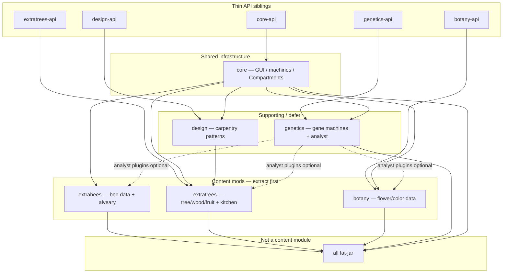

# Comprehensive — ACGaming-Binnie

- Clone: `/home/ivan/Documents/Kodiranje/Fabric Forestry 26.2/MarkDown_Maker/Finished_github_clone/2026-07-24/ACGaming-Binnie`
- Graph alias: `binnie` (`python3 tools/graphify_query.py binnie "…"`)
- Loader / MC: Forge 1.12.2 (Forge 14.23.5.2847; Forestry 5.8.2.422)
- Phase 2 date: 2026-07-30
- Inputs: [00-INVENTORY.md](00-INVENTORY.md) + [features/](features/)
- Related prior notes: [`queries/extra-bees-trees-inventory.md`](../../queries/extra-bees-trees-inventory.md), [`files/addon-integration-mapping.md`](../../files/addon-integration-mapping.md)

## Verdict

**ACGaming-Binnie is a data/source mine for Re-Forestry addon modules — not a jar to depend on.** Almost all species, products, mutations, woods, and flower colors live in large Java enums. The valuable path is **scripted extract → reimplement** under `reforestry:extra_bees` / `reforestry:extra_trees` (and optionally botany later). Binnie Core GUI/machine frameworks and the Genetics isolator/sequencer/inoculator line are **behavior-heavy** and should not drive the first extract pass; Gendustry already covers overlapping gene-manipulation gameplay in modern form.

## Module map

Player-facing suite (README): Extra Bees, Extra Trees, Botany, Genetics, Binnie Core (Compartments). `design` supports Extra Trees carpentry; `all` is a fat-jar aggregator with no Java.

| Slug | Java ~ | Role | Extract priority | Feature report |
|---|---:|---|---|---|
| **extrabees** | 128 | ~117 bee species, products, alveary bits, frames, hives | **P0 data** | [features/extrabees.md](features/extrabees.md) |
| **extratrees** | 286 | ~98 trees, fruit, wood family, kitchen/alcohol machines | **P0 data** | [features/extratrees.md](features/extratrees.md) |
| **botany** | 116 | ~50 flower species, ~80 colors, soil/gardening, ceramic | **P1 data** | [features/botany.md](features/botany.md) |
| **design** | 21 | Patterned wood/glass designs (~100 designs) | **P2 / defer** | [features/design.md](features/design.md) |
| **genetics** | 194 | Isolator/sequencer/inoculator/… + analyst GUI | **Defer behavior** | [features/genetics.md](features/genetics.md) |
| **core** | 389 | Shared GUI/network/machines; Compartments | **Infra only** | [features/core.md](features/core.md) |
| **core-api** | 22 | Public core contracts (GUI widgets, breeding helpers) | API skim | [features/core-api.md](features/core-api.md) |
| **botany-api** | 29 | Flower genetics / gardening API | API skim | [features/botany-api.md](features/botany-api.md) |
| **extratrees-api** | 14 | Extra Trees public API | API skim | [features/extratrees-api.md](features/extratrees-api.md) |
| **design-api** | 12 | Design system API | API skim | [features/design-api.md](features/design-api.md) |
| **genetics-api** | 15 | Serum/analyst/acclimatiser API | API skim | [features/genetics-api.md](features/genetics-api.md) |
| ~~all~~ | 0 | Fat-jar aggregator | Out of scope | — |



**External hard dependency (historical):** Forestry 1.12 APIs (`forestry.api.apiculture|arboriculture|lepidopterology|genetics|circuits|modules`). Soft/optional product hooks: IC2, Tech Reborn, Botania, Big Reactors (oredict / comb products). Soft UI: JEI / CraftTweaker inside feature modules.

## Data-extract targets (emphasize these)

Content is **Java-defined** (1.12 style). JSON under each module is mostly blockstates/models/lang — not species datapacks. Treat enums as CSV/JSON extract sources; rewrite registration in Re-Forestry feature/builder style.

### P0 — `reforestry:extra_bees`

| Target | Approx count | Primary path |
|---|---:|---|
| Bee species | **117** | `extrabees/.../genetics/ExtraBeeDefinition.java` |
| Bee branches | **~30** | `.../ExtraBeeBranchDefinition.java` |
| Mutations | **~150–290** call sites | Per-species `registerMutation` in `ExtraBeeDefinition` |
| Effects | **25** | `.../genetics/effect/ExtraBeesEffect.java` |
| Flower providers (bee) | **11** | `.../ExtraBeesFlowers.java` |
| Honey combs | **~76** enum | `.../items/types/EnumHoneyComb.java` |
| Honey drops | **~29** | `EnumHoneyDrop.java` |
| Propolis | **~10** | `EnumPropolis.java` |
| Misc products | **~30** | `ExtraBeeItems.java` |
| Hive frames / industrial frames | **5 / 16** | `EnumHiveFrame`, `EnumIndustrialFrame` |
| Wild hives | **4** | `EnumHiveType` (WATER / ROCK / NETHER / MARBLE) |
| Stimulator circuits | **~9** | `circuit/AlvearySimulatorCircuitType.java` |
| Alveary mutator items | table | `utils/AlvearyMutationHandler.java` |
| Centrifuge / squeezer recipes | code | `init/RecipeRegister.java` + Forestry `RecipeManagers` |

Assets namespace: `assets/extrabees/` (blockstates, models, lang, textures).

### P0 — `reforestry:extra_trees`

| Target | Approx count | Primary path |
|---|---:|---|
| Tree species | **98** | `extratrees/.../genetics/ETTreeDefinition.java` |
| Tree mutations | **~95** | `.../ExtraTreeMutation.java` |
| Fruit alleles | **61** | `AlleleETFruitDefinition.java` + `genetics/fruits/*` |
| Log / wood types | **~40–42** | `wood/EnumETLog.java` (+ shrub logs) |
| Plank types | **~37** | `wood/planks/ExtraTreePlanks.java` |
| Food items | **~61** | `items/Food.java` |
| Liquids / juices / alcohol enums | many | `liquid/*`, `alcohol/*` (`Alcohol`, `Juice`, `Spirit`, …) |
| WorldGen shapes | **~25** | `gen/WorldGen*.java` |
| Butterfly/moth species | **22** | `ButterflySpecies.java` (mutations empty — low priority) |

Assets: `assets/extratrees/` (+ some historical textures under `assets/forestry/.../extratrees/`).

### P1 — Botany (optional future addon / content pack)

| Target | Approx count | Primary path |
|---|---:|---|
| Flower species | **~50** | `botany/.../genetics/FlowerDefinition.java` |
| Flower colors | **~81** | `botany-api/.../EnumFlowerColor.java` |
| Color mixes | **huge** (~2800 mix lines) | `FlowerColorMutations.java` |
| Flower types / soil / ceramic | enums | `EnumFlowerType`, gardening blocks, `ceramic/*` |

Botany is a **full breeding root** (not just bee flowers). Worth extracting as data even if the gardening/soil machine loop ships later.

### Not CSV-first (behavior / infra)

| Area | Why defer |
|---|---|
| **genetics** machines | Isolator, sequencer, polymeriser, inoculator, splicer, genepool, incubator, analyser, indexer, acclimatiser, lab — tick/GUI/energy/fluid behavior; overlaps modern **Gendustry** |
| **core** CraftGUI + machine framework | ~389 files; Re-Forestry already has CE-shaped GUI/tiles — do not port Binnie widget stack wholesale |
| **design** + ET Woodworker/Panelworker/Glassworker | Pattern metadata extractable (~104 `EnumDesign`), but rendering/recipes need design+core; treat as separate decision |
| Analyst / database GUIs | Depend on genetics + core GUI; rebuild on Re-Forestry screens if needed |
| Compartments (`core/machines/storage`) | Standalone storage feature — optional polish, not addon genetics data |

## Cross-cutting systems

| System | Where | Port note |
|---|---|---|
| Genetics roots | Forestry bee/tree/butterfly roots; Botany adds flower root | Re-Forestry owns roots; register extracted species via plugin/module |
| Alveary modifiers | `extrabees/machines/*` + `IBeeModifier` circuits | Reimplement as alveary multiblock components on Re-Forestry alveary |
| Kitchen machines | lumbermill, fruit press, brewery, distillery (+ stubs) | Fresh tiles/recipes; extract recipe tables from Java |
| Design/carpentry | `design` + `extratrees/carpentry` + designer machines | Defer with design module |
| Networking / GUI | `core` CraftGUI, packets per mod | Replace with Fabric networking + existing `ScreenForestry` patterns |
| JEI / CraftTweaker | under `integration/` in ET/botany/genetics | Optional later under `compat/` |
| Energy / fluids | Binnie machine tanks + Forestry fuels | Map to Transfer API + Team Reborn Energy when machines ship |

## Re-Forestry addon relevance

Conventions already reserve addon module ids under one namespace:

- `reforestry:extra_bees`
- `reforestry:extra_trees`
- (future) botany / design as separate toggles if wanted

Per [`files/addon-integration-mapping.md`](../../files/addon-integration-mapping.md) and project rules:

1. **Extract data, rewrite Java** — do not translate `binnie.*` packages or depend on the Binnie jar (`reforestry-standalone-adopt`).
2. **Gendustry vs Binnie genetics** — prefer **Gendustry** for gene-manipulation machines; skip Binnie Genetics machines unless classic Isolator/serum gameplay is explicitly required.
3. **Designer system** — optional seventh-sized module; ship ET wood/fruit/species + kitchen machines first without woodworker/panelworker/glassworker.
4. **Lepidopterology** — Extra Trees moths imply moths module readiness if those 22 species are included; safe to leave moths out of first extra_trees cut.
5. Existing extract tooling to extend (bees already have patterns): `tools/generate_bee_species.py`, `tools/generate_bee_mutations.py`, `tools/export_bee_mutations.py` — mirror for trees/fruits/combs.

## Recommended extract order

Ordered for **maximum content per effort**, minimum Binnie-framework drag:

1. **Extra Bees species + branches + genomes** — `ExtraBeeDefinition` / `ExtraBeeBranchDefinition` → species JSON/builders for `reforestry:extra_bees`.
2. **Extra Bees mutations** — scrape `registerMutation` call sites; wire into mutation registry.
3. **Extra Bees products** — combs, drops, propolis, misc items + centrifuge/squeezer product tables.
4. **Extra Bees effects + flower providers** — allele tables; implement effect behaviors selectively (many are world-hostile; gate behind config).
5. **Extra Bees hives + frames** — 4 hive types, hive frames, industrial frames (modifiers as data).
6. **Extra Trees species + wood types** — `ETTreeDefinition` + `EnumETLog` / planks → arboriculture family registration.
7. **Extra Trees fruits + mutations** — `AlleleETFruitDefinition`, `ExtraTreeMutation`.
8. **Extra Trees food / liquid tables** — `Food`, juice/alcohol enums (recipes can wait for kitchen machines).
9. **Botany flower species + colors** — `FlowerDefinition`, `EnumFlowerColor` (defer full `FlowerColorMutations` bulk or sample first).
10. **Alveary component specs** — modifiers/slots as data sheets; implement machines after base alveary is solid.
11. **Kitchen machine recipes** — lumbermill / press / brewery / distillery tables only (no designer).
12. **Assets pass** — copy/adapt textures from `assets/extrabees|extratrees|botany` into `assets/reforestry/...` (do not edit the clone).
13. **Deferred** — Binnie Genetics machines, CraftGUI port, design/designer, Compartments, moths, JEI plugins, soft-mod comb products.


## Gaps vs Re-Forestry (high level)

| Gap | Impact |
|---|---|
| No modern Binnie port in CE/IF | Must extract from 1.12; no mechanical Forge→Fabric class port |
| Species live in enums, not datapacks | Need `tools/` extractors (extend bee tools) |
| Heavy `binnie.core` GUI coupling | Databases/analyst/designer UIs cannot be copied; rebuild or skip |
| Genetics machines vs Gendustry overlap | Decide once; default skip Binnie Genetics |
| Wood × block-kind explosion | ~40 woods × log/plank/slab/fence/door/leaves/sapling — registry/asset scale like arboriculture |
| Hostile bee effects | Balance/config before enabling meteor/wither/teleport-style effects |
| Soft oredict products | Map to Fabric tags / modern mod ids carefully or drop optional products |
| Phase 1 feature reports are surface inventories | Deep field-level extract still needs MCP/`get_file` on the enum files above |

## Open questions

- Ship moths with `extra_trees` or wait for lepidopterology completeness?
- Include Botany as `reforestry:botany` or a later content pack?
- Any Isolator/serum nostalgia worth keeping alongside Gendustry?
- Designer (design module) in or out of first Extra Trees release?
- How aggressively to gate Extra Bees combat/world effects?

## Follow-up commands

```bash
python3 tools/graphify_query.py binnie "ExtraBeeDefinition mutations products"
python3 tools/graphify_query.py binnie "ETTreeDefinition fruit wood"
python3 tools/graphify_query.py binnie "FlowerDefinition EnumFlowerColor"
# MCP: search_code / get_file on repo ACGaming-Binnie for the paths in the extract tables
```
