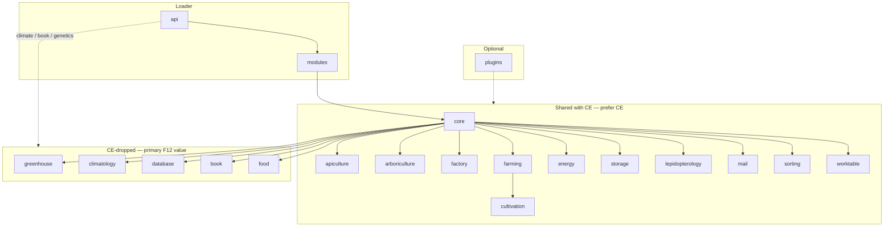

# Comprehensive — ForestryMC-ForestryMC (`forestry12`)

- Clone: `/home/ivan/Documents/Kodiranje/Fabric Forestry 26.2/MarkDown_Maker/Finished_github_clone/2026-07-24/ForestryMC-ForestryMC`
- Graph alias: `forestry12` → `python3 tools/graphify_query.py forestry12 "…"`
- Loader / MC: Forge 14.23.5.2860 / Minecraft **1.12.2**
- Inventory: [`00-INVENTORY.md`](00-INVENTORY.md)
- Feature reports: [`features/`](features/) (20 modules)
- Date: 2026-07-30

## Why this repo matters

Forestry CE (1.20.1) and Immersive Forestry are the **primary** ports for shared modules (bees, trees, factory, farms, mail, sorting, worktable, etc.). This 1.12.2 tree is valuable mainly for **content CE removed**:

| Package | In CE? | Role |
|---|---|---|
| **`greenhouse`** | No | Greenhouse / climatiser **blocks + recipes** (no tile/multiblock logic left — stub) |
| **`climatology`** | No | **Habitat Former** + habitat screen — world climate transformers |
| **`database`** | No | Genetic **database** block / browser GUI |
| **`book`** | No | In-game **Forester’s Book** (JSON manual + GUI; not Patchouli) |
| **`food`** | No as package | Honeyed slice / ambrosia / honey pot (CE/Re-Forestry folded into apiculture) |

CE still has packages the inventory once lumped with “CE-dropped”: **`cultivation`**, **`mail`**, **`sorting`**, **`worktable`**. Prefer CE for those; use F12 only for diffs, assets, or older contracts.

F12 also ships a **richer climate API** (`api.climate`: transformers, world holder, manipulators) that CE slimmed down. Restoring greenhouse/climatology on Re-Forestry means re-adopting that climate stack, not copying CE’s thinner climate surface.

---

## Module map

### Module index (all 20)

| id | Module | Size | Feature report | CE status | Re-Forestry (high level) |
|---|---|---|---|---|---|
| 01 | [api](features/api.md) | L ~354 | Contracts for every feature | Slimmer (esp. climate/book) | Partial — genetics/climate/housing APIs exist; no book/database restore APIs |
| 02 | [apiculture](features/apiculture.md) | L ~208 | Bees, hives, alveary | Present | **Largely done** (Phase 4+) |
| 03 | [arboriculture](features/arboriculture.md) | L ~189 | Trees + charcoal | Present | **Phase 5 done** |
| 04 | [book](features/book.md) | M ~58 | Forester’s Book UI + JSON | **Dropped** | Stub `foresters_manual` + inert Patchouli assets ([A8](../../queries/core-A8-foresters-manual.md)) |
| 05 | [climatology](features/climatology.md) | S ~30 | Habitat Former | **Dropped** | Missing (restore track) |
| 06 | [core](features/core.md) | L ~552 | Shared tiles, GUI, fluids, **climate impl** | Present (climate thinner) | Substantial; no F12 `WorldClimateHolder` / transformers |
| 07 | [cultivation](features/cultivation.md) | S ~27 | Planters (depends farming) | Present | Not started (after farming) |
| 08 | [database](features/database.md) | S ~28 | Genetic database machine | **Dropped** | Missing (restore track) |
| 09 | [energy](features/energy.md) | M ~55 | Engines / FE | Present | Deferred (debug FE only) |
| 10 | [factory](features/factory.md) | M ~124 | Machines | Present | **Playable** (F5–F12a); polish deferred |
| 11 | [farming](features/farming.md) | M ~107 | Multiblock farm | Present | Not started |
| 12 | [food](features/food.md) | S ~5 | Food items module | **Dropped as module** | Items under apiculture (`honeyed_slice`, `honey_pot`, `ambrosia`) |
| 13 | [greenhouse](features/greenhouse.md) | S ~9 | Greenhouse blocks (stub) | **Dropped** | Missing; incomplete even in F12 |
| 14 | [lepidopterology](features/lepidopterology.md) | M ~69 | Butterflies | Present | Not started (genetics P0 first) |
| 15 | [mail](features/mail.md) | M ~70 | Letters / trade | Present | Planned Track C after storage |
| 16 | [modules](features/modules.md) | S ~8 | Module loader / UIDs | Present | `IForestryPlugin` / module shell pattern |
| 17 | [plugins](features/plugins.md) | S ~23 | IC2/BC/JEI/BoP… | CE → `plugin`/`compat` | Out of port queue unless targeted |
| 18 | [sorting](features/sorting.md) | S ~35 | Genetic filter | Present | Planned after genetics mature |
| 19 | [storage](features/storage.md) | S ~34 | Backpacks / crates | Present | **B0 done**; B1–B6 next |
| 20 | [worktable](features/worktable.md) | S ~30 | Memorized crafting | Present | Planned W0–W2 |

Nested UIDs (not top-level packages): `charcoal`, `fluids`, `backpacks`, `crates`, `research` — see `ForestryModuleUids`.

---

## CE-dropped deep dive (extract targets)

### 1. Climatology — Habitat Former (highest restore value)

- **Surface:** `BlockHabitatFormer`, `TileHabitatFormer` (~335 LOC), `ItemHabitatScreen`, GUI (climate bars, habitat/species pickers), `PacketSelectClimateTargeted`, client `PreviewHandlerClient`.
- **Depends on F12 climate stack in `core` + `api.climate`:** `IClimateTransformer`, `ClimateManipulator`, `WorldClimateHolder` (`forestry_climate` world saved data), `IClimateHousing` / listeners.
- **Player fantasy:** reshape local temperature/humidity so bees/trees/farms “think” they are in another habitat.
- **Re-Forestry gap:** bee housing already has biome climate + alveary steps; **no** world-region climate writing. Port = API restore → holder → tile → GUI/network → assets (`habitat_former`, GUI textures).
- Graph: `python3 tools/graphify_query.py forestry12 "TileHabitatFormer"` / `"WorldClimateHolder"`.

### 2. Database — genetic browser

- **Surface:** `TileDatabase`, analyzer-style GUI (`GuiDatabase` / `ContainerDatabase`), search filters (`DatabaseFilterName` / `ToolTip`), insert/extract packets, inventory + analyzer inventory.
- **API hooks in F12:** `api.genetics` — `IDatabasePlugin`, `IDatabaseTab`, `EnumDatabaseTab`, `DatabaseMode`, `IDatabaseElement`.
- **Re-Forestry gap:** escritoire / analyzer / naturalist chests still on the roadmap; database is a **dedicated storage+browse machine** CE never kept. Port after analyzer UX exists so tabs/plugins can dogfood genetics APIs.
- Assets: `database.json` blockstates/models, GUI textures, manual entries under `assets/forestry/manual/*/genetics/database.json`.

### 3. Book — Forester’s Book (JSON guide)

- **Surface:** `ItemForesterBook`, `BookLoader` (Gson + reload listener), categories/entries, content types (text, crafting, carpenter, fabricator, mutation, structure/multiblock), full client GUI stack.
- **API:** `forestry.api.book.*` (`IForesterBook`, `IBookLoader`, …).
- **Content:** ~**309** JSON pages under `assets/forestry/manual/` (`en_us`, `ru_ru`, `zh_cn`, `zh_tw`) + `categories.json`.
- **vs Re-Forestry A8:** CE/Re-Forestry chose **Patchouli**; F12 book is a **custom** system. Options: (a) wait for Patchouli 26.2 and migrate manual JSON → Patchouli entries; (b) adopt F12 book engine into `com.leon1236.reforestry.book` if Patchouli stays unavailable. Do **not** invent a third UI without a decision note.
- Graph: `python3 tools/graphify_query.py forestry12 "BookLoader"`.

### 4. Greenhouse — incomplete / deprecated shell

- **Only 9 Java files:** register greenhouse + climatiser + window blocks, meta enums, recipes. **No tiles, no multiblock controller, no climate application.**
- Textures live under `textures/blocks/greenhouse_deprecated/`.
- Types: greenhouse `PLAIN|BORDER|BORDER_CENTER|GEARBOX|CONTROL|SCREEN`; climatiser `HYGRO|HEATER|FAN|HUMIDIFIER|DEHUMIDIFIER`.
- **Port advice:** treat as **asset + recipe + block-shape reference**, not a working multiblock. Either (1) redesign greenhouse as a multiblock on top of restored climatology transformers, or (2) skip until climatology works and players need a building kit. Alveary already covers small-scale climate steps.

### 5. Food — already absorbed

- F12 `ModuleFood`: `honeyedSlice`, `ambrosia`, `honeyPot`.
- Re-Forestry already registers these under **apiculture**. No separate `food` module needed unless you want UID parity for configs.

---

## Cross-cutting systems

| Cross-cut | Where in F12 | Notes for Re-Forestry |
|---|---|---|
| **Module loader** | `modules` (`BlankForestryModule`, `ForestryModuleUids`, `ModuleManager`) | Mirror enable/disable UIDs when restoring dropped modules |
| **Public API** | `api` (~354) — climate, book, mail, farming, genetics, … | Extract **climate + book + database genetics tabs** from F12; everything else prefer CE |
| **Climate** | `api.climate` + `core.climate` + climatology + (stub) greenhouse | **The** F12-unique engineering surface vs CE |
| **Genetics UI** | database, sorting, book mutation pages, apiculture/arboriculture | Sorting still in CE; database/book need F12 |
| **GUI / ledgers** | `core` + per-module `gui` | Pattern matches Re-Forestry `ScreenForestry` / ledgers |
| **Network** | Per-module `PacketRegistry*` | Fabric networking when restoring climatology/database/mail/worktable |
| **Multiblock** | farming, (intended) greenhouse, alveary in apiculture | Greenhouse logic missing — do not expect a controller class |
| **World saved data** | mail (`PostOffice`/`POBox`), climate (`WorldClimateHolder`) | Fabric: attachment / `SavedData` equivalents |
| **JEI** | `plugins` + mail/worktable compat plugins | Re-Forestry already has factory JEI; mail/worktable later |
| **Compat plugins** | `plugins` (IC2, BC, BoP, …) | Historical; not a port queue |

---

## Feature report links (quick)

**CE-dropped (read these first):**  
[greenhouse](features/greenhouse.md) · [climatology](features/climatology.md) · [database](features/database.md) · [book](features/book.md) · [food](features/food.md)

**Climate / genetics support:**  
[api](features/api.md) · [core](features/core.md) · [sorting](features/sorting.md)

**Still prefer CE for implementation:**  
[apiculture](features/apiculture.md) · [arboriculture](features/arboriculture.md) · [factory](features/factory.md) · [farming](features/farming.md) · [cultivation](features/cultivation.md) · [mail](features/mail.md) · [worktable](features/worktable.md) · [energy](features/energy.md) · [storage](features/storage.md) · [lepidopterology](features/lepidopterology.md) · [modules](features/modules.md) · [plugins](features/plugins.md)

---

## Re-Forestry gaps (F12-informed)

Aligned with [`files/implemented-features.md`](../../files/implemented-features.md) “Next up” + restore row 13.

| Gap | F12 source | Status / blocker |
|---|---|---|
| World climate transformers + Habitat Former | `climatology` + `core.climate` + `api.climate` | Not started — optional restore |
| Greenhouse building kit / multiblock | `greenhouse` (stub) | Incomplete upstream; redesign or defer |
| Genetic database machine | `database` + genetics database API | Not started — after analyzer/chests |
| Playable guide book | `book` + `manual/` JSON **or** Patchouli | Stub item only (A8) |
| ModuleFood UID | `food` | Content already in apiculture |
| Mail / worktable / sorting / farming / cultivation / energy / butterflies | F12 ≈ CE | Use **CE**; F12 secondary |
| Storage backpacks/crates | `storage` | B0 done; finish via CE |

---

## Recommended extract / port order

Order is for **F12-sourced** work only. Shared modules stay on the CE track in `implemented-features.md`.

### Phase A — Extract without shipping (docs / assets / API notes)

1. **Inventory climate contracts** — list F12 `api.climate` + `core.climate` types vs Re-Forestry `api.climate`; write a short gap note under `queries/` before coding.
2. **Copy/reference manual JSON** — `assets/forestry/manual/**` as content fodder for Patchouli or a future book port (do not register yet).
3. **Greenhouse assets** — models/textures under `greenhouse*` / `greenhouse_deprecated` for a later building kit; mark deprecated upstream.

### Phase B — Optional restore track (after core genetics UX is solid)

| Step | Extract from | Depends on | Exit |
|---|---|---|---|
| **R0** | `api.climate` transformers / world holder (+ CE-compatible slim API) | Existing Re-Forestry climate/housing | Writable climate regions API |
| **R1** | `climatology` Habitat Former tile + GUI + packets + habitat screen | R0, fluids/energy patterns from factory | Placeable former that changes habitat preview |
| **R2** | `database` block + browser + genetics tabs API | Analyzer / species discovery UX | Browse/store genetic items |
| **R3a** | Patchouli 26.2 + migrate manual | Patchouli available | Replace A8 stub |
| **R3b** | *or* adopt F12 `book` engine | R0 optional; client GUI | Custom Forester’s Book |
| **R4** | Greenhouse blocks as multiblock *or* decorative kit | R1 if climate-linked | Player-facing greenhouse — **only if** design chosen |

### Phase C — Do **not** prioritize from F12

- **food** — already ported as items.
- **plugins** — era-specific compat.
- **apiculture / arboriculture / factory / farming / cultivation / mail / sorting / worktable / energy / storage / lepidopterology** — implement from **CE** (or Immersive Forestry); consult F12 only for 1.12-only assets or behavior diffs.

### Practical queue vs current Re-Forestry roadmap

Keep shipping: **storage → mail → worktable → energy → farming → cultivation → sorting → lepidopterology → addons**.  
Schedule **R0–R2** (climatology + database) as the F12 restore wave; treat **greenhouse** as R4 research, **book** as R3 when a guide strategy is chosen.

---

## Source-of-truth habits for this alias

- Architecture: `python3 tools/graphify_query.py forestry12 "…"`.
- Exact files: MCP `user-minecraft-mods` repo `ForestryMC-ForestryMC` (`search_code` / `get_file`).
- Never invent paths — verify under the clone path above.
- For anything also in CE: **read CE first**, then F12 for dropped-only pieces.

## Open questions

1. **Greenhouse:** restore as real multiblock on transformers, decorative-only kit, or skip?
2. **Book:** Patchouli soft-depend vs F12 custom book vs long-lived stub?
3. **Climate API shape:** full F12 transformer/world-holder model vs a smaller Fabric-friendly subset that still powers Habitat Former?
4. **Database vs analyzer:** one machine or keep escritoire/analyzer separate and add database later?
)