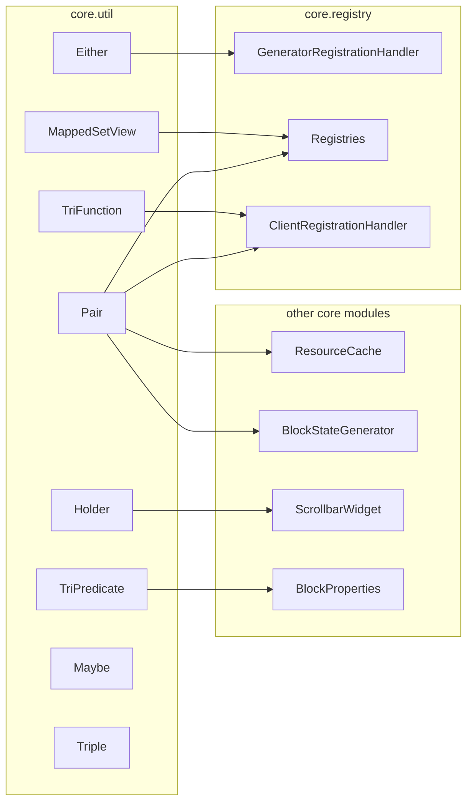

# SuperMartijn642-SuperMartijn642sCoreLib — util

**Repo:** [SuperMartijn642-SuperMartijn642sCoreLib](https://github.com/SuperMartijn642/SuperMartijn642sCoreLib)  
**Alias:** `corelib`  
**Package:** `com.supermartijn642.core.util`  
**Clone path:** `MarkDown_Maker/Finished_github_clone/2026-07-28_18-01-07/SuperMartijn642-SuperMartijn642sCoreLib`  
**Scope:** This package only (8 Java files, flat — no subpackages).  
**Researched:** 2026-07-30 via MCP `user-minecraft-mods`, graphify alias `corelib`.

---

## Summary

`com.supermartijn642.core.util` is a **small, Minecraft-agnostic utility layer** inside Core Lib: custom functional types (`Either`, `Maybe`, `Pair`, `Triple`), JDK-style ternary functional interfaces (`TriFunction`, `TriPredicate`), a mutable reference box (`Holder`), and a read-only mapped `Set` view (`MappedSetView`). Nothing here is player-visible, registered, or networked.

The package exists so other Core Lib modules can express **sum types**, **lazy mapped collections**, and **3-argument lambdas** without pulling in extra libraries. It is **internal plumbing**, not a public modder API — downstream SuperMartijn642 mods do not depend on these types directly; they depend on Core Lib’s registry, GUI, generator, and block helpers that happen to use them.

**Adoption verdict for Re-Forestry:** **Do not add Core Lib as a dependency for util.** Most types have drop-in JDK/Mojang/vanilla substitutes already used in Re-Forestry. Copy individual files only if a future Core-Lib-inspired subsystem (e.g. widget scroll builders, heterogeneous datagen lists) needs the exact pattern; two types (`Maybe`, `Triple`) appear **unused even inside Core Lib** and need not be copied.

---

## Player / API surface

| Question | Answer |
|----------|--------|
| Player-visible? | **No** — pure Java helpers. |
| Public API for addon mods? | **No** — not documented on CurseForge/Modrinth; not part of Core Lib’s marketed surface (GUIs, blocks, packets). |
| Fabric entrypoints / registries? | **None** |
| Config / commands / keybinds? | **None** |
| Network packets? | **None** |

**Indirect exposure:** Players never interact with util types. Effects show up only through features built on top (e.g. scrollbars using `Holder`, registry helpers returning `Pair`-backed entry sets).

---

## Architecture

```text
com.supermartijn642.core.util/          (flat, 8 files)
├── Either<X,Y>          — sealed-style sum type (Left | Right)
├── Maybe<T>               — optional wrapper (distinct from Optional semantics)
├── Pair<X,Y>              — immutable 2-tuple with map/flatMap
├── Triple<X,Y,Z>          — immutable 3-tuple (getters only)
├── Holder<T>              — mutable single-slot reference
├── MappedSetView<R,T>     — read-only Set view via Function mapper
├── TriFunction<R,S,T,U>   — @FunctionalInterface, 3-arg → result
└── TriPredicate<X,Y,Z>    — @FunctionalInterface, 3-arg → boolean
```

**Design themes**

1. **Mirror JDK functional style** — `TriFunction`/`TriPredicate` follow `BiFunction`/`BiPredicate` (including `andThen`, `and`, `or`, `negate`).
2. **Custom sum/option types instead of `Optional`/`Either` from libraries** — Core Lib predates wide use of Java 16+ `Optional` patterns in mod code and avoids tying to Apache Commons Lang `Triple` or Vavr.
3. **Minimal surface for tuples** — `Pair` is rich (map, equals/hashCode); `Triple` is a bare record-like holder with no equality or mapping.
4. **Lazy collection views** — `MappedSetView` avoids copying registry entry sets on every `getEntries()` call.

**Internal consumers (Core Lib only, from MCP code search)**

| Util type | Used by | Role |
|-----------|---------|------|
| `Either` | `registry.GeneratorRegistrationHandler` | Single list holding either `ResourceGenerator` factories or Forge `IDataProvider` factories; resolved at datagen via `mapLeft` / `mapRight` / `leftOrElseGet` |
| `Pair` | `registry.Registries`, `registry.ClientRegistrationHandler`, `generator.ResourceCache`, `generator.BlockStateGenerator` | Tuple keys for registry entries, model overwrites, aggregated resources, multipart blockstate variants |
| `MappedSetView` | `registry.Registries` | Lazy `Set<T>` / `Set<Pair<ResourceLocation,T>>` over `registry.entrySet()` |
| `Holder` | `gui.widget.premade.ScrollbarWidget` | Mutable `double` scroll value passed into builder callbacks |
| `TriFunction` | `registry.ClientRegistrationHandler` | `(Container, PlayerInventory, ITextComponent) → Screen` screen factory |
| `TriPredicate` | `block.BlockProperties` | `(BlockState, IBlockReader, BlockPos) → boolean` for redstone conductor override |
| `Maybe` | *(none outside util)* | Defined but **no call sites** in indexed Core Lib sources |
| `Triple` | *(none)* | Defined but **no call sites** |



---

## Data & assets

**None.** No JSON, textures, lang keys, datagen templates, or NBT/component serializers in this package.

---

## Dependencies

| Dependency | Used by | Notes |
|------------|---------|-------|
| `java.util.*` (functional interfaces, collections) | All types | JDK only |
| `com.google.common.base.Objects` | `Pair` | Guava equality/hashCode (already on MC classpath) |
| Minecraft / Forge / Fabric | **None** | Package compiles as plain Java |

**Outbound:** Other Core Lib packages import `com.supermartijn642.core.util.*`; util imports nothing from Core Lib (acyclic leaf).

---

## Notable algorithms / contracts

### `Either<X, Y>`

- Factory: `Either.left(x)`, `Either.right(y)`.
- Discriminators: `isLeft()`, `isRight()`; strict accessors `left()` / `right()` throw `NoSuchElementException` on wrong side.
- Fallbacks: `leftOrElse`, `rightOrElse`, `*OrElseGet`, `*OrNull`.
- Functor/monad-ish: `mapLeft`, `mapRight`, combined `map`, `flatMap(mapLeft, mapRight)`.
- Side effects: `ifLeft`, `ifRight`.
- **Contract:** Immutable; left/right subclasses are private.

**Key internal use:** `GeneratorRegistrationHandler.registerProviders` pipeline:

```text
generatorsAndProviders.stream()
  .map(either -> either.mapLeft(generator -> generator.apply(cache)))
  .map(either -> either.mapLeft(ResourceGenerator::createDataProvider))
  .map(either -> either.mapRight(provider -> provider.apply(dataGenerator, existingFileHelper)))
  .map(either -> either.leftOrElseGet(either::right))
  .forEach(dataGenerator::addProvider);
```

### `Maybe<T>`

- Factory: `Maybe.of(t)` (allows **null** payload), `Maybe.empty()`.
- **Important semantic difference from `Optional`:** `isPresent()` can be true while `get()` returns `null` — presence means “box exists”, not “non-null value”.
- API: `map`, `get`, `orElse`, `orElseGet`, `ifPresent`.
- Singleton empty instance via unchecked cast.
- **Status:** Appears **dead code** in current Core Lib tree (no external references).

### `Pair<X, Y>`

- Factory: `Pair.of(left, right)`.
- Immutable fields; accessors `left()`, `right()`.
- `mapLeft`, `mapRight`, `map`, `flatMap(BiFunction)`, `apply(BiConsumer)`.
- Guava-based `equals` / `hashCode`.
- **Most-used util type** in Core Lib.

### `Triple<X, Y, Z>`

- Factory: `Triple.of(left, middle, right)`; getters `left()`, `middle()`, `right()`.
- No equals/hashCode/map.
- **Status:** **Unused** in indexed sources.

### `Holder<T>`

- Mutable `get()` / `set(T)`.
- Default + value constructors.
- Used where lambdas need to mutate a captured value (scrollbar builder pattern).

### `MappedSetView<R, T>`

- Static factory: `MappedSetView.map(set, mapper)` → `Set<T>`.
- Read-only: `size`, `isEmpty`, `iterator`, `toArray` delegate through mapper.
- **Mutators and `contains*` throw `UnsupportedOperationException`** — intentional; cannot reverse-map target → source.
- Iterator is live-backed on source set.

### `TriFunction<R, S, T, U>` / `TriPredicate<X, Y, Z>`

- Standard `@FunctionalInterface` with composition helpers matching JDK naming.
- Fill gap where JDK only ships Bi* variants up to 2 arguments.

---

## Port relevance to Re-Forestry

**Policy:** Re-Forestry is standalone ([`reforestry-standalone-adopt.mdc`](../../../.cursor/rules/reforestry-standalone-adopt.mdc)). Core Lib is a **reference clone**, not a Gradle dependency.

| Core Lib util | Re-Forestry today | Recommendation |
|---------------|-------------------|----------------|
| `Pair` | Already uses `com.mojang.datafixers.util.Pair` in `LegacyIngredientCodec`; genetics uses project-local `MutationPair` | **Keep Mojang Pair or small local record** — no need for Core Lib `Pair` unless mapping API needs `mapLeft`/`flatMap` |
| `Either` | No equivalent; datagen uses Fabric/Fabric API providers directly | **Use separate lists or sealed interface** for heterogeneous datagen registration; copy `Either` (~260 LOC) only if mirroring `GeneratorRegistrationHandler` exactly |
| `Maybe` | Uses `java.util.Optional` throughout genetics/GUI | **Do not adopt** — `Optional` is sufficient; `Maybe`’s null-present semantics are confusing |
| `Triple` | Unused in Core Lib | **Skip** — use Java `record` if a 3-tuple is needed |
| `Holder` | No direct equivalent; lambdas use fields or arrays | **Skip unless** porting ScrollbarWidget-style builder; then a 3-line local class or `AtomicReference` suffices |
| `MappedSetView` | Registry code returns collections directly | **Skip** — `stream().map(...).collect(toSet())` or immutable copy unless hot-path profiling says otherwise |
| `TriFunction` / `TriPredicate` | Screen handlers use standard Fabric `ScreenConstructor`-style types; blocks use vanilla property callbacks | **Add local `@FunctionalInterface` in `core` only if needed** — 20 LOC each, no Core Lib dep |

**When copying makes sense**

- Adopting Core Lib **gui** scroll widgets → may copy `Holder` inline or as part of that widget port.
- Adopting Core Lib **registry/datagen** unified registration → `Either` + `Pair` + `MappedSetView` travel together; evaluate whole subsystem, not util in isolation.

**When copying does not make sense**

- General Re-Forestry development — JDK + Mojang types cover current needs.
- Adding Core Lib jar solely for these helpers violates standalone policy and pulls Forge-oriented registry/datagen code.

**Priority:** **Low / opportunistic.** Util is not on the critical path for CE parity (apiculture, factory, arboriculture). Revisit only while porting a Core-Lib consumer module that already imports these types.

---

## Source map

| File | ~LOC | Role |
|------|------|------|
| `Either.java` | 260 | Left/right sum type with map/flatMap |
| `Maybe.java` | 140 | Optional-like wrapper (nullable-present semantics) |
| `Pair.java` | 80 | Immutable pair with functional ops + equals |
| `MappedSetView.java` | 105 | Lazy read-only mapped `Set` |
| `Holder.java` | 35 | Mutable reference cell |
| `TriPredicate.java` | 26 | 3-arg boolean functional interface |
| `Triple.java` | 35 | Simple 3-tuple |
| `TriFunction.java` | 18 | 3-arg function interface |
| **Total** | **~699** | 8 files, 0 subpackages |

**Paths (clone / MCP):**

```text
src/main/java/com/supermartijn642/core/util/
├── Either.java
├── Holder.java
├── MappedSetView.java
├── Maybe.java
├── Pair.java
├── TriFunction.java
├── TriPredicate.java
└── Triple.java
```

**Primary downstream files (for cross-module reports, not part of util scope):**

| Consumer | Path |
|----------|------|
| Datagen registration | `core/registry/GeneratorRegistrationHandler.java` |
| Registry wrapper | `core/registry/Registries.java` |
| Client registration | `core/registry/ClientRegistrationHandler.java` |
| Resource aggregation | `core/generator/ResourceCache.java` |
| Blockstate multipart | `core/generator/BlockStateGenerator.java` |
| Scrollbar builder | `core/gui/widget/premade/ScrollbarWidget.java` |
| Block property builder | `core/block/BlockProperties.java` |

---

## Open questions / gaps

1. **`Maybe` and `Triple` dead code?** MCP search finds no usages outside their defining files. Possible explanations: removed call sites, planned API never finished, or usages only in branches not indexed. **Action:** If porting registry/gui, do not copy these unless a consumer appears in the target module’s report.

2. **Fabric branch parity:** Indexed MCP snapshot appears Forge-oriented (`GeneratorRegistrationHandler` references Forge `GatherDataEvent`, `IDataProvider`). Confirm whether Fabric Core Lib uses the same util types the same way on the branch Re-Forestry would reference (likely yes — util is loader-agnostic).

3. **Clone availability:** Local path `MarkDown_Maker/Finished_github_clone/2026-07-28_18-01-07/SuperMartijn642-SuperMartijn642sCoreLib` was empty at report time; all file text verified via MCP `get_file` / `search_code`. Re-clone if offline diff against upstream is needed.

4. **Graphify coverage:** `graphify query corelib` returned util-adjacent nodes but did not enumerate util call edges reliably; consumer table above is from MCP symbol search. Re-run graphify after rebuilding Core Lib graph with `--code-only` if automated call graphs are required.

5. **Public vs internal:** Unclear whether SuperMartijn642 intended util types for third-party use. Treat as **private** unless official Javadoc or wiki documents them — Re-Forestry should not expose `com.leon1236.reforestry.*` copies in `api/`.

6. **`MappedSetView.contains` limitation:** Callers must not rely on membership tests. If Re-Forestry ever copies it, document that constraint or implement reverse-map only where bijection is guaranteed.
