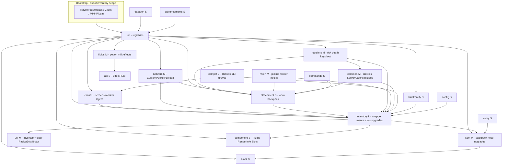

# COMPREHENSIVE — Tiviacz1337-Travelers-Backpack

| Field | Value |
|---|---|
| Repo | Tiviacz1337-Travelers-Backpack |
| Alias | `backpack` |
| Clone | `MarkDown_Maker/Finished_github_clone/2026-07-30/Tiviacz1337-Travelers-Backpack` |
| Stack in clone | Fabric Loader **0.19.2** / Minecraft **26.1.2** — mod `travelersbackpack` **11.2.9** (branch `26.1-fabric`) |
| Graph | `python3 tools/graphify_query.py backpack "…"` |
| Inventory | [`00-INVENTORY.md`](00-INVENTORY.md) |
| Features | [`features/`](features/) (21 reports) |
| Prior reuse map | [`queries/travelers-backpack-reuse-map.md`](../../queries/travelers-backpack-reuse-map.md) |
| Date | 2026-07-30 |
| Phase | 2 synthesizer |

## Verdict for Re-Forestry

**Source to adopt into our packages — never a runtime dependency.** CE defines *what* Forestry backpacks do (15/45/125 slots, modes, filters, named bags, naturalist paging, crates). Fabric TB defines *how* a modern Fabric item-inventory + menu + data-component stack can look. Copy/adapt useful Java into `com.leon1236.reforestry.storage.*` (impl) and keep the public contract under existing `api.storage` (B0). Do **not** put `travelersbackpack` in `fabric.mod.json` / Gradle.

Policy (locked in reuse map + standalone-adopt rule):

```text
api.storage (public, CE-shaped)  →  storage.* (impl: adopted TB HOW + CE WHAT)
                                        ↑
                          TB clone = reference only; never soft-dep
```

**Highest-value adopt:** inventory open-GUI + menus/slots, `ItemContainerContents` / data components, insert/extract helpers, refill + pickup **algorithms** (stripped of upgrade items).  
**Study then mostly skip:** attachment/wear sync, full network surface, Trinkets/compat.  
**Never port:** placeable backpack BE, fluids/hose/tanks, sleeping bag, ability tree, upgrade UI, death/commands, mega Forge-Config-API-Port config.

Version caution: TB is **26.1**; Re-Forestry is **26.2** — verify any copied call against MCP `Minecraft-26.2`.

---

## Module map



| # | Slug | Size | Role | RF reuse | Feature report |
|---|---|---|---|---|---|
| 1 | **inventory** | L (~73) | Wrapper, menus, slots, handlers, upgrade tree, tanks | **P0 adopt** (menus/slots/open; strip upgrades/tanks) | [inventory.md](features/inventory.md) |
| 2 | **init** | M (~13) | Items/blocks/menus/components/network/attachments | **P0 pattern** (`ModScreenHandlerTypes`, `ModDataComponents`) | [init.md](features/init.md) |
| 3 | **util** | M (~18) | `InventoryHelper`, `ContainerContentsHelper`, packet helper | **P0/P1 adopt** insert/extract + CONTAINER helpers | [util.md](features/util.md) |
| 4 | **item** | M (~18) | `TravelersBackpackItem` (BlockItem), hose, upgrade items | **P1 partial** — held bag only; no place/equip/hose | [item.md](features/item.md) |
| 5 | **client** | L (~40) | Screens, widgets, worn models, HUD | **P1 wiring** — CE `backpack.png` / `backpack_t2.png`, not TB chrome | [client.md](features/client.md) |
| 6 | **mixin** | M (~18) | Pickup, render injects, death, shulker, etc. | **P1 algorithm** (`ItemEntityMixin` → prefer Fabric event) | [mixin.md](features/mixin.md) |
| 7 | **network** | M (~11) | Attachment sync, filters, action tags, slots | **P2 study** — RF needs little of this for CE bags | [network.md](features/network.md) |
| 8 | **attachment** | S (2) | Worn backpack `AttachmentType` + lookup | **P2 study only** — CE bags are held, not worn | [attachment.md](features/attachment.md) |
| 9 | **handlers** | M (8) | Tick, death, keys, loot, sleep, right-click | **P2 selective** — stow/resupply tick ideas; skip sleep/death | [handlers.md](features/handlers.md) |
| 10 | **component** | S (3) | `Fluids`, `RenderInfo`, `Slots` codecs | **Skip** for CE (keep RF mode component only) | [component.md](features/component.md) |
| 11 | **common** | M (7) | Abilities, `ServerActions`, upgrade recipes | **Skip** abilities/equip; recipes are TB-specific | [common.md](features/common.md) |
| 12 | **compat** | L (~35) | Trinkets, Accessories, JEI/REI/EMI, graves… | **Skip** for bags; JEI already RF’s own plugin | [compat.md](features/compat.md) |
| 13 | **fluids** | M (~10) | Potion/milk fluids + effect registry | **Skip** | [fluids.md](features/fluids.md) |
| 14 | **api** | S (1) | `EffectFluid` public fluid-effect API | **Skip** — do not mirror under `api.storage` | [api.md](features/api.md) |
| 15 | **block** | S (2) | Placeable backpack + sleeping bag | **Skip** | [block.md](features/block.md) |
| 16 | **blockentity** | S (1) | Placed backpack BE (inv/tanks host) | **Skip** | [blockentity.md](features/blockentity.md) |
| 17 | **entity** | S (1) | Backpack item entity extras | **Skip** | [entity.md](features/entity.md) |
| 18 | **config** | S (3) | Forge Config API Port mega-config | **Skip** — RF module config is enough | [config.md](features/config.md) |
| 19 | **datagen** | S (3) | Recipes, loot, tags | **Low** — CE bag recipes via RF/CE data | [datagen.md](features/datagen.md) |
| 20 | **commands** | S (5) | Admin retrieve / icon commands | **Skip** | [commands.md](features/commands.md) |
| 21 | **advancements** | S (1) | Custom backpack action triggers | **Skip** | [advancements.md](features/advancements.md) |

**Out of inventory scope:** root `TravelersBackpack`, `TravelersBackpackClient`, `TravelersBackpackMixinPlugin`; build/CI; assets unless needed as evidence.

---

## Adopt-pattern deep dive (inventory / GUI / attachment / network)

### 1. Inventory + GUI — **primary adopt**

TB’s open path is the Fabric pattern RF should mirror for held Forestry bags:

| TB piece | What it does | Becomes in RF |
|---|---|---|
| `BackpackContainer` + `ExtendedMenuProvider` | Server opens menu with `ItemScreenData` (screenID, entity/slot index) | RF open-GUI helper for held bag (drop wearable screen IDs) |
| `ModScreenHandlerTypes` | `ExtendedMenuType` + `StreamCodec` extra data; registers `backpack_item` / settings / block | `StorageMenuTypes` — ids `backpack` / `naturalist_backpack` |
| `BackpackItemMenu` + `AbstractBackpackMenu` / `BackpackBaseMenu` | Slot layout over wrapper storage | `ContainerBackpack` — CE **3×5 / 5×9** (and naturalist 125 paged from CE) |
| `DisabledSlot` | Locks player armor/offhand when needed | Same idea if CE layout needs it |
| `BackpackSlotItemHandler` | No-nest / blacklist validation | Filtered slot using **CE `IBackpackDefinition` filter** |
| `BackpackWrapper` + `ItemStackHandler` | Live view over stack components | Prefer RF `ItemInventory` (B0 Alyzer pattern) as base — do not ship full TB wrapper/upgrade manager |
| `Tiers` (9×3 … 9×11) | TB capacity ladder | **Ignore** — CE sizes are fixed 15 / 45 / 125 |

Client ([features/client.md](features/client.md)): adopt **screen registration + basic draw/scroll wiring** from `BackpackScreen` / `AbstractBackpackScreen`. Do **not** adopt worn layers, hose renderer, upgrade widgets, radial tools, or TB textures — use Forestry `backpack.png` / `backpack_t2.png` from RF assets / `for textures only/`.

RF already has item-GUI precedent: `ItemInventory` + `ContainerAlyzer` / soldering iron. Storage B1 should extend that shell, borrowing TB’s `ExtendedMenuType` extra-data shape where Alyzer’s simpler open is not enough.

### 2. Data components — **adopt shape, CE payload**

[`ModDataComponents`](features/init.md) shows the modern pattern: persistent + `networkSynchronized` codecs, including `BACKPACK_CONTAINER` as `ItemContainerContents`.

| TB component | RF action |
|---|---|
| `BACKPACK_CONTAINER` (`ItemContainerContents`) | Keep / align with B0 `CONTAINER` usage |
| Tier / upgrade / tool / fluid / render / slots / hose / cook timers | **Do not copy** |
| — | Add RF **`backpack_mode`** only (NEUTRAL / LOCKED / RECEIVE / RESUPPLY) — internal `BackpackMode`, not in `api.storage` unless addons need it |

Helpers: `ContainerContentsHelper` ([util.md](features/util.md)) optional; B0 already uses vanilla `CONTAINER`.

### 3. Insert / extract / refill / pickup — **algorithms only**

| Source | Algorithm | CE wiring |
|---|---|---|
| `InventoryHelper` | `addItemStackToHandler`, `extractFromBackpack`, iterate player/handler | Stow + chest transfer |
| `RefillUpgrade.tryRefillItems` / `refill` | Match filter stacks → top up hotbar/inv from backpack storage | Mode **RESUPPLY** + `BackpackEvents.RESUPPLY` (cancel = true) |
| `AutoPickupUpgrade.canPickup` + filter TagKey / settings | Allow/block/match + tag/modid filters | CE definition allow/reject tags — **not** an upgrade item |
| `ItemEntityMixin.playerTouch` | Divert ground item into backpack when filter matches | Prefer **Fabric pickup event** over mixin; fire `BackpackEvents.STOW` |

Strip `UpgradeManager`, upgrade slots, widgets, and config tick rates. Resupply/stow become mode-driven handlers on the bag item.

### 4. Attachment — **study pattern, do not productize**

[`attachment`](features/attachment.md) + [`ModAttachmentTypes`](features/init.md):

- `AttachmentRegistry.create(…)` with `Codec` / `StreamCodec` on `BackpackAttachment` (wraps `ItemStack` + optional `BackpackWrapper`)
- `AttachmentUtils`: get/equip/sync/isWearing

**For RF Forestry bags:** CE does not wear a chest-slot/trinket backpack. Do **not** register a travelers-style attachment for storage B1–B4. Keep this module as a **reference** if RF later needs player attachments for something else (mail? tools?) — rewrite under `reforestry` with Fabric Attachment API, no TB types.

Related skip: Trinkets/Accessories under [compat.md](features/compat.md), worn render mixins, `ClientboundSyncAttachmentPacket`.

### 5. Network — **minimal subset**

[`network`](features/network.md) + `ModNetwork`: Fabric `CustomPacketPayload` + `PayloadTypeRegistry` + `*PlayNetworking.registerGlobalReceiver`.

| Packet family | RF need |
|---|---|
| `ServerboundActionTagPacket` (OPEN_*, SORTER, SLEEPING_BAG, FILL_TANK, …) | **No** — CE bags use right-click / simple mode cycle |
| Filter settings / filter tags / slot memory | **No** for CE (definition filters are data, not GUI packets) |
| `ClientboundSyncAttachment*` / retrieve backpack | **No** (no wear) |
| Recipe update / supporter badge | **No** |
| Pattern itself (`record` + `TYPE` + `STREAM_CODEC` + handle) | **Yes** if RF later needs a mode-toggle or page packet — mirror style, new ids under `reforestry` |

Most of TB `network/**` is explicitly listed as “do not copy” in the reuse map. Prefer menu sync / data components over custom packets for bag contents.

---

## Reuse priority matrix

Aligned with [`queries/travelers-backpack-reuse-map.md`](../../queries/travelers-backpack-reuse-map.md) implement order.

### P0 — adopt now (Track B storage)

1. API gate already done: `api.storage` (`EnumBackpackType`, `IBackpackDefinition`, `IBackpackInterface`, `BackpackEvents`) — see `queries/storage-B0-api.md`
2. Mode data component + internal `BackpackMode`
3. `ItemInventoryBackpack` on B0 `ItemInventory`
4. Menu/screen registration patterns from `ModScreenHandlerTypes` + `BackpackContainer.openBackpack`
5. Filtered / disabled slots; CE layouts 15 / 45

### P1 — adopt next

6. `ItemBackpack` (partial from `TravelersBackpackItem.use` — **no** `BlockItem` / place / equip)
7. Wire `IBackpackInterface.createBackpack`
8. Pickup + resupply algorithms + events
9. Register CE bag definitions / items (`FeatureGroup`)
10. Client screen wiring + dual-tint if CE needs it

### P2 — later / CE-only

11. Naturalist 125-slot paged GUI (`createNaturalistBackpack`) — CE containers, not TB
12. Crates (`ItemCrated`) — **zero** TB code
13. Optional TagKey filter reload ideas → CE allow/reject tags

### Do not adopt / do not depend

- Runtime or compile dep on mod `travelersbackpack`
- Wear / attachment / Trinkets / Accessories
- Placeable backpack block/BE, sleeping bag, hose, tanks, `EffectFluid`
- Upgrade item tree (except refill/pickup **logic**)
- Abilities, death persistence (`BackpackManager` world files), commands, advancements
- Forge Config API Port surface
- Most of `network/**` and worn-client render stack

---

## Cross-cutting systems (within TB)

| System | Modules | RF stance |
|---|---|---|
| Item inventory host | inventory, item, init, util, component | **Adopt** simplified path onto `ItemInventory` + CONTAINER |
| GUI open + menus | inventory, init, client, handlers (keys) | **Adopt** ExtendedMenu + CE layouts/textures |
| Wearable attachment | attachment, network, mixin, compat, client | **Study only** |
| Upgrade tick loop | inventory/upgrades, handlers/TickHandler, config | **Extract** refill/pickup algorithms only |
| Fluids / transfer | fluids, inventory tanks, util Fluid*, api | **Skip** (RF factory fluids are separate) |
| Soft compat | compat | **Skip** for storage; RF JEI is independent |
| Persistence on death | handlers, util BackpackDeathHelper, common BackpackManager | **Skip** |

---

## Feature inventory (all 21)

| Report | One-line |
|---|---|
| [advancements.md](features/advancements.md) | Custom criterion triggers for backpack actions |
| [api.md](features/api.md) | `EffectFluid` — fluid drink effects API |
| [attachment.md](features/attachment.md) | Worn backpack attachment + sync helpers |
| [block.md](features/block.md) | Placeable backpack + sleeping bag blocks |
| [blockentity.md](features/blockentity.md) | Placed backpack BE hosting inv/tanks |
| [client.md](features/client.md) | Screens, widgets, models, worn layers, HUD |
| [commands.md](features/commands.md) | Retrieve / icon admin commands |
| [common.md](features/common.md) | Abilities, equip actions, smithing/shaped recipes |
| [compat.md](features/compat.md) | Trinkets, JEI/REI/EMI, graves, Comforts, … |
| [component.md](features/component.md) | Codec records: Fluids, RenderInfo, Slots |
| [config.md](features/config.md) | Forge Config API Port settings tree |
| [datagen.md](features/datagen.md) | Fabric recipes/loot/tags generation |
| [entity.md](features/entity.md) | Specialized backpack item entity |
| [fluids.md](features/fluids.md) | Potion/milk fluids + effect registry |
| [handlers.md](features/handlers.md) | Death, tick, keys, loot, sleep, clicks |
| [init.md](features/init.md) | Full registry bootstrap |
| [inventory.md](features/inventory.md) | Core storage/GUI/upgrade implementation |
| [item.md](features/item.md) | Backpack/hose/sleeping-bag/upgrade items |
| [mixin.md](features/mixin.md) | Fabric mixins (pickup, render, death, …) |
| [network.md](features/network.md) | C2S/S2C payloads for sync and GUI actions |
| [util.md](features/util.md) | Inventory/NBT/packet/fluid helpers |

---

## Gaps vs Re-Forestry

| Area | TB | Re-Forestry today | Gap |
|---|---|---|---|
| Public API | `EffectFluid` only | CE-shaped `api.storage` (B0) | Keep RF API; ignore TB api |
| Items / menus | Full wearable product | `ModuleStorage` shell; `createBackpack` throws | B1+ implement from CE + TB HOW |
| Modes | N/A (upgrades/abilities) | Planned `backpack_mode` component | Implement CE four modes |
| Stow / resupply | Upgrade + mixin | `BackpackEvents` stubs | Wire handlers |
| Naturalist / crates | None | CE-only | No TB analog |
| Wear / place / fluids | Core TB fantasy | Not Forestry | Out of scope |

Cite also: `queries/storage-B0-api.md`, Track B in `queries/item-gap-implementation-plan.md`, `.cursor/rules/reforestry-standalone-adopt.mdc`.

---

## Recommended adopt / implement order

```text
0  api.storage ready (done) — no travelersbackpack dep
1  backpack_mode component + BackpackMode (internal)
2  ItemInventoryBackpack on ItemInventory
3  Menus/screens (TB registration pattern + CE slot layout + Forestry textures)
4  ItemBackpack + IBackpackInterface.createBackpack
5  Pickup + resupply (TB algorithms, CE rules, BackpackEvents)
6  Register CE bag definitions / FeatureGroup items
7  Naturalist + createNaturalistBackpack (CE paging)
8  Crates — CE only
```

---

## Standalone adopt checklist

- [ ] **No** `travelersbackpack` in `fabric.mod.json` (`depends` / `suggests` / `recommends`) or Gradle
- [ ] **No** `com.tiviacz.*` imports in shipped `src/`
- [ ] Copied logic lives under `com.leon1236.reforestry.storage.*` (and shared util if needed)
- [ ] Public surface stays CE `api.storage` — no TB wear/upgrades/fluids exported
- [ ] Prefer Fabric events over new mixins for pickup
- [ ] Verify APIs against Minecraft **26.2** (TB clone is 26.1)
- [ ] Behavior works with **only** Re-Forestry + declared stack (Fabric API, Energy, …)

---

## Open questions / caveats

1. **26.1 vs 26.2** — re-check `ExtendedMenuType` / Attachment / networking names if Loom mappings drift.
2. Phase 1 feature reports are surface inventories; deep call graphs → `python3 tools/graphify_query.py backpack "…"` + MCP `get_file` when implementing.
3. Alyzer already proves held-item GUI in RF — prefer extending that over importing `BackpackWrapper` wholesale.
4. If players install both mods, RF bags and TB bags must stay independent (different items, no soft coupling).

---

## Quick links

| Doc | Path |
|---|---|
| Inventory | [00-INVENTORY.md](00-INVENTORY.md) |
| Reuse map (canonical adopt list) | [queries/travelers-backpack-reuse-map.md](../../queries/travelers-backpack-reuse-map.md) |
| Storage B0 notes | [queries/storage-B0-api.md](../../queries/storage-B0-api.md) |
| Standalone rule | `.cursor/rules/reforestry-standalone-adopt.mdc` |
| RF API | `src/main/java/com/leon1236/reforestry/api/storage/` |
| Graph | `python3 tools/graphify_query.py backpack "…"` |
