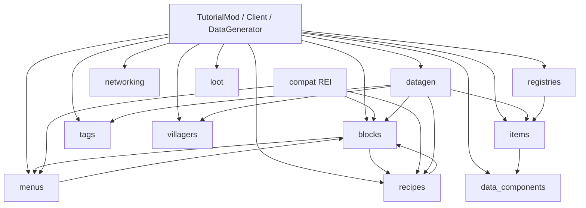

# Comprehensive — Tutorials-By-Kaupenjoe-Fabric-Tutorial-26.X

- Alias: `kaupenjoe`
- Clone: `MarkDown_Maker/Finished_github_clone/2026-07-28/Tutorials-By-Kaupenjoe-Fabric-Tutorial-26.X`
- Stack: Fabric Loader 0.19.3 / Minecraft 26.2 / Fabric API 0.155.2+26.2 / Loom 1.17 / Java 25 — **matches Re-Forestry targets**
- Role for Re-Forestry: **Fabric 26.2 pattern cookbook** (registration, menus/BE, datagen, networking, optional REI). **Not** content to port; **not** a player dependency.
- Inventory: [00-INVENTORY.md](00-INVENTORY.md) · Phase 1: [features/](features/) (18 modules)
- Date: 2026-07-30

---

## What this fork is for Re-Forestry

Kaupenjoe’s `tutorialmod` is a lesson showcase on the **same MC/Fabric generation** as Re-Forestry. Use it when you need a small, readable example of a 26.2 API (e.g. `ExtendedMenuType` + `BlockPos.STREAM_CODEC`, `PayloadTypeRegistry`, `FabricDataGenerator` pack wiring, REI `rei_client` / `rei_common`).

Do **not** copy fluorite/crops/villager lesson content into `reforestry`. Prefer Forestry CE / Immersive Forestry for game design; use Kaupenjoe only for “how does Fabric 26.2 wire X?”

Re-Forestry already uses several of the same hooks (`ExtendedMenuType` via `FeatureMenuType`, `ExtendedMenuProvider` on `TileForestry`, `fabric-datagen`, JEI `jei_mod_plugin`). Kaupenjoe is the **minimal** reference when debugging those APIs or comparing REI vs JEI shapes.

---

## Module map

| Priority | Slug | Package | Size | Why it matters |
|---|---|---|---|---|
| **P0** | [menus](features/menus.md) | `…menu` (+ `custom`) | M | `ExtendedMenuType` + screens; RF machines/alveary GUIs |
| **P0** | [blocks](features/blocks.md) (BE slice) | `…block.entity` (+ `custom`, BER) | M | `BaseEntityBlock`, `FabricBlockEntityTypeBuilder`, `ContainerData`, BER |
| **P0** | [datagen](features/datagen.md) | `…datagen` (+ `recipe`, `villager`) | L | Full `fabric-datagen` provider set + dynamic registry bootstrap |
| **P0** | [networking](features/networking.md) | `…networking` (+ `packet`) | S | `CustomPacketPayload` + `PayloadTypeRegistry` C2S template |
| **P1** | [compat](features/compat.md) | `…compat` (+ `custom`) | S | Optional **REI** plugin shape (`rei_client` / `rei_common`) — RF uses **JEI** today |
| **P1** | [recipes](features/recipes.md) | `…recipe` (+ `custom`) | S | Custom `Recipe` record + `RecipeSerializer`/`RecipeType` + codec |
| **P2** | [items](features/items.md) | `…item` (+ `custom`) + `food` | M | Tool/armor/food registration patterns |
| **P2** | [registries](features/registries.md) | `…registries` | S | Fuel / compostable / brewing Fabric hooks |
| **P2** | [data_components](features/data_components.md) | `…data` | S | Custom item data components |
| **P2** | [tags](features/tags.md) | `…tags` | S | Runtime `TagKey` declarations (pair with datagen providers) |
| **P3** | [loot](features/loot.md) | `…loot` | S | Fabric loot-table modifiers |
| **P3** | [creative_tabs](features/creative_tabs.md) | `…creativemodetab` | S | Creative tab registration |
| **P3** | [sounds](features/sounds.md) | `…sound` | S | Sound event registration |
| **P3** | [effects](features/effects.md) | `…effect` + `potion` | S | Mob effects / potions |
| **P3** | [villagers](features/villagers.md) | `…villager` | S | Profession/POI; trades live under datagen |
| **skip** | [keymapping](features/keymapping.md) | `…keymapping` | S | Client keys — RF low need |
| **skip** | [mixins](features/mixins.md) | `…mixin` | S | Demo mixins only; RF prefers Fabric hooks |
| **skip** | [stats](features/stats.md) | `…stat` | S | Custom stats — optional polish |

Entrypoints (wiring only, not inventory modules): `TutorialMod` (main), `TutorialModClient` (client), `TutorialModDataGenerator` (`fabric-datagen`), plus REI plugins under `compat`.

---

## Dependency graph (lesson packages)

**Cross-cutting demos (study as stacks, not isolated packages):**

| Stack | Modules | Pattern |
|---|---|---|
| **Crystallizer** | blocks → menus → recipes → datagen → compat | Machine BE + progress `ContainerData` + custom recipe + datapack recipes + REI category/display/click-area |
| **Pedestal** | blocks → menus | Single-slot BE (`ContainerSingleItem`) + BER + simple GUI |
| **Villager** | villagers + datagen/`villager` | Runtime profession vs trade/POI **datagen** split |

---

## Cross-cutting Fabric 26.2 patterns

### 1. Menus / screens (P0)

- Register with Fabric **`ExtendedMenuType<>(factory, BlockPos.STREAM_CODEC)`** into `BuiltInRegistries.MENU` — see [features/menus.md](features/menus.md), clone `ModMenuTypes`.
- BE implements **`ExtendedMenuProvider<BlockPos>`**; client factory takes `(syncId, inv, BlockPos)`.
- Client: `MenuScreens.register(type, Screen::new)` in `TutorialModClient`.
- Machine progress: vanilla **`ContainerData`** synced in menu; screen reads scaled progress (crystallizer arrows).
- Screens use 26.2 **`extractBackground(GuiGraphicsExtractor, …)`** (not older `renderBg` naming).

**RF note:** Already dogfoods the same menu stack (`FeatureMenuType`, `TileForestry`). Use Kaupenjoe when a new machine menu needs a minimal reference.

### 2. Block entities / inventory (P0)

- `BaseEntityBlock` + `MapCodec` (`simpleCodec`) for 26.2 block codecs.
- Types via **`FabricBlockEntityTypeBuilder.create(…, block).build()`** — [features/blocks.md](features/blocks.md).
- Tutorial helper **`ImplementedInventory`** (`WorldlyContainer` defaults over `NonNullList`) — teaching aid only; RF already has inventory helpers.
- Pedestal: `ContainerSingleItem.BlockContainerSingleItem` + BER (`PedestalBlockEntityRenderer` / render state).
- Crystallizer: tick craft loop + `ContainerData` progress + `LIT`/`FACING` properties.

### 3. Datagen (P0)

`TutorialModDataGenerator` creates one pack and adds providers — [features/datagen.md](features/datagen.md):

| Provider | Role |
|---|---|
| `ModModelProvider` | Block/item models (`FabricModelProvider`) |
| `ModBlockTagsProvider` / `ModItemTagsProvider` / painting tags | Tags |
| `ModBlockLootTableProvider` | Block loot (+ ore drop helper) |
| `ModRecipeProvider` | Crafting + custom crystallizer recipes |
| `ModRegistryDataProvider` | Dynamic registry dump (`FabricDynamicRegistryProvider`) |
| `ModEquipmentAssetProvider` | Equipment assets |
| `ModSoundsProvider` / `ModAdvancementsProvider` | Sounds / advancements |
| Villager: `ModVillagerTradeTags`, `ModPOITags` | Trade/POI tags |

`buildRegistry(RegistrySetBuilder)` bootstraps paintings, jukebox songs, damage types, villager trades / trade sets.

**RF note:** RF has `ReForestryDataGenerator` + `fabric-datagen`. Steal **provider layout and RegistrySetBuilder habits**, not tutorial asset lists.

### 4. Networking (P0)

Minimal modern Fabric payload lesson — [features/networking.md](features/networking.md):

1. `record TestPayloadC2S(…) implements CustomPacketPayload` with `TYPE` + `StreamCodec.composite(…)`.
2. `PayloadTypeRegistry.serverboundPlay().register(TYPE, STREAM_CODEC)`.
3. `ServerPlayNetworking.registerGlobalReceiver(TYPE, ServerboundPackets::handle…)`.
4. Client send: `ClientPlayNetworking.send(new TestPayloadC2S(…))` (demo keybind).
5. S2C registry hook exists but is empty — extend the same way with `clientboundPlay()`.

**RF note:** Prefer this shape for any new C2S/S2C (GUI sync beyond `ContainerData`, tracker packets, etc.).

### 5. Custom recipes (P1)

- Recipe as **record** with `MapCodec` + `StreamCodec`, `RecipeInput` companion — [features/recipes.md](features/recipes.md).
- Register `RecipeSerializer` + `RecipeType` on `BuiltInRegistries`.
- Datagen emits recipe JSON; BE looks up via recipe manager.

### 6. REI compat (P1 — contrast with RF JEI)

Entrypoints `rei_common` / `rei_client` — [features/compat.md](features/compat.md):

| Side | Class | Hooks |
|---|---|---|
| Common | `TutorialModREICommon` | `CategoryIdentifier`, `DisplaySerializerRegistry`, `ServerDisplayRegistry.beginRecipeFiller(…).fill(…)` |
| Client | `TutorialModREIClient` | `CategoryRegistry.add` + workstations; `ScreenRegistry.registerClickArea` on machine screen |

**RF note:** Re-Forestry ships **JEI** (`jei_mod_plugin`, factory/core JEI categories). Treat REI here as a **parallel optional-plugin shape**, not a switch target unless RF explicitly adds REI later. Do not depend on REI for core play.

### 7. Secondary registration lessons (P2–P3)

- **Items / tools / armor / food** — [features/items.md](features/items.md)
- **Fuels / compostables / brewing** — [features/registries.md](features/registries.md)
- **Data components** — [features/data_components.md](features/data_components.md)
- **TagKey holders** — [features/tags.md](features/tags.md) (values filled in datagen)
- **Loot modifiers** — [features/loot.md](features/loot.md)
- **Creative tabs, sounds, effects/potions, villagers, stats** — low RF urgency unless polishing parity

### 8. Explicit non-goals

- No worldgen / ore / tree / structure lesson in this clone.
- Mixins are demos — RF convention: Fabric API first ([features/mixins.md](features/mixins.md)).
- Soft build deps (REI, Architectury, Cloth) are for the tutorial REI lesson only — **never** add as RF hard depends because of this repo.

---

## Feature inventory (all Phase 1 reports)

| # | Module | Report | RF priority |
|---|---|---|---|
| 1 | blocks | [features/blocks.md](features/blocks.md) | P0 (BE/BER/machine) |
| 2 | items | [features/items.md](features/items.md) | P2 |
| 3 | menus | [features/menus.md](features/menus.md) | P0 |
| 4 | recipes | [features/recipes.md](features/recipes.md) | P1 |
| 5 | datagen | [features/datagen.md](features/datagen.md) | P0 |
| 6 | compat | [features/compat.md](features/compat.md) | P1 (REI pattern only) |
| 7 | networking | [features/networking.md](features/networking.md) | P0 |
| 8 | villagers | [features/villagers.md](features/villagers.md) | P3 |
| 9 | effects | [features/effects.md](features/effects.md) | P3 |
| 10 | sounds | [features/sounds.md](features/sounds.md) | P3 |
| 11 | tags | [features/tags.md](features/tags.md) | P2 |
| 12 | loot | [features/loot.md](features/loot.md) | P3 |
| 13 | creative_tabs | [features/creative_tabs.md](features/creative_tabs.md) | P3 |
| 14 | data_components | [features/data_components.md](features/data_components.md) | P2 |
| 15 | registries | [features/registries.md](features/registries.md) | P2 |
| 16 | keymapping | [features/keymapping.md](features/keymapping.md) | skip |
| 17 | mixins | [features/mixins.md](features/mixins.md) | skip |
| 18 | stats | [features/stats.md](features/stats.md) | skip |

---

## Gaps vs Re-Forestry (pattern level)

| Area | Kaupenjoe shows | Re-Forestry today | Action |
|---|---|---|---|
| Extended menus / BE GUIs | Pedestal + crystallizer minimal path | `FeatureMenuType`, `TileForestry`, factory/alveary screens | Keep RF design; consult Kaupenjoe only for API quirks |
| Datagen breadth | Many provider types + `RegistrySetBuilder` | Has datagen entrypoint; coverage grows with content | Mirror **provider wiring**, not tutorial IDs |
| Networking payloads | One C2S `CustomPacketPayload` | Prefer `ContainerData` / existing sync; payloads as needed | Use Kaupenjoe as template when adding payloads |
| Recipe UI interop | **REI** category/display/click-area | **JEI** plugins under `core/compat/jei`, `factory/compat/jei` | Study shape analogy; stay on JEI unless RF adds REI |
| Inventory helper | `ImplementedInventory` | RF inventory utilities | Do not replace RF helpers with tutorial interface |
| Worldgen | Absent | Arboriculture / apiculture worldgen elsewhere | Do not invent from this repo |
| Content parity | Fluorite, crops, custom villagers | Forestry content from CE/IF | Never port tutorial content |

Cite status tracker: `files/implemented-features.md` (factory GUIs, alveary, JEI, datagen as applicable). This repo does not unlock unfinished Forestry modules.

---

## Recommended study order (not content port order)

1. **menus** + **blocks** (pedestal, then crystallizer BE/`ContainerData`) — machine GUI baseline.
2. **recipes** + crystallizer datagen recipes — custom recipe type end-to-end.
3. **datagen** entrypoint + tags/loot/models providers — expand RF generated data safely.
4. **networking** — when RF needs C2S/S2C beyond menu data.
5. **compat** (REI) — only if designing optional recipe-viewer plugins or comparing to JEI.
6. **registries** / **data_components** / **tags** — as those RF systems need 26.2 refreshers.
7. Skip or skim: keymapping, mixins, stats, effects, villagers (unless RF adds similar content).

Graph follow-ups: `python3 tools/graphify_query.py kaupenjoe "…"`.

---

## Open questions / gaps in Phase 1 reports

Phase 1 module files are largely declaration skims; “Port relevance” stubs are generic. This comprehensive report adds the synthesis. When implementing:

- Prefer MCP `get_file` / clone reads on the crystallizer stack and `TutorialModDataGenerator` over re-reading thin feature stubs.
- Confirm any new 26.2 renames (e.g. screen `extractBackground`) against `Minecraft-26.2` if RF call sites diverge.
- REI API versions in the tutorial build may differ from whatever RF would soft-dep later — re-check REI docs before copying plugin code.
