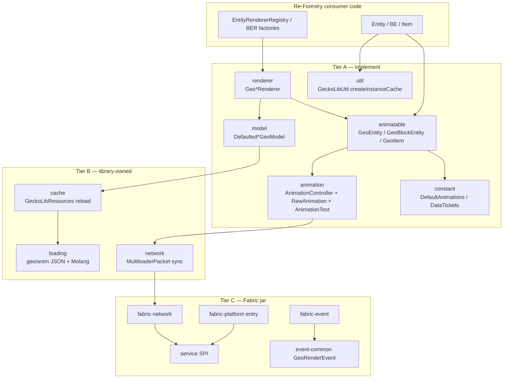

# Comprehensive — bernie-g-geckolib (GeckoLib 5)

- **Alias:** `geckolib`
- **Clone:** `MarkDown_Maker/Finished_github_clone/2026-07-28_18-01-07/bernie-g-geckolib`
- **Graph:** `python3 tools/graphify_query.py geckolib "…"` (scan roots: `common` + `fabric`)
- **Version:** GeckoLib **5.5.3** — MC **26.2**, Java **25**, Fabric Loader 0.19.3
- **Package:** `com.geckolib.*` (not old `software.bernie.geckolib`)
- **Date:** 2026-07-30
- **Inputs:** [00-INVENTORY.md](00-INVENTORY.md) + [features/](features/) (15 modules)
- **Related durable note:** [`queries/geckolib-map.md`](../../queries/geckolib-map.md)

## Verdict for Re-Forestry

GeckoLib is a **ready Fabric soft-dep** for Blockbench / Bedrock-style skeletal animation. Re-Forestry should consume only the **Maven artifact `geckolib-fabric-26.2`**, which ships **`common` API + Fabric glue**. Ignore `forge/` and `neoforge/` entirely.

**Do not add the dependency until a real `GeoEntity` or `GeoBlockEntity` ships.** Today Re-Forestry has no skeletal animatables (boats use vanilla renderers; bees are particles; mill is already `ModelPart`-style). Highest future fit: **butterflies (lepidopterology)**; optional polish: energy engines. Default CE parity path remains `ModelPart` + tick progress.

---

## What this library is

Multiloader animation engine: Blockbench exports `.geo.json` + `.animation.json`; your entity/block/item implements a `Geo*` animatable; GeckoLib loads, bakes, syncs, and renders skeletal keyframes.

| Gradle module | Role for Re-Forestry |
|---|---|
| **`common`** | Almost all consumer API (~257 Java files across inventory packages) |
| **`fabric`** | Entrypoints, Fabric events, Fabric networking, platform SPI impl |
| `forge` / `neoforge` | **Ignore** — other loaders; not in graph scan; never soft-dep |

Maven (when adopting):

```groovy
repositories {
    exclusiveContent {
        forRepository {
            maven {
                name = 'GeckoLib'
                url = 'https://dl.cloudsmith.io/public/geckolib3/geckolib/maven/'
            }
        }
        filter { includeGroupAndSubgroups('com.geckolib') }
    }
}

modImplementation "com.geckolib:geckolib-fabric-26.2:5.5.3"
```

Also add `depends.geckolib` (or optional + `FabricLoader.isModLoaded` if truly optional) in `fabric.mod.json` when adopting. Standalone-adopt rule: this is **intentional interop**, not code copy — depend on the published Fabric jar; do not paste GeckoLib sources into `com.leon1236.reforestry`.

Wiki: https://wiki.geckolib.com (GeckoLib 5). No in-repo examplemod for 26.2 in this clone.

---

## Module map

Fifteen Phase-1 feature units (inventory packages). Layered by how a consumer should think about them:

| Tier | Slugs | Meaning |
|---|---|---|
| **A — implement these** | [animatable](features/animatable.md), [model](features/model.md), [renderer](features/renderer.md), [animation](features/animation.md), [constant](features/constant.md), [util](features/util.md) | Direct consumer surface |
| **B — use indirectly** | [cache](features/cache.md), [loading](features/loading.md), [network](features/network.md) | Library owns reload/bake/sync; call trigger APIs only when needed |
| **C — Fabric wiring** | [service](features/service.md), [fabric-platform](features/fabric-platform.md), [fabric-event](features/fabric-event.md), [fabric-network](features/fabric-network.md), [event-common](features/event-common.md) | Shipped inside the Fabric jar; subscribe to Fabric events only if extending render |
| **D — library internals** | [mixin](features/mixin.md) | Do not copy or reimplement; comes with the dep |



**Note on Phase-1 overlap:** [fabric-platform](features/fabric-platform.md) was inventoried as the whole `fabric/src/main/java/com/geckolib` tree (31 files) and therefore lists types that also belong to [fabric-event](features/fabric-event.md) / [fabric-network](features/fabric-network.md). Treat boundaries as: **platform** = `GeckoLib` / `GeckoLibClient` + `platform/*`; **event** = `event/*`; **network** = `network/GeckoLibNetworkingFabric`.

---

## Soft-dep vs ignore

### Soft-dep (when adopting)

| Artifact / surface | Why |
|---|---|
| `com.geckolib:geckolib-fabric-26.2:5.5.3` | Only published jar Re-Forestry needs |
| Cloudsmith Maven repo | Hosts the artifact |
| `depends.geckolib` (or optional + gated code) | Players need the library at runtime if you compile against it |
| Consumer types in **Tier A** (+ trigger packets from **network** if synced anims) | Your mod code |

### Ignore completely

| Thing | Why |
|---|---|
| `forge/` and `neoforge/` source trees | Wrong loader |
| Forge/NeoForge Maven artifacts | Fabric-only project |
| Copying GeckoLib sources into Re-Forestry | Use published dep; standalone-adopt does not mean vendoring this library |
| [mixin](features/mixin.md) as something to port | Library-internal render/item hooks |
| [loading](features/loading.md) Molang / Gson internals | Automatic once assets exist |
| [cache](features/cache.md) bake types as public API | Prefer `GeoModel` / defaulted helpers |
| `GeoReplacedEntity` / `GeoReplacedEntityRenderer` | No plan to reskin vanilla mobs |
| `GeoArmorRenderer` for apiarist armor | CE is tinted armor items, not geo armor |
| GUI / JEI / genetics screens | Wrong domain |
| Rewriting rainmaker mill or bee particles | Already match CE without GeckoLib |

---

## Consumer surface (what you actually write)

### Animatable contracts — [animatable](features/animatable.md)

| Need | Interface | Notes |
|---|---|---|
| Living / world entity | `GeoEntity` | Extends `GeoAnimatable` |
| Animated machine BE | `GeoBlockEntity` | There is **no** `GeoBlock` — blocks go through block entities |
| Handheld / special item | `GeoItem` | Extends `SingletonGeoAnimatable` |
| Armor | still `GeoItem` + `GeoArmorRenderer` | Not a separate animatable type |
| Vanilla mob skin swap | `GeoReplacedEntity` | **Ignore for Re-Forestry** |
| Root duties | `GeoAnimatable` | `registerControllers` + `getAnimatableInstanceCache` |
| Item client renderer hook | `GeoRenderProvider` | Anonymous class inside item |
| Stateless variants | `StatelessGeo*` | Optional simpler play/stop API |

Cache creation: `GeckoLibUtil.createInstanceCache(this)` from [util](features/util.md).

### Controllers & predicates — [animation](features/animation.md) + [constant](features/constant.md)

| Type | Role |
|---|---|
| `AnimationController` | Named controller + state handler |
| `RawAnimation` | Builder: `begin().thenPlay / thenLoop / thenWait / …` |
| **`AnimationTest`** | Per-frame predicate context (**GeckoLib 5 rename**; old tutorials say `AnimationState`) |
| `PlayState` | CONTINUE / STOP |
| `DefaultAnimations` | Stock loops (`misc.idle`, walk helpers, `genericWalkIdleController`, flying idle, …) |
| `DataTickets` | Typed render/anim data bag |

### Models & assets — [model](features/model.md) + [cache](features/cache.md)

| Helper | Asset subtype folder |
|---|---|
| `DefaultedEntityGeoModel` | `entity/` |
| `DefaultedBlockGeoModel` | `block/` |
| `DefaultedItemGeoModel` | `item/` |
| `GeoModel` | Full custom path override |

Reload roots (library): `assets/<modid>/geckolib/models/**` and `…/geckolib/animations/**` via `GeckoLibResources` (`ANIMATIONS_PATH` / `MODELS_PATH`). Textures stay under normal `textures/…`.

Example for `reforestry:example` entity:

| Asset | Path |
|---|---|
| Model | `assets/reforestry/geckolib/models/entity/example.geo.json` |
| Animations | `assets/reforestry/geckolib/animations/entity/example.animation.json` |
| Texture | `assets/reforestry/textures/entity/example.png` |

Code identifiers are **stripped** (no `geckolib/models/` prefix, no `.geo.json` suffix) → `reforestry:entity/example`.

GeckoLib only auto-registers its **resource reload listener**. Your mod still registers:

- Entities: Fabric `EntityRendererRegistry.register`
- Block entities: `BlockEntityRendererFactories.register`
- Items: `SingletonGeoAnimatable` / `GeoRenderProvider` → `GeoItemRenderer`

### Renderers — [renderer](features/renderer.md)

| Need | Class |
|---|---|
| Entity | `GeoEntityRenderer` |
| Block entity | `GeoBlockRenderer` |
| Item | `GeoItemRenderer` |
| Armor | `GeoArmorRenderer` / `DyeableGeoArmorRenderer` |
| Generic | `GeoObjectRenderer` |
| Vanilla replace | `GeoReplacedEntityRenderer` — ignore |
| Layers | `GeoRenderLayer`, builtins (`AutoGlowingGeoLayer`, `ItemInHandGeoLayer`, …) |

### Network sync — [network](features/network.md) + [fabric-network](features/fabric-network.md)

Common `MultiloaderPacket` records for entity / block-entity / singleton trigger, play, stop. Fabric registers them in `GeckoLibNetworkingFabric`. Use when animation must be triggered from the server; idle/client-local controllers may not need packets.

### Fabric events (optional) — [event-common](features/event-common.md) + [fabric-event](features/fabric-event.md)

`GeoRenderEvent` contracts (CompileRenderLayers / CompileRenderState / Pre) with Fabric `EventFactory` listeners per target (entity, block, item, armor, object, replaced). Only needed to inject layers or cancel/customize pre-render — not for a first butterfly spike.

---

## Cross-cutting systems

| System | Where | Consumer takeaway |
|---|---|---|
| Animatable identity + managers | [animatable](features/animatable.md) | Instanced vs singleton caches; items are singleton/context-aware |
| Controller pipeline | [animation](features/animation.md) | Controllers → processor → bone snapshots → renderer |
| Asset load / bake | [loading](features/loading.md) → [cache](features/cache.md) | Place JSON correctly; library parses Bedrock geo + actor anim + Molang |
| Platform SPI | [service](features/service.md) ↔ fabric-* | Invisible if you only depend on the Fabric jar |
| Render-state injection | [mixin](features/mixin.md) | `GeoRenderState` on vanilla render states — free with dep |
| Sync | [network](features/network.md) | Trigger/stop packets for multiplayer-visible one-shots |

---

## Feature inventory (all modules)

| Slug | Size | Link | Re-Forestry stance |
|---|---|---|---|
| animatable | M | [features/animatable.md](features/animatable.md) | **Use** — `GeoEntity` / maybe `GeoBlockEntity` |
| animation | L | [features/animation.md](features/animation.md) | **Use** — controllers + `AnimationTest` |
| model | S | [features/model.md](features/model.md) | **Use** — `Defaulted*GeoModel` |
| renderer | L | [features/renderer.md](features/renderer.md) | **Use** — `GeoEntityRenderer` (+ block if engines) |
| constant | S | [features/constant.md](features/constant.md) | **Use** — `DefaultAnimations`, tickets |
| util | S | [features/util.md](features/util.md) | **Use** — `GeckoLibUtil.createInstanceCache` |
| cache | M | [features/cache.md](features/cache.md) | Rely on; debug asset paths only |
| loading | L | [features/loading.md](features/loading.md) | Ignore internals; author Blockbench JSON |
| network | M | [features/network.md](features/network.md) | Use only if server-triggered anims |
| service | S | [features/service.md](features/service.md) | Shipped; no direct consumer code |
| event-common | S | [features/event-common.md](features/event-common.md) | Optional render hooks |
| mixin | M | [features/mixin.md](features/mixin.md) | Ignore (library) |
| fabric-platform | S | [features/fabric-platform.md](features/fabric-platform.md) | Soft-dep jar includes this |
| fabric-event | M | [features/fabric-event.md](features/fabric-event.md) | Optional Fabric listeners |
| fabric-network | S | [features/fabric-network.md](features/fabric-network.md) | Soft-dep jar includes this |

---

## Gaps vs Re-Forestry

| Area | Status | Recommendation |
|---|---|---|
| Gradle / `fabric.mod.json` | **No GeckoLib today** | Keep that way until a geo feature starts |
| Butterflies (lepidopterology) | **Not started** (Phase D) | Port CE `ModelPart` wing flap first; consider GeckoLib only for Blockbench polish |
| Energy engines | CE-style BER planned / partial | Prefer `ModelPart` + progress; geo optional |
| Rainmaker mill | **Done** without GeckoLib (`RenderMill` / `TileMill`) | Do not rewrite |
| Bees | Particles (`BeeTravelParticle`) | Stay particles — wrong tool for geo |
| Armor / replaced entities / GUIs | N/A | Out of scope |
| Docs already mapped | [`queries/geckolib-map.md`](../../queries/geckolib-map.md) | Prefer that note over re-researching |

---

## Recommended adoption order (if/when)

1. **Decide at Phase D butterflies** whether CE `ModelPart` is enough. Only then proceed.
2. Add Cloudsmith + `geckolib-fabric-26.2:5.5.3` + `depends.geckolib`.
3. One entity: `GeoEntity` + `GeckoLibUtil.createInstanceCache` + `registerControllers` (`DefaultAnimations` or custom wing loop).
4. Client: `EntityRendererRegistry.register(..., ctx -> new GeoEntityRenderer<>(ctx, type))` with `DefaultedEntityGeoModel`.
5. Blockbench assets under `assets/reforestry/geckolib/...`.
6. Optionally later: `GeoBlockEntity` for fancy engines; Fabric pre-render events / sync packets only if needed.

**Do not** start with armor, replaced entities, or mill rewrite.

---

## Open questions / gaps

- Confirm whether GeckoLib should be a hard `depends` or optional `suggests` + reflection/`isModLoaded` if butterflies must run without it (CE parity without geo argues for **hard dep only when geo assets ship**, else no dep).
- Phase-1 [fabric-platform](features/fabric-platform.md) double-counts fabric event/network files — use the three fabric feature reports as the authoritative split when citing paths.
- No 26.2 examplemod in this clone; rely on wiki + this report + `queries/geckolib-map.md`.

---

## Bottom line

**Soft-dep the Fabric Maven artifact only; ignore Forge/NeoForge.** Consumer work lives in **animatable + model + renderer + animation (+ constant/util)**; everything else is library machinery. Re-Forestry does **not** need GeckoLib yet — map it, keep CE `ModelPart` as default, revisit for butterflies.
