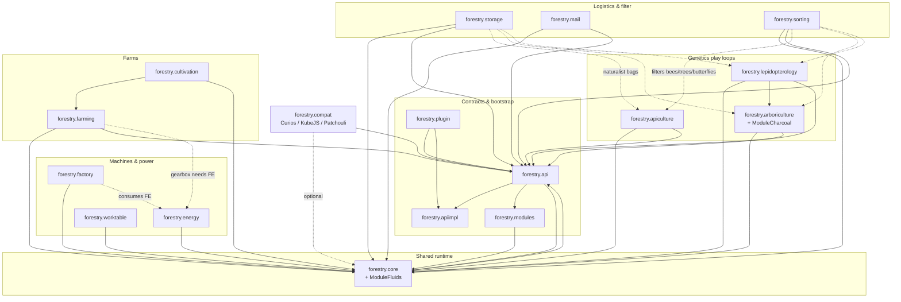

# Comprehensive report — thedarkcolour-ForestryCE (alias CE)

- **Clone:** `/home/ivan/Documents/Kodiranje/Fabric Forestry 26.2/MarkDown_Maker/Finished_github_clone/2026-07-28_16-21-34/thedarkcolour-ForestryCE`
- **Graph alias:** `CE`
- **Stack:** Forge 47.4.0 / Minecraft 1.20.1 (`forestryVersion` 2.10.2)
- **Inventory:** [00-INVENTORY.md](00-INVENTORY.md)
- **Feature reports:** [features/](features/)
- **Synthesized:** 2026-07-30
- **Inputs used:** inventory + all 17 feature reports; light `graphify_query.py CE` + Module `getModuleDependencies` skim only (no full re-clone walk)
- **Re-Forestry status cited from:** [`files/implemented-features.md`](../../files/implemented-features.md), [`queries/module-completeness-audit.md`](../../queries/module-completeness-audit.md)

---

## 1. Module map + package dependency graph

### 1.1 Top-level packages (content modules)

| Package | Size (Java) | Feature report | Role |
|---|---|---|---|
| `forestry.api` | 317 | [features/api.md](features/api.md) | Public contracts (genetics, climate, modules, multiblock, capabilities, tags) |
| `forestry.apiimpl` | 35 | [features/apiimpl.md](features/apiimpl.md) | Runtime API dogfood (`ForestryApiImpl`, plugin registrars, client genetics UI) |
| `forestry.modules` | 31 | [features/modules.md](features/modules.md) | Module manager + `Feature*` registration framework |
| `forestry.plugin` | 15 | [features/plugin.md](features/plugin.md) | Default content: species/taxonomies/woods/farms |
| `forestry.core` | 487 | [features/core.md](features/core.md) | Shared tiles/GUI/genetics/fluids/circuits/multiblock/network; hosts **fluids** module |
| `forestry.apiculture` | 193 | [features/apiculture.md](features/apiculture.md) | Bees, hives, alveary, effects, worldgen |
| `forestry.arboriculture` | 180 | [features/arboriculture.md](features/arboriculture.md) | Trees/woods/leaves/fruit/worldgen; hosts **charcoal** |
| `forestry.factory` | 97 | [features/factory.md](features/factory.md) | Processing machines + recipes + JEI |
| `forestry.farming` | 84 | [features/farming.md](features/farming.md) | Multiblock farm + crop logics |
| `forestry.mail` | 71 | [features/mail.md](features/mail.md) | Letters, stamps, mailbox, trade station |
| `forestry.lepidopterology` | 49 | [features/lepidopterology.md](features/lepidopterology.md) | Butterflies/moths entities + genetics |
| `forestry.energy` | 37 | [features/energy.md](features/energy.md) | Engines + solar FE production |
| `forestry.worktable` | 34 | [features/worktable.md](features/worktable.md) | Memorized crafting station |
| `forestry.sorting` | 33 | [features/sorting.md](features/sorting.md) | Genetic filter machine |
| `forestry.cultivation` | 30 | [features/cultivation.md](features/cultivation.md) | Managed/manual planters (reuse farm logics) |
| `forestry.storage` | 29 | [features/storage.md](features/storage.md) | Backpacks + crates |
| `forestry.compat` | 27 | [features/compat.md](features/compat.md) | Curios / KubeJS / Patchouli hooks |

**Nested module IDs** (not separate top-level packages — see inventory notes):

| Module id | Lives under | Report to read |
|---|---|---|
| `fluids` | `forestry.core` (`ModuleFluids`) | [features/core.md](features/core.md) |
| `charcoal` | `forestry.arboriculture` (`ModuleCharcoal`) | [features/arboriculture.md](features/arboriculture.md) |
| `curios` | `forestry.compat` (`ModuleCurios`) | [features/compat.md](features/compat.md) |

### 1.2 Declared module dependencies (`getModuleDependencies`)

Most modules declare **no** hard deps. Explicit edges from Module classes:

| Module | Depends on |
|---|---|
| `cultivation` | `core`, `farming` |
| `lepidopterology` | `core`, `arboriculture` |

All others (`core`, `fluids`, `apiculture`, `arboriculture`, `charcoal`, `factory`, `energy`, `farming`, `mail`, `storage`, `sorting`, `worktable`, `curios`) declare empty dependency lists — they still **import** `api` / `core` heavily at the Java level.

### 1.3 Mermaid — package / module graph

Solid arrows = structural / declared deps. Dotted arrows = strong gameplay coupling without declared module deps.

### 1.4 Layering (how CE is meant to be read)

1. **`api`** — contracts only (no blocks/items).
2. **`modules` + `apiimpl` + `plugin`** — registration machinery and default species/farm data.
3. **`core`** — shared implementation (GUI base, tiles, genetics engine, multiblock framework, packets, fluids, circuits).
4. **Content modules** — feature packages that register via `@ForestryModule` and `FeatureProvider`.
5. **`compat`** — optional third-party (Curios spectacles slot, KubeJS genetics scripting, Patchouli processors).

---

## 2. Cross-cutting systems

### 2.1 Genetics

**Contracts** live under `forestry.api.genetics` (+ species-type packages under `api.apiculture.genetics`, `api.arboriculture.genetics`, `api.lepidopterology.genetics`) — see [features/api.md](features/api.md).

**Runtime** is centered in `forestry.core.genetics` (alleles, chromosomes, mutation helpers, `IndividualHandlerItem` capability, breeding trackers) — [features/core.md](features/core.md).

**Registration pipeline:**

| Stage | Where | Report |
|---|---|---|
| Plugin entry | `IForestryPlugin` / `DefaultForestryPlugin` | [features/plugin.md](features/plugin.md) |
| Builders / registrars | `apiimpl.plugin.*` (`SpeciesBuilder`, `BeeSpeciesBuilder`, `MutationsRegistration`, …) | [features/apiimpl.md](features/apiimpl.md) |
| Default data | `DefaultBeeSpecies`, `DefaultTreeSpecies`, `DefaultButterflySpecies`, taxonomies | [features/plugin.md](features/plugin.md) |
| Species types | `BeeSpeciesType`, tree type in arboriculture, `ButterflySpeciesType` | apiculture / arboriculture / lepidopterology reports |
| Client analyzer pages | `BeeAnalyzerPlugin`, `TreeAnalyzerPlugin`, `ButterflyAnalyzerPlugin` + `AnalyzerScreenGraphics` | plugin + apiimpl |

**Three species roots in CE:** bees, trees, butterflies (`ForestrySpeciesTypes`). Filter rules and naturalist backpacks key off these.

**Capabilities (Forge):** `ForestryCapabilities.INDIVIDUAL_HANDLER_ITEM`, plus armor/filter caps — [features/api.md](features/api.md).

### 2.2 Energy

| Piece | Package | Notes |
|---|---|---|
| Production | `forestry.energy` | Peat / biogas / combustion / clockwork / solar engines + solar panel — [features/energy.md](features/energy.md) |
| Storage helper | `ForestryEnergyStorage` + `EnergyHelper` | Forge `EnergyStorage` wrapper with NBT/stream sync |
| Consumption | Factory tiles, alveary fan/heater, farm gearbox | Content modules; no hard `ENERGY` module dep |
| Upgrades | `CircuitEngineUpgrade` / machine circuits in core+factory | Shared circuit sockets |

CE wires **FE production** in ModuleEnergy and **FE consumption** elsewhere. Re-Forestry already consumes FE (Team Reborn) in factory/alveary but has no engines yet ([`files/implemented-features.md`](../../files/implemented-features.md) Phase 6 deferred / Next up F-energy).

### 2.3 GUI

Shared GUI stack in **`forestry.core.gui`** (+ ledgers, slots, widgets) — [features/core.md](features/core.md):

- Base screens/containers for Forestry tiles (`GuiForestry`, liquid tanks, socketed containers).
- Ledgers: climate, power, hints, farm, errors.
- Soldering iron GUI for circuit boards.

Per-module GUIs mirror this pattern:

| Module | Typical GUI surface | Report |
|---|---|---|
| Apiculture | Apiary, bee house, alveary variants | [features/apiculture.md](features/apiculture.md) |
| Factory | 9 machine GUIs (+ rainmaker no GUI) | [features/factory.md](features/factory.md) |
| Energy | Peat / biogas / combustion engine screens | [features/energy.md](features/energy.md) |
| Farming | `GuiFarm` + farm ledger | [features/farming.md](features/farming.md) |
| Cultivation | `GuiPlanter` | [features/cultivation.md](features/cultivation.md) |
| Mail | Letter, mailbox, trader, stamp collector, catalogue | [features/mail.md](features/mail.md) |
| Storage | Backpack / naturalist backpack | [features/storage.md](features/storage.md) |
| Sorting | Genetic filter + species/rule widgets | [features/sorting.md](features/sorting.md) |
| Worktable | Memorized recipe screen | [features/worktable.md](features/worktable.md) |

### 2.4 Multiblock

**API:** `forestry.api.multiblock` — alveary/farm component + controller interfaces, tile base — [features/api.md](features/api.md).

**Framework:** `forestry.core.multiblock` — registry, rectangular controller, validation, world registry, tick/event handlers — [features/core.md](features/core.md).

**Consumers:**

| Structure | Package | Key types | Report |
|---|---|---|---|
| Alveary 3×3×3 | `apiculture.multiblock` | `AlvearyController`, `TileAlveary*` (plain, fan, heater, hygro, sieve, stabiliser, swarmer) | [features/apiculture.md](features/apiculture.md) |
| Farm | `farming.multiblock` | `FarmController`, hydration/fertilizer managers, `InventoryFarm` | [features/farming.md](features/farming.md) |

Cultivation planters are **single-block** machines that reuse farm housing APIs — not full multiblocks ([features/cultivation.md](features/cultivation.md)).

### 2.5 Networking

Central ids/registry in **`forestry.core.network`** (`PacketIdClient` / `PacketIdServer`, streamable GUI packets) — [features/core.md](features/core.md). Modules register extra packets via `IPacketRegistry` on `IForestryModule`.

Approximate packet Java counts (clone skim):

| Area | ~Java files under `*/network` |
|---|---|
| Core | 23 |
| Mail | 9 |
| Apiculture | 5 |
| Worktable | 5 |
| Factory | 4 (incl. JEI recipe-transfer) |
| Sorting | 4 |
| Arboriculture | 3 |

Notable packet themes: GUI stream sync, letter/PO-box/trader info, worktable memory/recipe transfer, genetic filter rule/genome changes, factory JEI transfer.

### 2.6 Other shared systems (brief)

| System | Home | Used by |
|---|---|---|
| Climate | `api.climate` + `core.climate` | Bees, farms, planters, alveary climatisers |
| Circuits / sockets | `api.circuits` + `core.circuits` | Factory machines, engines, farm logic boards |
| Feature registration | `modules.features.Feature*` | Every content module |
| Fluids | `core.fluids` (`ModuleFluids`) | Factory, hygroregulator, engines (biogas), mail stamps recipes |
| Owner / errors | `core.owner`, `core.errors` | Housings, machines |
| JEI | Per-module `*JeiPlugin` under content packages | Factory, apiculture, farming, charcoal, mail, storage, worktable, … |
| Villagers | `apiculture.villagers`, `arboriculture.villagers` | Apiarist / arborist |

---

## 3. Feature inventory (links to per-module reports)

| # | Slug | Report | Size | One-line |
|---|---|---|---|---|
| 1 | api | [features/api.md](features/api.md) | L (317) | Public Forestry API surface |
| 2 | apiimpl | [features/apiimpl.md](features/apiimpl.md) | S (35) | API implementations + plugin registrars + analyzer graphics |
| 3 | modules | [features/modules.md](features/modules.md) | S (31) | Module manager + FeatureBlock/Item/Group framework |
| 4 | plugin | [features/plugin.md](features/plugin.md) | S (15) | Default species, taxonomies, woods, farms, analyzer plugins |
| 5 | core | [features/core.md](features/core.md) | L (487) | Shared content + genetics + GUI + multiblock + fluids + network |
| 6 | apiculture | [features/apiculture.md](features/apiculture.md) | L (193) | Bees, hives, alveary, effects, worldgen, villagers |
| 7 | arboriculture | [features/arboriculture.md](features/arboriculture.md) | L (180) | Trees, woods, fruit, charcoal, boats, worldgen |
| 8 | factory | [features/factory.md](features/factory.md) | M (97) | 10 processing machines + recipes + JEI |
| 9 | farming | [features/farming.md](features/farming.md) | M (84) | Multiblock farm controller + crop logics |
| 10 | cultivation | [features/cultivation.md](features/cultivation.md) | M (30) | Managed/manual planters |
| 11 | energy | [features/energy.md](features/energy.md) | M (37) | Engines + solar FE generation |
| 12 | mail | [features/mail.md](features/mail.md) | M (71) | Postal system + trade stations |
| 13 | storage | [features/storage.md](features/storage.md) | M (29) | Backpacks + crates |
| 14 | sorting | [features/sorting.md](features/sorting.md) | M (33) | Genetic filter |
| 15 | worktable | [features/worktable.md](features/worktable.md) | S (34) | Memorized crafting table |
| 16 | lepidopterology | [features/lepidopterology.md](features/lepidopterology.md) | M (49) | Butterflies/moths |
| 17 | compat | [features/compat.md](features/compat.md) | S (27) | Curios, KubeJS, Patchouli |

**Inventory index:** [00-INVENTORY.md](00-INVENTORY.md).

---

## 4. Gaps vs Re-Forestry

Status baseline: [`files/implemented-features.md`](../../files/implemented-features.md) (last updated 2026-07-29) and [`queries/module-completeness-audit.md`](../../queries/module-completeness-audit.md).

### 4.1 Matrix

| CE module | Re-Forestry today | Rough parity | Notes |
|---|---|---|---|
| **core** (+ fluids) | Partial | ~70% | Track A items + genetics/climate/multiblock/fluids/circuits done; **desk analyzer, escritoire, naturalist chests** missing |
| **apiculture** | Mostly done | ~80% | Housing, alveary, hives, breeding playable; **~16 DummyBeeEffect**, jubilance/specialties, tracker-on-mate gaps |
| **arboriculture** (+ charcoal) | Phase 5 **done** | ~95% | Polish only: 11.9c pollen bridge, 11.9h arborist villager (needs `tree_chest`) |
| **factory** | Phase 6 **done** | ~96% | All 10 machines + JEI; deferred recipe-transfer packets, some carpenter outputs gated on other modules, visual polish |
| **storage** | B0 shell only | ~5% | API + empty module; backpacks/crates not playable |
| **mail** | Not started | 0% | Track C |
| **worktable** | Not started | 0% | Track W |
| **energy** | Not started | 0% | Debug FE only; no engines |
| **farming** | Not started | 0% | Needs multiblock farm shape + logics |
| **cultivation** | Not started | 0% | Hard-depends on farming in CE |
| **sorting** | Not started | 0% | Needs genetics filter API |
| **lepidopterology** | Not started | 0% | Blocked on genetics plugin P0 |
| **curios** | Not started (optional) | 0% | Helmet spectacles already work (A5) |
| **api / apiimpl / plugin / modules** | Partial mirror | — | Feature registration + bee/tree plugins exist; full CE genetics façade thinner (see audit Genetics P0) |

### 4.2 Highest-impact remaining CE content (by player value)

1. **Storage backpacks/crates** — CE `ModuleStorage` definitions (miner/digger/forester/hunter/adventurer + naturalist bags + crates) — [features/storage.md](features/storage.md).
2. **Core discovery desks** — analyzer + escritoire + `bee_chest` / `tree_chest` / `butterfly_chest` (core + apiculture surfaces) — [features/core.md](features/core.md), [features/apiculture.md](features/apiculture.md).
3. **Apiculture P0 polish** — remaining bee effects, jubilance, breeding tracker wire — [features/apiculture.md](features/apiculture.md).
4. **Mail** — mailbox, trader, stamps, letters, PO-box packets — [features/mail.md](features/mail.md).
5. **Worktable** — recipe memory + JEI transfer packets — [features/worktable.md](features/worktable.md).
6. **Energy engines** — unlock factory/farm without debug power — [features/energy.md](features/energy.md).
7. **Farming → cultivation** — [features/farming.md](features/farming.md), [features/cultivation.md](features/cultivation.md).
8. **Sorting genetic filter** — [features/sorting.md](features/sorting.md).
9. **Genetics P0 then lepidopterology** — [features/api.md](features/api.md), [features/apiimpl.md](features/apiimpl.md), [features/lepidopterology.md](features/lepidopterology.md).

### 4.3 CE-only / optional (lower priority for Fabric port)

- **KubeJS** scripting surface under `compat.kubejs` — [features/compat.md](features/compat.md).
- **Curios** spectacles slot — optional Trinkets equivalent; A5 helmet already covers play.
- **Patchouli** processors — Re-Forestry A8 stub until Patchouli exists on 26.2.
- **ForestryMC 1.12 restores** (greenhouse, climatology, database, …) — not in CE; tracked separately in the module audit, not in this CE inventory.

---

## 5. Recommended port order (unfinished CE modules)

Aligned with [`files/implemented-features.md`](../../files/implemented-features.md) **Next up** and the module audit. Order is for **CE modules not yet finished** in Re-Forestry (skip completed arboriculture/factory play loops except polish).

| Order | Track | CE modules / reports | Why this next | Exit |
|---|---|---|---|---|
| **1** | B1→B6 | [storage](features/storage.md) (+ [api](features/api.md) storage contracts already started as B0) | Smallish Java, high QoL; B0 landed | Playable backpacks + crates |
| **2a** | Parallel A | [apiculture](features/apiculture.md) P0 | Finish bee play loop while storage lands | Real effects + jubilance + tracker |
| **2b** | Parallel B | [core](features/core.md) chests + analyzer + escritoire | Unlocks discovery + 11.9h villager | Desk analyze + research notes path |
| **3** | W0→W2 | [worktable](features/worktable.md) | Core-only; small; can parallel storage/mail | Memorized crafting + packets |
| **4** | C0→C4 | [mail](features/mail.md) | After storage (stamps/letters craft paths); medium networking | Mailbox + trader playable |
| **5** | F-energy | [energy](features/energy.md) | Factory already consumes FE; remove debug dependency | Engines feed machines |
| **6** | G | [farming](features/farming.md) then [cultivation](features/cultivation.md) | Cultivation declares deps on farming; needs energy for gearbox | Multiblock farm + planters |
| **7** | S | [sorting](features/sorting.md) | After bees/trees mature; soft butterfly later | Genetic filter works |
| **8** | Genetics P0 | [api](features/api.md) + [apiimpl](features/apiimpl.md) + [plugin](features/plugin.md) façade | Blocks third species type + addons | Plugin-registerable species types |
| **9** | D0→D4 | [lepidopterology](features/lepidopterology.md) | Declares arboriculture dep; needs genetics P0 | Butterflies spawn/breed/alyze |
| **10** | Optional | [compat](features/compat.md) Curios→Trinkets | Helmet already works | Optional slot parity |
| **11** | Polish | apiculture/arboriculture/factory JEI & visuals | UX parity after modules land | See implemented-features deferred lists |
| **12** | Addons | Outside CE (Gendustry / Extra Bees / Extra Trees) | After genetics P0 | Separate repos / mapping docs |

**Do not reorder farming before energy** if the goal is a self-contained farm play loop (gearbox wants FE). Cultivation must follow farming.

---

## 6. Annotated summary — what this fork is for Re-Forestry

**Forestry CE (`thedarkcolour-ForestryCE`) is the primary behavioral and structural source of truth for Re-Forestry.**

| Aspect | Meaning for the Fabric port |
|---|---|
| **Role** | Modern (1.20.1 Forge) Forestry — not 1.12 ForestryMC. Prefer CE when CE and 1.12 disagree; use ForestryMC only for content CE dropped. |
| **Shape to mirror** | Package layout `forestry.<module>.*` → `com.leon1236.reforestry.<module>.*`; registry ids `forestry:` → `reforestry:`; FeatureGroup registration style from [features/modules.md](features/modules.md). |
| **API-first habit** | CE keeps contracts in `api`, dogfoods via `apiimpl`/`plugin`. Re-Forestry should keep doing the same (and thicken genetics plugin surface before butterflies/addons). |
| **Already “spent” from CE** | Genetics engine, bees (~80%), trees (~95%), factory (~96%), alveary multiblock, climate, fluids, circuits — see [`files/implemented-features.md`](../../files/implemented-features.md). |
| **Still owed from CE** | Storage, mail, worktable, energy, farming/cultivation, sorting, lepidopterology, core desks/chests, apiculture effect/jubilance polish. |
| **Loader translation** | Forge capabilities → Fabric transfer / custom APIs; Forge energy → Team Reborn `EnergyStorage`; `@Mod` buses → Fabric entrypoints; keep CE *game rules*, not Forge glue. |
| **Nested modules** | Charcoal/fluids/curios are module IDs without top-level packages — Re-Forestry already mirrors fluids-in-core and charcoal-in-arboriculture. |
| **Compat policy** | CE’s Curios/KubeJS/Patchouli are optional. Re-Forestry stays standalone; only intentional soft compat (JEI already, Trinkets later) — see project standalone-adopt rules. |
| **When to open CE** | Porting unfinished modules: start from the linked [features/*.md](features/) report, then MCP `get_file` / `graphify_query.py CE` on the named classes — do not invent paths. |

**Bottom line:** CE is the map of “complete Forestry.” Re-Forestry has finished the genetics-heavy middle (bees, trees, factory). The remaining CE map is mostly **logistics (storage/mail), power (energy), automation (farms/planters/filter), and the third genetics root (butterflies)** — in that practical order.

---

## Appendix — quick reference paths

| Need | Open |
|---|---|
| Module list / sizes | [00-INVENTORY.md](00-INVENTORY.md) |
| Per-module deep dive | [features/](features/) |
| Re-Forestry done list | [`files/implemented-features.md`](../../files/implemented-features.md) |
| Gap matrix / roadmap | [`queries/module-completeness-audit.md`](../../queries/module-completeness-audit.md) |
| Graph queries | `python3 tools/graphify_query.py CE "…"` |
| Clone sources | `MarkDown_Maker/Finished_github_clone/2026-07-28_16-21-34/thedarkcolour-ForestryCE` |
