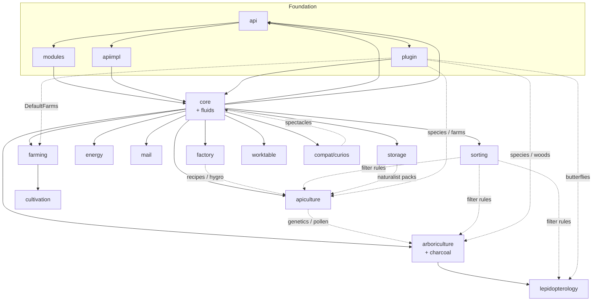

# Immersive Forestry — Comprehensive Module Map

- Repo: `thedarkcolour-Immersive-Forestry`
- Alias: **IF**
- Clone: `MarkDown_Maker/Finished_github_clone/2026-07-24/thedarkcolour-Immersive-Forestry`
- Stack: NeoForge 21.1.x / Minecraft **1.21.1** / Java 21 / mod `forestry` **2.10.7**
- Inputs: [`00-INVENTORY.md`](00-INVENTORY.md) + [`features/`](features/) (17 modules)
- Re-Forestry status cross-check: `files/implemented-features.md`, `queries/module-completeness-audit.md`
- Date: 2026-07-30

**What IF is:** unofficial NeoForge 1.21.1 fork of Forestry CE. Same mod id `forestry` (replacement for CE, not side-by-side). Baseline goal = CE parity on 1.21.1; Immersive-named machines/IE integration are documented and **deferred**.

**How to use this doc for Re-Forestry:** treat **CE** as the primary content/behavior source; use **IF** when you need a CE-shaped codebase already moved onto post-1.20 NeoForge APIs (capabilities, holders, events, recipes). Do not depend on IF as a player/runtime library.

---

## 1. Module map

| # | Slug | Package | ~Java | Size | Role | IF module id(s) | Re-Forestry today |
|---|---|---|---:---|---|---|---|---|
| 1 | api | `forestry.api` | 309 | L | Public contracts (genetics, climate, modules, farming, mail, storage, caps, tags) | — (library) | Partial — dogfooded under `com.leon1236.reforestry.api` |
| 2 | apiimpl | `forestry.apiimpl` | 35 | S | `IForestryApi` / client API / plugin registrars | — | Partial — genetics/plugin façade incomplete |
| 3 | modules | `forestry.modules` | 32 | S | Module manager + `Feature*` registration framework | — | Done (Phase 2) — Fabric-shaped |
| 4 | plugin | `forestry.plugin` | 15 | S | Default `IForestryPlugin`: taxonomies, species, farms, woods | — | Partial — bees/trees wired; butterflies/farms missing |
| 5 | core | `forestry.core` | 462 | L | Shared tiles/GUI/network/fluids/genetics/circuits/multiblock/datagen | `core`, `fluids` | Partial (~70%) — Track A + fluids + multiblock; desk systems missing |
| 6 | apiculture | `forestry.apiculture` | 188 | L | Bees, hives, alveary, frames, effects, villagers | `apiculture` | Mostly done (~80%) — effects/jubilance/tracker gaps |
| 7 | arboriculture | `forestry.arboriculture` | 180 | L | Trees, wood, leaves, charcoal, boats, worldgen | `arboriculture`, `charcoal` | Done (~95%) — polish deferred |
| 8 | factory | `forestry.factory` | 94 | M | Carpenter, centrifuge, fermenter, still, squeezer, bottler, fabricator, moistener, rainmaker, **raintank**, … | `factory` | Done (~96%) — 10 machines; **no raintank** yet |
| 9 | farming | `forestry.farming` | 84 | M | Multifarm multiblock + farm logics / farmables | `farming` | Not started |
| 10 | cultivation | `forestry.cultivation` | 30 | S | Planter machines (depend on farming) | `cultivation` | Not started |
| 11 | energy | `forestry.energy` | 30 | S | Peat / biogas / clockwork (+ related) engines | `energy` | Not started (debug FE only) |
| 12 | mail | `forestry.mail` | 74 | M | Letters, stamps, mailbox, traders, carriers | `mail` | Not started (Track C) |
| 13 | storage | `forestry.storage` | 29 | S | Backpacks + crates | `storage` | In progress — B0 API shell |
| 14 | sorting | `forestry.sorting` | 33 | S | Genetic filter block + filter logic | `sorting` | Not started |
| 15 | worktable | `forestry.worktable` | 34 | S | Worktable + recipe memory | `worktable` | Not started |
| 16 | lepidopterology | `forestry.lepidopterology` | 49 | M | Butterflies, cocoons, serum, AI | `lepidopterology` | Not started (Track D) |
| 17 | compat | `forestry.compat` | 30 | S | Curios / JEI helpers / KubeJS / Patchouli processors | `curios` (+ soft JEI/KubeJS/Patchouli) | Partial JEI only; Curios/Patchouli/KubeJS not ported |

**Nested content modules inside other packages (same inventory unit):**

| Content module id | Lives under feature report | Notes |
|---|---|---|
| `fluids` | core (`ModuleFluids`) | Re-Forestry already folds fluids into `core.fluids` |
| `charcoal` | arboriculture (`ModuleCharcoal`) | Re-Forestry charcoal is inside arboriculture (11.9d) |
| `curios` | compat (`ModuleCurios`) | Optional; spectacles already work as helmet (A5) |

Out of scope (inventory): root `Forestry.java` bootstrap, build/CI, docs tooling, phase-two Immersive machines (sawmill, resin tapper, biomass fermenter, mechanical feller), Immersive Engineering integration.

---

## 2. Module dependency graph

Declared edges from `getModuleDependencies()` / `BlankForestryModule` default:

- `BlankForestryModule` → **`core`** (almost every content module)
- `ModuleCore` → **none** (overrides blank default)
- `ModuleCultivation` → **`core` + `farming`**
- `ModuleLepidopterology` → **`core` + `arboriculture`**
- `ModuleCurios` → **`core`** (+ mod dependency `curios`)

Everything else that extends `BlankForestryModule` (apiculture, arboriculture, charcoal, factory, farming, energy, mail, storage, sorting, worktable, fluids) effectively depends only on **`core`**. Soft edges (API/plugin/compat) are compile/runtime coupling, not module-loader deps.



Solid arrows = loader / hard module deps. Dotted = soft content coupling useful for port order.

---

## 3. Cross-cutting systems

These cut across many feature reports; port once, reuse everywhere.

| System | Where it lives in IF | Re-Forestry notes |
|---|---|---|
| **Public API + registries** | `api` (`IForestryApi`, genetics, climate, multiblock, farming, mail, storage, `ForestryCapabilities`, tags) | Mirror under `reforestry.api`; keep contracts stable for addons |
| **API impl / plugin registrars** | `apiimpl` (`ForestryApiImpl`, `PluginManager`, species builders) | Needed for butterflies + Gendustry-shaped addons; genetics P0 still open |
| **Module + Feature registration** | `modules` (`ForestryModuleManager`, `FeatureBlockGroup`, …) | Already ported; Fabric uses direct `Registry.register` |
| **Default content plugin** | `plugin` (`DefaultForestryPlugin`, taxonomies, analyzer plugins) | Bees/trees present; farm + butterfly registration still IF/CE reference |
| **Genetics engine** | `api.genetics` + `core.genetics` + species types in content modules | Shared mating/mutations done for bees/trees; butterfly species type not started |
| **Climate** | `api.climate` + `core.climate` | Done for apiculture housing |
| **Multiblock** | `api.multiblock` + `core.multiblock` (+ alveary / farm controllers) | Framework + alveary done; farm multiblock not started; Fabric chunk-unload save already solved |
| **Circuits / sockets** | `api.circuits` + `core.circuits` + factory/farm consumers | Factory sockets done (F15); farm circuit logics still IF-only |
| **Fluids** | `ModuleFluids` + `core.fluids` + factory tanks | Done via Fabric transfer (`F4`/`F4c`) |
| **Energy** | NeoForge energy caps in IF; `ModuleEnergy` engines | Re-Forestry uses Team Reborn `EnergyStorage`; engines not ported |
| **Capabilities / sided I/O** | IF: NeoForge `RegisterCapabilitiesEvent` / `BlockCapability` | Fabric: transfer API + energy API — rewrite, don’t copy NeoForge types |
| **GUI / ledgers / menus** | `core.gui` + per-module `gui` | Pattern established; mail/farm/sorting/worktable/storage still needed |
| **Network packets** | `core.network` + module packet packages | Per-module packets still to port with each feature |
| **JEI** | Per-module `*JeiPlugin` + `compat.jei` helpers | Factory + core descriptions exist; bees/trees/mail/farm JEI incomplete |
| **Datagen** | Heavy under `core.data` | Prefer extract scripts / existing datapack; don’t port NeoForge datagen wholesale |
| **Villagers** | Apiculture + arboriculture villager packages | Blocked on naturalist chests (`bee_chest` / `tree_chest`) |
| **Optional soft deps** | Patchouli (hard in IF), JEI, KubeJS, Curios | Re-Forestry: Patchouli stub (A8); JEI optional; Curios→Trinkets later |

---

## 4. Feature report index

| Feature | Report | One-line surface |
|---|---|---|
| api | [features/api.md](features/api.md) | Public Forestry API (~309 types): genetics, climate, modules, farming, mail, storage, capabilities |
| apiimpl | [features/apiimpl.md](features/apiimpl.md) | `ForestryApiImpl`, genetic/client managers, plugin registrars/builders |
| modules | [features/modules.md](features/modules.md) | Module loader + feature registry (`FeatureBlockGroup`, fluids, tiles, menus) |
| plugin | [features/plugin.md](features/plugin.md) | Default species taxonomies, farms, woods, analyzer client plugins |
| core | [features/core.md](features/core.md) | Shared machines/items, climate, circuits, fluids, genetics utils, GUI, network, multiblock, datagen |
| apiculture | [features/apiculture.md](features/apiculture.md) | Beekeeping logic, alveary multiblock, hives, effects, housing GUI, villagers |
| arboriculture | [features/arboriculture.md](features/arboriculture.md) | Tree genetics, wood families, leaves/pods, charcoal, boats, worldgen, villagers |
| factory | [features/factory.md](features/factory.md) | All factory tiles/recipes/GUIs/JEI; includes **raintank** + rainmaker |
| farming | [features/farming.md](features/farming.md) | Multifarm controller, farm logics, farmables, hatch/gearbox/valve tiles |
| cultivation | [features/cultivation.md](features/cultivation.md) | Planter block types + tiles (arboretum, bog, crops, …) |
| energy | [features/energy.md](features/energy.md) | Engine blocks/tiles (peat, biogas, clockwork) + FE helpers |
| mail | [features/mail.md](features/mail.md) | Letters, stamps, mailbox, traders, PO box, carriers, packets |
| storage | [features/storage.md](features/storage.md) | Backpack definitions/items/menus, crates, pickup/resupply |
| sorting | [features/sorting.md](features/sorting.md) | Genetic filter tile, allele/species rules, filter packets |
| worktable | [features/worktable.md](features/worktable.md) | Worktable tile, recipe memory, JEI transfer packets |
| lepidopterology | [features/lepidopterology.md](features/lepidopterology.md) | Butterfly entity/AI, cocoons, species type, filter rules |
| compat | [features/compat.md](features/compat.md) | Curios spectacles, KubeJS genetics hooks, Patchouli processors, JEI utils |

Phase 1 reports are annotated inventories (surfaces, package trees, source maps). For behavior depth, follow each report’s graphify hint: `python3 tools/graphify_query.py IF "<module>"`.

---

## 5. Gaps vs Re-Forestry

Aligned with `files/implemented-features.md` (2026-07-29) and `queries/module-completeness-audit.md`.

### Already strong vs IF/CE

| Area | Status |
|---|---|
| Module/feature registration | Done |
| Apiculture play loop + alveary | Mostly done |
| Arboriculture + charcoal | Done (polish only) |
| Factory machines (10) + fluids + circuits sockets | Done |
| Climate + multiblock framework | Done |

### Missing / thin vs IF module surface

| IF module | Gap vs IF | Priority for Re-Forestry |
|---|---|---|
| **storage** | Only B0 API; no backpacks/crates/GUI/pickup | **P0** (current track) |
| **core** desk systems | No `analyzer`, `escritoire`, naturalist chests | **P0** (unlocks discovery + villagers) |
| **apiculture** polish | ~16 `DummyBeeEffect`, jubilance/specialties, tracker-on-mate | **P0** parallel |
| **mail** | Entire module | **P1** after storage |
| **worktable** | Entire module | **P1** (can parallel) |
| **energy** | Engines (peat/biogas/clockwork/…) | **P1** (replace debug FE) |
| **farming** | Multifarm multiblock + logics | **P1** |
| **cultivation** | Planters (needs farming) | **P2** after farming |
| **sorting** | Genetic filter | **P2** after genetics mature |
| **lepidopterology** | Entire module (needs genetics P0 + arboriculture) | **P2** |
| **plugin / apiimpl** | Butterfly + farm registration façade incomplete | **P0** before butterflies/addons |
| **factory** delta | **Raintank** present in IF; not in Re-Forestry 10-machine set | Optional catch-up |
| **compat** | Curios / Patchouli / KubeJS | Low — optional; spectacles helmet already works |
| **arboriculture** polish | Vanilla/default leaf pollen (11.9c); arborist villager (11.9h) | Deferred polish |

### Explicitly out of Re-Forestry baseline (also deferred in IF)

Phase-two Immersive machines (industrial sawmill, resin tapper, biomass fermenter, mechanical tree feller) and Immersive Engineering integration — do **not** schedule as CE-parity work.

---

## 6. Suggested port order (Re-Forestry)

Order follows IF loader deps + current Re-Forestry roadmap, not IF’s own NeoForge port chronology.

```text
[done] modules → api/core skeleton → genetics → apiculture → arboriculture(+charcoal) → factory(+fluids)

1. storage B1–B6          (in progress; BlankForestryModule → core only)
2. core desk P0           analyzer + escritoire + naturalist chests
3. apiculture P0 polish   effects / jubilance / breeding tracker
4. worktable              parallel with (2)/(3)
5. mail                   Track C after storage items exist for crafts
6. energy engines         FE without debug block
7. farming                multiblock + logics
8. cultivation            after farming
9. genetics P0 façade     apiimpl/plugin completeness for 3rd species type
10. sorting               genetic filter (uses bee/tree/butterfly rules)
11. lepidopterology       after (9) + arboriculture
12. compat polish         JEI categories; optional Trinkets spectacles; Patchouli when available
13. addons                Gendustry → Extra Bees → Extra Trees
```

**Rule of thumb:** if IF declares `CORE` only, you can land the module once core APIs it touches exist. Prefer CE Java for gameplay logic; open IF when CE still uses removed Forge 1.20 patterns and you need the modernized call shape (then rewrite again to Fabric).

---

## 7. How IF differs from CE for porting

| Topic | Forestry CE | Immersive Forestry | Re-Forestry takeaway |
|---|---|---|---|
| Loader / MC | Forge 1.20.1 | NeoForge 21.1 / **1.21.1** | Neither is Fabric 26.2 — both need rewrite; IF is closer to modern registry/event shape |
| Mod id | `forestry` | `forestry` (CE replacement) | Our id stays `reforestry`; never soft-depend on either jar |
| Content goal | Upstream CE | **CE parity first**; Immersive machines deferred | Use IF as “CE on 1.21,” not as a new content pack |
| Capabilities | Forge `ICapabilityProvider` / `LazyOptional` era | NeoForge `RegisterCapabilitiesEvent`, `BlockCapability`, plain accessors | Map to Fabric transfer + Team Reborn energy; don’t import NeoForge types |
| Registration | Older `RegistryObject` assumptions | `DeferredHolder` + feature registry cleaned for 1.21 | Keep existing Re-Forestry `Feature*` Fabric registration |
| Events / ticks | Forge bus variants | NeoForge `LevelTickEvent`, `ItemEntityPickupEvent`, standalone `@EventBusSubscriber` | Prefer Fabric API events / lifecycle |
| Energy | Forge Energy | NeoForge energy capabilities on engines/farms/alveary | Already on Team Reborn FE in alveary/factory |
| Fluids | Forge fluid helpers | NeoForge `FluidUtil` Optional APIs + BuiltInRegistries | Already on Fabric transfer tanks |
| Recipes / datagen | 1.20 FinishedRecipe-style | 1.21 holder/lookup-aware providers | Prefer JSON datapacks + extract scripts |
| Docs book | Patchouli | Patchouli **required** | A8 stub until Patchouli exists for 26.2 |
| Factory surface | CE machine set | Same + still carries **raintank** in code/parity matrix | Optional later machine; not blocking |
| Compat | JEI etc. | JEI + KubeJS + Curios module + Patchouli processors | Optional only; adopt ideas into `compat/`, no donor `depends` |
| Maturity | Stable CE reference | Builds/datagen/server smoke green; **client gameplay parity not fully proven** | Trust CE for “what the game should do”; use IF for “how CE was updated” |

**Practical lookup order when porting a class:**

1. Local Re-Forestry (`graphify` / `src`) — don’t duplicate.
2. **CE** — behavior and ids.
3. **IF** — only if CE call sites are obsolete on modern MC, or you need 1.21-shaped NBT/components/capability registration patterns.
4. Fabric API / Minecraft-26.2 — final API.

---

## 8. External dependencies (IF runtime)

| Dep | Role |
|---|---|
| NeoForge 21.1.x | Required loader |
| Patchouli | Required (book) |
| JEI | Optional recipe UI |
| KubeJS | Optional scripting (`compat.kubejs`) |
| Curios | Optional spectacles slot (`ModuleCurios`) |
| Immersive Engineering | Explicitly **not** a dependency; no copied IE code |

Re-Forestry must not add NeoForge/Curios/Patchouli as hard deps just because IF has them.

---

## 9. Sources & follow-ups

- Inventory: [`00-INVENTORY.md`](00-INVENTORY.md)
- Per-module: [`features/*.md`](features/)
- Graph: `python3 tools/graphify_query.py IF "…"`
- Re-Forestry tracker: `files/implemented-features.md`
- Module gap matrix: `queries/module-completeness-audit.md`

**Open from Phase 1 reports (shared):** deepen behavioral contracts with graphify `--path` / `--explain` at port time; when IF and CE diverge on a call site, document the chosen Fabric mapping in `queries/` rather than inventing.

---

*Synthesized from Phase 0 inventory + Phase 1 feature reports only (no full re-clone exploration, no `src/` edits).*
