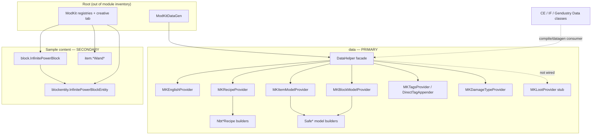

# Comprehensive — thedarkcolour-ModKit (alias `modkit`)

- Clone: `MarkDown_Maker/Finished_github_clone/2026-07-24/thedarkcolour-ModKit`
- Stack: Forge 1.20.1-47.0.3 / Minecraft 1.20.1
- Inventory: [00-INVENTORY.md](00-INVENTORY.md)
- Phase 2 date: 2026-07-30
- Graph: `python3 tools/graphify_query.py modkit "…"`

## Verdict for Re-Forestry

**Pattern reference only — never a runtime or Gradle dependency.**

ModKit is thedarkcolour’s small “less boilerplate” Forge library. Re-Forestry care about it almost entirely as the **datagen DSL that CE / IF / Gendustry already speak**. Reading `data` explains why Forestry recipe/tag/lang providers look terse (`recipes.slab(...)`, `ingredient(...)`, multi-registry `createTags`). Sample content (`infinite_power`, fill/clear/clone/distance/kill wands) is secondary demo tooling and is already covered or irrelevant for Forestry gameplay.

Standalone-adopt rule applies: copy ideas into `com.leon1236.reforestry.*` / Fabric datagen helpers; do **not** add ModKit to `fabric.mod.json` or Gradle.

---

## Module map

| Priority | Slug | Size | Role | Feature report |
|---|---|---|---|---|
| **P0 — primary reuse** | [data](features/data.md) | L (~2980 LOC, 19 files) | Datagen facade + recipe/tag/model/lang/damage helpers | Main library surface |
| P2 — secondary sample | [item](features/item.md) | M (~494 LOC) | Creative fill/clear/clone/distance/kill wands | Dev tools only |
| P3 — already covered | [block](features/block.md) | S | `InfinitePowerBlock` host | Creative energy cube |
| P3 — already covered | [blockentity](features/blockentity.md) | S | FE push-all-sides BE | Creative energy tick |

**Out of inventory scope (still useful wiring context):** root `ModKit.java`, `ModKitDataGen.java`, `MKUtils.java`; testmod under `src/test/.../testmod` (canonical `DataHelper` consumer); Gradle / generated resources / hand textures.

Nested under `data` only (not separate modules): `data.loot`, `data.model`, `data.recipe`.

---

## Primary reuse — `data` datagen helpers

Full detail: [features/data.md](features/data.md).

### Why this matters

Forestry CE (and IF / Gendustry) wire GatherData through ModKit’s `DataHelper`. Porting CE data JSON/providers without understanding this layer means guessing what `ForestryRecipeProvider` macros expand to. Re-Forestry’s `ReForestryDataGenerator` is still an empty Fabric entrypoint — when recipe/tag/lang bulk work starts, ModKit is the **behavioral map**, Fabric API / Kaupenjoe 26.X are the **implementation vehicle**.

### Public facade (`DataHelper`)

| Call | Side | Purpose |
|---|---|---|
| `createEnglish(generateNames, Consumer)` | client | `en_us`; optional auto-names from registry paths |
| `createModonomiconBooks(...)` | client | Optional external book providers (callback only; no Modonomicon dep) |
| `createItemModels(3dBlockItems, 2dItems, spawnEggs, Consumer)` | client | Templates + optional registry auto-models |
| `createBlockModels(Consumer)` | client | Blockstates/models; can fill missing item models; **register before item models** |
| `createRecipes(BiConsumer)` | server | `MKRecipeProvider` DSL |
| `createTags(ResourceKey, Consumer/BiConsumer)` | server | One provider per registry |
| `createDamageTypes(Consumer)` | server | `damage_type` JSON via codec |

Contract: each `create*` once per `DataHelper` (`checkNotCreated`). Author logic stays in consumer-mod static methods; providers hold callbacks.

### Recipe DSL highlights (`MKRecipeProvider`)

- Shaped / shapeless with flexible `Object...` ingredients (`ItemLike`, `TagKey`, `Ingredient`, `RegistryObject`, FastUtil count pairs).
- Wood-set / grid / cooking / netherite smithing macros.
- Auto `unlockedByHaving` when criterion omitted.
- `pushWriter` / `conditional` / `renameRecipes` (Forge `ConditionalRecipe` — **do not port as-is**).
- Optional result NBT via `NbtShapedRecipeBuilder` / `NbtShapelessRecipeBuilder` (1.20.1 item-NBT era → remap to **data components** on MC 26.2).

### Tags / lang / models

- `DirectTagAppender`: fluent `add(T)` / `Supplier` / keys; Forge remove/replace; item←block `copy`.
- Auto English: path → spaces → capitalize; manual overrides win.
- Auto item models: BlockItem → `block/<path>`; tools handheld; spawn eggs; else `item/generated`.
- `Safe*` builders: log missing texture/parent and still emit JSON (Forge `ExistingFileHelper` trick — Fabric model gen differs).

### Loot

`MKLootProvider` is an **unwired stub**. Ignore for Re-Forestry; follow CE’s own loot provider when porting loot, via Fabric loot datagen.

### Adopt vs discard (patterns only)

| Adopt into local Fabric helpers | Discard / rewrite |
|---|---|
| Wood-set / slab / grid / cooking recipe macros | Forge `GatherDataEvent`, `RegistryObject`, `ConditionalRecipe` |
| Flexible ingredient varargs + auto-unlock | Reflection into `LanguageProvider` private map |
| Optional auto lang from registry paths | NBT-on-result crafting JSON as-is |
| Block→item tag copy | Safe* + `ExistingFileHelper` tolerance |
| Callback-style providers (author logic outside subclasses) | Modonomicon hook; ModKit JAR dependency |
| Separate datagen class not referenced from mod init | Hard runtime soft-dep patterns that still classload ModKit |

Fabric parallels: `FabricRecipeProvider`, `FabricTagProvider`, `FabricLanguageProvider`, `FabricModelProvider`, block loot providers (see Kaupenjoe tutorial reports).

---

## Secondary — sample tools

### Creative energy (`block` + `blockentity`)

Reports: [block](features/block.md) · [blockentity](features/blockentity.md)

- One block `modkit:infinite_power` + BE that pushes `Integer.MAX_VALUE` FE to all six neighbor caps each server tick; self is extract-only infinite `IEnergyStorage`.
- Likely capability bug: `getCapability` gates on `this.remove &&` (probably meant `!remove`).
- **Re-Forestry already has the role:** `BlockCreativeEnergy` / `TileCreativeEnergy` (`reforestry:debug_creative_energy`) with Team Reborn `InfiniteEnergyStorage` + capped `PUSH_RATE_PER_TICK` (10k). Prefer that; do not port Forge capabilities.

### Dev wands (`item`)

Report: [item](features/item.md)

| Id | Role |
|---|---|
| `fill_wand` | Sneak-pick `BlockState`, two corners → fill |
| `clear_wand` | Two corners → air |
| `clone_wand` | Sneak save structure; click paste |
| `distance_wand` | Two clicks → inclusive XYZ span |
| `kill_wand` | Instant kill (no XP; slimes sized to 0) |

Shared `AbstractFillWand`: stack NBT `StartPos` / `FillBlock`, in-memory per-`Player` undo, bow-charge confirm. **Low product priority** for Forestry. If ever needed as in-dev helpers: migrate stack NBT → data components; key undo by UUID (not `Player` instance); add region size limits. No current Re-Forestry mirror.

---

## Feature inventory (links)

| # | Module | One-line | Re-Forestry action | Link |
|---|---|---|---|---|
| 1 | data | Datagen facade + MK* providers | **Primary pattern source** for CE data ports; local Fabric helpers only | [features/data.md](features/data.md) |
| 2 | item | Five creative wands | Optional later; patterns only | [features/item.md](features/item.md) |
| 3 | block | Infinite-power EntityBlock | Skip — creative energy exists | [features/block.md](features/block.md) |
| 4 | blockentity | FE flood BE | Skip — TR Energy creative tile exists | [features/blockentity.md](features/blockentity.md) |

---

## Cross-cutting (repo-level)

| Topic | Where | Note |
|---|---|---|
| Registration | Root `ModKit` | DeferredRegister for sample block/BE/items; not a reusable registry API |
| Datagen entry | `ModKitDataGen` + testmod `DataGen` | Tiny demo vs full consumer example |
| CE coupling | Outside this repo | CE `forestry.core.data.Data` etc. call `DataHelper` — treat ModKit as the glossary for those call sites |
| Energy | blockentity only | Forge FE; Re-Forestry uses Team Reborn / Fabric transfer |
| Networking / GUI / genetics | — | None in ModKit |
| Assets | Hand textures + generated models/lang | Sample branding only |

---

## Recommended use order (for Re-Forestry work)

1. **When reading CE/IF/Gendustry data classes** — open [features/data.md](features/data.md) + ModKit `DataHelper` / `MKRecipeProvider` / `MKTagsProvider` to decode macros (no code copy yet).
2. **When filling `ReForestryDataGenerator`** — implement Fabric providers; steal **macro shapes** (wood sets, unlocks, tag copy, auto lang) as local helpers under `com.leon1236.reforestry` (or datagen package), not as a ModKit dep.
3. **When CE recipes use result NBT** — inventory those recipes first; design 26.2 component-aware serializers/datagen before copying `Nbt*RecipeBuilder`.
4. **Skip** infinite power + wands unless you explicitly want ModKit-parity creative tools (energy already done).

---

## Gaps / open questions (rolled up)

1. Invest in a small shared Fabric datagen utility package **now**, or wait until CE recipe/tag ports force duplication?
2. Which CE craft results still need ModKit-style **result NBT** vs plain items?
3. Keep Re-Forestry datagen in a class never referenced from mod init (safer optional split) vs CE’s always-on `@Mod.EventBusSubscriber` style?
4. `MKLootProvider` forever stub? (Assume yes — use CE loot provider as source of truth.)
5. Modonomicon callback: live API or dead surface?
6. Infinite-power `getCapability` `this.remove &&` — bug vs intentional? Irrelevant if not porting.
7. Wand undo tip vs sneak-clear mismatch; Player-keyed undo fragility — only if porting wands.

---

## Explicit non-goals

- Adding ModKit to Gradle / `depends` / `recommends`
- Shipping ModKit sample items/blocks in Re-Forestry
- Porting Forge Energy / capabilities / `ConditionalRecipe` / `ExistingFileHelper` Safe* builders verbatim
- Treating generated ModKit resources as content to copy

**Bottom line:** ModKit = **CE datagen Rosetta stone**. Primary file: [features/data.md](features/data.md). Everything else is demo toolbox.
