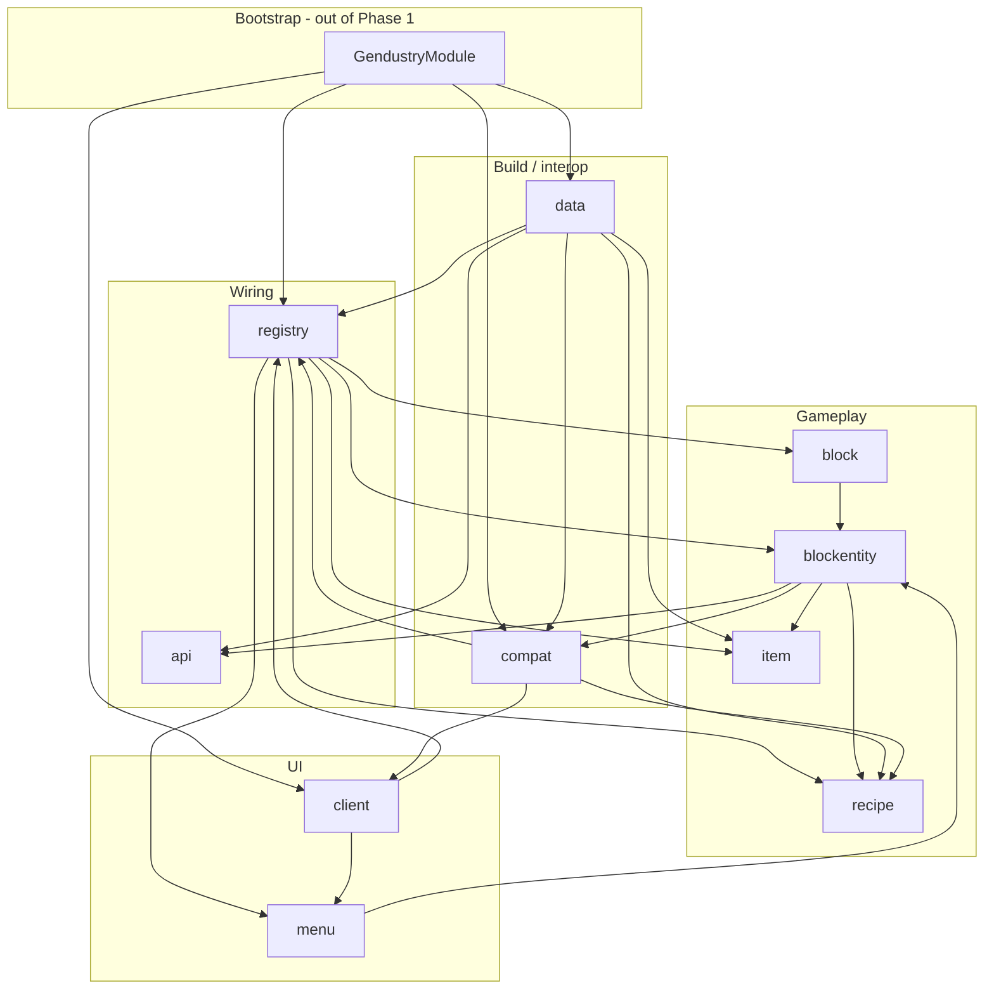
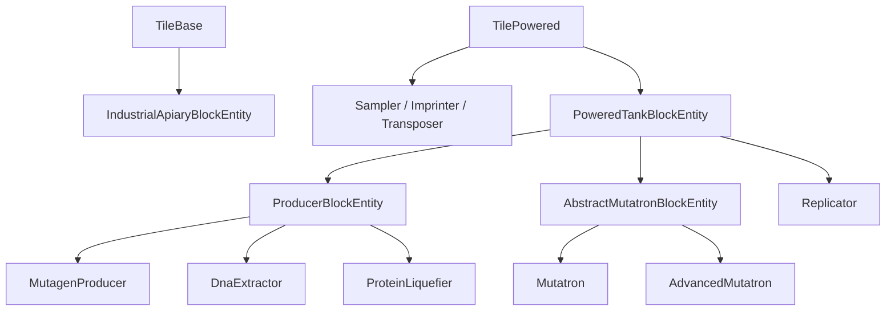

# Comprehensive — thedarkcolour-gendustry

- **Alias:** `gendustry`
- **Clone:** `MarkDown_Maker/Finished_github_clone/2026-07-24/thedarkcolour-gendustry`
- **Loader / MC:** Forge 47.4.0 / Minecraft 1.20.1 (gendustry 1.0.5)
- **Graph:** `MarkDown_Maker/graphify/thedarkcolour-gendustry/graphify-out/` (~1104 nodes)
- **Inputs:** [00-INVENTORY.md](00-INVENTORY.md) + [features/](features/)
- **Date:** 2026-07-30
- **Re-Forestry status:** **Not started** — planned built-in toggleable module `reforestry:gendustry` ([files/addon-integration-mapping.md](../../files/addon-integration-mapping.md))

---

## What this fork is for Re-Forestry

Modern Gendustry (thedarkcolour) is already a **Forestry CE addon module** (`@ForestryModule` id `gendustry:core`), not a Binnie-style genetics rewrite. It is the **primary source** for a near-mechanical port of the genetic-manipulation machine line into Re-Forestry as a built-in module.

| Takeaway | Detail |
|---|---|
| Shape match | Same `FeatureBlockGroup` / `FeatureTileType` / menu / screen pattern as CE factory & apiculture — RF already ports that stack |
| Content | 10 machines, 3 fluids, gene samples/templates, 23 industrial-apiary upgrades, custom processor recipes + caches |
| Adopt rule | Copy into `com.leon1236.reforestry.gendustry.*` — **no** player dependency on the Gendustry jar |
| Overlap with Binnie | Prefer this machine set over 1.12 Binnie `genetics` machines (serums/isolator) unless that classic loop is explicitly wanted later |

---

## Machine set (player-facing core)

One block class + one enum; ten registry ids. All tiles live under `blockentity`; GUIs under `menu` + `client.screen`.

| Registry id | Block entity | Role | Energy / cycle (from features) |
|---|---|---|---|
| `gendustry:industrial_apiary` | `IndustrialApiaryBlockEntity` | Powered bee housing; 4 upgrade slots (no frames) | Base 200 FE/t when bees work + upgrade costs |
| `gendustry:mutagen_producer` | `MutagenProducerBlockEntity` | Item → mutagen fluid | 200 ticks, 100k FE/cycle |
| `gendustry:dna_extractor` | `DnaExtractorBlockEntity` | Specimen → liquid DNA (+ labware) | 50 ticks, 80k FE/cycle |
| `gendustry:protein_liquefier` | `ProteinLiquefierBlockEntity` | Food → protein fluid | 100 ticks, 20k FE/cycle |
| `gendustry:sampler` | `SamplerBlockEntity` | Random allele → gene sample | 20 ticks, 20k FE/cycle |
| `gendustry:mutatron` | `MutatronBlockEntity` | Two parents + mutagen → random mutation | 40 ticks, 100k FE/cycle; 1000 mB mutagen |
| `gendustry:advanced_mutatron` | `AdvancedMutatronBlockEntity` | Same; player picks mutation | Same costs + `NO_SELECTION` gate |
| `gendustry:imprinter` | `ImprinterBlockEntity` | Specimen + genetic template → edited individual | 80 ticks, 100k FE/cycle |
| `gendustry:genetic_transposer` | `GeneticTransposerBlockEntity` | Copy gene sample / template | 20 ticks, 50k FE/cycle |
| `gendustry:replicator` | `ReplicatorBlockEntity` | Complete template + DNA + protein → individual | 50 ticks, 200k FE/cycle; 1000 mB each fluid |

**Fluids (registry):** `gendustry:mutagen`, `gendustry:liquid_dna`, `gendustry:protein` (10k tank capacity on machines that use them).

**Items (high level):** resources (labware, processors, blanks, frames…), 17 standard + 6 elite upgrades (`#gendustry:upgrades`), gene sample, genetic template, pollen kit, debug wand.

**Layout families (reuse):**

| Family | Machines | Menu | Screen |
|---|---|---|---|
| Processor | mutagen producer, DNA extractor, protein liquefier | `ProducerMenu` | `ProducerScreen` |
| Three-input | sampler, imprinter, genetic transposer | `ThreeInputMenu` | `ThreeInputScreen` (`sampler.png`) |
| Mutatron | mutatron, advanced mutatron | `MutatronMenu` / `AdvancedMutatronMenu` | `AbstractMutatronScreen` (+ advanced UI) |
| Replicator | replicator | `ReplicatorMenu` | `ReplicatorScreen` |
| Apiary | industrial apiary | `IndustrialApiaryMenu` | `IndustrialApiaryScreen` |

Deep dive: [features/block.md](features/block.md), [features/blockentity.md](features/blockentity.md).

---

## Addon-module shape for `reforestry:gendustry`

Upstream is already the target architecture ([files/addon-integration-mapping.md](../../files/addon-integration-mapping.md)).

### Upstream wiring

```
Gendustry.java (mod entry)
  └─ GendustryModule (@ForestryModule, MODULE_ID = gendustry:core)
       ├─ registerEvents → Data.gatherData (ModKit)
       ├─ registerClientHandler → ClientHandler (MenuScreens)
       └─ FeatureProviders: GBlocks, GItems, GFluids, GBlockEntities, GMenus, GRecipeTypes, GCreativeTabs

GendustryForestryPlugin (IForestryPlugin via META-INF/services)
  └─ registerErrors(GendustryError…)

GendustryJeiPlugin (@JeiPlugin, optional)
  └─ producer categories + gene-sample subtypes + GUI click areas
```

### Recommended Re-Forestry mapping

| Upstream | Re-Forestry target |
|---|---|
| Separate mod `gendustry` | Built-in module under single modid `reforestry` |
| Module id `gendustry:core` | `reforestry:gendustry` (config-togglable when module manager supports disable) |
| Package `thedarkcolour.gendustry.*` | `com.leon1236.reforestry.gendustry.*` |
| Registry ids `gendustry:*` | Prefer `reforestry:*` path equivalents (`reforestry:mutatron`, …) **or** `reforestry:gendustry/...` for tags — decide before datagen |
| `FeatureBlockGroup` / `FeatureTileType` | Existing RF `FeatureGroup` / module registry (same as factory) |
| Extends CE `BlockBase` / `TilePowered` | RF `BlockMachine` / `TilePowered` (+ MapCodec on 26.2) |
| Forge energy / fluid caps | Team Reborn `EnergyStorage` + Fabric Transfer fluids (factory pattern) |
| ModKit datagen | Fabric `DataGeneratorEntrypoint` providers — **no ModKit dependency** |
| `META-INF/services` Forestry plugin | `reforestry:plugin` entrypoint and/or module `init()` error registration |
| `@JeiPlugin` | Optional `jei_mod_plugin` under gendustry compat (mirror `FactoryJeiPlugin`) |

### Public API surface (thin)

Upstream `api/` is **tag-only**: `GendustryTags.Items.UPGRADES` → `gendustry:upgrades`. Upgrade *effects* are hardcoded in `IndustrialApiaryBeeModifier` (not exported). RF may mirror as-is or promote `IGendustryUpgradeType` into `api/` later ([features/api.md](features/api.md)).

### Standalone-adopt checklist

- [ ] No `depends` / compile against Gendustry jar
- [ ] No ModKit / Patchouli required for RF gendustry (Patchouli is upstream dep; RF can skip book or reimplement later)
- [ ] JEI remains optional entrypoint only
- [ ] Assets under `assets/reforestry/...` and `data/reforestry/...` with gendustry-prefixed paths as needed

---

## Module map

Ten Phase-1 packages under `thedarkcolour.gendustry` (108 Java files). Bootstrap `Gendustry` / `GendustryModule` were out of scope for Phase 1 but sit at the hub.

| Slug | Size | Purpose | Feature report |
|---|---|---|---|
| [api](features/api.md) | S | Public upgrade item tag only | `features/api.md` |
| [block](features/block.md) | S | `GendustryMachineBlock` + 10-type enum / tickers | `features/block.md` |
| [blockentity](features/blockentity.md) | L | All machine tiles, inventories, apiary modifier | `features/blockentity.md` |
| [item](features/item.md) | M | Upgrades, samples, templates, resources, pollen kit | `features/item.md` |
| [recipe](features/recipe.md) | M | Processor recipes + caches + genetic template craft | `features/recipe.md` |
| [registry](features/registry.md) | M | Blocks, items, fluids, BEs, menus, recipe types, tabs | `features/registry.md` |
| [menu](features/menu.md) | M | Server containers (8 menu types / layout families) | `features/menu.md` |
| [client](features/client.md) | M | Screen registration + machine GUIs | `features/client.md` |
| [data](features/data.md) | M | Datagen: recipes, lang, models, tags, loot | `features/data.md` |
| [compat](features/compat.md) | M | `GendustryError` + JEI producers / subtypes | `features/compat.md` |

### Dependency graph (packages)



### Tile inheritance (gameplay spine)



---

## Cross-cutting systems

| System | Where it lives | Port note |
|---|---|---|
| **Genetics** | Sampler / imprinter / transposer / mutatron / replicator + gene sample/template items | Needs RF individual handlers, alleles, mutations, breeding tracker — already on RF genetics stack |
| **Energy** | All `TilePowered` + industrial apiary | Map to RF `TilePowered` / `EnergyStorage.SIDED` |
| **Fluids** | Producers, mutatron, replicator + `GFluids` | Fabric Transfer + RF tank helpers (`FluidContainerHelper` pattern) |
| **GUI / ledgers** | `client` + `menu`; hints via `TranslationKeys` / `for.hints.*` | RF already has `ScreenForestry`, power/climate/hint ledgers |
| **Errors** | `compat/forestry/GendustryError` (12) | Implement RF `IError`; register in module init (RF plugin lacks `registerErrors` today) |
| **Recipe caches** | `recipe/cache/*` + `RecipeCacheRegistry` | Reload on recipe manager; same idea as factory recipe lookups |
| **Industrial apiary upgrades** | Tag accept + hardcoded `IndustrialApiaryBeeModifier` | Frames replaced by upgrade slots; climate/energy modifiers |
| **JEI** | Producer categories only; mutatron click → Forestry `MutationRecipe` | Optional; needs RF mutation JEI types for mutatron click area |
| **Networking** | Advanced mutatron button / choice sync; apiary GUI streams | Fabric menus + `ContainerData` / RF streamable GUI patterns |
| **Multiblock** | None | Not applicable |

---

## Feature inventory (links)

1. [api](features/api.md) — `GendustryTags.Items.UPGRADES`; no upgrade-effect API
2. [block](features/block.md) — enum ↔ BE ↔ ticker table; single `GendustryMachineBlock`
3. [blockentity](features/blockentity.md) — full machine contracts, tank/energy, upgrade logic (**L**, primary gameplay)
4. [item](features/item.md) — upgrades, gene sample/template, resources, pollen kit, `GeneSampleInfo` codec
5. [recipe](features/recipe.md) — mutagen/protein/dna recipes, genetic template crafting, caches
6. [registry](features/registry.md) — `GBlocks` / `GItems` / `GFluids` / `GBlockEntities` / `GMenus` / `GRecipeTypes` / tabs
7. [menu](features/menu.md) — layout-family containers; advanced mutatron choice buttons
8. [client](features/client.md) — eight screens; shared processor/three-input layouts
9. [data](features/data.md) — ModKit datagen; all balance numbers and EN lang
10. [compat](features/compat.md) — errors + JEI producers / gene-sample subtypes

---

## Gaps vs Re-Forestry

| Gap | Notes |
|---|---|
| **No `gendustry` package in `src/`** | Entire addon still to land |
| Module toggle | Upstream always-on addon mod; RF wants config-disableable `reforestry:gendustry` (module-manager config addition from mapping doc) |
| Forge → Fabric | Caps → Transfer/Energy; `FriendlyByteBuf` menus → 26.2 sync; `MapCodec` on machine blocks |
| ModKit | Datagen must be rewritten to Fabric providers — pattern only, no dependency |
| Patchouli | Upstream mandatory; RF can defer guidebook |
| Upgrade API | Tag-only; effects hardcoded — decide whether to expand for addons |
| Gene sample storage | Upstream NBT; RF should use data components + genetics ids |
| JEI mutation click | Depends on RF apiculture exposing mutation recipe types |
| Hint registration | CE static `HINTS` map vs RF `ForestryHints` / properties |
| Unused GUI art | Extra PNGs (`extractor.png`, etc.) unused by Java — parity vs cleanup decision |
| Dead code | `ApiaryModifiers` unused — safe to omit |
| Energy tooltip unit | Upstream says “RF”; align with RF energy wording |
| Incomplete mutagen recipes | TODO yellorium/uranium in datagen — optional mod-compat later |

RF already has analogues for the **machine shell**: factory tiles, `TileBeeHousing` / beekeeping logic, JEI factory plugin, hint/power/climate ledgers, `FeatureGroup` registration.

---

## Recommended port order

Ordered for dependency safety and early playable slices. Mirror suggestions from inventory + blockentity/client/data reports.

### Phase A — Skeleton (no machines yet)

1. **Module + registry shell** — `ModuleGendustry`, `GendustryBlocks`/`Items`/`Fluids`/`Tiles`/`Menus`/`RecipeTypes` empty or enum-wired stubs ([registry](features/registry.md), [block](features/block.md))
2. **api tags** — `GendustryTags` / `#reforestry:…/upgrades` ([api](features/api.md))
3. **Errors** — `GendustryError` + sprites/lang ([compat](features/compat.md))
4. **Items** — resources, blank sample/template, upgrade enums/items, pollen kit ([item](features/item.md))
5. **Recipes + caches** — mutagen / protein / dna types + `GeneticTemplateRecipe` ([recipe](features/recipe.md))
6. **Datagen slice** — `TranslationKeys`, EN hints/errors, crafting + processor recipes, tags ([data](features/data.md))

### Phase B — Fluid producers (simplest machines)

7. `PoweredTankBlockEntity` + `ProducerBlockEntity` family: mutagen producer → protein liquefier → DNA extractor
8. Matching `ProducerMenu` / `ProducerScreen` + tank/energy ledgers
9. JEI producer categories (optional but low risk once recipes exist)

### Phase C — Genetics three-input line

10. Sampler → Genetic Transposer → Imprinter (shared slot layout / `ThreeInputScreen`)
11. Gene sample / template data-component behavior must be solid before imprinter/replicator

### Phase D — Mutation + replication

12. Abstract mutatron + Mutatron → Advanced Mutatron (choice UI last)
13. Replicator (dual tanks + complete-template gate)

### Phase E — Industrial apiary (largest cross-cut)

14. Industrial apiary tile + inventory + `IndustrialApiaryBeeModifier` + client tick / health bar
15. Upgrade tag filtering + climate/energy ledger polish

### Phase F — Polish

16. Full loot/models/lang locales; Patchouli or in-game hints parity; mutation JEI click area; config module toggle

**Do not start with industrial apiary or advanced mutatron UI** — they need genetics, power, upgrades, and menu sync already working.

---

## External dependencies (upstream vs RF)

| Upstream | RF approach |
|---|---|
| Forge + Forestry CE (mandatory) | Internal RF modules only |
| Patchouli (mandatory upstream) | Defer / optional |
| JEI (optional) | Soft `jei_mod_plugin` |
| ModKit (datagen) | Fabric datagen — pattern only |
| Curios (gradle prop only; no package) | Ignore |

---

## Open decisions (carry forward)

1. Final registry/tag namespace: flat `reforestry:mutatron` vs nested `reforestry:gendustry/...`
2. Expand public upgrade API vs mirror tag-only surface
3. Whether unused per-machine GUI textures are adopted
4. Mod-compat mutagen inputs (yellorium/uranium analogues)
5. Replicator always-ignoble bees — keep for balance parity
6. Register errors via extended `IForestryPlugin` vs module `init()` only

---

## Source anchors

| Path | Role |
|---|---|
| `…/GendustryModule.java` | Forestry module hub (`gendustry:core`) |
| `…/block/GendustryMachineType.java` | Ten-machine enum + tickers |
| `…/blockentity/*` | Gameplay |
| `…/registry/G*.java` | Feature registration |
| `…/data/Recipes.java` | Authoritative balance / recipe list |
| `…/compat/forestry/GendustryError.java` | Machine error enum |
| `…/compat/jei/GendustryJeiPlugin.java` | Optional JEI |

Graphify check: BFS from `GendustryModule` reaches all `G*` registries, `ClientHandler`, `Data`, recipe caches, and `GendustryForestryPlugin` (alias `gendustry`).

---

*Phase 2 synthesizer — assembled from inventory + ten feature reports only; no `src/` edits.*
